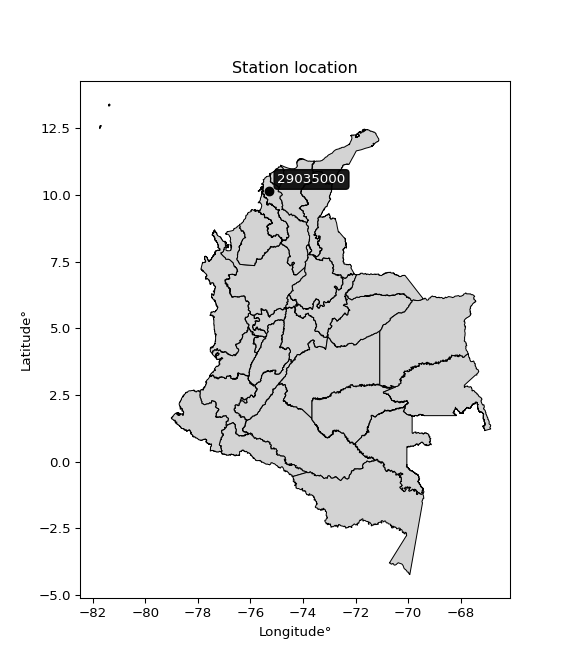

<div align="center">


</div>

# PMP Station (Rain, Pmax24h): 29035000

Probable Maximum Precipitation (PMP) is the greatest amount of rainfall for a specific duration that is meteorologically possible for a given location, acting as a "worst-case" scenario for extreme storms, crucial for designing safety-critical infrastructure like bridges, river deviations, dams, spillways, and nuclear plants to prevent catastrophic failure. PMP is calculated by hydrologists using meteorological data to determine the upper limit of extreme rainfall, often leading to the Probable Maximum Flood (PMF) for flood control design, and is increasingly being studied for climate change impacts. Probable Maximum Precipitation (PMP) is the theoretical upper limit of rainfall, a deterministic estimate for extreme events, while probability distributions (like GEV, Gumbel) describe the likelihood and frequency of various precipitation amounts, including rare ones, showing how often events occur, with PMP representing the extreme end of these distributions, used for critical infrastructure design to ensure safety against the worst conceivable weather, unlike standard statistical forecasts which cover typical probabilities.

The most common probability distributions in hydrology, used for analyzing floods, rainfall, and streamflow, include the Normal, Log-Normal, Gumbel, Gamma (including Log-Pearson Type III), and Generalized Extreme Value (GEV) distributions, often chosen based on the data´s skewness and whether modeling extremes or general conditions, with Gumbel and GEV popular for extreme events like floods, while the Normal distribution serves as a baseline, though often requiring transformations for skewed hydrological data. These distributions help in designing water infrastructure, managing water resources, and forecasting hydrologic events.

> Hydrological data often isn´t perfectly normal (it´s skewed), so different distributions are needed for different applications, such as: **Flood Frequency Analysis**: Using Gumbel, GEV, or Log-Pearson Type III for predicting extreme flood magnitudes and their return periods, **Rainfall Analysis**: Normal for annual totals, but Log-Normal, Weibull, or GEV for intensity or extreme daily rainfall, **Streamflow Modeling**: Gamma and Log-Normal for maximum flows, GEV for minimum flows, and Kappa for daily flows.

<div align="center">

</img>

</div>


## A. General information


### 1. General running parameters

• app_version: _v20260108_. • runtime: _2026-01-08 18:05:13.093906_. • Python version: _3.14.0_. • SciPy version: _1.16.3_. • Pandas version: _2.3.3_. • NumPy version: _2.3.5_. • Stations dataset (station_dataset_file): _dataset/pmax24h_in/automatic_colombia_2003_2024.csv_. • Stations catalog (station_catalog_file): _dataset/CNE.xls_. • Minimum year to eval til year_max (date_min): _1900_. • Maximum year to eval since year_min (date_max): _2024_. • Creates, save and include plots into reports (create_plot): _False_. • Plot only fit distributions with Δo > Δ (plot_only_fit): _True_. • Plot only simple graphs avoiding multiple CDFs and multiple Extreme values plots (plot_only_simple): _False_. • Eval low extreme values, if False, evaluates high extreme values (low_extreme): _False_. • Eval every SciPy distribution as logarithmic (pdist_logarithmic_on): _True_. • Standard deviation normalized (ddof): _1.0_. • Return periods to eval in years (Tr): _[2, 2.33, 5, 10, 15, 20, 25, 50, 75, 100, 200, 250, 500, 750, 1000]_. • Minimum data sample per station, 0 means any (minimum_sample): _5_. • Z-Score maximum threshold to adjust a value, 0 means disable (zscore_max): _3.5_. • Z-Score minimum threshold to adjust a value, 0 means disable (zscore_min): _-2.5_. • Avoid zeros, e.g. rain = 0 (avoid_zeros): _True_. • Avoid null values (avoid_nans): _True_. 

:file_folder:Table: [dataset.csv](../../dataset/pmax24h_in/automatic_colombia_2003_2024.csv)

> Delta Degrees of Freedom (DDOF): is a parameter used in the formulas for calculating variance and standard deviation. When ddof=0, the divisor is $N$ (the total number of observations) and this is used when your data set is the entire population. When ddof=1, the divisor is $N-1$ and this is used when your data set is a sample drawn from a larger population. Using $N-1$ provides an unbiased estimate of the population variance (known as Bessel´s correction).


### 2. Station info and location

|   id |   CODIGO | NOMBRE                     | CATEGORIA               | TECNOLOGIA                              | ESTADO   | FECHA_INSTALACION   |   FECHA_SUSPENSION |   ALTITUD |   LATITUD |   LONGITUD | DEPARTAMENTO   | MUNICIPIO   | AREA_OPERATIVA                              | ENTIDAD                                                     | AREA_HIDROGRAFICA   | ZONA_HIDROGRAFICA   | SUBZONA_HIDROGRAFICA             |   CORRIENTE | Catalogo   |   Version |
|-----:|---------:|:---------------------------|:------------------------|:----------------------------------------|:---------|:--------------------|-------------------:|----------:|----------:|-----------:|:---------------|:------------|:--------------------------------------------|:------------------------------------------------------------|:--------------------|:--------------------|:---------------------------------|------------:|:-----------|----------:|
|    0 | 29035000 | SINCERIN  - AUT [29035000] | Climatológica Principal | Automática con Telemetría, Convencional | Activa   | 05/05/2013          |                nan |        10 |   10.1426 |   -75.2783 | Bolivar        | Arjona      | Area Operativa 02 - Atlántico-Bolivar-Sucre | INSTITUTO DE HIDROLOGIA METEOROLOGIA Y ESTUDIOS AMBIENTALES | Magdalena Cauca     | Bajo Magdalena      | Canal del Dique margen izquierda |         nan | CNE_IDEAM  |  20251226 |

<div align="center">

Dynamic map: [:earth_americas:Google](http://maps.google.com/maps?q=10.14258333,-75.27827778) [:earth_americas:OSM](https://www.openstreetmap.org/#map=18/10.14258333/-75.27827778&layers=P) [:earth_americas:Bing](https://www.bing.com/maps?cp=10.14258333~-75.27827778&lvl=18) [:earth_americas:Apple](https://maps.apple.com/frame?center=10.14258333%2C-75.27827778&span=0.003%2C0.006)

</div>


<div align="center">

```geojson
{
  "type": "Feature",
  "geometry": {
    "type": "Point", 
    "coordinates": [-75.27827778, 10.14258333]
  }, 
  "properties": {
    "Name": "29035000"
  }
}
```

</div>


### 3. Discrete values table and plot

<div align="center">

|               |          0 |           1 |           2 |           3 |          4 |           5 |           6 |
|:--------------|-----------:|------------:|------------:|------------:|-----------:|------------:|------------:|
| Date          | 2017       | 2018        | 2019        | 2020        | 2021       | 2022        | 2024        |
| Value         |  557.02    |   79.7      |   54.2      |   94.8      |  604       |   36.3      |  108.4      |
| Value_initial |  557.02    |   79.7      |   54.2      |   94.8      |  604       |   36.3      |  108.4      |
| count         |    7       |    7        |    7        |    7        |    7       |    7        |    7        |
| mean          |  219.203   |  219.203    |  219.203    |  219.203    |  219.203   |  219.203    |  219.203    |
| std           |  248.356   |  248.356    |  248.356    |  248.356    |  248.356   |  248.356    |  248.356    |
| zscore        |    1.36022 |   -0.561706 |   -0.664381 |   -0.500906 |    1.54938 |   -0.736456 |   -0.446146 |


</div>


> The initial value (value_initial) correspond to the initial obtained or null completed value, and value (value) is adjusted only when the initial value is outside the valid range (outlier) definite through the Z-Score value. If Z-Score is active, values out of range or outliers are replaced with the station mean value. A Z-Score (or standard score) measures how many standard deviations a data point is from the mean of a dataset, indicating its relative position; positive scores mean above the mean, negative mean below, and a score of zero is exactly at the mean, allowing for comparison of values from different distributions. It´s calculated using the formula $z=(x–μ)/σ$, where $x$ is the data point, $μ$ is the mean, and $σ$ is the standard deviation, helping identify outliers and understand probability.
>
> <sub>**Note**: In this study, "completing" (filling gaps in) and "extending" (forecasting or lengthening the historical record) rainfall data series are avoided for certain critical analyses because they introduce artificial bias and uncertainty, which can distort the statistics of rare events (extremes), alter day-to-day variability, and compromise the integrity and homogeneity of the original data. Some reasons against Completing/Extending rainfall data are: **Distortion of Extremes and Variability**: The primary issue is that most gap-filling or extension methods rely on averaging or regression with nearby stations, which inherently smooths the data. Rainfall is highly variable in space and time, with a large percentage of zero values and occasional large storms. Infilling methods often underestimate the highest values and overestimate the lowest (zero) values, which severely distorts analyses focused on flood frequency, drought severity, and intensity-duration-frequency (IDF) curves, **Loss of Data Homogeneity**: Infilled or extended data are synthetic estimates, not actual measurements. Combining these estimates with observed data can violate the assumption of data homogeneity, which requires that the data properties do not change over time. Inhomogeneity can lead to incorrect conclusions about long-term trends or changes in climate patterns, **Propagation of Errors**: Errors and biases from the original data (e.g., wind-induced undercatch, instrument errors, site changes) or the data used for imputation can propagate through the analysis, leading to unreliable hydrological models and inaccurate predictions, **Compromised Statistical Integrity**: For statistical analyses, especially those involving the frequency of events, using artificial data can introduce time bias or autocorrelation that doesn´t exist in reality, making it difficult to assess the true probability of events, **Difficulty in Validation**: It is difficult to accurately validate the quality of filled or extended data, especially for past periods where ground-truth measurements are unavailable. The reliability of imputation techniques heavily depends on the density of the surrounding station network and the complexity of the local topography.</sub>


### 4. Active continuous probability distributions from SciPy (43 of 104 available)

A Probability Density Function (PDF) describes the relative likelihood of a continuous random variable falling within a specific range, where the total area under its curve equals 1, and the area over any interval gives the actual probability for that range. Unlike discrete probabilities (like rolling a die), a PDF shows density, not direct probability for a single point (which is zero), with higher points indicating higher likelihood, often visualized as a bell curve for normal distributions.

A log of a probability density function (log-PDF) is simply the logarithm of the PDF´s value, denoted as $log(f(x))$, useful for converting multiplication of probabilities into addition, improving numerical stability with tiny numbers, and connecting to information theory concepts like entropy. Instead of dealing with very small probabilities (e.g., 0.000001), log-PDFs use negative numbers (e.g., $log(0.00001) ≈ -11.51$ that are easier for computers to handle, preventing underflow errors and simplifying complex calculations. In this study, each active probability distribution from SciPy is also evaluated in the $log$ form.

[scipy.stats](https://docs.scipy.org/doc/scipy/reference/stats.html) is a Python´s powerful submodule within the SciPy library for comprehensive statistical analysis, offering over 130 probability distributions (like Normal, Poisson), functions for descriptive stats (mean, variance), hypothesis testing (t-tests, chi-square), random variable generation, and statistical tests, making it essential for data science, modeling, and research. It provides tools to explore, model, and draw conclusions from data efficiently, working seamlessly with NumPy.

<div align="center">

|   id | p_dist             |   n_parameter | fit_method   | label                                                                       | active   | ref                                                                                                        |
|-----:|:-------------------|--------------:|:-------------|:----------------------------------------------------------------------------|:---------|:-----------------------------------------------------------------------------------------------------------|
|    0 | alpha              |             3 | MLE          | Alpha                                                                       | True     | [:mortar_board:](https://docs.scipy.org/doc/scipy/reference/generated/scipy.stats.alpha.html)              |
|    1 | betaprime          |             4 | MLE          | Beta prime                                                                  | True     | [:mortar_board:](https://docs.scipy.org/doc/scipy/reference/generated/scipy.stats.betaprime.html)          |
|    2 | chi2               |             3 | MLE          | Chi²                                                                        | True     | [:mortar_board:](https://docs.scipy.org/doc/scipy/reference/generated/scipy.stats.chi2.html)               |
|    3 | crystalball        |             4 | MLE          | Crystalball                                                                 | True     | [:mortar_board:](https://docs.scipy.org/doc/scipy/reference/generated/scipy.stats.crystalball.html)        |
|    4 | erlang             |             3 | MLE          | Erlang                                                                      | True     | [:mortar_board:](https://docs.scipy.org/doc/scipy/reference/generated/scipy.stats.erlang.html)             |
|    5 | expon              |             2 | MLE          | Exponential                                                                 | True     | [:mortar_board:](https://docs.scipy.org/doc/scipy/reference/generated/scipy.stats.expon.html)              |
|    6 | exponnorm          |             3 | MLE          | Exponentially modified Normal                                               | True     | [:mortar_board:](https://docs.scipy.org/doc/scipy/reference/generated/scipy.stats.exponnorm.html)          |
|    7 | f                  |             4 | MLE          | F                                                                           | True     | [:mortar_board:](https://docs.scipy.org/doc/scipy/reference/generated/scipy.stats.f.html)                  |
|    8 | fatiguelife        |             3 | MLE          | Fatigue-life (Birnbaum-Saunders)                                            | True     | [:mortar_board:](https://docs.scipy.org/doc/scipy/reference/generated/scipy.stats.fatiguelife.html)        |
|    9 | fisk               |             3 | MLE          | Fisk                                                                        | True     | [:mortar_board:](https://docs.scipy.org/doc/scipy/reference/generated/scipy.stats.fisk.html)               |
|   10 | gamma              |             3 | MLE          | Gamma                                                                       | True     | [:mortar_board:](https://docs.scipy.org/doc/scipy/reference/generated/scipy.stats.gamma.html)              |
|   11 | genexpon           |             5 | MLE          | Generalized exponential                                                     | True     | [:mortar_board:](https://docs.scipy.org/doc/scipy/reference/generated/scipy.stats.genexpon.html)           |
|   12 | genlogistic        |             3 | MLE          | Generalized logistic                                                        | True     | [:mortar_board:](https://docs.scipy.org/doc/scipy/reference/generated/scipy.stats.genlogistic.html)        |
|   13 | gibrat             |             2 | MM           | Gibrat                                                                      | True     | [:mortar_board:](https://docs.scipy.org/doc/scipy/reference/generated/scipy.stats.gibrat.html)             |
|   14 | gompertz           |             3 | MLE          | Gompertz (or truncated Gumbel)                                              | True     | [:mortar_board:](https://docs.scipy.org/doc/scipy/reference/generated/scipy.stats.gompertz.html)           |
|   15 | gumbel_l           |             2 | MM           | Gumbel Left Skew                                                            | True     | [:mortar_board:](https://docs.scipy.org/doc/scipy/reference/generated/scipy.stats.gumbel_l.html)           |
|   16 | gumbel_r           |             2 | MM           | Gumbel Right Skew                                                           | True     | [:mortar_board:](https://docs.scipy.org/doc/scipy/reference/generated/scipy.stats.gumbel_r.html)           |
|   17 | halflogistic       |             2 | MM           | Half-logistic                                                               | True     | [:mortar_board:](https://docs.scipy.org/doc/scipy/reference/generated/scipy.stats.halflogistic.html)       |
|   18 | halfnorm           |             2 | MM           | Half Normal                                                                 | True     | [:mortar_board:](https://docs.scipy.org/doc/scipy/reference/generated/scipy.stats.halfnorm.html)           |
|   19 | hypsecant          |             2 | MM           | hyperbolic secant                                                           | True     | [:mortar_board:](https://docs.scipy.org/doc/scipy/reference/generated/scipy.stats.hypsecant.html)          |
|   20 | invgamma           |             3 | MLE          | Inverted gamma                                                              | True     | [:mortar_board:](https://docs.scipy.org/doc/scipy/reference/generated/scipy.stats.invgamma.html)           |
|   21 | invgauss           |             3 | MLE          | Inverse Gaussian                                                            | True     | [:mortar_board:](https://docs.scipy.org/doc/scipy/reference/generated/scipy.stats.invgauss.html)           |
|   22 | invweibull         |             3 | MLE          | Inverted Weibull                                                            | True     | [:mortar_board:](https://docs.scipy.org/doc/scipy/reference/generated/scipy.stats.invweibull.html)         |
|   23 | kstwobign          |             2 | MLE          | Limiting distribution of scaled Kolmogorov-Smirnov two-sided test statistic | True     | [:mortar_board:](https://docs.scipy.org/doc/scipy/reference/generated/scipy.stats.kstwobign.html)          |
|   24 | laplace            |             2 | MM           | Laplace                                                                     | True     | [:mortar_board:](https://docs.scipy.org/doc/scipy/reference/generated/scipy.stats.laplace.html)            |
|   25 | laplace_asymmetric |             3 | MLE          | Asymmetric Laplace                                                          | True     | [:mortar_board:](https://docs.scipy.org/doc/scipy/reference/generated/scipy.stats.laplace_asymmetric.html) |
|   26 | loggamma           |             3 | MLE          | Log gamma                                                                   | True     | [:mortar_board:](https://docs.scipy.org/doc/scipy/reference/generated/scipy.stats.loggamma.html)           |
|   27 | logistic           |             2 | MM           | Logistic (or Sech-squared)                                                  | True     | [:mortar_board:](https://docs.scipy.org/doc/scipy/reference/generated/scipy.stats.logistic.html)           |
|   28 | lognorm            |             3 | MLE          | Log Normal                                                                  | True     | [:mortar_board:](https://docs.scipy.org/doc/scipy/reference/generated/scipy.stats.lognorm.html)            |
|   29 | maxwell            |             2 | MM           | Maxwell                                                                     | True     | [:mortar_board:](https://docs.scipy.org/doc/scipy/reference/generated/scipy.stats.maxwell.html)            |
|   30 | mielke             |             4 | MLE          | Mielke Beta-Kappa / Dagum                                                   | True     | [:mortar_board:](https://docs.scipy.org/doc/scipy/reference/generated/scipy.stats.mielke.html)             |
|   31 | moyal              |             2 | MM           | Moyal                                                                       | True     | [:mortar_board:](https://docs.scipy.org/doc/scipy/reference/generated/scipy.stats.moyal.html)              |
|   32 | nakagami           |             3 | MLE          | Nakagami                                                                    | True     | [:mortar_board:](https://docs.scipy.org/doc/scipy/reference/generated/scipy.stats.nakagami.html)           |
|   33 | ncf                |             5 | MLE          | Non-central F distribution                                                  | True     | [:mortar_board:](https://docs.scipy.org/doc/scipy/reference/generated/scipy.stats.ncf.html)                |
|   34 | nct                |             4 | MLE          | Non-central Student’s t                                                     | True     | [:mortar_board:](https://docs.scipy.org/doc/scipy/reference/generated/scipy.stats.nct.html)                |
|   35 | norm               |             2 | MM           | Normal                                                                      | True     | [:mortar_board:](https://docs.scipy.org/doc/scipy/reference/generated/scipy.stats.norm.html)               |
|   36 | pearson3           |             3 | MM           | Pearson type III                                                            | True     | [:mortar_board:](https://docs.scipy.org/doc/scipy/reference/generated/scipy.stats.pearson3.html)           |
|   37 | rayleigh           |             2 | MM           | Rayleigh                                                                    | True     | [:mortar_board:](https://docs.scipy.org/doc/scipy/reference/generated/scipy.stats.rayleigh.html)           |
|   38 | rice               |             3 | MLE          | Rice                                                                        | True     | [:mortar_board:](https://docs.scipy.org/doc/scipy/reference/generated/scipy.stats.rice.html)               |
|   39 | t                  |             3 | MLE          | Student’s t                                                                 | True     | [:mortar_board:](https://docs.scipy.org/doc/scipy/reference/generated/scipy.stats.t.html)                  |
|   40 | truncnorm          |             4 | MLE          | Truncated normal                                                            | True     | [:mortar_board:](https://docs.scipy.org/doc/scipy/reference/generated/scipy.stats.truncnorm.html)          |
|   41 | wald               |             2 | MM           | Wald                                                                        | True     | [:mortar_board:](https://docs.scipy.org/doc/scipy/reference/generated/scipy.stats.wald.html)               |
|   42 | weibull_min        |             3 | MLE          | Weibull minimum                                                             | True     | [:mortar_board:](https://docs.scipy.org/doc/scipy/reference/generated/scipy.stats.weibull_min.html)        |

</div>

> **n_parameter:** # arguments & localization & scale.
>
> **Fit methods:** (MLE) maximum likelihood, (MM) L-moments.
>
>**Inactive** (With the only purpose of prevent loops, zero divisions, infinite values, over high estimated values or horizontal trending for recurrence intervals estimations, the follow distributions were disabled.)**:** foldnorm, gennorm, norminvgauss, powernorm, powerlognorm, skewnorm, genextreme, anglit, arcsine, argus, beta, bradford, burr, burr12, cauchy, cosine, halfcauchy, foldcauchy, skewcauchy, wrapcauchy, dgamma, gengamma, exponweib, exponpow, truncexpon, gausshyper, genhalflogistic, genhyperbolic, geninvgauss, halfgennorm, johnsonsb, johnsonsu, kappa4, kappa3, ksone, kstwo, loglaplace, levy, levy_l, levy_stable, ncx2, pareto, genpareto, truncpareto, lomax, powerlaw, rdist, rel_breitwigner, recipinvgauss, semicircular, studentized_range, trapezoid, triang, truncweibull_min, tukeylambda, uniform, loguniform, vonmises, vonmises_line, weibull_max, dweibull, 


## B. Probability (PDF) vs. Empirical (EDF) distributions functions

A continuous probability distribution (CPD) describes probabilities for variables that can take any value within a range (like rain any time), unlike discrete variables with specific outcomes (like temperature). It uses a Probability Density Function (PDF), a curve where the total area under it equals 1, and the probability of the variable falling within an interval (a to b) is found by calculating the area under the curve between those points. A key feature is that the probability of hitting any single exact value is zero, so probabilities are always expressed for ranges, e.g., $P(a ≤ X ≤ b)$.

<div align="center">

Distributions parameters from station values
|    |   station | p_dist                |   n |             loc |          scale | shape                  | shape1                | shape2                | shape3   |
|---:|----------:|:----------------------|----:|----------------:|---------------:|:-----------------------|:----------------------|:----------------------|:---------|
|  0 |  29035000 | alpha                 |   7 |       7.32584   |   58.1253      | 2.307299349455708e-10  |                       |                       |          |
|  1 |  29035000 | betaprime             |   7 |      22.9685    |    0.523655    | 77.16970256975105      | 0.8806424744896493    |                       |          |
|  2 |  29035000 | chi2                  |   7 |      36.3       |   55.5352      | 1.3157263096136411     |                       |                       |          |
|  3 |  29035000 | crystalball           |   7 |      -0.203152  |  317.754       | 4.5105275194079795     | 2.323274183131238     |                       |          |
|  4 |  29035000 | erlang                |   7 |      36.3       |  125.833       | 0.6099694995113003     |                       |                       |          |
|  5 |  29035000 | expon                 |   7 |      36.3       |  182.903       |                        |                       |                       |          |
|  6 |  29035000 | exponnorm             |   7 |      36.1083    |    0.0625182   | 2906.757331748291      |                       |                       |          |
|  7 |  29035000 | f                     |   7 |      36.2983    |   38.974       | 0.769734212967332      | 1.4252208154648855    |                       |          |
|  8 |  29035000 | fatiguelife           |   7 |      32.9108    |   54.8523      | 2.1220149727183104     |                       |                       |          |
|  9 |  29035000 | fisk                  |   7 |      36.3       |   90.1321      | 0.624596890964682      |                       |                       |          |
| 10 |  29035000 | gamma                 |   7 |      36.3       |   96.642       | 0.5958516873998361     |                       |                       |          |
| 11 |  29035000 | genexpon              |   7 |      36.3       |  365.567       | 1.9986948710366454     | 3.224651297976968e-13 | 2.2880295486230136    |          |
| 12 |  29035000 | genlogistic           |   7 |    -974.144     |  143.495       | 2027.7172979583456     |                       |                       |          |
| 13 |  29035000 | gibrat                |   7 |      43.7932    |  106.391       |                        |                       |                       |          |
| 14 |  29035000 | gompertz              |   7 |      36.2997    |    4.98663e+06 | 28259.9659120909       |                       |                       |          |
| 15 |  29035000 | gumbel_l              |   7 |     322.685     |  179.278       |                        |                       |                       |          |
| 16 |  29035000 | gumbel_r              |   7 |     115.721     |  179.278       |                        |                       |                       |          |
| 17 |  29035000 | halflogistic          |   7 |     -53.3207    |  196.584       |                        |                       |                       |          |
| 18 |  29035000 | halfnorm              |   7 |     -85.1378    |  381.434       |                        |                       |                       |          |
| 19 |  29035000 | hypsecant             |   7 |     219.203     |  146.38        |                        |                       |                       |          |
| 20 |  29035000 | invgamma              |   7 |      22.6216    |   40.7607      | 0.8815886874156098     |                       |                       |          |
| 21 |  29035000 | invgauss              |   7 |      26.2264    |   47.3577      | 4.074874470827776      |                       |                       |          |
| 22 |  29035000 | invweibull            |   7 |      25.6398    |   43.3482      | 0.842466438342842      |                       |                       |          |
| 23 |  29035000 | kstwobign             |   7 |    -397.709     |  712.002       |                        |                       |                       |          |
| 24 |  29035000 | laplace               |   7 |     219.203     |  162.587       |                        |                       |                       |          |
| 25 |  29035000 | laplace_asymmetric    |   7 |      36.3       |    0.000332996 | 1.8206133289422336e-06 |                       |                       |          |
| 26 |  29035000 | loggamma              |   7 |  -56923.9       | 8056.27        | 1203.9868405412453     |                       |                       |          |
| 27 |  29035000 | logistic              |   7 |     219.203     |  126.768       |                        |                       |                       |          |
| 28 |  29035000 | lognorm               |   7 |      36.3       |    0.491029    | 13.063144408674798     |                       |                       |          |
| 29 |  29035000 | maxwell               |   7 |    -325.641     |  341.43        |                        |                       |                       |          |
| 30 |  29035000 | mielke                |   7 |      -0.276876  |    1.34329     | 259.38162650279435     | 1.2965875927944648    |                       |          |
| 31 |  29035000 | moyal                 |   7 |      87.7126    |  103.506       |                        |                       |                       |          |
| 32 |  29035000 | nakagami              |   7 |      36.3       |  423.191       | 0.20771764133924014    |                       |                       |          |
| 33 |  29035000 | ncf                   |   7 |      -0.0688822 |    6.02262e-07 | 9.291896202474232e-08  | 3.5672006816219417    | 15.823202457082367    |          |
| 34 |  29035000 | nct                   |   7 |       0.362533  |    2.09992     | 1.0392459929896205     | 32.95884145486393     |                       |          |
| 35 |  29035000 | norm                  |   7 |     219.203     |  229.933       |                        |                       |                       |          |
| 36 |  29035000 | pearson3              |   7 |     219.203     |  229.933       | 0.9274059104152383     |                       |                       |          |
| 37 |  29035000 | rayleigh              |   7 |    -220.672     |  350.969       |                        |                       |                       |          |
| 38 |  29035000 | rice                  |   7 |    -127.059     |  293.91        | 0.0007106125559608243  |                       |                       |          |
| 39 |  29035000 | t                     |   7 |      82.6076    |   27.7063      | 0.6497548823741104     |                       |                       |          |
| 40 |  29035000 | truncnorm             |   7 | -303647         | 8365.7         | 36.30097465247253      | 36.36883524551806     |                       |          |
| 41 |  29035000 | wald                  |   7 |     -10.7298    |  229.933       |                        |                       |                       |          |
| 42 |  29035000 | weibull_min           |   7 |      36.3       |  204.078       | 0.6234664940911865     |                       |                       |          |
| 43 |  29035000 | logalpha              |   7 |       1.10366   |   13.966       | 3.9959165118260582     |                       |                       |          |
| 44 |  29035000 | logbetaprime          |   7 |       2.79358   |    0.648836    | 15.142146569102003     | 5.739505412761421     |                       |          |
| 45 |  29035000 | logchi2               |   7 |       3.59182   |    0.948837    | 1.0672297622854015     |                       |                       |          |
| 46 |  29035000 | logcrystalball        |   7 |       4.84665   |    1.01689     | 6.5976069070093        | 9503.174912472707     |                       |          |
| 47 |  29035000 | logerlang             |   7 |       3.59182   |    2.14564     | 0.48689118908882134    |                       |                       |          |
| 48 |  29035000 | logexpon              |   7 |       3.59182   |    1.25483     |                        |                       |                       |          |
| 49 |  29035000 | logexponnorm          |   7 |       3.73918   |    0.304319    | 3.639143200667408      |                       |                       |          |
| 50 |  29035000 | logf                  |   7 |       2.72813   |    1.77195     | 38.95830286398898      | 11.609552778380447    |                       |          |
| 51 |  29035000 | logfatiguelife        |   7 |       3.12922   |    1.40398     | 0.6660203889100982     |                       |                       |          |
| 52 |  29035000 | logfisk               |   7 |       3.26909   |    1.27933     | 2.3307540145525403     |                       |                       |          |
| 53 |  29035000 | loggamma              |   7 |       3.59182   |    1.26926     | 0.5250969930611232     |                       |                       |          |
| 54 |  29035000 | loggenexpon           |   7 |       3.5916    |    0.0574728   | 0.034158327946883754   | 2.8464455533221074    | 0.0002238344953026393 |          |
| 55 |  29035000 | loggenlogistic        |   7 |      -1.22818   |    0.774894    | 1379.7357707792812     |                       |                       |          |
| 56 |  29035000 | loggibrat             |   7 |       4.07086   |    0.470533    |                        |                       |                       |          |
| 57 |  29035000 | loggompertz           |   7 |       3.59182   |    3.17601     | 1.7645486567706494     |                       |                       |          |
| 58 |  29035000 | loggumbel_l           |   7 |       5.30431   |    0.792869    |                        |                       |                       |          |
| 59 |  29035000 | loggumbel_r           |   7 |       4.38899   |    0.792869    |                        |                       |                       |          |
| 60 |  29035000 | loghalflogistic       |   7 |       3.64138   |    0.869422    |                        |                       |                       |          |
| 61 |  29035000 | loghalfnorm           |   7 |       3.50068   |    1.68692     |                        |                       |                       |          |
| 62 |  29035000 | loghypsecant          |   7 |       4.84665   |    0.647375    |                        |                       |                       |          |
| 63 |  29035000 | loginvgamma           |   7 |       2.50831   |   11.0271      | 5.669325970625541      |                       |                       |          |
| 64 |  29035000 | loginvgauss           |   7 |       3.01739   |    4.59537     | 0.398066352091766      |                       |                       |          |
| 65 |  29035000 | loginvweibull         |   7 |       0.0710626 |    4.23716     | 5.927094382322627      |                       |                       |          |
| 66 |  29035000 | logkstwobign          |   7 |       1.65134   |    3.66721     |                        |                       |                       |          |
| 67 |  29035000 | loglaplace            |   7 |       4.84665   |    0.719052    |                        |                       |                       |          |
| 68 |  29035000 | loglaplace_asymmetric |   7 |       4.37827   |    0.689134    | 0.7163627331472098     |                       |                       |          |
| 69 |  29035000 | logloggamma           |   7 |    -337.404     |   45.1964      | 1944.7793927628122     |                       |                       |          |
| 70 |  29035000 | loglogistic           |   7 |       4.84665   |    0.560643    |                        |                       |                       |          |
| 71 |  29035000 | loglognorm            |   7 |       3.59182   |    0.00732264  | 12.440808281818313     |                       |                       |          |
| 72 |  29035000 | logmaxwell            |   7 |       2.43704   |    1.51        |                        |                       |                       |          |
| 73 |  29035000 | logmielke             |   7 |       0.264963  |    1.82504     | 532.0425529782422      | 5.701705060327612     |                       |          |
| 74 |  29035000 | logmoyal              |   7 |       4.26512   |    0.457763    |                        |                       |                       |          |
| 75 |  29035000 | lognakagami           |   7 |       3.59182   |    2.06943     | 0.2769472104216915     |                       |                       |          |
| 76 |  29035000 | logncf                |   7 |       3.41136   |    0.00174997  | 0.011359313432698963   | 232.22604058013036    | 9.374094201305756     |          |
| 77 |  29035000 | lognct                |   7 |      -0.349462  |    0.169482    | 15.631930390927472     | 29.153173548776692    |                       |          |
| 78 |  29035000 | lognorm               |   7 |       4.84665   |    1.01689     |                        |                       |                       |          |
| 79 |  29035000 | logpearson3           |   7 |       4.84665   |    1.01689     | 0.5785259236181137     |                       |                       |          |
| 80 |  29035000 | lograyleigh           |   7 |       2.90127   |    1.55219     |                        |                       |                       |          |
| 81 |  29035000 | logrice               |   7 |       3.12105   |    1.41629     | 0.0006359938244626754  |                       |                       |          |
| 82 |  29035000 | logt                  |   7 |       4.84665   |    1.01689     | 12280118752.02022      |                       |                       |          |
| 83 |  29035000 | logtruncnorm          |   7 |       0.906193  |    2.1232      | 1.6353004427592976     | 31.25987558763863     |                       |          |
| 84 |  29035000 | logwald               |   7 |       3.82978   |    1.01688     |                        |                       |                       |          |
| 85 |  29035000 | logweibull_min        |   7 |       3.59182   |    0.775822    | 0.6615517617374016     |                       |                       |          |

</div>

> **loc** (Location parameter): This shifts the distribution along the x-axis. For many common distributions, like the normal (Gaussian) distribution, loc represents the mean $μ$. For others, like the uniform distribution, it might represent the minimum value, or for the beta distribution, the left end of the support interval.
>
> **scale** (Scale parameter): This determines the width or spread of the distribution. For the normal distribution, scale represents the standard deviation $σ$. For a uniform distribution, it defines the length of the interval (from $loc$ to $loc + scale$).
>
> **shape** (Shape parameters): Refers to parameters that define the specific form of a probability distribution, distinct from its location (loc) and scale (scale). These parameters are required arguments for most distribution functions. For example, a normal (Gaussian) distribution is fully defined by its location (mean) and scale (standard deviation), so it has no specific shape parameters beyond loc and scale. However, other distributions have intrinsic properties that need specification, as Gamma distribution that takes a shape parameter, often named $a$ or $alpha$.


### 0. Cumulative distribution values - CDF (86 evaluated)

Cumulative Distribution Function (CDF), denoted as $F$<sub>$X$</sub>$(x)$, is a function that gives the probability that a random variable $X$ will take a value less than or equal to a specific value, $x$ (i.e., $(P(X≥x)$. It essentially "accumulates" probabilities from a given point up to the far right (positive infinity), providing a complete picture of the distribution´s probabilities for both discrete (like rain) and continuous (like temperature) variables, helping to find probabilities over ranges or above certain values. Each station is evaluated separately ordering the $x$ values ascending, calculating the CDF and PDF values for the activated distributions and their logarithmic forms.

<div align="center">

CDF ordered by x ascending and calculating $log(f(x))$ separately
|   id |   Station |   date |      x |   count |    mean |     std |    zscore |   Value_initial |   station |   m |     alpha |   alpha_pdf |   betaprime |   betaprime_pdf |        chi2 |     chi2_pdf |   crystalball |   crystalball_pdf |      erlang |      erlang_pdf |     expon |   expon_pdf |   exponnorm |   exponnorm_pdf |         f |       f_pdf |   fatiguelife |   fatiguelife_pdf |        fisk |      fisk_pdf |       gamma |       gamma_pdf |    genexpon |   genexpon_pdf |   genlogistic |   genlogistic_pdf |    gibrat |   gibrat_pdf |    gompertz |   gompertz_pdf |   gumbel_l |   gumbel_l_pdf |   gumbel_r |   gumbel_r_pdf |   halflogistic |   halflogistic_pdf |   halfnorm |   halfnorm_pdf |   hypsecant |   hypsecant_pdf |   invgamma |   invgamma_pdf |   invgauss |   invgauss_pdf |   invweibull |   invweibull_pdf |   kstwobign |   kstwobign_pdf |   laplace |   laplace_pdf |   laplace_asymmetric |   laplace_asymmetric_pdf |    loggamma |   loggamma_pdf |   logistic |   logistic_pdf |   lognorm |   lognorm_pdf |   maxwell |   maxwell_pdf |   mielke |   mielke_pdf |    moyal |   moyal_pdf |    nakagami |   nakagami_pdf |      ncf |     ncf_pdf |       nct |     nct_pdf |     norm |    norm_pdf |   pearson3 |   pearson3_pdf |   rayleigh |   rayleigh_pdf |     rice |    rice_pdf |        t |       t_pdf |   truncnorm |   truncnorm_pdf |      wald |    wald_pdf |   weibull_min |   weibull_min_pdf |   logalpha |   logalpha_pdf |   logbetaprime |   logbetaprime_pdf |     logchi2 |   logchi2_pdf |   logcrystalball |   logcrystalball_pdf |   logerlang |   logerlang_pdf |   logexpon |   logexpon_pdf |   logexponnorm |   logexponnorm_pdf |      logf |   logf_pdf |   logfatiguelife |   logfatiguelife_pdf |   logfisk |   logfisk_pdf |   loggenexpon |   loggenexpon_pdf |   loggenlogistic |   loggenlogistic_pdf |   loggibrat |   loggibrat_pdf |   loggompertz |   loggompertz_pdf |   loggumbel_l |   loggumbel_l_pdf |   loggumbel_r |   loggumbel_r_pdf |   loghalflogistic |   loghalflogistic_pdf |   loghalfnorm |   loghalfnorm_pdf |   loghypsecant |   loghypsecant_pdf |   loginvgamma |   loginvgamma_pdf |   loginvgauss |   loginvgauss_pdf |   loginvweibull |   loginvweibull_pdf |   logkstwobign |   logkstwobign_pdf |   loglaplace |   loglaplace_pdf |   loglaplace_asymmetric |   loglaplace_asymmetric_pdf |   logloggamma |   logloggamma_pdf |   loglogistic |   loglogistic_pdf |   loglognorm |   loglognorm_pdf |   logmaxwell |   logmaxwell_pdf |   logmielke |   logmielke_pdf |   logmoyal |   logmoyal_pdf |   lognakagami |   lognakagami_pdf |    logncf |   logncf_pdf |    lognct |   lognct_pdf |   logpearson3 |   logpearson3_pdf |   lograyleigh |   lograyleigh_pdf |   logrice |   logrice_pdf |     logt |   logt_pdf |   logtruncnorm |   logtruncnorm_pdf |   logwald |   logwald_pdf |   logweibull_min |   logweibull_min_pdf |
|-----:|----------:|-------:|-------:|--------:|--------:|--------:|----------:|----------------:|----------:|----:|----------:|------------:|------------:|----------------:|------------:|-------------:|--------------:|------------------:|------------:|----------------:|----------:|------------:|------------:|----------------:|----------:|------------:|--------------:|------------------:|------------:|--------------:|------------:|----------------:|------------:|---------------:|--------------:|------------------:|----------:|-------------:|------------:|---------------:|-----------:|---------------:|-----------:|---------------:|---------------:|-------------------:|-----------:|---------------:|------------:|----------------:|-----------:|---------------:|-----------:|---------------:|-------------:|-----------------:|------------:|----------------:|----------:|--------------:|---------------------:|-------------------------:|------------:|---------------:|-----------:|---------------:|----------:|--------------:|----------:|--------------:|---------:|-------------:|---------:|------------:|------------:|---------------:|---------:|------------:|----------:|------------:|---------:|------------:|-----------:|---------------:|-----------:|---------------:|---------:|------------:|---------:|------------:|------------:|----------------:|----------:|------------:|--------------:|------------------:|-----------:|---------------:|---------------:|-------------------:|------------:|--------------:|-----------------:|---------------------:|------------:|----------------:|-----------:|---------------:|---------------:|-------------------:|----------:|-----------:|-----------------:|---------------------:|----------:|--------------:|--------------:|------------------:|-----------------:|---------------------:|------------:|----------------:|--------------:|------------------:|--------------:|------------------:|--------------:|------------------:|------------------:|----------------------:|--------------:|------------------:|---------------:|-------------------:|--------------:|------------------:|--------------:|------------------:|----------------:|--------------------:|---------------:|-------------------:|-------------:|-----------------:|------------------------:|----------------------------:|--------------:|------------------:|--------------:|------------------:|-------------:|-----------------:|-------------:|-----------------:|------------:|----------------:|-----------:|---------------:|--------------:|------------------:|----------:|-------------:|----------:|-------------:|--------------:|------------------:|--------------:|------------------:|----------:|--------------:|---------:|-----------:|---------------:|-------------------:|----------:|--------------:|-----------------:|---------------------:|
|    0 |  29035000 |   2022 |  36.3  |       7 | 219.203 | 248.356 | -0.736456 |           36.3  |  29035000 |   1 | 0.0448447 | 0.00738552  |    0.04022  |     0.00907103  | 1.08746e-08 | 96.1088      |      0.545731 |       0.00124724  | 1.37222e-10 | 11779.9         | 0         | 0.00546738  |   0.0010544 |     0.00549105  | 0.0140198 | 3.09391     |     0.0376451 |       0.0243568   | 7.36943e-09 | 535.375       | 2.72837e-10 | 22879.8         | 7.52488e-14 |    0.00546738  |      0.169855 |       0.00209755  | 0         |  0           | 1.65793e-06 |    0.00566714  |   0.183244 |    0.000922164 |   0.210687 |    0.00183023  |       0.224077 |        0.00241573  |   0.249797 |    0.00198843  |    0.177719 |     0.00115199  |  0.0399268 |    0.00897108  |  0.0383366 |    0.0103939   |     0.038383 |      0.00988926  |    0.148625 |     0.00193159  |  0.162334 |   0.000998442 |          7.38609e-12 |              0.00546738  | 8.62957e-09 |    1.02037e+07 |   0.191111 |    0.00121945  |  0.108604 |      0.183223 |  0.228657 |   0.00149723  |      nan |          nan | 0.199872 | 0.00217252  | 8.45966e-08 |    4.94613e+06 | 0.111285 | 0.00542159  | 0.0529438 | 0.00668186  | 0.213172 | 0.00126447  |   0.223225 |    0.00176552  |   0.235124 |    0.00159565  | 0.143126 | 0.00162043  | 0.214048 | 0.0026386   | 3.15177e-06 |     0.00474486  | 0.0678801 | 0.00399373  |   5.48099e-11 |    4809.3         |  0.0529329 |      0.243453  |      0.0460014 |          0.264677  | 5.13918e-09 |   6.17521e+06 |         0.108604 |             0.183223 | 2.60726e-08 |     2.85855e+07 |   0        |      0.79692   |      0.0484799 |          0.239853  | 0.0467449 |  0.263051  |        0.0397249 |            0.322097  | 0.0387867 |     0.269256  |   0.000129841 |         0.594304  |        0.0644834 |            0.227897  |    0        |       0         |    3.4649e-10 |          0.555586 |      0.108938 |          0.129626 |     0.0650184 |          0.224124 |          0        |             0         |     0.0430856 |          0.472293 |      0.0910118 |          0.138678  |     0.0468317 |         0.262588  |      0.04153  |         0.299072  |       0.0499089 |           0.251855  |      0.0578001 |          0.232704  |    0.0873122 |        0.121427  |               0.0689469 |                   0.139662  |      0.109801 |          0.181525 |     0.0963722 |         0.15533   |   0.00721691 |      3.62342e+12 |     0.100108 |         0.23068  |   0.0501141 |       0.253021  |  0.0369442 |      0.206265  |   1.62967e-09 |       2.03262e+06 | 0.0440801 |    0.246895  | 0.0742624 |     0.224832 |     0.0930765 |          0.220472 |     0.0942227 |          0.259613 | 0.0537447 |      0.22208  | 0.108604 |   0.183223 |    0           |           0        | 0         |     0         |      8.24964e-11 |       122893         |
|    1 |  29035000 |   2019 |  54.2  |       7 | 219.203 | 248.356 | -0.664381 |           54.2  |  29035000 |   2 | 0.214965  | 0.00978447  |    0.234066 |     0.0101086   | 0.313567    |  0.0104446   |      0.567972 |       0.00123723  | 0.322635    |     0.0100554   | 0.0932297 | 0.00495766  |   0.09476   |     0.00498137  | 0.45809   | 0.00826758  |     0.321737  |       0.00883889  | 0.267049    |   0.00682988  | 0.38318     |     0.0113401   | 0.0932298   |    0.00495766  |      0.209091 |       0.00227951  | 0.0100449 |  0.00257107  | 0.0964681   |    0.00512047  |   0.20042  |    0.000997563 |   0.244291 |    0.0019205   |       0.266853 |        0.00236232  |   0.285112 |    0.00195679  |    0.19943  |     0.00127502  |  0.232277  |    0.0100636   |  0.244284  |    0.00999353  |     0.241418 |      0.010121    |    0.184718 |     0.00209482  |  0.181227 |   0.00111465  |          0.0932297   |              0.00495766  | 0.554326    |    0.587724    |   0.213895 |    0.00132638  |  0.200516 |      0.275737 |  0.256012 |   0.0015577   |      nan |          nan | 0.239704 | 0.00227029  | 0.211618    |    0.00490987  | 0.21315  | 0.00574656  | 0.199261  | 0.00850992  | 0.236498 | 0.00134117  |   0.25542  |    0.00182871  |   0.264117 |    0.0016421   | 0.173181 | 0.00173493  | 0.277442 | 0.00472062  | 0.0817213   |     0.00439025  | 0.146859  | 0.00464565  |   0.196916    |       0.00613411  |  0.200952  |      0.4698    |      0.20935   |          0.506298  | 0.457426    |   0.529513    |         0.200516 |             0.275737 | 0.469885    |     0.502569    |   0.273456 |      0.578998  |      0.209747  |          0.530792  | 0.208472  |  0.501688  |        0.230529  |            0.544384  | 0.209454  |     0.533359  |   0.224219    |         0.521047  |        0.194986  |            0.411127  |    0        |       0         |    0.211308   |          0.497134 |      0.174058 |          0.199207 |     0.192345  |          0.399907 |          0.199329 |             0.552245  |     0.22945   |          0.453288 |      0.166322  |          0.245386  |     0.208621  |         0.502494  |      0.221958 |         0.531354  |       0.205565  |           0.491508  |      0.190342  |          0.410802  |    0.152472  |        0.212045  |               0.155297  |                   0.314577  |      0.200586 |          0.271896 |     0.178992  |         0.262116  |   0.626173   |      0.0759605   |     0.213593 |         0.32988  |   0.206643  |       0.49418   |  0.17811   |      0.473968  |   0.312539    |       0.42835     | 0.181177  |    0.416869  | 0.197026  |     0.37893  |     0.205904  |          0.337212 |     0.21902   |          0.353786 | 0.172526  |      0.359568 | 0.200515 |   0.275737 |    0           |           0        | 0.0317896 |     0.677152  |      0.475906    |            0.558813  |
|    2 |  29035000 |   2018 |  79.7  |       7 | 219.203 | 248.356 | -0.561706 |           79.7  |  29035000 |   3 | 0.421904  | 0.00641323  |    0.433378 |     0.0058797   | 0.515509    |  0.00613175  |      0.599273 |       0.00121643  | 0.515088    |     0.00581261  | 0.211233  | 0.00431249  |   0.213275  |     0.0043292   | 0.595634  | 0.00364726  |     0.470106  |       0.00401944  | 0.387825    |   0.00341681  | 0.59292     |     0.00608939  | 0.211233    |    0.00431249  |      0.269748 |       0.0024623   | 0.138696  |  0.00615939  | 0.218044    |    0.0044315   |   0.227294 |    0.00111139  |   0.294484 |    0.00200815  |       0.325986 |        0.00227316  |   0.334369 |    0.00190531  |    0.234282 |     0.00145987  |  0.431203  |    0.00588125  |  0.435552  |    0.00557053  |     0.435946 |      0.0056404   |    0.240412 |     0.0022601   |  0.212    |   0.00130392  |          0.211233    |              0.00431249  | 0.719927    |    0.314953    |   0.249655 |    0.00147771  |  0.322544 |      0.352831 |  0.296669 |   0.00162789  |      nan |          nan | 0.298589 | 0.00233415  | 0.305639    |    0.00292037  | 0.351085 | 0.00496002  | 0.387911  | 0.00613549  | 0.272021 | 0.00144337  |   0.302883 |    0.00188796  |   0.306655 |    0.00169072  | 0.219203 | 0.00186885  | 0.46978  | 0.0102978   | 0.187701    |     0.00393033  | 0.26384   | 0.00440559  |   0.31677     |       0.00373877  |  0.393969  |      0.501142  |      0.408918  |          0.499135  | 0.614035    |   0.315597    |         0.322544 |             0.352831 | 0.617721    |     0.29715     |   0.465669 |      0.425819  |      0.418809  |          0.508667  | 0.406847  |  0.497738  |        0.430275  |            0.473026  | 0.417599  |     0.511066  |   0.409728    |         0.440252  |        0.370025  |            0.474569  |    0.335164 |       1.18535   |    0.390914   |          0.433482 |      0.267288 |          0.287406 |     0.362904  |          0.463943 |          0.400113 |             0.483028  |     0.397098  |          0.41312  |      0.287507  |          0.386142  |     0.40732   |         0.498347  |      0.421799 |         0.482243  |       0.403578  |           0.503924  |      0.362047  |          0.459687  |    0.260662  |        0.362508  |               0.339138  |                   0.686973  |      0.320902 |          0.348091 |     0.302498  |         0.376341  |   0.646506   |      0.0379932   |     0.352506 |         0.38219  |   0.405425  |       0.504924  |  0.376833  |      0.521199  |   0.451077    |       0.307876    | 0.354082  |    0.461694  | 0.359044  |     0.444465 |     0.350084  |          0.400026 |     0.364112  |          0.389828 | 0.32564   |      0.422666 | 0.322543 |   0.352831 |    1.00435e-08 |           0.967633 | 0.398574  |     0.813533  |      0.635432    |            0.309442  |
|    3 |  29035000 |   2020 |  94.8  |       7 | 219.203 | 248.356 | -0.500906 |           94.8  |  29035000 |   4 | 0.50638   | 0.00486034  |    0.510096 |     0.00438369  | 0.597692    |  0.00483258  |      0.617525 |       0.00120062  | 0.593028    |     0.00458862  | 0.273736  | 0.00397076  |   0.276004  |     0.00398402  | 0.64252   | 0.00265263  |     0.522694  |       0.00303832  | 0.432912    |   0.00262116  | 0.672996    |     0.0046165   | 0.273736    |    0.00397076  |      0.307453 |       0.00252632  | 0.231119  |  0.00596927  | 0.282177    |    0.00406806  |   0.244606 |    0.00118196  |   0.32505  |    0.00203753  |       0.35987  |        0.00221405  |   0.362887 |    0.00187153  |    0.257171 |     0.00157189  |  0.507996  |    0.00439088  |  0.508467  |    0.0041884   |     0.509337 |      0.00418579  |    0.275034 |     0.00232127  |  0.232633 |   0.00143082  |          0.273736    |              0.00397076  | 0.768634    |    0.249899    |   0.272626 |    0.00156428  |  0.385916 |      0.376162 |  0.321503 |   0.00166023  |      nan |          nan | 0.333873 | 0.00233507  | 0.345895    |    0.0024483   | 0.42136  | 0.00434837  | 0.47032   | 0.00483234  | 0.29424  | 0.0014988   |   0.331548 |    0.00190671  |   0.332338 |    0.00170993  | 0.247912 | 0.0019316   | 0.618297 | 0.00842009  | 0.245146    |     0.00368102  | 0.327801  | 0.0040565   |   0.367997    |       0.00309071  |  0.478315  |      0.467941  |      0.491866  |          0.454876  | 0.663962    |   0.262451    |         0.385916 |             0.376162 | 0.664751    |     0.247419    |   0.534668 |      0.370832  |      0.501765  |          0.446467  | 0.489668  |  0.454751  |        0.507866  |            0.420999  | 0.501523  |     0.454271  |   0.482875    |         0.402943  |        0.45167   |            0.463141  |    0.508698 |       0.829368  |    0.463511   |          0.403253 |      0.320962 |          0.331506 |     0.442904  |          0.454933 |          0.480445 |             0.442347  |     0.466769  |          0.389531 |      0.359778  |          0.444752  |     0.490214  |         0.454969  |      0.50126  |         0.432782  |       0.487717  |           0.463233  |      0.440998  |          0.447692  |    0.331794  |        0.461432  |               0.448198  |                   0.573605  |      0.383467 |          0.371673 |     0.371458  |         0.416445  |   0.652445   |      0.0309355   |     0.419534 |         0.388702 |   0.489651  |       0.463269  |  0.464669  |      0.487755  |   0.501639    |       0.276213    | 0.433438  |    0.450465  | 0.436183  |     0.441727 |     0.420264  |          0.40673  |     0.431835  |          0.389226 | 0.399648  |      0.428209 | 0.385915 |   0.376163 |    0.156981    |           0.843773 | 0.522082  |     0.618053  |      0.683772    |            0.2509    |
|    4 |  29035000 |   2024 | 108.4  |       7 | 219.203 | 248.356 | -0.446146 |          108.4  |  29035000 |   5 | 0.56524   | 0.00384779  |    0.563086 |     0.00346177  | 0.65736     |  0.00398055  |      0.633744 |       0.00118427  | 0.649793    |     0.00379609  | 0.32578   | 0.00368622  |   0.328209  |     0.00369674  | 0.674535  | 0.00209239  |     0.560064  |       0.00249362  | 0.4652      |   0.00215524  | 0.72913     |     0.0036856   | 0.32578     |    0.00368622  |      0.342045 |       0.00255655  | 0.308958  |  0.00545261  | 0.335424    |    0.00376631  |   0.261122 |    0.00124723  |   0.352861 |    0.00205027  |       0.389599 |        0.00215738  |   0.388122 |    0.00183914  |    0.279232 |     0.00167217  |  0.561095  |    0.00347034  |  0.559407  |    0.00335158  |     0.559925 |      0.00330563  |    0.306852 |     0.00235444  |  0.252929 |   0.00155565  |          0.325779    |              0.00368622  | 0.799456    |    0.211317    |   0.294411 |    0.00163868  |  0.43717  |      0.387439 |  0.344246 |   0.00168334  |      nan |          nan | 0.365519 | 0.00231598  | 0.377141    |    0.00216223  | 0.476888 | 0.0038249   | 0.529593  | 0.00392333  | 0.314941 | 0.00154484  |   0.357538 |    0.00191381  |   0.355677 |    0.0017213   | 0.274505 | 0.00197752  | 0.70961  | 0.00518996  | 0.293759    |     0.00347003  | 0.380672  | 0.00371837  |   0.407102    |       0.00268002  |  0.538716  |      0.43217   |      0.550181  |          0.414651  | 0.696907    |   0.230086    |         0.43717  |             0.387439 | 0.695838    |     0.217355    |   0.581818 |      0.333258  |      0.558337  |          0.397964  | 0.548017  |  0.415231  |        0.561592  |            0.380719  | 0.559167  |     0.40553   |   0.534971    |         0.374327  |        0.512442  |            0.442021  |    0.605534 |       0.625892  |    0.515981   |          0.379499 |      0.367695 |          0.365556 |     0.502724  |          0.43605  |          0.537518 |             0.408935  |     0.517664  |          0.369544 |      0.421727  |          0.476902  |     0.548571  |         0.415163  |      0.556587 |         0.392628  |       0.547217  |           0.423744  |      0.499829  |          0.428863  |    0.399795  |        0.556002  |               0.519977  |                   0.498989  |      0.434149 |          0.383438 |     0.428775  |         0.436868  |   0.656319   |      0.0270316   |     0.471571 |         0.386629 |   0.549114  |       0.423173  |  0.527658  |      0.450901  |   0.537277    |       0.255967    | 0.492693  |    0.432389  | 0.494599  |     0.428312 |     0.474624  |          0.403034 |     0.483619  |          0.382483 | 0.456832  |      0.423722 | 0.43717  |   0.38744  |    0.264111    |           0.755575 | 0.596739  |     0.500428  |      0.715006    |            0.216332  |
|    5 |  29035000 |   2017 | 557.02 |       7 | 219.203 | 248.356 |  1.36022  |          557.02 |  29035000 |   6 | 0.915788  | 0.000152628 |    0.896045 |     0.000164547 | 0.996272    |  3.56465e-05 |      0.960253 |       0.000269801 | 0.994207    |     4.96694e-05 | 0.94198   | 0.000317215 |   0.943101  |     0.000313104 | 0.895657  | 0.000131465 |     0.903922  |       0.000261626 | 0.749417    |   0.000225253 | 0.99855     |     1.59753e-05 | 0.941981    |    0.000317215 |      0.954008 |       0.000313022 | 0.942209  |  0.000225373 | 0.947721    |    0.000296306 |   0.975164 |    0.000511943 |   0.918233 |    0.000436912 |       0.914175 |        0.000417848 |   0.907728 |    0.000507064 |    0.936878 |     0.000428402 |  0.89552   |    0.00016547  |  0.913965  |    0.000195815 |     0.885973 |      0.000170059 |    0.945138 |     0.000413258 |  0.937395 |   0.000385055 |          0.94198     |              0.000317215 | 0.959002    |    0.03769     |   0.934919 |    0.00047997  |  0.92667  |      0.13683  |  0.917289 |   0.000552568 |      nan |          nan | 0.917473 | 0.000397232 | 0.815663    |    0.000500025 | 0.926879 | 0.000198132 | 0.908336  | 0.000170225 | 0.929111 | 0.000589639 |   0.915367 |    0.000477814 |   0.914135 |    0.00054211  | 0.933374 | 0.000527623 | 0.950749 | 6.73616e-05 | 0.978991    |     0.000494397 | 0.925818  | 0.000288833 |   0.833575    |       0.000357322 |  0.906594  |      0.0856124 |      0.902836  |          0.0864082 | 0.901818    |   0.0633906   |         0.92667  |             0.13683  | 0.893202    |     0.0633917   |   0.88653  |      0.0904266 |      0.899237  |          0.0909854 | 0.902546  |  0.0870362 |        0.897753  |            0.0910416 | 0.88367   |     0.0784656 |   0.903664    |         0.107735  |        0.922295  |            0.0962747 |    0.941278 |       0.0520173 |    0.909698   |          0.11854  |      0.973008 |          0.122973 |     0.91643   |          0.10087  |          0.912449 |             0.0962922 |     0.905638  |          0.116733 |      0.935103  |          0.0995528 |     0.902317  |         0.0867587 |      0.900321 |         0.0905156 |       0.905079  |           0.0855817 |      0.922074  |          0.108249  |    0.935802  |        0.0892815 |               0.912434  |                   0.0910257 |      0.924896 |          0.139764 |     0.932931  |         0.111606  |   0.68295    |      0.0104853   |     0.915007 |         0.127669 |   0.905057  |       0.0849357 |  0.915834  |      0.0915897 |   0.82333     |       0.113537    | 0.917821  |    0.107716  | 0.917135  |     0.104618 |     0.916305  |          0.119863 |     0.911897  |          0.125112 | 0.922305  |      0.124007 | 0.926671 |   0.136829 |    0.894694    |           0.142312 | 0.924629  |     0.0665112 |      0.899649    |            0.0558923 |
|    6 |  29035000 |   2021 | 604    |       7 | 219.203 | 248.356 |  1.54938  |          604    |  29035000 |   7 | 0.922396  | 0.000129649 |    0.903208 |     0.00014129  | 0.997619    |  2.26718e-05 |      0.97138  |       0.000205918 | 0.996124    |     3.30608e-05 | 0.955123  | 0.000245359 |   0.956063  |     0.000241776 | 0.901424  | 0.000114654 |     0.91536   |       0.000226336 | 0.759412    |   0.000201017 | 0.999135    |     9.4878e-06  | 0.955123    |    0.000245359 |      0.966632 |       0.000228613 | 0.951662  |  0.0001792   | 0.959942    |    0.000227041 |   0.991792 |    0.00021989  |   0.936469 |    0.000342868 |       0.931797 |        0.000335111 |   0.929191 |    0.000408993 |    0.954136 |     0.000312239 |  0.902723  |    0.000142083 |  0.922486  |    0.000167958 |     0.893393 |      0.0001467   |    0.961824 |     0.000301734 |  0.953106 |   0.000288425 |          0.955123    |              0.000245359 | 0.961938    |    0.0348733   |   0.954149 |    0.000345104 |  0.937123 |      0.121509 |  0.940178 |   0.000425433 |      nan |          nan | 0.934186 | 0.000317201 | 0.837912    |    0.000448028 | 0.935343 | 0.000163659 | 0.915704  | 0.000144474 | 0.952888 | 0.000427711 |   0.935338 |    0.000375678 |   0.936743 |    0.000423502 | 0.954656 | 0.000383748 | 0.953676 | 5.76626e-05 | 1           |     0.000403072 | 0.938075  | 0.000235077 |   0.849295    |       0.000313215 |  0.913237  |      0.0785895 |      0.90956   |          0.0797631 | 0.906809    |   0.0599205   |         0.937123 |             0.121509 | 0.898202    |     0.0601356   |   0.893621 |      0.0847757 |      0.906342  |          0.0845703 | 0.909318  |  0.0803332 |        0.904863  |            0.0846446 | 0.889796  |     0.0729155 |   0.912059    |         0.0997051 |        0.929727  |            0.0874215 |    0.945303 |       0.0474802 |    0.918915   |          0.109189 |      0.981695 |          0.09236  |     0.924227  |          0.091852 |          0.919923 |             0.0884161 |     0.914717  |          0.107602 |      0.94269   |          0.0880499 |     0.909069  |         0.0800881 |      0.907381 |         0.0839516 |       0.911732  |           0.0788581 |      0.930433  |          0.0983187 |    0.942639  |        0.0797728 |               0.919503  |                   0.0836774 |      0.935579 |          0.124266 |     0.941422  |         0.0983629 |   0.683786   |      0.0101719   |     0.924856 |         0.11573  |   0.911661  |       0.078277  |  0.922935  |      0.0839129 |   0.832333    |       0.108861    | 0.92614   |    0.0978946 | 0.92521   |     0.094979 |     0.925548  |          0.10856  |     0.921574  |          0.114006 | 0.931836  |      0.111547 | 0.937123 |   0.121509 |    0.905672    |           0.129024 | 0.929801  |     0.0613149 |      0.904053    |            0.0529136 |


</div>

An Empirical Distribution Function (EDF) is a step-function estimate of a true cumulative distribution function (CDF) based on observed sample data, representing the proportion of data points less than or equal to a given value. It is calculated by ordering your data and jumping up by $1/n$ (where $n$ is sample size) at each unique data point, allowing analysis without assuming an underlying population distribution, and it gets closer to the true CDF as the sample size grows. For the empirical probability calculations, the parameter $m$ correspond to the order number which means the position of the $x$ values in an ascending order list.

The Kolmogorov-Smirnov (K-S) test is a non-parametric statistical test used to determine if a sample data set comes from a specific theoretical distribution (one-sample) or if two different samples come from the same underlying distribution (two-sample), by comparing their cumulative distribution functions (CDFs). It calculates the maximum vertical difference (D statistic) between these functions, with a small p-value indicating a significant difference and rejection of the null hypothesis (that the data/samples match).


### 1. EDF California (1923)

California´s estimates the true probability distribution of water-related data (like rainfall, streamflow) using observed samples, crucial for risk assessment.

<div align="center">


$P=m/n$


</div>


**1.1. Empirical values**

<div align="center">

|                | 0                   | 1                  | 2                   | 3                  | 4                  | 5                  | 6              |
|:---------------|:--------------------|:-------------------|:--------------------|:-------------------|:-------------------|:-------------------|:---------------|
| date           | 2022                | 2019               | 2018                | 2020               | 2024               | 2017               | 2021           |
| x              | 36.3                | 54.2               | 79.7                | 94.8               | 108.4              | 557.02             | 604.0          |
| m              | 1                   | 2                  | 3                   | 4                  | 5                  | 6                  | 7              |
| empirical_dist | edf_california      | edf_california     | edf_california      | edf_california     | edf_california     | edf_california     | edf_california |
| empirical      | 0.14285714285714285 | 0.2857142857142857 | 0.42857142857142855 | 0.5714285714285714 | 0.7142857142857143 | 0.8571428571428571 | 1.0            |
| empirical_tr   | 1.1666666666666665  | 1.4                | 1.75                | 2.333333333333333  | 3.5                | 6.999999999999997  | inf            |

</div>


**1.2. Kolmogorov-Smirnov fit test (sorted by Δ)**


<div align="center">

|                | 0                   | 1                   | 2                   | 3                   | 4                   | 5                   | 6                   | 7                   | 8                   | 9                   | 10                  | 11                  | 12                  | 13                  | 14                  | 15                  | 16                  | 17                  | 18                  | 19                  | 20                  | 21                  | 22                  | 23                  | 24                  | 25                  | 26                  | 27                  | 28                  | 29                    | 30                  | 31                  | 32                  | 33                  | 34                  | 35                  | 36                  | 37                  | 38                  | 39                  | 40                  | 41                  | 42                  | 43                  | 44                  | 45                  | 46                  | 47                  | 48                  | 49                  | 50                  | 51                  | 52                  | 53                  | 54                  | 55                  | 56                  | 57                  | 58                  | 59                  | 60                  | 61                  | 62                  | 63                  | 64                  | 65                  | 66                  | 67                  | 68                  | 69                  | 70                  | 71                  | 72                  | 73                  | 74                  | 75                  | 76                  | 77                  | 78                  | 79                  | 80                  | 81                  | 82                  | 83                  | 84                  | 85                  |
|:---------------|:--------------------|:--------------------|:--------------------|:--------------------|:--------------------|:--------------------|:--------------------|:--------------------|:--------------------|:--------------------|:--------------------|:--------------------|:--------------------|:--------------------|:--------------------|:--------------------|:--------------------|:--------------------|:--------------------|:--------------------|:--------------------|:--------------------|:--------------------|:--------------------|:--------------------|:--------------------|:--------------------|:--------------------|:--------------------|:----------------------|:--------------------|:--------------------|:--------------------|:--------------------|:--------------------|:--------------------|:--------------------|:--------------------|:--------------------|:--------------------|:--------------------|:--------------------|:--------------------|:--------------------|:--------------------|:--------------------|:--------------------|:--------------------|:--------------------|:--------------------|:--------------------|:--------------------|:--------------------|:--------------------|:--------------------|:--------------------|:--------------------|:--------------------|:--------------------|:--------------------|:--------------------|:--------------------|:--------------------|:--------------------|:--------------------|:--------------------|:--------------------|:--------------------|:--------------------|:--------------------|:--------------------|:--------------------|:--------------------|:--------------------|:--------------------|:--------------------|:--------------------|:--------------------|:--------------------|:--------------------|:--------------------|:--------------------|:--------------------|:--------------------|:--------------------|:--------------------|
| station        | 29035000            | 29035000            | 29035000            | 29035000            | 29035000            | 29035000            | 29035000            | 29035000            | 29035000            | 29035000            | 29035000            | 29035000            | 29035000            | 29035000            | 29035000            | 29035000            | 29035000            | 29035000            | 29035000            | 29035000            | 29035000            | 29035000            | 29035000            | 29035000            | 29035000            | 29035000            | 29035000            | 29035000            | 29035000            | 29035000              | 29035000            | 29035000            | 29035000            | 29035000            | 29035000            | 29035000            | 29035000            | 29035000            | 29035000            | 29035000            | 29035000            | 29035000            | 29035000            | 29035000            | 29035000            | 29035000            | 29035000            | 29035000            | 29035000            | 29035000            | 29035000            | 29035000            | 29035000            | 29035000            | 29035000            | 29035000            | 29035000            | 29035000            | 29035000            | 29035000            | 29035000            | 29035000            | 29035000            | 29035000            | 29035000            | 29035000            | 29035000            | 29035000            | 29035000            | 29035000            | 29035000            | 29035000            | 29035000            | 29035000            | 29035000            | 29035000            | 29035000            | 29035000            | 29035000            | 29035000            | 29035000            | 29035000            | 29035000            | 29035000            | 29035000            | 29035000            |
| empirical_dist | edf_california      | edf_california      | edf_california      | edf_california      | edf_california      | edf_california      | edf_california      | edf_california      | edf_california      | edf_california      | edf_california      | edf_california      | edf_california      | edf_california      | edf_california      | edf_california      | edf_california      | edf_california      | edf_california      | edf_california      | edf_california      | edf_california      | edf_california      | edf_california      | edf_california      | edf_california      | edf_california      | edf_california      | edf_california      | edf_california        | edf_california      | edf_california      | edf_california      | edf_california      | edf_california      | edf_california      | edf_california      | edf_california      | edf_california      | edf_california      | edf_california      | edf_california      | edf_california      | edf_california      | edf_california      | edf_california      | edf_california      | edf_california      | edf_california      | edf_california      | edf_california      | edf_california      | edf_california      | edf_california      | edf_california      | edf_california      | edf_california      | edf_california      | edf_california      | edf_california      | edf_california      | edf_california      | edf_california      | edf_california      | edf_california      | edf_california      | edf_california      | edf_california      | edf_california      | edf_california      | edf_california      | edf_california      | edf_california      | edf_california      | edf_california      | edf_california      | edf_california      | edf_california      | edf_california      | edf_california      | edf_california      | edf_california      | edf_california      | edf_california      | edf_california      | edf_california      |
| p_dist         | t                   | chi2                | erlang              | logexpon            | alpha               | betaprime           | logfatiguelife      | invgamma            | fatiguelife         | invweibull          | invgauss            | logfisk             | logexponnorm        | loginvgauss         | logbetaprime        | gamma               | logmielke           | loginvgamma         | logf                | loginvweibull       | f                   | logalpha            | loghalflogistic     | lognakagami         | loggenexpon         | nct                 | logchi2             | logmoyal            | logerlang           | loglaplace_asymmetric | loghalfnorm         | loggompertz         | loggenlogistic      | logweibull_min      | loggumbel_r         | logkstwobign        | lognct              | logncf              | lograyleigh         | ncf                 | logpearson3         | logmaxwell          | fisk                | logwald             | logrice             | logcrystalball      | lognorm             | lognorm             | logt                | logloggamma         | loglogistic         | loggibrat           | loggamma            | loggamma            | loghypsecant        | weibull_min         | loglaplace          | halflogistic        | halfnorm            | wald                | nakagami            | loglognorm          | loggumbel_l         | moyal               | pearson3            | rayleigh            | gumbel_r            | maxwell             | genlogistic         | gompertz            | exponnorm           | genexpon            | expon               | laplace_asymmetric  | norm                | crystalball         | gibrat              | kstwobign           | logistic            | truncnorm           | hypsecant           | rice                | logtruncnorm        | gumbel_l            | laplace             | mielke              |
| delta          | 0.0936059125258436  | 0.14285713198253908 | 0.1428571427199209  | 0.14285714285714285 | 0.14904563260598203 | 0.15119945844360771 | 0.15269373549838827 | 0.15319030835106495 | 0.1542215188894882  | 0.1543611418835017  | 0.15487867452058757 | 0.1551184060508255  | 0.15594920247614286 | 0.15769824777656838 | 0.16410426192272454 | 0.16434831362333296 | 0.16517163956719472 | 0.1657142151744032  | 0.1662690009838701  | 0.1670682652580393  | 0.17237537773360173 | 0.1755693582246528  | 0.17676757560866208 | 0.17700821580316595 | 0.17931511578313175 | 0.1846926410819162  | 0.18546344878819038 | 0.18662786855276403 | 0.18915003618331588 | 0.19430892305560576   | 0.19662146289397264 | 0.19830433649294876 | 0.20184353674055766 | 0.20686106796523923 | 0.2115618738828604  | 0.2144565959288126  | 0.2196868424602989  | 0.22159317211011353 | 0.23066649728110067 | 0.23739803688061012 | 0.2396615514146127  | 0.24271472417709455 | 0.24908531702265285 | 0.25392472673412286 | 0.25745329666522876 | 0.27711597518228553 | 0.27711598262061116 | 0.27711598262061116 | 0.27711602629193816 | 0.280136497240165   | 0.28551059551853974 | 0.2857142857142857  | 0.291355335377298   | 0.291355335377298   | 0.2925591831224866  | 0.30718416477076216 | 0.3144907728040319  | 0.32468700958745655 | 0.3261636406930372  | 0.33361358682346653 | 0.33714501076737907 | 0.34045915499309676 | 0.3465907737726217  | 0.3487662303514565  | 0.35674800330330525 | 0.3586087862699898  | 0.3614247009449427  | 0.3700395565206379  | 0.37224066895860053 | 0.3788615964395194  | 0.3860768754315165  | 0.38850600588806916 | 0.3885060422369372  | 0.38850628594397296 | 0.39934464125073865 | 0.40287338872712536 | 0.4053272290081591  | 0.4074338187351067  | 0.41987483368717665 | 0.42052691659066077 | 0.43505326314567627 | 0.43978056299377377 | 0.4501742311905865  | 0.45316323450420637 | 0.46135670477373997 | nan                 |
| deltao         | 0.48442053926100004 | 0.48442053926100004 | 0.48442053926100004 | 0.48442053926100004 | 0.48442053926100004 | 0.48442053926100004 | 0.48442053926100004 | 0.48442053926100004 | 0.48442053926100004 | 0.48442053926100004 | 0.48442053926100004 | 0.48442053926100004 | 0.48442053926100004 | 0.48442053926100004 | 0.48442053926100004 | 0.48442053926100004 | 0.48442053926100004 | 0.48442053926100004 | 0.48442053926100004 | 0.48442053926100004 | 0.48442053926100004 | 0.48442053926100004 | 0.48442053926100004 | 0.48442053926100004 | 0.48442053926100004 | 0.48442053926100004 | 0.48442053926100004 | 0.48442053926100004 | 0.48442053926100004 | 0.48442053926100004   | 0.48442053926100004 | 0.48442053926100004 | 0.48442053926100004 | 0.48442053926100004 | 0.48442053926100004 | 0.48442053926100004 | 0.48442053926100004 | 0.48442053926100004 | 0.48442053926100004 | 0.48442053926100004 | 0.48442053926100004 | 0.48442053926100004 | 0.48442053926100004 | 0.48442053926100004 | 0.48442053926100004 | 0.48442053926100004 | 0.48442053926100004 | 0.48442053926100004 | 0.48442053926100004 | 0.48442053926100004 | 0.48442053926100004 | 0.48442053926100004 | 0.48442053926100004 | 0.48442053926100004 | 0.48442053926100004 | 0.48442053926100004 | 0.48442053926100004 | 0.48442053926100004 | 0.48442053926100004 | 0.48442053926100004 | 0.48442053926100004 | 0.48442053926100004 | 0.48442053926100004 | 0.48442053926100004 | 0.48442053926100004 | 0.48442053926100004 | 0.48442053926100004 | 0.48442053926100004 | 0.48442053926100004 | 0.48442053926100004 | 0.48442053926100004 | 0.48442053926100004 | 0.48442053926100004 | 0.48442053926100004 | 0.48442053926100004 | 0.48442053926100004 | 0.48442053926100004 | 0.48442053926100004 | 0.48442053926100004 | 0.48442053926100004 | 0.48442053926100004 | 0.48442053926100004 | 0.48442053926100004 | 0.48442053926100004 | 0.48442053926100004 | 0.48442053926100004 |
| eval           | Δo > Δ              | Δo > Δ              | Δo > Δ              | Δo > Δ              | Δo > Δ              | Δo > Δ              | Δo > Δ              | Δo > Δ              | Δo > Δ              | Δo > Δ              | Δo > Δ              | Δo > Δ              | Δo > Δ              | Δo > Δ              | Δo > Δ              | Δo > Δ              | Δo > Δ              | Δo > Δ              | Δo > Δ              | Δo > Δ              | Δo > Δ              | Δo > Δ              | Δo > Δ              | Δo > Δ              | Δo > Δ              | Δo > Δ              | Δo > Δ              | Δo > Δ              | Δo > Δ              | Δo > Δ                | Δo > Δ              | Δo > Δ              | Δo > Δ              | Δo > Δ              | Δo > Δ              | Δo > Δ              | Δo > Δ              | Δo > Δ              | Δo > Δ              | Δo > Δ              | Δo > Δ              | Δo > Δ              | Δo > Δ              | Δo > Δ              | Δo > Δ              | Δo > Δ              | Δo > Δ              | Δo > Δ              | Δo > Δ              | Δo > Δ              | Δo > Δ              | Δo > Δ              | Δo > Δ              | Δo > Δ              | Δo > Δ              | Δo > Δ              | Δo > Δ              | Δo > Δ              | Δo > Δ              | Δo > Δ              | Δo > Δ              | Δo > Δ              | Δo > Δ              | Δo > Δ              | Δo > Δ              | Δo > Δ              | Δo > Δ              | Δo > Δ              | Δo > Δ              | Δo > Δ              | Δo > Δ              | Δo > Δ              | Δo > Δ              | Δo > Δ              | Δo > Δ              | Δo > Δ              | Δo > Δ              | Δo > Δ              | Δo > Δ              | Δo > Δ              | Δo > Δ              | Δo > Δ              | Δo > Δ              | Δo > Δ              | Δo > Δ              | Δo <= Δ             |
| fit            | 1                   | 1                   | 1                   | 1                   | 1                   | 1                   | 1                   | 1                   | 1                   | 1                   | 1                   | 1                   | 1                   | 1                   | 1                   | 1                   | 1                   | 1                   | 1                   | 1                   | 1                   | 1                   | 1                   | 1                   | 1                   | 1                   | 1                   | 1                   | 1                   | 1                     | 1                   | 1                   | 1                   | 1                   | 1                   | 1                   | 1                   | 1                   | 1                   | 1                   | 1                   | 1                   | 1                   | 1                   | 1                   | 1                   | 1                   | 1                   | 1                   | 1                   | 1                   | 1                   | 1                   | 1                   | 1                   | 1                   | 1                   | 1                   | 1                   | 1                   | 1                   | 1                   | 1                   | 1                   | 1                   | 1                   | 1                   | 1                   | 1                   | 1                   | 1                   | 1                   | 1                   | 1                   | 1                   | 1                   | 1                   | 1                   | 1                   | 1                   | 1                   | 1                   | 1                   | 1                   | 1                   | 0                   |
| n              | 7                   | 7                   | 7                   | 7                   | 7                   | 7                   | 7                   | 7                   | 7                   | 7                   | 7                   | 7                   | 7                   | 7                   | 7                   | 7                   | 7                   | 7                   | 7                   | 7                   | 7                   | 7                   | 7                   | 7                   | 7                   | 7                   | 7                   | 7                   | 7                   | 7                     | 7                   | 7                   | 7                   | 7                   | 7                   | 7                   | 7                   | 7                   | 7                   | 7                   | 7                   | 7                   | 7                   | 7                   | 7                   | 7                   | 7                   | 7                   | 7                   | 7                   | 7                   | 7                   | 7                   | 7                   | 7                   | 7                   | 7                   | 7                   | 7                   | 7                   | 7                   | 7                   | 7                   | 7                   | 7                   | 7                   | 7                   | 7                   | 7                   | 7                   | 7                   | 7                   | 7                   | 7                   | 7                   | 7                   | 7                   | 7                   | 7                   | 7                   | 7                   | 7                   | 7                   | 7                   | 7                   | 7                   |
| best_fit       | 1                   | 0                   | 0                   | 0                   | 0                   | 0                   | 0                   | 0                   | 0                   | 0                   | 0                   | 0                   | 0                   | 0                   | 0                   | 0                   | 0                   | 0                   | 0                   | 0                   | 0                   | 0                   | 0                   | 0                   | 0                   | 0                   | 0                   | 0                   | 0                   | 0                     | 0                   | 0                   | 0                   | 0                   | 0                   | 0                   | 0                   | 0                   | 0                   | 0                   | 0                   | 0                   | 0                   | 0                   | 0                   | 0                   | 0                   | 0                   | 0                   | 0                   | 0                   | 0                   | 0                   | 0                   | 0                   | 0                   | 0                   | 0                   | 0                   | 0                   | 0                   | 0                   | 0                   | 0                   | 0                   | 0                   | 0                   | 0                   | 0                   | 0                   | 0                   | 0                   | 0                   | 0                   | 0                   | 0                   | 0                   | 0                   | 0                   | 0                   | 0                   | 0                   | 0                   | 0                   | 0                   | 0                   |
| best_fit_sort  | 1                   | 2                   | 3                   | 4                   | 5                   | 6                   | 7                   | 8                   | 9                   | 10                  | 11                  | 12                  | 13                  | 14                  | 15                  | 16                  | 17                  | 18                  | 19                  | 20                  | 21                  | 22                  | 23                  | 24                  | 25                  | 26                  | 27                  | 28                  | 29                  | 30                    | 31                  | 32                  | 33                  | 34                  | 35                  | 36                  | 37                  | 38                  | 39                  | 40                  | 41                  | 42                  | 43                  | 44                  | 45                  | 46                  | 47                  | 48                  | 49                  | 50                  | 51                  | 52                  | 53                  | 54                  | 55                  | 56                  | 57                  | 58                  | 59                  | 60                  | 61                  | 62                  | 63                  | 64                  | 65                  | 66                  | 67                  | 68                  | 69                  | 70                  | 71                  | 72                  | 73                  | 74                  | 75                  | 76                  | 77                  | 78                  | 79                  | 80                  | 81                  | 82                  | 83                  | 84                  | 85                  | 86                  |

</div>


**1.3. Best fit**

<div align="center">

|   id |   station | empirical_dist   | p_dist   |     delta |   deltao | eval   |   fit |   n |   best_fit |   best_fit_sort |
|-----:|----------:|:-----------------|:---------|----------:|---------:|:-------|------:|----:|-----------:|----------------:|
|    0 |  29035000 | edf_california   | t        | 0.0936059 | 0.484421 | Δo > Δ |     1 |   7 |          1 |               1 |

</div>


### 2. EDF Hazen (1930)

Hazen method for plotting positions is a formula used to estimate the empirical cumulative probability distribution of flood events or other hydrological data. This formula often results in biased estimations, particularly when extrapolating to extreme events (high return periods).

<div align="center">


$P=(m-0.5)/n$


</div>


**2.1. Empirical values**

<div align="center">

|                | 0                   | 1                   | 2                   | 3         | 4                  | 5                  | 6                  |
|:---------------|:--------------------|:--------------------|:--------------------|:----------|:-------------------|:-------------------|:-------------------|
| date           | 2022                | 2019                | 2018                | 2020      | 2024               | 2017               | 2021               |
| x              | 36.3                | 54.2                | 79.7                | 94.8      | 108.4              | 557.02             | 604.0              |
| m              | 1                   | 2                   | 3                   | 4         | 5                  | 6                  | 7                  |
| empirical_dist | edf_hazen           | edf_hazen           | edf_hazen           | edf_hazen | edf_hazen          | edf_hazen          | edf_hazen          |
| empirical      | 0.07142857142857142 | 0.21428571428571427 | 0.35714285714285715 | 0.5       | 0.6428571428571429 | 0.7857142857142857 | 0.9285714285714286 |
| empirical_tr   | 1.0769230769230769  | 1.2727272727272727  | 1.5555555555555558  | 2.0       | 2.8000000000000003 | 4.666666666666666  | 14.000000000000007 |

</div>


**2.2. Kolmogorov-Smirnov fit test (sorted by Δ)**


<div align="center">

|                | 0                   | 1                   | 2                   | 3                   | 4                   | 5                   | 6                   | 7                   | 8                   | 9                   | 10                  | 11                  | 12                  | 13                  | 14                  | 15                  | 16                  | 17                  | 18                  | 19                    | 20                  | 21                  | 22                  | 23                  | 24                  | 25                  | 26                  | 27                  | 28                  | 29                  | 30                  | 31                  | 32                  | 33                  | 34                  | 35                  | 36                  | 37                  | 38                  | 39                  | 40                  | 41                  | 42                  | 43                  | 44                  | 45                  | 46                  | 47                  | 48                  | 49                  | 50                  | 51                  | 52                  | 53                  | 54                  | 55                  | 56                  | 57                  | 58                  | 59                  | 60                  | 61                  | 62                  | 63                  | 64                  | 65                  | 66                  | 67                  | 68                  | 69                  | 70                  | 71                  | 72                  | 73                  | 74                  | 75                  | 76                  | 77                  | 78                  | 79                  | 80                  | 81                  | 82                  | 83                  | 84                  | 85                  |
|:---------------|:--------------------|:--------------------|:--------------------|:--------------------|:--------------------|:--------------------|:--------------------|:--------------------|:--------------------|:--------------------|:--------------------|:--------------------|:--------------------|:--------------------|:--------------------|:--------------------|:--------------------|:--------------------|:--------------------|:----------------------|:--------------------|:--------------------|:--------------------|:--------------------|:--------------------|:--------------------|:--------------------|:--------------------|:--------------------|:--------------------|:--------------------|:--------------------|:--------------------|:--------------------|:--------------------|:--------------------|:--------------------|:--------------------|:--------------------|:--------------------|:--------------------|:--------------------|:--------------------|:--------------------|:--------------------|:--------------------|:--------------------|:--------------------|:--------------------|:--------------------|:--------------------|:--------------------|:--------------------|:--------------------|:--------------------|:--------------------|:--------------------|:--------------------|:--------------------|:--------------------|:--------------------|:--------------------|:--------------------|:--------------------|:--------------------|:--------------------|:--------------------|:--------------------|:--------------------|:--------------------|:--------------------|:--------------------|:--------------------|:--------------------|:--------------------|:--------------------|:--------------------|:--------------------|:--------------------|:--------------------|:--------------------|:--------------------|:--------------------|:--------------------|:--------------------|:--------------------|
| station        | 29035000            | 29035000            | 29035000            | 29035000            | 29035000            | 29035000            | 29035000            | 29035000            | 29035000            | 29035000            | 29035000            | 29035000            | 29035000            | 29035000            | 29035000            | 29035000            | 29035000            | 29035000            | 29035000            | 29035000              | 29035000            | 29035000            | 29035000            | 29035000            | 29035000            | 29035000            | 29035000            | 29035000            | 29035000            | 29035000            | 29035000            | 29035000            | 29035000            | 29035000            | 29035000            | 29035000            | 29035000            | 29035000            | 29035000            | 29035000            | 29035000            | 29035000            | 29035000            | 29035000            | 29035000            | 29035000            | 29035000            | 29035000            | 29035000            | 29035000            | 29035000            | 29035000            | 29035000            | 29035000            | 29035000            | 29035000            | 29035000            | 29035000            | 29035000            | 29035000            | 29035000            | 29035000            | 29035000            | 29035000            | 29035000            | 29035000            | 29035000            | 29035000            | 29035000            | 29035000            | 29035000            | 29035000            | 29035000            | 29035000            | 29035000            | 29035000            | 29035000            | 29035000            | 29035000            | 29035000            | 29035000            | 29035000            | 29035000            | 29035000            | 29035000            | 29035000            |
| empirical_dist | edf_hazen           | edf_hazen           | edf_hazen           | edf_hazen           | edf_hazen           | edf_hazen           | edf_hazen           | edf_hazen           | edf_hazen           | edf_hazen           | edf_hazen           | edf_hazen           | edf_hazen           | edf_hazen           | edf_hazen           | edf_hazen           | edf_hazen           | edf_hazen           | edf_hazen           | edf_hazen             | edf_hazen           | edf_hazen           | edf_hazen           | edf_hazen           | edf_hazen           | edf_hazen           | edf_hazen           | edf_hazen           | edf_hazen           | edf_hazen           | edf_hazen           | edf_hazen           | edf_hazen           | edf_hazen           | edf_hazen           | edf_hazen           | edf_hazen           | edf_hazen           | edf_hazen           | edf_hazen           | edf_hazen           | edf_hazen           | edf_hazen           | edf_hazen           | edf_hazen           | edf_hazen           | edf_hazen           | edf_hazen           | edf_hazen           | edf_hazen           | edf_hazen           | edf_hazen           | edf_hazen           | edf_hazen           | edf_hazen           | edf_hazen           | edf_hazen           | edf_hazen           | edf_hazen           | edf_hazen           | edf_hazen           | edf_hazen           | edf_hazen           | edf_hazen           | edf_hazen           | edf_hazen           | edf_hazen           | edf_hazen           | edf_hazen           | edf_hazen           | edf_hazen           | edf_hazen           | edf_hazen           | edf_hazen           | edf_hazen           | edf_hazen           | edf_hazen           | edf_hazen           | edf_hazen           | edf_hazen           | edf_hazen           | edf_hazen           | edf_hazen           | edf_hazen           | edf_hazen           | edf_hazen           |
| p_dist         | logfisk             | invweibull          | lognakagami         | logexpon            | invgamma            | betaprime           | logfatiguelife      | logexponnorm        | loginvgauss         | loginvgamma         | logf                | logbetaprime        | loggenexpon         | fatiguelife         | logmielke           | loginvweibull       | logalpha            | nct                 | loghalfnorm         | loglaplace_asymmetric | loghalflogistic     | loggompertz         | invgauss            | alpha               | logmoyal            | loggenlogistic      | loggumbel_r         | logkstwobign        | lognct              | logncf              | lograyleigh         | t                   | ncf                 | logpearson3         | logmaxwell          | fisk                | logwald             | logrice             | logcrystalball      | lognorm             | lognorm             | logt                | erlang              | logloggamma         | chi2                | loglogistic         | loggibrat           | loghypsecant        | weibull_min         | gamma               | loglaplace          | f                   | halflogistic        | halfnorm            | logchi2             | logerlang           | wald                | nakagami            | loggumbel_l         | moyal               | logweibull_min      | pearson3            | rayleigh            | gumbel_r            | maxwell             | genlogistic         | gompertz            | exponnorm           | genexpon            | expon               | laplace_asymmetric  | norm                | gibrat              | kstwobign           | logistic            | truncnorm           | loggamma            | loggamma            | hypsecant           | rice                | logtruncnorm        | gumbel_l            | laplace             | loglognorm          | crystalball         | mielke              |
| delta          | 0.09795571494279132 | 0.10025913139064802 | 0.10557964437459455 | 0.1085258649131789  | 0.10980585239707374 | 0.11033098577409517 | 0.11203913416467659 | 0.1135228455159123  | 0.11460666394141805 | 0.11660300386706668 | 0.11683165737073142 | 0.11712163571582368 | 0.11794955290651765 | 0.11820799305935492 | 0.11934269407339604 | 0.11936456590266042 | 0.12087923337968154 | 0.12262203649462877 | 0.12519289146540125 | 0.12671986884348374   | 0.1267345912899901  | 0.12687576506437737 | 0.12825098363835286 | 0.13007343946465744 | 0.1301200957138865  | 0.13658039138045308 | 0.140133302454289   | 0.1430280245002412  | 0.1482582710317275  | 0.15016460068154214 | 0.15923792585252927 | 0.165034483954415   | 0.16596946545203872 | 0.1682329799860413  | 0.17128615274852316 | 0.17765674559408146 | 0.1824961553055514  | 0.18602472523665736 | 0.20568740375371414 | 0.20568741119203976 | 0.20568741119203976 | 0.20568745486336676 | 0.20849311586377284 | 0.2087079258115936  | 0.2105579308014387  | 0.21408202408996835 | 0.21428571428571427 | 0.22113061169391518 | 0.23575559334219076 | 0.23577688505190436 | 0.24306220137546053 | 0.24380394916217316 | 0.25325843815888516 | 0.2547350692644658  | 0.2568920202167618  | 0.2605786076118873  | 0.26218501539489514 | 0.2657164393388077  | 0.2751622023440503  | 0.2773376589228851  | 0.27828963939381063 | 0.28531943187473385 | 0.2871802148414184  | 0.2899961295163713  | 0.2986109850920665  | 0.30081209753002913 | 0.307433025010948   | 0.3146483040029451  | 0.31707743445949776 | 0.3170774708083658  | 0.31707771451540157 | 0.32791606982216726 | 0.3338986575795877  | 0.3360052473065353  | 0.34844626225860525 | 0.3490983451620894  | 0.3627839068058694  | 0.3627839068058694  | 0.3636246917171049  | 0.3683519915652024  | 0.37874565976201513 | 0.381734663075635   | 0.38992813334516857 | 0.41188772642166815 | 0.4743019601556968  | nan                 |
| deltao         | 0.48442053926100004 | 0.48442053926100004 | 0.48442053926100004 | 0.48442053926100004 | 0.48442053926100004 | 0.48442053926100004 | 0.48442053926100004 | 0.48442053926100004 | 0.48442053926100004 | 0.48442053926100004 | 0.48442053926100004 | 0.48442053926100004 | 0.48442053926100004 | 0.48442053926100004 | 0.48442053926100004 | 0.48442053926100004 | 0.48442053926100004 | 0.48442053926100004 | 0.48442053926100004 | 0.48442053926100004   | 0.48442053926100004 | 0.48442053926100004 | 0.48442053926100004 | 0.48442053926100004 | 0.48442053926100004 | 0.48442053926100004 | 0.48442053926100004 | 0.48442053926100004 | 0.48442053926100004 | 0.48442053926100004 | 0.48442053926100004 | 0.48442053926100004 | 0.48442053926100004 | 0.48442053926100004 | 0.48442053926100004 | 0.48442053926100004 | 0.48442053926100004 | 0.48442053926100004 | 0.48442053926100004 | 0.48442053926100004 | 0.48442053926100004 | 0.48442053926100004 | 0.48442053926100004 | 0.48442053926100004 | 0.48442053926100004 | 0.48442053926100004 | 0.48442053926100004 | 0.48442053926100004 | 0.48442053926100004 | 0.48442053926100004 | 0.48442053926100004 | 0.48442053926100004 | 0.48442053926100004 | 0.48442053926100004 | 0.48442053926100004 | 0.48442053926100004 | 0.48442053926100004 | 0.48442053926100004 | 0.48442053926100004 | 0.48442053926100004 | 0.48442053926100004 | 0.48442053926100004 | 0.48442053926100004 | 0.48442053926100004 | 0.48442053926100004 | 0.48442053926100004 | 0.48442053926100004 | 0.48442053926100004 | 0.48442053926100004 | 0.48442053926100004 | 0.48442053926100004 | 0.48442053926100004 | 0.48442053926100004 | 0.48442053926100004 | 0.48442053926100004 | 0.48442053926100004 | 0.48442053926100004 | 0.48442053926100004 | 0.48442053926100004 | 0.48442053926100004 | 0.48442053926100004 | 0.48442053926100004 | 0.48442053926100004 | 0.48442053926100004 | 0.48442053926100004 | 0.48442053926100004 |
| eval           | Δo > Δ              | Δo > Δ              | Δo > Δ              | Δo > Δ              | Δo > Δ              | Δo > Δ              | Δo > Δ              | Δo > Δ              | Δo > Δ              | Δo > Δ              | Δo > Δ              | Δo > Δ              | Δo > Δ              | Δo > Δ              | Δo > Δ              | Δo > Δ              | Δo > Δ              | Δo > Δ              | Δo > Δ              | Δo > Δ                | Δo > Δ              | Δo > Δ              | Δo > Δ              | Δo > Δ              | Δo > Δ              | Δo > Δ              | Δo > Δ              | Δo > Δ              | Δo > Δ              | Δo > Δ              | Δo > Δ              | Δo > Δ              | Δo > Δ              | Δo > Δ              | Δo > Δ              | Δo > Δ              | Δo > Δ              | Δo > Δ              | Δo > Δ              | Δo > Δ              | Δo > Δ              | Δo > Δ              | Δo > Δ              | Δo > Δ              | Δo > Δ              | Δo > Δ              | Δo > Δ              | Δo > Δ              | Δo > Δ              | Δo > Δ              | Δo > Δ              | Δo > Δ              | Δo > Δ              | Δo > Δ              | Δo > Δ              | Δo > Δ              | Δo > Δ              | Δo > Δ              | Δo > Δ              | Δo > Δ              | Δo > Δ              | Δo > Δ              | Δo > Δ              | Δo > Δ              | Δo > Δ              | Δo > Δ              | Δo > Δ              | Δo > Δ              | Δo > Δ              | Δo > Δ              | Δo > Δ              | Δo > Δ              | Δo > Δ              | Δo > Δ              | Δo > Δ              | Δo > Δ              | Δo > Δ              | Δo > Δ              | Δo > Δ              | Δo > Δ              | Δo > Δ              | Δo > Δ              | Δo > Δ              | Δo > Δ              | Δo > Δ              | Δo <= Δ             |
| fit            | 1                   | 1                   | 1                   | 1                   | 1                   | 1                   | 1                   | 1                   | 1                   | 1                   | 1                   | 1                   | 1                   | 1                   | 1                   | 1                   | 1                   | 1                   | 1                   | 1                     | 1                   | 1                   | 1                   | 1                   | 1                   | 1                   | 1                   | 1                   | 1                   | 1                   | 1                   | 1                   | 1                   | 1                   | 1                   | 1                   | 1                   | 1                   | 1                   | 1                   | 1                   | 1                   | 1                   | 1                   | 1                   | 1                   | 1                   | 1                   | 1                   | 1                   | 1                   | 1                   | 1                   | 1                   | 1                   | 1                   | 1                   | 1                   | 1                   | 1                   | 1                   | 1                   | 1                   | 1                   | 1                   | 1                   | 1                   | 1                   | 1                   | 1                   | 1                   | 1                   | 1                   | 1                   | 1                   | 1                   | 1                   | 1                   | 1                   | 1                   | 1                   | 1                   | 1                   | 1                   | 1                   | 0                   |
| n              | 7                   | 7                   | 7                   | 7                   | 7                   | 7                   | 7                   | 7                   | 7                   | 7                   | 7                   | 7                   | 7                   | 7                   | 7                   | 7                   | 7                   | 7                   | 7                   | 7                     | 7                   | 7                   | 7                   | 7                   | 7                   | 7                   | 7                   | 7                   | 7                   | 7                   | 7                   | 7                   | 7                   | 7                   | 7                   | 7                   | 7                   | 7                   | 7                   | 7                   | 7                   | 7                   | 7                   | 7                   | 7                   | 7                   | 7                   | 7                   | 7                   | 7                   | 7                   | 7                   | 7                   | 7                   | 7                   | 7                   | 7                   | 7                   | 7                   | 7                   | 7                   | 7                   | 7                   | 7                   | 7                   | 7                   | 7                   | 7                   | 7                   | 7                   | 7                   | 7                   | 7                   | 7                   | 7                   | 7                   | 7                   | 7                   | 7                   | 7                   | 7                   | 7                   | 7                   | 7                   | 7                   | 7                   |
| best_fit       | 1                   | 0                   | 0                   | 0                   | 0                   | 0                   | 0                   | 0                   | 0                   | 0                   | 0                   | 0                   | 0                   | 0                   | 0                   | 0                   | 0                   | 0                   | 0                   | 0                     | 0                   | 0                   | 0                   | 0                   | 0                   | 0                   | 0                   | 0                   | 0                   | 0                   | 0                   | 0                   | 0                   | 0                   | 0                   | 0                   | 0                   | 0                   | 0                   | 0                   | 0                   | 0                   | 0                   | 0                   | 0                   | 0                   | 0                   | 0                   | 0                   | 0                   | 0                   | 0                   | 0                   | 0                   | 0                   | 0                   | 0                   | 0                   | 0                   | 0                   | 0                   | 0                   | 0                   | 0                   | 0                   | 0                   | 0                   | 0                   | 0                   | 0                   | 0                   | 0                   | 0                   | 0                   | 0                   | 0                   | 0                   | 0                   | 0                   | 0                   | 0                   | 0                   | 0                   | 0                   | 0                   | 0                   |
| best_fit_sort  | 1                   | 2                   | 3                   | 4                   | 5                   | 6                   | 7                   | 8                   | 9                   | 10                  | 11                  | 12                  | 13                  | 14                  | 15                  | 16                  | 17                  | 18                  | 19                  | 20                    | 21                  | 22                  | 23                  | 24                  | 25                  | 26                  | 27                  | 28                  | 29                  | 30                  | 31                  | 32                  | 33                  | 34                  | 35                  | 36                  | 37                  | 38                  | 39                  | 40                  | 41                  | 42                  | 43                  | 44                  | 45                  | 46                  | 47                  | 48                  | 49                  | 50                  | 51                  | 52                  | 53                  | 54                  | 55                  | 56                  | 57                  | 58                  | 59                  | 60                  | 61                  | 62                  | 63                  | 64                  | 65                  | 66                  | 67                  | 68                  | 69                  | 70                  | 71                  | 72                  | 73                  | 74                  | 75                  | 76                  | 77                  | 78                  | 79                  | 80                  | 81                  | 82                  | 83                  | 84                  | 85                  | 86                  |

</div>


**2.3. Best fit**

<div align="center">

|   id |   station | empirical_dist   | p_dist   |     delta |   deltao | eval   |   fit |   n |   best_fit |   best_fit_sort |
|-----:|----------:|:-----------------|:---------|----------:|---------:|:-------|------:|----:|-----------:|----------------:|
|    0 |  29035000 | edf_hazen        | logfisk  | 0.0979557 | 0.484421 | Δo > Δ |     1 |   7 |          1 |               1 |

</div>


### 3. EDF Weibull (1939)

Weibull plotting position formula is an empirical method used to estimate the non-exceedance probability or plotting position for a set of observed data, is often recommended or widely used in practice, particularly in flood frequency analysis.

<div align="center">


$P=m/(n+1)$


</div>


**3.1. Empirical values**

<div align="center">

|                | 0                  | 1                  | 2           | 3           | 4                  | 5           | 6           |
|:---------------|:-------------------|:-------------------|:------------|:------------|:-------------------|:------------|:------------|
| date           | 2022               | 2019               | 2018        | 2020        | 2024               | 2017        | 2021        |
| x              | 36.3               | 54.2               | 79.7        | 94.8        | 108.4              | 557.02      | 604.0       |
| m              | 1                  | 2                  | 3           | 4           | 5                  | 6           | 7           |
| empirical_dist | edf_weibull        | edf_weibull        | edf_weibull | edf_weibull | edf_weibull        | edf_weibull | edf_weibull |
| empirical      | 0.125              | 0.25               | 0.375       | 0.5         | 0.625              | 0.75        | 0.875       |
| empirical_tr   | 1.1428571428571428 | 1.3333333333333333 | 1.6         | 2.0         | 2.6666666666666665 | 4.0         | 8.0         |

</div>


**3.2. Kolmogorov-Smirnov fit test (sorted by Δ)**


<div align="center">

|                | 0                   | 1                   | 2                   | 3                   | 4                   | 5                   | 6                   | 7                   | 8                   | 9                   | 10                  | 11                  | 12                  | 13                  | 14                  | 15                  | 16                  | 17                  | 18                  | 19                  | 20                  | 21                  | 22                    | 23                  | 24                  | 25                  | 26                  | 27                  | 28                  | 29                  | 30                  | 31                  | 32                  | 33                  | 34                  | 35                  | 36                  | 37                  | 38                  | 39                  | 40                  | 41                  | 42                  | 43                  | 44                  | 45                  | 46                  | 47                  | 48                  | 49                  | 50                  | 51                  | 52                  | 53                  | 54                  | 55                  | 56                  | 57                  | 58                  | 59                  | 60                  | 61                  | 62                  | 63                  | 64                  | 65                  | 66                  | 67                  | 68                  | 69                  | 70                  | 71                  | 72                  | 73                  | 74                  | 75                  | 76                  | 77                  | 78                  | 79                  | 80                  | 81                  | 82                  | 83                  | 84                  | 85                  |
|:---------------|:--------------------|:--------------------|:--------------------|:--------------------|:--------------------|:--------------------|:--------------------|:--------------------|:--------------------|:--------------------|:--------------------|:--------------------|:--------------------|:--------------------|:--------------------|:--------------------|:--------------------|:--------------------|:--------------------|:--------------------|:--------------------|:--------------------|:----------------------|:--------------------|:--------------------|:--------------------|:--------------------|:--------------------|:--------------------|:--------------------|:--------------------|:--------------------|:--------------------|:--------------------|:--------------------|:--------------------|:--------------------|:--------------------|:--------------------|:--------------------|:--------------------|:--------------------|:--------------------|:--------------------|:--------------------|:--------------------|:--------------------|:--------------------|:--------------------|:--------------------|:--------------------|:--------------------|:--------------------|:--------------------|:--------------------|:--------------------|:--------------------|:--------------------|:--------------------|:--------------------|:--------------------|:--------------------|:--------------------|:--------------------|:--------------------|:--------------------|:--------------------|:--------------------|:--------------------|:--------------------|:--------------------|:--------------------|:--------------------|:--------------------|:--------------------|:--------------------|:--------------------|:--------------------|:--------------------|:--------------------|:--------------------|:--------------------|:--------------------|:--------------------|:--------------------|:--------------------|
| station        | 29035000            | 29035000            | 29035000            | 29035000            | 29035000            | 29035000            | 29035000            | 29035000            | 29035000            | 29035000            | 29035000            | 29035000            | 29035000            | 29035000            | 29035000            | 29035000            | 29035000            | 29035000            | 29035000            | 29035000            | 29035000            | 29035000            | 29035000              | 29035000            | 29035000            | 29035000            | 29035000            | 29035000            | 29035000            | 29035000            | 29035000            | 29035000            | 29035000            | 29035000            | 29035000            | 29035000            | 29035000            | 29035000            | 29035000            | 29035000            | 29035000            | 29035000            | 29035000            | 29035000            | 29035000            | 29035000            | 29035000            | 29035000            | 29035000            | 29035000            | 29035000            | 29035000            | 29035000            | 29035000            | 29035000            | 29035000            | 29035000            | 29035000            | 29035000            | 29035000            | 29035000            | 29035000            | 29035000            | 29035000            | 29035000            | 29035000            | 29035000            | 29035000            | 29035000            | 29035000            | 29035000            | 29035000            | 29035000            | 29035000            | 29035000            | 29035000            | 29035000            | 29035000            | 29035000            | 29035000            | 29035000            | 29035000            | 29035000            | 29035000            | 29035000            | 29035000            |
| empirical_dist | edf_weibull         | edf_weibull         | edf_weibull         | edf_weibull         | edf_weibull         | edf_weibull         | edf_weibull         | edf_weibull         | edf_weibull         | edf_weibull         | edf_weibull         | edf_weibull         | edf_weibull         | edf_weibull         | edf_weibull         | edf_weibull         | edf_weibull         | edf_weibull         | edf_weibull         | edf_weibull         | edf_weibull         | edf_weibull         | edf_weibull           | edf_weibull         | edf_weibull         | edf_weibull         | edf_weibull         | edf_weibull         | edf_weibull         | edf_weibull         | edf_weibull         | edf_weibull         | edf_weibull         | edf_weibull         | edf_weibull         | edf_weibull         | edf_weibull         | edf_weibull         | edf_weibull         | edf_weibull         | edf_weibull         | edf_weibull         | edf_weibull         | edf_weibull         | edf_weibull         | edf_weibull         | edf_weibull         | edf_weibull         | edf_weibull         | edf_weibull         | edf_weibull         | edf_weibull         | edf_weibull         | edf_weibull         | edf_weibull         | edf_weibull         | edf_weibull         | edf_weibull         | edf_weibull         | edf_weibull         | edf_weibull         | edf_weibull         | edf_weibull         | edf_weibull         | edf_weibull         | edf_weibull         | edf_weibull         | edf_weibull         | edf_weibull         | edf_weibull         | edf_weibull         | edf_weibull         | edf_weibull         | edf_weibull         | edf_weibull         | edf_weibull         | edf_weibull         | edf_weibull         | edf_weibull         | edf_weibull         | edf_weibull         | edf_weibull         | edf_weibull         | edf_weibull         | edf_weibull         | edf_weibull         |
| p_dist         | lognakagami         | logfisk             | invweibull          | logexpon            | invgamma            | betaprime           | logfatiguelife      | logexponnorm        | loginvgauss         | loginvgamma         | logf                | logbetaprime        | loggenexpon         | fatiguelife         | logmielke           | loginvweibull       | loghalfnorm         | logalpha            | nct                 | loggompertz         | fisk                | lograyleigh         | loglaplace_asymmetric | loghalflogistic     | invgauss            | logmaxwell          | alpha               | logmoyal            | logpearson3         | loggumbel_r         | lognct              | logncf              | logkstwobign        | loggenlogistic      | logrice             | ncf                 | logcrystalball      | lognorm             | lognorm             | logt                | logloggamma         | loglogistic         | t                   | loghypsecant        | weibull_min         | logwald             | f                   | loglaplace          | halflogistic        | halfnorm            | logchi2             | logerlang           | erlang              | wald                | chi2                | nakagami            | gamma               | loggibrat           | loggumbel_l         | moyal               | logweibull_min      | pearson3            | rayleigh            | gumbel_r            | maxwell             | genlogistic         | gompertz            | exponnorm           | genexpon            | expon               | laplace_asymmetric  | norm                | gibrat              | kstwobign           | logistic            | truncnorm           | loggamma            | loggamma            | hypsecant           | rice                | gumbel_l            | laplace             | logtruncnorm        | loglognorm          | crystalball         | mielke              |
| delta          | 0.1249999983703346  | 0.13367000065707701 | 0.1359734171049337  | 0.13652992252127572 | 0.14552013811135944 | 0.14604527148838087 | 0.1477534198789623  | 0.149237131230198   | 0.15032094965570375 | 0.15231728958135238 | 0.15254594308501712 | 0.15283592143010938 | 0.15366383862080335 | 0.15392227877364062 | 0.15505697978768174 | 0.15507885161694612 | 0.15563782464984932 | 0.15659351909396724 | 0.15833632220891447 | 0.15969763831348738 | 0.15979960273693855 | 0.1618970537377198  | 0.16243415455776944   | 0.1624488770042758  | 0.16396526935263855 | 0.16500671024079472 | 0.16578772517894313 | 0.1658343814281722  | 0.16630498210656208 | 0.16642973530870697 | 0.16713455853870274 | 0.16782051766653672 | 0.1720744037421451  | 0.17229467709473878 | 0.1723053511833862  | 0.1768789425005417  | 0.18783026089657123 | 0.18783026833489685 | 0.18783026833489685 | 0.18783031200622385 | 0.19085078295445068 | 0.19622488123282544 | 0.2007487696687007  | 0.20327346883677228 | 0.21789845048504786 | 0.21821044101983714 | 0.2206335748077134  | 0.22520505851831762 | 0.23540129530174225 | 0.23687792640732291 | 0.23903487735961892 | 0.24272146475474443 | 0.24420740157805854 | 0.24432787253775223 | 0.2462722165157244  | 0.24785929648166477 | 0.24855032576719993 | 0.25                | 0.2573050594869074  | 0.2594805160657422  | 0.2604324965366678  | 0.26746228901759095 | 0.2693230719842755  | 0.2721389866592284  | 0.2807538422349236  | 0.2829549546728862  | 0.2895758821538051  | 0.2967911611458022  | 0.29922029160235486 | 0.2992203279512229  | 0.29922057165825866 | 0.31005892696502435 | 0.3160415147224448  | 0.3181481044493924  | 0.33058911940146235 | 0.33124120230494647 | 0.34492676394872657 | 0.34492676394872657 | 0.34576754885996197 | 0.35049484870805947 | 0.36387752021849207 | 0.37207099048802567 | 0.37499998995654726 | 0.37617344070738246 | 0.4207305315842682  | nan                 |
| deltao         | 0.48442053926100004 | 0.48442053926100004 | 0.48442053926100004 | 0.48442053926100004 | 0.48442053926100004 | 0.48442053926100004 | 0.48442053926100004 | 0.48442053926100004 | 0.48442053926100004 | 0.48442053926100004 | 0.48442053926100004 | 0.48442053926100004 | 0.48442053926100004 | 0.48442053926100004 | 0.48442053926100004 | 0.48442053926100004 | 0.48442053926100004 | 0.48442053926100004 | 0.48442053926100004 | 0.48442053926100004 | 0.48442053926100004 | 0.48442053926100004 | 0.48442053926100004   | 0.48442053926100004 | 0.48442053926100004 | 0.48442053926100004 | 0.48442053926100004 | 0.48442053926100004 | 0.48442053926100004 | 0.48442053926100004 | 0.48442053926100004 | 0.48442053926100004 | 0.48442053926100004 | 0.48442053926100004 | 0.48442053926100004 | 0.48442053926100004 | 0.48442053926100004 | 0.48442053926100004 | 0.48442053926100004 | 0.48442053926100004 | 0.48442053926100004 | 0.48442053926100004 | 0.48442053926100004 | 0.48442053926100004 | 0.48442053926100004 | 0.48442053926100004 | 0.48442053926100004 | 0.48442053926100004 | 0.48442053926100004 | 0.48442053926100004 | 0.48442053926100004 | 0.48442053926100004 | 0.48442053926100004 | 0.48442053926100004 | 0.48442053926100004 | 0.48442053926100004 | 0.48442053926100004 | 0.48442053926100004 | 0.48442053926100004 | 0.48442053926100004 | 0.48442053926100004 | 0.48442053926100004 | 0.48442053926100004 | 0.48442053926100004 | 0.48442053926100004 | 0.48442053926100004 | 0.48442053926100004 | 0.48442053926100004 | 0.48442053926100004 | 0.48442053926100004 | 0.48442053926100004 | 0.48442053926100004 | 0.48442053926100004 | 0.48442053926100004 | 0.48442053926100004 | 0.48442053926100004 | 0.48442053926100004 | 0.48442053926100004 | 0.48442053926100004 | 0.48442053926100004 | 0.48442053926100004 | 0.48442053926100004 | 0.48442053926100004 | 0.48442053926100004 | 0.48442053926100004 | 0.48442053926100004 |
| eval           | Δo > Δ              | Δo > Δ              | Δo > Δ              | Δo > Δ              | Δo > Δ              | Δo > Δ              | Δo > Δ              | Δo > Δ              | Δo > Δ              | Δo > Δ              | Δo > Δ              | Δo > Δ              | Δo > Δ              | Δo > Δ              | Δo > Δ              | Δo > Δ              | Δo > Δ              | Δo > Δ              | Δo > Δ              | Δo > Δ              | Δo > Δ              | Δo > Δ              | Δo > Δ                | Δo > Δ              | Δo > Δ              | Δo > Δ              | Δo > Δ              | Δo > Δ              | Δo > Δ              | Δo > Δ              | Δo > Δ              | Δo > Δ              | Δo > Δ              | Δo > Δ              | Δo > Δ              | Δo > Δ              | Δo > Δ              | Δo > Δ              | Δo > Δ              | Δo > Δ              | Δo > Δ              | Δo > Δ              | Δo > Δ              | Δo > Δ              | Δo > Δ              | Δo > Δ              | Δo > Δ              | Δo > Δ              | Δo > Δ              | Δo > Δ              | Δo > Δ              | Δo > Δ              | Δo > Δ              | Δo > Δ              | Δo > Δ              | Δo > Δ              | Δo > Δ              | Δo > Δ              | Δo > Δ              | Δo > Δ              | Δo > Δ              | Δo > Δ              | Δo > Δ              | Δo > Δ              | Δo > Δ              | Δo > Δ              | Δo > Δ              | Δo > Δ              | Δo > Δ              | Δo > Δ              | Δo > Δ              | Δo > Δ              | Δo > Δ              | Δo > Δ              | Δo > Δ              | Δo > Δ              | Δo > Δ              | Δo > Δ              | Δo > Δ              | Δo > Δ              | Δo > Δ              | Δo > Δ              | Δo > Δ              | Δo > Δ              | Δo > Δ              | Δo <= Δ             |
| fit            | 1                   | 1                   | 1                   | 1                   | 1                   | 1                   | 1                   | 1                   | 1                   | 1                   | 1                   | 1                   | 1                   | 1                   | 1                   | 1                   | 1                   | 1                   | 1                   | 1                   | 1                   | 1                   | 1                     | 1                   | 1                   | 1                   | 1                   | 1                   | 1                   | 1                   | 1                   | 1                   | 1                   | 1                   | 1                   | 1                   | 1                   | 1                   | 1                   | 1                   | 1                   | 1                   | 1                   | 1                   | 1                   | 1                   | 1                   | 1                   | 1                   | 1                   | 1                   | 1                   | 1                   | 1                   | 1                   | 1                   | 1                   | 1                   | 1                   | 1                   | 1                   | 1                   | 1                   | 1                   | 1                   | 1                   | 1                   | 1                   | 1                   | 1                   | 1                   | 1                   | 1                   | 1                   | 1                   | 1                   | 1                   | 1                   | 1                   | 1                   | 1                   | 1                   | 1                   | 1                   | 1                   | 0                   |
| n              | 7                   | 7                   | 7                   | 7                   | 7                   | 7                   | 7                   | 7                   | 7                   | 7                   | 7                   | 7                   | 7                   | 7                   | 7                   | 7                   | 7                   | 7                   | 7                   | 7                   | 7                   | 7                   | 7                     | 7                   | 7                   | 7                   | 7                   | 7                   | 7                   | 7                   | 7                   | 7                   | 7                   | 7                   | 7                   | 7                   | 7                   | 7                   | 7                   | 7                   | 7                   | 7                   | 7                   | 7                   | 7                   | 7                   | 7                   | 7                   | 7                   | 7                   | 7                   | 7                   | 7                   | 7                   | 7                   | 7                   | 7                   | 7                   | 7                   | 7                   | 7                   | 7                   | 7                   | 7                   | 7                   | 7                   | 7                   | 7                   | 7                   | 7                   | 7                   | 7                   | 7                   | 7                   | 7                   | 7                   | 7                   | 7                   | 7                   | 7                   | 7                   | 7                   | 7                   | 7                   | 7                   | 7                   |
| best_fit       | 1                   | 0                   | 0                   | 0                   | 0                   | 0                   | 0                   | 0                   | 0                   | 0                   | 0                   | 0                   | 0                   | 0                   | 0                   | 0                   | 0                   | 0                   | 0                   | 0                   | 0                   | 0                   | 0                     | 0                   | 0                   | 0                   | 0                   | 0                   | 0                   | 0                   | 0                   | 0                   | 0                   | 0                   | 0                   | 0                   | 0                   | 0                   | 0                   | 0                   | 0                   | 0                   | 0                   | 0                   | 0                   | 0                   | 0                   | 0                   | 0                   | 0                   | 0                   | 0                   | 0                   | 0                   | 0                   | 0                   | 0                   | 0                   | 0                   | 0                   | 0                   | 0                   | 0                   | 0                   | 0                   | 0                   | 0                   | 0                   | 0                   | 0                   | 0                   | 0                   | 0                   | 0                   | 0                   | 0                   | 0                   | 0                   | 0                   | 0                   | 0                   | 0                   | 0                   | 0                   | 0                   | 0                   |
| best_fit_sort  | 1                   | 2                   | 3                   | 4                   | 5                   | 6                   | 7                   | 8                   | 9                   | 10                  | 11                  | 12                  | 13                  | 14                  | 15                  | 16                  | 17                  | 18                  | 19                  | 20                  | 21                  | 22                  | 23                    | 24                  | 25                  | 26                  | 27                  | 28                  | 29                  | 30                  | 31                  | 32                  | 33                  | 34                  | 35                  | 36                  | 37                  | 38                  | 39                  | 40                  | 41                  | 42                  | 43                  | 44                  | 45                  | 46                  | 47                  | 48                  | 49                  | 50                  | 51                  | 52                  | 53                  | 54                  | 55                  | 56                  | 57                  | 58                  | 59                  | 60                  | 61                  | 62                  | 63                  | 64                  | 65                  | 66                  | 67                  | 68                  | 69                  | 70                  | 71                  | 72                  | 73                  | 74                  | 75                  | 76                  | 77                  | 78                  | 79                  | 80                  | 81                  | 82                  | 83                  | 84                  | 85                  | 86                  |

</div>


**3.3. Best fit**

<div align="center">

|   id |   station | empirical_dist   | p_dist      |   delta |   deltao | eval   |   fit |   n |   best_fit |   best_fit_sort |
|-----:|----------:|:-----------------|:------------|--------:|---------:|:-------|------:|----:|-----------:|----------------:|
|    0 |  29035000 | edf_weibull      | lognakagami |   0.125 | 0.484421 | Δo > Δ |     1 |   7 |          1 |               1 |

</div>


### 4. EDF Beard (1943)

The Beard formula (or Beard´s plotting position formula) in hydrology is used to estimate the empirical non-exceedance probability _(P)_ of a flood event (or other extreme hydrological data point) within a given dataset.

<div align="center">


$P=(m-0.31)/(n+0.38)$


</div>


**4.1. Empirical values**

<div align="center">

|                | 0                   | 1                   | 2                   | 3         | 4                  | 5                  | 6                  |
|:---------------|:--------------------|:--------------------|:--------------------|:----------|:-------------------|:-------------------|:-------------------|
| date           | 2022                | 2019                | 2018                | 2020      | 2024               | 2017               | 2021               |
| x              | 36.3                | 54.2                | 79.7                | 94.8      | 108.4              | 557.02             | 604.0              |
| m              | 1                   | 2                   | 3                   | 4         | 5                  | 6                  | 7                  |
| empirical_dist | edf_beard           | edf_beard           | edf_beard           | edf_beard | edf_beard          | edf_beard          | edf_beard          |
| empirical      | 0.09349593495934959 | 0.22899728997289973 | 0.36449864498644985 | 0.5       | 0.6355013550135502 | 0.7710027100271003 | 0.9065040650406505 |
| empirical_tr   | 1.1031390134529149  | 1.29701230228471    | 1.5735607675906182  | 2.0       | 2.743494423791822  | 4.366863905325444  | 10.695652173913055 |

</div>


**4.2. Kolmogorov-Smirnov fit test (sorted by Δ)**


<div align="center">

|                | 0                   | 1                   | 2                   | 3                   | 4                   | 5                   | 6                   | 7                   | 8                   | 9                   | 10                  | 11                  | 12                  | 13                  | 14                  | 15                  | 16                  | 17                  | 18                  | 19                  | 20                    | 21                  | 22                  | 23                  | 24                  | 25                  | 26                  | 27                  | 28                  | 29                  | 30                  | 31                  | 32                  | 33                  | 34                  | 35                  | 36                  | 37                  | 38                  | 39                  | 40                  | 41                  | 42                  | 43                  | 44                  | 45                  | 46                  | 47                  | 48                  | 49                  | 50                  | 51                  | 52                  | 53                  | 54                  | 55                  | 56                  | 57                  | 58                  | 59                  | 60                  | 61                  | 62                  | 63                  | 64                  | 65                  | 66                  | 67                  | 68                  | 69                  | 70                  | 71                  | 72                  | 73                  | 74                  | 75                  | 76                  | 77                  | 78                  | 79                  | 80                  | 81                  | 82                  | 83                  | 84                  | 85                  |
|:---------------|:--------------------|:--------------------|:--------------------|:--------------------|:--------------------|:--------------------|:--------------------|:--------------------|:--------------------|:--------------------|:--------------------|:--------------------|:--------------------|:--------------------|:--------------------|:--------------------|:--------------------|:--------------------|:--------------------|:--------------------|:----------------------|:--------------------|:--------------------|:--------------------|:--------------------|:--------------------|:--------------------|:--------------------|:--------------------|:--------------------|:--------------------|:--------------------|:--------------------|:--------------------|:--------------------|:--------------------|:--------------------|:--------------------|:--------------------|:--------------------|:--------------------|:--------------------|:--------------------|:--------------------|:--------------------|:--------------------|:--------------------|:--------------------|:--------------------|:--------------------|:--------------------|:--------------------|:--------------------|:--------------------|:--------------------|:--------------------|:--------------------|:--------------------|:--------------------|:--------------------|:--------------------|:--------------------|:--------------------|:--------------------|:--------------------|:--------------------|:--------------------|:--------------------|:--------------------|:--------------------|:--------------------|:--------------------|:--------------------|:--------------------|:--------------------|:--------------------|:--------------------|:--------------------|:--------------------|:--------------------|:--------------------|:--------------------|:--------------------|:--------------------|:--------------------|:--------------------|
| station        | 29035000            | 29035000            | 29035000            | 29035000            | 29035000            | 29035000            | 29035000            | 29035000            | 29035000            | 29035000            | 29035000            | 29035000            | 29035000            | 29035000            | 29035000            | 29035000            | 29035000            | 29035000            | 29035000            | 29035000            | 29035000              | 29035000            | 29035000            | 29035000            | 29035000            | 29035000            | 29035000            | 29035000            | 29035000            | 29035000            | 29035000            | 29035000            | 29035000            | 29035000            | 29035000            | 29035000            | 29035000            | 29035000            | 29035000            | 29035000            | 29035000            | 29035000            | 29035000            | 29035000            | 29035000            | 29035000            | 29035000            | 29035000            | 29035000            | 29035000            | 29035000            | 29035000            | 29035000            | 29035000            | 29035000            | 29035000            | 29035000            | 29035000            | 29035000            | 29035000            | 29035000            | 29035000            | 29035000            | 29035000            | 29035000            | 29035000            | 29035000            | 29035000            | 29035000            | 29035000            | 29035000            | 29035000            | 29035000            | 29035000            | 29035000            | 29035000            | 29035000            | 29035000            | 29035000            | 29035000            | 29035000            | 29035000            | 29035000            | 29035000            | 29035000            | 29035000            |
| empirical_dist | edf_beard           | edf_beard           | edf_beard           | edf_beard           | edf_beard           | edf_beard           | edf_beard           | edf_beard           | edf_beard           | edf_beard           | edf_beard           | edf_beard           | edf_beard           | edf_beard           | edf_beard           | edf_beard           | edf_beard           | edf_beard           | edf_beard           | edf_beard           | edf_beard             | edf_beard           | edf_beard           | edf_beard           | edf_beard           | edf_beard           | edf_beard           | edf_beard           | edf_beard           | edf_beard           | edf_beard           | edf_beard           | edf_beard           | edf_beard           | edf_beard           | edf_beard           | edf_beard           | edf_beard           | edf_beard           | edf_beard           | edf_beard           | edf_beard           | edf_beard           | edf_beard           | edf_beard           | edf_beard           | edf_beard           | edf_beard           | edf_beard           | edf_beard           | edf_beard           | edf_beard           | edf_beard           | edf_beard           | edf_beard           | edf_beard           | edf_beard           | edf_beard           | edf_beard           | edf_beard           | edf_beard           | edf_beard           | edf_beard           | edf_beard           | edf_beard           | edf_beard           | edf_beard           | edf_beard           | edf_beard           | edf_beard           | edf_beard           | edf_beard           | edf_beard           | edf_beard           | edf_beard           | edf_beard           | edf_beard           | edf_beard           | edf_beard           | edf_beard           | edf_beard           | edf_beard           | edf_beard           | edf_beard           | edf_beard           | edf_beard           |
| p_dist         | lognakagami         | logfisk             | invweibull          | logexpon            | invgamma            | betaprime           | logfatiguelife      | logexponnorm        | loginvgauss         | loginvgamma         | logf                | logbetaprime        | loggenexpon         | fatiguelife         | logmielke           | loginvweibull       | loghalfnorm         | logalpha            | nct                 | loggompertz         | loglaplace_asymmetric | loghalflogistic     | invgauss            | alpha               | logmoyal            | loggumbel_r         | lognct              | logncf              | logkstwobign        | loggenlogistic      | lograyleigh         | ncf                 | logpearson3         | logmaxwell          | fisk                | logrice             | t                   | logwald             | logcrystalball      | lognorm             | lognorm             | logt                | logloggamma         | loglogistic         | loghypsecant        | erlang              | chi2                | weibull_min         | gamma               | loggibrat           | f                   | loglaplace          | halflogistic        | halfnorm            | logchi2             | logerlang           | wald                | nakagami            | loggumbel_l         | moyal               | logweibull_min      | pearson3            | rayleigh            | gumbel_r            | maxwell             | genlogistic         | gompertz            | exponnorm           | genexpon            | expon               | laplace_asymmetric  | norm                | gibrat              | kstwobign           | logistic            | truncnorm           | loggamma            | loggamma            | hypsecant           | rice                | logtruncnorm        | gumbel_l            | laplace             | loglognorm          | crystalball         | mielke              |
| delta          | 0.09822385653100185 | 0.11266729062997671 | 0.11497070707783341 | 0.11552721249417541 | 0.12451742808425914 | 0.12504256146128057 | 0.126750709851862   | 0.1282344212030977  | 0.12931823962860345 | 0.13131457955425208 | 0.13154323305791682 | 0.13183321140300908 | 0.13266112859370305 | 0.13291956874654032 | 0.13405426976058143 | 0.13407614158984582 | 0.13463511462274902 | 0.13559080906686694 | 0.13733361218181417 | 0.13869492828638708 | 0.14143144453066914   | 0.1414461669771755  | 0.14296255932553825 | 0.14478501515184283 | 0.1448316714010719  | 0.14542702528160667 | 0.14613184851160244 | 0.14681780763943642 | 0.1510716937150448  | 0.15129196706763848 | 0.15188213800893657 | 0.15861367760844602 | 0.1608771921424486  | 0.16393036490493046 | 0.17030095775048876 | 0.17866893739306466 | 0.1797460596416004  | 0.19720773099273686 | 0.19833161591012144 | 0.19833162334844706 | 0.19833162334844706 | 0.19833166701977406 | 0.2013521379680009  | 0.20672623624637565 | 0.21377482385032248 | 0.22320469155095823 | 0.2252695064886241  | 0.22839980549859806 | 0.22842109720831166 | 0.22899728997289973 | 0.23113492982126355 | 0.23570641353186783 | 0.24590265031529246 | 0.24737928142087312 | 0.24953623237316908 | 0.2532228197682946  | 0.25482922755130244 | 0.258360651495215   | 0.2678064145004576  | 0.2699818710792924  | 0.27093385155021793 | 0.27796364403114115 | 0.2798244269978257  | 0.2826403416727786  | 0.2912551972484738  | 0.29345630968643643 | 0.3000772371673553  | 0.3072925161593524  | 0.30972164661590507 | 0.3097216829647731  | 0.30972192667180887 | 0.32056028197857456 | 0.326542869735995   | 0.3286494594629426  | 0.34109047441501256 | 0.3417425573184967  | 0.3554281189622767  | 0.3554281189622767  | 0.3562689038735122  | 0.3609962037216097  | 0.37138987191842243 | 0.3743788752320423  | 0.3825723455015759  | 0.39717615073448276 | 0.4522345966249186  | nan                 |
| deltao         | 0.48442053926100004 | 0.48442053926100004 | 0.48442053926100004 | 0.48442053926100004 | 0.48442053926100004 | 0.48442053926100004 | 0.48442053926100004 | 0.48442053926100004 | 0.48442053926100004 | 0.48442053926100004 | 0.48442053926100004 | 0.48442053926100004 | 0.48442053926100004 | 0.48442053926100004 | 0.48442053926100004 | 0.48442053926100004 | 0.48442053926100004 | 0.48442053926100004 | 0.48442053926100004 | 0.48442053926100004 | 0.48442053926100004   | 0.48442053926100004 | 0.48442053926100004 | 0.48442053926100004 | 0.48442053926100004 | 0.48442053926100004 | 0.48442053926100004 | 0.48442053926100004 | 0.48442053926100004 | 0.48442053926100004 | 0.48442053926100004 | 0.48442053926100004 | 0.48442053926100004 | 0.48442053926100004 | 0.48442053926100004 | 0.48442053926100004 | 0.48442053926100004 | 0.48442053926100004 | 0.48442053926100004 | 0.48442053926100004 | 0.48442053926100004 | 0.48442053926100004 | 0.48442053926100004 | 0.48442053926100004 | 0.48442053926100004 | 0.48442053926100004 | 0.48442053926100004 | 0.48442053926100004 | 0.48442053926100004 | 0.48442053926100004 | 0.48442053926100004 | 0.48442053926100004 | 0.48442053926100004 | 0.48442053926100004 | 0.48442053926100004 | 0.48442053926100004 | 0.48442053926100004 | 0.48442053926100004 | 0.48442053926100004 | 0.48442053926100004 | 0.48442053926100004 | 0.48442053926100004 | 0.48442053926100004 | 0.48442053926100004 | 0.48442053926100004 | 0.48442053926100004 | 0.48442053926100004 | 0.48442053926100004 | 0.48442053926100004 | 0.48442053926100004 | 0.48442053926100004 | 0.48442053926100004 | 0.48442053926100004 | 0.48442053926100004 | 0.48442053926100004 | 0.48442053926100004 | 0.48442053926100004 | 0.48442053926100004 | 0.48442053926100004 | 0.48442053926100004 | 0.48442053926100004 | 0.48442053926100004 | 0.48442053926100004 | 0.48442053926100004 | 0.48442053926100004 | 0.48442053926100004 |
| eval           | Δo > Δ              | Δo > Δ              | Δo > Δ              | Δo > Δ              | Δo > Δ              | Δo > Δ              | Δo > Δ              | Δo > Δ              | Δo > Δ              | Δo > Δ              | Δo > Δ              | Δo > Δ              | Δo > Δ              | Δo > Δ              | Δo > Δ              | Δo > Δ              | Δo > Δ              | Δo > Δ              | Δo > Δ              | Δo > Δ              | Δo > Δ                | Δo > Δ              | Δo > Δ              | Δo > Δ              | Δo > Δ              | Δo > Δ              | Δo > Δ              | Δo > Δ              | Δo > Δ              | Δo > Δ              | Δo > Δ              | Δo > Δ              | Δo > Δ              | Δo > Δ              | Δo > Δ              | Δo > Δ              | Δo > Δ              | Δo > Δ              | Δo > Δ              | Δo > Δ              | Δo > Δ              | Δo > Δ              | Δo > Δ              | Δo > Δ              | Δo > Δ              | Δo > Δ              | Δo > Δ              | Δo > Δ              | Δo > Δ              | Δo > Δ              | Δo > Δ              | Δo > Δ              | Δo > Δ              | Δo > Δ              | Δo > Δ              | Δo > Δ              | Δo > Δ              | Δo > Δ              | Δo > Δ              | Δo > Δ              | Δo > Δ              | Δo > Δ              | Δo > Δ              | Δo > Δ              | Δo > Δ              | Δo > Δ              | Δo > Δ              | Δo > Δ              | Δo > Δ              | Δo > Δ              | Δo > Δ              | Δo > Δ              | Δo > Δ              | Δo > Δ              | Δo > Δ              | Δo > Δ              | Δo > Δ              | Δo > Δ              | Δo > Δ              | Δo > Δ              | Δo > Δ              | Δo > Δ              | Δo > Δ              | Δo > Δ              | Δo > Δ              | Δo <= Δ             |
| fit            | 1                   | 1                   | 1                   | 1                   | 1                   | 1                   | 1                   | 1                   | 1                   | 1                   | 1                   | 1                   | 1                   | 1                   | 1                   | 1                   | 1                   | 1                   | 1                   | 1                   | 1                     | 1                   | 1                   | 1                   | 1                   | 1                   | 1                   | 1                   | 1                   | 1                   | 1                   | 1                   | 1                   | 1                   | 1                   | 1                   | 1                   | 1                   | 1                   | 1                   | 1                   | 1                   | 1                   | 1                   | 1                   | 1                   | 1                   | 1                   | 1                   | 1                   | 1                   | 1                   | 1                   | 1                   | 1                   | 1                   | 1                   | 1                   | 1                   | 1                   | 1                   | 1                   | 1                   | 1                   | 1                   | 1                   | 1                   | 1                   | 1                   | 1                   | 1                   | 1                   | 1                   | 1                   | 1                   | 1                   | 1                   | 1                   | 1                   | 1                   | 1                   | 1                   | 1                   | 1                   | 1                   | 0                   |
| n              | 7                   | 7                   | 7                   | 7                   | 7                   | 7                   | 7                   | 7                   | 7                   | 7                   | 7                   | 7                   | 7                   | 7                   | 7                   | 7                   | 7                   | 7                   | 7                   | 7                   | 7                     | 7                   | 7                   | 7                   | 7                   | 7                   | 7                   | 7                   | 7                   | 7                   | 7                   | 7                   | 7                   | 7                   | 7                   | 7                   | 7                   | 7                   | 7                   | 7                   | 7                   | 7                   | 7                   | 7                   | 7                   | 7                   | 7                   | 7                   | 7                   | 7                   | 7                   | 7                   | 7                   | 7                   | 7                   | 7                   | 7                   | 7                   | 7                   | 7                   | 7                   | 7                   | 7                   | 7                   | 7                   | 7                   | 7                   | 7                   | 7                   | 7                   | 7                   | 7                   | 7                   | 7                   | 7                   | 7                   | 7                   | 7                   | 7                   | 7                   | 7                   | 7                   | 7                   | 7                   | 7                   | 7                   |
| best_fit       | 1                   | 0                   | 0                   | 0                   | 0                   | 0                   | 0                   | 0                   | 0                   | 0                   | 0                   | 0                   | 0                   | 0                   | 0                   | 0                   | 0                   | 0                   | 0                   | 0                   | 0                     | 0                   | 0                   | 0                   | 0                   | 0                   | 0                   | 0                   | 0                   | 0                   | 0                   | 0                   | 0                   | 0                   | 0                   | 0                   | 0                   | 0                   | 0                   | 0                   | 0                   | 0                   | 0                   | 0                   | 0                   | 0                   | 0                   | 0                   | 0                   | 0                   | 0                   | 0                   | 0                   | 0                   | 0                   | 0                   | 0                   | 0                   | 0                   | 0                   | 0                   | 0                   | 0                   | 0                   | 0                   | 0                   | 0                   | 0                   | 0                   | 0                   | 0                   | 0                   | 0                   | 0                   | 0                   | 0                   | 0                   | 0                   | 0                   | 0                   | 0                   | 0                   | 0                   | 0                   | 0                   | 0                   |
| best_fit_sort  | 1                   | 2                   | 3                   | 4                   | 5                   | 6                   | 7                   | 8                   | 9                   | 10                  | 11                  | 12                  | 13                  | 14                  | 15                  | 16                  | 17                  | 18                  | 19                  | 20                  | 21                    | 22                  | 23                  | 24                  | 25                  | 26                  | 27                  | 28                  | 29                  | 30                  | 31                  | 32                  | 33                  | 34                  | 35                  | 36                  | 37                  | 38                  | 39                  | 40                  | 41                  | 42                  | 43                  | 44                  | 45                  | 46                  | 47                  | 48                  | 49                  | 50                  | 51                  | 52                  | 53                  | 54                  | 55                  | 56                  | 57                  | 58                  | 59                  | 60                  | 61                  | 62                  | 63                  | 64                  | 65                  | 66                  | 67                  | 68                  | 69                  | 70                  | 71                  | 72                  | 73                  | 74                  | 75                  | 76                  | 77                  | 78                  | 79                  | 80                  | 81                  | 82                  | 83                  | 84                  | 85                  | 86                  |

</div>


**4.3. Best fit**

<div align="center">

|   id |   station | empirical_dist   | p_dist      |     delta |   deltao | eval   |   fit |   n |   best_fit |   best_fit_sort |
|-----:|----------:|:-----------------|:------------|----------:|---------:|:-------|------:|----:|-----------:|----------------:|
|    0 |  29035000 | edf_beard        | lognakagami | 0.0982239 | 0.484421 | Δo > Δ |     1 |   7 |          1 |               1 |

</div>


### 5. EDF Chegodayev (1955)

The Chegodayev formula is an empirical plotting position formula used in hydrological frequency analysis to estimate the exceedance probability or return period of a specific event from a set of observed data. It is primarily used for plotting observed data points on probability paper to fit a theoretical distribution, particularly for analyzing extreme events like maximum flood flows or rainfall intensities. The constant _b_ value in the generalized plotting position formula is 0.3.

<div align="center">


$P=(m-b)/(n+1-2b)$


</div>


**5.1. Empirical values**

<div align="center">

|                | 0                   | 1                   | 2                   | 3              | 4                  | 5                  | 6                  |
|:---------------|:--------------------|:--------------------|:--------------------|:---------------|:-------------------|:-------------------|:-------------------|
| date           | 2022                | 2019                | 2018                | 2020           | 2024               | 2017               | 2021               |
| x              | 36.3                | 54.2                | 79.7                | 94.8           | 108.4              | 557.02             | 604.0              |
| m              | 1                   | 2                   | 3                   | 4              | 5                  | 6                  | 7                  |
| empirical_dist | edf_chegodayev      | edf_chegodayev      | edf_chegodayev      | edf_chegodayev | edf_chegodayev     | edf_chegodayev     | edf_chegodayev     |
| empirical      | 0.09459459459459459 | 0.22972972972972971 | 0.36486486486486486 | 0.5            | 0.6351351351351351 | 0.7702702702702703 | 0.9054054054054054 |
| empirical_tr   | 1.1044776119402986  | 1.2982456140350878  | 1.574468085106383   | 2.0            | 2.7407407407407405 | 4.352941176470589  | 10.571428571428568 |

</div>


**5.2. Kolmogorov-Smirnov fit test (sorted by Δ)**


<div align="center">

|                | 0                   | 1                   | 2                   | 3                   | 4                   | 5                   | 6                   | 7                   | 8                   | 9                   | 10                  | 11                  | 12                  | 13                  | 14                  | 15                  | 16                  | 17                  | 18                  | 19                  | 20                    | 21                  | 22                  | 23                  | 24                  | 25                  | 26                  | 27                  | 28                  | 29                  | 30                  | 31                  | 32                  | 33                  | 34                  | 35                  | 36                  | 37                  | 38                  | 39                  | 40                  | 41                  | 42                  | 43                  | 44                  | 45                  | 46                  | 47                  | 48                  | 49                  | 50                  | 51                  | 52                  | 53                  | 54                  | 55                  | 56                  | 57                  | 58                  | 59                  | 60                  | 61                  | 62                  | 63                  | 64                  | 65                  | 66                  | 67                  | 68                  | 69                  | 70                  | 71                  | 72                  | 73                  | 74                  | 75                  | 76                  | 77                  | 78                  | 79                  | 80                  | 81                  | 82                  | 83                  | 84                  | 85                  |
|:---------------|:--------------------|:--------------------|:--------------------|:--------------------|:--------------------|:--------------------|:--------------------|:--------------------|:--------------------|:--------------------|:--------------------|:--------------------|:--------------------|:--------------------|:--------------------|:--------------------|:--------------------|:--------------------|:--------------------|:--------------------|:----------------------|:--------------------|:--------------------|:--------------------|:--------------------|:--------------------|:--------------------|:--------------------|:--------------------|:--------------------|:--------------------|:--------------------|:--------------------|:--------------------|:--------------------|:--------------------|:--------------------|:--------------------|:--------------------|:--------------------|:--------------------|:--------------------|:--------------------|:--------------------|:--------------------|:--------------------|:--------------------|:--------------------|:--------------------|:--------------------|:--------------------|:--------------------|:--------------------|:--------------------|:--------------------|:--------------------|:--------------------|:--------------------|:--------------------|:--------------------|:--------------------|:--------------------|:--------------------|:--------------------|:--------------------|:--------------------|:--------------------|:--------------------|:--------------------|:--------------------|:--------------------|:--------------------|:--------------------|:--------------------|:--------------------|:--------------------|:--------------------|:--------------------|:--------------------|:--------------------|:--------------------|:--------------------|:--------------------|:--------------------|:--------------------|:--------------------|
| station        | 29035000            | 29035000            | 29035000            | 29035000            | 29035000            | 29035000            | 29035000            | 29035000            | 29035000            | 29035000            | 29035000            | 29035000            | 29035000            | 29035000            | 29035000            | 29035000            | 29035000            | 29035000            | 29035000            | 29035000            | 29035000              | 29035000            | 29035000            | 29035000            | 29035000            | 29035000            | 29035000            | 29035000            | 29035000            | 29035000            | 29035000            | 29035000            | 29035000            | 29035000            | 29035000            | 29035000            | 29035000            | 29035000            | 29035000            | 29035000            | 29035000            | 29035000            | 29035000            | 29035000            | 29035000            | 29035000            | 29035000            | 29035000            | 29035000            | 29035000            | 29035000            | 29035000            | 29035000            | 29035000            | 29035000            | 29035000            | 29035000            | 29035000            | 29035000            | 29035000            | 29035000            | 29035000            | 29035000            | 29035000            | 29035000            | 29035000            | 29035000            | 29035000            | 29035000            | 29035000            | 29035000            | 29035000            | 29035000            | 29035000            | 29035000            | 29035000            | 29035000            | 29035000            | 29035000            | 29035000            | 29035000            | 29035000            | 29035000            | 29035000            | 29035000            | 29035000            |
| empirical_dist | edf_chegodayev      | edf_chegodayev      | edf_chegodayev      | edf_chegodayev      | edf_chegodayev      | edf_chegodayev      | edf_chegodayev      | edf_chegodayev      | edf_chegodayev      | edf_chegodayev      | edf_chegodayev      | edf_chegodayev      | edf_chegodayev      | edf_chegodayev      | edf_chegodayev      | edf_chegodayev      | edf_chegodayev      | edf_chegodayev      | edf_chegodayev      | edf_chegodayev      | edf_chegodayev        | edf_chegodayev      | edf_chegodayev      | edf_chegodayev      | edf_chegodayev      | edf_chegodayev      | edf_chegodayev      | edf_chegodayev      | edf_chegodayev      | edf_chegodayev      | edf_chegodayev      | edf_chegodayev      | edf_chegodayev      | edf_chegodayev      | edf_chegodayev      | edf_chegodayev      | edf_chegodayev      | edf_chegodayev      | edf_chegodayev      | edf_chegodayev      | edf_chegodayev      | edf_chegodayev      | edf_chegodayev      | edf_chegodayev      | edf_chegodayev      | edf_chegodayev      | edf_chegodayev      | edf_chegodayev      | edf_chegodayev      | edf_chegodayev      | edf_chegodayev      | edf_chegodayev      | edf_chegodayev      | edf_chegodayev      | edf_chegodayev      | edf_chegodayev      | edf_chegodayev      | edf_chegodayev      | edf_chegodayev      | edf_chegodayev      | edf_chegodayev      | edf_chegodayev      | edf_chegodayev      | edf_chegodayev      | edf_chegodayev      | edf_chegodayev      | edf_chegodayev      | edf_chegodayev      | edf_chegodayev      | edf_chegodayev      | edf_chegodayev      | edf_chegodayev      | edf_chegodayev      | edf_chegodayev      | edf_chegodayev      | edf_chegodayev      | edf_chegodayev      | edf_chegodayev      | edf_chegodayev      | edf_chegodayev      | edf_chegodayev      | edf_chegodayev      | edf_chegodayev      | edf_chegodayev      | edf_chegodayev      | edf_chegodayev      |
| p_dist         | lognakagami         | logfisk             | invweibull          | logexpon            | invgamma            | betaprime           | logfatiguelife      | logexponnorm        | loginvgauss         | loginvgamma         | logf                | logbetaprime        | loggenexpon         | fatiguelife         | logmielke           | loginvweibull       | loghalfnorm         | logalpha            | nct                 | loggompertz         | loglaplace_asymmetric | loghalflogistic     | invgauss            | alpha               | logmoyal            | loggumbel_r         | lognct              | logncf              | lograyleigh         | logkstwobign        | loggenlogistic      | ncf                 | logpearson3         | logmaxwell          | fisk                | logrice             | t                   | logwald             | logcrystalball      | lognorm             | lognorm             | logt                | logloggamma         | loglogistic         | loghypsecant        | erlang              | chi2                | weibull_min         | gamma               | loggibrat           | f                   | loglaplace          | halflogistic        | halfnorm            | logchi2             | logerlang           | wald                | nakagami            | loggumbel_l         | moyal               | logweibull_min      | pearson3            | rayleigh            | gumbel_r            | maxwell             | genlogistic         | gompertz            | exponnorm           | genexpon            | expon               | laplace_asymmetric  | norm                | gibrat              | kstwobign           | logistic            | truncnorm           | loggamma            | loggamma            | hypsecant           | rice                | logtruncnorm        | gumbel_l            | laplace             | loglognorm          | crystalball         | mielke              |
| delta          | 0.09785763665258673 | 0.11339973038680673 | 0.11570314683466343 | 0.11625965225100543 | 0.12524986784108916 | 0.12577500121811058 | 0.127483149608692   | 0.1289668609599277  | 0.13005067938543347 | 0.1320470193110821  | 0.13227567281474684 | 0.1325656511598391  | 0.13339356835053306 | 0.13365200850337033 | 0.13478670951741145 | 0.13480858134667584 | 0.13536755437957904 | 0.13632324882369695 | 0.13806605193864419 | 0.1394273680432171  | 0.14216388428749915   | 0.1421786067340055  | 0.14369499908236827 | 0.14551745490867285 | 0.1455641111579019  | 0.1461594650384367  | 0.14686428826843245 | 0.14755024739626643 | 0.15151591813052145 | 0.15180413347187482 | 0.1520244068244685  | 0.1582474577300309  | 0.1605109722640335  | 0.16356414502651534 | 0.16993473787207364 | 0.17830271751464954 | 0.18047849939843041 | 0.19794017074956685 | 0.19796539603170632 | 0.19796540347003194 | 0.19796540347003194 | 0.19796544714135894 | 0.20098591808958577 | 0.20636001636796053 | 0.21340860397190736 | 0.22393713130778825 | 0.2260019462454541  | 0.22803358562018294 | 0.22828005549692965 | 0.22972972972972971 | 0.23076870994284854 | 0.2353401936534527  | 0.24553643043687734 | 0.247013061542458   | 0.24917001249475407 | 0.2528565998898796  | 0.2544630076728873  | 0.25799443161679986 | 0.2674401946220425  | 0.26961565120087727 | 0.2705676316718029  | 0.27759742415272604 | 0.2794582071194106  | 0.2822741217943635  | 0.2908889773700587  | 0.2930900898080213  | 0.2997110172889402  | 0.30692629628093726 | 0.30935542673748995 | 0.309355463086358   | 0.30935570679339375 | 0.32019406210015944 | 0.3261766498575799  | 0.3282832395845275  | 0.34072425453659744 | 0.34137633744008156 | 0.3550618990838617  | 0.3550618990838617  | 0.35590268399509706 | 0.36062998384319456 | 0.3710236520400073  | 0.37401265535362715 | 0.38220612562316075 | 0.39644371097765274 | 0.45113593698967364 | nan                 |
| deltao         | 0.48442053926100004 | 0.48442053926100004 | 0.48442053926100004 | 0.48442053926100004 | 0.48442053926100004 | 0.48442053926100004 | 0.48442053926100004 | 0.48442053926100004 | 0.48442053926100004 | 0.48442053926100004 | 0.48442053926100004 | 0.48442053926100004 | 0.48442053926100004 | 0.48442053926100004 | 0.48442053926100004 | 0.48442053926100004 | 0.48442053926100004 | 0.48442053926100004 | 0.48442053926100004 | 0.48442053926100004 | 0.48442053926100004   | 0.48442053926100004 | 0.48442053926100004 | 0.48442053926100004 | 0.48442053926100004 | 0.48442053926100004 | 0.48442053926100004 | 0.48442053926100004 | 0.48442053926100004 | 0.48442053926100004 | 0.48442053926100004 | 0.48442053926100004 | 0.48442053926100004 | 0.48442053926100004 | 0.48442053926100004 | 0.48442053926100004 | 0.48442053926100004 | 0.48442053926100004 | 0.48442053926100004 | 0.48442053926100004 | 0.48442053926100004 | 0.48442053926100004 | 0.48442053926100004 | 0.48442053926100004 | 0.48442053926100004 | 0.48442053926100004 | 0.48442053926100004 | 0.48442053926100004 | 0.48442053926100004 | 0.48442053926100004 | 0.48442053926100004 | 0.48442053926100004 | 0.48442053926100004 | 0.48442053926100004 | 0.48442053926100004 | 0.48442053926100004 | 0.48442053926100004 | 0.48442053926100004 | 0.48442053926100004 | 0.48442053926100004 | 0.48442053926100004 | 0.48442053926100004 | 0.48442053926100004 | 0.48442053926100004 | 0.48442053926100004 | 0.48442053926100004 | 0.48442053926100004 | 0.48442053926100004 | 0.48442053926100004 | 0.48442053926100004 | 0.48442053926100004 | 0.48442053926100004 | 0.48442053926100004 | 0.48442053926100004 | 0.48442053926100004 | 0.48442053926100004 | 0.48442053926100004 | 0.48442053926100004 | 0.48442053926100004 | 0.48442053926100004 | 0.48442053926100004 | 0.48442053926100004 | 0.48442053926100004 | 0.48442053926100004 | 0.48442053926100004 | 0.48442053926100004 |
| eval           | Δo > Δ              | Δo > Δ              | Δo > Δ              | Δo > Δ              | Δo > Δ              | Δo > Δ              | Δo > Δ              | Δo > Δ              | Δo > Δ              | Δo > Δ              | Δo > Δ              | Δo > Δ              | Δo > Δ              | Δo > Δ              | Δo > Δ              | Δo > Δ              | Δo > Δ              | Δo > Δ              | Δo > Δ              | Δo > Δ              | Δo > Δ                | Δo > Δ              | Δo > Δ              | Δo > Δ              | Δo > Δ              | Δo > Δ              | Δo > Δ              | Δo > Δ              | Δo > Δ              | Δo > Δ              | Δo > Δ              | Δo > Δ              | Δo > Δ              | Δo > Δ              | Δo > Δ              | Δo > Δ              | Δo > Δ              | Δo > Δ              | Δo > Δ              | Δo > Δ              | Δo > Δ              | Δo > Δ              | Δo > Δ              | Δo > Δ              | Δo > Δ              | Δo > Δ              | Δo > Δ              | Δo > Δ              | Δo > Δ              | Δo > Δ              | Δo > Δ              | Δo > Δ              | Δo > Δ              | Δo > Δ              | Δo > Δ              | Δo > Δ              | Δo > Δ              | Δo > Δ              | Δo > Δ              | Δo > Δ              | Δo > Δ              | Δo > Δ              | Δo > Δ              | Δo > Δ              | Δo > Δ              | Δo > Δ              | Δo > Δ              | Δo > Δ              | Δo > Δ              | Δo > Δ              | Δo > Δ              | Δo > Δ              | Δo > Δ              | Δo > Δ              | Δo > Δ              | Δo > Δ              | Δo > Δ              | Δo > Δ              | Δo > Δ              | Δo > Δ              | Δo > Δ              | Δo > Δ              | Δo > Δ              | Δo > Δ              | Δo > Δ              | Δo <= Δ             |
| fit            | 1                   | 1                   | 1                   | 1                   | 1                   | 1                   | 1                   | 1                   | 1                   | 1                   | 1                   | 1                   | 1                   | 1                   | 1                   | 1                   | 1                   | 1                   | 1                   | 1                   | 1                     | 1                   | 1                   | 1                   | 1                   | 1                   | 1                   | 1                   | 1                   | 1                   | 1                   | 1                   | 1                   | 1                   | 1                   | 1                   | 1                   | 1                   | 1                   | 1                   | 1                   | 1                   | 1                   | 1                   | 1                   | 1                   | 1                   | 1                   | 1                   | 1                   | 1                   | 1                   | 1                   | 1                   | 1                   | 1                   | 1                   | 1                   | 1                   | 1                   | 1                   | 1                   | 1                   | 1                   | 1                   | 1                   | 1                   | 1                   | 1                   | 1                   | 1                   | 1                   | 1                   | 1                   | 1                   | 1                   | 1                   | 1                   | 1                   | 1                   | 1                   | 1                   | 1                   | 1                   | 1                   | 0                   |
| n              | 7                   | 7                   | 7                   | 7                   | 7                   | 7                   | 7                   | 7                   | 7                   | 7                   | 7                   | 7                   | 7                   | 7                   | 7                   | 7                   | 7                   | 7                   | 7                   | 7                   | 7                     | 7                   | 7                   | 7                   | 7                   | 7                   | 7                   | 7                   | 7                   | 7                   | 7                   | 7                   | 7                   | 7                   | 7                   | 7                   | 7                   | 7                   | 7                   | 7                   | 7                   | 7                   | 7                   | 7                   | 7                   | 7                   | 7                   | 7                   | 7                   | 7                   | 7                   | 7                   | 7                   | 7                   | 7                   | 7                   | 7                   | 7                   | 7                   | 7                   | 7                   | 7                   | 7                   | 7                   | 7                   | 7                   | 7                   | 7                   | 7                   | 7                   | 7                   | 7                   | 7                   | 7                   | 7                   | 7                   | 7                   | 7                   | 7                   | 7                   | 7                   | 7                   | 7                   | 7                   | 7                   | 7                   |
| best_fit       | 1                   | 0                   | 0                   | 0                   | 0                   | 0                   | 0                   | 0                   | 0                   | 0                   | 0                   | 0                   | 0                   | 0                   | 0                   | 0                   | 0                   | 0                   | 0                   | 0                   | 0                     | 0                   | 0                   | 0                   | 0                   | 0                   | 0                   | 0                   | 0                   | 0                   | 0                   | 0                   | 0                   | 0                   | 0                   | 0                   | 0                   | 0                   | 0                   | 0                   | 0                   | 0                   | 0                   | 0                   | 0                   | 0                   | 0                   | 0                   | 0                   | 0                   | 0                   | 0                   | 0                   | 0                   | 0                   | 0                   | 0                   | 0                   | 0                   | 0                   | 0                   | 0                   | 0                   | 0                   | 0                   | 0                   | 0                   | 0                   | 0                   | 0                   | 0                   | 0                   | 0                   | 0                   | 0                   | 0                   | 0                   | 0                   | 0                   | 0                   | 0                   | 0                   | 0                   | 0                   | 0                   | 0                   |
| best_fit_sort  | 1                   | 2                   | 3                   | 4                   | 5                   | 6                   | 7                   | 8                   | 9                   | 10                  | 11                  | 12                  | 13                  | 14                  | 15                  | 16                  | 17                  | 18                  | 19                  | 20                  | 21                    | 22                  | 23                  | 24                  | 25                  | 26                  | 27                  | 28                  | 29                  | 30                  | 31                  | 32                  | 33                  | 34                  | 35                  | 36                  | 37                  | 38                  | 39                  | 40                  | 41                  | 42                  | 43                  | 44                  | 45                  | 46                  | 47                  | 48                  | 49                  | 50                  | 51                  | 52                  | 53                  | 54                  | 55                  | 56                  | 57                  | 58                  | 59                  | 60                  | 61                  | 62                  | 63                  | 64                  | 65                  | 66                  | 67                  | 68                  | 69                  | 70                  | 71                  | 72                  | 73                  | 74                  | 75                  | 76                  | 77                  | 78                  | 79                  | 80                  | 81                  | 82                  | 83                  | 84                  | 85                  | 86                  |

</div>


**5.3. Best fit**

<div align="center">

|   id |   station | empirical_dist   | p_dist      |     delta |   deltao | eval   |   fit |   n |   best_fit |   best_fit_sort |
|-----:|----------:|:-----------------|:------------|----------:|---------:|:-------|------:|----:|-----------:|----------------:|
|    0 |  29035000 | edf_chegodayev   | lognakagami | 0.0978576 | 0.484421 | Δo > Δ |     1 |   7 |          1 |               1 |

</div>


### 6. EDF Blom (1958)

The Blom formula is a specific "plotting position" formula used in hydrology and statistical analysis to estimate the empirical cumulative probability (or non-exceedance probability) of a data series. It is particularly recommended for data that are approximately normally distributed. The constant _a_ is set to 0.375 (or 3/8).

<div align="center">


$P=(m-a)/(n+1-2a)$


</div>


**6.1. Empirical values**

<div align="center">

|                | 0                   | 1                   | 2                  | 3        | 4                  | 5                  | 6                  |
|:---------------|:--------------------|:--------------------|:-------------------|:---------|:-------------------|:-------------------|:-------------------|
| date           | 2022                | 2019                | 2018               | 2020     | 2024               | 2017               | 2021               |
| x              | 36.3                | 54.2                | 79.7               | 94.8     | 108.4              | 557.02             | 604.0              |
| m              | 1                   | 2                   | 3                  | 4        | 5                  | 6                  | 7                  |
| empirical_dist | edf_blom            | edf_blom            | edf_blom           | edf_blom | edf_blom           | edf_blom           | edf_blom           |
| empirical      | 0.08620689655172414 | 0.22413793103448276 | 0.3620689655172414 | 0.5      | 0.6379310344827587 | 0.7758620689655172 | 0.9137931034482759 |
| empirical_tr   | 1.0943396226415094  | 1.288888888888889   | 1.5675675675675675 | 2.0      | 2.7619047619047623 | 4.461538461538462  | 11.600000000000007 |

</div>


**6.2. Kolmogorov-Smirnov fit test (sorted by Δ)**


<div align="center">

|                | 0                   | 1                   | 2                   | 3                   | 4                   | 5                   | 6                   | 7                   | 8                   | 9                   | 10                  | 11                  | 12                  | 13                  | 14                  | 15                  | 16                  | 17                  | 18                  | 19                  | 20                    | 21                  | 22                  | 23                  | 24                  | 25                  | 26                  | 27                  | 28                  | 29                  | 30                  | 31                  | 32                  | 33                  | 34                  | 35                  | 36                  | 37                  | 38                  | 39                  | 40                  | 41                  | 42                  | 43                  | 44                  | 45                  | 46                  | 47                  | 48                  | 49                  | 50                  | 51                  | 52                  | 53                  | 54                  | 55                  | 56                  | 57                  | 58                  | 59                  | 60                  | 61                  | 62                  | 63                  | 64                  | 65                  | 66                  | 67                  | 68                  | 69                  | 70                  | 71                  | 72                  | 73                  | 74                  | 75                  | 76                  | 77                  | 78                  | 79                  | 80                  | 81                  | 82                  | 83                  | 84                  | 85                  |
|:---------------|:--------------------|:--------------------|:--------------------|:--------------------|:--------------------|:--------------------|:--------------------|:--------------------|:--------------------|:--------------------|:--------------------|:--------------------|:--------------------|:--------------------|:--------------------|:--------------------|:--------------------|:--------------------|:--------------------|:--------------------|:----------------------|:--------------------|:--------------------|:--------------------|:--------------------|:--------------------|:--------------------|:--------------------|:--------------------|:--------------------|:--------------------|:--------------------|:--------------------|:--------------------|:--------------------|:--------------------|:--------------------|:--------------------|:--------------------|:--------------------|:--------------------|:--------------------|:--------------------|:--------------------|:--------------------|:--------------------|:--------------------|:--------------------|:--------------------|:--------------------|:--------------------|:--------------------|:--------------------|:--------------------|:--------------------|:--------------------|:--------------------|:--------------------|:--------------------|:--------------------|:--------------------|:--------------------|:--------------------|:--------------------|:--------------------|:--------------------|:--------------------|:--------------------|:--------------------|:--------------------|:--------------------|:--------------------|:--------------------|:--------------------|:--------------------|:--------------------|:--------------------|:--------------------|:--------------------|:--------------------|:--------------------|:--------------------|:--------------------|:--------------------|:--------------------|:--------------------|
| station        | 29035000            | 29035000            | 29035000            | 29035000            | 29035000            | 29035000            | 29035000            | 29035000            | 29035000            | 29035000            | 29035000            | 29035000            | 29035000            | 29035000            | 29035000            | 29035000            | 29035000            | 29035000            | 29035000            | 29035000            | 29035000              | 29035000            | 29035000            | 29035000            | 29035000            | 29035000            | 29035000            | 29035000            | 29035000            | 29035000            | 29035000            | 29035000            | 29035000            | 29035000            | 29035000            | 29035000            | 29035000            | 29035000            | 29035000            | 29035000            | 29035000            | 29035000            | 29035000            | 29035000            | 29035000            | 29035000            | 29035000            | 29035000            | 29035000            | 29035000            | 29035000            | 29035000            | 29035000            | 29035000            | 29035000            | 29035000            | 29035000            | 29035000            | 29035000            | 29035000            | 29035000            | 29035000            | 29035000            | 29035000            | 29035000            | 29035000            | 29035000            | 29035000            | 29035000            | 29035000            | 29035000            | 29035000            | 29035000            | 29035000            | 29035000            | 29035000            | 29035000            | 29035000            | 29035000            | 29035000            | 29035000            | 29035000            | 29035000            | 29035000            | 29035000            | 29035000            |
| empirical_dist | edf_blom            | edf_blom            | edf_blom            | edf_blom            | edf_blom            | edf_blom            | edf_blom            | edf_blom            | edf_blom            | edf_blom            | edf_blom            | edf_blom            | edf_blom            | edf_blom            | edf_blom            | edf_blom            | edf_blom            | edf_blom            | edf_blom            | edf_blom            | edf_blom              | edf_blom            | edf_blom            | edf_blom            | edf_blom            | edf_blom            | edf_blom            | edf_blom            | edf_blom            | edf_blom            | edf_blom            | edf_blom            | edf_blom            | edf_blom            | edf_blom            | edf_blom            | edf_blom            | edf_blom            | edf_blom            | edf_blom            | edf_blom            | edf_blom            | edf_blom            | edf_blom            | edf_blom            | edf_blom            | edf_blom            | edf_blom            | edf_blom            | edf_blom            | edf_blom            | edf_blom            | edf_blom            | edf_blom            | edf_blom            | edf_blom            | edf_blom            | edf_blom            | edf_blom            | edf_blom            | edf_blom            | edf_blom            | edf_blom            | edf_blom            | edf_blom            | edf_blom            | edf_blom            | edf_blom            | edf_blom            | edf_blom            | edf_blom            | edf_blom            | edf_blom            | edf_blom            | edf_blom            | edf_blom            | edf_blom            | edf_blom            | edf_blom            | edf_blom            | edf_blom            | edf_blom            | edf_blom            | edf_blom            | edf_blom            | edf_blom            |
| p_dist         | lognakagami         | logfisk             | invweibull          | logexpon            | invgamma            | betaprime           | logfatiguelife      | logexponnorm        | loginvgauss         | loginvgamma         | logf                | logbetaprime        | loggenexpon         | fatiguelife         | logmielke           | loginvweibull       | loghalfnorm         | logalpha            | nct                 | loggompertz         | loglaplace_asymmetric | loghalflogistic     | invgauss            | alpha               | logmoyal            | loggumbel_r         | lognct              | logncf              | logkstwobign        | loggenlogistic      | lograyleigh         | ncf                 | logpearson3         | logmaxwell          | fisk                | t                   | logrice             | logwald             | logcrystalball      | lognorm             | lognorm             | logt                | logloggamma         | loglogistic         | loghypsecant        | erlang              | chi2                | loggibrat           | weibull_min         | gamma               | f                   | loglaplace          | halflogistic        | halfnorm            | logchi2             | logerlang           | wald                | nakagami            | loggumbel_l         | moyal               | logweibull_min      | pearson3            | rayleigh            | gumbel_r            | maxwell             | genlogistic         | gompertz            | exponnorm           | genexpon            | expon               | laplace_asymmetric  | norm                | gibrat              | kstwobign           | logistic            | truncnorm           | loggamma            | loggamma            | hypsecant           | rice                | logtruncnorm        | gumbel_l            | laplace             | loglognorm          | crystalball         | mielke              |
| delta          | 0.10065353600021032 | 0.10780793169155978 | 0.11011134813941648 | 0.11066785355575848 | 0.1196580691458422  | 0.12018320252286363 | 0.12189135091344505 | 0.12337506226468076 | 0.12445888069018651 | 0.12645522061583514 | 0.12668387411949988 | 0.12697385246459214 | 0.1278017696552861  | 0.12806020980812338 | 0.1291949108221645  | 0.12921678265142889 | 0.12977575568433208 | 0.13073145012845    | 0.13247425324339723 | 0.13383556934797014 | 0.1365720855922522    | 0.13658680803875856 | 0.13810320038712132 | 0.1399256562134259  | 0.13997231246265496 | 0.14056766634318973 | 0.14333216265734328 | 0.1452384923071579  | 0.14621233477662787 | 0.14643260812922154 | 0.15431181747814504 | 0.1610433570776545  | 0.16330687161165708 | 0.16636004437413893 | 0.17273063721969723 | 0.17488670070318346 | 0.18109861686227313 | 0.1923483720543199  | 0.2007612953793299  | 0.20076130281765553 | 0.20076130281765553 | 0.20076134648898253 | 0.20378181743720936 | 0.20915591571558412 | 0.21620450331953095 | 0.2183453326125413  | 0.22041014755020716 | 0.22413793103448276 | 0.23082948496780653 | 0.23085077667752013 | 0.23395173241340467 | 0.2381360930010763  | 0.24833232978450093 | 0.2498089608900816  | 0.25196591184237754 | 0.25565249923750305 | 0.2572589070205109  | 0.26079033096442344 | 0.2702360939696661  | 0.27241155054850086 | 0.2733635310194264  | 0.2803933235003496  | 0.2822541064670342  | 0.2850700211419871  | 0.2936848767176823  | 0.2958859891556449  | 0.30250691663656376 | 0.30972219562856085 | 0.31215132608511353 | 0.31215136243398156 | 0.31215160614101733 | 0.322989961447783   | 0.32897254920520347 | 0.3310791389321511  | 0.343520153884221   | 0.34417223678770514 | 0.3578577984314852  | 0.3578577984314852  | 0.35869858334272064 | 0.36342588319081814 | 0.3738195513876309  | 0.37680855470125074 | 0.38500202497078434 | 0.4020355096728997  | 0.45952363503254406 | nan                 |
| deltao         | 0.48442053926100004 | 0.48442053926100004 | 0.48442053926100004 | 0.48442053926100004 | 0.48442053926100004 | 0.48442053926100004 | 0.48442053926100004 | 0.48442053926100004 | 0.48442053926100004 | 0.48442053926100004 | 0.48442053926100004 | 0.48442053926100004 | 0.48442053926100004 | 0.48442053926100004 | 0.48442053926100004 | 0.48442053926100004 | 0.48442053926100004 | 0.48442053926100004 | 0.48442053926100004 | 0.48442053926100004 | 0.48442053926100004   | 0.48442053926100004 | 0.48442053926100004 | 0.48442053926100004 | 0.48442053926100004 | 0.48442053926100004 | 0.48442053926100004 | 0.48442053926100004 | 0.48442053926100004 | 0.48442053926100004 | 0.48442053926100004 | 0.48442053926100004 | 0.48442053926100004 | 0.48442053926100004 | 0.48442053926100004 | 0.48442053926100004 | 0.48442053926100004 | 0.48442053926100004 | 0.48442053926100004 | 0.48442053926100004 | 0.48442053926100004 | 0.48442053926100004 | 0.48442053926100004 | 0.48442053926100004 | 0.48442053926100004 | 0.48442053926100004 | 0.48442053926100004 | 0.48442053926100004 | 0.48442053926100004 | 0.48442053926100004 | 0.48442053926100004 | 0.48442053926100004 | 0.48442053926100004 | 0.48442053926100004 | 0.48442053926100004 | 0.48442053926100004 | 0.48442053926100004 | 0.48442053926100004 | 0.48442053926100004 | 0.48442053926100004 | 0.48442053926100004 | 0.48442053926100004 | 0.48442053926100004 | 0.48442053926100004 | 0.48442053926100004 | 0.48442053926100004 | 0.48442053926100004 | 0.48442053926100004 | 0.48442053926100004 | 0.48442053926100004 | 0.48442053926100004 | 0.48442053926100004 | 0.48442053926100004 | 0.48442053926100004 | 0.48442053926100004 | 0.48442053926100004 | 0.48442053926100004 | 0.48442053926100004 | 0.48442053926100004 | 0.48442053926100004 | 0.48442053926100004 | 0.48442053926100004 | 0.48442053926100004 | 0.48442053926100004 | 0.48442053926100004 | 0.48442053926100004 |
| eval           | Δo > Δ              | Δo > Δ              | Δo > Δ              | Δo > Δ              | Δo > Δ              | Δo > Δ              | Δo > Δ              | Δo > Δ              | Δo > Δ              | Δo > Δ              | Δo > Δ              | Δo > Δ              | Δo > Δ              | Δo > Δ              | Δo > Δ              | Δo > Δ              | Δo > Δ              | Δo > Δ              | Δo > Δ              | Δo > Δ              | Δo > Δ                | Δo > Δ              | Δo > Δ              | Δo > Δ              | Δo > Δ              | Δo > Δ              | Δo > Δ              | Δo > Δ              | Δo > Δ              | Δo > Δ              | Δo > Δ              | Δo > Δ              | Δo > Δ              | Δo > Δ              | Δo > Δ              | Δo > Δ              | Δo > Δ              | Δo > Δ              | Δo > Δ              | Δo > Δ              | Δo > Δ              | Δo > Δ              | Δo > Δ              | Δo > Δ              | Δo > Δ              | Δo > Δ              | Δo > Δ              | Δo > Δ              | Δo > Δ              | Δo > Δ              | Δo > Δ              | Δo > Δ              | Δo > Δ              | Δo > Δ              | Δo > Δ              | Δo > Δ              | Δo > Δ              | Δo > Δ              | Δo > Δ              | Δo > Δ              | Δo > Δ              | Δo > Δ              | Δo > Δ              | Δo > Δ              | Δo > Δ              | Δo > Δ              | Δo > Δ              | Δo > Δ              | Δo > Δ              | Δo > Δ              | Δo > Δ              | Δo > Δ              | Δo > Δ              | Δo > Δ              | Δo > Δ              | Δo > Δ              | Δo > Δ              | Δo > Δ              | Δo > Δ              | Δo > Δ              | Δo > Δ              | Δo > Δ              | Δo > Δ              | Δo > Δ              | Δo > Δ              | Δo <= Δ             |
| fit            | 1                   | 1                   | 1                   | 1                   | 1                   | 1                   | 1                   | 1                   | 1                   | 1                   | 1                   | 1                   | 1                   | 1                   | 1                   | 1                   | 1                   | 1                   | 1                   | 1                   | 1                     | 1                   | 1                   | 1                   | 1                   | 1                   | 1                   | 1                   | 1                   | 1                   | 1                   | 1                   | 1                   | 1                   | 1                   | 1                   | 1                   | 1                   | 1                   | 1                   | 1                   | 1                   | 1                   | 1                   | 1                   | 1                   | 1                   | 1                   | 1                   | 1                   | 1                   | 1                   | 1                   | 1                   | 1                   | 1                   | 1                   | 1                   | 1                   | 1                   | 1                   | 1                   | 1                   | 1                   | 1                   | 1                   | 1                   | 1                   | 1                   | 1                   | 1                   | 1                   | 1                   | 1                   | 1                   | 1                   | 1                   | 1                   | 1                   | 1                   | 1                   | 1                   | 1                   | 1                   | 1                   | 0                   |
| n              | 7                   | 7                   | 7                   | 7                   | 7                   | 7                   | 7                   | 7                   | 7                   | 7                   | 7                   | 7                   | 7                   | 7                   | 7                   | 7                   | 7                   | 7                   | 7                   | 7                   | 7                     | 7                   | 7                   | 7                   | 7                   | 7                   | 7                   | 7                   | 7                   | 7                   | 7                   | 7                   | 7                   | 7                   | 7                   | 7                   | 7                   | 7                   | 7                   | 7                   | 7                   | 7                   | 7                   | 7                   | 7                   | 7                   | 7                   | 7                   | 7                   | 7                   | 7                   | 7                   | 7                   | 7                   | 7                   | 7                   | 7                   | 7                   | 7                   | 7                   | 7                   | 7                   | 7                   | 7                   | 7                   | 7                   | 7                   | 7                   | 7                   | 7                   | 7                   | 7                   | 7                   | 7                   | 7                   | 7                   | 7                   | 7                   | 7                   | 7                   | 7                   | 7                   | 7                   | 7                   | 7                   | 7                   |
| best_fit       | 1                   | 0                   | 0                   | 0                   | 0                   | 0                   | 0                   | 0                   | 0                   | 0                   | 0                   | 0                   | 0                   | 0                   | 0                   | 0                   | 0                   | 0                   | 0                   | 0                   | 0                     | 0                   | 0                   | 0                   | 0                   | 0                   | 0                   | 0                   | 0                   | 0                   | 0                   | 0                   | 0                   | 0                   | 0                   | 0                   | 0                   | 0                   | 0                   | 0                   | 0                   | 0                   | 0                   | 0                   | 0                   | 0                   | 0                   | 0                   | 0                   | 0                   | 0                   | 0                   | 0                   | 0                   | 0                   | 0                   | 0                   | 0                   | 0                   | 0                   | 0                   | 0                   | 0                   | 0                   | 0                   | 0                   | 0                   | 0                   | 0                   | 0                   | 0                   | 0                   | 0                   | 0                   | 0                   | 0                   | 0                   | 0                   | 0                   | 0                   | 0                   | 0                   | 0                   | 0                   | 0                   | 0                   |
| best_fit_sort  | 1                   | 2                   | 3                   | 4                   | 5                   | 6                   | 7                   | 8                   | 9                   | 10                  | 11                  | 12                  | 13                  | 14                  | 15                  | 16                  | 17                  | 18                  | 19                  | 20                  | 21                    | 22                  | 23                  | 24                  | 25                  | 26                  | 27                  | 28                  | 29                  | 30                  | 31                  | 32                  | 33                  | 34                  | 35                  | 36                  | 37                  | 38                  | 39                  | 40                  | 41                  | 42                  | 43                  | 44                  | 45                  | 46                  | 47                  | 48                  | 49                  | 50                  | 51                  | 52                  | 53                  | 54                  | 55                  | 56                  | 57                  | 58                  | 59                  | 60                  | 61                  | 62                  | 63                  | 64                  | 65                  | 66                  | 67                  | 68                  | 69                  | 70                  | 71                  | 72                  | 73                  | 74                  | 75                  | 76                  | 77                  | 78                  | 79                  | 80                  | 81                  | 82                  | 83                  | 84                  | 85                  | 86                  |

</div>


**6.3. Best fit**

<div align="center">

|   id |   station | empirical_dist   | p_dist      |    delta |   deltao | eval   |   fit |   n |   best_fit |   best_fit_sort |
|-----:|----------:|:-----------------|:------------|---------:|---------:|:-------|------:|----:|-----------:|----------------:|
|    0 |  29035000 | edf_blom         | lognakagami | 0.100654 | 0.484421 | Δo > Δ |     1 |   7 |          1 |               1 |

</div>


### 7. EDF Tukey (1962)

In hydrology, the Tukey formula is used as a plotting position formula to estimate the empirical probability or frequency of a flood event (or other hydrological data). The formula parameter is given as _c=0.333_ (or 1/3).

<div align="center">


$P=(m-c)/(n+1-2c)$


</div>


**7.1. Empirical values**

<div align="center">

|                | 0                   | 1                   | 2                   | 3         | 4                  | 5                  | 6                  |
|:---------------|:--------------------|:--------------------|:--------------------|:----------|:-------------------|:-------------------|:-------------------|
| date           | 2022                | 2019                | 2018                | 2020      | 2024               | 2017               | 2021               |
| x              | 36.3                | 54.2                | 79.7                | 94.8      | 108.4              | 557.02             | 604.0              |
| m              | 1                   | 2                   | 3                   | 4         | 5                  | 6                  | 7                  |
| empirical_dist | edf_tukey           | edf_tukey           | edf_tukey           | edf_tukey | edf_tukey          | edf_tukey          | edf_tukey          |
| empirical      | 0.09090909090909091 | 0.22727272727272727 | 0.36363636363636365 | 0.5       | 0.6363636363636364 | 0.7727272727272727 | 0.9090909090909091 |
| empirical_tr   | 1.1                 | 1.2941176470588236  | 1.5714285714285714  | 2.0       | 2.75               | 4.3999999999999995 | 10.999999999999996 |

</div>


**7.2. Kolmogorov-Smirnov fit test (sorted by Δ)**


<div align="center">

|                | 0                   | 1                   | 2                   | 3                   | 4                   | 5                   | 6                   | 7                   | 8                   | 9                   | 10                  | 11                  | 12                  | 13                  | 14                  | 15                  | 16                  | 17                  | 18                  | 19                  | 20                    | 21                  | 22                  | 23                  | 24                  | 25                  | 26                  | 27                  | 28                  | 29                  | 30                  | 31                  | 32                  | 33                  | 34                  | 35                  | 36                  | 37                  | 38                  | 39                  | 40                  | 41                  | 42                  | 43                  | 44                  | 45                  | 46                  | 47                  | 48                  | 49                  | 50                  | 51                  | 52                  | 53                  | 54                  | 55                  | 56                  | 57                  | 58                  | 59                  | 60                  | 61                  | 62                  | 63                  | 64                  | 65                  | 66                  | 67                  | 68                  | 69                  | 70                  | 71                  | 72                  | 73                  | 74                  | 75                  | 76                  | 77                  | 78                  | 79                  | 80                  | 81                  | 82                  | 83                  | 84                  | 85                  |
|:---------------|:--------------------|:--------------------|:--------------------|:--------------------|:--------------------|:--------------------|:--------------------|:--------------------|:--------------------|:--------------------|:--------------------|:--------------------|:--------------------|:--------------------|:--------------------|:--------------------|:--------------------|:--------------------|:--------------------|:--------------------|:----------------------|:--------------------|:--------------------|:--------------------|:--------------------|:--------------------|:--------------------|:--------------------|:--------------------|:--------------------|:--------------------|:--------------------|:--------------------|:--------------------|:--------------------|:--------------------|:--------------------|:--------------------|:--------------------|:--------------------|:--------------------|:--------------------|:--------------------|:--------------------|:--------------------|:--------------------|:--------------------|:--------------------|:--------------------|:--------------------|:--------------------|:--------------------|:--------------------|:--------------------|:--------------------|:--------------------|:--------------------|:--------------------|:--------------------|:--------------------|:--------------------|:--------------------|:--------------------|:--------------------|:--------------------|:--------------------|:--------------------|:--------------------|:--------------------|:--------------------|:--------------------|:--------------------|:--------------------|:--------------------|:--------------------|:--------------------|:--------------------|:--------------------|:--------------------|:--------------------|:--------------------|:--------------------|:--------------------|:--------------------|:--------------------|:--------------------|
| station        | 29035000            | 29035000            | 29035000            | 29035000            | 29035000            | 29035000            | 29035000            | 29035000            | 29035000            | 29035000            | 29035000            | 29035000            | 29035000            | 29035000            | 29035000            | 29035000            | 29035000            | 29035000            | 29035000            | 29035000            | 29035000              | 29035000            | 29035000            | 29035000            | 29035000            | 29035000            | 29035000            | 29035000            | 29035000            | 29035000            | 29035000            | 29035000            | 29035000            | 29035000            | 29035000            | 29035000            | 29035000            | 29035000            | 29035000            | 29035000            | 29035000            | 29035000            | 29035000            | 29035000            | 29035000            | 29035000            | 29035000            | 29035000            | 29035000            | 29035000            | 29035000            | 29035000            | 29035000            | 29035000            | 29035000            | 29035000            | 29035000            | 29035000            | 29035000            | 29035000            | 29035000            | 29035000            | 29035000            | 29035000            | 29035000            | 29035000            | 29035000            | 29035000            | 29035000            | 29035000            | 29035000            | 29035000            | 29035000            | 29035000            | 29035000            | 29035000            | 29035000            | 29035000            | 29035000            | 29035000            | 29035000            | 29035000            | 29035000            | 29035000            | 29035000            | 29035000            |
| empirical_dist | edf_tukey           | edf_tukey           | edf_tukey           | edf_tukey           | edf_tukey           | edf_tukey           | edf_tukey           | edf_tukey           | edf_tukey           | edf_tukey           | edf_tukey           | edf_tukey           | edf_tukey           | edf_tukey           | edf_tukey           | edf_tukey           | edf_tukey           | edf_tukey           | edf_tukey           | edf_tukey           | edf_tukey             | edf_tukey           | edf_tukey           | edf_tukey           | edf_tukey           | edf_tukey           | edf_tukey           | edf_tukey           | edf_tukey           | edf_tukey           | edf_tukey           | edf_tukey           | edf_tukey           | edf_tukey           | edf_tukey           | edf_tukey           | edf_tukey           | edf_tukey           | edf_tukey           | edf_tukey           | edf_tukey           | edf_tukey           | edf_tukey           | edf_tukey           | edf_tukey           | edf_tukey           | edf_tukey           | edf_tukey           | edf_tukey           | edf_tukey           | edf_tukey           | edf_tukey           | edf_tukey           | edf_tukey           | edf_tukey           | edf_tukey           | edf_tukey           | edf_tukey           | edf_tukey           | edf_tukey           | edf_tukey           | edf_tukey           | edf_tukey           | edf_tukey           | edf_tukey           | edf_tukey           | edf_tukey           | edf_tukey           | edf_tukey           | edf_tukey           | edf_tukey           | edf_tukey           | edf_tukey           | edf_tukey           | edf_tukey           | edf_tukey           | edf_tukey           | edf_tukey           | edf_tukey           | edf_tukey           | edf_tukey           | edf_tukey           | edf_tukey           | edf_tukey           | edf_tukey           | edf_tukey           |
| p_dist         | lognakagami         | logfisk             | invweibull          | logexpon            | invgamma            | betaprime           | logfatiguelife      | logexponnorm        | loginvgauss         | loginvgamma         | logf                | logbetaprime        | loggenexpon         | fatiguelife         | logmielke           | loginvweibull       | loghalfnorm         | logalpha            | nct                 | loggompertz         | loglaplace_asymmetric | loghalflogistic     | invgauss            | alpha               | logmoyal            | loggumbel_r         | lognct              | logncf              | logkstwobign        | loggenlogistic      | lograyleigh         | ncf                 | logpearson3         | logmaxwell          | fisk                | t                   | logrice             | logwald             | logcrystalball      | lognorm             | lognorm             | logt                | logloggamma         | loglogistic         | loghypsecant        | erlang              | chi2                | loggibrat           | weibull_min         | gamma               | f                   | loglaplace          | halflogistic        | halfnorm            | logchi2             | logerlang           | wald                | nakagami            | loggumbel_l         | moyal               | logweibull_min      | pearson3            | rayleigh            | gumbel_r            | maxwell             | genlogistic         | gompertz            | exponnorm           | genexpon            | expon               | laplace_asymmetric  | norm                | gibrat              | kstwobign           | logistic            | truncnorm           | loggamma            | loggamma            | hypsecant           | rice                | logtruncnorm        | gumbel_l            | laplace             | loglognorm          | crystalball         | mielke              |
| delta          | 0.099086137881088   | 0.11094272792980431 | 0.113246144377661   | 0.11380264979400301 | 0.12279286538408674 | 0.12331799876110816 | 0.12502614715168958 | 0.1265098585029253  | 0.12759367692843104 | 0.12959001685407967 | 0.12981867035774441 | 0.13010864870283667 | 0.13093656589353064 | 0.1311950060463679  | 0.13232970706040903 | 0.13235157888967342 | 0.13291055192257661 | 0.13386624636669453 | 0.13560904948164176 | 0.13697036558621467 | 0.13970688183049673   | 0.1397216042770031  | 0.14123799662536585 | 0.14306045245167043 | 0.1431071087008995  | 0.14370246258143426 | 0.14440728581143003 | 0.145093244939264   | 0.1493471310148724  | 0.14956740436746607 | 0.15274441935902272 | 0.15947595895853217 | 0.16173947349253476 | 0.1647926462550166  | 0.1711632391005749  | 0.178021496941428   | 0.1795312187431508  | 0.1954831682925644  | 0.1991938972602076  | 0.1991939046985332  | 0.1991939046985332  | 0.1991939483698602  | 0.20221441931808704 | 0.2075885175964618  | 0.21463710520040863 | 0.22148012885078583 | 0.2235449437884517  | 0.22727272727272727 | 0.2292620868486842  | 0.22928337855839787 | 0.23199721117134975 | 0.23656869488195398 | 0.2467649316653786  | 0.24824156277095927 | 0.2503985137232553  | 0.2540851011183808  | 0.2556915089013886  | 0.2592229328453011  | 0.26866869585054376 | 0.27084415242937854 | 0.27179613290030413 | 0.2788259253812273  | 0.2806867083479119  | 0.2835026230228648  | 0.29211747859855997 | 0.2943185910365226  | 0.30093951851744144 | 0.3081547975094385  | 0.3105839279659912  | 0.31058396431485924 | 0.310584208021895   | 0.3214225633286607  | 0.32740515108608115 | 0.32951174081302875 | 0.3419527557650987  | 0.3426048386685828  | 0.3562904003123629  | 0.3562904003123629  | 0.3571311852235983  | 0.3618584850716958  | 0.3722521532685086  | 0.3752411565821284  | 0.383434626851662   | 0.39890071343465516 | 0.45482144067517727 | nan                 |
| deltao         | 0.48442053926100004 | 0.48442053926100004 | 0.48442053926100004 | 0.48442053926100004 | 0.48442053926100004 | 0.48442053926100004 | 0.48442053926100004 | 0.48442053926100004 | 0.48442053926100004 | 0.48442053926100004 | 0.48442053926100004 | 0.48442053926100004 | 0.48442053926100004 | 0.48442053926100004 | 0.48442053926100004 | 0.48442053926100004 | 0.48442053926100004 | 0.48442053926100004 | 0.48442053926100004 | 0.48442053926100004 | 0.48442053926100004   | 0.48442053926100004 | 0.48442053926100004 | 0.48442053926100004 | 0.48442053926100004 | 0.48442053926100004 | 0.48442053926100004 | 0.48442053926100004 | 0.48442053926100004 | 0.48442053926100004 | 0.48442053926100004 | 0.48442053926100004 | 0.48442053926100004 | 0.48442053926100004 | 0.48442053926100004 | 0.48442053926100004 | 0.48442053926100004 | 0.48442053926100004 | 0.48442053926100004 | 0.48442053926100004 | 0.48442053926100004 | 0.48442053926100004 | 0.48442053926100004 | 0.48442053926100004 | 0.48442053926100004 | 0.48442053926100004 | 0.48442053926100004 | 0.48442053926100004 | 0.48442053926100004 | 0.48442053926100004 | 0.48442053926100004 | 0.48442053926100004 | 0.48442053926100004 | 0.48442053926100004 | 0.48442053926100004 | 0.48442053926100004 | 0.48442053926100004 | 0.48442053926100004 | 0.48442053926100004 | 0.48442053926100004 | 0.48442053926100004 | 0.48442053926100004 | 0.48442053926100004 | 0.48442053926100004 | 0.48442053926100004 | 0.48442053926100004 | 0.48442053926100004 | 0.48442053926100004 | 0.48442053926100004 | 0.48442053926100004 | 0.48442053926100004 | 0.48442053926100004 | 0.48442053926100004 | 0.48442053926100004 | 0.48442053926100004 | 0.48442053926100004 | 0.48442053926100004 | 0.48442053926100004 | 0.48442053926100004 | 0.48442053926100004 | 0.48442053926100004 | 0.48442053926100004 | 0.48442053926100004 | 0.48442053926100004 | 0.48442053926100004 | 0.48442053926100004 |
| eval           | Δo > Δ              | Δo > Δ              | Δo > Δ              | Δo > Δ              | Δo > Δ              | Δo > Δ              | Δo > Δ              | Δo > Δ              | Δo > Δ              | Δo > Δ              | Δo > Δ              | Δo > Δ              | Δo > Δ              | Δo > Δ              | Δo > Δ              | Δo > Δ              | Δo > Δ              | Δo > Δ              | Δo > Δ              | Δo > Δ              | Δo > Δ                | Δo > Δ              | Δo > Δ              | Δo > Δ              | Δo > Δ              | Δo > Δ              | Δo > Δ              | Δo > Δ              | Δo > Δ              | Δo > Δ              | Δo > Δ              | Δo > Δ              | Δo > Δ              | Δo > Δ              | Δo > Δ              | Δo > Δ              | Δo > Δ              | Δo > Δ              | Δo > Δ              | Δo > Δ              | Δo > Δ              | Δo > Δ              | Δo > Δ              | Δo > Δ              | Δo > Δ              | Δo > Δ              | Δo > Δ              | Δo > Δ              | Δo > Δ              | Δo > Δ              | Δo > Δ              | Δo > Δ              | Δo > Δ              | Δo > Δ              | Δo > Δ              | Δo > Δ              | Δo > Δ              | Δo > Δ              | Δo > Δ              | Δo > Δ              | Δo > Δ              | Δo > Δ              | Δo > Δ              | Δo > Δ              | Δo > Δ              | Δo > Δ              | Δo > Δ              | Δo > Δ              | Δo > Δ              | Δo > Δ              | Δo > Δ              | Δo > Δ              | Δo > Δ              | Δo > Δ              | Δo > Δ              | Δo > Δ              | Δo > Δ              | Δo > Δ              | Δo > Δ              | Δo > Δ              | Δo > Δ              | Δo > Δ              | Δo > Δ              | Δo > Δ              | Δo > Δ              | Δo <= Δ             |
| fit            | 1                   | 1                   | 1                   | 1                   | 1                   | 1                   | 1                   | 1                   | 1                   | 1                   | 1                   | 1                   | 1                   | 1                   | 1                   | 1                   | 1                   | 1                   | 1                   | 1                   | 1                     | 1                   | 1                   | 1                   | 1                   | 1                   | 1                   | 1                   | 1                   | 1                   | 1                   | 1                   | 1                   | 1                   | 1                   | 1                   | 1                   | 1                   | 1                   | 1                   | 1                   | 1                   | 1                   | 1                   | 1                   | 1                   | 1                   | 1                   | 1                   | 1                   | 1                   | 1                   | 1                   | 1                   | 1                   | 1                   | 1                   | 1                   | 1                   | 1                   | 1                   | 1                   | 1                   | 1                   | 1                   | 1                   | 1                   | 1                   | 1                   | 1                   | 1                   | 1                   | 1                   | 1                   | 1                   | 1                   | 1                   | 1                   | 1                   | 1                   | 1                   | 1                   | 1                   | 1                   | 1                   | 0                   |
| n              | 7                   | 7                   | 7                   | 7                   | 7                   | 7                   | 7                   | 7                   | 7                   | 7                   | 7                   | 7                   | 7                   | 7                   | 7                   | 7                   | 7                   | 7                   | 7                   | 7                   | 7                     | 7                   | 7                   | 7                   | 7                   | 7                   | 7                   | 7                   | 7                   | 7                   | 7                   | 7                   | 7                   | 7                   | 7                   | 7                   | 7                   | 7                   | 7                   | 7                   | 7                   | 7                   | 7                   | 7                   | 7                   | 7                   | 7                   | 7                   | 7                   | 7                   | 7                   | 7                   | 7                   | 7                   | 7                   | 7                   | 7                   | 7                   | 7                   | 7                   | 7                   | 7                   | 7                   | 7                   | 7                   | 7                   | 7                   | 7                   | 7                   | 7                   | 7                   | 7                   | 7                   | 7                   | 7                   | 7                   | 7                   | 7                   | 7                   | 7                   | 7                   | 7                   | 7                   | 7                   | 7                   | 7                   |
| best_fit       | 1                   | 0                   | 0                   | 0                   | 0                   | 0                   | 0                   | 0                   | 0                   | 0                   | 0                   | 0                   | 0                   | 0                   | 0                   | 0                   | 0                   | 0                   | 0                   | 0                   | 0                     | 0                   | 0                   | 0                   | 0                   | 0                   | 0                   | 0                   | 0                   | 0                   | 0                   | 0                   | 0                   | 0                   | 0                   | 0                   | 0                   | 0                   | 0                   | 0                   | 0                   | 0                   | 0                   | 0                   | 0                   | 0                   | 0                   | 0                   | 0                   | 0                   | 0                   | 0                   | 0                   | 0                   | 0                   | 0                   | 0                   | 0                   | 0                   | 0                   | 0                   | 0                   | 0                   | 0                   | 0                   | 0                   | 0                   | 0                   | 0                   | 0                   | 0                   | 0                   | 0                   | 0                   | 0                   | 0                   | 0                   | 0                   | 0                   | 0                   | 0                   | 0                   | 0                   | 0                   | 0                   | 0                   |
| best_fit_sort  | 1                   | 2                   | 3                   | 4                   | 5                   | 6                   | 7                   | 8                   | 9                   | 10                  | 11                  | 12                  | 13                  | 14                  | 15                  | 16                  | 17                  | 18                  | 19                  | 20                  | 21                    | 22                  | 23                  | 24                  | 25                  | 26                  | 27                  | 28                  | 29                  | 30                  | 31                  | 32                  | 33                  | 34                  | 35                  | 36                  | 37                  | 38                  | 39                  | 40                  | 41                  | 42                  | 43                  | 44                  | 45                  | 46                  | 47                  | 48                  | 49                  | 50                  | 51                  | 52                  | 53                  | 54                  | 55                  | 56                  | 57                  | 58                  | 59                  | 60                  | 61                  | 62                  | 63                  | 64                  | 65                  | 66                  | 67                  | 68                  | 69                  | 70                  | 71                  | 72                  | 73                  | 74                  | 75                  | 76                  | 77                  | 78                  | 79                  | 80                  | 81                  | 82                  | 83                  | 84                  | 85                  | 86                  |

</div>


**7.3. Best fit**

<div align="center">

|   id |   station | empirical_dist   | p_dist      |     delta |   deltao | eval   |   fit |   n |   best_fit |   best_fit_sort |
|-----:|----------:|:-----------------|:------------|----------:|---------:|:-------|------:|----:|-----------:|----------------:|
|    0 |  29035000 | edf_tukey        | lognakagami | 0.0990861 | 0.484421 | Δo > Δ |     1 |   7 |          1 |               1 |

</div>


### 8. EDF Gringorten (1963)

Gringorten plotting position formula is essential for estimating the probability and return periods of extreme events like floods and heavy rainfall. The constant _a=0.44_.

<div align="center">


$P=(m-a)/(n+1-2a)$


</div>


**8.1. Empirical values**

<div align="center">

|                | 0                   | 1                   | 2                  | 3              | 4                  | 5                  | 6                  |
|:---------------|:--------------------|:--------------------|:-------------------|:---------------|:-------------------|:-------------------|:-------------------|
| date           | 2022                | 2019                | 2018               | 2020           | 2024               | 2017               | 2021               |
| x              | 36.3                | 54.2                | 79.7               | 94.8           | 108.4              | 557.02             | 604.0              |
| m              | 1                   | 2                   | 3                  | 4              | 5                  | 6                  | 7                  |
| empirical_dist | edf_gringorten      | edf_gringorten      | edf_gringorten     | edf_gringorten | edf_gringorten     | edf_gringorten     | edf_gringorten     |
| empirical      | 0.07865168539325844 | 0.21910112359550563 | 0.3595505617977528 | 0.5            | 0.6404494382022471 | 0.7808988764044943 | 0.9213483146067415 |
| empirical_tr   | 1.0853658536585364  | 1.2805755395683454  | 1.5614035087719298 | 2.0            | 2.781249999999999  | 4.564102564102562  | 12.714285714285701 |

</div>


**8.2. Kolmogorov-Smirnov fit test (sorted by Δ)**


<div align="center">

|                | 0                   | 1                   | 2                   | 3                   | 4                   | 5                   | 6                   | 7                   | 8                   | 9                   | 10                  | 11                  | 12                  | 13                  | 14                  | 15                  | 16                  | 17                  | 18                  | 19                  | 20                    | 21                  | 22                  | 23                  | 24                  | 25                  | 26                  | 27                  | 28                  | 29                  | 30                  | 31                  | 32                  | 33                  | 34                  | 35                  | 36                  | 37                  | 38                  | 39                  | 40                  | 41                  | 42                  | 43                  | 44                  | 45                  | 46                  | 47                  | 48                  | 49                  | 50                  | 51                  | 52                  | 53                  | 54                  | 55                  | 56                  | 57                  | 58                  | 59                  | 60                  | 61                  | 62                  | 63                  | 64                  | 65                  | 66                  | 67                  | 68                  | 69                  | 70                  | 71                  | 72                  | 73                  | 74                  | 75                  | 76                  | 77                  | 78                  | 79                  | 80                  | 81                  | 82                  | 83                  | 84                  | 85                  |
|:---------------|:--------------------|:--------------------|:--------------------|:--------------------|:--------------------|:--------------------|:--------------------|:--------------------|:--------------------|:--------------------|:--------------------|:--------------------|:--------------------|:--------------------|:--------------------|:--------------------|:--------------------|:--------------------|:--------------------|:--------------------|:----------------------|:--------------------|:--------------------|:--------------------|:--------------------|:--------------------|:--------------------|:--------------------|:--------------------|:--------------------|:--------------------|:--------------------|:--------------------|:--------------------|:--------------------|:--------------------|:--------------------|:--------------------|:--------------------|:--------------------|:--------------------|:--------------------|:--------------------|:--------------------|:--------------------|:--------------------|:--------------------|:--------------------|:--------------------|:--------------------|:--------------------|:--------------------|:--------------------|:--------------------|:--------------------|:--------------------|:--------------------|:--------------------|:--------------------|:--------------------|:--------------------|:--------------------|:--------------------|:--------------------|:--------------------|:--------------------|:--------------------|:--------------------|:--------------------|:--------------------|:--------------------|:--------------------|:--------------------|:--------------------|:--------------------|:--------------------|:--------------------|:--------------------|:--------------------|:--------------------|:--------------------|:--------------------|:--------------------|:--------------------|:--------------------|:--------------------|
| station        | 29035000            | 29035000            | 29035000            | 29035000            | 29035000            | 29035000            | 29035000            | 29035000            | 29035000            | 29035000            | 29035000            | 29035000            | 29035000            | 29035000            | 29035000            | 29035000            | 29035000            | 29035000            | 29035000            | 29035000            | 29035000              | 29035000            | 29035000            | 29035000            | 29035000            | 29035000            | 29035000            | 29035000            | 29035000            | 29035000            | 29035000            | 29035000            | 29035000            | 29035000            | 29035000            | 29035000            | 29035000            | 29035000            | 29035000            | 29035000            | 29035000            | 29035000            | 29035000            | 29035000            | 29035000            | 29035000            | 29035000            | 29035000            | 29035000            | 29035000            | 29035000            | 29035000            | 29035000            | 29035000            | 29035000            | 29035000            | 29035000            | 29035000            | 29035000            | 29035000            | 29035000            | 29035000            | 29035000            | 29035000            | 29035000            | 29035000            | 29035000            | 29035000            | 29035000            | 29035000            | 29035000            | 29035000            | 29035000            | 29035000            | 29035000            | 29035000            | 29035000            | 29035000            | 29035000            | 29035000            | 29035000            | 29035000            | 29035000            | 29035000            | 29035000            | 29035000            |
| empirical_dist | edf_gringorten      | edf_gringorten      | edf_gringorten      | edf_gringorten      | edf_gringorten      | edf_gringorten      | edf_gringorten      | edf_gringorten      | edf_gringorten      | edf_gringorten      | edf_gringorten      | edf_gringorten      | edf_gringorten      | edf_gringorten      | edf_gringorten      | edf_gringorten      | edf_gringorten      | edf_gringorten      | edf_gringorten      | edf_gringorten      | edf_gringorten        | edf_gringorten      | edf_gringorten      | edf_gringorten      | edf_gringorten      | edf_gringorten      | edf_gringorten      | edf_gringorten      | edf_gringorten      | edf_gringorten      | edf_gringorten      | edf_gringorten      | edf_gringorten      | edf_gringorten      | edf_gringorten      | edf_gringorten      | edf_gringorten      | edf_gringorten      | edf_gringorten      | edf_gringorten      | edf_gringorten      | edf_gringorten      | edf_gringorten      | edf_gringorten      | edf_gringorten      | edf_gringorten      | edf_gringorten      | edf_gringorten      | edf_gringorten      | edf_gringorten      | edf_gringorten      | edf_gringorten      | edf_gringorten      | edf_gringorten      | edf_gringorten      | edf_gringorten      | edf_gringorten      | edf_gringorten      | edf_gringorten      | edf_gringorten      | edf_gringorten      | edf_gringorten      | edf_gringorten      | edf_gringorten      | edf_gringorten      | edf_gringorten      | edf_gringorten      | edf_gringorten      | edf_gringorten      | edf_gringorten      | edf_gringorten      | edf_gringorten      | edf_gringorten      | edf_gringorten      | edf_gringorten      | edf_gringorten      | edf_gringorten      | edf_gringorten      | edf_gringorten      | edf_gringorten      | edf_gringorten      | edf_gringorten      | edf_gringorten      | edf_gringorten      | edf_gringorten      | edf_gringorten      |
| p_dist         | logfisk             | lognakagami         | invweibull          | logexpon            | invgamma            | betaprime           | logfatiguelife      | logexponnorm        | loginvgauss         | loginvgamma         | logf                | logbetaprime        | loggenexpon         | fatiguelife         | logmielke           | loginvweibull       | loghalfnorm         | logalpha            | nct                 | loggompertz         | loglaplace_asymmetric | loghalflogistic     | invgauss            | alpha               | logmoyal            | loggumbel_r         | logkstwobign        | loggenlogistic      | lognct              | logncf              | lograyleigh         | ncf                 | logpearson3         | logmaxwell          | t                   | fisk                | logrice             | logwald             | logcrystalball      | lognorm             | lognorm             | logt                | logloggamma         | loglogistic         | erlang              | chi2                | loghypsecant        | loggibrat           | weibull_min         | gamma               | f                   | loglaplace          | halflogistic        | halfnorm            | logchi2             | logerlang           | wald                | nakagami            | loggumbel_l         | moyal               | logweibull_min      | pearson3            | rayleigh            | gumbel_r            | maxwell             | genlogistic         | gompertz            | exponnorm           | genexpon            | expon               | laplace_asymmetric  | norm                | gibrat              | kstwobign           | logistic            | truncnorm           | loggamma            | loggamma            | hypsecant           | rice                | logtruncnorm        | gumbel_l            | laplace             | loglognorm          | crystalball         | mielke              |
| delta          | 0.10277112425258272 | 0.10317193971969874 | 0.10507454070043942 | 0.10611816025828325 | 0.11462126170686515 | 0.11514639508388658 | 0.116854543474468   | 0.1183382548257037  | 0.11942207325120946 | 0.12141841317685809 | 0.12164706668052283 | 0.12193704502561509 | 0.12276496221630906 | 0.12302340236914633 | 0.12415810338318745 | 0.12417997521245183 | 0.12473894824535503 | 0.12569464268947295 | 0.12743744580442018 | 0.1287987619089931  | 0.13153527815327515   | 0.1315500005997815  | 0.13306639294814426 | 0.13488884877444884 | 0.1349355050236779  | 0.1377255977993932  | 0.14117552733765082 | 0.1413958006902445  | 0.1458505663768317  | 0.14775689602664632 | 0.15683022119763346 | 0.1635617607971429  | 0.1658252753311455  | 0.16887844809362734 | 0.1698498932642064  | 0.17524904093918564 | 0.18361702058176155 | 0.18731156461534276 | 0.20327969909881832 | 0.20327970653714394 | 0.20327970653714394 | 0.20327975020847094 | 0.20630022115669777 | 0.21167431943507253 | 0.21330852517356425 | 0.2153733401112301  | 0.21872290703901937 | 0.21910112359550563 | 0.23334788868729495 | 0.2333691803970087  | 0.2389885398523818  | 0.24065449672056471 | 0.25085073350398934 | 0.25232736460957    | 0.2544843155618661  | 0.25817090295699163 | 0.2597773107399993  | 0.26330873468391186 | 0.2727544976891545  | 0.2749299542679893  | 0.275881934738915   | 0.28291172721983804 | 0.2847725101865226  | 0.2875884248614755  | 0.2962032804371707  | 0.2984043928751333  | 0.3050253203560522  | 0.31224059934804926 | 0.31466972980460195 | 0.31466976615347    | 0.31467000986050575 | 0.32550836516727144 | 0.3314909529246919  | 0.3335975426516395  | 0.34603855760370944 | 0.34669064050719356 | 0.36037620215097377 | 0.36037620215097377 | 0.36121698706220906 | 0.36594428691030656 | 0.3763379551071193  | 0.37932695842073916 | 0.38752042869027276 | 0.40707231711187686 | 0.46707884619100976 | nan                 |
| deltao         | 0.48442053926100004 | 0.48442053926100004 | 0.48442053926100004 | 0.48442053926100004 | 0.48442053926100004 | 0.48442053926100004 | 0.48442053926100004 | 0.48442053926100004 | 0.48442053926100004 | 0.48442053926100004 | 0.48442053926100004 | 0.48442053926100004 | 0.48442053926100004 | 0.48442053926100004 | 0.48442053926100004 | 0.48442053926100004 | 0.48442053926100004 | 0.48442053926100004 | 0.48442053926100004 | 0.48442053926100004 | 0.48442053926100004   | 0.48442053926100004 | 0.48442053926100004 | 0.48442053926100004 | 0.48442053926100004 | 0.48442053926100004 | 0.48442053926100004 | 0.48442053926100004 | 0.48442053926100004 | 0.48442053926100004 | 0.48442053926100004 | 0.48442053926100004 | 0.48442053926100004 | 0.48442053926100004 | 0.48442053926100004 | 0.48442053926100004 | 0.48442053926100004 | 0.48442053926100004 | 0.48442053926100004 | 0.48442053926100004 | 0.48442053926100004 | 0.48442053926100004 | 0.48442053926100004 | 0.48442053926100004 | 0.48442053926100004 | 0.48442053926100004 | 0.48442053926100004 | 0.48442053926100004 | 0.48442053926100004 | 0.48442053926100004 | 0.48442053926100004 | 0.48442053926100004 | 0.48442053926100004 | 0.48442053926100004 | 0.48442053926100004 | 0.48442053926100004 | 0.48442053926100004 | 0.48442053926100004 | 0.48442053926100004 | 0.48442053926100004 | 0.48442053926100004 | 0.48442053926100004 | 0.48442053926100004 | 0.48442053926100004 | 0.48442053926100004 | 0.48442053926100004 | 0.48442053926100004 | 0.48442053926100004 | 0.48442053926100004 | 0.48442053926100004 | 0.48442053926100004 | 0.48442053926100004 | 0.48442053926100004 | 0.48442053926100004 | 0.48442053926100004 | 0.48442053926100004 | 0.48442053926100004 | 0.48442053926100004 | 0.48442053926100004 | 0.48442053926100004 | 0.48442053926100004 | 0.48442053926100004 | 0.48442053926100004 | 0.48442053926100004 | 0.48442053926100004 | 0.48442053926100004 |
| eval           | Δo > Δ              | Δo > Δ              | Δo > Δ              | Δo > Δ              | Δo > Δ              | Δo > Δ              | Δo > Δ              | Δo > Δ              | Δo > Δ              | Δo > Δ              | Δo > Δ              | Δo > Δ              | Δo > Δ              | Δo > Δ              | Δo > Δ              | Δo > Δ              | Δo > Δ              | Δo > Δ              | Δo > Δ              | Δo > Δ              | Δo > Δ                | Δo > Δ              | Δo > Δ              | Δo > Δ              | Δo > Δ              | Δo > Δ              | Δo > Δ              | Δo > Δ              | Δo > Δ              | Δo > Δ              | Δo > Δ              | Δo > Δ              | Δo > Δ              | Δo > Δ              | Δo > Δ              | Δo > Δ              | Δo > Δ              | Δo > Δ              | Δo > Δ              | Δo > Δ              | Δo > Δ              | Δo > Δ              | Δo > Δ              | Δo > Δ              | Δo > Δ              | Δo > Δ              | Δo > Δ              | Δo > Δ              | Δo > Δ              | Δo > Δ              | Δo > Δ              | Δo > Δ              | Δo > Δ              | Δo > Δ              | Δo > Δ              | Δo > Δ              | Δo > Δ              | Δo > Δ              | Δo > Δ              | Δo > Δ              | Δo > Δ              | Δo > Δ              | Δo > Δ              | Δo > Δ              | Δo > Δ              | Δo > Δ              | Δo > Δ              | Δo > Δ              | Δo > Δ              | Δo > Δ              | Δo > Δ              | Δo > Δ              | Δo > Δ              | Δo > Δ              | Δo > Δ              | Δo > Δ              | Δo > Δ              | Δo > Δ              | Δo > Δ              | Δo > Δ              | Δo > Δ              | Δo > Δ              | Δo > Δ              | Δo > Δ              | Δo > Δ              | Δo <= Δ             |
| fit            | 1                   | 1                   | 1                   | 1                   | 1                   | 1                   | 1                   | 1                   | 1                   | 1                   | 1                   | 1                   | 1                   | 1                   | 1                   | 1                   | 1                   | 1                   | 1                   | 1                   | 1                     | 1                   | 1                   | 1                   | 1                   | 1                   | 1                   | 1                   | 1                   | 1                   | 1                   | 1                   | 1                   | 1                   | 1                   | 1                   | 1                   | 1                   | 1                   | 1                   | 1                   | 1                   | 1                   | 1                   | 1                   | 1                   | 1                   | 1                   | 1                   | 1                   | 1                   | 1                   | 1                   | 1                   | 1                   | 1                   | 1                   | 1                   | 1                   | 1                   | 1                   | 1                   | 1                   | 1                   | 1                   | 1                   | 1                   | 1                   | 1                   | 1                   | 1                   | 1                   | 1                   | 1                   | 1                   | 1                   | 1                   | 1                   | 1                   | 1                   | 1                   | 1                   | 1                   | 1                   | 1                   | 0                   |
| n              | 7                   | 7                   | 7                   | 7                   | 7                   | 7                   | 7                   | 7                   | 7                   | 7                   | 7                   | 7                   | 7                   | 7                   | 7                   | 7                   | 7                   | 7                   | 7                   | 7                   | 7                     | 7                   | 7                   | 7                   | 7                   | 7                   | 7                   | 7                   | 7                   | 7                   | 7                   | 7                   | 7                   | 7                   | 7                   | 7                   | 7                   | 7                   | 7                   | 7                   | 7                   | 7                   | 7                   | 7                   | 7                   | 7                   | 7                   | 7                   | 7                   | 7                   | 7                   | 7                   | 7                   | 7                   | 7                   | 7                   | 7                   | 7                   | 7                   | 7                   | 7                   | 7                   | 7                   | 7                   | 7                   | 7                   | 7                   | 7                   | 7                   | 7                   | 7                   | 7                   | 7                   | 7                   | 7                   | 7                   | 7                   | 7                   | 7                   | 7                   | 7                   | 7                   | 7                   | 7                   | 7                   | 7                   |
| best_fit       | 1                   | 0                   | 0                   | 0                   | 0                   | 0                   | 0                   | 0                   | 0                   | 0                   | 0                   | 0                   | 0                   | 0                   | 0                   | 0                   | 0                   | 0                   | 0                   | 0                   | 0                     | 0                   | 0                   | 0                   | 0                   | 0                   | 0                   | 0                   | 0                   | 0                   | 0                   | 0                   | 0                   | 0                   | 0                   | 0                   | 0                   | 0                   | 0                   | 0                   | 0                   | 0                   | 0                   | 0                   | 0                   | 0                   | 0                   | 0                   | 0                   | 0                   | 0                   | 0                   | 0                   | 0                   | 0                   | 0                   | 0                   | 0                   | 0                   | 0                   | 0                   | 0                   | 0                   | 0                   | 0                   | 0                   | 0                   | 0                   | 0                   | 0                   | 0                   | 0                   | 0                   | 0                   | 0                   | 0                   | 0                   | 0                   | 0                   | 0                   | 0                   | 0                   | 0                   | 0                   | 0                   | 0                   |
| best_fit_sort  | 1                   | 2                   | 3                   | 4                   | 5                   | 6                   | 7                   | 8                   | 9                   | 10                  | 11                  | 12                  | 13                  | 14                  | 15                  | 16                  | 17                  | 18                  | 19                  | 20                  | 21                    | 22                  | 23                  | 24                  | 25                  | 26                  | 27                  | 28                  | 29                  | 30                  | 31                  | 32                  | 33                  | 34                  | 35                  | 36                  | 37                  | 38                  | 39                  | 40                  | 41                  | 42                  | 43                  | 44                  | 45                  | 46                  | 47                  | 48                  | 49                  | 50                  | 51                  | 52                  | 53                  | 54                  | 55                  | 56                  | 57                  | 58                  | 59                  | 60                  | 61                  | 62                  | 63                  | 64                  | 65                  | 66                  | 67                  | 68                  | 69                  | 70                  | 71                  | 72                  | 73                  | 74                  | 75                  | 76                  | 77                  | 78                  | 79                  | 80                  | 81                  | 82                  | 83                  | 84                  | 85                  | 86                  |

</div>


**8.3. Best fit**

<div align="center">

|   id |   station | empirical_dist   | p_dist   |    delta |   deltao | eval   |   fit |   n |   best_fit |   best_fit_sort |
|-----:|----------:|:-----------------|:---------|---------:|---------:|:-------|------:|----:|-----------:|----------------:|
|    0 |  29035000 | edf_gringorten   | logfisk  | 0.102771 | 0.484421 | Δo > Δ |     1 |   7 |          1 |               1 |

</div>


### 9. EDF Filliben (1975)

The specific values of the constants (0.3175) (often denoted as $alpha$) and (0.365) are derived from a method proposed by James J. Filliben in a 1975 paper. This particular formula is the mean value of the $i$-th order statistic of the normal distribution and is considered a robust and effective plotting position formula for the normal probability plot correlation coefficient test for normality.

<div align="center">


$P=(m-0.3175)/(n+0.365)$


</div>


**9.1. Empirical values**

<div align="center">

|                | 0                   | 1                   | 2                   | 3            | 4                  | 5                  | 6                  |
|:---------------|:--------------------|:--------------------|:--------------------|:-------------|:-------------------|:-------------------|:-------------------|
| date           | 2022                | 2019                | 2018                | 2020         | 2024               | 2017               | 2021               |
| x              | 36.3                | 54.2                | 79.7                | 94.8         | 108.4              | 557.02             | 604.0              |
| m              | 1                   | 2                   | 3                   | 4            | 5                  | 6                  | 7                  |
| empirical_dist | edf_filliben        | edf_filliben        | edf_filliben        | edf_filliben | edf_filliben       | edf_filliben       | edf_filliben       |
| empirical      | 0.09266802443991853 | 0.22844534962661237 | 0.36422267481330617 | 0.5          | 0.6357773251866938 | 0.7715546503733877 | 0.9073319755600815 |
| empirical_tr   | 1.1021324354657687  | 1.2960844698636163  | 1.5728777362520021  | 2.0          | 2.7455731593662627 | 4.377414561664191  | 10.791208791208794 |

</div>


**9.2. Kolmogorov-Smirnov fit test (sorted by Δ)**


<div align="center">

|                | 0                   | 1                   | 2                   | 3                   | 4                   | 5                   | 6                   | 7                   | 8                   | 9                   | 10                  | 11                  | 12                  | 13                  | 14                  | 15                  | 16                  | 17                  | 18                  | 19                  | 20                    | 21                  | 22                  | 23                  | 24                  | 25                  | 26                  | 27                  | 28                  | 29                  | 30                  | 31                  | 32                  | 33                  | 34                  | 35                  | 36                  | 37                  | 38                  | 39                  | 40                  | 41                  | 42                  | 43                  | 44                  | 45                  | 46                  | 47                  | 48                  | 49                  | 50                  | 51                  | 52                  | 53                  | 54                  | 55                  | 56                  | 57                  | 58                  | 59                  | 60                  | 61                  | 62                  | 63                  | 64                  | 65                  | 66                  | 67                  | 68                  | 69                  | 70                  | 71                  | 72                  | 73                  | 74                  | 75                  | 76                  | 77                  | 78                  | 79                  | 80                  | 81                  | 82                  | 83                  | 84                  | 85                  |
|:---------------|:--------------------|:--------------------|:--------------------|:--------------------|:--------------------|:--------------------|:--------------------|:--------------------|:--------------------|:--------------------|:--------------------|:--------------------|:--------------------|:--------------------|:--------------------|:--------------------|:--------------------|:--------------------|:--------------------|:--------------------|:----------------------|:--------------------|:--------------------|:--------------------|:--------------------|:--------------------|:--------------------|:--------------------|:--------------------|:--------------------|:--------------------|:--------------------|:--------------------|:--------------------|:--------------------|:--------------------|:--------------------|:--------------------|:--------------------|:--------------------|:--------------------|:--------------------|:--------------------|:--------------------|:--------------------|:--------------------|:--------------------|:--------------------|:--------------------|:--------------------|:--------------------|:--------------------|:--------------------|:--------------------|:--------------------|:--------------------|:--------------------|:--------------------|:--------------------|:--------------------|:--------------------|:--------------------|:--------------------|:--------------------|:--------------------|:--------------------|:--------------------|:--------------------|:--------------------|:--------------------|:--------------------|:--------------------|:--------------------|:--------------------|:--------------------|:--------------------|:--------------------|:--------------------|:--------------------|:--------------------|:--------------------|:--------------------|:--------------------|:--------------------|:--------------------|:--------------------|
| station        | 29035000            | 29035000            | 29035000            | 29035000            | 29035000            | 29035000            | 29035000            | 29035000            | 29035000            | 29035000            | 29035000            | 29035000            | 29035000            | 29035000            | 29035000            | 29035000            | 29035000            | 29035000            | 29035000            | 29035000            | 29035000              | 29035000            | 29035000            | 29035000            | 29035000            | 29035000            | 29035000            | 29035000            | 29035000            | 29035000            | 29035000            | 29035000            | 29035000            | 29035000            | 29035000            | 29035000            | 29035000            | 29035000            | 29035000            | 29035000            | 29035000            | 29035000            | 29035000            | 29035000            | 29035000            | 29035000            | 29035000            | 29035000            | 29035000            | 29035000            | 29035000            | 29035000            | 29035000            | 29035000            | 29035000            | 29035000            | 29035000            | 29035000            | 29035000            | 29035000            | 29035000            | 29035000            | 29035000            | 29035000            | 29035000            | 29035000            | 29035000            | 29035000            | 29035000            | 29035000            | 29035000            | 29035000            | 29035000            | 29035000            | 29035000            | 29035000            | 29035000            | 29035000            | 29035000            | 29035000            | 29035000            | 29035000            | 29035000            | 29035000            | 29035000            | 29035000            |
| empirical_dist | edf_filliben        | edf_filliben        | edf_filliben        | edf_filliben        | edf_filliben        | edf_filliben        | edf_filliben        | edf_filliben        | edf_filliben        | edf_filliben        | edf_filliben        | edf_filliben        | edf_filliben        | edf_filliben        | edf_filliben        | edf_filliben        | edf_filliben        | edf_filliben        | edf_filliben        | edf_filliben        | edf_filliben          | edf_filliben        | edf_filliben        | edf_filliben        | edf_filliben        | edf_filliben        | edf_filliben        | edf_filliben        | edf_filliben        | edf_filliben        | edf_filliben        | edf_filliben        | edf_filliben        | edf_filliben        | edf_filliben        | edf_filliben        | edf_filliben        | edf_filliben        | edf_filliben        | edf_filliben        | edf_filliben        | edf_filliben        | edf_filliben        | edf_filliben        | edf_filliben        | edf_filliben        | edf_filliben        | edf_filliben        | edf_filliben        | edf_filliben        | edf_filliben        | edf_filliben        | edf_filliben        | edf_filliben        | edf_filliben        | edf_filliben        | edf_filliben        | edf_filliben        | edf_filliben        | edf_filliben        | edf_filliben        | edf_filliben        | edf_filliben        | edf_filliben        | edf_filliben        | edf_filliben        | edf_filliben        | edf_filliben        | edf_filliben        | edf_filliben        | edf_filliben        | edf_filliben        | edf_filliben        | edf_filliben        | edf_filliben        | edf_filliben        | edf_filliben        | edf_filliben        | edf_filliben        | edf_filliben        | edf_filliben        | edf_filliben        | edf_filliben        | edf_filliben        | edf_filliben        | edf_filliben        |
| p_dist         | lognakagami         | logfisk             | invweibull          | logexpon            | invgamma            | betaprime           | logfatiguelife      | logexponnorm        | loginvgauss         | loginvgamma         | logf                | logbetaprime        | loggenexpon         | fatiguelife         | logmielke           | loginvweibull       | loghalfnorm         | logalpha            | nct                 | loggompertz         | loglaplace_asymmetric | loghalflogistic     | invgauss            | alpha               | logmoyal            | loggumbel_r         | lognct              | logncf              | logkstwobign        | loggenlogistic      | lograyleigh         | ncf                 | logpearson3         | logmaxwell          | fisk                | logrice             | t                   | logwald             | logcrystalball      | lognorm             | lognorm             | logt                | logloggamma         | loglogistic         | loghypsecant        | erlang              | chi2                | loggibrat           | weibull_min         | gamma               | f                   | loglaplace          | halflogistic        | halfnorm            | logchi2             | logerlang           | wald                | nakagami            | loggumbel_l         | moyal               | logweibull_min      | pearson3            | rayleigh            | gumbel_r            | maxwell             | genlogistic         | gompertz            | exponnorm           | genexpon            | expon               | laplace_asymmetric  | norm                | gibrat              | kstwobign           | logistic            | truncnorm           | loggamma            | loggamma            | hypsecant           | rice                | logtruncnorm        | gumbel_l            | laplace             | loglognorm          | crystalball         | mielke              |
| delta          | 0.09849982670414548 | 0.11211535028368935 | 0.11441876673154605 | 0.11497527214788805 | 0.12396548773797178 | 0.1244906211149932  | 0.12619876950557463 | 0.12768248085681033 | 0.1287662992823161  | 0.13076263920796471 | 0.13099129271162946 | 0.13128127105672172 | 0.1321091882474157  | 0.13236762840025296 | 0.13350232941429407 | 0.13352420124355846 | 0.13408317427646166 | 0.13503886872057957 | 0.1367816718355268  | 0.13814298794009972 | 0.14087950418438178   | 0.14089422663088813 | 0.1424106189792509  | 0.14423307480555547 | 0.14427973105478453 | 0.1448750849353193  | 0.14557990816531508 | 0.14626586729314905 | 0.15051975336875745 | 0.15074002672135112 | 0.1521581081820802  | 0.15888964778158965 | 0.16115316231559224 | 0.16420633507807408 | 0.17057692792363238 | 0.1789449075662083  | 0.17919411929531304 | 0.1966557906464495  | 0.19860758608326506 | 0.1986075935215907  | 0.1986075935215907  | 0.19860763719291769 | 0.2016281081411445  | 0.20700220641951927 | 0.2140507940234661  | 0.22265275120467087 | 0.22471756614233673 | 0.22844534962661237 | 0.2286757756717417  | 0.22869706738145534 | 0.23141089999440723 | 0.23598238370501146 | 0.24617862048843608 | 0.24765525159401675 | 0.24981220254631276 | 0.25349878994143826 | 0.25510519772444606 | 0.2586366216683586  | 0.26808238467360124 | 0.270257841252436   | 0.2712098217233616  | 0.2782396142042848  | 0.28010039717096935 | 0.28291631184592225 | 0.29153116742161744 | 0.29373227985958006 | 0.3003532073404989  | 0.307568486332496   | 0.3099976167890487  | 0.3099976531379167  | 0.3099978968449525  | 0.3208362521517182  | 0.3268188399091386  | 0.32892542963608623 | 0.3413664445881562  | 0.3420185274916403  | 0.3557040891354204  | 0.3557040891354204  | 0.3565448740466558  | 0.3612721738947533  | 0.37166584209156606 | 0.3746548454051859  | 0.3828483156747195  | 0.3977280910807701  | 0.4530625071443497  | nan                 |
| deltao         | 0.48442053926100004 | 0.48442053926100004 | 0.48442053926100004 | 0.48442053926100004 | 0.48442053926100004 | 0.48442053926100004 | 0.48442053926100004 | 0.48442053926100004 | 0.48442053926100004 | 0.48442053926100004 | 0.48442053926100004 | 0.48442053926100004 | 0.48442053926100004 | 0.48442053926100004 | 0.48442053926100004 | 0.48442053926100004 | 0.48442053926100004 | 0.48442053926100004 | 0.48442053926100004 | 0.48442053926100004 | 0.48442053926100004   | 0.48442053926100004 | 0.48442053926100004 | 0.48442053926100004 | 0.48442053926100004 | 0.48442053926100004 | 0.48442053926100004 | 0.48442053926100004 | 0.48442053926100004 | 0.48442053926100004 | 0.48442053926100004 | 0.48442053926100004 | 0.48442053926100004 | 0.48442053926100004 | 0.48442053926100004 | 0.48442053926100004 | 0.48442053926100004 | 0.48442053926100004 | 0.48442053926100004 | 0.48442053926100004 | 0.48442053926100004 | 0.48442053926100004 | 0.48442053926100004 | 0.48442053926100004 | 0.48442053926100004 | 0.48442053926100004 | 0.48442053926100004 | 0.48442053926100004 | 0.48442053926100004 | 0.48442053926100004 | 0.48442053926100004 | 0.48442053926100004 | 0.48442053926100004 | 0.48442053926100004 | 0.48442053926100004 | 0.48442053926100004 | 0.48442053926100004 | 0.48442053926100004 | 0.48442053926100004 | 0.48442053926100004 | 0.48442053926100004 | 0.48442053926100004 | 0.48442053926100004 | 0.48442053926100004 | 0.48442053926100004 | 0.48442053926100004 | 0.48442053926100004 | 0.48442053926100004 | 0.48442053926100004 | 0.48442053926100004 | 0.48442053926100004 | 0.48442053926100004 | 0.48442053926100004 | 0.48442053926100004 | 0.48442053926100004 | 0.48442053926100004 | 0.48442053926100004 | 0.48442053926100004 | 0.48442053926100004 | 0.48442053926100004 | 0.48442053926100004 | 0.48442053926100004 | 0.48442053926100004 | 0.48442053926100004 | 0.48442053926100004 | 0.48442053926100004 |
| eval           | Δo > Δ              | Δo > Δ              | Δo > Δ              | Δo > Δ              | Δo > Δ              | Δo > Δ              | Δo > Δ              | Δo > Δ              | Δo > Δ              | Δo > Δ              | Δo > Δ              | Δo > Δ              | Δo > Δ              | Δo > Δ              | Δo > Δ              | Δo > Δ              | Δo > Δ              | Δo > Δ              | Δo > Δ              | Δo > Δ              | Δo > Δ                | Δo > Δ              | Δo > Δ              | Δo > Δ              | Δo > Δ              | Δo > Δ              | Δo > Δ              | Δo > Δ              | Δo > Δ              | Δo > Δ              | Δo > Δ              | Δo > Δ              | Δo > Δ              | Δo > Δ              | Δo > Δ              | Δo > Δ              | Δo > Δ              | Δo > Δ              | Δo > Δ              | Δo > Δ              | Δo > Δ              | Δo > Δ              | Δo > Δ              | Δo > Δ              | Δo > Δ              | Δo > Δ              | Δo > Δ              | Δo > Δ              | Δo > Δ              | Δo > Δ              | Δo > Δ              | Δo > Δ              | Δo > Δ              | Δo > Δ              | Δo > Δ              | Δo > Δ              | Δo > Δ              | Δo > Δ              | Δo > Δ              | Δo > Δ              | Δo > Δ              | Δo > Δ              | Δo > Δ              | Δo > Δ              | Δo > Δ              | Δo > Δ              | Δo > Δ              | Δo > Δ              | Δo > Δ              | Δo > Δ              | Δo > Δ              | Δo > Δ              | Δo > Δ              | Δo > Δ              | Δo > Δ              | Δo > Δ              | Δo > Δ              | Δo > Δ              | Δo > Δ              | Δo > Δ              | Δo > Δ              | Δo > Δ              | Δo > Δ              | Δo > Δ              | Δo > Δ              | Δo <= Δ             |
| fit            | 1                   | 1                   | 1                   | 1                   | 1                   | 1                   | 1                   | 1                   | 1                   | 1                   | 1                   | 1                   | 1                   | 1                   | 1                   | 1                   | 1                   | 1                   | 1                   | 1                   | 1                     | 1                   | 1                   | 1                   | 1                   | 1                   | 1                   | 1                   | 1                   | 1                   | 1                   | 1                   | 1                   | 1                   | 1                   | 1                   | 1                   | 1                   | 1                   | 1                   | 1                   | 1                   | 1                   | 1                   | 1                   | 1                   | 1                   | 1                   | 1                   | 1                   | 1                   | 1                   | 1                   | 1                   | 1                   | 1                   | 1                   | 1                   | 1                   | 1                   | 1                   | 1                   | 1                   | 1                   | 1                   | 1                   | 1                   | 1                   | 1                   | 1                   | 1                   | 1                   | 1                   | 1                   | 1                   | 1                   | 1                   | 1                   | 1                   | 1                   | 1                   | 1                   | 1                   | 1                   | 1                   | 0                   |
| n              | 7                   | 7                   | 7                   | 7                   | 7                   | 7                   | 7                   | 7                   | 7                   | 7                   | 7                   | 7                   | 7                   | 7                   | 7                   | 7                   | 7                   | 7                   | 7                   | 7                   | 7                     | 7                   | 7                   | 7                   | 7                   | 7                   | 7                   | 7                   | 7                   | 7                   | 7                   | 7                   | 7                   | 7                   | 7                   | 7                   | 7                   | 7                   | 7                   | 7                   | 7                   | 7                   | 7                   | 7                   | 7                   | 7                   | 7                   | 7                   | 7                   | 7                   | 7                   | 7                   | 7                   | 7                   | 7                   | 7                   | 7                   | 7                   | 7                   | 7                   | 7                   | 7                   | 7                   | 7                   | 7                   | 7                   | 7                   | 7                   | 7                   | 7                   | 7                   | 7                   | 7                   | 7                   | 7                   | 7                   | 7                   | 7                   | 7                   | 7                   | 7                   | 7                   | 7                   | 7                   | 7                   | 7                   |
| best_fit       | 1                   | 0                   | 0                   | 0                   | 0                   | 0                   | 0                   | 0                   | 0                   | 0                   | 0                   | 0                   | 0                   | 0                   | 0                   | 0                   | 0                   | 0                   | 0                   | 0                   | 0                     | 0                   | 0                   | 0                   | 0                   | 0                   | 0                   | 0                   | 0                   | 0                   | 0                   | 0                   | 0                   | 0                   | 0                   | 0                   | 0                   | 0                   | 0                   | 0                   | 0                   | 0                   | 0                   | 0                   | 0                   | 0                   | 0                   | 0                   | 0                   | 0                   | 0                   | 0                   | 0                   | 0                   | 0                   | 0                   | 0                   | 0                   | 0                   | 0                   | 0                   | 0                   | 0                   | 0                   | 0                   | 0                   | 0                   | 0                   | 0                   | 0                   | 0                   | 0                   | 0                   | 0                   | 0                   | 0                   | 0                   | 0                   | 0                   | 0                   | 0                   | 0                   | 0                   | 0                   | 0                   | 0                   |
| best_fit_sort  | 1                   | 2                   | 3                   | 4                   | 5                   | 6                   | 7                   | 8                   | 9                   | 10                  | 11                  | 12                  | 13                  | 14                  | 15                  | 16                  | 17                  | 18                  | 19                  | 20                  | 21                    | 22                  | 23                  | 24                  | 25                  | 26                  | 27                  | 28                  | 29                  | 30                  | 31                  | 32                  | 33                  | 34                  | 35                  | 36                  | 37                  | 38                  | 39                  | 40                  | 41                  | 42                  | 43                  | 44                  | 45                  | 46                  | 47                  | 48                  | 49                  | 50                  | 51                  | 52                  | 53                  | 54                  | 55                  | 56                  | 57                  | 58                  | 59                  | 60                  | 61                  | 62                  | 63                  | 64                  | 65                  | 66                  | 67                  | 68                  | 69                  | 70                  | 71                  | 72                  | 73                  | 74                  | 75                  | 76                  | 77                  | 78                  | 79                  | 80                  | 81                  | 82                  | 83                  | 84                  | 85                  | 86                  |

</div>


**9.3. Best fit**

<div align="center">

|   id |   station | empirical_dist   | p_dist      |     delta |   deltao | eval   |   fit |   n |   best_fit |   best_fit_sort |
|-----:|----------:|:-----------------|:------------|----------:|---------:|:-------|------:|----:|-----------:|----------------:|
|    0 |  29035000 | edf_filliben     | lognakagami | 0.0984998 | 0.484421 | Δo > Δ |     1 |   7 |          1 |               1 |

</div>


### 10. EDF Jenkinson (1977)

The Jenkinson formula in hydrology is an empirical plotting position formula used to estimate the non-exceedance probability _(P)_ or return period _(T)_ of a given ordered observation within a sample. It is a widely used method in the frequency analysis of extreme events such as floods and rainfall, as it provides a distribution-free way to plot data. _a≈0.31_ and _b≈0.38_ are constants derived to approximate the median of the probability distribution for the given rank.

<div align="center">


$P=(m-a)/(n+b)$


</div>


**10.1. Empirical values**

<div align="center">

|                | 0                   | 1                   | 2                   | 3             | 4                  | 5                  | 6                  |
|:---------------|:--------------------|:--------------------|:--------------------|:--------------|:-------------------|:-------------------|:-------------------|
| date           | 2022                | 2019                | 2018                | 2020          | 2024               | 2017               | 2021               |
| x              | 36.3                | 54.2                | 79.7                | 94.8          | 108.4              | 557.02             | 604.0              |
| m              | 1                   | 2                   | 3                   | 4             | 5                  | 6                  | 7                  |
| empirical_dist | edf_jenkinson       | edf_jenkinson       | edf_jenkinson       | edf_jenkinson | edf_jenkinson      | edf_jenkinson      | edf_jenkinson      |
| empirical      | 0.09349593495934959 | 0.22899728997289973 | 0.36449864498644985 | 0.5           | 0.6355013550135502 | 0.7710027100271003 | 0.9065040650406505 |
| empirical_tr   | 1.1031390134529149  | 1.29701230228471    | 1.5735607675906182  | 2.0           | 2.743494423791822  | 4.366863905325444  | 10.695652173913055 |

</div>


**10.2. Kolmogorov-Smirnov fit test (sorted by Δ)**


<div align="center">

|                | 0                   | 1                   | 2                   | 3                   | 4                   | 5                   | 6                   | 7                   | 8                   | 9                   | 10                  | 11                  | 12                  | 13                  | 14                  | 15                  | 16                  | 17                  | 18                  | 19                  | 20                    | 21                  | 22                  | 23                  | 24                  | 25                  | 26                  | 27                  | 28                  | 29                  | 30                  | 31                  | 32                  | 33                  | 34                  | 35                  | 36                  | 37                  | 38                  | 39                  | 40                  | 41                  | 42                  | 43                  | 44                  | 45                  | 46                  | 47                  | 48                  | 49                  | 50                  | 51                  | 52                  | 53                  | 54                  | 55                  | 56                  | 57                  | 58                  | 59                  | 60                  | 61                  | 62                  | 63                  | 64                  | 65                  | 66                  | 67                  | 68                  | 69                  | 70                  | 71                  | 72                  | 73                  | 74                  | 75                  | 76                  | 77                  | 78                  | 79                  | 80                  | 81                  | 82                  | 83                  | 84                  | 85                  |
|:---------------|:--------------------|:--------------------|:--------------------|:--------------------|:--------------------|:--------------------|:--------------------|:--------------------|:--------------------|:--------------------|:--------------------|:--------------------|:--------------------|:--------------------|:--------------------|:--------------------|:--------------------|:--------------------|:--------------------|:--------------------|:----------------------|:--------------------|:--------------------|:--------------------|:--------------------|:--------------------|:--------------------|:--------------------|:--------------------|:--------------------|:--------------------|:--------------------|:--------------------|:--------------------|:--------------------|:--------------------|:--------------------|:--------------------|:--------------------|:--------------------|:--------------------|:--------------------|:--------------------|:--------------------|:--------------------|:--------------------|:--------------------|:--------------------|:--------------------|:--------------------|:--------------------|:--------------------|:--------------------|:--------------------|:--------------------|:--------------------|:--------------------|:--------------------|:--------------------|:--------------------|:--------------------|:--------------------|:--------------------|:--------------------|:--------------------|:--------------------|:--------------------|:--------------------|:--------------------|:--------------------|:--------------------|:--------------------|:--------------------|:--------------------|:--------------------|:--------------------|:--------------------|:--------------------|:--------------------|:--------------------|:--------------------|:--------------------|:--------------------|:--------------------|:--------------------|:--------------------|
| station        | 29035000            | 29035000            | 29035000            | 29035000            | 29035000            | 29035000            | 29035000            | 29035000            | 29035000            | 29035000            | 29035000            | 29035000            | 29035000            | 29035000            | 29035000            | 29035000            | 29035000            | 29035000            | 29035000            | 29035000            | 29035000              | 29035000            | 29035000            | 29035000            | 29035000            | 29035000            | 29035000            | 29035000            | 29035000            | 29035000            | 29035000            | 29035000            | 29035000            | 29035000            | 29035000            | 29035000            | 29035000            | 29035000            | 29035000            | 29035000            | 29035000            | 29035000            | 29035000            | 29035000            | 29035000            | 29035000            | 29035000            | 29035000            | 29035000            | 29035000            | 29035000            | 29035000            | 29035000            | 29035000            | 29035000            | 29035000            | 29035000            | 29035000            | 29035000            | 29035000            | 29035000            | 29035000            | 29035000            | 29035000            | 29035000            | 29035000            | 29035000            | 29035000            | 29035000            | 29035000            | 29035000            | 29035000            | 29035000            | 29035000            | 29035000            | 29035000            | 29035000            | 29035000            | 29035000            | 29035000            | 29035000            | 29035000            | 29035000            | 29035000            | 29035000            | 29035000            |
| empirical_dist | edf_jenkinson       | edf_jenkinson       | edf_jenkinson       | edf_jenkinson       | edf_jenkinson       | edf_jenkinson       | edf_jenkinson       | edf_jenkinson       | edf_jenkinson       | edf_jenkinson       | edf_jenkinson       | edf_jenkinson       | edf_jenkinson       | edf_jenkinson       | edf_jenkinson       | edf_jenkinson       | edf_jenkinson       | edf_jenkinson       | edf_jenkinson       | edf_jenkinson       | edf_jenkinson         | edf_jenkinson       | edf_jenkinson       | edf_jenkinson       | edf_jenkinson       | edf_jenkinson       | edf_jenkinson       | edf_jenkinson       | edf_jenkinson       | edf_jenkinson       | edf_jenkinson       | edf_jenkinson       | edf_jenkinson       | edf_jenkinson       | edf_jenkinson       | edf_jenkinson       | edf_jenkinson       | edf_jenkinson       | edf_jenkinson       | edf_jenkinson       | edf_jenkinson       | edf_jenkinson       | edf_jenkinson       | edf_jenkinson       | edf_jenkinson       | edf_jenkinson       | edf_jenkinson       | edf_jenkinson       | edf_jenkinson       | edf_jenkinson       | edf_jenkinson       | edf_jenkinson       | edf_jenkinson       | edf_jenkinson       | edf_jenkinson       | edf_jenkinson       | edf_jenkinson       | edf_jenkinson       | edf_jenkinson       | edf_jenkinson       | edf_jenkinson       | edf_jenkinson       | edf_jenkinson       | edf_jenkinson       | edf_jenkinson       | edf_jenkinson       | edf_jenkinson       | edf_jenkinson       | edf_jenkinson       | edf_jenkinson       | edf_jenkinson       | edf_jenkinson       | edf_jenkinson       | edf_jenkinson       | edf_jenkinson       | edf_jenkinson       | edf_jenkinson       | edf_jenkinson       | edf_jenkinson       | edf_jenkinson       | edf_jenkinson       | edf_jenkinson       | edf_jenkinson       | edf_jenkinson       | edf_jenkinson       | edf_jenkinson       |
| p_dist         | lognakagami         | logfisk             | invweibull          | logexpon            | invgamma            | betaprime           | logfatiguelife      | logexponnorm        | loginvgauss         | loginvgamma         | logf                | logbetaprime        | loggenexpon         | fatiguelife         | logmielke           | loginvweibull       | loghalfnorm         | logalpha            | nct                 | loggompertz         | loglaplace_asymmetric | loghalflogistic     | invgauss            | alpha               | logmoyal            | loggumbel_r         | lognct              | logncf              | logkstwobign        | loggenlogistic      | lograyleigh         | ncf                 | logpearson3         | logmaxwell          | fisk                | logrice             | t                   | logwald             | logcrystalball      | lognorm             | lognorm             | logt                | logloggamma         | loglogistic         | loghypsecant        | erlang              | chi2                | weibull_min         | gamma               | loggibrat           | f                   | loglaplace          | halflogistic        | halfnorm            | logchi2             | logerlang           | wald                | nakagami            | loggumbel_l         | moyal               | logweibull_min      | pearson3            | rayleigh            | gumbel_r            | maxwell             | genlogistic         | gompertz            | exponnorm           | genexpon            | expon               | laplace_asymmetric  | norm                | gibrat              | kstwobign           | logistic            | truncnorm           | loggamma            | loggamma            | hypsecant           | rice                | logtruncnorm        | gumbel_l            | laplace             | loglognorm          | crystalball         | mielke              |
| delta          | 0.09822385653100185 | 0.11266729062997671 | 0.11497070707783341 | 0.11552721249417541 | 0.12451742808425914 | 0.12504256146128057 | 0.126750709851862   | 0.1282344212030977  | 0.12931823962860345 | 0.13131457955425208 | 0.13154323305791682 | 0.13183321140300908 | 0.13266112859370305 | 0.13291956874654032 | 0.13405426976058143 | 0.13407614158984582 | 0.13463511462274902 | 0.13559080906686694 | 0.13733361218181417 | 0.13869492828638708 | 0.14143144453066914   | 0.1414461669771755  | 0.14296255932553825 | 0.14478501515184283 | 0.1448316714010719  | 0.14542702528160667 | 0.14613184851160244 | 0.14681780763943642 | 0.1510716937150448  | 0.15129196706763848 | 0.15188213800893657 | 0.15861367760844602 | 0.1608771921424486  | 0.16393036490493046 | 0.17030095775048876 | 0.17866893739306466 | 0.1797460596416004  | 0.19720773099273686 | 0.19833161591012144 | 0.19833162334844706 | 0.19833162334844706 | 0.19833166701977406 | 0.2013521379680009  | 0.20672623624637565 | 0.21377482385032248 | 0.22320469155095823 | 0.2252695064886241  | 0.22839980549859806 | 0.22842109720831166 | 0.22899728997289973 | 0.23113492982126355 | 0.23570641353186783 | 0.24590265031529246 | 0.24737928142087312 | 0.24953623237316908 | 0.2532228197682946  | 0.25482922755130244 | 0.258360651495215   | 0.2678064145004576  | 0.2699818710792924  | 0.27093385155021793 | 0.27796364403114115 | 0.2798244269978257  | 0.2826403416727786  | 0.2912551972484738  | 0.29345630968643643 | 0.3000772371673553  | 0.3072925161593524  | 0.30972164661590507 | 0.3097216829647731  | 0.30972192667180887 | 0.32056028197857456 | 0.326542869735995   | 0.3286494594629426  | 0.34109047441501256 | 0.3417425573184967  | 0.3554281189622767  | 0.3554281189622767  | 0.3562689038735122  | 0.3609962037216097  | 0.37138987191842243 | 0.3743788752320423  | 0.3825723455015759  | 0.39717615073448276 | 0.4522345966249186  | nan                 |
| deltao         | 0.48442053926100004 | 0.48442053926100004 | 0.48442053926100004 | 0.48442053926100004 | 0.48442053926100004 | 0.48442053926100004 | 0.48442053926100004 | 0.48442053926100004 | 0.48442053926100004 | 0.48442053926100004 | 0.48442053926100004 | 0.48442053926100004 | 0.48442053926100004 | 0.48442053926100004 | 0.48442053926100004 | 0.48442053926100004 | 0.48442053926100004 | 0.48442053926100004 | 0.48442053926100004 | 0.48442053926100004 | 0.48442053926100004   | 0.48442053926100004 | 0.48442053926100004 | 0.48442053926100004 | 0.48442053926100004 | 0.48442053926100004 | 0.48442053926100004 | 0.48442053926100004 | 0.48442053926100004 | 0.48442053926100004 | 0.48442053926100004 | 0.48442053926100004 | 0.48442053926100004 | 0.48442053926100004 | 0.48442053926100004 | 0.48442053926100004 | 0.48442053926100004 | 0.48442053926100004 | 0.48442053926100004 | 0.48442053926100004 | 0.48442053926100004 | 0.48442053926100004 | 0.48442053926100004 | 0.48442053926100004 | 0.48442053926100004 | 0.48442053926100004 | 0.48442053926100004 | 0.48442053926100004 | 0.48442053926100004 | 0.48442053926100004 | 0.48442053926100004 | 0.48442053926100004 | 0.48442053926100004 | 0.48442053926100004 | 0.48442053926100004 | 0.48442053926100004 | 0.48442053926100004 | 0.48442053926100004 | 0.48442053926100004 | 0.48442053926100004 | 0.48442053926100004 | 0.48442053926100004 | 0.48442053926100004 | 0.48442053926100004 | 0.48442053926100004 | 0.48442053926100004 | 0.48442053926100004 | 0.48442053926100004 | 0.48442053926100004 | 0.48442053926100004 | 0.48442053926100004 | 0.48442053926100004 | 0.48442053926100004 | 0.48442053926100004 | 0.48442053926100004 | 0.48442053926100004 | 0.48442053926100004 | 0.48442053926100004 | 0.48442053926100004 | 0.48442053926100004 | 0.48442053926100004 | 0.48442053926100004 | 0.48442053926100004 | 0.48442053926100004 | 0.48442053926100004 | 0.48442053926100004 |
| eval           | Δo > Δ              | Δo > Δ              | Δo > Δ              | Δo > Δ              | Δo > Δ              | Δo > Δ              | Δo > Δ              | Δo > Δ              | Δo > Δ              | Δo > Δ              | Δo > Δ              | Δo > Δ              | Δo > Δ              | Δo > Δ              | Δo > Δ              | Δo > Δ              | Δo > Δ              | Δo > Δ              | Δo > Δ              | Δo > Δ              | Δo > Δ                | Δo > Δ              | Δo > Δ              | Δo > Δ              | Δo > Δ              | Δo > Δ              | Δo > Δ              | Δo > Δ              | Δo > Δ              | Δo > Δ              | Δo > Δ              | Δo > Δ              | Δo > Δ              | Δo > Δ              | Δo > Δ              | Δo > Δ              | Δo > Δ              | Δo > Δ              | Δo > Δ              | Δo > Δ              | Δo > Δ              | Δo > Δ              | Δo > Δ              | Δo > Δ              | Δo > Δ              | Δo > Δ              | Δo > Δ              | Δo > Δ              | Δo > Δ              | Δo > Δ              | Δo > Δ              | Δo > Δ              | Δo > Δ              | Δo > Δ              | Δo > Δ              | Δo > Δ              | Δo > Δ              | Δo > Δ              | Δo > Δ              | Δo > Δ              | Δo > Δ              | Δo > Δ              | Δo > Δ              | Δo > Δ              | Δo > Δ              | Δo > Δ              | Δo > Δ              | Δo > Δ              | Δo > Δ              | Δo > Δ              | Δo > Δ              | Δo > Δ              | Δo > Δ              | Δo > Δ              | Δo > Δ              | Δo > Δ              | Δo > Δ              | Δo > Δ              | Δo > Δ              | Δo > Δ              | Δo > Δ              | Δo > Δ              | Δo > Δ              | Δo > Δ              | Δo > Δ              | Δo <= Δ             |
| fit            | 1                   | 1                   | 1                   | 1                   | 1                   | 1                   | 1                   | 1                   | 1                   | 1                   | 1                   | 1                   | 1                   | 1                   | 1                   | 1                   | 1                   | 1                   | 1                   | 1                   | 1                     | 1                   | 1                   | 1                   | 1                   | 1                   | 1                   | 1                   | 1                   | 1                   | 1                   | 1                   | 1                   | 1                   | 1                   | 1                   | 1                   | 1                   | 1                   | 1                   | 1                   | 1                   | 1                   | 1                   | 1                   | 1                   | 1                   | 1                   | 1                   | 1                   | 1                   | 1                   | 1                   | 1                   | 1                   | 1                   | 1                   | 1                   | 1                   | 1                   | 1                   | 1                   | 1                   | 1                   | 1                   | 1                   | 1                   | 1                   | 1                   | 1                   | 1                   | 1                   | 1                   | 1                   | 1                   | 1                   | 1                   | 1                   | 1                   | 1                   | 1                   | 1                   | 1                   | 1                   | 1                   | 0                   |
| n              | 7                   | 7                   | 7                   | 7                   | 7                   | 7                   | 7                   | 7                   | 7                   | 7                   | 7                   | 7                   | 7                   | 7                   | 7                   | 7                   | 7                   | 7                   | 7                   | 7                   | 7                     | 7                   | 7                   | 7                   | 7                   | 7                   | 7                   | 7                   | 7                   | 7                   | 7                   | 7                   | 7                   | 7                   | 7                   | 7                   | 7                   | 7                   | 7                   | 7                   | 7                   | 7                   | 7                   | 7                   | 7                   | 7                   | 7                   | 7                   | 7                   | 7                   | 7                   | 7                   | 7                   | 7                   | 7                   | 7                   | 7                   | 7                   | 7                   | 7                   | 7                   | 7                   | 7                   | 7                   | 7                   | 7                   | 7                   | 7                   | 7                   | 7                   | 7                   | 7                   | 7                   | 7                   | 7                   | 7                   | 7                   | 7                   | 7                   | 7                   | 7                   | 7                   | 7                   | 7                   | 7                   | 7                   |
| best_fit       | 1                   | 0                   | 0                   | 0                   | 0                   | 0                   | 0                   | 0                   | 0                   | 0                   | 0                   | 0                   | 0                   | 0                   | 0                   | 0                   | 0                   | 0                   | 0                   | 0                   | 0                     | 0                   | 0                   | 0                   | 0                   | 0                   | 0                   | 0                   | 0                   | 0                   | 0                   | 0                   | 0                   | 0                   | 0                   | 0                   | 0                   | 0                   | 0                   | 0                   | 0                   | 0                   | 0                   | 0                   | 0                   | 0                   | 0                   | 0                   | 0                   | 0                   | 0                   | 0                   | 0                   | 0                   | 0                   | 0                   | 0                   | 0                   | 0                   | 0                   | 0                   | 0                   | 0                   | 0                   | 0                   | 0                   | 0                   | 0                   | 0                   | 0                   | 0                   | 0                   | 0                   | 0                   | 0                   | 0                   | 0                   | 0                   | 0                   | 0                   | 0                   | 0                   | 0                   | 0                   | 0                   | 0                   |
| best_fit_sort  | 1                   | 2                   | 3                   | 4                   | 5                   | 6                   | 7                   | 8                   | 9                   | 10                  | 11                  | 12                  | 13                  | 14                  | 15                  | 16                  | 17                  | 18                  | 19                  | 20                  | 21                    | 22                  | 23                  | 24                  | 25                  | 26                  | 27                  | 28                  | 29                  | 30                  | 31                  | 32                  | 33                  | 34                  | 35                  | 36                  | 37                  | 38                  | 39                  | 40                  | 41                  | 42                  | 43                  | 44                  | 45                  | 46                  | 47                  | 48                  | 49                  | 50                  | 51                  | 52                  | 53                  | 54                  | 55                  | 56                  | 57                  | 58                  | 59                  | 60                  | 61                  | 62                  | 63                  | 64                  | 65                  | 66                  | 67                  | 68                  | 69                  | 70                  | 71                  | 72                  | 73                  | 74                  | 75                  | 76                  | 77                  | 78                  | 79                  | 80                  | 81                  | 82                  | 83                  | 84                  | 85                  | 86                  |

</div>


**10.3. Best fit**

<div align="center">

|   id |   station | empirical_dist   | p_dist      |     delta |   deltao | eval   |   fit |   n |   best_fit |   best_fit_sort |
|-----:|----------:|:-----------------|:------------|----------:|---------:|:-------|------:|----:|-----------:|----------------:|
|    0 |  29035000 | edf_jenkinson    | lognakagami | 0.0982239 | 0.484421 | Δo > Δ |     1 |   7 |          1 |               1 |

</div>


### 11. EDF Cunnane (1978)

Cunnane´s work in statistical hydrology has focused on the performance and evaluation of different probability distributions (such as GEV, Gumbel, Lognormal) for flood frequency estimation. _b_ is a constant, typically set to 0.4.

<div align="center">


$P=(m-b)/(n+1-2b)$


</div>


**11.1. Empirical values**

<div align="center">

|                | 0                   | 1                   | 2                  | 3           | 4                  | 5                  | 6                  |
|:---------------|:--------------------|:--------------------|:-------------------|:------------|:-------------------|:-------------------|:-------------------|
| date           | 2022                | 2019                | 2018               | 2020        | 2024               | 2017               | 2021               |
| x              | 36.3                | 54.2                | 79.7               | 94.8        | 108.4              | 557.02             | 604.0              |
| m              | 1                   | 2                   | 3                  | 4           | 5                  | 6                  | 7                  |
| empirical_dist | edf_cunnane         | edf_cunnane         | edf_cunnane        | edf_cunnane | edf_cunnane        | edf_cunnane        | edf_cunnane        |
| empirical      | 0.08333333333333333 | 0.22222222222222224 | 0.3611111111111111 | 0.5         | 0.6388888888888888 | 0.7777777777777777 | 0.9166666666666666 |
| empirical_tr   | 1.090909090909091   | 1.2857142857142856  | 1.565217391304348  | 2.0         | 2.7692307692307687 | 4.499999999999998  | 11.999999999999995 |

</div>


**11.2. Kolmogorov-Smirnov fit test (sorted by Δ)**


<div align="center">

|                | 0                   | 1                   | 2                   | 3                   | 4                   | 5                   | 6                   | 7                   | 8                   | 9                   | 10                  | 11                  | 12                  | 13                  | 14                  | 15                  | 16                  | 17                  | 18                  | 19                  | 20                    | 21                  | 22                  | 23                  | 24                  | 25                  | 26                  | 27                  | 28                  | 29                  | 30                  | 31                  | 32                  | 33                  | 34                  | 35                  | 36                  | 37                  | 38                  | 39                  | 40                  | 41                  | 42                  | 43                  | 44                  | 45                  | 46                  | 47                  | 48                  | 49                  | 50                  | 51                  | 52                  | 53                  | 54                  | 55                  | 56                  | 57                  | 58                  | 59                  | 60                  | 61                  | 62                  | 63                  | 64                  | 65                  | 66                  | 67                  | 68                  | 69                  | 70                  | 71                  | 72                  | 73                  | 74                  | 75                  | 76                  | 77                  | 78                  | 79                  | 80                  | 81                  | 82                  | 83                  | 84                  | 85                  |
|:---------------|:--------------------|:--------------------|:--------------------|:--------------------|:--------------------|:--------------------|:--------------------|:--------------------|:--------------------|:--------------------|:--------------------|:--------------------|:--------------------|:--------------------|:--------------------|:--------------------|:--------------------|:--------------------|:--------------------|:--------------------|:----------------------|:--------------------|:--------------------|:--------------------|:--------------------|:--------------------|:--------------------|:--------------------|:--------------------|:--------------------|:--------------------|:--------------------|:--------------------|:--------------------|:--------------------|:--------------------|:--------------------|:--------------------|:--------------------|:--------------------|:--------------------|:--------------------|:--------------------|:--------------------|:--------------------|:--------------------|:--------------------|:--------------------|:--------------------|:--------------------|:--------------------|:--------------------|:--------------------|:--------------------|:--------------------|:--------------------|:--------------------|:--------------------|:--------------------|:--------------------|:--------------------|:--------------------|:--------------------|:--------------------|:--------------------|:--------------------|:--------------------|:--------------------|:--------------------|:--------------------|:--------------------|:--------------------|:--------------------|:--------------------|:--------------------|:--------------------|:--------------------|:--------------------|:--------------------|:--------------------|:--------------------|:--------------------|:--------------------|:--------------------|:--------------------|:--------------------|
| station        | 29035000            | 29035000            | 29035000            | 29035000            | 29035000            | 29035000            | 29035000            | 29035000            | 29035000            | 29035000            | 29035000            | 29035000            | 29035000            | 29035000            | 29035000            | 29035000            | 29035000            | 29035000            | 29035000            | 29035000            | 29035000              | 29035000            | 29035000            | 29035000            | 29035000            | 29035000            | 29035000            | 29035000            | 29035000            | 29035000            | 29035000            | 29035000            | 29035000            | 29035000            | 29035000            | 29035000            | 29035000            | 29035000            | 29035000            | 29035000            | 29035000            | 29035000            | 29035000            | 29035000            | 29035000            | 29035000            | 29035000            | 29035000            | 29035000            | 29035000            | 29035000            | 29035000            | 29035000            | 29035000            | 29035000            | 29035000            | 29035000            | 29035000            | 29035000            | 29035000            | 29035000            | 29035000            | 29035000            | 29035000            | 29035000            | 29035000            | 29035000            | 29035000            | 29035000            | 29035000            | 29035000            | 29035000            | 29035000            | 29035000            | 29035000            | 29035000            | 29035000            | 29035000            | 29035000            | 29035000            | 29035000            | 29035000            | 29035000            | 29035000            | 29035000            | 29035000            |
| empirical_dist | edf_cunnane         | edf_cunnane         | edf_cunnane         | edf_cunnane         | edf_cunnane         | edf_cunnane         | edf_cunnane         | edf_cunnane         | edf_cunnane         | edf_cunnane         | edf_cunnane         | edf_cunnane         | edf_cunnane         | edf_cunnane         | edf_cunnane         | edf_cunnane         | edf_cunnane         | edf_cunnane         | edf_cunnane         | edf_cunnane         | edf_cunnane           | edf_cunnane         | edf_cunnane         | edf_cunnane         | edf_cunnane         | edf_cunnane         | edf_cunnane         | edf_cunnane         | edf_cunnane         | edf_cunnane         | edf_cunnane         | edf_cunnane         | edf_cunnane         | edf_cunnane         | edf_cunnane         | edf_cunnane         | edf_cunnane         | edf_cunnane         | edf_cunnane         | edf_cunnane         | edf_cunnane         | edf_cunnane         | edf_cunnane         | edf_cunnane         | edf_cunnane         | edf_cunnane         | edf_cunnane         | edf_cunnane         | edf_cunnane         | edf_cunnane         | edf_cunnane         | edf_cunnane         | edf_cunnane         | edf_cunnane         | edf_cunnane         | edf_cunnane         | edf_cunnane         | edf_cunnane         | edf_cunnane         | edf_cunnane         | edf_cunnane         | edf_cunnane         | edf_cunnane         | edf_cunnane         | edf_cunnane         | edf_cunnane         | edf_cunnane         | edf_cunnane         | edf_cunnane         | edf_cunnane         | edf_cunnane         | edf_cunnane         | edf_cunnane         | edf_cunnane         | edf_cunnane         | edf_cunnane         | edf_cunnane         | edf_cunnane         | edf_cunnane         | edf_cunnane         | edf_cunnane         | edf_cunnane         | edf_cunnane         | edf_cunnane         | edf_cunnane         | edf_cunnane         |
| p_dist         | lognakagami         | logfisk             | invweibull          | logexpon            | invgamma            | betaprime           | logfatiguelife      | logexponnorm        | loginvgauss         | loginvgamma         | logf                | logbetaprime        | loggenexpon         | fatiguelife         | logmielke           | loginvweibull       | loghalfnorm         | logalpha            | nct                 | loggompertz         | loglaplace_asymmetric | loghalflogistic     | invgauss            | alpha               | logmoyal            | loggumbel_r         | lognct              | logkstwobign        | loggenlogistic      | logncf              | lograyleigh         | ncf                 | logpearson3         | logmaxwell          | t                   | fisk                | logrice             | logwald             | logcrystalball      | lognorm             | lognorm             | logt                | logloggamma         | loglogistic         | erlang              | loghypsecant        | chi2                | loggibrat           | weibull_min         | gamma               | f                   | loglaplace          | halflogistic        | halfnorm            | logchi2             | logerlang           | wald                | nakagami            | loggumbel_l         | moyal               | logweibull_min      | pearson3            | rayleigh            | gumbel_r            | maxwell             | genlogistic         | gompertz            | exponnorm           | genexpon            | expon               | laplace_asymmetric  | norm                | gibrat              | kstwobign           | logistic            | truncnorm           | loggamma            | loggamma            | hypsecant           | rice                | logtruncnorm        | gumbel_l            | laplace             | loglognorm          | crystalball         | mielke              |
| delta          | 0.10161139040634048 | 0.10589222287929934 | 0.10819563932715603 | 0.10875214474349804 | 0.11774236033358176 | 0.11826749371060319 | 0.11997564210118461 | 0.12145935345242032 | 0.12254317187792607 | 0.1245395118035747  | 0.12476816530723944 | 0.1250581436523317  | 0.12588606084302567 | 0.12614450099586294 | 0.12727920200990406 | 0.12730107383916844 | 0.12786004687207164 | 0.12881574131618956 | 0.1305585444311368  | 0.1319198605357097  | 0.13465637677999176   | 0.13467109922649811 | 0.13618749157486087 | 0.13800994740116546 | 0.13805660365039452 | 0.1386519575309293  | 0.14429001706347344 | 0.14429662596436743 | 0.1445168993169611  | 0.14619634671328807 | 0.1552696718842752  | 0.16200121148378466 | 0.16426472601778724 | 0.1673178987802691  | 0.17297099189092302 | 0.1736884916258274  | 0.1820564712684033  | 0.19043266324205937 | 0.20171914978546007 | 0.2017191572237857  | 0.2017191572237857  | 0.2017192008951127  | 0.20473967184333952 | 0.21011377012171428 | 0.21642962380028086 | 0.21716235772566111 | 0.21849443873794672 | 0.22222222222222224 | 0.2317873393739367  | 0.2318086310836504  | 0.2358674412256652  | 0.23909394740720646 | 0.2492901841906311  | 0.25076681529621175 | 0.2529237662485078  | 0.2566103536436333  | 0.2582167614266411  | 0.2617481853705536  | 0.27119394837579625 | 0.273369404954631   | 0.2743213854255567  | 0.2813511779064798  | 0.28321196087316436 | 0.28602787554811726 | 0.29464273112381245 | 0.29684384356177507 | 0.3034647710426939  | 0.310680050034691   | 0.3131091804912437  | 0.3131092168401117  | 0.3131094605471475  | 0.3239478158539132  | 0.32993040361133363 | 0.33203699333828124 | 0.3444780082903512  | 0.3451300911938353  | 0.35881565283761546 | 0.35881565283761546 | 0.3596564377488508  | 0.3643837375969483  | 0.37477740579376106 | 0.3777664091073809  | 0.3859598793769145  | 0.40395121848516025 | 0.4623971982509349  | nan                 |
| deltao         | 0.48442053926100004 | 0.48442053926100004 | 0.48442053926100004 | 0.48442053926100004 | 0.48442053926100004 | 0.48442053926100004 | 0.48442053926100004 | 0.48442053926100004 | 0.48442053926100004 | 0.48442053926100004 | 0.48442053926100004 | 0.48442053926100004 | 0.48442053926100004 | 0.48442053926100004 | 0.48442053926100004 | 0.48442053926100004 | 0.48442053926100004 | 0.48442053926100004 | 0.48442053926100004 | 0.48442053926100004 | 0.48442053926100004   | 0.48442053926100004 | 0.48442053926100004 | 0.48442053926100004 | 0.48442053926100004 | 0.48442053926100004 | 0.48442053926100004 | 0.48442053926100004 | 0.48442053926100004 | 0.48442053926100004 | 0.48442053926100004 | 0.48442053926100004 | 0.48442053926100004 | 0.48442053926100004 | 0.48442053926100004 | 0.48442053926100004 | 0.48442053926100004 | 0.48442053926100004 | 0.48442053926100004 | 0.48442053926100004 | 0.48442053926100004 | 0.48442053926100004 | 0.48442053926100004 | 0.48442053926100004 | 0.48442053926100004 | 0.48442053926100004 | 0.48442053926100004 | 0.48442053926100004 | 0.48442053926100004 | 0.48442053926100004 | 0.48442053926100004 | 0.48442053926100004 | 0.48442053926100004 | 0.48442053926100004 | 0.48442053926100004 | 0.48442053926100004 | 0.48442053926100004 | 0.48442053926100004 | 0.48442053926100004 | 0.48442053926100004 | 0.48442053926100004 | 0.48442053926100004 | 0.48442053926100004 | 0.48442053926100004 | 0.48442053926100004 | 0.48442053926100004 | 0.48442053926100004 | 0.48442053926100004 | 0.48442053926100004 | 0.48442053926100004 | 0.48442053926100004 | 0.48442053926100004 | 0.48442053926100004 | 0.48442053926100004 | 0.48442053926100004 | 0.48442053926100004 | 0.48442053926100004 | 0.48442053926100004 | 0.48442053926100004 | 0.48442053926100004 | 0.48442053926100004 | 0.48442053926100004 | 0.48442053926100004 | 0.48442053926100004 | 0.48442053926100004 | 0.48442053926100004 |
| eval           | Δo > Δ              | Δo > Δ              | Δo > Δ              | Δo > Δ              | Δo > Δ              | Δo > Δ              | Δo > Δ              | Δo > Δ              | Δo > Δ              | Δo > Δ              | Δo > Δ              | Δo > Δ              | Δo > Δ              | Δo > Δ              | Δo > Δ              | Δo > Δ              | Δo > Δ              | Δo > Δ              | Δo > Δ              | Δo > Δ              | Δo > Δ                | Δo > Δ              | Δo > Δ              | Δo > Δ              | Δo > Δ              | Δo > Δ              | Δo > Δ              | Δo > Δ              | Δo > Δ              | Δo > Δ              | Δo > Δ              | Δo > Δ              | Δo > Δ              | Δo > Δ              | Δo > Δ              | Δo > Δ              | Δo > Δ              | Δo > Δ              | Δo > Δ              | Δo > Δ              | Δo > Δ              | Δo > Δ              | Δo > Δ              | Δo > Δ              | Δo > Δ              | Δo > Δ              | Δo > Δ              | Δo > Δ              | Δo > Δ              | Δo > Δ              | Δo > Δ              | Δo > Δ              | Δo > Δ              | Δo > Δ              | Δo > Δ              | Δo > Δ              | Δo > Δ              | Δo > Δ              | Δo > Δ              | Δo > Δ              | Δo > Δ              | Δo > Δ              | Δo > Δ              | Δo > Δ              | Δo > Δ              | Δo > Δ              | Δo > Δ              | Δo > Δ              | Δo > Δ              | Δo > Δ              | Δo > Δ              | Δo > Δ              | Δo > Δ              | Δo > Δ              | Δo > Δ              | Δo > Δ              | Δo > Δ              | Δo > Δ              | Δo > Δ              | Δo > Δ              | Δo > Δ              | Δo > Δ              | Δo > Δ              | Δo > Δ              | Δo > Δ              | Δo <= Δ             |
| fit            | 1                   | 1                   | 1                   | 1                   | 1                   | 1                   | 1                   | 1                   | 1                   | 1                   | 1                   | 1                   | 1                   | 1                   | 1                   | 1                   | 1                   | 1                   | 1                   | 1                   | 1                     | 1                   | 1                   | 1                   | 1                   | 1                   | 1                   | 1                   | 1                   | 1                   | 1                   | 1                   | 1                   | 1                   | 1                   | 1                   | 1                   | 1                   | 1                   | 1                   | 1                   | 1                   | 1                   | 1                   | 1                   | 1                   | 1                   | 1                   | 1                   | 1                   | 1                   | 1                   | 1                   | 1                   | 1                   | 1                   | 1                   | 1                   | 1                   | 1                   | 1                   | 1                   | 1                   | 1                   | 1                   | 1                   | 1                   | 1                   | 1                   | 1                   | 1                   | 1                   | 1                   | 1                   | 1                   | 1                   | 1                   | 1                   | 1                   | 1                   | 1                   | 1                   | 1                   | 1                   | 1                   | 0                   |
| n              | 7                   | 7                   | 7                   | 7                   | 7                   | 7                   | 7                   | 7                   | 7                   | 7                   | 7                   | 7                   | 7                   | 7                   | 7                   | 7                   | 7                   | 7                   | 7                   | 7                   | 7                     | 7                   | 7                   | 7                   | 7                   | 7                   | 7                   | 7                   | 7                   | 7                   | 7                   | 7                   | 7                   | 7                   | 7                   | 7                   | 7                   | 7                   | 7                   | 7                   | 7                   | 7                   | 7                   | 7                   | 7                   | 7                   | 7                   | 7                   | 7                   | 7                   | 7                   | 7                   | 7                   | 7                   | 7                   | 7                   | 7                   | 7                   | 7                   | 7                   | 7                   | 7                   | 7                   | 7                   | 7                   | 7                   | 7                   | 7                   | 7                   | 7                   | 7                   | 7                   | 7                   | 7                   | 7                   | 7                   | 7                   | 7                   | 7                   | 7                   | 7                   | 7                   | 7                   | 7                   | 7                   | 7                   |
| best_fit       | 1                   | 0                   | 0                   | 0                   | 0                   | 0                   | 0                   | 0                   | 0                   | 0                   | 0                   | 0                   | 0                   | 0                   | 0                   | 0                   | 0                   | 0                   | 0                   | 0                   | 0                     | 0                   | 0                   | 0                   | 0                   | 0                   | 0                   | 0                   | 0                   | 0                   | 0                   | 0                   | 0                   | 0                   | 0                   | 0                   | 0                   | 0                   | 0                   | 0                   | 0                   | 0                   | 0                   | 0                   | 0                   | 0                   | 0                   | 0                   | 0                   | 0                   | 0                   | 0                   | 0                   | 0                   | 0                   | 0                   | 0                   | 0                   | 0                   | 0                   | 0                   | 0                   | 0                   | 0                   | 0                   | 0                   | 0                   | 0                   | 0                   | 0                   | 0                   | 0                   | 0                   | 0                   | 0                   | 0                   | 0                   | 0                   | 0                   | 0                   | 0                   | 0                   | 0                   | 0                   | 0                   | 0                   |
| best_fit_sort  | 1                   | 2                   | 3                   | 4                   | 5                   | 6                   | 7                   | 8                   | 9                   | 10                  | 11                  | 12                  | 13                  | 14                  | 15                  | 16                  | 17                  | 18                  | 19                  | 20                  | 21                    | 22                  | 23                  | 24                  | 25                  | 26                  | 27                  | 28                  | 29                  | 30                  | 31                  | 32                  | 33                  | 34                  | 35                  | 36                  | 37                  | 38                  | 39                  | 40                  | 41                  | 42                  | 43                  | 44                  | 45                  | 46                  | 47                  | 48                  | 49                  | 50                  | 51                  | 52                  | 53                  | 54                  | 55                  | 56                  | 57                  | 58                  | 59                  | 60                  | 61                  | 62                  | 63                  | 64                  | 65                  | 66                  | 67                  | 68                  | 69                  | 70                  | 71                  | 72                  | 73                  | 74                  | 75                  | 76                  | 77                  | 78                  | 79                  | 80                  | 81                  | 82                  | 83                  | 84                  | 85                  | 86                  |

</div>


**11.3. Best fit**

<div align="center">

|   id |   station | empirical_dist   | p_dist      |    delta |   deltao | eval   |   fit |   n |   best_fit |   best_fit_sort |
|-----:|----------:|:-----------------|:------------|---------:|---------:|:-------|------:|----:|-----------:|----------------:|
|    0 |  29035000 | edf_cunnane      | lognakagami | 0.101611 | 0.484421 | Δo > Δ |     1 |   7 |          1 |               1 |

</div>


### 12. EDF Adamowski (1981)

The Adamowski formula in hydrology refers to a specific plotting position formula used for estimating the non-parametric empirical distribution of hydrological events (like flood peaks) to calculate their return periods. This formula provides an alternative to traditional parametric methods (like the Gumbel or Log Pearson Type III distributions). 

<div align="center">


$P=(m-0.25)/(n+0.5)$


</div>


**12.1. Empirical values**

<div align="center">

|                | 0                  | 1                   | 2                   | 3             | 4                  | 5                  | 6                  |
|:---------------|:-------------------|:--------------------|:--------------------|:--------------|:-------------------|:-------------------|:-------------------|
| date           | 2022               | 2019                | 2018                | 2020          | 2024               | 2017               | 2021               |
| x              | 36.3               | 54.2                | 79.7                | 94.8          | 108.4              | 557.02             | 604.0              |
| m              | 1                  | 2                   | 3                   | 4             | 5                  | 6                  | 7                  |
| empirical_dist | edf_adamowski      | edf_adamowski       | edf_adamowski       | edf_adamowski | edf_adamowski      | edf_adamowski      | edf_adamowski      |
| empirical      | 0.1                | 0.23333333333333334 | 0.36666666666666664 | 0.5           | 0.6333333333333333 | 0.7666666666666667 | 0.9                |
| empirical_tr   | 1.1111111111111112 | 1.3043478260869565  | 1.5789473684210527  | 2.0           | 2.727272727272727  | 4.2857142857142865 | 10.000000000000002 |

</div>


**12.2. Kolmogorov-Smirnov fit test (sorted by Δ)**


<div align="center">

|                | 0                   | 1                   | 2                   | 3                   | 4                   | 5                   | 6                   | 7                   | 8                   | 9                   | 10                  | 11                  | 12                  | 13                  | 14                  | 15                  | 16                  | 17                  | 18                  | 19                  | 20                    | 21                  | 22                  | 23                  | 24                  | 25                  | 26                  | 27                  | 28                  | 29                  | 30                  | 31                  | 32                  | 33                  | 34                  | 35                  | 36                  | 37                  | 38                  | 39                  | 40                  | 41                  | 42                  | 43                  | 44                  | 45                  | 46                  | 47                  | 48                  | 49                  | 50                  | 51                  | 52                  | 53                  | 54                  | 55                  | 56                  | 57                  | 58                  | 59                  | 60                  | 61                  | 62                  | 63                  | 64                  | 65                  | 66                  | 67                  | 68                  | 69                  | 70                  | 71                  | 72                  | 73                  | 74                  | 75                  | 76                  | 77                  | 78                  | 79                  | 80                  | 81                  | 82                  | 83                  | 84                  | 85                  |
|:---------------|:--------------------|:--------------------|:--------------------|:--------------------|:--------------------|:--------------------|:--------------------|:--------------------|:--------------------|:--------------------|:--------------------|:--------------------|:--------------------|:--------------------|:--------------------|:--------------------|:--------------------|:--------------------|:--------------------|:--------------------|:----------------------|:--------------------|:--------------------|:--------------------|:--------------------|:--------------------|:--------------------|:--------------------|:--------------------|:--------------------|:--------------------|:--------------------|:--------------------|:--------------------|:--------------------|:--------------------|:--------------------|:--------------------|:--------------------|:--------------------|:--------------------|:--------------------|:--------------------|:--------------------|:--------------------|:--------------------|:--------------------|:--------------------|:--------------------|:--------------------|:--------------------|:--------------------|:--------------------|:--------------------|:--------------------|:--------------------|:--------------------|:--------------------|:--------------------|:--------------------|:--------------------|:--------------------|:--------------------|:--------------------|:--------------------|:--------------------|:--------------------|:--------------------|:--------------------|:--------------------|:--------------------|:--------------------|:--------------------|:--------------------|:--------------------|:--------------------|:--------------------|:--------------------|:--------------------|:--------------------|:--------------------|:--------------------|:--------------------|:--------------------|:--------------------|:--------------------|
| station        | 29035000            | 29035000            | 29035000            | 29035000            | 29035000            | 29035000            | 29035000            | 29035000            | 29035000            | 29035000            | 29035000            | 29035000            | 29035000            | 29035000            | 29035000            | 29035000            | 29035000            | 29035000            | 29035000            | 29035000            | 29035000              | 29035000            | 29035000            | 29035000            | 29035000            | 29035000            | 29035000            | 29035000            | 29035000            | 29035000            | 29035000            | 29035000            | 29035000            | 29035000            | 29035000            | 29035000            | 29035000            | 29035000            | 29035000            | 29035000            | 29035000            | 29035000            | 29035000            | 29035000            | 29035000            | 29035000            | 29035000            | 29035000            | 29035000            | 29035000            | 29035000            | 29035000            | 29035000            | 29035000            | 29035000            | 29035000            | 29035000            | 29035000            | 29035000            | 29035000            | 29035000            | 29035000            | 29035000            | 29035000            | 29035000            | 29035000            | 29035000            | 29035000            | 29035000            | 29035000            | 29035000            | 29035000            | 29035000            | 29035000            | 29035000            | 29035000            | 29035000            | 29035000            | 29035000            | 29035000            | 29035000            | 29035000            | 29035000            | 29035000            | 29035000            | 29035000            |
| empirical_dist | edf_adamowski       | edf_adamowski       | edf_adamowski       | edf_adamowski       | edf_adamowski       | edf_adamowski       | edf_adamowski       | edf_adamowski       | edf_adamowski       | edf_adamowski       | edf_adamowski       | edf_adamowski       | edf_adamowski       | edf_adamowski       | edf_adamowski       | edf_adamowski       | edf_adamowski       | edf_adamowski       | edf_adamowski       | edf_adamowski       | edf_adamowski         | edf_adamowski       | edf_adamowski       | edf_adamowski       | edf_adamowski       | edf_adamowski       | edf_adamowski       | edf_adamowski       | edf_adamowski       | edf_adamowski       | edf_adamowski       | edf_adamowski       | edf_adamowski       | edf_adamowski       | edf_adamowski       | edf_adamowski       | edf_adamowski       | edf_adamowski       | edf_adamowski       | edf_adamowski       | edf_adamowski       | edf_adamowski       | edf_adamowski       | edf_adamowski       | edf_adamowski       | edf_adamowski       | edf_adamowski       | edf_adamowski       | edf_adamowski       | edf_adamowski       | edf_adamowski       | edf_adamowski       | edf_adamowski       | edf_adamowski       | edf_adamowski       | edf_adamowski       | edf_adamowski       | edf_adamowski       | edf_adamowski       | edf_adamowski       | edf_adamowski       | edf_adamowski       | edf_adamowski       | edf_adamowski       | edf_adamowski       | edf_adamowski       | edf_adamowski       | edf_adamowski       | edf_adamowski       | edf_adamowski       | edf_adamowski       | edf_adamowski       | edf_adamowski       | edf_adamowski       | edf_adamowski       | edf_adamowski       | edf_adamowski       | edf_adamowski       | edf_adamowski       | edf_adamowski       | edf_adamowski       | edf_adamowski       | edf_adamowski       | edf_adamowski       | edf_adamowski       | edf_adamowski       |
| p_dist         | lognakagami         | logfisk             | invweibull          | logexpon            | invgamma            | betaprime           | logfatiguelife      | logexponnorm        | loginvgauss         | loginvgamma         | logf                | logbetaprime        | loggenexpon         | fatiguelife         | logmielke           | loginvweibull       | loghalfnorm         | logalpha            | nct                 | loggompertz         | loglaplace_asymmetric | loghalflogistic     | invgauss            | alpha               | logmoyal            | lograyleigh         | loggumbel_r         | lognct              | logncf              | logkstwobign        | loggenlogistic      | logpearson3         | ncf                 | logmaxwell          | fisk                | logrice             | t                   | logcrystalball      | lognorm             | lognorm             | logt                | logloggamma         | logwald             | loglogistic         | loghypsecant        | weibull_min         | erlang              | f                   | chi2                | gamma               | loggibrat           | loglaplace          | halflogistic        | halfnorm            | logchi2             | logerlang           | wald                | nakagami            | loggumbel_l         | moyal               | logweibull_min      | pearson3            | rayleigh            | gumbel_r            | maxwell             | genlogistic         | gompertz            | exponnorm           | genexpon            | expon               | laplace_asymmetric  | norm                | gibrat              | kstwobign           | logistic            | truncnorm           | loggamma            | loggamma            | hypsecant           | rice                | logtruncnorm        | gumbel_l            | laplace             | loglognorm          | crystalball         | mielke              |
| delta          | 0.0999999983703346  | 0.1170033339904103  | 0.119306750438267   | 0.119863255854609   | 0.12885347144469272 | 0.12937860482171415 | 0.13108675321229557 | 0.13257046456353128 | 0.13365428298903703 | 0.13565062291468566 | 0.1358792764183504  | 0.13616925476344266 | 0.13699717195413663 | 0.1372556121069739  | 0.13839031312101502 | 0.1384121849502794  | 0.1389711579831826  | 0.13992685242730052 | 0.14166965554224775 | 0.14303097164682066 | 0.14576748789110272   | 0.14578221033760907 | 0.14729860268597184 | 0.14912105851227642 | 0.14916771476150548 | 0.14971411632871967 | 0.14976306864204025 | 0.15046789187203602 | 0.15115385099987    | 0.1554077370754784  | 0.15562801042807206 | 0.1587091704622317  | 0.16021227583387498 | 0.16176234322471356 | 0.16813293607027185 | 0.17650091571284776 | 0.18408210300203398 | 0.19616359422990454 | 0.19616360166823016 | 0.19616360166823016 | 0.19616364533955716 | 0.19918411628778399 | 0.20154377435317047 | 0.20455821456615875 | 0.21160680217010558 | 0.22623178381838116 | 0.22754073491139182 | 0.22896690814104675 | 0.22960554984905768 | 0.2318836591005332  | 0.23333333333333334 | 0.23353839185165093 | 0.24373462863507556 | 0.24521125974065622 | 0.24736821069295228 | 0.2510547980880778  | 0.25266120587108554 | 0.2561926298149981  | 0.2656383928202407  | 0.2678138493990755  | 0.26876582987000114 | 0.27579562235092425 | 0.2776564053176088  | 0.2804723199925617  | 0.2890871755682569  | 0.29128828800621953 | 0.2979092154871384  | 0.3051244944791355  | 0.30755362493568816 | 0.3075536612845562  | 0.30755390499159196 | 0.31839226029835765 | 0.3243748480557781  | 0.3264814377827257  | 0.33892245273479565 | 0.3395745356382798  | 0.3532600972820599  | 0.3532600972820599  | 0.3541008821932953  | 0.3588281820413928  | 0.36922185023820553 | 0.37221085355182537 | 0.38040432382135897 | 0.3928401073740491  | 0.44573053158426823 | nan                 |
| deltao         | 0.48442053926100004 | 0.48442053926100004 | 0.48442053926100004 | 0.48442053926100004 | 0.48442053926100004 | 0.48442053926100004 | 0.48442053926100004 | 0.48442053926100004 | 0.48442053926100004 | 0.48442053926100004 | 0.48442053926100004 | 0.48442053926100004 | 0.48442053926100004 | 0.48442053926100004 | 0.48442053926100004 | 0.48442053926100004 | 0.48442053926100004 | 0.48442053926100004 | 0.48442053926100004 | 0.48442053926100004 | 0.48442053926100004   | 0.48442053926100004 | 0.48442053926100004 | 0.48442053926100004 | 0.48442053926100004 | 0.48442053926100004 | 0.48442053926100004 | 0.48442053926100004 | 0.48442053926100004 | 0.48442053926100004 | 0.48442053926100004 | 0.48442053926100004 | 0.48442053926100004 | 0.48442053926100004 | 0.48442053926100004 | 0.48442053926100004 | 0.48442053926100004 | 0.48442053926100004 | 0.48442053926100004 | 0.48442053926100004 | 0.48442053926100004 | 0.48442053926100004 | 0.48442053926100004 | 0.48442053926100004 | 0.48442053926100004 | 0.48442053926100004 | 0.48442053926100004 | 0.48442053926100004 | 0.48442053926100004 | 0.48442053926100004 | 0.48442053926100004 | 0.48442053926100004 | 0.48442053926100004 | 0.48442053926100004 | 0.48442053926100004 | 0.48442053926100004 | 0.48442053926100004 | 0.48442053926100004 | 0.48442053926100004 | 0.48442053926100004 | 0.48442053926100004 | 0.48442053926100004 | 0.48442053926100004 | 0.48442053926100004 | 0.48442053926100004 | 0.48442053926100004 | 0.48442053926100004 | 0.48442053926100004 | 0.48442053926100004 | 0.48442053926100004 | 0.48442053926100004 | 0.48442053926100004 | 0.48442053926100004 | 0.48442053926100004 | 0.48442053926100004 | 0.48442053926100004 | 0.48442053926100004 | 0.48442053926100004 | 0.48442053926100004 | 0.48442053926100004 | 0.48442053926100004 | 0.48442053926100004 | 0.48442053926100004 | 0.48442053926100004 | 0.48442053926100004 | 0.48442053926100004 |
| eval           | Δo > Δ              | Δo > Δ              | Δo > Δ              | Δo > Δ              | Δo > Δ              | Δo > Δ              | Δo > Δ              | Δo > Δ              | Δo > Δ              | Δo > Δ              | Δo > Δ              | Δo > Δ              | Δo > Δ              | Δo > Δ              | Δo > Δ              | Δo > Δ              | Δo > Δ              | Δo > Δ              | Δo > Δ              | Δo > Δ              | Δo > Δ                | Δo > Δ              | Δo > Δ              | Δo > Δ              | Δo > Δ              | Δo > Δ              | Δo > Δ              | Δo > Δ              | Δo > Δ              | Δo > Δ              | Δo > Δ              | Δo > Δ              | Δo > Δ              | Δo > Δ              | Δo > Δ              | Δo > Δ              | Δo > Δ              | Δo > Δ              | Δo > Δ              | Δo > Δ              | Δo > Δ              | Δo > Δ              | Δo > Δ              | Δo > Δ              | Δo > Δ              | Δo > Δ              | Δo > Δ              | Δo > Δ              | Δo > Δ              | Δo > Δ              | Δo > Δ              | Δo > Δ              | Δo > Δ              | Δo > Δ              | Δo > Δ              | Δo > Δ              | Δo > Δ              | Δo > Δ              | Δo > Δ              | Δo > Δ              | Δo > Δ              | Δo > Δ              | Δo > Δ              | Δo > Δ              | Δo > Δ              | Δo > Δ              | Δo > Δ              | Δo > Δ              | Δo > Δ              | Δo > Δ              | Δo > Δ              | Δo > Δ              | Δo > Δ              | Δo > Δ              | Δo > Δ              | Δo > Δ              | Δo > Δ              | Δo > Δ              | Δo > Δ              | Δo > Δ              | Δo > Δ              | Δo > Δ              | Δo > Δ              | Δo > Δ              | Δo > Δ              | Δo <= Δ             |
| fit            | 1                   | 1                   | 1                   | 1                   | 1                   | 1                   | 1                   | 1                   | 1                   | 1                   | 1                   | 1                   | 1                   | 1                   | 1                   | 1                   | 1                   | 1                   | 1                   | 1                   | 1                     | 1                   | 1                   | 1                   | 1                   | 1                   | 1                   | 1                   | 1                   | 1                   | 1                   | 1                   | 1                   | 1                   | 1                   | 1                   | 1                   | 1                   | 1                   | 1                   | 1                   | 1                   | 1                   | 1                   | 1                   | 1                   | 1                   | 1                   | 1                   | 1                   | 1                   | 1                   | 1                   | 1                   | 1                   | 1                   | 1                   | 1                   | 1                   | 1                   | 1                   | 1                   | 1                   | 1                   | 1                   | 1                   | 1                   | 1                   | 1                   | 1                   | 1                   | 1                   | 1                   | 1                   | 1                   | 1                   | 1                   | 1                   | 1                   | 1                   | 1                   | 1                   | 1                   | 1                   | 1                   | 0                   |
| n              | 7                   | 7                   | 7                   | 7                   | 7                   | 7                   | 7                   | 7                   | 7                   | 7                   | 7                   | 7                   | 7                   | 7                   | 7                   | 7                   | 7                   | 7                   | 7                   | 7                   | 7                     | 7                   | 7                   | 7                   | 7                   | 7                   | 7                   | 7                   | 7                   | 7                   | 7                   | 7                   | 7                   | 7                   | 7                   | 7                   | 7                   | 7                   | 7                   | 7                   | 7                   | 7                   | 7                   | 7                   | 7                   | 7                   | 7                   | 7                   | 7                   | 7                   | 7                   | 7                   | 7                   | 7                   | 7                   | 7                   | 7                   | 7                   | 7                   | 7                   | 7                   | 7                   | 7                   | 7                   | 7                   | 7                   | 7                   | 7                   | 7                   | 7                   | 7                   | 7                   | 7                   | 7                   | 7                   | 7                   | 7                   | 7                   | 7                   | 7                   | 7                   | 7                   | 7                   | 7                   | 7                   | 7                   |
| best_fit       | 1                   | 0                   | 0                   | 0                   | 0                   | 0                   | 0                   | 0                   | 0                   | 0                   | 0                   | 0                   | 0                   | 0                   | 0                   | 0                   | 0                   | 0                   | 0                   | 0                   | 0                     | 0                   | 0                   | 0                   | 0                   | 0                   | 0                   | 0                   | 0                   | 0                   | 0                   | 0                   | 0                   | 0                   | 0                   | 0                   | 0                   | 0                   | 0                   | 0                   | 0                   | 0                   | 0                   | 0                   | 0                   | 0                   | 0                   | 0                   | 0                   | 0                   | 0                   | 0                   | 0                   | 0                   | 0                   | 0                   | 0                   | 0                   | 0                   | 0                   | 0                   | 0                   | 0                   | 0                   | 0                   | 0                   | 0                   | 0                   | 0                   | 0                   | 0                   | 0                   | 0                   | 0                   | 0                   | 0                   | 0                   | 0                   | 0                   | 0                   | 0                   | 0                   | 0                   | 0                   | 0                   | 0                   |
| best_fit_sort  | 1                   | 2                   | 3                   | 4                   | 5                   | 6                   | 7                   | 8                   | 9                   | 10                  | 11                  | 12                  | 13                  | 14                  | 15                  | 16                  | 17                  | 18                  | 19                  | 20                  | 21                    | 22                  | 23                  | 24                  | 25                  | 26                  | 27                  | 28                  | 29                  | 30                  | 31                  | 32                  | 33                  | 34                  | 35                  | 36                  | 37                  | 38                  | 39                  | 40                  | 41                  | 42                  | 43                  | 44                  | 45                  | 46                  | 47                  | 48                  | 49                  | 50                  | 51                  | 52                  | 53                  | 54                  | 55                  | 56                  | 57                  | 58                  | 59                  | 60                  | 61                  | 62                  | 63                  | 64                  | 65                  | 66                  | 67                  | 68                  | 69                  | 70                  | 71                  | 72                  | 73                  | 74                  | 75                  | 76                  | 77                  | 78                  | 79                  | 80                  | 81                  | 82                  | 83                  | 84                  | 85                  | 86                  |

</div>


**12.3. Best fit**

<div align="center">

|   id |   station | empirical_dist   | p_dist      |   delta |   deltao | eval   |   fit |   n |   best_fit |   best_fit_sort |
|-----:|----------:|:-----------------|:------------|--------:|---------:|:-------|------:|----:|-----------:|----------------:|
|    0 |  29035000 | edf_adamowski    | lognakagami |     0.1 | 0.484421 | Δo > Δ |     1 |   7 |          1 |               1 |

</div>


## C. Best fit & Estimate extreme values for specific return periods - Tr

Best fit in probability distribution analysis means finding the theoretical distribution (like Normal, Poisson, Exponential) that most accurately mirrors your real-world data´s patterns (shape, center, spread) for better predictions, using methods like visual checks (Q-Q plots), goodness-of-fit tests (Kolmogorov-Smirnov, Chi-Squared), and information criteria (AIC) to score and select the simplest, most representative model.


### 1. Best fit (ordered by delta Δ)

:file_folder:Table: [bestfit_29035000.csv](table/bestfit_29035000.csv)

<div align="center">

|   id |   station | empirical_dist   | p_dist      |     delta |   deltao | eval   |   fit |   n |   best_fit |   best_fit_sort |
|-----:|----------:|:-----------------|:------------|----------:|---------:|:-------|------:|----:|-----------:|----------------:|
|    0 |  29035000 | edf_california   | t           | 0.0936059 | 0.484421 | Δo > Δ |     1 |   7 |          1 |               1 |
|    1 |  29035000 | edf_chegodayev   | lognakagami | 0.0978576 | 0.484421 | Δo > Δ |     1 |   7 |          1 |               2 |
|    2 |  29035000 | edf_hazen        | logfisk     | 0.0979557 | 0.484421 | Δo > Δ |     1 |   7 |          1 |               3 |
|    3 |  29035000 | edf_jenkinson    | lognakagami | 0.0982239 | 0.484421 | Δo > Δ |     1 |   7 |          1 |               4 |
|    4 |  29035000 | edf_beard        | lognakagami | 0.0982239 | 0.484421 | Δo > Δ |     1 |   7 |          1 |               5 |
|    5 |  29035000 | edf_filliben     | lognakagami | 0.0984998 | 0.484421 | Δo > Δ |     1 |   7 |          1 |               6 |
|    6 |  29035000 | edf_tukey        | lognakagami | 0.0990861 | 0.484421 | Δo > Δ |     1 |   7 |          1 |               7 |
|    7 |  29035000 | edf_adamowski    | lognakagami | 0.1       | 0.484421 | Δo > Δ |     1 |   7 |          1 |               8 |
|    8 |  29035000 | edf_blom         | lognakagami | 0.100654  | 0.484421 | Δo > Δ |     1 |   7 |          1 |               9 |
|    9 |  29035000 | edf_cunnane      | lognakagami | 0.101611  | 0.484421 | Δo > Δ |     1 |   7 |          1 |              10 |
|   10 |  29035000 | edf_gringorten   | logfisk     | 0.102771  | 0.484421 | Δo > Δ |     1 |   7 |          1 |              11 |
|   11 |  29035000 | edf_weibull      | lognakagami | 0.125     | 0.484421 | Δo > Δ |     1 |   7 |          1 |              12 |

</div>


### 2. Extreme values and % difference analysis

In hydrology, a return period (or recurrence interval $Tr$) is the statistical average time between extreme events like floods or droughts of a specific magnitude, indicating how rare an event is, with a 100-year flood, for example, having a 1% chance of occurring in any given year, not that it happens exactly every century. It is a key tool for infrastructure design (like bridges or dams) and risk assessment, calculated from historical data to determine the probability of future events, although it is important to remember it is statistical average, and events can cluster or be missed.

> risk_rate: assuming the return period as the project useful life.

:file_folder:Table: [extreme_29035000.csv](table/extreme_29035000.csv), all PDFs.  
:file_folder:Table: [extremepdiff_29035000.csv](table/extremepdiff_29035000.csv), % difference between bestfit and most used PDFs in Hydrology.

<div align="center">

Extreme values table for only best fit PDFs
|   id |      tr |   prob_l |     prob_g |      alpha |   betaprime |     chi2 |   crystalball |   erlang |    expon |   exponnorm |           f |   fatiguelife |             fisk |    gamma |   genexpon |   genlogistic |   gibrat |   gompertz |   gumbel_l |   gumbel_r |   halflogistic |   halfnorm |   hypsecant |    invgamma |   invgauss |   invweibull |   kstwobign |   laplace |   laplace_asymmetric |   loggamma |   logistic |   lognorm |   maxwell |    mielke |    moyal |   nakagami |      ncf |       nct |    norm |   pearson3 |   rayleigh |    rice |           t |   truncnorm |     wald |   weibull_min |         logalpha |   logbetaprime |          logchi2 |   logcrystalball |        logerlang |   logexpon |   logexponnorm |        logf |   logfatiguelife |          logfisk |   loggenexpon |   loggenlogistic |        loggibrat |   loggompertz |   loggumbel_l |   loggumbel_r |   loghalflogistic |   loghalfnorm |   loghypsecant |   loginvgamma |   loginvgauss |   loginvweibull |   logkstwobign |   loglaplace |   loglaplace_asymmetric |   logloggamma |   loglogistic |     loglognorm |   logmaxwell |        logmielke |   logmoyal |   lognakagami |    logncf |    lognct |   logpearson3 |   lograyleigh |   logrice |     logt |   logtruncnorm |     logwald |   logweibull_min |   station |   n |   risk_rate |
|-----:|--------:|---------:|-----------:|-----------:|------------:|---------:|--------------:|---------:|---------:|------------:|------------:|--------------:|-----------------:|---------:|-----------:|--------------:|---------:|-----------:|-----------:|-----------:|---------------:|-----------:|------------:|------------:|-----------:|-------------:|------------:|----------:|---------------------:|-----------:|-----------:|----------:|----------:|----------:|---------:|-----------:|---------:|----------:|--------:|-----------:|-----------:|--------:|------------:|------------:|---------:|--------------:|-----------------:|---------------:|-----------------:|-----------------:|-----------------:|-----------:|---------------:|------------:|-----------------:|-----------------:|--------------:|-----------------:|-----------------:|--------------:|--------------:|--------------:|------------------:|--------------:|---------------:|--------------:|--------------:|----------------:|---------------:|-------------:|------------------------:|--------------:|--------------:|---------------:|-------------:|-----------------:|-----------:|--------------:|----------:|----------:|--------------:|--------------:|----------:|---------:|---------------:|------------:|-----------------:|----------:|----:|------------:|
|    0 |    2    | 0.5      | 0.5        |    93.5025 |     92.5444 |  77.2237 |     -0.204227 |  77.1602 |  163.079 |     162.071 |     59.9214 |       87.7631 |    126.432       |  66.4485 |    163.079 |       171.092 |  150.185 |    158.608 |    256.977 |    181.429 |        162.649 |    172.136 |     219.203 |     93.0087 |    92.8135 |      92.6144 |     191.526 |   219.203 |              163.079 |    49.8039 |    219.203 |   127.313 |   199.538 |   105.677 |  169.234 |    179.486 |  114.625 |   101.256 | 219.203 |    184.152 |    192.563 | 218.994 |     82.6076 |     177.143 |  144.668 |       149.668 |     99.3547      |        96.5203 |     59.0749      |          127.313 |     57.734       |     86.626 |        94.4266 |     96.9943 |          93.0567 |     94.4831      |       98.9646 |          105.409 |     93.8218      |       103.972 |       150.462 |       107.726 |           99.1401 |       103.388 |        127.313 |       96.8755 |       94.5247 |         97.3684 |        108.443 |      127.313 |                 104.23  |       128.495 |       127.313 |  36.5668       |      116.708 |     96.9566      |    102.07  |       94.2402 |   110.253 |   109.778 |       115.48  |       113.163 |   120.134 |  127.313 |        155.977 |     91.5626 |     56.6919      |  29035000 |   7 |    0.75     |
|    1 |    2.33 | 0.570815 | 0.429185   |   109.867  |    110.675  |  89.4589 |     56.4994   |  90.1249 |  191.012 |     189.824 |     73.4084 |      112.836  |    178.589       |  76.1953 |    191.012 |       201.528 |  170.97  |    185.556 |    292.675 |    219.449 |        201.74  |    216.42  |     252.04  |    111.267  |   111.895  |     111.786  |     224.79  |   244.033 |              191.012 |    55.7865 |    255.355 |   152.645 |   242.167 |   124.538 |  205.225 |    235.038 |  136.433 |   119.811 | 260.234 |    224.58  |    235.823 | 255.22  |     89.5662 |     206.432 |  171.573 |       192.325 |    116.987       |       114.04   |     70.185       |          152.645 |     68.9478      |    104.924 |       111.902  |    114.651  |         111.084  |    111.601       |      119.62   |          124.24  |    102.855       |       125.913 |       176.194 |       127.452 |          117.851  |       125.756 |        147.212 |      114.493  |      112.458  |        114.744  |        128.71  |      142.09  |                 120.726 |       154.265 |       149.386 |  38.832        |      140.922 |    114.22        |    119.681 |      124.177  |   130.813 |   130.308 |       138.48  |       137.023 |   143.047 |  152.645 |        178.96  |    103.132  |     66.3007      |  29035000 |   7 |    0.729209 |
|    2 |    5    | 0.8      | 0.2        |   236.755  |    265.115  | 156.61   |    267.225    | 162.808  |  330.671 |     328.584 |    219.048  |      306.575  |    865.763       | 131.218  |    330.671 |       333.75  |  290.634 |    320.286 |    408     |    384.627 |        378.619 |    403.69  |     383.76  |    266.694  |   261.393  |     282.795  |     366.091 |   368.18  |              330.671 |   108.68   |    394.941 |   299.612 |   409.951 |   253.912 |  371.939 |    526.786 |  271.626 |   260.655 | 412.719 |    395.317 |    409.01  | 400.252 |    134.684  |     339.517 |  322.187 |       474.114 |    252.434       |       254.461  |    192.228       |          299.612 |    201.429       |    273.524 |       260.704  |    255.864  |         262.719  |    267.215       |      278.172  |          253.728 |    174.611       |       284.436 |       293.424 |       264.608 |          257.673  |       287.884 |        263.595 |      255.701  |      260.078  |        251.736  |        266.49  |      246.044 |                 251.657 |       303.618 |       276.958 |   4.86253e+113 |      295.967 |    250.711       |    250.169 |      458.166  |   271.313 |   269.595 |       287.618 |       294.737 |   287.738 |  299.611 |        340.297 |    200.757  |    178.511       |  29035000 |   7 |    0.67232  |
|    3 |   10    | 0.9      | 0.1        |   469.881  |    582.07   | 222.392  |    407.015    | 235.186  |  457.449 |     454.546 |    591.792  |      542.371  |   3074.75        | 186.301  |    457.449 |       441.436 |  427.039 |    442.587 |    472.208 |    519.162 |        525.509 |    542.266 |     488.941 |    585.39   |   493.339  |     652.316  |     473.674 |   480.876 |              457.45  |   216.28   |    497.742 |   468.647 |   528.029 |   453.259 |  517.09  |    772.257 |  450.921 |   512.047 | 513.873 |    527.174 |    532.496 | 503.662 |    241.248  |     435.688 |  482.024 |       813.921 |    517.274       |       539.317  |    541.424       |          468.647 |    622.518       |    652.736 |       561.728  |    541.188  |         571.095  |    701.371       |      538.684  |          453.863 |    319.204       |       514.876 |       389.78  |       479.737 |          493.408  |       531.349 |        419.719 |      542.528  |      555.052  |        525.828  |        463.797 |      405.013 |                 490.227 |       474.887 |       436.377 | inf            |      498.925 |    525.73        |    475.361 |     1288.79   |   478.767 |   479.53  |       491.025 |       508.879 |   473.6   |  468.646 |        578.68  |    407.066  |    560.534       |  29035000 |   7 |    0.651322 |
|    4 |   15    | 0.933333 | 0.0666667  |   702.175  |    921.965  | 262.086  |    476.773    | 279.144  |  531.61  |     528.229 |   1052.24   |      694.617  |   6200.37        | 219.823  |    531.61  |       502.191 |  521.124 |    514.127 |    501.286 |    595.065 |        608.636 |    614.38  |     548.967 |    926.933  |   675.97   |    1061.5    |     530.787 |   546.8   |              531.611 |   330.387  |    553.752 |   585.868 |   588.614 |   628.441 |  601.329 |    903.769 |  592.012 |   757.513 | 564.351 |    598.737 |    596.122 | 556.944 |    379.996  |     479.377 |  584.664 |      1044.97  |    813.318       |       859.108  |   1023.29        |          585.867 |   1253.43        |   1085.68  |       880.117  |    860.305  |         901.532  |   1391.98        |      767.418  |          630.104 |    483.928       |       696.277 |       443.272 |       671.106 |          712.64   |       730.954 |        547.332 |      865.092  |      869.457  |        831.81   |        622.419 |      542.11  |                 724.095 |       593.323 |       559.038 | inf            |      652.229 |    835.049       |    689.957 |     2226.54   |   652.292 |   661.06  |       651.134 |       674.249 |   612.235 |  585.866 |        774.878 |    640.916  |   1199.16        |  29035000 |   7 |    0.644736 |
|    5 |   20    | 0.95     | 0.05       |   934.264  |   1277.8    | 290.642  |    522.456    | 310.855  |  584.228 |     580.508 |   1580.22   |      806.99   |  10087.2         | 244.027  |    584.228 |       544.73  |  594.927 |    564.885 |    519.386 |    648.211 |        666.878 |    662.46  |     591.313 |   1284.35   |   826.463  |    1498.35   |     569.261 |   593.573 |              584.228 |   449.309  |    592.465 |   678.097 |   628.822 |   789.973 |  660.988 |    992.128 |  713.171 |   999.597 | 597.408 |    647.724 |    638.412 | 592.358 |    546.115  |     504.786 |  661.151 |      1222.28  |   1145.06        |      1213.43   |   1623.61        |          678.097 |   2086.16        |   1557.68  |      1210.33   |   1212.84   |        1248.12   |   2426.41        |      974.886  |          792.825 |    670.714       |       848.721 |       480.214 |       848.922 |          922.011  |       904.141 |        660.062 |     1223.03   |     1199.08   |       1170.04   |        758.827 |      666.692 |                 954.961 |       686.328 |       663.433 | inf            |      779.161 |   1179.08        |    898.275 |     3210.81   |   806.388 |   826.947 |       787.719 |       812.919 |   726.162 |  678.095 |        946.371 |    898.892  |   2134.57        |  29035000 |   7 |    0.641514 |
|    6 |   25    | 0.96     | 0.04       |  1166.27   |   1646      | 312.978  |    556.084    | 335.7    |  625.042 |     621.059 |   2164.79   |      896.152  |  14646           | 263.001  |    625.042 |       577.496 |  656.453 |    604.256 |    532.266 |    689.147 |        711.75  |    698.233 |     624.085 |   1654.06   |   954.774  |    1956.84   |     598.079 |   629.853 |              625.042 |   572.167  |    622.08  |   755.146 |   658.672 |   942.168 |  707.231 |   1058.08  |  821.446 |  1239.28  | 621.743 |    684.87  |    669.833 | 618.671 |    736.281  |     521.497 |  722.415 |      1367.13  |   1514.7         |      1601.36   |   2333.68        |          755.145 |   3116.13        |   2061.03  |      1549.63   |   1597.87   |        1607.64   |   3909.77        |     1166.74   |          946.285 |    880.466       |       981.641 |       508.362 |      1017.4   |         1124.41   |      1059.12  |        763.01  |     1615.46   |     1541.39   |       1539.91   |        880.247 |      782.724 |                1183.62  |       763.91  |       756.273 | inf            |      889.119 |   1557.31        |   1102.12  |     4218.04   |   947.251 |   982.369 |       908.849 |       934.107 |   824.327 |  755.143 |       1100.96  |   1178.63   |   3406.33        |  29035000 |   7 |    0.639603 |
|    7 |   50    | 0.98     | 0.02       |  2325.95   |   3614.94   | 383.201  |    652.384    | 413.996  |  751.82  |     747.021 |   5741.92   |     1181.8    |  45844           | 322.838  |    751.82  |       678.432 |  873.334 |    726.55  |    567.229 |    815.252 |        850.007 |    802.211 |     725.693 |   3629.93   |  1413.7    |    4476.4    |     682.703 |   742.55  |              751.821 |  1230.14   |    712.563 |  1027.72  |   745.243 |  1621.09  |  850.785 |   1250.22  | 1258.16  |  2415.13  | 691.427 |    796.396 |    761.041 | 695.051 |   1982.8    |     559.07  |  922.444 |      1855.88  |   3992.58        |      4025.28   |   7357.35        |         1027.71  |  11140.3         |   4918.43  |      3338.94   |   3989.54   |        3544.78   |  23471.2         |     1980.82   |         1632.08  |   2297.66        |      1484.51  |       593.372 |      1777.06  |         2072.42   |      1677.48  |       1195.88  |     4075.94   |     3396.57   |       3848.11   |       1361.12  |     1288.44  |                2305.69  |      1037.59  |      1128.42  | inf            |     1303.88  |   3949.06        |   2079.47  |     9332.15   |  1537.48  |  1670.69  |      1387.58  |      1398.24  |  1191.1   | 1027.71  |       1728.44  |   2854.73   |  16163           |  29035000 |   7 |    0.63583  |
|    8 |   75    | 0.986667 | 0.0133333  |  3485.46   |   5728.06   | 424.756  |    704.055    | 460.43   |  825.981 |     820.705 |  10150.5    |     1353.65   |  88666.2         | 358.35   |    825.981 |       737.1   | 1019.82  |    798.086 |    584.91  |    888.549 |        930.376 |    858.813 |     785.071 |   5749.12   |  1720.75   |    7256.6    |     729.262 |   808.473 |              825.982 |  1940.92   |    764.823 |  1212.52  |   792.31  |  2222.16  |  934.734 |   1354.84  | 1604.04  |  3567.75  | 728.817 |    859.424 |    810.663 | 736.605 |   3629.3    |     573.094 | 1045.53  |      2167.71  |   7689.54        |      7234.61   |  14577.1         |         1212.52  |  23839.9         |   8180.72  |      5231.46   |   7134.14   |        5645.96   |  87387.5         |     2653.08   |         2240.44  |   4391.76        |      1848.18  |       641.631 |      2457.45  |         2956.96   |      2154.63  |       1555.02  |     7347.74   |     5429.09   |       6903.66   |       1729.99  |     1724.58  |                3405.64  |      1222.52  |      1421.82  | inf            |     1605.61  |   7166.77        |   3014.34  |    14379.6    |  2022.88  |  2278.29  |      1755.85  |      1741.36  |  1455.16  | 1212.51  |       2223.68  |   4920.13   |  43082.9         |  29035000 |   7 |    0.634587 |
|    9 |  100    | 0.99     | 0.01       |  4644.93   |   7940.62   | 454.412  |    739.004    | 493.606  |  878.599 |     872.984 |  15203.8    |     1477.25   | 141276           | 383.731  |    878.599 |       778.622 | 1133.29  |    848.841 |    596.474 |    940.425 |        987.259 |    897.372 |     827.191 |   7967.14   |  1954.05   |   10220.1    |     761.163 |   855.247 |              878.6   |  2690.49   |    801.719 |  1356     |   824.369 |  2777.87  |  994.292 |   1426.07  | 1901.66  |  4705.61  | 754.106 |    903.329 |    844.468 | 764.915 |   5604.81   |     580.44  | 1135.28  |      2400.04  |  12870.9         |     11226.3    |  23782.7         |         1356     |  41132.4         |  11737.3   |      7194.28   |  11024.5    |        7864.86   | 256958           |     3242.32   |         2803.59  |   7254.25        |      2140.38  |       675.301 |      3091.18  |         3802.79   |      2555.24  |       1873.42  |    11431.2    |     7594.73   |      10705.6    |       2038.93  |     2120.91  |                4491.47  |      1365.78  |      1673.83  | inf            |     1850.18  |  11221.6         |   3922.7   |    19302      |  2449.63  |  2841.03  |      2065.76  |      2022.18  |  1667.85  | 1356     |       2646.24  |   7317.17   |  88957.2         |  29035000 |   7 |    0.633968 |
|   10 |  200    | 0.995    | 0.005      |  9282.72   |  17444.1    | 526.362  |    818.277    | 574.198  | 1005.38  |     998.946 |  40231.1    |     1779.69   | 431971           | 445.412  |   1005.38  |       878.447 | 1442.01  |    971.129 |    621.611 |   1065.14  |       1124.01  |    985.562 |     928.663 |  17487.9    |  2562.9    |   23305.5    |     834.638 |   967.943 |             1005.38  |  5959.96   |    890.227 |  1747.59  |   897.716 |  4750.59  | 1137.79  |   1588.7   | 2850.38  |  9167.98  | 811.47  |   1006.77  |    921.819 | 829.691 |  16130.3    |     591.919 | 1358.82  |      2996.14  |  55436.7         |     35334.8    |  78321.4         |         1747.59  | 155552           |  28009.8   |     15501.2    |  34281.7    |       17546.1    |      6.35965e+06 |     5151.33   |         4806.49  |  28415.9         |      2971.46  |       754.704 |      5366.21  |         6962.61   |      3774.13  |       2934.49  |    36264.6    |    17212.7    |      33697.6    |       2976.83  |     3491.22  |                8749.36  |      1755.51  |      2475.76  | inf            |     2559.13  |  36366.3         |   7399.35  |    37821.1    |  3849.43  |  4857.16  |      3016.96  |      2847     |  2278.86  | 1747.58  |       3965.38  |  19664.8    | 561439           |  29035000 |   7 |    0.633042 |
|   11 |  250    | 0.996    | 0.004      | 11601.6    |  22474.3    | 549.652  |    842.503    | 600.312  | 1046.19  |    1039.5   |  55028      |     1878.23   | 618441           | 465.405  |   1046.19  |       910.539 | 1552.78  |   1010.5   |    629.006 |   1105.24  |       1167.98  |   1012.69  |     961.328 |  22524.7    |  2771.51   |   30383.5    |     857.377 |  1004.22  |             1046.19  |  7716.12   |    918.642 |  1888.47  |   920.294 |  5644.99  | 1183.98  |   1638.65  | 3242.98  | 11363.8   | 829     |   1039.46  |    945.63  | 849.63  |  22706.1    |     594.285 | 1432.77  |      3198.61  |  96317.1         |     52596.7    | 115323           |         1888.47  | 239689           |  37060.9   |     19846.8    |  50794.7    |       22741.9    |      2.22277e+07 |     5946.45   |         5715.99  |  46379           |      3280     |       779.798 |      6407.33  |         8457.02   |      4255.27  |       3390.56  |    54149.3    |    22459.5    |      50178.1    |       3346.71  |     4098.84  |               10844.3   |      1895.31  |      2807.28  | inf            |     2827.86  |  54770.4         |   9076.49  |    46505.7    |  4441.76  |  5782.92  |      3396.67  |      3163.16  |  2508.68  | 1888.46  |       4498.44  |  27272.8    |      1.04439e+06 |  29035000 |   7 |    0.632858 |
|   12 |  500    | 0.998    | 0.002      | 23195.9    |  49374.6    | 622.331  |    914.345    | 681.872  | 1172.97  |    1165.46  | 145568      |     2187.3    |      1.88207e+06 | 527.863  |   1172.97  |      1010.15  | 1935.6   |   1132.78  |    650.208 |   1229.68  |       1304.44  |   1093.58  |    1062.79  |  49443.9    |  3453.38   |   69225.9    |     925.52  |  1116.92  |             1172.97  | 17308.5    |   1006.77  |  2376.62  |   987.668 |  9642.3   | 1327.47  |   1787.26  | 4828.42  | 22140.1   | 880.986 |   1139.38  |   1016.67  | 909.124 |  65827      |     599.092 | 1667.92  |      3859.1   | 760962           |    199734      | 386800           |         2376.62  | 928030           |  88441.8   |     42763.1    | 189681      |       51052.2    |      2.55029e+09 |     9148.79   |         9788.04  | 252122           |      4377.46  |       856.453 |     11109.6   |        15463.8    |      6085.47  |       5310.72  |   208068      |    51721.4    |     190858      |       4753.84  |     6747.11  |               21124.7   |      2378.2   |      4145.18  | inf            |     3809.46  | 217337           |  17120.6   |    86068.7    |  6886.21  | 10015     |      4865.22  |      4330.85  |  3341.58  | 2376.61  |       6580.52  |  77156.3    |      7.79185e+06 |  29035000 |   7 |    0.632489 |
|   13 |  750    | 0.998667 | 0.00133333 | 34790.3    |  78245.1    | 665.048  |    954.254    | 729.85   | 1247.13  |    1239.14  | 257149      |     2369.88   |      3.60598e+06 | 564.614  |   1247.13  |      1068.38  | 2188.77  |   1204.31  |    661.539 |   1302.43  |       1384.21  |   1138.77  |    1122.14  |  78316.3    |  3873.34   |  112046      |     963.801 |  1182.84  |             1247.13  | 27861.8    |   1058.25  |  2700.39  |  1025.35  | 13185.8   | 1411.41  |   1870.08  | 6085.07  | 32705.4   | 909.865 |   1196.83  |   1056.4   | 942.392 | 122790      |     600.716 | 1808.91  |      4266.96  |      3.53341e+06 |    469994      | 789099           |         2700.39  |      2.06205e+06 | 147103     |     67001.4    | 441126      |       82085.4    |      8.45095e+10 |    11658.8    |        13404.8   | 772477           |      5123.78  |       900.465 |     15326.1   |        22006      |      7431.76  |       6904.8   |   493816      |    84678.3    |     449503      |       5789.94  |     9031.01  |               31202.5   |      2697.32  |      5205.12  | inf            |     4500.29  | 527649           |  24816.3   |   121332      |  8866.73  | 13891     |      5970.13  |      5162.7   |  3922.6   | 2700.38  |       8159.94  | 143934      |      2.66781e+07 |  29035000 |   7 |    0.632366 |
|   14 | 1000    | 0.999    | 0.001      | 46384.6    | 108474      | 695.436  |    981.731    | 763.996  | 1299.75  |    1291.42  | 385050      |     2500.1    |      5.71853e+06 | 590.774  |   1299.75  |      1109.68  | 2382.51  |   1255.06  |    669.165 |   1354.04  |       1440.8   |   1169.98  |    1164.26  | 108535      |  4179.65   |  157673      |     990.322 |  1229.62  |             1299.75  | 39110      |   1094.76  |  2948.6   |  1051.4   | 16463.6   | 1470.96  |   1927.19  | 7166.72  | 43135.9   | 929.748 |   1237.19  |   1083.85  | 965.382 | 191137      |     601.533 | 1910.33  |      4565.69  |      1.28045e+07 |    894721      |      1.31126e+06 |         2948.6   |      3.64263e+06 | 211057     |     92140.1    | 831988      |      115064      |      1.50451e+12 |    13793.3    |        16754.5   |      1.81974e+06 |      5703.25  |       931.353 |     19255.3   |        28263.7    |      8531.68  |       8318.28  |   946605      |   120391      |     856045      |       6637.39  |    11106.4   |               41150.9   |      2941.39  |      6117.27  | inf            |     5049.69  |      1.02967e+06 |  32294     |   153770      | 10593.4   | 17572.8   |      6888     |      5829.16  |  4382.15  | 2948.59  |       9476.56  | 225400      |      6.5426e+07  |  29035000 |   7 |    0.632305 |


</div>


<sub>**APP DISCLAIMER**: NO WARRANTY - This software is provided by [github.com/rcfdtools](https://github.com/rcfdtools) "as is", without any express or implied warranty, including warranties of merchantability, fitness for a particular purpose, or non-infringement. There is no guarantee that the software will be error-free or operate without interruption. LIMITATION OF LIABILITY - Neither the authors nor copyright holders will be liable for claims or damages arising from the software or its use. You are responsible for determining if the software is appropriate for your use and assume all associated risks, including errors, legal compliance, and data loss. NO PROFESSIONAL ADVICE - The software provides general information and does not offer professional advice. It should not replace consultation with professional advisors.</sub>