<div align="center">


</div>

# PMP Station (Rain, Pmax24h): 29035080

Probable Maximum Precipitation (PMP) is the greatest amount of rainfall for a specific duration that is meteorologically possible for a given location, acting as a "worst-case" scenario for extreme storms, crucial for designing safety-critical infrastructure like bridges, river deviations, dams, spillways, and nuclear plants to prevent catastrophic failure. PMP is calculated by hydrologists using meteorological data to determine the upper limit of extreme rainfall, often leading to the Probable Maximum Flood (PMF) for flood control design, and is increasingly being studied for climate change impacts. Probable Maximum Precipitation (PMP) is the theoretical upper limit of rainfall, a deterministic estimate for extreme events, while probability distributions (like GEV, Gumbel) describe the likelihood and frequency of various precipitation amounts, including rare ones, showing how often events occur, with PMP representing the extreme end of these distributions, used for critical infrastructure design to ensure safety against the worst conceivable weather, unlike standard statistical forecasts which cover typical probabilities.

The most common probability distributions in hydrology, used for analyzing floods, rainfall, and streamflow, include the Normal, Log-Normal, Gumbel, Gamma (including Log-Pearson Type III), and Generalized Extreme Value (GEV) distributions, often chosen based on the data´s skewness and whether modeling extremes or general conditions, with Gumbel and GEV popular for extreme events like floods, while the Normal distribution serves as a baseline, though often requiring transformations for skewed hydrological data. These distributions help in designing water infrastructure, managing water resources, and forecasting hydrologic events.

> Hydrological data often isn´t perfectly normal (it´s skewed), so different distributions are needed for different applications, such as: **Flood Frequency Analysis**: Using Gumbel, GEV, or Log-Pearson Type III for predicting extreme flood magnitudes and their return periods, **Rainfall Analysis**: Normal for annual totals, but Log-Normal, Weibull, or GEV for intensity or extreme daily rainfall, **Streamflow Modeling**: Gamma and Log-Normal for maximum flows, GEV for minimum flows, and Kappa for daily flows.

<div align="center">

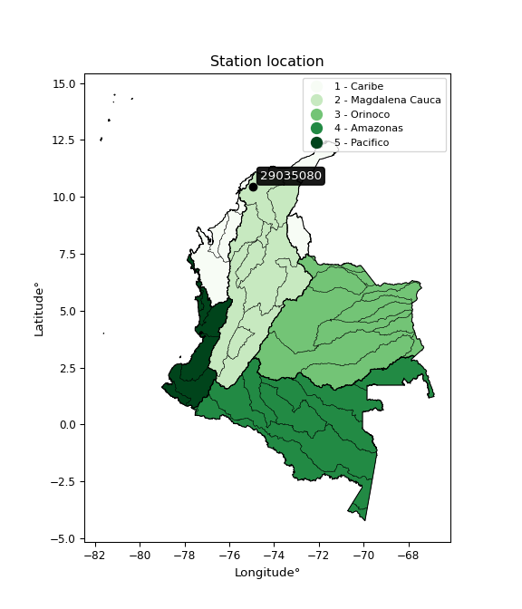</img>

</div>


## A. General information


### 1. General running parameters

• app_version: _v20260103_. • runtime: _2026-01-05 16:20:51.132608_. • Python version: _3.14.0_. • SciPy version: _1.16.3_. • Pandas version: _2.3.3_. • NumPy version: _2.3.5_. • Stations dataset (station_dataset_file): _dataset/pmax24h_in/automatic_colombia_2003_2024.csv_. • Stations catalog (station_catalog_file): _dataset/CNE.xls_. • Minimum year to eval til year_max (date_min): _1900_. • Maximum year to eval since year_min (date_max): _2024_. • Creates, save and include plots into reports (create_plot): _True_. • Plot only fit distributions with Δo > Δ (plot_only_fit): _True_. • Plot only simple graphs avoiding multiple CDFs and multiple Extreme values plots (plot_only_simple): _True_. • Eval low extreme values, if False, evaluates high extreme values (low_extreme): _False_. • Eval every SciPy distribution as logarithmic (pdist_logarithmic_on): _True_. • Standard deviation normalized (ddof): _1.0_. • Return periods to eval in years (Tr): _[2, 2.33, 5, 10, 15, 20, 25, 50, 75, 100, 200, 250, 500, 750, 1000]_. • Minimum data sample per station, 0 means any (minimum_sample): _5_. • Z-Score maximum threshold to adjust a value, 0 means disable (zscore_max): _3.5_. • Z-Score minimum threshold to adjust a value, 0 means disable (zscore_min): _-2.5_. • Avoid zeros, e.g. rain = 0 (avoid_zeros): _True_. • Avoid null values (avoid_nans): _True_. 

[:file_folder:Dataset file](../../dataset/pmax24h_in/automatic_colombia_2003_2024.csv)

> Delta Degrees of Freedom (DDOF): is a parameter used in the formulas for calculating variance and standard deviation. When ddof=0, the divisor is $N$ (the total number of observations) and this is used when your data set is the entire population. When ddof=1, the divisor is $N-1$ and this is used when your data set is a sample drawn from a larger population. Using $N-1$ provides an unbiased estimate of the population variance (known as Bessel´s correction).


### 2. Station info and location

|   id |   CODIGO | NOMBRE                          | CATEGORIA               | TECNOLOGIA                              | ESTADO   | FECHA_INSTALACION   |   FECHA_SUSPENSION |   ALTITUD |   LATITUD |   LONGITUD | DEPARTAMENTO   | MUNICIPIO   | AREA_OPERATIVA                              | ENTIDAD                                                     | AREA_HIDROGRAFICA   | ZONA_HIDROGRAFICA   | SUBZONA_HIDROGRAFICA           |   CORRIENTE | Catalogo   |   Version |
|-----:|---------:|:--------------------------------|:------------------------|:----------------------------------------|:---------|:--------------------|-------------------:|----------:|----------:|-----------:|:---------------|:------------|:--------------------------------------------|:------------------------------------------------------------|:--------------------|:--------------------|:-------------------------------|------------:|:-----------|----------:|
|    0 | 29035080 | NORMAL MANATI  - AUT [29035080] | Climatológica Principal | Automática con Telemetría, Convencional | Activa   | 15/10/1963          |                nan |        10 |    10.454 |   -74.9547 | Atlantico      | Manatí      | Area Operativa 02 - Atlántico-Bolivar-Sucre | INSTITUTO DE HIDROLOGIA METEOROLOGIA Y ESTUDIOS AMBIENTALES | Magdalena Cauca     | Bajo Magdalena      | Canal del Dique margen derecho |         nan | CNE_IDEAM  |  20251226 |

<div align="center">

Dynamic map: [:earth_americas:Google](http://maps.google.com/maps?q=10.453966,-74.954726) [:earth_americas:OSM](https://www.openstreetmap.org/#map=18/10.453966/-74.954726&layers=P) [:earth_americas:Bing](https://www.bing.com/maps?cp=10.453966~-74.954726&lvl=18) [:earth_americas:Apple](https://maps.apple.com/frame?center=10.453966%2C-74.954726&span=0.003%2C0.006)

</div>


<div align="center">

```geojson
{
  "type": "Feature",
  "geometry": {
    "type": "Point", 
    "coordinates": [-74.954726, 10.453966]
  }, 
  "properties": {
    "Name": "29035080"
  }
}
```

</div>


### 3. Discrete values table and plot

<div align="center">

|               |          0 |          1 |           2 |          3 |           4 |           5 |          6 |
|:--------------|-----------:|-----------:|------------:|-----------:|------------:|------------:|-----------:|
| Date          | 2018       | 2019       | 2020        | 2021       | 2022        | 2023        | 2024       |
| Value         |   10.2     |   74.8     |   47.4      |   52       |   47.8      |   24.6      |  155.6     |
| Value_initial |   10.2     |   74.8     |   47.4      |   52       |   47.8      |   24.6      |  155.6     |
| count         |    7       |    7       |    7        |    7       |    7        |    7        |    7       |
| mean          |   58.9143  |   58.9143  |   58.9143   |   58.9143  |   58.9143   |   58.9143   |   58.9143  |
| std           |   47.355   |   47.355   |   47.355    |   47.355   |   47.355    |   47.355    |   47.355   |
| zscore        |   -1.02871 |    0.33546 |   -0.243149 |   -0.14601 |   -0.234702 |   -0.724619 |    2.04172 |


</div>


<div align="center">

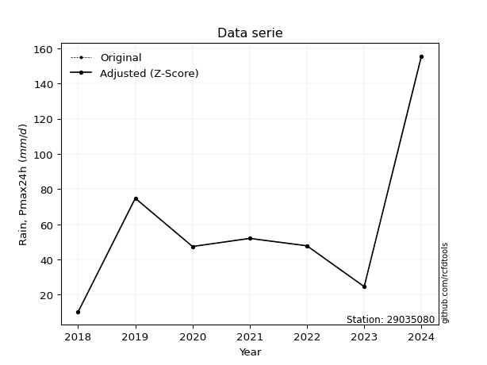</img>

</div>


> The initial value (value_initial) correspond to the initial obtained or null completed value, and value (value) is adjusted only when the initial value is outside the valid range (outlier) definite through the Z-Score value. If Z-Score is active, values out of range or outliers are replaced with the station mean value. A Z-Score (or standard score) measures how many standard deviations a data point is from the mean of a dataset, indicating its relative position; positive scores mean above the mean, negative mean below, and a score of zero is exactly at the mean, allowing for comparison of values from different distributions. It´s calculated using the formula $z=(x–μ)/σ$, where $x$ is the data point, $μ$ is the mean, and $σ$ is the standard deviation, helping identify outliers and understand probability.
>
> <sub>**Note**: In this study, "completing" (filling gaps in) and "extending" (forecasting or lengthening the historical record) rainfall data series are avoided for certain critical analyses because they introduce artificial bias and uncertainty, which can distort the statistics of rare events (extremes), alter day-to-day variability, and compromise the integrity and homogeneity of the original data. Some reasons against Completing/Extending rainfall data are: **Distortion of Extremes and Variability**: The primary issue is that most gap-filling or extension methods rely on averaging or regression with nearby stations, which inherently smooths the data. Rainfall is highly variable in space and time, with a large percentage of zero values and occasional large storms. Infilling methods often underestimate the highest values and overestimate the lowest (zero) values, which severely distorts analyses focused on flood frequency, drought severity, and intensity-duration-frequency (IDF) curves, **Loss of Data Homogeneity**: Infilled or extended data are synthetic estimates, not actual measurements. Combining these estimates with observed data can violate the assumption of data homogeneity, which requires that the data properties do not change over time. Inhomogeneity can lead to incorrect conclusions about long-term trends or changes in climate patterns, **Propagation of Errors**: Errors and biases from the original data (e.g., wind-induced undercatch, instrument errors, site changes) or the data used for imputation can propagate through the analysis, leading to unreliable hydrological models and inaccurate predictions, **Compromised Statistical Integrity**: For statistical analyses, especially those involving the frequency of events, using artificial data can introduce time bias or autocorrelation that doesn´t exist in reality, making it difficult to assess the true probability of events, **Difficulty in Validation**: It is difficult to accurately validate the quality of filled or extended data, especially for past periods where ground-truth measurements are unavailable. The reliability of imputation techniques heavily depends on the density of the surrounding station network and the complexity of the local topography.</sub>


### 4. Active continuous probability distributions from SciPy (44 of 104 available)

A Probability Density Function (PDF) describes the relative likelihood of a continuous random variable falling within a specific range, where the total area under its curve equals 1, and the area over any interval gives the actual probability for that range. Unlike discrete probabilities (like rolling a die), a PDF shows density, not direct probability for a single point (which is zero), with higher points indicating higher likelihood, often visualized as a bell curve for normal distributions.

A log of a probability density function (log-PDF) is simply the logarithm of the PDF´s value, denoted as $log(f(x))$, useful for converting multiplication of probabilities into addition, improving numerical stability with tiny numbers, and connecting to information theory concepts like entropy. Instead of dealing with very small probabilities (e.g., 0.000001), log-PDFs use negative numbers (e.g., $log(0.00001) ≈ -11.51$ that are easier for computers to handle, preventing underflow errors and simplifying complex calculations. In this study, each active probability distribution from SciPy is also evaluated in the $log$ form.

[scipy.stats](https://docs.scipy.org/doc/scipy/reference/stats.html) is a Python´s powerful submodule within the SciPy library for comprehensive statistical analysis, offering over 130 probability distributions (like Normal, Poisson), functions for descriptive stats (mean, variance), hypothesis testing (t-tests, chi-square), random variable generation, and statistical tests, making it essential for data science, modeling, and research. It provides tools to explore, model, and draw conclusions from data efficiently, working seamlessly with NumPy.

<div align="center">

|   id | p_dist             |   n_parameter | fit_method   | label                                                                       | active   | ref                                                                                                        |
|-----:|:-------------------|--------------:|:-------------|:----------------------------------------------------------------------------|:---------|:-----------------------------------------------------------------------------------------------------------|
|    0 | alpha              |             3 | MLE          | Alpha                                                                       | True     | [:mortar_board:](https://docs.scipy.org/doc/scipy/reference/generated/scipy.stats.alpha.html)              |
|    1 | betaprime          |             4 | MLE          | Beta prime                                                                  | True     | [:mortar_board:](https://docs.scipy.org/doc/scipy/reference/generated/scipy.stats.betaprime.html)          |
|    2 | chi2               |             3 | MLE          | Chi²                                                                        | True     | [:mortar_board:](https://docs.scipy.org/doc/scipy/reference/generated/scipy.stats.chi2.html)               |
|    3 | crystalball        |             4 | MLE          | Crystalball                                                                 | True     | [:mortar_board:](https://docs.scipy.org/doc/scipy/reference/generated/scipy.stats.crystalball.html)        |
|    4 | erlang             |             3 | MLE          | Erlang                                                                      | True     | [:mortar_board:](https://docs.scipy.org/doc/scipy/reference/generated/scipy.stats.erlang.html)             |
|    5 | expon              |             2 | MLE          | Exponential                                                                 | True     | [:mortar_board:](https://docs.scipy.org/doc/scipy/reference/generated/scipy.stats.expon.html)              |
|    6 | exponnorm          |             3 | MLE          | Exponentially modified Normal                                               | True     | [:mortar_board:](https://docs.scipy.org/doc/scipy/reference/generated/scipy.stats.exponnorm.html)          |
|    7 | f                  |             4 | MLE          | F                                                                           | True     | [:mortar_board:](https://docs.scipy.org/doc/scipy/reference/generated/scipy.stats.f.html)                  |
|    8 | fatiguelife        |             3 | MLE          | Fatigue-life (Birnbaum-Saunders)                                            | True     | [:mortar_board:](https://docs.scipy.org/doc/scipy/reference/generated/scipy.stats.fatiguelife.html)        |
|    9 | fisk               |             3 | MLE          | Fisk                                                                        | True     | [:mortar_board:](https://docs.scipy.org/doc/scipy/reference/generated/scipy.stats.fisk.html)               |
|   10 | gamma              |             3 | MLE          | Gamma                                                                       | True     | [:mortar_board:](https://docs.scipy.org/doc/scipy/reference/generated/scipy.stats.gamma.html)              |
|   11 | genexpon           |             5 | MLE          | Generalized exponential                                                     | True     | [:mortar_board:](https://docs.scipy.org/doc/scipy/reference/generated/scipy.stats.genexpon.html)           |
|   12 | genlogistic        |             3 | MLE          | Generalized logistic                                                        | True     | [:mortar_board:](https://docs.scipy.org/doc/scipy/reference/generated/scipy.stats.genlogistic.html)        |
|   13 | gibrat             |             2 | MM           | Gibrat                                                                      | True     | [:mortar_board:](https://docs.scipy.org/doc/scipy/reference/generated/scipy.stats.gibrat.html)             |
|   14 | gompertz           |             3 | MLE          | Gompertz (or truncated Gumbel)                                              | True     | [:mortar_board:](https://docs.scipy.org/doc/scipy/reference/generated/scipy.stats.gompertz.html)           |
|   15 | gumbel_l           |             2 | MM           | Gumbel Left Skew                                                            | True     | [:mortar_board:](https://docs.scipy.org/doc/scipy/reference/generated/scipy.stats.gumbel_l.html)           |
|   16 | gumbel_r           |             2 | MM           | Gumbel Right Skew                                                           | True     | [:mortar_board:](https://docs.scipy.org/doc/scipy/reference/generated/scipy.stats.gumbel_r.html)           |
|   17 | halflogistic       |             2 | MM           | Half-logistic                                                               | True     | [:mortar_board:](https://docs.scipy.org/doc/scipy/reference/generated/scipy.stats.halflogistic.html)       |
|   18 | halfnorm           |             2 | MM           | Half Normal                                                                 | True     | [:mortar_board:](https://docs.scipy.org/doc/scipy/reference/generated/scipy.stats.halfnorm.html)           |
|   19 | hypsecant          |             2 | MM           | hyperbolic secant                                                           | True     | [:mortar_board:](https://docs.scipy.org/doc/scipy/reference/generated/scipy.stats.hypsecant.html)          |
|   20 | invgamma           |             3 | MLE          | Inverted gamma                                                              | True     | [:mortar_board:](https://docs.scipy.org/doc/scipy/reference/generated/scipy.stats.invgamma.html)           |
|   21 | invgauss           |             3 | MLE          | Inverse Gaussian                                                            | True     | [:mortar_board:](https://docs.scipy.org/doc/scipy/reference/generated/scipy.stats.invgauss.html)           |
|   22 | invweibull         |             3 | MLE          | Inverted Weibull                                                            | True     | [:mortar_board:](https://docs.scipy.org/doc/scipy/reference/generated/scipy.stats.invweibull.html)         |
|   23 | johnsonsu          |             4 | MLE          | Johnson Su                                                                  | True     | [:mortar_board:](https://docs.scipy.org/doc/scipy/reference/generated/scipy.stats.johnsonsu.html)          |
|   24 | kstwobign          |             2 | MLE          | Limiting distribution of scaled Kolmogorov-Smirnov two-sided test statistic | True     | [:mortar_board:](https://docs.scipy.org/doc/scipy/reference/generated/scipy.stats.kstwobign.html)          |
|   25 | laplace            |             2 | MM           | Laplace                                                                     | True     | [:mortar_board:](https://docs.scipy.org/doc/scipy/reference/generated/scipy.stats.laplace.html)            |
|   26 | laplace_asymmetric |             3 | MLE          | Asymmetric Laplace                                                          | True     | [:mortar_board:](https://docs.scipy.org/doc/scipy/reference/generated/scipy.stats.laplace_asymmetric.html) |
|   27 | loggamma           |             3 | MLE          | Log gamma                                                                   | True     | [:mortar_board:](https://docs.scipy.org/doc/scipy/reference/generated/scipy.stats.loggamma.html)           |
|   28 | logistic           |             2 | MM           | Logistic (or Sech-squared)                                                  | True     | [:mortar_board:](https://docs.scipy.org/doc/scipy/reference/generated/scipy.stats.logistic.html)           |
|   29 | lognorm            |             3 | MLE          | Log Normal                                                                  | True     | [:mortar_board:](https://docs.scipy.org/doc/scipy/reference/generated/scipy.stats.lognorm.html)            |
|   30 | maxwell            |             2 | MM           | Maxwell                                                                     | True     | [:mortar_board:](https://docs.scipy.org/doc/scipy/reference/generated/scipy.stats.maxwell.html)            |
|   31 | mielke             |             4 | MLE          | Mielke Beta-Kappa / Dagum                                                   | True     | [:mortar_board:](https://docs.scipy.org/doc/scipy/reference/generated/scipy.stats.mielke.html)             |
|   32 | moyal              |             2 | MM           | Moyal                                                                       | True     | [:mortar_board:](https://docs.scipy.org/doc/scipy/reference/generated/scipy.stats.moyal.html)              |
|   33 | nakagami           |             3 | MLE          | Nakagami                                                                    | True     | [:mortar_board:](https://docs.scipy.org/doc/scipy/reference/generated/scipy.stats.nakagami.html)           |
|   34 | ncf                |             5 | MLE          | Non-central F distribution                                                  | True     | [:mortar_board:](https://docs.scipy.org/doc/scipy/reference/generated/scipy.stats.ncf.html)                |
|   35 | nct                |             4 | MLE          | Non-central Student’s t                                                     | True     | [:mortar_board:](https://docs.scipy.org/doc/scipy/reference/generated/scipy.stats.nct.html)                |
|   36 | norm               |             2 | MM           | Normal                                                                      | True     | [:mortar_board:](https://docs.scipy.org/doc/scipy/reference/generated/scipy.stats.norm.html)               |
|   37 | pearson3           |             3 | MM           | Pearson type III                                                            | True     | [:mortar_board:](https://docs.scipy.org/doc/scipy/reference/generated/scipy.stats.pearson3.html)           |
|   38 | rayleigh           |             2 | MM           | Rayleigh                                                                    | True     | [:mortar_board:](https://docs.scipy.org/doc/scipy/reference/generated/scipy.stats.rayleigh.html)           |
|   39 | rice               |             3 | MLE          | Rice                                                                        | True     | [:mortar_board:](https://docs.scipy.org/doc/scipy/reference/generated/scipy.stats.rice.html)               |
|   40 | t                  |             3 | MLE          | Student’s t                                                                 | True     | [:mortar_board:](https://docs.scipy.org/doc/scipy/reference/generated/scipy.stats.t.html)                  |
|   41 | truncnorm          |             4 | MLE          | Truncated normal                                                            | True     | [:mortar_board:](https://docs.scipy.org/doc/scipy/reference/generated/scipy.stats.truncnorm.html)          |
|   42 | wald               |             2 | MM           | Wald                                                                        | True     | [:mortar_board:](https://docs.scipy.org/doc/scipy/reference/generated/scipy.stats.wald.html)               |
|   43 | weibull_min        |             3 | MLE          | Weibull minimum                                                             | True     | [:mortar_board:](https://docs.scipy.org/doc/scipy/reference/generated/scipy.stats.weibull_min.html)        |

</div>

> **n_parameter:** # arguments & localization & scale.
>
> **Fit methods:** (MLE) maximum likelihood, (MM) L-moments.
>
>**Inactive** (With the only purpose of prevent loops, zero divisions, infinite values, over high estimated values or horizontal trending for recurrence intervals estimations, the follow distributions were disabled.)**:** foldnorm, gennorm, norminvgauss, powernorm, powerlognorm, skewnorm, genextreme, anglit, arcsine, argus, beta, bradford, burr, burr12, cauchy, cosine, halfcauchy, foldcauchy, skewcauchy, wrapcauchy, dgamma, gengamma, exponweib, exponpow, truncexpon, gausshyper, genhalflogistic, genhyperbolic, geninvgauss, halfgennorm, johnsonsb, kappa4, kappa3, ksone, kstwo, loglaplace, levy, levy_l, levy_stable, ncx2, pareto, genpareto, truncpareto, lomax, powerlaw, rdist, rel_breitwigner, recipinvgauss, semicircular, studentized_range, trapezoid, triang, truncweibull_min, tukeylambda, uniform, loguniform, vonmises, vonmises_line, weibull_max, dweibull, 


## B. Probability (PDF) vs. Empirical (EDF) distributions functions

A continuous probability distribution (CPD) describes probabilities for variables that can take any value within a range (like rain any time), unlike discrete variables with specific outcomes (like temperature). It uses a Probability Density Function (PDF), a curve where the total area under it equals 1, and the probability of the variable falling within an interval (a to b) is found by calculating the area under the curve between those points. A key feature is that the probability of hitting any single exact value is zero, so probabilities are always expressed for ranges, e.g., $P(a ≤ X ≤ b)$.

<div align="center">

Distributions parameters from station values
|    |   station | p_dist                |   n |              loc |          scale | shape                  | shape1             | shape2             | shape3   |
|---:|----------:|:----------------------|----:|-----------------:|---------------:|:-----------------------|:-------------------|:-------------------|:---------|
|  0 |  29035080 | alpha                 |   7 |     -0.0706292   |   23.5951      | 1.141837169421088e-09  |                    |                    |          |
|  1 |  29035080 | betaprime             |   7 |     10.2         |  174.388       | 0.5938269165947145     | 2.5785880236925394 |                    |          |
|  2 |  29035080 | chi2                  |   7 |     10.2         |   26.773       | 1.0450132057287789     |                    |                    |          |
|  3 |  29035080 | crystalball           |   7 |     58.9143      |   43.8422      | 4178.238146469443      | 2587.1761505659356 |                    |          |
|  4 |  29035080 | erlang                |   7 |     10.2         |   40.0718      | 0.9514290566608447     |                    |                    |          |
|  5 |  29035080 | expon                 |   7 |     10.2         |   48.7143      |                        |                    |                    |          |
|  6 |  29035080 | exponnorm             |   7 |     18.2011      |   14.0541      | 2.896884923248958      |                    |                    |          |
|  7 |  29035080 | f                     |   7 |     10.2         |   57.5435      | 1.2061296627349856     | 277.70883619684645 |                    |          |
|  8 |  29035080 | fatiguelife           |   7 |     10.2         |    0.000149532 | 497.10623656883274     |                    |                    |          |
|  9 |  29035080 | fisk                  |   7 |     -3.94295     |   50.8765      | 2.509563788537002      |                    |                    |          |
| 10 |  29035080 | gamma                 |   7 |     10.2         |   61.4061      | 0.4643025818473148     |                    |                    |          |
| 11 |  29035080 | genexpon              |   7 |     10.1994      |  995.593       | 17.34797690084947      | 6.266949356444872  | 20.573965686543694 |          |
| 12 |  29035080 | genlogistic           |   7 |   -165.983       |   29.568       | 1064.6141613257819     |                    |                    |          |
| 13 |  29035080 | gibrat                |   7 |     25.4683      |   20.286       |                        |                    |                    |          |
| 14 |  29035080 | gompertz              |   7 |     10.2         |  341.899       | 6.137325612502219      |                    |                    |          |
| 15 |  29035080 | gumbel_l              |   7 |     78.6456      |   34.1836      |                        |                    |                    |          |
| 16 |  29035080 | gumbel_r              |   7 |     39.183       |   34.1836      |                        |                    |                    |          |
| 17 |  29035080 | halflogistic          |   7 |      6.95113     |   37.4835      |                        |                    |                    |          |
| 18 |  29035080 | halfnorm              |   7 |      0.88444     |   72.7296      |                        |                    |                    |          |
| 19 |  29035080 | hypsecant             |   7 |     58.9143      |   27.9108      |                        |                    |                    |          |
| 20 |  29035080 | invgamma              |   7 |    -25.2184      |  322.863       | 4.80841582496704       |                    |                    |          |
| 21 |  29035080 | invgauss              |   7 |     -9.06932     |  144.944       | 0.46903271999980367    |                    |                    |          |
| 22 |  29035080 | invweibull            |   7 |    -84.0949      |  120.94        | 4.544701499794696      |                    |                    |          |
| 23 |  29035080 | johnsonsu             |   7 |     -5.95678     |    0.935271    | -7.045329645450263     | 1.4934793731589462 |                    |          |
| 24 |  29035080 | kstwobign             |   7 |    -68.827       |  148.013       |                        |                    |                    |          |
| 25 |  29035080 | laplace               |   7 |     58.9143      |   31.0011      |                        |                    |                    |          |
| 26 |  29035080 | laplace_asymmetric    |   7 |     47.4         |   26.8391      | 0.8082429981592832     |                    |                    |          |
| 27 |  29035080 | loggamma              |   7 | -11159.3         | 1571.29        | 1261.1486528641713     |                    |                    |          |
| 28 |  29035080 | logistic              |   7 |     58.9143      |   24.1715      |                        |                    |                    |          |
| 29 |  29035080 | lognorm               |   7 |     10.2         |    0.202675    | 13.229752943120696     |                    |                    |          |
| 30 |  29035080 | maxwell               |   7 |    -44.9732      |   65.1019      |                        |                    |                    |          |
| 31 |  29035080 | mielke                |   7 |     -0.455021    |   63.3706      | 1.714079994748321      | 2.8859441178720617 |                    |          |
| 32 |  29035080 | moyal                 |   7 |     33.8425      |   19.7359      |                        |                    |                    |          |
| 33 |  29035080 | nakagami              |   7 |     10.2         |   94.1965      | 0.23075923344162685    |                    |                    |          |
| 34 |  29035080 | ncf                   |   7 |     -0.336331    |   25.9766      | 4.308353658944606      | 14.150520161256718 | 4.1344033484468055 |          |
| 35 |  29035080 | nct                   |   7 |    -39.0713      |    6.99388     | 4.063930060447397      | 11.267420776731257 |                    |          |
| 36 |  29035080 | norm                  |   7 |     58.9143      |   43.8422      |                        |                    |                    |          |
| 37 |  29035080 | pearson3              |   7 |     58.9143      |   43.8421      | 1.2690552295246769     |                    |                    |          |
| 38 |  29035080 | rayleigh              |   7 |    -24.9583      |   66.9207      |                        |                    |                    |          |
| 39 |  29035080 | rice                  |   7 |    -10.745       |   58.2003      | 0.0008743973384019062  |                    |                    |          |
| 40 |  29035080 | t                     |   7 |     47.054       |   18.6655      | 1.4796945994412773     |                    |                    |          |
| 41 |  29035080 | truncnorm             |   7 |     58.9143      |   43.8422      | -685.5146112507173     | 9.086674650197054  |                    |          |
| 42 |  29035080 | wald                  |   7 |     15.0721      |   43.8422      |                        |                    |                    |          |
| 43 |  29035080 | weibull_min           |   7 |     10.2         |   36.4054      | 0.7728550188814431     |                    |                    |          |
| 44 |  29035080 | logalpha              |   7 |    -13.903       |  384.49        | 21.76821034860275      |                    |                    |          |
| 45 |  29035080 | logbetaprime          |   7 |    -14.1423      |  296.874       | 519.4843428931033      | 8595.979070973899  |                    |          |
| 46 |  29035080 | logchi2               |   7 |      2.32239     |    0.928693    | 1.0485436255848715     |                    |                    |          |
| 47 |  29035080 | logcrystalball        |   7 |      3.79489     |    0.792055    | 12.51420320350501      | 3.5861990986995345 |                    |          |
| 48 |  29035080 | logerlang             |   7 |     -9.05057     |    0.050372    | 255.02856104499062     |                    |                    |          |
| 49 |  29035080 | logexpon              |   7 |      2.32239     |    1.47249     |                        |                    |                    |          |
| 50 |  29035080 | logexponnorm          |   7 |      3.79457     |    0.792056    | 0.00039743747400365897 |                    |                    |          |
| 51 |  29035080 | logf                  |   7 |   -264.835       |  268.63        | 528975.6901483298      | 399734.43072415167 |                    |          |
| 52 |  29035080 | logfatiguelife        |   7 |   -225.55        |  229.343       | 0.0034456305371519513  |                    |                    |          |
| 53 |  29035080 | logfisk               |   7 |     -7.13928e+06 |    7.13928e+06 | 16038198.302445062     |                    |                    |          |
| 54 |  29035080 | loggamma              |   7 |    -10.3143      |    0.0461873   | 305.31494565400544     |                    |                    |          |
| 55 |  29035080 | loggenexpon           |   7 |      2.32134     |   17.0298      | 5.034001035284401      | 23.5702054237246   | 6.384921149135266  |          |
| 56 |  29035080 | loggenlogistic        |   7 |      4.157       |    0.345907    | 0.5766178263106423     |                    |                    |          |
| 57 |  29035080 | loggibrat             |   7 |      3.19067     |    0.366472    |                        |                    |                    |          |
| 58 |  29035080 | loggompertz           |   7 |      2.32239     |    0.911542    | 0.16575886280042057    |                    |                    |          |
| 59 |  29035080 | loggumbel_l           |   7 |      4.15134     |    0.617561    |                        |                    |                    |          |
| 60 |  29035080 | loggumbel_r           |   7 |      3.43841     |    0.617561    |                        |                    |                    |          |
| 61 |  29035080 | loghalflogistic       |   7 |      2.85615     |    0.677154    |                        |                    |                    |          |
| 62 |  29035080 | loghalfnorm           |   7 |      2.74649     |    1.31395     |                        |                    |                    |          |
| 63 |  29035080 | loghypsecant          |   7 |      3.79488     |    0.504237    |                        |                    |                    |          |
| 64 |  29035080 | loginvgamma           |   7 |    -13.701       | 8069.57        | 462.3509390255207      |                    |                    |          |
| 65 |  29035080 | loginvgauss           |   7 |     -3.33445     |  518.056       | 0.013733583109239562   |                    |                    |          |
| 66 |  29035080 | loginvweibull         |   7 |     -1.0906e+08  |    1.0906e+08  | 134667099.35054782     |                    |                    |          |
| 67 |  29035080 | logjohnsonsu          |   7 |      8.16509     |    1.56301     | 10.234531204831047     | 5.8888592504291495 |                    |          |
| 68 |  29035080 | logkstwobign          |   7 |      0.488388    |    3.78351     |                        |                    |                    |          |
| 69 |  29035080 | loglaplace            |   7 |      3.79488     |    0.560066    |                        |                    |                    |          |
| 70 |  29035080 | loglaplace_asymmetric |   7 |      3.86703     |    0.557873    | 1.0667678886210914     |                    |                    |          |
| 71 |  29035080 | logloggamma           |   7 |      1.49579     |    1.61942     | 4.625865795542451      |                    |                    |          |
| 72 |  29035080 | loglogistic           |   7 |      3.79488     |    0.436682    |                        |                    |                    |          |
| 73 |  29035080 | loglognorm            |   7 |      2.32239     |    0.00972117  | 12.544116737432399     |                    |                    |          |
| 74 |  29035080 | logmaxwell            |   7 |      1.91804     |    1.17613     |                        |                    |                    |          |
| 75 |  29035080 | logmielke             |   7 |      2.32239     |    2.68686     | 0.7805716936720697     | 11.607615434646167 |                    |          |
| 76 |  29035080 | logmoyal              |   7 |      3.34193     |    0.356549    |                        |                    |                    |          |
| 77 |  29035080 | lognakagami           |   7 |      3.20275     |    1.10129     | 0.07095568332636643    |                    |                    |          |
| 78 |  29035080 | logncf                |   7 |     -7.47563     |    3.19793     | 286.6140056429797      | 1019.9857775553651 | 721.7170683326672  |          |
| 79 |  29035080 | lognct                |   7 |    -38.3084      |    0.755189    | 14849.022641643867     | 55.748871137253815 |                    |          |
| 80 |  29035080 | lognorm               |   7 |      3.79488     |    0.792053    |                        |                    |                    |          |
| 81 |  29035080 | logpearson3           |   7 |      3.79488     |    0.792053    | -0.3711264264747186    |                    |                    |          |
| 82 |  29035080 | lograyleigh           |   7 |      2.27963     |    1.20899     |                        |                    |                    |          |
| 83 |  29035080 | logrice               |   7 |      1.82971     |    0.862585    | 2.008364601494141      |                    |                    |          |
| 84 |  29035080 | logt                  |   7 |      3.79488     |    0.792053    | 30385612772.982296     |                    |                    |          |
| 85 |  29035080 | logtruncnorm          |   7 |      0.318785    |    1.91549     | 1.5055997062198805     | 63.55656192460264  |                    |          |
| 86 |  29035080 | logwald               |   7 |      3.00278     |    0.792093    |                        |                    |                    |          |
| 87 |  29035080 | logweibull_min        |   7 |      0.0650335   |    4.04273     | 5.5311601345182115     |                    |                    |          |

</div>

> **loc** (Location parameter): This shifts the distribution along the x-axis. For many common distributions, like the normal (Gaussian) distribution, loc represents the mean $μ$. For others, like the uniform distribution, it might represent the minimum value, or for the beta distribution, the left end of the support interval.
>
> **scale** (Scale parameter): This determines the width or spread of the distribution. For the normal distribution, scale represents the standard deviation $σ$. For a uniform distribution, it defines the length of the interval (from $loc$ to $loc + scale$).
>
> **shape** (Shape parameters): Refers to parameters that define the specific form of a probability distribution, distinct from its location (loc) and scale (scale). These parameters are required arguments for most distribution functions. For example, a normal (Gaussian) distribution is fully defined by its location (mean) and scale (standard deviation), so it has no specific shape parameters beyond loc and scale. However, other distributions have intrinsic properties that need specification, as Gamma distribution that takes a shape parameter, often named $a$ or $alpha$.


### 0. Cumulative distribution values - CDF (88 evaluated)

Cumulative Distribution Function (CDF), denoted as $F$<sub>$X$</sub>$(x)$, is a function that gives the probability that a random variable $X$ will take a value less than or equal to a specific value, $x$ (i.e., $(P(X≥x)$. It essentially "accumulates" probabilities from a given point up to the far right (positive infinity), providing a complete picture of the distribution´s probabilities for both discrete (like rain) and continuous (like temperature) variables, helping to find probabilities over ranges or above certain values. Each station is evaluated separately ordering the $x$ values ascending, calculating the CDF and PDF values for the activated distributions and their logarithmic forms.

<div align="center">

CDF ordered by x ascending and calculating $log(f(x))$ separately
|   id |   Station |   date |     x |   count |    mean |    std |    zscore |   Value_initial |   station |   m |     alpha |   alpha_pdf |   betaprime |   betaprime_pdf |        chi2 |        chi2_pdf |   crystalball |   crystalball_pdf |     erlang |   erlang_pdf |    expon |   expon_pdf |   exponnorm |   exponnorm_pdf |           f |        f_pdf |   fatiguelife |   fatiguelife_pdf |      fisk |    fisk_pdf |       gamma |   gamma_pdf |    genexpon |   genexpon_pdf |   genlogistic |   genlogistic_pdf |   gibrat |   gibrat_pdf |    gompertz |   gompertz_pdf |   gumbel_l |   gumbel_l_pdf |   gumbel_r |   gumbel_r_pdf |   halflogistic |   halflogistic_pdf |   halfnorm |   halfnorm_pdf |   hypsecant |   hypsecant_pdf |   invgamma |   invgamma_pdf |   invgauss |   invgauss_pdf |   invweibull |   invweibull_pdf |   johnsonsu |   johnsonsu_pdf |   kstwobign |   kstwobign_pdf |   laplace |   laplace_pdf |   laplace_asymmetric |   laplace_asymmetric_pdf |   loggamma |   loggamma_pdf |   logistic |   logistic_pdf |   lognorm |   lognorm_pdf |   maxwell |   maxwell_pdf |    mielke |   mielke_pdf |     moyal |   moyal_pdf |    nakagami |   nakagami_pdf |      ncf |     ncf_pdf |       nct |     nct_pdf |     norm |    norm_pdf |   pearson3 |   pearson3_pdf |   rayleigh |   rayleigh_pdf |      rice |    rice_pdf |        t |       t_pdf |   truncnorm |   truncnorm_pdf |      wald |    wald_pdf |   weibull_min |   weibull_min_pdf |   logalpha |   logalpha_pdf |   logbetaprime |   logbetaprime_pdf |     logchi2 |   logchi2_pdf |   logcrystalball |   logcrystalball_pdf |   logerlang |   logerlang_pdf |   logexpon |   logexpon_pdf |   logexponnorm |   logexponnorm_pdf |      logf |   logf_pdf |   logfatiguelife |   logfatiguelife_pdf |   logfisk |   logfisk_pdf |   loggenexpon |   loggenexpon_pdf |   loggenlogistic |   loggenlogistic_pdf |   loggibrat |   loggibrat_pdf |   loggompertz |   loggompertz_pdf |   loggumbel_l |   loggumbel_l_pdf |   loggumbel_r |   loggumbel_r_pdf |   loghalflogistic |   loghalflogistic_pdf |   loghalfnorm |   loghalfnorm_pdf |   loghypsecant |   loghypsecant_pdf |   loginvgamma |   loginvgamma_pdf |   loginvgauss |   loginvgauss_pdf |   loginvweibull |   loginvweibull_pdf |   logjohnsonsu |   logjohnsonsu_pdf |   logkstwobign |   logkstwobign_pdf |   loglaplace |   loglaplace_pdf |   loglaplace_asymmetric |   loglaplace_asymmetric_pdf |   logloggamma |   logloggamma_pdf |   loglogistic |   loglogistic_pdf |   loglognorm |   loglognorm_pdf |   logmaxwell |   logmaxwell_pdf |   logmielke |   logmielke_pdf |    logmoyal |   logmoyal_pdf |   lognakagami |   lognakagami_pdf |    logncf |   logncf_pdf |    lognct |   lognct_pdf |   logpearson3 |   logpearson3_pdf |   lograyleigh |   lograyleigh_pdf |   logrice |   logrice_pdf |      logt |   logt_pdf |   logtruncnorm |   logtruncnorm_pdf |   logwald |   logwald_pdf |   logweibull_min |   logweibull_min_pdf |
|-----:|----------:|-------:|------:|--------:|--------:|-------:|----------:|----------------:|----------:|----:|----------:|------------:|------------:|----------------:|------------:|----------------:|--------------:|------------------:|-----------:|-------------:|---------:|------------:|------------:|----------------:|------------:|-------------:|--------------:|------------------:|----------:|------------:|------------:|------------:|------------:|---------------:|--------------:|------------------:|---------:|-------------:|------------:|---------------:|-----------:|---------------:|-----------:|---------------:|---------------:|-------------------:|-----------:|---------------:|------------:|----------------:|-----------:|---------------:|-----------:|---------------:|-------------:|-----------------:|------------:|----------------:|------------:|----------------:|----------:|--------------:|---------------------:|-------------------------:|-----------:|---------------:|-----------:|---------------:|----------:|--------------:|----------:|--------------:|----------:|-------------:|----------:|------------:|------------:|---------------:|---------:|------------:|----------:|------------:|---------:|------------:|-----------:|---------------:|-----------:|---------------:|----------:|------------:|---------:|------------:|------------:|----------------:|----------:|------------:|--------------:|------------------:|-----------:|---------------:|---------------:|-------------------:|------------:|--------------:|-----------------:|---------------------:|------------:|----------------:|-----------:|---------------:|---------------:|-------------------:|----------:|-----------:|-----------------:|---------------------:|----------:|--------------:|--------------:|------------------:|-----------------:|---------------------:|------------:|----------------:|--------------:|------------------:|--------------:|------------------:|--------------:|------------------:|------------------:|----------------------:|--------------:|------------------:|---------------:|-------------------:|--------------:|------------------:|--------------:|------------------:|----------------:|--------------------:|---------------:|-------------------:|---------------:|-------------------:|-------------:|-----------------:|------------------------:|----------------------------:|--------------:|------------------:|--------------:|------------------:|-------------:|-----------------:|-------------:|-----------------:|------------:|----------------:|------------:|---------------:|--------------:|------------------:|----------:|-------------:|----------:|-------------:|--------------:|------------------:|--------------:|------------------:|----------:|--------------:|----------:|-----------:|---------------:|-------------------:|----------:|--------------:|-----------------:|---------------------:|
|    0 |  29035080 |   2018 |  10.2 |       7 | 58.9143 | 47.355 | -1.02871  |            10.2 |  29035080 |   1 | 0.0215993 | 0.0127501   | 9.10469e-05 |      5.71025    | 1.94026e-07 | 16702.3         |      0.133256 |       0.00490825  | 2.8156e-16 |  0.150805    | 0        |  0.0205279  |   0.0517428 |     0.00571884  | 1.03294e-07 | 301.317      |     0.0649941 |       3.63674e+08 | 0.0386903 | 0.0065997   | 2.36487e-08 | 6.18127e+06 | 1.08567e-05 |    0.0174247   |     0.0641185 |       0.00594927  | 0        |  0           | 4.86875e-11 |     0.0179507  |   0.126306 |    0.00345109  |  0.0968443 |    0.00661422  |      0.0433102 |        0.0133142   |   0.101918 |     0.0108809  |    0.110034 |     0.00386429  |   0.043329 |    0.00708372  |  0.0400336 |    0.0082326   |    0.0450995 |      0.00673587  |    0.039752 |     0.00791222  |   0.0619617 |     0.00600225  |  0.10388  |   0.00335084  |            0.0711185 |               0.00327848 |  0.0312355 |      0.0938121 |   0.117599 |    0.00429306  |  0.031508 |      0.089466 |  0.131095 |    0.00614685 | 0.0469064 |  0.00750217  | 0.0687214 | 0.00701955  | 1.49643e-08 |     3.8879e+06 | 0.043041 | 0.00811216  | 0.0449844 | 0.00687057  | 0.133256 | 0.00490825  |  0.0849671 |    0.00828522  |   0.128909 |     0.00683867 | 0.0627037 | 0.0057957   | 0.114893 | 0.00367821  |    0.133256 |     0.00490825  | 0         | 0           |    2.4744e-13 |     107.656       |  0.0268903 |      0.0907249 |      0.0312074 |          0.0921388 | 7.27906e-09 |   8.59333e+06 |        0.0315074 |            0.0894642 |   0.0296754 |       0.0909443 |   0        |       0.679123 |       0.031508 |          0.0894656 | 0.0317953 |  0.0901904 |        0.0308972 |            0.0888018 | 0.0321599 |     0.0699229 |   0.000309027 |          0.29605  |        0.0468358 |            0.0776879 | 0           |       0         |   9.65752e-09 |          0.181845 |     0.0504217 |         0.0795527 |    0.00225857 |         0.0222837 |          0        |              0        |      0        |          0        |       0.034294 |          0.0678803 |      0.030056 |         0.0941057 |     0.0283237 |         0.0986726 |        0.024605 |            0.11256  |       0.043183 |          0.0892738 |      0.0271222 |           0.140506 |    0.0360705 |        0.064404  |               0.0397119 |                   0.0667292 |     0.0434029 |         0.0891533 |     0.0331823 |         0.0734659 |    0.0071682 |      3.57217e+12 |    0.0104318 |        0.0755808 | 7.35363e-12 |      391.679    | 2.94612e-05 |    0.000758584 |    0          |       0           | 0.0312267 |    0.0959803 | 0.0315112 |    0.0898551 |     0.0408925 |         0.0910392 |   0.000625131 |          0.029233 |  0.023413 |      0.101586 | 0.0315081 |   0.089466 |    0           |           0        |  0        |     0         |        0.0390462 |            0.0937817 |
|    1 |  29035080 |   2023 |  24.6 |       7 | 58.9143 | 47.355 | -0.724619 |            24.6 |  29035080 |   2 | 0.338867  | 0.0195783   | 0.389262    |      0.013688   | 0.519129    |     0.0157367   |      0.216908 |       0.0066988   | 0.325067   |  0.0177682   | 0.255916 |  0.0152745  |   0.182283  |     0.0121158   | 0.337883    |   0.0128614  |     0.733769  |       0.00711651  | 0.189924  | 0.0135271   | 0.535868    | 0.0146863   | 0.23139     |    0.0146382   |     0.184746  |       0.0105434   | 0        |  0           | 0.232034    |     0.0143785  |   0.185973 |    0.00489987  |  0.216092  |    0.00968488  |      0.231167  |        0.0126264   |   0.255635 |     0.0104026  |    0.181134 |     0.00614514  |   0.201146 |    0.0136144   |  0.21573   |    0.014207    |    0.197023  |      0.0133818   |    0.211058 |     0.014121    |   0.179536  |     0.00997899  |  0.165295 |   0.00533192  |            0.138127  |               0.00636747 |  0.237153  |      0.393632  |   0.194721 |    0.00648719  |  0.227354 |      0.380886 |  0.233074 |    0.00790759 | 0.195929  |  0.0125423   | 0.206287  | 0.0114947   | 0.328729    |     0.0104897  | 0.207799 | 0.0134158   | 0.199509  | 0.0135361   | 0.216908 | 0.0066988   |  0.227222  |    0.010912    |   0.239827 |     0.00841218 | 0.168402  | 0.00867742  | 0.193402 | 0.00782074  |    0.216908 |     0.0066988   | 0.0799102 | 0.0219417   |    0.386335   |       0.0160827   |  0.239153  |      0.407705  |      0.232491  |          0.385913  | 0.653721    |   0.282496    |        0.227351  |            0.380882  |   0.233351  |       0.39269   |   0.450019 |       0.373505 |       0.227353 |          0.380883  | 0.228186  |  0.380574  |        0.227024  |            0.382437  | 0.193622  |     0.350747  |   0.35701     |          0.440503 |        0.196687  |            0.308332  | 0.000321338 |       0.0976632 |   0.236366    |          0.364773 |     0.193646  |         0.281031  |    0.231163   |         0.548235  |          0.250479 |              0.692059 |      0.271588 |          0.571712 |       0.190809 |          0.356153  |      0.239753 |         0.399448  |     0.25287   |         0.418416  |        0.286711 |            0.442283 |       0.214352 |          0.330148  |      0.317923  |           0.444373 |    0.173705  |        0.310151  |               0.174329  |                   0.292931  |     0.214634  |         0.33091   |     0.204895  |         0.373071  |    0.640283  |      0.0338681   |    0.245352  |        0.445749  | 0.418548    |        0.371106 | 0.224164    |    0.649708    |    0.00562179 |       1.79648e+12 | 0.240423  |    0.394787  | 0.228165  |    0.381829  |     0.21864   |         0.34143   |   0.252857    |          0.471861 |  0.23743  |      0.396594 | 0.227354  |   0.380886 |    1.93666e-06 |           1.01459  |  0.115241 |     1.31278   |        0.218208  |            0.339253  |
|    2 |  29035080 |   2020 |  47.4 |       7 | 58.9143 | 47.355 | -0.243149 |            47.4 |  29035080 |   3 | 0.619156  | 0.00738355  | 0.60179     |      0.00648393 | 0.749465    |     0.00653395  |      0.396418 |       0.00879104  | 0.62655    |  0.00960551  | 0.534031 |  0.00956534 |   0.484589  |     0.012196    | 0.550385    |   0.00694474 |     0.842155  |       0.00325228  | 0.505725  | 0.012218    | 0.749833    | 0.00609336  | 0.512754    |    0.0101354   |     0.457768  |       0.012093    | 0.531087 |  0.0181349   | 0.506112    |     0.00988467 |   0.330281 |    0.0078543   |  0.455514  |    0.0104782   |      0.492652  |        0.0101017   |   0.477547 |     0.00894139 |    0.372258 |     0.0104984   |   0.506368 |    0.0116708   |  0.512449  |    0.0109095   |    0.504753  |      0.011927    |    0.511766 |     0.01116     |   0.431685  |     0.011148    |  0.344879 |   0.0111247   |            0.395133  |               0.0182152  |  0.542698  |      0.489798  |   0.383112 |    0.00977754  |  0.532073 |      0.502053 |  0.430346 |    0.00901722 | 0.49666   |  0.0123139   | 0.478136  | 0.011149    | 0.506517    |     0.00610269 | 0.502116 | 0.0113023   | 0.508228  | 0.0118968   | 0.396418 | 0.00879104  |  0.474983  |    0.0101581   |   0.442647 |     0.0090053  | 0.392893  | 0.0104214   | 0.506303 | 0.0182137   |    0.396418 |     0.00879104  | 0.538901  | 0.0137144   |    0.638259   |       0.00764187  |  0.548146  |      0.482671  |      0.5347    |          0.489112  | 0.790242    |   0.152274    |        0.532068  |            0.502052  |   0.5394    |       0.491859  |   0.647707 |       0.23925  |       0.53207  |          0.502051  | 0.531804  |  0.49936   |        0.532776  |            0.502995  | 0.511688  |     0.561311  |   0.619006    |          0.343621 |        0.496379  |            0.581864  | 0.725843    |       0.498791  |   0.517304    |          0.473474 |     0.463405  |         0.540896  |    0.602664   |         0.49418   |          0.629273 |              0.445995 |      0.602671 |          0.424421 |       0.540134 |          0.62626   |      0.545752 |         0.484292  |     0.560404  |         0.468632  |        0.5736   |            0.393678 |       0.499721 |          0.512801  |      0.5944    |           0.372087 |    0.55379   |        0.796709  |               0.524809  |                   0.881852  |     0.500926  |         0.514242  |     0.53643   |         0.56946   |    0.656746  |      0.0190828   |    0.563566  |        0.473451  | 0.646312    |        0.327897 | 0.628009    |    0.482095    |    0.797733   |       0.168595    | 0.54223   |    0.478167  | 0.532823  |    0.500766  |     0.507541  |         0.508188  |   0.573811    |          0.460402 |  0.54174  |      0.486311 | 0.532073  |   0.502053 |    0.511226    |           0.571402 |  0.698364 |     0.447099  |        0.5051    |            0.507558  |
|    3 |  29035080 |   2022 |  47.8 |       7 | 58.9143 | 47.355 | -0.234702 |            47.8 |  29035080 |   4 | 0.622087  | 0.00727562  | 0.60437     |      0.00641725 | 0.752062    |     0.00645228  |      0.399938 |       0.00881177  | 0.630372   |  0.00950517  | 0.537842 |  0.00948712 |   0.48945   |     0.0121079   | 0.553152    |   0.00688635 |     0.843449  |       0.00321748  | 0.510593  | 0.0121197   | 0.752255    | 0.00601921  | 0.516793    |    0.0100629   |     0.462598  |       0.0120565   | 0.53827  |  0.0177821   | 0.510053    |     0.00981728 |   0.333433 |    0.00790933  |  0.4597    |    0.0104515   |      0.496682  |        0.0100485   |   0.481117 |     0.00890986 |    0.37647  |     0.0105565   |   0.511019 |    0.011583    |  0.516796  |    0.0108243   |    0.509506  |      0.0118383   |    0.516212 |     0.0110726   |   0.436139  |     0.011122    |  0.349357 |   0.0112692   |            0.402376  |               0.0179971  |  0.546811  |      0.489034  |   0.387031 |    0.0098148   |  0.53629  |      0.501596 |  0.433953 |    0.00901636 | 0.501571  |  0.012241    | 0.482585  | 0.0110924   | 0.50895     |     0.00606293 | 0.506622 | 0.011225    | 0.512969  | 0.0118069   | 0.399938 | 0.00881177  |  0.479038  |    0.0101164   |   0.446247 |     0.00899659 | 0.397061  | 0.0104211   | 0.513585 | 0.0181946   |    0.399938 |     0.00881177  | 0.544346  | 0.013514    |    0.641299   |       0.00755926  |  0.552197  |      0.481592  |      0.538808  |          0.488485  | 0.791517    |   0.151193    |        0.536285  |            0.501595  |   0.543531  |       0.491113  |   0.649712 |       0.237889 |       0.536287 |          0.501594  | 0.535998  |  0.498895  |        0.537001  |            0.502508  | 0.516404  |     0.561013  |   0.621887    |          0.341948 |        0.501275  |            0.583345  | 0.729993    |       0.488872  |   0.521285    |          0.473919 |     0.467962  |         0.54365   |    0.606803   |         0.490849  |          0.633007 |              0.442516 |      0.606228 |          0.422121 |       0.545391 |          0.624863  |      0.549818 |         0.483387  |     0.564337  |         0.467354  |        0.576901 |            0.391856 |       0.504033 |          0.513661  |      0.59752   |           0.370379 |    0.560435  |        0.784844  |               0.532272  |                   0.894393  |     0.505251  |         0.515078  |     0.541212  |         0.56861   |    0.656906  |      0.0189756   |    0.567538  |        0.471951  | 0.649065    |        0.32747  | 0.632042    |    0.477751    |    0.799142   |       0.166655    | 0.546245  |    0.477324  | 0.537029  |    0.500283  |     0.511814  |         0.508735  |   0.577672    |          0.458658 |  0.545824 |      0.485593 | 0.53629   |   0.501596 |    0.516008    |           0.566782 |  0.702093 |     0.440239  |        0.509368  |            0.508251  |
|    4 |  29035080 |   2021 |  52   |       7 | 58.9143 | 47.355 | -0.14601  |            52   |  29035080 |   5 | 0.65045   | 0.00626599  | 0.62994     |      0.00577617 | 0.777475    |     0.00567139  |      0.437343 |       0.00898705  | 0.668175   |  0.00851544  | 0.576018 |  0.00870344 |   0.538294  |     0.0111418   | 0.580854    |   0.00631819 |     0.856241  |       0.00288297  | 0.559279  | 0.0110572   | 0.776006    | 0.00531128  | 0.557489    |    0.0093219   |     0.512298  |       0.0115849   | 0.605808 |  0.0145044   | 0.549832    |     0.0091317  |   0.367859 |    0.00848146  |  0.502919  |    0.0101121   |      0.537701  |        0.00948254  |   0.51783  |     0.00856976 |    0.42194  |     0.0110633   |   0.557706 |    0.0106461   |  0.560395  |    0.00994134  |    0.55723   |      0.0108815   |    0.560795 |     0.0101594   |   0.482183  |     0.0107853   |  0.400044 |   0.0129042   |            0.473378  |               0.0158589  |  0.587593  |      0.478619  |   0.428971 |    0.0101341   |  0.578251 |      0.493961 |  0.471744 |    0.00896724 | 0.551267  |  0.0114047   | 0.52786   | 0.0104553   | 0.533586    |     0.00567743 | 0.55204  | 0.0103995   | 0.560541  | 0.0108418   | 0.437343 | 0.00898705  |  0.520565  |    0.00964991  |   0.48379  |     0.00887077 | 0.440737  | 0.0103596   | 0.588398 | 0.0172012   |    0.437343 |     0.00898705  | 0.596966  | 0.0115988   |    0.671331   |       0.00676177  |  0.592226  |      0.468268  |      0.579601  |          0.479428  | 0.80381     |   0.140887    |        0.578245  |            0.493961  |   0.584494  |       0.480848  |   0.669184 |       0.224665 |       0.578248 |          0.49396   | 0.577729  |  0.491236  |        0.579025  |            0.494565  | 0.563366  |     0.552598  |   0.649973    |          0.324983 |        0.550842  |            0.591779  | 0.76735     |       0.401797  |   0.561325    |          0.476315 |     0.514822  |         0.568203  |    0.646704   |         0.456436  |          0.668819 |              0.408092 |      0.6408   |          0.398847 |       0.597165 |          0.602088  |      0.590068 |         0.471704  |     0.603092  |         0.452356  |        0.609111 |            0.372871 |       0.54756  |          0.519004  |      0.627979  |           0.352844 |    0.621804  |        0.675271  |               0.601844  |                   0.761357  |     0.548885  |         0.520115  |     0.588576  |         0.554533  |    0.658461  |      0.0179636   |    0.606594  |        0.454983  | 0.676465    |        0.323203 | 0.670463    |    0.434897    |    0.812424   |       0.149386    | 0.586013  |    0.466347  | 0.578868  |    0.492413  |     0.554796  |         0.511026  |   0.61552     |          0.439708 |  0.586339 |      0.475772 | 0.578251  |   0.493961 |    0.561835    |           0.521946 |  0.736474 |     0.378179  |        0.552374  |            0.512096  |
|    5 |  29035080 |   2019 |  74.8 |       7 | 58.9143 | 47.355 |  0.33546  |            74.8 |  29035080 |   6 | 0.752651  | 0.00319575  | 0.732884    |      0.00352135 | 0.872535    |     0.00300949  |      0.641451 |       0.00852136  | 0.814713   |  0.00471976  | 0.734489 |  0.00545037 |   0.735685  |     0.00649142  | 0.69819     |   0.00418545 |     0.90695   |       0.00170343  | 0.749537  | 0.00598306  | 0.86612     | 0.00290181  | 0.729598    |    0.00596585  |     0.73389   |       0.00767823  | 0.8129   |  0.0054489   | 0.720961    |     0.00605067 |   0.59082  |    0.0106965   |  0.702737  |    0.0072522   |      0.718748  |        0.00644819  |   0.690516 |     0.00654549 |    0.672112 |     0.00977763  |   0.746086 |    0.00614473  |  0.738685  |    0.00596507  |    0.748823  |      0.00619515  |    0.741634 |     0.00597875  |   0.696877  |     0.00786492  |  0.700479 |   0.00966162  |            0.734961  |               0.00798146 |  0.746854  |      0.386757  |   0.658633 |    0.00930169  |  0.744232 |      0.406052 |  0.663987 |    0.00763624 | 0.753925  |  0.00649915  | 0.723121  | 0.00672598  | 0.644854    |     0.00421647 | 0.740085 | 0.00628657  | 0.75117   | 0.00615693  | 0.641451 | 0.00852136  |  0.707922  |    0.00675882  |   0.670799 |     0.00733314 | 0.660476  | 0.00857461  | 0.842557 | 0.0058692   |    0.641451 |     0.00852136  | 0.780659  | 0.00545335  |    0.789387   |       0.00392504  |  0.74635   |      0.370968  |      0.740076  |          0.392155  | 0.848169    |   0.105253    |        0.744227  |            0.406055  |   0.744605  |       0.389067  |   0.741563 |       0.17551  |       0.744229 |          0.406053  | 0.742845  |  0.404273  |        0.74499   |            0.405436  | 0.7449    |     0.426884  |   0.754658    |          0.251274 |        0.753509  |            0.487201  | 0.868825    |       0.189357  |   0.729936    |          0.436958 |     0.7283    |         0.573288  |    0.785118   |         0.307559  |          0.792106 |              0.275098 |      0.767363 |          0.29785  |       0.781932 |          0.399428  |      0.746315 |         0.378183  |     0.751028  |         0.354541  |        0.728737 |            0.284748 |       0.73067  |          0.467991  |      0.741964  |           0.274104 |    0.802399  |        0.352817  |               0.801336  |                   0.379887  |     0.73202   |         0.466861  |     0.76686   |         0.409419  |    0.664336  |      0.0145878   |    0.754572  |        0.353227  | 0.790203    |        0.300243 | 0.798293    |    0.276755    |    0.857178   |       0.102231    | 0.741043  |    0.377017  | 0.744204  |    0.404272  |     0.733232  |         0.452252  |   0.757531    |          0.337611 |  0.745241 |      0.387714 | 0.744232  |   0.406052 |    0.720335    |           0.357669 |  0.839135 |     0.207439  |        0.732383  |            0.459139  |
|    6 |  29035080 |   2024 | 155.6 |       7 | 58.9143 | 47.355 |  2.04172  |           155.6 |  29035080 |   7 | 0.879525  | 0.000767999 | 0.888069    |      0.00100539 | 0.978754    |     0.000451767 |      0.986284 |       0.000799729 | 0.976054   |  0.000604095 | 0.949448 |  0.00103773 |   0.963674  |     0.000892243 | 0.893501    |   0.00130448 |     0.976353  |       0.000380481 | 0.946252  | 0.000799994 | 0.973649    | 0.000504044 | 0.957545    |    0.000993766 |     0.980074  |       0.000667138 | 0.968459 |  0.000545009 | 0.961335    |     0.00106193 |   0.999925 |    2.08169e-05 |  0.967359  |    0.000939116 |      0.962796  |        0.000974074 |   0.966602 |     0.00114177 |    0.98008  |     0.000713254 |   0.955739 |    0.000834165 |  0.956021  |    0.000933242 |    0.956332  |      0.000809621 |    0.953905 |     0.000893331 |   0.979859  |     0.000825305 |  0.977895 |   0.000713054 |            0.976742  |               0.00070039 |  0.937719  |      0.14356   |   0.982014 |    0.000730729 |  0.943086 |      0.144288 |  0.976584 |    0.0010105  | 0.958373  |  0.000727224 | 0.963513  | 0.000923728 | 0.871241    |     0.00175217 | 0.959396 | 0.000859557 | 0.956889  | 0.000798018 | 0.986284 | 0.000799729 |  0.964808  |    0.000997842 |   0.973744 |     0.00105859 | 0.983168  | 0.000826576 | 0.97301  | 0.000356893 |    0.986284 |     0.000799729 | 0.960551  | 0.000742568 |    0.945852   |       0.000839278 |  0.930404  |      0.143116  |      0.935387  |          0.148482  | 0.90742     |   0.0611343   |        0.943085  |            0.144291  |   0.936834  |       0.144908  |   0.842848 |       0.106725 |       0.943085 |          0.14429   | 0.941672  |  0.145628  |        0.943191  |            0.143626  | 0.938026  |     0.130594  |   0.890908    |          0.128901 |        0.958516  |            0.113196  | 0.947661    |       0.0576082 |   0.956206    |          0.158256 |     0.985968  |         0.0969374 |    0.928776   |         0.111122  |          0.92432  |              0.107533 |      0.920063 |          0.131084 |       0.947011 |          0.104602  |      0.93387  |         0.143913  |     0.927958  |         0.140439  |        0.879779 |            0.139144 |       0.959684 |          0.146437  |      0.890385  |           0.139568 |    0.946567  |        0.0954041 |               0.951041  |                   0.0936195 |     0.959471  |         0.145089  |     0.946243  |         0.116486  |    0.673387  |      0.0105508   |    0.930576  |        0.139406  | 0.959494    |        0.126241 | 0.9271      |    0.101945    |    0.913746   |       0.0583429   | 0.93021   |    0.147988  | 0.94243   |    0.144468  |     0.955973  |         0.148581  |   0.927218    |          0.137813 |  0.937982 |      0.145755 | 0.943087  |   0.144288 |    0.897362    |           0.149719 |  0.932845 |     0.0748325 |        0.958271  |            0.147158  |


</div>

An Empirical Distribution Function (EDF) is a step-function estimate of a true cumulative distribution function (CDF) based on observed sample data, representing the proportion of data points less than or equal to a given value. It is calculated by ordering your data and jumping up by $1/n$ (where $n$ is sample size) at each unique data point, allowing analysis without assuming an underlying population distribution, and it gets closer to the true CDF as the sample size grows. For the empirical probability calculations, the parameter $m$ correspond to the order number which means the position of the $x$ values in an ascending order list.

The Kolmogorov-Smirnov (K-S) test is a non-parametric statistical test used to determine if a sample data set comes from a specific theoretical distribution (one-sample) or if two different samples come from the same underlying distribution (two-sample), by comparing their cumulative distribution functions (CDFs). It calculates the maximum vertical difference (D statistic) between these functions, with a small p-value indicating a significant difference and rejection of the null hypothesis (that the data/samples match).


### 1. EDF California (1923)

California´s estimates the true probability distribution of water-related data (like rainfall, streamflow) using observed samples, crucial for risk assessment.

<div align="center">


$P=m/n$


</div>


**1.1. Empirical values**

<div align="center">

|                | 0                   | 1                  | 2                   | 3                  | 4                  | 5                  | 6              |
|:---------------|:--------------------|:-------------------|:--------------------|:-------------------|:-------------------|:-------------------|:---------------|
| date           | 2018                | 2023               | 2020                | 2022               | 2021               | 2019               | 2024           |
| x              | 10.2                | 24.6               | 47.4                | 47.8               | 52.0               | 74.8               | 155.6          |
| m              | 1                   | 2                  | 3                   | 4                  | 5                  | 6                  | 7              |
| empirical_dist | edf_california      | edf_california     | edf_california      | edf_california     | edf_california     | edf_california     | edf_california |
| empirical      | 0.14285714285714285 | 0.2857142857142857 | 0.42857142857142855 | 0.5714285714285714 | 0.7142857142857143 | 0.8571428571428571 | 1.0            |
| empirical_tr   | 1.1666666666666665  | 1.4                | 1.75                | 2.333333333333333  | 3.5                | 6.999999999999997  | inf            |

</div>


**1.2. Kolmogorov-Smirnov fit test (sorted by Δ)**


<div align="center">

|                | 0                     | 1                   | 2                   | 3                   | 4                   | 5                   | 6                   | 7                   | 8                   | 9                   | 10                  | 11                  | 12                  | 13                  | 14                  | 15                  | 16                  | 17                  | 18                  | 19                  | 20                  | 21                  | 22                  | 23                  | 24                  | 25                  | 26                  | 27                  | 28                  | 29                  | 30                  | 31                  | 32                  | 33                  | 34                  | 35                  | 36                  | 37                  | 38                  | 39                  | 40                  | 41                  | 42                  | 43                  | 44                  | 45                  | 46                  | 47                  | 48                  | 49                  | 50                  | 51                  | 52                  | 53                  | 54                  | 55                  | 56                  | 57                  | 58                  | 59                  | 60                  | 61                  | 62                  | 63                  | 64                  | 65                  | 66                  | 67                  | 68                  | 69                  | 70                  | 71                  | 72                  | 73                  | 74                  | 75                  | 76                  | 77                  | 78                  | 79                  | 80                  | 81                  | 82                  | 83                  | 84                  | 85                  | 86                  | 87                  |
|:---------------|:----------------------|:--------------------|:--------------------|:--------------------|:--------------------|:--------------------|:--------------------|:--------------------|:--------------------|:--------------------|:--------------------|:--------------------|:--------------------|:--------------------|:--------------------|:--------------------|:--------------------|:--------------------|:--------------------|:--------------------|:--------------------|:--------------------|:--------------------|:--------------------|:--------------------|:--------------------|:--------------------|:--------------------|:--------------------|:--------------------|:--------------------|:--------------------|:--------------------|:--------------------|:--------------------|:--------------------|:--------------------|:--------------------|:--------------------|:--------------------|:--------------------|:--------------------|:--------------------|:--------------------|:--------------------|:--------------------|:--------------------|:--------------------|:--------------------|:--------------------|:--------------------|:--------------------|:--------------------|:--------------------|:--------------------|:--------------------|:--------------------|:--------------------|:--------------------|:--------------------|:--------------------|:--------------------|:--------------------|:--------------------|:--------------------|:--------------------|:--------------------|:--------------------|:--------------------|:--------------------|:--------------------|:--------------------|:--------------------|:--------------------|:--------------------|:--------------------|:--------------------|:--------------------|:--------------------|:--------------------|:--------------------|:--------------------|:--------------------|:--------------------|:--------------------|:--------------------|:--------------------|:--------------------|
| station        | 29035080              | 29035080            | 29035080            | 29035080            | 29035080            | 29035080            | 29035080            | 29035080            | 29035080            | 29035080            | 29035080            | 29035080            | 29035080            | 29035080            | 29035080            | 29035080            | 29035080            | 29035080            | 29035080            | 29035080            | 29035080            | 29035080            | 29035080            | 29035080            | 29035080            | 29035080            | 29035080            | 29035080            | 29035080            | 29035080            | 29035080            | 29035080            | 29035080            | 29035080            | 29035080            | 29035080            | 29035080            | 29035080            | 29035080            | 29035080            | 29035080            | 29035080            | 29035080            | 29035080            | 29035080            | 29035080            | 29035080            | 29035080            | 29035080            | 29035080            | 29035080            | 29035080            | 29035080            | 29035080            | 29035080            | 29035080            | 29035080            | 29035080            | 29035080            | 29035080            | 29035080            | 29035080            | 29035080            | 29035080            | 29035080            | 29035080            | 29035080            | 29035080            | 29035080            | 29035080            | 29035080            | 29035080            | 29035080            | 29035080            | 29035080            | 29035080            | 29035080            | 29035080            | 29035080            | 29035080            | 29035080            | 29035080            | 29035080            | 29035080            | 29035080            | 29035080            | 29035080            | 29035080            |
| empirical_dist | edf_california        | edf_california      | edf_california      | edf_california      | edf_california      | edf_california      | edf_california      | edf_california      | edf_california      | edf_california      | edf_california      | edf_california      | edf_california      | edf_california      | edf_california      | edf_california      | edf_california      | edf_california      | edf_california      | edf_california      | edf_california      | edf_california      | edf_california      | edf_california      | edf_california      | edf_california      | edf_california      | edf_california      | edf_california      | edf_california      | edf_california      | edf_california      | edf_california      | edf_california      | edf_california      | edf_california      | edf_california      | edf_california      | edf_california      | edf_california      | edf_california      | edf_california      | edf_california      | edf_california      | edf_california      | edf_california      | edf_california      | edf_california      | edf_california      | edf_california      | edf_california      | edf_california      | edf_california      | edf_california      | edf_california      | edf_california      | edf_california      | edf_california      | edf_california      | edf_california      | edf_california      | edf_california      | edf_california      | edf_california      | edf_california      | edf_california      | edf_california      | edf_california      | edf_california      | edf_california      | edf_california      | edf_california      | edf_california      | edf_california      | edf_california      | edf_california      | edf_california      | edf_california      | edf_california      | edf_california      | edf_california      | edf_california      | edf_california      | edf_california      | edf_california      | edf_california      | edf_california      | edf_california      |
| p_dist         | loglaplace_asymmetric | loghypsecant        | logalpha            | loginvgamma         | loglaplace          | loglogistic         | t                   | loggamma            | loggamma            | logrice             | logncf              | logerlang           | loginvgauss         | logbetaprime        | logmaxwell          | logfatiguelife      | lognct              | logt                | lognorm             | lognorm             | logexponnorm        | logcrystalball      | logf                | expon               | loginvweibull       | lograyleigh         | logfisk             | loggompertz         | johnsonsu           | nct                 | invgauss            | fisk                | invgamma            | genexpon            | invweibull          | f                   | logpearson3         | logweibull_min      | ncf                 | mielke              | loggenlogistic      | gompertz            | logloggamma         | logkstwobign        | logjohnsonsu        | betaprime           | loggumbel_r         | loghalfnorm         | exponnorm           | halflogistic        | moyal               | loggenexpon         | alpha               | pearson3            | halfnorm            | erlang              | logmoyal            | loggumbel_l         | loghalflogistic     | genlogistic         | wald                | weibull_min         | gumbel_r            | nakagami            | logmielke           | logexpon            | rayleigh            | kstwobign           | laplace_asymmetric  | maxwell             | logwald             | rice                | norm                | truncnorm           | crystalball         | logistic            | logtruncnorm        | gibrat              | hypsecant           | loggibrat           | laplace             | chi2                | gamma               | gumbel_l            | loglognorm          | logchi2             | lognakagami         | fatiguelife         |
| delta          | 0.11244220260150894   | 0.11712045736041765 | 0.12205935561978509 | 0.12421750256873709 | 0.12521886325641735 | 0.12570975411322882 | 0.12588766875852586 | 0.126692945381908   | 0.126692945381908   | 0.1279466836052442  | 0.12827237089527854 | 0.1297917317785222  | 0.13183270005224917 | 0.1346849492402512  | 0.13499414597267217 | 0.13526021627782148 | 0.13541722267603284 | 0.13603463942061844 | 0.13603487112893542 | 0.13603487112893542 | 0.13603777270131556 | 0.136040315263524   | 0.13655625705032748 | 0.14285714285714285 | 0.14502882179022564 | 0.14523920595908618 | 0.15092009159906772 | 0.15296053263883091 | 0.15349093414182136 | 0.15374447743542918 | 0.15389056529768685 | 0.1550070751549707  | 0.1565794587765178  | 0.15679698977687406 | 0.15705609643315677 | 0.15895309850708794 | 0.15948936575225392 | 0.16191144162282367 | 0.16224565296393378 | 0.16301852955179053 | 0.16344348808620934 | 0.1644541480235001  | 0.16540076067588227 | 0.16582878165299014 | 0.16672522870502393 | 0.17321813886818244 | 0.17409279826547358 | 0.17409937464934694 | 0.17599171064939345 | 0.17658458833677837 | 0.18642600001346632 | 0.19043458724906676 | 0.19058429164757568 | 0.19372074348745183 | 0.19645600909779126 | 0.19797824153351912 | 0.1994379283111823  | 0.1994633003802928  | 0.20070191162952894 | 0.20198738084864587 | 0.2058040925487622  | 0.20968778131409566 | 0.2113666427830293  | 0.21228874779235907 | 0.21774026437227717 | 0.2191353647570911  | 0.23049524111630693 | 0.23210284262761993 | 0.24090726256969774 | 0.24254160878786818 | 0.2697929621483987  | 0.27354862174740535 | 0.27694249454659137 | 0.27694250032456835 | 0.2769425036091128  | 0.2853149697062106  | 0.2857123490557787  | 0.2857142857142857  | 0.29234562455009977 | 0.2972720506548013  | 0.3142417362722622  | 0.32089320192076637 | 0.32126144837111054 | 0.34642706511319976 | 0.35456823768098944 | 0.3680071498576426  | 0.3691617757234043  | 0.44805515940952945 |
| deltao         | 0.48442053926100004   | 0.48442053926100004 | 0.48442053926100004 | 0.48442053926100004 | 0.48442053926100004 | 0.48442053926100004 | 0.48442053926100004 | 0.48442053926100004 | 0.48442053926100004 | 0.48442053926100004 | 0.48442053926100004 | 0.48442053926100004 | 0.48442053926100004 | 0.48442053926100004 | 0.48442053926100004 | 0.48442053926100004 | 0.48442053926100004 | 0.48442053926100004 | 0.48442053926100004 | 0.48442053926100004 | 0.48442053926100004 | 0.48442053926100004 | 0.48442053926100004 | 0.48442053926100004 | 0.48442053926100004 | 0.48442053926100004 | 0.48442053926100004 | 0.48442053926100004 | 0.48442053926100004 | 0.48442053926100004 | 0.48442053926100004 | 0.48442053926100004 | 0.48442053926100004 | 0.48442053926100004 | 0.48442053926100004 | 0.48442053926100004 | 0.48442053926100004 | 0.48442053926100004 | 0.48442053926100004 | 0.48442053926100004 | 0.48442053926100004 | 0.48442053926100004 | 0.48442053926100004 | 0.48442053926100004 | 0.48442053926100004 | 0.48442053926100004 | 0.48442053926100004 | 0.48442053926100004 | 0.48442053926100004 | 0.48442053926100004 | 0.48442053926100004 | 0.48442053926100004 | 0.48442053926100004 | 0.48442053926100004 | 0.48442053926100004 | 0.48442053926100004 | 0.48442053926100004 | 0.48442053926100004 | 0.48442053926100004 | 0.48442053926100004 | 0.48442053926100004 | 0.48442053926100004 | 0.48442053926100004 | 0.48442053926100004 | 0.48442053926100004 | 0.48442053926100004 | 0.48442053926100004 | 0.48442053926100004 | 0.48442053926100004 | 0.48442053926100004 | 0.48442053926100004 | 0.48442053926100004 | 0.48442053926100004 | 0.48442053926100004 | 0.48442053926100004 | 0.48442053926100004 | 0.48442053926100004 | 0.48442053926100004 | 0.48442053926100004 | 0.48442053926100004 | 0.48442053926100004 | 0.48442053926100004 | 0.48442053926100004 | 0.48442053926100004 | 0.48442053926100004 | 0.48442053926100004 | 0.48442053926100004 | 0.48442053926100004 |
| eval           | Δo > Δ                | Δo > Δ              | Δo > Δ              | Δo > Δ              | Δo > Δ              | Δo > Δ              | Δo > Δ              | Δo > Δ              | Δo > Δ              | Δo > Δ              | Δo > Δ              | Δo > Δ              | Δo > Δ              | Δo > Δ              | Δo > Δ              | Δo > Δ              | Δo > Δ              | Δo > Δ              | Δo > Δ              | Δo > Δ              | Δo > Δ              | Δo > Δ              | Δo > Δ              | Δo > Δ              | Δo > Δ              | Δo > Δ              | Δo > Δ              | Δo > Δ              | Δo > Δ              | Δo > Δ              | Δo > Δ              | Δo > Δ              | Δo > Δ              | Δo > Δ              | Δo > Δ              | Δo > Δ              | Δo > Δ              | Δo > Δ              | Δo > Δ              | Δo > Δ              | Δo > Δ              | Δo > Δ              | Δo > Δ              | Δo > Δ              | Δo > Δ              | Δo > Δ              | Δo > Δ              | Δo > Δ              | Δo > Δ              | Δo > Δ              | Δo > Δ              | Δo > Δ              | Δo > Δ              | Δo > Δ              | Δo > Δ              | Δo > Δ              | Δo > Δ              | Δo > Δ              | Δo > Δ              | Δo > Δ              | Δo > Δ              | Δo > Δ              | Δo > Δ              | Δo > Δ              | Δo > Δ              | Δo > Δ              | Δo > Δ              | Δo > Δ              | Δo > Δ              | Δo > Δ              | Δo > Δ              | Δo > Δ              | Δo > Δ              | Δo > Δ              | Δo > Δ              | Δo > Δ              | Δo > Δ              | Δo > Δ              | Δo > Δ              | Δo > Δ              | Δo > Δ              | Δo > Δ              | Δo > Δ              | Δo > Δ              | Δo > Δ              | Δo > Δ              | Δo > Δ              | Δo > Δ              |
| fit            | 1                     | 1                   | 1                   | 1                   | 1                   | 1                   | 1                   | 1                   | 1                   | 1                   | 1                   | 1                   | 1                   | 1                   | 1                   | 1                   | 1                   | 1                   | 1                   | 1                   | 1                   | 1                   | 1                   | 1                   | 1                   | 1                   | 1                   | 1                   | 1                   | 1                   | 1                   | 1                   | 1                   | 1                   | 1                   | 1                   | 1                   | 1                   | 1                   | 1                   | 1                   | 1                   | 1                   | 1                   | 1                   | 1                   | 1                   | 1                   | 1                   | 1                   | 1                   | 1                   | 1                   | 1                   | 1                   | 1                   | 1                   | 1                   | 1                   | 1                   | 1                   | 1                   | 1                   | 1                   | 1                   | 1                   | 1                   | 1                   | 1                   | 1                   | 1                   | 1                   | 1                   | 1                   | 1                   | 1                   | 1                   | 1                   | 1                   | 1                   | 1                   | 1                   | 1                   | 1                   | 1                   | 1                   | 1                   | 1                   |
| n              | 7                     | 7                   | 7                   | 7                   | 7                   | 7                   | 7                   | 7                   | 7                   | 7                   | 7                   | 7                   | 7                   | 7                   | 7                   | 7                   | 7                   | 7                   | 7                   | 7                   | 7                   | 7                   | 7                   | 7                   | 7                   | 7                   | 7                   | 7                   | 7                   | 7                   | 7                   | 7                   | 7                   | 7                   | 7                   | 7                   | 7                   | 7                   | 7                   | 7                   | 7                   | 7                   | 7                   | 7                   | 7                   | 7                   | 7                   | 7                   | 7                   | 7                   | 7                   | 7                   | 7                   | 7                   | 7                   | 7                   | 7                   | 7                   | 7                   | 7                   | 7                   | 7                   | 7                   | 7                   | 7                   | 7                   | 7                   | 7                   | 7                   | 7                   | 7                   | 7                   | 7                   | 7                   | 7                   | 7                   | 7                   | 7                   | 7                   | 7                   | 7                   | 7                   | 7                   | 7                   | 7                   | 7                   | 7                   | 7                   |
| best_fit       | 1                     | 0                   | 0                   | 0                   | 0                   | 0                   | 0                   | 0                   | 0                   | 0                   | 0                   | 0                   | 0                   | 0                   | 0                   | 0                   | 0                   | 0                   | 0                   | 0                   | 0                   | 0                   | 0                   | 0                   | 0                   | 0                   | 0                   | 0                   | 0                   | 0                   | 0                   | 0                   | 0                   | 0                   | 0                   | 0                   | 0                   | 0                   | 0                   | 0                   | 0                   | 0                   | 0                   | 0                   | 0                   | 0                   | 0                   | 0                   | 0                   | 0                   | 0                   | 0                   | 0                   | 0                   | 0                   | 0                   | 0                   | 0                   | 0                   | 0                   | 0                   | 0                   | 0                   | 0                   | 0                   | 0                   | 0                   | 0                   | 0                   | 0                   | 0                   | 0                   | 0                   | 0                   | 0                   | 0                   | 0                   | 0                   | 0                   | 0                   | 0                   | 0                   | 0                   | 0                   | 0                   | 0                   | 0                   | 0                   |
| best_fit_sort  | 1                     | 2                   | 3                   | 4                   | 5                   | 6                   | 7                   | 8                   | 9                   | 10                  | 11                  | 12                  | 13                  | 14                  | 15                  | 16                  | 17                  | 18                  | 19                  | 20                  | 21                  | 22                  | 23                  | 24                  | 25                  | 26                  | 27                  | 28                  | 29                  | 30                  | 31                  | 32                  | 33                  | 34                  | 35                  | 36                  | 37                  | 38                  | 39                  | 40                  | 41                  | 42                  | 43                  | 44                  | 45                  | 46                  | 47                  | 48                  | 49                  | 50                  | 51                  | 52                  | 53                  | 54                  | 55                  | 56                  | 57                  | 58                  | 59                  | 60                  | 61                  | 62                  | 63                  | 64                  | 65                  | 66                  | 67                  | 68                  | 69                  | 70                  | 71                  | 72                  | 73                  | 74                  | 75                  | 76                  | 77                  | 78                  | 79                  | 80                  | 81                  | 82                  | 83                  | 84                  | 85                  | 86                  | 87                  | 88                  |

</div>


**1.3. Best fit**

<div align="center">

|   id |   station | empirical_dist   | p_dist                |    delta |   deltao | eval   |   fit |   n |   best_fit |   best_fit_sort |
|-----:|----------:|:-----------------|:----------------------|---------:|---------:|:-------|------:|----:|-----------:|----------------:|
|    0 |  29035080 | edf_california   | loglaplace_asymmetric | 0.112442 | 0.484421 | Δo > Δ |     1 |   7 |          1 |               1 |

</div>


<div align="center">

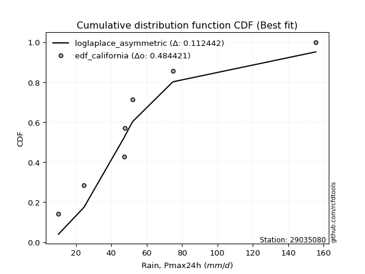</img>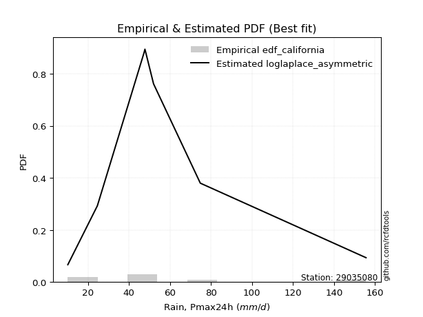</img>

</div>


### 2. EDF Hazen (1930)

Hazen method for plotting positions is a formula used to estimate the empirical cumulative probability distribution of flood events or other hydrological data. This formula often results in biased estimations, particularly when extrapolating to extreme events (high return periods).

<div align="center">


$P=(m-0.5)/n$


</div>


**2.1. Empirical values**

<div align="center">

|                | 0                   | 1                   | 2                   | 3         | 4                  | 5                  | 6                  |
|:---------------|:--------------------|:--------------------|:--------------------|:----------|:-------------------|:-------------------|:-------------------|
| date           | 2018                | 2023                | 2020                | 2022      | 2021               | 2019               | 2024               |
| x              | 10.2                | 24.6                | 47.4                | 47.8      | 52.0               | 74.8               | 155.6              |
| m              | 1                   | 2                   | 3                   | 4         | 5                  | 6                  | 7                  |
| empirical_dist | edf_hazen           | edf_hazen           | edf_hazen           | edf_hazen | edf_hazen          | edf_hazen          | edf_hazen          |
| empirical      | 0.07142857142857142 | 0.21428571428571427 | 0.35714285714285715 | 0.5       | 0.6428571428571429 | 0.7857142857142857 | 0.9285714285714286 |
| empirical_tr   | 1.0769230769230769  | 1.2727272727272727  | 1.5555555555555558  | 2.0       | 2.8000000000000003 | 4.666666666666666  | 14.000000000000007 |

</div>


**2.2. Kolmogorov-Smirnov fit test (sorted by Δ)**


<div align="center">

|                | 0                   | 1                   | 2                   | 3                   | 4                   | 5                   | 6                   | 7                   | 8                   | 9                   | 10                  | 11                  | 12                  | 13                  | 14                  | 15                  | 16                  | 17                  | 18                  | 19                  | 20                  | 21                  | 22                  | 23                  | 24                  | 25                  | 26                  | 27                  | 28                  | 29                    | 30                  | 31                  | 32                  | 33                  | 34                  | 35                  | 36                  | 37                  | 38                  | 39                  | 40                  | 41                  | 42                  | 43                  | 44                  | 45                  | 46                  | 47                  | 48                  | 49                  | 50                  | 51                  | 52                  | 53                  | 54                  | 55                  | 56                  | 57                  | 58                  | 59                  | 60                  | 61                  | 62                  | 63                  | 64                  | 65                  | 66                  | 67                  | 68                  | 69                  | 70                  | 71                  | 72                  | 73                  | 74                  | 75                  | 76                  | 77                  | 78                  | 79                  | 80                  | 81                  | 82                  | 83                  | 84                  | 85                  | 86                  | 87                  |
|:---------------|:--------------------|:--------------------|:--------------------|:--------------------|:--------------------|:--------------------|:--------------------|:--------------------|:--------------------|:--------------------|:--------------------|:--------------------|:--------------------|:--------------------|:--------------------|:--------------------|:--------------------|:--------------------|:--------------------|:--------------------|:--------------------|:--------------------|:--------------------|:--------------------|:--------------------|:--------------------|:--------------------|:--------------------|:--------------------|:----------------------|:--------------------|:--------------------|:--------------------|:--------------------|:--------------------|:--------------------|:--------------------|:--------------------|:--------------------|:--------------------|:--------------------|:--------------------|:--------------------|:--------------------|:--------------------|:--------------------|:--------------------|:--------------------|:--------------------|:--------------------|:--------------------|:--------------------|:--------------------|:--------------------|:--------------------|:--------------------|:--------------------|:--------------------|:--------------------|:--------------------|:--------------------|:--------------------|:--------------------|:--------------------|:--------------------|:--------------------|:--------------------|:--------------------|:--------------------|:--------------------|:--------------------|:--------------------|:--------------------|:--------------------|:--------------------|:--------------------|:--------------------|:--------------------|:--------------------|:--------------------|:--------------------|:--------------------|:--------------------|:--------------------|:--------------------|:--------------------|:--------------------|:--------------------|
| station        | 29035080            | 29035080            | 29035080            | 29035080            | 29035080            | 29035080            | 29035080            | 29035080            | 29035080            | 29035080            | 29035080            | 29035080            | 29035080            | 29035080            | 29035080            | 29035080            | 29035080            | 29035080            | 29035080            | 29035080            | 29035080            | 29035080            | 29035080            | 29035080            | 29035080            | 29035080            | 29035080            | 29035080            | 29035080            | 29035080              | 29035080            | 29035080            | 29035080            | 29035080            | 29035080            | 29035080            | 29035080            | 29035080            | 29035080            | 29035080            | 29035080            | 29035080            | 29035080            | 29035080            | 29035080            | 29035080            | 29035080            | 29035080            | 29035080            | 29035080            | 29035080            | 29035080            | 29035080            | 29035080            | 29035080            | 29035080            | 29035080            | 29035080            | 29035080            | 29035080            | 29035080            | 29035080            | 29035080            | 29035080            | 29035080            | 29035080            | 29035080            | 29035080            | 29035080            | 29035080            | 29035080            | 29035080            | 29035080            | 29035080            | 29035080            | 29035080            | 29035080            | 29035080            | 29035080            | 29035080            | 29035080            | 29035080            | 29035080            | 29035080            | 29035080            | 29035080            | 29035080            | 29035080            |
| empirical_dist | edf_hazen           | edf_hazen           | edf_hazen           | edf_hazen           | edf_hazen           | edf_hazen           | edf_hazen           | edf_hazen           | edf_hazen           | edf_hazen           | edf_hazen           | edf_hazen           | edf_hazen           | edf_hazen           | edf_hazen           | edf_hazen           | edf_hazen           | edf_hazen           | edf_hazen           | edf_hazen           | edf_hazen           | edf_hazen           | edf_hazen           | edf_hazen           | edf_hazen           | edf_hazen           | edf_hazen           | edf_hazen           | edf_hazen           | edf_hazen             | edf_hazen           | edf_hazen           | edf_hazen           | edf_hazen           | edf_hazen           | edf_hazen           | edf_hazen           | edf_hazen           | edf_hazen           | edf_hazen           | edf_hazen           | edf_hazen           | edf_hazen           | edf_hazen           | edf_hazen           | edf_hazen           | edf_hazen           | edf_hazen           | edf_hazen           | edf_hazen           | edf_hazen           | edf_hazen           | edf_hazen           | edf_hazen           | edf_hazen           | edf_hazen           | edf_hazen           | edf_hazen           | edf_hazen           | edf_hazen           | edf_hazen           | edf_hazen           | edf_hazen           | edf_hazen           | edf_hazen           | edf_hazen           | edf_hazen           | edf_hazen           | edf_hazen           | edf_hazen           | edf_hazen           | edf_hazen           | edf_hazen           | edf_hazen           | edf_hazen           | edf_hazen           | edf_hazen           | edf_hazen           | edf_hazen           | edf_hazen           | edf_hazen           | edf_hazen           | edf_hazen           | edf_hazen           | edf_hazen           | edf_hazen           | edf_hazen           | edf_hazen           |
| p_dist         | moyal               | pearson3            | halfnorm            | exponnorm           | loggumbel_l         | genlogistic         | halflogistic        | loggenlogistic      | mielke              | gumbel_r            | logjohnsonsu        | logloggamma         | ncf                 | invweibull          | logweibull_min      | fisk                | gompertz            | t                   | invgamma            | nakagami            | logpearson3         | nct                 | logfisk             | johnsonsu           | invgauss            | genexpon            | rayleigh            | loggompertz         | kstwobign           | loglaplace_asymmetric | laplace_asymmetric  | maxwell             | logf                | logcrystalball      | logexponnorm        | lognorm             | lognorm             | logt                | logfatiguelife      | lognct              | expon               | logbetaprime        | loglogistic         | wald                | logerlang           | loghypsecant        | logrice             | logncf              | loggamma            | loggamma            | loginvgamma         | logalpha            | f                   | loglaplace          | rice                | loginvgauss         | norm                | truncnorm           | crystalball         | logmaxwell          | logistic            | logtruncnorm        | gibrat              | loginvweibull       | lograyleigh         | hypsecant           | logkstwobign        | laplace             | betaprime           | loggumbel_r         | loghalfnorm         | loggenexpon         | alpha               | erlang              | logmoyal            | loghalflogistic     | gumbel_l            | weibull_min         | logmielke           | logexpon            | logwald             | loggibrat           | chi2                | gamma               | loglognorm          | logchi2             | lognakagami         | fatiguelife         |
| delta          | 0.12099356903228081 | 0.12229217205888043 | 0.12502743766921987 | 0.12744643922463977 | 0.1280347289517214  | 0.13055880942007447 | 0.13550876328310385 | 0.13923593003663243 | 0.13951675748167547 | 0.1399380713544579  | 0.1425776878509099  | 0.14378289829773722 | 0.14497330411129788 | 0.14761018881295668 | 0.1479571952305389  | 0.1485824828513384  | 0.14896938159438572 | 0.14916041879237346 | 0.14922504214227844 | 0.1493741859803876  | 0.15039832788523316 | 0.15108524082510494 | 0.1545452834213909  | 0.15462284937641674 | 0.1553062047584129  | 0.1556106490812968  | 0.15906666968773553 | 0.16016138641807026 | 0.16067427119904854 | 0.16766577174605007   | 0.16947869114112635 | 0.17111303735929678 | 0.17466067979159355 | 0.1749248528941308  | 0.17492748972800937 | 0.17493027790530863 | 0.17493027790530863 | 0.17493050656066594 | 0.1756331840317184  | 0.1756797180833099  | 0.17688823277141136 | 0.17755749831079687 | 0.1792871267491612  | 0.18175801039436384 | 0.18225751909949411 | 0.1829914924275407  | 0.1845972614918729  | 0.18508711274340134 | 0.18555551979970103 | 0.18555551979970103 | 0.18860872538426637 | 0.19100280905748473 | 0.19324257505597026 | 0.19664743468498874 | 0.20212005031883395 | 0.20326127148082057 | 0.20551392311801997 | 0.20551392889599696 | 0.20551393218054143 | 0.20642271740124357 | 0.21388639827763922 | 0.21428377762720727 | 0.21428571428571427 | 0.21645739321879703 | 0.21666777738765758 | 0.22091705312152837 | 0.23725735308156154 | 0.2428131648436908  | 0.24464671029675383 | 0.24552136969404498 | 0.24552794607791834 | 0.26186315867763815 | 0.2620128630761471  | 0.2694068129620905  | 0.2708664997397537  | 0.27213048305810034 | 0.27499849368462836 | 0.28111635274266705 | 0.28916883580084857 | 0.2905639361856625  | 0.3412215335769701  | 0.3687006220833727  | 0.39232177334933777 | 0.39269001979968193 | 0.42599680910956084 | 0.439435721286214   | 0.4405903471519757  | 0.5194837308381008  |
| deltao         | 0.48442053926100004 | 0.48442053926100004 | 0.48442053926100004 | 0.48442053926100004 | 0.48442053926100004 | 0.48442053926100004 | 0.48442053926100004 | 0.48442053926100004 | 0.48442053926100004 | 0.48442053926100004 | 0.48442053926100004 | 0.48442053926100004 | 0.48442053926100004 | 0.48442053926100004 | 0.48442053926100004 | 0.48442053926100004 | 0.48442053926100004 | 0.48442053926100004 | 0.48442053926100004 | 0.48442053926100004 | 0.48442053926100004 | 0.48442053926100004 | 0.48442053926100004 | 0.48442053926100004 | 0.48442053926100004 | 0.48442053926100004 | 0.48442053926100004 | 0.48442053926100004 | 0.48442053926100004 | 0.48442053926100004   | 0.48442053926100004 | 0.48442053926100004 | 0.48442053926100004 | 0.48442053926100004 | 0.48442053926100004 | 0.48442053926100004 | 0.48442053926100004 | 0.48442053926100004 | 0.48442053926100004 | 0.48442053926100004 | 0.48442053926100004 | 0.48442053926100004 | 0.48442053926100004 | 0.48442053926100004 | 0.48442053926100004 | 0.48442053926100004 | 0.48442053926100004 | 0.48442053926100004 | 0.48442053926100004 | 0.48442053926100004 | 0.48442053926100004 | 0.48442053926100004 | 0.48442053926100004 | 0.48442053926100004 | 0.48442053926100004 | 0.48442053926100004 | 0.48442053926100004 | 0.48442053926100004 | 0.48442053926100004 | 0.48442053926100004 | 0.48442053926100004 | 0.48442053926100004 | 0.48442053926100004 | 0.48442053926100004 | 0.48442053926100004 | 0.48442053926100004 | 0.48442053926100004 | 0.48442053926100004 | 0.48442053926100004 | 0.48442053926100004 | 0.48442053926100004 | 0.48442053926100004 | 0.48442053926100004 | 0.48442053926100004 | 0.48442053926100004 | 0.48442053926100004 | 0.48442053926100004 | 0.48442053926100004 | 0.48442053926100004 | 0.48442053926100004 | 0.48442053926100004 | 0.48442053926100004 | 0.48442053926100004 | 0.48442053926100004 | 0.48442053926100004 | 0.48442053926100004 | 0.48442053926100004 | 0.48442053926100004 |
| eval           | Δo > Δ              | Δo > Δ              | Δo > Δ              | Δo > Δ              | Δo > Δ              | Δo > Δ              | Δo > Δ              | Δo > Δ              | Δo > Δ              | Δo > Δ              | Δo > Δ              | Δo > Δ              | Δo > Δ              | Δo > Δ              | Δo > Δ              | Δo > Δ              | Δo > Δ              | Δo > Δ              | Δo > Δ              | Δo > Δ              | Δo > Δ              | Δo > Δ              | Δo > Δ              | Δo > Δ              | Δo > Δ              | Δo > Δ              | Δo > Δ              | Δo > Δ              | Δo > Δ              | Δo > Δ                | Δo > Δ              | Δo > Δ              | Δo > Δ              | Δo > Δ              | Δo > Δ              | Δo > Δ              | Δo > Δ              | Δo > Δ              | Δo > Δ              | Δo > Δ              | Δo > Δ              | Δo > Δ              | Δo > Δ              | Δo > Δ              | Δo > Δ              | Δo > Δ              | Δo > Δ              | Δo > Δ              | Δo > Δ              | Δo > Δ              | Δo > Δ              | Δo > Δ              | Δo > Δ              | Δo > Δ              | Δo > Δ              | Δo > Δ              | Δo > Δ              | Δo > Δ              | Δo > Δ              | Δo > Δ              | Δo > Δ              | Δo > Δ              | Δo > Δ              | Δo > Δ              | Δo > Δ              | Δo > Δ              | Δo > Δ              | Δo > Δ              | Δo > Δ              | Δo > Δ              | Δo > Δ              | Δo > Δ              | Δo > Δ              | Δo > Δ              | Δo > Δ              | Δo > Δ              | Δo > Δ              | Δo > Δ              | Δo > Δ              | Δo > Δ              | Δo > Δ              | Δo > Δ              | Δo > Δ              | Δo > Δ              | Δo > Δ              | Δo > Δ              | Δo > Δ              | Δo <= Δ             |
| fit            | 1                   | 1                   | 1                   | 1                   | 1                   | 1                   | 1                   | 1                   | 1                   | 1                   | 1                   | 1                   | 1                   | 1                   | 1                   | 1                   | 1                   | 1                   | 1                   | 1                   | 1                   | 1                   | 1                   | 1                   | 1                   | 1                   | 1                   | 1                   | 1                   | 1                     | 1                   | 1                   | 1                   | 1                   | 1                   | 1                   | 1                   | 1                   | 1                   | 1                   | 1                   | 1                   | 1                   | 1                   | 1                   | 1                   | 1                   | 1                   | 1                   | 1                   | 1                   | 1                   | 1                   | 1                   | 1                   | 1                   | 1                   | 1                   | 1                   | 1                   | 1                   | 1                   | 1                   | 1                   | 1                   | 1                   | 1                   | 1                   | 1                   | 1                   | 1                   | 1                   | 1                   | 1                   | 1                   | 1                   | 1                   | 1                   | 1                   | 1                   | 1                   | 1                   | 1                   | 1                   | 1                   | 1                   | 1                   | 0                   |
| n              | 7                   | 7                   | 7                   | 7                   | 7                   | 7                   | 7                   | 7                   | 7                   | 7                   | 7                   | 7                   | 7                   | 7                   | 7                   | 7                   | 7                   | 7                   | 7                   | 7                   | 7                   | 7                   | 7                   | 7                   | 7                   | 7                   | 7                   | 7                   | 7                   | 7                     | 7                   | 7                   | 7                   | 7                   | 7                   | 7                   | 7                   | 7                   | 7                   | 7                   | 7                   | 7                   | 7                   | 7                   | 7                   | 7                   | 7                   | 7                   | 7                   | 7                   | 7                   | 7                   | 7                   | 7                   | 7                   | 7                   | 7                   | 7                   | 7                   | 7                   | 7                   | 7                   | 7                   | 7                   | 7                   | 7                   | 7                   | 7                   | 7                   | 7                   | 7                   | 7                   | 7                   | 7                   | 7                   | 7                   | 7                   | 7                   | 7                   | 7                   | 7                   | 7                   | 7                   | 7                   | 7                   | 7                   | 7                   | 7                   |
| best_fit       | 1                   | 0                   | 0                   | 0                   | 0                   | 0                   | 0                   | 0                   | 0                   | 0                   | 0                   | 0                   | 0                   | 0                   | 0                   | 0                   | 0                   | 0                   | 0                   | 0                   | 0                   | 0                   | 0                   | 0                   | 0                   | 0                   | 0                   | 0                   | 0                   | 0                     | 0                   | 0                   | 0                   | 0                   | 0                   | 0                   | 0                   | 0                   | 0                   | 0                   | 0                   | 0                   | 0                   | 0                   | 0                   | 0                   | 0                   | 0                   | 0                   | 0                   | 0                   | 0                   | 0                   | 0                   | 0                   | 0                   | 0                   | 0                   | 0                   | 0                   | 0                   | 0                   | 0                   | 0                   | 0                   | 0                   | 0                   | 0                   | 0                   | 0                   | 0                   | 0                   | 0                   | 0                   | 0                   | 0                   | 0                   | 0                   | 0                   | 0                   | 0                   | 0                   | 0                   | 0                   | 0                   | 0                   | 0                   | 0                   |
| best_fit_sort  | 1                   | 2                   | 3                   | 4                   | 5                   | 6                   | 7                   | 8                   | 9                   | 10                  | 11                  | 12                  | 13                  | 14                  | 15                  | 16                  | 17                  | 18                  | 19                  | 20                  | 21                  | 22                  | 23                  | 24                  | 25                  | 26                  | 27                  | 28                  | 29                  | 30                    | 31                  | 32                  | 33                  | 34                  | 35                  | 36                  | 37                  | 38                  | 39                  | 40                  | 41                  | 42                  | 43                  | 44                  | 45                  | 46                  | 47                  | 48                  | 49                  | 50                  | 51                  | 52                  | 53                  | 54                  | 55                  | 56                  | 57                  | 58                  | 59                  | 60                  | 61                  | 62                  | 63                  | 64                  | 65                  | 66                  | 67                  | 68                  | 69                  | 70                  | 71                  | 72                  | 73                  | 74                  | 75                  | 76                  | 77                  | 78                  | 79                  | 80                  | 81                  | 82                  | 83                  | 84                  | 85                  | 86                  | 87                  | 88                  |

</div>


**2.3. Best fit**

<div align="center">

|   id |   station | empirical_dist   | p_dist   |    delta |   deltao | eval   |   fit |   n |   best_fit |   best_fit_sort |
|-----:|----------:|:-----------------|:---------|---------:|---------:|:-------|------:|----:|-----------:|----------------:|
|    0 |  29035080 | edf_hazen        | moyal    | 0.120994 | 0.484421 | Δo > Δ |     1 |   7 |          1 |               1 |

</div>


<div align="center">

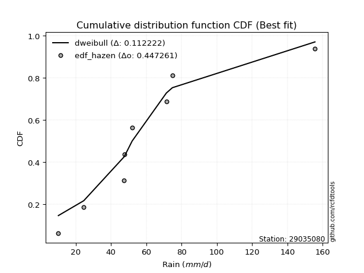</img></img>

</div>


### 3. EDF Weibull (1939)

Weibull plotting position formula is an empirical method used to estimate the non-exceedance probability or plotting position for a set of observed data, is often recommended or widely used in practice, particularly in flood frequency analysis.

<div align="center">


$P=m/(n+1)$


</div>


**3.1. Empirical values**

<div align="center">

|                | 0                  | 1                  | 2           | 3           | 4                  | 5           | 6           |
|:---------------|:-------------------|:-------------------|:------------|:------------|:-------------------|:------------|:------------|
| date           | 2018               | 2023               | 2020        | 2022        | 2021               | 2019        | 2024        |
| x              | 10.2               | 24.6               | 47.4        | 47.8        | 52.0               | 74.8        | 155.6       |
| m              | 1                  | 2                  | 3           | 4           | 5                  | 6           | 7           |
| empirical_dist | edf_weibull        | edf_weibull        | edf_weibull | edf_weibull | edf_weibull        | edf_weibull | edf_weibull |
| empirical      | 0.125              | 0.25               | 0.375       | 0.5         | 0.625              | 0.75        | 0.875       |
| empirical_tr   | 1.1428571428571428 | 1.3333333333333333 | 1.6         | 2.0         | 2.6666666666666665 | 4.0         | 8.0         |

</div>


**3.2. Kolmogorov-Smirnov fit test (sorted by Δ)**


<div align="center">

|                | 0                   | 1                   | 2                   | 3                   | 4                   | 5                   | 6                   | 7                   | 8                   | 9                   | 10                  | 11                  | 12                  | 13                  | 14                  | 15                  | 16                  | 17                  | 18                  | 19                  | 20                  | 21                  | 22                  | 23                  | 24                  | 25                  | 26                  | 27                  | 28                  | 29                    | 30                  | 31                  | 32                  | 33                  | 34                  | 35                  | 36                  | 37                  | 38                  | 39                  | 40                  | 41                  | 42                  | 43                  | 44                  | 45                  | 46                  | 47                  | 48                  | 49                  | 50                  | 51                  | 52                  | 53                  | 54                  | 55                  | 56                  | 57                  | 58                  | 59                  | 60                  | 61                  | 62                  | 63                  | 64                  | 65                  | 66                  | 67                  | 68                  | 69                  | 70                  | 71                  | 72                  | 73                  | 74                  | 75                  | 76                  | 77                  | 78                  | 79                  | 80                  | 81                  | 82                  | 83                  | 84                  | 85                  | 86                  | 87                  |
|:---------------|:--------------------|:--------------------|:--------------------|:--------------------|:--------------------|:--------------------|:--------------------|:--------------------|:--------------------|:--------------------|:--------------------|:--------------------|:--------------------|:--------------------|:--------------------|:--------------------|:--------------------|:--------------------|:--------------------|:--------------------|:--------------------|:--------------------|:--------------------|:--------------------|:--------------------|:--------------------|:--------------------|:--------------------|:--------------------|:----------------------|:--------------------|:--------------------|:--------------------|:--------------------|:--------------------|:--------------------|:--------------------|:--------------------|:--------------------|:--------------------|:--------------------|:--------------------|:--------------------|:--------------------|:--------------------|:--------------------|:--------------------|:--------------------|:--------------------|:--------------------|:--------------------|:--------------------|:--------------------|:--------------------|:--------------------|:--------------------|:--------------------|:--------------------|:--------------------|:--------------------|:--------------------|:--------------------|:--------------------|:--------------------|:--------------------|:--------------------|:--------------------|:--------------------|:--------------------|:--------------------|:--------------------|:--------------------|:--------------------|:--------------------|:--------------------|:--------------------|:--------------------|:--------------------|:--------------------|:--------------------|:--------------------|:--------------------|:--------------------|:--------------------|:--------------------|:--------------------|:--------------------|:--------------------|
| station        | 29035080            | 29035080            | 29035080            | 29035080            | 29035080            | 29035080            | 29035080            | 29035080            | 29035080            | 29035080            | 29035080            | 29035080            | 29035080            | 29035080            | 29035080            | 29035080            | 29035080            | 29035080            | 29035080            | 29035080            | 29035080            | 29035080            | 29035080            | 29035080            | 29035080            | 29035080            | 29035080            | 29035080            | 29035080            | 29035080              | 29035080            | 29035080            | 29035080            | 29035080            | 29035080            | 29035080            | 29035080            | 29035080            | 29035080            | 29035080            | 29035080            | 29035080            | 29035080            | 29035080            | 29035080            | 29035080            | 29035080            | 29035080            | 29035080            | 29035080            | 29035080            | 29035080            | 29035080            | 29035080            | 29035080            | 29035080            | 29035080            | 29035080            | 29035080            | 29035080            | 29035080            | 29035080            | 29035080            | 29035080            | 29035080            | 29035080            | 29035080            | 29035080            | 29035080            | 29035080            | 29035080            | 29035080            | 29035080            | 29035080            | 29035080            | 29035080            | 29035080            | 29035080            | 29035080            | 29035080            | 29035080            | 29035080            | 29035080            | 29035080            | 29035080            | 29035080            | 29035080            | 29035080            |
| empirical_dist | edf_weibull         | edf_weibull         | edf_weibull         | edf_weibull         | edf_weibull         | edf_weibull         | edf_weibull         | edf_weibull         | edf_weibull         | edf_weibull         | edf_weibull         | edf_weibull         | edf_weibull         | edf_weibull         | edf_weibull         | edf_weibull         | edf_weibull         | edf_weibull         | edf_weibull         | edf_weibull         | edf_weibull         | edf_weibull         | edf_weibull         | edf_weibull         | edf_weibull         | edf_weibull         | edf_weibull         | edf_weibull         | edf_weibull         | edf_weibull           | edf_weibull         | edf_weibull         | edf_weibull         | edf_weibull         | edf_weibull         | edf_weibull         | edf_weibull         | edf_weibull         | edf_weibull         | edf_weibull         | edf_weibull         | edf_weibull         | edf_weibull         | edf_weibull         | edf_weibull         | edf_weibull         | edf_weibull         | edf_weibull         | edf_weibull         | edf_weibull         | edf_weibull         | edf_weibull         | edf_weibull         | edf_weibull         | edf_weibull         | edf_weibull         | edf_weibull         | edf_weibull         | edf_weibull         | edf_weibull         | edf_weibull         | edf_weibull         | edf_weibull         | edf_weibull         | edf_weibull         | edf_weibull         | edf_weibull         | edf_weibull         | edf_weibull         | edf_weibull         | edf_weibull         | edf_weibull         | edf_weibull         | edf_weibull         | edf_weibull         | edf_weibull         | edf_weibull         | edf_weibull         | edf_weibull         | edf_weibull         | edf_weibull         | edf_weibull         | edf_weibull         | edf_weibull         | edf_weibull         | edf_weibull         | edf_weibull         | edf_weibull         |
| p_dist         | moyal               | pearson3            | halfnorm            | exponnorm           | loggumbel_l         | genlogistic         | halflogistic        | loggenlogistic      | mielke              | gumbel_r            | logjohnsonsu        | logloggamma         | ncf                 | invweibull          | logweibull_min      | fisk                | gompertz            | t                   | invgamma            | nakagami            | logpearson3         | nct                 | logfisk             | johnsonsu           | invgauss            | genexpon            | rayleigh            | loggompertz         | kstwobign           | loglaplace_asymmetric | laplace_asymmetric  | maxwell             | logf                | logcrystalball      | logexponnorm        | lognorm             | lognorm             | logt                | logfatiguelife      | lognct              | expon               | logbetaprime        | loglogistic         | logerlang           | loghypsecant        | logrice             | logncf              | loggamma            | loggamma            | wald                | loginvgamma         | logalpha            | f                   | loglaplace          | rice                | loginvgauss         | norm                | truncnorm           | crystalball         | logmaxwell          | logistic            | loginvweibull       | lograyleigh         | hypsecant           | logkstwobign        | laplace             | betaprime           | loggumbel_r         | loghalfnorm         | loggenexpon         | alpha               | logtruncnorm        | gibrat              | erlang              | logmoyal            | loghalflogistic     | gumbel_l            | weibull_min         | logmielke           | logexpon            | logwald             | loggibrat           | chi2                | gamma               | loglognorm          | logchi2             | lognakagami         | fatiguelife         |
| delta          | 0.10313642617513796 | 0.10443502920173753 | 0.10717029481207696 | 0.10958929636749692 | 0.1109684745754067  | 0.11270166656293157 | 0.117651620425961   | 0.12137878717948958 | 0.12165961462453262 | 0.122080928497315   | 0.12472054499376706 | 0.12592575544059437 | 0.12711616125415504 | 0.12975304595581383 | 0.13010005237339606 | 0.13072533999419556 | 0.13111223873724287 | 0.1313032759352306  | 0.1313678992851356  | 0.13151704312324475 | 0.1325411850280903  | 0.1332280979679621  | 0.13668814056424805 | 0.1367657065192739  | 0.13744906190127004 | 0.13775350622415394 | 0.14120952683059262 | 0.1423042435609274  | 0.14281712834190563 | 0.14980862888890722   | 0.15162154828398344 | 0.15325589450215388 | 0.1568035369344507  | 0.15706771003698794 | 0.15707034687086652 | 0.15707313504816578 | 0.15707313504816578 | 0.1570733637035231  | 0.15777604117457555 | 0.15782257522616705 | 0.1590310899142685  | 0.15970035545365402 | 0.16142998389201835 | 0.16440037624235126 | 0.16513434957039785 | 0.16674011863473004 | 0.1672299698862585  | 0.16769837694255818 | 0.16769837694255818 | 0.1700898068344765  | 0.17075158252712352 | 0.17314566620034189 | 0.1753854321988274  | 0.1787902918278459  | 0.18426290746169105 | 0.18540412862367772 | 0.18765678026087707 | 0.18765678603885405 | 0.18765678932339852 | 0.18856557454410072 | 0.19602925542049632 | 0.19860025036165418 | 0.19881063453051473 | 0.20305991026438547 | 0.2194002102244187  | 0.2249560219865479  | 0.22678956743961098 | 0.22766422683690213 | 0.2276708032207755  | 0.2440060158204953  | 0.24415572021900422 | 0.249998063341493   | 0.25                | 0.25154967010494766 | 0.25300935688261084 | 0.2542733402009575  | 0.25714135082748546 | 0.2632592098855242  | 0.2713116929437057  | 0.27270679332851966 | 0.32336439071982725 | 0.3508434792262298  | 0.3744646304921949  | 0.3748328769425391  | 0.39028252339527514 | 0.4152421304021007  | 0.42273320429483285 | 0.48376944512381514 |
| deltao         | 0.48442053926100004 | 0.48442053926100004 | 0.48442053926100004 | 0.48442053926100004 | 0.48442053926100004 | 0.48442053926100004 | 0.48442053926100004 | 0.48442053926100004 | 0.48442053926100004 | 0.48442053926100004 | 0.48442053926100004 | 0.48442053926100004 | 0.48442053926100004 | 0.48442053926100004 | 0.48442053926100004 | 0.48442053926100004 | 0.48442053926100004 | 0.48442053926100004 | 0.48442053926100004 | 0.48442053926100004 | 0.48442053926100004 | 0.48442053926100004 | 0.48442053926100004 | 0.48442053926100004 | 0.48442053926100004 | 0.48442053926100004 | 0.48442053926100004 | 0.48442053926100004 | 0.48442053926100004 | 0.48442053926100004   | 0.48442053926100004 | 0.48442053926100004 | 0.48442053926100004 | 0.48442053926100004 | 0.48442053926100004 | 0.48442053926100004 | 0.48442053926100004 | 0.48442053926100004 | 0.48442053926100004 | 0.48442053926100004 | 0.48442053926100004 | 0.48442053926100004 | 0.48442053926100004 | 0.48442053926100004 | 0.48442053926100004 | 0.48442053926100004 | 0.48442053926100004 | 0.48442053926100004 | 0.48442053926100004 | 0.48442053926100004 | 0.48442053926100004 | 0.48442053926100004 | 0.48442053926100004 | 0.48442053926100004 | 0.48442053926100004 | 0.48442053926100004 | 0.48442053926100004 | 0.48442053926100004 | 0.48442053926100004 | 0.48442053926100004 | 0.48442053926100004 | 0.48442053926100004 | 0.48442053926100004 | 0.48442053926100004 | 0.48442053926100004 | 0.48442053926100004 | 0.48442053926100004 | 0.48442053926100004 | 0.48442053926100004 | 0.48442053926100004 | 0.48442053926100004 | 0.48442053926100004 | 0.48442053926100004 | 0.48442053926100004 | 0.48442053926100004 | 0.48442053926100004 | 0.48442053926100004 | 0.48442053926100004 | 0.48442053926100004 | 0.48442053926100004 | 0.48442053926100004 | 0.48442053926100004 | 0.48442053926100004 | 0.48442053926100004 | 0.48442053926100004 | 0.48442053926100004 | 0.48442053926100004 | 0.48442053926100004 |
| eval           | Δo > Δ              | Δo > Δ              | Δo > Δ              | Δo > Δ              | Δo > Δ              | Δo > Δ              | Δo > Δ              | Δo > Δ              | Δo > Δ              | Δo > Δ              | Δo > Δ              | Δo > Δ              | Δo > Δ              | Δo > Δ              | Δo > Δ              | Δo > Δ              | Δo > Δ              | Δo > Δ              | Δo > Δ              | Δo > Δ              | Δo > Δ              | Δo > Δ              | Δo > Δ              | Δo > Δ              | Δo > Δ              | Δo > Δ              | Δo > Δ              | Δo > Δ              | Δo > Δ              | Δo > Δ                | Δo > Δ              | Δo > Δ              | Δo > Δ              | Δo > Δ              | Δo > Δ              | Δo > Δ              | Δo > Δ              | Δo > Δ              | Δo > Δ              | Δo > Δ              | Δo > Δ              | Δo > Δ              | Δo > Δ              | Δo > Δ              | Δo > Δ              | Δo > Δ              | Δo > Δ              | Δo > Δ              | Δo > Δ              | Δo > Δ              | Δo > Δ              | Δo > Δ              | Δo > Δ              | Δo > Δ              | Δo > Δ              | Δo > Δ              | Δo > Δ              | Δo > Δ              | Δo > Δ              | Δo > Δ              | Δo > Δ              | Δo > Δ              | Δo > Δ              | Δo > Δ              | Δo > Δ              | Δo > Δ              | Δo > Δ              | Δo > Δ              | Δo > Δ              | Δo > Δ              | Δo > Δ              | Δo > Δ              | Δo > Δ              | Δo > Δ              | Δo > Δ              | Δo > Δ              | Δo > Δ              | Δo > Δ              | Δo > Δ              | Δo > Δ              | Δo > Δ              | Δo > Δ              | Δo > Δ              | Δo > Δ              | Δo > Δ              | Δo > Δ              | Δo > Δ              | Δo > Δ              |
| fit            | 1                   | 1                   | 1                   | 1                   | 1                   | 1                   | 1                   | 1                   | 1                   | 1                   | 1                   | 1                   | 1                   | 1                   | 1                   | 1                   | 1                   | 1                   | 1                   | 1                   | 1                   | 1                   | 1                   | 1                   | 1                   | 1                   | 1                   | 1                   | 1                   | 1                     | 1                   | 1                   | 1                   | 1                   | 1                   | 1                   | 1                   | 1                   | 1                   | 1                   | 1                   | 1                   | 1                   | 1                   | 1                   | 1                   | 1                   | 1                   | 1                   | 1                   | 1                   | 1                   | 1                   | 1                   | 1                   | 1                   | 1                   | 1                   | 1                   | 1                   | 1                   | 1                   | 1                   | 1                   | 1                   | 1                   | 1                   | 1                   | 1                   | 1                   | 1                   | 1                   | 1                   | 1                   | 1                   | 1                   | 1                   | 1                   | 1                   | 1                   | 1                   | 1                   | 1                   | 1                   | 1                   | 1                   | 1                   | 1                   |
| n              | 7                   | 7                   | 7                   | 7                   | 7                   | 7                   | 7                   | 7                   | 7                   | 7                   | 7                   | 7                   | 7                   | 7                   | 7                   | 7                   | 7                   | 7                   | 7                   | 7                   | 7                   | 7                   | 7                   | 7                   | 7                   | 7                   | 7                   | 7                   | 7                   | 7                     | 7                   | 7                   | 7                   | 7                   | 7                   | 7                   | 7                   | 7                   | 7                   | 7                   | 7                   | 7                   | 7                   | 7                   | 7                   | 7                   | 7                   | 7                   | 7                   | 7                   | 7                   | 7                   | 7                   | 7                   | 7                   | 7                   | 7                   | 7                   | 7                   | 7                   | 7                   | 7                   | 7                   | 7                   | 7                   | 7                   | 7                   | 7                   | 7                   | 7                   | 7                   | 7                   | 7                   | 7                   | 7                   | 7                   | 7                   | 7                   | 7                   | 7                   | 7                   | 7                   | 7                   | 7                   | 7                   | 7                   | 7                   | 7                   |
| best_fit       | 1                   | 0                   | 0                   | 0                   | 0                   | 0                   | 0                   | 0                   | 0                   | 0                   | 0                   | 0                   | 0                   | 0                   | 0                   | 0                   | 0                   | 0                   | 0                   | 0                   | 0                   | 0                   | 0                   | 0                   | 0                   | 0                   | 0                   | 0                   | 0                   | 0                     | 0                   | 0                   | 0                   | 0                   | 0                   | 0                   | 0                   | 0                   | 0                   | 0                   | 0                   | 0                   | 0                   | 0                   | 0                   | 0                   | 0                   | 0                   | 0                   | 0                   | 0                   | 0                   | 0                   | 0                   | 0                   | 0                   | 0                   | 0                   | 0                   | 0                   | 0                   | 0                   | 0                   | 0                   | 0                   | 0                   | 0                   | 0                   | 0                   | 0                   | 0                   | 0                   | 0                   | 0                   | 0                   | 0                   | 0                   | 0                   | 0                   | 0                   | 0                   | 0                   | 0                   | 0                   | 0                   | 0                   | 0                   | 0                   |
| best_fit_sort  | 1                   | 2                   | 3                   | 4                   | 5                   | 6                   | 7                   | 8                   | 9                   | 10                  | 11                  | 12                  | 13                  | 14                  | 15                  | 16                  | 17                  | 18                  | 19                  | 20                  | 21                  | 22                  | 23                  | 24                  | 25                  | 26                  | 27                  | 28                  | 29                  | 30                    | 31                  | 32                  | 33                  | 34                  | 35                  | 36                  | 37                  | 38                  | 39                  | 40                  | 41                  | 42                  | 43                  | 44                  | 45                  | 46                  | 47                  | 48                  | 49                  | 50                  | 51                  | 52                  | 53                  | 54                  | 55                  | 56                  | 57                  | 58                  | 59                  | 60                  | 61                  | 62                  | 63                  | 64                  | 65                  | 66                  | 67                  | 68                  | 69                  | 70                  | 71                  | 72                  | 73                  | 74                  | 75                  | 76                  | 77                  | 78                  | 79                  | 80                  | 81                  | 82                  | 83                  | 84                  | 85                  | 86                  | 87                  | 88                  |

</div>


**3.3. Best fit**

<div align="center">

|   id |   station | empirical_dist   | p_dist   |    delta |   deltao | eval   |   fit |   n |   best_fit |   best_fit_sort |
|-----:|----------:|:-----------------|:---------|---------:|---------:|:-------|------:|----:|-----------:|----------------:|
|    0 |  29035080 | edf_weibull      | moyal    | 0.103136 | 0.484421 | Δo > Δ |     1 |   7 |          1 |               1 |

</div>


<div align="center">

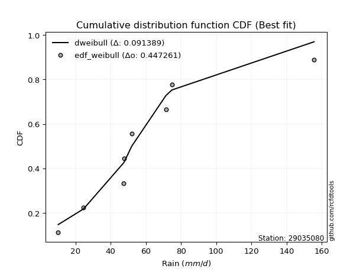</img>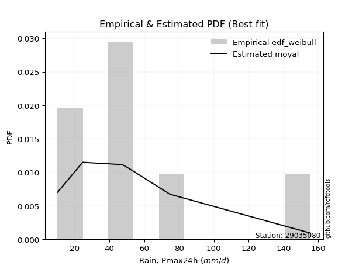</img>

</div>


### 4. EDF Beard (1943)

The Beard formula (or Beard´s plotting position formula) in hydrology is used to estimate the empirical non-exceedance probability _(P)_ of a flood event (or other extreme hydrological data point) within a given dataset.

<div align="center">


$P=(m-0.31)/(n+0.38)$


</div>


**4.1. Empirical values**

<div align="center">

|                | 0                   | 1                   | 2                   | 3         | 4                  | 5                  | 6                  |
|:---------------|:--------------------|:--------------------|:--------------------|:----------|:-------------------|:-------------------|:-------------------|
| date           | 2018                | 2023                | 2020                | 2022      | 2021               | 2019               | 2024               |
| x              | 10.2                | 24.6                | 47.4                | 47.8      | 52.0               | 74.8               | 155.6              |
| m              | 1                   | 2                   | 3                   | 4         | 5                  | 6                  | 7                  |
| empirical_dist | edf_beard           | edf_beard           | edf_beard           | edf_beard | edf_beard          | edf_beard          | edf_beard          |
| empirical      | 0.09349593495934959 | 0.22899728997289973 | 0.36449864498644985 | 0.5       | 0.6355013550135502 | 0.7710027100271003 | 0.9065040650406505 |
| empirical_tr   | 1.1031390134529149  | 1.29701230228471    | 1.5735607675906182  | 2.0       | 2.743494423791822  | 4.366863905325444  | 10.695652173913055 |

</div>


**4.2. Kolmogorov-Smirnov fit test (sorted by Δ)**


<div align="center">

|                | 0                   | 1                   | 2                   | 3                   | 4                   | 5                   | 6                   | 7                   | 8                   | 9                   | 10                  | 11                  | 12                  | 13                  | 14                  | 15                  | 16                  | 17                  | 18                  | 19                  | 20                  | 21                  | 22                  | 23                  | 24                  | 25                  | 26                  | 27                  | 28                  | 29                    | 30                  | 31                  | 32                  | 33                  | 34                  | 35                  | 36                  | 37                  | 38                  | 39                  | 40                  | 41                  | 42                  | 43                  | 44                  | 45                  | 46                  | 47                  | 48                  | 49                  | 50                  | 51                  | 52                  | 53                  | 54                  | 55                  | 56                  | 57                  | 58                  | 59                  | 60                  | 61                  | 62                  | 63                  | 64                  | 65                  | 66                  | 67                  | 68                  | 69                  | 70                  | 71                  | 72                  | 73                  | 74                  | 75                  | 76                  | 77                  | 78                  | 79                  | 80                  | 81                  | 82                  | 83                  | 84                  | 85                  | 86                  | 87                  |
|:---------------|:--------------------|:--------------------|:--------------------|:--------------------|:--------------------|:--------------------|:--------------------|:--------------------|:--------------------|:--------------------|:--------------------|:--------------------|:--------------------|:--------------------|:--------------------|:--------------------|:--------------------|:--------------------|:--------------------|:--------------------|:--------------------|:--------------------|:--------------------|:--------------------|:--------------------|:--------------------|:--------------------|:--------------------|:--------------------|:----------------------|:--------------------|:--------------------|:--------------------|:--------------------|:--------------------|:--------------------|:--------------------|:--------------------|:--------------------|:--------------------|:--------------------|:--------------------|:--------------------|:--------------------|:--------------------|:--------------------|:--------------------|:--------------------|:--------------------|:--------------------|:--------------------|:--------------------|:--------------------|:--------------------|:--------------------|:--------------------|:--------------------|:--------------------|:--------------------|:--------------------|:--------------------|:--------------------|:--------------------|:--------------------|:--------------------|:--------------------|:--------------------|:--------------------|:--------------------|:--------------------|:--------------------|:--------------------|:--------------------|:--------------------|:--------------------|:--------------------|:--------------------|:--------------------|:--------------------|:--------------------|:--------------------|:--------------------|:--------------------|:--------------------|:--------------------|:--------------------|:--------------------|:--------------------|
| station        | 29035080            | 29035080            | 29035080            | 29035080            | 29035080            | 29035080            | 29035080            | 29035080            | 29035080            | 29035080            | 29035080            | 29035080            | 29035080            | 29035080            | 29035080            | 29035080            | 29035080            | 29035080            | 29035080            | 29035080            | 29035080            | 29035080            | 29035080            | 29035080            | 29035080            | 29035080            | 29035080            | 29035080            | 29035080            | 29035080              | 29035080            | 29035080            | 29035080            | 29035080            | 29035080            | 29035080            | 29035080            | 29035080            | 29035080            | 29035080            | 29035080            | 29035080            | 29035080            | 29035080            | 29035080            | 29035080            | 29035080            | 29035080            | 29035080            | 29035080            | 29035080            | 29035080            | 29035080            | 29035080            | 29035080            | 29035080            | 29035080            | 29035080            | 29035080            | 29035080            | 29035080            | 29035080            | 29035080            | 29035080            | 29035080            | 29035080            | 29035080            | 29035080            | 29035080            | 29035080            | 29035080            | 29035080            | 29035080            | 29035080            | 29035080            | 29035080            | 29035080            | 29035080            | 29035080            | 29035080            | 29035080            | 29035080            | 29035080            | 29035080            | 29035080            | 29035080            | 29035080            | 29035080            |
| empirical_dist | edf_beard           | edf_beard           | edf_beard           | edf_beard           | edf_beard           | edf_beard           | edf_beard           | edf_beard           | edf_beard           | edf_beard           | edf_beard           | edf_beard           | edf_beard           | edf_beard           | edf_beard           | edf_beard           | edf_beard           | edf_beard           | edf_beard           | edf_beard           | edf_beard           | edf_beard           | edf_beard           | edf_beard           | edf_beard           | edf_beard           | edf_beard           | edf_beard           | edf_beard           | edf_beard             | edf_beard           | edf_beard           | edf_beard           | edf_beard           | edf_beard           | edf_beard           | edf_beard           | edf_beard           | edf_beard           | edf_beard           | edf_beard           | edf_beard           | edf_beard           | edf_beard           | edf_beard           | edf_beard           | edf_beard           | edf_beard           | edf_beard           | edf_beard           | edf_beard           | edf_beard           | edf_beard           | edf_beard           | edf_beard           | edf_beard           | edf_beard           | edf_beard           | edf_beard           | edf_beard           | edf_beard           | edf_beard           | edf_beard           | edf_beard           | edf_beard           | edf_beard           | edf_beard           | edf_beard           | edf_beard           | edf_beard           | edf_beard           | edf_beard           | edf_beard           | edf_beard           | edf_beard           | edf_beard           | edf_beard           | edf_beard           | edf_beard           | edf_beard           | edf_beard           | edf_beard           | edf_beard           | edf_beard           | edf_beard           | edf_beard           | edf_beard           | edf_beard           |
| p_dist         | moyal               | pearson3            | halfnorm            | exponnorm           | loggumbel_l         | genlogistic         | halflogistic        | loggenlogistic      | mielke              | gumbel_r            | logjohnsonsu        | logloggamma         | ncf                 | invweibull          | logweibull_min      | fisk                | gompertz            | t                   | invgamma            | nakagami            | logpearson3         | nct                 | logfisk             | johnsonsu           | invgauss            | genexpon            | rayleigh            | loggompertz         | kstwobign           | loglaplace_asymmetric | laplace_asymmetric  | maxwell             | logf                | logcrystalball      | logexponnorm        | lognorm             | lognorm             | logt                | logfatiguelife      | lognct              | expon               | logbetaprime        | loglogistic         | wald                | logerlang           | loghypsecant        | logrice             | logncf              | loggamma            | loggamma            | loginvgamma         | logalpha            | f                   | loglaplace          | rice                | loginvgauss         | norm                | truncnorm           | crystalball         | logmaxwell          | logistic            | loginvweibull       | lograyleigh         | hypsecant           | logtruncnorm        | gibrat              | logkstwobign        | laplace             | betaprime           | loggumbel_r         | loghalfnorm         | loggenexpon         | alpha               | erlang              | logmoyal            | loghalflogistic     | gumbel_l            | weibull_min         | logmielke           | logexpon            | logwald             | loggibrat           | chi2                | gamma               | loglognorm          | logchi2             | lognakagami         | fatiguelife         |
| delta          | 0.11363778118868811 | 0.11493638421528773 | 0.11767164982562717 | 0.12009065138104708 | 0.12067894110812871 | 0.12320302157648177 | 0.12815297543951115 | 0.13188014219303973 | 0.13216096963808277 | 0.1325822835108652  | 0.1352219000073172  | 0.13642711045414452 | 0.1376175162677052  | 0.14025440096936398 | 0.1406014073869462  | 0.1412266950077457  | 0.14161359375079302 | 0.14180463094878076 | 0.14186925429868574 | 0.1420183981367949  | 0.14304254004164046 | 0.14372945298151224 | 0.1471894955777982  | 0.14726706153282404 | 0.1479504169148202  | 0.1482548612377041  | 0.15171088184414283 | 0.15280559857447756 | 0.15331848335545584 | 0.16030998390245738   | 0.16212290329753365 | 0.16375724951570408 | 0.16730489194800086 | 0.1675690650505381  | 0.16757170188441667 | 0.16757449006171593 | 0.16757449006171593 | 0.16757471871707325 | 0.1682773961881257  | 0.1683239302397172  | 0.16953244492781866 | 0.17020171046720417 | 0.1719313389055685  | 0.17440222255077115 | 0.17490173125590142 | 0.175635704583948   | 0.1772414736482802  | 0.17773132489980864 | 0.17819973195610833 | 0.17819973195610833 | 0.18125293754067368 | 0.18364702121389204 | 0.18588678721237756 | 0.18929164684139604 | 0.19476426247524126 | 0.19590548363722787 | 0.19815813527442727 | 0.19815814105240426 | 0.19815814433694873 | 0.19906692955765087 | 0.20653061043404652 | 0.20910160537520434 | 0.20931198954406488 | 0.21356126527793567 | 0.22899535331439272 | 0.22899728997289973 | 0.22990156523796884 | 0.2354573770000981  | 0.23729092245316113 | 0.23816558185045228 | 0.23817215823432564 | 0.25450737083404545 | 0.2546570752325544  | 0.2620510251184978  | 0.263510711896161   | 0.26477469521450764 | 0.26764270584103567 | 0.27376056489907435 | 0.28181304795725587 | 0.2832081483420698  | 0.3338657457333774  | 0.36134483423978    | 0.38496598550574507 | 0.38533423195608923 | 0.41128523342237544 | 0.4257434854156508  | 0.433234559308383   | 0.5047721551509154  |
| deltao         | 0.48442053926100004 | 0.48442053926100004 | 0.48442053926100004 | 0.48442053926100004 | 0.48442053926100004 | 0.48442053926100004 | 0.48442053926100004 | 0.48442053926100004 | 0.48442053926100004 | 0.48442053926100004 | 0.48442053926100004 | 0.48442053926100004 | 0.48442053926100004 | 0.48442053926100004 | 0.48442053926100004 | 0.48442053926100004 | 0.48442053926100004 | 0.48442053926100004 | 0.48442053926100004 | 0.48442053926100004 | 0.48442053926100004 | 0.48442053926100004 | 0.48442053926100004 | 0.48442053926100004 | 0.48442053926100004 | 0.48442053926100004 | 0.48442053926100004 | 0.48442053926100004 | 0.48442053926100004 | 0.48442053926100004   | 0.48442053926100004 | 0.48442053926100004 | 0.48442053926100004 | 0.48442053926100004 | 0.48442053926100004 | 0.48442053926100004 | 0.48442053926100004 | 0.48442053926100004 | 0.48442053926100004 | 0.48442053926100004 | 0.48442053926100004 | 0.48442053926100004 | 0.48442053926100004 | 0.48442053926100004 | 0.48442053926100004 | 0.48442053926100004 | 0.48442053926100004 | 0.48442053926100004 | 0.48442053926100004 | 0.48442053926100004 | 0.48442053926100004 | 0.48442053926100004 | 0.48442053926100004 | 0.48442053926100004 | 0.48442053926100004 | 0.48442053926100004 | 0.48442053926100004 | 0.48442053926100004 | 0.48442053926100004 | 0.48442053926100004 | 0.48442053926100004 | 0.48442053926100004 | 0.48442053926100004 | 0.48442053926100004 | 0.48442053926100004 | 0.48442053926100004 | 0.48442053926100004 | 0.48442053926100004 | 0.48442053926100004 | 0.48442053926100004 | 0.48442053926100004 | 0.48442053926100004 | 0.48442053926100004 | 0.48442053926100004 | 0.48442053926100004 | 0.48442053926100004 | 0.48442053926100004 | 0.48442053926100004 | 0.48442053926100004 | 0.48442053926100004 | 0.48442053926100004 | 0.48442053926100004 | 0.48442053926100004 | 0.48442053926100004 | 0.48442053926100004 | 0.48442053926100004 | 0.48442053926100004 | 0.48442053926100004 |
| eval           | Δo > Δ              | Δo > Δ              | Δo > Δ              | Δo > Δ              | Δo > Δ              | Δo > Δ              | Δo > Δ              | Δo > Δ              | Δo > Δ              | Δo > Δ              | Δo > Δ              | Δo > Δ              | Δo > Δ              | Δo > Δ              | Δo > Δ              | Δo > Δ              | Δo > Δ              | Δo > Δ              | Δo > Δ              | Δo > Δ              | Δo > Δ              | Δo > Δ              | Δo > Δ              | Δo > Δ              | Δo > Δ              | Δo > Δ              | Δo > Δ              | Δo > Δ              | Δo > Δ              | Δo > Δ                | Δo > Δ              | Δo > Δ              | Δo > Δ              | Δo > Δ              | Δo > Δ              | Δo > Δ              | Δo > Δ              | Δo > Δ              | Δo > Δ              | Δo > Δ              | Δo > Δ              | Δo > Δ              | Δo > Δ              | Δo > Δ              | Δo > Δ              | Δo > Δ              | Δo > Δ              | Δo > Δ              | Δo > Δ              | Δo > Δ              | Δo > Δ              | Δo > Δ              | Δo > Δ              | Δo > Δ              | Δo > Δ              | Δo > Δ              | Δo > Δ              | Δo > Δ              | Δo > Δ              | Δo > Δ              | Δo > Δ              | Δo > Δ              | Δo > Δ              | Δo > Δ              | Δo > Δ              | Δo > Δ              | Δo > Δ              | Δo > Δ              | Δo > Δ              | Δo > Δ              | Δo > Δ              | Δo > Δ              | Δo > Δ              | Δo > Δ              | Δo > Δ              | Δo > Δ              | Δo > Δ              | Δo > Δ              | Δo > Δ              | Δo > Δ              | Δo > Δ              | Δo > Δ              | Δo > Δ              | Δo > Δ              | Δo > Δ              | Δo > Δ              | Δo > Δ              | Δo <= Δ             |
| fit            | 1                   | 1                   | 1                   | 1                   | 1                   | 1                   | 1                   | 1                   | 1                   | 1                   | 1                   | 1                   | 1                   | 1                   | 1                   | 1                   | 1                   | 1                   | 1                   | 1                   | 1                   | 1                   | 1                   | 1                   | 1                   | 1                   | 1                   | 1                   | 1                   | 1                     | 1                   | 1                   | 1                   | 1                   | 1                   | 1                   | 1                   | 1                   | 1                   | 1                   | 1                   | 1                   | 1                   | 1                   | 1                   | 1                   | 1                   | 1                   | 1                   | 1                   | 1                   | 1                   | 1                   | 1                   | 1                   | 1                   | 1                   | 1                   | 1                   | 1                   | 1                   | 1                   | 1                   | 1                   | 1                   | 1                   | 1                   | 1                   | 1                   | 1                   | 1                   | 1                   | 1                   | 1                   | 1                   | 1                   | 1                   | 1                   | 1                   | 1                   | 1                   | 1                   | 1                   | 1                   | 1                   | 1                   | 1                   | 0                   |
| n              | 7                   | 7                   | 7                   | 7                   | 7                   | 7                   | 7                   | 7                   | 7                   | 7                   | 7                   | 7                   | 7                   | 7                   | 7                   | 7                   | 7                   | 7                   | 7                   | 7                   | 7                   | 7                   | 7                   | 7                   | 7                   | 7                   | 7                   | 7                   | 7                   | 7                     | 7                   | 7                   | 7                   | 7                   | 7                   | 7                   | 7                   | 7                   | 7                   | 7                   | 7                   | 7                   | 7                   | 7                   | 7                   | 7                   | 7                   | 7                   | 7                   | 7                   | 7                   | 7                   | 7                   | 7                   | 7                   | 7                   | 7                   | 7                   | 7                   | 7                   | 7                   | 7                   | 7                   | 7                   | 7                   | 7                   | 7                   | 7                   | 7                   | 7                   | 7                   | 7                   | 7                   | 7                   | 7                   | 7                   | 7                   | 7                   | 7                   | 7                   | 7                   | 7                   | 7                   | 7                   | 7                   | 7                   | 7                   | 7                   |
| best_fit       | 1                   | 0                   | 0                   | 0                   | 0                   | 0                   | 0                   | 0                   | 0                   | 0                   | 0                   | 0                   | 0                   | 0                   | 0                   | 0                   | 0                   | 0                   | 0                   | 0                   | 0                   | 0                   | 0                   | 0                   | 0                   | 0                   | 0                   | 0                   | 0                   | 0                     | 0                   | 0                   | 0                   | 0                   | 0                   | 0                   | 0                   | 0                   | 0                   | 0                   | 0                   | 0                   | 0                   | 0                   | 0                   | 0                   | 0                   | 0                   | 0                   | 0                   | 0                   | 0                   | 0                   | 0                   | 0                   | 0                   | 0                   | 0                   | 0                   | 0                   | 0                   | 0                   | 0                   | 0                   | 0                   | 0                   | 0                   | 0                   | 0                   | 0                   | 0                   | 0                   | 0                   | 0                   | 0                   | 0                   | 0                   | 0                   | 0                   | 0                   | 0                   | 0                   | 0                   | 0                   | 0                   | 0                   | 0                   | 0                   |
| best_fit_sort  | 1                   | 2                   | 3                   | 4                   | 5                   | 6                   | 7                   | 8                   | 9                   | 10                  | 11                  | 12                  | 13                  | 14                  | 15                  | 16                  | 17                  | 18                  | 19                  | 20                  | 21                  | 22                  | 23                  | 24                  | 25                  | 26                  | 27                  | 28                  | 29                  | 30                    | 31                  | 32                  | 33                  | 34                  | 35                  | 36                  | 37                  | 38                  | 39                  | 40                  | 41                  | 42                  | 43                  | 44                  | 45                  | 46                  | 47                  | 48                  | 49                  | 50                  | 51                  | 52                  | 53                  | 54                  | 55                  | 56                  | 57                  | 58                  | 59                  | 60                  | 61                  | 62                  | 63                  | 64                  | 65                  | 66                  | 67                  | 68                  | 69                  | 70                  | 71                  | 72                  | 73                  | 74                  | 75                  | 76                  | 77                  | 78                  | 79                  | 80                  | 81                  | 82                  | 83                  | 84                  | 85                  | 86                  | 87                  | 88                  |

</div>


**4.3. Best fit**

<div align="center">

|   id |   station | empirical_dist   | p_dist   |    delta |   deltao | eval   |   fit |   n |   best_fit |   best_fit_sort |
|-----:|----------:|:-----------------|:---------|---------:|---------:|:-------|------:|----:|-----------:|----------------:|
|    0 |  29035080 | edf_beard        | moyal    | 0.113638 | 0.484421 | Δo > Δ |     1 |   7 |          1 |               1 |

</div>


<div align="center">

</img></img>

</div>


### 5. EDF Chegodayev (1955)

The Chegodayev formula is an empirical plotting position formula used in hydrological frequency analysis to estimate the exceedance probability or return period of a specific event from a set of observed data. It is primarily used for plotting observed data points on probability paper to fit a theoretical distribution, particularly for analyzing extreme events like maximum flood flows or rainfall intensities. The constant _b_ value in the generalized plotting position formula is 0.3.

<div align="center">


$P=(m-b)/(n+1-2b)$


</div>


**5.1. Empirical values**

<div align="center">

|                | 0                   | 1                   | 2                   | 3              | 4                  | 5                  | 6                  |
|:---------------|:--------------------|:--------------------|:--------------------|:---------------|:-------------------|:-------------------|:-------------------|
| date           | 2018                | 2023                | 2020                | 2022           | 2021               | 2019               | 2024               |
| x              | 10.2                | 24.6                | 47.4                | 47.8           | 52.0               | 74.8               | 155.6              |
| m              | 1                   | 2                   | 3                   | 4              | 5                  | 6                  | 7                  |
| empirical_dist | edf_chegodayev      | edf_chegodayev      | edf_chegodayev      | edf_chegodayev | edf_chegodayev     | edf_chegodayev     | edf_chegodayev     |
| empirical      | 0.09459459459459459 | 0.22972972972972971 | 0.36486486486486486 | 0.5            | 0.6351351351351351 | 0.7702702702702703 | 0.9054054054054054 |
| empirical_tr   | 1.1044776119402986  | 1.2982456140350878  | 1.574468085106383   | 2.0            | 2.7407407407407405 | 4.352941176470589  | 10.571428571428568 |

</div>


**5.2. Kolmogorov-Smirnov fit test (sorted by Δ)**


<div align="center">

|                | 0                   | 1                   | 2                   | 3                   | 4                   | 5                   | 6                   | 7                   | 8                   | 9                   | 10                  | 11                  | 12                  | 13                  | 14                  | 15                  | 16                  | 17                  | 18                  | 19                  | 20                  | 21                  | 22                  | 23                  | 24                  | 25                  | 26                  | 27                  | 28                  | 29                    | 30                  | 31                  | 32                  | 33                  | 34                  | 35                  | 36                  | 37                  | 38                  | 39                  | 40                  | 41                  | 42                  | 43                  | 44                  | 45                  | 46                  | 47                  | 48                  | 49                  | 50                  | 51                  | 52                  | 53                  | 54                  | 55                  | 56                  | 57                  | 58                  | 59                  | 60                  | 61                  | 62                  | 63                  | 64                  | 65                  | 66                  | 67                  | 68                  | 69                  | 70                  | 71                  | 72                  | 73                  | 74                  | 75                  | 76                  | 77                  | 78                  | 79                  | 80                  | 81                  | 82                  | 83                  | 84                  | 85                  | 86                  | 87                  |
|:---------------|:--------------------|:--------------------|:--------------------|:--------------------|:--------------------|:--------------------|:--------------------|:--------------------|:--------------------|:--------------------|:--------------------|:--------------------|:--------------------|:--------------------|:--------------------|:--------------------|:--------------------|:--------------------|:--------------------|:--------------------|:--------------------|:--------------------|:--------------------|:--------------------|:--------------------|:--------------------|:--------------------|:--------------------|:--------------------|:----------------------|:--------------------|:--------------------|:--------------------|:--------------------|:--------------------|:--------------------|:--------------------|:--------------------|:--------------------|:--------------------|:--------------------|:--------------------|:--------------------|:--------------------|:--------------------|:--------------------|:--------------------|:--------------------|:--------------------|:--------------------|:--------------------|:--------------------|:--------------------|:--------------------|:--------------------|:--------------------|:--------------------|:--------------------|:--------------------|:--------------------|:--------------------|:--------------------|:--------------------|:--------------------|:--------------------|:--------------------|:--------------------|:--------------------|:--------------------|:--------------------|:--------------------|:--------------------|:--------------------|:--------------------|:--------------------|:--------------------|:--------------------|:--------------------|:--------------------|:--------------------|:--------------------|:--------------------|:--------------------|:--------------------|:--------------------|:--------------------|:--------------------|:--------------------|
| station        | 29035080            | 29035080            | 29035080            | 29035080            | 29035080            | 29035080            | 29035080            | 29035080            | 29035080            | 29035080            | 29035080            | 29035080            | 29035080            | 29035080            | 29035080            | 29035080            | 29035080            | 29035080            | 29035080            | 29035080            | 29035080            | 29035080            | 29035080            | 29035080            | 29035080            | 29035080            | 29035080            | 29035080            | 29035080            | 29035080              | 29035080            | 29035080            | 29035080            | 29035080            | 29035080            | 29035080            | 29035080            | 29035080            | 29035080            | 29035080            | 29035080            | 29035080            | 29035080            | 29035080            | 29035080            | 29035080            | 29035080            | 29035080            | 29035080            | 29035080            | 29035080            | 29035080            | 29035080            | 29035080            | 29035080            | 29035080            | 29035080            | 29035080            | 29035080            | 29035080            | 29035080            | 29035080            | 29035080            | 29035080            | 29035080            | 29035080            | 29035080            | 29035080            | 29035080            | 29035080            | 29035080            | 29035080            | 29035080            | 29035080            | 29035080            | 29035080            | 29035080            | 29035080            | 29035080            | 29035080            | 29035080            | 29035080            | 29035080            | 29035080            | 29035080            | 29035080            | 29035080            | 29035080            |
| empirical_dist | edf_chegodayev      | edf_chegodayev      | edf_chegodayev      | edf_chegodayev      | edf_chegodayev      | edf_chegodayev      | edf_chegodayev      | edf_chegodayev      | edf_chegodayev      | edf_chegodayev      | edf_chegodayev      | edf_chegodayev      | edf_chegodayev      | edf_chegodayev      | edf_chegodayev      | edf_chegodayev      | edf_chegodayev      | edf_chegodayev      | edf_chegodayev      | edf_chegodayev      | edf_chegodayev      | edf_chegodayev      | edf_chegodayev      | edf_chegodayev      | edf_chegodayev      | edf_chegodayev      | edf_chegodayev      | edf_chegodayev      | edf_chegodayev      | edf_chegodayev        | edf_chegodayev      | edf_chegodayev      | edf_chegodayev      | edf_chegodayev      | edf_chegodayev      | edf_chegodayev      | edf_chegodayev      | edf_chegodayev      | edf_chegodayev      | edf_chegodayev      | edf_chegodayev      | edf_chegodayev      | edf_chegodayev      | edf_chegodayev      | edf_chegodayev      | edf_chegodayev      | edf_chegodayev      | edf_chegodayev      | edf_chegodayev      | edf_chegodayev      | edf_chegodayev      | edf_chegodayev      | edf_chegodayev      | edf_chegodayev      | edf_chegodayev      | edf_chegodayev      | edf_chegodayev      | edf_chegodayev      | edf_chegodayev      | edf_chegodayev      | edf_chegodayev      | edf_chegodayev      | edf_chegodayev      | edf_chegodayev      | edf_chegodayev      | edf_chegodayev      | edf_chegodayev      | edf_chegodayev      | edf_chegodayev      | edf_chegodayev      | edf_chegodayev      | edf_chegodayev      | edf_chegodayev      | edf_chegodayev      | edf_chegodayev      | edf_chegodayev      | edf_chegodayev      | edf_chegodayev      | edf_chegodayev      | edf_chegodayev      | edf_chegodayev      | edf_chegodayev      | edf_chegodayev      | edf_chegodayev      | edf_chegodayev      | edf_chegodayev      | edf_chegodayev      | edf_chegodayev      |
| p_dist         | moyal               | pearson3            | halfnorm            | exponnorm           | loggumbel_l         | genlogistic         | halflogistic        | loggenlogistic      | mielke              | gumbel_r            | logjohnsonsu        | logloggamma         | ncf                 | invweibull          | logweibull_min      | fisk                | gompertz            | t                   | invgamma            | nakagami            | logpearson3         | nct                 | logfisk             | johnsonsu           | invgauss            | genexpon            | rayleigh            | loggompertz         | kstwobign           | loglaplace_asymmetric | laplace_asymmetric  | maxwell             | logf                | logcrystalball      | logexponnorm        | lognorm             | lognorm             | logt                | logfatiguelife      | lognct              | expon               | logbetaprime        | loglogistic         | wald                | logerlang           | loghypsecant        | logrice             | logncf              | loggamma            | loggamma            | loginvgamma         | logalpha            | f                   | loglaplace          | rice                | loginvgauss         | norm                | truncnorm           | crystalball         | logmaxwell          | logistic            | loginvweibull       | lograyleigh         | hypsecant           | logkstwobign        | logtruncnorm        | gibrat              | laplace             | betaprime           | loggumbel_r         | loghalfnorm         | loggenexpon         | alpha               | erlang              | logmoyal            | loghalflogistic     | gumbel_l            | weibull_min         | logmielke           | logexpon            | logwald             | loggibrat           | chi2                | gamma               | loglognorm          | logchi2             | lognakagami         | fatiguelife         |
| delta          | 0.1132715613102731  | 0.11457016433687262 | 0.11730542994721205 | 0.11972443150263207 | 0.12031272122971359 | 0.12283680169806666 | 0.12778675556109614 | 0.13151392231462472 | 0.13179474975966776 | 0.1322160636324501  | 0.1348556801289022  | 0.1360608905757295  | 0.13725129638929018 | 0.13988818109094897 | 0.1402351875085312  | 0.1408604751293307  | 0.141247373872378   | 0.14143841107036575 | 0.14150303442027073 | 0.1416521782583799  | 0.14267632016322546 | 0.14336323310309723 | 0.1468232756993832  | 0.14690084165440903 | 0.14758419703640518 | 0.14788864135928909 | 0.1513446619657277  | 0.15243937869606256 | 0.15295226347704072 | 0.15994376402404237   | 0.16175668341911853 | 0.16339102963728896 | 0.16693867206958585 | 0.16720284517212308 | 0.16720548200600166 | 0.16720827018330092 | 0.16720827018330092 | 0.16720849883865824 | 0.1679111763097107  | 0.1679577103613022  | 0.16916622504940365 | 0.16983549058878916 | 0.1715651190271535  | 0.17403600267235614 | 0.1745355113774864  | 0.175269484705533   | 0.17687525376986518 | 0.17736510502139363 | 0.17783351207769332 | 0.17783351207769332 | 0.18088671766225867 | 0.18328080133547703 | 0.18552056733396255 | 0.18892542696298104 | 0.19439804259682614 | 0.19553926375881286 | 0.19779191539601215 | 0.19779192117398914 | 0.1977919244585336  | 0.19870070967923587 | 0.2061643905556314  | 0.20873538549678933 | 0.20894576966564987 | 0.21319504539952056 | 0.22953534535955383 | 0.2297277930712227  | 0.22972972972972971 | 0.235091157121683   | 0.23692470257474613 | 0.23779936197203727 | 0.23780593835591063 | 0.25414115095563045 | 0.25429085535413937 | 0.2616848052400828  | 0.263144492017746   | 0.26440847533609263 | 0.26727648596262055 | 0.27339434502065935 | 0.28144682807884086 | 0.2828419284636548  | 0.3334995258549624  | 0.36097861436136497 | 0.38459976562733006 | 0.3849680120776742  | 0.4105527936655454  | 0.4253772655372358  | 0.432868339429968   | 0.5040397153940854  |
| deltao         | 0.48442053926100004 | 0.48442053926100004 | 0.48442053926100004 | 0.48442053926100004 | 0.48442053926100004 | 0.48442053926100004 | 0.48442053926100004 | 0.48442053926100004 | 0.48442053926100004 | 0.48442053926100004 | 0.48442053926100004 | 0.48442053926100004 | 0.48442053926100004 | 0.48442053926100004 | 0.48442053926100004 | 0.48442053926100004 | 0.48442053926100004 | 0.48442053926100004 | 0.48442053926100004 | 0.48442053926100004 | 0.48442053926100004 | 0.48442053926100004 | 0.48442053926100004 | 0.48442053926100004 | 0.48442053926100004 | 0.48442053926100004 | 0.48442053926100004 | 0.48442053926100004 | 0.48442053926100004 | 0.48442053926100004   | 0.48442053926100004 | 0.48442053926100004 | 0.48442053926100004 | 0.48442053926100004 | 0.48442053926100004 | 0.48442053926100004 | 0.48442053926100004 | 0.48442053926100004 | 0.48442053926100004 | 0.48442053926100004 | 0.48442053926100004 | 0.48442053926100004 | 0.48442053926100004 | 0.48442053926100004 | 0.48442053926100004 | 0.48442053926100004 | 0.48442053926100004 | 0.48442053926100004 | 0.48442053926100004 | 0.48442053926100004 | 0.48442053926100004 | 0.48442053926100004 | 0.48442053926100004 | 0.48442053926100004 | 0.48442053926100004 | 0.48442053926100004 | 0.48442053926100004 | 0.48442053926100004 | 0.48442053926100004 | 0.48442053926100004 | 0.48442053926100004 | 0.48442053926100004 | 0.48442053926100004 | 0.48442053926100004 | 0.48442053926100004 | 0.48442053926100004 | 0.48442053926100004 | 0.48442053926100004 | 0.48442053926100004 | 0.48442053926100004 | 0.48442053926100004 | 0.48442053926100004 | 0.48442053926100004 | 0.48442053926100004 | 0.48442053926100004 | 0.48442053926100004 | 0.48442053926100004 | 0.48442053926100004 | 0.48442053926100004 | 0.48442053926100004 | 0.48442053926100004 | 0.48442053926100004 | 0.48442053926100004 | 0.48442053926100004 | 0.48442053926100004 | 0.48442053926100004 | 0.48442053926100004 | 0.48442053926100004 |
| eval           | Δo > Δ              | Δo > Δ              | Δo > Δ              | Δo > Δ              | Δo > Δ              | Δo > Δ              | Δo > Δ              | Δo > Δ              | Δo > Δ              | Δo > Δ              | Δo > Δ              | Δo > Δ              | Δo > Δ              | Δo > Δ              | Δo > Δ              | Δo > Δ              | Δo > Δ              | Δo > Δ              | Δo > Δ              | Δo > Δ              | Δo > Δ              | Δo > Δ              | Δo > Δ              | Δo > Δ              | Δo > Δ              | Δo > Δ              | Δo > Δ              | Δo > Δ              | Δo > Δ              | Δo > Δ                | Δo > Δ              | Δo > Δ              | Δo > Δ              | Δo > Δ              | Δo > Δ              | Δo > Δ              | Δo > Δ              | Δo > Δ              | Δo > Δ              | Δo > Δ              | Δo > Δ              | Δo > Δ              | Δo > Δ              | Δo > Δ              | Δo > Δ              | Δo > Δ              | Δo > Δ              | Δo > Δ              | Δo > Δ              | Δo > Δ              | Δo > Δ              | Δo > Δ              | Δo > Δ              | Δo > Δ              | Δo > Δ              | Δo > Δ              | Δo > Δ              | Δo > Δ              | Δo > Δ              | Δo > Δ              | Δo > Δ              | Δo > Δ              | Δo > Δ              | Δo > Δ              | Δo > Δ              | Δo > Δ              | Δo > Δ              | Δo > Δ              | Δo > Δ              | Δo > Δ              | Δo > Δ              | Δo > Δ              | Δo > Δ              | Δo > Δ              | Δo > Δ              | Δo > Δ              | Δo > Δ              | Δo > Δ              | Δo > Δ              | Δo > Δ              | Δo > Δ              | Δo > Δ              | Δo > Δ              | Δo > Δ              | Δo > Δ              | Δo > Δ              | Δo > Δ              | Δo <= Δ             |
| fit            | 1                   | 1                   | 1                   | 1                   | 1                   | 1                   | 1                   | 1                   | 1                   | 1                   | 1                   | 1                   | 1                   | 1                   | 1                   | 1                   | 1                   | 1                   | 1                   | 1                   | 1                   | 1                   | 1                   | 1                   | 1                   | 1                   | 1                   | 1                   | 1                   | 1                     | 1                   | 1                   | 1                   | 1                   | 1                   | 1                   | 1                   | 1                   | 1                   | 1                   | 1                   | 1                   | 1                   | 1                   | 1                   | 1                   | 1                   | 1                   | 1                   | 1                   | 1                   | 1                   | 1                   | 1                   | 1                   | 1                   | 1                   | 1                   | 1                   | 1                   | 1                   | 1                   | 1                   | 1                   | 1                   | 1                   | 1                   | 1                   | 1                   | 1                   | 1                   | 1                   | 1                   | 1                   | 1                   | 1                   | 1                   | 1                   | 1                   | 1                   | 1                   | 1                   | 1                   | 1                   | 1                   | 1                   | 1                   | 0                   |
| n              | 7                   | 7                   | 7                   | 7                   | 7                   | 7                   | 7                   | 7                   | 7                   | 7                   | 7                   | 7                   | 7                   | 7                   | 7                   | 7                   | 7                   | 7                   | 7                   | 7                   | 7                   | 7                   | 7                   | 7                   | 7                   | 7                   | 7                   | 7                   | 7                   | 7                     | 7                   | 7                   | 7                   | 7                   | 7                   | 7                   | 7                   | 7                   | 7                   | 7                   | 7                   | 7                   | 7                   | 7                   | 7                   | 7                   | 7                   | 7                   | 7                   | 7                   | 7                   | 7                   | 7                   | 7                   | 7                   | 7                   | 7                   | 7                   | 7                   | 7                   | 7                   | 7                   | 7                   | 7                   | 7                   | 7                   | 7                   | 7                   | 7                   | 7                   | 7                   | 7                   | 7                   | 7                   | 7                   | 7                   | 7                   | 7                   | 7                   | 7                   | 7                   | 7                   | 7                   | 7                   | 7                   | 7                   | 7                   | 7                   |
| best_fit       | 1                   | 0                   | 0                   | 0                   | 0                   | 0                   | 0                   | 0                   | 0                   | 0                   | 0                   | 0                   | 0                   | 0                   | 0                   | 0                   | 0                   | 0                   | 0                   | 0                   | 0                   | 0                   | 0                   | 0                   | 0                   | 0                   | 0                   | 0                   | 0                   | 0                     | 0                   | 0                   | 0                   | 0                   | 0                   | 0                   | 0                   | 0                   | 0                   | 0                   | 0                   | 0                   | 0                   | 0                   | 0                   | 0                   | 0                   | 0                   | 0                   | 0                   | 0                   | 0                   | 0                   | 0                   | 0                   | 0                   | 0                   | 0                   | 0                   | 0                   | 0                   | 0                   | 0                   | 0                   | 0                   | 0                   | 0                   | 0                   | 0                   | 0                   | 0                   | 0                   | 0                   | 0                   | 0                   | 0                   | 0                   | 0                   | 0                   | 0                   | 0                   | 0                   | 0                   | 0                   | 0                   | 0                   | 0                   | 0                   |
| best_fit_sort  | 1                   | 2                   | 3                   | 4                   | 5                   | 6                   | 7                   | 8                   | 9                   | 10                  | 11                  | 12                  | 13                  | 14                  | 15                  | 16                  | 17                  | 18                  | 19                  | 20                  | 21                  | 22                  | 23                  | 24                  | 25                  | 26                  | 27                  | 28                  | 29                  | 30                    | 31                  | 32                  | 33                  | 34                  | 35                  | 36                  | 37                  | 38                  | 39                  | 40                  | 41                  | 42                  | 43                  | 44                  | 45                  | 46                  | 47                  | 48                  | 49                  | 50                  | 51                  | 52                  | 53                  | 54                  | 55                  | 56                  | 57                  | 58                  | 59                  | 60                  | 61                  | 62                  | 63                  | 64                  | 65                  | 66                  | 67                  | 68                  | 69                  | 70                  | 71                  | 72                  | 73                  | 74                  | 75                  | 76                  | 77                  | 78                  | 79                  | 80                  | 81                  | 82                  | 83                  | 84                  | 85                  | 86                  | 87                  | 88                  |

</div>


**5.3. Best fit**

<div align="center">

|   id |   station | empirical_dist   | p_dist   |    delta |   deltao | eval   |   fit |   n |   best_fit |   best_fit_sort |
|-----:|----------:|:-----------------|:---------|---------:|---------:|:-------|------:|----:|-----------:|----------------:|
|    0 |  29035080 | edf_chegodayev   | moyal    | 0.113272 | 0.484421 | Δo > Δ |     1 |   7 |          1 |               1 |

</div>


<div align="center">

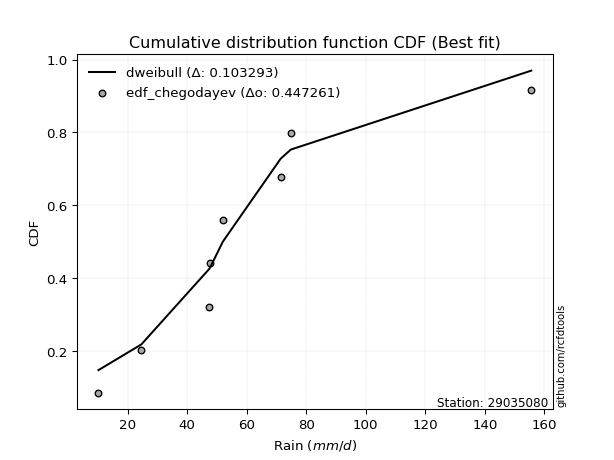</img></img>

</div>


### 6. EDF Blom (1958)

The Blom formula is a specific "plotting position" formula used in hydrology and statistical analysis to estimate the empirical cumulative probability (or non-exceedance probability) of a data series. It is particularly recommended for data that are approximately normally distributed. The constant _a_ is set to 0.375 (or 3/8).

<div align="center">


$P=(m-a)/(n+1-2a)$


</div>


**6.1. Empirical values**

<div align="center">

|                | 0                   | 1                   | 2                  | 3        | 4                  | 5                  | 6                  |
|:---------------|:--------------------|:--------------------|:-------------------|:---------|:-------------------|:-------------------|:-------------------|
| date           | 2018                | 2023                | 2020               | 2022     | 2021               | 2019               | 2024               |
| x              | 10.2                | 24.6                | 47.4               | 47.8     | 52.0               | 74.8               | 155.6              |
| m              | 1                   | 2                   | 3                  | 4        | 5                  | 6                  | 7                  |
| empirical_dist | edf_blom            | edf_blom            | edf_blom           | edf_blom | edf_blom           | edf_blom           | edf_blom           |
| empirical      | 0.08620689655172414 | 0.22413793103448276 | 0.3620689655172414 | 0.5      | 0.6379310344827587 | 0.7758620689655172 | 0.9137931034482759 |
| empirical_tr   | 1.0943396226415094  | 1.288888888888889   | 1.5675675675675675 | 2.0      | 2.7619047619047623 | 4.461538461538462  | 11.600000000000007 |

</div>


**6.2. Kolmogorov-Smirnov fit test (sorted by Δ)**


<div align="center">

|                | 0                   | 1                   | 2                   | 3                   | 4                   | 5                   | 6                   | 7                   | 8                   | 9                   | 10                  | 11                  | 12                  | 13                  | 14                  | 15                  | 16                  | 17                  | 18                  | 19                  | 20                  | 21                  | 22                  | 23                  | 24                  | 25                  | 26                  | 27                  | 28                  | 29                    | 30                  | 31                  | 32                  | 33                  | 34                  | 35                  | 36                  | 37                  | 38                  | 39                  | 40                  | 41                  | 42                  | 43                  | 44                  | 45                  | 46                  | 47                  | 48                  | 49                  | 50                  | 51                  | 52                  | 53                  | 54                  | 55                  | 56                  | 57                  | 58                  | 59                  | 60                  | 61                  | 62                  | 63                  | 64                  | 65                  | 66                  | 67                  | 68                  | 69                  | 70                  | 71                  | 72                  | 73                  | 74                  | 75                  | 76                  | 77                  | 78                  | 79                  | 80                  | 81                  | 82                  | 83                  | 84                  | 85                  | 86                  | 87                  |
|:---------------|:--------------------|:--------------------|:--------------------|:--------------------|:--------------------|:--------------------|:--------------------|:--------------------|:--------------------|:--------------------|:--------------------|:--------------------|:--------------------|:--------------------|:--------------------|:--------------------|:--------------------|:--------------------|:--------------------|:--------------------|:--------------------|:--------------------|:--------------------|:--------------------|:--------------------|:--------------------|:--------------------|:--------------------|:--------------------|:----------------------|:--------------------|:--------------------|:--------------------|:--------------------|:--------------------|:--------------------|:--------------------|:--------------------|:--------------------|:--------------------|:--------------------|:--------------------|:--------------------|:--------------------|:--------------------|:--------------------|:--------------------|:--------------------|:--------------------|:--------------------|:--------------------|:--------------------|:--------------------|:--------------------|:--------------------|:--------------------|:--------------------|:--------------------|:--------------------|:--------------------|:--------------------|:--------------------|:--------------------|:--------------------|:--------------------|:--------------------|:--------------------|:--------------------|:--------------------|:--------------------|:--------------------|:--------------------|:--------------------|:--------------------|:--------------------|:--------------------|:--------------------|:--------------------|:--------------------|:--------------------|:--------------------|:--------------------|:--------------------|:--------------------|:--------------------|:--------------------|:--------------------|:--------------------|
| station        | 29035080            | 29035080            | 29035080            | 29035080            | 29035080            | 29035080            | 29035080            | 29035080            | 29035080            | 29035080            | 29035080            | 29035080            | 29035080            | 29035080            | 29035080            | 29035080            | 29035080            | 29035080            | 29035080            | 29035080            | 29035080            | 29035080            | 29035080            | 29035080            | 29035080            | 29035080            | 29035080            | 29035080            | 29035080            | 29035080              | 29035080            | 29035080            | 29035080            | 29035080            | 29035080            | 29035080            | 29035080            | 29035080            | 29035080            | 29035080            | 29035080            | 29035080            | 29035080            | 29035080            | 29035080            | 29035080            | 29035080            | 29035080            | 29035080            | 29035080            | 29035080            | 29035080            | 29035080            | 29035080            | 29035080            | 29035080            | 29035080            | 29035080            | 29035080            | 29035080            | 29035080            | 29035080            | 29035080            | 29035080            | 29035080            | 29035080            | 29035080            | 29035080            | 29035080            | 29035080            | 29035080            | 29035080            | 29035080            | 29035080            | 29035080            | 29035080            | 29035080            | 29035080            | 29035080            | 29035080            | 29035080            | 29035080            | 29035080            | 29035080            | 29035080            | 29035080            | 29035080            | 29035080            |
| empirical_dist | edf_blom            | edf_blom            | edf_blom            | edf_blom            | edf_blom            | edf_blom            | edf_blom            | edf_blom            | edf_blom            | edf_blom            | edf_blom            | edf_blom            | edf_blom            | edf_blom            | edf_blom            | edf_blom            | edf_blom            | edf_blom            | edf_blom            | edf_blom            | edf_blom            | edf_blom            | edf_blom            | edf_blom            | edf_blom            | edf_blom            | edf_blom            | edf_blom            | edf_blom            | edf_blom              | edf_blom            | edf_blom            | edf_blom            | edf_blom            | edf_blom            | edf_blom            | edf_blom            | edf_blom            | edf_blom            | edf_blom            | edf_blom            | edf_blom            | edf_blom            | edf_blom            | edf_blom            | edf_blom            | edf_blom            | edf_blom            | edf_blom            | edf_blom            | edf_blom            | edf_blom            | edf_blom            | edf_blom            | edf_blom            | edf_blom            | edf_blom            | edf_blom            | edf_blom            | edf_blom            | edf_blom            | edf_blom            | edf_blom            | edf_blom            | edf_blom            | edf_blom            | edf_blom            | edf_blom            | edf_blom            | edf_blom            | edf_blom            | edf_blom            | edf_blom            | edf_blom            | edf_blom            | edf_blom            | edf_blom            | edf_blom            | edf_blom            | edf_blom            | edf_blom            | edf_blom            | edf_blom            | edf_blom            | edf_blom            | edf_blom            | edf_blom            | edf_blom            |
| p_dist         | moyal               | pearson3            | halfnorm            | exponnorm           | loggumbel_l         | genlogistic         | halflogistic        | loggenlogistic      | mielke              | gumbel_r            | logjohnsonsu        | logloggamma         | ncf                 | invweibull          | logweibull_min      | fisk                | gompertz            | t                   | invgamma            | nakagami            | logpearson3         | nct                 | logfisk             | johnsonsu           | invgauss            | genexpon            | rayleigh            | loggompertz         | kstwobign           | loglaplace_asymmetric | laplace_asymmetric  | maxwell             | logf                | logcrystalball      | logexponnorm        | lognorm             | lognorm             | logt                | logfatiguelife      | lognct              | expon               | logbetaprime        | loglogistic         | wald                | logerlang           | loghypsecant        | logrice             | logncf              | loggamma            | loggamma            | loginvgamma         | logalpha            | f                   | loglaplace          | rice                | loginvgauss         | norm                | truncnorm           | crystalball         | logmaxwell          | logistic            | loginvweibull       | lograyleigh         | hypsecant           | logtruncnorm        | gibrat              | logkstwobign        | laplace             | betaprime           | loggumbel_r         | loghalfnorm         | loggenexpon         | alpha               | erlang              | logmoyal            | loghalflogistic     | gumbel_l            | weibull_min         | logmielke           | logexpon            | logwald             | loggibrat           | chi2                | gamma               | loglognorm          | logchi2             | lognakagami         | fatiguelife         |
| delta          | 0.11606746065789658 | 0.1173660636844962  | 0.12010132929483563 | 0.12252033085025554 | 0.12310862057733718 | 0.12563270104569024 | 0.13058265490871962 | 0.1343098216622482  | 0.13459064910729124 | 0.13501196298007367 | 0.13765157947652568 | 0.13885678992335299 | 0.14004719573691365 | 0.14268408043857245 | 0.14303108685615468 | 0.14365637447695417 | 0.1440432732200015  | 0.14423431041798923 | 0.1442989337678942  | 0.14444807760600337 | 0.14547221951084893 | 0.1461591324507207  | 0.14961917504700667 | 0.1496967410020325  | 0.15038009638402866 | 0.15068454070691256 | 0.1541405613133513  | 0.15523527804368603 | 0.1557481628246643  | 0.16273966337166584   | 0.16455258276674212 | 0.16618692898491255 | 0.16973457141720932 | 0.16999874451974656 | 0.17000138135362514 | 0.1700041695309244  | 0.1700041695309244  | 0.1700043981862817  | 0.17070707565733417 | 0.17075360970892567 | 0.17196212439702713 | 0.17263138993641264 | 0.17436101837477697 | 0.17683190201997961 | 0.17733141072510988 | 0.17806538405315647 | 0.17967115311748866 | 0.1801610043690171  | 0.1806294114253168  | 0.1806294114253168  | 0.18368261700988214 | 0.1860767006831005  | 0.18831646668158603 | 0.1917213263106045  | 0.19719394194444972 | 0.19833516310643634 | 0.20058781474363574 | 0.20058782052161273 | 0.2005878238061572  | 0.20149660902685934 | 0.208960289903255   | 0.2115312848444128  | 0.21174166901327335 | 0.21599094474714414 | 0.22413599437597576 | 0.22413793103448276 | 0.2323312447071773  | 0.23788705646930658 | 0.2397206019223696  | 0.24059526131966075 | 0.2406018377035341  | 0.2569370503032539  | 0.25708675470176284 | 0.2644807045877063  | 0.26594039136536946 | 0.2672043746837161  | 0.27007238531024413 | 0.2761902443682828  | 0.28424272742646434 | 0.2856378278112783  | 0.3362954252025859  | 0.36377451370898845 | 0.38739566497495354 | 0.3877639114252977  | 0.4161445923607924  | 0.42958350453744554 | 0.4356642387775915  | 0.5096315140893324  |
| deltao         | 0.48442053926100004 | 0.48442053926100004 | 0.48442053926100004 | 0.48442053926100004 | 0.48442053926100004 | 0.48442053926100004 | 0.48442053926100004 | 0.48442053926100004 | 0.48442053926100004 | 0.48442053926100004 | 0.48442053926100004 | 0.48442053926100004 | 0.48442053926100004 | 0.48442053926100004 | 0.48442053926100004 | 0.48442053926100004 | 0.48442053926100004 | 0.48442053926100004 | 0.48442053926100004 | 0.48442053926100004 | 0.48442053926100004 | 0.48442053926100004 | 0.48442053926100004 | 0.48442053926100004 | 0.48442053926100004 | 0.48442053926100004 | 0.48442053926100004 | 0.48442053926100004 | 0.48442053926100004 | 0.48442053926100004   | 0.48442053926100004 | 0.48442053926100004 | 0.48442053926100004 | 0.48442053926100004 | 0.48442053926100004 | 0.48442053926100004 | 0.48442053926100004 | 0.48442053926100004 | 0.48442053926100004 | 0.48442053926100004 | 0.48442053926100004 | 0.48442053926100004 | 0.48442053926100004 | 0.48442053926100004 | 0.48442053926100004 | 0.48442053926100004 | 0.48442053926100004 | 0.48442053926100004 | 0.48442053926100004 | 0.48442053926100004 | 0.48442053926100004 | 0.48442053926100004 | 0.48442053926100004 | 0.48442053926100004 | 0.48442053926100004 | 0.48442053926100004 | 0.48442053926100004 | 0.48442053926100004 | 0.48442053926100004 | 0.48442053926100004 | 0.48442053926100004 | 0.48442053926100004 | 0.48442053926100004 | 0.48442053926100004 | 0.48442053926100004 | 0.48442053926100004 | 0.48442053926100004 | 0.48442053926100004 | 0.48442053926100004 | 0.48442053926100004 | 0.48442053926100004 | 0.48442053926100004 | 0.48442053926100004 | 0.48442053926100004 | 0.48442053926100004 | 0.48442053926100004 | 0.48442053926100004 | 0.48442053926100004 | 0.48442053926100004 | 0.48442053926100004 | 0.48442053926100004 | 0.48442053926100004 | 0.48442053926100004 | 0.48442053926100004 | 0.48442053926100004 | 0.48442053926100004 | 0.48442053926100004 | 0.48442053926100004 |
| eval           | Δo > Δ              | Δo > Δ              | Δo > Δ              | Δo > Δ              | Δo > Δ              | Δo > Δ              | Δo > Δ              | Δo > Δ              | Δo > Δ              | Δo > Δ              | Δo > Δ              | Δo > Δ              | Δo > Δ              | Δo > Δ              | Δo > Δ              | Δo > Δ              | Δo > Δ              | Δo > Δ              | Δo > Δ              | Δo > Δ              | Δo > Δ              | Δo > Δ              | Δo > Δ              | Δo > Δ              | Δo > Δ              | Δo > Δ              | Δo > Δ              | Δo > Δ              | Δo > Δ              | Δo > Δ                | Δo > Δ              | Δo > Δ              | Δo > Δ              | Δo > Δ              | Δo > Δ              | Δo > Δ              | Δo > Δ              | Δo > Δ              | Δo > Δ              | Δo > Δ              | Δo > Δ              | Δo > Δ              | Δo > Δ              | Δo > Δ              | Δo > Δ              | Δo > Δ              | Δo > Δ              | Δo > Δ              | Δo > Δ              | Δo > Δ              | Δo > Δ              | Δo > Δ              | Δo > Δ              | Δo > Δ              | Δo > Δ              | Δo > Δ              | Δo > Δ              | Δo > Δ              | Δo > Δ              | Δo > Δ              | Δo > Δ              | Δo > Δ              | Δo > Δ              | Δo > Δ              | Δo > Δ              | Δo > Δ              | Δo > Δ              | Δo > Δ              | Δo > Δ              | Δo > Δ              | Δo > Δ              | Δo > Δ              | Δo > Δ              | Δo > Δ              | Δo > Δ              | Δo > Δ              | Δo > Δ              | Δo > Δ              | Δo > Δ              | Δo > Δ              | Δo > Δ              | Δo > Δ              | Δo > Δ              | Δo > Δ              | Δo > Δ              | Δo > Δ              | Δo > Δ              | Δo <= Δ             |
| fit            | 1                   | 1                   | 1                   | 1                   | 1                   | 1                   | 1                   | 1                   | 1                   | 1                   | 1                   | 1                   | 1                   | 1                   | 1                   | 1                   | 1                   | 1                   | 1                   | 1                   | 1                   | 1                   | 1                   | 1                   | 1                   | 1                   | 1                   | 1                   | 1                   | 1                     | 1                   | 1                   | 1                   | 1                   | 1                   | 1                   | 1                   | 1                   | 1                   | 1                   | 1                   | 1                   | 1                   | 1                   | 1                   | 1                   | 1                   | 1                   | 1                   | 1                   | 1                   | 1                   | 1                   | 1                   | 1                   | 1                   | 1                   | 1                   | 1                   | 1                   | 1                   | 1                   | 1                   | 1                   | 1                   | 1                   | 1                   | 1                   | 1                   | 1                   | 1                   | 1                   | 1                   | 1                   | 1                   | 1                   | 1                   | 1                   | 1                   | 1                   | 1                   | 1                   | 1                   | 1                   | 1                   | 1                   | 1                   | 0                   |
| n              | 7                   | 7                   | 7                   | 7                   | 7                   | 7                   | 7                   | 7                   | 7                   | 7                   | 7                   | 7                   | 7                   | 7                   | 7                   | 7                   | 7                   | 7                   | 7                   | 7                   | 7                   | 7                   | 7                   | 7                   | 7                   | 7                   | 7                   | 7                   | 7                   | 7                     | 7                   | 7                   | 7                   | 7                   | 7                   | 7                   | 7                   | 7                   | 7                   | 7                   | 7                   | 7                   | 7                   | 7                   | 7                   | 7                   | 7                   | 7                   | 7                   | 7                   | 7                   | 7                   | 7                   | 7                   | 7                   | 7                   | 7                   | 7                   | 7                   | 7                   | 7                   | 7                   | 7                   | 7                   | 7                   | 7                   | 7                   | 7                   | 7                   | 7                   | 7                   | 7                   | 7                   | 7                   | 7                   | 7                   | 7                   | 7                   | 7                   | 7                   | 7                   | 7                   | 7                   | 7                   | 7                   | 7                   | 7                   | 7                   |
| best_fit       | 1                   | 0                   | 0                   | 0                   | 0                   | 0                   | 0                   | 0                   | 0                   | 0                   | 0                   | 0                   | 0                   | 0                   | 0                   | 0                   | 0                   | 0                   | 0                   | 0                   | 0                   | 0                   | 0                   | 0                   | 0                   | 0                   | 0                   | 0                   | 0                   | 0                     | 0                   | 0                   | 0                   | 0                   | 0                   | 0                   | 0                   | 0                   | 0                   | 0                   | 0                   | 0                   | 0                   | 0                   | 0                   | 0                   | 0                   | 0                   | 0                   | 0                   | 0                   | 0                   | 0                   | 0                   | 0                   | 0                   | 0                   | 0                   | 0                   | 0                   | 0                   | 0                   | 0                   | 0                   | 0                   | 0                   | 0                   | 0                   | 0                   | 0                   | 0                   | 0                   | 0                   | 0                   | 0                   | 0                   | 0                   | 0                   | 0                   | 0                   | 0                   | 0                   | 0                   | 0                   | 0                   | 0                   | 0                   | 0                   |
| best_fit_sort  | 1                   | 2                   | 3                   | 4                   | 5                   | 6                   | 7                   | 8                   | 9                   | 10                  | 11                  | 12                  | 13                  | 14                  | 15                  | 16                  | 17                  | 18                  | 19                  | 20                  | 21                  | 22                  | 23                  | 24                  | 25                  | 26                  | 27                  | 28                  | 29                  | 30                    | 31                  | 32                  | 33                  | 34                  | 35                  | 36                  | 37                  | 38                  | 39                  | 40                  | 41                  | 42                  | 43                  | 44                  | 45                  | 46                  | 47                  | 48                  | 49                  | 50                  | 51                  | 52                  | 53                  | 54                  | 55                  | 56                  | 57                  | 58                  | 59                  | 60                  | 61                  | 62                  | 63                  | 64                  | 65                  | 66                  | 67                  | 68                  | 69                  | 70                  | 71                  | 72                  | 73                  | 74                  | 75                  | 76                  | 77                  | 78                  | 79                  | 80                  | 81                  | 82                  | 83                  | 84                  | 85                  | 86                  | 87                  | 88                  |

</div>


**6.3. Best fit**

<div align="center">

|   id |   station | empirical_dist   | p_dist   |    delta |   deltao | eval   |   fit |   n |   best_fit |   best_fit_sort |
|-----:|----------:|:-----------------|:---------|---------:|---------:|:-------|------:|----:|-----------:|----------------:|
|    0 |  29035080 | edf_blom         | moyal    | 0.116067 | 0.484421 | Δo > Δ |     1 |   7 |          1 |               1 |

</div>


<div align="center">

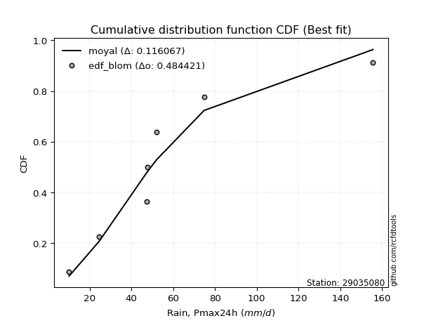</img></img>

</div>


### 7. EDF Tukey (1962)

In hydrology, the Tukey formula is used as a plotting position formula to estimate the empirical probability or frequency of a flood event (or other hydrological data). The formula parameter is given as _c=0.333_ (or 1/3).

<div align="center">


$P=(m-c)/(n+1-2c)$


</div>


**7.1. Empirical values**

<div align="center">

|                | 0                   | 1                   | 2                   | 3         | 4                  | 5                  | 6                  |
|:---------------|:--------------------|:--------------------|:--------------------|:----------|:-------------------|:-------------------|:-------------------|
| date           | 2018                | 2023                | 2020                | 2022      | 2021               | 2019               | 2024               |
| x              | 10.2                | 24.6                | 47.4                | 47.8      | 52.0               | 74.8               | 155.6              |
| m              | 1                   | 2                   | 3                   | 4         | 5                  | 6                  | 7                  |
| empirical_dist | edf_tukey           | edf_tukey           | edf_tukey           | edf_tukey | edf_tukey          | edf_tukey          | edf_tukey          |
| empirical      | 0.09090909090909091 | 0.22727272727272727 | 0.36363636363636365 | 0.5       | 0.6363636363636364 | 0.7727272727272727 | 0.9090909090909091 |
| empirical_tr   | 1.1                 | 1.2941176470588236  | 1.5714285714285714  | 2.0       | 2.75               | 4.3999999999999995 | 10.999999999999996 |

</div>


**7.2. Kolmogorov-Smirnov fit test (sorted by Δ)**


<div align="center">

|                | 0                   | 1                   | 2                   | 3                   | 4                   | 5                   | 6                   | 7                   | 8                   | 9                   | 10                  | 11                  | 12                  | 13                  | 14                  | 15                  | 16                  | 17                  | 18                  | 19                  | 20                  | 21                  | 22                  | 23                  | 24                  | 25                  | 26                  | 27                  | 28                  | 29                    | 30                  | 31                  | 32                  | 33                  | 34                  | 35                  | 36                  | 37                  | 38                  | 39                  | 40                  | 41                  | 42                  | 43                  | 44                  | 45                  | 46                  | 47                  | 48                  | 49                  | 50                  | 51                  | 52                  | 53                  | 54                  | 55                  | 56                  | 57                  | 58                  | 59                  | 60                  | 61                  | 62                  | 63                  | 64                  | 65                  | 66                  | 67                  | 68                  | 69                  | 70                  | 71                  | 72                  | 73                  | 74                  | 75                  | 76                  | 77                  | 78                  | 79                  | 80                  | 81                  | 82                  | 83                  | 84                  | 85                  | 86                  | 87                  |
|:---------------|:--------------------|:--------------------|:--------------------|:--------------------|:--------------------|:--------------------|:--------------------|:--------------------|:--------------------|:--------------------|:--------------------|:--------------------|:--------------------|:--------------------|:--------------------|:--------------------|:--------------------|:--------------------|:--------------------|:--------------------|:--------------------|:--------------------|:--------------------|:--------------------|:--------------------|:--------------------|:--------------------|:--------------------|:--------------------|:----------------------|:--------------------|:--------------------|:--------------------|:--------------------|:--------------------|:--------------------|:--------------------|:--------------------|:--------------------|:--------------------|:--------------------|:--------------------|:--------------------|:--------------------|:--------------------|:--------------------|:--------------------|:--------------------|:--------------------|:--------------------|:--------------------|:--------------------|:--------------------|:--------------------|:--------------------|:--------------------|:--------------------|:--------------------|:--------------------|:--------------------|:--------------------|:--------------------|:--------------------|:--------------------|:--------------------|:--------------------|:--------------------|:--------------------|:--------------------|:--------------------|:--------------------|:--------------------|:--------------------|:--------------------|:--------------------|:--------------------|:--------------------|:--------------------|:--------------------|:--------------------|:--------------------|:--------------------|:--------------------|:--------------------|:--------------------|:--------------------|:--------------------|:--------------------|
| station        | 29035080            | 29035080            | 29035080            | 29035080            | 29035080            | 29035080            | 29035080            | 29035080            | 29035080            | 29035080            | 29035080            | 29035080            | 29035080            | 29035080            | 29035080            | 29035080            | 29035080            | 29035080            | 29035080            | 29035080            | 29035080            | 29035080            | 29035080            | 29035080            | 29035080            | 29035080            | 29035080            | 29035080            | 29035080            | 29035080              | 29035080            | 29035080            | 29035080            | 29035080            | 29035080            | 29035080            | 29035080            | 29035080            | 29035080            | 29035080            | 29035080            | 29035080            | 29035080            | 29035080            | 29035080            | 29035080            | 29035080            | 29035080            | 29035080            | 29035080            | 29035080            | 29035080            | 29035080            | 29035080            | 29035080            | 29035080            | 29035080            | 29035080            | 29035080            | 29035080            | 29035080            | 29035080            | 29035080            | 29035080            | 29035080            | 29035080            | 29035080            | 29035080            | 29035080            | 29035080            | 29035080            | 29035080            | 29035080            | 29035080            | 29035080            | 29035080            | 29035080            | 29035080            | 29035080            | 29035080            | 29035080            | 29035080            | 29035080            | 29035080            | 29035080            | 29035080            | 29035080            | 29035080            |
| empirical_dist | edf_tukey           | edf_tukey           | edf_tukey           | edf_tukey           | edf_tukey           | edf_tukey           | edf_tukey           | edf_tukey           | edf_tukey           | edf_tukey           | edf_tukey           | edf_tukey           | edf_tukey           | edf_tukey           | edf_tukey           | edf_tukey           | edf_tukey           | edf_tukey           | edf_tukey           | edf_tukey           | edf_tukey           | edf_tukey           | edf_tukey           | edf_tukey           | edf_tukey           | edf_tukey           | edf_tukey           | edf_tukey           | edf_tukey           | edf_tukey             | edf_tukey           | edf_tukey           | edf_tukey           | edf_tukey           | edf_tukey           | edf_tukey           | edf_tukey           | edf_tukey           | edf_tukey           | edf_tukey           | edf_tukey           | edf_tukey           | edf_tukey           | edf_tukey           | edf_tukey           | edf_tukey           | edf_tukey           | edf_tukey           | edf_tukey           | edf_tukey           | edf_tukey           | edf_tukey           | edf_tukey           | edf_tukey           | edf_tukey           | edf_tukey           | edf_tukey           | edf_tukey           | edf_tukey           | edf_tukey           | edf_tukey           | edf_tukey           | edf_tukey           | edf_tukey           | edf_tukey           | edf_tukey           | edf_tukey           | edf_tukey           | edf_tukey           | edf_tukey           | edf_tukey           | edf_tukey           | edf_tukey           | edf_tukey           | edf_tukey           | edf_tukey           | edf_tukey           | edf_tukey           | edf_tukey           | edf_tukey           | edf_tukey           | edf_tukey           | edf_tukey           | edf_tukey           | edf_tukey           | edf_tukey           | edf_tukey           | edf_tukey           |
| p_dist         | moyal               | pearson3            | halfnorm            | exponnorm           | loggumbel_l         | genlogistic         | halflogistic        | loggenlogistic      | mielke              | gumbel_r            | logjohnsonsu        | logloggamma         | ncf                 | invweibull          | logweibull_min      | fisk                | gompertz            | t                   | invgamma            | nakagami            | logpearson3         | nct                 | logfisk             | johnsonsu           | invgauss            | genexpon            | rayleigh            | loggompertz         | kstwobign           | loglaplace_asymmetric | laplace_asymmetric  | maxwell             | logf                | logcrystalball      | logexponnorm        | lognorm             | lognorm             | logt                | logfatiguelife      | lognct              | expon               | logbetaprime        | loglogistic         | wald                | logerlang           | loghypsecant        | logrice             | logncf              | loggamma            | loggamma            | loginvgamma         | logalpha            | f                   | loglaplace          | rice                | loginvgauss         | norm                | truncnorm           | crystalball         | logmaxwell          | logistic            | loginvweibull       | lograyleigh         | hypsecant           | logtruncnorm        | gibrat              | logkstwobign        | laplace             | betaprime           | loggumbel_r         | loghalfnorm         | loggenexpon         | alpha               | erlang              | logmoyal            | loghalflogistic     | gumbel_l            | weibull_min         | logmielke           | logexpon            | logwald             | loggibrat           | chi2                | gamma               | loglognorm          | logchi2             | lognakagami         | fatiguelife         |
| delta          | 0.11450006253877432 | 0.11579866556537388 | 0.11853393117571331 | 0.12095293273113328 | 0.12154122245821486 | 0.12406530292656792 | 0.12901525678959735 | 0.13274242354312593 | 0.13302325098816897 | 0.13344456486095135 | 0.1360841813574034  | 0.13728939180423072 | 0.1384797976177914  | 0.14111668231945018 | 0.1414636887370324  | 0.1420889763578319  | 0.14247587510087922 | 0.14266691229886697 | 0.14273153564877195 | 0.1428806794868811  | 0.14390482139172667 | 0.14459173433159844 | 0.1480517769278844  | 0.14812934288291024 | 0.1488126982649064  | 0.1491171425877903  | 0.15257316319422898 | 0.15366787992456377 | 0.15418076470554198 | 0.16117226525254358   | 0.1629851846476198  | 0.16461953086579023 | 0.16816717329808706 | 0.1684313464006243  | 0.16843398323450287 | 0.16843677141180213 | 0.16843677141180213 | 0.16843700006715945 | 0.1691396775382119  | 0.1691862115898034  | 0.17039472627790486 | 0.17106399181729037 | 0.1727936202556547  | 0.17526450390085735 | 0.17576401260598762 | 0.1764979859340342  | 0.1781037549983664  | 0.17859360624989484 | 0.17906201330619453 | 0.17906201330619453 | 0.18211521889075988 | 0.18450930256397824 | 0.18674906856246376 | 0.19015392819148225 | 0.1956265438253274  | 0.19676776498731408 | 0.19902041662451342 | 0.1990204224024904  | 0.19902042568703487 | 0.19992921090773708 | 0.20739289178413267 | 0.20996388672529054 | 0.21017427089415108 | 0.21442354662802182 | 0.22727079061422026 | 0.22727272727272727 | 0.23076384658805504 | 0.23631965835018426 | 0.23815320380324734 | 0.23902786320053848 | 0.23903443958441184 | 0.25536965218413166 | 0.2555193565826406  | 0.262913306468584   | 0.2643729932462472  | 0.26563697656459384 | 0.2685049871911218  | 0.27462284624916056 | 0.28267532930734207 | 0.284070429692156   | 0.3347280270834636  | 0.3622071155898662  | 0.38582826685583127 | 0.38619651330617544 | 0.41300979612254785 | 0.426605766765737   | 0.4340968406584692  | 0.5064967178510879  |
| deltao         | 0.48442053926100004 | 0.48442053926100004 | 0.48442053926100004 | 0.48442053926100004 | 0.48442053926100004 | 0.48442053926100004 | 0.48442053926100004 | 0.48442053926100004 | 0.48442053926100004 | 0.48442053926100004 | 0.48442053926100004 | 0.48442053926100004 | 0.48442053926100004 | 0.48442053926100004 | 0.48442053926100004 | 0.48442053926100004 | 0.48442053926100004 | 0.48442053926100004 | 0.48442053926100004 | 0.48442053926100004 | 0.48442053926100004 | 0.48442053926100004 | 0.48442053926100004 | 0.48442053926100004 | 0.48442053926100004 | 0.48442053926100004 | 0.48442053926100004 | 0.48442053926100004 | 0.48442053926100004 | 0.48442053926100004   | 0.48442053926100004 | 0.48442053926100004 | 0.48442053926100004 | 0.48442053926100004 | 0.48442053926100004 | 0.48442053926100004 | 0.48442053926100004 | 0.48442053926100004 | 0.48442053926100004 | 0.48442053926100004 | 0.48442053926100004 | 0.48442053926100004 | 0.48442053926100004 | 0.48442053926100004 | 0.48442053926100004 | 0.48442053926100004 | 0.48442053926100004 | 0.48442053926100004 | 0.48442053926100004 | 0.48442053926100004 | 0.48442053926100004 | 0.48442053926100004 | 0.48442053926100004 | 0.48442053926100004 | 0.48442053926100004 | 0.48442053926100004 | 0.48442053926100004 | 0.48442053926100004 | 0.48442053926100004 | 0.48442053926100004 | 0.48442053926100004 | 0.48442053926100004 | 0.48442053926100004 | 0.48442053926100004 | 0.48442053926100004 | 0.48442053926100004 | 0.48442053926100004 | 0.48442053926100004 | 0.48442053926100004 | 0.48442053926100004 | 0.48442053926100004 | 0.48442053926100004 | 0.48442053926100004 | 0.48442053926100004 | 0.48442053926100004 | 0.48442053926100004 | 0.48442053926100004 | 0.48442053926100004 | 0.48442053926100004 | 0.48442053926100004 | 0.48442053926100004 | 0.48442053926100004 | 0.48442053926100004 | 0.48442053926100004 | 0.48442053926100004 | 0.48442053926100004 | 0.48442053926100004 | 0.48442053926100004 |
| eval           | Δo > Δ              | Δo > Δ              | Δo > Δ              | Δo > Δ              | Δo > Δ              | Δo > Δ              | Δo > Δ              | Δo > Δ              | Δo > Δ              | Δo > Δ              | Δo > Δ              | Δo > Δ              | Δo > Δ              | Δo > Δ              | Δo > Δ              | Δo > Δ              | Δo > Δ              | Δo > Δ              | Δo > Δ              | Δo > Δ              | Δo > Δ              | Δo > Δ              | Δo > Δ              | Δo > Δ              | Δo > Δ              | Δo > Δ              | Δo > Δ              | Δo > Δ              | Δo > Δ              | Δo > Δ                | Δo > Δ              | Δo > Δ              | Δo > Δ              | Δo > Δ              | Δo > Δ              | Δo > Δ              | Δo > Δ              | Δo > Δ              | Δo > Δ              | Δo > Δ              | Δo > Δ              | Δo > Δ              | Δo > Δ              | Δo > Δ              | Δo > Δ              | Δo > Δ              | Δo > Δ              | Δo > Δ              | Δo > Δ              | Δo > Δ              | Δo > Δ              | Δo > Δ              | Δo > Δ              | Δo > Δ              | Δo > Δ              | Δo > Δ              | Δo > Δ              | Δo > Δ              | Δo > Δ              | Δo > Δ              | Δo > Δ              | Δo > Δ              | Δo > Δ              | Δo > Δ              | Δo > Δ              | Δo > Δ              | Δo > Δ              | Δo > Δ              | Δo > Δ              | Δo > Δ              | Δo > Δ              | Δo > Δ              | Δo > Δ              | Δo > Δ              | Δo > Δ              | Δo > Δ              | Δo > Δ              | Δo > Δ              | Δo > Δ              | Δo > Δ              | Δo > Δ              | Δo > Δ              | Δo > Δ              | Δo > Δ              | Δo > Δ              | Δo > Δ              | Δo > Δ              | Δo <= Δ             |
| fit            | 1                   | 1                   | 1                   | 1                   | 1                   | 1                   | 1                   | 1                   | 1                   | 1                   | 1                   | 1                   | 1                   | 1                   | 1                   | 1                   | 1                   | 1                   | 1                   | 1                   | 1                   | 1                   | 1                   | 1                   | 1                   | 1                   | 1                   | 1                   | 1                   | 1                     | 1                   | 1                   | 1                   | 1                   | 1                   | 1                   | 1                   | 1                   | 1                   | 1                   | 1                   | 1                   | 1                   | 1                   | 1                   | 1                   | 1                   | 1                   | 1                   | 1                   | 1                   | 1                   | 1                   | 1                   | 1                   | 1                   | 1                   | 1                   | 1                   | 1                   | 1                   | 1                   | 1                   | 1                   | 1                   | 1                   | 1                   | 1                   | 1                   | 1                   | 1                   | 1                   | 1                   | 1                   | 1                   | 1                   | 1                   | 1                   | 1                   | 1                   | 1                   | 1                   | 1                   | 1                   | 1                   | 1                   | 1                   | 0                   |
| n              | 7                   | 7                   | 7                   | 7                   | 7                   | 7                   | 7                   | 7                   | 7                   | 7                   | 7                   | 7                   | 7                   | 7                   | 7                   | 7                   | 7                   | 7                   | 7                   | 7                   | 7                   | 7                   | 7                   | 7                   | 7                   | 7                   | 7                   | 7                   | 7                   | 7                     | 7                   | 7                   | 7                   | 7                   | 7                   | 7                   | 7                   | 7                   | 7                   | 7                   | 7                   | 7                   | 7                   | 7                   | 7                   | 7                   | 7                   | 7                   | 7                   | 7                   | 7                   | 7                   | 7                   | 7                   | 7                   | 7                   | 7                   | 7                   | 7                   | 7                   | 7                   | 7                   | 7                   | 7                   | 7                   | 7                   | 7                   | 7                   | 7                   | 7                   | 7                   | 7                   | 7                   | 7                   | 7                   | 7                   | 7                   | 7                   | 7                   | 7                   | 7                   | 7                   | 7                   | 7                   | 7                   | 7                   | 7                   | 7                   |
| best_fit       | 1                   | 0                   | 0                   | 0                   | 0                   | 0                   | 0                   | 0                   | 0                   | 0                   | 0                   | 0                   | 0                   | 0                   | 0                   | 0                   | 0                   | 0                   | 0                   | 0                   | 0                   | 0                   | 0                   | 0                   | 0                   | 0                   | 0                   | 0                   | 0                   | 0                     | 0                   | 0                   | 0                   | 0                   | 0                   | 0                   | 0                   | 0                   | 0                   | 0                   | 0                   | 0                   | 0                   | 0                   | 0                   | 0                   | 0                   | 0                   | 0                   | 0                   | 0                   | 0                   | 0                   | 0                   | 0                   | 0                   | 0                   | 0                   | 0                   | 0                   | 0                   | 0                   | 0                   | 0                   | 0                   | 0                   | 0                   | 0                   | 0                   | 0                   | 0                   | 0                   | 0                   | 0                   | 0                   | 0                   | 0                   | 0                   | 0                   | 0                   | 0                   | 0                   | 0                   | 0                   | 0                   | 0                   | 0                   | 0                   |
| best_fit_sort  | 1                   | 2                   | 3                   | 4                   | 5                   | 6                   | 7                   | 8                   | 9                   | 10                  | 11                  | 12                  | 13                  | 14                  | 15                  | 16                  | 17                  | 18                  | 19                  | 20                  | 21                  | 22                  | 23                  | 24                  | 25                  | 26                  | 27                  | 28                  | 29                  | 30                    | 31                  | 32                  | 33                  | 34                  | 35                  | 36                  | 37                  | 38                  | 39                  | 40                  | 41                  | 42                  | 43                  | 44                  | 45                  | 46                  | 47                  | 48                  | 49                  | 50                  | 51                  | 52                  | 53                  | 54                  | 55                  | 56                  | 57                  | 58                  | 59                  | 60                  | 61                  | 62                  | 63                  | 64                  | 65                  | 66                  | 67                  | 68                  | 69                  | 70                  | 71                  | 72                  | 73                  | 74                  | 75                  | 76                  | 77                  | 78                  | 79                  | 80                  | 81                  | 82                  | 83                  | 84                  | 85                  | 86                  | 87                  | 88                  |

</div>


**7.3. Best fit**

<div align="center">

|   id |   station | empirical_dist   | p_dist   |   delta |   deltao | eval   |   fit |   n |   best_fit |   best_fit_sort |
|-----:|----------:|:-----------------|:---------|--------:|---------:|:-------|------:|----:|-----------:|----------------:|
|    0 |  29035080 | edf_tukey        | moyal    |  0.1145 | 0.484421 | Δo > Δ |     1 |   7 |          1 |               1 |

</div>


<div align="center">

</img></img>

</div>


### 8. EDF Gringorten (1963)

Gringorten plotting position formula is essential for estimating the probability and return periods of extreme events like floods and heavy rainfall. The constant _a=0.44_.

<div align="center">


$P=(m-a)/(n+1-2a)$


</div>


**8.1. Empirical values**

<div align="center">

|                | 0                   | 1                   | 2                  | 3              | 4                  | 5                  | 6                  |
|:---------------|:--------------------|:--------------------|:-------------------|:---------------|:-------------------|:-------------------|:-------------------|
| date           | 2018                | 2023                | 2020               | 2022           | 2021               | 2019               | 2024               |
| x              | 10.2                | 24.6                | 47.4               | 47.8           | 52.0               | 74.8               | 155.6              |
| m              | 1                   | 2                   | 3                  | 4              | 5                  | 6                  | 7                  |
| empirical_dist | edf_gringorten      | edf_gringorten      | edf_gringorten     | edf_gringorten | edf_gringorten     | edf_gringorten     | edf_gringorten     |
| empirical      | 0.07865168539325844 | 0.21910112359550563 | 0.3595505617977528 | 0.5            | 0.6404494382022471 | 0.7808988764044943 | 0.9213483146067415 |
| empirical_tr   | 1.0853658536585364  | 1.2805755395683454  | 1.5614035087719298 | 2.0            | 2.781249999999999  | 4.564102564102562  | 12.714285714285701 |

</div>


**8.2. Kolmogorov-Smirnov fit test (sorted by Δ)**


<div align="center">

|                | 0                   | 1                   | 2                   | 3                   | 4                   | 5                   | 6                   | 7                   | 8                   | 9                   | 10                  | 11                  | 12                  | 13                  | 14                  | 15                  | 16                  | 17                  | 18                  | 19                  | 20                  | 21                  | 22                  | 23                  | 24                  | 25                  | 26                  | 27                  | 28                  | 29                    | 30                  | 31                  | 32                  | 33                  | 34                  | 35                  | 36                  | 37                  | 38                  | 39                  | 40                  | 41                  | 42                  | 43                  | 44                  | 45                  | 46                  | 47                  | 48                  | 49                  | 50                  | 51                  | 52                  | 53                  | 54                  | 55                  | 56                  | 57                  | 58                  | 59                  | 60                  | 61                  | 62                  | 63                  | 64                  | 65                  | 66                  | 67                  | 68                  | 69                  | 70                  | 71                  | 72                  | 73                  | 74                  | 75                  | 76                  | 77                  | 78                  | 79                  | 80                  | 81                  | 82                  | 83                  | 84                  | 85                  | 86                  | 87                  |
|:---------------|:--------------------|:--------------------|:--------------------|:--------------------|:--------------------|:--------------------|:--------------------|:--------------------|:--------------------|:--------------------|:--------------------|:--------------------|:--------------------|:--------------------|:--------------------|:--------------------|:--------------------|:--------------------|:--------------------|:--------------------|:--------------------|:--------------------|:--------------------|:--------------------|:--------------------|:--------------------|:--------------------|:--------------------|:--------------------|:----------------------|:--------------------|:--------------------|:--------------------|:--------------------|:--------------------|:--------------------|:--------------------|:--------------------|:--------------------|:--------------------|:--------------------|:--------------------|:--------------------|:--------------------|:--------------------|:--------------------|:--------------------|:--------------------|:--------------------|:--------------------|:--------------------|:--------------------|:--------------------|:--------------------|:--------------------|:--------------------|:--------------------|:--------------------|:--------------------|:--------------------|:--------------------|:--------------------|:--------------------|:--------------------|:--------------------|:--------------------|:--------------------|:--------------------|:--------------------|:--------------------|:--------------------|:--------------------|:--------------------|:--------------------|:--------------------|:--------------------|:--------------------|:--------------------|:--------------------|:--------------------|:--------------------|:--------------------|:--------------------|:--------------------|:--------------------|:--------------------|:--------------------|:--------------------|
| station        | 29035080            | 29035080            | 29035080            | 29035080            | 29035080            | 29035080            | 29035080            | 29035080            | 29035080            | 29035080            | 29035080            | 29035080            | 29035080            | 29035080            | 29035080            | 29035080            | 29035080            | 29035080            | 29035080            | 29035080            | 29035080            | 29035080            | 29035080            | 29035080            | 29035080            | 29035080            | 29035080            | 29035080            | 29035080            | 29035080              | 29035080            | 29035080            | 29035080            | 29035080            | 29035080            | 29035080            | 29035080            | 29035080            | 29035080            | 29035080            | 29035080            | 29035080            | 29035080            | 29035080            | 29035080            | 29035080            | 29035080            | 29035080            | 29035080            | 29035080            | 29035080            | 29035080            | 29035080            | 29035080            | 29035080            | 29035080            | 29035080            | 29035080            | 29035080            | 29035080            | 29035080            | 29035080            | 29035080            | 29035080            | 29035080            | 29035080            | 29035080            | 29035080            | 29035080            | 29035080            | 29035080            | 29035080            | 29035080            | 29035080            | 29035080            | 29035080            | 29035080            | 29035080            | 29035080            | 29035080            | 29035080            | 29035080            | 29035080            | 29035080            | 29035080            | 29035080            | 29035080            | 29035080            |
| empirical_dist | edf_gringorten      | edf_gringorten      | edf_gringorten      | edf_gringorten      | edf_gringorten      | edf_gringorten      | edf_gringorten      | edf_gringorten      | edf_gringorten      | edf_gringorten      | edf_gringorten      | edf_gringorten      | edf_gringorten      | edf_gringorten      | edf_gringorten      | edf_gringorten      | edf_gringorten      | edf_gringorten      | edf_gringorten      | edf_gringorten      | edf_gringorten      | edf_gringorten      | edf_gringorten      | edf_gringorten      | edf_gringorten      | edf_gringorten      | edf_gringorten      | edf_gringorten      | edf_gringorten      | edf_gringorten        | edf_gringorten      | edf_gringorten      | edf_gringorten      | edf_gringorten      | edf_gringorten      | edf_gringorten      | edf_gringorten      | edf_gringorten      | edf_gringorten      | edf_gringorten      | edf_gringorten      | edf_gringorten      | edf_gringorten      | edf_gringorten      | edf_gringorten      | edf_gringorten      | edf_gringorten      | edf_gringorten      | edf_gringorten      | edf_gringorten      | edf_gringorten      | edf_gringorten      | edf_gringorten      | edf_gringorten      | edf_gringorten      | edf_gringorten      | edf_gringorten      | edf_gringorten      | edf_gringorten      | edf_gringorten      | edf_gringorten      | edf_gringorten      | edf_gringorten      | edf_gringorten      | edf_gringorten      | edf_gringorten      | edf_gringorten      | edf_gringorten      | edf_gringorten      | edf_gringorten      | edf_gringorten      | edf_gringorten      | edf_gringorten      | edf_gringorten      | edf_gringorten      | edf_gringorten      | edf_gringorten      | edf_gringorten      | edf_gringorten      | edf_gringorten      | edf_gringorten      | edf_gringorten      | edf_gringorten      | edf_gringorten      | edf_gringorten      | edf_gringorten      | edf_gringorten      | edf_gringorten      |
| p_dist         | moyal               | pearson3            | halfnorm            | exponnorm           | loggumbel_l         | genlogistic         | halflogistic        | loggenlogistic      | mielke              | gumbel_r            | logjohnsonsu        | logloggamma         | ncf                 | invweibull          | logweibull_min      | fisk                | gompertz            | t                   | invgamma            | nakagami            | logpearson3         | nct                 | logfisk             | johnsonsu           | invgauss            | genexpon            | rayleigh            | loggompertz         | kstwobign           | loglaplace_asymmetric | laplace_asymmetric  | maxwell             | logf                | logcrystalball      | logexponnorm        | lognorm             | lognorm             | logt                | logfatiguelife      | lognct              | expon               | logbetaprime        | loglogistic         | wald                | logerlang           | loghypsecant        | logrice             | logncf              | loggamma            | loggamma            | loginvgamma         | logalpha            | f                   | loglaplace          | rice                | loginvgauss         | norm                | truncnorm           | crystalball         | logmaxwell          | logistic            | loginvweibull       | lograyleigh         | hypsecant           | logtruncnorm        | gibrat              | logkstwobign        | laplace             | betaprime           | loggumbel_r         | loghalfnorm         | loggenexpon         | alpha               | erlang              | logmoyal            | loghalflogistic     | gumbel_l            | weibull_min         | logmielke           | logexpon            | logwald             | loggibrat           | chi2                | gamma               | loglognorm          | logchi2             | lognakagami         | fatiguelife         |
| delta          | 0.11858586437738516 | 0.11988446740398462 | 0.12261973301432405 | 0.12503873456974413 | 0.1256270242968256  | 0.12815110476517866 | 0.1331010586282082  | 0.13682822538173678 | 0.13710905282677982 | 0.1375303666995621  | 0.14016998319601426 | 0.14137519364284157 | 0.14256559945640224 | 0.14520248415806103 | 0.14554949057564326 | 0.14617477819644276 | 0.14656167693949007 | 0.1467527141374778  | 0.1468173374873828  | 0.14696648132549195 | 0.14799062323033751 | 0.1486775361702093  | 0.15213757876649525 | 0.1522151447215211  | 0.15289850010351724 | 0.15320294442640114 | 0.15665896503283971 | 0.1577536817631746  | 0.15826656654415272 | 0.16525806709115443   | 0.16707098648623053 | 0.16870533270440097 | 0.1722529751366979  | 0.17251714823923514 | 0.17251978507311372 | 0.17252257325041298 | 0.17252257325041298 | 0.1725228019057703  | 0.17322547937682276 | 0.17327201342841425 | 0.1744805281165157  | 0.17514979365590122 | 0.17687942209426555 | 0.1793503057394682  | 0.17984981444459847 | 0.18058378777264505 | 0.18218955683697724 | 0.1826794080885057  | 0.18314781514480538 | 0.18314781514480538 | 0.18620102072937073 | 0.1885951044025891  | 0.1908348704010746  | 0.1942397300300931  | 0.19971234566393814 | 0.20085356682592492 | 0.20310621846312416 | 0.20310622424110114 | 0.2031062275256456  | 0.20401501274634792 | 0.2114786936227434  | 0.21404968856390139 | 0.21426007273276193 | 0.21850934846663256 | 0.21909918693699862 | 0.21910112359550563 | 0.2348496484266659  | 0.240405460188795   | 0.24223900564185818 | 0.24311366503914933 | 0.2431202414230227  | 0.2594554540227425  | 0.2596051584212514  | 0.26699910830719487 | 0.26845879508485804 | 0.2697227784032047  | 0.27259078902973255 | 0.2787086480877714  | 0.2867611311459529  | 0.28815623153076686 | 0.33881382892207446 | 0.366292917428477   | 0.3899140686944421  | 0.3902823151447863  | 0.42118139979976954 | 0.4346203119764227  | 0.43818264249708005 | 0.5146683215283095  |
| deltao         | 0.48442053926100004 | 0.48442053926100004 | 0.48442053926100004 | 0.48442053926100004 | 0.48442053926100004 | 0.48442053926100004 | 0.48442053926100004 | 0.48442053926100004 | 0.48442053926100004 | 0.48442053926100004 | 0.48442053926100004 | 0.48442053926100004 | 0.48442053926100004 | 0.48442053926100004 | 0.48442053926100004 | 0.48442053926100004 | 0.48442053926100004 | 0.48442053926100004 | 0.48442053926100004 | 0.48442053926100004 | 0.48442053926100004 | 0.48442053926100004 | 0.48442053926100004 | 0.48442053926100004 | 0.48442053926100004 | 0.48442053926100004 | 0.48442053926100004 | 0.48442053926100004 | 0.48442053926100004 | 0.48442053926100004   | 0.48442053926100004 | 0.48442053926100004 | 0.48442053926100004 | 0.48442053926100004 | 0.48442053926100004 | 0.48442053926100004 | 0.48442053926100004 | 0.48442053926100004 | 0.48442053926100004 | 0.48442053926100004 | 0.48442053926100004 | 0.48442053926100004 | 0.48442053926100004 | 0.48442053926100004 | 0.48442053926100004 | 0.48442053926100004 | 0.48442053926100004 | 0.48442053926100004 | 0.48442053926100004 | 0.48442053926100004 | 0.48442053926100004 | 0.48442053926100004 | 0.48442053926100004 | 0.48442053926100004 | 0.48442053926100004 | 0.48442053926100004 | 0.48442053926100004 | 0.48442053926100004 | 0.48442053926100004 | 0.48442053926100004 | 0.48442053926100004 | 0.48442053926100004 | 0.48442053926100004 | 0.48442053926100004 | 0.48442053926100004 | 0.48442053926100004 | 0.48442053926100004 | 0.48442053926100004 | 0.48442053926100004 | 0.48442053926100004 | 0.48442053926100004 | 0.48442053926100004 | 0.48442053926100004 | 0.48442053926100004 | 0.48442053926100004 | 0.48442053926100004 | 0.48442053926100004 | 0.48442053926100004 | 0.48442053926100004 | 0.48442053926100004 | 0.48442053926100004 | 0.48442053926100004 | 0.48442053926100004 | 0.48442053926100004 | 0.48442053926100004 | 0.48442053926100004 | 0.48442053926100004 | 0.48442053926100004 |
| eval           | Δo > Δ              | Δo > Δ              | Δo > Δ              | Δo > Δ              | Δo > Δ              | Δo > Δ              | Δo > Δ              | Δo > Δ              | Δo > Δ              | Δo > Δ              | Δo > Δ              | Δo > Δ              | Δo > Δ              | Δo > Δ              | Δo > Δ              | Δo > Δ              | Δo > Δ              | Δo > Δ              | Δo > Δ              | Δo > Δ              | Δo > Δ              | Δo > Δ              | Δo > Δ              | Δo > Δ              | Δo > Δ              | Δo > Δ              | Δo > Δ              | Δo > Δ              | Δo > Δ              | Δo > Δ                | Δo > Δ              | Δo > Δ              | Δo > Δ              | Δo > Δ              | Δo > Δ              | Δo > Δ              | Δo > Δ              | Δo > Δ              | Δo > Δ              | Δo > Δ              | Δo > Δ              | Δo > Δ              | Δo > Δ              | Δo > Δ              | Δo > Δ              | Δo > Δ              | Δo > Δ              | Δo > Δ              | Δo > Δ              | Δo > Δ              | Δo > Δ              | Δo > Δ              | Δo > Δ              | Δo > Δ              | Δo > Δ              | Δo > Δ              | Δo > Δ              | Δo > Δ              | Δo > Δ              | Δo > Δ              | Δo > Δ              | Δo > Δ              | Δo > Δ              | Δo > Δ              | Δo > Δ              | Δo > Δ              | Δo > Δ              | Δo > Δ              | Δo > Δ              | Δo > Δ              | Δo > Δ              | Δo > Δ              | Δo > Δ              | Δo > Δ              | Δo > Δ              | Δo > Δ              | Δo > Δ              | Δo > Δ              | Δo > Δ              | Δo > Δ              | Δo > Δ              | Δo > Δ              | Δo > Δ              | Δo > Δ              | Δo > Δ              | Δo > Δ              | Δo > Δ              | Δo <= Δ             |
| fit            | 1                   | 1                   | 1                   | 1                   | 1                   | 1                   | 1                   | 1                   | 1                   | 1                   | 1                   | 1                   | 1                   | 1                   | 1                   | 1                   | 1                   | 1                   | 1                   | 1                   | 1                   | 1                   | 1                   | 1                   | 1                   | 1                   | 1                   | 1                   | 1                   | 1                     | 1                   | 1                   | 1                   | 1                   | 1                   | 1                   | 1                   | 1                   | 1                   | 1                   | 1                   | 1                   | 1                   | 1                   | 1                   | 1                   | 1                   | 1                   | 1                   | 1                   | 1                   | 1                   | 1                   | 1                   | 1                   | 1                   | 1                   | 1                   | 1                   | 1                   | 1                   | 1                   | 1                   | 1                   | 1                   | 1                   | 1                   | 1                   | 1                   | 1                   | 1                   | 1                   | 1                   | 1                   | 1                   | 1                   | 1                   | 1                   | 1                   | 1                   | 1                   | 1                   | 1                   | 1                   | 1                   | 1                   | 1                   | 0                   |
| n              | 7                   | 7                   | 7                   | 7                   | 7                   | 7                   | 7                   | 7                   | 7                   | 7                   | 7                   | 7                   | 7                   | 7                   | 7                   | 7                   | 7                   | 7                   | 7                   | 7                   | 7                   | 7                   | 7                   | 7                   | 7                   | 7                   | 7                   | 7                   | 7                   | 7                     | 7                   | 7                   | 7                   | 7                   | 7                   | 7                   | 7                   | 7                   | 7                   | 7                   | 7                   | 7                   | 7                   | 7                   | 7                   | 7                   | 7                   | 7                   | 7                   | 7                   | 7                   | 7                   | 7                   | 7                   | 7                   | 7                   | 7                   | 7                   | 7                   | 7                   | 7                   | 7                   | 7                   | 7                   | 7                   | 7                   | 7                   | 7                   | 7                   | 7                   | 7                   | 7                   | 7                   | 7                   | 7                   | 7                   | 7                   | 7                   | 7                   | 7                   | 7                   | 7                   | 7                   | 7                   | 7                   | 7                   | 7                   | 7                   |
| best_fit       | 1                   | 0                   | 0                   | 0                   | 0                   | 0                   | 0                   | 0                   | 0                   | 0                   | 0                   | 0                   | 0                   | 0                   | 0                   | 0                   | 0                   | 0                   | 0                   | 0                   | 0                   | 0                   | 0                   | 0                   | 0                   | 0                   | 0                   | 0                   | 0                   | 0                     | 0                   | 0                   | 0                   | 0                   | 0                   | 0                   | 0                   | 0                   | 0                   | 0                   | 0                   | 0                   | 0                   | 0                   | 0                   | 0                   | 0                   | 0                   | 0                   | 0                   | 0                   | 0                   | 0                   | 0                   | 0                   | 0                   | 0                   | 0                   | 0                   | 0                   | 0                   | 0                   | 0                   | 0                   | 0                   | 0                   | 0                   | 0                   | 0                   | 0                   | 0                   | 0                   | 0                   | 0                   | 0                   | 0                   | 0                   | 0                   | 0                   | 0                   | 0                   | 0                   | 0                   | 0                   | 0                   | 0                   | 0                   | 0                   |
| best_fit_sort  | 1                   | 2                   | 3                   | 4                   | 5                   | 6                   | 7                   | 8                   | 9                   | 10                  | 11                  | 12                  | 13                  | 14                  | 15                  | 16                  | 17                  | 18                  | 19                  | 20                  | 21                  | 22                  | 23                  | 24                  | 25                  | 26                  | 27                  | 28                  | 29                  | 30                    | 31                  | 32                  | 33                  | 34                  | 35                  | 36                  | 37                  | 38                  | 39                  | 40                  | 41                  | 42                  | 43                  | 44                  | 45                  | 46                  | 47                  | 48                  | 49                  | 50                  | 51                  | 52                  | 53                  | 54                  | 55                  | 56                  | 57                  | 58                  | 59                  | 60                  | 61                  | 62                  | 63                  | 64                  | 65                  | 66                  | 67                  | 68                  | 69                  | 70                  | 71                  | 72                  | 73                  | 74                  | 75                  | 76                  | 77                  | 78                  | 79                  | 80                  | 81                  | 82                  | 83                  | 84                  | 85                  | 86                  | 87                  | 88                  |

</div>


**8.3. Best fit**

<div align="center">

|   id |   station | empirical_dist   | p_dist   |    delta |   deltao | eval   |   fit |   n |   best_fit |   best_fit_sort |
|-----:|----------:|:-----------------|:---------|---------:|---------:|:-------|------:|----:|-----------:|----------------:|
|    0 |  29035080 | edf_gringorten   | moyal    | 0.118586 | 0.484421 | Δo > Δ |     1 |   7 |          1 |               1 |

</div>


<div align="center">

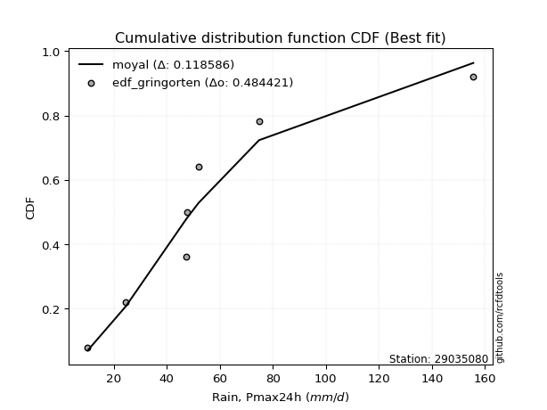</img>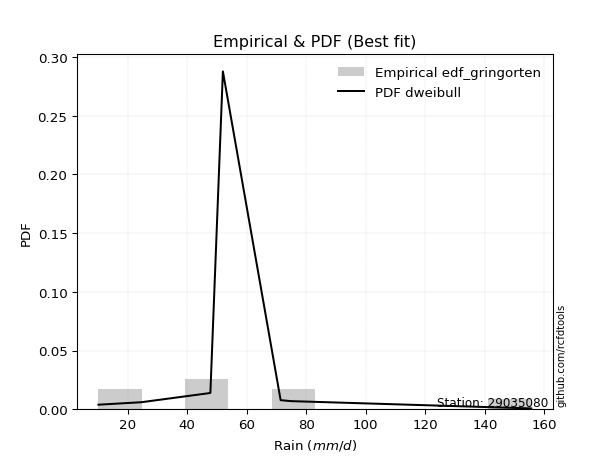</img>

</div>


### 9. EDF Filliben (1975)

The specific values of the constants (0.3175) (often denoted as $alpha$) and (0.365) are derived from a method proposed by James J. Filliben in a 1975 paper. This particular formula is the mean value of the $i$-th order statistic of the normal distribution and is considered a robust and effective plotting position formula for the normal probability plot correlation coefficient test for normality.

<div align="center">


$P=(m-0.3175)/(n+0.365)$


</div>


**9.1. Empirical values**

<div align="center">

|                | 0                   | 1                   | 2                   | 3            | 4                  | 5                  | 6                  |
|:---------------|:--------------------|:--------------------|:--------------------|:-------------|:-------------------|:-------------------|:-------------------|
| date           | 2018                | 2023                | 2020                | 2022         | 2021               | 2019               | 2024               |
| x              | 10.2                | 24.6                | 47.4                | 47.8         | 52.0               | 74.8               | 155.6              |
| m              | 1                   | 2                   | 3                   | 4            | 5                  | 6                  | 7                  |
| empirical_dist | edf_filliben        | edf_filliben        | edf_filliben        | edf_filliben | edf_filliben       | edf_filliben       | edf_filliben       |
| empirical      | 0.09266802443991853 | 0.22844534962661237 | 0.36422267481330617 | 0.5          | 0.6357773251866938 | 0.7715546503733877 | 0.9073319755600815 |
| empirical_tr   | 1.1021324354657687  | 1.2960844698636163  | 1.5728777362520021  | 2.0          | 2.7455731593662627 | 4.377414561664191  | 10.791208791208794 |

</div>


**9.2. Kolmogorov-Smirnov fit test (sorted by Δ)**


<div align="center">

|                | 0                   | 1                   | 2                   | 3                   | 4                   | 5                   | 6                   | 7                   | 8                   | 9                   | 10                  | 11                  | 12                  | 13                  | 14                  | 15                  | 16                  | 17                  | 18                  | 19                  | 20                  | 21                  | 22                  | 23                  | 24                  | 25                  | 26                  | 27                  | 28                  | 29                    | 30                  | 31                  | 32                  | 33                  | 34                  | 35                  | 36                  | 37                  | 38                  | 39                  | 40                  | 41                  | 42                  | 43                  | 44                  | 45                  | 46                  | 47                  | 48                  | 49                  | 50                  | 51                  | 52                  | 53                  | 54                  | 55                  | 56                  | 57                  | 58                  | 59                  | 60                  | 61                  | 62                  | 63                  | 64                  | 65                  | 66                  | 67                  | 68                  | 69                  | 70                  | 71                  | 72                  | 73                  | 74                  | 75                  | 76                  | 77                  | 78                  | 79                  | 80                  | 81                  | 82                  | 83                  | 84                  | 85                  | 86                  | 87                  |
|:---------------|:--------------------|:--------------------|:--------------------|:--------------------|:--------------------|:--------------------|:--------------------|:--------------------|:--------------------|:--------------------|:--------------------|:--------------------|:--------------------|:--------------------|:--------------------|:--------------------|:--------------------|:--------------------|:--------------------|:--------------------|:--------------------|:--------------------|:--------------------|:--------------------|:--------------------|:--------------------|:--------------------|:--------------------|:--------------------|:----------------------|:--------------------|:--------------------|:--------------------|:--------------------|:--------------------|:--------------------|:--------------------|:--------------------|:--------------------|:--------------------|:--------------------|:--------------------|:--------------------|:--------------------|:--------------------|:--------------------|:--------------------|:--------------------|:--------------------|:--------------------|:--------------------|:--------------------|:--------------------|:--------------------|:--------------------|:--------------------|:--------------------|:--------------------|:--------------------|:--------------------|:--------------------|:--------------------|:--------------------|:--------------------|:--------------------|:--------------------|:--------------------|:--------------------|:--------------------|:--------------------|:--------------------|:--------------------|:--------------------|:--------------------|:--------------------|:--------------------|:--------------------|:--------------------|:--------------------|:--------------------|:--------------------|:--------------------|:--------------------|:--------------------|:--------------------|:--------------------|:--------------------|:--------------------|
| station        | 29035080            | 29035080            | 29035080            | 29035080            | 29035080            | 29035080            | 29035080            | 29035080            | 29035080            | 29035080            | 29035080            | 29035080            | 29035080            | 29035080            | 29035080            | 29035080            | 29035080            | 29035080            | 29035080            | 29035080            | 29035080            | 29035080            | 29035080            | 29035080            | 29035080            | 29035080            | 29035080            | 29035080            | 29035080            | 29035080              | 29035080            | 29035080            | 29035080            | 29035080            | 29035080            | 29035080            | 29035080            | 29035080            | 29035080            | 29035080            | 29035080            | 29035080            | 29035080            | 29035080            | 29035080            | 29035080            | 29035080            | 29035080            | 29035080            | 29035080            | 29035080            | 29035080            | 29035080            | 29035080            | 29035080            | 29035080            | 29035080            | 29035080            | 29035080            | 29035080            | 29035080            | 29035080            | 29035080            | 29035080            | 29035080            | 29035080            | 29035080            | 29035080            | 29035080            | 29035080            | 29035080            | 29035080            | 29035080            | 29035080            | 29035080            | 29035080            | 29035080            | 29035080            | 29035080            | 29035080            | 29035080            | 29035080            | 29035080            | 29035080            | 29035080            | 29035080            | 29035080            | 29035080            |
| empirical_dist | edf_filliben        | edf_filliben        | edf_filliben        | edf_filliben        | edf_filliben        | edf_filliben        | edf_filliben        | edf_filliben        | edf_filliben        | edf_filliben        | edf_filliben        | edf_filliben        | edf_filliben        | edf_filliben        | edf_filliben        | edf_filliben        | edf_filliben        | edf_filliben        | edf_filliben        | edf_filliben        | edf_filliben        | edf_filliben        | edf_filliben        | edf_filliben        | edf_filliben        | edf_filliben        | edf_filliben        | edf_filliben        | edf_filliben        | edf_filliben          | edf_filliben        | edf_filliben        | edf_filliben        | edf_filliben        | edf_filliben        | edf_filliben        | edf_filliben        | edf_filliben        | edf_filliben        | edf_filliben        | edf_filliben        | edf_filliben        | edf_filliben        | edf_filliben        | edf_filliben        | edf_filliben        | edf_filliben        | edf_filliben        | edf_filliben        | edf_filliben        | edf_filliben        | edf_filliben        | edf_filliben        | edf_filliben        | edf_filliben        | edf_filliben        | edf_filliben        | edf_filliben        | edf_filliben        | edf_filliben        | edf_filliben        | edf_filliben        | edf_filliben        | edf_filliben        | edf_filliben        | edf_filliben        | edf_filliben        | edf_filliben        | edf_filliben        | edf_filliben        | edf_filliben        | edf_filliben        | edf_filliben        | edf_filliben        | edf_filliben        | edf_filliben        | edf_filliben        | edf_filliben        | edf_filliben        | edf_filliben        | edf_filliben        | edf_filliben        | edf_filliben        | edf_filliben        | edf_filliben        | edf_filliben        | edf_filliben        | edf_filliben        |
| p_dist         | moyal               | pearson3            | halfnorm            | exponnorm           | loggumbel_l         | genlogistic         | halflogistic        | loggenlogistic      | mielke              | gumbel_r            | logjohnsonsu        | logloggamma         | ncf                 | invweibull          | logweibull_min      | fisk                | gompertz            | t                   | invgamma            | nakagami            | logpearson3         | nct                 | logfisk             | johnsonsu           | invgauss            | genexpon            | rayleigh            | loggompertz         | kstwobign           | loglaplace_asymmetric | laplace_asymmetric  | maxwell             | logf                | logcrystalball      | logexponnorm        | lognorm             | lognorm             | logt                | logfatiguelife      | lognct              | expon               | logbetaprime        | loglogistic         | wald                | logerlang           | loghypsecant        | logrice             | logncf              | loggamma            | loggamma            | loginvgamma         | logalpha            | f                   | loglaplace          | rice                | loginvgauss         | norm                | truncnorm           | crystalball         | logmaxwell          | logistic            | loginvweibull       | lograyleigh         | hypsecant           | logtruncnorm        | gibrat              | logkstwobign        | laplace             | betaprime           | loggumbel_r         | loghalfnorm         | loggenexpon         | alpha               | erlang              | logmoyal            | loghalflogistic     | gumbel_l            | weibull_min         | logmielke           | logexpon            | logwald             | loggibrat           | chi2                | gamma               | loglognorm          | logchi2             | lognakagami         | fatiguelife         |
| delta          | 0.1139137513618318  | 0.11521235438843136 | 0.11794761999877079 | 0.12036662155419076 | 0.12095491128127234 | 0.1234789917496254  | 0.12842894561265483 | 0.1321561123661834  | 0.13243693981122645 | 0.13285825368400883 | 0.1354978701804609  | 0.1367030806272882  | 0.13789348644084887 | 0.14053037114250766 | 0.1408773775600899  | 0.1415026651808894  | 0.1418895639239367  | 0.14208060112192444 | 0.14214522447182942 | 0.14229436830993858 | 0.14331851021478414 | 0.14400542315465592 | 0.14746546575094188 | 0.14754303170596772 | 0.14822638708796387 | 0.14853083141084777 | 0.15198685201728646 | 0.15308156874762124 | 0.15359445352859946 | 0.16058595407560106   | 0.16239887347067727 | 0.1640332196888477  | 0.16758086212114454 | 0.16784503522368177 | 0.16784767205756035 | 0.1678504602348596  | 0.1678504602348596  | 0.16785068889021693 | 0.16855336636126939 | 0.16859990041286088 | 0.16980841510096234 | 0.17047768064034785 | 0.17220730907871218 | 0.17467819272391483 | 0.1751777014290451  | 0.17591167475709168 | 0.17751744382142387 | 0.17800729507295232 | 0.178475702129252   | 0.178475702129252   | 0.18152890771381736 | 0.18392299138703572 | 0.18616275738552124 | 0.18956761701453972 | 0.19504023264838488 | 0.19618145381037155 | 0.1984341054475709  | 0.19843411122554788 | 0.19843411451009235 | 0.19934289973079455 | 0.20680658060719015 | 0.20937757554834802 | 0.20958795971720856 | 0.2138372354510793  | 0.22844341296810536 | 0.22844534962661237 | 0.23017753541111252 | 0.23573334717324174 | 0.23756689262630482 | 0.23844155202359596 | 0.23844812840746932 | 0.25478334100718913 | 0.25493304540569806 | 0.2623269952916415  | 0.26378668206930467 | 0.2650506653876513  | 0.2679186760141793  | 0.27403653507221803 | 0.28208901813039955 | 0.2834841185152135  | 0.3341417159065211  | 0.36162080441292366 | 0.38524195567888875 | 0.3856102021292329  | 0.4118371737686628  | 0.4260194555887945  | 0.4335105294815267  | 0.5053240954972028  |
| deltao         | 0.48442053926100004 | 0.48442053926100004 | 0.48442053926100004 | 0.48442053926100004 | 0.48442053926100004 | 0.48442053926100004 | 0.48442053926100004 | 0.48442053926100004 | 0.48442053926100004 | 0.48442053926100004 | 0.48442053926100004 | 0.48442053926100004 | 0.48442053926100004 | 0.48442053926100004 | 0.48442053926100004 | 0.48442053926100004 | 0.48442053926100004 | 0.48442053926100004 | 0.48442053926100004 | 0.48442053926100004 | 0.48442053926100004 | 0.48442053926100004 | 0.48442053926100004 | 0.48442053926100004 | 0.48442053926100004 | 0.48442053926100004 | 0.48442053926100004 | 0.48442053926100004 | 0.48442053926100004 | 0.48442053926100004   | 0.48442053926100004 | 0.48442053926100004 | 0.48442053926100004 | 0.48442053926100004 | 0.48442053926100004 | 0.48442053926100004 | 0.48442053926100004 | 0.48442053926100004 | 0.48442053926100004 | 0.48442053926100004 | 0.48442053926100004 | 0.48442053926100004 | 0.48442053926100004 | 0.48442053926100004 | 0.48442053926100004 | 0.48442053926100004 | 0.48442053926100004 | 0.48442053926100004 | 0.48442053926100004 | 0.48442053926100004 | 0.48442053926100004 | 0.48442053926100004 | 0.48442053926100004 | 0.48442053926100004 | 0.48442053926100004 | 0.48442053926100004 | 0.48442053926100004 | 0.48442053926100004 | 0.48442053926100004 | 0.48442053926100004 | 0.48442053926100004 | 0.48442053926100004 | 0.48442053926100004 | 0.48442053926100004 | 0.48442053926100004 | 0.48442053926100004 | 0.48442053926100004 | 0.48442053926100004 | 0.48442053926100004 | 0.48442053926100004 | 0.48442053926100004 | 0.48442053926100004 | 0.48442053926100004 | 0.48442053926100004 | 0.48442053926100004 | 0.48442053926100004 | 0.48442053926100004 | 0.48442053926100004 | 0.48442053926100004 | 0.48442053926100004 | 0.48442053926100004 | 0.48442053926100004 | 0.48442053926100004 | 0.48442053926100004 | 0.48442053926100004 | 0.48442053926100004 | 0.48442053926100004 | 0.48442053926100004 |
| eval           | Δo > Δ              | Δo > Δ              | Δo > Δ              | Δo > Δ              | Δo > Δ              | Δo > Δ              | Δo > Δ              | Δo > Δ              | Δo > Δ              | Δo > Δ              | Δo > Δ              | Δo > Δ              | Δo > Δ              | Δo > Δ              | Δo > Δ              | Δo > Δ              | Δo > Δ              | Δo > Δ              | Δo > Δ              | Δo > Δ              | Δo > Δ              | Δo > Δ              | Δo > Δ              | Δo > Δ              | Δo > Δ              | Δo > Δ              | Δo > Δ              | Δo > Δ              | Δo > Δ              | Δo > Δ                | Δo > Δ              | Δo > Δ              | Δo > Δ              | Δo > Δ              | Δo > Δ              | Δo > Δ              | Δo > Δ              | Δo > Δ              | Δo > Δ              | Δo > Δ              | Δo > Δ              | Δo > Δ              | Δo > Δ              | Δo > Δ              | Δo > Δ              | Δo > Δ              | Δo > Δ              | Δo > Δ              | Δo > Δ              | Δo > Δ              | Δo > Δ              | Δo > Δ              | Δo > Δ              | Δo > Δ              | Δo > Δ              | Δo > Δ              | Δo > Δ              | Δo > Δ              | Δo > Δ              | Δo > Δ              | Δo > Δ              | Δo > Δ              | Δo > Δ              | Δo > Δ              | Δo > Δ              | Δo > Δ              | Δo > Δ              | Δo > Δ              | Δo > Δ              | Δo > Δ              | Δo > Δ              | Δo > Δ              | Δo > Δ              | Δo > Δ              | Δo > Δ              | Δo > Δ              | Δo > Δ              | Δo > Δ              | Δo > Δ              | Δo > Δ              | Δo > Δ              | Δo > Δ              | Δo > Δ              | Δo > Δ              | Δo > Δ              | Δo > Δ              | Δo > Δ              | Δo <= Δ             |
| fit            | 1                   | 1                   | 1                   | 1                   | 1                   | 1                   | 1                   | 1                   | 1                   | 1                   | 1                   | 1                   | 1                   | 1                   | 1                   | 1                   | 1                   | 1                   | 1                   | 1                   | 1                   | 1                   | 1                   | 1                   | 1                   | 1                   | 1                   | 1                   | 1                   | 1                     | 1                   | 1                   | 1                   | 1                   | 1                   | 1                   | 1                   | 1                   | 1                   | 1                   | 1                   | 1                   | 1                   | 1                   | 1                   | 1                   | 1                   | 1                   | 1                   | 1                   | 1                   | 1                   | 1                   | 1                   | 1                   | 1                   | 1                   | 1                   | 1                   | 1                   | 1                   | 1                   | 1                   | 1                   | 1                   | 1                   | 1                   | 1                   | 1                   | 1                   | 1                   | 1                   | 1                   | 1                   | 1                   | 1                   | 1                   | 1                   | 1                   | 1                   | 1                   | 1                   | 1                   | 1                   | 1                   | 1                   | 1                   | 0                   |
| n              | 7                   | 7                   | 7                   | 7                   | 7                   | 7                   | 7                   | 7                   | 7                   | 7                   | 7                   | 7                   | 7                   | 7                   | 7                   | 7                   | 7                   | 7                   | 7                   | 7                   | 7                   | 7                   | 7                   | 7                   | 7                   | 7                   | 7                   | 7                   | 7                   | 7                     | 7                   | 7                   | 7                   | 7                   | 7                   | 7                   | 7                   | 7                   | 7                   | 7                   | 7                   | 7                   | 7                   | 7                   | 7                   | 7                   | 7                   | 7                   | 7                   | 7                   | 7                   | 7                   | 7                   | 7                   | 7                   | 7                   | 7                   | 7                   | 7                   | 7                   | 7                   | 7                   | 7                   | 7                   | 7                   | 7                   | 7                   | 7                   | 7                   | 7                   | 7                   | 7                   | 7                   | 7                   | 7                   | 7                   | 7                   | 7                   | 7                   | 7                   | 7                   | 7                   | 7                   | 7                   | 7                   | 7                   | 7                   | 7                   |
| best_fit       | 1                   | 0                   | 0                   | 0                   | 0                   | 0                   | 0                   | 0                   | 0                   | 0                   | 0                   | 0                   | 0                   | 0                   | 0                   | 0                   | 0                   | 0                   | 0                   | 0                   | 0                   | 0                   | 0                   | 0                   | 0                   | 0                   | 0                   | 0                   | 0                   | 0                     | 0                   | 0                   | 0                   | 0                   | 0                   | 0                   | 0                   | 0                   | 0                   | 0                   | 0                   | 0                   | 0                   | 0                   | 0                   | 0                   | 0                   | 0                   | 0                   | 0                   | 0                   | 0                   | 0                   | 0                   | 0                   | 0                   | 0                   | 0                   | 0                   | 0                   | 0                   | 0                   | 0                   | 0                   | 0                   | 0                   | 0                   | 0                   | 0                   | 0                   | 0                   | 0                   | 0                   | 0                   | 0                   | 0                   | 0                   | 0                   | 0                   | 0                   | 0                   | 0                   | 0                   | 0                   | 0                   | 0                   | 0                   | 0                   |
| best_fit_sort  | 1                   | 2                   | 3                   | 4                   | 5                   | 6                   | 7                   | 8                   | 9                   | 10                  | 11                  | 12                  | 13                  | 14                  | 15                  | 16                  | 17                  | 18                  | 19                  | 20                  | 21                  | 22                  | 23                  | 24                  | 25                  | 26                  | 27                  | 28                  | 29                  | 30                    | 31                  | 32                  | 33                  | 34                  | 35                  | 36                  | 37                  | 38                  | 39                  | 40                  | 41                  | 42                  | 43                  | 44                  | 45                  | 46                  | 47                  | 48                  | 49                  | 50                  | 51                  | 52                  | 53                  | 54                  | 55                  | 56                  | 57                  | 58                  | 59                  | 60                  | 61                  | 62                  | 63                  | 64                  | 65                  | 66                  | 67                  | 68                  | 69                  | 70                  | 71                  | 72                  | 73                  | 74                  | 75                  | 76                  | 77                  | 78                  | 79                  | 80                  | 81                  | 82                  | 83                  | 84                  | 85                  | 86                  | 87                  | 88                  |

</div>


**9.3. Best fit**

<div align="center">

|   id |   station | empirical_dist   | p_dist   |    delta |   deltao | eval   |   fit |   n |   best_fit |   best_fit_sort |
|-----:|----------:|:-----------------|:---------|---------:|---------:|:-------|------:|----:|-----------:|----------------:|
|    0 |  29035080 | edf_filliben     | moyal    | 0.113914 | 0.484421 | Δo > Δ |     1 |   7 |          1 |               1 |

</div>


<div align="center">

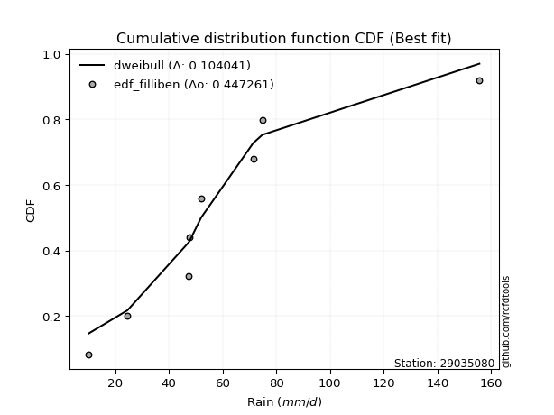</img>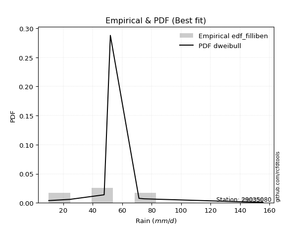</img>

</div>


### 10. EDF Jenkinson (1977)

The Jenkinson formula in hydrology is an empirical plotting position formula used to estimate the non-exceedance probability _(P)_ or return period _(T)_ of a given ordered observation within a sample. It is a widely used method in the frequency analysis of extreme events such as floods and rainfall, as it provides a distribution-free way to plot data. _a≈0.31_ and _b≈0.38_ are constants derived to approximate the median of the probability distribution for the given rank.

<div align="center">


$P=(m-a)/(n+b)$


</div>


**10.1. Empirical values**

<div align="center">

|                | 0                   | 1                   | 2                   | 3             | 4                  | 5                  | 6                  |
|:---------------|:--------------------|:--------------------|:--------------------|:--------------|:-------------------|:-------------------|:-------------------|
| date           | 2018                | 2023                | 2020                | 2022          | 2021               | 2019               | 2024               |
| x              | 10.2                | 24.6                | 47.4                | 47.8          | 52.0               | 74.8               | 155.6              |
| m              | 1                   | 2                   | 3                   | 4             | 5                  | 6                  | 7                  |
| empirical_dist | edf_jenkinson       | edf_jenkinson       | edf_jenkinson       | edf_jenkinson | edf_jenkinson      | edf_jenkinson      | edf_jenkinson      |
| empirical      | 0.09349593495934959 | 0.22899728997289973 | 0.36449864498644985 | 0.5           | 0.6355013550135502 | 0.7710027100271003 | 0.9065040650406505 |
| empirical_tr   | 1.1031390134529149  | 1.29701230228471    | 1.5735607675906182  | 2.0           | 2.743494423791822  | 4.366863905325444  | 10.695652173913055 |

</div>


**10.2. Kolmogorov-Smirnov fit test (sorted by Δ)**


<div align="center">

|                | 0                   | 1                   | 2                   | 3                   | 4                   | 5                   | 6                   | 7                   | 8                   | 9                   | 10                  | 11                  | 12                  | 13                  | 14                  | 15                  | 16                  | 17                  | 18                  | 19                  | 20                  | 21                  | 22                  | 23                  | 24                  | 25                  | 26                  | 27                  | 28                  | 29                    | 30                  | 31                  | 32                  | 33                  | 34                  | 35                  | 36                  | 37                  | 38                  | 39                  | 40                  | 41                  | 42                  | 43                  | 44                  | 45                  | 46                  | 47                  | 48                  | 49                  | 50                  | 51                  | 52                  | 53                  | 54                  | 55                  | 56                  | 57                  | 58                  | 59                  | 60                  | 61                  | 62                  | 63                  | 64                  | 65                  | 66                  | 67                  | 68                  | 69                  | 70                  | 71                  | 72                  | 73                  | 74                  | 75                  | 76                  | 77                  | 78                  | 79                  | 80                  | 81                  | 82                  | 83                  | 84                  | 85                  | 86                  | 87                  |
|:---------------|:--------------------|:--------------------|:--------------------|:--------------------|:--------------------|:--------------------|:--------------------|:--------------------|:--------------------|:--------------------|:--------------------|:--------------------|:--------------------|:--------------------|:--------------------|:--------------------|:--------------------|:--------------------|:--------------------|:--------------------|:--------------------|:--------------------|:--------------------|:--------------------|:--------------------|:--------------------|:--------------------|:--------------------|:--------------------|:----------------------|:--------------------|:--------------------|:--------------------|:--------------------|:--------------------|:--------------------|:--------------------|:--------------------|:--------------------|:--------------------|:--------------------|:--------------------|:--------------------|:--------------------|:--------------------|:--------------------|:--------------------|:--------------------|:--------------------|:--------------------|:--------------------|:--------------------|:--------------------|:--------------------|:--------------------|:--------------------|:--------------------|:--------------------|:--------------------|:--------------------|:--------------------|:--------------------|:--------------------|:--------------------|:--------------------|:--------------------|:--------------------|:--------------------|:--------------------|:--------------------|:--------------------|:--------------------|:--------------------|:--------------------|:--------------------|:--------------------|:--------------------|:--------------------|:--------------------|:--------------------|:--------------------|:--------------------|:--------------------|:--------------------|:--------------------|:--------------------|:--------------------|:--------------------|
| station        | 29035080            | 29035080            | 29035080            | 29035080            | 29035080            | 29035080            | 29035080            | 29035080            | 29035080            | 29035080            | 29035080            | 29035080            | 29035080            | 29035080            | 29035080            | 29035080            | 29035080            | 29035080            | 29035080            | 29035080            | 29035080            | 29035080            | 29035080            | 29035080            | 29035080            | 29035080            | 29035080            | 29035080            | 29035080            | 29035080              | 29035080            | 29035080            | 29035080            | 29035080            | 29035080            | 29035080            | 29035080            | 29035080            | 29035080            | 29035080            | 29035080            | 29035080            | 29035080            | 29035080            | 29035080            | 29035080            | 29035080            | 29035080            | 29035080            | 29035080            | 29035080            | 29035080            | 29035080            | 29035080            | 29035080            | 29035080            | 29035080            | 29035080            | 29035080            | 29035080            | 29035080            | 29035080            | 29035080            | 29035080            | 29035080            | 29035080            | 29035080            | 29035080            | 29035080            | 29035080            | 29035080            | 29035080            | 29035080            | 29035080            | 29035080            | 29035080            | 29035080            | 29035080            | 29035080            | 29035080            | 29035080            | 29035080            | 29035080            | 29035080            | 29035080            | 29035080            | 29035080            | 29035080            |
| empirical_dist | edf_jenkinson       | edf_jenkinson       | edf_jenkinson       | edf_jenkinson       | edf_jenkinson       | edf_jenkinson       | edf_jenkinson       | edf_jenkinson       | edf_jenkinson       | edf_jenkinson       | edf_jenkinson       | edf_jenkinson       | edf_jenkinson       | edf_jenkinson       | edf_jenkinson       | edf_jenkinson       | edf_jenkinson       | edf_jenkinson       | edf_jenkinson       | edf_jenkinson       | edf_jenkinson       | edf_jenkinson       | edf_jenkinson       | edf_jenkinson       | edf_jenkinson       | edf_jenkinson       | edf_jenkinson       | edf_jenkinson       | edf_jenkinson       | edf_jenkinson         | edf_jenkinson       | edf_jenkinson       | edf_jenkinson       | edf_jenkinson       | edf_jenkinson       | edf_jenkinson       | edf_jenkinson       | edf_jenkinson       | edf_jenkinson       | edf_jenkinson       | edf_jenkinson       | edf_jenkinson       | edf_jenkinson       | edf_jenkinson       | edf_jenkinson       | edf_jenkinson       | edf_jenkinson       | edf_jenkinson       | edf_jenkinson       | edf_jenkinson       | edf_jenkinson       | edf_jenkinson       | edf_jenkinson       | edf_jenkinson       | edf_jenkinson       | edf_jenkinson       | edf_jenkinson       | edf_jenkinson       | edf_jenkinson       | edf_jenkinson       | edf_jenkinson       | edf_jenkinson       | edf_jenkinson       | edf_jenkinson       | edf_jenkinson       | edf_jenkinson       | edf_jenkinson       | edf_jenkinson       | edf_jenkinson       | edf_jenkinson       | edf_jenkinson       | edf_jenkinson       | edf_jenkinson       | edf_jenkinson       | edf_jenkinson       | edf_jenkinson       | edf_jenkinson       | edf_jenkinson       | edf_jenkinson       | edf_jenkinson       | edf_jenkinson       | edf_jenkinson       | edf_jenkinson       | edf_jenkinson       | edf_jenkinson       | edf_jenkinson       | edf_jenkinson       | edf_jenkinson       |
| p_dist         | moyal               | pearson3            | halfnorm            | exponnorm           | loggumbel_l         | genlogistic         | halflogistic        | loggenlogistic      | mielke              | gumbel_r            | logjohnsonsu        | logloggamma         | ncf                 | invweibull          | logweibull_min      | fisk                | gompertz            | t                   | invgamma            | nakagami            | logpearson3         | nct                 | logfisk             | johnsonsu           | invgauss            | genexpon            | rayleigh            | loggompertz         | kstwobign           | loglaplace_asymmetric | laplace_asymmetric  | maxwell             | logf                | logcrystalball      | logexponnorm        | lognorm             | lognorm             | logt                | logfatiguelife      | lognct              | expon               | logbetaprime        | loglogistic         | wald                | logerlang           | loghypsecant        | logrice             | logncf              | loggamma            | loggamma            | loginvgamma         | logalpha            | f                   | loglaplace          | rice                | loginvgauss         | norm                | truncnorm           | crystalball         | logmaxwell          | logistic            | loginvweibull       | lograyleigh         | hypsecant           | logtruncnorm        | gibrat              | logkstwobign        | laplace             | betaprime           | loggumbel_r         | loghalfnorm         | loggenexpon         | alpha               | erlang              | logmoyal            | loghalflogistic     | gumbel_l            | weibull_min         | logmielke           | logexpon            | logwald             | loggibrat           | chi2                | gamma               | loglognorm          | logchi2             | lognakagami         | fatiguelife         |
| delta          | 0.11363778118868811 | 0.11493638421528773 | 0.11767164982562717 | 0.12009065138104708 | 0.12067894110812871 | 0.12320302157648177 | 0.12815297543951115 | 0.13188014219303973 | 0.13216096963808277 | 0.1325822835108652  | 0.1352219000073172  | 0.13642711045414452 | 0.1376175162677052  | 0.14025440096936398 | 0.1406014073869462  | 0.1412266950077457  | 0.14161359375079302 | 0.14180463094878076 | 0.14186925429868574 | 0.1420183981367949  | 0.14304254004164046 | 0.14372945298151224 | 0.1471894955777982  | 0.14726706153282404 | 0.1479504169148202  | 0.1482548612377041  | 0.15171088184414283 | 0.15280559857447756 | 0.15331848335545584 | 0.16030998390245738   | 0.16212290329753365 | 0.16375724951570408 | 0.16730489194800086 | 0.1675690650505381  | 0.16757170188441667 | 0.16757449006171593 | 0.16757449006171593 | 0.16757471871707325 | 0.1682773961881257  | 0.1683239302397172  | 0.16953244492781866 | 0.17020171046720417 | 0.1719313389055685  | 0.17440222255077115 | 0.17490173125590142 | 0.175635704583948   | 0.1772414736482802  | 0.17773132489980864 | 0.17819973195610833 | 0.17819973195610833 | 0.18125293754067368 | 0.18364702121389204 | 0.18588678721237756 | 0.18929164684139604 | 0.19476426247524126 | 0.19590548363722787 | 0.19815813527442727 | 0.19815814105240426 | 0.19815814433694873 | 0.19906692955765087 | 0.20653061043404652 | 0.20910160537520434 | 0.20931198954406488 | 0.21356126527793567 | 0.22899535331439272 | 0.22899728997289973 | 0.22990156523796884 | 0.2354573770000981  | 0.23729092245316113 | 0.23816558185045228 | 0.23817215823432564 | 0.25450737083404545 | 0.2546570752325544  | 0.2620510251184978  | 0.263510711896161   | 0.26477469521450764 | 0.26764270584103567 | 0.27376056489907435 | 0.28181304795725587 | 0.2832081483420698  | 0.3338657457333774  | 0.36134483423978    | 0.38496598550574507 | 0.38533423195608923 | 0.41128523342237544 | 0.4257434854156508  | 0.433234559308383   | 0.5047721551509154  |
| deltao         | 0.48442053926100004 | 0.48442053926100004 | 0.48442053926100004 | 0.48442053926100004 | 0.48442053926100004 | 0.48442053926100004 | 0.48442053926100004 | 0.48442053926100004 | 0.48442053926100004 | 0.48442053926100004 | 0.48442053926100004 | 0.48442053926100004 | 0.48442053926100004 | 0.48442053926100004 | 0.48442053926100004 | 0.48442053926100004 | 0.48442053926100004 | 0.48442053926100004 | 0.48442053926100004 | 0.48442053926100004 | 0.48442053926100004 | 0.48442053926100004 | 0.48442053926100004 | 0.48442053926100004 | 0.48442053926100004 | 0.48442053926100004 | 0.48442053926100004 | 0.48442053926100004 | 0.48442053926100004 | 0.48442053926100004   | 0.48442053926100004 | 0.48442053926100004 | 0.48442053926100004 | 0.48442053926100004 | 0.48442053926100004 | 0.48442053926100004 | 0.48442053926100004 | 0.48442053926100004 | 0.48442053926100004 | 0.48442053926100004 | 0.48442053926100004 | 0.48442053926100004 | 0.48442053926100004 | 0.48442053926100004 | 0.48442053926100004 | 0.48442053926100004 | 0.48442053926100004 | 0.48442053926100004 | 0.48442053926100004 | 0.48442053926100004 | 0.48442053926100004 | 0.48442053926100004 | 0.48442053926100004 | 0.48442053926100004 | 0.48442053926100004 | 0.48442053926100004 | 0.48442053926100004 | 0.48442053926100004 | 0.48442053926100004 | 0.48442053926100004 | 0.48442053926100004 | 0.48442053926100004 | 0.48442053926100004 | 0.48442053926100004 | 0.48442053926100004 | 0.48442053926100004 | 0.48442053926100004 | 0.48442053926100004 | 0.48442053926100004 | 0.48442053926100004 | 0.48442053926100004 | 0.48442053926100004 | 0.48442053926100004 | 0.48442053926100004 | 0.48442053926100004 | 0.48442053926100004 | 0.48442053926100004 | 0.48442053926100004 | 0.48442053926100004 | 0.48442053926100004 | 0.48442053926100004 | 0.48442053926100004 | 0.48442053926100004 | 0.48442053926100004 | 0.48442053926100004 | 0.48442053926100004 | 0.48442053926100004 | 0.48442053926100004 |
| eval           | Δo > Δ              | Δo > Δ              | Δo > Δ              | Δo > Δ              | Δo > Δ              | Δo > Δ              | Δo > Δ              | Δo > Δ              | Δo > Δ              | Δo > Δ              | Δo > Δ              | Δo > Δ              | Δo > Δ              | Δo > Δ              | Δo > Δ              | Δo > Δ              | Δo > Δ              | Δo > Δ              | Δo > Δ              | Δo > Δ              | Δo > Δ              | Δo > Δ              | Δo > Δ              | Δo > Δ              | Δo > Δ              | Δo > Δ              | Δo > Δ              | Δo > Δ              | Δo > Δ              | Δo > Δ                | Δo > Δ              | Δo > Δ              | Δo > Δ              | Δo > Δ              | Δo > Δ              | Δo > Δ              | Δo > Δ              | Δo > Δ              | Δo > Δ              | Δo > Δ              | Δo > Δ              | Δo > Δ              | Δo > Δ              | Δo > Δ              | Δo > Δ              | Δo > Δ              | Δo > Δ              | Δo > Δ              | Δo > Δ              | Δo > Δ              | Δo > Δ              | Δo > Δ              | Δo > Δ              | Δo > Δ              | Δo > Δ              | Δo > Δ              | Δo > Δ              | Δo > Δ              | Δo > Δ              | Δo > Δ              | Δo > Δ              | Δo > Δ              | Δo > Δ              | Δo > Δ              | Δo > Δ              | Δo > Δ              | Δo > Δ              | Δo > Δ              | Δo > Δ              | Δo > Δ              | Δo > Δ              | Δo > Δ              | Δo > Δ              | Δo > Δ              | Δo > Δ              | Δo > Δ              | Δo > Δ              | Δo > Δ              | Δo > Δ              | Δo > Δ              | Δo > Δ              | Δo > Δ              | Δo > Δ              | Δo > Δ              | Δo > Δ              | Δo > Δ              | Δo > Δ              | Δo <= Δ             |
| fit            | 1                   | 1                   | 1                   | 1                   | 1                   | 1                   | 1                   | 1                   | 1                   | 1                   | 1                   | 1                   | 1                   | 1                   | 1                   | 1                   | 1                   | 1                   | 1                   | 1                   | 1                   | 1                   | 1                   | 1                   | 1                   | 1                   | 1                   | 1                   | 1                   | 1                     | 1                   | 1                   | 1                   | 1                   | 1                   | 1                   | 1                   | 1                   | 1                   | 1                   | 1                   | 1                   | 1                   | 1                   | 1                   | 1                   | 1                   | 1                   | 1                   | 1                   | 1                   | 1                   | 1                   | 1                   | 1                   | 1                   | 1                   | 1                   | 1                   | 1                   | 1                   | 1                   | 1                   | 1                   | 1                   | 1                   | 1                   | 1                   | 1                   | 1                   | 1                   | 1                   | 1                   | 1                   | 1                   | 1                   | 1                   | 1                   | 1                   | 1                   | 1                   | 1                   | 1                   | 1                   | 1                   | 1                   | 1                   | 0                   |
| n              | 7                   | 7                   | 7                   | 7                   | 7                   | 7                   | 7                   | 7                   | 7                   | 7                   | 7                   | 7                   | 7                   | 7                   | 7                   | 7                   | 7                   | 7                   | 7                   | 7                   | 7                   | 7                   | 7                   | 7                   | 7                   | 7                   | 7                   | 7                   | 7                   | 7                     | 7                   | 7                   | 7                   | 7                   | 7                   | 7                   | 7                   | 7                   | 7                   | 7                   | 7                   | 7                   | 7                   | 7                   | 7                   | 7                   | 7                   | 7                   | 7                   | 7                   | 7                   | 7                   | 7                   | 7                   | 7                   | 7                   | 7                   | 7                   | 7                   | 7                   | 7                   | 7                   | 7                   | 7                   | 7                   | 7                   | 7                   | 7                   | 7                   | 7                   | 7                   | 7                   | 7                   | 7                   | 7                   | 7                   | 7                   | 7                   | 7                   | 7                   | 7                   | 7                   | 7                   | 7                   | 7                   | 7                   | 7                   | 7                   |
| best_fit       | 1                   | 0                   | 0                   | 0                   | 0                   | 0                   | 0                   | 0                   | 0                   | 0                   | 0                   | 0                   | 0                   | 0                   | 0                   | 0                   | 0                   | 0                   | 0                   | 0                   | 0                   | 0                   | 0                   | 0                   | 0                   | 0                   | 0                   | 0                   | 0                   | 0                     | 0                   | 0                   | 0                   | 0                   | 0                   | 0                   | 0                   | 0                   | 0                   | 0                   | 0                   | 0                   | 0                   | 0                   | 0                   | 0                   | 0                   | 0                   | 0                   | 0                   | 0                   | 0                   | 0                   | 0                   | 0                   | 0                   | 0                   | 0                   | 0                   | 0                   | 0                   | 0                   | 0                   | 0                   | 0                   | 0                   | 0                   | 0                   | 0                   | 0                   | 0                   | 0                   | 0                   | 0                   | 0                   | 0                   | 0                   | 0                   | 0                   | 0                   | 0                   | 0                   | 0                   | 0                   | 0                   | 0                   | 0                   | 0                   |
| best_fit_sort  | 1                   | 2                   | 3                   | 4                   | 5                   | 6                   | 7                   | 8                   | 9                   | 10                  | 11                  | 12                  | 13                  | 14                  | 15                  | 16                  | 17                  | 18                  | 19                  | 20                  | 21                  | 22                  | 23                  | 24                  | 25                  | 26                  | 27                  | 28                  | 29                  | 30                    | 31                  | 32                  | 33                  | 34                  | 35                  | 36                  | 37                  | 38                  | 39                  | 40                  | 41                  | 42                  | 43                  | 44                  | 45                  | 46                  | 47                  | 48                  | 49                  | 50                  | 51                  | 52                  | 53                  | 54                  | 55                  | 56                  | 57                  | 58                  | 59                  | 60                  | 61                  | 62                  | 63                  | 64                  | 65                  | 66                  | 67                  | 68                  | 69                  | 70                  | 71                  | 72                  | 73                  | 74                  | 75                  | 76                  | 77                  | 78                  | 79                  | 80                  | 81                  | 82                  | 83                  | 84                  | 85                  | 86                  | 87                  | 88                  |

</div>


**10.3. Best fit**

<div align="center">

|   id |   station | empirical_dist   | p_dist   |    delta |   deltao | eval   |   fit |   n |   best_fit |   best_fit_sort |
|-----:|----------:|:-----------------|:---------|---------:|---------:|:-------|------:|----:|-----------:|----------------:|
|    0 |  29035080 | edf_jenkinson    | moyal    | 0.113638 | 0.484421 | Δo > Δ |     1 |   7 |          1 |               1 |

</div>


<div align="center">

</img></img>

</div>


### 11. EDF Cunnane (1978)

Cunnane´s work in statistical hydrology has focused on the performance and evaluation of different probability distributions (such as GEV, Gumbel, Lognormal) for flood frequency estimation. _b_ is a constant, typically set to 0.4.

<div align="center">


$P=(m-b)/(n+1-2b)$


</div>


**11.1. Empirical values**

<div align="center">

|                | 0                   | 1                   | 2                  | 3           | 4                  | 5                  | 6                  |
|:---------------|:--------------------|:--------------------|:-------------------|:------------|:-------------------|:-------------------|:-------------------|
| date           | 2018                | 2023                | 2020               | 2022        | 2021               | 2019               | 2024               |
| x              | 10.2                | 24.6                | 47.4               | 47.8        | 52.0               | 74.8               | 155.6              |
| m              | 1                   | 2                   | 3                  | 4           | 5                  | 6                  | 7                  |
| empirical_dist | edf_cunnane         | edf_cunnane         | edf_cunnane        | edf_cunnane | edf_cunnane        | edf_cunnane        | edf_cunnane        |
| empirical      | 0.08333333333333333 | 0.22222222222222224 | 0.3611111111111111 | 0.5         | 0.6388888888888888 | 0.7777777777777777 | 0.9166666666666666 |
| empirical_tr   | 1.090909090909091   | 1.2857142857142856  | 1.565217391304348  | 2.0         | 2.7692307692307687 | 4.499999999999998  | 11.999999999999995 |

</div>


**11.2. Kolmogorov-Smirnov fit test (sorted by Δ)**


<div align="center">

|                | 0                   | 1                   | 2                   | 3                   | 4                   | 5                   | 6                   | 7                   | 8                   | 9                   | 10                  | 11                  | 12                  | 13                  | 14                  | 15                  | 16                  | 17                  | 18                  | 19                  | 20                  | 21                  | 22                  | 23                  | 24                  | 25                  | 26                  | 27                  | 28                  | 29                    | 30                  | 31                  | 32                  | 33                  | 34                  | 35                  | 36                  | 37                  | 38                  | 39                  | 40                  | 41                  | 42                  | 43                  | 44                  | 45                  | 46                  | 47                  | 48                  | 49                  | 50                  | 51                  | 52                  | 53                  | 54                  | 55                  | 56                  | 57                  | 58                  | 59                  | 60                  | 61                  | 62                  | 63                  | 64                  | 65                  | 66                  | 67                  | 68                  | 69                  | 70                  | 71                  | 72                  | 73                  | 74                  | 75                  | 76                  | 77                  | 78                  | 79                  | 80                  | 81                  | 82                  | 83                  | 84                  | 85                  | 86                  | 87                  |
|:---------------|:--------------------|:--------------------|:--------------------|:--------------------|:--------------------|:--------------------|:--------------------|:--------------------|:--------------------|:--------------------|:--------------------|:--------------------|:--------------------|:--------------------|:--------------------|:--------------------|:--------------------|:--------------------|:--------------------|:--------------------|:--------------------|:--------------------|:--------------------|:--------------------|:--------------------|:--------------------|:--------------------|:--------------------|:--------------------|:----------------------|:--------------------|:--------------------|:--------------------|:--------------------|:--------------------|:--------------------|:--------------------|:--------------------|:--------------------|:--------------------|:--------------------|:--------------------|:--------------------|:--------------------|:--------------------|:--------------------|:--------------------|:--------------------|:--------------------|:--------------------|:--------------------|:--------------------|:--------------------|:--------------------|:--------------------|:--------------------|:--------------------|:--------------------|:--------------------|:--------------------|:--------------------|:--------------------|:--------------------|:--------------------|:--------------------|:--------------------|:--------------------|:--------------------|:--------------------|:--------------------|:--------------------|:--------------------|:--------------------|:--------------------|:--------------------|:--------------------|:--------------------|:--------------------|:--------------------|:--------------------|:--------------------|:--------------------|:--------------------|:--------------------|:--------------------|:--------------------|:--------------------|:--------------------|
| station        | 29035080            | 29035080            | 29035080            | 29035080            | 29035080            | 29035080            | 29035080            | 29035080            | 29035080            | 29035080            | 29035080            | 29035080            | 29035080            | 29035080            | 29035080            | 29035080            | 29035080            | 29035080            | 29035080            | 29035080            | 29035080            | 29035080            | 29035080            | 29035080            | 29035080            | 29035080            | 29035080            | 29035080            | 29035080            | 29035080              | 29035080            | 29035080            | 29035080            | 29035080            | 29035080            | 29035080            | 29035080            | 29035080            | 29035080            | 29035080            | 29035080            | 29035080            | 29035080            | 29035080            | 29035080            | 29035080            | 29035080            | 29035080            | 29035080            | 29035080            | 29035080            | 29035080            | 29035080            | 29035080            | 29035080            | 29035080            | 29035080            | 29035080            | 29035080            | 29035080            | 29035080            | 29035080            | 29035080            | 29035080            | 29035080            | 29035080            | 29035080            | 29035080            | 29035080            | 29035080            | 29035080            | 29035080            | 29035080            | 29035080            | 29035080            | 29035080            | 29035080            | 29035080            | 29035080            | 29035080            | 29035080            | 29035080            | 29035080            | 29035080            | 29035080            | 29035080            | 29035080            | 29035080            |
| empirical_dist | edf_cunnane         | edf_cunnane         | edf_cunnane         | edf_cunnane         | edf_cunnane         | edf_cunnane         | edf_cunnane         | edf_cunnane         | edf_cunnane         | edf_cunnane         | edf_cunnane         | edf_cunnane         | edf_cunnane         | edf_cunnane         | edf_cunnane         | edf_cunnane         | edf_cunnane         | edf_cunnane         | edf_cunnane         | edf_cunnane         | edf_cunnane         | edf_cunnane         | edf_cunnane         | edf_cunnane         | edf_cunnane         | edf_cunnane         | edf_cunnane         | edf_cunnane         | edf_cunnane         | edf_cunnane           | edf_cunnane         | edf_cunnane         | edf_cunnane         | edf_cunnane         | edf_cunnane         | edf_cunnane         | edf_cunnane         | edf_cunnane         | edf_cunnane         | edf_cunnane         | edf_cunnane         | edf_cunnane         | edf_cunnane         | edf_cunnane         | edf_cunnane         | edf_cunnane         | edf_cunnane         | edf_cunnane         | edf_cunnane         | edf_cunnane         | edf_cunnane         | edf_cunnane         | edf_cunnane         | edf_cunnane         | edf_cunnane         | edf_cunnane         | edf_cunnane         | edf_cunnane         | edf_cunnane         | edf_cunnane         | edf_cunnane         | edf_cunnane         | edf_cunnane         | edf_cunnane         | edf_cunnane         | edf_cunnane         | edf_cunnane         | edf_cunnane         | edf_cunnane         | edf_cunnane         | edf_cunnane         | edf_cunnane         | edf_cunnane         | edf_cunnane         | edf_cunnane         | edf_cunnane         | edf_cunnane         | edf_cunnane         | edf_cunnane         | edf_cunnane         | edf_cunnane         | edf_cunnane         | edf_cunnane         | edf_cunnane         | edf_cunnane         | edf_cunnane         | edf_cunnane         | edf_cunnane         |
| p_dist         | moyal               | pearson3            | halfnorm            | exponnorm           | loggumbel_l         | genlogistic         | halflogistic        | loggenlogistic      | mielke              | gumbel_r            | logjohnsonsu        | logloggamma         | ncf                 | invweibull          | logweibull_min      | fisk                | gompertz            | t                   | invgamma            | nakagami            | logpearson3         | nct                 | logfisk             | johnsonsu           | invgauss            | genexpon            | rayleigh            | loggompertz         | kstwobign           | loglaplace_asymmetric | laplace_asymmetric  | maxwell             | logf                | logcrystalball      | logexponnorm        | lognorm             | lognorm             | logt                | logfatiguelife      | lognct              | expon               | logbetaprime        | loglogistic         | wald                | logerlang           | loghypsecant        | logrice             | logncf              | loggamma            | loggamma            | loginvgamma         | logalpha            | f                   | loglaplace          | rice                | loginvgauss         | norm                | truncnorm           | crystalball         | logmaxwell          | logistic            | loginvweibull       | lograyleigh         | hypsecant           | logtruncnorm        | gibrat              | logkstwobign        | laplace             | betaprime           | loggumbel_r         | loghalfnorm         | loggenexpon         | alpha               | erlang              | logmoyal            | loghalflogistic     | gumbel_l            | weibull_min         | logmielke           | logexpon            | logwald             | loggibrat           | chi2                | gamma               | loglognorm          | logchi2             | lognakagami         | fatiguelife         |
| delta          | 0.11702531506402686 | 0.11832391809062637 | 0.1210591837009658  | 0.12347818525638582 | 0.12406647498346735 | 0.1265905554518204  | 0.1315405093148499  | 0.13526767606837847 | 0.13554850351342151 | 0.13596981738620384 | 0.13860943388265595 | 0.13981464432948326 | 0.14100505014304393 | 0.14364193484470272 | 0.14398894126228495 | 0.14461422888308445 | 0.14500112762613176 | 0.1451921648241195  | 0.1452567881740245  | 0.14540593201213364 | 0.1464300739169792  | 0.14711698685685098 | 0.15057702945313695 | 0.15065459540816278 | 0.15133795079015894 | 0.15164239511304284 | 0.15509841571948146 | 0.1561931324498163  | 0.15670601723079447 | 0.16369751777779612   | 0.16551043717287228 | 0.16714478339104272 | 0.1706924258233396  | 0.17095659892587683 | 0.1709592357597554  | 0.17096202393705467 | 0.17096202393705467 | 0.170962252592412   | 0.17166493006346445 | 0.17171146411505595 | 0.1729199788031574  | 0.17358924434254291 | 0.17531887278090724 | 0.1777897564261099  | 0.17828926513124016 | 0.17902323845928675 | 0.18062900752361893 | 0.18111885877514738 | 0.18158726583144708 | 0.18158726583144708 | 0.18464047141601242 | 0.18703455508923078 | 0.1892743210877163  | 0.1926791807167348  | 0.1981517963505799  | 0.19929301751256662 | 0.2015456691497659  | 0.2015456749277429  | 0.20154567821228736 | 0.20245446343298962 | 0.20991814430938516 | 0.21248913925054308 | 0.21269952341940362 | 0.2169487991532743  | 0.22222028556371523 | 0.22222222222222224 | 0.23328909911330759 | 0.23884491087543674 | 0.24067845632849988 | 0.24155311572579102 | 0.24155969210966438 | 0.2578949047093842  | 0.2580446091078931  | 0.26543855899383656 | 0.26689824577149973 | 0.2681622290898464  | 0.2710302397163743  | 0.2771480987744131  | 0.2852005818325946  | 0.28659568221740855 | 0.33725327960871615 | 0.3647323681151187  | 0.3883535193810838  | 0.388721765831428   | 0.41806030117305293 | 0.4314992133497061  | 0.43662209318372175 | 0.5115472229015929  |
| deltao         | 0.48442053926100004 | 0.48442053926100004 | 0.48442053926100004 | 0.48442053926100004 | 0.48442053926100004 | 0.48442053926100004 | 0.48442053926100004 | 0.48442053926100004 | 0.48442053926100004 | 0.48442053926100004 | 0.48442053926100004 | 0.48442053926100004 | 0.48442053926100004 | 0.48442053926100004 | 0.48442053926100004 | 0.48442053926100004 | 0.48442053926100004 | 0.48442053926100004 | 0.48442053926100004 | 0.48442053926100004 | 0.48442053926100004 | 0.48442053926100004 | 0.48442053926100004 | 0.48442053926100004 | 0.48442053926100004 | 0.48442053926100004 | 0.48442053926100004 | 0.48442053926100004 | 0.48442053926100004 | 0.48442053926100004   | 0.48442053926100004 | 0.48442053926100004 | 0.48442053926100004 | 0.48442053926100004 | 0.48442053926100004 | 0.48442053926100004 | 0.48442053926100004 | 0.48442053926100004 | 0.48442053926100004 | 0.48442053926100004 | 0.48442053926100004 | 0.48442053926100004 | 0.48442053926100004 | 0.48442053926100004 | 0.48442053926100004 | 0.48442053926100004 | 0.48442053926100004 | 0.48442053926100004 | 0.48442053926100004 | 0.48442053926100004 | 0.48442053926100004 | 0.48442053926100004 | 0.48442053926100004 | 0.48442053926100004 | 0.48442053926100004 | 0.48442053926100004 | 0.48442053926100004 | 0.48442053926100004 | 0.48442053926100004 | 0.48442053926100004 | 0.48442053926100004 | 0.48442053926100004 | 0.48442053926100004 | 0.48442053926100004 | 0.48442053926100004 | 0.48442053926100004 | 0.48442053926100004 | 0.48442053926100004 | 0.48442053926100004 | 0.48442053926100004 | 0.48442053926100004 | 0.48442053926100004 | 0.48442053926100004 | 0.48442053926100004 | 0.48442053926100004 | 0.48442053926100004 | 0.48442053926100004 | 0.48442053926100004 | 0.48442053926100004 | 0.48442053926100004 | 0.48442053926100004 | 0.48442053926100004 | 0.48442053926100004 | 0.48442053926100004 | 0.48442053926100004 | 0.48442053926100004 | 0.48442053926100004 | 0.48442053926100004 |
| eval           | Δo > Δ              | Δo > Δ              | Δo > Δ              | Δo > Δ              | Δo > Δ              | Δo > Δ              | Δo > Δ              | Δo > Δ              | Δo > Δ              | Δo > Δ              | Δo > Δ              | Δo > Δ              | Δo > Δ              | Δo > Δ              | Δo > Δ              | Δo > Δ              | Δo > Δ              | Δo > Δ              | Δo > Δ              | Δo > Δ              | Δo > Δ              | Δo > Δ              | Δo > Δ              | Δo > Δ              | Δo > Δ              | Δo > Δ              | Δo > Δ              | Δo > Δ              | Δo > Δ              | Δo > Δ                | Δo > Δ              | Δo > Δ              | Δo > Δ              | Δo > Δ              | Δo > Δ              | Δo > Δ              | Δo > Δ              | Δo > Δ              | Δo > Δ              | Δo > Δ              | Δo > Δ              | Δo > Δ              | Δo > Δ              | Δo > Δ              | Δo > Δ              | Δo > Δ              | Δo > Δ              | Δo > Δ              | Δo > Δ              | Δo > Δ              | Δo > Δ              | Δo > Δ              | Δo > Δ              | Δo > Δ              | Δo > Δ              | Δo > Δ              | Δo > Δ              | Δo > Δ              | Δo > Δ              | Δo > Δ              | Δo > Δ              | Δo > Δ              | Δo > Δ              | Δo > Δ              | Δo > Δ              | Δo > Δ              | Δo > Δ              | Δo > Δ              | Δo > Δ              | Δo > Δ              | Δo > Δ              | Δo > Δ              | Δo > Δ              | Δo > Δ              | Δo > Δ              | Δo > Δ              | Δo > Δ              | Δo > Δ              | Δo > Δ              | Δo > Δ              | Δo > Δ              | Δo > Δ              | Δo > Δ              | Δo > Δ              | Δo > Δ              | Δo > Δ              | Δo > Δ              | Δo <= Δ             |
| fit            | 1                   | 1                   | 1                   | 1                   | 1                   | 1                   | 1                   | 1                   | 1                   | 1                   | 1                   | 1                   | 1                   | 1                   | 1                   | 1                   | 1                   | 1                   | 1                   | 1                   | 1                   | 1                   | 1                   | 1                   | 1                   | 1                   | 1                   | 1                   | 1                   | 1                     | 1                   | 1                   | 1                   | 1                   | 1                   | 1                   | 1                   | 1                   | 1                   | 1                   | 1                   | 1                   | 1                   | 1                   | 1                   | 1                   | 1                   | 1                   | 1                   | 1                   | 1                   | 1                   | 1                   | 1                   | 1                   | 1                   | 1                   | 1                   | 1                   | 1                   | 1                   | 1                   | 1                   | 1                   | 1                   | 1                   | 1                   | 1                   | 1                   | 1                   | 1                   | 1                   | 1                   | 1                   | 1                   | 1                   | 1                   | 1                   | 1                   | 1                   | 1                   | 1                   | 1                   | 1                   | 1                   | 1                   | 1                   | 0                   |
| n              | 7                   | 7                   | 7                   | 7                   | 7                   | 7                   | 7                   | 7                   | 7                   | 7                   | 7                   | 7                   | 7                   | 7                   | 7                   | 7                   | 7                   | 7                   | 7                   | 7                   | 7                   | 7                   | 7                   | 7                   | 7                   | 7                   | 7                   | 7                   | 7                   | 7                     | 7                   | 7                   | 7                   | 7                   | 7                   | 7                   | 7                   | 7                   | 7                   | 7                   | 7                   | 7                   | 7                   | 7                   | 7                   | 7                   | 7                   | 7                   | 7                   | 7                   | 7                   | 7                   | 7                   | 7                   | 7                   | 7                   | 7                   | 7                   | 7                   | 7                   | 7                   | 7                   | 7                   | 7                   | 7                   | 7                   | 7                   | 7                   | 7                   | 7                   | 7                   | 7                   | 7                   | 7                   | 7                   | 7                   | 7                   | 7                   | 7                   | 7                   | 7                   | 7                   | 7                   | 7                   | 7                   | 7                   | 7                   | 7                   |
| best_fit       | 1                   | 0                   | 0                   | 0                   | 0                   | 0                   | 0                   | 0                   | 0                   | 0                   | 0                   | 0                   | 0                   | 0                   | 0                   | 0                   | 0                   | 0                   | 0                   | 0                   | 0                   | 0                   | 0                   | 0                   | 0                   | 0                   | 0                   | 0                   | 0                   | 0                     | 0                   | 0                   | 0                   | 0                   | 0                   | 0                   | 0                   | 0                   | 0                   | 0                   | 0                   | 0                   | 0                   | 0                   | 0                   | 0                   | 0                   | 0                   | 0                   | 0                   | 0                   | 0                   | 0                   | 0                   | 0                   | 0                   | 0                   | 0                   | 0                   | 0                   | 0                   | 0                   | 0                   | 0                   | 0                   | 0                   | 0                   | 0                   | 0                   | 0                   | 0                   | 0                   | 0                   | 0                   | 0                   | 0                   | 0                   | 0                   | 0                   | 0                   | 0                   | 0                   | 0                   | 0                   | 0                   | 0                   | 0                   | 0                   |
| best_fit_sort  | 1                   | 2                   | 3                   | 4                   | 5                   | 6                   | 7                   | 8                   | 9                   | 10                  | 11                  | 12                  | 13                  | 14                  | 15                  | 16                  | 17                  | 18                  | 19                  | 20                  | 21                  | 22                  | 23                  | 24                  | 25                  | 26                  | 27                  | 28                  | 29                  | 30                    | 31                  | 32                  | 33                  | 34                  | 35                  | 36                  | 37                  | 38                  | 39                  | 40                  | 41                  | 42                  | 43                  | 44                  | 45                  | 46                  | 47                  | 48                  | 49                  | 50                  | 51                  | 52                  | 53                  | 54                  | 55                  | 56                  | 57                  | 58                  | 59                  | 60                  | 61                  | 62                  | 63                  | 64                  | 65                  | 66                  | 67                  | 68                  | 69                  | 70                  | 71                  | 72                  | 73                  | 74                  | 75                  | 76                  | 77                  | 78                  | 79                  | 80                  | 81                  | 82                  | 83                  | 84                  | 85                  | 86                  | 87                  | 88                  |

</div>


**11.3. Best fit**

<div align="center">

|   id |   station | empirical_dist   | p_dist   |    delta |   deltao | eval   |   fit |   n |   best_fit |   best_fit_sort |
|-----:|----------:|:-----------------|:---------|---------:|---------:|:-------|------:|----:|-----------:|----------------:|
|    0 |  29035080 | edf_cunnane      | moyal    | 0.117025 | 0.484421 | Δo > Δ |     1 |   7 |          1 |               1 |

</div>


<div align="center">

</img>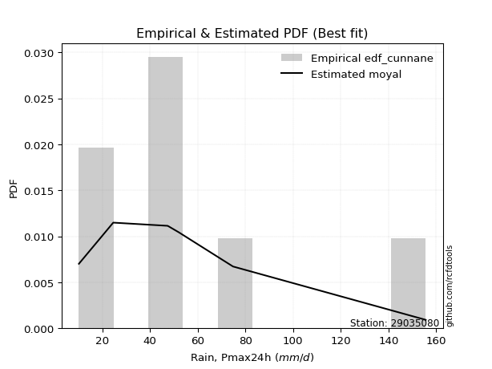</img>

</div>


### 12. EDF Adamowski (1981)

The Adamowski formula in hydrology refers to a specific plotting position formula used for estimating the non-parametric empirical distribution of hydrological events (like flood peaks) to calculate their return periods. This formula provides an alternative to traditional parametric methods (like the Gumbel or Log Pearson Type III distributions). 

<div align="center">


$P=(m-0.25)/(n+0.5)$


</div>


**12.1. Empirical values**

<div align="center">

|                | 0                  | 1                   | 2                   | 3             | 4                  | 5                  | 6                  |
|:---------------|:-------------------|:--------------------|:--------------------|:--------------|:-------------------|:-------------------|:-------------------|
| date           | 2018               | 2023                | 2020                | 2022          | 2021               | 2019               | 2024               |
| x              | 10.2               | 24.6                | 47.4                | 47.8          | 52.0               | 74.8               | 155.6              |
| m              | 1                  | 2                   | 3                   | 4             | 5                  | 6                  | 7                  |
| empirical_dist | edf_adamowski      | edf_adamowski       | edf_adamowski       | edf_adamowski | edf_adamowski      | edf_adamowski      | edf_adamowski      |
| empirical      | 0.1                | 0.23333333333333334 | 0.36666666666666664 | 0.5           | 0.6333333333333333 | 0.7666666666666667 | 0.9                |
| empirical_tr   | 1.1111111111111112 | 1.3043478260869565  | 1.5789473684210527  | 2.0           | 2.727272727272727  | 4.2857142857142865 | 10.000000000000002 |

</div>


**12.2. Kolmogorov-Smirnov fit test (sorted by Δ)**


<div align="center">

|                | 0                   | 1                   | 2                   | 3                   | 4                   | 5                   | 6                   | 7                   | 8                   | 9                   | 10                  | 11                  | 12                  | 13                  | 14                  | 15                  | 16                  | 17                  | 18                  | 19                  | 20                  | 21                  | 22                  | 23                  | 24                  | 25                  | 26                  | 27                  | 28                  | 29                    | 30                  | 31                  | 32                  | 33                  | 34                  | 35                  | 36                  | 37                  | 38                  | 39                  | 40                  | 41                  | 42                  | 43                  | 44                  | 45                  | 46                  | 47                  | 48                  | 49                  | 50                  | 51                  | 52                  | 53                  | 54                  | 55                  | 56                  | 57                  | 58                  | 59                  | 60                  | 61                  | 62                  | 63                  | 64                  | 65                  | 66                  | 67                  | 68                  | 69                  | 70                  | 71                  | 72                  | 73                  | 74                  | 75                  | 76                  | 77                  | 78                  | 79                  | 80                  | 81                  | 82                  | 83                  | 84                  | 85                  | 86                  | 87                  |
|:---------------|:--------------------|:--------------------|:--------------------|:--------------------|:--------------------|:--------------------|:--------------------|:--------------------|:--------------------|:--------------------|:--------------------|:--------------------|:--------------------|:--------------------|:--------------------|:--------------------|:--------------------|:--------------------|:--------------------|:--------------------|:--------------------|:--------------------|:--------------------|:--------------------|:--------------------|:--------------------|:--------------------|:--------------------|:--------------------|:----------------------|:--------------------|:--------------------|:--------------------|:--------------------|:--------------------|:--------------------|:--------------------|:--------------------|:--------------------|:--------------------|:--------------------|:--------------------|:--------------------|:--------------------|:--------------------|:--------------------|:--------------------|:--------------------|:--------------------|:--------------------|:--------------------|:--------------------|:--------------------|:--------------------|:--------------------|:--------------------|:--------------------|:--------------------|:--------------------|:--------------------|:--------------------|:--------------------|:--------------------|:--------------------|:--------------------|:--------------------|:--------------------|:--------------------|:--------------------|:--------------------|:--------------------|:--------------------|:--------------------|:--------------------|:--------------------|:--------------------|:--------------------|:--------------------|:--------------------|:--------------------|:--------------------|:--------------------|:--------------------|:--------------------|:--------------------|:--------------------|:--------------------|:--------------------|
| station        | 29035080            | 29035080            | 29035080            | 29035080            | 29035080            | 29035080            | 29035080            | 29035080            | 29035080            | 29035080            | 29035080            | 29035080            | 29035080            | 29035080            | 29035080            | 29035080            | 29035080            | 29035080            | 29035080            | 29035080            | 29035080            | 29035080            | 29035080            | 29035080            | 29035080            | 29035080            | 29035080            | 29035080            | 29035080            | 29035080              | 29035080            | 29035080            | 29035080            | 29035080            | 29035080            | 29035080            | 29035080            | 29035080            | 29035080            | 29035080            | 29035080            | 29035080            | 29035080            | 29035080            | 29035080            | 29035080            | 29035080            | 29035080            | 29035080            | 29035080            | 29035080            | 29035080            | 29035080            | 29035080            | 29035080            | 29035080            | 29035080            | 29035080            | 29035080            | 29035080            | 29035080            | 29035080            | 29035080            | 29035080            | 29035080            | 29035080            | 29035080            | 29035080            | 29035080            | 29035080            | 29035080            | 29035080            | 29035080            | 29035080            | 29035080            | 29035080            | 29035080            | 29035080            | 29035080            | 29035080            | 29035080            | 29035080            | 29035080            | 29035080            | 29035080            | 29035080            | 29035080            | 29035080            |
| empirical_dist | edf_adamowski       | edf_adamowski       | edf_adamowski       | edf_adamowski       | edf_adamowski       | edf_adamowski       | edf_adamowski       | edf_adamowski       | edf_adamowski       | edf_adamowski       | edf_adamowski       | edf_adamowski       | edf_adamowski       | edf_adamowski       | edf_adamowski       | edf_adamowski       | edf_adamowski       | edf_adamowski       | edf_adamowski       | edf_adamowski       | edf_adamowski       | edf_adamowski       | edf_adamowski       | edf_adamowski       | edf_adamowski       | edf_adamowski       | edf_adamowski       | edf_adamowski       | edf_adamowski       | edf_adamowski         | edf_adamowski       | edf_adamowski       | edf_adamowski       | edf_adamowski       | edf_adamowski       | edf_adamowski       | edf_adamowski       | edf_adamowski       | edf_adamowski       | edf_adamowski       | edf_adamowski       | edf_adamowski       | edf_adamowski       | edf_adamowski       | edf_adamowski       | edf_adamowski       | edf_adamowski       | edf_adamowski       | edf_adamowski       | edf_adamowski       | edf_adamowski       | edf_adamowski       | edf_adamowski       | edf_adamowski       | edf_adamowski       | edf_adamowski       | edf_adamowski       | edf_adamowski       | edf_adamowski       | edf_adamowski       | edf_adamowski       | edf_adamowski       | edf_adamowski       | edf_adamowski       | edf_adamowski       | edf_adamowski       | edf_adamowski       | edf_adamowski       | edf_adamowski       | edf_adamowski       | edf_adamowski       | edf_adamowski       | edf_adamowski       | edf_adamowski       | edf_adamowski       | edf_adamowski       | edf_adamowski       | edf_adamowski       | edf_adamowski       | edf_adamowski       | edf_adamowski       | edf_adamowski       | edf_adamowski       | edf_adamowski       | edf_adamowski       | edf_adamowski       | edf_adamowski       | edf_adamowski       |
| p_dist         | moyal               | pearson3            | halfnorm            | exponnorm           | loggumbel_l         | genlogistic         | halflogistic        | loggenlogistic      | mielke              | gumbel_r            | logjohnsonsu        | logloggamma         | ncf                 | invweibull          | logweibull_min      | fisk                | gompertz            | t                   | invgamma            | nakagami            | logpearson3         | nct                 | logfisk             | johnsonsu           | invgauss            | genexpon            | rayleigh            | loggompertz         | kstwobign           | loglaplace_asymmetric | laplace_asymmetric  | maxwell             | logf                | logcrystalball      | logexponnorm        | lognorm             | lognorm             | logt                | logfatiguelife      | lognct              | expon               | logbetaprime        | loglogistic         | wald                | logerlang           | loghypsecant        | logrice             | logncf              | loggamma            | loggamma            | loginvgamma         | logalpha            | f                   | loglaplace          | rice                | loginvgauss         | norm                | truncnorm           | crystalball         | logmaxwell          | logistic            | loginvweibull       | lograyleigh         | hypsecant           | logkstwobign        | laplace             | logtruncnorm        | gibrat              | betaprime           | loggumbel_r         | loghalfnorm         | loggenexpon         | alpha               | erlang              | logmoyal            | loghalflogistic     | gumbel_l            | weibull_min         | logmielke           | logexpon            | logwald             | loggibrat           | chi2                | gamma               | loglognorm          | logchi2             | lognakagami         | fatiguelife         |
| delta          | 0.11146975950847132 | 0.11276836253507083 | 0.11550362814541026 | 0.11792262970083028 | 0.11851091942791181 | 0.12103499989626487 | 0.12598495375929436 | 0.12971212051282294 | 0.12999294795786598 | 0.1304142618306483  | 0.13305387832710042 | 0.13425908877392773 | 0.1354494945874884  | 0.1380863792891472  | 0.13843338570672942 | 0.13905867332752891 | 0.13944557207057623 | 0.13963660926856397 | 0.13970123261846895 | 0.1398503764565781  | 0.14087451836142367 | 0.14156143130129545 | 0.1450214738975814  | 0.14509903985260725 | 0.1457823952346034  | 0.1460868395574873  | 0.14954286016392593 | 0.15063757689426077 | 0.15115046167523893 | 0.15814196222224058   | 0.15995488161731675 | 0.16158922783548718 | 0.16513687026778406 | 0.1654010433703213  | 0.16540368020419988 | 0.16540646838149914 | 0.16540646838149914 | 0.16540669703685645 | 0.1661093745079089  | 0.1661559085595004  | 0.16736442324760187 | 0.16803368878698738 | 0.1697633172253517  | 0.17223420087055435 | 0.17273370957568462 | 0.1734676829037312  | 0.1750734519680634  | 0.17556330321959185 | 0.17603171027589154 | 0.17603171027589154 | 0.17908491586045688 | 0.18147899953367524 | 0.18371876553216077 | 0.18712362516117925 | 0.19259624079502435 | 0.19373746195701108 | 0.19599011359421037 | 0.19599011937218735 | 0.19599012265673182 | 0.19689890787743408 | 0.20436258875382962 | 0.20693358369498754 | 0.2071439678638481  | 0.21139324359771877 | 0.22773354355775205 | 0.2332893553198812  | 0.23333139667482633 | 0.23333333333333334 | 0.23512290077294434 | 0.2359975601702355  | 0.23600413655410885 | 0.25233934915382866 | 0.2524890535523376  | 0.259883003438281   | 0.2613426902159442  | 0.26260667353429085 | 0.26547468416081876 | 0.27159254321885756 | 0.2796450262770391  | 0.281040126661853   | 0.3316977240531606  | 0.3591768125595632  | 0.3827979638255283  | 0.38316621027587244 | 0.4069491900619418  | 0.42357546373543403 | 0.4310665376281662  | 0.5004361117904819  |
| deltao         | 0.48442053926100004 | 0.48442053926100004 | 0.48442053926100004 | 0.48442053926100004 | 0.48442053926100004 | 0.48442053926100004 | 0.48442053926100004 | 0.48442053926100004 | 0.48442053926100004 | 0.48442053926100004 | 0.48442053926100004 | 0.48442053926100004 | 0.48442053926100004 | 0.48442053926100004 | 0.48442053926100004 | 0.48442053926100004 | 0.48442053926100004 | 0.48442053926100004 | 0.48442053926100004 | 0.48442053926100004 | 0.48442053926100004 | 0.48442053926100004 | 0.48442053926100004 | 0.48442053926100004 | 0.48442053926100004 | 0.48442053926100004 | 0.48442053926100004 | 0.48442053926100004 | 0.48442053926100004 | 0.48442053926100004   | 0.48442053926100004 | 0.48442053926100004 | 0.48442053926100004 | 0.48442053926100004 | 0.48442053926100004 | 0.48442053926100004 | 0.48442053926100004 | 0.48442053926100004 | 0.48442053926100004 | 0.48442053926100004 | 0.48442053926100004 | 0.48442053926100004 | 0.48442053926100004 | 0.48442053926100004 | 0.48442053926100004 | 0.48442053926100004 | 0.48442053926100004 | 0.48442053926100004 | 0.48442053926100004 | 0.48442053926100004 | 0.48442053926100004 | 0.48442053926100004 | 0.48442053926100004 | 0.48442053926100004 | 0.48442053926100004 | 0.48442053926100004 | 0.48442053926100004 | 0.48442053926100004 | 0.48442053926100004 | 0.48442053926100004 | 0.48442053926100004 | 0.48442053926100004 | 0.48442053926100004 | 0.48442053926100004 | 0.48442053926100004 | 0.48442053926100004 | 0.48442053926100004 | 0.48442053926100004 | 0.48442053926100004 | 0.48442053926100004 | 0.48442053926100004 | 0.48442053926100004 | 0.48442053926100004 | 0.48442053926100004 | 0.48442053926100004 | 0.48442053926100004 | 0.48442053926100004 | 0.48442053926100004 | 0.48442053926100004 | 0.48442053926100004 | 0.48442053926100004 | 0.48442053926100004 | 0.48442053926100004 | 0.48442053926100004 | 0.48442053926100004 | 0.48442053926100004 | 0.48442053926100004 | 0.48442053926100004 |
| eval           | Δo > Δ              | Δo > Δ              | Δo > Δ              | Δo > Δ              | Δo > Δ              | Δo > Δ              | Δo > Δ              | Δo > Δ              | Δo > Δ              | Δo > Δ              | Δo > Δ              | Δo > Δ              | Δo > Δ              | Δo > Δ              | Δo > Δ              | Δo > Δ              | Δo > Δ              | Δo > Δ              | Δo > Δ              | Δo > Δ              | Δo > Δ              | Δo > Δ              | Δo > Δ              | Δo > Δ              | Δo > Δ              | Δo > Δ              | Δo > Δ              | Δo > Δ              | Δo > Δ              | Δo > Δ                | Δo > Δ              | Δo > Δ              | Δo > Δ              | Δo > Δ              | Δo > Δ              | Δo > Δ              | Δo > Δ              | Δo > Δ              | Δo > Δ              | Δo > Δ              | Δo > Δ              | Δo > Δ              | Δo > Δ              | Δo > Δ              | Δo > Δ              | Δo > Δ              | Δo > Δ              | Δo > Δ              | Δo > Δ              | Δo > Δ              | Δo > Δ              | Δo > Δ              | Δo > Δ              | Δo > Δ              | Δo > Δ              | Δo > Δ              | Δo > Δ              | Δo > Δ              | Δo > Δ              | Δo > Δ              | Δo > Δ              | Δo > Δ              | Δo > Δ              | Δo > Δ              | Δo > Δ              | Δo > Δ              | Δo > Δ              | Δo > Δ              | Δo > Δ              | Δo > Δ              | Δo > Δ              | Δo > Δ              | Δo > Δ              | Δo > Δ              | Δo > Δ              | Δo > Δ              | Δo > Δ              | Δo > Δ              | Δo > Δ              | Δo > Δ              | Δo > Δ              | Δo > Δ              | Δo > Δ              | Δo > Δ              | Δo > Δ              | Δo > Δ              | Δo > Δ              | Δo <= Δ             |
| fit            | 1                   | 1                   | 1                   | 1                   | 1                   | 1                   | 1                   | 1                   | 1                   | 1                   | 1                   | 1                   | 1                   | 1                   | 1                   | 1                   | 1                   | 1                   | 1                   | 1                   | 1                   | 1                   | 1                   | 1                   | 1                   | 1                   | 1                   | 1                   | 1                   | 1                     | 1                   | 1                   | 1                   | 1                   | 1                   | 1                   | 1                   | 1                   | 1                   | 1                   | 1                   | 1                   | 1                   | 1                   | 1                   | 1                   | 1                   | 1                   | 1                   | 1                   | 1                   | 1                   | 1                   | 1                   | 1                   | 1                   | 1                   | 1                   | 1                   | 1                   | 1                   | 1                   | 1                   | 1                   | 1                   | 1                   | 1                   | 1                   | 1                   | 1                   | 1                   | 1                   | 1                   | 1                   | 1                   | 1                   | 1                   | 1                   | 1                   | 1                   | 1                   | 1                   | 1                   | 1                   | 1                   | 1                   | 1                   | 0                   |
| n              | 7                   | 7                   | 7                   | 7                   | 7                   | 7                   | 7                   | 7                   | 7                   | 7                   | 7                   | 7                   | 7                   | 7                   | 7                   | 7                   | 7                   | 7                   | 7                   | 7                   | 7                   | 7                   | 7                   | 7                   | 7                   | 7                   | 7                   | 7                   | 7                   | 7                     | 7                   | 7                   | 7                   | 7                   | 7                   | 7                   | 7                   | 7                   | 7                   | 7                   | 7                   | 7                   | 7                   | 7                   | 7                   | 7                   | 7                   | 7                   | 7                   | 7                   | 7                   | 7                   | 7                   | 7                   | 7                   | 7                   | 7                   | 7                   | 7                   | 7                   | 7                   | 7                   | 7                   | 7                   | 7                   | 7                   | 7                   | 7                   | 7                   | 7                   | 7                   | 7                   | 7                   | 7                   | 7                   | 7                   | 7                   | 7                   | 7                   | 7                   | 7                   | 7                   | 7                   | 7                   | 7                   | 7                   | 7                   | 7                   |
| best_fit       | 1                   | 0                   | 0                   | 0                   | 0                   | 0                   | 0                   | 0                   | 0                   | 0                   | 0                   | 0                   | 0                   | 0                   | 0                   | 0                   | 0                   | 0                   | 0                   | 0                   | 0                   | 0                   | 0                   | 0                   | 0                   | 0                   | 0                   | 0                   | 0                   | 0                     | 0                   | 0                   | 0                   | 0                   | 0                   | 0                   | 0                   | 0                   | 0                   | 0                   | 0                   | 0                   | 0                   | 0                   | 0                   | 0                   | 0                   | 0                   | 0                   | 0                   | 0                   | 0                   | 0                   | 0                   | 0                   | 0                   | 0                   | 0                   | 0                   | 0                   | 0                   | 0                   | 0                   | 0                   | 0                   | 0                   | 0                   | 0                   | 0                   | 0                   | 0                   | 0                   | 0                   | 0                   | 0                   | 0                   | 0                   | 0                   | 0                   | 0                   | 0                   | 0                   | 0                   | 0                   | 0                   | 0                   | 0                   | 0                   |
| best_fit_sort  | 1                   | 2                   | 3                   | 4                   | 5                   | 6                   | 7                   | 8                   | 9                   | 10                  | 11                  | 12                  | 13                  | 14                  | 15                  | 16                  | 17                  | 18                  | 19                  | 20                  | 21                  | 22                  | 23                  | 24                  | 25                  | 26                  | 27                  | 28                  | 29                  | 30                    | 31                  | 32                  | 33                  | 34                  | 35                  | 36                  | 37                  | 38                  | 39                  | 40                  | 41                  | 42                  | 43                  | 44                  | 45                  | 46                  | 47                  | 48                  | 49                  | 50                  | 51                  | 52                  | 53                  | 54                  | 55                  | 56                  | 57                  | 58                  | 59                  | 60                  | 61                  | 62                  | 63                  | 64                  | 65                  | 66                  | 67                  | 68                  | 69                  | 70                  | 71                  | 72                  | 73                  | 74                  | 75                  | 76                  | 77                  | 78                  | 79                  | 80                  | 81                  | 82                  | 83                  | 84                  | 85                  | 86                  | 87                  | 88                  |

</div>


**12.3. Best fit**

<div align="center">

|   id |   station | empirical_dist   | p_dist   |   delta |   deltao | eval   |   fit |   n |   best_fit |   best_fit_sort |
|-----:|----------:|:-----------------|:---------|--------:|---------:|:-------|------:|----:|-----------:|----------------:|
|    0 |  29035080 | edf_adamowski    | moyal    | 0.11147 | 0.484421 | Δo > Δ |     1 |   7 |          1 |               1 |

</div>


<div align="center">

</img></img>

</div>


## C. Best fit & Estimate extreme values for specific return periods - Tr

Best fit in probability distribution analysis means finding the theoretical distribution (like Normal, Poisson, Exponential) that most accurately mirrors your real-world data´s patterns (shape, center, spread) for better predictions, using methods like visual checks (Q-Q plots), goodness-of-fit tests (Kolmogorov-Smirnov, Chi-Squared), and information criteria (AIC) to score and select the simplest, most representative model.


### 1. Best fit (ordered by delta Δ)

<div align="center">

|   id |   station | empirical_dist   | p_dist                |    delta |   deltao | eval   |   fit |   n |   best_fit |   best_fit_sort |
|-----:|----------:|:-----------------|:----------------------|---------:|---------:|:-------|------:|----:|-----------:|----------------:|
|    0 |  29035080 | edf_weibull      | moyal                 | 0.103136 | 0.484421 | Δo > Δ |     1 |   7 |          1 |               1 |
|    1 |  29035080 | edf_adamowski    | moyal                 | 0.11147  | 0.484421 | Δo > Δ |     1 |   7 |          1 |               2 |
|    2 |  29035080 | edf_california   | loglaplace_asymmetric | 0.112442 | 0.484421 | Δo > Δ |     1 |   7 |          1 |               3 |
|    3 |  29035080 | edf_chegodayev   | moyal                 | 0.113272 | 0.484421 | Δo > Δ |     1 |   7 |          1 |               4 |
|    4 |  29035080 | edf_jenkinson    | moyal                 | 0.113638 | 0.484421 | Δo > Δ |     1 |   7 |          1 |               5 |
|    5 |  29035080 | edf_beard        | moyal                 | 0.113638 | 0.484421 | Δo > Δ |     1 |   7 |          1 |               6 |
|    6 |  29035080 | edf_filliben     | moyal                 | 0.113914 | 0.484421 | Δo > Δ |     1 |   7 |          1 |               7 |
|    7 |  29035080 | edf_tukey        | moyal                 | 0.1145   | 0.484421 | Δo > Δ |     1 |   7 |          1 |               8 |
|    8 |  29035080 | edf_blom         | moyal                 | 0.116067 | 0.484421 | Δo > Δ |     1 |   7 |          1 |               9 |
|    9 |  29035080 | edf_cunnane      | moyal                 | 0.117025 | 0.484421 | Δo > Δ |     1 |   7 |          1 |              10 |
|   10 |  29035080 | edf_gringorten   | moyal                 | 0.118586 | 0.484421 | Δo > Δ |     1 |   7 |          1 |              11 |
|   11 |  29035080 | edf_hazen        | moyal                 | 0.120994 | 0.484421 | Δo > Δ |     1 |   7 |          1 |              12 |

</div>

:file_folder:Tables: [bestfit_29035080.csv](table/bestfit_29035080.csv) | [extreme_29035080.csv](table/extreme_29035080.csv)


### 2. Extreme values

In hydrology, a return period (or recurrence interval $Tr$) is the statistical average time between extreme events like floods or droughts of a specific magnitude, indicating how rare an event is, with a 100-year flood, for example, having a 1% chance of occurring in any given year, not that it happens exactly every century. It is a key tool for infrastructure design (like bridges or dams) and risk assessment, calculated from historical data to determine the probability of future events, although it is important to remember it is statistical average, and events can cluster or be missed.

> risk_rate: assuming the return period as the project useful life.

|   id |      tr |   prob_l |     prob_g |      alpha |   betaprime |     chi2 |   crystalball |   erlang |    expon |   exponnorm |        f |   fatiguelife |     fisk |    gamma |   genexpon |   genlogistic |   gibrat |   gompertz |   gumbel_l |   gumbel_r |   halflogistic |   halfnorm |   hypsecant |   invgamma |   invgauss |   invweibull |   johnsonsu |   kstwobign |   laplace |   laplace_asymmetric |   loggamma |   logistic |   lognorm |   maxwell |   mielke |    moyal |   nakagami |      ncf |      nct |     norm |   pearson3 |   rayleigh |     rice |         t |   truncnorm |     wald |   weibull_min |   logalpha |   logbetaprime |     logchi2 |   logcrystalball |   logerlang |    logexpon |   logexponnorm |     logf |   logfatiguelife |   logfisk |   loggenexpon |   loggenlogistic |   loggibrat |   loggompertz |   loggumbel_l |   loggumbel_r |   loghalflogistic |   loghalfnorm |   loghypsecant |   loginvgamma |   loginvgauss |   loginvweibull |   logjohnsonsu |   logkstwobign |   loglaplace |   loglaplace_asymmetric |   logloggamma |   loglogistic |     loglognorm |   logmaxwell |   logmielke |   logmoyal |   lognakagami |   logncf |   lognct |   logpearson3 |   lograyleigh |   logrice |     logt |   logtruncnorm |    logwald |   logweibull_min |   station |   n |   risk_rate |
|-----:|--------:|---------:|-----------:|-----------:|------------:|---------:|--------------:|---------:|---------:|------------:|---------:|--------------:|---------:|---------:|-----------:|--------------:|---------:|-----------:|-----------:|-----------:|---------------:|-----------:|------------:|-----------:|-----------:|-------------:|------------:|------------:|----------:|---------------------:|-----------:|-----------:|----------:|----------:|---------:|---------:|-----------:|---------:|---------:|---------:|-----------:|-----------:|---------:|----------:|------------:|---------:|--------------:|-----------:|---------------:|------------:|-----------------:|------------:|------------:|---------------:|---------:|-----------------:|----------:|--------------:|-----------------:|------------:|--------------:|--------------:|--------------:|------------------:|--------------:|---------------:|--------------:|--------------:|----------------:|---------------:|---------------:|-------------:|------------------------:|--------------:|--------------:|---------------:|-------------:|------------:|-----------:|--------------:|---------:|---------:|--------------:|--------------:|----------:|---------:|---------------:|-----------:|-----------------:|----------:|----:|------------:|
|    0 |    2    | 0.5      | 0.5        |    34.9116 |     34.3766 |  23.4219 |       58.9143 |  36.0951 |  43.9662 |     48.6784 |  40.6663 |       10.2001 |  46.9336 |  22.3101 |    46.1556 |       50.9445 |  45.7543 |    46.7849 |    66.1169 |    51.7117 |        48.131  |    49.9398 |     58.9143 |    46.8571 |    46.2713 |      47.0029 |     46.3564 |     53.6642 |   58.9143 |              53.7226 |    43.4651 |    58.9143 |   44.4727 |   55.1646 |  47.6718 |  49.3865 |    46.3414 |  47.2131 |  46.7128 |  58.9143 |    49.8953 |    53.8347 |  57.7806 |   47.054  |     58.9143 |  44.7025 |       32.8574 |    42.9446 |        44.1659 |     16.1817 |          44.4732 |     43.7697 |     28.305  |        44.473  |  44.4816 |          44.4167 |   46.4236 |       34.4727 |          47.6956 |     35.063  |       45.695  |       50.653  |       39.0465 |           36.601  |       37.8163 |        44.4727 |       43.1594 |       41.7562 |         39.639  |        47.4258 |        37.3195 |      44.4727 |                 46.0535 |       47.3147 |       44.4727 |  10.2996       |      41.5599 |     30.8142 |    37.4403 |       25.2001 |  43.4205 |  44.3998 |       46.7011 |       40.5732 |   43.5218 |  44.4727 |        46.4864 |    34.4017 |          46.9257 |  29035080 |   7 |    0.75     |
|    1 |    2.33 | 0.570815 | 0.429185   |    41.5543 |     42.9019 |  28.1839 |       66.7379 |  42.0004 |  51.4059 |     55.0148 |  50.4361 |       11.377  |  53.0563 |  27.1385 |    53.4489 |       57.217  |  49.7175 |    54.3451 |    72.9235 |    58.9612 |        55.5846 |    58.3836 |     65.1756 |    53.2478 |    53.0598 |      53.2655 |     52.9969 |     60.5794 |   63.6488 |              58.7939 |    50.218  |    65.8075 |   51.2245 |   63.2929 |  53.7426 |  56.249  |    58.8912 |  53.8376 |  52.9575 |  66.7379 |    57.3882 |    62.0832 |  64.9543 |   50.9888 |     66.7379 |  49.8325 |       39.5158 |    49.695  |        51.0582 |     19.0987 |          51.2251 |     50.5477 |     35.4428 |        51.2248 |  51.2745 |          51.1456 |   52.7072 |       41.4118 |          53.7846 |     37.6653 |       53.0464 |       57.2809 |       44.5104 |           41.8767 |       44.0483 |        49.7989 |       49.934  |       48.4688 |         47.0665 |        54.3815 |        44.5353 |      48.4441 |                 49.9989 |       54.2385 |       50.3706 |  11.1737       |      48.1336 |     37.8061 |    42.3821 |       26.1552 |  50.3412 |  51.1582 |       53.6567 |       47.0931 |   50.3384 |  51.2245 |        52.9103 |    37.7426 |          53.9066 |  29035080 |   7 |    0.729209 |
|    2 |    5    | 0.8      | 0.2        |    93.063  |     98.3139 |  56.2265 |       95.8128 |  71.8014 |  88.6026 |     86.1522 | 105.526  |       36.374  |  84.4512 |  56.8376 |    88.3397 |       84.4642 |  72.5344 |    89.8236 |    94.9131 |    90.4563 |        89.3108 |    94.0912 |     90.291  |    84.7565 |    86.554  |      84.1363 |     85.9553 |     89.9533 |   87.3203 |              84.1496 |    86.6345 |    92.423  |   86.616  |   95.285  |  82.732  |  88.0371 |   121.994  |  85.6447 |  83.7179 |  95.8128 |    90.6285 |    95.1055 |  93.6735 |   68.6832 |     95.8128 |  78.5507 |       77.588  |    87.3808 |        88.1563 |     50.6278 |          86.6171 |     87.1289 |    109.1    |        86.6167 |  87.0102 |          86.4579 |   86.048  |       90.9104 |          82.7894 |     56.8794 |       88.5683 |       85.2195 |       78.627  |           77.0155 |       83.9642 |        78.3924 |       87.0927 |       86.7284 |         99.2576 |        87.534  |        94.3622 |      74.2962 |                 74.5383 |       87.3005 |       81.4709 |   2.42338e+163 |      85.7941 |     77.2937 |    75.2646 |       48.0477 |  88.5289 |  86.6829 |       87.5052 |       85.5164 |   86.9881 |  86.616  |        96.6157 |    63.4111 |          87.4436 |  29035080 |   7 |    0.67232  |
|    3 |   10    | 0.9      | 0.1        |   187.697  |    168.446  |  85.2005 |      115.1    |  99.0696 | 122.369  |    114.372  | 160.753  |       70.8884 | 118.169  |  88.506  |   118.755  |      106.654  |  98.5432 |   119.123  |   107.156  |   116.109  |       117.319  |   120.514  |    110.346  |   115.275  |   117.577  |     114.34   |    117.441  |    112.318  |  108.809  |             107.167  |   125.337  |   112.024  |  122.723  |  117.799  | 111.384  | 115.714  |   173.778  | 114.928  | 113.778  | 115.1    |   117.645  |   118.651  | 114.151  |   88.409  |    115.1    | 109.027  |      117.312  |   129.648  |       127.454  |    138.504  |         122.725  |    126.068  |    302.753  |       122.724  | 123.648  |         122.557  |  123.456  |      167.422  |         111.373  |     90.9934 |      119.612  |      106.315  |      124.979  |          127.739  |      135.335  |       112.623  |      127.607  |      130.829  |        182.263  |       116.931  |       167.139  |     109.538  |                107.104  |      116.77   |      116.09   | inf            |     128.856  |    111.924  |   124.091  |      125.089  | 130.471  | 123.072  |      118.307  |      130.854  |  125.521  | 122.723  |       158.398  |   109.976  |         117.416  |  29035080 |   7 |    0.651322 |
|    4 |   15    | 0.933333 | 0.0666667  |   281.993  |    219.882  | 103.048  |      124.725  | 115.074  | 142.121  |    130.88   | 194.438  |       93.4615 | 141.677  | 108.244  |   136.262  |      119.174  | 116.483  |   135.166  |   112.7    |   130.581  |       133.169  |   134.264  |    121.792  |   134.638  |   136.171  |     133.715  |    136.981  |    124.191  |  121.378  |             120.631  |   151.043  |   122.704  |  146.031  |  129.351  | 130.471  | 131.776  |   201.368  | 132.782  | 133.073  | 124.725  |   132.681  |   130.783  | 124.702  |  103.767  |    124.725  | 128.598  |      142.324  |   158.875  |       153.488  |    257.397  |         146.032  |    151.965  |    550.023  |       146.032  | 147.375  |         145.896  |  150.289  |      233.175  |         130.388  |    125.822  |      137.399  |      117.516  |      162.327  |          170.089  |      173.499  |       138.493  |      155.022  |      161.872  |        256.808  |       134.138  |       226.403  |     137.463  |                132.402  |      134.107  |      140.795  | inf            |     158.76   |    131.346  |   165.868  |      227.55   | 158.981  | 146.627  |      136.609  |      162.919  |  150.85   | 146.03   |       207.681  |   156.623  |         135.045  |  29035080 |   7 |    0.644736 |
|    5 |   20    | 0.95     | 0.05       |   376.207  |    261.832  | 116.001  |      131.028  | 126.447  | 156.135  |    142.593  | 218.802  |      110.174  | 160.521  | 122.642  |   148.605  |      127.939  | 130.555  |   146.109  |   116.151  |   140.715  |       144.274  |   143.432  |    129.866  |   149.202  |   149.57   |     148.396  |    151.425  |    132.189  |  130.297  |             130.184  |   170.81   |   130.086  |  163.643  |  137.018  | 145.398  | 143.151  |   219.879  | 145.877  | 147.714  | 131.028  |   143.103  |   138.847  | 131.715  |  117.165  |    131.028  | 143.182  |      160.762  |   181.936  |       173.476  |    403.565  |         163.645  |    171.897  |    840.14   |       163.645  | 165.341  |         163.55   |  172.173  |      292.488  |         145.25   |    162.242  |      149.883  |      125.076  |      194.939  |          207.876  |      204.751  |       160.243  |      176.354  |      186.624  |        326.492  |       146.394  |       277.761  |     161.495  |                153.897  |      146.498  |      160.88   | inf            |     182.344  |    145.22   |   203.711  |      345.868  | 181.222  | 164.457  |      149.747  |      188.469  |  170.189  | 163.643  |       249.926  |   203.84   |         147.639  |  29035080 |   7 |    0.641514 |
|    6 |   25    | 0.96     | 0.04       |   470.387  |    297.855  | 126.186  |      135.668  | 135.276  | 167.005  |    151.678  | 237.927  |      123.453  | 176.566  | 133.995  |   158.144  |      134.691  | 142.287  |   154.362  |   118.607  |   148.52   |       152.83   |   150.253  |    136.115  |   161.021  |   160.078  |     160.375  |    162.983  |    138.179  |  137.215  |             137.594  |   187.075  |   135.732  |  177.952  |  142.71   | 157.896  | 151.968  |   233.687  | 156.309  | 159.678  | 135.668  |   151.069  |   144.838  | 136.925  |  129.354  |    135.668  | 154.864  |      175.429  |   201.275  |       189.9    |    574.745  |         177.954  |    188.308  |   1166.95   |       177.954  | 179.956  |         177.904  |  191.042  |      347.309  |         157.689  |    200.541  |      159.497  |      130.751  |      224.461  |          242.623  |      231.603  |       179.394  |      194.056  |      207.537  |        392.81   |       155.937  |       323.726  |     182.994  |                172.946  |      156.171  |      178.159  | inf            |     202.092  |    156.228  |   238.888  |      475.274  | 199.712  | 178.961  |      160.03   |      210.013  |  186.013  | 177.952  |       287.47   |   251.736  |         157.468  |  29035080 |   7 |    0.639603 |
|    7 |   50    | 0.98     | 0.02       |   941.141  |    432.34   | 158.445  |      148.955  | 162.74   | 200.771  |    179.898  | 298.395  |      166.057  | 235.951  | 170.101  |   187.642  |      155.489  | 183.64   |   178.797  |   125.274  |   172.565  |       179.192  |   170.079  |    155.489  |   201.007  |   193.331  |     201.298  |    200.991  |    155.771  |  158.703  |             160.611  |   243.21   |   152.985  |  226.23   |  159.216  | 202.832  | 179.341  |   273.898  | 190.436  | 200.713  | 148.955  |   175.282  |   162.229  | 152.05   |  180.659  |    148.955  | 193.004  |      222.855  |   270.411  |       246.46   |   1761.11   |         226.234  |    245.016  |   3238.27   |       226.233  | 229.392  |         226.401  |  262.492  |      581.587  |         202.386  |    423.301  |      189.02   |      147.485  |      346.574  |          390.626  |      331.36   |       254.574  |      256.125  |      283.275  |        694.351  |       185.823  |       507.543  |     269.794  |                248.505  |      186.615  |      243.316  | inf            |     272.308  |    193.112  |   391.701  |     1215.99   | 264.745  | 228.006  |      192.489  |      287.539  |  240.059  | 226.23   |       435.963  |   501.428  |         188.379  |  29035080 |   7 |    0.63583  |
|    8 |   75    | 0.986667 | 0.0133333  |  1411.83   |    529.747  | 177.667  |      156.084  | 178.826  | 220.523  |    196.406  | 334.397  |      191.716  | 278.78   | 191.696  |   204.834  |      167.578  | 211.57   |   192.321  |   128.645  |   186.541  |       194.517  |   180.871  |    166.811  |   226.972  |   213.185  |     228.162  |    224.797  |    165.45   |  171.273  |             174.075  |   280.319  |   162.95   |  257.328  |  168.191  | 234.237  | 195.347  |   295.793  | 211.745  | 227.814  | 156.084  |   189.141  |   171.69   | 160.278  |  223.534  |    156.084  | 216.474  |      251.798  |   318.031  |       283.75   |   3431.86   |         257.332  |    282.558  |   5883.1    |       257.331  | 261.324  |         257.69   |  315.365  |      778.271  |         233.607  |    701.1    |      206.079  |      156.747  |      446.118  |          515.217  |      402.697  |       312.353  |      297.911  |      336.187  |        966.886  |       203.494  |       650.014  |     338.575  |                307.202  |      204.725  |      291.308  | inf            |     320.239  |    217.568  |   523.05   |     2034.79   | 308.676  | 259.679  |      211.835  |      341.138  |  275.34   | 257.328  |       549.886  |   766.234  |         206.752  |  29035080 |   7 |    0.634587 |
|    9 |  100    | 0.99     | 0.01       |  1882.5    |    608.843  | 191.433  |      160.906  | 190.248  | 234.538  |    208.118  | 360.182  |      210.178  | 313.547  | 207.19   |   217.014  |      176.134  | 233.207  |   201.602  |   130.85   |   196.433  |       205.363  |   188.224  |    174.842  |   246.682  |   227.438  |     248.691  |    242.432  |    172.082  |  180.191  |             183.628  |   308.724  |   169.985  |  280.751  |  174.304  | 259.245  | 206.704  |   310.7    | 227.528  | 248.621  | 160.906  |   198.863  |   178.136  | 165.884  |  261.814  |    160.906  | 233.586  |      272.828  |   355.455  |       312.246  |   5533.72   |         280.755  |    311.321  |   8986.21   |       280.754  | 285.415  |         281.281  |  358.988  |      953.406  |         258.463  |   1036.41   |      218.1    |      163.117  |      533.406  |          626.738  |      459.902  |       361.125  |      330.269  |      378.125  |       1222.22   |       216.122  |       770.093  |     397.767  |                357.077  |      217.717  |      330.789  | inf            |     357.632  |    236.687  |   642.16   |     2888.94   | 342.763  | 283.571  |      225.717  |      383.27   |  302.126  | 280.75   |       645.389  |  1043.82   |         219.928  |  29035080 |   7 |    0.633968 |
|   10 |  200    | 0.995    | 0.005      |  3765.15   |    840.15   | 224.962  |      171.844  | 217.788  | 268.304  |    236.338  | 423.036  |      255.369  | 415.385  | 245.007  |   246.318  |      196.703  | 292.072  |   222.98   |   135.643  |   220.213  |       231.438  |   205.039  |    194.19   |   299.063  |   262.303  |     303.736  |    287.591  |    187.356  |  201.68   |             206.645  |   384.834  |   186.861  |  342.088  |  188.289  | 330.523  | 234.064  |   344.745  | 268.025  | 304.854  | 171.844  |   221.965  |   192.885  | 178.711  |  390.961  |    171.844  | 276.209  |      325.069  |   459.653  |       388.412  |  17716.1    |         342.094  |    388.493  |  24936.8    |       342.093  | 348.658  |         343.152  |  489.841  |     1538.47   |         329.277  |   3001.67   |      246.807  |      177.871  |      819.667  |         1003.85   |      623.161  |       512.226  |      418.431  |      496.276  |       2146.95   |       246.863  |      1137.91   |     586.443  |                513.082  |      249.522  |      448.705  | inf            |     460.431  |    290.598  |  1052.72   |     6419.8    | 435.897  | 346.282  |      259.672  |      500.292  |  373.039  | 342.088  |       936.032  |  2254.58   |         252.167  |  29035080 |   7 |    0.633042 |
|   11 |  250    | 0.996    | 0.004      |  4706.46   |    928.908  | 235.85   |      175.187  | 226.66   | 279.174  |    245.423  | 443.469  |      270.097  | 454.562  | 257.307  |   255.743  |      203.316  | 313.193  |   229.587  |   137.053  |   227.858  |       239.821  |   210.212  |    200.418  |   317.535  |   273.674  |     323.299  |    302.966  |    192.083  |  208.597  |             214.055  |   411.805  |   192.279  |  363.382  |  192.594  | 357.297  | 242.872  |   355.202  | 281.859  | 324.995  | 175.187  |   229.318  |   197.425  | 182.66   |  447.1    |    175.187  | 290.31   |      342.333  |   497.886  |       415.343  |  25849.8    |         363.388  |    415.874  |  34636.9    |       363.387  | 370.661  |         364.66   |  541.238  |     1789.82   |         355.869  |   4396.12   |      255.978  |      182.46   |      941.066  |         1167.99   |      684.209  |       573.23   |      450.148  |      540.067  |       2573.25   |       256.855  |      1284.06   |     664.511  |                576.589  |      259.915  |      494.846  | inf            |     497.671  |    310.854  |  1234.3    |     8197.34   | 469.483  | 368.097  |      270.749  |      543.056  |  397.891  | 363.382  |      1050.96   |  2908.75   |         262.698  |  29035080 |   7 |    0.632858 |
|   12 |  500    | 0.998    | 0.002      |  9413.02   |   1259.25   | 269.912  |      185.099  | 254.233  | 312.94   |    273.643  | 507.487  |      316.299  | 600.903  | 295.839  |   285.002  |      223.841  | 386.186  |   249.333  |   141.096  |   251.586  |       265.84   |   225.636  |    219.765  |   380.537  |   309.409  |     390.527  |    353.458  |    206.248  |  230.086  |             237.072  |   503.971  |   209.082  |  434.646  |  205.441  | 454.843  | 270.232  |   386.329  | 327.536  | 394.836  | 185.099  |   251.938  |   210.971  | 194.441  |  686.573  |    185.099  | 335.147  |      397.25   |   633.402  |       507.164  |  84294.2    |         434.653  |    509.562  |  96117.4    |       434.652  | 444.454  |         436.74   |  737.526  |     2844.08   |         452.72   |  16434.1    |      284.269  |      196.285  |     1444.75   |         1868.86   |      904.077  |       813.058  |      560.242  |      696.836  |       4514.65   |       288.193  |      1844.36   |     979.712  |                828.499  |      292.68   |      670.355  | inf            |     627.675  |    385.52   |  2023.42   |    16919.5    | 586.344  | 441.253  |      305.578  |      693.628  |  481.838  | 434.646  |      1489.8    |  6539.01   |         295.892  |  29035080 |   7 |    0.632489 |
|   13 |  750    | 0.998667 | 0.00133333 | 14119.6    |   1497.98   | 289.985  |      190.606  | 270.372  | 332.692  |    290.151  | 545.291  |      343.597  | 707.153  | 318.577  |   302.11   |      235.84   | 434.459  |   260.375  |   143.256  |   265.458  |       281.051  |   234.252  |    231.082  |   421.729  |   330.581  |     434.856  |    384.991  |    214.206  |  242.655  |             250.537  |   564.208  |   218.899  |  480.109  |  212.626  | 523.685  | 286.236  |   403.683  | 356.292  | 441.402  | 190.606  |   265.033  |   218.546  | 201.028  |  888.335  |    190.606  | 362.03   |      430.233  |   725.849  |       567.014  | 169160      |         480.116  |    570.884  | 174620      |       480.115  | 491.646  |         482.798  |  883.675  |     3713.43   |         521.049  |  39307.8    |      300.691  |      204.098  |     1856.22   |         2459.89   |     1056.36   |       997.502  |      633.523  |      804.962  |       6271.17   |       306.732  |      2260.42   |    1229.48   |               1024.19   |      312.186  |      800.437  | inf            |     714.676  |    439.412  |  2701.82   |    25291.9    | 664.338  | 488.033  |      326.228  |      795.351  |  535.954  | 480.108  |      1814.42   | 10627.9    |         315.652  |  29035080 |   7 |    0.632366 |
|   14 | 1000    | 0.999    | 0.001      | 18826.1    |   1691.65   | 304.284  |      194.397  | 281.826  | 346.706  |    301.864  | 572.261  |      363.069  | 793.631  | 334.787  |   314.245  |      244.351  | 471.4    |   268      |   144.71   |   275.298  |       291.841  |   240.203  |    239.111  |   453.099  |   345.715  |     468.788  |    408.296  |    219.72   |  251.574  |             260.09   |   609.994  |   225.861  |  514.144  |  217.592  | 578.717  | 297.592  |   415.652  | 377.674  | 477.312  | 194.397  |   274.271  |   223.781  | 205.581  | 1068.96   |    194.397  | 381.368  |      454      |   798.078  |       612.431  | 277835      |         514.153  |    617.541  | 266726      |       514.151  | 527.032  |         517.315  | 1004.55   |     4479.82   |         575.657  |  76613.3    |      312.29   |      209.53   |     2217.34   |         2989.28   |     1176.26   |      1153.22   |      689.877  |      890.006  |       7917.52   |       319.978  |      2602.52   |    1444.43   |               1190.47   |      326.178  |      907.714  | inf            |     781.758  |    483.353  |  3317.03   |    33345.3    | 724.414  | 523.108  |      340.995  |      874.238  |  576.728  | 514.144  |      2080.81   | 15072.2    |         329.826  |  29035080 |   7 |    0.632305 |

<div align="center">

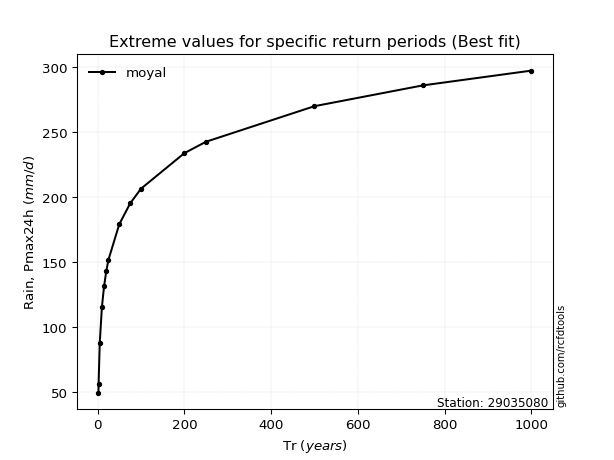</img>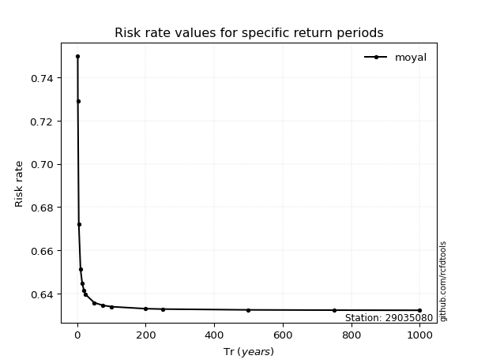</img>

</div>


<sub>**APP DISCLAIMER**: NO WARRANTY - This software is provided by [github.com/rcfdtools](https://github.com/rcfdtools) "as is", without any express or implied warranty, including warranties of merchantability, fitness for a particular purpose, or non-infringement. There is no guarantee that the software will be error-free or operate without interruption. LIMITATION OF LIABILITY - Neither the authors nor copyright holders will be liable for claims or damages arising from the software or its use. You are responsible for determining if the software is appropriate for your use and assume all associated risks, including errors, legal compliance, and data loss. NO PROFESSIONAL ADVICE - The software provides general information and does not offer professional advice. It should not replace consultation with professional advisors.</sub>