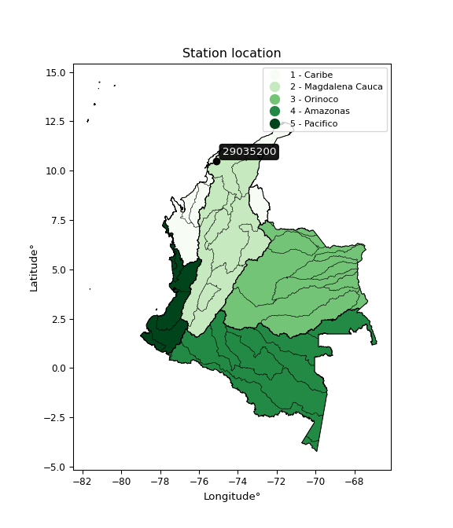

<div align="center">


</div>

# PMP Station (Rain, Pmax24h): 29035200

Probable Maximum Precipitation (PMP) is the greatest amount of rainfall for a specific duration that is meteorologically possible for a given location, acting as a "worst-case" scenario for extreme storms, crucial for designing safety-critical infrastructure like bridges, river deviations, dams, spillways, and nuclear plants to prevent catastrophic failure. PMP is calculated by hydrologists using meteorological data to determine the upper limit of extreme rainfall, often leading to the Probable Maximum Flood (PMF) for flood control design, and is increasingly being studied for climate change impacts. Probable Maximum Precipitation (PMP) is the theoretical upper limit of rainfall, a deterministic estimate for extreme events, while probability distributions (like GEV, Gumbel) describe the likelihood and frequency of various precipitation amounts, including rare ones, showing how often events occur, with PMP representing the extreme end of these distributions, used for critical infrastructure design to ensure safety against the worst conceivable weather, unlike standard statistical forecasts which cover typical probabilities.

The most common probability distributions in hydrology, used for analyzing floods, rainfall, and streamflow, include the Normal, Log-Normal, Gumbel, Gamma (including Log-Pearson Type III), and Generalized Extreme Value (GEV) distributions, often chosen based on the data´s skewness and whether modeling extremes or general conditions, with Gumbel and GEV popular for extreme events like floods, while the Normal distribution serves as a baseline, though often requiring transformations for skewed hydrological data. These distributions help in designing water infrastructure, managing water resources, and forecasting hydrologic events.

> Hydrological data often isn´t perfectly normal (it´s skewed), so different distributions are needed for different applications, such as: **Flood Frequency Analysis**: Using Gumbel, GEV, or Log-Pearson Type III for predicting extreme flood magnitudes and their return periods, **Rainfall Analysis**: Normal for annual totals, but Log-Normal, Weibull, or GEV for intensity or extreme daily rainfall, **Streamflow Modeling**: Gamma and Log-Normal for maximum flows, GEV for minimum flows, and Kappa for daily flows.

<div align="center">

</img>

</div>


## A. General information


### 1. General running parameters

• app_version: _v20260108_. • runtime: _2026-01-08 18:05:13.093906_. • Python version: _3.14.0_. • SciPy version: _1.16.3_. • Pandas version: _2.3.3_. • NumPy version: _2.3.5_. • Stations dataset (station_dataset_file): _dataset/pmax24h_in/automatic_colombia_2003_2024.csv_. • Stations catalog (station_catalog_file): _dataset/CNE.xls_. • Minimum year to eval til year_max (date_min): _1900_. • Maximum year to eval since year_min (date_max): _2024_. • Creates, save and include plots into reports (create_plot): _False_. • Plot only fit distributions with Δo > Δ (plot_only_fit): _True_. • Plot only simple graphs avoiding multiple CDFs and multiple Extreme values plots (plot_only_simple): _False_. • Eval low extreme values, if False, evaluates high extreme values (low_extreme): _False_. • Eval every SciPy distribution as logarithmic (pdist_logarithmic_on): _True_. • Standard deviation normalized (ddof): _1.0_. • Return periods to eval in years (Tr): _[2, 2.33, 5, 10, 15, 20, 25, 50, 75, 100, 200, 250, 500, 750, 1000]_. • Minimum data sample per station, 0 means any (minimum_sample): _5_. • Z-Score maximum threshold to adjust a value, 0 means disable (zscore_max): _3.5_. • Z-Score minimum threshold to adjust a value, 0 means disable (zscore_min): _-2.5_. • Avoid zeros, e.g. rain = 0 (avoid_zeros): _True_. • Avoid null values (avoid_nans): _True_. 

:file_folder:Table: [dataset.csv](../../dataset/pmax24h_in/automatic_colombia_2003_2024.csv)

> Delta Degrees of Freedom (DDOF): is a parameter used in the formulas for calculating variance and standard deviation. When ddof=0, the divisor is $N$ (the total number of observations) and this is used when your data set is the entire population. When ddof=1, the divisor is $N-1$ and this is used when your data set is a sample drawn from a larger population. Using $N-1$ provides an unbiased estimate of the population variance (known as Bessel´s correction).


### 2. Station info and location

|   id |   CODIGO | NOMBRE                   | CATEGORIA               | TECNOLOGIA                              | ESTADO   | FECHA_INSTALACION   |   FECHA_SUSPENSION |   ALTITUD |   LATITUD |   LONGITUD | DEPARTAMENTO   | MUNICIPIO   | AREA_OPERATIVA                              | ENTIDAD                                                     | AREA_HIDROGRAFICA   | ZONA_HIDROGRAFICA   | SUBZONA_HIDROGRAFICA           |   CORRIENTE | Catalogo   |   Version |
|-----:|---------:|:-------------------------|:------------------------|:----------------------------------------|:---------|:--------------------|-------------------:|----------:|----------:|-----------:|:---------------|:------------|:--------------------------------------------|:------------------------------------------------------------|:--------------------|:--------------------|:-------------------------------|------------:|:-----------|----------:|
|    0 | 29035200 | REPELON - AUT [29035200] | Climatológica Principal | Automática con Telemetría, Convencional | Activa   | 12/09/2007          |                nan |        10 |     10.49 |   -75.1269 | Atlantico      | Repelón     | Area Operativa 02 - Atlántico-Bolivar-Sucre | INSTITUTO DE HIDROLOGIA METEOROLOGIA Y ESTUDIOS AMBIENTALES | Magdalena Cauca     | Bajo Magdalena      | Canal del Dique margen derecho |         nan | CNE_IDEAM  |  20251226 |

<div align="center">

Dynamic map: [:earth_americas:Google](http://maps.google.com/maps?q=10.49,-75.12694444) [:earth_americas:OSM](https://www.openstreetmap.org/#map=18/10.49/-75.12694444&layers=P) [:earth_americas:Bing](https://www.bing.com/maps?cp=10.49~-75.12694444&lvl=18) [:earth_americas:Apple](https://maps.apple.com/frame?center=10.49%2C-75.12694444&span=0.003%2C0.006)

</div>


<div align="center">

```geojson
{
  "type": "Feature",
  "geometry": {
    "type": "Point", 
    "coordinates": [-75.12694444, 10.49]
  }, 
  "properties": {
    "Name": "29035200"
  }
}
```

</div>


### 3. Discrete values table and plot

<div align="center">

|               |          0 |           1 |            2 |           3 |           4 |           5 |           6 |           7 |
|:--------------|-----------:|------------:|-------------:|------------:|------------:|------------:|------------:|------------:|
| Date          | 2017       | 2018        | 2019         | 2020        | 2021        | 2022        | 2023        | 2024        |
| Value         |  197.1     |   23        |   45.3       |    3.4      |   52        |   12.8      |    6.6      |    3        |
| Value_initial |  197.1     |   23        |   45.3       |    3.4      |   52        |   12.8      |    6.6      |    3        |
| count         |    8       |    8        |    8         |    8        |    8        |    8        |    8        |    8        |
| mean          |   42.9     |   42.9      |   42.9       |   42.9      |   42.9      |   42.9      |   42.9      |   42.9      |
| std           |   65.0694  |   65.0694   |   65.0694    |   65.0694   |   65.0694   |   65.0694   |   65.0694   |   65.0694   |
| zscore        |    2.36978 |   -0.305827 |    0.0368837 |   -0.607044 |    0.139851 |   -0.462583 |   -0.557866 |   -0.613192 |


</div>


> The initial value (value_initial) correspond to the initial obtained or null completed value, and value (value) is adjusted only when the initial value is outside the valid range (outlier) definite through the Z-Score value. If Z-Score is active, values out of range or outliers are replaced with the station mean value. A Z-Score (or standard score) measures how many standard deviations a data point is from the mean of a dataset, indicating its relative position; positive scores mean above the mean, negative mean below, and a score of zero is exactly at the mean, allowing for comparison of values from different distributions. It´s calculated using the formula $z=(x–μ)/σ$, where $x$ is the data point, $μ$ is the mean, and $σ$ is the standard deviation, helping identify outliers and understand probability.
>
> <sub>**Note**: In this study, "completing" (filling gaps in) and "extending" (forecasting or lengthening the historical record) rainfall data series are avoided for certain critical analyses because they introduce artificial bias and uncertainty, which can distort the statistics of rare events (extremes), alter day-to-day variability, and compromise the integrity and homogeneity of the original data. Some reasons against Completing/Extending rainfall data are: **Distortion of Extremes and Variability**: The primary issue is that most gap-filling or extension methods rely on averaging or regression with nearby stations, which inherently smooths the data. Rainfall is highly variable in space and time, with a large percentage of zero values and occasional large storms. Infilling methods often underestimate the highest values and overestimate the lowest (zero) values, which severely distorts analyses focused on flood frequency, drought severity, and intensity-duration-frequency (IDF) curves, **Loss of Data Homogeneity**: Infilled or extended data are synthetic estimates, not actual measurements. Combining these estimates with observed data can violate the assumption of data homogeneity, which requires that the data properties do not change over time. Inhomogeneity can lead to incorrect conclusions about long-term trends or changes in climate patterns, **Propagation of Errors**: Errors and biases from the original data (e.g., wind-induced undercatch, instrument errors, site changes) or the data used for imputation can propagate through the analysis, leading to unreliable hydrological models and inaccurate predictions, **Compromised Statistical Integrity**: For statistical analyses, especially those involving the frequency of events, using artificial data can introduce time bias or autocorrelation that doesn´t exist in reality, making it difficult to assess the true probability of events, **Difficulty in Validation**: It is difficult to accurately validate the quality of filled or extended data, especially for past periods where ground-truth measurements are unavailable. The reliability of imputation techniques heavily depends on the density of the surrounding station network and the complexity of the local topography.</sub>


### 4. Active continuous probability distributions from SciPy (43 of 104 available)

A Probability Density Function (PDF) describes the relative likelihood of a continuous random variable falling within a specific range, where the total area under its curve equals 1, and the area over any interval gives the actual probability for that range. Unlike discrete probabilities (like rolling a die), a PDF shows density, not direct probability for a single point (which is zero), with higher points indicating higher likelihood, often visualized as a bell curve for normal distributions.

A log of a probability density function (log-PDF) is simply the logarithm of the PDF´s value, denoted as $log(f(x))$, useful for converting multiplication of probabilities into addition, improving numerical stability with tiny numbers, and connecting to information theory concepts like entropy. Instead of dealing with very small probabilities (e.g., 0.000001), log-PDFs use negative numbers (e.g., $log(0.00001) ≈ -11.51$ that are easier for computers to handle, preventing underflow errors and simplifying complex calculations. In this study, each active probability distribution from SciPy is also evaluated in the $log$ form.

[scipy.stats](https://docs.scipy.org/doc/scipy/reference/stats.html) is a Python´s powerful submodule within the SciPy library for comprehensive statistical analysis, offering over 130 probability distributions (like Normal, Poisson), functions for descriptive stats (mean, variance), hypothesis testing (t-tests, chi-square), random variable generation, and statistical tests, making it essential for data science, modeling, and research. It provides tools to explore, model, and draw conclusions from data efficiently, working seamlessly with NumPy.

<div align="center">

|   id | p_dist             |   n_parameter | fit_method   | label                                                                       | active   | ref                                                                                                        |
|-----:|:-------------------|--------------:|:-------------|:----------------------------------------------------------------------------|:---------|:-----------------------------------------------------------------------------------------------------------|
|    0 | alpha              |             3 | MLE          | Alpha                                                                       | True     | [:mortar_board:](https://docs.scipy.org/doc/scipy/reference/generated/scipy.stats.alpha.html)              |
|    1 | betaprime          |             4 | MLE          | Beta prime                                                                  | True     | [:mortar_board:](https://docs.scipy.org/doc/scipy/reference/generated/scipy.stats.betaprime.html)          |
|    2 | chi2               |             3 | MLE          | Chi²                                                                        | True     | [:mortar_board:](https://docs.scipy.org/doc/scipy/reference/generated/scipy.stats.chi2.html)               |
|    3 | crystalball        |             4 | MLE          | Crystalball                                                                 | True     | [:mortar_board:](https://docs.scipy.org/doc/scipy/reference/generated/scipy.stats.crystalball.html)        |
|    4 | erlang             |             3 | MLE          | Erlang                                                                      | True     | [:mortar_board:](https://docs.scipy.org/doc/scipy/reference/generated/scipy.stats.erlang.html)             |
|    5 | expon              |             2 | MLE          | Exponential                                                                 | True     | [:mortar_board:](https://docs.scipy.org/doc/scipy/reference/generated/scipy.stats.expon.html)              |
|    6 | exponnorm          |             3 | MLE          | Exponentially modified Normal                                               | True     | [:mortar_board:](https://docs.scipy.org/doc/scipy/reference/generated/scipy.stats.exponnorm.html)          |
|    7 | f                  |             4 | MLE          | F                                                                           | True     | [:mortar_board:](https://docs.scipy.org/doc/scipy/reference/generated/scipy.stats.f.html)                  |
|    8 | fatiguelife        |             3 | MLE          | Fatigue-life (Birnbaum-Saunders)                                            | True     | [:mortar_board:](https://docs.scipy.org/doc/scipy/reference/generated/scipy.stats.fatiguelife.html)        |
|    9 | fisk               |             3 | MLE          | Fisk                                                                        | True     | [:mortar_board:](https://docs.scipy.org/doc/scipy/reference/generated/scipy.stats.fisk.html)               |
|   10 | gamma              |             3 | MLE          | Gamma                                                                       | True     | [:mortar_board:](https://docs.scipy.org/doc/scipy/reference/generated/scipy.stats.gamma.html)              |
|   11 | genexpon           |             5 | MLE          | Generalized exponential                                                     | True     | [:mortar_board:](https://docs.scipy.org/doc/scipy/reference/generated/scipy.stats.genexpon.html)           |
|   12 | genlogistic        |             3 | MLE          | Generalized logistic                                                        | True     | [:mortar_board:](https://docs.scipy.org/doc/scipy/reference/generated/scipy.stats.genlogistic.html)        |
|   13 | gibrat             |             2 | MM           | Gibrat                                                                      | True     | [:mortar_board:](https://docs.scipy.org/doc/scipy/reference/generated/scipy.stats.gibrat.html)             |
|   14 | gompertz           |             3 | MLE          | Gompertz (or truncated Gumbel)                                              | True     | [:mortar_board:](https://docs.scipy.org/doc/scipy/reference/generated/scipy.stats.gompertz.html)           |
|   15 | gumbel_l           |             2 | MM           | Gumbel Left Skew                                                            | True     | [:mortar_board:](https://docs.scipy.org/doc/scipy/reference/generated/scipy.stats.gumbel_l.html)           |
|   16 | gumbel_r           |             2 | MM           | Gumbel Right Skew                                                           | True     | [:mortar_board:](https://docs.scipy.org/doc/scipy/reference/generated/scipy.stats.gumbel_r.html)           |
|   17 | halflogistic       |             2 | MM           | Half-logistic                                                               | True     | [:mortar_board:](https://docs.scipy.org/doc/scipy/reference/generated/scipy.stats.halflogistic.html)       |
|   18 | halfnorm           |             2 | MM           | Half Normal                                                                 | True     | [:mortar_board:](https://docs.scipy.org/doc/scipy/reference/generated/scipy.stats.halfnorm.html)           |
|   19 | hypsecant          |             2 | MM           | hyperbolic secant                                                           | True     | [:mortar_board:](https://docs.scipy.org/doc/scipy/reference/generated/scipy.stats.hypsecant.html)          |
|   20 | invgamma           |             3 | MLE          | Inverted gamma                                                              | True     | [:mortar_board:](https://docs.scipy.org/doc/scipy/reference/generated/scipy.stats.invgamma.html)           |
|   21 | invgauss           |             3 | MLE          | Inverse Gaussian                                                            | True     | [:mortar_board:](https://docs.scipy.org/doc/scipy/reference/generated/scipy.stats.invgauss.html)           |
|   22 | invweibull         |             3 | MLE          | Inverted Weibull                                                            | True     | [:mortar_board:](https://docs.scipy.org/doc/scipy/reference/generated/scipy.stats.invweibull.html)         |
|   23 | kstwobign          |             2 | MLE          | Limiting distribution of scaled Kolmogorov-Smirnov two-sided test statistic | True     | [:mortar_board:](https://docs.scipy.org/doc/scipy/reference/generated/scipy.stats.kstwobign.html)          |
|   24 | laplace            |             2 | MM           | Laplace                                                                     | True     | [:mortar_board:](https://docs.scipy.org/doc/scipy/reference/generated/scipy.stats.laplace.html)            |
|   25 | laplace_asymmetric |             3 | MLE          | Asymmetric Laplace                                                          | True     | [:mortar_board:](https://docs.scipy.org/doc/scipy/reference/generated/scipy.stats.laplace_asymmetric.html) |
|   26 | loggamma           |             3 | MLE          | Log gamma                                                                   | True     | [:mortar_board:](https://docs.scipy.org/doc/scipy/reference/generated/scipy.stats.loggamma.html)           |
|   27 | logistic           |             2 | MM           | Logistic (or Sech-squared)                                                  | True     | [:mortar_board:](https://docs.scipy.org/doc/scipy/reference/generated/scipy.stats.logistic.html)           |
|   28 | lognorm            |             3 | MLE          | Log Normal                                                                  | True     | [:mortar_board:](https://docs.scipy.org/doc/scipy/reference/generated/scipy.stats.lognorm.html)            |
|   29 | maxwell            |             2 | MM           | Maxwell                                                                     | True     | [:mortar_board:](https://docs.scipy.org/doc/scipy/reference/generated/scipy.stats.maxwell.html)            |
|   30 | mielke             |             4 | MLE          | Mielke Beta-Kappa / Dagum                                                   | True     | [:mortar_board:](https://docs.scipy.org/doc/scipy/reference/generated/scipy.stats.mielke.html)             |
|   31 | moyal              |             2 | MM           | Moyal                                                                       | True     | [:mortar_board:](https://docs.scipy.org/doc/scipy/reference/generated/scipy.stats.moyal.html)              |
|   32 | nakagami           |             3 | MLE          | Nakagami                                                                    | True     | [:mortar_board:](https://docs.scipy.org/doc/scipy/reference/generated/scipy.stats.nakagami.html)           |
|   33 | ncf                |             5 | MLE          | Non-central F distribution                                                  | True     | [:mortar_board:](https://docs.scipy.org/doc/scipy/reference/generated/scipy.stats.ncf.html)                |
|   34 | nct                |             4 | MLE          | Non-central Student’s t                                                     | True     | [:mortar_board:](https://docs.scipy.org/doc/scipy/reference/generated/scipy.stats.nct.html)                |
|   35 | norm               |             2 | MM           | Normal                                                                      | True     | [:mortar_board:](https://docs.scipy.org/doc/scipy/reference/generated/scipy.stats.norm.html)               |
|   36 | pearson3           |             3 | MM           | Pearson type III                                                            | True     | [:mortar_board:](https://docs.scipy.org/doc/scipy/reference/generated/scipy.stats.pearson3.html)           |
|   37 | rayleigh           |             2 | MM           | Rayleigh                                                                    | True     | [:mortar_board:](https://docs.scipy.org/doc/scipy/reference/generated/scipy.stats.rayleigh.html)           |
|   38 | rice               |             3 | MLE          | Rice                                                                        | True     | [:mortar_board:](https://docs.scipy.org/doc/scipy/reference/generated/scipy.stats.rice.html)               |
|   39 | t                  |             3 | MLE          | Student’s t                                                                 | True     | [:mortar_board:](https://docs.scipy.org/doc/scipy/reference/generated/scipy.stats.t.html)                  |
|   40 | truncnorm          |             4 | MLE          | Truncated normal                                                            | True     | [:mortar_board:](https://docs.scipy.org/doc/scipy/reference/generated/scipy.stats.truncnorm.html)          |
|   41 | wald               |             2 | MM           | Wald                                                                        | True     | [:mortar_board:](https://docs.scipy.org/doc/scipy/reference/generated/scipy.stats.wald.html)               |
|   42 | weibull_min        |             3 | MLE          | Weibull minimum                                                             | True     | [:mortar_board:](https://docs.scipy.org/doc/scipy/reference/generated/scipy.stats.weibull_min.html)        |

</div>

> **n_parameter:** # arguments & localization & scale.
>
> **Fit methods:** (MLE) maximum likelihood, (MM) L-moments.
>
>**Inactive** (With the only purpose of prevent loops, zero divisions, infinite values, over high estimated values or horizontal trending for recurrence intervals estimations, the follow distributions were disabled.)**:** foldnorm, gennorm, norminvgauss, powernorm, powerlognorm, skewnorm, genextreme, anglit, arcsine, argus, beta, bradford, burr, burr12, cauchy, cosine, halfcauchy, foldcauchy, skewcauchy, wrapcauchy, dgamma, gengamma, exponweib, exponpow, truncexpon, gausshyper, genhalflogistic, genhyperbolic, geninvgauss, halfgennorm, johnsonsb, johnsonsu, kappa4, kappa3, ksone, kstwo, loglaplace, levy, levy_l, levy_stable, ncx2, pareto, genpareto, truncpareto, lomax, powerlaw, rdist, rel_breitwigner, recipinvgauss, semicircular, studentized_range, trapezoid, triang, truncweibull_min, tukeylambda, uniform, loguniform, vonmises, vonmises_line, weibull_max, dweibull, 


## B. Probability (PDF) vs. Empirical (EDF) distributions functions

A continuous probability distribution (CPD) describes probabilities for variables that can take any value within a range (like rain any time), unlike discrete variables with specific outcomes (like temperature). It uses a Probability Density Function (PDF), a curve where the total area under it equals 1, and the probability of the variable falling within an interval (a to b) is found by calculating the area under the curve between those points. A key feature is that the probability of hitting any single exact value is zero, so probabilities are always expressed for ranges, e.g., $P(a ≤ X ≤ b)$.

<div align="center">

Distributions parameters from station values
|    |   station | p_dist                |   n |             loc |          scale | shape                  | shape1                 | shape2                | shape3   |
|---:|----------:|:----------------------|----:|----------------:|---------------:|:-----------------------|:-----------------------|:----------------------|:---------|
|  0 |  29035200 | alpha                 |   8 |     -0.0108562  |    5.92529     | 1.7934120992118596e-09 |                        |                       |          |
|  1 |  29035200 | betaprime             |   8 |      3          |    2.44252     | 0.7328812845505254     | 0.7282174350720323     |                       |          |
|  2 |  29035200 | chi2                  |   8 |      3          |   63.5164      | 0.47529642875908784    |                        |                       |          |
|  3 |  29035200 | crystalball           |   8 |     42.9        |   60.8668      | 3339.8932524992856     | 261.08294681299594     |                       |          |
|  4 |  29035200 | erlang                |   8 |      3          |   43.3525      | 0.5197767280704687     |                        |                       |          |
|  5 |  29035200 | expon                 |   8 |      3          |   39.9         |                        |                        |                       |          |
|  6 |  29035200 | exponnorm             |   8 |      2.96749    |    0.0102339   | 3879.233571377309      |                        |                       |          |
|  7 |  29035200 | f                     |   8 |      3          |    1.37392     | 0.9046559216940144     | 0.5401986042931287     |                       |          |
|  8 |  29035200 | fatiguelife           |   8 |      3          |    0.000117552 | 552.626429746658       |                        |                       |          |
|  9 |  29035200 | fisk                  |   8 |      3          |   19.3487      | 0.6851864763707105     |                        |                       |          |
| 10 |  29035200 | gamma                 |   8 |      3          |   55.0427      | 0.47837798680390964    |                        |                       |          |
| 11 |  29035200 | genexpon              |   8 |      3          |   70.9727      | 1.7787646823109848     | 1.4015707485955023e-11 | 2.0006885359354873    |          |
| 12 |  29035200 | genlogistic           |   8 |   -205.478      |   30.6733      | 1558.5362602747773     |                        |                       |          |
| 13 |  29035200 | gibrat                |   8 |     -3.53373    |   28.1635      |                        |                        |                       |          |
| 14 |  29035200 | gompertz              |   8 |      2.99276    |  527.722       | 12.768605939295039     |                        |                       |          |
| 15 |  29035200 | gumbel_l              |   8 |     70.2933     |   47.4577      |                        |                        |                       |          |
| 16 |  29035200 | gumbel_r              |   8 |     15.5067     |   47.4577      |                        |                        |                       |          |
| 17 |  29035200 | halflogistic          |   8 |    -29.2414     |   52.039       |                        |                        |                       |          |
| 18 |  29035200 | halfnorm              |   8 |    -37.6638     |  100.972       |                        |                        |                       |          |
| 19 |  29035200 | hypsecant             |   8 |     42.9        |   38.749       |                        |                        |                       |          |
| 20 |  29035200 | invgamma              |   8 |      2.50939    |    0.930869    | 0.41892093104601397    |                        |                       |          |
| 21 |  29035200 | invgauss              |   8 |      1.88473    |    4.54365     | 9.02697212427746       |                        |                       |          |
| 22 |  29035200 | invweibull            |   8 |      3          |    2.06125     | 0.05274838936981063    |                        |                       |          |
| 23 |  29035200 | kstwobign             |   8 |   -105.121      |  174.198       |                        |                        |                       |          |
| 24 |  29035200 | laplace               |   8 |     42.9        |   43.0394      |                        |                        |                       |          |
| 25 |  29035200 | laplace_asymmetric    |   8 |      3          |    0.188533    | 0.004723662492480688   |                        |                       |          |
| 26 |  29035200 | loggamma              |   8 | -15753.9        | 2206.74        | 1285.2837046527643     |                        |                       |          |
| 27 |  29035200 | logistic              |   8 |     42.9        |   33.5576      |                        |                        |                       |          |
| 28 |  29035200 | lognorm               |   8 |      3          |    0.122414    | 12.688361698332006     |                        |                       |          |
| 29 |  29035200 | maxwell               |   8 |   -101.329      |   90.382       |                        |                        |                       |          |
| 30 |  29035200 | mielke                |   8 |      3          |    0.234623    | 0.9163247326944925     | 0.41063712738165226    |                       |          |
| 31 |  29035200 | moyal                 |   8 |      8.09243    |   27.3997      |                        |                        |                       |          |
| 32 |  29035200 | nakagami              |   8 |      3          |  102.084       | 0.18094147317527814    |                        |                       |          |
| 33 |  29035200 | ncf                   |   8 |     -0.206438   |    9.27697     | 36.915047170537214     | 1.7044055781121734     | 6.445922499341953e-11 |          |
| 34 |  29035200 | nct                   |   8 |      0.994169   |    0.737281    | 0.5384887381581955     | 5.86216966887779       |                       |          |
| 35 |  29035200 | norm                  |   8 |     42.9        |   60.8668      |                        |                        |                       |          |
| 36 |  29035200 | pearson3              |   8 |     42.8999     |   60.8669      | 1.917498139263425      |                        |                       |          |
| 37 |  29035200 | rayleigh              |   8 |    -73.5418     |   92.9071      |                        |                        |                       |          |
| 38 |  29035200 | rice                  |   8 |    -42.1452     |   73.9509      | 0.00039327787626994206 |                        |                       |          |
| 39 |  29035200 | t                     |   8 |     10.6989     |   11.4043      | 0.8934355614100062     |                        |                       |          |
| 40 |  29035200 | truncnorm             |   8 |   -965.584      |  209.626       | 4.620528288887807      | 321.84830729627754     |                       |          |
| 41 |  29035200 | wald                  |   8 |    -17.9668     |   60.8668      |                        |                        |                       |          |
| 42 |  29035200 | weibull_min           |   8 |      3          |   50.5946      | 0.7980302719867967     |                        |                       |          |
| 43 |  29035200 | logalpha              |   8 |    -10.1203     |  124.01        | 9.652451031192308      |                        |                       |          |
| 44 |  29035200 | logbetaprime          |   8 |      1.09861    |   19.9476      | 0.7591973522603213     | 10.828749963584979     |                       |          |
| 45 |  29035200 | logchi2               |   8 |      1.09861    |    1.10571     | 1.0985809289766668     |                        |                       |          |
| 46 |  29035200 | logcrystalball        |   8 |      2.86783    |    1.36346     | 86.21197718842954      | 52.667971066742695     |                       |          |
| 47 |  29035200 | logerlang             |   8 |      1.09861    |    1.47834     | 0.8786832823208859     |                        |                       |          |
| 48 |  29035200 | logexpon              |   8 |      1.09861    |    1.76922     |                        |                        |                       |          |
| 49 |  29035200 | logexponnorm          |   8 |      2.48045    |    1.30779     | 0.29621940418952486    |                        |                       |          |
| 50 |  29035200 | logf                  |   8 |      1.09861    |    1.48794     | 1.2425957774412595     | 42.22243202932033      |                       |          |
| 51 |  29035200 | logfatiguelife        |   8 |      0.471225   |    1.89904     | 0.7178789007239037     |                        |                       |          |
| 52 |  29035200 | logfisk               |   8 |     -0.889151   |    3.55365     | 4.30727495636444       |                        |                       |          |
| 53 |  29035200 | loggamma              |   8 |      1.09861    |    1.24014     | 0.6611499020040204     |                        |                       |          |
| 54 |  29035200 | loggenexpon           |   8 |      1.09369    |    0.0568852   | 0.02252123083891644    | 2.337432699877602      | 0.0001642030298887884 |          |
| 55 |  29035200 | loggenlogistic        |   8 |     -5.19291    |    1.15425     | 608.7304977401463      |                        |                       |          |
| 56 |  29035200 | loggibrat             |   8 |      1.82771    |    0.630867    |                        |                        |                       |          |
| 57 |  29035200 | loggompertz           |   8 |      1.09861    |    2.93068     | 0.9554387526498151     |                        |                       |          |
| 58 |  29035200 | loggumbel_l           |   8 |      3.48146    |    1.06308     |                        |                        |                       |          |
| 59 |  29035200 | loggumbel_r           |   8 |      2.2542     |    1.06308     |                        |                        |                       |          |
| 60 |  29035200 | loghalflogistic       |   8 |      1.2518     |    1.16571     |                        |                        |                       |          |
| 61 |  29035200 | loghalfnorm           |   8 |      1.06315    |    2.26184     |                        |                        |                       |          |
| 62 |  29035200 | loghypsecant          |   8 |      2.86783    |    0.868004    |                        |                        |                       |          |
| 63 |  29035200 | loginvgamma           |   8 |     -3.97319    |  166.541       | 25.332176404910122     |                        |                       |          |
| 64 |  29035200 | loginvgauss           |   8 |     -0.416212   |   15.162       | 0.21659695513127009    |                        |                       |          |
| 65 |  29035200 | loginvweibull         |   8 |     -3.3398e+07 |    3.3398e+07  | 28927085.714096323     |                        |                       |          |
| 66 |  29035200 | logkstwobign          |   8 |     -1.77297    |    5.30236     |                        |                        |                       |          |
| 67 |  29035200 | loglaplace            |   8 |      2.86783    |    0.96411     |                        |                        |                       |          |
| 68 |  29035200 | loglaplace_asymmetric |   8 |      2.54945    |    1.14528     | 0.8705368529008976     |                        |                       |          |
| 69 |  29035200 | logloggamma           |   8 |   -285.494      |   42.0885      | 945.67250868987        |                        |                       |          |
| 70 |  29035200 | loglogistic           |   8 |      2.86783    |    0.751714    |                        |                        |                       |          |
| 71 |  29035200 | loglognorm            |   8 |      1.09861    |    0.01463     | 12.070245598791386     |                        |                       |          |
| 72 |  29035200 | logmaxwell            |   8 |     -0.362991   |    2.02462     |                        |                        |                       |          |
| 73 |  29035200 | logmielke             |   8 |      1.09861    |    5.64394     | 0.4482397296886187     | 21.458641585821248     |                       |          |
| 74 |  29035200 | logmoyal              |   8 |      2.08812    |    0.613772    |                        |                        |                       |          |
| 75 |  29035200 | lognakagami           |   8 |      1.09861    |    2.251       | 0.25741350315793654    |                        |                       |          |
| 76 |  29035200 | logncf                |   8 |     -0.22409    |    6.35141e-06 | 6.006946565422335e-05  | 32.98565429980688      | 27.593236976349566    |          |
| 77 |  29035200 | lognct                |   8 |     -6.56878    |    0.852461    | 41.368065641062714     | 10.865278717403342     |                       |          |
| 78 |  29035200 | lognorm               |   8 |      2.86783    |    1.36346     |                        |                        |                       |          |
| 79 |  29035200 | logpearson3           |   8 |      2.86783    |    1.36346     | 0.260359385635602      |                        |                       |          |
| 80 |  29035200 | lograyleigh           |   8 |      0.259457   |    2.08118     |                        |                        |                       |          |
| 81 |  29035200 | logrice               |   8 |      0.396073   |    1.78643     | 0.7049459663246789     |                        |                       |          |
| 82 |  29035200 | logt                  |   8 |      2.86783    |    1.36346     | 397417037331.1496      |                        |                       |          |
| 83 |  29035200 | logtruncnorm          |   8 |      0.0475181  |    3.11567     | 0.33735714510389814    | 1.6805990178239474     |                       |          |
| 84 |  29035200 | logwald               |   8 |      1.50433    |    1.36349     |                        |                        |                       |          |
| 85 |  29035200 | logweibull_min        |   8 |      1.09861    |    1.1384      | 0.2107686791519669     |                        |                       |          |

</div>

> **loc** (Location parameter): This shifts the distribution along the x-axis. For many common distributions, like the normal (Gaussian) distribution, loc represents the mean $μ$. For others, like the uniform distribution, it might represent the minimum value, or for the beta distribution, the left end of the support interval.
>
> **scale** (Scale parameter): This determines the width or spread of the distribution. For the normal distribution, scale represents the standard deviation $σ$. For a uniform distribution, it defines the length of the interval (from $loc$ to $loc + scale$).
>
> **shape** (Shape parameters): Refers to parameters that define the specific form of a probability distribution, distinct from its location (loc) and scale (scale). These parameters are required arguments for most distribution functions. For example, a normal (Gaussian) distribution is fully defined by its location (mean) and scale (standard deviation), so it has no specific shape parameters beyond loc and scale. However, other distributions have intrinsic properties that need specification, as Gamma distribution that takes a shape parameter, often named $a$ or $alpha$.


### 0. Cumulative distribution values - CDF (86 evaluated)

Cumulative Distribution Function (CDF), denoted as $F$<sub>$X$</sub>$(x)$, is a function that gives the probability that a random variable $X$ will take a value less than or equal to a specific value, $x$ (i.e., $(P(X≥x)$. It essentially "accumulates" probabilities from a given point up to the far right (positive infinity), providing a complete picture of the distribution´s probabilities for both discrete (like rain) and continuous (like temperature) variables, helping to find probabilities over ranges or above certain values. Each station is evaluated separately ordering the $x$ values ascending, calculating the CDF and PDF values for the activated distributions and their logarithmic forms.

<div align="center">

CDF ordered by x ascending and calculating $log(f(x))$ separately
|   id |   Station |   date |     x |   count |   mean |     std |     zscore |   Value_initial |   station |   m |     alpha |   alpha_pdf |   betaprime |   betaprime_pdf |        chi2 |    chi2_pdf |   crystalball |   crystalball_pdf |     erlang |   erlang_pdf |      expon |   expon_pdf |   exponnorm |   exponnorm_pdf |           f |          f_pdf |   fatiguelife |   fatiguelife_pdf |        fisk |       fisk_pdf |       gamma |   gamma_pdf |    genexpon |   genexpon_pdf |   genlogistic |   genlogistic_pdf |    gibrat |   gibrat_pdf |   gompertz |   gompertz_pdf |   gumbel_l |   gumbel_l_pdf |   gumbel_r |   gumbel_r_pdf |   halflogistic |   halflogistic_pdf |   halfnorm |   halfnorm_pdf |   hypsecant |   hypsecant_pdf |   invgamma |   invgamma_pdf |   invgauss |   invgauss_pdf |   invweibull |   invweibull_pdf |   kstwobign |   kstwobign_pdf |   laplace |   laplace_pdf |   laplace_asymmetric |   laplace_asymmetric_pdf |    loggamma |   loggamma_pdf |   logistic |   logistic_pdf |   lognorm |   lognorm_pdf |   maxwell |   maxwell_pdf |      mielke |   mielke_pdf |    moyal |   moyal_pdf |    nakagami |   nakagami_pdf |       ncf |     ncf_pdf |       nct |     nct_pdf |     norm |    norm_pdf |   pearson3 |   pearson3_pdf |   rayleigh |   rayleigh_pdf |     rice |   rice_pdf |        t |       t_pdf |   truncnorm |   truncnorm_pdf |     wald |    wald_pdf |   weibull_min |   weibull_min_pdf |   logalpha |   logalpha_pdf |   logbetaprime |   logbetaprime_pdf |     logchi2 |   logchi2_pdf |   logcrystalball |   logcrystalball_pdf |   logerlang |   logerlang_pdf |   logexpon |   logexpon_pdf |   logexponnorm |   logexponnorm_pdf |        logf |       logf_pdf |   logfatiguelife |   logfatiguelife_pdf |   logfisk |   logfisk_pdf |   loggenexpon |   loggenexpon_pdf |   loggenlogistic |   loggenlogistic_pdf |   loggibrat |   loggibrat_pdf |   loggompertz |   loggompertz_pdf |   loggumbel_l |   loggumbel_l_pdf |   loggumbel_r |   loggumbel_r_pdf |   loghalflogistic |   loghalflogistic_pdf |   loghalfnorm |   loghalfnorm_pdf |   loghypsecant |   loghypsecant_pdf |   loginvgamma |   loginvgamma_pdf |   loginvgauss |   loginvgauss_pdf |   loginvweibull |   loginvweibull_pdf |   logkstwobign |   logkstwobign_pdf |   loglaplace |   loglaplace_pdf |   loglaplace_asymmetric |   loglaplace_asymmetric_pdf |   logloggamma |   logloggamma_pdf |   loglogistic |   loglogistic_pdf |   loglognorm |   loglognorm_pdf |   logmaxwell |   logmaxwell_pdf |   logmielke |   logmielke_pdf |   logmoyal |   logmoyal_pdf |   lognakagami |   lognakagami_pdf |    logncf |   logncf_pdf |    lognct |   lognct_pdf |   logpearson3 |   logpearson3_pdf |   lograyleigh |   lograyleigh_pdf |   logrice |   logrice_pdf |      logt |   logt_pdf |   logtruncnorm |   logtruncnorm_pdf |   logwald |   logwald_pdf |   logweibull_min |   logweibull_min_pdf |
|-----:|----------:|-------:|------:|--------:|-------:|--------:|-----------:|----------------:|----------:|----:|----------:|------------:|------------:|----------------:|------------:|------------:|--------------:|------------------:|-----------:|-------------:|-----------:|------------:|------------:|----------------:|------------:|---------------:|--------------:|------------------:|------------:|---------------:|------------:|------------:|------------:|---------------:|--------------:|------------------:|----------:|-------------:|-----------:|---------------:|-----------:|---------------:|-----------:|---------------:|---------------:|-------------------:|-----------:|---------------:|------------:|----------------:|-----------:|---------------:|-----------:|---------------:|-------------:|-----------------:|------------:|----------------:|----------:|--------------:|---------------------:|-------------------------:|------------:|---------------:|-----------:|---------------:|----------:|--------------:|----------:|--------------:|------------:|-------------:|---------:|------------:|------------:|---------------:|----------:|------------:|----------:|------------:|---------:|------------:|-----------:|---------------:|-----------:|---------------:|---------:|-----------:|---------:|------------:|------------:|----------------:|---------:|------------:|--------------:|------------------:|-----------:|---------------:|---------------:|-------------------:|------------:|--------------:|-----------------:|---------------------:|------------:|----------------:|-----------:|---------------:|---------------:|-------------------:|------------:|---------------:|-----------------:|---------------------:|----------:|--------------:|--------------:|------------------:|-----------------:|---------------------:|------------:|----------------:|--------------:|------------------:|--------------:|------------------:|--------------:|------------------:|------------------:|----------------------:|--------------:|------------------:|---------------:|-------------------:|--------------:|------------------:|--------------:|------------------:|----------------:|--------------------:|---------------:|-------------------:|-------------:|-----------------:|------------------------:|----------------------------:|--------------:|------------------:|--------------:|------------------:|-------------:|-----------------:|-------------:|-----------------:|------------:|----------------:|-----------:|---------------:|--------------:|------------------:|----------:|-------------:|----------:|-------------:|--------------:|------------------:|--------------:|------------------:|----------:|--------------:|----------:|-----------:|---------------:|-------------------:|----------:|--------------:|-----------------:|---------------------:|
|    0 |  29035200 |   2024 |   3   |       8 |   42.9 | 65.0694 | -0.613192  |             3   |  29035200 |   1 | 0.049071  | 0.0752099   | 5.49864e-06 |    17.3732      | 9.21436e-05 | 2.46547e+10 |      0.256064 |       0.00528709  | 2.3865e-09 |  1.39662e+06 | 0          | 0.0250627   | 0.000818617 |     0.0251498   | 8.77453e-05 | 6862.95        |     0.0884579 |       5.12726e+08 | 3.97245e-12 | 6129.1         | 7.51065e-09 | 8.09055e+06 | 1.48686e-13 |    0.0250627   |      0.175424 |       0.00994885  | 0.0720011 |  0.0209997   | 0.0001752  |    0.0241918   |   0.215106 |    0.00400581  |   0.272118 |    0.00746279  |       0.300238 |        0.00874207  |   0.312849 |    0.00728654  |    0.218359 |     0.00520352  |  0.0397989 |    0.188918    |  0.0485941 |    0.105035    |   0.00155829 |      5.98234e+11 |    0.164226 |     0.00820937  |  0.197858 |   0.00459714  |          2.23132e-05 |              0.0250543   | 1.36392e-06 |    631.983     |   0.233438 |    0.00533246  | 0.0972128 |      0.12608  |  0.278553 |   0.00604184  | 1.37814e-06 | 13.2839      | 0.272474 | 0.0087503   | 5.32541e-07 |    2.16981e+08 | 0.0757404 | 0.053647    | 0.0597157 | 0.0911942   | 0.256064 | 0.00528709  |   0.292543 |    0.0110456   |   0.287779 |    0.00631561  | 0.170009 | 0.0068517  | 0.316261 | 0.0184715   | 2.90079e-12 |     0.0229946   | 0.213218 | 0.0173746   |   2.44506e-14 |      43.9378      |  0.0805762 |      0.147273  |    3.04187e-06 |         25.5302    | 1.83447e-09 |   4.53809e+06 |        0.0972126 |            0.126079  | 1.18259e-11 |      20.2151    |  0         |      0.565221  |      0.0961376 |          0.127016  | 4.06554e-10 | 162510         |        0.0523087 |            0.274703  | 0.075692  |     0.151602  |    0.00194869 |         0.395718  |        0.073701  |             0.166153 |  0          |       0         |   6.94232e-09 |         0.326013  |      0.100849 |         0.0899117 |     0.0515389 |         0.143765  |          0        |             0         |     0.0125098 |         0.352716  |      0.0824586 |          0.093939  |     0.076396  |         0.155451  |     0.0635098 |          0.194958 |       0.0735138 |           0.166204  |      0.0689673 |          0.178032  |    0.0798004 |        0.082771  |                0.100604 |                   0.100906  |     0.0985682 |         0.125096  |     0.0867815 |          0.105426 |   0.00419264 |      4.61037e+12 |    0.0857818 |        0.158271  | 4.43163e-08 |      8.9461e+07 |  0.0251475 |      0.118651  |   4.48124e-09 |       1.03901e+07 | 0.0676743 |     0.16829  | 0.0860854 |    0.142002  |     0.0909743 |         0.135887  |     0.0780732 |         0.178615  | 0.0585943 |     0.161997  | 0.0972128 |  0.12608   |    1.14854e-07 |          0.376235  |  0        |      0        |       0.00048837 |          4.63456e+11 |
|    1 |  29035200 |   2020 |   3.4 |       8 |   42.9 | 65.0694 | -0.607044  |             3.4 |  29035200 |   2 | 0.0823545 | 0.0898697   | 0.186253    |     0.300413    | 0.279637    | 0.165716    |      0.258183 |       0.00530981  | 0.0983948  |  0.127084    | 0.00997498 | 0.0248127   | 0.0108354   |     0.0249162   | 0.281218    |    0.261951    |     0.54202   |       0.0523616   | 0.0655111   |    0.104867    | 0.106808    | 0.12711     | 0.00997498  |    0.0248127   |      0.179423 |       0.0100439   | 0.0805132 |  0.0215449   | 0.00980887 |    0.0239769   |   0.216713 |    0.00403144  |   0.275107 |    0.00748144  |       0.30373  |        0.00872181  |   0.315762 |    0.00727487  |    0.220449 |     0.00524513  |  0.118855  |    0.190079    |  0.0929672 |    0.113493    |   0.336103   |      0.0483262   |    0.167522 |     0.00827052  |  0.199705 |   0.00464007  |          0.00999396  |              0.0248044   | 0.233947    |      1.1624    |   0.235578 |    0.00536631  | 0.113947  |      0.141432 |  0.280973 |   0.00605717  | 0.268293    |  0.273778    | 0.275976 | 0.0087628   | 0.106961    |    0.0967684   | 0.0976495 | 0.0556301   | 0.0981115 | 0.09881     | 0.258183 | 0.00530981  |   0.296949 |    0.0109863   |   0.290307 |    0.00632608  | 0.172757 | 0.00688952 | 0.323773 | 0.01909     | 0.0091574   |     0.0227927   | 0.220153 | 0.0172973   |   0.0207946   |       0.0410524   |  0.100405  |      0.169618  |    0.135488    |          0.788494  | 0.227752    |   0.963518    |        0.113947  |            0.141432  | 0.11505     |       0.771856  |  0.0683004 |      0.526616  |      0.113011  |          0.142715  | 0.173763    |      0.834325  |        0.0907853 |            0.335519  | 0.0962717 |     0.17736   |    0.0511509  |         0.390293  |        0.0963017 |             0.194879 |  0          |       0         |   0.0408316   |         0.326345  |      0.112713 |         0.0998113 |     0.0716436 |         0.177649  |          0        |             0         |     0.0566152 |         0.351871  |      0.095072  |          0.107908  |     0.0974159 |         0.180408  |     0.0902889 |          0.232215 |       0.096125  |           0.194997  |      0.0932234 |          0.209192  |    0.0908628 |        0.0942452 |                0.114061 |                   0.114403  |     0.115158  |         0.140098  |     0.100917  |          0.120701 |   0.570575   |      0.259926    |    0.106836  |        0.178056  | 0.181369    |      0.649528   |  0.0431685 |      0.170149  |   0.176019    |       0.723551    | 0.0906326 |     0.198373 | 0.105111  |    0.162082  |     0.10909   |         0.153673  |     0.101786  |         0.199977  | 0.0804285 |     0.186587  | 0.113947  |  0.141432  |    0.0467607   |          0.370871  |  0        |      0        |       0.466305   |          0.564332    |
|    2 |  29035200 |   2023 |   6.6 |       8 |   42.9 | 65.0694 | -0.557866  |             6.6 |  29035200 |   3 | 0.370094  | 0.0723918   | 0.576866    |     0.0554998   | 0.469116    | 0.0302661   |      0.275459 |       0.0054865   | 0.3007     |  0.0410946   | 0.0862749  | 0.0229004   | 0.0874386   |     0.0229867   | 0.535453    |    0.0310315   |     0.624248  |       0.0166887   | 0.240074    |    0.0347235   | 0.299918    | 0.0381221   | 0.086275    |    0.0229004   |      0.212695 |       0.0107281   | 0.153353  |  0.0233488   | 0.0838532  |    0.0223188   |   0.229946 |    0.00423979  |   0.29926  |    0.00760762  |       0.331373 |        0.00855312  |   0.338888 |    0.0071781   |    0.23777  |     0.00558122  |  0.431383  |    0.0494952   |  0.363302  |    0.0569448   |   0.378699   |      0.00538798  |    0.194717 |     0.0087121   |  0.21512  |   0.00499821  |          0.0862695   |              0.0228933   | 0.649557    |      0.364945  |   0.253181 |    0.00563449  | 0.235972  |      0.225898 |  0.300542 |   0.00617054  | 0.532918    |  0.033337    | 0.304134 | 0.00882447  | 0.236884    |    0.0238078   | 0.266202  | 0.0461055   | 0.349122  | 0.0547127   | 0.275459 | 0.0054865   |   0.33135  |    0.0105152   |   0.310674 |    0.00640009  | 0.195266 | 0.00717295 | 0.392862 | 0.024013    | 0.0795775   |     0.0212373   | 0.274242 | 0.0164521   |   0.114271    |       0.0238252   |  0.249719  |      0.273164  |    0.469138    |          0.347307  | 0.565839    |   0.311419    |        0.235972  |            0.225898  | 0.475604    |       0.394195  |  0.359594  |      0.361971  |      0.236437  |          0.228646  | 0.491476    |      0.313272  |        0.340724  |            0.364685  | 0.256661  |     0.296002  |    0.296302   |         0.344743  |        0.267552  |             0.305281 |  0.00905174 |       0.411545  |   0.255428    |         0.317674  |      0.200029 |         0.167943  |     0.243538  |         0.32358   |          0.265934 |             0.398588  |     0.284344  |         0.330115  |      0.198931  |          0.214552  |     0.256035  |         0.286958  |     0.286789  |          0.331344 |       0.267517  |           0.30552   |      0.272628  |          0.311249  |    0.18079   |        0.18752   |                0.221853 |                   0.22252   |     0.235758  |         0.223143  |     0.213375  |          0.223284 |   0.62942    |      0.0396938   |    0.255401  |        0.262483  | 0.41385     |      0.235275   |  0.238813  |      0.38258   |   0.451169    |       0.287276    | 0.26473   |     0.308869 | 0.246786  |    0.260016  |     0.242174  |         0.244597  |     0.263473  |         0.27677   | 0.238887  |     0.279982  | 0.235972  |  0.225898  |    0.281393    |          0.334562  |  0.145069 |      0.782793 |       0.603669   |          0.0980539   |
|    3 |  29035200 |   2022 |  12.8 |       8 |   42.9 | 65.0694 | -0.462583  |            12.8 |  29035200 |   4 | 0.643708  | 0.0258845   | 0.754323    |     0.0151379   | 0.58972     | 0.0134337   |      0.310469 |       0.00579997  | 0.482834   |  0.0220198   | 0.217776   | 0.0196046   | 0.219385    |     0.0196631   | 0.638493    |    0.00951908  |     0.699328  |       0.0092779   | 0.385542    |    0.0165633   | 0.467466    | 0.0202019   | 0.217776    |    0.0196046   |      0.282316 |       0.0116358   | 0.292948  |  0.021056    | 0.212988   |    0.0193995   |   0.257521 |    0.00465849  |   0.346909 |    0.0077389   |       0.383316 |        0.00819644  |   0.382771 |    0.0069743   |    0.274407 |     0.00623653  |  0.598432  |    0.0153325   |  0.576269  |    0.0210804   |   0.3981     |      0.0019736   |    0.250796 |     0.00932493  |  0.248452 |   0.00577266  |          0.217733    |              0.0195995   | 0.818527    |      0.17399   |   0.289675 |    0.00613164  | 0.407681  |      0.284726 |  0.339364 |   0.00634222  | 0.64638     |  0.010735    | 0.358786 | 0.00876976  | 0.340276    |    0.0125476   | 0.475372  | 0.02415     | 0.55235   | 0.019812    | 0.310469 | 0.00579997  |   0.393772 |    0.00962765  |   0.350681 |    0.00649503  | 0.241204 | 0.00762375 | 0.556662 | 0.0263414   | 0.2026      |     0.0185071   | 0.36977  | 0.0143192   |   0.236496    |       0.0167767   |  0.446134  |      0.305385  |    0.647736    |          0.208304  | 0.720586    |   0.175347    |        0.407681  |            0.284726  | 0.678253    |       0.23388   |  0.559586  |      0.248931  |      0.409911  |          0.28686   | 0.652119    |      0.188214  |        0.54999   |            0.265571  | 0.46462   |     0.311589  |    0.504332   |         0.281644  |        0.475641  |             0.306025 |  0.553521   |       0.547773  |   0.457754    |         0.29002   |      0.340419 |         0.258197  |     0.468834  |         0.33407   |          0.505443 |             0.319344  |     0.488896  |         0.284258  |      0.385776  |          0.343356  |     0.457791  |         0.306585  |     0.4995    |          0.296942 |       0.475719  |           0.306113  |      0.480358  |          0.301502  |    0.359376  |        0.372754  |                0.431118 |                   0.432413  |     0.405695  |         0.282529  |     0.395668  |          0.318093 |   0.648339   |      0.0211876   |    0.441854  |        0.289786  | 0.543944    |      0.168053   |  0.492252  |      0.352601  |   0.608342    |       0.19819     | 0.474327  |     0.307391 | 0.436677  |    0.300543  |     0.423714  |         0.293073  |     0.454124  |         0.288607  | 0.435693  |     0.302579  | 0.407681  |  0.284726  |    0.488146    |          0.288502  |  0.556014 |      0.420767 |       0.650916   |          0.0533724   |
|    4 |  29035200 |   2018 |  23   |       8 |   42.9 | 65.0694 | -0.305827  |            23   |  29035200 |   5 | 0.796793  | 0.00863746  | 0.843784    |     0.00516118  | 0.688416    | 0.00719687  |      0.371855 |       0.00621324  | 0.649997   |  0.0123554   | 0.394229   | 0.0151822   | 0.396255    |     0.0152079   | 0.699979    |    0.00396026  |     0.772284  |       0.00563441  | 0.505671    |    0.00856373  | 0.621984    | 0.0115694   | 0.394229    |    0.0151822   |      0.403716 |       0.0119349   | 0.476233  |  0.0150086   | 0.389442   |    0.0153437   |   0.308682 |    0.0053775   |   0.425734 |    0.00766054  |       0.463645 |        0.00754274  |   0.452027 |    0.00659718  |    0.343274 |     0.00723888  |  0.69513   |    0.006036    |  0.711892  |    0.00854511  |   0.411874   |      0.000963576 |    0.348377 |     0.00968348  |  0.314895 |   0.00731645  |          0.394147    |              0.0151795   | 0.895386    |      0.0966854 |   0.355945 |    0.00683147  | 0.577817  |      0.287012 |  0.404932 |   0.00648544  | 0.716495    |  0.00455563  | 0.446165 | 0.00829835  | 0.440143    |    0.00791729  | 0.640648  | 0.0108524   | 0.678045  | 0.00781025  | 0.371855 | 0.00621324  |   0.484951 |    0.00827538  |   0.417186 |    0.0065185   | 0.321598 | 0.00808134 | 0.75393  | 0.0123913   | 0.37141     |     0.0147298   | 0.498146 | 0.0109639   |   0.379232    |       0.0118101   |  0.616879  |      0.269378  |    0.748293    |          0.140359  | 0.804215    |   0.11545     |        0.577817  |            0.287012  | 0.789136    |       0.150992  |  0.683771  |      0.178739  |      0.580661  |          0.28682   | 0.743874    |      0.129746  |        0.682212  |            0.189107  | 0.630903  |     0.249217  |    0.651849   |         0.221902  |        0.639323  |             0.247688 |  0.766997   |       0.23387   |   0.616732    |         0.250369  |      0.514323 |         0.329947  |     0.646302  |         0.265363  |          0.668463 |             0.237261  |     0.64045   |         0.231842  |      0.596636  |          0.349944  |     0.626111  |         0.26109   |     0.654019  |          0.22881  |       0.639417  |           0.247668  |      0.64178   |          0.245748  |    0.62121   |        0.392891  |                0.635615 |                   0.276973  |     0.575104  |         0.286851  |     0.588088  |          0.322251 |   0.658711   |      0.0149249   |    0.606194  |        0.264419  | 0.633289    |      0.139363   |  0.670081  |      0.252893  |   0.710029    |       0.151529    | 0.638717  |     0.248887 | 0.607617  |    0.274325  |     0.594053  |         0.279555  |     0.615133  |         0.255555  | 0.605818  |     0.271525  | 0.577817  |  0.287012  |    0.644186    |          0.243707  |  0.736145 |      0.220035 |       0.677115   |          0.0377696   |
|    5 |  29035200 |   2019 |  45.3 |       8 |   42.9 | 65.0694 |  0.0368837 |            45.3 |  29035200 |   6 | 0.895957  | 0.00228314  | 0.906092    |     0.00154183  | 0.797546    | 0.00341118  |      0.515726 |       0.00654925  | 0.829621   |  0.00515514  | 0.653596   | 0.0086818   | 0.655727    |     0.00867195  | 0.754137    |    0.00155286  |     0.861146  |       0.00283992  | 0.630865    |    0.00377216  | 0.795618    | 0.00522003  | 0.653596    |    0.0086818   |      0.645014 |       0.00921937  | 0.708976  |  0.00702116  | 0.65555    |    0.00902988  |   0.445996 |    0.00689426  |   0.586389 |    0.00659531  |       0.614554 |        0.00597939  |   0.588726 |    0.0056382   |    0.519703 |     0.00819892  |  0.774497  |    0.00217405  |  0.822957  |    0.00297215  |   0.426273   |      0.000453253 |    0.554967 |     0.00851934  |  0.527118 |   0.0109872   |          0.653489    |              0.00868177  | 0.943593    |      0.050783  |   0.517872 |    0.00744035  | 0.755983  |      0.230065 |  0.548081 |   0.00623183  | 0.778923    |  0.00178728  | 0.61206  | 0.00649293  | 0.575075    |    0.00479198  | 0.781658  | 0.00370368  | 0.778742  | 0.00268339  | 0.515726 | 0.00654925  |   0.64116  |    0.00585601  |   0.558734 |    0.00607535  | 0.502981 | 0.00794736 | 0.88698  | 0.00274713  | 0.629273    |     0.00886875  | 0.683378 | 0.00618033  |   0.579725    |       0.00687313  |  0.77409   |      0.192007  |    0.825742    |          0.0921255 | 0.867445    |   0.074654    |        0.755983  |            0.230066  | 0.869853    |       0.0921926 |  0.784415  |      0.121853  |      0.757798  |          0.227523  | 0.816585    |      0.0881033 |        0.787537  |            0.12581   | 0.769682  |     0.162374  |    0.780018   |         0.157775  |        0.779811  |             0.16799  |  0.874222   |       0.104123  |   0.76711     |         0.191722  |      0.744968 |         0.327789  |     0.793968  |         0.172308  |          0.800027 |             0.154393  |     0.775976  |         0.168441  |      0.793373  |          0.221679  |     0.776724  |         0.182377  |     0.78285   |          0.153933 |       0.779876  |           0.167937  |      0.783042  |          0.171769  |    0.81247   |        0.194511  |                0.782326 |                   0.165456  |     0.753929  |         0.231912  |     0.77864   |          0.229289 |   0.667401   |      0.0110868   |    0.764785  |        0.199774  | 0.720314    |      0.118935   |  0.806248  |      0.154698  |   0.798685    |       0.111921    | 0.780017  |     0.169086 | 0.770065  |    0.200978  |     0.763221  |         0.213595  |     0.767291  |         0.190938  | 0.767521  |     0.202254  | 0.755983  |  0.230065  |    0.791678    |          0.191845  |  0.845082 |      0.115198 |       0.699112   |          0.0280569   |
|    6 |  29035200 |   2021 |  52   |       8 |   42.9 | 65.0694 |  0.139851  |            52   |  29035200 |   7 | 0.909298  | 0.00173637  | 0.915236    |     0.00120902  | 0.818588    | 0.0028928   |      0.559423 |       0.0064815   | 0.860522   |  0.00411582  | 0.707143   | 0.00733978  | 0.709191    |     0.00732524  | 0.763615    |    0.00129077  |     0.878655  |       0.00240354  | 0.654001    |    0.00316422  | 0.827311    | 0.00428056  | 0.707143    |    0.00733978  |      0.702961 |       0.00807652  | 0.75142   |  0.00570492  | 0.711358   |    0.00766353  |   0.493451 |    0.00725955  |   0.629083 |    0.0061439   |       0.65304  |        0.00551066  |   0.625464 |    0.00532729  |    0.574076 |     0.00799322  |  0.787645  |    0.00177382  |  0.840812  |    0.0023916   |   0.429091   |      0.00039082  |    0.609983 |     0.00789267  |  0.595289 |   0.00940328  |          0.707037    |              0.00734014  | 0.950168    |      0.0446806 |   0.567381 |    0.00731457  | 0.786578  |      0.213384 |  0.589172 |   0.00602563  | 0.789819    |  0.00148202  | 0.653597 | 0.00590822  | 0.60553     |    0.00431673  | 0.803759  | 0.00293893  | 0.794871  | 0.00216213  | 0.559423 | 0.0064815   |   0.678384 |    0.00526547  |   0.598663 |    0.00583713  | 0.555304 | 0.00765553 | 0.902746 | 0.0020152   | 0.684332    |     0.00759807  | 0.721625 | 0.00526671  |   0.62272     |       0.00598947  |  0.799441  |      0.175631  |    0.83794     |          0.0848513 | 0.877318    |   0.0685903   |        0.786579  |            0.213384  | 0.881958    |       0.0834762 |  0.800585  |      0.112714  |      0.788028  |          0.210644  | 0.828293    |      0.08174   |        0.804187  |            0.115753  | 0.791013  |     0.147104  |    0.800962   |         0.145984  |        0.801961  |             0.153309 |  0.887577   |       0.0899407 |   0.792673    |         0.178903  |      0.788952 |         0.308838  |     0.816574  |         0.15565   |          0.820339 |             0.140277  |     0.798356  |         0.156112  |      0.822054  |          0.194494  |     0.800791  |         0.166666  |     0.803174  |          0.140897 |       0.802019  |           0.153257  |      0.805762  |          0.157751  |    0.837469  |        0.168581  |                0.803993 |                   0.148987  |     0.784792  |         0.215405  |     0.808649  |          0.205844 |   0.668891   |      0.0105319   |    0.79131   |        0.184808  | 0.736495    |      0.115727   |  0.826493  |      0.139095  |   0.813648    |       0.105081    | 0.802312  |     0.154308 | 0.796642  |    0.184388  |     0.791547  |         0.19705   |     0.792649  |         0.176735  | 0.794342  |     0.186626  | 0.786578  |  0.213384  |    0.817437    |          0.181671  |  0.860044 |      0.102072 |       0.702883   |          0.0266424   |
|    7 |  29035200 |   2017 | 197.1 |       8 |   42.9 | 65.0694 |  2.36978   |           197.1 |  29035200 |   8 | 0.976019  | 0.000121628 | 0.968192    |     0.000118083 | 0.969801    | 0.000323222 |      0.994352 |       0.000264761 | 0.997028   |  7.47805e-05 | 0.992286   | 0.000193344 | 0.992479    |     0.000189451 | 0.836704    |    0.000226689 |     0.98997   |       0.000160056 | 0.829186    |    0.000499987 | 0.992661    | 0.000149555 | 0.992286    |    0.000193344 |      0.996895 |       0.000101067 | 0.975203  |  0.000289314 | 0.996575   |    0.000119706 |   0.999999 |    1.58637e-07 |   0.978448 |    0.000449196 |       0.974502 |        0.000483739 |   0.97993  |    0.000529516 |    0.988099 |     0.000307052 |  0.879839  |    0.000257817 |  0.953725  |    0.000264487 |   0.455286   |      9.73528e-05 |    0.995141 |     0.000193593 |  0.986101 |   0.000322945 |          0.992274    |              0.000193574 | 0.984636    |      0.0133994 |   0.99     |    0.000295027 | 0.961792  |      0.060887 |  0.987734 |   0.000413024 | 0.871871    |  0.000245297 | 0.974652 | 0.000462411 | 0.917768    |    0.000972041 | 0.933399  | 0.000281211 | 0.90063   | 0.000272832 | 0.994352 | 0.000264761 |   0.971292 |    0.000482514 |   0.985634 |    0.000450436 | 0.994664 | 0.00023345 | 0.974228 | 0.000123257 | 0.992384    |     0.000207688 | 0.969789 | 0.000397934 |   0.946285    |       0.000645767 |  0.945416  |      0.0577893 |    0.916986    |          0.0400625 | 0.940559    |   0.0315907   |        0.961793  |            0.0608869 | 0.953721    |       0.0323539 |  0.906098  |      0.0530753 |      0.960569  |          0.0603911 | 0.906844    |      0.0413834 |        0.910277  |            0.0520575 | 0.915167  |     0.0541726 |    0.932515   |         0.0600545 |        0.932784  |             0.056228 |  0.955507   |       0.0271775 |   0.951645    |         0.0657443 |      0.995696 |         0.022056  |     0.943782  |         0.0513665 |          0.938982 |             0.0507468 |     0.937957  |         0.0618572 |      0.960684  |          0.0451802 |     0.940788  |         0.0573179 |     0.926505  |          0.055577 |       0.932793  |           0.0562088 |      0.942112  |          0.0581142 |    0.959195  |        0.0423237 |                0.928812 |                   0.0541109 |     0.96209   |         0.0614273 |     0.961351  |          0.049427 |   0.680325   |      0.00707627  |    0.949185  |        0.0627178 | 0.874519    |      0.0935115  |  0.940984  |      0.0479888 |   0.916964    |       0.0541832   | 0.933633  |     0.056042 | 0.949455  |    0.0589305 |     0.954877  |         0.0607127 |     0.945743  |         0.0629372 | 0.951993  |     0.0614021 | 0.961792  |  0.0608871 |    1           |          0.0970196 |  0.94314  |      0.035988 |       0.731725   |          0.0177767   |


</div>

An Empirical Distribution Function (EDF) is a step-function estimate of a true cumulative distribution function (CDF) based on observed sample data, representing the proportion of data points less than or equal to a given value. It is calculated by ordering your data and jumping up by $1/n$ (where $n$ is sample size) at each unique data point, allowing analysis without assuming an underlying population distribution, and it gets closer to the true CDF as the sample size grows. For the empirical probability calculations, the parameter $m$ correspond to the order number which means the position of the $x$ values in an ascending order list.

The Kolmogorov-Smirnov (K-S) test is a non-parametric statistical test used to determine if a sample data set comes from a specific theoretical distribution (one-sample) or if two different samples come from the same underlying distribution (two-sample), by comparing their cumulative distribution functions (CDFs). It calculates the maximum vertical difference (D statistic) between these functions, with a small p-value indicating a significant difference and rejection of the null hypothesis (that the data/samples match).


### 1. EDF California (1923)

California´s estimates the true probability distribution of water-related data (like rainfall, streamflow) using observed samples, crucial for risk assessment.

<div align="center">


$P=m/n$


</div>


**1.1. Empirical values**

<div align="center">

|                | 0                  | 1                  | 2              | 3              | 4                  | 5              | 6              | 7              |
|:---------------|:-------------------|:-------------------|:---------------|:---------------|:-------------------|:---------------|:---------------|:---------------|
| date           | 2024               | 2020               | 2023           | 2022           | 2018               | 2019           | 2021           | 2017           |
| x              | 3.0                | 3.4                | 6.6            | 12.8           | 23.0               | 45.3           | 52.0           | 197.1          |
| m              | 1                  | 2                  | 3              | 4              | 5                  | 6              | 7              | 8              |
| empirical_dist | edf_california     | edf_california     | edf_california | edf_california | edf_california     | edf_california | edf_california | edf_california |
| empirical      | 0.125              | 0.25               | 0.375          | 0.5            | 0.625              | 0.75           | 0.875          | 1.0            |
| empirical_tr   | 1.1428571428571428 | 1.3333333333333333 | 1.6            | 2.0            | 2.6666666666666665 | 4.0            | 8.0            | inf            |

</div>


**1.2. Kolmogorov-Smirnov fit test (sorted by Δ)**


<div align="center">

|                | 0                   | 1                   | 2                   | 3                   | 4                   | 5                   | 6                   | 7                   | 8                   | 9                  | 10                  | 11                  | 12                  | 13                  | 14                  | 15                  | 16                 | 17                  | 18                  | 19                  | 20                  | 21                 | 22                    | 23                  | 24                  | 25                  | 26                  | 27                  | 28                  | 29                  | 30                 | 31                  | 32                 | 33                  | 34                  | 35                  | 36                  | 37                  | 38                  | 39                 | 40                  | 41                  | 42                  | 43                 | 44                  | 45                  | 46                 | 47                  | 48                  | 49                 | 50                 | 51                  | 52                 | 53                  | 54                  | 55                  | 56                  | 57                  | 58                 | 59                 | 60                 | 61                  | 62                  | 63                  | 64                  | 65                  | 66                 | 67                  | 68                 | 69                  | 70                 | 71                  | 72                 | 73                 | 74                  | 75                  | 76                  | 77                 | 78                 | 79                 | 80                 | 81                 | 82                  | 83                  | 84                 | 85                 |
|:---------------|:--------------------|:--------------------|:--------------------|:--------------------|:--------------------|:--------------------|:--------------------|:--------------------|:--------------------|:-------------------|:--------------------|:--------------------|:--------------------|:--------------------|:--------------------|:--------------------|:-------------------|:--------------------|:--------------------|:--------------------|:--------------------|:-------------------|:----------------------|:--------------------|:--------------------|:--------------------|:--------------------|:--------------------|:--------------------|:--------------------|:-------------------|:--------------------|:-------------------|:--------------------|:--------------------|:--------------------|:--------------------|:--------------------|:--------------------|:-------------------|:--------------------|:--------------------|:--------------------|:-------------------|:--------------------|:--------------------|:-------------------|:--------------------|:--------------------|:-------------------|:-------------------|:--------------------|:-------------------|:--------------------|:--------------------|:--------------------|:--------------------|:--------------------|:-------------------|:-------------------|:-------------------|:--------------------|:--------------------|:--------------------|:--------------------|:--------------------|:-------------------|:--------------------|:-------------------|:--------------------|:-------------------|:--------------------|:-------------------|:-------------------|:--------------------|:--------------------|:--------------------|:-------------------|:-------------------|:-------------------|:-------------------|:-------------------|:--------------------|:--------------------|:-------------------|:-------------------|
| station        | 29035200            | 29035200            | 29035200            | 29035200            | 29035200            | 29035200            | 29035200            | 29035200            | 29035200            | 29035200           | 29035200            | 29035200            | 29035200            | 29035200            | 29035200            | 29035200            | 29035200           | 29035200            | 29035200            | 29035200            | 29035200            | 29035200           | 29035200              | 29035200            | 29035200            | 29035200            | 29035200            | 29035200            | 29035200            | 29035200            | 29035200           | 29035200            | 29035200           | 29035200            | 29035200            | 29035200            | 29035200            | 29035200            | 29035200            | 29035200           | 29035200            | 29035200            | 29035200            | 29035200           | 29035200            | 29035200            | 29035200           | 29035200            | 29035200            | 29035200           | 29035200           | 29035200            | 29035200           | 29035200            | 29035200            | 29035200            | 29035200            | 29035200            | 29035200           | 29035200           | 29035200           | 29035200            | 29035200            | 29035200            | 29035200            | 29035200            | 29035200           | 29035200            | 29035200           | 29035200            | 29035200           | 29035200            | 29035200           | 29035200           | 29035200            | 29035200            | 29035200            | 29035200           | 29035200           | 29035200           | 29035200           | 29035200           | 29035200            | 29035200            | 29035200           | 29035200           |
| empirical_dist | edf_california      | edf_california      | edf_california      | edf_california      | edf_california      | edf_california      | edf_california      | edf_california      | edf_california      | edf_california     | edf_california      | edf_california      | edf_california      | edf_california      | edf_california      | edf_california      | edf_california     | edf_california      | edf_california      | edf_california      | edf_california      | edf_california     | edf_california        | edf_california      | edf_california      | edf_california      | edf_california      | edf_california      | edf_california      | edf_california      | edf_california     | edf_california      | edf_california     | edf_california      | edf_california      | edf_california      | edf_california      | edf_california      | edf_california      | edf_california     | edf_california      | edf_california      | edf_california      | edf_california     | edf_california      | edf_california      | edf_california     | edf_california      | edf_california      | edf_california     | edf_california     | edf_california      | edf_california     | edf_california      | edf_california      | edf_california      | edf_california      | edf_california      | edf_california     | edf_california     | edf_california     | edf_california      | edf_california      | edf_california      | edf_california      | edf_california      | edf_california     | edf_california      | edf_california     | edf_california      | edf_california     | edf_california      | edf_california     | edf_california     | edf_california      | edf_california      | edf_california      | edf_california     | edf_california     | edf_california     | edf_california     | edf_california     | edf_california      | edf_california      | edf_california     | edf_california     |
| p_dist         | chi2                | lognakagami         | invgamma            | logmielke           | logexponnorm        | logt                | lognorm             | lognorm             | logcrystalball      | logloggamma        | logpearson3         | logmaxwell          | gamma               | lognct              | logbetaprime        | lograyleigh         | logalpha           | erlang              | nct                 | logf                | ncf                 | loginvgamma        | loglaplace_asymmetric | wald                | loggenlogistic      | logfisk             | loginvweibull       | logkstwobign        | invgauss            | mielke              | logfatiguelife     | logncf              | loginvgauss        | loglogistic         | f                   | logrice             | alpha               | loggumbel_l         | loghypsecant        | logerlang          | loggumbel_r         | logexpon            | t                   | loghalfnorm        | loglaplace          | pearson3            | loggenexpon        | logtruncnorm        | logmoyal            | loggompertz        | logchi2            | fisk                | genlogistic        | moyal               | gibrat              | halflogistic        | gumbel_r            | halfnorm            | logwald            | loghalflogistic    | betaprime          | weibull_min         | logweibull_min      | nakagami            | rayleigh            | kstwobign           | maxwell            | exponnorm           | genexpon           | expon               | laplace_asymmetric | gompertz            | fatiguelife        | truncnorm          | hypsecant           | logistic            | laplace             | crystalball        | norm               | loggamma           | loggamma           | rice               | loglognorm          | loggibrat           | gumbel_l           | invweibull         |
| delta          | 0.12490785642936028 | 0.12499999551876395 | 0.13114456216095147 | 0.13850454630939546 | 0.13856250776761536 | 0.13902809739419142 | 0.13902810817322786 | 0.13902810817322786 | 0.13902830969491625 | 0.139241531678601  | 0.14090951207910513 | 0.14316433348356644 | 0.14319203808056907 | 0.14488880322943826 | 0.14773623310430317 | 0.14821381622845398 | 0.1495950769703146 | 0.15160518703196335 | 0.15188848216426543 | 0.15211866111183492 | 0.15235045088243643 | 0.1525840778756568 | 0.15314659829302515   | 0.15337464513030075 | 0.15369834956583694 | 0.15372832305946765 | 0.15387502571120165 | 0.15677660213734673 | 0.15703276080996764 | 0.15791792467923127 | 0.1592147347629279 | 0.15936742544698518 | 0.1597110994365338 | 0.16162528108759955 | 0.16329588430749598 | 0.16957145044617022 | 0.17179305390334576 | 0.17497132971310078 | 0.17606921108561144 | 0.1782533629119707 | 0.17835638558874178 | 0.18169961876412138 | 0.19126074105853963 | 0.1933847540464811 | 0.19421002166079904 | 0.19661593552508227 | 0.1988490813421886 | 0.20323930873363538 | 0.20683153798520681 | 0.2091683844007147 | 0.220585593940127  | 0.22099909524797368 | 0.2212837192928388 | 0.22140344452144034 | 0.22164661931263596 | 0.22195958089659718 | 0.24591716014653364 | 0.24953605623642006 | 0.25               | 0.25               | 0.2543229384955027 | 0.26350394529879995 | 0.26827495146820013 | 0.26946985837026294 | 0.27633704428071126 | 0.27662271217700407 | 0.2858278184374414 | 0.28756135655905035 | 0.2887250345417228 | 0.28872505862805337 | 0.2887304696553018 | 0.29114676583140164 | 0.2920204190566331 | 0.2973997345083727 | 0.30092446341572954 | 0.30761862380973937 | 0.31010457615124803 | 0.3155769092585484 | 0.3155769162851204 | 0.3185267077191998 | 0.3185267077191998 | 0.3196962622767132 | 0.32057478937903394 | 0.36594825546098625 | 0.381549264045697  | 0.5447137088109334 |
| deltao         | 0.4472608134160001  | 0.4472608134160001  | 0.4472608134160001  | 0.4472608134160001  | 0.4472608134160001  | 0.4472608134160001  | 0.4472608134160001  | 0.4472608134160001  | 0.4472608134160001  | 0.4472608134160001 | 0.4472608134160001  | 0.4472608134160001  | 0.4472608134160001  | 0.4472608134160001  | 0.4472608134160001  | 0.4472608134160001  | 0.4472608134160001 | 0.4472608134160001  | 0.4472608134160001  | 0.4472608134160001  | 0.4472608134160001  | 0.4472608134160001 | 0.4472608134160001    | 0.4472608134160001  | 0.4472608134160001  | 0.4472608134160001  | 0.4472608134160001  | 0.4472608134160001  | 0.4472608134160001  | 0.4472608134160001  | 0.4472608134160001 | 0.4472608134160001  | 0.4472608134160001 | 0.4472608134160001  | 0.4472608134160001  | 0.4472608134160001  | 0.4472608134160001  | 0.4472608134160001  | 0.4472608134160001  | 0.4472608134160001 | 0.4472608134160001  | 0.4472608134160001  | 0.4472608134160001  | 0.4472608134160001 | 0.4472608134160001  | 0.4472608134160001  | 0.4472608134160001 | 0.4472608134160001  | 0.4472608134160001  | 0.4472608134160001 | 0.4472608134160001 | 0.4472608134160001  | 0.4472608134160001 | 0.4472608134160001  | 0.4472608134160001  | 0.4472608134160001  | 0.4472608134160001  | 0.4472608134160001  | 0.4472608134160001 | 0.4472608134160001 | 0.4472608134160001 | 0.4472608134160001  | 0.4472608134160001  | 0.4472608134160001  | 0.4472608134160001  | 0.4472608134160001  | 0.4472608134160001 | 0.4472608134160001  | 0.4472608134160001 | 0.4472608134160001  | 0.4472608134160001 | 0.4472608134160001  | 0.4472608134160001 | 0.4472608134160001 | 0.4472608134160001  | 0.4472608134160001  | 0.4472608134160001  | 0.4472608134160001 | 0.4472608134160001 | 0.4472608134160001 | 0.4472608134160001 | 0.4472608134160001 | 0.4472608134160001  | 0.4472608134160001  | 0.4472608134160001 | 0.4472608134160001 |
| eval           | Δo > Δ              | Δo > Δ              | Δo > Δ              | Δo > Δ              | Δo > Δ              | Δo > Δ              | Δo > Δ              | Δo > Δ              | Δo > Δ              | Δo > Δ             | Δo > Δ              | Δo > Δ              | Δo > Δ              | Δo > Δ              | Δo > Δ              | Δo > Δ              | Δo > Δ             | Δo > Δ              | Δo > Δ              | Δo > Δ              | Δo > Δ              | Δo > Δ             | Δo > Δ                | Δo > Δ              | Δo > Δ              | Δo > Δ              | Δo > Δ              | Δo > Δ              | Δo > Δ              | Δo > Δ              | Δo > Δ             | Δo > Δ              | Δo > Δ             | Δo > Δ              | Δo > Δ              | Δo > Δ              | Δo > Δ              | Δo > Δ              | Δo > Δ              | Δo > Δ             | Δo > Δ              | Δo > Δ              | Δo > Δ              | Δo > Δ             | Δo > Δ              | Δo > Δ              | Δo > Δ             | Δo > Δ              | Δo > Δ              | Δo > Δ             | Δo > Δ             | Δo > Δ              | Δo > Δ             | Δo > Δ              | Δo > Δ              | Δo > Δ              | Δo > Δ              | Δo > Δ              | Δo > Δ             | Δo > Δ             | Δo > Δ             | Δo > Δ              | Δo > Δ              | Δo > Δ              | Δo > Δ              | Δo > Δ              | Δo > Δ             | Δo > Δ              | Δo > Δ             | Δo > Δ              | Δo > Δ             | Δo > Δ              | Δo > Δ             | Δo > Δ             | Δo > Δ              | Δo > Δ              | Δo > Δ              | Δo > Δ             | Δo > Δ             | Δo > Δ             | Δo > Δ             | Δo > Δ             | Δo > Δ              | Δo > Δ              | Δo > Δ             | Δo <= Δ            |
| fit            | 1                   | 1                   | 1                   | 1                   | 1                   | 1                   | 1                   | 1                   | 1                   | 1                  | 1                   | 1                   | 1                   | 1                   | 1                   | 1                   | 1                  | 1                   | 1                   | 1                   | 1                   | 1                  | 1                     | 1                   | 1                   | 1                   | 1                   | 1                   | 1                   | 1                   | 1                  | 1                   | 1                  | 1                   | 1                   | 1                   | 1                   | 1                   | 1                   | 1                  | 1                   | 1                   | 1                   | 1                  | 1                   | 1                   | 1                  | 1                   | 1                   | 1                  | 1                  | 1                   | 1                  | 1                   | 1                   | 1                   | 1                   | 1                   | 1                  | 1                  | 1                  | 1                   | 1                   | 1                   | 1                   | 1                   | 1                  | 1                   | 1                  | 1                   | 1                  | 1                   | 1                  | 1                  | 1                   | 1                   | 1                   | 1                  | 1                  | 1                  | 1                  | 1                  | 1                   | 1                   | 1                  | 0                  |
| n              | 8                   | 8                   | 8                   | 8                   | 8                   | 8                   | 8                   | 8                   | 8                   | 8                  | 8                   | 8                   | 8                   | 8                   | 8                   | 8                   | 8                  | 8                   | 8                   | 8                   | 8                   | 8                  | 8                     | 8                   | 8                   | 8                   | 8                   | 8                   | 8                   | 8                   | 8                  | 8                   | 8                  | 8                   | 8                   | 8                   | 8                   | 8                   | 8                   | 8                  | 8                   | 8                   | 8                   | 8                  | 8                   | 8                   | 8                  | 8                   | 8                   | 8                  | 8                  | 8                   | 8                  | 8                   | 8                   | 8                   | 8                   | 8                   | 8                  | 8                  | 8                  | 8                   | 8                   | 8                   | 8                   | 8                   | 8                  | 8                   | 8                  | 8                   | 8                  | 8                   | 8                  | 8                  | 8                   | 8                   | 8                   | 8                  | 8                  | 8                  | 8                  | 8                  | 8                   | 8                   | 8                  | 8                  |
| best_fit       | 1                   | 0                   | 0                   | 0                   | 0                   | 0                   | 0                   | 0                   | 0                   | 0                  | 0                   | 0                   | 0                   | 0                   | 0                   | 0                   | 0                  | 0                   | 0                   | 0                   | 0                   | 0                  | 0                     | 0                   | 0                   | 0                   | 0                   | 0                   | 0                   | 0                   | 0                  | 0                   | 0                  | 0                   | 0                   | 0                   | 0                   | 0                   | 0                   | 0                  | 0                   | 0                   | 0                   | 0                  | 0                   | 0                   | 0                  | 0                   | 0                   | 0                  | 0                  | 0                   | 0                  | 0                   | 0                   | 0                   | 0                   | 0                   | 0                  | 0                  | 0                  | 0                   | 0                   | 0                   | 0                   | 0                   | 0                  | 0                   | 0                  | 0                   | 0                  | 0                   | 0                  | 0                  | 0                   | 0                   | 0                   | 0                  | 0                  | 0                  | 0                  | 0                  | 0                   | 0                   | 0                  | 0                  |
| best_fit_sort  | 1                   | 2                   | 3                   | 4                   | 5                   | 6                   | 7                   | 8                   | 9                   | 10                 | 11                  | 12                  | 13                  | 14                  | 15                  | 16                  | 17                 | 18                  | 19                  | 20                  | 21                  | 22                 | 23                    | 24                  | 25                  | 26                  | 27                  | 28                  | 29                  | 30                  | 31                 | 32                  | 33                 | 34                  | 35                  | 36                  | 37                  | 38                  | 39                  | 40                 | 41                  | 42                  | 43                  | 44                 | 45                  | 46                  | 47                 | 48                  | 49                  | 50                 | 51                 | 52                  | 53                 | 54                  | 55                  | 56                  | 57                  | 58                  | 59                 | 60                 | 61                 | 62                  | 63                  | 64                  | 65                  | 66                  | 67                 | 68                  | 69                 | 70                  | 71                 | 72                  | 73                 | 74                 | 75                  | 76                  | 77                  | 78                 | 79                 | 80                 | 81                 | 82                 | 83                  | 84                  | 85                 | 86                 |

</div>


**1.3. Best fit**

<div align="center">

|   id |   station | empirical_dist   | p_dist   |    delta |   deltao | eval   |   fit |   n |   best_fit |   best_fit_sort |
|-----:|----------:|:-----------------|:---------|---------:|---------:|:-------|------:|----:|-----------:|----------------:|
|    0 |  29035200 | edf_california   | chi2     | 0.124908 | 0.447261 | Δo > Δ |     1 |   8 |          1 |               1 |

</div>


### 2. EDF Hazen (1930)

Hazen method for plotting positions is a formula used to estimate the empirical cumulative probability distribution of flood events or other hydrological data. This formula often results in biased estimations, particularly when extrapolating to extreme events (high return periods).

<div align="center">


$P=(m-0.5)/n$


</div>


**2.1. Empirical values**

<div align="center">

|                | 0                  | 1                  | 2                  | 3                  | 4                  | 5         | 6                 | 7         |
|:---------------|:-------------------|:-------------------|:-------------------|:-------------------|:-------------------|:----------|:------------------|:----------|
| date           | 2024               | 2020               | 2023               | 2022               | 2018               | 2019      | 2021              | 2017      |
| x              | 3.0                | 3.4                | 6.6                | 12.8               | 23.0               | 45.3      | 52.0              | 197.1     |
| m              | 1                  | 2                  | 3                  | 4                  | 5                  | 6         | 7                 | 8         |
| empirical_dist | edf_hazen          | edf_hazen          | edf_hazen          | edf_hazen          | edf_hazen          | edf_hazen | edf_hazen         | edf_hazen |
| empirical      | 0.0625             | 0.1875             | 0.3125             | 0.4375             | 0.5625             | 0.6875    | 0.8125            | 0.9375    |
| empirical_tr   | 1.0666666666666667 | 1.2307692307692308 | 1.4545454545454546 | 1.7777777777777777 | 2.2857142857142856 | 3.2       | 5.333333333333333 | 16.0      |

</div>


**2.2. Kolmogorov-Smirnov fit test (sorted by Δ)**


<div align="center">

|                | 0                   | 1                   | 2                   | 3                   | 4                   | 5                   | 6                   | 7                   | 8                   | 9                   | 10                 | 11                  | 12                  | 13                  | 14                 | 15                  | 16                    | 17                  | 18                  | 19                 | 20                  | 21                  | 22                  | 23                  | 24                  | 25                  | 26                  | 27                  | 28                  | 29                  | 30                 | 31                  | 32                 | 33                  | 34                  | 35                  | 36                 | 37                  | 38                 | 39                  | 40                  | 41                 | 42                  | 43                 | 44                 | 45                 | 46                 | 47                  | 48                  | 49                  | 50                  | 51                  | 52                  | 53                  | 54                  | 55                  | 56                  | 57                  | 58                  | 59                  | 60                  | 61                 | 62                  | 63                  | 64                  | 65                 | 66                  | 67                  | 68                 | 69                  | 70                  | 71                  | 72                 | 73                 | 74                  | 75                 | 76                 | 77                  | 78                  | 79                 | 80                 | 81                 | 82                 | 83                 | 84                  | 85                 |
|:---------------|:--------------------|:--------------------|:--------------------|:--------------------|:--------------------|:--------------------|:--------------------|:--------------------|:--------------------|:--------------------|:-------------------|:--------------------|:--------------------|:--------------------|:-------------------|:--------------------|:----------------------|:--------------------|:--------------------|:-------------------|:--------------------|:--------------------|:--------------------|:--------------------|:--------------------|:--------------------|:--------------------|:--------------------|:--------------------|:--------------------|:-------------------|:--------------------|:-------------------|:--------------------|:--------------------|:--------------------|:-------------------|:--------------------|:-------------------|:--------------------|:--------------------|:-------------------|:--------------------|:-------------------|:-------------------|:-------------------|:-------------------|:--------------------|:--------------------|:--------------------|:--------------------|:--------------------|:--------------------|:--------------------|:--------------------|:--------------------|:--------------------|:--------------------|:--------------------|:--------------------|:--------------------|:-------------------|:--------------------|:--------------------|:--------------------|:-------------------|:--------------------|:--------------------|:-------------------|:--------------------|:--------------------|:--------------------|:-------------------|:-------------------|:--------------------|:-------------------|:-------------------|:--------------------|:--------------------|:-------------------|:-------------------|:-------------------|:-------------------|:-------------------|:--------------------|:-------------------|
| station        | 29035200            | 29035200            | 29035200            | 29035200            | 29035200            | 29035200            | 29035200            | 29035200            | 29035200            | 29035200            | 29035200           | 29035200            | 29035200            | 29035200            | 29035200           | 29035200            | 29035200              | 29035200            | 29035200            | 29035200           | 29035200            | 29035200            | 29035200            | 29035200            | 29035200            | 29035200            | 29035200            | 29035200            | 29035200            | 29035200            | 29035200           | 29035200            | 29035200           | 29035200            | 29035200            | 29035200            | 29035200           | 29035200            | 29035200           | 29035200            | 29035200            | 29035200           | 29035200            | 29035200           | 29035200           | 29035200           | 29035200           | 29035200            | 29035200            | 29035200            | 29035200            | 29035200            | 29035200            | 29035200            | 29035200            | 29035200            | 29035200            | 29035200            | 29035200            | 29035200            | 29035200            | 29035200           | 29035200            | 29035200            | 29035200            | 29035200           | 29035200            | 29035200            | 29035200           | 29035200            | 29035200            | 29035200            | 29035200           | 29035200           | 29035200            | 29035200           | 29035200           | 29035200            | 29035200            | 29035200           | 29035200           | 29035200           | 29035200           | 29035200           | 29035200            | 29035200           |
| empirical_dist | edf_hazen           | edf_hazen           | edf_hazen           | edf_hazen           | edf_hazen           | edf_hazen           | edf_hazen           | edf_hazen           | edf_hazen           | edf_hazen           | edf_hazen          | edf_hazen           | edf_hazen           | edf_hazen           | edf_hazen          | edf_hazen           | edf_hazen             | edf_hazen           | edf_hazen           | edf_hazen          | edf_hazen           | edf_hazen           | edf_hazen           | edf_hazen           | edf_hazen           | edf_hazen           | edf_hazen           | edf_hazen           | edf_hazen           | edf_hazen           | edf_hazen          | edf_hazen           | edf_hazen          | edf_hazen           | edf_hazen           | edf_hazen           | edf_hazen          | edf_hazen           | edf_hazen          | edf_hazen           | edf_hazen           | edf_hazen          | edf_hazen           | edf_hazen          | edf_hazen          | edf_hazen          | edf_hazen          | edf_hazen           | edf_hazen           | edf_hazen           | edf_hazen           | edf_hazen           | edf_hazen           | edf_hazen           | edf_hazen           | edf_hazen           | edf_hazen           | edf_hazen           | edf_hazen           | edf_hazen           | edf_hazen           | edf_hazen          | edf_hazen           | edf_hazen           | edf_hazen           | edf_hazen          | edf_hazen           | edf_hazen           | edf_hazen          | edf_hazen           | edf_hazen           | edf_hazen           | edf_hazen          | edf_hazen          | edf_hazen           | edf_hazen          | edf_hazen          | edf_hazen           | edf_hazen           | edf_hazen          | edf_hazen          | edf_hazen          | edf_hazen          | edf_hazen          | edf_hazen           | edf_hazen          |
| p_dist         | logexponnorm        | logt                | lognorm             | lognorm             | logcrystalball      | logloggamma         | logpearson3         | logmaxwell          | lognct              | lograyleigh         | logalpha           | loginvgamma         | logfisk             | loggenlogistic      | loginvweibull      | ncf                 | loglaplace_asymmetric | logkstwobign        | logncf              | loginvgauss        | loglogistic         | logmielke           | logrice             | gamma               | loggumbel_l         | loghypsecant        | nct                 | loggumbel_r         | logfatiguelife      | logexpon            | loghalfnorm        | loglaplace          | loggenexpon        | logtruncnorm        | erlang              | logmoyal            | loggompertz        | invgauss            | wald               | chi2                | fisk                | genlogistic        | gibrat              | invgamma           | lognakagami        | logwald            | loghalflogistic    | weibull_min         | nakagami            | gumbel_r            | moyal               | logbetaprime        | kstwobign           | logf                | mielke              | f                   | maxwell             | exponnorm           | rayleigh            | genexpon            | expon               | laplace_asymmetric | gompertz            | pearson3            | alpha               | truncnorm          | halflogistic        | hypsecant           | logerlang          | logistic            | laplace             | halfnorm            | crystalball        | norm               | t                   | rice               | logchi2            | logweibull_min      | loggibrat           | betaprime          | gumbel_l           | fatiguelife        | loggamma           | loggamma           | loglognorm          | invweibull         |
| delta          | 0.07606250776761536 | 0.07652809739419142 | 0.07652810817322786 | 0.07652810817322786 | 0.07652830969491625 | 0.07674153167860101 | 0.07840951207910514 | 0.08066433348356643 | 0.08256473702929545 | 0.08571381622845398 | 0.0870950769703146 | 0.09008407787565682 | 0.09122832305946767 | 0.09231115791815392 | 0.0923757763487234 | 0.09415768679892411 | 0.09482630164047501   | 0.09554208670095565 | 0.09686742544698519 | 0.0972110994365338 | 0.09912528108759955 | 0.10644403261145163 | 0.10707145044617022 | 0.10811774437891464 | 0.11247132971310078 | 0.11356921108561144 | 0.11554515907232954 | 0.11585638558874177 | 0.11971220101225488 | 0.12208637842618719 | 0.1308847540464811 | 0.13171002166079904 | 0.1363490813421886 | 0.14073930873363538 | 0.14212120964004993 | 0.14433153798520681 | 0.1466683844007147 | 0.14939204772668624 | 0.1507182962779892 | 0.15661593593139927 | 0.15849909524797368 | 0.1587837192928388 | 0.15914661931263596 | 0.1609315438346639 | 0.1708418687246317 | 0.1875             | 0.1875             | 0.20100394529879997 | 0.20696985837026294 | 0.20961766622905897 | 0.20997384122451057 | 0.21023623310430317 | 0.21412271217700407 | 0.21461866111183492 | 0.22041792467923127 | 0.22295294807273247 | 0.22332781843744143 | 0.22506135655905035 | 0.22527891868632322 | 0.22622503454172282 | 0.22622505862805337 | 0.2262304696553018 | 0.22864676583140167 | 0.23004280321375997 | 0.23429305390334576 | 0.2348997345083727 | 0.23773762679836474 | 0.23842446341572954 | 0.2407533629119707 | 0.24511862380973937 | 0.24760457615124803 | 0.25034927492020853 | 0.2530769092585484 | 0.2530769162851204 | 0.25376074105853963 | 0.2571962622767132 | 0.283085593940127  | 0.29116898659633694 | 0.30344825546098625 | 0.3168229384955027 | 0.319049264045697  | 0.3545204190566331 | 0.3810267077191998 | 0.3810267077191998 | 0.38307478937903394 | 0.4822137088109334 |
| deltao         | 0.4472608134160001  | 0.4472608134160001  | 0.4472608134160001  | 0.4472608134160001  | 0.4472608134160001  | 0.4472608134160001  | 0.4472608134160001  | 0.4472608134160001  | 0.4472608134160001  | 0.4472608134160001  | 0.4472608134160001 | 0.4472608134160001  | 0.4472608134160001  | 0.4472608134160001  | 0.4472608134160001 | 0.4472608134160001  | 0.4472608134160001    | 0.4472608134160001  | 0.4472608134160001  | 0.4472608134160001 | 0.4472608134160001  | 0.4472608134160001  | 0.4472608134160001  | 0.4472608134160001  | 0.4472608134160001  | 0.4472608134160001  | 0.4472608134160001  | 0.4472608134160001  | 0.4472608134160001  | 0.4472608134160001  | 0.4472608134160001 | 0.4472608134160001  | 0.4472608134160001 | 0.4472608134160001  | 0.4472608134160001  | 0.4472608134160001  | 0.4472608134160001 | 0.4472608134160001  | 0.4472608134160001 | 0.4472608134160001  | 0.4472608134160001  | 0.4472608134160001 | 0.4472608134160001  | 0.4472608134160001 | 0.4472608134160001 | 0.4472608134160001 | 0.4472608134160001 | 0.4472608134160001  | 0.4472608134160001  | 0.4472608134160001  | 0.4472608134160001  | 0.4472608134160001  | 0.4472608134160001  | 0.4472608134160001  | 0.4472608134160001  | 0.4472608134160001  | 0.4472608134160001  | 0.4472608134160001  | 0.4472608134160001  | 0.4472608134160001  | 0.4472608134160001  | 0.4472608134160001 | 0.4472608134160001  | 0.4472608134160001  | 0.4472608134160001  | 0.4472608134160001 | 0.4472608134160001  | 0.4472608134160001  | 0.4472608134160001 | 0.4472608134160001  | 0.4472608134160001  | 0.4472608134160001  | 0.4472608134160001 | 0.4472608134160001 | 0.4472608134160001  | 0.4472608134160001 | 0.4472608134160001 | 0.4472608134160001  | 0.4472608134160001  | 0.4472608134160001 | 0.4472608134160001 | 0.4472608134160001 | 0.4472608134160001 | 0.4472608134160001 | 0.4472608134160001  | 0.4472608134160001 |
| eval           | Δo > Δ              | Δo > Δ              | Δo > Δ              | Δo > Δ              | Δo > Δ              | Δo > Δ              | Δo > Δ              | Δo > Δ              | Δo > Δ              | Δo > Δ              | Δo > Δ             | Δo > Δ              | Δo > Δ              | Δo > Δ              | Δo > Δ             | Δo > Δ              | Δo > Δ                | Δo > Δ              | Δo > Δ              | Δo > Δ             | Δo > Δ              | Δo > Δ              | Δo > Δ              | Δo > Δ              | Δo > Δ              | Δo > Δ              | Δo > Δ              | Δo > Δ              | Δo > Δ              | Δo > Δ              | Δo > Δ             | Δo > Δ              | Δo > Δ             | Δo > Δ              | Δo > Δ              | Δo > Δ              | Δo > Δ             | Δo > Δ              | Δo > Δ             | Δo > Δ              | Δo > Δ              | Δo > Δ             | Δo > Δ              | Δo > Δ             | Δo > Δ             | Δo > Δ             | Δo > Δ             | Δo > Δ              | Δo > Δ              | Δo > Δ              | Δo > Δ              | Δo > Δ              | Δo > Δ              | Δo > Δ              | Δo > Δ              | Δo > Δ              | Δo > Δ              | Δo > Δ              | Δo > Δ              | Δo > Δ              | Δo > Δ              | Δo > Δ             | Δo > Δ              | Δo > Δ              | Δo > Δ              | Δo > Δ             | Δo > Δ              | Δo > Δ              | Δo > Δ             | Δo > Δ              | Δo > Δ              | Δo > Δ              | Δo > Δ             | Δo > Δ             | Δo > Δ              | Δo > Δ             | Δo > Δ             | Δo > Δ              | Δo > Δ              | Δo > Δ             | Δo > Δ             | Δo > Δ             | Δo > Δ             | Δo > Δ             | Δo > Δ              | Δo <= Δ            |
| fit            | 1                   | 1                   | 1                   | 1                   | 1                   | 1                   | 1                   | 1                   | 1                   | 1                   | 1                  | 1                   | 1                   | 1                   | 1                  | 1                   | 1                     | 1                   | 1                   | 1                  | 1                   | 1                   | 1                   | 1                   | 1                   | 1                   | 1                   | 1                   | 1                   | 1                   | 1                  | 1                   | 1                  | 1                   | 1                   | 1                   | 1                  | 1                   | 1                  | 1                   | 1                   | 1                  | 1                   | 1                  | 1                  | 1                  | 1                  | 1                   | 1                   | 1                   | 1                   | 1                   | 1                   | 1                   | 1                   | 1                   | 1                   | 1                   | 1                   | 1                   | 1                   | 1                  | 1                   | 1                   | 1                   | 1                  | 1                   | 1                   | 1                  | 1                   | 1                   | 1                   | 1                  | 1                  | 1                   | 1                  | 1                  | 1                   | 1                   | 1                  | 1                  | 1                  | 1                  | 1                  | 1                   | 0                  |
| n              | 8                   | 8                   | 8                   | 8                   | 8                   | 8                   | 8                   | 8                   | 8                   | 8                   | 8                  | 8                   | 8                   | 8                   | 8                  | 8                   | 8                     | 8                   | 8                   | 8                  | 8                   | 8                   | 8                   | 8                   | 8                   | 8                   | 8                   | 8                   | 8                   | 8                   | 8                  | 8                   | 8                  | 8                   | 8                   | 8                   | 8                  | 8                   | 8                  | 8                   | 8                   | 8                  | 8                   | 8                  | 8                  | 8                  | 8                  | 8                   | 8                   | 8                   | 8                   | 8                   | 8                   | 8                   | 8                   | 8                   | 8                   | 8                   | 8                   | 8                   | 8                   | 8                  | 8                   | 8                   | 8                   | 8                  | 8                   | 8                   | 8                  | 8                   | 8                   | 8                   | 8                  | 8                  | 8                   | 8                  | 8                  | 8                   | 8                   | 8                  | 8                  | 8                  | 8                  | 8                  | 8                   | 8                  |
| best_fit       | 1                   | 0                   | 0                   | 0                   | 0                   | 0                   | 0                   | 0                   | 0                   | 0                   | 0                  | 0                   | 0                   | 0                   | 0                  | 0                   | 0                     | 0                   | 0                   | 0                  | 0                   | 0                   | 0                   | 0                   | 0                   | 0                   | 0                   | 0                   | 0                   | 0                   | 0                  | 0                   | 0                  | 0                   | 0                   | 0                   | 0                  | 0                   | 0                  | 0                   | 0                   | 0                  | 0                   | 0                  | 0                  | 0                  | 0                  | 0                   | 0                   | 0                   | 0                   | 0                   | 0                   | 0                   | 0                   | 0                   | 0                   | 0                   | 0                   | 0                   | 0                   | 0                  | 0                   | 0                   | 0                   | 0                  | 0                   | 0                   | 0                  | 0                   | 0                   | 0                   | 0                  | 0                  | 0                   | 0                  | 0                  | 0                   | 0                   | 0                  | 0                  | 0                  | 0                  | 0                  | 0                   | 0                  |
| best_fit_sort  | 1                   | 2                   | 3                   | 4                   | 5                   | 6                   | 7                   | 8                   | 9                   | 10                  | 11                 | 12                  | 13                  | 14                  | 15                 | 16                  | 17                    | 18                  | 19                  | 20                 | 21                  | 22                  | 23                  | 24                  | 25                  | 26                  | 27                  | 28                  | 29                  | 30                  | 31                 | 32                  | 33                 | 34                  | 35                  | 36                  | 37                 | 38                  | 39                 | 40                  | 41                  | 42                 | 43                  | 44                 | 45                 | 46                 | 47                 | 48                  | 49                  | 50                  | 51                  | 52                  | 53                  | 54                  | 55                  | 56                  | 57                  | 58                  | 59                  | 60                  | 61                  | 62                 | 63                  | 64                  | 65                  | 66                 | 67                  | 68                  | 69                 | 70                  | 71                  | 72                  | 73                 | 74                 | 75                  | 76                 | 77                 | 78                  | 79                  | 80                 | 81                 | 82                 | 83                 | 84                 | 85                  | 86                 |

</div>


**2.3. Best fit**

<div align="center">

|   id |   station | empirical_dist   | p_dist       |     delta |   deltao | eval   |   fit |   n |   best_fit |   best_fit_sort |
|-----:|----------:|:-----------------|:-------------|----------:|---------:|:-------|------:|----:|-----------:|----------------:|
|    0 |  29035200 | edf_hazen        | logexponnorm | 0.0760625 | 0.447261 | Δo > Δ |     1 |   8 |          1 |               1 |

</div>


### 3. EDF Weibull (1939)

Weibull plotting position formula is an empirical method used to estimate the non-exceedance probability or plotting position for a set of observed data, is often recommended or widely used in practice, particularly in flood frequency analysis.

<div align="center">


$P=m/(n+1)$


</div>


**3.1. Empirical values**

<div align="center">

|                | 0                  | 1                  | 2                  | 3                  | 4                  | 5                  | 6                  | 7                  |
|:---------------|:-------------------|:-------------------|:-------------------|:-------------------|:-------------------|:-------------------|:-------------------|:-------------------|
| date           | 2024               | 2020               | 2023               | 2022               | 2018               | 2019               | 2021               | 2017               |
| x              | 3.0                | 3.4                | 6.6                | 12.8               | 23.0               | 45.3               | 52.0               | 197.1              |
| m              | 1                  | 2                  | 3                  | 4                  | 5                  | 6                  | 7                  | 8                  |
| empirical_dist | edf_weibull        | edf_weibull        | edf_weibull        | edf_weibull        | edf_weibull        | edf_weibull        | edf_weibull        | edf_weibull        |
| empirical      | 0.1111111111111111 | 0.2222222222222222 | 0.3333333333333333 | 0.4444444444444444 | 0.5555555555555556 | 0.6666666666666666 | 0.7777777777777778 | 0.8888888888888888 |
| empirical_tr   | 1.125              | 1.2857142857142856 | 1.4999999999999998 | 1.7999999999999998 | 2.25               | 2.9999999999999996 | 4.5                | 8.999999999999996  |

</div>


**3.2. Kolmogorov-Smirnov fit test (sorted by Δ)**


<div align="center">

|                | 0                   | 1                   | 2                   | 3                   | 4                   | 5                   | 6                   | 7                   | 8                   | 9                   | 10                    | 11                  | 12                  | 13                  | 14                  | 15                  | 16                  | 17                  | 18                  | 19                  | 20                  | 21                 | 22                  | 23                  | 24                 | 25                  | 26                 | 27                  | 28                  | 29                 | 30                 | 31                  | 32                 | 33                  | 34                  | 35                  | 36                  | 37                  | 38                  | 39                 | 40                  | 41                 | 42                 | 43                  | 44                 | 45                  | 46                  | 47                  | 48                 | 49                  | 50                  | 51                  | 52                  | 53                  | 54                  | 55                  | 56                  | 57                 | 58                  | 59                  | 60                 | 61                 | 62                  | 63                  | 64                 | 65                 | 66                  | 67                 | 68                  | 69                  | 70                  | 71                  | 72                  | 73                  | 74                 | 75                 | 76                  | 77                 | 78                 | 79                 | 80                 | 81                  | 82                  | 83                  | 84                  | 85                  |
|:---------------|:--------------------|:--------------------|:--------------------|:--------------------|:--------------------|:--------------------|:--------------------|:--------------------|:--------------------|:--------------------|:----------------------|:--------------------|:--------------------|:--------------------|:--------------------|:--------------------|:--------------------|:--------------------|:--------------------|:--------------------|:--------------------|:-------------------|:--------------------|:--------------------|:-------------------|:--------------------|:-------------------|:--------------------|:--------------------|:-------------------|:-------------------|:--------------------|:-------------------|:--------------------|:--------------------|:--------------------|:--------------------|:--------------------|:--------------------|:-------------------|:--------------------|:-------------------|:-------------------|:--------------------|:-------------------|:--------------------|:--------------------|:--------------------|:-------------------|:--------------------|:--------------------|:--------------------|:--------------------|:--------------------|:--------------------|:--------------------|:--------------------|:-------------------|:--------------------|:--------------------|:-------------------|:-------------------|:--------------------|:--------------------|:-------------------|:-------------------|:--------------------|:-------------------|:--------------------|:--------------------|:--------------------|:--------------------|:--------------------|:--------------------|:-------------------|:-------------------|:--------------------|:-------------------|:-------------------|:-------------------|:-------------------|:--------------------|:--------------------|:--------------------|:--------------------|:--------------------|
| station        | 29035200            | 29035200            | 29035200            | 29035200            | 29035200            | 29035200            | 29035200            | 29035200            | 29035200            | 29035200            | 29035200              | 29035200            | 29035200            | 29035200            | 29035200            | 29035200            | 29035200            | 29035200            | 29035200            | 29035200            | 29035200            | 29035200           | 29035200            | 29035200            | 29035200           | 29035200            | 29035200           | 29035200            | 29035200            | 29035200           | 29035200           | 29035200            | 29035200           | 29035200            | 29035200            | 29035200            | 29035200            | 29035200            | 29035200            | 29035200           | 29035200            | 29035200           | 29035200           | 29035200            | 29035200           | 29035200            | 29035200            | 29035200            | 29035200           | 29035200            | 29035200            | 29035200            | 29035200            | 29035200            | 29035200            | 29035200            | 29035200            | 29035200           | 29035200            | 29035200            | 29035200           | 29035200           | 29035200            | 29035200            | 29035200           | 29035200           | 29035200            | 29035200           | 29035200            | 29035200            | 29035200            | 29035200            | 29035200            | 29035200            | 29035200           | 29035200           | 29035200            | 29035200           | 29035200           | 29035200           | 29035200           | 29035200            | 29035200            | 29035200            | 29035200            | 29035200            |
| empirical_dist | edf_weibull         | edf_weibull         | edf_weibull         | edf_weibull         | edf_weibull         | edf_weibull         | edf_weibull         | edf_weibull         | edf_weibull         | edf_weibull         | edf_weibull           | edf_weibull         | edf_weibull         | edf_weibull         | edf_weibull         | edf_weibull         | edf_weibull         | edf_weibull         | edf_weibull         | edf_weibull         | edf_weibull         | edf_weibull        | edf_weibull         | edf_weibull         | edf_weibull        | edf_weibull         | edf_weibull        | edf_weibull         | edf_weibull         | edf_weibull        | edf_weibull        | edf_weibull         | edf_weibull        | edf_weibull         | edf_weibull         | edf_weibull         | edf_weibull         | edf_weibull         | edf_weibull         | edf_weibull        | edf_weibull         | edf_weibull        | edf_weibull        | edf_weibull         | edf_weibull        | edf_weibull         | edf_weibull         | edf_weibull         | edf_weibull        | edf_weibull         | edf_weibull         | edf_weibull         | edf_weibull         | edf_weibull         | edf_weibull         | edf_weibull         | edf_weibull         | edf_weibull        | edf_weibull         | edf_weibull         | edf_weibull        | edf_weibull        | edf_weibull         | edf_weibull         | edf_weibull        | edf_weibull        | edf_weibull         | edf_weibull        | edf_weibull         | edf_weibull         | edf_weibull         | edf_weibull         | edf_weibull         | edf_weibull         | edf_weibull        | edf_weibull        | edf_weibull         | edf_weibull        | edf_weibull        | edf_weibull        | edf_weibull        | edf_weibull         | edf_weibull         | edf_weibull         | edf_weibull         | edf_weibull         |
| p_dist         | wald                | logloggamma         | logt                | lognorm             | lognorm             | logcrystalball      | logexponnorm        | logmielke           | logpearson3         | logmaxwell          | loglaplace_asymmetric | lognct              | lograyleigh         | loglogistic         | logalpha            | nct                 | ncf                 | loginvgamma         | loggenlogistic      | logfisk             | loginvweibull       | gamma              | logkstwobign        | logfatiguelife      | logncf             | loginvgauss         | loggumbel_l        | loghypsecant        | logrice             | chi2               | loggumbel_r        | loglaplace          | logexpon           | invgamma            | invgauss            | fisk                | gumbel_r            | moyal               | genlogistic         | erlang             | lognakagami         | loghalfnorm        | loggenexpon        | nakagami            | logtruncnorm       | logmoyal            | rayleigh            | gibrat              | loggompertz        | pearson3            | maxwell             | halflogistic        | halfnorm            | mielke              | f                   | logbetaprime        | kstwobign           | logf               | logistic            | hypsecant           | crystalball        | norm               | weibull_min         | t                   | loghalflogistic    | logwald            | logerlang           | rice               | laplace             | alpha               | exponnorm           | genexpon            | expon               | laplace_asymmetric  | gompertz           | truncnorm          | logweibull_min      | logchi2            | gumbel_l           | betaprime          | fatiguelife        | loggibrat           | loglognorm          | loggamma            | loggamma            | invweibull          |
| delta          | 0.10210718516687808 | 0.10706441012883816 | 0.10827475768712862 | 0.10827478496776277 | 0.10827478496776277 | 0.10827500670389517 | 0.10921112016245038 | 0.11111106679481256 | 0.11313173430132735 | 0.11538655570578864 | 0.11565963497380838   | 0.11711102545166048 | 0.12043603845067619 | 0.12130532177108991 | 0.12181729919253681 | 0.12411070438648764 | 0.12457267310465865 | 0.12480630009787903 | 0.12592057178805915 | 0.12595054528168986 | 0.12609724793342386 | 0.128951077712248  | 0.12899882435956894 | 0.13143695698515012 | 0.1315896476692074 | 0.13193332165875601 | 0.1333046630464341 | 0.13440254441894475 | 0.14179367266839243 | 0.1452752747283531 | 0.150578607810964  | 0.15254335499413235 | 0.1539218409863436 | 0.15398709939021948 | 0.15633649217113066 | 0.15671111763360104 | 0.16100655511794787 | 0.16136273011339947 | 0.16212823649726416 | 0.1629545429733833 | 0.16389742428018728 | 0.1656069762687033 | 0.1710713035644108 | 0.17224763614804073 | 0.1754615309558576 | 0.17905376020742902 | 0.17911482205848905 | 0.17997995264596928 | 0.1813906066229369 | 0.18143169210264887 | 0.18860559621521922 | 0.18912651568725364 | 0.20173816380909743 | 0.20193564186753166 | 0.20211961473939916 | 0.20329178865985875 | 0.20717826773255965 | 0.2076742166673905 | 0.21039640158751716 | 0.21228163187836868 | 0.2183546870363262 | 0.2183546940628982 | 0.21906230391292414 | 0.22031346534891627 | 0.2222222222222222 | 0.2222222222222222 | 0.23380891846752627 | 0.2339576387045597 | 0.24066013170680361 | 0.24123749834779018 | 0.24589468989238367 | 0.24705836787505614 | 0.24705839196138668 | 0.24706380298863512 | 0.249480099164735  | 0.2537558491673395 | 0.27033565326300363 | 0.2761411494956826 | 0.2843270418234748 | 0.3098784940510583 | 0.3197981968344109 | 0.32428158879431956 | 0.34835256715681173 | 0.37408226327475536 | 0.37408226327475536 | 0.43360259769982223 |
| deltao         | 0.4472608134160001  | 0.4472608134160001  | 0.4472608134160001  | 0.4472608134160001  | 0.4472608134160001  | 0.4472608134160001  | 0.4472608134160001  | 0.4472608134160001  | 0.4472608134160001  | 0.4472608134160001  | 0.4472608134160001    | 0.4472608134160001  | 0.4472608134160001  | 0.4472608134160001  | 0.4472608134160001  | 0.4472608134160001  | 0.4472608134160001  | 0.4472608134160001  | 0.4472608134160001  | 0.4472608134160001  | 0.4472608134160001  | 0.4472608134160001 | 0.4472608134160001  | 0.4472608134160001  | 0.4472608134160001 | 0.4472608134160001  | 0.4472608134160001 | 0.4472608134160001  | 0.4472608134160001  | 0.4472608134160001 | 0.4472608134160001 | 0.4472608134160001  | 0.4472608134160001 | 0.4472608134160001  | 0.4472608134160001  | 0.4472608134160001  | 0.4472608134160001  | 0.4472608134160001  | 0.4472608134160001  | 0.4472608134160001 | 0.4472608134160001  | 0.4472608134160001 | 0.4472608134160001 | 0.4472608134160001  | 0.4472608134160001 | 0.4472608134160001  | 0.4472608134160001  | 0.4472608134160001  | 0.4472608134160001 | 0.4472608134160001  | 0.4472608134160001  | 0.4472608134160001  | 0.4472608134160001  | 0.4472608134160001  | 0.4472608134160001  | 0.4472608134160001  | 0.4472608134160001  | 0.4472608134160001 | 0.4472608134160001  | 0.4472608134160001  | 0.4472608134160001 | 0.4472608134160001 | 0.4472608134160001  | 0.4472608134160001  | 0.4472608134160001 | 0.4472608134160001 | 0.4472608134160001  | 0.4472608134160001 | 0.4472608134160001  | 0.4472608134160001  | 0.4472608134160001  | 0.4472608134160001  | 0.4472608134160001  | 0.4472608134160001  | 0.4472608134160001 | 0.4472608134160001 | 0.4472608134160001  | 0.4472608134160001 | 0.4472608134160001 | 0.4472608134160001 | 0.4472608134160001 | 0.4472608134160001  | 0.4472608134160001  | 0.4472608134160001  | 0.4472608134160001  | 0.4472608134160001  |
| eval           | Δo > Δ              | Δo > Δ              | Δo > Δ              | Δo > Δ              | Δo > Δ              | Δo > Δ              | Δo > Δ              | Δo > Δ              | Δo > Δ              | Δo > Δ              | Δo > Δ                | Δo > Δ              | Δo > Δ              | Δo > Δ              | Δo > Δ              | Δo > Δ              | Δo > Δ              | Δo > Δ              | Δo > Δ              | Δo > Δ              | Δo > Δ              | Δo > Δ             | Δo > Δ              | Δo > Δ              | Δo > Δ             | Δo > Δ              | Δo > Δ             | Δo > Δ              | Δo > Δ              | Δo > Δ             | Δo > Δ             | Δo > Δ              | Δo > Δ             | Δo > Δ              | Δo > Δ              | Δo > Δ              | Δo > Δ              | Δo > Δ              | Δo > Δ              | Δo > Δ             | Δo > Δ              | Δo > Δ             | Δo > Δ             | Δo > Δ              | Δo > Δ             | Δo > Δ              | Δo > Δ              | Δo > Δ              | Δo > Δ             | Δo > Δ              | Δo > Δ              | Δo > Δ              | Δo > Δ              | Δo > Δ              | Δo > Δ              | Δo > Δ              | Δo > Δ              | Δo > Δ             | Δo > Δ              | Δo > Δ              | Δo > Δ             | Δo > Δ             | Δo > Δ              | Δo > Δ              | Δo > Δ             | Δo > Δ             | Δo > Δ              | Δo > Δ             | Δo > Δ              | Δo > Δ              | Δo > Δ              | Δo > Δ              | Δo > Δ              | Δo > Δ              | Δo > Δ             | Δo > Δ             | Δo > Δ              | Δo > Δ             | Δo > Δ             | Δo > Δ             | Δo > Δ             | Δo > Δ              | Δo > Δ              | Δo > Δ              | Δo > Δ              | Δo > Δ              |
| fit            | 1                   | 1                   | 1                   | 1                   | 1                   | 1                   | 1                   | 1                   | 1                   | 1                   | 1                     | 1                   | 1                   | 1                   | 1                   | 1                   | 1                   | 1                   | 1                   | 1                   | 1                   | 1                  | 1                   | 1                   | 1                  | 1                   | 1                  | 1                   | 1                   | 1                  | 1                  | 1                   | 1                  | 1                   | 1                   | 1                   | 1                   | 1                   | 1                   | 1                  | 1                   | 1                  | 1                  | 1                   | 1                  | 1                   | 1                   | 1                   | 1                  | 1                   | 1                   | 1                   | 1                   | 1                   | 1                   | 1                   | 1                   | 1                  | 1                   | 1                   | 1                  | 1                  | 1                   | 1                   | 1                  | 1                  | 1                   | 1                  | 1                   | 1                   | 1                   | 1                   | 1                   | 1                   | 1                  | 1                  | 1                   | 1                  | 1                  | 1                  | 1                  | 1                   | 1                   | 1                   | 1                   | 1                   |
| n              | 8                   | 8                   | 8                   | 8                   | 8                   | 8                   | 8                   | 8                   | 8                   | 8                   | 8                     | 8                   | 8                   | 8                   | 8                   | 8                   | 8                   | 8                   | 8                   | 8                   | 8                   | 8                  | 8                   | 8                   | 8                  | 8                   | 8                  | 8                   | 8                   | 8                  | 8                  | 8                   | 8                  | 8                   | 8                   | 8                   | 8                   | 8                   | 8                   | 8                  | 8                   | 8                  | 8                  | 8                   | 8                  | 8                   | 8                   | 8                   | 8                  | 8                   | 8                   | 8                   | 8                   | 8                   | 8                   | 8                   | 8                   | 8                  | 8                   | 8                   | 8                  | 8                  | 8                   | 8                   | 8                  | 8                  | 8                   | 8                  | 8                   | 8                   | 8                   | 8                   | 8                   | 8                   | 8                  | 8                  | 8                   | 8                  | 8                  | 8                  | 8                  | 8                   | 8                   | 8                   | 8                   | 8                   |
| best_fit       | 1                   | 0                   | 0                   | 0                   | 0                   | 0                   | 0                   | 0                   | 0                   | 0                   | 0                     | 0                   | 0                   | 0                   | 0                   | 0                   | 0                   | 0                   | 0                   | 0                   | 0                   | 0                  | 0                   | 0                   | 0                  | 0                   | 0                  | 0                   | 0                   | 0                  | 0                  | 0                   | 0                  | 0                   | 0                   | 0                   | 0                   | 0                   | 0                   | 0                  | 0                   | 0                  | 0                  | 0                   | 0                  | 0                   | 0                   | 0                   | 0                  | 0                   | 0                   | 0                   | 0                   | 0                   | 0                   | 0                   | 0                   | 0                  | 0                   | 0                   | 0                  | 0                  | 0                   | 0                   | 0                  | 0                  | 0                   | 0                  | 0                   | 0                   | 0                   | 0                   | 0                   | 0                   | 0                  | 0                  | 0                   | 0                  | 0                  | 0                  | 0                  | 0                   | 0                   | 0                   | 0                   | 0                   |
| best_fit_sort  | 1                   | 2                   | 3                   | 4                   | 5                   | 6                   | 7                   | 8                   | 9                   | 10                  | 11                    | 12                  | 13                  | 14                  | 15                  | 16                  | 17                  | 18                  | 19                  | 20                  | 21                  | 22                 | 23                  | 24                  | 25                 | 26                  | 27                 | 28                  | 29                  | 30                 | 31                 | 32                  | 33                 | 34                  | 35                  | 36                  | 37                  | 38                  | 39                  | 40                 | 41                  | 42                 | 43                 | 44                  | 45                 | 46                  | 47                  | 48                  | 49                 | 50                  | 51                  | 52                  | 53                  | 54                  | 55                  | 56                  | 57                  | 58                 | 59                  | 60                  | 61                 | 62                 | 63                  | 64                  | 65                 | 66                 | 67                  | 68                 | 69                  | 70                  | 71                  | 72                  | 73                  | 74                  | 75                 | 76                 | 77                  | 78                 | 79                 | 80                 | 81                 | 82                  | 83                  | 84                  | 85                  | 86                  |

</div>


**3.3. Best fit**

<div align="center">

|   id |   station | empirical_dist   | p_dist   |    delta |   deltao | eval   |   fit |   n |   best_fit |   best_fit_sort |
|-----:|----------:|:-----------------|:---------|---------:|---------:|:-------|------:|----:|-----------:|----------------:|
|    0 |  29035200 | edf_weibull      | wald     | 0.102107 | 0.447261 | Δo > Δ |     1 |   8 |          1 |               1 |

</div>


### 4. EDF Beard (1943)

The Beard formula (or Beard´s plotting position formula) in hydrology is used to estimate the empirical non-exceedance probability _(P)_ of a flood event (or other extreme hydrological data point) within a given dataset.

<div align="center">


$P=(m-0.31)/(n+0.38)$


</div>


**4.1. Empirical values**

<div align="center">

|                | 0                   | 1                   | 2                  | 3                   | 4                  | 5                  | 6                  | 7                  |
|:---------------|:--------------------|:--------------------|:-------------------|:--------------------|:-------------------|:-------------------|:-------------------|:-------------------|
| date           | 2024                | 2020                | 2023               | 2022                | 2018               | 2019               | 2021               | 2017               |
| x              | 3.0                 | 3.4                 | 6.6                | 12.8                | 23.0               | 45.3               | 52.0               | 197.1              |
| m              | 1                   | 2                   | 3                  | 4                   | 5                  | 6                  | 7                  | 8                  |
| empirical_dist | edf_beard           | edf_beard           | edf_beard          | edf_beard           | edf_beard          | edf_beard          | edf_beard          | edf_beard          |
| empirical      | 0.08233890214797135 | 0.20167064439140808 | 0.3210023866348448 | 0.44033412887828155 | 0.5596658711217184 | 0.6789976133651551 | 0.7983293556085919 | 0.9176610978520287 |
| empirical_tr   | 1.0897269180754225  | 1.2526158445440956  | 1.4727592267135323 | 1.7867803837953091  | 2.2710027100271004 | 3.115241635687732  | 4.958579881656804  | 12.144927536231886 |

</div>


**4.2. Kolmogorov-Smirnov fit test (sorted by Δ)**


<div align="center">

|                | 0                   | 1                   | 2                   | 3                   | 4                   | 5                   | 6                   | 7                   | 8                   | 9                   | 10                  | 11                    | 12                  | 13                  | 14                 | 15                  | 16                  | 17                  | 18                  | 19                 | 20                  | 21                  | 22                  | 23                  | 24                 | 25                  | 26                  | 27                  | 28                  | 29                  | 30                  | 31                  | 32                  | 33                  | 34                  | 35                  | 36                  | 37                  | 38                  | 39                  | 40                  | 41                 | 42                  | 43                  | 44                  | 45                  | 46                  | 47                 | 48                  | 49                  | 50                  | 51                  | 52                  | 53                 | 54                  | 55                  | 56                  | 57                  | 58                  | 59                 | 60                 | 61                  | 62                  | 63                  | 64                  | 65                  | 66                  | 67                  | 68                  | 69                 | 70                  | 71                  | 72                  | 73                  | 74                  | 75                  | 76                  | 77                 | 78                  | 79                  | 80                  | 81                  | 82                  | 83                 | 84                 | 85                  |
|:---------------|:--------------------|:--------------------|:--------------------|:--------------------|:--------------------|:--------------------|:--------------------|:--------------------|:--------------------|:--------------------|:--------------------|:----------------------|:--------------------|:--------------------|:-------------------|:--------------------|:--------------------|:--------------------|:--------------------|:-------------------|:--------------------|:--------------------|:--------------------|:--------------------|:-------------------|:--------------------|:--------------------|:--------------------|:--------------------|:--------------------|:--------------------|:--------------------|:--------------------|:--------------------|:--------------------|:--------------------|:--------------------|:--------------------|:--------------------|:--------------------|:--------------------|:-------------------|:--------------------|:--------------------|:--------------------|:--------------------|:--------------------|:-------------------|:--------------------|:--------------------|:--------------------|:--------------------|:--------------------|:-------------------|:--------------------|:--------------------|:--------------------|:--------------------|:--------------------|:-------------------|:-------------------|:--------------------|:--------------------|:--------------------|:--------------------|:--------------------|:--------------------|:--------------------|:--------------------|:-------------------|:--------------------|:--------------------|:--------------------|:--------------------|:--------------------|:--------------------|:--------------------|:-------------------|:--------------------|:--------------------|:--------------------|:--------------------|:--------------------|:-------------------|:-------------------|:--------------------|
| station        | 29035200            | 29035200            | 29035200            | 29035200            | 29035200            | 29035200            | 29035200            | 29035200            | 29035200            | 29035200            | 29035200            | 29035200              | 29035200            | 29035200            | 29035200           | 29035200            | 29035200            | 29035200            | 29035200            | 29035200           | 29035200            | 29035200            | 29035200            | 29035200            | 29035200           | 29035200            | 29035200            | 29035200            | 29035200            | 29035200            | 29035200            | 29035200            | 29035200            | 29035200            | 29035200            | 29035200            | 29035200            | 29035200            | 29035200            | 29035200            | 29035200            | 29035200           | 29035200            | 29035200            | 29035200            | 29035200            | 29035200            | 29035200           | 29035200            | 29035200            | 29035200            | 29035200            | 29035200            | 29035200           | 29035200            | 29035200            | 29035200            | 29035200            | 29035200            | 29035200           | 29035200           | 29035200            | 29035200            | 29035200            | 29035200            | 29035200            | 29035200            | 29035200            | 29035200            | 29035200           | 29035200            | 29035200            | 29035200            | 29035200            | 29035200            | 29035200            | 29035200            | 29035200           | 29035200            | 29035200            | 29035200            | 29035200            | 29035200            | 29035200           | 29035200           | 29035200            |
| empirical_dist | edf_beard           | edf_beard           | edf_beard           | edf_beard           | edf_beard           | edf_beard           | edf_beard           | edf_beard           | edf_beard           | edf_beard           | edf_beard           | edf_beard             | edf_beard           | edf_beard           | edf_beard          | edf_beard           | edf_beard           | edf_beard           | edf_beard           | edf_beard          | edf_beard           | edf_beard           | edf_beard           | edf_beard           | edf_beard          | edf_beard           | edf_beard           | edf_beard           | edf_beard           | edf_beard           | edf_beard           | edf_beard           | edf_beard           | edf_beard           | edf_beard           | edf_beard           | edf_beard           | edf_beard           | edf_beard           | edf_beard           | edf_beard           | edf_beard          | edf_beard           | edf_beard           | edf_beard           | edf_beard           | edf_beard           | edf_beard          | edf_beard           | edf_beard           | edf_beard           | edf_beard           | edf_beard           | edf_beard          | edf_beard           | edf_beard           | edf_beard           | edf_beard           | edf_beard           | edf_beard          | edf_beard          | edf_beard           | edf_beard           | edf_beard           | edf_beard           | edf_beard           | edf_beard           | edf_beard           | edf_beard           | edf_beard          | edf_beard           | edf_beard           | edf_beard           | edf_beard           | edf_beard           | edf_beard           | edf_beard           | edf_beard          | edf_beard           | edf_beard           | edf_beard           | edf_beard           | edf_beard           | edf_beard          | edf_beard          | edf_beard           |
| p_dist         | logloggamma         | logt                | lognorm             | lognorm             | logcrystalball      | logexponnorm        | logpearson3         | logmaxwell          | lognct              | lograyleigh         | logalpha            | loglaplace_asymmetric | logmielke           | ncf                 | loginvgamma        | loggenlogistic      | logfisk             | loginvweibull       | loglogistic         | logkstwobign       | logncf              | loginvgauss         | gamma               | nct                 | loggumbel_l        | logrice             | loghypsecant        | logfatiguelife      | loggumbel_r         | wald                | logexpon            | loglaplace          | fisk                | loghalfnorm         | chi2                | loggenexpon         | erlang              | invgauss            | logtruncnorm        | genlogistic         | invgamma            | logmoyal           | loggompertz         | gibrat              | lognakagami         | gumbel_r            | moyal               | nakagami           | logwald             | loghalflogistic     | rayleigh            | weibull_min         | logbetaprime        | maxwell            | pearson3            | kstwobign           | logf                | mielke              | f                   | halflogistic       | hypsecant          | halfnorm            | logistic            | exponnorm           | t                   | genexpon            | expon               | laplace_asymmetric  | alpha               | gompertz           | logerlang           | crystalball         | norm                | truncnorm           | rice                | laplace             | logchi2             | logweibull_min     | gumbel_l            | loggibrat           | betaprime           | fatiguelife         | loglognorm          | loggamma           | loggamma           | invweibull          |
| delta          | 0.08651283229802403 | 0.08772317985631449 | 0.08772320713694864 | 0.08772320713694864 | 0.08772342887308104 | 0.08865954233163625 | 0.09258015647051322 | 0.09483497787497451 | 0.09655944762084635 | 0.09988446061986206 | 0.10126572136172268 | 0.10332868827531994   | 0.10360990373317008 | 0.10402109527384452 | 0.1042547222670649 | 0.10536899395724504 | 0.10539896745087575 | 0.10554567010260973 | 0.10762766772244436 | 0.1084472465287548 | 0.11103806983839327 | 0.11138174382794189 | 0.11662013101375956 | 0.11837928795061115 | 0.1209737163479456 | 0.12124209483757831 | 0.12207159772045625 | 0.12254632989053649 | 0.13002702998014987 | 0.13087939413001784 | 0.13337026315552947 | 0.14021240829564385 | 0.14432845085656554 | 0.14505539843788917 | 0.14938559029451598 | 0.15051972573359668 | 0.15062359627489486 | 0.15222617660496784 | 0.15490995312504346 | 0.15801792093110129 | 0.15809741495638235 | 0.1585021823766149 | 0.16083902879212278 | 0.16764900594748078 | 0.16800773984635015 | 0.18977876408108763 | 0.19013493907653922 | 0.1927992139788548 | 0.20167064439140808 | 0.20167064439140808 | 0.20544001653835187 | 0.20673135721443564 | 0.20740210422602162 | 0.2091571740460333 | 0.21020390106578862 | 0.21128858329872247 | 0.21178453223355337 | 0.21191553804438645 | 0.21445056143788765 | 0.2178987246503934 | 0.2242538190243214 | 0.23051037277223718 | 0.23094797941833123 | 0.23356374319389517 | 0.23392183891056828 | 0.23472742117656764 | 0.23472744526289818 | 0.23473285629014662 | 0.23712718278162737 | 0.2371491524662465 | 0.23791923403368914 | 0.23890626486714028 | 0.23890627189371227 | 0.24142490246885104 | 0.24302561788530508 | 0.24477044727296643 | 0.28025146506184545 | 0.2826665999614921 | 0.30487861965428886 | 0.31195064209583107 | 0.31398880961722114 | 0.34034977466522504 | 0.36890414498762586 | 0.3781925788409182 | 0.3781925788409182 | 0.46237480666296205 |
| deltao         | 0.4472608134160001  | 0.4472608134160001  | 0.4472608134160001  | 0.4472608134160001  | 0.4472608134160001  | 0.4472608134160001  | 0.4472608134160001  | 0.4472608134160001  | 0.4472608134160001  | 0.4472608134160001  | 0.4472608134160001  | 0.4472608134160001    | 0.4472608134160001  | 0.4472608134160001  | 0.4472608134160001 | 0.4472608134160001  | 0.4472608134160001  | 0.4472608134160001  | 0.4472608134160001  | 0.4472608134160001 | 0.4472608134160001  | 0.4472608134160001  | 0.4472608134160001  | 0.4472608134160001  | 0.4472608134160001 | 0.4472608134160001  | 0.4472608134160001  | 0.4472608134160001  | 0.4472608134160001  | 0.4472608134160001  | 0.4472608134160001  | 0.4472608134160001  | 0.4472608134160001  | 0.4472608134160001  | 0.4472608134160001  | 0.4472608134160001  | 0.4472608134160001  | 0.4472608134160001  | 0.4472608134160001  | 0.4472608134160001  | 0.4472608134160001  | 0.4472608134160001 | 0.4472608134160001  | 0.4472608134160001  | 0.4472608134160001  | 0.4472608134160001  | 0.4472608134160001  | 0.4472608134160001 | 0.4472608134160001  | 0.4472608134160001  | 0.4472608134160001  | 0.4472608134160001  | 0.4472608134160001  | 0.4472608134160001 | 0.4472608134160001  | 0.4472608134160001  | 0.4472608134160001  | 0.4472608134160001  | 0.4472608134160001  | 0.4472608134160001 | 0.4472608134160001 | 0.4472608134160001  | 0.4472608134160001  | 0.4472608134160001  | 0.4472608134160001  | 0.4472608134160001  | 0.4472608134160001  | 0.4472608134160001  | 0.4472608134160001  | 0.4472608134160001 | 0.4472608134160001  | 0.4472608134160001  | 0.4472608134160001  | 0.4472608134160001  | 0.4472608134160001  | 0.4472608134160001  | 0.4472608134160001  | 0.4472608134160001 | 0.4472608134160001  | 0.4472608134160001  | 0.4472608134160001  | 0.4472608134160001  | 0.4472608134160001  | 0.4472608134160001 | 0.4472608134160001 | 0.4472608134160001  |
| eval           | Δo > Δ              | Δo > Δ              | Δo > Δ              | Δo > Δ              | Δo > Δ              | Δo > Δ              | Δo > Δ              | Δo > Δ              | Δo > Δ              | Δo > Δ              | Δo > Δ              | Δo > Δ                | Δo > Δ              | Δo > Δ              | Δo > Δ             | Δo > Δ              | Δo > Δ              | Δo > Δ              | Δo > Δ              | Δo > Δ             | Δo > Δ              | Δo > Δ              | Δo > Δ              | Δo > Δ              | Δo > Δ             | Δo > Δ              | Δo > Δ              | Δo > Δ              | Δo > Δ              | Δo > Δ              | Δo > Δ              | Δo > Δ              | Δo > Δ              | Δo > Δ              | Δo > Δ              | Δo > Δ              | Δo > Δ              | Δo > Δ              | Δo > Δ              | Δo > Δ              | Δo > Δ              | Δo > Δ             | Δo > Δ              | Δo > Δ              | Δo > Δ              | Δo > Δ              | Δo > Δ              | Δo > Δ             | Δo > Δ              | Δo > Δ              | Δo > Δ              | Δo > Δ              | Δo > Δ              | Δo > Δ             | Δo > Δ              | Δo > Δ              | Δo > Δ              | Δo > Δ              | Δo > Δ              | Δo > Δ             | Δo > Δ             | Δo > Δ              | Δo > Δ              | Δo > Δ              | Δo > Δ              | Δo > Δ              | Δo > Δ              | Δo > Δ              | Δo > Δ              | Δo > Δ             | Δo > Δ              | Δo > Δ              | Δo > Δ              | Δo > Δ              | Δo > Δ              | Δo > Δ              | Δo > Δ              | Δo > Δ             | Δo > Δ              | Δo > Δ              | Δo > Δ              | Δo > Δ              | Δo > Δ              | Δo > Δ             | Δo > Δ             | Δo <= Δ             |
| fit            | 1                   | 1                   | 1                   | 1                   | 1                   | 1                   | 1                   | 1                   | 1                   | 1                   | 1                   | 1                     | 1                   | 1                   | 1                  | 1                   | 1                   | 1                   | 1                   | 1                  | 1                   | 1                   | 1                   | 1                   | 1                  | 1                   | 1                   | 1                   | 1                   | 1                   | 1                   | 1                   | 1                   | 1                   | 1                   | 1                   | 1                   | 1                   | 1                   | 1                   | 1                   | 1                  | 1                   | 1                   | 1                   | 1                   | 1                   | 1                  | 1                   | 1                   | 1                   | 1                   | 1                   | 1                  | 1                   | 1                   | 1                   | 1                   | 1                   | 1                  | 1                  | 1                   | 1                   | 1                   | 1                   | 1                   | 1                   | 1                   | 1                   | 1                  | 1                   | 1                   | 1                   | 1                   | 1                   | 1                   | 1                   | 1                  | 1                   | 1                   | 1                   | 1                   | 1                   | 1                  | 1                  | 0                   |
| n              | 8                   | 8                   | 8                   | 8                   | 8                   | 8                   | 8                   | 8                   | 8                   | 8                   | 8                   | 8                     | 8                   | 8                   | 8                  | 8                   | 8                   | 8                   | 8                   | 8                  | 8                   | 8                   | 8                   | 8                   | 8                  | 8                   | 8                   | 8                   | 8                   | 8                   | 8                   | 8                   | 8                   | 8                   | 8                   | 8                   | 8                   | 8                   | 8                   | 8                   | 8                   | 8                  | 8                   | 8                   | 8                   | 8                   | 8                   | 8                  | 8                   | 8                   | 8                   | 8                   | 8                   | 8                  | 8                   | 8                   | 8                   | 8                   | 8                   | 8                  | 8                  | 8                   | 8                   | 8                   | 8                   | 8                   | 8                   | 8                   | 8                   | 8                  | 8                   | 8                   | 8                   | 8                   | 8                   | 8                   | 8                   | 8                  | 8                   | 8                   | 8                   | 8                   | 8                   | 8                  | 8                  | 8                   |
| best_fit       | 1                   | 0                   | 0                   | 0                   | 0                   | 0                   | 0                   | 0                   | 0                   | 0                   | 0                   | 0                     | 0                   | 0                   | 0                  | 0                   | 0                   | 0                   | 0                   | 0                  | 0                   | 0                   | 0                   | 0                   | 0                  | 0                   | 0                   | 0                   | 0                   | 0                   | 0                   | 0                   | 0                   | 0                   | 0                   | 0                   | 0                   | 0                   | 0                   | 0                   | 0                   | 0                  | 0                   | 0                   | 0                   | 0                   | 0                   | 0                  | 0                   | 0                   | 0                   | 0                   | 0                   | 0                  | 0                   | 0                   | 0                   | 0                   | 0                   | 0                  | 0                  | 0                   | 0                   | 0                   | 0                   | 0                   | 0                   | 0                   | 0                   | 0                  | 0                   | 0                   | 0                   | 0                   | 0                   | 0                   | 0                   | 0                  | 0                   | 0                   | 0                   | 0                   | 0                   | 0                  | 0                  | 0                   |
| best_fit_sort  | 1                   | 2                   | 3                   | 4                   | 5                   | 6                   | 7                   | 8                   | 9                   | 10                  | 11                  | 12                    | 13                  | 14                  | 15                 | 16                  | 17                  | 18                  | 19                  | 20                 | 21                  | 22                  | 23                  | 24                  | 25                 | 26                  | 27                  | 28                  | 29                  | 30                  | 31                  | 32                  | 33                  | 34                  | 35                  | 36                  | 37                  | 38                  | 39                  | 40                  | 41                  | 42                 | 43                  | 44                  | 45                  | 46                  | 47                  | 48                 | 49                  | 50                  | 51                  | 52                  | 53                  | 54                 | 55                  | 56                  | 57                  | 58                  | 59                  | 60                 | 61                 | 62                  | 63                  | 64                  | 65                  | 66                  | 67                  | 68                  | 69                  | 70                 | 71                  | 72                  | 73                  | 74                  | 75                  | 76                  | 77                  | 78                 | 79                  | 80                  | 81                  | 82                  | 83                  | 84                 | 85                 | 86                  |

</div>


**4.3. Best fit**

<div align="center">

|   id |   station | empirical_dist   | p_dist      |     delta |   deltao | eval   |   fit |   n |   best_fit |   best_fit_sort |
|-----:|----------:|:-----------------|:------------|----------:|---------:|:-------|------:|----:|-----------:|----------------:|
|    0 |  29035200 | edf_beard        | logloggamma | 0.0865128 | 0.447261 | Δo > Δ |     1 |   8 |          1 |               1 |

</div>


### 5. EDF Chegodayev (1955)

The Chegodayev formula is an empirical plotting position formula used in hydrological frequency analysis to estimate the exceedance probability or return period of a specific event from a set of observed data. It is primarily used for plotting observed data points on probability paper to fit a theoretical distribution, particularly for analyzing extreme events like maximum flood flows or rainfall intensities. The constant _b_ value in the generalized plotting position formula is 0.3.

<div align="center">


$P=(m-b)/(n+1-2b)$


</div>


**5.1. Empirical values**

<div align="center">

|                | 0                   | 1                   | 2                   | 3                   | 4                  | 5                  | 6                  | 7                  |
|:---------------|:--------------------|:--------------------|:--------------------|:--------------------|:-------------------|:-------------------|:-------------------|:-------------------|
| date           | 2024                | 2020                | 2023                | 2022                | 2018               | 2019               | 2021               | 2017               |
| x              | 3.0                 | 3.4                 | 6.6                 | 12.8                | 23.0               | 45.3               | 52.0               | 197.1              |
| m              | 1                   | 2                   | 3                   | 4                   | 5                  | 6                  | 7                  | 8                  |
| empirical_dist | edf_chegodayev      | edf_chegodayev      | edf_chegodayev      | edf_chegodayev      | edf_chegodayev     | edf_chegodayev     | edf_chegodayev     | edf_chegodayev     |
| empirical      | 0.08333333333333333 | 0.20238095238095236 | 0.32142857142857145 | 0.44047619047619047 | 0.5595238095238095 | 0.6785714285714286 | 0.7976190476190476 | 0.9166666666666666 |
| empirical_tr   | 1.090909090909091   | 1.253731343283582   | 1.4736842105263157  | 1.7872340425531914  | 2.27027027027027   | 3.1111111111111116 | 4.941176470588234  | 11.999999999999995 |

</div>


**5.2. Kolmogorov-Smirnov fit test (sorted by Δ)**


<div align="center">

|                | 0                   | 1                   | 2                   | 3                   | 4                   | 5                   | 6                  | 7                   | 8                   | 9                   | 10                  | 11                  | 12                    | 13                 | 14                  | 15                  | 16                  | 17                  | 18                 | 19                  | 20                  | 21                  | 22                  | 23                 | 24                  | 25                  | 26                  | 27                  | 28                  | 29                 | 30                 | 31                 | 32                  | 33                  | 34                  | 35                  | 36                  | 37                 | 38                  | 39                  | 40                 | 41                  | 42                  | 43                  | 44                  | 45                  | 46                  | 47                 | 48                  | 49                  | 50                 | 51                  | 52                 | 53                 | 54                  | 55                 | 56                  | 57                  | 58                  | 59                  | 60                 | 61                  | 62                  | 63                  | 64                 | 65                  | 66                  | 67                  | 68                  | 69                  | 70                  | 71                  | 72                  | 73                  | 74                  | 75                  | 76                  | 77                 | 78                  | 79                 | 80                 | 81                 | 82                 | 83                 | 84                 | 85                 |
|:---------------|:--------------------|:--------------------|:--------------------|:--------------------|:--------------------|:--------------------|:-------------------|:--------------------|:--------------------|:--------------------|:--------------------|:--------------------|:----------------------|:-------------------|:--------------------|:--------------------|:--------------------|:--------------------|:-------------------|:--------------------|:--------------------|:--------------------|:--------------------|:-------------------|:--------------------|:--------------------|:--------------------|:--------------------|:--------------------|:-------------------|:-------------------|:-------------------|:--------------------|:--------------------|:--------------------|:--------------------|:--------------------|:-------------------|:--------------------|:--------------------|:-------------------|:--------------------|:--------------------|:--------------------|:--------------------|:--------------------|:--------------------|:-------------------|:--------------------|:--------------------|:-------------------|:--------------------|:-------------------|:-------------------|:--------------------|:-------------------|:--------------------|:--------------------|:--------------------|:--------------------|:-------------------|:--------------------|:--------------------|:--------------------|:-------------------|:--------------------|:--------------------|:--------------------|:--------------------|:--------------------|:--------------------|:--------------------|:--------------------|:--------------------|:--------------------|:--------------------|:--------------------|:-------------------|:--------------------|:-------------------|:-------------------|:-------------------|:-------------------|:-------------------|:-------------------|:-------------------|
| station        | 29035200            | 29035200            | 29035200            | 29035200            | 29035200            | 29035200            | 29035200           | 29035200            | 29035200            | 29035200            | 29035200            | 29035200            | 29035200              | 29035200           | 29035200            | 29035200            | 29035200            | 29035200            | 29035200           | 29035200            | 29035200            | 29035200            | 29035200            | 29035200           | 29035200            | 29035200            | 29035200            | 29035200            | 29035200            | 29035200           | 29035200           | 29035200           | 29035200            | 29035200            | 29035200            | 29035200            | 29035200            | 29035200           | 29035200            | 29035200            | 29035200           | 29035200            | 29035200            | 29035200            | 29035200            | 29035200            | 29035200            | 29035200           | 29035200            | 29035200            | 29035200           | 29035200            | 29035200           | 29035200           | 29035200            | 29035200           | 29035200            | 29035200            | 29035200            | 29035200            | 29035200           | 29035200            | 29035200            | 29035200            | 29035200           | 29035200            | 29035200            | 29035200            | 29035200            | 29035200            | 29035200            | 29035200            | 29035200            | 29035200            | 29035200            | 29035200            | 29035200            | 29035200           | 29035200            | 29035200           | 29035200           | 29035200           | 29035200           | 29035200           | 29035200           | 29035200           |
| empirical_dist | edf_chegodayev      | edf_chegodayev      | edf_chegodayev      | edf_chegodayev      | edf_chegodayev      | edf_chegodayev      | edf_chegodayev     | edf_chegodayev      | edf_chegodayev      | edf_chegodayev      | edf_chegodayev      | edf_chegodayev      | edf_chegodayev        | edf_chegodayev     | edf_chegodayev      | edf_chegodayev      | edf_chegodayev      | edf_chegodayev      | edf_chegodayev     | edf_chegodayev      | edf_chegodayev      | edf_chegodayev      | edf_chegodayev      | edf_chegodayev     | edf_chegodayev      | edf_chegodayev      | edf_chegodayev      | edf_chegodayev      | edf_chegodayev      | edf_chegodayev     | edf_chegodayev     | edf_chegodayev     | edf_chegodayev      | edf_chegodayev      | edf_chegodayev      | edf_chegodayev      | edf_chegodayev      | edf_chegodayev     | edf_chegodayev      | edf_chegodayev      | edf_chegodayev     | edf_chegodayev      | edf_chegodayev      | edf_chegodayev      | edf_chegodayev      | edf_chegodayev      | edf_chegodayev      | edf_chegodayev     | edf_chegodayev      | edf_chegodayev      | edf_chegodayev     | edf_chegodayev      | edf_chegodayev     | edf_chegodayev     | edf_chegodayev      | edf_chegodayev     | edf_chegodayev      | edf_chegodayev      | edf_chegodayev      | edf_chegodayev      | edf_chegodayev     | edf_chegodayev      | edf_chegodayev      | edf_chegodayev      | edf_chegodayev     | edf_chegodayev      | edf_chegodayev      | edf_chegodayev      | edf_chegodayev      | edf_chegodayev      | edf_chegodayev      | edf_chegodayev      | edf_chegodayev      | edf_chegodayev      | edf_chegodayev      | edf_chegodayev      | edf_chegodayev      | edf_chegodayev     | edf_chegodayev      | edf_chegodayev     | edf_chegodayev     | edf_chegodayev     | edf_chegodayev     | edf_chegodayev     | edf_chegodayev     | edf_chegodayev     |
| p_dist         | logloggamma         | logt                | lognorm             | lognorm             | logcrystalball      | logexponnorm        | logpearson3        | logmaxwell          | lognct              | lograyleigh         | logalpha            | logmielke           | loglaplace_asymmetric | ncf                | loginvgamma         | loggenlogistic      | logfisk             | loginvweibull       | loglogistic        | logkstwobign        | logncf              | loginvgauss         | gamma               | nct                | loggumbel_l         | logrice             | loghypsecant        | logfatiguelife      | wald                | loggumbel_r        | logexpon           | loglaplace         | fisk                | loghalfnorm         | chi2                | erlang              | loggenexpon         | invgauss           | logtruncnorm        | invgamma            | genlogistic        | logmoyal            | loggompertz         | lognakagami         | gibrat              | gumbel_r            | moyal               | nakagami           | logwald             | loghalflogistic     | rayleigh           | weibull_min         | logbetaprime       | maxwell            | pearson3            | kstwobign          | mielke              | logf                | f                   | halflogistic        | hypsecant          | halfnorm            | logistic            | t                   | exponnorm          | genexpon            | expon               | laplace_asymmetric  | alpha               | gompertz            | logerlang           | crystalball         | norm                | truncnorm           | rice                | laplace             | logchi2             | logweibull_min     | gumbel_l            | loggibrat          | betaprime          | fatiguelife        | loglognorm         | loggamma           | loggamma           | invweibull         |
| delta          | 0.08722314028756831 | 0.08843348784585876 | 0.08843351512649292 | 0.08843351512649292 | 0.08843373686262532 | 0.08936985032118053 | 0.0932904644600575 | 0.09554528586451878 | 0.09726975561039063 | 0.10059476860940633 | 0.10197602935126696 | 0.10346784213526117 | 0.1037548730690464    | 0.1047314032633888 | 0.10496503025660918 | 0.10607930194678931 | 0.10610927544042002 | 0.10625597809215401 | 0.108053852516171  | 0.10915755451829907 | 0.11174837782793755 | 0.11209205181748616 | 0.11704631580748603 | 0.11852134954852   | 0.12139990114167223 | 0.12195240282712258 | 0.12249778251418289 | 0.12268839148844535 | 0.12988496294465585 | 0.1307373379696941 | 0.1340805711450737 | 0.1406385930893705 | 0.14361814286702124 | 0.14576570642743342 | 0.14924352869660706 | 0.15104978106862132 | 0.15123003372314092 | 0.1523682382028767 | 0.15562026111458774 | 0.15795535335847344 | 0.1581599825290102 | 0.15921249036615917 | 0.16154933678166705 | 0.16786567824844123 | 0.16807519074120741 | 0.18878433289572566 | 0.18914050789117726 | 0.1920889059893105 | 0.20238095238095236 | 0.20238095238095236 | 0.2044455853529899 | 0.20715754200816228 | 0.2072600426281127 | 0.208446866056489  | 0.20920946988042666 | 0.2111465217008136 | 0.21148935325065982 | 0.21164247063564445 | 0.21402437664416102 | 0.21690429346503143 | 0.2235435110347771 | 0.22951594158687522 | 0.23023767142878693 | 0.23292740772520631 | 0.2339899279876218 | 0.23515360597029428 | 0.23515363005662482 | 0.23515904108387325 | 0.23726924437953623 | 0.23757533725997312 | 0.23777717243578023 | 0.23819595687759598 | 0.23819596390416797 | 0.24185108726257767 | 0.24231530989576078 | 0.24462838567505757 | 0.28010940346393653 | 0.2822404151677655 | 0.30416831166474456 | 0.3123768268895577 | 0.3138467480193122 | 0.3396394666756808 | 0.3681938369980816 | 0.3780505172430093 | 0.3780505172430093 | 0.4613803754776    |
| deltao         | 0.4472608134160001  | 0.4472608134160001  | 0.4472608134160001  | 0.4472608134160001  | 0.4472608134160001  | 0.4472608134160001  | 0.4472608134160001 | 0.4472608134160001  | 0.4472608134160001  | 0.4472608134160001  | 0.4472608134160001  | 0.4472608134160001  | 0.4472608134160001    | 0.4472608134160001 | 0.4472608134160001  | 0.4472608134160001  | 0.4472608134160001  | 0.4472608134160001  | 0.4472608134160001 | 0.4472608134160001  | 0.4472608134160001  | 0.4472608134160001  | 0.4472608134160001  | 0.4472608134160001 | 0.4472608134160001  | 0.4472608134160001  | 0.4472608134160001  | 0.4472608134160001  | 0.4472608134160001  | 0.4472608134160001 | 0.4472608134160001 | 0.4472608134160001 | 0.4472608134160001  | 0.4472608134160001  | 0.4472608134160001  | 0.4472608134160001  | 0.4472608134160001  | 0.4472608134160001 | 0.4472608134160001  | 0.4472608134160001  | 0.4472608134160001 | 0.4472608134160001  | 0.4472608134160001  | 0.4472608134160001  | 0.4472608134160001  | 0.4472608134160001  | 0.4472608134160001  | 0.4472608134160001 | 0.4472608134160001  | 0.4472608134160001  | 0.4472608134160001 | 0.4472608134160001  | 0.4472608134160001 | 0.4472608134160001 | 0.4472608134160001  | 0.4472608134160001 | 0.4472608134160001  | 0.4472608134160001  | 0.4472608134160001  | 0.4472608134160001  | 0.4472608134160001 | 0.4472608134160001  | 0.4472608134160001  | 0.4472608134160001  | 0.4472608134160001 | 0.4472608134160001  | 0.4472608134160001  | 0.4472608134160001  | 0.4472608134160001  | 0.4472608134160001  | 0.4472608134160001  | 0.4472608134160001  | 0.4472608134160001  | 0.4472608134160001  | 0.4472608134160001  | 0.4472608134160001  | 0.4472608134160001  | 0.4472608134160001 | 0.4472608134160001  | 0.4472608134160001 | 0.4472608134160001 | 0.4472608134160001 | 0.4472608134160001 | 0.4472608134160001 | 0.4472608134160001 | 0.4472608134160001 |
| eval           | Δo > Δ              | Δo > Δ              | Δo > Δ              | Δo > Δ              | Δo > Δ              | Δo > Δ              | Δo > Δ             | Δo > Δ              | Δo > Δ              | Δo > Δ              | Δo > Δ              | Δo > Δ              | Δo > Δ                | Δo > Δ             | Δo > Δ              | Δo > Δ              | Δo > Δ              | Δo > Δ              | Δo > Δ             | Δo > Δ              | Δo > Δ              | Δo > Δ              | Δo > Δ              | Δo > Δ             | Δo > Δ              | Δo > Δ              | Δo > Δ              | Δo > Δ              | Δo > Δ              | Δo > Δ             | Δo > Δ             | Δo > Δ             | Δo > Δ              | Δo > Δ              | Δo > Δ              | Δo > Δ              | Δo > Δ              | Δo > Δ             | Δo > Δ              | Δo > Δ              | Δo > Δ             | Δo > Δ              | Δo > Δ              | Δo > Δ              | Δo > Δ              | Δo > Δ              | Δo > Δ              | Δo > Δ             | Δo > Δ              | Δo > Δ              | Δo > Δ             | Δo > Δ              | Δo > Δ             | Δo > Δ             | Δo > Δ              | Δo > Δ             | Δo > Δ              | Δo > Δ              | Δo > Δ              | Δo > Δ              | Δo > Δ             | Δo > Δ              | Δo > Δ              | Δo > Δ              | Δo > Δ             | Δo > Δ              | Δo > Δ              | Δo > Δ              | Δo > Δ              | Δo > Δ              | Δo > Δ              | Δo > Δ              | Δo > Δ              | Δo > Δ              | Δo > Δ              | Δo > Δ              | Δo > Δ              | Δo > Δ             | Δo > Δ              | Δo > Δ             | Δo > Δ             | Δo > Δ             | Δo > Δ             | Δo > Δ             | Δo > Δ             | Δo <= Δ            |
| fit            | 1                   | 1                   | 1                   | 1                   | 1                   | 1                   | 1                  | 1                   | 1                   | 1                   | 1                   | 1                   | 1                     | 1                  | 1                   | 1                   | 1                   | 1                   | 1                  | 1                   | 1                   | 1                   | 1                   | 1                  | 1                   | 1                   | 1                   | 1                   | 1                   | 1                  | 1                  | 1                  | 1                   | 1                   | 1                   | 1                   | 1                   | 1                  | 1                   | 1                   | 1                  | 1                   | 1                   | 1                   | 1                   | 1                   | 1                   | 1                  | 1                   | 1                   | 1                  | 1                   | 1                  | 1                  | 1                   | 1                  | 1                   | 1                   | 1                   | 1                   | 1                  | 1                   | 1                   | 1                   | 1                  | 1                   | 1                   | 1                   | 1                   | 1                   | 1                   | 1                   | 1                   | 1                   | 1                   | 1                   | 1                   | 1                  | 1                   | 1                  | 1                  | 1                  | 1                  | 1                  | 1                  | 0                  |
| n              | 8                   | 8                   | 8                   | 8                   | 8                   | 8                   | 8                  | 8                   | 8                   | 8                   | 8                   | 8                   | 8                     | 8                  | 8                   | 8                   | 8                   | 8                   | 8                  | 8                   | 8                   | 8                   | 8                   | 8                  | 8                   | 8                   | 8                   | 8                   | 8                   | 8                  | 8                  | 8                  | 8                   | 8                   | 8                   | 8                   | 8                   | 8                  | 8                   | 8                   | 8                  | 8                   | 8                   | 8                   | 8                   | 8                   | 8                   | 8                  | 8                   | 8                   | 8                  | 8                   | 8                  | 8                  | 8                   | 8                  | 8                   | 8                   | 8                   | 8                   | 8                  | 8                   | 8                   | 8                   | 8                  | 8                   | 8                   | 8                   | 8                   | 8                   | 8                   | 8                   | 8                   | 8                   | 8                   | 8                   | 8                   | 8                  | 8                   | 8                  | 8                  | 8                  | 8                  | 8                  | 8                  | 8                  |
| best_fit       | 1                   | 0                   | 0                   | 0                   | 0                   | 0                   | 0                  | 0                   | 0                   | 0                   | 0                   | 0                   | 0                     | 0                  | 0                   | 0                   | 0                   | 0                   | 0                  | 0                   | 0                   | 0                   | 0                   | 0                  | 0                   | 0                   | 0                   | 0                   | 0                   | 0                  | 0                  | 0                  | 0                   | 0                   | 0                   | 0                   | 0                   | 0                  | 0                   | 0                   | 0                  | 0                   | 0                   | 0                   | 0                   | 0                   | 0                   | 0                  | 0                   | 0                   | 0                  | 0                   | 0                  | 0                  | 0                   | 0                  | 0                   | 0                   | 0                   | 0                   | 0                  | 0                   | 0                   | 0                   | 0                  | 0                   | 0                   | 0                   | 0                   | 0                   | 0                   | 0                   | 0                   | 0                   | 0                   | 0                   | 0                   | 0                  | 0                   | 0                  | 0                  | 0                  | 0                  | 0                  | 0                  | 0                  |
| best_fit_sort  | 1                   | 2                   | 3                   | 4                   | 5                   | 6                   | 7                  | 8                   | 9                   | 10                  | 11                  | 12                  | 13                    | 14                 | 15                  | 16                  | 17                  | 18                  | 19                 | 20                  | 21                  | 22                  | 23                  | 24                 | 25                  | 26                  | 27                  | 28                  | 29                  | 30                 | 31                 | 32                 | 33                  | 34                  | 35                  | 36                  | 37                  | 38                 | 39                  | 40                  | 41                 | 42                  | 43                  | 44                  | 45                  | 46                  | 47                  | 48                 | 49                  | 50                  | 51                 | 52                  | 53                 | 54                 | 55                  | 56                 | 57                  | 58                  | 59                  | 60                  | 61                 | 62                  | 63                  | 64                  | 65                 | 66                  | 67                  | 68                  | 69                  | 70                  | 71                  | 72                  | 73                  | 74                  | 75                  | 76                  | 77                  | 78                 | 79                  | 80                 | 81                 | 82                 | 83                 | 84                 | 85                 | 86                 |

</div>


**5.3. Best fit**

<div align="center">

|   id |   station | empirical_dist   | p_dist      |     delta |   deltao | eval   |   fit |   n |   best_fit |   best_fit_sort |
|-----:|----------:|:-----------------|:------------|----------:|---------:|:-------|------:|----:|-----------:|----------------:|
|    0 |  29035200 | edf_chegodayev   | logloggamma | 0.0872231 | 0.447261 | Δo > Δ |     1 |   8 |          1 |               1 |

</div>


### 6. EDF Blom (1958)

The Blom formula is a specific "plotting position" formula used in hydrology and statistical analysis to estimate the empirical cumulative probability (or non-exceedance probability) of a data series. It is particularly recommended for data that are approximately normally distributed. The constant _a_ is set to 0.375 (or 3/8).

<div align="center">


$P=(m-a)/(n+1-2a)$


</div>


**6.1. Empirical values**

<div align="center">

|                | 0                   | 1                   | 2                  | 3                  | 4                  | 5                  | 6                 | 7                  |
|:---------------|:--------------------|:--------------------|:-------------------|:-------------------|:-------------------|:-------------------|:------------------|:-------------------|
| date           | 2024                | 2020                | 2023               | 2022               | 2018               | 2019               | 2021              | 2017               |
| x              | 3.0                 | 3.4                 | 6.6                | 12.8               | 23.0               | 45.3               | 52.0              | 197.1              |
| m              | 1                   | 2                   | 3                  | 4                  | 5                  | 6                  | 7                 | 8                  |
| empirical_dist | edf_blom            | edf_blom            | edf_blom           | edf_blom           | edf_blom           | edf_blom           | edf_blom          | edf_blom           |
| empirical      | 0.07575757575757576 | 0.19696969696969696 | 0.3181818181818182 | 0.4393939393939394 | 0.5606060606060606 | 0.6818181818181818 | 0.803030303030303 | 0.9242424242424242 |
| empirical_tr   | 1.0819672131147542  | 1.2452830188679247  | 1.4666666666666666 | 1.783783783783784  | 2.275862068965517  | 3.1428571428571423 | 5.076923076923076 | 13.199999999999992 |

</div>


**6.2. Kolmogorov-Smirnov fit test (sorted by Δ)**


<div align="center">

|                | 0                   | 1                   | 2                   | 3                   | 4                   | 5                   | 6                  | 7                   | 8                   | 9                   | 10                  | 11                  | 12                  | 13                    | 14                  | 15                  | 16                  | 17                  | 18                  | 19                  | 20                  | 21                  | 22                  | 23                  | 24                  | 25                  | 26                  | 27                  | 28                  | 29                  | 30                 | 31                  | 32                  | 33                  | 34                  | 35                  | 36                  | 37                 | 38                 | 39                  | 40                  | 41                  | 42                 | 43                  | 44                 | 45                  | 46                  | 47                  | 48                  | 49                  | 50                 | 51                  | 52                  | 53                  | 54                  | 55                 | 56                 | 57                  | 58                 | 59                 | 60                  | 61                  | 62                 | 63                  | 64                  | 65                  | 66                  | 67                 | 68                  | 69                 | 70                 | 71                  | 72                 | 73                 | 74                 | 75                 | 76                 | 77                  | 78                 | 79                 | 80                 | 81                  | 82                 | 83                 | 84                 | 85                 |
|:---------------|:--------------------|:--------------------|:--------------------|:--------------------|:--------------------|:--------------------|:-------------------|:--------------------|:--------------------|:--------------------|:--------------------|:--------------------|:--------------------|:----------------------|:--------------------|:--------------------|:--------------------|:--------------------|:--------------------|:--------------------|:--------------------|:--------------------|:--------------------|:--------------------|:--------------------|:--------------------|:--------------------|:--------------------|:--------------------|:--------------------|:-------------------|:--------------------|:--------------------|:--------------------|:--------------------|:--------------------|:--------------------|:-------------------|:-------------------|:--------------------|:--------------------|:--------------------|:-------------------|:--------------------|:-------------------|:--------------------|:--------------------|:--------------------|:--------------------|:--------------------|:-------------------|:--------------------|:--------------------|:--------------------|:--------------------|:-------------------|:-------------------|:--------------------|:-------------------|:-------------------|:--------------------|:--------------------|:-------------------|:--------------------|:--------------------|:--------------------|:--------------------|:-------------------|:--------------------|:-------------------|:-------------------|:--------------------|:-------------------|:-------------------|:-------------------|:-------------------|:-------------------|:--------------------|:-------------------|:-------------------|:-------------------|:--------------------|:-------------------|:-------------------|:-------------------|:-------------------|
| station        | 29035200            | 29035200            | 29035200            | 29035200            | 29035200            | 29035200            | 29035200           | 29035200            | 29035200            | 29035200            | 29035200            | 29035200            | 29035200            | 29035200              | 29035200            | 29035200            | 29035200            | 29035200            | 29035200            | 29035200            | 29035200            | 29035200            | 29035200            | 29035200            | 29035200            | 29035200            | 29035200            | 29035200            | 29035200            | 29035200            | 29035200           | 29035200            | 29035200            | 29035200            | 29035200            | 29035200            | 29035200            | 29035200           | 29035200           | 29035200            | 29035200            | 29035200            | 29035200           | 29035200            | 29035200           | 29035200            | 29035200            | 29035200            | 29035200            | 29035200            | 29035200           | 29035200            | 29035200            | 29035200            | 29035200            | 29035200           | 29035200           | 29035200            | 29035200           | 29035200           | 29035200            | 29035200            | 29035200           | 29035200            | 29035200            | 29035200            | 29035200            | 29035200           | 29035200            | 29035200           | 29035200           | 29035200            | 29035200           | 29035200           | 29035200           | 29035200           | 29035200           | 29035200            | 29035200           | 29035200           | 29035200           | 29035200            | 29035200           | 29035200           | 29035200           | 29035200           |
| empirical_dist | edf_blom            | edf_blom            | edf_blom            | edf_blom            | edf_blom            | edf_blom            | edf_blom           | edf_blom            | edf_blom            | edf_blom            | edf_blom            | edf_blom            | edf_blom            | edf_blom              | edf_blom            | edf_blom            | edf_blom            | edf_blom            | edf_blom            | edf_blom            | edf_blom            | edf_blom            | edf_blom            | edf_blom            | edf_blom            | edf_blom            | edf_blom            | edf_blom            | edf_blom            | edf_blom            | edf_blom           | edf_blom            | edf_blom            | edf_blom            | edf_blom            | edf_blom            | edf_blom            | edf_blom           | edf_blom           | edf_blom            | edf_blom            | edf_blom            | edf_blom           | edf_blom            | edf_blom           | edf_blom            | edf_blom            | edf_blom            | edf_blom            | edf_blom            | edf_blom           | edf_blom            | edf_blom            | edf_blom            | edf_blom            | edf_blom           | edf_blom           | edf_blom            | edf_blom           | edf_blom           | edf_blom            | edf_blom            | edf_blom           | edf_blom            | edf_blom            | edf_blom            | edf_blom            | edf_blom           | edf_blom            | edf_blom           | edf_blom           | edf_blom            | edf_blom           | edf_blom           | edf_blom           | edf_blom           | edf_blom           | edf_blom            | edf_blom           | edf_blom           | edf_blom           | edf_blom            | edf_blom           | edf_blom           | edf_blom           | edf_blom           |
| p_dist         | logloggamma         | logt                | lognorm             | lognorm             | logcrystalball      | logexponnorm        | logpearson3        | logmaxwell          | lognct              | lograyleigh         | logalpha            | loginvgamma         | ncf                 | loglaplace_asymmetric | loggenlogistic      | logfisk             | loginvweibull       | logkstwobign        | logmielke           | loglogistic         | logncf              | loginvgauss         | gamma               | logrice             | nct                 | loggumbel_l         | loghypsecant        | logfatiguelife      | loggumbel_r         | logexpon            | loglaplace         | wald                | loghalfnorm         | loggenexpon         | erlang              | fisk                | logtruncnorm        | chi2               | invgauss           | logmoyal            | loggompertz         | genlogistic         | invgamma           | gibrat              | lognakagami        | gumbel_r            | moyal               | logwald             | loghalflogistic     | nakagami            | weibull_min        | logbetaprime        | rayleigh            | kstwobign           | logf                | maxwell            | mielke             | pearson3            | f                  | halflogistic       | hypsecant           | exponnorm           | genexpon           | expon               | laplace_asymmetric  | gompertz            | logistic            | alpha              | halfnorm            | truncnorm          | logerlang          | t                   | crystalball        | norm               | laplace            | rice               | logchi2            | logweibull_min      | loggibrat          | gumbel_l           | betaprime          | fatiguelife         | loglognorm         | loggamma           | loggamma           | invweibull         |
| delta          | 0.08242334986041919 | 0.08302223243460337 | 0.08302225971523752 | 0.08302225971523752 | 0.08302248145136992 | 0.08395859490992513 | 0.0878792090488021 | 0.09013403045326339 | 0.09185850019913523 | 0.09518351319815094 | 0.09656477394001156 | 0.09955377484535378 | 0.09983950498074234 | 0.10050811982229324   | 0.10066804653553392 | 0.10069802002916463 | 0.10084472268089861 | 0.10374629910704368 | 0.10455009321751224 | 0.10480709926941773 | 0.10633712241668215 | 0.10668079640623077 | 0.11379956256073287 | 0.11654114741586719 | 0.11743909846626899 | 0.11815314789491896 | 0.11925102926742961 | 0.12160614040619433 | 0.12532608255843875 | 0.12866931573381835 | 0.1373918398426172 | 0.13746072052041342 | 0.14035445101617805 | 0.14581877831188556 | 0.14780302782186816 | 0.14902939827827666 | 0.15020900570333234 | 0.1509341177495811 | 0.1512859871206257 | 0.15380123495490378 | 0.15613808137041166 | 0.15707773144675913 | 0.1590376044407245 | 0.16482843749445414 | 0.1689479293306923 | 0.19636009047148323 | 0.19671626546693483 | 0.19696969696969696 | 0.19696969696969696 | 0.19750016140056592 | 0.203910788761409  | 0.20834229371036378 | 0.21202134292874747 | 0.21222877278306462 | 0.21272472171789553 | 0.2138581214677444 | 0.2147361064974131 | 0.21678522745618423 | 0.2172711298909143 | 0.224480051040789  | 0.22895476644603252 | 0.23074317474086853 | 0.231906852723541  | 0.23190687680987154 | 0.23191228783711998 | 0.23432858401321985 | 0.23564892684004235 | 0.2361869932972852 | 0.23709169916263279 | 0.2386043340158244 | 0.2388594235180313 | 0.24050316530096388 | 0.2436072122888514 | 0.2436072193154234 | 0.2457106367573086 | 0.2477265653070162 | 0.2811916545461876 | 0.28548716841451877 | 0.3091300736428044 | 0.309579567076     | 0.3149289991015633 | 0.34505072208693616 | 0.373605092409337  | 0.3791327683252604 | 0.3791327683252604 | 0.4689561330533576 |
| deltao         | 0.4472608134160001  | 0.4472608134160001  | 0.4472608134160001  | 0.4472608134160001  | 0.4472608134160001  | 0.4472608134160001  | 0.4472608134160001 | 0.4472608134160001  | 0.4472608134160001  | 0.4472608134160001  | 0.4472608134160001  | 0.4472608134160001  | 0.4472608134160001  | 0.4472608134160001    | 0.4472608134160001  | 0.4472608134160001  | 0.4472608134160001  | 0.4472608134160001  | 0.4472608134160001  | 0.4472608134160001  | 0.4472608134160001  | 0.4472608134160001  | 0.4472608134160001  | 0.4472608134160001  | 0.4472608134160001  | 0.4472608134160001  | 0.4472608134160001  | 0.4472608134160001  | 0.4472608134160001  | 0.4472608134160001  | 0.4472608134160001 | 0.4472608134160001  | 0.4472608134160001  | 0.4472608134160001  | 0.4472608134160001  | 0.4472608134160001  | 0.4472608134160001  | 0.4472608134160001 | 0.4472608134160001 | 0.4472608134160001  | 0.4472608134160001  | 0.4472608134160001  | 0.4472608134160001 | 0.4472608134160001  | 0.4472608134160001 | 0.4472608134160001  | 0.4472608134160001  | 0.4472608134160001  | 0.4472608134160001  | 0.4472608134160001  | 0.4472608134160001 | 0.4472608134160001  | 0.4472608134160001  | 0.4472608134160001  | 0.4472608134160001  | 0.4472608134160001 | 0.4472608134160001 | 0.4472608134160001  | 0.4472608134160001 | 0.4472608134160001 | 0.4472608134160001  | 0.4472608134160001  | 0.4472608134160001 | 0.4472608134160001  | 0.4472608134160001  | 0.4472608134160001  | 0.4472608134160001  | 0.4472608134160001 | 0.4472608134160001  | 0.4472608134160001 | 0.4472608134160001 | 0.4472608134160001  | 0.4472608134160001 | 0.4472608134160001 | 0.4472608134160001 | 0.4472608134160001 | 0.4472608134160001 | 0.4472608134160001  | 0.4472608134160001 | 0.4472608134160001 | 0.4472608134160001 | 0.4472608134160001  | 0.4472608134160001 | 0.4472608134160001 | 0.4472608134160001 | 0.4472608134160001 |
| eval           | Δo > Δ              | Δo > Δ              | Δo > Δ              | Δo > Δ              | Δo > Δ              | Δo > Δ              | Δo > Δ             | Δo > Δ              | Δo > Δ              | Δo > Δ              | Δo > Δ              | Δo > Δ              | Δo > Δ              | Δo > Δ                | Δo > Δ              | Δo > Δ              | Δo > Δ              | Δo > Δ              | Δo > Δ              | Δo > Δ              | Δo > Δ              | Δo > Δ              | Δo > Δ              | Δo > Δ              | Δo > Δ              | Δo > Δ              | Δo > Δ              | Δo > Δ              | Δo > Δ              | Δo > Δ              | Δo > Δ             | Δo > Δ              | Δo > Δ              | Δo > Δ              | Δo > Δ              | Δo > Δ              | Δo > Δ              | Δo > Δ             | Δo > Δ             | Δo > Δ              | Δo > Δ              | Δo > Δ              | Δo > Δ             | Δo > Δ              | Δo > Δ             | Δo > Δ              | Δo > Δ              | Δo > Δ              | Δo > Δ              | Δo > Δ              | Δo > Δ             | Δo > Δ              | Δo > Δ              | Δo > Δ              | Δo > Δ              | Δo > Δ             | Δo > Δ             | Δo > Δ              | Δo > Δ             | Δo > Δ             | Δo > Δ              | Δo > Δ              | Δo > Δ             | Δo > Δ              | Δo > Δ              | Δo > Δ              | Δo > Δ              | Δo > Δ             | Δo > Δ              | Δo > Δ             | Δo > Δ             | Δo > Δ              | Δo > Δ             | Δo > Δ             | Δo > Δ             | Δo > Δ             | Δo > Δ             | Δo > Δ              | Δo > Δ             | Δo > Δ             | Δo > Δ             | Δo > Δ              | Δo > Δ             | Δo > Δ             | Δo > Δ             | Δo <= Δ            |
| fit            | 1                   | 1                   | 1                   | 1                   | 1                   | 1                   | 1                  | 1                   | 1                   | 1                   | 1                   | 1                   | 1                   | 1                     | 1                   | 1                   | 1                   | 1                   | 1                   | 1                   | 1                   | 1                   | 1                   | 1                   | 1                   | 1                   | 1                   | 1                   | 1                   | 1                   | 1                  | 1                   | 1                   | 1                   | 1                   | 1                   | 1                   | 1                  | 1                  | 1                   | 1                   | 1                   | 1                  | 1                   | 1                  | 1                   | 1                   | 1                   | 1                   | 1                   | 1                  | 1                   | 1                   | 1                   | 1                   | 1                  | 1                  | 1                   | 1                  | 1                  | 1                   | 1                   | 1                  | 1                   | 1                   | 1                   | 1                   | 1                  | 1                   | 1                  | 1                  | 1                   | 1                  | 1                  | 1                  | 1                  | 1                  | 1                   | 1                  | 1                  | 1                  | 1                   | 1                  | 1                  | 1                  | 0                  |
| n              | 8                   | 8                   | 8                   | 8                   | 8                   | 8                   | 8                  | 8                   | 8                   | 8                   | 8                   | 8                   | 8                   | 8                     | 8                   | 8                   | 8                   | 8                   | 8                   | 8                   | 8                   | 8                   | 8                   | 8                   | 8                   | 8                   | 8                   | 8                   | 8                   | 8                   | 8                  | 8                   | 8                   | 8                   | 8                   | 8                   | 8                   | 8                  | 8                  | 8                   | 8                   | 8                   | 8                  | 8                   | 8                  | 8                   | 8                   | 8                   | 8                   | 8                   | 8                  | 8                   | 8                   | 8                   | 8                   | 8                  | 8                  | 8                   | 8                  | 8                  | 8                   | 8                   | 8                  | 8                   | 8                   | 8                   | 8                   | 8                  | 8                   | 8                  | 8                  | 8                   | 8                  | 8                  | 8                  | 8                  | 8                  | 8                   | 8                  | 8                  | 8                  | 8                   | 8                  | 8                  | 8                  | 8                  |
| best_fit       | 1                   | 0                   | 0                   | 0                   | 0                   | 0                   | 0                  | 0                   | 0                   | 0                   | 0                   | 0                   | 0                   | 0                     | 0                   | 0                   | 0                   | 0                   | 0                   | 0                   | 0                   | 0                   | 0                   | 0                   | 0                   | 0                   | 0                   | 0                   | 0                   | 0                   | 0                  | 0                   | 0                   | 0                   | 0                   | 0                   | 0                   | 0                  | 0                  | 0                   | 0                   | 0                   | 0                  | 0                   | 0                  | 0                   | 0                   | 0                   | 0                   | 0                   | 0                  | 0                   | 0                   | 0                   | 0                   | 0                  | 0                  | 0                   | 0                  | 0                  | 0                   | 0                   | 0                  | 0                   | 0                   | 0                   | 0                   | 0                  | 0                   | 0                  | 0                  | 0                   | 0                  | 0                  | 0                  | 0                  | 0                  | 0                   | 0                  | 0                  | 0                  | 0                   | 0                  | 0                  | 0                  | 0                  |
| best_fit_sort  | 1                   | 2                   | 3                   | 4                   | 5                   | 6                   | 7                  | 8                   | 9                   | 10                  | 11                  | 12                  | 13                  | 14                    | 15                  | 16                  | 17                  | 18                  | 19                  | 20                  | 21                  | 22                  | 23                  | 24                  | 25                  | 26                  | 27                  | 28                  | 29                  | 30                  | 31                 | 32                  | 33                  | 34                  | 35                  | 36                  | 37                  | 38                 | 39                 | 40                  | 41                  | 42                  | 43                 | 44                  | 45                 | 46                  | 47                  | 48                  | 49                  | 50                  | 51                 | 52                  | 53                  | 54                  | 55                  | 56                 | 57                 | 58                  | 59                 | 60                 | 61                  | 62                  | 63                 | 64                  | 65                  | 66                  | 67                  | 68                 | 69                  | 70                 | 71                 | 72                  | 73                 | 74                 | 75                 | 76                 | 77                 | 78                  | 79                 | 80                 | 81                 | 82                  | 83                 | 84                 | 85                 | 86                 |

</div>


**6.3. Best fit**

<div align="center">

|   id |   station | empirical_dist   | p_dist      |     delta |   deltao | eval   |   fit |   n |   best_fit |   best_fit_sort |
|-----:|----------:|:-----------------|:------------|----------:|---------:|:-------|------:|----:|-----------:|----------------:|
|    0 |  29035200 | edf_blom         | logloggamma | 0.0824233 | 0.447261 | Δo > Δ |     1 |   8 |          1 |               1 |

</div>


### 7. EDF Tukey (1962)

In hydrology, the Tukey formula is used as a plotting position formula to estimate the empirical probability or frequency of a flood event (or other hydrological data). The formula parameter is given as _c=0.333_ (or 1/3).

<div align="center">


$P=(m-c)/(n+1-2c)$


</div>


**7.1. Empirical values**

<div align="center">

|                | 0                  | 1         | 2                  | 3                  | 4                 | 5                  | 6                 | 7                  |
|:---------------|:-------------------|:----------|:-------------------|:-------------------|:------------------|:-------------------|:------------------|:-------------------|
| date           | 2024               | 2020      | 2023               | 2022               | 2018              | 2019               | 2021              | 2017               |
| x              | 3.0                | 3.4       | 6.6                | 12.8               | 23.0              | 45.3               | 52.0              | 197.1              |
| m              | 1                  | 2         | 3                  | 4                  | 5                 | 6                  | 7                 | 8                  |
| empirical_dist | edf_tukey          | edf_tukey | edf_tukey          | edf_tukey          | edf_tukey         | edf_tukey          | edf_tukey         | edf_tukey          |
| empirical      | 0.08               | 0.2       | 0.32               | 0.44               | 0.56              | 0.68               | 0.8               | 0.92               |
| empirical_tr   | 1.0869565217391304 | 1.25      | 1.4705882352941178 | 1.7857142857142856 | 2.272727272727273 | 3.1250000000000004 | 5.000000000000001 | 12.500000000000007 |

</div>


**7.2. Kolmogorov-Smirnov fit test (sorted by Δ)**


<div align="center">

|                | 0                   | 1                   | 2                   | 3                   | 4                   | 5                   | 6                   | 7                   | 8                   | 9                   | 10                  | 11                    | 12                  | 13                  | 14                  | 15                  | 16                  | 17                  | 18                  | 19                  | 20                 | 21                  | 22                  | 23                  | 24                  | 25                  | 26                  | 27                  | 28                 | 29                 | 30                 | 31                  | 32                 | 33                  | 34                 | 35                  | 36                  | 37                  | 38                 | 39                  | 40                  | 41                 | 42                 | 43                  | 44                 | 45                  | 46                  | 47                  | 48                 | 49                 | 50                  | 51                  | 52                 | 53                  | 54                  | 55                  | 56                  | 57                  | 58                  | 59                  | 60                  | 61                  | 62                 | 63                  | 64                  | 65                  | 66                 | 67                  | 68                  | 69                 | 70                 | 71                  | 72                  | 73                  | 74                  | 75                 | 76                 | 77                  | 78                  | 79                  | 80                 | 81                 | 82                  | 83                 | 84                 | 85                  |
|:---------------|:--------------------|:--------------------|:--------------------|:--------------------|:--------------------|:--------------------|:--------------------|:--------------------|:--------------------|:--------------------|:--------------------|:----------------------|:--------------------|:--------------------|:--------------------|:--------------------|:--------------------|:--------------------|:--------------------|:--------------------|:-------------------|:--------------------|:--------------------|:--------------------|:--------------------|:--------------------|:--------------------|:--------------------|:-------------------|:-------------------|:-------------------|:--------------------|:-------------------|:--------------------|:-------------------|:--------------------|:--------------------|:--------------------|:-------------------|:--------------------|:--------------------|:-------------------|:-------------------|:--------------------|:-------------------|:--------------------|:--------------------|:--------------------|:-------------------|:-------------------|:--------------------|:--------------------|:-------------------|:--------------------|:--------------------|:--------------------|:--------------------|:--------------------|:--------------------|:--------------------|:--------------------|:--------------------|:-------------------|:--------------------|:--------------------|:--------------------|:-------------------|:--------------------|:--------------------|:-------------------|:-------------------|:--------------------|:--------------------|:--------------------|:--------------------|:-------------------|:-------------------|:--------------------|:--------------------|:--------------------|:-------------------|:-------------------|:--------------------|:-------------------|:-------------------|:--------------------|
| station        | 29035200            | 29035200            | 29035200            | 29035200            | 29035200            | 29035200            | 29035200            | 29035200            | 29035200            | 29035200            | 29035200            | 29035200              | 29035200            | 29035200            | 29035200            | 29035200            | 29035200            | 29035200            | 29035200            | 29035200            | 29035200           | 29035200            | 29035200            | 29035200            | 29035200            | 29035200            | 29035200            | 29035200            | 29035200           | 29035200           | 29035200           | 29035200            | 29035200           | 29035200            | 29035200           | 29035200            | 29035200            | 29035200            | 29035200           | 29035200            | 29035200            | 29035200           | 29035200           | 29035200            | 29035200           | 29035200            | 29035200            | 29035200            | 29035200           | 29035200           | 29035200            | 29035200            | 29035200           | 29035200            | 29035200            | 29035200            | 29035200            | 29035200            | 29035200            | 29035200            | 29035200            | 29035200            | 29035200           | 29035200            | 29035200            | 29035200            | 29035200           | 29035200            | 29035200            | 29035200           | 29035200           | 29035200            | 29035200            | 29035200            | 29035200            | 29035200           | 29035200           | 29035200            | 29035200            | 29035200            | 29035200           | 29035200           | 29035200            | 29035200           | 29035200           | 29035200            |
| empirical_dist | edf_tukey           | edf_tukey           | edf_tukey           | edf_tukey           | edf_tukey           | edf_tukey           | edf_tukey           | edf_tukey           | edf_tukey           | edf_tukey           | edf_tukey           | edf_tukey             | edf_tukey           | edf_tukey           | edf_tukey           | edf_tukey           | edf_tukey           | edf_tukey           | edf_tukey           | edf_tukey           | edf_tukey          | edf_tukey           | edf_tukey           | edf_tukey           | edf_tukey           | edf_tukey           | edf_tukey           | edf_tukey           | edf_tukey          | edf_tukey          | edf_tukey          | edf_tukey           | edf_tukey          | edf_tukey           | edf_tukey          | edf_tukey           | edf_tukey           | edf_tukey           | edf_tukey          | edf_tukey           | edf_tukey           | edf_tukey          | edf_tukey          | edf_tukey           | edf_tukey          | edf_tukey           | edf_tukey           | edf_tukey           | edf_tukey          | edf_tukey          | edf_tukey           | edf_tukey           | edf_tukey          | edf_tukey           | edf_tukey           | edf_tukey           | edf_tukey           | edf_tukey           | edf_tukey           | edf_tukey           | edf_tukey           | edf_tukey           | edf_tukey          | edf_tukey           | edf_tukey           | edf_tukey           | edf_tukey          | edf_tukey           | edf_tukey           | edf_tukey          | edf_tukey          | edf_tukey           | edf_tukey           | edf_tukey           | edf_tukey           | edf_tukey          | edf_tukey          | edf_tukey           | edf_tukey           | edf_tukey           | edf_tukey          | edf_tukey          | edf_tukey           | edf_tukey          | edf_tukey          | edf_tukey           |
| p_dist         | logloggamma         | logt                | lognorm             | lognorm             | logcrystalball      | logexponnorm        | logpearson3         | logmaxwell          | lognct              | lograyleigh         | logalpha            | loglaplace_asymmetric | ncf                 | loginvgamma         | loggenlogistic      | logfisk             | loginvweibull       | logmielke           | loglogistic         | logkstwobign        | logncf             | loginvgauss         | gamma               | nct                 | logrice             | loggumbel_l         | loghypsecant        | logfatiguelife      | loggumbel_r        | logexpon           | wald               | loglaplace          | loghalfnorm        | fisk                | loggenexpon        | erlang              | chi2                | invgauss            | logtruncnorm       | logmoyal            | genlogistic         | invgamma           | loggompertz        | gibrat              | lognakagami        | gumbel_r            | moyal               | nakagami            | logwald            | loghalflogistic    | weibull_min         | logbetaprime        | rayleigh           | maxwell             | kstwobign           | logf                | pearson3            | mielke              | f                   | halflogistic        | hypsecant           | exponnorm           | logistic           | halfnorm            | genexpon            | expon               | laplace_asymmetric | gompertz            | t                   | alpha              | logerlang          | truncnorm           | crystalball         | norm                | rice                | laplace            | logchi2            | logweibull_min      | gumbel_l            | loggibrat           | betaprime          | fatiguelife        | loglognorm          | loggamma           | loggamma           | invweibull          |
| delta          | 0.08484218790661596 | 0.08605253546490642 | 0.08605256274554057 | 0.08605256274554057 | 0.08605278448167297 | 0.08698889794022818 | 0.09090951207910515 | 0.09316433348356644 | 0.09488880322943828 | 0.09821381622845399 | 0.09959507697031461 | 0.10232630164047496   | 0.10235045088243645 | 0.10258407787565683 | 0.10369834956583697 | 0.10372832305946768 | 0.10387502571120166 | 0.10394403261145163 | 0.10662528108759955 | 0.10677660213734673 | 0.1093674254469852 | 0.10971109943653382 | 0.11561774437891459 | 0.11804515907232949 | 0.11957145044617024 | 0.11997132971310079 | 0.12106921108561144 | 0.12221220101225483 | 0.1283563855887418 | 0.1316996187641214 | 0.1332182962779892 | 0.13921002166079904 | 0.1433847540464811 | 0.14599909524797372 | 0.1488490813421886 | 0.14962120964004988 | 0.14971971917279753 | 0.15189204772668619 | 0.1532393087336354 | 0.15683153798520683 | 0.15768379205281974 | 0.1584315438346639 | 0.1591683844007147 | 0.16664661931263597 | 0.1683418687246317 | 0.19211766622905896 | 0.19247384122451056 | 0.19446985837026298 | 0.2                | 0.2                | 0.20572897057959083 | 0.20773623310430317 | 0.2077789186863232 | 0.21082781843744147 | 0.21162271217700412 | 0.21211866111183492 | 0.21254280321375996 | 0.21291792467923126 | 0.21545294807273246 | 0.22023762679836473 | 0.22592446341572958 | 0.23256135655905036 | 0.2326186238097394 | 0.23284927492020852 | 0.23372503454172283 | 0.23372505862805337 | 0.2337304696553018 | 0.23614676583140168 | 0.23626074105853961 | 0.2367930539033457 | 0.2382533629119707 | 0.24042251583400623 | 0.24057690925854847 | 0.24057691628512046 | 0.24469626227671326 | 0.2451045761512481 | 0.280585593940127  | 0.28366898659633694 | 0.30654926404569705 | 0.31094825546098626 | 0.3143229384955027 | 0.3420204190566331 | 0.37057478937903393 | 0.3785267077191998 | 0.3785267077191998 | 0.46471370881093343 |
| deltao         | 0.4472608134160001  | 0.4472608134160001  | 0.4472608134160001  | 0.4472608134160001  | 0.4472608134160001  | 0.4472608134160001  | 0.4472608134160001  | 0.4472608134160001  | 0.4472608134160001  | 0.4472608134160001  | 0.4472608134160001  | 0.4472608134160001    | 0.4472608134160001  | 0.4472608134160001  | 0.4472608134160001  | 0.4472608134160001  | 0.4472608134160001  | 0.4472608134160001  | 0.4472608134160001  | 0.4472608134160001  | 0.4472608134160001 | 0.4472608134160001  | 0.4472608134160001  | 0.4472608134160001  | 0.4472608134160001  | 0.4472608134160001  | 0.4472608134160001  | 0.4472608134160001  | 0.4472608134160001 | 0.4472608134160001 | 0.4472608134160001 | 0.4472608134160001  | 0.4472608134160001 | 0.4472608134160001  | 0.4472608134160001 | 0.4472608134160001  | 0.4472608134160001  | 0.4472608134160001  | 0.4472608134160001 | 0.4472608134160001  | 0.4472608134160001  | 0.4472608134160001 | 0.4472608134160001 | 0.4472608134160001  | 0.4472608134160001 | 0.4472608134160001  | 0.4472608134160001  | 0.4472608134160001  | 0.4472608134160001 | 0.4472608134160001 | 0.4472608134160001  | 0.4472608134160001  | 0.4472608134160001 | 0.4472608134160001  | 0.4472608134160001  | 0.4472608134160001  | 0.4472608134160001  | 0.4472608134160001  | 0.4472608134160001  | 0.4472608134160001  | 0.4472608134160001  | 0.4472608134160001  | 0.4472608134160001 | 0.4472608134160001  | 0.4472608134160001  | 0.4472608134160001  | 0.4472608134160001 | 0.4472608134160001  | 0.4472608134160001  | 0.4472608134160001 | 0.4472608134160001 | 0.4472608134160001  | 0.4472608134160001  | 0.4472608134160001  | 0.4472608134160001  | 0.4472608134160001 | 0.4472608134160001 | 0.4472608134160001  | 0.4472608134160001  | 0.4472608134160001  | 0.4472608134160001 | 0.4472608134160001 | 0.4472608134160001  | 0.4472608134160001 | 0.4472608134160001 | 0.4472608134160001  |
| eval           | Δo > Δ              | Δo > Δ              | Δo > Δ              | Δo > Δ              | Δo > Δ              | Δo > Δ              | Δo > Δ              | Δo > Δ              | Δo > Δ              | Δo > Δ              | Δo > Δ              | Δo > Δ                | Δo > Δ              | Δo > Δ              | Δo > Δ              | Δo > Δ              | Δo > Δ              | Δo > Δ              | Δo > Δ              | Δo > Δ              | Δo > Δ             | Δo > Δ              | Δo > Δ              | Δo > Δ              | Δo > Δ              | Δo > Δ              | Δo > Δ              | Δo > Δ              | Δo > Δ             | Δo > Δ             | Δo > Δ             | Δo > Δ              | Δo > Δ             | Δo > Δ              | Δo > Δ             | Δo > Δ              | Δo > Δ              | Δo > Δ              | Δo > Δ             | Δo > Δ              | Δo > Δ              | Δo > Δ             | Δo > Δ             | Δo > Δ              | Δo > Δ             | Δo > Δ              | Δo > Δ              | Δo > Δ              | Δo > Δ             | Δo > Δ             | Δo > Δ              | Δo > Δ              | Δo > Δ             | Δo > Δ              | Δo > Δ              | Δo > Δ              | Δo > Δ              | Δo > Δ              | Δo > Δ              | Δo > Δ              | Δo > Δ              | Δo > Δ              | Δo > Δ             | Δo > Δ              | Δo > Δ              | Δo > Δ              | Δo > Δ             | Δo > Δ              | Δo > Δ              | Δo > Δ             | Δo > Δ             | Δo > Δ              | Δo > Δ              | Δo > Δ              | Δo > Δ              | Δo > Δ             | Δo > Δ             | Δo > Δ              | Δo > Δ              | Δo > Δ              | Δo > Δ             | Δo > Δ             | Δo > Δ              | Δo > Δ             | Δo > Δ             | Δo <= Δ             |
| fit            | 1                   | 1                   | 1                   | 1                   | 1                   | 1                   | 1                   | 1                   | 1                   | 1                   | 1                   | 1                     | 1                   | 1                   | 1                   | 1                   | 1                   | 1                   | 1                   | 1                   | 1                  | 1                   | 1                   | 1                   | 1                   | 1                   | 1                   | 1                   | 1                  | 1                  | 1                  | 1                   | 1                  | 1                   | 1                  | 1                   | 1                   | 1                   | 1                  | 1                   | 1                   | 1                  | 1                  | 1                   | 1                  | 1                   | 1                   | 1                   | 1                  | 1                  | 1                   | 1                   | 1                  | 1                   | 1                   | 1                   | 1                   | 1                   | 1                   | 1                   | 1                   | 1                   | 1                  | 1                   | 1                   | 1                   | 1                  | 1                   | 1                   | 1                  | 1                  | 1                   | 1                   | 1                   | 1                   | 1                  | 1                  | 1                   | 1                   | 1                   | 1                  | 1                  | 1                   | 1                  | 1                  | 0                   |
| n              | 8                   | 8                   | 8                   | 8                   | 8                   | 8                   | 8                   | 8                   | 8                   | 8                   | 8                   | 8                     | 8                   | 8                   | 8                   | 8                   | 8                   | 8                   | 8                   | 8                   | 8                  | 8                   | 8                   | 8                   | 8                   | 8                   | 8                   | 8                   | 8                  | 8                  | 8                  | 8                   | 8                  | 8                   | 8                  | 8                   | 8                   | 8                   | 8                  | 8                   | 8                   | 8                  | 8                  | 8                   | 8                  | 8                   | 8                   | 8                   | 8                  | 8                  | 8                   | 8                   | 8                  | 8                   | 8                   | 8                   | 8                   | 8                   | 8                   | 8                   | 8                   | 8                   | 8                  | 8                   | 8                   | 8                   | 8                  | 8                   | 8                   | 8                  | 8                  | 8                   | 8                   | 8                   | 8                   | 8                  | 8                  | 8                   | 8                   | 8                   | 8                  | 8                  | 8                   | 8                  | 8                  | 8                   |
| best_fit       | 1                   | 0                   | 0                   | 0                   | 0                   | 0                   | 0                   | 0                   | 0                   | 0                   | 0                   | 0                     | 0                   | 0                   | 0                   | 0                   | 0                   | 0                   | 0                   | 0                   | 0                  | 0                   | 0                   | 0                   | 0                   | 0                   | 0                   | 0                   | 0                  | 0                  | 0                  | 0                   | 0                  | 0                   | 0                  | 0                   | 0                   | 0                   | 0                  | 0                   | 0                   | 0                  | 0                  | 0                   | 0                  | 0                   | 0                   | 0                   | 0                  | 0                  | 0                   | 0                   | 0                  | 0                   | 0                   | 0                   | 0                   | 0                   | 0                   | 0                   | 0                   | 0                   | 0                  | 0                   | 0                   | 0                   | 0                  | 0                   | 0                   | 0                  | 0                  | 0                   | 0                   | 0                   | 0                   | 0                  | 0                  | 0                   | 0                   | 0                   | 0                  | 0                  | 0                   | 0                  | 0                  | 0                   |
| best_fit_sort  | 1                   | 2                   | 3                   | 4                   | 5                   | 6                   | 7                   | 8                   | 9                   | 10                  | 11                  | 12                    | 13                  | 14                  | 15                  | 16                  | 17                  | 18                  | 19                  | 20                  | 21                 | 22                  | 23                  | 24                  | 25                  | 26                  | 27                  | 28                  | 29                 | 30                 | 31                 | 32                  | 33                 | 34                  | 35                 | 36                  | 37                  | 38                  | 39                 | 40                  | 41                  | 42                 | 43                 | 44                  | 45                 | 46                  | 47                  | 48                  | 49                 | 50                 | 51                  | 52                  | 53                 | 54                  | 55                  | 56                  | 57                  | 58                  | 59                  | 60                  | 61                  | 62                  | 63                 | 64                  | 65                  | 66                  | 67                 | 68                  | 69                  | 70                 | 71                 | 72                  | 73                  | 74                  | 75                  | 76                 | 77                 | 78                  | 79                  | 80                  | 81                 | 82                 | 83                  | 84                 | 85                 | 86                  |

</div>


**7.3. Best fit**

<div align="center">

|   id |   station | empirical_dist   | p_dist      |     delta |   deltao | eval   |   fit |   n |   best_fit |   best_fit_sort |
|-----:|----------:|:-----------------|:------------|----------:|---------:|:-------|------:|----:|-----------:|----------------:|
|    0 |  29035200 | edf_tukey        | logloggamma | 0.0848422 | 0.447261 | Δo > Δ |     1 |   8 |          1 |               1 |

</div>


### 8. EDF Gringorten (1963)

Gringorten plotting position formula is essential for estimating the probability and return periods of extreme events like floods and heavy rainfall. The constant _a=0.44_.

<div align="center">


$P=(m-a)/(n+1-2a)$


</div>


**8.1. Empirical values**

<div align="center">

|                | 0                   | 1                   | 2                  | 3                  | 4                  | 5                  | 6                  | 7                  |
|:---------------|:--------------------|:--------------------|:-------------------|:-------------------|:-------------------|:-------------------|:-------------------|:-------------------|
| date           | 2024                | 2020                | 2023               | 2022               | 2018               | 2019               | 2021               | 2017               |
| x              | 3.0                 | 3.4                 | 6.6                | 12.8               | 23.0               | 45.3               | 52.0               | 197.1              |
| m              | 1                   | 2                   | 3                  | 4                  | 5                  | 6                  | 7                  | 8                  |
| empirical_dist | edf_gringorten      | edf_gringorten      | edf_gringorten     | edf_gringorten     | edf_gringorten     | edf_gringorten     | edf_gringorten     | edf_gringorten     |
| empirical      | 0.06896551724137932 | 0.19211822660098524 | 0.3152709359605912 | 0.4384236453201971 | 0.5615763546798029 | 0.6847290640394089 | 0.8078817733990148 | 0.9310344827586208 |
| empirical_tr   | 1.0740740740740742  | 1.2378048780487805  | 1.460431654676259  | 1.780701754385965  | 2.2808988764044944 | 3.1718750000000004 | 5.205128205128205  | 14.500000000000018 |

</div>


**8.2. Kolmogorov-Smirnov fit test (sorted by Δ)**


<div align="center">

|                | 0                   | 1                   | 2                   | 3                   | 4                   | 5                  | 6                   | 7                   | 8                   | 9                   | 10                  | 11                  | 12                 | 13                 | 14                  | 15                  | 16                    | 17                  | 18                  | 19                  | 20                  | 21                  | 22                  | 23                  | 24                  | 25                  | 26                 | 27                 | 28                  | 29                  | 30                  | 31                 | 32                 | 33                  | 34                 | 35                  | 36                  | 37                 | 38                  | 39                  | 40                  | 41                  | 42                  | 43                  | 44                  | 45                  | 46                  | 47                 | 48                  | 49                  | 50                  | 51                  | 52                 | 53                 | 54                  | 55                  | 56                  | 57                  | 58                  | 59                  | 60                  | 61                  | 62                 | 63                 | 64                  | 65                  | 66                  | 67                  | 68                  | 69                  | 70                 | 71                  | 72                 | 73                 | 74                 | 75                 | 76                 | 77                  | 78                  | 79                 | 80                 | 81                 | 82                  | 83                  | 84                  | 85                  |
|:---------------|:--------------------|:--------------------|:--------------------|:--------------------|:--------------------|:-------------------|:--------------------|:--------------------|:--------------------|:--------------------|:--------------------|:--------------------|:-------------------|:-------------------|:--------------------|:--------------------|:----------------------|:--------------------|:--------------------|:--------------------|:--------------------|:--------------------|:--------------------|:--------------------|:--------------------|:--------------------|:-------------------|:-------------------|:--------------------|:--------------------|:--------------------|:-------------------|:-------------------|:--------------------|:-------------------|:--------------------|:--------------------|:-------------------|:--------------------|:--------------------|:--------------------|:--------------------|:--------------------|:--------------------|:--------------------|:--------------------|:--------------------|:-------------------|:--------------------|:--------------------|:--------------------|:--------------------|:-------------------|:-------------------|:--------------------|:--------------------|:--------------------|:--------------------|:--------------------|:--------------------|:--------------------|:--------------------|:-------------------|:-------------------|:--------------------|:--------------------|:--------------------|:--------------------|:--------------------|:--------------------|:-------------------|:--------------------|:-------------------|:-------------------|:-------------------|:-------------------|:-------------------|:--------------------|:--------------------|:-------------------|:-------------------|:-------------------|:--------------------|:--------------------|:--------------------|:--------------------|
| station        | 29035200            | 29035200            | 29035200            | 29035200            | 29035200            | 29035200           | 29035200            | 29035200            | 29035200            | 29035200            | 29035200            | 29035200            | 29035200           | 29035200           | 29035200            | 29035200            | 29035200              | 29035200            | 29035200            | 29035200            | 29035200            | 29035200            | 29035200            | 29035200            | 29035200            | 29035200            | 29035200           | 29035200           | 29035200            | 29035200            | 29035200            | 29035200           | 29035200           | 29035200            | 29035200           | 29035200            | 29035200            | 29035200           | 29035200            | 29035200            | 29035200            | 29035200            | 29035200            | 29035200            | 29035200            | 29035200            | 29035200            | 29035200           | 29035200            | 29035200            | 29035200            | 29035200            | 29035200           | 29035200           | 29035200            | 29035200            | 29035200            | 29035200            | 29035200            | 29035200            | 29035200            | 29035200            | 29035200           | 29035200           | 29035200            | 29035200            | 29035200            | 29035200            | 29035200            | 29035200            | 29035200           | 29035200            | 29035200           | 29035200           | 29035200           | 29035200           | 29035200           | 29035200            | 29035200            | 29035200           | 29035200           | 29035200           | 29035200            | 29035200            | 29035200            | 29035200            |
| empirical_dist | edf_gringorten      | edf_gringorten      | edf_gringorten      | edf_gringorten      | edf_gringorten      | edf_gringorten     | edf_gringorten      | edf_gringorten      | edf_gringorten      | edf_gringorten      | edf_gringorten      | edf_gringorten      | edf_gringorten     | edf_gringorten     | edf_gringorten      | edf_gringorten      | edf_gringorten        | edf_gringorten      | edf_gringorten      | edf_gringorten      | edf_gringorten      | edf_gringorten      | edf_gringorten      | edf_gringorten      | edf_gringorten      | edf_gringorten      | edf_gringorten     | edf_gringorten     | edf_gringorten      | edf_gringorten      | edf_gringorten      | edf_gringorten     | edf_gringorten     | edf_gringorten      | edf_gringorten     | edf_gringorten      | edf_gringorten      | edf_gringorten     | edf_gringorten      | edf_gringorten      | edf_gringorten      | edf_gringorten      | edf_gringorten      | edf_gringorten      | edf_gringorten      | edf_gringorten      | edf_gringorten      | edf_gringorten     | edf_gringorten      | edf_gringorten      | edf_gringorten      | edf_gringorten      | edf_gringorten     | edf_gringorten     | edf_gringorten      | edf_gringorten      | edf_gringorten      | edf_gringorten      | edf_gringorten      | edf_gringorten      | edf_gringorten      | edf_gringorten      | edf_gringorten     | edf_gringorten     | edf_gringorten      | edf_gringorten      | edf_gringorten      | edf_gringorten      | edf_gringorten      | edf_gringorten      | edf_gringorten     | edf_gringorten      | edf_gringorten     | edf_gringorten     | edf_gringorten     | edf_gringorten     | edf_gringorten     | edf_gringorten      | edf_gringorten      | edf_gringorten     | edf_gringorten     | edf_gringorten     | edf_gringorten      | edf_gringorten      | edf_gringorten      | edf_gringorten      |
| p_dist         | logexponnorm        | logt                | lognorm             | lognorm             | logcrystalball      | logloggamma        | logpearson3         | logmaxwell          | lognct              | lograyleigh         | logalpha            | loginvgamma         | loggenlogistic     | logfisk            | loginvweibull       | ncf                 | loglaplace_asymmetric | logkstwobign        | logncf              | loginvgauss         | loglogistic         | logmielke           | gamma               | logrice             | loggumbel_l         | loghypsecant        | nct                | loggumbel_r        | logfatiguelife      | logexpon            | loglaplace          | loghalfnorm        | loggenexpon        | wald                | erlang             | logtruncnorm        | logmoyal            | invgauss           | loggompertz         | chi2                | fisk                | genlogistic         | invgamma            | gibrat              | lognakagami         | logwald             | loghalflogistic     | weibull_min        | nakagami            | gumbel_r            | moyal               | logbetaprime        | kstwobign          | logf               | mielke              | maxwell             | rayleigh            | f                   | pearson3            | exponnorm           | genexpon            | expon               | laplace_asymmetric | halflogistic       | gompertz            | hypsecant           | alpha               | truncnorm           | logerlang           | logistic            | halfnorm           | laplace             | t                  | crystalball        | norm               | rice               | logchi2            | logweibull_min      | loggibrat           | gumbel_l           | betaprime          | fatiguelife        | loglognorm          | loggamma            | loggamma            | invweibull          |
| delta          | 0.07910712454121341 | 0.07929903335478261 | 0.07929904413381905 | 0.07929904413381905 | 0.07929924565550744 | 0.0795124676391922 | 0.08302773868009038 | 0.08528256008455166 | 0.08700702983042351 | 0.09033204282943921 | 0.09171330357129984 | 0.09470230447664206 | 0.0958165761668222 | 0.0958465496604529 | 0.09599325231218689 | 0.09692862275951519 | 0.09759723760106609   | 0.09889482873833196 | 0.10148565204797043 | 0.10182932603751904 | 0.10189621704819074 | 0.10552038729125451 | 0.11088868033950572 | 0.11168967704715546 | 0.11524226567369197 | 0.11634014704620263 | 0.1164688043925266 | 0.120474612189727  | 0.12063584633245195 | 0.12381784536510661 | 0.13448095762139023 | 0.1355029806474663 | 0.1409673079431738 | 0.14425277903660988 | 0.144892145600641  | 0.14535753533462062 | 0.14894976458619205 | 0.1503156930468833 | 0.15128661100169993 | 0.15384499997080808 | 0.15388086864698847 | 0.15786007397264173 | 0.16000789851446678 | 0.16191755527322715 | 0.16991822340443458 | 0.19211822660098524 | 0.19211822660098524 | 0.2019275906189971 | 0.20235163176927773 | 0.20315214898767964 | 0.20350832398313123 | 0.20931258778410605 | 0.213199066856807  | 0.2136950157916378 | 0.21764698871864008 | 0.21870959183645622 | 0.21881340144494388 | 0.22018201211214128 | 0.22357728597238063 | 0.22783229251964154 | 0.22899597050231402 | 0.22899599458864456 | 0.229001405615893  | 0.2312721095569854 | 0.23141770179199286 | 0.23380623681474433 | 0.23521669922354282 | 0.23582337982856982 | 0.23982971759177357 | 0.24050039720875416 | 0.2438837576788292 | 0.24668093083105097 | 0.2472952238171603 | 0.2484586826575632 | 0.2484586896841352 | 0.252578035675728  | 0.2821619486199299 | 0.28839805063574575 | 0.30621919142157744 | 0.3144310374447118 | 0.3158992931753056 | 0.3499021924556479 | 0.37845656277804873 | 0.38010306239900266 | 0.38010306239900266 | 0.47574819156955417 |
| deltao         | 0.4472608134160001  | 0.4472608134160001  | 0.4472608134160001  | 0.4472608134160001  | 0.4472608134160001  | 0.4472608134160001 | 0.4472608134160001  | 0.4472608134160001  | 0.4472608134160001  | 0.4472608134160001  | 0.4472608134160001  | 0.4472608134160001  | 0.4472608134160001 | 0.4472608134160001 | 0.4472608134160001  | 0.4472608134160001  | 0.4472608134160001    | 0.4472608134160001  | 0.4472608134160001  | 0.4472608134160001  | 0.4472608134160001  | 0.4472608134160001  | 0.4472608134160001  | 0.4472608134160001  | 0.4472608134160001  | 0.4472608134160001  | 0.4472608134160001 | 0.4472608134160001 | 0.4472608134160001  | 0.4472608134160001  | 0.4472608134160001  | 0.4472608134160001 | 0.4472608134160001 | 0.4472608134160001  | 0.4472608134160001 | 0.4472608134160001  | 0.4472608134160001  | 0.4472608134160001 | 0.4472608134160001  | 0.4472608134160001  | 0.4472608134160001  | 0.4472608134160001  | 0.4472608134160001  | 0.4472608134160001  | 0.4472608134160001  | 0.4472608134160001  | 0.4472608134160001  | 0.4472608134160001 | 0.4472608134160001  | 0.4472608134160001  | 0.4472608134160001  | 0.4472608134160001  | 0.4472608134160001 | 0.4472608134160001 | 0.4472608134160001  | 0.4472608134160001  | 0.4472608134160001  | 0.4472608134160001  | 0.4472608134160001  | 0.4472608134160001  | 0.4472608134160001  | 0.4472608134160001  | 0.4472608134160001 | 0.4472608134160001 | 0.4472608134160001  | 0.4472608134160001  | 0.4472608134160001  | 0.4472608134160001  | 0.4472608134160001  | 0.4472608134160001  | 0.4472608134160001 | 0.4472608134160001  | 0.4472608134160001 | 0.4472608134160001 | 0.4472608134160001 | 0.4472608134160001 | 0.4472608134160001 | 0.4472608134160001  | 0.4472608134160001  | 0.4472608134160001 | 0.4472608134160001 | 0.4472608134160001 | 0.4472608134160001  | 0.4472608134160001  | 0.4472608134160001  | 0.4472608134160001  |
| eval           | Δo > Δ              | Δo > Δ              | Δo > Δ              | Δo > Δ              | Δo > Δ              | Δo > Δ             | Δo > Δ              | Δo > Δ              | Δo > Δ              | Δo > Δ              | Δo > Δ              | Δo > Δ              | Δo > Δ             | Δo > Δ             | Δo > Δ              | Δo > Δ              | Δo > Δ                | Δo > Δ              | Δo > Δ              | Δo > Δ              | Δo > Δ              | Δo > Δ              | Δo > Δ              | Δo > Δ              | Δo > Δ              | Δo > Δ              | Δo > Δ             | Δo > Δ             | Δo > Δ              | Δo > Δ              | Δo > Δ              | Δo > Δ             | Δo > Δ             | Δo > Δ              | Δo > Δ             | Δo > Δ              | Δo > Δ              | Δo > Δ             | Δo > Δ              | Δo > Δ              | Δo > Δ              | Δo > Δ              | Δo > Δ              | Δo > Δ              | Δo > Δ              | Δo > Δ              | Δo > Δ              | Δo > Δ             | Δo > Δ              | Δo > Δ              | Δo > Δ              | Δo > Δ              | Δo > Δ             | Δo > Δ             | Δo > Δ              | Δo > Δ              | Δo > Δ              | Δo > Δ              | Δo > Δ              | Δo > Δ              | Δo > Δ              | Δo > Δ              | Δo > Δ             | Δo > Δ             | Δo > Δ              | Δo > Δ              | Δo > Δ              | Δo > Δ              | Δo > Δ              | Δo > Δ              | Δo > Δ             | Δo > Δ              | Δo > Δ             | Δo > Δ             | Δo > Δ             | Δo > Δ             | Δo > Δ             | Δo > Δ              | Δo > Δ              | Δo > Δ             | Δo > Δ             | Δo > Δ             | Δo > Δ              | Δo > Δ              | Δo > Δ              | Δo <= Δ             |
| fit            | 1                   | 1                   | 1                   | 1                   | 1                   | 1                  | 1                   | 1                   | 1                   | 1                   | 1                   | 1                   | 1                  | 1                  | 1                   | 1                   | 1                     | 1                   | 1                   | 1                   | 1                   | 1                   | 1                   | 1                   | 1                   | 1                   | 1                  | 1                  | 1                   | 1                   | 1                   | 1                  | 1                  | 1                   | 1                  | 1                   | 1                   | 1                  | 1                   | 1                   | 1                   | 1                   | 1                   | 1                   | 1                   | 1                   | 1                   | 1                  | 1                   | 1                   | 1                   | 1                   | 1                  | 1                  | 1                   | 1                   | 1                   | 1                   | 1                   | 1                   | 1                   | 1                   | 1                  | 1                  | 1                   | 1                   | 1                   | 1                   | 1                   | 1                   | 1                  | 1                   | 1                  | 1                  | 1                  | 1                  | 1                  | 1                   | 1                   | 1                  | 1                  | 1                  | 1                   | 1                   | 1                   | 0                   |
| n              | 8                   | 8                   | 8                   | 8                   | 8                   | 8                  | 8                   | 8                   | 8                   | 8                   | 8                   | 8                   | 8                  | 8                  | 8                   | 8                   | 8                     | 8                   | 8                   | 8                   | 8                   | 8                   | 8                   | 8                   | 8                   | 8                   | 8                  | 8                  | 8                   | 8                   | 8                   | 8                  | 8                  | 8                   | 8                  | 8                   | 8                   | 8                  | 8                   | 8                   | 8                   | 8                   | 8                   | 8                   | 8                   | 8                   | 8                   | 8                  | 8                   | 8                   | 8                   | 8                   | 8                  | 8                  | 8                   | 8                   | 8                   | 8                   | 8                   | 8                   | 8                   | 8                   | 8                  | 8                  | 8                   | 8                   | 8                   | 8                   | 8                   | 8                   | 8                  | 8                   | 8                  | 8                  | 8                  | 8                  | 8                  | 8                   | 8                   | 8                  | 8                  | 8                  | 8                   | 8                   | 8                   | 8                   |
| best_fit       | 1                   | 0                   | 0                   | 0                   | 0                   | 0                  | 0                   | 0                   | 0                   | 0                   | 0                   | 0                   | 0                  | 0                  | 0                   | 0                   | 0                     | 0                   | 0                   | 0                   | 0                   | 0                   | 0                   | 0                   | 0                   | 0                   | 0                  | 0                  | 0                   | 0                   | 0                   | 0                  | 0                  | 0                   | 0                  | 0                   | 0                   | 0                  | 0                   | 0                   | 0                   | 0                   | 0                   | 0                   | 0                   | 0                   | 0                   | 0                  | 0                   | 0                   | 0                   | 0                   | 0                  | 0                  | 0                   | 0                   | 0                   | 0                   | 0                   | 0                   | 0                   | 0                   | 0                  | 0                  | 0                   | 0                   | 0                   | 0                   | 0                   | 0                   | 0                  | 0                   | 0                  | 0                  | 0                  | 0                  | 0                  | 0                   | 0                   | 0                  | 0                  | 0                  | 0                   | 0                   | 0                   | 0                   |
| best_fit_sort  | 1                   | 2                   | 3                   | 4                   | 5                   | 6                  | 7                   | 8                   | 9                   | 10                  | 11                  | 12                  | 13                 | 14                 | 15                  | 16                  | 17                    | 18                  | 19                  | 20                  | 21                  | 22                  | 23                  | 24                  | 25                  | 26                  | 27                 | 28                 | 29                  | 30                  | 31                  | 32                 | 33                 | 34                  | 35                 | 36                  | 37                  | 38                 | 39                  | 40                  | 41                  | 42                  | 43                  | 44                  | 45                  | 46                  | 47                  | 48                 | 49                  | 50                  | 51                  | 52                  | 53                 | 54                 | 55                  | 56                  | 57                  | 58                  | 59                  | 60                  | 61                  | 62                  | 63                 | 64                 | 65                  | 66                  | 67                  | 68                  | 69                  | 70                  | 71                 | 72                  | 73                 | 74                 | 75                 | 76                 | 77                 | 78                  | 79                  | 80                 | 81                 | 82                 | 83                  | 84                  | 85                  | 86                  |

</div>


**8.3. Best fit**

<div align="center">

|   id |   station | empirical_dist   | p_dist       |     delta |   deltao | eval   |   fit |   n |   best_fit |   best_fit_sort |
|-----:|----------:|:-----------------|:-------------|----------:|---------:|:-------|------:|----:|-----------:|----------------:|
|    0 |  29035200 | edf_gringorten   | logexponnorm | 0.0791071 | 0.447261 | Δo > Δ |     1 |   8 |          1 |               1 |

</div>


### 9. EDF Filliben (1975)

The specific values of the constants (0.3175) (often denoted as $alpha$) and (0.365) are derived from a method proposed by James J. Filliben in a 1975 paper. This particular formula is the mean value of the $i$-th order statistic of the normal distribution and is considered a robust and effective plotting position formula for the normal probability plot correlation coefficient test for normality.

<div align="center">


$P=(m-0.3175)/(n+0.365)$


</div>


**9.1. Empirical values**

<div align="center">

|                | 0                  | 1                   | 2                  | 3                   | 4                  | 5                  | 6                  | 7                  |
|:---------------|:-------------------|:--------------------|:-------------------|:--------------------|:-------------------|:-------------------|:-------------------|:-------------------|
| date           | 2024               | 2020                | 2023               | 2022                | 2018               | 2019               | 2021               | 2017               |
| x              | 3.0                | 3.4                 | 6.6                | 12.8                | 23.0               | 45.3               | 52.0               | 197.1              |
| m              | 1                  | 2                   | 3                  | 4                   | 5                  | 6                  | 7                  | 8                  |
| empirical_dist | edf_filliben       | edf_filliben        | edf_filliben       | edf_filliben        | edf_filliben       | edf_filliben       | edf_filliben       | edf_filliben       |
| empirical      | 0.0815899581589958 | 0.20113568439928273 | 0.3206814106395696 | 0.44022713687985654 | 0.5597728631201434 | 0.6793185893604303 | 0.7988643156007172 | 0.9184100418410042 |
| empirical_tr   | 1.0888382687927107 | 1.2517770295548074  | 1.4720633523977125 | 1.7864388681260008  | 2.271554650373387  | 3.118359739049394  | 4.971768202080237  | 12.256410256410254 |

</div>


**9.2. Kolmogorov-Smirnov fit test (sorted by Δ)**


<div align="center">

|                | 0                   | 1                   | 2                   | 3                   | 4                   | 5                  | 6                   | 7                   | 8                  | 9                  | 10                  | 11                    | 12                  | 13                 | 14                  | 15                  | 16                 | 17                  | 18                  | 19                  | 20                  | 21                  | 22                  | 23                  | 24                 | 25                  | 26                  | 27                  | 28                  | 29                  | 30                  | 31                  | 32                 | 33                  | 34                 | 35                 | 36                 | 37                  | 38                 | 39                  | 40                  | 41                  | 42                  | 43                  | 44                  | 45                  | 46                  | 47                  | 48                  | 49                  | 50                 | 51                  | 52                  | 53                  | 54                  | 55                  | 56                  | 57                  | 58                  | 59                  | 60                  | 61                  | 62                 | 63                  | 64                  | 65                  | 66                  | 67                  | 68                 | 69                  | 70                  | 71                  | 72                  | 73                  | 74                  | 75                  | 76                  | 77                 | 78                  | 79                  | 80                  | 81                  | 82                 | 83                  | 84                  | 85                  |
|:---------------|:--------------------|:--------------------|:--------------------|:--------------------|:--------------------|:-------------------|:--------------------|:--------------------|:-------------------|:-------------------|:--------------------|:----------------------|:--------------------|:-------------------|:--------------------|:--------------------|:-------------------|:--------------------|:--------------------|:--------------------|:--------------------|:--------------------|:--------------------|:--------------------|:-------------------|:--------------------|:--------------------|:--------------------|:--------------------|:--------------------|:--------------------|:--------------------|:-------------------|:--------------------|:-------------------|:-------------------|:-------------------|:--------------------|:-------------------|:--------------------|:--------------------|:--------------------|:--------------------|:--------------------|:--------------------|:--------------------|:--------------------|:--------------------|:--------------------|:--------------------|:-------------------|:--------------------|:--------------------|:--------------------|:--------------------|:--------------------|:--------------------|:--------------------|:--------------------|:--------------------|:--------------------|:--------------------|:-------------------|:--------------------|:--------------------|:--------------------|:--------------------|:--------------------|:-------------------|:--------------------|:--------------------|:--------------------|:--------------------|:--------------------|:--------------------|:--------------------|:--------------------|:-------------------|:--------------------|:--------------------|:--------------------|:--------------------|:-------------------|:--------------------|:--------------------|:--------------------|
| station        | 29035200            | 29035200            | 29035200            | 29035200            | 29035200            | 29035200           | 29035200            | 29035200            | 29035200           | 29035200           | 29035200            | 29035200              | 29035200            | 29035200           | 29035200            | 29035200            | 29035200           | 29035200            | 29035200            | 29035200            | 29035200            | 29035200            | 29035200            | 29035200            | 29035200           | 29035200            | 29035200            | 29035200            | 29035200            | 29035200            | 29035200            | 29035200            | 29035200           | 29035200            | 29035200           | 29035200           | 29035200           | 29035200            | 29035200           | 29035200            | 29035200            | 29035200            | 29035200            | 29035200            | 29035200            | 29035200            | 29035200            | 29035200            | 29035200            | 29035200            | 29035200           | 29035200            | 29035200            | 29035200            | 29035200            | 29035200            | 29035200            | 29035200            | 29035200            | 29035200            | 29035200            | 29035200            | 29035200           | 29035200            | 29035200            | 29035200            | 29035200            | 29035200            | 29035200           | 29035200            | 29035200            | 29035200            | 29035200            | 29035200            | 29035200            | 29035200            | 29035200            | 29035200           | 29035200            | 29035200            | 29035200            | 29035200            | 29035200           | 29035200            | 29035200            | 29035200            |
| empirical_dist | edf_filliben        | edf_filliben        | edf_filliben        | edf_filliben        | edf_filliben        | edf_filliben       | edf_filliben        | edf_filliben        | edf_filliben       | edf_filliben       | edf_filliben        | edf_filliben          | edf_filliben        | edf_filliben       | edf_filliben        | edf_filliben        | edf_filliben       | edf_filliben        | edf_filliben        | edf_filliben        | edf_filliben        | edf_filliben        | edf_filliben        | edf_filliben        | edf_filliben       | edf_filliben        | edf_filliben        | edf_filliben        | edf_filliben        | edf_filliben        | edf_filliben        | edf_filliben        | edf_filliben       | edf_filliben        | edf_filliben       | edf_filliben       | edf_filliben       | edf_filliben        | edf_filliben       | edf_filliben        | edf_filliben        | edf_filliben        | edf_filliben        | edf_filliben        | edf_filliben        | edf_filliben        | edf_filliben        | edf_filliben        | edf_filliben        | edf_filliben        | edf_filliben       | edf_filliben        | edf_filliben        | edf_filliben        | edf_filliben        | edf_filliben        | edf_filliben        | edf_filliben        | edf_filliben        | edf_filliben        | edf_filliben        | edf_filliben        | edf_filliben       | edf_filliben        | edf_filliben        | edf_filliben        | edf_filliben        | edf_filliben        | edf_filliben       | edf_filliben        | edf_filliben        | edf_filliben        | edf_filliben        | edf_filliben        | edf_filliben        | edf_filliben        | edf_filliben        | edf_filliben       | edf_filliben        | edf_filliben        | edf_filliben        | edf_filliben        | edf_filliben       | edf_filliben        | edf_filliben        | edf_filliben        |
| p_dist         | logloggamma         | logt                | lognorm             | lognorm             | logcrystalball      | logexponnorm       | logpearson3         | logmaxwell          | lognct             | lograyleigh        | logalpha            | loglaplace_asymmetric | ncf                 | logmielke          | loginvgamma         | loggenlogistic      | logfisk            | loginvweibull       | loglogistic         | logkstwobign        | logncf              | loginvgauss         | gamma               | nct                 | loggumbel_l        | logrice             | loghypsecant        | logfatiguelife      | loggumbel_r         | wald                | logexpon            | loglaplace          | loghalfnorm        | fisk                | chi2               | loggenexpon        | erlang             | invgauss            | logtruncnorm       | genlogistic         | logmoyal            | invgamma            | loggompertz         | gibrat              | lognakagami         | gumbel_r            | moyal               | nakagami            | logwald             | loghalflogistic     | rayleigh           | weibull_min         | logbetaprime        | maxwell             | pearson3            | kstwobign           | logf                | mielke              | f                   | halflogistic        | hypsecant           | halfnorm            | logistic           | exponnorm           | genexpon            | expon               | laplace_asymmetric  | t                   | gompertz           | alpha               | logerlang           | crystalball         | norm                | truncnorm           | rice                | laplace             | logchi2             | logweibull_min     | gumbel_l            | loggibrat           | betaprime           | fatiguelife         | loglognorm         | loggamma            | loggamma            | invweibull          |
| delta          | 0.08597787230589868 | 0.08718821986418913 | 0.08718824714482329 | 0.08718824714482329 | 0.08718846888095569 | 0.0881245823395109 | 0.09204519647838787 | 0.09430001788284915 | 0.096024487628721  | 0.0993495006277367 | 0.10073076136959733 | 0.10300771228004468   | 0.10348613528171917 | 0.1037168957315951 | 0.10371976227493955 | 0.10483403396511969 | 0.1048640074587504 | 0.10501071011048438 | 0.10730669172716917 | 0.10791228653662945 | 0.11050310984626792 | 0.11084678383581653 | 0.11629915501848431 | 0.11827229595218614 | 0.1206527403526704 | 0.12070713484545295 | 0.12175062172518106 | 0.12243933789211148 | 0.12949206998802448 | 0.13162833811899338 | 0.13283530316340408 | 0.13989143230036866 | 0.1445204384457638 | 0.14486341084869092 | 0.149492582292941  | 0.1499847657414713 | 0.1503026202796196 | 0.15211918460654283 | 0.1543749931329181 | 0.15791092893267628 | 0.15796722238448954 | 0.15820440695480736 | 0.16030406879999742 | 0.16732802995220558 | 0.16811473184477516 | 0.19052770807006317 | 0.19088388306551476 | 0.19333417397098018 | 0.20113568439928273 | 0.20113568439928273 | 0.2061889605273274 | 0.20641038121916044 | 0.20750909622444663 | 0.20969213403815867 | 0.21095284505476417 | 0.21139557529714748 | 0.21189152423197838 | 0.21223651403966165 | 0.21477153743316285 | 0.21864766863936894 | 0.22478877901644678 | 0.23125931676121272 | 0.2314829394104566 | 0.23324276719861997 | 0.23440644518129244 | 0.23440646926762299 | 0.23441188029487142 | 0.23467078289954382 | 0.2368281764709713 | 0.23702019078320236 | 0.23802622603211415 | 0.23944122485926567 | 0.23944123188583766 | 0.24110392647357584 | 0.24356057787743046 | 0.24487743927139144 | 0.28035845706027046 | 0.2829875759567673 | 0.30541357964641425 | 0.31162966610055587 | 0.31409580161564615 | 0.34088473465735036 | 0.3694391049797512 | 0.37829957083934324 | 0.37829957083934324 | 0.46312375065193756 |
| deltao         | 0.4472608134160001  | 0.4472608134160001  | 0.4472608134160001  | 0.4472608134160001  | 0.4472608134160001  | 0.4472608134160001 | 0.4472608134160001  | 0.4472608134160001  | 0.4472608134160001 | 0.4472608134160001 | 0.4472608134160001  | 0.4472608134160001    | 0.4472608134160001  | 0.4472608134160001 | 0.4472608134160001  | 0.4472608134160001  | 0.4472608134160001 | 0.4472608134160001  | 0.4472608134160001  | 0.4472608134160001  | 0.4472608134160001  | 0.4472608134160001  | 0.4472608134160001  | 0.4472608134160001  | 0.4472608134160001 | 0.4472608134160001  | 0.4472608134160001  | 0.4472608134160001  | 0.4472608134160001  | 0.4472608134160001  | 0.4472608134160001  | 0.4472608134160001  | 0.4472608134160001 | 0.4472608134160001  | 0.4472608134160001 | 0.4472608134160001 | 0.4472608134160001 | 0.4472608134160001  | 0.4472608134160001 | 0.4472608134160001  | 0.4472608134160001  | 0.4472608134160001  | 0.4472608134160001  | 0.4472608134160001  | 0.4472608134160001  | 0.4472608134160001  | 0.4472608134160001  | 0.4472608134160001  | 0.4472608134160001  | 0.4472608134160001  | 0.4472608134160001 | 0.4472608134160001  | 0.4472608134160001  | 0.4472608134160001  | 0.4472608134160001  | 0.4472608134160001  | 0.4472608134160001  | 0.4472608134160001  | 0.4472608134160001  | 0.4472608134160001  | 0.4472608134160001  | 0.4472608134160001  | 0.4472608134160001 | 0.4472608134160001  | 0.4472608134160001  | 0.4472608134160001  | 0.4472608134160001  | 0.4472608134160001  | 0.4472608134160001 | 0.4472608134160001  | 0.4472608134160001  | 0.4472608134160001  | 0.4472608134160001  | 0.4472608134160001  | 0.4472608134160001  | 0.4472608134160001  | 0.4472608134160001  | 0.4472608134160001 | 0.4472608134160001  | 0.4472608134160001  | 0.4472608134160001  | 0.4472608134160001  | 0.4472608134160001 | 0.4472608134160001  | 0.4472608134160001  | 0.4472608134160001  |
| eval           | Δo > Δ              | Δo > Δ              | Δo > Δ              | Δo > Δ              | Δo > Δ              | Δo > Δ             | Δo > Δ              | Δo > Δ              | Δo > Δ             | Δo > Δ             | Δo > Δ              | Δo > Δ                | Δo > Δ              | Δo > Δ             | Δo > Δ              | Δo > Δ              | Δo > Δ             | Δo > Δ              | Δo > Δ              | Δo > Δ              | Δo > Δ              | Δo > Δ              | Δo > Δ              | Δo > Δ              | Δo > Δ             | Δo > Δ              | Δo > Δ              | Δo > Δ              | Δo > Δ              | Δo > Δ              | Δo > Δ              | Δo > Δ              | Δo > Δ             | Δo > Δ              | Δo > Δ             | Δo > Δ             | Δo > Δ             | Δo > Δ              | Δo > Δ             | Δo > Δ              | Δo > Δ              | Δo > Δ              | Δo > Δ              | Δo > Δ              | Δo > Δ              | Δo > Δ              | Δo > Δ              | Δo > Δ              | Δo > Δ              | Δo > Δ              | Δo > Δ             | Δo > Δ              | Δo > Δ              | Δo > Δ              | Δo > Δ              | Δo > Δ              | Δo > Δ              | Δo > Δ              | Δo > Δ              | Δo > Δ              | Δo > Δ              | Δo > Δ              | Δo > Δ             | Δo > Δ              | Δo > Δ              | Δo > Δ              | Δo > Δ              | Δo > Δ              | Δo > Δ             | Δo > Δ              | Δo > Δ              | Δo > Δ              | Δo > Δ              | Δo > Δ              | Δo > Δ              | Δo > Δ              | Δo > Δ              | Δo > Δ             | Δo > Δ              | Δo > Δ              | Δo > Δ              | Δo > Δ              | Δo > Δ             | Δo > Δ              | Δo > Δ              | Δo <= Δ             |
| fit            | 1                   | 1                   | 1                   | 1                   | 1                   | 1                  | 1                   | 1                   | 1                  | 1                  | 1                   | 1                     | 1                   | 1                  | 1                   | 1                   | 1                  | 1                   | 1                   | 1                   | 1                   | 1                   | 1                   | 1                   | 1                  | 1                   | 1                   | 1                   | 1                   | 1                   | 1                   | 1                   | 1                  | 1                   | 1                  | 1                  | 1                  | 1                   | 1                  | 1                   | 1                   | 1                   | 1                   | 1                   | 1                   | 1                   | 1                   | 1                   | 1                   | 1                   | 1                  | 1                   | 1                   | 1                   | 1                   | 1                   | 1                   | 1                   | 1                   | 1                   | 1                   | 1                   | 1                  | 1                   | 1                   | 1                   | 1                   | 1                   | 1                  | 1                   | 1                   | 1                   | 1                   | 1                   | 1                   | 1                   | 1                   | 1                  | 1                   | 1                   | 1                   | 1                   | 1                  | 1                   | 1                   | 0                   |
| n              | 8                   | 8                   | 8                   | 8                   | 8                   | 8                  | 8                   | 8                   | 8                  | 8                  | 8                   | 8                     | 8                   | 8                  | 8                   | 8                   | 8                  | 8                   | 8                   | 8                   | 8                   | 8                   | 8                   | 8                   | 8                  | 8                   | 8                   | 8                   | 8                   | 8                   | 8                   | 8                   | 8                  | 8                   | 8                  | 8                  | 8                  | 8                   | 8                  | 8                   | 8                   | 8                   | 8                   | 8                   | 8                   | 8                   | 8                   | 8                   | 8                   | 8                   | 8                  | 8                   | 8                   | 8                   | 8                   | 8                   | 8                   | 8                   | 8                   | 8                   | 8                   | 8                   | 8                  | 8                   | 8                   | 8                   | 8                   | 8                   | 8                  | 8                   | 8                   | 8                   | 8                   | 8                   | 8                   | 8                   | 8                   | 8                  | 8                   | 8                   | 8                   | 8                   | 8                  | 8                   | 8                   | 8                   |
| best_fit       | 1                   | 0                   | 0                   | 0                   | 0                   | 0                  | 0                   | 0                   | 0                  | 0                  | 0                   | 0                     | 0                   | 0                  | 0                   | 0                   | 0                  | 0                   | 0                   | 0                   | 0                   | 0                   | 0                   | 0                   | 0                  | 0                   | 0                   | 0                   | 0                   | 0                   | 0                   | 0                   | 0                  | 0                   | 0                  | 0                  | 0                  | 0                   | 0                  | 0                   | 0                   | 0                   | 0                   | 0                   | 0                   | 0                   | 0                   | 0                   | 0                   | 0                   | 0                  | 0                   | 0                   | 0                   | 0                   | 0                   | 0                   | 0                   | 0                   | 0                   | 0                   | 0                   | 0                  | 0                   | 0                   | 0                   | 0                   | 0                   | 0                  | 0                   | 0                   | 0                   | 0                   | 0                   | 0                   | 0                   | 0                   | 0                  | 0                   | 0                   | 0                   | 0                   | 0                  | 0                   | 0                   | 0                   |
| best_fit_sort  | 1                   | 2                   | 3                   | 4                   | 5                   | 6                  | 7                   | 8                   | 9                  | 10                 | 11                  | 12                    | 13                  | 14                 | 15                  | 16                  | 17                 | 18                  | 19                  | 20                  | 21                  | 22                  | 23                  | 24                  | 25                 | 26                  | 27                  | 28                  | 29                  | 30                  | 31                  | 32                  | 33                 | 34                  | 35                 | 36                 | 37                 | 38                  | 39                 | 40                  | 41                  | 42                  | 43                  | 44                  | 45                  | 46                  | 47                  | 48                  | 49                  | 50                  | 51                 | 52                  | 53                  | 54                  | 55                  | 56                  | 57                  | 58                  | 59                  | 60                  | 61                  | 62                  | 63                 | 64                  | 65                  | 66                  | 67                  | 68                  | 69                 | 70                  | 71                  | 72                  | 73                  | 74                  | 75                  | 76                  | 77                  | 78                 | 79                  | 80                  | 81                  | 82                  | 83                 | 84                  | 85                  | 86                  |

</div>


**9.3. Best fit**

<div align="center">

|   id |   station | empirical_dist   | p_dist      |     delta |   deltao | eval   |   fit |   n |   best_fit |   best_fit_sort |
|-----:|----------:|:-----------------|:------------|----------:|---------:|:-------|------:|----:|-----------:|----------------:|
|    0 |  29035200 | edf_filliben     | logloggamma | 0.0859779 | 0.447261 | Δo > Δ |     1 |   8 |          1 |               1 |

</div>


### 10. EDF Jenkinson (1977)

The Jenkinson formula in hydrology is an empirical plotting position formula used to estimate the non-exceedance probability _(P)_ or return period _(T)_ of a given ordered observation within a sample. It is a widely used method in the frequency analysis of extreme events such as floods and rainfall, as it provides a distribution-free way to plot data. _a≈0.31_ and _b≈0.38_ are constants derived to approximate the median of the probability distribution for the given rank.

<div align="center">


$P=(m-a)/(n+b)$


</div>


**10.1. Empirical values**

<div align="center">

|                | 0                   | 1                   | 2                  | 3                   | 4                  | 5                  | 6                  | 7                  |
|:---------------|:--------------------|:--------------------|:-------------------|:--------------------|:-------------------|:-------------------|:-------------------|:-------------------|
| date           | 2024                | 2020                | 2023               | 2022                | 2018               | 2019               | 2021               | 2017               |
| x              | 3.0                 | 3.4                 | 6.6                | 12.8                | 23.0               | 45.3               | 52.0               | 197.1              |
| m              | 1                   | 2                   | 3                  | 4                   | 5                  | 6                  | 7                  | 8                  |
| empirical_dist | edf_jenkinson       | edf_jenkinson       | edf_jenkinson      | edf_jenkinson       | edf_jenkinson      | edf_jenkinson      | edf_jenkinson      | edf_jenkinson      |
| empirical      | 0.08233890214797135 | 0.20167064439140808 | 0.3210023866348448 | 0.44033412887828155 | 0.5596658711217184 | 0.6789976133651551 | 0.7983293556085919 | 0.9176610978520287 |
| empirical_tr   | 1.0897269180754225  | 1.2526158445440956  | 1.4727592267135323 | 1.7867803837953091  | 2.2710027100271004 | 3.115241635687732  | 4.958579881656804  | 12.144927536231886 |

</div>


**10.2. Kolmogorov-Smirnov fit test (sorted by Δ)**


<div align="center">

|                | 0                   | 1                   | 2                   | 3                   | 4                   | 5                   | 6                   | 7                   | 8                   | 9                   | 10                  | 11                    | 12                  | 13                  | 14                 | 15                  | 16                  | 17                  | 18                  | 19                 | 20                  | 21                  | 22                  | 23                  | 24                 | 25                  | 26                  | 27                  | 28                  | 29                  | 30                  | 31                  | 32                  | 33                  | 34                  | 35                  | 36                  | 37                  | 38                  | 39                  | 40                  | 41                 | 42                  | 43                  | 44                  | 45                  | 46                  | 47                 | 48                  | 49                  | 50                  | 51                  | 52                  | 53                 | 54                  | 55                  | 56                  | 57                  | 58                  | 59                 | 60                 | 61                  | 62                  | 63                  | 64                  | 65                  | 66                  | 67                  | 68                  | 69                 | 70                  | 71                  | 72                  | 73                  | 74                  | 75                  | 76                  | 77                 | 78                  | 79                  | 80                  | 81                  | 82                  | 83                 | 84                 | 85                  |
|:---------------|:--------------------|:--------------------|:--------------------|:--------------------|:--------------------|:--------------------|:--------------------|:--------------------|:--------------------|:--------------------|:--------------------|:----------------------|:--------------------|:--------------------|:-------------------|:--------------------|:--------------------|:--------------------|:--------------------|:-------------------|:--------------------|:--------------------|:--------------------|:--------------------|:-------------------|:--------------------|:--------------------|:--------------------|:--------------------|:--------------------|:--------------------|:--------------------|:--------------------|:--------------------|:--------------------|:--------------------|:--------------------|:--------------------|:--------------------|:--------------------|:--------------------|:-------------------|:--------------------|:--------------------|:--------------------|:--------------------|:--------------------|:-------------------|:--------------------|:--------------------|:--------------------|:--------------------|:--------------------|:-------------------|:--------------------|:--------------------|:--------------------|:--------------------|:--------------------|:-------------------|:-------------------|:--------------------|:--------------------|:--------------------|:--------------------|:--------------------|:--------------------|:--------------------|:--------------------|:-------------------|:--------------------|:--------------------|:--------------------|:--------------------|:--------------------|:--------------------|:--------------------|:-------------------|:--------------------|:--------------------|:--------------------|:--------------------|:--------------------|:-------------------|:-------------------|:--------------------|
| station        | 29035200            | 29035200            | 29035200            | 29035200            | 29035200            | 29035200            | 29035200            | 29035200            | 29035200            | 29035200            | 29035200            | 29035200              | 29035200            | 29035200            | 29035200           | 29035200            | 29035200            | 29035200            | 29035200            | 29035200           | 29035200            | 29035200            | 29035200            | 29035200            | 29035200           | 29035200            | 29035200            | 29035200            | 29035200            | 29035200            | 29035200            | 29035200            | 29035200            | 29035200            | 29035200            | 29035200            | 29035200            | 29035200            | 29035200            | 29035200            | 29035200            | 29035200           | 29035200            | 29035200            | 29035200            | 29035200            | 29035200            | 29035200           | 29035200            | 29035200            | 29035200            | 29035200            | 29035200            | 29035200           | 29035200            | 29035200            | 29035200            | 29035200            | 29035200            | 29035200           | 29035200           | 29035200            | 29035200            | 29035200            | 29035200            | 29035200            | 29035200            | 29035200            | 29035200            | 29035200           | 29035200            | 29035200            | 29035200            | 29035200            | 29035200            | 29035200            | 29035200            | 29035200           | 29035200            | 29035200            | 29035200            | 29035200            | 29035200            | 29035200           | 29035200           | 29035200            |
| empirical_dist | edf_jenkinson       | edf_jenkinson       | edf_jenkinson       | edf_jenkinson       | edf_jenkinson       | edf_jenkinson       | edf_jenkinson       | edf_jenkinson       | edf_jenkinson       | edf_jenkinson       | edf_jenkinson       | edf_jenkinson         | edf_jenkinson       | edf_jenkinson       | edf_jenkinson      | edf_jenkinson       | edf_jenkinson       | edf_jenkinson       | edf_jenkinson       | edf_jenkinson      | edf_jenkinson       | edf_jenkinson       | edf_jenkinson       | edf_jenkinson       | edf_jenkinson      | edf_jenkinson       | edf_jenkinson       | edf_jenkinson       | edf_jenkinson       | edf_jenkinson       | edf_jenkinson       | edf_jenkinson       | edf_jenkinson       | edf_jenkinson       | edf_jenkinson       | edf_jenkinson       | edf_jenkinson       | edf_jenkinson       | edf_jenkinson       | edf_jenkinson       | edf_jenkinson       | edf_jenkinson      | edf_jenkinson       | edf_jenkinson       | edf_jenkinson       | edf_jenkinson       | edf_jenkinson       | edf_jenkinson      | edf_jenkinson       | edf_jenkinson       | edf_jenkinson       | edf_jenkinson       | edf_jenkinson       | edf_jenkinson      | edf_jenkinson       | edf_jenkinson       | edf_jenkinson       | edf_jenkinson       | edf_jenkinson       | edf_jenkinson      | edf_jenkinson      | edf_jenkinson       | edf_jenkinson       | edf_jenkinson       | edf_jenkinson       | edf_jenkinson       | edf_jenkinson       | edf_jenkinson       | edf_jenkinson       | edf_jenkinson      | edf_jenkinson       | edf_jenkinson       | edf_jenkinson       | edf_jenkinson       | edf_jenkinson       | edf_jenkinson       | edf_jenkinson       | edf_jenkinson      | edf_jenkinson       | edf_jenkinson       | edf_jenkinson       | edf_jenkinson       | edf_jenkinson       | edf_jenkinson      | edf_jenkinson      | edf_jenkinson       |
| p_dist         | logloggamma         | logt                | lognorm             | lognorm             | logcrystalball      | logexponnorm        | logpearson3         | logmaxwell          | lognct              | lograyleigh         | logalpha            | loglaplace_asymmetric | logmielke           | ncf                 | loginvgamma        | loggenlogistic      | logfisk             | loginvweibull       | loglogistic         | logkstwobign       | logncf              | loginvgauss         | gamma               | nct                 | loggumbel_l        | logrice             | loghypsecant        | logfatiguelife      | loggumbel_r         | wald                | logexpon            | loglaplace          | fisk                | loghalfnorm         | chi2                | loggenexpon         | erlang              | invgauss            | logtruncnorm        | genlogistic         | invgamma            | logmoyal           | loggompertz         | gibrat              | lognakagami         | gumbel_r            | moyal               | nakagami           | logwald             | loghalflogistic     | rayleigh            | weibull_min         | logbetaprime        | maxwell            | pearson3            | kstwobign           | logf                | mielke              | f                   | halflogistic       | hypsecant          | halfnorm            | logistic            | exponnorm           | t                   | genexpon            | expon               | laplace_asymmetric  | alpha               | gompertz           | logerlang           | crystalball         | norm                | truncnorm           | rice                | laplace             | logchi2             | logweibull_min     | gumbel_l            | loggibrat           | betaprime           | fatiguelife         | loglognorm          | loggamma           | loggamma           | invweibull          |
| delta          | 0.08651283229802403 | 0.08772317985631449 | 0.08772320713694864 | 0.08772320713694864 | 0.08772342887308104 | 0.08865954233163625 | 0.09258015647051322 | 0.09483497787497451 | 0.09655944762084635 | 0.09988446061986206 | 0.10126572136172268 | 0.10332868827531994   | 0.10360990373317008 | 0.10402109527384452 | 0.1042547222670649 | 0.10536899395724504 | 0.10539896745087575 | 0.10554567010260973 | 0.10762766772244436 | 0.1084472465287548 | 0.11103806983839327 | 0.11138174382794189 | 0.11662013101375956 | 0.11837928795061115 | 0.1209737163479456 | 0.12124209483757831 | 0.12207159772045625 | 0.12254632989053649 | 0.13002702998014987 | 0.13087939413001784 | 0.13337026315552947 | 0.14021240829564385 | 0.14432845085656554 | 0.14505539843788917 | 0.14938559029451598 | 0.15051972573359668 | 0.15062359627489486 | 0.15222617660496784 | 0.15490995312504346 | 0.15801792093110129 | 0.15809741495638235 | 0.1585021823766149 | 0.16083902879212278 | 0.16764900594748078 | 0.16800773984635015 | 0.18977876408108763 | 0.19013493907653922 | 0.1927992139788548 | 0.20167064439140808 | 0.20167064439140808 | 0.20544001653835187 | 0.20673135721443564 | 0.20740210422602162 | 0.2091571740460333 | 0.21020390106578862 | 0.21128858329872247 | 0.21178453223355337 | 0.21191553804438645 | 0.21445056143788765 | 0.2178987246503934 | 0.2242538190243214 | 0.23051037277223718 | 0.23094797941833123 | 0.23356374319389517 | 0.23392183891056828 | 0.23472742117656764 | 0.23472744526289818 | 0.23473285629014662 | 0.23712718278162737 | 0.2371491524662465 | 0.23791923403368914 | 0.23890626486714028 | 0.23890627189371227 | 0.24142490246885104 | 0.24302561788530508 | 0.24477044727296643 | 0.28025146506184545 | 0.2826665999614921 | 0.30487861965428886 | 0.31195064209583107 | 0.31398880961722114 | 0.34034977466522504 | 0.36890414498762586 | 0.3781925788409182 | 0.3781925788409182 | 0.46237480666296205 |
| deltao         | 0.4472608134160001  | 0.4472608134160001  | 0.4472608134160001  | 0.4472608134160001  | 0.4472608134160001  | 0.4472608134160001  | 0.4472608134160001  | 0.4472608134160001  | 0.4472608134160001  | 0.4472608134160001  | 0.4472608134160001  | 0.4472608134160001    | 0.4472608134160001  | 0.4472608134160001  | 0.4472608134160001 | 0.4472608134160001  | 0.4472608134160001  | 0.4472608134160001  | 0.4472608134160001  | 0.4472608134160001 | 0.4472608134160001  | 0.4472608134160001  | 0.4472608134160001  | 0.4472608134160001  | 0.4472608134160001 | 0.4472608134160001  | 0.4472608134160001  | 0.4472608134160001  | 0.4472608134160001  | 0.4472608134160001  | 0.4472608134160001  | 0.4472608134160001  | 0.4472608134160001  | 0.4472608134160001  | 0.4472608134160001  | 0.4472608134160001  | 0.4472608134160001  | 0.4472608134160001  | 0.4472608134160001  | 0.4472608134160001  | 0.4472608134160001  | 0.4472608134160001 | 0.4472608134160001  | 0.4472608134160001  | 0.4472608134160001  | 0.4472608134160001  | 0.4472608134160001  | 0.4472608134160001 | 0.4472608134160001  | 0.4472608134160001  | 0.4472608134160001  | 0.4472608134160001  | 0.4472608134160001  | 0.4472608134160001 | 0.4472608134160001  | 0.4472608134160001  | 0.4472608134160001  | 0.4472608134160001  | 0.4472608134160001  | 0.4472608134160001 | 0.4472608134160001 | 0.4472608134160001  | 0.4472608134160001  | 0.4472608134160001  | 0.4472608134160001  | 0.4472608134160001  | 0.4472608134160001  | 0.4472608134160001  | 0.4472608134160001  | 0.4472608134160001 | 0.4472608134160001  | 0.4472608134160001  | 0.4472608134160001  | 0.4472608134160001  | 0.4472608134160001  | 0.4472608134160001  | 0.4472608134160001  | 0.4472608134160001 | 0.4472608134160001  | 0.4472608134160001  | 0.4472608134160001  | 0.4472608134160001  | 0.4472608134160001  | 0.4472608134160001 | 0.4472608134160001 | 0.4472608134160001  |
| eval           | Δo > Δ              | Δo > Δ              | Δo > Δ              | Δo > Δ              | Δo > Δ              | Δo > Δ              | Δo > Δ              | Δo > Δ              | Δo > Δ              | Δo > Δ              | Δo > Δ              | Δo > Δ                | Δo > Δ              | Δo > Δ              | Δo > Δ             | Δo > Δ              | Δo > Δ              | Δo > Δ              | Δo > Δ              | Δo > Δ             | Δo > Δ              | Δo > Δ              | Δo > Δ              | Δo > Δ              | Δo > Δ             | Δo > Δ              | Δo > Δ              | Δo > Δ              | Δo > Δ              | Δo > Δ              | Δo > Δ              | Δo > Δ              | Δo > Δ              | Δo > Δ              | Δo > Δ              | Δo > Δ              | Δo > Δ              | Δo > Δ              | Δo > Δ              | Δo > Δ              | Δo > Δ              | Δo > Δ             | Δo > Δ              | Δo > Δ              | Δo > Δ              | Δo > Δ              | Δo > Δ              | Δo > Δ             | Δo > Δ              | Δo > Δ              | Δo > Δ              | Δo > Δ              | Δo > Δ              | Δo > Δ             | Δo > Δ              | Δo > Δ              | Δo > Δ              | Δo > Δ              | Δo > Δ              | Δo > Δ             | Δo > Δ             | Δo > Δ              | Δo > Δ              | Δo > Δ              | Δo > Δ              | Δo > Δ              | Δo > Δ              | Δo > Δ              | Δo > Δ              | Δo > Δ             | Δo > Δ              | Δo > Δ              | Δo > Δ              | Δo > Δ              | Δo > Δ              | Δo > Δ              | Δo > Δ              | Δo > Δ             | Δo > Δ              | Δo > Δ              | Δo > Δ              | Δo > Δ              | Δo > Δ              | Δo > Δ             | Δo > Δ             | Δo <= Δ             |
| fit            | 1                   | 1                   | 1                   | 1                   | 1                   | 1                   | 1                   | 1                   | 1                   | 1                   | 1                   | 1                     | 1                   | 1                   | 1                  | 1                   | 1                   | 1                   | 1                   | 1                  | 1                   | 1                   | 1                   | 1                   | 1                  | 1                   | 1                   | 1                   | 1                   | 1                   | 1                   | 1                   | 1                   | 1                   | 1                   | 1                   | 1                   | 1                   | 1                   | 1                   | 1                   | 1                  | 1                   | 1                   | 1                   | 1                   | 1                   | 1                  | 1                   | 1                   | 1                   | 1                   | 1                   | 1                  | 1                   | 1                   | 1                   | 1                   | 1                   | 1                  | 1                  | 1                   | 1                   | 1                   | 1                   | 1                   | 1                   | 1                   | 1                   | 1                  | 1                   | 1                   | 1                   | 1                   | 1                   | 1                   | 1                   | 1                  | 1                   | 1                   | 1                   | 1                   | 1                   | 1                  | 1                  | 0                   |
| n              | 8                   | 8                   | 8                   | 8                   | 8                   | 8                   | 8                   | 8                   | 8                   | 8                   | 8                   | 8                     | 8                   | 8                   | 8                  | 8                   | 8                   | 8                   | 8                   | 8                  | 8                   | 8                   | 8                   | 8                   | 8                  | 8                   | 8                   | 8                   | 8                   | 8                   | 8                   | 8                   | 8                   | 8                   | 8                   | 8                   | 8                   | 8                   | 8                   | 8                   | 8                   | 8                  | 8                   | 8                   | 8                   | 8                   | 8                   | 8                  | 8                   | 8                   | 8                   | 8                   | 8                   | 8                  | 8                   | 8                   | 8                   | 8                   | 8                   | 8                  | 8                  | 8                   | 8                   | 8                   | 8                   | 8                   | 8                   | 8                   | 8                   | 8                  | 8                   | 8                   | 8                   | 8                   | 8                   | 8                   | 8                   | 8                  | 8                   | 8                   | 8                   | 8                   | 8                   | 8                  | 8                  | 8                   |
| best_fit       | 1                   | 0                   | 0                   | 0                   | 0                   | 0                   | 0                   | 0                   | 0                   | 0                   | 0                   | 0                     | 0                   | 0                   | 0                  | 0                   | 0                   | 0                   | 0                   | 0                  | 0                   | 0                   | 0                   | 0                   | 0                  | 0                   | 0                   | 0                   | 0                   | 0                   | 0                   | 0                   | 0                   | 0                   | 0                   | 0                   | 0                   | 0                   | 0                   | 0                   | 0                   | 0                  | 0                   | 0                   | 0                   | 0                   | 0                   | 0                  | 0                   | 0                   | 0                   | 0                   | 0                   | 0                  | 0                   | 0                   | 0                   | 0                   | 0                   | 0                  | 0                  | 0                   | 0                   | 0                   | 0                   | 0                   | 0                   | 0                   | 0                   | 0                  | 0                   | 0                   | 0                   | 0                   | 0                   | 0                   | 0                   | 0                  | 0                   | 0                   | 0                   | 0                   | 0                   | 0                  | 0                  | 0                   |
| best_fit_sort  | 1                   | 2                   | 3                   | 4                   | 5                   | 6                   | 7                   | 8                   | 9                   | 10                  | 11                  | 12                    | 13                  | 14                  | 15                 | 16                  | 17                  | 18                  | 19                  | 20                 | 21                  | 22                  | 23                  | 24                  | 25                 | 26                  | 27                  | 28                  | 29                  | 30                  | 31                  | 32                  | 33                  | 34                  | 35                  | 36                  | 37                  | 38                  | 39                  | 40                  | 41                  | 42                 | 43                  | 44                  | 45                  | 46                  | 47                  | 48                 | 49                  | 50                  | 51                  | 52                  | 53                  | 54                 | 55                  | 56                  | 57                  | 58                  | 59                  | 60                 | 61                 | 62                  | 63                  | 64                  | 65                  | 66                  | 67                  | 68                  | 69                  | 70                 | 71                  | 72                  | 73                  | 74                  | 75                  | 76                  | 77                  | 78                 | 79                  | 80                  | 81                  | 82                  | 83                  | 84                 | 85                 | 86                  |

</div>


**10.3. Best fit**

<div align="center">

|   id |   station | empirical_dist   | p_dist      |     delta |   deltao | eval   |   fit |   n |   best_fit |   best_fit_sort |
|-----:|----------:|:-----------------|:------------|----------:|---------:|:-------|------:|----:|-----------:|----------------:|
|    0 |  29035200 | edf_jenkinson    | logloggamma | 0.0865128 | 0.447261 | Δo > Δ |     1 |   8 |          1 |               1 |

</div>


### 11. EDF Cunnane (1978)

Cunnane´s work in statistical hydrology has focused on the performance and evaluation of different probability distributions (such as GEV, Gumbel, Lognormal) for flood frequency estimation. _b_ is a constant, typically set to 0.4.

<div align="center">


$P=(m-b)/(n+1-2b)$


</div>


**11.1. Empirical values**

<div align="center">

|                | 0                   | 1                   | 2                  | 3                  | 4                  | 5                  | 6                  | 7                  |
|:---------------|:--------------------|:--------------------|:-------------------|:-------------------|:-------------------|:-------------------|:-------------------|:-------------------|
| date           | 2024                | 2020                | 2023               | 2022               | 2018               | 2019               | 2021               | 2017               |
| x              | 3.0                 | 3.4                 | 6.6                | 12.8               | 23.0               | 45.3               | 52.0               | 197.1              |
| m              | 1                   | 2                   | 3                  | 4                  | 5                  | 6                  | 7                  | 8                  |
| empirical_dist | edf_cunnane         | edf_cunnane         | edf_cunnane        | edf_cunnane        | edf_cunnane        | edf_cunnane        | edf_cunnane        | edf_cunnane        |
| empirical      | 0.07317073170731708 | 0.19512195121951223 | 0.3170731707317074 | 0.4390243902439025 | 0.5609756097560976 | 0.6829268292682927 | 0.8048780487804879 | 0.926829268292683  |
| empirical_tr   | 1.0789473684210527  | 1.2424242424242424  | 1.4642857142857144 | 1.782608695652174  | 2.277777777777778  | 3.153846153846154  | 5.125000000000001  | 13.666666666666675 |

</div>


**11.2. Kolmogorov-Smirnov fit test (sorted by Δ)**


<div align="center">

|                | 0                   | 1                   | 2                   | 3                   | 4                   | 5                  | 6                   | 7                   | 8                  | 9                  | 10                  | 11                  | 12                  | 13                  | 14                 | 15                  | 16                    | 17                  | 18                  | 19                  | 20                  | 21                  | 22                 | 23                  | 24                  | 25                  | 26                  | 27                  | 28                 | 29                 | 30                 | 31                 | 32                 | 33                 | 34                 | 35                 | 36                  | 37                  | 38                  | 39                 | 40                  | 41                 | 42                 | 43                  | 44                 | 45                  | 46                  | 47                 | 48                 | 49                 | 50                 | 51                  | 52                  | 53                  | 54                  | 55                  | 56                 | 57                 | 58                 | 59                  | 60                  | 61                 | 62                  | 63                 | 64                  | 65                  | 66                  | 67                 | 68                  | 69                 | 70                  | 71                  | 72                  | 73                  | 74                  | 75                  | 76                 | 77                  | 78                 | 79                  | 80                 | 81                  | 82                 | 83                 | 84                 | 85                  |
|:---------------|:--------------------|:--------------------|:--------------------|:--------------------|:--------------------|:-------------------|:--------------------|:--------------------|:-------------------|:-------------------|:--------------------|:--------------------|:--------------------|:--------------------|:-------------------|:--------------------|:----------------------|:--------------------|:--------------------|:--------------------|:--------------------|:--------------------|:-------------------|:--------------------|:--------------------|:--------------------|:--------------------|:--------------------|:-------------------|:-------------------|:-------------------|:-------------------|:-------------------|:-------------------|:-------------------|:-------------------|:--------------------|:--------------------|:--------------------|:-------------------|:--------------------|:-------------------|:-------------------|:--------------------|:-------------------|:--------------------|:--------------------|:-------------------|:-------------------|:-------------------|:-------------------|:--------------------|:--------------------|:--------------------|:--------------------|:--------------------|:-------------------|:-------------------|:-------------------|:--------------------|:--------------------|:-------------------|:--------------------|:-------------------|:--------------------|:--------------------|:--------------------|:-------------------|:--------------------|:-------------------|:--------------------|:--------------------|:--------------------|:--------------------|:--------------------|:--------------------|:-------------------|:--------------------|:-------------------|:--------------------|:-------------------|:--------------------|:-------------------|:-------------------|:-------------------|:--------------------|
| station        | 29035200            | 29035200            | 29035200            | 29035200            | 29035200            | 29035200           | 29035200            | 29035200            | 29035200           | 29035200           | 29035200            | 29035200            | 29035200            | 29035200            | 29035200           | 29035200            | 29035200              | 29035200            | 29035200            | 29035200            | 29035200            | 29035200            | 29035200           | 29035200            | 29035200            | 29035200            | 29035200            | 29035200            | 29035200           | 29035200           | 29035200           | 29035200           | 29035200           | 29035200           | 29035200           | 29035200           | 29035200            | 29035200            | 29035200            | 29035200           | 29035200            | 29035200           | 29035200           | 29035200            | 29035200           | 29035200            | 29035200            | 29035200           | 29035200           | 29035200           | 29035200           | 29035200            | 29035200            | 29035200            | 29035200            | 29035200            | 29035200           | 29035200           | 29035200           | 29035200            | 29035200            | 29035200           | 29035200            | 29035200           | 29035200            | 29035200            | 29035200            | 29035200           | 29035200            | 29035200           | 29035200            | 29035200            | 29035200            | 29035200            | 29035200            | 29035200            | 29035200           | 29035200            | 29035200           | 29035200            | 29035200           | 29035200            | 29035200           | 29035200           | 29035200           | 29035200            |
| empirical_dist | edf_cunnane         | edf_cunnane         | edf_cunnane         | edf_cunnane         | edf_cunnane         | edf_cunnane        | edf_cunnane         | edf_cunnane         | edf_cunnane        | edf_cunnane        | edf_cunnane         | edf_cunnane         | edf_cunnane         | edf_cunnane         | edf_cunnane        | edf_cunnane         | edf_cunnane           | edf_cunnane         | edf_cunnane         | edf_cunnane         | edf_cunnane         | edf_cunnane         | edf_cunnane        | edf_cunnane         | edf_cunnane         | edf_cunnane         | edf_cunnane         | edf_cunnane         | edf_cunnane        | edf_cunnane        | edf_cunnane        | edf_cunnane        | edf_cunnane        | edf_cunnane        | edf_cunnane        | edf_cunnane        | edf_cunnane         | edf_cunnane         | edf_cunnane         | edf_cunnane        | edf_cunnane         | edf_cunnane        | edf_cunnane        | edf_cunnane         | edf_cunnane        | edf_cunnane         | edf_cunnane         | edf_cunnane        | edf_cunnane        | edf_cunnane        | edf_cunnane        | edf_cunnane         | edf_cunnane         | edf_cunnane         | edf_cunnane         | edf_cunnane         | edf_cunnane        | edf_cunnane        | edf_cunnane        | edf_cunnane         | edf_cunnane         | edf_cunnane        | edf_cunnane         | edf_cunnane        | edf_cunnane         | edf_cunnane         | edf_cunnane         | edf_cunnane        | edf_cunnane         | edf_cunnane        | edf_cunnane         | edf_cunnane         | edf_cunnane         | edf_cunnane         | edf_cunnane         | edf_cunnane         | edf_cunnane        | edf_cunnane         | edf_cunnane        | edf_cunnane         | edf_cunnane        | edf_cunnane         | edf_cunnane        | edf_cunnane        | edf_cunnane        | edf_cunnane         |
| p_dist         | logt                | lognorm             | lognorm             | logcrystalball      | logloggamma         | logexponnorm       | logpearson3         | logmaxwell          | lognct             | lograyleigh        | logalpha            | loginvgamma         | ncf                 | loggenlogistic      | logfisk            | loginvweibull       | loglaplace_asymmetric | logkstwobign        | loglogistic         | logncf              | loginvgauss         | logmielke           | gamma              | logrice             | loggumbel_l         | nct                 | loghypsecant        | logfatiguelife      | loggumbel_r        | logexpon           | loglaplace         | loghalfnorm        | wald               | loggenexpon        | erlang             | logtruncnorm       | fisk                | invgauss            | logmoyal            | chi2               | loggompertz         | genlogistic        | invgamma           | gibrat              | lognakagami        | logwald             | loghalflogistic     | gumbel_r           | moyal              | nakagami           | weibull_min        | logbetaprime        | kstwobign           | logf                | rayleigh            | maxwell             | mielke             | f                  | pearson3           | halflogistic        | exponnorm           | genexpon           | expon               | hypsecant          | laplace_asymmetric  | gompertz            | alpha               | truncnorm          | logistic            | logerlang          | halfnorm            | t                   | crystalball         | norm                | laplace             | rice                | logchi2            | logweibull_min      | loggibrat          | gumbel_l            | betaprime          | fatiguelife         | loglognorm         | loggamma           | loggamma           | invweibull          |
| delta          | 0.08117448668441864 | 0.08117451396505279 | 0.08117451396505279 | 0.08117473570118519 | 0.08131470241030839 | 0.0821108491597404 | 0.08603146329861737 | 0.08828628470307866 | 0.0900107544489505 | 0.0933357674479662 | 0.09471702818982683 | 0.09770602909516905 | 0.09873085753063138 | 0.09882030078534919 | 0.0988502742789799 | 0.09899697693071388 | 0.09939947237218227   | 0.10189855335685895 | 0.10369845181930692 | 0.10448937666649742 | 0.10483305065604603 | 0.10491964236754914 | 0.1126909151106219 | 0.11469340166568245 | 0.11704450044480816 | 0.11706954931623192 | 0.11814238181731881 | 0.12123659125615727 | 0.123478336808254  | 0.1268215699836336 | 0.1362831923925064 | 0.1385067052659933 | 0.1400475645706721 | 0.1439710325617008 | 0.1466943803717572 | 0.1483612599531476 | 0.15087714402846153 | 0.15091643797058862 | 0.15195348920471904 | 0.1520427651996919 | 0.15429033562022693 | 0.1572593290489364 | 0.1594071535907614 | 0.16371979004434334 | 0.1693174784807292 | 0.19512195121951223 | 0.19512195121951223 | 0.1989469345217419 | 0.1993031095171935 | 0.1993479071507508 | 0.2028021413112982 | 0.20871184286040068 | 0.21259832193310169 | 0.21309427086793242 | 0.21460818697900613 | 0.21570586721792928 | 0.2158447539475239 | 0.2183797773410251 | 0.2193720715064429 | 0.22706689509104766 | 0.22963452729075773 | 0.2307982052734302 | 0.23079822935976074 | 0.2308025121962174 | 0.23080364038700918 | 0.23321993656310905 | 0.23581744414724815 | 0.2374956865657136 | 0.23749667259022722 | 0.2392289726680682 | 0.23967854321289145 | 0.24309000935122255 | 0.24545495803903628 | 0.24545496506560827 | 0.24608018590734565 | 0.24957431105720107 | 0.2815612036962245 | 0.28659581586462957 | 0.3080214261926936 | 0.31142731282618485 | 0.3152985482516002 | 0.34689846783712086 | 0.3754528381595217 | 0.3795023174752973 | 0.3795023174752973 | 0.47154297710361637 |
| deltao         | 0.4472608134160001  | 0.4472608134160001  | 0.4472608134160001  | 0.4472608134160001  | 0.4472608134160001  | 0.4472608134160001 | 0.4472608134160001  | 0.4472608134160001  | 0.4472608134160001 | 0.4472608134160001 | 0.4472608134160001  | 0.4472608134160001  | 0.4472608134160001  | 0.4472608134160001  | 0.4472608134160001 | 0.4472608134160001  | 0.4472608134160001    | 0.4472608134160001  | 0.4472608134160001  | 0.4472608134160001  | 0.4472608134160001  | 0.4472608134160001  | 0.4472608134160001 | 0.4472608134160001  | 0.4472608134160001  | 0.4472608134160001  | 0.4472608134160001  | 0.4472608134160001  | 0.4472608134160001 | 0.4472608134160001 | 0.4472608134160001 | 0.4472608134160001 | 0.4472608134160001 | 0.4472608134160001 | 0.4472608134160001 | 0.4472608134160001 | 0.4472608134160001  | 0.4472608134160001  | 0.4472608134160001  | 0.4472608134160001 | 0.4472608134160001  | 0.4472608134160001 | 0.4472608134160001 | 0.4472608134160001  | 0.4472608134160001 | 0.4472608134160001  | 0.4472608134160001  | 0.4472608134160001 | 0.4472608134160001 | 0.4472608134160001 | 0.4472608134160001 | 0.4472608134160001  | 0.4472608134160001  | 0.4472608134160001  | 0.4472608134160001  | 0.4472608134160001  | 0.4472608134160001 | 0.4472608134160001 | 0.4472608134160001 | 0.4472608134160001  | 0.4472608134160001  | 0.4472608134160001 | 0.4472608134160001  | 0.4472608134160001 | 0.4472608134160001  | 0.4472608134160001  | 0.4472608134160001  | 0.4472608134160001 | 0.4472608134160001  | 0.4472608134160001 | 0.4472608134160001  | 0.4472608134160001  | 0.4472608134160001  | 0.4472608134160001  | 0.4472608134160001  | 0.4472608134160001  | 0.4472608134160001 | 0.4472608134160001  | 0.4472608134160001 | 0.4472608134160001  | 0.4472608134160001 | 0.4472608134160001  | 0.4472608134160001 | 0.4472608134160001 | 0.4472608134160001 | 0.4472608134160001  |
| eval           | Δo > Δ              | Δo > Δ              | Δo > Δ              | Δo > Δ              | Δo > Δ              | Δo > Δ             | Δo > Δ              | Δo > Δ              | Δo > Δ             | Δo > Δ             | Δo > Δ              | Δo > Δ              | Δo > Δ              | Δo > Δ              | Δo > Δ             | Δo > Δ              | Δo > Δ                | Δo > Δ              | Δo > Δ              | Δo > Δ              | Δo > Δ              | Δo > Δ              | Δo > Δ             | Δo > Δ              | Δo > Δ              | Δo > Δ              | Δo > Δ              | Δo > Δ              | Δo > Δ             | Δo > Δ             | Δo > Δ             | Δo > Δ             | Δo > Δ             | Δo > Δ             | Δo > Δ             | Δo > Δ             | Δo > Δ              | Δo > Δ              | Δo > Δ              | Δo > Δ             | Δo > Δ              | Δo > Δ             | Δo > Δ             | Δo > Δ              | Δo > Δ             | Δo > Δ              | Δo > Δ              | Δo > Δ             | Δo > Δ             | Δo > Δ             | Δo > Δ             | Δo > Δ              | Δo > Δ              | Δo > Δ              | Δo > Δ              | Δo > Δ              | Δo > Δ             | Δo > Δ             | Δo > Δ             | Δo > Δ              | Δo > Δ              | Δo > Δ             | Δo > Δ              | Δo > Δ             | Δo > Δ              | Δo > Δ              | Δo > Δ              | Δo > Δ             | Δo > Δ              | Δo > Δ             | Δo > Δ              | Δo > Δ              | Δo > Δ              | Δo > Δ              | Δo > Δ              | Δo > Δ              | Δo > Δ             | Δo > Δ              | Δo > Δ             | Δo > Δ              | Δo > Δ             | Δo > Δ              | Δo > Δ             | Δo > Δ             | Δo > Δ             | Δo <= Δ             |
| fit            | 1                   | 1                   | 1                   | 1                   | 1                   | 1                  | 1                   | 1                   | 1                  | 1                  | 1                   | 1                   | 1                   | 1                   | 1                  | 1                   | 1                     | 1                   | 1                   | 1                   | 1                   | 1                   | 1                  | 1                   | 1                   | 1                   | 1                   | 1                   | 1                  | 1                  | 1                  | 1                  | 1                  | 1                  | 1                  | 1                  | 1                   | 1                   | 1                   | 1                  | 1                   | 1                  | 1                  | 1                   | 1                  | 1                   | 1                   | 1                  | 1                  | 1                  | 1                  | 1                   | 1                   | 1                   | 1                   | 1                   | 1                  | 1                  | 1                  | 1                   | 1                   | 1                  | 1                   | 1                  | 1                   | 1                   | 1                   | 1                  | 1                   | 1                  | 1                   | 1                   | 1                   | 1                   | 1                   | 1                   | 1                  | 1                   | 1                  | 1                   | 1                  | 1                   | 1                  | 1                  | 1                  | 0                   |
| n              | 8                   | 8                   | 8                   | 8                   | 8                   | 8                  | 8                   | 8                   | 8                  | 8                  | 8                   | 8                   | 8                   | 8                   | 8                  | 8                   | 8                     | 8                   | 8                   | 8                   | 8                   | 8                   | 8                  | 8                   | 8                   | 8                   | 8                   | 8                   | 8                  | 8                  | 8                  | 8                  | 8                  | 8                  | 8                  | 8                  | 8                   | 8                   | 8                   | 8                  | 8                   | 8                  | 8                  | 8                   | 8                  | 8                   | 8                   | 8                  | 8                  | 8                  | 8                  | 8                   | 8                   | 8                   | 8                   | 8                   | 8                  | 8                  | 8                  | 8                   | 8                   | 8                  | 8                   | 8                  | 8                   | 8                   | 8                   | 8                  | 8                   | 8                  | 8                   | 8                   | 8                   | 8                   | 8                   | 8                   | 8                  | 8                   | 8                  | 8                   | 8                  | 8                   | 8                  | 8                  | 8                  | 8                   |
| best_fit       | 1                   | 0                   | 0                   | 0                   | 0                   | 0                  | 0                   | 0                   | 0                  | 0                  | 0                   | 0                   | 0                   | 0                   | 0                  | 0                   | 0                     | 0                   | 0                   | 0                   | 0                   | 0                   | 0                  | 0                   | 0                   | 0                   | 0                   | 0                   | 0                  | 0                  | 0                  | 0                  | 0                  | 0                  | 0                  | 0                  | 0                   | 0                   | 0                   | 0                  | 0                   | 0                  | 0                  | 0                   | 0                  | 0                   | 0                   | 0                  | 0                  | 0                  | 0                  | 0                   | 0                   | 0                   | 0                   | 0                   | 0                  | 0                  | 0                  | 0                   | 0                   | 0                  | 0                   | 0                  | 0                   | 0                   | 0                   | 0                  | 0                   | 0                  | 0                   | 0                   | 0                   | 0                   | 0                   | 0                   | 0                  | 0                   | 0                  | 0                   | 0                  | 0                   | 0                  | 0                  | 0                  | 0                   |
| best_fit_sort  | 1                   | 2                   | 3                   | 4                   | 5                   | 6                  | 7                   | 8                   | 9                  | 10                 | 11                  | 12                  | 13                  | 14                  | 15                 | 16                  | 17                    | 18                  | 19                  | 20                  | 21                  | 22                  | 23                 | 24                  | 25                  | 26                  | 27                  | 28                  | 29                 | 30                 | 31                 | 32                 | 33                 | 34                 | 35                 | 36                 | 37                  | 38                  | 39                  | 40                 | 41                  | 42                 | 43                 | 44                  | 45                 | 46                  | 47                  | 48                 | 49                 | 50                 | 51                 | 52                  | 53                  | 54                  | 55                  | 56                  | 57                 | 58                 | 59                 | 60                  | 61                  | 62                 | 63                  | 64                 | 65                  | 66                  | 67                  | 68                 | 69                  | 70                 | 71                  | 72                  | 73                  | 74                  | 75                  | 76                  | 77                 | 78                  | 79                 | 80                  | 81                 | 82                  | 83                 | 84                 | 85                 | 86                  |

</div>


**11.3. Best fit**

<div align="center">

|   id |   station | empirical_dist   | p_dist   |     delta |   deltao | eval   |   fit |   n |   best_fit |   best_fit_sort |
|-----:|----------:|:-----------------|:---------|----------:|---------:|:-------|------:|----:|-----------:|----------------:|
|    0 |  29035200 | edf_cunnane      | logt     | 0.0811745 | 0.447261 | Δo > Δ |     1 |   8 |          1 |               1 |

</div>


### 12. EDF Adamowski (1981)

The Adamowski formula in hydrology refers to a specific plotting position formula used for estimating the non-parametric empirical distribution of hydrological events (like flood peaks) to calculate their return periods. This formula provides an alternative to traditional parametric methods (like the Gumbel or Log Pearson Type III distributions). 

<div align="center">


$P=(m-0.25)/(n+0.5)$


</div>


**12.1. Empirical values**

<div align="center">

|                | 0                   | 1                   | 2                  | 3                  | 4                  | 5                  | 6                  | 7                  |
|:---------------|:--------------------|:--------------------|:-------------------|:-------------------|:-------------------|:-------------------|:-------------------|:-------------------|
| date           | 2024                | 2020                | 2023               | 2022               | 2018               | 2019               | 2021               | 2017               |
| x              | 3.0                 | 3.4                 | 6.6                | 12.8               | 23.0               | 45.3               | 52.0               | 197.1              |
| m              | 1                   | 2                   | 3                  | 4                  | 5                  | 6                  | 7                  | 8                  |
| empirical_dist | edf_adamowski       | edf_adamowski       | edf_adamowski      | edf_adamowski      | edf_adamowski      | edf_adamowski      | edf_adamowski      | edf_adamowski      |
| empirical      | 0.08823529411764706 | 0.20588235294117646 | 0.3235294117647059 | 0.4411764705882353 | 0.5588235294117647 | 0.6764705882352942 | 0.7941176470588235 | 0.9117647058823529 |
| empirical_tr   | 1.096774193548387   | 1.259259259259259   | 1.4782608695652173 | 1.7894736842105263 | 2.2666666666666666 | 3.0909090909090913 | 4.857142857142856  | 11.33333333333333  |

</div>


**12.2. Kolmogorov-Smirnov fit test (sorted by Δ)**


<div align="center">

|                | 0                   | 1                   | 2                   | 3                   | 4                   | 5                   | 6                  | 7                   | 8                   | 9                   | 10                  | 11                  | 12                    | 13                 | 14                  | 15                  | 16                  | 17                  | 18                  | 19                  | 20                  | 21                  | 22                  | 23                  | 24                  | 25                  | 26                  | 27                  | 28                  | 29                  | 30                  | 31                 | 32                  | 33                  | 34                  | 35                  | 36                  | 37                  | 38                  | 39                  | 40                  | 41                  | 42                  | 43                  | 44                  | 45                 | 46                 | 47                  | 48                  | 49                 | 50                 | 51                  | 52                  | 53                 | 54                  | 55                  | 56                 | 57                  | 58                  | 59                  | 60                  | 61                  | 62                  | 63                  | 64                 | 65                 | 66                  | 67                 | 68                  | 69                  | 70                 | 71                  | 72                 | 73                  | 74                  | 75                  | 76                 | 77                  | 78                 | 79                 | 80                  | 81                  | 82                 | 83                 | 84                 | 85                 |
|:---------------|:--------------------|:--------------------|:--------------------|:--------------------|:--------------------|:--------------------|:-------------------|:--------------------|:--------------------|:--------------------|:--------------------|:--------------------|:----------------------|:-------------------|:--------------------|:--------------------|:--------------------|:--------------------|:--------------------|:--------------------|:--------------------|:--------------------|:--------------------|:--------------------|:--------------------|:--------------------|:--------------------|:--------------------|:--------------------|:--------------------|:--------------------|:-------------------|:--------------------|:--------------------|:--------------------|:--------------------|:--------------------|:--------------------|:--------------------|:--------------------|:--------------------|:--------------------|:--------------------|:--------------------|:--------------------|:-------------------|:-------------------|:--------------------|:--------------------|:-------------------|:-------------------|:--------------------|:--------------------|:-------------------|:--------------------|:--------------------|:-------------------|:--------------------|:--------------------|:--------------------|:--------------------|:--------------------|:--------------------|:--------------------|:-------------------|:-------------------|:--------------------|:-------------------|:--------------------|:--------------------|:-------------------|:--------------------|:-------------------|:--------------------|:--------------------|:--------------------|:-------------------|:--------------------|:-------------------|:-------------------|:--------------------|:--------------------|:-------------------|:-------------------|:-------------------|:-------------------|
| station        | 29035200            | 29035200            | 29035200            | 29035200            | 29035200            | 29035200            | 29035200           | 29035200            | 29035200            | 29035200            | 29035200            | 29035200            | 29035200              | 29035200           | 29035200            | 29035200            | 29035200            | 29035200            | 29035200            | 29035200            | 29035200            | 29035200            | 29035200            | 29035200            | 29035200            | 29035200            | 29035200            | 29035200            | 29035200            | 29035200            | 29035200            | 29035200           | 29035200            | 29035200            | 29035200            | 29035200            | 29035200            | 29035200            | 29035200            | 29035200            | 29035200            | 29035200            | 29035200            | 29035200            | 29035200            | 29035200           | 29035200           | 29035200            | 29035200            | 29035200           | 29035200           | 29035200            | 29035200            | 29035200           | 29035200            | 29035200            | 29035200           | 29035200            | 29035200            | 29035200            | 29035200            | 29035200            | 29035200            | 29035200            | 29035200           | 29035200           | 29035200            | 29035200           | 29035200            | 29035200            | 29035200           | 29035200            | 29035200           | 29035200            | 29035200            | 29035200            | 29035200           | 29035200            | 29035200           | 29035200           | 29035200            | 29035200            | 29035200           | 29035200           | 29035200           | 29035200           |
| empirical_dist | edf_adamowski       | edf_adamowski       | edf_adamowski       | edf_adamowski       | edf_adamowski       | edf_adamowski       | edf_adamowski      | edf_adamowski       | edf_adamowski       | edf_adamowski       | edf_adamowski       | edf_adamowski       | edf_adamowski         | edf_adamowski      | edf_adamowski       | edf_adamowski       | edf_adamowski       | edf_adamowski       | edf_adamowski       | edf_adamowski       | edf_adamowski       | edf_adamowski       | edf_adamowski       | edf_adamowski       | edf_adamowski       | edf_adamowski       | edf_adamowski       | edf_adamowski       | edf_adamowski       | edf_adamowski       | edf_adamowski       | edf_adamowski      | edf_adamowski       | edf_adamowski       | edf_adamowski       | edf_adamowski       | edf_adamowski       | edf_adamowski       | edf_adamowski       | edf_adamowski       | edf_adamowski       | edf_adamowski       | edf_adamowski       | edf_adamowski       | edf_adamowski       | edf_adamowski      | edf_adamowski      | edf_adamowski       | edf_adamowski       | edf_adamowski      | edf_adamowski      | edf_adamowski       | edf_adamowski       | edf_adamowski      | edf_adamowski       | edf_adamowski       | edf_adamowski      | edf_adamowski       | edf_adamowski       | edf_adamowski       | edf_adamowski       | edf_adamowski       | edf_adamowski       | edf_adamowski       | edf_adamowski      | edf_adamowski      | edf_adamowski       | edf_adamowski      | edf_adamowski       | edf_adamowski       | edf_adamowski      | edf_adamowski       | edf_adamowski      | edf_adamowski       | edf_adamowski       | edf_adamowski       | edf_adamowski      | edf_adamowski       | edf_adamowski      | edf_adamowski      | edf_adamowski       | edf_adamowski       | edf_adamowski      | edf_adamowski      | edf_adamowski      | edf_adamowski      |
| p_dist         | logloggamma         | logt                | lognorm             | lognorm             | logcrystalball      | logexponnorm        | logpearson3        | logmaxwell          | lognct              | logmielke           | lograyleigh         | logalpha            | loglaplace_asymmetric | ncf                | loginvgamma         | loggenlogistic      | logfisk             | loginvweibull       | loglogistic         | logkstwobign        | logncf              | loginvgauss         | gamma               | nct                 | logfatiguelife      | loggumbel_l         | loghypsecant        | wald                | logrice             | loggumbel_r         | logexpon            | fisk               | loglaplace          | chi2                | loghalfnorm         | invgauss            | erlang              | loggenexpon         | invgamma            | genlogistic         | logtruncnorm        | logmoyal            | loggompertz         | lognakagami         | gibrat              | gumbel_r           | moyal              | nakagami            | rayleigh            | pearson3           | maxwell            | loghalflogistic     | logwald             | logbetaprime       | weibull_min         | mielke              | kstwobign          | logf                | f                   | halflogistic        | hypsecant           | halfnorm            | logistic            | t                   | crystalball        | norm               | exponnorm           | logerlang          | genexpon            | expon               | laplace_asymmetric | alpha               | rice               | gompertz            | laplace             | truncnorm           | logchi2            | logweibull_min      | gumbel_l           | betaprime          | loggibrat           | fatiguelife         | loglognorm         | loggamma           | loggamma           | invweibull         |
| delta          | 0.09072454084779241 | 0.09193488840608287 | 0.09193491568671702 | 0.09193491568671702 | 0.09193513742284942 | 0.09287125088140463 | 0.0967918650202816 | 0.09904668642474289 | 0.10077115617061473 | 0.10276756202321635 | 0.10409616916963044 | 0.10547742991149106 | 0.10585571340518085   | 0.1082328038236129 | 0.10846643081683328 | 0.10958070250701342 | 0.10961067600064413 | 0.10975737865237811 | 0.11015469285230545 | 0.11265895507852318 | 0.11524977838816165 | 0.11559345237771027 | 0.11914715614362048 | 0.11922162966056482 | 0.12338867160049016 | 0.12350074147780668 | 0.12459862285031734 | 0.12498300216034212 | 0.12545380338734669 | 0.13423873852991824 | 0.13758197170529785 | 0.1403712483525553 | 0.14273943342550494 | 0.14854324858456225 | 0.14926710698765755 | 0.15306851831492152 | 0.15315062140475577 | 0.15473143428336505 | 0.15725507324642862 | 0.15886026264105502 | 0.15912166167481184 | 0.16271389092638328 | 0.16505073734189116 | 0.16716539813639641 | 0.17017603107734186 | 0.1838823721114119 | 0.1842385471068635 | 0.18858750542908642 | 0.19954362456867614 | 0.2043075090961129 | 0.2049454654962649 | 0.20588235294117646 | 0.20588235294117646 | 0.2065597625160679 | 0.20925838234429672 | 0.20938851291452537 | 0.2104462415887688 | 0.21094219052359964 | 0.21192353630802657 | 0.21200233268071766 | 0.22004211047455302 | 0.22461398080256145 | 0.22673627086856285 | 0.22802544694089255 | 0.2346945563173719 | 0.2346945633439439 | 0.23609076832375625 | 0.2370768923237354 | 0.23725444630642872 | 0.23725447039275926 | 0.2372598814200077 | 0.23796952449158104 | 0.2388139093355367 | 0.23967617759610757 | 0.24392810556301275 | 0.24395192759871212 | 0.2794091233518917 | 0.28013957483163104 | 0.3006669111045205 | 0.3131464679072674 | 0.31447766722569215 | 0.33613806611545666 | 0.3646924364378575 | 0.3773502371309645 | 0.3773502371309645 | 0.4564784146932863 |
| deltao         | 0.4472608134160001  | 0.4472608134160001  | 0.4472608134160001  | 0.4472608134160001  | 0.4472608134160001  | 0.4472608134160001  | 0.4472608134160001 | 0.4472608134160001  | 0.4472608134160001  | 0.4472608134160001  | 0.4472608134160001  | 0.4472608134160001  | 0.4472608134160001    | 0.4472608134160001 | 0.4472608134160001  | 0.4472608134160001  | 0.4472608134160001  | 0.4472608134160001  | 0.4472608134160001  | 0.4472608134160001  | 0.4472608134160001  | 0.4472608134160001  | 0.4472608134160001  | 0.4472608134160001  | 0.4472608134160001  | 0.4472608134160001  | 0.4472608134160001  | 0.4472608134160001  | 0.4472608134160001  | 0.4472608134160001  | 0.4472608134160001  | 0.4472608134160001 | 0.4472608134160001  | 0.4472608134160001  | 0.4472608134160001  | 0.4472608134160001  | 0.4472608134160001  | 0.4472608134160001  | 0.4472608134160001  | 0.4472608134160001  | 0.4472608134160001  | 0.4472608134160001  | 0.4472608134160001  | 0.4472608134160001  | 0.4472608134160001  | 0.4472608134160001 | 0.4472608134160001 | 0.4472608134160001  | 0.4472608134160001  | 0.4472608134160001 | 0.4472608134160001 | 0.4472608134160001  | 0.4472608134160001  | 0.4472608134160001 | 0.4472608134160001  | 0.4472608134160001  | 0.4472608134160001 | 0.4472608134160001  | 0.4472608134160001  | 0.4472608134160001  | 0.4472608134160001  | 0.4472608134160001  | 0.4472608134160001  | 0.4472608134160001  | 0.4472608134160001 | 0.4472608134160001 | 0.4472608134160001  | 0.4472608134160001 | 0.4472608134160001  | 0.4472608134160001  | 0.4472608134160001 | 0.4472608134160001  | 0.4472608134160001 | 0.4472608134160001  | 0.4472608134160001  | 0.4472608134160001  | 0.4472608134160001 | 0.4472608134160001  | 0.4472608134160001 | 0.4472608134160001 | 0.4472608134160001  | 0.4472608134160001  | 0.4472608134160001 | 0.4472608134160001 | 0.4472608134160001 | 0.4472608134160001 |
| eval           | Δo > Δ              | Δo > Δ              | Δo > Δ              | Δo > Δ              | Δo > Δ              | Δo > Δ              | Δo > Δ             | Δo > Δ              | Δo > Δ              | Δo > Δ              | Δo > Δ              | Δo > Δ              | Δo > Δ                | Δo > Δ             | Δo > Δ              | Δo > Δ              | Δo > Δ              | Δo > Δ              | Δo > Δ              | Δo > Δ              | Δo > Δ              | Δo > Δ              | Δo > Δ              | Δo > Δ              | Δo > Δ              | Δo > Δ              | Δo > Δ              | Δo > Δ              | Δo > Δ              | Δo > Δ              | Δo > Δ              | Δo > Δ             | Δo > Δ              | Δo > Δ              | Δo > Δ              | Δo > Δ              | Δo > Δ              | Δo > Δ              | Δo > Δ              | Δo > Δ              | Δo > Δ              | Δo > Δ              | Δo > Δ              | Δo > Δ              | Δo > Δ              | Δo > Δ             | Δo > Δ             | Δo > Δ              | Δo > Δ              | Δo > Δ             | Δo > Δ             | Δo > Δ              | Δo > Δ              | Δo > Δ             | Δo > Δ              | Δo > Δ              | Δo > Δ             | Δo > Δ              | Δo > Δ              | Δo > Δ              | Δo > Δ              | Δo > Δ              | Δo > Δ              | Δo > Δ              | Δo > Δ             | Δo > Δ             | Δo > Δ              | Δo > Δ             | Δo > Δ              | Δo > Δ              | Δo > Δ             | Δo > Δ              | Δo > Δ             | Δo > Δ              | Δo > Δ              | Δo > Δ              | Δo > Δ             | Δo > Δ              | Δo > Δ             | Δo > Δ             | Δo > Δ              | Δo > Δ              | Δo > Δ             | Δo > Δ             | Δo > Δ             | Δo <= Δ            |
| fit            | 1                   | 1                   | 1                   | 1                   | 1                   | 1                   | 1                  | 1                   | 1                   | 1                   | 1                   | 1                   | 1                     | 1                  | 1                   | 1                   | 1                   | 1                   | 1                   | 1                   | 1                   | 1                   | 1                   | 1                   | 1                   | 1                   | 1                   | 1                   | 1                   | 1                   | 1                   | 1                  | 1                   | 1                   | 1                   | 1                   | 1                   | 1                   | 1                   | 1                   | 1                   | 1                   | 1                   | 1                   | 1                   | 1                  | 1                  | 1                   | 1                   | 1                  | 1                  | 1                   | 1                   | 1                  | 1                   | 1                   | 1                  | 1                   | 1                   | 1                   | 1                   | 1                   | 1                   | 1                   | 1                  | 1                  | 1                   | 1                  | 1                   | 1                   | 1                  | 1                   | 1                  | 1                   | 1                   | 1                   | 1                  | 1                   | 1                  | 1                  | 1                   | 1                   | 1                  | 1                  | 1                  | 0                  |
| n              | 8                   | 8                   | 8                   | 8                   | 8                   | 8                   | 8                  | 8                   | 8                   | 8                   | 8                   | 8                   | 8                     | 8                  | 8                   | 8                   | 8                   | 8                   | 8                   | 8                   | 8                   | 8                   | 8                   | 8                   | 8                   | 8                   | 8                   | 8                   | 8                   | 8                   | 8                   | 8                  | 8                   | 8                   | 8                   | 8                   | 8                   | 8                   | 8                   | 8                   | 8                   | 8                   | 8                   | 8                   | 8                   | 8                  | 8                  | 8                   | 8                   | 8                  | 8                  | 8                   | 8                   | 8                  | 8                   | 8                   | 8                  | 8                   | 8                   | 8                   | 8                   | 8                   | 8                   | 8                   | 8                  | 8                  | 8                   | 8                  | 8                   | 8                   | 8                  | 8                   | 8                  | 8                   | 8                   | 8                   | 8                  | 8                   | 8                  | 8                  | 8                   | 8                   | 8                  | 8                  | 8                  | 8                  |
| best_fit       | 1                   | 0                   | 0                   | 0                   | 0                   | 0                   | 0                  | 0                   | 0                   | 0                   | 0                   | 0                   | 0                     | 0                  | 0                   | 0                   | 0                   | 0                   | 0                   | 0                   | 0                   | 0                   | 0                   | 0                   | 0                   | 0                   | 0                   | 0                   | 0                   | 0                   | 0                   | 0                  | 0                   | 0                   | 0                   | 0                   | 0                   | 0                   | 0                   | 0                   | 0                   | 0                   | 0                   | 0                   | 0                   | 0                  | 0                  | 0                   | 0                   | 0                  | 0                  | 0                   | 0                   | 0                  | 0                   | 0                   | 0                  | 0                   | 0                   | 0                   | 0                   | 0                   | 0                   | 0                   | 0                  | 0                  | 0                   | 0                  | 0                   | 0                   | 0                  | 0                   | 0                  | 0                   | 0                   | 0                   | 0                  | 0                   | 0                  | 0                  | 0                   | 0                   | 0                  | 0                  | 0                  | 0                  |
| best_fit_sort  | 1                   | 2                   | 3                   | 4                   | 5                   | 6                   | 7                  | 8                   | 9                   | 10                  | 11                  | 12                  | 13                    | 14                 | 15                  | 16                  | 17                  | 18                  | 19                  | 20                  | 21                  | 22                  | 23                  | 24                  | 25                  | 26                  | 27                  | 28                  | 29                  | 30                  | 31                  | 32                 | 33                  | 34                  | 35                  | 36                  | 37                  | 38                  | 39                  | 40                  | 41                  | 42                  | 43                  | 44                  | 45                  | 46                 | 47                 | 48                  | 49                  | 50                 | 51                 | 52                  | 53                  | 54                 | 55                  | 56                  | 57                 | 58                  | 59                  | 60                  | 61                  | 62                  | 63                  | 64                  | 65                 | 66                 | 67                  | 68                 | 69                  | 70                  | 71                 | 72                  | 73                 | 74                  | 75                  | 76                  | 77                 | 78                  | 79                 | 80                 | 81                  | 82                  | 83                 | 84                 | 85                 | 86                 |

</div>


**12.3. Best fit**

<div align="center">

|   id |   station | empirical_dist   | p_dist      |     delta |   deltao | eval   |   fit |   n |   best_fit |   best_fit_sort |
|-----:|----------:|:-----------------|:------------|----------:|---------:|:-------|------:|----:|-----------:|----------------:|
|    0 |  29035200 | edf_adamowski    | logloggamma | 0.0907245 | 0.447261 | Δo > Δ |     1 |   8 |          1 |               1 |

</div>


## C. Best fit & Estimate extreme values for specific return periods - Tr

Best fit in probability distribution analysis means finding the theoretical distribution (like Normal, Poisson, Exponential) that most accurately mirrors your real-world data´s patterns (shape, center, spread) for better predictions, using methods like visual checks (Q-Q plots), goodness-of-fit tests (Kolmogorov-Smirnov, Chi-Squared), and information criteria (AIC) to score and select the simplest, most representative model.


### 1. Best fit (ordered by delta Δ)

:file_folder:Table: [bestfit_29035200.csv](table/bestfit_29035200.csv)

<div align="center">

|   id |   station | empirical_dist   | p_dist       |     delta |   deltao | eval   |   fit |   n |   best_fit |   best_fit_sort |
|-----:|----------:|:-----------------|:-------------|----------:|---------:|:-------|------:|----:|-----------:|----------------:|
|    0 |  29035200 | edf_hazen        | logexponnorm | 0.0760625 | 0.447261 | Δo > Δ |     1 |   8 |          1 |               1 |
|    1 |  29035200 | edf_gringorten   | logexponnorm | 0.0791071 | 0.447261 | Δo > Δ |     1 |   8 |          1 |               2 |
|    2 |  29035200 | edf_cunnane      | logt         | 0.0811745 | 0.447261 | Δo > Δ |     1 |   8 |          1 |               3 |
|    3 |  29035200 | edf_blom         | logloggamma  | 0.0824233 | 0.447261 | Δo > Δ |     1 |   8 |          1 |               4 |
|    4 |  29035200 | edf_tukey        | logloggamma  | 0.0848422 | 0.447261 | Δo > Δ |     1 |   8 |          1 |               5 |
|    5 |  29035200 | edf_filliben     | logloggamma  | 0.0859779 | 0.447261 | Δo > Δ |     1 |   8 |          1 |               6 |
|    6 |  29035200 | edf_beard        | logloggamma  | 0.0865128 | 0.447261 | Δo > Δ |     1 |   8 |          1 |               7 |
|    7 |  29035200 | edf_jenkinson    | logloggamma  | 0.0865128 | 0.447261 | Δo > Δ |     1 |   8 |          1 |               8 |
|    8 |  29035200 | edf_chegodayev   | logloggamma  | 0.0872231 | 0.447261 | Δo > Δ |     1 |   8 |          1 |               9 |
|    9 |  29035200 | edf_adamowski    | logloggamma  | 0.0907245 | 0.447261 | Δo > Δ |     1 |   8 |          1 |              10 |
|   10 |  29035200 | edf_weibull      | wald         | 0.102107  | 0.447261 | Δo > Δ |     1 |   8 |          1 |              11 |
|   11 |  29035200 | edf_california   | chi2         | 0.124908  | 0.447261 | Δo > Δ |     1 |   8 |          1 |              12 |

</div>


### 2. Extreme values and % difference analysis

In hydrology, a return period (or recurrence interval $Tr$) is the statistical average time between extreme events like floods or droughts of a specific magnitude, indicating how rare an event is, with a 100-year flood, for example, having a 1% chance of occurring in any given year, not that it happens exactly every century. It is a key tool for infrastructure design (like bridges or dams) and risk assessment, calculated from historical data to determine the probability of future events, although it is important to remember it is statistical average, and events can cluster or be missed.

> risk_rate: assuming the return period as the project useful life.

:file_folder:Table: [extreme_29035200.csv](table/extreme_29035200.csv), all PDFs.  
:file_folder:Table: [extremepdiff_29035200.csv](table/extremepdiff_29035200.csv), % difference between bestfit and most used PDFs in Hydrology.

<div align="center">

Extreme values table for only best fit PDFs
|   id |      tr |   prob_l |     prob_g |      alpha |   betaprime |      chi2 |   crystalball |   erlang |    expon |   exponnorm |                f |   fatiguelife |        fisk |    gamma |   genexpon |   genlogistic |   gibrat |   gompertz |   gumbel_l |   gumbel_r |   halflogistic |   halfnorm |   hypsecant |         invgamma |   invgauss |       invweibull |   kstwobign |   laplace |   laplace_asymmetric |   loggamma |   logistic |   lognorm |   maxwell |           mielke |    moyal |   nakagami |        ncf |             nct |     norm |   pearson3 |   rayleigh |     rice |         t |   truncnorm |     wald |   weibull_min |   logalpha |     logbetaprime |      logchi2 |   logcrystalball |   logerlang |    logexpon |   logexponnorm |             logf |   logfatiguelife |          logfisk |   loggenexpon |   loggenlogistic |        loggibrat |   loggompertz |   loggumbel_l |   loggumbel_r |   loghalflogistic |   loghalfnorm |   loghypsecant |   loginvgamma |   loginvgauss |   loginvweibull |   logkstwobign |   loglaplace |   loglaplace_asymmetric |   logloggamma |   loglogistic |     loglognorm |   logmaxwell |   logmielke |   logmoyal |   lognakagami |     logncf |    lognct |   logpearson3 |   lograyleigh |   logrice |      logt |   logtruncnorm |     logwald |    logweibull_min |   station |   n |   risk_rate |
|-----:|--------:|---------:|-----------:|-----------:|------------:|----------:|--------------:|---------:|---------:|------------:|-----------------:|--------------:|------------:|---------:|-----------:|--------------:|---------:|-----------:|-----------:|-----------:|---------------:|-----------:|------------:|-----------------:|-----------:|-----------------:|------------:|----------:|---------------------:|-----------:|-----------:|----------:|----------:|-----------------:|---------:|-----------:|-----------:|----------------:|---------:|-----------:|-----------:|---------:|----------:|------------:|---------:|--------------:|-----------:|-----------------:|-------------:|-----------------:|------------:|------------:|---------------:|-----------------:|-----------------:|-----------------:|--------------:|-----------------:|-----------------:|--------------:|--------------:|--------------:|------------------:|--------------:|---------------:|--------------:|--------------:|----------------:|---------------:|-------------:|------------------------:|--------------:|--------------:|---------------:|-------------:|------------:|-----------:|--------------:|-----------:|----------:|--------------:|--------------:|----------:|----------:|---------------:|------------:|------------------:|----------:|----:|------------:|
|    0 |    2    | 0.5      | 0.5        |    8.77399 |     5.46676 |   7.74171 |       42.9    |  13.6019 |  30.6566 |     30.4851 |      5.63707     |       3.00012 |     22.3487 |  14.5065 |    30.6566 |       31.2516 |  24.6298 |    30.8898 |    52.8995 |    32.9005 |        27.9293 |    30.4406 |     42.9    |      8.32547     |    9.83531 |   2149.6         |     39.0403 |   42.9    |              30.6643 |    4.75544 |    42.9    |   17.5988 |   37.6943 |      5.74406     |  29.6724 |    31.5345 |    13.8719 |     10.5328     |  42.9    |    24.844  |    35.848  |  44.9253 |   10.6989 |     32.7228 |  23.1695 |       34.9628 |    15.2903 |      7.23895     |      5.45539 |          17.5988 |     7.03288 |     10.2261 |        17.4355 |      6.78433     |          10.7003 |     14.3607      |       12.6052 |          13.871  |     11.6882      |       14.8397 |       22.0173 |       14.0671 |           12.5845 |       13.3129 |        17.5988 |       14.7103 |       12.8216 |         13.8671 |        13.6689 |      17.5988 |                 15.1688 |       17.7524 |       17.5988 |   3.04421      |      15.6617 |     9.98293 |    13.0858 |       7.90391 |    13.9268 |   15.8142 |       16.5888 |       15.0272 |   15.8633 |   17.5988 |        13.3398 |     11.3116 |      3.6643       |  29035200 |   8 |    0.75     |
|    1 |    2.33 | 0.570815 | 0.429185   |   10.4421  |     6.49283 |  11.4746  |       53.7617 |  17.4372 |  36.7501 |     36.5481 |      7.97831     |       4.14345 |     32.3364 |  18.9759 |    36.7501 |       37.758  |  30.1319 |    36.843  |    62.3493 |    42.9651 |        38.2773 |    42.1632 |     51.5926 |     11.189       |   12.5452  | 119632           |     47.1788 |   49.473  |              36.7598 |    5.45477 |    52.4699 |   22.4467 |   48.9789 |      7.96072     |  39.1998 |    44.4177 |    17.6754 |     13.7888     |  53.7617 |    34.2967 |    47.2995 |  54.0403 |   13.3425 |     39.1621 |  30.2916 |       44.0212 |    19.4765 |      9.22789     |      6.7072  |          22.4467 |     8.63708 |     13.3985 |        22.2259 |      8.77985     |          13.8686 |     18.3154      |       16.3882 |          17.7204 |     13.2213      |       19.2392 |       27.208  |       17.6245 |           15.8674 |       17.3108 |        21.3821 |       18.7613 |       16.4651 |         17.7144 |        17.5113 |      20.3906 |                 18.5443 |       22.659  |       21.8064 |   3.40316      |      20.1661 |    15.0929  |    16.1989 |      10.6801  |    17.7787 |   20.1631 |       21.1814 |       19.4216 |   20.2657 |   22.4467 |        17.2462 |     13.2682 |      5.01837      |  29035200 |   8 |    0.729209 |
|    2 |    5    | 0.8      | 0.2        |   23.3772  |    16.6596  |  46.0261  |       94.1268 |  40.0635 |  67.2166 |     66.8615 |     94.3796      |      28.4291  |    149.329  |  46.1504 |    67.2166 |       66.0222 |  61.8091 |    65.6401 |    92.8777 |    86.6904 |        85.1    |    91.7367 |     86.4608 |     59.715       |   38.4966  |      4.60915e+12 |     81.7494 |   82.3366 |              67.2358 |   11.5708  |    89.4208 |   55.4426 |   93.3941 |     59.5336      |  83.3317 |   116.89   |    50.747  |     54.4594     |  94.1268 |    80.8594 |    93.145  |  90.5317 |   27.4703 |     70.799  |  70.1615 |       94.8512 |    52.1659 |     34.9926      |     22.1852  |          55.4425 |    24.7648  |     51.7313 |        55.0961 |     37.8714      |          50.1721 |     55.3532      |       51.6592 |          51.3418 |     26.8805      |       54.1981 |       53.9127 |       46.9351 |           45.292  |       52.5522 |        46.6943 |       51.7543 |       50.8498 |         51.3225 |        50.1556 |      42.5737 |                 50.6385 |       55.8878 |       49.8954 |   2.99308e+164 |      54.54   |    92.694   |    43.5335 |      45.8366  |    51.2306 |   52.9615 |       54.3109 |       54.2365 |   53.6158 |   55.4426 |        47.3258 |     32.4111 | 160268            |  29035200 |   8 |    0.67232  |
|    3 |   10    | 0.9      | 0.1        |   47.142   |    41.6325  |  93.9046  |      120.904  |  63.4724 |  94.8731 |     94.3792 |   1198.1         |      61.9613  |    480.889  |  74.888  |    94.8731 |       89.0414 |  97.9175 |    90.4867 |   109.875  |   122.304  |       123.984  |   128.42   |    114.304  |    304.538       |   90.9605  |      6.95234e+18 |    108.07   |  112.169  |              94.901  |   24.1518  |   116.634  |  101.005  |  124.651  |    378.164       | 121.755  |   180.303  |   120.533  |    194.812      | 120.904  |   122.587  |   125.834  | 116.551  |   50.6759 |     98.7589 | 112.473  |      146.877  |   109.303  |    134.568       |     75.1992  |         101.005  |    65.7661  |    176.336  |       101.257  |    168.119       |         163.538  |    152.843       |      124.975  |         122.095  |     60.3544      |      109.256  |       78.8942 |      104.223  |          108.22   |      119.526  |        87.1238 |      113.389  |      130.881  |        122.063  |       111.755  |      83.0554 |                126.042  |      101.36   |       91.7912 | inf            |     109.85   |   260.252   |   102.95   |     147.555   |   120.833  |  106.851  |      104.455  |      112.799  |  106.488  |  101.005  |        86.092  |     83.6234 |      2.17215e+26  |  29035200 |   8 |    0.651322 |
|    4 |   15    | 0.933333 | 0.0666667  |   70.822   |    71.9474  | 126.593   |      134.266  |  77.899  | 111.051  |    110.476  |   5366.98        |      83.892   |    913.701  |  92.7446 |   111.051  |      102.028  | 122.823  |   104.497  |   117.572  |   142.397  |       145.989  |   147.51   |    130.194  |    798.629       |  139.799   |      2.12811e+22 |    122.044  |  129.62   |             111.084  |   37.6462  |   131.461  |  136.251  |  140.689  |   1076.18        | 144.055  |   214.573  |   196.866  |    412.545      | 134.266  |   146.863  |   142.676  | 129.957  |   74.5138 |    114.801  | 139.643  |      179.303  |   162.895  |    312.249       |    158.941   |         136.251  |   117.041   |    361.315  |       137.527  |    423.567       |         329.447  |    289.675       |      199.819  |         199.043  |    105.439       |      154.077  |       93.741  |      163.47   |          177.168  |      183.307  |       124.372  |      174.286  |      224.183  |        199.012  |       170.996  |     122.783  |                214.872  |      136.279  |      127.951  | inf            |     157.334  |   382.164   |   169.655  |     274.254   |   196.05   |  154.813  |      146.06   |      164.497  |  151.294  |  136.251  |       109.508  |    153.695  |      2.00861e+56  |  29035200 |   8 |    0.644736 |
|    5 |   20    | 0.95     | 0.05       |   94.4811  |   106.347   | 151.324   |      143.017  |  88.3719 | 122.53   |    121.897  |  15565.5         |     100.129   |   1425.12   | 105.753  |   122.53   |      111.121  | 142.36   |   114.216  |   122.363  |   156.465  |       161.407  |   160.237  |    141.404  |   1585.2         |  183.854   |      5.87092e+24 |    131.457  |  142.002  |             122.566  |   51.8052  |   141.708  |  165.757  |  151.333  |   2233.53        | 159.848  |   237.649  |   277.813  |    703.167      | 143.017  |   164.044  |   153.871  | 138.868  |   99.1435 |    126.049  | 159.891  |      203.08   |   214.058  |    580.87        |    273.311   |         165.756  |   176.468   |    601.076  |       168.238  |    832.581       |         543.621  |    468.994       |      274.113  |         280.257  |    163.328       |      192.289  |      104.362  |      224.028  |          250.25   |      243.78   |       159.873  |      234.495  |      327.149  |        280.234  |       227.729  |     162.03   |                313.725  |      165.37   |      160.968  | inf            |     199.696  |   470.302   |   241.662  |     415.461   |   275.296  |  198.939  |      182.51   |      211.381  |  190.91   |  165.757  |       124.891  |    241.903  |      4.03869e+90  |  29035200 |   8 |    0.641514 |
|    6 |   25    | 0.96     | 0.04       |  118.132   |   144.142   | 171.236   |      149.459  |  96.6078 | 131.433  |    130.756  |  35556.3         |     113.03    |   2002.91   | 116.003  |   131.433  |      118.125  | 158.647  |   121.633  |   125.773  |   167.302  |       173.285  |   169.707  |    150.079  |   2699.02        |  223.66    |      4.45343e+26 |    138.507  |  151.606  |             131.472  |   66.4988  |   149.548  |  191.487  |  159.234  |   3914.93        | 172.089  |   254.888  |   362.378  |   1063.7        | 149.459  |   177.35   |   162.189  | 145.488  |  124.453  |    134.699  | 176.108  |      221.928  |   263.398  |    952.812       |    418.362   |         191.486  |   242.845   |    892.041  |       195.262  |   1421.6         |         803.377  |    694.331       |      347.348  |         364.774  |    235.236       |      225.88   |      112.645  |      285.578  |          326.538  |      301.386  |       194.166  |      294.125  |      437.895  |        364.766  |       282.243  |     200.921  |                420.769  |      190.648  |      191.87   | inf            |     238.365  |   538.115   |   317.903  |     566.257   |   357.792  |  240.28   |      215.389  |      254.674  |  226.826  |  191.487  |       135.719  |    347.871  |      1.63409e+127 |  29035200 |   8 |    0.639603 |
|    7 |   50    | 0.98     | 0.02       |  236.349   |   371.905   | 236.358   |      167.905  | 122.697  | 159.09   |    158.273  | 462811           |     154.422   |   5670.86   | 148.566  |   159.09   |      139.701  | 216.059  |   144.031  |   135.028  |   200.684  |       209.884  |   197.232  |    176.976  |  14110.7         |  378.991   |      2.75454e+32 |    159.211  |  181.438  |             159.138  |  145.777   |   173.5    |  289.465  |  182.151  |  21942           | 210.09   |   305.148  |   823.228  |   3850.81       | 167.905  |   218.589  |   186.333  | 164.706  |  258.386  |    161.172  | 229.059  |      282.534  |   492.551  |   4779.95        |   1607.63    |         289.464  |   657.029   |   3040.7    |       300.092  |   7926.95        |        2731.5    |   2650.38        |      696.204  |         821.556  |    851.183       |      354.328  |      138.596  |      603.226  |          741.289  |      558.339  |       354.683  |      586.15   |     1076.84   |        821.7    |       530.051  |     391.97   |               1047.32   |      286.246  |      328.116  | inf            |     398.279  |   746.522   |   744.715  |    1394.76    |   806.488  |  421.244  |      348.805  |      437.394  |  373.386  |  289.465  |       162.085  |   1139.1    |    inf            |  29035200 |   8 |    0.63583  |
|    8 |   75    | 0.986667 | 0.0133333  |  354.55    |   648.301   | 276.286   |      177.803  | 138.246  | 175.268  |    174.37   |      2.07659e+06 |     179.35    |  10347.6    | 168.023  |   175.268  |      152.242  | 254.835  |   156.705  |   139.708  |   220.087  |       231.159  |   212.215  |    192.694  |  37141.5         |  491.356   |      6.40038e+35 |    170.602  |  198.889  |             175.321  |  231.938   |   187.334  |  361.315  |  194.611  |  59600.1         | 232.312  |   332.522  |  1327.65   |   8175.28       | 177.803  |   242.66   |   199.469  | 175.162  |  400.784  |    176.39   | 261.643  |      319.303  |   703.794  |  12959           |   3581.03    |         361.314  |  1178.45    |   6230.42   |       378.757  |  22495.8         |        5625.5    |   6396.26        |     1020.67   |        1317.01   |   2028.84        |      447.965  |      153.916  |      931.624  |         1193.88   |      781.023  |       504.379  |      871.528  |     1818.22   |       1317.39   |       749.725  |     579.46   |               1785.43   |      355.805  |      447.313  | inf            |     526.5    |   871.238   |  1225.13   |    2278.51    |  1300.09   |  576.978  |      453.924  |      587.032  |  489.125  |  361.315  |       172.621  |   2363.5    |    inf            |  29035200 |   8 |    0.634587 |
|    9 |  100    | 0.99     | 0.01       |  472.746   |   961.922   | 305.274   |      184.497  | 149.382  | 186.746  |    185.791  |      6.02445e+06 |     197.287   |  15822.6    | 181.977  |   186.746  |      161.118  | 284.874  |   165.517  |   142.77   |   233.819  |       246.217  |   222.422  |    203.844  |  73805.3         |  580.068   |      1.54398e+38 |    178.407  |  211.271  |             186.803  |  323.072   |   197.101  |  419.771  |  203.097  | 120801           | 248.078  |   351.155  |  1862.65   |  13947.6        | 184.497  |   259.72   |   208.418  | 182.285  |  549.032  |    187.072  | 285.399  |      345.932  |   904.019  |  26956.3         |   6352       |         419.77   |  1785.04    |  10364.8    |       443.795  |  47929.4         |        9416.91   |  12559.9         |     1326.58   |        1839.26   |   3976.21        |      523.428  |      164.841  |     1267.18   |         1672.84   |      981.667  |       647.483  |     1152.69   |     2635.07   |       1839.96   |       950.772  |     764.678  |               2606.82   |      412.113  |      556.712  | inf            |     636.737  |   963.525   |  1744.05   |    3182.6     |  1828.09   |  717.775  |      543.474  |      717.334  |  587.645  |  419.772  |       178.285  |   4024.17   |    inf            |  29035200 |   8 |    0.633968 |
|   10 |  200    | 0.995    | 0.005      |  945.522   |  2490.35    | 376.964   |      199.683  | 176.507  | 214.403  |    213.308  |      7.84211e+07 |     241.192   |  43828.6    | 216.016  |   214.403  |      182.456  | 366.597  |   186.162  |   149.424  |   266.834  |       282.418  |   245.767  |    230.705  | 386067           |  821.644   |      8.2463e+43  |    196.384  |  241.104  |             214.468  |  721.853   |   220.531  |  589.85   |  222.513  | 659172           | 286.064  |   393.685  |  4207.02   |  50524.7        | 199.683  |   300.767  |   228.894  | 198.583  | 1180.28   |    212.435  | 344.574  |      411.8    |  1641.89   | 171755           |  25623.2     |         589.848  |  4864.83    |  35330.5    |       637.947  | 313190           |       32842      |  77311.1         |     2426.52   |        4105.53   |  24802.4         |      738.543  |      191.337  |     2654.73   |         3763.9    |     1656.06   |      1181.81   |     2253.35   |     6436.62   |       4107.97   |      1643.28   |    1491.78   |               6488.52   |      574.732  |      940.943  | inf            |     983.671  |  1207.62    |  4084.11   |    6828.67    |  4197.22   | 1198.67   |      822.282  |     1134.81   |  893.121  |  589.85   |       187.331  |  15148.5    |    inf            |  29035200 |   8 |    0.633042 |
|   11 |  250    | 0.996    | 0.004      | 1181.91    |  3382.95    | 400.516   |      204.323  | 185.316  | 223.306  |    222.167  |      1.79154e+08 |     255.501   |  60788.6    | 227.083  |   223.306  |      189.316  | 395.919  |   192.64   |   151.382  |   277.447  |       294.056  |   252.949  |    239.352  | 657650           |  907.016   |      5.72274e+45 |    201.947  |  250.708  |             223.374  |  936.404   |   228.053  |  654.465  |  228.49   |      1.13701e+06 | 298.292  |   406.74   |  5467.67   |  76465.8        | 204.323  |   313.968  |   235.197  | 203.6    | 1512.13   |    220.491  | 364.151  |      433.488  |  1987.15   | 320287           |  40289.3     |         654.463  |  6721.68    |  52433      |       713.524  | 582508           |       49205.2    | 147906           |     2925.2    |        5314.71   |  47835.6         |      818.463  |      199.915  |     3367.25   |         4884.97   |     1945.12   |      1434.39   |     2794.92   |     8580.16   |       5318.23   |      1946.5    |    1849.85   |               8702.43   |      636.11   |     1113.63   | inf            |    1124.59   |  1295.02    |  5371.06   |    8633.85    |  5504.76   | 1409.14   |      934.686  |     1306.9    | 1015.6    |  654.466  |       189.224  |  23486.9    |    inf            |  29035200 |   8 |    0.632858 |
|   12 |  500    | 0.998    | 0.002      | 2363.83    |  8761.95    | 474.884   |      218.085  | 212.877  | 250.963  |    249.685  |      2.33208e+09 |     300.388   | 167656      | 261.74   |   250.963  |      210.608  | 497.257  |   212.269  |   156.994  |   310.39   |       330.179  |   274.362  |    266.212  |      3.44016e+06 | 1192.76    |      2.97004e+51 |    218.619  |  280.54   |             251.04   | 2109.16    |   251.38   |  890.769  |  246.325  |      6.17136e+06 | 336.276  |   445.572  | 12338.1    | 277007          | 218.085  |   354.933  |   254.003  | 218.569  | 3272.42   |    245.192  | 426.398  |      502.252  |  3589.21   |      2.4218e+06  | 165874       |         890.766  | 18375.7     | 178728      |       997.85   |      4.20939e+06 |      173756      |      1.3903e+06  |     5122.12   |       11842.6    | 463010           |     1102.56   |      226.696  |     7043      |        10971.9    |     3142.42   |      2617.99   |     5460.86   |    20963.4    |      11852.9    |      3233.3    |    3608.8    |              21660.8    |      859.015  |     1877.95   | inf            |    1676.88   |  1603.82    | 12577.3    |   17358.4     | 12955      | 2310.23   |     1372.71   |     1991.58   | 1488.88   |  890.77   |       193.101  |  94713.7    |    inf            |  29035200 |   8 |    0.632489 |
|   13 |  750    | 0.998667 | 0.00133333 | 3545.76    | 15289.5     | 519.115   |      225.729  | 229.12   | 267.141  |    265.782  |      1.04639e+10 |     326.909   | 303276      | 282.184  |   267.141  |      223.055  | 564.275  |   223.422  |   159.993  |   329.648  |       351.297  |   286.325  |    281.923  |      9.05572e+06 | 1372.71    |      6.51381e+54 |    227.984  |  297.991  |             267.223  | 3399.13    |   265.009  | 1057.15   |  256.3    |      1.6585e+07  | 358.495  |   467.202  | 19858.2    | 588166          | 225.729  |   378.874  |   264.519  | 226.94   | 5145.72   |    259.422  | 463.721  |      543.4    |  5072.03   |      8.42695e+06 | 381722       |        1057.15   | 33121.7     | 366216      |      1205.13   |      1.3866e+07  |      364801      |      6.14769e+06 |     7017.06   |       18917.7    |      2.07761e+06 |     1295.44   |      242.452  |    10842.1    |        17608.6    |     4108.11   |      3722.34   |     8092      |    35370.6    |      18936.6    |      4299.88   |    5335      |              36926.6    |     1014.71   |     2548.42   | inf            |    2096.75   |  1816.92    | 20689.4    |   25625.1     | 21599.6    | 3070.5    |     1704.23   |     2520.61   | 1842.97   | 1057.15   |       194.42   | 218529      |    inf            |  29035200 |   8 |    0.632366 |
|   14 | 1000    | 0.999    | 0.001      | 4727.68    | 22696.1     | 550.78    |      230.993  | 240.691  | 278.619  |    277.202  |      3.0357e+10  |     345.828   | 461732      | 296.756  |   278.619  |      231.884  | 615.561  |   231.195  |   162.012  |   343.309  |       366.276  |   294.587  |    293.07   |      1.79954e+07 | 1505.44    |      1.52682e+57 |    234.473  |  310.373  |             278.705  | 4773.09    |   274.674  | 1189.44   |  263.195  |      3.34371e+07 | 374.26   |   482.114  | 27834      |      1.0035e+06 | 230.993  |   395.851  |   271.787  | 232.724  | 7096.4    |    269.424  | 490.567  |      572.987  |  6485.22   |      2.10245e+07 | 691079       |        1189.43   | 50327       | 609230      |      1373.92   |      3.28224e+07 |      618363      |      1.92699e+07 |     8727.23   |       26373.1    |      6.5537e+06  |     1444.96   |      253.668  |    14723.4    |        24629.3    |     4943.26   |      4778.19   |    10707.4    |    51282.8    |      26401.8    |      5238.78   |    7040.27   |              53914.9    |     1137.87   |     3164.45   | inf            |    2446.91   |  1985.95    | 29452.1    |   33524.5     | 31204.3    | 3750.86   |     1980.28   |     2966.24   | 2135.27   | 1189.44   |       195.085  | 398743      |    inf            |  29035200 |   8 |    0.632305 |


</div>


<sub>**APP DISCLAIMER**: NO WARRANTY - This software is provided by [github.com/rcfdtools](https://github.com/rcfdtools) "as is", without any express or implied warranty, including warranties of merchantability, fitness for a particular purpose, or non-infringement. There is no guarantee that the software will be error-free or operate without interruption. LIMITATION OF LIABILITY - Neither the authors nor copyright holders will be liable for claims or damages arising from the software or its use. You are responsible for determining if the software is appropriate for your use and assume all associated risks, including errors, legal compliance, and data loss. NO PROFESSIONAL ADVICE - The software provides general information and does not offer professional advice. It should not replace consultation with professional advisors.</sub>