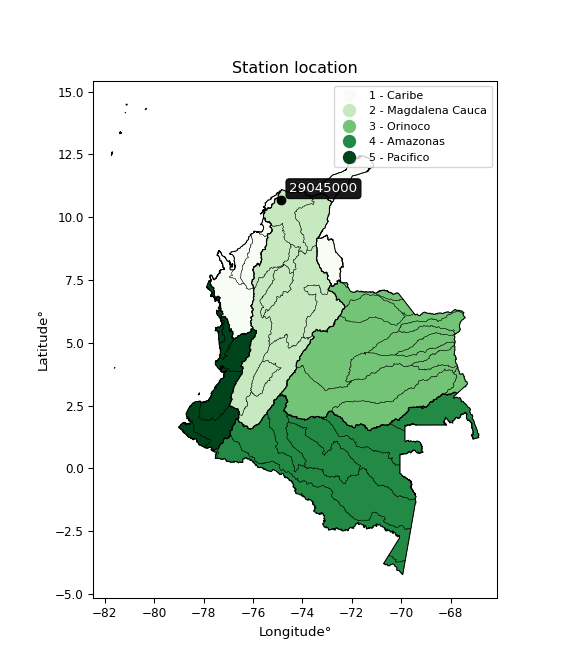

<div align="center">


</div>

# PMP Station (Rain, Pmax24h): 29045000

Probable Maximum Precipitation (PMP) is the greatest amount of rainfall for a specific duration that is meteorologically possible for a given location, acting as a "worst-case" scenario for extreme storms, crucial for designing safety-critical infrastructure like bridges, river deviations, dams, spillways, and nuclear plants to prevent catastrophic failure. PMP is calculated by hydrologists using meteorological data to determine the upper limit of extreme rainfall, often leading to the Probable Maximum Flood (PMF) for flood control design, and is increasingly being studied for climate change impacts. Probable Maximum Precipitation (PMP) is the theoretical upper limit of rainfall, a deterministic estimate for extreme events, while probability distributions (like GEV, Gumbel) describe the likelihood and frequency of various precipitation amounts, including rare ones, showing how often events occur, with PMP representing the extreme end of these distributions, used for critical infrastructure design to ensure safety against the worst conceivable weather, unlike standard statistical forecasts which cover typical probabilities.

The most common probability distributions in hydrology, used for analyzing floods, rainfall, and streamflow, include the Normal, Log-Normal, Gumbel, Gamma (including Log-Pearson Type III), and Generalized Extreme Value (GEV) distributions, often chosen based on the data´s skewness and whether modeling extremes or general conditions, with Gumbel and GEV popular for extreme events like floods, while the Normal distribution serves as a baseline, though often requiring transformations for skewed hydrological data. These distributions help in designing water infrastructure, managing water resources, and forecasting hydrologic events.

> Hydrological data often isn´t perfectly normal (it´s skewed), so different distributions are needed for different applications, such as: **Flood Frequency Analysis**: Using Gumbel, GEV, or Log-Pearson Type III for predicting extreme flood magnitudes and their return periods, **Rainfall Analysis**: Normal for annual totals, but Log-Normal, Weibull, or GEV for intensity or extreme daily rainfall, **Streamflow Modeling**: Gamma and Log-Normal for maximum flows, GEV for minimum flows, and Kappa for daily flows.

<div align="center">

</img>

</div>


## A. General information


### 1. General running parameters

• app_version: _v20260108_. • runtime: _2026-01-08 13:24:42.400241_. • Python version: _3.14.0_. • SciPy version: _1.16.3_. • Pandas version: _2.3.3_. • NumPy version: _2.3.5_. • Stations dataset (station_dataset_file): _dataset/pmax24h_in/automatic_colombia_2003_2024.csv_. • Stations catalog (station_catalog_file): _dataset/CNE.xls_. • Minimum year to eval til year_max (date_min): _1900_. • Maximum year to eval since year_min (date_max): _2024_. • Creates, save and include plots into reports (create_plot): _False_. • Plot only fit distributions with Δo > Δ (plot_only_fit): _True_. • Plot only simple graphs avoiding multiple CDFs and multiple Extreme values plots (plot_only_simple): _True_. • Eval low extreme values, if False, evaluates high extreme values (low_extreme): _False_. • Eval every SciPy distribution as logarithmic (pdist_logarithmic_on): _True_. • Standard deviation normalized (ddof): _1.0_. • Return periods to eval in years (Tr): _[2, 2.33, 5, 10, 15, 20, 25, 50, 75, 100, 200, 250, 500, 750, 1000]_. • Minimum data sample per station, 0 means any (minimum_sample): _5_. • Z-Score maximum threshold to adjust a value, 0 means disable (zscore_max): _3.5_. • Z-Score minimum threshold to adjust a value, 0 means disable (zscore_min): _-2.5_. • Avoid zeros, e.g. rain = 0 (avoid_zeros): _True_. • Avoid null values (avoid_nans): _True_. 

:file_folder:Table: [dataset.csv](../../dataset/pmax24h_in/automatic_colombia_2003_2024.csv)

> Delta Degrees of Freedom (DDOF): is a parameter used in the formulas for calculating variance and standard deviation. When ddof=0, the divisor is $N$ (the total number of observations) and this is used when your data set is the entire population. When ddof=1, the divisor is $N-1$ and this is used when your data set is a sample drawn from a larger population. Using $N-1$ provides an unbiased estimate of the population variance (known as Bessel´s correction).


### 2. Station info and location

|   id |   CODIGO | NOMBRE                       | CATEGORIA               | TECNOLOGIA                | ESTADO   | FECHA_INSTALACION   |   FECHA_SUSPENSION |   ALTITUD |   LATITUD |   LONGITUD | DEPARTAMENTO   | MUNICIPIO   | AREA_OPERATIVA                              | ENTIDAD                                                     | AREA_HIDROGRAFICA   | ZONA_HIDROGRAFICA   | SUBZONA_HIDROGRAFICA                                     |   CORRIENTE | Catalogo   |   Version |
|-----:|---------:|:-----------------------------|:------------------------|:--------------------------|:---------|:--------------------|-------------------:|----------:|----------:|-----------:|:---------------|:------------|:--------------------------------------------|:------------------------------------------------------------|:--------------------|:--------------------|:---------------------------------------------------------|------------:|:-----------|----------:|
|    0 | 29045000 | SABANALARGA - AUT [29045000] | Climatológica Principal | Automática con Telemetría | Activa   | 05/05/2013          |                nan |       100 |   10.6775 |   -74.8504 | Atlantico      | Ponedera    | Area Operativa 02 - Atlántico-Bolivar-Sucre | INSTITUTO DE HIDROLOGIA METEOROLOGIA Y ESTUDIOS AMBIENTALES | Magdalena Cauca     | Bajo Magdalena      | Directos al Bajo Magdalena entre Calamar y desembocadura |         nan | CNE_IDEAM  |  20251226 |

<div align="center">

Dynamic map: [:earth_americas:Google](http://maps.google.com/maps?q=10.677485,-74.850417) [:earth_americas:OSM](https://www.openstreetmap.org/#map=18/10.677485/-74.850417&layers=P) [:earth_americas:Bing](https://www.bing.com/maps?cp=10.677485~-74.850417&lvl=18) [:earth_americas:Apple](https://maps.apple.com/frame?center=10.677485%2C-74.850417&span=0.003%2C0.006)

</div>


<div align="center">

```geojson
{
  "type": "Feature",
  "geometry": {
    "type": "Point", 
    "coordinates": [-74.850417, 10.677485]
  }, 
  "properties": {
    "Name": "29045000"
  }
}
```

</div>


### 3. Discrete values table and plot

<div align="center">

|               |           0 |           1 |           2 |           3 |          4 |           5 |            6 |
|:--------------|------------:|------------:|------------:|------------:|-----------:|------------:|-------------:|
| Date          | 2018        | 2019        | 2020        | 2021        | 2022       | 2023        | 2024         |
| Value         |   76.75     |   85.48     |   71.75     |   70        |  171.3     |   76.9      |   88.2       |
| Value_initial |   76.75     |   85.48     |   71.75     |   70        |  171.3     |   76.9      |   88.2       |
| count         |    7        |    7        |    7        |    7        |    7       |    7        |    7         |
| mean          |   91.4829   |   91.4829   |   91.4829   |   91.4829   |   91.4829  |   91.4829   |   91.4829    |
| std           |   35.8195   |   35.8195   |   35.8195   |   35.8195   |   35.8195  |   35.8195   |   35.8195    |
| zscore        |   -0.411309 |   -0.167586 |   -0.550898 |   -0.599754 |    2.22832 |   -0.407121 |   -0.0916501 |


</div>


> The initial value (value_initial) correspond to the initial obtained or null completed value, and value (value) is adjusted only when the initial value is outside the valid range (outlier) definite through the Z-Score value. If Z-Score is active, values out of range or outliers are replaced with the station mean value. A Z-Score (or standard score) measures how many standard deviations a data point is from the mean of a dataset, indicating its relative position; positive scores mean above the mean, negative mean below, and a score of zero is exactly at the mean, allowing for comparison of values from different distributions. It´s calculated using the formula $z=(x–μ)/σ$, where $x$ is the data point, $μ$ is the mean, and $σ$ is the standard deviation, helping identify outliers and understand probability.
>
> <sub>**Note**: In this study, "completing" (filling gaps in) and "extending" (forecasting or lengthening the historical record) rainfall data series are avoided for certain critical analyses because they introduce artificial bias and uncertainty, which can distort the statistics of rare events (extremes), alter day-to-day variability, and compromise the integrity and homogeneity of the original data. Some reasons against Completing/Extending rainfall data are: **Distortion of Extremes and Variability**: The primary issue is that most gap-filling or extension methods rely on averaging or regression with nearby stations, which inherently smooths the data. Rainfall is highly variable in space and time, with a large percentage of zero values and occasional large storms. Infilling methods often underestimate the highest values and overestimate the lowest (zero) values, which severely distorts analyses focused on flood frequency, drought severity, and intensity-duration-frequency (IDF) curves, **Loss of Data Homogeneity**: Infilled or extended data are synthetic estimates, not actual measurements. Combining these estimates with observed data can violate the assumption of data homogeneity, which requires that the data properties do not change over time. Inhomogeneity can lead to incorrect conclusions about long-term trends or changes in climate patterns, **Propagation of Errors**: Errors and biases from the original data (e.g., wind-induced undercatch, instrument errors, site changes) or the data used for imputation can propagate through the analysis, leading to unreliable hydrological models and inaccurate predictions, **Compromised Statistical Integrity**: For statistical analyses, especially those involving the frequency of events, using artificial data can introduce time bias or autocorrelation that doesn´t exist in reality, making it difficult to assess the true probability of events, **Difficulty in Validation**: It is difficult to accurately validate the quality of filled or extended data, especially for past periods where ground-truth measurements are unavailable. The reliability of imputation techniques heavily depends on the density of the surrounding station network and the complexity of the local topography.</sub>


### 4. Active continuous probability distributions from SciPy (43 of 104 available)

A Probability Density Function (PDF) describes the relative likelihood of a continuous random variable falling within a specific range, where the total area under its curve equals 1, and the area over any interval gives the actual probability for that range. Unlike discrete probabilities (like rolling a die), a PDF shows density, not direct probability for a single point (which is zero), with higher points indicating higher likelihood, often visualized as a bell curve for normal distributions.

A log of a probability density function (log-PDF) is simply the logarithm of the PDF´s value, denoted as $log(f(x))$, useful for converting multiplication of probabilities into addition, improving numerical stability with tiny numbers, and connecting to information theory concepts like entropy. Instead of dealing with very small probabilities (e.g., 0.000001), log-PDFs use negative numbers (e.g., $log(0.00001) ≈ -11.51$ that are easier for computers to handle, preventing underflow errors and simplifying complex calculations. In this study, each active probability distribution from SciPy is also evaluated in the $log$ form.

[scipy.stats](https://docs.scipy.org/doc/scipy/reference/stats.html) is a Python´s powerful submodule within the SciPy library for comprehensive statistical analysis, offering over 130 probability distributions (like Normal, Poisson), functions for descriptive stats (mean, variance), hypothesis testing (t-tests, chi-square), random variable generation, and statistical tests, making it essential for data science, modeling, and research. It provides tools to explore, model, and draw conclusions from data efficiently, working seamlessly with NumPy.

<div align="center">

|   id | p_dist             |   n_parameter | fit_method   | label                                                                       | active   | ref                                                                                                        |
|-----:|:-------------------|--------------:|:-------------|:----------------------------------------------------------------------------|:---------|:-----------------------------------------------------------------------------------------------------------|
|    0 | alpha              |             3 | MLE          | Alpha                                                                       | True     | [:mortar_board:](https://docs.scipy.org/doc/scipy/reference/generated/scipy.stats.alpha.html)              |
|    1 | betaprime          |             4 | MLE          | Beta prime                                                                  | True     | [:mortar_board:](https://docs.scipy.org/doc/scipy/reference/generated/scipy.stats.betaprime.html)          |
|    2 | chi2               |             3 | MLE          | Chi²                                                                        | True     | [:mortar_board:](https://docs.scipy.org/doc/scipy/reference/generated/scipy.stats.chi2.html)               |
|    3 | crystalball        |             4 | MLE          | Crystalball                                                                 | True     | [:mortar_board:](https://docs.scipy.org/doc/scipy/reference/generated/scipy.stats.crystalball.html)        |
|    4 | erlang             |             3 | MLE          | Erlang                                                                      | True     | [:mortar_board:](https://docs.scipy.org/doc/scipy/reference/generated/scipy.stats.erlang.html)             |
|    5 | expon              |             2 | MLE          | Exponential                                                                 | True     | [:mortar_board:](https://docs.scipy.org/doc/scipy/reference/generated/scipy.stats.expon.html)              |
|    6 | exponnorm          |             3 | MLE          | Exponentially modified Normal                                               | True     | [:mortar_board:](https://docs.scipy.org/doc/scipy/reference/generated/scipy.stats.exponnorm.html)          |
|    7 | f                  |             4 | MLE          | F                                                                           | True     | [:mortar_board:](https://docs.scipy.org/doc/scipy/reference/generated/scipy.stats.f.html)                  |
|    8 | fatiguelife        |             3 | MLE          | Fatigue-life (Birnbaum-Saunders)                                            | True     | [:mortar_board:](https://docs.scipy.org/doc/scipy/reference/generated/scipy.stats.fatiguelife.html)        |
|    9 | fisk               |             3 | MLE          | Fisk                                                                        | True     | [:mortar_board:](https://docs.scipy.org/doc/scipy/reference/generated/scipy.stats.fisk.html)               |
|   10 | gamma              |             3 | MLE          | Gamma                                                                       | True     | [:mortar_board:](https://docs.scipy.org/doc/scipy/reference/generated/scipy.stats.gamma.html)              |
|   11 | genexpon           |             5 | MLE          | Generalized exponential                                                     | True     | [:mortar_board:](https://docs.scipy.org/doc/scipy/reference/generated/scipy.stats.genexpon.html)           |
|   12 | genlogistic        |             3 | MLE          | Generalized logistic                                                        | True     | [:mortar_board:](https://docs.scipy.org/doc/scipy/reference/generated/scipy.stats.genlogistic.html)        |
|   13 | gibrat             |             2 | MM           | Gibrat                                                                      | True     | [:mortar_board:](https://docs.scipy.org/doc/scipy/reference/generated/scipy.stats.gibrat.html)             |
|   14 | gompertz           |             3 | MLE          | Gompertz (or truncated Gumbel)                                              | True     | [:mortar_board:](https://docs.scipy.org/doc/scipy/reference/generated/scipy.stats.gompertz.html)           |
|   15 | gumbel_l           |             2 | MM           | Gumbel Left Skew                                                            | True     | [:mortar_board:](https://docs.scipy.org/doc/scipy/reference/generated/scipy.stats.gumbel_l.html)           |
|   16 | gumbel_r           |             2 | MM           | Gumbel Right Skew                                                           | True     | [:mortar_board:](https://docs.scipy.org/doc/scipy/reference/generated/scipy.stats.gumbel_r.html)           |
|   17 | halflogistic       |             2 | MM           | Half-logistic                                                               | True     | [:mortar_board:](https://docs.scipy.org/doc/scipy/reference/generated/scipy.stats.halflogistic.html)       |
|   18 | halfnorm           |             2 | MM           | Half Normal                                                                 | True     | [:mortar_board:](https://docs.scipy.org/doc/scipy/reference/generated/scipy.stats.halfnorm.html)           |
|   19 | hypsecant          |             2 | MM           | hyperbolic secant                                                           | True     | [:mortar_board:](https://docs.scipy.org/doc/scipy/reference/generated/scipy.stats.hypsecant.html)          |
|   20 | invgamma           |             3 | MLE          | Inverted gamma                                                              | True     | [:mortar_board:](https://docs.scipy.org/doc/scipy/reference/generated/scipy.stats.invgamma.html)           |
|   21 | invgauss           |             3 | MLE          | Inverse Gaussian                                                            | True     | [:mortar_board:](https://docs.scipy.org/doc/scipy/reference/generated/scipy.stats.invgauss.html)           |
|   22 | invweibull         |             3 | MLE          | Inverted Weibull                                                            | True     | [:mortar_board:](https://docs.scipy.org/doc/scipy/reference/generated/scipy.stats.invweibull.html)         |
|   23 | kstwobign          |             2 | MLE          | Limiting distribution of scaled Kolmogorov-Smirnov two-sided test statistic | True     | [:mortar_board:](https://docs.scipy.org/doc/scipy/reference/generated/scipy.stats.kstwobign.html)          |
|   24 | laplace            |             2 | MM           | Laplace                                                                     | True     | [:mortar_board:](https://docs.scipy.org/doc/scipy/reference/generated/scipy.stats.laplace.html)            |
|   25 | laplace_asymmetric |             3 | MLE          | Asymmetric Laplace                                                          | True     | [:mortar_board:](https://docs.scipy.org/doc/scipy/reference/generated/scipy.stats.laplace_asymmetric.html) |
|   26 | loggamma           |             3 | MLE          | Log gamma                                                                   | True     | [:mortar_board:](https://docs.scipy.org/doc/scipy/reference/generated/scipy.stats.loggamma.html)           |
|   27 | logistic           |             2 | MM           | Logistic (or Sech-squared)                                                  | True     | [:mortar_board:](https://docs.scipy.org/doc/scipy/reference/generated/scipy.stats.logistic.html)           |
|   28 | lognorm            |             3 | MLE          | Log Normal                                                                  | True     | [:mortar_board:](https://docs.scipy.org/doc/scipy/reference/generated/scipy.stats.lognorm.html)            |
|   29 | maxwell            |             2 | MM           | Maxwell                                                                     | True     | [:mortar_board:](https://docs.scipy.org/doc/scipy/reference/generated/scipy.stats.maxwell.html)            |
|   30 | mielke             |             4 | MLE          | Mielke Beta-Kappa / Dagum                                                   | True     | [:mortar_board:](https://docs.scipy.org/doc/scipy/reference/generated/scipy.stats.mielke.html)             |
|   31 | moyal              |             2 | MM           | Moyal                                                                       | True     | [:mortar_board:](https://docs.scipy.org/doc/scipy/reference/generated/scipy.stats.moyal.html)              |
|   32 | nakagami           |             3 | MLE          | Nakagami                                                                    | True     | [:mortar_board:](https://docs.scipy.org/doc/scipy/reference/generated/scipy.stats.nakagami.html)           |
|   33 | ncf                |             5 | MLE          | Non-central F distribution                                                  | True     | [:mortar_board:](https://docs.scipy.org/doc/scipy/reference/generated/scipy.stats.ncf.html)                |
|   34 | nct                |             4 | MLE          | Non-central Student’s t                                                     | True     | [:mortar_board:](https://docs.scipy.org/doc/scipy/reference/generated/scipy.stats.nct.html)                |
|   35 | norm               |             2 | MM           | Normal                                                                      | True     | [:mortar_board:](https://docs.scipy.org/doc/scipy/reference/generated/scipy.stats.norm.html)               |
|   36 | pearson3           |             3 | MM           | Pearson type III                                                            | True     | [:mortar_board:](https://docs.scipy.org/doc/scipy/reference/generated/scipy.stats.pearson3.html)           |
|   37 | rayleigh           |             2 | MM           | Rayleigh                                                                    | True     | [:mortar_board:](https://docs.scipy.org/doc/scipy/reference/generated/scipy.stats.rayleigh.html)           |
|   38 | rice               |             3 | MLE          | Rice                                                                        | True     | [:mortar_board:](https://docs.scipy.org/doc/scipy/reference/generated/scipy.stats.rice.html)               |
|   39 | t                  |             3 | MLE          | Student’s t                                                                 | True     | [:mortar_board:](https://docs.scipy.org/doc/scipy/reference/generated/scipy.stats.t.html)                  |
|   40 | truncnorm          |             4 | MLE          | Truncated normal                                                            | True     | [:mortar_board:](https://docs.scipy.org/doc/scipy/reference/generated/scipy.stats.truncnorm.html)          |
|   41 | wald               |             2 | MM           | Wald                                                                        | True     | [:mortar_board:](https://docs.scipy.org/doc/scipy/reference/generated/scipy.stats.wald.html)               |
|   42 | weibull_min        |             3 | MLE          | Weibull minimum                                                             | True     | [:mortar_board:](https://docs.scipy.org/doc/scipy/reference/generated/scipy.stats.weibull_min.html)        |

</div>

> **n_parameter:** # arguments & localization & scale.
>
> **Fit methods:** (MLE) maximum likelihood, (MM) L-moments.
>
>**Inactive** (With the only purpose of prevent loops, zero divisions, infinite values, over high estimated values or horizontal trending for recurrence intervals estimations, the follow distributions were disabled.)**:** foldnorm, gennorm, norminvgauss, powernorm, powerlognorm, skewnorm, genextreme, anglit, arcsine, argus, beta, bradford, burr, burr12, cauchy, cosine, halfcauchy, foldcauchy, skewcauchy, wrapcauchy, dgamma, gengamma, exponweib, exponpow, truncexpon, gausshyper, genhalflogistic, genhyperbolic, geninvgauss, halfgennorm, johnsonsb, johnsonsu, kappa4, kappa3, ksone, kstwo, loglaplace, levy, levy_l, levy_stable, ncx2, pareto, genpareto, truncpareto, lomax, powerlaw, rdist, rel_breitwigner, recipinvgauss, semicircular, studentized_range, trapezoid, triang, truncweibull_min, tukeylambda, uniform, loguniform, vonmises, vonmises_line, weibull_max, dweibull, 


## B. Probability (PDF) vs. Empirical (EDF) distributions functions

A continuous probability distribution (CPD) describes probabilities for variables that can take any value within a range (like rain any time), unlike discrete variables with specific outcomes (like temperature). It uses a Probability Density Function (PDF), a curve where the total area under it equals 1, and the probability of the variable falling within an interval (a to b) is found by calculating the area under the curve between those points. A key feature is that the probability of hitting any single exact value is zero, so probabilities are always expressed for ranges, e.g., $P(a ≤ X ≤ b)$.

<div align="center">

Distributions parameters from station values
|    |   station | p_dist                |   n |              loc |          scale | shape                  | shape1              | shape2                 | shape3   |
|---:|----------:|:----------------------|----:|-----------------:|---------------:|:-----------------------|:--------------------|:-----------------------|:---------|
|  0 |  29045000 | alpha                 |   7 |      66.2847     |    7.37175     | 1.5259595738290185e-07 |                     |                        |          |
|  1 |  29045000 | betaprime             |   7 |      42.3844     |    1.15355     | 181.98144459431057     | 5.11286321037073    |                        |          |
|  2 |  29045000 | chi2                  |   7 |      70          |   23.1744      | 1.0520347191683928     |                     |                        |          |
|  3 |  29045000 | crystalball           |   7 |      91.4829     |   33.1624      | 5932.078778925099      | 8302.190437673664   |                        |          |
|  4 |  29045000 | erlang                |   7 |      70          |   21.5257      | 0.8473122110682337     |                     |                        |          |
|  5 |  29045000 | expon                 |   7 |      70          |   21.4829      |                        |                     |                        |          |
|  6 |  29045000 | exponnorm             |   7 |      69.975      |    0.00743974  | 2874.691101507651      |                     |                        |          |
|  7 |  29045000 | f                     |   7 |      67.8772     |    6.55115     | 162299.8968557129      | 2.088217781631791   |                        |          |
|  8 |  29045000 | fatiguelife           |   7 |      69.6472     |    6.0001      | 2.1964324376598254     |                     |                        |          |
|  9 |  29045000 | fisk                  |   7 |      70          |    5.0478      | 0.4786161044572458     |                     |                        |          |
| 10 |  29045000 | gamma                 |   7 |      70          |   32.1919      | 0.5153901797455074     |                     |                        |          |
| 11 |  29045000 | genexpon              |   7 |      70          |   53.7112      | 2.4991598879114436     | 0.45114568505949637 | 2.3158844173234785e-05 |          |
| 12 |  29045000 | genlogistic           |   7 |     -36.1618     |   15.8156      | 1482.947075775276      |                     |                        |          |
| 13 |  29045000 | gibrat                |   7 |      66.1841     |   15.3444      |                        |                     |                        |          |
| 14 |  29045000 | gompertz              |   7 |      70          |    3.38078e+09 | 154413422.05540594     |                     |                        |          |
| 15 |  29045000 | gumbel_l              |   7 |     106.408      |   25.8566      |                        |                     |                        |          |
| 16 |  29045000 | gumbel_r              |   7 |      76.558      |   25.8566      |                        |                     |                        |          |
| 17 |  29045000 | halflogistic          |   7 |      52.1777     |   28.3527      |                        |                     |                        |          |
| 18 |  29045000 | halfnorm              |   7 |      47.5889     |   55.013       |                        |                     |                        |          |
| 19 |  29045000 | hypsecant             |   7 |      91.4829     |   21.1118      |                        |                     |                        |          |
| 20 |  29045000 | invgamma              |   7 |      67.8771     |    6.84033     | 1.0441145817535693     |                     |                        |          |
| 21 |  29045000 | invgauss              |   7 |      68.7191     |    5.97971     | 3.806842049796789      |                     |                        |          |
| 22 |  29045000 | invweibull            |   7 |      68.1536     |    6.09664     | 0.9644476321262444     |                     |                        |          |
| 23 |  29045000 | kstwobign             |   7 |      12.911      |   92.6982      |                        |                     |                        |          |
| 24 |  29045000 | laplace               |   7 |      91.4829     |   23.4493      |                        |                     |                        |          |
| 25 |  29045000 | laplace_asymmetric    |   7 |      70          |    0.000351528 | 1.6363329634379402e-05 |                     |                        |          |
| 26 |  29045000 | loggamma              |   7 |  -11720.7        | 1549.36        | 2047.0643221047253     |                     |                        |          |
| 27 |  29045000 | logistic              |   7 |      91.4829     |   18.2834      |                        |                     |                        |          |
| 28 |  29045000 | lognorm               |   7 |      70          |    0.0853735   | 12.066441081606746     |                     |                        |          |
| 29 |  29045000 | maxwell               |   7 |      12.9019     |   49.2433      |                        |                     |                        |          |
| 30 |  29045000 | mielke                |   7 |      58.0833     |    0.367534    | 24631.357981702415     | 2.4024276579899633  |                        |          |
| 31 |  29045000 | moyal                 |   7 |      72.5185     |   14.9283      |                        |                     |                        |          |
| 32 |  29045000 | nakagami              |   7 |      70          |   53.7377      | 0.2320959985776458     |                     |                        |          |
| 33 |  29045000 | ncf                   |   7 |      -0.00754732 |    4.47662e-05 | 1.64890593990594e-06   | 1.8674990748384004  | 1.924176735675617      |          |
| 34 |  29045000 | nct                   |   7 |       0.155741   |    0.989586    | 8.772564400318494      | 82.84246657263026   |                        |          |
| 35 |  29045000 | norm                  |   7 |      91.4829     |   33.1624      |                        |                     |                        |          |
| 36 |  29045000 | pearson3              |   7 |      91.4829     |   33.1624      | 1.8972343274996215     |                     |                        |          |
| 37 |  29045000 | rayleigh              |   7 |      28.0413     |   50.619       |                        |                     |                        |          |
| 38 |  29045000 | rice                  |   7 |      45.7265     |   39.9587      | 0.0002895648077616287  |                     |                        |          |
| 39 |  29045000 | t                     |   7 |      90.4675     |   33.7075      | 7.509023088023191      |                     |                        |          |
| 40 |  29045000 | truncnorm             |   7 | -162528          | 2322.85        | 69.9995644154563       | 175.88418841097752  |                        |          |
| 41 |  29045000 | wald                  |   7 |      58.3205     |   33.1624      |                        |                     |                        |          |
| 42 |  29045000 | weibull_min           |   7 |      70          |   30.845       | 0.43369155107091323    |                     |                        |          |
| 43 |  29045000 | logalpha              |   7 |       4.18567    |    0.151194    | 0.5831007325228672     |                     |                        |          |
| 44 |  29045000 | logbetaprime          |   7 |       3.30187    |    0.0855672   | 379.06255945834323     | 29.69131261500044   |                        |          |
| 45 |  29045000 | logchi2               |   7 |       4.2485     |    0.968669    | 0.9779325834974024     |                     |                        |          |
| 46 |  29045000 | logcrystalball        |   7 |       4.46801    |    0.286565    | 109.25816746629326     | 518.6944521463738   |                        |          |
| 47 |  29045000 | logerlang             |   7 |       4.2485     |    0.485874    | 0.17536638145543992    |                     |                        |          |
| 48 |  29045000 | logexpon              |   7 |       4.2485     |    0.219512    |                        |                     |                        |          |
| 49 |  29045000 | logexponnorm          |   7 |       4.24823    |    8.37281e-05 | 2620.6080952695756     |                     |                        |          |
| 50 |  29045000 | logf                  |   7 |       4.20925    |    0.107591    | 997.7875711625522      | 2.811702686236125   |                        |          |
| 51 |  29045000 | logfatiguelife        |   7 |       4.2404     |    0.0891569   | 1.7017519662999105     |                     |                        |          |
| 52 |  29045000 | logfisk               |   7 |       4.2485     |    0.206949    | 0.32441387062432625    |                     |                        |          |
| 53 |  29045000 | loggamma              |   7 |       4.2485     |    0.31279     | 0.1859007294002192     |                     |                        |          |
| 54 |  29045000 | loggenexpon           |   7 |       4.2485     |    0.680653    | 3.0954538255240767     | 1.292392225407708   | 9.015827776701159e-06  |          |
| 55 |  29045000 | loggenlogistic        |   7 |       3.23079    |    0.15296     | 1579.2465197750603     |                     |                        |          |
| 56 |  29045000 | loggibrat             |   7 |       4.24937    |    0.132608    |                        |                     |                        |          |
| 57 |  29045000 | loggompertz           |   7 |       4.2485     |    3.46606e+12 | 11143196073211.094     |                     |                        |          |
| 58 |  29045000 | loggumbel_l           |   7 |       4.59698    |    0.223434    |                        |                     |                        |          |
| 59 |  29045000 | loggumbel_r           |   7 |       4.33904    |    0.223434    |                        |                     |                        |          |
| 60 |  29045000 | loghalflogistic       |   7 |       4.12836    |    0.245003    |                        |                     |                        |          |
| 61 |  29045000 | loghalfnorm           |   7 |       4.08871    |    0.475382    |                        |                     |                        |          |
| 62 |  29045000 | loghypsecant          |   7 |       4.46801    |    0.182433    |                        |                     |                        |          |
| 63 |  29045000 | loginvgamma           |   7 |       4.2091     |    0.15132     | 1.405870808077421      |                     |                        |          |
| 64 |  29045000 | loginvgauss           |   7 |       4.22692    |    0.106168    | 2.270869380499379      |                     |                        |          |
| 65 |  29045000 | loginvweibull         |   7 |       4.20515    |    0.106003    | 1.2573364513373129     |                     |                        |          |
| 66 |  29045000 | logkstwobign          |   7 |       3.7511     |    0.840647    |                        |                     |                        |          |
| 67 |  29045000 | loglaplace            |   7 |       4.46801    |    0.202632    |                        |                     |                        |          |
| 68 |  29045000 | loglaplace_asymmetric |   7 |       4.2485     |    0.00191033  | 0.00868441675407989    |                     |                        |          |
| 69 |  29045000 | logloggamma           |   7 |     -90.5596     |   12.6028      | 1882.7632974970852     |                     |                        |          |
| 70 |  29045000 | loglogistic           |   7 |       4.46801    |    0.157992    |                        |                     |                        |          |
| 71 |  29045000 | loglognorm            |   7 |       4.2485     |    0.00134209  | 11.493430981862526     |                     |                        |          |
| 72 |  29045000 | logmaxwell            |   7 |       3.78897    |    0.425524    |                        |                     |                        |          |
| 73 |  29045000 | logmielke             |   7 |       3.44535    |    0.431093    | 376.9087574892651      | 5.6565329370419875  |                        |          |
| 74 |  29045000 | logmoyal              |   7 |       4.30413    |    0.129       |                        |                     |                        |          |
| 75 |  29045000 | lognakagami           |   7 |       4.2485     |    0.385347    | 0.21005305888477183    |                     |                        |          |
| 76 |  29045000 | logncf                |   7 |       3.17849    |    1.32635     | 4251.853477062821      | 54.25813997629538   | 45.53828263840563      |          |
| 77 |  29045000 | lognct                |   7 |       0.746489   |    0.0572112   | 110.67767730905871     | 64.5120838938503    |                        |          |
| 78 |  29045000 | lognorm               |   7 |       4.46801    |    0.286565    |                        |                     |                        |          |
| 79 |  29045000 | logpearson3           |   7 |       4.46801    |    0.286565    | 1.736588997346974      |                     |                        |          |
| 80 |  29045000 | lograyleigh           |   7 |       3.91979    |    0.437413    |                        |                     |                        |          |
| 81 |  29045000 | logrice               |   7 |       4.05995    |    0.352584    | 0.00010544091956676217 |                     |                        |          |
| 82 |  29045000 | logt                  |   7 |       4.34628    |    0.0836886   | 1.258625361634258      |                     |                        |          |
| 83 |  29045000 | logtruncnorm          |   7 |      -2.29403    |    1.48655     | 4.401151540062308      | 5.003164656315719   |                        |          |
| 84 |  29045000 | logwald               |   7 |       4.18144    |    0.286565    |                        |                     |                        |          |
| 85 |  29045000 | logweibull_min        |   7 |       4.2485     |    0.27623     | 0.19947591285642824    |                     |                        |          |

</div>

> **loc** (Location parameter): This shifts the distribution along the x-axis. For many common distributions, like the normal (Gaussian) distribution, loc represents the mean $μ$. For others, like the uniform distribution, it might represent the minimum value, or for the beta distribution, the left end of the support interval.
>
> **scale** (Scale parameter): This determines the width or spread of the distribution. For the normal distribution, scale represents the standard deviation $σ$. For a uniform distribution, it defines the length of the interval (from $loc$ to $loc + scale$).
>
> **shape** (Shape parameters): Refers to parameters that define the specific form of a probability distribution, distinct from its location (loc) and scale (scale). These parameters are required arguments for most distribution functions. For example, a normal (Gaussian) distribution is fully defined by its location (mean) and scale (standard deviation), so it has no specific shape parameters beyond loc and scale. However, other distributions have intrinsic properties that need specification, as Gamma distribution that takes a shape parameter, often named $a$ or $alpha$.


### 0. Cumulative distribution values - CDF (86 evaluated)

Cumulative Distribution Function (CDF), denoted as $F$<sub>$X$</sub>$(x)$, is a function that gives the probability that a random variable $X$ will take a value less than or equal to a specific value, $x$ (i.e., $(P(X≥x)$. It essentially "accumulates" probabilities from a given point up to the far right (positive infinity), providing a complete picture of the distribution´s probabilities for both discrete (like rain) and continuous (like temperature) variables, helping to find probabilities over ranges or above certain values. Each station is evaluated separately ordering the $x$ values ascending, calculating the CDF and PDF values for the activated distributions and their logarithmic forms.

<div align="center">

CDF ordered by x ascending and calculating $log(f(x))$ separately
|   id |   Station |   date |      x |   count |    mean |     std |     zscore |   Value_initial |   station |   m |     alpha |   alpha_pdf |   betaprime |   betaprime_pdf |        chi2 |         chi2_pdf |   crystalball |   crystalball_pdf |     erlang |   erlang_pdf |     expon |   expon_pdf |   exponnorm |   exponnorm_pdf |        f |      f_pdf |   fatiguelife |   fatiguelife_pdf |        fisk |       fisk_pdf |       gamma |        gamma_pdf |    genexpon |   genexpon_pdf |   genlogistic |   genlogistic_pdf |    gibrat |   gibrat_pdf |    gompertz |   gompertz_pdf |   gumbel_l |   gumbel_l_pdf |   gumbel_r |   gumbel_r_pdf |   halflogistic |   halflogistic_pdf |   halfnorm |   halfnorm_pdf |   hypsecant |   hypsecant_pdf |   invgamma |   invgamma_pdf |   invgauss |   invgauss_pdf |   invweibull |   invweibull_pdf |   kstwobign |   kstwobign_pdf |   laplace |   laplace_pdf |   laplace_asymmetric |   laplace_asymmetric_pdf |   loggamma |   loggamma_pdf |   logistic |   logistic_pdf |   lognorm |   lognorm_pdf |   maxwell |   maxwell_pdf |   mielke |   mielke_pdf |    moyal |   moyal_pdf |    nakagami |   nakagami_pdf |      ncf |     ncf_pdf |      nct |     nct_pdf |     norm |    norm_pdf |   pearson3 |   pearson3_pdf |   rayleigh |   rayleigh_pdf |     rice |   rice_pdf |        t |      t_pdf |   truncnorm |   truncnorm_pdf |     wald |    wald_pdf |   weibull_min |   weibull_min_pdf |   logalpha |   logalpha_pdf |   logbetaprime |   logbetaprime_pdf |     logchi2 |   logchi2_pdf |   logcrystalball |   logcrystalball_pdf |   logerlang |   logerlang_pdf |   logexpon |   logexpon_pdf |   logexponnorm |   logexponnorm_pdf |      logf |   logf_pdf |   logfatiguelife |   logfatiguelife_pdf |     logfisk |   logfisk_pdf |   loggenexpon |   loggenexpon_pdf |   loggenlogistic |   loggenlogistic_pdf |   loggibrat |   loggibrat_pdf |   loggompertz |   loggompertz_pdf |   loggumbel_l |   loggumbel_l_pdf |   loggumbel_r |   loggumbel_r_pdf |   loghalflogistic |   loghalflogistic_pdf |   loghalfnorm |   loghalfnorm_pdf |   loghypsecant |   loghypsecant_pdf |   loginvgamma |   loginvgamma_pdf |   loginvgauss |   loginvgauss_pdf |   loginvweibull |   loginvweibull_pdf |   logkstwobign |   logkstwobign_pdf |   loglaplace |   loglaplace_pdf |   loglaplace_asymmetric |   loglaplace_asymmetric_pdf |   logloggamma |   logloggamma_pdf |   loglogistic |   loglogistic_pdf |   loglognorm |   loglognorm_pdf |   logmaxwell |   logmaxwell_pdf |   logmielke |   logmielke_pdf |   logmoyal |   logmoyal_pdf |   lognakagami |   lognakagami_pdf |   logncf |   logncf_pdf |   lognct |   lognct_pdf |   logpearson3 |   logpearson3_pdf |   lograyleigh |   lograyleigh_pdf |   logrice |   logrice_pdf |     logt |   logt_pdf |   logtruncnorm |   logtruncnorm_pdf |   logwald |   logwald_pdf |   logweibull_min |   logweibull_min_pdf |
|-----:|----------:|-------:|-------:|--------:|--------:|--------:|-----------:|----------------:|----------:|----:|----------:|------------:|------------:|----------------:|------------:|-----------------:|--------------:|------------------:|-----------:|-------------:|----------:|------------:|------------:|----------------:|---------:|-----------:|--------------:|------------------:|------------:|---------------:|------------:|-----------------:|------------:|---------------:|--------------:|------------------:|----------:|-------------:|------------:|---------------:|-----------:|---------------:|-----------:|---------------:|---------------:|-------------------:|-----------:|---------------:|------------:|----------------:|-----------:|---------------:|-----------:|---------------:|-------------:|-----------------:|------------:|----------------:|----------:|--------------:|---------------------:|-------------------------:|-----------:|---------------:|-----------:|---------------:|----------:|--------------:|----------:|--------------:|---------:|-------------:|---------:|------------:|------------:|---------------:|---------:|------------:|---------:|------------:|---------:|------------:|-----------:|---------------:|-----------:|---------------:|---------:|-----------:|---------:|-----------:|------------:|----------------:|---------:|------------:|--------------:|------------------:|-----------:|---------------:|---------------:|-------------------:|------------:|--------------:|-----------------:|---------------------:|------------:|----------------:|-----------:|---------------:|---------------:|-------------------:|----------:|-----------:|-----------------:|---------------------:|------------:|--------------:|--------------:|------------------:|-----------------:|---------------------:|------------:|----------------:|--------------:|------------------:|--------------:|------------------:|--------------:|------------------:|------------------:|----------------------:|--------------:|------------------:|---------------:|-------------------:|--------------:|------------------:|--------------:|------------------:|----------------:|--------------------:|---------------:|-------------------:|-------------:|-----------------:|------------------------:|----------------------------:|--------------:|------------------:|--------------:|------------------:|-------------:|-----------------:|-------------:|-----------------:|------------:|----------------:|-----------:|---------------:|--------------:|------------------:|---------:|-------------:|---------:|-------------:|--------------:|------------------:|--------------:|------------------:|----------:|--------------:|---------:|-----------:|---------------:|-------------------:|----------:|--------------:|-----------------:|---------------------:|
|    0 |  29045000 |   2021 |  70    |       7 | 91.4829 | 35.8195 | -0.599754  |           70    |  29045000 |   1 | 0.0472375 | 0.0595163   |    0.140289 |     0.0203194   | 7.79075e-09 | 288376           |      0.258555 |       0.00975298  | 1.4527e-13 |  8.66163     | 0         | 0.0465487   |   0.0011663 |     0.0466844   | 0.043468 | 0.0652608  |      0.038591 |        0.23584    | 0.000121608 | 1744.21        | 1.37493e-08 | 498652           | 1.62589e-08 |    0.0465296   |      0.165023 |       0.0187875   | 0.0820236 |  0.0397016   | 6.28644e-10 |    0.0456739   |   0.216996 |    0.00740763  |   0.27563  |    0.0137374   |       0.304341 |         0.0160016  |   0.31627  |     0.0133487  |    0.220816 |     0.0096404   |   0.043466 |     0.065258   |  0.0397271 |    0.0841644   |    0.0422337 |      0.0698089   |    0.157387 |     0.0151778   |  0.20003  |   0.00853032  |          3.80024e-10 |              0.0465491   | 0.00214289 |     4.4852e+11 |   0.235953 |     0.00986029 |  0.221835 |      1.03818  |  0.281397 |   0.0111223   |      nan |          nan | 0.27659  | 0.0160872   | 4.59807e-08 |    1.50194e+06 | 0.653451 | 0.0021731   | 0.19408  | 0.0182469   | 0.258555 | 0.00975298  |   0.297856 |     0.0199045  |   0.29075  |      0.0116143 | 0.168486 | 0.012641   | 0.280809 | 0.00933681 | 1.47656e-09 |      0.0301414  | 0.221363 | 0.0317214   |   2.23183e-07 |       6.81118e+06 |  0.0473698 |      4.02468   |       0.20595  |          1.64294   | 3.56858e-08 |    1.9646e+07 |         0.221835 |            1.03818   |   0.0028136 |     5.55532e+11 |   0        |      4.55557   |     0.00121001 |          4.54854   | 0.0457241 |  4.07582   |        0.0380644 |            10.8816   | 2.18282e-05 |   7.97275e+09 |   1.47752e-08 |         4.54777   |         0.130643 |             1.73722  |   0         |        0        |     0         |           3.21494 |      0.189584 |       0.762442    |      0.223209 |          1.49814  |          0.240373 |              1.92288  |      0.263224 |           1.58622 |       0.185675 |          0.961026  |     0.0457238 |         4.07581   |     0.0406151 |         5.33585   |       0.0460524 |           4.11136   |       0.124904 |          1.5187    |     0.169238 |        0.835199  |             7.54197e-05 |                    4.5457   |      0.224023 |         1.02397   |      0.199505 |         1.01083   |   0.00734387 |      1.99143e+12 |     0.238878 |         1.22054  |    0.143053 |        1.93086  |   0.214732 |       1.77719  |   5.58115e-07 |       2.63987e+08 | 0.101609 |     0.924138 | 0.207228 |    1.22098   |      0.224805 |          2.21271  |      0.245995 |          1.29538  |  0.133231 |     1.31461   | 0.208981 |  1.72876   |    1.12707e-06 |            3.2721  | 0.0963292 |     3.51039   |       0.00128458 |          2.88319e+11 |
|    1 |  29045000 |   2020 |  71.75 |       7 | 91.4829 | 35.8195 | -0.550898  |           71.75 |  29045000 |   2 | 0.177392  | 0.0792901   |    0.177254 |     0.0218365   | 0.198499    |      0.0582033   |      0.275909 |       0.0100781   | 0.121644   |  0.0563453   | 0.0782307 | 0.0429072   |   0.079642  |     0.0430336   | 0.182758 | 0.0818913  |      0.308697 |        0.0869656  | 0.375893    |    0.0641612   | 0.246815    |      0.0701187   | 0.0781999   |    0.042891    |      0.199279 |       0.0203136   | 0.155267  |  0.0428611   | 0.0768184   |    0.0421653   |   0.230293 |    0.00779173  |   0.299883 |    0.0139681   |       0.332074 |         0.0156904  |   0.339476 |     0.0131701  |    0.238227 |     0.0102598   |   0.182752 |     0.0818898  |  0.205943  |    0.0880981   |    0.189442  |      0.084518    |    0.184772 |     0.0160916   |  0.21553  |   0.00919128  |          0.0782313   |              0.0429075   | 0.668296   |     4.70643    |   0.253643 |     0.0103541  |  0.248302 |      1.1049   |  0.301048 |   0.0113304   |      nan |          nan | 0.304857 | 0.0161979   | 0.159667    |    0.0423436   | 0.657212 | 0.00212535  | 0.226862 | 0.0191777   | 0.275909 | 0.0100781   |   0.331971 |     0.019085   |   0.311198 |      0.0117499 | 0.191092 | 0.0131839  | 0.297423 | 0.00964737 | 0.0513807   |      0.028593   | 0.27559  | 0.0301498   |   0.25032     |       0.0535273   |  0.175264  |      5.6812    |       0.248093 |          1.76562   | 0.133161    |    2.61437    |         0.248302 |            1.1049    |   0.636267  |     4.32721     |   0.106393 |      4.07089   |     0.107516   |          4.06749   | 0.172401  |  5.55197   |        0.270028  |             6.68407  | 0.334101    |   2.92293     |   0.106221    |         4.06471   |         0.176923 |             2.00229  |   0.0429893 |        3.83578  |     0.0763161 |           2.96959 |      0.209248 |       0.830874    |      0.261128 |          1.56927  |          0.287246 |              1.87241  |      0.302035 |           1.55667 |       0.210772 |          1.07274   |     0.172401  |         5.55201   |     0.196127  |         6.17434   |       0.174441  |           5.6287    |       0.164769 |          1.70325   |     0.19117  |        0.943437  |             0.10625     |                    4.06302  |      0.250113 |         1.08861   |      0.22564  |         1.10592   |   0.600015   |      1.36129     |     0.269655 |         1.27077  |    0.193561 |        2.14536  |   0.259564 |       1.8467   |   0.248081    |       4.2177      | 0.125927 |     1.04468  | 0.238469 |    1.30795   |      0.278599 |          2.13998  |      0.278463 |          1.33272  |  0.167136 |     1.42862   | 0.258657 |  2.32097   |    0.0779115   |            3.041   | 0.187338  |     3.73391   |       0.460841   |          2.6906      |
|    2 |  29045000 |   2018 |  76.75 |       7 | 91.4829 | 35.8195 | -0.411309  |           76.75 |  29045000 |   3 | 0.481184  | 0.0419048   |    0.291973 |     0.0234338   | 0.389382    |      0.0275561   |      0.328426 |       0.0108995   | 0.344586   |  0.0363466   | 0.26963   | 0.0339978   |   0.271509  |     0.0340624   | 0.483337 | 0.0406942  |      0.530649 |        0.0255873  | 0.534714    |    0.0176411   | 0.470295    |      0.0312083   | 0.269536    |    0.0339882   |      0.308506 |       0.0229307   | 0.354527  |  0.0352187   | 0.265304    |    0.0335564   |   0.272096 |    0.00894055  |   0.370611 |    0.0142273   |       0.408103 |         0.014698   |   0.403942 |     0.0126026  |    0.293972 |     0.0120278   |   0.48333  |     0.0406944  |  0.493797  |    0.0366756   |    0.487765  |      0.0392868   |    0.270005 |     0.0177742   |  0.266753 |   0.0113757   |          0.269632    |              0.033998    | 0.827099   |     1.29988    |   0.308785 |     0.0116738  |  0.328246 |      1.26105  |  0.358863 |   0.0117528   |      nan |          nan | 0.385472 | 0.0159147   | 0.29859     |    0.0204729   | 0.667514 | 0.00199719  | 0.32685  | 0.0204926   | 0.328426 | 0.0108995   |   0.421637 |     0.016803   |   0.37059  |      0.011965  | 0.260212 | 0.014374   | 0.347696 | 0.0104342  | 0.184096    |      0.0245935  | 0.411923 | 0.0243132   |   0.403924    |       0.019815    |  0.482062  |      3.23226   |       0.374259 |          1.93958   | 0.250553    |    1.28888    |         0.328246 |            1.26105   |   0.785754  |     1.27268     |   0.342544 |      2.99509   |     0.343456   |          2.9922    | 0.476531  |  3.30605   |        0.52725   |             2.33929  | 0.434677    |   0.865966    |   0.342072    |         2.99211   |         0.327832 |             2.38943  |   0.354003  |        4.07886  |     0.256184  |           2.39133 |      0.271948 |       1.03418     |      0.370375 |          1.64644  |          0.40786  |              1.70131  |      0.403733 |           1.45865 |       0.293773 |          1.39124   |     0.476534  |         3.30608   |     0.491634  |         2.97799   |       0.479485  |           3.27262   |       0.290755 |          1.98209   |     0.266565 |        1.31551   |             0.342017    |                    2.99122  |      0.328807 |         1.24072   |      0.308592 |         1.35047   |   0.643518   |      0.352379    |     0.358668 |         1.35997  |    0.346603 |        2.30222  |   0.385209 |       1.84196  |   0.430374    |       1.94463     | 0.206375 |     1.33001  | 0.333201 |    1.4891    |      0.413802 |          1.86266  |      0.370392 |          1.3846   |  0.271444 |     1.6445    | 0.477349 |  3.94641   |    0.263506    |            2.48671 | 0.411521  |     2.81583   |       0.552094   |          0.779513    |
|    3 |  29045000 |   2023 |  76.9  |       7 | 91.4829 | 35.8195 | -0.407121  |           76.9  |  29045000 |   4 | 0.487403  | 0.0410135   |    0.295488 |     0.0234287   | 0.393487    |      0.0271824   |      0.330062 |       0.0109213   | 0.35001    |  0.0359733   | 0.274712  | 0.0337612   |   0.2766    |     0.0338243   | 0.489376 | 0.0398305  |      0.534447 |        0.0250619  | 0.53733     |    0.0172445   | 0.47494     |      0.0307341   | 0.274616    |    0.0337518   |      0.311948 |       0.0229679   | 0.359787  |  0.0349054   | 0.27032     |    0.0333273   |   0.27344  |    0.00897596  |   0.372745 |    0.0142264   |       0.410305 |         0.0146662  |   0.405831 |     0.0125844  |    0.29578  |     0.0120792   |   0.489369 |     0.0398307  |  0.499239  |    0.0358848   |    0.493594  |      0.038428    |    0.272673 |     0.017804    |  0.268465 |   0.0114487   |          0.274714    |              0.0337614   | 0.829608   |     1.26991    |   0.310539 |     0.0117103  |  0.330711 |      1.26485  |  0.360626 |   0.0117615   |      nan |          nan | 0.387858 | 0.0158946   | 0.301643    |    0.0202298   | 0.667813 | 0.00199353  | 0.329924 | 0.0205028   | 0.330062 | 0.0109213   |   0.424153 |     0.0167369  |   0.372385 |      0.0119676 | 0.26237  | 0.0144013  | 0.349263 | 0.010455   | 0.187777    |      0.0244826  | 0.415557 | 0.0241398   |   0.40687     |       0.0194732   |  0.488309  |      3.16714   |       0.378048 |          1.94101   | 0.253054    |    1.27385    |         0.330712 |            1.26485   |   0.788212  |     1.24583     |   0.348366 |      2.96856   |     0.349272   |          2.96569   | 0.482926  |  3.24505   |        0.531773  |             2.29402  | 0.436351    |   0.848725    |   0.347888    |         2.96566   |         0.332501 |             2.39274  |   0.361914  |        4.02426  |     0.260838  |           2.37636 |      0.273973 |       1.04036     |      0.37359  |          1.64628  |          0.411176 |              1.69576  |      0.406578 |           1.45547 |       0.296498 |          1.40021   |     0.482929  |         3.24508   |     0.497392  |         2.92064   |       0.485814  |           3.21037   |       0.294628 |          1.98539   |     0.269146 |        1.32825   |             0.347831    |                    2.96479  |      0.331233 |         1.24445   |      0.311235 |         1.35683   |   0.644199   |      0.344829    |     0.361325 |         1.36148  |    0.351095 |        2.29892  |   0.388802 |       1.83845  |   0.434146    |       1.92012     | 0.208979 |     1.3369   | 0.336112 |    1.4929    |      0.41743  |          1.85389  |      0.373096 |          1.38505  |  0.274659 |     1.64863   | 0.485064 |  3.95577   |    0.268347    |            2.47218 | 0.416989  |     2.78562   |       0.553601   |          0.763948    |
|    4 |  29045000 |   2019 |  85.48 |       7 | 91.4829 | 35.8195 | -0.167586  |           85.48 |  29045000 |   5 | 0.700949  | 0.0148284   |    0.485866 |     0.020194    | 0.566898    |      0.0154014   |      0.428178 |       0.0118345   | 0.588484   |  0.0213448   | 0.513527  | 0.0226447   |   0.515662  |     0.0226464   | 0.698355 | 0.0147031  |      0.67699  |        0.0115625  | 0.630959    |    0.00719933  | 0.66313     |      0.0159151   | 0.513384    |    0.0226421   |      0.508002 |       0.0217491   | 0.590619  |  0.0201393   | 0.506894    |    0.0225221   |   0.359263 |    0.0110307   |   0.492539 |    0.0134901   |       0.527941 |         0.0127198  |   0.50903  |     0.0114409  |    0.410688 |     0.0144877   |   0.69835  |     0.0147034  |  0.690826  |    0.0140416   |    0.694071  |      0.0141085   |    0.427723 |     0.0178357   |  0.387074 |   0.0165068   |          0.51353     |              0.0226447   | 0.912989   |     0.490206   |   0.418649 |     0.0133117  |  0.472562 |      1.38886  |  0.462572 |   0.0118797   |      nan |          nan | 0.517094 | 0.0140355   | 0.437654    |    0.01292     | 0.684064 | 0.00179946  | 0.50177  | 0.0189334   | 0.428178 | 0.0118345   |   0.55236  |     0.0132497  |   0.474708 |      0.0117755 | 0.390356 | 0.0151786  | 0.443134 | 0.011308   | 0.372876    |      0.0189042  | 0.584894 | 0.0159097   |   0.52363     |       0.00989694  |  0.698441  |      1.21457   |       0.577976 |          1.76425   | 0.359475    |    0.820536   |         0.472562 |            1.38886   |   0.873989  |     0.538187    |   0.597534 |      1.83346   |     0.598176   |          1.83131   | 0.704645  |  1.31542   |        0.695832  |             1.07889  | 0.497144    |   0.405936    |   0.596907    |         1.83318   |         0.576061 |             2.0768   |   0.657431  |        1.84736  |     0.473921  |           1.69131 |      0.401913 |       1.37593     |      0.541573 |          1.4865   |          0.573615 |              1.3693   |      0.550586 |           1.26084 |       0.465652 |          1.73466   |     0.704649  |         1.31542   |     0.699423  |         1.24607   |       0.703197  |           1.28046   |       0.502782 |          1.86588   |     0.453623 |        2.23865   |             0.596797    |                    1.83298  |      0.470876 |         1.36901   |      0.468829 |         1.57621   |   0.668325   |      0.158033    |     0.506494 |         1.35534  |    0.571631 |        1.79552  |   0.567366 |       1.50189  |   0.59143     |       1.18682     | 0.364795 |     1.55739  | 0.499946 |    1.55871   |      0.588538 |          1.3885   |      0.518042 |          1.33126  |  0.454763 |     1.7032    | 0.798139 |  1.64329   |    0.492207    |            1.79481 | 0.639163  |     1.54539   |       0.608362   |          0.366556    |
|    5 |  29045000 |   2024 |  88.2  |       7 | 91.4829 | 35.8195 | -0.0916501 |           88.2  |  29045000 |   6 | 0.736588  | 0.011573    |    0.538595 |     0.0185607   | 0.606037    |      0.0134509   |      0.460572 |       0.0119712   | 0.642351   |  0.0183518   | 0.571381  | 0.0199517   |   0.573504  |     0.0199419   | 0.733801 | 0.0115462  |      0.705977 |        0.00983694 | 0.648809    |    0.00599206  | 0.703034    |      0.0135222   | 0.571232    |    0.0199504   |      0.565368 |       0.0203821   | 0.640954  |  0.0169775   | 0.564502    |    0.0198909   |   0.390133 |    0.0116639   |   0.528629 |    0.0130328   |       0.561659 |         0.0120719  |   0.539613 |     0.0110443  |    0.450702 |     0.0148969   |   0.733796 |     0.0115464  |  0.725095  |    0.0113097   |    0.728133  |      0.0111143   |    0.475565 |     0.0173099   |  0.43468  |   0.018537    |          0.571384    |              0.0199517   | 0.926762   |     0.393904   |   0.455232 |     0.013564   |  0.516145 |      1.39101  |  0.494749 |   0.0117691   |      nan |          nan | 0.554238 | 0.0132691   | 0.471158    |    0.0117598   | 0.688882 | 0.0017438   | 0.551804 | 0.0178263   | 0.460572 | 0.0119712   |   0.587058 |     0.0122742  |   0.506493 |      0.0115868 | 0.431593 | 0.0151201  | 0.474062 | 0.0114197  | 0.422244    |      0.0174163  | 0.625491 | 0.0139898   |   0.548641    |       0.00855594  |  0.732404  |      0.967232  |       0.631385 |          1.64241   | 0.384025    |    0.749463   |         0.516145 |            1.39101   |   0.88936   |     0.447479    |   0.651056 |      1.58964   |     0.651634   |          1.58768   | 0.741525  |  1.05267   |        0.727     |             0.918226 | 0.508955    |   0.350815    |   0.650427    |         1.58978   |         0.637997 |             1.87428  |   0.709426  |        1.48813  |     0.524321  |           1.52928 |      0.446437 |       1.46516     |      0.58681  |          1.39997  |          0.614936 |              1.26907  |      0.589086 |           1.19694 |       0.520226 |          1.74128   |     0.741529  |         1.05266   |     0.73479   |         1.02285   |       0.739077  |           1.0237    |       0.559554 |          1.75545   |     0.52782  |        2.33024   |             0.650314    |                    1.58969  |      0.513864 |         1.37298   |      0.518347 |         1.58023   |   0.672911   |      0.135851    |     0.548479 |         1.32329  |    0.624831 |        1.60142  |   0.612474 |       1.37791  |   0.626718    |       1.07007     | 0.413737 |     1.5631   | 0.548326 |    1.52657   |      0.630051 |          1.2633   |      0.559122 |          1.28997  |  0.507535 |     1.66244   | 0.841158 |  1.13891   |    0.545821    |            1.63086 | 0.683773  |     1.31067   |       0.619037   |          0.317324    |
|    6 |  29045000 |   2022 | 171.3  |       7 | 91.4829 | 35.8195 |  2.22832   |          171.3  |  29045000 |   7 | 0.944037  | 0.000532029 |    0.977554 |     0.000658853 | 0.960494    |      0.000992482 |      0.991955 |       0.000664259 | 0.993771   |  0.000297337 | 0.991044  | 0.000416909 |   0.991241  |     0.000409539 | 0.944351 | 0.00054382 |      0.96108  |        0.00082267 | 0.807746    |    0.000733715 | 0.98725     |      0.000445314 | 0.991026    |    0.000417541 |      0.997024 |       0.000187878 | 0.972842  |  0.000595872 | 0.990214    |    0.000446982 |   0.999995 |    2.16281e-06 |   0.974699 |    0.000966022 |       0.970494 |         0.00102532 |   0.975472 |     0.00115711 |    0.985483 |     0.000687382 |   0.94435  |     0.00054383 |  0.956709  |    0.000656189 |    0.936731  |      0.000572462 |    0.994176 |     0.000429371 |  0.983377 |   0.000708896 |          0.991044    |              0.000416897 | 0.996012   |     0.0156697  |   0.987452 |     0.0006777  |  0.990786 |      0.086581 |  0.984163 |   0.000949777 |      nan |          nan | 0.970828 | 0.000976637 | 0.918388    |    0.00211011  | 0.787035 | 0.000800303 | 0.98945  | 0.000442732 | 0.991955 | 0.000664259 |   0.967447 |     0.00100921 |   0.981773 |      0.0010191 | 0.992831 | 0.00056385 | 0.977368 | 0.00101886 | 0.952843    |      0.00142226 | 0.966545 | 0.000817522 |   0.812659    |       0.0013433   |  0.923038  |      0.0834246 |       0.993609 |          0.0441785 | 0.670953    |    0.266364   |         0.990786 |            0.0865814 |   0.986403  |     0.0373748   |   0.98304  |      0.0772643 |     0.983089   |          0.0770702 | 0.943507  |  0.0793952 |        0.954053  |             0.109663 | 0.616573    |   0.0857002   |   0.982921    |         0.0776716 |         0.994156 |             0.038094 |   0.971828  |        0.072233 |     0.943703  |           0.18099 |      0.99999  |       0.000503605 |      0.973048 |          0.118985 |          0.968747 |              0.125569 |      0.97349  |           0.14322 |       0.984299 |          0.0860305 |     0.943509  |         0.0793933 |     0.953136  |         0.0940365 |       0.937574  |           0.0809873 |       0.991714 |          0.0653015 |     0.98216  |        0.0880398 |             0.982896    |                    0.077757 |      0.990382 |         0.0902915 |      0.986278 |         0.0856581 |   0.714221   |      0.0330499   |     0.98252  |         0.119854 |    0.971842 |        0.092446 |   0.969165 |       0.119457 |   0.954571    |       0.169533    | 0.963933 |     0.184681 | 0.991011 |    0.0721591 |      0.966771 |          0.124709 |      0.980015 |          0.127812 |  0.991098 |     0.0775863 | 0.980095 |  0.0311303 |    1           |            0.19295 | 0.96516   |     0.0989553 |       0.717551   |          0.0795942   |


</div>

An Empirical Distribution Function (EDF) is a step-function estimate of a true cumulative distribution function (CDF) based on observed sample data, representing the proportion of data points less than or equal to a given value. It is calculated by ordering your data and jumping up by $1/n$ (where $n$ is sample size) at each unique data point, allowing analysis without assuming an underlying population distribution, and it gets closer to the true CDF as the sample size grows. For the empirical probability calculations, the parameter $m$ correspond to the order number which means the position of the $x$ values in an ascending order list.

The Kolmogorov-Smirnov (K-S) test is a non-parametric statistical test used to determine if a sample data set comes from a specific theoretical distribution (one-sample) or if two different samples come from the same underlying distribution (two-sample), by comparing their cumulative distribution functions (CDFs). It calculates the maximum vertical difference (D statistic) between these functions, with a small p-value indicating a significant difference and rejection of the null hypothesis (that the data/samples match).


### 1. EDF California (1923)

California´s estimates the true probability distribution of water-related data (like rainfall, streamflow) using observed samples, crucial for risk assessment.

<div align="center">


$P=m/n$


</div>


**1.1. Empirical values**

<div align="center">

|                | 0                   | 1                  | 2                   | 3                  | 4                  | 5                  | 6              |
|:---------------|:--------------------|:-------------------|:--------------------|:-------------------|:-------------------|:-------------------|:---------------|
| date           | 2021                | 2020               | 2018                | 2023               | 2019               | 2024               | 2022           |
| x              | 70.0                | 71.75              | 76.75               | 76.9               | 85.48              | 88.2               | 171.3          |
| m              | 1                   | 2                  | 3                   | 4                  | 5                  | 6                  | 7              |
| empirical_dist | edf_california      | edf_california     | edf_california      | edf_california     | edf_california     | edf_california     | edf_california |
| empirical      | 0.14285714285714285 | 0.2857142857142857 | 0.42857142857142855 | 0.5714285714285714 | 0.7142857142857143 | 0.8571428571428571 | 1.0            |
| empirical_tr   | 1.1666666666666665  | 1.4                | 1.75                | 2.333333333333333  | 3.5                | 6.999999999999997  | inf            |

</div>


**1.2. Kolmogorov-Smirnov fit test (sorted by Δ)**


<div align="center">

|                | 0                   | 1                   | 2                   | 3                   | 4                   | 5                   | 6                   | 7                   | 8                   | 9                   | 10                  | 11                  | 12                  | 13                  | 14                  | 15                  | 16                  | 17                  | 18                  | 19                  | 20                  | 21                    | 22                  | 23                  | 24                  | 25                  | 26                  | 27                  | 28                  | 29                  | 30                  | 31                  | 32                  | 33                  | 34                  | 35                  | 36                  | 37                  | 38                  | 39                  | 40                  | 41                  | 42                  | 43                  | 44                  | 45                  | 46                  | 47                  | 48                  | 49                  | 50                  | 51                  | 52                  | 53                  | 54                  | 55                  | 56                  | 57                  | 58                  | 59                  | 60                  | 61                  | 62                  | 63                  | 64                  | 65                  | 66                  | 67                  | 68                  | 69                  | 70                  | 71                  | 72                  | 73                  | 74                  | 75                  | 76                  | 77                  | 78                  | 79                  | 80                  | 81                  | 82                  | 83                  | 84                  | 85                  |
|:---------------|:--------------------|:--------------------|:--------------------|:--------------------|:--------------------|:--------------------|:--------------------|:--------------------|:--------------------|:--------------------|:--------------------|:--------------------|:--------------------|:--------------------|:--------------------|:--------------------|:--------------------|:--------------------|:--------------------|:--------------------|:--------------------|:----------------------|:--------------------|:--------------------|:--------------------|:--------------------|:--------------------|:--------------------|:--------------------|:--------------------|:--------------------|:--------------------|:--------------------|:--------------------|:--------------------|:--------------------|:--------------------|:--------------------|:--------------------|:--------------------|:--------------------|:--------------------|:--------------------|:--------------------|:--------------------|:--------------------|:--------------------|:--------------------|:--------------------|:--------------------|:--------------------|:--------------------|:--------------------|:--------------------|:--------------------|:--------------------|:--------------------|:--------------------|:--------------------|:--------------------|:--------------------|:--------------------|:--------------------|:--------------------|:--------------------|:--------------------|:--------------------|:--------------------|:--------------------|:--------------------|:--------------------|:--------------------|:--------------------|:--------------------|:--------------------|:--------------------|:--------------------|:--------------------|:--------------------|:--------------------|:--------------------|:--------------------|:--------------------|:--------------------|:--------------------|:--------------------|
| station        | 29045000            | 29045000            | 29045000            | 29045000            | 29045000            | 29045000            | 29045000            | 29045000            | 29045000            | 29045000            | 29045000            | 29045000            | 29045000            | 29045000            | 29045000            | 29045000            | 29045000            | 29045000            | 29045000            | 29045000            | 29045000            | 29045000              | 29045000            | 29045000            | 29045000            | 29045000            | 29045000            | 29045000            | 29045000            | 29045000            | 29045000            | 29045000            | 29045000            | 29045000            | 29045000            | 29045000            | 29045000            | 29045000            | 29045000            | 29045000            | 29045000            | 29045000            | 29045000            | 29045000            | 29045000            | 29045000            | 29045000            | 29045000            | 29045000            | 29045000            | 29045000            | 29045000            | 29045000            | 29045000            | 29045000            | 29045000            | 29045000            | 29045000            | 29045000            | 29045000            | 29045000            | 29045000            | 29045000            | 29045000            | 29045000            | 29045000            | 29045000            | 29045000            | 29045000            | 29045000            | 29045000            | 29045000            | 29045000            | 29045000            | 29045000            | 29045000            | 29045000            | 29045000            | 29045000            | 29045000            | 29045000            | 29045000            | 29045000            | 29045000            | 29045000            | 29045000            |
| empirical_dist | edf_california      | edf_california      | edf_california      | edf_california      | edf_california      | edf_california      | edf_california      | edf_california      | edf_california      | edf_california      | edf_california      | edf_california      | edf_california      | edf_california      | edf_california      | edf_california      | edf_california      | edf_california      | edf_california      | edf_california      | edf_california      | edf_california        | edf_california      | edf_california      | edf_california      | edf_california      | edf_california      | edf_california      | edf_california      | edf_california      | edf_california      | edf_california      | edf_california      | edf_california      | edf_california      | edf_california      | edf_california      | edf_california      | edf_california      | edf_california      | edf_california      | edf_california      | edf_california      | edf_california      | edf_california      | edf_california      | edf_california      | edf_california      | edf_california      | edf_california      | edf_california      | edf_california      | edf_california      | edf_california      | edf_california      | edf_california      | edf_california      | edf_california      | edf_california      | edf_california      | edf_california      | edf_california      | edf_california      | edf_california      | edf_california      | edf_california      | edf_california      | edf_california      | edf_california      | edf_california      | edf_california      | edf_california      | edf_california      | edf_california      | edf_california      | edf_california      | edf_california      | edf_california      | edf_california      | edf_california      | edf_california      | edf_california      | edf_california      | edf_california      | edf_california      | edf_california      |
| p_dist         | logt                | loginvgamma         | logf                | loginvweibull       | alpha               | loginvgauss         | f                   | invgamma            | logalpha            | invweibull          | logfatiguelife      | invgauss            | fatiguelife         | gamma               | logwald             | fisk                | gibrat              | erlang              | logexponnorm        | logexpon            | loggenexpon         | loglaplace_asymmetric | logbetaprime        | logpearson3         | lognakagami         | wald                | logmielke           | loggenlogistic      | loghalflogistic     | loggibrat           | logmoyal            | chi2                | loghalfnorm         | pearson3            | loggumbel_r         | logweibull_min      | genlogistic         | exponnorm           | halflogistic        | laplace_asymmetric  | expon               | genexpon            | logkstwobign        | lograyleigh         | gompertz            | moyal               | nct                 | weibull_min         | logmaxwell          | lognct              | logtruncnorm        | loglognorm          | halfnorm            | betaprime           | gumbel_r            | loglaplace          | loggompertz         | loghypsecant        | loglogistic         | logcrystalball      | lognorm             | lognorm             | logloggamma         | logrice             | rayleigh            | logerlang           | maxwell             | kstwobign           | t                   | logfisk             | nakagami            | norm                | crystalball         | loggamma            | loggamma            | logistic            | hypsecant           | loggumbel_l         | laplace             | rice                | truncnorm           | logncf              | gumbel_l            | logchi2             | ncf                 | mielke              |
| delta          | 0.08636412433600638 | 0.11561375034593957 | 0.1156179177126836  | 0.11806544599866464 | 0.12055443596882276 | 0.12235276924249783 | 0.12334224723379339 | 0.12334689893769324 | 0.12473917720933436 | 0.12901005490288087 | 0.13014290020710928 | 0.1320481433526387  | 0.15116585722892928 | 0.1541091102240939  | 0.1733701676929561  | 0.20833344291981448 | 0.21618906561533824 | 0.2214190494446333  | 0.22215629232149925 | 0.22306287690160242 | 0.22354050613791598 | 0.22359753816997807   | 0.22575781648698856 | 0.2270920839467344  | 0.23042445895660435 | 0.23165230204422704 | 0.2323123069406965  | 0.23892760665768698 | 0.24220684590252484 | 0.24272497286276687 | 0.24466838472971697 | 0.2511060710949662  | 0.2680568969799879  | 0.27008478032225236 | 0.27033260796866687 | 0.28244918669551156 | 0.2917744850723132  | 0.29482820961853473 | 0.2954835421281139  | 0.29671482259057325 | 0.2967166683694657  | 0.29681227864200127 | 0.2975888269379324  | 0.29802071276813236 | 0.3011081379881983  | 0.3029043973431379  | 0.30533881090684567 | 0.30850209265581763 | 0.30866375963930226 | 0.30881714105373537 | 0.3113215690054588  | 0.31430068897634333 | 0.31752951468672463 | 0.3185483472927484  | 0.32851347677692067 | 0.3293232314850386  | 0.3328223335707511  | 0.3369165980954367  | 0.338795554313572   | 0.34099811602129415 | 0.340998175479303   | 0.340998175479303   | 0.34327922419170553 | 0.34960811472115016 | 0.3506497144960724  | 0.3571822878332332  | 0.3623935055708139  | 0.3815777249338032  | 0.38308086214130205 | 0.3834270199988825  | 0.38598500088518956 | 0.39657110867669576 | 0.3965711180346435  | 0.3985277444057575  | 0.3985277444057575  | 0.401911194393764   | 0.4064412930667897  | 0.41070630514940876 | 0.4224627974305568  | 0.4255501291755072  | 0.4348986369065978  | 0.44340628494653    | 0.4670100390804468  | 0.47311750168775973 | 0.5105941764116642  | nan                 |
| deltao         | 0.48442053926100004 | 0.48442053926100004 | 0.48442053926100004 | 0.48442053926100004 | 0.48442053926100004 | 0.48442053926100004 | 0.48442053926100004 | 0.48442053926100004 | 0.48442053926100004 | 0.48442053926100004 | 0.48442053926100004 | 0.48442053926100004 | 0.48442053926100004 | 0.48442053926100004 | 0.48442053926100004 | 0.48442053926100004 | 0.48442053926100004 | 0.48442053926100004 | 0.48442053926100004 | 0.48442053926100004 | 0.48442053926100004 | 0.48442053926100004   | 0.48442053926100004 | 0.48442053926100004 | 0.48442053926100004 | 0.48442053926100004 | 0.48442053926100004 | 0.48442053926100004 | 0.48442053926100004 | 0.48442053926100004 | 0.48442053926100004 | 0.48442053926100004 | 0.48442053926100004 | 0.48442053926100004 | 0.48442053926100004 | 0.48442053926100004 | 0.48442053926100004 | 0.48442053926100004 | 0.48442053926100004 | 0.48442053926100004 | 0.48442053926100004 | 0.48442053926100004 | 0.48442053926100004 | 0.48442053926100004 | 0.48442053926100004 | 0.48442053926100004 | 0.48442053926100004 | 0.48442053926100004 | 0.48442053926100004 | 0.48442053926100004 | 0.48442053926100004 | 0.48442053926100004 | 0.48442053926100004 | 0.48442053926100004 | 0.48442053926100004 | 0.48442053926100004 | 0.48442053926100004 | 0.48442053926100004 | 0.48442053926100004 | 0.48442053926100004 | 0.48442053926100004 | 0.48442053926100004 | 0.48442053926100004 | 0.48442053926100004 | 0.48442053926100004 | 0.48442053926100004 | 0.48442053926100004 | 0.48442053926100004 | 0.48442053926100004 | 0.48442053926100004 | 0.48442053926100004 | 0.48442053926100004 | 0.48442053926100004 | 0.48442053926100004 | 0.48442053926100004 | 0.48442053926100004 | 0.48442053926100004 | 0.48442053926100004 | 0.48442053926100004 | 0.48442053926100004 | 0.48442053926100004 | 0.48442053926100004 | 0.48442053926100004 | 0.48442053926100004 | 0.48442053926100004 | 0.48442053926100004 |
| eval           | Δo > Δ              | Δo > Δ              | Δo > Δ              | Δo > Δ              | Δo > Δ              | Δo > Δ              | Δo > Δ              | Δo > Δ              | Δo > Δ              | Δo > Δ              | Δo > Δ              | Δo > Δ              | Δo > Δ              | Δo > Δ              | Δo > Δ              | Δo > Δ              | Δo > Δ              | Δo > Δ              | Δo > Δ              | Δo > Δ              | Δo > Δ              | Δo > Δ                | Δo > Δ              | Δo > Δ              | Δo > Δ              | Δo > Δ              | Δo > Δ              | Δo > Δ              | Δo > Δ              | Δo > Δ              | Δo > Δ              | Δo > Δ              | Δo > Δ              | Δo > Δ              | Δo > Δ              | Δo > Δ              | Δo > Δ              | Δo > Δ              | Δo > Δ              | Δo > Δ              | Δo > Δ              | Δo > Δ              | Δo > Δ              | Δo > Δ              | Δo > Δ              | Δo > Δ              | Δo > Δ              | Δo > Δ              | Δo > Δ              | Δo > Δ              | Δo > Δ              | Δo > Δ              | Δo > Δ              | Δo > Δ              | Δo > Δ              | Δo > Δ              | Δo > Δ              | Δo > Δ              | Δo > Δ              | Δo > Δ              | Δo > Δ              | Δo > Δ              | Δo > Δ              | Δo > Δ              | Δo > Δ              | Δo > Δ              | Δo > Δ              | Δo > Δ              | Δo > Δ              | Δo > Δ              | Δo > Δ              | Δo > Δ              | Δo > Δ              | Δo > Δ              | Δo > Δ              | Δo > Δ              | Δo > Δ              | Δo > Δ              | Δo > Δ              | Δo > Δ              | Δo > Δ              | Δo > Δ              | Δo > Δ              | Δo > Δ              | Δo <= Δ             | Δo <= Δ             |
| fit            | 1                   | 1                   | 1                   | 1                   | 1                   | 1                   | 1                   | 1                   | 1                   | 1                   | 1                   | 1                   | 1                   | 1                   | 1                   | 1                   | 1                   | 1                   | 1                   | 1                   | 1                   | 1                     | 1                   | 1                   | 1                   | 1                   | 1                   | 1                   | 1                   | 1                   | 1                   | 1                   | 1                   | 1                   | 1                   | 1                   | 1                   | 1                   | 1                   | 1                   | 1                   | 1                   | 1                   | 1                   | 1                   | 1                   | 1                   | 1                   | 1                   | 1                   | 1                   | 1                   | 1                   | 1                   | 1                   | 1                   | 1                   | 1                   | 1                   | 1                   | 1                   | 1                   | 1                   | 1                   | 1                   | 1                   | 1                   | 1                   | 1                   | 1                   | 1                   | 1                   | 1                   | 1                   | 1                   | 1                   | 1                   | 1                   | 1                   | 1                   | 1                   | 1                   | 1                   | 1                   | 0                   | 0                   |
| n              | 7                   | 7                   | 7                   | 7                   | 7                   | 7                   | 7                   | 7                   | 7                   | 7                   | 7                   | 7                   | 7                   | 7                   | 7                   | 7                   | 7                   | 7                   | 7                   | 7                   | 7                   | 7                     | 7                   | 7                   | 7                   | 7                   | 7                   | 7                   | 7                   | 7                   | 7                   | 7                   | 7                   | 7                   | 7                   | 7                   | 7                   | 7                   | 7                   | 7                   | 7                   | 7                   | 7                   | 7                   | 7                   | 7                   | 7                   | 7                   | 7                   | 7                   | 7                   | 7                   | 7                   | 7                   | 7                   | 7                   | 7                   | 7                   | 7                   | 7                   | 7                   | 7                   | 7                   | 7                   | 7                   | 7                   | 7                   | 7                   | 7                   | 7                   | 7                   | 7                   | 7                   | 7                   | 7                   | 7                   | 7                   | 7                   | 7                   | 7                   | 7                   | 7                   | 7                   | 7                   | 7                   | 7                   |
| best_fit       | 1                   | 0                   | 0                   | 0                   | 0                   | 0                   | 0                   | 0                   | 0                   | 0                   | 0                   | 0                   | 0                   | 0                   | 0                   | 0                   | 0                   | 0                   | 0                   | 0                   | 0                   | 0                     | 0                   | 0                   | 0                   | 0                   | 0                   | 0                   | 0                   | 0                   | 0                   | 0                   | 0                   | 0                   | 0                   | 0                   | 0                   | 0                   | 0                   | 0                   | 0                   | 0                   | 0                   | 0                   | 0                   | 0                   | 0                   | 0                   | 0                   | 0                   | 0                   | 0                   | 0                   | 0                   | 0                   | 0                   | 0                   | 0                   | 0                   | 0                   | 0                   | 0                   | 0                   | 0                   | 0                   | 0                   | 0                   | 0                   | 0                   | 0                   | 0                   | 0                   | 0                   | 0                   | 0                   | 0                   | 0                   | 0                   | 0                   | 0                   | 0                   | 0                   | 0                   | 0                   | 0                   | 0                   |
| best_fit_sort  | 1                   | 2                   | 3                   | 4                   | 5                   | 6                   | 7                   | 8                   | 9                   | 10                  | 11                  | 12                  | 13                  | 14                  | 15                  | 16                  | 17                  | 18                  | 19                  | 20                  | 21                  | 22                    | 23                  | 24                  | 25                  | 26                  | 27                  | 28                  | 29                  | 30                  | 31                  | 32                  | 33                  | 34                  | 35                  | 36                  | 37                  | 38                  | 39                  | 40                  | 41                  | 42                  | 43                  | 44                  | 45                  | 46                  | 47                  | 48                  | 49                  | 50                  | 51                  | 52                  | 53                  | 54                  | 55                  | 56                  | 57                  | 58                  | 59                  | 60                  | 61                  | 62                  | 63                  | 64                  | 65                  | 66                  | 67                  | 68                  | 69                  | 70                  | 71                  | 72                  | 73                  | 74                  | 75                  | 76                  | 77                  | 78                  | 79                  | 80                  | 81                  | 82                  | 83                  | 84                  | 85                  | 86                  |

</div>


<div align="center">

</img>

</div>


**1.3. Best fit**

<div align="center">

|   id |   station | empirical_dist   | p_dist   |     delta |   deltao | eval   |   fit |   n |   best_fit |   best_fit_sort |
|-----:|----------:|:-----------------|:---------|----------:|---------:|:-------|------:|----:|-----------:|----------------:|
|    0 |  29045000 | edf_california   | logt     | 0.0863641 | 0.484421 | Δo > Δ |     1 |   7 |          1 |               1 |

</div>


### 2. EDF Hazen (1930)

Hazen method for plotting positions is a formula used to estimate the empirical cumulative probability distribution of flood events or other hydrological data. This formula often results in biased estimations, particularly when extrapolating to extreme events (high return periods).

<div align="center">


$P=(m-0.5)/n$


</div>


**2.1. Empirical values**

<div align="center">

|                | 0                   | 1                   | 2                   | 3         | 4                  | 5                  | 6                  |
|:---------------|:--------------------|:--------------------|:--------------------|:----------|:-------------------|:-------------------|:-------------------|
| date           | 2021                | 2020                | 2018                | 2023      | 2019               | 2024               | 2022               |
| x              | 70.0                | 71.75               | 76.75               | 76.9      | 85.48              | 88.2               | 171.3              |
| m              | 1                   | 2                   | 3                   | 4         | 5                  | 6                  | 7                  |
| empirical_dist | edf_hazen           | edf_hazen           | edf_hazen           | edf_hazen | edf_hazen          | edf_hazen          | edf_hazen          |
| empirical      | 0.07142857142857142 | 0.21428571428571427 | 0.35714285714285715 | 0.5       | 0.6428571428571429 | 0.7857142857142857 | 0.9285714285714286 |
| empirical_tr   | 1.0769230769230769  | 1.2727272727272727  | 1.5555555555555558  | 2.0       | 2.8000000000000003 | 4.666666666666666  | 14.000000000000007 |

</div>


**2.2. Kolmogorov-Smirnov fit test (sorted by Δ)**


<div align="center">

|                | 0                   | 1                   | 2                   | 3                   | 4                   | 5                   | 6                   | 7                   | 8                   | 9                   | 10                  | 11                  | 12                  | 13                  | 14                  | 15                  | 16                  | 17                    | 18                  | 19                  | 20                  | 21                  | 22                  | 23                  | 24                  | 25                  | 26                  | 27                  | 28                  | 29                  | 30                  | 31                  | 32                  | 33                  | 34                  | 35                  | 36                  | 37                  | 38                  | 39                  | 40                  | 41                  | 42                  | 43                  | 44                  | 45                  | 46                  | 47                  | 48                  | 49                  | 50                  | 51                  | 52                  | 53                  | 54                  | 55                  | 56                  | 57                  | 58                  | 59                  | 60                  | 61                  | 62                  | 63                  | 64                  | 65                  | 66                  | 67                  | 68                  | 69                  | 70                  | 71                  | 72                  | 73                  | 74                  | 75                  | 76                  | 77                  | 78                  | 79                  | 80                  | 81                  | 82                  | 83                  | 84                  | 85                  |
|:---------------|:--------------------|:--------------------|:--------------------|:--------------------|:--------------------|:--------------------|:--------------------|:--------------------|:--------------------|:--------------------|:--------------------|:--------------------|:--------------------|:--------------------|:--------------------|:--------------------|:--------------------|:----------------------|:--------------------|:--------------------|:--------------------|:--------------------|:--------------------|:--------------------|:--------------------|:--------------------|:--------------------|:--------------------|:--------------------|:--------------------|:--------------------|:--------------------|:--------------------|:--------------------|:--------------------|:--------------------|:--------------------|:--------------------|:--------------------|:--------------------|:--------------------|:--------------------|:--------------------|:--------------------|:--------------------|:--------------------|:--------------------|:--------------------|:--------------------|:--------------------|:--------------------|:--------------------|:--------------------|:--------------------|:--------------------|:--------------------|:--------------------|:--------------------|:--------------------|:--------------------|:--------------------|:--------------------|:--------------------|:--------------------|:--------------------|:--------------------|:--------------------|:--------------------|:--------------------|:--------------------|:--------------------|:--------------------|:--------------------|:--------------------|:--------------------|:--------------------|:--------------------|:--------------------|:--------------------|:--------------------|:--------------------|:--------------------|:--------------------|:--------------------|:--------------------|:--------------------|
| station        | 29045000            | 29045000            | 29045000            | 29045000            | 29045000            | 29045000            | 29045000            | 29045000            | 29045000            | 29045000            | 29045000            | 29045000            | 29045000            | 29045000            | 29045000            | 29045000            | 29045000            | 29045000              | 29045000            | 29045000            | 29045000            | 29045000            | 29045000            | 29045000            | 29045000            | 29045000            | 29045000            | 29045000            | 29045000            | 29045000            | 29045000            | 29045000            | 29045000            | 29045000            | 29045000            | 29045000            | 29045000            | 29045000            | 29045000            | 29045000            | 29045000            | 29045000            | 29045000            | 29045000            | 29045000            | 29045000            | 29045000            | 29045000            | 29045000            | 29045000            | 29045000            | 29045000            | 29045000            | 29045000            | 29045000            | 29045000            | 29045000            | 29045000            | 29045000            | 29045000            | 29045000            | 29045000            | 29045000            | 29045000            | 29045000            | 29045000            | 29045000            | 29045000            | 29045000            | 29045000            | 29045000            | 29045000            | 29045000            | 29045000            | 29045000            | 29045000            | 29045000            | 29045000            | 29045000            | 29045000            | 29045000            | 29045000            | 29045000            | 29045000            | 29045000            | 29045000            |
| empirical_dist | edf_hazen           | edf_hazen           | edf_hazen           | edf_hazen           | edf_hazen           | edf_hazen           | edf_hazen           | edf_hazen           | edf_hazen           | edf_hazen           | edf_hazen           | edf_hazen           | edf_hazen           | edf_hazen           | edf_hazen           | edf_hazen           | edf_hazen           | edf_hazen             | edf_hazen           | edf_hazen           | edf_hazen           | edf_hazen           | edf_hazen           | edf_hazen           | edf_hazen           | edf_hazen           | edf_hazen           | edf_hazen           | edf_hazen           | edf_hazen           | edf_hazen           | edf_hazen           | edf_hazen           | edf_hazen           | edf_hazen           | edf_hazen           | edf_hazen           | edf_hazen           | edf_hazen           | edf_hazen           | edf_hazen           | edf_hazen           | edf_hazen           | edf_hazen           | edf_hazen           | edf_hazen           | edf_hazen           | edf_hazen           | edf_hazen           | edf_hazen           | edf_hazen           | edf_hazen           | edf_hazen           | edf_hazen           | edf_hazen           | edf_hazen           | edf_hazen           | edf_hazen           | edf_hazen           | edf_hazen           | edf_hazen           | edf_hazen           | edf_hazen           | edf_hazen           | edf_hazen           | edf_hazen           | edf_hazen           | edf_hazen           | edf_hazen           | edf_hazen           | edf_hazen           | edf_hazen           | edf_hazen           | edf_hazen           | edf_hazen           | edf_hazen           | edf_hazen           | edf_hazen           | edf_hazen           | edf_hazen           | edf_hazen           | edf_hazen           | edf_hazen           | edf_hazen           | edf_hazen           | edf_hazen           |
| p_dist         | logwald             | gamma               | logf                | loginvgamma         | loginvweibull       | alpha               | logalpha            | invgamma            | f                   | invweibull          | loginvgauss         | invgauss            | gibrat              | erlang              | logexponnorm        | logexpon            | loggenexpon         | loglaplace_asymmetric | logbetaprime        | logt                | logpearson3         | lognakagami         | wald                | logmielke           | loggenlogistic      | logfatiguelife      | loghalflogistic     | loggibrat           | logmoyal            | fatiguelife         | fisk                | chi2                | loghalfnorm         | loggumbel_r         | genlogistic         | exponnorm           | laplace_asymmetric  | expon               | genexpon            | logkstwobign        | pearson3            | lograyleigh         | gompertz            | moyal               | halflogistic        | nct                 | weibull_min         | logmaxwell          | lognct              | logtruncnorm        | halfnorm            | logweibull_min      | betaprime           | gumbel_r            | loglaplace          | loggompertz         | loghypsecant        | loglogistic         | logcrystalball      | lognorm             | lognorm             | logloggamma         | logrice             | rayleigh            | maxwell             | kstwobign           | t                   | logfisk             | nakagami            | norm                | crystalball         | logistic            | hypsecant           | loggumbel_l         | laplace             | rice                | truncnorm           | logncf              | loglognorm          | gumbel_l            | logchi2             | logerlang           | loggamma            | loggamma            | ncf                 | mielke              |
| delta          | 0.1019415962643847  | 0.11315208412929623 | 0.11938772519856194 | 0.11939084283712692 | 0.12234251770973092 | 0.12404107767316291 | 0.12491895291554378 | 0.1261867107911125  | 0.12619430441316043 | 0.13062243307581028 | 0.13449094938836859 | 0.1366542008787172  | 0.14476049418676684 | 0.1499904780160619  | 0.15072772089292785 | 0.15163430547303103 | 0.1521119347093446  | 0.15216896674140667   | 0.15432924505841716 | 0.1552819522710146  | 0.15566351251816302 | 0.15899588752803295 | 0.16022373061565565 | 0.1608837355121251  | 0.16749903522911558 | 0.17010739175902706 | 0.17077827447395344 | 0.17129640143419544 | 0.17323981330114557 | 0.17350606998534795 | 0.17757136649016741 | 0.1796774996663948  | 0.19662832555141652 | 0.19890403654009547 | 0.2203459136437418  | 0.22339963818996333 | 0.22528625116200185 | 0.2252880969408943  | 0.22538370721342987 | 0.22616025550936103 | 0.22642733355633096 | 0.22659214133956096 | 0.2296795665596269  | 0.2314758259145665  | 0.23291194929806    | 0.23391023947827427 | 0.23707352122724623 | 0.23723518821073086 | 0.23738856962516397 | 0.23989299757688742 | 0.24610094325815324 | 0.24655511897363994 | 0.247119775864177   | 0.25708490534834927 | 0.2578946600564672  | 0.2613937621421797  | 0.26548802666686533 | 0.2673669828850006  | 0.26956954459272275 | 0.2695696040507316  | 0.2695696040507316  | 0.27185065276313414 | 0.27817954329257877 | 0.279221143067501   | 0.2909649341422425  | 0.3101491535052318  | 0.31165229071273065 | 0.3119984485703111  | 0.31455642945661816 | 0.32514253724812436 | 0.3251425466060721  | 0.3304826229651926  | 0.3350127216382183  | 0.33927773372083736 | 0.3510342260019854  | 0.3541215577469358  | 0.3634700654780264  | 0.3719777135179586  | 0.38572926040491473 | 0.3955814676518754  | 0.40168893025918834 | 0.4286108592618046  | 0.4699563158343289  | 0.4699563158343289  | 0.5820227478402357  | nan                 |
| deltao         | 0.48442053926100004 | 0.48442053926100004 | 0.48442053926100004 | 0.48442053926100004 | 0.48442053926100004 | 0.48442053926100004 | 0.48442053926100004 | 0.48442053926100004 | 0.48442053926100004 | 0.48442053926100004 | 0.48442053926100004 | 0.48442053926100004 | 0.48442053926100004 | 0.48442053926100004 | 0.48442053926100004 | 0.48442053926100004 | 0.48442053926100004 | 0.48442053926100004   | 0.48442053926100004 | 0.48442053926100004 | 0.48442053926100004 | 0.48442053926100004 | 0.48442053926100004 | 0.48442053926100004 | 0.48442053926100004 | 0.48442053926100004 | 0.48442053926100004 | 0.48442053926100004 | 0.48442053926100004 | 0.48442053926100004 | 0.48442053926100004 | 0.48442053926100004 | 0.48442053926100004 | 0.48442053926100004 | 0.48442053926100004 | 0.48442053926100004 | 0.48442053926100004 | 0.48442053926100004 | 0.48442053926100004 | 0.48442053926100004 | 0.48442053926100004 | 0.48442053926100004 | 0.48442053926100004 | 0.48442053926100004 | 0.48442053926100004 | 0.48442053926100004 | 0.48442053926100004 | 0.48442053926100004 | 0.48442053926100004 | 0.48442053926100004 | 0.48442053926100004 | 0.48442053926100004 | 0.48442053926100004 | 0.48442053926100004 | 0.48442053926100004 | 0.48442053926100004 | 0.48442053926100004 | 0.48442053926100004 | 0.48442053926100004 | 0.48442053926100004 | 0.48442053926100004 | 0.48442053926100004 | 0.48442053926100004 | 0.48442053926100004 | 0.48442053926100004 | 0.48442053926100004 | 0.48442053926100004 | 0.48442053926100004 | 0.48442053926100004 | 0.48442053926100004 | 0.48442053926100004 | 0.48442053926100004 | 0.48442053926100004 | 0.48442053926100004 | 0.48442053926100004 | 0.48442053926100004 | 0.48442053926100004 | 0.48442053926100004 | 0.48442053926100004 | 0.48442053926100004 | 0.48442053926100004 | 0.48442053926100004 | 0.48442053926100004 | 0.48442053926100004 | 0.48442053926100004 | 0.48442053926100004 |
| eval           | Δo > Δ              | Δo > Δ              | Δo > Δ              | Δo > Δ              | Δo > Δ              | Δo > Δ              | Δo > Δ              | Δo > Δ              | Δo > Δ              | Δo > Δ              | Δo > Δ              | Δo > Δ              | Δo > Δ              | Δo > Δ              | Δo > Δ              | Δo > Δ              | Δo > Δ              | Δo > Δ                | Δo > Δ              | Δo > Δ              | Δo > Δ              | Δo > Δ              | Δo > Δ              | Δo > Δ              | Δo > Δ              | Δo > Δ              | Δo > Δ              | Δo > Δ              | Δo > Δ              | Δo > Δ              | Δo > Δ              | Δo > Δ              | Δo > Δ              | Δo > Δ              | Δo > Δ              | Δo > Δ              | Δo > Δ              | Δo > Δ              | Δo > Δ              | Δo > Δ              | Δo > Δ              | Δo > Δ              | Δo > Δ              | Δo > Δ              | Δo > Δ              | Δo > Δ              | Δo > Δ              | Δo > Δ              | Δo > Δ              | Δo > Δ              | Δo > Δ              | Δo > Δ              | Δo > Δ              | Δo > Δ              | Δo > Δ              | Δo > Δ              | Δo > Δ              | Δo > Δ              | Δo > Δ              | Δo > Δ              | Δo > Δ              | Δo > Δ              | Δo > Δ              | Δo > Δ              | Δo > Δ              | Δo > Δ              | Δo > Δ              | Δo > Δ              | Δo > Δ              | Δo > Δ              | Δo > Δ              | Δo > Δ              | Δo > Δ              | Δo > Δ              | Δo > Δ              | Δo > Δ              | Δo > Δ              | Δo > Δ              | Δo > Δ              | Δo > Δ              | Δo > Δ              | Δo > Δ              | Δo > Δ              | Δo > Δ              | Δo <= Δ             | Δo <= Δ             |
| fit            | 1                   | 1                   | 1                   | 1                   | 1                   | 1                   | 1                   | 1                   | 1                   | 1                   | 1                   | 1                   | 1                   | 1                   | 1                   | 1                   | 1                   | 1                     | 1                   | 1                   | 1                   | 1                   | 1                   | 1                   | 1                   | 1                   | 1                   | 1                   | 1                   | 1                   | 1                   | 1                   | 1                   | 1                   | 1                   | 1                   | 1                   | 1                   | 1                   | 1                   | 1                   | 1                   | 1                   | 1                   | 1                   | 1                   | 1                   | 1                   | 1                   | 1                   | 1                   | 1                   | 1                   | 1                   | 1                   | 1                   | 1                   | 1                   | 1                   | 1                   | 1                   | 1                   | 1                   | 1                   | 1                   | 1                   | 1                   | 1                   | 1                   | 1                   | 1                   | 1                   | 1                   | 1                   | 1                   | 1                   | 1                   | 1                   | 1                   | 1                   | 1                   | 1                   | 1                   | 1                   | 0                   | 0                   |
| n              | 7                   | 7                   | 7                   | 7                   | 7                   | 7                   | 7                   | 7                   | 7                   | 7                   | 7                   | 7                   | 7                   | 7                   | 7                   | 7                   | 7                   | 7                     | 7                   | 7                   | 7                   | 7                   | 7                   | 7                   | 7                   | 7                   | 7                   | 7                   | 7                   | 7                   | 7                   | 7                   | 7                   | 7                   | 7                   | 7                   | 7                   | 7                   | 7                   | 7                   | 7                   | 7                   | 7                   | 7                   | 7                   | 7                   | 7                   | 7                   | 7                   | 7                   | 7                   | 7                   | 7                   | 7                   | 7                   | 7                   | 7                   | 7                   | 7                   | 7                   | 7                   | 7                   | 7                   | 7                   | 7                   | 7                   | 7                   | 7                   | 7                   | 7                   | 7                   | 7                   | 7                   | 7                   | 7                   | 7                   | 7                   | 7                   | 7                   | 7                   | 7                   | 7                   | 7                   | 7                   | 7                   | 7                   |
| best_fit       | 1                   | 0                   | 0                   | 0                   | 0                   | 0                   | 0                   | 0                   | 0                   | 0                   | 0                   | 0                   | 0                   | 0                   | 0                   | 0                   | 0                   | 0                     | 0                   | 0                   | 0                   | 0                   | 0                   | 0                   | 0                   | 0                   | 0                   | 0                   | 0                   | 0                   | 0                   | 0                   | 0                   | 0                   | 0                   | 0                   | 0                   | 0                   | 0                   | 0                   | 0                   | 0                   | 0                   | 0                   | 0                   | 0                   | 0                   | 0                   | 0                   | 0                   | 0                   | 0                   | 0                   | 0                   | 0                   | 0                   | 0                   | 0                   | 0                   | 0                   | 0                   | 0                   | 0                   | 0                   | 0                   | 0                   | 0                   | 0                   | 0                   | 0                   | 0                   | 0                   | 0                   | 0                   | 0                   | 0                   | 0                   | 0                   | 0                   | 0                   | 0                   | 0                   | 0                   | 0                   | 0                   | 0                   |
| best_fit_sort  | 1                   | 2                   | 3                   | 4                   | 5                   | 6                   | 7                   | 8                   | 9                   | 10                  | 11                  | 12                  | 13                  | 14                  | 15                  | 16                  | 17                  | 18                    | 19                  | 20                  | 21                  | 22                  | 23                  | 24                  | 25                  | 26                  | 27                  | 28                  | 29                  | 30                  | 31                  | 32                  | 33                  | 34                  | 35                  | 36                  | 37                  | 38                  | 39                  | 40                  | 41                  | 42                  | 43                  | 44                  | 45                  | 46                  | 47                  | 48                  | 49                  | 50                  | 51                  | 52                  | 53                  | 54                  | 55                  | 56                  | 57                  | 58                  | 59                  | 60                  | 61                  | 62                  | 63                  | 64                  | 65                  | 66                  | 67                  | 68                  | 69                  | 70                  | 71                  | 72                  | 73                  | 74                  | 75                  | 76                  | 77                  | 78                  | 79                  | 80                  | 81                  | 82                  | 83                  | 84                  | 85                  | 86                  |

</div>


<div align="center">

</img>

</div>


**2.3. Best fit**

<div align="center">

|   id |   station | empirical_dist   | p_dist   |    delta |   deltao | eval   |   fit |   n |   best_fit |   best_fit_sort |
|-----:|----------:|:-----------------|:---------|---------:|---------:|:-------|------:|----:|-----------:|----------------:|
|    0 |  29045000 | edf_hazen        | logwald  | 0.101942 | 0.484421 | Δo > Δ |     1 |   7 |          1 |               1 |

</div>


### 3. EDF Weibull (1939)

Weibull plotting position formula is an empirical method used to estimate the non-exceedance probability or plotting position for a set of observed data, is often recommended or widely used in practice, particularly in flood frequency analysis.

<div align="center">


$P=m/(n+1)$


</div>


**3.1. Empirical values**

<div align="center">

|                | 0                  | 1                  | 2           | 3           | 4                  | 5           | 6           |
|:---------------|:-------------------|:-------------------|:------------|:------------|:-------------------|:------------|:------------|
| date           | 2021               | 2020               | 2018        | 2023        | 2019               | 2024        | 2022        |
| x              | 70.0               | 71.75              | 76.75       | 76.9        | 85.48              | 88.2        | 171.3       |
| m              | 1                  | 2                  | 3           | 4           | 5                  | 6           | 7           |
| empirical_dist | edf_weibull        | edf_weibull        | edf_weibull | edf_weibull | edf_weibull        | edf_weibull | edf_weibull |
| empirical      | 0.125              | 0.25               | 0.375       | 0.5         | 0.625              | 0.75        | 0.875       |
| empirical_tr   | 1.1428571428571428 | 1.3333333333333333 | 1.6         | 2.0         | 2.6666666666666665 | 4.0         | 8.0         |

</div>


**3.2. Kolmogorov-Smirnov fit test (sorted by Δ)**


<div align="center">

|                | 0                   | 1                   | 2                   | 3                   | 4                   | 5                   | 6                   | 7                   | 8                   | 9                   | 10                  | 11                  | 12                  | 13                  | 14                  | 15                  | 16                  | 17                  | 18                  | 19                  | 20                  | 21                  | 22                  | 23                  | 24                  | 25                    | 26                  | 27                  | 28                  | 29                  | 30                  | 31                  | 32                  | 33                  | 34                  | 35                  | 36                  | 37                  | 38                  | 39                  | 40                  | 41                  | 42                  | 43                  | 44                  | 45                  | 46                  | 47                  | 48                  | 49                  | 50                  | 51                  | 52                  | 53                  | 54                  | 55                  | 56                  | 57                  | 58                  | 59                  | 60                  | 61                  | 62                  | 63                  | 64                  | 65                  | 66                  | 67                  | 68                  | 69                  | 70                  | 71                  | 72                  | 73                  | 74                  | 75                  | 76                  | 77                  | 78                  | 79                  | 80                  | 81                  | 82                  | 83                  | 84                  | 85                  |
|:---------------|:--------------------|:--------------------|:--------------------|:--------------------|:--------------------|:--------------------|:--------------------|:--------------------|:--------------------|:--------------------|:--------------------|:--------------------|:--------------------|:--------------------|:--------------------|:--------------------|:--------------------|:--------------------|:--------------------|:--------------------|:--------------------|:--------------------|:--------------------|:--------------------|:--------------------|:----------------------|:--------------------|:--------------------|:--------------------|:--------------------|:--------------------|:--------------------|:--------------------|:--------------------|:--------------------|:--------------------|:--------------------|:--------------------|:--------------------|:--------------------|:--------------------|:--------------------|:--------------------|:--------------------|:--------------------|:--------------------|:--------------------|:--------------------|:--------------------|:--------------------|:--------------------|:--------------------|:--------------------|:--------------------|:--------------------|:--------------------|:--------------------|:--------------------|:--------------------|:--------------------|:--------------------|:--------------------|:--------------------|:--------------------|:--------------------|:--------------------|:--------------------|:--------------------|:--------------------|:--------------------|:--------------------|:--------------------|:--------------------|:--------------------|:--------------------|:--------------------|:--------------------|:--------------------|:--------------------|:--------------------|:--------------------|:--------------------|:--------------------|:--------------------|:--------------------|:--------------------|
| station        | 29045000            | 29045000            | 29045000            | 29045000            | 29045000            | 29045000            | 29045000            | 29045000            | 29045000            | 29045000            | 29045000            | 29045000            | 29045000            | 29045000            | 29045000            | 29045000            | 29045000            | 29045000            | 29045000            | 29045000            | 29045000            | 29045000            | 29045000            | 29045000            | 29045000            | 29045000              | 29045000            | 29045000            | 29045000            | 29045000            | 29045000            | 29045000            | 29045000            | 29045000            | 29045000            | 29045000            | 29045000            | 29045000            | 29045000            | 29045000            | 29045000            | 29045000            | 29045000            | 29045000            | 29045000            | 29045000            | 29045000            | 29045000            | 29045000            | 29045000            | 29045000            | 29045000            | 29045000            | 29045000            | 29045000            | 29045000            | 29045000            | 29045000            | 29045000            | 29045000            | 29045000            | 29045000            | 29045000            | 29045000            | 29045000            | 29045000            | 29045000            | 29045000            | 29045000            | 29045000            | 29045000            | 29045000            | 29045000            | 29045000            | 29045000            | 29045000            | 29045000            | 29045000            | 29045000            | 29045000            | 29045000            | 29045000            | 29045000            | 29045000            | 29045000            | 29045000            |
| empirical_dist | edf_weibull         | edf_weibull         | edf_weibull         | edf_weibull         | edf_weibull         | edf_weibull         | edf_weibull         | edf_weibull         | edf_weibull         | edf_weibull         | edf_weibull         | edf_weibull         | edf_weibull         | edf_weibull         | edf_weibull         | edf_weibull         | edf_weibull         | edf_weibull         | edf_weibull         | edf_weibull         | edf_weibull         | edf_weibull         | edf_weibull         | edf_weibull         | edf_weibull         | edf_weibull           | edf_weibull         | edf_weibull         | edf_weibull         | edf_weibull         | edf_weibull         | edf_weibull         | edf_weibull         | edf_weibull         | edf_weibull         | edf_weibull         | edf_weibull         | edf_weibull         | edf_weibull         | edf_weibull         | edf_weibull         | edf_weibull         | edf_weibull         | edf_weibull         | edf_weibull         | edf_weibull         | edf_weibull         | edf_weibull         | edf_weibull         | edf_weibull         | edf_weibull         | edf_weibull         | edf_weibull         | edf_weibull         | edf_weibull         | edf_weibull         | edf_weibull         | edf_weibull         | edf_weibull         | edf_weibull         | edf_weibull         | edf_weibull         | edf_weibull         | edf_weibull         | edf_weibull         | edf_weibull         | edf_weibull         | edf_weibull         | edf_weibull         | edf_weibull         | edf_weibull         | edf_weibull         | edf_weibull         | edf_weibull         | edf_weibull         | edf_weibull         | edf_weibull         | edf_weibull         | edf_weibull         | edf_weibull         | edf_weibull         | edf_weibull         | edf_weibull         | edf_weibull         | edf_weibull         | edf_weibull         |
| p_dist         | logwald             | logf                | loginvgamma         | loginvweibull       | alpha               | logalpha            | invgamma            | f                   | invweibull          | loginvgauss         | invgauss            | logpearson3         | logbetaprime        | wald                | lognakagami         | gamma               | loghalflogistic     | logmoyal            | gibrat              | chi2                | logmielke           | erlang              | logexponnorm        | logexpon            | loggenexpon         | loglaplace_asymmetric | logfatiguelife      | fatiguelife         | fisk                | loghalfnorm         | loggumbel_r         | loggenlogistic      | pearson3            | logt                | genlogistic         | halflogistic        | lograyleigh         | moyal               | nct                 | weibull_min         | logmaxwell          | lognct              | logkstwobign        | loggibrat           | halfnorm            | logweibull_min      | betaprime           | gumbel_r            | exponnorm           | laplace_asymmetric  | expon               | genexpon            | gompertz            | loghypsecant        | loglaplace          | loglogistic         | logtruncnorm        | logcrystalball      | lognorm             | lognorm             | logloggamma         | loggompertz         | logrice             | rayleigh            | maxwell             | logfisk             | kstwobign           | t                   | nakagami            | norm                | crystalball         | logistic            | hypsecant           | loggumbel_l         | laplace             | rice                | truncnorm           | logncf              | loglognorm          | gumbel_l            | logchi2             | logerlang           | loggamma            | loggamma            | ncf                 | mielke              |
| delta          | 0.0901599070732989  | 0.1015305823414191  | 0.10153369997998407 | 0.10448537485258808 | 0.10618393481602006 | 0.10706181005840093 | 0.10832956793396964 | 0.10833716155601758 | 0.11276529021866744 | 0.11663380653122574 | 0.11879705802157436 | 0.11994922680387732 | 0.12195223922561843 | 0.12450944490136995 | 0.12499944188453455 | 0.12499998625066164 | 0.13506398875966774 | 0.13752552758685987 | 0.14021326210787033 | 0.1439632139521091  | 0.14890500329239692 | 0.1499904780160619  | 0.15072772089292785 | 0.15163430547303103 | 0.1521119347093446  | 0.15216896674140667   | 0.1522502489018842  | 0.1556489271282051  | 0.15971422363302457 | 0.16091403983713082 | 0.16318975082580978 | 0.16749903522911558 | 0.1728559049849024  | 0.1731390951281575  | 0.18805203878287796 | 0.1883406849852568  | 0.19087785562527526 | 0.1957615402002808  | 0.19819595376398857 | 0.20135923551296053 | 0.20152090249644516 | 0.20167428391087827 | 0.20537164697766608 | 0.20701068714848117 | 0.21038665754386754 | 0.2108408332593542  | 0.2114054901498913  | 0.22137061963406357 | 0.22339963818996333 | 0.22528625116200185 | 0.2252880969408943  | 0.22538370721342987 | 0.2296795665596269  | 0.22977374095257963 | 0.2308540294101895  | 0.2316526971707149  | 0.23165269865684246 | 0.23385525887843706 | 0.2338553183364459  | 0.2338553183364459  | 0.23613636704884844 | 0.23916150571124262 | 0.24246525757829307 | 0.2435068573532153  | 0.2552506484279568  | 0.2584270199988825  | 0.2744348677909461  | 0.27593800499844495 | 0.27884214374233246 | 0.28942825153383867 | 0.2894282608917864  | 0.2947683372509069  | 0.2992984359239326  | 0.30356344800655166 | 0.3153199402876997  | 0.3184072720326501  | 0.3277557797637407  | 0.3362634278036729  | 0.35001497469062903 | 0.3598671819375897  | 0.36597464454490264 | 0.41075371640466174 | 0.45209917297718605 | 0.45209917297718605 | 0.5284513192688071  | nan                 |
| deltao         | 0.48442053926100004 | 0.48442053926100004 | 0.48442053926100004 | 0.48442053926100004 | 0.48442053926100004 | 0.48442053926100004 | 0.48442053926100004 | 0.48442053926100004 | 0.48442053926100004 | 0.48442053926100004 | 0.48442053926100004 | 0.48442053926100004 | 0.48442053926100004 | 0.48442053926100004 | 0.48442053926100004 | 0.48442053926100004 | 0.48442053926100004 | 0.48442053926100004 | 0.48442053926100004 | 0.48442053926100004 | 0.48442053926100004 | 0.48442053926100004 | 0.48442053926100004 | 0.48442053926100004 | 0.48442053926100004 | 0.48442053926100004   | 0.48442053926100004 | 0.48442053926100004 | 0.48442053926100004 | 0.48442053926100004 | 0.48442053926100004 | 0.48442053926100004 | 0.48442053926100004 | 0.48442053926100004 | 0.48442053926100004 | 0.48442053926100004 | 0.48442053926100004 | 0.48442053926100004 | 0.48442053926100004 | 0.48442053926100004 | 0.48442053926100004 | 0.48442053926100004 | 0.48442053926100004 | 0.48442053926100004 | 0.48442053926100004 | 0.48442053926100004 | 0.48442053926100004 | 0.48442053926100004 | 0.48442053926100004 | 0.48442053926100004 | 0.48442053926100004 | 0.48442053926100004 | 0.48442053926100004 | 0.48442053926100004 | 0.48442053926100004 | 0.48442053926100004 | 0.48442053926100004 | 0.48442053926100004 | 0.48442053926100004 | 0.48442053926100004 | 0.48442053926100004 | 0.48442053926100004 | 0.48442053926100004 | 0.48442053926100004 | 0.48442053926100004 | 0.48442053926100004 | 0.48442053926100004 | 0.48442053926100004 | 0.48442053926100004 | 0.48442053926100004 | 0.48442053926100004 | 0.48442053926100004 | 0.48442053926100004 | 0.48442053926100004 | 0.48442053926100004 | 0.48442053926100004 | 0.48442053926100004 | 0.48442053926100004 | 0.48442053926100004 | 0.48442053926100004 | 0.48442053926100004 | 0.48442053926100004 | 0.48442053926100004 | 0.48442053926100004 | 0.48442053926100004 | 0.48442053926100004 |
| eval           | Δo > Δ              | Δo > Δ              | Δo > Δ              | Δo > Δ              | Δo > Δ              | Δo > Δ              | Δo > Δ              | Δo > Δ              | Δo > Δ              | Δo > Δ              | Δo > Δ              | Δo > Δ              | Δo > Δ              | Δo > Δ              | Δo > Δ              | Δo > Δ              | Δo > Δ              | Δo > Δ              | Δo > Δ              | Δo > Δ              | Δo > Δ              | Δo > Δ              | Δo > Δ              | Δo > Δ              | Δo > Δ              | Δo > Δ                | Δo > Δ              | Δo > Δ              | Δo > Δ              | Δo > Δ              | Δo > Δ              | Δo > Δ              | Δo > Δ              | Δo > Δ              | Δo > Δ              | Δo > Δ              | Δo > Δ              | Δo > Δ              | Δo > Δ              | Δo > Δ              | Δo > Δ              | Δo > Δ              | Δo > Δ              | Δo > Δ              | Δo > Δ              | Δo > Δ              | Δo > Δ              | Δo > Δ              | Δo > Δ              | Δo > Δ              | Δo > Δ              | Δo > Δ              | Δo > Δ              | Δo > Δ              | Δo > Δ              | Δo > Δ              | Δo > Δ              | Δo > Δ              | Δo > Δ              | Δo > Δ              | Δo > Δ              | Δo > Δ              | Δo > Δ              | Δo > Δ              | Δo > Δ              | Δo > Δ              | Δo > Δ              | Δo > Δ              | Δo > Δ              | Δo > Δ              | Δo > Δ              | Δo > Δ              | Δo > Δ              | Δo > Δ              | Δo > Δ              | Δo > Δ              | Δo > Δ              | Δo > Δ              | Δo > Δ              | Δo > Δ              | Δo > Δ              | Δo > Δ              | Δo > Δ              | Δo > Δ              | Δo <= Δ             | Δo <= Δ             |
| fit            | 1                   | 1                   | 1                   | 1                   | 1                   | 1                   | 1                   | 1                   | 1                   | 1                   | 1                   | 1                   | 1                   | 1                   | 1                   | 1                   | 1                   | 1                   | 1                   | 1                   | 1                   | 1                   | 1                   | 1                   | 1                   | 1                     | 1                   | 1                   | 1                   | 1                   | 1                   | 1                   | 1                   | 1                   | 1                   | 1                   | 1                   | 1                   | 1                   | 1                   | 1                   | 1                   | 1                   | 1                   | 1                   | 1                   | 1                   | 1                   | 1                   | 1                   | 1                   | 1                   | 1                   | 1                   | 1                   | 1                   | 1                   | 1                   | 1                   | 1                   | 1                   | 1                   | 1                   | 1                   | 1                   | 1                   | 1                   | 1                   | 1                   | 1                   | 1                   | 1                   | 1                   | 1                   | 1                   | 1                   | 1                   | 1                   | 1                   | 1                   | 1                   | 1                   | 1                   | 1                   | 0                   | 0                   |
| n              | 7                   | 7                   | 7                   | 7                   | 7                   | 7                   | 7                   | 7                   | 7                   | 7                   | 7                   | 7                   | 7                   | 7                   | 7                   | 7                   | 7                   | 7                   | 7                   | 7                   | 7                   | 7                   | 7                   | 7                   | 7                   | 7                     | 7                   | 7                   | 7                   | 7                   | 7                   | 7                   | 7                   | 7                   | 7                   | 7                   | 7                   | 7                   | 7                   | 7                   | 7                   | 7                   | 7                   | 7                   | 7                   | 7                   | 7                   | 7                   | 7                   | 7                   | 7                   | 7                   | 7                   | 7                   | 7                   | 7                   | 7                   | 7                   | 7                   | 7                   | 7                   | 7                   | 7                   | 7                   | 7                   | 7                   | 7                   | 7                   | 7                   | 7                   | 7                   | 7                   | 7                   | 7                   | 7                   | 7                   | 7                   | 7                   | 7                   | 7                   | 7                   | 7                   | 7                   | 7                   | 7                   | 7                   |
| best_fit       | 1                   | 0                   | 0                   | 0                   | 0                   | 0                   | 0                   | 0                   | 0                   | 0                   | 0                   | 0                   | 0                   | 0                   | 0                   | 0                   | 0                   | 0                   | 0                   | 0                   | 0                   | 0                   | 0                   | 0                   | 0                   | 0                     | 0                   | 0                   | 0                   | 0                   | 0                   | 0                   | 0                   | 0                   | 0                   | 0                   | 0                   | 0                   | 0                   | 0                   | 0                   | 0                   | 0                   | 0                   | 0                   | 0                   | 0                   | 0                   | 0                   | 0                   | 0                   | 0                   | 0                   | 0                   | 0                   | 0                   | 0                   | 0                   | 0                   | 0                   | 0                   | 0                   | 0                   | 0                   | 0                   | 0                   | 0                   | 0                   | 0                   | 0                   | 0                   | 0                   | 0                   | 0                   | 0                   | 0                   | 0                   | 0                   | 0                   | 0                   | 0                   | 0                   | 0                   | 0                   | 0                   | 0                   |
| best_fit_sort  | 1                   | 2                   | 3                   | 4                   | 5                   | 6                   | 7                   | 8                   | 9                   | 10                  | 11                  | 12                  | 13                  | 14                  | 15                  | 16                  | 17                  | 18                  | 19                  | 20                  | 21                  | 22                  | 23                  | 24                  | 25                  | 26                    | 27                  | 28                  | 29                  | 30                  | 31                  | 32                  | 33                  | 34                  | 35                  | 36                  | 37                  | 38                  | 39                  | 40                  | 41                  | 42                  | 43                  | 44                  | 45                  | 46                  | 47                  | 48                  | 49                  | 50                  | 51                  | 52                  | 53                  | 54                  | 55                  | 56                  | 57                  | 58                  | 59                  | 60                  | 61                  | 62                  | 63                  | 64                  | 65                  | 66                  | 67                  | 68                  | 69                  | 70                  | 71                  | 72                  | 73                  | 74                  | 75                  | 76                  | 77                  | 78                  | 79                  | 80                  | 81                  | 82                  | 83                  | 84                  | 85                  | 86                  |

</div>


<div align="center">

</img>

</div>


**3.3. Best fit**

<div align="center">

|   id |   station | empirical_dist   | p_dist   |     delta |   deltao | eval   |   fit |   n |   best_fit |   best_fit_sort |
|-----:|----------:|:-----------------|:---------|----------:|---------:|:-------|------:|----:|-----------:|----------------:|
|    0 |  29045000 | edf_weibull      | logwald  | 0.0901599 | 0.484421 | Δo > Δ |     1 |   7 |          1 |               1 |

</div>


### 4. EDF Beard (1943)

The Beard formula (or Beard´s plotting position formula) in hydrology is used to estimate the empirical non-exceedance probability _(P)_ of a flood event (or other extreme hydrological data point) within a given dataset.

<div align="center">


$P=(m-0.31)/(n+0.38)$


</div>


**4.1. Empirical values**

<div align="center">

|                | 0                   | 1                   | 2                   | 3         | 4                  | 5                  | 6                  |
|:---------------|:--------------------|:--------------------|:--------------------|:----------|:-------------------|:-------------------|:-------------------|
| date           | 2021                | 2020                | 2018                | 2023      | 2019               | 2024               | 2022               |
| x              | 70.0                | 71.75               | 76.75               | 76.9      | 85.48              | 88.2               | 171.3              |
| m              | 1                   | 2                   | 3                   | 4         | 5                  | 6                  | 7                  |
| empirical_dist | edf_beard           | edf_beard           | edf_beard           | edf_beard | edf_beard          | edf_beard          | edf_beard          |
| empirical      | 0.09349593495934959 | 0.22899728997289973 | 0.36449864498644985 | 0.5       | 0.6355013550135502 | 0.7710027100271003 | 0.9065040650406505 |
| empirical_tr   | 1.1031390134529149  | 1.29701230228471    | 1.5735607675906182  | 2.0       | 2.743494423791822  | 4.366863905325444  | 10.695652173913055 |

</div>


**4.2. Kolmogorov-Smirnov fit test (sorted by Δ)**


<div align="center">

|                | 0                   | 1                   | 2                   | 3                   | 4                   | 5                   | 6                   | 7                   | 8                   | 9                   | 10                  | 11                  | 12                  | 13                  | 14                  | 15                  | 16                  | 17                  | 18                  | 19                  | 20                  | 21                  | 22                    | 23                  | 24                  | 25                  | 26                  | 27                  | 28                  | 29                  | 30                  | 31                  | 32                  | 33                  | 34                  | 35                  | 36                  | 37                  | 38                  | 39                  | 40                  | 41                  | 42                  | 43                  | 44                  | 45                  | 46                  | 47                  | 48                  | 49                  | 50                  | 51                  | 52                  | 53                  | 54                  | 55                  | 56                  | 57                  | 58                  | 59                  | 60                  | 61                  | 62                  | 63                  | 64                  | 65                  | 66                  | 67                  | 68                  | 69                  | 70                  | 71                  | 72                  | 73                  | 74                  | 75                  | 76                  | 77                  | 78                  | 79                  | 80                  | 81                  | 82                  | 83                  | 84                  | 85                  |
|:---------------|:--------------------|:--------------------|:--------------------|:--------------------|:--------------------|:--------------------|:--------------------|:--------------------|:--------------------|:--------------------|:--------------------|:--------------------|:--------------------|:--------------------|:--------------------|:--------------------|:--------------------|:--------------------|:--------------------|:--------------------|:--------------------|:--------------------|:----------------------|:--------------------|:--------------------|:--------------------|:--------------------|:--------------------|:--------------------|:--------------------|:--------------------|:--------------------|:--------------------|:--------------------|:--------------------|:--------------------|:--------------------|:--------------------|:--------------------|:--------------------|:--------------------|:--------------------|:--------------------|:--------------------|:--------------------|:--------------------|:--------------------|:--------------------|:--------------------|:--------------------|:--------------------|:--------------------|:--------------------|:--------------------|:--------------------|:--------------------|:--------------------|:--------------------|:--------------------|:--------------------|:--------------------|:--------------------|:--------------------|:--------------------|:--------------------|:--------------------|:--------------------|:--------------------|:--------------------|:--------------------|:--------------------|:--------------------|:--------------------|:--------------------|:--------------------|:--------------------|:--------------------|:--------------------|:--------------------|:--------------------|:--------------------|:--------------------|:--------------------|:--------------------|:--------------------|:--------------------|
| station        | 29045000            | 29045000            | 29045000            | 29045000            | 29045000            | 29045000            | 29045000            | 29045000            | 29045000            | 29045000            | 29045000            | 29045000            | 29045000            | 29045000            | 29045000            | 29045000            | 29045000            | 29045000            | 29045000            | 29045000            | 29045000            | 29045000            | 29045000              | 29045000            | 29045000            | 29045000            | 29045000            | 29045000            | 29045000            | 29045000            | 29045000            | 29045000            | 29045000            | 29045000            | 29045000            | 29045000            | 29045000            | 29045000            | 29045000            | 29045000            | 29045000            | 29045000            | 29045000            | 29045000            | 29045000            | 29045000            | 29045000            | 29045000            | 29045000            | 29045000            | 29045000            | 29045000            | 29045000            | 29045000            | 29045000            | 29045000            | 29045000            | 29045000            | 29045000            | 29045000            | 29045000            | 29045000            | 29045000            | 29045000            | 29045000            | 29045000            | 29045000            | 29045000            | 29045000            | 29045000            | 29045000            | 29045000            | 29045000            | 29045000            | 29045000            | 29045000            | 29045000            | 29045000            | 29045000            | 29045000            | 29045000            | 29045000            | 29045000            | 29045000            | 29045000            | 29045000            |
| empirical_dist | edf_beard           | edf_beard           | edf_beard           | edf_beard           | edf_beard           | edf_beard           | edf_beard           | edf_beard           | edf_beard           | edf_beard           | edf_beard           | edf_beard           | edf_beard           | edf_beard           | edf_beard           | edf_beard           | edf_beard           | edf_beard           | edf_beard           | edf_beard           | edf_beard           | edf_beard           | edf_beard             | edf_beard           | edf_beard           | edf_beard           | edf_beard           | edf_beard           | edf_beard           | edf_beard           | edf_beard           | edf_beard           | edf_beard           | edf_beard           | edf_beard           | edf_beard           | edf_beard           | edf_beard           | edf_beard           | edf_beard           | edf_beard           | edf_beard           | edf_beard           | edf_beard           | edf_beard           | edf_beard           | edf_beard           | edf_beard           | edf_beard           | edf_beard           | edf_beard           | edf_beard           | edf_beard           | edf_beard           | edf_beard           | edf_beard           | edf_beard           | edf_beard           | edf_beard           | edf_beard           | edf_beard           | edf_beard           | edf_beard           | edf_beard           | edf_beard           | edf_beard           | edf_beard           | edf_beard           | edf_beard           | edf_beard           | edf_beard           | edf_beard           | edf_beard           | edf_beard           | edf_beard           | edf_beard           | edf_beard           | edf_beard           | edf_beard           | edf_beard           | edf_beard           | edf_beard           | edf_beard           | edf_beard           | edf_beard           | edf_beard           |
| p_dist         | logwald             | gamma               | logf                | loginvgamma         | loginvweibull       | alpha               | logalpha            | invgamma            | f                   | invweibull          | loginvgauss         | invgauss            | logbetaprime        | gibrat              | logpearson3         | lognakagami         | wald                | logmielke           | erlang              | logexponnorm        | logexpon            | loggenexpon         | loglaplace_asymmetric | loghalflogistic     | logmoyal            | logt                | logfatiguelife      | chi2                | fatiguelife         | loggenlogistic      | fisk                | loghalfnorm         | loggumbel_r         | loggibrat           | pearson3            | genlogistic         | halflogistic        | logkstwobign        | lograyleigh         | moyal               | nct                 | weibull_min         | logmaxwell          | lognct              | exponnorm           | laplace_asymmetric  | expon               | genexpon            | gompertz            | halfnorm            | logtruncnorm        | logweibull_min      | betaprime           | gumbel_r            | loglaplace          | loggompertz         | loghypsecant        | loglogistic         | logcrystalball      | lognorm             | lognorm             | logloggamma         | logrice             | rayleigh            | maxwell             | logfisk             | kstwobign           | t                   | nakagami            | norm                | crystalball         | logistic            | hypsecant           | loggumbel_l         | laplace             | rice                | truncnorm           | logncf              | loglognorm          | gumbel_l            | logchi2             | logerlang           | loggamma            | loggamma            | ncf                 | mielke              |
| delta          | 0.08723002057719931 | 0.10579629628570353 | 0.11203193735496925 | 0.11203505499353422 | 0.11498672986613823 | 0.11668528982957022 | 0.11756316507195108 | 0.11883092294751979 | 0.11883851656956773 | 0.12326664523221759 | 0.1271351615447759  | 0.12929841303512452 | 0.13961766937123177 | 0.14021326210787033 | 0.14095193683097762 | 0.14428431184084756 | 0.14551215492847025 | 0.14890500329239692 | 0.1499904780160619  | 0.15072772089292785 | 0.15163430547303103 | 0.1521119347093446  | 0.15216896674140667   | 0.15606669878676804 | 0.15852823761396018 | 0.1626377401146073  | 0.16275160391543436 | 0.1649659239792094  | 0.16615028214175526 | 0.16749903522911558 | 0.17021557864657472 | 0.18191674986423112 | 0.18419246085291008 | 0.1860079771213809  | 0.20435997002555278 | 0.2056343379565564  | 0.21084458576728182 | 0.21144867982217563 | 0.21188056565237556 | 0.2167642502273811  | 0.21919866379108888 | 0.22236194554006083 | 0.22252361252354547 | 0.22267699393797857 | 0.22339963818996333 | 0.22528625116200185 | 0.2252880969408943  | 0.22538370721342987 | 0.2296795665596269  | 0.23138936757096784 | 0.23165269865684246 | 0.23184354328645448 | 0.2324082001769916  | 0.24237332966116387 | 0.24318308436928182 | 0.2466821864549943  | 0.25077645097967993 | 0.2526554071978152  | 0.25485796890553736 | 0.2548580283635462  | 0.2548580283635462  | 0.25713907707594874 | 0.26346796760539337 | 0.2645095673803156  | 0.2762533584550571  | 0.289931085039533   | 0.2954375778180464  | 0.29694071502554525 | 0.29984485376943276 | 0.31043096156093897 | 0.3104309709188867  | 0.3157710472780072  | 0.32030114595103293 | 0.32456615803365196 | 0.3363226503148     | 0.3394099820597504  | 0.348758489790841   | 0.3572661378307732  | 0.37101768471772933 | 0.38086989196469    | 0.38697735457200294 | 0.4212550714182119  | 0.4626005279907362  | 0.4626005279907362  | 0.5599553843094575  | nan                 |
| deltao         | 0.48442053926100004 | 0.48442053926100004 | 0.48442053926100004 | 0.48442053926100004 | 0.48442053926100004 | 0.48442053926100004 | 0.48442053926100004 | 0.48442053926100004 | 0.48442053926100004 | 0.48442053926100004 | 0.48442053926100004 | 0.48442053926100004 | 0.48442053926100004 | 0.48442053926100004 | 0.48442053926100004 | 0.48442053926100004 | 0.48442053926100004 | 0.48442053926100004 | 0.48442053926100004 | 0.48442053926100004 | 0.48442053926100004 | 0.48442053926100004 | 0.48442053926100004   | 0.48442053926100004 | 0.48442053926100004 | 0.48442053926100004 | 0.48442053926100004 | 0.48442053926100004 | 0.48442053926100004 | 0.48442053926100004 | 0.48442053926100004 | 0.48442053926100004 | 0.48442053926100004 | 0.48442053926100004 | 0.48442053926100004 | 0.48442053926100004 | 0.48442053926100004 | 0.48442053926100004 | 0.48442053926100004 | 0.48442053926100004 | 0.48442053926100004 | 0.48442053926100004 | 0.48442053926100004 | 0.48442053926100004 | 0.48442053926100004 | 0.48442053926100004 | 0.48442053926100004 | 0.48442053926100004 | 0.48442053926100004 | 0.48442053926100004 | 0.48442053926100004 | 0.48442053926100004 | 0.48442053926100004 | 0.48442053926100004 | 0.48442053926100004 | 0.48442053926100004 | 0.48442053926100004 | 0.48442053926100004 | 0.48442053926100004 | 0.48442053926100004 | 0.48442053926100004 | 0.48442053926100004 | 0.48442053926100004 | 0.48442053926100004 | 0.48442053926100004 | 0.48442053926100004 | 0.48442053926100004 | 0.48442053926100004 | 0.48442053926100004 | 0.48442053926100004 | 0.48442053926100004 | 0.48442053926100004 | 0.48442053926100004 | 0.48442053926100004 | 0.48442053926100004 | 0.48442053926100004 | 0.48442053926100004 | 0.48442053926100004 | 0.48442053926100004 | 0.48442053926100004 | 0.48442053926100004 | 0.48442053926100004 | 0.48442053926100004 | 0.48442053926100004 | 0.48442053926100004 | 0.48442053926100004 |
| eval           | Δo > Δ              | Δo > Δ              | Δo > Δ              | Δo > Δ              | Δo > Δ              | Δo > Δ              | Δo > Δ              | Δo > Δ              | Δo > Δ              | Δo > Δ              | Δo > Δ              | Δo > Δ              | Δo > Δ              | Δo > Δ              | Δo > Δ              | Δo > Δ              | Δo > Δ              | Δo > Δ              | Δo > Δ              | Δo > Δ              | Δo > Δ              | Δo > Δ              | Δo > Δ                | Δo > Δ              | Δo > Δ              | Δo > Δ              | Δo > Δ              | Δo > Δ              | Δo > Δ              | Δo > Δ              | Δo > Δ              | Δo > Δ              | Δo > Δ              | Δo > Δ              | Δo > Δ              | Δo > Δ              | Δo > Δ              | Δo > Δ              | Δo > Δ              | Δo > Δ              | Δo > Δ              | Δo > Δ              | Δo > Δ              | Δo > Δ              | Δo > Δ              | Δo > Δ              | Δo > Δ              | Δo > Δ              | Δo > Δ              | Δo > Δ              | Δo > Δ              | Δo > Δ              | Δo > Δ              | Δo > Δ              | Δo > Δ              | Δo > Δ              | Δo > Δ              | Δo > Δ              | Δo > Δ              | Δo > Δ              | Δo > Δ              | Δo > Δ              | Δo > Δ              | Δo > Δ              | Δo > Δ              | Δo > Δ              | Δo > Δ              | Δo > Δ              | Δo > Δ              | Δo > Δ              | Δo > Δ              | Δo > Δ              | Δo > Δ              | Δo > Δ              | Δo > Δ              | Δo > Δ              | Δo > Δ              | Δo > Δ              | Δo > Δ              | Δo > Δ              | Δo > Δ              | Δo > Δ              | Δo > Δ              | Δo > Δ              | Δo <= Δ             | Δo <= Δ             |
| fit            | 1                   | 1                   | 1                   | 1                   | 1                   | 1                   | 1                   | 1                   | 1                   | 1                   | 1                   | 1                   | 1                   | 1                   | 1                   | 1                   | 1                   | 1                   | 1                   | 1                   | 1                   | 1                   | 1                     | 1                   | 1                   | 1                   | 1                   | 1                   | 1                   | 1                   | 1                   | 1                   | 1                   | 1                   | 1                   | 1                   | 1                   | 1                   | 1                   | 1                   | 1                   | 1                   | 1                   | 1                   | 1                   | 1                   | 1                   | 1                   | 1                   | 1                   | 1                   | 1                   | 1                   | 1                   | 1                   | 1                   | 1                   | 1                   | 1                   | 1                   | 1                   | 1                   | 1                   | 1                   | 1                   | 1                   | 1                   | 1                   | 1                   | 1                   | 1                   | 1                   | 1                   | 1                   | 1                   | 1                   | 1                   | 1                   | 1                   | 1                   | 1                   | 1                   | 1                   | 1                   | 0                   | 0                   |
| n              | 7                   | 7                   | 7                   | 7                   | 7                   | 7                   | 7                   | 7                   | 7                   | 7                   | 7                   | 7                   | 7                   | 7                   | 7                   | 7                   | 7                   | 7                   | 7                   | 7                   | 7                   | 7                   | 7                     | 7                   | 7                   | 7                   | 7                   | 7                   | 7                   | 7                   | 7                   | 7                   | 7                   | 7                   | 7                   | 7                   | 7                   | 7                   | 7                   | 7                   | 7                   | 7                   | 7                   | 7                   | 7                   | 7                   | 7                   | 7                   | 7                   | 7                   | 7                   | 7                   | 7                   | 7                   | 7                   | 7                   | 7                   | 7                   | 7                   | 7                   | 7                   | 7                   | 7                   | 7                   | 7                   | 7                   | 7                   | 7                   | 7                   | 7                   | 7                   | 7                   | 7                   | 7                   | 7                   | 7                   | 7                   | 7                   | 7                   | 7                   | 7                   | 7                   | 7                   | 7                   | 7                   | 7                   |
| best_fit       | 1                   | 0                   | 0                   | 0                   | 0                   | 0                   | 0                   | 0                   | 0                   | 0                   | 0                   | 0                   | 0                   | 0                   | 0                   | 0                   | 0                   | 0                   | 0                   | 0                   | 0                   | 0                   | 0                     | 0                   | 0                   | 0                   | 0                   | 0                   | 0                   | 0                   | 0                   | 0                   | 0                   | 0                   | 0                   | 0                   | 0                   | 0                   | 0                   | 0                   | 0                   | 0                   | 0                   | 0                   | 0                   | 0                   | 0                   | 0                   | 0                   | 0                   | 0                   | 0                   | 0                   | 0                   | 0                   | 0                   | 0                   | 0                   | 0                   | 0                   | 0                   | 0                   | 0                   | 0                   | 0                   | 0                   | 0                   | 0                   | 0                   | 0                   | 0                   | 0                   | 0                   | 0                   | 0                   | 0                   | 0                   | 0                   | 0                   | 0                   | 0                   | 0                   | 0                   | 0                   | 0                   | 0                   |
| best_fit_sort  | 1                   | 2                   | 3                   | 4                   | 5                   | 6                   | 7                   | 8                   | 9                   | 10                  | 11                  | 12                  | 13                  | 14                  | 15                  | 16                  | 17                  | 18                  | 19                  | 20                  | 21                  | 22                  | 23                    | 24                  | 25                  | 26                  | 27                  | 28                  | 29                  | 30                  | 31                  | 32                  | 33                  | 34                  | 35                  | 36                  | 37                  | 38                  | 39                  | 40                  | 41                  | 42                  | 43                  | 44                  | 45                  | 46                  | 47                  | 48                  | 49                  | 50                  | 51                  | 52                  | 53                  | 54                  | 55                  | 56                  | 57                  | 58                  | 59                  | 60                  | 61                  | 62                  | 63                  | 64                  | 65                  | 66                  | 67                  | 68                  | 69                  | 70                  | 71                  | 72                  | 73                  | 74                  | 75                  | 76                  | 77                  | 78                  | 79                  | 80                  | 81                  | 82                  | 83                  | 84                  | 85                  | 86                  |

</div>


<div align="center">

</img>

</div>


**4.3. Best fit**

<div align="center">

|   id |   station | empirical_dist   | p_dist   |   delta |   deltao | eval   |   fit |   n |   best_fit |   best_fit_sort |
|-----:|----------:|:-----------------|:---------|--------:|---------:|:-------|------:|----:|-----------:|----------------:|
|    0 |  29045000 | edf_beard        | logwald  | 0.08723 | 0.484421 | Δo > Δ |     1 |   7 |          1 |               1 |

</div>


### 5. EDF Chegodayev (1955)

The Chegodayev formula is an empirical plotting position formula used in hydrological frequency analysis to estimate the exceedance probability or return period of a specific event from a set of observed data. It is primarily used for plotting observed data points on probability paper to fit a theoretical distribution, particularly for analyzing extreme events like maximum flood flows or rainfall intensities. The constant _b_ value in the generalized plotting position formula is 0.3.

<div align="center">


$P=(m-b)/(n+1-2b)$


</div>


**5.1. Empirical values**

<div align="center">

|                | 0                   | 1                   | 2                   | 3              | 4                  | 5                  | 6                  |
|:---------------|:--------------------|:--------------------|:--------------------|:---------------|:-------------------|:-------------------|:-------------------|
| date           | 2021                | 2020                | 2018                | 2023           | 2019               | 2024               | 2022               |
| x              | 70.0                | 71.75               | 76.75               | 76.9           | 85.48              | 88.2               | 171.3              |
| m              | 1                   | 2                   | 3                   | 4              | 5                  | 6                  | 7                  |
| empirical_dist | edf_chegodayev      | edf_chegodayev      | edf_chegodayev      | edf_chegodayev | edf_chegodayev     | edf_chegodayev     | edf_chegodayev     |
| empirical      | 0.09459459459459459 | 0.22972972972972971 | 0.36486486486486486 | 0.5            | 0.6351351351351351 | 0.7702702702702703 | 0.9054054054054054 |
| empirical_tr   | 1.1044776119402986  | 1.2982456140350878  | 1.574468085106383   | 2.0            | 2.7407407407407405 | 4.352941176470589  | 10.571428571428568 |

</div>


**5.2. Kolmogorov-Smirnov fit test (sorted by Δ)**


<div align="center">

|                | 0                   | 1                   | 2                   | 3                   | 4                   | 5                   | 6                   | 7                   | 8                   | 9                   | 10                  | 11                  | 12                  | 13                  | 14                  | 15                  | 16                  | 17                  | 18                  | 19                  | 20                  | 21                  | 22                    | 23                  | 24                  | 25                  | 26                  | 27                  | 28                  | 29                  | 30                  | 31                  | 32                  | 33                  | 34                  | 35                  | 36                  | 37                  | 38                  | 39                  | 40                  | 41                  | 42                  | 43                  | 44                  | 45                  | 46                  | 47                  | 48                  | 49                  | 50                  | 51                  | 52                  | 53                  | 54                  | 55                  | 56                  | 57                  | 58                  | 59                  | 60                  | 61                  | 62                  | 63                  | 64                  | 65                  | 66                  | 67                  | 68                  | 69                  | 70                  | 71                  | 72                  | 73                  | 74                  | 75                  | 76                  | 77                  | 78                  | 79                  | 80                  | 81                  | 82                  | 83                  | 84                  | 85                  |
|:---------------|:--------------------|:--------------------|:--------------------|:--------------------|:--------------------|:--------------------|:--------------------|:--------------------|:--------------------|:--------------------|:--------------------|:--------------------|:--------------------|:--------------------|:--------------------|:--------------------|:--------------------|:--------------------|:--------------------|:--------------------|:--------------------|:--------------------|:----------------------|:--------------------|:--------------------|:--------------------|:--------------------|:--------------------|:--------------------|:--------------------|:--------------------|:--------------------|:--------------------|:--------------------|:--------------------|:--------------------|:--------------------|:--------------------|:--------------------|:--------------------|:--------------------|:--------------------|:--------------------|:--------------------|:--------------------|:--------------------|:--------------------|:--------------------|:--------------------|:--------------------|:--------------------|:--------------------|:--------------------|:--------------------|:--------------------|:--------------------|:--------------------|:--------------------|:--------------------|:--------------------|:--------------------|:--------------------|:--------------------|:--------------------|:--------------------|:--------------------|:--------------------|:--------------------|:--------------------|:--------------------|:--------------------|:--------------------|:--------------------|:--------------------|:--------------------|:--------------------|:--------------------|:--------------------|:--------------------|:--------------------|:--------------------|:--------------------|:--------------------|:--------------------|:--------------------|:--------------------|
| station        | 29045000            | 29045000            | 29045000            | 29045000            | 29045000            | 29045000            | 29045000            | 29045000            | 29045000            | 29045000            | 29045000            | 29045000            | 29045000            | 29045000            | 29045000            | 29045000            | 29045000            | 29045000            | 29045000            | 29045000            | 29045000            | 29045000            | 29045000              | 29045000            | 29045000            | 29045000            | 29045000            | 29045000            | 29045000            | 29045000            | 29045000            | 29045000            | 29045000            | 29045000            | 29045000            | 29045000            | 29045000            | 29045000            | 29045000            | 29045000            | 29045000            | 29045000            | 29045000            | 29045000            | 29045000            | 29045000            | 29045000            | 29045000            | 29045000            | 29045000            | 29045000            | 29045000            | 29045000            | 29045000            | 29045000            | 29045000            | 29045000            | 29045000            | 29045000            | 29045000            | 29045000            | 29045000            | 29045000            | 29045000            | 29045000            | 29045000            | 29045000            | 29045000            | 29045000            | 29045000            | 29045000            | 29045000            | 29045000            | 29045000            | 29045000            | 29045000            | 29045000            | 29045000            | 29045000            | 29045000            | 29045000            | 29045000            | 29045000            | 29045000            | 29045000            | 29045000            |
| empirical_dist | edf_chegodayev      | edf_chegodayev      | edf_chegodayev      | edf_chegodayev      | edf_chegodayev      | edf_chegodayev      | edf_chegodayev      | edf_chegodayev      | edf_chegodayev      | edf_chegodayev      | edf_chegodayev      | edf_chegodayev      | edf_chegodayev      | edf_chegodayev      | edf_chegodayev      | edf_chegodayev      | edf_chegodayev      | edf_chegodayev      | edf_chegodayev      | edf_chegodayev      | edf_chegodayev      | edf_chegodayev      | edf_chegodayev        | edf_chegodayev      | edf_chegodayev      | edf_chegodayev      | edf_chegodayev      | edf_chegodayev      | edf_chegodayev      | edf_chegodayev      | edf_chegodayev      | edf_chegodayev      | edf_chegodayev      | edf_chegodayev      | edf_chegodayev      | edf_chegodayev      | edf_chegodayev      | edf_chegodayev      | edf_chegodayev      | edf_chegodayev      | edf_chegodayev      | edf_chegodayev      | edf_chegodayev      | edf_chegodayev      | edf_chegodayev      | edf_chegodayev      | edf_chegodayev      | edf_chegodayev      | edf_chegodayev      | edf_chegodayev      | edf_chegodayev      | edf_chegodayev      | edf_chegodayev      | edf_chegodayev      | edf_chegodayev      | edf_chegodayev      | edf_chegodayev      | edf_chegodayev      | edf_chegodayev      | edf_chegodayev      | edf_chegodayev      | edf_chegodayev      | edf_chegodayev      | edf_chegodayev      | edf_chegodayev      | edf_chegodayev      | edf_chegodayev      | edf_chegodayev      | edf_chegodayev      | edf_chegodayev      | edf_chegodayev      | edf_chegodayev      | edf_chegodayev      | edf_chegodayev      | edf_chegodayev      | edf_chegodayev      | edf_chegodayev      | edf_chegodayev      | edf_chegodayev      | edf_chegodayev      | edf_chegodayev      | edf_chegodayev      | edf_chegodayev      | edf_chegodayev      | edf_chegodayev      | edf_chegodayev      |
| p_dist         | logwald             | gamma               | logf                | loginvgamma         | loginvweibull       | alpha               | logalpha            | invgamma            | f                   | invweibull          | loginvgauss         | invgauss            | logbetaprime        | gibrat              | logpearson3         | lognakagami         | wald                | logmielke           | erlang              | logexponnorm        | logexpon            | loggenexpon         | loglaplace_asymmetric | loghalflogistic     | logmoyal            | logfatiguelife      | logt                | chi2                | fatiguelife         | loggenlogistic      | fisk                | loghalfnorm         | loggumbel_r         | loggibrat           | pearson3            | genlogistic         | halflogistic        | logkstwobign        | lograyleigh         | moyal               | nct                 | weibull_min         | logmaxwell          | lognct              | exponnorm           | laplace_asymmetric  | expon               | genexpon            | gompertz            | halfnorm            | logweibull_min      | logtruncnorm        | betaprime           | gumbel_r            | loglaplace          | loggompertz         | loghypsecant        | loglogistic         | logcrystalball      | lognorm             | lognorm             | logloggamma         | logrice             | rayleigh            | maxwell             | logfisk             | kstwobign           | t                   | nakagami            | norm                | crystalball         | logistic            | hypsecant           | loggumbel_l         | laplace             | rice                | truncnorm           | logncf              | loglognorm          | gumbel_l            | logchi2             | logerlang           | loggamma            | loggamma            | ncf                 | mielke              |
| delta          | 0.08649758082036929 | 0.10543007640728852 | 0.11166571747655424 | 0.11166883511511921 | 0.11462050998772322 | 0.11631906995115521 | 0.11719694519353607 | 0.11846470306910478 | 0.11847229669115272 | 0.12290042535380258 | 0.12676894166636088 | 0.1289321931567095  | 0.13888522961440175 | 0.14021326210787033 | 0.1402194970741476  | 0.14355187208401754 | 0.14477971517164023 | 0.14890500329239692 | 0.1499904780160619  | 0.15072772089292785 | 0.15163430547303103 | 0.1521119347093446  | 0.15216896674140667   | 0.15533425902993803 | 0.15779579785713016 | 0.16238538403701935 | 0.16300395999302242 | 0.16423348422237938 | 0.16578406226334025 | 0.16749903522911558 | 0.1698493587681597  | 0.1811843101074011  | 0.18346002109608006 | 0.18674041687821089 | 0.20326131039030781 | 0.20490189819972637 | 0.20974592613203685 | 0.21071624006534562 | 0.21114812589554555 | 0.2160318104705511  | 0.21846622403425886 | 0.22162950578323082 | 0.22179117276671545 | 0.22194455418114856 | 0.22339963818996333 | 0.22528625116200185 | 0.2252880969408943  | 0.22538370721342987 | 0.2296795665596269  | 0.23065692781413782 | 0.2311111035296245  | 0.23165269865684246 | 0.23167576042016158 | 0.24164088990433386 | 0.2424506446124518  | 0.24594974669816427 | 0.2500440112228499  | 0.2519229674409852  | 0.25412552914870734 | 0.2541255886067162  | 0.2541255886067162  | 0.2564066373191187  | 0.26273552784856335 | 0.2637771276234856  | 0.2755209186982271  | 0.2888324254042879  | 0.2947051380612164  | 0.29620827526871524 | 0.29911241401260275 | 0.30969852180410895 | 0.3096985311620567  | 0.3150386075211772  | 0.3195687061942029  | 0.32383371827682195 | 0.33559021055797    | 0.3386775423029204  | 0.348026050034011   | 0.3565336980739432  | 0.3702852449608993  | 0.38013745220786    | 0.3862449148151729  | 0.4208888515397969  | 0.4622343081123212  | 0.4622343081123212  | 0.5588567246742124  | nan                 |
| deltao         | 0.48442053926100004 | 0.48442053926100004 | 0.48442053926100004 | 0.48442053926100004 | 0.48442053926100004 | 0.48442053926100004 | 0.48442053926100004 | 0.48442053926100004 | 0.48442053926100004 | 0.48442053926100004 | 0.48442053926100004 | 0.48442053926100004 | 0.48442053926100004 | 0.48442053926100004 | 0.48442053926100004 | 0.48442053926100004 | 0.48442053926100004 | 0.48442053926100004 | 0.48442053926100004 | 0.48442053926100004 | 0.48442053926100004 | 0.48442053926100004 | 0.48442053926100004   | 0.48442053926100004 | 0.48442053926100004 | 0.48442053926100004 | 0.48442053926100004 | 0.48442053926100004 | 0.48442053926100004 | 0.48442053926100004 | 0.48442053926100004 | 0.48442053926100004 | 0.48442053926100004 | 0.48442053926100004 | 0.48442053926100004 | 0.48442053926100004 | 0.48442053926100004 | 0.48442053926100004 | 0.48442053926100004 | 0.48442053926100004 | 0.48442053926100004 | 0.48442053926100004 | 0.48442053926100004 | 0.48442053926100004 | 0.48442053926100004 | 0.48442053926100004 | 0.48442053926100004 | 0.48442053926100004 | 0.48442053926100004 | 0.48442053926100004 | 0.48442053926100004 | 0.48442053926100004 | 0.48442053926100004 | 0.48442053926100004 | 0.48442053926100004 | 0.48442053926100004 | 0.48442053926100004 | 0.48442053926100004 | 0.48442053926100004 | 0.48442053926100004 | 0.48442053926100004 | 0.48442053926100004 | 0.48442053926100004 | 0.48442053926100004 | 0.48442053926100004 | 0.48442053926100004 | 0.48442053926100004 | 0.48442053926100004 | 0.48442053926100004 | 0.48442053926100004 | 0.48442053926100004 | 0.48442053926100004 | 0.48442053926100004 | 0.48442053926100004 | 0.48442053926100004 | 0.48442053926100004 | 0.48442053926100004 | 0.48442053926100004 | 0.48442053926100004 | 0.48442053926100004 | 0.48442053926100004 | 0.48442053926100004 | 0.48442053926100004 | 0.48442053926100004 | 0.48442053926100004 | 0.48442053926100004 |
| eval           | Δo > Δ              | Δo > Δ              | Δo > Δ              | Δo > Δ              | Δo > Δ              | Δo > Δ              | Δo > Δ              | Δo > Δ              | Δo > Δ              | Δo > Δ              | Δo > Δ              | Δo > Δ              | Δo > Δ              | Δo > Δ              | Δo > Δ              | Δo > Δ              | Δo > Δ              | Δo > Δ              | Δo > Δ              | Δo > Δ              | Δo > Δ              | Δo > Δ              | Δo > Δ                | Δo > Δ              | Δo > Δ              | Δo > Δ              | Δo > Δ              | Δo > Δ              | Δo > Δ              | Δo > Δ              | Δo > Δ              | Δo > Δ              | Δo > Δ              | Δo > Δ              | Δo > Δ              | Δo > Δ              | Δo > Δ              | Δo > Δ              | Δo > Δ              | Δo > Δ              | Δo > Δ              | Δo > Δ              | Δo > Δ              | Δo > Δ              | Δo > Δ              | Δo > Δ              | Δo > Δ              | Δo > Δ              | Δo > Δ              | Δo > Δ              | Δo > Δ              | Δo > Δ              | Δo > Δ              | Δo > Δ              | Δo > Δ              | Δo > Δ              | Δo > Δ              | Δo > Δ              | Δo > Δ              | Δo > Δ              | Δo > Δ              | Δo > Δ              | Δo > Δ              | Δo > Δ              | Δo > Δ              | Δo > Δ              | Δo > Δ              | Δo > Δ              | Δo > Δ              | Δo > Δ              | Δo > Δ              | Δo > Δ              | Δo > Δ              | Δo > Δ              | Δo > Δ              | Δo > Δ              | Δo > Δ              | Δo > Δ              | Δo > Δ              | Δo > Δ              | Δo > Δ              | Δo > Δ              | Δo > Δ              | Δo > Δ              | Δo <= Δ             | Δo <= Δ             |
| fit            | 1                   | 1                   | 1                   | 1                   | 1                   | 1                   | 1                   | 1                   | 1                   | 1                   | 1                   | 1                   | 1                   | 1                   | 1                   | 1                   | 1                   | 1                   | 1                   | 1                   | 1                   | 1                   | 1                     | 1                   | 1                   | 1                   | 1                   | 1                   | 1                   | 1                   | 1                   | 1                   | 1                   | 1                   | 1                   | 1                   | 1                   | 1                   | 1                   | 1                   | 1                   | 1                   | 1                   | 1                   | 1                   | 1                   | 1                   | 1                   | 1                   | 1                   | 1                   | 1                   | 1                   | 1                   | 1                   | 1                   | 1                   | 1                   | 1                   | 1                   | 1                   | 1                   | 1                   | 1                   | 1                   | 1                   | 1                   | 1                   | 1                   | 1                   | 1                   | 1                   | 1                   | 1                   | 1                   | 1                   | 1                   | 1                   | 1                   | 1                   | 1                   | 1                   | 1                   | 1                   | 0                   | 0                   |
| n              | 7                   | 7                   | 7                   | 7                   | 7                   | 7                   | 7                   | 7                   | 7                   | 7                   | 7                   | 7                   | 7                   | 7                   | 7                   | 7                   | 7                   | 7                   | 7                   | 7                   | 7                   | 7                   | 7                     | 7                   | 7                   | 7                   | 7                   | 7                   | 7                   | 7                   | 7                   | 7                   | 7                   | 7                   | 7                   | 7                   | 7                   | 7                   | 7                   | 7                   | 7                   | 7                   | 7                   | 7                   | 7                   | 7                   | 7                   | 7                   | 7                   | 7                   | 7                   | 7                   | 7                   | 7                   | 7                   | 7                   | 7                   | 7                   | 7                   | 7                   | 7                   | 7                   | 7                   | 7                   | 7                   | 7                   | 7                   | 7                   | 7                   | 7                   | 7                   | 7                   | 7                   | 7                   | 7                   | 7                   | 7                   | 7                   | 7                   | 7                   | 7                   | 7                   | 7                   | 7                   | 7                   | 7                   |
| best_fit       | 1                   | 0                   | 0                   | 0                   | 0                   | 0                   | 0                   | 0                   | 0                   | 0                   | 0                   | 0                   | 0                   | 0                   | 0                   | 0                   | 0                   | 0                   | 0                   | 0                   | 0                   | 0                   | 0                     | 0                   | 0                   | 0                   | 0                   | 0                   | 0                   | 0                   | 0                   | 0                   | 0                   | 0                   | 0                   | 0                   | 0                   | 0                   | 0                   | 0                   | 0                   | 0                   | 0                   | 0                   | 0                   | 0                   | 0                   | 0                   | 0                   | 0                   | 0                   | 0                   | 0                   | 0                   | 0                   | 0                   | 0                   | 0                   | 0                   | 0                   | 0                   | 0                   | 0                   | 0                   | 0                   | 0                   | 0                   | 0                   | 0                   | 0                   | 0                   | 0                   | 0                   | 0                   | 0                   | 0                   | 0                   | 0                   | 0                   | 0                   | 0                   | 0                   | 0                   | 0                   | 0                   | 0                   |
| best_fit_sort  | 1                   | 2                   | 3                   | 4                   | 5                   | 6                   | 7                   | 8                   | 9                   | 10                  | 11                  | 12                  | 13                  | 14                  | 15                  | 16                  | 17                  | 18                  | 19                  | 20                  | 21                  | 22                  | 23                    | 24                  | 25                  | 26                  | 27                  | 28                  | 29                  | 30                  | 31                  | 32                  | 33                  | 34                  | 35                  | 36                  | 37                  | 38                  | 39                  | 40                  | 41                  | 42                  | 43                  | 44                  | 45                  | 46                  | 47                  | 48                  | 49                  | 50                  | 51                  | 52                  | 53                  | 54                  | 55                  | 56                  | 57                  | 58                  | 59                  | 60                  | 61                  | 62                  | 63                  | 64                  | 65                  | 66                  | 67                  | 68                  | 69                  | 70                  | 71                  | 72                  | 73                  | 74                  | 75                  | 76                  | 77                  | 78                  | 79                  | 80                  | 81                  | 82                  | 83                  | 84                  | 85                  | 86                  |

</div>


<div align="center">

</img>

</div>


**5.3. Best fit**

<div align="center">

|   id |   station | empirical_dist   | p_dist   |     delta |   deltao | eval   |   fit |   n |   best_fit |   best_fit_sort |
|-----:|----------:|:-----------------|:---------|----------:|---------:|:-------|------:|----:|-----------:|----------------:|
|    0 |  29045000 | edf_chegodayev   | logwald  | 0.0864976 | 0.484421 | Δo > Δ |     1 |   7 |          1 |               1 |

</div>


### 6. EDF Blom (1958)

The Blom formula is a specific "plotting position" formula used in hydrology and statistical analysis to estimate the empirical cumulative probability (or non-exceedance probability) of a data series. It is particularly recommended for data that are approximately normally distributed. The constant _a_ is set to 0.375 (or 3/8).

<div align="center">


$P=(m-a)/(n+1-2a)$


</div>


**6.1. Empirical values**

<div align="center">

|                | 0                   | 1                   | 2                  | 3        | 4                  | 5                  | 6                  |
|:---------------|:--------------------|:--------------------|:-------------------|:---------|:-------------------|:-------------------|:-------------------|
| date           | 2021                | 2020                | 2018               | 2023     | 2019               | 2024               | 2022               |
| x              | 70.0                | 71.75               | 76.75              | 76.9     | 85.48              | 88.2               | 171.3              |
| m              | 1                   | 2                   | 3                  | 4        | 5                  | 6                  | 7                  |
| empirical_dist | edf_blom            | edf_blom            | edf_blom           | edf_blom | edf_blom           | edf_blom           | edf_blom           |
| empirical      | 0.08620689655172414 | 0.22413793103448276 | 0.3620689655172414 | 0.5      | 0.6379310344827587 | 0.7758620689655172 | 0.9137931034482759 |
| empirical_tr   | 1.0943396226415094  | 1.288888888888889   | 1.5675675675675675 | 2.0      | 2.7619047619047623 | 4.461538461538462  | 11.600000000000007 |

</div>


**6.2. Kolmogorov-Smirnov fit test (sorted by Δ)**


<div align="center">

|                | 0                   | 1                   | 2                   | 3                   | 4                   | 5                   | 6                   | 7                   | 8                   | 9                   | 10                  | 11                  | 12                  | 13                  | 14                  | 15                  | 16                  | 17                  | 18                  | 19                  | 20                  | 21                  | 22                    | 23                  | 24                  | 25                  | 26                  | 27                  | 28                  | 29                  | 30                  | 31                  | 32                  | 33                  | 34                  | 35                  | 36                  | 37                  | 38                  | 39                  | 40                  | 41                  | 42                  | 43                  | 44                  | 45                  | 46                  | 47                  | 48                  | 49                  | 50                  | 51                  | 52                  | 53                  | 54                  | 55                  | 56                  | 57                  | 58                  | 59                  | 60                  | 61                  | 62                  | 63                  | 64                  | 65                  | 66                  | 67                  | 68                  | 69                  | 70                  | 71                  | 72                  | 73                  | 74                  | 75                  | 76                  | 77                  | 78                  | 79                  | 80                  | 81                  | 82                  | 83                  | 84                  | 85                  |
|:---------------|:--------------------|:--------------------|:--------------------|:--------------------|:--------------------|:--------------------|:--------------------|:--------------------|:--------------------|:--------------------|:--------------------|:--------------------|:--------------------|:--------------------|:--------------------|:--------------------|:--------------------|:--------------------|:--------------------|:--------------------|:--------------------|:--------------------|:----------------------|:--------------------|:--------------------|:--------------------|:--------------------|:--------------------|:--------------------|:--------------------|:--------------------|:--------------------|:--------------------|:--------------------|:--------------------|:--------------------|:--------------------|:--------------------|:--------------------|:--------------------|:--------------------|:--------------------|:--------------------|:--------------------|:--------------------|:--------------------|:--------------------|:--------------------|:--------------------|:--------------------|:--------------------|:--------------------|:--------------------|:--------------------|:--------------------|:--------------------|:--------------------|:--------------------|:--------------------|:--------------------|:--------------------|:--------------------|:--------------------|:--------------------|:--------------------|:--------------------|:--------------------|:--------------------|:--------------------|:--------------------|:--------------------|:--------------------|:--------------------|:--------------------|:--------------------|:--------------------|:--------------------|:--------------------|:--------------------|:--------------------|:--------------------|:--------------------|:--------------------|:--------------------|:--------------------|:--------------------|
| station        | 29045000            | 29045000            | 29045000            | 29045000            | 29045000            | 29045000            | 29045000            | 29045000            | 29045000            | 29045000            | 29045000            | 29045000            | 29045000            | 29045000            | 29045000            | 29045000            | 29045000            | 29045000            | 29045000            | 29045000            | 29045000            | 29045000            | 29045000              | 29045000            | 29045000            | 29045000            | 29045000            | 29045000            | 29045000            | 29045000            | 29045000            | 29045000            | 29045000            | 29045000            | 29045000            | 29045000            | 29045000            | 29045000            | 29045000            | 29045000            | 29045000            | 29045000            | 29045000            | 29045000            | 29045000            | 29045000            | 29045000            | 29045000            | 29045000            | 29045000            | 29045000            | 29045000            | 29045000            | 29045000            | 29045000            | 29045000            | 29045000            | 29045000            | 29045000            | 29045000            | 29045000            | 29045000            | 29045000            | 29045000            | 29045000            | 29045000            | 29045000            | 29045000            | 29045000            | 29045000            | 29045000            | 29045000            | 29045000            | 29045000            | 29045000            | 29045000            | 29045000            | 29045000            | 29045000            | 29045000            | 29045000            | 29045000            | 29045000            | 29045000            | 29045000            | 29045000            |
| empirical_dist | edf_blom            | edf_blom            | edf_blom            | edf_blom            | edf_blom            | edf_blom            | edf_blom            | edf_blom            | edf_blom            | edf_blom            | edf_blom            | edf_blom            | edf_blom            | edf_blom            | edf_blom            | edf_blom            | edf_blom            | edf_blom            | edf_blom            | edf_blom            | edf_blom            | edf_blom            | edf_blom              | edf_blom            | edf_blom            | edf_blom            | edf_blom            | edf_blom            | edf_blom            | edf_blom            | edf_blom            | edf_blom            | edf_blom            | edf_blom            | edf_blom            | edf_blom            | edf_blom            | edf_blom            | edf_blom            | edf_blom            | edf_blom            | edf_blom            | edf_blom            | edf_blom            | edf_blom            | edf_blom            | edf_blom            | edf_blom            | edf_blom            | edf_blom            | edf_blom            | edf_blom            | edf_blom            | edf_blom            | edf_blom            | edf_blom            | edf_blom            | edf_blom            | edf_blom            | edf_blom            | edf_blom            | edf_blom            | edf_blom            | edf_blom            | edf_blom            | edf_blom            | edf_blom            | edf_blom            | edf_blom            | edf_blom            | edf_blom            | edf_blom            | edf_blom            | edf_blom            | edf_blom            | edf_blom            | edf_blom            | edf_blom            | edf_blom            | edf_blom            | edf_blom            | edf_blom            | edf_blom            | edf_blom            | edf_blom            | edf_blom            |
| p_dist         | logwald             | gamma               | logf                | loginvgamma         | loginvweibull       | alpha               | logalpha            | invgamma            | f                   | invweibull          | loginvgauss         | invgauss            | gibrat              | logbetaprime        | logpearson3         | lognakagami         | erlang              | wald                | logexponnorm        | logmielke           | logexpon            | loggenexpon         | loglaplace_asymmetric | logt                | loghalflogistic     | logmoyal            | logfatiguelife      | loggenlogistic      | fatiguelife         | chi2                | fisk                | loggibrat           | loghalfnorm         | loggumbel_r         | genlogistic         | pearson3            | logkstwobign        | lograyleigh         | halflogistic        | moyal               | exponnorm           | nct                 | laplace_asymmetric  | expon               | genexpon            | weibull_min         | logmaxwell          | lognct              | gompertz            | logtruncnorm        | halfnorm            | logweibull_min      | betaprime           | gumbel_r            | loglaplace          | loggompertz         | loghypsecant        | loglogistic         | logcrystalball      | lognorm             | lognorm             | logloggamma         | logrice             | rayleigh            | maxwell             | logfisk             | kstwobign           | t                   | nakagami            | norm                | crystalball         | logistic            | hypsecant           | loggumbel_l         | laplace             | rice                | truncnorm           | logncf              | loglognorm          | gumbel_l            | logchi2             | logerlang           | loggamma            | loggamma            | ncf                 | mielke              |
| delta          | 0.09208937951561624 | 0.108225975754912   | 0.11446161682417771 | 0.11446473446274269 | 0.1174164093353467  | 0.11911496929877868 | 0.11999284454115955 | 0.12126060241672826 | 0.1212681960387762  | 0.12569632470142605 | 0.12956484101398436 | 0.13172809250433298 | 0.14021326210787033 | 0.1444770283096487  | 0.14581129576939456 | 0.1491436707792645  | 0.1499904780160619  | 0.15037151386688719 | 0.15072772089292785 | 0.15103151876335663 | 0.15163430547303103 | 0.1521119347093446  | 0.15216896674140667   | 0.16020806064539883 | 0.16092605772518498 | 0.1633875965523771  | 0.16518128338464283 | 0.16749903522911558 | 0.16857996161096372 | 0.16982528291762633 | 0.17264525811578318 | 0.18114861818296393 | 0.18677610880264806 | 0.189051819791327   | 0.21049369689497333 | 0.21164900843317824 | 0.21630803876059257 | 0.2167399245907925  | 0.21813362417490728 | 0.22162360916579804 | 0.22339963818996333 | 0.2240580227295058  | 0.22528625116200185 | 0.2252880969408943  | 0.22538370721342987 | 0.22722130447847777 | 0.2273829714619624  | 0.2275363528763955  | 0.2296795665596269  | 0.23165269865684246 | 0.23624872650938478 | 0.23670290222487145 | 0.23726755911540853 | 0.2472326885995808  | 0.24804244330769876 | 0.2515415453934112  | 0.25563580991809687 | 0.25751476613623214 | 0.2597173278439543  | 0.25971738730196314 | 0.25971738730196314 | 0.2619984360143657  | 0.2683273265438103  | 0.26936892631873255 | 0.28111271739347404 | 0.2972201234471584  | 0.30029693675646335 | 0.3018000739639622  | 0.3047042127078497  | 0.3152903204993559  | 0.31529032985730365 | 0.32063040621642414 | 0.32516050488944986 | 0.3294255169720689  | 0.34118200925321696 | 0.34426934099816736 | 0.35361784872925794 | 0.36212549676919015 | 0.37587704365614627 | 0.38572925090310695 | 0.3918367135104199  | 0.42368475088742036 | 0.46503020745994467 | 0.46503020745994467 | 0.567244422717083   | nan                 |
| deltao         | 0.48442053926100004 | 0.48442053926100004 | 0.48442053926100004 | 0.48442053926100004 | 0.48442053926100004 | 0.48442053926100004 | 0.48442053926100004 | 0.48442053926100004 | 0.48442053926100004 | 0.48442053926100004 | 0.48442053926100004 | 0.48442053926100004 | 0.48442053926100004 | 0.48442053926100004 | 0.48442053926100004 | 0.48442053926100004 | 0.48442053926100004 | 0.48442053926100004 | 0.48442053926100004 | 0.48442053926100004 | 0.48442053926100004 | 0.48442053926100004 | 0.48442053926100004   | 0.48442053926100004 | 0.48442053926100004 | 0.48442053926100004 | 0.48442053926100004 | 0.48442053926100004 | 0.48442053926100004 | 0.48442053926100004 | 0.48442053926100004 | 0.48442053926100004 | 0.48442053926100004 | 0.48442053926100004 | 0.48442053926100004 | 0.48442053926100004 | 0.48442053926100004 | 0.48442053926100004 | 0.48442053926100004 | 0.48442053926100004 | 0.48442053926100004 | 0.48442053926100004 | 0.48442053926100004 | 0.48442053926100004 | 0.48442053926100004 | 0.48442053926100004 | 0.48442053926100004 | 0.48442053926100004 | 0.48442053926100004 | 0.48442053926100004 | 0.48442053926100004 | 0.48442053926100004 | 0.48442053926100004 | 0.48442053926100004 | 0.48442053926100004 | 0.48442053926100004 | 0.48442053926100004 | 0.48442053926100004 | 0.48442053926100004 | 0.48442053926100004 | 0.48442053926100004 | 0.48442053926100004 | 0.48442053926100004 | 0.48442053926100004 | 0.48442053926100004 | 0.48442053926100004 | 0.48442053926100004 | 0.48442053926100004 | 0.48442053926100004 | 0.48442053926100004 | 0.48442053926100004 | 0.48442053926100004 | 0.48442053926100004 | 0.48442053926100004 | 0.48442053926100004 | 0.48442053926100004 | 0.48442053926100004 | 0.48442053926100004 | 0.48442053926100004 | 0.48442053926100004 | 0.48442053926100004 | 0.48442053926100004 | 0.48442053926100004 | 0.48442053926100004 | 0.48442053926100004 | 0.48442053926100004 |
| eval           | Δo > Δ              | Δo > Δ              | Δo > Δ              | Δo > Δ              | Δo > Δ              | Δo > Δ              | Δo > Δ              | Δo > Δ              | Δo > Δ              | Δo > Δ              | Δo > Δ              | Δo > Δ              | Δo > Δ              | Δo > Δ              | Δo > Δ              | Δo > Δ              | Δo > Δ              | Δo > Δ              | Δo > Δ              | Δo > Δ              | Δo > Δ              | Δo > Δ              | Δo > Δ                | Δo > Δ              | Δo > Δ              | Δo > Δ              | Δo > Δ              | Δo > Δ              | Δo > Δ              | Δo > Δ              | Δo > Δ              | Δo > Δ              | Δo > Δ              | Δo > Δ              | Δo > Δ              | Δo > Δ              | Δo > Δ              | Δo > Δ              | Δo > Δ              | Δo > Δ              | Δo > Δ              | Δo > Δ              | Δo > Δ              | Δo > Δ              | Δo > Δ              | Δo > Δ              | Δo > Δ              | Δo > Δ              | Δo > Δ              | Δo > Δ              | Δo > Δ              | Δo > Δ              | Δo > Δ              | Δo > Δ              | Δo > Δ              | Δo > Δ              | Δo > Δ              | Δo > Δ              | Δo > Δ              | Δo > Δ              | Δo > Δ              | Δo > Δ              | Δo > Δ              | Δo > Δ              | Δo > Δ              | Δo > Δ              | Δo > Δ              | Δo > Δ              | Δo > Δ              | Δo > Δ              | Δo > Δ              | Δo > Δ              | Δo > Δ              | Δo > Δ              | Δo > Δ              | Δo > Δ              | Δo > Δ              | Δo > Δ              | Δo > Δ              | Δo > Δ              | Δo > Δ              | Δo > Δ              | Δo > Δ              | Δo > Δ              | Δo <= Δ             | Δo <= Δ             |
| fit            | 1                   | 1                   | 1                   | 1                   | 1                   | 1                   | 1                   | 1                   | 1                   | 1                   | 1                   | 1                   | 1                   | 1                   | 1                   | 1                   | 1                   | 1                   | 1                   | 1                   | 1                   | 1                   | 1                     | 1                   | 1                   | 1                   | 1                   | 1                   | 1                   | 1                   | 1                   | 1                   | 1                   | 1                   | 1                   | 1                   | 1                   | 1                   | 1                   | 1                   | 1                   | 1                   | 1                   | 1                   | 1                   | 1                   | 1                   | 1                   | 1                   | 1                   | 1                   | 1                   | 1                   | 1                   | 1                   | 1                   | 1                   | 1                   | 1                   | 1                   | 1                   | 1                   | 1                   | 1                   | 1                   | 1                   | 1                   | 1                   | 1                   | 1                   | 1                   | 1                   | 1                   | 1                   | 1                   | 1                   | 1                   | 1                   | 1                   | 1                   | 1                   | 1                   | 1                   | 1                   | 0                   | 0                   |
| n              | 7                   | 7                   | 7                   | 7                   | 7                   | 7                   | 7                   | 7                   | 7                   | 7                   | 7                   | 7                   | 7                   | 7                   | 7                   | 7                   | 7                   | 7                   | 7                   | 7                   | 7                   | 7                   | 7                     | 7                   | 7                   | 7                   | 7                   | 7                   | 7                   | 7                   | 7                   | 7                   | 7                   | 7                   | 7                   | 7                   | 7                   | 7                   | 7                   | 7                   | 7                   | 7                   | 7                   | 7                   | 7                   | 7                   | 7                   | 7                   | 7                   | 7                   | 7                   | 7                   | 7                   | 7                   | 7                   | 7                   | 7                   | 7                   | 7                   | 7                   | 7                   | 7                   | 7                   | 7                   | 7                   | 7                   | 7                   | 7                   | 7                   | 7                   | 7                   | 7                   | 7                   | 7                   | 7                   | 7                   | 7                   | 7                   | 7                   | 7                   | 7                   | 7                   | 7                   | 7                   | 7                   | 7                   |
| best_fit       | 1                   | 0                   | 0                   | 0                   | 0                   | 0                   | 0                   | 0                   | 0                   | 0                   | 0                   | 0                   | 0                   | 0                   | 0                   | 0                   | 0                   | 0                   | 0                   | 0                   | 0                   | 0                   | 0                     | 0                   | 0                   | 0                   | 0                   | 0                   | 0                   | 0                   | 0                   | 0                   | 0                   | 0                   | 0                   | 0                   | 0                   | 0                   | 0                   | 0                   | 0                   | 0                   | 0                   | 0                   | 0                   | 0                   | 0                   | 0                   | 0                   | 0                   | 0                   | 0                   | 0                   | 0                   | 0                   | 0                   | 0                   | 0                   | 0                   | 0                   | 0                   | 0                   | 0                   | 0                   | 0                   | 0                   | 0                   | 0                   | 0                   | 0                   | 0                   | 0                   | 0                   | 0                   | 0                   | 0                   | 0                   | 0                   | 0                   | 0                   | 0                   | 0                   | 0                   | 0                   | 0                   | 0                   |
| best_fit_sort  | 1                   | 2                   | 3                   | 4                   | 5                   | 6                   | 7                   | 8                   | 9                   | 10                  | 11                  | 12                  | 13                  | 14                  | 15                  | 16                  | 17                  | 18                  | 19                  | 20                  | 21                  | 22                  | 23                    | 24                  | 25                  | 26                  | 27                  | 28                  | 29                  | 30                  | 31                  | 32                  | 33                  | 34                  | 35                  | 36                  | 37                  | 38                  | 39                  | 40                  | 41                  | 42                  | 43                  | 44                  | 45                  | 46                  | 47                  | 48                  | 49                  | 50                  | 51                  | 52                  | 53                  | 54                  | 55                  | 56                  | 57                  | 58                  | 59                  | 60                  | 61                  | 62                  | 63                  | 64                  | 65                  | 66                  | 67                  | 68                  | 69                  | 70                  | 71                  | 72                  | 73                  | 74                  | 75                  | 76                  | 77                  | 78                  | 79                  | 80                  | 81                  | 82                  | 83                  | 84                  | 85                  | 86                  |

</div>


<div align="center">

</img>

</div>


**6.3. Best fit**

<div align="center">

|   id |   station | empirical_dist   | p_dist   |     delta |   deltao | eval   |   fit |   n |   best_fit |   best_fit_sort |
|-----:|----------:|:-----------------|:---------|----------:|---------:|:-------|------:|----:|-----------:|----------------:|
|    0 |  29045000 | edf_blom         | logwald  | 0.0920894 | 0.484421 | Δo > Δ |     1 |   7 |          1 |               1 |

</div>


### 7. EDF Tukey (1962)

In hydrology, the Tukey formula is used as a plotting position formula to estimate the empirical probability or frequency of a flood event (or other hydrological data). The formula parameter is given as _c=0.333_ (or 1/3).

<div align="center">


$P=(m-c)/(n+1-2c)$


</div>


**7.1. Empirical values**

<div align="center">

|                | 0                   | 1                   | 2                   | 3         | 4                  | 5                  | 6                  |
|:---------------|:--------------------|:--------------------|:--------------------|:----------|:-------------------|:-------------------|:-------------------|
| date           | 2021                | 2020                | 2018                | 2023      | 2019               | 2024               | 2022               |
| x              | 70.0                | 71.75               | 76.75               | 76.9      | 85.48              | 88.2               | 171.3              |
| m              | 1                   | 2                   | 3                   | 4         | 5                  | 6                  | 7                  |
| empirical_dist | edf_tukey           | edf_tukey           | edf_tukey           | edf_tukey | edf_tukey          | edf_tukey          | edf_tukey          |
| empirical      | 0.09090909090909091 | 0.22727272727272727 | 0.36363636363636365 | 0.5       | 0.6363636363636364 | 0.7727272727272727 | 0.9090909090909091 |
| empirical_tr   | 1.1                 | 1.2941176470588236  | 1.5714285714285714  | 2.0       | 2.75               | 4.3999999999999995 | 10.999999999999996 |

</div>


**7.2. Kolmogorov-Smirnov fit test (sorted by Δ)**


<div align="center">

|                | 0                   | 1                   | 2                   | 3                   | 4                   | 5                   | 6                   | 7                   | 8                   | 9                   | 10                  | 11                  | 12                  | 13                  | 14                  | 15                  | 16                  | 17                  | 18                  | 19                  | 20                  | 21                  | 22                    | 23                  | 24                  | 25                  | 26                  | 27                  | 28                  | 29                  | 30                  | 31                  | 32                  | 33                  | 34                  | 35                  | 36                  | 37                  | 38                  | 39                  | 40                  | 41                  | 42                  | 43                  | 44                  | 45                  | 46                  | 47                  | 48                  | 49                  | 50                  | 51                  | 52                  | 53                  | 54                  | 55                  | 56                  | 57                  | 58                  | 59                  | 60                  | 61                  | 62                  | 63                  | 64                  | 65                  | 66                  | 67                  | 68                  | 69                  | 70                  | 71                  | 72                  | 73                  | 74                  | 75                  | 76                  | 77                  | 78                  | 79                  | 80                  | 81                  | 82                  | 83                  | 84                  | 85                  |
|:---------------|:--------------------|:--------------------|:--------------------|:--------------------|:--------------------|:--------------------|:--------------------|:--------------------|:--------------------|:--------------------|:--------------------|:--------------------|:--------------------|:--------------------|:--------------------|:--------------------|:--------------------|:--------------------|:--------------------|:--------------------|:--------------------|:--------------------|:----------------------|:--------------------|:--------------------|:--------------------|:--------------------|:--------------------|:--------------------|:--------------------|:--------------------|:--------------------|:--------------------|:--------------------|:--------------------|:--------------------|:--------------------|:--------------------|:--------------------|:--------------------|:--------------------|:--------------------|:--------------------|:--------------------|:--------------------|:--------------------|:--------------------|:--------------------|:--------------------|:--------------------|:--------------------|:--------------------|:--------------------|:--------------------|:--------------------|:--------------------|:--------------------|:--------------------|:--------------------|:--------------------|:--------------------|:--------------------|:--------------------|:--------------------|:--------------------|:--------------------|:--------------------|:--------------------|:--------------------|:--------------------|:--------------------|:--------------------|:--------------------|:--------------------|:--------------------|:--------------------|:--------------------|:--------------------|:--------------------|:--------------------|:--------------------|:--------------------|:--------------------|:--------------------|:--------------------|:--------------------|
| station        | 29045000            | 29045000            | 29045000            | 29045000            | 29045000            | 29045000            | 29045000            | 29045000            | 29045000            | 29045000            | 29045000            | 29045000            | 29045000            | 29045000            | 29045000            | 29045000            | 29045000            | 29045000            | 29045000            | 29045000            | 29045000            | 29045000            | 29045000              | 29045000            | 29045000            | 29045000            | 29045000            | 29045000            | 29045000            | 29045000            | 29045000            | 29045000            | 29045000            | 29045000            | 29045000            | 29045000            | 29045000            | 29045000            | 29045000            | 29045000            | 29045000            | 29045000            | 29045000            | 29045000            | 29045000            | 29045000            | 29045000            | 29045000            | 29045000            | 29045000            | 29045000            | 29045000            | 29045000            | 29045000            | 29045000            | 29045000            | 29045000            | 29045000            | 29045000            | 29045000            | 29045000            | 29045000            | 29045000            | 29045000            | 29045000            | 29045000            | 29045000            | 29045000            | 29045000            | 29045000            | 29045000            | 29045000            | 29045000            | 29045000            | 29045000            | 29045000            | 29045000            | 29045000            | 29045000            | 29045000            | 29045000            | 29045000            | 29045000            | 29045000            | 29045000            | 29045000            |
| empirical_dist | edf_tukey           | edf_tukey           | edf_tukey           | edf_tukey           | edf_tukey           | edf_tukey           | edf_tukey           | edf_tukey           | edf_tukey           | edf_tukey           | edf_tukey           | edf_tukey           | edf_tukey           | edf_tukey           | edf_tukey           | edf_tukey           | edf_tukey           | edf_tukey           | edf_tukey           | edf_tukey           | edf_tukey           | edf_tukey           | edf_tukey             | edf_tukey           | edf_tukey           | edf_tukey           | edf_tukey           | edf_tukey           | edf_tukey           | edf_tukey           | edf_tukey           | edf_tukey           | edf_tukey           | edf_tukey           | edf_tukey           | edf_tukey           | edf_tukey           | edf_tukey           | edf_tukey           | edf_tukey           | edf_tukey           | edf_tukey           | edf_tukey           | edf_tukey           | edf_tukey           | edf_tukey           | edf_tukey           | edf_tukey           | edf_tukey           | edf_tukey           | edf_tukey           | edf_tukey           | edf_tukey           | edf_tukey           | edf_tukey           | edf_tukey           | edf_tukey           | edf_tukey           | edf_tukey           | edf_tukey           | edf_tukey           | edf_tukey           | edf_tukey           | edf_tukey           | edf_tukey           | edf_tukey           | edf_tukey           | edf_tukey           | edf_tukey           | edf_tukey           | edf_tukey           | edf_tukey           | edf_tukey           | edf_tukey           | edf_tukey           | edf_tukey           | edf_tukey           | edf_tukey           | edf_tukey           | edf_tukey           | edf_tukey           | edf_tukey           | edf_tukey           | edf_tukey           | edf_tukey           | edf_tukey           |
| p_dist         | logwald             | gamma               | logf                | loginvgamma         | loginvweibull       | alpha               | logalpha            | invgamma            | f                   | invweibull          | loginvgauss         | invgauss            | gibrat              | logbetaprime        | logpearson3         | lognakagami         | wald                | logmielke           | erlang              | logexponnorm        | logexpon            | loggenexpon         | loglaplace_asymmetric | loghalflogistic     | logmoyal            | logt                | logfatiguelife      | chi2                | fatiguelife         | loggenlogistic      | fisk                | loghalfnorm         | loggibrat           | loggumbel_r         | pearson3            | genlogistic         | logkstwobign        | halflogistic        | lograyleigh         | moyal               | nct                 | exponnorm           | weibull_min         | logmaxwell          | lognct              | laplace_asymmetric  | expon               | genexpon            | gompertz            | logtruncnorm        | halfnorm            | logweibull_min      | betaprime           | gumbel_r            | loglaplace          | loggompertz         | loghypsecant        | loglogistic         | logcrystalball      | lognorm             | lognorm             | logloggamma         | logrice             | rayleigh            | maxwell             | logfisk             | kstwobign           | t                   | nakagami            | norm                | crystalball         | logistic            | hypsecant           | loggumbel_l         | laplace             | rice                | truncnorm           | logncf              | loglognorm          | gumbel_l            | logchi2             | logerlang           | loggamma            | loggamma            | ncf                 | mielke              |
| delta          | 0.08895458327737171 | 0.10665857763578973 | 0.11289421870505545 | 0.11289733634362042 | 0.11584901121622443 | 0.11754757117965642 | 0.11842544642203728 | 0.11969320429760599 | 0.11970079791965393 | 0.12412892658230379 | 0.1279974428948621  | 0.13016069438521072 | 0.14021326210787033 | 0.14134223207140417 | 0.14267649953115003 | 0.14600887454101996 | 0.14723671762864265 | 0.14890500329239692 | 0.1499904780160619  | 0.15072772089292785 | 0.15163430547303103 | 0.1521119347093446  | 0.15216896674140667   | 0.15779126148694045 | 0.16025280031413258 | 0.16177545876452115 | 0.16361388526552056 | 0.1666904866793818  | 0.16701256349184146 | 0.16749903522911558 | 0.17107785999666092 | 0.18364131256440352 | 0.18428341442120844 | 0.18591702355308248 | 0.20694681407581147 | 0.2073589006567288  | 0.21317324252234804 | 0.2134314298175405  | 0.21360512835254797 | 0.2184888129275535  | 0.22092322649126128 | 0.22339963818996333 | 0.22408650824023324 | 0.22424817522371787 | 0.22440155663815098 | 0.22528625116200185 | 0.2252880969408943  | 0.22538370721342987 | 0.2296795665596269  | 0.23165269865684246 | 0.23311393027114025 | 0.23356810598662694 | 0.234132762877164   | 0.24409789236133628 | 0.24490764706945423 | 0.2484067491551667  | 0.25250101367985234 | 0.2543799698979876  | 0.25658253160570976 | 0.2565825910637186  | 0.2565825910637186  | 0.25886363977612115 | 0.2651925303055658  | 0.266234130080488   | 0.2779779211552295  | 0.2925179290897916  | 0.2971621405182188  | 0.29866527772571766 | 0.30156941646960517 | 0.3121555242611114  | 0.3121555336190591  | 0.3174956099781796  | 0.32202570865120533 | 0.32629072073382437 | 0.3380472130149724  | 0.34113454475992283 | 0.3504830524910134  | 0.3589907005309456  | 0.37274224741790174 | 0.3825944546648624  | 0.38870191727217535 | 0.4221173527682981  | 0.4634628093408224  | 0.4634628093408224  | 0.5625422283597161  | nan                 |
| deltao         | 0.48442053926100004 | 0.48442053926100004 | 0.48442053926100004 | 0.48442053926100004 | 0.48442053926100004 | 0.48442053926100004 | 0.48442053926100004 | 0.48442053926100004 | 0.48442053926100004 | 0.48442053926100004 | 0.48442053926100004 | 0.48442053926100004 | 0.48442053926100004 | 0.48442053926100004 | 0.48442053926100004 | 0.48442053926100004 | 0.48442053926100004 | 0.48442053926100004 | 0.48442053926100004 | 0.48442053926100004 | 0.48442053926100004 | 0.48442053926100004 | 0.48442053926100004   | 0.48442053926100004 | 0.48442053926100004 | 0.48442053926100004 | 0.48442053926100004 | 0.48442053926100004 | 0.48442053926100004 | 0.48442053926100004 | 0.48442053926100004 | 0.48442053926100004 | 0.48442053926100004 | 0.48442053926100004 | 0.48442053926100004 | 0.48442053926100004 | 0.48442053926100004 | 0.48442053926100004 | 0.48442053926100004 | 0.48442053926100004 | 0.48442053926100004 | 0.48442053926100004 | 0.48442053926100004 | 0.48442053926100004 | 0.48442053926100004 | 0.48442053926100004 | 0.48442053926100004 | 0.48442053926100004 | 0.48442053926100004 | 0.48442053926100004 | 0.48442053926100004 | 0.48442053926100004 | 0.48442053926100004 | 0.48442053926100004 | 0.48442053926100004 | 0.48442053926100004 | 0.48442053926100004 | 0.48442053926100004 | 0.48442053926100004 | 0.48442053926100004 | 0.48442053926100004 | 0.48442053926100004 | 0.48442053926100004 | 0.48442053926100004 | 0.48442053926100004 | 0.48442053926100004 | 0.48442053926100004 | 0.48442053926100004 | 0.48442053926100004 | 0.48442053926100004 | 0.48442053926100004 | 0.48442053926100004 | 0.48442053926100004 | 0.48442053926100004 | 0.48442053926100004 | 0.48442053926100004 | 0.48442053926100004 | 0.48442053926100004 | 0.48442053926100004 | 0.48442053926100004 | 0.48442053926100004 | 0.48442053926100004 | 0.48442053926100004 | 0.48442053926100004 | 0.48442053926100004 | 0.48442053926100004 |
| eval           | Δo > Δ              | Δo > Δ              | Δo > Δ              | Δo > Δ              | Δo > Δ              | Δo > Δ              | Δo > Δ              | Δo > Δ              | Δo > Δ              | Δo > Δ              | Δo > Δ              | Δo > Δ              | Δo > Δ              | Δo > Δ              | Δo > Δ              | Δo > Δ              | Δo > Δ              | Δo > Δ              | Δo > Δ              | Δo > Δ              | Δo > Δ              | Δo > Δ              | Δo > Δ                | Δo > Δ              | Δo > Δ              | Δo > Δ              | Δo > Δ              | Δo > Δ              | Δo > Δ              | Δo > Δ              | Δo > Δ              | Δo > Δ              | Δo > Δ              | Δo > Δ              | Δo > Δ              | Δo > Δ              | Δo > Δ              | Δo > Δ              | Δo > Δ              | Δo > Δ              | Δo > Δ              | Δo > Δ              | Δo > Δ              | Δo > Δ              | Δo > Δ              | Δo > Δ              | Δo > Δ              | Δo > Δ              | Δo > Δ              | Δo > Δ              | Δo > Δ              | Δo > Δ              | Δo > Δ              | Δo > Δ              | Δo > Δ              | Δo > Δ              | Δo > Δ              | Δo > Δ              | Δo > Δ              | Δo > Δ              | Δo > Δ              | Δo > Δ              | Δo > Δ              | Δo > Δ              | Δo > Δ              | Δo > Δ              | Δo > Δ              | Δo > Δ              | Δo > Δ              | Δo > Δ              | Δo > Δ              | Δo > Δ              | Δo > Δ              | Δo > Δ              | Δo > Δ              | Δo > Δ              | Δo > Δ              | Δo > Δ              | Δo > Δ              | Δo > Δ              | Δo > Δ              | Δo > Δ              | Δo > Δ              | Δo > Δ              | Δo <= Δ             | Δo <= Δ             |
| fit            | 1                   | 1                   | 1                   | 1                   | 1                   | 1                   | 1                   | 1                   | 1                   | 1                   | 1                   | 1                   | 1                   | 1                   | 1                   | 1                   | 1                   | 1                   | 1                   | 1                   | 1                   | 1                   | 1                     | 1                   | 1                   | 1                   | 1                   | 1                   | 1                   | 1                   | 1                   | 1                   | 1                   | 1                   | 1                   | 1                   | 1                   | 1                   | 1                   | 1                   | 1                   | 1                   | 1                   | 1                   | 1                   | 1                   | 1                   | 1                   | 1                   | 1                   | 1                   | 1                   | 1                   | 1                   | 1                   | 1                   | 1                   | 1                   | 1                   | 1                   | 1                   | 1                   | 1                   | 1                   | 1                   | 1                   | 1                   | 1                   | 1                   | 1                   | 1                   | 1                   | 1                   | 1                   | 1                   | 1                   | 1                   | 1                   | 1                   | 1                   | 1                   | 1                   | 1                   | 1                   | 0                   | 0                   |
| n              | 7                   | 7                   | 7                   | 7                   | 7                   | 7                   | 7                   | 7                   | 7                   | 7                   | 7                   | 7                   | 7                   | 7                   | 7                   | 7                   | 7                   | 7                   | 7                   | 7                   | 7                   | 7                   | 7                     | 7                   | 7                   | 7                   | 7                   | 7                   | 7                   | 7                   | 7                   | 7                   | 7                   | 7                   | 7                   | 7                   | 7                   | 7                   | 7                   | 7                   | 7                   | 7                   | 7                   | 7                   | 7                   | 7                   | 7                   | 7                   | 7                   | 7                   | 7                   | 7                   | 7                   | 7                   | 7                   | 7                   | 7                   | 7                   | 7                   | 7                   | 7                   | 7                   | 7                   | 7                   | 7                   | 7                   | 7                   | 7                   | 7                   | 7                   | 7                   | 7                   | 7                   | 7                   | 7                   | 7                   | 7                   | 7                   | 7                   | 7                   | 7                   | 7                   | 7                   | 7                   | 7                   | 7                   |
| best_fit       | 1                   | 0                   | 0                   | 0                   | 0                   | 0                   | 0                   | 0                   | 0                   | 0                   | 0                   | 0                   | 0                   | 0                   | 0                   | 0                   | 0                   | 0                   | 0                   | 0                   | 0                   | 0                   | 0                     | 0                   | 0                   | 0                   | 0                   | 0                   | 0                   | 0                   | 0                   | 0                   | 0                   | 0                   | 0                   | 0                   | 0                   | 0                   | 0                   | 0                   | 0                   | 0                   | 0                   | 0                   | 0                   | 0                   | 0                   | 0                   | 0                   | 0                   | 0                   | 0                   | 0                   | 0                   | 0                   | 0                   | 0                   | 0                   | 0                   | 0                   | 0                   | 0                   | 0                   | 0                   | 0                   | 0                   | 0                   | 0                   | 0                   | 0                   | 0                   | 0                   | 0                   | 0                   | 0                   | 0                   | 0                   | 0                   | 0                   | 0                   | 0                   | 0                   | 0                   | 0                   | 0                   | 0                   |
| best_fit_sort  | 1                   | 2                   | 3                   | 4                   | 5                   | 6                   | 7                   | 8                   | 9                   | 10                  | 11                  | 12                  | 13                  | 14                  | 15                  | 16                  | 17                  | 18                  | 19                  | 20                  | 21                  | 22                  | 23                    | 24                  | 25                  | 26                  | 27                  | 28                  | 29                  | 30                  | 31                  | 32                  | 33                  | 34                  | 35                  | 36                  | 37                  | 38                  | 39                  | 40                  | 41                  | 42                  | 43                  | 44                  | 45                  | 46                  | 47                  | 48                  | 49                  | 50                  | 51                  | 52                  | 53                  | 54                  | 55                  | 56                  | 57                  | 58                  | 59                  | 60                  | 61                  | 62                  | 63                  | 64                  | 65                  | 66                  | 67                  | 68                  | 69                  | 70                  | 71                  | 72                  | 73                  | 74                  | 75                  | 76                  | 77                  | 78                  | 79                  | 80                  | 81                  | 82                  | 83                  | 84                  | 85                  | 86                  |

</div>


<div align="center">

</img>

</div>


**7.3. Best fit**

<div align="center">

|   id |   station | empirical_dist   | p_dist   |     delta |   deltao | eval   |   fit |   n |   best_fit |   best_fit_sort |
|-----:|----------:|:-----------------|:---------|----------:|---------:|:-------|------:|----:|-----------:|----------------:|
|    0 |  29045000 | edf_tukey        | logwald  | 0.0889546 | 0.484421 | Δo > Δ |     1 |   7 |          1 |               1 |

</div>


### 8. EDF Gringorten (1963)

Gringorten plotting position formula is essential for estimating the probability and return periods of extreme events like floods and heavy rainfall. The constant _a=0.44_.

<div align="center">


$P=(m-a)/(n+1-2a)$


</div>


**8.1. Empirical values**

<div align="center">

|                | 0                   | 1                   | 2                  | 3              | 4                  | 5                  | 6                  |
|:---------------|:--------------------|:--------------------|:-------------------|:---------------|:-------------------|:-------------------|:-------------------|
| date           | 2021                | 2020                | 2018               | 2023           | 2019               | 2024               | 2022               |
| x              | 70.0                | 71.75               | 76.75              | 76.9           | 85.48              | 88.2               | 171.3              |
| m              | 1                   | 2                   | 3                  | 4              | 5                  | 6                  | 7                  |
| empirical_dist | edf_gringorten      | edf_gringorten      | edf_gringorten     | edf_gringorten | edf_gringorten     | edf_gringorten     | edf_gringorten     |
| empirical      | 0.07865168539325844 | 0.21910112359550563 | 0.3595505617977528 | 0.5            | 0.6404494382022471 | 0.7808988764044943 | 0.9213483146067415 |
| empirical_tr   | 1.0853658536585364  | 1.2805755395683454  | 1.5614035087719298 | 2.0            | 2.781249999999999  | 4.564102564102562  | 12.714285714285701 |

</div>


**8.2. Kolmogorov-Smirnov fit test (sorted by Δ)**


<div align="center">

|                | 0                   | 1                   | 2                   | 3                   | 4                   | 5                   | 6                   | 7                   | 8                   | 9                   | 10                  | 11                  | 12                  | 13                  | 14                  | 15                  | 16                  | 17                  | 18                  | 19                    | 20                  | 21                  | 22                  | 23                  | 24                  | 25                  | 26                  | 27                  | 28                  | 29                  | 30                  | 31                  | 32                  | 33                  | 34                  | 35                  | 36                  | 37                  | 38                  | 39                  | 40                  | 41                  | 42                  | 43                  | 44                  | 45                  | 46                  | 47                  | 48                  | 49                  | 50                  | 51                  | 52                  | 53                  | 54                  | 55                  | 56                  | 57                  | 58                  | 59                  | 60                  | 61                  | 62                  | 63                  | 64                  | 65                  | 66                  | 67                  | 68                  | 69                  | 70                  | 71                  | 72                  | 73                  | 74                  | 75                  | 76                  | 77                  | 78                  | 79                  | 80                  | 81                  | 82                  | 83                  | 84                  | 85                  |
|:---------------|:--------------------|:--------------------|:--------------------|:--------------------|:--------------------|:--------------------|:--------------------|:--------------------|:--------------------|:--------------------|:--------------------|:--------------------|:--------------------|:--------------------|:--------------------|:--------------------|:--------------------|:--------------------|:--------------------|:----------------------|:--------------------|:--------------------|:--------------------|:--------------------|:--------------------|:--------------------|:--------------------|:--------------------|:--------------------|:--------------------|:--------------------|:--------------------|:--------------------|:--------------------|:--------------------|:--------------------|:--------------------|:--------------------|:--------------------|:--------------------|:--------------------|:--------------------|:--------------------|:--------------------|:--------------------|:--------------------|:--------------------|:--------------------|:--------------------|:--------------------|:--------------------|:--------------------|:--------------------|:--------------------|:--------------------|:--------------------|:--------------------|:--------------------|:--------------------|:--------------------|:--------------------|:--------------------|:--------------------|:--------------------|:--------------------|:--------------------|:--------------------|:--------------------|:--------------------|:--------------------|:--------------------|:--------------------|:--------------------|:--------------------|:--------------------|:--------------------|:--------------------|:--------------------|:--------------------|:--------------------|:--------------------|:--------------------|:--------------------|:--------------------|:--------------------|:--------------------|
| station        | 29045000            | 29045000            | 29045000            | 29045000            | 29045000            | 29045000            | 29045000            | 29045000            | 29045000            | 29045000            | 29045000            | 29045000            | 29045000            | 29045000            | 29045000            | 29045000            | 29045000            | 29045000            | 29045000            | 29045000              | 29045000            | 29045000            | 29045000            | 29045000            | 29045000            | 29045000            | 29045000            | 29045000            | 29045000            | 29045000            | 29045000            | 29045000            | 29045000            | 29045000            | 29045000            | 29045000            | 29045000            | 29045000            | 29045000            | 29045000            | 29045000            | 29045000            | 29045000            | 29045000            | 29045000            | 29045000            | 29045000            | 29045000            | 29045000            | 29045000            | 29045000            | 29045000            | 29045000            | 29045000            | 29045000            | 29045000            | 29045000            | 29045000            | 29045000            | 29045000            | 29045000            | 29045000            | 29045000            | 29045000            | 29045000            | 29045000            | 29045000            | 29045000            | 29045000            | 29045000            | 29045000            | 29045000            | 29045000            | 29045000            | 29045000            | 29045000            | 29045000            | 29045000            | 29045000            | 29045000            | 29045000            | 29045000            | 29045000            | 29045000            | 29045000            | 29045000            |
| empirical_dist | edf_gringorten      | edf_gringorten      | edf_gringorten      | edf_gringorten      | edf_gringorten      | edf_gringorten      | edf_gringorten      | edf_gringorten      | edf_gringorten      | edf_gringorten      | edf_gringorten      | edf_gringorten      | edf_gringorten      | edf_gringorten      | edf_gringorten      | edf_gringorten      | edf_gringorten      | edf_gringorten      | edf_gringorten      | edf_gringorten        | edf_gringorten      | edf_gringorten      | edf_gringorten      | edf_gringorten      | edf_gringorten      | edf_gringorten      | edf_gringorten      | edf_gringorten      | edf_gringorten      | edf_gringorten      | edf_gringorten      | edf_gringorten      | edf_gringorten      | edf_gringorten      | edf_gringorten      | edf_gringorten      | edf_gringorten      | edf_gringorten      | edf_gringorten      | edf_gringorten      | edf_gringorten      | edf_gringorten      | edf_gringorten      | edf_gringorten      | edf_gringorten      | edf_gringorten      | edf_gringorten      | edf_gringorten      | edf_gringorten      | edf_gringorten      | edf_gringorten      | edf_gringorten      | edf_gringorten      | edf_gringorten      | edf_gringorten      | edf_gringorten      | edf_gringorten      | edf_gringorten      | edf_gringorten      | edf_gringorten      | edf_gringorten      | edf_gringorten      | edf_gringorten      | edf_gringorten      | edf_gringorten      | edf_gringorten      | edf_gringorten      | edf_gringorten      | edf_gringorten      | edf_gringorten      | edf_gringorten      | edf_gringorten      | edf_gringorten      | edf_gringorten      | edf_gringorten      | edf_gringorten      | edf_gringorten      | edf_gringorten      | edf_gringorten      | edf_gringorten      | edf_gringorten      | edf_gringorten      | edf_gringorten      | edf_gringorten      | edf_gringorten      | edf_gringorten      |
| p_dist         | logwald             | gamma               | logf                | loginvgamma         | loginvweibull       | alpha               | logalpha            | invgamma            | f                   | invweibull          | loginvgauss         | invgauss            | gibrat              | logbetaprime        | erlang              | logexponnorm        | logpearson3         | logexpon            | loggenexpon         | loglaplace_asymmetric | lognakagami         | wald                | logmielke           | logt                | loghalflogistic     | loggenlogistic      | logfatiguelife      | logmoyal            | fatiguelife         | chi2                | fisk                | loggibrat           | loghalfnorm         | loggumbel_r         | genlogistic         | pearson3            | logkstwobign        | lograyleigh         | exponnorm           | laplace_asymmetric  | expon               | genexpon            | halflogistic        | moyal               | nct                 | gompertz            | weibull_min         | logmaxwell          | lognct              | logtruncnorm        | halfnorm            | logweibull_min      | betaprime           | gumbel_r            | loglaplace          | loggompertz         | loghypsecant        | loglogistic         | logcrystalball      | lognorm             | lognorm             | logloggamma         | logrice             | rayleigh            | maxwell             | logfisk             | kstwobign           | t                   | nakagami            | norm                | crystalball         | logistic            | hypsecant           | loggumbel_l         | laplace             | rice                | truncnorm           | logncf              | loglognorm          | gumbel_l            | logchi2             | logerlang           | loggamma            | loggamma            | ncf                 | mielke              |
| delta          | 0.0971261869545933  | 0.11074437947440058 | 0.1169800205436663  | 0.11698313818223127 | 0.11993481305483528 | 0.12163337301826727 | 0.12251124826064813 | 0.12377900613621684 | 0.12378659975826478 | 0.12821472842091464 | 0.13208324473347294 | 0.13424649622382157 | 0.14021326210787033 | 0.14951383574862576 | 0.1499904780160619  | 0.15072772089292785 | 0.1508481032083716  | 0.15163430547303103 | 0.1521119347093446  | 0.15216896674140667   | 0.15418047821824155 | 0.15540832130586424 | 0.15606832620233368 | 0.15768965692591042 | 0.16596286516416203 | 0.16749903522911558 | 0.1676996871041314  | 0.16842440399135417 | 0.1710983653304523  | 0.17486209035660338 | 0.17516366183527177 | 0.1761118107439868  | 0.1918129162416251  | 0.19408862723030407 | 0.21553050433395038 | 0.21920421959164393 | 0.22134484619956962 | 0.22177673202976955 | 0.22339963818996333 | 0.22528625116200185 | 0.2252880969408943  | 0.22538370721342987 | 0.22568883533337297 | 0.2266604166047751  | 0.22909483016848287 | 0.2296795665596269  | 0.23225811191745482 | 0.23241977890093946 | 0.23257316031537256 | 0.23507758826709602 | 0.24128553394836183 | 0.24173970966384858 | 0.2423043665543856  | 0.25226949603855786 | 0.2530792507466758  | 0.2565783528323883  | 0.2606726173570739  | 0.2625515735752092  | 0.26475413528293135 | 0.2647541947409402  | 0.2647541947409402  | 0.26703524345334273 | 0.27336413398278736 | 0.2744057337577096  | 0.2861495248324511  | 0.304775334605624   | 0.3053337441954404  | 0.30683688140293924 | 0.30974102014682675 | 0.32032712793833296 | 0.3203271372962807  | 0.3256672136554012  | 0.3301973123284269  | 0.33446232441104595 | 0.346218816692194   | 0.3493061484371444  | 0.358654656168235   | 0.3671623042081672  | 0.38091385109512343 | 0.390766058342084   | 0.39687352094939693 | 0.42620315460690894 | 0.46754861117943325 | 0.46754861117943325 | 0.5747996338755487  | nan                 |
| deltao         | 0.48442053926100004 | 0.48442053926100004 | 0.48442053926100004 | 0.48442053926100004 | 0.48442053926100004 | 0.48442053926100004 | 0.48442053926100004 | 0.48442053926100004 | 0.48442053926100004 | 0.48442053926100004 | 0.48442053926100004 | 0.48442053926100004 | 0.48442053926100004 | 0.48442053926100004 | 0.48442053926100004 | 0.48442053926100004 | 0.48442053926100004 | 0.48442053926100004 | 0.48442053926100004 | 0.48442053926100004   | 0.48442053926100004 | 0.48442053926100004 | 0.48442053926100004 | 0.48442053926100004 | 0.48442053926100004 | 0.48442053926100004 | 0.48442053926100004 | 0.48442053926100004 | 0.48442053926100004 | 0.48442053926100004 | 0.48442053926100004 | 0.48442053926100004 | 0.48442053926100004 | 0.48442053926100004 | 0.48442053926100004 | 0.48442053926100004 | 0.48442053926100004 | 0.48442053926100004 | 0.48442053926100004 | 0.48442053926100004 | 0.48442053926100004 | 0.48442053926100004 | 0.48442053926100004 | 0.48442053926100004 | 0.48442053926100004 | 0.48442053926100004 | 0.48442053926100004 | 0.48442053926100004 | 0.48442053926100004 | 0.48442053926100004 | 0.48442053926100004 | 0.48442053926100004 | 0.48442053926100004 | 0.48442053926100004 | 0.48442053926100004 | 0.48442053926100004 | 0.48442053926100004 | 0.48442053926100004 | 0.48442053926100004 | 0.48442053926100004 | 0.48442053926100004 | 0.48442053926100004 | 0.48442053926100004 | 0.48442053926100004 | 0.48442053926100004 | 0.48442053926100004 | 0.48442053926100004 | 0.48442053926100004 | 0.48442053926100004 | 0.48442053926100004 | 0.48442053926100004 | 0.48442053926100004 | 0.48442053926100004 | 0.48442053926100004 | 0.48442053926100004 | 0.48442053926100004 | 0.48442053926100004 | 0.48442053926100004 | 0.48442053926100004 | 0.48442053926100004 | 0.48442053926100004 | 0.48442053926100004 | 0.48442053926100004 | 0.48442053926100004 | 0.48442053926100004 | 0.48442053926100004 |
| eval           | Δo > Δ              | Δo > Δ              | Δo > Δ              | Δo > Δ              | Δo > Δ              | Δo > Δ              | Δo > Δ              | Δo > Δ              | Δo > Δ              | Δo > Δ              | Δo > Δ              | Δo > Δ              | Δo > Δ              | Δo > Δ              | Δo > Δ              | Δo > Δ              | Δo > Δ              | Δo > Δ              | Δo > Δ              | Δo > Δ                | Δo > Δ              | Δo > Δ              | Δo > Δ              | Δo > Δ              | Δo > Δ              | Δo > Δ              | Δo > Δ              | Δo > Δ              | Δo > Δ              | Δo > Δ              | Δo > Δ              | Δo > Δ              | Δo > Δ              | Δo > Δ              | Δo > Δ              | Δo > Δ              | Δo > Δ              | Δo > Δ              | Δo > Δ              | Δo > Δ              | Δo > Δ              | Δo > Δ              | Δo > Δ              | Δo > Δ              | Δo > Δ              | Δo > Δ              | Δo > Δ              | Δo > Δ              | Δo > Δ              | Δo > Δ              | Δo > Δ              | Δo > Δ              | Δo > Δ              | Δo > Δ              | Δo > Δ              | Δo > Δ              | Δo > Δ              | Δo > Δ              | Δo > Δ              | Δo > Δ              | Δo > Δ              | Δo > Δ              | Δo > Δ              | Δo > Δ              | Δo > Δ              | Δo > Δ              | Δo > Δ              | Δo > Δ              | Δo > Δ              | Δo > Δ              | Δo > Δ              | Δo > Δ              | Δo > Δ              | Δo > Δ              | Δo > Δ              | Δo > Δ              | Δo > Δ              | Δo > Δ              | Δo > Δ              | Δo > Δ              | Δo > Δ              | Δo > Δ              | Δo > Δ              | Δo > Δ              | Δo <= Δ             | Δo <= Δ             |
| fit            | 1                   | 1                   | 1                   | 1                   | 1                   | 1                   | 1                   | 1                   | 1                   | 1                   | 1                   | 1                   | 1                   | 1                   | 1                   | 1                   | 1                   | 1                   | 1                   | 1                     | 1                   | 1                   | 1                   | 1                   | 1                   | 1                   | 1                   | 1                   | 1                   | 1                   | 1                   | 1                   | 1                   | 1                   | 1                   | 1                   | 1                   | 1                   | 1                   | 1                   | 1                   | 1                   | 1                   | 1                   | 1                   | 1                   | 1                   | 1                   | 1                   | 1                   | 1                   | 1                   | 1                   | 1                   | 1                   | 1                   | 1                   | 1                   | 1                   | 1                   | 1                   | 1                   | 1                   | 1                   | 1                   | 1                   | 1                   | 1                   | 1                   | 1                   | 1                   | 1                   | 1                   | 1                   | 1                   | 1                   | 1                   | 1                   | 1                   | 1                   | 1                   | 1                   | 1                   | 1                   | 0                   | 0                   |
| n              | 7                   | 7                   | 7                   | 7                   | 7                   | 7                   | 7                   | 7                   | 7                   | 7                   | 7                   | 7                   | 7                   | 7                   | 7                   | 7                   | 7                   | 7                   | 7                   | 7                     | 7                   | 7                   | 7                   | 7                   | 7                   | 7                   | 7                   | 7                   | 7                   | 7                   | 7                   | 7                   | 7                   | 7                   | 7                   | 7                   | 7                   | 7                   | 7                   | 7                   | 7                   | 7                   | 7                   | 7                   | 7                   | 7                   | 7                   | 7                   | 7                   | 7                   | 7                   | 7                   | 7                   | 7                   | 7                   | 7                   | 7                   | 7                   | 7                   | 7                   | 7                   | 7                   | 7                   | 7                   | 7                   | 7                   | 7                   | 7                   | 7                   | 7                   | 7                   | 7                   | 7                   | 7                   | 7                   | 7                   | 7                   | 7                   | 7                   | 7                   | 7                   | 7                   | 7                   | 7                   | 7                   | 7                   |
| best_fit       | 1                   | 0                   | 0                   | 0                   | 0                   | 0                   | 0                   | 0                   | 0                   | 0                   | 0                   | 0                   | 0                   | 0                   | 0                   | 0                   | 0                   | 0                   | 0                   | 0                     | 0                   | 0                   | 0                   | 0                   | 0                   | 0                   | 0                   | 0                   | 0                   | 0                   | 0                   | 0                   | 0                   | 0                   | 0                   | 0                   | 0                   | 0                   | 0                   | 0                   | 0                   | 0                   | 0                   | 0                   | 0                   | 0                   | 0                   | 0                   | 0                   | 0                   | 0                   | 0                   | 0                   | 0                   | 0                   | 0                   | 0                   | 0                   | 0                   | 0                   | 0                   | 0                   | 0                   | 0                   | 0                   | 0                   | 0                   | 0                   | 0                   | 0                   | 0                   | 0                   | 0                   | 0                   | 0                   | 0                   | 0                   | 0                   | 0                   | 0                   | 0                   | 0                   | 0                   | 0                   | 0                   | 0                   |
| best_fit_sort  | 1                   | 2                   | 3                   | 4                   | 5                   | 6                   | 7                   | 8                   | 9                   | 10                  | 11                  | 12                  | 13                  | 14                  | 15                  | 16                  | 17                  | 18                  | 19                  | 20                    | 21                  | 22                  | 23                  | 24                  | 25                  | 26                  | 27                  | 28                  | 29                  | 30                  | 31                  | 32                  | 33                  | 34                  | 35                  | 36                  | 37                  | 38                  | 39                  | 40                  | 41                  | 42                  | 43                  | 44                  | 45                  | 46                  | 47                  | 48                  | 49                  | 50                  | 51                  | 52                  | 53                  | 54                  | 55                  | 56                  | 57                  | 58                  | 59                  | 60                  | 61                  | 62                  | 63                  | 64                  | 65                  | 66                  | 67                  | 68                  | 69                  | 70                  | 71                  | 72                  | 73                  | 74                  | 75                  | 76                  | 77                  | 78                  | 79                  | 80                  | 81                  | 82                  | 83                  | 84                  | 85                  | 86                  |

</div>


<div align="center">

</img>

</div>


**8.3. Best fit**

<div align="center">

|   id |   station | empirical_dist   | p_dist   |     delta |   deltao | eval   |   fit |   n |   best_fit |   best_fit_sort |
|-----:|----------:|:-----------------|:---------|----------:|---------:|:-------|------:|----:|-----------:|----------------:|
|    0 |  29045000 | edf_gringorten   | logwald  | 0.0971262 | 0.484421 | Δo > Δ |     1 |   7 |          1 |               1 |

</div>


### 9. EDF Filliben (1975)

The specific values of the constants (0.3175) (often denoted as $alpha$) and (0.365) are derived from a method proposed by James J. Filliben in a 1975 paper. This particular formula is the mean value of the $i$-th order statistic of the normal distribution and is considered a robust and effective plotting position formula for the normal probability plot correlation coefficient test for normality.

<div align="center">


$P=(m-0.3175)/(n+0.365)$


</div>


**9.1. Empirical values**

<div align="center">

|                | 0                   | 1                   | 2                   | 3            | 4                  | 5                  | 6                  |
|:---------------|:--------------------|:--------------------|:--------------------|:-------------|:-------------------|:-------------------|:-------------------|
| date           | 2021                | 2020                | 2018                | 2023         | 2019               | 2024               | 2022               |
| x              | 70.0                | 71.75               | 76.75               | 76.9         | 85.48              | 88.2               | 171.3              |
| m              | 1                   | 2                   | 3                   | 4            | 5                  | 6                  | 7                  |
| empirical_dist | edf_filliben        | edf_filliben        | edf_filliben        | edf_filliben | edf_filliben       | edf_filliben       | edf_filliben       |
| empirical      | 0.09266802443991853 | 0.22844534962661237 | 0.36422267481330617 | 0.5          | 0.6357773251866938 | 0.7715546503733877 | 0.9073319755600815 |
| empirical_tr   | 1.1021324354657687  | 1.2960844698636163  | 1.5728777362520021  | 2.0          | 2.7455731593662627 | 4.377414561664191  | 10.791208791208794 |

</div>


**9.2. Kolmogorov-Smirnov fit test (sorted by Δ)**


<div align="center">

|                | 0                   | 1                   | 2                   | 3                   | 4                   | 5                   | 6                   | 7                   | 8                   | 9                   | 10                  | 11                  | 12                  | 13                  | 14                  | 15                  | 16                  | 17                  | 18                  | 19                  | 20                  | 21                  | 22                    | 23                  | 24                  | 25                  | 26                  | 27                  | 28                  | 29                  | 30                  | 31                  | 32                  | 33                  | 34                  | 35                  | 36                  | 37                  | 38                  | 39                  | 40                  | 41                  | 42                  | 43                  | 44                  | 45                  | 46                  | 47                  | 48                  | 49                  | 50                  | 51                  | 52                  | 53                  | 54                  | 55                  | 56                  | 57                  | 58                  | 59                  | 60                  | 61                  | 62                  | 63                  | 64                  | 65                  | 66                  | 67                  | 68                  | 69                  | 70                  | 71                  | 72                  | 73                  | 74                  | 75                  | 76                  | 77                  | 78                  | 79                  | 80                  | 81                  | 82                  | 83                  | 84                  | 85                  |
|:---------------|:--------------------|:--------------------|:--------------------|:--------------------|:--------------------|:--------------------|:--------------------|:--------------------|:--------------------|:--------------------|:--------------------|:--------------------|:--------------------|:--------------------|:--------------------|:--------------------|:--------------------|:--------------------|:--------------------|:--------------------|:--------------------|:--------------------|:----------------------|:--------------------|:--------------------|:--------------------|:--------------------|:--------------------|:--------------------|:--------------------|:--------------------|:--------------------|:--------------------|:--------------------|:--------------------|:--------------------|:--------------------|:--------------------|:--------------------|:--------------------|:--------------------|:--------------------|:--------------------|:--------------------|:--------------------|:--------------------|:--------------------|:--------------------|:--------------------|:--------------------|:--------------------|:--------------------|:--------------------|:--------------------|:--------------------|:--------------------|:--------------------|:--------------------|:--------------------|:--------------------|:--------------------|:--------------------|:--------------------|:--------------------|:--------------------|:--------------------|:--------------------|:--------------------|:--------------------|:--------------------|:--------------------|:--------------------|:--------------------|:--------------------|:--------------------|:--------------------|:--------------------|:--------------------|:--------------------|:--------------------|:--------------------|:--------------------|:--------------------|:--------------------|:--------------------|:--------------------|
| station        | 29045000            | 29045000            | 29045000            | 29045000            | 29045000            | 29045000            | 29045000            | 29045000            | 29045000            | 29045000            | 29045000            | 29045000            | 29045000            | 29045000            | 29045000            | 29045000            | 29045000            | 29045000            | 29045000            | 29045000            | 29045000            | 29045000            | 29045000              | 29045000            | 29045000            | 29045000            | 29045000            | 29045000            | 29045000            | 29045000            | 29045000            | 29045000            | 29045000            | 29045000            | 29045000            | 29045000            | 29045000            | 29045000            | 29045000            | 29045000            | 29045000            | 29045000            | 29045000            | 29045000            | 29045000            | 29045000            | 29045000            | 29045000            | 29045000            | 29045000            | 29045000            | 29045000            | 29045000            | 29045000            | 29045000            | 29045000            | 29045000            | 29045000            | 29045000            | 29045000            | 29045000            | 29045000            | 29045000            | 29045000            | 29045000            | 29045000            | 29045000            | 29045000            | 29045000            | 29045000            | 29045000            | 29045000            | 29045000            | 29045000            | 29045000            | 29045000            | 29045000            | 29045000            | 29045000            | 29045000            | 29045000            | 29045000            | 29045000            | 29045000            | 29045000            | 29045000            |
| empirical_dist | edf_filliben        | edf_filliben        | edf_filliben        | edf_filliben        | edf_filliben        | edf_filliben        | edf_filliben        | edf_filliben        | edf_filliben        | edf_filliben        | edf_filliben        | edf_filliben        | edf_filliben        | edf_filliben        | edf_filliben        | edf_filliben        | edf_filliben        | edf_filliben        | edf_filliben        | edf_filliben        | edf_filliben        | edf_filliben        | edf_filliben          | edf_filliben        | edf_filliben        | edf_filliben        | edf_filliben        | edf_filliben        | edf_filliben        | edf_filliben        | edf_filliben        | edf_filliben        | edf_filliben        | edf_filliben        | edf_filliben        | edf_filliben        | edf_filliben        | edf_filliben        | edf_filliben        | edf_filliben        | edf_filliben        | edf_filliben        | edf_filliben        | edf_filliben        | edf_filliben        | edf_filliben        | edf_filliben        | edf_filliben        | edf_filliben        | edf_filliben        | edf_filliben        | edf_filliben        | edf_filliben        | edf_filliben        | edf_filliben        | edf_filliben        | edf_filliben        | edf_filliben        | edf_filliben        | edf_filliben        | edf_filliben        | edf_filliben        | edf_filliben        | edf_filliben        | edf_filliben        | edf_filliben        | edf_filliben        | edf_filliben        | edf_filliben        | edf_filliben        | edf_filliben        | edf_filliben        | edf_filliben        | edf_filliben        | edf_filliben        | edf_filliben        | edf_filliben        | edf_filliben        | edf_filliben        | edf_filliben        | edf_filliben        | edf_filliben        | edf_filliben        | edf_filliben        | edf_filliben        | edf_filliben        |
| p_dist         | logwald             | gamma               | logf                | loginvgamma         | loginvweibull       | alpha               | logalpha            | invgamma            | f                   | invweibull          | loginvgauss         | invgauss            | logbetaprime        | gibrat              | logpearson3         | lognakagami         | wald                | logmielke           | erlang              | logexponnorm        | logexpon            | loggenexpon         | loglaplace_asymmetric | loghalflogistic     | logmoyal            | logt                | logfatiguelife      | chi2                | fatiguelife         | loggenlogistic      | fisk                | loghalfnorm         | loggumbel_r         | loggibrat           | pearson3            | genlogistic         | halflogistic        | logkstwobign        | lograyleigh         | moyal               | nct                 | weibull_min         | logmaxwell          | lognct              | exponnorm           | laplace_asymmetric  | expon               | genexpon            | gompertz            | logtruncnorm        | halfnorm            | logweibull_min      | betaprime           | gumbel_r            | loglaplace          | loggompertz         | loghypsecant        | loglogistic         | logcrystalball      | lognorm             | lognorm             | logloggamma         | logrice             | rayleigh            | maxwell             | logfisk             | kstwobign           | t                   | nakagami            | norm                | crystalball         | logistic            | hypsecant           | loggumbel_l         | laplace             | rice                | truncnorm           | logncf              | loglognorm          | gumbel_l            | logchi2             | logerlang           | loggamma            | loggamma            | ncf                 | mielke              |
| delta          | 0.08778196092348667 | 0.10607226645884721 | 0.11230790752811293 | 0.1123110251666779  | 0.1152627000392819  | 0.1169612600027139  | 0.11783913524509476 | 0.11910689312066347 | 0.11911448674271141 | 0.12354261540536127 | 0.12741113171791957 | 0.1295743832082682  | 0.14016960971751913 | 0.14021326210787033 | 0.14150387717726498 | 0.14483625218713492 | 0.1460640952747576  | 0.14890500329239692 | 0.1499904780160619  | 0.15072772089292785 | 0.15163430547303103 | 0.1521119347093446  | 0.15216896674140667   | 0.1566186391330554  | 0.15908017796024754 | 0.16236176994146367 | 0.16302757408857804 | 0.16551786432549676 | 0.16642625231489894 | 0.16749903522911558 | 0.1704915488197184  | 0.18246869021051848 | 0.18474440119919744 | 0.18545603677509354 | 0.20518788054498385 | 0.20618627830284375 | 0.2116724962867129  | 0.212000620168463   | 0.21243250599866292 | 0.21731619057366847 | 0.21975060413737624 | 0.2229138858863482  | 0.22307555286983283 | 0.22322893428426593 | 0.22339963818996333 | 0.22528625116200185 | 0.2252880969408943  | 0.22538370721342987 | 0.2296795665596269  | 0.23165269865684246 | 0.2319413079172552  | 0.23239548363274184 | 0.23296014052327896 | 0.24292527000745123 | 0.24373502471556918 | 0.24723412680128165 | 0.2513283913259673  | 0.25320734754410257 | 0.2554099092518247  | 0.25540996870983357 | 0.25540996870983357 | 0.2576910174222361  | 0.26401990795168073 | 0.265061507726603   | 0.27680529880134447 | 0.290758995558964   | 0.2959895181643338  | 0.2974926553718326  | 0.3003967941157201  | 0.31098290190722633 | 0.3109829112651741  | 0.31632298762429456 | 0.3208530862973203  | 0.3251180983799393  | 0.3368745906610874  | 0.3399619224060378  | 0.34931043013712837 | 0.3578180781770606  | 0.3715696250640167  | 0.38142183231097737 | 0.3875292949182903  | 0.42153104159135557 | 0.4628764981638799  | 0.4628764981638799  | 0.5607832948288886  | nan                 |
| deltao         | 0.48442053926100004 | 0.48442053926100004 | 0.48442053926100004 | 0.48442053926100004 | 0.48442053926100004 | 0.48442053926100004 | 0.48442053926100004 | 0.48442053926100004 | 0.48442053926100004 | 0.48442053926100004 | 0.48442053926100004 | 0.48442053926100004 | 0.48442053926100004 | 0.48442053926100004 | 0.48442053926100004 | 0.48442053926100004 | 0.48442053926100004 | 0.48442053926100004 | 0.48442053926100004 | 0.48442053926100004 | 0.48442053926100004 | 0.48442053926100004 | 0.48442053926100004   | 0.48442053926100004 | 0.48442053926100004 | 0.48442053926100004 | 0.48442053926100004 | 0.48442053926100004 | 0.48442053926100004 | 0.48442053926100004 | 0.48442053926100004 | 0.48442053926100004 | 0.48442053926100004 | 0.48442053926100004 | 0.48442053926100004 | 0.48442053926100004 | 0.48442053926100004 | 0.48442053926100004 | 0.48442053926100004 | 0.48442053926100004 | 0.48442053926100004 | 0.48442053926100004 | 0.48442053926100004 | 0.48442053926100004 | 0.48442053926100004 | 0.48442053926100004 | 0.48442053926100004 | 0.48442053926100004 | 0.48442053926100004 | 0.48442053926100004 | 0.48442053926100004 | 0.48442053926100004 | 0.48442053926100004 | 0.48442053926100004 | 0.48442053926100004 | 0.48442053926100004 | 0.48442053926100004 | 0.48442053926100004 | 0.48442053926100004 | 0.48442053926100004 | 0.48442053926100004 | 0.48442053926100004 | 0.48442053926100004 | 0.48442053926100004 | 0.48442053926100004 | 0.48442053926100004 | 0.48442053926100004 | 0.48442053926100004 | 0.48442053926100004 | 0.48442053926100004 | 0.48442053926100004 | 0.48442053926100004 | 0.48442053926100004 | 0.48442053926100004 | 0.48442053926100004 | 0.48442053926100004 | 0.48442053926100004 | 0.48442053926100004 | 0.48442053926100004 | 0.48442053926100004 | 0.48442053926100004 | 0.48442053926100004 | 0.48442053926100004 | 0.48442053926100004 | 0.48442053926100004 | 0.48442053926100004 |
| eval           | Δo > Δ              | Δo > Δ              | Δo > Δ              | Δo > Δ              | Δo > Δ              | Δo > Δ              | Δo > Δ              | Δo > Δ              | Δo > Δ              | Δo > Δ              | Δo > Δ              | Δo > Δ              | Δo > Δ              | Δo > Δ              | Δo > Δ              | Δo > Δ              | Δo > Δ              | Δo > Δ              | Δo > Δ              | Δo > Δ              | Δo > Δ              | Δo > Δ              | Δo > Δ                | Δo > Δ              | Δo > Δ              | Δo > Δ              | Δo > Δ              | Δo > Δ              | Δo > Δ              | Δo > Δ              | Δo > Δ              | Δo > Δ              | Δo > Δ              | Δo > Δ              | Δo > Δ              | Δo > Δ              | Δo > Δ              | Δo > Δ              | Δo > Δ              | Δo > Δ              | Δo > Δ              | Δo > Δ              | Δo > Δ              | Δo > Δ              | Δo > Δ              | Δo > Δ              | Δo > Δ              | Δo > Δ              | Δo > Δ              | Δo > Δ              | Δo > Δ              | Δo > Δ              | Δo > Δ              | Δo > Δ              | Δo > Δ              | Δo > Δ              | Δo > Δ              | Δo > Δ              | Δo > Δ              | Δo > Δ              | Δo > Δ              | Δo > Δ              | Δo > Δ              | Δo > Δ              | Δo > Δ              | Δo > Δ              | Δo > Δ              | Δo > Δ              | Δo > Δ              | Δo > Δ              | Δo > Δ              | Δo > Δ              | Δo > Δ              | Δo > Δ              | Δo > Δ              | Δo > Δ              | Δo > Δ              | Δo > Δ              | Δo > Δ              | Δo > Δ              | Δo > Δ              | Δo > Δ              | Δo > Δ              | Δo > Δ              | Δo <= Δ             | Δo <= Δ             |
| fit            | 1                   | 1                   | 1                   | 1                   | 1                   | 1                   | 1                   | 1                   | 1                   | 1                   | 1                   | 1                   | 1                   | 1                   | 1                   | 1                   | 1                   | 1                   | 1                   | 1                   | 1                   | 1                   | 1                     | 1                   | 1                   | 1                   | 1                   | 1                   | 1                   | 1                   | 1                   | 1                   | 1                   | 1                   | 1                   | 1                   | 1                   | 1                   | 1                   | 1                   | 1                   | 1                   | 1                   | 1                   | 1                   | 1                   | 1                   | 1                   | 1                   | 1                   | 1                   | 1                   | 1                   | 1                   | 1                   | 1                   | 1                   | 1                   | 1                   | 1                   | 1                   | 1                   | 1                   | 1                   | 1                   | 1                   | 1                   | 1                   | 1                   | 1                   | 1                   | 1                   | 1                   | 1                   | 1                   | 1                   | 1                   | 1                   | 1                   | 1                   | 1                   | 1                   | 1                   | 1                   | 0                   | 0                   |
| n              | 7                   | 7                   | 7                   | 7                   | 7                   | 7                   | 7                   | 7                   | 7                   | 7                   | 7                   | 7                   | 7                   | 7                   | 7                   | 7                   | 7                   | 7                   | 7                   | 7                   | 7                   | 7                   | 7                     | 7                   | 7                   | 7                   | 7                   | 7                   | 7                   | 7                   | 7                   | 7                   | 7                   | 7                   | 7                   | 7                   | 7                   | 7                   | 7                   | 7                   | 7                   | 7                   | 7                   | 7                   | 7                   | 7                   | 7                   | 7                   | 7                   | 7                   | 7                   | 7                   | 7                   | 7                   | 7                   | 7                   | 7                   | 7                   | 7                   | 7                   | 7                   | 7                   | 7                   | 7                   | 7                   | 7                   | 7                   | 7                   | 7                   | 7                   | 7                   | 7                   | 7                   | 7                   | 7                   | 7                   | 7                   | 7                   | 7                   | 7                   | 7                   | 7                   | 7                   | 7                   | 7                   | 7                   |
| best_fit       | 1                   | 0                   | 0                   | 0                   | 0                   | 0                   | 0                   | 0                   | 0                   | 0                   | 0                   | 0                   | 0                   | 0                   | 0                   | 0                   | 0                   | 0                   | 0                   | 0                   | 0                   | 0                   | 0                     | 0                   | 0                   | 0                   | 0                   | 0                   | 0                   | 0                   | 0                   | 0                   | 0                   | 0                   | 0                   | 0                   | 0                   | 0                   | 0                   | 0                   | 0                   | 0                   | 0                   | 0                   | 0                   | 0                   | 0                   | 0                   | 0                   | 0                   | 0                   | 0                   | 0                   | 0                   | 0                   | 0                   | 0                   | 0                   | 0                   | 0                   | 0                   | 0                   | 0                   | 0                   | 0                   | 0                   | 0                   | 0                   | 0                   | 0                   | 0                   | 0                   | 0                   | 0                   | 0                   | 0                   | 0                   | 0                   | 0                   | 0                   | 0                   | 0                   | 0                   | 0                   | 0                   | 0                   |
| best_fit_sort  | 1                   | 2                   | 3                   | 4                   | 5                   | 6                   | 7                   | 8                   | 9                   | 10                  | 11                  | 12                  | 13                  | 14                  | 15                  | 16                  | 17                  | 18                  | 19                  | 20                  | 21                  | 22                  | 23                    | 24                  | 25                  | 26                  | 27                  | 28                  | 29                  | 30                  | 31                  | 32                  | 33                  | 34                  | 35                  | 36                  | 37                  | 38                  | 39                  | 40                  | 41                  | 42                  | 43                  | 44                  | 45                  | 46                  | 47                  | 48                  | 49                  | 50                  | 51                  | 52                  | 53                  | 54                  | 55                  | 56                  | 57                  | 58                  | 59                  | 60                  | 61                  | 62                  | 63                  | 64                  | 65                  | 66                  | 67                  | 68                  | 69                  | 70                  | 71                  | 72                  | 73                  | 74                  | 75                  | 76                  | 77                  | 78                  | 79                  | 80                  | 81                  | 82                  | 83                  | 84                  | 85                  | 86                  |

</div>


<div align="center">

</img>

</div>


**9.3. Best fit**

<div align="center">

|   id |   station | empirical_dist   | p_dist   |    delta |   deltao | eval   |   fit |   n |   best_fit |   best_fit_sort |
|-----:|----------:|:-----------------|:---------|---------:|---------:|:-------|------:|----:|-----------:|----------------:|
|    0 |  29045000 | edf_filliben     | logwald  | 0.087782 | 0.484421 | Δo > Δ |     1 |   7 |          1 |               1 |

</div>


### 10. EDF Jenkinson (1977)

The Jenkinson formula in hydrology is an empirical plotting position formula used to estimate the non-exceedance probability _(P)_ or return period _(T)_ of a given ordered observation within a sample. It is a widely used method in the frequency analysis of extreme events such as floods and rainfall, as it provides a distribution-free way to plot data. _a≈0.31_ and _b≈0.38_ are constants derived to approximate the median of the probability distribution for the given rank.

<div align="center">


$P=(m-a)/(n+b)$


</div>


**10.1. Empirical values**

<div align="center">

|                | 0                   | 1                   | 2                   | 3             | 4                  | 5                  | 6                  |
|:---------------|:--------------------|:--------------------|:--------------------|:--------------|:-------------------|:-------------------|:-------------------|
| date           | 2021                | 2020                | 2018                | 2023          | 2019               | 2024               | 2022               |
| x              | 70.0                | 71.75               | 76.75               | 76.9          | 85.48              | 88.2               | 171.3              |
| m              | 1                   | 2                   | 3                   | 4             | 5                  | 6                  | 7                  |
| empirical_dist | edf_jenkinson       | edf_jenkinson       | edf_jenkinson       | edf_jenkinson | edf_jenkinson      | edf_jenkinson      | edf_jenkinson      |
| empirical      | 0.09349593495934959 | 0.22899728997289973 | 0.36449864498644985 | 0.5           | 0.6355013550135502 | 0.7710027100271003 | 0.9065040650406505 |
| empirical_tr   | 1.1031390134529149  | 1.29701230228471    | 1.5735607675906182  | 2.0           | 2.743494423791822  | 4.366863905325444  | 10.695652173913055 |

</div>


**10.2. Kolmogorov-Smirnov fit test (sorted by Δ)**


<div align="center">

|                | 0                   | 1                   | 2                   | 3                   | 4                   | 5                   | 6                   | 7                   | 8                   | 9                   | 10                  | 11                  | 12                  | 13                  | 14                  | 15                  | 16                  | 17                  | 18                  | 19                  | 20                  | 21                  | 22                    | 23                  | 24                  | 25                  | 26                  | 27                  | 28                  | 29                  | 30                  | 31                  | 32                  | 33                  | 34                  | 35                  | 36                  | 37                  | 38                  | 39                  | 40                  | 41                  | 42                  | 43                  | 44                  | 45                  | 46                  | 47                  | 48                  | 49                  | 50                  | 51                  | 52                  | 53                  | 54                  | 55                  | 56                  | 57                  | 58                  | 59                  | 60                  | 61                  | 62                  | 63                  | 64                  | 65                  | 66                  | 67                  | 68                  | 69                  | 70                  | 71                  | 72                  | 73                  | 74                  | 75                  | 76                  | 77                  | 78                  | 79                  | 80                  | 81                  | 82                  | 83                  | 84                  | 85                  |
|:---------------|:--------------------|:--------------------|:--------------------|:--------------------|:--------------------|:--------------------|:--------------------|:--------------------|:--------------------|:--------------------|:--------------------|:--------------------|:--------------------|:--------------------|:--------------------|:--------------------|:--------------------|:--------------------|:--------------------|:--------------------|:--------------------|:--------------------|:----------------------|:--------------------|:--------------------|:--------------------|:--------------------|:--------------------|:--------------------|:--------------------|:--------------------|:--------------------|:--------------------|:--------------------|:--------------------|:--------------------|:--------------------|:--------------------|:--------------------|:--------------------|:--------------------|:--------------------|:--------------------|:--------------------|:--------------------|:--------------------|:--------------------|:--------------------|:--------------------|:--------------------|:--------------------|:--------------------|:--------------------|:--------------------|:--------------------|:--------------------|:--------------------|:--------------------|:--------------------|:--------------------|:--------------------|:--------------------|:--------------------|:--------------------|:--------------------|:--------------------|:--------------------|:--------------------|:--------------------|:--------------------|:--------------------|:--------------------|:--------------------|:--------------------|:--------------------|:--------------------|:--------------------|:--------------------|:--------------------|:--------------------|:--------------------|:--------------------|:--------------------|:--------------------|:--------------------|:--------------------|
| station        | 29045000            | 29045000            | 29045000            | 29045000            | 29045000            | 29045000            | 29045000            | 29045000            | 29045000            | 29045000            | 29045000            | 29045000            | 29045000            | 29045000            | 29045000            | 29045000            | 29045000            | 29045000            | 29045000            | 29045000            | 29045000            | 29045000            | 29045000              | 29045000            | 29045000            | 29045000            | 29045000            | 29045000            | 29045000            | 29045000            | 29045000            | 29045000            | 29045000            | 29045000            | 29045000            | 29045000            | 29045000            | 29045000            | 29045000            | 29045000            | 29045000            | 29045000            | 29045000            | 29045000            | 29045000            | 29045000            | 29045000            | 29045000            | 29045000            | 29045000            | 29045000            | 29045000            | 29045000            | 29045000            | 29045000            | 29045000            | 29045000            | 29045000            | 29045000            | 29045000            | 29045000            | 29045000            | 29045000            | 29045000            | 29045000            | 29045000            | 29045000            | 29045000            | 29045000            | 29045000            | 29045000            | 29045000            | 29045000            | 29045000            | 29045000            | 29045000            | 29045000            | 29045000            | 29045000            | 29045000            | 29045000            | 29045000            | 29045000            | 29045000            | 29045000            | 29045000            |
| empirical_dist | edf_jenkinson       | edf_jenkinson       | edf_jenkinson       | edf_jenkinson       | edf_jenkinson       | edf_jenkinson       | edf_jenkinson       | edf_jenkinson       | edf_jenkinson       | edf_jenkinson       | edf_jenkinson       | edf_jenkinson       | edf_jenkinson       | edf_jenkinson       | edf_jenkinson       | edf_jenkinson       | edf_jenkinson       | edf_jenkinson       | edf_jenkinson       | edf_jenkinson       | edf_jenkinson       | edf_jenkinson       | edf_jenkinson         | edf_jenkinson       | edf_jenkinson       | edf_jenkinson       | edf_jenkinson       | edf_jenkinson       | edf_jenkinson       | edf_jenkinson       | edf_jenkinson       | edf_jenkinson       | edf_jenkinson       | edf_jenkinson       | edf_jenkinson       | edf_jenkinson       | edf_jenkinson       | edf_jenkinson       | edf_jenkinson       | edf_jenkinson       | edf_jenkinson       | edf_jenkinson       | edf_jenkinson       | edf_jenkinson       | edf_jenkinson       | edf_jenkinson       | edf_jenkinson       | edf_jenkinson       | edf_jenkinson       | edf_jenkinson       | edf_jenkinson       | edf_jenkinson       | edf_jenkinson       | edf_jenkinson       | edf_jenkinson       | edf_jenkinson       | edf_jenkinson       | edf_jenkinson       | edf_jenkinson       | edf_jenkinson       | edf_jenkinson       | edf_jenkinson       | edf_jenkinson       | edf_jenkinson       | edf_jenkinson       | edf_jenkinson       | edf_jenkinson       | edf_jenkinson       | edf_jenkinson       | edf_jenkinson       | edf_jenkinson       | edf_jenkinson       | edf_jenkinson       | edf_jenkinson       | edf_jenkinson       | edf_jenkinson       | edf_jenkinson       | edf_jenkinson       | edf_jenkinson       | edf_jenkinson       | edf_jenkinson       | edf_jenkinson       | edf_jenkinson       | edf_jenkinson       | edf_jenkinson       | edf_jenkinson       |
| p_dist         | logwald             | gamma               | logf                | loginvgamma         | loginvweibull       | alpha               | logalpha            | invgamma            | f                   | invweibull          | loginvgauss         | invgauss            | logbetaprime        | gibrat              | logpearson3         | lognakagami         | wald                | logmielke           | erlang              | logexponnorm        | logexpon            | loggenexpon         | loglaplace_asymmetric | loghalflogistic     | logmoyal            | logt                | logfatiguelife      | chi2                | fatiguelife         | loggenlogistic      | fisk                | loghalfnorm         | loggumbel_r         | loggibrat           | pearson3            | genlogistic         | halflogistic        | logkstwobign        | lograyleigh         | moyal               | nct                 | weibull_min         | logmaxwell          | lognct              | exponnorm           | laplace_asymmetric  | expon               | genexpon            | gompertz            | halfnorm            | logtruncnorm        | logweibull_min      | betaprime           | gumbel_r            | loglaplace          | loggompertz         | loghypsecant        | loglogistic         | logcrystalball      | lognorm             | lognorm             | logloggamma         | logrice             | rayleigh            | maxwell             | logfisk             | kstwobign           | t                   | nakagami            | norm                | crystalball         | logistic            | hypsecant           | loggumbel_l         | laplace             | rice                | truncnorm           | logncf              | loglognorm          | gumbel_l            | logchi2             | logerlang           | loggamma            | loggamma            | ncf                 | mielke              |
| delta          | 0.08723002057719931 | 0.10579629628570353 | 0.11203193735496925 | 0.11203505499353422 | 0.11498672986613823 | 0.11668528982957022 | 0.11756316507195108 | 0.11883092294751979 | 0.11883851656956773 | 0.12326664523221759 | 0.1271351615447759  | 0.12929841303512452 | 0.13961766937123177 | 0.14021326210787033 | 0.14095193683097762 | 0.14428431184084756 | 0.14551215492847025 | 0.14890500329239692 | 0.1499904780160619  | 0.15072772089292785 | 0.15163430547303103 | 0.1521119347093446  | 0.15216896674140667   | 0.15606669878676804 | 0.15852823761396018 | 0.1626377401146073  | 0.16275160391543436 | 0.1649659239792094  | 0.16615028214175526 | 0.16749903522911558 | 0.17021557864657472 | 0.18191674986423112 | 0.18419246085291008 | 0.1860079771213809  | 0.20435997002555278 | 0.2056343379565564  | 0.21084458576728182 | 0.21144867982217563 | 0.21188056565237556 | 0.2167642502273811  | 0.21919866379108888 | 0.22236194554006083 | 0.22252361252354547 | 0.22267699393797857 | 0.22339963818996333 | 0.22528625116200185 | 0.2252880969408943  | 0.22538370721342987 | 0.2296795665596269  | 0.23138936757096784 | 0.23165269865684246 | 0.23184354328645448 | 0.2324082001769916  | 0.24237332966116387 | 0.24318308436928182 | 0.2466821864549943  | 0.25077645097967993 | 0.2526554071978152  | 0.25485796890553736 | 0.2548580283635462  | 0.2548580283635462  | 0.25713907707594874 | 0.26346796760539337 | 0.2645095673803156  | 0.2762533584550571  | 0.289931085039533   | 0.2954375778180464  | 0.29694071502554525 | 0.29984485376943276 | 0.31043096156093897 | 0.3104309709188867  | 0.3157710472780072  | 0.32030114595103293 | 0.32456615803365196 | 0.3363226503148     | 0.3394099820597504  | 0.348758489790841   | 0.3572661378307732  | 0.37101768471772933 | 0.38086989196469    | 0.38697735457200294 | 0.4212550714182119  | 0.4626005279907362  | 0.4626005279907362  | 0.5599553843094575  | nan                 |
| deltao         | 0.48442053926100004 | 0.48442053926100004 | 0.48442053926100004 | 0.48442053926100004 | 0.48442053926100004 | 0.48442053926100004 | 0.48442053926100004 | 0.48442053926100004 | 0.48442053926100004 | 0.48442053926100004 | 0.48442053926100004 | 0.48442053926100004 | 0.48442053926100004 | 0.48442053926100004 | 0.48442053926100004 | 0.48442053926100004 | 0.48442053926100004 | 0.48442053926100004 | 0.48442053926100004 | 0.48442053926100004 | 0.48442053926100004 | 0.48442053926100004 | 0.48442053926100004   | 0.48442053926100004 | 0.48442053926100004 | 0.48442053926100004 | 0.48442053926100004 | 0.48442053926100004 | 0.48442053926100004 | 0.48442053926100004 | 0.48442053926100004 | 0.48442053926100004 | 0.48442053926100004 | 0.48442053926100004 | 0.48442053926100004 | 0.48442053926100004 | 0.48442053926100004 | 0.48442053926100004 | 0.48442053926100004 | 0.48442053926100004 | 0.48442053926100004 | 0.48442053926100004 | 0.48442053926100004 | 0.48442053926100004 | 0.48442053926100004 | 0.48442053926100004 | 0.48442053926100004 | 0.48442053926100004 | 0.48442053926100004 | 0.48442053926100004 | 0.48442053926100004 | 0.48442053926100004 | 0.48442053926100004 | 0.48442053926100004 | 0.48442053926100004 | 0.48442053926100004 | 0.48442053926100004 | 0.48442053926100004 | 0.48442053926100004 | 0.48442053926100004 | 0.48442053926100004 | 0.48442053926100004 | 0.48442053926100004 | 0.48442053926100004 | 0.48442053926100004 | 0.48442053926100004 | 0.48442053926100004 | 0.48442053926100004 | 0.48442053926100004 | 0.48442053926100004 | 0.48442053926100004 | 0.48442053926100004 | 0.48442053926100004 | 0.48442053926100004 | 0.48442053926100004 | 0.48442053926100004 | 0.48442053926100004 | 0.48442053926100004 | 0.48442053926100004 | 0.48442053926100004 | 0.48442053926100004 | 0.48442053926100004 | 0.48442053926100004 | 0.48442053926100004 | 0.48442053926100004 | 0.48442053926100004 |
| eval           | Δo > Δ              | Δo > Δ              | Δo > Δ              | Δo > Δ              | Δo > Δ              | Δo > Δ              | Δo > Δ              | Δo > Δ              | Δo > Δ              | Δo > Δ              | Δo > Δ              | Δo > Δ              | Δo > Δ              | Δo > Δ              | Δo > Δ              | Δo > Δ              | Δo > Δ              | Δo > Δ              | Δo > Δ              | Δo > Δ              | Δo > Δ              | Δo > Δ              | Δo > Δ                | Δo > Δ              | Δo > Δ              | Δo > Δ              | Δo > Δ              | Δo > Δ              | Δo > Δ              | Δo > Δ              | Δo > Δ              | Δo > Δ              | Δo > Δ              | Δo > Δ              | Δo > Δ              | Δo > Δ              | Δo > Δ              | Δo > Δ              | Δo > Δ              | Δo > Δ              | Δo > Δ              | Δo > Δ              | Δo > Δ              | Δo > Δ              | Δo > Δ              | Δo > Δ              | Δo > Δ              | Δo > Δ              | Δo > Δ              | Δo > Δ              | Δo > Δ              | Δo > Δ              | Δo > Δ              | Δo > Δ              | Δo > Δ              | Δo > Δ              | Δo > Δ              | Δo > Δ              | Δo > Δ              | Δo > Δ              | Δo > Δ              | Δo > Δ              | Δo > Δ              | Δo > Δ              | Δo > Δ              | Δo > Δ              | Δo > Δ              | Δo > Δ              | Δo > Δ              | Δo > Δ              | Δo > Δ              | Δo > Δ              | Δo > Δ              | Δo > Δ              | Δo > Δ              | Δo > Δ              | Δo > Δ              | Δo > Δ              | Δo > Δ              | Δo > Δ              | Δo > Δ              | Δo > Δ              | Δo > Δ              | Δo > Δ              | Δo <= Δ             | Δo <= Δ             |
| fit            | 1                   | 1                   | 1                   | 1                   | 1                   | 1                   | 1                   | 1                   | 1                   | 1                   | 1                   | 1                   | 1                   | 1                   | 1                   | 1                   | 1                   | 1                   | 1                   | 1                   | 1                   | 1                   | 1                     | 1                   | 1                   | 1                   | 1                   | 1                   | 1                   | 1                   | 1                   | 1                   | 1                   | 1                   | 1                   | 1                   | 1                   | 1                   | 1                   | 1                   | 1                   | 1                   | 1                   | 1                   | 1                   | 1                   | 1                   | 1                   | 1                   | 1                   | 1                   | 1                   | 1                   | 1                   | 1                   | 1                   | 1                   | 1                   | 1                   | 1                   | 1                   | 1                   | 1                   | 1                   | 1                   | 1                   | 1                   | 1                   | 1                   | 1                   | 1                   | 1                   | 1                   | 1                   | 1                   | 1                   | 1                   | 1                   | 1                   | 1                   | 1                   | 1                   | 1                   | 1                   | 0                   | 0                   |
| n              | 7                   | 7                   | 7                   | 7                   | 7                   | 7                   | 7                   | 7                   | 7                   | 7                   | 7                   | 7                   | 7                   | 7                   | 7                   | 7                   | 7                   | 7                   | 7                   | 7                   | 7                   | 7                   | 7                     | 7                   | 7                   | 7                   | 7                   | 7                   | 7                   | 7                   | 7                   | 7                   | 7                   | 7                   | 7                   | 7                   | 7                   | 7                   | 7                   | 7                   | 7                   | 7                   | 7                   | 7                   | 7                   | 7                   | 7                   | 7                   | 7                   | 7                   | 7                   | 7                   | 7                   | 7                   | 7                   | 7                   | 7                   | 7                   | 7                   | 7                   | 7                   | 7                   | 7                   | 7                   | 7                   | 7                   | 7                   | 7                   | 7                   | 7                   | 7                   | 7                   | 7                   | 7                   | 7                   | 7                   | 7                   | 7                   | 7                   | 7                   | 7                   | 7                   | 7                   | 7                   | 7                   | 7                   |
| best_fit       | 1                   | 0                   | 0                   | 0                   | 0                   | 0                   | 0                   | 0                   | 0                   | 0                   | 0                   | 0                   | 0                   | 0                   | 0                   | 0                   | 0                   | 0                   | 0                   | 0                   | 0                   | 0                   | 0                     | 0                   | 0                   | 0                   | 0                   | 0                   | 0                   | 0                   | 0                   | 0                   | 0                   | 0                   | 0                   | 0                   | 0                   | 0                   | 0                   | 0                   | 0                   | 0                   | 0                   | 0                   | 0                   | 0                   | 0                   | 0                   | 0                   | 0                   | 0                   | 0                   | 0                   | 0                   | 0                   | 0                   | 0                   | 0                   | 0                   | 0                   | 0                   | 0                   | 0                   | 0                   | 0                   | 0                   | 0                   | 0                   | 0                   | 0                   | 0                   | 0                   | 0                   | 0                   | 0                   | 0                   | 0                   | 0                   | 0                   | 0                   | 0                   | 0                   | 0                   | 0                   | 0                   | 0                   |
| best_fit_sort  | 1                   | 2                   | 3                   | 4                   | 5                   | 6                   | 7                   | 8                   | 9                   | 10                  | 11                  | 12                  | 13                  | 14                  | 15                  | 16                  | 17                  | 18                  | 19                  | 20                  | 21                  | 22                  | 23                    | 24                  | 25                  | 26                  | 27                  | 28                  | 29                  | 30                  | 31                  | 32                  | 33                  | 34                  | 35                  | 36                  | 37                  | 38                  | 39                  | 40                  | 41                  | 42                  | 43                  | 44                  | 45                  | 46                  | 47                  | 48                  | 49                  | 50                  | 51                  | 52                  | 53                  | 54                  | 55                  | 56                  | 57                  | 58                  | 59                  | 60                  | 61                  | 62                  | 63                  | 64                  | 65                  | 66                  | 67                  | 68                  | 69                  | 70                  | 71                  | 72                  | 73                  | 74                  | 75                  | 76                  | 77                  | 78                  | 79                  | 80                  | 81                  | 82                  | 83                  | 84                  | 85                  | 86                  |

</div>


<div align="center">

</img>

</div>


**10.3. Best fit**

<div align="center">

|   id |   station | empirical_dist   | p_dist   |   delta |   deltao | eval   |   fit |   n |   best_fit |   best_fit_sort |
|-----:|----------:|:-----------------|:---------|--------:|---------:|:-------|------:|----:|-----------:|----------------:|
|    0 |  29045000 | edf_jenkinson    | logwald  | 0.08723 | 0.484421 | Δo > Δ |     1 |   7 |          1 |               1 |

</div>


### 11. EDF Cunnane (1978)

Cunnane´s work in statistical hydrology has focused on the performance and evaluation of different probability distributions (such as GEV, Gumbel, Lognormal) for flood frequency estimation. _b_ is a constant, typically set to 0.4.

<div align="center">


$P=(m-b)/(n+1-2b)$


</div>


**11.1. Empirical values**

<div align="center">

|                | 0                   | 1                   | 2                  | 3           | 4                  | 5                  | 6                  |
|:---------------|:--------------------|:--------------------|:-------------------|:------------|:-------------------|:-------------------|:-------------------|
| date           | 2021                | 2020                | 2018               | 2023        | 2019               | 2024               | 2022               |
| x              | 70.0                | 71.75               | 76.75              | 76.9        | 85.48              | 88.2               | 171.3              |
| m              | 1                   | 2                   | 3                  | 4           | 5                  | 6                  | 7                  |
| empirical_dist | edf_cunnane         | edf_cunnane         | edf_cunnane        | edf_cunnane | edf_cunnane        | edf_cunnane        | edf_cunnane        |
| empirical      | 0.08333333333333333 | 0.22222222222222224 | 0.3611111111111111 | 0.5         | 0.6388888888888888 | 0.7777777777777777 | 0.9166666666666666 |
| empirical_tr   | 1.090909090909091   | 1.2857142857142856  | 1.565217391304348  | 2.0         | 2.7692307692307687 | 4.499999999999998  | 11.999999999999995 |

</div>


**11.2. Kolmogorov-Smirnov fit test (sorted by Δ)**


<div align="center">

|                | 0                   | 1                   | 2                   | 3                   | 4                   | 5                   | 6                   | 7                   | 8                   | 9                   | 10                  | 11                  | 12                  | 13                  | 14                  | 15                  | 16                  | 17                  | 18                  | 19                  | 20                    | 21                  | 22                  | 23                  | 24                  | 25                  | 26                  | 27                  | 28                  | 29                  | 30                  | 31                  | 32                  | 33                  | 34                  | 35                  | 36                  | 37                  | 38                  | 39                  | 40                  | 41                  | 42                  | 43                  | 44                  | 45                  | 46                  | 47                  | 48                  | 49                  | 50                  | 51                  | 52                  | 53                  | 54                  | 55                  | 56                  | 57                  | 58                  | 59                  | 60                  | 61                  | 62                  | 63                  | 64                  | 65                  | 66                  | 67                  | 68                  | 69                  | 70                  | 71                  | 72                  | 73                  | 74                  | 75                  | 76                  | 77                  | 78                  | 79                  | 80                  | 81                  | 82                  | 83                  | 84                  | 85                  |
|:---------------|:--------------------|:--------------------|:--------------------|:--------------------|:--------------------|:--------------------|:--------------------|:--------------------|:--------------------|:--------------------|:--------------------|:--------------------|:--------------------|:--------------------|:--------------------|:--------------------|:--------------------|:--------------------|:--------------------|:--------------------|:----------------------|:--------------------|:--------------------|:--------------------|:--------------------|:--------------------|:--------------------|:--------------------|:--------------------|:--------------------|:--------------------|:--------------------|:--------------------|:--------------------|:--------------------|:--------------------|:--------------------|:--------------------|:--------------------|:--------------------|:--------------------|:--------------------|:--------------------|:--------------------|:--------------------|:--------------------|:--------------------|:--------------------|:--------------------|:--------------------|:--------------------|:--------------------|:--------------------|:--------------------|:--------------------|:--------------------|:--------------------|:--------------------|:--------------------|:--------------------|:--------------------|:--------------------|:--------------------|:--------------------|:--------------------|:--------------------|:--------------------|:--------------------|:--------------------|:--------------------|:--------------------|:--------------------|:--------------------|:--------------------|:--------------------|:--------------------|:--------------------|:--------------------|:--------------------|:--------------------|:--------------------|:--------------------|:--------------------|:--------------------|:--------------------|:--------------------|
| station        | 29045000            | 29045000            | 29045000            | 29045000            | 29045000            | 29045000            | 29045000            | 29045000            | 29045000            | 29045000            | 29045000            | 29045000            | 29045000            | 29045000            | 29045000            | 29045000            | 29045000            | 29045000            | 29045000            | 29045000            | 29045000              | 29045000            | 29045000            | 29045000            | 29045000            | 29045000            | 29045000            | 29045000            | 29045000            | 29045000            | 29045000            | 29045000            | 29045000            | 29045000            | 29045000            | 29045000            | 29045000            | 29045000            | 29045000            | 29045000            | 29045000            | 29045000            | 29045000            | 29045000            | 29045000            | 29045000            | 29045000            | 29045000            | 29045000            | 29045000            | 29045000            | 29045000            | 29045000            | 29045000            | 29045000            | 29045000            | 29045000            | 29045000            | 29045000            | 29045000            | 29045000            | 29045000            | 29045000            | 29045000            | 29045000            | 29045000            | 29045000            | 29045000            | 29045000            | 29045000            | 29045000            | 29045000            | 29045000            | 29045000            | 29045000            | 29045000            | 29045000            | 29045000            | 29045000            | 29045000            | 29045000            | 29045000            | 29045000            | 29045000            | 29045000            | 29045000            |
| empirical_dist | edf_cunnane         | edf_cunnane         | edf_cunnane         | edf_cunnane         | edf_cunnane         | edf_cunnane         | edf_cunnane         | edf_cunnane         | edf_cunnane         | edf_cunnane         | edf_cunnane         | edf_cunnane         | edf_cunnane         | edf_cunnane         | edf_cunnane         | edf_cunnane         | edf_cunnane         | edf_cunnane         | edf_cunnane         | edf_cunnane         | edf_cunnane           | edf_cunnane         | edf_cunnane         | edf_cunnane         | edf_cunnane         | edf_cunnane         | edf_cunnane         | edf_cunnane         | edf_cunnane         | edf_cunnane         | edf_cunnane         | edf_cunnane         | edf_cunnane         | edf_cunnane         | edf_cunnane         | edf_cunnane         | edf_cunnane         | edf_cunnane         | edf_cunnane         | edf_cunnane         | edf_cunnane         | edf_cunnane         | edf_cunnane         | edf_cunnane         | edf_cunnane         | edf_cunnane         | edf_cunnane         | edf_cunnane         | edf_cunnane         | edf_cunnane         | edf_cunnane         | edf_cunnane         | edf_cunnane         | edf_cunnane         | edf_cunnane         | edf_cunnane         | edf_cunnane         | edf_cunnane         | edf_cunnane         | edf_cunnane         | edf_cunnane         | edf_cunnane         | edf_cunnane         | edf_cunnane         | edf_cunnane         | edf_cunnane         | edf_cunnane         | edf_cunnane         | edf_cunnane         | edf_cunnane         | edf_cunnane         | edf_cunnane         | edf_cunnane         | edf_cunnane         | edf_cunnane         | edf_cunnane         | edf_cunnane         | edf_cunnane         | edf_cunnane         | edf_cunnane         | edf_cunnane         | edf_cunnane         | edf_cunnane         | edf_cunnane         | edf_cunnane         | edf_cunnane         |
| p_dist         | logwald             | gamma               | logf                | loginvgamma         | loginvweibull       | alpha               | logalpha            | invgamma            | f                   | invweibull          | loginvgauss         | invgauss            | gibrat              | logbetaprime        | logpearson3         | erlang              | logexponnorm        | lognakagami         | logexpon            | loggenexpon         | loglaplace_asymmetric | wald                | logmielke           | logt                | loghalflogistic     | logmoyal            | logfatiguelife      | loggenlogistic      | fatiguelife         | chi2                | fisk                | loggibrat           | loghalfnorm         | loggumbel_r         | genlogistic         | pearson3            | logkstwobign        | lograyleigh         | halflogistic        | exponnorm           | moyal               | laplace_asymmetric  | expon               | genexpon            | nct                 | weibull_min         | logmaxwell          | lognct              | gompertz            | logtruncnorm        | halfnorm            | logweibull_min      | betaprime           | gumbel_r            | loglaplace          | loggompertz         | loghypsecant        | loglogistic         | logcrystalball      | lognorm             | lognorm             | logloggamma         | logrice             | rayleigh            | maxwell             | logfisk             | kstwobign           | t                   | nakagami            | norm                | crystalball         | logistic            | hypsecant           | loggumbel_l         | laplace             | rice                | truncnorm           | logncf              | loglognorm          | gumbel_l            | logchi2             | logerlang           | loggamma            | loggamma            | ncf                 | mielke              |
| delta          | 0.09400508832787668 | 0.10918383016104227 | 0.11541947123030799 | 0.11542258886887297 | 0.11837426374147697 | 0.12007282370490896 | 0.12095069894728983 | 0.12221845682285853 | 0.12222605044490648 | 0.12665417910755633 | 0.13052269542011463 | 0.13268594691046326 | 0.14021326210787033 | 0.14639273712190914 | 0.147727004581655   | 0.1499904780160619  | 0.15072772089292785 | 0.15105937959152493 | 0.15163430547303103 | 0.1521119347093446  | 0.15216896674140667   | 0.15228722267914763 | 0.15294722757561707 | 0.15925020623926867 | 0.16284176653744542 | 0.16530330536463755 | 0.1661391377907731  | 0.16749903522911558 | 0.169537816017094   | 0.17174099172988677 | 0.17360311252191346 | 0.1792329093707034  | 0.1886918176149085  | 0.19096752860358746 | 0.21240940570723377 | 0.21452257165156907 | 0.218223747572853   | 0.21865563340305294 | 0.2210071873932981  | 0.22339963818996333 | 0.22353931797805848 | 0.22528625116200185 | 0.2252880969408943  | 0.22538370721342987 | 0.22597373154176625 | 0.2291370132907382  | 0.22929868027422284 | 0.22945206168865595 | 0.2296795665596269  | 0.2319564896403794  | 0.23816443532164522 | 0.23861861103713197 | 0.23918326792766897 | 0.24914839741184125 | 0.2499581521199592  | 0.25345725420567167 | 0.2575515187303573  | 0.2594304749484926  | 0.26163303665621473 | 0.2616330961142236  | 0.2616330961142236  | 0.2639141448266261  | 0.27024303535607075 | 0.271284635130993   | 0.2830284262057345  | 0.30009368666554914 | 0.3022126455687238  | 0.30371578277622263 | 0.30661992152011014 | 0.31720602931161634 | 0.3172060386695641  | 0.3225461150286846  | 0.3270762137017103  | 0.33134122578432934 | 0.3430977180654774  | 0.3461850498104278  | 0.3555335575415184  | 0.3640412055814506  | 0.3777927524684068  | 0.3876449597153674  | 0.3937524223226803  | 0.42464260529355063 | 0.46598806186607494 | 0.46598806186607494 | 0.5701179859354737  | nan                 |
| deltao         | 0.48442053926100004 | 0.48442053926100004 | 0.48442053926100004 | 0.48442053926100004 | 0.48442053926100004 | 0.48442053926100004 | 0.48442053926100004 | 0.48442053926100004 | 0.48442053926100004 | 0.48442053926100004 | 0.48442053926100004 | 0.48442053926100004 | 0.48442053926100004 | 0.48442053926100004 | 0.48442053926100004 | 0.48442053926100004 | 0.48442053926100004 | 0.48442053926100004 | 0.48442053926100004 | 0.48442053926100004 | 0.48442053926100004   | 0.48442053926100004 | 0.48442053926100004 | 0.48442053926100004 | 0.48442053926100004 | 0.48442053926100004 | 0.48442053926100004 | 0.48442053926100004 | 0.48442053926100004 | 0.48442053926100004 | 0.48442053926100004 | 0.48442053926100004 | 0.48442053926100004 | 0.48442053926100004 | 0.48442053926100004 | 0.48442053926100004 | 0.48442053926100004 | 0.48442053926100004 | 0.48442053926100004 | 0.48442053926100004 | 0.48442053926100004 | 0.48442053926100004 | 0.48442053926100004 | 0.48442053926100004 | 0.48442053926100004 | 0.48442053926100004 | 0.48442053926100004 | 0.48442053926100004 | 0.48442053926100004 | 0.48442053926100004 | 0.48442053926100004 | 0.48442053926100004 | 0.48442053926100004 | 0.48442053926100004 | 0.48442053926100004 | 0.48442053926100004 | 0.48442053926100004 | 0.48442053926100004 | 0.48442053926100004 | 0.48442053926100004 | 0.48442053926100004 | 0.48442053926100004 | 0.48442053926100004 | 0.48442053926100004 | 0.48442053926100004 | 0.48442053926100004 | 0.48442053926100004 | 0.48442053926100004 | 0.48442053926100004 | 0.48442053926100004 | 0.48442053926100004 | 0.48442053926100004 | 0.48442053926100004 | 0.48442053926100004 | 0.48442053926100004 | 0.48442053926100004 | 0.48442053926100004 | 0.48442053926100004 | 0.48442053926100004 | 0.48442053926100004 | 0.48442053926100004 | 0.48442053926100004 | 0.48442053926100004 | 0.48442053926100004 | 0.48442053926100004 | 0.48442053926100004 |
| eval           | Δo > Δ              | Δo > Δ              | Δo > Δ              | Δo > Δ              | Δo > Δ              | Δo > Δ              | Δo > Δ              | Δo > Δ              | Δo > Δ              | Δo > Δ              | Δo > Δ              | Δo > Δ              | Δo > Δ              | Δo > Δ              | Δo > Δ              | Δo > Δ              | Δo > Δ              | Δo > Δ              | Δo > Δ              | Δo > Δ              | Δo > Δ                | Δo > Δ              | Δo > Δ              | Δo > Δ              | Δo > Δ              | Δo > Δ              | Δo > Δ              | Δo > Δ              | Δo > Δ              | Δo > Δ              | Δo > Δ              | Δo > Δ              | Δo > Δ              | Δo > Δ              | Δo > Δ              | Δo > Δ              | Δo > Δ              | Δo > Δ              | Δo > Δ              | Δo > Δ              | Δo > Δ              | Δo > Δ              | Δo > Δ              | Δo > Δ              | Δo > Δ              | Δo > Δ              | Δo > Δ              | Δo > Δ              | Δo > Δ              | Δo > Δ              | Δo > Δ              | Δo > Δ              | Δo > Δ              | Δo > Δ              | Δo > Δ              | Δo > Δ              | Δo > Δ              | Δo > Δ              | Δo > Δ              | Δo > Δ              | Δo > Δ              | Δo > Δ              | Δo > Δ              | Δo > Δ              | Δo > Δ              | Δo > Δ              | Δo > Δ              | Δo > Δ              | Δo > Δ              | Δo > Δ              | Δo > Δ              | Δo > Δ              | Δo > Δ              | Δo > Δ              | Δo > Δ              | Δo > Δ              | Δo > Δ              | Δo > Δ              | Δo > Δ              | Δo > Δ              | Δo > Δ              | Δo > Δ              | Δo > Δ              | Δo > Δ              | Δo <= Δ             | Δo <= Δ             |
| fit            | 1                   | 1                   | 1                   | 1                   | 1                   | 1                   | 1                   | 1                   | 1                   | 1                   | 1                   | 1                   | 1                   | 1                   | 1                   | 1                   | 1                   | 1                   | 1                   | 1                   | 1                     | 1                   | 1                   | 1                   | 1                   | 1                   | 1                   | 1                   | 1                   | 1                   | 1                   | 1                   | 1                   | 1                   | 1                   | 1                   | 1                   | 1                   | 1                   | 1                   | 1                   | 1                   | 1                   | 1                   | 1                   | 1                   | 1                   | 1                   | 1                   | 1                   | 1                   | 1                   | 1                   | 1                   | 1                   | 1                   | 1                   | 1                   | 1                   | 1                   | 1                   | 1                   | 1                   | 1                   | 1                   | 1                   | 1                   | 1                   | 1                   | 1                   | 1                   | 1                   | 1                   | 1                   | 1                   | 1                   | 1                   | 1                   | 1                   | 1                   | 1                   | 1                   | 1                   | 1                   | 0                   | 0                   |
| n              | 7                   | 7                   | 7                   | 7                   | 7                   | 7                   | 7                   | 7                   | 7                   | 7                   | 7                   | 7                   | 7                   | 7                   | 7                   | 7                   | 7                   | 7                   | 7                   | 7                   | 7                     | 7                   | 7                   | 7                   | 7                   | 7                   | 7                   | 7                   | 7                   | 7                   | 7                   | 7                   | 7                   | 7                   | 7                   | 7                   | 7                   | 7                   | 7                   | 7                   | 7                   | 7                   | 7                   | 7                   | 7                   | 7                   | 7                   | 7                   | 7                   | 7                   | 7                   | 7                   | 7                   | 7                   | 7                   | 7                   | 7                   | 7                   | 7                   | 7                   | 7                   | 7                   | 7                   | 7                   | 7                   | 7                   | 7                   | 7                   | 7                   | 7                   | 7                   | 7                   | 7                   | 7                   | 7                   | 7                   | 7                   | 7                   | 7                   | 7                   | 7                   | 7                   | 7                   | 7                   | 7                   | 7                   |
| best_fit       | 1                   | 0                   | 0                   | 0                   | 0                   | 0                   | 0                   | 0                   | 0                   | 0                   | 0                   | 0                   | 0                   | 0                   | 0                   | 0                   | 0                   | 0                   | 0                   | 0                   | 0                     | 0                   | 0                   | 0                   | 0                   | 0                   | 0                   | 0                   | 0                   | 0                   | 0                   | 0                   | 0                   | 0                   | 0                   | 0                   | 0                   | 0                   | 0                   | 0                   | 0                   | 0                   | 0                   | 0                   | 0                   | 0                   | 0                   | 0                   | 0                   | 0                   | 0                   | 0                   | 0                   | 0                   | 0                   | 0                   | 0                   | 0                   | 0                   | 0                   | 0                   | 0                   | 0                   | 0                   | 0                   | 0                   | 0                   | 0                   | 0                   | 0                   | 0                   | 0                   | 0                   | 0                   | 0                   | 0                   | 0                   | 0                   | 0                   | 0                   | 0                   | 0                   | 0                   | 0                   | 0                   | 0                   |
| best_fit_sort  | 1                   | 2                   | 3                   | 4                   | 5                   | 6                   | 7                   | 8                   | 9                   | 10                  | 11                  | 12                  | 13                  | 14                  | 15                  | 16                  | 17                  | 18                  | 19                  | 20                  | 21                    | 22                  | 23                  | 24                  | 25                  | 26                  | 27                  | 28                  | 29                  | 30                  | 31                  | 32                  | 33                  | 34                  | 35                  | 36                  | 37                  | 38                  | 39                  | 40                  | 41                  | 42                  | 43                  | 44                  | 45                  | 46                  | 47                  | 48                  | 49                  | 50                  | 51                  | 52                  | 53                  | 54                  | 55                  | 56                  | 57                  | 58                  | 59                  | 60                  | 61                  | 62                  | 63                  | 64                  | 65                  | 66                  | 67                  | 68                  | 69                  | 70                  | 71                  | 72                  | 73                  | 74                  | 75                  | 76                  | 77                  | 78                  | 79                  | 80                  | 81                  | 82                  | 83                  | 84                  | 85                  | 86                  |

</div>


<div align="center">

</img>

</div>


**11.3. Best fit**

<div align="center">

|   id |   station | empirical_dist   | p_dist   |     delta |   deltao | eval   |   fit |   n |   best_fit |   best_fit_sort |
|-----:|----------:|:-----------------|:---------|----------:|---------:|:-------|------:|----:|-----------:|----------------:|
|    0 |  29045000 | edf_cunnane      | logwald  | 0.0940051 | 0.484421 | Δo > Δ |     1 |   7 |          1 |               1 |

</div>


### 12. EDF Adamowski (1981)

The Adamowski formula in hydrology refers to a specific plotting position formula used for estimating the non-parametric empirical distribution of hydrological events (like flood peaks) to calculate their return periods. This formula provides an alternative to traditional parametric methods (like the Gumbel or Log Pearson Type III distributions). 

<div align="center">


$P=(m-0.25)/(n+0.5)$


</div>


**12.1. Empirical values**

<div align="center">

|                | 0                  | 1                   | 2                   | 3             | 4                  | 5                  | 6                  |
|:---------------|:-------------------|:--------------------|:--------------------|:--------------|:-------------------|:-------------------|:-------------------|
| date           | 2021               | 2020                | 2018                | 2023          | 2019               | 2024               | 2022               |
| x              | 70.0               | 71.75               | 76.75               | 76.9          | 85.48              | 88.2               | 171.3              |
| m              | 1                  | 2                   | 3                   | 4             | 5                  | 6                  | 7                  |
| empirical_dist | edf_adamowski      | edf_adamowski       | edf_adamowski       | edf_adamowski | edf_adamowski      | edf_adamowski      | edf_adamowski      |
| empirical      | 0.1                | 0.23333333333333334 | 0.36666666666666664 | 0.5           | 0.6333333333333333 | 0.7666666666666667 | 0.9                |
| empirical_tr   | 1.1111111111111112 | 1.3043478260869565  | 1.5789473684210527  | 2.0           | 2.727272727272727  | 4.2857142857142865 | 10.000000000000002 |

</div>


**12.2. Kolmogorov-Smirnov fit test (sorted by Δ)**


<div align="center">

|                | 0                   | 1                   | 2                   | 3                   | 4                   | 5                   | 6                   | 7                   | 8                   | 9                   | 10                  | 11                  | 12                  | 13                  | 14                  | 15                  | 16                  | 17                  | 18                  | 19                  | 20                  | 21                  | 22                  | 23                    | 24                  | 25                  | 26                  | 27                  | 28                  | 29                  | 30                  | 31                  | 32                  | 33                  | 34                  | 35                  | 36                  | 37                  | 38                  | 39                  | 40                  | 41                  | 42                  | 43                  | 44                  | 45                  | 46                  | 47                  | 48                  | 49                  | 50                  | 51                  | 52                  | 53                  | 54                  | 55                  | 56                  | 57                  | 58                  | 59                  | 60                  | 61                  | 62                  | 63                  | 64                  | 65                  | 66                  | 67                  | 68                  | 69                  | 70                  | 71                  | 72                  | 73                  | 74                  | 75                  | 76                  | 77                  | 78                  | 79                  | 80                  | 81                  | 82                  | 83                  | 84                  | 85                  |
|:---------------|:--------------------|:--------------------|:--------------------|:--------------------|:--------------------|:--------------------|:--------------------|:--------------------|:--------------------|:--------------------|:--------------------|:--------------------|:--------------------|:--------------------|:--------------------|:--------------------|:--------------------|:--------------------|:--------------------|:--------------------|:--------------------|:--------------------|:--------------------|:----------------------|:--------------------|:--------------------|:--------------------|:--------------------|:--------------------|:--------------------|:--------------------|:--------------------|:--------------------|:--------------------|:--------------------|:--------------------|:--------------------|:--------------------|:--------------------|:--------------------|:--------------------|:--------------------|:--------------------|:--------------------|:--------------------|:--------------------|:--------------------|:--------------------|:--------------------|:--------------------|:--------------------|:--------------------|:--------------------|:--------------------|:--------------------|:--------------------|:--------------------|:--------------------|:--------------------|:--------------------|:--------------------|:--------------------|:--------------------|:--------------------|:--------------------|:--------------------|:--------------------|:--------------------|:--------------------|:--------------------|:--------------------|:--------------------|:--------------------|:--------------------|:--------------------|:--------------------|:--------------------|:--------------------|:--------------------|:--------------------|:--------------------|:--------------------|:--------------------|:--------------------|:--------------------|:--------------------|
| station        | 29045000            | 29045000            | 29045000            | 29045000            | 29045000            | 29045000            | 29045000            | 29045000            | 29045000            | 29045000            | 29045000            | 29045000            | 29045000            | 29045000            | 29045000            | 29045000            | 29045000            | 29045000            | 29045000            | 29045000            | 29045000            | 29045000            | 29045000            | 29045000              | 29045000            | 29045000            | 29045000            | 29045000            | 29045000            | 29045000            | 29045000            | 29045000            | 29045000            | 29045000            | 29045000            | 29045000            | 29045000            | 29045000            | 29045000            | 29045000            | 29045000            | 29045000            | 29045000            | 29045000            | 29045000            | 29045000            | 29045000            | 29045000            | 29045000            | 29045000            | 29045000            | 29045000            | 29045000            | 29045000            | 29045000            | 29045000            | 29045000            | 29045000            | 29045000            | 29045000            | 29045000            | 29045000            | 29045000            | 29045000            | 29045000            | 29045000            | 29045000            | 29045000            | 29045000            | 29045000            | 29045000            | 29045000            | 29045000            | 29045000            | 29045000            | 29045000            | 29045000            | 29045000            | 29045000            | 29045000            | 29045000            | 29045000            | 29045000            | 29045000            | 29045000            | 29045000            |
| empirical_dist | edf_adamowski       | edf_adamowski       | edf_adamowski       | edf_adamowski       | edf_adamowski       | edf_adamowski       | edf_adamowski       | edf_adamowski       | edf_adamowski       | edf_adamowski       | edf_adamowski       | edf_adamowski       | edf_adamowski       | edf_adamowski       | edf_adamowski       | edf_adamowski       | edf_adamowski       | edf_adamowski       | edf_adamowski       | edf_adamowski       | edf_adamowski       | edf_adamowski       | edf_adamowski       | edf_adamowski         | edf_adamowski       | edf_adamowski       | edf_adamowski       | edf_adamowski       | edf_adamowski       | edf_adamowski       | edf_adamowski       | edf_adamowski       | edf_adamowski       | edf_adamowski       | edf_adamowski       | edf_adamowski       | edf_adamowski       | edf_adamowski       | edf_adamowski       | edf_adamowski       | edf_adamowski       | edf_adamowski       | edf_adamowski       | edf_adamowski       | edf_adamowski       | edf_adamowski       | edf_adamowski       | edf_adamowski       | edf_adamowski       | edf_adamowski       | edf_adamowski       | edf_adamowski       | edf_adamowski       | edf_adamowski       | edf_adamowski       | edf_adamowski       | edf_adamowski       | edf_adamowski       | edf_adamowski       | edf_adamowski       | edf_adamowski       | edf_adamowski       | edf_adamowski       | edf_adamowski       | edf_adamowski       | edf_adamowski       | edf_adamowski       | edf_adamowski       | edf_adamowski       | edf_adamowski       | edf_adamowski       | edf_adamowski       | edf_adamowski       | edf_adamowski       | edf_adamowski       | edf_adamowski       | edf_adamowski       | edf_adamowski       | edf_adamowski       | edf_adamowski       | edf_adamowski       | edf_adamowski       | edf_adamowski       | edf_adamowski       | edf_adamowski       | edf_adamowski       |
| p_dist         | logwald             | gamma               | logf                | loginvgamma         | loginvweibull       | alpha               | logalpha            | invgamma            | f                   | invweibull          | loginvgauss         | invgauss            | logbetaprime        | logpearson3         | lognakagami         | gibrat              | wald                | logmielke           | erlang              | logexponnorm        | logexpon            | loghalflogistic     | loggenexpon         | loglaplace_asymmetric | logmoyal            | logfatiguelife      | chi2                | fatiguelife         | logt                | loggenlogistic      | fisk                | loghalfnorm         | loggumbel_r         | loggibrat           | pearson3            | genlogistic         | halflogistic        | logkstwobign        | lograyleigh         | moyal               | nct                 | weibull_min         | logmaxwell          | lognct              | exponnorm           | laplace_asymmetric  | expon               | genexpon            | halfnorm            | logweibull_min      | betaprime           | gompertz            | logtruncnorm        | gumbel_r            | loglaplace          | loggompertz         | loghypsecant        | loglogistic         | logcrystalball      | lognorm             | lognorm             | logloggamma         | logrice             | rayleigh            | maxwell             | logfisk             | kstwobign           | t                   | nakagami            | norm                | crystalball         | logistic            | hypsecant           | loggumbel_l         | laplace             | rice                | truncnorm           | logncf              | loglognorm          | gumbel_l            | logchi2             | logerlang           | loggamma            | loggamma            | ncf                 | mielke              |
| delta          | 0.0830108091078236  | 0.10362827460548674 | 0.10986391567475245 | 0.10986703331331743 | 0.11281870818592143 | 0.11451726814935342 | 0.11539514339173429 | 0.116662901267303   | 0.11667049488935094 | 0.1210986235520008  | 0.1249671398645591  | 0.12713039135490772 | 0.13528162601079818 | 0.13661589347054404 | 0.13994826848041397 | 0.14021326210787033 | 0.14117611156803667 | 0.14890500329239692 | 0.1499904780160619  | 0.15072772089292785 | 0.15163430547303103 | 0.15173065542633446 | 0.1521119347093446  | 0.15216896674140667   | 0.1541921942535266  | 0.16058358223521757 | 0.1606298806187758  | 0.16398226046153846 | 0.1648057617948242  | 0.16749903522911558 | 0.16804755696635792 | 0.17758070650379754 | 0.1798564174924765  | 0.1903440204818145  | 0.19785590498490238 | 0.2012982945961228  | 0.20500735165192352 | 0.20711263646174205 | 0.20754452229194198 | 0.21242820686694752 | 0.2148626204306553  | 0.21802590217962725 | 0.21818756916311188 | 0.218340950577545   | 0.22339963818996333 | 0.22528625116200185 | 0.2252880969408943  | 0.22538370721342987 | 0.22705332421053426 | 0.22750749992602087 | 0.228072156816558   | 0.2296795665596269  | 0.23165269865684246 | 0.2380372863007303  | 0.23884704100884824 | 0.2423461430945607  | 0.24644040761924635 | 0.24831936383738162 | 0.2505219255451038  | 0.2505219850031126  | 0.2505219850031126  | 0.25280303371551516 | 0.2591319242449598  | 0.26017352401988203 | 0.2719173150946235  | 0.28342701999888253 | 0.29110153445761283 | 0.29260467166511167 | 0.2955088104089992  | 0.3060949182005054  | 0.30609492755845313 | 0.3114350039175736  | 0.31596510259059934 | 0.3202301146732184  | 0.33198660695436644 | 0.33507393869931684 | 0.3444224464304074  | 0.35293009447033963 | 0.3666816413572957  | 0.3765338486042564  | 0.38264131121156936 | 0.4190870497379951  | 0.4604325063105194  | 0.4604325063105194  | 0.5534513192688071  | nan                 |
| deltao         | 0.48442053926100004 | 0.48442053926100004 | 0.48442053926100004 | 0.48442053926100004 | 0.48442053926100004 | 0.48442053926100004 | 0.48442053926100004 | 0.48442053926100004 | 0.48442053926100004 | 0.48442053926100004 | 0.48442053926100004 | 0.48442053926100004 | 0.48442053926100004 | 0.48442053926100004 | 0.48442053926100004 | 0.48442053926100004 | 0.48442053926100004 | 0.48442053926100004 | 0.48442053926100004 | 0.48442053926100004 | 0.48442053926100004 | 0.48442053926100004 | 0.48442053926100004 | 0.48442053926100004   | 0.48442053926100004 | 0.48442053926100004 | 0.48442053926100004 | 0.48442053926100004 | 0.48442053926100004 | 0.48442053926100004 | 0.48442053926100004 | 0.48442053926100004 | 0.48442053926100004 | 0.48442053926100004 | 0.48442053926100004 | 0.48442053926100004 | 0.48442053926100004 | 0.48442053926100004 | 0.48442053926100004 | 0.48442053926100004 | 0.48442053926100004 | 0.48442053926100004 | 0.48442053926100004 | 0.48442053926100004 | 0.48442053926100004 | 0.48442053926100004 | 0.48442053926100004 | 0.48442053926100004 | 0.48442053926100004 | 0.48442053926100004 | 0.48442053926100004 | 0.48442053926100004 | 0.48442053926100004 | 0.48442053926100004 | 0.48442053926100004 | 0.48442053926100004 | 0.48442053926100004 | 0.48442053926100004 | 0.48442053926100004 | 0.48442053926100004 | 0.48442053926100004 | 0.48442053926100004 | 0.48442053926100004 | 0.48442053926100004 | 0.48442053926100004 | 0.48442053926100004 | 0.48442053926100004 | 0.48442053926100004 | 0.48442053926100004 | 0.48442053926100004 | 0.48442053926100004 | 0.48442053926100004 | 0.48442053926100004 | 0.48442053926100004 | 0.48442053926100004 | 0.48442053926100004 | 0.48442053926100004 | 0.48442053926100004 | 0.48442053926100004 | 0.48442053926100004 | 0.48442053926100004 | 0.48442053926100004 | 0.48442053926100004 | 0.48442053926100004 | 0.48442053926100004 | 0.48442053926100004 |
| eval           | Δo > Δ              | Δo > Δ              | Δo > Δ              | Δo > Δ              | Δo > Δ              | Δo > Δ              | Δo > Δ              | Δo > Δ              | Δo > Δ              | Δo > Δ              | Δo > Δ              | Δo > Δ              | Δo > Δ              | Δo > Δ              | Δo > Δ              | Δo > Δ              | Δo > Δ              | Δo > Δ              | Δo > Δ              | Δo > Δ              | Δo > Δ              | Δo > Δ              | Δo > Δ              | Δo > Δ                | Δo > Δ              | Δo > Δ              | Δo > Δ              | Δo > Δ              | Δo > Δ              | Δo > Δ              | Δo > Δ              | Δo > Δ              | Δo > Δ              | Δo > Δ              | Δo > Δ              | Δo > Δ              | Δo > Δ              | Δo > Δ              | Δo > Δ              | Δo > Δ              | Δo > Δ              | Δo > Δ              | Δo > Δ              | Δo > Δ              | Δo > Δ              | Δo > Δ              | Δo > Δ              | Δo > Δ              | Δo > Δ              | Δo > Δ              | Δo > Δ              | Δo > Δ              | Δo > Δ              | Δo > Δ              | Δo > Δ              | Δo > Δ              | Δo > Δ              | Δo > Δ              | Δo > Δ              | Δo > Δ              | Δo > Δ              | Δo > Δ              | Δo > Δ              | Δo > Δ              | Δo > Δ              | Δo > Δ              | Δo > Δ              | Δo > Δ              | Δo > Δ              | Δo > Δ              | Δo > Δ              | Δo > Δ              | Δo > Δ              | Δo > Δ              | Δo > Δ              | Δo > Δ              | Δo > Δ              | Δo > Δ              | Δo > Δ              | Δo > Δ              | Δo > Δ              | Δo > Δ              | Δo > Δ              | Δo > Δ              | Δo <= Δ             | Δo <= Δ             |
| fit            | 1                   | 1                   | 1                   | 1                   | 1                   | 1                   | 1                   | 1                   | 1                   | 1                   | 1                   | 1                   | 1                   | 1                   | 1                   | 1                   | 1                   | 1                   | 1                   | 1                   | 1                   | 1                   | 1                   | 1                     | 1                   | 1                   | 1                   | 1                   | 1                   | 1                   | 1                   | 1                   | 1                   | 1                   | 1                   | 1                   | 1                   | 1                   | 1                   | 1                   | 1                   | 1                   | 1                   | 1                   | 1                   | 1                   | 1                   | 1                   | 1                   | 1                   | 1                   | 1                   | 1                   | 1                   | 1                   | 1                   | 1                   | 1                   | 1                   | 1                   | 1                   | 1                   | 1                   | 1                   | 1                   | 1                   | 1                   | 1                   | 1                   | 1                   | 1                   | 1                   | 1                   | 1                   | 1                   | 1                   | 1                   | 1                   | 1                   | 1                   | 1                   | 1                   | 1                   | 1                   | 0                   | 0                   |
| n              | 7                   | 7                   | 7                   | 7                   | 7                   | 7                   | 7                   | 7                   | 7                   | 7                   | 7                   | 7                   | 7                   | 7                   | 7                   | 7                   | 7                   | 7                   | 7                   | 7                   | 7                   | 7                   | 7                   | 7                     | 7                   | 7                   | 7                   | 7                   | 7                   | 7                   | 7                   | 7                   | 7                   | 7                   | 7                   | 7                   | 7                   | 7                   | 7                   | 7                   | 7                   | 7                   | 7                   | 7                   | 7                   | 7                   | 7                   | 7                   | 7                   | 7                   | 7                   | 7                   | 7                   | 7                   | 7                   | 7                   | 7                   | 7                   | 7                   | 7                   | 7                   | 7                   | 7                   | 7                   | 7                   | 7                   | 7                   | 7                   | 7                   | 7                   | 7                   | 7                   | 7                   | 7                   | 7                   | 7                   | 7                   | 7                   | 7                   | 7                   | 7                   | 7                   | 7                   | 7                   | 7                   | 7                   |
| best_fit       | 1                   | 0                   | 0                   | 0                   | 0                   | 0                   | 0                   | 0                   | 0                   | 0                   | 0                   | 0                   | 0                   | 0                   | 0                   | 0                   | 0                   | 0                   | 0                   | 0                   | 0                   | 0                   | 0                   | 0                     | 0                   | 0                   | 0                   | 0                   | 0                   | 0                   | 0                   | 0                   | 0                   | 0                   | 0                   | 0                   | 0                   | 0                   | 0                   | 0                   | 0                   | 0                   | 0                   | 0                   | 0                   | 0                   | 0                   | 0                   | 0                   | 0                   | 0                   | 0                   | 0                   | 0                   | 0                   | 0                   | 0                   | 0                   | 0                   | 0                   | 0                   | 0                   | 0                   | 0                   | 0                   | 0                   | 0                   | 0                   | 0                   | 0                   | 0                   | 0                   | 0                   | 0                   | 0                   | 0                   | 0                   | 0                   | 0                   | 0                   | 0                   | 0                   | 0                   | 0                   | 0                   | 0                   |
| best_fit_sort  | 1                   | 2                   | 3                   | 4                   | 5                   | 6                   | 7                   | 8                   | 9                   | 10                  | 11                  | 12                  | 13                  | 14                  | 15                  | 16                  | 17                  | 18                  | 19                  | 20                  | 21                  | 22                  | 23                  | 24                    | 25                  | 26                  | 27                  | 28                  | 29                  | 30                  | 31                  | 32                  | 33                  | 34                  | 35                  | 36                  | 37                  | 38                  | 39                  | 40                  | 41                  | 42                  | 43                  | 44                  | 45                  | 46                  | 47                  | 48                  | 49                  | 50                  | 51                  | 52                  | 53                  | 54                  | 55                  | 56                  | 57                  | 58                  | 59                  | 60                  | 61                  | 62                  | 63                  | 64                  | 65                  | 66                  | 67                  | 68                  | 69                  | 70                  | 71                  | 72                  | 73                  | 74                  | 75                  | 76                  | 77                  | 78                  | 79                  | 80                  | 81                  | 82                  | 83                  | 84                  | 85                  | 86                  |

</div>


<div align="center">

</img>

</div>


**12.3. Best fit**

<div align="center">

|   id |   station | empirical_dist   | p_dist   |     delta |   deltao | eval   |   fit |   n |   best_fit |   best_fit_sort |
|-----:|----------:|:-----------------|:---------|----------:|---------:|:-------|------:|----:|-----------:|----------------:|
|    0 |  29045000 | edf_adamowski    | logwald  | 0.0830108 | 0.484421 | Δo > Δ |     1 |   7 |          1 |               1 |

</div>


## C. Best fit & Estimate extreme values for specific return periods - Tr

Best fit in probability distribution analysis means finding the theoretical distribution (like Normal, Poisson, Exponential) that most accurately mirrors your real-world data´s patterns (shape, center, spread) for better predictions, using methods like visual checks (Q-Q plots), goodness-of-fit tests (Kolmogorov-Smirnov, Chi-Squared), and information criteria (AIC) to score and select the simplest, most representative model.


### 1. Best fit (ordered by delta Δ)

:file_folder:Table: [bestfit_29045000.csv](table/bestfit_29045000.csv)

<div align="center">

|   id |   station | empirical_dist   | p_dist   |     delta |   deltao | eval   |   fit |   n |   best_fit |   best_fit_sort |
|-----:|----------:|:-----------------|:---------|----------:|---------:|:-------|------:|----:|-----------:|----------------:|
|    0 |  29045000 | edf_adamowski    | logwald  | 0.0830108 | 0.484421 | Δo > Δ |     1 |   7 |          1 |               1 |
|    1 |  29045000 | edf_california   | logt     | 0.0863641 | 0.484421 | Δo > Δ |     1 |   7 |          1 |               2 |
|    2 |  29045000 | edf_chegodayev   | logwald  | 0.0864976 | 0.484421 | Δo > Δ |     1 |   7 |          1 |               3 |
|    3 |  29045000 | edf_jenkinson    | logwald  | 0.08723   | 0.484421 | Δo > Δ |     1 |   7 |          1 |               4 |
|    4 |  29045000 | edf_beard        | logwald  | 0.08723   | 0.484421 | Δo > Δ |     1 |   7 |          1 |               5 |
|    5 |  29045000 | edf_filliben     | logwald  | 0.087782  | 0.484421 | Δo > Δ |     1 |   7 |          1 |               6 |
|    6 |  29045000 | edf_tukey        | logwald  | 0.0889546 | 0.484421 | Δo > Δ |     1 |   7 |          1 |               7 |
|    7 |  29045000 | edf_weibull      | logwald  | 0.0901599 | 0.484421 | Δo > Δ |     1 |   7 |          1 |               8 |
|    8 |  29045000 | edf_blom         | logwald  | 0.0920894 | 0.484421 | Δo > Δ |     1 |   7 |          1 |               9 |
|    9 |  29045000 | edf_cunnane      | logwald  | 0.0940051 | 0.484421 | Δo > Δ |     1 |   7 |          1 |              10 |
|   10 |  29045000 | edf_gringorten   | logwald  | 0.0971262 | 0.484421 | Δo > Δ |     1 |   7 |          1 |              11 |
|   11 |  29045000 | edf_hazen        | logwald  | 0.101942  | 0.484421 | Δo > Δ |     1 |   7 |          1 |              12 |

</div>


### 2. Extreme values and % difference analysis

In hydrology, a return period (or recurrence interval $Tr$) is the statistical average time between extreme events like floods or droughts of a specific magnitude, indicating how rare an event is, with a 100-year flood, for example, having a 1% chance of occurring in any given year, not that it happens exactly every century. It is a key tool for infrastructure design (like bridges or dams) and risk assessment, calculated from historical data to determine the probability of future events, although it is important to remember it is statistical average, and events can cluster or be missed.

> risk_rate: assuming the return period as the project useful life.

:file_folder:Table: [extreme_29045000.csv](table/extreme_29045000.csv), all PDFs.  
:file_folder:Table: [extremepdiff_29045000.csv](table/extremepdiff_29045000.csv), % difference between bestfit and most used PDFs in Hydrology.

<div align="center">

Extreme values table for only best fit PDFs
|   id |      tr |   prob_l |     prob_g |     alpha |   betaprime |     chi2 |   crystalball |   erlang |    expon |   exponnorm |         f |   fatiguelife |             fisk |    gamma |   genexpon |   genlogistic |   gibrat |   gompertz |   gumbel_l |   gumbel_r |   halflogistic |   halfnorm |   hypsecant |   invgamma |   invgauss |   invweibull |   kstwobign |   laplace |   laplace_asymmetric |   loggamma |   logistic |   lognorm |   maxwell |   mielke |    moyal |   nakagami |        ncf |      nct |     norm |   pearson3 |   rayleigh |     rice |        t |   truncnorm |     wald |   weibull_min |        logalpha |   logbetaprime |          logchi2 |   logcrystalball |   logerlang |   logexpon |   logexponnorm |            logf |   logfatiguelife |       logfisk |   loggenexpon |   loggenlogistic |   loggibrat |   loggompertz |   loggumbel_l |   loggumbel_r |   loghalflogistic |   loghalfnorm |   loghypsecant |     loginvgamma |   loginvgauss |    loginvweibull |   logkstwobign |   loglaplace |   loglaplace_asymmetric |   logloggamma |   loglogistic |    loglognorm |   logmaxwell |   logmielke |   logmoyal |   lognakagami |   logncf |   lognct |   logpearson3 |   lograyleigh |   logrice |        logt |   logtruncnorm |   logwald |   logweibull_min |   station |   n |   risk_rate |
|-----:|--------:|---------:|-----------:|----------:|------------:|---------:|--------------:|---------:|---------:|------------:|----------:|--------------:|-----------------:|---------:|-----------:|--------------:|---------:|-----------:|-----------:|-----------:|---------------:|-----------:|------------:|-----------:|-----------:|-------------:|------------:|----------:|---------------------:|-----------:|-----------:|----------:|----------:|---------:|---------:|-----------:|-----------:|---------:|---------:|-----------:|-----------:|---------:|---------:|------------:|---------:|--------------:|----------------:|---------------:|-----------------:|-----------------:|------------:|-----------:|---------------:|----------------:|-----------------:|--------------:|--------------:|-----------------:|------------:|--------------:|--------------:|--------------:|------------------:|--------------:|---------------:|----------------:|--------------:|-----------------:|---------------:|-------------:|------------------------:|--------------:|--------------:|--------------:|-------------:|------------:|-----------:|--------------:|---------:|---------:|--------------:|--------------:|----------:|------------:|---------------:|----------:|-----------------:|----------:|----:|------------:|
|    0 |    2    | 0.5      | 0.5        |   77.2141 |     86.1871 |  81.5865 |       91.4829 |  81.7602 |  84.8908 |     84.7994 |   77.1719 |       75.6473 |     75.0478      |  77.75   |    84.8969 |       85.1134 |  81.5286 |    85.176  |    96.9309 |    86.0348 |        83.3263 |    84.6945 |     91.4829 |    77.1721 |    76.9212 |      77.0688 |     89.6256 |   91.4829 |              84.8907 |    70.3453 |    91.4829 |   87.1828 |   88.6466 |  78.0838 |  84.276  |    90.7516 |    21.2142 |  85.3866 |  91.4829 |    81.7304 |    87.6407 |  92.7742 |  90.4675 |     92.9949 |  80.733  |       83.2484 |    77.19        |        81.9162 |    106.794       |          87.1828 |     70.4247 |    81.5038 |        81.4769 |    77.3162      |          75.9109 |  86.0944      |       81.525  |          82.5431 |     79.9962 |       86.8426 |       91.3853 |       83.1735 |           81.2494 |       82.2158 |        87.1828 |    77.3161      |       76.969  |     77.2482      |        85.3528 |      87.1828 |                 81.5284 |       87.3141 |       87.1828 |  70.094       |       85.072 |     82.3328 |    81.919  |       79.8965 |  93.2668 |  85.4829 |       80.6213 |       84.3357 |   87.802  |     77.1905 |        85.8545 |   79.4489 |    73.1477       |  29045000 |   7 |    0.75     |
|    1 |    2.33 | 0.570815 | 0.429185   |   79.2894 |     89.9892 |  85.7361 |       97.4007 |  84.671  |  88.1717 |     88.0656 |   79.3001 |       78.5047 |     79.1595      |  80.5738 |    88.1791 |       88.4682 |  84.5263 |    88.5197 |   102.08   |    91.5183 |        88.9643 |    91.0814 |     96.2189 |    79.3004 |    79.228  |      79.2614 |     93.9564 |   95.0641 |              88.1715 |    70.716  |    96.6969 |   91.7571 |   94.7948 |  79.9297 |  89.4669 |    97.9145 |    39.3807 |  89.281  |  97.4007 |    86.9008 |    93.8799 |  97.6994 |  96.6926 |     98.0609 |  84.6134 |       90.9681 |    79.2651      |        85.1351 |    125.447       |          91.7571 |     70.9182 |    84.2824 |        84.2534 |    79.3418      |          78.3399 | 115.233       |       84.3092 |          85.2652 |     82.0957 |       91.0675 |       95.5429 |       87.2095 |           85.3058 |       86.8809 |        90.8248 |    79.3417      |       79.1419 |     79.2883      |        88.7717 |      89.9229 |                 84.3138 |       91.9561 |       91.2007 |  70.7343      |       89.714 |     85.4412 |    85.6771 |       84.0512 |  97.8649 |  89.5185 |       84.4157 |       89.0074 |   91.7019 |     78.6018 |        89.5955 |   82.1581 |    78.8736       |  29045000 |   7 |    0.729209 |
|    2 |    5    | 0.8      | 0.2        |   95.3821 |    108.556  | 110.116  |      119.393  |  99.707  | 104.575  |    104.396  |   95.7644 |      101.003  |    161.416       |  97.2818 |   104.589  |      103.042  | 101.785  |   105.238  |   118.712  |   115.341  |       114.475  |   118.091  |    115.216  |    95.7649 |    96.9782 |      97.0284 |    112.353  |  112.969  |             104.575  |    75.3437 |   116.829  |  110.962  |  118.994  |  90.1414 | 113.511  |   133.852  |   188.584  | 106.656  | 119.393  |   112.279  |   118.858  | 117.417  | 120.539  |    123.388  | 106.336  |      162.413  |    96.7479      |        99.8398 |    331.187       |         110.962  |     77.6703 |    99.6621 |        99.6207 |    94.4833      |          97.3256 |   1.96795e+08 |       99.7224 |          98.1711 |     95.3008 |      115.481  |      110.311  |      107.144  |          106.345  |      109.72   |       107.028  |    94.4828      |       95.4498 |     95.0701      |       104.889  |     104.97   |                 99.7343 |      111.407  |      108.53   |   1.26986e+11 |      110.58  |    102.074  |   105.463  |      109.545  | 119.525  | 107.144  |      105.145  |      110.45   |  109.129  |     85.5775 |       109.113  |   99.1224 |  1408.28         |  29045000 |   7 |    0.67232  |
|    3 |   10    | 0.9      | 0.1        |  124.948  |    126.306  | 135.263  |      133.982  | 113.737  | 119.466  |    119.22   |  125.392  |      128.577  |    567.572       | 114.605  |   119.486  |      114.911  | 121.458  |   120.414  |   127.973  |   134.745  |       135.66   |   138.077  |    130.386  |   125.392  |   123.922  |     131.023  |    126.359  |  129.223  |             119.466  |    83.4377 |   131.656  |  125.871  |  136.024  | 101.896  | 134.446  |   163.306  |   480.434  | 121.412  | 133.982  |   134.95   |   136.668  | 131.476  | 137.828  |    146.375  | 129.389  |      281.046  |   138.464       |       112.757  |    918.963       |         125.871  |     90.4765 |   116.041  |       115.985  |   122.632       |         125.12   |   2.41932e+80 |      116.141  |         110.113  |    112.962  |      143.267  |      119.501  |      126.703  |          127.709  |      130.404  |       122.02   |   122.63        |      121.742  |    126.458       |       119.095  |     120.799  |                116.162  |      126.462  |      123.365  | inf           |      128.111 |    120.706  |   126.376  |      136.811  | 139.384  | 121.646  |      127.324  |      128.826  |  123.542  |     95.0561 |       126.702  |  120.972  |     4.96021e+09  |  29045000 |   7 |    0.651322 |
|    4 |   15    | 0.933333 | 0.0666667  |  154.409  |    137.469  | 150.743  |      141.262  | 122.038  | 128.177  |    127.892  |  154.324  |      146.402  |   1322.49        | 125.29   |   128.2    |      121.607  | 135.028  |   129.291  |   132.167  |   145.692  |       147.65   |   148.478  |    139.044  |   154.326  |   144.87   |     165.673  |    133.795  |  138.731  |             128.176  |    89.7733 |   139.734  |  134.044  |  144.762  | 110.339  | 146.596  |   178.995  |   782.969  | 130.021  | 141.262  |   148.122  |   145.845  | 138.72   | 147.198  |    159.82   | 144.192  |      376.76   |   197.513       |       120.471  |   1730.2         |         134.044  |    101.094  |   126.842  |       126.777  |   153.276       |         146.92   | inf           |      126.971  |         117.48   |    127.017  |      162.524  |      123.911  |      139.274  |          141.65   |      142.667  |       131.498  |   153.273       |      144.803  |    163.048       |       127.403  |     131.143  |                126.998  |      134.698  |      132.285  | inf           |      138.159 |    134.048  |   140.366  |      154.1    | 151.592  | 129.919  |      142.13   |      139.458  |  131.697  |    103.836  |       136.107  |  137.48   |     3.52451e+19  |  29045000 |   7 |    0.644736 |
|    5 |   20    | 0.95     | 0.05       |  183.844  |    145.822  | 161.975  |      146.03   | 127.959  | 134.357  |    134.045  |  182.834  |      159.563  |   2440.69        | 133.05   |   134.383  |      126.296  | 145.672  |   135.59   |   134.777  |   153.357  |       156.049  |   155.412  |    145.151  |   182.835  |   162.02   |     200.765  |    138.804  |  145.477  |             134.356  |    94.9838 |   145.317  |  139.681  |  150.561  | 117.202  | 155.2    |   189.52   |  1092.81   | 136.187  | 146.03   |   157.438  |   151.944  | 143.535  | 153.684  |    169.359  | 155.223  |      457.167  |   281.492       |       126.077  |   2742.14        |         139.681  |    110.17   |   135.111  |       135.037  |   187.572       |         165.358  | inf           |      135.263  |         122.929  |    139.256  |      177.738  |      126.738  |      148.811  |          152.314  |      151.478  |       138.624  |   187.566       |      165.901  |    206.519       |       133.323  |     139.015  |                135.295  |      140.372  |      138.824  | inf           |      145.258 |    144.952  |   151.2    |      166.925  | 160.62   | 135.765  |      153.572  |      147.005  |  137.412  |    112.574  |       142.12   |  151.231  |     1.62212e+31  |  29045000 |   7 |    0.641514 |
|    6 |   25    | 0.96     | 0.04       |  213.268  |    152.575  | 170.805  |      149.54   | 132.566  | 139.151  |    138.817  |  211.036  |      170.006  |   3932.4         | 139.153  |   139.179  |      129.907  | 154.546  |   140.475  |   136.635  |   159.261  |       162.521  |   160.572  |    149.878  |   211.038  |   176.583  |     236.19   |    142.556  |  150.71   |             139.15   |    99.445  |   149.588  |  143.983  |  154.866  | 123.096  | 161.869  |   197.371  |  1408.22   | 141.022  | 149.54   |   164.651  |   156.476  | 147.112  | 158.662  |    176.758  | 164.059  |      526.922  |   401.029       |       130.518  |   3940.95        |         143.983  |    118.174  |   141.893  |       141.813  |   226.275       |         181.597  | inf           |      142.065  |         127.299  |    150.355  |      190.513  |      128.789  |      156.601  |          161.075  |      158.384  |       144.404  |   226.267       |      185.643  |    258.391       |       137.938  |     145.445  |                142.101  |      144.696  |      144.043  | inf           |      150.764 |    154.392  |   160.17   |      177.187  | 167.863  | 140.304  |      163.029  |      152.876  |  141.819  |    121.468  |       146.334  |  163.23   |     8.74132e+43  |  29045000 |   7 |    0.639603 |
|    7 |   50    | 0.98     | 0.02       |  360.344  |    175.272  | 198.767  |      159.59   | 146.942  | 154.041  |    153.641  |  349.124  |      203.471  |  17230.3         | 158.492  |   154.076  |      141.032  | 185.826  |   155.651  |   141.678  |   177.449  |       182.462  |   175.568  |    164.532  |   349.126  |   228.361  |     416.61   |    153.574  |  166.963  |             154.041  |   115.785  |   162.638  |  157.046  |  167.352  | 145.211  | 182.574  |   220.233  |  3041.54   | 156.426  | 159.59   |   186.992  |   169.63   | 157.497  | 174.049  |    199.737  | 192.909  |      786.367  |  2349.5         |       144.943  |  12462.5         |         157.046  |    149.223  |   165.212  |       165.108  |   510.737       |         245.047  | inf           |      165.455  |         141.759  |    197.024  |      236.352  |      134.525  |      183.252  |          191.364  |      180.298  |       163.898  |   510.697       |      272.649  |    710.56        |       152.432  |     167.378  |                165.507  |      157.81   |      161.238  | inf           |      167.941 |    190.686  |   191.55   |      210.823  | 191.92   | 154.513  |      196.015  |      171.28   |  155.427  |    170.781  |       156.718  |  209.444  |     5.60735e+113 |  29045000 |   7 |    0.63583  |
|    8 |   75    | 0.986667 | 0.0133333  |  507.399  |    189.898  | 215.425  |      164.983  | 155.389  | 162.752  |    162.313  |  484.181  |      223.606  |  40676.5         | 170.021  |   162.79   |      147.498  | 206.953  |   164.529  |   144.227  |   188.02   |       194.053  |   183.732  |    173.096  |   484.183  |   262.818  |     600.572  |    159.636  |  176.471  |             162.751  |   127.241  |   170.176  |  164.538  |  174.14   | 161.375  | 194.681  |   232.682  |  4736.47   | 165.771  | 164.983  |   200.025  |   176.787  | 163.146  | 183.123  |    213.178  | 210.662  |      969.273  | 13754           |       153.898  |  24783.2         |         164.538  |    172.524  |   180.591  |       180.47   |  1027.46        |         293.396  | inf           |      180.884  |         150.908  |    236.489  |      268.121  |      137.522  |      200.78   |          211.525  |      193.476  |       176.487  |  1027.35        |      348.982  |   1760.34        |       161.046  |     181.71   |                180.947  |      165.317  |      172.089  | inf           |      178.087 |    218.32   |   212.677  |      231.752  | 207.248  | 162.958  |      218.156  |      182.207  |  163.372  |    231.535  |       160.978  |  244.169  |     2.04708e+185 |  29045000 |   7 |    0.634587 |
|    9 |  100    | 0.99     | 0.01       |  654.45   |    200.948  | 227.353  |      168.63   | 161.395  | 168.932  |    168.466  |  617.31   |      238.088  |  74662.9         | 178.278  |   168.972  |      152.075  | 223.319  |   170.827  |   145.895  |   195.502  |       202.257  |   189.293  |    179.171  |   617.313  |   288.931  |     786.866  |    163.789  |  183.217  |             168.931  |   136.31   |   175.497  |  169.806  |  178.764  | 174.596  | 203.271  |   241.157  |  6472.72   | 172.578  | 168.63   |   209.259  |   181.663  | 166.995  | 189.641  |    222.714  | 223.605  |     1113.49   | 80500.1         |       160.516  |  40568.1         |         169.806  |    191.821  |   192.363  |       192.229  |  1935.83        |         333.946  | inf           |      192.696  |         157.737  |    272.418  |      293.22   |      139.519  |      214.191  |          227.065  |      203.001  |       185.999  |  1935.53        |      419.411  |   4100.97        |       167.227  |     192.618  |                192.768  |      170.59   |      180.187  | inf           |      185.346 |    241.731  |   229.064  |      247.176  | 218.765  | 169.031  |      235.299  |      190.048  |  169.015  |    307.382  |       163.308  |  273.065  |     2.26902e+255 |  29045000 |   7 |    0.633968 |
|   10 |  200    | 0.995    | 0.005      | 1242.64   |    230.12   | 256.403  |      176.903  | 175.907  | 183.823  |    183.29   | 1138.19   |      273.527  | 320865           | 198.397  |   183.869  |      163.077  | 267.844  |   186.003  |   149.521  |   213.49   |       221.981  |   202.012  |    193.806  |  1138.2    |   356.878  |    1546.63   |    173.355  |  199.471  |             183.822  |   161.767  |   188.262  |  182.39   |  189.342  | 213.727  | 223.967  |   260.514  | 13680.9    | 189.655  | 176.903  |   231.47   |   192.819  | 175.802  | 205.752  |    245.687  | 255.845  |     1511.76   |     9.44152e+07 |       177.479  | 134929           |         182.39   |    249.792  |   223.976  |       223.806  | 17147.3         |         458.335  | inf           |      224.422  |         175.447  |    400.267  |      363.771  |      143.959  |      250.21   |          269.259  |      226.585  |       211.074  | 17142.4         |      670.449  |  85725.7         |       182.382  |     221.664  |                224.519  |      183.164  |      201.201  | inf           |      203.088 |    315.807  |   273.92   |      286.353  | 248.977  | 183.994  |      282.115  |      209.281  |  182.673  |    850.299  |       167.096  |  360.794  |   inf            |  29045000 |   7 |    0.633042 |
|   11 |  250    | 0.996    | 0.004      | 1536.73   |    240.346  | 265.836  |      179.432  | 180.588  | 188.617  |    188.062  | 1394.02   |      285.074  | 512481           | 204.931  |   188.665  |      166.614  | 283.82   |   190.889  |   150.587  |   219.272  |       228.322  |   205.925  |    198.517  |  1394.02   |   380.109  |    1932.49   |    176.315  |  204.704  |             188.616  |   171.168  |   192.361  |  186.419  |  192.599  | 228.912  | 230.629  |   266.46   | 17394.4    | 195.375  | 179.432  |   238.611  |   196.253  | 178.513  | 211.09   |    253.082  | 266.511  |     1655.63   |     3.23314e+09 |       183.275  | 199406           |         186.419  |    272.553  |   235.22   |       235.037  | 44960.7         |         508.126  | inf           |      235.708  |         181.553  |    459.527  |      389.916  |      145.292  |      263.031  |          284.424  |      234.377  |       219.844  | 44945           |      785.267  | 345087           |       187.345  |     231.917  |                235.814  |      187.184  |      208.454  | inf           |      208.884 |    346.641  |   290.153  |      299.587  | 259.524  | 188.924  |      299.023  |      215.584  |  187.095  |   1354.87   |       167.901  |  395.629  |   inf            |  29045000 |   7 |    0.632858 |
|   12 |  500    | 0.998    | 0.002      | 3007.18   |    275.011  | 295.343  |      186.93   | 195.157  | 203.508  |    202.887  | 2646.78   |      321.291  |      2.18984e+06 | 225.376  |   203.562  |      177.593  | 339.032  |   206.065  |   153.645  |   237.221  |       248.003  |   217.592  |    213.151  |  2646.77   |   455.917  |    3897.3    |    185.187  |  220.957  |             203.506  |   204.706  |   205.07   |  198.897  |  202.316  | 286.141  | 251.324  |   284.158  | 36625.4    | 213.907  | 186.93   |   260.767  |   206.499  | 186.601  | 228.254  |    276.051  | 300.426  |     2152.7    |     1.52214e+17 |       202.454  | 677388           |         198.897  |    359.344  |   273.876  |       273.645  |     2.95524e+06 |         702.13   | inf           |      274.515  |         201.89   |    740.515  |      483.733  |      149.182  |      307.16   |          337.153  |      259.238  |       249.478  |     2.95333e+06 |     1307.74   |      1.87458e+08 |       203.041  |     266.889  |                274.655  |      199.615  |      232.653  | inf           |      227.181 |    474.391  |   346.971  |      342.699  | 295.191  | 204.632  |      358.085  |      235.543  |  200.936  |  11127.3    |       169.564  |  530.352  |   inf            |  29045000 |   7 |    0.632489 |
|   13 |  750    | 0.998667 | 0.00133333 | 4477.63   |    297.516  | 312.73   |      191.095  | 203.696  | 212.218  |    211.558  | 3872.12   |      342.686  |      5.11597e+06 | 237.426  |   212.276  |      184.01   | 375.546  |   214.942  |   155.279  |   247.713  |       259.508  |   224.109  |    221.711  |  3872.1    |   502.533  |    5900.38   |    190.171  |  230.465  |             212.217  |   227.767  |   212.496  |  206.186  |  207.751  | 328.107  | 263.43   |   294.025  | 56582.5    | 225.325  | 191.095  |   273.712  |   212.229  | 191.124  | 238.764  |    289.486  | 320.761  |     2479.45   |     7.16551e+24 |       214.574  |      1.39332e+06 |         206.186  |    423.832  |   299.369  |       299.106  |     1.07601e+08 |         849.904  | inf           |      300.114  |         214.819  |   1015.26   |      548.755  |      151.304  |      336.311  |          372.396  |      274.258  |       268.632  |     1.07502e+08 |     1783.45   |      5.35193e+10 |       212.428  |     289.742  |                300.277  |      206.864  |      248.07   | inf           |      238.104 |    580.616  |   385.233  |      369.365  | 318.322  | 214.124  |      397.769  |      247.499  |  209.118  |  73640.3    |       170.134  |  632.232  |   inf            |  29045000 |   7 |    0.632366 |
|   14 | 1000    | 0.999    | 0.001      | 5948.09   |    314.578  | 325.116  |      193.962  | 209.76   | 218.398  |    217.711  | 5080      |      357.947  |      9.33834e+06 | 246.011  |   218.458  |      188.563  | 403.489  |   221.241  |   156.379  |   255.156  |       267.669  |   228.61   |    227.784  |  5079.96   |   536.506  |    7928.72   |    193.624  |  237.211  |             218.397  |   245.886  |   217.762  |  211.359  |  211.507  | 362.479  | 272.019  |   300.831  | 77026.3    | 233.706  | 193.962  |   282.89   |   216.188  | 194.25   | 246.458  |    299.017  | 335.388  |     2727.76   |     3.37312e+32 |       223.618  |      2.32954e+06 |         211.359  |    477.102  |   318.884  |       318.595  |     2.79744e+09 |         973.938  | inf           |      319.712  |         224.489  |   1292.56   |      600.123  |      152.749  |      358.652  |          399.607  |      285.135  |       283.107  |     2.79414e+09 |     2233.12   |      1.04402e+13 |       219.185  |     307.134  |                319.894  |      212.003  |      259.619  | inf           |      245.96  |    676.183  |   414.914  |      388.953  | 335.867  | 221.005  |      428.508  |      256.113  |  214.965  | 428896      |       170.422  |  717.414  |   inf            |  29045000 |   7 |    0.632305 |


</div>


<div align="center">

</img>

</div>


<sub>**APP DISCLAIMER**: NO WARRANTY - This software is provided by [github.com/rcfdtools](https://github.com/rcfdtools) "as is", without any express or implied warranty, including warranties of merchantability, fitness for a particular purpose, or non-infringement. There is no guarantee that the software will be error-free or operate without interruption. LIMITATION OF LIABILITY - Neither the authors nor copyright holders will be liable for claims or damages arising from the software or its use. You are responsible for determining if the software is appropriate for your use and assume all associated risks, including errors, legal compliance, and data loss. NO PROFESSIONAL ADVICE - The software provides general information and does not offer professional advice. It should not replace consultation with professional advisors.</sub>