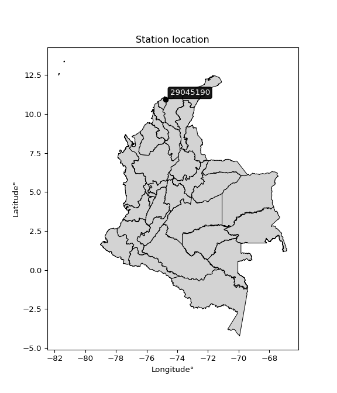

<div align="center">


</div>

# Station (rain, Pmax24h): 29045190

Probable Maximum Precipitation (PMP) is the greatest amount of rainfall for a specific duration that is meteorologically possible for a given location, acting as a "worst-case" scenario for extreme storms, crucial for designing safety-critical infrastructure like bridges, river deviations, dams, spillways, and nuclear plants to prevent catastrophic failure. PMP is calculated by hydrologists using meteorological data to determine the upper limit of extreme rainfall, often leading to the Probable Maximum Flood (PMF) for flood control design, and is increasingly being studied for climate change impacts.

<div align="center">

</img>

</div>


## A. General information


### 1. General running parameters

• app_version: _v20251226_. • runtime: _2025-12-26 15:38:16.554582_. • Python version: _3.14.0_. • SciPy version: _1.16.3_. • Pandas version: _2.3.3_. • NumPy version: _2.3.5_. • Stations dataset (station_dataset_file): _dataset/pmax24h_in/automatic_colombia_2003_2024.csv_. • Stations catalog (station_catalog_file): _dataset/CNE_IDEAM.xls_. • Minimum year to eval til year_max (date_min): _2003_. • Maximum year to eval since year_min (date_max): _2024_. • Creates, save and include plots into reports (create_plot): _False_. • Plot only fit distributions with Δo > Δ (plot_only_fit): _True_. • Eval low extreme values, if False, evaluates high extreme values (low_extreme): _False_. • Eval every SciPy distribution as logarithmic (pdist_logarithmic_on): _True_. • Standard deviation normalized (ddof): _1.0_. • Return periods to eval in years (Tr): _[2, 2.33, 5, 10, 15, 20, 25, 50, 75, 100, 200, 250, 500, 750, 1000]_. • Minimum data sample per station, 0 means any (minimum_sample): _5_. • Z-Score threshold to adjust a value, 0 means disable (zscore): _3.5_. • Avoid zeros, e.g. rain = 0 (avoid_zeros): _True_. • Avoid null values (avoid_nans): _True_. [:file_folder:Dataset file.](../../dataset/pmax24h_in/automatic_colombia_2003_2024.csv)


### 2. Station info and location

|   id |   CODIGO | NOMBRE                                   | CATEGORIA           | TECNOLOGIA                | ESTADO   | FECHA_INSTALACION   |   FECHA_SUSPENSION |   ALTITUD |   LATITUD |   LONGITUD | DEPARTAMENTO   | MUNICIPIO   | AREA_OPERATIVA                              | ENTIDAD                                                     | AREA_HIDROGRAFICA   | ZONA_HIDROGRAFICA   | SUBZONA_HIDROGRAFICA                                     |   CORRIENTE |   OBSERVACION | SUBRED                                                                      | Catalogo   |
|-----:|---------:|:-----------------------------------------|:--------------------|:--------------------------|:---------|:--------------------|-------------------:|----------:|----------:|-----------:|:---------------|:------------|:--------------------------------------------|:------------------------------------------------------------|:--------------------|:--------------------|:---------------------------------------------------------|------------:|--------------:|:----------------------------------------------------------------------------|:-----------|
|    0 | 29045190 | AEROPUERTO E. CORTISSOZ - AUT [29045190] | Sinóptica Principal | Automática con Telemetría | Activa   | 04/05/2005          |                nan |        14 |   10.9178 |   -74.7797 | Atlantico      | Soledad     | Area Operativa 02 - Atlántico-Bolivar-Sucre | INSTITUTO DE HIDROLOGIA METEOROLOGIA Y ESTUDIOS AMBIENTALES | Magdalena Cauca     | Bajo Magdalena      | Directos al Bajo Magdalena entre Calamar y desembocadura |         nan |           nan | SINOPTICA,Radición Global,Colombia,Radiación Ultravioleta,Radiación Visible | CNE_IDEAM  |

<div align="center">

Map location in: [:earth_americas:Google](http://maps.google.com/maps?q=10.91777778,-74.77972222) [:earth_americas:OSM](https://www.openstreetmap.org/#map=18/10.91777778/-74.77972222&layers=P) [:earth_americas:Bing](https://www.bing.com/maps?cp=10.91777778~-74.77972222&lvl=18) [:earth_americas:Apple](https://maps.apple.com/frame?center=10.91777778%2C-74.77972222&span=0.003%2C0.006)

</div>


<div align="center">

```geojson
{
  "type": "Feature",
  "geometry": {
    "type": "Point", 
    "coordinates": [-74.77972222, 10.91777778]
  }, 
  "properties": {
    "Name": "29045190"
  }
}
```

</div>


### 3. Discrete values table and plot

|               |           0 |          1 |          2 |           3 |           4 |          5 |          6 |           7 |
|:--------------|------------:|-----------:|-----------:|------------:|------------:|-----------:|-----------:|------------:|
| Date          | 2017        | 2018       | 2019       | 2020        | 2021        | 2022       | 2023       | 2024        |
| Value         |   82.71     | 1123.06    |   47.48    |  117.94     |   48.63     |   64.67    |  108.14    |  273.16     |
| Value_initial |   82.71     | 1123.06    |   47.48    |  117.94     |   48.63     |   64.67    |  108.14    |  273.16     |
| count         |    8        |    8       |    8       |    8        |    8        |    8       |    8       |    8        |
| mean          |  233.224    |  233.224   |  233.224   |  233.224    |  233.224    |  233.224   |  233.224   |  233.224    |
| std           |  366.836    |  366.836   |  366.836   |  366.836    |  366.836    |  366.836   |  366.836   |  366.836    |
| zscore        |   -0.410303 |    2.42571 |   -0.50634 |   -0.314265 |   -0.503205 |   -0.45948 |   -0.34098 |    0.108867 |
> If Z-Score is active, values out of range or outliers are replaced with the station mean value.


### 4. Active continuous probability distributions from SciPy (45 of 104 available)

[scipy.stats](https://docs.scipy.org/doc/scipy/reference/stats.html) is a Python´s powerful submodule within the SciPy library for comprehensive statistical analysis, offering over 130 probability distributions (like Normal, Poisson), functions for descriptive stats (mean, variance), hypothesis testing (t-tests, chi-square), random variable generation, and statistical tests, making it essential for data science, modeling, and research. It provides tools to explore, model, and draw conclusions from data efficiently, working seamlessly with NumPy.

<div align="center">

|   id | p_dist             |   n_parameter | fit_method   | label                                                                       | active   | ref                                                                                                        |
|-----:|:-------------------|--------------:|:-------------|:----------------------------------------------------------------------------|:---------|:-----------------------------------------------------------------------------------------------------------|
|    0 | alpha              |             3 | MLE          | Alpha                                                                       | True     | [:mortar_board:](https://docs.scipy.org/doc/scipy/reference/generated/scipy.stats.alpha.html)              |
|    1 | betaprime          |             4 | MLE          | Beta prime                                                                  | True     | [:mortar_board:](https://docs.scipy.org/doc/scipy/reference/generated/scipy.stats.betaprime.html)          |
|    2 | chi2               |             3 | MLE          | Chi²                                                                        | True     | [:mortar_board:](https://docs.scipy.org/doc/scipy/reference/generated/scipy.stats.chi2.html)               |
|    3 | crystalball        |             4 | MLE          | Crystalball                                                                 | True     | [:mortar_board:](https://docs.scipy.org/doc/scipy/reference/generated/scipy.stats.crystalball.html)        |
|    4 | erlang             |             3 | MLE          | Erlang                                                                      | True     | [:mortar_board:](https://docs.scipy.org/doc/scipy/reference/generated/scipy.stats.erlang.html)             |
|    5 | expon              |             2 | MLE          | Exponential                                                                 | True     | [:mortar_board:](https://docs.scipy.org/doc/scipy/reference/generated/scipy.stats.expon.html)              |
|    6 | exponnorm          |             3 | MLE          | Exponentially modified Normal                                               | True     | [:mortar_board:](https://docs.scipy.org/doc/scipy/reference/generated/scipy.stats.exponnorm.html)          |
|    7 | f                  |             4 | MLE          | F                                                                           | True     | [:mortar_board:](https://docs.scipy.org/doc/scipy/reference/generated/scipy.stats.f.html)                  |
|    8 | fatiguelife        |             3 | MLE          | Fatigue-life (Birnbaum-Saunders)                                            | True     | [:mortar_board:](https://docs.scipy.org/doc/scipy/reference/generated/scipy.stats.fatiguelife.html)        |
|    9 | fisk               |             3 | MLE          | Fisk                                                                        | True     | [:mortar_board:](https://docs.scipy.org/doc/scipy/reference/generated/scipy.stats.fisk.html)               |
|   10 | gamma              |             3 | MLE          | Gamma                                                                       | True     | [:mortar_board:](https://docs.scipy.org/doc/scipy/reference/generated/scipy.stats.gamma.html)              |
|   11 | genexpon           |             5 | MLE          | Generalized exponential                                                     | True     | [:mortar_board:](https://docs.scipy.org/doc/scipy/reference/generated/scipy.stats.genexpon.html)           |
|   12 | genlogistic        |             3 | MLE          | Generalized logistic                                                        | True     | [:mortar_board:](https://docs.scipy.org/doc/scipy/reference/generated/scipy.stats.genlogistic.html)        |
|   13 | gibrat             |             2 | MM           | Gibrat                                                                      | True     | [:mortar_board:](https://docs.scipy.org/doc/scipy/reference/generated/scipy.stats.gibrat.html)             |
|   14 | gompertz           |             3 | MLE          | Gompertz (or truncated Gumbel)                                              | True     | [:mortar_board:](https://docs.scipy.org/doc/scipy/reference/generated/scipy.stats.gompertz.html)           |
|   15 | gumbel_l           |             2 | MM           | Gumbel Left Skew                                                            | True     | [:mortar_board:](https://docs.scipy.org/doc/scipy/reference/generated/scipy.stats.gumbel_l.html)           |
|   16 | gumbel_r           |             2 | MM           | Gumbel Right Skew                                                           | True     | [:mortar_board:](https://docs.scipy.org/doc/scipy/reference/generated/scipy.stats.gumbel_r.html)           |
|   17 | halflogistic       |             2 | MM           | Half-logistic                                                               | True     | [:mortar_board:](https://docs.scipy.org/doc/scipy/reference/generated/scipy.stats.halflogistic.html)       |
|   18 | halfnorm           |             2 | MM           | Half Normal                                                                 | True     | [:mortar_board:](https://docs.scipy.org/doc/scipy/reference/generated/scipy.stats.halfnorm.html)           |
|   19 | hypsecant          |             2 | MM           | hyperbolic secant                                                           | True     | [:mortar_board:](https://docs.scipy.org/doc/scipy/reference/generated/scipy.stats.hypsecant.html)          |
|   20 | invgamma           |             3 | MLE          | Inverted gamma                                                              | True     | [:mortar_board:](https://docs.scipy.org/doc/scipy/reference/generated/scipy.stats.invgamma.html)           |
|   21 | invgauss           |             3 | MLE          | Inverse Gaussian                                                            | True     | [:mortar_board:](https://docs.scipy.org/doc/scipy/reference/generated/scipy.stats.invgauss.html)           |
|   22 | invweibull         |             3 | MLE          | Inverted Weibull                                                            | True     | [:mortar_board:](https://docs.scipy.org/doc/scipy/reference/generated/scipy.stats.invweibull.html)         |
|   23 | johnsonsu          |             4 | MLE          | Johnson Su                                                                  | True     | [:mortar_board:](https://docs.scipy.org/doc/scipy/reference/generated/scipy.stats.johnsonsu.html)          |
|   24 | kstwobign          |             2 | MLE          | Limiting distribution of scaled Kolmogorov-Smirnov two-sided test statistic | True     | [:mortar_board:](https://docs.scipy.org/doc/scipy/reference/generated/scipy.stats.kstwobign.html)          |
|   25 | laplace            |             2 | MM           | Laplace                                                                     | True     | [:mortar_board:](https://docs.scipy.org/doc/scipy/reference/generated/scipy.stats.laplace.html)            |
|   26 | laplace_asymmetric |             3 | MLE          | Asymmetric Laplace                                                          | True     | [:mortar_board:](https://docs.scipy.org/doc/scipy/reference/generated/scipy.stats.laplace_asymmetric.html) |
|   27 | loggamma           |             3 | MLE          | Log gamma                                                                   | True     | [:mortar_board:](https://docs.scipy.org/doc/scipy/reference/generated/scipy.stats.loggamma.html)           |
|   28 | logistic           |             2 | MM           | Logistic (or Sech-squared)                                                  | True     | [:mortar_board:](https://docs.scipy.org/doc/scipy/reference/generated/scipy.stats.logistic.html)           |
|   29 | lognorm            |             3 | MLE          | Log Normal                                                                  | True     | [:mortar_board:](https://docs.scipy.org/doc/scipy/reference/generated/scipy.stats.lognorm.html)            |
|   30 | maxwell            |             2 | MM           | Maxwell                                                                     | True     | [:mortar_board:](https://docs.scipy.org/doc/scipy/reference/generated/scipy.stats.maxwell.html)            |
|   31 | mielke             |             4 | MLE          | Mielke Beta-Kappa / Dagum                                                   | True     | [:mortar_board:](https://docs.scipy.org/doc/scipy/reference/generated/scipy.stats.mielke.html)             |
|   32 | moyal              |             2 | MM           | Moyal                                                                       | True     | [:mortar_board:](https://docs.scipy.org/doc/scipy/reference/generated/scipy.stats.moyal.html)              |
|   33 | nakagami           |             3 | MLE          | Nakagami                                                                    | True     | [:mortar_board:](https://docs.scipy.org/doc/scipy/reference/generated/scipy.stats.nakagami.html)           |
|   34 | ncf                |             5 | MLE          | Non-central F distribution                                                  | True     | [:mortar_board:](https://docs.scipy.org/doc/scipy/reference/generated/scipy.stats.ncf.html)                |
|   35 | nct                |             4 | MLE          | Non-central Student’s t                                                     | True     | [:mortar_board:](https://docs.scipy.org/doc/scipy/reference/generated/scipy.stats.nct.html)                |
|   36 | norm               |             2 | MM           | Normal                                                                      | True     | [:mortar_board:](https://docs.scipy.org/doc/scipy/reference/generated/scipy.stats.norm.html)               |
|   37 | pareto             |             3 | MLE          | Pareto                                                                      | True     | [:mortar_board:](https://docs.scipy.org/doc/scipy/reference/generated/scipy.stats.pareto.html)             |
|   38 | pearson3           |             3 | MM           | Pearson type III                                                            | True     | [:mortar_board:](https://docs.scipy.org/doc/scipy/reference/generated/scipy.stats.pearson3.html)           |
|   39 | rayleigh           |             2 | MM           | Rayleigh                                                                    | True     | [:mortar_board:](https://docs.scipy.org/doc/scipy/reference/generated/scipy.stats.rayleigh.html)           |
|   40 | rice               |             3 | MLE          | Rice                                                                        | True     | [:mortar_board:](https://docs.scipy.org/doc/scipy/reference/generated/scipy.stats.rice.html)               |
|   41 | t                  |             3 | MLE          | Student’s t                                                                 | True     | [:mortar_board:](https://docs.scipy.org/doc/scipy/reference/generated/scipy.stats.t.html)                  |
|   42 | truncnorm          |             4 | MLE          | Truncated normal                                                            | True     | [:mortar_board:](https://docs.scipy.org/doc/scipy/reference/generated/scipy.stats.truncnorm.html)          |
|   43 | wald               |             2 | MM           | Wald                                                                        | True     | [:mortar_board:](https://docs.scipy.org/doc/scipy/reference/generated/scipy.stats.wald.html)               |
|   44 | weibull_min        |             3 | MLE          | Weibull minimum                                                             | True     | [:mortar_board:](https://docs.scipy.org/doc/scipy/reference/generated/scipy.stats.weibull_min.html)        |

</div>

> **n_parameter:** # arguments & localization & scale.
>
> **Fit methods:** (MLE) maximum likelihood, (MM) L-moments.
>
>**Inactive:** foldnorm, gennorm, norminvgauss, powernorm, powerlognorm, skewnorm, genextreme, anglit, arcsine, argus, beta, bradford, burr, burr12, cauchy, cosine, halfcauchy, foldcauchy, skewcauchy, wrapcauchy, dgamma, gengamma, exponweib, exponpow, truncexpon, gausshyper, genhalflogistic, genhyperbolic, geninvgauss, halfgennorm, johnsonsb, kappa4, kappa3, ksone, kstwo, loglaplace, levy, levy_l, levy_stable, ncx2, genpareto, truncpareto, lomax, powerlaw, rdist, rel_breitwigner, recipinvgauss, semicircular, studentized_range, trapezoid, triang, truncweibull_min, tukeylambda, uniform, loguniform, vonmises, vonmises_line, weibull_max, dweibull, 


## B. Probability distributions vs. Empirical distributions

A continuous probability distribution (CPD) describes probabilities for variables that can take any value within a range (like rain any time), unlike discrete variables with specific outcomes (like temperature). It uses a Probability Density Function (PDF), a curve where the total area under it equals 1, and the probability of the variable falling within an interval (a to b) is found by calculating the area under the curve between those points. A key feature is that the probability of hitting any single exact value is zero, so probabilities are always expressed for ranges, e.g., $P(a ≤ X ≤ b)$.

<div align="center">

Distributions parameters
|    |   station | p_dist                |   n |              loc |           scale | shape                  | shape1                 | shape2               | shape3   |
|---:|----------:|:----------------------|----:|-----------------:|----------------:|:-----------------------|:-----------------------|:---------------------|:---------|
|  0 |  29045190 | alpha                 |   8 |      27.4951     |    36.2568      | 3.4071015086962983e-07 |                        |                      |          |
|  1 |  29045190 | betaprime             |   8 |      -0.237557   |     1.18733     | 126.22667064236185     | 1.6953907896179272     |                      |          |
|  2 |  29045190 | chi2                  |   8 |      47.48       |   232.055       | 0.6890070170009329     |                        |                      |          |
|  3 |  29045190 | crystalball           |   8 |      -0.23127    |   414.971       | 4.614923273933046      | 2.2147062140596514     |                      |          |
|  4 |  29045190 | erlang                |   8 |      47.48       |   405.444       | 0.28640132743806845    |                        |                      |          |
|  5 |  29045190 | expon                 |   8 |      47.48       |   185.744       |                        |                        |                      |          |
|  6 |  29045190 | exponnorm             |   8 |      47.2355     |     0.0849374   | 2172.7522812740553     |                        |                      |          |
|  7 |  29045190 | f                     |   8 |      46.0372     |     6.70323     | 1512.2562871992743     | 0.7855417964713807     |                      |          |
|  8 |  29045190 | fatiguelife           |   8 |      47.48       |     0.000494962 | 636.341134099029       |                        |                      |          |
|  9 |  29045190 | fisk                  |   8 |      47.48       |    53.4167      | 0.5963248562798344     |                        |                      |          |
| 10 |  29045190 | gamma                 |   8 |      47.48       |   715.872       | 0.14140803059462265    |                        |                      |          |
| 11 |  29045190 | genexpon              |   8 |      47.48       |   448.623       | 2.415278212815764      | 3.219880651417858e-13  | 2.033225409524385    |          |
| 12 |  29045190 | genlogistic           |   8 |   -1061.87       |   150.998       | 2382.5732545880182     |                        |                      |          |
| 13 |  29045190 | gibrat                |   8 |     -28.5516     |   158.775       |                        |                        |                      |          |
| 14 |  29045190 | gompertz              |   8 |      47.48       |     1.64671e+11 | 824082647.8267922      |                        |                      |          |
| 15 |  29045190 | gumbel_l              |   8 |     387.657      |   267.548       |                        |                        |                      |          |
| 16 |  29045190 | gumbel_r              |   8 |      78.7909     |   267.548       |                        |                        |                      |          |
| 17 |  29045190 | halflogistic          |   8 |    -173.481      |   293.376       |                        |                        |                      |          |
| 18 |  29045190 | halfnorm              |   8 |    -220.964      |   569.24        |                        |                        |                      |          |
| 19 |  29045190 | hypsecant             |   8 |     233.224      |   218.452       |                        |                        |                      |          |
| 20 |  29045190 | invgamma              |   8 |      46.0354     |     2.63176     | 0.39277026272170357    |                        |                      |          |
| 21 |  29045190 | invgauss              |   8 |      43.7875     |    14.7334      | 12.857636456615726     |                        |                      |          |
| 22 |  29045190 | invweibull            |   8 |      47.48       |     1.18452     | 0.06973692260229543    |                        |                      |          |
| 23 |  29045190 | johnsonsu             |   8 |      47.48       |     1.19745e-08 | -3.650502809872963     | 0.18306150799938936    |                      |          |
| 24 |  29045190 | kstwobign             |   8 |    -553.047      |   932.337       |                        |                        |                      |          |
| 25 |  29045190 | laplace               |   8 |     233.224      |   242.639       |                        |                        |                      |          |
| 26 |  29045190 | laplace_asymmetric    |   8 |      47.48       |     0.013172    | 7.092481389502536e-05  |                        |                      |          |
| 27 |  29045190 | loggamma              |   8 |  -81227.7        | 11626.7         | 1103.8324036562335     |                        |                      |          |
| 28 |  29045190 | logistic              |   8 |     233.224      |   189.185       |                        |                        |                      |          |
| 29 |  29045190 | lognorm               |   8 |      47.48       |     0.517377    | 12.205009669244784     |                        |                      |          |
| 30 |  29045190 | maxwell               |   8 |    -579.882      |   509.539       |                        |                        |                      |          |
| 31 |  29045190 | mielke                |   8 |      -0.402925   |     3.11049     | 232.94976821734355     | 1.543427132769181      |                      |          |
| 32 |  29045190 | moyal                 |   8 |      36.9922     |   154.469       |                        |                        |                      |          |
| 33 |  29045190 | nakagami              |   8 |      47.48       |   611.554       | 0.0968434207977436     |                        |                      |          |
| 34 |  29045190 | ncf                   |   8 |      -0.0886242  |     7.02788e-08 | 1.2314416546147118e-08 | 3.6225390761302565     | 17.1967707164831     |          |
| 35 |  29045190 | nct                   |   8 |       0.0515053  |     2.49983     | 1.2590006308898571     | 29.75286631727755      |                      |          |
| 36 |  29045190 | norm                  |   8 |     233.224      |   343.144       |                        |                        |                      |          |
| 37 |  29045190 | pareto                |   8 |      33.9764     |    13.5036      | 0.6162673941854703     |                        |                      |          |
| 38 |  29045190 | pearson3              |   8 |     233.224      |   343.144       | 2.104532630402158      |                        |                      |          |
| 39 |  29045190 | rayleigh              |   8 |    -423.23       |   523.774       |                        |                        |                      |          |
| 40 |  29045190 | rice                  |   8 |    -230.728      |   408.043       | 0.00022231679278753946 |                        |                      |          |
| 41 |  29045190 | t                     |   8 |      75.6212     |    30.6187      | 0.7686883179710053     |                        |                      |          |
| 42 |  29045190 | truncnorm             |   8 | -774595          | 16315.3         | 47.47947681581674      | 47.545402122866356     |                      |          |
| 43 |  29045190 | wald                  |   8 |    -109.92       |   343.144       |                        |                        |                      |          |
| 44 |  29045190 | weibull_min           |   8 |      47.48       |   381.398       | 0.4156653316207217     |                        |                      |          |
| 45 |  29045190 | logalpha              |   8 |       2.99224    |     3.1439      | 2.1654671840870447     |                        |                      |          |
| 46 |  29045190 | logbetaprime          |   8 |      -0.00482393 |     0.326323    | 460.90798801780056     | 32.464768628728564     |                      |          |
| 47 |  29045190 | logchi2               |   8 |       3.86031    |     0.947856    | 1.0649001161260985     |                        |                      |          |
| 48 |  29045190 | logcrystalball        |   8 |       4.80208    |     0.992683    | 7.4562956074860685     | 816.1121975002026      |                      |          |
| 49 |  29045190 | logerlang             |   8 |       3.86031    |     0.929688    | 0.5867754792129833     |                        |                      |          |
| 50 |  29045190 | logexpon              |   8 |       3.86031    |     0.941774    |                        |                        |                      |          |
| 51 |  29045190 | logexponnorm          |   8 |       3.85921    |     0.000337099 | 2773.2916600735352     |                        |                      |          |
| 52 |  29045190 | logf                  |   8 |       3.54862    |     0.703786    | 393.84930157656345     | 3.8572134984240414     |                      |          |
| 53 |  29045190 | logfatiguelife        |   8 |       3.86031    |     4.31329e-07 | 1450.0504423996563     |                        |                      |          |
| 54 |  29045190 | logfisk               |   8 |       3.86031    |     0.540233    | 0.6534685096576596     |                        |                      |          |
| 55 |  29045190 | loggamma              |   8 |       3.86031    |     0.836298    | 0.6664410995550675     |                        |                      |          |
| 56 |  29045190 | loggenexpon           |   8 |       3.86031    |     1.63513     | 1.7361013452761898     | 1.6163050619889025e-07 | 1.9570763388888053   |          |
| 57 |  29045190 | loggenlogistic        |   8 |      -0.297625   |     0.651813    | 1303.3707150669798     |                        |                      |          |
| 58 |  29045190 | loggibrat             |   8 |       4.04483    |     0.459305    |                        |                        |                      |          |
| 59 |  29045190 | loggompertz           |   8 |       3.86031    |     1.94357     | 0.9897629555517895     |                        |                      |          |
| 60 |  29045190 | loggumbel_l           |   8 |       5.24884    |     0.773992    |                        |                        |                      |          |
| 61 |  29045190 | loggumbel_r           |   8 |       4.35532    |     0.773992    |                        |                        |                      |          |
| 62 |  29045190 | loghalflogistic       |   8 |       3.62552    |     0.848709    |                        |                        |                      |          |
| 63 |  29045190 | loghalfnorm           |   8 |       3.48816    |     1.64676     |                        |                        |                      |          |
| 64 |  29045190 | loghypsecant          |   8 |       4.80208    |     0.631962    |                        |                        |                      |          |
| 65 |  29045190 | loginvgamma           |   8 |       3.54537    |     1.35928     | 1.927694379313719      |                        |                      |          |
| 66 |  29045190 | loginvgauss           |   8 |       3.72597    |     0.621586    | 1.7312473282855856     |                        |                      |          |
| 67 |  29045190 | loginvweibull         |   8 |       3.45967    |     0.739757    | 1.6277952016793789     |                        |                      |          |
| 68 |  29045190 | logjohnsonsu          |   8 |       3.86031    |     8.29372e-13 | -2.3721011087265724    | 0.10092662833006673    |                      |          |
| 69 |  29045190 | logkstwobign          |   8 |       2.00305    |     3.23975     |                        |                        |                      |          |
| 70 |  29045190 | loglaplace            |   8 |       4.80208    |     0.701933    |                        |                        |                      |          |
| 71 |  29045190 | loglaplace_asymmetric |   8 |       3.86031    |     0.00385208  | 0.004081794115384594   |                        |                      |          |
| 72 |  29045190 | logloggamma           |   8 |    -206.413      |    30.8855      | 933.851728134483       |                        |                      |          |
| 73 |  29045190 | loglogistic           |   8 |       4.80208    |     0.547295    |                        |                        |                      |          |
| 74 |  29045190 | loglognorm            |   8 |       3.86031    |     0.00724081  | 11.579718153649546     |                        |                      |          |
| 75 |  29045190 | logmaxwell            |   8 |       2.44984    |     1.47405     |                        |                        |                      |          |
| 76 |  29045190 | logmielke             |   8 |       3.42447    |     0.0969167   | 61.89953475867733      | 1.713280519685366      |                      |          |
| 77 |  29045190 | logmoyal              |   8 |       4.2344     |     0.446865    |                        |                        |                      |          |
| 78 |  29045190 | lognakagami           |   8 |       3.86031    |     2.27117     | 0.11576624299005892    |                        |                      |          |
| 79 |  29045190 | logncf                |   8 |       2.92955    |     1.57091     | 256.31174722341063     | 9.429363186297849      | 0.006267209215034333 |          |
| 80 |  29045190 | lognct                |   8 |      -0.225261   |     0.14339     | 17.652128378244555     | 33.51855854304509      |                      |          |
| 81 |  29045190 | lognorm               |   8 |       4.80208    |     0.992683    |                        |                        |                      |          |
| 82 |  29045190 | logpareto             |   8 |      -2.47677    |     6.33708     | 7.689558467865811      |                        |                      |          |
| 83 |  29045190 | logpearson3           |   8 |       4.80208    |     0.992687    | 1.2231521472656544     |                        |                      |          |
| 84 |  29045190 | lograyleigh           |   8 |       2.90302    |     1.51523     |                        |                        |                      |          |
| 85 |  29045190 | logrice               |   8 |       3.26709    |     1.2926      | 0.0003787369828935443  |                        |                      |          |
| 86 |  29045190 | logt                  |   8 |       4.80201    |     0.992616    | 18221.63309900077      |                        |                      |          |
| 87 |  29045190 | logtruncnorm          |   8 |     -13.0339     |     4.21164     | 4.011326776046744      | 7.450022649936816      |                      |          |
| 88 |  29045190 | logwald               |   8 |       3.8094     |     0.992683    |                        |                        |                      |          |
| 89 |  29045190 | logweibull_min        |   8 |       3.86031    |     1.24858     | 0.6457955767748338     |                        |                      |          |

</div>

> **loc** (Location parameter): This shifts the distribution along the x-axis. For many common distributions, like the normal (Gaussian) distribution, loc represents the mean $μ$. For others, like the uniform distribution, it might represent the minimum value, or for the beta distribution, the left end of the support interval.
>
> **scale** (Scale parameter): This determines the width or spread of the distribution. For the normal distribution, scale represents the standard deviation $σ$. For a uniform distribution, it defines the length of the interval (from $loc$ to $loc + scale$).
>
> **shape** (Shape parameters): Refers to parameters that define the specific form of a probability distribution, distinct from its location (loc) and scale (scale). These parameters are required arguments for most distribution functions. For example, a normal (Gaussian) distribution is fully defined by its location (mean) and scale (standard deviation), so it has no specific shape parameters beyond loc and scale. However, other distributions have intrinsic properties that need specification, as Gamma distribution that takes a shape parameter, often named $a$ or $alpha$.


### 0. Cumulative distribution values - CDF (90 evaluated)

> Ordered by x ascending and calculating $log(f(x))$ separately. 

|   id |   Station |   date |       x |   count |    mean |     std |    zscore |   Value_initial |   station |   m |     alpha |   alpha_pdf |   betaprime |   betaprime_pdf |        chi2 |    chi2_pdf |   crystalball |   crystalball_pdf |      erlang |   erlang_pdf |     expon |   expon_pdf |   exponnorm |   exponnorm_pdf |         f |       f_pdf |   fatiguelife |   fatiguelife_pdf |        fisk |        fisk_pdf |      gamma |   gamma_pdf |    genexpon |   genexpon_pdf |   genlogistic |   genlogistic_pdf |   gibrat |   gibrat_pdf |    gompertz |   gompertz_pdf |   gumbel_l |   gumbel_l_pdf |   gumbel_r |   gumbel_r_pdf |   halflogistic |   halflogistic_pdf |   halfnorm |   halfnorm_pdf |   hypsecant |   hypsecant_pdf |   invgamma |   invgamma_pdf |   invgauss |   invgauss_pdf |   invweibull |   invweibull_pdf |   johnsonsu |   johnsonsu_pdf |   kstwobign |   kstwobign_pdf |   laplace |   laplace_pdf |   laplace_asymmetric |   laplace_asymmetric_pdf |    loggamma |   loggamma_pdf |   logistic |   logistic_pdf |   lognorm |   lognorm_pdf |   maxwell |   maxwell_pdf |     mielke |   mielke_pdf |    moyal |   moyal_pdf |    nakagami |   nakagami_pdf |      ncf |     ncf_pdf |      nct |     nct_pdf |     norm |    norm_pdf |      pareto |   pareto_pdf |   pearson3 |   pearson3_pdf |   rayleigh |   rayleigh_pdf |     rice |    rice_pdf |        t |       t_pdf |   truncnorm |   truncnorm_pdf |     wald |    wald_pdf |   weibull_min |   weibull_min_pdf |   logalpha |   logalpha_pdf |   logbetaprime |   logbetaprime_pdf |     logchi2 |   logchi2_pdf |   logcrystalball |   logcrystalball_pdf |   logerlang |   logerlang_pdf |   logexpon |   logexpon_pdf |   logexponnorm |   logexponnorm_pdf |      logf |   logf_pdf |   logfatiguelife |   logfatiguelife_pdf |     logfisk |    logfisk_pdf |   loggenexpon |   loggenexpon_pdf |   loggenlogistic |   loggenlogistic_pdf |   loggibrat |   loggibrat_pdf |   loggompertz |   loggompertz_pdf |   loggumbel_l |   loggumbel_l_pdf |   loggumbel_r |   loggumbel_r_pdf |   loghalflogistic |   loghalflogistic_pdf |   loghalfnorm |   loghalfnorm_pdf |   loghypsecant |   loghypsecant_pdf |   loginvgamma |   loginvgamma_pdf |   loginvgauss |   loginvgauss_pdf |   loginvweibull |   loginvweibull_pdf |   logjohnsonsu |   logjohnsonsu_pdf |   logkstwobign |   logkstwobign_pdf |   loglaplace |   loglaplace_pdf |   loglaplace_asymmetric |   loglaplace_asymmetric_pdf |   logloggamma |   logloggamma_pdf |   loglogistic |   loglogistic_pdf |   loglognorm |   loglognorm_pdf |   logmaxwell |   logmaxwell_pdf |   logmielke |   logmielke_pdf |   logmoyal |   logmoyal_pdf |   lognakagami |   lognakagami_pdf |    logncf |   logncf_pdf |   lognct |   lognct_pdf |   logpareto |   logpareto_pdf |   logpearson3 |   logpearson3_pdf |   lograyleigh |   lograyleigh_pdf |   logrice |   logrice_pdf |     logt |   logt_pdf |   logtruncnorm |   logtruncnorm_pdf |     logwald |   logwald_pdf |   logweibull_min |   logweibull_min_pdf |
|-----:|----------:|-------:|--------:|--------:|--------:|--------:|----------:|----------------:|----------:|----:|----------:|------------:|------------:|----------------:|------------:|------------:|--------------:|------------------:|------------:|-------------:|----------:|------------:|------------:|----------------:|----------:|------------:|--------------:|------------------:|------------:|----------------:|-----------:|------------:|------------:|---------------:|--------------:|------------------:|---------:|-------------:|------------:|---------------:|-----------:|---------------:|-----------:|---------------:|---------------:|-------------------:|-----------:|---------------:|------------:|----------------:|-----------:|---------------:|-----------:|---------------:|-------------:|-----------------:|------------:|----------------:|------------:|----------------:|----------:|--------------:|---------------------:|-------------------------:|------------:|---------------:|-----------:|---------------:|----------:|--------------:|----------:|--------------:|-----------:|-------------:|---------:|------------:|------------:|---------------:|---------:|------------:|---------:|------------:|---------:|------------:|------------:|-------------:|-----------:|---------------:|-----------:|---------------:|---------:|------------:|---------:|------------:|------------:|----------------:|---------:|------------:|--------------:|------------------:|-----------:|---------------:|---------------:|-------------------:|------------:|--------------:|-----------------:|---------------------:|------------:|----------------:|-----------:|---------------:|---------------:|-------------------:|----------:|-----------:|-----------------:|---------------------:|------------:|---------------:|--------------:|------------------:|-----------------:|---------------------:|------------:|----------------:|--------------:|------------------:|--------------:|------------------:|--------------:|------------------:|------------------:|----------------------:|--------------:|------------------:|---------------:|-------------------:|--------------:|------------------:|--------------:|------------------:|----------------:|--------------------:|---------------:|-------------------:|---------------:|-------------------:|-------------:|-----------------:|------------------------:|----------------------------:|--------------:|------------------:|--------------:|------------------:|-------------:|-----------------:|-------------:|-----------------:|------------:|----------------:|-----------:|---------------:|--------------:|------------------:|----------:|-------------:|---------:|-------------:|------------:|----------------:|--------------:|------------------:|--------------:|------------------:|----------:|--------------:|---------:|-----------:|---------------:|-------------------:|------------:|--------------:|-----------------:|---------------------:|
|    0 |  29045190 |   2019 |   47.48 |       8 | 233.224 | 366.836 | -0.50634  |           47.48 |  29045190 |   1 | 0.0696455 | 0.0139706   |    0.130477 |     0.00695992  | 1.80689e-06 | 8.76063e+07 |      0.545768 |       0.000955038 | 3.31278e-05 |  1.48366e+08 | 0         | 0.00538376  |  0.00132431 |     0.00540066  | 0.0399002 | 0.0626975   |     0.0255804 |       1.80745e+08 | 3.40953e-10 | 28614.6         | 0.00421076 | 8.38e+10    | 8.53062e-15 |    0.00538376  |      0.215365 |       0.00218923  | 0.230762 |  0.00400111  | 6.27068e-10 |    0.00500441  |   0.244535 |    0.000791816 |   0.324928 |    0.00136524  |       0.359737 |         0.00148375 |   0.362776 |    0.00125416  |    0.257077 |     0.00105299  |  0.0399005 |    0.0626978   |  0.0494426 |    0.0317024   |  0.000972787 |      4.56657e+08 | 0.000323436 |  9142.53        |    0.198925 |     0.0016388   |  0.232547 |   0.000958408 |          5.34107e-09 |              0.0053845   | 7.32213e-11 | 109883         |   0.272533 |    0.00104796  |  0.171383 |     0.256244  |  0.321404 |   0.0011124   |   0.110472 |   0.00778765 | 0.333733 | 0.0015647   | 0.000439366 |    1.19767e+10 | 0.179562 | 0.00608396  | 0.109306 | 0.00827973  | 0.29415  | 0.00100417  | 1.11022e-16 |  0.0456371   |   0.370273 |    0.00192988  |   0.332236 |    0.00114575  | 0.207397 | 0.00132438  | 0.280451 | 0.00510586  | 3.24266e-06 |     0.00304399  | 0.327558 | 0.00271915  |   1.11175e-07 |       6.5037e+06  |  0.0737831 |      0.585356  |       0.140999 |          0.335467  | 5.36258e-09 |   6.42958e+06 |         0.171383 |            0.256244  | 1.14731e-09 |     1.51594e+06 |  0         |      1.06183   |     0.00117195 |          1.0678    | 0.0646806 |  0.73111   |         0.033658 |          1.11692e+12 | 1.38789e-10 | 204225         |   8.85116e-10 |         1.06175   |         0.109739 |            0.371701  |   0         |       0         |   6.04081e-08 |         0.509251  |      0.153204 |       0.181938    |      0.150221 |         0.367919  |          0.137444 |             0.578001  |      0.17879  |         0.472302  |       0.141086 |          0.216013  |     0.0646812 |         0.731365  |     0.0545493 |         1.08597   |       0.0663033 |           0.730987  |     0.00696411 |        1.69198e+09 |       0.102425 |           0.358901 |     0.130702 |        0.186203  |              1.6666e-05 |                    1.05961  |      0.174517 |         0.251972  |      0.151771 |         0.235223  |   0.00430426 |      2.45996e+12 |     0.178337 |        0.313554  |   0.0706779 |       0.709805  |   0.128562 |      0.427521  |   0.000190102 |       9.91122e+10 | 0.0884005 |    0.430143  | 0.134048 |    0.341886  | 1.66533e-15 |       1.21342   |      0.152998 |         0.429958  |      0.180918 |         0.341517  | 0.0999554 |     0.31956   | 0.171391 |  0.256256  |    1.08843e-08 |          1.00588   | 2.67247e-05 |    0.00534719 |      1.05472e-10 |       153378         |
|    1 |  29045190 |   2021 |   48.63 |       8 | 233.224 | 366.836 | -0.503205 |           48.63 |  29045190 |   2 | 0.0862547 | 0.014869    |    0.138518 |     0.00702227  | 0.141822    | 0.0424072   |      0.546866 |       0.000954731 | 0.207076    |  0.0514576   | 0.0061722 | 0.00535053  |  0.00752788 |     0.00537785  | 0.11453   | 0.0621903   |     0.530177  |       0.0131068   | 0.0920456   |     0.0433363   | 0.430086   | 0.0528105   | 0.0061722   |    0.00535053  |      0.217887 |       0.00219808  | 0.235354 |  0.00398485  | 0.00573855  |    0.00497569  |   0.245447 |    0.000794267 |   0.326498 |    0.00136596  |       0.361442 |         0.00148165 |   0.364217 |    0.00125296  |    0.25829  |     0.00105682  |  0.11453   |    0.0621904   |  0.0876087 |    0.0338944   |  0.367121    |      0.0223085   | 0.436875    |     0.0627085   |    0.200813 |     0.00164361  |  0.233652 |   0.000962961 |          0.00617305  |              0.00535126  | 0.102548    |      2.80694   |   0.27374  |    0.00105086  |  0.177585 |     0.262096  |  0.322684 |   0.00111339  |   0.119516 |   0.00793575 | 0.335532 | 0.0015643   | 0.248281    |    0.0418163   | 0.186561 | 0.00608783  | 0.118918 | 0.00843097  | 0.295306 | 0.00100599  | 0.0491198   |  0.0399898   |   0.372488 |    0.00192223  |   0.333554 |    0.00114628  | 0.208921 | 0.0013273   | 0.286435 | 0.00530292  | 0.00349798  |     0.00303382  | 0.330678 | 0.00270643  |   0.0856905   |       0.029606    |  0.0884039 |      0.635625  |       0.149149 |          0.345634  | 0.109349    |   2.41287     |         0.177585 |            0.262096  | 0.12968     |     3.12828     |  0.0250915 |      1.03518   |     0.0264166  |          1.04141   | 0.0830367 |  0.800258  |         0.564521 |          1.33623     | 0.115401    |      2.78741   |   0.0250898   |         1.03511   |         0.118831 |            0.388009  |   0         |       0         |   0.0121879   |         0.509277  |      0.157614 |       0.186674    |      0.159147 |         0.377911  |          0.15125  |             0.575653  |      0.190074 |         0.470704  |       0.146345 |          0.2235    |     0.0830438 |         0.800545  |     0.0820172 |         1.19717   |       0.0846715 |           0.801492  |     0.551215   |        1.66854     |       0.111189 |           0.373436 |     0.135235 |        0.192661  |              0.0250566  |                    1.03308  |      0.180614 |         0.257558  |      0.157486 |         0.242437  |   0.541114   |      1.43192     |     0.185909 |        0.319244  |   0.0884477 |       0.773123  |   0.138969 |      0.442061  |   0.28726     |       2.77909     | 0.0989605 |    0.4521    | 0.142361 |    0.3528    | 0.028569    |       1.17432   |      0.163385 |         0.437922  |      0.189151 |         0.346536  | 0.107724  |     0.329582  | 0.177593 |  0.262109  |    0.0238004   |          0.983197  | 0.000711333 |    0.0669617  |      0.0748352   |            1.94187   |
|    2 |  29045190 |   2022 |   64.67 |       8 | 233.224 | 366.836 | -0.45948  |           64.67 |  29045190 |   3 | 0.32941   | 0.01301     |    0.252353 |     0.00693141  | 0.356918    | 0.00695822  |      0.562142 |       0.000949685 | 0.445384    |  0.00717944  | 0.0883935 | 0.00490787  |  0.0901463  |     0.00493017  | 0.497744  | 0.00955749  |     0.615183  |       0.00325578  | 0.33713     |     0.00775234  | 0.628711   | 0.00506415  | 0.0883935   |    0.00490787  |      0.254042 |       0.00230469  | 0.297187 |  0.0037138   | 0.0824295   |    0.0045919   |   0.258463 |    0.000828794 |   0.348472 |    0.00137306  |       0.38497  |         0.00145172 |   0.384179 |    0.00123586  |    0.275669 |     0.00110999  |  0.497745  |    0.00955747  |  0.432485  |    0.0121366   |  0.436127    |      0.0014682   | 0.631642    |     0.00401501  |    0.227672 |     0.00170313  |  0.24962  |   0.00102877  |          0.0884051   |              0.00490848  | 0.495142    |      0.850414  |   0.290914 |    0.00109038  |  0.261916 |     0.327992  |  0.340645 |   0.00112579  |   0.25261  | nan          | 0.360556 | 0.00155466  | 0.419219    |    0.00472318  | 0.282346 | 0.00575818  | 0.258021 | 0.00840017  | 0.311641 | 0.00103048  | 0.397106    |  0.0121049   |   0.402488 |    0.00181968  |   0.351993 |    0.00115245  | 0.230522 | 0.00136518  | 0.397121 | 0.0085842   | 0.0510421   |     0.00289546  | 0.372654 | 0.00252722  |   0.240976    |       0.00506052  |  0.311326  |      0.808971  |       0.262741 |          0.442938  | 0.405663    |   0.627766    |         0.261916 |            0.327992  | 0.521948    |     0.799958    |  0.279704  |      0.76483   |     0.282288   |          0.76771   | 0.339601  |  0.837749  |         0.720286 |          0.31779     | 0.409728    |      0.511481  |   0.279687    |         0.764793  |         0.252612 |            0.532953  |   0.0958359 |       1.36669   |   0.1568      |         0.503393  |      0.219553 |       0.249956    |      0.280358 |         0.460635  |          0.309827 |             0.532578  |      0.32085  |         0.444794  |       0.224148 |          0.326092  |     0.339667  |         0.837811  |     0.393199  |         0.836174  |       0.343003  |           0.841889  |     0.650589   |        0.120911    |       0.237406 |           0.495235 |     0.202982 |        0.289176  |              0.279227   |                    0.763754 |      0.263237 |         0.320705  |      0.239358 |         0.332664  |   0.627088   |      0.105792    |     0.285225 |        0.373007  |   0.339141  |       0.831056  |   0.282122 |      0.538476  |   0.519282    |       0.388364    | 0.252612  |    0.587698  | 0.258814 |    0.454311  | 0.306553    |       0.802324  |      0.296697 |         0.483275  |      0.294745 |         0.38897   | 0.21619   |     0.423243  | 0.261929 |  0.328013  |    0.269023    |          0.747426  | 0.232217    |    1.05116    |      0.333575    |            0.565256  |
|    3 |  29045190 |   2017 |   82.71 |       8 | 233.224 | 366.836 | -0.410303 |           82.71 |  29045190 |   4 | 0.511407  | 0.00764867  |    0.368677 |     0.00590497  | 0.452564    | 0.00418158  |      0.579211 |       0.000942359 | 0.541725    |  0.00411513  | 0.172768  | 0.00445362  |  0.174878   |     0.00447104  | 0.607651  | 0.00399003  |     0.662484  |       0.00217413  | 0.438265    |     0.00416714  | 0.693719   | 0.00266682  | 0.172768    |    0.00445362  |      0.296416 |       0.00238644  | 0.361069 |  0.00336594  | 0.161638    |    0.00419551  |   0.27377  |    0.000868303 |   0.373268 |    0.00137486  |       0.410844 |         0.00141663 |   0.406294 |    0.00121576  |    0.296224 |     0.00116859  |  0.607651  |    0.00399003  |  0.58019   |    0.00559591  |  0.454155    |      0.000709587 | 0.679952    |     0.00185833  |    0.258877 |     0.00175356  |  0.268886 |   0.00110817  |          0.172789    |              0.00445412  | 0.659021    |      0.521206  |   0.31097  |    0.00113258  |  0.348419 |     0.372512  |  0.361059 |   0.00113687  | nan        | nan          | 0.388443 | 0.00153562  | 0.481716    |    0.0026476   | 0.379621 | 0.00499887  | 0.394446 | 0.0066636   | 0.330464 | 0.00105598  | 0.546574    |  0.00573385  |   0.434339 |    0.00171291  |   0.372825 |    0.00115664  | 0.255488 | 0.00140156  | 0.568347 | 0.00926685  | 0.101929    |     0.00274737  | 0.416444 | 0.00232884  |   0.31033     |       0.0030233   |  0.490001  |      0.628249  |       0.377179 |          0.479215  | 0.531067    |   0.419274    |         0.348419 |            0.372512  | 0.674552    |     0.481966    |  0.445311  |      0.588983  |     0.448365   |          0.590063  | 0.514203  |  0.586284  |         0.78298  |          0.207034    | 0.504415    |      0.294315  |   0.445288    |         0.588966  |         0.389278 |            0.563253  |   0.414952  |       1.05217   |   0.279019    |         0.488517  |      0.288695 |       0.313064    |      0.396378 |         0.473911  |          0.434399 |             0.47796   |      0.426588 |         0.413497  |       0.316335 |          0.42214   |     0.514266  |         0.586221  |     0.555773  |         0.518432  |       0.517314  |           0.580762  |     0.67221    |        0.0656748   |       0.363719 |           0.520253 |     0.288196 |        0.410575  |              0.444644   |                    0.588473 |      0.347769 |         0.364013  |      0.330341 |         0.404199  |   0.64607    |      0.0578631   |     0.380257 |        0.395613  |   0.51328   |       0.586469  |   0.414086 |      0.522353  |   0.594409    |       0.246427    | 0.395503  |    0.558519  | 0.375756 |    0.487346  | 0.475658    |       0.585011  |      0.414416 |         0.467159  |      0.392304 |         0.400288  | 0.326025  |     0.463183  | 0.348438 |  0.372537  |    0.432539    |          0.58775   | 0.454137    |    0.744174   |      0.447002    |            0.381168  |
|    4 |  29045190 |   2023 |  108.14 |       8 | 233.224 | 366.836 | -0.34098  |          108.14 |  29045190 |   5 | 0.653009  | 0.00402054  |    0.498982 |     0.00438991  | 0.538367    | 0.00277238  |      0.603014 |       0.000929141 | 0.624512    |  0.00262266  | 0.278613  | 0.00388378  |  0.281091   |     0.00389551  | 0.678367  | 0.00197301  |     0.708888  |       0.00155502  | 0.518948    |     0.00245412  | 0.745924   | 0.00161416  | 0.278613    |    0.00388378  |      0.35788  |       0.00243489  | 0.440477 |  0.00288601  | 0.26182     |    0.00369416  |   0.296569 |    0.000924906 |   0.408156 |    0.00136705  |       0.446217 |         0.00136496 |   0.436835 |    0.00118594  |    0.326952 |     0.00124704  |  0.678367  |    0.00197301  |  0.68066   |    0.00282188  |  0.467682    |      0.000408607 | 0.714655    |     0.00102514  |    0.304083 |     0.00179643  |  0.298597 |   0.00123062  |          0.278645    |              0.00388414  | 0.770951    |      0.331669  |   0.340476 |    0.00118695  |  0.452428 |     0.399022  |  0.390116 |   0.00114735  | nan        | nan          | 0.427023 | 0.00149642  | 0.53515     |    0.00170724  | 0.49247  | 0.00390102  | 0.534601 | 0.00449421  | 0.357734 | 0.00108788  | 0.649956    |  0.00290871  |   0.476123 |    0.00157565  |   0.402265 |    0.00115776  | 0.291667 | 0.00144164  | 0.740372 | 0.00442535  | 0.169272    |     0.00255138  | 0.472286 | 0.00206719  |   0.372301    |       0.00200306  |  0.629941  |      0.424853  |       0.505044 |          0.466421  | 0.626422    |   0.302735    |         0.452428 |            0.399022  | 0.777988    |     0.306946    |  0.582724  |      0.443074  |     0.585893   |          0.442955  | 0.642506  |  0.38588   |         0.829622 |          0.14665     | 0.568363    |      0.194763  |   0.582699    |         0.44307   |         0.53505  |            0.513241  |   0.629135  |       0.591694  |   0.406616    |         0.461525  |      0.382242 |       0.384433    |      0.519711 |         0.439464  |          0.553382 |             0.40872   |      0.532057 |         0.372315  |       0.440583 |          0.494936  |     0.642548  |         0.385802  |     0.667556  |         0.334401  |       0.643581  |           0.377274  |     0.686445   |        0.0434717   |       0.499631 |           0.485534 |     0.422237 |        0.601534  |              0.581977   |                    0.442951 |      0.449514 |         0.39096   |      0.44601  |         0.451466  |   0.658643   |      0.0385006   |     0.486722 |        0.394301  |   0.641548  |       0.385157  |   0.545135 |      0.44982   |   0.650637    |       0.180538    | 0.533221  |    0.464019  | 0.504897 |    0.467641  | 0.608999    |       0.419908  |      0.533467 |         0.417184  |      0.498584 |         0.388829  | 0.451359  |     0.46508   | 0.452453 |  0.399046  |    0.570954    |          0.450587  | 0.615809    |    0.482507   |      0.534239    |            0.279213  |
|    5 |  29045190 |   2020 |  117.94 |       8 | 233.224 | 366.836 | -0.314265 |          117.94 |  29045190 |   6 | 0.688514  | 0.00326337  |    0.539554 |     0.00390003  | 0.563947    | 0.00246065  |      0.61209  |       0.000923171 | 0.64857     |  0.00230055  | 0.315687  | 0.00368418  |  0.318271   |     0.00369405  | 0.695865  | 0.00161812  |     0.723381  |       0.00140799  | 0.54119     |     0.00210147  | 0.760645   | 0.0014001   | 0.315687    |    0.00368418  |      0.381746 |       0.00243412  | 0.467912 |  0.0027145   | 0.297149    |    0.00351735  |   0.305741 |    0.000946903 |   0.421525 |    0.00136105  |       0.459494 |         0.00134446 |   0.448399 |    0.00117402  |    0.339313 |     0.00127536  |  0.695865  |    0.00161812  |  0.705676  |    0.0023115   |  0.471389    |      0.00035088  | 0.723895    |     0.000868621 |    0.321732 |     0.00180473  |  0.310904 |   0.00128134  |          0.315723    |              0.00368449  | 0.79783     |      0.289161  |   0.352203 |    0.00120599  |  0.48718  |     0.401675  |  0.401372 |   0.0011498   | nan        | nan          | 0.441599 | 0.00147808  | 0.550884    |    0.00151255  | 0.528854 | 0.00353017  | 0.575516 | 0.00387428  | 0.368449 | 0.00109881  | 0.675731    |  0.00238003  |   0.491321 |    0.0015264   |   0.413606 |    0.00115674  | 0.305855 | 0.00145362  | 0.777665 | 0.00326074  | 0.193922    |     0.00247964  | 0.492082 | 0.0019735   |   0.390798    |       0.00178114  |  0.664468  |      0.372332  |       0.544937 |          0.45267   | 0.651495    |   0.275958    |         0.48718  |            0.401675  | 0.802891    |     0.26826     |  0.619444  |      0.404085  |     0.62259    |          0.403701  | 0.67388   |  0.338684  |         0.841736 |          0.13297     | 0.584349    |      0.174441  |   0.619418    |         0.404084  |         0.578406 |            0.48572   |   0.676142  |       0.495478  |   0.44618     |         0.450415  |      0.416543 |       0.406151    |      0.557057 |         0.421099  |          0.587834 |             0.385557  |      0.563731 |         0.357851  |       0.483936 |          0.503044  |     0.673916  |         0.33861   |     0.694791  |         0.294691  |       0.674208  |           0.330132  |     0.690021   |        0.0391323   |       0.540911 |           0.465685 |     0.477781 |        0.680665  |              0.61869    |                    0.404049 |      0.483589 |         0.394155  |      0.48543  |         0.456404  |   0.661813   |      0.0347056   |     0.520695 |        0.388547  |   0.672843  |       0.337578  |   0.582939 |      0.421611  |   0.665676    |       0.166595    | 0.572002  |    0.430073  | 0.544801 |    0.451712  | 0.643581    |       0.378187  |      0.5688   |         0.397207  |      0.531973 |         0.380622  | 0.491403  |     0.457541  | 0.487207 |  0.401698  |    0.608394    |          0.4131    | 0.654964    |    0.421842   |      0.557431    |            0.256059  |
|    6 |  29045190 |   2024 |  273.16 |       8 | 233.224 | 366.836 |  0.108867 |          273.16 |  29045190 |   7 | 0.882669  | 0.000474148 |    0.832148 |     0.000839228 | 0.7794      | 0.000821135 |      0.744995 |       0.00077382  | 0.839502    |  0.000683607 | 0.703292  | 0.0015974   |  0.706009   |     0.00159304  | 0.805053  | 0.00033433  |     0.855685  |       0.000534134 | 0.702515    |     0.000552218 | 0.874863   | 0.000414888 | 0.703292    |    0.0015974   |      0.708544 |       0.00161662  | 0.739559 |  0.00107602  | 0.676771    |    0.00161757  |   0.478917 |    0.00126955  |   0.616556 |    0.00111446  |       0.641789 |         0.00100231 |   0.614629 |    0.000961668 |    0.55787  |     0.0014331   |  0.805053  |    0.00033433  |  0.857345  |    0.000440179 |  0.499858    |      0.000107107 | 0.790325    |     0.000233563 |    0.587891 |     0.00152422  |  0.57588  |   0.00174795  |          0.703342    |              0.00159736  | 0.936345    |      0.0851637 |   0.552579 |    0.00130685  |  0.792158 |     0.288565  |  0.576955 |   0.00108078  | nan        | nan          | 0.641509 | 0.00107895  | 0.689483    |    0.000584665 | 0.815113 | 0.000891118 | 0.840909 | 0.000712527 | 0.546326 | 0.00115476  | 0.829892    |  0.000438292 |   0.678741 |    0.000941373 |   0.586818 |    0.00104883  | 0.533489 | 0.00141183  | 0.926263 | 0.000283603 | 0.503607    |     0.00157825  | 0.710751 | 0.000979669 |   0.552481    |       0.000662732 |  0.845434  |      0.116717  |       0.83548  |          0.229646  | 0.811946    |   0.130512    |         0.792158 |            0.288565  | 0.933571    |     0.0829581   |  0.844005  |      0.16564   |     0.846309   |          0.164397  | 0.843399  |  0.115317  |         0.917583 |          0.0603478   | 0.683082    |      0.0808478 |   0.843984    |         0.16565   |         0.859891 |            0.199125  |   0.889915  |       0.1202    |   0.764334    |         0.295267  |      0.797032 |       0.418188    |      0.820635 |         0.209589  |          0.823999 |             0.189125  |      0.802439 |         0.211241  |       0.827113 |          0.260318  |     0.843394  |         0.115292  |     0.847984  |         0.110821  |       0.838577  |           0.111753  |     0.712911   |        0.0196507   |       0.832467 |           0.229888 |     0.841851 |        0.225305  |              0.843407   |                    0.165931 |      0.786152 |         0.290656  |      0.814014 |         0.276624  |   0.68221    |      0.0175983   |     0.796142 |        0.249897  |   0.841     |       0.113887  |   0.830121 |      0.18718   |   0.770549    |       0.095862    | 0.81559   |    0.17934   | 0.830553 |    0.224126  | 0.846623    |       0.145842  |      0.817655 |         0.202425  |      0.79727  |         0.239031  | 0.806555  |     0.271266  | 0.792188 |  0.288547  |    0.841584    |          0.174302  | 0.862704    |    0.137045   |      0.711628    |            0.132349  |
|    7 |  29045190 |   2018 | 1123.06 |       8 | 233.224 | 366.836 |  2.42571  |         1123.06 |  29045190 |   8 | 0.973599  | 2.40888e-05 |    0.980275 |     2.82993e-05 | 0.981998    | 4.72706e-05 |      0.996604 |       2.46474e-05 | 0.990785    |  2.75742e-05 | 0.996944  | 1.64525e-05 |  0.99706    |     1.59282e-05 | 0.893944  | 3.86088e-05 |     0.989736  |       2.93606e-05 | 0.856984    |     6.79513e-05 | 0.983227   | 3.31186e-05 | 0.996944    |    1.64525e-05 |      0.998762 |       8.19056e-06 | 0.976229 |  4.86484e-05 | 0.995404    |    2.29985e-05 |   1        |    9.58948e-09 |   0.980023 |    7.39155e-05 |       0.976203 |         8.0148e-05 |   0.981778 |    8.63194e-05 |    0.989166 |     4.95856e-05 |  0.893944  |    3.86089e-05 |  0.961911  |    3.715e-05   |  0.53693     |      2.16496e-05 | 0.862891    |     3.73474e-05 |    0.996882 |     2.40465e-05 |  0.987228 |   5.26394e-05 |          0.996946    |              1.64416e-05 | 0.989951    |      0.0128912 |   0.991018 |    4.70502e-05 |  0.987393 |     0.0328385 |  0.989158 |   6.56624e-05 | nan        | nan          | 0.97628  | 7.67572e-05 | 0.91117     |    0.000124663 | 0.978696 | 3.17561e-05 | 0.972716 | 3.05364e-05 | 0.995245 | 4.02902e-05 | 0.933163    |  3.78204e-05 |   0.971902 |    7.96194e-05 |   0.987193 |    7.21856e-05 | 0.995929 | 3.31047e-05 | 0.979456 | 1.507e-05   | 0.999998    |     0.000132779 | 0.971199 | 6.69614e-05 |   0.785344    |       0.000127645 |  0.931205  |      0.0300015 |       0.982492 |          0.0300333 | 0.925921    |   0.0469373   |         0.987393 |            0.0328385 | 0.987991    |     0.0141958   |  0.965233  |      0.0369164 |     0.966124   |          0.0362357 | 0.932249  |  0.0327205 |         0.969095 |          0.0205859   | 0.760416    |      0.0376327 |   0.965225    |         0.0369225 |         0.982894 |            0.0260177 |   0.969232  |       0.0233241 |   0.98258     |         0.0451713 |      0.99995  |       0.000637612 |      0.968682 |         0.0398225 |          0.964171 |             0.0414595 |      0.96821  |         0.0483405 |       0.981079 |          0.0299224 |     0.93223   |         0.0327185 |     0.938186  |         0.0351447 |       0.92557   |           0.0326954 |     0.732923   |        0.0104912   |       0.983596 |           0.031388 |     0.978896 |        0.0300651 |              0.964992   |                    0.037096 |      0.986612 |         0.0347951 |      0.983035 |         0.0304726 |   0.700219   |      0.00948824  |     0.977998 |        0.0422832 |   0.928888  |       0.0325829 |   0.964818 |      0.0393404 |   0.870448    |       0.0520354   | 0.947286  |    0.0421204 | 0.97788  |    0.0332454 | 0.955567    |       0.0359631 |      0.966708 |         0.0424721 |      0.975228 |         0.0444609 | 0.985351  |     0.0329374 | 0.987394 |  0.0328308 |    0.968325    |          0.0372806 | 0.961603    |    0.0318238  |      0.838429    |            0.0601218 |

An Empirical Distribution Function (EDF) is a step-function estimate of a true cumulative distribution function (CDF) based on observed sample data, representing the proportion of data points less than or equal to a given value. It is calculated by ordering your data and jumping up by $1/n$ (where $n$ is sample size) at each unique data point, allowing analysis without assuming an underlying population distribution, and it gets closer to the true CDF as the sample size grows.


### 1. Empirical - EDF California (1923)

California´s estimates the true probability distribution of water-related data (like rainfall, streamflow) using observed samples, crucial for risk assessment.

<div align="center">


$P=m/n$


</div>


**1.1. Empirical values**

<div align="center">

|                | 0                  | 1                  | 2              | 3              | 4                  | 5              | 6              | 7              |
|:---------------|:-------------------|:-------------------|:---------------|:---------------|:-------------------|:---------------|:---------------|:---------------|
| date           | 2019               | 2021               | 2022           | 2017           | 2023               | 2020           | 2024           | 2018           |
| x              | 47.48              | 48.63              | 64.67          | 82.71          | 108.14             | 117.94         | 273.16         | 1123.06        |
| m              | 1                  | 2                  | 3              | 4              | 5                  | 6              | 7              | 8              |
| empirical_dist | edf_california     | edf_california     | edf_california | edf_california | edf_california     | edf_california | edf_california | edf_california |
| empirical      | 0.125              | 0.25               | 0.375          | 0.5            | 0.625              | 0.75           | 0.875          | 1.0            |
| empirical_tr   | 1.1428571428571428 | 1.3333333333333333 | 1.6            | 2.0            | 2.6666666666666665 | 4.0            | 8.0            | inf            |

</div>


**1.2. Kolmogorov-Smirnov fit test (sorted by Δ)**


<div align="center">

|                | 0                   | 1                   | 2                   | 3                   | 4                  | 5                   | 6                   | 7                   | 8                   | 9                  | 10                 | 11                  | 12                  | 13                 | 14                  | 15                  | 16                  | 17                  | 18                 | 19                  | 20                  | 21                  | 22                  | 23                  | 24                  | 25                 | 26                 | 27                  | 28                 | 29                  | 30                  | 31                 | 32                 | 33                 | 34                  | 35                  | 36                  | 37                 | 38                  | 39                  | 40                  | 41                    | 42                 | 43                 | 44                 | 45                  | 46                 | 47                  | 48                 | 49                  | 50                 | 51                 | 52                 | 53                  | 54                  | 55                 | 56                 | 57                 | 58                 | 59                  | 60                 | 61                  | 62                 | 63                 | 64                 | 65                 | 66                  | 67                 | 68                 | 69                 | 70                  | 71                  | 72                 | 73                  | 74                  | 75                 | 76                 | 77                  | 78                  | 79                 | 80                  | 81                 | 82                 | 83                 | 84                 | 85                 | 86                  | 87                  | 88                 | 89                 |
|:---------------|:--------------------|:--------------------|:--------------------|:--------------------|:-------------------|:--------------------|:--------------------|:--------------------|:--------------------|:-------------------|:-------------------|:--------------------|:--------------------|:-------------------|:--------------------|:--------------------|:--------------------|:--------------------|:-------------------|:--------------------|:--------------------|:--------------------|:--------------------|:--------------------|:--------------------|:-------------------|:-------------------|:--------------------|:-------------------|:--------------------|:--------------------|:-------------------|:-------------------|:-------------------|:--------------------|:--------------------|:--------------------|:-------------------|:--------------------|:--------------------|:--------------------|:----------------------|:-------------------|:-------------------|:-------------------|:--------------------|:-------------------|:--------------------|:-------------------|:--------------------|:-------------------|:-------------------|:-------------------|:--------------------|:--------------------|:-------------------|:-------------------|:-------------------|:-------------------|:--------------------|:-------------------|:--------------------|:-------------------|:-------------------|:-------------------|:-------------------|:--------------------|:-------------------|:-------------------|:-------------------|:--------------------|:--------------------|:-------------------|:--------------------|:--------------------|:-------------------|:-------------------|:--------------------|:--------------------|:-------------------|:--------------------|:-------------------|:-------------------|:-------------------|:-------------------|:-------------------|:--------------------|:--------------------|:-------------------|:-------------------|
| station        | 29045190            | 29045190            | 29045190            | 29045190            | 29045190           | 29045190            | 29045190            | 29045190            | 29045190            | 29045190           | 29045190           | 29045190            | 29045190            | 29045190           | 29045190            | 29045190            | 29045190            | 29045190            | 29045190           | 29045190            | 29045190            | 29045190            | 29045190            | 29045190            | 29045190            | 29045190           | 29045190           | 29045190            | 29045190           | 29045190            | 29045190            | 29045190           | 29045190           | 29045190           | 29045190            | 29045190            | 29045190            | 29045190           | 29045190            | 29045190            | 29045190            | 29045190              | 29045190           | 29045190           | 29045190           | 29045190            | 29045190           | 29045190            | 29045190           | 29045190            | 29045190           | 29045190           | 29045190           | 29045190            | 29045190            | 29045190           | 29045190           | 29045190           | 29045190           | 29045190            | 29045190           | 29045190            | 29045190           | 29045190           | 29045190           | 29045190           | 29045190            | 29045190           | 29045190           | 29045190           | 29045190            | 29045190            | 29045190           | 29045190            | 29045190            | 29045190           | 29045190           | 29045190            | 29045190            | 29045190           | 29045190            | 29045190           | 29045190           | 29045190           | 29045190           | 29045190           | 29045190            | 29045190            | 29045190           | 29045190           |
| empirical_dist | edf_california      | edf_california      | edf_california      | edf_california      | edf_california     | edf_california      | edf_california      | edf_california      | edf_california      | edf_california     | edf_california     | edf_california      | edf_california      | edf_california     | edf_california      | edf_california      | edf_california      | edf_california      | edf_california     | edf_california      | edf_california      | edf_california      | edf_california      | edf_california      | edf_california      | edf_california     | edf_california     | edf_california      | edf_california     | edf_california      | edf_california      | edf_california     | edf_california     | edf_california     | edf_california      | edf_california      | edf_california      | edf_california     | edf_california      | edf_california      | edf_california      | edf_california        | edf_california     | edf_california     | edf_california     | edf_california      | edf_california     | edf_california      | edf_california     | edf_california      | edf_california     | edf_california     | edf_california     | edf_california      | edf_california      | edf_california     | edf_california     | edf_california     | edf_california     | edf_california      | edf_california     | edf_california      | edf_california     | edf_california     | edf_california     | edf_california     | edf_california      | edf_california     | edf_california     | edf_california     | edf_california      | edf_california      | edf_california     | edf_california      | edf_california      | edf_california     | edf_california     | edf_california      | edf_california      | edf_california     | edf_california      | edf_california     | edf_california     | edf_california     | edf_california     | edf_california     | edf_california      | edf_california      | edf_california     | edf_california     |
| p_dist         | erlang              | mielke              | invgamma            | f                   | logchi2            | lognakagami         | t                   | loggamma            | loggamma            | logmielke          | logalpha           | loghalflogistic     | invgauss            | alpha              | loginvweibull       | loginvgamma         | logf                | logmoyal            | loginvgauss        | loggenlogistic      | nct                 | logerlang           | logncf              | logpearson3         | chi2                | loghalfnorm        | logweibull_min     | loggumbel_r         | nakagami           | pareto              | logbetaprime        | lognct             | fisk               | logkstwobign       | betaprime           | lograyleigh         | ncf                 | logpareto          | logexponnorm        | logexpon            | loggenexpon         | loglaplace_asymmetric | logtruncnorm       | logmaxwell         | logfisk            | logwald             | gamma              | johnsonsu           | wald               | logrice             | pearson3           | logt               | logcrystalball     | lognorm             | lognorm             | loglogistic        | loghypsecant       | logloggamma        | loglaplace         | loggibrat           | fatiguelife        | gibrat              | halflogistic       | loglognorm         | logjohnsonsu       | halfnorm           | loggompertz         | moyal              | gumbel_r           | loggumbel_l        | rayleigh            | logfatiguelife      | maxwell            | weibull_min         | genlogistic         | norm               | logistic           | hypsecant           | crystalball         | kstwobign          | exponnorm           | laplace_asymmetric | expon              | genexpon           | laplace            | rice               | gumbel_l            | gompertz            | invweibull         | truncnorm          |
| delta          | 0.12496687217748367 | 0.13048435138276196 | 0.13546977026318233 | 0.13547027850975185 | 0.1406509371815287 | 0.14428243763277782 | 0.15545079904806391 | 0.15902059791785284 | 0.15902059791785284 | 0.1615523135669704 | 0.1615960758962227 | 0.16216589534524228 | 0.16239125024813655 | 0.1637452877938922 | 0.16532848401581357 | 0.16695622277648617 | 0.16696329818987848 | 0.16706078689688164 | 0.1679827961368028 | 0.17159400806723257 | 0.17448412094784438 | 0.17455191702005723 | 0.17799808883209245 | 0.18120037482732942 | 0.18605302141028746 | 0.1862688540503631 | 0.1925687461617036 | 0.19294335686492614 | 0.1991162497080784 | 0.20088019897691511 | 0.20506266315594368 | 0.2051994123138241 | 0.2088096324740042 | 0.2090887339499926 | 0.21044627025857432 | 0.21802730735680653 | 0.22114618390672935 | 0.2214310289608432 | 0.22358338425365454 | 0.22490848197815766 | 0.22491023019367926 | 0.22494341151170927   | 0.2261995960516167 | 0.2293045981421412 | 0.2395837809650191 | 0.24928866681586517 | 0.2537110894750193 | 0.25664163939057394 | 0.2579180037768326 | 0.25859699163676636 | 0.2586790055622004 | 0.2627930137872915 | 0.2628203604997819 | 0.26282044986420416 | 0.26282044986420416 | 0.2645704929712626 | 0.266063994555351  | 0.26641087312151   | 0.2722187643772009 | 0.27916408220582695 | 0.2801773529277257 | 0.28208765668126984 | 0.2905064765372199 | 0.2997810627818589 | 0.3012148981693422 | 0.3016013530431524 | 0.30382039586284315 | 0.308401007671149  | 0.3284750767169219 | 0.3334567970961342 | 0.33639380947751485 | 0.34528610275911464 | 0.348627705010986  | 0.35920177491208183 | 0.36825358002601355 | 0.3815508421622794 | 0.3977972058485099 | 0.41068715163847613 | 0.42076829768871726 | 0.4282677379569896 | 0.43172929967454865 | 0.434277286442167  | 0.4343130324427861 | 0.4343130455377117 | 0.4390961131488434 | 0.4441450028715393 | 0.44425943332145185 | 0.45285063027239303 | 0.4630695568466824 | 0.5560781786577482 |
| deltao         | 0.4472608134160001  | 0.4472608134160001  | 0.4472608134160001  | 0.4472608134160001  | 0.4472608134160001 | 0.4472608134160001  | 0.4472608134160001  | 0.4472608134160001  | 0.4472608134160001  | 0.4472608134160001 | 0.4472608134160001 | 0.4472608134160001  | 0.4472608134160001  | 0.4472608134160001 | 0.4472608134160001  | 0.4472608134160001  | 0.4472608134160001  | 0.4472608134160001  | 0.4472608134160001 | 0.4472608134160001  | 0.4472608134160001  | 0.4472608134160001  | 0.4472608134160001  | 0.4472608134160001  | 0.4472608134160001  | 0.4472608134160001 | 0.4472608134160001 | 0.4472608134160001  | 0.4472608134160001 | 0.4472608134160001  | 0.4472608134160001  | 0.4472608134160001 | 0.4472608134160001 | 0.4472608134160001 | 0.4472608134160001  | 0.4472608134160001  | 0.4472608134160001  | 0.4472608134160001 | 0.4472608134160001  | 0.4472608134160001  | 0.4472608134160001  | 0.4472608134160001    | 0.4472608134160001 | 0.4472608134160001 | 0.4472608134160001 | 0.4472608134160001  | 0.4472608134160001 | 0.4472608134160001  | 0.4472608134160001 | 0.4472608134160001  | 0.4472608134160001 | 0.4472608134160001 | 0.4472608134160001 | 0.4472608134160001  | 0.4472608134160001  | 0.4472608134160001 | 0.4472608134160001 | 0.4472608134160001 | 0.4472608134160001 | 0.4472608134160001  | 0.4472608134160001 | 0.4472608134160001  | 0.4472608134160001 | 0.4472608134160001 | 0.4472608134160001 | 0.4472608134160001 | 0.4472608134160001  | 0.4472608134160001 | 0.4472608134160001 | 0.4472608134160001 | 0.4472608134160001  | 0.4472608134160001  | 0.4472608134160001 | 0.4472608134160001  | 0.4472608134160001  | 0.4472608134160001 | 0.4472608134160001 | 0.4472608134160001  | 0.4472608134160001  | 0.4472608134160001 | 0.4472608134160001  | 0.4472608134160001 | 0.4472608134160001 | 0.4472608134160001 | 0.4472608134160001 | 0.4472608134160001 | 0.4472608134160001  | 0.4472608134160001  | 0.4472608134160001 | 0.4472608134160001 |
| eval           | Δo > Δ              | Δo > Δ              | Δo > Δ              | Δo > Δ              | Δo > Δ             | Δo > Δ              | Δo > Δ              | Δo > Δ              | Δo > Δ              | Δo > Δ             | Δo > Δ             | Δo > Δ              | Δo > Δ              | Δo > Δ             | Δo > Δ              | Δo > Δ              | Δo > Δ              | Δo > Δ              | Δo > Δ             | Δo > Δ              | Δo > Δ              | Δo > Δ              | Δo > Δ              | Δo > Δ              | Δo > Δ              | Δo > Δ             | Δo > Δ             | Δo > Δ              | Δo > Δ             | Δo > Δ              | Δo > Δ              | Δo > Δ             | Δo > Δ             | Δo > Δ             | Δo > Δ              | Δo > Δ              | Δo > Δ              | Δo > Δ             | Δo > Δ              | Δo > Δ              | Δo > Δ              | Δo > Δ                | Δo > Δ             | Δo > Δ             | Δo > Δ             | Δo > Δ              | Δo > Δ             | Δo > Δ              | Δo > Δ             | Δo > Δ              | Δo > Δ             | Δo > Δ             | Δo > Δ             | Δo > Δ              | Δo > Δ              | Δo > Δ             | Δo > Δ             | Δo > Δ             | Δo > Δ             | Δo > Δ              | Δo > Δ             | Δo > Δ              | Δo > Δ             | Δo > Δ             | Δo > Δ             | Δo > Δ             | Δo > Δ              | Δo > Δ             | Δo > Δ             | Δo > Δ             | Δo > Δ              | Δo > Δ              | Δo > Δ             | Δo > Δ              | Δo > Δ              | Δo > Δ             | Δo > Δ             | Δo > Δ              | Δo > Δ              | Δo > Δ             | Δo > Δ              | Δo > Δ             | Δo > Δ             | Δo > Δ             | Δo > Δ             | Δo > Δ             | Δo > Δ              | Δo <= Δ             | Δo <= Δ            | Δo <= Δ            |
| fit            | 1                   | 1                   | 1                   | 1                   | 1                  | 1                   | 1                   | 1                   | 1                   | 1                  | 1                  | 1                   | 1                   | 1                  | 1                   | 1                   | 1                   | 1                   | 1                  | 1                   | 1                   | 1                   | 1                   | 1                   | 1                   | 1                  | 1                  | 1                   | 1                  | 1                   | 1                   | 1                  | 1                  | 1                  | 1                   | 1                   | 1                   | 1                  | 1                   | 1                   | 1                   | 1                     | 1                  | 1                  | 1                  | 1                   | 1                  | 1                   | 1                  | 1                   | 1                  | 1                  | 1                  | 1                   | 1                   | 1                  | 1                  | 1                  | 1                  | 1                   | 1                  | 1                   | 1                  | 1                  | 1                  | 1                  | 1                   | 1                  | 1                  | 1                  | 1                   | 1                   | 1                  | 1                   | 1                   | 1                  | 1                  | 1                   | 1                   | 1                  | 1                   | 1                  | 1                  | 1                  | 1                  | 1                  | 1                   | 0                   | 0                  | 0                  |
| n              | 8                   | 8                   | 8                   | 8                   | 8                  | 8                   | 8                   | 8                   | 8                   | 8                  | 8                  | 8                   | 8                   | 8                  | 8                   | 8                   | 8                   | 8                   | 8                  | 8                   | 8                   | 8                   | 8                   | 8                   | 8                   | 8                  | 8                  | 8                   | 8                  | 8                   | 8                   | 8                  | 8                  | 8                  | 8                   | 8                   | 8                   | 8                  | 8                   | 8                   | 8                   | 8                     | 8                  | 8                  | 8                  | 8                   | 8                  | 8                   | 8                  | 8                   | 8                  | 8                  | 8                  | 8                   | 8                   | 8                  | 8                  | 8                  | 8                  | 8                   | 8                  | 8                   | 8                  | 8                  | 8                  | 8                  | 8                   | 8                  | 8                  | 8                  | 8                   | 8                   | 8                  | 8                   | 8                   | 8                  | 8                  | 8                   | 8                   | 8                  | 8                   | 8                  | 8                  | 8                  | 8                  | 8                  | 8                   | 8                   | 8                  | 8                  |
| best_fit       | 1                   | 0                   | 0                   | 0                   | 0                  | 0                   | 0                   | 0                   | 0                   | 0                  | 0                  | 0                   | 0                   | 0                  | 0                   | 0                   | 0                   | 0                   | 0                  | 0                   | 0                   | 0                   | 0                   | 0                   | 0                   | 0                  | 0                  | 0                   | 0                  | 0                   | 0                   | 0                  | 0                  | 0                  | 0                   | 0                   | 0                   | 0                  | 0                   | 0                   | 0                   | 0                     | 0                  | 0                  | 0                  | 0                   | 0                  | 0                   | 0                  | 0                   | 0                  | 0                  | 0                  | 0                   | 0                   | 0                  | 0                  | 0                  | 0                  | 0                   | 0                  | 0                   | 0                  | 0                  | 0                  | 0                  | 0                   | 0                  | 0                  | 0                  | 0                   | 0                   | 0                  | 0                   | 0                   | 0                  | 0                  | 0                   | 0                   | 0                  | 0                   | 0                  | 0                  | 0                  | 0                  | 0                  | 0                   | 0                   | 0                  | 0                  |
| best_fit_sort  | 1                   | 2                   | 3                   | 4                   | 5                  | 6                   | 7                   | 8                   | 9                   | 10                 | 11                 | 12                  | 13                  | 14                 | 15                  | 16                  | 17                  | 18                  | 19                 | 20                  | 21                  | 22                  | 23                  | 24                  | 25                  | 26                 | 27                 | 28                  | 29                 | 30                  | 31                  | 32                 | 33                 | 34                 | 35                  | 36                  | 37                  | 38                 | 39                  | 40                  | 41                  | 42                    | 43                 | 44                 | 45                 | 46                  | 47                 | 48                  | 49                 | 50                  | 51                 | 52                 | 53                 | 54                  | 55                  | 56                 | 57                 | 58                 | 59                 | 60                  | 61                 | 62                  | 63                 | 64                 | 65                 | 66                 | 67                  | 68                 | 69                 | 70                 | 71                  | 72                  | 73                 | 74                  | 75                  | 76                 | 77                 | 78                  | 79                  | 80                 | 81                  | 82                 | 83                 | 84                 | 85                 | 86                 | 87                  | 88                  | 89                 | 90                 |

</div>


**1.3. Best fit**

<div align="center">

|   id |   station | empirical_dist   | p_dist   |    delta |   deltao | eval   |   fit |   n |   best_fit |   best_fit_sort |
|-----:|----------:|:-----------------|:---------|---------:|---------:|:-------|------:|----:|-----------:|----------------:|
|    0 |  29045190 | edf_california   | erlang   | 0.124967 | 0.447261 | Δo > Δ |     1 |   8 |          1 |               1 |

</div>


### 2. Empirical - EDF Hazen (1930)

Hazen method for plotting positions is a formula used to estimate the empirical cumulative probability distribution of flood events or other hydrological data. This formula often results in biased estimations, particularly when extrapolating to extreme events (high return periods).

<div align="center">


$P=(m-0.5)/n$


</div>


**2.1. Empirical values**

<div align="center">

|                | 0                  | 1                  | 2                  | 3                  | 4                  | 5         | 6                 | 7         |
|:---------------|:-------------------|:-------------------|:-------------------|:-------------------|:-------------------|:----------|:------------------|:----------|
| date           | 2019               | 2021               | 2022               | 2017               | 2023               | 2020      | 2024              | 2018      |
| x              | 47.48              | 48.63              | 64.67              | 82.71              | 108.14             | 117.94    | 273.16            | 1123.06   |
| m              | 1                  | 2                  | 3                  | 4                  | 5                  | 6         | 7                 | 8         |
| empirical_dist | edf_hazen          | edf_hazen          | edf_hazen          | edf_hazen          | edf_hazen          | edf_hazen | edf_hazen         | edf_hazen |
| empirical      | 0.0625             | 0.1875             | 0.3125             | 0.4375             | 0.5625             | 0.6875    | 0.8125            | 0.9375    |
| empirical_tr   | 1.0666666666666667 | 1.2307692307692308 | 1.4545454545454546 | 1.7777777777777777 | 2.2857142857142856 | 3.2       | 5.333333333333333 | 16.0      |

</div>


**2.2. Kolmogorov-Smirnov fit test (sorted by Δ)**


<div align="center">

|                | 0                   | 1                   | 2                   | 3                   | 4                   | 5                   | 6                   | 7                   | 8                   | 9                   | 10                  | 11                  | 12                  | 13                  | 14                  | 15                  | 16                  | 17                 | 18                  | 19                  | 20                 | 21                  | 22                  | 23                 | 24                 | 25                 | 26                 | 27                  | 28                  | 29                  | 30                 | 31                  | 32                  | 33                  | 34                    | 35                 | 36                 | 37                 | 38                  | 39                  | 40                  | 41                  | 42                  | 43                 | 44                  | 45                  | 46                  | 47                 | 48                  | 49                  | 50                  | 51                  | 52                  | 53                  | 54                  | 55                  | 56                  | 57                  | 58                 | 59                 | 60                 | 61                  | 62                  | 63                 | 64                  | 65                 | 66                  | 67                  | 68                 | 69                 | 70                 | 71                  | 72                 | 73                 | 74                  | 75                  | 76                 | 77                 | 78                  | 79                 | 80                 | 81                 | 82                 | 83                 | 84                  | 85                  | 86                 | 87                  | 88                  | 89                 |
|:---------------|:--------------------|:--------------------|:--------------------|:--------------------|:--------------------|:--------------------|:--------------------|:--------------------|:--------------------|:--------------------|:--------------------|:--------------------|:--------------------|:--------------------|:--------------------|:--------------------|:--------------------|:-------------------|:--------------------|:--------------------|:-------------------|:--------------------|:--------------------|:-------------------|:-------------------|:-------------------|:-------------------|:--------------------|:--------------------|:--------------------|:-------------------|:--------------------|:--------------------|:--------------------|:----------------------|:-------------------|:-------------------|:-------------------|:--------------------|:--------------------|:--------------------|:--------------------|:--------------------|:-------------------|:--------------------|:--------------------|:--------------------|:-------------------|:--------------------|:--------------------|:--------------------|:--------------------|:--------------------|:--------------------|:--------------------|:--------------------|:--------------------|:--------------------|:-------------------|:-------------------|:-------------------|:--------------------|:--------------------|:-------------------|:--------------------|:-------------------|:--------------------|:--------------------|:-------------------|:-------------------|:-------------------|:--------------------|:-------------------|:-------------------|:--------------------|:--------------------|:-------------------|:-------------------|:--------------------|:-------------------|:-------------------|:-------------------|:-------------------|:-------------------|:--------------------|:--------------------|:-------------------|:--------------------|:--------------------|:-------------------|
| station        | 29045190            | 29045190            | 29045190            | 29045190            | 29045190            | 29045190            | 29045190            | 29045190            | 29045190            | 29045190            | 29045190            | 29045190            | 29045190            | 29045190            | 29045190            | 29045190            | 29045190            | 29045190           | 29045190            | 29045190            | 29045190           | 29045190            | 29045190            | 29045190           | 29045190           | 29045190           | 29045190           | 29045190            | 29045190            | 29045190            | 29045190           | 29045190            | 29045190            | 29045190            | 29045190              | 29045190           | 29045190           | 29045190           | 29045190            | 29045190            | 29045190            | 29045190            | 29045190            | 29045190           | 29045190            | 29045190            | 29045190            | 29045190           | 29045190            | 29045190            | 29045190            | 29045190            | 29045190            | 29045190            | 29045190            | 29045190            | 29045190            | 29045190            | 29045190           | 29045190           | 29045190           | 29045190            | 29045190            | 29045190           | 29045190            | 29045190           | 29045190            | 29045190            | 29045190           | 29045190           | 29045190           | 29045190            | 29045190           | 29045190           | 29045190            | 29045190            | 29045190           | 29045190           | 29045190            | 29045190           | 29045190           | 29045190           | 29045190           | 29045190           | 29045190            | 29045190            | 29045190           | 29045190            | 29045190            | 29045190           |
| empirical_dist | edf_hazen           | edf_hazen           | edf_hazen           | edf_hazen           | edf_hazen           | edf_hazen           | edf_hazen           | edf_hazen           | edf_hazen           | edf_hazen           | edf_hazen           | edf_hazen           | edf_hazen           | edf_hazen           | edf_hazen           | edf_hazen           | edf_hazen           | edf_hazen          | edf_hazen           | edf_hazen           | edf_hazen          | edf_hazen           | edf_hazen           | edf_hazen          | edf_hazen          | edf_hazen          | edf_hazen          | edf_hazen           | edf_hazen           | edf_hazen           | edf_hazen          | edf_hazen           | edf_hazen           | edf_hazen           | edf_hazen             | edf_hazen          | edf_hazen          | edf_hazen          | edf_hazen           | edf_hazen           | edf_hazen           | edf_hazen           | edf_hazen           | edf_hazen          | edf_hazen           | edf_hazen           | edf_hazen           | edf_hazen          | edf_hazen           | edf_hazen           | edf_hazen           | edf_hazen           | edf_hazen           | edf_hazen           | edf_hazen           | edf_hazen           | edf_hazen           | edf_hazen           | edf_hazen          | edf_hazen          | edf_hazen          | edf_hazen           | edf_hazen           | edf_hazen          | edf_hazen           | edf_hazen          | edf_hazen           | edf_hazen           | edf_hazen          | edf_hazen          | edf_hazen          | edf_hazen           | edf_hazen          | edf_hazen          | edf_hazen           | edf_hazen           | edf_hazen          | edf_hazen          | edf_hazen           | edf_hazen          | edf_hazen          | edf_hazen          | edf_hazen          | edf_hazen          | edf_hazen           | edf_hazen           | edf_hazen          | edf_hazen           | edf_hazen           | edf_hazen          |
| p_dist         | mielke              | logchi2             | logmielke           | logalpha            | loghalflogistic     | alpha               | loginvweibull       | loginvgamma         | logf                | logmoyal            | loggenlogistic      | nct                 | logncf              | loginvgauss         | logpearson3         | chi2                | loghalfnorm         | logweibull_min     | loggumbel_r         | erlang              | nakagami           | pareto              | logbetaprime        | invgauss           | lognct             | fisk               | logkstwobign       | betaprime           | lograyleigh         | ncf                 | logpareto          | logexponnorm        | logexpon            | loggenexpon         | loglaplace_asymmetric | logtruncnorm       | logmaxwell         | logfisk            | f                   | invgamma            | logwald             | logrice             | logt                | logcrystalball     | lognorm             | lognorm             | loglogistic         | loghypsecant       | logloggamma         | lognakagami         | loglaplace          | loggibrat           | t                   | gibrat              | loggamma            | loggamma            | logerlang           | loggompertz         | wald               | gumbel_r           | loggumbel_l        | moyal               | rayleigh            | maxwell            | weibull_min         | halflogistic       | halfnorm            | genlogistic         | pearson3           | gamma              | norm               | johnsonsu           | logistic           | fatiguelife        | hypsecant           | loglognorm          | logjohnsonsu       | kstwobign          | exponnorm           | laplace_asymmetric | expon              | genexpon           | laplace            | rice               | gumbel_l            | gompertz            | invweibull         | logfatiguelife      | crystalball         | truncnorm          |
| delta          | 0.06798435138276196 | 0.09356666848568929 | 0.09905231356697039 | 0.09909607589622273 | 0.09966589534524228 | 0.10124528779389218 | 0.10282848401581358 | 0.10445622277648617 | 0.10446329818987847 | 0.10456078689688164 | 0.10909400806723257 | 0.11198412094784438 | 0.11549808883209245 | 0.11827333578104193 | 0.11870037482732942 | 0.12355302141028746 | 0.12376885405036309 | 0.1300687461617036 | 0.13044335686492614 | 0.13288388637239001 | 0.1366162497080784 | 0.13838019897691511 | 0.14256266315594368 | 0.1426900053622202 | 0.1426994123138241 | 0.1463096324740042 | 0.1465887339499926 | 0.14794627025857432 | 0.15552730735680653 | 0.15864618390672935 | 0.1589310289608432 | 0.16108338425365454 | 0.16240848197815766 | 0.16241023019367926 | 0.16244341151170927   | 0.1636995960516167 | 0.1668045981421412 | 0.1770837809650191 | 0.18524443046841554 | 0.18524471641709317 | 0.18678866681586517 | 0.19609699163676636 | 0.20029301378729147 | 0.2003203604997819 | 0.20032044986420416 | 0.20032044986420416 | 0.20207049297126262 | 0.203563994555351  | 0.20391087312151002 | 0.20678243763277782 | 0.20971876437720088 | 0.21666408220582695 | 0.21795079904806391 | 0.21958765668126984 | 0.22152059791785284 | 0.22152059791785284 | 0.23705191702005723 | 0.24132039586284315 | 0.265058217588322  | 0.2659750767169219 | 0.2709567970961342 | 0.27123307871820723 | 0.27389380947751485 | 0.286127705010986  | 0.29670177491208183 | 0.2972372638196595 | 0.30027562483804865 | 0.30575358002601355 | 0.3077730100871563 | 0.3162110894750193 | 0.3190508421622794 | 0.31914163939057394 | 0.3352972058485099 | 0.3426773529277257 | 0.34818715163847613 | 0.35361361908838806 | 0.3637148981693422 | 0.3657677379569896 | 0.36922929967454865 | 0.371777286442167  | 0.3718130324427861 | 0.3718130455377117 | 0.3765961131488434 | 0.3816450028715393 | 0.38175943332145185 | 0.39035063027239303 | 0.4005695568466824 | 0.40778610275911464 | 0.48326829768871726 | 0.4935781786577483 |
| deltao         | 0.4472608134160001  | 0.4472608134160001  | 0.4472608134160001  | 0.4472608134160001  | 0.4472608134160001  | 0.4472608134160001  | 0.4472608134160001  | 0.4472608134160001  | 0.4472608134160001  | 0.4472608134160001  | 0.4472608134160001  | 0.4472608134160001  | 0.4472608134160001  | 0.4472608134160001  | 0.4472608134160001  | 0.4472608134160001  | 0.4472608134160001  | 0.4472608134160001 | 0.4472608134160001  | 0.4472608134160001  | 0.4472608134160001 | 0.4472608134160001  | 0.4472608134160001  | 0.4472608134160001 | 0.4472608134160001 | 0.4472608134160001 | 0.4472608134160001 | 0.4472608134160001  | 0.4472608134160001  | 0.4472608134160001  | 0.4472608134160001 | 0.4472608134160001  | 0.4472608134160001  | 0.4472608134160001  | 0.4472608134160001    | 0.4472608134160001 | 0.4472608134160001 | 0.4472608134160001 | 0.4472608134160001  | 0.4472608134160001  | 0.4472608134160001  | 0.4472608134160001  | 0.4472608134160001  | 0.4472608134160001 | 0.4472608134160001  | 0.4472608134160001  | 0.4472608134160001  | 0.4472608134160001 | 0.4472608134160001  | 0.4472608134160001  | 0.4472608134160001  | 0.4472608134160001  | 0.4472608134160001  | 0.4472608134160001  | 0.4472608134160001  | 0.4472608134160001  | 0.4472608134160001  | 0.4472608134160001  | 0.4472608134160001 | 0.4472608134160001 | 0.4472608134160001 | 0.4472608134160001  | 0.4472608134160001  | 0.4472608134160001 | 0.4472608134160001  | 0.4472608134160001 | 0.4472608134160001  | 0.4472608134160001  | 0.4472608134160001 | 0.4472608134160001 | 0.4472608134160001 | 0.4472608134160001  | 0.4472608134160001 | 0.4472608134160001 | 0.4472608134160001  | 0.4472608134160001  | 0.4472608134160001 | 0.4472608134160001 | 0.4472608134160001  | 0.4472608134160001 | 0.4472608134160001 | 0.4472608134160001 | 0.4472608134160001 | 0.4472608134160001 | 0.4472608134160001  | 0.4472608134160001  | 0.4472608134160001 | 0.4472608134160001  | 0.4472608134160001  | 0.4472608134160001 |
| eval           | Δo > Δ              | Δo > Δ              | Δo > Δ              | Δo > Δ              | Δo > Δ              | Δo > Δ              | Δo > Δ              | Δo > Δ              | Δo > Δ              | Δo > Δ              | Δo > Δ              | Δo > Δ              | Δo > Δ              | Δo > Δ              | Δo > Δ              | Δo > Δ              | Δo > Δ              | Δo > Δ             | Δo > Δ              | Δo > Δ              | Δo > Δ             | Δo > Δ              | Δo > Δ              | Δo > Δ             | Δo > Δ             | Δo > Δ             | Δo > Δ             | Δo > Δ              | Δo > Δ              | Δo > Δ              | Δo > Δ             | Δo > Δ              | Δo > Δ              | Δo > Δ              | Δo > Δ                | Δo > Δ             | Δo > Δ             | Δo > Δ             | Δo > Δ              | Δo > Δ              | Δo > Δ              | Δo > Δ              | Δo > Δ              | Δo > Δ             | Δo > Δ              | Δo > Δ              | Δo > Δ              | Δo > Δ             | Δo > Δ              | Δo > Δ              | Δo > Δ              | Δo > Δ              | Δo > Δ              | Δo > Δ              | Δo > Δ              | Δo > Δ              | Δo > Δ              | Δo > Δ              | Δo > Δ             | Δo > Δ             | Δo > Δ             | Δo > Δ              | Δo > Δ              | Δo > Δ             | Δo > Δ              | Δo > Δ             | Δo > Δ              | Δo > Δ              | Δo > Δ             | Δo > Δ             | Δo > Δ             | Δo > Δ              | Δo > Δ             | Δo > Δ             | Δo > Δ              | Δo > Δ              | Δo > Δ             | Δo > Δ             | Δo > Δ              | Δo > Δ             | Δo > Δ             | Δo > Δ             | Δo > Δ             | Δo > Δ             | Δo > Δ              | Δo > Δ              | Δo > Δ             | Δo > Δ              | Δo <= Δ             | Δo <= Δ            |
| fit            | 1                   | 1                   | 1                   | 1                   | 1                   | 1                   | 1                   | 1                   | 1                   | 1                   | 1                   | 1                   | 1                   | 1                   | 1                   | 1                   | 1                   | 1                  | 1                   | 1                   | 1                  | 1                   | 1                   | 1                  | 1                  | 1                  | 1                  | 1                   | 1                   | 1                   | 1                  | 1                   | 1                   | 1                   | 1                     | 1                  | 1                  | 1                  | 1                   | 1                   | 1                   | 1                   | 1                   | 1                  | 1                   | 1                   | 1                   | 1                  | 1                   | 1                   | 1                   | 1                   | 1                   | 1                   | 1                   | 1                   | 1                   | 1                   | 1                  | 1                  | 1                  | 1                   | 1                   | 1                  | 1                   | 1                  | 1                   | 1                   | 1                  | 1                  | 1                  | 1                   | 1                  | 1                  | 1                   | 1                   | 1                  | 1                  | 1                   | 1                  | 1                  | 1                  | 1                  | 1                  | 1                   | 1                   | 1                  | 1                   | 0                   | 0                  |
| n              | 8                   | 8                   | 8                   | 8                   | 8                   | 8                   | 8                   | 8                   | 8                   | 8                   | 8                   | 8                   | 8                   | 8                   | 8                   | 8                   | 8                   | 8                  | 8                   | 8                   | 8                  | 8                   | 8                   | 8                  | 8                  | 8                  | 8                  | 8                   | 8                   | 8                   | 8                  | 8                   | 8                   | 8                   | 8                     | 8                  | 8                  | 8                  | 8                   | 8                   | 8                   | 8                   | 8                   | 8                  | 8                   | 8                   | 8                   | 8                  | 8                   | 8                   | 8                   | 8                   | 8                   | 8                   | 8                   | 8                   | 8                   | 8                   | 8                  | 8                  | 8                  | 8                   | 8                   | 8                  | 8                   | 8                  | 8                   | 8                   | 8                  | 8                  | 8                  | 8                   | 8                  | 8                  | 8                   | 8                   | 8                  | 8                  | 8                   | 8                  | 8                  | 8                  | 8                  | 8                  | 8                   | 8                   | 8                  | 8                   | 8                   | 8                  |
| best_fit       | 1                   | 0                   | 0                   | 0                   | 0                   | 0                   | 0                   | 0                   | 0                   | 0                   | 0                   | 0                   | 0                   | 0                   | 0                   | 0                   | 0                   | 0                  | 0                   | 0                   | 0                  | 0                   | 0                   | 0                  | 0                  | 0                  | 0                  | 0                   | 0                   | 0                   | 0                  | 0                   | 0                   | 0                   | 0                     | 0                  | 0                  | 0                  | 0                   | 0                   | 0                   | 0                   | 0                   | 0                  | 0                   | 0                   | 0                   | 0                  | 0                   | 0                   | 0                   | 0                   | 0                   | 0                   | 0                   | 0                   | 0                   | 0                   | 0                  | 0                  | 0                  | 0                   | 0                   | 0                  | 0                   | 0                  | 0                   | 0                   | 0                  | 0                  | 0                  | 0                   | 0                  | 0                  | 0                   | 0                   | 0                  | 0                  | 0                   | 0                  | 0                  | 0                  | 0                  | 0                  | 0                   | 0                   | 0                  | 0                   | 0                   | 0                  |
| best_fit_sort  | 1                   | 2                   | 3                   | 4                   | 5                   | 6                   | 7                   | 8                   | 9                   | 10                  | 11                  | 12                  | 13                  | 14                  | 15                  | 16                  | 17                  | 18                 | 19                  | 20                  | 21                 | 22                  | 23                  | 24                 | 25                 | 26                 | 27                 | 28                  | 29                  | 30                  | 31                 | 32                  | 33                  | 34                  | 35                    | 36                 | 37                 | 38                 | 39                  | 40                  | 41                  | 42                  | 43                  | 44                 | 45                  | 46                  | 47                  | 48                 | 49                  | 50                  | 51                  | 52                  | 53                  | 54                  | 55                  | 56                  | 57                  | 58                  | 59                 | 60                 | 61                 | 62                  | 63                  | 64                 | 65                  | 66                 | 67                  | 68                  | 69                 | 70                 | 71                 | 72                  | 73                 | 74                 | 75                  | 76                  | 77                 | 78                 | 79                  | 80                 | 81                 | 82                 | 83                 | 84                 | 85                  | 86                  | 87                 | 88                  | 89                  | 90                 |

</div>


**2.3. Best fit**

<div align="center">

|   id |   station | empirical_dist   | p_dist   |     delta |   deltao | eval   |   fit |   n |   best_fit |   best_fit_sort |
|-----:|----------:|:-----------------|:---------|----------:|---------:|:-------|------:|----:|-----------:|----------------:|
|    0 |  29045190 | edf_hazen        | mielke   | 0.0679844 | 0.447261 | Δo > Δ |     1 |   8 |          1 |               1 |

</div>


### 3. Empirical - EDF Weibull (1939)

Weibull plotting position formula is an empirical method used to estimate the non-exceedance probability or plotting position for a set of observed data, is often recommended or widely used in practice, particularly in flood frequency analysis.

<div align="center">


$P=m/(n+1)$


</div>


**3.1. Empirical values**

<div align="center">

|                | 0                  | 1                  | 2                  | 3                  | 4                  | 5                  | 6                  | 7                  |
|:---------------|:-------------------|:-------------------|:-------------------|:-------------------|:-------------------|:-------------------|:-------------------|:-------------------|
| date           | 2019               | 2021               | 2022               | 2017               | 2023               | 2020               | 2024               | 2018               |
| x              | 47.48              | 48.63              | 64.67              | 82.71              | 108.14             | 117.94             | 273.16             | 1123.06            |
| m              | 1                  | 2                  | 3                  | 4                  | 5                  | 6                  | 7                  | 8                  |
| empirical_dist | edf_weibull        | edf_weibull        | edf_weibull        | edf_weibull        | edf_weibull        | edf_weibull        | edf_weibull        | edf_weibull        |
| empirical      | 0.1111111111111111 | 0.2222222222222222 | 0.3333333333333333 | 0.4444444444444444 | 0.5555555555555556 | 0.6666666666666666 | 0.7777777777777778 | 0.8888888888888888 |
| empirical_tr   | 1.125              | 1.2857142857142856 | 1.4999999999999998 | 1.7999999999999998 | 2.25               | 2.9999999999999996 | 4.5                | 8.999999999999996  |

</div>


**3.2. Kolmogorov-Smirnov fit test (sorted by Δ)**


<div align="center">

|                | 0                   | 1                   | 2                   | 3                   | 4                   | 5                  | 6                   | 7                   | 8                   | 9                  | 10                  | 11                  | 12                  | 13                  | 14                  | 15                  | 16                  | 17                  | 18                  | 19                 | 20                  | 21                  | 22                 | 23                 | 24                  | 25                  | 26                  | 27                 | 28                  | 29                  | 30                 | 31                  | 32                  | 33                  | 34                 | 35                 | 36                  | 37                 | 38                 | 39                  | 40                  | 41                  | 42                  | 43                 | 44                 | 45                  | 46                  | 47                  | 48                  | 49                    | 50                  | 51                  | 52                 | 53                 | 54                  | 55                  | 56                  | 57                 | 58                  | 59                  | 60                  | 61                  | 62                 | 63                  | 64                 | 65                 | 66                  | 67                  | 68                 | 69                 | 70                  | 71                 | 72                 | 73                  | 74                  | 75                  | 76                 | 77                 | 78                 | 79                  | 80                 | 81                  | 82                 | 83                 | 84                 | 85                 | 86                  | 87                  | 88                  | 89                 |
|:---------------|:--------------------|:--------------------|:--------------------|:--------------------|:--------------------|:-------------------|:--------------------|:--------------------|:--------------------|:-------------------|:--------------------|:--------------------|:--------------------|:--------------------|:--------------------|:--------------------|:--------------------|:--------------------|:--------------------|:-------------------|:--------------------|:--------------------|:-------------------|:-------------------|:--------------------|:--------------------|:--------------------|:-------------------|:--------------------|:--------------------|:-------------------|:--------------------|:--------------------|:--------------------|:-------------------|:-------------------|:--------------------|:-------------------|:-------------------|:--------------------|:--------------------|:--------------------|:--------------------|:-------------------|:-------------------|:--------------------|:--------------------|:--------------------|:--------------------|:----------------------|:--------------------|:--------------------|:-------------------|:-------------------|:--------------------|:--------------------|:--------------------|:-------------------|:--------------------|:--------------------|:--------------------|:--------------------|:-------------------|:--------------------|:-------------------|:-------------------|:--------------------|:--------------------|:-------------------|:-------------------|:--------------------|:-------------------|:-------------------|:--------------------|:--------------------|:--------------------|:-------------------|:-------------------|:-------------------|:--------------------|:-------------------|:--------------------|:-------------------|:-------------------|:-------------------|:-------------------|:--------------------|:--------------------|:--------------------|:-------------------|
| station        | 29045190            | 29045190            | 29045190            | 29045190            | 29045190            | 29045190           | 29045190            | 29045190            | 29045190            | 29045190           | 29045190            | 29045190            | 29045190            | 29045190            | 29045190            | 29045190            | 29045190            | 29045190            | 29045190            | 29045190           | 29045190            | 29045190            | 29045190           | 29045190           | 29045190            | 29045190            | 29045190            | 29045190           | 29045190            | 29045190            | 29045190           | 29045190            | 29045190            | 29045190            | 29045190           | 29045190           | 29045190            | 29045190           | 29045190           | 29045190            | 29045190            | 29045190            | 29045190            | 29045190           | 29045190           | 29045190            | 29045190            | 29045190            | 29045190            | 29045190              | 29045190            | 29045190            | 29045190           | 29045190           | 29045190            | 29045190            | 29045190            | 29045190           | 29045190            | 29045190            | 29045190            | 29045190            | 29045190           | 29045190            | 29045190           | 29045190           | 29045190            | 29045190            | 29045190           | 29045190           | 29045190            | 29045190           | 29045190           | 29045190            | 29045190            | 29045190            | 29045190           | 29045190           | 29045190           | 29045190            | 29045190           | 29045190            | 29045190           | 29045190           | 29045190           | 29045190           | 29045190            | 29045190            | 29045190            | 29045190           |
| empirical_dist | edf_weibull         | edf_weibull         | edf_weibull         | edf_weibull         | edf_weibull         | edf_weibull        | edf_weibull         | edf_weibull         | edf_weibull         | edf_weibull        | edf_weibull         | edf_weibull         | edf_weibull         | edf_weibull         | edf_weibull         | edf_weibull         | edf_weibull         | edf_weibull         | edf_weibull         | edf_weibull        | edf_weibull         | edf_weibull         | edf_weibull        | edf_weibull        | edf_weibull         | edf_weibull         | edf_weibull         | edf_weibull        | edf_weibull         | edf_weibull         | edf_weibull        | edf_weibull         | edf_weibull         | edf_weibull         | edf_weibull        | edf_weibull        | edf_weibull         | edf_weibull        | edf_weibull        | edf_weibull         | edf_weibull         | edf_weibull         | edf_weibull         | edf_weibull        | edf_weibull        | edf_weibull         | edf_weibull         | edf_weibull         | edf_weibull         | edf_weibull           | edf_weibull         | edf_weibull         | edf_weibull        | edf_weibull        | edf_weibull         | edf_weibull         | edf_weibull         | edf_weibull        | edf_weibull         | edf_weibull         | edf_weibull         | edf_weibull         | edf_weibull        | edf_weibull         | edf_weibull        | edf_weibull        | edf_weibull         | edf_weibull         | edf_weibull        | edf_weibull        | edf_weibull         | edf_weibull        | edf_weibull        | edf_weibull         | edf_weibull         | edf_weibull         | edf_weibull        | edf_weibull        | edf_weibull        | edf_weibull         | edf_weibull        | edf_weibull         | edf_weibull        | edf_weibull        | edf_weibull        | edf_weibull        | edf_weibull         | edf_weibull         | edf_weibull         | edf_weibull        |
| p_dist         | loghalflogistic     | logmoyal            | logpearson3         | mielke              | loghalfnorm         | nct                | loggenlogistic      | loggumbel_r         | chi2                | erlang             | logchi2             | nakagami            | logbetaprime        | lognct              | logncf              | logkstwobign        | betaprime           | logfisk             | fisk                | logmielke          | logalpha            | lograyleigh         | invgauss           | alpha              | loginvweibull       | ncf                 | loginvgamma         | logf               | loginvgauss         | logmaxwell          | logweibull_min     | f                   | invgamma            | pareto              | logrice            | logt               | logcrystalball      | lognorm            | lognorm            | loglogistic         | loghypsecant        | logloggamma         | t                   | lognakagami        | loglaplace         | logpareto           | logexponnorm        | logexpon            | loggenexpon         | loglaplace_asymmetric | logtruncnorm        | gibrat              | loggamma           | loggamma           | wald                | loggompertz         | logwald             | moyal              | logerlang           | loggibrat           | gumbel_r            | halflogistic        | loggumbel_l        | halfnorm            | rayleigh           | pearson3           | maxwell             | weibull_min         | genlogistic        | gamma              | norm                | johnsonsu          | fatiguelife        | logistic            | loglognorm          | hypsecant           | logjohnsonsu       | kstwobign          | exponnorm          | laplace_asymmetric  | expon              | genexpon            | invweibull         | laplace            | rice               | gumbel_l           | gompertz            | logfatiguelife      | crystalball         | truncnorm          |
| delta          | 0.07883256201190891 | 0.08372745356354827 | 0.09786704149399605 | 0.10270657360498417 | 0.10293552071702972 | 0.1033042589714949 | 0.10339161251802016 | 0.10961002353159277 | 0.11110930421955559 | 0.1120505530390567 | 0.11287315940375091 | 0.11578291637474503 | 0.12172932982261031 | 0.12186607898049073 | 0.12326170066381968 | 0.12575540061665924 | 0.12711293692524095 | 0.12847266985390793 | 0.13017661491317525 | 0.1337745357891926 | 0.13381829811844492 | 0.13469397402347316 | 0.1357455609177758 | 0.1359675100161144 | 0.13755070623803578 | 0.13781285057339598 | 0.13917844499870838 | 0.1391855204121007 | 0.14020501835902502 | 0.14597126480880784 | 0.1473870438376901 | 0.16441109713508223 | 0.16441138308375985 | 0.17310242119913732 | 0.175263658303433  | 0.1794596804539581 | 0.17948702716644854 | 0.1794871165308708 | 0.1794871165308708 | 0.18123715963792925 | 0.18273066122201764 | 0.18307753978817665 | 0.18481625363395682 | 0.1859491042994445 | 0.1888854310438675 | 0.19365325118306542 | 0.19580560647587675 | 0.19713070420037987 | 0.19713245241590147 | 0.19716563373393148   | 0.19842181827383892 | 0.19875432334793647 | 0.2153955799872106 | 0.2153955799872106 | 0.21644710647721088 | 0.22048706252950978 | 0.22151088903808738 | 0.2250676743378156 | 0.23010747257561281 | 0.23749741553916026 | 0.24514174338358852 | 0.24862615270854838 | 0.2501234637628008 | 0.25166451372693754 | 0.2530604761441815 | 0.2591618989760452 | 0.26529437167765263 | 0.27586844157874846 | 0.2849202466926802 | 0.295377756141686  | 0.29821750882894604 | 0.2983083060572406 | 0.3079551307055035 | 0.31446387251517655 | 0.31889139686616585 | 0.32735381830514276 | 0.32899267594712   | 0.3449344046236562 | 0.3483959663412153 | 0.35094395310883364 | 0.3509796991094527 | 0.35097971220437835 | 0.3519584457355712 | 0.35576277981551   | 0.3608116695382059 | 0.3609260999881185 | 0.36951729693905966 | 0.38695276942578133 | 0.43465718657760616 | 0.4727448453244149 |
| deltao         | 0.4472608134160001  | 0.4472608134160001  | 0.4472608134160001  | 0.4472608134160001  | 0.4472608134160001  | 0.4472608134160001 | 0.4472608134160001  | 0.4472608134160001  | 0.4472608134160001  | 0.4472608134160001 | 0.4472608134160001  | 0.4472608134160001  | 0.4472608134160001  | 0.4472608134160001  | 0.4472608134160001  | 0.4472608134160001  | 0.4472608134160001  | 0.4472608134160001  | 0.4472608134160001  | 0.4472608134160001 | 0.4472608134160001  | 0.4472608134160001  | 0.4472608134160001 | 0.4472608134160001 | 0.4472608134160001  | 0.4472608134160001  | 0.4472608134160001  | 0.4472608134160001 | 0.4472608134160001  | 0.4472608134160001  | 0.4472608134160001 | 0.4472608134160001  | 0.4472608134160001  | 0.4472608134160001  | 0.4472608134160001 | 0.4472608134160001 | 0.4472608134160001  | 0.4472608134160001 | 0.4472608134160001 | 0.4472608134160001  | 0.4472608134160001  | 0.4472608134160001  | 0.4472608134160001  | 0.4472608134160001 | 0.4472608134160001 | 0.4472608134160001  | 0.4472608134160001  | 0.4472608134160001  | 0.4472608134160001  | 0.4472608134160001    | 0.4472608134160001  | 0.4472608134160001  | 0.4472608134160001 | 0.4472608134160001 | 0.4472608134160001  | 0.4472608134160001  | 0.4472608134160001  | 0.4472608134160001 | 0.4472608134160001  | 0.4472608134160001  | 0.4472608134160001  | 0.4472608134160001  | 0.4472608134160001 | 0.4472608134160001  | 0.4472608134160001 | 0.4472608134160001 | 0.4472608134160001  | 0.4472608134160001  | 0.4472608134160001 | 0.4472608134160001 | 0.4472608134160001  | 0.4472608134160001 | 0.4472608134160001 | 0.4472608134160001  | 0.4472608134160001  | 0.4472608134160001  | 0.4472608134160001 | 0.4472608134160001 | 0.4472608134160001 | 0.4472608134160001  | 0.4472608134160001 | 0.4472608134160001  | 0.4472608134160001 | 0.4472608134160001 | 0.4472608134160001 | 0.4472608134160001 | 0.4472608134160001  | 0.4472608134160001  | 0.4472608134160001  | 0.4472608134160001 |
| eval           | Δo > Δ              | Δo > Δ              | Δo > Δ              | Δo > Δ              | Δo > Δ              | Δo > Δ             | Δo > Δ              | Δo > Δ              | Δo > Δ              | Δo > Δ             | Δo > Δ              | Δo > Δ              | Δo > Δ              | Δo > Δ              | Δo > Δ              | Δo > Δ              | Δo > Δ              | Δo > Δ              | Δo > Δ              | Δo > Δ             | Δo > Δ              | Δo > Δ              | Δo > Δ             | Δo > Δ             | Δo > Δ              | Δo > Δ              | Δo > Δ              | Δo > Δ             | Δo > Δ              | Δo > Δ              | Δo > Δ             | Δo > Δ              | Δo > Δ              | Δo > Δ              | Δo > Δ             | Δo > Δ             | Δo > Δ              | Δo > Δ             | Δo > Δ             | Δo > Δ              | Δo > Δ              | Δo > Δ              | Δo > Δ              | Δo > Δ             | Δo > Δ             | Δo > Δ              | Δo > Δ              | Δo > Δ              | Δo > Δ              | Δo > Δ                | Δo > Δ              | Δo > Δ              | Δo > Δ             | Δo > Δ             | Δo > Δ              | Δo > Δ              | Δo > Δ              | Δo > Δ             | Δo > Δ              | Δo > Δ              | Δo > Δ              | Δo > Δ              | Δo > Δ             | Δo > Δ              | Δo > Δ             | Δo > Δ             | Δo > Δ              | Δo > Δ              | Δo > Δ             | Δo > Δ             | Δo > Δ              | Δo > Δ             | Δo > Δ             | Δo > Δ              | Δo > Δ              | Δo > Δ              | Δo > Δ             | Δo > Δ             | Δo > Δ             | Δo > Δ              | Δo > Δ             | Δo > Δ              | Δo > Δ             | Δo > Δ             | Δo > Δ             | Δo > Δ             | Δo > Δ              | Δo > Δ              | Δo > Δ              | Δo <= Δ            |
| fit            | 1                   | 1                   | 1                   | 1                   | 1                   | 1                  | 1                   | 1                   | 1                   | 1                  | 1                   | 1                   | 1                   | 1                   | 1                   | 1                   | 1                   | 1                   | 1                   | 1                  | 1                   | 1                   | 1                  | 1                  | 1                   | 1                   | 1                   | 1                  | 1                   | 1                   | 1                  | 1                   | 1                   | 1                   | 1                  | 1                  | 1                   | 1                  | 1                  | 1                   | 1                   | 1                   | 1                   | 1                  | 1                  | 1                   | 1                   | 1                   | 1                   | 1                     | 1                   | 1                   | 1                  | 1                  | 1                   | 1                   | 1                   | 1                  | 1                   | 1                   | 1                   | 1                   | 1                  | 1                   | 1                  | 1                  | 1                   | 1                   | 1                  | 1                  | 1                   | 1                  | 1                  | 1                   | 1                   | 1                   | 1                  | 1                  | 1                  | 1                   | 1                  | 1                   | 1                  | 1                  | 1                  | 1                  | 1                   | 1                   | 1                   | 0                  |
| n              | 8                   | 8                   | 8                   | 8                   | 8                   | 8                  | 8                   | 8                   | 8                   | 8                  | 8                   | 8                   | 8                   | 8                   | 8                   | 8                   | 8                   | 8                   | 8                   | 8                  | 8                   | 8                   | 8                  | 8                  | 8                   | 8                   | 8                   | 8                  | 8                   | 8                   | 8                  | 8                   | 8                   | 8                   | 8                  | 8                  | 8                   | 8                  | 8                  | 8                   | 8                   | 8                   | 8                   | 8                  | 8                  | 8                   | 8                   | 8                   | 8                   | 8                     | 8                   | 8                   | 8                  | 8                  | 8                   | 8                   | 8                   | 8                  | 8                   | 8                   | 8                   | 8                   | 8                  | 8                   | 8                  | 8                  | 8                   | 8                   | 8                  | 8                  | 8                   | 8                  | 8                  | 8                   | 8                   | 8                   | 8                  | 8                  | 8                  | 8                   | 8                  | 8                   | 8                  | 8                  | 8                  | 8                  | 8                   | 8                   | 8                   | 8                  |
| best_fit       | 1                   | 0                   | 0                   | 0                   | 0                   | 0                  | 0                   | 0                   | 0                   | 0                  | 0                   | 0                   | 0                   | 0                   | 0                   | 0                   | 0                   | 0                   | 0                   | 0                  | 0                   | 0                   | 0                  | 0                  | 0                   | 0                   | 0                   | 0                  | 0                   | 0                   | 0                  | 0                   | 0                   | 0                   | 0                  | 0                  | 0                   | 0                  | 0                  | 0                   | 0                   | 0                   | 0                   | 0                  | 0                  | 0                   | 0                   | 0                   | 0                   | 0                     | 0                   | 0                   | 0                  | 0                  | 0                   | 0                   | 0                   | 0                  | 0                   | 0                   | 0                   | 0                   | 0                  | 0                   | 0                  | 0                  | 0                   | 0                   | 0                  | 0                  | 0                   | 0                  | 0                  | 0                   | 0                   | 0                   | 0                  | 0                  | 0                  | 0                   | 0                  | 0                   | 0                  | 0                  | 0                  | 0                  | 0                   | 0                   | 0                   | 0                  |
| best_fit_sort  | 1                   | 2                   | 3                   | 4                   | 5                   | 6                  | 7                   | 8                   | 9                   | 10                 | 11                  | 12                  | 13                  | 14                  | 15                  | 16                  | 17                  | 18                  | 19                  | 20                 | 21                  | 22                  | 23                 | 24                 | 25                  | 26                  | 27                  | 28                 | 29                  | 30                  | 31                 | 32                  | 33                  | 34                  | 35                 | 36                 | 37                  | 38                 | 39                 | 40                  | 41                  | 42                  | 43                  | 44                 | 45                 | 46                  | 47                  | 48                  | 49                  | 50                    | 51                  | 52                  | 53                 | 54                 | 55                  | 56                  | 57                  | 58                 | 59                  | 60                  | 61                  | 62                  | 63                 | 64                  | 65                 | 66                 | 67                  | 68                  | 69                 | 70                 | 71                  | 72                 | 73                 | 74                  | 75                  | 76                  | 77                 | 78                 | 79                 | 80                  | 81                 | 82                  | 83                 | 84                 | 85                 | 86                 | 87                  | 88                  | 89                  | 90                 |

</div>


**3.3. Best fit**

<div align="center">

|   id |   station | empirical_dist   | p_dist          |     delta |   deltao | eval   |   fit |   n |   best_fit |   best_fit_sort |
|-----:|----------:|:-----------------|:----------------|----------:|---------:|:-------|------:|----:|-----------:|----------------:|
|    0 |  29045190 | edf_weibull      | loghalflogistic | 0.0788326 | 0.447261 | Δo > Δ |     1 |   8 |          1 |               1 |

</div>


### 4. Empirical - EDF Beard (1943)

The Beard formula (or Beard´s plotting position formula) in hydrology is used to estimate the empirical non-exceedance probability _(P)_ of a flood event (or other extreme hydrological data point) within a given dataset.

<div align="center">


$P=(m-0.31)/(n+0.38)$


</div>


**4.1. Empirical values**

<div align="center">

|                | 0                   | 1                   | 2                  | 3                   | 4                  | 5                  | 6                  | 7                  |
|:---------------|:--------------------|:--------------------|:-------------------|:--------------------|:-------------------|:-------------------|:-------------------|:-------------------|
| date           | 2019                | 2021                | 2022               | 2017                | 2023               | 2020               | 2024               | 2018               |
| x              | 47.48               | 48.63               | 64.67              | 82.71               | 108.14             | 117.94             | 273.16             | 1123.06            |
| m              | 1                   | 2                   | 3                  | 4                   | 5                  | 6                  | 7                  | 8                  |
| empirical_dist | edf_beard           | edf_beard           | edf_beard          | edf_beard           | edf_beard          | edf_beard          | edf_beard          | edf_beard          |
| empirical      | 0.08233890214797135 | 0.20167064439140808 | 0.3210023866348448 | 0.44033412887828155 | 0.5596658711217184 | 0.6789976133651551 | 0.7983293556085919 | 0.9176610978520287 |
| empirical_tr   | 1.0897269180754225  | 1.2526158445440956  | 1.4727592267135323 | 1.7867803837953091  | 2.2710027100271004 | 3.115241635687732  | 4.958579881656804  | 12.144927536231886 |

</div>


**4.2. Kolmogorov-Smirnov fit test (sorted by Δ)**


<div align="center">

|                | 0                   | 1                   | 2                   | 3                   | 4                   | 5                   | 6                   | 7                  | 8                   | 9                   | 10                  | 11                  | 12                  | 13                  | 14                  | 15                  | 16                  | 17                  | 18                 | 19                  | 20                  | 21                  | 22                  | 23                  | 24                  | 25                 | 26                  | 27                 | 28                  | 29                 | 30                  | 31                 | 32                 | 33                  | 34                  | 35                  | 36                    | 37                  | 38                  | 39                 | 40                  | 41                  | 42                  | 43                  | 44                  | 45                 | 46                  | 47                 | 48                  | 49                 | 50                  | 51                  | 52                 | 53                  | 54                  | 55                  | 56                  | 57                  | 58                  | 59                 | 60                  | 61                  | 62                 | 63                  | 64                 | 65                 | 66                  | 67                 | 68                 | 69                 | 70                 | 71                 | 72                 | 73                  | 74                 | 75                 | 76                  | 77                  | 78                 | 79                 | 80                  | 81                 | 82                  | 83                  | 84                 | 85                  | 86                 | 87                 | 88                 | 89                  |
|:---------------|:--------------------|:--------------------|:--------------------|:--------------------|:--------------------|:--------------------|:--------------------|:-------------------|:--------------------|:--------------------|:--------------------|:--------------------|:--------------------|:--------------------|:--------------------|:--------------------|:--------------------|:--------------------|:-------------------|:--------------------|:--------------------|:--------------------|:--------------------|:--------------------|:--------------------|:-------------------|:--------------------|:-------------------|:--------------------|:-------------------|:--------------------|:-------------------|:-------------------|:--------------------|:--------------------|:--------------------|:----------------------|:--------------------|:--------------------|:-------------------|:--------------------|:--------------------|:--------------------|:--------------------|:--------------------|:-------------------|:--------------------|:-------------------|:--------------------|:-------------------|:--------------------|:--------------------|:-------------------|:--------------------|:--------------------|:--------------------|:--------------------|:--------------------|:--------------------|:-------------------|:--------------------|:--------------------|:-------------------|:--------------------|:-------------------|:-------------------|:--------------------|:-------------------|:-------------------|:-------------------|:-------------------|:-------------------|:-------------------|:--------------------|:-------------------|:-------------------|:--------------------|:--------------------|:-------------------|:-------------------|:--------------------|:-------------------|:--------------------|:--------------------|:-------------------|:--------------------|:-------------------|:-------------------|:-------------------|:--------------------|
| station        | 29045190            | 29045190            | 29045190            | 29045190            | 29045190            | 29045190            | 29045190            | 29045190           | 29045190            | 29045190            | 29045190            | 29045190            | 29045190            | 29045190            | 29045190            | 29045190            | 29045190            | 29045190            | 29045190           | 29045190            | 29045190            | 29045190            | 29045190            | 29045190            | 29045190            | 29045190           | 29045190            | 29045190           | 29045190            | 29045190           | 29045190            | 29045190           | 29045190           | 29045190            | 29045190            | 29045190            | 29045190              | 29045190            | 29045190            | 29045190           | 29045190            | 29045190            | 29045190            | 29045190            | 29045190            | 29045190           | 29045190            | 29045190           | 29045190            | 29045190           | 29045190            | 29045190            | 29045190           | 29045190            | 29045190            | 29045190            | 29045190            | 29045190            | 29045190            | 29045190           | 29045190            | 29045190            | 29045190           | 29045190            | 29045190           | 29045190           | 29045190            | 29045190           | 29045190           | 29045190           | 29045190           | 29045190           | 29045190           | 29045190            | 29045190           | 29045190           | 29045190            | 29045190            | 29045190           | 29045190           | 29045190            | 29045190           | 29045190            | 29045190            | 29045190           | 29045190            | 29045190           | 29045190           | 29045190           | 29045190            |
| empirical_dist | edf_beard           | edf_beard           | edf_beard           | edf_beard           | edf_beard           | edf_beard           | edf_beard           | edf_beard          | edf_beard           | edf_beard           | edf_beard           | edf_beard           | edf_beard           | edf_beard           | edf_beard           | edf_beard           | edf_beard           | edf_beard           | edf_beard          | edf_beard           | edf_beard           | edf_beard           | edf_beard           | edf_beard           | edf_beard           | edf_beard          | edf_beard           | edf_beard          | edf_beard           | edf_beard          | edf_beard           | edf_beard          | edf_beard          | edf_beard           | edf_beard           | edf_beard           | edf_beard             | edf_beard           | edf_beard           | edf_beard          | edf_beard           | edf_beard           | edf_beard           | edf_beard           | edf_beard           | edf_beard          | edf_beard           | edf_beard          | edf_beard           | edf_beard          | edf_beard           | edf_beard           | edf_beard          | edf_beard           | edf_beard           | edf_beard           | edf_beard           | edf_beard           | edf_beard           | edf_beard          | edf_beard           | edf_beard           | edf_beard          | edf_beard           | edf_beard          | edf_beard          | edf_beard           | edf_beard          | edf_beard          | edf_beard          | edf_beard          | edf_beard          | edf_beard          | edf_beard           | edf_beard          | edf_beard          | edf_beard           | edf_beard           | edf_beard          | edf_beard          | edf_beard           | edf_beard          | edf_beard           | edf_beard           | edf_beard          | edf_beard           | edf_beard          | edf_beard          | edf_beard          | edf_beard           |
| p_dist         | mielke              | loghalflogistic     | logchi2             | logmoyal            | loggenlogistic      | nct                 | logncf              | logpearson3        | logmielke           | logalpha            | chi2                | loghalfnorm         | alpha               | loginvweibull       | loginvgamma         | logf                | loginvgauss         | loggumbel_r         | erlang             | logweibull_min      | nakagami            | logbetaprime        | lognct              | fisk                | logkstwobign        | betaprime          | invgauss            | lograyleigh        | ncf                 | pareto             | logfisk             | logmaxwell         | logpareto          | logexponnorm        | logexpon            | loggenexpon         | loglaplace_asymmetric | f                   | invgamma            | logtruncnorm       | logrice             | logt                | logcrystalball      | lognorm             | lognorm             | loglogistic        | loghypsecant        | logloggamma        | t                   | lognakagami        | logwald             | loglaplace          | gibrat             | loggamma            | loggamma            | loggibrat           | loggompertz         | logerlang           | wald                | moyal              | gumbel_r            | loggumbel_l         | rayleigh           | halflogistic        | maxwell            | halfnorm           | pearson3            | weibull_min        | genlogistic        | gamma              | norm               | johnsonsu          | logistic           | fatiguelife         | loglognorm         | hypsecant          | logjohnsonsu        | kstwobign           | exponnorm          | laplace_asymmetric | expon               | genexpon           | laplace             | rice                | gumbel_l           | invweibull          | gompertz           | logfatiguelife     | crystalball        | truncnorm           |
| delta          | 0.08215499577417004 | 0.09116350871039736 | 0.09232158157293678 | 0.09605840026203671 | 0.10059162143238765 | 0.10348173431299945 | 0.10699570219724752 | 0.1101979881924845 | 0.11322295795837847 | 0.11326672028763081 | 0.11505063477544253 | 0.11526646741551816 | 0.11541593218530026 | 0.11699912840722167 | 0.11862686716789425 | 0.11863394258128655 | 0.11965344052821089 | 0.12194097023008121 | 0.1243814997375452 | 0.12683546600687598 | 0.12811386307323347 | 0.13406027652109875 | 0.13419702567897918 | 0.13780724583915926 | 0.13808634731514768 | 0.1394438836237294 | 0.13985587648393866 | 0.1470249207219616 | 0.15014379727188443 | 0.1525508433683232 | 0.15724487881704774 | 0.1583022115072963 | 0.1731016733522513 | 0.17525402864506262 | 0.17657912636956574 | 0.17658087458508734 | 0.17661405590311735   | 0.17674204383357073 | 0.17674232978224835 | 0.1778702404430248 | 0.18759460500192143 | 0.19179062715244655 | 0.19181797386493699 | 0.19181806322935924 | 0.19181806322935924 | 0.1935681063364177 | 0.19506160792050609 | 0.1954084864866651 | 0.19811189690009257 | 0.198280050997933  | 0.20095931120727326 | 0.20121637774235596 | 0.2110852700464249 | 0.21868646903957129 | 0.21868646903957129 | 0.22516646884067176 | 0.23281800922799822 | 0.23421778814177568 | 0.24521931544035064 | 0.2513941765702359 | 0.25747269008207696 | 0.26245441046128926 | 0.2653914228426699 | 0.27739836167168813 | 0.2776253183761411 | 0.2804367226900773 | 0.28793410793918495 | 0.2881993882772369 | 0.2972511933911686 | 0.3077087028401745 | 0.3105484555274345 | 0.3106392527557291 | 0.326794819213665  | 0.32850670853631764 | 0.33944297469698   | 0.3396847650036312 | 0.34954425377793413 | 0.35726535132214465 | 0.3607269130397037 | 0.3632748998073221 | 0.36331064580794115 | 0.3633106589028668 | 0.36809372651399846 | 0.37314261623669437 | 0.3732570466866069 | 0.38073065469871104 | 0.3818482436375481 | 0.3992837161242698 | 0.4634293955407459 | 0.48507579202290335 |
| deltao         | 0.4472608134160001  | 0.4472608134160001  | 0.4472608134160001  | 0.4472608134160001  | 0.4472608134160001  | 0.4472608134160001  | 0.4472608134160001  | 0.4472608134160001 | 0.4472608134160001  | 0.4472608134160001  | 0.4472608134160001  | 0.4472608134160001  | 0.4472608134160001  | 0.4472608134160001  | 0.4472608134160001  | 0.4472608134160001  | 0.4472608134160001  | 0.4472608134160001  | 0.4472608134160001 | 0.4472608134160001  | 0.4472608134160001  | 0.4472608134160001  | 0.4472608134160001  | 0.4472608134160001  | 0.4472608134160001  | 0.4472608134160001 | 0.4472608134160001  | 0.4472608134160001 | 0.4472608134160001  | 0.4472608134160001 | 0.4472608134160001  | 0.4472608134160001 | 0.4472608134160001 | 0.4472608134160001  | 0.4472608134160001  | 0.4472608134160001  | 0.4472608134160001    | 0.4472608134160001  | 0.4472608134160001  | 0.4472608134160001 | 0.4472608134160001  | 0.4472608134160001  | 0.4472608134160001  | 0.4472608134160001  | 0.4472608134160001  | 0.4472608134160001 | 0.4472608134160001  | 0.4472608134160001 | 0.4472608134160001  | 0.4472608134160001 | 0.4472608134160001  | 0.4472608134160001  | 0.4472608134160001 | 0.4472608134160001  | 0.4472608134160001  | 0.4472608134160001  | 0.4472608134160001  | 0.4472608134160001  | 0.4472608134160001  | 0.4472608134160001 | 0.4472608134160001  | 0.4472608134160001  | 0.4472608134160001 | 0.4472608134160001  | 0.4472608134160001 | 0.4472608134160001 | 0.4472608134160001  | 0.4472608134160001 | 0.4472608134160001 | 0.4472608134160001 | 0.4472608134160001 | 0.4472608134160001 | 0.4472608134160001 | 0.4472608134160001  | 0.4472608134160001 | 0.4472608134160001 | 0.4472608134160001  | 0.4472608134160001  | 0.4472608134160001 | 0.4472608134160001 | 0.4472608134160001  | 0.4472608134160001 | 0.4472608134160001  | 0.4472608134160001  | 0.4472608134160001 | 0.4472608134160001  | 0.4472608134160001 | 0.4472608134160001 | 0.4472608134160001 | 0.4472608134160001  |
| eval           | Δo > Δ              | Δo > Δ              | Δo > Δ              | Δo > Δ              | Δo > Δ              | Δo > Δ              | Δo > Δ              | Δo > Δ             | Δo > Δ              | Δo > Δ              | Δo > Δ              | Δo > Δ              | Δo > Δ              | Δo > Δ              | Δo > Δ              | Δo > Δ              | Δo > Δ              | Δo > Δ              | Δo > Δ             | Δo > Δ              | Δo > Δ              | Δo > Δ              | Δo > Δ              | Δo > Δ              | Δo > Δ              | Δo > Δ             | Δo > Δ              | Δo > Δ             | Δo > Δ              | Δo > Δ             | Δo > Δ              | Δo > Δ             | Δo > Δ             | Δo > Δ              | Δo > Δ              | Δo > Δ              | Δo > Δ                | Δo > Δ              | Δo > Δ              | Δo > Δ             | Δo > Δ              | Δo > Δ              | Δo > Δ              | Δo > Δ              | Δo > Δ              | Δo > Δ             | Δo > Δ              | Δo > Δ             | Δo > Δ              | Δo > Δ             | Δo > Δ              | Δo > Δ              | Δo > Δ             | Δo > Δ              | Δo > Δ              | Δo > Δ              | Δo > Δ              | Δo > Δ              | Δo > Δ              | Δo > Δ             | Δo > Δ              | Δo > Δ              | Δo > Δ             | Δo > Δ              | Δo > Δ             | Δo > Δ             | Δo > Δ              | Δo > Δ             | Δo > Δ             | Δo > Δ             | Δo > Δ             | Δo > Δ             | Δo > Δ             | Δo > Δ              | Δo > Δ             | Δo > Δ             | Δo > Δ              | Δo > Δ              | Δo > Δ             | Δo > Δ             | Δo > Δ              | Δo > Δ             | Δo > Δ              | Δo > Δ              | Δo > Δ             | Δo > Δ              | Δo > Δ             | Δo > Δ             | Δo <= Δ            | Δo <= Δ             |
| fit            | 1                   | 1                   | 1                   | 1                   | 1                   | 1                   | 1                   | 1                  | 1                   | 1                   | 1                   | 1                   | 1                   | 1                   | 1                   | 1                   | 1                   | 1                   | 1                  | 1                   | 1                   | 1                   | 1                   | 1                   | 1                   | 1                  | 1                   | 1                  | 1                   | 1                  | 1                   | 1                  | 1                  | 1                   | 1                   | 1                   | 1                     | 1                   | 1                   | 1                  | 1                   | 1                   | 1                   | 1                   | 1                   | 1                  | 1                   | 1                  | 1                   | 1                  | 1                   | 1                   | 1                  | 1                   | 1                   | 1                   | 1                   | 1                   | 1                   | 1                  | 1                   | 1                   | 1                  | 1                   | 1                  | 1                  | 1                   | 1                  | 1                  | 1                  | 1                  | 1                  | 1                  | 1                   | 1                  | 1                  | 1                   | 1                   | 1                  | 1                  | 1                   | 1                  | 1                   | 1                   | 1                  | 1                   | 1                  | 1                  | 0                  | 0                   |
| n              | 8                   | 8                   | 8                   | 8                   | 8                   | 8                   | 8                   | 8                  | 8                   | 8                   | 8                   | 8                   | 8                   | 8                   | 8                   | 8                   | 8                   | 8                   | 8                  | 8                   | 8                   | 8                   | 8                   | 8                   | 8                   | 8                  | 8                   | 8                  | 8                   | 8                  | 8                   | 8                  | 8                  | 8                   | 8                   | 8                   | 8                     | 8                   | 8                   | 8                  | 8                   | 8                   | 8                   | 8                   | 8                   | 8                  | 8                   | 8                  | 8                   | 8                  | 8                   | 8                   | 8                  | 8                   | 8                   | 8                   | 8                   | 8                   | 8                   | 8                  | 8                   | 8                   | 8                  | 8                   | 8                  | 8                  | 8                   | 8                  | 8                  | 8                  | 8                  | 8                  | 8                  | 8                   | 8                  | 8                  | 8                   | 8                   | 8                  | 8                  | 8                   | 8                  | 8                   | 8                   | 8                  | 8                   | 8                  | 8                  | 8                  | 8                   |
| best_fit       | 1                   | 0                   | 0                   | 0                   | 0                   | 0                   | 0                   | 0                  | 0                   | 0                   | 0                   | 0                   | 0                   | 0                   | 0                   | 0                   | 0                   | 0                   | 0                  | 0                   | 0                   | 0                   | 0                   | 0                   | 0                   | 0                  | 0                   | 0                  | 0                   | 0                  | 0                   | 0                  | 0                  | 0                   | 0                   | 0                   | 0                     | 0                   | 0                   | 0                  | 0                   | 0                   | 0                   | 0                   | 0                   | 0                  | 0                   | 0                  | 0                   | 0                  | 0                   | 0                   | 0                  | 0                   | 0                   | 0                   | 0                   | 0                   | 0                   | 0                  | 0                   | 0                   | 0                  | 0                   | 0                  | 0                  | 0                   | 0                  | 0                  | 0                  | 0                  | 0                  | 0                  | 0                   | 0                  | 0                  | 0                   | 0                   | 0                  | 0                  | 0                   | 0                  | 0                   | 0                   | 0                  | 0                   | 0                  | 0                  | 0                  | 0                   |
| best_fit_sort  | 1                   | 2                   | 3                   | 4                   | 5                   | 6                   | 7                   | 8                  | 9                   | 10                  | 11                  | 12                  | 13                  | 14                  | 15                  | 16                  | 17                  | 18                  | 19                 | 20                  | 21                  | 22                  | 23                  | 24                  | 25                  | 26                 | 27                  | 28                 | 29                  | 30                 | 31                  | 32                 | 33                 | 34                  | 35                  | 36                  | 37                    | 38                  | 39                  | 40                 | 41                  | 42                  | 43                  | 44                  | 45                  | 46                 | 47                  | 48                 | 49                  | 50                 | 51                  | 52                  | 53                 | 54                  | 55                  | 56                  | 57                  | 58                  | 59                  | 60                 | 61                  | 62                  | 63                 | 64                  | 65                 | 66                 | 67                  | 68                 | 69                 | 70                 | 71                 | 72                 | 73                 | 74                  | 75                 | 76                 | 77                  | 78                  | 79                 | 80                 | 81                  | 82                 | 83                  | 84                  | 85                 | 86                  | 87                 | 88                 | 89                 | 90                  |

</div>


**4.3. Best fit**

<div align="center">

|   id |   station | empirical_dist   | p_dist   |    delta |   deltao | eval   |   fit |   n |   best_fit |   best_fit_sort |
|-----:|----------:|:-----------------|:---------|---------:|---------:|:-------|------:|----:|-----------:|----------------:|
|    0 |  29045190 | edf_beard        | mielke   | 0.082155 | 0.447261 | Δo > Δ |     1 |   8 |          1 |               1 |

</div>


### 5. Empirical - EDF Chegodayev (1955)

The Chegodayev formula is an empirical plotting position formula used in hydrological frequency analysis to estimate the exceedance probability or return period of a specific event from a set of observed data. It is primarily used for plotting observed data points on probability paper to fit a theoretical distribution, particularly for analyzing extreme events like maximum flood flows or rainfall intensities. The constant _b_ value in the generalized plotting position formula is 0.3.

<div align="center">


$P=(m-b)/(n+1-2b)$


</div>


**5.1. Empirical values**

<div align="center">

|                | 0                   | 1                   | 2                   | 3                   | 4                  | 5                  | 6                  | 7                  |
|:---------------|:--------------------|:--------------------|:--------------------|:--------------------|:-------------------|:-------------------|:-------------------|:-------------------|
| date           | 2019                | 2021                | 2022                | 2017                | 2023               | 2020               | 2024               | 2018               |
| x              | 47.48               | 48.63               | 64.67               | 82.71               | 108.14             | 117.94             | 273.16             | 1123.06            |
| m              | 1                   | 2                   | 3                   | 4                   | 5                  | 6                  | 7                  | 8                  |
| empirical_dist | edf_chegodayev      | edf_chegodayev      | edf_chegodayev      | edf_chegodayev      | edf_chegodayev     | edf_chegodayev     | edf_chegodayev     | edf_chegodayev     |
| empirical      | 0.08333333333333333 | 0.20238095238095236 | 0.32142857142857145 | 0.44047619047619047 | 0.5595238095238095 | 0.6785714285714286 | 0.7976190476190476 | 0.9166666666666666 |
| empirical_tr   | 1.090909090909091   | 1.253731343283582   | 1.4736842105263157  | 1.7872340425531914  | 2.27027027027027   | 3.1111111111111116 | 4.941176470588234  | 11.999999999999995 |

</div>


**5.2. Kolmogorov-Smirnov fit test (sorted by Δ)**


<div align="center">

|                | 0                   | 1                   | 2                   | 3                   | 4                   | 5                   | 6                   | 7                   | 8                   | 9                   | 10                  | 11                  | 12                  | 13                  | 14                  | 15                  | 16                  | 17                  | 18                  | 19                  | 20                 | 21                  | 22                 | 23                 | 24                  | 25                  | 26                  | 27                  | 28                  | 29                  | 30                  | 31                  | 32                  | 33                 | 34                 | 35                  | 36                  | 37                 | 38                    | 39                  | 40                  | 41                  | 42                  | 43                  | 44                  | 45                  | 46                  | 47                  | 48                 | 49                  | 50                 | 51                  | 52                  | 53                  | 54                  | 55                 | 56                  | 57                  | 58                  | 59                 | 60                 | 61                 | 62                  | 63                  | 64                 | 65                  | 66                 | 67                  | 68                  | 69                  | 70                 | 71                 | 72                 | 73                 | 74                  | 75                  | 76                 | 77                 | 78                  | 79                 | 80                 | 81                 | 82                 | 83                 | 84                  | 85                 | 86                  | 87                 | 88                  | 89                 |
|:---------------|:--------------------|:--------------------|:--------------------|:--------------------|:--------------------|:--------------------|:--------------------|:--------------------|:--------------------|:--------------------|:--------------------|:--------------------|:--------------------|:--------------------|:--------------------|:--------------------|:--------------------|:--------------------|:--------------------|:--------------------|:-------------------|:--------------------|:-------------------|:-------------------|:--------------------|:--------------------|:--------------------|:--------------------|:--------------------|:--------------------|:--------------------|:--------------------|:--------------------|:-------------------|:-------------------|:--------------------|:--------------------|:-------------------|:----------------------|:--------------------|:--------------------|:--------------------|:--------------------|:--------------------|:--------------------|:--------------------|:--------------------|:--------------------|:-------------------|:--------------------|:-------------------|:--------------------|:--------------------|:--------------------|:--------------------|:-------------------|:--------------------|:--------------------|:--------------------|:-------------------|:-------------------|:-------------------|:--------------------|:--------------------|:-------------------|:--------------------|:-------------------|:--------------------|:--------------------|:--------------------|:-------------------|:-------------------|:-------------------|:-------------------|:--------------------|:--------------------|:-------------------|:-------------------|:--------------------|:-------------------|:-------------------|:-------------------|:-------------------|:-------------------|:--------------------|:-------------------|:--------------------|:-------------------|:--------------------|:-------------------|
| station        | 29045190            | 29045190            | 29045190            | 29045190            | 29045190            | 29045190            | 29045190            | 29045190            | 29045190            | 29045190            | 29045190            | 29045190            | 29045190            | 29045190            | 29045190            | 29045190            | 29045190            | 29045190            | 29045190            | 29045190            | 29045190           | 29045190            | 29045190           | 29045190           | 29045190            | 29045190            | 29045190            | 29045190            | 29045190            | 29045190            | 29045190            | 29045190            | 29045190            | 29045190           | 29045190           | 29045190            | 29045190            | 29045190           | 29045190              | 29045190            | 29045190            | 29045190            | 29045190            | 29045190            | 29045190            | 29045190            | 29045190            | 29045190            | 29045190           | 29045190            | 29045190           | 29045190            | 29045190            | 29045190            | 29045190            | 29045190           | 29045190            | 29045190            | 29045190            | 29045190           | 29045190           | 29045190           | 29045190            | 29045190            | 29045190           | 29045190            | 29045190           | 29045190            | 29045190            | 29045190            | 29045190           | 29045190           | 29045190           | 29045190           | 29045190            | 29045190            | 29045190           | 29045190           | 29045190            | 29045190           | 29045190           | 29045190           | 29045190           | 29045190           | 29045190            | 29045190           | 29045190            | 29045190           | 29045190            | 29045190           |
| empirical_dist | edf_chegodayev      | edf_chegodayev      | edf_chegodayev      | edf_chegodayev      | edf_chegodayev      | edf_chegodayev      | edf_chegodayev      | edf_chegodayev      | edf_chegodayev      | edf_chegodayev      | edf_chegodayev      | edf_chegodayev      | edf_chegodayev      | edf_chegodayev      | edf_chegodayev      | edf_chegodayev      | edf_chegodayev      | edf_chegodayev      | edf_chegodayev      | edf_chegodayev      | edf_chegodayev     | edf_chegodayev      | edf_chegodayev     | edf_chegodayev     | edf_chegodayev      | edf_chegodayev      | edf_chegodayev      | edf_chegodayev      | edf_chegodayev      | edf_chegodayev      | edf_chegodayev      | edf_chegodayev      | edf_chegodayev      | edf_chegodayev     | edf_chegodayev     | edf_chegodayev      | edf_chegodayev      | edf_chegodayev     | edf_chegodayev        | edf_chegodayev      | edf_chegodayev      | edf_chegodayev      | edf_chegodayev      | edf_chegodayev      | edf_chegodayev      | edf_chegodayev      | edf_chegodayev      | edf_chegodayev      | edf_chegodayev     | edf_chegodayev      | edf_chegodayev     | edf_chegodayev      | edf_chegodayev      | edf_chegodayev      | edf_chegodayev      | edf_chegodayev     | edf_chegodayev      | edf_chegodayev      | edf_chegodayev      | edf_chegodayev     | edf_chegodayev     | edf_chegodayev     | edf_chegodayev      | edf_chegodayev      | edf_chegodayev     | edf_chegodayev      | edf_chegodayev     | edf_chegodayev      | edf_chegodayev      | edf_chegodayev      | edf_chegodayev     | edf_chegodayev     | edf_chegodayev     | edf_chegodayev     | edf_chegodayev      | edf_chegodayev      | edf_chegodayev     | edf_chegodayev     | edf_chegodayev      | edf_chegodayev     | edf_chegodayev     | edf_chegodayev     | edf_chegodayev     | edf_chegodayev     | edf_chegodayev      | edf_chegodayev     | edf_chegodayev      | edf_chegodayev     | edf_chegodayev      | edf_chegodayev     |
| p_dist         | mielke              | loghalflogistic     | logchi2             | logmoyal            | loggenlogistic      | nct                 | logncf              | logpearson3         | logmielke           | logalpha            | chi2                | loghalfnorm         | alpha               | loginvweibull       | loginvgamma         | logf                | loginvgauss         | loggumbel_r         | erlang              | logweibull_min      | nakagami           | logbetaprime        | lognct             | fisk               | logkstwobign        | betaprime           | invgauss            | lograyleigh         | ncf                 | pareto              | logfisk             | logmaxwell          | logpareto           | logexponnorm       | f                  | invgamma            | logexpon            | loggenexpon        | loglaplace_asymmetric | logtruncnorm        | logrice             | logt                | logcrystalball      | lognorm             | lognorm             | loglogistic         | loghypsecant        | logloggamma         | t                  | lognakagami         | loglaplace         | logwald             | gibrat              | loggamma            | loggamma            | loggibrat          | loggompertz         | logerlang           | wald                | moyal              | gumbel_r           | loggumbel_l        | rayleigh            | halflogistic        | maxwell            | halfnorm            | pearson3           | weibull_min         | genlogistic         | gamma               | norm               | johnsonsu          | logistic           | fatiguelife        | loglognorm          | hypsecant           | logjohnsonsu       | kstwobign          | exponnorm           | laplace_asymmetric | expon              | genexpon           | laplace            | rice               | gumbel_l            | invweibull         | gompertz            | logfatiguelife     | crystalball         | truncnorm          |
| delta          | 0.08286530376371432 | 0.09073732391667089 | 0.09303188956248105 | 0.09563221546831024 | 0.10016543663866118 | 0.10305554951927298 | 0.10656951740352105 | 0.10977180339875803 | 0.11393326594792275 | 0.11397702827717508 | 0.11462444998171606 | 0.11484028262179169 | 0.11612624017484453 | 0.11770943639676594 | 0.11933717515743852 | 0.11934425057083083 | 0.12036374851775516 | 0.12151478543635474 | 0.12395531494381856 | 0.12754577399642025 | 0.127687678279507  | 0.13363409172737228 | 0.1337708408852527 | 0.1373810610454328 | 0.13766016252142121 | 0.13901769883000292 | 0.13971381488602974 | 0.14659873592823514 | 0.14971761247815796 | 0.15326115135786747 | 0.15625044763168572 | 0.15787602671356982 | 0.17381198134179557 | 0.1759643366346069 | 0.1763158590398441 | 0.17631614498852172 | 0.17728943435911002 | 0.1772911825746316 | 0.17732436389266162   | 0.17858054843256907 | 0.18716842020819496 | 0.19136444235872008 | 0.19139178907121052 | 0.19139187843563277 | 0.19139187843563277 | 0.19314192154269122 | 0.19463542312677962 | 0.19498230169293862 | 0.1971174657147306 | 0.19785386620420636 | 0.2007901929486295 | 0.20166961919681753 | 0.21065908525269844 | 0.21854440744166237 | 0.21854440744166237 | 0.2255926536343984 | 0.23239182443427175 | 0.23407572654386677 | 0.24422488425498867 | 0.2503997453848739 | 0.2570465052883505 | 0.2620282256675628 | 0.26496523804894345 | 0.27640393048632617 | 0.2771991335824146 | 0.27944229150471533 | 0.286939676753823  | 0.28777320348351043 | 0.29682500859744215 | 0.30728251804644785 | 0.310122270733708  | 0.3102130679620025 | 0.3263686344199385 | 0.3277964005467734 | 0.33873266670743574 | 0.33925858020990474 | 0.3488339457883899 | 0.3568391665284182 | 0.36030072824597725 | 0.3628487150135956 | 0.3628844610142147 | 0.3628844741091403 | 0.367667541720272  | 0.3727164314429679 | 0.37283086189288045 | 0.379736223513349  | 0.38142205884382163 | 0.3988575313305432 | 0.46243496435538395 | 0.4846496072291769 |
| deltao         | 0.4472608134160001  | 0.4472608134160001  | 0.4472608134160001  | 0.4472608134160001  | 0.4472608134160001  | 0.4472608134160001  | 0.4472608134160001  | 0.4472608134160001  | 0.4472608134160001  | 0.4472608134160001  | 0.4472608134160001  | 0.4472608134160001  | 0.4472608134160001  | 0.4472608134160001  | 0.4472608134160001  | 0.4472608134160001  | 0.4472608134160001  | 0.4472608134160001  | 0.4472608134160001  | 0.4472608134160001  | 0.4472608134160001 | 0.4472608134160001  | 0.4472608134160001 | 0.4472608134160001 | 0.4472608134160001  | 0.4472608134160001  | 0.4472608134160001  | 0.4472608134160001  | 0.4472608134160001  | 0.4472608134160001  | 0.4472608134160001  | 0.4472608134160001  | 0.4472608134160001  | 0.4472608134160001 | 0.4472608134160001 | 0.4472608134160001  | 0.4472608134160001  | 0.4472608134160001 | 0.4472608134160001    | 0.4472608134160001  | 0.4472608134160001  | 0.4472608134160001  | 0.4472608134160001  | 0.4472608134160001  | 0.4472608134160001  | 0.4472608134160001  | 0.4472608134160001  | 0.4472608134160001  | 0.4472608134160001 | 0.4472608134160001  | 0.4472608134160001 | 0.4472608134160001  | 0.4472608134160001  | 0.4472608134160001  | 0.4472608134160001  | 0.4472608134160001 | 0.4472608134160001  | 0.4472608134160001  | 0.4472608134160001  | 0.4472608134160001 | 0.4472608134160001 | 0.4472608134160001 | 0.4472608134160001  | 0.4472608134160001  | 0.4472608134160001 | 0.4472608134160001  | 0.4472608134160001 | 0.4472608134160001  | 0.4472608134160001  | 0.4472608134160001  | 0.4472608134160001 | 0.4472608134160001 | 0.4472608134160001 | 0.4472608134160001 | 0.4472608134160001  | 0.4472608134160001  | 0.4472608134160001 | 0.4472608134160001 | 0.4472608134160001  | 0.4472608134160001 | 0.4472608134160001 | 0.4472608134160001 | 0.4472608134160001 | 0.4472608134160001 | 0.4472608134160001  | 0.4472608134160001 | 0.4472608134160001  | 0.4472608134160001 | 0.4472608134160001  | 0.4472608134160001 |
| eval           | Δo > Δ              | Δo > Δ              | Δo > Δ              | Δo > Δ              | Δo > Δ              | Δo > Δ              | Δo > Δ              | Δo > Δ              | Δo > Δ              | Δo > Δ              | Δo > Δ              | Δo > Δ              | Δo > Δ              | Δo > Δ              | Δo > Δ              | Δo > Δ              | Δo > Δ              | Δo > Δ              | Δo > Δ              | Δo > Δ              | Δo > Δ             | Δo > Δ              | Δo > Δ             | Δo > Δ             | Δo > Δ              | Δo > Δ              | Δo > Δ              | Δo > Δ              | Δo > Δ              | Δo > Δ              | Δo > Δ              | Δo > Δ              | Δo > Δ              | Δo > Δ             | Δo > Δ             | Δo > Δ              | Δo > Δ              | Δo > Δ             | Δo > Δ                | Δo > Δ              | Δo > Δ              | Δo > Δ              | Δo > Δ              | Δo > Δ              | Δo > Δ              | Δo > Δ              | Δo > Δ              | Δo > Δ              | Δo > Δ             | Δo > Δ              | Δo > Δ             | Δo > Δ              | Δo > Δ              | Δo > Δ              | Δo > Δ              | Δo > Δ             | Δo > Δ              | Δo > Δ              | Δo > Δ              | Δo > Δ             | Δo > Δ             | Δo > Δ             | Δo > Δ              | Δo > Δ              | Δo > Δ             | Δo > Δ              | Δo > Δ             | Δo > Δ              | Δo > Δ              | Δo > Δ              | Δo > Δ             | Δo > Δ             | Δo > Δ             | Δo > Δ             | Δo > Δ              | Δo > Δ              | Δo > Δ             | Δo > Δ             | Δo > Δ              | Δo > Δ             | Δo > Δ             | Δo > Δ             | Δo > Δ             | Δo > Δ             | Δo > Δ              | Δo > Δ             | Δo > Δ              | Δo > Δ             | Δo <= Δ             | Δo <= Δ            |
| fit            | 1                   | 1                   | 1                   | 1                   | 1                   | 1                   | 1                   | 1                   | 1                   | 1                   | 1                   | 1                   | 1                   | 1                   | 1                   | 1                   | 1                   | 1                   | 1                   | 1                   | 1                  | 1                   | 1                  | 1                  | 1                   | 1                   | 1                   | 1                   | 1                   | 1                   | 1                   | 1                   | 1                   | 1                  | 1                  | 1                   | 1                   | 1                  | 1                     | 1                   | 1                   | 1                   | 1                   | 1                   | 1                   | 1                   | 1                   | 1                   | 1                  | 1                   | 1                  | 1                   | 1                   | 1                   | 1                   | 1                  | 1                   | 1                   | 1                   | 1                  | 1                  | 1                  | 1                   | 1                   | 1                  | 1                   | 1                  | 1                   | 1                   | 1                   | 1                  | 1                  | 1                  | 1                  | 1                   | 1                   | 1                  | 1                  | 1                   | 1                  | 1                  | 1                  | 1                  | 1                  | 1                   | 1                  | 1                   | 1                  | 0                   | 0                  |
| n              | 8                   | 8                   | 8                   | 8                   | 8                   | 8                   | 8                   | 8                   | 8                   | 8                   | 8                   | 8                   | 8                   | 8                   | 8                   | 8                   | 8                   | 8                   | 8                   | 8                   | 8                  | 8                   | 8                  | 8                  | 8                   | 8                   | 8                   | 8                   | 8                   | 8                   | 8                   | 8                   | 8                   | 8                  | 8                  | 8                   | 8                   | 8                  | 8                     | 8                   | 8                   | 8                   | 8                   | 8                   | 8                   | 8                   | 8                   | 8                   | 8                  | 8                   | 8                  | 8                   | 8                   | 8                   | 8                   | 8                  | 8                   | 8                   | 8                   | 8                  | 8                  | 8                  | 8                   | 8                   | 8                  | 8                   | 8                  | 8                   | 8                   | 8                   | 8                  | 8                  | 8                  | 8                  | 8                   | 8                   | 8                  | 8                  | 8                   | 8                  | 8                  | 8                  | 8                  | 8                  | 8                   | 8                  | 8                   | 8                  | 8                   | 8                  |
| best_fit       | 1                   | 0                   | 0                   | 0                   | 0                   | 0                   | 0                   | 0                   | 0                   | 0                   | 0                   | 0                   | 0                   | 0                   | 0                   | 0                   | 0                   | 0                   | 0                   | 0                   | 0                  | 0                   | 0                  | 0                  | 0                   | 0                   | 0                   | 0                   | 0                   | 0                   | 0                   | 0                   | 0                   | 0                  | 0                  | 0                   | 0                   | 0                  | 0                     | 0                   | 0                   | 0                   | 0                   | 0                   | 0                   | 0                   | 0                   | 0                   | 0                  | 0                   | 0                  | 0                   | 0                   | 0                   | 0                   | 0                  | 0                   | 0                   | 0                   | 0                  | 0                  | 0                  | 0                   | 0                   | 0                  | 0                   | 0                  | 0                   | 0                   | 0                   | 0                  | 0                  | 0                  | 0                  | 0                   | 0                   | 0                  | 0                  | 0                   | 0                  | 0                  | 0                  | 0                  | 0                  | 0                   | 0                  | 0                   | 0                  | 0                   | 0                  |
| best_fit_sort  | 1                   | 2                   | 3                   | 4                   | 5                   | 6                   | 7                   | 8                   | 9                   | 10                  | 11                  | 12                  | 13                  | 14                  | 15                  | 16                  | 17                  | 18                  | 19                  | 20                  | 21                 | 22                  | 23                 | 24                 | 25                  | 26                  | 27                  | 28                  | 29                  | 30                  | 31                  | 32                  | 33                  | 34                 | 35                 | 36                  | 37                  | 38                 | 39                    | 40                  | 41                  | 42                  | 43                  | 44                  | 45                  | 46                  | 47                  | 48                  | 49                 | 50                  | 51                 | 52                  | 53                  | 54                  | 55                  | 56                 | 57                  | 58                  | 59                  | 60                 | 61                 | 62                 | 63                  | 64                  | 65                 | 66                  | 67                 | 68                  | 69                  | 70                  | 71                 | 72                 | 73                 | 74                 | 75                  | 76                  | 77                 | 78                 | 79                  | 80                 | 81                 | 82                 | 83                 | 84                 | 85                  | 86                 | 87                  | 88                 | 89                  | 90                 |

</div>


**5.3. Best fit**

<div align="center">

|   id |   station | empirical_dist   | p_dist   |     delta |   deltao | eval   |   fit |   n |   best_fit |   best_fit_sort |
|-----:|----------:|:-----------------|:---------|----------:|---------:|:-------|------:|----:|-----------:|----------------:|
|    0 |  29045190 | edf_chegodayev   | mielke   | 0.0828653 | 0.447261 | Δo > Δ |     1 |   8 |          1 |               1 |

</div>


### 6. Empirical - EDF Blom (1958)

The Blom formula is a specific "plotting position" formula used in hydrology and statistical analysis to estimate the empirical cumulative probability (or non-exceedance probability) of a data series. It is particularly recommended for data that are approximately normally distributed. The constant _a_ is set to 0.375 (or 3/8).

<div align="center">


$P=(m-a)/(n+1-2a)$


</div>


**6.1. Empirical values**

<div align="center">

|                | 0                   | 1                   | 2                  | 3                  | 4                  | 5                  | 6                 | 7                  |
|:---------------|:--------------------|:--------------------|:-------------------|:-------------------|:-------------------|:-------------------|:------------------|:-------------------|
| date           | 2019                | 2021                | 2022               | 2017               | 2023               | 2020               | 2024              | 2018               |
| x              | 47.48               | 48.63               | 64.67              | 82.71              | 108.14             | 117.94             | 273.16            | 1123.06            |
| m              | 1                   | 2                   | 3                  | 4                  | 5                  | 6                  | 7                 | 8                  |
| empirical_dist | edf_blom            | edf_blom            | edf_blom           | edf_blom           | edf_blom           | edf_blom           | edf_blom          | edf_blom           |
| empirical      | 0.07575757575757576 | 0.19696969696969696 | 0.3181818181818182 | 0.4393939393939394 | 0.5606060606060606 | 0.6818181818181818 | 0.803030303030303 | 0.9242424242424242 |
| empirical_tr   | 1.0819672131147542  | 1.2452830188679247  | 1.4666666666666666 | 1.783783783783784  | 2.275862068965517  | 3.1428571428571423 | 5.076923076923076 | 13.199999999999992 |

</div>


**6.2. Kolmogorov-Smirnov fit test (sorted by Δ)**


<div align="center">

|                | 0                   | 1                  | 2                   | 3                   | 4                   | 5                   | 6                   | 7                   | 8                   | 9                   | 10                  | 11                  | 12                  | 13                  | 14                  | 15                  | 16                  | 17                  | 18                  | 19                  | 20                  | 21                  | 22                  | 23                  | 24                  | 25                  | 26                 | 27                  | 28                 | 29                  | 30                  | 31                 | 32                  | 33                 | 34                  | 35                  | 36                    | 37                  | 38                  | 39                 | 40                  | 41                  | 42                  | 43                  | 44                  | 45                  | 46                  | 47                  | 48                  | 49                  | 50                  | 51                  | 52                 | 53                  | 54                  | 55                  | 56                  | 57                  | 58                  | 59                 | 60                  | 61                  | 62                 | 63                  | 64                  | 65                 | 66                 | 67                  | 68                 | 69                 | 70                 | 71                  | 72                 | 73                  | 74                 | 75                 | 76                  | 77                  | 78                 | 79                 | 80                  | 81                 | 82                  | 83                  | 84                 | 85                 | 86                 | 87                  | 88                 | 89                  |
|:---------------|:--------------------|:-------------------|:--------------------|:--------------------|:--------------------|:--------------------|:--------------------|:--------------------|:--------------------|:--------------------|:--------------------|:--------------------|:--------------------|:--------------------|:--------------------|:--------------------|:--------------------|:--------------------|:--------------------|:--------------------|:--------------------|:--------------------|:--------------------|:--------------------|:--------------------|:--------------------|:-------------------|:--------------------|:-------------------|:--------------------|:--------------------|:-------------------|:--------------------|:-------------------|:--------------------|:--------------------|:----------------------|:--------------------|:--------------------|:-------------------|:--------------------|:--------------------|:--------------------|:--------------------|:--------------------|:--------------------|:--------------------|:--------------------|:--------------------|:--------------------|:--------------------|:--------------------|:-------------------|:--------------------|:--------------------|:--------------------|:--------------------|:--------------------|:--------------------|:-------------------|:--------------------|:--------------------|:-------------------|:--------------------|:--------------------|:-------------------|:-------------------|:--------------------|:-------------------|:-------------------|:-------------------|:--------------------|:-------------------|:--------------------|:-------------------|:-------------------|:--------------------|:--------------------|:-------------------|:-------------------|:--------------------|:-------------------|:--------------------|:--------------------|:-------------------|:-------------------|:-------------------|:--------------------|:-------------------|:--------------------|
| station        | 29045190            | 29045190           | 29045190            | 29045190            | 29045190            | 29045190            | 29045190            | 29045190            | 29045190            | 29045190            | 29045190            | 29045190            | 29045190            | 29045190            | 29045190            | 29045190            | 29045190            | 29045190            | 29045190            | 29045190            | 29045190            | 29045190            | 29045190            | 29045190            | 29045190            | 29045190            | 29045190           | 29045190            | 29045190           | 29045190            | 29045190            | 29045190           | 29045190            | 29045190           | 29045190            | 29045190            | 29045190              | 29045190            | 29045190            | 29045190           | 29045190            | 29045190            | 29045190            | 29045190            | 29045190            | 29045190            | 29045190            | 29045190            | 29045190            | 29045190            | 29045190            | 29045190            | 29045190           | 29045190            | 29045190            | 29045190            | 29045190            | 29045190            | 29045190            | 29045190           | 29045190            | 29045190            | 29045190           | 29045190            | 29045190            | 29045190           | 29045190           | 29045190            | 29045190           | 29045190           | 29045190           | 29045190            | 29045190           | 29045190            | 29045190           | 29045190           | 29045190            | 29045190            | 29045190           | 29045190           | 29045190            | 29045190           | 29045190            | 29045190            | 29045190           | 29045190           | 29045190           | 29045190            | 29045190           | 29045190            |
| empirical_dist | edf_blom            | edf_blom           | edf_blom            | edf_blom            | edf_blom            | edf_blom            | edf_blom            | edf_blom            | edf_blom            | edf_blom            | edf_blom            | edf_blom            | edf_blom            | edf_blom            | edf_blom            | edf_blom            | edf_blom            | edf_blom            | edf_blom            | edf_blom            | edf_blom            | edf_blom            | edf_blom            | edf_blom            | edf_blom            | edf_blom            | edf_blom           | edf_blom            | edf_blom           | edf_blom            | edf_blom            | edf_blom           | edf_blom            | edf_blom           | edf_blom            | edf_blom            | edf_blom              | edf_blom            | edf_blom            | edf_blom           | edf_blom            | edf_blom            | edf_blom            | edf_blom            | edf_blom            | edf_blom            | edf_blom            | edf_blom            | edf_blom            | edf_blom            | edf_blom            | edf_blom            | edf_blom           | edf_blom            | edf_blom            | edf_blom            | edf_blom            | edf_blom            | edf_blom            | edf_blom           | edf_blom            | edf_blom            | edf_blom           | edf_blom            | edf_blom            | edf_blom           | edf_blom           | edf_blom            | edf_blom           | edf_blom           | edf_blom           | edf_blom            | edf_blom           | edf_blom            | edf_blom           | edf_blom           | edf_blom            | edf_blom            | edf_blom           | edf_blom           | edf_blom            | edf_blom           | edf_blom            | edf_blom            | edf_blom           | edf_blom           | edf_blom           | edf_blom            | edf_blom           | edf_blom            |
| p_dist         | mielke              | logchi2            | loghalflogistic     | logmoyal            | loggenlogistic      | nct                 | logmielke           | logalpha            | logncf              | alpha               | loginvweibull       | logpearson3         | loginvgamma         | logf                | loginvgauss         | chi2                | loghalfnorm         | logweibull_min      | loggumbel_r         | erlang              | nakagami            | logbetaprime        | lognct              | fisk                | invgauss            | logkstwobign        | betaprime          | pareto              | lograyleigh        | ncf                 | logmaxwell          | logfisk            | logpareto           | logexponnorm       | logexpon            | loggenexpon         | loglaplace_asymmetric | logtruncnorm        | f                   | invgamma           | logrice             | logt                | logcrystalball      | lognorm             | lognorm             | logwald             | loglogistic         | loghypsecant        | logloggamma         | lognakagami         | loglaplace          | t                   | gibrat             | loggamma            | loggamma            | loggibrat           | logerlang           | loggompertz         | wald                | moyal              | gumbel_r            | loggumbel_l         | rayleigh           | maxwell             | halflogistic        | halfnorm           | weibull_min        | pearson3            | genlogistic        | gamma              | norm               | johnsonsu           | logistic           | fatiguelife         | hypsecant          | loglognorm         | logjohnsonsu        | kstwobign           | exponnorm          | laplace_asymmetric | expon               | genexpon           | laplace             | rice                | gumbel_l           | gompertz           | invweibull         | logfatiguelife      | crystalball        | truncnorm           |
| delta          | 0.07745404835245892 | 0.0916727290917499 | 0.09398407716342405 | 0.09887896871506341 | 0.10341218988541434 | 0.10630230276602615 | 0.10852201053666735 | 0.10856577286591969 | 0.10981627065027422 | 0.11071498476358914 | 0.11229818098551055 | 0.11301855664551119 | 0.11392591974618313 | 0.11393299515957543 | 0.11637939638710254 | 0.11787120322846922 | 0.11808703586854485 | 0.12438692797988538 | 0.12476153868310791 | 0.12720206819057184 | 0.13093443152626016 | 0.13688084497412545 | 0.13701759413200587 | 0.14062781429218596 | 0.14079606596828081 | 0.14090691576817438 | 0.1422644520767561 | 0.14784989594661208 | 0.1498454891749883 | 0.15296436572491112 | 0.16112277996032298 | 0.1638262052074433 | 0.16840072593054017 | 0.1705530812233515 | 0.17187817894785462 | 0.17187992716337622 | 0.17191310848140623   | 0.17316929302131367 | 0.17956261228659737 | 0.179562898235275  | 0.19041517345494813 | 0.19461119560547324 | 0.19463854231796368 | 0.19463863168238593 | 0.19463863168238593 | 0.19625836378556213 | 0.19638867478944438 | 0.19788217637353278 | 0.19822905493969178 | 0.20110061945095964 | 0.20403694619538265 | 0.20469322329048817 | 0.2139058384994516 | 0.21962665852391344 | 0.21962665852391344 | 0.22234590038764512 | 0.23515797762611784 | 0.23563857768102492 | 0.25180064183074624 | 0.2579755029606315 | 0.26029325853510366 | 0.26527497891431595 | 0.2682119912956966 | 0.28044588682916777 | 0.28397968806208373 | 0.2870180490804729 | 0.2910199567302636 | 0.29451543432958055 | 0.3000717618441953 | 0.3105292712932011 | 0.3133690239804612 | 0.31345982120875576 | 0.3296153876666917 | 0.33320765595802876 | 0.3425053334566579 | 0.3441439221186911 | 0.35424520119964525 | 0.36008591977517135 | 0.3635474814927304 | 0.3660954682603488 | 0.36613121426096784 | 0.3661312273558935 | 0.37091429496702516 | 0.37596318468972106 | 0.3760776151396336 | 0.3846688120905748 | 0.3873119810891066 | 0.40210428457729647 | 0.4700107219311415 | 0.48789636047593005 |
| deltao         | 0.4472608134160001  | 0.4472608134160001 | 0.4472608134160001  | 0.4472608134160001  | 0.4472608134160001  | 0.4472608134160001  | 0.4472608134160001  | 0.4472608134160001  | 0.4472608134160001  | 0.4472608134160001  | 0.4472608134160001  | 0.4472608134160001  | 0.4472608134160001  | 0.4472608134160001  | 0.4472608134160001  | 0.4472608134160001  | 0.4472608134160001  | 0.4472608134160001  | 0.4472608134160001  | 0.4472608134160001  | 0.4472608134160001  | 0.4472608134160001  | 0.4472608134160001  | 0.4472608134160001  | 0.4472608134160001  | 0.4472608134160001  | 0.4472608134160001 | 0.4472608134160001  | 0.4472608134160001 | 0.4472608134160001  | 0.4472608134160001  | 0.4472608134160001 | 0.4472608134160001  | 0.4472608134160001 | 0.4472608134160001  | 0.4472608134160001  | 0.4472608134160001    | 0.4472608134160001  | 0.4472608134160001  | 0.4472608134160001 | 0.4472608134160001  | 0.4472608134160001  | 0.4472608134160001  | 0.4472608134160001  | 0.4472608134160001  | 0.4472608134160001  | 0.4472608134160001  | 0.4472608134160001  | 0.4472608134160001  | 0.4472608134160001  | 0.4472608134160001  | 0.4472608134160001  | 0.4472608134160001 | 0.4472608134160001  | 0.4472608134160001  | 0.4472608134160001  | 0.4472608134160001  | 0.4472608134160001  | 0.4472608134160001  | 0.4472608134160001 | 0.4472608134160001  | 0.4472608134160001  | 0.4472608134160001 | 0.4472608134160001  | 0.4472608134160001  | 0.4472608134160001 | 0.4472608134160001 | 0.4472608134160001  | 0.4472608134160001 | 0.4472608134160001 | 0.4472608134160001 | 0.4472608134160001  | 0.4472608134160001 | 0.4472608134160001  | 0.4472608134160001 | 0.4472608134160001 | 0.4472608134160001  | 0.4472608134160001  | 0.4472608134160001 | 0.4472608134160001 | 0.4472608134160001  | 0.4472608134160001 | 0.4472608134160001  | 0.4472608134160001  | 0.4472608134160001 | 0.4472608134160001 | 0.4472608134160001 | 0.4472608134160001  | 0.4472608134160001 | 0.4472608134160001  |
| eval           | Δo > Δ              | Δo > Δ             | Δo > Δ              | Δo > Δ              | Δo > Δ              | Δo > Δ              | Δo > Δ              | Δo > Δ              | Δo > Δ              | Δo > Δ              | Δo > Δ              | Δo > Δ              | Δo > Δ              | Δo > Δ              | Δo > Δ              | Δo > Δ              | Δo > Δ              | Δo > Δ              | Δo > Δ              | Δo > Δ              | Δo > Δ              | Δo > Δ              | Δo > Δ              | Δo > Δ              | Δo > Δ              | Δo > Δ              | Δo > Δ             | Δo > Δ              | Δo > Δ             | Δo > Δ              | Δo > Δ              | Δo > Δ             | Δo > Δ              | Δo > Δ             | Δo > Δ              | Δo > Δ              | Δo > Δ                | Δo > Δ              | Δo > Δ              | Δo > Δ             | Δo > Δ              | Δo > Δ              | Δo > Δ              | Δo > Δ              | Δo > Δ              | Δo > Δ              | Δo > Δ              | Δo > Δ              | Δo > Δ              | Δo > Δ              | Δo > Δ              | Δo > Δ              | Δo > Δ             | Δo > Δ              | Δo > Δ              | Δo > Δ              | Δo > Δ              | Δo > Δ              | Δo > Δ              | Δo > Δ             | Δo > Δ              | Δo > Δ              | Δo > Δ             | Δo > Δ              | Δo > Δ              | Δo > Δ             | Δo > Δ             | Δo > Δ              | Δo > Δ             | Δo > Δ             | Δo > Δ             | Δo > Δ              | Δo > Δ             | Δo > Δ              | Δo > Δ             | Δo > Δ             | Δo > Δ              | Δo > Δ              | Δo > Δ             | Δo > Δ             | Δo > Δ              | Δo > Δ             | Δo > Δ              | Δo > Δ              | Δo > Δ             | Δo > Δ             | Δo > Δ             | Δo > Δ              | Δo <= Δ            | Δo <= Δ             |
| fit            | 1                   | 1                  | 1                   | 1                   | 1                   | 1                   | 1                   | 1                   | 1                   | 1                   | 1                   | 1                   | 1                   | 1                   | 1                   | 1                   | 1                   | 1                   | 1                   | 1                   | 1                   | 1                   | 1                   | 1                   | 1                   | 1                   | 1                  | 1                   | 1                  | 1                   | 1                   | 1                  | 1                   | 1                  | 1                   | 1                   | 1                     | 1                   | 1                   | 1                  | 1                   | 1                   | 1                   | 1                   | 1                   | 1                   | 1                   | 1                   | 1                   | 1                   | 1                   | 1                   | 1                  | 1                   | 1                   | 1                   | 1                   | 1                   | 1                   | 1                  | 1                   | 1                   | 1                  | 1                   | 1                   | 1                  | 1                  | 1                   | 1                  | 1                  | 1                  | 1                   | 1                  | 1                   | 1                  | 1                  | 1                   | 1                   | 1                  | 1                  | 1                   | 1                  | 1                   | 1                   | 1                  | 1                  | 1                  | 1                   | 0                  | 0                   |
| n              | 8                   | 8                  | 8                   | 8                   | 8                   | 8                   | 8                   | 8                   | 8                   | 8                   | 8                   | 8                   | 8                   | 8                   | 8                   | 8                   | 8                   | 8                   | 8                   | 8                   | 8                   | 8                   | 8                   | 8                   | 8                   | 8                   | 8                  | 8                   | 8                  | 8                   | 8                   | 8                  | 8                   | 8                  | 8                   | 8                   | 8                     | 8                   | 8                   | 8                  | 8                   | 8                   | 8                   | 8                   | 8                   | 8                   | 8                   | 8                   | 8                   | 8                   | 8                   | 8                   | 8                  | 8                   | 8                   | 8                   | 8                   | 8                   | 8                   | 8                  | 8                   | 8                   | 8                  | 8                   | 8                   | 8                  | 8                  | 8                   | 8                  | 8                  | 8                  | 8                   | 8                  | 8                   | 8                  | 8                  | 8                   | 8                   | 8                  | 8                  | 8                   | 8                  | 8                   | 8                   | 8                  | 8                  | 8                  | 8                   | 8                  | 8                   |
| best_fit       | 1                   | 0                  | 0                   | 0                   | 0                   | 0                   | 0                   | 0                   | 0                   | 0                   | 0                   | 0                   | 0                   | 0                   | 0                   | 0                   | 0                   | 0                   | 0                   | 0                   | 0                   | 0                   | 0                   | 0                   | 0                   | 0                   | 0                  | 0                   | 0                  | 0                   | 0                   | 0                  | 0                   | 0                  | 0                   | 0                   | 0                     | 0                   | 0                   | 0                  | 0                   | 0                   | 0                   | 0                   | 0                   | 0                   | 0                   | 0                   | 0                   | 0                   | 0                   | 0                   | 0                  | 0                   | 0                   | 0                   | 0                   | 0                   | 0                   | 0                  | 0                   | 0                   | 0                  | 0                   | 0                   | 0                  | 0                  | 0                   | 0                  | 0                  | 0                  | 0                   | 0                  | 0                   | 0                  | 0                  | 0                   | 0                   | 0                  | 0                  | 0                   | 0                  | 0                   | 0                   | 0                  | 0                  | 0                  | 0                   | 0                  | 0                   |
| best_fit_sort  | 1                   | 2                  | 3                   | 4                   | 5                   | 6                   | 7                   | 8                   | 9                   | 10                  | 11                  | 12                  | 13                  | 14                  | 15                  | 16                  | 17                  | 18                  | 19                  | 20                  | 21                  | 22                  | 23                  | 24                  | 25                  | 26                  | 27                 | 28                  | 29                 | 30                  | 31                  | 32                 | 33                  | 34                 | 35                  | 36                  | 37                    | 38                  | 39                  | 40                 | 41                  | 42                  | 43                  | 44                  | 45                  | 46                  | 47                  | 48                  | 49                  | 50                  | 51                  | 52                  | 53                 | 54                  | 55                  | 56                  | 57                  | 58                  | 59                  | 60                 | 61                  | 62                  | 63                 | 64                  | 65                  | 66                 | 67                 | 68                  | 69                 | 70                 | 71                 | 72                  | 73                 | 74                  | 75                 | 76                 | 77                  | 78                  | 79                 | 80                 | 81                  | 82                 | 83                  | 84                  | 85                 | 86                 | 87                 | 88                  | 89                 | 90                  |

</div>


**6.3. Best fit**

<div align="center">

|   id |   station | empirical_dist   | p_dist   |    delta |   deltao | eval   |   fit |   n |   best_fit |   best_fit_sort |
|-----:|----------:|:-----------------|:---------|---------:|---------:|:-------|------:|----:|-----------:|----------------:|
|    0 |  29045190 | edf_blom         | mielke   | 0.077454 | 0.447261 | Δo > Δ |     1 |   8 |          1 |               1 |

</div>


### 7. Empirical - EDF Tukey (1962)

In hydrology, the Tukey formula is used as a plotting position formula to estimate the empirical probability or frequency of a flood event (or other hydrological data). The formula parameter is given as _c=0.333_ (or 1/3).

<div align="center">


$P=(m-c)/(n+1-2c)$


</div>


**7.1. Empirical values**

<div align="center">

|                | 0                  | 1         | 2                  | 3                  | 4                 | 5                  | 6                 | 7                  |
|:---------------|:-------------------|:----------|:-------------------|:-------------------|:------------------|:-------------------|:------------------|:-------------------|
| date           | 2019               | 2021      | 2022               | 2017               | 2023              | 2020               | 2024              | 2018               |
| x              | 47.48              | 48.63     | 64.67              | 82.71              | 108.14            | 117.94             | 273.16            | 1123.06            |
| m              | 1                  | 2         | 3                  | 4                  | 5                 | 6                  | 7                 | 8                  |
| empirical_dist | edf_tukey          | edf_tukey | edf_tukey          | edf_tukey          | edf_tukey         | edf_tukey          | edf_tukey         | edf_tukey          |
| empirical      | 0.08               | 0.2       | 0.32               | 0.44               | 0.56              | 0.68               | 0.8               | 0.92               |
| empirical_tr   | 1.0869565217391304 | 1.25      | 1.4705882352941178 | 1.7857142857142856 | 2.272727272727273 | 3.1250000000000004 | 5.000000000000001 | 12.500000000000007 |

</div>


**7.2. Kolmogorov-Smirnov fit test (sorted by Δ)**


<div align="center">

|                | 0                   | 1                   | 2                   | 3                   | 4                   | 5                   | 6                  | 7                   | 8                  | 9                   | 10                  | 11                 | 12                 | 13                  | 14                  | 15                  | 16                  | 17                  | 18                 | 19                 | 20                  | 21                  | 22                  | 23                  | 24                  | 25                 | 26                  | 27                  | 28                  | 29                 | 30                  | 31                  | 32                  | 33                  | 34                  | 35                  | 36                    | 37                  | 38                  | 39                  | 40                 | 41                  | 42                  | 43                 | 44                 | 45                  | 46                  | 47                  | 48                 | 49                  | 50                 | 51                  | 52                 | 53                  | 54                  | 55                  | 56                 | 57                  | 58                  | 59                 | 60                  | 61                  | 62                 | 63                  | 64                  | 65                  | 66                 | 67                 | 68                 | 69                 | 70                  | 71                  | 72                  | 73                 | 74                 | 75                  | 76                 | 77                  | 78                 | 79                  | 80                 | 81                  | 82                  | 83                  | 84                 | 85                 | 86                 | 87                  | 88                  | 89                 |
|:---------------|:--------------------|:--------------------|:--------------------|:--------------------|:--------------------|:--------------------|:-------------------|:--------------------|:-------------------|:--------------------|:--------------------|:-------------------|:-------------------|:--------------------|:--------------------|:--------------------|:--------------------|:--------------------|:-------------------|:-------------------|:--------------------|:--------------------|:--------------------|:--------------------|:--------------------|:-------------------|:--------------------|:--------------------|:--------------------|:-------------------|:--------------------|:--------------------|:--------------------|:--------------------|:--------------------|:--------------------|:----------------------|:--------------------|:--------------------|:--------------------|:-------------------|:--------------------|:--------------------|:-------------------|:-------------------|:--------------------|:--------------------|:--------------------|:-------------------|:--------------------|:-------------------|:--------------------|:-------------------|:--------------------|:--------------------|:--------------------|:-------------------|:--------------------|:--------------------|:-------------------|:--------------------|:--------------------|:-------------------|:--------------------|:--------------------|:--------------------|:-------------------|:-------------------|:-------------------|:-------------------|:--------------------|:--------------------|:--------------------|:-------------------|:-------------------|:--------------------|:-------------------|:--------------------|:-------------------|:--------------------|:-------------------|:--------------------|:--------------------|:--------------------|:-------------------|:-------------------|:-------------------|:--------------------|:--------------------|:-------------------|
| station        | 29045190            | 29045190            | 29045190            | 29045190            | 29045190            | 29045190            | 29045190           | 29045190            | 29045190           | 29045190            | 29045190            | 29045190           | 29045190           | 29045190            | 29045190            | 29045190            | 29045190            | 29045190            | 29045190           | 29045190           | 29045190            | 29045190            | 29045190            | 29045190            | 29045190            | 29045190           | 29045190            | 29045190            | 29045190            | 29045190           | 29045190            | 29045190            | 29045190            | 29045190            | 29045190            | 29045190            | 29045190              | 29045190            | 29045190            | 29045190            | 29045190           | 29045190            | 29045190            | 29045190           | 29045190           | 29045190            | 29045190            | 29045190            | 29045190           | 29045190            | 29045190           | 29045190            | 29045190           | 29045190            | 29045190            | 29045190            | 29045190           | 29045190            | 29045190            | 29045190           | 29045190            | 29045190            | 29045190           | 29045190            | 29045190            | 29045190            | 29045190           | 29045190           | 29045190           | 29045190           | 29045190            | 29045190            | 29045190            | 29045190           | 29045190           | 29045190            | 29045190           | 29045190            | 29045190           | 29045190            | 29045190           | 29045190            | 29045190            | 29045190            | 29045190           | 29045190           | 29045190           | 29045190            | 29045190            | 29045190           |
| empirical_dist | edf_tukey           | edf_tukey           | edf_tukey           | edf_tukey           | edf_tukey           | edf_tukey           | edf_tukey          | edf_tukey           | edf_tukey          | edf_tukey           | edf_tukey           | edf_tukey          | edf_tukey          | edf_tukey           | edf_tukey           | edf_tukey           | edf_tukey           | edf_tukey           | edf_tukey          | edf_tukey          | edf_tukey           | edf_tukey           | edf_tukey           | edf_tukey           | edf_tukey           | edf_tukey          | edf_tukey           | edf_tukey           | edf_tukey           | edf_tukey          | edf_tukey           | edf_tukey           | edf_tukey           | edf_tukey           | edf_tukey           | edf_tukey           | edf_tukey             | edf_tukey           | edf_tukey           | edf_tukey           | edf_tukey          | edf_tukey           | edf_tukey           | edf_tukey          | edf_tukey          | edf_tukey           | edf_tukey           | edf_tukey           | edf_tukey          | edf_tukey           | edf_tukey          | edf_tukey           | edf_tukey          | edf_tukey           | edf_tukey           | edf_tukey           | edf_tukey          | edf_tukey           | edf_tukey           | edf_tukey          | edf_tukey           | edf_tukey           | edf_tukey          | edf_tukey           | edf_tukey           | edf_tukey           | edf_tukey          | edf_tukey          | edf_tukey          | edf_tukey          | edf_tukey           | edf_tukey           | edf_tukey           | edf_tukey          | edf_tukey          | edf_tukey           | edf_tukey          | edf_tukey           | edf_tukey          | edf_tukey           | edf_tukey          | edf_tukey           | edf_tukey           | edf_tukey           | edf_tukey          | edf_tukey          | edf_tukey          | edf_tukey           | edf_tukey           | edf_tukey          |
| p_dist         | mielke              | logchi2             | loghalflogistic     | logmoyal            | loggenlogistic      | nct                 | logncf             | logpearson3         | logmielke          | logalpha            | alpha               | loginvweibull      | chi2               | loghalfnorm         | loginvgamma         | logf                | loginvgauss         | loggumbel_r         | logweibull_min     | erlang             | nakagami            | logbetaprime        | lognct              | fisk                | logkstwobign        | invgauss           | betaprime           | lograyleigh         | pareto              | ncf                | logmaxwell          | logfisk             | logpareto           | logexponnorm        | logexpon            | loggenexpon         | loglaplace_asymmetric | logtruncnorm        | f                   | invgamma            | logrice            | logt                | logcrystalball      | lognorm            | lognorm            | loglogistic         | loghypsecant        | logloggamma         | lognakagami        | logwald             | t                  | loglaplace          | gibrat             | loggamma            | loggamma            | loggibrat           | loggompertz        | logerlang           | wald                | moyal              | gumbel_r            | loggumbel_l         | rayleigh           | maxwell             | halflogistic        | halfnorm            | weibull_min        | pearson3           | genlogistic        | gamma              | norm                | johnsonsu           | logistic            | fatiguelife        | hypsecant          | loglognorm          | logjohnsonsu       | kstwobign           | exponnorm          | laplace_asymmetric  | expon              | genexpon            | laplace             | rice                | gumbel_l           | gompertz           | invweibull         | logfatiguelife      | crystalball         | truncnorm          |
| delta          | 0.08048435138276197 | 0.09106666848568928 | 0.09216589534524233 | 0.09706078689688169 | 0.10159400806723262 | 0.10448412094784443 | 0.1079980888320925 | 0.11120037482732947 | 0.1115523135669704 | 0.11159607589622274 | 0.11374528779389219 | 0.1153284840158136 | 0.1160530214102875 | 0.11626885405036314 | 0.11695622277648618 | 0.11696329818987848 | 0.11798279613680282 | 0.12294335686492619 | 0.1251648216154679 | 0.12538388637239   | 0.12911624970807845 | 0.13506266315594373 | 0.13519941231382415 | 0.13880963247400424 | 0.13908873394999266 | 0.1401900053622202 | 0.14044627025857437 | 0.14802730735680658 | 0.15088019897691513 | 0.1511461839067294 | 0.15930459814214126 | 0.15958378096501913 | 0.17143102896084322 | 0.17358338425365455 | 0.17490848197815767 | 0.17491023019367927 | 0.17494341151170928   | 0.17619959605161672 | 0.17774443046841554 | 0.17774471641709316 | 0.1885969916367664 | 0.19279301378729152 | 0.19282036049978196 | 0.1928204498642042 | 0.1928204498642042 | 0.19457049297126267 | 0.19606399455535106 | 0.19641087312151007 | 0.1992824376327778 | 0.19928866681586518 | 0.2004507990480639 | 0.20221876437720093 | 0.2120876566812699 | 0.21902059791785283 | 0.21902059791785283 | 0.22416408220582695 | 0.2338203958628432 | 0.23455191702005723 | 0.24755821758832197 | 0.2537330787182072 | 0.25847507671692194 | 0.26345679709613423 | 0.2663938094775149 | 0.27862770501098605 | 0.27973726381965947 | 0.28277562483804863 | 0.2892017749120819 | 0.2902730100871563 | 0.2982535800260136 | 0.3087110894750193 | 0.31155084216227946 | 0.31164163939057393 | 0.32779720584850996 | 0.3301773529277257 | 0.3406871516384762 | 0.34111361908838805 | 0.3512148981693422 | 0.35826773795698963 | 0.3617292996745487 | 0.36427728644216706 | 0.3643130324427861 | 0.36431304553771177 | 0.36909611314884344 | 0.37414500287153934 | 0.3742594333214519 | 0.3828506302723931 | 0.3830695568466824 | 0.40028610275911464 | 0.46576829768871725 | 0.4860781786577483 |
| deltao         | 0.4472608134160001  | 0.4472608134160001  | 0.4472608134160001  | 0.4472608134160001  | 0.4472608134160001  | 0.4472608134160001  | 0.4472608134160001 | 0.4472608134160001  | 0.4472608134160001 | 0.4472608134160001  | 0.4472608134160001  | 0.4472608134160001 | 0.4472608134160001 | 0.4472608134160001  | 0.4472608134160001  | 0.4472608134160001  | 0.4472608134160001  | 0.4472608134160001  | 0.4472608134160001 | 0.4472608134160001 | 0.4472608134160001  | 0.4472608134160001  | 0.4472608134160001  | 0.4472608134160001  | 0.4472608134160001  | 0.4472608134160001 | 0.4472608134160001  | 0.4472608134160001  | 0.4472608134160001  | 0.4472608134160001 | 0.4472608134160001  | 0.4472608134160001  | 0.4472608134160001  | 0.4472608134160001  | 0.4472608134160001  | 0.4472608134160001  | 0.4472608134160001    | 0.4472608134160001  | 0.4472608134160001  | 0.4472608134160001  | 0.4472608134160001 | 0.4472608134160001  | 0.4472608134160001  | 0.4472608134160001 | 0.4472608134160001 | 0.4472608134160001  | 0.4472608134160001  | 0.4472608134160001  | 0.4472608134160001 | 0.4472608134160001  | 0.4472608134160001 | 0.4472608134160001  | 0.4472608134160001 | 0.4472608134160001  | 0.4472608134160001  | 0.4472608134160001  | 0.4472608134160001 | 0.4472608134160001  | 0.4472608134160001  | 0.4472608134160001 | 0.4472608134160001  | 0.4472608134160001  | 0.4472608134160001 | 0.4472608134160001  | 0.4472608134160001  | 0.4472608134160001  | 0.4472608134160001 | 0.4472608134160001 | 0.4472608134160001 | 0.4472608134160001 | 0.4472608134160001  | 0.4472608134160001  | 0.4472608134160001  | 0.4472608134160001 | 0.4472608134160001 | 0.4472608134160001  | 0.4472608134160001 | 0.4472608134160001  | 0.4472608134160001 | 0.4472608134160001  | 0.4472608134160001 | 0.4472608134160001  | 0.4472608134160001  | 0.4472608134160001  | 0.4472608134160001 | 0.4472608134160001 | 0.4472608134160001 | 0.4472608134160001  | 0.4472608134160001  | 0.4472608134160001 |
| eval           | Δo > Δ              | Δo > Δ              | Δo > Δ              | Δo > Δ              | Δo > Δ              | Δo > Δ              | Δo > Δ             | Δo > Δ              | Δo > Δ             | Δo > Δ              | Δo > Δ              | Δo > Δ             | Δo > Δ             | Δo > Δ              | Δo > Δ              | Δo > Δ              | Δo > Δ              | Δo > Δ              | Δo > Δ             | Δo > Δ             | Δo > Δ              | Δo > Δ              | Δo > Δ              | Δo > Δ              | Δo > Δ              | Δo > Δ             | Δo > Δ              | Δo > Δ              | Δo > Δ              | Δo > Δ             | Δo > Δ              | Δo > Δ              | Δo > Δ              | Δo > Δ              | Δo > Δ              | Δo > Δ              | Δo > Δ                | Δo > Δ              | Δo > Δ              | Δo > Δ              | Δo > Δ             | Δo > Δ              | Δo > Δ              | Δo > Δ             | Δo > Δ             | Δo > Δ              | Δo > Δ              | Δo > Δ              | Δo > Δ             | Δo > Δ              | Δo > Δ             | Δo > Δ              | Δo > Δ             | Δo > Δ              | Δo > Δ              | Δo > Δ              | Δo > Δ             | Δo > Δ              | Δo > Δ              | Δo > Δ             | Δo > Δ              | Δo > Δ              | Δo > Δ             | Δo > Δ              | Δo > Δ              | Δo > Δ              | Δo > Δ             | Δo > Δ             | Δo > Δ             | Δo > Δ             | Δo > Δ              | Δo > Δ              | Δo > Δ              | Δo > Δ             | Δo > Δ             | Δo > Δ              | Δo > Δ             | Δo > Δ              | Δo > Δ             | Δo > Δ              | Δo > Δ             | Δo > Δ              | Δo > Δ              | Δo > Δ              | Δo > Δ             | Δo > Δ             | Δo > Δ             | Δo > Δ              | Δo <= Δ             | Δo <= Δ            |
| fit            | 1                   | 1                   | 1                   | 1                   | 1                   | 1                   | 1                  | 1                   | 1                  | 1                   | 1                   | 1                  | 1                  | 1                   | 1                   | 1                   | 1                   | 1                   | 1                  | 1                  | 1                   | 1                   | 1                   | 1                   | 1                   | 1                  | 1                   | 1                   | 1                   | 1                  | 1                   | 1                   | 1                   | 1                   | 1                   | 1                   | 1                     | 1                   | 1                   | 1                   | 1                  | 1                   | 1                   | 1                  | 1                  | 1                   | 1                   | 1                   | 1                  | 1                   | 1                  | 1                   | 1                  | 1                   | 1                   | 1                   | 1                  | 1                   | 1                   | 1                  | 1                   | 1                   | 1                  | 1                   | 1                   | 1                   | 1                  | 1                  | 1                  | 1                  | 1                   | 1                   | 1                   | 1                  | 1                  | 1                   | 1                  | 1                   | 1                  | 1                   | 1                  | 1                   | 1                   | 1                   | 1                  | 1                  | 1                  | 1                   | 0                   | 0                  |
| n              | 8                   | 8                   | 8                   | 8                   | 8                   | 8                   | 8                  | 8                   | 8                  | 8                   | 8                   | 8                  | 8                  | 8                   | 8                   | 8                   | 8                   | 8                   | 8                  | 8                  | 8                   | 8                   | 8                   | 8                   | 8                   | 8                  | 8                   | 8                   | 8                   | 8                  | 8                   | 8                   | 8                   | 8                   | 8                   | 8                   | 8                     | 8                   | 8                   | 8                   | 8                  | 8                   | 8                   | 8                  | 8                  | 8                   | 8                   | 8                   | 8                  | 8                   | 8                  | 8                   | 8                  | 8                   | 8                   | 8                   | 8                  | 8                   | 8                   | 8                  | 8                   | 8                   | 8                  | 8                   | 8                   | 8                   | 8                  | 8                  | 8                  | 8                  | 8                   | 8                   | 8                   | 8                  | 8                  | 8                   | 8                  | 8                   | 8                  | 8                   | 8                  | 8                   | 8                   | 8                   | 8                  | 8                  | 8                  | 8                   | 8                   | 8                  |
| best_fit       | 1                   | 0                   | 0                   | 0                   | 0                   | 0                   | 0                  | 0                   | 0                  | 0                   | 0                   | 0                  | 0                  | 0                   | 0                   | 0                   | 0                   | 0                   | 0                  | 0                  | 0                   | 0                   | 0                   | 0                   | 0                   | 0                  | 0                   | 0                   | 0                   | 0                  | 0                   | 0                   | 0                   | 0                   | 0                   | 0                   | 0                     | 0                   | 0                   | 0                   | 0                  | 0                   | 0                   | 0                  | 0                  | 0                   | 0                   | 0                   | 0                  | 0                   | 0                  | 0                   | 0                  | 0                   | 0                   | 0                   | 0                  | 0                   | 0                   | 0                  | 0                   | 0                   | 0                  | 0                   | 0                   | 0                   | 0                  | 0                  | 0                  | 0                  | 0                   | 0                   | 0                   | 0                  | 0                  | 0                   | 0                  | 0                   | 0                  | 0                   | 0                  | 0                   | 0                   | 0                   | 0                  | 0                  | 0                  | 0                   | 0                   | 0                  |
| best_fit_sort  | 1                   | 2                   | 3                   | 4                   | 5                   | 6                   | 7                  | 8                   | 9                  | 10                  | 11                  | 12                 | 13                 | 14                  | 15                  | 16                  | 17                  | 18                  | 19                 | 20                 | 21                  | 22                  | 23                  | 24                  | 25                  | 26                 | 27                  | 28                  | 29                  | 30                 | 31                  | 32                  | 33                  | 34                  | 35                  | 36                  | 37                    | 38                  | 39                  | 40                  | 41                 | 42                  | 43                  | 44                 | 45                 | 46                  | 47                  | 48                  | 49                 | 50                  | 51                 | 52                  | 53                 | 54                  | 55                  | 56                  | 57                 | 58                  | 59                  | 60                 | 61                  | 62                  | 63                 | 64                  | 65                  | 66                  | 67                 | 68                 | 69                 | 70                 | 71                  | 72                  | 73                  | 74                 | 75                 | 76                  | 77                 | 78                  | 79                 | 80                  | 81                 | 82                  | 83                  | 84                  | 85                 | 86                 | 87                 | 88                  | 89                  | 90                 |

</div>


**7.3. Best fit**

<div align="center">

|   id |   station | empirical_dist   | p_dist   |     delta |   deltao | eval   |   fit |   n |   best_fit |   best_fit_sort |
|-----:|----------:|:-----------------|:---------|----------:|---------:|:-------|------:|----:|-----------:|----------------:|
|    0 |  29045190 | edf_tukey        | mielke   | 0.0804844 | 0.447261 | Δo > Δ |     1 |   8 |          1 |               1 |

</div>


### 8. Empirical - EDF Gringorten (1963)

Gringorten plotting position formula is essential for estimating the probability and return periods of extreme events like floods and heavy rainfall. The constant _a=0.44_.

<div align="center">


$P=(m-a)/(n+1-2a)$


</div>


**8.1. Empirical values**

<div align="center">

|                | 0                   | 1                   | 2                  | 3                  | 4                  | 5                  | 6                  | 7                  |
|:---------------|:--------------------|:--------------------|:-------------------|:-------------------|:-------------------|:-------------------|:-------------------|:-------------------|
| date           | 2019                | 2021                | 2022               | 2017               | 2023               | 2020               | 2024               | 2018               |
| x              | 47.48               | 48.63               | 64.67              | 82.71              | 108.14             | 117.94             | 273.16             | 1123.06            |
| m              | 1                   | 2                   | 3                  | 4                  | 5                  | 6                  | 7                  | 8                  |
| empirical_dist | edf_gringorten      | edf_gringorten      | edf_gringorten     | edf_gringorten     | edf_gringorten     | edf_gringorten     | edf_gringorten     | edf_gringorten     |
| empirical      | 0.06896551724137932 | 0.19211822660098524 | 0.3152709359605912 | 0.4384236453201971 | 0.5615763546798029 | 0.6847290640394089 | 0.8078817733990148 | 0.9310344827586208 |
| empirical_tr   | 1.0740740740740742  | 1.2378048780487805  | 1.460431654676259  | 1.780701754385965  | 2.2808988764044944 | 3.1718750000000004 | 5.205128205128205  | 14.500000000000018 |

</div>


**8.2. Kolmogorov-Smirnov fit test (sorted by Δ)**


<div align="center">

|                | 0                  | 1                   | 2                  | 3                   | 4                   | 5                   | 6                   | 7                   | 8                   | 9                  | 10                  | 11                 | 12                  | 13                  | 14                  | 15                  | 16                 | 17                  | 18                  | 19                  | 20                  | 21                 | 22                  | 23                 | 24                  | 25                 | 26                  | 27                  | 28                  | 29                  | 30                  | 31                  | 32                  | 33                 | 34                 | 35                    | 36                  | 37                  | 38                  | 39                  | 40                 | 41                  | 42                 | 43                  | 44                  | 45                  | 46                  | 47                  | 48                  | 49                  | 50                 | 51                  | 52                  | 53                  | 54                  | 55                  | 56                  | 57                  | 58                  | 59                 | 60                 | 61                 | 62                  | 63                 | 64                  | 65                 | 66                  | 67                  | 68                  | 69                 | 70                  | 71                  | 72                  | 73                 | 74                  | 75                  | 76                 | 77                 | 78                  | 79                  | 80                 | 81                  | 82                 | 83                 | 84                  | 85                  | 86                  | 87                  | 88                 | 89                 |
|:---------------|:-------------------|:--------------------|:-------------------|:--------------------|:--------------------|:--------------------|:--------------------|:--------------------|:--------------------|:-------------------|:--------------------|:-------------------|:--------------------|:--------------------|:--------------------|:--------------------|:-------------------|:--------------------|:--------------------|:--------------------|:--------------------|:-------------------|:--------------------|:-------------------|:--------------------|:-------------------|:--------------------|:--------------------|:--------------------|:--------------------|:--------------------|:--------------------|:--------------------|:-------------------|:-------------------|:----------------------|:--------------------|:--------------------|:--------------------|:--------------------|:-------------------|:--------------------|:-------------------|:--------------------|:--------------------|:--------------------|:--------------------|:--------------------|:--------------------|:--------------------|:-------------------|:--------------------|:--------------------|:--------------------|:--------------------|:--------------------|:--------------------|:--------------------|:--------------------|:-------------------|:-------------------|:-------------------|:--------------------|:-------------------|:--------------------|:-------------------|:--------------------|:--------------------|:--------------------|:-------------------|:--------------------|:--------------------|:--------------------|:-------------------|:--------------------|:--------------------|:-------------------|:-------------------|:--------------------|:--------------------|:-------------------|:--------------------|:-------------------|:-------------------|:--------------------|:--------------------|:--------------------|:--------------------|:-------------------|:-------------------|
| station        | 29045190           | 29045190            | 29045190           | 29045190            | 29045190            | 29045190            | 29045190            | 29045190            | 29045190            | 29045190           | 29045190            | 29045190           | 29045190            | 29045190            | 29045190            | 29045190            | 29045190           | 29045190            | 29045190            | 29045190            | 29045190            | 29045190           | 29045190            | 29045190           | 29045190            | 29045190           | 29045190            | 29045190            | 29045190            | 29045190            | 29045190            | 29045190            | 29045190            | 29045190           | 29045190           | 29045190              | 29045190            | 29045190            | 29045190            | 29045190            | 29045190           | 29045190            | 29045190           | 29045190            | 29045190            | 29045190            | 29045190            | 29045190            | 29045190            | 29045190            | 29045190           | 29045190            | 29045190            | 29045190            | 29045190            | 29045190            | 29045190            | 29045190            | 29045190            | 29045190           | 29045190           | 29045190           | 29045190            | 29045190           | 29045190            | 29045190           | 29045190            | 29045190            | 29045190            | 29045190           | 29045190            | 29045190            | 29045190            | 29045190           | 29045190            | 29045190            | 29045190           | 29045190           | 29045190            | 29045190            | 29045190           | 29045190            | 29045190           | 29045190           | 29045190            | 29045190            | 29045190            | 29045190            | 29045190           | 29045190           |
| empirical_dist | edf_gringorten     | edf_gringorten      | edf_gringorten     | edf_gringorten      | edf_gringorten      | edf_gringorten      | edf_gringorten      | edf_gringorten      | edf_gringorten      | edf_gringorten     | edf_gringorten      | edf_gringorten     | edf_gringorten      | edf_gringorten      | edf_gringorten      | edf_gringorten      | edf_gringorten     | edf_gringorten      | edf_gringorten      | edf_gringorten      | edf_gringorten      | edf_gringorten     | edf_gringorten      | edf_gringorten     | edf_gringorten      | edf_gringorten     | edf_gringorten      | edf_gringorten      | edf_gringorten      | edf_gringorten      | edf_gringorten      | edf_gringorten      | edf_gringorten      | edf_gringorten     | edf_gringorten     | edf_gringorten        | edf_gringorten      | edf_gringorten      | edf_gringorten      | edf_gringorten      | edf_gringorten     | edf_gringorten      | edf_gringorten     | edf_gringorten      | edf_gringorten      | edf_gringorten      | edf_gringorten      | edf_gringorten      | edf_gringorten      | edf_gringorten      | edf_gringorten     | edf_gringorten      | edf_gringorten      | edf_gringorten      | edf_gringorten      | edf_gringorten      | edf_gringorten      | edf_gringorten      | edf_gringorten      | edf_gringorten     | edf_gringorten     | edf_gringorten     | edf_gringorten      | edf_gringorten     | edf_gringorten      | edf_gringorten     | edf_gringorten      | edf_gringorten      | edf_gringorten      | edf_gringorten     | edf_gringorten      | edf_gringorten      | edf_gringorten      | edf_gringorten     | edf_gringorten      | edf_gringorten      | edf_gringorten     | edf_gringorten     | edf_gringorten      | edf_gringorten      | edf_gringorten     | edf_gringorten      | edf_gringorten     | edf_gringorten     | edf_gringorten      | edf_gringorten      | edf_gringorten      | edf_gringorten      | edf_gringorten     | edf_gringorten     |
| p_dist         | mielke             | logchi2             | loghalflogistic    | logmoyal            | logmielke           | logalpha            | alpha               | loggenlogistic      | loginvweibull       | loginvgamma        | logf                | nct                | logncf              | logpearson3         | loginvgauss         | chi2                | loghalfnorm        | logweibull_min      | loggumbel_r         | erlang              | nakagami            | logbetaprime       | lognct              | invgauss           | pareto              | fisk               | logkstwobign        | betaprime           | lograyleigh         | ncf                 | logpareto           | logmaxwell          | logexponnorm        | logexpon           | loggenexpon        | loglaplace_asymmetric | logtruncnorm        | logfisk             | f                   | invgamma            | logwald            | logrice             | logt               | logcrystalball      | lognorm             | lognorm             | loglogistic         | loghypsecant        | logloggamma         | lognakagami         | loglaplace         | t                   | gibrat              | loggibrat           | loggamma            | loggamma            | logerlang           | loggompertz         | wald                | gumbel_r           | moyal              | loggumbel_l        | rayleigh            | maxwell            | halflogistic        | halfnorm           | weibull_min         | pearson3            | genlogistic         | gamma              | norm                | johnsonsu           | logistic            | fatiguelife        | hypsecant           | loglognorm          | logjohnsonsu       | kstwobign          | exponnorm           | laplace_asymmetric  | expon              | genexpon            | laplace            | rice               | gumbel_l            | gompertz            | invweibull          | logfatiguelife      | crystalball        | truncnorm          |
| delta          | 0.0726025779837472 | 0.09264302316549217 | 0.0968949593846512 | 0.10178985093629056 | 0.10367054016795563 | 0.10371430249720796 | 0.10586351439487741 | 0.10632307210664149 | 0.10744671061679882 | 0.1090744493774714 | 0.10908152479086371 | 0.1092131849872533 | 0.11272715287150137 | 0.11592943886673834 | 0.11734969046084481 | 0.12078208544969637 | 0.120997918089772  | 0.12729781020111253 | 0.12767242090433506 | 0.13011295041179882 | 0.13384531374748732 | 0.1397917271953526 | 0.13992847635323302 | 0.1417663600420231 | 0.14299842557790035 | 0.1435386965134131 | 0.14381779798940153 | 0.14517533429798324 | 0.15275637139621545 | 0.15587524794613827 | 0.16354925556182845 | 0.16403366218155013 | 0.16570161085463977 | 0.1670267085791429 | 0.1670284567946645 | 0.1670616381126945    | 0.16831782265260195 | 0.17061826372363986 | 0.18247349450782435 | 0.18247378045650198 | 0.1914068934168504 | 0.19332605567617528 | 0.1975220778267004 | 0.19754942453919083 | 0.19754951390361308 | 0.19754951390361308 | 0.19929955701067154 | 0.20079305859475993 | 0.20113993716091894 | 0.20401150167218662 | 0.2069478284166098 | 0.21148528180668458 | 0.21681672072067876 | 0.21943501816641814 | 0.22059695259765572 | 0.22059695259765572 | 0.23612827169986011 | 0.23854945990225207 | 0.25859270034694265 | 0.2632041407563308 | 0.2647675614768279 | 0.2681858611355431 | 0.27112287351692377 | 0.2833567690503949 | 0.29077174657828014 | 0.2938101075966693 | 0.29393083895149075 | 0.30130749284577696 | 0.30298264406542247 | 0.3134401535144281 | 0.31627990620168833 | 0.31637070342998275 | 0.33252626988791883 | 0.3380591263267405 | 0.34541621567788505 | 0.34899539248740286 | 0.359096671568357  | 0.3629968019963985 | 0.36645836371395757 | 0.36900635048157593 | 0.369042096482195  | 0.36904210957712064 | 0.3738251771882523 | 0.3788740669109482 | 0.37898849736086077 | 0.38757969431180195 | 0.39410403960530316 | 0.40501516679852345 | 0.4768027804473379 | 0.4908072426971572 |
| deltao         | 0.4472608134160001 | 0.4472608134160001  | 0.4472608134160001 | 0.4472608134160001  | 0.4472608134160001  | 0.4472608134160001  | 0.4472608134160001  | 0.4472608134160001  | 0.4472608134160001  | 0.4472608134160001 | 0.4472608134160001  | 0.4472608134160001 | 0.4472608134160001  | 0.4472608134160001  | 0.4472608134160001  | 0.4472608134160001  | 0.4472608134160001 | 0.4472608134160001  | 0.4472608134160001  | 0.4472608134160001  | 0.4472608134160001  | 0.4472608134160001 | 0.4472608134160001  | 0.4472608134160001 | 0.4472608134160001  | 0.4472608134160001 | 0.4472608134160001  | 0.4472608134160001  | 0.4472608134160001  | 0.4472608134160001  | 0.4472608134160001  | 0.4472608134160001  | 0.4472608134160001  | 0.4472608134160001 | 0.4472608134160001 | 0.4472608134160001    | 0.4472608134160001  | 0.4472608134160001  | 0.4472608134160001  | 0.4472608134160001  | 0.4472608134160001 | 0.4472608134160001  | 0.4472608134160001 | 0.4472608134160001  | 0.4472608134160001  | 0.4472608134160001  | 0.4472608134160001  | 0.4472608134160001  | 0.4472608134160001  | 0.4472608134160001  | 0.4472608134160001 | 0.4472608134160001  | 0.4472608134160001  | 0.4472608134160001  | 0.4472608134160001  | 0.4472608134160001  | 0.4472608134160001  | 0.4472608134160001  | 0.4472608134160001  | 0.4472608134160001 | 0.4472608134160001 | 0.4472608134160001 | 0.4472608134160001  | 0.4472608134160001 | 0.4472608134160001  | 0.4472608134160001 | 0.4472608134160001  | 0.4472608134160001  | 0.4472608134160001  | 0.4472608134160001 | 0.4472608134160001  | 0.4472608134160001  | 0.4472608134160001  | 0.4472608134160001 | 0.4472608134160001  | 0.4472608134160001  | 0.4472608134160001 | 0.4472608134160001 | 0.4472608134160001  | 0.4472608134160001  | 0.4472608134160001 | 0.4472608134160001  | 0.4472608134160001 | 0.4472608134160001 | 0.4472608134160001  | 0.4472608134160001  | 0.4472608134160001  | 0.4472608134160001  | 0.4472608134160001 | 0.4472608134160001 |
| eval           | Δo > Δ             | Δo > Δ              | Δo > Δ             | Δo > Δ              | Δo > Δ              | Δo > Δ              | Δo > Δ              | Δo > Δ              | Δo > Δ              | Δo > Δ             | Δo > Δ              | Δo > Δ             | Δo > Δ              | Δo > Δ              | Δo > Δ              | Δo > Δ              | Δo > Δ             | Δo > Δ              | Δo > Δ              | Δo > Δ              | Δo > Δ              | Δo > Δ             | Δo > Δ              | Δo > Δ             | Δo > Δ              | Δo > Δ             | Δo > Δ              | Δo > Δ              | Δo > Δ              | Δo > Δ              | Δo > Δ              | Δo > Δ              | Δo > Δ              | Δo > Δ             | Δo > Δ             | Δo > Δ                | Δo > Δ              | Δo > Δ              | Δo > Δ              | Δo > Δ              | Δo > Δ             | Δo > Δ              | Δo > Δ             | Δo > Δ              | Δo > Δ              | Δo > Δ              | Δo > Δ              | Δo > Δ              | Δo > Δ              | Δo > Δ              | Δo > Δ             | Δo > Δ              | Δo > Δ              | Δo > Δ              | Δo > Δ              | Δo > Δ              | Δo > Δ              | Δo > Δ              | Δo > Δ              | Δo > Δ             | Δo > Δ             | Δo > Δ             | Δo > Δ              | Δo > Δ             | Δo > Δ              | Δo > Δ             | Δo > Δ              | Δo > Δ              | Δo > Δ              | Δo > Δ             | Δo > Δ              | Δo > Δ              | Δo > Δ              | Δo > Δ             | Δo > Δ              | Δo > Δ              | Δo > Δ             | Δo > Δ             | Δo > Δ              | Δo > Δ              | Δo > Δ             | Δo > Δ              | Δo > Δ             | Δo > Δ             | Δo > Δ              | Δo > Δ              | Δo > Δ              | Δo > Δ              | Δo <= Δ            | Δo <= Δ            |
| fit            | 1                  | 1                   | 1                  | 1                   | 1                   | 1                   | 1                   | 1                   | 1                   | 1                  | 1                   | 1                  | 1                   | 1                   | 1                   | 1                   | 1                  | 1                   | 1                   | 1                   | 1                   | 1                  | 1                   | 1                  | 1                   | 1                  | 1                   | 1                   | 1                   | 1                   | 1                   | 1                   | 1                   | 1                  | 1                  | 1                     | 1                   | 1                   | 1                   | 1                   | 1                  | 1                   | 1                  | 1                   | 1                   | 1                   | 1                   | 1                   | 1                   | 1                   | 1                  | 1                   | 1                   | 1                   | 1                   | 1                   | 1                   | 1                   | 1                   | 1                  | 1                  | 1                  | 1                   | 1                  | 1                   | 1                  | 1                   | 1                   | 1                   | 1                  | 1                   | 1                   | 1                   | 1                  | 1                   | 1                   | 1                  | 1                  | 1                   | 1                   | 1                  | 1                   | 1                  | 1                  | 1                   | 1                   | 1                   | 1                   | 0                  | 0                  |
| n              | 8                  | 8                   | 8                  | 8                   | 8                   | 8                   | 8                   | 8                   | 8                   | 8                  | 8                   | 8                  | 8                   | 8                   | 8                   | 8                   | 8                  | 8                   | 8                   | 8                   | 8                   | 8                  | 8                   | 8                  | 8                   | 8                  | 8                   | 8                   | 8                   | 8                   | 8                   | 8                   | 8                   | 8                  | 8                  | 8                     | 8                   | 8                   | 8                   | 8                   | 8                  | 8                   | 8                  | 8                   | 8                   | 8                   | 8                   | 8                   | 8                   | 8                   | 8                  | 8                   | 8                   | 8                   | 8                   | 8                   | 8                   | 8                   | 8                   | 8                  | 8                  | 8                  | 8                   | 8                  | 8                   | 8                  | 8                   | 8                   | 8                   | 8                  | 8                   | 8                   | 8                   | 8                  | 8                   | 8                   | 8                  | 8                  | 8                   | 8                   | 8                  | 8                   | 8                  | 8                  | 8                   | 8                   | 8                   | 8                   | 8                  | 8                  |
| best_fit       | 1                  | 0                   | 0                  | 0                   | 0                   | 0                   | 0                   | 0                   | 0                   | 0                  | 0                   | 0                  | 0                   | 0                   | 0                   | 0                   | 0                  | 0                   | 0                   | 0                   | 0                   | 0                  | 0                   | 0                  | 0                   | 0                  | 0                   | 0                   | 0                   | 0                   | 0                   | 0                   | 0                   | 0                  | 0                  | 0                     | 0                   | 0                   | 0                   | 0                   | 0                  | 0                   | 0                  | 0                   | 0                   | 0                   | 0                   | 0                   | 0                   | 0                   | 0                  | 0                   | 0                   | 0                   | 0                   | 0                   | 0                   | 0                   | 0                   | 0                  | 0                  | 0                  | 0                   | 0                  | 0                   | 0                  | 0                   | 0                   | 0                   | 0                  | 0                   | 0                   | 0                   | 0                  | 0                   | 0                   | 0                  | 0                  | 0                   | 0                   | 0                  | 0                   | 0                  | 0                  | 0                   | 0                   | 0                   | 0                   | 0                  | 0                  |
| best_fit_sort  | 1                  | 2                   | 3                  | 4                   | 5                   | 6                   | 7                   | 8                   | 9                   | 10                 | 11                  | 12                 | 13                  | 14                  | 15                  | 16                  | 17                 | 18                  | 19                  | 20                  | 21                  | 22                 | 23                  | 24                 | 25                  | 26                 | 27                  | 28                  | 29                  | 30                  | 31                  | 32                  | 33                  | 34                 | 35                 | 36                    | 37                  | 38                  | 39                  | 40                  | 41                 | 42                  | 43                 | 44                  | 45                  | 46                  | 47                  | 48                  | 49                  | 50                  | 51                 | 52                  | 53                  | 54                  | 55                  | 56                  | 57                  | 58                  | 59                  | 60                 | 61                 | 62                 | 63                  | 64                 | 65                  | 66                 | 67                  | 68                  | 69                  | 70                 | 71                  | 72                  | 73                  | 74                 | 75                  | 76                  | 77                 | 78                 | 79                  | 80                  | 81                 | 82                  | 83                 | 84                 | 85                  | 86                  | 87                  | 88                  | 89                 | 90                 |

</div>


**8.3. Best fit**

<div align="center">

|   id |   station | empirical_dist   | p_dist   |     delta |   deltao | eval   |   fit |   n |   best_fit |   best_fit_sort |
|-----:|----------:|:-----------------|:---------|----------:|---------:|:-------|------:|----:|-----------:|----------------:|
|    0 |  29045190 | edf_gringorten   | mielke   | 0.0726026 | 0.447261 | Δo > Δ |     1 |   8 |          1 |               1 |

</div>


### 9. Empirical - EDF Filliben (1975)

The specific values of the constants (0.3175) (often denoted as $alpha$) and (0.365) are derived from a method proposed by James J. Filliben in a 1975 paper. This particular formula is the mean value of the $i$-th order statistic of the normal distribution and is considered a robust and effective plotting position formula for the normal probability plot correlation coefficient test for normality.

<div align="center">


$P=(m-0.3175)/(n+0.365)$


</div>


**9.1. Empirical values**

<div align="center">

|                | 0                  | 1                   | 2                  | 3                   | 4                  | 5                  | 6                  | 7                  |
|:---------------|:-------------------|:--------------------|:-------------------|:--------------------|:-------------------|:-------------------|:-------------------|:-------------------|
| date           | 2019               | 2021                | 2022               | 2017                | 2023               | 2020               | 2024               | 2018               |
| x              | 47.48              | 48.63               | 64.67              | 82.71               | 108.14             | 117.94             | 273.16             | 1123.06            |
| m              | 1                  | 2                   | 3                  | 4                   | 5                  | 6                  | 7                  | 8                  |
| empirical_dist | edf_filliben       | edf_filliben        | edf_filliben       | edf_filliben        | edf_filliben       | edf_filliben       | edf_filliben       | edf_filliben       |
| empirical      | 0.0815899581589958 | 0.20113568439928273 | 0.3206814106395696 | 0.44022713687985654 | 0.5597728631201434 | 0.6793185893604303 | 0.7988643156007172 | 0.9184100418410042 |
| empirical_tr   | 1.0888382687927107 | 1.2517770295548074  | 1.4720633523977125 | 1.7864388681260008  | 2.271554650373387  | 3.118359739049394  | 4.971768202080237  | 12.256410256410254 |

</div>


**9.2. Kolmogorov-Smirnov fit test (sorted by Δ)**


<div align="center">

|                | 0                   | 1                   | 2                   | 3                   | 4                  | 5                  | 6                   | 7                   | 8                   | 9                   | 10                 | 11                  | 12                  | 13                  | 14                 | 15                 | 16                  | 17                  | 18                 | 19                  | 20                  | 21                 | 22                  | 23                  | 24                  | 25                  | 26                  | 27                  | 28                  | 29                  | 30                  | 31                  | 32                  | 33                  | 34                 | 35                  | 36                    | 37                  | 38                  | 39                  | 40                  | 41                 | 42                  | 43                 | 44                 | 45                  | 46                  | 47                  | 48                 | 49                 | 50                 | 51                 | 52                  | 53                 | 54                 | 55                  | 56                  | 57                 | 58                  | 59                 | 60                 | 61                 | 62                 | 63                 | 64                 | 65                  | 66                  | 67                  | 68                 | 69                 | 70                  | 71                 | 72                  | 73                  | 74                 | 75                  | 76                  | 77                 | 78                 | 79                  | 80                 | 81                  | 82                 | 83                 | 84                  | 85                  | 86                  | 87                 | 88                  | 89                 |
|:---------------|:--------------------|:--------------------|:--------------------|:--------------------|:-------------------|:-------------------|:--------------------|:--------------------|:--------------------|:--------------------|:-------------------|:--------------------|:--------------------|:--------------------|:-------------------|:-------------------|:--------------------|:--------------------|:-------------------|:--------------------|:--------------------|:-------------------|:--------------------|:--------------------|:--------------------|:--------------------|:--------------------|:--------------------|:--------------------|:--------------------|:--------------------|:--------------------|:--------------------|:--------------------|:-------------------|:--------------------|:----------------------|:--------------------|:--------------------|:--------------------|:--------------------|:-------------------|:--------------------|:-------------------|:-------------------|:--------------------|:--------------------|:--------------------|:-------------------|:-------------------|:-------------------|:-------------------|:--------------------|:-------------------|:-------------------|:--------------------|:--------------------|:-------------------|:--------------------|:-------------------|:-------------------|:-------------------|:-------------------|:-------------------|:-------------------|:--------------------|:--------------------|:--------------------|:-------------------|:-------------------|:--------------------|:-------------------|:--------------------|:--------------------|:-------------------|:--------------------|:--------------------|:-------------------|:-------------------|:--------------------|:-------------------|:--------------------|:-------------------|:-------------------|:--------------------|:--------------------|:--------------------|:-------------------|:--------------------|:-------------------|
| station        | 29045190            | 29045190            | 29045190            | 29045190            | 29045190           | 29045190           | 29045190            | 29045190            | 29045190            | 29045190            | 29045190           | 29045190            | 29045190            | 29045190            | 29045190           | 29045190           | 29045190            | 29045190            | 29045190           | 29045190            | 29045190            | 29045190           | 29045190            | 29045190            | 29045190            | 29045190            | 29045190            | 29045190            | 29045190            | 29045190            | 29045190            | 29045190            | 29045190            | 29045190            | 29045190           | 29045190            | 29045190              | 29045190            | 29045190            | 29045190            | 29045190            | 29045190           | 29045190            | 29045190           | 29045190           | 29045190            | 29045190            | 29045190            | 29045190           | 29045190           | 29045190           | 29045190           | 29045190            | 29045190           | 29045190           | 29045190            | 29045190            | 29045190           | 29045190            | 29045190           | 29045190           | 29045190           | 29045190           | 29045190           | 29045190           | 29045190            | 29045190            | 29045190            | 29045190           | 29045190           | 29045190            | 29045190           | 29045190            | 29045190            | 29045190           | 29045190            | 29045190            | 29045190           | 29045190           | 29045190            | 29045190           | 29045190            | 29045190           | 29045190           | 29045190            | 29045190            | 29045190            | 29045190           | 29045190            | 29045190           |
| empirical_dist | edf_filliben        | edf_filliben        | edf_filliben        | edf_filliben        | edf_filliben       | edf_filliben       | edf_filliben        | edf_filliben        | edf_filliben        | edf_filliben        | edf_filliben       | edf_filliben        | edf_filliben        | edf_filliben        | edf_filliben       | edf_filliben       | edf_filliben        | edf_filliben        | edf_filliben       | edf_filliben        | edf_filliben        | edf_filliben       | edf_filliben        | edf_filliben        | edf_filliben        | edf_filliben        | edf_filliben        | edf_filliben        | edf_filliben        | edf_filliben        | edf_filliben        | edf_filliben        | edf_filliben        | edf_filliben        | edf_filliben       | edf_filliben        | edf_filliben          | edf_filliben        | edf_filliben        | edf_filliben        | edf_filliben        | edf_filliben       | edf_filliben        | edf_filliben       | edf_filliben       | edf_filliben        | edf_filliben        | edf_filliben        | edf_filliben       | edf_filliben       | edf_filliben       | edf_filliben       | edf_filliben        | edf_filliben       | edf_filliben       | edf_filliben        | edf_filliben        | edf_filliben       | edf_filliben        | edf_filliben       | edf_filliben       | edf_filliben       | edf_filliben       | edf_filliben       | edf_filliben       | edf_filliben        | edf_filliben        | edf_filliben        | edf_filliben       | edf_filliben       | edf_filliben        | edf_filliben       | edf_filliben        | edf_filliben        | edf_filliben       | edf_filliben        | edf_filliben        | edf_filliben       | edf_filliben       | edf_filliben        | edf_filliben       | edf_filliben        | edf_filliben       | edf_filliben       | edf_filliben        | edf_filliben        | edf_filliben        | edf_filliben       | edf_filliben        | edf_filliben       |
| p_dist         | mielke              | loghalflogistic     | logchi2             | logmoyal            | loggenlogistic     | nct                | logncf              | logpearson3         | logmielke           | logalpha            | alpha              | chi2                | loghalfnorm         | loginvweibull       | loginvgamma        | logf               | loginvgauss         | loggumbel_r         | erlang             | logweibull_min      | nakagami            | logbetaprime       | lognct              | fisk                | logkstwobign        | betaprime           | invgauss            | lograyleigh         | ncf                 | pareto              | logfisk             | logmaxwell          | logpareto           | logexponnorm        | logexpon           | loggenexpon         | loglaplace_asymmetric | f                   | invgamma            | logtruncnorm        | logrice             | logt               | logcrystalball      | lognorm            | lognorm            | loglogistic         | loghypsecant        | logloggamma         | lognakagami        | t                  | logwald            | loglaplace         | gibrat              | loggamma           | loggamma           | loggibrat           | loggompertz         | logerlang          | wald                | moyal              | gumbel_r           | loggumbel_l        | rayleigh           | maxwell            | halflogistic       | halfnorm            | weibull_min         | pearson3            | genlogistic        | gamma              | norm                | johnsonsu          | logistic            | fatiguelife         | loglognorm         | hypsecant           | logjohnsonsu        | kstwobign          | exponnorm          | laplace_asymmetric  | expon              | genexpon            | laplace            | rice               | gumbel_l            | invweibull          | gompertz            | logfatiguelife     | crystalball         | truncnorm          |
| delta          | 0.08162003578204469 | 0.09148448470567261 | 0.09178662158081143 | 0.09637937625731197 | 0.1009125974276629 | 0.1038027103082747 | 0.10731667819252277 | 0.11051896418775975 | 0.11268799796625312 | 0.11273176029550545 | 0.1148809721931749 | 0.11537161077071778 | 0.11558744341079341 | 0.11646416841509631 | 0.1180919071757689 | 0.1180989825891612 | 0.11911848053608554 | 0.12226194622535647 | 0.1247024757328204 | 0.12630050601475062 | 0.12843483906850872 | 0.134381252516374  | 0.13451800167425443 | 0.13812822183443452 | 0.13840732331042294 | 0.13976485961900464 | 0.13996286848236367 | 0.14734589671723686 | 0.15046477326715968 | 0.15201588337619784 | 0.15799382280602325 | 0.15862318750257154 | 0.17256671336012594 | 0.17471906865293726 | 0.1760441663774404 | 0.17604591459296198 | 0.176079095910992     | 0.17706301982884592 | 0.17706330577752355 | 0.17733528045089944 | 0.18791558099719669 | 0.1921116031477218 | 0.19213894986021224 | 0.1921390392246345 | 0.1921390392246345 | 0.19388908233169294 | 0.19538258391578134 | 0.19572946248194034 | 0.1986010269932082 | 0.1988608408890681 | 0.2004243512151479 | 0.2015373537376312 | 0.21140624604170016 | 0.2187934610379963 | 0.2187934610379963 | 0.22484549284539657 | 0.23313898522327348 | 0.2343247801402007 | 0.24596825942932618 | 0.2521431205592114 | 0.2577936660773522 | 0.2627753864565645 | 0.2657123988379452 | 0.2779462943714163 | 0.2781473056606637 | 0.28118566667905287 | 0.28852036427251215 | 0.28868305192816046 | 0.2975721693864439 | 0.3080296788354497 | 0.31086943152270974 | 0.3109602287510043 | 0.32711579520894024 | 0.32904166852844297 | 0.3399779346891053 | 0.34000574099890646 | 0.35007921377005946 | 0.3575863273174199 | 0.361047889034979  | 0.36359587580259733 | 0.3636316218032164 | 0.36363163489814204 | 0.3684147025092737 | 0.3734635922319696 | 0.37357802268188217 | 0.38147959868768655 | 0.38216921963282335 | 0.399604692119545  | 0.46417833952972143 | 0.4853967680181786 |
| deltao         | 0.4472608134160001  | 0.4472608134160001  | 0.4472608134160001  | 0.4472608134160001  | 0.4472608134160001 | 0.4472608134160001 | 0.4472608134160001  | 0.4472608134160001  | 0.4472608134160001  | 0.4472608134160001  | 0.4472608134160001 | 0.4472608134160001  | 0.4472608134160001  | 0.4472608134160001  | 0.4472608134160001 | 0.4472608134160001 | 0.4472608134160001  | 0.4472608134160001  | 0.4472608134160001 | 0.4472608134160001  | 0.4472608134160001  | 0.4472608134160001 | 0.4472608134160001  | 0.4472608134160001  | 0.4472608134160001  | 0.4472608134160001  | 0.4472608134160001  | 0.4472608134160001  | 0.4472608134160001  | 0.4472608134160001  | 0.4472608134160001  | 0.4472608134160001  | 0.4472608134160001  | 0.4472608134160001  | 0.4472608134160001 | 0.4472608134160001  | 0.4472608134160001    | 0.4472608134160001  | 0.4472608134160001  | 0.4472608134160001  | 0.4472608134160001  | 0.4472608134160001 | 0.4472608134160001  | 0.4472608134160001 | 0.4472608134160001 | 0.4472608134160001  | 0.4472608134160001  | 0.4472608134160001  | 0.4472608134160001 | 0.4472608134160001 | 0.4472608134160001 | 0.4472608134160001 | 0.4472608134160001  | 0.4472608134160001 | 0.4472608134160001 | 0.4472608134160001  | 0.4472608134160001  | 0.4472608134160001 | 0.4472608134160001  | 0.4472608134160001 | 0.4472608134160001 | 0.4472608134160001 | 0.4472608134160001 | 0.4472608134160001 | 0.4472608134160001 | 0.4472608134160001  | 0.4472608134160001  | 0.4472608134160001  | 0.4472608134160001 | 0.4472608134160001 | 0.4472608134160001  | 0.4472608134160001 | 0.4472608134160001  | 0.4472608134160001  | 0.4472608134160001 | 0.4472608134160001  | 0.4472608134160001  | 0.4472608134160001 | 0.4472608134160001 | 0.4472608134160001  | 0.4472608134160001 | 0.4472608134160001  | 0.4472608134160001 | 0.4472608134160001 | 0.4472608134160001  | 0.4472608134160001  | 0.4472608134160001  | 0.4472608134160001 | 0.4472608134160001  | 0.4472608134160001 |
| eval           | Δo > Δ              | Δo > Δ              | Δo > Δ              | Δo > Δ              | Δo > Δ             | Δo > Δ             | Δo > Δ              | Δo > Δ              | Δo > Δ              | Δo > Δ              | Δo > Δ             | Δo > Δ              | Δo > Δ              | Δo > Δ              | Δo > Δ             | Δo > Δ             | Δo > Δ              | Δo > Δ              | Δo > Δ             | Δo > Δ              | Δo > Δ              | Δo > Δ             | Δo > Δ              | Δo > Δ              | Δo > Δ              | Δo > Δ              | Δo > Δ              | Δo > Δ              | Δo > Δ              | Δo > Δ              | Δo > Δ              | Δo > Δ              | Δo > Δ              | Δo > Δ              | Δo > Δ             | Δo > Δ              | Δo > Δ                | Δo > Δ              | Δo > Δ              | Δo > Δ              | Δo > Δ              | Δo > Δ             | Δo > Δ              | Δo > Δ             | Δo > Δ             | Δo > Δ              | Δo > Δ              | Δo > Δ              | Δo > Δ             | Δo > Δ             | Δo > Δ             | Δo > Δ             | Δo > Δ              | Δo > Δ             | Δo > Δ             | Δo > Δ              | Δo > Δ              | Δo > Δ             | Δo > Δ              | Δo > Δ             | Δo > Δ             | Δo > Δ             | Δo > Δ             | Δo > Δ             | Δo > Δ             | Δo > Δ              | Δo > Δ              | Δo > Δ              | Δo > Δ             | Δo > Δ             | Δo > Δ              | Δo > Δ             | Δo > Δ              | Δo > Δ              | Δo > Δ             | Δo > Δ              | Δo > Δ              | Δo > Δ             | Δo > Δ             | Δo > Δ              | Δo > Δ             | Δo > Δ              | Δo > Δ             | Δo > Δ             | Δo > Δ              | Δo > Δ              | Δo > Δ              | Δo > Δ             | Δo <= Δ             | Δo <= Δ            |
| fit            | 1                   | 1                   | 1                   | 1                   | 1                  | 1                  | 1                   | 1                   | 1                   | 1                   | 1                  | 1                   | 1                   | 1                   | 1                  | 1                  | 1                   | 1                   | 1                  | 1                   | 1                   | 1                  | 1                   | 1                   | 1                   | 1                   | 1                   | 1                   | 1                   | 1                   | 1                   | 1                   | 1                   | 1                   | 1                  | 1                   | 1                     | 1                   | 1                   | 1                   | 1                   | 1                  | 1                   | 1                  | 1                  | 1                   | 1                   | 1                   | 1                  | 1                  | 1                  | 1                  | 1                   | 1                  | 1                  | 1                   | 1                   | 1                  | 1                   | 1                  | 1                  | 1                  | 1                  | 1                  | 1                  | 1                   | 1                   | 1                   | 1                  | 1                  | 1                   | 1                  | 1                   | 1                   | 1                  | 1                   | 1                   | 1                  | 1                  | 1                   | 1                  | 1                   | 1                  | 1                  | 1                   | 1                   | 1                   | 1                  | 0                   | 0                  |
| n              | 8                   | 8                   | 8                   | 8                   | 8                  | 8                  | 8                   | 8                   | 8                   | 8                   | 8                  | 8                   | 8                   | 8                   | 8                  | 8                  | 8                   | 8                   | 8                  | 8                   | 8                   | 8                  | 8                   | 8                   | 8                   | 8                   | 8                   | 8                   | 8                   | 8                   | 8                   | 8                   | 8                   | 8                   | 8                  | 8                   | 8                     | 8                   | 8                   | 8                   | 8                   | 8                  | 8                   | 8                  | 8                  | 8                   | 8                   | 8                   | 8                  | 8                  | 8                  | 8                  | 8                   | 8                  | 8                  | 8                   | 8                   | 8                  | 8                   | 8                  | 8                  | 8                  | 8                  | 8                  | 8                  | 8                   | 8                   | 8                   | 8                  | 8                  | 8                   | 8                  | 8                   | 8                   | 8                  | 8                   | 8                   | 8                  | 8                  | 8                   | 8                  | 8                   | 8                  | 8                  | 8                   | 8                   | 8                   | 8                  | 8                   | 8                  |
| best_fit       | 1                   | 0                   | 0                   | 0                   | 0                  | 0                  | 0                   | 0                   | 0                   | 0                   | 0                  | 0                   | 0                   | 0                   | 0                  | 0                  | 0                   | 0                   | 0                  | 0                   | 0                   | 0                  | 0                   | 0                   | 0                   | 0                   | 0                   | 0                   | 0                   | 0                   | 0                   | 0                   | 0                   | 0                   | 0                  | 0                   | 0                     | 0                   | 0                   | 0                   | 0                   | 0                  | 0                   | 0                  | 0                  | 0                   | 0                   | 0                   | 0                  | 0                  | 0                  | 0                  | 0                   | 0                  | 0                  | 0                   | 0                   | 0                  | 0                   | 0                  | 0                  | 0                  | 0                  | 0                  | 0                  | 0                   | 0                   | 0                   | 0                  | 0                  | 0                   | 0                  | 0                   | 0                   | 0                  | 0                   | 0                   | 0                  | 0                  | 0                   | 0                  | 0                   | 0                  | 0                  | 0                   | 0                   | 0                   | 0                  | 0                   | 0                  |
| best_fit_sort  | 1                   | 2                   | 3                   | 4                   | 5                  | 6                  | 7                   | 8                   | 9                   | 10                  | 11                 | 12                  | 13                  | 14                  | 15                 | 16                 | 17                  | 18                  | 19                 | 20                  | 21                  | 22                 | 23                  | 24                  | 25                  | 26                  | 27                  | 28                  | 29                  | 30                  | 31                  | 32                  | 33                  | 34                  | 35                 | 36                  | 37                    | 38                  | 39                  | 40                  | 41                  | 42                 | 43                  | 44                 | 45                 | 46                  | 47                  | 48                  | 49                 | 50                 | 51                 | 52                 | 53                  | 54                 | 55                 | 56                  | 57                  | 58                 | 59                  | 60                 | 61                 | 62                 | 63                 | 64                 | 65                 | 66                  | 67                  | 68                  | 69                 | 70                 | 71                  | 72                 | 73                  | 74                  | 75                 | 76                  | 77                  | 78                 | 79                 | 80                  | 81                 | 82                  | 83                 | 84                 | 85                  | 86                  | 87                  | 88                 | 89                  | 90                 |

</div>


**9.3. Best fit**

<div align="center">

|   id |   station | empirical_dist   | p_dist   |   delta |   deltao | eval   |   fit |   n |   best_fit |   best_fit_sort |
|-----:|----------:|:-----------------|:---------|--------:|---------:|:-------|------:|----:|-----------:|----------------:|
|    0 |  29045190 | edf_filliben     | mielke   | 0.08162 | 0.447261 | Δo > Δ |     1 |   8 |          1 |               1 |

</div>


### 10. Empirical - EDF Jenkinson (1977)

The Jenkinson formula in hydrology is an empirical plotting position formula used to estimate the non-exceedance probability _(P)_ or return period _(T)_ of a given ordered observation within a sample. It is a widely used method in the frequency analysis of extreme events such as floods and rainfall, as it provides a distribution-free way to plot data. _a≈0.31_ and _b≈0.38_ are constants derived to approximate the median of the probability distribution for the given rank.

<div align="center">


$P=(m-a)/(n+b)$


</div>


**10.1. Empirical values**

<div align="center">

|                | 0                   | 1                   | 2                  | 3                   | 4                  | 5                  | 6                  | 7                  |
|:---------------|:--------------------|:--------------------|:-------------------|:--------------------|:-------------------|:-------------------|:-------------------|:-------------------|
| date           | 2019                | 2021                | 2022               | 2017                | 2023               | 2020               | 2024               | 2018               |
| x              | 47.48               | 48.63               | 64.67              | 82.71               | 108.14             | 117.94             | 273.16             | 1123.06            |
| m              | 1                   | 2                   | 3                  | 4                   | 5                  | 6                  | 7                  | 8                  |
| empirical_dist | edf_jenkinson       | edf_jenkinson       | edf_jenkinson      | edf_jenkinson       | edf_jenkinson      | edf_jenkinson      | edf_jenkinson      | edf_jenkinson      |
| empirical      | 0.08233890214797135 | 0.20167064439140808 | 0.3210023866348448 | 0.44033412887828155 | 0.5596658711217184 | 0.6789976133651551 | 0.7983293556085919 | 0.9176610978520287 |
| empirical_tr   | 1.0897269180754225  | 1.2526158445440956  | 1.4727592267135323 | 1.7867803837953091  | 2.2710027100271004 | 3.115241635687732  | 4.958579881656804  | 12.144927536231886 |

</div>


**10.2. Kolmogorov-Smirnov fit test (sorted by Δ)**


<div align="center">

|                | 0                   | 1                   | 2                   | 3                   | 4                   | 5                   | 6                   | 7                  | 8                   | 9                   | 10                  | 11                  | 12                  | 13                  | 14                  | 15                  | 16                  | 17                  | 18                 | 19                  | 20                  | 21                  | 22                  | 23                  | 24                  | 25                 | 26                  | 27                 | 28                  | 29                 | 30                  | 31                 | 32                 | 33                  | 34                  | 35                  | 36                    | 37                  | 38                  | 39                 | 40                  | 41                  | 42                  | 43                  | 44                  | 45                 | 46                  | 47                 | 48                  | 49                 | 50                  | 51                  | 52                 | 53                  | 54                  | 55                  | 56                  | 57                  | 58                  | 59                 | 60                  | 61                  | 62                 | 63                  | 64                 | 65                 | 66                  | 67                 | 68                 | 69                 | 70                 | 71                 | 72                 | 73                  | 74                 | 75                 | 76                  | 77                  | 78                 | 79                 | 80                  | 81                 | 82                  | 83                  | 84                 | 85                  | 86                 | 87                 | 88                 | 89                  |
|:---------------|:--------------------|:--------------------|:--------------------|:--------------------|:--------------------|:--------------------|:--------------------|:-------------------|:--------------------|:--------------------|:--------------------|:--------------------|:--------------------|:--------------------|:--------------------|:--------------------|:--------------------|:--------------------|:-------------------|:--------------------|:--------------------|:--------------------|:--------------------|:--------------------|:--------------------|:-------------------|:--------------------|:-------------------|:--------------------|:-------------------|:--------------------|:-------------------|:-------------------|:--------------------|:--------------------|:--------------------|:----------------------|:--------------------|:--------------------|:-------------------|:--------------------|:--------------------|:--------------------|:--------------------|:--------------------|:-------------------|:--------------------|:-------------------|:--------------------|:-------------------|:--------------------|:--------------------|:-------------------|:--------------------|:--------------------|:--------------------|:--------------------|:--------------------|:--------------------|:-------------------|:--------------------|:--------------------|:-------------------|:--------------------|:-------------------|:-------------------|:--------------------|:-------------------|:-------------------|:-------------------|:-------------------|:-------------------|:-------------------|:--------------------|:-------------------|:-------------------|:--------------------|:--------------------|:-------------------|:-------------------|:--------------------|:-------------------|:--------------------|:--------------------|:-------------------|:--------------------|:-------------------|:-------------------|:-------------------|:--------------------|
| station        | 29045190            | 29045190            | 29045190            | 29045190            | 29045190            | 29045190            | 29045190            | 29045190           | 29045190            | 29045190            | 29045190            | 29045190            | 29045190            | 29045190            | 29045190            | 29045190            | 29045190            | 29045190            | 29045190           | 29045190            | 29045190            | 29045190            | 29045190            | 29045190            | 29045190            | 29045190           | 29045190            | 29045190           | 29045190            | 29045190           | 29045190            | 29045190           | 29045190           | 29045190            | 29045190            | 29045190            | 29045190              | 29045190            | 29045190            | 29045190           | 29045190            | 29045190            | 29045190            | 29045190            | 29045190            | 29045190           | 29045190            | 29045190           | 29045190            | 29045190           | 29045190            | 29045190            | 29045190           | 29045190            | 29045190            | 29045190            | 29045190            | 29045190            | 29045190            | 29045190           | 29045190            | 29045190            | 29045190           | 29045190            | 29045190           | 29045190           | 29045190            | 29045190           | 29045190           | 29045190           | 29045190           | 29045190           | 29045190           | 29045190            | 29045190           | 29045190           | 29045190            | 29045190            | 29045190           | 29045190           | 29045190            | 29045190           | 29045190            | 29045190            | 29045190           | 29045190            | 29045190           | 29045190           | 29045190           | 29045190            |
| empirical_dist | edf_jenkinson       | edf_jenkinson       | edf_jenkinson       | edf_jenkinson       | edf_jenkinson       | edf_jenkinson       | edf_jenkinson       | edf_jenkinson      | edf_jenkinson       | edf_jenkinson       | edf_jenkinson       | edf_jenkinson       | edf_jenkinson       | edf_jenkinson       | edf_jenkinson       | edf_jenkinson       | edf_jenkinson       | edf_jenkinson       | edf_jenkinson      | edf_jenkinson       | edf_jenkinson       | edf_jenkinson       | edf_jenkinson       | edf_jenkinson       | edf_jenkinson       | edf_jenkinson      | edf_jenkinson       | edf_jenkinson      | edf_jenkinson       | edf_jenkinson      | edf_jenkinson       | edf_jenkinson      | edf_jenkinson      | edf_jenkinson       | edf_jenkinson       | edf_jenkinson       | edf_jenkinson         | edf_jenkinson       | edf_jenkinson       | edf_jenkinson      | edf_jenkinson       | edf_jenkinson       | edf_jenkinson       | edf_jenkinson       | edf_jenkinson       | edf_jenkinson      | edf_jenkinson       | edf_jenkinson      | edf_jenkinson       | edf_jenkinson      | edf_jenkinson       | edf_jenkinson       | edf_jenkinson      | edf_jenkinson       | edf_jenkinson       | edf_jenkinson       | edf_jenkinson       | edf_jenkinson       | edf_jenkinson       | edf_jenkinson      | edf_jenkinson       | edf_jenkinson       | edf_jenkinson      | edf_jenkinson       | edf_jenkinson      | edf_jenkinson      | edf_jenkinson       | edf_jenkinson      | edf_jenkinson      | edf_jenkinson      | edf_jenkinson      | edf_jenkinson      | edf_jenkinson      | edf_jenkinson       | edf_jenkinson      | edf_jenkinson      | edf_jenkinson       | edf_jenkinson       | edf_jenkinson      | edf_jenkinson      | edf_jenkinson       | edf_jenkinson      | edf_jenkinson       | edf_jenkinson       | edf_jenkinson      | edf_jenkinson       | edf_jenkinson      | edf_jenkinson      | edf_jenkinson      | edf_jenkinson       |
| p_dist         | mielke              | loghalflogistic     | logchi2             | logmoyal            | loggenlogistic      | nct                 | logncf              | logpearson3        | logmielke           | logalpha            | chi2                | loghalfnorm         | alpha               | loginvweibull       | loginvgamma         | logf                | loginvgauss         | loggumbel_r         | erlang             | logweibull_min      | nakagami            | logbetaprime        | lognct              | fisk                | logkstwobign        | betaprime          | invgauss            | lograyleigh        | ncf                 | pareto             | logfisk             | logmaxwell         | logpareto          | logexponnorm        | logexpon            | loggenexpon         | loglaplace_asymmetric | f                   | invgamma            | logtruncnorm       | logrice             | logt                | logcrystalball      | lognorm             | lognorm             | loglogistic        | loghypsecant        | logloggamma        | t                   | lognakagami        | logwald             | loglaplace          | gibrat             | loggamma            | loggamma            | loggibrat           | loggompertz         | logerlang           | wald                | moyal              | gumbel_r            | loggumbel_l         | rayleigh           | halflogistic        | maxwell            | halfnorm           | pearson3            | weibull_min        | genlogistic        | gamma              | norm               | johnsonsu          | logistic           | fatiguelife         | loglognorm         | hypsecant          | logjohnsonsu        | kstwobign           | exponnorm          | laplace_asymmetric | expon               | genexpon           | laplace             | rice                | gumbel_l           | invweibull          | gompertz           | logfatiguelife     | crystalball        | truncnorm           |
| delta          | 0.08215499577417004 | 0.09116350871039736 | 0.09232158157293678 | 0.09605840026203671 | 0.10059162143238765 | 0.10348173431299945 | 0.10699570219724752 | 0.1101979881924845 | 0.11322295795837847 | 0.11326672028763081 | 0.11505063477544253 | 0.11526646741551816 | 0.11541593218530026 | 0.11699912840722167 | 0.11862686716789425 | 0.11863394258128655 | 0.11965344052821089 | 0.12194097023008121 | 0.1243814997375452 | 0.12683546600687598 | 0.12811386307323347 | 0.13406027652109875 | 0.13419702567897918 | 0.13780724583915926 | 0.13808634731514768 | 0.1394438836237294 | 0.13985587648393866 | 0.1470249207219616 | 0.15014379727188443 | 0.1525508433683232 | 0.15724487881704774 | 0.1583022115072963 | 0.1731016733522513 | 0.17525402864506262 | 0.17657912636956574 | 0.17658087458508734 | 0.17661405590311735   | 0.17674204383357073 | 0.17674232978224835 | 0.1778702404430248 | 0.18759460500192143 | 0.19179062715244655 | 0.19181797386493699 | 0.19181806322935924 | 0.19181806322935924 | 0.1935681063364177 | 0.19506160792050609 | 0.1954084864866651 | 0.19811189690009257 | 0.198280050997933  | 0.20095931120727326 | 0.20121637774235596 | 0.2110852700464249 | 0.21868646903957129 | 0.21868646903957129 | 0.22516646884067176 | 0.23281800922799822 | 0.23421778814177568 | 0.24521931544035064 | 0.2513941765702359 | 0.25747269008207696 | 0.26245441046128926 | 0.2653914228426699 | 0.27739836167168813 | 0.2776253183761411 | 0.2804367226900773 | 0.28793410793918495 | 0.2881993882772369 | 0.2972511933911686 | 0.3077087028401745 | 0.3105484555274345 | 0.3106392527557291 | 0.326794819213665  | 0.32850670853631764 | 0.33944297469698   | 0.3396847650036312 | 0.34954425377793413 | 0.35726535132214465 | 0.3607269130397037 | 0.3632748998073221 | 0.36331064580794115 | 0.3633106589028668 | 0.36809372651399846 | 0.37314261623669437 | 0.3732570466866069 | 0.38073065469871104 | 0.3818482436375481 | 0.3992837161242698 | 0.4634293955407459 | 0.48507579202290335 |
| deltao         | 0.4472608134160001  | 0.4472608134160001  | 0.4472608134160001  | 0.4472608134160001  | 0.4472608134160001  | 0.4472608134160001  | 0.4472608134160001  | 0.4472608134160001 | 0.4472608134160001  | 0.4472608134160001  | 0.4472608134160001  | 0.4472608134160001  | 0.4472608134160001  | 0.4472608134160001  | 0.4472608134160001  | 0.4472608134160001  | 0.4472608134160001  | 0.4472608134160001  | 0.4472608134160001 | 0.4472608134160001  | 0.4472608134160001  | 0.4472608134160001  | 0.4472608134160001  | 0.4472608134160001  | 0.4472608134160001  | 0.4472608134160001 | 0.4472608134160001  | 0.4472608134160001 | 0.4472608134160001  | 0.4472608134160001 | 0.4472608134160001  | 0.4472608134160001 | 0.4472608134160001 | 0.4472608134160001  | 0.4472608134160001  | 0.4472608134160001  | 0.4472608134160001    | 0.4472608134160001  | 0.4472608134160001  | 0.4472608134160001 | 0.4472608134160001  | 0.4472608134160001  | 0.4472608134160001  | 0.4472608134160001  | 0.4472608134160001  | 0.4472608134160001 | 0.4472608134160001  | 0.4472608134160001 | 0.4472608134160001  | 0.4472608134160001 | 0.4472608134160001  | 0.4472608134160001  | 0.4472608134160001 | 0.4472608134160001  | 0.4472608134160001  | 0.4472608134160001  | 0.4472608134160001  | 0.4472608134160001  | 0.4472608134160001  | 0.4472608134160001 | 0.4472608134160001  | 0.4472608134160001  | 0.4472608134160001 | 0.4472608134160001  | 0.4472608134160001 | 0.4472608134160001 | 0.4472608134160001  | 0.4472608134160001 | 0.4472608134160001 | 0.4472608134160001 | 0.4472608134160001 | 0.4472608134160001 | 0.4472608134160001 | 0.4472608134160001  | 0.4472608134160001 | 0.4472608134160001 | 0.4472608134160001  | 0.4472608134160001  | 0.4472608134160001 | 0.4472608134160001 | 0.4472608134160001  | 0.4472608134160001 | 0.4472608134160001  | 0.4472608134160001  | 0.4472608134160001 | 0.4472608134160001  | 0.4472608134160001 | 0.4472608134160001 | 0.4472608134160001 | 0.4472608134160001  |
| eval           | Δo > Δ              | Δo > Δ              | Δo > Δ              | Δo > Δ              | Δo > Δ              | Δo > Δ              | Δo > Δ              | Δo > Δ             | Δo > Δ              | Δo > Δ              | Δo > Δ              | Δo > Δ              | Δo > Δ              | Δo > Δ              | Δo > Δ              | Δo > Δ              | Δo > Δ              | Δo > Δ              | Δo > Δ             | Δo > Δ              | Δo > Δ              | Δo > Δ              | Δo > Δ              | Δo > Δ              | Δo > Δ              | Δo > Δ             | Δo > Δ              | Δo > Δ             | Δo > Δ              | Δo > Δ             | Δo > Δ              | Δo > Δ             | Δo > Δ             | Δo > Δ              | Δo > Δ              | Δo > Δ              | Δo > Δ                | Δo > Δ              | Δo > Δ              | Δo > Δ             | Δo > Δ              | Δo > Δ              | Δo > Δ              | Δo > Δ              | Δo > Δ              | Δo > Δ             | Δo > Δ              | Δo > Δ             | Δo > Δ              | Δo > Δ             | Δo > Δ              | Δo > Δ              | Δo > Δ             | Δo > Δ              | Δo > Δ              | Δo > Δ              | Δo > Δ              | Δo > Δ              | Δo > Δ              | Δo > Δ             | Δo > Δ              | Δo > Δ              | Δo > Δ             | Δo > Δ              | Δo > Δ             | Δo > Δ             | Δo > Δ              | Δo > Δ             | Δo > Δ             | Δo > Δ             | Δo > Δ             | Δo > Δ             | Δo > Δ             | Δo > Δ              | Δo > Δ             | Δo > Δ             | Δo > Δ              | Δo > Δ              | Δo > Δ             | Δo > Δ             | Δo > Δ              | Δo > Δ             | Δo > Δ              | Δo > Δ              | Δo > Δ             | Δo > Δ              | Δo > Δ             | Δo > Δ             | Δo <= Δ            | Δo <= Δ             |
| fit            | 1                   | 1                   | 1                   | 1                   | 1                   | 1                   | 1                   | 1                  | 1                   | 1                   | 1                   | 1                   | 1                   | 1                   | 1                   | 1                   | 1                   | 1                   | 1                  | 1                   | 1                   | 1                   | 1                   | 1                   | 1                   | 1                  | 1                   | 1                  | 1                   | 1                  | 1                   | 1                  | 1                  | 1                   | 1                   | 1                   | 1                     | 1                   | 1                   | 1                  | 1                   | 1                   | 1                   | 1                   | 1                   | 1                  | 1                   | 1                  | 1                   | 1                  | 1                   | 1                   | 1                  | 1                   | 1                   | 1                   | 1                   | 1                   | 1                   | 1                  | 1                   | 1                   | 1                  | 1                   | 1                  | 1                  | 1                   | 1                  | 1                  | 1                  | 1                  | 1                  | 1                  | 1                   | 1                  | 1                  | 1                   | 1                   | 1                  | 1                  | 1                   | 1                  | 1                   | 1                   | 1                  | 1                   | 1                  | 1                  | 0                  | 0                   |
| n              | 8                   | 8                   | 8                   | 8                   | 8                   | 8                   | 8                   | 8                  | 8                   | 8                   | 8                   | 8                   | 8                   | 8                   | 8                   | 8                   | 8                   | 8                   | 8                  | 8                   | 8                   | 8                   | 8                   | 8                   | 8                   | 8                  | 8                   | 8                  | 8                   | 8                  | 8                   | 8                  | 8                  | 8                   | 8                   | 8                   | 8                     | 8                   | 8                   | 8                  | 8                   | 8                   | 8                   | 8                   | 8                   | 8                  | 8                   | 8                  | 8                   | 8                  | 8                   | 8                   | 8                  | 8                   | 8                   | 8                   | 8                   | 8                   | 8                   | 8                  | 8                   | 8                   | 8                  | 8                   | 8                  | 8                  | 8                   | 8                  | 8                  | 8                  | 8                  | 8                  | 8                  | 8                   | 8                  | 8                  | 8                   | 8                   | 8                  | 8                  | 8                   | 8                  | 8                   | 8                   | 8                  | 8                   | 8                  | 8                  | 8                  | 8                   |
| best_fit       | 1                   | 0                   | 0                   | 0                   | 0                   | 0                   | 0                   | 0                  | 0                   | 0                   | 0                   | 0                   | 0                   | 0                   | 0                   | 0                   | 0                   | 0                   | 0                  | 0                   | 0                   | 0                   | 0                   | 0                   | 0                   | 0                  | 0                   | 0                  | 0                   | 0                  | 0                   | 0                  | 0                  | 0                   | 0                   | 0                   | 0                     | 0                   | 0                   | 0                  | 0                   | 0                   | 0                   | 0                   | 0                   | 0                  | 0                   | 0                  | 0                   | 0                  | 0                   | 0                   | 0                  | 0                   | 0                   | 0                   | 0                   | 0                   | 0                   | 0                  | 0                   | 0                   | 0                  | 0                   | 0                  | 0                  | 0                   | 0                  | 0                  | 0                  | 0                  | 0                  | 0                  | 0                   | 0                  | 0                  | 0                   | 0                   | 0                  | 0                  | 0                   | 0                  | 0                   | 0                   | 0                  | 0                   | 0                  | 0                  | 0                  | 0                   |
| best_fit_sort  | 1                   | 2                   | 3                   | 4                   | 5                   | 6                   | 7                   | 8                  | 9                   | 10                  | 11                  | 12                  | 13                  | 14                  | 15                  | 16                  | 17                  | 18                  | 19                 | 20                  | 21                  | 22                  | 23                  | 24                  | 25                  | 26                 | 27                  | 28                 | 29                  | 30                 | 31                  | 32                 | 33                 | 34                  | 35                  | 36                  | 37                    | 38                  | 39                  | 40                 | 41                  | 42                  | 43                  | 44                  | 45                  | 46                 | 47                  | 48                 | 49                  | 50                 | 51                  | 52                  | 53                 | 54                  | 55                  | 56                  | 57                  | 58                  | 59                  | 60                 | 61                  | 62                  | 63                 | 64                  | 65                 | 66                 | 67                  | 68                 | 69                 | 70                 | 71                 | 72                 | 73                 | 74                  | 75                 | 76                 | 77                  | 78                  | 79                 | 80                 | 81                  | 82                 | 83                  | 84                  | 85                 | 86                  | 87                 | 88                 | 89                 | 90                  |

</div>


**10.3. Best fit**

<div align="center">

|   id |   station | empirical_dist   | p_dist   |    delta |   deltao | eval   |   fit |   n |   best_fit |   best_fit_sort |
|-----:|----------:|:-----------------|:---------|---------:|---------:|:-------|------:|----:|-----------:|----------------:|
|    0 |  29045190 | edf_jenkinson    | mielke   | 0.082155 | 0.447261 | Δo > Δ |     1 |   8 |          1 |               1 |

</div>


### 11. Empirical - EDF Cunnane (1978)

Cunnane´s work in statistical hydrology has focused on the performance and evaluation of different probability distributions (such as GEV, Gumbel, Lognormal) for flood frequency estimation. _b_ is a constant, typically set to 0.4.

<div align="center">


$P=(m-b)/(n+1-2b)$


</div>


**11.1. Empirical values**

<div align="center">

|                | 0                   | 1                   | 2                  | 3                  | 4                  | 5                  | 6                  | 7                  |
|:---------------|:--------------------|:--------------------|:-------------------|:-------------------|:-------------------|:-------------------|:-------------------|:-------------------|
| date           | 2019                | 2021                | 2022               | 2017               | 2023               | 2020               | 2024               | 2018               |
| x              | 47.48               | 48.63               | 64.67              | 82.71              | 108.14             | 117.94             | 273.16             | 1123.06            |
| m              | 1                   | 2                   | 3                  | 4                  | 5                  | 6                  | 7                  | 8                  |
| empirical_dist | edf_cunnane         | edf_cunnane         | edf_cunnane        | edf_cunnane        | edf_cunnane        | edf_cunnane        | edf_cunnane        | edf_cunnane        |
| empirical      | 0.07317073170731708 | 0.19512195121951223 | 0.3170731707317074 | 0.4390243902439025 | 0.5609756097560976 | 0.6829268292682927 | 0.8048780487804879 | 0.926829268292683  |
| empirical_tr   | 1.0789473684210527  | 1.2424242424242424  | 1.4642857142857144 | 1.782608695652174  | 2.277777777777778  | 3.153846153846154  | 5.125000000000001  | 13.666666666666675 |

</div>


**11.2. Kolmogorov-Smirnov fit test (sorted by Δ)**


<div align="center">

|                | 0                   | 1                   | 2                   | 3                   | 4                   | 5                   | 6                   | 7                   | 8                   | 9                   | 10                  | 11                 | 12                 | 13                  | 14                  | 15                  | 16                  | 17                  | 18                  | 19                  | 20                  | 21                  | 22                  | 23                 | 24                  | 25                  | 26                  | 27                  | 28                  | 29                 | 30                  | 31                  | 32                  | 33                  | 34                 | 35                  | 36                    | 37                  | 38                  | 39                 | 40                 | 41                 | 42                 | 43                  | 44                 | 45                 | 46                  | 47                  | 48                  | 49                  | 50                  | 51                  | 52                  | 53                  | 54                  | 55                  | 56                  | 57                  | 58                 | 59                  | 60                 | 61                 | 62                 | 63                  | 64                 | 65                  | 66                  | 67                 | 68                 | 69                 | 70                  | 71                  | 72                  | 73                  | 74                  | 75                 | 76                  | 77                 | 78                 | 79                  | 80                 | 81                  | 82                 | 83                  | 84                 | 85                  | 86                  | 87                  | 88                 | 89                 |
|:---------------|:--------------------|:--------------------|:--------------------|:--------------------|:--------------------|:--------------------|:--------------------|:--------------------|:--------------------|:--------------------|:--------------------|:-------------------|:-------------------|:--------------------|:--------------------|:--------------------|:--------------------|:--------------------|:--------------------|:--------------------|:--------------------|:--------------------|:--------------------|:-------------------|:--------------------|:--------------------|:--------------------|:--------------------|:--------------------|:-------------------|:--------------------|:--------------------|:--------------------|:--------------------|:-------------------|:--------------------|:----------------------|:--------------------|:--------------------|:-------------------|:-------------------|:-------------------|:-------------------|:--------------------|:-------------------|:-------------------|:--------------------|:--------------------|:--------------------|:--------------------|:--------------------|:--------------------|:--------------------|:--------------------|:--------------------|:--------------------|:--------------------|:--------------------|:-------------------|:--------------------|:-------------------|:-------------------|:-------------------|:--------------------|:-------------------|:--------------------|:--------------------|:-------------------|:-------------------|:-------------------|:--------------------|:--------------------|:--------------------|:--------------------|:--------------------|:-------------------|:--------------------|:-------------------|:-------------------|:--------------------|:-------------------|:--------------------|:-------------------|:--------------------|:-------------------|:--------------------|:--------------------|:--------------------|:-------------------|:-------------------|
| station        | 29045190            | 29045190            | 29045190            | 29045190            | 29045190            | 29045190            | 29045190            | 29045190            | 29045190            | 29045190            | 29045190            | 29045190           | 29045190           | 29045190            | 29045190            | 29045190            | 29045190            | 29045190            | 29045190            | 29045190            | 29045190            | 29045190            | 29045190            | 29045190           | 29045190            | 29045190            | 29045190            | 29045190            | 29045190            | 29045190           | 29045190            | 29045190            | 29045190            | 29045190            | 29045190           | 29045190            | 29045190              | 29045190            | 29045190            | 29045190           | 29045190           | 29045190           | 29045190           | 29045190            | 29045190           | 29045190           | 29045190            | 29045190            | 29045190            | 29045190            | 29045190            | 29045190            | 29045190            | 29045190            | 29045190            | 29045190            | 29045190            | 29045190            | 29045190           | 29045190            | 29045190           | 29045190           | 29045190           | 29045190            | 29045190           | 29045190            | 29045190            | 29045190           | 29045190           | 29045190           | 29045190            | 29045190            | 29045190            | 29045190            | 29045190            | 29045190           | 29045190            | 29045190           | 29045190           | 29045190            | 29045190           | 29045190            | 29045190           | 29045190            | 29045190           | 29045190            | 29045190            | 29045190            | 29045190           | 29045190           |
| empirical_dist | edf_cunnane         | edf_cunnane         | edf_cunnane         | edf_cunnane         | edf_cunnane         | edf_cunnane         | edf_cunnane         | edf_cunnane         | edf_cunnane         | edf_cunnane         | edf_cunnane         | edf_cunnane        | edf_cunnane        | edf_cunnane         | edf_cunnane         | edf_cunnane         | edf_cunnane         | edf_cunnane         | edf_cunnane         | edf_cunnane         | edf_cunnane         | edf_cunnane         | edf_cunnane         | edf_cunnane        | edf_cunnane         | edf_cunnane         | edf_cunnane         | edf_cunnane         | edf_cunnane         | edf_cunnane        | edf_cunnane         | edf_cunnane         | edf_cunnane         | edf_cunnane         | edf_cunnane        | edf_cunnane         | edf_cunnane           | edf_cunnane         | edf_cunnane         | edf_cunnane        | edf_cunnane        | edf_cunnane        | edf_cunnane        | edf_cunnane         | edf_cunnane        | edf_cunnane        | edf_cunnane         | edf_cunnane         | edf_cunnane         | edf_cunnane         | edf_cunnane         | edf_cunnane         | edf_cunnane         | edf_cunnane         | edf_cunnane         | edf_cunnane         | edf_cunnane         | edf_cunnane         | edf_cunnane        | edf_cunnane         | edf_cunnane        | edf_cunnane        | edf_cunnane        | edf_cunnane         | edf_cunnane        | edf_cunnane         | edf_cunnane         | edf_cunnane        | edf_cunnane        | edf_cunnane        | edf_cunnane         | edf_cunnane         | edf_cunnane         | edf_cunnane         | edf_cunnane         | edf_cunnane        | edf_cunnane         | edf_cunnane        | edf_cunnane        | edf_cunnane         | edf_cunnane        | edf_cunnane         | edf_cunnane        | edf_cunnane         | edf_cunnane        | edf_cunnane         | edf_cunnane         | edf_cunnane         | edf_cunnane        | edf_cunnane        |
| p_dist         | mielke              | logchi2             | loghalflogistic     | logmoyal            | loggenlogistic      | logmielke           | logalpha            | nct                 | alpha               | loginvweibull       | logncf              | loginvgamma        | logf               | logpearson3         | loginvgauss         | chi2                | loghalfnorm         | logweibull_min      | loggumbel_r         | erlang              | nakagami            | logbetaprime        | lognct              | invgauss           | fisk                | logkstwobign        | betaprime           | pareto              | lograyleigh         | ncf                | logmaxwell          | logfisk             | logpareto           | logexponnorm        | logexpon           | loggenexpon         | loglaplace_asymmetric | logtruncnorm        | f                   | invgamma           | logrice            | logwald            | logt               | logcrystalball      | lognorm            | lognorm            | loglogistic         | loghypsecant        | logloggamma         | lognakagami         | loglaplace          | t                   | gibrat              | loggamma            | loggamma            | loggibrat           | logerlang           | loggompertz         | wald               | moyal               | gumbel_r           | loggumbel_l        | rayleigh           | maxwell             | halflogistic       | halfnorm            | weibull_min         | pearson3           | genlogistic        | gamma              | norm                | johnsonsu           | logistic            | fatiguelife         | hypsecant           | loglognorm         | logjohnsonsu        | kstwobign          | exponnorm          | laplace_asymmetric  | expon              | genexpon            | laplace            | rice                | gumbel_l           | gompertz            | invweibull          | logfatiguelife      | crystalball        | truncnorm          |
| delta          | 0.07560630260227419 | 0.09204227824178679 | 0.09509272461353502 | 0.09998761616517438 | 0.10452083733552531 | 0.10667426478648262 | 0.10671802711573496 | 0.10741095021613711 | 0.10886723901340441 | 0.11045043523532581 | 0.11092491810038518 | 0.1120781739959984 | 0.1120852494093907 | 0.11412720409562216 | 0.11674894553713944 | 0.11897985067858019 | 0.11919568331865582 | 0.12549557542999634 | 0.12587018613321888 | 0.12831071564068264 | 0.13204307897637113 | 0.13798949242423642 | 0.13812624158211684 | 0.1411656151183177 | 0.14173646174229693 | 0.14201556321828535 | 0.14337309952686705 | 0.14600215019642734 | 0.15095413662509927 | 0.1540730131750221 | 0.16223142741043395 | 0.16641304925770206 | 0.16655298018035544 | 0.16870533547316677 | 0.1700304331976699 | 0.17003218141319149 | 0.1700653627312215    | 0.17132154727112894 | 0.18067125973670817 | 0.1806715456853858 | 0.1915238209050591 | 0.1944106180353774 | 0.1957198430555842 | 0.19574718976807465 | 0.1957472791324969 | 0.1957472791324969 | 0.19749732223955535 | 0.19899082382364375 | 0.19933770238980275 | 0.20220926690107044 | 0.20514559364549362 | 0.20728006734074683 | 0.21501448594956257 | 0.21999620767395034 | 0.21999620767395034 | 0.22123725293753432 | 0.23552752677615474 | 0.23674722513113589 | 0.2543874858810049 | 0.26056234701089015 | 0.2614019059852146 | 0.2663836263644269 | 0.2693206387458076 | 0.28155453427927873 | 0.2865665321123424 | 0.28960489313073157 | 0.29212860418037456 | 0.2971022783798392 | 0.3011804092943063 | 0.3116379187433119 | 0.31447767143057215 | 0.31456846865886656 | 0.33072403511680265 | 0.33505540170821346 | 0.34361398090676887 | 0.3459916678688758 | 0.35609294694982996 | 0.3611945672252823 | 0.3646561289428414 | 0.36720411571045974 | 0.3672398617110788 | 0.36723987480600445 | 0.3720229424171361 | 0.37707183213983203 | 0.3771862625897446 | 0.38577745954068576 | 0.38989882513936536 | 0.40321293202740727 | 0.4725975659814002 | 0.489005007926041  |
| deltao         | 0.4472608134160001  | 0.4472608134160001  | 0.4472608134160001  | 0.4472608134160001  | 0.4472608134160001  | 0.4472608134160001  | 0.4472608134160001  | 0.4472608134160001  | 0.4472608134160001  | 0.4472608134160001  | 0.4472608134160001  | 0.4472608134160001 | 0.4472608134160001 | 0.4472608134160001  | 0.4472608134160001  | 0.4472608134160001  | 0.4472608134160001  | 0.4472608134160001  | 0.4472608134160001  | 0.4472608134160001  | 0.4472608134160001  | 0.4472608134160001  | 0.4472608134160001  | 0.4472608134160001 | 0.4472608134160001  | 0.4472608134160001  | 0.4472608134160001  | 0.4472608134160001  | 0.4472608134160001  | 0.4472608134160001 | 0.4472608134160001  | 0.4472608134160001  | 0.4472608134160001  | 0.4472608134160001  | 0.4472608134160001 | 0.4472608134160001  | 0.4472608134160001    | 0.4472608134160001  | 0.4472608134160001  | 0.4472608134160001 | 0.4472608134160001 | 0.4472608134160001 | 0.4472608134160001 | 0.4472608134160001  | 0.4472608134160001 | 0.4472608134160001 | 0.4472608134160001  | 0.4472608134160001  | 0.4472608134160001  | 0.4472608134160001  | 0.4472608134160001  | 0.4472608134160001  | 0.4472608134160001  | 0.4472608134160001  | 0.4472608134160001  | 0.4472608134160001  | 0.4472608134160001  | 0.4472608134160001  | 0.4472608134160001 | 0.4472608134160001  | 0.4472608134160001 | 0.4472608134160001 | 0.4472608134160001 | 0.4472608134160001  | 0.4472608134160001 | 0.4472608134160001  | 0.4472608134160001  | 0.4472608134160001 | 0.4472608134160001 | 0.4472608134160001 | 0.4472608134160001  | 0.4472608134160001  | 0.4472608134160001  | 0.4472608134160001  | 0.4472608134160001  | 0.4472608134160001 | 0.4472608134160001  | 0.4472608134160001 | 0.4472608134160001 | 0.4472608134160001  | 0.4472608134160001 | 0.4472608134160001  | 0.4472608134160001 | 0.4472608134160001  | 0.4472608134160001 | 0.4472608134160001  | 0.4472608134160001  | 0.4472608134160001  | 0.4472608134160001 | 0.4472608134160001 |
| eval           | Δo > Δ              | Δo > Δ              | Δo > Δ              | Δo > Δ              | Δo > Δ              | Δo > Δ              | Δo > Δ              | Δo > Δ              | Δo > Δ              | Δo > Δ              | Δo > Δ              | Δo > Δ             | Δo > Δ             | Δo > Δ              | Δo > Δ              | Δo > Δ              | Δo > Δ              | Δo > Δ              | Δo > Δ              | Δo > Δ              | Δo > Δ              | Δo > Δ              | Δo > Δ              | Δo > Δ             | Δo > Δ              | Δo > Δ              | Δo > Δ              | Δo > Δ              | Δo > Δ              | Δo > Δ             | Δo > Δ              | Δo > Δ              | Δo > Δ              | Δo > Δ              | Δo > Δ             | Δo > Δ              | Δo > Δ                | Δo > Δ              | Δo > Δ              | Δo > Δ             | Δo > Δ             | Δo > Δ             | Δo > Δ             | Δo > Δ              | Δo > Δ             | Δo > Δ             | Δo > Δ              | Δo > Δ              | Δo > Δ              | Δo > Δ              | Δo > Δ              | Δo > Δ              | Δo > Δ              | Δo > Δ              | Δo > Δ              | Δo > Δ              | Δo > Δ              | Δo > Δ              | Δo > Δ             | Δo > Δ              | Δo > Δ             | Δo > Δ             | Δo > Δ             | Δo > Δ              | Δo > Δ             | Δo > Δ              | Δo > Δ              | Δo > Δ             | Δo > Δ             | Δo > Δ             | Δo > Δ              | Δo > Δ              | Δo > Δ              | Δo > Δ              | Δo > Δ              | Δo > Δ             | Δo > Δ              | Δo > Δ             | Δo > Δ             | Δo > Δ              | Δo > Δ             | Δo > Δ              | Δo > Δ             | Δo > Δ              | Δo > Δ             | Δo > Δ              | Δo > Δ              | Δo > Δ              | Δo <= Δ            | Δo <= Δ            |
| fit            | 1                   | 1                   | 1                   | 1                   | 1                   | 1                   | 1                   | 1                   | 1                   | 1                   | 1                   | 1                  | 1                  | 1                   | 1                   | 1                   | 1                   | 1                   | 1                   | 1                   | 1                   | 1                   | 1                   | 1                  | 1                   | 1                   | 1                   | 1                   | 1                   | 1                  | 1                   | 1                   | 1                   | 1                   | 1                  | 1                   | 1                     | 1                   | 1                   | 1                  | 1                  | 1                  | 1                  | 1                   | 1                  | 1                  | 1                   | 1                   | 1                   | 1                   | 1                   | 1                   | 1                   | 1                   | 1                   | 1                   | 1                   | 1                   | 1                  | 1                   | 1                  | 1                  | 1                  | 1                   | 1                  | 1                   | 1                   | 1                  | 1                  | 1                  | 1                   | 1                   | 1                   | 1                   | 1                   | 1                  | 1                   | 1                  | 1                  | 1                   | 1                  | 1                   | 1                  | 1                   | 1                  | 1                   | 1                   | 1                   | 0                  | 0                  |
| n              | 8                   | 8                   | 8                   | 8                   | 8                   | 8                   | 8                   | 8                   | 8                   | 8                   | 8                   | 8                  | 8                  | 8                   | 8                   | 8                   | 8                   | 8                   | 8                   | 8                   | 8                   | 8                   | 8                   | 8                  | 8                   | 8                   | 8                   | 8                   | 8                   | 8                  | 8                   | 8                   | 8                   | 8                   | 8                  | 8                   | 8                     | 8                   | 8                   | 8                  | 8                  | 8                  | 8                  | 8                   | 8                  | 8                  | 8                   | 8                   | 8                   | 8                   | 8                   | 8                   | 8                   | 8                   | 8                   | 8                   | 8                   | 8                   | 8                  | 8                   | 8                  | 8                  | 8                  | 8                   | 8                  | 8                   | 8                   | 8                  | 8                  | 8                  | 8                   | 8                   | 8                   | 8                   | 8                   | 8                  | 8                   | 8                  | 8                  | 8                   | 8                  | 8                   | 8                  | 8                   | 8                  | 8                   | 8                   | 8                   | 8                  | 8                  |
| best_fit       | 1                   | 0                   | 0                   | 0                   | 0                   | 0                   | 0                   | 0                   | 0                   | 0                   | 0                   | 0                  | 0                  | 0                   | 0                   | 0                   | 0                   | 0                   | 0                   | 0                   | 0                   | 0                   | 0                   | 0                  | 0                   | 0                   | 0                   | 0                   | 0                   | 0                  | 0                   | 0                   | 0                   | 0                   | 0                  | 0                   | 0                     | 0                   | 0                   | 0                  | 0                  | 0                  | 0                  | 0                   | 0                  | 0                  | 0                   | 0                   | 0                   | 0                   | 0                   | 0                   | 0                   | 0                   | 0                   | 0                   | 0                   | 0                   | 0                  | 0                   | 0                  | 0                  | 0                  | 0                   | 0                  | 0                   | 0                   | 0                  | 0                  | 0                  | 0                   | 0                   | 0                   | 0                   | 0                   | 0                  | 0                   | 0                  | 0                  | 0                   | 0                  | 0                   | 0                  | 0                   | 0                  | 0                   | 0                   | 0                   | 0                  | 0                  |
| best_fit_sort  | 1                   | 2                   | 3                   | 4                   | 5                   | 6                   | 7                   | 8                   | 9                   | 10                  | 11                  | 12                 | 13                 | 14                  | 15                  | 16                  | 17                  | 18                  | 19                  | 20                  | 21                  | 22                  | 23                  | 24                 | 25                  | 26                  | 27                  | 28                  | 29                  | 30                 | 31                  | 32                  | 33                  | 34                  | 35                 | 36                  | 37                    | 38                  | 39                  | 40                 | 41                 | 42                 | 43                 | 44                  | 45                 | 46                 | 47                  | 48                  | 49                  | 50                  | 51                  | 52                  | 53                  | 54                  | 55                  | 56                  | 57                  | 58                  | 59                 | 60                  | 61                 | 62                 | 63                 | 64                  | 65                 | 66                  | 67                  | 68                 | 69                 | 70                 | 71                  | 72                  | 73                  | 74                  | 75                  | 76                 | 77                  | 78                 | 79                 | 80                  | 81                 | 82                  | 83                 | 84                  | 85                 | 86                  | 87                  | 88                  | 89                 | 90                 |

</div>


**11.3. Best fit**

<div align="center">

|   id |   station | empirical_dist   | p_dist   |     delta |   deltao | eval   |   fit |   n |   best_fit |   best_fit_sort |
|-----:|----------:|:-----------------|:---------|----------:|---------:|:-------|------:|----:|-----------:|----------------:|
|    0 |  29045190 | edf_cunnane      | mielke   | 0.0756063 | 0.447261 | Δo > Δ |     1 |   8 |          1 |               1 |

</div>


### 12. Empirical - EDF Adamowski (1981)

The Adamowski formula in hydrology refers to a specific plotting position formula used for estimating the non-parametric empirical distribution of hydrological events (like flood peaks) to calculate their return periods. This formula provides an alternative to traditional parametric methods (like the Gumbel or Log Pearson Type III distributions). 

<div align="center">


$P=(m-0.25)/(n+0.5)$


</div>


**12.1. Empirical values**

<div align="center">

|                | 0                   | 1                   | 2                  | 3                  | 4                  | 5                  | 6                  | 7                  |
|:---------------|:--------------------|:--------------------|:-------------------|:-------------------|:-------------------|:-------------------|:-------------------|:-------------------|
| date           | 2019                | 2021                | 2022               | 2017               | 2023               | 2020               | 2024               | 2018               |
| x              | 47.48               | 48.63               | 64.67              | 82.71              | 108.14             | 117.94             | 273.16             | 1123.06            |
| m              | 1                   | 2                   | 3                  | 4                  | 5                  | 6                  | 7                  | 8                  |
| empirical_dist | edf_adamowski       | edf_adamowski       | edf_adamowski      | edf_adamowski      | edf_adamowski      | edf_adamowski      | edf_adamowski      | edf_adamowski      |
| empirical      | 0.08823529411764706 | 0.20588235294117646 | 0.3235294117647059 | 0.4411764705882353 | 0.5588235294117647 | 0.6764705882352942 | 0.7941176470588235 | 0.9117647058823529 |
| empirical_tr   | 1.096774193548387   | 1.259259259259259   | 1.4782608695652173 | 1.7894736842105263 | 2.2666666666666666 | 3.0909090909090913 | 4.857142857142856  | 11.33333333333333  |

</div>


**12.2. Kolmogorov-Smirnov fit test (sorted by Δ)**


<div align="center">

|                | 0                   | 1                   | 2                  | 3                   | 4                   | 5                   | 6                   | 7                   | 8                   | 9                   | 10                  | 11                  | 12                 | 13                  | 14                  | 15                  | 16                  | 17                  | 18                  | 19                  | 20                  | 21                  | 22                  | 23                  | 24                  | 25                  | 26                  | 27                 | 28                 | 29                 | 30                  | 31                  | 32                  | 33                  | 34                  | 35                 | 36                  | 37                  | 38                    | 39                  | 40                  | 41                  | 42                  | 43                  | 44                  | 45                  | 46                  | 47                  | 48                  | 49                  | 50                  | 51                  | 52                 | 53                  | 54                  | 55                  | 56                 | 57                  | 58                 | 59                  | 60                  | 61                  | 62                 | 63                 | 64                  | 65                  | 66                 | 67                 | 68                 | 69                 | 70                  | 71                  | 72                 | 73                  | 74                 | 75                 | 76                  | 77                  | 78                 | 79                  | 80                  | 81                 | 82                  | 83                  | 84                 | 85                 | 86                 | 87                  | 88                 | 89                  |
|:---------------|:--------------------|:--------------------|:-------------------|:--------------------|:--------------------|:--------------------|:--------------------|:--------------------|:--------------------|:--------------------|:--------------------|:--------------------|:-------------------|:--------------------|:--------------------|:--------------------|:--------------------|:--------------------|:--------------------|:--------------------|:--------------------|:--------------------|:--------------------|:--------------------|:--------------------|:--------------------|:--------------------|:-------------------|:-------------------|:-------------------|:--------------------|:--------------------|:--------------------|:--------------------|:--------------------|:-------------------|:--------------------|:--------------------|:----------------------|:--------------------|:--------------------|:--------------------|:--------------------|:--------------------|:--------------------|:--------------------|:--------------------|:--------------------|:--------------------|:--------------------|:--------------------|:--------------------|:-------------------|:--------------------|:--------------------|:--------------------|:-------------------|:--------------------|:-------------------|:--------------------|:--------------------|:--------------------|:-------------------|:-------------------|:--------------------|:--------------------|:-------------------|:-------------------|:-------------------|:-------------------|:--------------------|:--------------------|:-------------------|:--------------------|:-------------------|:-------------------|:--------------------|:--------------------|:-------------------|:--------------------|:--------------------|:-------------------|:--------------------|:--------------------|:-------------------|:-------------------|:-------------------|:--------------------|:-------------------|:--------------------|
| station        | 29045190            | 29045190            | 29045190           | 29045190            | 29045190            | 29045190            | 29045190            | 29045190            | 29045190            | 29045190            | 29045190            | 29045190            | 29045190           | 29045190            | 29045190            | 29045190            | 29045190            | 29045190            | 29045190            | 29045190            | 29045190            | 29045190            | 29045190            | 29045190            | 29045190            | 29045190            | 29045190            | 29045190           | 29045190           | 29045190           | 29045190            | 29045190            | 29045190            | 29045190            | 29045190            | 29045190           | 29045190            | 29045190            | 29045190              | 29045190            | 29045190            | 29045190            | 29045190            | 29045190            | 29045190            | 29045190            | 29045190            | 29045190            | 29045190            | 29045190            | 29045190            | 29045190            | 29045190           | 29045190            | 29045190            | 29045190            | 29045190           | 29045190            | 29045190           | 29045190            | 29045190            | 29045190            | 29045190           | 29045190           | 29045190            | 29045190            | 29045190           | 29045190           | 29045190           | 29045190           | 29045190            | 29045190            | 29045190           | 29045190            | 29045190           | 29045190           | 29045190            | 29045190            | 29045190           | 29045190            | 29045190            | 29045190           | 29045190            | 29045190            | 29045190           | 29045190           | 29045190           | 29045190            | 29045190           | 29045190            |
| empirical_dist | edf_adamowski       | edf_adamowski       | edf_adamowski      | edf_adamowski       | edf_adamowski       | edf_adamowski       | edf_adamowski       | edf_adamowski       | edf_adamowski       | edf_adamowski       | edf_adamowski       | edf_adamowski       | edf_adamowski      | edf_adamowski       | edf_adamowski       | edf_adamowski       | edf_adamowski       | edf_adamowski       | edf_adamowski       | edf_adamowski       | edf_adamowski       | edf_adamowski       | edf_adamowski       | edf_adamowski       | edf_adamowski       | edf_adamowski       | edf_adamowski       | edf_adamowski      | edf_adamowski      | edf_adamowski      | edf_adamowski       | edf_adamowski       | edf_adamowski       | edf_adamowski       | edf_adamowski       | edf_adamowski      | edf_adamowski       | edf_adamowski       | edf_adamowski         | edf_adamowski       | edf_adamowski       | edf_adamowski       | edf_adamowski       | edf_adamowski       | edf_adamowski       | edf_adamowski       | edf_adamowski       | edf_adamowski       | edf_adamowski       | edf_adamowski       | edf_adamowski       | edf_adamowski       | edf_adamowski      | edf_adamowski       | edf_adamowski       | edf_adamowski       | edf_adamowski      | edf_adamowski       | edf_adamowski      | edf_adamowski       | edf_adamowski       | edf_adamowski       | edf_adamowski      | edf_adamowski      | edf_adamowski       | edf_adamowski       | edf_adamowski      | edf_adamowski      | edf_adamowski      | edf_adamowski      | edf_adamowski       | edf_adamowski       | edf_adamowski      | edf_adamowski       | edf_adamowski      | edf_adamowski      | edf_adamowski       | edf_adamowski       | edf_adamowski      | edf_adamowski       | edf_adamowski       | edf_adamowski      | edf_adamowski       | edf_adamowski       | edf_adamowski      | edf_adamowski      | edf_adamowski      | edf_adamowski       | edf_adamowski      | edf_adamowski       |
| p_dist         | mielke              | loghalflogistic     | logmoyal           | logchi2             | loggenlogistic      | nct                 | logncf              | logpearson3         | chi2                | loghalfnorm         | logmielke           | logalpha            | loggumbel_r        | alpha               | loginvweibull       | erlang              | loginvgamma         | logf                | loginvgauss         | nakagami            | logweibull_min      | logbetaprime        | lognct              | fisk                | logkstwobign        | betaprime           | invgauss            | lograyleigh        | ncf                | logfisk            | logmaxwell          | pareto              | f                   | invgamma            | logpareto           | logexponnorm       | logexpon            | loggenexpon         | loglaplace_asymmetric | logtruncnorm        | logrice             | logt                | logcrystalball      | lognorm             | lognorm             | loglogistic         | t                   | loghypsecant        | logloggamma         | lognakagami         | loglaplace          | logwald             | gibrat             | loggamma            | loggamma            | loggibrat           | loggompertz        | logerlang           | wald               | moyal               | gumbel_r            | loggumbel_l         | rayleigh           | halflogistic       | halfnorm            | maxwell             | pearson3           | weibull_min        | genlogistic        | gamma              | norm                | johnsonsu           | logistic           | fatiguelife         | loglognorm         | hypsecant          | logjohnsonsu        | kstwobign           | exponnorm          | laplace_asymmetric  | expon               | genexpon           | laplace             | rice                | gumbel_l           | invweibull         | gompertz           | logfatiguelife      | crystalball        | truncnorm           |
| delta          | 0.08636670432393842 | 0.08863648358053644 | 0.0935313751321758 | 0.09653329012270516 | 0.09806459630252673 | 0.10095470918313854 | 0.10692183138277393 | 0.10767096306262358 | 0.11252360964558161 | 0.11273944228565724 | 0.11743466650814685 | 0.11747842883739919 | 0.1194139451002203 | 0.11962764073506864 | 0.12121083695699005 | 0.12185447460768412 | 0.12283857571766263 | 0.12284565113105493 | 0.12386514907797927 | 0.12558683794337255 | 0.13104717455664436 | 0.13153325139123784 | 0.13167000054911826 | 0.13528022070929835 | 0.13555932218528677 | 0.13691685849386848 | 0.13901353477398493 | 0.1444978955921007 | 0.1476167721420235 | 0.151348486847372  | 0.15577518637743537 | 0.15676255191809157 | 0.17421501870370965 | 0.17421530465238727 | 0.17731338190201967 | 0.179465737194831  | 0.18079083491933412 | 0.18079258313485572 | 0.18082576445288573   | 0.18208194899279317 | 0.18506757987206052 | 0.18926360202258563 | 0.18929094873507607 | 0.18929103809949832 | 0.18929103809949832 | 0.19104108120655677 | 0.19221550493041684 | 0.19253458279064517 | 0.19288146135680417 | 0.19575302586807192 | 0.19868935261249504 | 0.20517101975704163 | 0.208558244916564  | 0.21784412732961755 | 0.21784412732961755 | 0.22769349397053285 | 0.2302909840981373 | 0.23337544643182195 | 0.2393229234706749 | 0.24549778460056015 | 0.25494566495221604 | 0.25992738533142834 | 0.262864397712809  | 0.2715019697020124 | 0.27454033072040157 | 0.27509829324628016 | 0.2820377159695092 | 0.285672363147376  | 0.2947241682613077 | 0.3051816777103134 | 0.30802143039757357 | 0.30811222762586804 | 0.3242677940838041 | 0.32429499998654926 | 0.3352312661472116 | 0.3371577398737703 | 0.34533254522816575 | 0.35473832619228374 | 0.3581998879098428 | 0.36074787467746117 | 0.36078362067808023 | 0.3607836337730059 | 0.36556670138413755 | 0.37061559110683345 | 0.370730021556746  | 0.3748342627290353 | 0.3793212185076872 | 0.39675669099440874 | 0.4575330035710702 | 0.48254876689304244 |
| deltao         | 0.4472608134160001  | 0.4472608134160001  | 0.4472608134160001 | 0.4472608134160001  | 0.4472608134160001  | 0.4472608134160001  | 0.4472608134160001  | 0.4472608134160001  | 0.4472608134160001  | 0.4472608134160001  | 0.4472608134160001  | 0.4472608134160001  | 0.4472608134160001 | 0.4472608134160001  | 0.4472608134160001  | 0.4472608134160001  | 0.4472608134160001  | 0.4472608134160001  | 0.4472608134160001  | 0.4472608134160001  | 0.4472608134160001  | 0.4472608134160001  | 0.4472608134160001  | 0.4472608134160001  | 0.4472608134160001  | 0.4472608134160001  | 0.4472608134160001  | 0.4472608134160001 | 0.4472608134160001 | 0.4472608134160001 | 0.4472608134160001  | 0.4472608134160001  | 0.4472608134160001  | 0.4472608134160001  | 0.4472608134160001  | 0.4472608134160001 | 0.4472608134160001  | 0.4472608134160001  | 0.4472608134160001    | 0.4472608134160001  | 0.4472608134160001  | 0.4472608134160001  | 0.4472608134160001  | 0.4472608134160001  | 0.4472608134160001  | 0.4472608134160001  | 0.4472608134160001  | 0.4472608134160001  | 0.4472608134160001  | 0.4472608134160001  | 0.4472608134160001  | 0.4472608134160001  | 0.4472608134160001 | 0.4472608134160001  | 0.4472608134160001  | 0.4472608134160001  | 0.4472608134160001 | 0.4472608134160001  | 0.4472608134160001 | 0.4472608134160001  | 0.4472608134160001  | 0.4472608134160001  | 0.4472608134160001 | 0.4472608134160001 | 0.4472608134160001  | 0.4472608134160001  | 0.4472608134160001 | 0.4472608134160001 | 0.4472608134160001 | 0.4472608134160001 | 0.4472608134160001  | 0.4472608134160001  | 0.4472608134160001 | 0.4472608134160001  | 0.4472608134160001 | 0.4472608134160001 | 0.4472608134160001  | 0.4472608134160001  | 0.4472608134160001 | 0.4472608134160001  | 0.4472608134160001  | 0.4472608134160001 | 0.4472608134160001  | 0.4472608134160001  | 0.4472608134160001 | 0.4472608134160001 | 0.4472608134160001 | 0.4472608134160001  | 0.4472608134160001 | 0.4472608134160001  |
| eval           | Δo > Δ              | Δo > Δ              | Δo > Δ             | Δo > Δ              | Δo > Δ              | Δo > Δ              | Δo > Δ              | Δo > Δ              | Δo > Δ              | Δo > Δ              | Δo > Δ              | Δo > Δ              | Δo > Δ             | Δo > Δ              | Δo > Δ              | Δo > Δ              | Δo > Δ              | Δo > Δ              | Δo > Δ              | Δo > Δ              | Δo > Δ              | Δo > Δ              | Δo > Δ              | Δo > Δ              | Δo > Δ              | Δo > Δ              | Δo > Δ              | Δo > Δ             | Δo > Δ             | Δo > Δ             | Δo > Δ              | Δo > Δ              | Δo > Δ              | Δo > Δ              | Δo > Δ              | Δo > Δ             | Δo > Δ              | Δo > Δ              | Δo > Δ                | Δo > Δ              | Δo > Δ              | Δo > Δ              | Δo > Δ              | Δo > Δ              | Δo > Δ              | Δo > Δ              | Δo > Δ              | Δo > Δ              | Δo > Δ              | Δo > Δ              | Δo > Δ              | Δo > Δ              | Δo > Δ             | Δo > Δ              | Δo > Δ              | Δo > Δ              | Δo > Δ             | Δo > Δ              | Δo > Δ             | Δo > Δ              | Δo > Δ              | Δo > Δ              | Δo > Δ             | Δo > Δ             | Δo > Δ              | Δo > Δ              | Δo > Δ             | Δo > Δ             | Δo > Δ             | Δo > Δ             | Δo > Δ              | Δo > Δ              | Δo > Δ             | Δo > Δ              | Δo > Δ             | Δo > Δ             | Δo > Δ              | Δo > Δ              | Δo > Δ             | Δo > Δ              | Δo > Δ              | Δo > Δ             | Δo > Δ              | Δo > Δ              | Δo > Δ             | Δo > Δ             | Δo > Δ             | Δo > Δ              | Δo <= Δ            | Δo <= Δ             |
| fit            | 1                   | 1                   | 1                  | 1                   | 1                   | 1                   | 1                   | 1                   | 1                   | 1                   | 1                   | 1                   | 1                  | 1                   | 1                   | 1                   | 1                   | 1                   | 1                   | 1                   | 1                   | 1                   | 1                   | 1                   | 1                   | 1                   | 1                   | 1                  | 1                  | 1                  | 1                   | 1                   | 1                   | 1                   | 1                   | 1                  | 1                   | 1                   | 1                     | 1                   | 1                   | 1                   | 1                   | 1                   | 1                   | 1                   | 1                   | 1                   | 1                   | 1                   | 1                   | 1                   | 1                  | 1                   | 1                   | 1                   | 1                  | 1                   | 1                  | 1                   | 1                   | 1                   | 1                  | 1                  | 1                   | 1                   | 1                  | 1                  | 1                  | 1                  | 1                   | 1                   | 1                  | 1                   | 1                  | 1                  | 1                   | 1                   | 1                  | 1                   | 1                   | 1                  | 1                   | 1                   | 1                  | 1                  | 1                  | 1                   | 0                  | 0                   |
| n              | 8                   | 8                   | 8                  | 8                   | 8                   | 8                   | 8                   | 8                   | 8                   | 8                   | 8                   | 8                   | 8                  | 8                   | 8                   | 8                   | 8                   | 8                   | 8                   | 8                   | 8                   | 8                   | 8                   | 8                   | 8                   | 8                   | 8                   | 8                  | 8                  | 8                  | 8                   | 8                   | 8                   | 8                   | 8                   | 8                  | 8                   | 8                   | 8                     | 8                   | 8                   | 8                   | 8                   | 8                   | 8                   | 8                   | 8                   | 8                   | 8                   | 8                   | 8                   | 8                   | 8                  | 8                   | 8                   | 8                   | 8                  | 8                   | 8                  | 8                   | 8                   | 8                   | 8                  | 8                  | 8                   | 8                   | 8                  | 8                  | 8                  | 8                  | 8                   | 8                   | 8                  | 8                   | 8                  | 8                  | 8                   | 8                   | 8                  | 8                   | 8                   | 8                  | 8                   | 8                   | 8                  | 8                  | 8                  | 8                   | 8                  | 8                   |
| best_fit       | 1                   | 0                   | 0                  | 0                   | 0                   | 0                   | 0                   | 0                   | 0                   | 0                   | 0                   | 0                   | 0                  | 0                   | 0                   | 0                   | 0                   | 0                   | 0                   | 0                   | 0                   | 0                   | 0                   | 0                   | 0                   | 0                   | 0                   | 0                  | 0                  | 0                  | 0                   | 0                   | 0                   | 0                   | 0                   | 0                  | 0                   | 0                   | 0                     | 0                   | 0                   | 0                   | 0                   | 0                   | 0                   | 0                   | 0                   | 0                   | 0                   | 0                   | 0                   | 0                   | 0                  | 0                   | 0                   | 0                   | 0                  | 0                   | 0                  | 0                   | 0                   | 0                   | 0                  | 0                  | 0                   | 0                   | 0                  | 0                  | 0                  | 0                  | 0                   | 0                   | 0                  | 0                   | 0                  | 0                  | 0                   | 0                   | 0                  | 0                   | 0                   | 0                  | 0                   | 0                   | 0                  | 0                  | 0                  | 0                   | 0                  | 0                   |
| best_fit_sort  | 1                   | 2                   | 3                  | 4                   | 5                   | 6                   | 7                   | 8                   | 9                   | 10                  | 11                  | 12                  | 13                 | 14                  | 15                  | 16                  | 17                  | 18                  | 19                  | 20                  | 21                  | 22                  | 23                  | 24                  | 25                  | 26                  | 27                  | 28                 | 29                 | 30                 | 31                  | 32                  | 33                  | 34                  | 35                  | 36                 | 37                  | 38                  | 39                    | 40                  | 41                  | 42                  | 43                  | 44                  | 45                  | 46                  | 47                  | 48                  | 49                  | 50                  | 51                  | 52                  | 53                 | 54                  | 55                  | 56                  | 57                 | 58                  | 59                 | 60                  | 61                  | 62                  | 63                 | 64                 | 65                  | 66                  | 67                 | 68                 | 69                 | 70                 | 71                  | 72                  | 73                 | 74                  | 75                 | 76                 | 77                  | 78                  | 79                 | 80                  | 81                  | 82                 | 83                  | 84                  | 85                 | 86                 | 87                 | 88                  | 89                 | 90                  |

</div>


**12.3. Best fit**

<div align="center">

|   id |   station | empirical_dist   | p_dist   |     delta |   deltao | eval   |   fit |   n |   best_fit |   best_fit_sort |
|-----:|----------:|:-----------------|:---------|----------:|---------:|:-------|------:|----:|-----------:|----------------:|
|    0 |  29045190 | edf_adamowski    | mielke   | 0.0863667 | 0.447261 | Δo > Δ |     1 |   8 |          1 |               1 |

</div>


## C. Best fit & Estimate extreme values for specific return periods - Tr


### 1. Best fit (ordered by delta Δ)

<div align="center">

|   id |   station | empirical_dist   | p_dist          |     delta |   deltao | eval   |   fit |   n |   best_fit |   best_fit_sort |
|-----:|----------:|:-----------------|:----------------|----------:|---------:|:-------|------:|----:|-----------:|----------------:|
|    0 |  29045190 | edf_hazen        | mielke          | 0.0679844 | 0.447261 | Δo > Δ |     1 |   8 |          1 |               1 |
|    1 |  29045190 | edf_gringorten   | mielke          | 0.0726026 | 0.447261 | Δo > Δ |     1 |   8 |          1 |               2 |
|    2 |  29045190 | edf_cunnane      | mielke          | 0.0756063 | 0.447261 | Δo > Δ |     1 |   8 |          1 |               3 |
|    3 |  29045190 | edf_blom         | mielke          | 0.077454  | 0.447261 | Δo > Δ |     1 |   8 |          1 |               4 |
|    4 |  29045190 | edf_weibull      | loghalflogistic | 0.0788326 | 0.447261 | Δo > Δ |     1 |   8 |          1 |               5 |
|    5 |  29045190 | edf_tukey        | mielke          | 0.0804844 | 0.447261 | Δo > Δ |     1 |   8 |          1 |               6 |
|    6 |  29045190 | edf_filliben     | mielke          | 0.08162   | 0.447261 | Δo > Δ |     1 |   8 |          1 |               7 |
|    7 |  29045190 | edf_jenkinson    | mielke          | 0.082155  | 0.447261 | Δo > Δ |     1 |   8 |          1 |               8 |
|    8 |  29045190 | edf_beard        | mielke          | 0.082155  | 0.447261 | Δo > Δ |     1 |   8 |          1 |               9 |
|    9 |  29045190 | edf_chegodayev   | mielke          | 0.0828653 | 0.447261 | Δo > Δ |     1 |   8 |          1 |              10 |
|   10 |  29045190 | edf_adamowski    | mielke          | 0.0863667 | 0.447261 | Δo > Δ |     1 |   8 |          1 |              11 |
|   11 |  29045190 | edf_california   | erlang          | 0.124967  | 0.447261 | Δo > Δ |     1 |   8 |          1 |              12 |

</div>

:file_folder:Tables: [bestfit_29045190.csv](table/bestfit_29045190.csv) | [extreme_29045190.csv](table/extreme_29045190.csv)


### 2. Extreme values

In hydrology, a return period (or recurrence interval $Tr$) is the statistical average time between extreme events like floods or droughts of a specific magnitude, indicating how rare an event is, with a 100-year flood, for example, having a 1% chance of occurring in any given year, not that it happens exactly every century. It is a key tool for infrastructure design (like bridges or dams) and risk assessment, calculated from historical data to determine the probability of future events, although it is important to remember it is statistical average, and events can cluster or be missed.

> risk_rate: assuming the return period as the project useful life.

|   id |      tr |   prob_l |     prob_g |      alpha |   betaprime |      chi2 |   crystalball |    erlang |    expon |   exponnorm |                f |   fatiguelife |             fisk |     gamma |   genexpon |   genlogistic |   gibrat |   gompertz |   gumbel_l |   gumbel_r |   halflogistic |   halfnorm |   hypsecant |         invgamma |   invgauss |     invweibull |        johnsonsu |   kstwobign |   laplace |   laplace_asymmetric |   loggamma |   logistic |   lognorm |   maxwell |   mielke |    moyal |   nakagami |      ncf |       nct |     norm |      pareto |   pearson3 |   rayleigh |     rice |          t |   truncnorm |     wald |   weibull_min |         logalpha |   logbetaprime |          logchi2 |   logcrystalball |   logerlang |   logexpon |   logexponnorm |             logf |   logfatiguelife |        logfisk |   loggenexpon |   loggenlogistic |        loggibrat |   loggompertz |   loggumbel_l |   loggumbel_r |   loghalflogistic |   loghalfnorm |   loghypsecant |      loginvgamma |      loginvgauss |    loginvweibull |   logjohnsonsu |   logkstwobign |   loglaplace |   loglaplace_asymmetric |   logloggamma |   loglogistic |    loglognorm |   logmaxwell |        logmielke |   logmoyal |      lognakagami |           logncf |   lognct |   logpareto |   logpearson3 |   lograyleigh |   logrice |     logt |   logtruncnorm |     logwald |   logweibull_min |   station |   n |   risk_rate |
|-----:|--------:|---------:|-----------:|-----------:|------------:|----------:|--------------:|----------:|---------:|------------:|-----------------:|--------------:|-----------------:|----------:|-----------:|--------------:|---------:|-----------:|-----------:|-----------:|---------------:|-----------:|------------:|-----------------:|-----------:|---------------:|-----------------:|------------:|----------:|---------------------:|-----------:|-----------:|----------:|----------:|---------:|---------:|-----------:|---------:|----------:|---------:|------------:|-----------:|-----------:|---------:|-----------:|------------:|---------:|--------------:|-----------------:|---------------:|-----------------:|-----------------:|------------:|-----------:|---------------:|-----------------:|-----------------:|---------------:|--------------:|-----------------:|-----------------:|--------------:|--------------:|--------------:|------------------:|--------------:|---------------:|-----------------:|-----------------:|-----------------:|---------------:|---------------:|-------------:|------------------------:|--------------:|--------------:|--------------:|-------------:|-----------------:|-----------:|-----------------:|-----------------:|---------:|------------:|--------------:|--------------:|----------:|---------:|---------------:|------------:|-----------------:|----------:|----:|------------:|
|    0 |    2    | 0.5      | 0.5        |    81.2495 |     108.372 |   95.4764 |     -0.232193 |   73.6638 |  176.228 |     175.154 |     64.9079      |       47.4805 |    100.897       |   50.8255 |    176.228 |       167.598 |  130.223 |    185.987 |    289.597 |    176.851 |        148.825 |    162.983 |     233.224 |     64.9079      |    71.2266 |  274.489       |     50.2195      |     218.53  |   233.224 |              176.21  |    65.0429 |    233.224 |   121.764 |   203.876 |  101.213 |  158.652 |    90.1844 |  110.09  |   100.866 |  233.224 |     75.5601 |    123.679 |    193.467 |  249.706 |    75.6212 |     270.882 |  121.991 |       205.401 |     84.0515      |        106.979 |     77.0813      |          121.764 |     62.9754 |    91.2038 |        90.6692 |     80.7665      |          47.48   |   81.495       |        91.208 |          101.126 |     90.3899      |       133.217 |       143.332 |       103.441 |           95.3853 |        99.373 |        121.764 |     80.758       |     74.9746      |     80.3367      |   47.7984      |        108.222 |      121.764 |                 91.3257 |       122.95  |       121.764 |  47.825       |      111.853 |     80.8898      |    98.1358 |     61.7219      |    100.872       |  107.016 |     86.3215 |       99.9647 |       108.535 |   120.182 |  121.755 |        93.4241 |     88.2608 |     96.3661      |  29045190 |   8 |    0.75     |
|    1 |    2.33 | 0.570815 | 0.429185   |    91.4569 |     126.368 |  120.776  |     73.8198   |   90.3751 |  204.595 |     203.339 |     74.8199      |       53.8635 |    133.652       |   56.071  |    204.595 |       199.625 |  161.242 |    216.504 |    342.871 |    233.591 |        207.163 |    229.07  |     282.229 |     74.8198      |    81.0811 | 4798.28        |     54.7414      |     262.089 |   270.28  |              204.573 |    71.3935 |    287.175 |   145.362 |   267.494 |  116.213 |  212.363 |   132.154  |  130.611 |   116.738 |  294.458 |     87.2545 |    174.899 |    258.026 |  300.001 |    82.977  |     318.624 |  162.143 |       302.447 |     95.3081      |        124.966 |     91.5276      |          145.362 |     69.0748 |   105.312  |       104.584  |     91.8427      |          48.8713 |  109.522       |       105.318 |          116.121 |     98.8757      |       157.718 |       167.215 |       121.893 |          112.921  |       120.309 |        140.31  |     91.8325      |     85.211       |     91.3921      |   49.3766      |        125.908 |      135.542 |                105.484  |       147.229 |       142.332 |  50.2738      |      134.454 |     92.0103      |   114.633  |     75.6291      |    117.615       |  125.032 |     99.2049 |      118.541  |       130.822 |   140.94  |  145.35  |       108.107  |     99.1319 |    124.437       |  29045190 |   8 |    0.729209 |
|    2 |    5    | 0.8      | 0.2        |   170.606  |     239.79  |  299.948  |    349.017    |  223.434  |  346.423 |     344.254 |    258.713       |      189.447  |    593.608       |  152.245  |    346.423 |       338.758 |  339.826 |    369.084 |    514.979 |    480.097 |        471.131 |    508.546 |     478.802 |    258.714       |   182.944  |    2.59769e+09 |    319.327       |     447.116 |   455.552 |              346.382 |   118.834  |    495.49  |   280.773 |   517.89  |  211.593 |  461.162 |   544.938  |  257.187 |   226.296 |  522.021 |    217.905  |    436.03  |    516.485 |  501.352 |   125.577  |     544.956 |  386.914 |      1245.85  |    198.942       |        236.844 |    250.065       |          280.773 |    116.686  |   216.164  |       213.542  |    199.732       |          90.2617 | 4305.09        |       216.187 |          211.72  |    165.749       |       310.073 |       275.111 |       248.704 |          242.336  |       270.039 |        247.775 |    199.725       |    190.856       |    204.105       |    6.62256e+13 |        239.486 |      231.657 |                216.839  |       286.756 |       260.029 |   2.45998e+55 |      277.438 |    202.07        |   235.447  |    381.254       |    251.386       |  240.576 |    207.616  |      251.205  |       276.313 |   266.712 |  280.743 |       220.764  |    189.937  |    644.934       |  29045190 |   8 |    0.67232  |
|    3 |   10    | 0.9      | 0.1        |   316.023  |     393.738 |  510.298  |    531.575    |  391.778  |  475.171 |     472.173 |   1297.29        |      376.654  |   2175.04        |  344.929  |    475.171 |       452.074 |  543.391 |    507.591 |    610.8   |    680.872 |        690.345 |    715.352 |     635.772 |   1297.29        |   413.726  |    1.2245e+14  |   3053.65        |     587.991 |   623.736 |              475.112 |   195.486  |    648.906 |   434.527 |   694.106 |  344.419 |  677.78  |  1038.35   |  423.895 |   397.952 |  672.98  |    600.376  |    677.029 |    700.772 |  644.919 |   207.576  |     724.46  |  625.448 |      2884.03  |    530.275       |        384.714 |    702.938       |          434.527 |    197.593  |   415.226  |       408.234  |    540.501       |         210.573  |    2.80086e+08 |       415.29  |          345.307 |    298.672       |       490.91  |       362.991 |       444.562 |          456.913  |       491.193 |        390.184 |    540.642       |    505.009       |    606.302       |  inf           |        390.731 |      376.832 |                417.088  |       445.066 |       405.294 | inf           |      461.911 |    570.75        |   440.603  |   2129.15        |    526.31        |  401.676 |    433.82   |      460.589  |       470.905 |   420.298 |  434.479 |       413.214  |    378.703  |   4459.81        |  29045190 |   8 |    0.651322 |
|    4 |   15    | 0.933333 | 0.0666667  |   460.921  |     516.876 |  646.024  |    622.676    |  503.246  |  550.483 |     547.001 |   3562.43        |      499.091  |   4510.85        |  493.337  |    550.483 |       516.006 |  683.801 |    588.613 |    654.196 |    794.148 |        814.401 |    822.973 |     725.353 |   3562.45        |   646.885  |    5.30437e+16 |  10020.7         |     662.778 |   722.118 |              550.414 |   263.891  |    732.494 |   540.333 |   784.52  |  453.29  |  803.496 |  1325.2    |  554.447 |   550.913 |  748.312 |   1127.58   |    818.988 |    795.725 |  718.892 |   301.145  |     813.717 |  778.625 |      4237.88  |   1208.03        |        500.344 |   1327.12        |          540.333 |    272.378  |   608.307  |       596.392  |   1161.37        |         366.45   |    9.76441e+14 |       608.416 |          455.051 |    448.328       |       615.225 |       411.544 |       616.948 |          654.176  |       670.601 |        505.611 |   1162.06        |    984.365       |   1455.37        |  inf           |        506.688 |      500.902 |                611.517  |       553.801 |       516.164 | inf           |      600.002 |   1296.36        |   633.86   |   5627.26        |    842.223       |  533.43  |    689.199  |      644.718  |       619.769 |   531.282 |  540.277 |       591.121  |    589.856  |  16314.6         |  29045190 |   8 |    0.644736 |
|    5 |   20    | 0.95     | 0.05       |   605.691  |     623.712 |  746.443  |    682.335    |  586.573  |  603.919 |     600.092 |   7362.72        |      589.74   |   7495.96        |  610.799  |    603.919 |       560.769 |  793.942 |    646.098 |    681.207 |    873.461 |        901.318 |    894.726 |     788.548 |   7362.78        |   867.628  |    3.72192e+18 |  21920.6         |     713.158 |   791.921 |              603.842 |   327.435  |    790.267 |   623.221 |   844.525 |  549.382 |  892.529 |  1522.06   |  666.216 |   693.227 |  797.645 |   1778.18   |    920.026 |    858.837 |  768.059 |   404.29   |     868.889 |  892.772 |      5389.93  |   2574.19        |        599.144 |   2104.11        |          623.221 |    343.468  |   797.603  |       780.43   |   2218.07        |         552.279  |    8.32778e+22 |       797.762 |          552.051 |    616.551       |       711.66  |       444.993 |       776.06  |          841.192  |       825.301 |        607.035 |   2220.15        |   1644.98        |   3123.56        |  inf           |        603.628 |      612.987 |                802.262  |       638.85  |       610.061 | inf           |      713.742 |   2630.61        |   820.073  |  10909.8         |   1200.26        |  649.582 |    971.737  |      813.656  |       743.914 |   620.822 |  623.161 |       759.313  |    820.649  |  43824.9         |  29045190 |   8 |    0.641514 |
|    6 |   25    | 0.96     | 0.04       |   750.411  |     719.911 |  826.289  |    726.253    |  653.218  |  645.366 |     641.273 |  12961.1         |      661.764  |  11068.1         |  707.725  |    645.366 |       595.248 |  885.761 |    690.688 |    700.429 |    934.552 |        968.284 |    948.112 |     837.457 |  12961.2         |  1073.63   |    9.83498e+19 |  39040.5         |     750.894 |   846.064 |              645.284 |   387.61   |    834.464 |   692.259 |   889.072 |  637.057 |  961.54  |  1670.29   |  765.878 |   828.197 |  833.96  |   2539.22   |    998.548 |    905.728 |  804.589 |   515.404  |     906.823 |  984.201 |      6397.92  |   5284.81        |        687.084 |   3022.61        |          692.258 |    411.967  |   984.134  |       961.463  |   3929.64        |         765.069  |    1.12241e+32 |       984.344 |          640.646 |    804.127       |       791.145 |       470.438 |       926.082 |         1021.01   |       963.13  |        699.296 |   3934.64        |   2502.39        |   6232.26        |  inf           |        688.205 |      716.928 |                990.313  |       709.595 |       693.267 | inf           |      811.912 |   4963.61        |  1001.28   |  17932.3         |   1600.62        |  755.522 |   1279.93   |      971.896  |       851.992 |   696.986 |  692.196 |       920.23   |   1069.12   |  97868.7         |  29045190 |   8 |    0.639603 |
|    7 |   50    | 0.98     | 0.02       |  1473.78   |    1113.46  | 1083.09   |    852.015    |  869.255  |  774.114 |     769.191 |  75481.7         |      892.851  |  36525.5         | 1034.83   |    774.114 |       701.461 | 1209.43  |    829.195 |    752.607 |   1122.75  |       1174.61  |   1103.29  |     989.092 |  75482.5         |  1919.4    |    2.36213e+24 | 204208           |     861.706 |  1014.25  |              774.014 |   658.652  |    969.498 |   935.242 |  1018.27  | 1005.14  | 1175.78  |  2105.27   | 1166.19  |  1437.73  |  937.954 |   7748.74   |   1243.14  |   1041.85  |  910.63  |  1160.26   |     998.189 | 1282.72  |     10199.8   | 151180           |       1039     |   9513.11        |          935.242 |    731.226  |  1890.41   |      1838.05   |  37655.8         |        2176.87   |    1.66603e+92 |      1890.9   |         1013.3   |   2050.96        |      1064.01  |       547.088 |      1596.22  |         1854.63   |      1508.84  |       1084.36  |  37764.1         |  10248.7         | 108042           |  inf           |       1011.45  |     1166.21  |               1904.85   |       957.937 |      1024.6   | inf           |     1179.85  |  65699           |  1860.87   |  76788.2         |   4247.63        | 1200.88  |   3175.04   |     1666.62   |      1263.13  |   975.239 |  935.184 |      1654.07   |   2535.57   |      1.4422e+06  |  29045190 |   8 |    0.63583  |
|    8 |   75    | 0.986667 | 0.0133333  |  2197.05   |    1430.08  | 1238.25   |    919.495    | 1000.7    |  849.426 |     844.019 | 211840           |     1032.02   |  72869.6         | 1240.71   |    849.426 |       763.196 | 1428.03  |    910.216 |    778.992 |   1232.13  |       1294.55  |   1187.76  |    1077.71  | 211843           |  2559.85   |    8.3068e+26  | 496362           |     922.673 |  1112.63  |              849.316 |   901.286  |   1047.49  |  1099.08  |  1088.51  | 1310.13  | 1301.06  |  2342.8    | 1481.76  |  1984.48  |  993.754 |  14929.7    |   1386.6   |   1115.9   |  968.321 |  1913.94   |    1034.99  | 1466.41  |     12918.3   |      3.69345e+06 |       1315.24  |  18830           |         1099.08  |   1028.04   |  2769.46   |      2685.23   | 216569           |        4086.31   |    6.7724e+171 |      2770.25  |         1322.74  |   3860.08        |      1241.73  |       590.483 |      2190.39  |         2623.9    |      1926.5   |       1401.21  | 217511           |  24990.9         |      1.10102e+06 |  inf           |       1250.12  |     1550.18  |               2792.82   |      1124.84  |      1283.92  | inf           |     1445.7   | 519226           |  2673.73   | 169755           |   8018.11        | 1571.65  |   5618.09   |     2268.23   |      1564.9   |  1170.79  | 1099.04  |      2314.3    |   4313.82   |      7.91733e+06 |  29045190 |   8 |    0.634587 |
|    9 |  100    | 0.99     | 0.01       |  2920.3    |    1705.28  | 1350.12   |    965.136    | 1095.79   |  902.862 |     897.11  | 440613           |     1132.16   | 118688           | 1391.96   |    902.862 |       806.889 | 1597.38  |    967.702 |    796.25  |   1309.55  |       1379.45  |   1245.3   |    1140.57  | 440619           |  3077.17   |    5.26608e+28 | 905124           |     964.446 |  1182.43  |              902.744 |  1127.33   |   1102.55  |  1225.87  |  1136.35  | 1580.38  | 1389.94  |  2504.45   | 1752.51  |  2494.16  | 1031.5   |  23791.2    |   1488.53  |   1166.35  | 1007.62  |  2748.44   |    1054.98  | 1600.34  |     15079     |      8.51582e+07 |       1551.63  |  30700.7         |         1225.87  |   1311.54   |  3631.27   |      3513.85   | 954809           |        6428.71   |    2.0263e+267 |      3632.38  |         1597.31  |   6300.13        |      1375.89  |       620.712 |      2740.24  |         3354.3    |      2275.44  |       1680.66  | 960283           |  48290.6         |      8.41175e+06 |  inf           |       1445.42  |     1897.06  |               3663.96   |      1253.72  |      1505.63  | inf           |     1660.3   |      3.11497e+06 |  3457.69   | 291247           |  12997.7         | 1902     |   8580.84   |     2815.1    |      1810.81  |  1326.02  | 1225.85  |      2928.18   |   6355.19   |      2.79982e+07 |  29045190 |   8 |    0.633968 |
|   10 |  200    | 0.995    | 0.005      |  5813.21   |    2595.72  | 1624.7    |   1068.66     | 1330.03   | 1031.61  |    1025.03  |      2.57305e+06 |     1377.28   | 382618           | 1770.74   |   1031.61  |       911.933 | 2058.1   |   1106.21  |    833.763 |   1495.67  |       1583.53  |   1376.91  |    1292     |      2.57309e+06 |  4522.24   |    1.13189e+33 |      3.53639e+06 |    1060.66  |  1350.62  |             1031.47  |  1939.95   |   1234.64  |  1570.37  |  1245.81  | 2480.59  | 1604.09  |  2872.86   | 2611.79  |  4325.86  | 1117.1   |  73193.1    |   1734.53  |   1281.78  | 1097.55  |  6661.25   |    1087.34  | 1933.94  |     21109.3   |      1.99328e+13 |       2299.44  | 100941           |         1570.37  |   2370.79   |  6975.27   |      6717.51   |      9.77289e+07 |       19491      |  inf           |      6977.72  |         2513.72  |  23887.4         |      1726.51  |       691.864 |      4694.93  |         6053.59   |      3329.8   |       2604.57  |      9.87687e+07 | 255588           |      6.54881e+09 |  inf           |       2019.25  |     3085.92  |               7047.58   |      1602.7   |      2206.32  | inf           |     2278.82  |      1.00277e+09 |  6424.41   | 997263           |  47057.5         | 3016.41  |  25470.7    |     4700.9    |      2528.74  |  1763.08  | 1570.41  |      5111.07   |  16682.5    |      7.0211e+08  |  29045190 |   8 |    0.633042 |
|   11 |  250    | 0.996    | 0.004      |  7259.66   |    2968.95  | 1714.4    |   1100.3      | 1406.76   | 1073.06  |    1066.21  |      4.54128e+06 |     1457.17   | 557176           | 1896.34   |   1073.06  |       945.703 | 2223.41  |   1150.8   |    844.8   |   1555.51  |       1649.15  |   1417.4   |    1340.75  |      4.54136e+06 |  5042.34   |    2.79629e+34 |      5.36328e+06 |    1090.43  |  1404.76  |             1072.92  |  2312.53   |   1277.04  |  1693.83  |  1279.51  | 2867.45  | 1673.02  |  2985.74   | 2966.03  |  5164.8   | 1143.26  | 105114      |   1813.83  |   1317.32  | 1125.24  |  8879.42   |    1094.19  | 2044.31  |     23306.8   |      9.25543e+15 |       2607.05  | 148553           |         1693.83  |   2872.43   |  8606.53   |      8275.74   |      6.40524e+08 |       27978.5    |  inf           |      8609.69  |         2908.21  |  38534.7         |      1847.58  |       714.311 |      5582.2   |         7318.91   |      3743.58  |       2999.03  |      6.48753e+08 | 446481           |      1.09793e+11 |  inf           |       2239.36  |     3609.18  |               8699.53   |      1727.37  |      2494.28  | inf           |     2512.14  |      1.11948e+10 |  7842.34   |      1.45437e+06 |  74142.4         | 3502.21  |  36935.5    |     5533.46   |      2802.51  |  1924.67  | 1693.9   |      6097.58   |  22957.3    |      2.08622e+09 |  29045190 |   8 |    0.632858 |
|   12 |  500    | 0.998    | 0.002      | 14491.9    |    4497.39  | 1996.34   |   1194.12     | 1648.48   | 1201.8   |    1194.13  |      2.65217e+07 |     1707.77   |      1.78746e+06 | 2295.7    |   1201.8   |      1050.52  | 2794.71  |   1289.31  |    876.441 |   1741.23  |       1852.79  |   1538.12  |    1492.17  |      2.65223e+07 |  6807.54   |    5.88136e+38 |      1.8442e+07  |    1179.66  |  1572.95  |             1201.65  |  4000.74   |   1408.56  |  2120.03  |  1380.06  | 4496.16  | 1887.16  |  3320.77   | 4390.76  |  8957.06  | 1220.85  | 323624      |   2060.43  |   1423.34  | 1207.83  | 21767      |    1108.33  | 2395.24  |     30961.7   |      1.80939e+29 |       3842.7   | 497479           |         2120.03  |   5232.38   | 16532.2    |     15820.9    |      1.09164e+12 |       86956.6    |  inf           |     16539     |         4572.2   | 201185           |      2249     |       782.78  |      9552.95  |        13191.8    |      5308.3   |       4647.54  |      1.11622e+12 |      2.67564e+06 |      1.29658e+16 |  inf           |       3053.4   |     5870.99  |              16733.4    |      2156.32  |      3649.01  | inf           |     3360.22  |      2.11922e+14 | 14570.9    |      4.46029e+06 | 350616           | 5592.15  | 125820      |     9134.42   |      3808.48  |  2500.28  | 2120.24  |     10461.9    |  63360.5    |      7.16616e+10 |  29045190 |   8 |    0.632489 |
|   13 |  750    | 0.998667 | 0.00133333 | 21724.1    |    5727.9   | 2163.29   |   1246.24     | 1791.92   | 1277.12  |    1268.96  |      7.44615e+07 |     1855.83   |      3.53192e+06 | 2534.84   |   1277.12  |      1111.79  | 3172.53  |   1370.33  |    893.351 |   1849.8   |       1971.84  |   1605.56  |    1580.74  |      7.44632e+07 |  7933.64   |    1.97987e+41 |      3.66246e+07 |    1229.79  |  1671.33  |             1276.95  |  5521.24   |   1485.39  |  2401.54  |  1436.29  | 5848.39  | 2012.43  |  3506.91   | 5514.85  | 12360.4   | 1263.94  | 624823      |   2204.84  |   1482.63  | 1254.02  | 36834.9    |    1113.17  | 2605.65  |     36038.5   |      3.36982e+42 |       4817.54  |      1.01398e+06 |         2401.54  |   7446.95   | 24219.7    |     23112.9    |      3.4852e+14  |      169934      |  inf           |     24230.3   |         5956.6   | 600159           |      2501.53  |       822.025 |     13078     |        18615.5    |      6451.88  |       6004.91  |      3.59277e+14 |      7.90774e+06 |      1.77518e+20 |  inf           |       3634.39  |     7803.98  |              24533.9    |      2438.5   |      4557.3   | inf           |     3953.87  |      5.72224e+17 | 20934.6    |      8.31714e+06 | 970629           | 7379.27  | 271715      |    12206.8    |      4521.04  |  2894.22  | 2401.87  |     14266.6    | 116458      |      6.29562e+11 |  29045190 |   8 |    0.632366 |
|   14 | 1000    | 0.999    | 0.001      | 28956.2    |    6797.7   | 2282.53   |   1282.13     | 1894.48   | 1330.55  |    1322.05  |      1.54891e+08 |     1961.45   |      5.72488e+06 | 2706.63   |   1330.55  |      1155.26  | 3461.66  |   1427.81  |    904.732 |   1926.81  |       2056.29  |   1652.13  |    1643.59  |      1.54895e+08 |  8769.53   |    1.22814e+43 |      5.87384e+07 |    1264.52  |  1741.13  |             1330.38  |  6942.99   |   1539.88  |  2616.79  |  1475.16  | 7047.54  | 2101.3   |  3635.02   | 6479.57  | 15533.5   | 1293.62  | 996512      |   2307.37  |   1523.6   | 1285.94  | 53519.9    |    1115.62  | 2757     |     39916.9   |      6.1938e+55  |       5654.95  |      1.68386e+06 |         2616.79  |   9574.01   | 31756.5    |     30245.3    |      4.64195e+16 |      274056      |  inf           |     31771.1   |         7185.93  |      1.38519e+06 |      2688.61  |       849.54  |     16341.8   |        23767      |      7382.47  |       7202.17  |      4.82031e+16 |      1.73081e+07 |      7.50707e+23 |  inf           |       4100.53  |     9550.25  |              32186.5    |      2653.72  |      5335.38  | inf           |     4424.41  |      5.42323e+20 | 27072.3    |      1.27737e+07 |      2.11018e+06 | 9000.78  | 481139      |    14975.7    |      5089.93  |  3202.16  | 2617.23  |     17735.8    | 180437      |      3.07791e+12 |  29045190 |   8 |    0.632305 |

<sub>**APP DISCLAIMER**: NO WARRANTY - This software is provided by [github.com/rcfdtools](https://github.com/rcfdtools) "as is", without any express or implied warranty, including warranties of merchantability, fitness for a particular purpose, or non-infringement. There is no guarantee that the software will be error-free or operate without interruption. LIMITATION OF LIABILITY - Neither the authors nor copyright holders will be liable for claims or damages arising from the software or its use. You are responsible for determining if the software is appropriate for your use and assume all associated risks, including errors, legal compliance, and data loss. NO PROFESSIONAL ADVICE - The software provides general information and does not offer professional advice. It should not replace consultation with professional advisors.</sub>