<div align="center">


</div>

# PMax24h Station (Rain): 29047000

Maximum Precipitation in 24 hours (PMax24h) is the greatest amount of rainfall for a specific duration that is meteorologically possible for a given location, acting as a "worst-case" scenario for extreme storms, crucial for designing safety-critical infrastructure like bridges, river deviations, dams, spillways, and nuclear plants to prevent catastrophic failure. The PMax24h is related with the Probable Maximum Precipitation (PMP) and it is calculated by hydrologists using meteorological data to determine the upper limit of extreme rainfall, often leading to the Probable Maximum Flood (PMF) for flood control design, and is increasingly being studied for climate change impacts. Probable Maximum Precipitation (PMP) is the theoretical upper limit of rainfall, a deterministic estimate for extreme events, while probability distributions (like GEV, Gumbel) describe the likelihood and frequency of various precipitation amounts, including rare ones, showing how often events occur, with PMP representing the extreme end of these distributions, used for critical infrastructure design to ensure safety against the worst conceivable weather, unlike standard statistical forecasts which cover typical probabilities.

The most common probability distributions in hydrology, used for analyzing floods, rainfall, and streamflow, include the Normal, Log-Normal, Gumbel, Gamma (including Log-Pearson Type III), and Generalized Extreme Value (GEV) distributions, often chosen based on the data´s skewness and whether modeling extremes or general conditions, with Gumbel and GEV popular for extreme events like floods, while the Normal distribution serves as a baseline, though often requiring transformations for skewed hydrological data. These distributions help in designing water infrastructure, managing water resources, and forecasting hydrologic events.

> Hydrological data often isn´t perfectly normal (it´s skewed), so different distributions are needed for different applications, such as: **Flood Frequency Analysis**: Using Gumbel, GEV, or Log-Pearson Type III for predicting extreme flood magnitudes and their return periods, **Rainfall Analysis**: Normal for annual totals, but Log-Normal, Weibull, or GEV for intensity or extreme daily rainfall, **Streamflow Modeling**: Gamma and Log-Normal for maximum flows, GEV for minimum flows, and Kappa for daily flows.

<div align="center">

</img>

</div>


## A. General information


### 1. General running parameters

• app_version: _v20260312_. • runtime: _2026-03-12 07:15:23.203550_. • Python version: _3.14.0_. • SciPy version: _1.16.3_. • Pandas version: _2.3.3_. • NumPy version: _2.3.5_. • Stations dataset (station_dataset_file): _dataset/pmax24h_in/automatic_colombia_2003_2025.csv_. • Stations catalog (station_catalog_file): _dataset/CNE.xls_. • Minimum year to eval til year_max (date_min): _1900_. • Maximum year to eval since year_min (date_max): _2025_. • Creates, save and include plots into reports (create_plot): _True_. • Plot only fit distributions with Δo > Δ (plot_only_fit): _True_. • Plot only simple graphs avoiding multiple CDFs and multiple Extreme values plots (plot_only_simple): _True_. • Eval low extreme values, if False, evaluates high extreme values (low_extreme): _False_. • Eval every SciPy distribution as logarithmic (pdist_logarithmic_on): _True_. • Standard deviation normalized (ddof): _1.0_. • Return periods to eval in years (Tr): _[2, 2.33, 5, 10, 15, 20, 25, 50, 75, 100, 200, 250, 500, 750, 1000]_. • Minimum data sample per station, 0 means any (minimum_sample): _5_. • Z-Score maximum threshold to adjust a value, 0 means disable (zscore_max): _3.5_. • Z-Score minimum threshold to adjust a value, 0 means disable (zscore_min): _-2.5_. • Avoid zeros, e.g. rain = 0 (avoid_zeros): _True_. • Avoid null values (avoid_nans): _True_. 

:file_folder:Table: [dataset.csv](../../dataset/pmax24h_in/automatic_colombia_2003_2025.csv)

> Delta Degrees of Freedom (DDOF): is a parameter used in the formulas for calculating variance and standard deviation. When ddof=0, the divisor is $N$ (the total number of observations) and this is used when your data set is the entire population. When ddof=1, the divisor is $N-1$ and this is used when your data set is a sample drawn from a larger population. Using $N-1$ provides an unbiased estimate of the population variance (known as Bessel´s correction).


### 2. Station info and location

|   id |   CODIGO | NOMBRE                       | CATEGORIA    | TECNOLOGIA                              | ESTADO   | FECHA_INSTALACION   |   FECHA_SUSPENSION |   ALTITUD |   LATITUD |   LONGITUD | DEPARTAMENTO   | MUNICIPIO   | AREA_OPERATIVA                              | ENTIDAD                                                     | AREA_HIDROGRAFICA   | ZONA_HIDROGRAFICA   | SUBZONA_HIDROGRAFICA                                     | CORRIENTE     | Catalogo   |   Version |
|-----:|---------:|:-----------------------------|:-------------|:----------------------------------------|:---------|:--------------------|-------------------:|----------:|----------:|-----------:|:---------------|:------------|:--------------------------------------------|:------------------------------------------------------------|:--------------------|:--------------------|:---------------------------------------------------------|:--------------|:-----------|----------:|
|    0 | 29047000 | TEBSA BQUILLA AUT [29047000] | Limnigráfica | Automática con Telemetría, Convencional | Activa   | 05/05/2013          |                nan |         5 |    10.936 |   -74.7618 | Atlantico      | Soledad     | Area Operativa 02 - Atlántico-Bolivar-Sucre | INSTITUTO DE HIDROLOGIA METEOROLOGIA Y ESTUDIOS AMBIENTALES | Magdalena Cauca     | Bajo Magdalena      | Directos al Bajo Magdalena entre Calamar y desembocadura | Rio Magdalena | CNE_IDEAM  |  20251226 |

<div align="center">

Dynamic map: [:earth_americas:Google](http://maps.google.com/maps?q=10.935994,-74.761809) [:earth_americas:OSM](https://www.openstreetmap.org/#map=18/10.935994/-74.761809&layers=P) [:earth_americas:Bing](https://www.bing.com/maps?cp=10.935994~-74.761809&lvl=18) [:earth_americas:Apple](https://maps.apple.com/frame?center=10.935994%2C-74.761809&span=0.003%2C0.006)

</div>


<div align="center">

```geojson
{
  "type": "Feature",
  "geometry": {
    "type": "Point", 
    "coordinates": [-74.761809, 10.935994]
  }, 
  "properties": {
    "Name": "29047000"
  }
}
```

</div>


### 3. Discrete values table and plot

<div align="center">

|               |           0 |           1 |           2 |           3 |           4 |          5 |           6 |           7 |           8 |
|:--------------|------------:|------------:|------------:|------------:|------------:|-----------:|------------:|------------:|------------:|
| Date          | 2017        | 2018        | 2019        | 2020        | 2021        | 2022       | 2023        | 2024        | 2025        |
| Value         |   49.13     |   43.02     |  125.01     |   66.64     |   68.05     |  975.48    |  446.14     |  364.54     |   37.8      |
| Value_initial |   49.13     |   43.02     |  125.01     |   66.64     |   68.05     |  975.48    |  446.14     |  364.54     |   37.8      |
| count         |    9        |    9        |    9        |    9        |    9        |    9       |    9        |    9        |    9        |
| mean          |  241.757    |  241.757    |  241.757    |  241.757    |  241.757    |  241.757   |  241.757    |  241.757    |  241.757    |
| std           |  313.821    |  313.821    |  313.821    |  313.821    |  313.821    |  313.821   |  313.821    |  313.821    |  313.821    |
| zscore        |   -0.613811 |   -0.633281 |   -0.372017 |   -0.558015 |   -0.553522 |    2.33803 |    0.651274 |    0.391253 |   -0.649915 |


</div>


<div align="center">

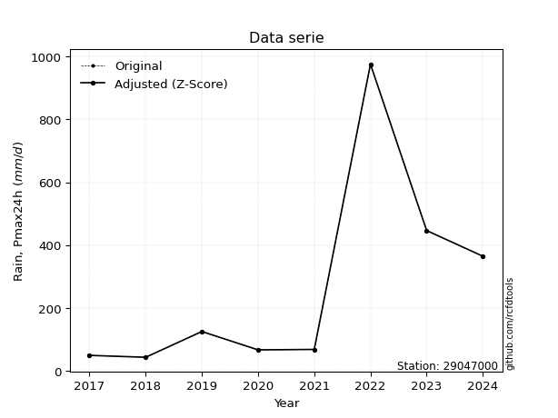</img>

</div>


> The initial value (value_initial) correspond to the initial obtained or null completed value, and value (value) is adjusted only when the initial value is outside the valid range (outlier) definite through the Z-Score value. If Z-Score is active, values out of range or outliers are replaced with the station mean value. A Z-Score (or standard score) measures how many standard deviations a data point is from the mean of a dataset, indicating its relative position; positive scores mean above the mean, negative mean below, and a score of zero is exactly at the mean, allowing for comparison of values from different distributions. It´s calculated using the formula $z=(x–μ)/σ$, where $x$ is the data point, $μ$ is the mean, and $σ$ is the standard deviation, helping identify outliers and understand probability.
>
> <sub>**Note**: In this study, "completing" (filling gaps in) and "extending" (forecasting or lengthening the historical record) rainfall data series are avoided for certain critical analyses because they introduce artificial bias and uncertainty, which can distort the statistics of rare events (extremes), alter day-to-day variability, and compromise the integrity and homogeneity of the original data. Some reasons against Completing/Extending rainfall data are: **Distortion of Extremes and Variability**: The primary issue is that most gap-filling or extension methods rely on averaging or regression with nearby stations, which inherently smooths the data. Rainfall is highly variable in space and time, with a large percentage of zero values and occasional large storms. Infilling methods often underestimate the highest values and overestimate the lowest (zero) values, which severely distorts analyses focused on flood frequency, drought severity, and intensity-duration-frequency (IDF) curves, **Loss of Data Homogeneity**: Infilled or extended data are synthetic estimates, not actual measurements. Combining these estimates with observed data can violate the assumption of data homogeneity, which requires that the data properties do not change over time. Inhomogeneity can lead to incorrect conclusions about long-term trends or changes in climate patterns, **Propagation of Errors**: Errors and biases from the original data (e.g., wind-induced undercatch, instrument errors, site changes) or the data used for imputation can propagate through the analysis, leading to unreliable hydrological models and inaccurate predictions, **Compromised Statistical Integrity**: For statistical analyses, especially those involving the frequency of events, using artificial data can introduce time bias or autocorrelation that doesn´t exist in reality, making it difficult to assess the true probability of events, **Difficulty in Validation**: It is difficult to accurately validate the quality of filled or extended data, especially for past periods where ground-truth measurements are unavailable. The reliability of imputation techniques heavily depends on the density of the surrounding station network and the complexity of the local topography.</sub>


### 4. Active continuous probability distributions from SciPy (80 of 104 available)

A Probability Density Function (PDF) describes the relative likelihood of a continuous random variable falling within a specific range, where the total area under its curve equals 1, and the area over any interval gives the actual probability for that range. Unlike discrete probabilities (like rolling a die), a PDF shows density, not direct probability for a single point (which is zero), with higher points indicating higher likelihood, often visualized as a bell curve for normal distributions.

A log of a probability density function (log-PDF) is simply the logarithm of the PDF´s value, denoted as $log(f(x))$, useful for converting multiplication of probabilities into addition, improving numerical stability with tiny numbers, and connecting to information theory concepts like entropy. Instead of dealing with very small probabilities (e.g., 0.000001), log-PDFs use negative numbers (e.g., $log(0.00001) ≈ -11.51$ that are easier for computers to handle, preventing underflow errors and simplifying complex calculations. In this study, each active probability distribution from SciPy is also evaluated in the $log$ form.

[scipy.stats](https://docs.scipy.org/doc/scipy/reference/stats.html) is a Python´s powerful submodule within the SciPy library for comprehensive statistical analysis, offering over 130 probability distributions (like Normal, Poisson, etc.), functions for descriptive stats (mean, variance), hypothesis testing (t-tests, chi-square), random variable generation, and statistical tests, making it essential for data science, modeling, and research. It provides tools to explore, model, and draw conclusions from data efficiently, working seamlessly with [NumPy](https://numpy.org/).

<div align="center">

|   id | p_dist           |   n_parameter | fit_method   | label                                                                       | active   | ref                                                                                                      |
|-----:|:-----------------|--------------:|:-------------|:----------------------------------------------------------------------------|:---------|:---------------------------------------------------------------------------------------------------------|
|    0 | alpha            |             3 | MLE          | Alpha                                                                       | True     | [:mortar_board:](https://docs.scipy.org/doc/scipy/reference/generated/scipy.stats.alpha.html)            |
|    1 | anglit           |             2 | MM           | Anglit                                                                      | True     | [:mortar_board:](https://docs.scipy.org/doc/scipy/reference/generated/scipy.stats.anglit.html)           |
|    2 | arcsine          |             2 | MM           | Arcsine                                                                     | True     | [:mortar_board:](https://docs.scipy.org/doc/scipy/reference/generated/scipy.stats.arcsine.html)          |
|    3 | argus            |             3 | MLE          | Argus                                                                       | True     | [:mortar_board:](https://docs.scipy.org/doc/scipy/reference/generated/scipy.stats.argus.html)            |
|    4 | beta             |             4 | MLE          | Beta                                                                        | True     | [:mortar_board:](https://docs.scipy.org/doc/scipy/reference/generated/scipy.stats.beta.html)             |
|    5 | betaprime        |             4 | MLE          | Beta prime                                                                  | True     | [:mortar_board:](https://docs.scipy.org/doc/scipy/reference/generated/scipy.stats.betaprime.html)        |
|    6 | bradford         |             3 | MLE          | Bradford                                                                    | True     | [:mortar_board:](https://docs.scipy.org/doc/scipy/reference/generated/scipy.stats.bradford.html)         |
|    7 | burr             |             4 | MLE          | Burr (Type III)                                                             | True     | [:mortar_board:](https://docs.scipy.org/doc/scipy/reference/generated/scipy.stats.burr.html)             |
|    8 | burr12           |             4 | MLE          | Burr (Type III) 12                                                          | True     | [:mortar_board:](https://docs.scipy.org/doc/scipy/reference/generated/scipy.stats.burr12.html)           |
|    9 | cosine           |             2 | MLE          | Cosine                                                                      | True     | [:mortar_board:](https://docs.scipy.org/doc/scipy/reference/generated/scipy.stats.cosine.html)           |
|   10 | crystalball      |             4 | MLE          | Crystalball                                                                 | True     | [:mortar_board:](https://docs.scipy.org/doc/scipy/reference/generated/scipy.stats.crystalball.html)      |
|   11 | dgamma           |             3 | MLE          | Double gamma                                                                | True     | [:mortar_board:](https://docs.scipy.org/doc/scipy/reference/generated/scipy.stats.dgamma.html)           |
|   12 | dweibull         |             3 | MLE          | Double Weibull                                                              | True     | [:mortar_board:](https://docs.scipy.org/doc/scipy/reference/generated/scipy.stats.dweibull.html)         |
|   13 | erlang           |             3 | MLE          | Erlang                                                                      | True     | [:mortar_board:](https://docs.scipy.org/doc/scipy/reference/generated/scipy.stats.erlang.html)           |
|   14 | exponnorm        |             3 | MLE          | Exponentially modified Normal                                               | True     | [:mortar_board:](https://docs.scipy.org/doc/scipy/reference/generated/scipy.stats.exponnorm.html)        |
|   15 | exponpow         |             3 | MLE          | Exponential power                                                           | True     | [:mortar_board:](https://docs.scipy.org/doc/scipy/reference/generated/scipy.stats.exponpow.html)         |
|   16 | exponweib        |             4 | MLE          | Exponentiated Weibull                                                       | True     | [:mortar_board:](https://docs.scipy.org/doc/scipy/reference/generated/scipy.stats.exponweib.html)        |
|   17 | f                |             4 | MLE          | F                                                                           | True     | [:mortar_board:](https://docs.scipy.org/doc/scipy/reference/generated/scipy.stats.f.html)                |
|   18 | fatiguelife      |             3 | MLE          | Fatigue-life (Birnbaum-Saunders)                                            | True     | [:mortar_board:](https://docs.scipy.org/doc/scipy/reference/generated/scipy.stats.fatiguelife.html)      |
|   19 | foldnorm         |             3 | MM           | Fold Normal                                                                 | True     | [:mortar_board:](https://docs.scipy.org/doc/scipy/reference/generated/scipy.stats.foldnorm.html)         |
|   20 | gamma            |             3 | MLE          | Gamma                                                                       | True     | [:mortar_board:](https://docs.scipy.org/doc/scipy/reference/generated/scipy.stats.gamma.html)            |
|   21 | gausshyper       |             6 | MLE          | Gauss hypergeometric                                                        | True     | [:mortar_board:](https://docs.scipy.org/doc/scipy/reference/generated/scipy.stats.gausshyper.html)       |
|   22 | genexpon         |             5 | MLE          | Generalized exponential                                                     | True     | [:mortar_board:](https://docs.scipy.org/doc/scipy/reference/generated/scipy.stats.genexpon.html)         |
|   23 | genextreme       |             3 | MLE          | Generalized exponential                                                     | True     | [:mortar_board:](https://docs.scipy.org/doc/scipy/reference/generated/scipy.stats.genextreme.html)       |
|   24 | gengamma         |             4 | MLE          | Generalized gamma                                                           | True     | [:mortar_board:](https://docs.scipy.org/doc/scipy/reference/generated/scipy.stats.gengamma.html)         |
|   25 | genhalflogistic  |             3 | MLE          | Generalized half-logistic                                                   | True     | [:mortar_board:](https://docs.scipy.org/doc/scipy/reference/generated/scipy.stats.genhalflogistic.html)  |
|   26 | genlogistic      |             3 | MLE          | Generalized logistic                                                        | True     | [:mortar_board:](https://docs.scipy.org/doc/scipy/reference/generated/scipy.stats.genlogistic.html)      |
|   27 | gennorm          |             3 | MLE          | Generalized Normal                                                          | True     | [:mortar_board:](https://docs.scipy.org/doc/scipy/reference/generated/scipy.stats.gennorm.html)          |
|   28 | genpareto        |             3 | MLE          | Generalized Pareto                                                          | True     | [:mortar_board:](https://docs.scipy.org/doc/scipy/reference/generated/scipy.stats.genpareto.html)        |
|   29 | gompertz         |             3 | MLE          | Gompertz (or truncated Gumbel)                                              | True     | [:mortar_board:](https://docs.scipy.org/doc/scipy/reference/generated/scipy.stats.gompertz.html)         |
|   30 | gumbel_l         |             2 | MM           | Gumbel Left Skew                                                            | True     | [:mortar_board:](https://docs.scipy.org/doc/scipy/reference/generated/scipy.stats.gumbel_l.html)         |
|   31 | gumbel_r         |             2 | MM           | Gumbel Right Skew                                                           | True     | [:mortar_board:](https://docs.scipy.org/doc/scipy/reference/generated/scipy.stats.gumbel_r.html)         |
|   32 | halfgennorm      |             3 | MLE          | Upper half of a generalized normal                                          | True     | [:mortar_board:](https://docs.scipy.org/doc/scipy/reference/generated/scipy.stats.halfgennorm.html)      |
|   33 | halflogistic     |             2 | MM           | Half-logistic                                                               | True     | [:mortar_board:](https://docs.scipy.org/doc/scipy/reference/generated/scipy.stats.halflogistic.html)     |
|   34 | halfnorm         |             2 | MM           | Half Normal                                                                 | True     | [:mortar_board:](https://docs.scipy.org/doc/scipy/reference/generated/scipy.stats.halfnorm.html)         |
|   35 | hypsecant        |             2 | MM           | hyperbolic secant                                                           | True     | [:mortar_board:](https://docs.scipy.org/doc/scipy/reference/generated/scipy.stats.hypsecant.html)        |
|   36 | invgamma         |             3 | MLE          | Inverted gamma                                                              | True     | [:mortar_board:](https://docs.scipy.org/doc/scipy/reference/generated/scipy.stats.invgamma.html)         |
|   37 | invgauss         |             3 | MLE          | Inverse Gaussian                                                            | True     | [:mortar_board:](https://docs.scipy.org/doc/scipy/reference/generated/scipy.stats.invgauss.html)         |
|   38 | invweibull       |             3 | MLE          | Inverted Weibull                                                            | True     | [:mortar_board:](https://docs.scipy.org/doc/scipy/reference/generated/scipy.stats.invweibull.html)       |
|   39 | johnsonsb        |             4 | MLE          | Johnson SB                                                                  | True     | [:mortar_board:](https://docs.scipy.org/doc/scipy/reference/generated/scipy.stats.johnsonsb.html)        |
|   40 | johnsonsu        |             4 | MLE          | Johnson Su                                                                  | True     | [:mortar_board:](https://docs.scipy.org/doc/scipy/reference/generated/scipy.stats.johnsonsu.html)        |
|   41 | kappa3           |             3 | MLE          | Kappa 3                                                                     | True     | [:mortar_board:](https://docs.scipy.org/doc/scipy/reference/generated/scipy.stats.kappa3.html)           |
|   42 | kappa4           |             4 | MLE          | Kappa 4                                                                     | True     | [:mortar_board:](https://docs.scipy.org/doc/scipy/reference/generated/scipy.stats.kappa4.html)           |
|   43 | ksone            |             3 | MLE          | Kolmogorov-Smirnov one-sided test statistic distribution                    | True     | [:mortar_board:](https://docs.scipy.org/doc/scipy/reference/generated/scipy.stats.ksone.html)            |
|   44 | kstwobign        |             2 | MLE          | Limiting distribution of scaled Kolmogorov-Smirnov two-sided test statistic | True     | [:mortar_board:](https://docs.scipy.org/doc/scipy/reference/generated/scipy.stats.kstwobign.html)        |
|   45 | laplace          |             2 | MM           | Laplace                                                                     | True     | [:mortar_board:](https://docs.scipy.org/doc/scipy/reference/generated/scipy.stats.laplace.html)          |
|   46 | levy_l           |             2 | MLE          | Left-skewed Levy                                                            | True     | [:mortar_board:](https://docs.scipy.org/doc/scipy/reference/generated/scipy.stats.levy_l.html)           |
|   47 | loggamma         |             3 | MLE          | Log gamma                                                                   | True     | [:mortar_board:](https://docs.scipy.org/doc/scipy/reference/generated/scipy.stats.loggamma.html)         |
|   48 | logistic         |             2 | MM           | Logistic (or Sech-squared)                                                  | True     | [:mortar_board:](https://docs.scipy.org/doc/scipy/reference/generated/scipy.stats.logistic.html)         |
|   49 | loglaplace       |             3 | MLE          | Log-Laplace                                                                 | True     | [:mortar_board:](https://docs.scipy.org/doc/scipy/reference/generated/scipy.stats.loglaplace.html)       |
|   50 | lomax            |             3 | MLE          | Lomax (Pareto of the second kind)                                           | True     | [:mortar_board:](https://docs.scipy.org/doc/scipy/reference/generated/scipy.stats.lomax.html)            |
|   51 | maxwell          |             2 | MM           | Maxwell                                                                     | True     | [:mortar_board:](https://docs.scipy.org/doc/scipy/reference/generated/scipy.stats.maxwell.html)          |
|   52 | mielke           |             4 | MLE          | Mielke Beta-Kappa / Dagum                                                   | True     | [:mortar_board:](https://docs.scipy.org/doc/scipy/reference/generated/scipy.stats.mielke.html)           |
|   53 | moyal            |             2 | MM           | Moyal                                                                       | True     | [:mortar_board:](https://docs.scipy.org/doc/scipy/reference/generated/scipy.stats.moyal.html)            |
|   54 | nakagami         |             3 | MLE          | Nakagami                                                                    | True     | [:mortar_board:](https://docs.scipy.org/doc/scipy/reference/generated/scipy.stats.nakagami.html)         |
|   55 | ncf              |             5 | MLE          | Non-central F distribution                                                  | True     | [:mortar_board:](https://docs.scipy.org/doc/scipy/reference/generated/scipy.stats.ncf.html)              |
|   56 | nct              |             4 | MLE          | Non-central Student’s t                                                     | True     | [:mortar_board:](https://docs.scipy.org/doc/scipy/reference/generated/scipy.stats.nct.html)              |
|   57 | norm             |             2 | MM           | Normal                                                                      | True     | [:mortar_board:](https://docs.scipy.org/doc/scipy/reference/generated/scipy.stats.norm.html)             |
|   58 | pearson3         |             3 | MM           | Pearson type III                                                            | True     | [:mortar_board:](https://docs.scipy.org/doc/scipy/reference/generated/scipy.stats.pearson3.html)         |
|   59 | powerlaw         |             3 | MLE          | Power-function                                                              | True     | [:mortar_board:](https://docs.scipy.org/doc/scipy/reference/generated/scipy.stats.powerlaw.html)         |
|   60 | rayleigh         |             2 | MM           | Rayleigh                                                                    | True     | [:mortar_board:](https://docs.scipy.org/doc/scipy/reference/generated/scipy.stats.rayleigh.html)         |
|   61 | rdist            |             3 | MLE          | R-distributed (symmetric beta)                                              | True     | [:mortar_board:](https://docs.scipy.org/doc/scipy/reference/generated/scipy.stats.rdist.html)            |
|   62 | rice             |             3 | MLE          | Rice                                                                        | True     | [:mortar_board:](https://docs.scipy.org/doc/scipy/reference/generated/scipy.stats.rice.html)             |
|   63 | semicircular     |             2 | MM           | Semicircular                                                                | True     | [:mortar_board:](https://docs.scipy.org/doc/scipy/reference/generated/scipy.stats.semicircular.html)     |
|   64 | skewnorm         |             3 | MLE          | Skew normal                                                                 | True     | [:mortar_board:](https://docs.scipy.org/doc/scipy/reference/generated/scipy.stats.skewnorm.html)         |
|   65 | t                |             3 | MLE          | Student’s t                                                                 | True     | [:mortar_board:](https://docs.scipy.org/doc/scipy/reference/generated/scipy.stats.t.html)                |
|   66 | trapezoid        |             4 | MLE          | Trapezoid                                                                   | True     | [:mortar_board:](https://docs.scipy.org/doc/scipy/reference/generated/scipy.stats.trapezoid.html)        |
|   67 | triang           |             3 | MLE          | Triangular                                                                  | True     | [:mortar_board:](https://docs.scipy.org/doc/scipy/reference/generated/scipy.stats.triang.html)           |
|   68 | truncexpon       |             3 | MLE          | Truncated exponential                                                       | True     | [:mortar_board:](https://docs.scipy.org/doc/scipy/reference/generated/scipy.stats.truncexpon.html)       |
|   69 | truncnorm        |             4 | MLE          | Truncated normal                                                            | True     | [:mortar_board:](https://docs.scipy.org/doc/scipy/reference/generated/scipy.stats.truncnorm.html)        |
|   70 | truncpareto      |             4 | MLE          | Upper truncated Pareto                                                      | True     | [:mortar_board:](https://docs.scipy.org/doc/scipy/reference/generated/scipy.stats.truncpareto.html)      |
|   71 | truncweibull_min |             5 | MLE          | Doubly truncated Weibull minimum                                            | True     | [:mortar_board:](https://docs.scipy.org/doc/scipy/reference/generated/scipy.stats.truncweibull_min.html) |
|   72 | tukeylambda      |             3 | MLE          | Tukey-Lamdba                                                                | True     | [:mortar_board:](https://docs.scipy.org/doc/scipy/reference/generated/scipy.stats.tukeylambda.html)      |
|   73 | uniform          |             2 | MLE          | Uniform                                                                     | True     | [:mortar_board:](https://docs.scipy.org/doc/scipy/reference/generated/scipy.stats.uniform.html)          |
|   74 | vonmises         |             3 | MLE          | Von Mises                                                                   | True     | [:mortar_board:](https://docs.scipy.org/doc/scipy/reference/generated/scipy.stats.vonmises.html)         |
|   75 | vonmises_line    |             3 | MLE          | Von Mises line                                                              | True     | [:mortar_board:](https://docs.scipy.org/doc/scipy/reference/generated/scipy.stats.vonmises_line.html)    |
|   76 | wald             |             2 | MM           | Wald                                                                        | True     | [:mortar_board:](https://docs.scipy.org/doc/scipy/reference/generated/scipy.stats.wald.html)             |
|   77 | weibull_max      |             3 | MLE          | Weibull maximum                                                             | True     | [:mortar_board:](https://docs.scipy.org/doc/scipy/reference/generated/scipy.stats.weibull_max.html)      |
|   78 | weibull_min      |             3 | MLE          | Weibull minimum                                                             | True     | [:mortar_board:](https://docs.scipy.org/doc/scipy/reference/generated/scipy.stats.weibull_min.html)      |
|   79 | wrapcauchy       |             3 | MLE          | Wrapped  Cauchy                                                             | True     | [:mortar_board:](https://docs.scipy.org/doc/scipy/reference/generated/scipy.stats.wrapcauchy.html)       |

</div>

> **n_parameter:** # arguments & localization & scale.
>
> **Fit methods:** (MLE) maximum likelihood, (MM) L-moments.
>
>**Inactive** (With the only purpose of prevent loops, zero divisions, infinite values, over high estimated values or horizontal trending for recurrence intervals estimations, the follow distributions were disabled.)**:** lognorm, norminvgauss, powernorm, powerlognorm, cauchy, halfcauchy, foldcauchy, skewcauchy, chi2, expon, fisk, genhyperbolic, geninvgauss, gibrat, kstwo, laplace_asymmetric, levy, levy_stable, ncx2, pareto, rel_breitwigner, recipinvgauss, studentized_range, loguniform, 


## B. Probability (PDF) vs. Empirical (EDF) distributions functions

A continuous probability distribution (CPD) describes probabilities for variables that can take any value within a range (like rain any time), unlike discrete variables with specific outcomes (like temperature). It uses a Probability Density Function (PDF), a curve where the total area under it equals 1, and the probability of the variable falling within an interval (a to b) is found by calculating the area under the curve between those points. A key feature is that the probability of hitting any single exact value is zero, so probabilities are always expressed for ranges, e.g., $P(a ≤ X ≤ b)$.

<div align="center">

Distributions parameters from station values
|     |   station | p_dist              |   n |               loc |           scale | shape                  | shape1                | shape2             | shape3             |
|----:|----------:|:--------------------|----:|------------------:|----------------:|:-----------------------|:----------------------|:-------------------|:-------------------|
|   0 |  29047000 | alpha               |   9 |      17.7611      |    38.7632      | 2.8283253184334268e-12 |                       |                    |                    |
|   1 |  29047000 | anglit              |   9 |     241.757       |   865.547       |                        |                       |                    |                    |
|   2 |  29047000 | arcsine             |   9 |    -176.671       |   836.855       |                        |                       |                    |                    |
|   3 |  29047000 | argus               |   9 |    -487.082       |  1507.65        | 0.03820877078307139    |                       |                    |                    |
|   4 |  29047000 | beta                |   9 |      37.8         |  1002.9         | 0.3957211372091701     | 0.5892368633448563    |                    |                    |
|   5 |  29047000 | betaprime           |   9 |      -0.241408    |     0.496302    | 200.47853940686582     | 1.2482843782198905    |                    |                    |
|   6 |  29047000 | bradford            |   9 |      37.8         |   937.68        | 5.059414331355488      |                       |                    |                    |
|   7 |  29047000 | burr                |   9 |       7.80278     |    14.4961      | 1.214775224706806      | 6.58557476099344      |                    |                    |
|   8 |  29047000 | burr12              |   9 |      -0.0129158   |    37.2369      | 217.34852197793748     | 0.003811395484760385  |                    |                    |
|   9 |  29047000 | cosine              |   9 |     313.619       |   275.582       |                        |                       |                    |                    |
|  10 |  29047000 | crystalball         |   9 |       3.57552     |   402.389       | 183.77816753363308     | 1244.2906330126948    |                    |                    |
|  11 |  29047000 | dgamma              |   9 |     251.007       |    71.8468      | 3.324251235202339      |                       |                    |                    |
|  12 |  29047000 | dweibull            |   9 |      43.02        |   184.689       | 0.8330546984194931     |                       |                    |                    |
|  13 |  29047000 | erlang              |   9 |      37.8         |   379.151       | 0.4001140627932973     |                       |                    |                    |
|  14 |  29047000 | exponnorm           |   9 |      37.5591      |     0.0610139   | 3336.735182699542      |                       |                    |                    |
|  15 |  29047000 | exponpow            |   9 |      37.8         |   257.56        | 0.37543160481600757    |                       |                    |                    |
|  16 |  29047000 | exponweib           |   9 |      37.8         |    18.1968      | 2.3241349843957524     | 0.297966102058858     |                    |                    |
|  17 |  29047000 | f                   |   9 |      33.6744      |    18.3577      | 1359.0650267767815     | 1.0832971502490565    |                    |                    |
|  18 |  29047000 | fatiguelife         |   9 |      36.4413      |    40.308       | 2.7917225378712467     |                       |                    |                    |
|  19 |  29047000 | foldnorm            |   9 |    -173.055       |   517.274       | 0.0009242360180198703  |                       |                    |                    |
|  20 |  29047000 | gamma               |   9 |      37.8         |   303.664       | 0.3183037432826927     |                       |                    |                    |
|  21 |  29047000 | gausshyper          |   9 |      37.8         |  1537.15        | 0.3209184608228049     | 1.7175561014352692    | 1.034931935957046  | 2.103621981351152  |
|  22 |  29047000 | genexpon            |   9 |      37.7984      |   235.66        | 1.1510626370067687     | 7.362682457173324e-05 | 2.262898871052057  |                    |
|  23 |  29047000 | genextreme          |   9 |      38.3681      |     4.66419     | -8.209756096286174     |                       |                    |                    |
|  24 |  29047000 | gengamma            |   9 |      37.8         |   416.207       | 0.2911624749797943     | 1.5126350888795654    |                    |                    |
|  25 |  29047000 | genhalflogistic     |   9 |     -57.8496      |  1068.32        | 1.0338627367281876     |                       |                    |                    |
|  26 |  29047000 | genlogistic         |   9 |   -1187.57        |   166.808       | 2580.060163866063      |                       |                    |                    |
|  27 |  29047000 | gennorm             |   9 |      68.05        |     0.250451    | 0.2548595684172325     |                       |                    |                    |
|  28 |  29047000 | genpareto           |   9 |      37.8         |    53.0416      | 0.793337020788397      |                       |                    |                    |
|  29 |  29047000 | gompertz            |   9 |      37.8         |     9.37008e+08 | 4594716.42777811       |                       |                    |                    |
|  30 |  29047000 | gumbel_l            |   9 |     374.915       |   230.691       |                        |                       |                    |                    |
|  31 |  29047000 | gumbel_r            |   9 |     108.598       |   230.691       |                        |                       |                    |                    |
|  32 |  29047000 | halfgennorm         |   9 |      37.8         |     0.0927953   | 0.2278920068565855     |                       |                    |                    |
|  33 |  29047000 | halflogistic        |   9 |    -108.922       |   252.961       |                        |                       |                    |                    |
|  34 |  29047000 | halfnorm            |   9 |    -149.863       |   490.823       |                        |                       |                    |                    |
|  35 |  29047000 | hypsecant           |   9 |     241.757       |   188.359       |                        |                       |                    |                    |
|  36 |  29047000 | invgamma            |   9 |      33.6671      |     9.94019     | 0.5416493188729465     |                       |                    |                    |
|  37 |  29047000 | invgauss            |   9 |      33.2236      |    21.6172      | 9.646605214229576      |                       |                    |                    |
|  38 |  29047000 | invweibull          |   9 |      36.014       |    18.6887      | 0.5495983718530276     |                       |                    |                    |
|  39 |  29047000 | johnsonsb           |   9 |      37.8         |   952.202       | -0.02805143940715473   | 0.12174999924141741   |                    |                    |
|  40 |  29047000 | johnsonsu           |   9 |      37.8         |     2.52375e-11 | -1.9830929842609955    | 0.09843351219501649   |                    |                    |
|  41 |  29047000 | kappa3              |   9 |      37.8         |   128.169       | 0.10337371279768234    |                       |                    |                    |
|  42 |  29047000 | kappa4              |   9 |     -55.1744      |  1037.63        | 1.0983322967227858     | 0.9822129449269379    |                    |                    |
|  43 |  29047000 | ksone               |   9 |     -55.968       |  1125.22        | 1.0                    |                       |                    |                    |
|  44 |  29047000 | kstwobign           |   9 |    -514.174       |   881.435       |                        |                       |                    |                    |
|  45 |  29047000 | laplace             |   9 |     241.757       |   209.214       |                        |                       |                    |                    |
|  46 |  29047000 | levy_l              |   9 |    1064.18        |   442.679       |                        |                       |                    |                    |
|  47 |  29047000 | loggamma            |   9 | -104668           | 13734.1         | 2077.0152525478297     |                       |                    |                    |
|  48 |  29047000 | logistic            |   9 |     241.757       |   163.123       |                        |                       |                    |                    |
|  49 |  29047000 | loglaplace          |   9 |      -0.177132    |    68.2271      | 1.0960727362261729     |                       |                    |                    |
|  50 |  29047000 | lomax               |   9 |      37.8         |    17.7481      | 0.6250866948247555     |                       |                    |                    |
|  51 |  29047000 | maxwell             |   9 |    -459.338       |   439.346       |                        |                       |                    |                    |
|  52 |  29047000 | mielke              |   9 |      -0.274869    |     1.23646     | 180.46013661899605     | 1.2189873842032504    |                    |                    |
|  53 |  29047000 | moyal               |   9 |      72.5575      |   133.19        |                        |                       |                    |                    |
|  54 |  29047000 | nakagami            |   9 |      37.8         |   529.314       | 0.09460923878150104    |                       |                    |                    |
|  55 |  29047000 | ncf                 |   9 |      -0.0412469   |     1.44335e-06 | 1.4031851052744606e-07 | 2.594073387678686     | 9.390433009426541  |                    |
|  56 |  29047000 | nct                 |   9 |       0.182201    |     1.16971     | 0.9824295013633272     | 54.71549615380049     |                    |                    |
|  57 |  29047000 | norm                |   9 |     241.757       |   295.873       |                        |                       |                    |                    |
|  58 |  29047000 | pearson3            |   9 |     241.757       |   295.873       | 1.5859756909551372     |                       |                    |                    |
|  59 |  29047000 | powerlaw            |   9 |      37.8         |   937.68        | 0.1494907534789719     |                       |                    |                    |
|  60 |  29047000 | rayleigh            |   9 |    -324.266       |   451.62        |                        |                       |                    |                    |
|  61 |  29047000 | rdist               |   9 |     -58.0227      |   504.163       | 1.065083092598008      |                       |                    |                    |
|  62 |  29047000 | rice                |   9 |    -185.928       |   367.733       | 0.0004181938694666251  |                       |                    |                    |
|  63 |  29047000 | semicircular        |   9 |     241.757       |   591.746       |                        |                       |                    |                    |
|  64 |  29047000 | skewnorm            |   9 |      37.8         |   359.362       | 83036895.99695297      |                       |                    |                    |
|  65 |  29047000 | t                   |   9 |      54.0881      |    19.8968      | 0.5207686701094354     |                       |                    |                    |
|  66 |  29047000 | trapezoid           |   9 |     -58.7664      |  1125.22        | 0.9999999999999999     | 1.0                   |                    |                    |
|  67 |  29047000 | triang              |   9 |    -608.148       |  1588           | 0.9999019581265878     |                       |                    |                    |
|  68 |  29047000 | truncexpon          |   9 |     -23.6214      |   733.543       | 1.3620216519226696     |                       |                    |                    |
|  69 |  29047000 | truncnorm           |   9 | -423853           | 11173.2         | 37.93811474228694      | 587020.82436701       |                    |                    |
|  70 |  29047000 | truncpareto         |   9 |      22.2199      |    15.5801      | 0.22108653856622065    | 61.18459286864194     |                    |                    |
|  71 |  29047000 | truncweibull_min    |   9 |      33.367       |   687.85        | 0.022064268336547455   | 0.006296776505759275  | 1.3697485670884184 |                    |
|  72 |  29047000 | tukeylambda         |   9 |     -53.1861      |   536.952       | 1.0753533095655983     |                       |                    |                    |
|  73 |  29047000 | uniform             |   9 |      37.8         |   937.68        |                        |                       |                    |                    |
|  74 |  29047000 | vonmises            |   9 |      -0.524483    |     1           | 1.4068285090433714     |                       |                    |                    |
|  75 |  29047000 | vonmises_line       |   9 |     174.725       |   254.888       | 1.627828827768096      |                       |                    |                    |
|  76 |  29047000 | wald                |   9 |     -54.1163      |   295.873       |                        |                       |                    |                    |
|  77 |  29047000 | weibull_max         |   9 |     975.48        |     1.7703      | 0.1736016399224647     |                       |                    |                    |
|  78 |  29047000 | weibull_min         |   9 |      37.8         |   179.411       | 0.5822308187656541     |                       |                    |                    |
|  79 |  29047000 | wrapcauchy          |   9 |      37.8         |   149.366       | 0.8626595338063683     |                       |                    |                    |
|  80 |  29047000 | logalpha            |   9 |       3.33181     |     0.624878    | 1.7445745908600537e-06 |                       |                    |                    |
|  81 |  29047000 | loganglit           |   9 |       4.82429     |     3.26215     |                        |                       |                    |                    |
|  82 |  29047000 | logarcsine          |   9 |       3.2473      |     3.15398     |                        |                       |                    |                    |
|  83 |  29047000 | logargus            |   9 |       2.40163     |     4.63949     | 1.533950952311639e-05  |                       |                    |                    |
|  84 |  29047000 | logbeta             |   9 |       3.63231     |     3.66423     | 0.32154976879286623    | 0.5843827582782082    |                    |                    |
|  85 |  29047000 | logbetaprime        |   9 |       3.61451     |     1.49231     | 1.057248617217514      | 2.561189876242696     |                    |                    |
|  86 |  29047000 | logbradford         |   9 |       3.63231     |     3.25064     | 0.9598388488849658     |                       |                    |                    |
|  87 |  29047000 | logburr             |   9 |       3.28665     |     0.0729619   | 1.449166439271473      | 31.40551043023405     |                    |                    |
|  88 |  29047000 | logburr12           |   9 |       1.2127      |     2.40949     | 829.3669181255333      | 0.0033511680272301234 |                    |                    |
|  89 |  29047000 | logcosine           |   9 |       4.93286     |     0.914301    |                        |                       |                    |                    |
|  90 |  29047000 | logcrystalball      |   9 |       4.82429     |     1.11511     | 7.541833769928759      | 6924.212126915338     |                    |                    |
|  91 |  29047000 | logdgamma           |   9 |       4.61877     |     0.398087    | 2.406329566399201      |                       |                    |                    |
|  92 |  29047000 | logdweibull         |   9 |       4.67766     |     1.08158     | 1.7127280445868331     |                       |                    |                    |
|  93 |  29047000 | logerlang           |   9 |       3.63231     |     0.956876    | 0.7496202016899525     |                       |                    |                    |
|  94 |  29047000 | logexponnorm        |   9 |       3.63103     |     0.000408023 | 2903.441685703852      |                       |                    |                    |
|  95 |  29047000 | logexponpow         |   9 |       3.63231     |     2.81957     | 0.6319946066809476     |                       |                    |                    |
|  96 |  29047000 | logexponweib        |   9 |       3.63231     |     1.37687     | 0.7382457967433854     | 0.7851087070092637    |                    |                    |
|  97 |  29047000 | logf                |   9 |       3.63231     |     1.09534     | 1.175453954820175      | 9.429081753428068     |                    |                    |
|  98 |  29047000 | logfatiguelife      |   9 |       3.54334     |     0.683333    | 1.2898362396262277     |                       |                    |                    |
|  99 |  29047000 | logfoldnorm         |   9 |       3.1994      |     1.38736     | 1.0072392831945773     |                       |                    |                    |
| 100 |  29047000 | loggamma            |   9 |       3.63231     |     1.63648     | 0.6084422404112516     |                       |                    |                    |
| 101 |  29047000 | loggausshyper       |   9 |       3.63231     |     3.34127     | 0.7057128929555092     | 1.0603381423443992    | 1.0985241335135385 | 1.0158947450523323 |
| 102 |  29047000 | loggenexpon         |   9 |       3.63231     |     2.7277      | 2.264445956564483      | 0.10113544585356865   | 0.6939007598245404 |                    |
| 103 |  29047000 | loggenextreme       |   9 |       4.06932     |     0.549018    | -0.6795351125093306    |                       |                    |                    |
| 104 |  29047000 | loggengamma         |   9 |       3.63231     |     0.97962     | 0.9686601260625038     | 0.8933166807643007    |                    |                    |
| 105 |  29047000 | loggenhalflogistic  |   9 |       3.59636     |     0.926324    | 1.4020998350559762e-07 |                       |                    |                    |
| 106 |  29047000 | loggenlogistic      |   9 |      -1.77433     |     0.818979    | 1687.7989012729686     |                       |                    |                    |
| 107 |  29047000 | loggennorm          |   9 |       4.1993      |     0.0675589   | 0.41590326610873274    |                       |                    |                    |
| 108 |  29047000 | loggenpareto        |   9 |      -0.0236087   |    10.4318      | -1.5104289027666713    |                       |                    |                    |
| 109 |  29047000 | loggompertz         |   9 |       3.63231     |     3.93134     | 1.8260760073469817     |                       |                    |                    |
| 110 |  29047000 | loggumbel_l         |   9 |       5.32615     |     0.869451    |                        |                       |                    |                    |
| 111 |  29047000 | loggumbel_r         |   9 |       4.32243     |     0.869451    |                        |                       |                    |                    |
| 112 |  29047000 | loghalfgennorm      |   9 |       3.63231     |     1.08542     | 0.9307321089675926     |                       |                    |                    |
| 113 |  29047000 | loghalflogistic     |   9 |       3.50262     |     0.953383    |                        |                       |                    |                    |
| 114 |  29047000 | loghalfnorm         |   9 |       3.34831     |     1.84986     |                        |                       |                    |                    |
| 115 |  29047000 | loghypsecant        |   9 |       4.82429     |     0.709904    |                        |                       |                    |                    |
| 116 |  29047000 | loginvgamma         |   9 |       3.30871     |     1.47942     | 1.7929030940360617     |                       |                    |                    |
| 117 |  29047000 | loginvgauss         |   9 |       3.45422     |     0.997325    | 1.3737536616887391     |                       |                    |                    |
| 118 |  29047000 | loginvweibull       |   9 |       3.26148     |     0.807766    | 1.4714714073876198     |                       |                    |                    |
| 119 |  29047000 | logjohnsonsb        |   9 |       3.63231     |     3.25062     | 0.20280817260378364    | 0.21433751224318504   |                    |                    |
| 120 |  29047000 | logjohnsonsu        |   9 |       1.51956e+07 |     7.38384e+07 | 13783994.272267278     | 67446222.05356061     |                    |                    |
| 121 |  29047000 | logkappa3           |   9 |       3.63231     |     3.23819     | 571.9786411651794      |                       |                    |                    |
| 122 |  29047000 | logkappa4           |   9 |       3.26981     |     3.8773      | 1.1035344762320565     | 1.0724170389465824    |                    |                    |
| 123 |  29047000 | logksone            |   9 |       3.30725     |     3.90074     | 1.0                    |                       |                    |                    |
| 124 |  29047000 | logkstwobign        |   9 |       1.47048     |     3.84571     |                        |                       |                    |                    |
| 125 |  29047000 | loglaplace          |   9 |       4.82429     |     0.788505    |                        |                       |                    |                    |
| 126 |  29047000 | loglevy_l           |   9 |       7.09557     |     1.0491      |                        |                       |                    |                    |
| 127 |  29047000 | logloggamma         |   9 |    -377.834       |    50.431       | 1974.2766127730247     |                       |                    |                    |
| 128 |  29047000 | loglogistic         |   9 |       4.82429     |     0.614795    |                        |                       |                    |                    |
| 129 |  29047000 | logloglaplace       |   9 |      -0.00572988  |     4.22597     | 5.382725188722365      |                       |                    |                    |
| 130 |  29047000 | loglomax            |   9 |       3.63231     |    39.7067      | 34.141924790624486     |                       |                    |                    |
| 131 |  29047000 | logmaxwell          |   9 |       2.18193     |     1.65585     |                        |                       |                    |                    |
| 132 |  29047000 | logmielke           |   9 |       3.28407     |     0.0634941   | 55.497970780496374     | 1.4461986542688199    |                    |                    |
| 133 |  29047000 | logmoyal            |   9 |       4.18659     |     0.501978    |                        |                       |                    |                    |
| 134 |  29047000 | lognakagami         |   9 |       3.63231     |     2.09484     | 0.412054081030816      |                       |                    |                    |
| 135 |  29047000 | logncf              |   9 |       3.31391     |     0.791086    | 275.4779296193892      | 3.5896806891861806    | 11.014189450135582 |                    |
| 136 |  29047000 | lognct              |   9 |       3.09759     |     0.153224    | 1.7149554137613472     | 6.539840077727369     |                    |                    |
| 137 |  29047000 | lognorm             |   9 |       4.82429     |     1.11511     |                        |                       |                    |                    |
| 138 |  29047000 | logpearson3         |   9 |       4.82429     |     1.11511     | 0.6315816976803659     |                       |                    |                    |
| 139 |  29047000 | logpowerlaw         |   9 |       3.63231     |     3.25062     | 0.19002155020814177    |                       |                    |                    |
| 140 |  29047000 | lograyleigh         |   9 |       2.69101     |     1.70211     |                        |                       |                    |                    |
| 141 |  29047000 | logrdist            |   9 |       4.87339     |     1.24108     | 1.1987682957080397     |                       |                    |                    |
| 142 |  29047000 | logrice             |   9 |       3.00794     |     1.50708     | 0.00044333580769689667 |                       |                    |                    |
| 143 |  29047000 | logsemicircular     |   9 |       4.82429     |     2.23023     |                        |                       |                    |                    |
| 144 |  29047000 | logskewnorm         |   9 |       3.63231     |     1.6322      | 5414203.302830171      |                       |                    |                    |
| 145 |  29047000 | logt                |   9 |       4.8243      |     1.11514     | 39823569.52804174      |                       |                    |                    |
| 146 |  29047000 | logtrapezoid        |   9 |       3.30725     |     3.90074     | 1.0                    | 1.0                   |                    |                    |
| 147 |  29047000 | logtriang           |   9 |       2.27101     |     5.03176     | 0.7209452340334173     |                       |                    |                    |
| 148 |  29047000 | logtruncexpon       |   9 |       3.63231     |     3.67612     | 0.8842554239818894     |                       |                    |                    |
| 149 |  29047000 | logtruncnorm        |   9 |      -0.564508    |     2.76133     | 1.5198537656690814     | 19.117733417535376    |                    |                    |
| 150 |  29047000 | logtruncpareto      |   9 |       3.6322      |     0.000105476 | 3.006281853489933e-09  | 32495.103380387896    |                    |                    |
| 151 |  29047000 | logtruncweibull_min |   9 |       3.63231     |     3.71152     | 0.9108251230110496     | 2.36082831107282e-16  | 0.8770521181148941 |                    |
| 152 |  29047000 | logtukeylambda      |   9 |       4.86602     |     1.39322     | 1.1284739288872232     |                       |                    |                    |
| 153 |  29047000 | loguniform          |   9 |       3.63231     |     3.25062     |                        |                       |                    |                    |
| 154 |  29047000 | logvonmises         |   9 |      -1.69033     |     1           | 1.1615290936272409     |                       |                    |                    |
| 155 |  29047000 | logvonmises_line    |   9 |       5.32854     |     0.539929    | 1.729373025034921e-05  |                       |                    |                    |
| 156 |  29047000 | logwald             |   9 |       3.70915     |     1.11513     |                        |                       |                    |                    |
| 157 |  29047000 | logweibull_max      |   9 |       6.88293     |     2.14954     | 0.9454672744805096     |                       |                    |                    |
| 158 |  29047000 | logweibull_min      |   9 |       3.63231     |     1.35664     | 0.7294136656913607     |                       |                    |                    |
| 159 |  29047000 | logwrapcauchy       |   9 |       3.63231     |     0.517352    | 0.5                    |                       |                    |                    |

</div>

> **loc** (Location parameter): This shifts the distribution along the x-axis. For many common distributions, like the normal (Gaussian) distribution, loc represents the mean $μ$. For others, like the uniform distribution, it might represent the minimum value, or for the beta distribution, the left end of the support interval.
>
> **scale** (Scale parameter): This determines the width or spread of the distribution. For the normal distribution, scale represents the standard deviation $σ$. For a uniform distribution, it defines the length of the interval (from $loc$ to $loc + scale$).
>
> **shape** (Shape parameters): Refers to parameters that define the specific form of a probability distribution, distinct from its location (loc) and scale (scale). These parameters are required arguments for most distribution functions. For example, a normal (Gaussian) distribution is fully defined by its location (mean) and scale (standard deviation), so it has no specific shape parameters beyond loc and scale. However, other distributions have intrinsic properties that need specification, as Gamma distribution that takes a shape parameter, often named $a$ or $alpha$.


### 0. Cumulative distribution values - CDF (160 evaluated)

Cumulative Distribution Function (CDF), denoted as $F$<sub>$X$</sub>$(x)$, is a function that gives the probability that a random variable $X$ will take a value less than or equal to a specific value, $x$ (i.e., $(P(X≥x)$. It essentially "accumulates" probabilities from a given point up to the far right (positive infinity), providing a complete picture of the distribution´s probabilities for both discrete (like rain) and continuous (like temperature) variables, helping to find probabilities over ranges or above certain values. Each station is evaluated separately ordering the $x$ values ascending, calculating the CDF and PDF values for the activated distributions and their logarithmic forms.

<div align="center">

CDF ordered by x ascending and calculating $log(f(x))$ separately
|   id |   Station |   date |      x |   count |    mean |     std |    zscore |   Value_initial |   station |   m |     alpha |   alpha_pdf |   anglit |   anglit_pdf |   arcsine |   arcsine_pdf |    argus |   argus_pdf |       beta |    beta_pdf |   betaprime |   betaprime_pdf |    bradford |   bradford_pdf |     burr |    burr_pdf |    burr12 |   burr12_pdf |   cosine |   cosine_pdf |   crystalball |   crystalball_pdf |   dgamma |   dgamma_pdf |   dweibull |   dweibull_pdf |      erlang |   erlang_pdf |   exponnorm |   exponnorm_pdf |    exponpow |   exponpow_pdf |   exponweib |   exponweib_pdf |         f |       f_pdf |   fatiguelife |   fatiguelife_pdf |   foldnorm |   foldnorm_pdf |       gamma |   gamma_pdf |   gausshyper |   gausshyper_pdf |    genexpon |   genexpon_pdf |   genextreme |   genextreme_pdf |    gengamma |   gengamma_pdf |   genhalflogistic |   genhalflogistic_pdf |   genlogistic |   genlogistic_pdf |   gennorm |   gennorm_pdf |   genpareto |   genpareto_pdf |    gompertz |   gompertz_pdf |   gumbel_l |   gumbel_l_pdf |   gumbel_r |   gumbel_r_pdf |   halfgennorm |   halfgennorm_pdf |   halflogistic |   halflogistic_pdf |   halfnorm |   halfnorm_pdf |   hypsecant |   hypsecant_pdf |   invgamma |   invgamma_pdf |   invgauss |   invgauss_pdf |   invweibull |   invweibull_pdf |   johnsonsb |   johnsonsb_pdf |   johnsonsu |   johnsonsu_pdf |      kappa3 |       kappa3_pdf |      kappa4 |   kappa4_pdf |     ksone |   ksone_pdf |   kstwobign |   kstwobign_pdf |   laplace |   laplace_pdf |   levy_l |   levy_l_pdf |    loggamma |   loggamma_pdf |   logistic |   logistic_pdf |   loglaplace |   loglaplace_pdf |       lomax |   lomax_pdf |   maxwell |   maxwell_pdf |     mielke |   mielke_pdf |    moyal |   moyal_pdf |    nakagami |   nakagami_pdf |      ncf |     ncf_pdf |       nct |     nct_pdf |     norm |    norm_pdf |   pearson3 |   pearson3_pdf |   powerlaw |   powerlaw_pdf |   rayleigh |   rayleigh_pdf |    rdist |      rdist_pdf |     rice |    rice_pdf |   semicircular |   semicircular_pdf |   skewnorm |   skewnorm_pdf |        t |       t_pdf |   trapezoid |   trapezoid_pdf |   triang |   triang_pdf |   truncexpon |   truncexpon_pdf |   truncnorm |   truncnorm_pdf |   truncpareto |   truncpareto_pdf |   truncweibull_min |   truncweibull_min_pdf |   tukeylambda |   tukeylambda_pdf |    uniform |   uniform_pdf |   vonmises |   vonmises_pdf |   vonmises_line |   vonmises_line_pdf |     wald |    wald_pdf |   weibull_max |   weibull_max_pdf |   weibull_min |   weibull_min_pdf |   wrapcauchy |   wrapcauchy_pdf |   logalpha |   logalpha_pdf |   loganglit |   loganglit_pdf |   logarcsine |   logarcsine_pdf |   logargus |   logargus_pdf |     logbeta |   logbeta_pdf |   logbetaprime |   logbetaprime_pdf |   logbradford |   logbradford_pdf |   logburr |   logburr_pdf |   logburr12 |   logburr12_pdf |   logcosine |   logcosine_pdf |   logcrystalball |   logcrystalball_pdf |   logdgamma |   logdgamma_pdf |   logdweibull |   logdweibull_pdf |   logerlang |   logerlang_pdf |   logexponnorm |   logexponnorm_pdf |   logexponpow |   logexponpow_pdf |   logexponweib |   logexponweib_pdf |        logf |       logf_pdf |   logfatiguelife |   logfatiguelife_pdf |   logfoldnorm |   logfoldnorm_pdf |   loggausshyper |   loggausshyper_pdf |   loggenexpon |   loggenexpon_pdf |   loggenextreme |   loggenextreme_pdf |   loggengamma |   loggengamma_pdf |   loggenhalflogistic |   loggenhalflogistic_pdf |   loggenlogistic |   loggenlogistic_pdf |   loggennorm |   loggennorm_pdf |   loggenpareto |   loggenpareto_pdf |   loggompertz |   loggompertz_pdf |   loggumbel_l |   loggumbel_l_pdf |   loggumbel_r |   loggumbel_r_pdf |   loghalfgennorm |   loghalfgennorm_pdf |   loghalflogistic |   loghalflogistic_pdf |   loghalfnorm |   loghalfnorm_pdf |   loghypsecant |   loghypsecant_pdf |   loginvgamma |   loginvgamma_pdf |   loginvgauss |   loginvgauss_pdf |   loginvweibull |   loginvweibull_pdf |   logjohnsonsb |   logjohnsonsb_pdf |   logjohnsonsu |   logjohnsonsu_pdf |   logkappa3 |   logkappa3_pdf |   logkappa4 |   logkappa4_pdf |   logksone |   logksone_pdf |   logkstwobign |   logkstwobign_pdf |   loglevy_l |   loglevy_l_pdf |   logloggamma |   logloggamma_pdf |   loglogistic |   loglogistic_pdf |   logloglaplace |   logloglaplace_pdf |    loglomax |   loglomax_pdf |   logmaxwell |   logmaxwell_pdf |   logmielke |   logmielke_pdf |   logmoyal |   logmoyal_pdf |   lognakagami |   lognakagami_pdf |    logncf |   logncf_pdf |    lognct |   lognct_pdf |   lognorm |   lognorm_pdf |   logpearson3 |   logpearson3_pdf |   logpowerlaw |   logpowerlaw_pdf |   lograyleigh |   lograyleigh_pdf |    logrdist |   logrdist_pdf |   logrice |   logrice_pdf |   logsemicircular |   logsemicircular_pdf |   logskewnorm |   logskewnorm_pdf |     logt |   logt_pdf |   logtrapezoid |   logtrapezoid_pdf |   logtriang |   logtriang_pdf |   logtruncexpon |   logtruncexpon_pdf |   logtruncnorm |   logtruncnorm_pdf |   logtruncpareto |   logtruncpareto_pdf |   logtruncweibull_min |   logtruncweibull_min_pdf |   logtukeylambda |   logtukeylambda_pdf |   loguniform |   loguniform_pdf |   logvonmises |   logvonmises_pdf |   logvonmises_line |   logvonmises_line_pdf |     logwald |   logwald_pdf |   logweibull_max |   logweibull_max_pdf |   logweibull_min |   logweibull_min_pdf |   logwrapcauchy |   logwrapcauchy_pdf |
|-----:|----------:|-------:|-------:|--------:|--------:|--------:|----------:|----------------:|----------:|----:|----------:|------------:|---------:|-------------:|----------:|--------------:|---------:|------------:|-----------:|------------:|------------:|----------------:|------------:|---------------:|---------:|------------:|----------:|-------------:|---------:|-------------:|--------------:|------------------:|---------:|-------------:|-----------:|---------------:|------------:|-------------:|------------:|----------------:|------------:|---------------:|------------:|----------------:|----------:|------------:|--------------:|------------------:|-----------:|---------------:|------------:|------------:|-------------:|-----------------:|------------:|---------------:|-------------:|-----------------:|------------:|---------------:|------------------:|----------------------:|--------------:|------------------:|----------:|--------------:|------------:|----------------:|------------:|---------------:|-----------:|---------------:|-----------:|---------------:|--------------:|------------------:|---------------:|-------------------:|-----------:|---------------:|------------:|----------------:|-----------:|---------------:|-----------:|---------------:|-------------:|-----------------:|------------:|----------------:|------------:|----------------:|------------:|-----------------:|------------:|-------------:|----------:|------------:|------------:|----------------:|----------:|--------------:|---------:|-------------:|------------:|---------------:|-----------:|---------------:|-------------:|-----------------:|------------:|------------:|----------:|--------------:|-----------:|-------------:|---------:|------------:|------------:|---------------:|---------:|------------:|----------:|------------:|---------:|------------:|-----------:|---------------:|-----------:|---------------:|-----------:|---------------:|---------:|---------------:|---------:|------------:|---------------:|-------------------:|-----------:|---------------:|---------:|------------:|------------:|----------------:|---------:|-------------:|-------------:|-----------------:|------------:|----------------:|--------------:|------------------:|-------------------:|-----------------------:|--------------:|------------------:|-----------:|--------------:|-----------:|---------------:|----------------:|--------------------:|---------:|------------:|--------------:|------------------:|--------------:|------------------:|-------------:|-----------------:|-----------:|---------------:|------------:|----------------:|-------------:|-----------------:|-----------:|---------------:|------------:|--------------:|---------------:|-------------------:|--------------:|------------------:|----------:|--------------:|------------:|----------------:|------------:|----------------:|-----------------:|---------------------:|------------:|----------------:|--------------:|------------------:|------------:|----------------:|---------------:|-------------------:|--------------:|------------------:|---------------:|-------------------:|------------:|---------------:|-----------------:|---------------------:|--------------:|------------------:|----------------:|--------------------:|--------------:|------------------:|----------------:|--------------------:|--------------:|------------------:|---------------------:|-------------------------:|-----------------:|---------------------:|-------------:|-----------------:|---------------:|-------------------:|--------------:|------------------:|--------------:|------------------:|--------------:|------------------:|-----------------:|---------------------:|------------------:|----------------------:|--------------:|------------------:|---------------:|-------------------:|--------------:|------------------:|--------------:|------------------:|----------------:|--------------------:|---------------:|-------------------:|---------------:|-------------------:|------------:|----------------:|------------:|----------------:|-----------:|---------------:|---------------:|-------------------:|------------:|----------------:|--------------:|------------------:|--------------:|------------------:|----------------:|--------------------:|------------:|---------------:|-------------:|-----------------:|------------:|----------------:|-----------:|---------------:|--------------:|------------------:|----------:|-------------:|----------:|-------------:|----------:|--------------:|--------------:|------------------:|--------------:|------------------:|--------------:|------------------:|------------:|---------------:|----------:|--------------:|------------------:|----------------------:|--------------:|------------------:|---------:|-----------:|---------------:|-------------------:|------------:|----------------:|----------------:|--------------------:|---------------:|-------------------:|-----------------:|---------------------:|----------------------:|--------------------------:|-----------------:|---------------------:|-------------:|-----------------:|--------------:|------------------:|-------------------:|-----------------------:|------------:|--------------:|-----------------:|---------------------:|-----------------:|---------------------:|----------------:|--------------------:|
|    0 |  29047000 |   2025 |  37.8  |       9 | 241.757 | 313.821 | -0.649915 |           37.8  |  29047000 |   1 | 0.0530646 | 0.0118596   | 0.272987 |   0.00102939 |  0.337932 |   0.000871238 | 0.17614  | 0.00064929  | 1.2273e-07 | 6.83517e+06 |    0.111891 |     0.0070507   | 1.74151e-08 |    0.00299491  | 0.102442 | 0.00799043  | 0.0127677 |  0.0208855   | 0.20671  |  0.000889144 |      0.53389  |       0.000987855 | 0.253501 |  0.00162971  |   0.475015 |    0.00388597  | 2.28641e-07 |  1.2875e+07  |  0.00118259 |     0.0049059   | 6.06903e-07 |    3.20671e+07 |  2.1353e-11 |  2081.1         | 0.0320936 | 0.0214203   |     0.0296957 |       0.0500759   |   0.316452 |    0.00141951  | 5.68324e-06 | 2.54594e+08 |  4.21728e-06 |      1.90475e+08 | 7.81558e-06 |    0.00488439  |  0.000270095 |  15378           | 4.58595e-08 |    2.84255e+06 |         0.0469411 |           0.000514629 |      0.189367 |       0.0018885   |  0.271862 |   0.00313303  |  2.3751e-13 |     0.0188531   | 3.74629e-08 |    0.00490361  |   0.206997 |    0.000797256 |   0.256867 |    0.00151342  |      0        |       0.246267    |       0.282143 |        0.00181924  |   0.297794 |    0.00151102  |    0.20787  |     0.0010268   |  0.0320926 |    0.0214199   |  0.0329716 |    0.0197846   |     0.026403 |      0.0295274   | 6.84488e-07 |     5.88974e+07 |   0.0224743 |     2.03308e+08 | 4.21674e-05 | 256057           | 2.97718e-15 |  0.0258003   | 0.0833333 | 0.000888718 |    0.172222 |     0.00165114  |  0.18862  |   0.000901567 | 0.488648 |  0.000205748 | 3.77697e-10 | 517479         |   0.222644 |    0.001061    |     0.110268 |         0.139844 | 2.23217e-08 | 0.0352199   |  0.266204 |   0.00122586  |   0.105138 |   0.00752458 | 0.254546 | 0.00178324  | 0.000538585 |    1.43426e+10 | 0.190687 | 0.00566177  | 0.0896932 | 0.00845341  | 0.245305 | 0.00106321  |   0.27376  |    0.00191454  | 0.00275835 |    5.80327e+10 |   0.274841 |    0.00128728  | 0.563547 |    0.000670839 | 0.168957 | 0.00137492  |       0.285002 |         0.00100991 |  0         |     0.00222028 | 0.32197  | 0.00730964  |  0.00736513 |     0.00015254  | 0.165476 |  0.000512352 |     0.107981 |      0.00168547  | 2.04654e-05 |     0.00339774  |   8.01878e-13 |       0.0237581   |         0.00429815 |            0.0417411   |      0.589301 |       0.000982219 | 0          |    0.00106646 |    6.73893 |      0.319295  |        0.273098 |         0.00142     | 0.177164 | 0.00362431  |     0.0512557 |       2.81925e-05 |   2.81902e-10 |   23099.6         |  3.65106e-09 |      0.0144512   |  0.0375747 |      0.635428  |    0.16627  |       0.228268  |     0.22722  |         0.308288 |   0.103666 |       0.165379 | 5.94018e-06 |   4.30108e+09 |      0.0241296 |          1.40347   |    5.4168e-07 |          0.438837 | 0.0435238 |     0.54433   |   0.0116736 |       1.10112   |    0.116202 |       0.1998    |         0.142551 |            0.202058  |    0.198361 |       0.302737  |      0.194668 |         0.300868  | 3.48723e-12 |    5886.42      |     0.00107659 |          0.842462  |   1.02984e-10 |    146560         |    1.04984e-09 |        1.37019e+06 | 2.05972e-09 | 454320         |        0.0308151 |            0.949516  |      0.149926 |         0.346267  |     9.02895e-12 |        14367.6      |   2.61238e-12 |         0.830166  |       0.0430944 |           0.537598  |   5.35179e-14 |       104.281     |            0.0194029 |                0.539565  |         0.101202 |            0.282865  |     0.204883 |        0.219179  |       0.39283  |           0.123664 |   1.06546e-11 |          0.464492 |      0.132842 |         0.142159  |      0.10952  |          0.278589 |      4.34368e-09 |            0.891199  |         0.0679118 |             0.522029  |      0.122014 |         0.426269  |       0.11741  |          0.161664  |     0.0433234 |         0.52446   |      0.035822 |         0.636664  |        0.043097 |           0.537713  |    1.49345e-06 |        3611.32     |       0.143113 |          0.202125  | 6.51011e-15 |        0.305405 | 3.48564e-15 |        8.15532  |  0.0833333 |       0.256361 |      0.0898923 |          0.283094  |    0.417944 |       0.0544894 |      0.147496 |         0.201522  |      0.125777 |         0.178852  |        0.223241 |           0.3303    | 1.63967e-12 |      0.859852  |     0.142709 |         0.251906 |   0.0431984 |       0.541202  |  0.0824054 |      0.305427  |   9.47914e-14 |        175.907    | 0.0433438 |    0.52469   | 0.0513906 |    0.471898  |  0.142551 |     0.202058  |      0.13315  |         0.254341  |    0.00096695 |       4.13749e+11 |      0.141798 |         0.278832  | 2.40583e-10 |  348849        | 0.0822389 |     0.252288  |          0.176725 |              0.24126  |     0         |         0.488839  | 0.142554 |  0.202056  |     0.00694444 |          0.0427269 |    0.101523 |        0.149156 |     1.40042e-07 |            0.463435 |    3.01072e-10 |          0.708202  |      1.83427e-06 |          912.582     |             0         |                 10.3114   |      0.000481673 |             0.5221   |    0         |         0.307634 |       1.19541 |         0.226565  |         1.8581e-06 |               0.294765 | 0           |    0          |         0.227976 |            0.0980381 |      5.07029e-12 |         8327.92      |        0        |            0.922901 |
|    1 |  29047000 |   2018 |  43.02 |       9 | 241.757 | 313.821 | -0.633281 |           43.02 |  29047000 |   2 | 0.124874  | 0.0149323   | 0.278377 |   0.00103565 |  0.342462 |   0.000864458 | 0.179543 | 0.000654844 | 0.093764   | 0.00711905  |    0.149286 |     0.00722641  | 0.0154173   |    0.00291287  | 0.145402 | 0.00838388  | 0.112939  |  0.0170763   | 0.211375 |  0.000898297 |      0.539044 |       0.000986683 | 0.262073 |  0.00165441  |   0.5      |    1.24046     | 0.202105    |  0.0153397   |  0.0264669  |     0.0047819   | 0.229204    |    0.0161659   |  0.197908   |     0.0182381   | 0.160253  | 0.0232799   |     0.22906   |       0.0237476   |   0.323847 |    0.00141361  | 0.3053      | 0.0183751   |  0.248198    |      0.015146    | 0.0251821   |    0.00476144  |  0.466144    |      0.00830218  | 0.16168     |    0.0136273   |         0.0496347 |           0.000517375 |      0.199325 |       0.00192661  |  0.289563 |   0.00367636  |  0.0904092  |     0.0159067   | 0.025272    |    0.00477968  |   0.211195 |    0.000811184 |   0.264798 |    0.00152524  |      0.182027 |       0.0201098   |       0.291611 |        0.00180851  |   0.305665 |    0.00150481  |    0.213289 |     0.0010495   |  0.160251  |    0.0232798   |  0.152184  |    0.0222078   |     0.180019 |      0.0242146   | 0.254227    |     0.00751881  |   0.742102  |     0.00609092  | 0.272341    |      0.00656387  | 0.00878627  |  0.00153242  | 0.0879724 | 0.000888718 |    0.180918 |     0.00168016  |  0.193386 |   0.000924345 | 0.489726 |  0.000207099 | 0.231729    |      1.0374    |   0.228232 |    0.00107981  |     0.129926 |         0.164775 | 0.148848    | 0.0231645   |  0.272627 |   0.00123494  |   0.14543  |   0.00784354 | 0.26388  | 0.00179281  | 0.350099    |    0.0126906   | 0.219921 | 0.0055296   | 0.1357    | 0.00904449  | 0.250889 | 0.00107605  |   0.283733 |    0.00190631  | 0.460246   |    0.0131806   |   0.281577 |    0.00129371  | 0.567052 |    0.000672159 | 0.176186 | 0.00139476  |       0.290283 |         0.00101334 |  0.0115895 |     0.00222005 | 0.365897 | 0.00961711  |  0.00818291 |     0.000160786 | 0.168161 |  0.000516492 |     0.116748 |      0.00167351  | 0.0176004   |     0.00333804  |   0.103616    |       0.0166944   |         0.148418   |            0.0192012   |      0.594428 |       0.000982353 | 0.00556693 |    0.00106646 |    7.32537 |      0.364918  |        0.280573 |         0.001444    | 0.196042 | 0.00360557  |     0.0514034 |       2.84045e-05 |   0.119727    |       0.0125208   |  0.0740761   |      0.0136868   |  0.146031  |      0.938015  |    0.196816 |       0.24376   |     0.264647 |         0.273178 |   0.126089 |       0.181225 | 0.266912    |   0.671037    |      0.193595  |          1.17642   |    0.0557094  |          0.422691 | 0.133523  |     0.794446  |   0.144777  |       0.932522  |    0.143609 |       0.22382   |         0.170314 |            0.227199  |    0.24022  |       0.343824  |      0.235637 |         0.331465  | 0.229309    |       1.22905   |     0.104406   |          0.755984  |   0.142108    |         0.689341  |    0.23987     |        0.993037    | 0.221391    |      0.957792  |        0.175307  |            1.06965   |      0.1947   |         0.345943  |     0.143162    |            0.760823 |   0.101892    |         0.746657  |       0.132052  |           0.786414  |   0.162269    |         0.997658  |            0.0889916 |                0.535493  |         0.141402 |            0.337545  |     0.236949 |        0.280683  |       0.408936 |           0.125373 |   0.059256    |          0.451585 |      0.152445 |         0.161234  |      0.148687 |          0.325935 |      0.107408    |            0.776248  |         0.135027  |             0.514886  |      0.176815 |         0.420687  |       0.140186 |          0.19115   |     0.129154  |         0.756544  |      0.140046 |         0.880921  |        0.132073 |           0.786563  |    0.315785    |           0.613658 |       0.170877 |          0.22715   | 0.039506    |        0.305405 | 0.0505733   |        0.354771 |  0.116495  |       0.256361 |      0.130176  |          0.338134  |    0.425175 |       0.0573532 |      0.175122 |         0.225611  |      0.15079  |         0.208285  |        0.269433 |           0.384956  | 0.105103    |      0.766981  |     0.177028 |         0.278229 |   0.132731  |       0.790663  |  0.12678   |      0.378238  |   0.0788372   |          0.501701 | 0.129214  |    0.756902  | 0.127393  |    0.676328  |  0.170314 |     0.227199  |      0.168157 |         0.286359  |    0.541921   |       0.796071    |      0.179492 |         0.30322   | 0.118324    |       0.5557   | 0.117557  |     0.292837  |          0.208577 |              0.250966 |     0.0631689 |         0.487306  | 0.170316 |  0.227195  |     0.0135711  |          0.0597297 |    0.121734 |        0.163329 |     0.0589057   |            0.447411 |    0.0883932   |          0.658809  |      0.684644    |            0.743519  |             0.0780711 |                  0.536895 |      0.0580339   |             0.425708 |    0.0397943 |         0.307634 |       1.22654 |         0.254744  |         0.0381315  |               0.294765 | 1.08003e-05 |    0.00227461 |         0.241032 |            0.103882  |      0.16481     |            0.848156  |        0.114763 |            0.820805 |
|    2 |  29047000 |   2017 |  49.13 |       9 | 241.757 | 313.821 | -0.613811 |           49.13 |  29047000 |   3 | 0.216563  | 0.0146479   | 0.284727 |   0.00104277 |  0.347721 |   0.000856934 | 0.183564 | 0.000661309 | 0.127506   | 0.0044683   |    0.193267 |     0.00712829  | 0.0329356   |    0.00282237  | 0.19668  | 0.00833049  | 0.205328  |  0.0133958   | 0.216896 |  0.000908865 |      0.545068 |       0.000985101 | 0.272263 |  0.00168066  |   0.528385 |    0.00375808  | 0.274316    |  0.00948243  |  0.0552502  |     0.00464052  | 0.304242    |    0.00972406  |  0.282349   |     0.010836    | 0.280299  | 0.0163212   |     0.330889  |       0.0119917   |   0.332463 |    0.00140655  | 0.388834    | 0.0106184   |  0.317397    |      0.00884676  | 0.0538447   |    0.00462146  |  0.499319    |      0.00372818  | 0.227298    |    0.00880625  |         0.0528057 |           0.000520618 |      0.211226 |       0.00196825  |  0.314625 |   0.00459287  |  0.179074   |     0.0132343   | 0.0540427   |    0.0046386   |   0.216202 |    0.000827669 |   0.274156 |    0.00153787  |      0.277127 |       0.012395    |       0.302622 |        0.00179557  |   0.314837 |    0.00149735  |    0.219783 |     0.0010763   |  0.280297  |    0.0163212   |  0.269711  |    0.0163737   |     0.296761 |      0.0151065   | 0.28566     |     0.00369621  |   0.766118  |     0.00266276  | 0.299229    |      0.00309689  | 0.0177914   |  0.00142955  | 0.0934025 | 0.000888718 |    0.191282 |     0.0017119   |  0.199117 |   0.000951738 | 0.490996 |  0.000208699 | 0.345687    |      0.725407  |   0.234897 |    0.00110174  |     0.15376  |         0.195002 | 0.265532    | 0.0157887   |  0.280204 |   0.00124508  |   0.193389 |   0.00779659 | 0.274863 | 0.00180189  | 0.40539     |    0.00677002  | 0.253087 | 0.00531924  | 0.191058  | 0.00897468  | 0.257509 | 0.00109085  |   0.295348 |    0.00189545  | 0.516777   |    0.00681848  |   0.289504 |    0.00130072  | 0.571164 |    0.000673803 | 0.184777 | 0.00141705  |       0.296486 |         0.00101724 |  0.0251517 |     0.00221918 | 0.433955 | 0.0125851   |  0.0091948  |     0.000170437 | 0.171332 |  0.000521338 |     0.126931 |      0.00165963  | 0.0377857   |     0.00326951  |   0.190548    |       0.0121897   |         0.239355   |            0.0117693   |      0.600431 |       0.000982519 | 0.012083   |    0.00106646 |    8.26569 |      0.323058  |        0.28948  |         0.00147151  | 0.217954 | 0.00356362  |     0.0515778 |       2.86561e-05 |   0.181463    |       0.00842263  |  0.151286    |      0.0114418   |  0.26675   |      0.849997  |    0.230157 |       0.258071  |     0.299279 |         0.249909 |   0.151209 |       0.196997 | 0.336254    |   0.422204    |      0.33218   |          0.920767  |    0.110811   |          0.407307 | 0.241218  |     0.799598  |   0.257368  |       0.769654  |    0.174916 |       0.247441  |         0.202188 |            0.252705  |    0.288325 |       0.378788  |      0.28127  |         0.353861  | 0.367836    |       0.896357  |     0.199382   |          0.675814  |   0.22092     |         0.523044  |    0.346649    |        0.666909    | 0.325919    |      0.66183   |        0.29951   |            0.810053  |      0.240598 |         0.345177  |     0.231372    |            0.591169 |   0.195838    |         0.669512  |       0.238895  |           0.795052  |   0.279344    |         0.785352  |            0.159537  |                0.52603   |         0.18948  |            0.384673  |     0.280274 |        0.380296  |       0.425708 |           0.127229 |   0.118318    |          0.437775 |      0.175267 |         0.182784  |      0.19477  |          0.366474 |      0.204103    |            0.682702  |         0.202661  |             0.502908  |      0.232191 |         0.412927  |       0.167813 |          0.225589  |     0.232432  |         0.773684  |      0.253707 |         0.809481  |        0.238932 |           0.795143  |    0.374941    |           0.337203 |       0.202736 |          0.252525  | 0.0800653   |        0.305405 | 0.0960474   |        0.332951 |  0.150541  |       0.256361 |      0.178209  |          0.383075  |    0.433002 |       0.0605625 |      0.206712 |         0.250011  |      0.180583 |         0.240686  |        0.324666 |           0.448077  | 0.201227    |      0.682322  |     0.215592 |         0.301917 |   0.239963  |       0.796549  |  0.180985  |      0.434515  |   0.140907    |          0.440925 | 0.232541  |    0.77406   | 0.222232  |    0.729759  |  0.202188 |     0.252705  |      0.208153 |         0.31519   |    0.61977    |       0.449227    |      0.221163 |         0.323522  | 0.182243    |       0.428596 | 0.158875  |     0.328307  |          0.242486 |              0.259459 |     0.127606  |         0.482574  | 0.20219  |  0.2527    |     0.0226627  |          0.0771859 |    0.144391 |        0.177881 |     0.117264    |            0.431536 |    0.172639    |          0.610286  |      0.752599    |            0.367021  |             0.145479  |                  0.483166 |      0.113567    |             0.412313 |    0.0806494 |         0.307634 |       1.26229 |         0.283436  |         0.0772778  |               0.294766 | 0.0360248   |    0.651988   |         0.255248 |            0.11027   |      0.260285    |            0.620503  |        0.210222 |            0.614176 |
|    3 |  29047000 |   2020 |  66.64 |       9 | 241.757 | 313.821 | -0.558015 |           66.64 |  29047000 |   4 | 0.427751  | 0.00945253  | 0.303157 |   0.00106204 |  0.362552 |   0.000837612 | 0.195305 | 0.000679618 | 0.184925   | 0.00255932  |    0.309898 |     0.0060977   | 0.0802777   |    0.00259163  | 0.331818 | 0.00695854  | 0.382635  |  0.00767297  | 0.23307  |  0.000938231 |      0.562269 |       0.000979333 | 0.302228 |  0.00173675  |   0.582482 |    0.00265471  | 0.393516    |  0.00516952  |  0.133109   |     0.00425808  | 0.424208    |    0.00511333  |  0.411471   |     0.00527391  | 0.468976  | 0.00714515  |     0.458667  |       0.00475578  |   0.356909 |    0.00138546  | 0.516421    | 0.00530163  |  0.425027    |      0.00454105  | 0.131403    |    0.00424266  |  0.538051    |      0.00140848  | 0.34198     |    0.00515156  |         0.0620043 |           0.000530087 |      0.246614 |       0.00206913  |  0.460473 |   0.0197255   |  0.363673   |     0.00838138  | 0.131875    |    0.00425694  |   0.231115 |    0.000875947 |   0.301354 |    0.00156688  |      0.426137 |       0.00609833  |       0.333724 |        0.00175645  |   0.340861 |    0.00147491  |    0.239309 |     0.00115415  |  0.468974  |    0.00714517  |  0.465466  |    0.00764382  |     0.46661  |      0.00638282  | 0.326331    |     0.00156948  |   0.793347  |     0.000974379 | 0.332357    |      0.00124031  | 0.0416467   |  0.00131441  | 0.108964  | 0.000888718 |    0.221965 |     0.00178951  |  0.216499 |   0.00103482  | 0.494691 |  0.0002134   | 0.517285    |      0.44515   |   0.254734 |    0.00116381  |     0.226329 |         0.287036 | 0.452969    | 0.00733968  |  0.30224  |   0.00127124  | nan        | nan          | 0.306562 | 0.00181583  | 0.483774    |    0.00317321  | 0.339941 | 0.0045873   | 0.333947  | 0.00718825  | 0.276971 | 0.00113172  |   0.328222 |    0.00185796  | 0.594239   |    0.00308021  |   0.312435 |    0.00131777  | 0.583008 |    0.000679137 | 0.210112 | 0.0014753   |       0.314391 |         0.00102765 |  0.0639644 |     0.00221314 | 0.647838 | 0.00890402  |  0.0124213  |     0.000198097 | 0.180582 |  0.000535227 |     0.155647 |      0.00162049  | 0.0933661   |     0.00308078  |   0.34617     |       0.00661005  |         0.378039   |            0.00558234  |      0.61764  |       0.000983058 | 0.0307568  |    0.00106646 |   11.0421  |      0.0605838 |        0.31591  |         0.00154614  | 0.278756 | 0.00336682  |     0.052086  |       2.93984e-05 |   0.291765    |       0.00493254  |  0.292863    |      0.00535282  |  0.471326  |      0.511129  |    0.313068 |       0.284316  |     0.370289 |         0.219849 |   0.216524 |       0.230976 | 0.434877    |   0.260123    |      0.548756  |          0.540816  |    0.230058   |          0.375903 | 0.450693  |     0.563162  |   0.449419  |       0.512374  |    0.257881 |       0.295061  |         0.287581 |            0.30576   |    0.407751 |       0.377872  |      0.390466 |         0.345689  | 0.579077    |       0.537336  |     0.381023   |          0.522488  |   0.354318    |         0.375401  |    0.501303    |        0.395334    | 0.481856    |      0.403954  |        0.487357  |            0.471379  |      0.345244 |         0.340609  |     0.383012    |            0.427661 |   0.376338    |         0.520849  |       0.448034  |           0.564401  |   0.474088    |         0.521498  |            0.314428  |                0.486404  |         0.317698 |            0.444658  |     0.5      |        2.47014   |       0.465193 |           0.13194  |   0.246709    |          0.404182 |      0.239374 |         0.239366  |      0.315965 |          0.41869  |      0.385404    |            0.516027  |         0.349941  |             0.460225  |      0.354506 |         0.388013  |       0.250225 |          0.317279  |     0.439639  |         0.569908  |      0.457659 |         0.538932  |        0.448082 |           0.564396  |    0.448127    |           0.181126 |       0.288028 |          0.305271  | 0.173164    |        0.305405 | 0.193835    |        0.311861 |  0.228689  |       0.256361 |      0.304761  |          0.435616  |    0.452727 |       0.0691679 |      0.290919 |         0.30077   |      0.265696 |         0.317344  |        0.48681  |           0.623149  | 0.383739    |      0.522433  |     0.314108 |         0.340511 |   0.448861  |       0.56226   |  0.323438  |      0.481958  |   0.264258    |          0.375951 | 0.439843  |    0.570133  | 0.426425  |    0.581257  |  0.287581 |     0.30576   |      0.31196  |         0.360639  |    0.717613   |       0.240499    |      0.324712 |         0.351561  | 0.295509    |       0.333837 | 0.268351  |     0.383772  |          0.323962 |              0.274013 |     0.271696  |         0.460216  | 0.287581 |  0.305752  |     0.0522987  |          0.117254  |    0.203706 |        0.211281 |     0.243504    |            0.397195 |    0.342707    |          0.507537  |      0.82683     |            0.169735  |             0.280923  |                  0.411745 |      0.236969    |             0.399428 |    0.174427  |         0.307634 |       1.35784 |         0.340402  |         0.167133   |               0.294768 | 0.309451    |    0.858817   |         0.291287 |            0.12658   |      0.410935    |            0.401044  |        0.340881 |            0.291024 |
|    4 |  29047000 |   2021 |  68.05 |       9 | 241.757 | 313.821 | -0.553522 |           68.05 |  29047000 |   5 | 0.44082   | 0.00908652  | 0.304655 |   0.00106352 |  0.363732 |   0.000836189 | 0.196264 | 0.000681078 | 0.188483   | 0.00248804  |    0.318427 |     0.00599957  | 0.0839199   |    0.00257468  | 0.341536 | 0.00682622  | 0.393248  |  0.00738484  | 0.234394 |  0.000940534 |      0.56365  |       0.000978789 | 0.304679 |  0.00173985  |   0.58619  |    0.00260578  | 0.400687    |  0.00500495  |  0.139093   |     0.00422869  | 0.431295    |    0.00494117  |  0.41876    |     0.00506743  | 0.478791  | 0.0067818   |     0.465216  |       0.00453709  |   0.358861 |    0.0013837   | 0.523758    | 0.00510813  |  0.431319    |      0.00438484  | 0.137364    |    0.00421355  |  0.539987    |      0.00133985  | 0.349142    |    0.00500916  |         0.0627522 |           0.000530861 |      0.249536 |       0.00207604  |  0.5      |   0.0931667   |  0.375297   |     0.0081088   | 0.137857    |    0.00422761  |   0.232352 |    0.000879899 |   0.303565 |    0.00156875  |      0.434563 |       0.00585657  |       0.336198 |        0.00175318  |   0.34294  |    0.00147303  |    0.240941 |     0.00116046  |  0.478789  |    0.00678182  |  0.475982  |    0.00727649  |     0.475382 |      0.00606471  | 0.328496    |     0.00150263  |   0.794685  |     0.000925387 | 0.334065    |      0.00118335  | 0.0434961   |  0.00130877  | 0.110217  | 0.000888718 |    0.224492 |     0.0017949   |  0.217963 |   0.00104182  | 0.494993 |  0.000213786 | 0.52648     |      0.433295  |   0.256378 |    0.00116874  |     0.23242  |         0.29476  | 0.46307     | 0.00699252  |  0.304034 |   0.00127316  | nan        | nan          | 0.309122 | 0.00181621  | 0.488162    |    0.00305267  | 0.346367 | 0.00452686  | 0.343967  | 0.00702565  | 0.278569 | 0.0011349   |   0.330839 |    0.00185458  | 0.598494   |    0.00295767  |   0.314294 |    0.00131894  | 0.583966 |    0.000679608 | 0.212195 | 0.00147962  |       0.31584  |         0.00102844 |  0.0670844 |     0.00221243 | 0.659938 | 0.00826565  |  0.0127022  |     0.000200324 | 0.181338 |  0.000536345 |     0.15793  |      0.00161737  | 0.0976996   |     0.00306606  |   0.355313    |       0.00636258  |         0.385748   |            0.00535571  |      0.619026 |       0.000983105 | 0.0322605  |    0.00106646 |   11.2891  |      0.340965  |        0.318094 |         0.00155185  | 0.28349  | 0.00334783  |     0.0521275 |       2.94596e-05 |   0.298617    |       0.00478837  |  0.300184    |      0.00503629  |  0.481839  |      0.493246  |    0.319036 |       0.285764  |     0.374878 |         0.218512 |   0.221384 |       0.233182 | 0.440264    |   0.254518    |      0.559887  |          0.522592  |    0.237907   |          0.373922 | 0.462314  |     0.546909  |   0.460006  |       0.499023  |    0.264089 |       0.297895  |         0.294017 |            0.30894   |    0.415589 |       0.370606  |      0.397656 |         0.341002  | 0.590155    |       0.520955  |     0.391867   |          0.513335  |   0.362112    |         0.369045  |    0.509466    |        0.384453    | 0.490201    |      0.393269  |        0.497074  |            0.456926  |      0.352371 |         0.340102  |     0.39189     |            0.42042  |   0.38715     |         0.511924  |       0.459682  |           0.548323  |   0.484871    |         0.508579  |            0.324576  |                0.482904  |         0.327025 |            0.446166  |     0.533832 |        1.33673   |       0.467959 |           0.132289 |   0.255147    |          0.401789 |      0.24443  |         0.243571  |      0.324746 |          0.420088 |      0.396107    |            0.506438  |         0.35954   |             0.456653  |      0.362609 |         0.385974  |       0.256937 |          0.32389   |     0.451414  |         0.554868  |      0.468782 |         0.523612  |        0.45973  |           0.548315  |    0.451868    |           0.176258 |       0.294452 |          0.308431  | 0.179558    |        0.305405 | 0.200355    |        0.310959 |  0.234057  |       0.256361 |      0.313895  |          0.436768  |    0.454182 |       0.0698327 |      0.297249 |         0.303819  |      0.272393 |         0.322376  |        0.500001 |           0.636862  | 0.394578    |      0.512978  |     0.321256 |         0.342275 |   0.460464  |       0.54611   |  0.333525  |      0.481505  |   0.272096    |          0.372714 | 0.451622  |    0.555082  | 0.438451  |    0.567522  |  0.294017 |     0.30894   |      0.319532 |         0.362573  |    0.722575   |       0.233538    |      0.332084 |         0.35255   | 0.302463    |       0.330475 | 0.276412  |     0.386214  |          0.329707 |              0.274781 |     0.28131   |         0.458132  | 0.294016 |  0.308932  |     0.0547826  |          0.120006  |    0.208154 |        0.213575 |     0.251797    |            0.394939 |    0.353264    |          0.500927  |      0.83032     |            0.163692  |             0.289504  |                  0.407934 |      0.245326    |             0.398907 |    0.180868  |         0.307634 |       1.365   |         0.34351   |         0.173305   |               0.294768 | 0.327207    |    0.837168   |         0.29395  |            0.127792  |      0.419232    |            0.391535  |        0.346839 |            0.278263 |
|    5 |  29047000 |   2019 | 125.01 |       9 | 241.757 | 313.821 | -0.372017 |          125.01 |  29047000 |   6 | 0.717776  | 0.00251888  | 0.366748 |   0.00111356 |  0.409993 |   0.000792189 | 0.236702 | 0.000738162 | 0.288561   | 0.00134509  |    0.563619 |     0.00297723  | 0.214053    |    0.00203658  | 0.606276 | 0.00302796  | 0.633354  |  0.0024294   | 0.290455 |  0.00102499  |      0.618592 |       0.0009473   | 0.402804 |  0.00161554  |   0.699269 |    0.00155342  | 0.587476    |  0.00228193  |  0.349198   |     0.00319667  | 0.611827    |    0.00216586  |  0.59036    |     0.00190329  | 0.673931  | 0.00180081  |     0.613833  |       0.00166874  |   0.435535 |    0.00130653  | 0.703129    | 0.00205744  |  0.591199    |      0.00192856  | 0.346875    |    0.00319025  |  0.581789    |      0.000440135 | 0.54741     |    0.00256945  |         0.0939092 |           0.000563639 |      0.372816 |       0.00220478  |  0.78979  |   0.00172996  |  0.650861   |     0.00285645  | 0.347956    |    0.00319737  |   0.287147 |    0.00104593  |   0.39403  |    0.00159075  |      0.629772 |       0.00211115  |       0.432028 |        0.00160766  |   0.424538 |    0.00138967  |    0.314248 |     0.00141025  |  0.67393   |    0.00180082  |  0.691057  |    0.00203289  |     0.654347 |      0.00171384  | 0.379271    |     0.000584805 |   0.82304   |     0.000293009 | 0.37219     |      0.000414498 | 0.113999    |  0.00118911  | 0.160838  | 0.000888718 |    0.33096  |     0.00191172  |  0.286169 |   0.00136783  | 0.507633 |  0.000230401 | 0.71711     |      0.226267  |   0.328342 |    0.00135194  |     0.502597 |         0.630818 | 0.670756    | 0.00196084  |  0.378298 |   0.00132656  | nan        | nan          | 0.411495 | 0.00175575  | 0.596334    |    0.00129083  | 0.543938 | 0.0025954   | 0.603968  | 0.00285602  | 0.346575 | 0.00124737  |   0.431954 |    0.00168741  | 0.701136   |    0.00120185  |   0.39032  |    0.00134297  | 0.623326 |    0.000704437 | 0.300563 | 0.00160826  |       0.37522  |         0.00105469 |  0.191747  |     0.00215586 | 0.836498 | 0.00117185  |  0.0266752  |     0.000290301 | 0.213175 |  0.000581525 |     0.246569 |      0.00149654  | 0.25649     |     0.00252682  |   0.571017    |       0.00237288  |         0.566344   |            0.00202924  |      0.675089 |       0.000985585 | 0.0930061  |    0.00106646 |   20.4464  |      0.411839  |        0.412119 |         0.00173165  | 0.450435 | 0.00251698  |     0.0538796 |       3.21256e-05 |   0.48162     |       0.00227391  |  0.423415    |      0.000894643 |  0.676286  |      0.204022  |    0.501259 |       0.306545  |     0.500828 |         0.201847 |   0.380893 |       0.288268 | 0.564625    |   0.172273    |      0.767552  |          0.216495  |    0.449504   |          0.324301 | 0.68708   |     0.240937  |   0.676334  |       0.248799  |    0.46367  |       0.347011  |         0.501469 |            0.357757  |    0.524702 |       0.241328  |      0.516816 |         0.187823  | 0.804706    |       0.230969  |     0.63604    |          0.307224  |   0.545664    |         0.249777  |    0.67869     |        0.20333     | 0.664605    |      0.210276  |        0.690698  |            0.223328  |      0.55171  |         0.310209  |     0.601246    |            0.286324 |   0.631775    |         0.30927   |       0.685746  |           0.242945  |   0.709512    |         0.263617  |            0.58169   |                0.35713   |         0.587428 |            0.381528  |     0.808016 |        0.196939  |       0.551882 |           0.144404 |   0.477615    |          0.328927 |      0.431138 |         0.369089  |      0.571887 |          0.367563 |      0.634729    |            0.298269  |         0.601377  |             0.334779  |      0.57635  |         0.313178  |       0.501841 |          0.448377  |     0.684669  |         0.254854  |      0.689562 |         0.247323  |        0.685779 |           0.24292   |    0.534606    |           0.112684 |       0.501467 |          0.356924  | 0.365291    |        0.305405 | 0.384039    |        0.29583  |  0.389963  |       0.256361 |      0.569163  |          0.379067  |    0.503651 |       0.094975  |      0.500952 |         0.351473  |      0.50167  |         0.406635  |        0.757525 |           0.269992  | 0.63697     |      0.303024  |     0.53446  |         0.343184 |   0.685243  |       0.241361  |  0.597724  |      0.364863  |   0.474576    |          0.297085 | 0.684934  |    0.254865  | 0.680897  |    0.266191  |  0.501469 |     0.357757  |      0.543468 |         0.354385  |    0.826974   |       0.131381    |      0.54544  |         0.33535   | 0.486939    |       0.290365 | 0.517874  |     0.386425  |          0.501172 |              0.28545  |     0.536323  |         0.373729  | 0.501463 |  0.357747  |     0.152071   |          0.199943  |    0.358302 |        0.28021  |     0.473164    |            0.334722 |    0.604672    |          0.333814  |      0.898673    |            0.0804697 |             0.509773  |                  0.323101 |      0.485237    |             0.392324 |    0.367956  |         0.307634 |       1.58669 |         0.360269  |         0.35257    |               0.294773 | 0.669569    |    0.355783   |         0.383597 |            0.16914   |      0.598367    |            0.223429  |        0.453605 |            0.119849 |
|    6 |  29047000 |   2024 | 364.54 |       9 | 241.757 | 313.821 |  0.391253 |          364.54 |  29047000 |   7 | 0.910997  | 0.000255588 | 0.639961 |   0.00110915 |  0.5948   |   0.00079576  | 0.438036 | 0.000927454 | 0.502912   | 0.000685821 |    0.849574 |     0.000454351 | 0.564111    |    0.00108394  | 0.875338 | 0.000392887 | 0.848912  |  0.000343329 | 0.55865  |  0.00114522  |      0.815155 |       0.000663017 | 0.577695 |  0.00150839  |   0.897729 |    0.000420524 | 0.854763    |  0.000549312 |  0.799331   |     0.000985667 | 0.86255     |    0.00051539  |  0.794966   |     0.00041337  | 0.833143  | 0.000267868 |     0.814983  |       0.000466814 |   0.701328 |    0.000898827 | 0.918806    | 0.000379935 |  0.82548     |      0.000529631 | 0.797297    |    0.000990146 |  0.630557    |      0.000108402 | 0.869889    |    0.000673795 |         0.24883   |           0.000742592 |      0.790768 |       0.0011128   |  0.931627 |   0.00021531  |  0.892959   |     0.000342797 | 0.798548    |    0.000987841 |   0.615581 |    0.0015931   |   0.719112 |    0.00102786  |      0.843667 |       0.000396809 |       0.733305 |        0.000913706 |   0.705381 |    0.000938647 |    0.69419  |     0.00138507  |  0.833142  |    0.000267869 |  0.872564  |    0.000304112 |     0.813103 |      0.000281434 | 0.457352    |     0.000225016 |   0.85475   |     6.87434e-05 | 0.419921    |      0.000110257 | 0.37856     |  0.00105065  | 0.373713  | 0.000888718 |    0.726677 |     0.00122696  |  0.72197  |   0.00132893  | 0.573641 |  0.000330557 | 0.874389    |      0.0916039 |   0.679767 |    0.00133447  |     0.871992 |         0.162343 | 0.84337     | 0.000284211 |  0.681374 |   0.00110064  | nan        | nan          | 0.738254 | 0.000946574 | 0.763459    |    0.000427793 | 0.824115 | 0.00050156  | 0.856552  | 0.000382863 | 0.660924 | 0.00123711  |   0.738126 |    0.000897369 | 0.854192   |    0.000390811 |   0.687483 |    0.00105541  | 0.826478 |    0.00116216  | 0.673847 | 0.00132766  |       0.63114  |         0.00105242 |  0.636768  |     0.00146857 | 0.923756 | 0.000127731 |  0.141527   |     0.000668672 | 0.375221 |  0.000771515 |     0.552391 |      0.00107963  | 0.670654    |     0.00111991  |   0.82867     |       0.00054611  |         0.805379   |            0.000562012 |      0.91412  |       0.00102082  | 0.348456   |    0.00106646 |   58.7435  |      0.315503  |        0.795238 |         0.00116072  | 0.792818 | 0.000753786 |     0.0634192 |       4.97014e-05 |   0.75773     |       0.000612037 |  0.487875    |      9.94093e-05 |  0.807662  |      0.0734637 |    0.806035 |       0.242418  |     0.73857  |         0.275733 |   0.716193 |       0.320295 | 0.726356    |   0.141423    |      0.899961  |          0.067219  |    0.761435   |          0.262903 | 0.839142  |     0.0814215 |   0.842555  |       0.0933847 |    0.806666 |       0.259734  |         0.832337 |            0.224921  |    0.876446 |       0.208934  |      0.853963 |         0.252124  | 0.943039    |       0.0643148 |     0.852528   |          0.124483  |   0.750787    |         0.144647  |    0.826179    |        0.0922317   | 0.816438    |      0.0941536 |        0.846555  |            0.0933115 |      0.824394 |         0.188825  |     0.843438    |            0.179876 |   0.85067     |         0.126395  |       0.839155  |           0.0821123 |   0.885669    |         0.0963708 |            0.846223  |                0.153244  |         0.865869 |            0.152261  |     0.919176 |        0.0539669 |       0.724701 |           0.185174 |   0.759226    |          0.199044 |      0.855112 |         0.32192   |      0.849435 |          0.159427 |      0.845465    |            0.122535  |         0.850121  |             0.145427  |      0.832    |         0.166752  |       0.862039 |          0.18831   |     0.846083  |         0.0859702 |      0.853312 |         0.0919579 |        0.83917  |           0.0821015 |    0.648608    |           0.115854 |       0.831775 |          0.224881  | 0.692149    |        0.305405 | 0.696826    |        0.292279 |  0.664332  |       0.256361 |      0.858986  |          0.168707  |    0.650835 |       0.20132   |      0.828596 |         0.225714  |      0.851636 |         0.205519  |        0.917368 |           0.0753314 | 0.8497      |      0.122258  |     0.830978 |         0.195509 |   0.837798  |       0.081825  |  0.855804  |      0.142054  |   0.73244     |          0.187477 | 0.846314  |    0.0859236 | 0.847717  |    0.0873354 |  0.832337 |     0.224921  |      0.837239 |         0.184684  |    0.933758   |       0.0782915   |      0.83063  |         0.187519  | 0.838293    |       0.4595   | 0.841104  |     0.202228  |          0.794361 |              0.250147 |     0.835018  |         0.18643   | 0.832327 |  0.224924  |     0.441337   |          0.340618  |    0.720945 |        0.397475 |     0.783964    |            0.250176 |    0.850225    |          0.14526   |      0.960187    |            0.0424707 |             0.801841  |                  0.230304 |      0.911751    |             0.417237 |    0.697198  |         0.307634 |       1.87055 |         0.157847  |         0.66805    |               0.294773 | 0.881375    |    0.102661   |         0.620125 |            0.284629  |      0.766359    |            0.109334  |        0.574292 |            0.146426 |
|    7 |  29047000 |   2023 | 446.14 |       9 | 241.757 | 313.821 |  0.651274 |          446.14 |  29047000 |   8 | 0.927899  | 0.000167852 | 0.727452 |   0.00102888 |  0.66244  |   0.000871807 | 0.515448 | 0.000967366 | 0.556481   | 0.000631899 |    0.879897 |     0.000303416 | 0.646183    |    0.000934955 | 0.901314 | 0.000257492 | 0.872191  |  0.000237311 | 0.650153 |  0.00108955  |      0.8643   |       0.000541491 | 0.716315 |  0.00170588  |   0.926404 |    0.000291402 | 0.892508    |  0.000387499 |  0.865597   |     0.000660176 | 0.898065    |    0.000365846 |  0.823999   |     0.000306703 | 0.851615  | 0.000191829 |     0.848411  |       0.000359438 |   0.768707 |    0.000753479 | 0.944042    | 0.000249462 |  0.863091    |      0.000400926 | 0.863933    |    0.00066465  |  0.638395    |      8.5465e-05  | 0.915159    |    0.000450371 |         0.312669  |           0.000824316 |      0.865944 |       0.000747179 |  0.946104 |   0.00014606  |  0.915586   |     0.000223913 | 0.864981    |    0.000662081 |   0.743779 |    0.00151241  |   0.793343 |    0.000796124 |      0.871047 |       0.000283809 |       0.799465 |        0.000713262 |   0.775365 |    0.000777731 |    0.792568 |     0.00102495  |  0.851614  |    0.000191829 |  0.893439  |    0.000215574 |     0.832645 |      0.000204357 | 0.474905    |     0.000207844 |   0.8597    |     5.3732e-05  | 0.427944    |      8.80336e-05 | 0.463313    |  0.00102743  | 0.446233  | 0.000888718 |    0.81393  |     0.000917729 |  0.811764 |   0.000899731 | 0.602626 |  0.00038185  | 0.89151     |      0.0783048 |   0.777808 |    0.00105946  |     0.900921 |         0.125654 | 0.86286     | 0.000201189 |  0.76406  |   0.000922409 | nan        | nan          | 0.805686 | 0.000714866 | 0.794988    |    0.000349895 | 0.85804  | 0.000343999 | 0.882188  | 0.000257778 | 0.755148 | 0.00106215  |   0.802745 |    0.00069339  | 0.883139   |    0.000323312 |   0.766599 |    0.000881608 | 1        | 9904.19        | 0.771719 | 0.00106701  |       0.715429 |         0.00100963 |  0.744166  |     0.00116422 | 0.932473 | 8.9625e-05  |  0.201349   |     0.00079757  | 0.440818 |  0.000836238 |     0.635765 |      0.000965967 | 0.750463    |     0.000848694 |   0.867709    |       0.00042063  |         0.846375   |            0.000450939 |      1        |       0.00171508  | 0.435479   |    0.00106646 |   71.7169  |      0.336543  |        0.87368  |         0.000771845 | 0.844663 | 0.000532586 |     0.0678679 |       5.98779e-05 |   0.800949    |       0.000458135 |  0.495148    |      8.19054e-05 |  0.821448  |      0.0633993 |    0.852533 |       0.217384  |     0.800183 |         0.343675 |   0.780086 |       0.311183 | 0.754986    |   0.142408    |      0.912355  |          0.0559389 |    0.813614   |          0.253833 | 0.854298  |     0.0691081 |   0.859981  |       0.0796168 |    0.855623 |       0.224444  |         0.87381  |            0.185828  |    0.912977 |       0.154576  |      0.899025 |         0.194426  | 0.954629    |       0.0509738 |     0.875647   |          0.104969  |   0.778575    |         0.130705  |    0.843658    |        0.0811263   | 0.834255    |      0.0825745 |        0.864128  |            0.0810386 |      0.859834 |         0.162169  |     0.878407    |            0.166559 |   0.874151    |         0.106651  |       0.854437  |           0.069667  |   0.903487    |         0.0805635 |            0.874461  |                0.127018  |         0.89356  |            0.122787  |     0.929129 |        0.0449479 |       0.763538 |           0.20012  |   0.797141    |          0.176541 |      0.912579 |         0.245036  |      0.878663 |          0.130724 |      0.868291    |            0.103989  |         0.876977  |             0.121101  |      0.86321  |         0.142594  |       0.895497 |          0.144578  |     0.862052  |         0.0726446 |      0.870491 |         0.078582  |        0.85445  |           0.0696578 |    0.673318    |           0.130138 |       0.873257 |          0.18596   | 0.753839    |        0.305405 | 0.756052    |        0.294339 |  0.716116  |       0.256361 |      0.889876  |          0.137837  |    0.695513 |       0.243028  |      0.870336 |         0.187615  |      0.888554 |         0.161072  |        0.931054 |           0.0607755 | 0.872423    |      0.103277  |     0.867262 |         0.164053 |   0.853033  |       0.0694793 |  0.881869  |      0.116802  |   0.768412    |          0.168821 | 0.862274  |    0.0725981 | 0.8639    |    0.0734274 |  0.87381  |     0.185828  |      0.871326 |         0.153322  |    0.949031   |       0.0730602   |      0.865522 |         0.158264  | 0.969228    |       1.33469  | 0.878224  |     0.165816  |          0.843332 |              0.234083 |     0.869534  |         0.155798  | 0.873801 |  0.185832  |     0.512822   |          0.367169  |    0.795459 |        0.340295 |     0.833135    |            0.2368   |    0.87717     |          0.122074  |      0.968405    |            0.0389953 |             0.847007  |                  0.217062 |      1           |             0.705399 |    0.759339  |         0.307634 |       1.89904 |         0.125279  |         0.727593   |               0.294771 | 0.900145    |    0.0839313  |         0.68075  |            0.316393  |      0.787198    |            0.0973079 |        0.608156 |            0.193666 |
|    8 |  29047000 |   2022 | 975.48 |       9 | 241.757 | 313.821 |  2.33803  |          975.48 |  29047000 |   9 | 0.967715  | 3.36921e-05 | 1        |   0          |  1        |   0           | 0.985694 | 0.000468724 | 0.897745   | 0.000947838 |    0.951663 |     5.9058e-05  | 1           |    0.000494258 | 0.960888 | 4.79811e-05 | 0.933147  |  5.67722e-05 | 0.989546 |  0.000151003 |      0.99214  |       5.36365e-05 | 0.997941 |  2.27162e-05 |   0.989392 |    3.65165e-05 | 0.981425    |  5.82592e-05 |  0.990018   |     4.90304e-05 | 0.983011    |    5.60765e-05 |  0.911064   |     8.90582e-05 | 0.90467   | 5.44512e-05 |     0.951007  |       9.7424e-05  |   0.973606 |    0.000131124 | 0.993621    | 2.47649e-05 |  0.973475    |      9.75275e-05 | 0.989748    |    5.00777e-05 |  0.666591    |      3.51196e-05 | 0.996198    |    2.45322e-05 |         1         |           0.00623589  |      0.993992 |       3.59068e-05 |  0.981311 |   2.90614e-05 |  0.967142   |     4.12298e-05 | 0.989928    |    4.93882e-05 |   0.999999 |    7.95913e-08 |   0.976934 |    9.88236e-05 |      0.945789 |       6.92037e-05 |       0.972876 |        0.000105771 |   0.978139 |    0.000117359 |    0.987055 |     6.87044e-05 |  0.90467   |    5.44514e-05 |  0.951024  |    5.56394e-05 |     0.890354 |      6.04914e-05 | 0.684164    |     0.00302786  |   0.877138  |     2.13502e-05 | 0.457666    |      3.78853e-05 | 0.977167    |  0.000903103 | 0.916667  | 0.000888718 |    0.993391 |     5.06899e-05 |  0.985007 |   7.16617e-05 | 0.974514 |  0.000828622 | 0.937756    |      0.0435876 |   0.988991 |    6.67462e-05 |     0.963263 |         0.046591 | 0.917216    | 5.41612e-05 |  0.986321 |   9.35695e-05 | nan        | nan          | 0.973099 | 0.000100949 | 0.912647    |    0.000140194 | 0.941915 | 7.09577e-05 | 0.94524   | 5.50818e-05 | 0.993428 | 6.22894e-05 |   0.972065 |    0.000106641 | 1          |    0.000159426 |   0.984098 |    0.000101334 | 1        |    0           | 0.993177 | 5.86026e-05 |       1        |         0          |  0.990927  |     7.3787e-05 | 0.956719 | 2.44587e-05 |  0.844843   |     0.00163374  | 0.994597 |  0.0012561   |     1        |      0.000469425 | 0.958811    |     0.00014026  |   1           |       0.000156375 |         0.999987   |            0.00019758  |      1        |       0           | 1          |    0.00106646 |  155.967   |      0.049515  |        1        |         6.88573e-05 | 0.968461 | 8.58448e-05 |     0.994887  |       7.78764e+09 |   0.927135    |       0.0001185   |  0.988256    |      0.0144316   |  0.86032   |      0.0389297 |    0.976371 |       0.0931231 |     1        |         0        |   0.982645 |       0.161706 | 0.876546    |   0.18368     |      0.944465  |          0.0296768 |    0.999995   |          0.223915 | 0.895434  |     0.0397822 |   0.90732   |       0.0454286 |    0.974125 |       0.0813048 |         0.967563 |            0.0650898 |    0.980224 |       0.0393185 |      0.983109 |         0.0444434 | 0.981033    |       0.0210064 |     0.93575    |          0.0542343 |   0.862814    |         0.0871473 |    0.894287    |        0.051143    | 0.885564    |      0.0516192 |        0.913597  |            0.0486945 |      0.950181 |         0.0743286 |     0.990154    |            0.116479 |   0.935241    |         0.0551118 |       0.895871  |           0.0400284 |   0.949235    |         0.0410748 |            0.944045  |                0.0587157 |         0.957625 |            0.0506289 |     0.955094 |        0.0242405 |       1        |       23619.8      |   0.904489    |          0.10142  |      0.997503 |         0.0172107 |      0.948756 |          0.057402 |      0.928656    |            0.0555268 |         0.943915  |             0.0571774 |      0.943963 |         0.0695033 |       0.965003 |          0.0491996 |     0.904889  |         0.0409219 |      0.917398 |         0.0451887 |        0.895879 |           0.0400233 |    0.999998    |         544.261    |       0.96725  |          0.0654546 | 0.99273     |        0.300694 | 0.998928    |        0.423244 |  0.916667  |       0.256361 |      0.961933  |          0.0557237 |    0.973662 |       0.353602  |      0.965987 |         0.0674069 |      0.966056 |         0.0533381 |        0.963966 |           0.0281565 | 0.931883    |      0.0541385 |     0.955213 |         0.06903  |   0.894415  |       0.0400478 |  0.945648  |      0.0540538 |   0.874751    |          0.10567  | 0.905076  |    0.0408817 | 0.906869  |    0.0407117 |  0.967563 |     0.0650898 |      0.953139 |         0.0648493 |    1          |       0.058457    |      0.951812 |         0.0697234 | 1           |       0        | 0.963319  |     0.0625802 |          0.98734  |              0.109798 |     0.95358   |         0.0672816 | 0.967559 |  0.0650956 |     0.840278   |          0.469996  |    0.975051 |        0.118847 |     0.999999    |            0.191409 |    0.945579    |          0.0591853 |      0.994904    |            0.029611  |             0.999205  |                  0.174004 |      1           |             0        |    1         |         0.307634 |       1.96421 |         0.0541703 |         0.958189   |               0.294765 | 0.946655    |    0.0409432  |         1        |            3.03546   |      0.849159    |            0.0640236 |        1        |            0.922901 |


</div>

An Empirical Distribution Function (EDF) is a step-function estimate of a true cumulative distribution function (CDF) based on observed sample data, representing the proportion of data points less than or equal to a given value. It is calculated by ordering your data and jumping up by $1/n$ (where $n$ is sample size) at each unique data point, allowing analysis without assuming an underlying population distribution, and it gets closer to the true CDF as the sample size grows. For the empirical probability calculations, the parameter $m$ correspond to the order number which means the position of the $x$ values in an ascending order list.

The Kolmogorov-Smirnov (K-S) test is a non-parametric statistical test used to determine if a sample data set comes from a specific theoretical distribution (one-sample) or if two different samples come from the same underlying distribution (two-sample), by comparing their cumulative distribution functions (CDFs). It calculates the maximum vertical difference (D statistic) between these functions, with a small p-value indicating a significant difference and rejection of the null hypothesis (that the data/samples match).


### 1. EDF California (1923)

California´s estimates the true probability distribution of water-related data (like rainfall, streamflow) using observed samples, crucial for risk assessment.

<div align="center">


$P=m/n$


</div>


**1.1. Empirical values**

<div align="center">

|                | 0                  | 1                  | 2                  | 3                  | 4                  | 5                  | 6                  | 7                  | 8              |
|:---------------|:-------------------|:-------------------|:-------------------|:-------------------|:-------------------|:-------------------|:-------------------|:-------------------|:---------------|
| date           | 2025               | 2018               | 2017               | 2020               | 2021               | 2019               | 2024               | 2023               | 2022           |
| x              | 37.8               | 43.02              | 49.13              | 66.64              | 68.05              | 125.01             | 364.54             | 446.14             | 975.48         |
| m              | 1                  | 2                  | 3                  | 4                  | 5                  | 6                  | 7                  | 8                  | 9              |
| empirical_dist | edf_california     | edf_california     | edf_california     | edf_california     | edf_california     | edf_california     | edf_california     | edf_california     | edf_california |
| empirical      | 0.1111111111111111 | 0.2222222222222222 | 0.3333333333333333 | 0.4444444444444444 | 0.5555555555555556 | 0.6666666666666666 | 0.7777777777777778 | 0.8888888888888888 | 1.0            |
| empirical_tr   | 1.125              | 1.2857142857142856 | 1.4999999999999998 | 1.7999999999999998 | 2.25               | 2.9999999999999996 | 4.5                | 8.999999999999996  | inf            |

</div>


**1.2. Kolmogorov-Smirnov fit test (sorted by Δ)**


<div align="center">

|                | 0                   | 1                   | 2                   | 3                   | 4                   | 5                   | 6                   | 7                   | 8                   | 9                   | 10                  | 11                  | 12                  | 13                  | 14                  | 15                  | 16                  | 17                  | 18                  | 19                  | 20                  | 21                  | 22                  | 23                  | 24                  | 25                  | 26                  | 27                  | 28                  | 29                  | 30                  | 31                  | 32                  | 33                  | 34                  | 35                  | 36                  | 37                  | 38                  | 39                  | 40                  | 41                  | 42                  | 43                  | 44                  | 45                  | 46                  | 47                  | 48                  | 49                  | 50                  | 51                  | 52                  | 53                  | 54                  | 55                  | 56                  | 57                  | 58                  | 59                  | 60                  | 61                  | 62                  | 63                  | 64                  | 65                  | 66                  | 67                  | 68                  | 69                  | 70                  | 71                  | 72                  | 73                  | 74                  | 75                  | 76                  | 77                  | 78                  | 79                  | 80                  | 81                  | 82                  | 83                  | 84                  | 85                  | 86                  | 87                  | 88                  | 89                  | 90                  | 91                  | 92                  | 93                  | 94                  | 95                  | 96                  | 97                  | 98                  | 99                  | 100                 | 101                 | 102                 | 103                 | 104                 | 105                 | 106                 | 107                 | 108                 | 109                 | 110                 | 111                 | 112                 | 113                 | 114                 | 115                 | 116                 | 117                 | 118                 | 119                 | 120                 | 121                 | 122                 | 123                 | 124                 | 125                 | 126                 | 127                 | 128                 | 129                 | 130                 | 131                 | 132                 | 133                 | 134                 | 135                 | 136                 | 137                 | 138                 | 139                 | 140                 | 141                 | 142                 | 143                 | 144                 | 145                 | 146                 | 147                 | 148                 | 149                 | 150                 | 151                 | 152                 | 153                 | 154                 | 155                 | 156                 | 157                 | 158                 | 159                 |
|:---------------|:--------------------|:--------------------|:--------------------|:--------------------|:--------------------|:--------------------|:--------------------|:--------------------|:--------------------|:--------------------|:--------------------|:--------------------|:--------------------|:--------------------|:--------------------|:--------------------|:--------------------|:--------------------|:--------------------|:--------------------|:--------------------|:--------------------|:--------------------|:--------------------|:--------------------|:--------------------|:--------------------|:--------------------|:--------------------|:--------------------|:--------------------|:--------------------|:--------------------|:--------------------|:--------------------|:--------------------|:--------------------|:--------------------|:--------------------|:--------------------|:--------------------|:--------------------|:--------------------|:--------------------|:--------------------|:--------------------|:--------------------|:--------------------|:--------------------|:--------------------|:--------------------|:--------------------|:--------------------|:--------------------|:--------------------|:--------------------|:--------------------|:--------------------|:--------------------|:--------------------|:--------------------|:--------------------|:--------------------|:--------------------|:--------------------|:--------------------|:--------------------|:--------------------|:--------------------|:--------------------|:--------------------|:--------------------|:--------------------|:--------------------|:--------------------|:--------------------|:--------------------|:--------------------|:--------------------|:--------------------|:--------------------|:--------------------|:--------------------|:--------------------|:--------------------|:--------------------|:--------------------|:--------------------|:--------------------|:--------------------|:--------------------|:--------------------|:--------------------|:--------------------|:--------------------|:--------------------|:--------------------|:--------------------|:--------------------|:--------------------|:--------------------|:--------------------|:--------------------|:--------------------|:--------------------|:--------------------|:--------------------|:--------------------|:--------------------|:--------------------|:--------------------|:--------------------|:--------------------|:--------------------|:--------------------|:--------------------|:--------------------|:--------------------|:--------------------|:--------------------|:--------------------|:--------------------|:--------------------|:--------------------|:--------------------|:--------------------|:--------------------|:--------------------|:--------------------|:--------------------|:--------------------|:--------------------|:--------------------|:--------------------|:--------------------|:--------------------|:--------------------|:--------------------|:--------------------|:--------------------|:--------------------|:--------------------|:--------------------|:--------------------|:--------------------|:--------------------|:--------------------|:--------------------|:--------------------|:--------------------|:--------------------|:--------------------|:--------------------|:--------------------|:--------------------|:--------------------|:--------------------|:--------------------|:--------------------|:--------------------|
| station        | 29047000            | 29047000            | 29047000            | 29047000            | 29047000            | 29047000            | 29047000            | 29047000            | 29047000            | 29047000            | 29047000            | 29047000            | 29047000            | 29047000            | 29047000            | 29047000            | 29047000            | 29047000            | 29047000            | 29047000            | 29047000            | 29047000            | 29047000            | 29047000            | 29047000            | 29047000            | 29047000            | 29047000            | 29047000            | 29047000            | 29047000            | 29047000            | 29047000            | 29047000            | 29047000            | 29047000            | 29047000            | 29047000            | 29047000            | 29047000            | 29047000            | 29047000            | 29047000            | 29047000            | 29047000            | 29047000            | 29047000            | 29047000            | 29047000            | 29047000            | 29047000            | 29047000            | 29047000            | 29047000            | 29047000            | 29047000            | 29047000            | 29047000            | 29047000            | 29047000            | 29047000            | 29047000            | 29047000            | 29047000            | 29047000            | 29047000            | 29047000            | 29047000            | 29047000            | 29047000            | 29047000            | 29047000            | 29047000            | 29047000            | 29047000            | 29047000            | 29047000            | 29047000            | 29047000            | 29047000            | 29047000            | 29047000            | 29047000            | 29047000            | 29047000            | 29047000            | 29047000            | 29047000            | 29047000            | 29047000            | 29047000            | 29047000            | 29047000            | 29047000            | 29047000            | 29047000            | 29047000            | 29047000            | 29047000            | 29047000            | 29047000            | 29047000            | 29047000            | 29047000            | 29047000            | 29047000            | 29047000            | 29047000            | 29047000            | 29047000            | 29047000            | 29047000            | 29047000            | 29047000            | 29047000            | 29047000            | 29047000            | 29047000            | 29047000            | 29047000            | 29047000            | 29047000            | 29047000            | 29047000            | 29047000            | 29047000            | 29047000            | 29047000            | 29047000            | 29047000            | 29047000            | 29047000            | 29047000            | 29047000            | 29047000            | 29047000            | 29047000            | 29047000            | 29047000            | 29047000            | 29047000            | 29047000            | 29047000            | 29047000            | 29047000            | 29047000            | 29047000            | 29047000            | 29047000            | 29047000            | 29047000            | 29047000            | 29047000            | 29047000            | 29047000            | 29047000            | 29047000            | 29047000            | 29047000            | 29047000            |
| empirical_dist | edf_california      | edf_california      | edf_california      | edf_california      | edf_california      | edf_california      | edf_california      | edf_california      | edf_california      | edf_california      | edf_california      | edf_california      | edf_california      | edf_california      | edf_california      | edf_california      | edf_california      | edf_california      | edf_california      | edf_california      | edf_california      | edf_california      | edf_california      | edf_california      | edf_california      | edf_california      | edf_california      | edf_california      | edf_california      | edf_california      | edf_california      | edf_california      | edf_california      | edf_california      | edf_california      | edf_california      | edf_california      | edf_california      | edf_california      | edf_california      | edf_california      | edf_california      | edf_california      | edf_california      | edf_california      | edf_california      | edf_california      | edf_california      | edf_california      | edf_california      | edf_california      | edf_california      | edf_california      | edf_california      | edf_california      | edf_california      | edf_california      | edf_california      | edf_california      | edf_california      | edf_california      | edf_california      | edf_california      | edf_california      | edf_california      | edf_california      | edf_california      | edf_california      | edf_california      | edf_california      | edf_california      | edf_california      | edf_california      | edf_california      | edf_california      | edf_california      | edf_california      | edf_california      | edf_california      | edf_california      | edf_california      | edf_california      | edf_california      | edf_california      | edf_california      | edf_california      | edf_california      | edf_california      | edf_california      | edf_california      | edf_california      | edf_california      | edf_california      | edf_california      | edf_california      | edf_california      | edf_california      | edf_california      | edf_california      | edf_california      | edf_california      | edf_california      | edf_california      | edf_california      | edf_california      | edf_california      | edf_california      | edf_california      | edf_california      | edf_california      | edf_california      | edf_california      | edf_california      | edf_california      | edf_california      | edf_california      | edf_california      | edf_california      | edf_california      | edf_california      | edf_california      | edf_california      | edf_california      | edf_california      | edf_california      | edf_california      | edf_california      | edf_california      | edf_california      | edf_california      | edf_california      | edf_california      | edf_california      | edf_california      | edf_california      | edf_california      | edf_california      | edf_california      | edf_california      | edf_california      | edf_california      | edf_california      | edf_california      | edf_california      | edf_california      | edf_california      | edf_california      | edf_california      | edf_california      | edf_california      | edf_california      | edf_california      | edf_california      | edf_california      | edf_california      | edf_california      | edf_california      | edf_california      | edf_california      | edf_california      |
| p_dist         | logfatiguelife      | loginvgauss         | fatiguelife         | invgauss            | f                   | invgamma            | logburr12           | logncf              | loginvweibull       | loggenextreme       | loginvgamma         | logburr             | logmielke           | invweibull          | lomax               | logexponweib        | loggamma            | loggamma            | loggengamma         | logf                | lognct              | halfgennorm         | logbetaprime        | gausshyper          | exponpow            | nakagami            | alpha               | logbeta             | exponweib           | logloglaplace       | logalpha            | mielke              | gamma               | loggennorm          | logdgamma           | logweibull_min      | erlang              | logdweibull         | loghalfgennorm      | gennorm             | loglomax            | burr12              | loggausshyper       | logexponnorm        | logerlang           | loggenexpon         | truncweibull_min    | genpareto           | logarcsine          | loghalfnorm         | logexponpow         | loghalflogistic     | truncpareto         | logtruncnorm        | logfoldnorm         | gengamma            | ncf                 | t                   | nct                 | burr                | logjohnsonsb        | logmoyal            | lograyleigh         | logsemicircular     | loggenlogistic      | loggumbel_r         | loggenhalflogistic  | foldnorm            | logmaxwell          | halflogistic        | pearson3            | logpearson3         | loganglit           | betaprime           | powerlaw            | logkstwobign        | halfnorm            | logrdist            | vonmises_line       | moyal               | arcsine             | weibull_min         | logloggamma         | logjohnsonsu        | logcrystalball      | lognorm             | logt                | dgamma              | logtruncweibull_min | wald                | gumbel_r            | logskewnorm         | rayleigh            | logrice             | logwrapcauchy       | loggenpareto        | logweibull_max      | loglogistic         | lognakagami         | maxwell             | semicircular        | logcosine           | logwald             | loghypsecant        | anglit              | loggompertz         | logtruncexpon       | genlogistic         | loglevy_l           | logtukeylambda      | loggumbel_l         | logbradford         | logpowerlaw         | norm                | logksone            | loglaplace          | loglaplace          | genextreme          | logargus            | kstwobign           | logistic            | logtriang           | hypsecant           | logkappa4           | dweibull            | rice                | loguniform          | logkappa3           | cosine              | levy_l              | beta                | gumbel_l            | laplace             | logvonmises_line    | wrapcauchy          | johnsonsb           | exponnorm           | gompertz            | genexpon            | truncexpon          | crystalball         | argus               | rdist               | triang              | truncnorm           | logtruncpareto      | bradford            | tukeylambda         | skewnorm            | ksone               | logtrapezoid        | johnsonsu           | kappa3              | kappa4              | uniform             | genhalflogistic     | trapezoid           | weibull_max         | logvonmises         | vonmises            |
| delta          | 0.08640342709843729 | 0.08677346352269211 | 0.09033924789654496 | 0.09478637531143441 | 0.09533013563547676 | 0.09533030950273058 | 0.09943753241606655 | 0.10393354461476961 | 0.10412087164781281 | 0.10412854334290556 | 0.10414142651786706 | 0.10456631727586663 | 0.10558501191130465 | 0.10964581834238729 | 0.11111108878941306 | 0.1111111100612755  | 0.11111111073341418 | 0.11111111073341418 | 0.11111111111105759 | 0.11443649124543498 | 0.11710419078322987 | 0.12099213339160741 | 0.12218342057606701 | 0.12423681967563666 | 0.1242608535305445  | 0.12787707633605594 | 0.13321949048964477 | 0.1339025206258302  | 0.13679600129200548 | 0.139590475171807   | 0.13967961181651867 | 0.13994448687143785 | 0.141027895929695   | 0.14139854628552861 | 0.14196435715707412 | 0.1508410815180562  | 0.1548684461312208  | 0.15789965883199397 | 0.15944807264660782 | 0.16075076206349076 | 0.16097743746842075 | 0.16230711348058374 | 0.16366600702923118 | 0.1636890168124029  | 0.1652610937952791  | 0.16840598401611834 | 0.16980778948092773 | 0.18025813863943602 | 0.18067778712132648 | 0.19294688785161335 | 0.19344403010711197 | 0.19601581691450248 | 0.20024207387062065 | 0.2022915298695076  | 0.2031847674555472  | 0.20641310247197275 | 0.2091890409166024  | 0.21085899241529865 | 0.21158813871722693 | 0.2140195967553047  | 0.21557049242637427 | 0.22203076581741688 | 0.22347199886125635 | 0.2258483952396343  | 0.22853057016608253 | 0.23080942660156933 | 0.23097982877299572 | 0.23113150248145053 | 0.23429945072956587 | 0.23463908768339775 | 0.23471302988130754 | 0.23602396007210852 | 0.23651925820302294 | 0.23712865461358068 | 0.23802419326370733 | 0.24166095635318824 | 0.24212874995224554 | 0.2530923097053185  | 0.2545477085125009  | 0.25517148427819647 | 0.2566738751844137  | 0.25693839288888637 | 0.25830674638549583 | 0.26110314789741434 | 0.26153892711597204 | 0.26153893666951533 | 0.26153920630287986 | 0.26386296837561507 | 0.2660516642941368  | 0.27206534462116333 | 0.272637077157861   | 0.27424582919356344 | 0.2763464102710086  | 0.27914385375318485 | 0.280733217431303   | 0.2817186761570002  | 0.2830693725181601  | 0.2831623055152406  | 0.28345979645807445 | 0.2883687914535133  | 0.29144694050503756 | 0.2914670432828467  | 0.29730850014491617 | 0.2986185678595079  | 0.29991866978333337 | 0.3004089893327449  | 0.30375843977751144 | 0.30601949851399557 | 0.30683303707785187 | 0.310229325015021   | 0.31112596036139883 | 0.31764821052227227 | 0.31969842308820484 | 0.3200915996854442  | 0.32149878943493193 | 0.32313577616122663 | 0.32313577616122663 | 0.33340896464258374 | 0.3341718402765338  | 0.3357071271634414  | 0.3383251423385434  | 0.34740176502944675 | 0.3524187879892397  | 0.35520062322235224 | 0.3639041293256928  | 0.36610322483876245 | 0.37468743621080725 | 0.375997458670262   | 0.3762119135678079  | 0.37753728854431184 | 0.3781053689554801  | 0.37951938178783645 | 0.38049769187084437 | 0.38225076180885514 | 0.39374111355089875 | 0.41398348204779145 | 0.41646295224443863 | 0.4176985727348034  | 0.41819116012506097 | 0.4200971772779564  | 0.4227793575758703  | 0.4299647878400784  | 0.4524358233553733  | 0.4534919738194766  | 0.4578559570204813  | 0.46242150548356864 | 0.47163561787224306 | 0.4781897583272144  | 0.48847116539370683 | 0.5058282143161846  | 0.5145954063679057  | 0.5198798482943057  | 0.5423342768435364  | 0.552667631343705   | 0.5736605238460881  | 0.5762200808901305  | 0.6875396680332049  | 0.8210210119478843  | 1.0927720194936557  | 154.96663850075515  |
| deltao         | 0.41761268023100007 | 0.41761268023100007 | 0.41761268023100007 | 0.41761268023100007 | 0.41761268023100007 | 0.41761268023100007 | 0.41761268023100007 | 0.41761268023100007 | 0.41761268023100007 | 0.41761268023100007 | 0.41761268023100007 | 0.41761268023100007 | 0.41761268023100007 | 0.41761268023100007 | 0.41761268023100007 | 0.41761268023100007 | 0.41761268023100007 | 0.41761268023100007 | 0.41761268023100007 | 0.41761268023100007 | 0.41761268023100007 | 0.41761268023100007 | 0.41761268023100007 | 0.41761268023100007 | 0.41761268023100007 | 0.41761268023100007 | 0.41761268023100007 | 0.41761268023100007 | 0.41761268023100007 | 0.41761268023100007 | 0.41761268023100007 | 0.41761268023100007 | 0.41761268023100007 | 0.41761268023100007 | 0.41761268023100007 | 0.41761268023100007 | 0.41761268023100007 | 0.41761268023100007 | 0.41761268023100007 | 0.41761268023100007 | 0.41761268023100007 | 0.41761268023100007 | 0.41761268023100007 | 0.41761268023100007 | 0.41761268023100007 | 0.41761268023100007 | 0.41761268023100007 | 0.41761268023100007 | 0.41761268023100007 | 0.41761268023100007 | 0.41761268023100007 | 0.41761268023100007 | 0.41761268023100007 | 0.41761268023100007 | 0.41761268023100007 | 0.41761268023100007 | 0.41761268023100007 | 0.41761268023100007 | 0.41761268023100007 | 0.41761268023100007 | 0.41761268023100007 | 0.41761268023100007 | 0.41761268023100007 | 0.41761268023100007 | 0.41761268023100007 | 0.41761268023100007 | 0.41761268023100007 | 0.41761268023100007 | 0.41761268023100007 | 0.41761268023100007 | 0.41761268023100007 | 0.41761268023100007 | 0.41761268023100007 | 0.41761268023100007 | 0.41761268023100007 | 0.41761268023100007 | 0.41761268023100007 | 0.41761268023100007 | 0.41761268023100007 | 0.41761268023100007 | 0.41761268023100007 | 0.41761268023100007 | 0.41761268023100007 | 0.41761268023100007 | 0.41761268023100007 | 0.41761268023100007 | 0.41761268023100007 | 0.41761268023100007 | 0.41761268023100007 | 0.41761268023100007 | 0.41761268023100007 | 0.41761268023100007 | 0.41761268023100007 | 0.41761268023100007 | 0.41761268023100007 | 0.41761268023100007 | 0.41761268023100007 | 0.41761268023100007 | 0.41761268023100007 | 0.41761268023100007 | 0.41761268023100007 | 0.41761268023100007 | 0.41761268023100007 | 0.41761268023100007 | 0.41761268023100007 | 0.41761268023100007 | 0.41761268023100007 | 0.41761268023100007 | 0.41761268023100007 | 0.41761268023100007 | 0.41761268023100007 | 0.41761268023100007 | 0.41761268023100007 | 0.41761268023100007 | 0.41761268023100007 | 0.41761268023100007 | 0.41761268023100007 | 0.41761268023100007 | 0.41761268023100007 | 0.41761268023100007 | 0.41761268023100007 | 0.41761268023100007 | 0.41761268023100007 | 0.41761268023100007 | 0.41761268023100007 | 0.41761268023100007 | 0.41761268023100007 | 0.41761268023100007 | 0.41761268023100007 | 0.41761268023100007 | 0.41761268023100007 | 0.41761268023100007 | 0.41761268023100007 | 0.41761268023100007 | 0.41761268023100007 | 0.41761268023100007 | 0.41761268023100007 | 0.41761268023100007 | 0.41761268023100007 | 0.41761268023100007 | 0.41761268023100007 | 0.41761268023100007 | 0.41761268023100007 | 0.41761268023100007 | 0.41761268023100007 | 0.41761268023100007 | 0.41761268023100007 | 0.41761268023100007 | 0.41761268023100007 | 0.41761268023100007 | 0.41761268023100007 | 0.41761268023100007 | 0.41761268023100007 | 0.41761268023100007 | 0.41761268023100007 | 0.41761268023100007 | 0.41761268023100007 | 0.41761268023100007 | 0.41761268023100007 | 0.41761268023100007 |
| eval           | Δo > Δ              | Δo > Δ              | Δo > Δ              | Δo > Δ              | Δo > Δ              | Δo > Δ              | Δo > Δ              | Δo > Δ              | Δo > Δ              | Δo > Δ              | Δo > Δ              | Δo > Δ              | Δo > Δ              | Δo > Δ              | Δo > Δ              | Δo > Δ              | Δo > Δ              | Δo > Δ              | Δo > Δ              | Δo > Δ              | Δo > Δ              | Δo > Δ              | Δo > Δ              | Δo > Δ              | Δo > Δ              | Δo > Δ              | Δo > Δ              | Δo > Δ              | Δo > Δ              | Δo > Δ              | Δo > Δ              | Δo > Δ              | Δo > Δ              | Δo > Δ              | Δo > Δ              | Δo > Δ              | Δo > Δ              | Δo > Δ              | Δo > Δ              | Δo > Δ              | Δo > Δ              | Δo > Δ              | Δo > Δ              | Δo > Δ              | Δo > Δ              | Δo > Δ              | Δo > Δ              | Δo > Δ              | Δo > Δ              | Δo > Δ              | Δo > Δ              | Δo > Δ              | Δo > Δ              | Δo > Δ              | Δo > Δ              | Δo > Δ              | Δo > Δ              | Δo > Δ              | Δo > Δ              | Δo > Δ              | Δo > Δ              | Δo > Δ              | Δo > Δ              | Δo > Δ              | Δo > Δ              | Δo > Δ              | Δo > Δ              | Δo > Δ              | Δo > Δ              | Δo > Δ              | Δo > Δ              | Δo > Δ              | Δo > Δ              | Δo > Δ              | Δo > Δ              | Δo > Δ              | Δo > Δ              | Δo > Δ              | Δo > Δ              | Δo > Δ              | Δo > Δ              | Δo > Δ              | Δo > Δ              | Δo > Δ              | Δo > Δ              | Δo > Δ              | Δo > Δ              | Δo > Δ              | Δo > Δ              | Δo > Δ              | Δo > Δ              | Δo > Δ              | Δo > Δ              | Δo > Δ              | Δo > Δ              | Δo > Δ              | Δo > Δ              | Δo > Δ              | Δo > Δ              | Δo > Δ              | Δo > Δ              | Δo > Δ              | Δo > Δ              | Δo > Δ              | Δo > Δ              | Δo > Δ              | Δo > Δ              | Δo > Δ              | Δo > Δ              | Δo > Δ              | Δo > Δ              | Δo > Δ              | Δo > Δ              | Δo > Δ              | Δo > Δ              | Δo > Δ              | Δo > Δ              | Δo > Δ              | Δo > Δ              | Δo > Δ              | Δo > Δ              | Δo > Δ              | Δo > Δ              | Δo > Δ              | Δo > Δ              | Δo > Δ              | Δo > Δ              | Δo > Δ              | Δo > Δ              | Δo > Δ              | Δo > Δ              | Δo > Δ              | Δo > Δ              | Δo > Δ              | Δo > Δ              | Δo > Δ              | Δo > Δ              | Δo <= Δ             | Δo <= Δ             | Δo <= Δ             | Δo <= Δ             | Δo <= Δ             | Δo <= Δ             | Δo <= Δ             | Δo <= Δ             | Δo <= Δ             | Δo <= Δ             | Δo <= Δ             | Δo <= Δ             | Δo <= Δ             | Δo <= Δ             | Δo <= Δ             | Δo <= Δ             | Δo <= Δ             | Δo <= Δ             | Δo <= Δ             | Δo <= Δ             | Δo <= Δ             | Δo <= Δ             | Δo <= Δ             |
| fit            | 1                   | 1                   | 1                   | 1                   | 1                   | 1                   | 1                   | 1                   | 1                   | 1                   | 1                   | 1                   | 1                   | 1                   | 1                   | 1                   | 1                   | 1                   | 1                   | 1                   | 1                   | 1                   | 1                   | 1                   | 1                   | 1                   | 1                   | 1                   | 1                   | 1                   | 1                   | 1                   | 1                   | 1                   | 1                   | 1                   | 1                   | 1                   | 1                   | 1                   | 1                   | 1                   | 1                   | 1                   | 1                   | 1                   | 1                   | 1                   | 1                   | 1                   | 1                   | 1                   | 1                   | 1                   | 1                   | 1                   | 1                   | 1                   | 1                   | 1                   | 1                   | 1                   | 1                   | 1                   | 1                   | 1                   | 1                   | 1                   | 1                   | 1                   | 1                   | 1                   | 1                   | 1                   | 1                   | 1                   | 1                   | 1                   | 1                   | 1                   | 1                   | 1                   | 1                   | 1                   | 1                   | 1                   | 1                   | 1                   | 1                   | 1                   | 1                   | 1                   | 1                   | 1                   | 1                   | 1                   | 1                   | 1                   | 1                   | 1                   | 1                   | 1                   | 1                   | 1                   | 1                   | 1                   | 1                   | 1                   | 1                   | 1                   | 1                   | 1                   | 1                   | 1                   | 1                   | 1                   | 1                   | 1                   | 1                   | 1                   | 1                   | 1                   | 1                   | 1                   | 1                   | 1                   | 1                   | 1                   | 1                   | 1                   | 1                   | 1                   | 1                   | 1                   | 1                   | 1                   | 1                   | 0                   | 0                   | 0                   | 0                   | 0                   | 0                   | 0                   | 0                   | 0                   | 0                   | 0                   | 0                   | 0                   | 0                   | 0                   | 0                   | 0                   | 0                   | 0                   | 0                   | 0                   | 0                   | 0                   |
| n              | 9                   | 9                   | 9                   | 9                   | 9                   | 9                   | 9                   | 9                   | 9                   | 9                   | 9                   | 9                   | 9                   | 9                   | 9                   | 9                   | 9                   | 9                   | 9                   | 9                   | 9                   | 9                   | 9                   | 9                   | 9                   | 9                   | 9                   | 9                   | 9                   | 9                   | 9                   | 9                   | 9                   | 9                   | 9                   | 9                   | 9                   | 9                   | 9                   | 9                   | 9                   | 9                   | 9                   | 9                   | 9                   | 9                   | 9                   | 9                   | 9                   | 9                   | 9                   | 9                   | 9                   | 9                   | 9                   | 9                   | 9                   | 9                   | 9                   | 9                   | 9                   | 9                   | 9                   | 9                   | 9                   | 9                   | 9                   | 9                   | 9                   | 9                   | 9                   | 9                   | 9                   | 9                   | 9                   | 9                   | 9                   | 9                   | 9                   | 9                   | 9                   | 9                   | 9                   | 9                   | 9                   | 9                   | 9                   | 9                   | 9                   | 9                   | 9                   | 9                   | 9                   | 9                   | 9                   | 9                   | 9                   | 9                   | 9                   | 9                   | 9                   | 9                   | 9                   | 9                   | 9                   | 9                   | 9                   | 9                   | 9                   | 9                   | 9                   | 9                   | 9                   | 9                   | 9                   | 9                   | 9                   | 9                   | 9                   | 9                   | 9                   | 9                   | 9                   | 9                   | 9                   | 9                   | 9                   | 9                   | 9                   | 9                   | 9                   | 9                   | 9                   | 9                   | 9                   | 9                   | 9                   | 9                   | 9                   | 9                   | 9                   | 9                   | 9                   | 9                   | 9                   | 9                   | 9                   | 9                   | 9                   | 9                   | 9                   | 9                   | 9                   | 9                   | 9                   | 9                   | 9                   | 9                   | 9                   | 9                   |
| best_fit       | 1                   | 0                   | 0                   | 0                   | 0                   | 0                   | 0                   | 0                   | 0                   | 0                   | 0                   | 0                   | 0                   | 0                   | 0                   | 0                   | 0                   | 0                   | 0                   | 0                   | 0                   | 0                   | 0                   | 0                   | 0                   | 0                   | 0                   | 0                   | 0                   | 0                   | 0                   | 0                   | 0                   | 0                   | 0                   | 0                   | 0                   | 0                   | 0                   | 0                   | 0                   | 0                   | 0                   | 0                   | 0                   | 0                   | 0                   | 0                   | 0                   | 0                   | 0                   | 0                   | 0                   | 0                   | 0                   | 0                   | 0                   | 0                   | 0                   | 0                   | 0                   | 0                   | 0                   | 0                   | 0                   | 0                   | 0                   | 0                   | 0                   | 0                   | 0                   | 0                   | 0                   | 0                   | 0                   | 0                   | 0                   | 0                   | 0                   | 0                   | 0                   | 0                   | 0                   | 0                   | 0                   | 0                   | 0                   | 0                   | 0                   | 0                   | 0                   | 0                   | 0                   | 0                   | 0                   | 0                   | 0                   | 0                   | 0                   | 0                   | 0                   | 0                   | 0                   | 0                   | 0                   | 0                   | 0                   | 0                   | 0                   | 0                   | 0                   | 0                   | 0                   | 0                   | 0                   | 0                   | 0                   | 0                   | 0                   | 0                   | 0                   | 0                   | 0                   | 0                   | 0                   | 0                   | 0                   | 0                   | 0                   | 0                   | 0                   | 0                   | 0                   | 0                   | 0                   | 0                   | 0                   | 0                   | 0                   | 0                   | 0                   | 0                   | 0                   | 0                   | 0                   | 0                   | 0                   | 0                   | 0                   | 0                   | 0                   | 0                   | 0                   | 0                   | 0                   | 0                   | 0                   | 0                   | 0                   | 0                   |
| best_fit_sort  | 1                   | 2                   | 3                   | 4                   | 5                   | 6                   | 7                   | 8                   | 9                   | 10                  | 11                  | 12                  | 13                  | 14                  | 15                  | 16                  | 17                  | 18                  | 19                  | 20                  | 21                  | 22                  | 23                  | 24                  | 25                  | 26                  | 27                  | 28                  | 29                  | 30                  | 31                  | 32                  | 33                  | 34                  | 35                  | 36                  | 37                  | 38                  | 39                  | 40                  | 41                  | 42                  | 43                  | 44                  | 45                  | 46                  | 47                  | 48                  | 49                  | 50                  | 51                  | 52                  | 53                  | 54                  | 55                  | 56                  | 57                  | 58                  | 59                  | 60                  | 61                  | 62                  | 63                  | 64                  | 65                  | 66                  | 67                  | 68                  | 69                  | 70                  | 71                  | 72                  | 73                  | 74                  | 75                  | 76                  | 77                  | 78                  | 79                  | 80                  | 81                  | 82                  | 83                  | 84                  | 85                  | 86                  | 87                  | 88                  | 89                  | 90                  | 91                  | 92                  | 93                  | 94                  | 95                  | 96                  | 97                  | 98                  | 99                  | 100                 | 101                 | 102                 | 103                 | 104                 | 105                 | 106                 | 107                 | 108                 | 109                 | 110                 | 111                 | 112                 | 113                 | 114                 | 115                 | 116                 | 117                 | 118                 | 119                 | 120                 | 121                 | 122                 | 123                 | 124                 | 125                 | 126                 | 127                 | 128                 | 129                 | 130                 | 131                 | 132                 | 133                 | 134                 | 135                 | 136                 | 137                 | 138                 | 139                 | 140                 | 141                 | 142                 | 143                 | 144                 | 145                 | 146                 | 147                 | 148                 | 149                 | 150                 | 151                 | 152                 | 153                 | 154                 | 155                 | 156                 | 157                 | 158                 | 159                 | 160                 |

</div>


**1.3. Best fit**

<div align="center">

|   id |   station | empirical_dist   | p_dist         |     delta |   deltao | eval   |   fit |   n |   best_fit |   best_fit_sort |
|-----:|----------:|:-----------------|:---------------|----------:|---------:|:-------|------:|----:|-----------:|----------------:|
|    0 |  29047000 | edf_california   | logfatiguelife | 0.0864034 | 0.417613 | Δo > Δ |     1 |   9 |          1 |               1 |

</div>


<div align="center">

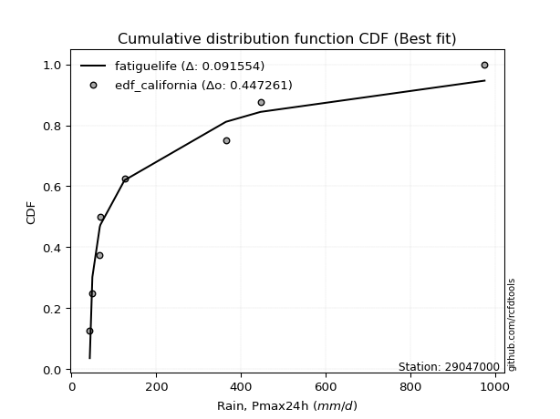</img>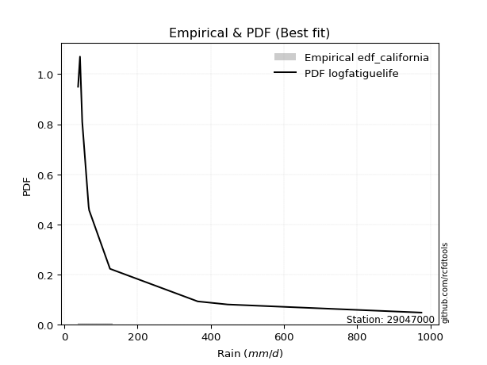</img>

</div>


### 2. EDF Hazen (1930)

Hazen method for plotting positions is a formula used to estimate the empirical cumulative probability distribution of flood events or other hydrological data. This formula often results in biased estimations, particularly when extrapolating to extreme events (high return periods).

<div align="center">


$P=(m-0.5)/n$


</div>


**2.1. Empirical values**

<div align="center">

|                | 0                   | 1                   | 2                  | 3                  | 4         | 5                  | 6                  | 7                  | 8                  |
|:---------------|:--------------------|:--------------------|:-------------------|:-------------------|:----------|:-------------------|:-------------------|:-------------------|:-------------------|
| date           | 2025                | 2018                | 2017               | 2020               | 2021      | 2019               | 2024               | 2023               | 2022               |
| x              | 37.8                | 43.02               | 49.13              | 66.64              | 68.05     | 125.01             | 364.54             | 446.14             | 975.48             |
| m              | 1                   | 2                   | 3                  | 4                  | 5         | 6                  | 7                  | 8                  | 9                  |
| empirical_dist | edf_hazen           | edf_hazen           | edf_hazen          | edf_hazen          | edf_hazen | edf_hazen          | edf_hazen          | edf_hazen          | edf_hazen          |
| empirical      | 0.05555555555555555 | 0.16666666666666666 | 0.2777777777777778 | 0.3888888888888889 | 0.5       | 0.6111111111111112 | 0.7222222222222222 | 0.8333333333333334 | 0.9444444444444444 |
| empirical_tr   | 1.0588235294117647  | 1.2                 | 1.3846153846153846 | 1.6363636363636362 | 2.0       | 2.5714285714285716 | 3.5999999999999996 | 6.000000000000002  | 17.999999999999993 |

</div>


**2.2. Kolmogorov-Smirnov fit test (sorted by Δ)**


<div align="center">

|                | 0                   | 1                   | 2                   | 3                   | 4                   | 5                   | 6                   | 7                   | 8                   | 9                   | 10                  | 11                  | 12                  | 13                  | 14                  | 15                  | 16                  | 17                  | 18                  | 19                  | 20                  | 21                  | 22                  | 23                  | 24                  | 25                  | 26                  | 27                  | 28                  | 29                  | 30                  | 31                  | 32                  | 33                  | 34                  | 35                  | 36                  | 37                  | 38                  | 39                  | 40                  | 41                  | 42                  | 43                  | 44                  | 45                  | 46                  | 47                  | 48                  | 49                  | 50                  | 51                  | 52                  | 53                  | 54                  | 55                  | 56                  | 57                  | 58                  | 59                  | 60                  | 61                  | 62                  | 63                  | 64                  | 65                  | 66                  | 67                  | 68                  | 69                  | 70                  | 71                  | 72                  | 73                  | 74                  | 75                  | 76                  | 77                  | 78                  | 79                  | 80                  | 81                  | 82                  | 83                  | 84                  | 85                  | 86                  | 87                  | 88                  | 89                  | 90                  | 91                  | 92                  | 93                  | 94                  | 95                  | 96                  | 97                  | 98                  | 99                  | 100                 | 101                 | 102                 | 103                 | 104                 | 105                 | 106                 | 107                 | 108                 | 109                 | 110                 | 111                 | 112                 | 113                 | 114                 | 115                 | 116                 | 117                 | 118                 | 119                 | 120                 | 121                 | 122                 | 123                 | 124                 | 125                 | 126                 | 127                 | 128                 | 129                 | 130                 | 131                 | 132                 | 133                 | 134                 | 135                 | 136                 | 137                 | 138                 | 139                 | 140                 | 141                 | 142                 | 143                 | 144                 | 145                 | 146                 | 147                 | 148                 | 149                 | 150                 | 151                 | 152                 | 153                 | 154                 | 155                 | 156                 | 157                 | 158                 | 159                 |
|:---------------|:--------------------|:--------------------|:--------------------|:--------------------|:--------------------|:--------------------|:--------------------|:--------------------|:--------------------|:--------------------|:--------------------|:--------------------|:--------------------|:--------------------|:--------------------|:--------------------|:--------------------|:--------------------|:--------------------|:--------------------|:--------------------|:--------------------|:--------------------|:--------------------|:--------------------|:--------------------|:--------------------|:--------------------|:--------------------|:--------------------|:--------------------|:--------------------|:--------------------|:--------------------|:--------------------|:--------------------|:--------------------|:--------------------|:--------------------|:--------------------|:--------------------|:--------------------|:--------------------|:--------------------|:--------------------|:--------------------|:--------------------|:--------------------|:--------------------|:--------------------|:--------------------|:--------------------|:--------------------|:--------------------|:--------------------|:--------------------|:--------------------|:--------------------|:--------------------|:--------------------|:--------------------|:--------------------|:--------------------|:--------------------|:--------------------|:--------------------|:--------------------|:--------------------|:--------------------|:--------------------|:--------------------|:--------------------|:--------------------|:--------------------|:--------------------|:--------------------|:--------------------|:--------------------|:--------------------|:--------------------|:--------------------|:--------------------|:--------------------|:--------------------|:--------------------|:--------------------|:--------------------|:--------------------|:--------------------|:--------------------|:--------------------|:--------------------|:--------------------|:--------------------|:--------------------|:--------------------|:--------------------|:--------------------|:--------------------|:--------------------|:--------------------|:--------------------|:--------------------|:--------------------|:--------------------|:--------------------|:--------------------|:--------------------|:--------------------|:--------------------|:--------------------|:--------------------|:--------------------|:--------------------|:--------------------|:--------------------|:--------------------|:--------------------|:--------------------|:--------------------|:--------------------|:--------------------|:--------------------|:--------------------|:--------------------|:--------------------|:--------------------|:--------------------|:--------------------|:--------------------|:--------------------|:--------------------|:--------------------|:--------------------|:--------------------|:--------------------|:--------------------|:--------------------|:--------------------|:--------------------|:--------------------|:--------------------|:--------------------|:--------------------|:--------------------|:--------------------|:--------------------|:--------------------|:--------------------|:--------------------|:--------------------|:--------------------|:--------------------|:--------------------|:--------------------|:--------------------|:--------------------|:--------------------|:--------------------|:--------------------|
| station        | 29047000            | 29047000            | 29047000            | 29047000            | 29047000            | 29047000            | 29047000            | 29047000            | 29047000            | 29047000            | 29047000            | 29047000            | 29047000            | 29047000            | 29047000            | 29047000            | 29047000            | 29047000            | 29047000            | 29047000            | 29047000            | 29047000            | 29047000            | 29047000            | 29047000            | 29047000            | 29047000            | 29047000            | 29047000            | 29047000            | 29047000            | 29047000            | 29047000            | 29047000            | 29047000            | 29047000            | 29047000            | 29047000            | 29047000            | 29047000            | 29047000            | 29047000            | 29047000            | 29047000            | 29047000            | 29047000            | 29047000            | 29047000            | 29047000            | 29047000            | 29047000            | 29047000            | 29047000            | 29047000            | 29047000            | 29047000            | 29047000            | 29047000            | 29047000            | 29047000            | 29047000            | 29047000            | 29047000            | 29047000            | 29047000            | 29047000            | 29047000            | 29047000            | 29047000            | 29047000            | 29047000            | 29047000            | 29047000            | 29047000            | 29047000            | 29047000            | 29047000            | 29047000            | 29047000            | 29047000            | 29047000            | 29047000            | 29047000            | 29047000            | 29047000            | 29047000            | 29047000            | 29047000            | 29047000            | 29047000            | 29047000            | 29047000            | 29047000            | 29047000            | 29047000            | 29047000            | 29047000            | 29047000            | 29047000            | 29047000            | 29047000            | 29047000            | 29047000            | 29047000            | 29047000            | 29047000            | 29047000            | 29047000            | 29047000            | 29047000            | 29047000            | 29047000            | 29047000            | 29047000            | 29047000            | 29047000            | 29047000            | 29047000            | 29047000            | 29047000            | 29047000            | 29047000            | 29047000            | 29047000            | 29047000            | 29047000            | 29047000            | 29047000            | 29047000            | 29047000            | 29047000            | 29047000            | 29047000            | 29047000            | 29047000            | 29047000            | 29047000            | 29047000            | 29047000            | 29047000            | 29047000            | 29047000            | 29047000            | 29047000            | 29047000            | 29047000            | 29047000            | 29047000            | 29047000            | 29047000            | 29047000            | 29047000            | 29047000            | 29047000            | 29047000            | 29047000            | 29047000            | 29047000            | 29047000            | 29047000            |
| empirical_dist | edf_hazen           | edf_hazen           | edf_hazen           | edf_hazen           | edf_hazen           | edf_hazen           | edf_hazen           | edf_hazen           | edf_hazen           | edf_hazen           | edf_hazen           | edf_hazen           | edf_hazen           | edf_hazen           | edf_hazen           | edf_hazen           | edf_hazen           | edf_hazen           | edf_hazen           | edf_hazen           | edf_hazen           | edf_hazen           | edf_hazen           | edf_hazen           | edf_hazen           | edf_hazen           | edf_hazen           | edf_hazen           | edf_hazen           | edf_hazen           | edf_hazen           | edf_hazen           | edf_hazen           | edf_hazen           | edf_hazen           | edf_hazen           | edf_hazen           | edf_hazen           | edf_hazen           | edf_hazen           | edf_hazen           | edf_hazen           | edf_hazen           | edf_hazen           | edf_hazen           | edf_hazen           | edf_hazen           | edf_hazen           | edf_hazen           | edf_hazen           | edf_hazen           | edf_hazen           | edf_hazen           | edf_hazen           | edf_hazen           | edf_hazen           | edf_hazen           | edf_hazen           | edf_hazen           | edf_hazen           | edf_hazen           | edf_hazen           | edf_hazen           | edf_hazen           | edf_hazen           | edf_hazen           | edf_hazen           | edf_hazen           | edf_hazen           | edf_hazen           | edf_hazen           | edf_hazen           | edf_hazen           | edf_hazen           | edf_hazen           | edf_hazen           | edf_hazen           | edf_hazen           | edf_hazen           | edf_hazen           | edf_hazen           | edf_hazen           | edf_hazen           | edf_hazen           | edf_hazen           | edf_hazen           | edf_hazen           | edf_hazen           | edf_hazen           | edf_hazen           | edf_hazen           | edf_hazen           | edf_hazen           | edf_hazen           | edf_hazen           | edf_hazen           | edf_hazen           | edf_hazen           | edf_hazen           | edf_hazen           | edf_hazen           | edf_hazen           | edf_hazen           | edf_hazen           | edf_hazen           | edf_hazen           | edf_hazen           | edf_hazen           | edf_hazen           | edf_hazen           | edf_hazen           | edf_hazen           | edf_hazen           | edf_hazen           | edf_hazen           | edf_hazen           | edf_hazen           | edf_hazen           | edf_hazen           | edf_hazen           | edf_hazen           | edf_hazen           | edf_hazen           | edf_hazen           | edf_hazen           | edf_hazen           | edf_hazen           | edf_hazen           | edf_hazen           | edf_hazen           | edf_hazen           | edf_hazen           | edf_hazen           | edf_hazen           | edf_hazen           | edf_hazen           | edf_hazen           | edf_hazen           | edf_hazen           | edf_hazen           | edf_hazen           | edf_hazen           | edf_hazen           | edf_hazen           | edf_hazen           | edf_hazen           | edf_hazen           | edf_hazen           | edf_hazen           | edf_hazen           | edf_hazen           | edf_hazen           | edf_hazen           | edf_hazen           | edf_hazen           | edf_hazen           | edf_hazen           | edf_hazen           | edf_hazen           | edf_hazen           |
| p_dist         | exponweib           | mielke              | logalpha            | invweibull          | fatiguelife         | logf                | logweibull_min      | logbeta             | gausshyper          | invgamma            | f                   | logexponweib        | truncweibull_min    | logmielke           | logburr             | loggenextreme       | loginvweibull       | logburr12           | lomax               | loggausshyper       | halfgennorm         | loghalfgennorm      | loginvgamma         | logncf              | logfatiguelife      | lognct              | burr12              | loglomax            | loggenexpon         | logexponnorm        | loginvgauss         | erlang              | loghalfnorm         | logexponpow         | logdweibull         | exponpow            | loghalflogistic     | truncpareto         | logtruncnorm        | logfoldnorm         | invgauss            | gengamma            | loggamma            | loggamma            | ncf                 | logdgamma           | nct                 | burr                | logjohnsonsb        | loggengamma         | logmoyal            | lograyleigh         | logsemicircular     | genpareto           | logarcsine          | loggenlogistic      | loggumbel_r         | loggenhalflogistic  | logbetaprime        | logmaxwell          | logpearson3         | loganglit           | betaprime           | nakagami            | logkstwobign        | alpha               | logloglaplace       | gamma               | loggennorm          | logrdist            | moyal               | weibull_min         | logloggamma         | logjohnsonsu        | logcrystalball      | lognorm             | logt                | dgamma              | logtruncweibull_min | gennorm             | wald                | gumbel_r            | vonmises_line       | pearson3            | logskewnorm         | rayleigh            | logerlang           | logrice             | logwrapcauchy       | halflogistic        | logweibull_max      | loglogistic         | lognakagami         | maxwell             | semicircular        | logcosine           | logwald             | halfnorm            | loghypsecant        | anglit              | loggompertz         | logtruncexpon       | genlogistic         | logtukeylambda      | loggumbel_l         | foldnorm            | logbradford         | norm                | logksone            | t                   | loglaplace          | loglaplace          | logargus            | kstwobign           | arcsine             | logistic            | logtriang           | powerlaw            | hypsecant           | genextreme          | logkappa4           | rice                | loguniform          | logkappa3           | cosine              | beta                | gumbel_l            | laplace             | logvonmises_line    | loggenpareto        | wrapcauchy          | johnsonsb           | exponnorm           | gompertz            | loglevy_l           | genexpon            | truncexpon          | argus               | logpowerlaw         | triang              | truncnorm           | bradford            | dweibull            | skewnorm            | levy_l              | ksone               | logtrapezoid        | crystalball         | kappa3              | kappa4              | rdist               | logtruncpareto      | uniform             | genhalflogistic     | tukeylambda         | johnsonsu           | trapezoid           | weibull_max         | logvonmises         | vonmises            |
| delta          | 0.0812404457364499  | 0.08438893131588232 | 0.08543952223714346 | 0.09088102593802938 | 0.0927606704722912  | 0.09421571206663637 | 0.09528552596250062 | 0.10024503051166925 | 0.10325789713449474 | 0.11092020838475569 | 0.11092063295756527 | 0.11241411288217723 | 0.11425223392537215 | 0.1155759873207538  | 0.1169196577124687  | 0.11693314245148445 | 0.1169482146872991  | 0.1203328277642306  | 0.12114793913048427 | 0.12121572963056049 | 0.12144430409466023 | 0.12324307031994008 | 0.12386038566069091 | 0.12409149299854116 | 0.12433254645049752 | 0.12549472817299734 | 0.12668953092994517 | 0.12747788214366795 | 0.1284476644861401  | 0.13030604322607575 | 0.13108955582606596 | 0.132540588857045   | 0.13739133229605777 | 0.1378884745515564  | 0.13911215746628353 | 0.14032738718726367 | 0.1404602613589469  | 0.14468651831506507 | 0.14673597431395202 | 0.14762921189999162 | 0.15034193086699    | 0.15085754691641717 | 0.1521666960558996  | 0.1521666960558996  | 0.15363348536104682 | 0.15422409798870296 | 0.15603258316167135 | 0.1584640411997491  | 0.1600149368708188  | 0.16344653632534434 | 0.1664752102618613  | 0.16791644330570077 | 0.1702928396840787  | 0.1707371503622903  | 0.1716640380024722  | 0.17297501461052694 | 0.17525387104601375 | 0.17542427321744014 | 0.1777389761316226  | 0.1787438951740103  | 0.18046840451655294 | 0.18096370264746736 | 0.1815730990580251  | 0.1834326318916115  | 0.18610540079763266 | 0.18877504604520035 | 0.19514603072736258 | 0.19658345148525058 | 0.1969541018410842  | 0.1975367541497629  | 0.199615928722641   | 0.2013828373333308  | 0.20275119082994025 | 0.20554759234185876 | 0.20598337156041646 | 0.20598338111395975 | 0.20598365074732428 | 0.2083074128200596  | 0.2104961087385812  | 0.2163063176190463  | 0.21650978906560775 | 0.21708152160230554 | 0.2175423806101848  | 0.2182047479451771  | 0.21869027363800786 | 0.22079085471545312 | 0.22081664935083467 | 0.22358829819762926 | 0.2251776618757475  | 0.22658703135163497 | 0.22751381696260464 | 0.227606749959685   | 0.22790424090251887 | 0.23281323589795783 | 0.23589138494948209 | 0.23591148772729115 | 0.24175294458936064 | 0.24223836571338128 | 0.24306301230395233 | 0.2443631142277779  | 0.24485343377718932 | 0.24820288422195586 | 0.25046394295844    | 0.2546737694594654  | 0.25557040480584325 | 0.26089693477536413 | 0.2620926549667167  | 0.26453604412988874 | 0.26594323387937635 | 0.2664145479708542  | 0.26758022060567105 | 0.26758022060567105 | 0.2786162847209782  | 0.28015157160788595 | 0.2823766849419216  | 0.2827695867829879  | 0.29184620947389117 | 0.29357974881926285 | 0.29686323243368423 | 0.29947709669949196 | 0.29964506766679666 | 0.310547669283207   | 0.31913188065525167 | 0.32044190311470644 | 0.32065635801225245 | 0.3225498133999246  | 0.323963826232281   | 0.3249421363152889  | 0.32669520625329956 | 0.33727423171255577 | 0.3381855579953433  | 0.358427926492236   | 0.36090739668888305 | 0.3621430171792478  | 0.3623885926334074  | 0.3626356045695054  | 0.36454162172240095 | 0.37440923228452294 | 0.3752539786437604  | 0.3979364182639211  | 0.40230040146492574 | 0.4160800623166875  | 0.4194596848812484  | 0.43291560983815125 | 0.43309284409986737 | 0.45027265876062916 | 0.4590398508123502  | 0.47833491313142584 | 0.4867787212879808  | 0.49711207578814953 | 0.5079913789109288  | 0.5179770610391242  | 0.5181049682905328  | 0.5206645253345751  | 0.5337453138827699  | 0.5754354038498612  | 0.6319841124776495  | 0.7654654563923289  | 1.1483275750492115  | 155.0221940563107   |
| deltao         | 0.41761268023100007 | 0.41761268023100007 | 0.41761268023100007 | 0.41761268023100007 | 0.41761268023100007 | 0.41761268023100007 | 0.41761268023100007 | 0.41761268023100007 | 0.41761268023100007 | 0.41761268023100007 | 0.41761268023100007 | 0.41761268023100007 | 0.41761268023100007 | 0.41761268023100007 | 0.41761268023100007 | 0.41761268023100007 | 0.41761268023100007 | 0.41761268023100007 | 0.41761268023100007 | 0.41761268023100007 | 0.41761268023100007 | 0.41761268023100007 | 0.41761268023100007 | 0.41761268023100007 | 0.41761268023100007 | 0.41761268023100007 | 0.41761268023100007 | 0.41761268023100007 | 0.41761268023100007 | 0.41761268023100007 | 0.41761268023100007 | 0.41761268023100007 | 0.41761268023100007 | 0.41761268023100007 | 0.41761268023100007 | 0.41761268023100007 | 0.41761268023100007 | 0.41761268023100007 | 0.41761268023100007 | 0.41761268023100007 | 0.41761268023100007 | 0.41761268023100007 | 0.41761268023100007 | 0.41761268023100007 | 0.41761268023100007 | 0.41761268023100007 | 0.41761268023100007 | 0.41761268023100007 | 0.41761268023100007 | 0.41761268023100007 | 0.41761268023100007 | 0.41761268023100007 | 0.41761268023100007 | 0.41761268023100007 | 0.41761268023100007 | 0.41761268023100007 | 0.41761268023100007 | 0.41761268023100007 | 0.41761268023100007 | 0.41761268023100007 | 0.41761268023100007 | 0.41761268023100007 | 0.41761268023100007 | 0.41761268023100007 | 0.41761268023100007 | 0.41761268023100007 | 0.41761268023100007 | 0.41761268023100007 | 0.41761268023100007 | 0.41761268023100007 | 0.41761268023100007 | 0.41761268023100007 | 0.41761268023100007 | 0.41761268023100007 | 0.41761268023100007 | 0.41761268023100007 | 0.41761268023100007 | 0.41761268023100007 | 0.41761268023100007 | 0.41761268023100007 | 0.41761268023100007 | 0.41761268023100007 | 0.41761268023100007 | 0.41761268023100007 | 0.41761268023100007 | 0.41761268023100007 | 0.41761268023100007 | 0.41761268023100007 | 0.41761268023100007 | 0.41761268023100007 | 0.41761268023100007 | 0.41761268023100007 | 0.41761268023100007 | 0.41761268023100007 | 0.41761268023100007 | 0.41761268023100007 | 0.41761268023100007 | 0.41761268023100007 | 0.41761268023100007 | 0.41761268023100007 | 0.41761268023100007 | 0.41761268023100007 | 0.41761268023100007 | 0.41761268023100007 | 0.41761268023100007 | 0.41761268023100007 | 0.41761268023100007 | 0.41761268023100007 | 0.41761268023100007 | 0.41761268023100007 | 0.41761268023100007 | 0.41761268023100007 | 0.41761268023100007 | 0.41761268023100007 | 0.41761268023100007 | 0.41761268023100007 | 0.41761268023100007 | 0.41761268023100007 | 0.41761268023100007 | 0.41761268023100007 | 0.41761268023100007 | 0.41761268023100007 | 0.41761268023100007 | 0.41761268023100007 | 0.41761268023100007 | 0.41761268023100007 | 0.41761268023100007 | 0.41761268023100007 | 0.41761268023100007 | 0.41761268023100007 | 0.41761268023100007 | 0.41761268023100007 | 0.41761268023100007 | 0.41761268023100007 | 0.41761268023100007 | 0.41761268023100007 | 0.41761268023100007 | 0.41761268023100007 | 0.41761268023100007 | 0.41761268023100007 | 0.41761268023100007 | 0.41761268023100007 | 0.41761268023100007 | 0.41761268023100007 | 0.41761268023100007 | 0.41761268023100007 | 0.41761268023100007 | 0.41761268023100007 | 0.41761268023100007 | 0.41761268023100007 | 0.41761268023100007 | 0.41761268023100007 | 0.41761268023100007 | 0.41761268023100007 | 0.41761268023100007 | 0.41761268023100007 | 0.41761268023100007 | 0.41761268023100007 | 0.41761268023100007 | 0.41761268023100007 |
| eval           | Δo > Δ              | Δo > Δ              | Δo > Δ              | Δo > Δ              | Δo > Δ              | Δo > Δ              | Δo > Δ              | Δo > Δ              | Δo > Δ              | Δo > Δ              | Δo > Δ              | Δo > Δ              | Δo > Δ              | Δo > Δ              | Δo > Δ              | Δo > Δ              | Δo > Δ              | Δo > Δ              | Δo > Δ              | Δo > Δ              | Δo > Δ              | Δo > Δ              | Δo > Δ              | Δo > Δ              | Δo > Δ              | Δo > Δ              | Δo > Δ              | Δo > Δ              | Δo > Δ              | Δo > Δ              | Δo > Δ              | Δo > Δ              | Δo > Δ              | Δo > Δ              | Δo > Δ              | Δo > Δ              | Δo > Δ              | Δo > Δ              | Δo > Δ              | Δo > Δ              | Δo > Δ              | Δo > Δ              | Δo > Δ              | Δo > Δ              | Δo > Δ              | Δo > Δ              | Δo > Δ              | Δo > Δ              | Δo > Δ              | Δo > Δ              | Δo > Δ              | Δo > Δ              | Δo > Δ              | Δo > Δ              | Δo > Δ              | Δo > Δ              | Δo > Δ              | Δo > Δ              | Δo > Δ              | Δo > Δ              | Δo > Δ              | Δo > Δ              | Δo > Δ              | Δo > Δ              | Δo > Δ              | Δo > Δ              | Δo > Δ              | Δo > Δ              | Δo > Δ              | Δo > Δ              | Δo > Δ              | Δo > Δ              | Δo > Δ              | Δo > Δ              | Δo > Δ              | Δo > Δ              | Δo > Δ              | Δo > Δ              | Δo > Δ              | Δo > Δ              | Δo > Δ              | Δo > Δ              | Δo > Δ              | Δo > Δ              | Δo > Δ              | Δo > Δ              | Δo > Δ              | Δo > Δ              | Δo > Δ              | Δo > Δ              | Δo > Δ              | Δo > Δ              | Δo > Δ              | Δo > Δ              | Δo > Δ              | Δo > Δ              | Δo > Δ              | Δo > Δ              | Δo > Δ              | Δo > Δ              | Δo > Δ              | Δo > Δ              | Δo > Δ              | Δo > Δ              | Δo > Δ              | Δo > Δ              | Δo > Δ              | Δo > Δ              | Δo > Δ              | Δo > Δ              | Δo > Δ              | Δo > Δ              | Δo > Δ              | Δo > Δ              | Δo > Δ              | Δo > Δ              | Δo > Δ              | Δo > Δ              | Δo > Δ              | Δo > Δ              | Δo > Δ              | Δo > Δ              | Δo > Δ              | Δo > Δ              | Δo > Δ              | Δo > Δ              | Δo > Δ              | Δo > Δ              | Δo > Δ              | Δo > Δ              | Δo > Δ              | Δo > Δ              | Δo > Δ              | Δo > Δ              | Δo > Δ              | Δo > Δ              | Δo > Δ              | Δo > Δ              | Δo > Δ              | Δo > Δ              | Δo > Δ              | Δo > Δ              | Δo <= Δ             | Δo <= Δ             | Δo <= Δ             | Δo <= Δ             | Δo <= Δ             | Δo <= Δ             | Δo <= Δ             | Δo <= Δ             | Δo <= Δ             | Δo <= Δ             | Δo <= Δ             | Δo <= Δ             | Δo <= Δ             | Δo <= Δ             | Δo <= Δ             | Δo <= Δ             | Δo <= Δ             | Δo <= Δ             |
| fit            | 1                   | 1                   | 1                   | 1                   | 1                   | 1                   | 1                   | 1                   | 1                   | 1                   | 1                   | 1                   | 1                   | 1                   | 1                   | 1                   | 1                   | 1                   | 1                   | 1                   | 1                   | 1                   | 1                   | 1                   | 1                   | 1                   | 1                   | 1                   | 1                   | 1                   | 1                   | 1                   | 1                   | 1                   | 1                   | 1                   | 1                   | 1                   | 1                   | 1                   | 1                   | 1                   | 1                   | 1                   | 1                   | 1                   | 1                   | 1                   | 1                   | 1                   | 1                   | 1                   | 1                   | 1                   | 1                   | 1                   | 1                   | 1                   | 1                   | 1                   | 1                   | 1                   | 1                   | 1                   | 1                   | 1                   | 1                   | 1                   | 1                   | 1                   | 1                   | 1                   | 1                   | 1                   | 1                   | 1                   | 1                   | 1                   | 1                   | 1                   | 1                   | 1                   | 1                   | 1                   | 1                   | 1                   | 1                   | 1                   | 1                   | 1                   | 1                   | 1                   | 1                   | 1                   | 1                   | 1                   | 1                   | 1                   | 1                   | 1                   | 1                   | 1                   | 1                   | 1                   | 1                   | 1                   | 1                   | 1                   | 1                   | 1                   | 1                   | 1                   | 1                   | 1                   | 1                   | 1                   | 1                   | 1                   | 1                   | 1                   | 1                   | 1                   | 1                   | 1                   | 1                   | 1                   | 1                   | 1                   | 1                   | 1                   | 1                   | 1                   | 1                   | 1                   | 1                   | 1                   | 1                   | 1                   | 1                   | 1                   | 1                   | 1                   | 0                   | 0                   | 0                   | 0                   | 0                   | 0                   | 0                   | 0                   | 0                   | 0                   | 0                   | 0                   | 0                   | 0                   | 0                   | 0                   | 0                   | 0                   |
| n              | 9                   | 9                   | 9                   | 9                   | 9                   | 9                   | 9                   | 9                   | 9                   | 9                   | 9                   | 9                   | 9                   | 9                   | 9                   | 9                   | 9                   | 9                   | 9                   | 9                   | 9                   | 9                   | 9                   | 9                   | 9                   | 9                   | 9                   | 9                   | 9                   | 9                   | 9                   | 9                   | 9                   | 9                   | 9                   | 9                   | 9                   | 9                   | 9                   | 9                   | 9                   | 9                   | 9                   | 9                   | 9                   | 9                   | 9                   | 9                   | 9                   | 9                   | 9                   | 9                   | 9                   | 9                   | 9                   | 9                   | 9                   | 9                   | 9                   | 9                   | 9                   | 9                   | 9                   | 9                   | 9                   | 9                   | 9                   | 9                   | 9                   | 9                   | 9                   | 9                   | 9                   | 9                   | 9                   | 9                   | 9                   | 9                   | 9                   | 9                   | 9                   | 9                   | 9                   | 9                   | 9                   | 9                   | 9                   | 9                   | 9                   | 9                   | 9                   | 9                   | 9                   | 9                   | 9                   | 9                   | 9                   | 9                   | 9                   | 9                   | 9                   | 9                   | 9                   | 9                   | 9                   | 9                   | 9                   | 9                   | 9                   | 9                   | 9                   | 9                   | 9                   | 9                   | 9                   | 9                   | 9                   | 9                   | 9                   | 9                   | 9                   | 9                   | 9                   | 9                   | 9                   | 9                   | 9                   | 9                   | 9                   | 9                   | 9                   | 9                   | 9                   | 9                   | 9                   | 9                   | 9                   | 9                   | 9                   | 9                   | 9                   | 9                   | 9                   | 9                   | 9                   | 9                   | 9                   | 9                   | 9                   | 9                   | 9                   | 9                   | 9                   | 9                   | 9                   | 9                   | 9                   | 9                   | 9                   | 9                   |
| best_fit       | 1                   | 0                   | 0                   | 0                   | 0                   | 0                   | 0                   | 0                   | 0                   | 0                   | 0                   | 0                   | 0                   | 0                   | 0                   | 0                   | 0                   | 0                   | 0                   | 0                   | 0                   | 0                   | 0                   | 0                   | 0                   | 0                   | 0                   | 0                   | 0                   | 0                   | 0                   | 0                   | 0                   | 0                   | 0                   | 0                   | 0                   | 0                   | 0                   | 0                   | 0                   | 0                   | 0                   | 0                   | 0                   | 0                   | 0                   | 0                   | 0                   | 0                   | 0                   | 0                   | 0                   | 0                   | 0                   | 0                   | 0                   | 0                   | 0                   | 0                   | 0                   | 0                   | 0                   | 0                   | 0                   | 0                   | 0                   | 0                   | 0                   | 0                   | 0                   | 0                   | 0                   | 0                   | 0                   | 0                   | 0                   | 0                   | 0                   | 0                   | 0                   | 0                   | 0                   | 0                   | 0                   | 0                   | 0                   | 0                   | 0                   | 0                   | 0                   | 0                   | 0                   | 0                   | 0                   | 0                   | 0                   | 0                   | 0                   | 0                   | 0                   | 0                   | 0                   | 0                   | 0                   | 0                   | 0                   | 0                   | 0                   | 0                   | 0                   | 0                   | 0                   | 0                   | 0                   | 0                   | 0                   | 0                   | 0                   | 0                   | 0                   | 0                   | 0                   | 0                   | 0                   | 0                   | 0                   | 0                   | 0                   | 0                   | 0                   | 0                   | 0                   | 0                   | 0                   | 0                   | 0                   | 0                   | 0                   | 0                   | 0                   | 0                   | 0                   | 0                   | 0                   | 0                   | 0                   | 0                   | 0                   | 0                   | 0                   | 0                   | 0                   | 0                   | 0                   | 0                   | 0                   | 0                   | 0                   | 0                   |
| best_fit_sort  | 1                   | 2                   | 3                   | 4                   | 5                   | 6                   | 7                   | 8                   | 9                   | 10                  | 11                  | 12                  | 13                  | 14                  | 15                  | 16                  | 17                  | 18                  | 19                  | 20                  | 21                  | 22                  | 23                  | 24                  | 25                  | 26                  | 27                  | 28                  | 29                  | 30                  | 31                  | 32                  | 33                  | 34                  | 35                  | 36                  | 37                  | 38                  | 39                  | 40                  | 41                  | 42                  | 43                  | 44                  | 45                  | 46                  | 47                  | 48                  | 49                  | 50                  | 51                  | 52                  | 53                  | 54                  | 55                  | 56                  | 57                  | 58                  | 59                  | 60                  | 61                  | 62                  | 63                  | 64                  | 65                  | 66                  | 67                  | 68                  | 69                  | 70                  | 71                  | 72                  | 73                  | 74                  | 75                  | 76                  | 77                  | 78                  | 79                  | 80                  | 81                  | 82                  | 83                  | 84                  | 85                  | 86                  | 87                  | 88                  | 89                  | 90                  | 91                  | 92                  | 93                  | 94                  | 95                  | 96                  | 97                  | 98                  | 99                  | 100                 | 101                 | 102                 | 103                 | 104                 | 105                 | 106                 | 107                 | 108                 | 109                 | 110                 | 111                 | 112                 | 113                 | 114                 | 115                 | 116                 | 117                 | 118                 | 119                 | 120                 | 121                 | 122                 | 123                 | 124                 | 125                 | 126                 | 127                 | 128                 | 129                 | 130                 | 131                 | 132                 | 133                 | 134                 | 135                 | 136                 | 137                 | 138                 | 139                 | 140                 | 141                 | 142                 | 143                 | 144                 | 145                 | 146                 | 147                 | 148                 | 149                 | 150                 | 151                 | 152                 | 153                 | 154                 | 155                 | 156                 | 157                 | 158                 | 159                 | 160                 |

</div>


**2.3. Best fit**

<div align="center">

|   id |   station | empirical_dist   | p_dist    |     delta |   deltao | eval   |   fit |   n |   best_fit |   best_fit_sort |
|-----:|----------:|:-----------------|:----------|----------:|---------:|:-------|------:|----:|-----------:|----------------:|
|    0 |  29047000 | edf_hazen        | exponweib | 0.0812404 | 0.417613 | Δo > Δ |     1 |   9 |          1 |               1 |

</div>


<div align="center">

</img></img>

</div>


### 3. EDF Weibull (1939)

Weibull plotting position formula is an empirical method used to estimate the non-exceedance probability or plotting position for a set of observed data, is often recommended or widely used in practice, particularly in flood frequency analysis.

<div align="center">


$P=m/(n+1)$


</div>


**3.1. Empirical values**

<div align="center">

|                | 0                  | 1           | 2                  | 3                  | 4           | 5           | 6                 | 7                 | 8                  |
|:---------------|:-------------------|:------------|:-------------------|:-------------------|:------------|:------------|:------------------|:------------------|:-------------------|
| date           | 2025               | 2018        | 2017               | 2020               | 2021        | 2019        | 2024              | 2023              | 2022               |
| x              | 37.8               | 43.02       | 49.13              | 66.64              | 68.05       | 125.01      | 364.54            | 446.14            | 975.48             |
| m              | 1                  | 2           | 3                  | 4                  | 5           | 6           | 7                 | 8                 | 9                  |
| empirical_dist | edf_weibull        | edf_weibull | edf_weibull        | edf_weibull        | edf_weibull | edf_weibull | edf_weibull       | edf_weibull       | edf_weibull        |
| empirical      | 0.1                | 0.2         | 0.3                | 0.4                | 0.5         | 0.6         | 0.7               | 0.8               | 0.9                |
| empirical_tr   | 1.1111111111111112 | 1.25        | 1.4285714285714286 | 1.6666666666666667 | 2.0         | 2.5         | 3.333333333333333 | 5.000000000000001 | 10.000000000000002 |

</div>


**3.2. Kolmogorov-Smirnov fit test (sorted by Δ)**


<div align="center">

|                | 0                   | 1                   | 2                   | 3                   | 4                   | 5                   | 6                   | 7                   | 8                   | 9                   | 10                  | 11                  | 12                  | 13                  | 14                  | 15                  | 16                  | 17                  | 18                  | 19                  | 20                  | 21                  | 22                  | 23                  | 24                  | 25                  | 26                  | 27                  | 28                  | 29                  | 30                  | 31                  | 32                  | 33                  | 34                  | 35                  | 36                  | 37                  | 38                  | 39                  | 40                  | 41                  | 42                  | 43                  | 44                  | 45                  | 46                  | 47                  | 48                  | 49                  | 50                  | 51                  | 52                  | 53                  | 54                  | 55                  | 56                  | 57                  | 58                  | 59                  | 60                  | 61                  | 62                  | 63                  | 64                  | 65                  | 66                  | 67                  | 68                  | 69                  | 70                  | 71                  | 72                  | 73                  | 74                  | 75                  | 76                  | 77                  | 78                  | 79                  | 80                  | 81                  | 82                  | 83                  | 84                  | 85                  | 86                  | 87                  | 88                  | 89                  | 90                  | 91                  | 92                  | 93                  | 94                  | 95                  | 96                  | 97                  | 98                  | 99                  | 100                 | 101                 | 102                 | 103                 | 104                 | 105                 | 106                 | 107                 | 108                 | 109                 | 110                 | 111                 | 112                 | 113                 | 114                 | 115                 | 116                 | 117                 | 118                 | 119                 | 120                 | 121                 | 122                 | 123                 | 124                 | 125                 | 126                 | 127                 | 128                 | 129                 | 130                 | 131                 | 132                 | 133                 | 134                 | 135                 | 136                 | 137                 | 138                 | 139                 | 140                 | 141                 | 142                 | 143                 | 144                 | 145                 | 146                 | 147                 | 148                 | 149                 | 150                 | 151                 | 152                 | 153                 | 154                 | 155                 | 156                 | 157                 | 158                 | 159                 |
|:---------------|:--------------------|:--------------------|:--------------------|:--------------------|:--------------------|:--------------------|:--------------------|:--------------------|:--------------------|:--------------------|:--------------------|:--------------------|:--------------------|:--------------------|:--------------------|:--------------------|:--------------------|:--------------------|:--------------------|:--------------------|:--------------------|:--------------------|:--------------------|:--------------------|:--------------------|:--------------------|:--------------------|:--------------------|:--------------------|:--------------------|:--------------------|:--------------------|:--------------------|:--------------------|:--------------------|:--------------------|:--------------------|:--------------------|:--------------------|:--------------------|:--------------------|:--------------------|:--------------------|:--------------------|:--------------------|:--------------------|:--------------------|:--------------------|:--------------------|:--------------------|:--------------------|:--------------------|:--------------------|:--------------------|:--------------------|:--------------------|:--------------------|:--------------------|:--------------------|:--------------------|:--------------------|:--------------------|:--------------------|:--------------------|:--------------------|:--------------------|:--------------------|:--------------------|:--------------------|:--------------------|:--------------------|:--------------------|:--------------------|:--------------------|:--------------------|:--------------------|:--------------------|:--------------------|:--------------------|:--------------------|:--------------------|:--------------------|:--------------------|:--------------------|:--------------------|:--------------------|:--------------------|:--------------------|:--------------------|:--------------------|:--------------------|:--------------------|:--------------------|:--------------------|:--------------------|:--------------------|:--------------------|:--------------------|:--------------------|:--------------------|:--------------------|:--------------------|:--------------------|:--------------------|:--------------------|:--------------------|:--------------------|:--------------------|:--------------------|:--------------------|:--------------------|:--------------------|:--------------------|:--------------------|:--------------------|:--------------------|:--------------------|:--------------------|:--------------------|:--------------------|:--------------------|:--------------------|:--------------------|:--------------------|:--------------------|:--------------------|:--------------------|:--------------------|:--------------------|:--------------------|:--------------------|:--------------------|:--------------------|:--------------------|:--------------------|:--------------------|:--------------------|:--------------------|:--------------------|:--------------------|:--------------------|:--------------------|:--------------------|:--------------------|:--------------------|:--------------------|:--------------------|:--------------------|:--------------------|:--------------------|:--------------------|:--------------------|:--------------------|:--------------------|:--------------------|:--------------------|:--------------------|:--------------------|:--------------------|:--------------------|
| station        | 29047000            | 29047000            | 29047000            | 29047000            | 29047000            | 29047000            | 29047000            | 29047000            | 29047000            | 29047000            | 29047000            | 29047000            | 29047000            | 29047000            | 29047000            | 29047000            | 29047000            | 29047000            | 29047000            | 29047000            | 29047000            | 29047000            | 29047000            | 29047000            | 29047000            | 29047000            | 29047000            | 29047000            | 29047000            | 29047000            | 29047000            | 29047000            | 29047000            | 29047000            | 29047000            | 29047000            | 29047000            | 29047000            | 29047000            | 29047000            | 29047000            | 29047000            | 29047000            | 29047000            | 29047000            | 29047000            | 29047000            | 29047000            | 29047000            | 29047000            | 29047000            | 29047000            | 29047000            | 29047000            | 29047000            | 29047000            | 29047000            | 29047000            | 29047000            | 29047000            | 29047000            | 29047000            | 29047000            | 29047000            | 29047000            | 29047000            | 29047000            | 29047000            | 29047000            | 29047000            | 29047000            | 29047000            | 29047000            | 29047000            | 29047000            | 29047000            | 29047000            | 29047000            | 29047000            | 29047000            | 29047000            | 29047000            | 29047000            | 29047000            | 29047000            | 29047000            | 29047000            | 29047000            | 29047000            | 29047000            | 29047000            | 29047000            | 29047000            | 29047000            | 29047000            | 29047000            | 29047000            | 29047000            | 29047000            | 29047000            | 29047000            | 29047000            | 29047000            | 29047000            | 29047000            | 29047000            | 29047000            | 29047000            | 29047000            | 29047000            | 29047000            | 29047000            | 29047000            | 29047000            | 29047000            | 29047000            | 29047000            | 29047000            | 29047000            | 29047000            | 29047000            | 29047000            | 29047000            | 29047000            | 29047000            | 29047000            | 29047000            | 29047000            | 29047000            | 29047000            | 29047000            | 29047000            | 29047000            | 29047000            | 29047000            | 29047000            | 29047000            | 29047000            | 29047000            | 29047000            | 29047000            | 29047000            | 29047000            | 29047000            | 29047000            | 29047000            | 29047000            | 29047000            | 29047000            | 29047000            | 29047000            | 29047000            | 29047000            | 29047000            | 29047000            | 29047000            | 29047000            | 29047000            | 29047000            | 29047000            |
| empirical_dist | edf_weibull         | edf_weibull         | edf_weibull         | edf_weibull         | edf_weibull         | edf_weibull         | edf_weibull         | edf_weibull         | edf_weibull         | edf_weibull         | edf_weibull         | edf_weibull         | edf_weibull         | edf_weibull         | edf_weibull         | edf_weibull         | edf_weibull         | edf_weibull         | edf_weibull         | edf_weibull         | edf_weibull         | edf_weibull         | edf_weibull         | edf_weibull         | edf_weibull         | edf_weibull         | edf_weibull         | edf_weibull         | edf_weibull         | edf_weibull         | edf_weibull         | edf_weibull         | edf_weibull         | edf_weibull         | edf_weibull         | edf_weibull         | edf_weibull         | edf_weibull         | edf_weibull         | edf_weibull         | edf_weibull         | edf_weibull         | edf_weibull         | edf_weibull         | edf_weibull         | edf_weibull         | edf_weibull         | edf_weibull         | edf_weibull         | edf_weibull         | edf_weibull         | edf_weibull         | edf_weibull         | edf_weibull         | edf_weibull         | edf_weibull         | edf_weibull         | edf_weibull         | edf_weibull         | edf_weibull         | edf_weibull         | edf_weibull         | edf_weibull         | edf_weibull         | edf_weibull         | edf_weibull         | edf_weibull         | edf_weibull         | edf_weibull         | edf_weibull         | edf_weibull         | edf_weibull         | edf_weibull         | edf_weibull         | edf_weibull         | edf_weibull         | edf_weibull         | edf_weibull         | edf_weibull         | edf_weibull         | edf_weibull         | edf_weibull         | edf_weibull         | edf_weibull         | edf_weibull         | edf_weibull         | edf_weibull         | edf_weibull         | edf_weibull         | edf_weibull         | edf_weibull         | edf_weibull         | edf_weibull         | edf_weibull         | edf_weibull         | edf_weibull         | edf_weibull         | edf_weibull         | edf_weibull         | edf_weibull         | edf_weibull         | edf_weibull         | edf_weibull         | edf_weibull         | edf_weibull         | edf_weibull         | edf_weibull         | edf_weibull         | edf_weibull         | edf_weibull         | edf_weibull         | edf_weibull         | edf_weibull         | edf_weibull         | edf_weibull         | edf_weibull         | edf_weibull         | edf_weibull         | edf_weibull         | edf_weibull         | edf_weibull         | edf_weibull         | edf_weibull         | edf_weibull         | edf_weibull         | edf_weibull         | edf_weibull         | edf_weibull         | edf_weibull         | edf_weibull         | edf_weibull         | edf_weibull         | edf_weibull         | edf_weibull         | edf_weibull         | edf_weibull         | edf_weibull         | edf_weibull         | edf_weibull         | edf_weibull         | edf_weibull         | edf_weibull         | edf_weibull         | edf_weibull         | edf_weibull         | edf_weibull         | edf_weibull         | edf_weibull         | edf_weibull         | edf_weibull         | edf_weibull         | edf_weibull         | edf_weibull         | edf_weibull         | edf_weibull         | edf_weibull         | edf_weibull         | edf_weibull         | edf_weibull         | edf_weibull         |
| p_dist         | logbeta             | exponweib           | logweibull_min      | mielke              | logalpha            | invweibull          | truncweibull_min    | fatiguelife         | logf                | gausshyper          | logexponweib        | logjohnsonsb        | logarcsine          | invgamma            | f                   | loghalfnorm         | logmielke           | logexponpow         | logburr             | loggenextreme       | loginvweibull       | logburr12           | lomax               | loggausshyper       | halfgennorm         | truncpareto         | loghalfgennorm      | loginvgamma         | logncf              | logfatiguelife      | logfoldnorm         | lognct              | burr12              | loglomax            | nakagami            | loghalflogistic     | logtruncnorm        | loggenexpon         | logexponnorm        | loginvgauss         | ncf                 | logdweibull         | erlang              | nct                 | exponpow            | logmoyal            | lograyleigh         | gengamma            | logsemicircular     | invgauss            | loggenlogistic      | pearson3            | loggamma            | loggamma            | loggumbel_r         | burr                | loggenhalflogistic  | logdgamma           | logmaxwell          | logpearson3         | loganglit           | betaprime           | halflogistic        | loggengamma         | logkstwobign        | vonmises_line       | moyal               | logwrapcauchy       | genpareto           | dgamma              | logrdist            | halfnorm            | logbetaprime        | weibull_min         | logloggamma         | logjohnsonsu        | gumbel_r            | logcrystalball      | lognorm             | logt                | rayleigh            | logtruncweibull_min | alpha               | logweibull_max      | foldnorm            | wald                | logloglaplace       | logskewnorm         | gamma               | loggennorm          | maxwell             | logrice             | semicircular        | loglogistic         | lognakagami         | gennorm             | anglit              | logcosine           | arcsine             | logerlang           | loghypsecant        | loggompertz         | t                   | logtruncexpon       | genlogistic         | norm                | logtukeylambda      | loggumbel_l         | powerlaw            | logbradford         | logwald             | logksone            | genextreme          | loglaplace          | loglaplace          | logistic            | kstwobign           | logargus            | hypsecant           | logtriang           | loggenpareto        | rice                | logkappa4           | wrapcauchy          | cosine              | beta                | gumbel_l            | laplace             | loglevy_l           | loguniform          | logkappa3           | johnsonsb           | logvonmises_line    | logpowerlaw         | truncexpon          | exponnorm           | gompertz            | genexpon            | argus               | dweibull            | triang              | levy_l              | truncnorm           | bradford            | skewnorm            | crystalball         | ksone               | kappa3              | logtrapezoid        | rdist               | logtruncpareto      | kappa4              | tukeylambda         | genhalflogistic     | uniform             | johnsonsu           | trapezoid           | weibull_max         | logvonmises         | vonmises            |
| delta          | 0.09999405981552643 | 0.09999999997864696 | 0.09999999999492971 | 0.10661115353810452 | 0.10766174445936572 | 0.11310324816025163 | 0.11425223392537215 | 0.11498289269451345 | 0.11643793428885862 | 0.125480119356717   | 0.12617938495476888 | 0.12668160353748548 | 0.12721959355802775 | 0.13314243060697795 | 0.13314285517978752 | 0.13739133229605777 | 0.13779820954297606 | 0.1378884745515564  | 0.13914187993469096 | 0.1391553646737067  | 0.13917043690952136 | 0.14255504998645285 | 0.14337016135270653 | 0.14343795185278274 | 0.14366652631688248 | 0.14468651831506507 | 0.14546529254216234 | 0.14608260788291316 | 0.14631371522076342 | 0.14655476867271977 | 0.14762921189999162 | 0.1477169503952196  | 0.14891175315216743 | 0.1497001043658902  | 0.15009929855827814 | 0.1501206076981092  | 0.15022512156536982 | 0.15066988670836234 | 0.152528265448298   | 0.15331177804828822 | 0.15363348536104682 | 0.15396272744659478 | 0.15476281107926726 | 0.15655241183888613 | 0.16254960940948593 | 0.1664752102618613  | 0.16791644330570077 | 0.169889281994703   | 0.1702928396840787  | 0.17256415308921225 | 0.17297501461052694 | 0.17376030350073265 | 0.17438891827812186 | 0.17438891827812186 | 0.17525387104601375 | 0.17533752901512933 | 0.17542427321744014 | 0.1764463202109252  | 0.1787438951740103  | 0.18046840451655294 | 0.18096370264746736 | 0.1815730990580251  | 0.1821425869071905  | 0.1856687585475666  | 0.18610540079763266 | 0.18788104184583426 | 0.19087763688847714 | 0.19184432854241418 | 0.19295937258451257 | 0.19719630170894842 | 0.1975367541497629  | 0.19779392126893683 | 0.19996119835384485 | 0.2013828373333308  | 0.20275119082994025 | 0.20554759234185876 | 0.20597041049119436 | 0.20598337156041646 | 0.20598338111395975 | 0.20598365074732428 | 0.20967974360434194 | 0.2104961087385812  | 0.2109972682674226  | 0.21640270585149346 | 0.2164524903309197  | 0.21650978906560775 | 0.21736825294958484 | 0.21869027363800786 | 0.21880567370747284 | 0.21917632406330645 | 0.22170212478684664 | 0.22358829819762926 | 0.2247802738383709  | 0.227606749959685   | 0.22790424090251887 | 0.23162739825751444 | 0.23325200311666672 | 0.23591148772729115 | 0.23793224049747716 | 0.24303887157305692 | 0.24306301230395233 | 0.24485343377718932 | 0.24783807004417702 | 0.24820288422195586 | 0.25046394295844    | 0.25342493301877755 | 0.2546737694594654  | 0.25557040480584325 | 0.2602464154859295  | 0.2620926549667167  | 0.26397516681158284 | 0.26594323387937635 | 0.2661437633661586  | 0.26758022060567105 | 0.26758022060567105 | 0.27165847567187673 | 0.27550772348846325 | 0.2786162847209782  | 0.28575212132257305 | 0.29184620947389117 | 0.29282978726811126 | 0.2994365581720958  | 0.29964506766679666 | 0.30485222466200995 | 0.30954524690114127 | 0.3115172471997173  | 0.3128527151211698  | 0.3138310252041777  | 0.317944148188963   | 0.31913188065525167 | 0.32044190311470644 | 0.32509459315890266 | 0.32669520625329956 | 0.34192064531042704 | 0.35343051061128977 | 0.36090739668888305 | 0.3621430171792478  | 0.3626356045695054  | 0.36329812117341176 | 0.3750152404368039  | 0.38682530715280994 | 0.38864839965542297 | 0.40230040146492574 | 0.4160800623166875  | 0.43291560983815125 | 0.43389046868698145 | 0.439161547649518   | 0.4423342768435364  | 0.44792873970123903 | 0.46354693446648443 | 0.48464372770579084 | 0.48600096467703835 | 0.4893008694383255  | 0.5060907584759161  | 0.5069938571794215  | 0.5421020705165278  | 0.5986507791443161  | 0.7321321230589956  | 1.1705497972714336  | 155.06663850075515  |
| deltao         | 0.41761268023100007 | 0.41761268023100007 | 0.41761268023100007 | 0.41761268023100007 | 0.41761268023100007 | 0.41761268023100007 | 0.41761268023100007 | 0.41761268023100007 | 0.41761268023100007 | 0.41761268023100007 | 0.41761268023100007 | 0.41761268023100007 | 0.41761268023100007 | 0.41761268023100007 | 0.41761268023100007 | 0.41761268023100007 | 0.41761268023100007 | 0.41761268023100007 | 0.41761268023100007 | 0.41761268023100007 | 0.41761268023100007 | 0.41761268023100007 | 0.41761268023100007 | 0.41761268023100007 | 0.41761268023100007 | 0.41761268023100007 | 0.41761268023100007 | 0.41761268023100007 | 0.41761268023100007 | 0.41761268023100007 | 0.41761268023100007 | 0.41761268023100007 | 0.41761268023100007 | 0.41761268023100007 | 0.41761268023100007 | 0.41761268023100007 | 0.41761268023100007 | 0.41761268023100007 | 0.41761268023100007 | 0.41761268023100007 | 0.41761268023100007 | 0.41761268023100007 | 0.41761268023100007 | 0.41761268023100007 | 0.41761268023100007 | 0.41761268023100007 | 0.41761268023100007 | 0.41761268023100007 | 0.41761268023100007 | 0.41761268023100007 | 0.41761268023100007 | 0.41761268023100007 | 0.41761268023100007 | 0.41761268023100007 | 0.41761268023100007 | 0.41761268023100007 | 0.41761268023100007 | 0.41761268023100007 | 0.41761268023100007 | 0.41761268023100007 | 0.41761268023100007 | 0.41761268023100007 | 0.41761268023100007 | 0.41761268023100007 | 0.41761268023100007 | 0.41761268023100007 | 0.41761268023100007 | 0.41761268023100007 | 0.41761268023100007 | 0.41761268023100007 | 0.41761268023100007 | 0.41761268023100007 | 0.41761268023100007 | 0.41761268023100007 | 0.41761268023100007 | 0.41761268023100007 | 0.41761268023100007 | 0.41761268023100007 | 0.41761268023100007 | 0.41761268023100007 | 0.41761268023100007 | 0.41761268023100007 | 0.41761268023100007 | 0.41761268023100007 | 0.41761268023100007 | 0.41761268023100007 | 0.41761268023100007 | 0.41761268023100007 | 0.41761268023100007 | 0.41761268023100007 | 0.41761268023100007 | 0.41761268023100007 | 0.41761268023100007 | 0.41761268023100007 | 0.41761268023100007 | 0.41761268023100007 | 0.41761268023100007 | 0.41761268023100007 | 0.41761268023100007 | 0.41761268023100007 | 0.41761268023100007 | 0.41761268023100007 | 0.41761268023100007 | 0.41761268023100007 | 0.41761268023100007 | 0.41761268023100007 | 0.41761268023100007 | 0.41761268023100007 | 0.41761268023100007 | 0.41761268023100007 | 0.41761268023100007 | 0.41761268023100007 | 0.41761268023100007 | 0.41761268023100007 | 0.41761268023100007 | 0.41761268023100007 | 0.41761268023100007 | 0.41761268023100007 | 0.41761268023100007 | 0.41761268023100007 | 0.41761268023100007 | 0.41761268023100007 | 0.41761268023100007 | 0.41761268023100007 | 0.41761268023100007 | 0.41761268023100007 | 0.41761268023100007 | 0.41761268023100007 | 0.41761268023100007 | 0.41761268023100007 | 0.41761268023100007 | 0.41761268023100007 | 0.41761268023100007 | 0.41761268023100007 | 0.41761268023100007 | 0.41761268023100007 | 0.41761268023100007 | 0.41761268023100007 | 0.41761268023100007 | 0.41761268023100007 | 0.41761268023100007 | 0.41761268023100007 | 0.41761268023100007 | 0.41761268023100007 | 0.41761268023100007 | 0.41761268023100007 | 0.41761268023100007 | 0.41761268023100007 | 0.41761268023100007 | 0.41761268023100007 | 0.41761268023100007 | 0.41761268023100007 | 0.41761268023100007 | 0.41761268023100007 | 0.41761268023100007 | 0.41761268023100007 | 0.41761268023100007 | 0.41761268023100007 | 0.41761268023100007 | 0.41761268023100007 |
| eval           | Δo > Δ              | Δo > Δ              | Δo > Δ              | Δo > Δ              | Δo > Δ              | Δo > Δ              | Δo > Δ              | Δo > Δ              | Δo > Δ              | Δo > Δ              | Δo > Δ              | Δo > Δ              | Δo > Δ              | Δo > Δ              | Δo > Δ              | Δo > Δ              | Δo > Δ              | Δo > Δ              | Δo > Δ              | Δo > Δ              | Δo > Δ              | Δo > Δ              | Δo > Δ              | Δo > Δ              | Δo > Δ              | Δo > Δ              | Δo > Δ              | Δo > Δ              | Δo > Δ              | Δo > Δ              | Δo > Δ              | Δo > Δ              | Δo > Δ              | Δo > Δ              | Δo > Δ              | Δo > Δ              | Δo > Δ              | Δo > Δ              | Δo > Δ              | Δo > Δ              | Δo > Δ              | Δo > Δ              | Δo > Δ              | Δo > Δ              | Δo > Δ              | Δo > Δ              | Δo > Δ              | Δo > Δ              | Δo > Δ              | Δo > Δ              | Δo > Δ              | Δo > Δ              | Δo > Δ              | Δo > Δ              | Δo > Δ              | Δo > Δ              | Δo > Δ              | Δo > Δ              | Δo > Δ              | Δo > Δ              | Δo > Δ              | Δo > Δ              | Δo > Δ              | Δo > Δ              | Δo > Δ              | Δo > Δ              | Δo > Δ              | Δo > Δ              | Δo > Δ              | Δo > Δ              | Δo > Δ              | Δo > Δ              | Δo > Δ              | Δo > Δ              | Δo > Δ              | Δo > Δ              | Δo > Δ              | Δo > Δ              | Δo > Δ              | Δo > Δ              | Δo > Δ              | Δo > Δ              | Δo > Δ              | Δo > Δ              | Δo > Δ              | Δo > Δ              | Δo > Δ              | Δo > Δ              | Δo > Δ              | Δo > Δ              | Δo > Δ              | Δo > Δ              | Δo > Δ              | Δo > Δ              | Δo > Δ              | Δo > Δ              | Δo > Δ              | Δo > Δ              | Δo > Δ              | Δo > Δ              | Δo > Δ              | Δo > Δ              | Δo > Δ              | Δo > Δ              | Δo > Δ              | Δo > Δ              | Δo > Δ              | Δo > Δ              | Δo > Δ              | Δo > Δ              | Δo > Δ              | Δo > Δ              | Δo > Δ              | Δo > Δ              | Δo > Δ              | Δo > Δ              | Δo > Δ              | Δo > Δ              | Δo > Δ              | Δo > Δ              | Δo > Δ              | Δo > Δ              | Δo > Δ              | Δo > Δ              | Δo > Δ              | Δo > Δ              | Δo > Δ              | Δo > Δ              | Δo > Δ              | Δo > Δ              | Δo > Δ              | Δo > Δ              | Δo > Δ              | Δo > Δ              | Δo > Δ              | Δo > Δ              | Δo > Δ              | Δo > Δ              | Δo > Δ              | Δo > Δ              | Δo > Δ              | Δo > Δ              | Δo > Δ              | Δo > Δ              | Δo <= Δ             | Δo <= Δ             | Δo <= Δ             | Δo <= Δ             | Δo <= Δ             | Δo <= Δ             | Δo <= Δ             | Δo <= Δ             | Δo <= Δ             | Δo <= Δ             | Δo <= Δ             | Δo <= Δ             | Δo <= Δ             | Δo <= Δ             | Δo <= Δ             | Δo <= Δ             |
| fit            | 1                   | 1                   | 1                   | 1                   | 1                   | 1                   | 1                   | 1                   | 1                   | 1                   | 1                   | 1                   | 1                   | 1                   | 1                   | 1                   | 1                   | 1                   | 1                   | 1                   | 1                   | 1                   | 1                   | 1                   | 1                   | 1                   | 1                   | 1                   | 1                   | 1                   | 1                   | 1                   | 1                   | 1                   | 1                   | 1                   | 1                   | 1                   | 1                   | 1                   | 1                   | 1                   | 1                   | 1                   | 1                   | 1                   | 1                   | 1                   | 1                   | 1                   | 1                   | 1                   | 1                   | 1                   | 1                   | 1                   | 1                   | 1                   | 1                   | 1                   | 1                   | 1                   | 1                   | 1                   | 1                   | 1                   | 1                   | 1                   | 1                   | 1                   | 1                   | 1                   | 1                   | 1                   | 1                   | 1                   | 1                   | 1                   | 1                   | 1                   | 1                   | 1                   | 1                   | 1                   | 1                   | 1                   | 1                   | 1                   | 1                   | 1                   | 1                   | 1                   | 1                   | 1                   | 1                   | 1                   | 1                   | 1                   | 1                   | 1                   | 1                   | 1                   | 1                   | 1                   | 1                   | 1                   | 1                   | 1                   | 1                   | 1                   | 1                   | 1                   | 1                   | 1                   | 1                   | 1                   | 1                   | 1                   | 1                   | 1                   | 1                   | 1                   | 1                   | 1                   | 1                   | 1                   | 1                   | 1                   | 1                   | 1                   | 1                   | 1                   | 1                   | 1                   | 1                   | 1                   | 1                   | 1                   | 1                   | 1                   | 1                   | 1                   | 1                   | 1                   | 0                   | 0                   | 0                   | 0                   | 0                   | 0                   | 0                   | 0                   | 0                   | 0                   | 0                   | 0                   | 0                   | 0                   | 0                   | 0                   |
| n              | 9                   | 9                   | 9                   | 9                   | 9                   | 9                   | 9                   | 9                   | 9                   | 9                   | 9                   | 9                   | 9                   | 9                   | 9                   | 9                   | 9                   | 9                   | 9                   | 9                   | 9                   | 9                   | 9                   | 9                   | 9                   | 9                   | 9                   | 9                   | 9                   | 9                   | 9                   | 9                   | 9                   | 9                   | 9                   | 9                   | 9                   | 9                   | 9                   | 9                   | 9                   | 9                   | 9                   | 9                   | 9                   | 9                   | 9                   | 9                   | 9                   | 9                   | 9                   | 9                   | 9                   | 9                   | 9                   | 9                   | 9                   | 9                   | 9                   | 9                   | 9                   | 9                   | 9                   | 9                   | 9                   | 9                   | 9                   | 9                   | 9                   | 9                   | 9                   | 9                   | 9                   | 9                   | 9                   | 9                   | 9                   | 9                   | 9                   | 9                   | 9                   | 9                   | 9                   | 9                   | 9                   | 9                   | 9                   | 9                   | 9                   | 9                   | 9                   | 9                   | 9                   | 9                   | 9                   | 9                   | 9                   | 9                   | 9                   | 9                   | 9                   | 9                   | 9                   | 9                   | 9                   | 9                   | 9                   | 9                   | 9                   | 9                   | 9                   | 9                   | 9                   | 9                   | 9                   | 9                   | 9                   | 9                   | 9                   | 9                   | 9                   | 9                   | 9                   | 9                   | 9                   | 9                   | 9                   | 9                   | 9                   | 9                   | 9                   | 9                   | 9                   | 9                   | 9                   | 9                   | 9                   | 9                   | 9                   | 9                   | 9                   | 9                   | 9                   | 9                   | 9                   | 9                   | 9                   | 9                   | 9                   | 9                   | 9                   | 9                   | 9                   | 9                   | 9                   | 9                   | 9                   | 9                   | 9                   | 9                   |
| best_fit       | 1                   | 0                   | 0                   | 0                   | 0                   | 0                   | 0                   | 0                   | 0                   | 0                   | 0                   | 0                   | 0                   | 0                   | 0                   | 0                   | 0                   | 0                   | 0                   | 0                   | 0                   | 0                   | 0                   | 0                   | 0                   | 0                   | 0                   | 0                   | 0                   | 0                   | 0                   | 0                   | 0                   | 0                   | 0                   | 0                   | 0                   | 0                   | 0                   | 0                   | 0                   | 0                   | 0                   | 0                   | 0                   | 0                   | 0                   | 0                   | 0                   | 0                   | 0                   | 0                   | 0                   | 0                   | 0                   | 0                   | 0                   | 0                   | 0                   | 0                   | 0                   | 0                   | 0                   | 0                   | 0                   | 0                   | 0                   | 0                   | 0                   | 0                   | 0                   | 0                   | 0                   | 0                   | 0                   | 0                   | 0                   | 0                   | 0                   | 0                   | 0                   | 0                   | 0                   | 0                   | 0                   | 0                   | 0                   | 0                   | 0                   | 0                   | 0                   | 0                   | 0                   | 0                   | 0                   | 0                   | 0                   | 0                   | 0                   | 0                   | 0                   | 0                   | 0                   | 0                   | 0                   | 0                   | 0                   | 0                   | 0                   | 0                   | 0                   | 0                   | 0                   | 0                   | 0                   | 0                   | 0                   | 0                   | 0                   | 0                   | 0                   | 0                   | 0                   | 0                   | 0                   | 0                   | 0                   | 0                   | 0                   | 0                   | 0                   | 0                   | 0                   | 0                   | 0                   | 0                   | 0                   | 0                   | 0                   | 0                   | 0                   | 0                   | 0                   | 0                   | 0                   | 0                   | 0                   | 0                   | 0                   | 0                   | 0                   | 0                   | 0                   | 0                   | 0                   | 0                   | 0                   | 0                   | 0                   | 0                   |
| best_fit_sort  | 1                   | 2                   | 3                   | 4                   | 5                   | 6                   | 7                   | 8                   | 9                   | 10                  | 11                  | 12                  | 13                  | 14                  | 15                  | 16                  | 17                  | 18                  | 19                  | 20                  | 21                  | 22                  | 23                  | 24                  | 25                  | 26                  | 27                  | 28                  | 29                  | 30                  | 31                  | 32                  | 33                  | 34                  | 35                  | 36                  | 37                  | 38                  | 39                  | 40                  | 41                  | 42                  | 43                  | 44                  | 45                  | 46                  | 47                  | 48                  | 49                  | 50                  | 51                  | 52                  | 53                  | 54                  | 55                  | 56                  | 57                  | 58                  | 59                  | 60                  | 61                  | 62                  | 63                  | 64                  | 65                  | 66                  | 67                  | 68                  | 69                  | 70                  | 71                  | 72                  | 73                  | 74                  | 75                  | 76                  | 77                  | 78                  | 79                  | 80                  | 81                  | 82                  | 83                  | 84                  | 85                  | 86                  | 87                  | 88                  | 89                  | 90                  | 91                  | 92                  | 93                  | 94                  | 95                  | 96                  | 97                  | 98                  | 99                  | 100                 | 101                 | 102                 | 103                 | 104                 | 105                 | 106                 | 107                 | 108                 | 109                 | 110                 | 111                 | 112                 | 113                 | 114                 | 115                 | 116                 | 117                 | 118                 | 119                 | 120                 | 121                 | 122                 | 123                 | 124                 | 125                 | 126                 | 127                 | 128                 | 129                 | 130                 | 131                 | 132                 | 133                 | 134                 | 135                 | 136                 | 137                 | 138                 | 139                 | 140                 | 141                 | 142                 | 143                 | 144                 | 145                 | 146                 | 147                 | 148                 | 149                 | 150                 | 151                 | 152                 | 153                 | 154                 | 155                 | 156                 | 157                 | 158                 | 159                 | 160                 |

</div>


**3.3. Best fit**

<div align="center">

|   id |   station | empirical_dist   | p_dist   |     delta |   deltao | eval   |   fit |   n |   best_fit |   best_fit_sort |
|-----:|----------:|:-----------------|:---------|----------:|---------:|:-------|------:|----:|-----------:|----------------:|
|    0 |  29047000 | edf_weibull      | logbeta  | 0.0999941 | 0.417613 | Δo > Δ |     1 |   9 |          1 |               1 |

</div>


<div align="center">

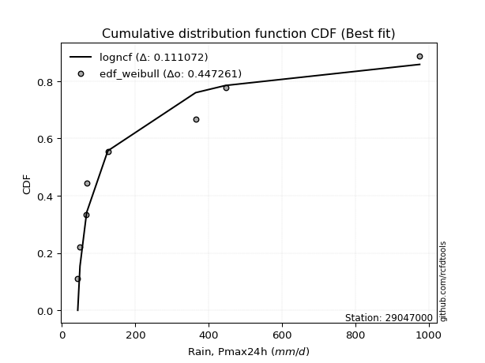</img>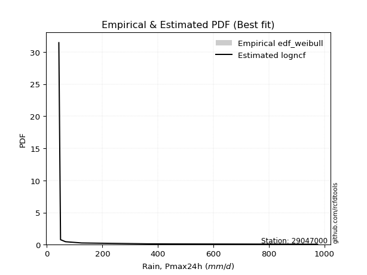</img>

</div>


### 4. EDF Beard (1943)

The Beard formula (or Beard´s plotting position formula) in hydrology is used to estimate the empirical non-exceedance probability _(P)_ of a flood event (or other extreme hydrological data point) within a given dataset.

<div align="center">


$P=(m-0.31)/(n+0.38)$


</div>


**4.1. Empirical values**

<div align="center">

|                | 0                   | 1                   | 2                  | 3                   | 4         | 5                  | 6                  | 7                  | 8                  |
|:---------------|:--------------------|:--------------------|:-------------------|:--------------------|:----------|:-------------------|:-------------------|:-------------------|:-------------------|
| date           | 2025                | 2018                | 2017               | 2020                | 2021      | 2019               | 2024               | 2023               | 2022               |
| x              | 37.8                | 43.02               | 49.13              | 66.64               | 68.05     | 125.01             | 364.54             | 446.14             | 975.48             |
| m              | 1                   | 2                   | 3                  | 4                   | 5         | 6                  | 7                  | 8                  | 9                  |
| empirical_dist | edf_beard           | edf_beard           | edf_beard          | edf_beard           | edf_beard | edf_beard          | edf_beard          | edf_beard          | edf_beard          |
| empirical      | 0.07356076759061833 | 0.18017057569296374 | 0.2867803837953091 | 0.39339019189765456 | 0.5       | 0.6066098081023454 | 0.7132196162046908 | 0.8198294243070362 | 0.9264392324093815 |
| empirical_tr   | 1.0794016110471807  | 1.2197659297789336  | 1.4020926756352765 | 1.6485061511423549  | 2.0       | 2.542005420054201  | 3.486988847583642  | 5.550295857988164  | 13.5942028985507   |

</div>


**4.2. Kolmogorov-Smirnov fit test (sorted by Δ)**


<div align="center">

|                | 0                   | 1                   | 2                   | 3                   | 4                   | 5                   | 6                   | 7                   | 8                   | 9                   | 10                  | 11                  | 12                  | 13                  | 14                  | 15                  | 16                  | 17                  | 18                  | 19                  | 20                  | 21                  | 22                  | 23                  | 24                  | 25                  | 26                  | 27                  | 28                  | 29                  | 30                  | 31                  | 32                  | 33                  | 34                  | 35                  | 36                  | 37                  | 38                  | 39                  | 40                  | 41                  | 42                  | 43                  | 44                  | 45                  | 46                  | 47                  | 48                  | 49                  | 50                  | 51                  | 52                  | 53                  | 54                  | 55                  | 56                  | 57                  | 58                  | 59                  | 60                  | 61                  | 62                  | 63                  | 64                  | 65                  | 66                  | 67                  | 68                  | 69                  | 70                  | 71                  | 72                  | 73                  | 74                  | 75                  | 76                  | 77                  | 78                  | 79                  | 80                  | 81                  | 82                  | 83                  | 84                  | 85                  | 86                  | 87                  | 88                  | 89                  | 90                  | 91                  | 92                  | 93                  | 94                  | 95                  | 96                  | 97                  | 98                  | 99                  | 100                 | 101                 | 102                 | 103                 | 104                 | 105                 | 106                 | 107                 | 108                 | 109                 | 110                 | 111                 | 112                 | 113                 | 114                 | 115                 | 116                 | 117                 | 118                 | 119                 | 120                 | 121                 | 122                 | 123                 | 124                 | 125                 | 126                 | 127                 | 128                 | 129                 | 130                 | 131                 | 132                 | 133                 | 134                 | 135                 | 136                 | 137                 | 138                 | 139                 | 140                 | 141                 | 142                 | 143                 | 144                 | 145                 | 146                 | 147                 | 148                 | 149                 | 150                 | 151                 | 152                 | 153                 | 154                 | 155                 | 156                 | 157                 | 158                 | 159                 |
|:---------------|:--------------------|:--------------------|:--------------------|:--------------------|:--------------------|:--------------------|:--------------------|:--------------------|:--------------------|:--------------------|:--------------------|:--------------------|:--------------------|:--------------------|:--------------------|:--------------------|:--------------------|:--------------------|:--------------------|:--------------------|:--------------------|:--------------------|:--------------------|:--------------------|:--------------------|:--------------------|:--------------------|:--------------------|:--------------------|:--------------------|:--------------------|:--------------------|:--------------------|:--------------------|:--------------------|:--------------------|:--------------------|:--------------------|:--------------------|:--------------------|:--------------------|:--------------------|:--------------------|:--------------------|:--------------------|:--------------------|:--------------------|:--------------------|:--------------------|:--------------------|:--------------------|:--------------------|:--------------------|:--------------------|:--------------------|:--------------------|:--------------------|:--------------------|:--------------------|:--------------------|:--------------------|:--------------------|:--------------------|:--------------------|:--------------------|:--------------------|:--------------------|:--------------------|:--------------------|:--------------------|:--------------------|:--------------------|:--------------------|:--------------------|:--------------------|:--------------------|:--------------------|:--------------------|:--------------------|:--------------------|:--------------------|:--------------------|:--------------------|:--------------------|:--------------------|:--------------------|:--------------------|:--------------------|:--------------------|:--------------------|:--------------------|:--------------------|:--------------------|:--------------------|:--------------------|:--------------------|:--------------------|:--------------------|:--------------------|:--------------------|:--------------------|:--------------------|:--------------------|:--------------------|:--------------------|:--------------------|:--------------------|:--------------------|:--------------------|:--------------------|:--------------------|:--------------------|:--------------------|:--------------------|:--------------------|:--------------------|:--------------------|:--------------------|:--------------------|:--------------------|:--------------------|:--------------------|:--------------------|:--------------------|:--------------------|:--------------------|:--------------------|:--------------------|:--------------------|:--------------------|:--------------------|:--------------------|:--------------------|:--------------------|:--------------------|:--------------------|:--------------------|:--------------------|:--------------------|:--------------------|:--------------------|:--------------------|:--------------------|:--------------------|:--------------------|:--------------------|:--------------------|:--------------------|:--------------------|:--------------------|:--------------------|:--------------------|:--------------------|:--------------------|:--------------------|:--------------------|:--------------------|:--------------------|:--------------------|:--------------------|
| station        | 29047000            | 29047000            | 29047000            | 29047000            | 29047000            | 29047000            | 29047000            | 29047000            | 29047000            | 29047000            | 29047000            | 29047000            | 29047000            | 29047000            | 29047000            | 29047000            | 29047000            | 29047000            | 29047000            | 29047000            | 29047000            | 29047000            | 29047000            | 29047000            | 29047000            | 29047000            | 29047000            | 29047000            | 29047000            | 29047000            | 29047000            | 29047000            | 29047000            | 29047000            | 29047000            | 29047000            | 29047000            | 29047000            | 29047000            | 29047000            | 29047000            | 29047000            | 29047000            | 29047000            | 29047000            | 29047000            | 29047000            | 29047000            | 29047000            | 29047000            | 29047000            | 29047000            | 29047000            | 29047000            | 29047000            | 29047000            | 29047000            | 29047000            | 29047000            | 29047000            | 29047000            | 29047000            | 29047000            | 29047000            | 29047000            | 29047000            | 29047000            | 29047000            | 29047000            | 29047000            | 29047000            | 29047000            | 29047000            | 29047000            | 29047000            | 29047000            | 29047000            | 29047000            | 29047000            | 29047000            | 29047000            | 29047000            | 29047000            | 29047000            | 29047000            | 29047000            | 29047000            | 29047000            | 29047000            | 29047000            | 29047000            | 29047000            | 29047000            | 29047000            | 29047000            | 29047000            | 29047000            | 29047000            | 29047000            | 29047000            | 29047000            | 29047000            | 29047000            | 29047000            | 29047000            | 29047000            | 29047000            | 29047000            | 29047000            | 29047000            | 29047000            | 29047000            | 29047000            | 29047000            | 29047000            | 29047000            | 29047000            | 29047000            | 29047000            | 29047000            | 29047000            | 29047000            | 29047000            | 29047000            | 29047000            | 29047000            | 29047000            | 29047000            | 29047000            | 29047000            | 29047000            | 29047000            | 29047000            | 29047000            | 29047000            | 29047000            | 29047000            | 29047000            | 29047000            | 29047000            | 29047000            | 29047000            | 29047000            | 29047000            | 29047000            | 29047000            | 29047000            | 29047000            | 29047000            | 29047000            | 29047000            | 29047000            | 29047000            | 29047000            | 29047000            | 29047000            | 29047000            | 29047000            | 29047000            | 29047000            |
| empirical_dist | edf_beard           | edf_beard           | edf_beard           | edf_beard           | edf_beard           | edf_beard           | edf_beard           | edf_beard           | edf_beard           | edf_beard           | edf_beard           | edf_beard           | edf_beard           | edf_beard           | edf_beard           | edf_beard           | edf_beard           | edf_beard           | edf_beard           | edf_beard           | edf_beard           | edf_beard           | edf_beard           | edf_beard           | edf_beard           | edf_beard           | edf_beard           | edf_beard           | edf_beard           | edf_beard           | edf_beard           | edf_beard           | edf_beard           | edf_beard           | edf_beard           | edf_beard           | edf_beard           | edf_beard           | edf_beard           | edf_beard           | edf_beard           | edf_beard           | edf_beard           | edf_beard           | edf_beard           | edf_beard           | edf_beard           | edf_beard           | edf_beard           | edf_beard           | edf_beard           | edf_beard           | edf_beard           | edf_beard           | edf_beard           | edf_beard           | edf_beard           | edf_beard           | edf_beard           | edf_beard           | edf_beard           | edf_beard           | edf_beard           | edf_beard           | edf_beard           | edf_beard           | edf_beard           | edf_beard           | edf_beard           | edf_beard           | edf_beard           | edf_beard           | edf_beard           | edf_beard           | edf_beard           | edf_beard           | edf_beard           | edf_beard           | edf_beard           | edf_beard           | edf_beard           | edf_beard           | edf_beard           | edf_beard           | edf_beard           | edf_beard           | edf_beard           | edf_beard           | edf_beard           | edf_beard           | edf_beard           | edf_beard           | edf_beard           | edf_beard           | edf_beard           | edf_beard           | edf_beard           | edf_beard           | edf_beard           | edf_beard           | edf_beard           | edf_beard           | edf_beard           | edf_beard           | edf_beard           | edf_beard           | edf_beard           | edf_beard           | edf_beard           | edf_beard           | edf_beard           | edf_beard           | edf_beard           | edf_beard           | edf_beard           | edf_beard           | edf_beard           | edf_beard           | edf_beard           | edf_beard           | edf_beard           | edf_beard           | edf_beard           | edf_beard           | edf_beard           | edf_beard           | edf_beard           | edf_beard           | edf_beard           | edf_beard           | edf_beard           | edf_beard           | edf_beard           | edf_beard           | edf_beard           | edf_beard           | edf_beard           | edf_beard           | edf_beard           | edf_beard           | edf_beard           | edf_beard           | edf_beard           | edf_beard           | edf_beard           | edf_beard           | edf_beard           | edf_beard           | edf_beard           | edf_beard           | edf_beard           | edf_beard           | edf_beard           | edf_beard           | edf_beard           | edf_beard           | edf_beard           | edf_beard           | edf_beard           | edf_beard           |
| p_dist         | logweibull_min      | exponweib           | logbeta             | mielke              | logalpha            | invweibull          | fatiguelife         | logf                | gausshyper          | logexponweib        | truncweibull_min    | invgamma            | f                   | logmielke           | logburr             | loggenextreme       | loginvweibull       | logburr12           | lomax               | loggausshyper       | halfgennorm         | loghalfgennorm      | loginvgamma         | logncf              | logfatiguelife      | lognct              | burr12              | loglomax            | loghalfnorm         | loggenexpon         | logexponpow         | logexponnorm        | loginvgauss         | loghalflogistic     | logdweibull         | erlang              | truncpareto         | logjohnsonsb        | logtruncnorm        | logfoldnorm         | exponpow            | ncf                 | logarcsine          | nct                 | gengamma            | invgauss            | loggamma            | loggamma            | burr                | logdgamma           | logmoyal            | lograyleigh         | nakagami            | logsemicircular     | loggengamma         | loggenlogistic      | loggumbel_r         | loggenhalflogistic  | logmaxwell          | genpareto           | logpearson3         | loganglit           | betaprime           | logkstwobign        | logbetaprime        | moyal               | logrdist            | alpha               | vonmises_line       | pearson3            | weibull_min         | logloggamma         | dgamma              | logloglaplace       | logjohnsonsu        | gamma               | loggennorm          | logcrystalball      | lognorm             | logt                | halflogistic        | logtruncweibull_min | logwrapcauchy       | gumbel_r            | rayleigh            | wald                | gennorm             | logskewnorm         | logweibull_max      | logrice             | halfnorm            | loglogistic         | lognakagami         | maxwell             | logerlang           | semicircular        | logcosine           | anglit              | foldnorm            | loghypsecant        | loggompertz         | logtruncexpon       | genlogistic         | logwald             | t                   | logtukeylambda      | loggumbel_l         | norm                | logbradford         | arcsine             | logksone            | loglaplace          | loglaplace          | kstwobign           | logistic            | logargus            | powerlaw            | genextreme          | logtriang           | hypsecant           | logkappa4           | rice                | cosine              | beta                | loguniform          | loggenpareto        | gumbel_l            | laplace             | logkappa3           | wrapcauchy          | logvonmises_line    | loglevy_l           | johnsonsb           | truncexpon          | exponnorm           | logpowerlaw         | gompertz            | genexpon            | argus               | triang              | dweibull            | truncnorm           | levy_l              | bradford            | skewnorm            | ksone               | logtrapezoid        | crystalball         | kappa3              | rdist               | kappa4              | logtruncpareto      | genhalflogistic     | uniform             | tukeylambda         | johnsonsu           | trapezoid           | weibull_max         | logvonmises         | vonmises            |
| delta          | 0.08076812804574351 | 0.08174598962973756 | 0.08674112148537216 | 0.09339153733341365 | 0.0944421282546749  | 0.09988363195556083 | 0.10176327648982264 | 0.10321831808416781 | 0.11226050315202618 | 0.11295976875007807 | 0.11425223392537215 | 0.11992281440228714 | 0.11992323897509671 | 0.12457859333828525 | 0.12592226373000015 | 0.1259357484690159  | 0.12595082070483055 | 0.12933543378176204 | 0.13015054514801572 | 0.13021833564809193 | 0.13044691011219167 | 0.13224567633747153 | 0.13286299167822235 | 0.1330940990160726  | 0.13333515246802896 | 0.13449733419052878 | 0.13569213694747662 | 0.1364804881611994  | 0.13739133229605777 | 0.13745027050367153 | 0.1378884745515564  | 0.1393086492436072  | 0.1400921618435974  | 0.1404602613589469  | 0.14074311124190397 | 0.14154319487457645 | 0.14468651831506507 | 0.14651102784452164 | 0.14673597431395202 | 0.14762921189999162 | 0.14932999320479512 | 0.15363348536104682 | 0.15365882596740943 | 0.15603258316167135 | 0.15666966579001218 | 0.15934453688452144 | 0.16116930207343105 | 0.16116930207343105 | 0.16211791281043852 | 0.1632267040062344  | 0.1664752102618613  | 0.16791644330570077 | 0.1699287228653144  | 0.1702928396840787  | 0.17244914234287578 | 0.17297501461052694 | 0.17525387104601375 | 0.17542427321744014 | 0.1787438951740103  | 0.17973975637982176 | 0.18046840451655294 | 0.18096370264746736 | 0.1815730990580251  | 0.18610540079763266 | 0.18674158214915404 | 0.19511462571387528 | 0.1975367541497629  | 0.1977776520627318  | 0.19953716857512202 | 0.20019953591011433 | 0.2013828373333308  | 0.20275119082994025 | 0.20380610981129388 | 0.20414863674489403 | 0.20554759234185876 | 0.20558605750278203 | 0.20595670785861564 | 0.20598337156041646 | 0.20598338111395975 | 0.20598365074732428 | 0.2085818193165722  | 0.2104961087385812  | 0.21167375284945034 | 0.21258021859353982 | 0.2162895517066874  | 0.21650978906560775 | 0.21840778205282363 | 0.21869027363800786 | 0.22301251395383892 | 0.22358829819762926 | 0.2242331536783185  | 0.227606749959685   | 0.22790424090251887 | 0.2283119328891921  | 0.22981925536836612 | 0.23139008194071636 | 0.23591148772729115 | 0.23986181121901218 | 0.24289172274030138 | 0.24306301230395233 | 0.24485343377718932 | 0.24820288422195586 | 0.25046394295844    | 0.250755550606892   | 0.2544478781465225  | 0.2546737694594654  | 0.25557040480584325 | 0.260034741121123   | 0.2620926549667167  | 0.2643714729068588  | 0.26594323387937635 | 0.26758022060567105 | 0.26758022060567105 | 0.27565026859912023 | 0.2782682837742222  | 0.2786162847209782  | 0.2800758397929658  | 0.28597318767319485 | 0.29184620947389117 | 0.2923619294249185  | 0.29964506766679666 | 0.30604636627444126 | 0.31615505500348673 | 0.3180485103911589  | 0.31913188065525167 | 0.319269019677493   | 0.31946252322351526 | 0.3204408333065232  | 0.32044190311470644 | 0.3246816489690461  | 0.32669520625329956 | 0.3443833805983446  | 0.3449240174659388  | 0.36004031871363523 | 0.36090739668888305 | 0.3617500696174633  | 0.3621430171792478  | 0.3626356045695054  | 0.3699079292757572  | 0.3934351152551554  | 0.40145447284618563 | 0.40230040146492574 | 0.4150876320648046  | 0.4160800623166875  | 0.43291560983815125 | 0.44577135575186344 | 0.4545385478035845  | 0.46032970109636306 | 0.4687735092529179  | 0.48998616687586605 | 0.4926107727793838  | 0.5044731520128272  | 0.5127005665782616  | 0.513603665281767   | 0.5157401018477071  | 0.5619314948235641  | 0.6184802034513524  | 0.7519615473660317  | 1.157330181066743   | 155.04019926834576  |
| deltao         | 0.41761268023100007 | 0.41761268023100007 | 0.41761268023100007 | 0.41761268023100007 | 0.41761268023100007 | 0.41761268023100007 | 0.41761268023100007 | 0.41761268023100007 | 0.41761268023100007 | 0.41761268023100007 | 0.41761268023100007 | 0.41761268023100007 | 0.41761268023100007 | 0.41761268023100007 | 0.41761268023100007 | 0.41761268023100007 | 0.41761268023100007 | 0.41761268023100007 | 0.41761268023100007 | 0.41761268023100007 | 0.41761268023100007 | 0.41761268023100007 | 0.41761268023100007 | 0.41761268023100007 | 0.41761268023100007 | 0.41761268023100007 | 0.41761268023100007 | 0.41761268023100007 | 0.41761268023100007 | 0.41761268023100007 | 0.41761268023100007 | 0.41761268023100007 | 0.41761268023100007 | 0.41761268023100007 | 0.41761268023100007 | 0.41761268023100007 | 0.41761268023100007 | 0.41761268023100007 | 0.41761268023100007 | 0.41761268023100007 | 0.41761268023100007 | 0.41761268023100007 | 0.41761268023100007 | 0.41761268023100007 | 0.41761268023100007 | 0.41761268023100007 | 0.41761268023100007 | 0.41761268023100007 | 0.41761268023100007 | 0.41761268023100007 | 0.41761268023100007 | 0.41761268023100007 | 0.41761268023100007 | 0.41761268023100007 | 0.41761268023100007 | 0.41761268023100007 | 0.41761268023100007 | 0.41761268023100007 | 0.41761268023100007 | 0.41761268023100007 | 0.41761268023100007 | 0.41761268023100007 | 0.41761268023100007 | 0.41761268023100007 | 0.41761268023100007 | 0.41761268023100007 | 0.41761268023100007 | 0.41761268023100007 | 0.41761268023100007 | 0.41761268023100007 | 0.41761268023100007 | 0.41761268023100007 | 0.41761268023100007 | 0.41761268023100007 | 0.41761268023100007 | 0.41761268023100007 | 0.41761268023100007 | 0.41761268023100007 | 0.41761268023100007 | 0.41761268023100007 | 0.41761268023100007 | 0.41761268023100007 | 0.41761268023100007 | 0.41761268023100007 | 0.41761268023100007 | 0.41761268023100007 | 0.41761268023100007 | 0.41761268023100007 | 0.41761268023100007 | 0.41761268023100007 | 0.41761268023100007 | 0.41761268023100007 | 0.41761268023100007 | 0.41761268023100007 | 0.41761268023100007 | 0.41761268023100007 | 0.41761268023100007 | 0.41761268023100007 | 0.41761268023100007 | 0.41761268023100007 | 0.41761268023100007 | 0.41761268023100007 | 0.41761268023100007 | 0.41761268023100007 | 0.41761268023100007 | 0.41761268023100007 | 0.41761268023100007 | 0.41761268023100007 | 0.41761268023100007 | 0.41761268023100007 | 0.41761268023100007 | 0.41761268023100007 | 0.41761268023100007 | 0.41761268023100007 | 0.41761268023100007 | 0.41761268023100007 | 0.41761268023100007 | 0.41761268023100007 | 0.41761268023100007 | 0.41761268023100007 | 0.41761268023100007 | 0.41761268023100007 | 0.41761268023100007 | 0.41761268023100007 | 0.41761268023100007 | 0.41761268023100007 | 0.41761268023100007 | 0.41761268023100007 | 0.41761268023100007 | 0.41761268023100007 | 0.41761268023100007 | 0.41761268023100007 | 0.41761268023100007 | 0.41761268023100007 | 0.41761268023100007 | 0.41761268023100007 | 0.41761268023100007 | 0.41761268023100007 | 0.41761268023100007 | 0.41761268023100007 | 0.41761268023100007 | 0.41761268023100007 | 0.41761268023100007 | 0.41761268023100007 | 0.41761268023100007 | 0.41761268023100007 | 0.41761268023100007 | 0.41761268023100007 | 0.41761268023100007 | 0.41761268023100007 | 0.41761268023100007 | 0.41761268023100007 | 0.41761268023100007 | 0.41761268023100007 | 0.41761268023100007 | 0.41761268023100007 | 0.41761268023100007 | 0.41761268023100007 | 0.41761268023100007 | 0.41761268023100007 |
| eval           | Δo > Δ              | Δo > Δ              | Δo > Δ              | Δo > Δ              | Δo > Δ              | Δo > Δ              | Δo > Δ              | Δo > Δ              | Δo > Δ              | Δo > Δ              | Δo > Δ              | Δo > Δ              | Δo > Δ              | Δo > Δ              | Δo > Δ              | Δo > Δ              | Δo > Δ              | Δo > Δ              | Δo > Δ              | Δo > Δ              | Δo > Δ              | Δo > Δ              | Δo > Δ              | Δo > Δ              | Δo > Δ              | Δo > Δ              | Δo > Δ              | Δo > Δ              | Δo > Δ              | Δo > Δ              | Δo > Δ              | Δo > Δ              | Δo > Δ              | Δo > Δ              | Δo > Δ              | Δo > Δ              | Δo > Δ              | Δo > Δ              | Δo > Δ              | Δo > Δ              | Δo > Δ              | Δo > Δ              | Δo > Δ              | Δo > Δ              | Δo > Δ              | Δo > Δ              | Δo > Δ              | Δo > Δ              | Δo > Δ              | Δo > Δ              | Δo > Δ              | Δo > Δ              | Δo > Δ              | Δo > Δ              | Δo > Δ              | Δo > Δ              | Δo > Δ              | Δo > Δ              | Δo > Δ              | Δo > Δ              | Δo > Δ              | Δo > Δ              | Δo > Δ              | Δo > Δ              | Δo > Δ              | Δo > Δ              | Δo > Δ              | Δo > Δ              | Δo > Δ              | Δo > Δ              | Δo > Δ              | Δo > Δ              | Δo > Δ              | Δo > Δ              | Δo > Δ              | Δo > Δ              | Δo > Δ              | Δo > Δ              | Δo > Δ              | Δo > Δ              | Δo > Δ              | Δo > Δ              | Δo > Δ              | Δo > Δ              | Δo > Δ              | Δo > Δ              | Δo > Δ              | Δo > Δ              | Δo > Δ              | Δo > Δ              | Δo > Δ              | Δo > Δ              | Δo > Δ              | Δo > Δ              | Δo > Δ              | Δo > Δ              | Δo > Δ              | Δo > Δ              | Δo > Δ              | Δo > Δ              | Δo > Δ              | Δo > Δ              | Δo > Δ              | Δo > Δ              | Δo > Δ              | Δo > Δ              | Δo > Δ              | Δo > Δ              | Δo > Δ              | Δo > Δ              | Δo > Δ              | Δo > Δ              | Δo > Δ              | Δo > Δ              | Δo > Δ              | Δo > Δ              | Δo > Δ              | Δo > Δ              | Δo > Δ              | Δo > Δ              | Δo > Δ              | Δo > Δ              | Δo > Δ              | Δo > Δ              | Δo > Δ              | Δo > Δ              | Δo > Δ              | Δo > Δ              | Δo > Δ              | Δo > Δ              | Δo > Δ              | Δo > Δ              | Δo > Δ              | Δo > Δ              | Δo > Δ              | Δo > Δ              | Δo > Δ              | Δo > Δ              | Δo > Δ              | Δo > Δ              | Δo > Δ              | Δo > Δ              | Δo > Δ              | Δo > Δ              | Δo <= Δ             | Δo <= Δ             | Δo <= Δ             | Δo <= Δ             | Δo <= Δ             | Δo <= Δ             | Δo <= Δ             | Δo <= Δ             | Δo <= Δ             | Δo <= Δ             | Δo <= Δ             | Δo <= Δ             | Δo <= Δ             | Δo <= Δ             | Δo <= Δ             | Δo <= Δ             |
| fit            | 1                   | 1                   | 1                   | 1                   | 1                   | 1                   | 1                   | 1                   | 1                   | 1                   | 1                   | 1                   | 1                   | 1                   | 1                   | 1                   | 1                   | 1                   | 1                   | 1                   | 1                   | 1                   | 1                   | 1                   | 1                   | 1                   | 1                   | 1                   | 1                   | 1                   | 1                   | 1                   | 1                   | 1                   | 1                   | 1                   | 1                   | 1                   | 1                   | 1                   | 1                   | 1                   | 1                   | 1                   | 1                   | 1                   | 1                   | 1                   | 1                   | 1                   | 1                   | 1                   | 1                   | 1                   | 1                   | 1                   | 1                   | 1                   | 1                   | 1                   | 1                   | 1                   | 1                   | 1                   | 1                   | 1                   | 1                   | 1                   | 1                   | 1                   | 1                   | 1                   | 1                   | 1                   | 1                   | 1                   | 1                   | 1                   | 1                   | 1                   | 1                   | 1                   | 1                   | 1                   | 1                   | 1                   | 1                   | 1                   | 1                   | 1                   | 1                   | 1                   | 1                   | 1                   | 1                   | 1                   | 1                   | 1                   | 1                   | 1                   | 1                   | 1                   | 1                   | 1                   | 1                   | 1                   | 1                   | 1                   | 1                   | 1                   | 1                   | 1                   | 1                   | 1                   | 1                   | 1                   | 1                   | 1                   | 1                   | 1                   | 1                   | 1                   | 1                   | 1                   | 1                   | 1                   | 1                   | 1                   | 1                   | 1                   | 1                   | 1                   | 1                   | 1                   | 1                   | 1                   | 1                   | 1                   | 1                   | 1                   | 1                   | 1                   | 1                   | 1                   | 0                   | 0                   | 0                   | 0                   | 0                   | 0                   | 0                   | 0                   | 0                   | 0                   | 0                   | 0                   | 0                   | 0                   | 0                   | 0                   |
| n              | 9                   | 9                   | 9                   | 9                   | 9                   | 9                   | 9                   | 9                   | 9                   | 9                   | 9                   | 9                   | 9                   | 9                   | 9                   | 9                   | 9                   | 9                   | 9                   | 9                   | 9                   | 9                   | 9                   | 9                   | 9                   | 9                   | 9                   | 9                   | 9                   | 9                   | 9                   | 9                   | 9                   | 9                   | 9                   | 9                   | 9                   | 9                   | 9                   | 9                   | 9                   | 9                   | 9                   | 9                   | 9                   | 9                   | 9                   | 9                   | 9                   | 9                   | 9                   | 9                   | 9                   | 9                   | 9                   | 9                   | 9                   | 9                   | 9                   | 9                   | 9                   | 9                   | 9                   | 9                   | 9                   | 9                   | 9                   | 9                   | 9                   | 9                   | 9                   | 9                   | 9                   | 9                   | 9                   | 9                   | 9                   | 9                   | 9                   | 9                   | 9                   | 9                   | 9                   | 9                   | 9                   | 9                   | 9                   | 9                   | 9                   | 9                   | 9                   | 9                   | 9                   | 9                   | 9                   | 9                   | 9                   | 9                   | 9                   | 9                   | 9                   | 9                   | 9                   | 9                   | 9                   | 9                   | 9                   | 9                   | 9                   | 9                   | 9                   | 9                   | 9                   | 9                   | 9                   | 9                   | 9                   | 9                   | 9                   | 9                   | 9                   | 9                   | 9                   | 9                   | 9                   | 9                   | 9                   | 9                   | 9                   | 9                   | 9                   | 9                   | 9                   | 9                   | 9                   | 9                   | 9                   | 9                   | 9                   | 9                   | 9                   | 9                   | 9                   | 9                   | 9                   | 9                   | 9                   | 9                   | 9                   | 9                   | 9                   | 9                   | 9                   | 9                   | 9                   | 9                   | 9                   | 9                   | 9                   | 9                   |
| best_fit       | 1                   | 0                   | 0                   | 0                   | 0                   | 0                   | 0                   | 0                   | 0                   | 0                   | 0                   | 0                   | 0                   | 0                   | 0                   | 0                   | 0                   | 0                   | 0                   | 0                   | 0                   | 0                   | 0                   | 0                   | 0                   | 0                   | 0                   | 0                   | 0                   | 0                   | 0                   | 0                   | 0                   | 0                   | 0                   | 0                   | 0                   | 0                   | 0                   | 0                   | 0                   | 0                   | 0                   | 0                   | 0                   | 0                   | 0                   | 0                   | 0                   | 0                   | 0                   | 0                   | 0                   | 0                   | 0                   | 0                   | 0                   | 0                   | 0                   | 0                   | 0                   | 0                   | 0                   | 0                   | 0                   | 0                   | 0                   | 0                   | 0                   | 0                   | 0                   | 0                   | 0                   | 0                   | 0                   | 0                   | 0                   | 0                   | 0                   | 0                   | 0                   | 0                   | 0                   | 0                   | 0                   | 0                   | 0                   | 0                   | 0                   | 0                   | 0                   | 0                   | 0                   | 0                   | 0                   | 0                   | 0                   | 0                   | 0                   | 0                   | 0                   | 0                   | 0                   | 0                   | 0                   | 0                   | 0                   | 0                   | 0                   | 0                   | 0                   | 0                   | 0                   | 0                   | 0                   | 0                   | 0                   | 0                   | 0                   | 0                   | 0                   | 0                   | 0                   | 0                   | 0                   | 0                   | 0                   | 0                   | 0                   | 0                   | 0                   | 0                   | 0                   | 0                   | 0                   | 0                   | 0                   | 0                   | 0                   | 0                   | 0                   | 0                   | 0                   | 0                   | 0                   | 0                   | 0                   | 0                   | 0                   | 0                   | 0                   | 0                   | 0                   | 0                   | 0                   | 0                   | 0                   | 0                   | 0                   | 0                   |
| best_fit_sort  | 1                   | 2                   | 3                   | 4                   | 5                   | 6                   | 7                   | 8                   | 9                   | 10                  | 11                  | 12                  | 13                  | 14                  | 15                  | 16                  | 17                  | 18                  | 19                  | 20                  | 21                  | 22                  | 23                  | 24                  | 25                  | 26                  | 27                  | 28                  | 29                  | 30                  | 31                  | 32                  | 33                  | 34                  | 35                  | 36                  | 37                  | 38                  | 39                  | 40                  | 41                  | 42                  | 43                  | 44                  | 45                  | 46                  | 47                  | 48                  | 49                  | 50                  | 51                  | 52                  | 53                  | 54                  | 55                  | 56                  | 57                  | 58                  | 59                  | 60                  | 61                  | 62                  | 63                  | 64                  | 65                  | 66                  | 67                  | 68                  | 69                  | 70                  | 71                  | 72                  | 73                  | 74                  | 75                  | 76                  | 77                  | 78                  | 79                  | 80                  | 81                  | 82                  | 83                  | 84                  | 85                  | 86                  | 87                  | 88                  | 89                  | 90                  | 91                  | 92                  | 93                  | 94                  | 95                  | 96                  | 97                  | 98                  | 99                  | 100                 | 101                 | 102                 | 103                 | 104                 | 105                 | 106                 | 107                 | 108                 | 109                 | 110                 | 111                 | 112                 | 113                 | 114                 | 115                 | 116                 | 117                 | 118                 | 119                 | 120                 | 121                 | 122                 | 123                 | 124                 | 125                 | 126                 | 127                 | 128                 | 129                 | 130                 | 131                 | 132                 | 133                 | 134                 | 135                 | 136                 | 137                 | 138                 | 139                 | 140                 | 141                 | 142                 | 143                 | 144                 | 145                 | 146                 | 147                 | 148                 | 149                 | 150                 | 151                 | 152                 | 153                 | 154                 | 155                 | 156                 | 157                 | 158                 | 159                 | 160                 |

</div>


**4.3. Best fit**

<div align="center">

|   id |   station | empirical_dist   | p_dist         |     delta |   deltao | eval   |   fit |   n |   best_fit |   best_fit_sort |
|-----:|----------:|:-----------------|:---------------|----------:|---------:|:-------|------:|----:|-----------:|----------------:|
|    0 |  29047000 | edf_beard        | logweibull_min | 0.0807681 | 0.417613 | Δo > Δ |     1 |   9 |          1 |               1 |

</div>


<div align="center">

</img>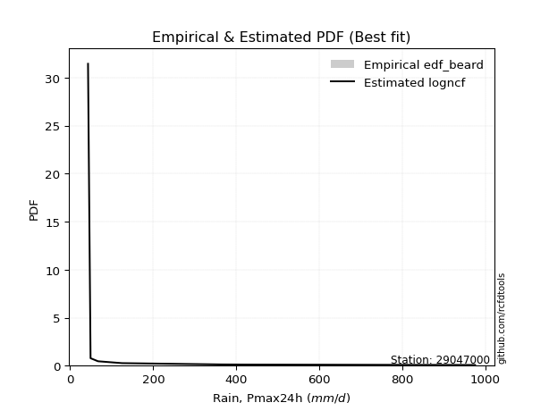</img>

</div>


### 5. EDF Chegodayev (1955)

The Chegodayev formula is an empirical plotting position formula used in hydrological frequency analysis to estimate the exceedance probability or return period of a specific event from a set of observed data. It is primarily used for plotting observed data points on probability paper to fit a theoretical distribution, particularly for analyzing extreme events like maximum flood flows or rainfall intensities. The constant _b_ value in the generalized plotting position formula is 0.3.

<div align="center">


$P=(m-b)/(n+1-2b)$


</div>


**5.1. Empirical values**

<div align="center">

|                | 0                   | 1                   | 2                  | 3                   | 4              | 5                  | 6                  | 7                  | 8                  |
|:---------------|:--------------------|:--------------------|:-------------------|:--------------------|:---------------|:-------------------|:-------------------|:-------------------|:-------------------|
| date           | 2025                | 2018                | 2017               | 2020                | 2021           | 2019               | 2024               | 2023               | 2022               |
| x              | 37.8                | 43.02               | 49.13              | 66.64               | 68.05          | 125.01             | 364.54             | 446.14             | 975.48             |
| m              | 1                   | 2                   | 3                  | 4                   | 5              | 6                  | 7                  | 8                  | 9                  |
| empirical_dist | edf_chegodayev      | edf_chegodayev      | edf_chegodayev     | edf_chegodayev      | edf_chegodayev | edf_chegodayev     | edf_chegodayev     | edf_chegodayev     | edf_chegodayev     |
| empirical      | 0.07446808510638298 | 0.18085106382978722 | 0.2872340425531915 | 0.39361702127659576 | 0.5            | 0.6063829787234043 | 0.7127659574468085 | 0.8191489361702128 | 0.9255319148936169 |
| empirical_tr   | 1.0804597701149425  | 1.2207792207792207  | 1.4029850746268657 | 1.6491228070175437  | 2.0            | 2.540540540540541  | 3.481481481481481  | 5.529411764705883  | 13.428571428571399 |

</div>


**5.2. Kolmogorov-Smirnov fit test (sorted by Δ)**


<div align="center">

|                | 0                   | 1                   | 2                   | 3                   | 4                   | 5                   | 6                   | 7                   | 8                   | 9                   | 10                  | 11                  | 12                  | 13                  | 14                  | 15                  | 16                  | 17                  | 18                  | 19                  | 20                  | 21                  | 22                  | 23                  | 24                  | 25                  | 26                  | 27                  | 28                  | 29                  | 30                  | 31                  | 32                  | 33                  | 34                  | 35                  | 36                  | 37                  | 38                  | 39                  | 40                  | 41                  | 42                  | 43                  | 44                  | 45                  | 46                  | 47                  | 48                  | 49                  | 50                  | 51                  | 52                  | 53                  | 54                  | 55                  | 56                  | 57                  | 58                  | 59                  | 60                  | 61                  | 62                  | 63                  | 64                  | 65                  | 66                  | 67                  | 68                  | 69                  | 70                  | 71                  | 72                  | 73                  | 74                  | 75                  | 76                  | 77                  | 78                  | 79                  | 80                  | 81                  | 82                  | 83                  | 84                  | 85                  | 86                  | 87                  | 88                  | 89                  | 90                  | 91                  | 92                  | 93                  | 94                  | 95                  | 96                  | 97                  | 98                  | 99                  | 100                 | 101                 | 102                 | 103                 | 104                 | 105                 | 106                 | 107                 | 108                 | 109                 | 110                 | 111                 | 112                 | 113                 | 114                 | 115                 | 116                 | 117                 | 118                 | 119                 | 120                 | 121                 | 122                 | 123                 | 124                 | 125                 | 126                 | 127                 | 128                 | 129                 | 130                 | 131                 | 132                 | 133                 | 134                 | 135                 | 136                 | 137                 | 138                 | 139                 | 140                 | 141                 | 142                 | 143                 | 144                 | 145                 | 146                 | 147                 | 148                 | 149                 | 150                 | 151                 | 152                 | 153                 | 154                 | 155                 | 156                 | 157                 | 158                 | 159                 |
|:---------------|:--------------------|:--------------------|:--------------------|:--------------------|:--------------------|:--------------------|:--------------------|:--------------------|:--------------------|:--------------------|:--------------------|:--------------------|:--------------------|:--------------------|:--------------------|:--------------------|:--------------------|:--------------------|:--------------------|:--------------------|:--------------------|:--------------------|:--------------------|:--------------------|:--------------------|:--------------------|:--------------------|:--------------------|:--------------------|:--------------------|:--------------------|:--------------------|:--------------------|:--------------------|:--------------------|:--------------------|:--------------------|:--------------------|:--------------------|:--------------------|:--------------------|:--------------------|:--------------------|:--------------------|:--------------------|:--------------------|:--------------------|:--------------------|:--------------------|:--------------------|:--------------------|:--------------------|:--------------------|:--------------------|:--------------------|:--------------------|:--------------------|:--------------------|:--------------------|:--------------------|:--------------------|:--------------------|:--------------------|:--------------------|:--------------------|:--------------------|:--------------------|:--------------------|:--------------------|:--------------------|:--------------------|:--------------------|:--------------------|:--------------------|:--------------------|:--------------------|:--------------------|:--------------------|:--------------------|:--------------------|:--------------------|:--------------------|:--------------------|:--------------------|:--------------------|:--------------------|:--------------------|:--------------------|:--------------------|:--------------------|:--------------------|:--------------------|:--------------------|:--------------------|:--------------------|:--------------------|:--------------------|:--------------------|:--------------------|:--------------------|:--------------------|:--------------------|:--------------------|:--------------------|:--------------------|:--------------------|:--------------------|:--------------------|:--------------------|:--------------------|:--------------------|:--------------------|:--------------------|:--------------------|:--------------------|:--------------------|:--------------------|:--------------------|:--------------------|:--------------------|:--------------------|:--------------------|:--------------------|:--------------------|:--------------------|:--------------------|:--------------------|:--------------------|:--------------------|:--------------------|:--------------------|:--------------------|:--------------------|:--------------------|:--------------------|:--------------------|:--------------------|:--------------------|:--------------------|:--------------------|:--------------------|:--------------------|:--------------------|:--------------------|:--------------------|:--------------------|:--------------------|:--------------------|:--------------------|:--------------------|:--------------------|:--------------------|:--------------------|:--------------------|:--------------------|:--------------------|:--------------------|:--------------------|:--------------------|:--------------------|
| station        | 29047000            | 29047000            | 29047000            | 29047000            | 29047000            | 29047000            | 29047000            | 29047000            | 29047000            | 29047000            | 29047000            | 29047000            | 29047000            | 29047000            | 29047000            | 29047000            | 29047000            | 29047000            | 29047000            | 29047000            | 29047000            | 29047000            | 29047000            | 29047000            | 29047000            | 29047000            | 29047000            | 29047000            | 29047000            | 29047000            | 29047000            | 29047000            | 29047000            | 29047000            | 29047000            | 29047000            | 29047000            | 29047000            | 29047000            | 29047000            | 29047000            | 29047000            | 29047000            | 29047000            | 29047000            | 29047000            | 29047000            | 29047000            | 29047000            | 29047000            | 29047000            | 29047000            | 29047000            | 29047000            | 29047000            | 29047000            | 29047000            | 29047000            | 29047000            | 29047000            | 29047000            | 29047000            | 29047000            | 29047000            | 29047000            | 29047000            | 29047000            | 29047000            | 29047000            | 29047000            | 29047000            | 29047000            | 29047000            | 29047000            | 29047000            | 29047000            | 29047000            | 29047000            | 29047000            | 29047000            | 29047000            | 29047000            | 29047000            | 29047000            | 29047000            | 29047000            | 29047000            | 29047000            | 29047000            | 29047000            | 29047000            | 29047000            | 29047000            | 29047000            | 29047000            | 29047000            | 29047000            | 29047000            | 29047000            | 29047000            | 29047000            | 29047000            | 29047000            | 29047000            | 29047000            | 29047000            | 29047000            | 29047000            | 29047000            | 29047000            | 29047000            | 29047000            | 29047000            | 29047000            | 29047000            | 29047000            | 29047000            | 29047000            | 29047000            | 29047000            | 29047000            | 29047000            | 29047000            | 29047000            | 29047000            | 29047000            | 29047000            | 29047000            | 29047000            | 29047000            | 29047000            | 29047000            | 29047000            | 29047000            | 29047000            | 29047000            | 29047000            | 29047000            | 29047000            | 29047000            | 29047000            | 29047000            | 29047000            | 29047000            | 29047000            | 29047000            | 29047000            | 29047000            | 29047000            | 29047000            | 29047000            | 29047000            | 29047000            | 29047000            | 29047000            | 29047000            | 29047000            | 29047000            | 29047000            | 29047000            |
| empirical_dist | edf_chegodayev      | edf_chegodayev      | edf_chegodayev      | edf_chegodayev      | edf_chegodayev      | edf_chegodayev      | edf_chegodayev      | edf_chegodayev      | edf_chegodayev      | edf_chegodayev      | edf_chegodayev      | edf_chegodayev      | edf_chegodayev      | edf_chegodayev      | edf_chegodayev      | edf_chegodayev      | edf_chegodayev      | edf_chegodayev      | edf_chegodayev      | edf_chegodayev      | edf_chegodayev      | edf_chegodayev      | edf_chegodayev      | edf_chegodayev      | edf_chegodayev      | edf_chegodayev      | edf_chegodayev      | edf_chegodayev      | edf_chegodayev      | edf_chegodayev      | edf_chegodayev      | edf_chegodayev      | edf_chegodayev      | edf_chegodayev      | edf_chegodayev      | edf_chegodayev      | edf_chegodayev      | edf_chegodayev      | edf_chegodayev      | edf_chegodayev      | edf_chegodayev      | edf_chegodayev      | edf_chegodayev      | edf_chegodayev      | edf_chegodayev      | edf_chegodayev      | edf_chegodayev      | edf_chegodayev      | edf_chegodayev      | edf_chegodayev      | edf_chegodayev      | edf_chegodayev      | edf_chegodayev      | edf_chegodayev      | edf_chegodayev      | edf_chegodayev      | edf_chegodayev      | edf_chegodayev      | edf_chegodayev      | edf_chegodayev      | edf_chegodayev      | edf_chegodayev      | edf_chegodayev      | edf_chegodayev      | edf_chegodayev      | edf_chegodayev      | edf_chegodayev      | edf_chegodayev      | edf_chegodayev      | edf_chegodayev      | edf_chegodayev      | edf_chegodayev      | edf_chegodayev      | edf_chegodayev      | edf_chegodayev      | edf_chegodayev      | edf_chegodayev      | edf_chegodayev      | edf_chegodayev      | edf_chegodayev      | edf_chegodayev      | edf_chegodayev      | edf_chegodayev      | edf_chegodayev      | edf_chegodayev      | edf_chegodayev      | edf_chegodayev      | edf_chegodayev      | edf_chegodayev      | edf_chegodayev      | edf_chegodayev      | edf_chegodayev      | edf_chegodayev      | edf_chegodayev      | edf_chegodayev      | edf_chegodayev      | edf_chegodayev      | edf_chegodayev      | edf_chegodayev      | edf_chegodayev      | edf_chegodayev      | edf_chegodayev      | edf_chegodayev      | edf_chegodayev      | edf_chegodayev      | edf_chegodayev      | edf_chegodayev      | edf_chegodayev      | edf_chegodayev      | edf_chegodayev      | edf_chegodayev      | edf_chegodayev      | edf_chegodayev      | edf_chegodayev      | edf_chegodayev      | edf_chegodayev      | edf_chegodayev      | edf_chegodayev      | edf_chegodayev      | edf_chegodayev      | edf_chegodayev      | edf_chegodayev      | edf_chegodayev      | edf_chegodayev      | edf_chegodayev      | edf_chegodayev      | edf_chegodayev      | edf_chegodayev      | edf_chegodayev      | edf_chegodayev      | edf_chegodayev      | edf_chegodayev      | edf_chegodayev      | edf_chegodayev      | edf_chegodayev      | edf_chegodayev      | edf_chegodayev      | edf_chegodayev      | edf_chegodayev      | edf_chegodayev      | edf_chegodayev      | edf_chegodayev      | edf_chegodayev      | edf_chegodayev      | edf_chegodayev      | edf_chegodayev      | edf_chegodayev      | edf_chegodayev      | edf_chegodayev      | edf_chegodayev      | edf_chegodayev      | edf_chegodayev      | edf_chegodayev      | edf_chegodayev      | edf_chegodayev      | edf_chegodayev      | edf_chegodayev      | edf_chegodayev      | edf_chegodayev      | edf_chegodayev      |
| p_dist         | logweibull_min      | exponweib           | logbeta             | mielke              | logalpha            | invweibull          | fatiguelife         | logf                | gausshyper          | logexponweib        | truncweibull_min    | invgamma            | f                   | logmielke           | logburr             | loggenextreme       | loginvweibull       | logburr12           | lomax               | loggausshyper       | halfgennorm         | loghalfgennorm      | loginvgamma         | logncf              | logfatiguelife      | lognct              | burr12              | loglomax            | loghalfnorm         | logexponpow         | loggenexpon         | logexponnorm        | loghalflogistic     | loginvgauss         | logdweibull         | erlang              | truncpareto         | logjohnsonsb        | logtruncnorm        | logfoldnorm         | exponpow            | logarcsine          | ncf                 | nct                 | gengamma            | invgauss            | loggamma            | loggamma            | burr                | logdgamma           | logmoyal            | lograyleigh         | nakagami            | logsemicircular     | loggengamma         | loggenlogistic      | loggumbel_r         | loggenhalflogistic  | logmaxwell          | genpareto           | logpearson3         | loganglit           | betaprime           | logkstwobign        | logbetaprime        | moyal               | logrdist            | alpha               | vonmises_line       | pearson3            | weibull_min         | logloggamma         | dgamma              | logloglaplace       | logjohnsonsu        | logcrystalball      | lognorm             | logt                | gamma               | loggennorm          | halflogistic        | logtruncweibull_min | logwrapcauchy       | gumbel_r            | rayleigh            | wald                | logskewnorm         | gennorm             | logweibull_max      | halfnorm            | logrice             | loglogistic         | lognakagami         | maxwell             | logerlang           | semicircular        | logcosine           | anglit              | foldnorm            | loghypsecant        | loggompertz         | logtruncexpon       | genlogistic         | logwald             | t                   | logtukeylambda      | loggumbel_l         | norm                | logbradford         | arcsine             | logksone            | loglaplace          | loglaplace          | kstwobign           | logistic            | logargus            | powerlaw            | genextreme          | logtriang           | hypsecant           | logkappa4           | rice                | cosine              | beta                | loggenpareto        | loguniform          | gumbel_l            | laplace             | logkappa3           | wrapcauchy          | logvonmises_line    | loglevy_l           | johnsonsb           | truncexpon          | exponnorm           | logpowerlaw         | gompertz            | genexpon            | argus               | triang              | dweibull            | truncnorm           | levy_l              | bradford            | skewnorm            | ksone               | logtrapezoid        | crystalball         | kappa3              | rdist               | kappa4              | logtruncpareto      | genhalflogistic     | uniform             | tukeylambda         | johnsonsu           | trapezoid           | weibull_max         | logvonmises         | vonmises            |
| delta          | 0.08076812804574351 | 0.08219964838761984 | 0.08606063334854869 | 0.09384519609129605 | 0.09489578701255719 | 0.1003372907134431  | 0.10221693524770492 | 0.1036719768420501  | 0.11271416190990846 | 0.11341342750796035 | 0.11425223392537215 | 0.12037647316016942 | 0.120376897732979   | 0.12503225209616753 | 0.12637592248788243 | 0.12638940722689818 | 0.12640447946271283 | 0.12978909253964432 | 0.130604203905898   | 0.1306719944059742  | 0.13090056887007395 | 0.1326993350953538  | 0.13331665043610463 | 0.1335477577739549  | 0.13378881122591124 | 0.13495099294841106 | 0.1361457957053589  | 0.13693414691908168 | 0.13739133229605777 | 0.1378884745515564  | 0.13790392926155381 | 0.13976230800148948 | 0.1404602613589469  | 0.1405458206014797  | 0.14119676999978625 | 0.14199685363245873 | 0.14468651831506507 | 0.14583053970769821 | 0.14673597431395202 | 0.14762921189999162 | 0.1497836519626774  | 0.15275150845164479 | 0.15363348536104682 | 0.15603258316167135 | 0.15712332454789446 | 0.15979819564240372 | 0.16162296083131333 | 0.16162296083131333 | 0.1625715715683208  | 0.16368036276411668 | 0.1664752102618613  | 0.16791644330570077 | 0.16924823472849093 | 0.1702928396840787  | 0.17290280110075806 | 0.17297501461052694 | 0.17525387104601375 | 0.17542427321744014 | 0.1787438951740103  | 0.18019341513770404 | 0.18046840451655294 | 0.18096370264746736 | 0.1815730990580251  | 0.18610540079763266 | 0.18719524090703632 | 0.19488779633493414 | 0.1975367541497629  | 0.19823131082061407 | 0.19862985105935738 | 0.19929221839434968 | 0.2013828373333308  | 0.20275119082994025 | 0.20357928043235274 | 0.2046022955027763  | 0.20554759234185876 | 0.20598337156041646 | 0.20598338111395975 | 0.20598365074732428 | 0.2060397162606643  | 0.20641036661649792 | 0.20767450180080754 | 0.2104961087385812  | 0.21099326471262692 | 0.21235338921459868 | 0.21606272232774626 | 0.21650978906560775 | 0.21869027363800786 | 0.2188614408107059  | 0.22278568457489778 | 0.22332583616255386 | 0.22358829819762926 | 0.227606749959685   | 0.22790424090251887 | 0.22808510351025096 | 0.2302729141262484  | 0.23116325256177522 | 0.23591148772729115 | 0.23963498184007104 | 0.24198440522453674 | 0.24306301230395233 | 0.24485343377718932 | 0.24820288422195586 | 0.25046394295844    | 0.25120920936477437 | 0.2542210487675813  | 0.2546737694594654  | 0.25557040480584325 | 0.2598079117421819  | 0.2620926549667167  | 0.2634641553910942  | 0.26594323387937635 | 0.26758022060567105 | 0.26758022060567105 | 0.27550772348846325 | 0.27804145439528105 | 0.2786162847209782  | 0.2793953516561423  | 0.2852926995363714  | 0.29184620947389117 | 0.29213510004597737 | 0.29964506766679666 | 0.3058195368955001  | 0.3159282256245456  | 0.31782168101221775 | 0.3183617021617283  | 0.31913188065525167 | 0.3192356938445741  | 0.32021400392758204 | 0.32044190311470644 | 0.3240011608322227  | 0.32669520625329956 | 0.34347606308258    | 0.3442435293291154  | 0.3598134893346941  | 0.36090739668888305 | 0.36106958148063983 | 0.3621430171792478  | 0.3626356045695054  | 0.3696810998968161  | 0.39320828587621426 | 0.40054715533042096 | 0.40230040146492574 | 0.41418031454904    | 0.4160800623166875  | 0.43291560983815125 | 0.4455445263729223  | 0.45431171842464335 | 0.45942238358059845 | 0.4678661917371532  | 0.48907884936010143 | 0.49238394340044267 | 0.5037926638760036  | 0.5124737371993204  | 0.5133768359028259  | 0.5148327843319425  | 0.5612510066867407  | 0.6177997153145289  | 0.7512810592292083  | 1.1577838398246252  | 155.04110658586154  |
| deltao         | 0.41761268023100007 | 0.41761268023100007 | 0.41761268023100007 | 0.41761268023100007 | 0.41761268023100007 | 0.41761268023100007 | 0.41761268023100007 | 0.41761268023100007 | 0.41761268023100007 | 0.41761268023100007 | 0.41761268023100007 | 0.41761268023100007 | 0.41761268023100007 | 0.41761268023100007 | 0.41761268023100007 | 0.41761268023100007 | 0.41761268023100007 | 0.41761268023100007 | 0.41761268023100007 | 0.41761268023100007 | 0.41761268023100007 | 0.41761268023100007 | 0.41761268023100007 | 0.41761268023100007 | 0.41761268023100007 | 0.41761268023100007 | 0.41761268023100007 | 0.41761268023100007 | 0.41761268023100007 | 0.41761268023100007 | 0.41761268023100007 | 0.41761268023100007 | 0.41761268023100007 | 0.41761268023100007 | 0.41761268023100007 | 0.41761268023100007 | 0.41761268023100007 | 0.41761268023100007 | 0.41761268023100007 | 0.41761268023100007 | 0.41761268023100007 | 0.41761268023100007 | 0.41761268023100007 | 0.41761268023100007 | 0.41761268023100007 | 0.41761268023100007 | 0.41761268023100007 | 0.41761268023100007 | 0.41761268023100007 | 0.41761268023100007 | 0.41761268023100007 | 0.41761268023100007 | 0.41761268023100007 | 0.41761268023100007 | 0.41761268023100007 | 0.41761268023100007 | 0.41761268023100007 | 0.41761268023100007 | 0.41761268023100007 | 0.41761268023100007 | 0.41761268023100007 | 0.41761268023100007 | 0.41761268023100007 | 0.41761268023100007 | 0.41761268023100007 | 0.41761268023100007 | 0.41761268023100007 | 0.41761268023100007 | 0.41761268023100007 | 0.41761268023100007 | 0.41761268023100007 | 0.41761268023100007 | 0.41761268023100007 | 0.41761268023100007 | 0.41761268023100007 | 0.41761268023100007 | 0.41761268023100007 | 0.41761268023100007 | 0.41761268023100007 | 0.41761268023100007 | 0.41761268023100007 | 0.41761268023100007 | 0.41761268023100007 | 0.41761268023100007 | 0.41761268023100007 | 0.41761268023100007 | 0.41761268023100007 | 0.41761268023100007 | 0.41761268023100007 | 0.41761268023100007 | 0.41761268023100007 | 0.41761268023100007 | 0.41761268023100007 | 0.41761268023100007 | 0.41761268023100007 | 0.41761268023100007 | 0.41761268023100007 | 0.41761268023100007 | 0.41761268023100007 | 0.41761268023100007 | 0.41761268023100007 | 0.41761268023100007 | 0.41761268023100007 | 0.41761268023100007 | 0.41761268023100007 | 0.41761268023100007 | 0.41761268023100007 | 0.41761268023100007 | 0.41761268023100007 | 0.41761268023100007 | 0.41761268023100007 | 0.41761268023100007 | 0.41761268023100007 | 0.41761268023100007 | 0.41761268023100007 | 0.41761268023100007 | 0.41761268023100007 | 0.41761268023100007 | 0.41761268023100007 | 0.41761268023100007 | 0.41761268023100007 | 0.41761268023100007 | 0.41761268023100007 | 0.41761268023100007 | 0.41761268023100007 | 0.41761268023100007 | 0.41761268023100007 | 0.41761268023100007 | 0.41761268023100007 | 0.41761268023100007 | 0.41761268023100007 | 0.41761268023100007 | 0.41761268023100007 | 0.41761268023100007 | 0.41761268023100007 | 0.41761268023100007 | 0.41761268023100007 | 0.41761268023100007 | 0.41761268023100007 | 0.41761268023100007 | 0.41761268023100007 | 0.41761268023100007 | 0.41761268023100007 | 0.41761268023100007 | 0.41761268023100007 | 0.41761268023100007 | 0.41761268023100007 | 0.41761268023100007 | 0.41761268023100007 | 0.41761268023100007 | 0.41761268023100007 | 0.41761268023100007 | 0.41761268023100007 | 0.41761268023100007 | 0.41761268023100007 | 0.41761268023100007 | 0.41761268023100007 | 0.41761268023100007 | 0.41761268023100007 | 0.41761268023100007 |
| eval           | Δo > Δ              | Δo > Δ              | Δo > Δ              | Δo > Δ              | Δo > Δ              | Δo > Δ              | Δo > Δ              | Δo > Δ              | Δo > Δ              | Δo > Δ              | Δo > Δ              | Δo > Δ              | Δo > Δ              | Δo > Δ              | Δo > Δ              | Δo > Δ              | Δo > Δ              | Δo > Δ              | Δo > Δ              | Δo > Δ              | Δo > Δ              | Δo > Δ              | Δo > Δ              | Δo > Δ              | Δo > Δ              | Δo > Δ              | Δo > Δ              | Δo > Δ              | Δo > Δ              | Δo > Δ              | Δo > Δ              | Δo > Δ              | Δo > Δ              | Δo > Δ              | Δo > Δ              | Δo > Δ              | Δo > Δ              | Δo > Δ              | Δo > Δ              | Δo > Δ              | Δo > Δ              | Δo > Δ              | Δo > Δ              | Δo > Δ              | Δo > Δ              | Δo > Δ              | Δo > Δ              | Δo > Δ              | Δo > Δ              | Δo > Δ              | Δo > Δ              | Δo > Δ              | Δo > Δ              | Δo > Δ              | Δo > Δ              | Δo > Δ              | Δo > Δ              | Δo > Δ              | Δo > Δ              | Δo > Δ              | Δo > Δ              | Δo > Δ              | Δo > Δ              | Δo > Δ              | Δo > Δ              | Δo > Δ              | Δo > Δ              | Δo > Δ              | Δo > Δ              | Δo > Δ              | Δo > Δ              | Δo > Δ              | Δo > Δ              | Δo > Δ              | Δo > Δ              | Δo > Δ              | Δo > Δ              | Δo > Δ              | Δo > Δ              | Δo > Δ              | Δo > Δ              | Δo > Δ              | Δo > Δ              | Δo > Δ              | Δo > Δ              | Δo > Δ              | Δo > Δ              | Δo > Δ              | Δo > Δ              | Δo > Δ              | Δo > Δ              | Δo > Δ              | Δo > Δ              | Δo > Δ              | Δo > Δ              | Δo > Δ              | Δo > Δ              | Δo > Δ              | Δo > Δ              | Δo > Δ              | Δo > Δ              | Δo > Δ              | Δo > Δ              | Δo > Δ              | Δo > Δ              | Δo > Δ              | Δo > Δ              | Δo > Δ              | Δo > Δ              | Δo > Δ              | Δo > Δ              | Δo > Δ              | Δo > Δ              | Δo > Δ              | Δo > Δ              | Δo > Δ              | Δo > Δ              | Δo > Δ              | Δo > Δ              | Δo > Δ              | Δo > Δ              | Δo > Δ              | Δo > Δ              | Δo > Δ              | Δo > Δ              | Δo > Δ              | Δo > Δ              | Δo > Δ              | Δo > Δ              | Δo > Δ              | Δo > Δ              | Δo > Δ              | Δo > Δ              | Δo > Δ              | Δo > Δ              | Δo > Δ              | Δo > Δ              | Δo > Δ              | Δo > Δ              | Δo > Δ              | Δo > Δ              | Δo > Δ              | Δo > Δ              | Δo > Δ              | Δo <= Δ             | Δo <= Δ             | Δo <= Δ             | Δo <= Δ             | Δo <= Δ             | Δo <= Δ             | Δo <= Δ             | Δo <= Δ             | Δo <= Δ             | Δo <= Δ             | Δo <= Δ             | Δo <= Δ             | Δo <= Δ             | Δo <= Δ             | Δo <= Δ             | Δo <= Δ             |
| fit            | 1                   | 1                   | 1                   | 1                   | 1                   | 1                   | 1                   | 1                   | 1                   | 1                   | 1                   | 1                   | 1                   | 1                   | 1                   | 1                   | 1                   | 1                   | 1                   | 1                   | 1                   | 1                   | 1                   | 1                   | 1                   | 1                   | 1                   | 1                   | 1                   | 1                   | 1                   | 1                   | 1                   | 1                   | 1                   | 1                   | 1                   | 1                   | 1                   | 1                   | 1                   | 1                   | 1                   | 1                   | 1                   | 1                   | 1                   | 1                   | 1                   | 1                   | 1                   | 1                   | 1                   | 1                   | 1                   | 1                   | 1                   | 1                   | 1                   | 1                   | 1                   | 1                   | 1                   | 1                   | 1                   | 1                   | 1                   | 1                   | 1                   | 1                   | 1                   | 1                   | 1                   | 1                   | 1                   | 1                   | 1                   | 1                   | 1                   | 1                   | 1                   | 1                   | 1                   | 1                   | 1                   | 1                   | 1                   | 1                   | 1                   | 1                   | 1                   | 1                   | 1                   | 1                   | 1                   | 1                   | 1                   | 1                   | 1                   | 1                   | 1                   | 1                   | 1                   | 1                   | 1                   | 1                   | 1                   | 1                   | 1                   | 1                   | 1                   | 1                   | 1                   | 1                   | 1                   | 1                   | 1                   | 1                   | 1                   | 1                   | 1                   | 1                   | 1                   | 1                   | 1                   | 1                   | 1                   | 1                   | 1                   | 1                   | 1                   | 1                   | 1                   | 1                   | 1                   | 1                   | 1                   | 1                   | 1                   | 1                   | 1                   | 1                   | 1                   | 1                   | 0                   | 0                   | 0                   | 0                   | 0                   | 0                   | 0                   | 0                   | 0                   | 0                   | 0                   | 0                   | 0                   | 0                   | 0                   | 0                   |
| n              | 9                   | 9                   | 9                   | 9                   | 9                   | 9                   | 9                   | 9                   | 9                   | 9                   | 9                   | 9                   | 9                   | 9                   | 9                   | 9                   | 9                   | 9                   | 9                   | 9                   | 9                   | 9                   | 9                   | 9                   | 9                   | 9                   | 9                   | 9                   | 9                   | 9                   | 9                   | 9                   | 9                   | 9                   | 9                   | 9                   | 9                   | 9                   | 9                   | 9                   | 9                   | 9                   | 9                   | 9                   | 9                   | 9                   | 9                   | 9                   | 9                   | 9                   | 9                   | 9                   | 9                   | 9                   | 9                   | 9                   | 9                   | 9                   | 9                   | 9                   | 9                   | 9                   | 9                   | 9                   | 9                   | 9                   | 9                   | 9                   | 9                   | 9                   | 9                   | 9                   | 9                   | 9                   | 9                   | 9                   | 9                   | 9                   | 9                   | 9                   | 9                   | 9                   | 9                   | 9                   | 9                   | 9                   | 9                   | 9                   | 9                   | 9                   | 9                   | 9                   | 9                   | 9                   | 9                   | 9                   | 9                   | 9                   | 9                   | 9                   | 9                   | 9                   | 9                   | 9                   | 9                   | 9                   | 9                   | 9                   | 9                   | 9                   | 9                   | 9                   | 9                   | 9                   | 9                   | 9                   | 9                   | 9                   | 9                   | 9                   | 9                   | 9                   | 9                   | 9                   | 9                   | 9                   | 9                   | 9                   | 9                   | 9                   | 9                   | 9                   | 9                   | 9                   | 9                   | 9                   | 9                   | 9                   | 9                   | 9                   | 9                   | 9                   | 9                   | 9                   | 9                   | 9                   | 9                   | 9                   | 9                   | 9                   | 9                   | 9                   | 9                   | 9                   | 9                   | 9                   | 9                   | 9                   | 9                   | 9                   |
| best_fit       | 1                   | 0                   | 0                   | 0                   | 0                   | 0                   | 0                   | 0                   | 0                   | 0                   | 0                   | 0                   | 0                   | 0                   | 0                   | 0                   | 0                   | 0                   | 0                   | 0                   | 0                   | 0                   | 0                   | 0                   | 0                   | 0                   | 0                   | 0                   | 0                   | 0                   | 0                   | 0                   | 0                   | 0                   | 0                   | 0                   | 0                   | 0                   | 0                   | 0                   | 0                   | 0                   | 0                   | 0                   | 0                   | 0                   | 0                   | 0                   | 0                   | 0                   | 0                   | 0                   | 0                   | 0                   | 0                   | 0                   | 0                   | 0                   | 0                   | 0                   | 0                   | 0                   | 0                   | 0                   | 0                   | 0                   | 0                   | 0                   | 0                   | 0                   | 0                   | 0                   | 0                   | 0                   | 0                   | 0                   | 0                   | 0                   | 0                   | 0                   | 0                   | 0                   | 0                   | 0                   | 0                   | 0                   | 0                   | 0                   | 0                   | 0                   | 0                   | 0                   | 0                   | 0                   | 0                   | 0                   | 0                   | 0                   | 0                   | 0                   | 0                   | 0                   | 0                   | 0                   | 0                   | 0                   | 0                   | 0                   | 0                   | 0                   | 0                   | 0                   | 0                   | 0                   | 0                   | 0                   | 0                   | 0                   | 0                   | 0                   | 0                   | 0                   | 0                   | 0                   | 0                   | 0                   | 0                   | 0                   | 0                   | 0                   | 0                   | 0                   | 0                   | 0                   | 0                   | 0                   | 0                   | 0                   | 0                   | 0                   | 0                   | 0                   | 0                   | 0                   | 0                   | 0                   | 0                   | 0                   | 0                   | 0                   | 0                   | 0                   | 0                   | 0                   | 0                   | 0                   | 0                   | 0                   | 0                   | 0                   |
| best_fit_sort  | 1                   | 2                   | 3                   | 4                   | 5                   | 6                   | 7                   | 8                   | 9                   | 10                  | 11                  | 12                  | 13                  | 14                  | 15                  | 16                  | 17                  | 18                  | 19                  | 20                  | 21                  | 22                  | 23                  | 24                  | 25                  | 26                  | 27                  | 28                  | 29                  | 30                  | 31                  | 32                  | 33                  | 34                  | 35                  | 36                  | 37                  | 38                  | 39                  | 40                  | 41                  | 42                  | 43                  | 44                  | 45                  | 46                  | 47                  | 48                  | 49                  | 50                  | 51                  | 52                  | 53                  | 54                  | 55                  | 56                  | 57                  | 58                  | 59                  | 60                  | 61                  | 62                  | 63                  | 64                  | 65                  | 66                  | 67                  | 68                  | 69                  | 70                  | 71                  | 72                  | 73                  | 74                  | 75                  | 76                  | 77                  | 78                  | 79                  | 80                  | 81                  | 82                  | 83                  | 84                  | 85                  | 86                  | 87                  | 88                  | 89                  | 90                  | 91                  | 92                  | 93                  | 94                  | 95                  | 96                  | 97                  | 98                  | 99                  | 100                 | 101                 | 102                 | 103                 | 104                 | 105                 | 106                 | 107                 | 108                 | 109                 | 110                 | 111                 | 112                 | 113                 | 114                 | 115                 | 116                 | 117                 | 118                 | 119                 | 120                 | 121                 | 122                 | 123                 | 124                 | 125                 | 126                 | 127                 | 128                 | 129                 | 130                 | 131                 | 132                 | 133                 | 134                 | 135                 | 136                 | 137                 | 138                 | 139                 | 140                 | 141                 | 142                 | 143                 | 144                 | 145                 | 146                 | 147                 | 148                 | 149                 | 150                 | 151                 | 152                 | 153                 | 154                 | 155                 | 156                 | 157                 | 158                 | 159                 | 160                 |

</div>


**5.3. Best fit**

<div align="center">

|   id |   station | empirical_dist   | p_dist         |     delta |   deltao | eval   |   fit |   n |   best_fit |   best_fit_sort |
|-----:|----------:|:-----------------|:---------------|----------:|---------:|:-------|------:|----:|-----------:|----------------:|
|    0 |  29047000 | edf_chegodayev   | logweibull_min | 0.0807681 | 0.417613 | Δo > Δ |     1 |   9 |          1 |               1 |

</div>


<div align="center">

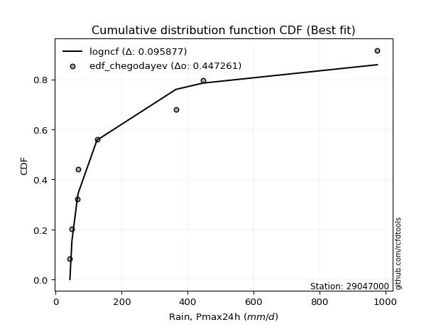</img></img>

</div>


### 6. EDF Blom (1958)

The Blom formula is a specific "plotting position" formula used in hydrology and statistical analysis to estimate the empirical cumulative probability (or non-exceedance probability) of a data series. It is particularly recommended for data that are approximately normally distributed. The constant _a_ is set to 0.375 (or 3/8).

<div align="center">


$P=(m-a)/(n+1-2a)$


</div>


**6.1. Empirical values**

<div align="center">

|                | 0                   | 1                   | 2                   | 3                  | 4        | 5                  | 6                  | 7                  | 8                  |
|:---------------|:--------------------|:--------------------|:--------------------|:-------------------|:---------|:-------------------|:-------------------|:-------------------|:-------------------|
| date           | 2025                | 2018                | 2017                | 2020               | 2021     | 2019               | 2024               | 2023               | 2022               |
| x              | 37.8                | 43.02               | 49.13               | 66.64              | 68.05    | 125.01             | 364.54             | 446.14             | 975.48             |
| m              | 1                   | 2                   | 3                   | 4                  | 5        | 6                  | 7                  | 8                  | 9                  |
| empirical_dist | edf_blom            | edf_blom            | edf_blom            | edf_blom           | edf_blom | edf_blom           | edf_blom           | edf_blom           | edf_blom           |
| empirical      | 0.06756756756756757 | 0.17567567567567569 | 0.28378378378378377 | 0.3918918918918919 | 0.5      | 0.6081081081081081 | 0.7162162162162162 | 0.8243243243243243 | 0.9324324324324325 |
| empirical_tr   | 1.072463768115942   | 1.2131147540983607  | 1.3962264150943395  | 1.6444444444444444 | 2.0      | 2.5517241379310347 | 3.523809523809524  | 5.6923076923076925 | 14.800000000000006 |

</div>


**6.2. Kolmogorov-Smirnov fit test (sorted by Δ)**


<div align="center">

|                | 0                   | 1                   | 2                   | 3                   | 4                   | 5                   | 6                   | 7                   | 8                   | 9                   | 10                  | 11                  | 12                  | 13                  | 14                  | 15                  | 16                  | 17                  | 18                  | 19                  | 20                  | 21                  | 22                  | 23                  | 24                  | 25                  | 26                  | 27                  | 28                  | 29                  | 30                  | 31                  | 32                  | 33                  | 34                  | 35                  | 36                  | 37                  | 38                  | 39                  | 40                  | 41                  | 42                  | 43                  | 44                  | 45                  | 46                  | 47                  | 48                  | 49                  | 50                  | 51                  | 52                  | 53                  | 54                  | 55                  | 56                  | 57                  | 58                  | 59                  | 60                  | 61                  | 62                  | 63                  | 64                  | 65                  | 66                  | 67                  | 68                  | 69                  | 70                  | 71                  | 72                  | 73                  | 74                  | 75                  | 76                  | 77                  | 78                  | 79                  | 80                  | 81                  | 82                  | 83                  | 84                  | 85                  | 86                  | 87                  | 88                  | 89                  | 90                  | 91                  | 92                  | 93                  | 94                  | 95                  | 96                  | 97                  | 98                  | 99                  | 100                 | 101                 | 102                 | 103                 | 104                 | 105                 | 106                 | 107                 | 108                 | 109                 | 110                 | 111                 | 112                 | 113                 | 114                 | 115                 | 116                 | 117                 | 118                 | 119                 | 120                 | 121                 | 122                 | 123                 | 124                 | 125                 | 126                 | 127                 | 128                 | 129                 | 130                 | 131                 | 132                 | 133                 | 134                 | 135                 | 136                 | 137                 | 138                 | 139                 | 140                 | 141                 | 142                 | 143                 | 144                 | 145                 | 146                 | 147                 | 148                 | 149                 | 150                 | 151                 | 152                 | 153                 | 154                 | 155                 | 156                 | 157                 | 158                 | 159                 |
|:---------------|:--------------------|:--------------------|:--------------------|:--------------------|:--------------------|:--------------------|:--------------------|:--------------------|:--------------------|:--------------------|:--------------------|:--------------------|:--------------------|:--------------------|:--------------------|:--------------------|:--------------------|:--------------------|:--------------------|:--------------------|:--------------------|:--------------------|:--------------------|:--------------------|:--------------------|:--------------------|:--------------------|:--------------------|:--------------------|:--------------------|:--------------------|:--------------------|:--------------------|:--------------------|:--------------------|:--------------------|:--------------------|:--------------------|:--------------------|:--------------------|:--------------------|:--------------------|:--------------------|:--------------------|:--------------------|:--------------------|:--------------------|:--------------------|:--------------------|:--------------------|:--------------------|:--------------------|:--------------------|:--------------------|:--------------------|:--------------------|:--------------------|:--------------------|:--------------------|:--------------------|:--------------------|:--------------------|:--------------------|:--------------------|:--------------------|:--------------------|:--------------------|:--------------------|:--------------------|:--------------------|:--------------------|:--------------------|:--------------------|:--------------------|:--------------------|:--------------------|:--------------------|:--------------------|:--------------------|:--------------------|:--------------------|:--------------------|:--------------------|:--------------------|:--------------------|:--------------------|:--------------------|:--------------------|:--------------------|:--------------------|:--------------------|:--------------------|:--------------------|:--------------------|:--------------------|:--------------------|:--------------------|:--------------------|:--------------------|:--------------------|:--------------------|:--------------------|:--------------------|:--------------------|:--------------------|:--------------------|:--------------------|:--------------------|:--------------------|:--------------------|:--------------------|:--------------------|:--------------------|:--------------------|:--------------------|:--------------------|:--------------------|:--------------------|:--------------------|:--------------------|:--------------------|:--------------------|:--------------------|:--------------------|:--------------------|:--------------------|:--------------------|:--------------------|:--------------------|:--------------------|:--------------------|:--------------------|:--------------------|:--------------------|:--------------------|:--------------------|:--------------------|:--------------------|:--------------------|:--------------------|:--------------------|:--------------------|:--------------------|:--------------------|:--------------------|:--------------------|:--------------------|:--------------------|:--------------------|:--------------------|:--------------------|:--------------------|:--------------------|:--------------------|:--------------------|:--------------------|:--------------------|:--------------------|:--------------------|:--------------------|
| station        | 29047000            | 29047000            | 29047000            | 29047000            | 29047000            | 29047000            | 29047000            | 29047000            | 29047000            | 29047000            | 29047000            | 29047000            | 29047000            | 29047000            | 29047000            | 29047000            | 29047000            | 29047000            | 29047000            | 29047000            | 29047000            | 29047000            | 29047000            | 29047000            | 29047000            | 29047000            | 29047000            | 29047000            | 29047000            | 29047000            | 29047000            | 29047000            | 29047000            | 29047000            | 29047000            | 29047000            | 29047000            | 29047000            | 29047000            | 29047000            | 29047000            | 29047000            | 29047000            | 29047000            | 29047000            | 29047000            | 29047000            | 29047000            | 29047000            | 29047000            | 29047000            | 29047000            | 29047000            | 29047000            | 29047000            | 29047000            | 29047000            | 29047000            | 29047000            | 29047000            | 29047000            | 29047000            | 29047000            | 29047000            | 29047000            | 29047000            | 29047000            | 29047000            | 29047000            | 29047000            | 29047000            | 29047000            | 29047000            | 29047000            | 29047000            | 29047000            | 29047000            | 29047000            | 29047000            | 29047000            | 29047000            | 29047000            | 29047000            | 29047000            | 29047000            | 29047000            | 29047000            | 29047000            | 29047000            | 29047000            | 29047000            | 29047000            | 29047000            | 29047000            | 29047000            | 29047000            | 29047000            | 29047000            | 29047000            | 29047000            | 29047000            | 29047000            | 29047000            | 29047000            | 29047000            | 29047000            | 29047000            | 29047000            | 29047000            | 29047000            | 29047000            | 29047000            | 29047000            | 29047000            | 29047000            | 29047000            | 29047000            | 29047000            | 29047000            | 29047000            | 29047000            | 29047000            | 29047000            | 29047000            | 29047000            | 29047000            | 29047000            | 29047000            | 29047000            | 29047000            | 29047000            | 29047000            | 29047000            | 29047000            | 29047000            | 29047000            | 29047000            | 29047000            | 29047000            | 29047000            | 29047000            | 29047000            | 29047000            | 29047000            | 29047000            | 29047000            | 29047000            | 29047000            | 29047000            | 29047000            | 29047000            | 29047000            | 29047000            | 29047000            | 29047000            | 29047000            | 29047000            | 29047000            | 29047000            | 29047000            |
| empirical_dist | edf_blom            | edf_blom            | edf_blom            | edf_blom            | edf_blom            | edf_blom            | edf_blom            | edf_blom            | edf_blom            | edf_blom            | edf_blom            | edf_blom            | edf_blom            | edf_blom            | edf_blom            | edf_blom            | edf_blom            | edf_blom            | edf_blom            | edf_blom            | edf_blom            | edf_blom            | edf_blom            | edf_blom            | edf_blom            | edf_blom            | edf_blom            | edf_blom            | edf_blom            | edf_blom            | edf_blom            | edf_blom            | edf_blom            | edf_blom            | edf_blom            | edf_blom            | edf_blom            | edf_blom            | edf_blom            | edf_blom            | edf_blom            | edf_blom            | edf_blom            | edf_blom            | edf_blom            | edf_blom            | edf_blom            | edf_blom            | edf_blom            | edf_blom            | edf_blom            | edf_blom            | edf_blom            | edf_blom            | edf_blom            | edf_blom            | edf_blom            | edf_blom            | edf_blom            | edf_blom            | edf_blom            | edf_blom            | edf_blom            | edf_blom            | edf_blom            | edf_blom            | edf_blom            | edf_blom            | edf_blom            | edf_blom            | edf_blom            | edf_blom            | edf_blom            | edf_blom            | edf_blom            | edf_blom            | edf_blom            | edf_blom            | edf_blom            | edf_blom            | edf_blom            | edf_blom            | edf_blom            | edf_blom            | edf_blom            | edf_blom            | edf_blom            | edf_blom            | edf_blom            | edf_blom            | edf_blom            | edf_blom            | edf_blom            | edf_blom            | edf_blom            | edf_blom            | edf_blom            | edf_blom            | edf_blom            | edf_blom            | edf_blom            | edf_blom            | edf_blom            | edf_blom            | edf_blom            | edf_blom            | edf_blom            | edf_blom            | edf_blom            | edf_blom            | edf_blom            | edf_blom            | edf_blom            | edf_blom            | edf_blom            | edf_blom            | edf_blom            | edf_blom            | edf_blom            | edf_blom            | edf_blom            | edf_blom            | edf_blom            | edf_blom            | edf_blom            | edf_blom            | edf_blom            | edf_blom            | edf_blom            | edf_blom            | edf_blom            | edf_blom            | edf_blom            | edf_blom            | edf_blom            | edf_blom            | edf_blom            | edf_blom            | edf_blom            | edf_blom            | edf_blom            | edf_blom            | edf_blom            | edf_blom            | edf_blom            | edf_blom            | edf_blom            | edf_blom            | edf_blom            | edf_blom            | edf_blom            | edf_blom            | edf_blom            | edf_blom            | edf_blom            | edf_blom            | edf_blom            | edf_blom            | edf_blom            | edf_blom            |
| p_dist         | exponweib           | logweibull_min      | mielke              | logbeta             | logalpha            | invweibull          | fatiguelife         | logf                | gausshyper          | logexponweib        | truncweibull_min    | invgamma            | f                   | logmielke           | logburr             | loggenextreme       | loginvweibull       | logburr12           | lomax               | loggausshyper       | halfgennorm         | loghalfgennorm      | loginvgamma         | logncf              | logfatiguelife      | lognct              | burr12              | loglomax            | loggenexpon         | logexponnorm        | loginvgauss         | loghalfnorm         | logdweibull         | logexponpow         | erlang              | loghalflogistic     | truncpareto         | exponpow            | logtruncnorm        | logfoldnorm         | logjohnsonsb        | ncf                 | gengamma            | nct                 | invgauss            | loggamma            | loggamma            | burr                | logarcsine          | logdgamma           | logmoyal            | lograyleigh         | loggengamma         | logsemicircular     | loggenlogistic      | nakagami            | loggumbel_r         | loggenhalflogistic  | genpareto           | logmaxwell          | logpearson3         | loganglit           | betaprime           | logbetaprime        | logkstwobign        | alpha               | moyal               | logrdist            | logloglaplace       | weibull_min         | gamma               | logloggamma         | loggennorm          | dgamma              | vonmises_line       | logjohnsonsu        | logcrystalball      | lognorm             | logt                | pearson3            | logtruncweibull_min | gumbel_r            | halflogistic        | gennorm             | logwrapcauchy       | wald                | rayleigh            | logskewnorm         | logrice             | logweibull_max      | logerlang           | loglogistic         | lognakagami         | maxwell             | halfnorm            | semicircular        | logcosine           | anglit              | loghypsecant        | loggompertz         | logwald             | logtruncexpon       | foldnorm            | genlogistic         | logtukeylambda      | loggumbel_l         | t                   | norm                | logbradford         | logksone            | loglaplace          | loglaplace          | arcsine             | kstwobign           | logargus            | logistic            | powerlaw            | genextreme          | logtriang           | hypsecant           | logkappa4           | rice                | cosine              | loguniform          | beta                | logkappa3           | gumbel_l            | laplace             | loggenpareto        | logvonmises_line    | wrapcauchy          | johnsonsb           | loglevy_l           | exponnorm           | truncexpon          | gompertz            | genexpon            | logpowerlaw         | argus               | triang              | truncnorm           | dweibull            | bradford            | levy_l              | skewnorm            | ksone               | logtrapezoid        | crystalball         | kappa3              | kappa4              | rdist               | logtruncpareto      | genhalflogistic     | uniform             | tukeylambda         | johnsonsu           | trapezoid           | weibull_max         | logvonmises         | vonmises            |
| delta          | 0.0812404457364499  | 0.08327351395048865 | 0.0903949373218883  | 0.09123602150266022 | 0.09144552824314944 | 0.09688703194403536 | 0.09876667647829718 | 0.10022171807264235 | 0.10926390314050072 | 0.10996316873855261 | 0.11425223392537215 | 0.11692621439076167 | 0.11692663896357125 | 0.12158199332675979 | 0.12292566371847469 | 0.12293914845749043 | 0.12295422069330508 | 0.12633883377023658 | 0.12715394513649025 | 0.12722173563656647 | 0.1274503101006662  | 0.12924907632594607 | 0.1298663916666969  | 0.13009749900454715 | 0.1303385524565035  | 0.13150073417900332 | 0.13269553693595115 | 0.13348388814967393 | 0.13445367049214607 | 0.13631204923208173 | 0.13709556183207194 | 0.13739133229605777 | 0.1377465112303785  | 0.1378884745515564  | 0.138546594863051   | 0.1404602613589469  | 0.14468651831506507 | 0.14633339319326966 | 0.14673597431395202 | 0.14762921189999162 | 0.15100592786180977 | 0.15363348536104682 | 0.15367306577848672 | 0.15603258316167135 | 0.15634793687299597 | 0.1581727020619056  | 0.1581727020619056  | 0.15912131279891306 | 0.1596520259904602  | 0.16023010399470894 | 0.1664752102618613  | 0.16791644330570077 | 0.16945254233135032 | 0.1702928396840787  | 0.17297501461052694 | 0.17442362288260246 | 0.17525387104601375 | 0.17542427321744014 | 0.1767431563682963  | 0.1787438951740103  | 0.18046840451655294 | 0.18096370264746736 | 0.1815730990580251  | 0.18374498213762858 | 0.18610540079763266 | 0.19478105205120633 | 0.19661292571963795 | 0.1975367541497629  | 0.20115203673336857 | 0.2013828373333308  | 0.20258945749125656 | 0.20275119082994025 | 0.20296010784709018 | 0.20530440981705655 | 0.20553036859817278 | 0.20554759234185876 | 0.20598337156041646 | 0.20598338111395975 | 0.20598365074732428 | 0.2061927359331651  | 0.2104961087385812  | 0.2140785185993025  | 0.21457501933962295 | 0.21541118204129817 | 0.21616865286673848 | 0.21650978906560775 | 0.21778785171245008 | 0.21869027363800786 | 0.22358829819762926 | 0.2245108139596016  | 0.22682265535684065 | 0.227606749959685   | 0.22790424090251887 | 0.22981023289495478 | 0.23022635370136926 | 0.23288838194647904 | 0.23591148772729115 | 0.24136011122477485 | 0.24306301230395233 | 0.24485343377718932 | 0.24775895059536662 | 0.24820288422195586 | 0.24888492276335214 | 0.25046394295844    | 0.2546737694594654  | 0.25557040480584325 | 0.25594617815228515 | 0.2615330411268857  | 0.2620926549667167  | 0.26594323387937635 | 0.26758022060567105 | 0.26758022060567105 | 0.2703646729299096  | 0.2771485686048829  | 0.2786162847209782  | 0.27976658377998487 | 0.2845707398102538  | 0.29046808769048293 | 0.29184620947389117 | 0.2938602294306812  | 0.29964506766679666 | 0.30754466628020394 | 0.3176533550092494  | 0.31913188065525167 | 0.31954681039692157 | 0.32044190311470644 | 0.32096082322927794 | 0.32193913331228585 | 0.3252622197005437  | 0.32669520625329956 | 0.32917654898633425 | 0.34941891748322695 | 0.35037658062139543 | 0.36090739668888305 | 0.3615386187193979  | 0.3621430171792478  | 0.3626356045695054  | 0.3662449696347514  | 0.3714062292815199  | 0.3949334152609181  | 0.40230040146492574 | 0.40744767286923633 | 0.4160800623166875  | 0.4210808320878554  | 0.43291560983815125 | 0.4472696557576261  | 0.45603684780934717 | 0.4663229011194139  | 0.4747667092759688  | 0.4941090727851465  | 0.49597936689891686 | 0.5089680520301152  | 0.5141988665840243  | 0.5151019652875297  | 0.521733301870758   | 0.5664263948408522  | 0.6229751034686404  | 0.7564564473833199  | 1.1543335810552173  | 155.03420606832273  |
| deltao         | 0.41761268023100007 | 0.41761268023100007 | 0.41761268023100007 | 0.41761268023100007 | 0.41761268023100007 | 0.41761268023100007 | 0.41761268023100007 | 0.41761268023100007 | 0.41761268023100007 | 0.41761268023100007 | 0.41761268023100007 | 0.41761268023100007 | 0.41761268023100007 | 0.41761268023100007 | 0.41761268023100007 | 0.41761268023100007 | 0.41761268023100007 | 0.41761268023100007 | 0.41761268023100007 | 0.41761268023100007 | 0.41761268023100007 | 0.41761268023100007 | 0.41761268023100007 | 0.41761268023100007 | 0.41761268023100007 | 0.41761268023100007 | 0.41761268023100007 | 0.41761268023100007 | 0.41761268023100007 | 0.41761268023100007 | 0.41761268023100007 | 0.41761268023100007 | 0.41761268023100007 | 0.41761268023100007 | 0.41761268023100007 | 0.41761268023100007 | 0.41761268023100007 | 0.41761268023100007 | 0.41761268023100007 | 0.41761268023100007 | 0.41761268023100007 | 0.41761268023100007 | 0.41761268023100007 | 0.41761268023100007 | 0.41761268023100007 | 0.41761268023100007 | 0.41761268023100007 | 0.41761268023100007 | 0.41761268023100007 | 0.41761268023100007 | 0.41761268023100007 | 0.41761268023100007 | 0.41761268023100007 | 0.41761268023100007 | 0.41761268023100007 | 0.41761268023100007 | 0.41761268023100007 | 0.41761268023100007 | 0.41761268023100007 | 0.41761268023100007 | 0.41761268023100007 | 0.41761268023100007 | 0.41761268023100007 | 0.41761268023100007 | 0.41761268023100007 | 0.41761268023100007 | 0.41761268023100007 | 0.41761268023100007 | 0.41761268023100007 | 0.41761268023100007 | 0.41761268023100007 | 0.41761268023100007 | 0.41761268023100007 | 0.41761268023100007 | 0.41761268023100007 | 0.41761268023100007 | 0.41761268023100007 | 0.41761268023100007 | 0.41761268023100007 | 0.41761268023100007 | 0.41761268023100007 | 0.41761268023100007 | 0.41761268023100007 | 0.41761268023100007 | 0.41761268023100007 | 0.41761268023100007 | 0.41761268023100007 | 0.41761268023100007 | 0.41761268023100007 | 0.41761268023100007 | 0.41761268023100007 | 0.41761268023100007 | 0.41761268023100007 | 0.41761268023100007 | 0.41761268023100007 | 0.41761268023100007 | 0.41761268023100007 | 0.41761268023100007 | 0.41761268023100007 | 0.41761268023100007 | 0.41761268023100007 | 0.41761268023100007 | 0.41761268023100007 | 0.41761268023100007 | 0.41761268023100007 | 0.41761268023100007 | 0.41761268023100007 | 0.41761268023100007 | 0.41761268023100007 | 0.41761268023100007 | 0.41761268023100007 | 0.41761268023100007 | 0.41761268023100007 | 0.41761268023100007 | 0.41761268023100007 | 0.41761268023100007 | 0.41761268023100007 | 0.41761268023100007 | 0.41761268023100007 | 0.41761268023100007 | 0.41761268023100007 | 0.41761268023100007 | 0.41761268023100007 | 0.41761268023100007 | 0.41761268023100007 | 0.41761268023100007 | 0.41761268023100007 | 0.41761268023100007 | 0.41761268023100007 | 0.41761268023100007 | 0.41761268023100007 | 0.41761268023100007 | 0.41761268023100007 | 0.41761268023100007 | 0.41761268023100007 | 0.41761268023100007 | 0.41761268023100007 | 0.41761268023100007 | 0.41761268023100007 | 0.41761268023100007 | 0.41761268023100007 | 0.41761268023100007 | 0.41761268023100007 | 0.41761268023100007 | 0.41761268023100007 | 0.41761268023100007 | 0.41761268023100007 | 0.41761268023100007 | 0.41761268023100007 | 0.41761268023100007 | 0.41761268023100007 | 0.41761268023100007 | 0.41761268023100007 | 0.41761268023100007 | 0.41761268023100007 | 0.41761268023100007 | 0.41761268023100007 | 0.41761268023100007 | 0.41761268023100007 | 0.41761268023100007 |
| eval           | Δo > Δ              | Δo > Δ              | Δo > Δ              | Δo > Δ              | Δo > Δ              | Δo > Δ              | Δo > Δ              | Δo > Δ              | Δo > Δ              | Δo > Δ              | Δo > Δ              | Δo > Δ              | Δo > Δ              | Δo > Δ              | Δo > Δ              | Δo > Δ              | Δo > Δ              | Δo > Δ              | Δo > Δ              | Δo > Δ              | Δo > Δ              | Δo > Δ              | Δo > Δ              | Δo > Δ              | Δo > Δ              | Δo > Δ              | Δo > Δ              | Δo > Δ              | Δo > Δ              | Δo > Δ              | Δo > Δ              | Δo > Δ              | Δo > Δ              | Δo > Δ              | Δo > Δ              | Δo > Δ              | Δo > Δ              | Δo > Δ              | Δo > Δ              | Δo > Δ              | Δo > Δ              | Δo > Δ              | Δo > Δ              | Δo > Δ              | Δo > Δ              | Δo > Δ              | Δo > Δ              | Δo > Δ              | Δo > Δ              | Δo > Δ              | Δo > Δ              | Δo > Δ              | Δo > Δ              | Δo > Δ              | Δo > Δ              | Δo > Δ              | Δo > Δ              | Δo > Δ              | Δo > Δ              | Δo > Δ              | Δo > Δ              | Δo > Δ              | Δo > Δ              | Δo > Δ              | Δo > Δ              | Δo > Δ              | Δo > Δ              | Δo > Δ              | Δo > Δ              | Δo > Δ              | Δo > Δ              | Δo > Δ              | Δo > Δ              | Δo > Δ              | Δo > Δ              | Δo > Δ              | Δo > Δ              | Δo > Δ              | Δo > Δ              | Δo > Δ              | Δo > Δ              | Δo > Δ              | Δo > Δ              | Δo > Δ              | Δo > Δ              | Δo > Δ              | Δo > Δ              | Δo > Δ              | Δo > Δ              | Δo > Δ              | Δo > Δ              | Δo > Δ              | Δo > Δ              | Δo > Δ              | Δo > Δ              | Δo > Δ              | Δo > Δ              | Δo > Δ              | Δo > Δ              | Δo > Δ              | Δo > Δ              | Δo > Δ              | Δo > Δ              | Δo > Δ              | Δo > Δ              | Δo > Δ              | Δo > Δ              | Δo > Δ              | Δo > Δ              | Δo > Δ              | Δo > Δ              | Δo > Δ              | Δo > Δ              | Δo > Δ              | Δo > Δ              | Δo > Δ              | Δo > Δ              | Δo > Δ              | Δo > Δ              | Δo > Δ              | Δo > Δ              | Δo > Δ              | Δo > Δ              | Δo > Δ              | Δo > Δ              | Δo > Δ              | Δo > Δ              | Δo > Δ              | Δo > Δ              | Δo > Δ              | Δo > Δ              | Δo > Δ              | Δo > Δ              | Δo > Δ              | Δo > Δ              | Δo > Δ              | Δo > Δ              | Δo > Δ              | Δo > Δ              | Δo > Δ              | Δo > Δ              | Δo > Δ              | Δo > Δ              | Δo <= Δ             | Δo <= Δ             | Δo <= Δ             | Δo <= Δ             | Δo <= Δ             | Δo <= Δ             | Δo <= Δ             | Δo <= Δ             | Δo <= Δ             | Δo <= Δ             | Δo <= Δ             | Δo <= Δ             | Δo <= Δ             | Δo <= Δ             | Δo <= Δ             | Δo <= Δ             | Δo <= Δ             |
| fit            | 1                   | 1                   | 1                   | 1                   | 1                   | 1                   | 1                   | 1                   | 1                   | 1                   | 1                   | 1                   | 1                   | 1                   | 1                   | 1                   | 1                   | 1                   | 1                   | 1                   | 1                   | 1                   | 1                   | 1                   | 1                   | 1                   | 1                   | 1                   | 1                   | 1                   | 1                   | 1                   | 1                   | 1                   | 1                   | 1                   | 1                   | 1                   | 1                   | 1                   | 1                   | 1                   | 1                   | 1                   | 1                   | 1                   | 1                   | 1                   | 1                   | 1                   | 1                   | 1                   | 1                   | 1                   | 1                   | 1                   | 1                   | 1                   | 1                   | 1                   | 1                   | 1                   | 1                   | 1                   | 1                   | 1                   | 1                   | 1                   | 1                   | 1                   | 1                   | 1                   | 1                   | 1                   | 1                   | 1                   | 1                   | 1                   | 1                   | 1                   | 1                   | 1                   | 1                   | 1                   | 1                   | 1                   | 1                   | 1                   | 1                   | 1                   | 1                   | 1                   | 1                   | 1                   | 1                   | 1                   | 1                   | 1                   | 1                   | 1                   | 1                   | 1                   | 1                   | 1                   | 1                   | 1                   | 1                   | 1                   | 1                   | 1                   | 1                   | 1                   | 1                   | 1                   | 1                   | 1                   | 1                   | 1                   | 1                   | 1                   | 1                   | 1                   | 1                   | 1                   | 1                   | 1                   | 1                   | 1                   | 1                   | 1                   | 1                   | 1                   | 1                   | 1                   | 1                   | 1                   | 1                   | 1                   | 1                   | 1                   | 1                   | 1                   | 1                   | 0                   | 0                   | 0                   | 0                   | 0                   | 0                   | 0                   | 0                   | 0                   | 0                   | 0                   | 0                   | 0                   | 0                   | 0                   | 0                   | 0                   |
| n              | 9                   | 9                   | 9                   | 9                   | 9                   | 9                   | 9                   | 9                   | 9                   | 9                   | 9                   | 9                   | 9                   | 9                   | 9                   | 9                   | 9                   | 9                   | 9                   | 9                   | 9                   | 9                   | 9                   | 9                   | 9                   | 9                   | 9                   | 9                   | 9                   | 9                   | 9                   | 9                   | 9                   | 9                   | 9                   | 9                   | 9                   | 9                   | 9                   | 9                   | 9                   | 9                   | 9                   | 9                   | 9                   | 9                   | 9                   | 9                   | 9                   | 9                   | 9                   | 9                   | 9                   | 9                   | 9                   | 9                   | 9                   | 9                   | 9                   | 9                   | 9                   | 9                   | 9                   | 9                   | 9                   | 9                   | 9                   | 9                   | 9                   | 9                   | 9                   | 9                   | 9                   | 9                   | 9                   | 9                   | 9                   | 9                   | 9                   | 9                   | 9                   | 9                   | 9                   | 9                   | 9                   | 9                   | 9                   | 9                   | 9                   | 9                   | 9                   | 9                   | 9                   | 9                   | 9                   | 9                   | 9                   | 9                   | 9                   | 9                   | 9                   | 9                   | 9                   | 9                   | 9                   | 9                   | 9                   | 9                   | 9                   | 9                   | 9                   | 9                   | 9                   | 9                   | 9                   | 9                   | 9                   | 9                   | 9                   | 9                   | 9                   | 9                   | 9                   | 9                   | 9                   | 9                   | 9                   | 9                   | 9                   | 9                   | 9                   | 9                   | 9                   | 9                   | 9                   | 9                   | 9                   | 9                   | 9                   | 9                   | 9                   | 9                   | 9                   | 9                   | 9                   | 9                   | 9                   | 9                   | 9                   | 9                   | 9                   | 9                   | 9                   | 9                   | 9                   | 9                   | 9                   | 9                   | 9                   | 9                   |
| best_fit       | 1                   | 0                   | 0                   | 0                   | 0                   | 0                   | 0                   | 0                   | 0                   | 0                   | 0                   | 0                   | 0                   | 0                   | 0                   | 0                   | 0                   | 0                   | 0                   | 0                   | 0                   | 0                   | 0                   | 0                   | 0                   | 0                   | 0                   | 0                   | 0                   | 0                   | 0                   | 0                   | 0                   | 0                   | 0                   | 0                   | 0                   | 0                   | 0                   | 0                   | 0                   | 0                   | 0                   | 0                   | 0                   | 0                   | 0                   | 0                   | 0                   | 0                   | 0                   | 0                   | 0                   | 0                   | 0                   | 0                   | 0                   | 0                   | 0                   | 0                   | 0                   | 0                   | 0                   | 0                   | 0                   | 0                   | 0                   | 0                   | 0                   | 0                   | 0                   | 0                   | 0                   | 0                   | 0                   | 0                   | 0                   | 0                   | 0                   | 0                   | 0                   | 0                   | 0                   | 0                   | 0                   | 0                   | 0                   | 0                   | 0                   | 0                   | 0                   | 0                   | 0                   | 0                   | 0                   | 0                   | 0                   | 0                   | 0                   | 0                   | 0                   | 0                   | 0                   | 0                   | 0                   | 0                   | 0                   | 0                   | 0                   | 0                   | 0                   | 0                   | 0                   | 0                   | 0                   | 0                   | 0                   | 0                   | 0                   | 0                   | 0                   | 0                   | 0                   | 0                   | 0                   | 0                   | 0                   | 0                   | 0                   | 0                   | 0                   | 0                   | 0                   | 0                   | 0                   | 0                   | 0                   | 0                   | 0                   | 0                   | 0                   | 0                   | 0                   | 0                   | 0                   | 0                   | 0                   | 0                   | 0                   | 0                   | 0                   | 0                   | 0                   | 0                   | 0                   | 0                   | 0                   | 0                   | 0                   | 0                   |
| best_fit_sort  | 1                   | 2                   | 3                   | 4                   | 5                   | 6                   | 7                   | 8                   | 9                   | 10                  | 11                  | 12                  | 13                  | 14                  | 15                  | 16                  | 17                  | 18                  | 19                  | 20                  | 21                  | 22                  | 23                  | 24                  | 25                  | 26                  | 27                  | 28                  | 29                  | 30                  | 31                  | 32                  | 33                  | 34                  | 35                  | 36                  | 37                  | 38                  | 39                  | 40                  | 41                  | 42                  | 43                  | 44                  | 45                  | 46                  | 47                  | 48                  | 49                  | 50                  | 51                  | 52                  | 53                  | 54                  | 55                  | 56                  | 57                  | 58                  | 59                  | 60                  | 61                  | 62                  | 63                  | 64                  | 65                  | 66                  | 67                  | 68                  | 69                  | 70                  | 71                  | 72                  | 73                  | 74                  | 75                  | 76                  | 77                  | 78                  | 79                  | 80                  | 81                  | 82                  | 83                  | 84                  | 85                  | 86                  | 87                  | 88                  | 89                  | 90                  | 91                  | 92                  | 93                  | 94                  | 95                  | 96                  | 97                  | 98                  | 99                  | 100                 | 101                 | 102                 | 103                 | 104                 | 105                 | 106                 | 107                 | 108                 | 109                 | 110                 | 111                 | 112                 | 113                 | 114                 | 115                 | 116                 | 117                 | 118                 | 119                 | 120                 | 121                 | 122                 | 123                 | 124                 | 125                 | 126                 | 127                 | 128                 | 129                 | 130                 | 131                 | 132                 | 133                 | 134                 | 135                 | 136                 | 137                 | 138                 | 139                 | 140                 | 141                 | 142                 | 143                 | 144                 | 145                 | 146                 | 147                 | 148                 | 149                 | 150                 | 151                 | 152                 | 153                 | 154                 | 155                 | 156                 | 157                 | 158                 | 159                 | 160                 |

</div>


**6.3. Best fit**

<div align="center">

|   id |   station | empirical_dist   | p_dist    |     delta |   deltao | eval   |   fit |   n |   best_fit |   best_fit_sort |
|-----:|----------:|:-----------------|:----------|----------:|---------:|:-------|------:|----:|-----------:|----------------:|
|    0 |  29047000 | edf_blom         | exponweib | 0.0812404 | 0.417613 | Δo > Δ |     1 |   9 |          1 |               1 |

</div>


<div align="center">

</img>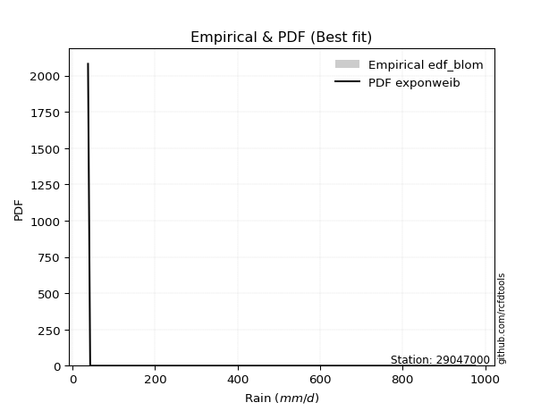</img>

</div>


### 7. EDF Tukey (1962)

In hydrology, the Tukey formula is used as a plotting position formula to estimate the empirical probability or frequency of a flood event (or other hydrological data). The formula parameter is given as _c=0.333_ (or 1/3).

<div align="center">


$P=(m-c)/(n+1-2c)$


</div>


**7.1. Empirical values**

<div align="center">

|                | 0                   | 1                   | 2                  | 3                   | 4         | 5                  | 6                  | 7                  | 8                  |
|:---------------|:--------------------|:--------------------|:-------------------|:--------------------|:----------|:-------------------|:-------------------|:-------------------|:-------------------|
| date           | 2025                | 2018                | 2017               | 2020                | 2021      | 2019               | 2024               | 2023               | 2022               |
| x              | 37.8                | 43.02               | 49.13              | 66.64               | 68.05     | 125.01             | 364.54             | 446.14             | 975.48             |
| m              | 1                   | 2                   | 3                  | 4                   | 5         | 6                  | 7                  | 8                  | 9                  |
| empirical_dist | edf_tukey           | edf_tukey           | edf_tukey          | edf_tukey           | edf_tukey | edf_tukey          | edf_tukey          | edf_tukey          | edf_tukey          |
| empirical      | 0.07142857142857142 | 0.17857142857142858 | 0.2857142857142857 | 0.39285714285714285 | 0.5       | 0.6071428571428571 | 0.7142857142857143 | 0.8214285714285714 | 0.9285714285714286 |
| empirical_tr   | 1.0769230769230769  | 1.2173913043478262  | 1.4                | 1.6470588235294117  | 2.0       | 2.545454545454545  | 3.5                | 5.599999999999999  | 14.000000000000007 |

</div>


**7.2. Kolmogorov-Smirnov fit test (sorted by Δ)**


<div align="center">

|                | 0                   | 1                   | 2                   | 3                   | 4                   | 5                   | 6                   | 7                   | 8                   | 9                   | 10                  | 11                  | 12                  | 13                  | 14                  | 15                  | 16                  | 17                  | 18                  | 19                  | 20                  | 21                  | 22                  | 23                  | 24                  | 25                  | 26                  | 27                  | 28                  | 29                  | 30                  | 31                  | 32                  | 33                  | 34                  | 35                  | 36                  | 37                  | 38                  | 39                  | 40                  | 41                  | 42                  | 43                  | 44                  | 45                  | 46                  | 47                  | 48                  | 49                  | 50                  | 51                  | 52                  | 53                  | 54                  | 55                  | 56                  | 57                  | 58                  | 59                  | 60                  | 61                  | 62                  | 63                  | 64                  | 65                  | 66                  | 67                  | 68                  | 69                  | 70                  | 71                  | 72                  | 73                  | 74                  | 75                  | 76                  | 77                  | 78                  | 79                  | 80                  | 81                  | 82                  | 83                  | 84                  | 85                  | 86                  | 87                  | 88                  | 89                  | 90                  | 91                  | 92                  | 93                  | 94                  | 95                  | 96                  | 97                  | 98                  | 99                  | 100                 | 101                 | 102                 | 103                 | 104                 | 105                 | 106                 | 107                 | 108                 | 109                 | 110                 | 111                 | 112                 | 113                 | 114                 | 115                 | 116                 | 117                 | 118                 | 119                 | 120                 | 121                 | 122                 | 123                 | 124                 | 125                 | 126                 | 127                 | 128                 | 129                 | 130                 | 131                 | 132                 | 133                 | 134                 | 135                 | 136                 | 137                 | 138                 | 139                 | 140                 | 141                 | 142                 | 143                 | 144                 | 145                 | 146                 | 147                 | 148                 | 149                 | 150                 | 151                 | 152                 | 153                 | 154                 | 155                 | 156                 | 157                 | 158                 | 159                 |
|:---------------|:--------------------|:--------------------|:--------------------|:--------------------|:--------------------|:--------------------|:--------------------|:--------------------|:--------------------|:--------------------|:--------------------|:--------------------|:--------------------|:--------------------|:--------------------|:--------------------|:--------------------|:--------------------|:--------------------|:--------------------|:--------------------|:--------------------|:--------------------|:--------------------|:--------------------|:--------------------|:--------------------|:--------------------|:--------------------|:--------------------|:--------------------|:--------------------|:--------------------|:--------------------|:--------------------|:--------------------|:--------------------|:--------------------|:--------------------|:--------------------|:--------------------|:--------------------|:--------------------|:--------------------|:--------------------|:--------------------|:--------------------|:--------------------|:--------------------|:--------------------|:--------------------|:--------------------|:--------------------|:--------------------|:--------------------|:--------------------|:--------------------|:--------------------|:--------------------|:--------------------|:--------------------|:--------------------|:--------------------|:--------------------|:--------------------|:--------------------|:--------------------|:--------------------|:--------------------|:--------------------|:--------------------|:--------------------|:--------------------|:--------------------|:--------------------|:--------------------|:--------------------|:--------------------|:--------------------|:--------------------|:--------------------|:--------------------|:--------------------|:--------------------|:--------------------|:--------------------|:--------------------|:--------------------|:--------------------|:--------------------|:--------------------|:--------------------|:--------------------|:--------------------|:--------------------|:--------------------|:--------------------|:--------------------|:--------------------|:--------------------|:--------------------|:--------------------|:--------------------|:--------------------|:--------------------|:--------------------|:--------------------|:--------------------|:--------------------|:--------------------|:--------------------|:--------------------|:--------------------|:--------------------|:--------------------|:--------------------|:--------------------|:--------------------|:--------------------|:--------------------|:--------------------|:--------------------|:--------------------|:--------------------|:--------------------|:--------------------|:--------------------|:--------------------|:--------------------|:--------------------|:--------------------|:--------------------|:--------------------|:--------------------|:--------------------|:--------------------|:--------------------|:--------------------|:--------------------|:--------------------|:--------------------|:--------------------|:--------------------|:--------------------|:--------------------|:--------------------|:--------------------|:--------------------|:--------------------|:--------------------|:--------------------|:--------------------|:--------------------|:--------------------|:--------------------|:--------------------|:--------------------|:--------------------|:--------------------|:--------------------|
| station        | 29047000            | 29047000            | 29047000            | 29047000            | 29047000            | 29047000            | 29047000            | 29047000            | 29047000            | 29047000            | 29047000            | 29047000            | 29047000            | 29047000            | 29047000            | 29047000            | 29047000            | 29047000            | 29047000            | 29047000            | 29047000            | 29047000            | 29047000            | 29047000            | 29047000            | 29047000            | 29047000            | 29047000            | 29047000            | 29047000            | 29047000            | 29047000            | 29047000            | 29047000            | 29047000            | 29047000            | 29047000            | 29047000            | 29047000            | 29047000            | 29047000            | 29047000            | 29047000            | 29047000            | 29047000            | 29047000            | 29047000            | 29047000            | 29047000            | 29047000            | 29047000            | 29047000            | 29047000            | 29047000            | 29047000            | 29047000            | 29047000            | 29047000            | 29047000            | 29047000            | 29047000            | 29047000            | 29047000            | 29047000            | 29047000            | 29047000            | 29047000            | 29047000            | 29047000            | 29047000            | 29047000            | 29047000            | 29047000            | 29047000            | 29047000            | 29047000            | 29047000            | 29047000            | 29047000            | 29047000            | 29047000            | 29047000            | 29047000            | 29047000            | 29047000            | 29047000            | 29047000            | 29047000            | 29047000            | 29047000            | 29047000            | 29047000            | 29047000            | 29047000            | 29047000            | 29047000            | 29047000            | 29047000            | 29047000            | 29047000            | 29047000            | 29047000            | 29047000            | 29047000            | 29047000            | 29047000            | 29047000            | 29047000            | 29047000            | 29047000            | 29047000            | 29047000            | 29047000            | 29047000            | 29047000            | 29047000            | 29047000            | 29047000            | 29047000            | 29047000            | 29047000            | 29047000            | 29047000            | 29047000            | 29047000            | 29047000            | 29047000            | 29047000            | 29047000            | 29047000            | 29047000            | 29047000            | 29047000            | 29047000            | 29047000            | 29047000            | 29047000            | 29047000            | 29047000            | 29047000            | 29047000            | 29047000            | 29047000            | 29047000            | 29047000            | 29047000            | 29047000            | 29047000            | 29047000            | 29047000            | 29047000            | 29047000            | 29047000            | 29047000            | 29047000            | 29047000            | 29047000            | 29047000            | 29047000            | 29047000            |
| empirical_dist | edf_tukey           | edf_tukey           | edf_tukey           | edf_tukey           | edf_tukey           | edf_tukey           | edf_tukey           | edf_tukey           | edf_tukey           | edf_tukey           | edf_tukey           | edf_tukey           | edf_tukey           | edf_tukey           | edf_tukey           | edf_tukey           | edf_tukey           | edf_tukey           | edf_tukey           | edf_tukey           | edf_tukey           | edf_tukey           | edf_tukey           | edf_tukey           | edf_tukey           | edf_tukey           | edf_tukey           | edf_tukey           | edf_tukey           | edf_tukey           | edf_tukey           | edf_tukey           | edf_tukey           | edf_tukey           | edf_tukey           | edf_tukey           | edf_tukey           | edf_tukey           | edf_tukey           | edf_tukey           | edf_tukey           | edf_tukey           | edf_tukey           | edf_tukey           | edf_tukey           | edf_tukey           | edf_tukey           | edf_tukey           | edf_tukey           | edf_tukey           | edf_tukey           | edf_tukey           | edf_tukey           | edf_tukey           | edf_tukey           | edf_tukey           | edf_tukey           | edf_tukey           | edf_tukey           | edf_tukey           | edf_tukey           | edf_tukey           | edf_tukey           | edf_tukey           | edf_tukey           | edf_tukey           | edf_tukey           | edf_tukey           | edf_tukey           | edf_tukey           | edf_tukey           | edf_tukey           | edf_tukey           | edf_tukey           | edf_tukey           | edf_tukey           | edf_tukey           | edf_tukey           | edf_tukey           | edf_tukey           | edf_tukey           | edf_tukey           | edf_tukey           | edf_tukey           | edf_tukey           | edf_tukey           | edf_tukey           | edf_tukey           | edf_tukey           | edf_tukey           | edf_tukey           | edf_tukey           | edf_tukey           | edf_tukey           | edf_tukey           | edf_tukey           | edf_tukey           | edf_tukey           | edf_tukey           | edf_tukey           | edf_tukey           | edf_tukey           | edf_tukey           | edf_tukey           | edf_tukey           | edf_tukey           | edf_tukey           | edf_tukey           | edf_tukey           | edf_tukey           | edf_tukey           | edf_tukey           | edf_tukey           | edf_tukey           | edf_tukey           | edf_tukey           | edf_tukey           | edf_tukey           | edf_tukey           | edf_tukey           | edf_tukey           | edf_tukey           | edf_tukey           | edf_tukey           | edf_tukey           | edf_tukey           | edf_tukey           | edf_tukey           | edf_tukey           | edf_tukey           | edf_tukey           | edf_tukey           | edf_tukey           | edf_tukey           | edf_tukey           | edf_tukey           | edf_tukey           | edf_tukey           | edf_tukey           | edf_tukey           | edf_tukey           | edf_tukey           | edf_tukey           | edf_tukey           | edf_tukey           | edf_tukey           | edf_tukey           | edf_tukey           | edf_tukey           | edf_tukey           | edf_tukey           | edf_tukey           | edf_tukey           | edf_tukey           | edf_tukey           | edf_tukey           | edf_tukey           | edf_tukey           | edf_tukey           | edf_tukey           |
| p_dist         | logweibull_min      | exponweib           | logbeta             | mielke              | logalpha            | invweibull          | fatiguelife         | logf                | gausshyper          | logexponweib        | truncweibull_min    | invgamma            | f                   | logmielke           | logburr             | loggenextreme       | loginvweibull       | logburr12           | lomax               | loggausshyper       | halfgennorm         | loghalfgennorm      | loginvgamma         | logncf              | logfatiguelife      | lognct              | burr12              | loglomax            | loggenexpon         | loghalfnorm         | logexponpow         | logexponnorm        | loginvgauss         | logdweibull         | loghalflogistic     | erlang              | truncpareto         | logtruncnorm        | logfoldnorm         | logjohnsonsb        | exponpow            | ncf                 | gengamma            | logarcsine          | nct                 | invgauss            | loggamma            | loggamma            | burr                | logdgamma           | logmoyal            | lograyleigh         | logsemicircular     | loggengamma         | nakagami            | loggenlogistic      | loggumbel_r         | loggenhalflogistic  | genpareto           | logmaxwell          | logpearson3         | loganglit           | betaprime           | logbetaprime        | logkstwobign        | moyal               | alpha               | logrdist            | weibull_min         | vonmises_line       | pearson3            | logloggamma         | logloglaplace       | dgamma              | gamma               | loggennorm          | logjohnsonsu        | logcrystalball      | lognorm             | logt                | logtruncweibull_min | halflogistic        | gumbel_r            | logwrapcauchy       | wald                | rayleigh            | gennorm             | logskewnorm         | logweibull_max      | logrice             | halfnorm            | loglogistic         | lognakagami         | logerlang           | maxwell             | semicircular        | logcosine           | anglit              | loghypsecant        | loggompertz         | foldnorm            | logtruncexpon       | logwald             | genlogistic         | logtukeylambda      | t                   | loggumbel_l         | norm                | logbradford         | logksone            | arcsine             | loglaplace          | loglaplace          | kstwobign           | logargus            | logistic            | powerlaw            | genextreme          | logtriang           | hypsecant           | logkappa4           | rice                | cosine              | beta                | loguniform          | gumbel_l            | logkappa3           | laplace             | loggenpareto        | wrapcauchy          | logvonmises_line    | loglevy_l           | johnsonsb           | truncexpon          | exponnorm           | gompertz            | genexpon            | logpowerlaw         | argus               | triang              | truncnorm           | dweibull            | bradford            | levy_l              | skewnorm            | ksone               | logtrapezoid        | crystalball         | kappa3              | rdist               | kappa4              | logtruncpareto      | genhalflogistic     | uniform             | tukeylambda         | johnsonsu           | trapezoid           | weibull_max         | logvonmises         | vonmises            |
| delta          | 0.08076812804574351 | 0.0812404457364499  | 0.08834026860690733 | 0.09232543925239023 | 0.09337603017365137 | 0.09881753387453729 | 0.1006971784087991  | 0.10215222000314428 | 0.11119440507100264 | 0.11189367066905453 | 0.11425223392537215 | 0.1188567163212636  | 0.11885714089407318 | 0.12351249525726171 | 0.12485616564897661 | 0.12486965038799236 | 0.12488472262380701 | 0.1282693357007385  | 0.12908444706699218 | 0.1291522375670684  | 0.12938081203116814 | 0.131179578256448   | 0.13179689359719882 | 0.13202800093504907 | 0.13226905438700542 | 0.13343123610950525 | 0.13462603886645308 | 0.13541439008017586 | 0.136384172422648   | 0.13739133229605777 | 0.1378884745515564  | 0.13824255116258366 | 0.13902606376257387 | 0.13967701316088044 | 0.1404602613589469  | 0.1404770967935529  | 0.14468651831506507 | 0.14673597431395202 | 0.14762921189999162 | 0.14811017496605683 | 0.14826389512377158 | 0.15363348536104682 | 0.15560356770898864 | 0.15579102212945634 | 0.15603258316167135 | 0.1582784388034979  | 0.16010320399240752 | 0.16010320399240752 | 0.161051814729415   | 0.16216060592521087 | 0.1664752102618613  | 0.16791644330570077 | 0.1702928396840787  | 0.17138304426185225 | 0.17152786998684957 | 0.17297501461052694 | 0.17525387104601375 | 0.17542427321744014 | 0.17867365829879822 | 0.1787438951740103  | 0.18046840451655294 | 0.18096370264746736 | 0.1815730990580251  | 0.1856754840681305  | 0.18610540079763266 | 0.19564767475438694 | 0.19671155398170825 | 0.1975367541497629  | 0.2013828373333308  | 0.20166936473716893 | 0.20233173207216124 | 0.20275119082994025 | 0.2030825386638705  | 0.20433915885180554 | 0.2045199594217585  | 0.2048906097775921  | 0.20554759234185876 | 0.20598337156041646 | 0.20598338111395975 | 0.20598365074732428 | 0.2104961087385812  | 0.2107140154786191  | 0.21311326763405147 | 0.21327289997098553 | 0.21650978906560775 | 0.21682260074719906 | 0.2173416839718001  | 0.21869027363800786 | 0.22354556299435058 | 0.22358829819762926 | 0.2263653498403654  | 0.227606749959685   | 0.22790424090251887 | 0.22875315728734258 | 0.22884498192970376 | 0.23192313098122802 | 0.23591148772729115 | 0.24039486025952383 | 0.24306301230395233 | 0.24485343377718932 | 0.2450239189023483  | 0.24820288422195586 | 0.24968945252586855 | 0.25046394295844    | 0.2546737694594654  | 0.2549809271870342  | 0.25557040480584325 | 0.26056779016163467 | 0.2620926549667167  | 0.26594323387937635 | 0.26650366906890577 | 0.26758022060567105 | 0.26758022060567105 | 0.2761833176396319  | 0.2786162847209782  | 0.27880133281473385 | 0.281674986914501   | 0.28757233479473    | 0.29184620947389117 | 0.29289497846543017 | 0.29964506766679666 | 0.3065794153149529  | 0.3166881040439984  | 0.31858155943167055 | 0.31913188065525167 | 0.3199955722640269  | 0.32044190311470644 | 0.32097388234703483 | 0.32140121583953984 | 0.3262807960905813  | 0.32669520625329956 | 0.3465155767603916  | 0.346523164587474   | 0.3605733677541469  | 0.36090739668888305 | 0.3621430171792478  | 0.3626356045695054  | 0.36334921673899845 | 0.3704409783162689  | 0.39396816429566706 | 0.40230040146492574 | 0.4035866690082325  | 0.4160800623166875  | 0.41721982822685155 | 0.43291560983815125 | 0.4463044047923751  | 0.45507159684409615 | 0.46246189725841    | 0.47090570541496496 | 0.492118363037913   | 0.49314382181989547 | 0.5060722991343622  | 0.5132336156187732  | 0.5141367143222786  | 0.5178722980097541  | 0.5635306419450993  | 0.6200793505728874  | 0.7535606944875669  | 1.1562640829857194  | 155.03806707218374  |
| deltao         | 0.41761268023100007 | 0.41761268023100007 | 0.41761268023100007 | 0.41761268023100007 | 0.41761268023100007 | 0.41761268023100007 | 0.41761268023100007 | 0.41761268023100007 | 0.41761268023100007 | 0.41761268023100007 | 0.41761268023100007 | 0.41761268023100007 | 0.41761268023100007 | 0.41761268023100007 | 0.41761268023100007 | 0.41761268023100007 | 0.41761268023100007 | 0.41761268023100007 | 0.41761268023100007 | 0.41761268023100007 | 0.41761268023100007 | 0.41761268023100007 | 0.41761268023100007 | 0.41761268023100007 | 0.41761268023100007 | 0.41761268023100007 | 0.41761268023100007 | 0.41761268023100007 | 0.41761268023100007 | 0.41761268023100007 | 0.41761268023100007 | 0.41761268023100007 | 0.41761268023100007 | 0.41761268023100007 | 0.41761268023100007 | 0.41761268023100007 | 0.41761268023100007 | 0.41761268023100007 | 0.41761268023100007 | 0.41761268023100007 | 0.41761268023100007 | 0.41761268023100007 | 0.41761268023100007 | 0.41761268023100007 | 0.41761268023100007 | 0.41761268023100007 | 0.41761268023100007 | 0.41761268023100007 | 0.41761268023100007 | 0.41761268023100007 | 0.41761268023100007 | 0.41761268023100007 | 0.41761268023100007 | 0.41761268023100007 | 0.41761268023100007 | 0.41761268023100007 | 0.41761268023100007 | 0.41761268023100007 | 0.41761268023100007 | 0.41761268023100007 | 0.41761268023100007 | 0.41761268023100007 | 0.41761268023100007 | 0.41761268023100007 | 0.41761268023100007 | 0.41761268023100007 | 0.41761268023100007 | 0.41761268023100007 | 0.41761268023100007 | 0.41761268023100007 | 0.41761268023100007 | 0.41761268023100007 | 0.41761268023100007 | 0.41761268023100007 | 0.41761268023100007 | 0.41761268023100007 | 0.41761268023100007 | 0.41761268023100007 | 0.41761268023100007 | 0.41761268023100007 | 0.41761268023100007 | 0.41761268023100007 | 0.41761268023100007 | 0.41761268023100007 | 0.41761268023100007 | 0.41761268023100007 | 0.41761268023100007 | 0.41761268023100007 | 0.41761268023100007 | 0.41761268023100007 | 0.41761268023100007 | 0.41761268023100007 | 0.41761268023100007 | 0.41761268023100007 | 0.41761268023100007 | 0.41761268023100007 | 0.41761268023100007 | 0.41761268023100007 | 0.41761268023100007 | 0.41761268023100007 | 0.41761268023100007 | 0.41761268023100007 | 0.41761268023100007 | 0.41761268023100007 | 0.41761268023100007 | 0.41761268023100007 | 0.41761268023100007 | 0.41761268023100007 | 0.41761268023100007 | 0.41761268023100007 | 0.41761268023100007 | 0.41761268023100007 | 0.41761268023100007 | 0.41761268023100007 | 0.41761268023100007 | 0.41761268023100007 | 0.41761268023100007 | 0.41761268023100007 | 0.41761268023100007 | 0.41761268023100007 | 0.41761268023100007 | 0.41761268023100007 | 0.41761268023100007 | 0.41761268023100007 | 0.41761268023100007 | 0.41761268023100007 | 0.41761268023100007 | 0.41761268023100007 | 0.41761268023100007 | 0.41761268023100007 | 0.41761268023100007 | 0.41761268023100007 | 0.41761268023100007 | 0.41761268023100007 | 0.41761268023100007 | 0.41761268023100007 | 0.41761268023100007 | 0.41761268023100007 | 0.41761268023100007 | 0.41761268023100007 | 0.41761268023100007 | 0.41761268023100007 | 0.41761268023100007 | 0.41761268023100007 | 0.41761268023100007 | 0.41761268023100007 | 0.41761268023100007 | 0.41761268023100007 | 0.41761268023100007 | 0.41761268023100007 | 0.41761268023100007 | 0.41761268023100007 | 0.41761268023100007 | 0.41761268023100007 | 0.41761268023100007 | 0.41761268023100007 | 0.41761268023100007 | 0.41761268023100007 | 0.41761268023100007 | 0.41761268023100007 |
| eval           | Δo > Δ              | Δo > Δ              | Δo > Δ              | Δo > Δ              | Δo > Δ              | Δo > Δ              | Δo > Δ              | Δo > Δ              | Δo > Δ              | Δo > Δ              | Δo > Δ              | Δo > Δ              | Δo > Δ              | Δo > Δ              | Δo > Δ              | Δo > Δ              | Δo > Δ              | Δo > Δ              | Δo > Δ              | Δo > Δ              | Δo > Δ              | Δo > Δ              | Δo > Δ              | Δo > Δ              | Δo > Δ              | Δo > Δ              | Δo > Δ              | Δo > Δ              | Δo > Δ              | Δo > Δ              | Δo > Δ              | Δo > Δ              | Δo > Δ              | Δo > Δ              | Δo > Δ              | Δo > Δ              | Δo > Δ              | Δo > Δ              | Δo > Δ              | Δo > Δ              | Δo > Δ              | Δo > Δ              | Δo > Δ              | Δo > Δ              | Δo > Δ              | Δo > Δ              | Δo > Δ              | Δo > Δ              | Δo > Δ              | Δo > Δ              | Δo > Δ              | Δo > Δ              | Δo > Δ              | Δo > Δ              | Δo > Δ              | Δo > Δ              | Δo > Δ              | Δo > Δ              | Δo > Δ              | Δo > Δ              | Δo > Δ              | Δo > Δ              | Δo > Δ              | Δo > Δ              | Δo > Δ              | Δo > Δ              | Δo > Δ              | Δo > Δ              | Δo > Δ              | Δo > Δ              | Δo > Δ              | Δo > Δ              | Δo > Δ              | Δo > Δ              | Δo > Δ              | Δo > Δ              | Δo > Δ              | Δo > Δ              | Δo > Δ              | Δo > Δ              | Δo > Δ              | Δo > Δ              | Δo > Δ              | Δo > Δ              | Δo > Δ              | Δo > Δ              | Δo > Δ              | Δo > Δ              | Δo > Δ              | Δo > Δ              | Δo > Δ              | Δo > Δ              | Δo > Δ              | Δo > Δ              | Δo > Δ              | Δo > Δ              | Δo > Δ              | Δo > Δ              | Δo > Δ              | Δo > Δ              | Δo > Δ              | Δo > Δ              | Δo > Δ              | Δo > Δ              | Δo > Δ              | Δo > Δ              | Δo > Δ              | Δo > Δ              | Δo > Δ              | Δo > Δ              | Δo > Δ              | Δo > Δ              | Δo > Δ              | Δo > Δ              | Δo > Δ              | Δo > Δ              | Δo > Δ              | Δo > Δ              | Δo > Δ              | Δo > Δ              | Δo > Δ              | Δo > Δ              | Δo > Δ              | Δo > Δ              | Δo > Δ              | Δo > Δ              | Δo > Δ              | Δo > Δ              | Δo > Δ              | Δo > Δ              | Δo > Δ              | Δo > Δ              | Δo > Δ              | Δo > Δ              | Δo > Δ              | Δo > Δ              | Δo > Δ              | Δo > Δ              | Δo > Δ              | Δo > Δ              | Δo > Δ              | Δo > Δ              | Δo > Δ              | Δo > Δ              | Δo <= Δ             | Δo <= Δ             | Δo <= Δ             | Δo <= Δ             | Δo <= Δ             | Δo <= Δ             | Δo <= Δ             | Δo <= Δ             | Δo <= Δ             | Δo <= Δ             | Δo <= Δ             | Δo <= Δ             | Δo <= Δ             | Δo <= Δ             | Δo <= Δ             | Δo <= Δ             |
| fit            | 1                   | 1                   | 1                   | 1                   | 1                   | 1                   | 1                   | 1                   | 1                   | 1                   | 1                   | 1                   | 1                   | 1                   | 1                   | 1                   | 1                   | 1                   | 1                   | 1                   | 1                   | 1                   | 1                   | 1                   | 1                   | 1                   | 1                   | 1                   | 1                   | 1                   | 1                   | 1                   | 1                   | 1                   | 1                   | 1                   | 1                   | 1                   | 1                   | 1                   | 1                   | 1                   | 1                   | 1                   | 1                   | 1                   | 1                   | 1                   | 1                   | 1                   | 1                   | 1                   | 1                   | 1                   | 1                   | 1                   | 1                   | 1                   | 1                   | 1                   | 1                   | 1                   | 1                   | 1                   | 1                   | 1                   | 1                   | 1                   | 1                   | 1                   | 1                   | 1                   | 1                   | 1                   | 1                   | 1                   | 1                   | 1                   | 1                   | 1                   | 1                   | 1                   | 1                   | 1                   | 1                   | 1                   | 1                   | 1                   | 1                   | 1                   | 1                   | 1                   | 1                   | 1                   | 1                   | 1                   | 1                   | 1                   | 1                   | 1                   | 1                   | 1                   | 1                   | 1                   | 1                   | 1                   | 1                   | 1                   | 1                   | 1                   | 1                   | 1                   | 1                   | 1                   | 1                   | 1                   | 1                   | 1                   | 1                   | 1                   | 1                   | 1                   | 1                   | 1                   | 1                   | 1                   | 1                   | 1                   | 1                   | 1                   | 1                   | 1                   | 1                   | 1                   | 1                   | 1                   | 1                   | 1                   | 1                   | 1                   | 1                   | 1                   | 1                   | 1                   | 0                   | 0                   | 0                   | 0                   | 0                   | 0                   | 0                   | 0                   | 0                   | 0                   | 0                   | 0                   | 0                   | 0                   | 0                   | 0                   |
| n              | 9                   | 9                   | 9                   | 9                   | 9                   | 9                   | 9                   | 9                   | 9                   | 9                   | 9                   | 9                   | 9                   | 9                   | 9                   | 9                   | 9                   | 9                   | 9                   | 9                   | 9                   | 9                   | 9                   | 9                   | 9                   | 9                   | 9                   | 9                   | 9                   | 9                   | 9                   | 9                   | 9                   | 9                   | 9                   | 9                   | 9                   | 9                   | 9                   | 9                   | 9                   | 9                   | 9                   | 9                   | 9                   | 9                   | 9                   | 9                   | 9                   | 9                   | 9                   | 9                   | 9                   | 9                   | 9                   | 9                   | 9                   | 9                   | 9                   | 9                   | 9                   | 9                   | 9                   | 9                   | 9                   | 9                   | 9                   | 9                   | 9                   | 9                   | 9                   | 9                   | 9                   | 9                   | 9                   | 9                   | 9                   | 9                   | 9                   | 9                   | 9                   | 9                   | 9                   | 9                   | 9                   | 9                   | 9                   | 9                   | 9                   | 9                   | 9                   | 9                   | 9                   | 9                   | 9                   | 9                   | 9                   | 9                   | 9                   | 9                   | 9                   | 9                   | 9                   | 9                   | 9                   | 9                   | 9                   | 9                   | 9                   | 9                   | 9                   | 9                   | 9                   | 9                   | 9                   | 9                   | 9                   | 9                   | 9                   | 9                   | 9                   | 9                   | 9                   | 9                   | 9                   | 9                   | 9                   | 9                   | 9                   | 9                   | 9                   | 9                   | 9                   | 9                   | 9                   | 9                   | 9                   | 9                   | 9                   | 9                   | 9                   | 9                   | 9                   | 9                   | 9                   | 9                   | 9                   | 9                   | 9                   | 9                   | 9                   | 9                   | 9                   | 9                   | 9                   | 9                   | 9                   | 9                   | 9                   | 9                   |
| best_fit       | 1                   | 0                   | 0                   | 0                   | 0                   | 0                   | 0                   | 0                   | 0                   | 0                   | 0                   | 0                   | 0                   | 0                   | 0                   | 0                   | 0                   | 0                   | 0                   | 0                   | 0                   | 0                   | 0                   | 0                   | 0                   | 0                   | 0                   | 0                   | 0                   | 0                   | 0                   | 0                   | 0                   | 0                   | 0                   | 0                   | 0                   | 0                   | 0                   | 0                   | 0                   | 0                   | 0                   | 0                   | 0                   | 0                   | 0                   | 0                   | 0                   | 0                   | 0                   | 0                   | 0                   | 0                   | 0                   | 0                   | 0                   | 0                   | 0                   | 0                   | 0                   | 0                   | 0                   | 0                   | 0                   | 0                   | 0                   | 0                   | 0                   | 0                   | 0                   | 0                   | 0                   | 0                   | 0                   | 0                   | 0                   | 0                   | 0                   | 0                   | 0                   | 0                   | 0                   | 0                   | 0                   | 0                   | 0                   | 0                   | 0                   | 0                   | 0                   | 0                   | 0                   | 0                   | 0                   | 0                   | 0                   | 0                   | 0                   | 0                   | 0                   | 0                   | 0                   | 0                   | 0                   | 0                   | 0                   | 0                   | 0                   | 0                   | 0                   | 0                   | 0                   | 0                   | 0                   | 0                   | 0                   | 0                   | 0                   | 0                   | 0                   | 0                   | 0                   | 0                   | 0                   | 0                   | 0                   | 0                   | 0                   | 0                   | 0                   | 0                   | 0                   | 0                   | 0                   | 0                   | 0                   | 0                   | 0                   | 0                   | 0                   | 0                   | 0                   | 0                   | 0                   | 0                   | 0                   | 0                   | 0                   | 0                   | 0                   | 0                   | 0                   | 0                   | 0                   | 0                   | 0                   | 0                   | 0                   | 0                   |
| best_fit_sort  | 1                   | 2                   | 3                   | 4                   | 5                   | 6                   | 7                   | 8                   | 9                   | 10                  | 11                  | 12                  | 13                  | 14                  | 15                  | 16                  | 17                  | 18                  | 19                  | 20                  | 21                  | 22                  | 23                  | 24                  | 25                  | 26                  | 27                  | 28                  | 29                  | 30                  | 31                  | 32                  | 33                  | 34                  | 35                  | 36                  | 37                  | 38                  | 39                  | 40                  | 41                  | 42                  | 43                  | 44                  | 45                  | 46                  | 47                  | 48                  | 49                  | 50                  | 51                  | 52                  | 53                  | 54                  | 55                  | 56                  | 57                  | 58                  | 59                  | 60                  | 61                  | 62                  | 63                  | 64                  | 65                  | 66                  | 67                  | 68                  | 69                  | 70                  | 71                  | 72                  | 73                  | 74                  | 75                  | 76                  | 77                  | 78                  | 79                  | 80                  | 81                  | 82                  | 83                  | 84                  | 85                  | 86                  | 87                  | 88                  | 89                  | 90                  | 91                  | 92                  | 93                  | 94                  | 95                  | 96                  | 97                  | 98                  | 99                  | 100                 | 101                 | 102                 | 103                 | 104                 | 105                 | 106                 | 107                 | 108                 | 109                 | 110                 | 111                 | 112                 | 113                 | 114                 | 115                 | 116                 | 117                 | 118                 | 119                 | 120                 | 121                 | 122                 | 123                 | 124                 | 125                 | 126                 | 127                 | 128                 | 129                 | 130                 | 131                 | 132                 | 133                 | 134                 | 135                 | 136                 | 137                 | 138                 | 139                 | 140                 | 141                 | 142                 | 143                 | 144                 | 145                 | 146                 | 147                 | 148                 | 149                 | 150                 | 151                 | 152                 | 153                 | 154                 | 155                 | 156                 | 157                 | 158                 | 159                 | 160                 |

</div>


**7.3. Best fit**

<div align="center">

|   id |   station | empirical_dist   | p_dist         |     delta |   deltao | eval   |   fit |   n |   best_fit |   best_fit_sort |
|-----:|----------:|:-----------------|:---------------|----------:|---------:|:-------|------:|----:|-----------:|----------------:|
|    0 |  29047000 | edf_tukey        | logweibull_min | 0.0807681 | 0.417613 | Δo > Δ |     1 |   9 |          1 |               1 |

</div>


<div align="center">

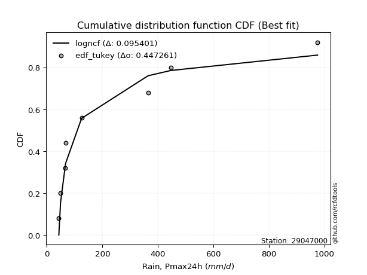</img>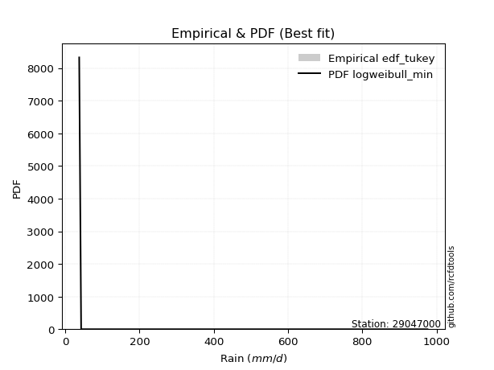</img>

</div>


### 8. EDF Gringorten (1963)

Gringorten plotting position formula is essential for estimating the probability and return periods of extreme events like floods and heavy rainfall. The constant _a=0.44_.

<div align="center">


$P=(m-a)/(n+1-2a)$


</div>


**8.1. Empirical values**

<div align="center">

|                | 0                    | 1                  | 2                   | 3                  | 4              | 5                  | 6                  | 7                  | 8                  |
|:---------------|:---------------------|:-------------------|:--------------------|:-------------------|:---------------|:-------------------|:-------------------|:-------------------|:-------------------|
| date           | 2025                 | 2018               | 2017                | 2020               | 2021           | 2019               | 2024               | 2023               | 2022               |
| x              | 37.8                 | 43.02              | 49.13               | 66.64              | 68.05          | 125.01             | 364.54             | 446.14             | 975.48             |
| m              | 1                    | 2                  | 3                   | 4                  | 5              | 6                  | 7                  | 8                  | 9                  |
| empirical_dist | edf_gringorten       | edf_gringorten     | edf_gringorten      | edf_gringorten     | edf_gringorten | edf_gringorten     | edf_gringorten     | edf_gringorten     | edf_gringorten     |
| empirical      | 0.061403508771929835 | 0.1710526315789474 | 0.28070175438596495 | 0.3903508771929825 | 0.5            | 0.6096491228070176 | 0.7192982456140351 | 0.8289473684210527 | 0.9385964912280703 |
| empirical_tr   | 1.0654205607476634   | 1.2063492063492063 | 1.3902439024390243  | 1.6402877697841727 | 2.0            | 2.561797752808989  | 3.5625             | 5.846153846153847  | 16.285714285714324 |

</div>


**8.2. Kolmogorov-Smirnov fit test (sorted by Δ)**


<div align="center">

|                | 0                   | 1                   | 2                   | 3                   | 4                   | 5                   | 6                   | 7                   | 8                   | 9                   | 10                  | 11                  | 12                  | 13                  | 14                  | 15                  | 16                  | 17                  | 18                  | 19                  | 20                  | 21                  | 22                  | 23                  | 24                  | 25                  | 26                  | 27                  | 28                  | 29                  | 30                  | 31                  | 32                  | 33                  | 34                  | 35                  | 36                  | 37                  | 38                  | 39                  | 40                  | 41                  | 42                  | 43                  | 44                  | 45                  | 46                  | 47                  | 48                  | 49                  | 50                  | 51                  | 52                  | 53                  | 54                  | 55                  | 56                  | 57                  | 58                  | 59                  | 60                  | 61                  | 62                  | 63                  | 64                  | 65                  | 66                  | 67                  | 68                  | 69                  | 70                  | 71                  | 72                  | 73                  | 74                  | 75                  | 76                  | 77                  | 78                  | 79                  | 80                  | 81                  | 82                  | 83                  | 84                  | 85                  | 86                  | 87                  | 88                  | 89                  | 90                  | 91                  | 92                  | 93                  | 94                  | 95                  | 96                  | 97                  | 98                  | 99                  | 100                 | 101                 | 102                 | 103                 | 104                 | 105                 | 106                 | 107                 | 108                 | 109                 | 110                 | 111                 | 112                 | 113                 | 114                 | 115                 | 116                 | 117                 | 118                 | 119                 | 120                 | 121                 | 122                 | 123                 | 124                 | 125                 | 126                 | 127                 | 128                 | 129                 | 130                 | 131                 | 132                 | 133                 | 134                 | 135                 | 136                 | 137                 | 138                 | 139                 | 140                 | 141                 | 142                 | 143                 | 144                 | 145                 | 146                 | 147                 | 148                 | 149                 | 150                 | 151                 | 152                 | 153                 | 154                 | 155                 | 156                 | 157                 | 158                 | 159                 |
|:---------------|:--------------------|:--------------------|:--------------------|:--------------------|:--------------------|:--------------------|:--------------------|:--------------------|:--------------------|:--------------------|:--------------------|:--------------------|:--------------------|:--------------------|:--------------------|:--------------------|:--------------------|:--------------------|:--------------------|:--------------------|:--------------------|:--------------------|:--------------------|:--------------------|:--------------------|:--------------------|:--------------------|:--------------------|:--------------------|:--------------------|:--------------------|:--------------------|:--------------------|:--------------------|:--------------------|:--------------------|:--------------------|:--------------------|:--------------------|:--------------------|:--------------------|:--------------------|:--------------------|:--------------------|:--------------------|:--------------------|:--------------------|:--------------------|:--------------------|:--------------------|:--------------------|:--------------------|:--------------------|:--------------------|:--------------------|:--------------------|:--------------------|:--------------------|:--------------------|:--------------------|:--------------------|:--------------------|:--------------------|:--------------------|:--------------------|:--------------------|:--------------------|:--------------------|:--------------------|:--------------------|:--------------------|:--------------------|:--------------------|:--------------------|:--------------------|:--------------------|:--------------------|:--------------------|:--------------------|:--------------------|:--------------------|:--------------------|:--------------------|:--------------------|:--------------------|:--------------------|:--------------------|:--------------------|:--------------------|:--------------------|:--------------------|:--------------------|:--------------------|:--------------------|:--------------------|:--------------------|:--------------------|:--------------------|:--------------------|:--------------------|:--------------------|:--------------------|:--------------------|:--------------------|:--------------------|:--------------------|:--------------------|:--------------------|:--------------------|:--------------------|:--------------------|:--------------------|:--------------------|:--------------------|:--------------------|:--------------------|:--------------------|:--------------------|:--------------------|:--------------------|:--------------------|:--------------------|:--------------------|:--------------------|:--------------------|:--------------------|:--------------------|:--------------------|:--------------------|:--------------------|:--------------------|:--------------------|:--------------------|:--------------------|:--------------------|:--------------------|:--------------------|:--------------------|:--------------------|:--------------------|:--------------------|:--------------------|:--------------------|:--------------------|:--------------------|:--------------------|:--------------------|:--------------------|:--------------------|:--------------------|:--------------------|:--------------------|:--------------------|:--------------------|:--------------------|:--------------------|:--------------------|:--------------------|:--------------------|:--------------------|
| station        | 29047000            | 29047000            | 29047000            | 29047000            | 29047000            | 29047000            | 29047000            | 29047000            | 29047000            | 29047000            | 29047000            | 29047000            | 29047000            | 29047000            | 29047000            | 29047000            | 29047000            | 29047000            | 29047000            | 29047000            | 29047000            | 29047000            | 29047000            | 29047000            | 29047000            | 29047000            | 29047000            | 29047000            | 29047000            | 29047000            | 29047000            | 29047000            | 29047000            | 29047000            | 29047000            | 29047000            | 29047000            | 29047000            | 29047000            | 29047000            | 29047000            | 29047000            | 29047000            | 29047000            | 29047000            | 29047000            | 29047000            | 29047000            | 29047000            | 29047000            | 29047000            | 29047000            | 29047000            | 29047000            | 29047000            | 29047000            | 29047000            | 29047000            | 29047000            | 29047000            | 29047000            | 29047000            | 29047000            | 29047000            | 29047000            | 29047000            | 29047000            | 29047000            | 29047000            | 29047000            | 29047000            | 29047000            | 29047000            | 29047000            | 29047000            | 29047000            | 29047000            | 29047000            | 29047000            | 29047000            | 29047000            | 29047000            | 29047000            | 29047000            | 29047000            | 29047000            | 29047000            | 29047000            | 29047000            | 29047000            | 29047000            | 29047000            | 29047000            | 29047000            | 29047000            | 29047000            | 29047000            | 29047000            | 29047000            | 29047000            | 29047000            | 29047000            | 29047000            | 29047000            | 29047000            | 29047000            | 29047000            | 29047000            | 29047000            | 29047000            | 29047000            | 29047000            | 29047000            | 29047000            | 29047000            | 29047000            | 29047000            | 29047000            | 29047000            | 29047000            | 29047000            | 29047000            | 29047000            | 29047000            | 29047000            | 29047000            | 29047000            | 29047000            | 29047000            | 29047000            | 29047000            | 29047000            | 29047000            | 29047000            | 29047000            | 29047000            | 29047000            | 29047000            | 29047000            | 29047000            | 29047000            | 29047000            | 29047000            | 29047000            | 29047000            | 29047000            | 29047000            | 29047000            | 29047000            | 29047000            | 29047000            | 29047000            | 29047000            | 29047000            | 29047000            | 29047000            | 29047000            | 29047000            | 29047000            | 29047000            |
| empirical_dist | edf_gringorten      | edf_gringorten      | edf_gringorten      | edf_gringorten      | edf_gringorten      | edf_gringorten      | edf_gringorten      | edf_gringorten      | edf_gringorten      | edf_gringorten      | edf_gringorten      | edf_gringorten      | edf_gringorten      | edf_gringorten      | edf_gringorten      | edf_gringorten      | edf_gringorten      | edf_gringorten      | edf_gringorten      | edf_gringorten      | edf_gringorten      | edf_gringorten      | edf_gringorten      | edf_gringorten      | edf_gringorten      | edf_gringorten      | edf_gringorten      | edf_gringorten      | edf_gringorten      | edf_gringorten      | edf_gringorten      | edf_gringorten      | edf_gringorten      | edf_gringorten      | edf_gringorten      | edf_gringorten      | edf_gringorten      | edf_gringorten      | edf_gringorten      | edf_gringorten      | edf_gringorten      | edf_gringorten      | edf_gringorten      | edf_gringorten      | edf_gringorten      | edf_gringorten      | edf_gringorten      | edf_gringorten      | edf_gringorten      | edf_gringorten      | edf_gringorten      | edf_gringorten      | edf_gringorten      | edf_gringorten      | edf_gringorten      | edf_gringorten      | edf_gringorten      | edf_gringorten      | edf_gringorten      | edf_gringorten      | edf_gringorten      | edf_gringorten      | edf_gringorten      | edf_gringorten      | edf_gringorten      | edf_gringorten      | edf_gringorten      | edf_gringorten      | edf_gringorten      | edf_gringorten      | edf_gringorten      | edf_gringorten      | edf_gringorten      | edf_gringorten      | edf_gringorten      | edf_gringorten      | edf_gringorten      | edf_gringorten      | edf_gringorten      | edf_gringorten      | edf_gringorten      | edf_gringorten      | edf_gringorten      | edf_gringorten      | edf_gringorten      | edf_gringorten      | edf_gringorten      | edf_gringorten      | edf_gringorten      | edf_gringorten      | edf_gringorten      | edf_gringorten      | edf_gringorten      | edf_gringorten      | edf_gringorten      | edf_gringorten      | edf_gringorten      | edf_gringorten      | edf_gringorten      | edf_gringorten      | edf_gringorten      | edf_gringorten      | edf_gringorten      | edf_gringorten      | edf_gringorten      | edf_gringorten      | edf_gringorten      | edf_gringorten      | edf_gringorten      | edf_gringorten      | edf_gringorten      | edf_gringorten      | edf_gringorten      | edf_gringorten      | edf_gringorten      | edf_gringorten      | edf_gringorten      | edf_gringorten      | edf_gringorten      | edf_gringorten      | edf_gringorten      | edf_gringorten      | edf_gringorten      | edf_gringorten      | edf_gringorten      | edf_gringorten      | edf_gringorten      | edf_gringorten      | edf_gringorten      | edf_gringorten      | edf_gringorten      | edf_gringorten      | edf_gringorten      | edf_gringorten      | edf_gringorten      | edf_gringorten      | edf_gringorten      | edf_gringorten      | edf_gringorten      | edf_gringorten      | edf_gringorten      | edf_gringorten      | edf_gringorten      | edf_gringorten      | edf_gringorten      | edf_gringorten      | edf_gringorten      | edf_gringorten      | edf_gringorten      | edf_gringorten      | edf_gringorten      | edf_gringorten      | edf_gringorten      | edf_gringorten      | edf_gringorten      | edf_gringorten      | edf_gringorten      | edf_gringorten      | edf_gringorten      | edf_gringorten      |
| p_dist         | exponweib           | mielke              | logalpha            | logweibull_min      | invweibull          | fatiguelife         | logbeta             | logf                | gausshyper          | logexponweib        | invgamma            | f                   | truncweibull_min    | logmielke           | logburr             | loggenextreme       | loginvweibull       | logburr12           | lomax               | loggausshyper       | halfgennorm         | loghalfgennorm      | loginvgamma         | logncf              | logfatiguelife      | lognct              | burr12              | loglomax            | loggenexpon         | logexponnorm        | loginvgauss         | logdweibull         | erlang              | loghalfnorm         | logexponpow         | loghalflogistic     | exponpow            | truncpareto         | logtruncnorm        | logfoldnorm         | gengamma            | invgauss            | ncf                 | loggamma            | loggamma            | logjohnsonsb        | nct                 | logdgamma           | burr                | logarcsine          | loggengamma         | logmoyal            | lograyleigh         | logsemicircular     | loggenlogistic      | genpareto           | loggumbel_r         | loggenhalflogistic  | logmaxwell          | nakagami            | logpearson3         | logbetaprime        | loganglit           | betaprime           | logkstwobign        | alpha               | logrdist            | logloglaplace       | moyal               | gamma               | loggennorm          | weibull_min         | logloggamma         | logjohnsonsu        | logcrystalball      | lognorm             | logt                | dgamma              | logtruncweibull_min | vonmises_line       | gennorm             | pearson3            | gumbel_r            | wald                | logskewnorm         | rayleigh            | halflogistic        | logwrapcauchy       | logrice             | logerlang           | logweibull_max      | loglogistic         | lognakagami         | maxwell             | semicircular        | logcosine           | halfnorm            | anglit              | loghypsecant        | logwald             | loggompertz         | logtruncexpon       | genlogistic         | logtukeylambda      | foldnorm            | loggumbel_l         | t                   | logbradford         | norm                | logksone            | loglaplace          | loglaplace          | arcsine             | logargus            | kstwobign           | logistic            | powerlaw            | logtriang           | genextreme          | hypsecant           | logkappa4           | rice                | loguniform          | cosine              | logkappa3           | beta                | gumbel_l            | laplace             | logvonmises_line    | loggenpareto        | wrapcauchy          | johnsonsb           | loglevy_l           | exponnorm           | gompertz            | genexpon            | truncexpon          | logpowerlaw         | argus               | triang              | truncnorm           | dweibull            | bradford            | levy_l              | skewnorm            | ksone               | logtrapezoid        | crystalball         | kappa3              | kappa4              | rdist               | logtruncpareto      | genhalflogistic     | uniform             | tukeylambda         | johnsonsu           | trapezoid           | weibull_max         | logvonmises         | vonmises            |
| delta          | 0.0812404457364499  | 0.08731290792406948 | 0.08836349884533057 | 0.08943757274612651 | 0.09380500254621649 | 0.0956846470804783  | 0.0958590655993885  | 0.09713968867482348 | 0.10618187374268184 | 0.11095212457808362 | 0.1138441849929428  | 0.11384460956575237 | 0.11425223392537215 | 0.11849996392894091 | 0.11984363432065581 | 0.11985711905967156 | 0.11987219129548621 | 0.1232568043724177  | 0.12407191573867138 | 0.1241397062387476  | 0.12436828070284733 | 0.1261670469281272  | 0.12678436226887801 | 0.12701546960672827 | 0.12725652305868462 | 0.12841870478118445 | 0.12961350753813228 | 0.13040185875185506 | 0.1313716410943272  | 0.13323001983426286 | 0.13401353243425307 | 0.13466448183255963 | 0.1354645654652321  | 0.13739133229605777 | 0.1378884745515564  | 0.1404602613589469  | 0.14325136379545078 | 0.14468651831506507 | 0.14673597431395202 | 0.14762921189999162 | 0.15085754691641717 | 0.1532659074751771  | 0.15363348536104682 | 0.15509067266408672 | 0.15509067266408672 | 0.1556289719585381  | 0.15603258316167135 | 0.15714807459689006 | 0.1584640411997491  | 0.16581608478609794 | 0.16637051293353144 | 0.1664752102618613  | 0.16791644330570077 | 0.1702928396840787  | 0.17297501461052694 | 0.17366112697047742 | 0.17525387104601375 | 0.17542427321744014 | 0.1787438951740103  | 0.17904666697933075 | 0.18046840451655294 | 0.1806629527398097  | 0.18096370264746736 | 0.1815730990580251  | 0.18610540079763266 | 0.19169902265338745 | 0.1975367541497629  | 0.1980700073355497  | 0.1981539404185474  | 0.1995074280934377  | 0.1998780784492713  | 0.2013828373333308  | 0.20275119082994025 | 0.20554759234185876 | 0.20598337156041646 | 0.20598338111395975 | 0.20598365074732428 | 0.206845424515966   | 0.2104961087385812  | 0.2116944273938105  | 0.2123291526434793  | 0.2123567947288028  | 0.21561953329821193 | 0.21650978906560775 | 0.21869027363800786 | 0.2193288664113595  | 0.22073907813526067 | 0.2207916969634668  | 0.22358829819762926 | 0.22374062595902178 | 0.22605182865851103 | 0.227606749959685   | 0.22790424090251887 | 0.23135124759386422 | 0.23442939664538848 | 0.23591148772729115 | 0.23639041249700699 | 0.2429011259236843  | 0.24306301230395233 | 0.2446769211975478  | 0.24485343377718932 | 0.24820288422195586 | 0.25046394295844    | 0.2546737694594654  | 0.25504898155898986 | 0.25557040480584325 | 0.2605665947544799  | 0.2620926549667167  | 0.26307405582579513 | 0.26594323387937635 | 0.26758022060567105 | 0.26758022060567105 | 0.2765287317255473  | 0.2786162847209782  | 0.27868958330379234 | 0.2813075984788943  | 0.28919378390698214 | 0.29184620947389117 | 0.2950911317872112  | 0.2954012441295906  | 0.29964506766679666 | 0.3090856809791134  | 0.31913188065525167 | 0.31919436970815884 | 0.32044190311470644 | 0.321087825095831   | 0.3225018379281874  | 0.3234801480111953  | 0.32669520625329956 | 0.33142627849618145 | 0.33379959308306256 | 0.35404196157995527 | 0.3565406394170331  | 0.36090739668888305 | 0.3621430171792478  | 0.3626356045695054  | 0.36307963341830735 | 0.37086801373147965 | 0.37294724398042933 | 0.3964744299598275  | 0.40230040146492574 | 0.4136117316648741  | 0.4160800623166875  | 0.4272448908834931  | 0.43291560983815125 | 0.44881067045653555 | 0.4575778625082566  | 0.4724869599150516  | 0.4809307680716067  | 0.4956500874840559  | 0.5021434256945546  | 0.5135910961268435  | 0.5162785604222944  | 0.5166429799864392  | 0.5278973606663957  | 0.5710494389375804  | 0.6275981475653687  | 0.7610794914800482  | 1.1512515516573985  | 155.02804200952707  |
| deltao         | 0.41761268023100007 | 0.41761268023100007 | 0.41761268023100007 | 0.41761268023100007 | 0.41761268023100007 | 0.41761268023100007 | 0.41761268023100007 | 0.41761268023100007 | 0.41761268023100007 | 0.41761268023100007 | 0.41761268023100007 | 0.41761268023100007 | 0.41761268023100007 | 0.41761268023100007 | 0.41761268023100007 | 0.41761268023100007 | 0.41761268023100007 | 0.41761268023100007 | 0.41761268023100007 | 0.41761268023100007 | 0.41761268023100007 | 0.41761268023100007 | 0.41761268023100007 | 0.41761268023100007 | 0.41761268023100007 | 0.41761268023100007 | 0.41761268023100007 | 0.41761268023100007 | 0.41761268023100007 | 0.41761268023100007 | 0.41761268023100007 | 0.41761268023100007 | 0.41761268023100007 | 0.41761268023100007 | 0.41761268023100007 | 0.41761268023100007 | 0.41761268023100007 | 0.41761268023100007 | 0.41761268023100007 | 0.41761268023100007 | 0.41761268023100007 | 0.41761268023100007 | 0.41761268023100007 | 0.41761268023100007 | 0.41761268023100007 | 0.41761268023100007 | 0.41761268023100007 | 0.41761268023100007 | 0.41761268023100007 | 0.41761268023100007 | 0.41761268023100007 | 0.41761268023100007 | 0.41761268023100007 | 0.41761268023100007 | 0.41761268023100007 | 0.41761268023100007 | 0.41761268023100007 | 0.41761268023100007 | 0.41761268023100007 | 0.41761268023100007 | 0.41761268023100007 | 0.41761268023100007 | 0.41761268023100007 | 0.41761268023100007 | 0.41761268023100007 | 0.41761268023100007 | 0.41761268023100007 | 0.41761268023100007 | 0.41761268023100007 | 0.41761268023100007 | 0.41761268023100007 | 0.41761268023100007 | 0.41761268023100007 | 0.41761268023100007 | 0.41761268023100007 | 0.41761268023100007 | 0.41761268023100007 | 0.41761268023100007 | 0.41761268023100007 | 0.41761268023100007 | 0.41761268023100007 | 0.41761268023100007 | 0.41761268023100007 | 0.41761268023100007 | 0.41761268023100007 | 0.41761268023100007 | 0.41761268023100007 | 0.41761268023100007 | 0.41761268023100007 | 0.41761268023100007 | 0.41761268023100007 | 0.41761268023100007 | 0.41761268023100007 | 0.41761268023100007 | 0.41761268023100007 | 0.41761268023100007 | 0.41761268023100007 | 0.41761268023100007 | 0.41761268023100007 | 0.41761268023100007 | 0.41761268023100007 | 0.41761268023100007 | 0.41761268023100007 | 0.41761268023100007 | 0.41761268023100007 | 0.41761268023100007 | 0.41761268023100007 | 0.41761268023100007 | 0.41761268023100007 | 0.41761268023100007 | 0.41761268023100007 | 0.41761268023100007 | 0.41761268023100007 | 0.41761268023100007 | 0.41761268023100007 | 0.41761268023100007 | 0.41761268023100007 | 0.41761268023100007 | 0.41761268023100007 | 0.41761268023100007 | 0.41761268023100007 | 0.41761268023100007 | 0.41761268023100007 | 0.41761268023100007 | 0.41761268023100007 | 0.41761268023100007 | 0.41761268023100007 | 0.41761268023100007 | 0.41761268023100007 | 0.41761268023100007 | 0.41761268023100007 | 0.41761268023100007 | 0.41761268023100007 | 0.41761268023100007 | 0.41761268023100007 | 0.41761268023100007 | 0.41761268023100007 | 0.41761268023100007 | 0.41761268023100007 | 0.41761268023100007 | 0.41761268023100007 | 0.41761268023100007 | 0.41761268023100007 | 0.41761268023100007 | 0.41761268023100007 | 0.41761268023100007 | 0.41761268023100007 | 0.41761268023100007 | 0.41761268023100007 | 0.41761268023100007 | 0.41761268023100007 | 0.41761268023100007 | 0.41761268023100007 | 0.41761268023100007 | 0.41761268023100007 | 0.41761268023100007 | 0.41761268023100007 | 0.41761268023100007 | 0.41761268023100007 | 0.41761268023100007 |
| eval           | Δo > Δ              | Δo > Δ              | Δo > Δ              | Δo > Δ              | Δo > Δ              | Δo > Δ              | Δo > Δ              | Δo > Δ              | Δo > Δ              | Δo > Δ              | Δo > Δ              | Δo > Δ              | Δo > Δ              | Δo > Δ              | Δo > Δ              | Δo > Δ              | Δo > Δ              | Δo > Δ              | Δo > Δ              | Δo > Δ              | Δo > Δ              | Δo > Δ              | Δo > Δ              | Δo > Δ              | Δo > Δ              | Δo > Δ              | Δo > Δ              | Δo > Δ              | Δo > Δ              | Δo > Δ              | Δo > Δ              | Δo > Δ              | Δo > Δ              | Δo > Δ              | Δo > Δ              | Δo > Δ              | Δo > Δ              | Δo > Δ              | Δo > Δ              | Δo > Δ              | Δo > Δ              | Δo > Δ              | Δo > Δ              | Δo > Δ              | Δo > Δ              | Δo > Δ              | Δo > Δ              | Δo > Δ              | Δo > Δ              | Δo > Δ              | Δo > Δ              | Δo > Δ              | Δo > Δ              | Δo > Δ              | Δo > Δ              | Δo > Δ              | Δo > Δ              | Δo > Δ              | Δo > Δ              | Δo > Δ              | Δo > Δ              | Δo > Δ              | Δo > Δ              | Δo > Δ              | Δo > Δ              | Δo > Δ              | Δo > Δ              | Δo > Δ              | Δo > Δ              | Δo > Δ              | Δo > Δ              | Δo > Δ              | Δo > Δ              | Δo > Δ              | Δo > Δ              | Δo > Δ              | Δo > Δ              | Δo > Δ              | Δo > Δ              | Δo > Δ              | Δo > Δ              | Δo > Δ              | Δo > Δ              | Δo > Δ              | Δo > Δ              | Δo > Δ              | Δo > Δ              | Δo > Δ              | Δo > Δ              | Δo > Δ              | Δo > Δ              | Δo > Δ              | Δo > Δ              | Δo > Δ              | Δo > Δ              | Δo > Δ              | Δo > Δ              | Δo > Δ              | Δo > Δ              | Δo > Δ              | Δo > Δ              | Δo > Δ              | Δo > Δ              | Δo > Δ              | Δo > Δ              | Δo > Δ              | Δo > Δ              | Δo > Δ              | Δo > Δ              | Δo > Δ              | Δo > Δ              | Δo > Δ              | Δo > Δ              | Δo > Δ              | Δo > Δ              | Δo > Δ              | Δo > Δ              | Δo > Δ              | Δo > Δ              | Δo > Δ              | Δo > Δ              | Δo > Δ              | Δo > Δ              | Δo > Δ              | Δo > Δ              | Δo > Δ              | Δo > Δ              | Δo > Δ              | Δo > Δ              | Δo > Δ              | Δo > Δ              | Δo > Δ              | Δo > Δ              | Δo > Δ              | Δo > Δ              | Δo > Δ              | Δo > Δ              | Δo > Δ              | Δo > Δ              | Δo > Δ              | Δo > Δ              | Δo > Δ              | Δo > Δ              | Δo <= Δ             | Δo <= Δ             | Δo <= Δ             | Δo <= Δ             | Δo <= Δ             | Δo <= Δ             | Δo <= Δ             | Δo <= Δ             | Δo <= Δ             | Δo <= Δ             | Δo <= Δ             | Δo <= Δ             | Δo <= Δ             | Δo <= Δ             | Δo <= Δ             | Δo <= Δ             | Δo <= Δ             |
| fit            | 1                   | 1                   | 1                   | 1                   | 1                   | 1                   | 1                   | 1                   | 1                   | 1                   | 1                   | 1                   | 1                   | 1                   | 1                   | 1                   | 1                   | 1                   | 1                   | 1                   | 1                   | 1                   | 1                   | 1                   | 1                   | 1                   | 1                   | 1                   | 1                   | 1                   | 1                   | 1                   | 1                   | 1                   | 1                   | 1                   | 1                   | 1                   | 1                   | 1                   | 1                   | 1                   | 1                   | 1                   | 1                   | 1                   | 1                   | 1                   | 1                   | 1                   | 1                   | 1                   | 1                   | 1                   | 1                   | 1                   | 1                   | 1                   | 1                   | 1                   | 1                   | 1                   | 1                   | 1                   | 1                   | 1                   | 1                   | 1                   | 1                   | 1                   | 1                   | 1                   | 1                   | 1                   | 1                   | 1                   | 1                   | 1                   | 1                   | 1                   | 1                   | 1                   | 1                   | 1                   | 1                   | 1                   | 1                   | 1                   | 1                   | 1                   | 1                   | 1                   | 1                   | 1                   | 1                   | 1                   | 1                   | 1                   | 1                   | 1                   | 1                   | 1                   | 1                   | 1                   | 1                   | 1                   | 1                   | 1                   | 1                   | 1                   | 1                   | 1                   | 1                   | 1                   | 1                   | 1                   | 1                   | 1                   | 1                   | 1                   | 1                   | 1                   | 1                   | 1                   | 1                   | 1                   | 1                   | 1                   | 1                   | 1                   | 1                   | 1                   | 1                   | 1                   | 1                   | 1                   | 1                   | 1                   | 1                   | 1                   | 1                   | 1                   | 1                   | 0                   | 0                   | 0                   | 0                   | 0                   | 0                   | 0                   | 0                   | 0                   | 0                   | 0                   | 0                   | 0                   | 0                   | 0                   | 0                   | 0                   |
| n              | 9                   | 9                   | 9                   | 9                   | 9                   | 9                   | 9                   | 9                   | 9                   | 9                   | 9                   | 9                   | 9                   | 9                   | 9                   | 9                   | 9                   | 9                   | 9                   | 9                   | 9                   | 9                   | 9                   | 9                   | 9                   | 9                   | 9                   | 9                   | 9                   | 9                   | 9                   | 9                   | 9                   | 9                   | 9                   | 9                   | 9                   | 9                   | 9                   | 9                   | 9                   | 9                   | 9                   | 9                   | 9                   | 9                   | 9                   | 9                   | 9                   | 9                   | 9                   | 9                   | 9                   | 9                   | 9                   | 9                   | 9                   | 9                   | 9                   | 9                   | 9                   | 9                   | 9                   | 9                   | 9                   | 9                   | 9                   | 9                   | 9                   | 9                   | 9                   | 9                   | 9                   | 9                   | 9                   | 9                   | 9                   | 9                   | 9                   | 9                   | 9                   | 9                   | 9                   | 9                   | 9                   | 9                   | 9                   | 9                   | 9                   | 9                   | 9                   | 9                   | 9                   | 9                   | 9                   | 9                   | 9                   | 9                   | 9                   | 9                   | 9                   | 9                   | 9                   | 9                   | 9                   | 9                   | 9                   | 9                   | 9                   | 9                   | 9                   | 9                   | 9                   | 9                   | 9                   | 9                   | 9                   | 9                   | 9                   | 9                   | 9                   | 9                   | 9                   | 9                   | 9                   | 9                   | 9                   | 9                   | 9                   | 9                   | 9                   | 9                   | 9                   | 9                   | 9                   | 9                   | 9                   | 9                   | 9                   | 9                   | 9                   | 9                   | 9                   | 9                   | 9                   | 9                   | 9                   | 9                   | 9                   | 9                   | 9                   | 9                   | 9                   | 9                   | 9                   | 9                   | 9                   | 9                   | 9                   | 9                   |
| best_fit       | 1                   | 0                   | 0                   | 0                   | 0                   | 0                   | 0                   | 0                   | 0                   | 0                   | 0                   | 0                   | 0                   | 0                   | 0                   | 0                   | 0                   | 0                   | 0                   | 0                   | 0                   | 0                   | 0                   | 0                   | 0                   | 0                   | 0                   | 0                   | 0                   | 0                   | 0                   | 0                   | 0                   | 0                   | 0                   | 0                   | 0                   | 0                   | 0                   | 0                   | 0                   | 0                   | 0                   | 0                   | 0                   | 0                   | 0                   | 0                   | 0                   | 0                   | 0                   | 0                   | 0                   | 0                   | 0                   | 0                   | 0                   | 0                   | 0                   | 0                   | 0                   | 0                   | 0                   | 0                   | 0                   | 0                   | 0                   | 0                   | 0                   | 0                   | 0                   | 0                   | 0                   | 0                   | 0                   | 0                   | 0                   | 0                   | 0                   | 0                   | 0                   | 0                   | 0                   | 0                   | 0                   | 0                   | 0                   | 0                   | 0                   | 0                   | 0                   | 0                   | 0                   | 0                   | 0                   | 0                   | 0                   | 0                   | 0                   | 0                   | 0                   | 0                   | 0                   | 0                   | 0                   | 0                   | 0                   | 0                   | 0                   | 0                   | 0                   | 0                   | 0                   | 0                   | 0                   | 0                   | 0                   | 0                   | 0                   | 0                   | 0                   | 0                   | 0                   | 0                   | 0                   | 0                   | 0                   | 0                   | 0                   | 0                   | 0                   | 0                   | 0                   | 0                   | 0                   | 0                   | 0                   | 0                   | 0                   | 0                   | 0                   | 0                   | 0                   | 0                   | 0                   | 0                   | 0                   | 0                   | 0                   | 0                   | 0                   | 0                   | 0                   | 0                   | 0                   | 0                   | 0                   | 0                   | 0                   | 0                   |
| best_fit_sort  | 1                   | 2                   | 3                   | 4                   | 5                   | 6                   | 7                   | 8                   | 9                   | 10                  | 11                  | 12                  | 13                  | 14                  | 15                  | 16                  | 17                  | 18                  | 19                  | 20                  | 21                  | 22                  | 23                  | 24                  | 25                  | 26                  | 27                  | 28                  | 29                  | 30                  | 31                  | 32                  | 33                  | 34                  | 35                  | 36                  | 37                  | 38                  | 39                  | 40                  | 41                  | 42                  | 43                  | 44                  | 45                  | 46                  | 47                  | 48                  | 49                  | 50                  | 51                  | 52                  | 53                  | 54                  | 55                  | 56                  | 57                  | 58                  | 59                  | 60                  | 61                  | 62                  | 63                  | 64                  | 65                  | 66                  | 67                  | 68                  | 69                  | 70                  | 71                  | 72                  | 73                  | 74                  | 75                  | 76                  | 77                  | 78                  | 79                  | 80                  | 81                  | 82                  | 83                  | 84                  | 85                  | 86                  | 87                  | 88                  | 89                  | 90                  | 91                  | 92                  | 93                  | 94                  | 95                  | 96                  | 97                  | 98                  | 99                  | 100                 | 101                 | 102                 | 103                 | 104                 | 105                 | 106                 | 107                 | 108                 | 109                 | 110                 | 111                 | 112                 | 113                 | 114                 | 115                 | 116                 | 117                 | 118                 | 119                 | 120                 | 121                 | 122                 | 123                 | 124                 | 125                 | 126                 | 127                 | 128                 | 129                 | 130                 | 131                 | 132                 | 133                 | 134                 | 135                 | 136                 | 137                 | 138                 | 139                 | 140                 | 141                 | 142                 | 143                 | 144                 | 145                 | 146                 | 147                 | 148                 | 149                 | 150                 | 151                 | 152                 | 153                 | 154                 | 155                 | 156                 | 157                 | 158                 | 159                 | 160                 |

</div>


**8.3. Best fit**

<div align="center">

|   id |   station | empirical_dist   | p_dist    |     delta |   deltao | eval   |   fit |   n |   best_fit |   best_fit_sort |
|-----:|----------:|:-----------------|:----------|----------:|---------:|:-------|------:|----:|-----------:|----------------:|
|    0 |  29047000 | edf_gringorten   | exponweib | 0.0812404 | 0.417613 | Δo > Δ |     1 |   9 |          1 |               1 |

</div>


<div align="center">

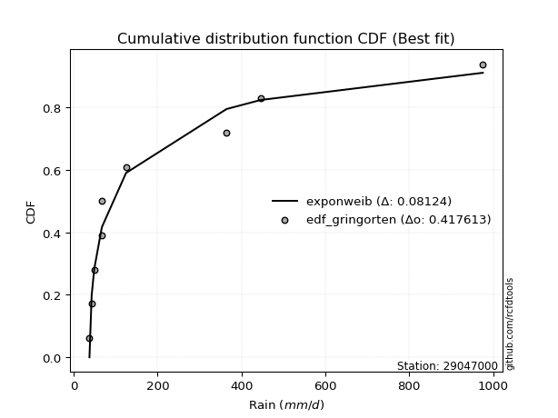</img>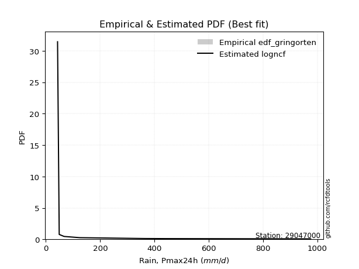</img>

</div>


### 9. EDF Filliben (1975)

The specific values of the constants (0.3175) (often denoted as $alpha$) and (0.365) are derived from a method proposed by James J. Filliben in a 1975 paper. This particular formula is the mean value of the $i$-th order statistic of the normal distribution and is considered a robust and effective plotting position formula for the normal probability plot correlation coefficient test for normality.

<div align="center">


$P=(m-0.3175)/(n+0.365)$


</div>


**9.1. Empirical values**

<div align="center">

|                | 0                   | 1                  | 2                   | 3                   | 4            | 5                  | 6                  | 7                  | 8                  |
|:---------------|:--------------------|:-------------------|:--------------------|:--------------------|:-------------|:-------------------|:-------------------|:-------------------|:-------------------|
| date           | 2025                | 2018               | 2017                | 2020                | 2021         | 2019               | 2024               | 2023               | 2022               |
| x              | 37.8                | 43.02              | 49.13               | 66.64               | 68.05        | 125.01             | 364.54             | 446.14             | 975.48             |
| m              | 1                   | 2                  | 3                   | 4                   | 5            | 6                  | 7                  | 8                  | 9                  |
| empirical_dist | edf_filliben        | edf_filliben       | edf_filliben        | edf_filliben        | edf_filliben | edf_filliben       | edf_filliben       | edf_filliben       | edf_filliben       |
| empirical      | 0.07287773625200214 | 0.1796583021890016 | 0.28643886812600106 | 0.39321943406300053 | 0.5          | 0.6067805659369995 | 0.7135611318739989 | 0.8203416978109984 | 0.9271222637479978 |
| empirical_tr   | 1.0786063921681543  | 1.219004230393752  | 1.401421623643846   | 1.6480422349318082  | 2.0          | 2.5431093007467753 | 3.491146318732526  | 5.566121842496286  | 13.721611721611705 |

</div>


**9.2. Kolmogorov-Smirnov fit test (sorted by Δ)**


<div align="center">

|                | 0                   | 1                   | 2                   | 3                   | 4                   | 5                   | 6                   | 7                   | 8                   | 9                   | 10                  | 11                  | 12                  | 13                  | 14                  | 15                  | 16                  | 17                  | 18                  | 19                  | 20                  | 21                  | 22                  | 23                  | 24                  | 25                  | 26                  | 27                  | 28                  | 29                  | 30                  | 31                  | 32                  | 33                  | 34                  | 35                  | 36                  | 37                  | 38                  | 39                  | 40                  | 41                  | 42                  | 43                  | 44                  | 45                  | 46                  | 47                  | 48                  | 49                  | 50                  | 51                  | 52                  | 53                  | 54                  | 55                  | 56                  | 57                  | 58                  | 59                  | 60                  | 61                  | 62                  | 63                  | 64                  | 65                  | 66                  | 67                  | 68                  | 69                  | 70                  | 71                  | 72                  | 73                  | 74                  | 75                  | 76                  | 77                  | 78                  | 79                  | 80                  | 81                  | 82                  | 83                  | 84                  | 85                  | 86                  | 87                  | 88                  | 89                  | 90                  | 91                  | 92                  | 93                  | 94                  | 95                  | 96                  | 97                  | 98                  | 99                  | 100                 | 101                 | 102                 | 103                 | 104                 | 105                 | 106                 | 107                 | 108                 | 109                 | 110                 | 111                 | 112                 | 113                 | 114                 | 115                 | 116                 | 117                 | 118                 | 119                 | 120                 | 121                 | 122                 | 123                 | 124                 | 125                 | 126                 | 127                 | 128                 | 129                 | 130                 | 131                 | 132                 | 133                 | 134                 | 135                 | 136                 | 137                 | 138                 | 139                 | 140                 | 141                 | 142                 | 143                 | 144                 | 145                 | 146                 | 147                 | 148                 | 149                 | 150                 | 151                 | 152                 | 153                 | 154                 | 155                 | 156                 | 157                 | 158                 | 159                 |
|:---------------|:--------------------|:--------------------|:--------------------|:--------------------|:--------------------|:--------------------|:--------------------|:--------------------|:--------------------|:--------------------|:--------------------|:--------------------|:--------------------|:--------------------|:--------------------|:--------------------|:--------------------|:--------------------|:--------------------|:--------------------|:--------------------|:--------------------|:--------------------|:--------------------|:--------------------|:--------------------|:--------------------|:--------------------|:--------------------|:--------------------|:--------------------|:--------------------|:--------------------|:--------------------|:--------------------|:--------------------|:--------------------|:--------------------|:--------------------|:--------------------|:--------------------|:--------------------|:--------------------|:--------------------|:--------------------|:--------------------|:--------------------|:--------------------|:--------------------|:--------------------|:--------------------|:--------------------|:--------------------|:--------------------|:--------------------|:--------------------|:--------------------|:--------------------|:--------------------|:--------------------|:--------------------|:--------------------|:--------------------|:--------------------|:--------------------|:--------------------|:--------------------|:--------------------|:--------------------|:--------------------|:--------------------|:--------------------|:--------------------|:--------------------|:--------------------|:--------------------|:--------------------|:--------------------|:--------------------|:--------------------|:--------------------|:--------------------|:--------------------|:--------------------|:--------------------|:--------------------|:--------------------|:--------------------|:--------------------|:--------------------|:--------------------|:--------------------|:--------------------|:--------------------|:--------------------|:--------------------|:--------------------|:--------------------|:--------------------|:--------------------|:--------------------|:--------------------|:--------------------|:--------------------|:--------------------|:--------------------|:--------------------|:--------------------|:--------------------|:--------------------|:--------------------|:--------------------|:--------------------|:--------------------|:--------------------|:--------------------|:--------------------|:--------------------|:--------------------|:--------------------|:--------------------|:--------------------|:--------------------|:--------------------|:--------------------|:--------------------|:--------------------|:--------------------|:--------------------|:--------------------|:--------------------|:--------------------|:--------------------|:--------------------|:--------------------|:--------------------|:--------------------|:--------------------|:--------------------|:--------------------|:--------------------|:--------------------|:--------------------|:--------------------|:--------------------|:--------------------|:--------------------|:--------------------|:--------------------|:--------------------|:--------------------|:--------------------|:--------------------|:--------------------|:--------------------|:--------------------|:--------------------|:--------------------|:--------------------|:--------------------|
| station        | 29047000            | 29047000            | 29047000            | 29047000            | 29047000            | 29047000            | 29047000            | 29047000            | 29047000            | 29047000            | 29047000            | 29047000            | 29047000            | 29047000            | 29047000            | 29047000            | 29047000            | 29047000            | 29047000            | 29047000            | 29047000            | 29047000            | 29047000            | 29047000            | 29047000            | 29047000            | 29047000            | 29047000            | 29047000            | 29047000            | 29047000            | 29047000            | 29047000            | 29047000            | 29047000            | 29047000            | 29047000            | 29047000            | 29047000            | 29047000            | 29047000            | 29047000            | 29047000            | 29047000            | 29047000            | 29047000            | 29047000            | 29047000            | 29047000            | 29047000            | 29047000            | 29047000            | 29047000            | 29047000            | 29047000            | 29047000            | 29047000            | 29047000            | 29047000            | 29047000            | 29047000            | 29047000            | 29047000            | 29047000            | 29047000            | 29047000            | 29047000            | 29047000            | 29047000            | 29047000            | 29047000            | 29047000            | 29047000            | 29047000            | 29047000            | 29047000            | 29047000            | 29047000            | 29047000            | 29047000            | 29047000            | 29047000            | 29047000            | 29047000            | 29047000            | 29047000            | 29047000            | 29047000            | 29047000            | 29047000            | 29047000            | 29047000            | 29047000            | 29047000            | 29047000            | 29047000            | 29047000            | 29047000            | 29047000            | 29047000            | 29047000            | 29047000            | 29047000            | 29047000            | 29047000            | 29047000            | 29047000            | 29047000            | 29047000            | 29047000            | 29047000            | 29047000            | 29047000            | 29047000            | 29047000            | 29047000            | 29047000            | 29047000            | 29047000            | 29047000            | 29047000            | 29047000            | 29047000            | 29047000            | 29047000            | 29047000            | 29047000            | 29047000            | 29047000            | 29047000            | 29047000            | 29047000            | 29047000            | 29047000            | 29047000            | 29047000            | 29047000            | 29047000            | 29047000            | 29047000            | 29047000            | 29047000            | 29047000            | 29047000            | 29047000            | 29047000            | 29047000            | 29047000            | 29047000            | 29047000            | 29047000            | 29047000            | 29047000            | 29047000            | 29047000            | 29047000            | 29047000            | 29047000            | 29047000            | 29047000            |
| empirical_dist | edf_filliben        | edf_filliben        | edf_filliben        | edf_filliben        | edf_filliben        | edf_filliben        | edf_filliben        | edf_filliben        | edf_filliben        | edf_filliben        | edf_filliben        | edf_filliben        | edf_filliben        | edf_filliben        | edf_filliben        | edf_filliben        | edf_filliben        | edf_filliben        | edf_filliben        | edf_filliben        | edf_filliben        | edf_filliben        | edf_filliben        | edf_filliben        | edf_filliben        | edf_filliben        | edf_filliben        | edf_filliben        | edf_filliben        | edf_filliben        | edf_filliben        | edf_filliben        | edf_filliben        | edf_filliben        | edf_filliben        | edf_filliben        | edf_filliben        | edf_filliben        | edf_filliben        | edf_filliben        | edf_filliben        | edf_filliben        | edf_filliben        | edf_filliben        | edf_filliben        | edf_filliben        | edf_filliben        | edf_filliben        | edf_filliben        | edf_filliben        | edf_filliben        | edf_filliben        | edf_filliben        | edf_filliben        | edf_filliben        | edf_filliben        | edf_filliben        | edf_filliben        | edf_filliben        | edf_filliben        | edf_filliben        | edf_filliben        | edf_filliben        | edf_filliben        | edf_filliben        | edf_filliben        | edf_filliben        | edf_filliben        | edf_filliben        | edf_filliben        | edf_filliben        | edf_filliben        | edf_filliben        | edf_filliben        | edf_filliben        | edf_filliben        | edf_filliben        | edf_filliben        | edf_filliben        | edf_filliben        | edf_filliben        | edf_filliben        | edf_filliben        | edf_filliben        | edf_filliben        | edf_filliben        | edf_filliben        | edf_filliben        | edf_filliben        | edf_filliben        | edf_filliben        | edf_filliben        | edf_filliben        | edf_filliben        | edf_filliben        | edf_filliben        | edf_filliben        | edf_filliben        | edf_filliben        | edf_filliben        | edf_filliben        | edf_filliben        | edf_filliben        | edf_filliben        | edf_filliben        | edf_filliben        | edf_filliben        | edf_filliben        | edf_filliben        | edf_filliben        | edf_filliben        | edf_filliben        | edf_filliben        | edf_filliben        | edf_filliben        | edf_filliben        | edf_filliben        | edf_filliben        | edf_filliben        | edf_filliben        | edf_filliben        | edf_filliben        | edf_filliben        | edf_filliben        | edf_filliben        | edf_filliben        | edf_filliben        | edf_filliben        | edf_filliben        | edf_filliben        | edf_filliben        | edf_filliben        | edf_filliben        | edf_filliben        | edf_filliben        | edf_filliben        | edf_filliben        | edf_filliben        | edf_filliben        | edf_filliben        | edf_filliben        | edf_filliben        | edf_filliben        | edf_filliben        | edf_filliben        | edf_filliben        | edf_filliben        | edf_filliben        | edf_filliben        | edf_filliben        | edf_filliben        | edf_filliben        | edf_filliben        | edf_filliben        | edf_filliben        | edf_filliben        | edf_filliben        | edf_filliben        | edf_filliben        | edf_filliben        |
| p_dist         | logweibull_min      | exponweib           | logbeta             | mielke              | logalpha            | invweibull          | fatiguelife         | logf                | gausshyper          | logexponweib        | truncweibull_min    | invgamma            | f                   | logmielke           | logburr             | loggenextreme       | loginvweibull       | logburr12           | lomax               | loggausshyper       | halfgennorm         | loghalfgennorm      | loginvgamma         | logncf              | logfatiguelife      | lognct              | burr12              | loglomax            | loggenexpon         | loghalfnorm         | logexponpow         | logexponnorm        | loginvgauss         | logdweibull         | loghalflogistic     | erlang              | truncpareto         | logtruncnorm        | logjohnsonsb        | logfoldnorm         | exponpow            | ncf                 | logarcsine          | nct                 | gengamma            | invgauss            | loggamma            | loggamma            | burr                | logdgamma           | logmoyal            | lograyleigh         | logsemicircular     | nakagami            | loggengamma         | loggenlogistic      | loggumbel_r         | loggenhalflogistic  | logmaxwell          | genpareto           | logpearson3         | loganglit           | betaprime           | logkstwobign        | logbetaprime        | moyal               | alpha               | logrdist            | vonmises_line       | pearson3            | weibull_min         | logloggamma         | logloglaplace       | dgamma              | gamma               | logjohnsonsu        | loggennorm          | logcrystalball      | lognorm             | logt                | halflogistic        | logtruncweibull_min | logwrapcauchy       | gumbel_r            | rayleigh            | wald                | gennorm             | logskewnorm         | logweibull_max      | logrice             | halfnorm            | loglogistic         | lognakagami         | maxwell             | logerlang           | semicircular        | logcosine           | anglit              | loghypsecant        | foldnorm            | loggompertz         | logtruncexpon       | logwald             | genlogistic         | t                   | logtukeylambda      | loggumbel_l         | norm                | logbradford         | arcsine             | logksone            | loglaplace          | loglaplace          | kstwobign           | logistic            | logargus            | powerlaw            | genextreme          | logtriang           | hypsecant           | logkappa4           | rice                | cosine              | beta                | loguniform          | gumbel_l            | loggenpareto        | logkappa3           | laplace             | wrapcauchy          | logvonmises_line    | loglevy_l           | johnsonsb           | truncexpon          | exponnorm           | gompertz            | logpowerlaw         | genexpon            | argus               | triang              | dweibull            | truncnorm           | levy_l              | bradford            | skewnorm            | ksone               | logtrapezoid        | crystalball         | kappa3              | rdist               | kappa4              | logtruncpareto      | genhalflogistic     | uniform             | tukeylambda         | johnsonsu           | trapezoid           | weibull_max         | logvonmises         | vonmises            |
| delta          | 0.08076812804574351 | 0.08140447396042938 | 0.08725339498933429 | 0.09305002166410559 | 0.09410061258536673 | 0.09954211628625265 | 0.10142176082051446 | 0.10287680241485964 | 0.111918987482718   | 0.11261825308076989 | 0.11425223392537215 | 0.11958129873297896 | 0.11958172330578853 | 0.12423707766897707 | 0.12558074806069197 | 0.12559423279970772 | 0.12560930503552237 | 0.12899391811245386 | 0.12980902947870754 | 0.12987681997878375 | 0.1301053944428835  | 0.13190416066816335 | 0.13252147600891417 | 0.13275258334676443 | 0.13299363679872078 | 0.1341558185212206  | 0.13535062127816844 | 0.13613897249189122 | 0.13710875483436336 | 0.13739133229605777 | 0.1378884745515564  | 0.13896713357429902 | 0.13975064617428923 | 0.1404015955725958  | 0.1404602613589469  | 0.14120167920526827 | 0.14468651831506507 | 0.14673597431395202 | 0.14702330134848385 | 0.14762921189999162 | 0.14898847753548694 | 0.15363348536104682 | 0.15434185730602562 | 0.15603258316167135 | 0.156328150120704   | 0.15900302121521326 | 0.16082778640412287 | 0.16082778640412287 | 0.16177639714113035 | 0.16288518833692622 | 0.1664752102618613  | 0.16791644330570077 | 0.1702928396840787  | 0.17044099636927654 | 0.1721076266735676  | 0.17297501461052694 | 0.17525387104601375 | 0.17542427321744014 | 0.1787438951740103  | 0.17939824071051358 | 0.18046840451655294 | 0.18096370264746736 | 0.1815730990580251  | 0.18610540079763266 | 0.18640006647984586 | 0.1952853835485293  | 0.1974361363934236  | 0.1975367541497629  | 0.2002201999137382  | 0.20088256724873052 | 0.2013828373333308  | 0.20275119082994025 | 0.20380712107558585 | 0.2039768676459479  | 0.20524454183347385 | 0.20554759234185876 | 0.20561519218930746 | 0.20598337156041646 | 0.20598338111395975 | 0.20598365074732428 | 0.20926485065518838 | 0.2104961087385812  | 0.21218602635341255 | 0.21275097642819385 | 0.21646030954134143 | 0.21650978906560775 | 0.21806626638351545 | 0.21869027363800786 | 0.22318327178849295 | 0.22358829819762926 | 0.2249161850169347  | 0.227606749959685   | 0.22790424090251887 | 0.22848269072384614 | 0.22947773969905794 | 0.2315608397753704  | 0.23591148772729115 | 0.2400325690536662  | 0.24306301230395233 | 0.24357475407891757 | 0.24485343377718932 | 0.24820288422195586 | 0.2504140349375839  | 0.25046394295844    | 0.2546186359811765  | 0.2546737694594654  | 0.25557040480584325 | 0.26020549895577705 | 0.2620926549667167  | 0.26505450424547505 | 0.26594323387937635 | 0.26758022060567105 | 0.26758022060567105 | 0.27582102643377426 | 0.2784390416088762  | 0.2786162847209782  | 0.2805881132969279  | 0.286485461177157   | 0.29184620947389117 | 0.29253268725957254 | 0.29964506766679666 | 0.3062171241090953  | 0.31632581283814076 | 0.3182192682258129  | 0.31913188065525167 | 0.3196332810581693  | 0.31995205101610913 | 0.32044190311470644 | 0.3206115911411772  | 0.3251939224730083  | 0.32669520625329956 | 0.34506641193696086 | 0.345436290969901   | 0.36021107654828927 | 0.36090739668888305 | 0.3621430171792478  | 0.36226234312142547 | 0.3626356045695054  | 0.37007868711041125 | 0.39360587308980943 | 0.40213750418480176 | 0.40230040146492574 | 0.41577066340342084 | 0.4160800623166875  | 0.43291560983815125 | 0.4459421135865175  | 0.4547093056382385  | 0.4610127324349793  | 0.46945654059153413 | 0.4906691982144823  | 0.49278153061403784 | 0.5049854255167893  | 0.5128713244129156  | 0.513774423116421   | 0.5164231331863234  | 0.5624437683275263  | 0.6189924769553146  | 0.7524738208699939  | 1.1569886653974346  | 155.03951623700715  |
| deltao         | 0.41761268023100007 | 0.41761268023100007 | 0.41761268023100007 | 0.41761268023100007 | 0.41761268023100007 | 0.41761268023100007 | 0.41761268023100007 | 0.41761268023100007 | 0.41761268023100007 | 0.41761268023100007 | 0.41761268023100007 | 0.41761268023100007 | 0.41761268023100007 | 0.41761268023100007 | 0.41761268023100007 | 0.41761268023100007 | 0.41761268023100007 | 0.41761268023100007 | 0.41761268023100007 | 0.41761268023100007 | 0.41761268023100007 | 0.41761268023100007 | 0.41761268023100007 | 0.41761268023100007 | 0.41761268023100007 | 0.41761268023100007 | 0.41761268023100007 | 0.41761268023100007 | 0.41761268023100007 | 0.41761268023100007 | 0.41761268023100007 | 0.41761268023100007 | 0.41761268023100007 | 0.41761268023100007 | 0.41761268023100007 | 0.41761268023100007 | 0.41761268023100007 | 0.41761268023100007 | 0.41761268023100007 | 0.41761268023100007 | 0.41761268023100007 | 0.41761268023100007 | 0.41761268023100007 | 0.41761268023100007 | 0.41761268023100007 | 0.41761268023100007 | 0.41761268023100007 | 0.41761268023100007 | 0.41761268023100007 | 0.41761268023100007 | 0.41761268023100007 | 0.41761268023100007 | 0.41761268023100007 | 0.41761268023100007 | 0.41761268023100007 | 0.41761268023100007 | 0.41761268023100007 | 0.41761268023100007 | 0.41761268023100007 | 0.41761268023100007 | 0.41761268023100007 | 0.41761268023100007 | 0.41761268023100007 | 0.41761268023100007 | 0.41761268023100007 | 0.41761268023100007 | 0.41761268023100007 | 0.41761268023100007 | 0.41761268023100007 | 0.41761268023100007 | 0.41761268023100007 | 0.41761268023100007 | 0.41761268023100007 | 0.41761268023100007 | 0.41761268023100007 | 0.41761268023100007 | 0.41761268023100007 | 0.41761268023100007 | 0.41761268023100007 | 0.41761268023100007 | 0.41761268023100007 | 0.41761268023100007 | 0.41761268023100007 | 0.41761268023100007 | 0.41761268023100007 | 0.41761268023100007 | 0.41761268023100007 | 0.41761268023100007 | 0.41761268023100007 | 0.41761268023100007 | 0.41761268023100007 | 0.41761268023100007 | 0.41761268023100007 | 0.41761268023100007 | 0.41761268023100007 | 0.41761268023100007 | 0.41761268023100007 | 0.41761268023100007 | 0.41761268023100007 | 0.41761268023100007 | 0.41761268023100007 | 0.41761268023100007 | 0.41761268023100007 | 0.41761268023100007 | 0.41761268023100007 | 0.41761268023100007 | 0.41761268023100007 | 0.41761268023100007 | 0.41761268023100007 | 0.41761268023100007 | 0.41761268023100007 | 0.41761268023100007 | 0.41761268023100007 | 0.41761268023100007 | 0.41761268023100007 | 0.41761268023100007 | 0.41761268023100007 | 0.41761268023100007 | 0.41761268023100007 | 0.41761268023100007 | 0.41761268023100007 | 0.41761268023100007 | 0.41761268023100007 | 0.41761268023100007 | 0.41761268023100007 | 0.41761268023100007 | 0.41761268023100007 | 0.41761268023100007 | 0.41761268023100007 | 0.41761268023100007 | 0.41761268023100007 | 0.41761268023100007 | 0.41761268023100007 | 0.41761268023100007 | 0.41761268023100007 | 0.41761268023100007 | 0.41761268023100007 | 0.41761268023100007 | 0.41761268023100007 | 0.41761268023100007 | 0.41761268023100007 | 0.41761268023100007 | 0.41761268023100007 | 0.41761268023100007 | 0.41761268023100007 | 0.41761268023100007 | 0.41761268023100007 | 0.41761268023100007 | 0.41761268023100007 | 0.41761268023100007 | 0.41761268023100007 | 0.41761268023100007 | 0.41761268023100007 | 0.41761268023100007 | 0.41761268023100007 | 0.41761268023100007 | 0.41761268023100007 | 0.41761268023100007 | 0.41761268023100007 | 0.41761268023100007 |
| eval           | Δo > Δ              | Δo > Δ              | Δo > Δ              | Δo > Δ              | Δo > Δ              | Δo > Δ              | Δo > Δ              | Δo > Δ              | Δo > Δ              | Δo > Δ              | Δo > Δ              | Δo > Δ              | Δo > Δ              | Δo > Δ              | Δo > Δ              | Δo > Δ              | Δo > Δ              | Δo > Δ              | Δo > Δ              | Δo > Δ              | Δo > Δ              | Δo > Δ              | Δo > Δ              | Δo > Δ              | Δo > Δ              | Δo > Δ              | Δo > Δ              | Δo > Δ              | Δo > Δ              | Δo > Δ              | Δo > Δ              | Δo > Δ              | Δo > Δ              | Δo > Δ              | Δo > Δ              | Δo > Δ              | Δo > Δ              | Δo > Δ              | Δo > Δ              | Δo > Δ              | Δo > Δ              | Δo > Δ              | Δo > Δ              | Δo > Δ              | Δo > Δ              | Δo > Δ              | Δo > Δ              | Δo > Δ              | Δo > Δ              | Δo > Δ              | Δo > Δ              | Δo > Δ              | Δo > Δ              | Δo > Δ              | Δo > Δ              | Δo > Δ              | Δo > Δ              | Δo > Δ              | Δo > Δ              | Δo > Δ              | Δo > Δ              | Δo > Δ              | Δo > Δ              | Δo > Δ              | Δo > Δ              | Δo > Δ              | Δo > Δ              | Δo > Δ              | Δo > Δ              | Δo > Δ              | Δo > Δ              | Δo > Δ              | Δo > Δ              | Δo > Δ              | Δo > Δ              | Δo > Δ              | Δo > Δ              | Δo > Δ              | Δo > Δ              | Δo > Δ              | Δo > Δ              | Δo > Δ              | Δo > Δ              | Δo > Δ              | Δo > Δ              | Δo > Δ              | Δo > Δ              | Δo > Δ              | Δo > Δ              | Δo > Δ              | Δo > Δ              | Δo > Δ              | Δo > Δ              | Δo > Δ              | Δo > Δ              | Δo > Δ              | Δo > Δ              | Δo > Δ              | Δo > Δ              | Δo > Δ              | Δo > Δ              | Δo > Δ              | Δo > Δ              | Δo > Δ              | Δo > Δ              | Δo > Δ              | Δo > Δ              | Δo > Δ              | Δo > Δ              | Δo > Δ              | Δo > Δ              | Δo > Δ              | Δo > Δ              | Δo > Δ              | Δo > Δ              | Δo > Δ              | Δo > Δ              | Δo > Δ              | Δo > Δ              | Δo > Δ              | Δo > Δ              | Δo > Δ              | Δo > Δ              | Δo > Δ              | Δo > Δ              | Δo > Δ              | Δo > Δ              | Δo > Δ              | Δo > Δ              | Δo > Δ              | Δo > Δ              | Δo > Δ              | Δo > Δ              | Δo > Δ              | Δo > Δ              | Δo > Δ              | Δo > Δ              | Δo > Δ              | Δo > Δ              | Δo > Δ              | Δo > Δ              | Δo > Δ              | Δo > Δ              | Δo > Δ              | Δo <= Δ             | Δo <= Δ             | Δo <= Δ             | Δo <= Δ             | Δo <= Δ             | Δo <= Δ             | Δo <= Δ             | Δo <= Δ             | Δo <= Δ             | Δo <= Δ             | Δo <= Δ             | Δo <= Δ             | Δo <= Δ             | Δo <= Δ             | Δo <= Δ             | Δo <= Δ             |
| fit            | 1                   | 1                   | 1                   | 1                   | 1                   | 1                   | 1                   | 1                   | 1                   | 1                   | 1                   | 1                   | 1                   | 1                   | 1                   | 1                   | 1                   | 1                   | 1                   | 1                   | 1                   | 1                   | 1                   | 1                   | 1                   | 1                   | 1                   | 1                   | 1                   | 1                   | 1                   | 1                   | 1                   | 1                   | 1                   | 1                   | 1                   | 1                   | 1                   | 1                   | 1                   | 1                   | 1                   | 1                   | 1                   | 1                   | 1                   | 1                   | 1                   | 1                   | 1                   | 1                   | 1                   | 1                   | 1                   | 1                   | 1                   | 1                   | 1                   | 1                   | 1                   | 1                   | 1                   | 1                   | 1                   | 1                   | 1                   | 1                   | 1                   | 1                   | 1                   | 1                   | 1                   | 1                   | 1                   | 1                   | 1                   | 1                   | 1                   | 1                   | 1                   | 1                   | 1                   | 1                   | 1                   | 1                   | 1                   | 1                   | 1                   | 1                   | 1                   | 1                   | 1                   | 1                   | 1                   | 1                   | 1                   | 1                   | 1                   | 1                   | 1                   | 1                   | 1                   | 1                   | 1                   | 1                   | 1                   | 1                   | 1                   | 1                   | 1                   | 1                   | 1                   | 1                   | 1                   | 1                   | 1                   | 1                   | 1                   | 1                   | 1                   | 1                   | 1                   | 1                   | 1                   | 1                   | 1                   | 1                   | 1                   | 1                   | 1                   | 1                   | 1                   | 1                   | 1                   | 1                   | 1                   | 1                   | 1                   | 1                   | 1                   | 1                   | 1                   | 1                   | 0                   | 0                   | 0                   | 0                   | 0                   | 0                   | 0                   | 0                   | 0                   | 0                   | 0                   | 0                   | 0                   | 0                   | 0                   | 0                   |
| n              | 9                   | 9                   | 9                   | 9                   | 9                   | 9                   | 9                   | 9                   | 9                   | 9                   | 9                   | 9                   | 9                   | 9                   | 9                   | 9                   | 9                   | 9                   | 9                   | 9                   | 9                   | 9                   | 9                   | 9                   | 9                   | 9                   | 9                   | 9                   | 9                   | 9                   | 9                   | 9                   | 9                   | 9                   | 9                   | 9                   | 9                   | 9                   | 9                   | 9                   | 9                   | 9                   | 9                   | 9                   | 9                   | 9                   | 9                   | 9                   | 9                   | 9                   | 9                   | 9                   | 9                   | 9                   | 9                   | 9                   | 9                   | 9                   | 9                   | 9                   | 9                   | 9                   | 9                   | 9                   | 9                   | 9                   | 9                   | 9                   | 9                   | 9                   | 9                   | 9                   | 9                   | 9                   | 9                   | 9                   | 9                   | 9                   | 9                   | 9                   | 9                   | 9                   | 9                   | 9                   | 9                   | 9                   | 9                   | 9                   | 9                   | 9                   | 9                   | 9                   | 9                   | 9                   | 9                   | 9                   | 9                   | 9                   | 9                   | 9                   | 9                   | 9                   | 9                   | 9                   | 9                   | 9                   | 9                   | 9                   | 9                   | 9                   | 9                   | 9                   | 9                   | 9                   | 9                   | 9                   | 9                   | 9                   | 9                   | 9                   | 9                   | 9                   | 9                   | 9                   | 9                   | 9                   | 9                   | 9                   | 9                   | 9                   | 9                   | 9                   | 9                   | 9                   | 9                   | 9                   | 9                   | 9                   | 9                   | 9                   | 9                   | 9                   | 9                   | 9                   | 9                   | 9                   | 9                   | 9                   | 9                   | 9                   | 9                   | 9                   | 9                   | 9                   | 9                   | 9                   | 9                   | 9                   | 9                   | 9                   |
| best_fit       | 1                   | 0                   | 0                   | 0                   | 0                   | 0                   | 0                   | 0                   | 0                   | 0                   | 0                   | 0                   | 0                   | 0                   | 0                   | 0                   | 0                   | 0                   | 0                   | 0                   | 0                   | 0                   | 0                   | 0                   | 0                   | 0                   | 0                   | 0                   | 0                   | 0                   | 0                   | 0                   | 0                   | 0                   | 0                   | 0                   | 0                   | 0                   | 0                   | 0                   | 0                   | 0                   | 0                   | 0                   | 0                   | 0                   | 0                   | 0                   | 0                   | 0                   | 0                   | 0                   | 0                   | 0                   | 0                   | 0                   | 0                   | 0                   | 0                   | 0                   | 0                   | 0                   | 0                   | 0                   | 0                   | 0                   | 0                   | 0                   | 0                   | 0                   | 0                   | 0                   | 0                   | 0                   | 0                   | 0                   | 0                   | 0                   | 0                   | 0                   | 0                   | 0                   | 0                   | 0                   | 0                   | 0                   | 0                   | 0                   | 0                   | 0                   | 0                   | 0                   | 0                   | 0                   | 0                   | 0                   | 0                   | 0                   | 0                   | 0                   | 0                   | 0                   | 0                   | 0                   | 0                   | 0                   | 0                   | 0                   | 0                   | 0                   | 0                   | 0                   | 0                   | 0                   | 0                   | 0                   | 0                   | 0                   | 0                   | 0                   | 0                   | 0                   | 0                   | 0                   | 0                   | 0                   | 0                   | 0                   | 0                   | 0                   | 0                   | 0                   | 0                   | 0                   | 0                   | 0                   | 0                   | 0                   | 0                   | 0                   | 0                   | 0                   | 0                   | 0                   | 0                   | 0                   | 0                   | 0                   | 0                   | 0                   | 0                   | 0                   | 0                   | 0                   | 0                   | 0                   | 0                   | 0                   | 0                   | 0                   |
| best_fit_sort  | 1                   | 2                   | 3                   | 4                   | 5                   | 6                   | 7                   | 8                   | 9                   | 10                  | 11                  | 12                  | 13                  | 14                  | 15                  | 16                  | 17                  | 18                  | 19                  | 20                  | 21                  | 22                  | 23                  | 24                  | 25                  | 26                  | 27                  | 28                  | 29                  | 30                  | 31                  | 32                  | 33                  | 34                  | 35                  | 36                  | 37                  | 38                  | 39                  | 40                  | 41                  | 42                  | 43                  | 44                  | 45                  | 46                  | 47                  | 48                  | 49                  | 50                  | 51                  | 52                  | 53                  | 54                  | 55                  | 56                  | 57                  | 58                  | 59                  | 60                  | 61                  | 62                  | 63                  | 64                  | 65                  | 66                  | 67                  | 68                  | 69                  | 70                  | 71                  | 72                  | 73                  | 74                  | 75                  | 76                  | 77                  | 78                  | 79                  | 80                  | 81                  | 82                  | 83                  | 84                  | 85                  | 86                  | 87                  | 88                  | 89                  | 90                  | 91                  | 92                  | 93                  | 94                  | 95                  | 96                  | 97                  | 98                  | 99                  | 100                 | 101                 | 102                 | 103                 | 104                 | 105                 | 106                 | 107                 | 108                 | 109                 | 110                 | 111                 | 112                 | 113                 | 114                 | 115                 | 116                 | 117                 | 118                 | 119                 | 120                 | 121                 | 122                 | 123                 | 124                 | 125                 | 126                 | 127                 | 128                 | 129                 | 130                 | 131                 | 132                 | 133                 | 134                 | 135                 | 136                 | 137                 | 138                 | 139                 | 140                 | 141                 | 142                 | 143                 | 144                 | 145                 | 146                 | 147                 | 148                 | 149                 | 150                 | 151                 | 152                 | 153                 | 154                 | 155                 | 156                 | 157                 | 158                 | 159                 | 160                 |

</div>


**9.3. Best fit**

<div align="center">

|   id |   station | empirical_dist   | p_dist         |     delta |   deltao | eval   |   fit |   n |   best_fit |   best_fit_sort |
|-----:|----------:|:-----------------|:---------------|----------:|---------:|:-------|------:|----:|-----------:|----------------:|
|    0 |  29047000 | edf_filliben     | logweibull_min | 0.0807681 | 0.417613 | Δo > Δ |     1 |   9 |          1 |               1 |

</div>


<div align="center">

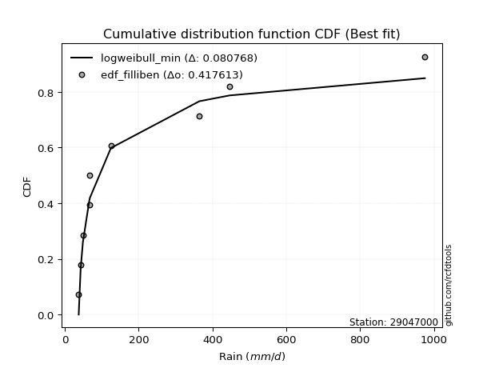</img></img>

</div>


### 10. EDF Jenkinson (1977)

The Jenkinson formula in hydrology is an empirical plotting position formula used to estimate the non-exceedance probability _(P)_ or return period _(T)_ of a given ordered observation within a sample. It is a widely used method in the frequency analysis of extreme events such as floods and rainfall, as it provides a distribution-free way to plot data. _a≈0.31_ and _b≈0.38_ are constants derived to approximate the median of the probability distribution for the given rank.

<div align="center">


$P=(m-a)/(n+b)$


</div>


**10.1. Empirical values**

<div align="center">

|                | 0                   | 1                   | 2                  | 3                   | 4             | 5                  | 6                  | 7                  | 8                  |
|:---------------|:--------------------|:--------------------|:-------------------|:--------------------|:--------------|:-------------------|:-------------------|:-------------------|:-------------------|
| date           | 2025                | 2018                | 2017               | 2020                | 2021          | 2019               | 2024               | 2023               | 2022               |
| x              | 37.8                | 43.02               | 49.13              | 66.64               | 68.05         | 125.01             | 364.54             | 446.14             | 975.48             |
| m              | 1                   | 2                   | 3                  | 4                   | 5             | 6                  | 7                  | 8                  | 9                  |
| empirical_dist | edf_jenkinson       | edf_jenkinson       | edf_jenkinson      | edf_jenkinson       | edf_jenkinson | edf_jenkinson      | edf_jenkinson      | edf_jenkinson      | edf_jenkinson      |
| empirical      | 0.07356076759061833 | 0.18017057569296374 | 0.2867803837953091 | 0.39339019189765456 | 0.5           | 0.6066098081023454 | 0.7132196162046908 | 0.8198294243070362 | 0.9264392324093815 |
| empirical_tr   | 1.0794016110471807  | 1.2197659297789336  | 1.4020926756352765 | 1.6485061511423549  | 2.0           | 2.542005420054201  | 3.486988847583642  | 5.550295857988164  | 13.5942028985507   |

</div>


**10.2. Kolmogorov-Smirnov fit test (sorted by Δ)**


<div align="center">

|                | 0                   | 1                   | 2                   | 3                   | 4                   | 5                   | 6                   | 7                   | 8                   | 9                   | 10                  | 11                  | 12                  | 13                  | 14                  | 15                  | 16                  | 17                  | 18                  | 19                  | 20                  | 21                  | 22                  | 23                  | 24                  | 25                  | 26                  | 27                  | 28                  | 29                  | 30                  | 31                  | 32                  | 33                  | 34                  | 35                  | 36                  | 37                  | 38                  | 39                  | 40                  | 41                  | 42                  | 43                  | 44                  | 45                  | 46                  | 47                  | 48                  | 49                  | 50                  | 51                  | 52                  | 53                  | 54                  | 55                  | 56                  | 57                  | 58                  | 59                  | 60                  | 61                  | 62                  | 63                  | 64                  | 65                  | 66                  | 67                  | 68                  | 69                  | 70                  | 71                  | 72                  | 73                  | 74                  | 75                  | 76                  | 77                  | 78                  | 79                  | 80                  | 81                  | 82                  | 83                  | 84                  | 85                  | 86                  | 87                  | 88                  | 89                  | 90                  | 91                  | 92                  | 93                  | 94                  | 95                  | 96                  | 97                  | 98                  | 99                  | 100                 | 101                 | 102                 | 103                 | 104                 | 105                 | 106                 | 107                 | 108                 | 109                 | 110                 | 111                 | 112                 | 113                 | 114                 | 115                 | 116                 | 117                 | 118                 | 119                 | 120                 | 121                 | 122                 | 123                 | 124                 | 125                 | 126                 | 127                 | 128                 | 129                 | 130                 | 131                 | 132                 | 133                 | 134                 | 135                 | 136                 | 137                 | 138                 | 139                 | 140                 | 141                 | 142                 | 143                 | 144                 | 145                 | 146                 | 147                 | 148                 | 149                 | 150                 | 151                 | 152                 | 153                 | 154                 | 155                 | 156                 | 157                 | 158                 | 159                 |
|:---------------|:--------------------|:--------------------|:--------------------|:--------------------|:--------------------|:--------------------|:--------------------|:--------------------|:--------------------|:--------------------|:--------------------|:--------------------|:--------------------|:--------------------|:--------------------|:--------------------|:--------------------|:--------------------|:--------------------|:--------------------|:--------------------|:--------------------|:--------------------|:--------------------|:--------------------|:--------------------|:--------------------|:--------------------|:--------------------|:--------------------|:--------------------|:--------------------|:--------------------|:--------------------|:--------------------|:--------------------|:--------------------|:--------------------|:--------------------|:--------------------|:--------------------|:--------------------|:--------------------|:--------------------|:--------------------|:--------------------|:--------------------|:--------------------|:--------------------|:--------------------|:--------------------|:--------------------|:--------------------|:--------------------|:--------------------|:--------------------|:--------------------|:--------------------|:--------------------|:--------------------|:--------------------|:--------------------|:--------------------|:--------------------|:--------------------|:--------------------|:--------------------|:--------------------|:--------------------|:--------------------|:--------------------|:--------------------|:--------------------|:--------------------|:--------------------|:--------------------|:--------------------|:--------------------|:--------------------|:--------------------|:--------------------|:--------------------|:--------------------|:--------------------|:--------------------|:--------------------|:--------------------|:--------------------|:--------------------|:--------------------|:--------------------|:--------------------|:--------------------|:--------------------|:--------------------|:--------------------|:--------------------|:--------------------|:--------------------|:--------------------|:--------------------|:--------------------|:--------------------|:--------------------|:--------------------|:--------------------|:--------------------|:--------------------|:--------------------|:--------------------|:--------------------|:--------------------|:--------------------|:--------------------|:--------------------|:--------------------|:--------------------|:--------------------|:--------------------|:--------------------|:--------------------|:--------------------|:--------------------|:--------------------|:--------------------|:--------------------|:--------------------|:--------------------|:--------------------|:--------------------|:--------------------|:--------------------|:--------------------|:--------------------|:--------------------|:--------------------|:--------------------|:--------------------|:--------------------|:--------------------|:--------------------|:--------------------|:--------------------|:--------------------|:--------------------|:--------------------|:--------------------|:--------------------|:--------------------|:--------------------|:--------------------|:--------------------|:--------------------|:--------------------|:--------------------|:--------------------|:--------------------|:--------------------|:--------------------|:--------------------|
| station        | 29047000            | 29047000            | 29047000            | 29047000            | 29047000            | 29047000            | 29047000            | 29047000            | 29047000            | 29047000            | 29047000            | 29047000            | 29047000            | 29047000            | 29047000            | 29047000            | 29047000            | 29047000            | 29047000            | 29047000            | 29047000            | 29047000            | 29047000            | 29047000            | 29047000            | 29047000            | 29047000            | 29047000            | 29047000            | 29047000            | 29047000            | 29047000            | 29047000            | 29047000            | 29047000            | 29047000            | 29047000            | 29047000            | 29047000            | 29047000            | 29047000            | 29047000            | 29047000            | 29047000            | 29047000            | 29047000            | 29047000            | 29047000            | 29047000            | 29047000            | 29047000            | 29047000            | 29047000            | 29047000            | 29047000            | 29047000            | 29047000            | 29047000            | 29047000            | 29047000            | 29047000            | 29047000            | 29047000            | 29047000            | 29047000            | 29047000            | 29047000            | 29047000            | 29047000            | 29047000            | 29047000            | 29047000            | 29047000            | 29047000            | 29047000            | 29047000            | 29047000            | 29047000            | 29047000            | 29047000            | 29047000            | 29047000            | 29047000            | 29047000            | 29047000            | 29047000            | 29047000            | 29047000            | 29047000            | 29047000            | 29047000            | 29047000            | 29047000            | 29047000            | 29047000            | 29047000            | 29047000            | 29047000            | 29047000            | 29047000            | 29047000            | 29047000            | 29047000            | 29047000            | 29047000            | 29047000            | 29047000            | 29047000            | 29047000            | 29047000            | 29047000            | 29047000            | 29047000            | 29047000            | 29047000            | 29047000            | 29047000            | 29047000            | 29047000            | 29047000            | 29047000            | 29047000            | 29047000            | 29047000            | 29047000            | 29047000            | 29047000            | 29047000            | 29047000            | 29047000            | 29047000            | 29047000            | 29047000            | 29047000            | 29047000            | 29047000            | 29047000            | 29047000            | 29047000            | 29047000            | 29047000            | 29047000            | 29047000            | 29047000            | 29047000            | 29047000            | 29047000            | 29047000            | 29047000            | 29047000            | 29047000            | 29047000            | 29047000            | 29047000            | 29047000            | 29047000            | 29047000            | 29047000            | 29047000            | 29047000            |
| empirical_dist | edf_jenkinson       | edf_jenkinson       | edf_jenkinson       | edf_jenkinson       | edf_jenkinson       | edf_jenkinson       | edf_jenkinson       | edf_jenkinson       | edf_jenkinson       | edf_jenkinson       | edf_jenkinson       | edf_jenkinson       | edf_jenkinson       | edf_jenkinson       | edf_jenkinson       | edf_jenkinson       | edf_jenkinson       | edf_jenkinson       | edf_jenkinson       | edf_jenkinson       | edf_jenkinson       | edf_jenkinson       | edf_jenkinson       | edf_jenkinson       | edf_jenkinson       | edf_jenkinson       | edf_jenkinson       | edf_jenkinson       | edf_jenkinson       | edf_jenkinson       | edf_jenkinson       | edf_jenkinson       | edf_jenkinson       | edf_jenkinson       | edf_jenkinson       | edf_jenkinson       | edf_jenkinson       | edf_jenkinson       | edf_jenkinson       | edf_jenkinson       | edf_jenkinson       | edf_jenkinson       | edf_jenkinson       | edf_jenkinson       | edf_jenkinson       | edf_jenkinson       | edf_jenkinson       | edf_jenkinson       | edf_jenkinson       | edf_jenkinson       | edf_jenkinson       | edf_jenkinson       | edf_jenkinson       | edf_jenkinson       | edf_jenkinson       | edf_jenkinson       | edf_jenkinson       | edf_jenkinson       | edf_jenkinson       | edf_jenkinson       | edf_jenkinson       | edf_jenkinson       | edf_jenkinson       | edf_jenkinson       | edf_jenkinson       | edf_jenkinson       | edf_jenkinson       | edf_jenkinson       | edf_jenkinson       | edf_jenkinson       | edf_jenkinson       | edf_jenkinson       | edf_jenkinson       | edf_jenkinson       | edf_jenkinson       | edf_jenkinson       | edf_jenkinson       | edf_jenkinson       | edf_jenkinson       | edf_jenkinson       | edf_jenkinson       | edf_jenkinson       | edf_jenkinson       | edf_jenkinson       | edf_jenkinson       | edf_jenkinson       | edf_jenkinson       | edf_jenkinson       | edf_jenkinson       | edf_jenkinson       | edf_jenkinson       | edf_jenkinson       | edf_jenkinson       | edf_jenkinson       | edf_jenkinson       | edf_jenkinson       | edf_jenkinson       | edf_jenkinson       | edf_jenkinson       | edf_jenkinson       | edf_jenkinson       | edf_jenkinson       | edf_jenkinson       | edf_jenkinson       | edf_jenkinson       | edf_jenkinson       | edf_jenkinson       | edf_jenkinson       | edf_jenkinson       | edf_jenkinson       | edf_jenkinson       | edf_jenkinson       | edf_jenkinson       | edf_jenkinson       | edf_jenkinson       | edf_jenkinson       | edf_jenkinson       | edf_jenkinson       | edf_jenkinson       | edf_jenkinson       | edf_jenkinson       | edf_jenkinson       | edf_jenkinson       | edf_jenkinson       | edf_jenkinson       | edf_jenkinson       | edf_jenkinson       | edf_jenkinson       | edf_jenkinson       | edf_jenkinson       | edf_jenkinson       | edf_jenkinson       | edf_jenkinson       | edf_jenkinson       | edf_jenkinson       | edf_jenkinson       | edf_jenkinson       | edf_jenkinson       | edf_jenkinson       | edf_jenkinson       | edf_jenkinson       | edf_jenkinson       | edf_jenkinson       | edf_jenkinson       | edf_jenkinson       | edf_jenkinson       | edf_jenkinson       | edf_jenkinson       | edf_jenkinson       | edf_jenkinson       | edf_jenkinson       | edf_jenkinson       | edf_jenkinson       | edf_jenkinson       | edf_jenkinson       | edf_jenkinson       | edf_jenkinson       | edf_jenkinson       | edf_jenkinson       | edf_jenkinson       |
| p_dist         | logweibull_min      | exponweib           | logbeta             | mielke              | logalpha            | invweibull          | fatiguelife         | logf                | gausshyper          | logexponweib        | truncweibull_min    | invgamma            | f                   | logmielke           | logburr             | loggenextreme       | loginvweibull       | logburr12           | lomax               | loggausshyper       | halfgennorm         | loghalfgennorm      | loginvgamma         | logncf              | logfatiguelife      | lognct              | burr12              | loglomax            | loghalfnorm         | loggenexpon         | logexponpow         | logexponnorm        | loginvgauss         | loghalflogistic     | logdweibull         | erlang              | truncpareto         | logjohnsonsb        | logtruncnorm        | logfoldnorm         | exponpow            | ncf                 | logarcsine          | nct                 | gengamma            | invgauss            | loggamma            | loggamma            | burr                | logdgamma           | logmoyal            | lograyleigh         | nakagami            | logsemicircular     | loggengamma         | loggenlogistic      | loggumbel_r         | loggenhalflogistic  | logmaxwell          | genpareto           | logpearson3         | loganglit           | betaprime           | logkstwobign        | logbetaprime        | moyal               | logrdist            | alpha               | vonmises_line       | pearson3            | weibull_min         | logloggamma         | dgamma              | logloglaplace       | logjohnsonsu        | gamma               | loggennorm          | logcrystalball      | lognorm             | logt                | halflogistic        | logtruncweibull_min | logwrapcauchy       | gumbel_r            | rayleigh            | wald                | gennorm             | logskewnorm         | logweibull_max      | logrice             | halfnorm            | loglogistic         | lognakagami         | maxwell             | logerlang           | semicircular        | logcosine           | anglit              | foldnorm            | loghypsecant        | loggompertz         | logtruncexpon       | genlogistic         | logwald             | t                   | logtukeylambda      | loggumbel_l         | norm                | logbradford         | arcsine             | logksone            | loglaplace          | loglaplace          | kstwobign           | logistic            | logargus            | powerlaw            | genextreme          | logtriang           | hypsecant           | logkappa4           | rice                | cosine              | beta                | loguniform          | loggenpareto        | gumbel_l            | laplace             | logkappa3           | wrapcauchy          | logvonmises_line    | loglevy_l           | johnsonsb           | truncexpon          | exponnorm           | logpowerlaw         | gompertz            | genexpon            | argus               | triang              | dweibull            | truncnorm           | levy_l              | bradford            | skewnorm            | ksone               | logtrapezoid        | crystalball         | kappa3              | rdist               | kappa4              | logtruncpareto      | genhalflogistic     | uniform             | tukeylambda         | johnsonsu           | trapezoid           | weibull_max         | logvonmises         | vonmises            |
| delta          | 0.08076812804574351 | 0.08174598962973756 | 0.08674112148537216 | 0.09339153733341365 | 0.0944421282546749  | 0.09988363195556083 | 0.10176327648982264 | 0.10321831808416781 | 0.11226050315202618 | 0.11295976875007807 | 0.11425223392537215 | 0.11992281440228714 | 0.11992323897509671 | 0.12457859333828525 | 0.12592226373000015 | 0.1259357484690159  | 0.12595082070483055 | 0.12933543378176204 | 0.13015054514801572 | 0.13021833564809193 | 0.13044691011219167 | 0.13224567633747153 | 0.13286299167822235 | 0.1330940990160726  | 0.13333515246802896 | 0.13449733419052878 | 0.13569213694747662 | 0.1364804881611994  | 0.13739133229605777 | 0.13745027050367153 | 0.1378884745515564  | 0.1393086492436072  | 0.1400921618435974  | 0.1404602613589469  | 0.14074311124190397 | 0.14154319487457645 | 0.14468651831506507 | 0.14651102784452164 | 0.14673597431395202 | 0.14762921189999162 | 0.14932999320479512 | 0.15363348536104682 | 0.15365882596740943 | 0.15603258316167135 | 0.15666966579001218 | 0.15934453688452144 | 0.16116930207343105 | 0.16116930207343105 | 0.16211791281043852 | 0.1632267040062344  | 0.1664752102618613  | 0.16791644330570077 | 0.1699287228653144  | 0.1702928396840787  | 0.17244914234287578 | 0.17297501461052694 | 0.17525387104601375 | 0.17542427321744014 | 0.1787438951740103  | 0.17973975637982176 | 0.18046840451655294 | 0.18096370264746736 | 0.1815730990580251  | 0.18610540079763266 | 0.18674158214915404 | 0.19511462571387528 | 0.1975367541497629  | 0.1977776520627318  | 0.19953716857512202 | 0.20019953591011433 | 0.2013828373333308  | 0.20275119082994025 | 0.20380610981129388 | 0.20414863674489403 | 0.20554759234185876 | 0.20558605750278203 | 0.20595670785861564 | 0.20598337156041646 | 0.20598338111395975 | 0.20598365074732428 | 0.2085818193165722  | 0.2104961087385812  | 0.21167375284945034 | 0.21258021859353982 | 0.2162895517066874  | 0.21650978906560775 | 0.21840778205282363 | 0.21869027363800786 | 0.22301251395383892 | 0.22358829819762926 | 0.2242331536783185  | 0.227606749959685   | 0.22790424090251887 | 0.2283119328891921  | 0.22981925536836612 | 0.23139008194071636 | 0.23591148772729115 | 0.23986181121901218 | 0.24289172274030138 | 0.24306301230395233 | 0.24485343377718932 | 0.24820288422195586 | 0.25046394295844    | 0.250755550606892   | 0.2544478781465225  | 0.2546737694594654  | 0.25557040480584325 | 0.260034741121123   | 0.2620926549667167  | 0.2643714729068588  | 0.26594323387937635 | 0.26758022060567105 | 0.26758022060567105 | 0.27565026859912023 | 0.2782682837742222  | 0.2786162847209782  | 0.2800758397929658  | 0.28597318767319485 | 0.29184620947389117 | 0.2923619294249185  | 0.29964506766679666 | 0.30604636627444126 | 0.31615505500348673 | 0.3180485103911589  | 0.31913188065525167 | 0.319269019677493   | 0.31946252322351526 | 0.3204408333065232  | 0.32044190311470644 | 0.3246816489690461  | 0.32669520625329956 | 0.3443833805983446  | 0.3449240174659388  | 0.36004031871363523 | 0.36090739668888305 | 0.3617500696174633  | 0.3621430171792478  | 0.3626356045695054  | 0.3699079292757572  | 0.3934351152551554  | 0.40145447284618563 | 0.40230040146492574 | 0.4150876320648046  | 0.4160800623166875  | 0.43291560983815125 | 0.44577135575186344 | 0.4545385478035845  | 0.46032970109636306 | 0.4687735092529179  | 0.48998616687586605 | 0.4926107727793838  | 0.5044731520128272  | 0.5127005665782616  | 0.513603665281767   | 0.5157401018477071  | 0.5619314948235641  | 0.6184802034513524  | 0.7519615473660317  | 1.157330181066743   | 155.04019926834576  |
| deltao         | 0.41761268023100007 | 0.41761268023100007 | 0.41761268023100007 | 0.41761268023100007 | 0.41761268023100007 | 0.41761268023100007 | 0.41761268023100007 | 0.41761268023100007 | 0.41761268023100007 | 0.41761268023100007 | 0.41761268023100007 | 0.41761268023100007 | 0.41761268023100007 | 0.41761268023100007 | 0.41761268023100007 | 0.41761268023100007 | 0.41761268023100007 | 0.41761268023100007 | 0.41761268023100007 | 0.41761268023100007 | 0.41761268023100007 | 0.41761268023100007 | 0.41761268023100007 | 0.41761268023100007 | 0.41761268023100007 | 0.41761268023100007 | 0.41761268023100007 | 0.41761268023100007 | 0.41761268023100007 | 0.41761268023100007 | 0.41761268023100007 | 0.41761268023100007 | 0.41761268023100007 | 0.41761268023100007 | 0.41761268023100007 | 0.41761268023100007 | 0.41761268023100007 | 0.41761268023100007 | 0.41761268023100007 | 0.41761268023100007 | 0.41761268023100007 | 0.41761268023100007 | 0.41761268023100007 | 0.41761268023100007 | 0.41761268023100007 | 0.41761268023100007 | 0.41761268023100007 | 0.41761268023100007 | 0.41761268023100007 | 0.41761268023100007 | 0.41761268023100007 | 0.41761268023100007 | 0.41761268023100007 | 0.41761268023100007 | 0.41761268023100007 | 0.41761268023100007 | 0.41761268023100007 | 0.41761268023100007 | 0.41761268023100007 | 0.41761268023100007 | 0.41761268023100007 | 0.41761268023100007 | 0.41761268023100007 | 0.41761268023100007 | 0.41761268023100007 | 0.41761268023100007 | 0.41761268023100007 | 0.41761268023100007 | 0.41761268023100007 | 0.41761268023100007 | 0.41761268023100007 | 0.41761268023100007 | 0.41761268023100007 | 0.41761268023100007 | 0.41761268023100007 | 0.41761268023100007 | 0.41761268023100007 | 0.41761268023100007 | 0.41761268023100007 | 0.41761268023100007 | 0.41761268023100007 | 0.41761268023100007 | 0.41761268023100007 | 0.41761268023100007 | 0.41761268023100007 | 0.41761268023100007 | 0.41761268023100007 | 0.41761268023100007 | 0.41761268023100007 | 0.41761268023100007 | 0.41761268023100007 | 0.41761268023100007 | 0.41761268023100007 | 0.41761268023100007 | 0.41761268023100007 | 0.41761268023100007 | 0.41761268023100007 | 0.41761268023100007 | 0.41761268023100007 | 0.41761268023100007 | 0.41761268023100007 | 0.41761268023100007 | 0.41761268023100007 | 0.41761268023100007 | 0.41761268023100007 | 0.41761268023100007 | 0.41761268023100007 | 0.41761268023100007 | 0.41761268023100007 | 0.41761268023100007 | 0.41761268023100007 | 0.41761268023100007 | 0.41761268023100007 | 0.41761268023100007 | 0.41761268023100007 | 0.41761268023100007 | 0.41761268023100007 | 0.41761268023100007 | 0.41761268023100007 | 0.41761268023100007 | 0.41761268023100007 | 0.41761268023100007 | 0.41761268023100007 | 0.41761268023100007 | 0.41761268023100007 | 0.41761268023100007 | 0.41761268023100007 | 0.41761268023100007 | 0.41761268023100007 | 0.41761268023100007 | 0.41761268023100007 | 0.41761268023100007 | 0.41761268023100007 | 0.41761268023100007 | 0.41761268023100007 | 0.41761268023100007 | 0.41761268023100007 | 0.41761268023100007 | 0.41761268023100007 | 0.41761268023100007 | 0.41761268023100007 | 0.41761268023100007 | 0.41761268023100007 | 0.41761268023100007 | 0.41761268023100007 | 0.41761268023100007 | 0.41761268023100007 | 0.41761268023100007 | 0.41761268023100007 | 0.41761268023100007 | 0.41761268023100007 | 0.41761268023100007 | 0.41761268023100007 | 0.41761268023100007 | 0.41761268023100007 | 0.41761268023100007 | 0.41761268023100007 | 0.41761268023100007 | 0.41761268023100007 | 0.41761268023100007 |
| eval           | Δo > Δ              | Δo > Δ              | Δo > Δ              | Δo > Δ              | Δo > Δ              | Δo > Δ              | Δo > Δ              | Δo > Δ              | Δo > Δ              | Δo > Δ              | Δo > Δ              | Δo > Δ              | Δo > Δ              | Δo > Δ              | Δo > Δ              | Δo > Δ              | Δo > Δ              | Δo > Δ              | Δo > Δ              | Δo > Δ              | Δo > Δ              | Δo > Δ              | Δo > Δ              | Δo > Δ              | Δo > Δ              | Δo > Δ              | Δo > Δ              | Δo > Δ              | Δo > Δ              | Δo > Δ              | Δo > Δ              | Δo > Δ              | Δo > Δ              | Δo > Δ              | Δo > Δ              | Δo > Δ              | Δo > Δ              | Δo > Δ              | Δo > Δ              | Δo > Δ              | Δo > Δ              | Δo > Δ              | Δo > Δ              | Δo > Δ              | Δo > Δ              | Δo > Δ              | Δo > Δ              | Δo > Δ              | Δo > Δ              | Δo > Δ              | Δo > Δ              | Δo > Δ              | Δo > Δ              | Δo > Δ              | Δo > Δ              | Δo > Δ              | Δo > Δ              | Δo > Δ              | Δo > Δ              | Δo > Δ              | Δo > Δ              | Δo > Δ              | Δo > Δ              | Δo > Δ              | Δo > Δ              | Δo > Δ              | Δo > Δ              | Δo > Δ              | Δo > Δ              | Δo > Δ              | Δo > Δ              | Δo > Δ              | Δo > Δ              | Δo > Δ              | Δo > Δ              | Δo > Δ              | Δo > Δ              | Δo > Δ              | Δo > Δ              | Δo > Δ              | Δo > Δ              | Δo > Δ              | Δo > Δ              | Δo > Δ              | Δo > Δ              | Δo > Δ              | Δo > Δ              | Δo > Δ              | Δo > Δ              | Δo > Δ              | Δo > Δ              | Δo > Δ              | Δo > Δ              | Δo > Δ              | Δo > Δ              | Δo > Δ              | Δo > Δ              | Δo > Δ              | Δo > Δ              | Δo > Δ              | Δo > Δ              | Δo > Δ              | Δo > Δ              | Δo > Δ              | Δo > Δ              | Δo > Δ              | Δo > Δ              | Δo > Δ              | Δo > Δ              | Δo > Δ              | Δo > Δ              | Δo > Δ              | Δo > Δ              | Δo > Δ              | Δo > Δ              | Δo > Δ              | Δo > Δ              | Δo > Δ              | Δo > Δ              | Δo > Δ              | Δo > Δ              | Δo > Δ              | Δo > Δ              | Δo > Δ              | Δo > Δ              | Δo > Δ              | Δo > Δ              | Δo > Δ              | Δo > Δ              | Δo > Δ              | Δo > Δ              | Δo > Δ              | Δo > Δ              | Δo > Δ              | Δo > Δ              | Δo > Δ              | Δo > Δ              | Δo > Δ              | Δo > Δ              | Δo > Δ              | Δo > Δ              | Δo > Δ              | Δo > Δ              | Δo > Δ              | Δo <= Δ             | Δo <= Δ             | Δo <= Δ             | Δo <= Δ             | Δo <= Δ             | Δo <= Δ             | Δo <= Δ             | Δo <= Δ             | Δo <= Δ             | Δo <= Δ             | Δo <= Δ             | Δo <= Δ             | Δo <= Δ             | Δo <= Δ             | Δo <= Δ             | Δo <= Δ             |
| fit            | 1                   | 1                   | 1                   | 1                   | 1                   | 1                   | 1                   | 1                   | 1                   | 1                   | 1                   | 1                   | 1                   | 1                   | 1                   | 1                   | 1                   | 1                   | 1                   | 1                   | 1                   | 1                   | 1                   | 1                   | 1                   | 1                   | 1                   | 1                   | 1                   | 1                   | 1                   | 1                   | 1                   | 1                   | 1                   | 1                   | 1                   | 1                   | 1                   | 1                   | 1                   | 1                   | 1                   | 1                   | 1                   | 1                   | 1                   | 1                   | 1                   | 1                   | 1                   | 1                   | 1                   | 1                   | 1                   | 1                   | 1                   | 1                   | 1                   | 1                   | 1                   | 1                   | 1                   | 1                   | 1                   | 1                   | 1                   | 1                   | 1                   | 1                   | 1                   | 1                   | 1                   | 1                   | 1                   | 1                   | 1                   | 1                   | 1                   | 1                   | 1                   | 1                   | 1                   | 1                   | 1                   | 1                   | 1                   | 1                   | 1                   | 1                   | 1                   | 1                   | 1                   | 1                   | 1                   | 1                   | 1                   | 1                   | 1                   | 1                   | 1                   | 1                   | 1                   | 1                   | 1                   | 1                   | 1                   | 1                   | 1                   | 1                   | 1                   | 1                   | 1                   | 1                   | 1                   | 1                   | 1                   | 1                   | 1                   | 1                   | 1                   | 1                   | 1                   | 1                   | 1                   | 1                   | 1                   | 1                   | 1                   | 1                   | 1                   | 1                   | 1                   | 1                   | 1                   | 1                   | 1                   | 1                   | 1                   | 1                   | 1                   | 1                   | 1                   | 1                   | 0                   | 0                   | 0                   | 0                   | 0                   | 0                   | 0                   | 0                   | 0                   | 0                   | 0                   | 0                   | 0                   | 0                   | 0                   | 0                   |
| n              | 9                   | 9                   | 9                   | 9                   | 9                   | 9                   | 9                   | 9                   | 9                   | 9                   | 9                   | 9                   | 9                   | 9                   | 9                   | 9                   | 9                   | 9                   | 9                   | 9                   | 9                   | 9                   | 9                   | 9                   | 9                   | 9                   | 9                   | 9                   | 9                   | 9                   | 9                   | 9                   | 9                   | 9                   | 9                   | 9                   | 9                   | 9                   | 9                   | 9                   | 9                   | 9                   | 9                   | 9                   | 9                   | 9                   | 9                   | 9                   | 9                   | 9                   | 9                   | 9                   | 9                   | 9                   | 9                   | 9                   | 9                   | 9                   | 9                   | 9                   | 9                   | 9                   | 9                   | 9                   | 9                   | 9                   | 9                   | 9                   | 9                   | 9                   | 9                   | 9                   | 9                   | 9                   | 9                   | 9                   | 9                   | 9                   | 9                   | 9                   | 9                   | 9                   | 9                   | 9                   | 9                   | 9                   | 9                   | 9                   | 9                   | 9                   | 9                   | 9                   | 9                   | 9                   | 9                   | 9                   | 9                   | 9                   | 9                   | 9                   | 9                   | 9                   | 9                   | 9                   | 9                   | 9                   | 9                   | 9                   | 9                   | 9                   | 9                   | 9                   | 9                   | 9                   | 9                   | 9                   | 9                   | 9                   | 9                   | 9                   | 9                   | 9                   | 9                   | 9                   | 9                   | 9                   | 9                   | 9                   | 9                   | 9                   | 9                   | 9                   | 9                   | 9                   | 9                   | 9                   | 9                   | 9                   | 9                   | 9                   | 9                   | 9                   | 9                   | 9                   | 9                   | 9                   | 9                   | 9                   | 9                   | 9                   | 9                   | 9                   | 9                   | 9                   | 9                   | 9                   | 9                   | 9                   | 9                   | 9                   |
| best_fit       | 1                   | 0                   | 0                   | 0                   | 0                   | 0                   | 0                   | 0                   | 0                   | 0                   | 0                   | 0                   | 0                   | 0                   | 0                   | 0                   | 0                   | 0                   | 0                   | 0                   | 0                   | 0                   | 0                   | 0                   | 0                   | 0                   | 0                   | 0                   | 0                   | 0                   | 0                   | 0                   | 0                   | 0                   | 0                   | 0                   | 0                   | 0                   | 0                   | 0                   | 0                   | 0                   | 0                   | 0                   | 0                   | 0                   | 0                   | 0                   | 0                   | 0                   | 0                   | 0                   | 0                   | 0                   | 0                   | 0                   | 0                   | 0                   | 0                   | 0                   | 0                   | 0                   | 0                   | 0                   | 0                   | 0                   | 0                   | 0                   | 0                   | 0                   | 0                   | 0                   | 0                   | 0                   | 0                   | 0                   | 0                   | 0                   | 0                   | 0                   | 0                   | 0                   | 0                   | 0                   | 0                   | 0                   | 0                   | 0                   | 0                   | 0                   | 0                   | 0                   | 0                   | 0                   | 0                   | 0                   | 0                   | 0                   | 0                   | 0                   | 0                   | 0                   | 0                   | 0                   | 0                   | 0                   | 0                   | 0                   | 0                   | 0                   | 0                   | 0                   | 0                   | 0                   | 0                   | 0                   | 0                   | 0                   | 0                   | 0                   | 0                   | 0                   | 0                   | 0                   | 0                   | 0                   | 0                   | 0                   | 0                   | 0                   | 0                   | 0                   | 0                   | 0                   | 0                   | 0                   | 0                   | 0                   | 0                   | 0                   | 0                   | 0                   | 0                   | 0                   | 0                   | 0                   | 0                   | 0                   | 0                   | 0                   | 0                   | 0                   | 0                   | 0                   | 0                   | 0                   | 0                   | 0                   | 0                   | 0                   |
| best_fit_sort  | 1                   | 2                   | 3                   | 4                   | 5                   | 6                   | 7                   | 8                   | 9                   | 10                  | 11                  | 12                  | 13                  | 14                  | 15                  | 16                  | 17                  | 18                  | 19                  | 20                  | 21                  | 22                  | 23                  | 24                  | 25                  | 26                  | 27                  | 28                  | 29                  | 30                  | 31                  | 32                  | 33                  | 34                  | 35                  | 36                  | 37                  | 38                  | 39                  | 40                  | 41                  | 42                  | 43                  | 44                  | 45                  | 46                  | 47                  | 48                  | 49                  | 50                  | 51                  | 52                  | 53                  | 54                  | 55                  | 56                  | 57                  | 58                  | 59                  | 60                  | 61                  | 62                  | 63                  | 64                  | 65                  | 66                  | 67                  | 68                  | 69                  | 70                  | 71                  | 72                  | 73                  | 74                  | 75                  | 76                  | 77                  | 78                  | 79                  | 80                  | 81                  | 82                  | 83                  | 84                  | 85                  | 86                  | 87                  | 88                  | 89                  | 90                  | 91                  | 92                  | 93                  | 94                  | 95                  | 96                  | 97                  | 98                  | 99                  | 100                 | 101                 | 102                 | 103                 | 104                 | 105                 | 106                 | 107                 | 108                 | 109                 | 110                 | 111                 | 112                 | 113                 | 114                 | 115                 | 116                 | 117                 | 118                 | 119                 | 120                 | 121                 | 122                 | 123                 | 124                 | 125                 | 126                 | 127                 | 128                 | 129                 | 130                 | 131                 | 132                 | 133                 | 134                 | 135                 | 136                 | 137                 | 138                 | 139                 | 140                 | 141                 | 142                 | 143                 | 144                 | 145                 | 146                 | 147                 | 148                 | 149                 | 150                 | 151                 | 152                 | 153                 | 154                 | 155                 | 156                 | 157                 | 158                 | 159                 | 160                 |

</div>


**10.3. Best fit**

<div align="center">

|   id |   station | empirical_dist   | p_dist         |     delta |   deltao | eval   |   fit |   n |   best_fit |   best_fit_sort |
|-----:|----------:|:-----------------|:---------------|----------:|---------:|:-------|------:|----:|-----------:|----------------:|
|    0 |  29047000 | edf_jenkinson    | logweibull_min | 0.0807681 | 0.417613 | Δo > Δ |     1 |   9 |          1 |               1 |

</div>


<div align="center">

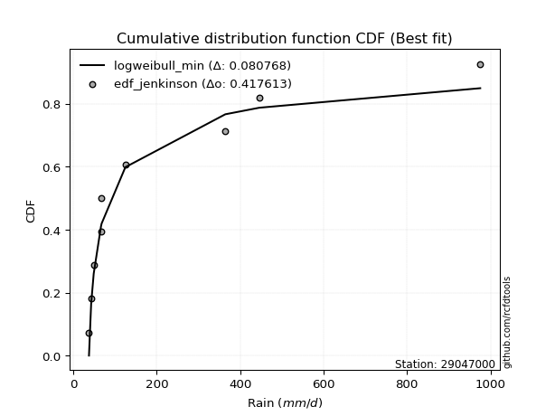</img>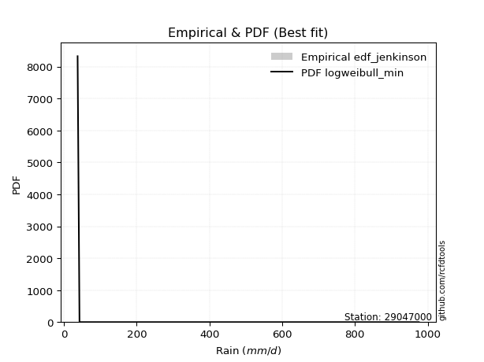</img>

</div>


### 11. EDF Cunnane (1978)

Cunnane´s work in statistical hydrology has focused on the performance and evaluation of different probability distributions (such as GEV, Gumbel, Lognormal) for flood frequency estimation. _b_ is a constant, typically set to 0.4.

<div align="center">


$P=(m-b)/(n+1-2b)$


</div>


**11.1. Empirical values**

<div align="center">

|                | 0                   | 1                  | 2                   | 3                  | 4           | 5                  | 6                 | 7                  | 8                  |
|:---------------|:--------------------|:-------------------|:--------------------|:-------------------|:------------|:-------------------|:------------------|:-------------------|:-------------------|
| date           | 2025                | 2018               | 2017                | 2020               | 2021        | 2019               | 2024              | 2023               | 2022               |
| x              | 37.8                | 43.02              | 49.13               | 66.64              | 68.05       | 125.01             | 364.54            | 446.14             | 975.48             |
| m              | 1                   | 2                  | 3                   | 4                  | 5           | 6                  | 7                 | 8                  | 9                  |
| empirical_dist | edf_cunnane         | edf_cunnane        | edf_cunnane         | edf_cunnane        | edf_cunnane | edf_cunnane        | edf_cunnane       | edf_cunnane        | edf_cunnane        |
| empirical      | 0.06521739130434782 | 0.1739130434782609 | 0.28260869565217395 | 0.391304347826087  | 0.5         | 0.6086956521739131 | 0.717391304347826 | 0.8260869565217391 | 0.9347826086956522 |
| empirical_tr   | 1.069767441860465   | 1.2105263157894737 | 1.393939393939394   | 1.6428571428571428 | 2.0         | 2.555555555555556  | 3.538461538461538 | 5.75               | 15.333333333333343 |

</div>


**11.2. Kolmogorov-Smirnov fit test (sorted by Δ)**


<div align="center">

|                | 0                   | 1                   | 2                   | 3                   | 4                   | 5                   | 6                   | 7                   | 8                   | 9                   | 10                  | 11                  | 12                  | 13                  | 14                  | 15                  | 16                  | 17                  | 18                  | 19                  | 20                  | 21                  | 22                  | 23                  | 24                  | 25                  | 26                  | 27                  | 28                  | 29                  | 30                  | 31                  | 32                  | 33                  | 34                  | 35                  | 36                  | 37                  | 38                  | 39                  | 40                  | 41                  | 42                  | 43                  | 44                  | 45                  | 46                  | 47                  | 48                  | 49                  | 50                  | 51                  | 52                  | 53                  | 54                  | 55                  | 56                  | 57                  | 58                  | 59                  | 60                  | 61                  | 62                  | 63                  | 64                  | 65                  | 66                  | 67                  | 68                  | 69                  | 70                  | 71                  | 72                  | 73                  | 74                  | 75                  | 76                  | 77                  | 78                  | 79                  | 80                  | 81                  | 82                  | 83                  | 84                  | 85                  | 86                  | 87                  | 88                  | 89                  | 90                  | 91                  | 92                  | 93                  | 94                  | 95                  | 96                  | 97                  | 98                  | 99                  | 100                 | 101                 | 102                 | 103                 | 104                 | 105                 | 106                 | 107                 | 108                 | 109                 | 110                 | 111                 | 112                 | 113                 | 114                 | 115                 | 116                 | 117                 | 118                 | 119                 | 120                 | 121                 | 122                 | 123                 | 124                 | 125                 | 126                 | 127                 | 128                 | 129                 | 130                 | 131                 | 132                 | 133                 | 134                 | 135                 | 136                 | 137                 | 138                 | 139                 | 140                 | 141                 | 142                 | 143                 | 144                 | 145                 | 146                 | 147                 | 148                 | 149                 | 150                 | 151                 | 152                 | 153                 | 154                 | 155                 | 156                 | 157                 | 158                 | 159                 |
|:---------------|:--------------------|:--------------------|:--------------------|:--------------------|:--------------------|:--------------------|:--------------------|:--------------------|:--------------------|:--------------------|:--------------------|:--------------------|:--------------------|:--------------------|:--------------------|:--------------------|:--------------------|:--------------------|:--------------------|:--------------------|:--------------------|:--------------------|:--------------------|:--------------------|:--------------------|:--------------------|:--------------------|:--------------------|:--------------------|:--------------------|:--------------------|:--------------------|:--------------------|:--------------------|:--------------------|:--------------------|:--------------------|:--------------------|:--------------------|:--------------------|:--------------------|:--------------------|:--------------------|:--------------------|:--------------------|:--------------------|:--------------------|:--------------------|:--------------------|:--------------------|:--------------------|:--------------------|:--------------------|:--------------------|:--------------------|:--------------------|:--------------------|:--------------------|:--------------------|:--------------------|:--------------------|:--------------------|:--------------------|:--------------------|:--------------------|:--------------------|:--------------------|:--------------------|:--------------------|:--------------------|:--------------------|:--------------------|:--------------------|:--------------------|:--------------------|:--------------------|:--------------------|:--------------------|:--------------------|:--------------------|:--------------------|:--------------------|:--------------------|:--------------------|:--------------------|:--------------------|:--------------------|:--------------------|:--------------------|:--------------------|:--------------------|:--------------------|:--------------------|:--------------------|:--------------------|:--------------------|:--------------------|:--------------------|:--------------------|:--------------------|:--------------------|:--------------------|:--------------------|:--------------------|:--------------------|:--------------------|:--------------------|:--------------------|:--------------------|:--------------------|:--------------------|:--------------------|:--------------------|:--------------------|:--------------------|:--------------------|:--------------------|:--------------------|:--------------------|:--------------------|:--------------------|:--------------------|:--------------------|:--------------------|:--------------------|:--------------------|:--------------------|:--------------------|:--------------------|:--------------------|:--------------------|:--------------------|:--------------------|:--------------------|:--------------------|:--------------------|:--------------------|:--------------------|:--------------------|:--------------------|:--------------------|:--------------------|:--------------------|:--------------------|:--------------------|:--------------------|:--------------------|:--------------------|:--------------------|:--------------------|:--------------------|:--------------------|:--------------------|:--------------------|:--------------------|:--------------------|:--------------------|:--------------------|:--------------------|:--------------------|
| station        | 29047000            | 29047000            | 29047000            | 29047000            | 29047000            | 29047000            | 29047000            | 29047000            | 29047000            | 29047000            | 29047000            | 29047000            | 29047000            | 29047000            | 29047000            | 29047000            | 29047000            | 29047000            | 29047000            | 29047000            | 29047000            | 29047000            | 29047000            | 29047000            | 29047000            | 29047000            | 29047000            | 29047000            | 29047000            | 29047000            | 29047000            | 29047000            | 29047000            | 29047000            | 29047000            | 29047000            | 29047000            | 29047000            | 29047000            | 29047000            | 29047000            | 29047000            | 29047000            | 29047000            | 29047000            | 29047000            | 29047000            | 29047000            | 29047000            | 29047000            | 29047000            | 29047000            | 29047000            | 29047000            | 29047000            | 29047000            | 29047000            | 29047000            | 29047000            | 29047000            | 29047000            | 29047000            | 29047000            | 29047000            | 29047000            | 29047000            | 29047000            | 29047000            | 29047000            | 29047000            | 29047000            | 29047000            | 29047000            | 29047000            | 29047000            | 29047000            | 29047000            | 29047000            | 29047000            | 29047000            | 29047000            | 29047000            | 29047000            | 29047000            | 29047000            | 29047000            | 29047000            | 29047000            | 29047000            | 29047000            | 29047000            | 29047000            | 29047000            | 29047000            | 29047000            | 29047000            | 29047000            | 29047000            | 29047000            | 29047000            | 29047000            | 29047000            | 29047000            | 29047000            | 29047000            | 29047000            | 29047000            | 29047000            | 29047000            | 29047000            | 29047000            | 29047000            | 29047000            | 29047000            | 29047000            | 29047000            | 29047000            | 29047000            | 29047000            | 29047000            | 29047000            | 29047000            | 29047000            | 29047000            | 29047000            | 29047000            | 29047000            | 29047000            | 29047000            | 29047000            | 29047000            | 29047000            | 29047000            | 29047000            | 29047000            | 29047000            | 29047000            | 29047000            | 29047000            | 29047000            | 29047000            | 29047000            | 29047000            | 29047000            | 29047000            | 29047000            | 29047000            | 29047000            | 29047000            | 29047000            | 29047000            | 29047000            | 29047000            | 29047000            | 29047000            | 29047000            | 29047000            | 29047000            | 29047000            | 29047000            |
| empirical_dist | edf_cunnane         | edf_cunnane         | edf_cunnane         | edf_cunnane         | edf_cunnane         | edf_cunnane         | edf_cunnane         | edf_cunnane         | edf_cunnane         | edf_cunnane         | edf_cunnane         | edf_cunnane         | edf_cunnane         | edf_cunnane         | edf_cunnane         | edf_cunnane         | edf_cunnane         | edf_cunnane         | edf_cunnane         | edf_cunnane         | edf_cunnane         | edf_cunnane         | edf_cunnane         | edf_cunnane         | edf_cunnane         | edf_cunnane         | edf_cunnane         | edf_cunnane         | edf_cunnane         | edf_cunnane         | edf_cunnane         | edf_cunnane         | edf_cunnane         | edf_cunnane         | edf_cunnane         | edf_cunnane         | edf_cunnane         | edf_cunnane         | edf_cunnane         | edf_cunnane         | edf_cunnane         | edf_cunnane         | edf_cunnane         | edf_cunnane         | edf_cunnane         | edf_cunnane         | edf_cunnane         | edf_cunnane         | edf_cunnane         | edf_cunnane         | edf_cunnane         | edf_cunnane         | edf_cunnane         | edf_cunnane         | edf_cunnane         | edf_cunnane         | edf_cunnane         | edf_cunnane         | edf_cunnane         | edf_cunnane         | edf_cunnane         | edf_cunnane         | edf_cunnane         | edf_cunnane         | edf_cunnane         | edf_cunnane         | edf_cunnane         | edf_cunnane         | edf_cunnane         | edf_cunnane         | edf_cunnane         | edf_cunnane         | edf_cunnane         | edf_cunnane         | edf_cunnane         | edf_cunnane         | edf_cunnane         | edf_cunnane         | edf_cunnane         | edf_cunnane         | edf_cunnane         | edf_cunnane         | edf_cunnane         | edf_cunnane         | edf_cunnane         | edf_cunnane         | edf_cunnane         | edf_cunnane         | edf_cunnane         | edf_cunnane         | edf_cunnane         | edf_cunnane         | edf_cunnane         | edf_cunnane         | edf_cunnane         | edf_cunnane         | edf_cunnane         | edf_cunnane         | edf_cunnane         | edf_cunnane         | edf_cunnane         | edf_cunnane         | edf_cunnane         | edf_cunnane         | edf_cunnane         | edf_cunnane         | edf_cunnane         | edf_cunnane         | edf_cunnane         | edf_cunnane         | edf_cunnane         | edf_cunnane         | edf_cunnane         | edf_cunnane         | edf_cunnane         | edf_cunnane         | edf_cunnane         | edf_cunnane         | edf_cunnane         | edf_cunnane         | edf_cunnane         | edf_cunnane         | edf_cunnane         | edf_cunnane         | edf_cunnane         | edf_cunnane         | edf_cunnane         | edf_cunnane         | edf_cunnane         | edf_cunnane         | edf_cunnane         | edf_cunnane         | edf_cunnane         | edf_cunnane         | edf_cunnane         | edf_cunnane         | edf_cunnane         | edf_cunnane         | edf_cunnane         | edf_cunnane         | edf_cunnane         | edf_cunnane         | edf_cunnane         | edf_cunnane         | edf_cunnane         | edf_cunnane         | edf_cunnane         | edf_cunnane         | edf_cunnane         | edf_cunnane         | edf_cunnane         | edf_cunnane         | edf_cunnane         | edf_cunnane         | edf_cunnane         | edf_cunnane         | edf_cunnane         | edf_cunnane         | edf_cunnane         | edf_cunnane         |
| p_dist         | exponweib           | logweibull_min      | mielke              | logalpha            | logbeta             | invweibull          | fatiguelife         | logf                | gausshyper          | logexponweib        | truncweibull_min    | invgamma            | f                   | logmielke           | logburr             | loggenextreme       | loginvweibull       | logburr12           | lomax               | loggausshyper       | halfgennorm         | loghalfgennorm      | loginvgamma         | logncf              | logfatiguelife      | lognct              | burr12              | loglomax            | loggenexpon         | logexponnorm        | loginvgauss         | logdweibull         | erlang              | loghalfnorm         | logexponpow         | loghalflogistic     | truncpareto         | exponpow            | logtruncnorm        | logfoldnorm         | gengamma            | logjohnsonsb        | ncf                 | invgauss            | nct                 | loggamma            | loggamma            | burr                | logdgamma           | logarcsine          | logmoyal            | lograyleigh         | loggengamma         | logsemicircular     | loggenlogistic      | loggumbel_r         | loggenhalflogistic  | genpareto           | nakagami            | logmaxwell          | logpearson3         | loganglit           | betaprime           | logbetaprime        | logkstwobign        | alpha               | moyal               | logrdist            | logloglaplace       | weibull_min         | gamma               | loggennorm          | logloggamma         | logjohnsonsu        | dgamma              | logcrystalball      | lognorm             | logt                | vonmises_line       | pearson3            | logtruncweibull_min | gennorm             | gumbel_r            | wald                | halflogistic        | logwrapcauchy       | rayleigh            | logskewnorm         | logrice             | logweibull_max      | logerlang           | loglogistic         | lognakagami         | maxwell             | halfnorm            | semicircular        | logcosine           | anglit              | loghypsecant        | loggompertz         | logwald             | logtruncexpon       | genlogistic         | foldnorm            | logtukeylambda      | loggumbel_l         | t                   | logbradford         | norm                | logksone            | loglaplace          | loglaplace          | arcsine             | kstwobign           | logargus            | logistic            | powerlaw            | logtriang           | genextreme          | hypsecant           | logkappa4           | rice                | cosine              | loguniform          | beta                | logkappa3           | gumbel_l            | laplace             | logvonmises_line    | loggenpareto        | wrapcauchy          | johnsonsb           | loglevy_l           | exponnorm           | truncexpon          | gompertz            | genexpon            | logpowerlaw         | argus               | triang              | truncnorm           | dweibull            | bradford            | levy_l              | skewnorm            | ksone               | logtrapezoid        | crystalball         | kappa3              | kappa4              | rdist               | logtruncpareto      | genhalflogistic     | uniform             | tukeylambda         | johnsonsu           | trapezoid           | weibull_max         | logvonmises         | vonmises            |
| delta          | 0.0812404457364499  | 0.08562369021370841 | 0.08921984919027848 | 0.09027044011153962 | 0.09299865370007501 | 0.09571194381242554 | 0.09759158834668735 | 0.09904662994103253 | 0.10808881500889089 | 0.10999865394497915 | 0.11425223392537215 | 0.11575112625915185 | 0.11575155083196143 | 0.12040690519514996 | 0.12175057558686486 | 0.12176406032588061 | 0.12177913256169526 | 0.12516374563862676 | 0.12597885700488043 | 0.12604664750495664 | 0.12627522196905638 | 0.12807398819433624 | 0.12869130353508706 | 0.12892241087293732 | 0.12916346432489367 | 0.1303256460473935  | 0.13152044880434133 | 0.1323088000180641  | 0.13327858236053625 | 0.1351369611004719  | 0.13592047370046212 | 0.13657142309876869 | 0.13737150673144116 | 0.13739133229605777 | 0.1378884745515564  | 0.1404602613589469  | 0.14468651831506507 | 0.14515830506165983 | 0.14673597431395202 | 0.14762921189999162 | 0.1524979776468769  | 0.15276856005922457 | 0.15363348536104682 | 0.15517284874138615 | 0.15603258316167135 | 0.15699761393029577 | 0.15699761393029577 | 0.1584640411997491  | 0.15905501586309911 | 0.16200220225367995 | 0.1664752102618613  | 0.16791644330570077 | 0.1682774541997405  | 0.1702928396840787  | 0.17297501461052694 | 0.17525387104601375 | 0.17542427321744014 | 0.17556806823668647 | 0.17618625508001726 | 0.1787438951740103  | 0.18046840451655294 | 0.18096370264746736 | 0.1815730990580251  | 0.18256989400601875 | 0.18610540079763266 | 0.1936059639195965  | 0.19720046978544292 | 0.1975367541497629  | 0.19997694860175874 | 0.2013828373333308  | 0.20141436935964674 | 0.20178501971548035 | 0.20275119082994025 | 0.20554759234185876 | 0.20589195388286152 | 0.20598337156041646 | 0.20598338111395975 | 0.20598365074732428 | 0.2078805448613925  | 0.20854291219638482 | 0.2104961087385812  | 0.21423609390968834 | 0.21466606266510746 | 0.21650978906560775 | 0.21692519560284268 | 0.21793128506415327 | 0.21837539577825504 | 0.21869027363800786 | 0.22358829819762926 | 0.22509835802540656 | 0.22564756722523083 | 0.227606749959685   | 0.22790424090251887 | 0.23039777696075975 | 0.232576529964589   | 0.233475926012284   | 0.23591148772729115 | 0.24194765529057982 | 0.24306301230395233 | 0.24485343377718932 | 0.2465838624637568  | 0.24820288422195586 | 0.25046394295844    | 0.2512350990265719  | 0.2546737694594654  | 0.25557040480584325 | 0.2567527122220619  | 0.2620926549667167  | 0.26212058519269066 | 0.26594323387937635 | 0.26758022060567105 | 0.26758022060567105 | 0.2727148491931293  | 0.2777361126706879  | 0.2786162847209782  | 0.28035412784578984 | 0.2863333720076686  | 0.29184620947389117 | 0.2922307198878977  | 0.29444777349648615 | 0.29964506766679666 | 0.3081322103460089  | 0.3182408990750544  | 0.31913188065525167 | 0.32013435446272653 | 0.32044190311470644 | 0.3215483672950829  | 0.3225266773780908  | 0.32669520625329956 | 0.32761239596376346 | 0.33093918118374904 | 0.35118154968064175 | 0.35272675688461513 | 0.36090739668888305 | 0.3621261627852029  | 0.3621430171792478  | 0.3626356045695054  | 0.3680076018321662  | 0.37199377334732486 | 0.39552095932672304 | 0.40230040146492574 | 0.4097978491324561  | 0.4160800623166875  | 0.4234310083510751  | 0.43291560983815125 | 0.4478571998234311  | 0.45662439187515214 | 0.4686730773826336  | 0.4771168855391886  | 0.49469661685095145 | 0.49832954316213657 | 0.51073068422753    | 0.5147864106498292  | 0.5156895093533347  | 0.5240834781339777  | 0.568189027038267   | 0.6247377356660553  | 0.7582190795807346  | 1.1531584929236076  | 155.0318558920595   |
| deltao         | 0.41761268023100007 | 0.41761268023100007 | 0.41761268023100007 | 0.41761268023100007 | 0.41761268023100007 | 0.41761268023100007 | 0.41761268023100007 | 0.41761268023100007 | 0.41761268023100007 | 0.41761268023100007 | 0.41761268023100007 | 0.41761268023100007 | 0.41761268023100007 | 0.41761268023100007 | 0.41761268023100007 | 0.41761268023100007 | 0.41761268023100007 | 0.41761268023100007 | 0.41761268023100007 | 0.41761268023100007 | 0.41761268023100007 | 0.41761268023100007 | 0.41761268023100007 | 0.41761268023100007 | 0.41761268023100007 | 0.41761268023100007 | 0.41761268023100007 | 0.41761268023100007 | 0.41761268023100007 | 0.41761268023100007 | 0.41761268023100007 | 0.41761268023100007 | 0.41761268023100007 | 0.41761268023100007 | 0.41761268023100007 | 0.41761268023100007 | 0.41761268023100007 | 0.41761268023100007 | 0.41761268023100007 | 0.41761268023100007 | 0.41761268023100007 | 0.41761268023100007 | 0.41761268023100007 | 0.41761268023100007 | 0.41761268023100007 | 0.41761268023100007 | 0.41761268023100007 | 0.41761268023100007 | 0.41761268023100007 | 0.41761268023100007 | 0.41761268023100007 | 0.41761268023100007 | 0.41761268023100007 | 0.41761268023100007 | 0.41761268023100007 | 0.41761268023100007 | 0.41761268023100007 | 0.41761268023100007 | 0.41761268023100007 | 0.41761268023100007 | 0.41761268023100007 | 0.41761268023100007 | 0.41761268023100007 | 0.41761268023100007 | 0.41761268023100007 | 0.41761268023100007 | 0.41761268023100007 | 0.41761268023100007 | 0.41761268023100007 | 0.41761268023100007 | 0.41761268023100007 | 0.41761268023100007 | 0.41761268023100007 | 0.41761268023100007 | 0.41761268023100007 | 0.41761268023100007 | 0.41761268023100007 | 0.41761268023100007 | 0.41761268023100007 | 0.41761268023100007 | 0.41761268023100007 | 0.41761268023100007 | 0.41761268023100007 | 0.41761268023100007 | 0.41761268023100007 | 0.41761268023100007 | 0.41761268023100007 | 0.41761268023100007 | 0.41761268023100007 | 0.41761268023100007 | 0.41761268023100007 | 0.41761268023100007 | 0.41761268023100007 | 0.41761268023100007 | 0.41761268023100007 | 0.41761268023100007 | 0.41761268023100007 | 0.41761268023100007 | 0.41761268023100007 | 0.41761268023100007 | 0.41761268023100007 | 0.41761268023100007 | 0.41761268023100007 | 0.41761268023100007 | 0.41761268023100007 | 0.41761268023100007 | 0.41761268023100007 | 0.41761268023100007 | 0.41761268023100007 | 0.41761268023100007 | 0.41761268023100007 | 0.41761268023100007 | 0.41761268023100007 | 0.41761268023100007 | 0.41761268023100007 | 0.41761268023100007 | 0.41761268023100007 | 0.41761268023100007 | 0.41761268023100007 | 0.41761268023100007 | 0.41761268023100007 | 0.41761268023100007 | 0.41761268023100007 | 0.41761268023100007 | 0.41761268023100007 | 0.41761268023100007 | 0.41761268023100007 | 0.41761268023100007 | 0.41761268023100007 | 0.41761268023100007 | 0.41761268023100007 | 0.41761268023100007 | 0.41761268023100007 | 0.41761268023100007 | 0.41761268023100007 | 0.41761268023100007 | 0.41761268023100007 | 0.41761268023100007 | 0.41761268023100007 | 0.41761268023100007 | 0.41761268023100007 | 0.41761268023100007 | 0.41761268023100007 | 0.41761268023100007 | 0.41761268023100007 | 0.41761268023100007 | 0.41761268023100007 | 0.41761268023100007 | 0.41761268023100007 | 0.41761268023100007 | 0.41761268023100007 | 0.41761268023100007 | 0.41761268023100007 | 0.41761268023100007 | 0.41761268023100007 | 0.41761268023100007 | 0.41761268023100007 | 0.41761268023100007 | 0.41761268023100007 | 0.41761268023100007 |
| eval           | Δo > Δ              | Δo > Δ              | Δo > Δ              | Δo > Δ              | Δo > Δ              | Δo > Δ              | Δo > Δ              | Δo > Δ              | Δo > Δ              | Δo > Δ              | Δo > Δ              | Δo > Δ              | Δo > Δ              | Δo > Δ              | Δo > Δ              | Δo > Δ              | Δo > Δ              | Δo > Δ              | Δo > Δ              | Δo > Δ              | Δo > Δ              | Δo > Δ              | Δo > Δ              | Δo > Δ              | Δo > Δ              | Δo > Δ              | Δo > Δ              | Δo > Δ              | Δo > Δ              | Δo > Δ              | Δo > Δ              | Δo > Δ              | Δo > Δ              | Δo > Δ              | Δo > Δ              | Δo > Δ              | Δo > Δ              | Δo > Δ              | Δo > Δ              | Δo > Δ              | Δo > Δ              | Δo > Δ              | Δo > Δ              | Δo > Δ              | Δo > Δ              | Δo > Δ              | Δo > Δ              | Δo > Δ              | Δo > Δ              | Δo > Δ              | Δo > Δ              | Δo > Δ              | Δo > Δ              | Δo > Δ              | Δo > Δ              | Δo > Δ              | Δo > Δ              | Δo > Δ              | Δo > Δ              | Δo > Δ              | Δo > Δ              | Δo > Δ              | Δo > Δ              | Δo > Δ              | Δo > Δ              | Δo > Δ              | Δo > Δ              | Δo > Δ              | Δo > Δ              | Δo > Δ              | Δo > Δ              | Δo > Δ              | Δo > Δ              | Δo > Δ              | Δo > Δ              | Δo > Δ              | Δo > Δ              | Δo > Δ              | Δo > Δ              | Δo > Δ              | Δo > Δ              | Δo > Δ              | Δo > Δ              | Δo > Δ              | Δo > Δ              | Δo > Δ              | Δo > Δ              | Δo > Δ              | Δo > Δ              | Δo > Δ              | Δo > Δ              | Δo > Δ              | Δo > Δ              | Δo > Δ              | Δo > Δ              | Δo > Δ              | Δo > Δ              | Δo > Δ              | Δo > Δ              | Δo > Δ              | Δo > Δ              | Δo > Δ              | Δo > Δ              | Δo > Δ              | Δo > Δ              | Δo > Δ              | Δo > Δ              | Δo > Δ              | Δo > Δ              | Δo > Δ              | Δo > Δ              | Δo > Δ              | Δo > Δ              | Δo > Δ              | Δo > Δ              | Δo > Δ              | Δo > Δ              | Δo > Δ              | Δo > Δ              | Δo > Δ              | Δo > Δ              | Δo > Δ              | Δo > Δ              | Δo > Δ              | Δo > Δ              | Δo > Δ              | Δo > Δ              | Δo > Δ              | Δo > Δ              | Δo > Δ              | Δo > Δ              | Δo > Δ              | Δo > Δ              | Δo > Δ              | Δo > Δ              | Δo > Δ              | Δo > Δ              | Δo > Δ              | Δo > Δ              | Δo > Δ              | Δo > Δ              | Δo > Δ              | Δo > Δ              | Δo <= Δ             | Δo <= Δ             | Δo <= Δ             | Δo <= Δ             | Δo <= Δ             | Δo <= Δ             | Δo <= Δ             | Δo <= Δ             | Δo <= Δ             | Δo <= Δ             | Δo <= Δ             | Δo <= Δ             | Δo <= Δ             | Δo <= Δ             | Δo <= Δ             | Δo <= Δ             | Δo <= Δ             |
| fit            | 1                   | 1                   | 1                   | 1                   | 1                   | 1                   | 1                   | 1                   | 1                   | 1                   | 1                   | 1                   | 1                   | 1                   | 1                   | 1                   | 1                   | 1                   | 1                   | 1                   | 1                   | 1                   | 1                   | 1                   | 1                   | 1                   | 1                   | 1                   | 1                   | 1                   | 1                   | 1                   | 1                   | 1                   | 1                   | 1                   | 1                   | 1                   | 1                   | 1                   | 1                   | 1                   | 1                   | 1                   | 1                   | 1                   | 1                   | 1                   | 1                   | 1                   | 1                   | 1                   | 1                   | 1                   | 1                   | 1                   | 1                   | 1                   | 1                   | 1                   | 1                   | 1                   | 1                   | 1                   | 1                   | 1                   | 1                   | 1                   | 1                   | 1                   | 1                   | 1                   | 1                   | 1                   | 1                   | 1                   | 1                   | 1                   | 1                   | 1                   | 1                   | 1                   | 1                   | 1                   | 1                   | 1                   | 1                   | 1                   | 1                   | 1                   | 1                   | 1                   | 1                   | 1                   | 1                   | 1                   | 1                   | 1                   | 1                   | 1                   | 1                   | 1                   | 1                   | 1                   | 1                   | 1                   | 1                   | 1                   | 1                   | 1                   | 1                   | 1                   | 1                   | 1                   | 1                   | 1                   | 1                   | 1                   | 1                   | 1                   | 1                   | 1                   | 1                   | 1                   | 1                   | 1                   | 1                   | 1                   | 1                   | 1                   | 1                   | 1                   | 1                   | 1                   | 1                   | 1                   | 1                   | 1                   | 1                   | 1                   | 1                   | 1                   | 1                   | 0                   | 0                   | 0                   | 0                   | 0                   | 0                   | 0                   | 0                   | 0                   | 0                   | 0                   | 0                   | 0                   | 0                   | 0                   | 0                   | 0                   |
| n              | 9                   | 9                   | 9                   | 9                   | 9                   | 9                   | 9                   | 9                   | 9                   | 9                   | 9                   | 9                   | 9                   | 9                   | 9                   | 9                   | 9                   | 9                   | 9                   | 9                   | 9                   | 9                   | 9                   | 9                   | 9                   | 9                   | 9                   | 9                   | 9                   | 9                   | 9                   | 9                   | 9                   | 9                   | 9                   | 9                   | 9                   | 9                   | 9                   | 9                   | 9                   | 9                   | 9                   | 9                   | 9                   | 9                   | 9                   | 9                   | 9                   | 9                   | 9                   | 9                   | 9                   | 9                   | 9                   | 9                   | 9                   | 9                   | 9                   | 9                   | 9                   | 9                   | 9                   | 9                   | 9                   | 9                   | 9                   | 9                   | 9                   | 9                   | 9                   | 9                   | 9                   | 9                   | 9                   | 9                   | 9                   | 9                   | 9                   | 9                   | 9                   | 9                   | 9                   | 9                   | 9                   | 9                   | 9                   | 9                   | 9                   | 9                   | 9                   | 9                   | 9                   | 9                   | 9                   | 9                   | 9                   | 9                   | 9                   | 9                   | 9                   | 9                   | 9                   | 9                   | 9                   | 9                   | 9                   | 9                   | 9                   | 9                   | 9                   | 9                   | 9                   | 9                   | 9                   | 9                   | 9                   | 9                   | 9                   | 9                   | 9                   | 9                   | 9                   | 9                   | 9                   | 9                   | 9                   | 9                   | 9                   | 9                   | 9                   | 9                   | 9                   | 9                   | 9                   | 9                   | 9                   | 9                   | 9                   | 9                   | 9                   | 9                   | 9                   | 9                   | 9                   | 9                   | 9                   | 9                   | 9                   | 9                   | 9                   | 9                   | 9                   | 9                   | 9                   | 9                   | 9                   | 9                   | 9                   | 9                   |
| best_fit       | 1                   | 0                   | 0                   | 0                   | 0                   | 0                   | 0                   | 0                   | 0                   | 0                   | 0                   | 0                   | 0                   | 0                   | 0                   | 0                   | 0                   | 0                   | 0                   | 0                   | 0                   | 0                   | 0                   | 0                   | 0                   | 0                   | 0                   | 0                   | 0                   | 0                   | 0                   | 0                   | 0                   | 0                   | 0                   | 0                   | 0                   | 0                   | 0                   | 0                   | 0                   | 0                   | 0                   | 0                   | 0                   | 0                   | 0                   | 0                   | 0                   | 0                   | 0                   | 0                   | 0                   | 0                   | 0                   | 0                   | 0                   | 0                   | 0                   | 0                   | 0                   | 0                   | 0                   | 0                   | 0                   | 0                   | 0                   | 0                   | 0                   | 0                   | 0                   | 0                   | 0                   | 0                   | 0                   | 0                   | 0                   | 0                   | 0                   | 0                   | 0                   | 0                   | 0                   | 0                   | 0                   | 0                   | 0                   | 0                   | 0                   | 0                   | 0                   | 0                   | 0                   | 0                   | 0                   | 0                   | 0                   | 0                   | 0                   | 0                   | 0                   | 0                   | 0                   | 0                   | 0                   | 0                   | 0                   | 0                   | 0                   | 0                   | 0                   | 0                   | 0                   | 0                   | 0                   | 0                   | 0                   | 0                   | 0                   | 0                   | 0                   | 0                   | 0                   | 0                   | 0                   | 0                   | 0                   | 0                   | 0                   | 0                   | 0                   | 0                   | 0                   | 0                   | 0                   | 0                   | 0                   | 0                   | 0                   | 0                   | 0                   | 0                   | 0                   | 0                   | 0                   | 0                   | 0                   | 0                   | 0                   | 0                   | 0                   | 0                   | 0                   | 0                   | 0                   | 0                   | 0                   | 0                   | 0                   | 0                   |
| best_fit_sort  | 1                   | 2                   | 3                   | 4                   | 5                   | 6                   | 7                   | 8                   | 9                   | 10                  | 11                  | 12                  | 13                  | 14                  | 15                  | 16                  | 17                  | 18                  | 19                  | 20                  | 21                  | 22                  | 23                  | 24                  | 25                  | 26                  | 27                  | 28                  | 29                  | 30                  | 31                  | 32                  | 33                  | 34                  | 35                  | 36                  | 37                  | 38                  | 39                  | 40                  | 41                  | 42                  | 43                  | 44                  | 45                  | 46                  | 47                  | 48                  | 49                  | 50                  | 51                  | 52                  | 53                  | 54                  | 55                  | 56                  | 57                  | 58                  | 59                  | 60                  | 61                  | 62                  | 63                  | 64                  | 65                  | 66                  | 67                  | 68                  | 69                  | 70                  | 71                  | 72                  | 73                  | 74                  | 75                  | 76                  | 77                  | 78                  | 79                  | 80                  | 81                  | 82                  | 83                  | 84                  | 85                  | 86                  | 87                  | 88                  | 89                  | 90                  | 91                  | 92                  | 93                  | 94                  | 95                  | 96                  | 97                  | 98                  | 99                  | 100                 | 101                 | 102                 | 103                 | 104                 | 105                 | 106                 | 107                 | 108                 | 109                 | 110                 | 111                 | 112                 | 113                 | 114                 | 115                 | 116                 | 117                 | 118                 | 119                 | 120                 | 121                 | 122                 | 123                 | 124                 | 125                 | 126                 | 127                 | 128                 | 129                 | 130                 | 131                 | 132                 | 133                 | 134                 | 135                 | 136                 | 137                 | 138                 | 139                 | 140                 | 141                 | 142                 | 143                 | 144                 | 145                 | 146                 | 147                 | 148                 | 149                 | 150                 | 151                 | 152                 | 153                 | 154                 | 155                 | 156                 | 157                 | 158                 | 159                 | 160                 |

</div>


**11.3. Best fit**

<div align="center">

|   id |   station | empirical_dist   | p_dist    |     delta |   deltao | eval   |   fit |   n |   best_fit |   best_fit_sort |
|-----:|----------:|:-----------------|:----------|----------:|---------:|:-------|------:|----:|-----------:|----------------:|
|    0 |  29047000 | edf_cunnane      | exponweib | 0.0812404 | 0.417613 | Δo > Δ |     1 |   9 |          1 |               1 |

</div>


<div align="center">

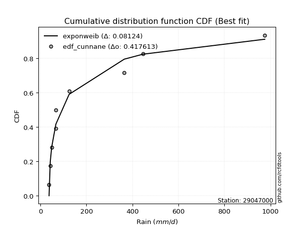</img>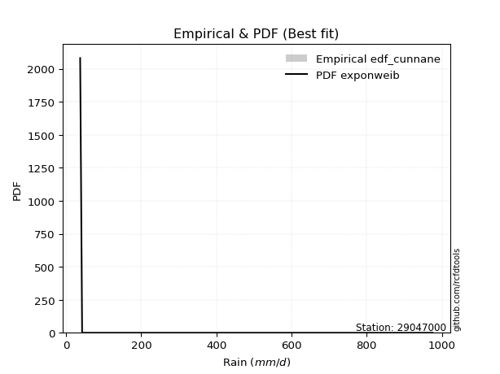</img>

</div>


### 12. EDF Adamowski (1981)

The Adamowski formula in hydrology refers to a specific plotting position formula used for estimating the non-parametric empirical distribution of hydrological events (like flood peaks) to calculate their return periods. This formula provides an alternative to traditional parametric methods (like the Gumbel or Log Pearson Type III distributions). 

<div align="center">


$P=(m-0.25)/(n+0.5)$


</div>


**12.1. Empirical values**

<div align="center">

|                | 0                   | 1                   | 2                  | 3                   | 4             | 5                  | 6                  | 7                  | 8                  |
|:---------------|:--------------------|:--------------------|:-------------------|:--------------------|:--------------|:-------------------|:-------------------|:-------------------|:-------------------|
| date           | 2025                | 2018                | 2017               | 2020                | 2021          | 2019               | 2024               | 2023               | 2022               |
| x              | 37.8                | 43.02               | 49.13              | 66.64               | 68.05         | 125.01             | 364.54             | 446.14             | 975.48             |
| m              | 1                   | 2                   | 3                  | 4                   | 5             | 6                  | 7                  | 8                  | 9                  |
| empirical_dist | edf_adamowski       | edf_adamowski       | edf_adamowski      | edf_adamowski       | edf_adamowski | edf_adamowski      | edf_adamowski      | edf_adamowski      | edf_adamowski      |
| empirical      | 0.07894736842105263 | 0.18421052631578946 | 0.2894736842105263 | 0.39473684210526316 | 0.5           | 0.6052631578947368 | 0.7105263157894737 | 0.8157894736842105 | 0.9210526315789473 |
| empirical_tr   | 1.0857142857142856  | 1.2258064516129032  | 1.4074074074074074 | 1.6521739130434783  | 2.0           | 2.533333333333333  | 3.4545454545454546 | 5.428571428571428  | 12.666666666666663 |

</div>


**12.2. Kolmogorov-Smirnov fit test (sorted by Δ)**


<div align="center">

|                | 0                   | 1                   | 2                   | 3                   | 4                   | 5                   | 6                   | 7                   | 8                   | 9                   | 10                  | 11                  | 12                  | 13                  | 14                  | 15                  | 16                  | 17                  | 18                  | 19                  | 20                  | 21                  | 22                  | 23                  | 24                  | 25                  | 26                  | 27                  | 28                  | 29                  | 30                  | 31                  | 32                  | 33                  | 34                  | 35                  | 36                  | 37                  | 38                  | 39                  | 40                  | 41                  | 42                  | 43                  | 44                  | 45                  | 46                  | 47                  | 48                  | 49                  | 50                  | 51                  | 52                  | 53                  | 54                  | 55                  | 56                  | 57                  | 58                  | 59                  | 60                  | 61                  | 62                  | 63                  | 64                  | 65                  | 66                  | 67                  | 68                  | 69                  | 70                  | 71                  | 72                  | 73                  | 74                  | 75                  | 76                  | 77                  | 78                  | 79                  | 80                  | 81                  | 82                  | 83                  | 84                  | 85                  | 86                  | 87                  | 88                  | 89                  | 90                  | 91                  | 92                  | 93                  | 94                  | 95                  | 96                  | 97                  | 98                  | 99                  | 100                 | 101                 | 102                 | 103                 | 104                 | 105                 | 106                 | 107                 | 108                 | 109                 | 110                 | 111                 | 112                 | 113                 | 114                 | 115                 | 116                 | 117                 | 118                 | 119                 | 120                 | 121                 | 122                 | 123                 | 124                 | 125                 | 126                 | 127                 | 128                 | 129                 | 130                 | 131                 | 132                 | 133                 | 134                 | 135                 | 136                 | 137                 | 138                 | 139                 | 140                 | 141                 | 142                 | 143                 | 144                 | 145                 | 146                 | 147                 | 148                 | 149                 | 150                 | 151                 | 152                 | 153                 | 154                 | 155                 | 156                 | 157                 | 158                 | 159                 |
|:---------------|:--------------------|:--------------------|:--------------------|:--------------------|:--------------------|:--------------------|:--------------------|:--------------------|:--------------------|:--------------------|:--------------------|:--------------------|:--------------------|:--------------------|:--------------------|:--------------------|:--------------------|:--------------------|:--------------------|:--------------------|:--------------------|:--------------------|:--------------------|:--------------------|:--------------------|:--------------------|:--------------------|:--------------------|:--------------------|:--------------------|:--------------------|:--------------------|:--------------------|:--------------------|:--------------------|:--------------------|:--------------------|:--------------------|:--------------------|:--------------------|:--------------------|:--------------------|:--------------------|:--------------------|:--------------------|:--------------------|:--------------------|:--------------------|:--------------------|:--------------------|:--------------------|:--------------------|:--------------------|:--------------------|:--------------------|:--------------------|:--------------------|:--------------------|:--------------------|:--------------------|:--------------------|:--------------------|:--------------------|:--------------------|:--------------------|:--------------------|:--------------------|:--------------------|:--------------------|:--------------------|:--------------------|:--------------------|:--------------------|:--------------------|:--------------------|:--------------------|:--------------------|:--------------------|:--------------------|:--------------------|:--------------------|:--------------------|:--------------------|:--------------------|:--------------------|:--------------------|:--------------------|:--------------------|:--------------------|:--------------------|:--------------------|:--------------------|:--------------------|:--------------------|:--------------------|:--------------------|:--------------------|:--------------------|:--------------------|:--------------------|:--------------------|:--------------------|:--------------------|:--------------------|:--------------------|:--------------------|:--------------------|:--------------------|:--------------------|:--------------------|:--------------------|:--------------------|:--------------------|:--------------------|:--------------------|:--------------------|:--------------------|:--------------------|:--------------------|:--------------------|:--------------------|:--------------------|:--------------------|:--------------------|:--------------------|:--------------------|:--------------------|:--------------------|:--------------------|:--------------------|:--------------------|:--------------------|:--------------------|:--------------------|:--------------------|:--------------------|:--------------------|:--------------------|:--------------------|:--------------------|:--------------------|:--------------------|:--------------------|:--------------------|:--------------------|:--------------------|:--------------------|:--------------------|:--------------------|:--------------------|:--------------------|:--------------------|:--------------------|:--------------------|:--------------------|:--------------------|:--------------------|:--------------------|:--------------------|:--------------------|
| station        | 29047000            | 29047000            | 29047000            | 29047000            | 29047000            | 29047000            | 29047000            | 29047000            | 29047000            | 29047000            | 29047000            | 29047000            | 29047000            | 29047000            | 29047000            | 29047000            | 29047000            | 29047000            | 29047000            | 29047000            | 29047000            | 29047000            | 29047000            | 29047000            | 29047000            | 29047000            | 29047000            | 29047000            | 29047000            | 29047000            | 29047000            | 29047000            | 29047000            | 29047000            | 29047000            | 29047000            | 29047000            | 29047000            | 29047000            | 29047000            | 29047000            | 29047000            | 29047000            | 29047000            | 29047000            | 29047000            | 29047000            | 29047000            | 29047000            | 29047000            | 29047000            | 29047000            | 29047000            | 29047000            | 29047000            | 29047000            | 29047000            | 29047000            | 29047000            | 29047000            | 29047000            | 29047000            | 29047000            | 29047000            | 29047000            | 29047000            | 29047000            | 29047000            | 29047000            | 29047000            | 29047000            | 29047000            | 29047000            | 29047000            | 29047000            | 29047000            | 29047000            | 29047000            | 29047000            | 29047000            | 29047000            | 29047000            | 29047000            | 29047000            | 29047000            | 29047000            | 29047000            | 29047000            | 29047000            | 29047000            | 29047000            | 29047000            | 29047000            | 29047000            | 29047000            | 29047000            | 29047000            | 29047000            | 29047000            | 29047000            | 29047000            | 29047000            | 29047000            | 29047000            | 29047000            | 29047000            | 29047000            | 29047000            | 29047000            | 29047000            | 29047000            | 29047000            | 29047000            | 29047000            | 29047000            | 29047000            | 29047000            | 29047000            | 29047000            | 29047000            | 29047000            | 29047000            | 29047000            | 29047000            | 29047000            | 29047000            | 29047000            | 29047000            | 29047000            | 29047000            | 29047000            | 29047000            | 29047000            | 29047000            | 29047000            | 29047000            | 29047000            | 29047000            | 29047000            | 29047000            | 29047000            | 29047000            | 29047000            | 29047000            | 29047000            | 29047000            | 29047000            | 29047000            | 29047000            | 29047000            | 29047000            | 29047000            | 29047000            | 29047000            | 29047000            | 29047000            | 29047000            | 29047000            | 29047000            | 29047000            |
| empirical_dist | edf_adamowski       | edf_adamowski       | edf_adamowski       | edf_adamowski       | edf_adamowski       | edf_adamowski       | edf_adamowski       | edf_adamowski       | edf_adamowski       | edf_adamowski       | edf_adamowski       | edf_adamowski       | edf_adamowski       | edf_adamowski       | edf_adamowski       | edf_adamowski       | edf_adamowski       | edf_adamowski       | edf_adamowski       | edf_adamowski       | edf_adamowski       | edf_adamowski       | edf_adamowski       | edf_adamowski       | edf_adamowski       | edf_adamowski       | edf_adamowski       | edf_adamowski       | edf_adamowski       | edf_adamowski       | edf_adamowski       | edf_adamowski       | edf_adamowski       | edf_adamowski       | edf_adamowski       | edf_adamowski       | edf_adamowski       | edf_adamowski       | edf_adamowski       | edf_adamowski       | edf_adamowski       | edf_adamowski       | edf_adamowski       | edf_adamowski       | edf_adamowski       | edf_adamowski       | edf_adamowski       | edf_adamowski       | edf_adamowski       | edf_adamowski       | edf_adamowski       | edf_adamowski       | edf_adamowski       | edf_adamowski       | edf_adamowski       | edf_adamowski       | edf_adamowski       | edf_adamowski       | edf_adamowski       | edf_adamowski       | edf_adamowski       | edf_adamowski       | edf_adamowski       | edf_adamowski       | edf_adamowski       | edf_adamowski       | edf_adamowski       | edf_adamowski       | edf_adamowski       | edf_adamowski       | edf_adamowski       | edf_adamowski       | edf_adamowski       | edf_adamowski       | edf_adamowski       | edf_adamowski       | edf_adamowski       | edf_adamowski       | edf_adamowski       | edf_adamowski       | edf_adamowski       | edf_adamowski       | edf_adamowski       | edf_adamowski       | edf_adamowski       | edf_adamowski       | edf_adamowski       | edf_adamowski       | edf_adamowski       | edf_adamowski       | edf_adamowski       | edf_adamowski       | edf_adamowski       | edf_adamowski       | edf_adamowski       | edf_adamowski       | edf_adamowski       | edf_adamowski       | edf_adamowski       | edf_adamowski       | edf_adamowski       | edf_adamowski       | edf_adamowski       | edf_adamowski       | edf_adamowski       | edf_adamowski       | edf_adamowski       | edf_adamowski       | edf_adamowski       | edf_adamowski       | edf_adamowski       | edf_adamowski       | edf_adamowski       | edf_adamowski       | edf_adamowski       | edf_adamowski       | edf_adamowski       | edf_adamowski       | edf_adamowski       | edf_adamowski       | edf_adamowski       | edf_adamowski       | edf_adamowski       | edf_adamowski       | edf_adamowski       | edf_adamowski       | edf_adamowski       | edf_adamowski       | edf_adamowski       | edf_adamowski       | edf_adamowski       | edf_adamowski       | edf_adamowski       | edf_adamowski       | edf_adamowski       | edf_adamowski       | edf_adamowski       | edf_adamowski       | edf_adamowski       | edf_adamowski       | edf_adamowski       | edf_adamowski       | edf_adamowski       | edf_adamowski       | edf_adamowski       | edf_adamowski       | edf_adamowski       | edf_adamowski       | edf_adamowski       | edf_adamowski       | edf_adamowski       | edf_adamowski       | edf_adamowski       | edf_adamowski       | edf_adamowski       | edf_adamowski       | edf_adamowski       | edf_adamowski       | edf_adamowski       | edf_adamowski       |
| p_dist         | logweibull_min      | logbeta             | exponweib           | mielke              | logalpha            | invweibull          | fatiguelife         | logf                | truncweibull_min    | gausshyper          | logexponweib        | invgamma            | f                   | logmielke           | logburr             | loggenextreme       | loginvweibull       | logburr12           | lomax               | loggausshyper       | halfgennorm         | loghalfgennorm      | loginvgamma         | logncf              | logfatiguelife      | lognct              | loghalfnorm         | logexponpow         | burr12              | loglomax            | loggenexpon         | loghalflogistic     | logexponnorm        | logjohnsonsb        | loginvgauss         | logdweibull         | erlang              | truncpareto         | logtruncnorm        | logfoldnorm         | logarcsine          | exponpow            | ncf                 | nct                 | gengamma            | invgauss            | loggamma            | loggamma            | burr                | nakagami            | logdgamma           | logmoyal            | lograyleigh         | logsemicircular     | loggenlogistic      | loggengamma         | loggumbel_r         | loggenhalflogistic  | logmaxwell          | logpearson3         | loganglit           | betaprime           | genpareto           | logkstwobign        | logbetaprime        | moyal               | vonmises_line       | pearson3            | logrdist            | alpha               | weibull_min         | dgamma              | logloggamma         | halflogistic        | logjohnsonsu        | logcrystalball      | lognorm             | logt                | logloglaplace       | logwrapcauchy       | gamma               | loggennorm          | logtruncweibull_min | gumbel_r            | rayleigh            | wald                | logskewnorm         | halfnorm            | gennorm             | logweibull_max      | logrice             | maxwell             | loglogistic         | lognakagami         | semicircular        | logerlang           | logcosine           | foldnorm            | anglit              | loghypsecant        | loggompertz         | logtruncexpon       | genlogistic         | t                   | logwald             | logtukeylambda      | loggumbel_l         | norm                | arcsine             | logbradford         | logksone            | loglaplace          | loglaplace          | kstwobign           | powerlaw            | logistic            | logargus            | genextreme          | hypsecant           | logtriang           | logkappa4           | rice                | loggenpareto        | cosine              | beta                | gumbel_l            | laplace             | loguniform          | logkappa3           | wrapcauchy          | logvonmises_line    | loglevy_l           | johnsonsb           | logpowerlaw         | truncexpon          | exponnorm           | gompertz            | genexpon            | argus               | triang              | dweibull            | truncnorm           | levy_l              | bradford            | skewnorm            | ksone               | logtrapezoid        | crystalball         | kappa3              | rdist               | kappa4              | logtruncpareto      | tukeylambda         | genhalflogistic     | uniform             | johnsonsu           | trapezoid           | weibull_max         | logvonmises         | vonmises            |
| delta          | 0.08076812804574351 | 0.08270117086254644 | 0.08443929004495465 | 0.09608483774863086 | 0.097135428669892   | 0.10257693237077792 | 0.10445657690503973 | 0.10591161849938491 | 0.11425223392537215 | 0.11495380356724327 | 0.11565306916529516 | 0.12261611481750423 | 0.1226165393903138  | 0.12727189375350234 | 0.12861556414521724 | 0.128629048884233   | 0.12864412112004764 | 0.13202873419697914 | 0.1328438455632328  | 0.13291163606330902 | 0.13314021052740876 | 0.13493897675268862 | 0.13555629209343945 | 0.1357873994312897  | 0.13602845288324605 | 0.13719063460574588 | 0.13739133229605777 | 0.1378884745515564  | 0.1383854373626937  | 0.1391737885764165  | 0.14014357091888863 | 0.1404602613589469  | 0.1420019496588243  | 0.14247107722169594 | 0.1427854622588145  | 0.14343641165712107 | 0.14423649528979354 | 0.14468651831506507 | 0.14673597431395202 | 0.14762921189999162 | 0.14827222513697513 | 0.1520232936200122  | 0.15363348536104682 | 0.15603258316167135 | 0.15936296620522927 | 0.16203783729973853 | 0.16386260248864815 | 0.16386260248864815 | 0.16481121322565562 | 0.16588877224248869 | 0.1659200044214515  | 0.1664752102618613  | 0.16791644330570077 | 0.1702928396840787  | 0.17297501461052694 | 0.17514244275809288 | 0.17525387104601375 | 0.17542427321744014 | 0.1787438951740103  | 0.18046840451655294 | 0.18096370264746736 | 0.1815730990580251  | 0.18243305679503885 | 0.18610540079763266 | 0.18943488256437113 | 0.19376797550626668 | 0.19415056774468772 | 0.19481293507968003 | 0.1975367541497629  | 0.20047095247794888 | 0.2013828373333308  | 0.20245945960368528 | 0.20275119082994025 | 0.2031952184861379  | 0.20554759234185876 | 0.20598337156041646 | 0.20598338111395975 | 0.20598365074732428 | 0.20684193716011112 | 0.20763380222662464 | 0.20827935791799912 | 0.20865000827383273 | 0.2104961087385812  | 0.21123356838593121 | 0.2149429014990788  | 0.21650978906560775 | 0.21869027363800786 | 0.2188465528478842  | 0.22110108246804072 | 0.22166586374623032 | 0.22358829819762926 | 0.2269652826815835  | 0.227606749959685   | 0.22790424090251887 | 0.23004343173310776 | 0.2325125557835832  | 0.23591148772729115 | 0.23750512190986708 | 0.23851516101140358 | 0.24306301230395233 | 0.24485343377718932 | 0.24820288422195586 | 0.25046394295844    | 0.2531012279389139  | 0.2534488510221092  | 0.2546737694594654  | 0.25557040480584325 | 0.2586880909135144  | 0.2589848720764245  | 0.2620926549667167  | 0.26594323387937635 | 0.26758022060567105 | 0.26758022060567105 | 0.27550772348846325 | 0.2760358891701401  | 0.2769216335666136  | 0.2786162847209782  | 0.2819332370503691  | 0.2910152792173099  | 0.29184620947389117 | 0.29964506766679666 | 0.30469971606683266 | 0.3138824188470587  | 0.3148084047958781  | 0.3167018601835503  | 0.31811587301590666 | 0.3190941830989146  | 0.31913188065525167 | 0.32044190311470644 | 0.3206416983462204  | 0.32669520625329956 | 0.3389967797679103  | 0.3408840668431131  | 0.35771011899463756 | 0.35869366850602663 | 0.36090739668888305 | 0.3621430171792478  | 0.3626356045695054  | 0.3685612790681486  | 0.3920884650475468  | 0.39606787201575133 | 0.40230040146492574 | 0.4097010312343703  | 0.4160800623166875  | 0.43291560983815125 | 0.44442470554425484 | 0.4531918975959759  | 0.45494310026592877 | 0.4633869084224837  | 0.48459956604543175 | 0.4912641225717752  | 0.5004332013900014  | 0.5103535010172728  | 0.511353916370653   | 0.5122570150741583  | 0.5578915442007384  | 0.6144402528285267  | 0.747921596743206   | 1.1600234814819599  | 155.0455858691762   |
| deltao         | 0.41761268023100007 | 0.41761268023100007 | 0.41761268023100007 | 0.41761268023100007 | 0.41761268023100007 | 0.41761268023100007 | 0.41761268023100007 | 0.41761268023100007 | 0.41761268023100007 | 0.41761268023100007 | 0.41761268023100007 | 0.41761268023100007 | 0.41761268023100007 | 0.41761268023100007 | 0.41761268023100007 | 0.41761268023100007 | 0.41761268023100007 | 0.41761268023100007 | 0.41761268023100007 | 0.41761268023100007 | 0.41761268023100007 | 0.41761268023100007 | 0.41761268023100007 | 0.41761268023100007 | 0.41761268023100007 | 0.41761268023100007 | 0.41761268023100007 | 0.41761268023100007 | 0.41761268023100007 | 0.41761268023100007 | 0.41761268023100007 | 0.41761268023100007 | 0.41761268023100007 | 0.41761268023100007 | 0.41761268023100007 | 0.41761268023100007 | 0.41761268023100007 | 0.41761268023100007 | 0.41761268023100007 | 0.41761268023100007 | 0.41761268023100007 | 0.41761268023100007 | 0.41761268023100007 | 0.41761268023100007 | 0.41761268023100007 | 0.41761268023100007 | 0.41761268023100007 | 0.41761268023100007 | 0.41761268023100007 | 0.41761268023100007 | 0.41761268023100007 | 0.41761268023100007 | 0.41761268023100007 | 0.41761268023100007 | 0.41761268023100007 | 0.41761268023100007 | 0.41761268023100007 | 0.41761268023100007 | 0.41761268023100007 | 0.41761268023100007 | 0.41761268023100007 | 0.41761268023100007 | 0.41761268023100007 | 0.41761268023100007 | 0.41761268023100007 | 0.41761268023100007 | 0.41761268023100007 | 0.41761268023100007 | 0.41761268023100007 | 0.41761268023100007 | 0.41761268023100007 | 0.41761268023100007 | 0.41761268023100007 | 0.41761268023100007 | 0.41761268023100007 | 0.41761268023100007 | 0.41761268023100007 | 0.41761268023100007 | 0.41761268023100007 | 0.41761268023100007 | 0.41761268023100007 | 0.41761268023100007 | 0.41761268023100007 | 0.41761268023100007 | 0.41761268023100007 | 0.41761268023100007 | 0.41761268023100007 | 0.41761268023100007 | 0.41761268023100007 | 0.41761268023100007 | 0.41761268023100007 | 0.41761268023100007 | 0.41761268023100007 | 0.41761268023100007 | 0.41761268023100007 | 0.41761268023100007 | 0.41761268023100007 | 0.41761268023100007 | 0.41761268023100007 | 0.41761268023100007 | 0.41761268023100007 | 0.41761268023100007 | 0.41761268023100007 | 0.41761268023100007 | 0.41761268023100007 | 0.41761268023100007 | 0.41761268023100007 | 0.41761268023100007 | 0.41761268023100007 | 0.41761268023100007 | 0.41761268023100007 | 0.41761268023100007 | 0.41761268023100007 | 0.41761268023100007 | 0.41761268023100007 | 0.41761268023100007 | 0.41761268023100007 | 0.41761268023100007 | 0.41761268023100007 | 0.41761268023100007 | 0.41761268023100007 | 0.41761268023100007 | 0.41761268023100007 | 0.41761268023100007 | 0.41761268023100007 | 0.41761268023100007 | 0.41761268023100007 | 0.41761268023100007 | 0.41761268023100007 | 0.41761268023100007 | 0.41761268023100007 | 0.41761268023100007 | 0.41761268023100007 | 0.41761268023100007 | 0.41761268023100007 | 0.41761268023100007 | 0.41761268023100007 | 0.41761268023100007 | 0.41761268023100007 | 0.41761268023100007 | 0.41761268023100007 | 0.41761268023100007 | 0.41761268023100007 | 0.41761268023100007 | 0.41761268023100007 | 0.41761268023100007 | 0.41761268023100007 | 0.41761268023100007 | 0.41761268023100007 | 0.41761268023100007 | 0.41761268023100007 | 0.41761268023100007 | 0.41761268023100007 | 0.41761268023100007 | 0.41761268023100007 | 0.41761268023100007 | 0.41761268023100007 | 0.41761268023100007 | 0.41761268023100007 | 0.41761268023100007 |
| eval           | Δo > Δ              | Δo > Δ              | Δo > Δ              | Δo > Δ              | Δo > Δ              | Δo > Δ              | Δo > Δ              | Δo > Δ              | Δo > Δ              | Δo > Δ              | Δo > Δ              | Δo > Δ              | Δo > Δ              | Δo > Δ              | Δo > Δ              | Δo > Δ              | Δo > Δ              | Δo > Δ              | Δo > Δ              | Δo > Δ              | Δo > Δ              | Δo > Δ              | Δo > Δ              | Δo > Δ              | Δo > Δ              | Δo > Δ              | Δo > Δ              | Δo > Δ              | Δo > Δ              | Δo > Δ              | Δo > Δ              | Δo > Δ              | Δo > Δ              | Δo > Δ              | Δo > Δ              | Δo > Δ              | Δo > Δ              | Δo > Δ              | Δo > Δ              | Δo > Δ              | Δo > Δ              | Δo > Δ              | Δo > Δ              | Δo > Δ              | Δo > Δ              | Δo > Δ              | Δo > Δ              | Δo > Δ              | Δo > Δ              | Δo > Δ              | Δo > Δ              | Δo > Δ              | Δo > Δ              | Δo > Δ              | Δo > Δ              | Δo > Δ              | Δo > Δ              | Δo > Δ              | Δo > Δ              | Δo > Δ              | Δo > Δ              | Δo > Δ              | Δo > Δ              | Δo > Δ              | Δo > Δ              | Δo > Δ              | Δo > Δ              | Δo > Δ              | Δo > Δ              | Δo > Δ              | Δo > Δ              | Δo > Δ              | Δo > Δ              | Δo > Δ              | Δo > Δ              | Δo > Δ              | Δo > Δ              | Δo > Δ              | Δo > Δ              | Δo > Δ              | Δo > Δ              | Δo > Δ              | Δo > Δ              | Δo > Δ              | Δo > Δ              | Δo > Δ              | Δo > Δ              | Δo > Δ              | Δo > Δ              | Δo > Δ              | Δo > Δ              | Δo > Δ              | Δo > Δ              | Δo > Δ              | Δo > Δ              | Δo > Δ              | Δo > Δ              | Δo > Δ              | Δo > Δ              | Δo > Δ              | Δo > Δ              | Δo > Δ              | Δo > Δ              | Δo > Δ              | Δo > Δ              | Δo > Δ              | Δo > Δ              | Δo > Δ              | Δo > Δ              | Δo > Δ              | Δo > Δ              | Δo > Δ              | Δo > Δ              | Δo > Δ              | Δo > Δ              | Δo > Δ              | Δo > Δ              | Δo > Δ              | Δo > Δ              | Δo > Δ              | Δo > Δ              | Δo > Δ              | Δo > Δ              | Δo > Δ              | Δo > Δ              | Δo > Δ              | Δo > Δ              | Δo > Δ              | Δo > Δ              | Δo > Δ              | Δo > Δ              | Δo > Δ              | Δo > Δ              | Δo > Δ              | Δo > Δ              | Δo > Δ              | Δo > Δ              | Δo > Δ              | Δo > Δ              | Δo > Δ              | Δo > Δ              | Δo > Δ              | Δo > Δ              | Δo > Δ              | Δo <= Δ             | Δo <= Δ             | Δo <= Δ             | Δo <= Δ             | Δo <= Δ             | Δo <= Δ             | Δo <= Δ             | Δo <= Δ             | Δo <= Δ             | Δo <= Δ             | Δo <= Δ             | Δo <= Δ             | Δo <= Δ             | Δo <= Δ             | Δo <= Δ             | Δo <= Δ             |
| fit            | 1                   | 1                   | 1                   | 1                   | 1                   | 1                   | 1                   | 1                   | 1                   | 1                   | 1                   | 1                   | 1                   | 1                   | 1                   | 1                   | 1                   | 1                   | 1                   | 1                   | 1                   | 1                   | 1                   | 1                   | 1                   | 1                   | 1                   | 1                   | 1                   | 1                   | 1                   | 1                   | 1                   | 1                   | 1                   | 1                   | 1                   | 1                   | 1                   | 1                   | 1                   | 1                   | 1                   | 1                   | 1                   | 1                   | 1                   | 1                   | 1                   | 1                   | 1                   | 1                   | 1                   | 1                   | 1                   | 1                   | 1                   | 1                   | 1                   | 1                   | 1                   | 1                   | 1                   | 1                   | 1                   | 1                   | 1                   | 1                   | 1                   | 1                   | 1                   | 1                   | 1                   | 1                   | 1                   | 1                   | 1                   | 1                   | 1                   | 1                   | 1                   | 1                   | 1                   | 1                   | 1                   | 1                   | 1                   | 1                   | 1                   | 1                   | 1                   | 1                   | 1                   | 1                   | 1                   | 1                   | 1                   | 1                   | 1                   | 1                   | 1                   | 1                   | 1                   | 1                   | 1                   | 1                   | 1                   | 1                   | 1                   | 1                   | 1                   | 1                   | 1                   | 1                   | 1                   | 1                   | 1                   | 1                   | 1                   | 1                   | 1                   | 1                   | 1                   | 1                   | 1                   | 1                   | 1                   | 1                   | 1                   | 1                   | 1                   | 1                   | 1                   | 1                   | 1                   | 1                   | 1                   | 1                   | 1                   | 1                   | 1                   | 1                   | 1                   | 1                   | 0                   | 0                   | 0                   | 0                   | 0                   | 0                   | 0                   | 0                   | 0                   | 0                   | 0                   | 0                   | 0                   | 0                   | 0                   | 0                   |
| n              | 9                   | 9                   | 9                   | 9                   | 9                   | 9                   | 9                   | 9                   | 9                   | 9                   | 9                   | 9                   | 9                   | 9                   | 9                   | 9                   | 9                   | 9                   | 9                   | 9                   | 9                   | 9                   | 9                   | 9                   | 9                   | 9                   | 9                   | 9                   | 9                   | 9                   | 9                   | 9                   | 9                   | 9                   | 9                   | 9                   | 9                   | 9                   | 9                   | 9                   | 9                   | 9                   | 9                   | 9                   | 9                   | 9                   | 9                   | 9                   | 9                   | 9                   | 9                   | 9                   | 9                   | 9                   | 9                   | 9                   | 9                   | 9                   | 9                   | 9                   | 9                   | 9                   | 9                   | 9                   | 9                   | 9                   | 9                   | 9                   | 9                   | 9                   | 9                   | 9                   | 9                   | 9                   | 9                   | 9                   | 9                   | 9                   | 9                   | 9                   | 9                   | 9                   | 9                   | 9                   | 9                   | 9                   | 9                   | 9                   | 9                   | 9                   | 9                   | 9                   | 9                   | 9                   | 9                   | 9                   | 9                   | 9                   | 9                   | 9                   | 9                   | 9                   | 9                   | 9                   | 9                   | 9                   | 9                   | 9                   | 9                   | 9                   | 9                   | 9                   | 9                   | 9                   | 9                   | 9                   | 9                   | 9                   | 9                   | 9                   | 9                   | 9                   | 9                   | 9                   | 9                   | 9                   | 9                   | 9                   | 9                   | 9                   | 9                   | 9                   | 9                   | 9                   | 9                   | 9                   | 9                   | 9                   | 9                   | 9                   | 9                   | 9                   | 9                   | 9                   | 9                   | 9                   | 9                   | 9                   | 9                   | 9                   | 9                   | 9                   | 9                   | 9                   | 9                   | 9                   | 9                   | 9                   | 9                   | 9                   |
| best_fit       | 1                   | 0                   | 0                   | 0                   | 0                   | 0                   | 0                   | 0                   | 0                   | 0                   | 0                   | 0                   | 0                   | 0                   | 0                   | 0                   | 0                   | 0                   | 0                   | 0                   | 0                   | 0                   | 0                   | 0                   | 0                   | 0                   | 0                   | 0                   | 0                   | 0                   | 0                   | 0                   | 0                   | 0                   | 0                   | 0                   | 0                   | 0                   | 0                   | 0                   | 0                   | 0                   | 0                   | 0                   | 0                   | 0                   | 0                   | 0                   | 0                   | 0                   | 0                   | 0                   | 0                   | 0                   | 0                   | 0                   | 0                   | 0                   | 0                   | 0                   | 0                   | 0                   | 0                   | 0                   | 0                   | 0                   | 0                   | 0                   | 0                   | 0                   | 0                   | 0                   | 0                   | 0                   | 0                   | 0                   | 0                   | 0                   | 0                   | 0                   | 0                   | 0                   | 0                   | 0                   | 0                   | 0                   | 0                   | 0                   | 0                   | 0                   | 0                   | 0                   | 0                   | 0                   | 0                   | 0                   | 0                   | 0                   | 0                   | 0                   | 0                   | 0                   | 0                   | 0                   | 0                   | 0                   | 0                   | 0                   | 0                   | 0                   | 0                   | 0                   | 0                   | 0                   | 0                   | 0                   | 0                   | 0                   | 0                   | 0                   | 0                   | 0                   | 0                   | 0                   | 0                   | 0                   | 0                   | 0                   | 0                   | 0                   | 0                   | 0                   | 0                   | 0                   | 0                   | 0                   | 0                   | 0                   | 0                   | 0                   | 0                   | 0                   | 0                   | 0                   | 0                   | 0                   | 0                   | 0                   | 0                   | 0                   | 0                   | 0                   | 0                   | 0                   | 0                   | 0                   | 0                   | 0                   | 0                   | 0                   |
| best_fit_sort  | 1                   | 2                   | 3                   | 4                   | 5                   | 6                   | 7                   | 8                   | 9                   | 10                  | 11                  | 12                  | 13                  | 14                  | 15                  | 16                  | 17                  | 18                  | 19                  | 20                  | 21                  | 22                  | 23                  | 24                  | 25                  | 26                  | 27                  | 28                  | 29                  | 30                  | 31                  | 32                  | 33                  | 34                  | 35                  | 36                  | 37                  | 38                  | 39                  | 40                  | 41                  | 42                  | 43                  | 44                  | 45                  | 46                  | 47                  | 48                  | 49                  | 50                  | 51                  | 52                  | 53                  | 54                  | 55                  | 56                  | 57                  | 58                  | 59                  | 60                  | 61                  | 62                  | 63                  | 64                  | 65                  | 66                  | 67                  | 68                  | 69                  | 70                  | 71                  | 72                  | 73                  | 74                  | 75                  | 76                  | 77                  | 78                  | 79                  | 80                  | 81                  | 82                  | 83                  | 84                  | 85                  | 86                  | 87                  | 88                  | 89                  | 90                  | 91                  | 92                  | 93                  | 94                  | 95                  | 96                  | 97                  | 98                  | 99                  | 100                 | 101                 | 102                 | 103                 | 104                 | 105                 | 106                 | 107                 | 108                 | 109                 | 110                 | 111                 | 112                 | 113                 | 114                 | 115                 | 116                 | 117                 | 118                 | 119                 | 120                 | 121                 | 122                 | 123                 | 124                 | 125                 | 126                 | 127                 | 128                 | 129                 | 130                 | 131                 | 132                 | 133                 | 134                 | 135                 | 136                 | 137                 | 138                 | 139                 | 140                 | 141                 | 142                 | 143                 | 144                 | 145                 | 146                 | 147                 | 148                 | 149                 | 150                 | 151                 | 152                 | 153                 | 154                 | 155                 | 156                 | 157                 | 158                 | 159                 | 160                 |

</div>


**12.3. Best fit**

<div align="center">

|   id |   station | empirical_dist   | p_dist         |     delta |   deltao | eval   |   fit |   n |   best_fit |   best_fit_sort |
|-----:|----------:|:-----------------|:---------------|----------:|---------:|:-------|------:|----:|-----------:|----------------:|
|    0 |  29047000 | edf_adamowski    | logweibull_min | 0.0807681 | 0.417613 | Δo > Δ |     1 |   9 |          1 |               1 |

</div>


<div align="center">

</img>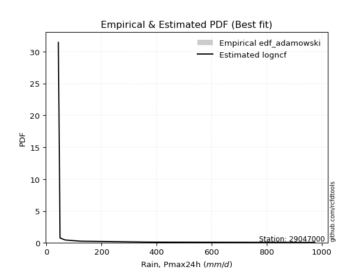</img>

</div>


## C. Best fit & Estimate extreme values for specific return periods - Tr

Best fit in probability distribution analysis means finding the theoretical distribution (like Normal, Poisson, Exponential, etc.) that most accurately mirrors your real-world data´s patterns (shape, center, spread) for better predictions, using methods like visual checks (Q-Q plots), goodness-of-fit tests (Kolmogorov-Smirnov, Chi-Squared), and information criteria (AIC) to score and select the simplest, most representative model.


### 1. Best fit (ordered by delta Δ)

:file_folder:Table: [bestfit_29047000.csv](table/bestfit_29047000.csv)

<div align="center">

|   id |   station | empirical_dist   | p_dist         |     delta |   deltao | eval   |   fit |   n |   best_fit |   best_fit_sort |
|-----:|----------:|:-----------------|:---------------|----------:|---------:|:-------|------:|----:|-----------:|----------------:|
|    0 |  29047000 | edf_adamowski    | logweibull_min | 0.0807681 | 0.417613 | Δo > Δ |     1 |   9 |          1 |               1 |
|    1 |  29047000 | edf_jenkinson    | logweibull_min | 0.0807681 | 0.417613 | Δo > Δ |     1 |   9 |          1 |               2 |
|    2 |  29047000 | edf_filliben     | logweibull_min | 0.0807681 | 0.417613 | Δo > Δ |     1 |   9 |          1 |               3 |
|    3 |  29047000 | edf_tukey        | logweibull_min | 0.0807681 | 0.417613 | Δo > Δ |     1 |   9 |          1 |               4 |
|    4 |  29047000 | edf_chegodayev   | logweibull_min | 0.0807681 | 0.417613 | Δo > Δ |     1 |   9 |          1 |               5 |
|    5 |  29047000 | edf_beard        | logweibull_min | 0.0807681 | 0.417613 | Δo > Δ |     1 |   9 |          1 |               6 |
|    6 |  29047000 | edf_gringorten   | exponweib      | 0.0812404 | 0.417613 | Δo > Δ |     1 |   9 |          1 |               7 |
|    7 |  29047000 | edf_cunnane      | exponweib      | 0.0812404 | 0.417613 | Δo > Δ |     1 |   9 |          1 |               8 |
|    8 |  29047000 | edf_blom         | exponweib      | 0.0812404 | 0.417613 | Δo > Δ |     1 |   9 |          1 |               9 |
|    9 |  29047000 | edf_hazen        | exponweib      | 0.0812404 | 0.417613 | Δo > Δ |     1 |   9 |          1 |              10 |
|   10 |  29047000 | edf_california   | logfatiguelife | 0.0864034 | 0.417613 | Δo > Δ |     1 |   9 |          1 |              11 |
|   11 |  29047000 | edf_weibull      | logbeta        | 0.0999941 | 0.417613 | Δo > Δ |     1 |   9 |          1 |              12 |

</div>


### 2. Extreme values and % difference analysis

In hydrology, a return period (or recurrence interval $Tr$) is the statistical average time between extreme events like floods or droughts of a specific magnitude, indicating how rare an event is, with a 100-year flood, for example, having a 1% chance of occurring in any given year, not that it happens exactly every century. It is a key tool for infrastructure design (like bridges or dams) and risk assessment, calculated from historical data to determine the probability of future events, although it is important to remember it is statistical average, and events can cluster or be missed.

The extreme value porcentage difference is evaluated as $pdiff = 1 - (ETrBf / ETr) * 100$, where _ETrBf_ correspond to the bestfit extreme value for a specific recurrence interval and _ETr_ correspond to the extreme value for one of the most used PDFsused in hydrology.

> risk_rate: assuming the return period as the project useful life.

:file_folder:Table: [extreme_29047000.csv](table/extreme_29047000.csv), all PDFs.  
:file_folder:Table: [extremepdiff_29047000.csv](table/extremepdiff_29047000.csv), % difference between bestfit and most used PDFs in Hydrology.

<div align="center">

Extreme values table for only best fit PDFs
|   id |      tr |   prob_l |     prob_g |      alpha |   anglit |   arcsine |    argus |     beta |   betaprime |   bradford |       burr |   burr12 |   cosine |   crystalball |   dgamma |   dweibull |    erlang |   exponnorm |   exponpow |   exponweib |                f |   fatiguelife |   foldnorm |     gamma |   gausshyper |   genexpon |       genextreme |   gengamma |   genhalflogistic |   genlogistic |   gennorm |   genpareto |   gompertz |   gumbel_l |   gumbel_r |   halfgennorm |   halflogistic |   halfnorm |   hypsecant |         invgamma |   invgauss |       invweibull |   johnsonsb |        johnsonsu |          kappa3 |   kappa4 |    ksone |   kstwobign |   laplace |    levy_l |    loggamma |   logistic |   loglaplace |            lomax |   maxwell |    mielke |    moyal |   nakagami |       ncf |        nct |     norm |   pearson3 |   powerlaw |   rayleigh |    rdist |     rice |   semicircular |   skewnorm |                t |   trapezoid |   triang |   truncexpon |   truncnorm |   truncpareto |   truncweibull_min |   tukeylambda |   uniform |   vonmises |   vonmises_line |     wald |   weibull_max |   weibull_min |   wrapcauchy |          logalpha |   loganglit |   logarcsine |   logargus |   logbeta |    logbetaprime |   logbradford |         logburr |   logburr12 |   logcosine |   logcrystalball |   logdgamma |   logdweibull |   logerlang |   logexponnorm |   logexponpow |     logexponweib |             logf |   logfatiguelife |   logfoldnorm |   loggausshyper |   loggenexpon |   loggenextreme |   loggengamma |   loggenhalflogistic |   loggenlogistic |       loggennorm |   loggenpareto |   loggompertz |   loggumbel_l |   loggumbel_r |   loghalfgennorm |   loghalflogistic |   loghalfnorm |   loghypsecant |      loginvgamma |      loginvgauss |   loginvweibull |   logjohnsonsb |   logjohnsonsu |   logkappa3 |   logkappa4 |   logksone |   logkstwobign |   loglevy_l |   logloggamma |   loglogistic |   logloglaplace |    loglomax |   logmaxwell |       logmielke |   logmoyal |   lognakagami |           logncf |           lognct |   lognorm |   logpearson3 |   logpowerlaw |   lograyleigh |   logrdist |   logrice |   logsemicircular |   logskewnorm |     logt |   logtrapezoid |   logtriang |   logtruncexpon |   logtruncnorm |   logtruncpareto |   logtruncweibull_min |   logtukeylambda |   loguniform |   logvonmises |   logvonmises_line |     logwald |   logweibull_max |   logweibull_min |   logwrapcauchy |   station |   n |   risk_rate |
|-----:|--------:|---------:|-----------:|-----------:|---------:|----------:|---------:|---------:|------------:|-----------:|-----------:|---------:|---------:|--------------:|---------:|-----------:|----------:|------------:|-----------:|------------:|-----------------:|--------------:|-----------:|----------:|-------------:|-----------:|-----------------:|-----------:|------------------:|--------------:|----------:|------------:|-----------:|-----------:|-----------:|--------------:|---------------:|-----------:|------------:|-----------------:|-----------:|-----------------:|------------:|-----------------:|----------------:|---------:|---------:|------------:|----------:|----------:|------------:|-----------:|-------------:|-----------------:|----------:|----------:|---------:|-----------:|----------:|-----------:|---------:|-----------:|-----------:|-----------:|---------:|---------:|---------------:|-----------:|-----------------:|------------:|---------:|-------------:|------------:|--------------:|-------------------:|--------------:|----------:|-----------:|----------------:|---------:|--------------:|--------------:|-------------:|------------------:|------------:|-------------:|-----------:|----------:|----------------:|--------------:|----------------:|------------:|------------:|-----------------:|------------:|--------------:|------------:|---------------:|--------------:|-----------------:|-----------------:|-----------------:|--------------:|----------------:|--------------:|----------------:|--------------:|---------------------:|-----------------:|-----------------:|---------------:|--------------:|--------------:|--------------:|-----------------:|------------------:|--------------:|---------------:|-----------------:|-----------------:|----------------:|---------------:|---------------:|------------:|------------:|-----------:|---------------:|------------:|--------------:|--------------:|----------------:|------------:|-------------:|----------------:|-----------:|--------------:|-----------------:|-----------------:|----------:|--------------:|--------------:|--------------:|-----------:|----------:|------------------:|--------------:|---------:|---------------:|------------:|----------------:|---------------:|-----------------:|----------------------:|-----------------:|-------------:|--------------:|-------------------:|------------:|-----------------:|-----------------:|----------------:|----------:|----:|------------:|
|    0 |    2    | 0.5      | 0.5        |    75.2315 |  241.757 |   241.757 |  430.117 |  360.305 |     105.964 |    308.681 |    96.3489 |  85.9597 |  313.619 |       3.57552 |  251.007 |     43.02  |   92.8403 |     178.675 |     84.465 |     88.2768 |     71.3653      |       76.7494 |    175.841 |   63.6688 |      86.9957 |    179.704 |     49.3141      |    107.865 |           643.615 |       183.919 |   68.05   |     86.8128 |    179.155 |    290.364 |    193.149 |       81.2082 |        168.984 |    181.192 |     241.757 |     71.3656      |    71.5486 |     72.422       |     568.507 |     37.8071      |  3172.28        |  482.005 |  506.64  |     215.278 |   241.757 |   91.1255 |     64.1636 |    241.757 |      124.498 |     73.8458      |   216.452 |   100.28  |  177.457 |     72.135 |   109.314 |    95.8204 |  241.757 |    167.124 |    46.8856 |    207.477 | -58.0227 |  247.045 |        241.757 |    280.186 |     54.0881      |     736.881 |  514.684 |      317.551 |     241.743 |       99.7381 |            97.5078 |      -53.1861 |   506.64  |  -0.524483 |         174.725 |  145.847 |       975.266 |       133.401 |      507.047 |     70.6865       |     124.498 |      124.498 |    185.652 |   88.4981 |    61.2709      |       146.463 |    73.1659      |     74.0451 |     138.776 |          124.498 |     101.369 |       107.518 |     58.3552 |        85.8143 |       105.041 |     66.4212      |     69.7947      |     68.4893      |       106.141 |          90.494 |       86.7991 |    73.5389      |       70.1424 |              100.89  |          100.651 |     66.64        |        86.3741 |       133.933 |       149.528 |       103.657 |          85.3442 |           94.6339 |       99.0896 |        124.498 |     74.6782      |     72.4164      |    73.5319      |        93.8162 |        124.497 |     194.314 |     185.54  |    192.024 |        104.908 |     120.245 |       124.672 |       124.498 |         68.0499 |     85.3424 |      113.173 |    73.4484      |    97.7047 |       136.37  |     74.644       |     76.4282      |   124.498 |       110.789 |       41.1403 |       109.409 |    130.763 |   119.39  |           124.498 |       113.66  |  124.5   |        430.734 |     198.75  |         135.565 |        94.1333 |          38.5215 |               121.304 |          129.804 |      192.024 |      0.184459 |            206.137 |     86.7303 |          226.818 |     85.8945      |         192.024 |  29047000 |   9 |    0.75     |
|    1 |    2.33 | 0.570815 | 0.429185   |    86.1445 |  303.258 |   334.08  |  502.804 |  469.021 |     127.462 |    370.762 |   114.129  | 103.364  |  375.183 |      75.3821  |  359.907 |     62.375 |  117.956  |     209.767 |    107.73  |    115.328  |     85.9442      |      102.446  |    235.896 |   78.4409 |     114.956  |    210.969 |    103.471       |    134.462 |           705.285 |       219.299 |   71.4108 |    101.738  |    210.299 |    336.299 |    242.073 |      101.303  |        219.286 |    238.175 |     284.011 |     85.9446      |    84.7542 |     89.5666      |     842.436 |     37.8434      | 26112           |  552.087 |  586.323 |     256.459 |   273.708 |  355.929  |     75.9185 |    288.276 |      140.43  |     88.7334      |   271.306 |   119.432 |  223.77  |    106.983 |   135.9   |   114.259  |  294.555 |    215.741 |    59.8375 |    263.143 |  48.6127 |  292.37  |        307.717 |    321.907 |     59.4278      |     791.361 |  591.566 |      381.807 |     286.666 |      124.925  |           127.24   |       18.9758 |   573.042 |  -0.353373 |         214.64  |  180.468 |       975.417 |       172.383 |      882.168 |     84.2827       |     156.974 |      176.309 |    232.191 |  129.617  |    69.5133      |       184.593 |    85.8827      |     88.1753 |     170.224 |          151.909 |     145.449 |       154.271 |     65.6346 |       102.833  |       138.651 |     81.2994      |     86.0639      |     81.7038      |       133.016 |         112.729 |      104.153  |    86.3558      |       82.1349 |              121.295 |          119.746 |     70.2849      |       142.321  |       168.802 |       177.791 |       124.646 |         102.682  |          114.388  |      122.829  |        145.99  |     87.6108      |     85.3005      |    86.3462      |       175.102  |        151.979 |     245.023 |     236.56  |    253.117 |        125.557 |     225.222 |       152.643 |       148.356 |         76.8504 |    102.343  |      139.164 |    86.3064      |   116.338  |       176.643 |     87.5566      |     89.5318      |   151.909 |       135.163 |       44.8056 |       134.948 |    166.691 |   143.761 |           159.634 |       137.374 |  151.912 |        520.271 |     244.424 |         169.416 |       113.343  |          39.3259 |               151.97  |          155.472 |      241.728 |      0.223439 |            262.113 |     98.8187 |          304.071 |    111.137       |         355.871 |  29047000 |   9 |    0.729209 |
|    2 |    5    | 0.8      | 0.2        |   170.765  |  520.247 |   580.272 |  735.944 |  847.74  |     280.09  |    635.714 |   239.695  | 259.842  |  597.041 |     342.235   |  499.126 |    209.31  |  282.647  |     365.22  |    268.27  |    377.023  |    268.613       |      334.12   |    489.858 |  188.07   |     320.319  |    367.288 | 126631           |    280.818 |           868.898 |       372.999 |  131.237  |    210.646  |    366.015 |    484.698 |    454.621 |      276.371  |        446.89  |    479.151 |     453.505 |    268.614       |   213.146  |    322.323       |     989.25  |     74.4288      |     2.29506e+08 |  786.07  |  844.205 |     431.385 |   433.457 |  794.647  |    195.09   |    467.894 |      256.412 |    253.048       |   487.208 |   254.867 |  438.295 |    460.698 |   321.601 |   258.672  |  490.77  |    442.206 |   248.559  |    485.997 | 340.433  |  473.83  |        532.814 |    498.34  |    101.564       |     947.657 |  812.134 |      639.561 |     511.2   |      316.616  |           355.106  |      251.155  |   787.944 |   0.310775 |         368.68  |  374.275 |       975.48  |       444.075 |      960.305 |    329.738        |     355.629 |      445.902 |    475.836 |  608.472  |   147.613       |       422.946 |   244.073       |    247.684  |     355.376 |          318.235 |     270.381 |       300.493 |    122.52   |       254.09   |       529.399 |    281.012       |    309.053       |    238.251       |       322.095 |         289.394 |      258.031  |   244.762       |      190.049  |              279.136 |          254.684 |    120.185       |       531.377  |       453.46  |       311.035 |       277.703 |         263.641  |          269.728  |      304.601  |        276.537 |    235.325       |    227.047       |   244.719       |       833.691  |        318.932 |     518.935 |     517.682 |    618.838 |        269.336 |     637.019 |       323.107 |       291.947 |        149.079  |    256.952  |      313.992 |   247.279       |   261.13   |       543.478 |    234.866       |    234.249       |   318.235 |       302.647 |      103.22   |       312.562 |    333.536 |   302.424 |           372.878 |       306.145 |  318.248 |        894.423 |     452.168 |         388.892 |       269.033  |          58.0527 |               361.641 |          277.272 |      509.182 |      0.472448 |            570.362 |    205.149  |          628.305 |    511.483       |         762.862 |  29047000 |   9 |    0.67232  |
|    3 |   10    | 0.9      | 0.1        |   326.235  |  643.065 |   639.705 |  848.361 |  977.843 |     524.201 |    790.335 |   441.096  | 599.941  |  731.08  |     519.258   |  587.533 |    370.009 |  466.281  |     506.336 |    451.486 |    863.247  |    895.342       |      630.272  |    677.785 |  320.746  |     554.364  |    509.189 |      5.99822e+07 |    415.011 |           926.255 |       498.181 |  258.317  |    386.369  |    507.37  |    567.319 |    627.738 |      572.523  |        635.906 |    657.468 |     588.851 |    895.345       |   478.447  |   1157.58        |     989.981 |   3235.38        |     3.46054e+11 |  891.74  |  956.726 |     564.568 |   578.473 |  900.564  |    499.611  |    600.175 |      442.897 |    726.256       |   639.149 |   472.094 |  625.072 |    890.895 |   611.919 |   527.625  |  620.933 |    635.167 |   501.21   |    644.897 | 416.671  |  603.214 |        648.315 |    628.897 |    238.286       |    1008.71  |  898.289 |      788.457 |     714.922 |      532.195  |           583.954  |      350.675  |   881.712 |   0.815889 |         484.078 |  579.95  |       975.48  |       789.366 |      969.138 |   4042.1          |     564.973 |      557.852 |    672.547 | 1100.69   |   364.751       |       633.364 |  1098.9         |    837.104  |     554.396 |          519.758 |     412.279 |       448.392 |    222.268  |       577.577  |      1585.29  |   1094.74        |   1322.26        |    754.19        |       589.116 |         509.572 |      585.06   |  1085.27        |      427.584  |              557.722 |          470.896 |    268.651       |       788.165  |       933.961 |       424.664 |       533.261 |         633.138  |          549.933  |      596.489  |        460.562 |    869.588       |    692.687       |  1085.07        |       955.155  |        521.493 |     719.972 |     721.277 |    914.079 |        481.565 |     818.776 |       530.268 |       480.645 |        296.794  |    603.387  |      556.695 |  1128.74        |   527.929  |      1266.05  |    865.819       |    831.598       |   519.758 |       548.617 |      244.544  |       568.885 |    410.123 |   513.931 |           576.262 |       553.932 |  519.786 |       1105.24  |     640.482 |         598.506 |       547.322  |         127.104  |               574.673 |          354.386 |      704.767 |      0.839599 |            800.729 |    445.372  |          799.528 |   2667.21        |         872.445 |  29047000 |   9 |    0.651322 |
|    4 |   15    | 0.933333 | 0.0666667  |   481.149  |  695.511 |   651.041 |  891.097 | 1008.73  |     743.44  |    848.383 |   623.172  | inf      |  792.136 |     607.596   |  633.992 |    471.242 |  582.618  |     588.883 |    567.085 |   1294.29   |   1862.44        |      822.851  |    775.581 |  407.266  |     692.876  |    592.195 |      1.93901e+09 |    491.198 |           943.688 |       568.806 |  372.63   |    543.995  |    590.057 |    604.737 |    725.409 |      822.592  |        742.873 |    750.264 |     666.091 |   1862.45        |   729.196  |   2459.2         |     989.998 |  29783.2         |     2.11729e+13 |  927.59  |  994.234 |     635.273 |   663.302 |  932.56   |    884.54   |    672.248 |      609.749 |   1371           |   717.108 |   668.325 |  733.469 |   1142.09  |   868.456 |   798.193  |  685.887 |    744.952 |   628.843  |    726.769 | 432.311  |  669.879 |        693.356 |    696.838 |    455.923       |    1028.3   |  925.932 |      845.659 |     834.047 |      644.513  |           691.927  |      383.291  |   912.968 |   1.1032   |         549.384 |  712.025 |       975.48  |      1030.81  |      971.612 |  49109.1          |     688.449 |      582.201 |    767.095 | 1271.06   |   701.296       |       729.09  |  3884.5         |    inf      |     678.882 |          663.925 |     517.201 |       547.765 |    317.207  |       933.728  |      2856.92  |   2614.1         |   3517.8         |   1554.51        |       797.669 |         634.661 |      942.765  |  3760.97        |      697.964  |              825.148 |          666.066 |    491.858       |       869.011  |      1349.81  |       488.979 |       770.564 |        1064.34   |          822.987  |      846.235  |        616.193 |   2428.01        |   1455.74        |  3760.35        |       968.102  |        666.522 |     803.001 |     802.659 |   1041.01  |        655.583 |     883.277 |       678.572 |       630.659 |        463.539  |   1002.27   |      746.828 |  4040.69        |   794.331  |      1969.45  |   2412.11        |   2263.15        |   663.925 |       751.956 |      362.57   |       774.523 |    430.261 |   675.397 |           682.88  |       754.177 |  663.965 |       1182.9   |     747.299 |         699.36  |       807.826  |         209.953  |               680.597 |          383.767 |      785.422 |      1.15794  |            896.597 |    732.669  |          859.045 |   7698.41        |         906.636 |  29047000 |   9 |    0.644736 |
|    5 |   20    | 0.95     | 0.05       |   635.927  |  726.363 |   655.033 |  914.554 | 1020.99  |     948.164 |    878.741 |   794.122  | inf      |  829.685 |     665.446   |  665.497 |    545.647 |  668.051  |     647.452 |    651.328 |   1679.1    |   3148.65        |      965.253  |    840.783 |  471.552  |     787.208  |    651.089 |      2.21072e+10 |    544.024 |           952.076 |       618.256 |  474.461  |    690.911  |    648.724 |    628.027 |    793.796 |     1040.25   |        817.816 |    812.132 |     720.581 |   3148.66        |   957.373  |   4191.64        |     990.001 | 128192           |     3.75878e+14 |  945.675 | 1012.99  |     682.902 |   723.489 |  948.946  |   1335.68   |    722.063 |      765.008 |   2160.53        |   768.846 |   852.438 |  810.238 |   1314.68  |  1105.53  |  1070.19   |  728.424 |    821.85  |   703.134  |    781.187 | 438.069  |  714.189 |        718.339 |    742.136 |    752.436       |    1037.96  |  939.569 |      876.024 |     918.547 |      711.963  |           753.611  |      399.422  |   928.596 |   1.30635  |         596.017 |  810.447 |       975.48  |      1218.83  |      972.805 | 595336            |     773.339 |      591.027 |    824.528 | 1345.98   |  1192.1         |       783.182 | 12038.9         |    inf      |     768.947 |          779.371 |     604.085 |       625.026 |    409.219  |      1312.9    |      4247.7   |   4984.76        |   7480.25        |   2638.78        |       973.116 |         713.703 |     1321.66   | 11405           |      993.963  |             1085.72  |          849.098 |    802.207       |       905.138  |      1719.11  |       533.842 |       997.115 |        1542.78   |         1091.6    |     1068.46   |        756.67  |   5858.54        |   2556.77        | 11403.6         |       971.696  |        782.712 |     848.041 |     845.715 |   1110.93  |        807.006 |     918.251 |       797.33  |       760.908 |        649.515  |   1441.93   |      907.627 | 12673.1         |  1060.86   |      2645     |   5807.98        |   5368.89        |   779.371 |       930.67  |      452.112  |       950.838 |    438.527 |   809.889 |           750.303 |       926.455 |  779.42  |       1223.2   |     819.27  |         757.92  |      1054.17   |         290.333  |               742.992 |          399.091 |      829.148 |      1.44062  |            948.753 |   1061.72   |          888.942 |  16949.5         |         923.669 |  29047000 |   9 |    0.641514 |
|    6 |   25    | 0.96     | 0.04       |   790.651  |  747.271 |   656.885 |  929.681 | 1027.17  |    1142.78  |    897.398 |   957.35   | inf      |  856.016 |     708.032   |  689.281 |    604.672 |  735.69   |     692.881 |    717.546 |   2028.02   |   4739.93        |     1078.33   |    889.296 |  522.791  |     856.908  |    696.771 |      1.44101e+11 |    584.292 |           956.995 |       656.345 |  566.402  |    830.343  |    694.23  |    644.601 |    846.472 |     1234.41   |        875.557 |    858.163 |     762.752 |   4739.94        |  1164.73   |   6332.1         |     990.001 | 375590           |     3.4405e+15  |  956.591 | 1024.24  |     718.577 |   770.174 |  959.23   |   1844.78   |    760.171 |      912.179 |   3078.82        |   807.257 |  1028.14  |  869.742 |   1444.68  |  1329.18  |  1343.33   |  759.737 |    881.024 |   751.409  |    821.619 | 440.827  |  747.11  |        734.546 |    775.838 |   1126.09        |    1043.72  |  947.693 |      894.866 |     984.079 |      756.733  |           793.362  |      409.023  |   937.973 |   1.46222  |         632.512 |  889.281 |       975.48  |      1373.93  |      973.511 |      7.21079e+06  |     836.743 |      595.167 |    863.826 | 1385.42   |  1877.98        |       817.862 | 34177.2         |    inf      |     839.144 |          876.996 |     679.703 |       689.153 |    499.157  |      1710.17   |      5713.33  |   8343.21        |  13920.9         |   4008.14        |      1126.61  |         768.005 |     1716.99   | 31647.2         |     1311.53   |             1341.36  |         1023.7   |   1213.55        |       924.73   |      2053.73  |       568.252 |      1216.09  |        2060.51   |         1356.98   |     1270.87   |        887.017 |  12864.4         |   4034.23        | 31645.1         |       973.168  |        880.998 |     876.268 |     872.183 |   1155.12  |        942.923 |     940.906 |       897.74  |       878.432 |        854.56   |   1915.97   |     1049.01  | 36389.7         |  1327.56   |      3294.34  |  12727.9         |  11656.5         |   876.996 |      1092.6   |      520.359  |      1107.35  |    442.771 |   926.876 |           797.563 |      1079.7   |  877.054 |       1247.85  |     872.325 |         796.066 |      1289.11   |         362.938  |               783.968 |          408.459 |      856.543 |      1.68989  |            981.492 |   1429.05   |          906.838 |  31888           |         933.914 |  29047000 |   9 |    0.639603 |
|    7 |   50    | 0.98     | 0.02       |  1564.03   |  798.737 |   659.359 |  963.976 | 1036.51  |    2025.15  |    935.736 |  1704.29   | inf      |  924.967 |     829.981   |  760.354 |    794.454 |  951.958  |     833.997 |    926.073 |   3433.45   |  16972.1         |     1440.95   |   1030.3   |  688.128  |    1048.88   |    838.672 |      4.64109e+13 |    705.565 |           966.546 |       773.679 |  932.546  |   1460.35   |    835.585 |    689.591 |   1008.74  |     1996.46   |       1053.46  |    991.961 |     893.498 |  16972.1         |  1981.15   |  22677.4         |     990.002 |      8.16213e+06 |     3.13509e+18 |  978.621 | 1046.74  |     823.339 |   915.19  |  982.385  |   5104.21   |    876.603 |     1575.59  |   9291.06        |   918.655 |  1831.18  | 1054.47  |   1826.36  |  2328.39  |  2720.75   |  849.406 |   1062.69  |   856.948  |    938.984 | 444.693  |  842.676 |        771.571 |    873.8   |   4111.65        |    1055.14  |  963.817 |      934.066 |    1187.57  |      857.419  |           879.565  |      427.972  |   956.726 |   1.9077   |         744.961 | 1146.67  |       975.48  |      1905.55  |      974.907 |      1.87233e+12  |    1015.86  |      600.742 |    960.001 | 1447.02   | 10202.7         |       892.681 |     2.99048e+06 |    inf      |    1054.84  |         1229.61  |     969.961 |       914.192 |    929.898  |      3887.41   |     13562.3   |  44385.9         | 118747           |  15189.4         |      1714.32  |         896.586 |     3863.97   |     2.45613e+06 |     3150.21   |             2573.25  |         1821.22  |   5330.06        |       957.357  |      3406.82  |       673.257 |      2241.66  |        5098.73   |         2653.21   |     2104.28   |       1451.91  | 305663           |  18316.3         |     2.45684e+06 |       974.917  |       1236.2   |     935.573 |     926.007 |   1248.85  |       1489.3   |     993.982 |      1260.2   |      1362.34  |       2162.71   |   4688.44   |     1596.3   |     3.35414e+06 |  2663.25   |      6237.28  | 299723           | 273358           |  1229.61  |      1758.13  |      702.797  |      1723.42  |    449.314 |  1371.25  |           916.995 |      1684.76  | 1229.7   |       1298.27  |    1019.3   |         879.984 |      2346.13   |         611.932  |               874.987 |          427.462 |      914.079 |      2.53642  |           1050.4   |   3770.13   |          942.235 | 251508           |         954.544 |  29047000 |   9 |    0.63583  |
|    8 |   75    | 0.986667 | 0.0133333  |  2337.3    |  821.387 |   659.817 |  977.577 | 1038.6   |    2819.76  |    948.825 |  2384.1    | inf      |  957.894 |     895.415   |  800.399 |    909.465 | 1081.95   |     916.544 |   1048.91  |   4513.55   |  35848.4         |     1659.24   |   1107.06  |  788.318  |    1142.3    |    921.678 |      1.33149e+15 |    773.994 |           969.626 |       841.879 | 1209.86   |   2025.48   |    918.272 |    712.341 |   1103.06  |     2568.12   |       1156.88  |   1064.8   |     969.906 |  35848.4         |  2576.49   |  47676.3         |     990.002 |      4.25857e+07 |     1.64198e+20 |  986.05  | 1054.25  |     880.978 |  1000.02  |  991.901  |   9334.1    |    943.85  |     2169.17  |  17755.2         |   979.22  |  2561.06  | 1162.49  |   2034.83  |  3213.97  |  4110.95   |  897.519 |   1167.74  |   894.954  |   1002.84  | 445.464  |  894.667 |        786.362 |    927.126 |   8893.1         |    1058.92  |  969.154 |      947.613 |    1306.57  |      894.678  |           910.421  |      434.176  |   962.978 |   2.11466  |         804.586 | 1305.06  |       975.48  |      2250.28  |      975.37  |      4.85317e+17  |    1106.39  |      601.781 |   1001.05  | 1461.03   | 34702.2         |       919.353 |     1.3235e+08  |    inf      |    1176.6   |         1474.07  |    1187.25  |      1065.88  |   1341.93   |      6284.5    |     21710.9   | 123419           | 489650           |  33747.4         |      2147.74  |         947.066 |     6203.44   |     9.61946e+07 |     5309.53   |             3757.95  |         2545.54  |  14536.3         |       965.614  |      4455.77  |       733.532 |      3198.52  |        8702.21   |         3917.84   |     2768.98   |       1936.44  |      3.74265e+06 |  47127.3         |     9.62622e+07 |       975.216  |       1482.6   |     956.222 |     943.932 |   1281.75  |       1915.13  |    1016.65  |      1511.23  |      1755.32  |       3945.59   |   7980.91   |     2005.62  |     1.55598e+08 |  4001.52   |      8829.08  |      3.64105e+06 |      3.41691e+06 |  1474.07  |      2292.34  |      781.512  |      2192.32  |    450.807 |  1696.89  |           969.564 |      2146.48  | 1474.19  |       1315.4   |    1092.09  |         910.44  |      3276.13   |         747.177  |               908.305 |          433.816 |      934.104 |      2.98733  |           1074.43  |   6848.74   |          953.775 | 899528           |         961.481 |  29047000 |   9 |    0.634587 |
|    9 |  100    | 0.99     | 0.01       |  3110.54   |  834.856 |   659.978 |  985.17  | 1039.41  |    3562.31  |    955.429 |  3023.89   | inf      |  978.532 |     939.672   |  828.271 |    992.665 | 1175.43   |     975.112 |   1136.08  |   5411.13   |  60953.4         |     1816.29   |   1159.35  |  860.657  |    1200.17   |    980.572 |      1.43237e+16 |    821.506 |           971.139 |       890.147 | 1438.1    |   2552.21   |    976.939 |    727.222 |   1169.81  |     3037.16   |       1230.08  |   1114.41  |    1024.11  |  60953.2         |  3048.38   |  80691           |     990.002 |      1.30174e+08 |     2.70261e+21 |  989.79  | 1058     |     920.47  |  1060.21  |  997.463  |  14367.3    |    991.328 |     2721.49  |  28120.2         |  1020.47  |  3247.34  | 1239.13  |   2176.7   |  4033.06  |  5509.57   |  930.06  |   1241.82  |   914.512  |   1046.34  | 445.746  |  930.087 |        794.644 |    963.454 |  15411.4         |    1060.81  |  971.816 |      954.481 |    1390.97  |      914.068  |           926.268  |      437.243  |   966.103 |   2.23088  |         840.978 | 1420.54  |       975.48  |      2509.5   |      975.601 |      1.25742e+23  |    1164     |      602.145 |   1024.72  | 1466.51   | 93747.9         |       933.033 |     3.99516e+09 |    inf      |    1259.99  |         1666.42  |    1367.52  |      1183.43  |   1742.62   |      8836.53   |     29894.8   | 259643           |      1.44864e+06 |  59866.7         |      2501.53  |         974.191 |     8676.17   |     2.57095e+09 |     7719.08   |             4913.14  |         3226.27  |  31529.8         |       969.08   |      5334.05  |       775.847 |      4113.51  |       12740      |         5162.44   |     3338.36   |       2375.29  |      3.22409e+07 |  94356.9         |     2.57387e+09 |       975.322  |       1676.53  |     966.731 |     952.799 |   1298.52  |       2275.25  |    1030.14  |      1708.59  |      2099.27  |       6218.32   |  11685.3    |     2343     |     4.90827e+09 |  5341.54   |     11187.1   |      3.11395e+07 |      3.05051e+07 |  1666.42  |      2754     |      825.072  |      2582.89  |    451.397 |  1961.99  |          1000.31  |      2531.54  | 1666.56  |       1324.03  |    1137.93  |         926.171 |      4124.79   |         830.02   |               925.572 |          436.975 |      944.281 |      3.25686  |           1086.64  |  10583.6    |          959.45  |      2.28393e+06 |         964.964 |  29047000 |   9 |    0.633968 |
|   10 |  200    | 0.995    | 0.005      |  6203.43   |  860.301 |   660.133 |  998.366 | 1040.3   |    6240.53  |    965.409 |  5356.99   | inf      | 1020.5   |    1040.06    |  893.919 |   1198.08  | 1404.24   |    1116.23  |   1345.25  |   8076.99   | 219091           |     2200.66   |   1278.95  | 1038.48   |    1313.27   |   1122.47  |      4.32921e+18 |    932.715 |           973.366 |      1006.19  | 2106.66   |   4444.48   |   1118.29  |    759.567 |   1330.3   |     4409.05   |       1406.05  |   1227.89  |    1154.68  | 219090           |  4339.08   | 286023           |     990.002 |      1.64154e+09 |     2.26726e+24 |  995.448 | 1063.62  |    1011.43  |  1205.22  | 1008      |  40962.8    |   1105.22  |     4700.79  |  85190.6         |  1114.85  |  5746.41  | 1423.77  |   2500.02  |  6941.74  | 11156.6    | 1003.88  |   1419.02  |   944.56   |   1145.87  | 446.033  | 1011.13  |        809.084 |   1046.54  |  58179.5         |    1063.63  |  975.801 |      964.905 |    1594.27  |      944.15   |           950.577  |      441.781  |   970.792 |   2.41891  |         904.389 | 1708.19  |       975.48  |      3182.51  |      975.947 |      5.66008e+44  |    1281.15  |      602.497 |   1067.2   | 1472.53   |     1.71565e+06 |       953.995 |     4.35242e+14 |    inf      |    1448.2   |         2200.92  |    1911.33  |      1503.95  |   3280.16   |     20086.5    |     61919.6   |      1.64887e+06 |      2.66125e+07 | 242836           |      3535.54  |        1017.88  |    19446.3    |     1.74257e+14 |    19242      |             9358.8   |         5703.4   | 252733           |       973.229  |      7976.57  |       876.434 |      7531.7   |       32106      |        10020.5    |     5120.11   |       3885.43  |      3.05594e+10 | 539855           |     1.74769e+14 |       975.431  |       2215.72  |     982.998 |     965.82  |   1324.1   |       3383.62  |    1056.19  |      2256.26  |      3224.66  |      20672.1    |  29674.5    |     3343.93  |     6.26521e+14 | 10712.6    |     19220.8   |      2.87829e+10 |      3.53678e+10 |  2200.92  |      4226.57  |      896.325  |      3758.59  |    452.055 |  2734.95  |          1056.26  |      3692.11  | 2201.12  |       1337.06  |    1230.06  |         950.421 |      7042.04   |         978.636  |               952.266 |          441.661 |      959.754 |      3.72317  |           1105.23  |  31294.1    |          967.767 |      2.3551e+07  |         970.209 |  29047000 |   9 |    0.633042 |
|   11 |  250    | 0.996    | 0.004      |  7749.87   |  866.777 |   660.151 | 1001.45  | 1040.43  |    7470.82  |    967.416 |  6438.68   | inf      | 1032     |    1070.74    |  914.666 |   1265.58  | 1478.82   |    1161.66  |   1412.18  |   9101.52   | 330767           |     2325.91   |   1315.74  | 1096.64   |    1342.6    |   1168.15  |      2.71522e+19 |    967.603 |           973.802 |      1043.5   | 2360.61   |   5310.84   |   1163.8   |    769.084 |   1381.89  |     4930.36   |       1462.62  |   1262.8   |    1196.71  | 330766           |  4796.67   | 429644           |     990.002 |      3.56147e+09 |     1.97379e+25 |  996.59  | 1064.75  |    1039.58  |  1251.91  | 1010.74   |  57522.2    |   1141.78  |     5605.12  | 121729           |  1143.91  |  6903.68  | 1483.21  |   2599.08  |  8260.7   | 14001.5    | 1026.43  |   1475.74  |   950.674  |   1176.51  | 446.069  | 1036.08  |        812.472 |   1072.1   |  89272.8         |    1064.2   |  976.597 |      967.008 |    1659.7   |      950.314  |           955.517  |      442.675  |   971.729 |   2.45803  |         918.182 | 1803.35  |       975.48  |      3413.4   |      976.016 |      3.79672e+55  |    1312.81  |      602.539 |   1077.39  | 1473.37   |     5.23736e+06 |       958.252 |     6.97447e+16 |    inf      |    1504.54  |         2396.22  |    2125.71  |      1619.3   |   4024.03   |     26164.4    |     77370.9   |      3.03763e+06 |      7.48424e+07 | 383020           |      3929.86  |        1027.17  |    25207.8    |     2.2189e+16  |    25905.3    |            11513.1   |         6849.83  | 527470           |       973.872  |      9004.76  |       908.44  |      9148.31  |       43304.7    |        12402      |     5840.13   |       4552.37  |      5.19265e+11 | 965050           |     2.22742e+16 |       975.445  |       2412.81  |     986.492 |     968.354 |   1329.27  |       3825.79  |    1063.08  |      2456.1   |      3701.11  |      31488.1    |  40219.8    |     3730.89  |     1.07948e+17 | 13402.6    |     22701.9   |      4.83664e+11 |      6.74341e+11 |  2396.22  |      4834.01  |      911.493  |      4218.66  |    452.148 |  3029.37  |          1069.83  |      4146.62  | 2396.44  |       1339.68  |    1254.71  |         955.368 |      8318.91   |        1012.46   |               957.722 |          442.585 |      962.878 |      3.82582  |           1108.99  |  44794.7    |          969.386 |      5.11885e+07 |         971.261 |  29047000 |   9 |    0.632858 |
|   12 |  500    | 0.998    | 0.002      | 15482      |  882.834 |   660.176 | 1008.55  | 1040.62  |   13050.7   |    971.441 | 11396.9    | inf      | 1062.61  |    1161.72    |  978.122 |   1479.19  | 1712.84   |    1302.77  |   1618.32  |  12864.6    |      1.18922e+06 |     2718.81   |   1425.44  | 1279.61   |    1415.56   |   1310.06  |      8.10519e+21 |   1073.39  |           974.661 |      1159.29  | 3282.79   |   9225.41   |   1305.15  |    796.366 |   1542.02  |     6827.37   |       1638.22  |   1366.89  |    1327.27  |      1.18921e+06 |  6331.91   |      1.51915e+06 |     990.002 |      3.54128e+10 |     1.62931e+28 |  998.891 | 1067     |    1123.94  |  1396.92  | 1017.83   | 166090      |   1255.18  |     9681.64  | 368917           |  1230.6   | 12201.1   | 1667.85  |   2893.06  | 14155.8   | 28352.2    | 1093.33  |   1651.02  |   963.006  |   1267.93  | 446.121  | 1110.52  |        820.272 |   1148.31  | 337734           |    1065.32  |  978.187 |      971.232 |    1862.88  |      962.794  |           965.479  |      444.441  |   973.605 |   2.53722  |         946.536 | 2105.94  |       975.48  |      4173.64  |      976.155 |      5.15431e+109 |    1394.71  |      602.595 |   1101.2   | 1474.63   |     3.34544e+08 |       966.832 |     2.07314e+26 |    inf      |    1665.38  |         3083.33  |    2946.26  |      2019.71  |   7607.79   |     59474.7    |    149691     |      2.12093e+07 |      2.6005e+09  |      1.5975e+06  |      5377.4   |        1046.53  |    56393.9    |     2.21062e+25 |    65855.5    |            21900.1   |        12094.1   |      6.38011e+06 |       974.915  |     12834.8   |      1006.82  |     16728.2   |      110221      |        24038.2    |     8645.62   |       7446.35  |      4.74963e+16 |      6.17979e+06 |     2.22895e+25 |       975.468  |       3106.51  |     994.545 |     973.289 |   1339.69  |       5527.99  |    1081.08  |      3158.08  |      5674.65  |     130820      | 104760      |     5172.69  |     4.44912e+26 | 26878.9    |     37284.6   |      4.21591e+16 |      1.13313e+17 |  3083.33  |      7266.62  |      942.807  |      5953.97  |    452.291 |  4109.99  |          1101.74  |      5861.68  | 3083.64  |       1344.92  |    1318.04  |         965.36  |     13744.4    |        1084.82   |               968.755 |          444.405 |      969.159 |      4.04072  |           1116.54  | 140122      |          972.551 |      6.14372e+08 |         973.368 |  29047000 |   9 |    0.632489 |
|   13 |  750    | 0.998667 | 0.00133333 | 23214.2    |  889.943 |   660.181 | 1011.41  | 1040.66  |   18076.5   |    972.786 | 15914.7    | inf      | 1077.45  |    1212.25    | 1014.64  |   1606.7   | 1851.17   |    1385.32  |   1737.5   |  15510.8    |      2.51397e+06 |     2950.93   |   1486.73  | 1388.06   |    1447.63   |   1393.06  |      2.26788e+23 |   1133.6   |           974.942 |      1226.98  | 3923.46   |  12736.8    |   1387.84  |    810.946 |   1635.64  |     8150.05   |       1740.87  |   1425.04  |    1403.64  |      2.51395e+06 |  7300.95   |      3.17878e+06 |     990.002 |      1.26853e+11 |     8.26028e+29 |  999.666 | 1067.75  |    1171.33  |  1481.75  | 1021.19   | 309920      |   1321.43  |    13329     | 705707           |  1279.09  | 17020.7   | 1775.86  |   3056.37  | 19381.6   | 42837.7    | 1130.49  |   1753.02  |   967.148  |   1319.05  | 446.131  | 1152.14  |        823.411 |   1190.89  | 735656           |    1065.7   |  978.717 |      972.645 |    1981.68  |      967      |           968.823  |      445.02   |   974.23  |   2.5638   |         956.146 | 2287.36  |       975.48  |      4647.88  |      976.201 |      6.99612e+163 |    1432.58  |      602.606 |   1110.91  | 1474.9    |     6.76819e+09 |       969.711 |     2.29121e+34 |    inf      |    1749.39  |         3546.87  |    3557.97  |      2286.11  |  11055.8    |     96148.5    |    215761     |      6.81189e+07 |      2.68313e+10 |      3.71156e+06 |      6400.83  |        1053.31  |    90273.9    |     8.75539e+32 |   114363      |            31893.1   |        16862     |      3.17772e+07 |       975.174  |     15573.5   |      1063.69  |     23805.6   |      190971      |        35393.5    |    10764.1    |       9930.05  |      4.00784e+20 |      1.89257e+07 |     8.86572e+32 |       975.473  |       3574.7   |     998.117 |     974.872 |   1343.17  |       6797.74  |    1089.72  |      3630.73  |      7284.13  |     328989      | 185070      |     6209.89  |     6.58246e+34 | 40383.2    |     49187.1   |      3.41447e+20 |      1.76041e+21 |  3546.87  |      9169.06  |      953.544  |      7219.05  |    452.323 |  4874.46  |          1114.86  |      7112.19  | 3547.24  |       1346.67  |    1347.11  |         968.72  |     18253      |        1110.43   |               972.469 |          444.999 |      971.261 |      4.11522  |           1119.07  | 277629      |          973.572 |      2.76141e+09 |         974.072 |  29047000 |   9 |    0.632366 |
|   14 | 1000    | 0.999    | 0.001      | 30946.3    |  894.18  |   660.182 | 1013.01  | 1040.68  |   22773.2   |    973.459 | 20168.4    | inf      | 1086.8   |    1247.05    | 1040.31  |   1698.24  | 1949.88   |    1443.89  |   1821.38  |  17605.8    |      4.27585e+06 |     3116.51   |   1529.05  | 1465.55   |    1466.55   |   1451.96  |      2.40952e+24 |   1175.62  |           975.08  |      1274.99  | 4427.07   |  16009.7    |   1446.51  |    820.759 |   1702.04  |     9192.75   |       1813.68  |   1465.2   |    1457.83  |      4.27581e+06 |  8016.49   |      5.36682e+06 |     990.002 |      3.05371e+11 |     1.33777e+31 | 1000.06  | 1068.12  |    1204.16  |  1541.94  | 1023.3    | 483121      |   1368.41  |    16722.9   |      1.11813e+06 |  1312.61  | 21554.3   | 1852.49  |   3168.76  | 24215.3   | 57411.5    | 1156.07  |   1825.17  |   969.225  |   1354.37  | 446.135  | 1180.91  |        825.175 |   1220.29  |      1.27812e+06 |    1065.89  |  978.982 |      973.353 |    2065.95  |      969.111  |           970.5    |      445.306  |   974.542 |   2.57712  |         960.97  | 2417.86  |       975.48  |      4997.3   |      976.224 |      9.49565e+217 |    1455.64  |      602.609 |   1116.4   | 1475.01   |     7.77708e+10 |       971.155 |     3.94965e+41 |    inf      |    1804.56  |         3905.92  |    4063.91  |      2490.86  |  14420.2    |    135193      |    277339     |      1.57874e+08 |      1.59612e+11 |      6.77015e+06 |      7216.6   |        1056.78  |   126022      |     5.6659e+39  |   169617      |            41638.7   |        21344.7   |      1.06141e+08 |       975.282  |     17765.2   |      1103.77  |     30575.3   |      282426      |        46570      |    12523      |      12180     |      9.52881e+23 |      4.24304e+07 |     5.76103e+39 |       975.476  |       3937.45  |    1000.37  |     975.645 |   1344.92  |       7844.68  |    1095.19  |      3996.35  |      8695.18  |     661011      | 278276      |     7045.96  |     1.48736e+42 | 53905.5    |     59555.9   |      7.82414e+23 |      7.60369e+24 |  3905.92  |     10788.6   |      958.97   |      8247.12  |    452.336 |  5484.33  |          1122.29  |      8128.34  | 3906.33  |       1347.55  |    1364.74  |         970.406 |     22231      |        1123.53   |               974.332 |          445.293 |      972.314 |      4.15301  |           1120.33  | 454020      |          974.073 |      8.19147e+09 |         974.424 |  29047000 |   9 |    0.632305 |


</div>


<div align="center">

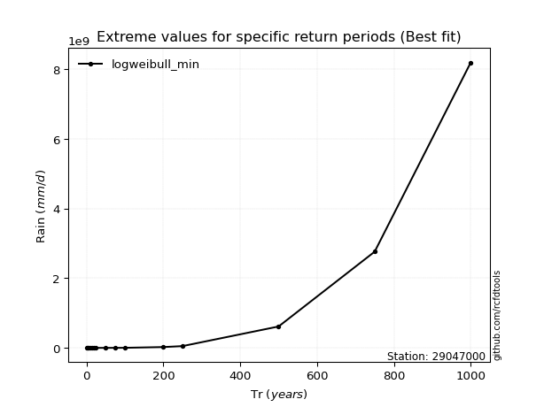</img>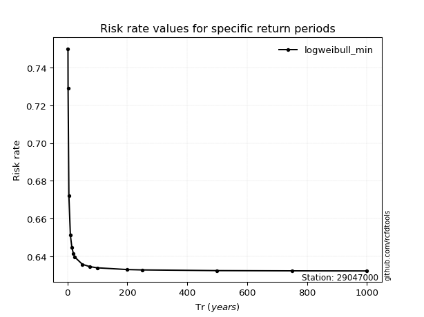</img>

</div>


<sub>**APP DISCLAIMER**: NO WARRANTY - This software is provided by [github.com/rcfdtools](https://github.com/rcfdtools) "as is", without any express or implied warranty, including warranties of merchantability, fitness for a particular purpose, or non-infringement. There is no guarantee that the software will be error-free or operate without interruption. LIMITATION OF LIABILITY - Neither the authors nor copyright holders will be liable for claims or damages arising from the software or its use. You are responsible for determining if the software is appropriate for your use and assume all associated risks, including errors, legal compliance, and data loss. NO PROFESSIONAL ADVICE - The software provides general information and does not offer professional advice. It should not replace consultation with professional advisors.</sub>