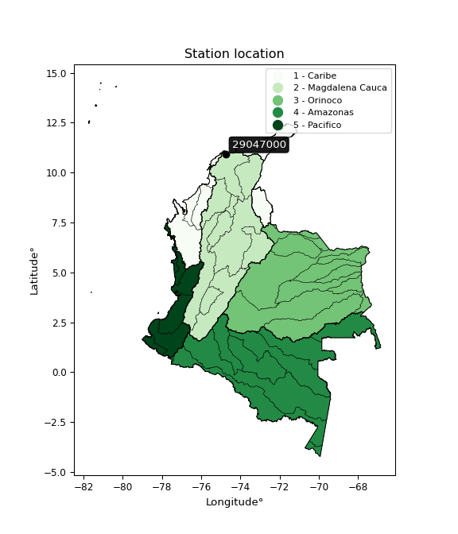

<div align="center">


</div>

# PMP Station (Rain, Pmax24h): 29047000

Probable Maximum Precipitation (PMP) is the greatest amount of rainfall for a specific duration that is meteorologically possible for a given location, acting as a "worst-case" scenario for extreme storms, crucial for designing safety-critical infrastructure like bridges, river deviations, dams, spillways, and nuclear plants to prevent catastrophic failure. PMP is calculated by hydrologists using meteorological data to determine the upper limit of extreme rainfall, often leading to the Probable Maximum Flood (PMF) for flood control design, and is increasingly being studied for climate change impacts. Probable Maximum Precipitation (PMP) is the theoretical upper limit of rainfall, a deterministic estimate for extreme events, while probability distributions (like GEV, Gumbel) describe the likelihood and frequency of various precipitation amounts, including rare ones, showing how often events occur, with PMP representing the extreme end of these distributions, used for critical infrastructure design to ensure safety against the worst conceivable weather, unlike standard statistical forecasts which cover typical probabilities.

The most common probability distributions in hydrology, used for analyzing floods, rainfall, and streamflow, include the Normal, Log-Normal, Gumbel, Gamma (including Log-Pearson Type III), and Generalized Extreme Value (GEV) distributions, often chosen based on the data´s skewness and whether modeling extremes or general conditions, with Gumbel and GEV popular for extreme events like floods, while the Normal distribution serves as a baseline, though often requiring transformations for skewed hydrological data. These distributions help in designing water infrastructure, managing water resources, and forecasting hydrologic events.

> Hydrological data often isn´t perfectly normal (it´s skewed), so different distributions are needed for different applications, such as: **Flood Frequency Analysis**: Using Gumbel, GEV, or Log-Pearson Type III for predicting extreme flood magnitudes and their return periods, **Rainfall Analysis**: Normal for annual totals, but Log-Normal, Weibull, or GEV for intensity or extreme daily rainfall, **Streamflow Modeling**: Gamma and Log-Normal for maximum flows, GEV for minimum flows, and Kappa for daily flows.

<div align="center">

</img>

</div>


## A. General information


### 1. General running parameters

• app_version: _v20260108_. • runtime: _2026-01-08 18:05:13.093906_. • Python version: _3.14.0_. • SciPy version: _1.16.3_. • Pandas version: _2.3.3_. • NumPy version: _2.3.5_. • Stations dataset (station_dataset_file): _dataset/pmax24h_in/automatic_colombia_2003_2024.csv_. • Stations catalog (station_catalog_file): _dataset/CNE.xls_. • Minimum year to eval til year_max (date_min): _1900_. • Maximum year to eval since year_min (date_max): _2024_. • Creates, save and include plots into reports (create_plot): _False_. • Plot only fit distributions with Δo > Δ (plot_only_fit): _True_. • Plot only simple graphs avoiding multiple CDFs and multiple Extreme values plots (plot_only_simple): _False_. • Eval low extreme values, if False, evaluates high extreme values (low_extreme): _False_. • Eval every SciPy distribution as logarithmic (pdist_logarithmic_on): _True_. • Standard deviation normalized (ddof): _1.0_. • Return periods to eval in years (Tr): _[2, 2.33, 5, 10, 15, 20, 25, 50, 75, 100, 200, 250, 500, 750, 1000]_. • Minimum data sample per station, 0 means any (minimum_sample): _5_. • Z-Score maximum threshold to adjust a value, 0 means disable (zscore_max): _3.5_. • Z-Score minimum threshold to adjust a value, 0 means disable (zscore_min): _-2.5_. • Avoid zeros, e.g. rain = 0 (avoid_zeros): _True_. • Avoid null values (avoid_nans): _True_. 

:file_folder:Table: [dataset.csv](../../dataset/pmax24h_in/automatic_colombia_2003_2024.csv)

> Delta Degrees of Freedom (DDOF): is a parameter used in the formulas for calculating variance and standard deviation. When ddof=0, the divisor is $N$ (the total number of observations) and this is used when your data set is the entire population. When ddof=1, the divisor is $N-1$ and this is used when your data set is a sample drawn from a larger population. Using $N-1$ provides an unbiased estimate of the population variance (known as Bessel´s correction).


### 2. Station info and location

|   id |   CODIGO | NOMBRE                       | CATEGORIA    | TECNOLOGIA                              | ESTADO   | FECHA_INSTALACION   |   FECHA_SUSPENSION |   ALTITUD |   LATITUD |   LONGITUD | DEPARTAMENTO   | MUNICIPIO   | AREA_OPERATIVA                              | ENTIDAD                                                     | AREA_HIDROGRAFICA   | ZONA_HIDROGRAFICA   | SUBZONA_HIDROGRAFICA                                     | CORRIENTE     | Catalogo   |   Version |
|-----:|---------:|:-----------------------------|:-------------|:----------------------------------------|:---------|:--------------------|-------------------:|----------:|----------:|-----------:|:---------------|:------------|:--------------------------------------------|:------------------------------------------------------------|:--------------------|:--------------------|:---------------------------------------------------------|:--------------|:-----------|----------:|
|    0 | 29047000 | TEBSA BQUILLA AUT [29047000] | Limnigráfica | Automática con Telemetría, Convencional | Activa   | 05/05/2013          |                nan |         5 |    10.936 |   -74.7618 | Atlantico      | Soledad     | Area Operativa 02 - Atlántico-Bolivar-Sucre | INSTITUTO DE HIDROLOGIA METEOROLOGIA Y ESTUDIOS AMBIENTALES | Magdalena Cauca     | Bajo Magdalena      | Directos al Bajo Magdalena entre Calamar y desembocadura | Rio Magdalena | CNE_IDEAM  |  20251226 |

<div align="center">

Dynamic map: [:earth_americas:Google](http://maps.google.com/maps?q=10.935994,-74.761809) [:earth_americas:OSM](https://www.openstreetmap.org/#map=18/10.935994/-74.761809&layers=P) [:earth_americas:Bing](https://www.bing.com/maps?cp=10.935994~-74.761809&lvl=18) [:earth_americas:Apple](https://maps.apple.com/frame?center=10.935994%2C-74.761809&span=0.003%2C0.006)

</div>


<div align="center">

```geojson
{
  "type": "Feature",
  "geometry": {
    "type": "Point", 
    "coordinates": [-74.761809, 10.935994]
  }, 
  "properties": {
    "Name": "29047000"
  }
}
```

</div>


### 3. Discrete values table and plot

<div align="center">

|               |           0 |           1 |           2 |           3 |           4 |          5 |           6 |           7 |
|:--------------|------------:|------------:|------------:|------------:|------------:|-----------:|------------:|------------:|
| Date          | 2017        | 2018        | 2019        | 2020        | 2021        | 2022       | 2023        | 2024        |
| Value         |   49.13     |   43.02     |  125.01     |   66.64     |   68.05     |  975.48    |  446.14     |  364.54     |
| Value_initial |   49.13     |   43.02     |  125.01     |   66.64     |   68.05     |  975.48    |  446.14     |  364.54     |
| count         |    8        |    8        |    8        |    8        |    8        |    8       |    8        |    8        |
| mean          |  267.251    |  267.251    |  267.251    |  267.251    |  267.251    |  267.251   |  267.251    |  267.251    |
| std           |  325.372    |  325.372    |  325.372    |  325.372    |  325.372    |  325.372   |  325.372    |  325.372    |
| zscore        |   -0.670375 |   -0.689153 |   -0.437165 |   -0.616559 |   -0.612226 |    2.17667 |    0.549797 |    0.299008 |


</div>


> The initial value (value_initial) correspond to the initial obtained or null completed value, and value (value) is adjusted only when the initial value is outside the valid range (outlier) definite through the Z-Score value. If Z-Score is active, values out of range or outliers are replaced with the station mean value. A Z-Score (or standard score) measures how many standard deviations a data point is from the mean of a dataset, indicating its relative position; positive scores mean above the mean, negative mean below, and a score of zero is exactly at the mean, allowing for comparison of values from different distributions. It´s calculated using the formula $z=(x–μ)/σ$, where $x$ is the data point, $μ$ is the mean, and $σ$ is the standard deviation, helping identify outliers and understand probability.
>
> <sub>**Note**: In this study, "completing" (filling gaps in) and "extending" (forecasting or lengthening the historical record) rainfall data series are avoided for certain critical analyses because they introduce artificial bias and uncertainty, which can distort the statistics of rare events (extremes), alter day-to-day variability, and compromise the integrity and homogeneity of the original data. Some reasons against Completing/Extending rainfall data are: **Distortion of Extremes and Variability**: The primary issue is that most gap-filling or extension methods rely on averaging or regression with nearby stations, which inherently smooths the data. Rainfall is highly variable in space and time, with a large percentage of zero values and occasional large storms. Infilling methods often underestimate the highest values and overestimate the lowest (zero) values, which severely distorts analyses focused on flood frequency, drought severity, and intensity-duration-frequency (IDF) curves, **Loss of Data Homogeneity**: Infilled or extended data are synthetic estimates, not actual measurements. Combining these estimates with observed data can violate the assumption of data homogeneity, which requires that the data properties do not change over time. Inhomogeneity can lead to incorrect conclusions about long-term trends or changes in climate patterns, **Propagation of Errors**: Errors and biases from the original data (e.g., wind-induced undercatch, instrument errors, site changes) or the data used for imputation can propagate through the analysis, leading to unreliable hydrological models and inaccurate predictions, **Compromised Statistical Integrity**: For statistical analyses, especially those involving the frequency of events, using artificial data can introduce time bias or autocorrelation that doesn´t exist in reality, making it difficult to assess the true probability of events, **Difficulty in Validation**: It is difficult to accurately validate the quality of filled or extended data, especially for past periods where ground-truth measurements are unavailable. The reliability of imputation techniques heavily depends on the density of the surrounding station network and the complexity of the local topography.</sub>


### 4. Active continuous probability distributions from SciPy (43 of 104 available)

A Probability Density Function (PDF) describes the relative likelihood of a continuous random variable falling within a specific range, where the total area under its curve equals 1, and the area over any interval gives the actual probability for that range. Unlike discrete probabilities (like rolling a die), a PDF shows density, not direct probability for a single point (which is zero), with higher points indicating higher likelihood, often visualized as a bell curve for normal distributions.

A log of a probability density function (log-PDF) is simply the logarithm of the PDF´s value, denoted as $log(f(x))$, useful for converting multiplication of probabilities into addition, improving numerical stability with tiny numbers, and connecting to information theory concepts like entropy. Instead of dealing with very small probabilities (e.g., 0.000001), log-PDFs use negative numbers (e.g., $log(0.00001) ≈ -11.51$ that are easier for computers to handle, preventing underflow errors and simplifying complex calculations. In this study, each active probability distribution from SciPy is also evaluated in the $log$ form.

[scipy.stats](https://docs.scipy.org/doc/scipy/reference/stats.html) is a Python´s powerful submodule within the SciPy library for comprehensive statistical analysis, offering over 130 probability distributions (like Normal, Poisson), functions for descriptive stats (mean, variance), hypothesis testing (t-tests, chi-square), random variable generation, and statistical tests, making it essential for data science, modeling, and research. It provides tools to explore, model, and draw conclusions from data efficiently, working seamlessly with NumPy.

<div align="center">

|   id | p_dist             |   n_parameter | fit_method   | label                                                                       | active   | ref                                                                                                        |
|-----:|:-------------------|--------------:|:-------------|:----------------------------------------------------------------------------|:---------|:-----------------------------------------------------------------------------------------------------------|
|    0 | alpha              |             3 | MLE          | Alpha                                                                       | True     | [:mortar_board:](https://docs.scipy.org/doc/scipy/reference/generated/scipy.stats.alpha.html)              |
|    1 | betaprime          |             4 | MLE          | Beta prime                                                                  | True     | [:mortar_board:](https://docs.scipy.org/doc/scipy/reference/generated/scipy.stats.betaprime.html)          |
|    2 | chi2               |             3 | MLE          | Chi²                                                                        | True     | [:mortar_board:](https://docs.scipy.org/doc/scipy/reference/generated/scipy.stats.chi2.html)               |
|    3 | crystalball        |             4 | MLE          | Crystalball                                                                 | True     | [:mortar_board:](https://docs.scipy.org/doc/scipy/reference/generated/scipy.stats.crystalball.html)        |
|    4 | erlang             |             3 | MLE          | Erlang                                                                      | True     | [:mortar_board:](https://docs.scipy.org/doc/scipy/reference/generated/scipy.stats.erlang.html)             |
|    5 | expon              |             2 | MLE          | Exponential                                                                 | True     | [:mortar_board:](https://docs.scipy.org/doc/scipy/reference/generated/scipy.stats.expon.html)              |
|    6 | exponnorm          |             3 | MLE          | Exponentially modified Normal                                               | True     | [:mortar_board:](https://docs.scipy.org/doc/scipy/reference/generated/scipy.stats.exponnorm.html)          |
|    7 | f                  |             4 | MLE          | F                                                                           | True     | [:mortar_board:](https://docs.scipy.org/doc/scipy/reference/generated/scipy.stats.f.html)                  |
|    8 | fatiguelife        |             3 | MLE          | Fatigue-life (Birnbaum-Saunders)                                            | True     | [:mortar_board:](https://docs.scipy.org/doc/scipy/reference/generated/scipy.stats.fatiguelife.html)        |
|    9 | fisk               |             3 | MLE          | Fisk                                                                        | True     | [:mortar_board:](https://docs.scipy.org/doc/scipy/reference/generated/scipy.stats.fisk.html)               |
|   10 | gamma              |             3 | MLE          | Gamma                                                                       | True     | [:mortar_board:](https://docs.scipy.org/doc/scipy/reference/generated/scipy.stats.gamma.html)              |
|   11 | genexpon           |             5 | MLE          | Generalized exponential                                                     | True     | [:mortar_board:](https://docs.scipy.org/doc/scipy/reference/generated/scipy.stats.genexpon.html)           |
|   12 | genlogistic        |             3 | MLE          | Generalized logistic                                                        | True     | [:mortar_board:](https://docs.scipy.org/doc/scipy/reference/generated/scipy.stats.genlogistic.html)        |
|   13 | gibrat             |             2 | MM           | Gibrat                                                                      | True     | [:mortar_board:](https://docs.scipy.org/doc/scipy/reference/generated/scipy.stats.gibrat.html)             |
|   14 | gompertz           |             3 | MLE          | Gompertz (or truncated Gumbel)                                              | True     | [:mortar_board:](https://docs.scipy.org/doc/scipy/reference/generated/scipy.stats.gompertz.html)           |
|   15 | gumbel_l           |             2 | MM           | Gumbel Left Skew                                                            | True     | [:mortar_board:](https://docs.scipy.org/doc/scipy/reference/generated/scipy.stats.gumbel_l.html)           |
|   16 | gumbel_r           |             2 | MM           | Gumbel Right Skew                                                           | True     | [:mortar_board:](https://docs.scipy.org/doc/scipy/reference/generated/scipy.stats.gumbel_r.html)           |
|   17 | halflogistic       |             2 | MM           | Half-logistic                                                               | True     | [:mortar_board:](https://docs.scipy.org/doc/scipy/reference/generated/scipy.stats.halflogistic.html)       |
|   18 | halfnorm           |             2 | MM           | Half Normal                                                                 | True     | [:mortar_board:](https://docs.scipy.org/doc/scipy/reference/generated/scipy.stats.halfnorm.html)           |
|   19 | hypsecant          |             2 | MM           | hyperbolic secant                                                           | True     | [:mortar_board:](https://docs.scipy.org/doc/scipy/reference/generated/scipy.stats.hypsecant.html)          |
|   20 | invgamma           |             3 | MLE          | Inverted gamma                                                              | True     | [:mortar_board:](https://docs.scipy.org/doc/scipy/reference/generated/scipy.stats.invgamma.html)           |
|   21 | invgauss           |             3 | MLE          | Inverse Gaussian                                                            | True     | [:mortar_board:](https://docs.scipy.org/doc/scipy/reference/generated/scipy.stats.invgauss.html)           |
|   22 | invweibull         |             3 | MLE          | Inverted Weibull                                                            | True     | [:mortar_board:](https://docs.scipy.org/doc/scipy/reference/generated/scipy.stats.invweibull.html)         |
|   23 | kstwobign          |             2 | MLE          | Limiting distribution of scaled Kolmogorov-Smirnov two-sided test statistic | True     | [:mortar_board:](https://docs.scipy.org/doc/scipy/reference/generated/scipy.stats.kstwobign.html)          |
|   24 | laplace            |             2 | MM           | Laplace                                                                     | True     | [:mortar_board:](https://docs.scipy.org/doc/scipy/reference/generated/scipy.stats.laplace.html)            |
|   25 | laplace_asymmetric |             3 | MLE          | Asymmetric Laplace                                                          | True     | [:mortar_board:](https://docs.scipy.org/doc/scipy/reference/generated/scipy.stats.laplace_asymmetric.html) |
|   26 | loggamma           |             3 | MLE          | Log gamma                                                                   | True     | [:mortar_board:](https://docs.scipy.org/doc/scipy/reference/generated/scipy.stats.loggamma.html)           |
|   27 | logistic           |             2 | MM           | Logistic (or Sech-squared)                                                  | True     | [:mortar_board:](https://docs.scipy.org/doc/scipy/reference/generated/scipy.stats.logistic.html)           |
|   28 | lognorm            |             3 | MLE          | Log Normal                                                                  | True     | [:mortar_board:](https://docs.scipy.org/doc/scipy/reference/generated/scipy.stats.lognorm.html)            |
|   29 | maxwell            |             2 | MM           | Maxwell                                                                     | True     | [:mortar_board:](https://docs.scipy.org/doc/scipy/reference/generated/scipy.stats.maxwell.html)            |
|   30 | mielke             |             4 | MLE          | Mielke Beta-Kappa / Dagum                                                   | True     | [:mortar_board:](https://docs.scipy.org/doc/scipy/reference/generated/scipy.stats.mielke.html)             |
|   31 | moyal              |             2 | MM           | Moyal                                                                       | True     | [:mortar_board:](https://docs.scipy.org/doc/scipy/reference/generated/scipy.stats.moyal.html)              |
|   32 | nakagami           |             3 | MLE          | Nakagami                                                                    | True     | [:mortar_board:](https://docs.scipy.org/doc/scipy/reference/generated/scipy.stats.nakagami.html)           |
|   33 | ncf                |             5 | MLE          | Non-central F distribution                                                  | True     | [:mortar_board:](https://docs.scipy.org/doc/scipy/reference/generated/scipy.stats.ncf.html)                |
|   34 | nct                |             4 | MLE          | Non-central Student’s t                                                     | True     | [:mortar_board:](https://docs.scipy.org/doc/scipy/reference/generated/scipy.stats.nct.html)                |
|   35 | norm               |             2 | MM           | Normal                                                                      | True     | [:mortar_board:](https://docs.scipy.org/doc/scipy/reference/generated/scipy.stats.norm.html)               |
|   36 | pearson3           |             3 | MM           | Pearson type III                                                            | True     | [:mortar_board:](https://docs.scipy.org/doc/scipy/reference/generated/scipy.stats.pearson3.html)           |
|   37 | rayleigh           |             2 | MM           | Rayleigh                                                                    | True     | [:mortar_board:](https://docs.scipy.org/doc/scipy/reference/generated/scipy.stats.rayleigh.html)           |
|   38 | rice               |             3 | MLE          | Rice                                                                        | True     | [:mortar_board:](https://docs.scipy.org/doc/scipy/reference/generated/scipy.stats.rice.html)               |
|   39 | t                  |             3 | MLE          | Student’s t                                                                 | True     | [:mortar_board:](https://docs.scipy.org/doc/scipy/reference/generated/scipy.stats.t.html)                  |
|   40 | truncnorm          |             4 | MLE          | Truncated normal                                                            | True     | [:mortar_board:](https://docs.scipy.org/doc/scipy/reference/generated/scipy.stats.truncnorm.html)          |
|   41 | wald               |             2 | MM           | Wald                                                                        | True     | [:mortar_board:](https://docs.scipy.org/doc/scipy/reference/generated/scipy.stats.wald.html)               |
|   42 | weibull_min        |             3 | MLE          | Weibull minimum                                                             | True     | [:mortar_board:](https://docs.scipy.org/doc/scipy/reference/generated/scipy.stats.weibull_min.html)        |

</div>

> **n_parameter:** # arguments & localization & scale.
>
> **Fit methods:** (MLE) maximum likelihood, (MM) L-moments.
>
>**Inactive** (With the only purpose of prevent loops, zero divisions, infinite values, over high estimated values or horizontal trending for recurrence intervals estimations, the follow distributions were disabled.)**:** foldnorm, gennorm, norminvgauss, powernorm, powerlognorm, skewnorm, genextreme, anglit, arcsine, argus, beta, bradford, burr, burr12, cauchy, cosine, halfcauchy, foldcauchy, skewcauchy, wrapcauchy, dgamma, gengamma, exponweib, exponpow, truncexpon, gausshyper, genhalflogistic, genhyperbolic, geninvgauss, halfgennorm, johnsonsb, johnsonsu, kappa4, kappa3, ksone, kstwo, loglaplace, levy, levy_l, levy_stable, ncx2, pareto, genpareto, truncpareto, lomax, powerlaw, rdist, rel_breitwigner, recipinvgauss, semicircular, studentized_range, trapezoid, triang, truncweibull_min, tukeylambda, uniform, loguniform, vonmises, vonmises_line, weibull_max, dweibull, 


## B. Probability (PDF) vs. Empirical (EDF) distributions functions

A continuous probability distribution (CPD) describes probabilities for variables that can take any value within a range (like rain any time), unlike discrete variables with specific outcomes (like temperature). It uses a Probability Density Function (PDF), a curve where the total area under it equals 1, and the probability of the variable falling within an interval (a to b) is found by calculating the area under the curve between those points. A key feature is that the probability of hitting any single exact value is zero, so probabilities are always expressed for ranges, e.g., $P(a ≤ X ≤ b)$.

<div align="center">

Distributions parameters from station values
|    |   station | p_dist                |   n |            loc |           scale | shape                  | shape1                | shape2                 | shape3   |
|---:|----------:|:----------------------|----:|---------------:|----------------:|:-----------------------|:----------------------|:-----------------------|:---------|
|  0 |  29047000 | alpha                 |   8 |      17.55     |    48.1353      | 3.5501699409813566e-11 |                       |                        |          |
|  1 |  29047000 | betaprime             |   8 |      -0.385568 |     0.768109    | 150.32260016138275     | 1.2460688077954885    |                        |          |
|  2 |  29047000 | chi2                  |   8 |      43.02     |     7.38863     | 0.1852780915792976     |                       |                        |          |
|  3 |  29047000 | crystalball           |   8 |      -0.264669 |   405.133       | 4.559392263496876      | 2.4026826416058       |                        |          |
|  4 |  29047000 | erlang                |   8 |      43.02     |   350.848       | 0.4042155625626444     |                       |                        |          |
|  5 |  29047000 | expon                 |   8 |      43.02     |   224.231       |                        |                       |                        |          |
|  6 |  29047000 | exponnorm             |   8 |      42.7098   |     0.102335    | 2168.2914130896115     |                       |                        |          |
|  7 |  29047000 | f                     |   8 |      38.1848   |    20.8263      | 988.248314905213       | 1.056502331065944     |                        |          |
|  8 |  29047000 | fatiguelife           |   8 |      42.1181   |    32.1294      | 3.2290282050466503     |                       |                        |          |
|  9 |  29047000 | fisk                  |   8 |      43.02     |    80.4136      | 0.6155237410365        |                       |                        |          |
| 10 |  29047000 | gamma                 |   8 |      43.02     |   186.089       | 0.8795599489033918     |                       |                        |          |
| 11 |  29047000 | genexpon              |   8 |      43.02     |   432.738       | 1.9298751557655955     | 7.450943754400796e-13 | 2.434241273252111      |          |
| 12 |  29047000 | genlogistic           |   8 |   -1294.08     |   180.499       | 2843.2534507139953     |                       |                        |          |
| 13 |  29047000 | gibrat                |   8 |      35.0646   |   140.828       |                        |                       |                        |          |
| 14 |  29047000 | gompertz              |   8 |      43.0189   |     3.10248e+06 | 13623.427686543047     |                       |                        |          |
| 15 |  29047000 | gumbel_l              |   8 |     404.228    |   237.307       |                        |                       |                        |          |
| 16 |  29047000 | gumbel_r              |   8 |     130.274    |   237.307       |                        |                       |                        |          |
| 17 |  29047000 | halflogistic          |   8 |     -93.4835   |   260.215       |                        |                       |                        |          |
| 18 |  29047000 | halfnorm              |   8 |    -135.599    |   504.898       |                        |                       |                        |          |
| 19 |  29047000 | hypsecant             |   8 |     267.251    |   193.76        |                        |                       |                        |          |
| 20 |  29047000 | invgamma              |   8 |      38.1737   |    10.9963      | 0.5282519633569795     |                       |                        |          |
| 21 |  29047000 | invgauss              |   8 |      37.2761   |    25.958       | 8.859484494880244      |                       |                        |          |
| 22 |  29047000 | invweibull            |   8 |      41.3997   |    19.6928      | 0.5105773033353753     |                       |                        |          |
| 23 |  29047000 | kstwobign             |   8 |    -532.409    |   929.361       |                        |                       |                        |          |
| 24 |  29047000 | laplace               |   8 |     267.251    |   215.213       |                        |                       |                        |          |
| 25 |  29047000 | laplace_asymmetric    |   8 |      43.02     |     0.0303405   | 0.00013530847049399687 |                       |                        |          |
| 26 |  29047000 | loggamma              |   8 | -127723        | 16217.1         | 2677.354796266369      |                       |                        |          |
| 27 |  29047000 | logistic              |   8 |     267.251    |   167.801       |                        |                       |                        |          |
| 28 |  29047000 | lognorm               |   8 |      43.02     |     0.842705    | 12.350217388088547     |                       |                        |          |
| 29 |  29047000 | maxwell               |   8 |    -453.949    |   451.945       |                        |                       |                        |          |
| 30 |  29047000 | mielke                |   8 |      -0.445243 |     1.01578     | 252.40795102110383     | 1.2007237167069036    |                        |          |
| 31 |  29047000 | moyal                 |   8 |      93.1999   |   137.009       |                        |                       |                        |          |
| 32 |  29047000 | nakagami              |   8 |      43.02     |   565.336       | 0.16575838665748704    |                       |                        |          |
| 33 |  29047000 | ncf                   |   8 |      -0.80259  |    92.8996      | 406.01140077228683     | 2.4916349818937444    | 2.926528705100848      |          |
| 34 |  29047000 | nct                   |   8 |       0.384329 |     3.07558     | 0.9237725157107515     | 23.71215193690864     |                        |          |
| 35 |  29047000 | norm                  |   8 |     267.251    |   304.358       |                        |                       |                        |          |
| 36 |  29047000 | pearson3              |   8 |     267.251    |   304.358       | 1.4248578702166337     |                       |                        |          |
| 37 |  29047000 | rayleigh              |   8 |    -315.003    |   464.572       |                        |                       |                        |          |
| 38 |  29047000 | rice                  |   8 |    -180.881    |   383.051       | 0.00038194804827184064 |                       |                        |          |
| 39 |  29047000 | t                     |   8 |      62.4105   |    18.451       | 0.4664134626235563     |                       |                        |          |
| 40 |  29047000 | truncnorm             |   8 | -564159        | 13100.3         | 43.06770909902562      | 51.90861787566479     |                        |          |
| 41 |  29047000 | wald                  |   8 |     -37.1066   |   304.358       |                        |                       |                        |          |
| 42 |  29047000 | weibull_min           |   8 |      43.02     |   109.863       | 0.4781473868468974     |                       |                        |          |
| 43 |  29047000 | logalpha              |   8 |       3.4391   |     0.653733    | 0.0005335273524928862  |                       |                        |          |
| 44 |  29047000 | logbetaprime          |   8 |      -0.188036 |     1.72626     | 94.46464021879092      | 32.711669945895906    |                        |          |
| 45 |  29047000 | logchi2               |   8 |       3.76167  |     0.943908    | 1.0773288676207577     |                       |                        |          |
| 46 |  29047000 | logcrystalball        |   8 |       4.97328  |     1.09504     | 1239.8853757495704     | 586.9427155264007     |                        |          |
| 47 |  29047000 | logerlang             |   8 |       3.76167  |     1.68746     | 0.632891474748486      |                       |                        |          |
| 48 |  29047000 | logexpon              |   8 |       3.76167  |     1.21162     |                        |                       |                        |          |
| 49 |  29047000 | logexponnorm          |   8 |       3.76036  |     0.000383978 | 3132.1536623661505     |                       |                        |          |
| 50 |  29047000 | logf                  |   8 |       3.76167  |     1.04931     | 0.9575257231212714     | 6.882313075909913     |                        |          |
| 51 |  29047000 | logfatiguelife        |   8 |       3.67554  |     0.666197    | 1.3330829272272235     |                       |                        |          |
| 52 |  29047000 | logfisk               |   8 |       3.76167  |     0.797037    | 0.5590528367387859     |                       |                        |          |
| 53 |  29047000 | loggamma              |   8 |       3.76167  |     1.13594     | 0.6348340593497137     |                       |                        |          |
| 54 |  29047000 | loggenexpon           |   8 |       3.76166  |     0.0171886   | 0.012652188578399517   | 1.8068926847146907    | 1.3241379163171438e-05 |          |
| 55 |  29047000 | loggenlogistic        |   8 |      -1.48878  |     0.833653    | 1255.6004480991987     |                       |                        |          |
| 56 |  29047000 | loggibrat             |   8 |       4.13786  |     0.506704    |                        |                       |                        |          |
| 57 |  29047000 | loggompertz           |   8 |       3.76167  |     5.78643     | 4.056868630202867      |                       |                        |          |
| 58 |  29047000 | loggumbel_l           |   8 |       5.46611  |     0.853799    |                        |                       |                        |          |
| 59 |  29047000 | loggumbel_r           |   8 |       4.48046  |     0.853799    |                        |                       |                        |          |
| 60 |  29047000 | loghalflogistic       |   8 |       3.67541  |     0.936221    |                        |                       |                        |          |
| 61 |  29047000 | loghalfnorm           |   8 |       3.52388  |     1.81656     |                        |                       |                        |          |
| 62 |  29047000 | loghypsecant          |   8 |       4.97328  |     0.697124    |                        |                       |                        |          |
| 63 |  29047000 | loginvgamma           |   8 |       3.37002  |     1.84592     | 1.9784139611173288     |                       |                        |          |
| 64 |  29047000 | loginvgauss           |   8 |       3.55979  |     1.10044     | 1.284495902398842      |                       |                        |          |
| 65 |  29047000 | loginvweibull         |   8 |       3.30087  |     0.923482    | 1.580672311542214      |                       |                        |          |
| 66 |  29047000 | logkstwobign          |   8 |       1.59295  |     3.86869     |                        |                       |                        |          |
| 67 |  29047000 | loglaplace            |   8 |       4.97328  |     0.77431     |                        |                       |                        |          |
| 68 |  29047000 | loglaplace_asymmetric |   8 |       3.76167  |     0.000999621 | 0.000825444406544516   |                       |                        |          |
| 69 |  29047000 | logloggamma           |   8 |    -242.133    |    35.5848      | 1037.5290847742112     |                       |                        |          |
| 70 |  29047000 | loglogistic           |   8 |       4.97328  |     0.603727    |                        |                       |                        |          |
| 71 |  29047000 | loglognorm            |   8 |       3.76167  |     0.0108844   | 11.694812099846148     |                       |                        |          |
| 72 |  29047000 | logmaxwell            |   8 |       2.3785   |     1.62604     |                        |                       |                        |          |
| 73 |  29047000 | logmielke             |   8 |       3.31948  |     0.0932354   | 56.43007551358518      | 1.5690710619314978    |                        |          |
| 74 |  29047000 | logmoyal              |   8 |       4.34707  |     0.492941    |                        |                       |                        |          |
| 75 |  29047000 | lognakagami           |   8 |       3.76167  |     2.12422     | 0.3582245488338961     |                       |                        |          |
| 76 |  29047000 | logncf                |   8 |       3.76166  |     1.46743     | 1.3915732447775375     | 360.2642796491833     | 0.028251419825667874   |          |
| 77 |  29047000 | lognct                |   8 |       0.068466 |     0.0709588   | 11.843664835892248     | 64.53075908213148     |                        |          |
| 78 |  29047000 | lognorm               |   8 |       4.97328  |     1.09504     |                        |                       |                        |          |
| 79 |  29047000 | logpearson3           |   8 |       4.97328  |     1.09504     | 0.5008222521543559     |                       |                        |          |
| 80 |  29047000 | lograyleigh           |   8 |       2.87841  |     1.67147     |                        |                       |                        |          |
| 81 |  29047000 | logrice               |   8 |       3.15325  |     1.50194     | 0.0010653697822415157  |                       |                        |          |
| 82 |  29047000 | logt                  |   8 |       4.97328  |     1.09504     | 49533391767.13379      |                       |                        |          |
| 83 |  29047000 | logtruncnorm          |   8 |       0.204346 |     2.63521     | 1.3499183851301264     | 18.034759236913768    |                        |          |
| 84 |  29047000 | logwald               |   8 |       3.87827  |     1.09502     |                        |                       |                        |          |
| 85 |  29047000 | logweibull_min        |   8 |       3.76167  |     0.936335    | 0.3715749104234779     |                       |                        |          |

</div>

> **loc** (Location parameter): This shifts the distribution along the x-axis. For many common distributions, like the normal (Gaussian) distribution, loc represents the mean $μ$. For others, like the uniform distribution, it might represent the minimum value, or for the beta distribution, the left end of the support interval.
>
> **scale** (Scale parameter): This determines the width or spread of the distribution. For the normal distribution, scale represents the standard deviation $σ$. For a uniform distribution, it defines the length of the interval (from $loc$ to $loc + scale$).
>
> **shape** (Shape parameters): Refers to parameters that define the specific form of a probability distribution, distinct from its location (loc) and scale (scale). These parameters are required arguments for most distribution functions. For example, a normal (Gaussian) distribution is fully defined by its location (mean) and scale (standard deviation), so it has no specific shape parameters beyond loc and scale. However, other distributions have intrinsic properties that need specification, as Gamma distribution that takes a shape parameter, often named $a$ or $alpha$.


### 0. Cumulative distribution values - CDF (86 evaluated)

Cumulative Distribution Function (CDF), denoted as $F$<sub>$X$</sub>$(x)$, is a function that gives the probability that a random variable $X$ will take a value less than or equal to a specific value, $x$ (i.e., $(P(X≥x)$. It essentially "accumulates" probabilities from a given point up to the far right (positive infinity), providing a complete picture of the distribution´s probabilities for both discrete (like rain) and continuous (like temperature) variables, helping to find probabilities over ranges or above certain values. Each station is evaluated separately ordering the $x$ values ascending, calculating the CDF and PDF values for the activated distributions and their logarithmic forms.

<div align="center">

CDF ordered by x ascending and calculating $log(f(x))$ separately
|   id |   Station |   date |      x |   count |    mean |     std |    zscore |   Value_initial |   station |   m |     alpha |   alpha_pdf |   betaprime |   betaprime_pdf |      chi2 |    chi2_pdf |   crystalball |   crystalball_pdf |      erlang |   erlang_pdf |     expon |   expon_pdf |   exponnorm |   exponnorm_pdf |         f |       f_pdf |   fatiguelife |   fatiguelife_pdf |        fisk |      fisk_pdf |       gamma |   gamma_pdf |    genexpon |   genexpon_pdf |   genlogistic |   genlogistic_pdf |     gibrat |   gibrat_pdf |    gompertz |   gompertz_pdf |   gumbel_l |   gumbel_l_pdf |   gumbel_r |   gumbel_r_pdf |   halflogistic |   halflogistic_pdf |   halfnorm |   halfnorm_pdf |   hypsecant |   hypsecant_pdf |   invgamma |   invgamma_pdf |   invgauss |   invgauss_pdf |   invweibull |   invweibull_pdf |   kstwobign |   kstwobign_pdf |   laplace |   laplace_pdf |   laplace_asymmetric |   laplace_asymmetric_pdf |    loggamma |   loggamma_pdf |   logistic |   logistic_pdf |   lognorm |   lognorm_pdf |   maxwell |   maxwell_pdf |   mielke |   mielke_pdf |    moyal |   moyal_pdf |    nakagami |   nakagami_pdf |      ncf |     ncf_pdf |       nct |     nct_pdf |     norm |    norm_pdf |   pearson3 |   pearson3_pdf |   rayleigh |   rayleigh_pdf |     rice |    rice_pdf |        t |       t_pdf |   truncnorm |   truncnorm_pdf |     wald |    wald_pdf |   weibull_min |   weibull_min_pdf |   logalpha |   logalpha_pdf |   logbetaprime |   logbetaprime_pdf |     logchi2 |   logchi2_pdf |   logcrystalball |   logcrystalball_pdf |   logerlang |   logerlang_pdf |   logexpon |   logexpon_pdf |   logexponnorm |   logexponnorm_pdf |        logf |       logf_pdf |   logfatiguelife |   logfatiguelife_pdf |     logfisk |   logfisk_pdf |   loggenexpon |   loggenexpon_pdf |   loggenlogistic |   loggenlogistic_pdf |   loggibrat |   loggibrat_pdf |   loggompertz |   loggompertz_pdf |   loggumbel_l |   loggumbel_l_pdf |   loggumbel_r |   loggumbel_r_pdf |   loghalflogistic |   loghalflogistic_pdf |   loghalfnorm |   loghalfnorm_pdf |   loghypsecant |   loghypsecant_pdf |   loginvgamma |   loginvgamma_pdf |   loginvgauss |   loginvgauss_pdf |   loginvweibull |   loginvweibull_pdf |   logkstwobign |   logkstwobign_pdf |   loglaplace |   loglaplace_pdf |   loglaplace_asymmetric |   loglaplace_asymmetric_pdf |   logloggamma |   logloggamma_pdf |   loglogistic |   loglogistic_pdf |   loglognorm |   loglognorm_pdf |   logmaxwell |   logmaxwell_pdf |   logmielke |   logmielke_pdf |   logmoyal |   logmoyal_pdf |   lognakagami |   lognakagami_pdf |     logncf |   logncf_pdf |   lognct |   lognct_pdf |   logpearson3 |   logpearson3_pdf |   lograyleigh |   lograyleigh_pdf |   logrice |   logrice_pdf |     logt |   logt_pdf |   logtruncnorm |   logtruncnorm_pdf |     logwald |   logwald_pdf |   logweibull_min |   logweibull_min_pdf |
|-----:|----------:|-------:|-------:|--------:|--------:|--------:|----------:|----------------:|----------:|----:|----------:|------------:|------------:|----------------:|----------:|------------:|--------------:|------------------:|------------:|-------------:|----------:|------------:|------------:|----------------:|----------:|------------:|--------------:|------------------:|------------:|--------------:|------------:|------------:|------------:|---------------:|--------------:|------------------:|-----------:|-------------:|------------:|---------------:|-----------:|---------------:|-----------:|---------------:|---------------:|-------------------:|-----------:|---------------:|------------:|----------------:|-----------:|---------------:|-----------:|---------------:|-------------:|-----------------:|------------:|----------------:|----------:|--------------:|---------------------:|-------------------------:|------------:|---------------:|-----------:|---------------:|----------:|--------------:|----------:|--------------:|---------:|-------------:|---------:|------------:|------------:|---------------:|---------:|------------:|----------:|------------:|---------:|------------:|-----------:|---------------:|-----------:|---------------:|---------:|------------:|---------:|------------:|------------:|----------------:|---------:|------------:|--------------:|------------------:|-----------:|---------------:|---------------:|-------------------:|------------:|--------------:|-----------------:|---------------------:|------------:|----------------:|-----------:|---------------:|---------------:|-------------------:|------------:|---------------:|-----------------:|---------------------:|------------:|--------------:|--------------:|------------------:|-----------------:|---------------------:|------------:|----------------:|--------------:|------------------:|--------------:|------------------:|--------------:|------------------:|------------------:|----------------------:|--------------:|------------------:|---------------:|-------------------:|--------------:|------------------:|--------------:|------------------:|----------------:|--------------------:|---------------:|-------------------:|-------------:|-----------------:|------------------------:|----------------------------:|--------------:|------------------:|--------------:|------------------:|-------------:|-----------------:|-------------:|-----------------:|------------:|----------------:|-----------:|---------------:|--------------:|------------------:|-----------:|-------------:|---------:|-------------:|--------------:|------------------:|--------------:|------------------:|----------:|--------------:|---------:|-----------:|---------------:|-------------------:|------------:|--------------:|-----------------:|---------------------:|
|    0 |  29047000 |   2018 |  43.02 |       8 | 267.251 | 325.372 | -0.689153 |           43.02 |  29047000 |   1 | 0.0587736 | 0.00992592  |    0.107572 |     0.00602523  | 0.0399248 | 5.20531e+11 |      0.542543 |       0.000979112 | 2.01498e-07 |  1.14629e+07 | 0         | 0.00445968  |  0.00139694 |     0.0044949   | 0.0360944 | 0.0195809   |     0.0362059 |       0.0836948   | 7.87563e-09 | 882.593       | 3.79577e-15 | 0.469867    | 1.45353e-13 |    0.00445968  |      0.178363 |       0.00170302  | 0.00202853 |  0.000807281 | 4.82101e-06 |    0.00439112  |   0.196075 |    0.000739365 |   0.235891 |    0.00143577  |       0.256436 |        0.00179513  |   0.276491 |    0.00148443  |    0.193892 |     0.000939938 |  0.0360944 |    0.0195808   |  0.0374795 |    0.0172307   |    0.0278879 |      0.0314567   |    0.162067 |     0.00153106  |  0.176392 |   0.000819612 |          1.83341e-08 |              0.00445966  | 1.84212e-10 | 263334         |   0.208121 |    0.000982153 |  0.134264 |     0.197531  |  0.249194 |   0.0011662   |      nan |          nan | 0.229764 | 0.00170018  | 1.99619e-06 |    9.31361e+07 | 0.106997 | 0.00596267  | 0.0908499 | 0.0072756   | 0.230642 | 0.000999223 |   0.248754 |    0.00171731  |   0.25692  |    0.00123265  | 0.157036 | 0.00128633  | 0.300961 | 0.00588034  | 1.86129e-07 |     0.0032893   | 0.126557 | 0.0034613   |   1.81613e-08 |       1.22213e+06 |  0.0427325 |      0.643401  |       0.115298 |          0.250841  | 4.29567e-09 |   5.21049e+06 |         0.134264 |            0.197531  | 1.53673e-10 |  219007         |   0        |      0.825342  |     0.00108277 |          0.830289  | 1.08461e-06 | 813703         |        0.0346393 |            1.04795   | 2.96622e-09 |    3.7341e+06 |   2.35433e-06 |         0.736078  |        0.0994704 |            0.275122  |   0         |       0         |   8.37223e-13 |         0.7011    |      0.127014 |         0.138888  |     0.0982033 |         0.266927  |         0.0460346 |             0.53293   |      0.104144 |         0.435482  |       0.110827 |          0.155785  |     0.0498148 |         0.496781  |      0.04077  |         0.622787  |       0.0497481 |           0.512086  |      0.0882032 |          0.278662  |     0.104568 |        0.135046  |             6.86703e-07 |                   0.825757  |      0.136941 |         0.196195  |      0.118481 |         0.172997  |   0.00419179 |      2.37876e+12 |     0.132356 |        0.24727   |   0.0498616 |       0.509012  |  0.0701665 |      0.284408  |   4.53941e-12 |       7323.43     | 3.8956e-05 |   31.4381    | 0.104852 |    0.275019  |      0.126412 |         0.235512  |      0.130311 |         0.27495   |  0.078772 |     0.248464  | 0.134264 |  0.197532  |     9.0822e-11 |          0.687615  | 0           |    0          |      2.02302e-06 |          1.69268e+09 |
|    1 |  29047000 |   2017 |  49.13 |       8 | 267.251 | 325.372 | -0.670375 |           49.13 |  29047000 |   2 | 0.12745   | 0.0120527   |    0.145083 |     0.00620722  | 0.934999  | 0.00968143  |      0.548521 |       0.000977424 | 0.218191    |  0.0142567   | 0.0268808 | 0.0043398   |  0.028519   |     0.00437816  | 0.167599  | 0.0199517   |     0.302144  |       0.0200871   | 0.169896    |   0.0142076   | 0.0510966   | 0.00722785  | 0.0268808   |    0.0043398   |      0.188893 |       0.00174357  | 0.0106163  |  0.0019963   | 0.0264779   |    0.00427488  |   0.200638 |    0.000754342 |   0.244712 |    0.0014516   |       0.267371 |        0.00178413  |   0.285541 |    0.00147798  |    0.19971  |     0.000964405 |  0.167599  |    0.0199517   |  0.155228  |    0.0185993   |    0.199498  |      0.0212401   |    0.171522 |     0.00156368  |  0.181471 |   0.000843215 |          0.0268807   |              0.00433978  | 0.272623    |      1.21251   |   0.214185 |    0.00100303  |  0.162267 |     0.224244  |  0.256354 |   0.00117731  |      nan |          nan | 0.240201 | 0.00171582  | 0.178329    |    0.00967564  | 0.144129 | 0.0061466   | 0.136989  | 0.00771648  | 0.236792 | 0.00101391  |   0.259251 |    0.00171833  |   0.264477 |    0.00124094  | 0.164966 | 0.001309    | 0.343701 | 0.008283    | 0.0198973   |     0.00322388  | 0.147878 | 0.00351114  |   0.222131    |       0.0152912   |  0.151201  |      0.897894  |       0.151335 |          0.291324  | 0.263026    |   1.01895     |         0.162267 |            0.224244  | 0.216295    |       0.981994  |   0.103816 |      0.739658  |     0.105515   |          0.743743  | 0.27828     |      0.957719  |        0.189828  |            1.07689   | 0.268581    |    0.826953   |   0.0937784   |         0.676797  |        0.139695  |            0.329568  |   0         |       0         |   0.0898866   |         0.652894  |      0.146745 |         0.158595  |     0.137187  |         0.319173  |         0.116462  |             0.526818  |      0.161652 |         0.430183  |       0.133466 |          0.185892  |     0.130635  |         0.686775  |      0.142306 |         0.829545  |       0.133872  |           0.716839  |      0.12905   |          0.334842  |     0.124133 |        0.160314  |             0.103866    |                   0.739989  |      0.164717 |         0.222157  |      0.14345  |         0.203523  |   0.584689   |      0.251054    |     0.167146 |        0.276174  |   0.133515  |       0.713462  |  0.113508  |      0.366105  |   0.106653    |          0.574773 | 0.154558   |    0.780586  | 0.14474  |    0.324587  |      0.159897 |         0.268417  |      0.168698 |         0.302331  |  0.114653 |     0.290908  | 0.162267 |  0.224244  |     0.0882448  |          0.641576  | 5.41252e-16 |    1.1453e-12 |      0.383672    |          0.834581    |
|    2 |  29047000 |   2020 |  66.64 |       8 | 267.251 | 325.372 | -0.616559 |           66.64 |  29047000 |   3 | 0.326814  | 0.00985451  |    0.251238 |     0.00576437  | 0.990948  | 0.000867948 |      0.565585 |       0.00097138  | 0.371576    |  0.00606004  | 0.0999794 | 0.00401381  |  0.102234   |     0.00404595  | 0.399552  | 0.00859764  |     0.466554  |       0.00506647  | 0.319935    |   0.00566992  | 0.160717    | 0.00559007  | 0.0999795   |    0.00401381  |      0.220351 |       0.00184599  | 0.0674359  |  0.00413167  | 0.0985259   |    0.00395853  |   0.21423  |    0.000798299 |   0.270483 |    0.00149035  |       0.298321 |        0.00175048  |   0.311252 |    0.00145847  |    0.217221 |     0.00103607  |  0.399552  |    0.00859764  |  0.387169  |    0.00912549  |    0.414376  |      0.00738462  |    0.199646 |     0.0016459   |  0.196853 |   0.000914688 |          0.0999791   |              0.00401379  | 0.52684     |      0.599817  |   0.232272 |    0.00106269  |  0.239844 |     0.283791  |  0.27723  |   0.00120657  |      nan |          nan | 0.270557 | 0.00174846  | 0.279181    |    0.00391745  | 0.249385 | 0.00572357  | 0.267239  | 0.00686823  | 0.254906 | 0.00105484  |   0.289313 |    0.00171366  |   0.286396 |    0.00126185  | 0.188423 | 0.00136908  | 0.559007 | 0.0132457   | 0.0747534   |     0.00304354  | 0.209407 | 0.00348241  |   0.380916    |       0.00600943  |  0.389949  |      0.62361   |       0.252236 |          0.36513   | 0.473544    |   0.500146    |         0.239844 |            0.283791  | 0.430126    |       0.529088  |   0.303162 |      0.575129  |     0.305783   |          0.577225  | 0.46934     |      0.441549  |        0.428232  |            0.566169  | 0.416987    |    0.310554   |   0.281       |         0.554719  |        0.255175  |            0.417836  |   0.0174395 |       0.701247  |   0.272929    |         0.549799  |      0.202912 |         0.211727  |     0.249078  |         0.4055    |         0.272714  |             0.494342  |      0.28997  |         0.409893  |       0.202621 |          0.271418  |     0.342356  |         0.639747  |      0.370915 |         0.632244  |       0.351896  |           0.646612  |      0.245557  |          0.41796   |     0.184018 |        0.237655  |             0.303289    |                   0.575314  |      0.241418 |         0.280216  |      0.21721  |         0.281633  |   0.62395    |      0.0741539   |     0.259893 |        0.328694  |   0.350966  |       0.645918  |  0.245359  |      0.478805  |   0.249716    |          0.404249 | 0.334852   |    0.471168  | 0.257221 |    0.404117  |      0.251896 |         0.331546  |      0.268206 |         0.345988  |  0.215364 |     0.363847  | 0.239844 |  0.283792  |     0.268416   |          0.541992  | 0.158409    |    0.97894    |      0.529431    |          0.301173    |
|    3 |  29047000 |   2021 |  68.05 |       8 | 267.251 | 325.372 | -0.612226 |           68.05 |  29047000 |   4 | 0.340502  | 0.00956168  |    0.25932  |     0.00569918  | 0.992086  | 0.000748526 |      0.566954 |       0.000970816 | 0.379956    |  0.00583079  | 0.105621  | 0.00398864  |  0.107921   |     0.00402032  | 0.411341  | 0.00813223  |     0.473493  |       0.00478114  | 0.327749    |   0.00541822  | 0.168542    | 0.00550927  | 0.105621    |    0.00398865  |      0.222959 |       0.00185331  | 0.0733236  |  0.00421799  | 0.10409     |    0.0039341   |   0.215358 |    0.000801904 |   0.272587 |    0.00149304  |       0.300787 |        0.00174765  |   0.313307 |    0.00145683  |    0.218686 |     0.00104193  |  0.411342  |    0.00813224  |  0.399716  |    0.00867657  |    0.42449   |      0.00696851  |    0.201971 |     0.00165178  |  0.198147 |   0.0009207   |          0.105621    |              0.00398863  | 0.539177    |      0.578898  |   0.233773 |    0.00106747  |  0.245826 |     0.2876    |  0.278933 |   0.00120876  |      nan |          nan | 0.273024 | 0.00175033  | 0.284597    |    0.00376838  | 0.257411 | 0.00566009  | 0.27684   | 0.00674973  | 0.256396 | 0.00105805  |   0.291729 |    0.00171283  |   0.288176 |    0.00126336  | 0.190356 | 0.0013736   | 0.577191 | 0.0125295   | 0.0790349   |     0.00302946  | 0.21431  | 0.00347233  |   0.389206    |       0.00575226  |  0.402781  |      0.602284  |       0.25992  |          0.368864  | 0.483846    |   0.48408     |         0.245826 |            0.2876    | 0.441041    |       0.513675  |   0.315101 |      0.565276  |     0.317764   |          0.567263  | 0.478426    |      0.426519  |        0.439872  |            0.545909  | 0.423352    |    0.297613   |   0.292534    |         0.547019  |        0.263963  |            0.421516  |   0.0346443 |       0.93009   |   0.28437     |         0.543108  |      0.207388 |         0.215765  |     0.257608  |         0.409227  |         0.283033  |             0.49128   |      0.298534 |         0.408113  |       0.208373 |          0.278008  |     0.355623  |         0.627425  |      0.383977 |         0.615516  |       0.365287  |           0.632476  |      0.254342  |          0.421108  |     0.189062 |        0.244168  |             0.315232    |                   0.565453  |      0.247324 |         0.283946  |      0.223164 |         0.287153  |   0.625466   |      0.0706783   |     0.266804 |        0.331455  |   0.364344  |       0.63188   |  0.255419  |      0.482083  |   0.258118    |          0.398333 | 0.344599   |    0.460008  | 0.265718 |    0.407443  |      0.258874 |         0.334996  |      0.275471 |         0.347983  |  0.223021 |     0.367508  | 0.245826 |  0.2876    |     0.279695   |          0.535486  | 0.178919    |    0.979025   |      0.535604    |          0.288621    |
|    4 |  29047000 |   2019 | 125.01 |       8 | 267.251 | 325.372 | -0.437165 |          125.01 |  29047000 |   5 | 0.654199  | 0.00300843  |    0.50614  |     0.00314638  | 0.99993   | 5.40286e-06 |      0.621423 |       0.000938747 | 0.586985    |  0.00244463  | 0.306254  | 0.00309389  |  0.309888   |     0.00311012  | 0.637703  | 0.00202725  |     0.619674  |       0.00158568  | 0.502987    |   0.00187676  | 0.417849    | 0.0035164   | 0.306254    |    0.00309389  |      0.33464  |       0.00202915  | 0.326954   |  0.00401128  | 0.302351    |    0.00306356  |   0.265321 |    0.000954533 |   0.35972  |    0.00154984  |       0.396789 |        0.00161897  |   0.394259 |    0.00138319  |    0.284865 |     0.00128166  |  0.637704  |    0.00202725  |  0.651748  |    0.00233731  |    0.620054  |      0.00180973  |    0.301097 |     0.00180033  |  0.258185 |   0.00119967  |          0.306253    |              0.00309388  | 0.771891    |      0.249005  |   0.29992  |    0.00125129  |  0.447367 |     0.361142  |  0.349884 |   0.00127534  |      nan |          nan | 0.373253 | 0.00174417  | 0.421567    |    0.00169946  | 0.503349 | 0.00314516  | 0.541345  | 0.00304631  | 0.320125 | 0.00117516  |   0.38745  |    0.00163527  |   0.361437 |    0.00130186  | 0.273017 | 0.00151558  | 0.817778 | 0.00132603  | 0.236398    |     0.00251208  | 0.392969 | 0.00274675  |   0.580807    |       0.00212543  |  0.638071  |      0.241878  |       0.499172 |          0.390739  | 0.688804    |   0.237611    |         0.447367 |            0.361142  | 0.663782    |       0.262769  |   0.585389 |      0.342195  |     0.58854    |          0.342119  | 0.656833    |      0.206115  |        0.6615    |            0.247016  | 0.540644    |    0.130155   |   0.564501    |         0.358168  |        0.526042  |            0.40524   |   0.621544  |       0.550704  |   0.560122    |         0.370829  |      0.377384 |         0.345528  |     0.514118  |         0.400614  |         0.548174  |             0.37358   |      0.527319 |         0.339397  |       0.434314 |          0.446917  |     0.632381  |         0.311033  |      0.645081 |         0.291558  |       0.636758  |           0.29741   |      0.513661  |          0.401312  |     0.414671 |        0.535536  |             0.585574    |                   0.342216  |      0.446366 |         0.357299  |      0.440288 |         0.408188  |   0.652492   |      0.0296132   |     0.481714 |        0.358022  |   0.635789  |       0.297543  |  0.5394    |      0.41143   |   0.463662    |          0.291275 | 0.556908   |    0.268099  | 0.519099 |    0.394267  |      0.480068 |         0.371498  |      0.493642 |         0.353421  |  0.463115 |     0.398684  | 0.447368 |  0.361142  |     0.55204    |          0.366813  | 0.60962     |    0.446241   |      0.649936    |          0.127991    |
|    5 |  29047000 |   2024 | 364.54 |       8 | 267.251 | 325.372 |  0.299008 |          364.54 |  29047000 |   6 | 0.88967   | 0.00031593  |    0.822446 |     0.000524066 | 1         | 1.42729e-13 |      0.816061 |       0.000656514 | 0.86398     |  0.000547199 | 0.761617  | 0.00106311  |  0.765521   |     0.00105673  | 0.814227  | 0.000294117 |     0.811459  |       0.000451838 | 0.701204    |   0.000401103 | 0.853947    | 0.000823395 | 0.761617    |    0.00106311  |      0.747948 |       0.00120338  | 0.802326   |  0.000843748 | 0.756325    |    0.00107012  |   0.570869 |    0.00152984  |   0.688924 |    0.00108176  |       0.706463 |        0.000962494 |   0.678107 |    0.000967527 |    0.653505 |     0.00145545  |  0.814228  |    0.000294117 |  0.857586  |    0.000340892 |    0.786891  |      0.000297983 |    0.690726 |     0.00127024  |  0.681841 |   0.00147834  |          0.761616    |              0.00106311  | 0.925084    |      0.0753082 |   0.641018 |    0.00137135  |  0.800955 |     0.254928  |  0.649543 |   0.00112331  |      nan |          nan | 0.710271 | 0.00100959  | 0.658481    |    0.000648384 | 0.820742 | 0.00052785  | 0.822137  | 0.000445479 | 0.625384 | 0.00124548  |   0.703281 |    0.000979254 |   0.656919 |    0.00108021  | 0.637135 | 0.00134885  | 0.912088 | 0.000135574 | 0.652808    |     0.00114267  | 0.770156 | 0.000831808 |   0.811949    |       0.000467323 |  0.790471  |      0.0832089 |       0.824556 |          0.201688  | 0.854289    |   0.0978251   |         0.800955 |            0.254928  | 0.847337    |       0.107984  |   0.828596 |      0.141467  |     0.831012   |          0.14051   | 0.803504    |      0.0906449 |        0.83139   |            0.10083   | 0.634452    |    0.0606733  |   0.827574    |         0.156734  |        0.836976  |            0.178656  |   0.893541  |       0.104305  |   0.836727    |         0.165608  |      0.809789 |         0.369734  |     0.827005  |         0.183984  |         0.829753  |             0.166366  |      0.808883 |         0.186891  |       0.834985 |          0.226247  |     0.828887  |         0.103178  |      0.836092 |         0.10578   |       0.822845  |           0.0976261 |      0.832169  |          0.192786  |     0.848658 |        0.195454  |             0.828748    |                   0.141412  |      0.798789 |         0.256511  |      0.822406 |         0.241922  |   0.674173   |      0.0144165   |     0.803761 |        0.220793  |   0.822016  |       0.0977478 |  0.835807  |      0.164173  |   0.7134      |          0.182191 | 0.759968   |    0.13201   | 0.82742  |    0.181692  |      0.808961 |         0.21862   |      0.804559 |         0.21128   |  0.811866 |     0.228964  | 0.800956 |  0.254928  |     0.826555   |          0.165627  | 0.866861    |    0.119793   |      0.743035    |          0.0607131   |
|    6 |  29047000 |   2023 | 446.14 |       8 | 267.251 | 325.372 |  0.549797 |          446.14 |  29047000 |   7 | 0.910577  | 0.000207769 |    0.857573 |     0.000353027 | 1         | 4.64743e-16 |      0.864741 |       0.000536622 | 0.901254    |  0.000378979 | 0.834335  | 0.000738814 |  0.837671   |     0.000731564 | 0.834504  | 0.000210538 |     0.843959  |       0.000351153 | 0.729533    |   0.000301279 | 0.907633    | 0.000516821 | 0.834335    |    0.000738814 |      0.831271 |       0.000851049 | 0.857968   |  0.000546767 | 0.829714    |    0.000747846 |   0.696741 |    0.00152477  |   0.767819 |    0.000854837 |       0.776653 |        0.000762466 |   0.750757 |    0.000813699 |    0.759286 |     0.00112726  |  0.834504  |    0.000210538 |  0.880962  |    0.000241177 |    0.807641  |      0.000217662 |    0.782478 |     0.00098195  |  0.78224  |   0.00101183  |          0.834334    |              0.000738816 | 0.938797    |      0.0609945 |   0.74385  |    0.00113549  |  0.848379 |     0.214452  |  0.734888 |   0.00096373  |      nan |          nan | 0.782688 | 0.000773148 | 0.706747    |    0.000540569 | 0.856139 | 0.00035588  | 0.852152  | 0.000303802 | 0.721653 | 0.00110283  |   0.774579 |    0.000773372 |   0.738713 |    0.000921463 | 0.738087 | 0.00111925  | 0.921358 | 9.55267e-05 | 0.734583    |     0.000873657 | 0.827362 | 0.000587629 |   0.844621    |       0.000343142 |  0.806044  |      0.0714247 |       0.861625 |          0.165986  | 0.872645    |   0.084311    |         0.848379 |            0.214452  | 0.867559    |       0.0926767 |   0.854917 |      0.119743  |     0.857139   |          0.118786  | 0.820682    |      0.0797507 |        0.850376  |            0.0875555 | 0.646081    |    0.0546537  |   0.856734    |         0.132567  |        0.869647  |            0.14569   |   0.912162  |       0.0812513 |   0.867455    |         0.139216  |      0.877862 |         0.300783  |     0.860771  |         0.151151  |         0.860488  |             0.138621  |      0.843949 |         0.16061   |       0.875274 |          0.174372  |     0.847993  |         0.0866222 |      0.855815 |         0.0900338 |       0.840952  |           0.0822417 |      0.867661  |          0.159292  |     0.883409 |        0.150574  |             0.855058    |                   0.119687  |      0.846582 |         0.216477  |      0.866147 |         0.192034  |   0.676951   |      0.0131252   |     0.844948 |        0.1872    |   0.840147  |       0.0823598 |  0.865905  |      0.134727  |   0.748479    |          0.165285 | 0.785076   |    0.116947  | 0.860771 |    0.149309  |      0.849498 |         0.183087  |      0.844042 |         0.179874  |  0.854194 |     0.190505  | 0.848379 |  0.214452  |     0.857358   |          0.139933  | 0.888665    |    0.0970497  |      0.75468     |          0.0547634   |
|    7 |  29047000 |   2022 | 975.48 |       8 | 267.251 | 325.372 |  2.17667  |          975.48 |  29047000 |   8 | 0.959924  | 4.18011e-05 |    0.94197  |     7.02284e-05 | 1         | 6.02252e-32 |      0.99199  |       5.41648e-05 | 0.984837    |  5.0862e-05  | 0.984369  | 6.9711e-05  |  0.98506    |     6.73306e-05 | 0.892792  | 5.99584e-05 |     0.946488  |       0.000100684 | 0.818828    |   9.7926e-05  | 0.995046    | 2.71709e-05 | 0.984369    |    6.9711e-05  |      0.990206 |       5.39923e-05 | 0.971203   |  6.99351e-05 | 0.983347    |    7.31462e-05 |   0.999985 |    7.04861e-07 |   0.972008 |    0.000116292 |       0.967651 |        0.000122307 |   0.972236 |    0.000140336 |    0.983543 |     8.48985e-05 |  0.892792  |    5.99583e-05 |  0.945257  |    6.20327e-05 |    0.869888  |      6.62787e-05 |    0.989661 |     7.21976e-05 |  0.981388 |   8.648e-05   |          0.984368    |              6.97119e-05 | 0.971643    |      0.0275704 |   0.985523 |    8.50233e-05 |  0.959412 |     0.0796327 |  0.981464 |   0.000118787 |      nan |          nan | 0.968122 | 0.000116273 | 0.890426    |    0.000213872 | 0.94131  | 7.09544e-05 | 0.928034  | 6.80568e-05 | 0.990016 | 8.74436e-05 |   0.968209 |    0.000123788 |   0.978891 |    0.000126215 | 0.989503 | 8.27296e-05 | 0.947505 | 2.68123e-05 | 0.953564    |     0.000152996 | 0.964299 | 9.5728e-05  |   0.937981    |       8.84203e-05 |  0.849501  |      0.0431809 |       0.949085 |          0.0684715 | 0.923273    |   0.048765    |         0.959412 |            0.0796327 | 0.922693    |       0.0524365 |   0.923931 |      0.0627832 |     0.925454   |          0.0619831 | 0.870668    |      0.0508988 |        0.903896  |            0.052823  | 0.682039    |    0.0388423  |   0.932232    |         0.0669918 |        0.946819  |            0.0620646 |   0.954451  |       0.0348683 |   0.945012    |         0.0661164 |      0.994785 |         0.0321026 |     0.94179   |         0.0661538 |         0.937017  |             0.0651555 |      0.935561 |         0.0794703 |       0.958922 |          0.0587611 |     0.898479  |         0.0475499 |      0.909213 |         0.0510655 |       0.889282  |           0.0460467 |      0.952467  |          0.0671986 |     0.957549 |        0.0548245 |             0.924029    |                   0.0627333 |      0.959076 |         0.0808892 |      0.959421 |         0.0644859 |   0.685758   |      0.00972181  |     0.946746 |        0.0811813 |   0.888564  |       0.0461504 |  0.939125  |      0.0616266 |   0.854662    |          0.1085   | 0.858584   |    0.0745582 | 0.940819 |    0.0654026 |      0.947474 |         0.0770747 |      0.943298 |         0.0812737 |  0.95419  |     0.0757406 | 0.959412 |  0.0796326 |     0.93637    |          0.0689145 | 0.941751    |    0.0460519  |      0.790748    |          0.0389657   |


</div>

An Empirical Distribution Function (EDF) is a step-function estimate of a true cumulative distribution function (CDF) based on observed sample data, representing the proportion of data points less than or equal to a given value. It is calculated by ordering your data and jumping up by $1/n$ (where $n$ is sample size) at each unique data point, allowing analysis without assuming an underlying population distribution, and it gets closer to the true CDF as the sample size grows. For the empirical probability calculations, the parameter $m$ correspond to the order number which means the position of the $x$ values in an ascending order list.

The Kolmogorov-Smirnov (K-S) test is a non-parametric statistical test used to determine if a sample data set comes from a specific theoretical distribution (one-sample) or if two different samples come from the same underlying distribution (two-sample), by comparing their cumulative distribution functions (CDFs). It calculates the maximum vertical difference (D statistic) between these functions, with a small p-value indicating a significant difference and rejection of the null hypothesis (that the data/samples match).


### 1. EDF California (1923)

California´s estimates the true probability distribution of water-related data (like rainfall, streamflow) using observed samples, crucial for risk assessment.

<div align="center">


$P=m/n$


</div>


**1.1. Empirical values**

<div align="center">

|                | 0                  | 1                  | 2              | 3              | 4                  | 5              | 6              | 7              |
|:---------------|:-------------------|:-------------------|:---------------|:---------------|:-------------------|:---------------|:---------------|:---------------|
| date           | 2018               | 2017               | 2020           | 2021           | 2019               | 2024           | 2023           | 2022           |
| x              | 43.02              | 49.13              | 66.64          | 68.05          | 125.01             | 364.54         | 446.14         | 975.48         |
| m              | 1                  | 2                  | 3              | 4              | 5                  | 6              | 7              | 8              |
| empirical_dist | edf_california     | edf_california     | edf_california | edf_california | edf_california     | edf_california | edf_california | edf_california |
| empirical      | 0.125              | 0.25               | 0.375          | 0.5            | 0.625              | 0.75           | 0.875          | 1.0            |
| empirical_tr   | 1.1428571428571428 | 1.3333333333333333 | 1.6            | 2.0            | 2.6666666666666665 | 4.0            | 8.0            | inf            |

</div>


**1.2. Kolmogorov-Smirnov fit test (sorted by Δ)**


<div align="center">

|                | 0                   | 1                   | 2                   | 3                  | 4                   | 5                   | 6                   | 7                  | 8                   | 9                   | 10                  | 11                  | 12                 | 13                  | 14                  | 15                  | 16                  | 17                 | 18                  | 19                  | 20                  | 21                 | 22                    | 23                  | 24                  | 25                  | 26                  | 27                 | 28                  | 29                  | 30                  | 31                  | 32                  | 33                  | 34                  | 35                 | 36                  | 37                  | 38                 | 39                  | 40                  | 41                  | 42                 | 43                  | 44                 | 45                  | 46                  | 47                  | 48                  | 49                  | 50                 | 51                  | 52                  | 53                  | 54                  | 55                 | 56                 | 57                  | 58                 | 59                  | 60                  | 61                  | 62                  | 63                 | 64                  | 65                 | 66                 | 67                  | 68                 | 69                 | 70                 | 71                  | 72                 | 73                  | 74                 | 75                  | 76                  | 77                 | 78                 | 79                  | 80                 | 81                  | 82                 | 83                  | 84                 | 85                 |
|:---------------|:--------------------|:--------------------|:--------------------|:-------------------|:--------------------|:--------------------|:--------------------|:-------------------|:--------------------|:--------------------|:--------------------|:--------------------|:-------------------|:--------------------|:--------------------|:--------------------|:--------------------|:-------------------|:--------------------|:--------------------|:--------------------|:-------------------|:----------------------|:--------------------|:--------------------|:--------------------|:--------------------|:-------------------|:--------------------|:--------------------|:--------------------|:--------------------|:--------------------|:--------------------|:--------------------|:-------------------|:--------------------|:--------------------|:-------------------|:--------------------|:--------------------|:--------------------|:-------------------|:--------------------|:-------------------|:--------------------|:--------------------|:--------------------|:--------------------|:--------------------|:-------------------|:--------------------|:--------------------|:--------------------|:--------------------|:-------------------|:-------------------|:--------------------|:-------------------|:--------------------|:--------------------|:--------------------|:--------------------|:-------------------|:--------------------|:-------------------|:-------------------|:--------------------|:-------------------|:-------------------|:-------------------|:--------------------|:-------------------|:--------------------|:-------------------|:--------------------|:--------------------|:-------------------|:-------------------|:--------------------|:-------------------|:--------------------|:-------------------|:--------------------|:-------------------|:-------------------|
| station        | 29047000            | 29047000            | 29047000            | 29047000           | 29047000            | 29047000            | 29047000            | 29047000           | 29047000            | 29047000            | 29047000            | 29047000            | 29047000           | 29047000            | 29047000            | 29047000            | 29047000            | 29047000           | 29047000            | 29047000            | 29047000            | 29047000           | 29047000              | 29047000            | 29047000            | 29047000            | 29047000            | 29047000           | 29047000            | 29047000            | 29047000            | 29047000            | 29047000            | 29047000            | 29047000            | 29047000           | 29047000            | 29047000            | 29047000           | 29047000            | 29047000            | 29047000            | 29047000           | 29047000            | 29047000           | 29047000            | 29047000            | 29047000            | 29047000            | 29047000            | 29047000           | 29047000            | 29047000            | 29047000            | 29047000            | 29047000           | 29047000           | 29047000            | 29047000           | 29047000            | 29047000            | 29047000            | 29047000            | 29047000           | 29047000            | 29047000           | 29047000           | 29047000            | 29047000           | 29047000           | 29047000           | 29047000            | 29047000           | 29047000            | 29047000           | 29047000            | 29047000            | 29047000           | 29047000           | 29047000            | 29047000           | 29047000            | 29047000           | 29047000            | 29047000           | 29047000           |
| empirical_dist | edf_california      | edf_california      | edf_california      | edf_california     | edf_california      | edf_california      | edf_california      | edf_california     | edf_california      | edf_california      | edf_california      | edf_california      | edf_california     | edf_california      | edf_california      | edf_california      | edf_california      | edf_california     | edf_california      | edf_california      | edf_california      | edf_california     | edf_california        | edf_california      | edf_california      | edf_california      | edf_california      | edf_california     | edf_california      | edf_california      | edf_california      | edf_california      | edf_california      | edf_california      | edf_california      | edf_california     | edf_california      | edf_california      | edf_california     | edf_california      | edf_california      | edf_california      | edf_california     | edf_california      | edf_california     | edf_california      | edf_california      | edf_california      | edf_california      | edf_california      | edf_california     | edf_california      | edf_california      | edf_california      | edf_california      | edf_california     | edf_california     | edf_california      | edf_california     | edf_california      | edf_california      | edf_california      | edf_california      | edf_california     | edf_california      | edf_california     | edf_california     | edf_california      | edf_california     | edf_california     | edf_california     | edf_california      | edf_california     | edf_california      | edf_california     | edf_california      | edf_california      | edf_california     | edf_california     | edf_california      | edf_california     | edf_california      | edf_california     | edf_california      | edf_california     | edf_california     |
| p_dist         | fatiguelife         | logfatiguelife      | invgamma            | f                  | invgauss            | loginvgauss         | erlang              | weibull_min        | logchi2             | logerlang           | logf                | invweibull          | loginvweibull      | logmielke           | loginvgamma         | logalpha            | logncf              | alpha              | loggamma            | loggamma            | fisk                | logexponnorm       | loglaplace_asymmetric | logexpon            | t                   | loghalfnorm         | loggenexpon         | logweibull_min     | nakagami            | loggompertz         | loghalflogistic     | logtruncnorm        | nct                 | lograyleigh         | halflogistic        | halfnorm           | logmaxwell          | lognct              | loggenlogistic     | pearson3            | logbetaprime        | betaprime           | logpearson3        | lognakagami         | loggumbel_r        | ncf                 | logmoyal            | logkstwobign        | moyal               | logloggamma         | logt               | lognorm             | lognorm             | logcrystalball      | rayleigh            | gumbel_r           | maxwell            | loglogistic         | logrice            | wald                | genlogistic         | loghypsecant        | loggumbel_l         | norm               | loglaplace          | logfisk            | logwald            | kstwobign           | logistic           | gamma              | loglognorm         | hypsecant           | rice               | gumbel_l            | laplace            | exponnorm           | genexpon            | expon              | laplace_asymmetric | gompertz            | crystalball        | truncnorm           | gibrat             | loggibrat           | chi2               | mielke             |
| delta          | 0.09155432312462014 | 0.09610373458978017 | 0.10720777604738696 | 0.1072081170435174 | 0.10758636552955747 | 0.11602305177558897 | 0.12499979850157747 | 0.1249999818387044 | 0.12499999570433092 | 0.12499999984632683 | 0.12933241500772874 | 0.13011176265626256 | 0.1347125846531766 | 0.13565620108363613 | 0.14437709915547076 | 0.15049902529481818 | 0.15540055998295327 | 0.1594981321585353 | 0.17508449992296626 | 0.17508449992296626 | 0.18117178774901277 | 0.1822358149921307 | 0.18476840474026002   | 0.18489944024515725 | 0.19277796383440282 | 0.20146649074830508 | 0.20746571286377669 | 0.2092523323985218 | 0.21540259090353597 | 0.21563009020606883 | 0.21696703611759566 | 0.22030450419325653 | 0.22316040392817138 | 0.22452879204010173 | 0.22821074961969812 | 0.2307413325499464 | 0.23319556723382828 | 0.23428190307530988 | 0.2360374458030457 | 0.23755008474506328 | 0.24007981953596091 | 0.24067966447871364 | 0.2411257317054737 | 0.24188248242633958 | 0.2423923136033722 | 0.24258912648531505 | 0.24458062543454973 | 0.24565813425109534 | 0.25174744688134143 | 0.25267570530534034 | 0.2541738507210036 | 0.25417408508739026 | 0.25417408508739026 | 0.25417412134486717 | 0.26356347551877723 | 0.2652803521545375 | 0.2751163951994206 | 0.27683571866129175 | 0.276979256466101  | 0.28569028568620336 | 0.29035978838197896 | 0.29162700733337166 | 0.29261230807979555 | 0.3048748228790183 | 0.31093778688228985 | 0.3179609129884392 | 0.3210811689327315 | 0.32390348288905685 | 0.3250796005276101 | 0.331458254732176  | 0.3346885887178035 | 0.34013484978396624 | 0.3519828328211142 | 0.35967943581258993 | 0.3668148145776427 | 0.39207943114667476 | 0.39437883996971823 | 0.3943788422121566 | 0.394379243278814  | 0.39590976548896867 | 0.4175431747177223 | 0.42096512359030547 | 0.426676408062002  | 0.46535568906274477 | 0.6849985922864253 | nan                |
| deltao         | 0.4472608134160001  | 0.4472608134160001  | 0.4472608134160001  | 0.4472608134160001 | 0.4472608134160001  | 0.4472608134160001  | 0.4472608134160001  | 0.4472608134160001 | 0.4472608134160001  | 0.4472608134160001  | 0.4472608134160001  | 0.4472608134160001  | 0.4472608134160001 | 0.4472608134160001  | 0.4472608134160001  | 0.4472608134160001  | 0.4472608134160001  | 0.4472608134160001 | 0.4472608134160001  | 0.4472608134160001  | 0.4472608134160001  | 0.4472608134160001 | 0.4472608134160001    | 0.4472608134160001  | 0.4472608134160001  | 0.4472608134160001  | 0.4472608134160001  | 0.4472608134160001 | 0.4472608134160001  | 0.4472608134160001  | 0.4472608134160001  | 0.4472608134160001  | 0.4472608134160001  | 0.4472608134160001  | 0.4472608134160001  | 0.4472608134160001 | 0.4472608134160001  | 0.4472608134160001  | 0.4472608134160001 | 0.4472608134160001  | 0.4472608134160001  | 0.4472608134160001  | 0.4472608134160001 | 0.4472608134160001  | 0.4472608134160001 | 0.4472608134160001  | 0.4472608134160001  | 0.4472608134160001  | 0.4472608134160001  | 0.4472608134160001  | 0.4472608134160001 | 0.4472608134160001  | 0.4472608134160001  | 0.4472608134160001  | 0.4472608134160001  | 0.4472608134160001 | 0.4472608134160001 | 0.4472608134160001  | 0.4472608134160001 | 0.4472608134160001  | 0.4472608134160001  | 0.4472608134160001  | 0.4472608134160001  | 0.4472608134160001 | 0.4472608134160001  | 0.4472608134160001 | 0.4472608134160001 | 0.4472608134160001  | 0.4472608134160001 | 0.4472608134160001 | 0.4472608134160001 | 0.4472608134160001  | 0.4472608134160001 | 0.4472608134160001  | 0.4472608134160001 | 0.4472608134160001  | 0.4472608134160001  | 0.4472608134160001 | 0.4472608134160001 | 0.4472608134160001  | 0.4472608134160001 | 0.4472608134160001  | 0.4472608134160001 | 0.4472608134160001  | 0.4472608134160001 | 0.4472608134160001 |
| eval           | Δo > Δ              | Δo > Δ              | Δo > Δ              | Δo > Δ             | Δo > Δ              | Δo > Δ              | Δo > Δ              | Δo > Δ             | Δo > Δ              | Δo > Δ              | Δo > Δ              | Δo > Δ              | Δo > Δ             | Δo > Δ              | Δo > Δ              | Δo > Δ              | Δo > Δ              | Δo > Δ             | Δo > Δ              | Δo > Δ              | Δo > Δ              | Δo > Δ             | Δo > Δ                | Δo > Δ              | Δo > Δ              | Δo > Δ              | Δo > Δ              | Δo > Δ             | Δo > Δ              | Δo > Δ              | Δo > Δ              | Δo > Δ              | Δo > Δ              | Δo > Δ              | Δo > Δ              | Δo > Δ             | Δo > Δ              | Δo > Δ              | Δo > Δ             | Δo > Δ              | Δo > Δ              | Δo > Δ              | Δo > Δ             | Δo > Δ              | Δo > Δ             | Δo > Δ              | Δo > Δ              | Δo > Δ              | Δo > Δ              | Δo > Δ              | Δo > Δ             | Δo > Δ              | Δo > Δ              | Δo > Δ              | Δo > Δ              | Δo > Δ             | Δo > Δ             | Δo > Δ              | Δo > Δ             | Δo > Δ              | Δo > Δ              | Δo > Δ              | Δo > Δ              | Δo > Δ             | Δo > Δ              | Δo > Δ             | Δo > Δ             | Δo > Δ              | Δo > Δ             | Δo > Δ             | Δo > Δ             | Δo > Δ              | Δo > Δ             | Δo > Δ              | Δo > Δ             | Δo > Δ              | Δo > Δ              | Δo > Δ             | Δo > Δ             | Δo > Δ              | Δo > Δ             | Δo > Δ              | Δo > Δ             | Δo <= Δ             | Δo <= Δ            | Δo <= Δ            |
| fit            | 1                   | 1                   | 1                   | 1                  | 1                   | 1                   | 1                   | 1                  | 1                   | 1                   | 1                   | 1                   | 1                  | 1                   | 1                   | 1                   | 1                   | 1                  | 1                   | 1                   | 1                   | 1                  | 1                     | 1                   | 1                   | 1                   | 1                   | 1                  | 1                   | 1                   | 1                   | 1                   | 1                   | 1                   | 1                   | 1                  | 1                   | 1                   | 1                  | 1                   | 1                   | 1                   | 1                  | 1                   | 1                  | 1                   | 1                   | 1                   | 1                   | 1                   | 1                  | 1                   | 1                   | 1                   | 1                   | 1                  | 1                  | 1                   | 1                  | 1                   | 1                   | 1                   | 1                   | 1                  | 1                   | 1                  | 1                  | 1                   | 1                  | 1                  | 1                  | 1                   | 1                  | 1                   | 1                  | 1                   | 1                   | 1                  | 1                  | 1                   | 1                  | 1                   | 1                  | 0                   | 0                  | 0                  |
| n              | 8                   | 8                   | 8                   | 8                  | 8                   | 8                   | 8                   | 8                  | 8                   | 8                   | 8                   | 8                   | 8                  | 8                   | 8                   | 8                   | 8                   | 8                  | 8                   | 8                   | 8                   | 8                  | 8                     | 8                   | 8                   | 8                   | 8                   | 8                  | 8                   | 8                   | 8                   | 8                   | 8                   | 8                   | 8                   | 8                  | 8                   | 8                   | 8                  | 8                   | 8                   | 8                   | 8                  | 8                   | 8                  | 8                   | 8                   | 8                   | 8                   | 8                   | 8                  | 8                   | 8                   | 8                   | 8                   | 8                  | 8                  | 8                   | 8                  | 8                   | 8                   | 8                   | 8                   | 8                  | 8                   | 8                  | 8                  | 8                   | 8                  | 8                  | 8                  | 8                   | 8                  | 8                   | 8                  | 8                   | 8                   | 8                  | 8                  | 8                   | 8                  | 8                   | 8                  | 8                   | 8                  | 8                  |
| best_fit       | 1                   | 0                   | 0                   | 0                  | 0                   | 0                   | 0                   | 0                  | 0                   | 0                   | 0                   | 0                   | 0                  | 0                   | 0                   | 0                   | 0                   | 0                  | 0                   | 0                   | 0                   | 0                  | 0                     | 0                   | 0                   | 0                   | 0                   | 0                  | 0                   | 0                   | 0                   | 0                   | 0                   | 0                   | 0                   | 0                  | 0                   | 0                   | 0                  | 0                   | 0                   | 0                   | 0                  | 0                   | 0                  | 0                   | 0                   | 0                   | 0                   | 0                   | 0                  | 0                   | 0                   | 0                   | 0                   | 0                  | 0                  | 0                   | 0                  | 0                   | 0                   | 0                   | 0                   | 0                  | 0                   | 0                  | 0                  | 0                   | 0                  | 0                  | 0                  | 0                   | 0                  | 0                   | 0                  | 0                   | 0                   | 0                  | 0                  | 0                   | 0                  | 0                   | 0                  | 0                   | 0                  | 0                  |
| best_fit_sort  | 1                   | 2                   | 3                   | 4                  | 5                   | 6                   | 7                   | 8                  | 9                   | 10                  | 11                  | 12                  | 13                 | 14                  | 15                  | 16                  | 17                  | 18                 | 19                  | 20                  | 21                  | 22                 | 23                    | 24                  | 25                  | 26                  | 27                  | 28                 | 29                  | 30                  | 31                  | 32                  | 33                  | 34                  | 35                  | 36                 | 37                  | 38                  | 39                 | 40                  | 41                  | 42                  | 43                 | 44                  | 45                 | 46                  | 47                  | 48                  | 49                  | 50                  | 51                 | 52                  | 53                  | 54                  | 55                  | 56                 | 57                 | 58                  | 59                 | 60                  | 61                  | 62                  | 63                  | 64                 | 65                  | 66                 | 67                 | 68                  | 69                 | 70                 | 71                 | 72                  | 73                 | 74                  | 75                 | 76                  | 77                  | 78                 | 79                 | 80                  | 81                 | 82                  | 83                 | 84                  | 85                 | 86                 |

</div>


**1.3. Best fit**

<div align="center">

|   id |   station | empirical_dist   | p_dist      |     delta |   deltao | eval   |   fit |   n |   best_fit |   best_fit_sort |
|-----:|----------:|:-----------------|:------------|----------:|---------:|:-------|------:|----:|-----------:|----------------:|
|    0 |  29047000 | edf_california   | fatiguelife | 0.0915543 | 0.447261 | Δo > Δ |     1 |   8 |          1 |               1 |

</div>


### 2. EDF Hazen (1930)

Hazen method for plotting positions is a formula used to estimate the empirical cumulative probability distribution of flood events or other hydrological data. This formula often results in biased estimations, particularly when extrapolating to extreme events (high return periods).

<div align="center">


$P=(m-0.5)/n$


</div>


**2.1. Empirical values**

<div align="center">

|                | 0                  | 1                  | 2                  | 3                  | 4                  | 5         | 6                 | 7         |
|:---------------|:-------------------|:-------------------|:-------------------|:-------------------|:-------------------|:----------|:------------------|:----------|
| date           | 2018               | 2017               | 2020               | 2021               | 2019               | 2024      | 2023              | 2022      |
| x              | 43.02              | 49.13              | 66.64              | 68.05              | 125.01             | 364.54    | 446.14            | 975.48    |
| m              | 1                  | 2                  | 3                  | 4                  | 5                  | 6         | 7                 | 8         |
| empirical_dist | edf_hazen          | edf_hazen          | edf_hazen          | edf_hazen          | edf_hazen          | edf_hazen | edf_hazen         | edf_hazen |
| empirical      | 0.0625             | 0.1875             | 0.3125             | 0.4375             | 0.5625             | 0.6875    | 0.8125            | 0.9375    |
| empirical_tr   | 1.0666666666666667 | 1.2307692307692308 | 1.4545454545454546 | 1.7777777777777777 | 2.2857142857142856 | 3.2       | 5.333333333333333 | 16.0      |

</div>


**2.2. Kolmogorov-Smirnov fit test (sorted by Δ)**


<div align="center">

|                | 0                   | 1                   | 2                  | 3                   | 4                   | 5                   | 6                   | 7                   | 8                   | 9                   | 10                 | 11                    | 12                  | 13                  | 14                  | 15                  | 16                  | 17                  | 18                  | 19                  | 20                  | 21                 | 22                  | 23                  | 24                  | 25                  | 26                  | 27                  | 28                  | 29                  | 30                 | 31                 | 32                  | 33                  | 34                 | 35                  | 36                 | 37                  | 38                  | 39                  | 40                  | 41                  | 42                 | 43                  | 44                  | 45                  | 46                 | 47                  | 48                  | 49                 | 50                 | 51                 | 52                  | 53                  | 54                  | 55                 | 56                  | 57                  | 58                  | 59                  | 60                  | 61                  | 62                 | 63                  | 64                 | 65                 | 66                 | 67                  | 68                 | 69                 | 70                  | 71                 | 72                  | 73                 | 74                  | 75                  | 76                 | 77                 | 78                  | 79                  | 80                 | 81                 | 82                  | 83                 | 84                 | 85                 |
|:---------------|:--------------------|:--------------------|:-------------------|:--------------------|:--------------------|:--------------------|:--------------------|:--------------------|:--------------------|:--------------------|:-------------------|:----------------------|:--------------------|:--------------------|:--------------------|:--------------------|:--------------------|:--------------------|:--------------------|:--------------------|:--------------------|:-------------------|:--------------------|:--------------------|:--------------------|:--------------------|:--------------------|:--------------------|:--------------------|:--------------------|:-------------------|:-------------------|:--------------------|:--------------------|:-------------------|:--------------------|:-------------------|:--------------------|:--------------------|:--------------------|:--------------------|:--------------------|:-------------------|:--------------------|:--------------------|:--------------------|:-------------------|:--------------------|:--------------------|:-------------------|:-------------------|:-------------------|:--------------------|:--------------------|:--------------------|:-------------------|:--------------------|:--------------------|:--------------------|:--------------------|:--------------------|:--------------------|:-------------------|:--------------------|:-------------------|:-------------------|:-------------------|:--------------------|:-------------------|:-------------------|:--------------------|:-------------------|:--------------------|:-------------------|:--------------------|:--------------------|:-------------------|:-------------------|:--------------------|:--------------------|:-------------------|:-------------------|:--------------------|:-------------------|:-------------------|:-------------------|
| station        | 29047000            | 29047000            | 29047000           | 29047000            | 29047000            | 29047000            | 29047000            | 29047000            | 29047000            | 29047000            | 29047000           | 29047000              | 29047000            | 29047000            | 29047000            | 29047000            | 29047000            | 29047000            | 29047000            | 29047000            | 29047000            | 29047000           | 29047000            | 29047000            | 29047000            | 29047000            | 29047000            | 29047000            | 29047000            | 29047000            | 29047000           | 29047000           | 29047000            | 29047000            | 29047000           | 29047000            | 29047000           | 29047000            | 29047000            | 29047000            | 29047000            | 29047000            | 29047000           | 29047000            | 29047000            | 29047000            | 29047000           | 29047000            | 29047000            | 29047000           | 29047000           | 29047000           | 29047000            | 29047000            | 29047000            | 29047000           | 29047000            | 29047000            | 29047000            | 29047000            | 29047000            | 29047000            | 29047000           | 29047000            | 29047000           | 29047000           | 29047000           | 29047000            | 29047000           | 29047000           | 29047000            | 29047000           | 29047000            | 29047000           | 29047000            | 29047000            | 29047000           | 29047000           | 29047000            | 29047000            | 29047000           | 29047000           | 29047000            | 29047000           | 29047000           | 29047000           |
| empirical_dist | edf_hazen           | edf_hazen           | edf_hazen          | edf_hazen           | edf_hazen           | edf_hazen           | edf_hazen           | edf_hazen           | edf_hazen           | edf_hazen           | edf_hazen          | edf_hazen             | edf_hazen           | edf_hazen           | edf_hazen           | edf_hazen           | edf_hazen           | edf_hazen           | edf_hazen           | edf_hazen           | edf_hazen           | edf_hazen          | edf_hazen           | edf_hazen           | edf_hazen           | edf_hazen           | edf_hazen           | edf_hazen           | edf_hazen           | edf_hazen           | edf_hazen          | edf_hazen          | edf_hazen           | edf_hazen           | edf_hazen          | edf_hazen           | edf_hazen          | edf_hazen           | edf_hazen           | edf_hazen           | edf_hazen           | edf_hazen           | edf_hazen          | edf_hazen           | edf_hazen           | edf_hazen           | edf_hazen          | edf_hazen           | edf_hazen           | edf_hazen          | edf_hazen          | edf_hazen          | edf_hazen           | edf_hazen           | edf_hazen           | edf_hazen          | edf_hazen           | edf_hazen           | edf_hazen           | edf_hazen           | edf_hazen           | edf_hazen           | edf_hazen          | edf_hazen           | edf_hazen          | edf_hazen          | edf_hazen          | edf_hazen           | edf_hazen          | edf_hazen          | edf_hazen           | edf_hazen          | edf_hazen           | edf_hazen          | edf_hazen           | edf_hazen           | edf_hazen          | edf_hazen          | edf_hazen           | edf_hazen           | edf_hazen          | edf_hazen          | edf_hazen           | edf_hazen          | edf_hazen          | edf_hazen          |
| p_dist         | logncf              | invweibull          | logalpha           | fisk                | weibull_min         | f                   | invgamma            | logmielke           | loginvweibull       | loghalfnorm         | logexpon           | loglaplace_asymmetric | loginvgamma         | logexponnorm        | logfatiguelife      | loggenexpon         | loginvgauss         | nakagami            | loggompertz         | fatiguelife         | loghalflogistic     | logf               | logtruncnorm        | logerlang           | nct                 | lograyleigh         | logchi2             | invgauss            | logmaxwell          | lognct              | loggenlogistic     | erlang             | logbetaprime        | betaprime           | logpearson3        | lognakagami         | loggumbel_r        | ncf                 | logmoyal            | logkstwobign        | pearson3            | moyal               | logloggamma        | logt                | lognorm             | lognorm             | logcrystalball     | halflogistic        | rayleigh            | alpha              | gumbel_r           | maxwell            | halfnorm            | loglogistic         | logrice             | logweibull_min     | wald                | genlogistic         | loghypsecant        | loggumbel_l         | loggamma            | loggamma            | norm               | loglaplace          | t                  | logfisk            | logwald            | kstwobign           | logistic           | gamma              | hypsecant           | rice               | gumbel_l            | laplace            | exponnorm           | genexpon            | expon              | laplace_asymmetric | gompertz            | truncnorm           | gibrat             | loglognorm         | loggibrat           | crystalball        | chi2               | mielke             |
| delta          | 0.09290055998295327 | 0.10187627755341688 | 0.1029714345561572 | 0.11867178774901277 | 0.12444868757292249 | 0.12672709804322835 | 0.12672753431812112 | 0.13451644614658886 | 0.13534514686777366 | 0.13896649074830508 | 0.1410959369671121 | 0.14124826915862454   | 0.14138701989093427 | 0.14351156657496278 | 0.14388977964737548 | 0.14496571286377669 | 0.14859234490785023 | 0.15290259090353597 | 0.15313009020606883 | 0.15405432312462014 | 0.15446703611759566 | 0.1568404927730324 | 0.15780450419325653 | 0.15983660836273028 | 0.16066040392817138 | 0.16202879204010173 | 0.16678927884667216 | 0.17008636552955747 | 0.17069556723382828 | 0.17178190307530988 | 0.1735374458030457 | 0.1764798952604837 | 0.17757981953596091 | 0.17817966447871364 | 0.1786257317054737 | 0.17938248242633958 | 0.1798923136033722 | 0.18008912648531505 | 0.18208062543454973 | 0.18315813425109534 | 0.18625402719526316 | 0.18924744688134143 | 0.1901757053053403 | 0.19167385072100362 | 0.19167408508739026 | 0.19167408508739026 | 0.1916741213448672 | 0.19393590001993982 | 0.20106347551877723 | 0.2021695799896568 | 0.2027803521545375 | 0.2126163951994206 | 0.21399078458199638 | 0.21433571866129175 | 0.21447925646610097 | 0.2169310383590568 | 0.22319028568620336 | 0.22785978838197896 | 0.22912700733337166 | 0.23011230807979555 | 0.23758449992296626 | 0.23758449992296626 | 0.2423748228790183 | 0.24843778688228985 | 0.2552779638344028 | 0.2554609129884392 | 0.2585811689327315 | 0.26140348288905685 | 0.2625796005276101 | 0.268958254732176  | 0.27763484978396624 | 0.2894828328211142 | 0.29717943581258993 | 0.3043148145776427 | 0.32957943114667476 | 0.33187883996971823 | 0.3318788422121566 | 0.331879243278814  | 0.33340976548896867 | 0.35846512359030547 | 0.364176408062002  | 0.3971885887178035 | 0.40285568906274477 | 0.4800431747177223 | 0.7474985922864253 | nan                |
| deltao         | 0.4472608134160001  | 0.4472608134160001  | 0.4472608134160001 | 0.4472608134160001  | 0.4472608134160001  | 0.4472608134160001  | 0.4472608134160001  | 0.4472608134160001  | 0.4472608134160001  | 0.4472608134160001  | 0.4472608134160001 | 0.4472608134160001    | 0.4472608134160001  | 0.4472608134160001  | 0.4472608134160001  | 0.4472608134160001  | 0.4472608134160001  | 0.4472608134160001  | 0.4472608134160001  | 0.4472608134160001  | 0.4472608134160001  | 0.4472608134160001 | 0.4472608134160001  | 0.4472608134160001  | 0.4472608134160001  | 0.4472608134160001  | 0.4472608134160001  | 0.4472608134160001  | 0.4472608134160001  | 0.4472608134160001  | 0.4472608134160001 | 0.4472608134160001 | 0.4472608134160001  | 0.4472608134160001  | 0.4472608134160001 | 0.4472608134160001  | 0.4472608134160001 | 0.4472608134160001  | 0.4472608134160001  | 0.4472608134160001  | 0.4472608134160001  | 0.4472608134160001  | 0.4472608134160001 | 0.4472608134160001  | 0.4472608134160001  | 0.4472608134160001  | 0.4472608134160001 | 0.4472608134160001  | 0.4472608134160001  | 0.4472608134160001 | 0.4472608134160001 | 0.4472608134160001 | 0.4472608134160001  | 0.4472608134160001  | 0.4472608134160001  | 0.4472608134160001 | 0.4472608134160001  | 0.4472608134160001  | 0.4472608134160001  | 0.4472608134160001  | 0.4472608134160001  | 0.4472608134160001  | 0.4472608134160001 | 0.4472608134160001  | 0.4472608134160001 | 0.4472608134160001 | 0.4472608134160001 | 0.4472608134160001  | 0.4472608134160001 | 0.4472608134160001 | 0.4472608134160001  | 0.4472608134160001 | 0.4472608134160001  | 0.4472608134160001 | 0.4472608134160001  | 0.4472608134160001  | 0.4472608134160001 | 0.4472608134160001 | 0.4472608134160001  | 0.4472608134160001  | 0.4472608134160001 | 0.4472608134160001 | 0.4472608134160001  | 0.4472608134160001 | 0.4472608134160001 | 0.4472608134160001 |
| eval           | Δo > Δ              | Δo > Δ              | Δo > Δ             | Δo > Δ              | Δo > Δ              | Δo > Δ              | Δo > Δ              | Δo > Δ              | Δo > Δ              | Δo > Δ              | Δo > Δ             | Δo > Δ                | Δo > Δ              | Δo > Δ              | Δo > Δ              | Δo > Δ              | Δo > Δ              | Δo > Δ              | Δo > Δ              | Δo > Δ              | Δo > Δ              | Δo > Δ             | Δo > Δ              | Δo > Δ              | Δo > Δ              | Δo > Δ              | Δo > Δ              | Δo > Δ              | Δo > Δ              | Δo > Δ              | Δo > Δ             | Δo > Δ             | Δo > Δ              | Δo > Δ              | Δo > Δ             | Δo > Δ              | Δo > Δ             | Δo > Δ              | Δo > Δ              | Δo > Δ              | Δo > Δ              | Δo > Δ              | Δo > Δ             | Δo > Δ              | Δo > Δ              | Δo > Δ              | Δo > Δ             | Δo > Δ              | Δo > Δ              | Δo > Δ             | Δo > Δ             | Δo > Δ             | Δo > Δ              | Δo > Δ              | Δo > Δ              | Δo > Δ             | Δo > Δ              | Δo > Δ              | Δo > Δ              | Δo > Δ              | Δo > Δ              | Δo > Δ              | Δo > Δ             | Δo > Δ              | Δo > Δ             | Δo > Δ             | Δo > Δ             | Δo > Δ              | Δo > Δ             | Δo > Δ             | Δo > Δ              | Δo > Δ             | Δo > Δ              | Δo > Δ             | Δo > Δ              | Δo > Δ              | Δo > Δ             | Δo > Δ             | Δo > Δ              | Δo > Δ              | Δo > Δ             | Δo > Δ             | Δo > Δ              | Δo <= Δ            | Δo <= Δ            | Δo <= Δ            |
| fit            | 1                   | 1                   | 1                  | 1                   | 1                   | 1                   | 1                   | 1                   | 1                   | 1                   | 1                  | 1                     | 1                   | 1                   | 1                   | 1                   | 1                   | 1                   | 1                   | 1                   | 1                   | 1                  | 1                   | 1                   | 1                   | 1                   | 1                   | 1                   | 1                   | 1                   | 1                  | 1                  | 1                   | 1                   | 1                  | 1                   | 1                  | 1                   | 1                   | 1                   | 1                   | 1                   | 1                  | 1                   | 1                   | 1                   | 1                  | 1                   | 1                   | 1                  | 1                  | 1                  | 1                   | 1                   | 1                   | 1                  | 1                   | 1                   | 1                   | 1                   | 1                   | 1                   | 1                  | 1                   | 1                  | 1                  | 1                  | 1                   | 1                  | 1                  | 1                   | 1                  | 1                   | 1                  | 1                   | 1                   | 1                  | 1                  | 1                   | 1                   | 1                  | 1                  | 1                   | 0                  | 0                  | 0                  |
| n              | 8                   | 8                   | 8                  | 8                   | 8                   | 8                   | 8                   | 8                   | 8                   | 8                   | 8                  | 8                     | 8                   | 8                   | 8                   | 8                   | 8                   | 8                   | 8                   | 8                   | 8                   | 8                  | 8                   | 8                   | 8                   | 8                   | 8                   | 8                   | 8                   | 8                   | 8                  | 8                  | 8                   | 8                   | 8                  | 8                   | 8                  | 8                   | 8                   | 8                   | 8                   | 8                   | 8                  | 8                   | 8                   | 8                   | 8                  | 8                   | 8                   | 8                  | 8                  | 8                  | 8                   | 8                   | 8                   | 8                  | 8                   | 8                   | 8                   | 8                   | 8                   | 8                   | 8                  | 8                   | 8                  | 8                  | 8                  | 8                   | 8                  | 8                  | 8                   | 8                  | 8                   | 8                  | 8                   | 8                   | 8                  | 8                  | 8                   | 8                   | 8                  | 8                  | 8                   | 8                  | 8                  | 8                  |
| best_fit       | 1                   | 0                   | 0                  | 0                   | 0                   | 0                   | 0                   | 0                   | 0                   | 0                   | 0                  | 0                     | 0                   | 0                   | 0                   | 0                   | 0                   | 0                   | 0                   | 0                   | 0                   | 0                  | 0                   | 0                   | 0                   | 0                   | 0                   | 0                   | 0                   | 0                   | 0                  | 0                  | 0                   | 0                   | 0                  | 0                   | 0                  | 0                   | 0                   | 0                   | 0                   | 0                   | 0                  | 0                   | 0                   | 0                   | 0                  | 0                   | 0                   | 0                  | 0                  | 0                  | 0                   | 0                   | 0                   | 0                  | 0                   | 0                   | 0                   | 0                   | 0                   | 0                   | 0                  | 0                   | 0                  | 0                  | 0                  | 0                   | 0                  | 0                  | 0                   | 0                  | 0                   | 0                  | 0                   | 0                   | 0                  | 0                  | 0                   | 0                   | 0                  | 0                  | 0                   | 0                  | 0                  | 0                  |
| best_fit_sort  | 1                   | 2                   | 3                  | 4                   | 5                   | 6                   | 7                   | 8                   | 9                   | 10                  | 11                 | 12                    | 13                  | 14                  | 15                  | 16                  | 17                  | 18                  | 19                  | 20                  | 21                  | 22                 | 23                  | 24                  | 25                  | 26                  | 27                  | 28                  | 29                  | 30                  | 31                 | 32                 | 33                  | 34                  | 35                 | 36                  | 37                 | 38                  | 39                  | 40                  | 41                  | 42                  | 43                 | 44                  | 45                  | 46                  | 47                 | 48                  | 49                  | 50                 | 51                 | 52                 | 53                  | 54                  | 55                  | 56                 | 57                  | 58                  | 59                  | 60                  | 61                  | 62                  | 63                 | 64                  | 65                 | 66                 | 67                 | 68                  | 69                 | 70                 | 71                  | 72                 | 73                  | 74                 | 75                  | 76                  | 77                 | 78                 | 79                  | 80                  | 81                 | 82                 | 83                  | 84                 | 85                 | 86                 |

</div>


**2.3. Best fit**

<div align="center">

|   id |   station | empirical_dist   | p_dist   |     delta |   deltao | eval   |   fit |   n |   best_fit |   best_fit_sort |
|-----:|----------:|:-----------------|:---------|----------:|---------:|:-------|------:|----:|-----------:|----------------:|
|    0 |  29047000 | edf_hazen        | logncf   | 0.0929006 | 0.447261 | Δo > Δ |     1 |   8 |          1 |               1 |

</div>


### 3. EDF Weibull (1939)

Weibull plotting position formula is an empirical method used to estimate the non-exceedance probability or plotting position for a set of observed data, is often recommended or widely used in practice, particularly in flood frequency analysis.

<div align="center">


$P=m/(n+1)$


</div>


**3.1. Empirical values**

<div align="center">

|                | 0                  | 1                  | 2                  | 3                  | 4                  | 5                  | 6                  | 7                  |
|:---------------|:-------------------|:-------------------|:-------------------|:-------------------|:-------------------|:-------------------|:-------------------|:-------------------|
| date           | 2018               | 2017               | 2020               | 2021               | 2019               | 2024               | 2023               | 2022               |
| x              | 43.02              | 49.13              | 66.64              | 68.05              | 125.01             | 364.54             | 446.14             | 975.48             |
| m              | 1                  | 2                  | 3                  | 4                  | 5                  | 6                  | 7                  | 8                  |
| empirical_dist | edf_weibull        | edf_weibull        | edf_weibull        | edf_weibull        | edf_weibull        | edf_weibull        | edf_weibull        | edf_weibull        |
| empirical      | 0.1111111111111111 | 0.2222222222222222 | 0.3333333333333333 | 0.4444444444444444 | 0.5555555555555556 | 0.6666666666666666 | 0.7777777777777778 | 0.8888888888888888 |
| empirical_tr   | 1.125              | 1.2857142857142856 | 1.4999999999999998 | 1.7999999999999998 | 2.25               | 2.9999999999999996 | 4.5                | 8.999999999999996  |

</div>


**3.2. Kolmogorov-Smirnov fit test (sorted by Δ)**


<div align="center">

|                | 0                   | 1                  | 2                   | 3                   | 4                   | 5                  | 6                   | 7                  | 8                   | 9                   | 10                  | 11                  | 12                 | 13                 | 14                  | 15                  | 16                    | 17                  | 18                  | 19                  | 20                  | 21                  | 22                  | 23                 | 24                  | 25                  | 26                 | 27                 | 28                 | 29                 | 30                  | 31                  | 32                 | 33                  | 34                  | 35                 | 36                 | 37                  | 38                  | 39                  | 40                  | 41                  | 42                  | 43                  | 44                  | 45                 | 46                  | 47                  | 48                  | 49                  | 50                  | 51                 | 52                  | 53                  | 54                  | 55                 | 56                  | 57                  | 58                  | 59                  | 60                  | 61                  | 62                  | 63                  | 64                  | 65                  | 66                  | 67                  | 68                 | 69                 | 70                 | 71                 | 72                 | 73                 | 74                 | 75                  | 76                 | 77                  | 78                 | 79                 | 80                 | 81                  | 82                 | 83                 | 84                 | 85                 |
|:---------------|:--------------------|:-------------------|:--------------------|:--------------------|:--------------------|:-------------------|:--------------------|:-------------------|:--------------------|:--------------------|:--------------------|:--------------------|:-------------------|:-------------------|:--------------------|:--------------------|:----------------------|:--------------------|:--------------------|:--------------------|:--------------------|:--------------------|:--------------------|:-------------------|:--------------------|:--------------------|:-------------------|:-------------------|:-------------------|:-------------------|:--------------------|:--------------------|:-------------------|:--------------------|:--------------------|:-------------------|:-------------------|:--------------------|:--------------------|:--------------------|:--------------------|:--------------------|:--------------------|:--------------------|:--------------------|:-------------------|:--------------------|:--------------------|:--------------------|:--------------------|:--------------------|:-------------------|:--------------------|:--------------------|:--------------------|:-------------------|:--------------------|:--------------------|:--------------------|:--------------------|:--------------------|:--------------------|:--------------------|:--------------------|:--------------------|:--------------------|:--------------------|:--------------------|:-------------------|:-------------------|:-------------------|:-------------------|:-------------------|:-------------------|:-------------------|:--------------------|:-------------------|:--------------------|:-------------------|:-------------------|:-------------------|:--------------------|:-------------------|:-------------------|:-------------------|:-------------------|
| station        | 29047000            | 29047000           | 29047000            | 29047000            | 29047000            | 29047000           | 29047000            | 29047000           | 29047000            | 29047000            | 29047000            | 29047000            | 29047000           | 29047000           | 29047000            | 29047000            | 29047000              | 29047000            | 29047000            | 29047000            | 29047000            | 29047000            | 29047000            | 29047000           | 29047000            | 29047000            | 29047000           | 29047000           | 29047000           | 29047000           | 29047000            | 29047000            | 29047000           | 29047000            | 29047000            | 29047000           | 29047000           | 29047000            | 29047000            | 29047000            | 29047000            | 29047000            | 29047000            | 29047000            | 29047000            | 29047000           | 29047000            | 29047000            | 29047000            | 29047000            | 29047000            | 29047000           | 29047000            | 29047000            | 29047000            | 29047000           | 29047000            | 29047000            | 29047000            | 29047000            | 29047000            | 29047000            | 29047000            | 29047000            | 29047000            | 29047000            | 29047000            | 29047000            | 29047000           | 29047000           | 29047000           | 29047000           | 29047000           | 29047000           | 29047000           | 29047000            | 29047000           | 29047000            | 29047000           | 29047000           | 29047000           | 29047000            | 29047000           | 29047000           | 29047000           | 29047000           |
| empirical_dist | edf_weibull         | edf_weibull        | edf_weibull         | edf_weibull         | edf_weibull         | edf_weibull        | edf_weibull         | edf_weibull        | edf_weibull         | edf_weibull         | edf_weibull         | edf_weibull         | edf_weibull        | edf_weibull        | edf_weibull         | edf_weibull         | edf_weibull           | edf_weibull         | edf_weibull         | edf_weibull         | edf_weibull         | edf_weibull         | edf_weibull         | edf_weibull        | edf_weibull         | edf_weibull         | edf_weibull        | edf_weibull        | edf_weibull        | edf_weibull        | edf_weibull         | edf_weibull         | edf_weibull        | edf_weibull         | edf_weibull         | edf_weibull        | edf_weibull        | edf_weibull         | edf_weibull         | edf_weibull         | edf_weibull         | edf_weibull         | edf_weibull         | edf_weibull         | edf_weibull         | edf_weibull        | edf_weibull         | edf_weibull         | edf_weibull         | edf_weibull         | edf_weibull         | edf_weibull        | edf_weibull         | edf_weibull         | edf_weibull         | edf_weibull        | edf_weibull         | edf_weibull         | edf_weibull         | edf_weibull         | edf_weibull         | edf_weibull         | edf_weibull         | edf_weibull         | edf_weibull         | edf_weibull         | edf_weibull         | edf_weibull         | edf_weibull        | edf_weibull        | edf_weibull        | edf_weibull        | edf_weibull        | edf_weibull        | edf_weibull        | edf_weibull         | edf_weibull        | edf_weibull         | edf_weibull        | edf_weibull        | edf_weibull        | edf_weibull         | edf_weibull        | edf_weibull        | edf_weibull        | edf_weibull        |
| p_dist         | logncf              | fisk               | invweibull          | logalpha            | logf                | fatiguelife        | weibull_min         | loghalfnorm        | f                   | invgamma            | logmielke           | loginvweibull       | halflogistic       | nakagami           | loggenexpon         | logexpon            | loglaplace_asymmetric | loginvgamma         | loghalflogistic     | logexponnorm        | logfatiguelife      | logtruncnorm        | halfnorm            | nct                | pearson3            | lograyleigh         | loginvgauss        | loggompertz        | logmaxwell         | lognct             | loggenlogistic      | logerlang           | moyal              | logbetaprime        | betaprime           | logpearson3        | lognakagami        | loggumbel_r         | ncf                 | logchi2             | logmoyal            | logkstwobign        | invgauss            | rayleigh            | gumbel_r            | logweibull_min     | logloggamma         | erlang              | logt                | lognorm             | lognorm             | logcrystalball     | maxwell             | logfisk             | loglogistic         | logrice            | genlogistic         | alpha               | wald                | norm                | loghypsecant        | loggumbel_l         | kstwobign           | loglaplace          | logistic            | loggamma            | loggamma            | t                   | logwald            | hypsecant          | gamma              | rice               | gumbel_l           | laplace            | exponnorm          | genexpon            | expon              | laplace_asymmetric  | gompertz           | loglognorm         | truncnorm          | gibrat              | loggibrat          | crystalball        | chi2               | mielke             |
| delta          | 0.11107215511342958 | 0.1166953092920624 | 0.12022419855169852 | 0.12380476788949057 | 0.13683754037241558 | 0.144792071366047  | 0.14528202090625586 | 0.1459109351927495 | 0.14756043137656172 | 0.14756086765145449 | 0.15534977947992223 | 0.15617848020110703 | 0.1587663051752537 | 0.1598470353479804 | 0.16090767467525147 | 0.16192927030044546 | 0.1620816024919579    | 0.16222035322426764 | 0.16308623005617506 | 0.16434489990829615 | 0.16472311298070885 | 0.16474894863770095 | 0.16537967347088528 | 0.1676048483726158 | 0.16810564030061886 | 0.16897323648454615 | 0.1694256782411836 | 0.1700604065763318 | 0.1776400116782727 | 0.1787263475197543 | 0.18048189024749012 | 0.18066994169606365 | 0.182303002436897  | 0.18452426398040533 | 0.18512410892315806 | 0.1855701761499181 | 0.186326926870784  | 0.18683675804781663 | 0.18703357092975947 | 0.18762261218000553 | 0.18902506987899415 | 0.19010257869553976 | 0.19091969886289084 | 0.19411903107433282 | 0.19583590771009307 | 0.1960977050257235 | 0.19712014974978473 | 0.19731322859381706 | 0.19861829516544804 | 0.19861852953183468 | 0.19861852953183468 | 0.1986185657893116 | 0.20567195075497618 | 0.20684980187732804 | 0.22128016310573617 | 0.2214237009105454 | 0.22148589454233303 | 0.22300291332299016 | 0.23013473013064778 | 0.23543037843457387 | 0.23607145177781608 | 0.23705675252423997 | 0.25445903844461243 | 0.25538223132673427 | 0.25563515608316567 | 0.25841783325629963 | 0.25841783325629963 | 0.26222240827884724 | 0.2655256133771759 | 0.2706904053395218 | 0.2759026991766204 | 0.2825383883766698 | 0.2902349913681455 | 0.2973703701331983 | 0.3365238755911192 | 0.33882328441416265 | 0.338823286656601  | 0.33882368772325844 | 0.3403542099334131 | 0.3624663664955813 | 0.3654095680347499 | 0.37112085250644644 | 0.4098001335071892 | 0.4314320636066112 | 0.7127763700642031 | nan                |
| deltao         | 0.4472608134160001  | 0.4472608134160001 | 0.4472608134160001  | 0.4472608134160001  | 0.4472608134160001  | 0.4472608134160001 | 0.4472608134160001  | 0.4472608134160001 | 0.4472608134160001  | 0.4472608134160001  | 0.4472608134160001  | 0.4472608134160001  | 0.4472608134160001 | 0.4472608134160001 | 0.4472608134160001  | 0.4472608134160001  | 0.4472608134160001    | 0.4472608134160001  | 0.4472608134160001  | 0.4472608134160001  | 0.4472608134160001  | 0.4472608134160001  | 0.4472608134160001  | 0.4472608134160001 | 0.4472608134160001  | 0.4472608134160001  | 0.4472608134160001 | 0.4472608134160001 | 0.4472608134160001 | 0.4472608134160001 | 0.4472608134160001  | 0.4472608134160001  | 0.4472608134160001 | 0.4472608134160001  | 0.4472608134160001  | 0.4472608134160001 | 0.4472608134160001 | 0.4472608134160001  | 0.4472608134160001  | 0.4472608134160001  | 0.4472608134160001  | 0.4472608134160001  | 0.4472608134160001  | 0.4472608134160001  | 0.4472608134160001  | 0.4472608134160001 | 0.4472608134160001  | 0.4472608134160001  | 0.4472608134160001  | 0.4472608134160001  | 0.4472608134160001  | 0.4472608134160001 | 0.4472608134160001  | 0.4472608134160001  | 0.4472608134160001  | 0.4472608134160001 | 0.4472608134160001  | 0.4472608134160001  | 0.4472608134160001  | 0.4472608134160001  | 0.4472608134160001  | 0.4472608134160001  | 0.4472608134160001  | 0.4472608134160001  | 0.4472608134160001  | 0.4472608134160001  | 0.4472608134160001  | 0.4472608134160001  | 0.4472608134160001 | 0.4472608134160001 | 0.4472608134160001 | 0.4472608134160001 | 0.4472608134160001 | 0.4472608134160001 | 0.4472608134160001 | 0.4472608134160001  | 0.4472608134160001 | 0.4472608134160001  | 0.4472608134160001 | 0.4472608134160001 | 0.4472608134160001 | 0.4472608134160001  | 0.4472608134160001 | 0.4472608134160001 | 0.4472608134160001 | 0.4472608134160001 |
| eval           | Δo > Δ              | Δo > Δ             | Δo > Δ              | Δo > Δ              | Δo > Δ              | Δo > Δ             | Δo > Δ              | Δo > Δ             | Δo > Δ              | Δo > Δ              | Δo > Δ              | Δo > Δ              | Δo > Δ             | Δo > Δ             | Δo > Δ              | Δo > Δ              | Δo > Δ                | Δo > Δ              | Δo > Δ              | Δo > Δ              | Δo > Δ              | Δo > Δ              | Δo > Δ              | Δo > Δ             | Δo > Δ              | Δo > Δ              | Δo > Δ             | Δo > Δ             | Δo > Δ             | Δo > Δ             | Δo > Δ              | Δo > Δ              | Δo > Δ             | Δo > Δ              | Δo > Δ              | Δo > Δ             | Δo > Δ             | Δo > Δ              | Δo > Δ              | Δo > Δ              | Δo > Δ              | Δo > Δ              | Δo > Δ              | Δo > Δ              | Δo > Δ              | Δo > Δ             | Δo > Δ              | Δo > Δ              | Δo > Δ              | Δo > Δ              | Δo > Δ              | Δo > Δ             | Δo > Δ              | Δo > Δ              | Δo > Δ              | Δo > Δ             | Δo > Δ              | Δo > Δ              | Δo > Δ              | Δo > Δ              | Δo > Δ              | Δo > Δ              | Δo > Δ              | Δo > Δ              | Δo > Δ              | Δo > Δ              | Δo > Δ              | Δo > Δ              | Δo > Δ             | Δo > Δ             | Δo > Δ             | Δo > Δ             | Δo > Δ             | Δo > Δ             | Δo > Δ             | Δo > Δ              | Δo > Δ             | Δo > Δ              | Δo > Δ             | Δo > Δ             | Δo > Δ             | Δo > Δ              | Δo > Δ             | Δo > Δ             | Δo <= Δ            | Δo <= Δ            |
| fit            | 1                   | 1                  | 1                   | 1                   | 1                   | 1                  | 1                   | 1                  | 1                   | 1                   | 1                   | 1                   | 1                  | 1                  | 1                   | 1                   | 1                     | 1                   | 1                   | 1                   | 1                   | 1                   | 1                   | 1                  | 1                   | 1                   | 1                  | 1                  | 1                  | 1                  | 1                   | 1                   | 1                  | 1                   | 1                   | 1                  | 1                  | 1                   | 1                   | 1                   | 1                   | 1                   | 1                   | 1                   | 1                   | 1                  | 1                   | 1                   | 1                   | 1                   | 1                   | 1                  | 1                   | 1                   | 1                   | 1                  | 1                   | 1                   | 1                   | 1                   | 1                   | 1                   | 1                   | 1                   | 1                   | 1                   | 1                   | 1                   | 1                  | 1                  | 1                  | 1                  | 1                  | 1                  | 1                  | 1                   | 1                  | 1                   | 1                  | 1                  | 1                  | 1                   | 1                  | 1                  | 0                  | 0                  |
| n              | 8                   | 8                  | 8                   | 8                   | 8                   | 8                  | 8                   | 8                  | 8                   | 8                   | 8                   | 8                   | 8                  | 8                  | 8                   | 8                   | 8                     | 8                   | 8                   | 8                   | 8                   | 8                   | 8                   | 8                  | 8                   | 8                   | 8                  | 8                  | 8                  | 8                  | 8                   | 8                   | 8                  | 8                   | 8                   | 8                  | 8                  | 8                   | 8                   | 8                   | 8                   | 8                   | 8                   | 8                   | 8                   | 8                  | 8                   | 8                   | 8                   | 8                   | 8                   | 8                  | 8                   | 8                   | 8                   | 8                  | 8                   | 8                   | 8                   | 8                   | 8                   | 8                   | 8                   | 8                   | 8                   | 8                   | 8                   | 8                   | 8                  | 8                  | 8                  | 8                  | 8                  | 8                  | 8                  | 8                   | 8                  | 8                   | 8                  | 8                  | 8                  | 8                   | 8                  | 8                  | 8                  | 8                  |
| best_fit       | 1                   | 0                  | 0                   | 0                   | 0                   | 0                  | 0                   | 0                  | 0                   | 0                   | 0                   | 0                   | 0                  | 0                  | 0                   | 0                   | 0                     | 0                   | 0                   | 0                   | 0                   | 0                   | 0                   | 0                  | 0                   | 0                   | 0                  | 0                  | 0                  | 0                  | 0                   | 0                   | 0                  | 0                   | 0                   | 0                  | 0                  | 0                   | 0                   | 0                   | 0                   | 0                   | 0                   | 0                   | 0                   | 0                  | 0                   | 0                   | 0                   | 0                   | 0                   | 0                  | 0                   | 0                   | 0                   | 0                  | 0                   | 0                   | 0                   | 0                   | 0                   | 0                   | 0                   | 0                   | 0                   | 0                   | 0                   | 0                   | 0                  | 0                  | 0                  | 0                  | 0                  | 0                  | 0                  | 0                   | 0                  | 0                   | 0                  | 0                  | 0                  | 0                   | 0                  | 0                  | 0                  | 0                  |
| best_fit_sort  | 1                   | 2                  | 3                   | 4                   | 5                   | 6                  | 7                   | 8                  | 9                   | 10                  | 11                  | 12                  | 13                 | 14                 | 15                  | 16                  | 17                    | 18                  | 19                  | 20                  | 21                  | 22                  | 23                  | 24                 | 25                  | 26                  | 27                 | 28                 | 29                 | 30                 | 31                  | 32                  | 33                 | 34                  | 35                  | 36                 | 37                 | 38                  | 39                  | 40                  | 41                  | 42                  | 43                  | 44                  | 45                  | 46                 | 47                  | 48                  | 49                  | 50                  | 51                  | 52                 | 53                  | 54                  | 55                  | 56                 | 57                  | 58                  | 59                  | 60                  | 61                  | 62                  | 63                  | 64                  | 65                  | 66                  | 67                  | 68                  | 69                 | 70                 | 71                 | 72                 | 73                 | 74                 | 75                 | 76                  | 77                 | 78                  | 79                 | 80                 | 81                 | 82                  | 83                 | 84                 | 85                 | 86                 |

</div>


**3.3. Best fit**

<div align="center">

|   id |   station | empirical_dist   | p_dist   |    delta |   deltao | eval   |   fit |   n |   best_fit |   best_fit_sort |
|-----:|----------:|:-----------------|:---------|---------:|---------:|:-------|------:|----:|-----------:|----------------:|
|    0 |  29047000 | edf_weibull      | logncf   | 0.111072 | 0.447261 | Δo > Δ |     1 |   8 |          1 |               1 |

</div>


### 4. EDF Beard (1943)

The Beard formula (or Beard´s plotting position formula) in hydrology is used to estimate the empirical non-exceedance probability _(P)_ of a flood event (or other extreme hydrological data point) within a given dataset.

<div align="center">


$P=(m-0.31)/(n+0.38)$


</div>


**4.1. Empirical values**

<div align="center">

|                | 0                   | 1                   | 2                  | 3                   | 4                  | 5                  | 6                  | 7                  |
|:---------------|:--------------------|:--------------------|:-------------------|:--------------------|:-------------------|:-------------------|:-------------------|:-------------------|
| date           | 2018                | 2017                | 2020               | 2021                | 2019               | 2024               | 2023               | 2022               |
| x              | 43.02               | 49.13               | 66.64              | 68.05               | 125.01             | 364.54             | 446.14             | 975.48             |
| m              | 1                   | 2                   | 3                  | 4                   | 5                  | 6                  | 7                  | 8                  |
| empirical_dist | edf_beard           | edf_beard           | edf_beard          | edf_beard           | edf_beard          | edf_beard          | edf_beard          | edf_beard          |
| empirical      | 0.08233890214797135 | 0.20167064439140808 | 0.3210023866348448 | 0.44033412887828155 | 0.5596658711217184 | 0.6789976133651551 | 0.7983293556085919 | 0.9176610978520287 |
| empirical_tr   | 1.0897269180754225  | 1.2526158445440956  | 1.4727592267135323 | 1.7867803837953091  | 2.2710027100271004 | 3.115241635687732  | 4.958579881656804  | 12.144927536231886 |

</div>


**4.2. Kolmogorov-Smirnov fit test (sorted by Δ)**


<div align="center">

|                | 0                   | 1                   | 2                   | 3                   | 4                   | 5                   | 6                   | 7                   | 8                  | 9                   | 10                  | 11                 | 12                  | 13                  | 14                    | 15                 | 16                 | 17                 | 18                  | 19                  | 20                 | 21                  | 22                  | 23                  | 24                  | 25                 | 26                  | 27                  | 28                  | 29                  | 30                 | 31                  | 32                 | 33                  | 34                 | 35                  | 36                  | 37                  | 38                 | 39                  | 40                  | 41                 | 42                  | 43                  | 44                  | 45                  | 46                 | 47                 | 48                  | 49                  | 50                  | 51                 | 52                 | 53                  | 54                 | 55                  | 56                  | 57                 | 58                 | 59                 | 60                  | 61                 | 62                 | 63                 | 64                 | 65                 | 66                  | 67                 | 68                 | 69                  | 70                  | 71                 | 72                 | 73                 | 74                 | 75                 | 76                 | 77                  | 78                 | 79                 | 80                 | 81                 | 82                 | 83                  | 84                 | 85                 |
|:---------------|:--------------------|:--------------------|:--------------------|:--------------------|:--------------------|:--------------------|:--------------------|:--------------------|:-------------------|:--------------------|:--------------------|:-------------------|:--------------------|:--------------------|:----------------------|:-------------------|:-------------------|:-------------------|:--------------------|:--------------------|:-------------------|:--------------------|:--------------------|:--------------------|:--------------------|:-------------------|:--------------------|:--------------------|:--------------------|:--------------------|:-------------------|:--------------------|:-------------------|:--------------------|:-------------------|:--------------------|:--------------------|:--------------------|:-------------------|:--------------------|:--------------------|:-------------------|:--------------------|:--------------------|:--------------------|:--------------------|:-------------------|:-------------------|:--------------------|:--------------------|:--------------------|:-------------------|:-------------------|:--------------------|:-------------------|:--------------------|:--------------------|:-------------------|:-------------------|:-------------------|:--------------------|:-------------------|:-------------------|:-------------------|:-------------------|:-------------------|:--------------------|:-------------------|:-------------------|:--------------------|:--------------------|:-------------------|:-------------------|:-------------------|:-------------------|:-------------------|:-------------------|:--------------------|:-------------------|:-------------------|:-------------------|:-------------------|:-------------------|:--------------------|:-------------------|:-------------------|
| station        | 29047000            | 29047000            | 29047000            | 29047000            | 29047000            | 29047000            | 29047000            | 29047000            | 29047000           | 29047000            | 29047000            | 29047000           | 29047000            | 29047000            | 29047000              | 29047000           | 29047000           | 29047000           | 29047000            | 29047000            | 29047000           | 29047000            | 29047000            | 29047000            | 29047000            | 29047000           | 29047000            | 29047000            | 29047000            | 29047000            | 29047000           | 29047000            | 29047000           | 29047000            | 29047000           | 29047000            | 29047000            | 29047000            | 29047000           | 29047000            | 29047000            | 29047000           | 29047000            | 29047000            | 29047000            | 29047000            | 29047000           | 29047000           | 29047000            | 29047000            | 29047000            | 29047000           | 29047000           | 29047000            | 29047000           | 29047000            | 29047000            | 29047000           | 29047000           | 29047000           | 29047000            | 29047000           | 29047000           | 29047000           | 29047000           | 29047000           | 29047000            | 29047000           | 29047000           | 29047000            | 29047000            | 29047000           | 29047000           | 29047000           | 29047000           | 29047000           | 29047000           | 29047000            | 29047000           | 29047000           | 29047000           | 29047000           | 29047000           | 29047000            | 29047000           | 29047000           |
| empirical_dist | edf_beard           | edf_beard           | edf_beard           | edf_beard           | edf_beard           | edf_beard           | edf_beard           | edf_beard           | edf_beard          | edf_beard           | edf_beard           | edf_beard          | edf_beard           | edf_beard           | edf_beard             | edf_beard          | edf_beard          | edf_beard          | edf_beard           | edf_beard           | edf_beard          | edf_beard           | edf_beard           | edf_beard           | edf_beard           | edf_beard          | edf_beard           | edf_beard           | edf_beard           | edf_beard           | edf_beard          | edf_beard           | edf_beard          | edf_beard           | edf_beard          | edf_beard           | edf_beard           | edf_beard           | edf_beard          | edf_beard           | edf_beard           | edf_beard          | edf_beard           | edf_beard           | edf_beard           | edf_beard           | edf_beard          | edf_beard          | edf_beard           | edf_beard           | edf_beard           | edf_beard          | edf_beard          | edf_beard           | edf_beard          | edf_beard           | edf_beard           | edf_beard          | edf_beard          | edf_beard          | edf_beard           | edf_beard          | edf_beard          | edf_beard          | edf_beard          | edf_beard          | edf_beard           | edf_beard          | edf_beard          | edf_beard           | edf_beard           | edf_beard          | edf_beard          | edf_beard          | edf_beard          | edf_beard          | edf_beard          | edf_beard           | edf_beard          | edf_beard          | edf_beard          | edf_beard          | edf_beard          | edf_beard           | edf_beard          | edf_beard          |
| p_dist         | logncf              | invweibull          | logalpha            | fisk                | weibull_min         | f                   | invgamma            | loghalfnorm         | logmielke          | loginvweibull       | fatiguelife         | logf               | loggenexpon         | logexpon            | loglaplace_asymmetric | loginvgamma        | logexponnorm       | logfatiguelife     | nakagami            | loginvgauss         | loghalflogistic    | loggompertz         | logtruncnorm        | nct                 | lograyleigh         | logerlang          | pearson3            | logmaxwell          | halflogistic        | lognct              | logchi2            | loggenlogistic      | invgauss           | logbetaprime        | betaprime          | logpearson3         | lognakagami         | loggumbel_r         | ncf                | logmoyal            | erlang              | logkstwobign       | moyal               | logloggamma         | halfnorm            | logt                | lognorm            | lognorm            | logcrystalball      | rayleigh            | gumbel_r            | logweibull_min     | maxwell            | alpha               | loglogistic        | logrice             | genlogistic         | wald               | loghypsecant       | loggumbel_l        | logfisk             | norm               | loggamma           | loggamma           | loglaplace         | t                  | kstwobign           | logistic           | logwald            | gamma               | hypsecant           | rice               | gumbel_l           | laplace            | exponnorm          | genexpon           | expon              | laplace_asymmetric  | gompertz           | truncnorm          | gibrat             | loglognorm         | loggibrat          | crystalball         | chi2               | mielke             |
| delta          | 0.09573468886123482 | 0.10789325185321008 | 0.11147382119100213 | 0.11258499372589953 | 0.13295107420776742 | 0.13522948467807328 | 0.13522992095296604 | 0.14180061962658663 | 0.1430188327814338 | 0.14384753350261859 | 0.14555193648977532 | 0.1483381061381876 | 0.14857672797676302 | 0.14959832360195702 | 0.14975065579346947   | 0.1498894065257792 | 0.1520139532098077 | 0.1523921662822204 | 0.15573671978181752 | 0.15709473154269515 | 0.1573011649958772 | 0.15772945987784337 | 0.16063863307153808 | 0.16349453280645293 | 0.16486292091838328 | 0.1683389949975752 | 0.17221595586678168 | 0.17352969611210983 | 0.17409699787196847 | 0.17461603195359143 | 0.1752916654815171 | 0.17637157468132725 | 0.1785887521644024 | 0.18041394841424246 | 0.1810137933569952 | 0.18145986058375524 | 0.18221661130462113 | 0.18272644248165376 | 0.1829232553635966 | 0.18491475431283128 | 0.18498228189532862 | 0.1859922631293769 | 0.18641331800305982 | 0.19300983418362186 | 0.19415188243402504 | 0.19450797959928517 | 0.1945082139656718 | 0.1945082139656718 | 0.19450825022314874 | 0.19822934664049563 | 0.19994622327625589 | 0.208428651724212  | 0.209782266321139  | 0.21067196662450172 | 0.2171698475395733 | 0.21731338534438252 | 0.22502565950369735 | 0.2260244145644849 | 0.2319611362116532 | 0.2329464369580771 | 0.23562201084046785 | 0.2395406940007367 | 0.2460868865578112 | 0.2460868865578112 | 0.2512719157605714 | 0.2581120927126844 | 0.25856935401077524 | 0.2597454716493285 | 0.261415297811013  | 0.27179238361045754 | 0.27480072090568464 | 0.2866487039428326 | 0.2943453069343083 | 0.3014806856993611 | 0.3324135600249563 | 0.3347129688479998 | 0.3347129710904381 | 0.33471337215709557 | 0.3362438943672502 | 0.361299252468587  | 0.3670105369402835 | 0.3830179443263954 | 0.4056898179410263 | 0.46020427256975094 | 0.7333279478950172 | nan                |
| deltao         | 0.4472608134160001  | 0.4472608134160001  | 0.4472608134160001  | 0.4472608134160001  | 0.4472608134160001  | 0.4472608134160001  | 0.4472608134160001  | 0.4472608134160001  | 0.4472608134160001 | 0.4472608134160001  | 0.4472608134160001  | 0.4472608134160001 | 0.4472608134160001  | 0.4472608134160001  | 0.4472608134160001    | 0.4472608134160001 | 0.4472608134160001 | 0.4472608134160001 | 0.4472608134160001  | 0.4472608134160001  | 0.4472608134160001 | 0.4472608134160001  | 0.4472608134160001  | 0.4472608134160001  | 0.4472608134160001  | 0.4472608134160001 | 0.4472608134160001  | 0.4472608134160001  | 0.4472608134160001  | 0.4472608134160001  | 0.4472608134160001 | 0.4472608134160001  | 0.4472608134160001 | 0.4472608134160001  | 0.4472608134160001 | 0.4472608134160001  | 0.4472608134160001  | 0.4472608134160001  | 0.4472608134160001 | 0.4472608134160001  | 0.4472608134160001  | 0.4472608134160001 | 0.4472608134160001  | 0.4472608134160001  | 0.4472608134160001  | 0.4472608134160001  | 0.4472608134160001 | 0.4472608134160001 | 0.4472608134160001  | 0.4472608134160001  | 0.4472608134160001  | 0.4472608134160001 | 0.4472608134160001 | 0.4472608134160001  | 0.4472608134160001 | 0.4472608134160001  | 0.4472608134160001  | 0.4472608134160001 | 0.4472608134160001 | 0.4472608134160001 | 0.4472608134160001  | 0.4472608134160001 | 0.4472608134160001 | 0.4472608134160001 | 0.4472608134160001 | 0.4472608134160001 | 0.4472608134160001  | 0.4472608134160001 | 0.4472608134160001 | 0.4472608134160001  | 0.4472608134160001  | 0.4472608134160001 | 0.4472608134160001 | 0.4472608134160001 | 0.4472608134160001 | 0.4472608134160001 | 0.4472608134160001 | 0.4472608134160001  | 0.4472608134160001 | 0.4472608134160001 | 0.4472608134160001 | 0.4472608134160001 | 0.4472608134160001 | 0.4472608134160001  | 0.4472608134160001 | 0.4472608134160001 |
| eval           | Δo > Δ              | Δo > Δ              | Δo > Δ              | Δo > Δ              | Δo > Δ              | Δo > Δ              | Δo > Δ              | Δo > Δ              | Δo > Δ             | Δo > Δ              | Δo > Δ              | Δo > Δ             | Δo > Δ              | Δo > Δ              | Δo > Δ                | Δo > Δ             | Δo > Δ             | Δo > Δ             | Δo > Δ              | Δo > Δ              | Δo > Δ             | Δo > Δ              | Δo > Δ              | Δo > Δ              | Δo > Δ              | Δo > Δ             | Δo > Δ              | Δo > Δ              | Δo > Δ              | Δo > Δ              | Δo > Δ             | Δo > Δ              | Δo > Δ             | Δo > Δ              | Δo > Δ             | Δo > Δ              | Δo > Δ              | Δo > Δ              | Δo > Δ             | Δo > Δ              | Δo > Δ              | Δo > Δ             | Δo > Δ              | Δo > Δ              | Δo > Δ              | Δo > Δ              | Δo > Δ             | Δo > Δ             | Δo > Δ              | Δo > Δ              | Δo > Δ              | Δo > Δ             | Δo > Δ             | Δo > Δ              | Δo > Δ             | Δo > Δ              | Δo > Δ              | Δo > Δ             | Δo > Δ             | Δo > Δ             | Δo > Δ              | Δo > Δ             | Δo > Δ             | Δo > Δ             | Δo > Δ             | Δo > Δ             | Δo > Δ              | Δo > Δ             | Δo > Δ             | Δo > Δ              | Δo > Δ              | Δo > Δ             | Δo > Δ             | Δo > Δ             | Δo > Δ             | Δo > Δ             | Δo > Δ             | Δo > Δ              | Δo > Δ             | Δo > Δ             | Δo > Δ             | Δo > Δ             | Δo > Δ             | Δo <= Δ             | Δo <= Δ            | Δo <= Δ            |
| fit            | 1                   | 1                   | 1                   | 1                   | 1                   | 1                   | 1                   | 1                   | 1                  | 1                   | 1                   | 1                  | 1                   | 1                   | 1                     | 1                  | 1                  | 1                  | 1                   | 1                   | 1                  | 1                   | 1                   | 1                   | 1                   | 1                  | 1                   | 1                   | 1                   | 1                   | 1                  | 1                   | 1                  | 1                   | 1                  | 1                   | 1                   | 1                   | 1                  | 1                   | 1                   | 1                  | 1                   | 1                   | 1                   | 1                   | 1                  | 1                  | 1                   | 1                   | 1                   | 1                  | 1                  | 1                   | 1                  | 1                   | 1                   | 1                  | 1                  | 1                  | 1                   | 1                  | 1                  | 1                  | 1                  | 1                  | 1                   | 1                  | 1                  | 1                   | 1                   | 1                  | 1                  | 1                  | 1                  | 1                  | 1                  | 1                   | 1                  | 1                  | 1                  | 1                  | 1                  | 0                   | 0                  | 0                  |
| n              | 8                   | 8                   | 8                   | 8                   | 8                   | 8                   | 8                   | 8                   | 8                  | 8                   | 8                   | 8                  | 8                   | 8                   | 8                     | 8                  | 8                  | 8                  | 8                   | 8                   | 8                  | 8                   | 8                   | 8                   | 8                   | 8                  | 8                   | 8                   | 8                   | 8                   | 8                  | 8                   | 8                  | 8                   | 8                  | 8                   | 8                   | 8                   | 8                  | 8                   | 8                   | 8                  | 8                   | 8                   | 8                   | 8                   | 8                  | 8                  | 8                   | 8                   | 8                   | 8                  | 8                  | 8                   | 8                  | 8                   | 8                   | 8                  | 8                  | 8                  | 8                   | 8                  | 8                  | 8                  | 8                  | 8                  | 8                   | 8                  | 8                  | 8                   | 8                   | 8                  | 8                  | 8                  | 8                  | 8                  | 8                  | 8                   | 8                  | 8                  | 8                  | 8                  | 8                  | 8                   | 8                  | 8                  |
| best_fit       | 1                   | 0                   | 0                   | 0                   | 0                   | 0                   | 0                   | 0                   | 0                  | 0                   | 0                   | 0                  | 0                   | 0                   | 0                     | 0                  | 0                  | 0                  | 0                   | 0                   | 0                  | 0                   | 0                   | 0                   | 0                   | 0                  | 0                   | 0                   | 0                   | 0                   | 0                  | 0                   | 0                  | 0                   | 0                  | 0                   | 0                   | 0                   | 0                  | 0                   | 0                   | 0                  | 0                   | 0                   | 0                   | 0                   | 0                  | 0                  | 0                   | 0                   | 0                   | 0                  | 0                  | 0                   | 0                  | 0                   | 0                   | 0                  | 0                  | 0                  | 0                   | 0                  | 0                  | 0                  | 0                  | 0                  | 0                   | 0                  | 0                  | 0                   | 0                   | 0                  | 0                  | 0                  | 0                  | 0                  | 0                  | 0                   | 0                  | 0                  | 0                  | 0                  | 0                  | 0                   | 0                  | 0                  |
| best_fit_sort  | 1                   | 2                   | 3                   | 4                   | 5                   | 6                   | 7                   | 8                   | 9                  | 10                  | 11                  | 12                 | 13                  | 14                  | 15                    | 16                 | 17                 | 18                 | 19                  | 20                  | 21                 | 22                  | 23                  | 24                  | 25                  | 26                 | 27                  | 28                  | 29                  | 30                  | 31                 | 32                  | 33                 | 34                  | 35                 | 36                  | 37                  | 38                  | 39                 | 40                  | 41                  | 42                 | 43                  | 44                  | 45                  | 46                  | 47                 | 48                 | 49                  | 50                  | 51                  | 52                 | 53                 | 54                  | 55                 | 56                  | 57                  | 58                 | 59                 | 60                 | 61                  | 62                 | 63                 | 64                 | 65                 | 66                 | 67                  | 68                 | 69                 | 70                  | 71                  | 72                 | 73                 | 74                 | 75                 | 76                 | 77                 | 78                  | 79                 | 80                 | 81                 | 82                 | 83                 | 84                  | 85                 | 86                 |

</div>


**4.3. Best fit**

<div align="center">

|   id |   station | empirical_dist   | p_dist   |     delta |   deltao | eval   |   fit |   n |   best_fit |   best_fit_sort |
|-----:|----------:|:-----------------|:---------|----------:|---------:|:-------|------:|----:|-----------:|----------------:|
|    0 |  29047000 | edf_beard        | logncf   | 0.0957347 | 0.447261 | Δo > Δ |     1 |   8 |          1 |               1 |

</div>


### 5. EDF Chegodayev (1955)

The Chegodayev formula is an empirical plotting position formula used in hydrological frequency analysis to estimate the exceedance probability or return period of a specific event from a set of observed data. It is primarily used for plotting observed data points on probability paper to fit a theoretical distribution, particularly for analyzing extreme events like maximum flood flows or rainfall intensities. The constant _b_ value in the generalized plotting position formula is 0.3.

<div align="center">


$P=(m-b)/(n+1-2b)$


</div>


**5.1. Empirical values**

<div align="center">

|                | 0                   | 1                   | 2                   | 3                   | 4                  | 5                  | 6                  | 7                  |
|:---------------|:--------------------|:--------------------|:--------------------|:--------------------|:-------------------|:-------------------|:-------------------|:-------------------|
| date           | 2018                | 2017                | 2020                | 2021                | 2019               | 2024               | 2023               | 2022               |
| x              | 43.02               | 49.13               | 66.64               | 68.05               | 125.01             | 364.54             | 446.14             | 975.48             |
| m              | 1                   | 2                   | 3                   | 4                   | 5                  | 6                  | 7                  | 8                  |
| empirical_dist | edf_chegodayev      | edf_chegodayev      | edf_chegodayev      | edf_chegodayev      | edf_chegodayev     | edf_chegodayev     | edf_chegodayev     | edf_chegodayev     |
| empirical      | 0.08333333333333333 | 0.20238095238095236 | 0.32142857142857145 | 0.44047619047619047 | 0.5595238095238095 | 0.6785714285714286 | 0.7976190476190476 | 0.9166666666666666 |
| empirical_tr   | 1.090909090909091   | 1.253731343283582   | 1.4736842105263157  | 1.7872340425531914  | 2.27027027027027   | 3.1111111111111116 | 4.941176470588234  | 11.999999999999995 |

</div>


**5.2. Kolmogorov-Smirnov fit test (sorted by Δ)**


<div align="center">

|                | 0                   | 1                   | 2                  | 3                   | 4                  | 5                   | 6                  | 7                   | 8                   | 9                   | 10                 | 11                  | 12                 | 13                 | 14                    | 15                  | 16                  | 17                  | 18                  | 19                  | 20                  | 21                  | 22                 | 23                  | 24                 | 25                  | 26                  | 27                 | 28                  | 29                  | 30                  | 31                  | 32                  | 33                  | 34                 | 35                  | 36                  | 37                  | 38                  | 39                 | 40                  | 41                 | 42                  | 43                  | 44                  | 45                 | 46                  | 47                  | 48                  | 49                  | 50                  | 51                  | 52                  | 53                  | 54                  | 55                  | 56                 | 57                  | 58                  | 59                 | 60                  | 61                  | 62                  | 63                  | 64                 | 65                 | 66                 | 67                 | 68                  | 69                  | 70                 | 71                  | 72                  | 73                  | 74                 | 75                 | 76                  | 77                 | 78                  | 79                  | 80                 | 81                  | 82                  | 83                 | 84                 | 85                 |
|:---------------|:--------------------|:--------------------|:-------------------|:--------------------|:-------------------|:--------------------|:-------------------|:--------------------|:--------------------|:--------------------|:-------------------|:--------------------|:-------------------|:-------------------|:----------------------|:--------------------|:--------------------|:--------------------|:--------------------|:--------------------|:--------------------|:--------------------|:-------------------|:--------------------|:-------------------|:--------------------|:--------------------|:-------------------|:--------------------|:--------------------|:--------------------|:--------------------|:--------------------|:--------------------|:-------------------|:--------------------|:--------------------|:--------------------|:--------------------|:-------------------|:--------------------|:-------------------|:--------------------|:--------------------|:--------------------|:-------------------|:--------------------|:--------------------|:--------------------|:--------------------|:--------------------|:--------------------|:--------------------|:--------------------|:--------------------|:--------------------|:-------------------|:--------------------|:--------------------|:-------------------|:--------------------|:--------------------|:--------------------|:--------------------|:-------------------|:-------------------|:-------------------|:-------------------|:--------------------|:--------------------|:-------------------|:--------------------|:--------------------|:--------------------|:-------------------|:-------------------|:--------------------|:-------------------|:--------------------|:--------------------|:-------------------|:--------------------|:--------------------|:-------------------|:-------------------|:-------------------|
| station        | 29047000            | 29047000            | 29047000           | 29047000            | 29047000           | 29047000            | 29047000           | 29047000            | 29047000            | 29047000            | 29047000           | 29047000            | 29047000           | 29047000           | 29047000              | 29047000            | 29047000            | 29047000            | 29047000            | 29047000            | 29047000            | 29047000            | 29047000           | 29047000            | 29047000           | 29047000            | 29047000            | 29047000           | 29047000            | 29047000            | 29047000            | 29047000            | 29047000            | 29047000            | 29047000           | 29047000            | 29047000            | 29047000            | 29047000            | 29047000           | 29047000            | 29047000           | 29047000            | 29047000            | 29047000            | 29047000           | 29047000            | 29047000            | 29047000            | 29047000            | 29047000            | 29047000            | 29047000            | 29047000            | 29047000            | 29047000            | 29047000           | 29047000            | 29047000            | 29047000           | 29047000            | 29047000            | 29047000            | 29047000            | 29047000           | 29047000           | 29047000           | 29047000           | 29047000            | 29047000            | 29047000           | 29047000            | 29047000            | 29047000            | 29047000           | 29047000           | 29047000            | 29047000           | 29047000            | 29047000            | 29047000           | 29047000            | 29047000            | 29047000           | 29047000           | 29047000           |
| empirical_dist | edf_chegodayev      | edf_chegodayev      | edf_chegodayev     | edf_chegodayev      | edf_chegodayev     | edf_chegodayev      | edf_chegodayev     | edf_chegodayev      | edf_chegodayev      | edf_chegodayev      | edf_chegodayev     | edf_chegodayev      | edf_chegodayev     | edf_chegodayev     | edf_chegodayev        | edf_chegodayev      | edf_chegodayev      | edf_chegodayev      | edf_chegodayev      | edf_chegodayev      | edf_chegodayev      | edf_chegodayev      | edf_chegodayev     | edf_chegodayev      | edf_chegodayev     | edf_chegodayev      | edf_chegodayev      | edf_chegodayev     | edf_chegodayev      | edf_chegodayev      | edf_chegodayev      | edf_chegodayev      | edf_chegodayev      | edf_chegodayev      | edf_chegodayev     | edf_chegodayev      | edf_chegodayev      | edf_chegodayev      | edf_chegodayev      | edf_chegodayev     | edf_chegodayev      | edf_chegodayev     | edf_chegodayev      | edf_chegodayev      | edf_chegodayev      | edf_chegodayev     | edf_chegodayev      | edf_chegodayev      | edf_chegodayev      | edf_chegodayev      | edf_chegodayev      | edf_chegodayev      | edf_chegodayev      | edf_chegodayev      | edf_chegodayev      | edf_chegodayev      | edf_chegodayev     | edf_chegodayev      | edf_chegodayev      | edf_chegodayev     | edf_chegodayev      | edf_chegodayev      | edf_chegodayev      | edf_chegodayev      | edf_chegodayev     | edf_chegodayev     | edf_chegodayev     | edf_chegodayev     | edf_chegodayev      | edf_chegodayev      | edf_chegodayev     | edf_chegodayev      | edf_chegodayev      | edf_chegodayev      | edf_chegodayev     | edf_chegodayev     | edf_chegodayev      | edf_chegodayev     | edf_chegodayev      | edf_chegodayev      | edf_chegodayev     | edf_chegodayev      | edf_chegodayev      | edf_chegodayev     | edf_chegodayev     | edf_chegodayev     |
| p_dist         | logncf              | invweibull          | logalpha           | fisk                | weibull_min        | f                   | invgamma           | loghalfnorm         | logmielke           | loginvweibull       | fatiguelife        | logf                | loggenexpon        | logexpon           | loglaplace_asymmetric | loginvgamma         | logexponnorm        | logfatiguelife      | nakagami            | loghalflogistic     | loginvgauss         | loggompertz         | logtruncnorm       | nct                 | lograyleigh        | logerlang           | pearson3            | halflogistic       | logmaxwell          | lognct              | logchi2             | loggenlogistic      | invgauss            | logbetaprime        | betaprime          | logpearson3         | lognakagami         | loggumbel_r         | ncf                 | logmoyal           | erlang              | logkstwobign       | moyal               | logloggamma         | halfnorm            | logt               | lognorm             | lognorm             | logcrystalball      | rayleigh            | gumbel_r            | logweibull_min      | maxwell             | alpha               | loglogistic         | logrice             | genlogistic        | wald                | loghypsecant        | loggumbel_l        | logfisk             | norm                | loggamma            | loggamma            | loglaplace         | t                  | kstwobign          | logistic           | logwald             | gamma               | hypsecant          | rice                | gumbel_l            | laplace             | exponnorm          | genexpon           | expon               | laplace_asymmetric | gompertz            | truncnorm           | gibrat             | loglognorm          | loggibrat           | crystalball        | chi2               | mielke             |
| delta          | 0.09587675045914373 | 0.10831943664693655 | 0.1119000059847286 | 0.11272705532380844 | 0.1333772590014939 | 0.13565566947179974 | 0.1356561057466925 | 0.14194268122449555 | 0.14344501757516026 | 0.14427371829634505 | 0.1451257516960487 | 0.14791192134446096 | 0.1490029127704895 | 0.1500245083956835 | 0.15017684058719594   | 0.15031559131950567 | 0.15244013800353418 | 0.15281835107594688 | 0.15587878137972644 | 0.15744322659378612 | 0.15752091633642162 | 0.15815564467156984 | 0.160780694669447  | 0.16363659440436185 | 0.1650049825162922 | 0.16876517979130168 | 0.17207389426887282 | 0.1731025666866065 | 0.17367175771001875 | 0.17475809355150035 | 0.17571785027524356 | 0.17651363627923616 | 0.17901493695812887 | 0.18055601001215138 | 0.1811558549549041 | 0.18160192218166415 | 0.18235867290253005 | 0.18286850407956268 | 0.18306531696150552 | 0.1850568159107402 | 0.18540846668905508 | 0.1861343247272858 | 0.18627125640515096 | 0.19315189578153077 | 0.19315745124866307 | 0.1946500411971941 | 0.19465027556358072 | 0.19465027556358072 | 0.19465031182105766 | 0.19808728504258677 | 0.19980416167834703 | 0.20800246693048535 | 0.20964020472323014 | 0.21109815141822819 | 0.21731190913748222 | 0.21745544694229144 | 0.2248835979057885 | 0.22616647616239383 | 0.23210319780956212 | 0.233088498555986  | 0.23462757965510583 | 0.23939863240282783 | 0.24651307135153766 | 0.24651307135153766 | 0.2514139773584803 | 0.2582541543105933 | 0.2584272924128664 | 0.2596034100514196 | 0.26155735940892194 | 0.27193444520836646 | 0.2746586593077758 | 0.28650664234492373 | 0.29420324533639947 | 0.30133862410145223 | 0.3325556216228652 | 0.3348550304459087 | 0.33485503268834704 | 0.3348554337550045 | 0.33638595596515913 | 0.36144131406649593 | 0.3671525985381925 | 0.38230763633685116 | 0.40583187953893524 | 0.459209841384389  | 0.732617639905473  | nan                |
| deltao         | 0.4472608134160001  | 0.4472608134160001  | 0.4472608134160001 | 0.4472608134160001  | 0.4472608134160001 | 0.4472608134160001  | 0.4472608134160001 | 0.4472608134160001  | 0.4472608134160001  | 0.4472608134160001  | 0.4472608134160001 | 0.4472608134160001  | 0.4472608134160001 | 0.4472608134160001 | 0.4472608134160001    | 0.4472608134160001  | 0.4472608134160001  | 0.4472608134160001  | 0.4472608134160001  | 0.4472608134160001  | 0.4472608134160001  | 0.4472608134160001  | 0.4472608134160001 | 0.4472608134160001  | 0.4472608134160001 | 0.4472608134160001  | 0.4472608134160001  | 0.4472608134160001 | 0.4472608134160001  | 0.4472608134160001  | 0.4472608134160001  | 0.4472608134160001  | 0.4472608134160001  | 0.4472608134160001  | 0.4472608134160001 | 0.4472608134160001  | 0.4472608134160001  | 0.4472608134160001  | 0.4472608134160001  | 0.4472608134160001 | 0.4472608134160001  | 0.4472608134160001 | 0.4472608134160001  | 0.4472608134160001  | 0.4472608134160001  | 0.4472608134160001 | 0.4472608134160001  | 0.4472608134160001  | 0.4472608134160001  | 0.4472608134160001  | 0.4472608134160001  | 0.4472608134160001  | 0.4472608134160001  | 0.4472608134160001  | 0.4472608134160001  | 0.4472608134160001  | 0.4472608134160001 | 0.4472608134160001  | 0.4472608134160001  | 0.4472608134160001 | 0.4472608134160001  | 0.4472608134160001  | 0.4472608134160001  | 0.4472608134160001  | 0.4472608134160001 | 0.4472608134160001 | 0.4472608134160001 | 0.4472608134160001 | 0.4472608134160001  | 0.4472608134160001  | 0.4472608134160001 | 0.4472608134160001  | 0.4472608134160001  | 0.4472608134160001  | 0.4472608134160001 | 0.4472608134160001 | 0.4472608134160001  | 0.4472608134160001 | 0.4472608134160001  | 0.4472608134160001  | 0.4472608134160001 | 0.4472608134160001  | 0.4472608134160001  | 0.4472608134160001 | 0.4472608134160001 | 0.4472608134160001 |
| eval           | Δo > Δ              | Δo > Δ              | Δo > Δ             | Δo > Δ              | Δo > Δ             | Δo > Δ              | Δo > Δ             | Δo > Δ              | Δo > Δ              | Δo > Δ              | Δo > Δ             | Δo > Δ              | Δo > Δ             | Δo > Δ             | Δo > Δ                | Δo > Δ              | Δo > Δ              | Δo > Δ              | Δo > Δ              | Δo > Δ              | Δo > Δ              | Δo > Δ              | Δo > Δ             | Δo > Δ              | Δo > Δ             | Δo > Δ              | Δo > Δ              | Δo > Δ             | Δo > Δ              | Δo > Δ              | Δo > Δ              | Δo > Δ              | Δo > Δ              | Δo > Δ              | Δo > Δ             | Δo > Δ              | Δo > Δ              | Δo > Δ              | Δo > Δ              | Δo > Δ             | Δo > Δ              | Δo > Δ             | Δo > Δ              | Δo > Δ              | Δo > Δ              | Δo > Δ             | Δo > Δ              | Δo > Δ              | Δo > Δ              | Δo > Δ              | Δo > Δ              | Δo > Δ              | Δo > Δ              | Δo > Δ              | Δo > Δ              | Δo > Δ              | Δo > Δ             | Δo > Δ              | Δo > Δ              | Δo > Δ             | Δo > Δ              | Δo > Δ              | Δo > Δ              | Δo > Δ              | Δo > Δ             | Δo > Δ             | Δo > Δ             | Δo > Δ             | Δo > Δ              | Δo > Δ              | Δo > Δ             | Δo > Δ              | Δo > Δ              | Δo > Δ              | Δo > Δ             | Δo > Δ             | Δo > Δ              | Δo > Δ             | Δo > Δ              | Δo > Δ              | Δo > Δ             | Δo > Δ              | Δo > Δ              | Δo <= Δ            | Δo <= Δ            | Δo <= Δ            |
| fit            | 1                   | 1                   | 1                  | 1                   | 1                  | 1                   | 1                  | 1                   | 1                   | 1                   | 1                  | 1                   | 1                  | 1                  | 1                     | 1                   | 1                   | 1                   | 1                   | 1                   | 1                   | 1                   | 1                  | 1                   | 1                  | 1                   | 1                   | 1                  | 1                   | 1                   | 1                   | 1                   | 1                   | 1                   | 1                  | 1                   | 1                   | 1                   | 1                   | 1                  | 1                   | 1                  | 1                   | 1                   | 1                   | 1                  | 1                   | 1                   | 1                   | 1                   | 1                   | 1                   | 1                   | 1                   | 1                   | 1                   | 1                  | 1                   | 1                   | 1                  | 1                   | 1                   | 1                   | 1                   | 1                  | 1                  | 1                  | 1                  | 1                   | 1                   | 1                  | 1                   | 1                   | 1                   | 1                  | 1                  | 1                   | 1                  | 1                   | 1                   | 1                  | 1                   | 1                   | 0                  | 0                  | 0                  |
| n              | 8                   | 8                   | 8                  | 8                   | 8                  | 8                   | 8                  | 8                   | 8                   | 8                   | 8                  | 8                   | 8                  | 8                  | 8                     | 8                   | 8                   | 8                   | 8                   | 8                   | 8                   | 8                   | 8                  | 8                   | 8                  | 8                   | 8                   | 8                  | 8                   | 8                   | 8                   | 8                   | 8                   | 8                   | 8                  | 8                   | 8                   | 8                   | 8                   | 8                  | 8                   | 8                  | 8                   | 8                   | 8                   | 8                  | 8                   | 8                   | 8                   | 8                   | 8                   | 8                   | 8                   | 8                   | 8                   | 8                   | 8                  | 8                   | 8                   | 8                  | 8                   | 8                   | 8                   | 8                   | 8                  | 8                  | 8                  | 8                  | 8                   | 8                   | 8                  | 8                   | 8                   | 8                   | 8                  | 8                  | 8                   | 8                  | 8                   | 8                   | 8                  | 8                   | 8                   | 8                  | 8                  | 8                  |
| best_fit       | 1                   | 0                   | 0                  | 0                   | 0                  | 0                   | 0                  | 0                   | 0                   | 0                   | 0                  | 0                   | 0                  | 0                  | 0                     | 0                   | 0                   | 0                   | 0                   | 0                   | 0                   | 0                   | 0                  | 0                   | 0                  | 0                   | 0                   | 0                  | 0                   | 0                   | 0                   | 0                   | 0                   | 0                   | 0                  | 0                   | 0                   | 0                   | 0                   | 0                  | 0                   | 0                  | 0                   | 0                   | 0                   | 0                  | 0                   | 0                   | 0                   | 0                   | 0                   | 0                   | 0                   | 0                   | 0                   | 0                   | 0                  | 0                   | 0                   | 0                  | 0                   | 0                   | 0                   | 0                   | 0                  | 0                  | 0                  | 0                  | 0                   | 0                   | 0                  | 0                   | 0                   | 0                   | 0                  | 0                  | 0                   | 0                  | 0                   | 0                   | 0                  | 0                   | 0                   | 0                  | 0                  | 0                  |
| best_fit_sort  | 1                   | 2                   | 3                  | 4                   | 5                  | 6                   | 7                  | 8                   | 9                   | 10                  | 11                 | 12                  | 13                 | 14                 | 15                    | 16                  | 17                  | 18                  | 19                  | 20                  | 21                  | 22                  | 23                 | 24                  | 25                 | 26                  | 27                  | 28                 | 29                  | 30                  | 31                  | 32                  | 33                  | 34                  | 35                 | 36                  | 37                  | 38                  | 39                  | 40                 | 41                  | 42                 | 43                  | 44                  | 45                  | 46                 | 47                  | 48                  | 49                  | 50                  | 51                  | 52                  | 53                  | 54                  | 55                  | 56                  | 57                 | 58                  | 59                  | 60                 | 61                  | 62                  | 63                  | 64                  | 65                 | 66                 | 67                 | 68                 | 69                  | 70                  | 71                 | 72                  | 73                  | 74                  | 75                 | 76                 | 77                  | 78                 | 79                  | 80                  | 81                 | 82                  | 83                  | 84                 | 85                 | 86                 |

</div>


**5.3. Best fit**

<div align="center">

|   id |   station | empirical_dist   | p_dist   |     delta |   deltao | eval   |   fit |   n |   best_fit |   best_fit_sort |
|-----:|----------:|:-----------------|:---------|----------:|---------:|:-------|------:|----:|-----------:|----------------:|
|    0 |  29047000 | edf_chegodayev   | logncf   | 0.0958768 | 0.447261 | Δo > Δ |     1 |   8 |          1 |               1 |

</div>


### 6. EDF Blom (1958)

The Blom formula is a specific "plotting position" formula used in hydrology and statistical analysis to estimate the empirical cumulative probability (or non-exceedance probability) of a data series. It is particularly recommended for data that are approximately normally distributed. The constant _a_ is set to 0.375 (or 3/8).

<div align="center">


$P=(m-a)/(n+1-2a)$


</div>


**6.1. Empirical values**

<div align="center">

|                | 0                   | 1                   | 2                  | 3                  | 4                  | 5                  | 6                 | 7                  |
|:---------------|:--------------------|:--------------------|:-------------------|:-------------------|:-------------------|:-------------------|:------------------|:-------------------|
| date           | 2018                | 2017                | 2020               | 2021               | 2019               | 2024               | 2023              | 2022               |
| x              | 43.02               | 49.13               | 66.64              | 68.05              | 125.01             | 364.54             | 446.14            | 975.48             |
| m              | 1                   | 2                   | 3                  | 4                  | 5                  | 6                  | 7                 | 8                  |
| empirical_dist | edf_blom            | edf_blom            | edf_blom           | edf_blom           | edf_blom           | edf_blom           | edf_blom          | edf_blom           |
| empirical      | 0.07575757575757576 | 0.19696969696969696 | 0.3181818181818182 | 0.4393939393939394 | 0.5606060606060606 | 0.6818181818181818 | 0.803030303030303 | 0.9242424242424242 |
| empirical_tr   | 1.0819672131147542  | 1.2452830188679247  | 1.4666666666666666 | 1.783783783783784  | 2.275862068965517  | 3.1428571428571423 | 5.076923076923076 | 13.199999999999992 |

</div>


**6.2. Kolmogorov-Smirnov fit test (sorted by Δ)**


<div align="center">

|                | 0                   | 1                   | 2                   | 3                   | 4                   | 5                   | 6                   | 7                  | 8                   | 9                  | 10                  | 11                  | 12                    | 13                 | 14                  | 15                 | 16                  | 17                  | 18                  | 19                  | 20                  | 21                  | 22                  | 23                  | 24                  | 25                 | 26                 | 27                  | 28                  | 29                  | 30                 | 31                 | 32                 | 33                  | 34                  | 35                  | 36                  | 37                 | 38                  | 39                  | 40                  | 41                  | 42                  | 43                 | 44                  | 45                  | 46                  | 47                  | 48                 | 49                  | 50                  | 51                  | 52                  | 53                  | 54                  | 55                  | 56                  | 57                 | 58                  | 59                  | 60                  | 61                 | 62                 | 63                 | 64                  | 65                  | 66                 | 67                  | 68                  | 69                 | 70                 | 71                  | 72                 | 73                  | 74                  | 75                 | 76                  | 77                 | 78                  | 79                  | 80                  | 81                  | 82                  | 83                  | 84                 | 85                 |
|:---------------|:--------------------|:--------------------|:--------------------|:--------------------|:--------------------|:--------------------|:--------------------|:-------------------|:--------------------|:-------------------|:--------------------|:--------------------|:----------------------|:-------------------|:--------------------|:-------------------|:--------------------|:--------------------|:--------------------|:--------------------|:--------------------|:--------------------|:--------------------|:--------------------|:--------------------|:-------------------|:-------------------|:--------------------|:--------------------|:--------------------|:-------------------|:-------------------|:-------------------|:--------------------|:--------------------|:--------------------|:--------------------|:-------------------|:--------------------|:--------------------|:--------------------|:--------------------|:--------------------|:-------------------|:--------------------|:--------------------|:--------------------|:--------------------|:-------------------|:--------------------|:--------------------|:--------------------|:--------------------|:--------------------|:--------------------|:--------------------|:--------------------|:-------------------|:--------------------|:--------------------|:--------------------|:-------------------|:-------------------|:-------------------|:--------------------|:--------------------|:-------------------|:--------------------|:--------------------|:-------------------|:-------------------|:--------------------|:-------------------|:--------------------|:--------------------|:-------------------|:--------------------|:-------------------|:--------------------|:--------------------|:--------------------|:--------------------|:--------------------|:--------------------|:-------------------|:-------------------|
| station        | 29047000            | 29047000            | 29047000            | 29047000            | 29047000            | 29047000            | 29047000            | 29047000           | 29047000            | 29047000           | 29047000            | 29047000            | 29047000              | 29047000           | 29047000            | 29047000           | 29047000            | 29047000            | 29047000            | 29047000            | 29047000            | 29047000            | 29047000            | 29047000            | 29047000            | 29047000           | 29047000           | 29047000            | 29047000            | 29047000            | 29047000           | 29047000           | 29047000           | 29047000            | 29047000            | 29047000            | 29047000            | 29047000           | 29047000            | 29047000            | 29047000            | 29047000            | 29047000            | 29047000           | 29047000            | 29047000            | 29047000            | 29047000            | 29047000           | 29047000            | 29047000            | 29047000            | 29047000            | 29047000            | 29047000            | 29047000            | 29047000            | 29047000           | 29047000            | 29047000            | 29047000            | 29047000           | 29047000           | 29047000           | 29047000            | 29047000            | 29047000           | 29047000            | 29047000            | 29047000           | 29047000           | 29047000            | 29047000           | 29047000            | 29047000            | 29047000           | 29047000            | 29047000           | 29047000            | 29047000            | 29047000            | 29047000            | 29047000            | 29047000            | 29047000           | 29047000           |
| empirical_dist | edf_blom            | edf_blom            | edf_blom            | edf_blom            | edf_blom            | edf_blom            | edf_blom            | edf_blom           | edf_blom            | edf_blom           | edf_blom            | edf_blom            | edf_blom              | edf_blom           | edf_blom            | edf_blom           | edf_blom            | edf_blom            | edf_blom            | edf_blom            | edf_blom            | edf_blom            | edf_blom            | edf_blom            | edf_blom            | edf_blom           | edf_blom           | edf_blom            | edf_blom            | edf_blom            | edf_blom           | edf_blom           | edf_blom           | edf_blom            | edf_blom            | edf_blom            | edf_blom            | edf_blom           | edf_blom            | edf_blom            | edf_blom            | edf_blom            | edf_blom            | edf_blom           | edf_blom            | edf_blom            | edf_blom            | edf_blom            | edf_blom           | edf_blom            | edf_blom            | edf_blom            | edf_blom            | edf_blom            | edf_blom            | edf_blom            | edf_blom            | edf_blom           | edf_blom            | edf_blom            | edf_blom            | edf_blom           | edf_blom           | edf_blom           | edf_blom            | edf_blom            | edf_blom           | edf_blom            | edf_blom            | edf_blom           | edf_blom           | edf_blom            | edf_blom           | edf_blom            | edf_blom            | edf_blom           | edf_blom            | edf_blom           | edf_blom            | edf_blom            | edf_blom            | edf_blom            | edf_blom            | edf_blom            | edf_blom           | edf_blom           |
| p_dist         | logncf              | invweibull          | logalpha            | fisk                | weibull_min         | f                   | invgamma            | logmielke          | loghalfnorm         | loginvweibull      | logexpon            | loggenexpon         | loglaplace_asymmetric | loginvgamma        | fatiguelife         | logexponnorm       | logfatiguelife      | logf                | loginvgauss         | nakagami            | loggompertz         | loghalflogistic     | logtruncnorm        | nct                 | lograyleigh         | logerlang          | logchi2            | logmaxwell          | pearson3            | lognct              | loggenlogistic     | invgauss           | logbetaprime       | betaprime           | logpearson3         | halflogistic        | lognakagami         | loggumbel_r        | ncf                 | erlang              | logmoyal            | logkstwobign        | moyal               | logloggamma        | logt                | lognorm             | lognorm             | logcrystalball      | rayleigh           | halfnorm            | gumbel_r            | alpha               | maxwell             | logweibull_min      | loglogistic         | logrice             | wald                | genlogistic        | loghypsecant        | loggumbel_l         | norm                | logfisk            | loggamma           | loggamma           | loglaplace          | t                   | kstwobign          | logwald             | logistic            | gamma              | hypsecant          | rice                | gumbel_l           | laplace             | exponnorm           | genexpon           | expon               | laplace_asymmetric | gompertz            | truncnorm           | gibrat              | loglognorm          | loggibrat           | crystalball         | chi2               | mielke             |
| delta          | 0.09479449937689266 | 0.10507268340018339 | 0.10865325273797544 | 0.11164480424155737 | 0.13013050575474072 | 0.13240891622504658 | 0.13240935249993935 | 0.1401982643284071 | 0.14086043014224447 | 0.1410269650495919 | 0.14677775514893032 | 0.14685965225771608 | 0.14693008734044277   | 0.1470688380727525 | 0.14837250494280196 | 0.149193384756781  | 0.14957159782919371 | 0.15115867459121424 | 0.15427416308966846 | 0.15479653029747537 | 0.15502402960000822 | 0.15636097551153505 | 0.15969844358719593 | 0.16255434332211077 | 0.16392273143404112 | 0.1655184265445485 | 0.1724710970284904 | 0.17258950662776767 | 0.17315614535112384 | 0.17367584246924928 | 0.1754313851969851 | 0.1757681837113757 | 0.1794737589299003 | 0.18007360387265303 | 0.18051967109941308 | 0.18067832426236408 | 0.18127642182027898 | 0.1817862529973116 | 0.18198306587925445 | 0.18216171344230192 | 0.18397456482848912 | 0.18505207364503473 | 0.18735350748740198 | 0.1920696446992797 | 0.19356779011494302 | 0.19356802448132965 | 0.19356802448132965 | 0.19356806073880659 | 0.1991695361248378 | 0.20073320882442064 | 0.20088641276059804 | 0.20785139817147502 | 0.21072245580548116 | 0.21124922017723863 | 0.21622965805523114 | 0.21637319586004036 | 0.22508422508014275 | 0.2259658489880395 | 0.23102094672731105 | 0.23200624747373494 | 0.24048088348507884 | 0.2422033372308634 | 0.2432663181047845 | 0.2432663181047845 | 0.25033172627622924 | 0.25717190322834227 | 0.2595095434951174 | 0.26047510832667087 | 0.26068566113367064 | 0.2708521941261154 | 0.2757409103900268 | 0.28758889342717475 | 0.2952854964186505 | 0.30242087518370325 | 0.33147337054061415 | 0.3337727793636576 | 0.33377278160609597 | 0.3337731826727534 | 0.33530370488290806 | 0.36035906298424486 | 0.36607034745594136 | 0.38771889174810653 | 0.40474962845668416 | 0.46678559896014654 | 0.7380288953167284 | nan                |
| deltao         | 0.4472608134160001  | 0.4472608134160001  | 0.4472608134160001  | 0.4472608134160001  | 0.4472608134160001  | 0.4472608134160001  | 0.4472608134160001  | 0.4472608134160001 | 0.4472608134160001  | 0.4472608134160001 | 0.4472608134160001  | 0.4472608134160001  | 0.4472608134160001    | 0.4472608134160001 | 0.4472608134160001  | 0.4472608134160001 | 0.4472608134160001  | 0.4472608134160001  | 0.4472608134160001  | 0.4472608134160001  | 0.4472608134160001  | 0.4472608134160001  | 0.4472608134160001  | 0.4472608134160001  | 0.4472608134160001  | 0.4472608134160001 | 0.4472608134160001 | 0.4472608134160001  | 0.4472608134160001  | 0.4472608134160001  | 0.4472608134160001 | 0.4472608134160001 | 0.4472608134160001 | 0.4472608134160001  | 0.4472608134160001  | 0.4472608134160001  | 0.4472608134160001  | 0.4472608134160001 | 0.4472608134160001  | 0.4472608134160001  | 0.4472608134160001  | 0.4472608134160001  | 0.4472608134160001  | 0.4472608134160001 | 0.4472608134160001  | 0.4472608134160001  | 0.4472608134160001  | 0.4472608134160001  | 0.4472608134160001 | 0.4472608134160001  | 0.4472608134160001  | 0.4472608134160001  | 0.4472608134160001  | 0.4472608134160001  | 0.4472608134160001  | 0.4472608134160001  | 0.4472608134160001  | 0.4472608134160001 | 0.4472608134160001  | 0.4472608134160001  | 0.4472608134160001  | 0.4472608134160001 | 0.4472608134160001 | 0.4472608134160001 | 0.4472608134160001  | 0.4472608134160001  | 0.4472608134160001 | 0.4472608134160001  | 0.4472608134160001  | 0.4472608134160001 | 0.4472608134160001 | 0.4472608134160001  | 0.4472608134160001 | 0.4472608134160001  | 0.4472608134160001  | 0.4472608134160001 | 0.4472608134160001  | 0.4472608134160001 | 0.4472608134160001  | 0.4472608134160001  | 0.4472608134160001  | 0.4472608134160001  | 0.4472608134160001  | 0.4472608134160001  | 0.4472608134160001 | 0.4472608134160001 |
| eval           | Δo > Δ              | Δo > Δ              | Δo > Δ              | Δo > Δ              | Δo > Δ              | Δo > Δ              | Δo > Δ              | Δo > Δ             | Δo > Δ              | Δo > Δ             | Δo > Δ              | Δo > Δ              | Δo > Δ                | Δo > Δ             | Δo > Δ              | Δo > Δ             | Δo > Δ              | Δo > Δ              | Δo > Δ              | Δo > Δ              | Δo > Δ              | Δo > Δ              | Δo > Δ              | Δo > Δ              | Δo > Δ              | Δo > Δ             | Δo > Δ             | Δo > Δ              | Δo > Δ              | Δo > Δ              | Δo > Δ             | Δo > Δ             | Δo > Δ             | Δo > Δ              | Δo > Δ              | Δo > Δ              | Δo > Δ              | Δo > Δ             | Δo > Δ              | Δo > Δ              | Δo > Δ              | Δo > Δ              | Δo > Δ              | Δo > Δ             | Δo > Δ              | Δo > Δ              | Δo > Δ              | Δo > Δ              | Δo > Δ             | Δo > Δ              | Δo > Δ              | Δo > Δ              | Δo > Δ              | Δo > Δ              | Δo > Δ              | Δo > Δ              | Δo > Δ              | Δo > Δ             | Δo > Δ              | Δo > Δ              | Δo > Δ              | Δo > Δ             | Δo > Δ             | Δo > Δ             | Δo > Δ              | Δo > Δ              | Δo > Δ             | Δo > Δ              | Δo > Δ              | Δo > Δ             | Δo > Δ             | Δo > Δ              | Δo > Δ             | Δo > Δ              | Δo > Δ              | Δo > Δ             | Δo > Δ              | Δo > Δ             | Δo > Δ              | Δo > Δ              | Δo > Δ              | Δo > Δ              | Δo > Δ              | Δo <= Δ             | Δo <= Δ            | Δo <= Δ            |
| fit            | 1                   | 1                   | 1                   | 1                   | 1                   | 1                   | 1                   | 1                  | 1                   | 1                  | 1                   | 1                   | 1                     | 1                  | 1                   | 1                  | 1                   | 1                   | 1                   | 1                   | 1                   | 1                   | 1                   | 1                   | 1                   | 1                  | 1                  | 1                   | 1                   | 1                   | 1                  | 1                  | 1                  | 1                   | 1                   | 1                   | 1                   | 1                  | 1                   | 1                   | 1                   | 1                   | 1                   | 1                  | 1                   | 1                   | 1                   | 1                   | 1                  | 1                   | 1                   | 1                   | 1                   | 1                   | 1                   | 1                   | 1                   | 1                  | 1                   | 1                   | 1                   | 1                  | 1                  | 1                  | 1                   | 1                   | 1                  | 1                   | 1                   | 1                  | 1                  | 1                   | 1                  | 1                   | 1                   | 1                  | 1                   | 1                  | 1                   | 1                   | 1                   | 1                   | 1                   | 0                   | 0                  | 0                  |
| n              | 8                   | 8                   | 8                   | 8                   | 8                   | 8                   | 8                   | 8                  | 8                   | 8                  | 8                   | 8                   | 8                     | 8                  | 8                   | 8                  | 8                   | 8                   | 8                   | 8                   | 8                   | 8                   | 8                   | 8                   | 8                   | 8                  | 8                  | 8                   | 8                   | 8                   | 8                  | 8                  | 8                  | 8                   | 8                   | 8                   | 8                   | 8                  | 8                   | 8                   | 8                   | 8                   | 8                   | 8                  | 8                   | 8                   | 8                   | 8                   | 8                  | 8                   | 8                   | 8                   | 8                   | 8                   | 8                   | 8                   | 8                   | 8                  | 8                   | 8                   | 8                   | 8                  | 8                  | 8                  | 8                   | 8                   | 8                  | 8                   | 8                   | 8                  | 8                  | 8                   | 8                  | 8                   | 8                   | 8                  | 8                   | 8                  | 8                   | 8                   | 8                   | 8                   | 8                   | 8                   | 8                  | 8                  |
| best_fit       | 1                   | 0                   | 0                   | 0                   | 0                   | 0                   | 0                   | 0                  | 0                   | 0                  | 0                   | 0                   | 0                     | 0                  | 0                   | 0                  | 0                   | 0                   | 0                   | 0                   | 0                   | 0                   | 0                   | 0                   | 0                   | 0                  | 0                  | 0                   | 0                   | 0                   | 0                  | 0                  | 0                  | 0                   | 0                   | 0                   | 0                   | 0                  | 0                   | 0                   | 0                   | 0                   | 0                   | 0                  | 0                   | 0                   | 0                   | 0                   | 0                  | 0                   | 0                   | 0                   | 0                   | 0                   | 0                   | 0                   | 0                   | 0                  | 0                   | 0                   | 0                   | 0                  | 0                  | 0                  | 0                   | 0                   | 0                  | 0                   | 0                   | 0                  | 0                  | 0                   | 0                  | 0                   | 0                   | 0                  | 0                   | 0                  | 0                   | 0                   | 0                   | 0                   | 0                   | 0                   | 0                  | 0                  |
| best_fit_sort  | 1                   | 2                   | 3                   | 4                   | 5                   | 6                   | 7                   | 8                  | 9                   | 10                 | 11                  | 12                  | 13                    | 14                 | 15                  | 16                 | 17                  | 18                  | 19                  | 20                  | 21                  | 22                  | 23                  | 24                  | 25                  | 26                 | 27                 | 28                  | 29                  | 30                  | 31                 | 32                 | 33                 | 34                  | 35                  | 36                  | 37                  | 38                 | 39                  | 40                  | 41                  | 42                  | 43                  | 44                 | 45                  | 46                  | 47                  | 48                  | 49                 | 50                  | 51                  | 52                  | 53                  | 54                  | 55                  | 56                  | 57                  | 58                 | 59                  | 60                  | 61                  | 62                 | 63                 | 64                 | 65                  | 66                  | 67                 | 68                  | 69                  | 70                 | 71                 | 72                  | 73                 | 74                  | 75                  | 76                 | 77                  | 78                 | 79                  | 80                  | 81                  | 82                  | 83                  | 84                  | 85                 | 86                 |

</div>


**6.3. Best fit**

<div align="center">

|   id |   station | empirical_dist   | p_dist   |     delta |   deltao | eval   |   fit |   n |   best_fit |   best_fit_sort |
|-----:|----------:|:-----------------|:---------|----------:|---------:|:-------|------:|----:|-----------:|----------------:|
|    0 |  29047000 | edf_blom         | logncf   | 0.0947945 | 0.447261 | Δo > Δ |     1 |   8 |          1 |               1 |

</div>


### 7. EDF Tukey (1962)

In hydrology, the Tukey formula is used as a plotting position formula to estimate the empirical probability or frequency of a flood event (or other hydrological data). The formula parameter is given as _c=0.333_ (or 1/3).

<div align="center">


$P=(m-c)/(n+1-2c)$


</div>


**7.1. Empirical values**

<div align="center">

|                | 0                  | 1         | 2                  | 3                  | 4                 | 5                  | 6                 | 7                  |
|:---------------|:-------------------|:----------|:-------------------|:-------------------|:------------------|:-------------------|:------------------|:-------------------|
| date           | 2018               | 2017      | 2020               | 2021               | 2019              | 2024               | 2023              | 2022               |
| x              | 43.02              | 49.13     | 66.64              | 68.05              | 125.01            | 364.54             | 446.14            | 975.48             |
| m              | 1                  | 2         | 3                  | 4                  | 5                 | 6                  | 7                 | 8                  |
| empirical_dist | edf_tukey          | edf_tukey | edf_tukey          | edf_tukey          | edf_tukey         | edf_tukey          | edf_tukey         | edf_tukey          |
| empirical      | 0.08               | 0.2       | 0.32               | 0.44               | 0.56              | 0.68               | 0.8               | 0.92               |
| empirical_tr   | 1.0869565217391304 | 1.25      | 1.4705882352941178 | 1.7857142857142856 | 2.272727272727273 | 3.1250000000000004 | 5.000000000000001 | 12.500000000000007 |

</div>


**7.2. Kolmogorov-Smirnov fit test (sorted by Δ)**


<div align="center">

|                | 0                   | 1                  | 2                   | 3                   | 4                   | 5                  | 6                   | 7                   | 8                   | 9                  | 10                  | 11                  | 12                  | 13                    | 14                  | 15                 | 16                  | 17                  | 18                  | 19                  | 20                 | 21                  | 22                  | 23                  | 24                  | 25                  | 26                  | 27                  | 28                  | 29                 | 30                 | 31                 | 32                  | 33                  | 34                  | 35                 | 36                 | 37                 | 38                  | 39                  | 40                  | 41                  | 42                  | 43                 | 44                  | 45                  | 46                  | 47                 | 48                  | 49                 | 50                  | 51                 | 52                  | 53                  | 54                  | 55                  | 56                 | 57                  | 58                  | 59                  | 60                  | 61                  | 62                  | 63                  | 64                  | 65                  | 66                 | 67                  | 68                 | 69                 | 70                 | 71                  | 72                 | 73                  | 74                  | 75                  | 76                 | 77                 | 78                  | 79                  | 80                  | 81                 | 82                 | 83                  | 84                 | 85                 |
|:---------------|:--------------------|:-------------------|:--------------------|:--------------------|:--------------------|:-------------------|:--------------------|:--------------------|:--------------------|:-------------------|:--------------------|:--------------------|:--------------------|:----------------------|:--------------------|:-------------------|:--------------------|:--------------------|:--------------------|:--------------------|:-------------------|:--------------------|:--------------------|:--------------------|:--------------------|:--------------------|:--------------------|:--------------------|:--------------------|:-------------------|:-------------------|:-------------------|:--------------------|:--------------------|:--------------------|:-------------------|:-------------------|:-------------------|:--------------------|:--------------------|:--------------------|:--------------------|:--------------------|:-------------------|:--------------------|:--------------------|:--------------------|:-------------------|:--------------------|:-------------------|:--------------------|:-------------------|:--------------------|:--------------------|:--------------------|:--------------------|:-------------------|:--------------------|:--------------------|:--------------------|:--------------------|:--------------------|:--------------------|:--------------------|:--------------------|:--------------------|:-------------------|:--------------------|:-------------------|:-------------------|:-------------------|:--------------------|:-------------------|:--------------------|:--------------------|:--------------------|:-------------------|:-------------------|:--------------------|:--------------------|:--------------------|:-------------------|:-------------------|:--------------------|:-------------------|:-------------------|
| station        | 29047000            | 29047000           | 29047000            | 29047000            | 29047000            | 29047000           | 29047000            | 29047000            | 29047000            | 29047000           | 29047000            | 29047000            | 29047000            | 29047000              | 29047000            | 29047000           | 29047000            | 29047000            | 29047000            | 29047000            | 29047000           | 29047000            | 29047000            | 29047000            | 29047000            | 29047000            | 29047000            | 29047000            | 29047000            | 29047000           | 29047000           | 29047000           | 29047000            | 29047000            | 29047000            | 29047000           | 29047000           | 29047000           | 29047000            | 29047000            | 29047000            | 29047000            | 29047000            | 29047000           | 29047000            | 29047000            | 29047000            | 29047000           | 29047000            | 29047000           | 29047000            | 29047000           | 29047000            | 29047000            | 29047000            | 29047000            | 29047000           | 29047000            | 29047000            | 29047000            | 29047000            | 29047000            | 29047000            | 29047000            | 29047000            | 29047000            | 29047000           | 29047000            | 29047000           | 29047000           | 29047000           | 29047000            | 29047000           | 29047000            | 29047000            | 29047000            | 29047000           | 29047000           | 29047000            | 29047000            | 29047000            | 29047000           | 29047000           | 29047000            | 29047000           | 29047000           |
| empirical_dist | edf_tukey           | edf_tukey          | edf_tukey           | edf_tukey           | edf_tukey           | edf_tukey          | edf_tukey           | edf_tukey           | edf_tukey           | edf_tukey          | edf_tukey           | edf_tukey           | edf_tukey           | edf_tukey             | edf_tukey           | edf_tukey          | edf_tukey           | edf_tukey           | edf_tukey           | edf_tukey           | edf_tukey          | edf_tukey           | edf_tukey           | edf_tukey           | edf_tukey           | edf_tukey           | edf_tukey           | edf_tukey           | edf_tukey           | edf_tukey          | edf_tukey          | edf_tukey          | edf_tukey           | edf_tukey           | edf_tukey           | edf_tukey          | edf_tukey          | edf_tukey          | edf_tukey           | edf_tukey           | edf_tukey           | edf_tukey           | edf_tukey           | edf_tukey          | edf_tukey           | edf_tukey           | edf_tukey           | edf_tukey          | edf_tukey           | edf_tukey          | edf_tukey           | edf_tukey          | edf_tukey           | edf_tukey           | edf_tukey           | edf_tukey           | edf_tukey          | edf_tukey           | edf_tukey           | edf_tukey           | edf_tukey           | edf_tukey           | edf_tukey           | edf_tukey           | edf_tukey           | edf_tukey           | edf_tukey          | edf_tukey           | edf_tukey          | edf_tukey          | edf_tukey          | edf_tukey           | edf_tukey          | edf_tukey           | edf_tukey           | edf_tukey           | edf_tukey          | edf_tukey          | edf_tukey           | edf_tukey           | edf_tukey           | edf_tukey          | edf_tukey          | edf_tukey           | edf_tukey          | edf_tukey          |
| p_dist         | logncf              | invweibull         | logalpha            | fisk                | weibull_min         | f                  | invgamma            | loghalfnorm         | logmielke           | loginvweibull      | fatiguelife         | loggenexpon         | logexpon            | loglaplace_asymmetric | loginvgamma         | logf               | logexponnorm        | logfatiguelife      | nakagami            | loginvgauss         | loggompertz        | loghalflogistic     | logtruncnorm        | nct                 | lograyleigh         | logerlang           | pearson3            | logmaxwell          | lognct              | logchi2            | loggenlogistic     | halflogistic       | invgauss            | logbetaprime        | betaprime           | logpearson3        | lognakagami        | loggumbel_r        | ncf                 | erlang              | logmoyal            | logkstwobign        | moyal               | logloggamma        | logt                | lognorm             | lognorm             | logcrystalball     | halfnorm            | rayleigh           | gumbel_r            | logweibull_min     | alpha               | maxwell             | loglogistic         | logrice             | genlogistic        | wald                | loghypsecant        | loggumbel_l         | logfisk             | norm                | loggamma            | loggamma            | loglaplace          | t                   | kstwobign          | logistic            | logwald            | gamma              | hypsecant          | rice                | gumbel_l           | laplace             | exponnorm           | genexpon            | expon              | laplace_asymmetric | gompertz            | truncnorm           | gibrat              | loglognorm         | loggibrat          | crystalball         | chi2               | mielke             |
| delta          | 0.09540055998295327 | 0.1068908652183651 | 0.11047143455615716 | 0.11225086484761798 | 0.13194868757292244 | 0.1342270980432283 | 0.13422753431812107 | 0.14146649074830508 | 0.14201644614658882 | 0.1428451468677736 | 0.14655432312462013 | 0.14757434134191805 | 0.14859593696711204 | 0.1487482691586245    | 0.14888701989093422 | 0.1493404927730324 | 0.15101156657496273 | 0.15138977964737543 | 0.15540259090353598 | 0.15609234490785018 | 0.1567270732429984 | 0.15696703611759566 | 0.16030450419325654 | 0.16316040392817138 | 0.16452879204010173 | 0.16733660836273023 | 0.17255008474506334 | 0.17319556723382828 | 0.17428190307530989 | 0.1742892788466721 | 0.1760374458030457 | 0.1764359000199398 | 0.17758636552955742 | 0.18007981953596092 | 0.18067966447871364 | 0.1811257317054737 | 0.1818824824263396 | 0.1823923136033722 | 0.18258912648531506 | 0.18397989526048364 | 0.18458062543454973 | 0.18565813425109534 | 0.18674744688134148 | 0.1926757053053403 | 0.19417385072100363 | 0.19417408508739026 | 0.19417408508739026 | 0.1941741213448672 | 0.19649078458199637 | 0.1985634755187773 | 0.20028035215453754 | 0.2094310383590568 | 0.20966957998965674 | 0.21011639519942066 | 0.21683571866129175 | 0.21697925646610097 | 0.225359788381979  | 0.22569028568620336 | 0.23162700733337166 | 0.23261230807979555 | 0.23796091298843924 | 0.23987482287901835 | 0.24508449992296621 | 0.24508449992296621 | 0.25093778688228985 | 0.25777796383440277 | 0.2589034828890569 | 0.26007960052761014 | 0.2610811689327315 | 0.271458254732176  | 0.2751348497839663 | 0.28698283282111425 | 0.29467943581259   | 0.30181481457764275 | 0.33207943114667476 | 0.33437883996971823 | 0.3343788422121566 | 0.334379243278814  | 0.33590976548896867 | 0.36096512359030547 | 0.36667640806200197 | 0.3846885887178035 | 0.4053556890627448 | 0.46254317471772227 | 0.7349985922864253 | nan                |
| deltao         | 0.4472608134160001  | 0.4472608134160001 | 0.4472608134160001  | 0.4472608134160001  | 0.4472608134160001  | 0.4472608134160001 | 0.4472608134160001  | 0.4472608134160001  | 0.4472608134160001  | 0.4472608134160001 | 0.4472608134160001  | 0.4472608134160001  | 0.4472608134160001  | 0.4472608134160001    | 0.4472608134160001  | 0.4472608134160001 | 0.4472608134160001  | 0.4472608134160001  | 0.4472608134160001  | 0.4472608134160001  | 0.4472608134160001 | 0.4472608134160001  | 0.4472608134160001  | 0.4472608134160001  | 0.4472608134160001  | 0.4472608134160001  | 0.4472608134160001  | 0.4472608134160001  | 0.4472608134160001  | 0.4472608134160001 | 0.4472608134160001 | 0.4472608134160001 | 0.4472608134160001  | 0.4472608134160001  | 0.4472608134160001  | 0.4472608134160001 | 0.4472608134160001 | 0.4472608134160001 | 0.4472608134160001  | 0.4472608134160001  | 0.4472608134160001  | 0.4472608134160001  | 0.4472608134160001  | 0.4472608134160001 | 0.4472608134160001  | 0.4472608134160001  | 0.4472608134160001  | 0.4472608134160001 | 0.4472608134160001  | 0.4472608134160001 | 0.4472608134160001  | 0.4472608134160001 | 0.4472608134160001  | 0.4472608134160001  | 0.4472608134160001  | 0.4472608134160001  | 0.4472608134160001 | 0.4472608134160001  | 0.4472608134160001  | 0.4472608134160001  | 0.4472608134160001  | 0.4472608134160001  | 0.4472608134160001  | 0.4472608134160001  | 0.4472608134160001  | 0.4472608134160001  | 0.4472608134160001 | 0.4472608134160001  | 0.4472608134160001 | 0.4472608134160001 | 0.4472608134160001 | 0.4472608134160001  | 0.4472608134160001 | 0.4472608134160001  | 0.4472608134160001  | 0.4472608134160001  | 0.4472608134160001 | 0.4472608134160001 | 0.4472608134160001  | 0.4472608134160001  | 0.4472608134160001  | 0.4472608134160001 | 0.4472608134160001 | 0.4472608134160001  | 0.4472608134160001 | 0.4472608134160001 |
| eval           | Δo > Δ              | Δo > Δ             | Δo > Δ              | Δo > Δ              | Δo > Δ              | Δo > Δ             | Δo > Δ              | Δo > Δ              | Δo > Δ              | Δo > Δ             | Δo > Δ              | Δo > Δ              | Δo > Δ              | Δo > Δ                | Δo > Δ              | Δo > Δ             | Δo > Δ              | Δo > Δ              | Δo > Δ              | Δo > Δ              | Δo > Δ             | Δo > Δ              | Δo > Δ              | Δo > Δ              | Δo > Δ              | Δo > Δ              | Δo > Δ              | Δo > Δ              | Δo > Δ              | Δo > Δ             | Δo > Δ             | Δo > Δ             | Δo > Δ              | Δo > Δ              | Δo > Δ              | Δo > Δ             | Δo > Δ             | Δo > Δ             | Δo > Δ              | Δo > Δ              | Δo > Δ              | Δo > Δ              | Δo > Δ              | Δo > Δ             | Δo > Δ              | Δo > Δ              | Δo > Δ              | Δo > Δ             | Δo > Δ              | Δo > Δ             | Δo > Δ              | Δo > Δ             | Δo > Δ              | Δo > Δ              | Δo > Δ              | Δo > Δ              | Δo > Δ             | Δo > Δ              | Δo > Δ              | Δo > Δ              | Δo > Δ              | Δo > Δ              | Δo > Δ              | Δo > Δ              | Δo > Δ              | Δo > Δ              | Δo > Δ             | Δo > Δ              | Δo > Δ             | Δo > Δ             | Δo > Δ             | Δo > Δ              | Δo > Δ             | Δo > Δ              | Δo > Δ              | Δo > Δ              | Δo > Δ             | Δo > Δ             | Δo > Δ              | Δo > Δ              | Δo > Δ              | Δo > Δ             | Δo > Δ             | Δo <= Δ             | Δo <= Δ            | Δo <= Δ            |
| fit            | 1                   | 1                  | 1                   | 1                   | 1                   | 1                  | 1                   | 1                   | 1                   | 1                  | 1                   | 1                   | 1                   | 1                     | 1                   | 1                  | 1                   | 1                   | 1                   | 1                   | 1                  | 1                   | 1                   | 1                   | 1                   | 1                   | 1                   | 1                   | 1                   | 1                  | 1                  | 1                  | 1                   | 1                   | 1                   | 1                  | 1                  | 1                  | 1                   | 1                   | 1                   | 1                   | 1                   | 1                  | 1                   | 1                   | 1                   | 1                  | 1                   | 1                  | 1                   | 1                  | 1                   | 1                   | 1                   | 1                   | 1                  | 1                   | 1                   | 1                   | 1                   | 1                   | 1                   | 1                   | 1                   | 1                   | 1                  | 1                   | 1                  | 1                  | 1                  | 1                   | 1                  | 1                   | 1                   | 1                   | 1                  | 1                  | 1                   | 1                   | 1                   | 1                  | 1                  | 0                   | 0                  | 0                  |
| n              | 8                   | 8                  | 8                   | 8                   | 8                   | 8                  | 8                   | 8                   | 8                   | 8                  | 8                   | 8                   | 8                   | 8                     | 8                   | 8                  | 8                   | 8                   | 8                   | 8                   | 8                  | 8                   | 8                   | 8                   | 8                   | 8                   | 8                   | 8                   | 8                   | 8                  | 8                  | 8                  | 8                   | 8                   | 8                   | 8                  | 8                  | 8                  | 8                   | 8                   | 8                   | 8                   | 8                   | 8                  | 8                   | 8                   | 8                   | 8                  | 8                   | 8                  | 8                   | 8                  | 8                   | 8                   | 8                   | 8                   | 8                  | 8                   | 8                   | 8                   | 8                   | 8                   | 8                   | 8                   | 8                   | 8                   | 8                  | 8                   | 8                  | 8                  | 8                  | 8                   | 8                  | 8                   | 8                   | 8                   | 8                  | 8                  | 8                   | 8                   | 8                   | 8                  | 8                  | 8                   | 8                  | 8                  |
| best_fit       | 1                   | 0                  | 0                   | 0                   | 0                   | 0                  | 0                   | 0                   | 0                   | 0                  | 0                   | 0                   | 0                   | 0                     | 0                   | 0                  | 0                   | 0                   | 0                   | 0                   | 0                  | 0                   | 0                   | 0                   | 0                   | 0                   | 0                   | 0                   | 0                   | 0                  | 0                  | 0                  | 0                   | 0                   | 0                   | 0                  | 0                  | 0                  | 0                   | 0                   | 0                   | 0                   | 0                   | 0                  | 0                   | 0                   | 0                   | 0                  | 0                   | 0                  | 0                   | 0                  | 0                   | 0                   | 0                   | 0                   | 0                  | 0                   | 0                   | 0                   | 0                   | 0                   | 0                   | 0                   | 0                   | 0                   | 0                  | 0                   | 0                  | 0                  | 0                  | 0                   | 0                  | 0                   | 0                   | 0                   | 0                  | 0                  | 0                   | 0                   | 0                   | 0                  | 0                  | 0                   | 0                  | 0                  |
| best_fit_sort  | 1                   | 2                  | 3                   | 4                   | 5                   | 6                  | 7                   | 8                   | 9                   | 10                 | 11                  | 12                  | 13                  | 14                    | 15                  | 16                 | 17                  | 18                  | 19                  | 20                  | 21                 | 22                  | 23                  | 24                  | 25                  | 26                  | 27                  | 28                  | 29                  | 30                 | 31                 | 32                 | 33                  | 34                  | 35                  | 36                 | 37                 | 38                 | 39                  | 40                  | 41                  | 42                  | 43                  | 44                 | 45                  | 46                  | 47                  | 48                 | 49                  | 50                 | 51                  | 52                 | 53                  | 54                  | 55                  | 56                  | 57                 | 58                  | 59                  | 60                  | 61                  | 62                  | 63                  | 64                  | 65                  | 66                  | 67                 | 68                  | 69                 | 70                 | 71                 | 72                  | 73                 | 74                  | 75                  | 76                  | 77                 | 78                 | 79                  | 80                  | 81                  | 82                 | 83                 | 84                  | 85                 | 86                 |

</div>


**7.3. Best fit**

<div align="center">

|   id |   station | empirical_dist   | p_dist   |     delta |   deltao | eval   |   fit |   n |   best_fit |   best_fit_sort |
|-----:|----------:|:-----------------|:---------|----------:|---------:|:-------|------:|----:|-----------:|----------------:|
|    0 |  29047000 | edf_tukey        | logncf   | 0.0954006 | 0.447261 | Δo > Δ |     1 |   8 |          1 |               1 |

</div>


### 8. EDF Gringorten (1963)

Gringorten plotting position formula is essential for estimating the probability and return periods of extreme events like floods and heavy rainfall. The constant _a=0.44_.

<div align="center">


$P=(m-a)/(n+1-2a)$


</div>


**8.1. Empirical values**

<div align="center">

|                | 0                   | 1                   | 2                  | 3                  | 4                  | 5                  | 6                  | 7                  |
|:---------------|:--------------------|:--------------------|:-------------------|:-------------------|:-------------------|:-------------------|:-------------------|:-------------------|
| date           | 2018                | 2017                | 2020               | 2021               | 2019               | 2024               | 2023               | 2022               |
| x              | 43.02               | 49.13               | 66.64              | 68.05              | 125.01             | 364.54             | 446.14             | 975.48             |
| m              | 1                   | 2                   | 3                  | 4                  | 5                  | 6                  | 7                  | 8                  |
| empirical_dist | edf_gringorten      | edf_gringorten      | edf_gringorten     | edf_gringorten     | edf_gringorten     | edf_gringorten     | edf_gringorten     | edf_gringorten     |
| empirical      | 0.06896551724137932 | 0.19211822660098524 | 0.3152709359605912 | 0.4384236453201971 | 0.5615763546798029 | 0.6847290640394089 | 0.8078817733990148 | 0.9310344827586208 |
| empirical_tr   | 1.0740740740740742  | 1.2378048780487805  | 1.460431654676259  | 1.780701754385965  | 2.2808988764044944 | 3.1718750000000004 | 5.205128205128205  | 14.500000000000018 |

</div>


**8.2. Kolmogorov-Smirnov fit test (sorted by Δ)**


<div align="center">

|                | 0                   | 1                   | 2                   | 3                   | 4                   | 5                   | 6                  | 7                   | 8                   | 9                  | 10                  | 11                    | 12                  | 13                 | 14                  | 15                  | 16                  | 17                 | 18                 | 19                  | 20                  | 21                  | 22                  | 23                 | 24                  | 25                  | 26                  | 27                 | 28                 | 29                  | 30                  | 31                  | 32                  | 33                  | 34                 | 35                  | 36                 | 37                  | 38                  | 39                  | 40                  | 41                  | 42                  | 43                  | 44                  | 45                  | 46                  | 47                 | 48                  | 49                  | 50                  | 51                  | 52                  | 53                 | 54                  | 55                 | 56                  | 57                 | 58                  | 59                  | 60                  | 61                  | 62                  | 63                  | 64                  | 65                 | 66                 | 67                 | 68                 | 69                 | 70                 | 71                  | 72                  | 73                  | 74                 | 75                  | 76                 | 77                  | 78                 | 79                 | 80                 | 81                 | 82                 | 83                  | 84                 | 85                 |
|:---------------|:--------------------|:--------------------|:--------------------|:--------------------|:--------------------|:--------------------|:-------------------|:--------------------|:--------------------|:-------------------|:--------------------|:----------------------|:--------------------|:-------------------|:--------------------|:--------------------|:--------------------|:-------------------|:-------------------|:--------------------|:--------------------|:--------------------|:--------------------|:-------------------|:--------------------|:--------------------|:--------------------|:-------------------|:-------------------|:--------------------|:--------------------|:--------------------|:--------------------|:--------------------|:-------------------|:--------------------|:-------------------|:--------------------|:--------------------|:--------------------|:--------------------|:--------------------|:--------------------|:--------------------|:--------------------|:--------------------|:--------------------|:-------------------|:--------------------|:--------------------|:--------------------|:--------------------|:--------------------|:-------------------|:--------------------|:-------------------|:--------------------|:-------------------|:--------------------|:--------------------|:--------------------|:--------------------|:--------------------|:--------------------|:--------------------|:-------------------|:-------------------|:-------------------|:-------------------|:-------------------|:-------------------|:--------------------|:--------------------|:--------------------|:-------------------|:--------------------|:-------------------|:--------------------|:-------------------|:-------------------|:-------------------|:-------------------|:-------------------|:--------------------|:-------------------|:-------------------|
| station        | 29047000            | 29047000            | 29047000            | 29047000            | 29047000            | 29047000            | 29047000           | 29047000            | 29047000            | 29047000           | 29047000            | 29047000              | 29047000            | 29047000           | 29047000            | 29047000            | 29047000            | 29047000           | 29047000           | 29047000            | 29047000            | 29047000            | 29047000            | 29047000           | 29047000            | 29047000            | 29047000            | 29047000           | 29047000           | 29047000            | 29047000            | 29047000            | 29047000            | 29047000            | 29047000           | 29047000            | 29047000           | 29047000            | 29047000            | 29047000            | 29047000            | 29047000            | 29047000            | 29047000            | 29047000            | 29047000            | 29047000            | 29047000           | 29047000            | 29047000            | 29047000            | 29047000            | 29047000            | 29047000           | 29047000            | 29047000           | 29047000            | 29047000           | 29047000            | 29047000            | 29047000            | 29047000            | 29047000            | 29047000            | 29047000            | 29047000           | 29047000           | 29047000           | 29047000           | 29047000           | 29047000           | 29047000            | 29047000            | 29047000            | 29047000           | 29047000            | 29047000           | 29047000            | 29047000           | 29047000           | 29047000           | 29047000           | 29047000           | 29047000            | 29047000           | 29047000           |
| empirical_dist | edf_gringorten      | edf_gringorten      | edf_gringorten      | edf_gringorten      | edf_gringorten      | edf_gringorten      | edf_gringorten     | edf_gringorten      | edf_gringorten      | edf_gringorten     | edf_gringorten      | edf_gringorten        | edf_gringorten      | edf_gringorten     | edf_gringorten      | edf_gringorten      | edf_gringorten      | edf_gringorten     | edf_gringorten     | edf_gringorten      | edf_gringorten      | edf_gringorten      | edf_gringorten      | edf_gringorten     | edf_gringorten      | edf_gringorten      | edf_gringorten      | edf_gringorten     | edf_gringorten     | edf_gringorten      | edf_gringorten      | edf_gringorten      | edf_gringorten      | edf_gringorten      | edf_gringorten     | edf_gringorten      | edf_gringorten     | edf_gringorten      | edf_gringorten      | edf_gringorten      | edf_gringorten      | edf_gringorten      | edf_gringorten      | edf_gringorten      | edf_gringorten      | edf_gringorten      | edf_gringorten      | edf_gringorten     | edf_gringorten      | edf_gringorten      | edf_gringorten      | edf_gringorten      | edf_gringorten      | edf_gringorten     | edf_gringorten      | edf_gringorten     | edf_gringorten      | edf_gringorten     | edf_gringorten      | edf_gringorten      | edf_gringorten      | edf_gringorten      | edf_gringorten      | edf_gringorten      | edf_gringorten      | edf_gringorten     | edf_gringorten     | edf_gringorten     | edf_gringorten     | edf_gringorten     | edf_gringorten     | edf_gringorten      | edf_gringorten      | edf_gringorten      | edf_gringorten     | edf_gringorten      | edf_gringorten     | edf_gringorten      | edf_gringorten     | edf_gringorten     | edf_gringorten     | edf_gringorten     | edf_gringorten     | edf_gringorten      | edf_gringorten     | edf_gringorten     |
| p_dist         | logncf              | invweibull          | logalpha            | fisk                | weibull_min         | f                   | invgamma           | logmielke           | loginvweibull       | loghalfnorm        | logexpon            | loglaplace_asymmetric | loginvgamma         | loggenexpon        | logexponnorm        | logfatiguelife      | fatiguelife         | loginvgauss        | nakagami           | loggompertz         | logf                | loghalflogistic     | logtruncnorm        | nct                | logerlang           | lograyleigh         | logchi2             | logmaxwell         | lognct             | invgauss            | loggenlogistic      | logbetaprime        | betaprime           | erlang              | logpearson3        | pearson3            | lognakagami        | loggumbel_r         | ncf                 | logmoyal            | logkstwobign        | halflogistic        | moyal               | logloggamma         | logt                | lognorm             | lognorm             | logcrystalball     | rayleigh            | gumbel_r            | alpha               | halfnorm            | maxwell             | logweibull_min     | loglogistic         | logrice            | wald                | genlogistic        | loghypsecant        | loggumbel_l         | loggamma            | loggamma            | norm                | logfisk             | loglaplace          | t                  | logwald            | kstwobign          | logistic           | gamma              | hypsecant          | rice                | gumbel_l            | laplace             | exponnorm          | genexpon            | expon              | laplace_asymmetric  | gompertz           | truncnorm          | gibrat             | loglognorm         | loggibrat          | crystalball         | chi2               | mielke             |
| delta          | 0.09382420530315039 | 0.10216180117895624 | 0.10574237051674829 | 0.11220627050763354 | 0.12721962353351357 | 0.12949803400381943 | 0.1294984702787122 | 0.13728738210717994 | 0.13811608282836474 | 0.1398901360685022 | 0.14386687292770317 | 0.14401920511921562   | 0.14415795585152535 | 0.1458893581839738 | 0.14628250253555386 | 0.14666071560796656 | 0.15128338716402895 | 0.1513632808684413 | 0.1538262362237331 | 0.15405373552626594 | 0.15406955681244122 | 0.15539068143779278 | 0.15872814951345365 | 0.1615840492483685 | 0.16260754432332136 | 0.16295243736029885 | 0.16956021480726324 | 0.1716192125540254 | 0.172705548395507  | 0.17285730149014855 | 0.17446109112324282 | 0.17850346485615803 | 0.17910330979891076 | 0.17925083122107477 | 0.1795493770256708 | 0.17978850995388385 | 0.1803061277465367 | 0.18081595892356933 | 0.18101277180551217 | 0.18300427075474685 | 0.18408177957129246 | 0.18747038277856048 | 0.18832380156114437 | 0.19109935062553743 | 0.19259749604120074 | 0.19259773040758738 | 0.19259773040758738 | 0.1925977666650643 | 0.20013983019858017 | 0.20185670683434043 | 0.20494051595024787 | 0.20752526734061705 | 0.21169274987922354 | 0.2141601023984656 | 0.21525936398148887 | 0.2154029017862981 | 0.22411393100640048 | 0.2269361430617819 | 0.23005065265356878 | 0.23103595339999267 | 0.24035543588355734 | 0.24035543588355734 | 0.24145117755882123 | 0.24899539574705998 | 0.24936143220248697 | 0.2562016091545999 | 0.2595048142529286 | 0.2604798375688598 | 0.261655955207413  | 0.2698819000523731 | 0.2767112044637692 | 0.28855918750091714 | 0.29625579049239287 | 0.30339116925744564 | 0.3305030764668719 | 0.33280248528991535 | 0.3328024875323537 | 0.33280288859901114 | 0.3343334108091658 | 0.3593887689105026 | 0.3651000533821991 | 0.3925703621168183 | 0.4037793343829419 | 0.47357765747634295 | 0.7428803656854401 | nan                |
| deltao         | 0.4472608134160001  | 0.4472608134160001  | 0.4472608134160001  | 0.4472608134160001  | 0.4472608134160001  | 0.4472608134160001  | 0.4472608134160001 | 0.4472608134160001  | 0.4472608134160001  | 0.4472608134160001 | 0.4472608134160001  | 0.4472608134160001    | 0.4472608134160001  | 0.4472608134160001 | 0.4472608134160001  | 0.4472608134160001  | 0.4472608134160001  | 0.4472608134160001 | 0.4472608134160001 | 0.4472608134160001  | 0.4472608134160001  | 0.4472608134160001  | 0.4472608134160001  | 0.4472608134160001 | 0.4472608134160001  | 0.4472608134160001  | 0.4472608134160001  | 0.4472608134160001 | 0.4472608134160001 | 0.4472608134160001  | 0.4472608134160001  | 0.4472608134160001  | 0.4472608134160001  | 0.4472608134160001  | 0.4472608134160001 | 0.4472608134160001  | 0.4472608134160001 | 0.4472608134160001  | 0.4472608134160001  | 0.4472608134160001  | 0.4472608134160001  | 0.4472608134160001  | 0.4472608134160001  | 0.4472608134160001  | 0.4472608134160001  | 0.4472608134160001  | 0.4472608134160001  | 0.4472608134160001 | 0.4472608134160001  | 0.4472608134160001  | 0.4472608134160001  | 0.4472608134160001  | 0.4472608134160001  | 0.4472608134160001 | 0.4472608134160001  | 0.4472608134160001 | 0.4472608134160001  | 0.4472608134160001 | 0.4472608134160001  | 0.4472608134160001  | 0.4472608134160001  | 0.4472608134160001  | 0.4472608134160001  | 0.4472608134160001  | 0.4472608134160001  | 0.4472608134160001 | 0.4472608134160001 | 0.4472608134160001 | 0.4472608134160001 | 0.4472608134160001 | 0.4472608134160001 | 0.4472608134160001  | 0.4472608134160001  | 0.4472608134160001  | 0.4472608134160001 | 0.4472608134160001  | 0.4472608134160001 | 0.4472608134160001  | 0.4472608134160001 | 0.4472608134160001 | 0.4472608134160001 | 0.4472608134160001 | 0.4472608134160001 | 0.4472608134160001  | 0.4472608134160001 | 0.4472608134160001 |
| eval           | Δo > Δ              | Δo > Δ              | Δo > Δ              | Δo > Δ              | Δo > Δ              | Δo > Δ              | Δo > Δ             | Δo > Δ              | Δo > Δ              | Δo > Δ             | Δo > Δ              | Δo > Δ                | Δo > Δ              | Δo > Δ             | Δo > Δ              | Δo > Δ              | Δo > Δ              | Δo > Δ             | Δo > Δ             | Δo > Δ              | Δo > Δ              | Δo > Δ              | Δo > Δ              | Δo > Δ             | Δo > Δ              | Δo > Δ              | Δo > Δ              | Δo > Δ             | Δo > Δ             | Δo > Δ              | Δo > Δ              | Δo > Δ              | Δo > Δ              | Δo > Δ              | Δo > Δ             | Δo > Δ              | Δo > Δ             | Δo > Δ              | Δo > Δ              | Δo > Δ              | Δo > Δ              | Δo > Δ              | Δo > Δ              | Δo > Δ              | Δo > Δ              | Δo > Δ              | Δo > Δ              | Δo > Δ             | Δo > Δ              | Δo > Δ              | Δo > Δ              | Δo > Δ              | Δo > Δ              | Δo > Δ             | Δo > Δ              | Δo > Δ             | Δo > Δ              | Δo > Δ             | Δo > Δ              | Δo > Δ              | Δo > Δ              | Δo > Δ              | Δo > Δ              | Δo > Δ              | Δo > Δ              | Δo > Δ             | Δo > Δ             | Δo > Δ             | Δo > Δ             | Δo > Δ             | Δo > Δ             | Δo > Δ              | Δo > Δ              | Δo > Δ              | Δo > Δ             | Δo > Δ              | Δo > Δ             | Δo > Δ              | Δo > Δ             | Δo > Δ             | Δo > Δ             | Δo > Δ             | Δo > Δ             | Δo <= Δ             | Δo <= Δ            | Δo <= Δ            |
| fit            | 1                   | 1                   | 1                   | 1                   | 1                   | 1                   | 1                  | 1                   | 1                   | 1                  | 1                   | 1                     | 1                   | 1                  | 1                   | 1                   | 1                   | 1                  | 1                  | 1                   | 1                   | 1                   | 1                   | 1                  | 1                   | 1                   | 1                   | 1                  | 1                  | 1                   | 1                   | 1                   | 1                   | 1                   | 1                  | 1                   | 1                  | 1                   | 1                   | 1                   | 1                   | 1                   | 1                   | 1                   | 1                   | 1                   | 1                   | 1                  | 1                   | 1                   | 1                   | 1                   | 1                   | 1                  | 1                   | 1                  | 1                   | 1                  | 1                   | 1                   | 1                   | 1                   | 1                   | 1                   | 1                   | 1                  | 1                  | 1                  | 1                  | 1                  | 1                  | 1                   | 1                   | 1                   | 1                  | 1                   | 1                  | 1                   | 1                  | 1                  | 1                  | 1                  | 1                  | 0                   | 0                  | 0                  |
| n              | 8                   | 8                   | 8                   | 8                   | 8                   | 8                   | 8                  | 8                   | 8                   | 8                  | 8                   | 8                     | 8                   | 8                  | 8                   | 8                   | 8                   | 8                  | 8                  | 8                   | 8                   | 8                   | 8                   | 8                  | 8                   | 8                   | 8                   | 8                  | 8                  | 8                   | 8                   | 8                   | 8                   | 8                   | 8                  | 8                   | 8                  | 8                   | 8                   | 8                   | 8                   | 8                   | 8                   | 8                   | 8                   | 8                   | 8                   | 8                  | 8                   | 8                   | 8                   | 8                   | 8                   | 8                  | 8                   | 8                  | 8                   | 8                  | 8                   | 8                   | 8                   | 8                   | 8                   | 8                   | 8                   | 8                  | 8                  | 8                  | 8                  | 8                  | 8                  | 8                   | 8                   | 8                   | 8                  | 8                   | 8                  | 8                   | 8                  | 8                  | 8                  | 8                  | 8                  | 8                   | 8                  | 8                  |
| best_fit       | 1                   | 0                   | 0                   | 0                   | 0                   | 0                   | 0                  | 0                   | 0                   | 0                  | 0                   | 0                     | 0                   | 0                  | 0                   | 0                   | 0                   | 0                  | 0                  | 0                   | 0                   | 0                   | 0                   | 0                  | 0                   | 0                   | 0                   | 0                  | 0                  | 0                   | 0                   | 0                   | 0                   | 0                   | 0                  | 0                   | 0                  | 0                   | 0                   | 0                   | 0                   | 0                   | 0                   | 0                   | 0                   | 0                   | 0                   | 0                  | 0                   | 0                   | 0                   | 0                   | 0                   | 0                  | 0                   | 0                  | 0                   | 0                  | 0                   | 0                   | 0                   | 0                   | 0                   | 0                   | 0                   | 0                  | 0                  | 0                  | 0                  | 0                  | 0                  | 0                   | 0                   | 0                   | 0                  | 0                   | 0                  | 0                   | 0                  | 0                  | 0                  | 0                  | 0                  | 0                   | 0                  | 0                  |
| best_fit_sort  | 1                   | 2                   | 3                   | 4                   | 5                   | 6                   | 7                  | 8                   | 9                   | 10                 | 11                  | 12                    | 13                  | 14                 | 15                  | 16                  | 17                  | 18                 | 19                 | 20                  | 21                  | 22                  | 23                  | 24                 | 25                  | 26                  | 27                  | 28                 | 29                 | 30                  | 31                  | 32                  | 33                  | 34                  | 35                 | 36                  | 37                 | 38                  | 39                  | 40                  | 41                  | 42                  | 43                  | 44                  | 45                  | 46                  | 47                  | 48                 | 49                  | 50                  | 51                  | 52                  | 53                  | 54                 | 55                  | 56                 | 57                  | 58                 | 59                  | 60                  | 61                  | 62                  | 63                  | 64                  | 65                  | 66                 | 67                 | 68                 | 69                 | 70                 | 71                 | 72                  | 73                  | 74                  | 75                 | 76                  | 77                 | 78                  | 79                 | 80                 | 81                 | 82                 | 83                 | 84                  | 85                 | 86                 |

</div>


**8.3. Best fit**

<div align="center">

|   id |   station | empirical_dist   | p_dist   |     delta |   deltao | eval   |   fit |   n |   best_fit |   best_fit_sort |
|-----:|----------:|:-----------------|:---------|----------:|---------:|:-------|------:|----:|-----------:|----------------:|
|    0 |  29047000 | edf_gringorten   | logncf   | 0.0938242 | 0.447261 | Δo > Δ |     1 |   8 |          1 |               1 |

</div>


### 9. EDF Filliben (1975)

The specific values of the constants (0.3175) (often denoted as $alpha$) and (0.365) are derived from a method proposed by James J. Filliben in a 1975 paper. This particular formula is the mean value of the $i$-th order statistic of the normal distribution and is considered a robust and effective plotting position formula for the normal probability plot correlation coefficient test for normality.

<div align="center">


$P=(m-0.3175)/(n+0.365)$


</div>


**9.1. Empirical values**

<div align="center">

|                | 0                  | 1                   | 2                  | 3                   | 4                  | 5                  | 6                  | 7                  |
|:---------------|:-------------------|:--------------------|:-------------------|:--------------------|:-------------------|:-------------------|:-------------------|:-------------------|
| date           | 2018               | 2017                | 2020               | 2021                | 2019               | 2024               | 2023               | 2022               |
| x              | 43.02              | 49.13               | 66.64              | 68.05               | 125.01             | 364.54             | 446.14             | 975.48             |
| m              | 1                  | 2                   | 3                  | 4                   | 5                  | 6                  | 7                  | 8                  |
| empirical_dist | edf_filliben       | edf_filliben        | edf_filliben       | edf_filliben        | edf_filliben       | edf_filliben       | edf_filliben       | edf_filliben       |
| empirical      | 0.0815899581589958 | 0.20113568439928273 | 0.3206814106395696 | 0.44022713687985654 | 0.5597728631201434 | 0.6793185893604303 | 0.7988643156007172 | 0.9184100418410042 |
| empirical_tr   | 1.0888382687927107 | 1.2517770295548074  | 1.4720633523977125 | 1.7864388681260008  | 2.271554650373387  | 3.118359739049394  | 4.971768202080237  | 12.256410256410254 |

</div>


**9.2. Kolmogorov-Smirnov fit test (sorted by Δ)**


<div align="center">

|                | 0                   | 1                   | 2                   | 3                   | 4                   | 5                   | 6                  | 7                   | 8                   | 9                   | 10                  | 11                  | 12                 | 13                  | 14                    | 15                  | 16                  | 17                  | 18                 | 19                 | 20                 | 21                  | 22                  | 23                  | 24                  | 25                  | 26                 | 27                  | 28                  | 29                  | 30                  | 31                  | 32                  | 33                  | 34                  | 35                  | 36                  | 37                  | 38                 | 39                  | 40                  | 41                  | 42                  | 43                  | 44                  | 45                 | 46                 | 47                  | 48                  | 49                  | 50                 | 51                  | 52                 | 53                  | 54                 | 55                 | 56                  | 57                 | 58                 | 59                 | 60                  | 61                 | 62                  | 63                  | 64                 | 65                 | 66                  | 67                 | 68                 | 69                  | 70                  | 71                 | 72                  | 73                 | 74                 | 75                  | 76                 | 77                  | 78                 | 79                 | 80                 | 81                  | 82                 | 83                  | 84                 | 85                 |
|:---------------|:--------------------|:--------------------|:--------------------|:--------------------|:--------------------|:--------------------|:-------------------|:--------------------|:--------------------|:--------------------|:--------------------|:--------------------|:-------------------|:--------------------|:----------------------|:--------------------|:--------------------|:--------------------|:-------------------|:-------------------|:-------------------|:--------------------|:--------------------|:--------------------|:--------------------|:--------------------|:-------------------|:--------------------|:--------------------|:--------------------|:--------------------|:--------------------|:--------------------|:--------------------|:--------------------|:--------------------|:--------------------|:--------------------|:-------------------|:--------------------|:--------------------|:--------------------|:--------------------|:--------------------|:--------------------|:-------------------|:-------------------|:--------------------|:--------------------|:--------------------|:-------------------|:--------------------|:-------------------|:--------------------|:-------------------|:-------------------|:--------------------|:-------------------|:-------------------|:-------------------|:--------------------|:-------------------|:--------------------|:--------------------|:-------------------|:-------------------|:--------------------|:-------------------|:-------------------|:--------------------|:--------------------|:-------------------|:--------------------|:-------------------|:-------------------|:--------------------|:-------------------|:--------------------|:-------------------|:-------------------|:-------------------|:--------------------|:-------------------|:--------------------|:-------------------|:-------------------|
| station        | 29047000            | 29047000            | 29047000            | 29047000            | 29047000            | 29047000            | 29047000           | 29047000            | 29047000            | 29047000            | 29047000            | 29047000            | 29047000           | 29047000            | 29047000              | 29047000            | 29047000            | 29047000            | 29047000           | 29047000           | 29047000           | 29047000            | 29047000            | 29047000            | 29047000            | 29047000            | 29047000           | 29047000            | 29047000            | 29047000            | 29047000            | 29047000            | 29047000            | 29047000            | 29047000            | 29047000            | 29047000            | 29047000            | 29047000           | 29047000            | 29047000            | 29047000            | 29047000            | 29047000            | 29047000            | 29047000           | 29047000           | 29047000            | 29047000            | 29047000            | 29047000           | 29047000            | 29047000           | 29047000            | 29047000           | 29047000           | 29047000            | 29047000           | 29047000           | 29047000           | 29047000            | 29047000           | 29047000            | 29047000            | 29047000           | 29047000           | 29047000            | 29047000           | 29047000           | 29047000            | 29047000            | 29047000           | 29047000            | 29047000           | 29047000           | 29047000            | 29047000           | 29047000            | 29047000           | 29047000           | 29047000           | 29047000            | 29047000           | 29047000            | 29047000           | 29047000           |
| empirical_dist | edf_filliben        | edf_filliben        | edf_filliben        | edf_filliben        | edf_filliben        | edf_filliben        | edf_filliben       | edf_filliben        | edf_filliben        | edf_filliben        | edf_filliben        | edf_filliben        | edf_filliben       | edf_filliben        | edf_filliben          | edf_filliben        | edf_filliben        | edf_filliben        | edf_filliben       | edf_filliben       | edf_filliben       | edf_filliben        | edf_filliben        | edf_filliben        | edf_filliben        | edf_filliben        | edf_filliben       | edf_filliben        | edf_filliben        | edf_filliben        | edf_filliben        | edf_filliben        | edf_filliben        | edf_filliben        | edf_filliben        | edf_filliben        | edf_filliben        | edf_filliben        | edf_filliben       | edf_filliben        | edf_filliben        | edf_filliben        | edf_filliben        | edf_filliben        | edf_filliben        | edf_filliben       | edf_filliben       | edf_filliben        | edf_filliben        | edf_filliben        | edf_filliben       | edf_filliben        | edf_filliben       | edf_filliben        | edf_filliben       | edf_filliben       | edf_filliben        | edf_filliben       | edf_filliben       | edf_filliben       | edf_filliben        | edf_filliben       | edf_filliben        | edf_filliben        | edf_filliben       | edf_filliben       | edf_filliben        | edf_filliben       | edf_filliben       | edf_filliben        | edf_filliben        | edf_filliben       | edf_filliben        | edf_filliben       | edf_filliben       | edf_filliben        | edf_filliben       | edf_filliben        | edf_filliben       | edf_filliben       | edf_filliben       | edf_filliben        | edf_filliben       | edf_filliben        | edf_filliben       | edf_filliben       |
| p_dist         | logncf              | invweibull          | logalpha            | fisk                | weibull_min         | f                   | invgamma           | loghalfnorm         | logmielke           | loginvweibull       | fatiguelife         | loggenexpon         | logf               | logexpon            | loglaplace_asymmetric | loginvgamma         | logexponnorm        | logfatiguelife      | nakagami           | loginvgauss        | loghalflogistic    | loggompertz         | logtruncnorm        | nct                 | lograyleigh         | logerlang           | pearson3           | logmaxwell          | lognct              | halflogistic        | logchi2             | loggenlogistic      | invgauss            | logbetaprime        | betaprime           | logpearson3         | lognakagami         | loggumbel_r         | ncf                | erlang              | logmoyal            | logkstwobign        | moyal               | logloggamma         | logt                | lognorm            | lognorm            | logcrystalball      | halfnorm            | rayleigh            | gumbel_r           | logweibull_min      | maxwell            | alpha               | loglogistic        | logrice            | genlogistic         | wald               | loghypsecant       | loggumbel_l        | logfisk             | norm               | loggamma            | loggamma            | loglaplace         | t                  | kstwobign           | logistic           | logwald            | gamma               | hypsecant           | rice               | gumbel_l            | laplace            | exponnorm          | genexpon            | expon              | laplace_asymmetric  | gompertz           | truncnorm          | gibrat             | loglognorm          | loggibrat          | crystalball         | chi2               | mielke             |
| delta          | 0.09562769686280981 | 0.10757227585793483 | 0.11115284519572688 | 0.11247800172747452 | 0.13263009821249216 | 0.13490850868279802 | 0.1349089449576908 | 0.14169362762816162 | 0.14269785678615854 | 0.14352655750734333 | 0.14587291248505052 | 0.14825575198148777 | 0.1486590821334628 | 0.14927734760668177 | 0.14942967979819421   | 0.14956843053050395 | 0.15169297721453245 | 0.15207119028694516 | 0.1556297277833925 | 0.1567737555474199 | 0.1571941729974522 | 0.15740848388256812 | 0.16053164107311307 | 0.16338754080802792 | 0.16475592891995827 | 0.16801801900229996 | 0.1723229478652067 | 0.17342270411368482 | 0.17450903995516642 | 0.17484594186094402 | 0.17497068948624184 | 0.17626458268290224 | 0.17826777616912715 | 0.18030695641581745 | 0.18090680135857018 | 0.18135286858533023 | 0.18210961930619612 | 0.18261945048322875 | 0.1828162633651716 | 0.18466130590005336 | 0.18480776231440627 | 0.18588527113095188 | 0.18652031000148483 | 0.19290284218519685 | 0.19440098760086016 | 0.1944012219672468 | 0.1944012219672468 | 0.19440125822472373 | 0.19490082642300058 | 0.19833633863892064 | 0.2000532152746809 | 0.20874962771948719 | 0.209889258319564  | 0.21035099062922646 | 0.2170628555411483 | 0.2172063933459575 | 0.22513265150212236 | 0.2259174225660599 | 0.2318541442132282 | 0.2328394449596521 | 0.23637095482944337 | 0.2396476859991617 | 0.24576591056253594 | 0.24576591056253594 | 0.2511649237621464 | 0.2580051007142594 | 0.25867634600920025 | 0.2598524636477535 | 0.261308305812588  | 0.27168539161203253 | 0.27490771290410965 | 0.2867556959412576 | 0.29445229893273334 | 0.3015876776977861 | 0.3323065680265313 | 0.33460597684957477 | 0.3346059790920131 | 0.33460638015867056 | 0.3361369023688252 | 0.361192260470162  | 0.3669035449418585 | 0.38355290431852074 | 0.4055828259426013 | 0.46095321655872645 | 0.7338629078871426 | nan                |
| deltao         | 0.4472608134160001  | 0.4472608134160001  | 0.4472608134160001  | 0.4472608134160001  | 0.4472608134160001  | 0.4472608134160001  | 0.4472608134160001 | 0.4472608134160001  | 0.4472608134160001  | 0.4472608134160001  | 0.4472608134160001  | 0.4472608134160001  | 0.4472608134160001 | 0.4472608134160001  | 0.4472608134160001    | 0.4472608134160001  | 0.4472608134160001  | 0.4472608134160001  | 0.4472608134160001 | 0.4472608134160001 | 0.4472608134160001 | 0.4472608134160001  | 0.4472608134160001  | 0.4472608134160001  | 0.4472608134160001  | 0.4472608134160001  | 0.4472608134160001 | 0.4472608134160001  | 0.4472608134160001  | 0.4472608134160001  | 0.4472608134160001  | 0.4472608134160001  | 0.4472608134160001  | 0.4472608134160001  | 0.4472608134160001  | 0.4472608134160001  | 0.4472608134160001  | 0.4472608134160001  | 0.4472608134160001 | 0.4472608134160001  | 0.4472608134160001  | 0.4472608134160001  | 0.4472608134160001  | 0.4472608134160001  | 0.4472608134160001  | 0.4472608134160001 | 0.4472608134160001 | 0.4472608134160001  | 0.4472608134160001  | 0.4472608134160001  | 0.4472608134160001 | 0.4472608134160001  | 0.4472608134160001 | 0.4472608134160001  | 0.4472608134160001 | 0.4472608134160001 | 0.4472608134160001  | 0.4472608134160001 | 0.4472608134160001 | 0.4472608134160001 | 0.4472608134160001  | 0.4472608134160001 | 0.4472608134160001  | 0.4472608134160001  | 0.4472608134160001 | 0.4472608134160001 | 0.4472608134160001  | 0.4472608134160001 | 0.4472608134160001 | 0.4472608134160001  | 0.4472608134160001  | 0.4472608134160001 | 0.4472608134160001  | 0.4472608134160001 | 0.4472608134160001 | 0.4472608134160001  | 0.4472608134160001 | 0.4472608134160001  | 0.4472608134160001 | 0.4472608134160001 | 0.4472608134160001 | 0.4472608134160001  | 0.4472608134160001 | 0.4472608134160001  | 0.4472608134160001 | 0.4472608134160001 |
| eval           | Δo > Δ              | Δo > Δ              | Δo > Δ              | Δo > Δ              | Δo > Δ              | Δo > Δ              | Δo > Δ             | Δo > Δ              | Δo > Δ              | Δo > Δ              | Δo > Δ              | Δo > Δ              | Δo > Δ             | Δo > Δ              | Δo > Δ                | Δo > Δ              | Δo > Δ              | Δo > Δ              | Δo > Δ             | Δo > Δ             | Δo > Δ             | Δo > Δ              | Δo > Δ              | Δo > Δ              | Δo > Δ              | Δo > Δ              | Δo > Δ             | Δo > Δ              | Δo > Δ              | Δo > Δ              | Δo > Δ              | Δo > Δ              | Δo > Δ              | Δo > Δ              | Δo > Δ              | Δo > Δ              | Δo > Δ              | Δo > Δ              | Δo > Δ             | Δo > Δ              | Δo > Δ              | Δo > Δ              | Δo > Δ              | Δo > Δ              | Δo > Δ              | Δo > Δ             | Δo > Δ             | Δo > Δ              | Δo > Δ              | Δo > Δ              | Δo > Δ             | Δo > Δ              | Δo > Δ             | Δo > Δ              | Δo > Δ             | Δo > Δ             | Δo > Δ              | Δo > Δ             | Δo > Δ             | Δo > Δ             | Δo > Δ              | Δo > Δ             | Δo > Δ              | Δo > Δ              | Δo > Δ             | Δo > Δ             | Δo > Δ              | Δo > Δ             | Δo > Δ             | Δo > Δ              | Δo > Δ              | Δo > Δ             | Δo > Δ              | Δo > Δ             | Δo > Δ             | Δo > Δ              | Δo > Δ             | Δo > Δ              | Δo > Δ             | Δo > Δ             | Δo > Δ             | Δo > Δ              | Δo > Δ             | Δo <= Δ             | Δo <= Δ            | Δo <= Δ            |
| fit            | 1                   | 1                   | 1                   | 1                   | 1                   | 1                   | 1                  | 1                   | 1                   | 1                   | 1                   | 1                   | 1                  | 1                   | 1                     | 1                   | 1                   | 1                   | 1                  | 1                  | 1                  | 1                   | 1                   | 1                   | 1                   | 1                   | 1                  | 1                   | 1                   | 1                   | 1                   | 1                   | 1                   | 1                   | 1                   | 1                   | 1                   | 1                   | 1                  | 1                   | 1                   | 1                   | 1                   | 1                   | 1                   | 1                  | 1                  | 1                   | 1                   | 1                   | 1                  | 1                   | 1                  | 1                   | 1                  | 1                  | 1                   | 1                  | 1                  | 1                  | 1                   | 1                  | 1                   | 1                   | 1                  | 1                  | 1                   | 1                  | 1                  | 1                   | 1                   | 1                  | 1                   | 1                  | 1                  | 1                   | 1                  | 1                   | 1                  | 1                  | 1                  | 1                   | 1                  | 0                   | 0                  | 0                  |
| n              | 8                   | 8                   | 8                   | 8                   | 8                   | 8                   | 8                  | 8                   | 8                   | 8                   | 8                   | 8                   | 8                  | 8                   | 8                     | 8                   | 8                   | 8                   | 8                  | 8                  | 8                  | 8                   | 8                   | 8                   | 8                   | 8                   | 8                  | 8                   | 8                   | 8                   | 8                   | 8                   | 8                   | 8                   | 8                   | 8                   | 8                   | 8                   | 8                  | 8                   | 8                   | 8                   | 8                   | 8                   | 8                   | 8                  | 8                  | 8                   | 8                   | 8                   | 8                  | 8                   | 8                  | 8                   | 8                  | 8                  | 8                   | 8                  | 8                  | 8                  | 8                   | 8                  | 8                   | 8                   | 8                  | 8                  | 8                   | 8                  | 8                  | 8                   | 8                   | 8                  | 8                   | 8                  | 8                  | 8                   | 8                  | 8                   | 8                  | 8                  | 8                  | 8                   | 8                  | 8                   | 8                  | 8                  |
| best_fit       | 1                   | 0                   | 0                   | 0                   | 0                   | 0                   | 0                  | 0                   | 0                   | 0                   | 0                   | 0                   | 0                  | 0                   | 0                     | 0                   | 0                   | 0                   | 0                  | 0                  | 0                  | 0                   | 0                   | 0                   | 0                   | 0                   | 0                  | 0                   | 0                   | 0                   | 0                   | 0                   | 0                   | 0                   | 0                   | 0                   | 0                   | 0                   | 0                  | 0                   | 0                   | 0                   | 0                   | 0                   | 0                   | 0                  | 0                  | 0                   | 0                   | 0                   | 0                  | 0                   | 0                  | 0                   | 0                  | 0                  | 0                   | 0                  | 0                  | 0                  | 0                   | 0                  | 0                   | 0                   | 0                  | 0                  | 0                   | 0                  | 0                  | 0                   | 0                   | 0                  | 0                   | 0                  | 0                  | 0                   | 0                  | 0                   | 0                  | 0                  | 0                  | 0                   | 0                  | 0                   | 0                  | 0                  |
| best_fit_sort  | 1                   | 2                   | 3                   | 4                   | 5                   | 6                   | 7                  | 8                   | 9                   | 10                  | 11                  | 12                  | 13                 | 14                  | 15                    | 16                  | 17                  | 18                  | 19                 | 20                 | 21                 | 22                  | 23                  | 24                  | 25                  | 26                  | 27                 | 28                  | 29                  | 30                  | 31                  | 32                  | 33                  | 34                  | 35                  | 36                  | 37                  | 38                  | 39                 | 40                  | 41                  | 42                  | 43                  | 44                  | 45                  | 46                 | 47                 | 48                  | 49                  | 50                  | 51                 | 52                  | 53                 | 54                  | 55                 | 56                 | 57                  | 58                 | 59                 | 60                 | 61                  | 62                 | 63                  | 64                  | 65                 | 66                 | 67                  | 68                 | 69                 | 70                  | 71                  | 72                 | 73                  | 74                 | 75                 | 76                  | 77                 | 78                  | 79                 | 80                 | 81                 | 82                  | 83                 | 84                  | 85                 | 86                 |

</div>


**9.3. Best fit**

<div align="center">

|   id |   station | empirical_dist   | p_dist   |     delta |   deltao | eval   |   fit |   n |   best_fit |   best_fit_sort |
|-----:|----------:|:-----------------|:---------|----------:|---------:|:-------|------:|----:|-----------:|----------------:|
|    0 |  29047000 | edf_filliben     | logncf   | 0.0956277 | 0.447261 | Δo > Δ |     1 |   8 |          1 |               1 |

</div>


### 10. EDF Jenkinson (1977)

The Jenkinson formula in hydrology is an empirical plotting position formula used to estimate the non-exceedance probability _(P)_ or return period _(T)_ of a given ordered observation within a sample. It is a widely used method in the frequency analysis of extreme events such as floods and rainfall, as it provides a distribution-free way to plot data. _a≈0.31_ and _b≈0.38_ are constants derived to approximate the median of the probability distribution for the given rank.

<div align="center">


$P=(m-a)/(n+b)$


</div>


**10.1. Empirical values**

<div align="center">

|                | 0                   | 1                   | 2                  | 3                   | 4                  | 5                  | 6                  | 7                  |
|:---------------|:--------------------|:--------------------|:-------------------|:--------------------|:-------------------|:-------------------|:-------------------|:-------------------|
| date           | 2018                | 2017                | 2020               | 2021                | 2019               | 2024               | 2023               | 2022               |
| x              | 43.02               | 49.13               | 66.64              | 68.05               | 125.01             | 364.54             | 446.14             | 975.48             |
| m              | 1                   | 2                   | 3                  | 4                   | 5                  | 6                  | 7                  | 8                  |
| empirical_dist | edf_jenkinson       | edf_jenkinson       | edf_jenkinson      | edf_jenkinson       | edf_jenkinson      | edf_jenkinson      | edf_jenkinson      | edf_jenkinson      |
| empirical      | 0.08233890214797135 | 0.20167064439140808 | 0.3210023866348448 | 0.44033412887828155 | 0.5596658711217184 | 0.6789976133651551 | 0.7983293556085919 | 0.9176610978520287 |
| empirical_tr   | 1.0897269180754225  | 1.2526158445440956  | 1.4727592267135323 | 1.7867803837953091  | 2.2710027100271004 | 3.115241635687732  | 4.958579881656804  | 12.144927536231886 |

</div>


**10.2. Kolmogorov-Smirnov fit test (sorted by Δ)**


<div align="center">

|                | 0                   | 1                   | 2                   | 3                   | 4                   | 5                   | 6                   | 7                   | 8                  | 9                   | 10                  | 11                 | 12                  | 13                  | 14                    | 15                 | 16                 | 17                 | 18                  | 19                  | 20                 | 21                  | 22                  | 23                  | 24                  | 25                 | 26                  | 27                  | 28                  | 29                  | 30                 | 31                  | 32                 | 33                  | 34                 | 35                  | 36                  | 37                  | 38                 | 39                  | 40                  | 41                 | 42                  | 43                  | 44                  | 45                  | 46                 | 47                 | 48                  | 49                  | 50                  | 51                 | 52                 | 53                  | 54                 | 55                  | 56                  | 57                 | 58                 | 59                 | 60                  | 61                 | 62                 | 63                 | 64                 | 65                 | 66                  | 67                 | 68                 | 69                  | 70                  | 71                 | 72                 | 73                 | 74                 | 75                 | 76                 | 77                  | 78                 | 79                 | 80                 | 81                 | 82                 | 83                  | 84                 | 85                 |
|:---------------|:--------------------|:--------------------|:--------------------|:--------------------|:--------------------|:--------------------|:--------------------|:--------------------|:-------------------|:--------------------|:--------------------|:-------------------|:--------------------|:--------------------|:----------------------|:-------------------|:-------------------|:-------------------|:--------------------|:--------------------|:-------------------|:--------------------|:--------------------|:--------------------|:--------------------|:-------------------|:--------------------|:--------------------|:--------------------|:--------------------|:-------------------|:--------------------|:-------------------|:--------------------|:-------------------|:--------------------|:--------------------|:--------------------|:-------------------|:--------------------|:--------------------|:-------------------|:--------------------|:--------------------|:--------------------|:--------------------|:-------------------|:-------------------|:--------------------|:--------------------|:--------------------|:-------------------|:-------------------|:--------------------|:-------------------|:--------------------|:--------------------|:-------------------|:-------------------|:-------------------|:--------------------|:-------------------|:-------------------|:-------------------|:-------------------|:-------------------|:--------------------|:-------------------|:-------------------|:--------------------|:--------------------|:-------------------|:-------------------|:-------------------|:-------------------|:-------------------|:-------------------|:--------------------|:-------------------|:-------------------|:-------------------|:-------------------|:-------------------|:--------------------|:-------------------|:-------------------|
| station        | 29047000            | 29047000            | 29047000            | 29047000            | 29047000            | 29047000            | 29047000            | 29047000            | 29047000           | 29047000            | 29047000            | 29047000           | 29047000            | 29047000            | 29047000              | 29047000           | 29047000           | 29047000           | 29047000            | 29047000            | 29047000           | 29047000            | 29047000            | 29047000            | 29047000            | 29047000           | 29047000            | 29047000            | 29047000            | 29047000            | 29047000           | 29047000            | 29047000           | 29047000            | 29047000           | 29047000            | 29047000            | 29047000            | 29047000           | 29047000            | 29047000            | 29047000           | 29047000            | 29047000            | 29047000            | 29047000            | 29047000           | 29047000           | 29047000            | 29047000            | 29047000            | 29047000           | 29047000           | 29047000            | 29047000           | 29047000            | 29047000            | 29047000           | 29047000           | 29047000           | 29047000            | 29047000           | 29047000           | 29047000           | 29047000           | 29047000           | 29047000            | 29047000           | 29047000           | 29047000            | 29047000            | 29047000           | 29047000           | 29047000           | 29047000           | 29047000           | 29047000           | 29047000            | 29047000           | 29047000           | 29047000           | 29047000           | 29047000           | 29047000            | 29047000           | 29047000           |
| empirical_dist | edf_jenkinson       | edf_jenkinson       | edf_jenkinson       | edf_jenkinson       | edf_jenkinson       | edf_jenkinson       | edf_jenkinson       | edf_jenkinson       | edf_jenkinson      | edf_jenkinson       | edf_jenkinson       | edf_jenkinson      | edf_jenkinson       | edf_jenkinson       | edf_jenkinson         | edf_jenkinson      | edf_jenkinson      | edf_jenkinson      | edf_jenkinson       | edf_jenkinson       | edf_jenkinson      | edf_jenkinson       | edf_jenkinson       | edf_jenkinson       | edf_jenkinson       | edf_jenkinson      | edf_jenkinson       | edf_jenkinson       | edf_jenkinson       | edf_jenkinson       | edf_jenkinson      | edf_jenkinson       | edf_jenkinson      | edf_jenkinson       | edf_jenkinson      | edf_jenkinson       | edf_jenkinson       | edf_jenkinson       | edf_jenkinson      | edf_jenkinson       | edf_jenkinson       | edf_jenkinson      | edf_jenkinson       | edf_jenkinson       | edf_jenkinson       | edf_jenkinson       | edf_jenkinson      | edf_jenkinson      | edf_jenkinson       | edf_jenkinson       | edf_jenkinson       | edf_jenkinson      | edf_jenkinson      | edf_jenkinson       | edf_jenkinson      | edf_jenkinson       | edf_jenkinson       | edf_jenkinson      | edf_jenkinson      | edf_jenkinson      | edf_jenkinson       | edf_jenkinson      | edf_jenkinson      | edf_jenkinson      | edf_jenkinson      | edf_jenkinson      | edf_jenkinson       | edf_jenkinson      | edf_jenkinson      | edf_jenkinson       | edf_jenkinson       | edf_jenkinson      | edf_jenkinson      | edf_jenkinson      | edf_jenkinson      | edf_jenkinson      | edf_jenkinson      | edf_jenkinson       | edf_jenkinson      | edf_jenkinson      | edf_jenkinson      | edf_jenkinson      | edf_jenkinson      | edf_jenkinson       | edf_jenkinson      | edf_jenkinson      |
| p_dist         | logncf              | invweibull          | logalpha            | fisk                | weibull_min         | f                   | invgamma            | loghalfnorm         | logmielke          | loginvweibull       | fatiguelife         | logf               | loggenexpon         | logexpon            | loglaplace_asymmetric | loginvgamma        | logexponnorm       | logfatiguelife     | nakagami            | loginvgauss         | loghalflogistic    | loggompertz         | logtruncnorm        | nct                 | lograyleigh         | logerlang          | pearson3            | logmaxwell          | halflogistic        | lognct              | logchi2            | loggenlogistic      | invgauss           | logbetaprime        | betaprime          | logpearson3         | lognakagami         | loggumbel_r         | ncf                | logmoyal            | erlang              | logkstwobign       | moyal               | logloggamma         | halfnorm            | logt                | lognorm            | lognorm            | logcrystalball      | rayleigh            | gumbel_r            | logweibull_min     | maxwell            | alpha               | loglogistic        | logrice             | genlogistic         | wald               | loghypsecant       | loggumbel_l        | logfisk             | norm               | loggamma           | loggamma           | loglaplace         | t                  | kstwobign           | logistic           | logwald            | gamma               | hypsecant           | rice               | gumbel_l           | laplace            | exponnorm          | genexpon           | expon              | laplace_asymmetric  | gompertz           | truncnorm          | gibrat             | loglognorm         | loggibrat          | crystalball         | chi2               | mielke             |
| delta          | 0.09573468886123482 | 0.10789325185321008 | 0.11147382119100213 | 0.11258499372589953 | 0.13295107420776742 | 0.13522948467807328 | 0.13522992095296604 | 0.14180061962658663 | 0.1430188327814338 | 0.14384753350261859 | 0.14555193648977532 | 0.1483381061381876 | 0.14857672797676302 | 0.14959832360195702 | 0.14975065579346947   | 0.1498894065257792 | 0.1520139532098077 | 0.1523921662822204 | 0.15573671978181752 | 0.15709473154269515 | 0.1573011649958772 | 0.15772945987784337 | 0.16063863307153808 | 0.16349453280645293 | 0.16486292091838328 | 0.1683389949975752 | 0.17221595586678168 | 0.17352969611210983 | 0.17409699787196847 | 0.17461603195359143 | 0.1752916654815171 | 0.17637157468132725 | 0.1785887521644024 | 0.18041394841424246 | 0.1810137933569952 | 0.18145986058375524 | 0.18221661130462113 | 0.18272644248165376 | 0.1829232553635966 | 0.18491475431283128 | 0.18498228189532862 | 0.1859922631293769 | 0.18641331800305982 | 0.19300983418362186 | 0.19415188243402504 | 0.19450797959928517 | 0.1945082139656718 | 0.1945082139656718 | 0.19450825022314874 | 0.19822934664049563 | 0.19994622327625589 | 0.208428651724212  | 0.209782266321139  | 0.21067196662450172 | 0.2171698475395733 | 0.21731338534438252 | 0.22502565950369735 | 0.2260244145644849 | 0.2319611362116532 | 0.2329464369580771 | 0.23562201084046785 | 0.2395406940007367 | 0.2460868865578112 | 0.2460868865578112 | 0.2512719157605714 | 0.2581120927126844 | 0.25856935401077524 | 0.2597454716493285 | 0.261415297811013  | 0.27179238361045754 | 0.27480072090568464 | 0.2866487039428326 | 0.2943453069343083 | 0.3014806856993611 | 0.3324135600249563 | 0.3347129688479998 | 0.3347129710904381 | 0.33471337215709557 | 0.3362438943672502 | 0.361299252468587  | 0.3670105369402835 | 0.3830179443263954 | 0.4056898179410263 | 0.46020427256975094 | 0.7333279478950172 | nan                |
| deltao         | 0.4472608134160001  | 0.4472608134160001  | 0.4472608134160001  | 0.4472608134160001  | 0.4472608134160001  | 0.4472608134160001  | 0.4472608134160001  | 0.4472608134160001  | 0.4472608134160001 | 0.4472608134160001  | 0.4472608134160001  | 0.4472608134160001 | 0.4472608134160001  | 0.4472608134160001  | 0.4472608134160001    | 0.4472608134160001 | 0.4472608134160001 | 0.4472608134160001 | 0.4472608134160001  | 0.4472608134160001  | 0.4472608134160001 | 0.4472608134160001  | 0.4472608134160001  | 0.4472608134160001  | 0.4472608134160001  | 0.4472608134160001 | 0.4472608134160001  | 0.4472608134160001  | 0.4472608134160001  | 0.4472608134160001  | 0.4472608134160001 | 0.4472608134160001  | 0.4472608134160001 | 0.4472608134160001  | 0.4472608134160001 | 0.4472608134160001  | 0.4472608134160001  | 0.4472608134160001  | 0.4472608134160001 | 0.4472608134160001  | 0.4472608134160001  | 0.4472608134160001 | 0.4472608134160001  | 0.4472608134160001  | 0.4472608134160001  | 0.4472608134160001  | 0.4472608134160001 | 0.4472608134160001 | 0.4472608134160001  | 0.4472608134160001  | 0.4472608134160001  | 0.4472608134160001 | 0.4472608134160001 | 0.4472608134160001  | 0.4472608134160001 | 0.4472608134160001  | 0.4472608134160001  | 0.4472608134160001 | 0.4472608134160001 | 0.4472608134160001 | 0.4472608134160001  | 0.4472608134160001 | 0.4472608134160001 | 0.4472608134160001 | 0.4472608134160001 | 0.4472608134160001 | 0.4472608134160001  | 0.4472608134160001 | 0.4472608134160001 | 0.4472608134160001  | 0.4472608134160001  | 0.4472608134160001 | 0.4472608134160001 | 0.4472608134160001 | 0.4472608134160001 | 0.4472608134160001 | 0.4472608134160001 | 0.4472608134160001  | 0.4472608134160001 | 0.4472608134160001 | 0.4472608134160001 | 0.4472608134160001 | 0.4472608134160001 | 0.4472608134160001  | 0.4472608134160001 | 0.4472608134160001 |
| eval           | Δo > Δ              | Δo > Δ              | Δo > Δ              | Δo > Δ              | Δo > Δ              | Δo > Δ              | Δo > Δ              | Δo > Δ              | Δo > Δ             | Δo > Δ              | Δo > Δ              | Δo > Δ             | Δo > Δ              | Δo > Δ              | Δo > Δ                | Δo > Δ             | Δo > Δ             | Δo > Δ             | Δo > Δ              | Δo > Δ              | Δo > Δ             | Δo > Δ              | Δo > Δ              | Δo > Δ              | Δo > Δ              | Δo > Δ             | Δo > Δ              | Δo > Δ              | Δo > Δ              | Δo > Δ              | Δo > Δ             | Δo > Δ              | Δo > Δ             | Δo > Δ              | Δo > Δ             | Δo > Δ              | Δo > Δ              | Δo > Δ              | Δo > Δ             | Δo > Δ              | Δo > Δ              | Δo > Δ             | Δo > Δ              | Δo > Δ              | Δo > Δ              | Δo > Δ              | Δo > Δ             | Δo > Δ             | Δo > Δ              | Δo > Δ              | Δo > Δ              | Δo > Δ             | Δo > Δ             | Δo > Δ              | Δo > Δ             | Δo > Δ              | Δo > Δ              | Δo > Δ             | Δo > Δ             | Δo > Δ             | Δo > Δ              | Δo > Δ             | Δo > Δ             | Δo > Δ             | Δo > Δ             | Δo > Δ             | Δo > Δ              | Δo > Δ             | Δo > Δ             | Δo > Δ              | Δo > Δ              | Δo > Δ             | Δo > Δ             | Δo > Δ             | Δo > Δ             | Δo > Δ             | Δo > Δ             | Δo > Δ              | Δo > Δ             | Δo > Δ             | Δo > Δ             | Δo > Δ             | Δo > Δ             | Δo <= Δ             | Δo <= Δ            | Δo <= Δ            |
| fit            | 1                   | 1                   | 1                   | 1                   | 1                   | 1                   | 1                   | 1                   | 1                  | 1                   | 1                   | 1                  | 1                   | 1                   | 1                     | 1                  | 1                  | 1                  | 1                   | 1                   | 1                  | 1                   | 1                   | 1                   | 1                   | 1                  | 1                   | 1                   | 1                   | 1                   | 1                  | 1                   | 1                  | 1                   | 1                  | 1                   | 1                   | 1                   | 1                  | 1                   | 1                   | 1                  | 1                   | 1                   | 1                   | 1                   | 1                  | 1                  | 1                   | 1                   | 1                   | 1                  | 1                  | 1                   | 1                  | 1                   | 1                   | 1                  | 1                  | 1                  | 1                   | 1                  | 1                  | 1                  | 1                  | 1                  | 1                   | 1                  | 1                  | 1                   | 1                   | 1                  | 1                  | 1                  | 1                  | 1                  | 1                  | 1                   | 1                  | 1                  | 1                  | 1                  | 1                  | 0                   | 0                  | 0                  |
| n              | 8                   | 8                   | 8                   | 8                   | 8                   | 8                   | 8                   | 8                   | 8                  | 8                   | 8                   | 8                  | 8                   | 8                   | 8                     | 8                  | 8                  | 8                  | 8                   | 8                   | 8                  | 8                   | 8                   | 8                   | 8                   | 8                  | 8                   | 8                   | 8                   | 8                   | 8                  | 8                   | 8                  | 8                   | 8                  | 8                   | 8                   | 8                   | 8                  | 8                   | 8                   | 8                  | 8                   | 8                   | 8                   | 8                   | 8                  | 8                  | 8                   | 8                   | 8                   | 8                  | 8                  | 8                   | 8                  | 8                   | 8                   | 8                  | 8                  | 8                  | 8                   | 8                  | 8                  | 8                  | 8                  | 8                  | 8                   | 8                  | 8                  | 8                   | 8                   | 8                  | 8                  | 8                  | 8                  | 8                  | 8                  | 8                   | 8                  | 8                  | 8                  | 8                  | 8                  | 8                   | 8                  | 8                  |
| best_fit       | 1                   | 0                   | 0                   | 0                   | 0                   | 0                   | 0                   | 0                   | 0                  | 0                   | 0                   | 0                  | 0                   | 0                   | 0                     | 0                  | 0                  | 0                  | 0                   | 0                   | 0                  | 0                   | 0                   | 0                   | 0                   | 0                  | 0                   | 0                   | 0                   | 0                   | 0                  | 0                   | 0                  | 0                   | 0                  | 0                   | 0                   | 0                   | 0                  | 0                   | 0                   | 0                  | 0                   | 0                   | 0                   | 0                   | 0                  | 0                  | 0                   | 0                   | 0                   | 0                  | 0                  | 0                   | 0                  | 0                   | 0                   | 0                  | 0                  | 0                  | 0                   | 0                  | 0                  | 0                  | 0                  | 0                  | 0                   | 0                  | 0                  | 0                   | 0                   | 0                  | 0                  | 0                  | 0                  | 0                  | 0                  | 0                   | 0                  | 0                  | 0                  | 0                  | 0                  | 0                   | 0                  | 0                  |
| best_fit_sort  | 1                   | 2                   | 3                   | 4                   | 5                   | 6                   | 7                   | 8                   | 9                  | 10                  | 11                  | 12                 | 13                  | 14                  | 15                    | 16                 | 17                 | 18                 | 19                  | 20                  | 21                 | 22                  | 23                  | 24                  | 25                  | 26                 | 27                  | 28                  | 29                  | 30                  | 31                 | 32                  | 33                 | 34                  | 35                 | 36                  | 37                  | 38                  | 39                 | 40                  | 41                  | 42                 | 43                  | 44                  | 45                  | 46                  | 47                 | 48                 | 49                  | 50                  | 51                  | 52                 | 53                 | 54                  | 55                 | 56                  | 57                  | 58                 | 59                 | 60                 | 61                  | 62                 | 63                 | 64                 | 65                 | 66                 | 67                  | 68                 | 69                 | 70                  | 71                  | 72                 | 73                 | 74                 | 75                 | 76                 | 77                 | 78                  | 79                 | 80                 | 81                 | 82                 | 83                 | 84                  | 85                 | 86                 |

</div>


**10.3. Best fit**

<div align="center">

|   id |   station | empirical_dist   | p_dist   |     delta |   deltao | eval   |   fit |   n |   best_fit |   best_fit_sort |
|-----:|----------:|:-----------------|:---------|----------:|---------:|:-------|------:|----:|-----------:|----------------:|
|    0 |  29047000 | edf_jenkinson    | logncf   | 0.0957347 | 0.447261 | Δo > Δ |     1 |   8 |          1 |               1 |

</div>


### 11. EDF Cunnane (1978)

Cunnane´s work in statistical hydrology has focused on the performance and evaluation of different probability distributions (such as GEV, Gumbel, Lognormal) for flood frequency estimation. _b_ is a constant, typically set to 0.4.

<div align="center">


$P=(m-b)/(n+1-2b)$


</div>


**11.1. Empirical values**

<div align="center">

|                | 0                   | 1                   | 2                  | 3                  | 4                  | 5                  | 6                  | 7                  |
|:---------------|:--------------------|:--------------------|:-------------------|:-------------------|:-------------------|:-------------------|:-------------------|:-------------------|
| date           | 2018                | 2017                | 2020               | 2021               | 2019               | 2024               | 2023               | 2022               |
| x              | 43.02               | 49.13               | 66.64              | 68.05              | 125.01             | 364.54             | 446.14             | 975.48             |
| m              | 1                   | 2                   | 3                  | 4                  | 5                  | 6                  | 7                  | 8                  |
| empirical_dist | edf_cunnane         | edf_cunnane         | edf_cunnane        | edf_cunnane        | edf_cunnane        | edf_cunnane        | edf_cunnane        | edf_cunnane        |
| empirical      | 0.07317073170731708 | 0.19512195121951223 | 0.3170731707317074 | 0.4390243902439025 | 0.5609756097560976 | 0.6829268292682927 | 0.8048780487804879 | 0.926829268292683  |
| empirical_tr   | 1.0789473684210527  | 1.2424242424242424  | 1.4642857142857144 | 1.782608695652174  | 2.277777777777778  | 3.153846153846154  | 5.125000000000001  | 13.666666666666675 |

</div>


**11.2. Kolmogorov-Smirnov fit test (sorted by Δ)**


<div align="center">

|                | 0                   | 1                   | 2                   | 3                   | 4                   | 5                  | 6                   | 7                   | 8                   | 9                   | 10                  | 11                    | 12                  | 13                  | 14                  | 15                  | 16                  | 17                  | 18                 | 19                  | 20                  | 21                  | 22                  | 23                  | 24                  | 25                  | 26                  | 27                  | 28                  | 29                  | 30                 | 31                  | 32                 | 33                  | 34                  | 35                  | 36                  | 37                 | 38                  | 39                  | 40                  | 41                  | 42                  | 43                 | 44                  | 45                  | 46                  | 47                 | 48                  | 49                 | 50                 | 51                  | 52                  | 53                  | 54                  | 55                  | 56                  | 57                  | 58                  | 59                  | 60                 | 61                  | 62                  | 63                  | 64                  | 65                 | 66                  | 67                  | 68                 | 69                 | 70                  | 71                 | 72                  | 73                 | 74                  | 75                 | 76                 | 77                 | 78                  | 79                  | 80                 | 81                  | 82                  | 83                 | 84                 | 85                 |
|:---------------|:--------------------|:--------------------|:--------------------|:--------------------|:--------------------|:-------------------|:--------------------|:--------------------|:--------------------|:--------------------|:--------------------|:----------------------|:--------------------|:--------------------|:--------------------|:--------------------|:--------------------|:--------------------|:-------------------|:--------------------|:--------------------|:--------------------|:--------------------|:--------------------|:--------------------|:--------------------|:--------------------|:--------------------|:--------------------|:--------------------|:-------------------|:--------------------|:-------------------|:--------------------|:--------------------|:--------------------|:--------------------|:-------------------|:--------------------|:--------------------|:--------------------|:--------------------|:--------------------|:-------------------|:--------------------|:--------------------|:--------------------|:-------------------|:--------------------|:-------------------|:-------------------|:--------------------|:--------------------|:--------------------|:--------------------|:--------------------|:--------------------|:--------------------|:--------------------|:--------------------|:-------------------|:--------------------|:--------------------|:--------------------|:--------------------|:-------------------|:--------------------|:--------------------|:-------------------|:-------------------|:--------------------|:-------------------|:--------------------|:-------------------|:--------------------|:-------------------|:-------------------|:-------------------|:--------------------|:--------------------|:-------------------|:--------------------|:--------------------|:-------------------|:-------------------|:-------------------|
| station        | 29047000            | 29047000            | 29047000            | 29047000            | 29047000            | 29047000           | 29047000            | 29047000            | 29047000            | 29047000            | 29047000            | 29047000              | 29047000            | 29047000            | 29047000            | 29047000            | 29047000            | 29047000            | 29047000           | 29047000            | 29047000            | 29047000            | 29047000            | 29047000            | 29047000            | 29047000            | 29047000            | 29047000            | 29047000            | 29047000            | 29047000           | 29047000            | 29047000           | 29047000            | 29047000            | 29047000            | 29047000            | 29047000           | 29047000            | 29047000            | 29047000            | 29047000            | 29047000            | 29047000           | 29047000            | 29047000            | 29047000            | 29047000           | 29047000            | 29047000           | 29047000           | 29047000            | 29047000            | 29047000            | 29047000            | 29047000            | 29047000            | 29047000            | 29047000            | 29047000            | 29047000           | 29047000            | 29047000            | 29047000            | 29047000            | 29047000           | 29047000            | 29047000            | 29047000           | 29047000           | 29047000            | 29047000           | 29047000            | 29047000           | 29047000            | 29047000           | 29047000           | 29047000           | 29047000            | 29047000            | 29047000           | 29047000            | 29047000            | 29047000           | 29047000           | 29047000           |
| empirical_dist | edf_cunnane         | edf_cunnane         | edf_cunnane         | edf_cunnane         | edf_cunnane         | edf_cunnane        | edf_cunnane         | edf_cunnane         | edf_cunnane         | edf_cunnane         | edf_cunnane         | edf_cunnane           | edf_cunnane         | edf_cunnane         | edf_cunnane         | edf_cunnane         | edf_cunnane         | edf_cunnane         | edf_cunnane        | edf_cunnane         | edf_cunnane         | edf_cunnane         | edf_cunnane         | edf_cunnane         | edf_cunnane         | edf_cunnane         | edf_cunnane         | edf_cunnane         | edf_cunnane         | edf_cunnane         | edf_cunnane        | edf_cunnane         | edf_cunnane        | edf_cunnane         | edf_cunnane         | edf_cunnane         | edf_cunnane         | edf_cunnane        | edf_cunnane         | edf_cunnane         | edf_cunnane         | edf_cunnane         | edf_cunnane         | edf_cunnane        | edf_cunnane         | edf_cunnane         | edf_cunnane         | edf_cunnane        | edf_cunnane         | edf_cunnane        | edf_cunnane        | edf_cunnane         | edf_cunnane         | edf_cunnane         | edf_cunnane         | edf_cunnane         | edf_cunnane         | edf_cunnane         | edf_cunnane         | edf_cunnane         | edf_cunnane        | edf_cunnane         | edf_cunnane         | edf_cunnane         | edf_cunnane         | edf_cunnane        | edf_cunnane         | edf_cunnane         | edf_cunnane        | edf_cunnane        | edf_cunnane         | edf_cunnane        | edf_cunnane         | edf_cunnane        | edf_cunnane         | edf_cunnane        | edf_cunnane        | edf_cunnane        | edf_cunnane         | edf_cunnane         | edf_cunnane        | edf_cunnane         | edf_cunnane         | edf_cunnane        | edf_cunnane        | edf_cunnane        |
| p_dist         | logncf              | invweibull          | logalpha            | fisk                | weibull_min         | f                  | invgamma            | logmielke           | loginvweibull       | loghalfnorm         | logexpon            | loglaplace_asymmetric | loginvgamma         | loggenexpon         | logexponnorm        | logfatiguelife      | fatiguelife         | logf                | loginvgauss        | nakagami            | loggompertz         | loghalflogistic     | logtruncnorm        | nct                 | lograyleigh         | logerlang           | logchi2             | logmaxwell          | lognct              | invgauss            | loggenlogistic     | pearson3            | logbetaprime       | betaprime           | logpearson3         | lognakagami         | erlang              | loggumbel_r        | ncf                 | halflogistic        | logmoyal            | logkstwobign        | moyal               | logloggamma        | logt                | lognorm             | lognorm             | logcrystalball     | rayleigh            | gumbel_r           | halfnorm           | alpha               | maxwell             | logweibull_min      | loglogistic         | logrice             | wald                | genlogistic         | loghypsecant        | loggumbel_l         | norm               | loggamma            | loggamma            | logfisk             | loglaplace          | t                  | kstwobign           | logwald             | logistic           | gamma              | hypsecant           | rice               | gumbel_l            | laplace            | exponnorm           | genexpon           | expon              | laplace_asymmetric | gompertz            | truncnorm           | gibrat             | loglognorm          | loggibrat           | crystalball        | chi2               | mielke             |
| delta          | 0.09442495022685576 | 0.10396403595007242 | 0.10754460528786447 | 0.11127525509152048 | 0.12902185830462976 | 0.1313002687749356 | 0.13130070504982838 | 0.13908961687829613 | 0.13991831759948092 | 0.14049088099220758 | 0.14566910769881936 | 0.1458214398903318    | 0.14596019062264154 | 0.14649010310767918 | 0.14808473730667004 | 0.14846295037908275 | 0.14948115239291276 | 0.15226732204132504 | 0.1531655156395575 | 0.15442698114743847 | 0.15465448044997132 | 0.15599142636149815 | 0.15932889443715903 | 0.16218479417207388 | 0.16355318228400423 | 0.16440977909443755 | 0.17136244957837943 | 0.17221995747773078 | 0.17330629331921238 | 0.17465953626126474 | 0.1750618360469482 | 0.17558329548794607 | 0.1791042097798634 | 0.17970405472261614 | 0.18015012194937619 | 0.18090687267024208 | 0.18105306599219095 | 0.1814167038472747 | 0.18161351672921755 | 0.18326516831262274 | 0.18360501567845222 | 0.18468252449499784 | 0.18772305663743905 | 0.1917000955492428 | 0.19319824096490612 | 0.19319847533129275 | 0.19319847533129275 | 0.1931985115887697 | 0.19953908527487485 | 0.2012559619106351 | 0.2033200528746793 | 0.20674275072136405 | 0.21109200495551822 | 0.21235786762734943 | 0.21586010890519425 | 0.21600364671000347 | 0.22471467593010586 | 0.22633539813807657 | 0.23065139757727415 | 0.23163669832369804 | 0.2408504326351159 | 0.24215767065467353 | 0.24215767065467353 | 0.24479018128112218 | 0.24996217712619234 | 0.2568023540783052 | 0.25987909264515446 | 0.26010555917663397 | 0.2610552102837077 | 0.2704826449760785 | 0.27611045954006386 | 0.2879584425772118 | 0.29565504556868755 | 0.3027904243337403 | 0.33110382139057726 | 0.3334032302136207 | 0.3334032324560591 | 0.3334036335227165 | 0.33493415573287116 | 0.35998951383420796 | 0.3657007983059045 | 0.38956663749829123 | 0.40438007930664727 | 0.4693724430104052 | 0.7398766410669131 | nan                |
| deltao         | 0.4472608134160001  | 0.4472608134160001  | 0.4472608134160001  | 0.4472608134160001  | 0.4472608134160001  | 0.4472608134160001 | 0.4472608134160001  | 0.4472608134160001  | 0.4472608134160001  | 0.4472608134160001  | 0.4472608134160001  | 0.4472608134160001    | 0.4472608134160001  | 0.4472608134160001  | 0.4472608134160001  | 0.4472608134160001  | 0.4472608134160001  | 0.4472608134160001  | 0.4472608134160001 | 0.4472608134160001  | 0.4472608134160001  | 0.4472608134160001  | 0.4472608134160001  | 0.4472608134160001  | 0.4472608134160001  | 0.4472608134160001  | 0.4472608134160001  | 0.4472608134160001  | 0.4472608134160001  | 0.4472608134160001  | 0.4472608134160001 | 0.4472608134160001  | 0.4472608134160001 | 0.4472608134160001  | 0.4472608134160001  | 0.4472608134160001  | 0.4472608134160001  | 0.4472608134160001 | 0.4472608134160001  | 0.4472608134160001  | 0.4472608134160001  | 0.4472608134160001  | 0.4472608134160001  | 0.4472608134160001 | 0.4472608134160001  | 0.4472608134160001  | 0.4472608134160001  | 0.4472608134160001 | 0.4472608134160001  | 0.4472608134160001 | 0.4472608134160001 | 0.4472608134160001  | 0.4472608134160001  | 0.4472608134160001  | 0.4472608134160001  | 0.4472608134160001  | 0.4472608134160001  | 0.4472608134160001  | 0.4472608134160001  | 0.4472608134160001  | 0.4472608134160001 | 0.4472608134160001  | 0.4472608134160001  | 0.4472608134160001  | 0.4472608134160001  | 0.4472608134160001 | 0.4472608134160001  | 0.4472608134160001  | 0.4472608134160001 | 0.4472608134160001 | 0.4472608134160001  | 0.4472608134160001 | 0.4472608134160001  | 0.4472608134160001 | 0.4472608134160001  | 0.4472608134160001 | 0.4472608134160001 | 0.4472608134160001 | 0.4472608134160001  | 0.4472608134160001  | 0.4472608134160001 | 0.4472608134160001  | 0.4472608134160001  | 0.4472608134160001 | 0.4472608134160001 | 0.4472608134160001 |
| eval           | Δo > Δ              | Δo > Δ              | Δo > Δ              | Δo > Δ              | Δo > Δ              | Δo > Δ             | Δo > Δ              | Δo > Δ              | Δo > Δ              | Δo > Δ              | Δo > Δ              | Δo > Δ                | Δo > Δ              | Δo > Δ              | Δo > Δ              | Δo > Δ              | Δo > Δ              | Δo > Δ              | Δo > Δ             | Δo > Δ              | Δo > Δ              | Δo > Δ              | Δo > Δ              | Δo > Δ              | Δo > Δ              | Δo > Δ              | Δo > Δ              | Δo > Δ              | Δo > Δ              | Δo > Δ              | Δo > Δ             | Δo > Δ              | Δo > Δ             | Δo > Δ              | Δo > Δ              | Δo > Δ              | Δo > Δ              | Δo > Δ             | Δo > Δ              | Δo > Δ              | Δo > Δ              | Δo > Δ              | Δo > Δ              | Δo > Δ             | Δo > Δ              | Δo > Δ              | Δo > Δ              | Δo > Δ             | Δo > Δ              | Δo > Δ             | Δo > Δ             | Δo > Δ              | Δo > Δ              | Δo > Δ              | Δo > Δ              | Δo > Δ              | Δo > Δ              | Δo > Δ              | Δo > Δ              | Δo > Δ              | Δo > Δ             | Δo > Δ              | Δo > Δ              | Δo > Δ              | Δo > Δ              | Δo > Δ             | Δo > Δ              | Δo > Δ              | Δo > Δ             | Δo > Δ             | Δo > Δ              | Δo > Δ             | Δo > Δ              | Δo > Δ             | Δo > Δ              | Δo > Δ             | Δo > Δ             | Δo > Δ             | Δo > Δ              | Δo > Δ              | Δo > Δ             | Δo > Δ              | Δo > Δ              | Δo <= Δ            | Δo <= Δ            | Δo <= Δ            |
| fit            | 1                   | 1                   | 1                   | 1                   | 1                   | 1                  | 1                   | 1                   | 1                   | 1                   | 1                   | 1                     | 1                   | 1                   | 1                   | 1                   | 1                   | 1                   | 1                  | 1                   | 1                   | 1                   | 1                   | 1                   | 1                   | 1                   | 1                   | 1                   | 1                   | 1                   | 1                  | 1                   | 1                  | 1                   | 1                   | 1                   | 1                   | 1                  | 1                   | 1                   | 1                   | 1                   | 1                   | 1                  | 1                   | 1                   | 1                   | 1                  | 1                   | 1                  | 1                  | 1                   | 1                   | 1                   | 1                   | 1                   | 1                   | 1                   | 1                   | 1                   | 1                  | 1                   | 1                   | 1                   | 1                   | 1                  | 1                   | 1                   | 1                  | 1                  | 1                   | 1                  | 1                   | 1                  | 1                   | 1                  | 1                  | 1                  | 1                   | 1                   | 1                  | 1                   | 1                   | 0                  | 0                  | 0                  |
| n              | 8                   | 8                   | 8                   | 8                   | 8                   | 8                  | 8                   | 8                   | 8                   | 8                   | 8                   | 8                     | 8                   | 8                   | 8                   | 8                   | 8                   | 8                   | 8                  | 8                   | 8                   | 8                   | 8                   | 8                   | 8                   | 8                   | 8                   | 8                   | 8                   | 8                   | 8                  | 8                   | 8                  | 8                   | 8                   | 8                   | 8                   | 8                  | 8                   | 8                   | 8                   | 8                   | 8                   | 8                  | 8                   | 8                   | 8                   | 8                  | 8                   | 8                  | 8                  | 8                   | 8                   | 8                   | 8                   | 8                   | 8                   | 8                   | 8                   | 8                   | 8                  | 8                   | 8                   | 8                   | 8                   | 8                  | 8                   | 8                   | 8                  | 8                  | 8                   | 8                  | 8                   | 8                  | 8                   | 8                  | 8                  | 8                  | 8                   | 8                   | 8                  | 8                   | 8                   | 8                  | 8                  | 8                  |
| best_fit       | 1                   | 0                   | 0                   | 0                   | 0                   | 0                  | 0                   | 0                   | 0                   | 0                   | 0                   | 0                     | 0                   | 0                   | 0                   | 0                   | 0                   | 0                   | 0                  | 0                   | 0                   | 0                   | 0                   | 0                   | 0                   | 0                   | 0                   | 0                   | 0                   | 0                   | 0                  | 0                   | 0                  | 0                   | 0                   | 0                   | 0                   | 0                  | 0                   | 0                   | 0                   | 0                   | 0                   | 0                  | 0                   | 0                   | 0                   | 0                  | 0                   | 0                  | 0                  | 0                   | 0                   | 0                   | 0                   | 0                   | 0                   | 0                   | 0                   | 0                   | 0                  | 0                   | 0                   | 0                   | 0                   | 0                  | 0                   | 0                   | 0                  | 0                  | 0                   | 0                  | 0                   | 0                  | 0                   | 0                  | 0                  | 0                  | 0                   | 0                   | 0                  | 0                   | 0                   | 0                  | 0                  | 0                  |
| best_fit_sort  | 1                   | 2                   | 3                   | 4                   | 5                   | 6                  | 7                   | 8                   | 9                   | 10                  | 11                  | 12                    | 13                  | 14                  | 15                  | 16                  | 17                  | 18                  | 19                 | 20                  | 21                  | 22                  | 23                  | 24                  | 25                  | 26                  | 27                  | 28                  | 29                  | 30                  | 31                 | 32                  | 33                 | 34                  | 35                  | 36                  | 37                  | 38                 | 39                  | 40                  | 41                  | 42                  | 43                  | 44                 | 45                  | 46                  | 47                  | 48                 | 49                  | 50                 | 51                 | 52                  | 53                  | 54                  | 55                  | 56                  | 57                  | 58                  | 59                  | 60                  | 61                 | 62                  | 63                  | 64                  | 65                  | 66                 | 67                  | 68                  | 69                 | 70                 | 71                  | 72                 | 73                  | 74                 | 75                  | 76                 | 77                 | 78                 | 79                  | 80                  | 81                 | 82                  | 83                  | 84                 | 85                 | 86                 |

</div>


**11.3. Best fit**

<div align="center">

|   id |   station | empirical_dist   | p_dist   |    delta |   deltao | eval   |   fit |   n |   best_fit |   best_fit_sort |
|-----:|----------:|:-----------------|:---------|---------:|---------:|:-------|------:|----:|-----------:|----------------:|
|    0 |  29047000 | edf_cunnane      | logncf   | 0.094425 | 0.447261 | Δo > Δ |     1 |   8 |          1 |               1 |

</div>


### 12. EDF Adamowski (1981)

The Adamowski formula in hydrology refers to a specific plotting position formula used for estimating the non-parametric empirical distribution of hydrological events (like flood peaks) to calculate their return periods. This formula provides an alternative to traditional parametric methods (like the Gumbel or Log Pearson Type III distributions). 

<div align="center">


$P=(m-0.25)/(n+0.5)$


</div>


**12.1. Empirical values**

<div align="center">

|                | 0                   | 1                   | 2                  | 3                  | 4                  | 5                  | 6                  | 7                  |
|:---------------|:--------------------|:--------------------|:-------------------|:-------------------|:-------------------|:-------------------|:-------------------|:-------------------|
| date           | 2018                | 2017                | 2020               | 2021               | 2019               | 2024               | 2023               | 2022               |
| x              | 43.02               | 49.13               | 66.64              | 68.05              | 125.01             | 364.54             | 446.14             | 975.48             |
| m              | 1                   | 2                   | 3                  | 4                  | 5                  | 6                  | 7                  | 8                  |
| empirical_dist | edf_adamowski       | edf_adamowski       | edf_adamowski      | edf_adamowski      | edf_adamowski      | edf_adamowski      | edf_adamowski      | edf_adamowski      |
| empirical      | 0.08823529411764706 | 0.20588235294117646 | 0.3235294117647059 | 0.4411764705882353 | 0.5588235294117647 | 0.6764705882352942 | 0.7941176470588235 | 0.9117647058823529 |
| empirical_tr   | 1.096774193548387   | 1.259259259259259   | 1.4782608695652173 | 1.7894736842105263 | 2.2666666666666666 | 3.0909090909090913 | 4.857142857142856  | 11.33333333333333  |

</div>


**12.2. Kolmogorov-Smirnov fit test (sorted by Δ)**


<div align="center">

|                | 0                   | 1                  | 2                   | 3                   | 4                   | 5                  | 6                   | 7                   | 8                   | 9                  | 10                  | 11                 | 12                  | 13                  | 14                    | 15                  | 16                  | 17                  | 18                  | 19                  | 20                  | 21                  | 22                  | 23                  | 24                 | 25                  | 26                  | 27                 | 28                  | 29                  | 30                  | 31                 | 32                 | 33                 | 34                  | 35                  | 36                  | 37                 | 38                  | 39                  | 40                 | 41                  | 42                  | 43                 | 44                 | 45                 | 46                  | 47                  | 48                  | 49                  | 50                 | 51                 | 52                  | 53                  | 54                  | 55                  | 56                  | 57                  | 58                  | 59                  | 60                  | 61                 | 62                 | 63                 | 64                 | 65                  | 66                 | 67                 | 68                  | 69                 | 70                  | 71                 | 72                  | 73                 | 74                  | 75                 | 76                  | 77                 | 78                  | 79                  | 80                 | 81                  | 82                  | 83                 | 84                 | 85                 |
|:---------------|:--------------------|:-------------------|:--------------------|:--------------------|:--------------------|:-------------------|:--------------------|:--------------------|:--------------------|:-------------------|:--------------------|:-------------------|:--------------------|:--------------------|:----------------------|:--------------------|:--------------------|:--------------------|:--------------------|:--------------------|:--------------------|:--------------------|:--------------------|:--------------------|:-------------------|:--------------------|:--------------------|:-------------------|:--------------------|:--------------------|:--------------------|:-------------------|:-------------------|:-------------------|:--------------------|:--------------------|:--------------------|:-------------------|:--------------------|:--------------------|:-------------------|:--------------------|:--------------------|:-------------------|:-------------------|:-------------------|:--------------------|:--------------------|:--------------------|:--------------------|:-------------------|:-------------------|:--------------------|:--------------------|:--------------------|:--------------------|:--------------------|:--------------------|:--------------------|:--------------------|:--------------------|:-------------------|:-------------------|:-------------------|:-------------------|:--------------------|:-------------------|:-------------------|:--------------------|:-------------------|:--------------------|:-------------------|:--------------------|:-------------------|:--------------------|:-------------------|:--------------------|:-------------------|:--------------------|:--------------------|:-------------------|:--------------------|:--------------------|:-------------------|:-------------------|:-------------------|
| station        | 29047000            | 29047000           | 29047000            | 29047000            | 29047000            | 29047000           | 29047000            | 29047000            | 29047000            | 29047000           | 29047000            | 29047000           | 29047000            | 29047000            | 29047000              | 29047000            | 29047000            | 29047000            | 29047000            | 29047000            | 29047000            | 29047000            | 29047000            | 29047000            | 29047000           | 29047000            | 29047000            | 29047000           | 29047000            | 29047000            | 29047000            | 29047000           | 29047000           | 29047000           | 29047000            | 29047000            | 29047000            | 29047000           | 29047000            | 29047000            | 29047000           | 29047000            | 29047000            | 29047000           | 29047000           | 29047000           | 29047000            | 29047000            | 29047000            | 29047000            | 29047000           | 29047000           | 29047000            | 29047000            | 29047000            | 29047000            | 29047000            | 29047000            | 29047000            | 29047000            | 29047000            | 29047000           | 29047000           | 29047000           | 29047000           | 29047000            | 29047000           | 29047000           | 29047000            | 29047000           | 29047000            | 29047000           | 29047000            | 29047000           | 29047000            | 29047000           | 29047000            | 29047000           | 29047000            | 29047000            | 29047000           | 29047000            | 29047000            | 29047000           | 29047000           | 29047000           |
| empirical_dist | edf_adamowski       | edf_adamowski      | edf_adamowski       | edf_adamowski       | edf_adamowski       | edf_adamowski      | edf_adamowski       | edf_adamowski       | edf_adamowski       | edf_adamowski      | edf_adamowski       | edf_adamowski      | edf_adamowski       | edf_adamowski       | edf_adamowski         | edf_adamowski       | edf_adamowski       | edf_adamowski       | edf_adamowski       | edf_adamowski       | edf_adamowski       | edf_adamowski       | edf_adamowski       | edf_adamowski       | edf_adamowski      | edf_adamowski       | edf_adamowski       | edf_adamowski      | edf_adamowski       | edf_adamowski       | edf_adamowski       | edf_adamowski      | edf_adamowski      | edf_adamowski      | edf_adamowski       | edf_adamowski       | edf_adamowski       | edf_adamowski      | edf_adamowski       | edf_adamowski       | edf_adamowski      | edf_adamowski       | edf_adamowski       | edf_adamowski      | edf_adamowski      | edf_adamowski      | edf_adamowski       | edf_adamowski       | edf_adamowski       | edf_adamowski       | edf_adamowski      | edf_adamowski      | edf_adamowski       | edf_adamowski       | edf_adamowski       | edf_adamowski       | edf_adamowski       | edf_adamowski       | edf_adamowski       | edf_adamowski       | edf_adamowski       | edf_adamowski      | edf_adamowski      | edf_adamowski      | edf_adamowski      | edf_adamowski       | edf_adamowski      | edf_adamowski      | edf_adamowski       | edf_adamowski      | edf_adamowski       | edf_adamowski      | edf_adamowski       | edf_adamowski      | edf_adamowski       | edf_adamowski      | edf_adamowski       | edf_adamowski      | edf_adamowski       | edf_adamowski       | edf_adamowski      | edf_adamowski       | edf_adamowski       | edf_adamowski      | edf_adamowski      | edf_adamowski      |
| p_dist         | logncf              | invweibull         | fisk                | logalpha            | weibull_min         | f                  | invgamma            | loghalfnorm         | fatiguelife         | logmielke          | logf                | loginvweibull      | loggenexpon         | logexpon            | loglaplace_asymmetric | loginvgamma         | logexponnorm        | logfatiguelife      | nakagami            | loghalflogistic     | loginvgauss         | loggompertz         | logtruncnorm        | nct                 | lograyleigh        | halflogistic        | logerlang           | pearson3           | logmaxwell          | lognct              | loggenlogistic      | logchi2            | invgauss           | logbetaprime       | betaprime           | logpearson3         | lognakagami         | loggumbel_r        | ncf                 | moyal               | logmoyal           | logkstwobign        | erlang              | halfnorm           | logloggamma        | logt               | lognorm             | lognorm             | logcrystalball      | rayleigh            | gumbel_r           | logweibull_min     | maxwell             | alpha               | loglogistic         | logrice             | genlogistic         | wald                | logfisk             | loghypsecant        | loggumbel_l         | norm               | loggamma           | loggamma           | loglaplace         | kstwobign           | logistic           | t                  | logwald             | gamma              | hypsecant           | rice               | gumbel_l            | laplace            | exponnorm           | genexpon           | expon               | laplace_asymmetric | gompertz            | truncnorm           | gibrat             | loglognorm          | loggibrat           | crystalball        | chi2               | mielke             |
| delta          | 0.09657703057118855 | 0.110420276983071  | 0.11342733543585326 | 0.11400084632086305 | 0.13547809933762833 | 0.1377565098079342 | 0.13775694608282696 | 0.14264296133654036 | 0.14302491135991424 | 0.1455458579112947 | 0.14581108100832652 | 0.1463745586324795 | 0.15110375310662394 | 0.15212534873181793 | 0.15227768092333038   | 0.15241643165564012 | 0.15454097833966862 | 0.15491919141208133 | 0.15657906149177125 | 0.15814350670583094 | 0.15962175667255607 | 0.16025648500770429 | 0.16148097478149182 | 0.16433687451640666 | 0.165705262628337  | 0.16820060590229274 | 0.17086602012743612 | 0.171373614156828  | 0.17437203782206356 | 0.17545837366354516 | 0.17721391639128098 | 0.177818690611378  | 0.1811157772942633 | 0.1812562901241962 | 0.18185613506694892 | 0.18230220229370897 | 0.18305895301457487 | 0.1835687841916075 | 0.18376559707355034 | 0.18557097629310615 | 0.185757096022785  | 0.18683460483933062 | 0.18750930702518953 | 0.1882554904643493 | 0.1938521758935756 | 0.1953503213092389 | 0.19535055567562554 | 0.19535055567562554 | 0.19535059193310247 | 0.19738700493054195 | 0.1991038815663022 | 0.2059016265943509 | 0.20893992461118532 | 0.21319899175436263 | 0.21801218924952703 | 0.21815572705433625 | 0.22418331779374367 | 0.22686675627443864 | 0.22972561887079213 | 0.23280347792160694 | 0.23378877866803083 | 0.238698352290783  | 0.2486139116876721 | 0.2486139116876721 | 0.2521142574705251 | 0.25772701230082157 | 0.2589031299393748 | 0.2589544344226381 | 0.26225763952096676 | 0.2726347253204113 | 0.27395837919573096 | 0.2858063622328789 | 0.29350296522435465 | 0.3006383439894074 | 0.33325590173491004 | 0.3355553105579535 | 0.33555531280039186 | 0.3355557138670493 | 0.33708623607720395 | 0.36214159417854075 | 0.3678528786502373 | 0.37880623577662703 | 0.40653215965098005 | 0.4543078806000752 | 0.7291162393452488 | nan                |
| deltao         | 0.4472608134160001  | 0.4472608134160001 | 0.4472608134160001  | 0.4472608134160001  | 0.4472608134160001  | 0.4472608134160001 | 0.4472608134160001  | 0.4472608134160001  | 0.4472608134160001  | 0.4472608134160001 | 0.4472608134160001  | 0.4472608134160001 | 0.4472608134160001  | 0.4472608134160001  | 0.4472608134160001    | 0.4472608134160001  | 0.4472608134160001  | 0.4472608134160001  | 0.4472608134160001  | 0.4472608134160001  | 0.4472608134160001  | 0.4472608134160001  | 0.4472608134160001  | 0.4472608134160001  | 0.4472608134160001 | 0.4472608134160001  | 0.4472608134160001  | 0.4472608134160001 | 0.4472608134160001  | 0.4472608134160001  | 0.4472608134160001  | 0.4472608134160001 | 0.4472608134160001 | 0.4472608134160001 | 0.4472608134160001  | 0.4472608134160001  | 0.4472608134160001  | 0.4472608134160001 | 0.4472608134160001  | 0.4472608134160001  | 0.4472608134160001 | 0.4472608134160001  | 0.4472608134160001  | 0.4472608134160001 | 0.4472608134160001 | 0.4472608134160001 | 0.4472608134160001  | 0.4472608134160001  | 0.4472608134160001  | 0.4472608134160001  | 0.4472608134160001 | 0.4472608134160001 | 0.4472608134160001  | 0.4472608134160001  | 0.4472608134160001  | 0.4472608134160001  | 0.4472608134160001  | 0.4472608134160001  | 0.4472608134160001  | 0.4472608134160001  | 0.4472608134160001  | 0.4472608134160001 | 0.4472608134160001 | 0.4472608134160001 | 0.4472608134160001 | 0.4472608134160001  | 0.4472608134160001 | 0.4472608134160001 | 0.4472608134160001  | 0.4472608134160001 | 0.4472608134160001  | 0.4472608134160001 | 0.4472608134160001  | 0.4472608134160001 | 0.4472608134160001  | 0.4472608134160001 | 0.4472608134160001  | 0.4472608134160001 | 0.4472608134160001  | 0.4472608134160001  | 0.4472608134160001 | 0.4472608134160001  | 0.4472608134160001  | 0.4472608134160001 | 0.4472608134160001 | 0.4472608134160001 |
| eval           | Δo > Δ              | Δo > Δ             | Δo > Δ              | Δo > Δ              | Δo > Δ              | Δo > Δ             | Δo > Δ              | Δo > Δ              | Δo > Δ              | Δo > Δ             | Δo > Δ              | Δo > Δ             | Δo > Δ              | Δo > Δ              | Δo > Δ                | Δo > Δ              | Δo > Δ              | Δo > Δ              | Δo > Δ              | Δo > Δ              | Δo > Δ              | Δo > Δ              | Δo > Δ              | Δo > Δ              | Δo > Δ             | Δo > Δ              | Δo > Δ              | Δo > Δ             | Δo > Δ              | Δo > Δ              | Δo > Δ              | Δo > Δ             | Δo > Δ             | Δo > Δ             | Δo > Δ              | Δo > Δ              | Δo > Δ              | Δo > Δ             | Δo > Δ              | Δo > Δ              | Δo > Δ             | Δo > Δ              | Δo > Δ              | Δo > Δ             | Δo > Δ             | Δo > Δ             | Δo > Δ              | Δo > Δ              | Δo > Δ              | Δo > Δ              | Δo > Δ             | Δo > Δ             | Δo > Δ              | Δo > Δ              | Δo > Δ              | Δo > Δ              | Δo > Δ              | Δo > Δ              | Δo > Δ              | Δo > Δ              | Δo > Δ              | Δo > Δ             | Δo > Δ             | Δo > Δ             | Δo > Δ             | Δo > Δ              | Δo > Δ             | Δo > Δ             | Δo > Δ              | Δo > Δ             | Δo > Δ              | Δo > Δ             | Δo > Δ              | Δo > Δ             | Δo > Δ              | Δo > Δ             | Δo > Δ              | Δo > Δ             | Δo > Δ              | Δo > Δ              | Δo > Δ             | Δo > Δ              | Δo > Δ              | Δo <= Δ            | Δo <= Δ            | Δo <= Δ            |
| fit            | 1                   | 1                  | 1                   | 1                   | 1                   | 1                  | 1                   | 1                   | 1                   | 1                  | 1                   | 1                  | 1                   | 1                   | 1                     | 1                   | 1                   | 1                   | 1                   | 1                   | 1                   | 1                   | 1                   | 1                   | 1                  | 1                   | 1                   | 1                  | 1                   | 1                   | 1                   | 1                  | 1                  | 1                  | 1                   | 1                   | 1                   | 1                  | 1                   | 1                   | 1                  | 1                   | 1                   | 1                  | 1                  | 1                  | 1                   | 1                   | 1                   | 1                   | 1                  | 1                  | 1                   | 1                   | 1                   | 1                   | 1                   | 1                   | 1                   | 1                   | 1                   | 1                  | 1                  | 1                  | 1                  | 1                   | 1                  | 1                  | 1                   | 1                  | 1                   | 1                  | 1                   | 1                  | 1                   | 1                  | 1                   | 1                  | 1                   | 1                   | 1                  | 1                   | 1                   | 0                  | 0                  | 0                  |
| n              | 8                   | 8                  | 8                   | 8                   | 8                   | 8                  | 8                   | 8                   | 8                   | 8                  | 8                   | 8                  | 8                   | 8                   | 8                     | 8                   | 8                   | 8                   | 8                   | 8                   | 8                   | 8                   | 8                   | 8                   | 8                  | 8                   | 8                   | 8                  | 8                   | 8                   | 8                   | 8                  | 8                  | 8                  | 8                   | 8                   | 8                   | 8                  | 8                   | 8                   | 8                  | 8                   | 8                   | 8                  | 8                  | 8                  | 8                   | 8                   | 8                   | 8                   | 8                  | 8                  | 8                   | 8                   | 8                   | 8                   | 8                   | 8                   | 8                   | 8                   | 8                   | 8                  | 8                  | 8                  | 8                  | 8                   | 8                  | 8                  | 8                   | 8                  | 8                   | 8                  | 8                   | 8                  | 8                   | 8                  | 8                   | 8                  | 8                   | 8                   | 8                  | 8                   | 8                   | 8                  | 8                  | 8                  |
| best_fit       | 1                   | 0                  | 0                   | 0                   | 0                   | 0                  | 0                   | 0                   | 0                   | 0                  | 0                   | 0                  | 0                   | 0                   | 0                     | 0                   | 0                   | 0                   | 0                   | 0                   | 0                   | 0                   | 0                   | 0                   | 0                  | 0                   | 0                   | 0                  | 0                   | 0                   | 0                   | 0                  | 0                  | 0                  | 0                   | 0                   | 0                   | 0                  | 0                   | 0                   | 0                  | 0                   | 0                   | 0                  | 0                  | 0                  | 0                   | 0                   | 0                   | 0                   | 0                  | 0                  | 0                   | 0                   | 0                   | 0                   | 0                   | 0                   | 0                   | 0                   | 0                   | 0                  | 0                  | 0                  | 0                  | 0                   | 0                  | 0                  | 0                   | 0                  | 0                   | 0                  | 0                   | 0                  | 0                   | 0                  | 0                   | 0                  | 0                   | 0                   | 0                  | 0                   | 0                   | 0                  | 0                  | 0                  |
| best_fit_sort  | 1                   | 2                  | 3                   | 4                   | 5                   | 6                  | 7                   | 8                   | 9                   | 10                 | 11                  | 12                 | 13                  | 14                  | 15                    | 16                  | 17                  | 18                  | 19                  | 20                  | 21                  | 22                  | 23                  | 24                  | 25                 | 26                  | 27                  | 28                 | 29                  | 30                  | 31                  | 32                 | 33                 | 34                 | 35                  | 36                  | 37                  | 38                 | 39                  | 40                  | 41                 | 42                  | 43                  | 44                 | 45                 | 46                 | 47                  | 48                  | 49                  | 50                  | 51                 | 52                 | 53                  | 54                  | 55                  | 56                  | 57                  | 58                  | 59                  | 60                  | 61                  | 62                 | 63                 | 64                 | 65                 | 66                  | 67                 | 68                 | 69                  | 70                 | 71                  | 72                 | 73                  | 74                 | 75                  | 76                 | 77                  | 78                 | 79                  | 80                  | 81                 | 82                  | 83                  | 84                 | 85                 | 86                 |

</div>


**12.3. Best fit**

<div align="center">

|   id |   station | empirical_dist   | p_dist   |    delta |   deltao | eval   |   fit |   n |   best_fit |   best_fit_sort |
|-----:|----------:|:-----------------|:---------|---------:|---------:|:-------|------:|----:|-----------:|----------------:|
|    0 |  29047000 | edf_adamowski    | logncf   | 0.096577 | 0.447261 | Δo > Δ |     1 |   8 |          1 |               1 |

</div>


## C. Best fit & Estimate extreme values for specific return periods - Tr

Best fit in probability distribution analysis means finding the theoretical distribution (like Normal, Poisson, Exponential) that most accurately mirrors your real-world data´s patterns (shape, center, spread) for better predictions, using methods like visual checks (Q-Q plots), goodness-of-fit tests (Kolmogorov-Smirnov, Chi-Squared), and information criteria (AIC) to score and select the simplest, most representative model.


### 1. Best fit (ordered by delta Δ)

:file_folder:Table: [bestfit_29047000.csv](table/bestfit_29047000.csv)

<div align="center">

|   id |   station | empirical_dist   | p_dist      |     delta |   deltao | eval   |   fit |   n |   best_fit |   best_fit_sort |
|-----:|----------:|:-----------------|:------------|----------:|---------:|:-------|------:|----:|-----------:|----------------:|
|    0 |  29047000 | edf_california   | fatiguelife | 0.0915543 | 0.447261 | Δo > Δ |     1 |   8 |          1 |               1 |
|    1 |  29047000 | edf_hazen        | logncf      | 0.0929006 | 0.447261 | Δo > Δ |     1 |   8 |          1 |               2 |
|    2 |  29047000 | edf_gringorten   | logncf      | 0.0938242 | 0.447261 | Δo > Δ |     1 |   8 |          1 |               3 |
|    3 |  29047000 | edf_cunnane      | logncf      | 0.094425  | 0.447261 | Δo > Δ |     1 |   8 |          1 |               4 |
|    4 |  29047000 | edf_blom         | logncf      | 0.0947945 | 0.447261 | Δo > Δ |     1 |   8 |          1 |               5 |
|    5 |  29047000 | edf_tukey        | logncf      | 0.0954006 | 0.447261 | Δo > Δ |     1 |   8 |          1 |               6 |
|    6 |  29047000 | edf_filliben     | logncf      | 0.0956277 | 0.447261 | Δo > Δ |     1 |   8 |          1 |               7 |
|    7 |  29047000 | edf_jenkinson    | logncf      | 0.0957347 | 0.447261 | Δo > Δ |     1 |   8 |          1 |               8 |
|    8 |  29047000 | edf_beard        | logncf      | 0.0957347 | 0.447261 | Δo > Δ |     1 |   8 |          1 |               9 |
|    9 |  29047000 | edf_chegodayev   | logncf      | 0.0958768 | 0.447261 | Δo > Δ |     1 |   8 |          1 |              10 |
|   10 |  29047000 | edf_adamowski    | logncf      | 0.096577  | 0.447261 | Δo > Δ |     1 |   8 |          1 |              11 |
|   11 |  29047000 | edf_weibull      | logncf      | 0.111072  | 0.447261 | Δo > Δ |     1 |   8 |          1 |              12 |

</div>


### 2. Extreme values and % difference analysis

In hydrology, a return period (or recurrence interval $Tr$) is the statistical average time between extreme events like floods or droughts of a specific magnitude, indicating how rare an event is, with a 100-year flood, for example, having a 1% chance of occurring in any given year, not that it happens exactly every century. It is a key tool for infrastructure design (like bridges or dams) and risk assessment, calculated from historical data to determine the probability of future events, although it is important to remember it is statistical average, and events can cluster or be missed.

> risk_rate: assuming the return period as the project useful life.

:file_folder:Table: [extreme_29047000.csv](table/extreme_29047000.csv), all PDFs.  
:file_folder:Table: [extremepdiff_29047000.csv](table/extremepdiff_29047000.csv), % difference between bestfit and most used PDFs in Hydrology.

<div align="center">

Extreme values table for only best fit PDFs
|   id |      tr |   prob_l |     prob_g |      alpha |   betaprime |    chi2 |   crystalball |    erlang |    expon |   exponnorm |                f |   fatiguelife |             fisk |    gamma |   genexpon |   genlogistic |   gibrat |   gompertz |   gumbel_l |   gumbel_r |   halflogistic |   halfnorm |   hypsecant |         invgamma |   invgauss |       invweibull |   kstwobign |   laplace |   laplace_asymmetric |   loggamma |   logistic |   lognorm |   maxwell |    mielke |    moyal |   nakagami |       ncf |       nct |     norm |   pearson3 |   rayleigh |     rice |                t |   truncnorm |     wald |   weibull_min |         logalpha |   logbetaprime |          logchi2 |   logcrystalball |   logerlang |    logexpon |   logexponnorm |             logf |   logfatiguelife |           logfisk |   loggenexpon |   loggenlogistic |        loggibrat |   loggompertz |   loggumbel_l |   loggumbel_r |   loghalflogistic |   loghalfnorm |   loghypsecant |      loginvgamma |      loginvgauss |   loginvweibull |   logkstwobign |   loglaplace |   loglaplace_asymmetric |   logloggamma |   loglogistic |    loglognorm |   logmaxwell |       logmielke |   logmoyal |   lognakagami |           logncf |    lognct |   logpearson3 |   lograyleigh |   logrice |     logt |   logtruncnorm |    logwald |   logweibull_min |   station |   n |   risk_rate |
|-----:|--------:|---------:|-----------:|-----------:|------------:|--------:|--------------:|----------:|---------:|------------:|-----------------:|--------------:|-----------------:|---------:|-----------:|--------------:|---------:|-----------:|-----------:|-----------:|---------------:|-----------:|------------:|-----------------:|-----------:|-----------------:|------------:|----------:|---------------------:|-----------:|-----------:|----------:|----------:|----------:|---------:|-----------:|----------:|----------:|---------:|-----------:|-----------:|---------:|-----------------:|------------:|---------:|--------------:|-----------------:|---------------:|-----------------:|-----------------:|------------:|------------:|---------------:|-----------------:|-----------------:|------------------:|--------------:|-----------------:|-----------------:|--------------:|--------------:|--------------:|------------------:|--------------:|---------------:|-----------------:|-----------------:|----------------:|---------------:|-------------:|------------------------:|--------------:|--------------:|--------------:|-------------:|----------------:|-----------:|--------------:|-----------------:|----------:|--------------:|--------------:|----------:|---------:|---------------:|-----------:|-----------------:|----------:|----:|------------:|
|    0 |    2    | 0.5      | 0.5        |    88.9155 |     123.078 | 43.025  |     -0.265697 |   95.0803 |  198.445 |     196.514 |     81.8213      |       74.2475 |    123.434       |  150.421 |    198.445 |       207.509 |  175.893 |    200.866 |    317.252 |    217.25  |        192.392 |    204.949 |     267.251 |     81.8212      |    82.525  |     81.77        |     236.706 |   267.251 |              198.446 |    63.8297 |    267.251 |   144.501 |   241.221 |   117.901 |  201.108 |    180.571 |   123.951 |   112.522 |  267.251 |    197.55  |    231.988 |  270.127 |     62.4105      |     253.709 |  168.591 |        94.065 |    82.1084       |        125.275 |     70.4205      |          144.501 |     77.0759 |     99.6332 |        98.8888 |     71.7341      |     76.8409      |     95.4595       |       105.536 |          117.326 |    104.018       |       107.168 |       172.981 |       120.709 |           110.382 |       115.484 |        144.501 |     88.5973      |     84.4612      |    86.9506      |        120.853 |      144.501 |                  99.591 |       145.11  |       144.501 |  43.4908      |      131.582 |    87.1361      |    113.899 |       142.115 |    102.698       |   119.151 |       131.924 |       127.283 |   137.228 |  144.501 |        109.155 |    101.325 |     60.9984      |  29047000 |   8 |    0.75     |
|    1 |    2.33 | 0.570815 | 0.429185   |   102.467  |     148.12  | 43.041  |     72.0308   |  118.611  |  232.69  |     230.402 |     99.0847      |       98.8482 |    170.824       |  176.305 |    232.69  |       245.793 |  203.406 |    235.643 |    364.505 |    267.577 |        244.136 |    263.567 |     310.718 |     99.0845      |    97.8992 |    102.558       |     280.125 |   300.119 |              232.691 |    72.0608 |    315.105 |   175.685 |   297.648 |   140.8   |  248.749 |    249.203 |   149.237 |   135.331 |  321.564 |    248.656 |    289.25  |  317.341 |     67.5466      |     300.119 |  204.205 |       120.433 |    98.6929       |        150.914 |     83.7228      |          175.685 |     92.2484 |    119.885  |       118.827  |     88.2799      |     91.8527      |    162.246        |       127.248 |          140.022 |    114.842       |       128.704 |       205.037 |       144.67  |           132.969 |       142.598 |        168.962 |    104.646       |     99.9745      |   102.775       |        144.795 |      162.64  |                 119.823 |       176.705 |       171.65  |  46.9647      |      161.2   |   103.044       |    135.195 |       186.552 |    131.801       |   143.083 |       160.479 |       156.403 |   165.137 |  175.685 |        131.693 |    115.176 |     78.1324      |  29047000 |   8 |    0.729209 |
|    2 |    5    | 0.8      | 0.2        |   207.547  |     326.044 | 43.8652 |    340.704    |  272.179  |  403.906 |     399.832 |    321.039       |      340.204  |    807.658       |  308.97  |    403.906 |       412.107 |  361.804 |    409.516 |    517.159 |    486.22  |        478.268 |    511.454 |     485.072 |    321.037       |   244.493  |    413.062       |     464.562 |   464.449 |              403.908 |   141.143  |    499.873 |   363.178 |   519.742 |   304.002 |  469.426 |    655.748 |   328.916 |   320.518 |  523.405 |    480.772 |    518.496 |  506.359 |    113.383       |     532.104 |  403.569 |       340.249 |   410.978        |        324.775 |    229.512       |          363.178 |    249.961  |    302.382  |       297.674  |    350.884       |    275.352       | 583402            |       309.275 |          301.871 |    203.055       |       297.396 |       355.108 |       317.699 |           308.738 |       347.893 |        316.39  |    284.072       |    270.014       |   294.759       |        312.025 |      293.764 |                 302.085 |       366.269 |       333.695 |   3.88657e+90 |      358.422 |   296.902       |    299.071 |       626.279 |    509.442       |   316.539 |       350.135 |       356.819 |   346.51  |  363.178 |        313.539 |    235.977 |   1251.08        |  29047000 |   8 |    0.67232  |
|    3 |   10    | 0.9      | 0.1        |   400.605  |     610.923 | 46.5407 |    518.934    |  442.855  |  559.332 |     553.636 |   1108.5         |      654.889  |   2898.13        |  431.958 |    559.332 |       547.562 |  542.36  |    567.345 |    602.15  |    664.302 |        672.704 |    694.884 |     624.299 |   1108.49        |   539.018  |   1657.46        |     604.988 |   613.624 |              559.334 |   274.062  |    635.948 |   587.946 |   676.04  |   568.457 |  661.559 |   1022.03  |   616.64  |   682.693 |  657.301 |    673.845 |    681.952 |  641.133 |    291.529       |     742.61  |  615.143 |       671.645 |  5649.86         |        581.112 |    645.466       |          587.946 |    669.079  |    700.309  |       685.148  |   1933.35        |    907.591       |      1.81844e+19  |       653.801 |          564.328 |    388.822       |       579.895 |       482.127 |       602.942 |           621.447 |       673.073 |        522.119 |   1007.55        |    822.866       |  1255.76        |        559.832 |      502.446 |                 699.325 |       592.381 |       544.468 | inf           |      628.95  |  1278.27        |    597.021 |      1579.55  |   1894.66        |   605.564 |       615.342 |       642.473 |   587.784 |  587.945 |        635.491 |    505.189 | 295792           |  29047000 |   8 |    0.651322 |
|    4 |   15    | 0.933333 | 0.0666667  |   592.974  |     866.972 | 48.9611 |    607.875    |  550.855  |  650.249 |     643.606 |   2352.53        |      859.958  |   5895.86        |  504.538 |    650.249 |       623.984 |  666.899 |    659.665 |    640.64  |    764.774 |        782.738 |    790.341 |     703.755 |   2352.52        |   812.025  |   3744.69        |     679.536 |   700.886 |              650.252 |   409.52   |    710.088 |   747.724 |   756.234 |   809.032 |  773.065 |   1221.27  |   875.268 |  1059.79  |  724.118 |    782.486 |    766.172 |  710.575 |    609.333       |     865.712 |  751.005 |       925.515 | 76947.1          |        796.48  |   1218.12        |          747.724 |   1214.37   |   1144.58   |      1115.75   |   6464.38        |   1922.47        |      3.04351e+40  |       991.779 |          803.2   |    608.634       |       829.227 |       553.737 |       865.499 |           923.286 |       948.891 |        694.9   |   2645.89        |   1717.76        |  4077.81        |        763.538 |      687.763 |                1142.69  |       752.392 |       710.917 | inf           |      839.311 |  4198.02        |    891.706 |      2565.58  |   4178.92        |   875.768 |       826.915 |       869.865 |   771.733 |  747.723 |        934.273 |    823.646 |      3.72516e+07 |  29047000 |   8 |    0.644736 |
|    5 |   20    | 0.95     | 0.05       |   785.174  |    1106.19  | 50.9913 |    666.12     |  630.128  |  714.757 |     707.441 |   4033.13        |     1011.67   |   9655.48        |  556.239 |    714.757 |       677.492 |  764.591 |    725.165 |    664.599 |    835.122 |        859.831 |    853.983 |     759.807 |   4033.1         |  1057.69   |   6659.61        |     729.755 |   762.799 |              714.76  |   546.914  |    761.332 |   875.211 |   809.456 |  1035.75  |  852.035 |   1355.66  |  1116.91  |  1447.37  |  767.875 |    858.183 |    822.151 |  756.731 |   1075.96        |     953.038 |  852.25  |      1132.99  |     1.04556e+06  |        988.709 |   1930.31        |          875.212 |   1865.72   |   1621.9    |      1576.98   |  16852.7         |   3330.84        |      5.22256e+68  |      1321.81  |         1028.38  |    864.987       |      1055.19  |       603.587 |      1114.78  |          1218.42  |      1193.05  |        850.171 |   5965.31        |   2995.14        | 11467.7         |        941.064 |      859.37  |                1618.93  |       879.675 |       854.847 | inf           |     1016.45  | 11942.5         |   1184.72  |      3547.5   |   7380.99        |  1136.17  |      1008.69  |      1063.95  |   924.835 |  875.21  |       1215.09  |   1185.59  |      2.65978e+09 |  29047000 |   8 |    0.641514 |
|    6 |   25    | 0.96     | 0.04       |   977.307  |    1333.67  | 52.7182 |    708.996    |  692.871  |  764.793 |     756.954 |   6136.86        |     1132.17   |  14092.7         |  596.439 |    764.793 |       718.707 |  846.032 |    775.971 |    681.648 |    889.308 |        919.227 |    901.335 |     803.187 |   6136.8         |  1279.31   |  10392           |     767.371 |   810.822 |              764.796 |   685.919  |    800.533 |   982.751 |   848.968 |  1252.81  |  913.245 |   1456.12  |  1346.7   |  1843.01  |  800.086 |    916.24  |    863.742 |  791.024 |   1697.85        |    1020.76  |  933.345 |      1309.7   |     1.41941e+07  |       1165.28  |   2771.55        |          982.752 |   2611.23   |   2125.4    |      2062.43   |  37717.1         |   5142.8         |      3.28586e+103 |      1644.38  |         1244.01  |   1159.5         |      1263.6   |       641.77  |      1354.74  |          1508.71  |      1414.65  |        993.778 |  12207.8         |   4693.09        | 29347.9         |       1100.58  |     1021.45  |                2121.23  |       986.791 |       984.331 | inf           |     1171.72  | 30918.2         |   1476.58  |      4515.7   |  11517.6         |  1390.37  |      1170.65  |      1235.69  |  1057.94  |  982.75  |       1481.65  |   1587.26  |      1.22109e+11 |  29047000 |   8 |    0.639603 |
|    7 |   50    | 0.98     | 0.02       |  1937.67   |    2365.79  | 58.7678 |    831.777    |  893.411  |  920.218 |     910.759 |  22709.2         |     1518.67   |  44843           |  721.753 |    920.218 |       845.672 | 1133.11  |    933.78  |    727.928 |   1056.23  |       1102.24  |   1038.97  |     937.683 |  22709           |  2141.98   |  41088           |     877.829 |   959.997 |              920.221 |  1399.03   |    920.304 |  1369.53  |   963.561 |  2251.07  | 1103.27  |   1749.18  |  2389.4   |  3903.32  |  892.326 |   1093.6   |    984.473 |  890.57  |   7291.05        |    1231.09  | 1198.12  |      1947.62  |     6.51809e+12  |       1913.96  |   8705.29        |         1369.53  |   7523.14   |   4922.38   |      4747.02   | 676566           |  20548.8         |    inf            |      3167.73  |         2236.13  |   3257.35        |      2139.41  |       758.043 |      2469.9   |          2914.5   |      2321.17  |       1612.29  | 203145           |  20711.2         |     1.47277e+06 |       1743.07  |     1747.07  |                4910.64  |      1370.34  |      1514.56  | inf           |     1769.62  |     1.64241e+06 |   2925.32  |      9110.6   |  46691.7         |  2614.33  |      1815.63  |      1907.9   |  1563.05  | 1369.53  |       2669.65  |   4114.9   |      4.08667e+17 |  29047000 |   8 |    0.63583  |
|    8 |   75    | 0.986667 | 0.0133333  |  2897.89   |    3295.96  | 62.689  |    897.658    | 1013.9    | 1011.14  |    1000.73  |  48891.4         |     1751.39   |  87570.6         |  795.308 |   1011.14  |       919.468 | 1327.01  |   1026.09  |    751.331 |   1153.25  |       1208.62  |   1113.89  |    1016.28  |  48890.9         |  2764.64   |  91460.9         |     938.602 |  1047.26  |             1011.14  |  2134.02   |    989.479 |  1636.46  |  1025.86  |  3164.43  | 1214.39  |   1908.82  |  3329.19  |  6054.18  |  941.819 |   1195.64  |   1050.16  |  944.727 |  17304.9         |    1354.09  | 1361.05  |      2383.89  |     2.98773e+18  |       2539.77  |  17206.1         |         1636.46  |  14081.5    |   8045.09   |      7730.41   |      4.95836e+06 |  47143.6         |    inf            |      4581.88  |         3144.27  |   6544.07        |      2851.09  |       824.635 |      3501.7   |          4273.57  |      3039.32  |       2139.23  |      1.76372e+06 |  52192.3         |     3.67884e+07 |       2244.83  |     2391.44  |                8023.92  |      1633.67  |      1942.57  | inf           |     2214.26  |     4.33365e+07 |   4363.18  |     13350.4   | 106991           |  3803.6   |      2315.44  |      2416.5   |  1932.84  | 1636.46  |       3703.89  |   7395     |      2.9377e+22  |  29047000 |   8 |    0.634587 |
|    9 |  100    | 0.99     | 0.01       |  3858.09   |    4165.6   | 65.6064 |    942.216    | 1100.55   | 1075.64  |    1064.56  |  84261.9         |     1918.82   | 140487           |  847.588 |   1075.64  |       971.698 | 1477.21  |   1091.58  |    766.639 |   1221.92  |       1283.91  |   1164.93  |    1072.04  |  84260.8         |  3255.7    | 161170           |     980.241 |  1109.17  |             1075.65  |  2884.93   |   1038.32  |  1845.91  |  1068.3   |  4026.93  | 1293.22  |   2017.47  |  4207.87  |  8266.1   |  975.293 |   1267.41  |   1094.9   |  981.623 |  32012.5         |    1441.34  | 1479.84  |      2721.99  |     1.36887e+24  |       3096.92  |  28021.4         |         1845.91  |  22032.3    |  11400.1    |     10926.1    |      2.37598e+07 |  85590.7         |    inf            |      5918.64  |         4002.08  |  11234.6         |      3466.5   |       871.326 |      4483.07  |          5603.28  |      3651.98  |       2614.41  |      1.09356e+07 | 102798           |     6.27498e+08 |       2669.7   |     2988.13  |               11368.1   |      1839.59  |      2315.74  | inf           |     2579.5   |     7.79334e+08 |   5794.11  |     17319     | 193459           |  4980.06  |      2737.74  |      2838.62  |  2233.7   | 1845.91  |       4641.12  |  11338.4   |      2.617e+26   |  29047000 |   8 |    0.633968 |
|   10 |  200    | 0.995    | 0.005      |  7698.77   |    7304.55  | 73.0088 |   1043.29     | 1312.56   | 1231.07  |    1218.37  | 312879           |     2328.62   | 436681           |  973.812 |   1231.07  |      1097.26  | 1885.86  |   1249.38  |    799.911 |   1387.01  |       1464.93  |   1281.67  |    1206.35  | 312874           |  4591.29   | 629401           |    1076.15  |  1258.35  |             1231.07  |  5997.76   |   1155.47  |  2425.81  |  1165.39  |  7188.13  | 1483.16  |   2265.42  |  7379.72  | 17505.1   | 1051.22  |   1438.55  |   1197.29  | 1066.04  | 141279           |    1651.5   | 1775.74  |      3634.87  |     6.02502e+46  |       4964.99  |  91858.2         |         2425.81  |  65316.1    |  26402.4    |     25148.2    |      1.88236e+09 | 367494           |    inf            |     10767.8   |         7147.46  |  48877.5         |      5411.84  |       982.133 |      8119.46  |         10747.1   |      5558.16  |       4238.85  |      3.12274e+09 | 562597           |     7.39592e+12 |       3979.65  |     5110.82  |               26317.1   |      2406.89  |      3529.8   | inf           |     3657.97  |     1.11916e+13 |  11475.6   |     31397.7   | 815872           |  9672.08  |      4040.58  |      4102.92  |  3110.17  | 2425.81  |       7828.84  |  32877     |      6.00913e+37 |  29047000 |   8 |    0.633042 |
|   11 |  250    | 0.996    | 0.004      |  9619.1    |    8747.36  | 75.4861 |   1074.18     | 1381.66   | 1281.1   |    1267.88  | 477326           |     2462.17   | 628497           | 1014.51  |   1281.1   |      1137.63  | 2032.48  |   1300.17  |    809.701 |   1440.08  |       1523.13  |   1317.58  |    1249.59  | 477319           |  5062.87   | 975324           |    1105.83  |  1306.37  |             1281.11  |  7602.03   |   1193.09  |  2637.03  |  1195.27  |  8659.9   | 1544.31  |   2341.52  |  8837.75  | 22287.9   | 1074.43  |   1493.17  |   1228.81  | 1092.03  | 227920           |    1719.15  | 1873.63  |      3958.52  |     1.26377e+58  |       5772.29  | 135047           |         2637.03  |  92870.3    |  34598.8    |     32889.6    |      9.40424e+09 | 590508           |    inf            |     12988.8   |         8612.38  |  82837           |      6202.72  |      1017.34  |      9827.77  |         13250.3   |      6324.78  |       4952.32  |      3.06416e+10 | 990125           |     4.04596e+14 |       4503     |     6074.76  |               34482.4   |      2612.58  |      4041.3   | inf           |     4073.23  |     6.71659e+14 |  14299.4   |     37700     |      1.30097e+06 | 12035.9   |      4562.71  |      4595.58  |  3443.78  | 2637.02  |       9211.56  |  46757     |      1.05433e+42 |  29047000 |   8 |    0.632858 |
|   12 |  500    | 0.998    | 0.002      | 19220.7    |   15295.7   | 83.4164 |   1165.77     | 1598.45   | 1436.53  |    1421.69  |      1.77279e+06 |     2881.1    |      1.94429e+06 | 1141.13  |   1436.53  |      1262.93  | 2539.21  |   1457.96  |    837.765 |   1604.81  |       1703.76  |   1424.65  |    1383.9   |      1.77276e+06 |  6640.19   |      3.79818e+06 |    1194.77  |  1455.54  |             1436.54  | 15932.6    |   1309.73  |  3377.83  |  1284.46  | 15438.1   | 1734.24  |   2567.79  | 15455.7   | 47199.4   | 1143.24  |   1661.62  |   1322.85  | 1169.57  |      1.00717e+06 |    1929.21  | 2184.89  |      5057.22  |     5.129e+114   |       9194.2   | 450725           |         3377.83  | 278660      |  80129.9    |     75700.8    |      2.8813e+12  |      2.6109e+06  |    inf            |     22921.3   |        15361.8   | 512906           |      9293.11  |      1125.43  |     17776.5   |         25378.4   |      9297.2   |       8029.1   |      2.43835e+14 |      6.01915e+06 |     7.42477e+21 |       6520.84  |    10390.1   |               79826.6   |      3330.59  |      6148.75  | inf           |     5614.21  |     1.88641e+22 |  28320.5   |     65021.7   |      5.59381e+06 | 24160.3   |      6589.24  |      6445.83  |  4667.36  | 3377.82  |      15028     | 143283     |      1.44086e+57 |  29047000 |   8 |    0.632489 |
|   13 |  750    | 0.998667 | 0.00133333 | 28822.3    |   21198.2   | 88.1955 |   1216.66     | 1726.59   | 1527.45  |    1511.65  |      3.81944e+06 |     3128.61   |      3.76107e+06 | 1215.3   |   1527.45  |      1336.17  | 2874.33  |   1550.25  |    852.764 |   1701.1   |       1809.35  |   1484.47  |    1462.46  |      3.81937e+06 |  7632.93   |      8.40898e+06 |    1244.74  |  1542.81  |             1527.45  | 24617.3    |   1377.88  |  3875.85  |  1334.34  | 21645.8   | 1845.35  |   2693.79  | 21421.4   | 73207.8   | 1181.47  |   1759.4   |   1375.43  | 1212.93  |      2.40233e+06 |    2052.06  | 2371.52  |      5765.82  |     2.08122e+171 |      12059.4   | 916771           |         3875.86  | 531709      | 130963      |    123277      |      1.46467e+14 |      6.27917e+06 |    inf            |     31652.6   |        21545.7   |      1.71275e+06 |     11626.6   |      1187.83  |     25137.2   |         37107.3   |     11529.7   |      10651.8   |      2.44758e+17 |      1.78428e+07 |     7.11922e+27 |       8028.56  |    14222.3   |              130436     |      3810.63  |      7857.3   | inf           |     6717.8   |     2.65996e+28 |  42238.2   |     88145.8   |      1.32076e+07 | 36812.2   |      8119.23  |      7788.36  |  5532.28  | 3875.85  |      19807.9   | 280413     |      2.84476e+67 |  29047000 |   8 |    0.632366 |
|   14 | 1000    | 0.999    | 0.001      | 38423.9    |   26716.9   | 91.6394 |   1251.69     | 1818.01   | 1591.95  |    1575.49  |      6.58434e+06 |     3305.16   |      6.00517e+06 | 1267.96  |   1591.95  |      1388.13  | 3130.78  |   1615.73  |    862.858 |   1769.41  |       1884.26  |   1525.78  |    1518.2   |      6.58421e+06 |  8364.92   |      1.4777e+07  |    1279.36  |  1604.72  |             1591.96  | 33549.6    |   1426.21  |  4260.81  |  1368.81  | 27509.9   | 1924.18  |   2780.63  | 26999.6   | 99955.1   | 1207.79  |   1828.48  |   1411.77  | 1242.89  |      4.45141e+06 |    2139.2   | 2505.76  |      6298.28  |     8.44471e+227 |      14616.2   |      1.52013e+06 |         4260.81  | 842037      | 185579      |    174238      |      3.19792e+15 |      1.17395e+07 |    inf            |     39641.1   |        27389     |      4.30947e+06 |     13560.3   |      1231.76  |     32140.4   |         48584.5   |     13377.3   |      13017.4   |      8.39223e+19 |      3.90551e+07 |     1.34696e+33 |       9272.99  |    17771     |              184798     |      4180.35  |      9349.53  | inf           |     7604.94  |     7.215e+33   |  56089.4   |    108747     |      2.4357e+07  | 49957.5   |      9392.63  |      8876.21  |  6221.95  | 4260.8   |      23995.2   | 454524     |      2.73838e+75 |  29047000 |   8 |    0.632305 |


</div>


<sub>**APP DISCLAIMER**: NO WARRANTY - This software is provided by [github.com/rcfdtools](https://github.com/rcfdtools) "as is", without any express or implied warranty, including warranties of merchantability, fitness for a particular purpose, or non-infringement. There is no guarantee that the software will be error-free or operate without interruption. LIMITATION OF LIABILITY - Neither the authors nor copyright holders will be liable for claims or damages arising from the software or its use. You are responsible for determining if the software is appropriate for your use and assume all associated risks, including errors, legal compliance, and data loss. NO PROFESSIONAL ADVICE - The software provides general information and does not offer professional advice. It should not replace consultation with professional advisors.</sub>