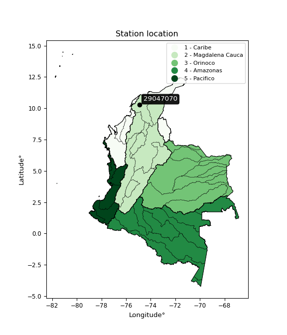

<div align="center">


</div>

# PMP Station (Rain, Pmax24h): 29047070

Probable Maximum Precipitation (PMP) is the greatest amount of rainfall for a specific duration that is meteorologically possible for a given location, acting as a "worst-case" scenario for extreme storms, crucial for designing safety-critical infrastructure like bridges, river deviations, dams, spillways, and nuclear plants to prevent catastrophic failure. PMP is calculated by hydrologists using meteorological data to determine the upper limit of extreme rainfall, often leading to the Probable Maximum Flood (PMF) for flood control design, and is increasingly being studied for climate change impacts. Probable Maximum Precipitation (PMP) is the theoretical upper limit of rainfall, a deterministic estimate for extreme events, while probability distributions (like GEV, Gumbel) describe the likelihood and frequency of various precipitation amounts, including rare ones, showing how often events occur, with PMP representing the extreme end of these distributions, used for critical infrastructure design to ensure safety against the worst conceivable weather, unlike standard statistical forecasts which cover typical probabilities.

The most common probability distributions in hydrology, used for analyzing floods, rainfall, and streamflow, include the Normal, Log-Normal, Gumbel, Gamma (including Log-Pearson Type III), and Generalized Extreme Value (GEV) distributions, often chosen based on the data´s skewness and whether modeling extremes or general conditions, with Gumbel and GEV popular for extreme events like floods, while the Normal distribution serves as a baseline, though often requiring transformations for skewed hydrological data. These distributions help in designing water infrastructure, managing water resources, and forecasting hydrologic events.

> Hydrological data often isn´t perfectly normal (it´s skewed), so different distributions are needed for different applications, such as: **Flood Frequency Analysis**: Using Gumbel, GEV, or Log-Pearson Type III for predicting extreme flood magnitudes and their return periods, **Rainfall Analysis**: Normal for annual totals, but Log-Normal, Weibull, or GEV for intensity or extreme daily rainfall, **Streamflow Modeling**: Gamma and Log-Normal for maximum flows, GEV for minimum flows, and Kappa for daily flows.

<div align="center">

</img>

</div>


## A. General information


### 1. General running parameters

• app_version: _v20260113_. • runtime: _2026-01-17 18:24:04.630693_. • Python version: _3.14.0_. • SciPy version: _1.16.3_. • Pandas version: _2.3.3_. • NumPy version: _2.3.5_. • Stations dataset (station_dataset_file): _dataset/pmax24h_in/automatic_colombia_2003_2025.csv_. • Stations catalog (station_catalog_file): _dataset/CNE.xls_. • Minimum year to eval til year_max (date_min): _1900_. • Maximum year to eval since year_min (date_max): _2025_. • Creates, save and include plots into reports (create_plot): _False_. • Plot only fit distributions with Δo > Δ (plot_only_fit): _True_. • Plot only simple graphs avoiding multiple CDFs and multiple Extreme values plots (plot_only_simple): _True_. • Eval low extreme values, if False, evaluates high extreme values (low_extreme): _False_. • Eval every SciPy distribution as logarithmic (pdist_logarithmic_on): _True_. • Standard deviation normalized (ddof): _1.0_. • Return periods to eval in years (Tr): _[2, 2.33, 5, 10, 15, 20, 25, 50, 75, 100, 200, 250, 500, 750, 1000]_. • Minimum data sample per station, 0 means any (minimum_sample): _5_. • Z-Score maximum threshold to adjust a value, 0 means disable (zscore_max): _3.5_. • Z-Score minimum threshold to adjust a value, 0 means disable (zscore_min): _-2.5_. • Avoid zeros, e.g. rain = 0 (avoid_zeros): _True_. • Avoid null values (avoid_nans): _True_. 

:file_folder:Table: [dataset.csv](../../dataset/pmax24h_in/automatic_colombia_2003_2025.csv)

> Delta Degrees of Freedom (DDOF): is a parameter used in the formulas for calculating variance and standard deviation. When ddof=0, the divisor is $N$ (the total number of observations) and this is used when your data set is the entire population. When ddof=1, the divisor is $N-1$ and this is used when your data set is a sample drawn from a larger population. Using $N-1$ provides an unbiased estimate of the population variance (known as Bessel´s correction).


### 2. Station info and location

|   id |   CODIGO | NOMBRE                       | CATEGORIA    | TECNOLOGIA                              | ESTADO   | FECHA_INSTALACION   |   FECHA_SUSPENSION |   ALTITUD |   LATITUD |   LONGITUD | DEPARTAMENTO   | MUNICIPIO   | AREA_OPERATIVA                              | ENTIDAD                                                     | AREA_HIDROGRAFICA   | ZONA_HIDROGRAFICA   | SUBZONA_HIDROGRAFICA           | CORRIENTE   | Catalogo   |   Version |
|-----:|---------:|:-----------------------------|:-------------|:----------------------------------------|:---------|:--------------------|-------------------:|----------:|----------:|-----------:|:---------------|:------------|:--------------------------------------------|:------------------------------------------------------------|:--------------------|:--------------------|:-------------------------------|:------------|:-----------|----------:|
|    0 | 29047070 | SAN PEDRITO - AUT [29047070] | Limnigráfica | Automática con Telemetría, Convencional | Activa   | 15/05/1978          |                nan |         8 |   10.2682 |   -74.9079 | Atlantico      | Suan        | Area Operativa 02 - Atlántico-Bolivar-Sucre | INSTITUTO DE HIDROLOGIA METEOROLOGIA Y ESTUDIOS AMBIENTALES | Magdalena Cauca     | Bajo Magdalena      | Canal del Dique margen derecho | Magdalena   | CNE_IDEAM  |  20251226 |

<div align="center">

Dynamic map: [:earth_americas:Google](http://maps.google.com/maps?q=10.26822222,-74.90786111) [:earth_americas:OSM](https://www.openstreetmap.org/#map=18/10.26822222/-74.90786111&layers=P) [:earth_americas:Bing](https://www.bing.com/maps?cp=10.26822222~-74.90786111&lvl=18) [:earth_americas:Apple](https://maps.apple.com/frame?center=10.26822222%2C-74.90786111&span=0.003%2C0.006)

</div>


<div align="center">

```geojson
{
  "type": "Feature",
  "geometry": {
    "type": "Point", 
    "coordinates": [-74.90786111, 10.26822222]
  }, 
  "properties": {
    "Name": "29047070"
  }
}
```

</div>


### 3. Discrete values table and plot

<div align="center">

|               |           0 |           1 |           2 |           3 |           4 |           5 |          6 |           7 |          8 |
|:--------------|------------:|------------:|------------:|------------:|------------:|------------:|-----------:|------------:|-----------:|
| Date          | 2017        | 2018        | 2019        | 2020        | 2021        | 2022        | 2023       | 2024        | 2025       |
| Value         |   48.4      |   31.3      |   64.5      |   40.2      |   30.7      |   35.8      |   19.8     |   32.8      |  100.2     |
| Value_initial |   48.4      |   31.3      |   64.5      |   40.2      |   30.7      |   35.8      |   19.8     |   32.8      |  100.2     |
| count         |    9        |    9        |    9        |    9        |    9        |    9        |    9       |    9        |    9       |
| mean          |   44.8556   |   44.8556   |   44.8556   |   44.8556   |   44.8556   |   44.8556   |   44.8556  |   44.8556   |   44.8556  |
| std           |   24.2961   |   24.2961   |   24.2961   |   24.2961   |   24.2961   |   24.2961   |   24.2961  |   24.2961   |   24.2961  |
| zscore        |    0.145885 |   -0.557931 |    0.808543 |   -0.191617 |   -0.582627 |   -0.372716 |   -1.03126 |   -0.496193 |    2.27792 |


</div>


> The initial value (value_initial) correspond to the initial obtained or null completed value, and value (value) is adjusted only when the initial value is outside the valid range (outlier) definite through the Z-Score value. If Z-Score is active, values out of range or outliers are replaced with the station mean value. A Z-Score (or standard score) measures how many standard deviations a data point is from the mean of a dataset, indicating its relative position; positive scores mean above the mean, negative mean below, and a score of zero is exactly at the mean, allowing for comparison of values from different distributions. It´s calculated using the formula $z=(x–μ)/σ$, where $x$ is the data point, $μ$ is the mean, and $σ$ is the standard deviation, helping identify outliers and understand probability.
>
> <sub>**Note**: In this study, "completing" (filling gaps in) and "extending" (forecasting or lengthening the historical record) rainfall data series are avoided for certain critical analyses because they introduce artificial bias and uncertainty, which can distort the statistics of rare events (extremes), alter day-to-day variability, and compromise the integrity and homogeneity of the original data. Some reasons against Completing/Extending rainfall data are: **Distortion of Extremes and Variability**: The primary issue is that most gap-filling or extension methods rely on averaging or regression with nearby stations, which inherently smooths the data. Rainfall is highly variable in space and time, with a large percentage of zero values and occasional large storms. Infilling methods often underestimate the highest values and overestimate the lowest (zero) values, which severely distorts analyses focused on flood frequency, drought severity, and intensity-duration-frequency (IDF) curves, **Loss of Data Homogeneity**: Infilled or extended data are synthetic estimates, not actual measurements. Combining these estimates with observed data can violate the assumption of data homogeneity, which requires that the data properties do not change over time. Inhomogeneity can lead to incorrect conclusions about long-term trends or changes in climate patterns, **Propagation of Errors**: Errors and biases from the original data (e.g., wind-induced undercatch, instrument errors, site changes) or the data used for imputation can propagate through the analysis, leading to unreliable hydrological models and inaccurate predictions, **Compromised Statistical Integrity**: For statistical analyses, especially those involving the frequency of events, using artificial data can introduce time bias or autocorrelation that doesn´t exist in reality, making it difficult to assess the true probability of events, **Difficulty in Validation**: It is difficult to accurately validate the quality of filled or extended data, especially for past periods where ground-truth measurements are unavailable. The reliability of imputation techniques heavily depends on the density of the surrounding station network and the complexity of the local topography.</sub>


### 4. Active continuous probability distributions from SciPy (80 of 104 available)

A Probability Density Function (PDF) describes the relative likelihood of a continuous random variable falling within a specific range, where the total area under its curve equals 1, and the area over any interval gives the actual probability for that range. Unlike discrete probabilities (like rolling a die), a PDF shows density, not direct probability for a single point (which is zero), with higher points indicating higher likelihood, often visualized as a bell curve for normal distributions.

A log of a probability density function (log-PDF) is simply the logarithm of the PDF´s value, denoted as $log(f(x))$, useful for converting multiplication of probabilities into addition, improving numerical stability with tiny numbers, and connecting to information theory concepts like entropy. Instead of dealing with very small probabilities (e.g., 0.000001), log-PDFs use negative numbers (e.g., $log(0.00001) ≈ -11.51$ that are easier for computers to handle, preventing underflow errors and simplifying complex calculations. In this study, each active probability distribution from SciPy is also evaluated in the $log$ form.

[scipy.stats](https://docs.scipy.org/doc/scipy/reference/stats.html) is a Python´s powerful submodule within the SciPy library for comprehensive statistical analysis, offering over 130 probability distributions (like Normal, Poisson), functions for descriptive stats (mean, variance), hypothesis testing (t-tests, chi-square), random variable generation, and statistical tests, making it essential for data science, modeling, and research. It provides tools to explore, model, and draw conclusions from data efficiently, working seamlessly with NumPy.

<div align="center">

|   id | p_dist           |   n_parameter | fit_method   | label                                                                       | active   | ref                                                                                                      |
|-----:|:-----------------|--------------:|:-------------|:----------------------------------------------------------------------------|:---------|:---------------------------------------------------------------------------------------------------------|
|    0 | alpha            |             3 | MLE          | Alpha                                                                       | True     | [:mortar_board:](https://docs.scipy.org/doc/scipy/reference/generated/scipy.stats.alpha.html)            |
|    1 | anglit           |             2 | MM           | Anglit                                                                      | True     | [:mortar_board:](https://docs.scipy.org/doc/scipy/reference/generated/scipy.stats.anglit.html)           |
|    2 | arcsine          |             2 | MM           | Arcsine                                                                     | True     | [:mortar_board:](https://docs.scipy.org/doc/scipy/reference/generated/scipy.stats.arcsine.html)          |
|    3 | argus            |             3 | MLE          | Argus                                                                       | True     | [:mortar_board:](https://docs.scipy.org/doc/scipy/reference/generated/scipy.stats.argus.html)            |
|    4 | beta             |             4 | MLE          | Beta                                                                        | True     | [:mortar_board:](https://docs.scipy.org/doc/scipy/reference/generated/scipy.stats.beta.html)             |
|    5 | betaprime        |             4 | MLE          | Beta prime                                                                  | True     | [:mortar_board:](https://docs.scipy.org/doc/scipy/reference/generated/scipy.stats.betaprime.html)        |
|    6 | bradford         |             3 | MLE          | Bradford                                                                    | True     | [:mortar_board:](https://docs.scipy.org/doc/scipy/reference/generated/scipy.stats.bradford.html)         |
|    7 | burr             |             4 | MLE          | Burr (Type III)                                                             | True     | [:mortar_board:](https://docs.scipy.org/doc/scipy/reference/generated/scipy.stats.burr.html)             |
|    8 | burr12           |             4 | MLE          | Burr (Type III) 12                                                          | True     | [:mortar_board:](https://docs.scipy.org/doc/scipy/reference/generated/scipy.stats.burr12.html)           |
|    9 | cosine           |             2 | MLE          | Cosine                                                                      | True     | [:mortar_board:](https://docs.scipy.org/doc/scipy/reference/generated/scipy.stats.cosine.html)           |
|   10 | crystalball      |             4 | MLE          | Crystalball                                                                 | True     | [:mortar_board:](https://docs.scipy.org/doc/scipy/reference/generated/scipy.stats.crystalball.html)      |
|   11 | dgamma           |             3 | MLE          | Double gamma                                                                | True     | [:mortar_board:](https://docs.scipy.org/doc/scipy/reference/generated/scipy.stats.dgamma.html)           |
|   12 | dweibull         |             3 | MLE          | Double Weibull                                                              | True     | [:mortar_board:](https://docs.scipy.org/doc/scipy/reference/generated/scipy.stats.dweibull.html)         |
|   13 | erlang           |             3 | MLE          | Erlang                                                                      | True     | [:mortar_board:](https://docs.scipy.org/doc/scipy/reference/generated/scipy.stats.erlang.html)           |
|   14 | exponnorm        |             3 | MLE          | Exponentially modified Normal                                               | True     | [:mortar_board:](https://docs.scipy.org/doc/scipy/reference/generated/scipy.stats.exponnorm.html)        |
|   15 | exponpow         |             3 | MLE          | Exponential power                                                           | True     | [:mortar_board:](https://docs.scipy.org/doc/scipy/reference/generated/scipy.stats.exponpow.html)         |
|   16 | exponweib        |             4 | MLE          | Exponentiated Weibull                                                       | True     | [:mortar_board:](https://docs.scipy.org/doc/scipy/reference/generated/scipy.stats.exponweib.html)        |
|   17 | f                |             4 | MLE          | F                                                                           | True     | [:mortar_board:](https://docs.scipy.org/doc/scipy/reference/generated/scipy.stats.f.html)                |
|   18 | fatiguelife      |             3 | MLE          | Fatigue-life (Birnbaum-Saunders)                                            | True     | [:mortar_board:](https://docs.scipy.org/doc/scipy/reference/generated/scipy.stats.fatiguelife.html)      |
|   19 | foldnorm         |             3 | MM           | Fold Normal                                                                 | True     | [:mortar_board:](https://docs.scipy.org/doc/scipy/reference/generated/scipy.stats.foldnorm.html)         |
|   20 | gamma            |             3 | MLE          | Gamma                                                                       | True     | [:mortar_board:](https://docs.scipy.org/doc/scipy/reference/generated/scipy.stats.gamma.html)            |
|   21 | gausshyper       |             6 | MLE          | Gauss hypergeometric                                                        | True     | [:mortar_board:](https://docs.scipy.org/doc/scipy/reference/generated/scipy.stats.gausshyper.html)       |
|   22 | genexpon         |             5 | MLE          | Generalized exponential                                                     | True     | [:mortar_board:](https://docs.scipy.org/doc/scipy/reference/generated/scipy.stats.genexpon.html)         |
|   23 | genextreme       |             3 | MLE          | Generalized exponential                                                     | True     | [:mortar_board:](https://docs.scipy.org/doc/scipy/reference/generated/scipy.stats.genextreme.html)       |
|   24 | gengamma         |             4 | MLE          | Generalized gamma                                                           | True     | [:mortar_board:](https://docs.scipy.org/doc/scipy/reference/generated/scipy.stats.gengamma.html)         |
|   25 | genhalflogistic  |             3 | MLE          | Generalized half-logistic                                                   | True     | [:mortar_board:](https://docs.scipy.org/doc/scipy/reference/generated/scipy.stats.genhalflogistic.html)  |
|   26 | genlogistic      |             3 | MLE          | Generalized logistic                                                        | True     | [:mortar_board:](https://docs.scipy.org/doc/scipy/reference/generated/scipy.stats.genlogistic.html)      |
|   27 | gennorm          |             3 | MLE          | Generalized Normal                                                          | True     | [:mortar_board:](https://docs.scipy.org/doc/scipy/reference/generated/scipy.stats.gennorm.html)          |
|   28 | genpareto        |             3 | MLE          | Generalized Pareto                                                          | True     | [:mortar_board:](https://docs.scipy.org/doc/scipy/reference/generated/scipy.stats.genpareto.html)        |
|   29 | gompertz         |             3 | MLE          | Gompertz (or truncated Gumbel)                                              | True     | [:mortar_board:](https://docs.scipy.org/doc/scipy/reference/generated/scipy.stats.gompertz.html)         |
|   30 | gumbel_l         |             2 | MM           | Gumbel Left Skew                                                            | True     | [:mortar_board:](https://docs.scipy.org/doc/scipy/reference/generated/scipy.stats.gumbel_l.html)         |
|   31 | gumbel_r         |             2 | MM           | Gumbel Right Skew                                                           | True     | [:mortar_board:](https://docs.scipy.org/doc/scipy/reference/generated/scipy.stats.gumbel_r.html)         |
|   32 | halfgennorm      |             3 | MLE          | Upper half of a generalized normal                                          | True     | [:mortar_board:](https://docs.scipy.org/doc/scipy/reference/generated/scipy.stats.halfgennorm.html)      |
|   33 | halflogistic     |             2 | MM           | Half-logistic                                                               | True     | [:mortar_board:](https://docs.scipy.org/doc/scipy/reference/generated/scipy.stats.halflogistic.html)     |
|   34 | halfnorm         |             2 | MM           | Half Normal                                                                 | True     | [:mortar_board:](https://docs.scipy.org/doc/scipy/reference/generated/scipy.stats.halfnorm.html)         |
|   35 | hypsecant        |             2 | MM           | hyperbolic secant                                                           | True     | [:mortar_board:](https://docs.scipy.org/doc/scipy/reference/generated/scipy.stats.hypsecant.html)        |
|   36 | invgamma         |             3 | MLE          | Inverted gamma                                                              | True     | [:mortar_board:](https://docs.scipy.org/doc/scipy/reference/generated/scipy.stats.invgamma.html)         |
|   37 | invgauss         |             3 | MLE          | Inverse Gaussian                                                            | True     | [:mortar_board:](https://docs.scipy.org/doc/scipy/reference/generated/scipy.stats.invgauss.html)         |
|   38 | invweibull       |             3 | MLE          | Inverted Weibull                                                            | True     | [:mortar_board:](https://docs.scipy.org/doc/scipy/reference/generated/scipy.stats.invweibull.html)       |
|   39 | johnsonsb        |             4 | MLE          | Johnson SB                                                                  | True     | [:mortar_board:](https://docs.scipy.org/doc/scipy/reference/generated/scipy.stats.johnsonsb.html)        |
|   40 | johnsonsu        |             4 | MLE          | Johnson Su                                                                  | True     | [:mortar_board:](https://docs.scipy.org/doc/scipy/reference/generated/scipy.stats.johnsonsu.html)        |
|   41 | kappa3           |             3 | MLE          | Kappa 3                                                                     | True     | [:mortar_board:](https://docs.scipy.org/doc/scipy/reference/generated/scipy.stats.kappa3.html)           |
|   42 | kappa4           |             4 | MLE          | Kappa 4                                                                     | True     | [:mortar_board:](https://docs.scipy.org/doc/scipy/reference/generated/scipy.stats.kappa4.html)           |
|   43 | ksone            |             3 | MLE          | Kolmogorov-Smirnov one-sided test statistic distribution                    | True     | [:mortar_board:](https://docs.scipy.org/doc/scipy/reference/generated/scipy.stats.ksone.html)            |
|   44 | kstwobign        |             2 | MLE          | Limiting distribution of scaled Kolmogorov-Smirnov two-sided test statistic | True     | [:mortar_board:](https://docs.scipy.org/doc/scipy/reference/generated/scipy.stats.kstwobign.html)        |
|   45 | laplace          |             2 | MM           | Laplace                                                                     | True     | [:mortar_board:](https://docs.scipy.org/doc/scipy/reference/generated/scipy.stats.laplace.html)          |
|   46 | levy_l           |             2 | MLE          | Left-skewed Levy                                                            | True     | [:mortar_board:](https://docs.scipy.org/doc/scipy/reference/generated/scipy.stats.levy_l.html)           |
|   47 | loggamma         |             3 | MLE          | Log gamma                                                                   | True     | [:mortar_board:](https://docs.scipy.org/doc/scipy/reference/generated/scipy.stats.loggamma.html)         |
|   48 | logistic         |             2 | MM           | Logistic (or Sech-squared)                                                  | True     | [:mortar_board:](https://docs.scipy.org/doc/scipy/reference/generated/scipy.stats.logistic.html)         |
|   49 | loglaplace       |             3 | MLE          | Log-Laplace                                                                 | True     | [:mortar_board:](https://docs.scipy.org/doc/scipy/reference/generated/scipy.stats.loglaplace.html)       |
|   50 | lomax            |             3 | MLE          | Lomax (Pareto of the second kind)                                           | True     | [:mortar_board:](https://docs.scipy.org/doc/scipy/reference/generated/scipy.stats.lomax.html)            |
|   51 | maxwell          |             2 | MM           | Maxwell                                                                     | True     | [:mortar_board:](https://docs.scipy.org/doc/scipy/reference/generated/scipy.stats.maxwell.html)          |
|   52 | mielke           |             4 | MLE          | Mielke Beta-Kappa / Dagum                                                   | True     | [:mortar_board:](https://docs.scipy.org/doc/scipy/reference/generated/scipy.stats.mielke.html)           |
|   53 | moyal            |             2 | MM           | Moyal                                                                       | True     | [:mortar_board:](https://docs.scipy.org/doc/scipy/reference/generated/scipy.stats.moyal.html)            |
|   54 | nakagami         |             3 | MLE          | Nakagami                                                                    | True     | [:mortar_board:](https://docs.scipy.org/doc/scipy/reference/generated/scipy.stats.nakagami.html)         |
|   55 | ncf              |             5 | MLE          | Non-central F distribution                                                  | True     | [:mortar_board:](https://docs.scipy.org/doc/scipy/reference/generated/scipy.stats.ncf.html)              |
|   56 | nct              |             4 | MLE          | Non-central Student’s t                                                     | True     | [:mortar_board:](https://docs.scipy.org/doc/scipy/reference/generated/scipy.stats.nct.html)              |
|   57 | norm             |             2 | MM           | Normal                                                                      | True     | [:mortar_board:](https://docs.scipy.org/doc/scipy/reference/generated/scipy.stats.norm.html)             |
|   58 | pearson3         |             3 | MM           | Pearson type III                                                            | True     | [:mortar_board:](https://docs.scipy.org/doc/scipy/reference/generated/scipy.stats.pearson3.html)         |
|   59 | powerlaw         |             3 | MLE          | Power-function                                                              | True     | [:mortar_board:](https://docs.scipy.org/doc/scipy/reference/generated/scipy.stats.powerlaw.html)         |
|   60 | rayleigh         |             2 | MM           | Rayleigh                                                                    | True     | [:mortar_board:](https://docs.scipy.org/doc/scipy/reference/generated/scipy.stats.rayleigh.html)         |
|   61 | rdist            |             3 | MLE          | R-distributed (symmetric beta)                                              | True     | [:mortar_board:](https://docs.scipy.org/doc/scipy/reference/generated/scipy.stats.rdist.html)            |
|   62 | rice             |             3 | MLE          | Rice                                                                        | True     | [:mortar_board:](https://docs.scipy.org/doc/scipy/reference/generated/scipy.stats.rice.html)             |
|   63 | semicircular     |             2 | MM           | Semicircular                                                                | True     | [:mortar_board:](https://docs.scipy.org/doc/scipy/reference/generated/scipy.stats.semicircular.html)     |
|   64 | skewnorm         |             3 | MLE          | Skew normal                                                                 | True     | [:mortar_board:](https://docs.scipy.org/doc/scipy/reference/generated/scipy.stats.skewnorm.html)         |
|   65 | t                |             3 | MLE          | Student’s t                                                                 | True     | [:mortar_board:](https://docs.scipy.org/doc/scipy/reference/generated/scipy.stats.t.html)                |
|   66 | trapezoid        |             4 | MLE          | Trapezoid                                                                   | True     | [:mortar_board:](https://docs.scipy.org/doc/scipy/reference/generated/scipy.stats.trapezoid.html)        |
|   67 | triang           |             3 | MLE          | Triangular                                                                  | True     | [:mortar_board:](https://docs.scipy.org/doc/scipy/reference/generated/scipy.stats.triang.html)           |
|   68 | truncexpon       |             3 | MLE          | Truncated exponential                                                       | True     | [:mortar_board:](https://docs.scipy.org/doc/scipy/reference/generated/scipy.stats.truncexpon.html)       |
|   69 | truncnorm        |             4 | MLE          | Truncated normal                                                            | True     | [:mortar_board:](https://docs.scipy.org/doc/scipy/reference/generated/scipy.stats.truncnorm.html)        |
|   70 | truncpareto      |             4 | MLE          | Upper truncated Pareto                                                      | True     | [:mortar_board:](https://docs.scipy.org/doc/scipy/reference/generated/scipy.stats.truncpareto.html)      |
|   71 | truncweibull_min |             5 | MLE          | Doubly truncated Weibull minimum                                            | True     | [:mortar_board:](https://docs.scipy.org/doc/scipy/reference/generated/scipy.stats.truncweibull_min.html) |
|   72 | tukeylambda      |             3 | MLE          | Tukey-Lamdba                                                                | True     | [:mortar_board:](https://docs.scipy.org/doc/scipy/reference/generated/scipy.stats.tukeylambda.html)      |
|   73 | uniform          |             2 | MLE          | Uniform                                                                     | True     | [:mortar_board:](https://docs.scipy.org/doc/scipy/reference/generated/scipy.stats.uniform.html)          |
|   74 | vonmises         |             3 | MLE          | Von Mises                                                                   | True     | [:mortar_board:](https://docs.scipy.org/doc/scipy/reference/generated/scipy.stats.vonmises.html)         |
|   75 | vonmises_line    |             3 | MLE          | Von Mises line                                                              | True     | [:mortar_board:](https://docs.scipy.org/doc/scipy/reference/generated/scipy.stats.vonmises_line.html)    |
|   76 | wald             |             2 | MM           | Wald                                                                        | True     | [:mortar_board:](https://docs.scipy.org/doc/scipy/reference/generated/scipy.stats.wald.html)             |
|   77 | weibull_max      |             3 | MLE          | Weibull maximum                                                             | True     | [:mortar_board:](https://docs.scipy.org/doc/scipy/reference/generated/scipy.stats.weibull_max.html)      |
|   78 | weibull_min      |             3 | MLE          | Weibull minimum                                                             | True     | [:mortar_board:](https://docs.scipy.org/doc/scipy/reference/generated/scipy.stats.weibull_min.html)      |
|   79 | wrapcauchy       |             3 | MLE          | Wrapped  Cauchy                                                             | True     | [:mortar_board:](https://docs.scipy.org/doc/scipy/reference/generated/scipy.stats.wrapcauchy.html)       |

</div>

> **n_parameter:** # arguments & localization & scale.
>
> **Fit methods:** (MLE) maximum likelihood, (MM) L-moments.
>
>**Inactive** (With the only purpose of prevent loops, zero divisions, infinite values, over high estimated values or horizontal trending for recurrence intervals estimations, the follow distributions were disabled.)**:** lognorm, norminvgauss, powernorm, powerlognorm, cauchy, halfcauchy, foldcauchy, skewcauchy, chi2, expon, fisk, genhyperbolic, geninvgauss, gibrat, kstwo, laplace_asymmetric, levy, levy_stable, ncx2, pareto, rel_breitwigner, recipinvgauss, studentized_range, loguniform, 


## B. Probability (PDF) vs. Empirical (EDF) distributions functions

A continuous probability distribution (CPD) describes probabilities for variables that can take any value within a range (like rain any time), unlike discrete variables with specific outcomes (like temperature). It uses a Probability Density Function (PDF), a curve where the total area under it equals 1, and the probability of the variable falling within an interval (a to b) is found by calculating the area under the curve between those points. A key feature is that the probability of hitting any single exact value is zero, so probabilities are always expressed for ranges, e.g., $P(a ≤ X ≤ b)$.

<div align="center">

Distributions parameters from station values
|     |   station | p_dist              |   n |               loc |            scale | shape                  | shape1                | shape2                | shape3            |
|----:|----------:|:--------------------|----:|------------------:|-----------------:|:-----------------------|:----------------------|:----------------------|:------------------|
|   0 |  29047070 | alpha               |   9 |     -10.7568      |    153.6         | 3.13548438845679       |                       |                       |                   |
|   1 |  29047070 | anglit              |   9 |      44.8556      |     67.0109      |                        |                       |                       |                   |
|   2 |  29047070 | arcsine             |   9 |      12.4607      |     64.7896      |                        |                       |                       |                   |
|   3 |  29047070 | argus               |   9 |     -11.3907      |    115.059       | 1.5117795105470394e-06 |                       |                       |                   |
|   4 |  29047070 | beta                |   9 |      15.9964      |     84.2036      | 0.40730506974334774    | 0.4761485223184859    |                       |                   |
|   5 |  29047070 | betaprime           |   9 |      -0.611643    |      1.1343      | 198.83234674895562     | 5.98217867066306      |                       |                   |
|   6 |  29047070 | bradford            |   9 |      19.8         |     84.1617      | 6.556204725453064      |                       |                       |                   |
|   7 |  29047070 | burr                |   9 |      -0.112642    |     21.781       | 3.0649314598885926     | 4.224568819015943     |                       |                   |
|   8 |  29047070 | burr12              |   9 |      -0.4964      |     20.1354      | 440.9593266030318      | 0.0032053946003055434 |                       |                   |
|   9 |  29047070 | cosine              |   9 |      49.8913      |     21.1158      |                        |                       |                       |                   |
|  10 |  29047070 | crystalball         |   9 |      44.8556      |     22.9066      | 4389.247870847495      | 5.122989579966267     |                       |                   |
|  11 |  29047070 | dgamma              |   9 |      35.8         |     19.145       | 0.8506239090489309     |                       |                       |                   |
|  12 |  29047070 | dweibull            |   9 |      35.8         |     19.9304      | 0.8075769602796472     |                       |                       |                   |
|  13 |  29047070 | erlang              |   9 |      19.8         |      3.72272     | 0.274167460994166      |                       |                       |                   |
|  14 |  29047070 | exponnorm           |   9 |      23.9732      |      5.47336     | 3.8152967537791262     |                       |                       |                   |
|  15 |  29047070 | exponpow            |   9 |      19.8         |     54.4862      | 0.780193501724701      |                       |                       |                   |
|  16 |  29047070 | exponweib           |   9 |      19.8         |      0.255058    | 1.5025450342326456     | 0.18672746883221886   |                       |                   |
|  17 |  29047070 | f                   |   9 |       6.16121     |     29.7182      | 196.6361853313955      | 8.428942253267088     |                       |                   |
|  18 |  29047070 | fatiguelife         |   9 |      19.8         |      2.30739e-05 | 912.0098372311868      |                       |                       |                   |
|  19 |  29047070 | foldnorm            |   9 |      13.232       |     39.321       | 0.0331372424418334     |                       |                       |                   |
|  20 |  29047070 | gamma               |   9 |      19.8         |     47.2427      | 0.21118282656725607    |                       |                       |                   |
|  21 |  29047070 | gausshyper          |   9 |      19.8         |     80.4         | 0.7320367896534536     | 0.9496116814889481    | 0.727100655399378     | 1.094124149495761 |
|  22 |  29047070 | genexpon            |   9 |      19.8         |     23.6875      | 0.7019285717666592     | 0.36122566583462123   | 2.0629028525821327    |                   |
|  23 |  29047070 | genextreme          |   9 |      20.4983      |      4.21398     | -6.0347240411230665    |                       |                       |                   |
|  24 |  29047070 | gengamma            |   9 |      19.8         |      0.620079    | 1.4477389949673898     | 0.27369257309130673   |                       |                   |
|  25 |  29047070 | genhalflogistic     |   9 |      12.6386      |     88.676       | 1.0127296550454452     |                       |                       |                   |
|  26 |  29047070 | genlogistic         |   9 |     -72.5841      |     14.5902      | 1626.7476214819953     |                       |                       |                   |
|  27 |  29047070 | gennorm             |   9 |      35.8         |      1.43784     | 0.4385015326739791     |                       |                       |                   |
|  28 |  29047070 | genpareto           |   9 |      -0.159726    |    112.872       | -1.1246717771047032    |                       |                       |                   |
|  29 |  29047070 | gompertz            |   9 |      19.8         |     46.3042      | 0.8598976737655062     |                       |                       |                   |
|  30 |  29047070 | gumbel_l            |   9 |      55.1647      |     17.8602      |                        |                       |                       |                   |
|  31 |  29047070 | gumbel_r            |   9 |      34.5464      |     17.8602      |                        |                       |                       |                   |
|  32 |  29047070 | halfgennorm         |   9 |      19.8         |      0.95695     | 0.3579128310733589     |                       |                       |                   |
|  33 |  29047070 | halflogistic        |   9 |      17.7059      |     19.5843      |                        |                       |                       |                   |
|  34 |  29047070 | halfnorm            |   9 |      14.5362      |     37.9996      |                        |                       |                       |                   |
|  35 |  29047070 | hypsecant           |   9 |      44.8556      |     14.5828      |                        |                       |                       |                   |
|  36 |  29047070 | invgamma            |   9 |       5.59086     |    126.49        | 4.198814362120846      |                       |                       |                   |
|  37 |  29047070 | invgauss            |   9 |      11.3061      |     69.2216      | 0.4846666491649751     |                       |                       |                   |
|  38 |  29047070 | invweibull          |   9 |      19.8         |      1.08568     | 0.05338128690315089    |                       |                       |                   |
|  39 |  29047070 | johnsonsb           |   9 |      19.8         |     80.4056      | 0.17670854928424526    | 0.0750171902957773    |                       |                   |
|  40 |  29047070 | johnsonsu           |   9 |      31.2401      |      2.30059     | -0.6938969941446701    | 0.5296211680942456    |                       |                   |
|  41 |  29047070 | kappa3              |   9 |      19.8         |     23.0761      | 2.529849771484621      |                       |                       |                   |
|  42 |  29047070 | kappa4              |   9 |      11.6329      |     88.6726      | 1.1013166490366226     | 0.9751622819186763    |                       |                   |
|  43 |  29047070 | ksone               |   9 |      11.76        |     96.48        | 1.0                    |                       |                       |                   |
|  44 |  29047070 | kstwobign           |   9 |     -19.1817      |     74.3809      |                        |                       |                       |                   |
|  45 |  29047070 | laplace             |   9 |      44.8556      |     16.1974      |                        |                       |                       |                   |
|  46 |  29047070 | levy_l              |   9 |     106.838       |     33.1092      |                        |                       |                       |                   |
|  47 |  29047070 | loggamma            |   9 |   -8372.96        |   1096.62        | 2157.1734212378815     |                       |                       |                   |
|  48 |  29047070 | logistic            |   9 |      44.8556      |     12.6291      |                        |                       |                       |                   |
|  49 |  29047070 | loglaplace          |   9 |      -0.0942479   |     35.8943      | 2.9949477476101225     |                       |                       |                   |
|  50 |  29047070 | lomax               |   9 |      19.8         |      2.36882e+10 | 412816758.0927482      |                       |                       |                   |
|  51 |  29047070 | maxwell             |   9 |      -9.42342     |     34.0143      |                        |                       |                       |                   |
|  52 |  29047070 | mielke              |   9 |      -0.142331    |     21.7762      | 12.998743518207634     | 3.0662148172262267    |                       |                   |
|  53 |  29047070 | moyal               |   9 |      31.7561      |     10.3116      |                        |                       |                       |                   |
|  54 |  29047070 | nakagami            |   9 |      19.8         |     48.4629      | 0.09077274533605101    |                       |                       |                   |
|  55 |  29047070 | ncf                 |   9 |      -0.0362949   |      1.19483e-05 | 2.882362926660032e-06  | 4.223902117647304     | 9.121668393671381     |                   |
|  56 |  29047070 | nct                 |   9 |      -0.708865    |      2.36697     | 3.497719272486364      | 14.87571280053659     |                       |                   |
|  57 |  29047070 | norm                |   9 |      44.8556      |     22.9066      |                        |                       |                       |                   |
|  58 |  29047070 | pearson3            |   9 |      44.8556      |     22.9066      | 1.4189338016583404     |                       |                       |                   |
|  59 |  29047070 | powerlaw            |   9 |      19.8         |     80.4         | 0.1873843875346868     |                       |                       |                   |
|  60 |  29047070 | rayleigh            |   9 |       1.03393     |     34.9646      |                        |                       |                       |                   |
|  61 |  29047070 | rdist               |   9 |      14.1122      |     34.2878      | 1.2340948172036867     |                       |                       |                   |
|  62 |  29047070 | rice                |   9 |       9.50219     |     29.7873      | 0.00028278095847476055 |                       |                       |                   |
|  63 |  29047070 | semicircular        |   9 |      44.8555      |     45.8132      |                        |                       |                       |                   |
|  64 |  29047070 | skewnorm            |   9 |      19.8         |     33.9468      | 121598476.21647495     |                       |                       |                   |
|  65 |  29047070 | t                   |   9 |      44.6392      |     22.4839      | 9.906544109565573      |                       |                       |                   |
|  66 |  29047070 | trapezoid           |   9 |      11.76        |     96.48        | 1.0                    | 1.0                   |                       |                   |
|  67 |  29047070 | triang              |   9 |     -21.9632      |    122.165       | 0.9999834454868559     |                       |                       |                   |
|  68 |  29047070 | truncexpon          |   9 |      19.8         |     63.0736      | 1.2747019764417948     |                       |                       |                   |
|  69 |  29047070 | truncnorm           |   9 |      44.8556      |     22.9066      | -315.19133746006503    | 625.4259535103363     |                       |                   |
|  70 |  29047070 | truncpareto         |   9 |      19.7973      |      0.00274729  | 0.12516879054346536    | 29266.231948485434    |                       |                   |
|  71 |  29047070 | truncweibull_min    |   9 |      19.5399      |     63.0041      | 0.7264856058737816     | 0.004128777659479596  | 1.2802363686197353    |                   |
|  72 |  29047070 | tukeylambda         |   9 |      35.9682      |     21.2977      | 1.31725652943893       |                       |                       |                   |
|  73 |  29047070 | uniform             |   9 |      19.8         |     80.4         |                        |                       |                       |                   |
|  74 |  29047070 | vonmises            |   9 |       0.196979    |      1           | 0.452806618425263      |                       |                       |                   |
|  75 |  29047070 | vonmises_line       |   9 |      40.004       |     19.161       | 1.505148241914375      |                       |                       |                   |
|  76 |  29047070 | wald                |   9 |      21.9489      |     22.9066      |                        |                       |                       |                   |
|  77 |  29047070 | weibull_max         |   9 |     100.2         |      1.60933     | 0.20907234667138586    |                       |                       |                   |
|  78 |  29047070 | weibull_min         |   9 |      19.8         |     21.8684      | 0.7944670619113618     |                       |                       |                   |
|  79 |  29047070 | wrapcauchy          |   9 |      19.8         |     12.7961      | 0.2567560509754574     |                       |                       |                   |
|  80 |  29047070 | logalpha            |   9 |      -0.0305848   |     31.8644      | 8.667354333655435      |                       |                       |                   |
|  81 |  29047070 | loganglit           |   9 |       3.69657     |      1.30235     |                        |                       |                       |                   |
|  82 |  29047070 | logarcsine          |   9 |       3.06697     |      1.25921     |                        |                       |                       |                   |
|  83 |  29047070 | logargus            |   9 |       2.61596     |      2.05742     | 1.0780175628997838e-05 |                       |                       |                   |
|  84 |  29047070 | logbeta             |   9 |       2.98283     |      1.62434     | 0.8602373687098143     | 0.7337870146212131    |                       |                   |
|  85 |  29047070 | logbetaprime        |   9 |       2.41929     |    409.164       | 8.168103310958772      | 2617.5601007663304    |                       |                   |
|  86 |  29047070 | logbradford         |   9 |       2.98568     |      1.6215      | 1.0806066886414118     |                       |                       |                   |
|  87 |  29047070 | logburr             |   9 |       0.00107014  |      3.41313     | 12.74334266638755      | 1.8826973052975995    |                       |                   |
|  88 |  29047070 | logburr12           |   9 | -570887           | 570891           | 3580091.286496618      | 0.4236981439703421    |                       |                   |
|  89 |  29047070 | logcosine           |   9 |       3.73672     |      0.390132    |                        |                       |                       |                   |
|  90 |  29047070 | logcrystalball      |   9 |       3.69657     |      0.445186    | 6.578684344189536      | 684.249092476778      |                       |                   |
|  91 |  29047070 | logdgamma           |   9 |       3.63702     |      0.245221    | 1.3875182812249336     |                       |                       |                   |
|  92 |  29047070 | logdweibull         |   9 |       3.57795     |      0.338206    | 0.9354742113527531     |                       |                       |                   |
|  93 |  29047070 | logerlang           |   9 |       2.42246     |      0.157303    | 8.099744591533135      |                       |                       |                   |
|  94 |  29047070 | logexponnorm        |   9 |       3.31148     |      0.259369    | 1.4847608572406377     |                       |                       |                   |
|  95 |  29047070 | logexponpow         |   9 |       2.98568     |      1.15864     | 0.9442654211578867     |                       |                       |                   |
|  96 |  29047070 | logexponweib        |   9 |       2.98568     |      1.31588     | 0.07260886014700785    | 2.93179566660893      |                       |                   |
|  97 |  29047070 | logf                |   9 |       1.4203      |      2.20694     | 328.97443379404785     | 65.53305880605751     |                       |                   |
|  98 |  29047070 | logfatiguelife      |   9 |       1.82971     |      1.81539     | 0.23814150078510649    |                       |                       |                   |
|  99 |  29047070 | logfoldnorm         |   9 |       3.11417     |      0.720982    | 0.1620807107435039     |                       |                       |                   |
| 100 |  29047070 | loggamma            |   9 |       2.42246     |      0.157303    | 8.099750612422946      |                       |                       |                   |
| 101 |  29047070 | loggausshyper       |   9 |       2.97943     |      1.62774     | 0.9919732927004736     | 0.9387168488345681    | 1.0235052793054933    | 1.116784687636453 |
| 102 |  29047070 | loggenexpon         |   9 |       2.98568     |      0.10993     | 0.05998560179113405    | 5.786728367507601     | 0.0036755383488559466 |                   |
| 103 |  29047070 | loggenextreme       |   9 |       3.50865     |      0.387071    | 0.10691575814598854    |                       |                       |                   |
| 104 |  29047070 | loggengamma         |   9 |       2.98568     |      1.21838     | 0.35321554013207734    | 2.2573288163066487    |                       |                   |
| 105 |  29047070 | loggenhalflogistic  |   9 |       2.9296      |      1.82135     | 1.0857102170689357     |                       |                       |                   |
| 106 |  29047070 | loggenlogistic      |   9 |       3.08187     |      0.326788    | 4.16912447317692       |                       |                       |                   |
| 107 |  29047070 | loggennorm          |   9 |       3.57796     |      0.329711    | 0.9883515498174191     |                       |                       |                   |
| 108 |  29047070 | loggenpareto        |   9 |      -0.00294731  |      8.87392     | -1.9248805043182604    |                       |                       |                   |
| 109 |  29047070 | loggompertz         |   9 |       2.98568     |      0.819684    | 0.5564955412852921     |                       |                       |                   |
| 110 |  29047070 | loggumbel_l         |   9 |       3.89693     |      0.34711     |                        |                       |                       |                   |
| 111 |  29047070 | loggumbel_r         |   9 |       3.49621     |      0.34711     |                        |                       |                       |                   |
| 112 |  29047070 | loghalfgennorm      |   9 |       2.98568     |      1.40756     | 3.471600869417477      |                       |                       |                   |
| 113 |  29047070 | loghalflogistic     |   9 |       3.1689      |      0.380635    |                        |                       |                       |                   |
| 114 |  29047070 | loghalfnorm         |   9 |       3.10736     |      0.738466    |                        |                       |                       |                   |
| 115 |  29047070 | loghypsecant        |   9 |       3.69657     |      0.283414    |                        |                       |                       |                   |
| 116 |  29047070 | loginvgamma         |   9 |       1.22177     |     77.9006      | 32.47562620282005      |                       |                       |                   |
| 117 |  29047070 | loginvgauss         |   9 |       1.81299     |     33.3885      | 0.05641426264479833    |                       |                       |                   |
| 118 |  29047070 | loginvweibull       |   9 |      -1.66649e+07 |      1.66649e+07 | 44216003.64917919      |                       |                       |                   |
| 119 |  29047070 | logjohnsonsb        |   9 |       2.98568     |      1.62156     | -0.6920792396328439    | 0.07948281490372847   |                       |                   |
| 120 |  29047070 | logjohnsonsu        |   9 |       3.46433     |      0.212535    | -0.5322994451311629    | 0.8786161219537487    |                       |                   |
| 121 |  29047070 | logkappa3           |   9 |       2.98568     |      0.926864    | 5.38763520254976       |                       |                       |                   |
| 122 |  29047070 | logkappa4           |   9 |       2.8724      |      1.83717     | 1.0658413571871772     | 1.0574175136950255    |                       |                   |
| 123 |  29047070 | logksone            |   9 |       2.82353     |      1.94578     | 1.0                    |                       |                       |                   |
| 124 |  29047070 | logkstwobign        |   9 |       2.12093     |      1.81265     |                        |                       |                       |                   |
| 125 |  29047070 | loglaplace          |   9 |       3.69657     |      0.314794    |                        |                       |                       |                   |
| 126 |  29047070 | loglevy_l           |   9 |       4.71015     |      0.5117      |                        |                       |                       |                   |
| 127 |  29047070 | logloggamma         |   9 |    -104.583       |     15.3907      | 1136.240498703458      |                       |                       |                   |
| 128 |  29047070 | loglogistic         |   9 |       3.69657     |      0.245444    |                        |                       |                       |                   |
| 129 |  29047070 | logloglaplace       |   9 |      -0.164372    |      3.74232     | 11.65538178530278      |                       |                       |                   |
| 130 |  29047070 | loglomax            |   9 |       2.98568     |   1303.44        | 1912.855571360211      |                       |                       |                   |
| 131 |  29047070 | logmaxwell          |   9 |       2.64167     |      0.661062    |                        |                       |                       |                   |
| 132 |  29047070 | logmielke           |   9 |     -28.6924      |     31.8412      | 367.59872599487494     | 101.70051428767451    |                       |                   |
| 133 |  29047070 | logmoyal            |   9 |       3.44199     |      0.200404    |                        |                       |                       |                   |
| 134 |  29047070 | lognakagami         |   9 |       3.42426     |      0.458506    | 0.2190064879376124     |                       |                       |                   |
| 135 |  29047070 | logncf              |   9 |      -3.6798      |      7.36453     | 487.29996967114585     | 477.50503345435067    | 0.0010549262125715206 |                   |
| 136 |  29047070 | lognct              |   9 |      -0.273499    |      0.097317    | 44.88975830692806      | 40.102181284800466    |                       |                   |
| 137 |  29047070 | lognorm             |   9 |       3.69657     |      0.445186    |                        |                       |                       |                   |
| 138 |  29047070 | logpearson3         |   9 |       3.69657     |      0.445186    | 0.5780038388808805     |                       |                       |                   |
| 139 |  29047070 | logpowerlaw         |   9 |       2.98568     |      1.62149     | 0.2126606705822019     |                       |                       |                   |
| 140 |  29047070 | lograyleigh         |   9 |       2.8449      |      0.679531    |                        |                       |                       |                   |
| 141 |  29047070 | logrdist            |   9 |       3.79654     |      0.810863    | 1.1343953048049547     |                       |                       |                   |
| 142 |  29047070 | logrice             |   9 |       2.83711     |      0.631523    | 0.5908478384492093     |                       |                       |                   |
| 143 |  29047070 | logsemicircular     |   9 |       3.69657     |      0.890334    |                        |                       |                       |                   |
| 144 |  29047070 | logskewnorm         |   9 |       3.20777     |      0.66115     | 2.595687653567854      |                       |                       |                   |
| 145 |  29047070 | logt                |   9 |       3.69657     |      0.445187    | 796813847.4953228      |                       |                       |                   |
| 146 |  29047070 | logtrapezoid        |   9 |       2.82353     |      1.94578     | 1.0                    | 1.0                   |                       |                   |
| 147 |  29047070 | logtriang           |   9 |       2.4599      |      2.14727     | 0.9999999987600479     |                       |                       |                   |
| 148 |  29047070 | logtruncexpon       |   9 |       2.98567     |      1.82767     | 0.8871928734948804     |                       |                       |                   |
| 149 |  29047070 | logtruncnorm        |   9 |      -0.211273    |      1.22224     | 2.9742669415682754     | 3.942307428178885     |                       |                   |
| 150 |  29047070 | logtruncpareto      |   9 |       2.98559     |      8.99392e-05 | 0.12515338492756256    | 18029.69834046819     |                       |                   |
| 151 |  29047070 | logtruncweibull_min |   9 |       2.98542     |      1.58843     | 0.9813575028340442     | 0.0001641070335745904 | 1.0209733823804341    |                   |
| 152 |  29047070 | logtukeylambda      |   9 |       3.79642     |      0.910035    | 1.1224565678501226     |                       |                       |                   |
| 153 |  29047070 | loguniform          |   9 |       2.98568     |      1.62149     |                        |                       |                       |                   |
| 154 |  29047070 | logvonmises         |   9 |      -2.59554     |      1           | 5.590274284335663      |                       |                       |                   |
| 155 |  29047070 | logvonmises_line    |   9 |       3.79618     |      0.258145    | 0.3139923952556819     |                       |                       |                   |
| 156 |  29047070 | logwald             |   9 |       3.25135     |      0.445221    |                        |                       |                       |                   |
| 157 |  29047070 | logweibull_max      |   9 |       7.12963     |      3.62098     | 9.35515953403789       |                       |                       |                   |
| 158 |  29047070 | logweibull_min      |   9 |       2.84258     |      0.961657    | 1.9859872901261877     |                       |                       |                   |
| 159 |  29047070 | logwrapcauchy       |   9 |       2.98568     |      0.258068    | 0.5000000000000002     |                       |                       |                   |

</div>

> **loc** (Location parameter): This shifts the distribution along the x-axis. For many common distributions, like the normal (Gaussian) distribution, loc represents the mean $μ$. For others, like the uniform distribution, it might represent the minimum value, or for the beta distribution, the left end of the support interval.
>
> **scale** (Scale parameter): This determines the width or spread of the distribution. For the normal distribution, scale represents the standard deviation $σ$. For a uniform distribution, it defines the length of the interval (from $loc$ to $loc + scale$).
>
> **shape** (Shape parameters): Refers to parameters that define the specific form of a probability distribution, distinct from its location (loc) and scale (scale). These parameters are required arguments for most distribution functions. For example, a normal (Gaussian) distribution is fully defined by its location (mean) and scale (standard deviation), so it has no specific shape parameters beyond loc and scale. However, other distributions have intrinsic properties that need specification, as Gamma distribution that takes a shape parameter, often named $a$ or $alpha$.


### 0. Cumulative distribution values - CDF (160 evaluated)

Cumulative Distribution Function (CDF), denoted as $F$<sub>$X$</sub>$(x)$, is a function that gives the probability that a random variable $X$ will take a value less than or equal to a specific value, $x$ (i.e., $(P(X≥x)$. It essentially "accumulates" probabilities from a given point up to the far right (positive infinity), providing a complete picture of the distribution´s probabilities for both discrete (like rain) and continuous (like temperature) variables, helping to find probabilities over ranges or above certain values. Each station is evaluated separately ordering the $x$ values ascending, calculating the CDF and PDF values for the activated distributions and their logarithmic forms.

<div align="center">

CDF ordered by x ascending and calculating $log(f(x))$ separately
|   id |   Station |   date |     x |   count |    mean |     std |    zscore |   Value_initial |   station |   m |     alpha |   alpha_pdf |   anglit |   anglit_pdf |   arcsine |   arcsine_pdf |    argus |   argus_pdf |     beta |        beta_pdf |   betaprime |   betaprime_pdf |    bradford |   bradford_pdf |     burr |   burr_pdf |    burr12 |   burr12_pdf |   cosine |   cosine_pdf |   crystalball |   crystalball_pdf |   dgamma |   dgamma_pdf |   dweibull |   dweibull_pdf |      erlang |   erlang_pdf |   exponnorm |   exponnorm_pdf |    exponpow |   exponpow_pdf |   exponweib |   exponweib_pdf |         f |      f_pdf |   fatiguelife |   fatiguelife_pdf |   foldnorm |   foldnorm_pdf |       gamma |   gamma_pdf |   gausshyper |   gausshyper_pdf |    genexpon |   genexpon_pdf |   genextreme |   genextreme_pdf |    gengamma |   gengamma_pdf |   genhalflogistic |   genhalflogistic_pdf |   genlogistic |   genlogistic_pdf |   gennorm |   gennorm_pdf |   genpareto |   genpareto_pdf |    gompertz |   gompertz_pdf |   gumbel_l |   gumbel_l_pdf |   gumbel_r |   gumbel_r_pdf |   halfgennorm |   halfgennorm_pdf |   halflogistic |   halflogistic_pdf |   halfnorm |   halfnorm_pdf |   hypsecant |   hypsecant_pdf |   invgamma |   invgamma_pdf |   invgauss |   invgauss_pdf |   invweibull |   invweibull_pdf |   johnsonsb |   johnsonsb_pdf |   johnsonsu |   johnsonsu_pdf |      kappa3 |   kappa3_pdf |      kappa4 |   kappa4_pdf |     ksone |   ksone_pdf |   kstwobign |   kstwobign_pdf |   laplace |   laplace_pdf |   levy_l |   levy_l_pdf |   loggamma |   loggamma_pdf |   logistic |   logistic_pdf |   loglaplace |   loglaplace_pdf |       lomax |   lomax_pdf |   maxwell |   maxwell_pdf |   mielke |   mielke_pdf |     moyal |   moyal_pdf |    nakagami |   nakagami_pdf |      ncf |    ncf_pdf |       nct |    nct_pdf |     norm |    norm_pdf |   pearson3 |   pearson3_pdf |    powerlaw |   powerlaw_pdf |   rayleigh |   rayleigh_pdf |    rdist |    rdist_pdf |      rice |   rice_pdf |   semicircular |   semicircular_pdf |   skewnorm |   skewnorm_pdf |        t |      t_pdf |   trapezoid |   trapezoid_pdf |   triang |   triang_pdf |   truncexpon |   truncexpon_pdf |   truncnorm |   truncnorm_pdf |   truncpareto |   truncpareto_pdf |   truncweibull_min |   truncweibull_min_pdf |   tukeylambda |   tukeylambda_pdf |   uniform |   uniform_pdf |   vonmises |   vonmises_pdf |   vonmises_line |   vonmises_line_pdf |     wald |   wald_pdf |   weibull_max |   weibull_max_pdf |   weibull_min |   weibull_min_pdf |   wrapcauchy |   wrapcauchy_pdf |   logalpha |   logalpha_pdf |   loganglit |   loganglit_pdf |   logarcsine |   logarcsine_pdf |   logargus |   logargus_pdf |    logbeta |   logbeta_pdf |   logbetaprime |   logbetaprime_pdf |   logbradford |   logbradford_pdf |   logburr |   logburr_pdf |   logburr12 |   logburr12_pdf |   logcosine |   logcosine_pdf |   logcrystalball |   logcrystalball_pdf |   logdgamma |   logdgamma_pdf |   logdweibull |   logdweibull_pdf |   logerlang |   logerlang_pdf |   logexponnorm |   logexponnorm_pdf |   logexponpow |   logexponpow_pdf |   logexponweib |   logexponweib_pdf |      logf |   logf_pdf |   logfatiguelife |   logfatiguelife_pdf |   logfoldnorm |   logfoldnorm_pdf |   loggausshyper |   loggausshyper_pdf |   loggenexpon |   loggenexpon_pdf |   loggenextreme |   loggenextreme_pdf |   loggengamma |   loggengamma_pdf |   loggenhalflogistic |   loggenhalflogistic_pdf |   loggenlogistic |   loggenlogistic_pdf |   loggennorm |   loggennorm_pdf |   loggenpareto |   loggenpareto_pdf |   loggompertz |   loggompertz_pdf |   loggumbel_l |   loggumbel_l_pdf |   loggumbel_r |   loggumbel_r_pdf |   loghalfgennorm |   loghalfgennorm_pdf |   loghalflogistic |   loghalflogistic_pdf |   loghalfnorm |   loghalfnorm_pdf |   loghypsecant |   loghypsecant_pdf |   loginvgamma |   loginvgamma_pdf |   loginvgauss |   loginvgauss_pdf |   loginvweibull |   loginvweibull_pdf |   logjohnsonsb |   logjohnsonsb_pdf |   logjohnsonsu |   logjohnsonsu_pdf |   logkappa3 |   logkappa3_pdf |   logkappa4 |   logkappa4_pdf |   logksone |   logksone_pdf |   logkstwobign |   logkstwobign_pdf |   loglevy_l |   loglevy_l_pdf |   logloggamma |   logloggamma_pdf |   loglogistic |   loglogistic_pdf |   logloglaplace |   logloglaplace_pdf |    loglomax |   loglomax_pdf |   logmaxwell |   logmaxwell_pdf |   logmielke |   logmielke_pdf |   logmoyal |   logmoyal_pdf |   lognakagami |   lognakagami_pdf |   logncf |   logncf_pdf |   lognct |   lognct_pdf |   lognorm |   lognorm_pdf |   logpearson3 |   logpearson3_pdf |   logpowerlaw |   logpowerlaw_pdf |   lograyleigh |   lograyleigh_pdf |    logrdist |   logrdist_pdf |   logrice |   logrice_pdf |   logsemicircular |   logsemicircular_pdf |   logskewnorm |   logskewnorm_pdf |      logt |   logt_pdf |   logtrapezoid |   logtrapezoid_pdf |   logtriang |   logtriang_pdf |   logtruncexpon |   logtruncexpon_pdf |   logtruncnorm |   logtruncnorm_pdf |   logtruncpareto |   logtruncpareto_pdf |   logtruncweibull_min |   logtruncweibull_min_pdf |   logtukeylambda |   logtukeylambda_pdf |   loguniform |   loguniform_pdf |   logvonmises |   logvonmises_pdf |   logvonmises_line |   logvonmises_line_pdf |   logwald |   logwald_pdf |   logweibull_max |   logweibull_max_pdf |   logweibull_min |   logweibull_min_pdf |   logwrapcauchy |   logwrapcauchy_pdf |
|-----:|----------:|-------:|------:|--------:|--------:|--------:|----------:|----------------:|----------:|----:|----------:|------------:|---------:|-------------:|----------:|--------------:|---------:|------------:|---------:|----------------:|------------:|----------------:|------------:|---------------:|---------:|-----------:|----------:|-------------:|---------:|-------------:|--------------:|------------------:|---------:|-------------:|-----------:|---------------:|------------:|-------------:|------------:|----------------:|------------:|---------------:|------------:|----------------:|----------:|-----------:|--------------:|------------------:|-----------:|---------------:|------------:|------------:|-------------:|-----------------:|------------:|---------------:|-------------:|-----------------:|------------:|---------------:|------------------:|----------------------:|--------------:|------------------:|----------:|--------------:|------------:|----------------:|------------:|---------------:|-----------:|---------------:|-----------:|---------------:|--------------:|------------------:|---------------:|-------------------:|-----------:|---------------:|------------:|----------------:|-----------:|---------------:|-----------:|---------------:|-------------:|-----------------:|------------:|----------------:|------------:|----------------:|------------:|-------------:|------------:|-------------:|----------:|------------:|------------:|----------------:|----------:|--------------:|---------:|-------------:|-----------:|---------------:|-----------:|---------------:|-------------:|-----------------:|------------:|------------:|----------:|--------------:|---------:|-------------:|----------:|------------:|------------:|---------------:|---------:|-----------:|----------:|-----------:|---------:|------------:|-----------:|---------------:|------------:|---------------:|-----------:|---------------:|---------:|-------------:|----------:|-----------:|---------------:|-------------------:|-----------:|---------------:|---------:|-----------:|------------:|----------------:|---------:|-------------:|-------------:|-----------------:|------------:|----------------:|--------------:|------------------:|-------------------:|-----------------------:|--------------:|------------------:|----------:|--------------:|-----------:|---------------:|----------------:|--------------------:|---------:|-----------:|--------------:|------------------:|--------------:|------------------:|-------------:|-----------------:|-----------:|---------------:|------------:|----------------:|-------------:|-----------------:|-----------:|---------------:|-----------:|--------------:|---------------:|-------------------:|--------------:|------------------:|----------:|--------------:|------------:|----------------:|------------:|----------------:|-----------------:|---------------------:|------------:|----------------:|--------------:|------------------:|------------:|----------------:|---------------:|-------------------:|--------------:|------------------:|---------------:|-------------------:|----------:|-----------:|-----------------:|---------------------:|--------------:|------------------:|----------------:|--------------------:|--------------:|------------------:|----------------:|--------------------:|--------------:|------------------:|---------------------:|-------------------------:|-----------------:|---------------------:|-------------:|-----------------:|---------------:|-------------------:|--------------:|------------------:|--------------:|------------------:|--------------:|------------------:|-----------------:|---------------------:|------------------:|----------------------:|--------------:|------------------:|---------------:|-------------------:|--------------:|------------------:|--------------:|------------------:|----------------:|--------------------:|---------------:|-------------------:|---------------:|-------------------:|------------:|----------------:|------------:|----------------:|-----------:|---------------:|---------------:|-------------------:|------------:|----------------:|--------------:|------------------:|--------------:|------------------:|----------------:|--------------------:|------------:|---------------:|-------------:|-----------------:|------------:|----------------:|-----------:|---------------:|--------------:|------------------:|---------:|-------------:|---------:|-------------:|----------:|--------------:|--------------:|------------------:|--------------:|------------------:|--------------:|------------------:|------------:|---------------:|----------:|--------------:|------------------:|----------------------:|--------------:|------------------:|----------:|-----------:|---------------:|-------------------:|------------:|----------------:|----------------:|--------------------:|---------------:|-------------------:|-----------------:|---------------------:|----------------------:|--------------------------:|-----------------:|---------------------:|-------------:|-----------------:|--------------:|------------------:|-------------------:|-----------------------:|----------:|--------------:|-----------------:|---------------------:|-----------------:|---------------------:|----------------:|--------------------:|
|    0 |  29047070 |   2023 |  19.8 |       9 | 44.8556 | 24.2961 | -1.03126  |            19.8 |  29047070 |   1 | 0.0293229 |  0.0109847  | 0.159984 |    0.0109413 |  0.218533 |    0.0155016  | 0.108179 |  0.00680344 | 0.187111 |      0.0203854  |   0.0395569 |      0.0122246  | 1.01308e-12 |     0.0385192  | 0.028764 | 0.010629   | 0.0112903 |   0.066861   | 0.115726 |   0.00863179 |      0.137018 |       0.00957521  | 0.181558 |  0.0104603   |   0.216406 |     0.00914731 | 8.44964e-05 |  6.5207e+09  |   0.0297907 |      0.00924725 | 2.35506e-13 |    51.7183     | 0.000129302 |     1.01981e+10 | 0.0280417 | 0.0119987  |     0.0812069 |       7.3886e+09  |   0.132587 |     0.0199998  | 0.000429915 | 2.55553e+10 |  1.31285e-12 |     270.783      | 7.84839e-13 |     0.0296328  |    0.0011453 |    189.728       | 1.77361e-06 |    1.97801e+08 |         0.0421018 |            0.00612985 |     0.0555371 |       0.0109936   |  0.139971 |   0.0074489   |    0.178946 |      0.00908009 | 3.12931e-12 |      0.0185706 |   0.128951 |    0.00673311  |   0.101939 |     0.0130327  |   1.47367e-13 |        0.224214   |      0.0534119 |         0.0254578  |   0.110172 |     0.0207967  |    0.113005 |     0.00758745  |  0.0279628 |     0.0119967  |  0.0272508 |     0.0138149  |   0.00265193 |      2.36388e+11 |  0.00404489 |     2.52668e+11 |   0.0276973 |      0.00288981 | 2.90059e-12 |   0.0300263  | 3.25962e-15 |    0.330314  | 0.0833333 |   0.0103648 |   0.0535759 |     0.0109723   |  0.106455 |    0.00657234 | 0.46261  |   0.00233732 |  0.0273134 |       0.246094 |   0.120897 |    0.0084156   |    0.0522656 |        0.166031  | 6.56274e-10 |  0.0174271  |  0.135802 |    0.0119711  | 0.028762 |   0.0106304  | 0.0741678 |  0.0140293  | 0.000991143 |    5.06479e+10 | 0.267323 | 0.0147251  | 0.0284342 | 0.0115401  | 0.137018 | 0.00957521  |  0.0757744 |     0.0178352  | 0.000861758 |    4.54526e+10 |   0.13414  |     0.0132912  | 0.561135 |    0.0108255 | 0.0580076 | 0.0109327  |       0.170062 |          0.0116336 |   0        |     0.023504   | 0.147688 | 0.00918209 |  0.00694444 |      0.00172747 | 0.116869 |   0.00559675 |  4.02191e-08 |       0.0220053  |    0.137018 |     0.00957521  |      0        |      62.9316      |         2.6729e-08 |             0.0747793  |   1.37135e-12 |         0.0469454 |  0        |     0.0124378 |    3.67209 |       0.210504 |        0.139455 |          0.0105726  | 0        | 0          |      0.103795 |       0.000611435 |    2.8573e-13 |       63.8956     |  5.31951e-09 |       0.0210311  |  0.0289253 |       0.231201 |   0.0562928 |        0.353955 |     0        |         0        |  0.0480463 |       0.257765 | 0.00321285 |      0.970218 |       0.027321 |           0.245935 |   5.36167e-06 |          0.909594 | 0.0292511 |      0.19911  |   0.0286773 |        0.171285 |   0.0443429 |        0.266424 |        0.0551509 |             0.250419 |   0.0648569 |       0.235426  |     0.0923504 |         0.24637   |   0.0273133 |        0.246093 |      0.0261072 |           0.203664 |   2.77175e-15 |          5.89356  |    0.000508701 |        2.43846e+11 | 0.0284974 |   0.233872 |        0.0279717 |             0.239164 |      0        |          0        |      0.00571079 |            0.903777 |   3.89839e-09 |          0.545673 |       0.0292335 |            0.233113 |   5.50647e-13 |        988.638    |            0.0156567 |                 0.283946 |        0.0287713 |             0.210348 |    0.0855092 |        0.253401  |       0.418907 |        0.186178    |   6.04277e-09 |          0.678915 |     0.0698621 |        0.194068   |     0.0128714 |          0.161407 |       1.9041e-10 |             0.789952 |          0        |              0        |      0        |          0        |      0.0517106 |          0.181655  |     0.0284969 |          0.233775 |     0.0280013 |          0.23894  |       0.0228616 |            0.229182 |    0.000199868 |        1.35555e+11 |      0.0290437 |          0.111123  | 8.72031e-12 |        0.789276 |    0        |        5.2847   |  0.0833333 |       0.513932 |      0.0232455 |           0.264547 |    0.41406  |        0.108643 |     0.0619454 |          0.263401 |     0.0523347 |         0.202066  |       0.0671244 |           0.248364  | 1.04187e-10 |       1.46754  |    0.0345788 |         0.285469 |   0.0281098 |        0.20476  | 0.00179655 |      0.0475318 |    0          |       0           | 0.136777 |     0.360626 | 0.034422 |     0.239913 |  0.055151 |      0.250419 |      0.032817 |          0.250847 |   0.000490321 |         2.348e+11 |     0.0212307 |          0.298396 | 5.99356e-10 |    1.88813e+06 | 0.0229789 |      0.305801 |         0.0526356 |              0.430491 |     0.0282026 |          0.218573 | 0.0551521 |   0.250422 |     0.00694444 |          0.0856553 |   0.0599561 |        0.228066 |      8.5686e-06 |            0.930213 |    0           |          0         |         0        |         1969.13      |           3.73513e-08 |                  1.13644  |      1.74327e-05 |             0.871157 |     0        |         0.616718 |       1.05673 |          0.245359 |        0.000213302 |               0.439494 |  0        |     0         |        0.0292273 |             0.233092 |        0.0224875 |             0.308539 |        0        |            1.85015  |
|    1 |  29047070 |   2021 |  30.7 |       9 | 44.8556 | 24.2961 | -0.582627 |            30.7 |  29047070 |   2 | 0.284728  |  0.0303415  | 0.294986 |    0.0136108 |  0.356052 |    0.0109241  | 0.19386  |  0.00887702 | 0.331572 |      0.00987222 |   0.27787   |      0.0272282  | 0.303953    |     0.0208312  | 0.285576 | 0.0308051  | 0.461433  |   0.0244014  | 0.229808 |   0.01217    |      0.268298 |       0.0143888   | 0.347714 |  0.0219268   |   0.358518 |     0.0188836  | 0.993782    |  0.00200365  |   0.265623  |      0.0299219  | 0.280848    |     0.0195029  | 0.806753    |     0.00643202  | 0.292396  | 0.0296198  |     0.774461  |       0.010382    |   0.342956 |     0.0183768  | 0.771261    | 0.0123303   |  0.274258    |       0.0174672  | 0.317425    |     0.026607   |    0.530344  |      0.00511352  | 0.789992    |    0.00986518  |         0.113563  |            0.0070122  |     0.25408   |       0.0238496   |  0.282199 |   0.0231552   |    0.278702 |      0.00922792 | 0.204058    |      0.0187042 |   0.224432 |    0.0110367   |   0.289295 |     0.0200902  |   0.479225    |        0.0205738  |      0.320089  |         0.0229148  |   0.32943  |     0.019181   |    0.230528 |     0.0144621   |  0.29257   |     0.0296395  |  0.301596  |     0.0282849  |   0.413065   |      0.00178857  |  0.515048   |     0.00317396  |   0.20693   |      0.0640325  | 0.319921    |   0.0277083  | 0.162108    |    0.0134793 | 0.19631   |   0.0103648 |   0.240588  |     0.0216382   |  0.208652 |    0.0128818  | 0.490385 |   0.00278005 |  0.295184  |       0.903427 |   0.24585  |    0.014681    |    0.210518  |        0.668749  | 0.173004    |  0.0144122  |  0.292464 |    0.0162779  | 0.285588 |   0.0308039  | 0.29255   |  0.0234023  | 0.642009    |    0.0106481   | 0.414181 | 0.0120567  | 0.29039   | 0.0300231  | 0.268298 | 0.0143888   |  0.310601  |     0.0225889  | 0.687674    |    0.011822    |   0.302283 |     0.016931   | 0.683567 |    0.0118619 | 0.223699  | 0.0185463  |       0.306471 |          0.013216  |   0.251858 |     0.0223231  | 0.274638 | 0.0140588  |  0.0385377  |      0.00406945 | 0.185834 |   0.00705747 |  0.220276    |       0.0185129  |    0.268298 |     0.0143888   |      0.891666 |       0.00562084  |         0.337288   |             0.020503   |   0.345353    |         0.0295691 |  0.135572 |     0.0124378 |    5.2952  |       0.199563 |        0.300938 |          0.0190356  | 0.252369 | 0.0447442  |      0.111094 |       0.000734358 |    0.437364   |        0.0235851  |  0.208294    |       0.0159647  |  0.289193  |       0.912624 |   0.29695   |        0.701679 |     0.35763  |         0.56073  |  0.222345  |       0.526798 | 0.255251   |      0.521477 |       0.29514  |           0.903568 |   0.349975    |          0.703868 | 0.280832  |      0.965662 |   0.271558  |        1.01923  |   0.258262  |        0.69191  |        0.270377  |             0.743232 |   0.29313   |       0.912627  |     0.309968  |         0.902134  |   0.295184  |        0.903426 |      0.288414  |           0.986098 |   0.388118    |          0.784999 |    0.790308    |        0.375989    | 0.290644  |   0.91143  |        0.292859  |             0.907485 |      0.328795 |          0.99815  |      0.345369   |            0.680922 |   0.33487     |          0.872627 |       0.28924   |            0.905851 |   0.484493    |          0.817949 |            0.15952   |                 0.379412 |        0.28553   |             0.945865 |    0.315252  |        0.942741  |       0.506722 |        0.21664     |   0.325477    |          0.781963 |     0.226029  |        0.57131    |     0.292195  |          1.03569  |       0.345112   |             0.776283 |          0.323407 |              1.1762   |      0.332172 |          0.985419 |      0.232621  |          0.749649  |     0.290629  |          0.91157  |     0.292763  |          0.90763  |       0.307244  |            0.962022 |    0.22037     |        0.0736253   |      0.242911  |          1.2712    | 0.34595     |        0.786204 |    0.279967 |        0.604319 |  0.308734  |       0.513932 |      0.320617  |           0.928055 |    0.471843 |        0.1604   |     0.278172  |          0.730555 |     0.247973  |         0.759776  |       0.306695  |           0.996101  | 0.474564    |       0.770839 |    0.294814  |         0.839378 |   0.284075  |        0.956026 | 0.295926   |      1.20499   |    2.0828e-07 |       2.05431e+08 | 0.346216 |     0.569997 | 0.283585 |     0.87099  |  0.270377 |      0.743232 |      0.289806 |          0.874035 |   0.757247    |         0.367177  |     0.304727  |          0.872336 | 0.335325    |    0.47415     | 0.305168  |      0.864226 |         0.308369  |              0.68077  |     0.286119  |          0.917715 | 0.270379  |   0.743233 |     0.0953166  |          0.317336  |   0.2017    |        0.418309 |      0.362723   |            0.731756 |    0.000711283 |          2.74018   |         0.92621  |            0.139474  |           0.385147    |                  0.745746 |      0.276568    |             0.605266 |     0.270481 |         0.616718 |       1.27242 |          0.758715 |        0.221315    |               0.626618 |  0.258857 |     2.28716   |        0.289238  |             0.905887 |        0.308205  |             0.870286 |        0.409281 |            0.335579 |
|    2 |  29047070 |   2018 |  31.3 |       9 | 44.8556 | 24.2961 | -0.557931 |            31.3 |  29047070 |   3 | 0.302937  |  0.0303406  | 0.303185 |    0.0137182 |  0.362574 |    0.0108187  | 0.199218 |  0.00898357 | 0.337438 |      0.00968484 |   0.294228  |      0.0272866  | 0.316296    |     0.0203176  | 0.304056 | 0.0307791  | 0.475742  |   0.0233049  | 0.23716  |   0.012337   |      0.277    |       0.0146186   | 0.361202 |  0.0230519   |   0.370169 |     0.0199725  | 0.994872    |  0.00164034  |   0.283601  |      0.0299799  | 0.292457    |     0.0191955  | 0.810493    |     0.0060435   | 0.310127  | 0.0294684  |     0.780559  |       0.00995076  |   0.353945 |     0.0182507  | 0.778458    | 0.0116708   |  0.284638    |       0.0171372  | 0.333265    |     0.0261899  |    0.533326  |      0.00483089  | 0.795723    |    0.00924684  |         0.117786  |            0.00706626 |     0.268494  |       0.024188    |  0.296751 |   0.0254132   |    0.284242 |      0.00923679 | 0.215274    |      0.0186812 |   0.231138 |    0.0113151   |   0.301395 |     0.020239   |   0.491286    |        0.0196439  |      0.33377   |         0.0226865  |   0.3409   |     0.0190502  |    0.239339 |     0.0149091   |  0.310312  |     0.0294858  |  0.318479  |     0.0279867  |   0.414109   |      0.00169469  |  0.516909   |     0.00303399  |   0.248218  |      0.0728531  | 0.336454    |   0.0273973  | 0.170175    |    0.0134103 | 0.202529  |   0.0103648 |   0.253648  |     0.0218903   |  0.216526 |    0.013368   | 0.492061 |   0.00280839 |  0.312787  |       0.91508  |   0.254764 |    0.0150335   |    0.223868  |        0.711158  | 0.181607    |  0.0142623  |  0.302274 |    0.0164205  | 0.304068 |   0.0307777  | 0.306609  |  0.0234543  | 0.648257    |    0.0101859   | 0.421366 | 0.011894   | 0.308375  | 0.0299123  | 0.277    | 0.0146186   |  0.324124  |     0.0224809  | 0.694613    |    0.0113182   |   0.31247  |     0.0170212  | 0.690715 |    0.0119657 | 0.234902  | 0.018796   |       0.314418 |          0.0132738 |   0.265214 |     0.0221933  | 0.283147 | 0.0143025  |  0.041018   |      0.00419836 | 0.190093 |   0.00713788 |  0.231331    |       0.0183376  |    0.277    |     0.0146186   |      0.894938 |       0.00529204  |         0.349435   |             0.0199898  |   0.363073    |         0.0294977 |  0.143035 |     0.0124378 |    5.42609 |       0.232777 |        0.312483 |          0.0194462  | 0.278846 | 0.043483   |      0.111537 |       0.00074236  |    0.451262   |        0.0227505  |  0.217754    |       0.0155693  |  0.307005  |       0.927402 |   0.310619  |        0.710636 |     0.368397 |         0.552089 |  0.232641  |       0.537022 | 0.265336   |      0.52064  |       0.312746 |           0.915244 |   0.363531    |          0.696911 | 0.299738  |      0.987411 |   0.291571  |        1.04794  |   0.271793  |        0.706087 |        0.284951  |             0.762541 |   0.311175  |       0.951744  |     0.328009  |         0.962968  |   0.312787  |        0.91508  |      0.307691  |           1.00518  |   0.403231    |          0.776579 |    0.797452    |        0.362369    | 0.308424  |   0.925397 |        0.310551  |             0.920225 |      0.348005 |          0.986643 |      0.358484   |            0.674355 |   0.351758    |          0.872226 |       0.306915  |            0.920053 |   0.500176    |          0.802592 |            0.166916  |                 0.384768 |        0.304014  |             0.963567 |    0.334044  |        0.99962   |       0.510932 |        0.218364    |   0.34062     |          0.782673 |     0.237317  |        0.595261   |     0.312357  |          1.04711  |       0.360116   |             0.774094 |          0.345983 |              1.15635  |      0.351136 |          0.974063 |      0.247501  |          0.787911  |     0.308412  |          0.925549 |     0.310458  |          0.920423 |       0.325941  |            0.969477 |    0.221778    |        0.0719482   |      0.268359  |          1.35628   | 0.36116     |        0.785403 |    0.291654 |        0.603233 |  0.318681  |       0.513932 |      0.338605  |           0.930285 |    0.474978 |        0.163592 |     0.292487  |          0.748544 |     0.262969  |         0.789657  |       0.326538  |           1.05486   | 0.489274    |       0.749248 |    0.311175  |         0.851018 |   0.302767  |        0.97483  | 0.319282   |      1.20739   |    0.196256   |       4.43984     | 0.357297 |     0.574948 | 0.300606 |     0.887512 |  0.284951 |      0.762542 |      0.306861 |          0.887933 |   0.764234    |         0.354902  |     0.321683  |          0.879494 | 0.344449    |    0.468704    | 0.321968  |      0.871461 |         0.321592  |              0.685569 |     0.304022  |          0.931714 | 0.284953  |   0.762542 |     0.101558   |          0.327561  |   0.209878  |        0.426705 |      0.376812   |            0.724047 |    0.0525168   |          2.61377   |         0.928845 |            0.132861  |           0.399488    |                  0.736078 |      0.288276    |             0.604457 |     0.282418 |         0.616718 |       1.28731 |          0.779602 |        0.233586    |               0.64133  |  0.302048 |     2.17281   |        0.306913  |             0.920089 |        0.325116  |             0.87686  |        0.415607 |            0.318491 |
|    3 |  29047070 |   2024 |  32.8 |       9 | 44.8556 | 24.2961 | -0.496193 |            32.8 |  29047070 |   4 | 0.348219  |  0.0299484  | 0.323952 |    0.0139673 |  0.378623 |    0.0105863  | 0.212891 |  0.00924599 | 0.351645 |      0.00926897 |   0.335106  |      0.0271545  | 0.34587     |     0.0191381  | 0.349932 | 0.0302958  | 0.508811  |   0.0208512  | 0.255969 |   0.0127374  |      0.299343 |       0.0151636   | 0.398221 |  0.0264872   |   0.402587 |     0.0234842  | 0.996813    |  0.00100299  |   0.328375  |      0.0296047  | 0.320706    |     0.0184821  | 0.818927    |     0.00523612  | 0.353868  | 0.0287876  |     0.794752  |       0.0090004   |   0.381076 |     0.0179209  | 0.79487     | 0.0102638   |  0.309772    |       0.0163919  | 0.371745    |     0.0251094  |    0.540111  |      0.00424081  | 0.808586    |    0.00795953  |         0.128489  |            0.00720422 |     0.305286  |       0.0248175   |  0.34026  |   0.033245    |    0.298114 |      0.00925936 | 0.243244    |      0.0186085 |   0.248641 |    0.0120263   |   0.331967 |     0.0204962  |   0.51918     |        0.0176114  |      0.367354  |         0.0220853  |   0.369221 |     0.0187067  |    0.262544 |     0.0160307   |  0.354074  |     0.0287989  |  0.359791  |     0.0270558  |   0.416497   |      0.00149796  |  0.521232   |     0.00274222  |   0.360244  |      0.0713014  | 0.376919    |   0.0265375  | 0.19017     |    0.013253  | 0.218076  |   0.0103648 |   0.286865  |     0.0223611   |  0.237536 |    0.0146651  | 0.496328 |   0.00288134 |  0.356119  |       0.934159 |   0.277963 |    0.0158919   |    0.25976   |        0.825176  | 0.202723    |  0.0138943  |  0.327144 |    0.0167283  | 0.34994  |   0.0302939  | 0.341786  |  0.0234078  | 0.66277     |    0.00920034  | 0.438903 | 0.0114894  | 0.352836  | 0.029296   | 0.299343 | 0.0151636   |  0.357588  |     0.0221176  | 0.710756    |    0.010245    |   0.338143 |     0.0171977  | 0.708877 |    0.0122583 | 0.263518  | 0.0193381  |       0.33443  |          0.0134062 |   0.298245 |     0.0218422  | 0.305042 | 0.0148841  |  0.0475573  |      0.00452065 | 0.200951 |   0.0073389  |  0.258513    |       0.0179067  |    0.299343 |     0.0151636   |      0.902343 |       0.00461027  |         0.378529   |             0.0188303  |   0.40721     |         0.029362  |  0.161692 |     0.0124378 |    5.75675 |       0.179248 |        0.342377 |          0.0203923  | 0.341415 | 0.0398762  |      0.112666 |       0.000763042 |    0.48394    |        0.0208633  |  0.240381    |       0.0146064  |  0.351073  |       0.953066 |   0.344345  |        0.72969  |     0.393823 |         0.535064 |  0.258344  |       0.560987 | 0.289672   |      0.519293 |       0.356087 |           0.934368 |   0.39577     |          0.680643 | 0.346941  |      1.02597  |   0.341894  |        1.09722  |   0.305593  |        0.737274 |        0.321665  |             0.805025 |   0.357755  |       1.03463   |     0.377001  |         1.13782   |   0.356118  |        0.934159 |      0.355568  |           1.03692  |   0.439096    |          0.755635 |    0.813708    |        0.332943    | 0.352356  |   0.949274 |        0.354178  |             0.941511 |      0.393498 |          0.956581 |      0.389691   |            0.659096 |   0.392482    |          0.866684 |       0.350611  |            0.944599 |   0.536886    |          0.765966 |            0.185239  |                 0.398236 |        0.349899  |             0.99395  |    0.384322  |        1.15228   |       0.521254 |        0.222715    |   0.377266    |          0.782616 |     0.266572  |        0.655072   |     0.361748  |          1.05969  |       0.39621    |             0.76781  |          0.398919 |              1.10455  |      0.396051 |          0.944451 |      0.286546  |          0.879923  |     0.352352  |          0.949445 |     0.354097  |          0.94182  |       0.371538  |            0.976027 |    0.225064    |        0.0685831   |      0.335537  |          1.49578   | 0.397867    |        0.782753 |    0.319835 |        0.600916 |  0.342739  |       0.513932 |      0.382122  |           0.927081 |    0.482824 |        0.171763 |     0.328476  |          0.788118 |     0.301561  |         0.858127  |       0.379477  |           1.21017   | 0.523169    |       0.699498 |    0.351554  |         0.872607 |   0.349232  |        1.00732  | 0.375534   |      1.19123   |    0.335987   |       2.2159      | 0.384455 |     0.584898 | 0.342935 |     0.918934 |  0.321665 |      0.805025 |      0.349063 |          0.913185 |   0.780216    |         0.328722  |     0.363141  |          0.890301 | 0.366116    |    0.457427    | 0.363058  |      0.882675 |         0.353928  |              0.695605 |     0.348227  |          0.95431  | 0.321667  |   0.805025 |     0.11747    |          0.352289  |   0.230327  |        0.44701  |      0.410275   |            0.705738 |    0.168095    |          2.32922   |         0.93473  |            0.119082  |           0.433408    |                  0.713336 |      0.316529    |             0.602752 |     0.311286 |         0.616718 |       1.32491 |          0.825546 |        0.264446    |               0.677179 |  0.396588 |     1.86505   |        0.350612  |             0.944636 |        0.36642   |             0.886375 |        0.429684 |            0.284529 |
|    4 |  29047070 |   2022 |  35.8 |       9 | 44.8556 | 24.2961 | -0.372716 |            35.8 |  29047070 |   5 | 0.435354  |  0.0279182  | 0.366504 |    0.0143812 |  0.409819 |    0.0102339  | 0.241396 |  0.00975302 | 0.378416 |      0.00861204 |   0.415024  |      0.0259459  | 0.400189    |     0.0171471  | 0.437764 | 0.0280326  | 0.565197  |   0.016932   | 0.29529  |   0.0134576  |      0.346301 |       0.016107    | 0.5      |  4.74018     |   0.5      |    19.0185     | 0.998745    |  0.000385355 |   0.414137  |      0.0273199  | 0.374225    |     0.017229   | 0.8328      |     0.0040958   | 0.437071  | 0.0265286  |     0.819395  |       0.00750291  |   0.433781 |     0.0172038  | 0.822335    | 0.00817709  |  0.357026    |       0.0151598  | 0.443718    |     0.0228616  |    0.551482  |      0.0033992   | 0.829534    |    0.00613816  |         0.15053   |            0.00749267 |     0.380583  |       0.0251919   |  0.5      |   0.132202    |    0.325962 |      0.00930621 | 0.298775    |      0.0183971 |   0.286918 |    0.0135013   |   0.39368  |     0.0205482  |   0.567048    |        0.0144728  |      0.431675  |         0.0207732  |   0.424233 |     0.0179542  |    0.313938 |     0.0182038   |  0.437295  |     0.0265292  |  0.437542  |     0.0247022  |   0.420538   |      0.00121535  |  0.528794   |     0.00232906  |   0.526477  |      0.041278   | 0.453586    |   0.0245126  | 0.229518    |    0.0129883 | 0.249171  |   0.0103648 |   0.354616  |     0.0226753   |  0.285869 |    0.0176491  | 0.505202 |   0.00303697 |  0.438293  |       0.936808 |   0.328045 |    0.0174543   |    0.343017  |        1.08966   | 0.243335    |  0.0131865  |  0.378007 |    0.0171331  | 0.437767 |   0.0280304  | 0.41111   |  0.0226842  | 0.688038    |    0.00773638  | 0.472177 | 0.0106977  | 0.437604  | 0.0270399  | 0.346301 | 0.016107    |  0.42247   |     0.0210776  | 0.738955    |    0.00865429  |   0.390025 |     0.0173464  | 0.746732 |    0.0130253 | 0.322749  | 0.0200727  |       0.374988 |          0.0136218 |   0.362592 |     0.0210331  | 0.351274 | 0.0159013  |  0.0620861  |      0.00516523 | 0.22357  |   0.00774093 |  0.310976    |       0.0170749  |    0.346301 |     0.016107    |      0.914627 |       0.00364991  |         0.432032   |             0.0169151  |   0.495079    |         0.0292513 |  0.199005 |     0.0124378 |    6.10901 |       0.120566 |        0.405902 |          0.0218502  | 0.449883 | 0.0325494  |      0.115021 |       0.000807555 |    0.541675   |        0.0177551  |  0.2815      |       0.0128489  |  0.435284  |       0.963362 |   0.409419  |        0.75514  |     0.439668 |         0.514791 |  0.309296  |       0.602663 | 0.335089   |      0.51903  |       0.438281 |           0.937055 |   0.454076    |          0.652179 | 0.437994  |      1.04291  |   0.439203  |        1.10957  |   0.372231  |        0.782583 |        0.394943  |             0.864871 |   0.450945  |       1.03949   |     0.5       |        12.0684    |   0.438292  |        0.936808 |      0.447008  |           1.04095  |   0.503437    |          0.714207 |    0.840796    |        0.287887    | 0.436121  |   0.957225 |        0.437114  |             0.94648  |      0.474497 |          0.892923 |      0.446202   |            0.632753 |   0.467328    |          0.840469 |       0.434035  |            0.95416  |   0.600971    |          0.698729 |            0.221266  |                 0.425547 |        0.437756  |             1.00387  |    0.499978  |        1.5088    |       0.541128 |        0.231622    |   0.445513    |          0.775369 |     0.328965  |        0.771221   |     0.453754  |          1.03298  |       0.462751   |             0.75178  |          0.490963 |              0.996961 |      0.476035 |          0.881922 |      0.370499  |          1.03145   |     0.436133  |          0.957399 |     0.437067  |          0.946919 |       0.45615   |            0.949989 |    0.230863    |        0.0643325   |      0.467122  |          1.44949   | 0.466033    |        0.773998 |    0.372272 |        0.597575 |  0.387718  |       0.513932 |      0.462036  |           0.893904 |    0.49859  |        0.18897  |     0.400085  |          0.843978 |     0.381473  |         0.961326  |       0.5       |           1.55724   | 0.580619    |       0.615178 |    0.428833  |         0.888037 |   0.438348  |        1.01871  | 0.476264   |      1.10027   |    0.48426    |       1.35257     | 0.436188 |     0.59559  | 0.424783 |     0.944184 |  0.394943 |      0.864871 |      0.429961 |          0.928732 |   0.807203    |         0.289837  |     0.441136  |          0.887191 | 0.405433    |    0.442184    | 0.440443  |      0.881014 |         0.415431  |              0.70866  |     0.432196  |          0.956346 | 0.394946  |   0.86487  |     0.150325   |          0.398521  |   0.27111   |        0.484973 |      0.470585   |            0.67274  |    0.35121     |          1.87031   |         0.944246 |            0.0994775 |           0.494056    |                  0.673049 |      0.369171    |             0.600381 |     0.365261 |         0.616718 |       1.40019 |          0.889632 |        0.326559    |               0.740947 |  0.53661  |     1.35881   |        0.434038  |             0.954191 |        0.443984  |             0.881381 |        0.452552 |            0.241845 |
|    5 |  29047070 |   2020 |  40.2 |       9 | 44.8556 | 24.2961 | -0.191617 |            40.2 |  29047070 |   6 | 0.548693  |  0.0234467  | 0.430749 |    0.0147791 |  0.454096 |    0.00992902 | 0.285863 |  0.0104498  | 0.41472  |      0.00793526 |   0.522696  |      0.0228211  | 0.470406    |     0.0148771  | 0.550948 | 0.0232884  | 0.630125  |   0.0128463  | 0.356446 |   0.0142945  |      0.419473 |       0.01706     | 0.636483 |  0.0232505   |   0.627824 |     0.0201678  | 0.999669    |  9.90766e-05 |   0.524298  |      0.0227074  | 0.44648     |     0.015654   | 0.848344    |     0.00305887  | 0.544636  | 0.022289   |     0.848727  |       0.00592503  |   0.506951 |     0.0160342  | 0.853523    | 0.00615067  |  0.42052     |       0.0137661  | 0.537045    |     0.0195839  |    0.564586  |      0.00262169  | 0.852586    |    0.00448385  |         0.184485  |            0.00794853 |     0.489388  |       0.0239641   |  0.700687 |   0.0258275   |    0.367068 |      0.0093795  | 0.378752    |      0.0179236 |   0.351197 |    0.0157159   |   0.482556 |     0.0196873  |   0.623238    |        0.0112832  |      0.518501  |         0.0186669  |   0.500559 |     0.0167153  |    0.400063 |     0.0207608   |  0.544838  |     0.0222797  |  0.537847  |     0.0208836  |   0.425258   |      0.000951497 |  0.538149   |     0.00195679  |   0.656084  |      0.0210694  | 0.553987    |   0.0210614  | 0.285961    |    0.0126801 | 0.294776  |   0.0103648 |   0.453164  |     0.0219121   |  0.375096 |    0.0231578  | 0.519113 |   0.00329163 |  0.544361  |       0.883867 |   0.40887  |    0.019138    |    0.495723  |        1.57476   | 0.299187    |  0.0122132  |  0.453808 |    0.0172249  | 0.550941 |   0.0232867  | 0.506675  |  0.0206073  | 0.718696    |    0.00630223  | 0.516803 | 0.00960162 | 0.547108  | 0.0226415  | 0.419473 | 0.01706     |  0.510961  |     0.0190794  | 0.773373    |    0.00710382  |   0.466013 |     0.0171074  | 0.807738 |    0.0149158 | 0.412003  | 0.0203432  |       0.435418 |          0.0138241 |   0.45212  |     0.0196211  | 0.423738 | 0.0169354  |  0.086893   |      0.00611062 | 0.258928 |   0.00833058 |  0.383545    |       0.0159244  |    0.419473 |     0.01706     |      0.928602 |       0.00277705  |         0.501483   |             0.0147562  |   0.624064    |         0.0294521 |  0.253731 |     0.0124378 |    6.9151  |       0.111748 |        0.50444  |          0.0226512  | 0.572957 | 0.0238617  |      0.118733 |       0.000881607 |    0.611816   |        0.0143054  |  0.333251    |       0.0107776  |  0.544547  |       0.910693 |   0.497924  |        0.767839 |     0.498634 |         0.505576 |  0.382025  |       0.650698 | 0.395422   |      0.522643 |       0.544377 |           0.884084 |   0.527656    |          0.617952 | 0.555461  |      0.968003 |   0.562403  |        0.997383 |   0.465072  |        0.813444 |        0.497577  |             0.896109 |   0.546751  |       1.03347   |     0.653687  |         1.02642   |   0.544361  |        0.883867 |      0.563364  |           0.951531 |   0.582838    |          0.654941 |    0.871351    |        0.241202    | 0.544608  |   0.903892 |        0.544316  |             0.893183 |      0.57256  |          0.797271 |      0.517713   |            0.601752 |   0.561471    |          0.779473 |       0.542318  |            0.90355  |   0.67688     |          0.611234 |            0.27292   |                 0.466687 |        0.550974  |             0.93645  |    0.646998  |        1.05709   |       0.568747 |        0.245309    |   0.534121    |          0.750426 |     0.427134  |        0.919436   |     0.567877  |          0.92574  |       0.5482     |             0.720432 |          0.597724 |              0.844282 |      0.572931 |          0.788201 |      0.496963  |          1.12308   |     0.544636  |          0.904013 |     0.544322  |          0.893631 |       0.561517  |            0.859808 |    0.238139    |        0.0616803   |      0.614402  |          1.0741    | 0.554549    |        0.75038  |    0.441363 |        0.59475  |  0.447292  |       0.513932 |      0.561246  |           0.812399 |    0.522034 |        0.216552 |     0.500162  |          0.873643 |     0.497246  |         1.01853   |       0.649606  |           1.05851   | 0.646194    |       0.518942 |    0.530722  |         0.861546 |   0.553176  |        0.948683 | 0.593739   |      0.921065  |    0.613876   |       0.93709     | 0.505297 |     0.593764 | 0.533122 |     0.913753 |  0.497577 |      0.896109 |      0.536038 |          0.891459 |   0.838478    |         0.251786  |     0.541786  |          0.842438 | 0.455954    |    0.430982    | 0.540531  |      0.838988 |         0.498065  |              0.715032 |     0.540078  |          0.895053 | 0.497579  |   0.896106 |     0.20007    |          0.459755  |   0.330242  |        0.535255 |      0.546147   |            0.631396 |    0.538788    |          1.38761   |         0.954661 |            0.0813564 |           0.569173    |                  0.623699 |      0.438649    |             0.598589 |     0.436751 |         0.616718 |       1.50572 |          0.919936 |        0.416422    |               0.803732 |  0.665671 |     0.904253  |        0.542325  |             0.903569 |        0.543871  |             0.835303 |        0.478667 |            0.212949 |
|    6 |  29047070 |   2017 |  48.4 |       9 | 44.8556 | 24.2961 |  0.145885 |            48.4 |  29047070 |   7 | 0.705661  |  0.0151558  | 0.552795 |    0.0148395 |  0.534897 |    0.0098853  | 0.376335 |  0.0115761  | 0.476447 |      0.00720928 |   0.681966  |      0.0160878  | 0.579442    |     0.0119331  | 0.705947 | 0.0149077  | 0.714653  |   0.00824853 | 0.477528 |   0.0150557  |      0.561485 |       0.0172088   | 0.778828 |  0.0129469   |   0.749342 |     0.0110935  | 0.999971    |  8.56738e-06 |   0.6787    |      0.0153859  | 0.564333    |     0.0131601  | 0.868657    |     0.00202098  | 0.695726  | 0.0148679  |     0.888908  |       0.00404151  |   0.628621 |     0.0136009  | 0.89402     | 0.00396089  |  0.525329    |       0.0119197  | 0.67471     |     0.0141888  |    0.582436  |      0.0018241   | 0.881792    |    0.00284179  |         0.253524  |            0.00891857 |     0.665379  |       0.018577    |  0.830802 |   0.00991589  |    0.444594 |      0.00953355 | 0.52042     |      0.016517  |   0.495763 |    0.019331    |   0.631034 |     0.0162666  |   0.699528    |        0.00768337 |      0.654791  |         0.0145844  |   0.627157 |     0.0141159  |    0.576617 |     0.0211985   |  0.695826  |     0.0148545  |  0.681981  |     0.0145397  |   0.431808   |      0.000676825 |  0.552564   |     0.00160999  |   0.770289  |      0.00928212 | 0.699484    |   0.0145555  | 0.388078    |    0.0122498 | 0.379768  |   0.0103648 |   0.619019  |     0.0182184   |  0.59827  |    0.0248021  | 0.548374 |   0.00387089 |  0.693807  |       0.71464  |   0.569707 |    0.0194109   |    0.72036   |        0.888326  | 0.392508    |  0.0105868  |  0.591088 |    0.0159818  | 0.705933 |   0.0149074  | 0.655472  |  0.0156265  | 0.763183    |    0.00470602  | 0.587987 | 0.00781914 | 0.699656  | 0.0148944  | 0.561485 | 0.0172088   |  0.650283  |     0.0148865  | 0.82392     |    0.00539824  |   0.600518 |     0.0154777  | 1        | 8111.46      | 0.573704  | 0.0186884  |       0.549205 |          0.0138543 |   0.600489 |     0.016482   | 0.564738 | 0.017038   |  0.144224   |      0.00787247 | 0.331744 |   0.00942948 |  0.505993    |       0.013983   |    0.561485 |     0.0172088   |      0.947344 |       0.00189889  |         0.610052   |             0.0119171  |   0.872338    |         0.0317669 |  0.355721 |     0.0124378 |    8.11309 |       0.12218  |        0.681497 |          0.0196503  | 0.723295 | 0.0138907  |      0.12664  |       0.00105622  |    0.709932   |        0.0099725  |  0.410723    |       0.00840354 |  0.697795  |       0.727046 |   0.638621  |        0.737746 |     0.593838 |         0.528365 |  0.50846   |       0.706724 | 0.493642   |      0.537521 |       0.693851 |           0.714708 |   0.637802    |          0.570042 | 0.713703  |      0.724143 |   0.720872  |        0.705161 |   0.615203  |        0.788885 |        0.659429  |             0.823579 |   0.733077  |       0.850472  |     0.796359  |         0.567455  |   0.693807  |        0.714641 |      0.717283  |           0.697103 |   0.694963    |          0.551688 |    0.910556    |        0.183838    | 0.696839  |   0.723452 |        0.69506   |             0.718839 |      0.705237 |          0.63099  |      0.625404   |            0.560022 |   0.6939      |          0.641453 |       0.69494   |            0.727961 |   0.777662    |          0.475884 |            0.366745  |                 0.547758 |        0.706002  |             0.721579 |    0.797199  |        0.604026  |       0.616764 |        0.273608    |   0.666932    |          0.672856 |     0.613657  |        1.05852    |     0.717868  |          0.685521 |       0.675246   |             0.642439 |          0.732196 |              0.609362 |      0.704252 |          0.625474 |      0.692514  |          0.923902  |     0.696877  |          0.723442 |     0.69513   |          0.719052 |       0.702815  |            0.657623 |    0.249603    |        0.0629124   |      0.763507  |          0.580916  | 0.687112    |        0.666939 |    0.551581 |        0.593336 |  0.542695  |       0.513932 |      0.696637  |           0.642567 |    0.567471 |        0.277028 |     0.658268  |          0.807199 |     0.678153  |         0.889252  |       0.797376  |           0.58401   | 0.730521    |       0.395201 |    0.680043  |         0.733114 |   0.709675  |        0.724983 | 0.737108   |      0.631636  |    0.753993   |       0.606802    | 0.612619 |     0.555928 | 0.689521 |     0.754426 |  0.659429 |      0.823579 |      0.688389 |          0.735555 |   0.881033    |         0.209619  |     0.686207  |          0.703063 | 0.535557    |    0.429931    | 0.684731  |      0.703944 |         0.629873  |              0.69978  |     0.690585  |          0.717245 | 0.65943   |   0.823575 |     0.294518   |          0.557816  |   0.437077  |        0.615777 |      0.657599   |            0.570416 |    0.742178    |          0.844326  |         0.96788  |            0.0626107 |           0.678234    |                  0.552893 |      0.549702    |             0.598421 |     0.551234 |         0.616718 |       1.67065 |          0.83035  |        0.568245    |               0.810292 |  0.791899 |     0.503635  |        0.694948  |             0.727959 |        0.686963  |             0.696337 |        0.51721  |            0.210376 |
|    7 |  29047070 |   2019 |  64.5 |       9 | 44.8556 | 24.2961 |  0.808543 |            64.5 |  29047070 |   8 | 0.863868  |  0.00594931 | 0.776644 |    0.0124307 |  0.70739  |    0.0123573  | 0.575359 |  0.0129263  | 0.588413 |      0.00689842 |   0.85885   |      0.00698371 | 0.741754    |     0.00859395 | 0.862284 | 0.00595554 | 0.809167  |   0.00414996 | 0.711643 |   0.0133415  |      0.80444  |       0.0120572   | 0.911478 |  0.00493792  |   0.869395 |     0.00493348 | 1           |  8.20054e-08 |   0.85138   |      0.00711698 | 0.742259    |     0.00908107 | 0.893051    |     0.00114997  | 0.85667   | 0.0063413  |     0.936512  |       0.00212525  |   0.807466 |     0.00867632 | 0.939424    | 0.00198063  |  0.697552    |       0.00968721 | 0.84034     |     0.00711629 |    0.605331  |      0.00112646  | 0.914907    |    0.00149754  |         0.416092  |            0.0114352  |     0.873584  |       0.00809182  |  0.922588 |   0.0032157   |    0.601095 |      0.00993517 | 0.752897    |      0.012049  |   0.814843 |    0.0174845   |   0.829517 |     0.00868113 |   0.791899    |        0.00428178 |      0.832025  |         0.00785664 |   0.811439 |     0.00884607 |    0.838068 |     0.0106315   |  0.85661   |     0.00633536 |  0.846545  |     0.00684473 |   0.440435   |      0.000431294 |  0.576741   |     0.00147971  |   0.861826  |      0.00350435 | 0.857598    |   0.00617812 | 0.580232    |    0.0116554 | 0.546642  |   0.0103648 |   0.840992  |     0.00960574  |  0.85132  |    0.00917922 | 0.623475 |   0.00563604 |  0.854829  |       0.412984 |   0.825706 |    0.0113956   |    0.887689  |        0.356775  | 0.541132    |  0.00799675 |  0.806779 |    0.0104443  | 0.862275 |   0.00595602 | 0.838049  |  0.00774415 | 0.824572    |    0.0031197   | 0.691828 | 0.00527075 | 0.85899   | 0.00619513 | 0.80444  | 0.0120572   |  0.830569  |     0.00797208 | 0.895832    |    0.00375537  |   0.807448 |     0.00999615 | 1        |    0         | 0.818137  | 0.0112727  |       0.764367 |          0.0125537 |   0.812083 |     0.00987723 | 0.801008 | 0.011443   |  0.298817   |      0.0113317  | 0.500927 |   0.0115871  |  0.704683    |       0.0108329  |    0.80444  |     0.0120572   |      0.970931 |       0.00114895  |         0.771874   |             0.00850992 |   1           |         0         |  0.55597  |     0.0124378 |   10.8047  |       0.15827  |        0.899672 |          0.00775977 | 0.868494 | 0.00564354 |      0.147831 |       0.00165505  |    0.828764   |        0.00537078 |  0.533323    |       0.00750501 |  0.858952  |       0.404626 |   0.830413  |        0.576298 |     0.76834  |         0.760013 |  0.716143  |       0.722276 | 0.654508   |      0.590966 |       0.854862 |           0.412884 |   0.792403    |          0.508997 | 0.866689  |      0.365289 |   0.86752   |        0.349022 |   0.817385  |        0.59225  |        0.854505  |             0.513148 |   0.899564  |       0.356918  |     0.906771  |         0.24881   |   0.854828  |        0.412984 |      0.863937  |           0.352049 |   0.829363    |          0.384555 |    0.953262    |        0.116788    | 0.857863  |   0.406605 |        0.856181  |             0.410547 |      0.850397 |          0.386904 |      0.778889   |            0.512281 |   0.843676    |          0.403904 |       0.857981  |            0.414942 |   0.886842    |          0.291085 |            0.548204  |                 0.731271 |        0.862322  |             0.384012 |    0.913579  |        0.256114  |       0.704729 |        0.348231    |   0.833729    |          0.476821 |     0.886408  |        0.711817   |     0.865085  |          0.361195 |       0.834861   |             0.458627 |          0.864443 |              0.331995 |      0.848559 |          0.38618  |      0.880228  |          0.412703  |     0.857881  |          0.406502 |     0.856254  |          0.410411 |       0.848223  |            0.370466 |    0.269704    |        0.0818594   |      0.874181  |          0.247608  | 0.846107    |        0.425253 |    0.722508 |        0.598912 |  0.690278  |       0.513932 |      0.843508  |           0.389177 |    0.668112 |        0.444825 |     0.851089  |          0.51336  |     0.871612  |         0.455929  |       0.90892   |           0.245109  | 0.823133    |       0.259325 |    0.850302  |         0.448901 |   0.865533  |        0.379228 | 0.869752   |      0.322062  |    0.883484   |       0.322166    | 0.756552 |     0.438023 | 0.859119 |     0.429597 |  0.854505 |      0.513148 |      0.85512  |          0.428288 |   0.934809    |         0.168332  |     0.849188  |          0.431689 | 0.663651    |    0.473517    | 0.848486  |      0.435243 |         0.819786  |              0.607241 |     0.85304   |          0.421534 | 0.854505  |   0.513146 |     0.476484   |          0.709512  |   0.631792  |        0.74034  |      0.809182   |            0.487478 |    0.908824    |          0.37412   |         0.983203 |            0.0457639 |           0.823224    |                  0.459957 |      0.72228     |             0.605183 |     0.728334 |         0.616718 |       1.86285 |          0.490399 |        0.777784    |               0.627704 |  0.891425 |     0.231784  |        0.857986  |             0.414928 |        0.848524  |             0.428795 |        0.590076 |            0.333791 |
|    8 |  29047070 |   2025 | 100.2 |       9 | 44.8556 | 24.2961 |  2.27792  |           100.2 |  29047070 |   9 | 0.960865  |  0.00107515 | 1        |    0         |  1        |    0          | 0.985529 |  0.00616226 | 1        | 503137          |   0.971957  |      0.00114682 | 0.980442    |     0.00530336 | 0.961767 | 0.00114027 | 0.897217  |   0.00144274 | 0.988728 |   0.00206918 |      0.992156 |       0.000940482 | 0.987467 |  0.000678075 |   0.962054 |     0.00122694 | 1           |  3.66444e-12 |   0.973108  |      0.00128778 | 0.943608    |     0.00287284 | 0.920693    |     0.000531808 | 0.963883  | 0.00121249 |     0.979659  |       0.000625185 |   0.972932 |     0.00176196 | 0.979384    | 0.000585479 |  1           |       0.0395046  | 0.967729    |     0.00144793 |    0.634163  |      0.000595288 | 0.948639    |    0.000598903 |         1         |            0.0357905  |     0.988368  |       0.000792569 |  0.977003 |   0.000661877 |    1        |      0.520006   | 0.982071    |      0.00189   |   0.999996 |    2.73646e-06 |   0.974993 |     0.00138248 |   0.888771    |        0.00169702 |      0.970807  |         0.0014689  |   0.975825 |     0.00165431 |    0.985692 |     0.000980821 |  0.963777  |     0.00121337 |  0.966898  |     0.00137268 |   0.451719   |      0.000238343 |  0.814464   |     3.56778     |   0.929794  |      0.00103295 | 0.96042     |   0.00116015 | 0.976281    |    0.0103014 | 0.916667  |   0.0103648 |   0.988425  |     0.000999044 |  0.983593 |    0.00101297 | 0.974472 |   0.0110852  |  0.963883  |       0.124188 |   0.987658 |    0.000965226 |    0.972286  |        0.0880379 | 0.753684    |  0.00429258 |  0.984452 |    0.00135297 | 0.961768 |   0.00114039 | 0.971126  |  0.00139949 | 0.90511     |    0.00162363  | 0.821303 | 0.00243429 | 0.963061  | 0.00118015 | 0.992156 | 0.000940483 |  0.971458  |     0.00148511 | 1           |    0.00233065  |   0.982082 |     0.0014534  | 1        |    0         | 0.990299  | 0.00099162 |       1        |          0         |   0.982135 |     0.00142259 | 0.983376 | 0.00126126 |  0.840278   |      0.0190022  | 0.999983 |   0.0163713  |  1           |       0.00615079 |    0.992156 |     0.000940482 |      1        |       0.000593544 |         1          |             0.00479409 |   1           |         0         |  1        |     0.0124378 |   16.3769  |       0.223725 |        1        |          0.00111627 | 0.966794 | 0.00117379 |      0.998848 |       1.69382e+10 |    0.939996   |        0.00166811 |  0.999995    |       0.0210311  |  0.963808  |       0.117658 |   0.992588  |        0.131722 |     1        |         0        |  0.984063  |       0.355136 | 1          |   7060.09     |       0.963876 |           0.124135 |   0.999998    |          0.43718  | 0.959979  |      0.107309 |   0.958761  |        0.109514 |   0.980796  |        0.157711 |        0.979594  |             0.110629 |   0.98005   |       0.0748655 |     0.970562  |         0.0757842 |   0.963883  |        0.124189 |      0.956619  |           0.112647 |   0.947617    |          0.165466 |    0.987583    |        0.0449073   | 0.963824  |   0.119506 |        0.964001  |             0.122264 |      0.959071 |          0.135258 |      1          |            3.82729  |   0.957461    |          0.141383 |       0.966591  |            0.121819 |   0.969019    |          0.103035 |            1         |                19.9597   |        0.961763  |             0.114207 |    0.976496  |        0.0693175 |       1        |        5.22229e+06 |   0.968782    |          0.153228 |     0.999564  |        0.00971767 |     0.96008   |          0.112679 |       0.966555   |             0.154117 |          0.955313 |              0.114779 |      0.957742 |          0.137376 |      0.974398  |          0.0902374 |     0.96381   |          0.119479 |     0.964004  |          0.122152 |       0.950133  |            0.128954 |    0.542738    |      453.715       |      0.940878  |          0.0890038 | 0.957348    |        0.123574 |    0.997835 |        0.774296 |  0.916667  |       0.513932 |      0.953553  |           0.140576 |    0.974193 |        0.719954 |     0.97833   |          0.115758 |     0.976107  |         0.0950187 |       0.970548  |           0.0719431 | 0.907275    |       0.135909 |    0.968507  |         0.128392 |   0.962875  |        0.110671 | 0.956429   |      0.108599  |    0.969936   |       0.102489    | 0.902211 |     0.228376 | 0.968687 |     0.116709 |  0.979594 |      0.110629 |      0.96669  |          0.122716 |   1           |         0.131152  |     0.96536   |          0.132201 | 0.995495    |   10.6973      | 0.965711  |      0.132979 |         1         |              0        |     0.965707  |          0.128472 | 0.979594  |   0.110629 |     0.840278   |          0.942208  |   0.999999  |        0.931417 |      1          |            0.383073 |    0.999999    |          0.0964185 |         1        |            0.0320357 |           1           |                  0.348075 |      1           |             1.07889  |     1        |         0.616718 |       1.97931 |          0.101796 |        1           |               0.439493 |  0.954935 |     0.0848415 |        0.966591  |             0.121813 |        0.964511  |             0.133347 |        1        |            1.85015  |


</div>

An Empirical Distribution Function (EDF) is a step-function estimate of a true cumulative distribution function (CDF) based on observed sample data, representing the proportion of data points less than or equal to a given value. It is calculated by ordering your data and jumping up by $1/n$ (where $n$ is sample size) at each unique data point, allowing analysis without assuming an underlying population distribution, and it gets closer to the true CDF as the sample size grows. For the empirical probability calculations, the parameter $m$ correspond to the order number which means the position of the $x$ values in an ascending order list.

The Kolmogorov-Smirnov (K-S) test is a non-parametric statistical test used to determine if a sample data set comes from a specific theoretical distribution (one-sample) or if two different samples come from the same underlying distribution (two-sample), by comparing their cumulative distribution functions (CDFs). It calculates the maximum vertical difference (D statistic) between these functions, with a small p-value indicating a significant difference and rejection of the null hypothesis (that the data/samples match).


### 1. EDF California (1923)

California´s estimates the true probability distribution of water-related data (like rainfall, streamflow) using observed samples, crucial for risk assessment.

<div align="center">


$P=m/n$


</div>


**1.1. Empirical values**

<div align="center">

|                | 0                  | 1                  | 2                  | 3                  | 4                  | 5                  | 6                  | 7                  | 8              |
|:---------------|:-------------------|:-------------------|:-------------------|:-------------------|:-------------------|:-------------------|:-------------------|:-------------------|:---------------|
| date           | 2023               | 2021               | 2018               | 2024               | 2022               | 2020               | 2017               | 2019               | 2025           |
| x              | 19.8               | 30.7               | 31.3               | 32.8               | 35.8               | 40.2               | 48.4               | 64.5               | 100.2          |
| m              | 1                  | 2                  | 3                  | 4                  | 5                  | 6                  | 7                  | 8                  | 9              |
| empirical_dist | edf_california     | edf_california     | edf_california     | edf_california     | edf_california     | edf_california     | edf_california     | edf_california     | edf_california |
| empirical      | 0.1111111111111111 | 0.2222222222222222 | 0.3333333333333333 | 0.4444444444444444 | 0.5555555555555556 | 0.6666666666666666 | 0.7777777777777778 | 0.8888888888888888 | 1.0            |
| empirical_tr   | 1.125              | 1.2857142857142856 | 1.4999999999999998 | 1.7999999999999998 | 2.25               | 2.9999999999999996 | 4.5                | 8.999999999999996  | inf            |

</div>


**1.2. Kolmogorov-Smirnov fit test (sorted by Δ)**


<div align="center">

|                | 0                   | 1                   | 2                   | 3                   | 4                   | 5                   | 6                   | 7                   | 8                   | 9                   | 10                  | 11                  | 12                  | 13                  | 14                  | 15                  | 16                  | 17                  | 18                  | 19                  | 20                  | 21                  | 22                  | 23                  | 24                  | 25                  | 26                  | 27                  | 28                  | 29                  | 30                  | 31                  | 32                  | 33                  | 34                  | 35                  | 36                  | 37                  | 38                  | 39                  | 40                  | 41                  | 42                  | 43                  | 44                  | 45                  | 46                  | 47                  | 48                  | 49                  | 50                  | 51                  | 52                  | 53                  | 54                  | 55                  | 56                  | 57                  | 58                  | 59                  | 60                  | 61                  | 62                  | 63                  | 64                  | 65                  | 66                  | 67                  | 68                  | 69                  | 70                  | 71                  | 72                  | 73                  | 74                  | 75                  | 76                  | 77                  | 78                  | 79                  | 80                  | 81                  | 82                  | 83                  | 84                  | 85                  | 86                  | 87                  | 88                  | 89                  | 90                  | 91                  | 92                  | 93                  | 94                  | 95                  | 96                  | 97                  | 98                  | 99                  | 100                 | 101                 | 102                 | 103                 | 104                 | 105                 | 106                 | 107                 | 108                 | 109                 | 110                 | 111                 | 112                 | 113                 | 114                 | 115                 | 116                 | 117                 | 118                 | 119                 | 120                 | 121                 | 122                 | 123                 | 124                 | 125                 | 126                 | 127                 | 128                 | 129                 | 130                 | 131                 | 132                 | 133                 | 134                 | 135                 | 136                 | 137                 | 138                 | 139                 | 140                 | 141                 | 142                 | 143                 | 144                 | 145                 | 146                 | 147                 | 148                 | 149                 | 150                 | 151                 | 152                 | 153                 | 154                 | 155                 | 156                 | 157                 | 158                 | 159                 |
|:---------------|:--------------------|:--------------------|:--------------------|:--------------------|:--------------------|:--------------------|:--------------------|:--------------------|:--------------------|:--------------------|:--------------------|:--------------------|:--------------------|:--------------------|:--------------------|:--------------------|:--------------------|:--------------------|:--------------------|:--------------------|:--------------------|:--------------------|:--------------------|:--------------------|:--------------------|:--------------------|:--------------------|:--------------------|:--------------------|:--------------------|:--------------------|:--------------------|:--------------------|:--------------------|:--------------------|:--------------------|:--------------------|:--------------------|:--------------------|:--------------------|:--------------------|:--------------------|:--------------------|:--------------------|:--------------------|:--------------------|:--------------------|:--------------------|:--------------------|:--------------------|:--------------------|:--------------------|:--------------------|:--------------------|:--------------------|:--------------------|:--------------------|:--------------------|:--------------------|:--------------------|:--------------------|:--------------------|:--------------------|:--------------------|:--------------------|:--------------------|:--------------------|:--------------------|:--------------------|:--------------------|:--------------------|:--------------------|:--------------------|:--------------------|:--------------------|:--------------------|:--------------------|:--------------------|:--------------------|:--------------------|:--------------------|:--------------------|:--------------------|:--------------------|:--------------------|:--------------------|:--------------------|:--------------------|:--------------------|:--------------------|:--------------------|:--------------------|:--------------------|:--------------------|:--------------------|:--------------------|:--------------------|:--------------------|:--------------------|:--------------------|:--------------------|:--------------------|:--------------------|:--------------------|:--------------------|:--------------------|:--------------------|:--------------------|:--------------------|:--------------------|:--------------------|:--------------------|:--------------------|:--------------------|:--------------------|:--------------------|:--------------------|:--------------------|:--------------------|:--------------------|:--------------------|:--------------------|:--------------------|:--------------------|:--------------------|:--------------------|:--------------------|:--------------------|:--------------------|:--------------------|:--------------------|:--------------------|:--------------------|:--------------------|:--------------------|:--------------------|:--------------------|:--------------------|:--------------------|:--------------------|:--------------------|:--------------------|:--------------------|:--------------------|:--------------------|:--------------------|:--------------------|:--------------------|:--------------------|:--------------------|:--------------------|:--------------------|:--------------------|:--------------------|:--------------------|:--------------------|:--------------------|:--------------------|:--------------------|:--------------------|
| station        | 29047070            | 29047070            | 29047070            | 29047070            | 29047070            | 29047070            | 29047070            | 29047070            | 29047070            | 29047070            | 29047070            | 29047070            | 29047070            | 29047070            | 29047070            | 29047070            | 29047070            | 29047070            | 29047070            | 29047070            | 29047070            | 29047070            | 29047070            | 29047070            | 29047070            | 29047070            | 29047070            | 29047070            | 29047070            | 29047070            | 29047070            | 29047070            | 29047070            | 29047070            | 29047070            | 29047070            | 29047070            | 29047070            | 29047070            | 29047070            | 29047070            | 29047070            | 29047070            | 29047070            | 29047070            | 29047070            | 29047070            | 29047070            | 29047070            | 29047070            | 29047070            | 29047070            | 29047070            | 29047070            | 29047070            | 29047070            | 29047070            | 29047070            | 29047070            | 29047070            | 29047070            | 29047070            | 29047070            | 29047070            | 29047070            | 29047070            | 29047070            | 29047070            | 29047070            | 29047070            | 29047070            | 29047070            | 29047070            | 29047070            | 29047070            | 29047070            | 29047070            | 29047070            | 29047070            | 29047070            | 29047070            | 29047070            | 29047070            | 29047070            | 29047070            | 29047070            | 29047070            | 29047070            | 29047070            | 29047070            | 29047070            | 29047070            | 29047070            | 29047070            | 29047070            | 29047070            | 29047070            | 29047070            | 29047070            | 29047070            | 29047070            | 29047070            | 29047070            | 29047070            | 29047070            | 29047070            | 29047070            | 29047070            | 29047070            | 29047070            | 29047070            | 29047070            | 29047070            | 29047070            | 29047070            | 29047070            | 29047070            | 29047070            | 29047070            | 29047070            | 29047070            | 29047070            | 29047070            | 29047070            | 29047070            | 29047070            | 29047070            | 29047070            | 29047070            | 29047070            | 29047070            | 29047070            | 29047070            | 29047070            | 29047070            | 29047070            | 29047070            | 29047070            | 29047070            | 29047070            | 29047070            | 29047070            | 29047070            | 29047070            | 29047070            | 29047070            | 29047070            | 29047070            | 29047070            | 29047070            | 29047070            | 29047070            | 29047070            | 29047070            | 29047070            | 29047070            | 29047070            | 29047070            | 29047070            | 29047070            |
| empirical_dist | edf_california      | edf_california      | edf_california      | edf_california      | edf_california      | edf_california      | edf_california      | edf_california      | edf_california      | edf_california      | edf_california      | edf_california      | edf_california      | edf_california      | edf_california      | edf_california      | edf_california      | edf_california      | edf_california      | edf_california      | edf_california      | edf_california      | edf_california      | edf_california      | edf_california      | edf_california      | edf_california      | edf_california      | edf_california      | edf_california      | edf_california      | edf_california      | edf_california      | edf_california      | edf_california      | edf_california      | edf_california      | edf_california      | edf_california      | edf_california      | edf_california      | edf_california      | edf_california      | edf_california      | edf_california      | edf_california      | edf_california      | edf_california      | edf_california      | edf_california      | edf_california      | edf_california      | edf_california      | edf_california      | edf_california      | edf_california      | edf_california      | edf_california      | edf_california      | edf_california      | edf_california      | edf_california      | edf_california      | edf_california      | edf_california      | edf_california      | edf_california      | edf_california      | edf_california      | edf_california      | edf_california      | edf_california      | edf_california      | edf_california      | edf_california      | edf_california      | edf_california      | edf_california      | edf_california      | edf_california      | edf_california      | edf_california      | edf_california      | edf_california      | edf_california      | edf_california      | edf_california      | edf_california      | edf_california      | edf_california      | edf_california      | edf_california      | edf_california      | edf_california      | edf_california      | edf_california      | edf_california      | edf_california      | edf_california      | edf_california      | edf_california      | edf_california      | edf_california      | edf_california      | edf_california      | edf_california      | edf_california      | edf_california      | edf_california      | edf_california      | edf_california      | edf_california      | edf_california      | edf_california      | edf_california      | edf_california      | edf_california      | edf_california      | edf_california      | edf_california      | edf_california      | edf_california      | edf_california      | edf_california      | edf_california      | edf_california      | edf_california      | edf_california      | edf_california      | edf_california      | edf_california      | edf_california      | edf_california      | edf_california      | edf_california      | edf_california      | edf_california      | edf_california      | edf_california      | edf_california      | edf_california      | edf_california      | edf_california      | edf_california      | edf_california      | edf_california      | edf_california      | edf_california      | edf_california      | edf_california      | edf_california      | edf_california      | edf_california      | edf_california      | edf_california      | edf_california      | edf_california      | edf_california      | edf_california      | edf_california      |
| p_dist         | logloglaplace       | johnsonsu           | logdweibull         | loggennorm          | loggumbel_r         | gennorm             | loginvweibull       | logkstwobign        | logexponnorm        | logjohnsonsu        | logmoyal            | wald                | loghalflogistic     | logwald             | logfoldnorm         | loghalfnorm         | loggenexpon         | kappa3              | logburr12           | logmielke           | logburr             | mielke              | burr                | loggenlogistic      | nct                 | logdgamma           | alpha               | invgamma            | loginvgamma         | f                   | logf                | logalpha            | logbetaprime        | loggamma            | loggamma            | logerlang           | loginvgauss         | logfatiguelife      | logweibull_min      | loghalfgennorm      | tukeylambda         | logkappa3           | logweibull_max      | loggenextreme       | lograyleigh         | dgamma              | logrice             | logskewnorm         | invgauss            | genexpon            | logpearson3         | loggompertz         | lognct              | logmaxwell          | dweibull            | logbradford         | logtruncexpon       | exponnorm           | betaprime           | halflogistic        | loggausshyper       | pearson3            | foldnorm            | moyal               | vonmises_line       | logtruncweibull_min | logncf              | logexponpow         | halfnorm            | logloggamma         | truncweibull_min    | logsemicircular     | loganglit           | logt                | lognorm             | logcrystalball      | loglogistic         | genlogistic         | logarcsine          | gumbel_r            | loghypsecant        | ncf                 | bradford            | rayleigh            | logcosine           | loglaplace          | loglaplace          | maxwell             | kstwobign           | skewnorm            | weibull_min         | exponpow            | lognakagami         | logkappa4           | logtukeylambda      | loguniform          | semicircular        | logksone            | anglit              | burr12              | loggumbel_l         | logrdist            | arcsine             | t                   | crystalball         | norm                | truncnorm           | logvonmises_line    | loglomax            | gausshyper          | rice                | halfgennorm         | logistic            | loggengamma         | hypsecant           | logtruncnorm        | truncexpon          | logbeta             | logargus            | gompertz            | laplace             | logwrapcauchy       | beta                | loglevy_l           | loggenpareto        | cosine              | johnsonsb           | gumbel_l            | genpareto           | logtriang           | levy_l              | genextreme          | wrapcauchy          | lomax               | kappa4              | ksone               | argus               | loggenhalflogistic  | nakagami            | uniform             | triang              | rdist               | powerlaw            | logtrapezoid        | genhalflogistic     | logpowerlaw         | invweibull          | gamma               | fatiguelife         | gengamma            | logexponweib        | exponweib           | logjohnsonsb        | trapezoid           | truncpareto         | logtruncpareto      | weibull_max         | erlang              | logvonmises         | vonmises            |
| delta          | 0.08447245147131066 | 0.08511581723442041 | 0.08774568595432924 | 0.0930299063029108  | 0.10180108766919088 | 0.10418395753824816 | 0.1051495999617108  | 0.10542115873917013 | 0.108547145863929   | 0.10890739558370427 | 0.10931455784259707 | 0.1111111111111111  | 0.1111111111111111  | 0.1111111111111111  | 0.1111111111111111  | 0.1111111111111111  | 0.11264783035316844 | 0.11267940685692668 | 0.11635272485990089 | 0.11720769552424642 | 0.11756201108191128 | 0.11778901432856359 | 0.11779139155680185 | 0.11779919039888925 | 0.11955849658016116 | 0.11991611480524278 | 0.12020137289652799 | 0.12182855547172167 | 0.12203029538152832 | 0.1220309415177725  | 0.12205899239917395 | 0.12211969191315453 | 0.12228997349931547 | 0.12230577848557811 | 0.12230577848557811 | 0.12230612006311836 | 0.12234454245906556 | 0.12235044361724845 | 0.12279608063347991 | 0.1228895344373242  | 0.12313085905228072 | 0.12372768113975541 | 0.12434211343649404 | 0.12434818388031943 | 0.12488073654441878 | 0.12549197912317722 | 0.1261361542646967  | 0.12658860586748    | 0.1288193643902441  | 0.129621440494322   | 0.13062891340499916 | 0.13254584206201747 | 0.13354467356090238 | 0.1359445139597627  | 0.13629627017949836 | 0.13997561807747405 | 0.14050114649267736 | 0.14236907262856624 | 0.14397030083731133 | 0.14816532456001696 | 0.15237348959289754 | 0.15570559786128435 | 0.15971594492755814 | 0.15999151804435618 | 0.16222658287899527 | 0.16292515586288275 | 0.1651590111609138  | 0.16589581939193176 | 0.16610814337157065 | 0.16650463613203992 | 0.16772609584150067 | 0.16860120466292022 | 0.1687429449193068  | 0.16908788124670826 | 0.16908981125499767 | 0.1690899427613501  | 0.1740825575380403  | 0.17727827526333956 | 0.18394027690031922 | 0.18411115794512517 | 0.18505660252634154 | 0.19706085064403733 | 0.19833604129186577 | 0.20065396808200497 | 0.20159484753528362 | 0.21253854907013736 | 0.21253854907013736 | 0.21285830791861376 | 0.213502346612994   | 0.21454631524871692 | 0.2151418838599667  | 0.22018703771262393 | 0.2222220139417774  | 0.22619675963745445 | 0.22807595883868637 | 0.2299160882948469  | 0.23124860238208567 | 0.23508302242690093 | 0.23591785549235916 | 0.23921121403048828 | 0.23953314089231892 | 0.24222094720132092 | 0.24288030152809592 | 0.24292827961347319 | 0.2471933227016645  | 0.24719332488858714 | 0.24719335057752256 | 0.2502448349183986  | 0.2523414656476801  | 0.2524486070444062  | 0.25466412910394004 | 0.25700242287430186 | 0.25779658414117984 | 0.2622706502254293  | 0.26660367419624126 | 0.28081655569503944 | 0.2831216315133258  | 0.2841357214287156  | 0.2846412411026067  | 0.28791434832304125 | 0.29157068374575157 | 0.2988127945265764  | 0.3013309731855932  | 0.3029486854576798  | 0.30779559110917554 | 0.31022096110682323 | 0.3121481949610976  | 0.31546995747605727 | 0.33318329965182386 | 0.34070076184742043 | 0.35149885294717503 | 0.3658369013034354  | 0.3670548085026104  | 0.3852699612662008  | 0.38969957803628624 | 0.39800995024875624 | 0.4014425258718227  | 0.4110324182472614  | 0.41978689077015763 | 0.422056384742952   | 0.44603377677218353 | 0.46134512539357386 | 0.4654512814633378  | 0.48326018029242973 | 0.5242533930959751  | 0.5350250486460981  | 0.5482812755100144  | 0.5490383465870387  | 0.5522390941465175  | 0.5677701880870734  | 0.5680856334937124  | 0.584530538503766   | 0.6191844008292061  | 0.6335541749516651  | 0.6694439434261784  | 0.7039878965530038  | 0.7410579107674637  | 0.7715599241377334  | 1.0501982223617659  | 15.376932868099658  |
| deltao         | 0.41761268023100007 | 0.41761268023100007 | 0.41761268023100007 | 0.41761268023100007 | 0.41761268023100007 | 0.41761268023100007 | 0.41761268023100007 | 0.41761268023100007 | 0.41761268023100007 | 0.41761268023100007 | 0.41761268023100007 | 0.41761268023100007 | 0.41761268023100007 | 0.41761268023100007 | 0.41761268023100007 | 0.41761268023100007 | 0.41761268023100007 | 0.41761268023100007 | 0.41761268023100007 | 0.41761268023100007 | 0.41761268023100007 | 0.41761268023100007 | 0.41761268023100007 | 0.41761268023100007 | 0.41761268023100007 | 0.41761268023100007 | 0.41761268023100007 | 0.41761268023100007 | 0.41761268023100007 | 0.41761268023100007 | 0.41761268023100007 | 0.41761268023100007 | 0.41761268023100007 | 0.41761268023100007 | 0.41761268023100007 | 0.41761268023100007 | 0.41761268023100007 | 0.41761268023100007 | 0.41761268023100007 | 0.41761268023100007 | 0.41761268023100007 | 0.41761268023100007 | 0.41761268023100007 | 0.41761268023100007 | 0.41761268023100007 | 0.41761268023100007 | 0.41761268023100007 | 0.41761268023100007 | 0.41761268023100007 | 0.41761268023100007 | 0.41761268023100007 | 0.41761268023100007 | 0.41761268023100007 | 0.41761268023100007 | 0.41761268023100007 | 0.41761268023100007 | 0.41761268023100007 | 0.41761268023100007 | 0.41761268023100007 | 0.41761268023100007 | 0.41761268023100007 | 0.41761268023100007 | 0.41761268023100007 | 0.41761268023100007 | 0.41761268023100007 | 0.41761268023100007 | 0.41761268023100007 | 0.41761268023100007 | 0.41761268023100007 | 0.41761268023100007 | 0.41761268023100007 | 0.41761268023100007 | 0.41761268023100007 | 0.41761268023100007 | 0.41761268023100007 | 0.41761268023100007 | 0.41761268023100007 | 0.41761268023100007 | 0.41761268023100007 | 0.41761268023100007 | 0.41761268023100007 | 0.41761268023100007 | 0.41761268023100007 | 0.41761268023100007 | 0.41761268023100007 | 0.41761268023100007 | 0.41761268023100007 | 0.41761268023100007 | 0.41761268023100007 | 0.41761268023100007 | 0.41761268023100007 | 0.41761268023100007 | 0.41761268023100007 | 0.41761268023100007 | 0.41761268023100007 | 0.41761268023100007 | 0.41761268023100007 | 0.41761268023100007 | 0.41761268023100007 | 0.41761268023100007 | 0.41761268023100007 | 0.41761268023100007 | 0.41761268023100007 | 0.41761268023100007 | 0.41761268023100007 | 0.41761268023100007 | 0.41761268023100007 | 0.41761268023100007 | 0.41761268023100007 | 0.41761268023100007 | 0.41761268023100007 | 0.41761268023100007 | 0.41761268023100007 | 0.41761268023100007 | 0.41761268023100007 | 0.41761268023100007 | 0.41761268023100007 | 0.41761268023100007 | 0.41761268023100007 | 0.41761268023100007 | 0.41761268023100007 | 0.41761268023100007 | 0.41761268023100007 | 0.41761268023100007 | 0.41761268023100007 | 0.41761268023100007 | 0.41761268023100007 | 0.41761268023100007 | 0.41761268023100007 | 0.41761268023100007 | 0.41761268023100007 | 0.41761268023100007 | 0.41761268023100007 | 0.41761268023100007 | 0.41761268023100007 | 0.41761268023100007 | 0.41761268023100007 | 0.41761268023100007 | 0.41761268023100007 | 0.41761268023100007 | 0.41761268023100007 | 0.41761268023100007 | 0.41761268023100007 | 0.41761268023100007 | 0.41761268023100007 | 0.41761268023100007 | 0.41761268023100007 | 0.41761268023100007 | 0.41761268023100007 | 0.41761268023100007 | 0.41761268023100007 | 0.41761268023100007 | 0.41761268023100007 | 0.41761268023100007 | 0.41761268023100007 | 0.41761268023100007 | 0.41761268023100007 | 0.41761268023100007 | 0.41761268023100007 | 0.41761268023100007 |
| eval           | Δo > Δ              | Δo > Δ              | Δo > Δ              | Δo > Δ              | Δo > Δ              | Δo > Δ              | Δo > Δ              | Δo > Δ              | Δo > Δ              | Δo > Δ              | Δo > Δ              | Δo > Δ              | Δo > Δ              | Δo > Δ              | Δo > Δ              | Δo > Δ              | Δo > Δ              | Δo > Δ              | Δo > Δ              | Δo > Δ              | Δo > Δ              | Δo > Δ              | Δo > Δ              | Δo > Δ              | Δo > Δ              | Δo > Δ              | Δo > Δ              | Δo > Δ              | Δo > Δ              | Δo > Δ              | Δo > Δ              | Δo > Δ              | Δo > Δ              | Δo > Δ              | Δo > Δ              | Δo > Δ              | Δo > Δ              | Δo > Δ              | Δo > Δ              | Δo > Δ              | Δo > Δ              | Δo > Δ              | Δo > Δ              | Δo > Δ              | Δo > Δ              | Δo > Δ              | Δo > Δ              | Δo > Δ              | Δo > Δ              | Δo > Δ              | Δo > Δ              | Δo > Δ              | Δo > Δ              | Δo > Δ              | Δo > Δ              | Δo > Δ              | Δo > Δ              | Δo > Δ              | Δo > Δ              | Δo > Δ              | Δo > Δ              | Δo > Δ              | Δo > Δ              | Δo > Δ              | Δo > Δ              | Δo > Δ              | Δo > Δ              | Δo > Δ              | Δo > Δ              | Δo > Δ              | Δo > Δ              | Δo > Δ              | Δo > Δ              | Δo > Δ              | Δo > Δ              | Δo > Δ              | Δo > Δ              | Δo > Δ              | Δo > Δ              | Δo > Δ              | Δo > Δ              | Δo > Δ              | Δo > Δ              | Δo > Δ              | Δo > Δ              | Δo > Δ              | Δo > Δ              | Δo > Δ              | Δo > Δ              | Δo > Δ              | Δo > Δ              | Δo > Δ              | Δo > Δ              | Δo > Δ              | Δo > Δ              | Δo > Δ              | Δo > Δ              | Δo > Δ              | Δo > Δ              | Δo > Δ              | Δo > Δ              | Δo > Δ              | Δo > Δ              | Δo > Δ              | Δo > Δ              | Δo > Δ              | Δo > Δ              | Δo > Δ              | Δo > Δ              | Δo > Δ              | Δo > Δ              | Δo > Δ              | Δo > Δ              | Δo > Δ              | Δo > Δ              | Δo > Δ              | Δo > Δ              | Δo > Δ              | Δo > Δ              | Δo > Δ              | Δo > Δ              | Δo > Δ              | Δo > Δ              | Δo > Δ              | Δo > Δ              | Δo > Δ              | Δo > Δ              | Δo > Δ              | Δo > Δ              | Δo > Δ              | Δo > Δ              | Δo > Δ              | Δo > Δ              | Δo > Δ              | Δo > Δ              | Δo > Δ              | Δo > Δ              | Δo > Δ              | Δo <= Δ             | Δo <= Δ             | Δo <= Δ             | Δo <= Δ             | Δo <= Δ             | Δo <= Δ             | Δo <= Δ             | Δo <= Δ             | Δo <= Δ             | Δo <= Δ             | Δo <= Δ             | Δo <= Δ             | Δo <= Δ             | Δo <= Δ             | Δo <= Δ             | Δo <= Δ             | Δo <= Δ             | Δo <= Δ             | Δo <= Δ             | Δo <= Δ             | Δo <= Δ             | Δo <= Δ             |
| fit            | 1                   | 1                   | 1                   | 1                   | 1                   | 1                   | 1                   | 1                   | 1                   | 1                   | 1                   | 1                   | 1                   | 1                   | 1                   | 1                   | 1                   | 1                   | 1                   | 1                   | 1                   | 1                   | 1                   | 1                   | 1                   | 1                   | 1                   | 1                   | 1                   | 1                   | 1                   | 1                   | 1                   | 1                   | 1                   | 1                   | 1                   | 1                   | 1                   | 1                   | 1                   | 1                   | 1                   | 1                   | 1                   | 1                   | 1                   | 1                   | 1                   | 1                   | 1                   | 1                   | 1                   | 1                   | 1                   | 1                   | 1                   | 1                   | 1                   | 1                   | 1                   | 1                   | 1                   | 1                   | 1                   | 1                   | 1                   | 1                   | 1                   | 1                   | 1                   | 1                   | 1                   | 1                   | 1                   | 1                   | 1                   | 1                   | 1                   | 1                   | 1                   | 1                   | 1                   | 1                   | 1                   | 1                   | 1                   | 1                   | 1                   | 1                   | 1                   | 1                   | 1                   | 1                   | 1                   | 1                   | 1                   | 1                   | 1                   | 1                   | 1                   | 1                   | 1                   | 1                   | 1                   | 1                   | 1                   | 1                   | 1                   | 1                   | 1                   | 1                   | 1                   | 1                   | 1                   | 1                   | 1                   | 1                   | 1                   | 1                   | 1                   | 1                   | 1                   | 1                   | 1                   | 1                   | 1                   | 1                   | 1                   | 1                   | 1                   | 1                   | 1                   | 1                   | 1                   | 1                   | 1                   | 1                   | 0                   | 0                   | 0                   | 0                   | 0                   | 0                   | 0                   | 0                   | 0                   | 0                   | 0                   | 0                   | 0                   | 0                   | 0                   | 0                   | 0                   | 0                   | 0                   | 0                   | 0                   | 0                   |
| n              | 9                   | 9                   | 9                   | 9                   | 9                   | 9                   | 9                   | 9                   | 9                   | 9                   | 9                   | 9                   | 9                   | 9                   | 9                   | 9                   | 9                   | 9                   | 9                   | 9                   | 9                   | 9                   | 9                   | 9                   | 9                   | 9                   | 9                   | 9                   | 9                   | 9                   | 9                   | 9                   | 9                   | 9                   | 9                   | 9                   | 9                   | 9                   | 9                   | 9                   | 9                   | 9                   | 9                   | 9                   | 9                   | 9                   | 9                   | 9                   | 9                   | 9                   | 9                   | 9                   | 9                   | 9                   | 9                   | 9                   | 9                   | 9                   | 9                   | 9                   | 9                   | 9                   | 9                   | 9                   | 9                   | 9                   | 9                   | 9                   | 9                   | 9                   | 9                   | 9                   | 9                   | 9                   | 9                   | 9                   | 9                   | 9                   | 9                   | 9                   | 9                   | 9                   | 9                   | 9                   | 9                   | 9                   | 9                   | 9                   | 9                   | 9                   | 9                   | 9                   | 9                   | 9                   | 9                   | 9                   | 9                   | 9                   | 9                   | 9                   | 9                   | 9                   | 9                   | 9                   | 9                   | 9                   | 9                   | 9                   | 9                   | 9                   | 9                   | 9                   | 9                   | 9                   | 9                   | 9                   | 9                   | 9                   | 9                   | 9                   | 9                   | 9                   | 9                   | 9                   | 9                   | 9                   | 9                   | 9                   | 9                   | 9                   | 9                   | 9                   | 9                   | 9                   | 9                   | 9                   | 9                   | 9                   | 9                   | 9                   | 9                   | 9                   | 9                   | 9                   | 9                   | 9                   | 9                   | 9                   | 9                   | 9                   | 9                   | 9                   | 9                   | 9                   | 9                   | 9                   | 9                   | 9                   | 9                   | 9                   |
| best_fit       | 1                   | 0                   | 0                   | 0                   | 0                   | 0                   | 0                   | 0                   | 0                   | 0                   | 0                   | 0                   | 0                   | 0                   | 0                   | 0                   | 0                   | 0                   | 0                   | 0                   | 0                   | 0                   | 0                   | 0                   | 0                   | 0                   | 0                   | 0                   | 0                   | 0                   | 0                   | 0                   | 0                   | 0                   | 0                   | 0                   | 0                   | 0                   | 0                   | 0                   | 0                   | 0                   | 0                   | 0                   | 0                   | 0                   | 0                   | 0                   | 0                   | 0                   | 0                   | 0                   | 0                   | 0                   | 0                   | 0                   | 0                   | 0                   | 0                   | 0                   | 0                   | 0                   | 0                   | 0                   | 0                   | 0                   | 0                   | 0                   | 0                   | 0                   | 0                   | 0                   | 0                   | 0                   | 0                   | 0                   | 0                   | 0                   | 0                   | 0                   | 0                   | 0                   | 0                   | 0                   | 0                   | 0                   | 0                   | 0                   | 0                   | 0                   | 0                   | 0                   | 0                   | 0                   | 0                   | 0                   | 0                   | 0                   | 0                   | 0                   | 0                   | 0                   | 0                   | 0                   | 0                   | 0                   | 0                   | 0                   | 0                   | 0                   | 0                   | 0                   | 0                   | 0                   | 0                   | 0                   | 0                   | 0                   | 0                   | 0                   | 0                   | 0                   | 0                   | 0                   | 0                   | 0                   | 0                   | 0                   | 0                   | 0                   | 0                   | 0                   | 0                   | 0                   | 0                   | 0                   | 0                   | 0                   | 0                   | 0                   | 0                   | 0                   | 0                   | 0                   | 0                   | 0                   | 0                   | 0                   | 0                   | 0                   | 0                   | 0                   | 0                   | 0                   | 0                   | 0                   | 0                   | 0                   | 0                   | 0                   |
| best_fit_sort  | 1                   | 2                   | 3                   | 4                   | 5                   | 6                   | 7                   | 8                   | 9                   | 10                  | 11                  | 12                  | 13                  | 14                  | 15                  | 16                  | 17                  | 18                  | 19                  | 20                  | 21                  | 22                  | 23                  | 24                  | 25                  | 26                  | 27                  | 28                  | 29                  | 30                  | 31                  | 32                  | 33                  | 34                  | 35                  | 36                  | 37                  | 38                  | 39                  | 40                  | 41                  | 42                  | 43                  | 44                  | 45                  | 46                  | 47                  | 48                  | 49                  | 50                  | 51                  | 52                  | 53                  | 54                  | 55                  | 56                  | 57                  | 58                  | 59                  | 60                  | 61                  | 62                  | 63                  | 64                  | 65                  | 66                  | 67                  | 68                  | 69                  | 70                  | 71                  | 72                  | 73                  | 74                  | 75                  | 76                  | 77                  | 78                  | 79                  | 80                  | 81                  | 82                  | 83                  | 84                  | 85                  | 86                  | 87                  | 88                  | 89                  | 90                  | 91                  | 92                  | 93                  | 94                  | 95                  | 96                  | 97                  | 98                  | 99                  | 100                 | 101                 | 102                 | 103                 | 104                 | 105                 | 106                 | 107                 | 108                 | 109                 | 110                 | 111                 | 112                 | 113                 | 114                 | 115                 | 116                 | 117                 | 118                 | 119                 | 120                 | 121                 | 122                 | 123                 | 124                 | 125                 | 126                 | 127                 | 128                 | 129                 | 130                 | 131                 | 132                 | 133                 | 134                 | 135                 | 136                 | 137                 | 138                 | 139                 | 140                 | 141                 | 142                 | 143                 | 144                 | 145                 | 146                 | 147                 | 148                 | 149                 | 150                 | 151                 | 152                 | 153                 | 154                 | 155                 | 156                 | 157                 | 158                 | 159                 | 160                 |

</div>


**1.3. Best fit**

<div align="center">

|   id |   station | empirical_dist   | p_dist        |     delta |   deltao | eval   |   fit |   n |   best_fit |   best_fit_sort |
|-----:|----------:|:-----------------|:--------------|----------:|---------:|:-------|------:|----:|-----------:|----------------:|
|    0 |  29047070 | edf_california   | logloglaplace | 0.0844725 | 0.417613 | Δo > Δ |     1 |   9 |          1 |               1 |

</div>


### 2. EDF Hazen (1930)

Hazen method for plotting positions is a formula used to estimate the empirical cumulative probability distribution of flood events or other hydrological data. This formula often results in biased estimations, particularly when extrapolating to extreme events (high return periods).

<div align="center">


$P=(m-0.5)/n$


</div>


**2.1. Empirical values**

<div align="center">

|                | 0                   | 1                   | 2                  | 3                  | 4         | 5                  | 6                  | 7                  | 8                  |
|:---------------|:--------------------|:--------------------|:-------------------|:-------------------|:----------|:-------------------|:-------------------|:-------------------|:-------------------|
| date           | 2023                | 2021                | 2018               | 2024               | 2022      | 2020               | 2017               | 2019               | 2025               |
| x              | 19.8                | 30.7                | 31.3               | 32.8               | 35.8      | 40.2               | 48.4               | 64.5               | 100.2              |
| m              | 1                   | 2                   | 3                  | 4                  | 5         | 6                  | 7                  | 8                  | 9                  |
| empirical_dist | edf_hazen           | edf_hazen           | edf_hazen          | edf_hazen          | edf_hazen | edf_hazen          | edf_hazen          | edf_hazen          | edf_hazen          |
| empirical      | 0.05555555555555555 | 0.16666666666666666 | 0.2777777777777778 | 0.3888888888888889 | 0.5       | 0.6111111111111112 | 0.7222222222222222 | 0.8333333333333334 | 0.9444444444444444 |
| empirical_tr   | 1.0588235294117647  | 1.2                 | 1.3846153846153846 | 1.6363636363636362 | 2.0       | 2.5714285714285716 | 3.5999999999999996 | 6.000000000000002  | 17.999999999999993 |

</div>


**2.2. Kolmogorov-Smirnov fit test (sorted by Δ)**


<div align="center">

|                | 0                   | 1                   | 2                   | 3                   | 4                   | 5                   | 6                   | 7                   | 8                   | 9                   | 10                  | 11                  | 12                  | 13                  | 14                  | 15                  | 16                  | 17                  | 18                  | 19                  | 20                  | 21                  | 22                  | 23                  | 24                  | 25                  | 26                  | 27                  | 28                  | 29                  | 30                  | 31                  | 32                  | 33                  | 34                  | 35                  | 36                  | 37                  | 38                  | 39                  | 40                  | 41                  | 42                  | 43                  | 44                  | 45                  | 46                  | 47                  | 48                  | 49                  | 50                  | 51                  | 52                  | 53                  | 54                  | 55                  | 56                  | 57                  | 58                  | 59                  | 60                  | 61                  | 62                  | 63                  | 64                  | 65                  | 66                  | 67                  | 68                  | 69                  | 70                  | 71                  | 72                  | 73                  | 74                  | 75                  | 76                  | 77                  | 78                  | 79                  | 80                  | 81                  | 82                  | 83                  | 84                  | 85                  | 86                  | 87                  | 88                  | 89                  | 90                  | 91                  | 92                  | 93                  | 94                  | 95                  | 96                  | 97                  | 98                  | 99                  | 100                 | 101                 | 102                 | 103                 | 104                 | 105                 | 106                 | 107                 | 108                 | 109                 | 110                 | 111                 | 112                 | 113                 | 114                 | 115                 | 116                 | 117                 | 118                 | 119                 | 120                 | 121                 | 122                 | 123                 | 124                 | 125                 | 126                 | 127                 | 128                 | 129                 | 130                 | 131                 | 132                 | 133                 | 134                 | 135                 | 136                 | 137                 | 138                 | 139                 | 140                 | 141                 | 142                 | 143                 | 144                 | 145                 | 146                 | 147                 | 148                 | 149                 | 150                 | 151                 | 152                 | 153                 | 154                 | 155                 | 156                 | 157                 | 158                 | 159                 |
|:---------------|:--------------------|:--------------------|:--------------------|:--------------------|:--------------------|:--------------------|:--------------------|:--------------------|:--------------------|:--------------------|:--------------------|:--------------------|:--------------------|:--------------------|:--------------------|:--------------------|:--------------------|:--------------------|:--------------------|:--------------------|:--------------------|:--------------------|:--------------------|:--------------------|:--------------------|:--------------------|:--------------------|:--------------------|:--------------------|:--------------------|:--------------------|:--------------------|:--------------------|:--------------------|:--------------------|:--------------------|:--------------------|:--------------------|:--------------------|:--------------------|:--------------------|:--------------------|:--------------------|:--------------------|:--------------------|:--------------------|:--------------------|:--------------------|:--------------------|:--------------------|:--------------------|:--------------------|:--------------------|:--------------------|:--------------------|:--------------------|:--------------------|:--------------------|:--------------------|:--------------------|:--------------------|:--------------------|:--------------------|:--------------------|:--------------------|:--------------------|:--------------------|:--------------------|:--------------------|:--------------------|:--------------------|:--------------------|:--------------------|:--------------------|:--------------------|:--------------------|:--------------------|:--------------------|:--------------------|:--------------------|:--------------------|:--------------------|:--------------------|:--------------------|:--------------------|:--------------------|:--------------------|:--------------------|:--------------------|:--------------------|:--------------------|:--------------------|:--------------------|:--------------------|:--------------------|:--------------------|:--------------------|:--------------------|:--------------------|:--------------------|:--------------------|:--------------------|:--------------------|:--------------------|:--------------------|:--------------------|:--------------------|:--------------------|:--------------------|:--------------------|:--------------------|:--------------------|:--------------------|:--------------------|:--------------------|:--------------------|:--------------------|:--------------------|:--------------------|:--------------------|:--------------------|:--------------------|:--------------------|:--------------------|:--------------------|:--------------------|:--------------------|:--------------------|:--------------------|:--------------------|:--------------------|:--------------------|:--------------------|:--------------------|:--------------------|:--------------------|:--------------------|:--------------------|:--------------------|:--------------------|:--------------------|:--------------------|:--------------------|:--------------------|:--------------------|:--------------------|:--------------------|:--------------------|:--------------------|:--------------------|:--------------------|:--------------------|:--------------------|:--------------------|:--------------------|:--------------------|:--------------------|:--------------------|:--------------------|:--------------------|
| station        | 29047070            | 29047070            | 29047070            | 29047070            | 29047070            | 29047070            | 29047070            | 29047070            | 29047070            | 29047070            | 29047070            | 29047070            | 29047070            | 29047070            | 29047070            | 29047070            | 29047070            | 29047070            | 29047070            | 29047070            | 29047070            | 29047070            | 29047070            | 29047070            | 29047070            | 29047070            | 29047070            | 29047070            | 29047070            | 29047070            | 29047070            | 29047070            | 29047070            | 29047070            | 29047070            | 29047070            | 29047070            | 29047070            | 29047070            | 29047070            | 29047070            | 29047070            | 29047070            | 29047070            | 29047070            | 29047070            | 29047070            | 29047070            | 29047070            | 29047070            | 29047070            | 29047070            | 29047070            | 29047070            | 29047070            | 29047070            | 29047070            | 29047070            | 29047070            | 29047070            | 29047070            | 29047070            | 29047070            | 29047070            | 29047070            | 29047070            | 29047070            | 29047070            | 29047070            | 29047070            | 29047070            | 29047070            | 29047070            | 29047070            | 29047070            | 29047070            | 29047070            | 29047070            | 29047070            | 29047070            | 29047070            | 29047070            | 29047070            | 29047070            | 29047070            | 29047070            | 29047070            | 29047070            | 29047070            | 29047070            | 29047070            | 29047070            | 29047070            | 29047070            | 29047070            | 29047070            | 29047070            | 29047070            | 29047070            | 29047070            | 29047070            | 29047070            | 29047070            | 29047070            | 29047070            | 29047070            | 29047070            | 29047070            | 29047070            | 29047070            | 29047070            | 29047070            | 29047070            | 29047070            | 29047070            | 29047070            | 29047070            | 29047070            | 29047070            | 29047070            | 29047070            | 29047070            | 29047070            | 29047070            | 29047070            | 29047070            | 29047070            | 29047070            | 29047070            | 29047070            | 29047070            | 29047070            | 29047070            | 29047070            | 29047070            | 29047070            | 29047070            | 29047070            | 29047070            | 29047070            | 29047070            | 29047070            | 29047070            | 29047070            | 29047070            | 29047070            | 29047070            | 29047070            | 29047070            | 29047070            | 29047070            | 29047070            | 29047070            | 29047070            | 29047070            | 29047070            | 29047070            | 29047070            | 29047070            | 29047070            |
| empirical_dist | edf_hazen           | edf_hazen           | edf_hazen           | edf_hazen           | edf_hazen           | edf_hazen           | edf_hazen           | edf_hazen           | edf_hazen           | edf_hazen           | edf_hazen           | edf_hazen           | edf_hazen           | edf_hazen           | edf_hazen           | edf_hazen           | edf_hazen           | edf_hazen           | edf_hazen           | edf_hazen           | edf_hazen           | edf_hazen           | edf_hazen           | edf_hazen           | edf_hazen           | edf_hazen           | edf_hazen           | edf_hazen           | edf_hazen           | edf_hazen           | edf_hazen           | edf_hazen           | edf_hazen           | edf_hazen           | edf_hazen           | edf_hazen           | edf_hazen           | edf_hazen           | edf_hazen           | edf_hazen           | edf_hazen           | edf_hazen           | edf_hazen           | edf_hazen           | edf_hazen           | edf_hazen           | edf_hazen           | edf_hazen           | edf_hazen           | edf_hazen           | edf_hazen           | edf_hazen           | edf_hazen           | edf_hazen           | edf_hazen           | edf_hazen           | edf_hazen           | edf_hazen           | edf_hazen           | edf_hazen           | edf_hazen           | edf_hazen           | edf_hazen           | edf_hazen           | edf_hazen           | edf_hazen           | edf_hazen           | edf_hazen           | edf_hazen           | edf_hazen           | edf_hazen           | edf_hazen           | edf_hazen           | edf_hazen           | edf_hazen           | edf_hazen           | edf_hazen           | edf_hazen           | edf_hazen           | edf_hazen           | edf_hazen           | edf_hazen           | edf_hazen           | edf_hazen           | edf_hazen           | edf_hazen           | edf_hazen           | edf_hazen           | edf_hazen           | edf_hazen           | edf_hazen           | edf_hazen           | edf_hazen           | edf_hazen           | edf_hazen           | edf_hazen           | edf_hazen           | edf_hazen           | edf_hazen           | edf_hazen           | edf_hazen           | edf_hazen           | edf_hazen           | edf_hazen           | edf_hazen           | edf_hazen           | edf_hazen           | edf_hazen           | edf_hazen           | edf_hazen           | edf_hazen           | edf_hazen           | edf_hazen           | edf_hazen           | edf_hazen           | edf_hazen           | edf_hazen           | edf_hazen           | edf_hazen           | edf_hazen           | edf_hazen           | edf_hazen           | edf_hazen           | edf_hazen           | edf_hazen           | edf_hazen           | edf_hazen           | edf_hazen           | edf_hazen           | edf_hazen           | edf_hazen           | edf_hazen           | edf_hazen           | edf_hazen           | edf_hazen           | edf_hazen           | edf_hazen           | edf_hazen           | edf_hazen           | edf_hazen           | edf_hazen           | edf_hazen           | edf_hazen           | edf_hazen           | edf_hazen           | edf_hazen           | edf_hazen           | edf_hazen           | edf_hazen           | edf_hazen           | edf_hazen           | edf_hazen           | edf_hazen           | edf_hazen           | edf_hazen           | edf_hazen           | edf_hazen           | edf_hazen           | edf_hazen           | edf_hazen           |
| p_dist         | johnsonsu           | logjohnsonsu        | wald                | logwald             | exponnorm           | logburr12           | betaprime           | logloggamma         | logt                | lognorm             | logcrystalball      | logburr             | gennorm             | lognct              | logmielke           | alpha               | loglogistic         | loggenlogistic      | burr                | mielke              | logskewnorm         | genlogistic         | logexponnorm        | logalpha            | logweibull_max      | loggenextreme       | logpearson3         | nct                 | loginvgamma         | logf                | loggumbel_r         | f                   | moyal               | invgamma            | loginvgauss         | logfatiguelife      | logdgamma           | logmaxwell          | logbetaprime        | logerlang           | loggamma            | loggamma            | gumbel_r            | logmoyal            | loghypsecant        | loganglit           | vonmises_line       | invgauss            | lograyleigh         | logrice             | logloglaplace       | loginvweibull       | logweibull_min      | logsemicircular     | bradford            | logdweibull         | pearson3            | rayleigh            | logcosine           | loggennorm          | genexpon            | kappa3              | halflogistic        | logkstwobign        | loghalflogistic     | loglaplace          | loglaplace          | maxwell             | kstwobign           | loggompertz         | skewnorm            | logfoldnorm         | halfnorm            | exponpow            | loghalfnorm         | lognakagami         | loggenexpon         | truncweibull_min    | logkappa4           | logtukeylambda      | loguniform          | semicircular        | foldnorm            | loghalfgennorm      | tukeylambda         | loggausshyper       | logkappa3           | logksone            | logncf              | anglit              | dgamma              | logbradford         | loggumbel_l         | logrdist            | t                   | arcsine             | logarcsine          | crystalball         | norm                | truncnorm           | dweibull            | logvonmises_line    | logtruncexpon       | gausshyper          | rice                | logistic            | hypsecant           | logtruncweibull_min | logexponpow         | logtruncnorm        | truncexpon          | logbeta             | logargus            | gompertz            | laplace             | logwrapcauchy       | beta                | ncf                 | cosine              | gumbel_l            | weibull_min         | genpareto           | logtriang           | burr12              | loglomax            | wrapcauchy          | halfgennorm         | loggengamma         | lomax               | kappa4              | ksone               | argus               | johnsonsb           | loggenhalflogistic  | loglevy_l           | loggenpareto        | genextreme          | uniform             | triang              | levy_l              | logtrapezoid        | genhalflogistic     | nakagami            | invweibull          | rdist               | powerlaw            | logjohnsonsb        | trapezoid           | logpowerlaw         | gamma               | fatiguelife         | gengamma            | logexponweib        | exponweib           | weibull_max         | truncpareto         | logtruncpareto      | erlang              | logvonmises         | vonmises            |
| delta          | 0.04806663133106215 | 0.07624480938168651 | 0.08570250219715428 | 0.09219024541566703 | 0.09895677161274816 | 0.10489154816564542 | 0.11120354476119035 | 0.11150501362496659 | 0.11353232569115279 | 0.1135342556994422  | 0.11353438720579462 | 0.11416509450623    | 0.11553261175802518 | 0.11691827572221788 | 0.11740879857534023 | 0.11806119806917689 | 0.11852700198248473 | 0.11886317933177024 | 0.11890905334979526 | 0.11892120594745828 | 0.11945274874135045 | 0.12172271970778409 | 0.1217476810807028  | 0.12252674499018187 | 0.12257134433457598 | 0.12257366436989128 | 0.12313893187883532 | 0.123722983841446   | 0.12396246173205264 | 0.12397718778155573 | 0.12552804829314743 | 0.12572950362906168 | 0.12588362729021527 | 0.12590357905998603 | 0.1260966043870533  | 0.12619262868395295 | 0.12646314796078292 | 0.12814692423579913 | 0.12847382773022062 | 0.12851745531722478 | 0.12851778905872077 | 0.12851778905872077 | 0.1285556023895697  | 0.12925951829595025 | 0.12950104697078596 | 0.13028372122731144 | 0.13427088412183805 | 0.1349288368054705  | 0.13805991131310677 | 0.13850114992001886 | 0.1400280070268662  | 0.14057742010019356 | 0.141538750954342   | 0.14170210090356092 | 0.1427804857363102  | 0.1433012415098848  | 0.1439347646514282  | 0.1450984125264495  | 0.14603929197972815 | 0.14858546185846636 | 0.15075871937812665 | 0.1532547819134991  | 0.15342278743370927 | 0.1539501802317351  | 0.15674052182798767 | 0.15698299351458178 | 0.15698299351458178 | 0.1573027523630583  | 0.15794679105743853 | 0.1588104890280412  | 0.15899075969316145 | 0.16212870954441325 | 0.16276381106914514 | 0.16463148215706846 | 0.1655054183682961  | 0.16666645838622185 | 0.168203385908724   | 0.1706215980519483  | 0.17064120408189887 | 0.17252040328313079 | 0.17436053273929142 | 0.1756930468265302  | 0.1762895321677981  | 0.17844508999287975 | 0.17868641460783627 | 0.17870199007034168 | 0.17928323669531096 | 0.17952746687134535 | 0.17954889382030784 | 0.1803622999368037  | 0.18104753467873277 | 0.1833079258800174  | 0.18397758533676345 | 0.18666539164576534 | 0.18737272405791772 | 0.1893850533654178  | 0.19096293348913443 | 0.19163776714610903 | 0.19163776933303167 | 0.1916377950219671  | 0.1918518257350539  | 0.19468927936284314 | 0.19605670204823292 | 0.1968930514888506  | 0.19910857354838457 | 0.20224102858562437 | 0.2110481186406858  | 0.2184807114184383  | 0.22145137494748732 | 0.22526100013948389 | 0.22756607595777034 | 0.22858016587316005 | 0.22908568554705122 | 0.23235879276748578 | 0.2360151281901961  | 0.24325723897102092 | 0.24577541763003763 | 0.2475142363077428  | 0.25466540555126777 | 0.2599144019205018  | 0.27069743941552227 | 0.2776277440962683  | 0.28514520629186485 | 0.29476676958604386 | 0.3078970212032357  | 0.3114992529470548  | 0.31255797842985744 | 0.31782620578098486 | 0.3297144057106452  | 0.33414402248073066 | 0.34245439469320066 | 0.34588697031626714 | 0.3483811920201526  | 0.3554768626917058  | 0.3585042410132353  | 0.3633511466647311  | 0.36367777512120536 | 0.3665008291873964  | 0.39047822121662795 | 0.40705440850273056 | 0.42770462473687415 | 0.4686978375404195  | 0.4753424463257132  | 0.49272571995445885 | 0.5169006809491294  | 0.5210068370188934  | 0.5636288452736506  | 0.5779986193961095  | 0.5905806042016537  | 0.6045939021425942  | 0.6077946497020731  | 0.6233257436426289  | 0.623641189049268   | 0.6400860940593216  | 0.6855023552119084  | 0.724999498981734   | 0.7595434521085593  | 0.827115479693289   | 1.1057537779173214  | 15.432488423655213  |
| deltao         | 0.41761268023100007 | 0.41761268023100007 | 0.41761268023100007 | 0.41761268023100007 | 0.41761268023100007 | 0.41761268023100007 | 0.41761268023100007 | 0.41761268023100007 | 0.41761268023100007 | 0.41761268023100007 | 0.41761268023100007 | 0.41761268023100007 | 0.41761268023100007 | 0.41761268023100007 | 0.41761268023100007 | 0.41761268023100007 | 0.41761268023100007 | 0.41761268023100007 | 0.41761268023100007 | 0.41761268023100007 | 0.41761268023100007 | 0.41761268023100007 | 0.41761268023100007 | 0.41761268023100007 | 0.41761268023100007 | 0.41761268023100007 | 0.41761268023100007 | 0.41761268023100007 | 0.41761268023100007 | 0.41761268023100007 | 0.41761268023100007 | 0.41761268023100007 | 0.41761268023100007 | 0.41761268023100007 | 0.41761268023100007 | 0.41761268023100007 | 0.41761268023100007 | 0.41761268023100007 | 0.41761268023100007 | 0.41761268023100007 | 0.41761268023100007 | 0.41761268023100007 | 0.41761268023100007 | 0.41761268023100007 | 0.41761268023100007 | 0.41761268023100007 | 0.41761268023100007 | 0.41761268023100007 | 0.41761268023100007 | 0.41761268023100007 | 0.41761268023100007 | 0.41761268023100007 | 0.41761268023100007 | 0.41761268023100007 | 0.41761268023100007 | 0.41761268023100007 | 0.41761268023100007 | 0.41761268023100007 | 0.41761268023100007 | 0.41761268023100007 | 0.41761268023100007 | 0.41761268023100007 | 0.41761268023100007 | 0.41761268023100007 | 0.41761268023100007 | 0.41761268023100007 | 0.41761268023100007 | 0.41761268023100007 | 0.41761268023100007 | 0.41761268023100007 | 0.41761268023100007 | 0.41761268023100007 | 0.41761268023100007 | 0.41761268023100007 | 0.41761268023100007 | 0.41761268023100007 | 0.41761268023100007 | 0.41761268023100007 | 0.41761268023100007 | 0.41761268023100007 | 0.41761268023100007 | 0.41761268023100007 | 0.41761268023100007 | 0.41761268023100007 | 0.41761268023100007 | 0.41761268023100007 | 0.41761268023100007 | 0.41761268023100007 | 0.41761268023100007 | 0.41761268023100007 | 0.41761268023100007 | 0.41761268023100007 | 0.41761268023100007 | 0.41761268023100007 | 0.41761268023100007 | 0.41761268023100007 | 0.41761268023100007 | 0.41761268023100007 | 0.41761268023100007 | 0.41761268023100007 | 0.41761268023100007 | 0.41761268023100007 | 0.41761268023100007 | 0.41761268023100007 | 0.41761268023100007 | 0.41761268023100007 | 0.41761268023100007 | 0.41761268023100007 | 0.41761268023100007 | 0.41761268023100007 | 0.41761268023100007 | 0.41761268023100007 | 0.41761268023100007 | 0.41761268023100007 | 0.41761268023100007 | 0.41761268023100007 | 0.41761268023100007 | 0.41761268023100007 | 0.41761268023100007 | 0.41761268023100007 | 0.41761268023100007 | 0.41761268023100007 | 0.41761268023100007 | 0.41761268023100007 | 0.41761268023100007 | 0.41761268023100007 | 0.41761268023100007 | 0.41761268023100007 | 0.41761268023100007 | 0.41761268023100007 | 0.41761268023100007 | 0.41761268023100007 | 0.41761268023100007 | 0.41761268023100007 | 0.41761268023100007 | 0.41761268023100007 | 0.41761268023100007 | 0.41761268023100007 | 0.41761268023100007 | 0.41761268023100007 | 0.41761268023100007 | 0.41761268023100007 | 0.41761268023100007 | 0.41761268023100007 | 0.41761268023100007 | 0.41761268023100007 | 0.41761268023100007 | 0.41761268023100007 | 0.41761268023100007 | 0.41761268023100007 | 0.41761268023100007 | 0.41761268023100007 | 0.41761268023100007 | 0.41761268023100007 | 0.41761268023100007 | 0.41761268023100007 | 0.41761268023100007 | 0.41761268023100007 | 0.41761268023100007 | 0.41761268023100007 |
| eval           | Δo > Δ              | Δo > Δ              | Δo > Δ              | Δo > Δ              | Δo > Δ              | Δo > Δ              | Δo > Δ              | Δo > Δ              | Δo > Δ              | Δo > Δ              | Δo > Δ              | Δo > Δ              | Δo > Δ              | Δo > Δ              | Δo > Δ              | Δo > Δ              | Δo > Δ              | Δo > Δ              | Δo > Δ              | Δo > Δ              | Δo > Δ              | Δo > Δ              | Δo > Δ              | Δo > Δ              | Δo > Δ              | Δo > Δ              | Δo > Δ              | Δo > Δ              | Δo > Δ              | Δo > Δ              | Δo > Δ              | Δo > Δ              | Δo > Δ              | Δo > Δ              | Δo > Δ              | Δo > Δ              | Δo > Δ              | Δo > Δ              | Δo > Δ              | Δo > Δ              | Δo > Δ              | Δo > Δ              | Δo > Δ              | Δo > Δ              | Δo > Δ              | Δo > Δ              | Δo > Δ              | Δo > Δ              | Δo > Δ              | Δo > Δ              | Δo > Δ              | Δo > Δ              | Δo > Δ              | Δo > Δ              | Δo > Δ              | Δo > Δ              | Δo > Δ              | Δo > Δ              | Δo > Δ              | Δo > Δ              | Δo > Δ              | Δo > Δ              | Δo > Δ              | Δo > Δ              | Δo > Δ              | Δo > Δ              | Δo > Δ              | Δo > Δ              | Δo > Δ              | Δo > Δ              | Δo > Δ              | Δo > Δ              | Δo > Δ              | Δo > Δ              | Δo > Δ              | Δo > Δ              | Δo > Δ              | Δo > Δ              | Δo > Δ              | Δo > Δ              | Δo > Δ              | Δo > Δ              | Δo > Δ              | Δo > Δ              | Δo > Δ              | Δo > Δ              | Δo > Δ              | Δo > Δ              | Δo > Δ              | Δo > Δ              | Δo > Δ              | Δo > Δ              | Δo > Δ              | Δo > Δ              | Δo > Δ              | Δo > Δ              | Δo > Δ              | Δo > Δ              | Δo > Δ              | Δo > Δ              | Δo > Δ              | Δo > Δ              | Δo > Δ              | Δo > Δ              | Δo > Δ              | Δo > Δ              | Δo > Δ              | Δo > Δ              | Δo > Δ              | Δo > Δ              | Δo > Δ              | Δo > Δ              | Δo > Δ              | Δo > Δ              | Δo > Δ              | Δo > Δ              | Δo > Δ              | Δo > Δ              | Δo > Δ              | Δo > Δ              | Δo > Δ              | Δo > Δ              | Δo > Δ              | Δo > Δ              | Δo > Δ              | Δo > Δ              | Δo > Δ              | Δo > Δ              | Δo > Δ              | Δo > Δ              | Δo > Δ              | Δo > Δ              | Δo > Δ              | Δo > Δ              | Δo > Δ              | Δo > Δ              | Δo > Δ              | Δo > Δ              | Δo > Δ              | Δo > Δ              | Δo <= Δ             | Δo <= Δ             | Δo <= Δ             | Δo <= Δ             | Δo <= Δ             | Δo <= Δ             | Δo <= Δ             | Δo <= Δ             | Δo <= Δ             | Δo <= Δ             | Δo <= Δ             | Δo <= Δ             | Δo <= Δ             | Δo <= Δ             | Δo <= Δ             | Δo <= Δ             | Δo <= Δ             | Δo <= Δ             | Δo <= Δ             | Δo <= Δ             |
| fit            | 1                   | 1                   | 1                   | 1                   | 1                   | 1                   | 1                   | 1                   | 1                   | 1                   | 1                   | 1                   | 1                   | 1                   | 1                   | 1                   | 1                   | 1                   | 1                   | 1                   | 1                   | 1                   | 1                   | 1                   | 1                   | 1                   | 1                   | 1                   | 1                   | 1                   | 1                   | 1                   | 1                   | 1                   | 1                   | 1                   | 1                   | 1                   | 1                   | 1                   | 1                   | 1                   | 1                   | 1                   | 1                   | 1                   | 1                   | 1                   | 1                   | 1                   | 1                   | 1                   | 1                   | 1                   | 1                   | 1                   | 1                   | 1                   | 1                   | 1                   | 1                   | 1                   | 1                   | 1                   | 1                   | 1                   | 1                   | 1                   | 1                   | 1                   | 1                   | 1                   | 1                   | 1                   | 1                   | 1                   | 1                   | 1                   | 1                   | 1                   | 1                   | 1                   | 1                   | 1                   | 1                   | 1                   | 1                   | 1                   | 1                   | 1                   | 1                   | 1                   | 1                   | 1                   | 1                   | 1                   | 1                   | 1                   | 1                   | 1                   | 1                   | 1                   | 1                   | 1                   | 1                   | 1                   | 1                   | 1                   | 1                   | 1                   | 1                   | 1                   | 1                   | 1                   | 1                   | 1                   | 1                   | 1                   | 1                   | 1                   | 1                   | 1                   | 1                   | 1                   | 1                   | 1                   | 1                   | 1                   | 1                   | 1                   | 1                   | 1                   | 1                   | 1                   | 1                   | 1                   | 1                   | 1                   | 1                   | 1                   | 0                   | 0                   | 0                   | 0                   | 0                   | 0                   | 0                   | 0                   | 0                   | 0                   | 0                   | 0                   | 0                   | 0                   | 0                   | 0                   | 0                   | 0                   | 0                   | 0                   |
| n              | 9                   | 9                   | 9                   | 9                   | 9                   | 9                   | 9                   | 9                   | 9                   | 9                   | 9                   | 9                   | 9                   | 9                   | 9                   | 9                   | 9                   | 9                   | 9                   | 9                   | 9                   | 9                   | 9                   | 9                   | 9                   | 9                   | 9                   | 9                   | 9                   | 9                   | 9                   | 9                   | 9                   | 9                   | 9                   | 9                   | 9                   | 9                   | 9                   | 9                   | 9                   | 9                   | 9                   | 9                   | 9                   | 9                   | 9                   | 9                   | 9                   | 9                   | 9                   | 9                   | 9                   | 9                   | 9                   | 9                   | 9                   | 9                   | 9                   | 9                   | 9                   | 9                   | 9                   | 9                   | 9                   | 9                   | 9                   | 9                   | 9                   | 9                   | 9                   | 9                   | 9                   | 9                   | 9                   | 9                   | 9                   | 9                   | 9                   | 9                   | 9                   | 9                   | 9                   | 9                   | 9                   | 9                   | 9                   | 9                   | 9                   | 9                   | 9                   | 9                   | 9                   | 9                   | 9                   | 9                   | 9                   | 9                   | 9                   | 9                   | 9                   | 9                   | 9                   | 9                   | 9                   | 9                   | 9                   | 9                   | 9                   | 9                   | 9                   | 9                   | 9                   | 9                   | 9                   | 9                   | 9                   | 9                   | 9                   | 9                   | 9                   | 9                   | 9                   | 9                   | 9                   | 9                   | 9                   | 9                   | 9                   | 9                   | 9                   | 9                   | 9                   | 9                   | 9                   | 9                   | 9                   | 9                   | 9                   | 9                   | 9                   | 9                   | 9                   | 9                   | 9                   | 9                   | 9                   | 9                   | 9                   | 9                   | 9                   | 9                   | 9                   | 9                   | 9                   | 9                   | 9                   | 9                   | 9                   | 9                   |
| best_fit       | 1                   | 0                   | 0                   | 0                   | 0                   | 0                   | 0                   | 0                   | 0                   | 0                   | 0                   | 0                   | 0                   | 0                   | 0                   | 0                   | 0                   | 0                   | 0                   | 0                   | 0                   | 0                   | 0                   | 0                   | 0                   | 0                   | 0                   | 0                   | 0                   | 0                   | 0                   | 0                   | 0                   | 0                   | 0                   | 0                   | 0                   | 0                   | 0                   | 0                   | 0                   | 0                   | 0                   | 0                   | 0                   | 0                   | 0                   | 0                   | 0                   | 0                   | 0                   | 0                   | 0                   | 0                   | 0                   | 0                   | 0                   | 0                   | 0                   | 0                   | 0                   | 0                   | 0                   | 0                   | 0                   | 0                   | 0                   | 0                   | 0                   | 0                   | 0                   | 0                   | 0                   | 0                   | 0                   | 0                   | 0                   | 0                   | 0                   | 0                   | 0                   | 0                   | 0                   | 0                   | 0                   | 0                   | 0                   | 0                   | 0                   | 0                   | 0                   | 0                   | 0                   | 0                   | 0                   | 0                   | 0                   | 0                   | 0                   | 0                   | 0                   | 0                   | 0                   | 0                   | 0                   | 0                   | 0                   | 0                   | 0                   | 0                   | 0                   | 0                   | 0                   | 0                   | 0                   | 0                   | 0                   | 0                   | 0                   | 0                   | 0                   | 0                   | 0                   | 0                   | 0                   | 0                   | 0                   | 0                   | 0                   | 0                   | 0                   | 0                   | 0                   | 0                   | 0                   | 0                   | 0                   | 0                   | 0                   | 0                   | 0                   | 0                   | 0                   | 0                   | 0                   | 0                   | 0                   | 0                   | 0                   | 0                   | 0                   | 0                   | 0                   | 0                   | 0                   | 0                   | 0                   | 0                   | 0                   | 0                   |
| best_fit_sort  | 1                   | 2                   | 3                   | 4                   | 5                   | 6                   | 7                   | 8                   | 9                   | 10                  | 11                  | 12                  | 13                  | 14                  | 15                  | 16                  | 17                  | 18                  | 19                  | 20                  | 21                  | 22                  | 23                  | 24                  | 25                  | 26                  | 27                  | 28                  | 29                  | 30                  | 31                  | 32                  | 33                  | 34                  | 35                  | 36                  | 37                  | 38                  | 39                  | 40                  | 41                  | 42                  | 43                  | 44                  | 45                  | 46                  | 47                  | 48                  | 49                  | 50                  | 51                  | 52                  | 53                  | 54                  | 55                  | 56                  | 57                  | 58                  | 59                  | 60                  | 61                  | 62                  | 63                  | 64                  | 65                  | 66                  | 67                  | 68                  | 69                  | 70                  | 71                  | 72                  | 73                  | 74                  | 75                  | 76                  | 77                  | 78                  | 79                  | 80                  | 81                  | 82                  | 83                  | 84                  | 85                  | 86                  | 87                  | 88                  | 89                  | 90                  | 91                  | 92                  | 93                  | 94                  | 95                  | 96                  | 97                  | 98                  | 99                  | 100                 | 101                 | 102                 | 103                 | 104                 | 105                 | 106                 | 107                 | 108                 | 109                 | 110                 | 111                 | 112                 | 113                 | 114                 | 115                 | 116                 | 117                 | 118                 | 119                 | 120                 | 121                 | 122                 | 123                 | 124                 | 125                 | 126                 | 127                 | 128                 | 129                 | 130                 | 131                 | 132                 | 133                 | 134                 | 135                 | 136                 | 137                 | 138                 | 139                 | 140                 | 141                 | 142                 | 143                 | 144                 | 145                 | 146                 | 147                 | 148                 | 149                 | 150                 | 151                 | 152                 | 153                 | 154                 | 155                 | 156                 | 157                 | 158                 | 159                 | 160                 |

</div>


**2.3. Best fit**

<div align="center">

|   id |   station | empirical_dist   | p_dist    |     delta |   deltao | eval   |   fit |   n |   best_fit |   best_fit_sort |
|-----:|----------:|:-----------------|:----------|----------:|---------:|:-------|------:|----:|-----------:|----------------:|
|    0 |  29047070 | edf_hazen        | johnsonsu | 0.0480666 | 0.417613 | Δo > Δ |     1 |   9 |          1 |               1 |

</div>


### 3. EDF Weibull (1939)

Weibull plotting position formula is an empirical method used to estimate the non-exceedance probability or plotting position for a set of observed data, is often recommended or widely used in practice, particularly in flood frequency analysis.

<div align="center">


$P=m/(n+1)$


</div>


**3.1. Empirical values**

<div align="center">

|                | 0                  | 1           | 2                  | 3                  | 4           | 5           | 6                 | 7                 | 8                  |
|:---------------|:-------------------|:------------|:-------------------|:-------------------|:------------|:------------|:------------------|:------------------|:-------------------|
| date           | 2023               | 2021        | 2018               | 2024               | 2022        | 2020        | 2017              | 2019              | 2025               |
| x              | 19.8               | 30.7        | 31.3               | 32.8               | 35.8        | 40.2        | 48.4              | 64.5              | 100.2              |
| m              | 1                  | 2           | 3                  | 4                  | 5           | 6           | 7                 | 8                 | 9                  |
| empirical_dist | edf_weibull        | edf_weibull | edf_weibull        | edf_weibull        | edf_weibull | edf_weibull | edf_weibull       | edf_weibull       | edf_weibull        |
| empirical      | 0.1                | 0.2         | 0.3                | 0.4                | 0.5         | 0.6         | 0.7               | 0.8               | 0.9                |
| empirical_tr   | 1.1111111111111112 | 1.25        | 1.4285714285714286 | 1.6666666666666667 | 2.0         | 2.5         | 3.333333333333333 | 5.000000000000001 | 10.000000000000002 |

</div>


**3.2. Kolmogorov-Smirnov fit test (sorted by Δ)**


<div align="center">

|                | 0                   | 1                   | 2                   | 3                   | 4                   | 5                   | 6                   | 7                   | 8                   | 9                   | 10                  | 11                  | 12                  | 13                  | 14                  | 15                  | 16                  | 17                  | 18                  | 19                  | 20                  | 21                  | 22                  | 23                  | 24                  | 25                  | 26                  | 27                  | 28                  | 29                  | 30                  | 31                  | 32                  | 33                  | 34                  | 35                  | 36                  | 37                  | 38                  | 39                  | 40                  | 41                  | 42                  | 43                  | 44                  | 45                  | 46                  | 47                  | 48                  | 49                  | 50                  | 51                  | 52                  | 53                  | 54                  | 55                  | 56                  | 57                  | 58                  | 59                  | 60                  | 61                  | 62                  | 63                  | 64                  | 65                  | 66                  | 67                  | 68                  | 69                  | 70                  | 71                  | 72                  | 73                  | 74                  | 75                  | 76                  | 77                  | 78                  | 79                  | 80                  | 81                  | 82                  | 83                  | 84                  | 85                  | 86                  | 87                  | 88                  | 89                  | 90                  | 91                  | 92                  | 93                  | 94                  | 95                  | 96                  | 97                  | 98                  | 99                  | 100                 | 101                 | 102                 | 103                 | 104                 | 105                 | 106                 | 107                 | 108                 | 109                 | 110                 | 111                 | 112                 | 113                 | 114                 | 115                 | 116                 | 117                 | 118                 | 119                 | 120                 | 121                 | 122                 | 123                 | 124                 | 125                 | 126                 | 127                 | 128                 | 129                 | 130                 | 131                 | 132                 | 133                 | 134                 | 135                 | 136                 | 137                 | 138                 | 139                 | 140                 | 141                 | 142                 | 143                 | 144                 | 145                 | 146                 | 147                 | 148                 | 149                 | 150                 | 151                 | 152                 | 153                 | 154                 | 155                 | 156                 | 157                 | 158                 | 159                 |
|:---------------|:--------------------|:--------------------|:--------------------|:--------------------|:--------------------|:--------------------|:--------------------|:--------------------|:--------------------|:--------------------|:--------------------|:--------------------|:--------------------|:--------------------|:--------------------|:--------------------|:--------------------|:--------------------|:--------------------|:--------------------|:--------------------|:--------------------|:--------------------|:--------------------|:--------------------|:--------------------|:--------------------|:--------------------|:--------------------|:--------------------|:--------------------|:--------------------|:--------------------|:--------------------|:--------------------|:--------------------|:--------------------|:--------------------|:--------------------|:--------------------|:--------------------|:--------------------|:--------------------|:--------------------|:--------------------|:--------------------|:--------------------|:--------------------|:--------------------|:--------------------|:--------------------|:--------------------|:--------------------|:--------------------|:--------------------|:--------------------|:--------------------|:--------------------|:--------------------|:--------------------|:--------------------|:--------------------|:--------------------|:--------------------|:--------------------|:--------------------|:--------------------|:--------------------|:--------------------|:--------------------|:--------------------|:--------------------|:--------------------|:--------------------|:--------------------|:--------------------|:--------------------|:--------------------|:--------------------|:--------------------|:--------------------|:--------------------|:--------------------|:--------------------|:--------------------|:--------------------|:--------------------|:--------------------|:--------------------|:--------------------|:--------------------|:--------------------|:--------------------|:--------------------|:--------------------|:--------------------|:--------------------|:--------------------|:--------------------|:--------------------|:--------------------|:--------------------|:--------------------|:--------------------|:--------------------|:--------------------|:--------------------|:--------------------|:--------------------|:--------------------|:--------------------|:--------------------|:--------------------|:--------------------|:--------------------|:--------------------|:--------------------|:--------------------|:--------------------|:--------------------|:--------------------|:--------------------|:--------------------|:--------------------|:--------------------|:--------------------|:--------------------|:--------------------|:--------------------|:--------------------|:--------------------|:--------------------|:--------------------|:--------------------|:--------------------|:--------------------|:--------------------|:--------------------|:--------------------|:--------------------|:--------------------|:--------------------|:--------------------|:--------------------|:--------------------|:--------------------|:--------------------|:--------------------|:--------------------|:--------------------|:--------------------|:--------------------|:--------------------|:--------------------|:--------------------|:--------------------|:--------------------|:--------------------|:--------------------|:--------------------|
| station        | 29047070            | 29047070            | 29047070            | 29047070            | 29047070            | 29047070            | 29047070            | 29047070            | 29047070            | 29047070            | 29047070            | 29047070            | 29047070            | 29047070            | 29047070            | 29047070            | 29047070            | 29047070            | 29047070            | 29047070            | 29047070            | 29047070            | 29047070            | 29047070            | 29047070            | 29047070            | 29047070            | 29047070            | 29047070            | 29047070            | 29047070            | 29047070            | 29047070            | 29047070            | 29047070            | 29047070            | 29047070            | 29047070            | 29047070            | 29047070            | 29047070            | 29047070            | 29047070            | 29047070            | 29047070            | 29047070            | 29047070            | 29047070            | 29047070            | 29047070            | 29047070            | 29047070            | 29047070            | 29047070            | 29047070            | 29047070            | 29047070            | 29047070            | 29047070            | 29047070            | 29047070            | 29047070            | 29047070            | 29047070            | 29047070            | 29047070            | 29047070            | 29047070            | 29047070            | 29047070            | 29047070            | 29047070            | 29047070            | 29047070            | 29047070            | 29047070            | 29047070            | 29047070            | 29047070            | 29047070            | 29047070            | 29047070            | 29047070            | 29047070            | 29047070            | 29047070            | 29047070            | 29047070            | 29047070            | 29047070            | 29047070            | 29047070            | 29047070            | 29047070            | 29047070            | 29047070            | 29047070            | 29047070            | 29047070            | 29047070            | 29047070            | 29047070            | 29047070            | 29047070            | 29047070            | 29047070            | 29047070            | 29047070            | 29047070            | 29047070            | 29047070            | 29047070            | 29047070            | 29047070            | 29047070            | 29047070            | 29047070            | 29047070            | 29047070            | 29047070            | 29047070            | 29047070            | 29047070            | 29047070            | 29047070            | 29047070            | 29047070            | 29047070            | 29047070            | 29047070            | 29047070            | 29047070            | 29047070            | 29047070            | 29047070            | 29047070            | 29047070            | 29047070            | 29047070            | 29047070            | 29047070            | 29047070            | 29047070            | 29047070            | 29047070            | 29047070            | 29047070            | 29047070            | 29047070            | 29047070            | 29047070            | 29047070            | 29047070            | 29047070            | 29047070            | 29047070            | 29047070            | 29047070            | 29047070            | 29047070            |
| empirical_dist | edf_weibull         | edf_weibull         | edf_weibull         | edf_weibull         | edf_weibull         | edf_weibull         | edf_weibull         | edf_weibull         | edf_weibull         | edf_weibull         | edf_weibull         | edf_weibull         | edf_weibull         | edf_weibull         | edf_weibull         | edf_weibull         | edf_weibull         | edf_weibull         | edf_weibull         | edf_weibull         | edf_weibull         | edf_weibull         | edf_weibull         | edf_weibull         | edf_weibull         | edf_weibull         | edf_weibull         | edf_weibull         | edf_weibull         | edf_weibull         | edf_weibull         | edf_weibull         | edf_weibull         | edf_weibull         | edf_weibull         | edf_weibull         | edf_weibull         | edf_weibull         | edf_weibull         | edf_weibull         | edf_weibull         | edf_weibull         | edf_weibull         | edf_weibull         | edf_weibull         | edf_weibull         | edf_weibull         | edf_weibull         | edf_weibull         | edf_weibull         | edf_weibull         | edf_weibull         | edf_weibull         | edf_weibull         | edf_weibull         | edf_weibull         | edf_weibull         | edf_weibull         | edf_weibull         | edf_weibull         | edf_weibull         | edf_weibull         | edf_weibull         | edf_weibull         | edf_weibull         | edf_weibull         | edf_weibull         | edf_weibull         | edf_weibull         | edf_weibull         | edf_weibull         | edf_weibull         | edf_weibull         | edf_weibull         | edf_weibull         | edf_weibull         | edf_weibull         | edf_weibull         | edf_weibull         | edf_weibull         | edf_weibull         | edf_weibull         | edf_weibull         | edf_weibull         | edf_weibull         | edf_weibull         | edf_weibull         | edf_weibull         | edf_weibull         | edf_weibull         | edf_weibull         | edf_weibull         | edf_weibull         | edf_weibull         | edf_weibull         | edf_weibull         | edf_weibull         | edf_weibull         | edf_weibull         | edf_weibull         | edf_weibull         | edf_weibull         | edf_weibull         | edf_weibull         | edf_weibull         | edf_weibull         | edf_weibull         | edf_weibull         | edf_weibull         | edf_weibull         | edf_weibull         | edf_weibull         | edf_weibull         | edf_weibull         | edf_weibull         | edf_weibull         | edf_weibull         | edf_weibull         | edf_weibull         | edf_weibull         | edf_weibull         | edf_weibull         | edf_weibull         | edf_weibull         | edf_weibull         | edf_weibull         | edf_weibull         | edf_weibull         | edf_weibull         | edf_weibull         | edf_weibull         | edf_weibull         | edf_weibull         | edf_weibull         | edf_weibull         | edf_weibull         | edf_weibull         | edf_weibull         | edf_weibull         | edf_weibull         | edf_weibull         | edf_weibull         | edf_weibull         | edf_weibull         | edf_weibull         | edf_weibull         | edf_weibull         | edf_weibull         | edf_weibull         | edf_weibull         | edf_weibull         | edf_weibull         | edf_weibull         | edf_weibull         | edf_weibull         | edf_weibull         | edf_weibull         | edf_weibull         | edf_weibull         | edf_weibull         |
| p_dist         | logburr12           | johnsonsu           | logjohnsonsu        | logburr             | lognct              | logmielke           | alpha               | betaprime           | loggenlogistic      | burr                | mielke              | exponnorm           | logskewnorm         | logexponnorm        | logalpha            | logweibull_max      | loggenextreme       | logpearson3         | nct                 | loginvgamma         | logf                | loggumbel_r         | f                   | invgamma            | loginvgauss         | logfatiguelife      | moyal               | logmaxwell          | logbetaprime        | logerlang           | loggamma            | loggamma            | logmoyal            | logdgamma           | logloggamma         | logwald             | wald                | vonmises_line       | invgauss            | loganglit           | lograyleigh         | logt                | lognorm             | logcrystalball      | logrice             | loginvweibull       | logweibull_min      | logsemicircular     | logloglaplace       | logdweibull         | pearson3            | loggennorm          | genexpon            | gumbel_r            | loglogistic         | genlogistic         | kappa3              | halflogistic        | logkstwobign        | loghalflogistic     | loggompertz         | logfoldnorm         | halfnorm            | loghypsecant        | bradford            | gennorm             | loghalfnorm         | rayleigh            | loggenexpon         | logcosine           | truncweibull_min    | foldnorm            | loghalfgennorm      | loggausshyper       | logkappa3           | maxwell             | logncf              | kstwobign           | dgamma              | skewnorm            | logbradford         | exponpow            | loglaplace          | loglaplace          | logksone            | logarcsine          | dweibull            | logkappa4           | logtukeylambda      | logtruncexpon       | loguniform          | logrdist            | semicircular        | arcsine             | anglit              | loggumbel_l         | t                   | gausshyper          | crystalball         | norm                | truncnorm           | logvonmises_line    | logtruncweibull_min | rice                | logexponpow         | logistic            | hypsecant           | lognakagami         | tukeylambda         | logbeta             | logwrapcauchy       | ncf                 | truncexpon          | logargus            | gompertz            | beta                | laplace             | weibull_min         | cosine              | logtruncnorm        | gumbel_l            | genpareto           | burr12              | logtriang           | loglomax            | halfgennorm         | loggengamma         | wrapcauchy          | lomax               | kappa4              | loglevy_l           | johnsonsb           | loggenpareto        | ksone               | argus               | genextreme          | loggenhalflogistic  | uniform             | levy_l              | triang              | logtrapezoid        | nakagami            | genhalflogistic     | invweibull          | rdist               | powerlaw            | logjohnsonsb        | trapezoid           | logpowerlaw         | gamma               | fatiguelife         | gengamma            | logexponweib        | exponweib           | weibull_max         | truncpareto         | logtruncpareto      | erlang              | logvonmises         | vonmises            |
| delta          | 0.07155821483231206 | 0.07230272516598166 | 0.07418148801994828 | 0.08083176117289664 | 0.08358494238888453 | 0.08407546524200687 | 0.08472786473584354 | 0.08497616625365656 | 0.08552984599843688 | 0.08557572001646191 | 0.08558787261412493 | 0.08586306255952125 | 0.0861194154080171  | 0.08841434774736945 | 0.08919341165684852 | 0.08923801100124262 | 0.08924033103655793 | 0.08980559854550196 | 0.09038965050811265 | 0.09062912839871928 | 0.09064385444822237 | 0.09219471495981407 | 0.09239617029572833 | 0.09257024572665268 | 0.09276327105371995 | 0.0928592953506196  | 0.09332485137768953 | 0.09481359090246577 | 0.09514049439688727 | 0.09518412198389142 | 0.09518445572538742 | 0.09518445572538742 | 0.09820344673148597 | 0.0995636768396767  | 0.09991485780141912 | 0.1                 | 0.1                 | 0.10093755078850469 | 0.10159550347213714 | 0.10207627825264015 | 0.10472657797977342 | 0.10505443955249638 | 0.10505662763574414 | 0.10505677107483419 | 0.1051678165866855  | 0.1072440867668602  | 0.10820541762100866 | 0.10836876757022756 | 0.10891974877161925 | 0.10996790817655144 | 0.11060143131809486 | 0.115252128525133   | 0.1174253860447933  | 0.11744449127845852 | 0.11852700198248473 | 0.11941723596982823 | 0.11992144858016573 | 0.12008945410037591 | 0.12061684689840174 | 0.12340718849465432 | 0.12547715569470785 | 0.1287953762110799  | 0.1294304777358118  | 0.12950104697078596 | 0.12959412957213234 | 0.13080243081213616 | 0.13217208503496275 | 0.13398730141533832 | 0.13487005257539064 | 0.13492818086861696 | 0.13728826471861494 | 0.14295619883446475 | 0.1451117566595464  | 0.14536865673700833 | 0.1459499033619776  | 0.1461916412519471  | 0.14621556048697448 | 0.14683567994632735 | 0.14771420134539942 | 0.14787964858205027 | 0.14997459254668405 | 0.15352037104595728 | 0.15698299351458178 | 0.15698299351458178 | 0.1573052446491231  | 0.15762960015580108 | 0.15851849240172056 | 0.15863688564981931 | 0.161350917853197   | 0.16272336871489956 | 0.16324942162818024 | 0.1644431694235431  | 0.16458193571541901 | 0.1651025237503181  | 0.1692511888256925  | 0.17286647422565227 | 0.17626161294680653 | 0.17947986642971736 | 0.18052665603499785 | 0.1805266582219205  | 0.1805266839108559  | 0.18357816825173195 | 0.18514737808510495 | 0.1879974624372734  | 0.18811804161415396 | 0.1911299174745132  | 0.1999370075295746  | 0.1999997917195552  | 0.19999999999999996 | 0.2063579436509378  | 0.2099239056376876  | 0.21418090297440945 | 0.21645496484665916 | 0.21797457443594004 | 0.2212476816563746  | 0.22355319540781537 | 0.22490401707908492 | 0.23736410608218889 | 0.24355429444015658 | 0.24748322236170608 | 0.24880329080939062 | 0.255405521874046   | 0.2614334362527105  | 0.26975759286730855 | 0.2745636878699023  | 0.27922464509652406 | 0.2844928724476515  | 0.2892770307248326  | 0.30749218348842294 | 0.3140393104505617  | 0.3140597965687909  | 0.3150478586868192  | 0.3189067022202866  | 0.3202321724709784  | 0.3236647480940449  | 0.330344441787872   | 0.33325464046948355 | 0.3462686567164179  | 0.36260996405828616 | 0.3682559989944057  | 0.4054824025146519  | 0.4420091129923798  | 0.44647561531819724 | 0.44828127551001445 | 0.48356734761579606 | 0.48767350368556    | 0.5302955119403173  | 0.5557763971738873  | 0.5572472708683203  | 0.5712605688092609  | 0.5744613163687398  | 0.5899924103092955  | 0.5903078557159347  | 0.6067527607259882  | 0.652169021878575   | 0.6916661656484007  | 0.7262101187752259  | 0.7937821463599557  | 1.079309059391762   | 15.476932868099658  |
| deltao         | 0.41761268023100007 | 0.41761268023100007 | 0.41761268023100007 | 0.41761268023100007 | 0.41761268023100007 | 0.41761268023100007 | 0.41761268023100007 | 0.41761268023100007 | 0.41761268023100007 | 0.41761268023100007 | 0.41761268023100007 | 0.41761268023100007 | 0.41761268023100007 | 0.41761268023100007 | 0.41761268023100007 | 0.41761268023100007 | 0.41761268023100007 | 0.41761268023100007 | 0.41761268023100007 | 0.41761268023100007 | 0.41761268023100007 | 0.41761268023100007 | 0.41761268023100007 | 0.41761268023100007 | 0.41761268023100007 | 0.41761268023100007 | 0.41761268023100007 | 0.41761268023100007 | 0.41761268023100007 | 0.41761268023100007 | 0.41761268023100007 | 0.41761268023100007 | 0.41761268023100007 | 0.41761268023100007 | 0.41761268023100007 | 0.41761268023100007 | 0.41761268023100007 | 0.41761268023100007 | 0.41761268023100007 | 0.41761268023100007 | 0.41761268023100007 | 0.41761268023100007 | 0.41761268023100007 | 0.41761268023100007 | 0.41761268023100007 | 0.41761268023100007 | 0.41761268023100007 | 0.41761268023100007 | 0.41761268023100007 | 0.41761268023100007 | 0.41761268023100007 | 0.41761268023100007 | 0.41761268023100007 | 0.41761268023100007 | 0.41761268023100007 | 0.41761268023100007 | 0.41761268023100007 | 0.41761268023100007 | 0.41761268023100007 | 0.41761268023100007 | 0.41761268023100007 | 0.41761268023100007 | 0.41761268023100007 | 0.41761268023100007 | 0.41761268023100007 | 0.41761268023100007 | 0.41761268023100007 | 0.41761268023100007 | 0.41761268023100007 | 0.41761268023100007 | 0.41761268023100007 | 0.41761268023100007 | 0.41761268023100007 | 0.41761268023100007 | 0.41761268023100007 | 0.41761268023100007 | 0.41761268023100007 | 0.41761268023100007 | 0.41761268023100007 | 0.41761268023100007 | 0.41761268023100007 | 0.41761268023100007 | 0.41761268023100007 | 0.41761268023100007 | 0.41761268023100007 | 0.41761268023100007 | 0.41761268023100007 | 0.41761268023100007 | 0.41761268023100007 | 0.41761268023100007 | 0.41761268023100007 | 0.41761268023100007 | 0.41761268023100007 | 0.41761268023100007 | 0.41761268023100007 | 0.41761268023100007 | 0.41761268023100007 | 0.41761268023100007 | 0.41761268023100007 | 0.41761268023100007 | 0.41761268023100007 | 0.41761268023100007 | 0.41761268023100007 | 0.41761268023100007 | 0.41761268023100007 | 0.41761268023100007 | 0.41761268023100007 | 0.41761268023100007 | 0.41761268023100007 | 0.41761268023100007 | 0.41761268023100007 | 0.41761268023100007 | 0.41761268023100007 | 0.41761268023100007 | 0.41761268023100007 | 0.41761268023100007 | 0.41761268023100007 | 0.41761268023100007 | 0.41761268023100007 | 0.41761268023100007 | 0.41761268023100007 | 0.41761268023100007 | 0.41761268023100007 | 0.41761268023100007 | 0.41761268023100007 | 0.41761268023100007 | 0.41761268023100007 | 0.41761268023100007 | 0.41761268023100007 | 0.41761268023100007 | 0.41761268023100007 | 0.41761268023100007 | 0.41761268023100007 | 0.41761268023100007 | 0.41761268023100007 | 0.41761268023100007 | 0.41761268023100007 | 0.41761268023100007 | 0.41761268023100007 | 0.41761268023100007 | 0.41761268023100007 | 0.41761268023100007 | 0.41761268023100007 | 0.41761268023100007 | 0.41761268023100007 | 0.41761268023100007 | 0.41761268023100007 | 0.41761268023100007 | 0.41761268023100007 | 0.41761268023100007 | 0.41761268023100007 | 0.41761268023100007 | 0.41761268023100007 | 0.41761268023100007 | 0.41761268023100007 | 0.41761268023100007 | 0.41761268023100007 | 0.41761268023100007 | 0.41761268023100007 | 0.41761268023100007 |
| eval           | Δo > Δ              | Δo > Δ              | Δo > Δ              | Δo > Δ              | Δo > Δ              | Δo > Δ              | Δo > Δ              | Δo > Δ              | Δo > Δ              | Δo > Δ              | Δo > Δ              | Δo > Δ              | Δo > Δ              | Δo > Δ              | Δo > Δ              | Δo > Δ              | Δo > Δ              | Δo > Δ              | Δo > Δ              | Δo > Δ              | Δo > Δ              | Δo > Δ              | Δo > Δ              | Δo > Δ              | Δo > Δ              | Δo > Δ              | Δo > Δ              | Δo > Δ              | Δo > Δ              | Δo > Δ              | Δo > Δ              | Δo > Δ              | Δo > Δ              | Δo > Δ              | Δo > Δ              | Δo > Δ              | Δo > Δ              | Δo > Δ              | Δo > Δ              | Δo > Δ              | Δo > Δ              | Δo > Δ              | Δo > Δ              | Δo > Δ              | Δo > Δ              | Δo > Δ              | Δo > Δ              | Δo > Δ              | Δo > Δ              | Δo > Δ              | Δo > Δ              | Δo > Δ              | Δo > Δ              | Δo > Δ              | Δo > Δ              | Δo > Δ              | Δo > Δ              | Δo > Δ              | Δo > Δ              | Δo > Δ              | Δo > Δ              | Δo > Δ              | Δo > Δ              | Δo > Δ              | Δo > Δ              | Δo > Δ              | Δo > Δ              | Δo > Δ              | Δo > Δ              | Δo > Δ              | Δo > Δ              | Δo > Δ              | Δo > Δ              | Δo > Δ              | Δo > Δ              | Δo > Δ              | Δo > Δ              | Δo > Δ              | Δo > Δ              | Δo > Δ              | Δo > Δ              | Δo > Δ              | Δo > Δ              | Δo > Δ              | Δo > Δ              | Δo > Δ              | Δo > Δ              | Δo > Δ              | Δo > Δ              | Δo > Δ              | Δo > Δ              | Δo > Δ              | Δo > Δ              | Δo > Δ              | Δo > Δ              | Δo > Δ              | Δo > Δ              | Δo > Δ              | Δo > Δ              | Δo > Δ              | Δo > Δ              | Δo > Δ              | Δo > Δ              | Δo > Δ              | Δo > Δ              | Δo > Δ              | Δo > Δ              | Δo > Δ              | Δo > Δ              | Δo > Δ              | Δo > Δ              | Δo > Δ              | Δo > Δ              | Δo > Δ              | Δo > Δ              | Δo > Δ              | Δo > Δ              | Δo > Δ              | Δo > Δ              | Δo > Δ              | Δo > Δ              | Δo > Δ              | Δo > Δ              | Δo > Δ              | Δo > Δ              | Δo > Δ              | Δo > Δ              | Δo > Δ              | Δo > Δ              | Δo > Δ              | Δo > Δ              | Δo > Δ              | Δo > Δ              | Δo > Δ              | Δo > Δ              | Δo > Δ              | Δo > Δ              | Δo > Δ              | Δo > Δ              | Δo > Δ              | Δo > Δ              | Δo <= Δ             | Δo <= Δ             | Δo <= Δ             | Δo <= Δ             | Δo <= Δ             | Δo <= Δ             | Δo <= Δ             | Δo <= Δ             | Δo <= Δ             | Δo <= Δ             | Δo <= Δ             | Δo <= Δ             | Δo <= Δ             | Δo <= Δ             | Δo <= Δ             | Δo <= Δ             | Δo <= Δ             | Δo <= Δ             | Δo <= Δ             |
| fit            | 1                   | 1                   | 1                   | 1                   | 1                   | 1                   | 1                   | 1                   | 1                   | 1                   | 1                   | 1                   | 1                   | 1                   | 1                   | 1                   | 1                   | 1                   | 1                   | 1                   | 1                   | 1                   | 1                   | 1                   | 1                   | 1                   | 1                   | 1                   | 1                   | 1                   | 1                   | 1                   | 1                   | 1                   | 1                   | 1                   | 1                   | 1                   | 1                   | 1                   | 1                   | 1                   | 1                   | 1                   | 1                   | 1                   | 1                   | 1                   | 1                   | 1                   | 1                   | 1                   | 1                   | 1                   | 1                   | 1                   | 1                   | 1                   | 1                   | 1                   | 1                   | 1                   | 1                   | 1                   | 1                   | 1                   | 1                   | 1                   | 1                   | 1                   | 1                   | 1                   | 1                   | 1                   | 1                   | 1                   | 1                   | 1                   | 1                   | 1                   | 1                   | 1                   | 1                   | 1                   | 1                   | 1                   | 1                   | 1                   | 1                   | 1                   | 1                   | 1                   | 1                   | 1                   | 1                   | 1                   | 1                   | 1                   | 1                   | 1                   | 1                   | 1                   | 1                   | 1                   | 1                   | 1                   | 1                   | 1                   | 1                   | 1                   | 1                   | 1                   | 1                   | 1                   | 1                   | 1                   | 1                   | 1                   | 1                   | 1                   | 1                   | 1                   | 1                   | 1                   | 1                   | 1                   | 1                   | 1                   | 1                   | 1                   | 1                   | 1                   | 1                   | 1                   | 1                   | 1                   | 1                   | 1                   | 1                   | 1                   | 1                   | 0                   | 0                   | 0                   | 0                   | 0                   | 0                   | 0                   | 0                   | 0                   | 0                   | 0                   | 0                   | 0                   | 0                   | 0                   | 0                   | 0                   | 0                   | 0                   |
| n              | 9                   | 9                   | 9                   | 9                   | 9                   | 9                   | 9                   | 9                   | 9                   | 9                   | 9                   | 9                   | 9                   | 9                   | 9                   | 9                   | 9                   | 9                   | 9                   | 9                   | 9                   | 9                   | 9                   | 9                   | 9                   | 9                   | 9                   | 9                   | 9                   | 9                   | 9                   | 9                   | 9                   | 9                   | 9                   | 9                   | 9                   | 9                   | 9                   | 9                   | 9                   | 9                   | 9                   | 9                   | 9                   | 9                   | 9                   | 9                   | 9                   | 9                   | 9                   | 9                   | 9                   | 9                   | 9                   | 9                   | 9                   | 9                   | 9                   | 9                   | 9                   | 9                   | 9                   | 9                   | 9                   | 9                   | 9                   | 9                   | 9                   | 9                   | 9                   | 9                   | 9                   | 9                   | 9                   | 9                   | 9                   | 9                   | 9                   | 9                   | 9                   | 9                   | 9                   | 9                   | 9                   | 9                   | 9                   | 9                   | 9                   | 9                   | 9                   | 9                   | 9                   | 9                   | 9                   | 9                   | 9                   | 9                   | 9                   | 9                   | 9                   | 9                   | 9                   | 9                   | 9                   | 9                   | 9                   | 9                   | 9                   | 9                   | 9                   | 9                   | 9                   | 9                   | 9                   | 9                   | 9                   | 9                   | 9                   | 9                   | 9                   | 9                   | 9                   | 9                   | 9                   | 9                   | 9                   | 9                   | 9                   | 9                   | 9                   | 9                   | 9                   | 9                   | 9                   | 9                   | 9                   | 9                   | 9                   | 9                   | 9                   | 9                   | 9                   | 9                   | 9                   | 9                   | 9                   | 9                   | 9                   | 9                   | 9                   | 9                   | 9                   | 9                   | 9                   | 9                   | 9                   | 9                   | 9                   | 9                   |
| best_fit       | 1                   | 0                   | 0                   | 0                   | 0                   | 0                   | 0                   | 0                   | 0                   | 0                   | 0                   | 0                   | 0                   | 0                   | 0                   | 0                   | 0                   | 0                   | 0                   | 0                   | 0                   | 0                   | 0                   | 0                   | 0                   | 0                   | 0                   | 0                   | 0                   | 0                   | 0                   | 0                   | 0                   | 0                   | 0                   | 0                   | 0                   | 0                   | 0                   | 0                   | 0                   | 0                   | 0                   | 0                   | 0                   | 0                   | 0                   | 0                   | 0                   | 0                   | 0                   | 0                   | 0                   | 0                   | 0                   | 0                   | 0                   | 0                   | 0                   | 0                   | 0                   | 0                   | 0                   | 0                   | 0                   | 0                   | 0                   | 0                   | 0                   | 0                   | 0                   | 0                   | 0                   | 0                   | 0                   | 0                   | 0                   | 0                   | 0                   | 0                   | 0                   | 0                   | 0                   | 0                   | 0                   | 0                   | 0                   | 0                   | 0                   | 0                   | 0                   | 0                   | 0                   | 0                   | 0                   | 0                   | 0                   | 0                   | 0                   | 0                   | 0                   | 0                   | 0                   | 0                   | 0                   | 0                   | 0                   | 0                   | 0                   | 0                   | 0                   | 0                   | 0                   | 0                   | 0                   | 0                   | 0                   | 0                   | 0                   | 0                   | 0                   | 0                   | 0                   | 0                   | 0                   | 0                   | 0                   | 0                   | 0                   | 0                   | 0                   | 0                   | 0                   | 0                   | 0                   | 0                   | 0                   | 0                   | 0                   | 0                   | 0                   | 0                   | 0                   | 0                   | 0                   | 0                   | 0                   | 0                   | 0                   | 0                   | 0                   | 0                   | 0                   | 0                   | 0                   | 0                   | 0                   | 0                   | 0                   | 0                   |
| best_fit_sort  | 1                   | 2                   | 3                   | 4                   | 5                   | 6                   | 7                   | 8                   | 9                   | 10                  | 11                  | 12                  | 13                  | 14                  | 15                  | 16                  | 17                  | 18                  | 19                  | 20                  | 21                  | 22                  | 23                  | 24                  | 25                  | 26                  | 27                  | 28                  | 29                  | 30                  | 31                  | 32                  | 33                  | 34                  | 35                  | 36                  | 37                  | 38                  | 39                  | 40                  | 41                  | 42                  | 43                  | 44                  | 45                  | 46                  | 47                  | 48                  | 49                  | 50                  | 51                  | 52                  | 53                  | 54                  | 55                  | 56                  | 57                  | 58                  | 59                  | 60                  | 61                  | 62                  | 63                  | 64                  | 65                  | 66                  | 67                  | 68                  | 69                  | 70                  | 71                  | 72                  | 73                  | 74                  | 75                  | 76                  | 77                  | 78                  | 79                  | 80                  | 81                  | 82                  | 83                  | 84                  | 85                  | 86                  | 87                  | 88                  | 89                  | 90                  | 91                  | 92                  | 93                  | 94                  | 95                  | 96                  | 97                  | 98                  | 99                  | 100                 | 101                 | 102                 | 103                 | 104                 | 105                 | 106                 | 107                 | 108                 | 109                 | 110                 | 111                 | 112                 | 113                 | 114                 | 115                 | 116                 | 117                 | 118                 | 119                 | 120                 | 121                 | 122                 | 123                 | 124                 | 125                 | 126                 | 127                 | 128                 | 129                 | 130                 | 131                 | 132                 | 133                 | 134                 | 135                 | 136                 | 137                 | 138                 | 139                 | 140                 | 141                 | 142                 | 143                 | 144                 | 145                 | 146                 | 147                 | 148                 | 149                 | 150                 | 151                 | 152                 | 153                 | 154                 | 155                 | 156                 | 157                 | 158                 | 159                 | 160                 |

</div>


**3.3. Best fit**

<div align="center">

|   id |   station | empirical_dist   | p_dist    |     delta |   deltao | eval   |   fit |   n |   best_fit |   best_fit_sort |
|-----:|----------:|:-----------------|:----------|----------:|---------:|:-------|------:|----:|-----------:|----------------:|
|    0 |  29047070 | edf_weibull      | logburr12 | 0.0715582 | 0.417613 | Δo > Δ |     1 |   9 |          1 |               1 |

</div>


### 4. EDF Beard (1943)

The Beard formula (or Beard´s plotting position formula) in hydrology is used to estimate the empirical non-exceedance probability _(P)_ of a flood event (or other extreme hydrological data point) within a given dataset.

<div align="center">


$P=(m-0.31)/(n+0.38)$


</div>


**4.1. Empirical values**

<div align="center">

|                | 0                   | 1                   | 2                  | 3                   | 4         | 5                  | 6                  | 7                  | 8                  |
|:---------------|:--------------------|:--------------------|:-------------------|:--------------------|:----------|:-------------------|:-------------------|:-------------------|:-------------------|
| date           | 2023                | 2021                | 2018               | 2024                | 2022      | 2020               | 2017               | 2019               | 2025               |
| x              | 19.8                | 30.7                | 31.3               | 32.8                | 35.8      | 40.2               | 48.4               | 64.5               | 100.2              |
| m              | 1                   | 2                   | 3                  | 4                   | 5         | 6                  | 7                  | 8                  | 9                  |
| empirical_dist | edf_beard           | edf_beard           | edf_beard          | edf_beard           | edf_beard | edf_beard          | edf_beard          | edf_beard          | edf_beard          |
| empirical      | 0.07356076759061833 | 0.18017057569296374 | 0.2867803837953091 | 0.39339019189765456 | 0.5       | 0.6066098081023454 | 0.7132196162046908 | 0.8198294243070362 | 0.9264392324093815 |
| empirical_tr   | 1.0794016110471807  | 1.2197659297789336  | 1.4020926756352765 | 1.6485061511423549  | 2.0       | 2.542005420054201  | 3.486988847583642  | 5.550295857988164  | 13.5942028985507   |

</div>


**4.2. Kolmogorov-Smirnov fit test (sorted by Δ)**


<div align="center">

|                | 0                   | 1                   | 2                   | 3                   | 4                   | 5                   | 6                   | 7                   | 8                   | 9                   | 10                  | 11                  | 12                  | 13                  | 14                  | 15                  | 16                  | 17                  | 18                  | 19                  | 20                  | 21                  | 22                  | 23                  | 24                  | 25                  | 26                  | 27                  | 28                  | 29                  | 30                  | 31                  | 32                  | 33                  | 34                  | 35                  | 36                  | 37                  | 38                  | 39                  | 40                  | 41                  | 42                  | 43                  | 44                  | 45                  | 46                  | 47                  | 48                  | 49                  | 50                  | 51                  | 52                  | 53                  | 54                  | 55                  | 56                  | 57                  | 58                  | 59                  | 60                  | 61                  | 62                  | 63                  | 64                  | 65                  | 66                  | 67                  | 68                  | 69                  | 70                  | 71                  | 72                  | 73                  | 74                  | 75                  | 76                  | 77                  | 78                  | 79                  | 80                  | 81                  | 82                  | 83                  | 84                  | 85                  | 86                  | 87                  | 88                  | 89                  | 90                  | 91                  | 92                  | 93                  | 94                  | 95                  | 96                  | 97                  | 98                  | 99                  | 100                 | 101                 | 102                 | 103                 | 104                 | 105                 | 106                 | 107                 | 108                 | 109                 | 110                 | 111                 | 112                 | 113                 | 114                 | 115                 | 116                 | 117                 | 118                 | 119                 | 120                 | 121                 | 122                 | 123                 | 124                 | 125                 | 126                 | 127                 | 128                 | 129                 | 130                 | 131                 | 132                 | 133                 | 134                 | 135                 | 136                 | 137                 | 138                 | 139                 | 140                 | 141                 | 142                 | 143                 | 144                 | 145                 | 146                 | 147                 | 148                 | 149                 | 150                 | 151                 | 152                 | 153                 | 154                 | 155                 | 156                 | 157                 | 158                 | 159                 |
|:---------------|:--------------------|:--------------------|:--------------------|:--------------------|:--------------------|:--------------------|:--------------------|:--------------------|:--------------------|:--------------------|:--------------------|:--------------------|:--------------------|:--------------------|:--------------------|:--------------------|:--------------------|:--------------------|:--------------------|:--------------------|:--------------------|:--------------------|:--------------------|:--------------------|:--------------------|:--------------------|:--------------------|:--------------------|:--------------------|:--------------------|:--------------------|:--------------------|:--------------------|:--------------------|:--------------------|:--------------------|:--------------------|:--------------------|:--------------------|:--------------------|:--------------------|:--------------------|:--------------------|:--------------------|:--------------------|:--------------------|:--------------------|:--------------------|:--------------------|:--------------------|:--------------------|:--------------------|:--------------------|:--------------------|:--------------------|:--------------------|:--------------------|:--------------------|:--------------------|:--------------------|:--------------------|:--------------------|:--------------------|:--------------------|:--------------------|:--------------------|:--------------------|:--------------------|:--------------------|:--------------------|:--------------------|:--------------------|:--------------------|:--------------------|:--------------------|:--------------------|:--------------------|:--------------------|:--------------------|:--------------------|:--------------------|:--------------------|:--------------------|:--------------------|:--------------------|:--------------------|:--------------------|:--------------------|:--------------------|:--------------------|:--------------------|:--------------------|:--------------------|:--------------------|:--------------------|:--------------------|:--------------------|:--------------------|:--------------------|:--------------------|:--------------------|:--------------------|:--------------------|:--------------------|:--------------------|:--------------------|:--------------------|:--------------------|:--------------------|:--------------------|:--------------------|:--------------------|:--------------------|:--------------------|:--------------------|:--------------------|:--------------------|:--------------------|:--------------------|:--------------------|:--------------------|:--------------------|:--------------------|:--------------------|:--------------------|:--------------------|:--------------------|:--------------------|:--------------------|:--------------------|:--------------------|:--------------------|:--------------------|:--------------------|:--------------------|:--------------------|:--------------------|:--------------------|:--------------------|:--------------------|:--------------------|:--------------------|:--------------------|:--------------------|:--------------------|:--------------------|:--------------------|:--------------------|:--------------------|:--------------------|:--------------------|:--------------------|:--------------------|:--------------------|:--------------------|:--------------------|:--------------------|:--------------------|:--------------------|:--------------------|
| station        | 29047070            | 29047070            | 29047070            | 29047070            | 29047070            | 29047070            | 29047070            | 29047070            | 29047070            | 29047070            | 29047070            | 29047070            | 29047070            | 29047070            | 29047070            | 29047070            | 29047070            | 29047070            | 29047070            | 29047070            | 29047070            | 29047070            | 29047070            | 29047070            | 29047070            | 29047070            | 29047070            | 29047070            | 29047070            | 29047070            | 29047070            | 29047070            | 29047070            | 29047070            | 29047070            | 29047070            | 29047070            | 29047070            | 29047070            | 29047070            | 29047070            | 29047070            | 29047070            | 29047070            | 29047070            | 29047070            | 29047070            | 29047070            | 29047070            | 29047070            | 29047070            | 29047070            | 29047070            | 29047070            | 29047070            | 29047070            | 29047070            | 29047070            | 29047070            | 29047070            | 29047070            | 29047070            | 29047070            | 29047070            | 29047070            | 29047070            | 29047070            | 29047070            | 29047070            | 29047070            | 29047070            | 29047070            | 29047070            | 29047070            | 29047070            | 29047070            | 29047070            | 29047070            | 29047070            | 29047070            | 29047070            | 29047070            | 29047070            | 29047070            | 29047070            | 29047070            | 29047070            | 29047070            | 29047070            | 29047070            | 29047070            | 29047070            | 29047070            | 29047070            | 29047070            | 29047070            | 29047070            | 29047070            | 29047070            | 29047070            | 29047070            | 29047070            | 29047070            | 29047070            | 29047070            | 29047070            | 29047070            | 29047070            | 29047070            | 29047070            | 29047070            | 29047070            | 29047070            | 29047070            | 29047070            | 29047070            | 29047070            | 29047070            | 29047070            | 29047070            | 29047070            | 29047070            | 29047070            | 29047070            | 29047070            | 29047070            | 29047070            | 29047070            | 29047070            | 29047070            | 29047070            | 29047070            | 29047070            | 29047070            | 29047070            | 29047070            | 29047070            | 29047070            | 29047070            | 29047070            | 29047070            | 29047070            | 29047070            | 29047070            | 29047070            | 29047070            | 29047070            | 29047070            | 29047070            | 29047070            | 29047070            | 29047070            | 29047070            | 29047070            | 29047070            | 29047070            | 29047070            | 29047070            | 29047070            | 29047070            |
| empirical_dist | edf_beard           | edf_beard           | edf_beard           | edf_beard           | edf_beard           | edf_beard           | edf_beard           | edf_beard           | edf_beard           | edf_beard           | edf_beard           | edf_beard           | edf_beard           | edf_beard           | edf_beard           | edf_beard           | edf_beard           | edf_beard           | edf_beard           | edf_beard           | edf_beard           | edf_beard           | edf_beard           | edf_beard           | edf_beard           | edf_beard           | edf_beard           | edf_beard           | edf_beard           | edf_beard           | edf_beard           | edf_beard           | edf_beard           | edf_beard           | edf_beard           | edf_beard           | edf_beard           | edf_beard           | edf_beard           | edf_beard           | edf_beard           | edf_beard           | edf_beard           | edf_beard           | edf_beard           | edf_beard           | edf_beard           | edf_beard           | edf_beard           | edf_beard           | edf_beard           | edf_beard           | edf_beard           | edf_beard           | edf_beard           | edf_beard           | edf_beard           | edf_beard           | edf_beard           | edf_beard           | edf_beard           | edf_beard           | edf_beard           | edf_beard           | edf_beard           | edf_beard           | edf_beard           | edf_beard           | edf_beard           | edf_beard           | edf_beard           | edf_beard           | edf_beard           | edf_beard           | edf_beard           | edf_beard           | edf_beard           | edf_beard           | edf_beard           | edf_beard           | edf_beard           | edf_beard           | edf_beard           | edf_beard           | edf_beard           | edf_beard           | edf_beard           | edf_beard           | edf_beard           | edf_beard           | edf_beard           | edf_beard           | edf_beard           | edf_beard           | edf_beard           | edf_beard           | edf_beard           | edf_beard           | edf_beard           | edf_beard           | edf_beard           | edf_beard           | edf_beard           | edf_beard           | edf_beard           | edf_beard           | edf_beard           | edf_beard           | edf_beard           | edf_beard           | edf_beard           | edf_beard           | edf_beard           | edf_beard           | edf_beard           | edf_beard           | edf_beard           | edf_beard           | edf_beard           | edf_beard           | edf_beard           | edf_beard           | edf_beard           | edf_beard           | edf_beard           | edf_beard           | edf_beard           | edf_beard           | edf_beard           | edf_beard           | edf_beard           | edf_beard           | edf_beard           | edf_beard           | edf_beard           | edf_beard           | edf_beard           | edf_beard           | edf_beard           | edf_beard           | edf_beard           | edf_beard           | edf_beard           | edf_beard           | edf_beard           | edf_beard           | edf_beard           | edf_beard           | edf_beard           | edf_beard           | edf_beard           | edf_beard           | edf_beard           | edf_beard           | edf_beard           | edf_beard           | edf_beard           | edf_beard           | edf_beard           | edf_beard           |
| p_dist         | johnsonsu           | logjohnsonsu        | wald                | logwald             | exponnorm           | logburr12           | betaprime           | logburr             | lognct              | logmielke           | alpha               | loggenlogistic      | burr                | mielke              | logskewnorm         | logloggamma         | logexponnorm        | logalpha            | logt                | lognorm             | logcrystalball      | logweibull_max      | loggenextreme       | logpearson3         | nct                 | loginvgamma         | logf                | loggumbel_r         | f                   | moyal               | invgamma            | loginvgauss         | logfatiguelife      | logdgamma           | logmaxwell          | logbetaprime        | logerlang           | loggamma            | loggamma            | logmoyal            | loganglit           | gennorm             | loglogistic         | genlogistic         | vonmises_line       | invgauss            | gumbel_r            | lograyleigh         | logrice             | logloglaplace       | loginvweibull       | logweibull_min      | logsemicircular     | loghypsecant        | logdweibull         | pearson3            | loggennorm          | bradford            | genexpon            | kappa3              | halflogistic        | logkstwobign        | rayleigh            | logcosine           | loghalflogistic     | loggompertz         | logfoldnorm         | halfnorm            | loghalfnorm         | maxwell             | kstwobign           | skewnorm            | loggenexpon         | loglaplace          | loglaplace          | truncweibull_min    | exponpow            | foldnorm            | loghalfgennorm      | loggausshyper       | logkappa4           | logkappa3           | logncf              | dgamma              | logtukeylambda      | logbradford         | loguniform          | logksone            | semicircular        | anglit              | logarcsine          | logrdist            | arcsine             | dweibull            | loggumbel_l         | lognakagami         | tukeylambda         | logtruncexpon       | t                   | crystalball         | norm                | truncnorm           | gausshyper          | logvonmises_line    | rice                | logistic            | logtruncweibull_min | hypsecant           | logexponpow         | logbeta             | truncexpon          | logargus            | gompertz            | logwrapcauchy       | laplace             | ncf                 | logtruncnorm        | beta                | cosine              | gumbel_l            | weibull_min         | genpareto           | logtriang           | burr12              | loglomax            | halfgennorm         | wrapcauchy          | loggengamma         | lomax               | kappa4              | ksone               | johnsonsb           | argus               | loglevy_l           | loggenpareto        | loggenhalflogistic  | genextreme          | uniform             | triang              | levy_l              | logtrapezoid        | genhalflogistic     | nakagami            | invweibull          | rdist               | powerlaw            | logjohnsonsb        | trapezoid           | logpowerlaw         | gamma               | fatiguelife         | gengamma            | logexponweib        | exponweib           | weibull_max         | truncpareto         | logtruncpareto      | erlang              | logvonmises         | vonmises            |
| delta          | 0.05706923734859359 | 0.06274090035538943 | 0.07356076759061833 | 0.07868633638936995 | 0.08586306255952125 | 0.09138763913934833 | 0.09769963573489326 | 0.10066118547993291 | 0.1034143666959208  | 0.10390488954904314 | 0.10455728904287981 | 0.10535927030547315 | 0.10540514432349818 | 0.1054172969211612  | 0.10594883971505337 | 0.10644777756771873 | 0.10824377205440572 | 0.10902283596388479 | 0.10903102268238707 | 0.10903295269067648 | 0.1090330841970289  | 0.10906743530827889 | 0.1090697553435942  | 0.10963502285253823 | 0.11021907481514892 | 0.11045855270575555 | 0.11047327875525864 | 0.11202413926685034 | 0.1122255946027646  | 0.11237971826391818 | 0.11239967003368895 | 0.11259269536075622 | 0.11268871965765587 | 0.11295923893448584 | 0.11464301520950204 | 0.11496991870392353 | 0.11501354629092769 | 0.11501388003242369 | 0.11501388003242369 | 0.11575560926965317 | 0.11677981220101435 | 0.11758281460744535 | 0.11852700198248473 | 0.11941723596982823 | 0.12076697509554096 | 0.12142492777917341 | 0.12405429938080398 | 0.12455600228680969 | 0.12499724089372177 | 0.12652409800056913 | 0.12707351107389647 | 0.12803484192804493 | 0.12819819187726383 | 0.12950104697078596 | 0.1297973324835877  | 0.13043085562513113 | 0.13508155283216927 | 0.1362039376744778  | 0.13725481035182957 | 0.139750872887202   | 0.13991887840741218 | 0.140446271205438   | 0.14059710951768378 | 0.14153798897096243 | 0.1432366128016906  | 0.14530658000174412 | 0.14862480051811616 | 0.14925990204284806 | 0.15200150934199902 | 0.15280144935429257 | 0.1534454880486728  | 0.15448945668439573 | 0.1546994768824269  | 0.15698299351458178 | 0.15698299351458178 | 0.1571176890256512  | 0.16013017914830274 | 0.16278562314150102 | 0.16494118096658267 | 0.1651980810440446  | 0.16524669375216477 | 0.16577932766901388 | 0.16604498479401075 | 0.1675436256524357  | 0.16796072595554246 | 0.16980401685372032 | 0.1698592297305257  | 0.1705248608538139  | 0.17119174381776447 | 0.17586099692803797 | 0.17745902446283734 | 0.1776627856282339  | 0.1783221399550089  | 0.17834791670875683 | 0.17947628232799773 | 0.18017036741251893 | 0.1801705756929638  | 0.18255279302193583 | 0.182871421049152   | 0.1871364641373433  | 0.18713646632426595 | 0.18713649201320137 | 0.18789044547131917 | 0.19018797635407741 | 0.19460727053961885 | 0.19773972557685865 | 0.20497680239214122 | 0.20654681563192007 | 0.20794746592119023 | 0.2195775598556286  | 0.22306477294900462 | 0.2245843825382855  | 0.22785748975872006 | 0.22975332994472375 | 0.23151382518143038 | 0.23401032728144572 | 0.23426360615701522 | 0.23677281161250618 | 0.25016410254250204 | 0.2554130989117361  | 0.25719353038922516 | 0.26862513807873684 | 0.276367400969654   | 0.28126286055974675 | 0.2943931121769386  | 0.29905406940356033 | 0.3024966469295234  | 0.30432229675468775 | 0.32071179969311375 | 0.3251414164631992  | 0.3334517886756692  | 0.3348772829938555  | 0.3368843642987357  | 0.3404990289781725  | 0.34534593462966834 | 0.34647425667417436 | 0.35017386609490825 | 0.35749822316986496 | 0.3814756151990965  | 0.3890491964676678  | 0.4187020187193427  | 0.45969523152288805 | 0.4618385372994161  | 0.47472050791939596 | 0.5033967719228323  | 0.5075029279925962  | 0.5501249362473535  | 0.5689960133785781  | 0.5770766951753565  | 0.5910899931162972  | 0.594290740675776   | 0.6098218346163318  | 0.610137280022971   | 0.6265821850330244  | 0.6719984461856112  | 0.7114955899554369  | 0.7460395430822622  | 0.813611570666992   | 1.0922498688910245  | 15.450493635690277  |
| deltao         | 0.41761268023100007 | 0.41761268023100007 | 0.41761268023100007 | 0.41761268023100007 | 0.41761268023100007 | 0.41761268023100007 | 0.41761268023100007 | 0.41761268023100007 | 0.41761268023100007 | 0.41761268023100007 | 0.41761268023100007 | 0.41761268023100007 | 0.41761268023100007 | 0.41761268023100007 | 0.41761268023100007 | 0.41761268023100007 | 0.41761268023100007 | 0.41761268023100007 | 0.41761268023100007 | 0.41761268023100007 | 0.41761268023100007 | 0.41761268023100007 | 0.41761268023100007 | 0.41761268023100007 | 0.41761268023100007 | 0.41761268023100007 | 0.41761268023100007 | 0.41761268023100007 | 0.41761268023100007 | 0.41761268023100007 | 0.41761268023100007 | 0.41761268023100007 | 0.41761268023100007 | 0.41761268023100007 | 0.41761268023100007 | 0.41761268023100007 | 0.41761268023100007 | 0.41761268023100007 | 0.41761268023100007 | 0.41761268023100007 | 0.41761268023100007 | 0.41761268023100007 | 0.41761268023100007 | 0.41761268023100007 | 0.41761268023100007 | 0.41761268023100007 | 0.41761268023100007 | 0.41761268023100007 | 0.41761268023100007 | 0.41761268023100007 | 0.41761268023100007 | 0.41761268023100007 | 0.41761268023100007 | 0.41761268023100007 | 0.41761268023100007 | 0.41761268023100007 | 0.41761268023100007 | 0.41761268023100007 | 0.41761268023100007 | 0.41761268023100007 | 0.41761268023100007 | 0.41761268023100007 | 0.41761268023100007 | 0.41761268023100007 | 0.41761268023100007 | 0.41761268023100007 | 0.41761268023100007 | 0.41761268023100007 | 0.41761268023100007 | 0.41761268023100007 | 0.41761268023100007 | 0.41761268023100007 | 0.41761268023100007 | 0.41761268023100007 | 0.41761268023100007 | 0.41761268023100007 | 0.41761268023100007 | 0.41761268023100007 | 0.41761268023100007 | 0.41761268023100007 | 0.41761268023100007 | 0.41761268023100007 | 0.41761268023100007 | 0.41761268023100007 | 0.41761268023100007 | 0.41761268023100007 | 0.41761268023100007 | 0.41761268023100007 | 0.41761268023100007 | 0.41761268023100007 | 0.41761268023100007 | 0.41761268023100007 | 0.41761268023100007 | 0.41761268023100007 | 0.41761268023100007 | 0.41761268023100007 | 0.41761268023100007 | 0.41761268023100007 | 0.41761268023100007 | 0.41761268023100007 | 0.41761268023100007 | 0.41761268023100007 | 0.41761268023100007 | 0.41761268023100007 | 0.41761268023100007 | 0.41761268023100007 | 0.41761268023100007 | 0.41761268023100007 | 0.41761268023100007 | 0.41761268023100007 | 0.41761268023100007 | 0.41761268023100007 | 0.41761268023100007 | 0.41761268023100007 | 0.41761268023100007 | 0.41761268023100007 | 0.41761268023100007 | 0.41761268023100007 | 0.41761268023100007 | 0.41761268023100007 | 0.41761268023100007 | 0.41761268023100007 | 0.41761268023100007 | 0.41761268023100007 | 0.41761268023100007 | 0.41761268023100007 | 0.41761268023100007 | 0.41761268023100007 | 0.41761268023100007 | 0.41761268023100007 | 0.41761268023100007 | 0.41761268023100007 | 0.41761268023100007 | 0.41761268023100007 | 0.41761268023100007 | 0.41761268023100007 | 0.41761268023100007 | 0.41761268023100007 | 0.41761268023100007 | 0.41761268023100007 | 0.41761268023100007 | 0.41761268023100007 | 0.41761268023100007 | 0.41761268023100007 | 0.41761268023100007 | 0.41761268023100007 | 0.41761268023100007 | 0.41761268023100007 | 0.41761268023100007 | 0.41761268023100007 | 0.41761268023100007 | 0.41761268023100007 | 0.41761268023100007 | 0.41761268023100007 | 0.41761268023100007 | 0.41761268023100007 | 0.41761268023100007 | 0.41761268023100007 | 0.41761268023100007 | 0.41761268023100007 |
| eval           | Δo > Δ              | Δo > Δ              | Δo > Δ              | Δo > Δ              | Δo > Δ              | Δo > Δ              | Δo > Δ              | Δo > Δ              | Δo > Δ              | Δo > Δ              | Δo > Δ              | Δo > Δ              | Δo > Δ              | Δo > Δ              | Δo > Δ              | Δo > Δ              | Δo > Δ              | Δo > Δ              | Δo > Δ              | Δo > Δ              | Δo > Δ              | Δo > Δ              | Δo > Δ              | Δo > Δ              | Δo > Δ              | Δo > Δ              | Δo > Δ              | Δo > Δ              | Δo > Δ              | Δo > Δ              | Δo > Δ              | Δo > Δ              | Δo > Δ              | Δo > Δ              | Δo > Δ              | Δo > Δ              | Δo > Δ              | Δo > Δ              | Δo > Δ              | Δo > Δ              | Δo > Δ              | Δo > Δ              | Δo > Δ              | Δo > Δ              | Δo > Δ              | Δo > Δ              | Δo > Δ              | Δo > Δ              | Δo > Δ              | Δo > Δ              | Δo > Δ              | Δo > Δ              | Δo > Δ              | Δo > Δ              | Δo > Δ              | Δo > Δ              | Δo > Δ              | Δo > Δ              | Δo > Δ              | Δo > Δ              | Δo > Δ              | Δo > Δ              | Δo > Δ              | Δo > Δ              | Δo > Δ              | Δo > Δ              | Δo > Δ              | Δo > Δ              | Δo > Δ              | Δo > Δ              | Δo > Δ              | Δo > Δ              | Δo > Δ              | Δo > Δ              | Δo > Δ              | Δo > Δ              | Δo > Δ              | Δo > Δ              | Δo > Δ              | Δo > Δ              | Δo > Δ              | Δo > Δ              | Δo > Δ              | Δo > Δ              | Δo > Δ              | Δo > Δ              | Δo > Δ              | Δo > Δ              | Δo > Δ              | Δo > Δ              | Δo > Δ              | Δo > Δ              | Δo > Δ              | Δo > Δ              | Δo > Δ              | Δo > Δ              | Δo > Δ              | Δo > Δ              | Δo > Δ              | Δo > Δ              | Δo > Δ              | Δo > Δ              | Δo > Δ              | Δo > Δ              | Δo > Δ              | Δo > Δ              | Δo > Δ              | Δo > Δ              | Δo > Δ              | Δo > Δ              | Δo > Δ              | Δo > Δ              | Δo > Δ              | Δo > Δ              | Δo > Δ              | Δo > Δ              | Δo > Δ              | Δo > Δ              | Δo > Δ              | Δo > Δ              | Δo > Δ              | Δo > Δ              | Δo > Δ              | Δo > Δ              | Δo > Δ              | Δo > Δ              | Δo > Δ              | Δo > Δ              | Δo > Δ              | Δo > Δ              | Δo > Δ              | Δo > Δ              | Δo > Δ              | Δo > Δ              | Δo > Δ              | Δo > Δ              | Δo > Δ              | Δo > Δ              | Δo > Δ              | Δo > Δ              | Δo <= Δ             | Δo <= Δ             | Δo <= Δ             | Δo <= Δ             | Δo <= Δ             | Δo <= Δ             | Δo <= Δ             | Δo <= Δ             | Δo <= Δ             | Δo <= Δ             | Δo <= Δ             | Δo <= Δ             | Δo <= Δ             | Δo <= Δ             | Δo <= Δ             | Δo <= Δ             | Δo <= Δ             | Δo <= Δ             | Δo <= Δ             | Δo <= Δ             |
| fit            | 1                   | 1                   | 1                   | 1                   | 1                   | 1                   | 1                   | 1                   | 1                   | 1                   | 1                   | 1                   | 1                   | 1                   | 1                   | 1                   | 1                   | 1                   | 1                   | 1                   | 1                   | 1                   | 1                   | 1                   | 1                   | 1                   | 1                   | 1                   | 1                   | 1                   | 1                   | 1                   | 1                   | 1                   | 1                   | 1                   | 1                   | 1                   | 1                   | 1                   | 1                   | 1                   | 1                   | 1                   | 1                   | 1                   | 1                   | 1                   | 1                   | 1                   | 1                   | 1                   | 1                   | 1                   | 1                   | 1                   | 1                   | 1                   | 1                   | 1                   | 1                   | 1                   | 1                   | 1                   | 1                   | 1                   | 1                   | 1                   | 1                   | 1                   | 1                   | 1                   | 1                   | 1                   | 1                   | 1                   | 1                   | 1                   | 1                   | 1                   | 1                   | 1                   | 1                   | 1                   | 1                   | 1                   | 1                   | 1                   | 1                   | 1                   | 1                   | 1                   | 1                   | 1                   | 1                   | 1                   | 1                   | 1                   | 1                   | 1                   | 1                   | 1                   | 1                   | 1                   | 1                   | 1                   | 1                   | 1                   | 1                   | 1                   | 1                   | 1                   | 1                   | 1                   | 1                   | 1                   | 1                   | 1                   | 1                   | 1                   | 1                   | 1                   | 1                   | 1                   | 1                   | 1                   | 1                   | 1                   | 1                   | 1                   | 1                   | 1                   | 1                   | 1                   | 1                   | 1                   | 1                   | 1                   | 1                   | 1                   | 0                   | 0                   | 0                   | 0                   | 0                   | 0                   | 0                   | 0                   | 0                   | 0                   | 0                   | 0                   | 0                   | 0                   | 0                   | 0                   | 0                   | 0                   | 0                   | 0                   |
| n              | 9                   | 9                   | 9                   | 9                   | 9                   | 9                   | 9                   | 9                   | 9                   | 9                   | 9                   | 9                   | 9                   | 9                   | 9                   | 9                   | 9                   | 9                   | 9                   | 9                   | 9                   | 9                   | 9                   | 9                   | 9                   | 9                   | 9                   | 9                   | 9                   | 9                   | 9                   | 9                   | 9                   | 9                   | 9                   | 9                   | 9                   | 9                   | 9                   | 9                   | 9                   | 9                   | 9                   | 9                   | 9                   | 9                   | 9                   | 9                   | 9                   | 9                   | 9                   | 9                   | 9                   | 9                   | 9                   | 9                   | 9                   | 9                   | 9                   | 9                   | 9                   | 9                   | 9                   | 9                   | 9                   | 9                   | 9                   | 9                   | 9                   | 9                   | 9                   | 9                   | 9                   | 9                   | 9                   | 9                   | 9                   | 9                   | 9                   | 9                   | 9                   | 9                   | 9                   | 9                   | 9                   | 9                   | 9                   | 9                   | 9                   | 9                   | 9                   | 9                   | 9                   | 9                   | 9                   | 9                   | 9                   | 9                   | 9                   | 9                   | 9                   | 9                   | 9                   | 9                   | 9                   | 9                   | 9                   | 9                   | 9                   | 9                   | 9                   | 9                   | 9                   | 9                   | 9                   | 9                   | 9                   | 9                   | 9                   | 9                   | 9                   | 9                   | 9                   | 9                   | 9                   | 9                   | 9                   | 9                   | 9                   | 9                   | 9                   | 9                   | 9                   | 9                   | 9                   | 9                   | 9                   | 9                   | 9                   | 9                   | 9                   | 9                   | 9                   | 9                   | 9                   | 9                   | 9                   | 9                   | 9                   | 9                   | 9                   | 9                   | 9                   | 9                   | 9                   | 9                   | 9                   | 9                   | 9                   | 9                   |
| best_fit       | 1                   | 0                   | 0                   | 0                   | 0                   | 0                   | 0                   | 0                   | 0                   | 0                   | 0                   | 0                   | 0                   | 0                   | 0                   | 0                   | 0                   | 0                   | 0                   | 0                   | 0                   | 0                   | 0                   | 0                   | 0                   | 0                   | 0                   | 0                   | 0                   | 0                   | 0                   | 0                   | 0                   | 0                   | 0                   | 0                   | 0                   | 0                   | 0                   | 0                   | 0                   | 0                   | 0                   | 0                   | 0                   | 0                   | 0                   | 0                   | 0                   | 0                   | 0                   | 0                   | 0                   | 0                   | 0                   | 0                   | 0                   | 0                   | 0                   | 0                   | 0                   | 0                   | 0                   | 0                   | 0                   | 0                   | 0                   | 0                   | 0                   | 0                   | 0                   | 0                   | 0                   | 0                   | 0                   | 0                   | 0                   | 0                   | 0                   | 0                   | 0                   | 0                   | 0                   | 0                   | 0                   | 0                   | 0                   | 0                   | 0                   | 0                   | 0                   | 0                   | 0                   | 0                   | 0                   | 0                   | 0                   | 0                   | 0                   | 0                   | 0                   | 0                   | 0                   | 0                   | 0                   | 0                   | 0                   | 0                   | 0                   | 0                   | 0                   | 0                   | 0                   | 0                   | 0                   | 0                   | 0                   | 0                   | 0                   | 0                   | 0                   | 0                   | 0                   | 0                   | 0                   | 0                   | 0                   | 0                   | 0                   | 0                   | 0                   | 0                   | 0                   | 0                   | 0                   | 0                   | 0                   | 0                   | 0                   | 0                   | 0                   | 0                   | 0                   | 0                   | 0                   | 0                   | 0                   | 0                   | 0                   | 0                   | 0                   | 0                   | 0                   | 0                   | 0                   | 0                   | 0                   | 0                   | 0                   | 0                   |
| best_fit_sort  | 1                   | 2                   | 3                   | 4                   | 5                   | 6                   | 7                   | 8                   | 9                   | 10                  | 11                  | 12                  | 13                  | 14                  | 15                  | 16                  | 17                  | 18                  | 19                  | 20                  | 21                  | 22                  | 23                  | 24                  | 25                  | 26                  | 27                  | 28                  | 29                  | 30                  | 31                  | 32                  | 33                  | 34                  | 35                  | 36                  | 37                  | 38                  | 39                  | 40                  | 41                  | 42                  | 43                  | 44                  | 45                  | 46                  | 47                  | 48                  | 49                  | 50                  | 51                  | 52                  | 53                  | 54                  | 55                  | 56                  | 57                  | 58                  | 59                  | 60                  | 61                  | 62                  | 63                  | 64                  | 65                  | 66                  | 67                  | 68                  | 69                  | 70                  | 71                  | 72                  | 73                  | 74                  | 75                  | 76                  | 77                  | 78                  | 79                  | 80                  | 81                  | 82                  | 83                  | 84                  | 85                  | 86                  | 87                  | 88                  | 89                  | 90                  | 91                  | 92                  | 93                  | 94                  | 95                  | 96                  | 97                  | 98                  | 99                  | 100                 | 101                 | 102                 | 103                 | 104                 | 105                 | 106                 | 107                 | 108                 | 109                 | 110                 | 111                 | 112                 | 113                 | 114                 | 115                 | 116                 | 117                 | 118                 | 119                 | 120                 | 121                 | 122                 | 123                 | 124                 | 125                 | 126                 | 127                 | 128                 | 129                 | 130                 | 131                 | 132                 | 133                 | 134                 | 135                 | 136                 | 137                 | 138                 | 139                 | 140                 | 141                 | 142                 | 143                 | 144                 | 145                 | 146                 | 147                 | 148                 | 149                 | 150                 | 151                 | 152                 | 153                 | 154                 | 155                 | 156                 | 157                 | 158                 | 159                 | 160                 |

</div>


**4.3. Best fit**

<div align="center">

|   id |   station | empirical_dist   | p_dist    |     delta |   deltao | eval   |   fit |   n |   best_fit |   best_fit_sort |
|-----:|----------:|:-----------------|:----------|----------:|---------:|:-------|------:|----:|-----------:|----------------:|
|    0 |  29047070 | edf_beard        | johnsonsu | 0.0570692 | 0.417613 | Δo > Δ |     1 |   9 |          1 |               1 |

</div>


### 5. EDF Chegodayev (1955)

The Chegodayev formula is an empirical plotting position formula used in hydrological frequency analysis to estimate the exceedance probability or return period of a specific event from a set of observed data. It is primarily used for plotting observed data points on probability paper to fit a theoretical distribution, particularly for analyzing extreme events like maximum flood flows or rainfall intensities. The constant _b_ value in the generalized plotting position formula is 0.3.

<div align="center">


$P=(m-b)/(n+1-2b)$


</div>


**5.1. Empirical values**

<div align="center">

|                | 0                   | 1                   | 2                  | 3                   | 4              | 5                  | 6                  | 7                  | 8                  |
|:---------------|:--------------------|:--------------------|:-------------------|:--------------------|:---------------|:-------------------|:-------------------|:-------------------|:-------------------|
| date           | 2023                | 2021                | 2018               | 2024                | 2022           | 2020               | 2017               | 2019               | 2025               |
| x              | 19.8                | 30.7                | 31.3               | 32.8                | 35.8           | 40.2               | 48.4               | 64.5               | 100.2              |
| m              | 1                   | 2                   | 3                  | 4                   | 5              | 6                  | 7                  | 8                  | 9                  |
| empirical_dist | edf_chegodayev      | edf_chegodayev      | edf_chegodayev     | edf_chegodayev      | edf_chegodayev | edf_chegodayev     | edf_chegodayev     | edf_chegodayev     | edf_chegodayev     |
| empirical      | 0.07446808510638298 | 0.18085106382978722 | 0.2872340425531915 | 0.39361702127659576 | 0.5            | 0.6063829787234043 | 0.7127659574468085 | 0.8191489361702128 | 0.9255319148936169 |
| empirical_tr   | 1.0804597701149425  | 1.2207792207792207  | 1.4029850746268657 | 1.6491228070175437  | 2.0            | 2.540540540540541  | 3.481481481481481  | 5.529411764705883  | 13.428571428571399 |

</div>


**5.2. Kolmogorov-Smirnov fit test (sorted by Δ)**


<div align="center">

|                | 0                    | 1                   | 2                   | 3                   | 4                   | 5                   | 6                   | 7                   | 8                   | 9                   | 10                  | 11                  | 12                  | 13                  | 14                  | 15                  | 16                  | 17                  | 18                  | 19                  | 20                  | 21                  | 22                  | 23                  | 24                  | 25                  | 26                  | 27                  | 28                  | 29                  | 30                  | 31                  | 32                  | 33                  | 34                  | 35                  | 36                  | 37                  | 38                  | 39                  | 40                  | 41                  | 42                  | 43                  | 44                  | 45                  | 46                  | 47                  | 48                  | 49                  | 50                  | 51                  | 52                  | 53                  | 54                  | 55                  | 56                  | 57                  | 58                  | 59                  | 60                  | 61                  | 62                  | 63                  | 64                  | 65                  | 66                  | 67                  | 68                  | 69                  | 70                  | 71                  | 72                  | 73                  | 74                  | 75                  | 76                  | 77                  | 78                  | 79                  | 80                  | 81                  | 82                  | 83                  | 84                  | 85                  | 86                  | 87                  | 88                  | 89                  | 90                  | 91                  | 92                  | 93                  | 94                  | 95                  | 96                  | 97                  | 98                  | 99                  | 100                 | 101                 | 102                 | 103                 | 104                 | 105                 | 106                 | 107                 | 108                 | 109                 | 110                 | 111                 | 112                 | 113                 | 114                 | 115                 | 116                 | 117                 | 118                 | 119                 | 120                 | 121                 | 122                 | 123                 | 124                 | 125                 | 126                 | 127                 | 128                 | 129                 | 130                 | 131                 | 132                 | 133                 | 134                 | 135                 | 136                 | 137                 | 138                 | 139                 | 140                 | 141                 | 142                 | 143                 | 144                 | 145                 | 146                 | 147                 | 148                 | 149                 | 150                 | 151                 | 152                 | 153                 | 154                 | 155                 | 156                 | 157                 | 158                 | 159                 |
|:---------------|:---------------------|:--------------------|:--------------------|:--------------------|:--------------------|:--------------------|:--------------------|:--------------------|:--------------------|:--------------------|:--------------------|:--------------------|:--------------------|:--------------------|:--------------------|:--------------------|:--------------------|:--------------------|:--------------------|:--------------------|:--------------------|:--------------------|:--------------------|:--------------------|:--------------------|:--------------------|:--------------------|:--------------------|:--------------------|:--------------------|:--------------------|:--------------------|:--------------------|:--------------------|:--------------------|:--------------------|:--------------------|:--------------------|:--------------------|:--------------------|:--------------------|:--------------------|:--------------------|:--------------------|:--------------------|:--------------------|:--------------------|:--------------------|:--------------------|:--------------------|:--------------------|:--------------------|:--------------------|:--------------------|:--------------------|:--------------------|:--------------------|:--------------------|:--------------------|:--------------------|:--------------------|:--------------------|:--------------------|:--------------------|:--------------------|:--------------------|:--------------------|:--------------------|:--------------------|:--------------------|:--------------------|:--------------------|:--------------------|:--------------------|:--------------------|:--------------------|:--------------------|:--------------------|:--------------------|:--------------------|:--------------------|:--------------------|:--------------------|:--------------------|:--------------------|:--------------------|:--------------------|:--------------------|:--------------------|:--------------------|:--------------------|:--------------------|:--------------------|:--------------------|:--------------------|:--------------------|:--------------------|:--------------------|:--------------------|:--------------------|:--------------------|:--------------------|:--------------------|:--------------------|:--------------------|:--------------------|:--------------------|:--------------------|:--------------------|:--------------------|:--------------------|:--------------------|:--------------------|:--------------------|:--------------------|:--------------------|:--------------------|:--------------------|:--------------------|:--------------------|:--------------------|:--------------------|:--------------------|:--------------------|:--------------------|:--------------------|:--------------------|:--------------------|:--------------------|:--------------------|:--------------------|:--------------------|:--------------------|:--------------------|:--------------------|:--------------------|:--------------------|:--------------------|:--------------------|:--------------------|:--------------------|:--------------------|:--------------------|:--------------------|:--------------------|:--------------------|:--------------------|:--------------------|:--------------------|:--------------------|:--------------------|:--------------------|:--------------------|:--------------------|:--------------------|:--------------------|:--------------------|:--------------------|:--------------------|:--------------------|
| station        | 29047070             | 29047070            | 29047070            | 29047070            | 29047070            | 29047070            | 29047070            | 29047070            | 29047070            | 29047070            | 29047070            | 29047070            | 29047070            | 29047070            | 29047070            | 29047070            | 29047070            | 29047070            | 29047070            | 29047070            | 29047070            | 29047070            | 29047070            | 29047070            | 29047070            | 29047070            | 29047070            | 29047070            | 29047070            | 29047070            | 29047070            | 29047070            | 29047070            | 29047070            | 29047070            | 29047070            | 29047070            | 29047070            | 29047070            | 29047070            | 29047070            | 29047070            | 29047070            | 29047070            | 29047070            | 29047070            | 29047070            | 29047070            | 29047070            | 29047070            | 29047070            | 29047070            | 29047070            | 29047070            | 29047070            | 29047070            | 29047070            | 29047070            | 29047070            | 29047070            | 29047070            | 29047070            | 29047070            | 29047070            | 29047070            | 29047070            | 29047070            | 29047070            | 29047070            | 29047070            | 29047070            | 29047070            | 29047070            | 29047070            | 29047070            | 29047070            | 29047070            | 29047070            | 29047070            | 29047070            | 29047070            | 29047070            | 29047070            | 29047070            | 29047070            | 29047070            | 29047070            | 29047070            | 29047070            | 29047070            | 29047070            | 29047070            | 29047070            | 29047070            | 29047070            | 29047070            | 29047070            | 29047070            | 29047070            | 29047070            | 29047070            | 29047070            | 29047070            | 29047070            | 29047070            | 29047070            | 29047070            | 29047070            | 29047070            | 29047070            | 29047070            | 29047070            | 29047070            | 29047070            | 29047070            | 29047070            | 29047070            | 29047070            | 29047070            | 29047070            | 29047070            | 29047070            | 29047070            | 29047070            | 29047070            | 29047070            | 29047070            | 29047070            | 29047070            | 29047070            | 29047070            | 29047070            | 29047070            | 29047070            | 29047070            | 29047070            | 29047070            | 29047070            | 29047070            | 29047070            | 29047070            | 29047070            | 29047070            | 29047070            | 29047070            | 29047070            | 29047070            | 29047070            | 29047070            | 29047070            | 29047070            | 29047070            | 29047070            | 29047070            | 29047070            | 29047070            | 29047070            | 29047070            | 29047070            | 29047070            |
| empirical_dist | edf_chegodayev       | edf_chegodayev      | edf_chegodayev      | edf_chegodayev      | edf_chegodayev      | edf_chegodayev      | edf_chegodayev      | edf_chegodayev      | edf_chegodayev      | edf_chegodayev      | edf_chegodayev      | edf_chegodayev      | edf_chegodayev      | edf_chegodayev      | edf_chegodayev      | edf_chegodayev      | edf_chegodayev      | edf_chegodayev      | edf_chegodayev      | edf_chegodayev      | edf_chegodayev      | edf_chegodayev      | edf_chegodayev      | edf_chegodayev      | edf_chegodayev      | edf_chegodayev      | edf_chegodayev      | edf_chegodayev      | edf_chegodayev      | edf_chegodayev      | edf_chegodayev      | edf_chegodayev      | edf_chegodayev      | edf_chegodayev      | edf_chegodayev      | edf_chegodayev      | edf_chegodayev      | edf_chegodayev      | edf_chegodayev      | edf_chegodayev      | edf_chegodayev      | edf_chegodayev      | edf_chegodayev      | edf_chegodayev      | edf_chegodayev      | edf_chegodayev      | edf_chegodayev      | edf_chegodayev      | edf_chegodayev      | edf_chegodayev      | edf_chegodayev      | edf_chegodayev      | edf_chegodayev      | edf_chegodayev      | edf_chegodayev      | edf_chegodayev      | edf_chegodayev      | edf_chegodayev      | edf_chegodayev      | edf_chegodayev      | edf_chegodayev      | edf_chegodayev      | edf_chegodayev      | edf_chegodayev      | edf_chegodayev      | edf_chegodayev      | edf_chegodayev      | edf_chegodayev      | edf_chegodayev      | edf_chegodayev      | edf_chegodayev      | edf_chegodayev      | edf_chegodayev      | edf_chegodayev      | edf_chegodayev      | edf_chegodayev      | edf_chegodayev      | edf_chegodayev      | edf_chegodayev      | edf_chegodayev      | edf_chegodayev      | edf_chegodayev      | edf_chegodayev      | edf_chegodayev      | edf_chegodayev      | edf_chegodayev      | edf_chegodayev      | edf_chegodayev      | edf_chegodayev      | edf_chegodayev      | edf_chegodayev      | edf_chegodayev      | edf_chegodayev      | edf_chegodayev      | edf_chegodayev      | edf_chegodayev      | edf_chegodayev      | edf_chegodayev      | edf_chegodayev      | edf_chegodayev      | edf_chegodayev      | edf_chegodayev      | edf_chegodayev      | edf_chegodayev      | edf_chegodayev      | edf_chegodayev      | edf_chegodayev      | edf_chegodayev      | edf_chegodayev      | edf_chegodayev      | edf_chegodayev      | edf_chegodayev      | edf_chegodayev      | edf_chegodayev      | edf_chegodayev      | edf_chegodayev      | edf_chegodayev      | edf_chegodayev      | edf_chegodayev      | edf_chegodayev      | edf_chegodayev      | edf_chegodayev      | edf_chegodayev      | edf_chegodayev      | edf_chegodayev      | edf_chegodayev      | edf_chegodayev      | edf_chegodayev      | edf_chegodayev      | edf_chegodayev      | edf_chegodayev      | edf_chegodayev      | edf_chegodayev      | edf_chegodayev      | edf_chegodayev      | edf_chegodayev      | edf_chegodayev      | edf_chegodayev      | edf_chegodayev      | edf_chegodayev      | edf_chegodayev      | edf_chegodayev      | edf_chegodayev      | edf_chegodayev      | edf_chegodayev      | edf_chegodayev      | edf_chegodayev      | edf_chegodayev      | edf_chegodayev      | edf_chegodayev      | edf_chegodayev      | edf_chegodayev      | edf_chegodayev      | edf_chegodayev      | edf_chegodayev      | edf_chegodayev      | edf_chegodayev      | edf_chegodayev      | edf_chegodayev      | edf_chegodayev      |
| p_dist         | johnsonsu            | logjohnsonsu        | wald                | logwald             | exponnorm           | logburr12           | betaprime           | logburr             | lognct              | logmielke           | alpha               | loggenlogistic      | burr                | mielke              | logskewnorm         | logloggamma         | logexponnorm        | logalpha            | logweibull_max      | loggenextreme       | logt                | lognorm             | logcrystalball      | logpearson3         | nct                 | loginvgamma         | logf                | loggumbel_r         | f                   | moyal               | invgamma            | loginvgauss         | logfatiguelife      | logdgamma           | logmaxwell          | logbetaprime        | logerlang           | loggamma            | loggamma            | logmoyal            | loganglit           | gennorm             | loglogistic         | genlogistic         | vonmises_line       | invgauss            | gumbel_r            | lograyleigh         | logrice             | logloglaplace       | loginvweibull       | logweibull_min      | logsemicircular     | logdweibull         | loghypsecant        | pearson3            | loggennorm          | bradford            | genexpon            | kappa3              | halflogistic        | logkstwobign        | rayleigh            | logcosine           | loghalflogistic     | loggompertz         | logfoldnorm         | halfnorm            | loghalfnorm         | maxwell             | kstwobign           | loggenexpon         | skewnorm            | truncweibull_min    | loglaplace          | loglaplace          | exponpow            | foldnorm            | loghalfgennorm      | loggausshyper       | logkappa4           | logkappa3           | logncf              | dgamma              | logtukeylambda      | logbradford         | loguniform          | logksone            | semicircular        | anglit              | logarcsine          | logrdist            | dweibull            | arcsine             | loggumbel_l         | lognakagami         | tukeylambda         | logtruncexpon       | t                   | crystalball         | norm                | truncnorm           | gausshyper          | logvonmises_line    | rice                | logistic            | logtruncweibull_min | hypsecant           | logexponpow         | logbeta             | truncexpon          | logargus            | gompertz            | logwrapcauchy       | laplace             | ncf                 | logtruncnorm        | beta                | cosine              | gumbel_l            | weibull_min         | genpareto           | logtriang           | burr12              | loglomax            | halfgennorm         | wrapcauchy          | loggengamma         | lomax               | kappa4              | ksone               | johnsonsb           | argus               | loglevy_l           | loggenpareto        | loggenhalflogistic  | genextreme          | uniform             | triang              | levy_l              | logtrapezoid        | genhalflogistic     | nakagami            | invweibull          | rdist               | powerlaw            | logjohnsonsb        | trapezoid           | logpowerlaw         | gamma               | fatiguelife         | gengamma            | logexponweib        | exponweib           | weibull_max         | truncpareto         | logtruncpareto      | erlang              | logvonmises         | vonmises            |
| delta          | 0.057522896106475874 | 0.06206041221856595 | 0.07446808510638298 | 0.07913330520997697 | 0.08586306255952125 | 0.09070715100252486 | 0.09701914759806979 | 0.09998069734310944 | 0.10273387855909732 | 0.10322440141221967 | 0.10387680090605633 | 0.10467878216864968 | 0.1047246561866747  | 0.10473680878433772 | 0.10526835157822989 | 0.10622094818877759 | 0.10756328391758224 | 0.10834234782706131 | 0.10838694717145542 | 0.10838926720677072 | 0.10880419330344593 | 0.10880612331173534 | 0.10880625481808776 | 0.10895453471571476 | 0.10953858667832544 | 0.10977806456893208 | 0.10979279061843517 | 0.11134365113002687 | 0.11154510646594112 | 0.1116992301270947  | 0.11171918189686547 | 0.11191220722393275 | 0.11200823152083239 | 0.11227875079766236 | 0.11396252707267857 | 0.11428943056710006 | 0.11433305815410422 | 0.11433339189560021 | 0.11433339189560021 | 0.1150751211328297  | 0.11609932406419088 | 0.11803647336532763 | 0.11852700198248473 | 0.11941723596982823 | 0.12008648695871749 | 0.12074443964234993 | 0.12382747000186284 | 0.12387551414998621 | 0.1243167527568983  | 0.12584360986374565 | 0.126393022937073   | 0.12735435379122145 | 0.12751770374044036 | 0.12911684434676424 | 0.12950104697078596 | 0.12975036748830765 | 0.1344010646953458  | 0.13597710829553666 | 0.1365743222150061  | 0.13907038475037853 | 0.1392383902705887  | 0.13976578306861454 | 0.14037028013874264 | 0.14131115959202128 | 0.1425561246648671  | 0.14462609186492065 | 0.1479443123812927  | 0.14857941390602458 | 0.15132102120517554 | 0.15257461997535143 | 0.15321865866973167 | 0.15401898874560344 | 0.1542626273054546  | 0.15643720088882773 | 0.15698299351458178 | 0.15698299351458178 | 0.1599033497693616  | 0.16210513500467755 | 0.1642606928297592  | 0.16451759290722112 | 0.16501986437322363 | 0.1650988395321904  | 0.16536449665718728 | 0.16686313751561221 | 0.16773389657660132 | 0.16912352871689684 | 0.16963240035158456 | 0.17007120209593163 | 0.17096491443882333 | 0.17563416754909683 | 0.17677853632601387 | 0.17720912687035162 | 0.17766742857193335 | 0.17786848119712662 | 0.1792494529490566  | 0.1808508555493424  | 0.18085106382978722 | 0.18187230488511236 | 0.18264459167021085 | 0.18690963475840217 | 0.1869096369453248  | 0.18690966263426023 | 0.1874367867134369  | 0.18996114697513627 | 0.1943804411606777  | 0.1975128961979175  | 0.20429631425531775 | 0.20631998625297893 | 0.20726697778436676 | 0.21912390109774632 | 0.22283794357006348 | 0.22435755315934436 | 0.22763066037977892 | 0.22907284180790033 | 0.23128699580248924 | 0.23332983914462224 | 0.2347172649148976  | 0.2363191528546239  | 0.2499372731635609  | 0.25518626953279494 | 0.2565130422524017  | 0.26817147932085456 | 0.27614057159071287 | 0.2805823724229233  | 0.2937126240401151  | 0.29837358126673685 | 0.3020429881716411  | 0.3036418086178643  | 0.3202581409352315  | 0.32468775770531694 | 0.33299812991778693 | 0.334196794857032   | 0.3364307055408534  | 0.3395917114624079  | 0.34443861711390367 | 0.3460205979162921  | 0.34949337795808477 | 0.3570445644119827  | 0.3810219564412142  | 0.38814187895190316 | 0.4182483599614604  | 0.45924157276500577 | 0.4611580491625926  | 0.4738131904036313  | 0.5027162837860089  | 0.5068224398557728  | 0.5494444481105301  | 0.5685423546206958  | 0.5763962070385331  | 0.5904095049794736  | 0.5936102525389525  | 0.6091413464795083  | 0.6094567918861474  | 0.625901696896201   | 0.6713179580487878  | 0.7108151018186134  | 0.7453590549454387  | 0.8129310825301684  | 1.0915693807542008  | 15.451400953206042  |
| deltao         | 0.41761268023100007  | 0.41761268023100007 | 0.41761268023100007 | 0.41761268023100007 | 0.41761268023100007 | 0.41761268023100007 | 0.41761268023100007 | 0.41761268023100007 | 0.41761268023100007 | 0.41761268023100007 | 0.41761268023100007 | 0.41761268023100007 | 0.41761268023100007 | 0.41761268023100007 | 0.41761268023100007 | 0.41761268023100007 | 0.41761268023100007 | 0.41761268023100007 | 0.41761268023100007 | 0.41761268023100007 | 0.41761268023100007 | 0.41761268023100007 | 0.41761268023100007 | 0.41761268023100007 | 0.41761268023100007 | 0.41761268023100007 | 0.41761268023100007 | 0.41761268023100007 | 0.41761268023100007 | 0.41761268023100007 | 0.41761268023100007 | 0.41761268023100007 | 0.41761268023100007 | 0.41761268023100007 | 0.41761268023100007 | 0.41761268023100007 | 0.41761268023100007 | 0.41761268023100007 | 0.41761268023100007 | 0.41761268023100007 | 0.41761268023100007 | 0.41761268023100007 | 0.41761268023100007 | 0.41761268023100007 | 0.41761268023100007 | 0.41761268023100007 | 0.41761268023100007 | 0.41761268023100007 | 0.41761268023100007 | 0.41761268023100007 | 0.41761268023100007 | 0.41761268023100007 | 0.41761268023100007 | 0.41761268023100007 | 0.41761268023100007 | 0.41761268023100007 | 0.41761268023100007 | 0.41761268023100007 | 0.41761268023100007 | 0.41761268023100007 | 0.41761268023100007 | 0.41761268023100007 | 0.41761268023100007 | 0.41761268023100007 | 0.41761268023100007 | 0.41761268023100007 | 0.41761268023100007 | 0.41761268023100007 | 0.41761268023100007 | 0.41761268023100007 | 0.41761268023100007 | 0.41761268023100007 | 0.41761268023100007 | 0.41761268023100007 | 0.41761268023100007 | 0.41761268023100007 | 0.41761268023100007 | 0.41761268023100007 | 0.41761268023100007 | 0.41761268023100007 | 0.41761268023100007 | 0.41761268023100007 | 0.41761268023100007 | 0.41761268023100007 | 0.41761268023100007 | 0.41761268023100007 | 0.41761268023100007 | 0.41761268023100007 | 0.41761268023100007 | 0.41761268023100007 | 0.41761268023100007 | 0.41761268023100007 | 0.41761268023100007 | 0.41761268023100007 | 0.41761268023100007 | 0.41761268023100007 | 0.41761268023100007 | 0.41761268023100007 | 0.41761268023100007 | 0.41761268023100007 | 0.41761268023100007 | 0.41761268023100007 | 0.41761268023100007 | 0.41761268023100007 | 0.41761268023100007 | 0.41761268023100007 | 0.41761268023100007 | 0.41761268023100007 | 0.41761268023100007 | 0.41761268023100007 | 0.41761268023100007 | 0.41761268023100007 | 0.41761268023100007 | 0.41761268023100007 | 0.41761268023100007 | 0.41761268023100007 | 0.41761268023100007 | 0.41761268023100007 | 0.41761268023100007 | 0.41761268023100007 | 0.41761268023100007 | 0.41761268023100007 | 0.41761268023100007 | 0.41761268023100007 | 0.41761268023100007 | 0.41761268023100007 | 0.41761268023100007 | 0.41761268023100007 | 0.41761268023100007 | 0.41761268023100007 | 0.41761268023100007 | 0.41761268023100007 | 0.41761268023100007 | 0.41761268023100007 | 0.41761268023100007 | 0.41761268023100007 | 0.41761268023100007 | 0.41761268023100007 | 0.41761268023100007 | 0.41761268023100007 | 0.41761268023100007 | 0.41761268023100007 | 0.41761268023100007 | 0.41761268023100007 | 0.41761268023100007 | 0.41761268023100007 | 0.41761268023100007 | 0.41761268023100007 | 0.41761268023100007 | 0.41761268023100007 | 0.41761268023100007 | 0.41761268023100007 | 0.41761268023100007 | 0.41761268023100007 | 0.41761268023100007 | 0.41761268023100007 | 0.41761268023100007 | 0.41761268023100007 | 0.41761268023100007 | 0.41761268023100007 |
| eval           | Δo > Δ               | Δo > Δ              | Δo > Δ              | Δo > Δ              | Δo > Δ              | Δo > Δ              | Δo > Δ              | Δo > Δ              | Δo > Δ              | Δo > Δ              | Δo > Δ              | Δo > Δ              | Δo > Δ              | Δo > Δ              | Δo > Δ              | Δo > Δ              | Δo > Δ              | Δo > Δ              | Δo > Δ              | Δo > Δ              | Δo > Δ              | Δo > Δ              | Δo > Δ              | Δo > Δ              | Δo > Δ              | Δo > Δ              | Δo > Δ              | Δo > Δ              | Δo > Δ              | Δo > Δ              | Δo > Δ              | Δo > Δ              | Δo > Δ              | Δo > Δ              | Δo > Δ              | Δo > Δ              | Δo > Δ              | Δo > Δ              | Δo > Δ              | Δo > Δ              | Δo > Δ              | Δo > Δ              | Δo > Δ              | Δo > Δ              | Δo > Δ              | Δo > Δ              | Δo > Δ              | Δo > Δ              | Δo > Δ              | Δo > Δ              | Δo > Δ              | Δo > Δ              | Δo > Δ              | Δo > Δ              | Δo > Δ              | Δo > Δ              | Δo > Δ              | Δo > Δ              | Δo > Δ              | Δo > Δ              | Δo > Δ              | Δo > Δ              | Δo > Δ              | Δo > Δ              | Δo > Δ              | Δo > Δ              | Δo > Δ              | Δo > Δ              | Δo > Δ              | Δo > Δ              | Δo > Δ              | Δo > Δ              | Δo > Δ              | Δo > Δ              | Δo > Δ              | Δo > Δ              | Δo > Δ              | Δo > Δ              | Δo > Δ              | Δo > Δ              | Δo > Δ              | Δo > Δ              | Δo > Δ              | Δo > Δ              | Δo > Δ              | Δo > Δ              | Δo > Δ              | Δo > Δ              | Δo > Δ              | Δo > Δ              | Δo > Δ              | Δo > Δ              | Δo > Δ              | Δo > Δ              | Δo > Δ              | Δo > Δ              | Δo > Δ              | Δo > Δ              | Δo > Δ              | Δo > Δ              | Δo > Δ              | Δo > Δ              | Δo > Δ              | Δo > Δ              | Δo > Δ              | Δo > Δ              | Δo > Δ              | Δo > Δ              | Δo > Δ              | Δo > Δ              | Δo > Δ              | Δo > Δ              | Δo > Δ              | Δo > Δ              | Δo > Δ              | Δo > Δ              | Δo > Δ              | Δo > Δ              | Δo > Δ              | Δo > Δ              | Δo > Δ              | Δo > Δ              | Δo > Δ              | Δo > Δ              | Δo > Δ              | Δo > Δ              | Δo > Δ              | Δo > Δ              | Δo > Δ              | Δo > Δ              | Δo > Δ              | Δo > Δ              | Δo > Δ              | Δo > Δ              | Δo > Δ              | Δo > Δ              | Δo > Δ              | Δo > Δ              | Δo > Δ              | Δo > Δ              | Δo <= Δ             | Δo <= Δ             | Δo <= Δ             | Δo <= Δ             | Δo <= Δ             | Δo <= Δ             | Δo <= Δ             | Δo <= Δ             | Δo <= Δ             | Δo <= Δ             | Δo <= Δ             | Δo <= Δ             | Δo <= Δ             | Δo <= Δ             | Δo <= Δ             | Δo <= Δ             | Δo <= Δ             | Δo <= Δ             | Δo <= Δ             | Δo <= Δ             |
| fit            | 1                    | 1                   | 1                   | 1                   | 1                   | 1                   | 1                   | 1                   | 1                   | 1                   | 1                   | 1                   | 1                   | 1                   | 1                   | 1                   | 1                   | 1                   | 1                   | 1                   | 1                   | 1                   | 1                   | 1                   | 1                   | 1                   | 1                   | 1                   | 1                   | 1                   | 1                   | 1                   | 1                   | 1                   | 1                   | 1                   | 1                   | 1                   | 1                   | 1                   | 1                   | 1                   | 1                   | 1                   | 1                   | 1                   | 1                   | 1                   | 1                   | 1                   | 1                   | 1                   | 1                   | 1                   | 1                   | 1                   | 1                   | 1                   | 1                   | 1                   | 1                   | 1                   | 1                   | 1                   | 1                   | 1                   | 1                   | 1                   | 1                   | 1                   | 1                   | 1                   | 1                   | 1                   | 1                   | 1                   | 1                   | 1                   | 1                   | 1                   | 1                   | 1                   | 1                   | 1                   | 1                   | 1                   | 1                   | 1                   | 1                   | 1                   | 1                   | 1                   | 1                   | 1                   | 1                   | 1                   | 1                   | 1                   | 1                   | 1                   | 1                   | 1                   | 1                   | 1                   | 1                   | 1                   | 1                   | 1                   | 1                   | 1                   | 1                   | 1                   | 1                   | 1                   | 1                   | 1                   | 1                   | 1                   | 1                   | 1                   | 1                   | 1                   | 1                   | 1                   | 1                   | 1                   | 1                   | 1                   | 1                   | 1                   | 1                   | 1                   | 1                   | 1                   | 1                   | 1                   | 1                   | 1                   | 1                   | 1                   | 0                   | 0                   | 0                   | 0                   | 0                   | 0                   | 0                   | 0                   | 0                   | 0                   | 0                   | 0                   | 0                   | 0                   | 0                   | 0                   | 0                   | 0                   | 0                   | 0                   |
| n              | 9                    | 9                   | 9                   | 9                   | 9                   | 9                   | 9                   | 9                   | 9                   | 9                   | 9                   | 9                   | 9                   | 9                   | 9                   | 9                   | 9                   | 9                   | 9                   | 9                   | 9                   | 9                   | 9                   | 9                   | 9                   | 9                   | 9                   | 9                   | 9                   | 9                   | 9                   | 9                   | 9                   | 9                   | 9                   | 9                   | 9                   | 9                   | 9                   | 9                   | 9                   | 9                   | 9                   | 9                   | 9                   | 9                   | 9                   | 9                   | 9                   | 9                   | 9                   | 9                   | 9                   | 9                   | 9                   | 9                   | 9                   | 9                   | 9                   | 9                   | 9                   | 9                   | 9                   | 9                   | 9                   | 9                   | 9                   | 9                   | 9                   | 9                   | 9                   | 9                   | 9                   | 9                   | 9                   | 9                   | 9                   | 9                   | 9                   | 9                   | 9                   | 9                   | 9                   | 9                   | 9                   | 9                   | 9                   | 9                   | 9                   | 9                   | 9                   | 9                   | 9                   | 9                   | 9                   | 9                   | 9                   | 9                   | 9                   | 9                   | 9                   | 9                   | 9                   | 9                   | 9                   | 9                   | 9                   | 9                   | 9                   | 9                   | 9                   | 9                   | 9                   | 9                   | 9                   | 9                   | 9                   | 9                   | 9                   | 9                   | 9                   | 9                   | 9                   | 9                   | 9                   | 9                   | 9                   | 9                   | 9                   | 9                   | 9                   | 9                   | 9                   | 9                   | 9                   | 9                   | 9                   | 9                   | 9                   | 9                   | 9                   | 9                   | 9                   | 9                   | 9                   | 9                   | 9                   | 9                   | 9                   | 9                   | 9                   | 9                   | 9                   | 9                   | 9                   | 9                   | 9                   | 9                   | 9                   | 9                   |
| best_fit       | 1                    | 0                   | 0                   | 0                   | 0                   | 0                   | 0                   | 0                   | 0                   | 0                   | 0                   | 0                   | 0                   | 0                   | 0                   | 0                   | 0                   | 0                   | 0                   | 0                   | 0                   | 0                   | 0                   | 0                   | 0                   | 0                   | 0                   | 0                   | 0                   | 0                   | 0                   | 0                   | 0                   | 0                   | 0                   | 0                   | 0                   | 0                   | 0                   | 0                   | 0                   | 0                   | 0                   | 0                   | 0                   | 0                   | 0                   | 0                   | 0                   | 0                   | 0                   | 0                   | 0                   | 0                   | 0                   | 0                   | 0                   | 0                   | 0                   | 0                   | 0                   | 0                   | 0                   | 0                   | 0                   | 0                   | 0                   | 0                   | 0                   | 0                   | 0                   | 0                   | 0                   | 0                   | 0                   | 0                   | 0                   | 0                   | 0                   | 0                   | 0                   | 0                   | 0                   | 0                   | 0                   | 0                   | 0                   | 0                   | 0                   | 0                   | 0                   | 0                   | 0                   | 0                   | 0                   | 0                   | 0                   | 0                   | 0                   | 0                   | 0                   | 0                   | 0                   | 0                   | 0                   | 0                   | 0                   | 0                   | 0                   | 0                   | 0                   | 0                   | 0                   | 0                   | 0                   | 0                   | 0                   | 0                   | 0                   | 0                   | 0                   | 0                   | 0                   | 0                   | 0                   | 0                   | 0                   | 0                   | 0                   | 0                   | 0                   | 0                   | 0                   | 0                   | 0                   | 0                   | 0                   | 0                   | 0                   | 0                   | 0                   | 0                   | 0                   | 0                   | 0                   | 0                   | 0                   | 0                   | 0                   | 0                   | 0                   | 0                   | 0                   | 0                   | 0                   | 0                   | 0                   | 0                   | 0                   | 0                   |
| best_fit_sort  | 1                    | 2                   | 3                   | 4                   | 5                   | 6                   | 7                   | 8                   | 9                   | 10                  | 11                  | 12                  | 13                  | 14                  | 15                  | 16                  | 17                  | 18                  | 19                  | 20                  | 21                  | 22                  | 23                  | 24                  | 25                  | 26                  | 27                  | 28                  | 29                  | 30                  | 31                  | 32                  | 33                  | 34                  | 35                  | 36                  | 37                  | 38                  | 39                  | 40                  | 41                  | 42                  | 43                  | 44                  | 45                  | 46                  | 47                  | 48                  | 49                  | 50                  | 51                  | 52                  | 53                  | 54                  | 55                  | 56                  | 57                  | 58                  | 59                  | 60                  | 61                  | 62                  | 63                  | 64                  | 65                  | 66                  | 67                  | 68                  | 69                  | 70                  | 71                  | 72                  | 73                  | 74                  | 75                  | 76                  | 77                  | 78                  | 79                  | 80                  | 81                  | 82                  | 83                  | 84                  | 85                  | 86                  | 87                  | 88                  | 89                  | 90                  | 91                  | 92                  | 93                  | 94                  | 95                  | 96                  | 97                  | 98                  | 99                  | 100                 | 101                 | 102                 | 103                 | 104                 | 105                 | 106                 | 107                 | 108                 | 109                 | 110                 | 111                 | 112                 | 113                 | 114                 | 115                 | 116                 | 117                 | 118                 | 119                 | 120                 | 121                 | 122                 | 123                 | 124                 | 125                 | 126                 | 127                 | 128                 | 129                 | 130                 | 131                 | 132                 | 133                 | 134                 | 135                 | 136                 | 137                 | 138                 | 139                 | 140                 | 141                 | 142                 | 143                 | 144                 | 145                 | 146                 | 147                 | 148                 | 149                 | 150                 | 151                 | 152                 | 153                 | 154                 | 155                 | 156                 | 157                 | 158                 | 159                 | 160                 |

</div>


**5.3. Best fit**

<div align="center">

|   id |   station | empirical_dist   | p_dist    |     delta |   deltao | eval   |   fit |   n |   best_fit |   best_fit_sort |
|-----:|----------:|:-----------------|:----------|----------:|---------:|:-------|------:|----:|-----------:|----------------:|
|    0 |  29047070 | edf_chegodayev   | johnsonsu | 0.0575229 | 0.417613 | Δo > Δ |     1 |   9 |          1 |               1 |

</div>


### 6. EDF Blom (1958)

The Blom formula is a specific "plotting position" formula used in hydrology and statistical analysis to estimate the empirical cumulative probability (or non-exceedance probability) of a data series. It is particularly recommended for data that are approximately normally distributed. The constant _a_ is set to 0.375 (or 3/8).

<div align="center">


$P=(m-a)/(n+1-2a)$


</div>


**6.1. Empirical values**

<div align="center">

|                | 0                   | 1                   | 2                   | 3                  | 4        | 5                  | 6                  | 7                  | 8                  |
|:---------------|:--------------------|:--------------------|:--------------------|:-------------------|:---------|:-------------------|:-------------------|:-------------------|:-------------------|
| date           | 2023                | 2021                | 2018                | 2024               | 2022     | 2020               | 2017               | 2019               | 2025               |
| x              | 19.8                | 30.7                | 31.3                | 32.8               | 35.8     | 40.2               | 48.4               | 64.5               | 100.2              |
| m              | 1                   | 2                   | 3                   | 4                  | 5        | 6                  | 7                  | 8                  | 9                  |
| empirical_dist | edf_blom            | edf_blom            | edf_blom            | edf_blom           | edf_blom | edf_blom           | edf_blom           | edf_blom           | edf_blom           |
| empirical      | 0.06756756756756757 | 0.17567567567567569 | 0.28378378378378377 | 0.3918918918918919 | 0.5      | 0.6081081081081081 | 0.7162162162162162 | 0.8243243243243243 | 0.9324324324324325 |
| empirical_tr   | 1.072463768115942   | 1.2131147540983607  | 1.3962264150943395  | 1.6444444444444444 | 2.0      | 2.5517241379310347 | 3.523809523809524  | 5.6923076923076925 | 14.800000000000006 |

</div>


**6.2. Kolmogorov-Smirnov fit test (sorted by Δ)**


<div align="center">

|                | 0                   | 1                   | 2                   | 3                   | 4                   | 5                   | 6                   | 7                   | 8                   | 9                   | 10                  | 11                  | 12                  | 13                  | 14                  | 15                  | 16                  | 17                  | 18                  | 19                  | 20                  | 21                  | 22                  | 23                  | 24                  | 25                  | 26                  | 27                  | 28                  | 29                  | 30                  | 31                  | 32                  | 33                  | 34                  | 35                  | 36                  | 37                  | 38                  | 39                  | 40                  | 41                  | 42                  | 43                  | 44                  | 45                  | 46                  | 47                  | 48                  | 49                  | 50                  | 51                  | 52                  | 53                  | 54                  | 55                  | 56                  | 57                  | 58                  | 59                  | 60                  | 61                  | 62                  | 63                  | 64                  | 65                  | 66                  | 67                  | 68                  | 69                  | 70                  | 71                  | 72                  | 73                  | 74                  | 75                  | 76                  | 77                  | 78                  | 79                  | 80                  | 81                  | 82                  | 83                  | 84                  | 85                  | 86                  | 87                  | 88                  | 89                  | 90                  | 91                  | 92                  | 93                  | 94                  | 95                  | 96                  | 97                  | 98                  | 99                  | 100                 | 101                 | 102                 | 103                 | 104                 | 105                 | 106                 | 107                 | 108                 | 109                 | 110                 | 111                 | 112                 | 113                 | 114                 | 115                 | 116                 | 117                 | 118                 | 119                 | 120                 | 121                 | 122                 | 123                 | 124                 | 125                 | 126                 | 127                 | 128                 | 129                 | 130                 | 131                 | 132                 | 133                 | 134                 | 135                 | 136                 | 137                 | 138                 | 139                 | 140                 | 141                 | 142                 | 143                 | 144                 | 145                 | 146                 | 147                 | 148                 | 149                 | 150                 | 151                 | 152                 | 153                 | 154                 | 155                 | 156                 | 157                 | 158                 | 159                 |
|:---------------|:--------------------|:--------------------|:--------------------|:--------------------|:--------------------|:--------------------|:--------------------|:--------------------|:--------------------|:--------------------|:--------------------|:--------------------|:--------------------|:--------------------|:--------------------|:--------------------|:--------------------|:--------------------|:--------------------|:--------------------|:--------------------|:--------------------|:--------------------|:--------------------|:--------------------|:--------------------|:--------------------|:--------------------|:--------------------|:--------------------|:--------------------|:--------------------|:--------------------|:--------------------|:--------------------|:--------------------|:--------------------|:--------------------|:--------------------|:--------------------|:--------------------|:--------------------|:--------------------|:--------------------|:--------------------|:--------------------|:--------------------|:--------------------|:--------------------|:--------------------|:--------------------|:--------------------|:--------------------|:--------------------|:--------------------|:--------------------|:--------------------|:--------------------|:--------------------|:--------------------|:--------------------|:--------------------|:--------------------|:--------------------|:--------------------|:--------------------|:--------------------|:--------------------|:--------------------|:--------------------|:--------------------|:--------------------|:--------------------|:--------------------|:--------------------|:--------------------|:--------------------|:--------------------|:--------------------|:--------------------|:--------------------|:--------------------|:--------------------|:--------------------|:--------------------|:--------------------|:--------------------|:--------------------|:--------------------|:--------------------|:--------------------|:--------------------|:--------------------|:--------------------|:--------------------|:--------------------|:--------------------|:--------------------|:--------------------|:--------------------|:--------------------|:--------------------|:--------------------|:--------------------|:--------------------|:--------------------|:--------------------|:--------------------|:--------------------|:--------------------|:--------------------|:--------------------|:--------------------|:--------------------|:--------------------|:--------------------|:--------------------|:--------------------|:--------------------|:--------------------|:--------------------|:--------------------|:--------------------|:--------------------|:--------------------|:--------------------|:--------------------|:--------------------|:--------------------|:--------------------|:--------------------|:--------------------|:--------------------|:--------------------|:--------------------|:--------------------|:--------------------|:--------------------|:--------------------|:--------------------|:--------------------|:--------------------|:--------------------|:--------------------|:--------------------|:--------------------|:--------------------|:--------------------|:--------------------|:--------------------|:--------------------|:--------------------|:--------------------|:--------------------|:--------------------|:--------------------|:--------------------|:--------------------|:--------------------|:--------------------|
| station        | 29047070            | 29047070            | 29047070            | 29047070            | 29047070            | 29047070            | 29047070            | 29047070            | 29047070            | 29047070            | 29047070            | 29047070            | 29047070            | 29047070            | 29047070            | 29047070            | 29047070            | 29047070            | 29047070            | 29047070            | 29047070            | 29047070            | 29047070            | 29047070            | 29047070            | 29047070            | 29047070            | 29047070            | 29047070            | 29047070            | 29047070            | 29047070            | 29047070            | 29047070            | 29047070            | 29047070            | 29047070            | 29047070            | 29047070            | 29047070            | 29047070            | 29047070            | 29047070            | 29047070            | 29047070            | 29047070            | 29047070            | 29047070            | 29047070            | 29047070            | 29047070            | 29047070            | 29047070            | 29047070            | 29047070            | 29047070            | 29047070            | 29047070            | 29047070            | 29047070            | 29047070            | 29047070            | 29047070            | 29047070            | 29047070            | 29047070            | 29047070            | 29047070            | 29047070            | 29047070            | 29047070            | 29047070            | 29047070            | 29047070            | 29047070            | 29047070            | 29047070            | 29047070            | 29047070            | 29047070            | 29047070            | 29047070            | 29047070            | 29047070            | 29047070            | 29047070            | 29047070            | 29047070            | 29047070            | 29047070            | 29047070            | 29047070            | 29047070            | 29047070            | 29047070            | 29047070            | 29047070            | 29047070            | 29047070            | 29047070            | 29047070            | 29047070            | 29047070            | 29047070            | 29047070            | 29047070            | 29047070            | 29047070            | 29047070            | 29047070            | 29047070            | 29047070            | 29047070            | 29047070            | 29047070            | 29047070            | 29047070            | 29047070            | 29047070            | 29047070            | 29047070            | 29047070            | 29047070            | 29047070            | 29047070            | 29047070            | 29047070            | 29047070            | 29047070            | 29047070            | 29047070            | 29047070            | 29047070            | 29047070            | 29047070            | 29047070            | 29047070            | 29047070            | 29047070            | 29047070            | 29047070            | 29047070            | 29047070            | 29047070            | 29047070            | 29047070            | 29047070            | 29047070            | 29047070            | 29047070            | 29047070            | 29047070            | 29047070            | 29047070            | 29047070            | 29047070            | 29047070            | 29047070            | 29047070            | 29047070            |
| empirical_dist | edf_blom            | edf_blom            | edf_blom            | edf_blom            | edf_blom            | edf_blom            | edf_blom            | edf_blom            | edf_blom            | edf_blom            | edf_blom            | edf_blom            | edf_blom            | edf_blom            | edf_blom            | edf_blom            | edf_blom            | edf_blom            | edf_blom            | edf_blom            | edf_blom            | edf_blom            | edf_blom            | edf_blom            | edf_blom            | edf_blom            | edf_blom            | edf_blom            | edf_blom            | edf_blom            | edf_blom            | edf_blom            | edf_blom            | edf_blom            | edf_blom            | edf_blom            | edf_blom            | edf_blom            | edf_blom            | edf_blom            | edf_blom            | edf_blom            | edf_blom            | edf_blom            | edf_blom            | edf_blom            | edf_blom            | edf_blom            | edf_blom            | edf_blom            | edf_blom            | edf_blom            | edf_blom            | edf_blom            | edf_blom            | edf_blom            | edf_blom            | edf_blom            | edf_blom            | edf_blom            | edf_blom            | edf_blom            | edf_blom            | edf_blom            | edf_blom            | edf_blom            | edf_blom            | edf_blom            | edf_blom            | edf_blom            | edf_blom            | edf_blom            | edf_blom            | edf_blom            | edf_blom            | edf_blom            | edf_blom            | edf_blom            | edf_blom            | edf_blom            | edf_blom            | edf_blom            | edf_blom            | edf_blom            | edf_blom            | edf_blom            | edf_blom            | edf_blom            | edf_blom            | edf_blom            | edf_blom            | edf_blom            | edf_blom            | edf_blom            | edf_blom            | edf_blom            | edf_blom            | edf_blom            | edf_blom            | edf_blom            | edf_blom            | edf_blom            | edf_blom            | edf_blom            | edf_blom            | edf_blom            | edf_blom            | edf_blom            | edf_blom            | edf_blom            | edf_blom            | edf_blom            | edf_blom            | edf_blom            | edf_blom            | edf_blom            | edf_blom            | edf_blom            | edf_blom            | edf_blom            | edf_blom            | edf_blom            | edf_blom            | edf_blom            | edf_blom            | edf_blom            | edf_blom            | edf_blom            | edf_blom            | edf_blom            | edf_blom            | edf_blom            | edf_blom            | edf_blom            | edf_blom            | edf_blom            | edf_blom            | edf_blom            | edf_blom            | edf_blom            | edf_blom            | edf_blom            | edf_blom            | edf_blom            | edf_blom            | edf_blom            | edf_blom            | edf_blom            | edf_blom            | edf_blom            | edf_blom            | edf_blom            | edf_blom            | edf_blom            | edf_blom            | edf_blom            | edf_blom            | edf_blom            | edf_blom            | edf_blom            |
| p_dist         | johnsonsu           | logjohnsonsu        | wald                | logwald             | exponnorm           | logburr12           | betaprime           | logburr             | lognct              | logloggamma         | logmielke           | alpha               | loggenlogistic      | burr                | mielke              | logskewnorm         | logt                | lognorm             | logcrystalball      | logexponnorm        | logalpha            | logweibull_max      | loggenextreme       | logpearson3         | gennorm             | nct                 | loginvgamma         | logf                | loggumbel_r         | f                   | moyal               | invgamma            | loginvgauss         | logfatiguelife      | logdgamma           | loglogistic         | logmaxwell          | genlogistic         | logbetaprime        | logerlang           | loggamma            | loggamma            | logmoyal            | loganglit           | vonmises_line       | gumbel_r            | invgauss            | lograyleigh         | logrice             | loghypsecant        | logloglaplace       | loginvweibull       | logweibull_min      | logsemicircular     | logdweibull         | pearson3            | bradford            | loggennorm          | genexpon            | rayleigh            | logcosine           | kappa3              | halflogistic        | logkstwobign        | loghalflogistic     | loggompertz         | logfoldnorm         | halfnorm            | maxwell             | kstwobign           | skewnorm            | loghalfnorm         | loglaplace          | loglaplace          | loggenexpon         | truncweibull_min    | exponpow            | logkappa4           | foldnorm            | loghalfgennorm      | logtukeylambda      | loggausshyper       | logkappa3           | logncf              | loguniform          | dgamma              | semicircular        | logksone            | logbradford         | lognakagami         | tukeylambda         | anglit              | logrdist            | loggumbel_l         | arcsine             | logarcsine          | dweibull            | t                   | logtruncexpon       | crystalball         | norm                | truncnorm           | gausshyper          | logvonmises_line    | rice                | logistic            | hypsecant           | logtruncweibull_min | logexponpow         | logbeta             | truncexpon          | logargus            | gompertz            | logtruncnorm        | laplace             | logwrapcauchy       | ncf                 | beta                | cosine              | gumbel_l            | weibull_min         | genpareto           | logtriang           | burr12              | loglomax            | halfgennorm         | wrapcauchy          | loggengamma         | lomax               | kappa4              | ksone               | johnsonsb           | argus               | loglevy_l           | loggenhalflogistic  | loggenpareto        | genextreme          | uniform             | triang              | levy_l              | logtrapezoid        | genhalflogistic     | nakagami            | invweibull          | rdist               | powerlaw            | logjohnsonsb        | trapezoid           | logpowerlaw         | gamma               | fatiguelife         | gengamma            | logexponweib        | exponweib           | weibull_max         | truncpareto         | logtruncpareto      | erlang              | logvonmises         | vonmises            |
| delta          | 0.05407263733706813 | 0.06723580037267748 | 0.07669349318814525 | 0.083181236406658   | 0.08994776260373913 | 0.09588253915663639 | 0.10219453575218132 | 0.10515608549722097 | 0.10790926671320886 | 0.1079460775734814  | 0.1083997895663312  | 0.10905218906016786 | 0.10985417032276121 | 0.10990004434078623 | 0.10991219693844925 | 0.11044373973234142 | 0.11052932268814974 | 0.11053125269643915 | 0.11053138420279157 | 0.11273867207169377 | 0.11351773598117285 | 0.11356233532556695 | 0.11356465536088226 | 0.11412992286982629 | 0.11458621459591989 | 0.11471397483243698 | 0.11495345272304361 | 0.1149681787725467  | 0.1165190392841384  | 0.11672049462005266 | 0.11687461828120624 | 0.116894570050977   | 0.11708759537804428 | 0.11718361967494392 | 0.1174541389517739  | 0.11852700198248473 | 0.1191379152267901  | 0.11941723596982823 | 0.11946481872121159 | 0.11950844630821575 | 0.11950878004971174 | 0.11950878004971174 | 0.12025050928694123 | 0.12127471221830241 | 0.12526187511282902 | 0.12555259938656665 | 0.12591982779646146 | 0.12905090230409774 | 0.12949214091100983 | 0.12950104697078596 | 0.13101899801785719 | 0.13156841109118453 | 0.13252974194533299 | 0.1326930918945519  | 0.13429223250087577 | 0.13492575564241918 | 0.13770223768024048 | 0.13957645284945733 | 0.14174971036911763 | 0.14209540952344646 | 0.1430362889767251  | 0.14424577290449006 | 0.14441377842470024 | 0.14494117122272607 | 0.14773151281897864 | 0.14980148001903218 | 0.15311970053540422 | 0.15375480206013611 | 0.15429974936005525 | 0.15494378805443548 | 0.1559877566901584  | 0.15649640935928708 | 0.15698299351458178 | 0.15698299351458178 | 0.15919437689971497 | 0.16161258904293926 | 0.16162847915406542 | 0.16674499375792745 | 0.16728052315878908 | 0.16943608098387072 | 0.16945902596130513 | 0.16969298106133265 | 0.17027422768630193 | 0.1705398848112988  | 0.17135752973628837 | 0.17203852566972375 | 0.17269004382352715 | 0.17352146086533937 | 0.17429891687100837 | 0.17567546739523088 | 0.17567567567567566 | 0.17735929693380065 | 0.18065938563975936 | 0.1809745823337604  | 0.18131873996653436 | 0.1819539244801254  | 0.18284281672604488 | 0.18436972105491467 | 0.1870476930392239  | 0.18863476414310598 | 0.18863476633002862 | 0.18863479201896405 | 0.19088704548284463 | 0.1916862763598401  | 0.19610557054538152 | 0.19923802558262133 | 0.20804511563768274 | 0.20947170240942928 | 0.2124423659384783  | 0.22257415986715406 | 0.2245630729547673  | 0.22608268254404817 | 0.22935578976448273 | 0.23126700614548987 | 0.23301212518719305 | 0.2342482299620119  | 0.23850522729873377 | 0.23976941162403165 | 0.2516624025482647  | 0.25691139891749876 | 0.26168843040651324 | 0.2716217380902623  | 0.27913920028585887 | 0.28575776057703484 | 0.29888801219422667 | 0.3035489694208484  | 0.30549324694104885 | 0.30881719677197583 | 0.3237083997046392  | 0.3281380164747247  | 0.3364483886871947  | 0.3393721830111436  | 0.33988096431026116 | 0.34649222900122334 | 0.3494708566856998  | 0.35133913465271904 | 0.35466876611219633 | 0.3604948231813904  | 0.38447221521062197 | 0.3950423964907186  | 0.42169861873086817 | 0.4626918315344135  | 0.4663334373167042  | 0.4807137079424469  | 0.5078916719401204  | 0.5119978280098844  | 0.5546198362646416  | 0.5719926133901035  | 0.5815715951926447  | 0.5955848931335852  | 0.5987856406930641  | 0.6143167346336199  | 0.614632180040259   | 0.6310770850503126  | 0.6764933462028992  | 0.715990489972725   | 0.7505344430995503  | 0.81810647068428    | 1.0967447689083125  | 15.444500435667226  |
| deltao         | 0.41761268023100007 | 0.41761268023100007 | 0.41761268023100007 | 0.41761268023100007 | 0.41761268023100007 | 0.41761268023100007 | 0.41761268023100007 | 0.41761268023100007 | 0.41761268023100007 | 0.41761268023100007 | 0.41761268023100007 | 0.41761268023100007 | 0.41761268023100007 | 0.41761268023100007 | 0.41761268023100007 | 0.41761268023100007 | 0.41761268023100007 | 0.41761268023100007 | 0.41761268023100007 | 0.41761268023100007 | 0.41761268023100007 | 0.41761268023100007 | 0.41761268023100007 | 0.41761268023100007 | 0.41761268023100007 | 0.41761268023100007 | 0.41761268023100007 | 0.41761268023100007 | 0.41761268023100007 | 0.41761268023100007 | 0.41761268023100007 | 0.41761268023100007 | 0.41761268023100007 | 0.41761268023100007 | 0.41761268023100007 | 0.41761268023100007 | 0.41761268023100007 | 0.41761268023100007 | 0.41761268023100007 | 0.41761268023100007 | 0.41761268023100007 | 0.41761268023100007 | 0.41761268023100007 | 0.41761268023100007 | 0.41761268023100007 | 0.41761268023100007 | 0.41761268023100007 | 0.41761268023100007 | 0.41761268023100007 | 0.41761268023100007 | 0.41761268023100007 | 0.41761268023100007 | 0.41761268023100007 | 0.41761268023100007 | 0.41761268023100007 | 0.41761268023100007 | 0.41761268023100007 | 0.41761268023100007 | 0.41761268023100007 | 0.41761268023100007 | 0.41761268023100007 | 0.41761268023100007 | 0.41761268023100007 | 0.41761268023100007 | 0.41761268023100007 | 0.41761268023100007 | 0.41761268023100007 | 0.41761268023100007 | 0.41761268023100007 | 0.41761268023100007 | 0.41761268023100007 | 0.41761268023100007 | 0.41761268023100007 | 0.41761268023100007 | 0.41761268023100007 | 0.41761268023100007 | 0.41761268023100007 | 0.41761268023100007 | 0.41761268023100007 | 0.41761268023100007 | 0.41761268023100007 | 0.41761268023100007 | 0.41761268023100007 | 0.41761268023100007 | 0.41761268023100007 | 0.41761268023100007 | 0.41761268023100007 | 0.41761268023100007 | 0.41761268023100007 | 0.41761268023100007 | 0.41761268023100007 | 0.41761268023100007 | 0.41761268023100007 | 0.41761268023100007 | 0.41761268023100007 | 0.41761268023100007 | 0.41761268023100007 | 0.41761268023100007 | 0.41761268023100007 | 0.41761268023100007 | 0.41761268023100007 | 0.41761268023100007 | 0.41761268023100007 | 0.41761268023100007 | 0.41761268023100007 | 0.41761268023100007 | 0.41761268023100007 | 0.41761268023100007 | 0.41761268023100007 | 0.41761268023100007 | 0.41761268023100007 | 0.41761268023100007 | 0.41761268023100007 | 0.41761268023100007 | 0.41761268023100007 | 0.41761268023100007 | 0.41761268023100007 | 0.41761268023100007 | 0.41761268023100007 | 0.41761268023100007 | 0.41761268023100007 | 0.41761268023100007 | 0.41761268023100007 | 0.41761268023100007 | 0.41761268023100007 | 0.41761268023100007 | 0.41761268023100007 | 0.41761268023100007 | 0.41761268023100007 | 0.41761268023100007 | 0.41761268023100007 | 0.41761268023100007 | 0.41761268023100007 | 0.41761268023100007 | 0.41761268023100007 | 0.41761268023100007 | 0.41761268023100007 | 0.41761268023100007 | 0.41761268023100007 | 0.41761268023100007 | 0.41761268023100007 | 0.41761268023100007 | 0.41761268023100007 | 0.41761268023100007 | 0.41761268023100007 | 0.41761268023100007 | 0.41761268023100007 | 0.41761268023100007 | 0.41761268023100007 | 0.41761268023100007 | 0.41761268023100007 | 0.41761268023100007 | 0.41761268023100007 | 0.41761268023100007 | 0.41761268023100007 | 0.41761268023100007 | 0.41761268023100007 | 0.41761268023100007 | 0.41761268023100007 | 0.41761268023100007 |
| eval           | Δo > Δ              | Δo > Δ              | Δo > Δ              | Δo > Δ              | Δo > Δ              | Δo > Δ              | Δo > Δ              | Δo > Δ              | Δo > Δ              | Δo > Δ              | Δo > Δ              | Δo > Δ              | Δo > Δ              | Δo > Δ              | Δo > Δ              | Δo > Δ              | Δo > Δ              | Δo > Δ              | Δo > Δ              | Δo > Δ              | Δo > Δ              | Δo > Δ              | Δo > Δ              | Δo > Δ              | Δo > Δ              | Δo > Δ              | Δo > Δ              | Δo > Δ              | Δo > Δ              | Δo > Δ              | Δo > Δ              | Δo > Δ              | Δo > Δ              | Δo > Δ              | Δo > Δ              | Δo > Δ              | Δo > Δ              | Δo > Δ              | Δo > Δ              | Δo > Δ              | Δo > Δ              | Δo > Δ              | Δo > Δ              | Δo > Δ              | Δo > Δ              | Δo > Δ              | Δo > Δ              | Δo > Δ              | Δo > Δ              | Δo > Δ              | Δo > Δ              | Δo > Δ              | Δo > Δ              | Δo > Δ              | Δo > Δ              | Δo > Δ              | Δo > Δ              | Δo > Δ              | Δo > Δ              | Δo > Δ              | Δo > Δ              | Δo > Δ              | Δo > Δ              | Δo > Δ              | Δo > Δ              | Δo > Δ              | Δo > Δ              | Δo > Δ              | Δo > Δ              | Δo > Δ              | Δo > Δ              | Δo > Δ              | Δo > Δ              | Δo > Δ              | Δo > Δ              | Δo > Δ              | Δo > Δ              | Δo > Δ              | Δo > Δ              | Δo > Δ              | Δo > Δ              | Δo > Δ              | Δo > Δ              | Δo > Δ              | Δo > Δ              | Δo > Δ              | Δo > Δ              | Δo > Δ              | Δo > Δ              | Δo > Δ              | Δo > Δ              | Δo > Δ              | Δo > Δ              | Δo > Δ              | Δo > Δ              | Δo > Δ              | Δo > Δ              | Δo > Δ              | Δo > Δ              | Δo > Δ              | Δo > Δ              | Δo > Δ              | Δo > Δ              | Δo > Δ              | Δo > Δ              | Δo > Δ              | Δo > Δ              | Δo > Δ              | Δo > Δ              | Δo > Δ              | Δo > Δ              | Δo > Δ              | Δo > Δ              | Δo > Δ              | Δo > Δ              | Δo > Δ              | Δo > Δ              | Δo > Δ              | Δo > Δ              | Δo > Δ              | Δo > Δ              | Δo > Δ              | Δo > Δ              | Δo > Δ              | Δo > Δ              | Δo > Δ              | Δo > Δ              | Δo > Δ              | Δo > Δ              | Δo > Δ              | Δo > Δ              | Δo > Δ              | Δo > Δ              | Δo > Δ              | Δo > Δ              | Δo > Δ              | Δo > Δ              | Δo > Δ              | Δo > Δ              | Δo > Δ              | Δo <= Δ             | Δo <= Δ             | Δo <= Δ             | Δo <= Δ             | Δo <= Δ             | Δo <= Δ             | Δo <= Δ             | Δo <= Δ             | Δo <= Δ             | Δo <= Δ             | Δo <= Δ             | Δo <= Δ             | Δo <= Δ             | Δo <= Δ             | Δo <= Δ             | Δo <= Δ             | Δo <= Δ             | Δo <= Δ             | Δo <= Δ             | Δo <= Δ             |
| fit            | 1                   | 1                   | 1                   | 1                   | 1                   | 1                   | 1                   | 1                   | 1                   | 1                   | 1                   | 1                   | 1                   | 1                   | 1                   | 1                   | 1                   | 1                   | 1                   | 1                   | 1                   | 1                   | 1                   | 1                   | 1                   | 1                   | 1                   | 1                   | 1                   | 1                   | 1                   | 1                   | 1                   | 1                   | 1                   | 1                   | 1                   | 1                   | 1                   | 1                   | 1                   | 1                   | 1                   | 1                   | 1                   | 1                   | 1                   | 1                   | 1                   | 1                   | 1                   | 1                   | 1                   | 1                   | 1                   | 1                   | 1                   | 1                   | 1                   | 1                   | 1                   | 1                   | 1                   | 1                   | 1                   | 1                   | 1                   | 1                   | 1                   | 1                   | 1                   | 1                   | 1                   | 1                   | 1                   | 1                   | 1                   | 1                   | 1                   | 1                   | 1                   | 1                   | 1                   | 1                   | 1                   | 1                   | 1                   | 1                   | 1                   | 1                   | 1                   | 1                   | 1                   | 1                   | 1                   | 1                   | 1                   | 1                   | 1                   | 1                   | 1                   | 1                   | 1                   | 1                   | 1                   | 1                   | 1                   | 1                   | 1                   | 1                   | 1                   | 1                   | 1                   | 1                   | 1                   | 1                   | 1                   | 1                   | 1                   | 1                   | 1                   | 1                   | 1                   | 1                   | 1                   | 1                   | 1                   | 1                   | 1                   | 1                   | 1                   | 1                   | 1                   | 1                   | 1                   | 1                   | 1                   | 1                   | 1                   | 1                   | 0                   | 0                   | 0                   | 0                   | 0                   | 0                   | 0                   | 0                   | 0                   | 0                   | 0                   | 0                   | 0                   | 0                   | 0                   | 0                   | 0                   | 0                   | 0                   | 0                   |
| n              | 9                   | 9                   | 9                   | 9                   | 9                   | 9                   | 9                   | 9                   | 9                   | 9                   | 9                   | 9                   | 9                   | 9                   | 9                   | 9                   | 9                   | 9                   | 9                   | 9                   | 9                   | 9                   | 9                   | 9                   | 9                   | 9                   | 9                   | 9                   | 9                   | 9                   | 9                   | 9                   | 9                   | 9                   | 9                   | 9                   | 9                   | 9                   | 9                   | 9                   | 9                   | 9                   | 9                   | 9                   | 9                   | 9                   | 9                   | 9                   | 9                   | 9                   | 9                   | 9                   | 9                   | 9                   | 9                   | 9                   | 9                   | 9                   | 9                   | 9                   | 9                   | 9                   | 9                   | 9                   | 9                   | 9                   | 9                   | 9                   | 9                   | 9                   | 9                   | 9                   | 9                   | 9                   | 9                   | 9                   | 9                   | 9                   | 9                   | 9                   | 9                   | 9                   | 9                   | 9                   | 9                   | 9                   | 9                   | 9                   | 9                   | 9                   | 9                   | 9                   | 9                   | 9                   | 9                   | 9                   | 9                   | 9                   | 9                   | 9                   | 9                   | 9                   | 9                   | 9                   | 9                   | 9                   | 9                   | 9                   | 9                   | 9                   | 9                   | 9                   | 9                   | 9                   | 9                   | 9                   | 9                   | 9                   | 9                   | 9                   | 9                   | 9                   | 9                   | 9                   | 9                   | 9                   | 9                   | 9                   | 9                   | 9                   | 9                   | 9                   | 9                   | 9                   | 9                   | 9                   | 9                   | 9                   | 9                   | 9                   | 9                   | 9                   | 9                   | 9                   | 9                   | 9                   | 9                   | 9                   | 9                   | 9                   | 9                   | 9                   | 9                   | 9                   | 9                   | 9                   | 9                   | 9                   | 9                   | 9                   |
| best_fit       | 1                   | 0                   | 0                   | 0                   | 0                   | 0                   | 0                   | 0                   | 0                   | 0                   | 0                   | 0                   | 0                   | 0                   | 0                   | 0                   | 0                   | 0                   | 0                   | 0                   | 0                   | 0                   | 0                   | 0                   | 0                   | 0                   | 0                   | 0                   | 0                   | 0                   | 0                   | 0                   | 0                   | 0                   | 0                   | 0                   | 0                   | 0                   | 0                   | 0                   | 0                   | 0                   | 0                   | 0                   | 0                   | 0                   | 0                   | 0                   | 0                   | 0                   | 0                   | 0                   | 0                   | 0                   | 0                   | 0                   | 0                   | 0                   | 0                   | 0                   | 0                   | 0                   | 0                   | 0                   | 0                   | 0                   | 0                   | 0                   | 0                   | 0                   | 0                   | 0                   | 0                   | 0                   | 0                   | 0                   | 0                   | 0                   | 0                   | 0                   | 0                   | 0                   | 0                   | 0                   | 0                   | 0                   | 0                   | 0                   | 0                   | 0                   | 0                   | 0                   | 0                   | 0                   | 0                   | 0                   | 0                   | 0                   | 0                   | 0                   | 0                   | 0                   | 0                   | 0                   | 0                   | 0                   | 0                   | 0                   | 0                   | 0                   | 0                   | 0                   | 0                   | 0                   | 0                   | 0                   | 0                   | 0                   | 0                   | 0                   | 0                   | 0                   | 0                   | 0                   | 0                   | 0                   | 0                   | 0                   | 0                   | 0                   | 0                   | 0                   | 0                   | 0                   | 0                   | 0                   | 0                   | 0                   | 0                   | 0                   | 0                   | 0                   | 0                   | 0                   | 0                   | 0                   | 0                   | 0                   | 0                   | 0                   | 0                   | 0                   | 0                   | 0                   | 0                   | 0                   | 0                   | 0                   | 0                   | 0                   |
| best_fit_sort  | 1                   | 2                   | 3                   | 4                   | 5                   | 6                   | 7                   | 8                   | 9                   | 10                  | 11                  | 12                  | 13                  | 14                  | 15                  | 16                  | 17                  | 18                  | 19                  | 20                  | 21                  | 22                  | 23                  | 24                  | 25                  | 26                  | 27                  | 28                  | 29                  | 30                  | 31                  | 32                  | 33                  | 34                  | 35                  | 36                  | 37                  | 38                  | 39                  | 40                  | 41                  | 42                  | 43                  | 44                  | 45                  | 46                  | 47                  | 48                  | 49                  | 50                  | 51                  | 52                  | 53                  | 54                  | 55                  | 56                  | 57                  | 58                  | 59                  | 60                  | 61                  | 62                  | 63                  | 64                  | 65                  | 66                  | 67                  | 68                  | 69                  | 70                  | 71                  | 72                  | 73                  | 74                  | 75                  | 76                  | 77                  | 78                  | 79                  | 80                  | 81                  | 82                  | 83                  | 84                  | 85                  | 86                  | 87                  | 88                  | 89                  | 90                  | 91                  | 92                  | 93                  | 94                  | 95                  | 96                  | 97                  | 98                  | 99                  | 100                 | 101                 | 102                 | 103                 | 104                 | 105                 | 106                 | 107                 | 108                 | 109                 | 110                 | 111                 | 112                 | 113                 | 114                 | 115                 | 116                 | 117                 | 118                 | 119                 | 120                 | 121                 | 122                 | 123                 | 124                 | 125                 | 126                 | 127                 | 128                 | 129                 | 130                 | 131                 | 132                 | 133                 | 134                 | 135                 | 136                 | 137                 | 138                 | 139                 | 140                 | 141                 | 142                 | 143                 | 144                 | 145                 | 146                 | 147                 | 148                 | 149                 | 150                 | 151                 | 152                 | 153                 | 154                 | 155                 | 156                 | 157                 | 158                 | 159                 | 160                 |

</div>


**6.3. Best fit**

<div align="center">

|   id |   station | empirical_dist   | p_dist    |     delta |   deltao | eval   |   fit |   n |   best_fit |   best_fit_sort |
|-----:|----------:|:-----------------|:----------|----------:|---------:|:-------|------:|----:|-----------:|----------------:|
|    0 |  29047070 | edf_blom         | johnsonsu | 0.0540726 | 0.417613 | Δo > Δ |     1 |   9 |          1 |               1 |

</div>


### 7. EDF Tukey (1962)

In hydrology, the Tukey formula is used as a plotting position formula to estimate the empirical probability or frequency of a flood event (or other hydrological data). The formula parameter is given as _c=0.333_ (or 1/3).

<div align="center">


$P=(m-c)/(n+1-2c)$


</div>


**7.1. Empirical values**

<div align="center">

|                | 0                   | 1                   | 2                  | 3                   | 4         | 5                  | 6                  | 7                  | 8                  |
|:---------------|:--------------------|:--------------------|:-------------------|:--------------------|:----------|:-------------------|:-------------------|:-------------------|:-------------------|
| date           | 2023                | 2021                | 2018               | 2024                | 2022      | 2020               | 2017               | 2019               | 2025               |
| x              | 19.8                | 30.7                | 31.3               | 32.8                | 35.8      | 40.2               | 48.4               | 64.5               | 100.2              |
| m              | 1                   | 2                   | 3                  | 4                   | 5         | 6                  | 7                  | 8                  | 9                  |
| empirical_dist | edf_tukey           | edf_tukey           | edf_tukey          | edf_tukey           | edf_tukey | edf_tukey          | edf_tukey          | edf_tukey          | edf_tukey          |
| empirical      | 0.07142857142857142 | 0.17857142857142858 | 0.2857142857142857 | 0.39285714285714285 | 0.5       | 0.6071428571428571 | 0.7142857142857143 | 0.8214285714285714 | 0.9285714285714286 |
| empirical_tr   | 1.0769230769230769  | 1.2173913043478262  | 1.4                | 1.6470588235294117  | 2.0       | 2.545454545454545  | 3.5                | 5.599999999999999  | 14.000000000000007 |

</div>


**7.2. Kolmogorov-Smirnov fit test (sorted by Δ)**


<div align="center">

|                | 0                   | 1                   | 2                   | 3                   | 4                   | 5                   | 6                   | 7                   | 8                   | 9                   | 10                  | 11                  | 12                  | 13                  | 14                  | 15                  | 16                  | 17                  | 18                  | 19                  | 20                  | 21                  | 22                  | 23                  | 24                  | 25                  | 26                  | 27                  | 28                  | 29                  | 30                  | 31                  | 32                  | 33                  | 34                  | 35                  | 36                  | 37                  | 38                  | 39                  | 40                  | 41                  | 42                  | 43                  | 44                  | 45                  | 46                  | 47                  | 48                  | 49                  | 50                  | 51                  | 52                  | 53                  | 54                  | 55                  | 56                  | 57                  | 58                  | 59                  | 60                  | 61                  | 62                  | 63                  | 64                  | 65                  | 66                  | 67                  | 68                  | 69                  | 70                  | 71                  | 72                  | 73                  | 74                  | 75                  | 76                  | 77                  | 78                  | 79                  | 80                  | 81                  | 82                  | 83                  | 84                  | 85                  | 86                  | 87                  | 88                  | 89                  | 90                  | 91                  | 92                  | 93                  | 94                  | 95                  | 96                  | 97                  | 98                  | 99                  | 100                 | 101                 | 102                 | 103                 | 104                 | 105                 | 106                 | 107                 | 108                 | 109                 | 110                 | 111                 | 112                 | 113                 | 114                 | 115                 | 116                 | 117                 | 118                 | 119                 | 120                 | 121                 | 122                 | 123                 | 124                 | 125                 | 126                 | 127                 | 128                 | 129                 | 130                 | 131                 | 132                 | 133                 | 134                 | 135                 | 136                 | 137                 | 138                 | 139                 | 140                 | 141                 | 142                 | 143                 | 144                 | 145                 | 146                 | 147                 | 148                 | 149                 | 150                 | 151                 | 152                 | 153                 | 154                 | 155                 | 156                 | 157                 | 158                 | 159                 |
|:---------------|:--------------------|:--------------------|:--------------------|:--------------------|:--------------------|:--------------------|:--------------------|:--------------------|:--------------------|:--------------------|:--------------------|:--------------------|:--------------------|:--------------------|:--------------------|:--------------------|:--------------------|:--------------------|:--------------------|:--------------------|:--------------------|:--------------------|:--------------------|:--------------------|:--------------------|:--------------------|:--------------------|:--------------------|:--------------------|:--------------------|:--------------------|:--------------------|:--------------------|:--------------------|:--------------------|:--------------------|:--------------------|:--------------------|:--------------------|:--------------------|:--------------------|:--------------------|:--------------------|:--------------------|:--------------------|:--------------------|:--------------------|:--------------------|:--------------------|:--------------------|:--------------------|:--------------------|:--------------------|:--------------------|:--------------------|:--------------------|:--------------------|:--------------------|:--------------------|:--------------------|:--------------------|:--------------------|:--------------------|:--------------------|:--------------------|:--------------------|:--------------------|:--------------------|:--------------------|:--------------------|:--------------------|:--------------------|:--------------------|:--------------------|:--------------------|:--------------------|:--------------------|:--------------------|:--------------------|:--------------------|:--------------------|:--------------------|:--------------------|:--------------------|:--------------------|:--------------------|:--------------------|:--------------------|:--------------------|:--------------------|:--------------------|:--------------------|:--------------------|:--------------------|:--------------------|:--------------------|:--------------------|:--------------------|:--------------------|:--------------------|:--------------------|:--------------------|:--------------------|:--------------------|:--------------------|:--------------------|:--------------------|:--------------------|:--------------------|:--------------------|:--------------------|:--------------------|:--------------------|:--------------------|:--------------------|:--------------------|:--------------------|:--------------------|:--------------------|:--------------------|:--------------------|:--------------------|:--------------------|:--------------------|:--------------------|:--------------------|:--------------------|:--------------------|:--------------------|:--------------------|:--------------------|:--------------------|:--------------------|:--------------------|:--------------------|:--------------------|:--------------------|:--------------------|:--------------------|:--------------------|:--------------------|:--------------------|:--------------------|:--------------------|:--------------------|:--------------------|:--------------------|:--------------------|:--------------------|:--------------------|:--------------------|:--------------------|:--------------------|:--------------------|:--------------------|:--------------------|:--------------------|:--------------------|:--------------------|:--------------------|
| station        | 29047070            | 29047070            | 29047070            | 29047070            | 29047070            | 29047070            | 29047070            | 29047070            | 29047070            | 29047070            | 29047070            | 29047070            | 29047070            | 29047070            | 29047070            | 29047070            | 29047070            | 29047070            | 29047070            | 29047070            | 29047070            | 29047070            | 29047070            | 29047070            | 29047070            | 29047070            | 29047070            | 29047070            | 29047070            | 29047070            | 29047070            | 29047070            | 29047070            | 29047070            | 29047070            | 29047070            | 29047070            | 29047070            | 29047070            | 29047070            | 29047070            | 29047070            | 29047070            | 29047070            | 29047070            | 29047070            | 29047070            | 29047070            | 29047070            | 29047070            | 29047070            | 29047070            | 29047070            | 29047070            | 29047070            | 29047070            | 29047070            | 29047070            | 29047070            | 29047070            | 29047070            | 29047070            | 29047070            | 29047070            | 29047070            | 29047070            | 29047070            | 29047070            | 29047070            | 29047070            | 29047070            | 29047070            | 29047070            | 29047070            | 29047070            | 29047070            | 29047070            | 29047070            | 29047070            | 29047070            | 29047070            | 29047070            | 29047070            | 29047070            | 29047070            | 29047070            | 29047070            | 29047070            | 29047070            | 29047070            | 29047070            | 29047070            | 29047070            | 29047070            | 29047070            | 29047070            | 29047070            | 29047070            | 29047070            | 29047070            | 29047070            | 29047070            | 29047070            | 29047070            | 29047070            | 29047070            | 29047070            | 29047070            | 29047070            | 29047070            | 29047070            | 29047070            | 29047070            | 29047070            | 29047070            | 29047070            | 29047070            | 29047070            | 29047070            | 29047070            | 29047070            | 29047070            | 29047070            | 29047070            | 29047070            | 29047070            | 29047070            | 29047070            | 29047070            | 29047070            | 29047070            | 29047070            | 29047070            | 29047070            | 29047070            | 29047070            | 29047070            | 29047070            | 29047070            | 29047070            | 29047070            | 29047070            | 29047070            | 29047070            | 29047070            | 29047070            | 29047070            | 29047070            | 29047070            | 29047070            | 29047070            | 29047070            | 29047070            | 29047070            | 29047070            | 29047070            | 29047070            | 29047070            | 29047070            | 29047070            |
| empirical_dist | edf_tukey           | edf_tukey           | edf_tukey           | edf_tukey           | edf_tukey           | edf_tukey           | edf_tukey           | edf_tukey           | edf_tukey           | edf_tukey           | edf_tukey           | edf_tukey           | edf_tukey           | edf_tukey           | edf_tukey           | edf_tukey           | edf_tukey           | edf_tukey           | edf_tukey           | edf_tukey           | edf_tukey           | edf_tukey           | edf_tukey           | edf_tukey           | edf_tukey           | edf_tukey           | edf_tukey           | edf_tukey           | edf_tukey           | edf_tukey           | edf_tukey           | edf_tukey           | edf_tukey           | edf_tukey           | edf_tukey           | edf_tukey           | edf_tukey           | edf_tukey           | edf_tukey           | edf_tukey           | edf_tukey           | edf_tukey           | edf_tukey           | edf_tukey           | edf_tukey           | edf_tukey           | edf_tukey           | edf_tukey           | edf_tukey           | edf_tukey           | edf_tukey           | edf_tukey           | edf_tukey           | edf_tukey           | edf_tukey           | edf_tukey           | edf_tukey           | edf_tukey           | edf_tukey           | edf_tukey           | edf_tukey           | edf_tukey           | edf_tukey           | edf_tukey           | edf_tukey           | edf_tukey           | edf_tukey           | edf_tukey           | edf_tukey           | edf_tukey           | edf_tukey           | edf_tukey           | edf_tukey           | edf_tukey           | edf_tukey           | edf_tukey           | edf_tukey           | edf_tukey           | edf_tukey           | edf_tukey           | edf_tukey           | edf_tukey           | edf_tukey           | edf_tukey           | edf_tukey           | edf_tukey           | edf_tukey           | edf_tukey           | edf_tukey           | edf_tukey           | edf_tukey           | edf_tukey           | edf_tukey           | edf_tukey           | edf_tukey           | edf_tukey           | edf_tukey           | edf_tukey           | edf_tukey           | edf_tukey           | edf_tukey           | edf_tukey           | edf_tukey           | edf_tukey           | edf_tukey           | edf_tukey           | edf_tukey           | edf_tukey           | edf_tukey           | edf_tukey           | edf_tukey           | edf_tukey           | edf_tukey           | edf_tukey           | edf_tukey           | edf_tukey           | edf_tukey           | edf_tukey           | edf_tukey           | edf_tukey           | edf_tukey           | edf_tukey           | edf_tukey           | edf_tukey           | edf_tukey           | edf_tukey           | edf_tukey           | edf_tukey           | edf_tukey           | edf_tukey           | edf_tukey           | edf_tukey           | edf_tukey           | edf_tukey           | edf_tukey           | edf_tukey           | edf_tukey           | edf_tukey           | edf_tukey           | edf_tukey           | edf_tukey           | edf_tukey           | edf_tukey           | edf_tukey           | edf_tukey           | edf_tukey           | edf_tukey           | edf_tukey           | edf_tukey           | edf_tukey           | edf_tukey           | edf_tukey           | edf_tukey           | edf_tukey           | edf_tukey           | edf_tukey           | edf_tukey           | edf_tukey           | edf_tukey           | edf_tukey           |
| p_dist         | johnsonsu           | logjohnsonsu        | wald                | logwald             | exponnorm           | logburr12           | betaprime           | logburr             | lognct              | logmielke           | alpha               | loggenlogistic      | logloggamma         | burr                | mielke              | logskewnorm         | logt                | lognorm             | logcrystalball      | logexponnorm        | logalpha            | logweibull_max      | loggenextreme       | logpearson3         | nct                 | loginvgamma         | logf                | loggumbel_r         | f                   | moyal               | invgamma            | loginvgauss         | logfatiguelife      | logdgamma           | logmaxwell          | gennorm             | logbetaprime        | logerlang           | loggamma            | loggamma            | logmoyal            | loganglit           | loglogistic         | genlogistic         | vonmises_line       | invgauss            | gumbel_r            | lograyleigh         | logrice             | logloglaplace       | loginvweibull       | loghypsecant        | logweibull_min      | logsemicircular     | logdweibull         | pearson3            | loggennorm          | bradford            | genexpon            | rayleigh            | kappa3              | halflogistic        | logkstwobign        | logcosine           | loghalflogistic     | loggompertz         | logfoldnorm         | halfnorm            | maxwell             | loghalfnorm         | kstwobign           | skewnorm            | loggenexpon         | loglaplace          | loglaplace          | truncweibull_min    | exponpow            | foldnorm            | logkappa4           | loghalfgennorm      | loggausshyper       | logkappa3           | logncf              | logtukeylambda      | dgamma              | loguniform          | logbradford         | logksone            | semicircular        | anglit              | lognakagami         | tukeylambda         | logrdist            | logarcsine          | arcsine             | dweibull            | loggumbel_l         | t                   | logtruncexpon       | crystalball         | norm                | truncnorm           | gausshyper          | logvonmises_line    | rice                | logistic            | logtruncweibull_min | hypsecant           | logexponpow         | logbeta             | truncexpon          | logargus            | gompertz            | logwrapcauchy       | laplace             | logtruncnorm        | ncf                 | beta                | cosine              | gumbel_l            | weibull_min         | genpareto           | logtriang           | burr12              | loglomax            | halfgennorm         | wrapcauchy          | loggengamma         | lomax               | kappa4              | ksone               | johnsonsb           | argus               | loglevy_l           | loggenpareto        | loggenhalflogistic  | genextreme          | uniform             | triang              | levy_l              | logtrapezoid        | genhalflogistic     | nakagami            | invweibull          | rdist               | powerlaw            | logjohnsonsb        | trapezoid           | logpowerlaw         | gamma               | fatiguelife         | gengamma            | logexponweib        | exponweib           | weibull_max         | truncpareto         | logtruncpareto      | erlang              | logvonmises         | vonmises            |
| delta          | 0.05600313926757006 | 0.0643400474769246  | 0.07379774029239236 | 0.08028548351090511 | 0.08705200970798624 | 0.0929867862608835  | 0.09929878285642843 | 0.10226033260146808 | 0.10501351381745597 | 0.10550403667057831 | 0.10615643616441497 | 0.10695841742700832 | 0.10698082660823038 | 0.10700429144503334 | 0.10701644404269636 | 0.10754798683658853 | 0.10956407172289873 | 0.10956600173118813 | 0.10956613323754055 | 0.10984291917594088 | 0.11062198308541996 | 0.11066658242981406 | 0.11066890246512937 | 0.1112341699740734  | 0.11181822193668409 | 0.11205769982729072 | 0.11207242587679381 | 0.11362328638838551 | 0.11382474172429977 | 0.11397886538545335 | 0.11399881715522411 | 0.11419184248229139 | 0.11428786677919103 | 0.114558386056021   | 0.11624216233103721 | 0.11651671652642182 | 0.1165690658254587  | 0.11661269341246286 | 0.11661302715395885 | 0.11661302715395885 | 0.11735475639118834 | 0.11837895932254952 | 0.11852700198248473 | 0.11941723596982823 | 0.12236612221707613 | 0.12302407490070857 | 0.12458734842131564 | 0.12615514940834485 | 0.12659638801525694 | 0.1281232451221043  | 0.12867265819543164 | 0.12950104697078596 | 0.1296339890495801  | 0.129797338998799   | 0.13139647960512288 | 0.1320300027466663  | 0.13668069995370444 | 0.13673698671498946 | 0.13885395747336474 | 0.14113015855819544 | 0.14135002000873717 | 0.14151802552894735 | 0.14204541832697318 | 0.14207103801147408 | 0.14483575992322575 | 0.1469057271232793  | 0.15022394763965133 | 0.15085904916438322 | 0.15333449839480423 | 0.15360065646353419 | 0.15397853708918446 | 0.1550225057249074  | 0.15629862400396208 | 0.15698299351458178 | 0.15698299351458178 | 0.15871683614718637 | 0.1606632281888144  | 0.1643847702630362  | 0.16577974279267643 | 0.16654032808811783 | 0.16679722816557976 | 0.16737847479054904 | 0.16764413191554592 | 0.1684937749960541  | 0.16914277277397086 | 0.17039227877103735 | 0.17140316397525548 | 0.17159095893483745 | 0.17172479285827613 | 0.17639404596854963 | 0.17857122029098377 | 0.1785714285714286  | 0.17872888370925744 | 0.1790581715843725  | 0.17938823803603243 | 0.179947063830292   | 0.18000933136850938 | 0.18340447008966365 | 0.184151940143471   | 0.18766951317785496 | 0.1876695153647776  | 0.18766954105371303 | 0.1889565435523427  | 0.19072102539458907 | 0.1951403195801305  | 0.1982727746173703  | 0.2065759495136764  | 0.20707986467243172 | 0.2095466130427254  | 0.22064365793665214 | 0.22359782198951628 | 0.22511743157879716 | 0.2283905387992317  | 0.23135247706625894 | 0.23204687422194203 | 0.2331975080759918  | 0.23560947440298088 | 0.23783890969352972 | 0.2506971515830137  | 0.25594614795224774 | 0.2587926775107603  | 0.2696912361597604  | 0.27720869835535694 | 0.2828620076812819  | 0.2959922592984737  | 0.30065321652509547 | 0.3035627450105469  | 0.3059214438762229  | 0.3217778977741373  | 0.32620751454422275 | 0.33451788675669275 | 0.33647643011539063 | 0.33795046237975923 | 0.3426312251402195  | 0.3474781307917152  | 0.3475403547551979  | 0.3517730132164434  | 0.3585643212508885  | 0.38254171328012004 | 0.39118139262971474 | 0.41976811680036624 | 0.4607613296039116  | 0.46343768442095123 | 0.47685270408144304 | 0.5049959190443675  | 0.5091020751141314  | 0.5517240833688887  | 0.5700621114596016  | 0.5786758422968917  | 0.5926891402378323  | 0.5958898877973111  | 0.611420981737867   | 0.611736427144506   | 0.6281813321545596  | 0.6735975933071463  | 0.713094737076972   | 0.7476386902037974  | 0.815210717788527   | 1.0938490160125596  | 15.44836143952823   |
| deltao         | 0.41761268023100007 | 0.41761268023100007 | 0.41761268023100007 | 0.41761268023100007 | 0.41761268023100007 | 0.41761268023100007 | 0.41761268023100007 | 0.41761268023100007 | 0.41761268023100007 | 0.41761268023100007 | 0.41761268023100007 | 0.41761268023100007 | 0.41761268023100007 | 0.41761268023100007 | 0.41761268023100007 | 0.41761268023100007 | 0.41761268023100007 | 0.41761268023100007 | 0.41761268023100007 | 0.41761268023100007 | 0.41761268023100007 | 0.41761268023100007 | 0.41761268023100007 | 0.41761268023100007 | 0.41761268023100007 | 0.41761268023100007 | 0.41761268023100007 | 0.41761268023100007 | 0.41761268023100007 | 0.41761268023100007 | 0.41761268023100007 | 0.41761268023100007 | 0.41761268023100007 | 0.41761268023100007 | 0.41761268023100007 | 0.41761268023100007 | 0.41761268023100007 | 0.41761268023100007 | 0.41761268023100007 | 0.41761268023100007 | 0.41761268023100007 | 0.41761268023100007 | 0.41761268023100007 | 0.41761268023100007 | 0.41761268023100007 | 0.41761268023100007 | 0.41761268023100007 | 0.41761268023100007 | 0.41761268023100007 | 0.41761268023100007 | 0.41761268023100007 | 0.41761268023100007 | 0.41761268023100007 | 0.41761268023100007 | 0.41761268023100007 | 0.41761268023100007 | 0.41761268023100007 | 0.41761268023100007 | 0.41761268023100007 | 0.41761268023100007 | 0.41761268023100007 | 0.41761268023100007 | 0.41761268023100007 | 0.41761268023100007 | 0.41761268023100007 | 0.41761268023100007 | 0.41761268023100007 | 0.41761268023100007 | 0.41761268023100007 | 0.41761268023100007 | 0.41761268023100007 | 0.41761268023100007 | 0.41761268023100007 | 0.41761268023100007 | 0.41761268023100007 | 0.41761268023100007 | 0.41761268023100007 | 0.41761268023100007 | 0.41761268023100007 | 0.41761268023100007 | 0.41761268023100007 | 0.41761268023100007 | 0.41761268023100007 | 0.41761268023100007 | 0.41761268023100007 | 0.41761268023100007 | 0.41761268023100007 | 0.41761268023100007 | 0.41761268023100007 | 0.41761268023100007 | 0.41761268023100007 | 0.41761268023100007 | 0.41761268023100007 | 0.41761268023100007 | 0.41761268023100007 | 0.41761268023100007 | 0.41761268023100007 | 0.41761268023100007 | 0.41761268023100007 | 0.41761268023100007 | 0.41761268023100007 | 0.41761268023100007 | 0.41761268023100007 | 0.41761268023100007 | 0.41761268023100007 | 0.41761268023100007 | 0.41761268023100007 | 0.41761268023100007 | 0.41761268023100007 | 0.41761268023100007 | 0.41761268023100007 | 0.41761268023100007 | 0.41761268023100007 | 0.41761268023100007 | 0.41761268023100007 | 0.41761268023100007 | 0.41761268023100007 | 0.41761268023100007 | 0.41761268023100007 | 0.41761268023100007 | 0.41761268023100007 | 0.41761268023100007 | 0.41761268023100007 | 0.41761268023100007 | 0.41761268023100007 | 0.41761268023100007 | 0.41761268023100007 | 0.41761268023100007 | 0.41761268023100007 | 0.41761268023100007 | 0.41761268023100007 | 0.41761268023100007 | 0.41761268023100007 | 0.41761268023100007 | 0.41761268023100007 | 0.41761268023100007 | 0.41761268023100007 | 0.41761268023100007 | 0.41761268023100007 | 0.41761268023100007 | 0.41761268023100007 | 0.41761268023100007 | 0.41761268023100007 | 0.41761268023100007 | 0.41761268023100007 | 0.41761268023100007 | 0.41761268023100007 | 0.41761268023100007 | 0.41761268023100007 | 0.41761268023100007 | 0.41761268023100007 | 0.41761268023100007 | 0.41761268023100007 | 0.41761268023100007 | 0.41761268023100007 | 0.41761268023100007 | 0.41761268023100007 | 0.41761268023100007 | 0.41761268023100007 | 0.41761268023100007 |
| eval           | Δo > Δ              | Δo > Δ              | Δo > Δ              | Δo > Δ              | Δo > Δ              | Δo > Δ              | Δo > Δ              | Δo > Δ              | Δo > Δ              | Δo > Δ              | Δo > Δ              | Δo > Δ              | Δo > Δ              | Δo > Δ              | Δo > Δ              | Δo > Δ              | Δo > Δ              | Δo > Δ              | Δo > Δ              | Δo > Δ              | Δo > Δ              | Δo > Δ              | Δo > Δ              | Δo > Δ              | Δo > Δ              | Δo > Δ              | Δo > Δ              | Δo > Δ              | Δo > Δ              | Δo > Δ              | Δo > Δ              | Δo > Δ              | Δo > Δ              | Δo > Δ              | Δo > Δ              | Δo > Δ              | Δo > Δ              | Δo > Δ              | Δo > Δ              | Δo > Δ              | Δo > Δ              | Δo > Δ              | Δo > Δ              | Δo > Δ              | Δo > Δ              | Δo > Δ              | Δo > Δ              | Δo > Δ              | Δo > Δ              | Δo > Δ              | Δo > Δ              | Δo > Δ              | Δo > Δ              | Δo > Δ              | Δo > Δ              | Δo > Δ              | Δo > Δ              | Δo > Δ              | Δo > Δ              | Δo > Δ              | Δo > Δ              | Δo > Δ              | Δo > Δ              | Δo > Δ              | Δo > Δ              | Δo > Δ              | Δo > Δ              | Δo > Δ              | Δo > Δ              | Δo > Δ              | Δo > Δ              | Δo > Δ              | Δo > Δ              | Δo > Δ              | Δo > Δ              | Δo > Δ              | Δo > Δ              | Δo > Δ              | Δo > Δ              | Δo > Δ              | Δo > Δ              | Δo > Δ              | Δo > Δ              | Δo > Δ              | Δo > Δ              | Δo > Δ              | Δo > Δ              | Δo > Δ              | Δo > Δ              | Δo > Δ              | Δo > Δ              | Δo > Δ              | Δo > Δ              | Δo > Δ              | Δo > Δ              | Δo > Δ              | Δo > Δ              | Δo > Δ              | Δo > Δ              | Δo > Δ              | Δo > Δ              | Δo > Δ              | Δo > Δ              | Δo > Δ              | Δo > Δ              | Δo > Δ              | Δo > Δ              | Δo > Δ              | Δo > Δ              | Δo > Δ              | Δo > Δ              | Δo > Δ              | Δo > Δ              | Δo > Δ              | Δo > Δ              | Δo > Δ              | Δo > Δ              | Δo > Δ              | Δo > Δ              | Δo > Δ              | Δo > Δ              | Δo > Δ              | Δo > Δ              | Δo > Δ              | Δo > Δ              | Δo > Δ              | Δo > Δ              | Δo > Δ              | Δo > Δ              | Δo > Δ              | Δo > Δ              | Δo > Δ              | Δo > Δ              | Δo > Δ              | Δo > Δ              | Δo > Δ              | Δo > Δ              | Δo > Δ              | Δo > Δ              | Δo > Δ              | Δo <= Δ             | Δo <= Δ             | Δo <= Δ             | Δo <= Δ             | Δo <= Δ             | Δo <= Δ             | Δo <= Δ             | Δo <= Δ             | Δo <= Δ             | Δo <= Δ             | Δo <= Δ             | Δo <= Δ             | Δo <= Δ             | Δo <= Δ             | Δo <= Δ             | Δo <= Δ             | Δo <= Δ             | Δo <= Δ             | Δo <= Δ             | Δo <= Δ             |
| fit            | 1                   | 1                   | 1                   | 1                   | 1                   | 1                   | 1                   | 1                   | 1                   | 1                   | 1                   | 1                   | 1                   | 1                   | 1                   | 1                   | 1                   | 1                   | 1                   | 1                   | 1                   | 1                   | 1                   | 1                   | 1                   | 1                   | 1                   | 1                   | 1                   | 1                   | 1                   | 1                   | 1                   | 1                   | 1                   | 1                   | 1                   | 1                   | 1                   | 1                   | 1                   | 1                   | 1                   | 1                   | 1                   | 1                   | 1                   | 1                   | 1                   | 1                   | 1                   | 1                   | 1                   | 1                   | 1                   | 1                   | 1                   | 1                   | 1                   | 1                   | 1                   | 1                   | 1                   | 1                   | 1                   | 1                   | 1                   | 1                   | 1                   | 1                   | 1                   | 1                   | 1                   | 1                   | 1                   | 1                   | 1                   | 1                   | 1                   | 1                   | 1                   | 1                   | 1                   | 1                   | 1                   | 1                   | 1                   | 1                   | 1                   | 1                   | 1                   | 1                   | 1                   | 1                   | 1                   | 1                   | 1                   | 1                   | 1                   | 1                   | 1                   | 1                   | 1                   | 1                   | 1                   | 1                   | 1                   | 1                   | 1                   | 1                   | 1                   | 1                   | 1                   | 1                   | 1                   | 1                   | 1                   | 1                   | 1                   | 1                   | 1                   | 1                   | 1                   | 1                   | 1                   | 1                   | 1                   | 1                   | 1                   | 1                   | 1                   | 1                   | 1                   | 1                   | 1                   | 1                   | 1                   | 1                   | 1                   | 1                   | 0                   | 0                   | 0                   | 0                   | 0                   | 0                   | 0                   | 0                   | 0                   | 0                   | 0                   | 0                   | 0                   | 0                   | 0                   | 0                   | 0                   | 0                   | 0                   | 0                   |
| n              | 9                   | 9                   | 9                   | 9                   | 9                   | 9                   | 9                   | 9                   | 9                   | 9                   | 9                   | 9                   | 9                   | 9                   | 9                   | 9                   | 9                   | 9                   | 9                   | 9                   | 9                   | 9                   | 9                   | 9                   | 9                   | 9                   | 9                   | 9                   | 9                   | 9                   | 9                   | 9                   | 9                   | 9                   | 9                   | 9                   | 9                   | 9                   | 9                   | 9                   | 9                   | 9                   | 9                   | 9                   | 9                   | 9                   | 9                   | 9                   | 9                   | 9                   | 9                   | 9                   | 9                   | 9                   | 9                   | 9                   | 9                   | 9                   | 9                   | 9                   | 9                   | 9                   | 9                   | 9                   | 9                   | 9                   | 9                   | 9                   | 9                   | 9                   | 9                   | 9                   | 9                   | 9                   | 9                   | 9                   | 9                   | 9                   | 9                   | 9                   | 9                   | 9                   | 9                   | 9                   | 9                   | 9                   | 9                   | 9                   | 9                   | 9                   | 9                   | 9                   | 9                   | 9                   | 9                   | 9                   | 9                   | 9                   | 9                   | 9                   | 9                   | 9                   | 9                   | 9                   | 9                   | 9                   | 9                   | 9                   | 9                   | 9                   | 9                   | 9                   | 9                   | 9                   | 9                   | 9                   | 9                   | 9                   | 9                   | 9                   | 9                   | 9                   | 9                   | 9                   | 9                   | 9                   | 9                   | 9                   | 9                   | 9                   | 9                   | 9                   | 9                   | 9                   | 9                   | 9                   | 9                   | 9                   | 9                   | 9                   | 9                   | 9                   | 9                   | 9                   | 9                   | 9                   | 9                   | 9                   | 9                   | 9                   | 9                   | 9                   | 9                   | 9                   | 9                   | 9                   | 9                   | 9                   | 9                   | 9                   |
| best_fit       | 1                   | 0                   | 0                   | 0                   | 0                   | 0                   | 0                   | 0                   | 0                   | 0                   | 0                   | 0                   | 0                   | 0                   | 0                   | 0                   | 0                   | 0                   | 0                   | 0                   | 0                   | 0                   | 0                   | 0                   | 0                   | 0                   | 0                   | 0                   | 0                   | 0                   | 0                   | 0                   | 0                   | 0                   | 0                   | 0                   | 0                   | 0                   | 0                   | 0                   | 0                   | 0                   | 0                   | 0                   | 0                   | 0                   | 0                   | 0                   | 0                   | 0                   | 0                   | 0                   | 0                   | 0                   | 0                   | 0                   | 0                   | 0                   | 0                   | 0                   | 0                   | 0                   | 0                   | 0                   | 0                   | 0                   | 0                   | 0                   | 0                   | 0                   | 0                   | 0                   | 0                   | 0                   | 0                   | 0                   | 0                   | 0                   | 0                   | 0                   | 0                   | 0                   | 0                   | 0                   | 0                   | 0                   | 0                   | 0                   | 0                   | 0                   | 0                   | 0                   | 0                   | 0                   | 0                   | 0                   | 0                   | 0                   | 0                   | 0                   | 0                   | 0                   | 0                   | 0                   | 0                   | 0                   | 0                   | 0                   | 0                   | 0                   | 0                   | 0                   | 0                   | 0                   | 0                   | 0                   | 0                   | 0                   | 0                   | 0                   | 0                   | 0                   | 0                   | 0                   | 0                   | 0                   | 0                   | 0                   | 0                   | 0                   | 0                   | 0                   | 0                   | 0                   | 0                   | 0                   | 0                   | 0                   | 0                   | 0                   | 0                   | 0                   | 0                   | 0                   | 0                   | 0                   | 0                   | 0                   | 0                   | 0                   | 0                   | 0                   | 0                   | 0                   | 0                   | 0                   | 0                   | 0                   | 0                   | 0                   |
| best_fit_sort  | 1                   | 2                   | 3                   | 4                   | 5                   | 6                   | 7                   | 8                   | 9                   | 10                  | 11                  | 12                  | 13                  | 14                  | 15                  | 16                  | 17                  | 18                  | 19                  | 20                  | 21                  | 22                  | 23                  | 24                  | 25                  | 26                  | 27                  | 28                  | 29                  | 30                  | 31                  | 32                  | 33                  | 34                  | 35                  | 36                  | 37                  | 38                  | 39                  | 40                  | 41                  | 42                  | 43                  | 44                  | 45                  | 46                  | 47                  | 48                  | 49                  | 50                  | 51                  | 52                  | 53                  | 54                  | 55                  | 56                  | 57                  | 58                  | 59                  | 60                  | 61                  | 62                  | 63                  | 64                  | 65                  | 66                  | 67                  | 68                  | 69                  | 70                  | 71                  | 72                  | 73                  | 74                  | 75                  | 76                  | 77                  | 78                  | 79                  | 80                  | 81                  | 82                  | 83                  | 84                  | 85                  | 86                  | 87                  | 88                  | 89                  | 90                  | 91                  | 92                  | 93                  | 94                  | 95                  | 96                  | 97                  | 98                  | 99                  | 100                 | 101                 | 102                 | 103                 | 104                 | 105                 | 106                 | 107                 | 108                 | 109                 | 110                 | 111                 | 112                 | 113                 | 114                 | 115                 | 116                 | 117                 | 118                 | 119                 | 120                 | 121                 | 122                 | 123                 | 124                 | 125                 | 126                 | 127                 | 128                 | 129                 | 130                 | 131                 | 132                 | 133                 | 134                 | 135                 | 136                 | 137                 | 138                 | 139                 | 140                 | 141                 | 142                 | 143                 | 144                 | 145                 | 146                 | 147                 | 148                 | 149                 | 150                 | 151                 | 152                 | 153                 | 154                 | 155                 | 156                 | 157                 | 158                 | 159                 | 160                 |

</div>


**7.3. Best fit**

<div align="center">

|   id |   station | empirical_dist   | p_dist    |     delta |   deltao | eval   |   fit |   n |   best_fit |   best_fit_sort |
|-----:|----------:|:-----------------|:----------|----------:|---------:|:-------|------:|----:|-----------:|----------------:|
|    0 |  29047070 | edf_tukey        | johnsonsu | 0.0560031 | 0.417613 | Δo > Δ |     1 |   9 |          1 |               1 |

</div>


### 8. EDF Gringorten (1963)

Gringorten plotting position formula is essential for estimating the probability and return periods of extreme events like floods and heavy rainfall. The constant _a=0.44_.

<div align="center">


$P=(m-a)/(n+1-2a)$


</div>


**8.1. Empirical values**

<div align="center">

|                | 0                    | 1                  | 2                   | 3                  | 4              | 5                  | 6                  | 7                  | 8                  |
|:---------------|:---------------------|:-------------------|:--------------------|:-------------------|:---------------|:-------------------|:-------------------|:-------------------|:-------------------|
| date           | 2023                 | 2021               | 2018                | 2024               | 2022           | 2020               | 2017               | 2019               | 2025               |
| x              | 19.8                 | 30.7               | 31.3                | 32.8               | 35.8           | 40.2               | 48.4               | 64.5               | 100.2              |
| m              | 1                    | 2                  | 3                   | 4                  | 5              | 6                  | 7                  | 8                  | 9                  |
| empirical_dist | edf_gringorten       | edf_gringorten     | edf_gringorten      | edf_gringorten     | edf_gringorten | edf_gringorten     | edf_gringorten     | edf_gringorten     | edf_gringorten     |
| empirical      | 0.061403508771929835 | 0.1710526315789474 | 0.28070175438596495 | 0.3903508771929825 | 0.5            | 0.6096491228070176 | 0.7192982456140351 | 0.8289473684210527 | 0.9385964912280703 |
| empirical_tr   | 1.0654205607476634   | 1.2063492063492063 | 1.3902439024390243  | 1.6402877697841727 | 2.0            | 2.561797752808989  | 3.5625             | 5.846153846153847  | 16.285714285714324 |

</div>


**8.2. Kolmogorov-Smirnov fit test (sorted by Δ)**


<div align="center">

|                | 0                    | 1                   | 2                   | 3                   | 4                   | 5                   | 6                   | 7                   | 8                   | 9                   | 10                  | 11                  | 12                  | 13                  | 14                  | 15                  | 16                  | 17                  | 18                  | 19                  | 20                  | 21                  | 22                  | 23                  | 24                  | 25                  | 26                  | 27                  | 28                  | 29                  | 30                  | 31                  | 32                  | 33                  | 34                  | 35                  | 36                  | 37                  | 38                  | 39                  | 40                  | 41                  | 42                  | 43                  | 44                  | 45                  | 46                  | 47                  | 48                  | 49                  | 50                  | 51                  | 52                  | 53                  | 54                  | 55                  | 56                  | 57                  | 58                  | 59                  | 60                  | 61                  | 62                  | 63                  | 64                  | 65                  | 66                  | 67                  | 68                  | 69                  | 70                  | 71                  | 72                  | 73                  | 74                  | 75                  | 76                  | 77                  | 78                  | 79                  | 80                  | 81                  | 82                  | 83                  | 84                  | 85                  | 86                  | 87                  | 88                  | 89                  | 90                  | 91                  | 92                  | 93                  | 94                  | 95                  | 96                  | 97                  | 98                  | 99                  | 100                 | 101                 | 102                 | 103                 | 104                 | 105                 | 106                 | 107                 | 108                 | 109                 | 110                 | 111                 | 112                 | 113                 | 114                 | 115                 | 116                 | 117                 | 118                 | 119                 | 120                 | 121                 | 122                 | 123                 | 124                 | 125                 | 126                 | 127                 | 128                 | 129                 | 130                 | 131                 | 132                 | 133                 | 134                 | 135                 | 136                 | 137                 | 138                 | 139                 | 140                 | 141                 | 142                 | 143                 | 144                 | 145                 | 146                 | 147                 | 148                 | 149                 | 150                 | 151                 | 152                 | 153                 | 154                 | 155                 | 156                 | 157                 | 158                 | 159                 |
|:---------------|:---------------------|:--------------------|:--------------------|:--------------------|:--------------------|:--------------------|:--------------------|:--------------------|:--------------------|:--------------------|:--------------------|:--------------------|:--------------------|:--------------------|:--------------------|:--------------------|:--------------------|:--------------------|:--------------------|:--------------------|:--------------------|:--------------------|:--------------------|:--------------------|:--------------------|:--------------------|:--------------------|:--------------------|:--------------------|:--------------------|:--------------------|:--------------------|:--------------------|:--------------------|:--------------------|:--------------------|:--------------------|:--------------------|:--------------------|:--------------------|:--------------------|:--------------------|:--------------------|:--------------------|:--------------------|:--------------------|:--------------------|:--------------------|:--------------------|:--------------------|:--------------------|:--------------------|:--------------------|:--------------------|:--------------------|:--------------------|:--------------------|:--------------------|:--------------------|:--------------------|:--------------------|:--------------------|:--------------------|:--------------------|:--------------------|:--------------------|:--------------------|:--------------------|:--------------------|:--------------------|:--------------------|:--------------------|:--------------------|:--------------------|:--------------------|:--------------------|:--------------------|:--------------------|:--------------------|:--------------------|:--------------------|:--------------------|:--------------------|:--------------------|:--------------------|:--------------------|:--------------------|:--------------------|:--------------------|:--------------------|:--------------------|:--------------------|:--------------------|:--------------------|:--------------------|:--------------------|:--------------------|:--------------------|:--------------------|:--------------------|:--------------------|:--------------------|:--------------------|:--------------------|:--------------------|:--------------------|:--------------------|:--------------------|:--------------------|:--------------------|:--------------------|:--------------------|:--------------------|:--------------------|:--------------------|:--------------------|:--------------------|:--------------------|:--------------------|:--------------------|:--------------------|:--------------------|:--------------------|:--------------------|:--------------------|:--------------------|:--------------------|:--------------------|:--------------------|:--------------------|:--------------------|:--------------------|:--------------------|:--------------------|:--------------------|:--------------------|:--------------------|:--------------------|:--------------------|:--------------------|:--------------------|:--------------------|:--------------------|:--------------------|:--------------------|:--------------------|:--------------------|:--------------------|:--------------------|:--------------------|:--------------------|:--------------------|:--------------------|:--------------------|:--------------------|:--------------------|:--------------------|:--------------------|:--------------------|:--------------------|
| station        | 29047070             | 29047070            | 29047070            | 29047070            | 29047070            | 29047070            | 29047070            | 29047070            | 29047070            | 29047070            | 29047070            | 29047070            | 29047070            | 29047070            | 29047070            | 29047070            | 29047070            | 29047070            | 29047070            | 29047070            | 29047070            | 29047070            | 29047070            | 29047070            | 29047070            | 29047070            | 29047070            | 29047070            | 29047070            | 29047070            | 29047070            | 29047070            | 29047070            | 29047070            | 29047070            | 29047070            | 29047070            | 29047070            | 29047070            | 29047070            | 29047070            | 29047070            | 29047070            | 29047070            | 29047070            | 29047070            | 29047070            | 29047070            | 29047070            | 29047070            | 29047070            | 29047070            | 29047070            | 29047070            | 29047070            | 29047070            | 29047070            | 29047070            | 29047070            | 29047070            | 29047070            | 29047070            | 29047070            | 29047070            | 29047070            | 29047070            | 29047070            | 29047070            | 29047070            | 29047070            | 29047070            | 29047070            | 29047070            | 29047070            | 29047070            | 29047070            | 29047070            | 29047070            | 29047070            | 29047070            | 29047070            | 29047070            | 29047070            | 29047070            | 29047070            | 29047070            | 29047070            | 29047070            | 29047070            | 29047070            | 29047070            | 29047070            | 29047070            | 29047070            | 29047070            | 29047070            | 29047070            | 29047070            | 29047070            | 29047070            | 29047070            | 29047070            | 29047070            | 29047070            | 29047070            | 29047070            | 29047070            | 29047070            | 29047070            | 29047070            | 29047070            | 29047070            | 29047070            | 29047070            | 29047070            | 29047070            | 29047070            | 29047070            | 29047070            | 29047070            | 29047070            | 29047070            | 29047070            | 29047070            | 29047070            | 29047070            | 29047070            | 29047070            | 29047070            | 29047070            | 29047070            | 29047070            | 29047070            | 29047070            | 29047070            | 29047070            | 29047070            | 29047070            | 29047070            | 29047070            | 29047070            | 29047070            | 29047070            | 29047070            | 29047070            | 29047070            | 29047070            | 29047070            | 29047070            | 29047070            | 29047070            | 29047070            | 29047070            | 29047070            | 29047070            | 29047070            | 29047070            | 29047070            | 29047070            | 29047070            |
| empirical_dist | edf_gringorten       | edf_gringorten      | edf_gringorten      | edf_gringorten      | edf_gringorten      | edf_gringorten      | edf_gringorten      | edf_gringorten      | edf_gringorten      | edf_gringorten      | edf_gringorten      | edf_gringorten      | edf_gringorten      | edf_gringorten      | edf_gringorten      | edf_gringorten      | edf_gringorten      | edf_gringorten      | edf_gringorten      | edf_gringorten      | edf_gringorten      | edf_gringorten      | edf_gringorten      | edf_gringorten      | edf_gringorten      | edf_gringorten      | edf_gringorten      | edf_gringorten      | edf_gringorten      | edf_gringorten      | edf_gringorten      | edf_gringorten      | edf_gringorten      | edf_gringorten      | edf_gringorten      | edf_gringorten      | edf_gringorten      | edf_gringorten      | edf_gringorten      | edf_gringorten      | edf_gringorten      | edf_gringorten      | edf_gringorten      | edf_gringorten      | edf_gringorten      | edf_gringorten      | edf_gringorten      | edf_gringorten      | edf_gringorten      | edf_gringorten      | edf_gringorten      | edf_gringorten      | edf_gringorten      | edf_gringorten      | edf_gringorten      | edf_gringorten      | edf_gringorten      | edf_gringorten      | edf_gringorten      | edf_gringorten      | edf_gringorten      | edf_gringorten      | edf_gringorten      | edf_gringorten      | edf_gringorten      | edf_gringorten      | edf_gringorten      | edf_gringorten      | edf_gringorten      | edf_gringorten      | edf_gringorten      | edf_gringorten      | edf_gringorten      | edf_gringorten      | edf_gringorten      | edf_gringorten      | edf_gringorten      | edf_gringorten      | edf_gringorten      | edf_gringorten      | edf_gringorten      | edf_gringorten      | edf_gringorten      | edf_gringorten      | edf_gringorten      | edf_gringorten      | edf_gringorten      | edf_gringorten      | edf_gringorten      | edf_gringorten      | edf_gringorten      | edf_gringorten      | edf_gringorten      | edf_gringorten      | edf_gringorten      | edf_gringorten      | edf_gringorten      | edf_gringorten      | edf_gringorten      | edf_gringorten      | edf_gringorten      | edf_gringorten      | edf_gringorten      | edf_gringorten      | edf_gringorten      | edf_gringorten      | edf_gringorten      | edf_gringorten      | edf_gringorten      | edf_gringorten      | edf_gringorten      | edf_gringorten      | edf_gringorten      | edf_gringorten      | edf_gringorten      | edf_gringorten      | edf_gringorten      | edf_gringorten      | edf_gringorten      | edf_gringorten      | edf_gringorten      | edf_gringorten      | edf_gringorten      | edf_gringorten      | edf_gringorten      | edf_gringorten      | edf_gringorten      | edf_gringorten      | edf_gringorten      | edf_gringorten      | edf_gringorten      | edf_gringorten      | edf_gringorten      | edf_gringorten      | edf_gringorten      | edf_gringorten      | edf_gringorten      | edf_gringorten      | edf_gringorten      | edf_gringorten      | edf_gringorten      | edf_gringorten      | edf_gringorten      | edf_gringorten      | edf_gringorten      | edf_gringorten      | edf_gringorten      | edf_gringorten      | edf_gringorten      | edf_gringorten      | edf_gringorten      | edf_gringorten      | edf_gringorten      | edf_gringorten      | edf_gringorten      | edf_gringorten      | edf_gringorten      | edf_gringorten      | edf_gringorten      | edf_gringorten      |
| p_dist         | johnsonsu            | logjohnsonsu        | wald                | logwald             | exponnorm           | logburr12           | betaprime           | logloggamma         | logburr             | gennorm             | logt                | lognorm             | logcrystalball      | lognct              | logmielke           | alpha               | loggenlogistic      | burr                | mielke              | logskewnorm         | logexponnorm        | logalpha            | logweibull_max      | loggenextreme       | loglogistic         | logpearson3         | nct                 | loginvgamma         | logf                | genlogistic         | loggumbel_r         | f                   | moyal               | invgamma            | loginvgauss         | logfatiguelife      | logdgamma           | logmaxwell          | logbetaprime        | logerlang           | loggamma            | loggamma            | logmoyal            | loganglit           | gumbel_r            | loghypsecant        | vonmises_line       | invgauss            | lograyleigh         | logrice             | logloglaplace       | loginvweibull       | logweibull_min      | logsemicircular     | logdweibull         | pearson3            | bradford            | rayleigh            | loggennorm          | logcosine           | genexpon            | kappa3              | halflogistic        | logkstwobign        | loghalflogistic     | loggompertz         | maxwell             | kstwobign           | loglaplace          | loglaplace          | skewnorm            | logfoldnorm         | halfnorm            | loghalfnorm         | exponpow            | loggenexpon         | truncweibull_min    | logkappa4           | logtukeylambda      | lognakagami         | foldnorm            | loguniform          | loghalfgennorm      | semicircular        | tukeylambda         | loggausshyper       | logkappa3           | logncf              | logksone            | dgamma              | anglit              | logbradford         | loggumbel_l         | logrdist            | arcsine             | t                   | logarcsine          | dweibull            | crystalball         | norm                | truncnorm           | logtruncexpon       | logvonmises_line    | gausshyper          | rice                | logistic            | hypsecant           | logtruncweibull_min | logexponpow         | logbeta             | truncexpon          | logargus            | logtruncnorm        | gompertz            | laplace             | logwrapcauchy       | beta                | ncf                 | cosine              | gumbel_l            | weibull_min         | genpareto           | logtriang           | burr12              | loglomax            | halfgennorm         | wrapcauchy          | loggengamma         | lomax               | kappa4              | ksone               | argus               | johnsonsb           | loggenhalflogistic  | loglevy_l           | loggenpareto        | genextreme          | uniform             | triang              | levy_l              | logtrapezoid        | genhalflogistic     | nakagami            | invweibull          | rdist               | powerlaw            | logjohnsonsb        | trapezoid           | logpowerlaw         | gamma               | fatiguelife         | gengamma            | logexponweib        | exponweib           | weibull_max         | truncpareto         | logtruncpareto      | erlang              | logvonmises         | vonmises            |
| delta          | 0.050990607939249255 | 0.07185884446940577 | 0.08131653728487354 | 0.08780428050338629 | 0.09457080670046741 | 0.10050558325336467 | 0.1068175798489096  | 0.10948709227239084 | 0.10977912959394925 | 0.11150418519810101 | 0.11207033738705918 | 0.11207226739534859 | 0.11207239890170101 | 0.11253231080993714 | 0.11302283366305949 | 0.11367523315689615 | 0.11447721441948949 | 0.11452308843751452 | 0.11453524103517754 | 0.11506678382906971 | 0.11736171616842206 | 0.11814078007790113 | 0.11818537942229523 | 0.11818769945761054 | 0.11852700198248473 | 0.11875296696655457 | 0.11933701892916526 | 0.1195764968197719  | 0.11959122286927498 | 0.12026073140369048 | 0.12114208338086668 | 0.12134353871678094 | 0.12149766237793452 | 0.12151761414770529 | 0.12171063947477256 | 0.12180666377167221 | 0.12207718304850218 | 0.12376095932351838 | 0.12408786281793988 | 0.12413149040494403 | 0.12413182414644003 | 0.12413182414644003 | 0.12487355338366951 | 0.1258977563150307  | 0.1270936140854761  | 0.12950104697078596 | 0.1298849192095573  | 0.13054287189318975 | 0.13367394640082603 | 0.1341151850077381  | 0.13564204211458547 | 0.1361914551879128  | 0.13715278604206127 | 0.13731613599128017 | 0.13891527659760405 | 0.13954879973914747 | 0.13985650912812309 | 0.1436364242223559  | 0.1441994969461856  | 0.14457730367563454 | 0.1463727544658459  | 0.14886881700121835 | 0.14903682252142852 | 0.14956421531945435 | 0.15235455691570693 | 0.15442452411576046 | 0.1558407640589647  | 0.15648480275334492 | 0.15698299351458178 | 0.15698299351458178 | 0.15752877138906785 | 0.1577427446321325  | 0.1583778461568644  | 0.16111945345601536 | 0.16316949385297486 | 0.16381742099644325 | 0.16623563313966755 | 0.1682860084568369  | 0.17100004066021457 | 0.1710524232985026  | 0.17190356725551736 | 0.1728985444351978  | 0.174059125080599   | 0.1742310585224366  | 0.17430044969555553 | 0.17431602515806094 | 0.17489727178303022 | 0.1751629289080271  | 0.17660349026315825 | 0.17666156976645203 | 0.17890031163271009 | 0.17892196096773666 | 0.18251559703266984 | 0.18374141503757824 | 0.18499908845313706 | 0.1859107357538241  | 0.18657696857685369 | 0.18746586082277317 | 0.19017577884201542 | 0.19017578102893806 | 0.19017580671787349 | 0.19167073713595217 | 0.19322729105874953 | 0.1939690748806635  | 0.19764658524429096 | 0.20077904028153076 | 0.20958613033659218 | 0.21409474650615756 | 0.21706541003520657 | 0.22565618926497294 | 0.22610408765367673 | 0.2276236972429576  | 0.22818497674767105 | 0.23089680446339217 | 0.2345531398861025  | 0.2388712740587402  | 0.24285144102185052 | 0.24312827139546206 | 0.25320341724717416 | 0.2584524136164082  | 0.2663114745032415  | 0.2747037674880812  | 0.28222122968367774 | 0.2903808046737631  | 0.30351105629095493 | 0.30817201351757667 | 0.3085752763388677  | 0.3134402408687041  | 0.3267904291024581  | 0.33122004587254356 | 0.33953041808501355 | 0.34296299370808003 | 0.34399522710787184 | 0.3525528860835187  | 0.35265628779686103 | 0.3575031934483568  | 0.3592918102089246  | 0.3635768525792093  | 0.38755424460844085 | 0.4012064552863563  | 0.42478064812868704 | 0.4657738609322324  | 0.47095648141343244 | 0.48687776673808475 | 0.5125147160368486  | 0.5166208721066126  | 0.5592428803613699  | 0.5750746427879224  | 0.5861946392893729  | 0.6002079372303135  | 0.6034086847897924  | 0.6189397787303481  | 0.6192552241369873  | 0.6357001291470408  | 0.6811163902996276  | 0.7206135340694533  | 0.7551574871962785  | 0.8227295147810083  | 1.1013678130050408  | 15.438336376871588  |
| deltao         | 0.41761268023100007  | 0.41761268023100007 | 0.41761268023100007 | 0.41761268023100007 | 0.41761268023100007 | 0.41761268023100007 | 0.41761268023100007 | 0.41761268023100007 | 0.41761268023100007 | 0.41761268023100007 | 0.41761268023100007 | 0.41761268023100007 | 0.41761268023100007 | 0.41761268023100007 | 0.41761268023100007 | 0.41761268023100007 | 0.41761268023100007 | 0.41761268023100007 | 0.41761268023100007 | 0.41761268023100007 | 0.41761268023100007 | 0.41761268023100007 | 0.41761268023100007 | 0.41761268023100007 | 0.41761268023100007 | 0.41761268023100007 | 0.41761268023100007 | 0.41761268023100007 | 0.41761268023100007 | 0.41761268023100007 | 0.41761268023100007 | 0.41761268023100007 | 0.41761268023100007 | 0.41761268023100007 | 0.41761268023100007 | 0.41761268023100007 | 0.41761268023100007 | 0.41761268023100007 | 0.41761268023100007 | 0.41761268023100007 | 0.41761268023100007 | 0.41761268023100007 | 0.41761268023100007 | 0.41761268023100007 | 0.41761268023100007 | 0.41761268023100007 | 0.41761268023100007 | 0.41761268023100007 | 0.41761268023100007 | 0.41761268023100007 | 0.41761268023100007 | 0.41761268023100007 | 0.41761268023100007 | 0.41761268023100007 | 0.41761268023100007 | 0.41761268023100007 | 0.41761268023100007 | 0.41761268023100007 | 0.41761268023100007 | 0.41761268023100007 | 0.41761268023100007 | 0.41761268023100007 | 0.41761268023100007 | 0.41761268023100007 | 0.41761268023100007 | 0.41761268023100007 | 0.41761268023100007 | 0.41761268023100007 | 0.41761268023100007 | 0.41761268023100007 | 0.41761268023100007 | 0.41761268023100007 | 0.41761268023100007 | 0.41761268023100007 | 0.41761268023100007 | 0.41761268023100007 | 0.41761268023100007 | 0.41761268023100007 | 0.41761268023100007 | 0.41761268023100007 | 0.41761268023100007 | 0.41761268023100007 | 0.41761268023100007 | 0.41761268023100007 | 0.41761268023100007 | 0.41761268023100007 | 0.41761268023100007 | 0.41761268023100007 | 0.41761268023100007 | 0.41761268023100007 | 0.41761268023100007 | 0.41761268023100007 | 0.41761268023100007 | 0.41761268023100007 | 0.41761268023100007 | 0.41761268023100007 | 0.41761268023100007 | 0.41761268023100007 | 0.41761268023100007 | 0.41761268023100007 | 0.41761268023100007 | 0.41761268023100007 | 0.41761268023100007 | 0.41761268023100007 | 0.41761268023100007 | 0.41761268023100007 | 0.41761268023100007 | 0.41761268023100007 | 0.41761268023100007 | 0.41761268023100007 | 0.41761268023100007 | 0.41761268023100007 | 0.41761268023100007 | 0.41761268023100007 | 0.41761268023100007 | 0.41761268023100007 | 0.41761268023100007 | 0.41761268023100007 | 0.41761268023100007 | 0.41761268023100007 | 0.41761268023100007 | 0.41761268023100007 | 0.41761268023100007 | 0.41761268023100007 | 0.41761268023100007 | 0.41761268023100007 | 0.41761268023100007 | 0.41761268023100007 | 0.41761268023100007 | 0.41761268023100007 | 0.41761268023100007 | 0.41761268023100007 | 0.41761268023100007 | 0.41761268023100007 | 0.41761268023100007 | 0.41761268023100007 | 0.41761268023100007 | 0.41761268023100007 | 0.41761268023100007 | 0.41761268023100007 | 0.41761268023100007 | 0.41761268023100007 | 0.41761268023100007 | 0.41761268023100007 | 0.41761268023100007 | 0.41761268023100007 | 0.41761268023100007 | 0.41761268023100007 | 0.41761268023100007 | 0.41761268023100007 | 0.41761268023100007 | 0.41761268023100007 | 0.41761268023100007 | 0.41761268023100007 | 0.41761268023100007 | 0.41761268023100007 | 0.41761268023100007 | 0.41761268023100007 | 0.41761268023100007 | 0.41761268023100007 |
| eval           | Δo > Δ               | Δo > Δ              | Δo > Δ              | Δo > Δ              | Δo > Δ              | Δo > Δ              | Δo > Δ              | Δo > Δ              | Δo > Δ              | Δo > Δ              | Δo > Δ              | Δo > Δ              | Δo > Δ              | Δo > Δ              | Δo > Δ              | Δo > Δ              | Δo > Δ              | Δo > Δ              | Δo > Δ              | Δo > Δ              | Δo > Δ              | Δo > Δ              | Δo > Δ              | Δo > Δ              | Δo > Δ              | Δo > Δ              | Δo > Δ              | Δo > Δ              | Δo > Δ              | Δo > Δ              | Δo > Δ              | Δo > Δ              | Δo > Δ              | Δo > Δ              | Δo > Δ              | Δo > Δ              | Δo > Δ              | Δo > Δ              | Δo > Δ              | Δo > Δ              | Δo > Δ              | Δo > Δ              | Δo > Δ              | Δo > Δ              | Δo > Δ              | Δo > Δ              | Δo > Δ              | Δo > Δ              | Δo > Δ              | Δo > Δ              | Δo > Δ              | Δo > Δ              | Δo > Δ              | Δo > Δ              | Δo > Δ              | Δo > Δ              | Δo > Δ              | Δo > Δ              | Δo > Δ              | Δo > Δ              | Δo > Δ              | Δo > Δ              | Δo > Δ              | Δo > Δ              | Δo > Δ              | Δo > Δ              | Δo > Δ              | Δo > Δ              | Δo > Δ              | Δo > Δ              | Δo > Δ              | Δo > Δ              | Δo > Δ              | Δo > Δ              | Δo > Δ              | Δo > Δ              | Δo > Δ              | Δo > Δ              | Δo > Δ              | Δo > Δ              | Δo > Δ              | Δo > Δ              | Δo > Δ              | Δo > Δ              | Δo > Δ              | Δo > Δ              | Δo > Δ              | Δo > Δ              | Δo > Δ              | Δo > Δ              | Δo > Δ              | Δo > Δ              | Δo > Δ              | Δo > Δ              | Δo > Δ              | Δo > Δ              | Δo > Δ              | Δo > Δ              | Δo > Δ              | Δo > Δ              | Δo > Δ              | Δo > Δ              | Δo > Δ              | Δo > Δ              | Δo > Δ              | Δo > Δ              | Δo > Δ              | Δo > Δ              | Δo > Δ              | Δo > Δ              | Δo > Δ              | Δo > Δ              | Δo > Δ              | Δo > Δ              | Δo > Δ              | Δo > Δ              | Δo > Δ              | Δo > Δ              | Δo > Δ              | Δo > Δ              | Δo > Δ              | Δo > Δ              | Δo > Δ              | Δo > Δ              | Δo > Δ              | Δo > Δ              | Δo > Δ              | Δo > Δ              | Δo > Δ              | Δo > Δ              | Δo > Δ              | Δo > Δ              | Δo > Δ              | Δo > Δ              | Δo > Δ              | Δo > Δ              | Δo > Δ              | Δo > Δ              | Δo > Δ              | Δo > Δ              | Δo <= Δ             | Δo <= Δ             | Δo <= Δ             | Δo <= Δ             | Δo <= Δ             | Δo <= Δ             | Δo <= Δ             | Δo <= Δ             | Δo <= Δ             | Δo <= Δ             | Δo <= Δ             | Δo <= Δ             | Δo <= Δ             | Δo <= Δ             | Δo <= Δ             | Δo <= Δ             | Δo <= Δ             | Δo <= Δ             | Δo <= Δ             | Δo <= Δ             |
| fit            | 1                    | 1                   | 1                   | 1                   | 1                   | 1                   | 1                   | 1                   | 1                   | 1                   | 1                   | 1                   | 1                   | 1                   | 1                   | 1                   | 1                   | 1                   | 1                   | 1                   | 1                   | 1                   | 1                   | 1                   | 1                   | 1                   | 1                   | 1                   | 1                   | 1                   | 1                   | 1                   | 1                   | 1                   | 1                   | 1                   | 1                   | 1                   | 1                   | 1                   | 1                   | 1                   | 1                   | 1                   | 1                   | 1                   | 1                   | 1                   | 1                   | 1                   | 1                   | 1                   | 1                   | 1                   | 1                   | 1                   | 1                   | 1                   | 1                   | 1                   | 1                   | 1                   | 1                   | 1                   | 1                   | 1                   | 1                   | 1                   | 1                   | 1                   | 1                   | 1                   | 1                   | 1                   | 1                   | 1                   | 1                   | 1                   | 1                   | 1                   | 1                   | 1                   | 1                   | 1                   | 1                   | 1                   | 1                   | 1                   | 1                   | 1                   | 1                   | 1                   | 1                   | 1                   | 1                   | 1                   | 1                   | 1                   | 1                   | 1                   | 1                   | 1                   | 1                   | 1                   | 1                   | 1                   | 1                   | 1                   | 1                   | 1                   | 1                   | 1                   | 1                   | 1                   | 1                   | 1                   | 1                   | 1                   | 1                   | 1                   | 1                   | 1                   | 1                   | 1                   | 1                   | 1                   | 1                   | 1                   | 1                   | 1                   | 1                   | 1                   | 1                   | 1                   | 1                   | 1                   | 1                   | 1                   | 1                   | 1                   | 0                   | 0                   | 0                   | 0                   | 0                   | 0                   | 0                   | 0                   | 0                   | 0                   | 0                   | 0                   | 0                   | 0                   | 0                   | 0                   | 0                   | 0                   | 0                   | 0                   |
| n              | 9                    | 9                   | 9                   | 9                   | 9                   | 9                   | 9                   | 9                   | 9                   | 9                   | 9                   | 9                   | 9                   | 9                   | 9                   | 9                   | 9                   | 9                   | 9                   | 9                   | 9                   | 9                   | 9                   | 9                   | 9                   | 9                   | 9                   | 9                   | 9                   | 9                   | 9                   | 9                   | 9                   | 9                   | 9                   | 9                   | 9                   | 9                   | 9                   | 9                   | 9                   | 9                   | 9                   | 9                   | 9                   | 9                   | 9                   | 9                   | 9                   | 9                   | 9                   | 9                   | 9                   | 9                   | 9                   | 9                   | 9                   | 9                   | 9                   | 9                   | 9                   | 9                   | 9                   | 9                   | 9                   | 9                   | 9                   | 9                   | 9                   | 9                   | 9                   | 9                   | 9                   | 9                   | 9                   | 9                   | 9                   | 9                   | 9                   | 9                   | 9                   | 9                   | 9                   | 9                   | 9                   | 9                   | 9                   | 9                   | 9                   | 9                   | 9                   | 9                   | 9                   | 9                   | 9                   | 9                   | 9                   | 9                   | 9                   | 9                   | 9                   | 9                   | 9                   | 9                   | 9                   | 9                   | 9                   | 9                   | 9                   | 9                   | 9                   | 9                   | 9                   | 9                   | 9                   | 9                   | 9                   | 9                   | 9                   | 9                   | 9                   | 9                   | 9                   | 9                   | 9                   | 9                   | 9                   | 9                   | 9                   | 9                   | 9                   | 9                   | 9                   | 9                   | 9                   | 9                   | 9                   | 9                   | 9                   | 9                   | 9                   | 9                   | 9                   | 9                   | 9                   | 9                   | 9                   | 9                   | 9                   | 9                   | 9                   | 9                   | 9                   | 9                   | 9                   | 9                   | 9                   | 9                   | 9                   | 9                   |
| best_fit       | 1                    | 0                   | 0                   | 0                   | 0                   | 0                   | 0                   | 0                   | 0                   | 0                   | 0                   | 0                   | 0                   | 0                   | 0                   | 0                   | 0                   | 0                   | 0                   | 0                   | 0                   | 0                   | 0                   | 0                   | 0                   | 0                   | 0                   | 0                   | 0                   | 0                   | 0                   | 0                   | 0                   | 0                   | 0                   | 0                   | 0                   | 0                   | 0                   | 0                   | 0                   | 0                   | 0                   | 0                   | 0                   | 0                   | 0                   | 0                   | 0                   | 0                   | 0                   | 0                   | 0                   | 0                   | 0                   | 0                   | 0                   | 0                   | 0                   | 0                   | 0                   | 0                   | 0                   | 0                   | 0                   | 0                   | 0                   | 0                   | 0                   | 0                   | 0                   | 0                   | 0                   | 0                   | 0                   | 0                   | 0                   | 0                   | 0                   | 0                   | 0                   | 0                   | 0                   | 0                   | 0                   | 0                   | 0                   | 0                   | 0                   | 0                   | 0                   | 0                   | 0                   | 0                   | 0                   | 0                   | 0                   | 0                   | 0                   | 0                   | 0                   | 0                   | 0                   | 0                   | 0                   | 0                   | 0                   | 0                   | 0                   | 0                   | 0                   | 0                   | 0                   | 0                   | 0                   | 0                   | 0                   | 0                   | 0                   | 0                   | 0                   | 0                   | 0                   | 0                   | 0                   | 0                   | 0                   | 0                   | 0                   | 0                   | 0                   | 0                   | 0                   | 0                   | 0                   | 0                   | 0                   | 0                   | 0                   | 0                   | 0                   | 0                   | 0                   | 0                   | 0                   | 0                   | 0                   | 0                   | 0                   | 0                   | 0                   | 0                   | 0                   | 0                   | 0                   | 0                   | 0                   | 0                   | 0                   | 0                   |
| best_fit_sort  | 1                    | 2                   | 3                   | 4                   | 5                   | 6                   | 7                   | 8                   | 9                   | 10                  | 11                  | 12                  | 13                  | 14                  | 15                  | 16                  | 17                  | 18                  | 19                  | 20                  | 21                  | 22                  | 23                  | 24                  | 25                  | 26                  | 27                  | 28                  | 29                  | 30                  | 31                  | 32                  | 33                  | 34                  | 35                  | 36                  | 37                  | 38                  | 39                  | 40                  | 41                  | 42                  | 43                  | 44                  | 45                  | 46                  | 47                  | 48                  | 49                  | 50                  | 51                  | 52                  | 53                  | 54                  | 55                  | 56                  | 57                  | 58                  | 59                  | 60                  | 61                  | 62                  | 63                  | 64                  | 65                  | 66                  | 67                  | 68                  | 69                  | 70                  | 71                  | 72                  | 73                  | 74                  | 75                  | 76                  | 77                  | 78                  | 79                  | 80                  | 81                  | 82                  | 83                  | 84                  | 85                  | 86                  | 87                  | 88                  | 89                  | 90                  | 91                  | 92                  | 93                  | 94                  | 95                  | 96                  | 97                  | 98                  | 99                  | 100                 | 101                 | 102                 | 103                 | 104                 | 105                 | 106                 | 107                 | 108                 | 109                 | 110                 | 111                 | 112                 | 113                 | 114                 | 115                 | 116                 | 117                 | 118                 | 119                 | 120                 | 121                 | 122                 | 123                 | 124                 | 125                 | 126                 | 127                 | 128                 | 129                 | 130                 | 131                 | 132                 | 133                 | 134                 | 135                 | 136                 | 137                 | 138                 | 139                 | 140                 | 141                 | 142                 | 143                 | 144                 | 145                 | 146                 | 147                 | 148                 | 149                 | 150                 | 151                 | 152                 | 153                 | 154                 | 155                 | 156                 | 157                 | 158                 | 159                 | 160                 |

</div>


**8.3. Best fit**

<div align="center">

|   id |   station | empirical_dist   | p_dist    |     delta |   deltao | eval   |   fit |   n |   best_fit |   best_fit_sort |
|-----:|----------:|:-----------------|:----------|----------:|---------:|:-------|------:|----:|-----------:|----------------:|
|    0 |  29047070 | edf_gringorten   | johnsonsu | 0.0509906 | 0.417613 | Δo > Δ |     1 |   9 |          1 |               1 |

</div>


### 9. EDF Filliben (1975)

The specific values of the constants (0.3175) (often denoted as $alpha$) and (0.365) are derived from a method proposed by James J. Filliben in a 1975 paper. This particular formula is the mean value of the $i$-th order statistic of the normal distribution and is considered a robust and effective plotting position formula for the normal probability plot correlation coefficient test for normality.

<div align="center">


$P=(m-0.3175)/(n+0.365)$


</div>


**9.1. Empirical values**

<div align="center">

|                | 0                   | 1                  | 2                   | 3                   | 4            | 5                  | 6                  | 7                  | 8                  |
|:---------------|:--------------------|:-------------------|:--------------------|:--------------------|:-------------|:-------------------|:-------------------|:-------------------|:-------------------|
| date           | 2023                | 2021               | 2018                | 2024                | 2022         | 2020               | 2017               | 2019               | 2025               |
| x              | 19.8                | 30.7               | 31.3                | 32.8                | 35.8         | 40.2               | 48.4               | 64.5               | 100.2              |
| m              | 1                   | 2                  | 3                   | 4                   | 5            | 6                  | 7                  | 8                  | 9                  |
| empirical_dist | edf_filliben        | edf_filliben       | edf_filliben        | edf_filliben        | edf_filliben | edf_filliben       | edf_filliben       | edf_filliben       | edf_filliben       |
| empirical      | 0.07287773625200214 | 0.1796583021890016 | 0.28643886812600106 | 0.39321943406300053 | 0.5          | 0.6067805659369995 | 0.7135611318739989 | 0.8203416978109984 | 0.9271222637479978 |
| empirical_tr   | 1.0786063921681543  | 1.219004230393752  | 1.401421623643846   | 1.6480422349318082  | 2.0          | 2.5431093007467753 | 3.491146318732526  | 5.566121842496286  | 13.721611721611705 |

</div>


**9.2. Kolmogorov-Smirnov fit test (sorted by Δ)**


<div align="center">

|                | 0                    | 1                   | 2                   | 3                   | 4                   | 5                   | 6                   | 7                   | 8                   | 9                   | 10                  | 11                  | 12                  | 13                  | 14                  | 15                  | 16                  | 17                  | 18                  | 19                  | 20                  | 21                  | 22                  | 23                  | 24                  | 25                  | 26                  | 27                  | 28                  | 29                  | 30                  | 31                  | 32                  | 33                  | 34                  | 35                  | 36                  | 37                  | 38                  | 39                  | 40                  | 41                  | 42                  | 43                  | 44                  | 45                  | 46                  | 47                  | 48                  | 49                  | 50                  | 51                  | 52                  | 53                  | 54                  | 55                  | 56                  | 57                  | 58                  | 59                  | 60                  | 61                  | 62                  | 63                  | 64                  | 65                  | 66                  | 67                  | 68                  | 69                  | 70                  | 71                  | 72                  | 73                  | 74                  | 75                  | 76                  | 77                  | 78                  | 79                  | 80                  | 81                  | 82                  | 83                  | 84                  | 85                  | 86                  | 87                  | 88                  | 89                  | 90                  | 91                  | 92                  | 93                  | 94                  | 95                  | 96                  | 97                  | 98                  | 99                  | 100                 | 101                 | 102                 | 103                 | 104                 | 105                 | 106                 | 107                 | 108                 | 109                 | 110                 | 111                 | 112                 | 113                 | 114                 | 115                 | 116                 | 117                 | 118                 | 119                 | 120                 | 121                 | 122                 | 123                 | 124                 | 125                 | 126                 | 127                 | 128                 | 129                 | 130                 | 131                 | 132                 | 133                 | 134                 | 135                 | 136                 | 137                 | 138                 | 139                 | 140                 | 141                 | 142                 | 143                 | 144                 | 145                 | 146                 | 147                 | 148                 | 149                 | 150                 | 151                 | 152                 | 153                 | 154                 | 155                 | 156                 | 157                 | 158                 | 159                 |
|:---------------|:---------------------|:--------------------|:--------------------|:--------------------|:--------------------|:--------------------|:--------------------|:--------------------|:--------------------|:--------------------|:--------------------|:--------------------|:--------------------|:--------------------|:--------------------|:--------------------|:--------------------|:--------------------|:--------------------|:--------------------|:--------------------|:--------------------|:--------------------|:--------------------|:--------------------|:--------------------|:--------------------|:--------------------|:--------------------|:--------------------|:--------------------|:--------------------|:--------------------|:--------------------|:--------------------|:--------------------|:--------------------|:--------------------|:--------------------|:--------------------|:--------------------|:--------------------|:--------------------|:--------------------|:--------------------|:--------------------|:--------------------|:--------------------|:--------------------|:--------------------|:--------------------|:--------------------|:--------------------|:--------------------|:--------------------|:--------------------|:--------------------|:--------------------|:--------------------|:--------------------|:--------------------|:--------------------|:--------------------|:--------------------|:--------------------|:--------------------|:--------------------|:--------------------|:--------------------|:--------------------|:--------------------|:--------------------|:--------------------|:--------------------|:--------------------|:--------------------|:--------------------|:--------------------|:--------------------|:--------------------|:--------------------|:--------------------|:--------------------|:--------------------|:--------------------|:--------------------|:--------------------|:--------------------|:--------------------|:--------------------|:--------------------|:--------------------|:--------------------|:--------------------|:--------------------|:--------------------|:--------------------|:--------------------|:--------------------|:--------------------|:--------------------|:--------------------|:--------------------|:--------------------|:--------------------|:--------------------|:--------------------|:--------------------|:--------------------|:--------------------|:--------------------|:--------------------|:--------------------|:--------------------|:--------------------|:--------------------|:--------------------|:--------------------|:--------------------|:--------------------|:--------------------|:--------------------|:--------------------|:--------------------|:--------------------|:--------------------|:--------------------|:--------------------|:--------------------|:--------------------|:--------------------|:--------------------|:--------------------|:--------------------|:--------------------|:--------------------|:--------------------|:--------------------|:--------------------|:--------------------|:--------------------|:--------------------|:--------------------|:--------------------|:--------------------|:--------------------|:--------------------|:--------------------|:--------------------|:--------------------|:--------------------|:--------------------|:--------------------|:--------------------|:--------------------|:--------------------|:--------------------|:--------------------|:--------------------|:--------------------|
| station        | 29047070             | 29047070            | 29047070            | 29047070            | 29047070            | 29047070            | 29047070            | 29047070            | 29047070            | 29047070            | 29047070            | 29047070            | 29047070            | 29047070            | 29047070            | 29047070            | 29047070            | 29047070            | 29047070            | 29047070            | 29047070            | 29047070            | 29047070            | 29047070            | 29047070            | 29047070            | 29047070            | 29047070            | 29047070            | 29047070            | 29047070            | 29047070            | 29047070            | 29047070            | 29047070            | 29047070            | 29047070            | 29047070            | 29047070            | 29047070            | 29047070            | 29047070            | 29047070            | 29047070            | 29047070            | 29047070            | 29047070            | 29047070            | 29047070            | 29047070            | 29047070            | 29047070            | 29047070            | 29047070            | 29047070            | 29047070            | 29047070            | 29047070            | 29047070            | 29047070            | 29047070            | 29047070            | 29047070            | 29047070            | 29047070            | 29047070            | 29047070            | 29047070            | 29047070            | 29047070            | 29047070            | 29047070            | 29047070            | 29047070            | 29047070            | 29047070            | 29047070            | 29047070            | 29047070            | 29047070            | 29047070            | 29047070            | 29047070            | 29047070            | 29047070            | 29047070            | 29047070            | 29047070            | 29047070            | 29047070            | 29047070            | 29047070            | 29047070            | 29047070            | 29047070            | 29047070            | 29047070            | 29047070            | 29047070            | 29047070            | 29047070            | 29047070            | 29047070            | 29047070            | 29047070            | 29047070            | 29047070            | 29047070            | 29047070            | 29047070            | 29047070            | 29047070            | 29047070            | 29047070            | 29047070            | 29047070            | 29047070            | 29047070            | 29047070            | 29047070            | 29047070            | 29047070            | 29047070            | 29047070            | 29047070            | 29047070            | 29047070            | 29047070            | 29047070            | 29047070            | 29047070            | 29047070            | 29047070            | 29047070            | 29047070            | 29047070            | 29047070            | 29047070            | 29047070            | 29047070            | 29047070            | 29047070            | 29047070            | 29047070            | 29047070            | 29047070            | 29047070            | 29047070            | 29047070            | 29047070            | 29047070            | 29047070            | 29047070            | 29047070            | 29047070            | 29047070            | 29047070            | 29047070            | 29047070            | 29047070            |
| empirical_dist | edf_filliben         | edf_filliben        | edf_filliben        | edf_filliben        | edf_filliben        | edf_filliben        | edf_filliben        | edf_filliben        | edf_filliben        | edf_filliben        | edf_filliben        | edf_filliben        | edf_filliben        | edf_filliben        | edf_filliben        | edf_filliben        | edf_filliben        | edf_filliben        | edf_filliben        | edf_filliben        | edf_filliben        | edf_filliben        | edf_filliben        | edf_filliben        | edf_filliben        | edf_filliben        | edf_filliben        | edf_filliben        | edf_filliben        | edf_filliben        | edf_filliben        | edf_filliben        | edf_filliben        | edf_filliben        | edf_filliben        | edf_filliben        | edf_filliben        | edf_filliben        | edf_filliben        | edf_filliben        | edf_filliben        | edf_filliben        | edf_filliben        | edf_filliben        | edf_filliben        | edf_filliben        | edf_filliben        | edf_filliben        | edf_filliben        | edf_filliben        | edf_filliben        | edf_filliben        | edf_filliben        | edf_filliben        | edf_filliben        | edf_filliben        | edf_filliben        | edf_filliben        | edf_filliben        | edf_filliben        | edf_filliben        | edf_filliben        | edf_filliben        | edf_filliben        | edf_filliben        | edf_filliben        | edf_filliben        | edf_filliben        | edf_filliben        | edf_filliben        | edf_filliben        | edf_filliben        | edf_filliben        | edf_filliben        | edf_filliben        | edf_filliben        | edf_filliben        | edf_filliben        | edf_filliben        | edf_filliben        | edf_filliben        | edf_filliben        | edf_filliben        | edf_filliben        | edf_filliben        | edf_filliben        | edf_filliben        | edf_filliben        | edf_filliben        | edf_filliben        | edf_filliben        | edf_filliben        | edf_filliben        | edf_filliben        | edf_filliben        | edf_filliben        | edf_filliben        | edf_filliben        | edf_filliben        | edf_filliben        | edf_filliben        | edf_filliben        | edf_filliben        | edf_filliben        | edf_filliben        | edf_filliben        | edf_filliben        | edf_filliben        | edf_filliben        | edf_filliben        | edf_filliben        | edf_filliben        | edf_filliben        | edf_filliben        | edf_filliben        | edf_filliben        | edf_filliben        | edf_filliben        | edf_filliben        | edf_filliben        | edf_filliben        | edf_filliben        | edf_filliben        | edf_filliben        | edf_filliben        | edf_filliben        | edf_filliben        | edf_filliben        | edf_filliben        | edf_filliben        | edf_filliben        | edf_filliben        | edf_filliben        | edf_filliben        | edf_filliben        | edf_filliben        | edf_filliben        | edf_filliben        | edf_filliben        | edf_filliben        | edf_filliben        | edf_filliben        | edf_filliben        | edf_filliben        | edf_filliben        | edf_filliben        | edf_filliben        | edf_filliben        | edf_filliben        | edf_filliben        | edf_filliben        | edf_filliben        | edf_filliben        | edf_filliben        | edf_filliben        | edf_filliben        | edf_filliben        | edf_filliben        | edf_filliben        | edf_filliben        |
| p_dist         | johnsonsu            | logjohnsonsu        | wald                | logwald             | exponnorm           | logburr12           | betaprime           | logburr             | lognct              | logmielke           | alpha               | loggenlogistic      | burr                | mielke              | logskewnorm         | logloggamma         | logexponnorm        | logt                | lognorm             | logcrystalball      | logalpha            | logweibull_max      | loggenextreme       | logpearson3         | nct                 | loginvgamma         | logf                | loggumbel_r         | f                   | moyal               | invgamma            | loginvgauss         | logfatiguelife      | logdgamma           | logmaxwell          | logbetaprime        | logerlang           | loggamma            | loggamma            | logmoyal            | gennorm             | loganglit           | loglogistic         | genlogistic         | vonmises_line       | invgauss            | gumbel_r            | lograyleigh         | logrice             | logloglaplace       | loginvweibull       | logweibull_min      | logsemicircular     | loghypsecant        | logdweibull         | pearson3            | loggennorm          | bradford            | genexpon            | kappa3              | halflogistic        | rayleigh            | logkstwobign        | logcosine           | loghalflogistic     | loggompertz         | logfoldnorm         | halfnorm            | loghalfnorm         | maxwell             | kstwobign           | skewnorm            | loggenexpon         | loglaplace          | loglaplace          | truncweibull_min    | exponpow            | foldnorm            | logkappa4           | loghalfgennorm      | loggausshyper       | logkappa3           | logncf              | dgamma              | logtukeylambda      | loguniform          | logbradford         | logksone            | semicircular        | anglit              | logarcsine          | logrdist            | arcsine             | dweibull            | loggumbel_l         | lognakagami         | tukeylambda         | t                   | logtruncexpon       | crystalball         | norm                | truncnorm           | gausshyper          | logvonmises_line    | rice                | logistic            | logtruncweibull_min | hypsecant           | logexponpow         | logbeta             | truncexpon          | logargus            | gompertz            | logwrapcauchy       | laplace             | logtruncnorm        | ncf                 | beta                | cosine              | gumbel_l            | weibull_min         | genpareto           | logtriang           | burr12              | loglomax            | halfgennorm         | wrapcauchy          | loggengamma         | lomax               | kappa4              | ksone               | johnsonsb           | argus               | loglevy_l           | loggenpareto        | loggenhalflogistic  | genextreme          | uniform             | triang              | levy_l              | logtrapezoid        | genhalflogistic     | nakagami            | invweibull          | rdist               | powerlaw            | logjohnsonsb        | trapezoid           | logpowerlaw         | gamma               | fatiguelife         | gengamma            | logexponweib        | exponweib           | weibull_max         | truncpareto         | logtruncpareto      | erlang              | logvonmises         | vonmises            |
| delta          | 0.056727721679285414 | 0.06325317385935156 | 0.07287773625200214 | 0.07919860989333208 | 0.0859651360904132  | 0.09189991264331046 | 0.0982119092388554  | 0.10117345898389504 | 0.10392664019988293 | 0.10441716305300527 | 0.10506956254684194 | 0.10587154380943528 | 0.10591741782746031 | 0.10592957042512333 | 0.1064611132190155  | 0.10661853540237276 | 0.10875604555836785 | 0.1092017805170411  | 0.10920371052533051 | 0.10920384203168293 | 0.10953510946784692 | 0.10957970881224102 | 0.10958202884755633 | 0.11014729635650036 | 0.11073134831911105 | 0.11097082620971768 | 0.11098555225922077 | 0.11253641277081247 | 0.11273786810672673 | 0.11289199176788031 | 0.11291194353765108 | 0.11310496886471835 | 0.113200993161618   | 0.11347151243844797 | 0.11515528871346417 | 0.11548219220788566 | 0.11552581979488982 | 0.11552615353638582 | 0.11552615353638582 | 0.1162678827736153  | 0.11724129893813717 | 0.11729208570497648 | 0.11852700198248473 | 0.11941723596982823 | 0.12127924859950309 | 0.12193720128313554 | 0.12422505721545801 | 0.12506827579077182 | 0.1255095143976839  | 0.12703637150453126 | 0.1275857845778586  | 0.12854711543200706 | 0.12871046538122596 | 0.12950104697078596 | 0.13030960598754984 | 0.13094312912909326 | 0.1355938263361314  | 0.13637469550913184 | 0.1377670838557917  | 0.14026314639116413 | 0.1404311519113743  | 0.14076786735233782 | 0.14095854470940014 | 0.14170874680561646 | 0.14374888630565272 | 0.14581885350570625 | 0.1491370740220783  | 0.1497721755468102  | 0.15251378284596115 | 0.1529722071889466  | 0.15361624588332684 | 0.15466021451904977 | 0.15521175038638904 | 0.15698299351458178 | 0.15698299351458178 | 0.15762996252961334 | 0.16030093698295678 | 0.16329789664546315 | 0.1654174515868188  | 0.1654534544705448  | 0.16571035454800673 | 0.166291601172976   | 0.16655725829797288 | 0.16805589915639782 | 0.1681314837901965  | 0.17002998756517973 | 0.17031629035768245 | 0.1708663765231221  | 0.1713625016524185  | 0.176031754762692   | 0.17797129796679947 | 0.17800430129754208 | 0.17866365562431707 | 0.17886019021271896 | 0.17964704016265176 | 0.1796580939085568  | 0.17965830218900158 | 0.18304217888380603 | 0.18306506652589796 | 0.18730722197199734 | 0.18730722415891998 | 0.1873072498478554  | 0.18823196114062735 | 0.19035873418873145 | 0.19477802837427288 | 0.19791048341151268 | 0.20548907589610335 | 0.2067175734665741  | 0.20845973942515236 | 0.21991907552493678 | 0.22323553078365865 | 0.22475514037293953 | 0.2280282475933741  | 0.23026560344868596 | 0.2316845830160844  | 0.23392209048770715 | 0.23452260078540785 | 0.23711432728181436 | 0.2503348603771561  | 0.2555838567463901  | 0.2577058038931873  | 0.268966653748045   | 0.27653815880430804 | 0.2817751340637089  | 0.29490538568090074 | 0.2995663429075225  | 0.30283816259883156 | 0.3048345702586499  | 0.32105331536242193 | 0.3254829321325074  | 0.3337933043449774  | 0.33538955649781765 | 0.3372258799680439  | 0.34118206031678877 | 0.3460289659682845  | 0.34681577234348254 | 0.3506861395988704  | 0.35783973883917314 | 0.3818171308684047  | 0.389732227806284   | 0.4190435343886509  | 0.4600367471921962  | 0.46235081080337825 | 0.4754035392580122  | 0.5039090454267945  | 0.5080152014965584  | 0.5506372097513157  | 0.5693375290478863  | 0.5775889686793187  | 0.5916022666202593  | 0.5948030141797381  | 0.610334108120294   | 0.6106495535269331  | 0.6270944585369866  | 0.6725107196895734  | 0.712007863459399   | 0.7465518165862244  | 0.8141238441709541  | 1.0927621423949865  | 15.44981060435166   |
| deltao         | 0.41761268023100007  | 0.41761268023100007 | 0.41761268023100007 | 0.41761268023100007 | 0.41761268023100007 | 0.41761268023100007 | 0.41761268023100007 | 0.41761268023100007 | 0.41761268023100007 | 0.41761268023100007 | 0.41761268023100007 | 0.41761268023100007 | 0.41761268023100007 | 0.41761268023100007 | 0.41761268023100007 | 0.41761268023100007 | 0.41761268023100007 | 0.41761268023100007 | 0.41761268023100007 | 0.41761268023100007 | 0.41761268023100007 | 0.41761268023100007 | 0.41761268023100007 | 0.41761268023100007 | 0.41761268023100007 | 0.41761268023100007 | 0.41761268023100007 | 0.41761268023100007 | 0.41761268023100007 | 0.41761268023100007 | 0.41761268023100007 | 0.41761268023100007 | 0.41761268023100007 | 0.41761268023100007 | 0.41761268023100007 | 0.41761268023100007 | 0.41761268023100007 | 0.41761268023100007 | 0.41761268023100007 | 0.41761268023100007 | 0.41761268023100007 | 0.41761268023100007 | 0.41761268023100007 | 0.41761268023100007 | 0.41761268023100007 | 0.41761268023100007 | 0.41761268023100007 | 0.41761268023100007 | 0.41761268023100007 | 0.41761268023100007 | 0.41761268023100007 | 0.41761268023100007 | 0.41761268023100007 | 0.41761268023100007 | 0.41761268023100007 | 0.41761268023100007 | 0.41761268023100007 | 0.41761268023100007 | 0.41761268023100007 | 0.41761268023100007 | 0.41761268023100007 | 0.41761268023100007 | 0.41761268023100007 | 0.41761268023100007 | 0.41761268023100007 | 0.41761268023100007 | 0.41761268023100007 | 0.41761268023100007 | 0.41761268023100007 | 0.41761268023100007 | 0.41761268023100007 | 0.41761268023100007 | 0.41761268023100007 | 0.41761268023100007 | 0.41761268023100007 | 0.41761268023100007 | 0.41761268023100007 | 0.41761268023100007 | 0.41761268023100007 | 0.41761268023100007 | 0.41761268023100007 | 0.41761268023100007 | 0.41761268023100007 | 0.41761268023100007 | 0.41761268023100007 | 0.41761268023100007 | 0.41761268023100007 | 0.41761268023100007 | 0.41761268023100007 | 0.41761268023100007 | 0.41761268023100007 | 0.41761268023100007 | 0.41761268023100007 | 0.41761268023100007 | 0.41761268023100007 | 0.41761268023100007 | 0.41761268023100007 | 0.41761268023100007 | 0.41761268023100007 | 0.41761268023100007 | 0.41761268023100007 | 0.41761268023100007 | 0.41761268023100007 | 0.41761268023100007 | 0.41761268023100007 | 0.41761268023100007 | 0.41761268023100007 | 0.41761268023100007 | 0.41761268023100007 | 0.41761268023100007 | 0.41761268023100007 | 0.41761268023100007 | 0.41761268023100007 | 0.41761268023100007 | 0.41761268023100007 | 0.41761268023100007 | 0.41761268023100007 | 0.41761268023100007 | 0.41761268023100007 | 0.41761268023100007 | 0.41761268023100007 | 0.41761268023100007 | 0.41761268023100007 | 0.41761268023100007 | 0.41761268023100007 | 0.41761268023100007 | 0.41761268023100007 | 0.41761268023100007 | 0.41761268023100007 | 0.41761268023100007 | 0.41761268023100007 | 0.41761268023100007 | 0.41761268023100007 | 0.41761268023100007 | 0.41761268023100007 | 0.41761268023100007 | 0.41761268023100007 | 0.41761268023100007 | 0.41761268023100007 | 0.41761268023100007 | 0.41761268023100007 | 0.41761268023100007 | 0.41761268023100007 | 0.41761268023100007 | 0.41761268023100007 | 0.41761268023100007 | 0.41761268023100007 | 0.41761268023100007 | 0.41761268023100007 | 0.41761268023100007 | 0.41761268023100007 | 0.41761268023100007 | 0.41761268023100007 | 0.41761268023100007 | 0.41761268023100007 | 0.41761268023100007 | 0.41761268023100007 | 0.41761268023100007 | 0.41761268023100007 | 0.41761268023100007 |
| eval           | Δo > Δ               | Δo > Δ              | Δo > Δ              | Δo > Δ              | Δo > Δ              | Δo > Δ              | Δo > Δ              | Δo > Δ              | Δo > Δ              | Δo > Δ              | Δo > Δ              | Δo > Δ              | Δo > Δ              | Δo > Δ              | Δo > Δ              | Δo > Δ              | Δo > Δ              | Δo > Δ              | Δo > Δ              | Δo > Δ              | Δo > Δ              | Δo > Δ              | Δo > Δ              | Δo > Δ              | Δo > Δ              | Δo > Δ              | Δo > Δ              | Δo > Δ              | Δo > Δ              | Δo > Δ              | Δo > Δ              | Δo > Δ              | Δo > Δ              | Δo > Δ              | Δo > Δ              | Δo > Δ              | Δo > Δ              | Δo > Δ              | Δo > Δ              | Δo > Δ              | Δo > Δ              | Δo > Δ              | Δo > Δ              | Δo > Δ              | Δo > Δ              | Δo > Δ              | Δo > Δ              | Δo > Δ              | Δo > Δ              | Δo > Δ              | Δo > Δ              | Δo > Δ              | Δo > Δ              | Δo > Δ              | Δo > Δ              | Δo > Δ              | Δo > Δ              | Δo > Δ              | Δo > Δ              | Δo > Δ              | Δo > Δ              | Δo > Δ              | Δo > Δ              | Δo > Δ              | Δo > Δ              | Δo > Δ              | Δo > Δ              | Δo > Δ              | Δo > Δ              | Δo > Δ              | Δo > Δ              | Δo > Δ              | Δo > Δ              | Δo > Δ              | Δo > Δ              | Δo > Δ              | Δo > Δ              | Δo > Δ              | Δo > Δ              | Δo > Δ              | Δo > Δ              | Δo > Δ              | Δo > Δ              | Δo > Δ              | Δo > Δ              | Δo > Δ              | Δo > Δ              | Δo > Δ              | Δo > Δ              | Δo > Δ              | Δo > Δ              | Δo > Δ              | Δo > Δ              | Δo > Δ              | Δo > Δ              | Δo > Δ              | Δo > Δ              | Δo > Δ              | Δo > Δ              | Δo > Δ              | Δo > Δ              | Δo > Δ              | Δo > Δ              | Δo > Δ              | Δo > Δ              | Δo > Δ              | Δo > Δ              | Δo > Δ              | Δo > Δ              | Δo > Δ              | Δo > Δ              | Δo > Δ              | Δo > Δ              | Δo > Δ              | Δo > Δ              | Δo > Δ              | Δo > Δ              | Δo > Δ              | Δo > Δ              | Δo > Δ              | Δo > Δ              | Δo > Δ              | Δo > Δ              | Δo > Δ              | Δo > Δ              | Δo > Δ              | Δo > Δ              | Δo > Δ              | Δo > Δ              | Δo > Δ              | Δo > Δ              | Δo > Δ              | Δo > Δ              | Δo > Δ              | Δo > Δ              | Δo > Δ              | Δo > Δ              | Δo > Δ              | Δo > Δ              | Δo > Δ              | Δo <= Δ             | Δo <= Δ             | Δo <= Δ             | Δo <= Δ             | Δo <= Δ             | Δo <= Δ             | Δo <= Δ             | Δo <= Δ             | Δo <= Δ             | Δo <= Δ             | Δo <= Δ             | Δo <= Δ             | Δo <= Δ             | Δo <= Δ             | Δo <= Δ             | Δo <= Δ             | Δo <= Δ             | Δo <= Δ             | Δo <= Δ             | Δo <= Δ             |
| fit            | 1                    | 1                   | 1                   | 1                   | 1                   | 1                   | 1                   | 1                   | 1                   | 1                   | 1                   | 1                   | 1                   | 1                   | 1                   | 1                   | 1                   | 1                   | 1                   | 1                   | 1                   | 1                   | 1                   | 1                   | 1                   | 1                   | 1                   | 1                   | 1                   | 1                   | 1                   | 1                   | 1                   | 1                   | 1                   | 1                   | 1                   | 1                   | 1                   | 1                   | 1                   | 1                   | 1                   | 1                   | 1                   | 1                   | 1                   | 1                   | 1                   | 1                   | 1                   | 1                   | 1                   | 1                   | 1                   | 1                   | 1                   | 1                   | 1                   | 1                   | 1                   | 1                   | 1                   | 1                   | 1                   | 1                   | 1                   | 1                   | 1                   | 1                   | 1                   | 1                   | 1                   | 1                   | 1                   | 1                   | 1                   | 1                   | 1                   | 1                   | 1                   | 1                   | 1                   | 1                   | 1                   | 1                   | 1                   | 1                   | 1                   | 1                   | 1                   | 1                   | 1                   | 1                   | 1                   | 1                   | 1                   | 1                   | 1                   | 1                   | 1                   | 1                   | 1                   | 1                   | 1                   | 1                   | 1                   | 1                   | 1                   | 1                   | 1                   | 1                   | 1                   | 1                   | 1                   | 1                   | 1                   | 1                   | 1                   | 1                   | 1                   | 1                   | 1                   | 1                   | 1                   | 1                   | 1                   | 1                   | 1                   | 1                   | 1                   | 1                   | 1                   | 1                   | 1                   | 1                   | 1                   | 1                   | 1                   | 1                   | 0                   | 0                   | 0                   | 0                   | 0                   | 0                   | 0                   | 0                   | 0                   | 0                   | 0                   | 0                   | 0                   | 0                   | 0                   | 0                   | 0                   | 0                   | 0                   | 0                   |
| n              | 9                    | 9                   | 9                   | 9                   | 9                   | 9                   | 9                   | 9                   | 9                   | 9                   | 9                   | 9                   | 9                   | 9                   | 9                   | 9                   | 9                   | 9                   | 9                   | 9                   | 9                   | 9                   | 9                   | 9                   | 9                   | 9                   | 9                   | 9                   | 9                   | 9                   | 9                   | 9                   | 9                   | 9                   | 9                   | 9                   | 9                   | 9                   | 9                   | 9                   | 9                   | 9                   | 9                   | 9                   | 9                   | 9                   | 9                   | 9                   | 9                   | 9                   | 9                   | 9                   | 9                   | 9                   | 9                   | 9                   | 9                   | 9                   | 9                   | 9                   | 9                   | 9                   | 9                   | 9                   | 9                   | 9                   | 9                   | 9                   | 9                   | 9                   | 9                   | 9                   | 9                   | 9                   | 9                   | 9                   | 9                   | 9                   | 9                   | 9                   | 9                   | 9                   | 9                   | 9                   | 9                   | 9                   | 9                   | 9                   | 9                   | 9                   | 9                   | 9                   | 9                   | 9                   | 9                   | 9                   | 9                   | 9                   | 9                   | 9                   | 9                   | 9                   | 9                   | 9                   | 9                   | 9                   | 9                   | 9                   | 9                   | 9                   | 9                   | 9                   | 9                   | 9                   | 9                   | 9                   | 9                   | 9                   | 9                   | 9                   | 9                   | 9                   | 9                   | 9                   | 9                   | 9                   | 9                   | 9                   | 9                   | 9                   | 9                   | 9                   | 9                   | 9                   | 9                   | 9                   | 9                   | 9                   | 9                   | 9                   | 9                   | 9                   | 9                   | 9                   | 9                   | 9                   | 9                   | 9                   | 9                   | 9                   | 9                   | 9                   | 9                   | 9                   | 9                   | 9                   | 9                   | 9                   | 9                   | 9                   |
| best_fit       | 1                    | 0                   | 0                   | 0                   | 0                   | 0                   | 0                   | 0                   | 0                   | 0                   | 0                   | 0                   | 0                   | 0                   | 0                   | 0                   | 0                   | 0                   | 0                   | 0                   | 0                   | 0                   | 0                   | 0                   | 0                   | 0                   | 0                   | 0                   | 0                   | 0                   | 0                   | 0                   | 0                   | 0                   | 0                   | 0                   | 0                   | 0                   | 0                   | 0                   | 0                   | 0                   | 0                   | 0                   | 0                   | 0                   | 0                   | 0                   | 0                   | 0                   | 0                   | 0                   | 0                   | 0                   | 0                   | 0                   | 0                   | 0                   | 0                   | 0                   | 0                   | 0                   | 0                   | 0                   | 0                   | 0                   | 0                   | 0                   | 0                   | 0                   | 0                   | 0                   | 0                   | 0                   | 0                   | 0                   | 0                   | 0                   | 0                   | 0                   | 0                   | 0                   | 0                   | 0                   | 0                   | 0                   | 0                   | 0                   | 0                   | 0                   | 0                   | 0                   | 0                   | 0                   | 0                   | 0                   | 0                   | 0                   | 0                   | 0                   | 0                   | 0                   | 0                   | 0                   | 0                   | 0                   | 0                   | 0                   | 0                   | 0                   | 0                   | 0                   | 0                   | 0                   | 0                   | 0                   | 0                   | 0                   | 0                   | 0                   | 0                   | 0                   | 0                   | 0                   | 0                   | 0                   | 0                   | 0                   | 0                   | 0                   | 0                   | 0                   | 0                   | 0                   | 0                   | 0                   | 0                   | 0                   | 0                   | 0                   | 0                   | 0                   | 0                   | 0                   | 0                   | 0                   | 0                   | 0                   | 0                   | 0                   | 0                   | 0                   | 0                   | 0                   | 0                   | 0                   | 0                   | 0                   | 0                   | 0                   |
| best_fit_sort  | 1                    | 2                   | 3                   | 4                   | 5                   | 6                   | 7                   | 8                   | 9                   | 10                  | 11                  | 12                  | 13                  | 14                  | 15                  | 16                  | 17                  | 18                  | 19                  | 20                  | 21                  | 22                  | 23                  | 24                  | 25                  | 26                  | 27                  | 28                  | 29                  | 30                  | 31                  | 32                  | 33                  | 34                  | 35                  | 36                  | 37                  | 38                  | 39                  | 40                  | 41                  | 42                  | 43                  | 44                  | 45                  | 46                  | 47                  | 48                  | 49                  | 50                  | 51                  | 52                  | 53                  | 54                  | 55                  | 56                  | 57                  | 58                  | 59                  | 60                  | 61                  | 62                  | 63                  | 64                  | 65                  | 66                  | 67                  | 68                  | 69                  | 70                  | 71                  | 72                  | 73                  | 74                  | 75                  | 76                  | 77                  | 78                  | 79                  | 80                  | 81                  | 82                  | 83                  | 84                  | 85                  | 86                  | 87                  | 88                  | 89                  | 90                  | 91                  | 92                  | 93                  | 94                  | 95                  | 96                  | 97                  | 98                  | 99                  | 100                 | 101                 | 102                 | 103                 | 104                 | 105                 | 106                 | 107                 | 108                 | 109                 | 110                 | 111                 | 112                 | 113                 | 114                 | 115                 | 116                 | 117                 | 118                 | 119                 | 120                 | 121                 | 122                 | 123                 | 124                 | 125                 | 126                 | 127                 | 128                 | 129                 | 130                 | 131                 | 132                 | 133                 | 134                 | 135                 | 136                 | 137                 | 138                 | 139                 | 140                 | 141                 | 142                 | 143                 | 144                 | 145                 | 146                 | 147                 | 148                 | 149                 | 150                 | 151                 | 152                 | 153                 | 154                 | 155                 | 156                 | 157                 | 158                 | 159                 | 160                 |

</div>


**9.3. Best fit**

<div align="center">

|   id |   station | empirical_dist   | p_dist    |     delta |   deltao | eval   |   fit |   n |   best_fit |   best_fit_sort |
|-----:|----------:|:-----------------|:----------|----------:|---------:|:-------|------:|----:|-----------:|----------------:|
|    0 |  29047070 | edf_filliben     | johnsonsu | 0.0567277 | 0.417613 | Δo > Δ |     1 |   9 |          1 |               1 |

</div>


### 10. EDF Jenkinson (1977)

The Jenkinson formula in hydrology is an empirical plotting position formula used to estimate the non-exceedance probability _(P)_ or return period _(T)_ of a given ordered observation within a sample. It is a widely used method in the frequency analysis of extreme events such as floods and rainfall, as it provides a distribution-free way to plot data. _a≈0.31_ and _b≈0.38_ are constants derived to approximate the median of the probability distribution for the given rank.

<div align="center">


$P=(m-a)/(n+b)$


</div>


**10.1. Empirical values**

<div align="center">

|                | 0                   | 1                   | 2                  | 3                   | 4             | 5                  | 6                  | 7                  | 8                  |
|:---------------|:--------------------|:--------------------|:-------------------|:--------------------|:--------------|:-------------------|:-------------------|:-------------------|:-------------------|
| date           | 2023                | 2021                | 2018               | 2024                | 2022          | 2020               | 2017               | 2019               | 2025               |
| x              | 19.8                | 30.7                | 31.3               | 32.8                | 35.8          | 40.2               | 48.4               | 64.5               | 100.2              |
| m              | 1                   | 2                   | 3                  | 4                   | 5             | 6                  | 7                  | 8                  | 9                  |
| empirical_dist | edf_jenkinson       | edf_jenkinson       | edf_jenkinson      | edf_jenkinson       | edf_jenkinson | edf_jenkinson      | edf_jenkinson      | edf_jenkinson      | edf_jenkinson      |
| empirical      | 0.07356076759061833 | 0.18017057569296374 | 0.2867803837953091 | 0.39339019189765456 | 0.5           | 0.6066098081023454 | 0.7132196162046908 | 0.8198294243070362 | 0.9264392324093815 |
| empirical_tr   | 1.0794016110471807  | 1.2197659297789336  | 1.4020926756352765 | 1.6485061511423549  | 2.0           | 2.542005420054201  | 3.486988847583642  | 5.550295857988164  | 13.5942028985507   |

</div>


**10.2. Kolmogorov-Smirnov fit test (sorted by Δ)**


<div align="center">

|                | 0                   | 1                   | 2                   | 3                   | 4                   | 5                   | 6                   | 7                   | 8                   | 9                   | 10                  | 11                  | 12                  | 13                  | 14                  | 15                  | 16                  | 17                  | 18                  | 19                  | 20                  | 21                  | 22                  | 23                  | 24                  | 25                  | 26                  | 27                  | 28                  | 29                  | 30                  | 31                  | 32                  | 33                  | 34                  | 35                  | 36                  | 37                  | 38                  | 39                  | 40                  | 41                  | 42                  | 43                  | 44                  | 45                  | 46                  | 47                  | 48                  | 49                  | 50                  | 51                  | 52                  | 53                  | 54                  | 55                  | 56                  | 57                  | 58                  | 59                  | 60                  | 61                  | 62                  | 63                  | 64                  | 65                  | 66                  | 67                  | 68                  | 69                  | 70                  | 71                  | 72                  | 73                  | 74                  | 75                  | 76                  | 77                  | 78                  | 79                  | 80                  | 81                  | 82                  | 83                  | 84                  | 85                  | 86                  | 87                  | 88                  | 89                  | 90                  | 91                  | 92                  | 93                  | 94                  | 95                  | 96                  | 97                  | 98                  | 99                  | 100                 | 101                 | 102                 | 103                 | 104                 | 105                 | 106                 | 107                 | 108                 | 109                 | 110                 | 111                 | 112                 | 113                 | 114                 | 115                 | 116                 | 117                 | 118                 | 119                 | 120                 | 121                 | 122                 | 123                 | 124                 | 125                 | 126                 | 127                 | 128                 | 129                 | 130                 | 131                 | 132                 | 133                 | 134                 | 135                 | 136                 | 137                 | 138                 | 139                 | 140                 | 141                 | 142                 | 143                 | 144                 | 145                 | 146                 | 147                 | 148                 | 149                 | 150                 | 151                 | 152                 | 153                 | 154                 | 155                 | 156                 | 157                 | 158                 | 159                 |
|:---------------|:--------------------|:--------------------|:--------------------|:--------------------|:--------------------|:--------------------|:--------------------|:--------------------|:--------------------|:--------------------|:--------------------|:--------------------|:--------------------|:--------------------|:--------------------|:--------------------|:--------------------|:--------------------|:--------------------|:--------------------|:--------------------|:--------------------|:--------------------|:--------------------|:--------------------|:--------------------|:--------------------|:--------------------|:--------------------|:--------------------|:--------------------|:--------------------|:--------------------|:--------------------|:--------------------|:--------------------|:--------------------|:--------------------|:--------------------|:--------------------|:--------------------|:--------------------|:--------------------|:--------------------|:--------------------|:--------------------|:--------------------|:--------------------|:--------------------|:--------------------|:--------------------|:--------------------|:--------------------|:--------------------|:--------------------|:--------------------|:--------------------|:--------------------|:--------------------|:--------------------|:--------------------|:--------------------|:--------------------|:--------------------|:--------------------|:--------------------|:--------------------|:--------------------|:--------------------|:--------------------|:--------------------|:--------------------|:--------------------|:--------------------|:--------------------|:--------------------|:--------------------|:--------------------|:--------------------|:--------------------|:--------------------|:--------------------|:--------------------|:--------------------|:--------------------|:--------------------|:--------------------|:--------------------|:--------------------|:--------------------|:--------------------|:--------------------|:--------------------|:--------------------|:--------------------|:--------------------|:--------------------|:--------------------|:--------------------|:--------------------|:--------------------|:--------------------|:--------------------|:--------------------|:--------------------|:--------------------|:--------------------|:--------------------|:--------------------|:--------------------|:--------------------|:--------------------|:--------------------|:--------------------|:--------------------|:--------------------|:--------------------|:--------------------|:--------------------|:--------------------|:--------------------|:--------------------|:--------------------|:--------------------|:--------------------|:--------------------|:--------------------|:--------------------|:--------------------|:--------------------|:--------------------|:--------------------|:--------------------|:--------------------|:--------------------|:--------------------|:--------------------|:--------------------|:--------------------|:--------------------|:--------------------|:--------------------|:--------------------|:--------------------|:--------------------|:--------------------|:--------------------|:--------------------|:--------------------|:--------------------|:--------------------|:--------------------|:--------------------|:--------------------|:--------------------|:--------------------|:--------------------|:--------------------|:--------------------|:--------------------|
| station        | 29047070            | 29047070            | 29047070            | 29047070            | 29047070            | 29047070            | 29047070            | 29047070            | 29047070            | 29047070            | 29047070            | 29047070            | 29047070            | 29047070            | 29047070            | 29047070            | 29047070            | 29047070            | 29047070            | 29047070            | 29047070            | 29047070            | 29047070            | 29047070            | 29047070            | 29047070            | 29047070            | 29047070            | 29047070            | 29047070            | 29047070            | 29047070            | 29047070            | 29047070            | 29047070            | 29047070            | 29047070            | 29047070            | 29047070            | 29047070            | 29047070            | 29047070            | 29047070            | 29047070            | 29047070            | 29047070            | 29047070            | 29047070            | 29047070            | 29047070            | 29047070            | 29047070            | 29047070            | 29047070            | 29047070            | 29047070            | 29047070            | 29047070            | 29047070            | 29047070            | 29047070            | 29047070            | 29047070            | 29047070            | 29047070            | 29047070            | 29047070            | 29047070            | 29047070            | 29047070            | 29047070            | 29047070            | 29047070            | 29047070            | 29047070            | 29047070            | 29047070            | 29047070            | 29047070            | 29047070            | 29047070            | 29047070            | 29047070            | 29047070            | 29047070            | 29047070            | 29047070            | 29047070            | 29047070            | 29047070            | 29047070            | 29047070            | 29047070            | 29047070            | 29047070            | 29047070            | 29047070            | 29047070            | 29047070            | 29047070            | 29047070            | 29047070            | 29047070            | 29047070            | 29047070            | 29047070            | 29047070            | 29047070            | 29047070            | 29047070            | 29047070            | 29047070            | 29047070            | 29047070            | 29047070            | 29047070            | 29047070            | 29047070            | 29047070            | 29047070            | 29047070            | 29047070            | 29047070            | 29047070            | 29047070            | 29047070            | 29047070            | 29047070            | 29047070            | 29047070            | 29047070            | 29047070            | 29047070            | 29047070            | 29047070            | 29047070            | 29047070            | 29047070            | 29047070            | 29047070            | 29047070            | 29047070            | 29047070            | 29047070            | 29047070            | 29047070            | 29047070            | 29047070            | 29047070            | 29047070            | 29047070            | 29047070            | 29047070            | 29047070            | 29047070            | 29047070            | 29047070            | 29047070            | 29047070            | 29047070            |
| empirical_dist | edf_jenkinson       | edf_jenkinson       | edf_jenkinson       | edf_jenkinson       | edf_jenkinson       | edf_jenkinson       | edf_jenkinson       | edf_jenkinson       | edf_jenkinson       | edf_jenkinson       | edf_jenkinson       | edf_jenkinson       | edf_jenkinson       | edf_jenkinson       | edf_jenkinson       | edf_jenkinson       | edf_jenkinson       | edf_jenkinson       | edf_jenkinson       | edf_jenkinson       | edf_jenkinson       | edf_jenkinson       | edf_jenkinson       | edf_jenkinson       | edf_jenkinson       | edf_jenkinson       | edf_jenkinson       | edf_jenkinson       | edf_jenkinson       | edf_jenkinson       | edf_jenkinson       | edf_jenkinson       | edf_jenkinson       | edf_jenkinson       | edf_jenkinson       | edf_jenkinson       | edf_jenkinson       | edf_jenkinson       | edf_jenkinson       | edf_jenkinson       | edf_jenkinson       | edf_jenkinson       | edf_jenkinson       | edf_jenkinson       | edf_jenkinson       | edf_jenkinson       | edf_jenkinson       | edf_jenkinson       | edf_jenkinson       | edf_jenkinson       | edf_jenkinson       | edf_jenkinson       | edf_jenkinson       | edf_jenkinson       | edf_jenkinson       | edf_jenkinson       | edf_jenkinson       | edf_jenkinson       | edf_jenkinson       | edf_jenkinson       | edf_jenkinson       | edf_jenkinson       | edf_jenkinson       | edf_jenkinson       | edf_jenkinson       | edf_jenkinson       | edf_jenkinson       | edf_jenkinson       | edf_jenkinson       | edf_jenkinson       | edf_jenkinson       | edf_jenkinson       | edf_jenkinson       | edf_jenkinson       | edf_jenkinson       | edf_jenkinson       | edf_jenkinson       | edf_jenkinson       | edf_jenkinson       | edf_jenkinson       | edf_jenkinson       | edf_jenkinson       | edf_jenkinson       | edf_jenkinson       | edf_jenkinson       | edf_jenkinson       | edf_jenkinson       | edf_jenkinson       | edf_jenkinson       | edf_jenkinson       | edf_jenkinson       | edf_jenkinson       | edf_jenkinson       | edf_jenkinson       | edf_jenkinson       | edf_jenkinson       | edf_jenkinson       | edf_jenkinson       | edf_jenkinson       | edf_jenkinson       | edf_jenkinson       | edf_jenkinson       | edf_jenkinson       | edf_jenkinson       | edf_jenkinson       | edf_jenkinson       | edf_jenkinson       | edf_jenkinson       | edf_jenkinson       | edf_jenkinson       | edf_jenkinson       | edf_jenkinson       | edf_jenkinson       | edf_jenkinson       | edf_jenkinson       | edf_jenkinson       | edf_jenkinson       | edf_jenkinson       | edf_jenkinson       | edf_jenkinson       | edf_jenkinson       | edf_jenkinson       | edf_jenkinson       | edf_jenkinson       | edf_jenkinson       | edf_jenkinson       | edf_jenkinson       | edf_jenkinson       | edf_jenkinson       | edf_jenkinson       | edf_jenkinson       | edf_jenkinson       | edf_jenkinson       | edf_jenkinson       | edf_jenkinson       | edf_jenkinson       | edf_jenkinson       | edf_jenkinson       | edf_jenkinson       | edf_jenkinson       | edf_jenkinson       | edf_jenkinson       | edf_jenkinson       | edf_jenkinson       | edf_jenkinson       | edf_jenkinson       | edf_jenkinson       | edf_jenkinson       | edf_jenkinson       | edf_jenkinson       | edf_jenkinson       | edf_jenkinson       | edf_jenkinson       | edf_jenkinson       | edf_jenkinson       | edf_jenkinson       | edf_jenkinson       | edf_jenkinson       | edf_jenkinson       | edf_jenkinson       |
| p_dist         | johnsonsu           | logjohnsonsu        | wald                | logwald             | exponnorm           | logburr12           | betaprime           | logburr             | lognct              | logmielke           | alpha               | loggenlogistic      | burr                | mielke              | logskewnorm         | logloggamma         | logexponnorm        | logalpha            | logt                | lognorm             | logcrystalball      | logweibull_max      | loggenextreme       | logpearson3         | nct                 | loginvgamma         | logf                | loggumbel_r         | f                   | moyal               | invgamma            | loginvgauss         | logfatiguelife      | logdgamma           | logmaxwell          | logbetaprime        | logerlang           | loggamma            | loggamma            | logmoyal            | loganglit           | gennorm             | loglogistic         | genlogistic         | vonmises_line       | invgauss            | gumbel_r            | lograyleigh         | logrice             | logloglaplace       | loginvweibull       | logweibull_min      | logsemicircular     | loghypsecant        | logdweibull         | pearson3            | loggennorm          | bradford            | genexpon            | kappa3              | halflogistic        | logkstwobign        | rayleigh            | logcosine           | loghalflogistic     | loggompertz         | logfoldnorm         | halfnorm            | loghalfnorm         | maxwell             | kstwobign           | skewnorm            | loggenexpon         | loglaplace          | loglaplace          | truncweibull_min    | exponpow            | foldnorm            | loghalfgennorm      | loggausshyper       | logkappa4           | logkappa3           | logncf              | dgamma              | logtukeylambda      | logbradford         | loguniform          | logksone            | semicircular        | anglit              | logarcsine          | logrdist            | arcsine             | dweibull            | loggumbel_l         | lognakagami         | tukeylambda         | logtruncexpon       | t                   | crystalball         | norm                | truncnorm           | gausshyper          | logvonmises_line    | rice                | logistic            | logtruncweibull_min | hypsecant           | logexponpow         | logbeta             | truncexpon          | logargus            | gompertz            | logwrapcauchy       | laplace             | ncf                 | logtruncnorm        | beta                | cosine              | gumbel_l            | weibull_min         | genpareto           | logtriang           | burr12              | loglomax            | halfgennorm         | wrapcauchy          | loggengamma         | lomax               | kappa4              | ksone               | johnsonsb           | argus               | loglevy_l           | loggenpareto        | loggenhalflogistic  | genextreme          | uniform             | triang              | levy_l              | logtrapezoid        | genhalflogistic     | nakagami            | invweibull          | rdist               | powerlaw            | logjohnsonsb        | trapezoid           | logpowerlaw         | gamma               | fatiguelife         | gengamma            | logexponweib        | exponweib           | weibull_max         | truncpareto         | logtruncpareto      | erlang              | logvonmises         | vonmises            |
| delta          | 0.05706923734859359 | 0.06274090035538943 | 0.07356076759061833 | 0.07868633638936995 | 0.08586306255952125 | 0.09138763913934833 | 0.09769963573489326 | 0.10066118547993291 | 0.1034143666959208  | 0.10390488954904314 | 0.10455728904287981 | 0.10535927030547315 | 0.10540514432349818 | 0.1054172969211612  | 0.10594883971505337 | 0.10644777756771873 | 0.10824377205440572 | 0.10902283596388479 | 0.10903102268238707 | 0.10903295269067648 | 0.1090330841970289  | 0.10906743530827889 | 0.1090697553435942  | 0.10963502285253823 | 0.11021907481514892 | 0.11045855270575555 | 0.11047327875525864 | 0.11202413926685034 | 0.1122255946027646  | 0.11237971826391818 | 0.11239967003368895 | 0.11259269536075622 | 0.11268871965765587 | 0.11295923893448584 | 0.11464301520950204 | 0.11496991870392353 | 0.11501354629092769 | 0.11501388003242369 | 0.11501388003242369 | 0.11575560926965317 | 0.11677981220101435 | 0.11758281460744535 | 0.11852700198248473 | 0.11941723596982823 | 0.12076697509554096 | 0.12142492777917341 | 0.12405429938080398 | 0.12455600228680969 | 0.12499724089372177 | 0.12652409800056913 | 0.12707351107389647 | 0.12803484192804493 | 0.12819819187726383 | 0.12950104697078596 | 0.1297973324835877  | 0.13043085562513113 | 0.13508155283216927 | 0.1362039376744778  | 0.13725481035182957 | 0.139750872887202   | 0.13991887840741218 | 0.140446271205438   | 0.14059710951768378 | 0.14153798897096243 | 0.1432366128016906  | 0.14530658000174412 | 0.14862480051811616 | 0.14925990204284806 | 0.15200150934199902 | 0.15280144935429257 | 0.1534454880486728  | 0.15448945668439573 | 0.1546994768824269  | 0.15698299351458178 | 0.15698299351458178 | 0.1571176890256512  | 0.16013017914830274 | 0.16278562314150102 | 0.16494118096658267 | 0.1651980810440446  | 0.16524669375216477 | 0.16577932766901388 | 0.16604498479401075 | 0.1675436256524357  | 0.16796072595554246 | 0.16980401685372032 | 0.1698592297305257  | 0.1705248608538139  | 0.17119174381776447 | 0.17586099692803797 | 0.17745902446283734 | 0.1776627856282339  | 0.1783221399550089  | 0.17834791670875683 | 0.17947628232799773 | 0.18017036741251893 | 0.1801705756929638  | 0.18255279302193583 | 0.182871421049152   | 0.1871364641373433  | 0.18713646632426595 | 0.18713649201320137 | 0.18789044547131917 | 0.19018797635407741 | 0.19460727053961885 | 0.19773972557685865 | 0.20497680239214122 | 0.20654681563192007 | 0.20794746592119023 | 0.2195775598556286  | 0.22306477294900462 | 0.2245843825382855  | 0.22785748975872006 | 0.22975332994472375 | 0.23151382518143038 | 0.23401032728144572 | 0.23426360615701522 | 0.23677281161250618 | 0.25016410254250204 | 0.2554130989117361  | 0.25719353038922516 | 0.26862513807873684 | 0.276367400969654   | 0.28126286055974675 | 0.2943931121769386  | 0.29905406940356033 | 0.3024966469295234  | 0.30432229675468775 | 0.32071179969311375 | 0.3251414164631992  | 0.3334517886756692  | 0.3348772829938555  | 0.3368843642987357  | 0.3404990289781725  | 0.34534593462966834 | 0.34647425667417436 | 0.35017386609490825 | 0.35749822316986496 | 0.3814756151990965  | 0.3890491964676678  | 0.4187020187193427  | 0.45969523152288805 | 0.4618385372994161  | 0.47472050791939596 | 0.5033967719228323  | 0.5075029279925962  | 0.5501249362473535  | 0.5689960133785781  | 0.5770766951753565  | 0.5910899931162972  | 0.594290740675776   | 0.6098218346163318  | 0.610137280022971   | 0.6265821850330244  | 0.6719984461856112  | 0.7114955899554369  | 0.7460395430822622  | 0.813611570666992   | 1.0922498688910245  | 15.450493635690277  |
| deltao         | 0.41761268023100007 | 0.41761268023100007 | 0.41761268023100007 | 0.41761268023100007 | 0.41761268023100007 | 0.41761268023100007 | 0.41761268023100007 | 0.41761268023100007 | 0.41761268023100007 | 0.41761268023100007 | 0.41761268023100007 | 0.41761268023100007 | 0.41761268023100007 | 0.41761268023100007 | 0.41761268023100007 | 0.41761268023100007 | 0.41761268023100007 | 0.41761268023100007 | 0.41761268023100007 | 0.41761268023100007 | 0.41761268023100007 | 0.41761268023100007 | 0.41761268023100007 | 0.41761268023100007 | 0.41761268023100007 | 0.41761268023100007 | 0.41761268023100007 | 0.41761268023100007 | 0.41761268023100007 | 0.41761268023100007 | 0.41761268023100007 | 0.41761268023100007 | 0.41761268023100007 | 0.41761268023100007 | 0.41761268023100007 | 0.41761268023100007 | 0.41761268023100007 | 0.41761268023100007 | 0.41761268023100007 | 0.41761268023100007 | 0.41761268023100007 | 0.41761268023100007 | 0.41761268023100007 | 0.41761268023100007 | 0.41761268023100007 | 0.41761268023100007 | 0.41761268023100007 | 0.41761268023100007 | 0.41761268023100007 | 0.41761268023100007 | 0.41761268023100007 | 0.41761268023100007 | 0.41761268023100007 | 0.41761268023100007 | 0.41761268023100007 | 0.41761268023100007 | 0.41761268023100007 | 0.41761268023100007 | 0.41761268023100007 | 0.41761268023100007 | 0.41761268023100007 | 0.41761268023100007 | 0.41761268023100007 | 0.41761268023100007 | 0.41761268023100007 | 0.41761268023100007 | 0.41761268023100007 | 0.41761268023100007 | 0.41761268023100007 | 0.41761268023100007 | 0.41761268023100007 | 0.41761268023100007 | 0.41761268023100007 | 0.41761268023100007 | 0.41761268023100007 | 0.41761268023100007 | 0.41761268023100007 | 0.41761268023100007 | 0.41761268023100007 | 0.41761268023100007 | 0.41761268023100007 | 0.41761268023100007 | 0.41761268023100007 | 0.41761268023100007 | 0.41761268023100007 | 0.41761268023100007 | 0.41761268023100007 | 0.41761268023100007 | 0.41761268023100007 | 0.41761268023100007 | 0.41761268023100007 | 0.41761268023100007 | 0.41761268023100007 | 0.41761268023100007 | 0.41761268023100007 | 0.41761268023100007 | 0.41761268023100007 | 0.41761268023100007 | 0.41761268023100007 | 0.41761268023100007 | 0.41761268023100007 | 0.41761268023100007 | 0.41761268023100007 | 0.41761268023100007 | 0.41761268023100007 | 0.41761268023100007 | 0.41761268023100007 | 0.41761268023100007 | 0.41761268023100007 | 0.41761268023100007 | 0.41761268023100007 | 0.41761268023100007 | 0.41761268023100007 | 0.41761268023100007 | 0.41761268023100007 | 0.41761268023100007 | 0.41761268023100007 | 0.41761268023100007 | 0.41761268023100007 | 0.41761268023100007 | 0.41761268023100007 | 0.41761268023100007 | 0.41761268023100007 | 0.41761268023100007 | 0.41761268023100007 | 0.41761268023100007 | 0.41761268023100007 | 0.41761268023100007 | 0.41761268023100007 | 0.41761268023100007 | 0.41761268023100007 | 0.41761268023100007 | 0.41761268023100007 | 0.41761268023100007 | 0.41761268023100007 | 0.41761268023100007 | 0.41761268023100007 | 0.41761268023100007 | 0.41761268023100007 | 0.41761268023100007 | 0.41761268023100007 | 0.41761268023100007 | 0.41761268023100007 | 0.41761268023100007 | 0.41761268023100007 | 0.41761268023100007 | 0.41761268023100007 | 0.41761268023100007 | 0.41761268023100007 | 0.41761268023100007 | 0.41761268023100007 | 0.41761268023100007 | 0.41761268023100007 | 0.41761268023100007 | 0.41761268023100007 | 0.41761268023100007 | 0.41761268023100007 | 0.41761268023100007 | 0.41761268023100007 | 0.41761268023100007 |
| eval           | Δo > Δ              | Δo > Δ              | Δo > Δ              | Δo > Δ              | Δo > Δ              | Δo > Δ              | Δo > Δ              | Δo > Δ              | Δo > Δ              | Δo > Δ              | Δo > Δ              | Δo > Δ              | Δo > Δ              | Δo > Δ              | Δo > Δ              | Δo > Δ              | Δo > Δ              | Δo > Δ              | Δo > Δ              | Δo > Δ              | Δo > Δ              | Δo > Δ              | Δo > Δ              | Δo > Δ              | Δo > Δ              | Δo > Δ              | Δo > Δ              | Δo > Δ              | Δo > Δ              | Δo > Δ              | Δo > Δ              | Δo > Δ              | Δo > Δ              | Δo > Δ              | Δo > Δ              | Δo > Δ              | Δo > Δ              | Δo > Δ              | Δo > Δ              | Δo > Δ              | Δo > Δ              | Δo > Δ              | Δo > Δ              | Δo > Δ              | Δo > Δ              | Δo > Δ              | Δo > Δ              | Δo > Δ              | Δo > Δ              | Δo > Δ              | Δo > Δ              | Δo > Δ              | Δo > Δ              | Δo > Δ              | Δo > Δ              | Δo > Δ              | Δo > Δ              | Δo > Δ              | Δo > Δ              | Δo > Δ              | Δo > Δ              | Δo > Δ              | Δo > Δ              | Δo > Δ              | Δo > Δ              | Δo > Δ              | Δo > Δ              | Δo > Δ              | Δo > Δ              | Δo > Δ              | Δo > Δ              | Δo > Δ              | Δo > Δ              | Δo > Δ              | Δo > Δ              | Δo > Δ              | Δo > Δ              | Δo > Δ              | Δo > Δ              | Δo > Δ              | Δo > Δ              | Δo > Δ              | Δo > Δ              | Δo > Δ              | Δo > Δ              | Δo > Δ              | Δo > Δ              | Δo > Δ              | Δo > Δ              | Δo > Δ              | Δo > Δ              | Δo > Δ              | Δo > Δ              | Δo > Δ              | Δo > Δ              | Δo > Δ              | Δo > Δ              | Δo > Δ              | Δo > Δ              | Δo > Δ              | Δo > Δ              | Δo > Δ              | Δo > Δ              | Δo > Δ              | Δo > Δ              | Δo > Δ              | Δo > Δ              | Δo > Δ              | Δo > Δ              | Δo > Δ              | Δo > Δ              | Δo > Δ              | Δo > Δ              | Δo > Δ              | Δo > Δ              | Δo > Δ              | Δo > Δ              | Δo > Δ              | Δo > Δ              | Δo > Δ              | Δo > Δ              | Δo > Δ              | Δo > Δ              | Δo > Δ              | Δo > Δ              | Δo > Δ              | Δo > Δ              | Δo > Δ              | Δo > Δ              | Δo > Δ              | Δo > Δ              | Δo > Δ              | Δo > Δ              | Δo > Δ              | Δo > Δ              | Δo > Δ              | Δo > Δ              | Δo > Δ              | Δo > Δ              | Δo > Δ              | Δo <= Δ             | Δo <= Δ             | Δo <= Δ             | Δo <= Δ             | Δo <= Δ             | Δo <= Δ             | Δo <= Δ             | Δo <= Δ             | Δo <= Δ             | Δo <= Δ             | Δo <= Δ             | Δo <= Δ             | Δo <= Δ             | Δo <= Δ             | Δo <= Δ             | Δo <= Δ             | Δo <= Δ             | Δo <= Δ             | Δo <= Δ             | Δo <= Δ             |
| fit            | 1                   | 1                   | 1                   | 1                   | 1                   | 1                   | 1                   | 1                   | 1                   | 1                   | 1                   | 1                   | 1                   | 1                   | 1                   | 1                   | 1                   | 1                   | 1                   | 1                   | 1                   | 1                   | 1                   | 1                   | 1                   | 1                   | 1                   | 1                   | 1                   | 1                   | 1                   | 1                   | 1                   | 1                   | 1                   | 1                   | 1                   | 1                   | 1                   | 1                   | 1                   | 1                   | 1                   | 1                   | 1                   | 1                   | 1                   | 1                   | 1                   | 1                   | 1                   | 1                   | 1                   | 1                   | 1                   | 1                   | 1                   | 1                   | 1                   | 1                   | 1                   | 1                   | 1                   | 1                   | 1                   | 1                   | 1                   | 1                   | 1                   | 1                   | 1                   | 1                   | 1                   | 1                   | 1                   | 1                   | 1                   | 1                   | 1                   | 1                   | 1                   | 1                   | 1                   | 1                   | 1                   | 1                   | 1                   | 1                   | 1                   | 1                   | 1                   | 1                   | 1                   | 1                   | 1                   | 1                   | 1                   | 1                   | 1                   | 1                   | 1                   | 1                   | 1                   | 1                   | 1                   | 1                   | 1                   | 1                   | 1                   | 1                   | 1                   | 1                   | 1                   | 1                   | 1                   | 1                   | 1                   | 1                   | 1                   | 1                   | 1                   | 1                   | 1                   | 1                   | 1                   | 1                   | 1                   | 1                   | 1                   | 1                   | 1                   | 1                   | 1                   | 1                   | 1                   | 1                   | 1                   | 1                   | 1                   | 1                   | 0                   | 0                   | 0                   | 0                   | 0                   | 0                   | 0                   | 0                   | 0                   | 0                   | 0                   | 0                   | 0                   | 0                   | 0                   | 0                   | 0                   | 0                   | 0                   | 0                   |
| n              | 9                   | 9                   | 9                   | 9                   | 9                   | 9                   | 9                   | 9                   | 9                   | 9                   | 9                   | 9                   | 9                   | 9                   | 9                   | 9                   | 9                   | 9                   | 9                   | 9                   | 9                   | 9                   | 9                   | 9                   | 9                   | 9                   | 9                   | 9                   | 9                   | 9                   | 9                   | 9                   | 9                   | 9                   | 9                   | 9                   | 9                   | 9                   | 9                   | 9                   | 9                   | 9                   | 9                   | 9                   | 9                   | 9                   | 9                   | 9                   | 9                   | 9                   | 9                   | 9                   | 9                   | 9                   | 9                   | 9                   | 9                   | 9                   | 9                   | 9                   | 9                   | 9                   | 9                   | 9                   | 9                   | 9                   | 9                   | 9                   | 9                   | 9                   | 9                   | 9                   | 9                   | 9                   | 9                   | 9                   | 9                   | 9                   | 9                   | 9                   | 9                   | 9                   | 9                   | 9                   | 9                   | 9                   | 9                   | 9                   | 9                   | 9                   | 9                   | 9                   | 9                   | 9                   | 9                   | 9                   | 9                   | 9                   | 9                   | 9                   | 9                   | 9                   | 9                   | 9                   | 9                   | 9                   | 9                   | 9                   | 9                   | 9                   | 9                   | 9                   | 9                   | 9                   | 9                   | 9                   | 9                   | 9                   | 9                   | 9                   | 9                   | 9                   | 9                   | 9                   | 9                   | 9                   | 9                   | 9                   | 9                   | 9                   | 9                   | 9                   | 9                   | 9                   | 9                   | 9                   | 9                   | 9                   | 9                   | 9                   | 9                   | 9                   | 9                   | 9                   | 9                   | 9                   | 9                   | 9                   | 9                   | 9                   | 9                   | 9                   | 9                   | 9                   | 9                   | 9                   | 9                   | 9                   | 9                   | 9                   |
| best_fit       | 1                   | 0                   | 0                   | 0                   | 0                   | 0                   | 0                   | 0                   | 0                   | 0                   | 0                   | 0                   | 0                   | 0                   | 0                   | 0                   | 0                   | 0                   | 0                   | 0                   | 0                   | 0                   | 0                   | 0                   | 0                   | 0                   | 0                   | 0                   | 0                   | 0                   | 0                   | 0                   | 0                   | 0                   | 0                   | 0                   | 0                   | 0                   | 0                   | 0                   | 0                   | 0                   | 0                   | 0                   | 0                   | 0                   | 0                   | 0                   | 0                   | 0                   | 0                   | 0                   | 0                   | 0                   | 0                   | 0                   | 0                   | 0                   | 0                   | 0                   | 0                   | 0                   | 0                   | 0                   | 0                   | 0                   | 0                   | 0                   | 0                   | 0                   | 0                   | 0                   | 0                   | 0                   | 0                   | 0                   | 0                   | 0                   | 0                   | 0                   | 0                   | 0                   | 0                   | 0                   | 0                   | 0                   | 0                   | 0                   | 0                   | 0                   | 0                   | 0                   | 0                   | 0                   | 0                   | 0                   | 0                   | 0                   | 0                   | 0                   | 0                   | 0                   | 0                   | 0                   | 0                   | 0                   | 0                   | 0                   | 0                   | 0                   | 0                   | 0                   | 0                   | 0                   | 0                   | 0                   | 0                   | 0                   | 0                   | 0                   | 0                   | 0                   | 0                   | 0                   | 0                   | 0                   | 0                   | 0                   | 0                   | 0                   | 0                   | 0                   | 0                   | 0                   | 0                   | 0                   | 0                   | 0                   | 0                   | 0                   | 0                   | 0                   | 0                   | 0                   | 0                   | 0                   | 0                   | 0                   | 0                   | 0                   | 0                   | 0                   | 0                   | 0                   | 0                   | 0                   | 0                   | 0                   | 0                   | 0                   |
| best_fit_sort  | 1                   | 2                   | 3                   | 4                   | 5                   | 6                   | 7                   | 8                   | 9                   | 10                  | 11                  | 12                  | 13                  | 14                  | 15                  | 16                  | 17                  | 18                  | 19                  | 20                  | 21                  | 22                  | 23                  | 24                  | 25                  | 26                  | 27                  | 28                  | 29                  | 30                  | 31                  | 32                  | 33                  | 34                  | 35                  | 36                  | 37                  | 38                  | 39                  | 40                  | 41                  | 42                  | 43                  | 44                  | 45                  | 46                  | 47                  | 48                  | 49                  | 50                  | 51                  | 52                  | 53                  | 54                  | 55                  | 56                  | 57                  | 58                  | 59                  | 60                  | 61                  | 62                  | 63                  | 64                  | 65                  | 66                  | 67                  | 68                  | 69                  | 70                  | 71                  | 72                  | 73                  | 74                  | 75                  | 76                  | 77                  | 78                  | 79                  | 80                  | 81                  | 82                  | 83                  | 84                  | 85                  | 86                  | 87                  | 88                  | 89                  | 90                  | 91                  | 92                  | 93                  | 94                  | 95                  | 96                  | 97                  | 98                  | 99                  | 100                 | 101                 | 102                 | 103                 | 104                 | 105                 | 106                 | 107                 | 108                 | 109                 | 110                 | 111                 | 112                 | 113                 | 114                 | 115                 | 116                 | 117                 | 118                 | 119                 | 120                 | 121                 | 122                 | 123                 | 124                 | 125                 | 126                 | 127                 | 128                 | 129                 | 130                 | 131                 | 132                 | 133                 | 134                 | 135                 | 136                 | 137                 | 138                 | 139                 | 140                 | 141                 | 142                 | 143                 | 144                 | 145                 | 146                 | 147                 | 148                 | 149                 | 150                 | 151                 | 152                 | 153                 | 154                 | 155                 | 156                 | 157                 | 158                 | 159                 | 160                 |

</div>


**10.3. Best fit**

<div align="center">

|   id |   station | empirical_dist   | p_dist    |     delta |   deltao | eval   |   fit |   n |   best_fit |   best_fit_sort |
|-----:|----------:|:-----------------|:----------|----------:|---------:|:-------|------:|----:|-----------:|----------------:|
|    0 |  29047070 | edf_jenkinson    | johnsonsu | 0.0570692 | 0.417613 | Δo > Δ |     1 |   9 |          1 |               1 |

</div>


### 11. EDF Cunnane (1978)

Cunnane´s work in statistical hydrology has focused on the performance and evaluation of different probability distributions (such as GEV, Gumbel, Lognormal) for flood frequency estimation. _b_ is a constant, typically set to 0.4.

<div align="center">


$P=(m-b)/(n+1-2b)$


</div>


**11.1. Empirical values**

<div align="center">

|                | 0                   | 1                  | 2                   | 3                  | 4           | 5                  | 6                 | 7                  | 8                  |
|:---------------|:--------------------|:-------------------|:--------------------|:-------------------|:------------|:-------------------|:------------------|:-------------------|:-------------------|
| date           | 2023                | 2021               | 2018                | 2024               | 2022        | 2020               | 2017              | 2019               | 2025               |
| x              | 19.8                | 30.7               | 31.3                | 32.8               | 35.8        | 40.2               | 48.4              | 64.5               | 100.2              |
| m              | 1                   | 2                  | 3                   | 4                  | 5           | 6                  | 7                 | 8                  | 9                  |
| empirical_dist | edf_cunnane         | edf_cunnane        | edf_cunnane         | edf_cunnane        | edf_cunnane | edf_cunnane        | edf_cunnane       | edf_cunnane        | edf_cunnane        |
| empirical      | 0.06521739130434782 | 0.1739130434782609 | 0.28260869565217395 | 0.391304347826087  | 0.5         | 0.6086956521739131 | 0.717391304347826 | 0.8260869565217391 | 0.9347826086956522 |
| empirical_tr   | 1.069767441860465   | 1.2105263157894737 | 1.393939393939394   | 1.6428571428571428 | 2.0         | 2.555555555555556  | 3.538461538461538 | 5.75               | 15.333333333333343 |

</div>


**11.2. Kolmogorov-Smirnov fit test (sorted by Δ)**


<div align="center">

|                | 0                    | 1                   | 2                   | 3                   | 4                   | 5                   | 6                   | 7                   | 8                   | 9                   | 10                  | 11                  | 12                  | 13                  | 14                  | 15                  | 16                  | 17                  | 18                  | 19                  | 20                  | 21                  | 22                  | 23                  | 24                  | 25                  | 26                  | 27                  | 28                  | 29                  | 30                  | 31                  | 32                  | 33                  | 34                  | 35                  | 36                  | 37                  | 38                  | 39                  | 40                  | 41                  | 42                  | 43                  | 44                  | 45                  | 46                  | 47                  | 48                  | 49                  | 50                  | 51                  | 52                  | 53                  | 54                  | 55                  | 56                  | 57                  | 58                  | 59                  | 60                  | 61                  | 62                  | 63                  | 64                  | 65                  | 66                  | 67                  | 68                  | 69                  | 70                  | 71                  | 72                  | 73                  | 74                  | 75                  | 76                  | 77                  | 78                  | 79                  | 80                  | 81                  | 82                  | 83                  | 84                  | 85                  | 86                  | 87                  | 88                  | 89                  | 90                  | 91                  | 92                  | 93                  | 94                  | 95                  | 96                  | 97                  | 98                  | 99                  | 100                 | 101                 | 102                 | 103                 | 104                 | 105                 | 106                 | 107                 | 108                 | 109                 | 110                 | 111                 | 112                 | 113                 | 114                 | 115                 | 116                 | 117                 | 118                 | 119                 | 120                 | 121                 | 122                 | 123                 | 124                 | 125                 | 126                 | 127                 | 128                 | 129                 | 130                 | 131                 | 132                 | 133                 | 134                 | 135                 | 136                 | 137                 | 138                 | 139                 | 140                 | 141                 | 142                 | 143                 | 144                 | 145                 | 146                 | 147                 | 148                 | 149                 | 150                 | 151                 | 152                 | 153                 | 154                 | 155                 | 156                 | 157                 | 158                 | 159                 |
|:---------------|:---------------------|:--------------------|:--------------------|:--------------------|:--------------------|:--------------------|:--------------------|:--------------------|:--------------------|:--------------------|:--------------------|:--------------------|:--------------------|:--------------------|:--------------------|:--------------------|:--------------------|:--------------------|:--------------------|:--------------------|:--------------------|:--------------------|:--------------------|:--------------------|:--------------------|:--------------------|:--------------------|:--------------------|:--------------------|:--------------------|:--------------------|:--------------------|:--------------------|:--------------------|:--------------------|:--------------------|:--------------------|:--------------------|:--------------------|:--------------------|:--------------------|:--------------------|:--------------------|:--------------------|:--------------------|:--------------------|:--------------------|:--------------------|:--------------------|:--------------------|:--------------------|:--------------------|:--------------------|:--------------------|:--------------------|:--------------------|:--------------------|:--------------------|:--------------------|:--------------------|:--------------------|:--------------------|:--------------------|:--------------------|:--------------------|:--------------------|:--------------------|:--------------------|:--------------------|:--------------------|:--------------------|:--------------------|:--------------------|:--------------------|:--------------------|:--------------------|:--------------------|:--------------------|:--------------------|:--------------------|:--------------------|:--------------------|:--------------------|:--------------------|:--------------------|:--------------------|:--------------------|:--------------------|:--------------------|:--------------------|:--------------------|:--------------------|:--------------------|:--------------------|:--------------------|:--------------------|:--------------------|:--------------------|:--------------------|:--------------------|:--------------------|:--------------------|:--------------------|:--------------------|:--------------------|:--------------------|:--------------------|:--------------------|:--------------------|:--------------------|:--------------------|:--------------------|:--------------------|:--------------------|:--------------------|:--------------------|:--------------------|:--------------------|:--------------------|:--------------------|:--------------------|:--------------------|:--------------------|:--------------------|:--------------------|:--------------------|:--------------------|:--------------------|:--------------------|:--------------------|:--------------------|:--------------------|:--------------------|:--------------------|:--------------------|:--------------------|:--------------------|:--------------------|:--------------------|:--------------------|:--------------------|:--------------------|:--------------------|:--------------------|:--------------------|:--------------------|:--------------------|:--------------------|:--------------------|:--------------------|:--------------------|:--------------------|:--------------------|:--------------------|:--------------------|:--------------------|:--------------------|:--------------------|:--------------------|:--------------------|
| station        | 29047070             | 29047070            | 29047070            | 29047070            | 29047070            | 29047070            | 29047070            | 29047070            | 29047070            | 29047070            | 29047070            | 29047070            | 29047070            | 29047070            | 29047070            | 29047070            | 29047070            | 29047070            | 29047070            | 29047070            | 29047070            | 29047070            | 29047070            | 29047070            | 29047070            | 29047070            | 29047070            | 29047070            | 29047070            | 29047070            | 29047070            | 29047070            | 29047070            | 29047070            | 29047070            | 29047070            | 29047070            | 29047070            | 29047070            | 29047070            | 29047070            | 29047070            | 29047070            | 29047070            | 29047070            | 29047070            | 29047070            | 29047070            | 29047070            | 29047070            | 29047070            | 29047070            | 29047070            | 29047070            | 29047070            | 29047070            | 29047070            | 29047070            | 29047070            | 29047070            | 29047070            | 29047070            | 29047070            | 29047070            | 29047070            | 29047070            | 29047070            | 29047070            | 29047070            | 29047070            | 29047070            | 29047070            | 29047070            | 29047070            | 29047070            | 29047070            | 29047070            | 29047070            | 29047070            | 29047070            | 29047070            | 29047070            | 29047070            | 29047070            | 29047070            | 29047070            | 29047070            | 29047070            | 29047070            | 29047070            | 29047070            | 29047070            | 29047070            | 29047070            | 29047070            | 29047070            | 29047070            | 29047070            | 29047070            | 29047070            | 29047070            | 29047070            | 29047070            | 29047070            | 29047070            | 29047070            | 29047070            | 29047070            | 29047070            | 29047070            | 29047070            | 29047070            | 29047070            | 29047070            | 29047070            | 29047070            | 29047070            | 29047070            | 29047070            | 29047070            | 29047070            | 29047070            | 29047070            | 29047070            | 29047070            | 29047070            | 29047070            | 29047070            | 29047070            | 29047070            | 29047070            | 29047070            | 29047070            | 29047070            | 29047070            | 29047070            | 29047070            | 29047070            | 29047070            | 29047070            | 29047070            | 29047070            | 29047070            | 29047070            | 29047070            | 29047070            | 29047070            | 29047070            | 29047070            | 29047070            | 29047070            | 29047070            | 29047070            | 29047070            | 29047070            | 29047070            | 29047070            | 29047070            | 29047070            | 29047070            |
| empirical_dist | edf_cunnane          | edf_cunnane         | edf_cunnane         | edf_cunnane         | edf_cunnane         | edf_cunnane         | edf_cunnane         | edf_cunnane         | edf_cunnane         | edf_cunnane         | edf_cunnane         | edf_cunnane         | edf_cunnane         | edf_cunnane         | edf_cunnane         | edf_cunnane         | edf_cunnane         | edf_cunnane         | edf_cunnane         | edf_cunnane         | edf_cunnane         | edf_cunnane         | edf_cunnane         | edf_cunnane         | edf_cunnane         | edf_cunnane         | edf_cunnane         | edf_cunnane         | edf_cunnane         | edf_cunnane         | edf_cunnane         | edf_cunnane         | edf_cunnane         | edf_cunnane         | edf_cunnane         | edf_cunnane         | edf_cunnane         | edf_cunnane         | edf_cunnane         | edf_cunnane         | edf_cunnane         | edf_cunnane         | edf_cunnane         | edf_cunnane         | edf_cunnane         | edf_cunnane         | edf_cunnane         | edf_cunnane         | edf_cunnane         | edf_cunnane         | edf_cunnane         | edf_cunnane         | edf_cunnane         | edf_cunnane         | edf_cunnane         | edf_cunnane         | edf_cunnane         | edf_cunnane         | edf_cunnane         | edf_cunnane         | edf_cunnane         | edf_cunnane         | edf_cunnane         | edf_cunnane         | edf_cunnane         | edf_cunnane         | edf_cunnane         | edf_cunnane         | edf_cunnane         | edf_cunnane         | edf_cunnane         | edf_cunnane         | edf_cunnane         | edf_cunnane         | edf_cunnane         | edf_cunnane         | edf_cunnane         | edf_cunnane         | edf_cunnane         | edf_cunnane         | edf_cunnane         | edf_cunnane         | edf_cunnane         | edf_cunnane         | edf_cunnane         | edf_cunnane         | edf_cunnane         | edf_cunnane         | edf_cunnane         | edf_cunnane         | edf_cunnane         | edf_cunnane         | edf_cunnane         | edf_cunnane         | edf_cunnane         | edf_cunnane         | edf_cunnane         | edf_cunnane         | edf_cunnane         | edf_cunnane         | edf_cunnane         | edf_cunnane         | edf_cunnane         | edf_cunnane         | edf_cunnane         | edf_cunnane         | edf_cunnane         | edf_cunnane         | edf_cunnane         | edf_cunnane         | edf_cunnane         | edf_cunnane         | edf_cunnane         | edf_cunnane         | edf_cunnane         | edf_cunnane         | edf_cunnane         | edf_cunnane         | edf_cunnane         | edf_cunnane         | edf_cunnane         | edf_cunnane         | edf_cunnane         | edf_cunnane         | edf_cunnane         | edf_cunnane         | edf_cunnane         | edf_cunnane         | edf_cunnane         | edf_cunnane         | edf_cunnane         | edf_cunnane         | edf_cunnane         | edf_cunnane         | edf_cunnane         | edf_cunnane         | edf_cunnane         | edf_cunnane         | edf_cunnane         | edf_cunnane         | edf_cunnane         | edf_cunnane         | edf_cunnane         | edf_cunnane         | edf_cunnane         | edf_cunnane         | edf_cunnane         | edf_cunnane         | edf_cunnane         | edf_cunnane         | edf_cunnane         | edf_cunnane         | edf_cunnane         | edf_cunnane         | edf_cunnane         | edf_cunnane         | edf_cunnane         | edf_cunnane         | edf_cunnane         | edf_cunnane         |
| p_dist         | johnsonsu            | logjohnsonsu        | wald                | logwald             | exponnorm           | logburr12           | betaprime           | logburr             | logloggamma         | lognct              | logmielke           | alpha               | logt                | lognorm             | logcrystalball      | loggenlogistic      | burr                | mielke              | logskewnorm         | gennorm             | logexponnorm        | logalpha            | logweibull_max      | loggenextreme       | logpearson3         | nct                 | loginvgamma         | logf                | loggumbel_r         | f                   | loglogistic         | moyal               | invgamma            | loginvgauss         | logfatiguelife      | logdgamma           | genlogistic         | logmaxwell          | logbetaprime        | logerlang           | loggamma            | loggamma            | logmoyal            | loganglit           | gumbel_r            | vonmises_line       | invgauss            | loghypsecant        | lograyleigh         | logrice             | logloglaplace       | loginvweibull       | logweibull_min      | logsemicircular     | logdweibull         | pearson3            | bradford            | loggennorm          | rayleigh            | genexpon            | logcosine           | kappa3              | halflogistic        | logkstwobign        | loghalflogistic     | loggompertz         | logfoldnorm         | maxwell             | halfnorm            | kstwobign           | skewnorm            | loglaplace          | loglaplace          | loghalfnorm         | loggenexpon         | exponpow            | truncweibull_min    | logkappa4           | foldnorm            | logtukeylambda      | loghalfgennorm      | loggausshyper       | loguniform          | logkappa3           | logncf              | semicircular        | dgamma              | lognakagami         | tukeylambda         | logksone            | logbradford         | anglit              | loggumbel_l         | logrdist            | arcsine             | logarcsine          | dweibull            | t                   | logtruncexpon       | crystalball         | norm                | truncnorm           | gausshyper          | logvonmises_line    | rice                | logistic            | hypsecant           | logtruncweibull_min | logexponpow         | logbeta             | truncexpon          | logargus            | gompertz            | logtruncnorm        | laplace             | logwrapcauchy       | ncf                 | beta                | cosine              | gumbel_l            | weibull_min         | genpareto           | logtriang           | burr12              | loglomax            | halfgennorm         | wrapcauchy          | loggengamma         | lomax               | kappa4              | ksone               | argus               | johnsonsb           | loglevy_l           | loggenhalflogistic  | loggenpareto        | genextreme          | uniform             | triang              | levy_l              | logtrapezoid        | genhalflogistic     | nakagami            | invweibull          | rdist               | powerlaw            | logjohnsonsb        | trapezoid           | logpowerlaw         | gamma               | fatiguelife         | gengamma            | logexponweib        | exponweib           | weibull_max         | truncpareto         | logtruncpareto      | erlang              | logvonmises         | vonmises            |
| delta          | 0.052897549205458305 | 0.06899843257009228 | 0.07845612538556004 | 0.0849438686040728  | 0.09171039480115392 | 0.09764517135405118 | 0.10395716794959611 | 0.10691871769463576 | 0.10853362163928637 | 0.10967189891062365 | 0.110162421763746   | 0.11081482125758266 | 0.11111686675395471 | 0.11111879676224412 | 0.11111892826859654 | 0.111616802520176   | 0.11166267653820103 | 0.11167482913586405 | 0.11220637192975622 | 0.11341112646431006 | 0.11450130426910857 | 0.11528036817858764 | 0.11532496752298174 | 0.11532728755829705 | 0.11589255506724108 | 0.11647660702985177 | 0.1167160849204584  | 0.11673081096996149 | 0.11828167148155319 | 0.11848312681746745 | 0.11852700198248473 | 0.11863725047862103 | 0.1186572022483918  | 0.11885022757545907 | 0.11894625187235872 | 0.11921677114918869 | 0.11941723596982823 | 0.12090054742420489 | 0.12122745091862638 | 0.12127107850563054 | 0.12127141224712654 | 0.12127141224712654 | 0.12201314148435602 | 0.1230373444157172  | 0.12614014345237162 | 0.1270245073102438  | 0.12768245999387626 | 0.12950104697078596 | 0.13081353450151254 | 0.13125477310842462 | 0.13278163021527198 | 0.13333104328859932 | 0.13429237414274778 | 0.13445572409196668 | 0.13605486469829056 | 0.13668838783983397 | 0.13828978174604545 | 0.14133908504687212 | 0.14268295358925143 | 0.14351234256653242 | 0.14362383304253007 | 0.14600840510190485 | 0.14617641062211503 | 0.14670380342014086 | 0.14949414501639344 | 0.15156411221644697 | 0.154882332732819   | 0.15488729342586022 | 0.1555174342575509  | 0.15553133212024045 | 0.15657530075596338 | 0.15698299351458178 | 0.15698299351458178 | 0.15825904155670187 | 0.16095700909712976 | 0.1622160232198704  | 0.16337522124035406 | 0.16733253782373242 | 0.16904315535620387 | 0.1700465700271101  | 0.17119871318128552 | 0.17145561325874745 | 0.17194507380209334 | 0.17203685988371673 | 0.1723025170087136  | 0.17327758788933212 | 0.17380115786713854 | 0.17391283519781608 | 0.17391304347826086 | 0.1746965489969492  | 0.17606154906842317 | 0.17794684099960562 | 0.18156212639956537 | 0.1818344737713692  | 0.18249382809814418 | 0.1837165566775402  | 0.18460544892345968 | 0.18495726512071964 | 0.18881032523663868 | 0.18922230820891095 | 0.1892223103958336  | 0.18922233608476902 | 0.19206213361445446 | 0.19227382042564506 | 0.1966931146111865  | 0.1998255696484263  | 0.2086326597034877  | 0.21123433460684407 | 0.21420499813589308 | 0.2237492479987639  | 0.22515061702057226 | 0.22667022660985314 | 0.2299433338302877  | 0.23009191801388004 | 0.23359966925299802 | 0.23601086215942668 | 0.24026785949614857 | 0.24094449975564147 | 0.2522499466140697  | 0.2574989429833037  | 0.26345106260392803 | 0.2727968262218721  | 0.2803142884174687  | 0.28752039277444963 | 0.30065064439164146 | 0.3053116016182632  | 0.30666833507265867 | 0.3105798289693906  | 0.32488348783624904 | 0.3293131046063345  | 0.3376234768188045  | 0.341056052441871   | 0.3411348152085584  | 0.34884240526444305 | 0.35064594481730965 | 0.3536893109159388  | 0.3564313983096111  | 0.36166991131300025 | 0.3856473033422318  | 0.3973925727539383  | 0.422873706862478   | 0.46386691966602334 | 0.468096069514119   | 0.48306388420566665 | 0.5096543041375352  | 0.5137604602072992  | 0.5563824684620564  | 0.5731677015217134  | 0.5833342273900595  | 0.597347525331      | 0.6005482728904789  | 0.6160793668310347  | 0.6163948122376738  | 0.6328397172477274  | 0.6782559784003142  | 0.7177531221701398  | 0.7522970752969651  | 0.8198691028816948  | 1.0985074011057272  | 15.442150259404006  |
| deltao         | 0.41761268023100007  | 0.41761268023100007 | 0.41761268023100007 | 0.41761268023100007 | 0.41761268023100007 | 0.41761268023100007 | 0.41761268023100007 | 0.41761268023100007 | 0.41761268023100007 | 0.41761268023100007 | 0.41761268023100007 | 0.41761268023100007 | 0.41761268023100007 | 0.41761268023100007 | 0.41761268023100007 | 0.41761268023100007 | 0.41761268023100007 | 0.41761268023100007 | 0.41761268023100007 | 0.41761268023100007 | 0.41761268023100007 | 0.41761268023100007 | 0.41761268023100007 | 0.41761268023100007 | 0.41761268023100007 | 0.41761268023100007 | 0.41761268023100007 | 0.41761268023100007 | 0.41761268023100007 | 0.41761268023100007 | 0.41761268023100007 | 0.41761268023100007 | 0.41761268023100007 | 0.41761268023100007 | 0.41761268023100007 | 0.41761268023100007 | 0.41761268023100007 | 0.41761268023100007 | 0.41761268023100007 | 0.41761268023100007 | 0.41761268023100007 | 0.41761268023100007 | 0.41761268023100007 | 0.41761268023100007 | 0.41761268023100007 | 0.41761268023100007 | 0.41761268023100007 | 0.41761268023100007 | 0.41761268023100007 | 0.41761268023100007 | 0.41761268023100007 | 0.41761268023100007 | 0.41761268023100007 | 0.41761268023100007 | 0.41761268023100007 | 0.41761268023100007 | 0.41761268023100007 | 0.41761268023100007 | 0.41761268023100007 | 0.41761268023100007 | 0.41761268023100007 | 0.41761268023100007 | 0.41761268023100007 | 0.41761268023100007 | 0.41761268023100007 | 0.41761268023100007 | 0.41761268023100007 | 0.41761268023100007 | 0.41761268023100007 | 0.41761268023100007 | 0.41761268023100007 | 0.41761268023100007 | 0.41761268023100007 | 0.41761268023100007 | 0.41761268023100007 | 0.41761268023100007 | 0.41761268023100007 | 0.41761268023100007 | 0.41761268023100007 | 0.41761268023100007 | 0.41761268023100007 | 0.41761268023100007 | 0.41761268023100007 | 0.41761268023100007 | 0.41761268023100007 | 0.41761268023100007 | 0.41761268023100007 | 0.41761268023100007 | 0.41761268023100007 | 0.41761268023100007 | 0.41761268023100007 | 0.41761268023100007 | 0.41761268023100007 | 0.41761268023100007 | 0.41761268023100007 | 0.41761268023100007 | 0.41761268023100007 | 0.41761268023100007 | 0.41761268023100007 | 0.41761268023100007 | 0.41761268023100007 | 0.41761268023100007 | 0.41761268023100007 | 0.41761268023100007 | 0.41761268023100007 | 0.41761268023100007 | 0.41761268023100007 | 0.41761268023100007 | 0.41761268023100007 | 0.41761268023100007 | 0.41761268023100007 | 0.41761268023100007 | 0.41761268023100007 | 0.41761268023100007 | 0.41761268023100007 | 0.41761268023100007 | 0.41761268023100007 | 0.41761268023100007 | 0.41761268023100007 | 0.41761268023100007 | 0.41761268023100007 | 0.41761268023100007 | 0.41761268023100007 | 0.41761268023100007 | 0.41761268023100007 | 0.41761268023100007 | 0.41761268023100007 | 0.41761268023100007 | 0.41761268023100007 | 0.41761268023100007 | 0.41761268023100007 | 0.41761268023100007 | 0.41761268023100007 | 0.41761268023100007 | 0.41761268023100007 | 0.41761268023100007 | 0.41761268023100007 | 0.41761268023100007 | 0.41761268023100007 | 0.41761268023100007 | 0.41761268023100007 | 0.41761268023100007 | 0.41761268023100007 | 0.41761268023100007 | 0.41761268023100007 | 0.41761268023100007 | 0.41761268023100007 | 0.41761268023100007 | 0.41761268023100007 | 0.41761268023100007 | 0.41761268023100007 | 0.41761268023100007 | 0.41761268023100007 | 0.41761268023100007 | 0.41761268023100007 | 0.41761268023100007 | 0.41761268023100007 | 0.41761268023100007 | 0.41761268023100007 | 0.41761268023100007 |
| eval           | Δo > Δ               | Δo > Δ              | Δo > Δ              | Δo > Δ              | Δo > Δ              | Δo > Δ              | Δo > Δ              | Δo > Δ              | Δo > Δ              | Δo > Δ              | Δo > Δ              | Δo > Δ              | Δo > Δ              | Δo > Δ              | Δo > Δ              | Δo > Δ              | Δo > Δ              | Δo > Δ              | Δo > Δ              | Δo > Δ              | Δo > Δ              | Δo > Δ              | Δo > Δ              | Δo > Δ              | Δo > Δ              | Δo > Δ              | Δo > Δ              | Δo > Δ              | Δo > Δ              | Δo > Δ              | Δo > Δ              | Δo > Δ              | Δo > Δ              | Δo > Δ              | Δo > Δ              | Δo > Δ              | Δo > Δ              | Δo > Δ              | Δo > Δ              | Δo > Δ              | Δo > Δ              | Δo > Δ              | Δo > Δ              | Δo > Δ              | Δo > Δ              | Δo > Δ              | Δo > Δ              | Δo > Δ              | Δo > Δ              | Δo > Δ              | Δo > Δ              | Δo > Δ              | Δo > Δ              | Δo > Δ              | Δo > Δ              | Δo > Δ              | Δo > Δ              | Δo > Δ              | Δo > Δ              | Δo > Δ              | Δo > Δ              | Δo > Δ              | Δo > Δ              | Δo > Δ              | Δo > Δ              | Δo > Δ              | Δo > Δ              | Δo > Δ              | Δo > Δ              | Δo > Δ              | Δo > Δ              | Δo > Δ              | Δo > Δ              | Δo > Δ              | Δo > Δ              | Δo > Δ              | Δo > Δ              | Δo > Δ              | Δo > Δ              | Δo > Δ              | Δo > Δ              | Δo > Δ              | Δo > Δ              | Δo > Δ              | Δo > Δ              | Δo > Δ              | Δo > Δ              | Δo > Δ              | Δo > Δ              | Δo > Δ              | Δo > Δ              | Δo > Δ              | Δo > Δ              | Δo > Δ              | Δo > Δ              | Δo > Δ              | Δo > Δ              | Δo > Δ              | Δo > Δ              | Δo > Δ              | Δo > Δ              | Δo > Δ              | Δo > Δ              | Δo > Δ              | Δo > Δ              | Δo > Δ              | Δo > Δ              | Δo > Δ              | Δo > Δ              | Δo > Δ              | Δo > Δ              | Δo > Δ              | Δo > Δ              | Δo > Δ              | Δo > Δ              | Δo > Δ              | Δo > Δ              | Δo > Δ              | Δo > Δ              | Δo > Δ              | Δo > Δ              | Δo > Δ              | Δo > Δ              | Δo > Δ              | Δo > Δ              | Δo > Δ              | Δo > Δ              | Δo > Δ              | Δo > Δ              | Δo > Δ              | Δo > Δ              | Δo > Δ              | Δo > Δ              | Δo > Δ              | Δo > Δ              | Δo > Δ              | Δo > Δ              | Δo > Δ              | Δo > Δ              | Δo > Δ              | Δo <= Δ             | Δo <= Δ             | Δo <= Δ             | Δo <= Δ             | Δo <= Δ             | Δo <= Δ             | Δo <= Δ             | Δo <= Δ             | Δo <= Δ             | Δo <= Δ             | Δo <= Δ             | Δo <= Δ             | Δo <= Δ             | Δo <= Δ             | Δo <= Δ             | Δo <= Δ             | Δo <= Δ             | Δo <= Δ             | Δo <= Δ             | Δo <= Δ             |
| fit            | 1                    | 1                   | 1                   | 1                   | 1                   | 1                   | 1                   | 1                   | 1                   | 1                   | 1                   | 1                   | 1                   | 1                   | 1                   | 1                   | 1                   | 1                   | 1                   | 1                   | 1                   | 1                   | 1                   | 1                   | 1                   | 1                   | 1                   | 1                   | 1                   | 1                   | 1                   | 1                   | 1                   | 1                   | 1                   | 1                   | 1                   | 1                   | 1                   | 1                   | 1                   | 1                   | 1                   | 1                   | 1                   | 1                   | 1                   | 1                   | 1                   | 1                   | 1                   | 1                   | 1                   | 1                   | 1                   | 1                   | 1                   | 1                   | 1                   | 1                   | 1                   | 1                   | 1                   | 1                   | 1                   | 1                   | 1                   | 1                   | 1                   | 1                   | 1                   | 1                   | 1                   | 1                   | 1                   | 1                   | 1                   | 1                   | 1                   | 1                   | 1                   | 1                   | 1                   | 1                   | 1                   | 1                   | 1                   | 1                   | 1                   | 1                   | 1                   | 1                   | 1                   | 1                   | 1                   | 1                   | 1                   | 1                   | 1                   | 1                   | 1                   | 1                   | 1                   | 1                   | 1                   | 1                   | 1                   | 1                   | 1                   | 1                   | 1                   | 1                   | 1                   | 1                   | 1                   | 1                   | 1                   | 1                   | 1                   | 1                   | 1                   | 1                   | 1                   | 1                   | 1                   | 1                   | 1                   | 1                   | 1                   | 1                   | 1                   | 1                   | 1                   | 1                   | 1                   | 1                   | 1                   | 1                   | 1                   | 1                   | 0                   | 0                   | 0                   | 0                   | 0                   | 0                   | 0                   | 0                   | 0                   | 0                   | 0                   | 0                   | 0                   | 0                   | 0                   | 0                   | 0                   | 0                   | 0                   | 0                   |
| n              | 9                    | 9                   | 9                   | 9                   | 9                   | 9                   | 9                   | 9                   | 9                   | 9                   | 9                   | 9                   | 9                   | 9                   | 9                   | 9                   | 9                   | 9                   | 9                   | 9                   | 9                   | 9                   | 9                   | 9                   | 9                   | 9                   | 9                   | 9                   | 9                   | 9                   | 9                   | 9                   | 9                   | 9                   | 9                   | 9                   | 9                   | 9                   | 9                   | 9                   | 9                   | 9                   | 9                   | 9                   | 9                   | 9                   | 9                   | 9                   | 9                   | 9                   | 9                   | 9                   | 9                   | 9                   | 9                   | 9                   | 9                   | 9                   | 9                   | 9                   | 9                   | 9                   | 9                   | 9                   | 9                   | 9                   | 9                   | 9                   | 9                   | 9                   | 9                   | 9                   | 9                   | 9                   | 9                   | 9                   | 9                   | 9                   | 9                   | 9                   | 9                   | 9                   | 9                   | 9                   | 9                   | 9                   | 9                   | 9                   | 9                   | 9                   | 9                   | 9                   | 9                   | 9                   | 9                   | 9                   | 9                   | 9                   | 9                   | 9                   | 9                   | 9                   | 9                   | 9                   | 9                   | 9                   | 9                   | 9                   | 9                   | 9                   | 9                   | 9                   | 9                   | 9                   | 9                   | 9                   | 9                   | 9                   | 9                   | 9                   | 9                   | 9                   | 9                   | 9                   | 9                   | 9                   | 9                   | 9                   | 9                   | 9                   | 9                   | 9                   | 9                   | 9                   | 9                   | 9                   | 9                   | 9                   | 9                   | 9                   | 9                   | 9                   | 9                   | 9                   | 9                   | 9                   | 9                   | 9                   | 9                   | 9                   | 9                   | 9                   | 9                   | 9                   | 9                   | 9                   | 9                   | 9                   | 9                   | 9                   |
| best_fit       | 1                    | 0                   | 0                   | 0                   | 0                   | 0                   | 0                   | 0                   | 0                   | 0                   | 0                   | 0                   | 0                   | 0                   | 0                   | 0                   | 0                   | 0                   | 0                   | 0                   | 0                   | 0                   | 0                   | 0                   | 0                   | 0                   | 0                   | 0                   | 0                   | 0                   | 0                   | 0                   | 0                   | 0                   | 0                   | 0                   | 0                   | 0                   | 0                   | 0                   | 0                   | 0                   | 0                   | 0                   | 0                   | 0                   | 0                   | 0                   | 0                   | 0                   | 0                   | 0                   | 0                   | 0                   | 0                   | 0                   | 0                   | 0                   | 0                   | 0                   | 0                   | 0                   | 0                   | 0                   | 0                   | 0                   | 0                   | 0                   | 0                   | 0                   | 0                   | 0                   | 0                   | 0                   | 0                   | 0                   | 0                   | 0                   | 0                   | 0                   | 0                   | 0                   | 0                   | 0                   | 0                   | 0                   | 0                   | 0                   | 0                   | 0                   | 0                   | 0                   | 0                   | 0                   | 0                   | 0                   | 0                   | 0                   | 0                   | 0                   | 0                   | 0                   | 0                   | 0                   | 0                   | 0                   | 0                   | 0                   | 0                   | 0                   | 0                   | 0                   | 0                   | 0                   | 0                   | 0                   | 0                   | 0                   | 0                   | 0                   | 0                   | 0                   | 0                   | 0                   | 0                   | 0                   | 0                   | 0                   | 0                   | 0                   | 0                   | 0                   | 0                   | 0                   | 0                   | 0                   | 0                   | 0                   | 0                   | 0                   | 0                   | 0                   | 0                   | 0                   | 0                   | 0                   | 0                   | 0                   | 0                   | 0                   | 0                   | 0                   | 0                   | 0                   | 0                   | 0                   | 0                   | 0                   | 0                   | 0                   |
| best_fit_sort  | 1                    | 2                   | 3                   | 4                   | 5                   | 6                   | 7                   | 8                   | 9                   | 10                  | 11                  | 12                  | 13                  | 14                  | 15                  | 16                  | 17                  | 18                  | 19                  | 20                  | 21                  | 22                  | 23                  | 24                  | 25                  | 26                  | 27                  | 28                  | 29                  | 30                  | 31                  | 32                  | 33                  | 34                  | 35                  | 36                  | 37                  | 38                  | 39                  | 40                  | 41                  | 42                  | 43                  | 44                  | 45                  | 46                  | 47                  | 48                  | 49                  | 50                  | 51                  | 52                  | 53                  | 54                  | 55                  | 56                  | 57                  | 58                  | 59                  | 60                  | 61                  | 62                  | 63                  | 64                  | 65                  | 66                  | 67                  | 68                  | 69                  | 70                  | 71                  | 72                  | 73                  | 74                  | 75                  | 76                  | 77                  | 78                  | 79                  | 80                  | 81                  | 82                  | 83                  | 84                  | 85                  | 86                  | 87                  | 88                  | 89                  | 90                  | 91                  | 92                  | 93                  | 94                  | 95                  | 96                  | 97                  | 98                  | 99                  | 100                 | 101                 | 102                 | 103                 | 104                 | 105                 | 106                 | 107                 | 108                 | 109                 | 110                 | 111                 | 112                 | 113                 | 114                 | 115                 | 116                 | 117                 | 118                 | 119                 | 120                 | 121                 | 122                 | 123                 | 124                 | 125                 | 126                 | 127                 | 128                 | 129                 | 130                 | 131                 | 132                 | 133                 | 134                 | 135                 | 136                 | 137                 | 138                 | 139                 | 140                 | 141                 | 142                 | 143                 | 144                 | 145                 | 146                 | 147                 | 148                 | 149                 | 150                 | 151                 | 152                 | 153                 | 154                 | 155                 | 156                 | 157                 | 158                 | 159                 | 160                 |

</div>


**11.3. Best fit**

<div align="center">

|   id |   station | empirical_dist   | p_dist    |     delta |   deltao | eval   |   fit |   n |   best_fit |   best_fit_sort |
|-----:|----------:|:-----------------|:----------|----------:|---------:|:-------|------:|----:|-----------:|----------------:|
|    0 |  29047070 | edf_cunnane      | johnsonsu | 0.0528975 | 0.417613 | Δo > Δ |     1 |   9 |          1 |               1 |

</div>


### 12. EDF Adamowski (1981)

The Adamowski formula in hydrology refers to a specific plotting position formula used for estimating the non-parametric empirical distribution of hydrological events (like flood peaks) to calculate their return periods. This formula provides an alternative to traditional parametric methods (like the Gumbel or Log Pearson Type III distributions). 

<div align="center">


$P=(m-0.25)/(n+0.5)$


</div>


**12.1. Empirical values**

<div align="center">

|                | 0                   | 1                   | 2                  | 3                   | 4             | 5                  | 6                  | 7                  | 8                  |
|:---------------|:--------------------|:--------------------|:-------------------|:--------------------|:--------------|:-------------------|:-------------------|:-------------------|:-------------------|
| date           | 2023                | 2021                | 2018               | 2024                | 2022          | 2020               | 2017               | 2019               | 2025               |
| x              | 19.8                | 30.7                | 31.3               | 32.8                | 35.8          | 40.2               | 48.4               | 64.5               | 100.2              |
| m              | 1                   | 2                   | 3                  | 4                   | 5             | 6                  | 7                  | 8                  | 9                  |
| empirical_dist | edf_adamowski       | edf_adamowski       | edf_adamowski      | edf_adamowski       | edf_adamowski | edf_adamowski      | edf_adamowski      | edf_adamowski      | edf_adamowski      |
| empirical      | 0.07894736842105263 | 0.18421052631578946 | 0.2894736842105263 | 0.39473684210526316 | 0.5           | 0.6052631578947368 | 0.7105263157894737 | 0.8157894736842105 | 0.9210526315789473 |
| empirical_tr   | 1.0857142857142856  | 1.2258064516129032  | 1.4074074074074074 | 1.6521739130434783  | 2.0           | 2.533333333333333  | 3.4545454545454546 | 5.428571428571428  | 12.666666666666663 |

</div>


**12.2. Kolmogorov-Smirnov fit test (sorted by Δ)**


<div align="center">

|                | 0                    | 1                    | 2                   | 3                   | 4                   | 5                   | 6                   | 7                   | 8                   | 9                   | 10                  | 11                  | 12                  | 13                  | 14                  | 15                  | 16                  | 17                  | 18                  | 19                  | 20                  | 21                  | 22                  | 23                  | 24                  | 25                  | 26                  | 27                  | 28                  | 29                  | 30                  | 31                  | 32                  | 33                  | 34                  | 35                  | 36                  | 37                  | 38                  | 39                  | 40                  | 41                  | 42                  | 43                  | 44                  | 45                  | 46                  | 47                  | 48                  | 49                  | 50                  | 51                  | 52                  | 53                  | 54                  | 55                  | 56                  | 57                  | 58                  | 59                  | 60                  | 61                  | 62                  | 63                  | 64                  | 65                  | 66                  | 67                  | 68                  | 69                  | 70                  | 71                  | 72                  | 73                  | 74                  | 75                  | 76                  | 77                  | 78                  | 79                  | 80                  | 81                  | 82                  | 83                  | 84                  | 85                  | 86                  | 87                  | 88                  | 89                  | 90                  | 91                  | 92                  | 93                  | 94                  | 95                  | 96                  | 97                  | 98                  | 99                  | 100                 | 101                 | 102                 | 103                 | 104                 | 105                 | 106                 | 107                 | 108                 | 109                 | 110                 | 111                 | 112                 | 113                 | 114                 | 115                 | 116                 | 117                 | 118                 | 119                 | 120                 | 121                 | 122                 | 123                 | 124                 | 125                 | 126                 | 127                 | 128                 | 129                 | 130                 | 131                 | 132                 | 133                 | 134                 | 135                 | 136                 | 137                 | 138                 | 139                 | 140                 | 141                 | 142                 | 143                 | 144                 | 145                 | 146                 | 147                 | 148                 | 149                 | 150                 | 151                 | 152                 | 153                 | 154                 | 155                 | 156                 | 157                 | 158                 | 159                 |
|:---------------|:---------------------|:---------------------|:--------------------|:--------------------|:--------------------|:--------------------|:--------------------|:--------------------|:--------------------|:--------------------|:--------------------|:--------------------|:--------------------|:--------------------|:--------------------|:--------------------|:--------------------|:--------------------|:--------------------|:--------------------|:--------------------|:--------------------|:--------------------|:--------------------|:--------------------|:--------------------|:--------------------|:--------------------|:--------------------|:--------------------|:--------------------|:--------------------|:--------------------|:--------------------|:--------------------|:--------------------|:--------------------|:--------------------|:--------------------|:--------------------|:--------------------|:--------------------|:--------------------|:--------------------|:--------------------|:--------------------|:--------------------|:--------------------|:--------------------|:--------------------|:--------------------|:--------------------|:--------------------|:--------------------|:--------------------|:--------------------|:--------------------|:--------------------|:--------------------|:--------------------|:--------------------|:--------------------|:--------------------|:--------------------|:--------------------|:--------------------|:--------------------|:--------------------|:--------------------|:--------------------|:--------------------|:--------------------|:--------------------|:--------------------|:--------------------|:--------------------|:--------------------|:--------------------|:--------------------|:--------------------|:--------------------|:--------------------|:--------------------|:--------------------|:--------------------|:--------------------|:--------------------|:--------------------|:--------------------|:--------------------|:--------------------|:--------------------|:--------------------|:--------------------|:--------------------|:--------------------|:--------------------|:--------------------|:--------------------|:--------------------|:--------------------|:--------------------|:--------------------|:--------------------|:--------------------|:--------------------|:--------------------|:--------------------|:--------------------|:--------------------|:--------------------|:--------------------|:--------------------|:--------------------|:--------------------|:--------------------|:--------------------|:--------------------|:--------------------|:--------------------|:--------------------|:--------------------|:--------------------|:--------------------|:--------------------|:--------------------|:--------------------|:--------------------|:--------------------|:--------------------|:--------------------|:--------------------|:--------------------|:--------------------|:--------------------|:--------------------|:--------------------|:--------------------|:--------------------|:--------------------|:--------------------|:--------------------|:--------------------|:--------------------|:--------------------|:--------------------|:--------------------|:--------------------|:--------------------|:--------------------|:--------------------|:--------------------|:--------------------|:--------------------|:--------------------|:--------------------|:--------------------|:--------------------|:--------------------|:--------------------|
| station        | 29047070             | 29047070             | 29047070            | 29047070            | 29047070            | 29047070            | 29047070            | 29047070            | 29047070            | 29047070            | 29047070            | 29047070            | 29047070            | 29047070            | 29047070            | 29047070            | 29047070            | 29047070            | 29047070            | 29047070            | 29047070            | 29047070            | 29047070            | 29047070            | 29047070            | 29047070            | 29047070            | 29047070            | 29047070            | 29047070            | 29047070            | 29047070            | 29047070            | 29047070            | 29047070            | 29047070            | 29047070            | 29047070            | 29047070            | 29047070            | 29047070            | 29047070            | 29047070            | 29047070            | 29047070            | 29047070            | 29047070            | 29047070            | 29047070            | 29047070            | 29047070            | 29047070            | 29047070            | 29047070            | 29047070            | 29047070            | 29047070            | 29047070            | 29047070            | 29047070            | 29047070            | 29047070            | 29047070            | 29047070            | 29047070            | 29047070            | 29047070            | 29047070            | 29047070            | 29047070            | 29047070            | 29047070            | 29047070            | 29047070            | 29047070            | 29047070            | 29047070            | 29047070            | 29047070            | 29047070            | 29047070            | 29047070            | 29047070            | 29047070            | 29047070            | 29047070            | 29047070            | 29047070            | 29047070            | 29047070            | 29047070            | 29047070            | 29047070            | 29047070            | 29047070            | 29047070            | 29047070            | 29047070            | 29047070            | 29047070            | 29047070            | 29047070            | 29047070            | 29047070            | 29047070            | 29047070            | 29047070            | 29047070            | 29047070            | 29047070            | 29047070            | 29047070            | 29047070            | 29047070            | 29047070            | 29047070            | 29047070            | 29047070            | 29047070            | 29047070            | 29047070            | 29047070            | 29047070            | 29047070            | 29047070            | 29047070            | 29047070            | 29047070            | 29047070            | 29047070            | 29047070            | 29047070            | 29047070            | 29047070            | 29047070            | 29047070            | 29047070            | 29047070            | 29047070            | 29047070            | 29047070            | 29047070            | 29047070            | 29047070            | 29047070            | 29047070            | 29047070            | 29047070            | 29047070            | 29047070            | 29047070            | 29047070            | 29047070            | 29047070            | 29047070            | 29047070            | 29047070            | 29047070            | 29047070            | 29047070            |
| empirical_dist | edf_adamowski        | edf_adamowski        | edf_adamowski       | edf_adamowski       | edf_adamowski       | edf_adamowski       | edf_adamowski       | edf_adamowski       | edf_adamowski       | edf_adamowski       | edf_adamowski       | edf_adamowski       | edf_adamowski       | edf_adamowski       | edf_adamowski       | edf_adamowski       | edf_adamowski       | edf_adamowski       | edf_adamowski       | edf_adamowski       | edf_adamowski       | edf_adamowski       | edf_adamowski       | edf_adamowski       | edf_adamowski       | edf_adamowski       | edf_adamowski       | edf_adamowski       | edf_adamowski       | edf_adamowski       | edf_adamowski       | edf_adamowski       | edf_adamowski       | edf_adamowski       | edf_adamowski       | edf_adamowski       | edf_adamowski       | edf_adamowski       | edf_adamowski       | edf_adamowski       | edf_adamowski       | edf_adamowski       | edf_adamowski       | edf_adamowski       | edf_adamowski       | edf_adamowski       | edf_adamowski       | edf_adamowski       | edf_adamowski       | edf_adamowski       | edf_adamowski       | edf_adamowski       | edf_adamowski       | edf_adamowski       | edf_adamowski       | edf_adamowski       | edf_adamowski       | edf_adamowski       | edf_adamowski       | edf_adamowski       | edf_adamowski       | edf_adamowski       | edf_adamowski       | edf_adamowski       | edf_adamowski       | edf_adamowski       | edf_adamowski       | edf_adamowski       | edf_adamowski       | edf_adamowski       | edf_adamowski       | edf_adamowski       | edf_adamowski       | edf_adamowski       | edf_adamowski       | edf_adamowski       | edf_adamowski       | edf_adamowski       | edf_adamowski       | edf_adamowski       | edf_adamowski       | edf_adamowski       | edf_adamowski       | edf_adamowski       | edf_adamowski       | edf_adamowski       | edf_adamowski       | edf_adamowski       | edf_adamowski       | edf_adamowski       | edf_adamowski       | edf_adamowski       | edf_adamowski       | edf_adamowski       | edf_adamowski       | edf_adamowski       | edf_adamowski       | edf_adamowski       | edf_adamowski       | edf_adamowski       | edf_adamowski       | edf_adamowski       | edf_adamowski       | edf_adamowski       | edf_adamowski       | edf_adamowski       | edf_adamowski       | edf_adamowski       | edf_adamowski       | edf_adamowski       | edf_adamowski       | edf_adamowski       | edf_adamowski       | edf_adamowski       | edf_adamowski       | edf_adamowski       | edf_adamowski       | edf_adamowski       | edf_adamowski       | edf_adamowski       | edf_adamowski       | edf_adamowski       | edf_adamowski       | edf_adamowski       | edf_adamowski       | edf_adamowski       | edf_adamowski       | edf_adamowski       | edf_adamowski       | edf_adamowski       | edf_adamowski       | edf_adamowski       | edf_adamowski       | edf_adamowski       | edf_adamowski       | edf_adamowski       | edf_adamowski       | edf_adamowski       | edf_adamowski       | edf_adamowski       | edf_adamowski       | edf_adamowski       | edf_adamowski       | edf_adamowski       | edf_adamowski       | edf_adamowski       | edf_adamowski       | edf_adamowski       | edf_adamowski       | edf_adamowski       | edf_adamowski       | edf_adamowski       | edf_adamowski       | edf_adamowski       | edf_adamowski       | edf_adamowski       | edf_adamowski       | edf_adamowski       | edf_adamowski       | edf_adamowski       |
| p_dist         | logjohnsonsu         | johnsonsu            | wald                | logwald             | exponnorm           | logburr12           | betaprime           | logburr             | lognct              | logmielke           | alpha               | loggenlogistic      | burr                | mielke              | logskewnorm         | logexponnorm        | logalpha            | logweibull_max      | loggenextreme       | logloggamma         | logpearson3         | nct                 | loginvgamma         | logf                | logt                | lognorm             | logcrystalball      | loggumbel_r         | f                   | moyal               | invgamma            | loginvgauss         | logfatiguelife      | logdgamma           | logmaxwell          | logbetaprime        | logerlang           | loggamma            | loggamma            | logmoyal            | loganglit           | vonmises_line       | invgauss            | loglogistic         | genlogistic         | gennorm             | lograyleigh         | logrice             | logloglaplace       | gumbel_r            | loginvweibull       | logweibull_min      | logsemicircular     | logdweibull         | pearson3            | loghypsecant        | loggennorm          | genexpon            | bradford            | kappa3              | halflogistic        | logkstwobign        | loghalflogistic     | rayleigh            | logcosine           | loggompertz         | logfoldnorm         | halfnorm            | loghalfnorm         | loggenexpon         | maxwell             | kstwobign           | truncweibull_min    | skewnorm            | loglaplace          | loglaplace          | foldnorm            | exponpow            | loghalfgennorm      | loggausshyper       | logkappa3           | logncf              | dgamma              | logkappa4           | logbradford         | logtukeylambda      | logksone            | loguniform          | semicircular        | logarcsine          | dweibull            | anglit              | logrdist            | arcsine             | loggumbel_l         | logtruncexpon       | t                   | lognakagami         | tukeylambda         | gausshyper          | crystalball         | norm                | truncnorm           | logvonmises_line    | rice                | logistic            | logtruncweibull_min | logexponpow         | hypsecant           | logbeta             | truncexpon          | logargus            | logwrapcauchy       | gompertz            | ncf                 | laplace             | beta                | logtruncnorm        | cosine              | weibull_min         | gumbel_l            | genpareto           | logtriang           | burr12              | loglomax            | halfgennorm         | wrapcauchy          | loggengamma         | lomax               | kappa4              | ksone               | johnsonsb           | argus               | loglevy_l           | loggenpareto        | loggenhalflogistic  | genextreme          | uniform             | triang              | levy_l              | logtrapezoid        | genhalflogistic     | nakagami            | invweibull          | rdist               | powerlaw            | logjohnsonsb        | trapezoid           | logpowerlaw         | gamma               | fatiguelife         | gengamma            | logexponweib        | exponweib           | weibull_max         | truncpareto         | logtruncpareto      | erlang              | logvonmises         | vonmises            |
| delta          | 0.059199793244523014 | 0.059762537763810686 | 0.07894736842105263 | 0.08137294686731178 | 0.08586306255952125 | 0.08734768851652261 | 0.09365968511206754 | 0.09662123485710719 | 0.09937441607309508 | 0.09986493892621742 | 0.10051733842005409 | 0.10131931968264743 | 0.10136519370067246 | 0.10137734629833547 | 0.10190888909222764 | 0.10420382143158    | 0.10498288534105907 | 0.10502748468545317 | 0.10502980472076848 | 0.10510112736011012 | 0.10559507222971251 | 0.1061791241923232  | 0.10641860208292983 | 0.10643332813243292 | 0.10768437247477847 | 0.10768630248306788 | 0.1076864339894203  | 0.10798418864402462 | 0.10818564397993888 | 0.10833976764109246 | 0.10835971941086323 | 0.1085527447379305  | 0.10864876903483014 | 0.10891928831166012 | 0.11060306458667632 | 0.11092996808109781 | 0.11097359566810197 | 0.11097392940959797 | 0.11097392940959797 | 0.11171565864682745 | 0.11273986157818863 | 0.11672702447271524 | 0.11738497715634769 | 0.11852700198248473 | 0.11941723596982823 | 0.12027611502266244 | 0.12051605166398396 | 0.12095729027089605 | 0.12248414737774341 | 0.12270764917319538 | 0.12303356045107075 | 0.12399489130521921 | 0.12415824125443811 | 0.125757381860762   | 0.1263909050023054  | 0.12950104697078596 | 0.13104160220934355 | 0.13321485972900385 | 0.1348572874668692  | 0.13571092226437628 | 0.13587892778458646 | 0.1364063205826123  | 0.13919666217886487 | 0.13925045931007518 | 0.14019133876335382 | 0.1412666293789184  | 0.14458484989529044 | 0.14521995142002234 | 0.1479615587191733  | 0.1506595262596012  | 0.15145479914668397 | 0.1520988378410642  | 0.1530777384028255  | 0.15314280647678713 | 0.15698299351458178 | 0.15698299351458178 | 0.1587456725186753  | 0.15878352894069414 | 0.16090123034375695 | 0.16115813042121888 | 0.16173937704618815 | 0.16200503417118503 | 0.16350367502960997 | 0.16390004354455617 | 0.1657640662308946  | 0.16661407574793385 | 0.16783156043859682 | 0.1685125795229171  | 0.16984509361015587 | 0.17341907384001162 | 0.1743079660859311  | 0.17451434672042937 | 0.1749694852130168  | 0.1756288395397918  | 0.17812963212038913 | 0.1785128423991101  | 0.1815247708415434  | 0.18421031803534466 | 0.1842105263157895  | 0.18519714505610207 | 0.1857898139297347  | 0.18578981611665735 | 0.18578984180559277 | 0.1888413261464688  | 0.19326062033201025 | 0.19639307536925005 | 0.2009368517693155  | 0.2039075152983645  | 0.20520016542431146 | 0.2168842594404115  | 0.22171812274139602 | 0.2232377323306769  | 0.22571337932189806 | 0.22651083955111145 | 0.22997037665862    | 0.23016717497382178 | 0.2340795111972891  | 0.23695690657223242 | 0.24881745233489344 | 0.2531535797663994  | 0.2540664487041275  | 0.26593183766351974 | 0.2750207507620454  | 0.277222909936921   | 0.29035316155411284 | 0.2950141187807346  | 0.2998033465143063  | 0.300282346131862   | 0.31801849927789666 | 0.3224481160479821  | 0.3307584882604521  | 0.33083733237102975 | 0.3341910638835186  | 0.33511242814773823 | 0.33995933379923404 | 0.34378095625895727 | 0.3461339154720825  | 0.35480492275464787 | 0.3787823147838794  | 0.3836625956372335  | 0.4160087183041256  | 0.45700193110767096 | 0.45779858667659035 | 0.4693339070889618  | 0.4993568213000066  | 0.5034629773697705  | 0.5460849856245278  | 0.566302712963361   | 0.5730367445525308  | 0.5870500424934714  | 0.5902507900529502  | 0.6057818839935061  | 0.6060973294001452  | 0.6225422344101987  | 0.6679584955627855  | 0.7074556393326111  | 0.7419995924594365  | 0.8095716200441662  | 1.0882099182681988  | 15.455880236520711  |
| deltao         | 0.41761268023100007  | 0.41761268023100007  | 0.41761268023100007 | 0.41761268023100007 | 0.41761268023100007 | 0.41761268023100007 | 0.41761268023100007 | 0.41761268023100007 | 0.41761268023100007 | 0.41761268023100007 | 0.41761268023100007 | 0.41761268023100007 | 0.41761268023100007 | 0.41761268023100007 | 0.41761268023100007 | 0.41761268023100007 | 0.41761268023100007 | 0.41761268023100007 | 0.41761268023100007 | 0.41761268023100007 | 0.41761268023100007 | 0.41761268023100007 | 0.41761268023100007 | 0.41761268023100007 | 0.41761268023100007 | 0.41761268023100007 | 0.41761268023100007 | 0.41761268023100007 | 0.41761268023100007 | 0.41761268023100007 | 0.41761268023100007 | 0.41761268023100007 | 0.41761268023100007 | 0.41761268023100007 | 0.41761268023100007 | 0.41761268023100007 | 0.41761268023100007 | 0.41761268023100007 | 0.41761268023100007 | 0.41761268023100007 | 0.41761268023100007 | 0.41761268023100007 | 0.41761268023100007 | 0.41761268023100007 | 0.41761268023100007 | 0.41761268023100007 | 0.41761268023100007 | 0.41761268023100007 | 0.41761268023100007 | 0.41761268023100007 | 0.41761268023100007 | 0.41761268023100007 | 0.41761268023100007 | 0.41761268023100007 | 0.41761268023100007 | 0.41761268023100007 | 0.41761268023100007 | 0.41761268023100007 | 0.41761268023100007 | 0.41761268023100007 | 0.41761268023100007 | 0.41761268023100007 | 0.41761268023100007 | 0.41761268023100007 | 0.41761268023100007 | 0.41761268023100007 | 0.41761268023100007 | 0.41761268023100007 | 0.41761268023100007 | 0.41761268023100007 | 0.41761268023100007 | 0.41761268023100007 | 0.41761268023100007 | 0.41761268023100007 | 0.41761268023100007 | 0.41761268023100007 | 0.41761268023100007 | 0.41761268023100007 | 0.41761268023100007 | 0.41761268023100007 | 0.41761268023100007 | 0.41761268023100007 | 0.41761268023100007 | 0.41761268023100007 | 0.41761268023100007 | 0.41761268023100007 | 0.41761268023100007 | 0.41761268023100007 | 0.41761268023100007 | 0.41761268023100007 | 0.41761268023100007 | 0.41761268023100007 | 0.41761268023100007 | 0.41761268023100007 | 0.41761268023100007 | 0.41761268023100007 | 0.41761268023100007 | 0.41761268023100007 | 0.41761268023100007 | 0.41761268023100007 | 0.41761268023100007 | 0.41761268023100007 | 0.41761268023100007 | 0.41761268023100007 | 0.41761268023100007 | 0.41761268023100007 | 0.41761268023100007 | 0.41761268023100007 | 0.41761268023100007 | 0.41761268023100007 | 0.41761268023100007 | 0.41761268023100007 | 0.41761268023100007 | 0.41761268023100007 | 0.41761268023100007 | 0.41761268023100007 | 0.41761268023100007 | 0.41761268023100007 | 0.41761268023100007 | 0.41761268023100007 | 0.41761268023100007 | 0.41761268023100007 | 0.41761268023100007 | 0.41761268023100007 | 0.41761268023100007 | 0.41761268023100007 | 0.41761268023100007 | 0.41761268023100007 | 0.41761268023100007 | 0.41761268023100007 | 0.41761268023100007 | 0.41761268023100007 | 0.41761268023100007 | 0.41761268023100007 | 0.41761268023100007 | 0.41761268023100007 | 0.41761268023100007 | 0.41761268023100007 | 0.41761268023100007 | 0.41761268023100007 | 0.41761268023100007 | 0.41761268023100007 | 0.41761268023100007 | 0.41761268023100007 | 0.41761268023100007 | 0.41761268023100007 | 0.41761268023100007 | 0.41761268023100007 | 0.41761268023100007 | 0.41761268023100007 | 0.41761268023100007 | 0.41761268023100007 | 0.41761268023100007 | 0.41761268023100007 | 0.41761268023100007 | 0.41761268023100007 | 0.41761268023100007 | 0.41761268023100007 | 0.41761268023100007 | 0.41761268023100007 |
| eval           | Δo > Δ               | Δo > Δ               | Δo > Δ              | Δo > Δ              | Δo > Δ              | Δo > Δ              | Δo > Δ              | Δo > Δ              | Δo > Δ              | Δo > Δ              | Δo > Δ              | Δo > Δ              | Δo > Δ              | Δo > Δ              | Δo > Δ              | Δo > Δ              | Δo > Δ              | Δo > Δ              | Δo > Δ              | Δo > Δ              | Δo > Δ              | Δo > Δ              | Δo > Δ              | Δo > Δ              | Δo > Δ              | Δo > Δ              | Δo > Δ              | Δo > Δ              | Δo > Δ              | Δo > Δ              | Δo > Δ              | Δo > Δ              | Δo > Δ              | Δo > Δ              | Δo > Δ              | Δo > Δ              | Δo > Δ              | Δo > Δ              | Δo > Δ              | Δo > Δ              | Δo > Δ              | Δo > Δ              | Δo > Δ              | Δo > Δ              | Δo > Δ              | Δo > Δ              | Δo > Δ              | Δo > Δ              | Δo > Δ              | Δo > Δ              | Δo > Δ              | Δo > Δ              | Δo > Δ              | Δo > Δ              | Δo > Δ              | Δo > Δ              | Δo > Δ              | Δo > Δ              | Δo > Δ              | Δo > Δ              | Δo > Δ              | Δo > Δ              | Δo > Δ              | Δo > Δ              | Δo > Δ              | Δo > Δ              | Δo > Δ              | Δo > Δ              | Δo > Δ              | Δo > Δ              | Δo > Δ              | Δo > Δ              | Δo > Δ              | Δo > Δ              | Δo > Δ              | Δo > Δ              | Δo > Δ              | Δo > Δ              | Δo > Δ              | Δo > Δ              | Δo > Δ              | Δo > Δ              | Δo > Δ              | Δo > Δ              | Δo > Δ              | Δo > Δ              | Δo > Δ              | Δo > Δ              | Δo > Δ              | Δo > Δ              | Δo > Δ              | Δo > Δ              | Δo > Δ              | Δo > Δ              | Δo > Δ              | Δo > Δ              | Δo > Δ              | Δo > Δ              | Δo > Δ              | Δo > Δ              | Δo > Δ              | Δo > Δ              | Δo > Δ              | Δo > Δ              | Δo > Δ              | Δo > Δ              | Δo > Δ              | Δo > Δ              | Δo > Δ              | Δo > Δ              | Δo > Δ              | Δo > Δ              | Δo > Δ              | Δo > Δ              | Δo > Δ              | Δo > Δ              | Δo > Δ              | Δo > Δ              | Δo > Δ              | Δo > Δ              | Δo > Δ              | Δo > Δ              | Δo > Δ              | Δo > Δ              | Δo > Δ              | Δo > Δ              | Δo > Δ              | Δo > Δ              | Δo > Δ              | Δo > Δ              | Δo > Δ              | Δo > Δ              | Δo > Δ              | Δo > Δ              | Δo > Δ              | Δo > Δ              | Δo > Δ              | Δo > Δ              | Δo > Δ              | Δo > Δ              | Δo > Δ              | Δo <= Δ             | Δo <= Δ             | Δo <= Δ             | Δo <= Δ             | Δo <= Δ             | Δo <= Δ             | Δo <= Δ             | Δo <= Δ             | Δo <= Δ             | Δo <= Δ             | Δo <= Δ             | Δo <= Δ             | Δo <= Δ             | Δo <= Δ             | Δo <= Δ             | Δo <= Δ             | Δo <= Δ             | Δo <= Δ             | Δo <= Δ             |
| fit            | 1                    | 1                    | 1                   | 1                   | 1                   | 1                   | 1                   | 1                   | 1                   | 1                   | 1                   | 1                   | 1                   | 1                   | 1                   | 1                   | 1                   | 1                   | 1                   | 1                   | 1                   | 1                   | 1                   | 1                   | 1                   | 1                   | 1                   | 1                   | 1                   | 1                   | 1                   | 1                   | 1                   | 1                   | 1                   | 1                   | 1                   | 1                   | 1                   | 1                   | 1                   | 1                   | 1                   | 1                   | 1                   | 1                   | 1                   | 1                   | 1                   | 1                   | 1                   | 1                   | 1                   | 1                   | 1                   | 1                   | 1                   | 1                   | 1                   | 1                   | 1                   | 1                   | 1                   | 1                   | 1                   | 1                   | 1                   | 1                   | 1                   | 1                   | 1                   | 1                   | 1                   | 1                   | 1                   | 1                   | 1                   | 1                   | 1                   | 1                   | 1                   | 1                   | 1                   | 1                   | 1                   | 1                   | 1                   | 1                   | 1                   | 1                   | 1                   | 1                   | 1                   | 1                   | 1                   | 1                   | 1                   | 1                   | 1                   | 1                   | 1                   | 1                   | 1                   | 1                   | 1                   | 1                   | 1                   | 1                   | 1                   | 1                   | 1                   | 1                   | 1                   | 1                   | 1                   | 1                   | 1                   | 1                   | 1                   | 1                   | 1                   | 1                   | 1                   | 1                   | 1                   | 1                   | 1                   | 1                   | 1                   | 1                   | 1                   | 1                   | 1                   | 1                   | 1                   | 1                   | 1                   | 1                   | 1                   | 1                   | 1                   | 0                   | 0                   | 0                   | 0                   | 0                   | 0                   | 0                   | 0                   | 0                   | 0                   | 0                   | 0                   | 0                   | 0                   | 0                   | 0                   | 0                   | 0                   | 0                   |
| n              | 9                    | 9                    | 9                   | 9                   | 9                   | 9                   | 9                   | 9                   | 9                   | 9                   | 9                   | 9                   | 9                   | 9                   | 9                   | 9                   | 9                   | 9                   | 9                   | 9                   | 9                   | 9                   | 9                   | 9                   | 9                   | 9                   | 9                   | 9                   | 9                   | 9                   | 9                   | 9                   | 9                   | 9                   | 9                   | 9                   | 9                   | 9                   | 9                   | 9                   | 9                   | 9                   | 9                   | 9                   | 9                   | 9                   | 9                   | 9                   | 9                   | 9                   | 9                   | 9                   | 9                   | 9                   | 9                   | 9                   | 9                   | 9                   | 9                   | 9                   | 9                   | 9                   | 9                   | 9                   | 9                   | 9                   | 9                   | 9                   | 9                   | 9                   | 9                   | 9                   | 9                   | 9                   | 9                   | 9                   | 9                   | 9                   | 9                   | 9                   | 9                   | 9                   | 9                   | 9                   | 9                   | 9                   | 9                   | 9                   | 9                   | 9                   | 9                   | 9                   | 9                   | 9                   | 9                   | 9                   | 9                   | 9                   | 9                   | 9                   | 9                   | 9                   | 9                   | 9                   | 9                   | 9                   | 9                   | 9                   | 9                   | 9                   | 9                   | 9                   | 9                   | 9                   | 9                   | 9                   | 9                   | 9                   | 9                   | 9                   | 9                   | 9                   | 9                   | 9                   | 9                   | 9                   | 9                   | 9                   | 9                   | 9                   | 9                   | 9                   | 9                   | 9                   | 9                   | 9                   | 9                   | 9                   | 9                   | 9                   | 9                   | 9                   | 9                   | 9                   | 9                   | 9                   | 9                   | 9                   | 9                   | 9                   | 9                   | 9                   | 9                   | 9                   | 9                   | 9                   | 9                   | 9                   | 9                   | 9                   |
| best_fit       | 1                    | 0                    | 0                   | 0                   | 0                   | 0                   | 0                   | 0                   | 0                   | 0                   | 0                   | 0                   | 0                   | 0                   | 0                   | 0                   | 0                   | 0                   | 0                   | 0                   | 0                   | 0                   | 0                   | 0                   | 0                   | 0                   | 0                   | 0                   | 0                   | 0                   | 0                   | 0                   | 0                   | 0                   | 0                   | 0                   | 0                   | 0                   | 0                   | 0                   | 0                   | 0                   | 0                   | 0                   | 0                   | 0                   | 0                   | 0                   | 0                   | 0                   | 0                   | 0                   | 0                   | 0                   | 0                   | 0                   | 0                   | 0                   | 0                   | 0                   | 0                   | 0                   | 0                   | 0                   | 0                   | 0                   | 0                   | 0                   | 0                   | 0                   | 0                   | 0                   | 0                   | 0                   | 0                   | 0                   | 0                   | 0                   | 0                   | 0                   | 0                   | 0                   | 0                   | 0                   | 0                   | 0                   | 0                   | 0                   | 0                   | 0                   | 0                   | 0                   | 0                   | 0                   | 0                   | 0                   | 0                   | 0                   | 0                   | 0                   | 0                   | 0                   | 0                   | 0                   | 0                   | 0                   | 0                   | 0                   | 0                   | 0                   | 0                   | 0                   | 0                   | 0                   | 0                   | 0                   | 0                   | 0                   | 0                   | 0                   | 0                   | 0                   | 0                   | 0                   | 0                   | 0                   | 0                   | 0                   | 0                   | 0                   | 0                   | 0                   | 0                   | 0                   | 0                   | 0                   | 0                   | 0                   | 0                   | 0                   | 0                   | 0                   | 0                   | 0                   | 0                   | 0                   | 0                   | 0                   | 0                   | 0                   | 0                   | 0                   | 0                   | 0                   | 0                   | 0                   | 0                   | 0                   | 0                   | 0                   |
| best_fit_sort  | 1                    | 2                    | 3                   | 4                   | 5                   | 6                   | 7                   | 8                   | 9                   | 10                  | 11                  | 12                  | 13                  | 14                  | 15                  | 16                  | 17                  | 18                  | 19                  | 20                  | 21                  | 22                  | 23                  | 24                  | 25                  | 26                  | 27                  | 28                  | 29                  | 30                  | 31                  | 32                  | 33                  | 34                  | 35                  | 36                  | 37                  | 38                  | 39                  | 40                  | 41                  | 42                  | 43                  | 44                  | 45                  | 46                  | 47                  | 48                  | 49                  | 50                  | 51                  | 52                  | 53                  | 54                  | 55                  | 56                  | 57                  | 58                  | 59                  | 60                  | 61                  | 62                  | 63                  | 64                  | 65                  | 66                  | 67                  | 68                  | 69                  | 70                  | 71                  | 72                  | 73                  | 74                  | 75                  | 76                  | 77                  | 78                  | 79                  | 80                  | 81                  | 82                  | 83                  | 84                  | 85                  | 86                  | 87                  | 88                  | 89                  | 90                  | 91                  | 92                  | 93                  | 94                  | 95                  | 96                  | 97                  | 98                  | 99                  | 100                 | 101                 | 102                 | 103                 | 104                 | 105                 | 106                 | 107                 | 108                 | 109                 | 110                 | 111                 | 112                 | 113                 | 114                 | 115                 | 116                 | 117                 | 118                 | 119                 | 120                 | 121                 | 122                 | 123                 | 124                 | 125                 | 126                 | 127                 | 128                 | 129                 | 130                 | 131                 | 132                 | 133                 | 134                 | 135                 | 136                 | 137                 | 138                 | 139                 | 140                 | 141                 | 142                 | 143                 | 144                 | 145                 | 146                 | 147                 | 148                 | 149                 | 150                 | 151                 | 152                 | 153                 | 154                 | 155                 | 156                 | 157                 | 158                 | 159                 | 160                 |

</div>


**12.3. Best fit**

<div align="center">

|   id |   station | empirical_dist   | p_dist       |     delta |   deltao | eval   |   fit |   n |   best_fit |   best_fit_sort |
|-----:|----------:|:-----------------|:-------------|----------:|---------:|:-------|------:|----:|-----------:|----------------:|
|    0 |  29047070 | edf_adamowski    | logjohnsonsu | 0.0591998 | 0.417613 | Δo > Δ |     1 |   9 |          1 |               1 |

</div>


## C. Best fit & Estimate extreme values for specific return periods - Tr

Best fit in probability distribution analysis means finding the theoretical distribution (like Normal, Poisson, Exponential) that most accurately mirrors your real-world data´s patterns (shape, center, spread) for better predictions, using methods like visual checks (Q-Q plots), goodness-of-fit tests (Kolmogorov-Smirnov, Chi-Squared), and information criteria (AIC) to score and select the simplest, most representative model.


### 1. Best fit (ordered by delta Δ)

:file_folder:Table: [bestfit_29047070.csv](table/bestfit_29047070.csv)

<div align="center">

|   id |   station | empirical_dist   | p_dist        |     delta |   deltao | eval   |   fit |   n |   best_fit |   best_fit_sort |
|-----:|----------:|:-----------------|:--------------|----------:|---------:|:-------|------:|----:|-----------:|----------------:|
|    0 |  29047070 | edf_hazen        | johnsonsu     | 0.0480666 | 0.417613 | Δo > Δ |     1 |   9 |          1 |               1 |
|    1 |  29047070 | edf_gringorten   | johnsonsu     | 0.0509906 | 0.417613 | Δo > Δ |     1 |   9 |          1 |               2 |
|    2 |  29047070 | edf_cunnane      | johnsonsu     | 0.0528975 | 0.417613 | Δo > Δ |     1 |   9 |          1 |               3 |
|    3 |  29047070 | edf_blom         | johnsonsu     | 0.0540726 | 0.417613 | Δo > Δ |     1 |   9 |          1 |               4 |
|    4 |  29047070 | edf_tukey        | johnsonsu     | 0.0560031 | 0.417613 | Δo > Δ |     1 |   9 |          1 |               5 |
|    5 |  29047070 | edf_filliben     | johnsonsu     | 0.0567277 | 0.417613 | Δo > Δ |     1 |   9 |          1 |               6 |
|    6 |  29047070 | edf_beard        | johnsonsu     | 0.0570692 | 0.417613 | Δo > Δ |     1 |   9 |          1 |               7 |
|    7 |  29047070 | edf_jenkinson    | johnsonsu     | 0.0570692 | 0.417613 | Δo > Δ |     1 |   9 |          1 |               8 |
|    8 |  29047070 | edf_chegodayev   | johnsonsu     | 0.0575229 | 0.417613 | Δo > Δ |     1 |   9 |          1 |               9 |
|    9 |  29047070 | edf_adamowski    | logjohnsonsu  | 0.0591998 | 0.417613 | Δo > Δ |     1 |   9 |          1 |              10 |
|   10 |  29047070 | edf_weibull      | logburr12     | 0.0715582 | 0.417613 | Δo > Δ |     1 |   9 |          1 |              11 |
|   11 |  29047070 | edf_california   | logloglaplace | 0.0844725 | 0.417613 | Δo > Δ |     1 |   9 |          1 |              12 |

</div>


### 2. Extreme values and % difference analysis

In hydrology, a return period (or recurrence interval $Tr$) is the statistical average time between extreme events like floods or droughts of a specific magnitude, indicating how rare an event is, with a 100-year flood, for example, having a 1% chance of occurring in any given year, not that it happens exactly every century. It is a key tool for infrastructure design (like bridges or dams) and risk assessment, calculated from historical data to determine the probability of future events, although it is important to remember it is statistical average, and events can cluster or be missed.

The extreme value porcentage difference is evaluated as $pdiff = 1 - (ETrBf / ETr) * 100$, where _ETrBf_ correspond to the bestfit extreme value for a specific recurrence interval and _ETr_ correspond to the extreme value for one of the most used PDFsused in hydrology.

> risk_rate: assuming the return period as the project useful life.

:file_folder:Table: [extreme_29047070.csv](table/extreme_29047070.csv), all PDFs.  
:file_folder:Table: [extremepdiff_29047070.csv](table/extremepdiff_29047070.csv), % difference between bestfit and most used PDFs in Hydrology.

<div align="center">

Extreme values table for only best fit PDFs
|   id |      tr |   prob_l |     prob_g |    alpha |   anglit |   arcsine |    argus |     beta |   betaprime |   bradford |     burr |   burr12 |   cosine |   crystalball |   dgamma |   dweibull |   erlang |   exponnorm |   exponpow |   exponweib |        f |   fatiguelife |   foldnorm |    gamma |   gausshyper |   genexpon |       genextreme |   gengamma |   genhalflogistic |   genlogistic |   gennorm |   genpareto |   gompertz |   gumbel_l |   gumbel_r |   halfgennorm |   halflogistic |   halfnorm |   hypsecant |   invgamma |   invgauss |      invweibull |   johnsonsb |   johnsonsu |   kappa3 |   kappa4 |    ksone |   kstwobign |   laplace |   levy_l |   loggamma |   logistic |   loglaplace |    lomax |   maxwell |   mielke |    moyal |   nakagami |       ncf |      nct |     norm |   pearson3 |   powerlaw |   rayleigh |   rdist |     rice |   semicircular |   skewnorm |        t |   trapezoid |   triang |   truncexpon |   truncnorm |   truncpareto |   truncweibull_min |   tukeylambda |   uniform |   vonmises |   vonmises_line |     wald |   weibull_max |   weibull_min |   wrapcauchy |   logalpha |   loganglit |   logarcsine |   logargus |   logbeta |   logbetaprime |   logbradford |   logburr |   logburr12 |   logcosine |   logcrystalball |   logdgamma |   logdweibull |   logerlang |   logexponnorm |   logexponpow |   logexponweib |     logf |   logfatiguelife |   logfoldnorm |   loggausshyper |   loggenexpon |   loggenextreme |   loggengamma |   loggenhalflogistic |   loggenlogistic |   loggennorm |   loggenpareto |   loggompertz |   loggumbel_l |   loggumbel_r |   loghalfgennorm |   loghalflogistic |   loghalfnorm |   loghypsecant |   loginvgamma |   loginvgauss |   loginvweibull |   logjohnsonsb |   logjohnsonsu |   logkappa3 |   logkappa4 |   logksone |   logkstwobign |   loglevy_l |   logloggamma |   loglogistic |   logloglaplace |   loglomax |   logmaxwell |   logmielke |   logmoyal |   lognakagami |   logncf |   lognct |   lognorm |   logpearson3 |   logpowerlaw |   lograyleigh |   logrdist |   logrice |   logsemicircular |   logskewnorm |     logt |   logtrapezoid |   logtriang |   logtruncexpon |   logtruncnorm |   logtruncpareto |   logtruncweibull_min |   logtukeylambda |   loguniform |   logvonmises |   logvonmises_line |   logwald |   logweibull_max |   logweibull_min |   logwrapcauchy |   station |   n |   risk_rate |
|-----:|--------:|---------:|-----------:|---------:|---------:|----------:|---------:|---------:|------------:|-----------:|---------:|---------:|---------:|--------------:|---------:|-----------:|---------:|------------:|-----------:|------------:|---------:|--------------:|-----------:|---------:|-------------:|-----------:|-----------------:|-----------:|------------------:|--------------:|----------:|------------:|-----------:|-----------:|-----------:|--------------:|---------------:|-----------:|------------:|-----------:|-----------:|----------------:|------------:|------------:|---------:|---------:|---------:|------------:|----------:|---------:|-----------:|-----------:|-------------:|---------:|----------:|---------:|---------:|-----------:|----------:|---------:|---------:|-----------:|-----------:|-----------:|--------:|---------:|---------------:|-----------:|---------:|------------:|---------:|-------------:|------------:|--------------:|-------------------:|--------------:|----------:|-----------:|----------------:|---------:|--------------:|--------------:|-------------:|-----------:|------------:|-------------:|-----------:|----------:|---------------:|--------------:|----------:|------------:|------------:|-----------------:|------------:|--------------:|------------:|---------------:|--------------:|---------------:|---------:|-----------------:|--------------:|----------------:|--------------:|----------------:|--------------:|---------------------:|-----------------:|-------------:|---------------:|--------------:|--------------:|--------------:|-----------------:|------------------:|--------------:|---------------:|--------------:|--------------:|----------------:|---------------:|---------------:|------------:|------------:|-----------:|---------------:|------------:|--------------:|--------------:|----------------:|-----------:|-------------:|------------:|-----------:|--------------:|---------:|---------:|----------:|--------------:|--------------:|--------------:|-----------:|----------:|------------------:|--------------:|---------:|---------------:|------------:|----------------:|---------------:|-----------------:|----------------------:|-----------------:|-------------:|--------------:|-------------------:|----------:|-----------------:|-----------------:|----------------:|----------:|----:|------------:|
|    0 |    2    | 0.5      | 0.5        |  38.214  |  44.8556 |   44.8555 |  58.6009 |  51.707  |     39.2222 |    42.25   |  38.1173 |  32.3838 |  49.8913 |       44.8556 |  35.8    |    35.8    |  20.013  |     39.1553 |    43.749  |     20.0489 |  38.2795 |       19.8    |    39.7681 |  20.9908 |      46.31   |    38.3709 |     26.1769      |    20.7736 |           71.4182 |       40.6448 |   35.8    |     54.1744 |    47.1732 |    48.6187 |    41.0924 |       31.7511 |        39.2215 |    40.1666 |     44.8556 |    38.2705 |    38.4512 |  1061.02        |     26.765  |     35.1937 |  37.7519 |  57.6814 |  60      |     42.374  |   44.8556 |  34.0605 |    38.2651 |    44.8556 |      40.3088 |  59.574  |   42.8964 |  38.1174 |  39.8775 |    22.5449 |   38.4869 |  38.21   |  44.8556 |    39.6297 |    21.7896 |    42.2016 | 14.1122 |  44.5741 |        44.8555 |    42.6968 |  44.6392 |     79.9817 |  64.4199 |      47.9729 |     44.8556 |       19.8968 |            40.0996 |       35.9682 |   60      |   0.196979 |         40.004  |  37.4302 |       99.9212 |       33.5868 |      60.0001 |    38.3128 |     40.3088 |      40.3088 |    47.823  |   48.9752 |        38.2649 |       38.4578 |   38.0174 |     37.8491 |     41.9601 |          40.3089 |     37.9785 |       35.8    |     38.2651 |        37.693  |       35.6284 |        20.83   |  38.2968 |          38.2867 |       36.8508 |         39.0409 |       37.234  |         38.3891 |       31.2931 |              60.2337 |          38.1168 |      35.8005 |        29.7562 |       38.4273 |       43.3674 |       37.466  |          37.633  |           36.1279 |       36.7983 |        40.3088 |       38.2959 |       38.2874 |         37.5179 |        100.18  |        36.639  |     37.4132 |     44.3704 |    44.5417 |        37.3761 |     36.067  |       40.1925 |       40.3088 |         35.8    |    31.7562 |      38.8029 |     38.0591 |    36.5918 |       36.2289 |  39.8432 |  38.7823 |   40.3088 |       38.6251 |       21.0724 |       38.2825 |    44.547  |   38.3295 |           40.3089 |       38.4693 |  40.3088 |        66.647  |     53.4235 |         37.4199 |        39.1299 |          19.8563 |               36.1185 |          44.5412 |      44.5417 |     0.0746058 |            44.5309 |   34.8916 |          38.3889 |          38.1747 |         44.5417 |  29047070 |   9 |    0.75     |
|    1 |    2.33 | 0.570815 | 0.429185   |  41.1652 |  49.617  |   52.0032 |  64.1483 |  61.9428 |     42.3953 |    47.6834 |  41.0715 |  36.1355 |  54.6086 |       48.9432 |  37.7001 |    37.7452 |  20.1555 |     42.3529 |    48.8952 |     20.382  |  41.4069 |       20.4112 |    44.3357 |  22.0715 |      52.3297 |    41.9825 |     42.7312      |    21.5427 |           76.668  |       43.7396 |   36.736  |     61.4381 |    51.5164 |    52.1751 |    44.8801 |       36.0624 |        43.1159 |    44.5783 |     48.1269 |    41.3979 |    41.8331 | 55345.5         |     60.4696 |     36.9909 |  41.0118 |  63.693  |  66.8323 |     45.849  |   47.3292 |  53.8659 |    41.4368 |    48.4571 |      42.2941 |  68.3374 |   47.1433 |  41.0719 |  43.463  |    25.4963 |   46.2623 |  41.2734 |  48.9432 |    43.4788 |    23.8343 |    46.5113 | 20.6926 |  48.2456 |        49.9622 |    46.6379 |  48.7573 |     84.6529 |  70.3347 |      53.215  |     48.9432 |       19.9917 |            45.2325 |       38.3874 |   65.6936 |   0.496592 |         43.1512 |  40.1105 |      100.099  |       37.5138 |      69.35   |    41.3912 |     44.217  |      46.316  |    52.8101 |   55.7354 |        41.4357 |       43.1562 |   40.8484 |     40.5425 |     45.7813 |          43.6418 |     41.1257 |       37.4617 |     41.4368 |        40.5175 |       39.4741 |        21.762  |  41.3975 |          41.4259 |       40.1122 |         43.98   |       40.6872 |         41.5052 |       34.3212 |              66.4903 |          41.0701 |      37.6641 |        40.5396 |       42.2363 |       46.4708 |       40.3281 |          41.4917 |           38.9686 |       40.0924 |        42.9549 |       41.396  |       41.425  |         40.6398 |        100.204 |        38.692  |     41.0848 |     49.9946 |    51.1221 |        40.6793 |     48.9827 |       43.6018 |       43.2314 |         37.6114 |    35.2405 |      42.1415 |     40.9617 |    39.2326 |       38.4972 |  44.9557 |  41.9171 |   43.6418 |       41.8219 |       22.2378 |       41.627  |    52.5107 |   41.6963 |           44.5146 |       41.6271 |  43.6417 |        73.2309 |     59.2765 |         41.8194 |        41.1686 |          19.9089 |               40.3061 |          50.1377 |      49.9614 |     0.0806097 |            48.5539 |   36.7575 |          41.5049 |          41.5335 |         60.5926 |  29047070 |   9 |    0.729209 |
|    2 |    5    | 0.8      | 0.2        |  56.133  |  66.4163 |   71.0635 |  81.9425 |  90.9889 |     57.5392 |    71.693  |  56.2553 |  62.3779 |  71.6079 |       64.1342 |  50.1267 |    53.6856 |  21.3275 |     58.2995 |    71.4489 |     29.7063 |  57.1701 |       33.3942 |    63.6515 |  33.3102 |      75.6736 |    59.4368 |   5978.46        |    31.7741 |           90.7393 |       57.1838 |   45.6754 |     83.7772 |    68.6459 |    63.6641 |    61.3356 |       66.4505 |        60.7371 |    63.2347 |     61.2492 |    57.1705 |    58.5967 |     1.7329e+12  |    100.194  |     52.0673 |  56.9472 |  83.8355 |  88.944  |     60.6104 |   59.6971 |  86.6788 |    57.405  |    62.3631 |      53.786  | 112.152  |   63.8585 |  56.2567 |  60.0716 |    57.253  |   92.1323 |  56.8091 |  64.1342 |    60.9452 |    44.239  |    63.7647 | 39.6759 |  62.9443 |        67.3893 |    63.3046 |  64.4121 |     98.0543 |  87.3038 |      73.9763 |     64.1342 |       22.5646 |            67.9104 |       46.0782 |   84.12   |   1.63887  |         55.3351 |  55.1151 |      100.199  |       59.607  |      89.8143 |    56.8923 |     61.2891 |      67.083  |    72.5945 |   81.0667 |        57.4003 |       65.4727 |   55.5382 |     55.1134 |     62.6744 |          58.6301 |     52.8635 |       48.7146 |     57.405  |        55.5362 |       59.9936 |        31.5223 |  57.0228 |          57.239  |       57.4129 |         67.2278 |       58.4471 |         57.1153 |       50.8145 |              85.8643 |          56.2499 |      48.6265 |        81.3748 |       60.3155 |       58.0969 |       55.5264 |          60.0232 |           54.8848 |       57.6129 |        55.4332 |       57.0196 |       57.23   |         57.5125 |        100.207 |        51.9188 |     58.4864 |     73.3585 |    79.8508 |        58.2912 |     81.336  |       58.9335 |       56.6464 |         48.6195 |    59.3134 |      58.3168 |     55.8591 |    54.179  |       52.5804 |  71.6692 |  57.233  |   58.6301 |       57.5921 |       34.9354 |       58.2106 |    83.2604 |   58.3267 |           62.458  |       57.6875 |  58.6301 |        95.9565 |     79.8761 |         63.3025 |        52.2161 |          21.2341 |               61.3729 |          73.2874 |      72.4481 |     0.107705  |            66.8759 |   49.2041 |          57.1146 |          58.2427 |         88.6354 |  29047070 |   9 |    0.67232  |
|    3 |   10    | 0.9      | 0.1        |  71.8984 |  75.925  |   75.6648 |  90.5233 |  97.9749 |     71.5717 |    86.2014 |  72.2234 | inf      |  81.8783 |       74.2115 |  62.3184 |    71.7281 |  22.8399 |     72.7741 |    88.2406 |     71.1089 |  72.9041 |       51.3205 |    77.9447 |  49.9677 |      87.6775 |    74.9721 | 551975           |    55.9675 |           95.761  |       68.1332 |   58.6267 |     92.6684 |    80.102  |    70.0607 |    74.7384 |      107.333  |        75.3707 |    77.0401 |     71.7277 |    72.9272 |    74.2016 |     2.20816e+18 |    100.206  |     79.1523 |  73.0222 |  92.9848 |  98.592  |     71.8492 |   70.9243 |  94.6006 |    73.2118 |    72.6044 |      66.9009 | 151.926  |   75.6218 |  72.2248 |  74.5319 |    97.1316 |  148.848  |  72.615  |  74.2115 |    75.4609 |    65.6211 |    76.0668 | 45.5015 |  73.4248 |        76.3314 |    75.6375 |  75.5118 |    103.289  |  93.9319 |      85.735  |     74.2115 |       32.3028 |            82.0075 |       49.2625 |   92.16   |   2.36887  |         64.5423 |  71.0386 |      100.2    |       82.2799 |      95.3417 |    72.5076 |     73.7293 |      73.3585 |    84.6331 |   92.2234 |        73.2069 |       80.3677 |   71.6138 |     71.7495 |     75.7703 |          71.3145 |     64.5791 |       62.83   |     73.2118 |        72.6379 |       80.2    |        45.804  |  72.7006 |          72.9737 |       74.8562 |         82.1918 |       76.0031 |         72.4457 |       67.6281 |              93.5568 |          72.2174 |      61.4016 |        94.8562 |       75.7299 |       65.7875 |       72.0484 |          75.9804 |           72.9411 |       75.3416 |        67.9537 |       72.6991 |       72.9608 |         76.3125 |        100.207 |        72.8445 |     75.0041 |     86.3263 |    97.0027 |        76.6569 |     91.9292 |       71.8952 |       69.1215 |         62.3078 |    95.1674 |      73.2961 |     71.5534 |    71.76   |       68.1186 |  99.2431 |  71.9155 |   71.3145 |       72.785  |       53.1787 |       73.9328 |    94.773  |   73.9884 |           74.3122 |       73.3515 |  71.3145 |       106.641  |     89.7456 |         78.5048 |        63.0456 |          26.4326 |               76.9474 |          86.1064 |      85.2015 |     0.131108  |            80.4701 |   67.0521 |          72.4449 |          74.1522 |         94.773  |  29047070 |   9 |    0.651322 |
|    4 |   15    | 0.933333 | 0.0666667  |  82.8695 |  79.9854 |   76.5425 |  93.7855 |  99.2446 |     80.2166 |    91.7272 |  83.0559 | inf      |  86.5566 |       79.2403 |  69.6027 |    83.2531 |  23.848  |     81.2413 |    96.8569 |    129.679  |  83.0893 |       63.0445 |    85.3829 |  61.5964 |      91.8743 |    84.0235 |      7.10448e+06 |    79.9352 |           97.3073 |       74.3106 |   68.196  |     95.4264 |    85.6878 |    72.9576 |    82.3001 |      137.46   |        83.6521 |    84.2243 |     77.7077 |    83.1331 |    83.5786 |     6.1456e+21  |    100.206  |    103.785  |  83.9153 |  96.102  | 101.808  |     77.8157 |   77.4917 |  96.9937 |    83.3489 |    78.1844 |      76.0089 | 175.193  |   81.6574 |  83.0568 |  82.9241 |   120.606  |  191.326  |  83.0405 |  79.2403 |    83.6253 |    75.4357 |    82.4053 | 46.8902 |  78.8248 |        79.8186 |    82.0555 |  81.4056 |    104.969  |  96.0586 |      90.198  |     79.2403 |       41.9868 |            87.5344 |       50.2753 |   94.84   |   2.66847  |         69.7754 |  81.2639 |      100.2    |       96.431  |      96.9999 |    82.7527 |     79.7833 |      74.6205 |    89.7167 |   95.5208 |        83.3463 |       86.3444 |   83.0064 |     83.6141 |     82.611  |          78.6363 |     72.2961 |       73.1958 |     83.3489 |        84.9182 |       92.6206 |        55.5083 |  82.9226 |          83.1233 |       85.9366 |         87.9655 |       87.1002 |         82.1708 |       78.2926 |              95.9496 |          83.0521 |      70.4066 |        97.7151 |       84.4264 |       69.5975 |       83.4543 |          85.0559 |           85.6789 |       86.6301 |        76.3285 |       82.9245 |       83.1114 |         89.5152 |        100.207 |        92.6685 |     86.0518 |     91.0036 |   103.503  |        88.6541 |     95.3929 |       79.3678 |       77.0389 |         72.5431 |   125.498  |      82.4184 |     82.2366 |    84.4726 |       78.2228 | 117.337  |  81.1802 |   78.6363 |       82.3551 |       63.9385 |       83.6252 |    97.5057 |   83.5937 |           79.5228 |       83.118  |  78.6363 |       110.315  |     93.1638 |         84.854  |        69.37   |          32.4224 |               83.6248 |          90.7362 |      89.9334 |     0.144945  |            86.3214 |   81.7947 |          82.1701 |          83.9872 |         96.6078 |  29047070 |   9 |    0.644736 |
|    5 |   20    | 0.95     | 0.05       |  91.7468 |  82.3739 |   76.8515 |  95.576  |  99.6768 |     86.6058 |    94.6329 |  91.5647 | inf      |  89.4337 |       82.5335 |  74.8146 |    91.7805 |  24.6036 |     87.2488 |   102.533  |    197.247  |  90.8435 |       71.7248 |    90.342  |  70.4695 |      93.9931 |    90.4394 |      4.25073e+07 |   102.526  |           98.0571 |       78.6358 |   75.8648 |     96.746  |    89.2784 |    74.7607 |    87.5946 |      161.738  |        89.4543 |    89.0142 |     81.9263 |    90.9058 |    90.344  |     1.58613e+24 |    100.206  |    126.42   |  92.5431 |  97.6785 | 103.416  |     81.8349 |   82.1514 |  98.2192 |    91.0133 |    82.041  |      83.2136 | 191.7    |   85.663  |  91.5647 |  88.8675 |   136.769  |  226.69   |  91.0827 |  82.5335 |    89.313  |    80.947  |    86.6184 | 47.4509 |  82.4141 |        81.7527 |    86.3345 |  85.4294 |    105.797  |  97.1077 |      92.5537 |     82.5335 |       49.838  |            90.485  |       50.7676 |   96.18   |   2.82887  |         73.5004 |  88.8838 |      100.2    |      106.815  |      97.81   |    90.6391 |     83.5742 |      75.0701 |    92.6358 |   97.0115 |        91.0138 |       89.5567 |   92.2563 |     93.1877 |     87.121  |          83.8338 |     78.2316 |       81.68   |     91.0133 |        94.8674 |      101.679  |        62.7644 |  90.7499 |          90.8297 |       94.2203 |         90.9887 |       95.3868 |         89.4485 |       86.243  |              97.1004 |          91.5639 |      77.597  |        98.7641 |       90.4779 |       72.0798 |       92.499  |          91.4101 |           95.9066 |       95.0812 |        82.8503 |       90.7555 |       90.8208 |        100.097  |        100.207 |       112.366  |     94.8792 |     93.3914 |   106.914  |        97.7771 |     97.2169 |       84.6677 |       83.0352 |         81.0728 |   152.721  |      89.0909 |     90.6522 |    94.8159 |       85.8343 | 131.183  |  88.13   |   83.8338 |       89.5135 |       70.786  |       90.7606 |    98.5751 |   90.6418 |           82.5689 |       90.3416 |  83.8338 |       112.174  |     94.8977 |         88.3314 |        73.6876 |          38.0576 |               87.3262 |          93.1041 |      92.3969 |     0.154948  |            89.5254 |   94.8518 |          89.448  |          91.2392 |         97.509  |  29047070 |   9 |    0.641514 |
|    6 |   25    | 0.96     | 0.04       |  99.4077 |  83.9926 |   76.9949 |  96.7307 |  99.8722 |     91.7261 |    96.424  |  98.6956 | inf      |  91.4513 |       84.9578 |  78.8768 |    98.574  |  25.2089 |     91.9086 |   106.716  |    269.986  |  97.1914 |       78.6216 |    94.0317 |  77.6477 |      95.266  |    95.414  |      1.68618e+08 |   123.722  |           98.4994 |       81.9673 |   82.314  |     97.5126 |    91.8836 |    76.0439 |    91.6728 |      182.276  |        93.9246 |    92.578  |     85.1912 |    97.2705 |    95.6542 |     1.14298e+26 |    100.206  |    147.478  |  99.8403 |  98.6319 | 104.381  |     84.8455 |   85.7658 |  98.9884 |    97.2533 |    84.9914 |      89.269  | 204.505  |   88.6368 |  98.6947 |  93.4743 |   148.956  |  257.582  |  97.7338 |  84.9578 |    93.6746 |    84.4613 |    89.7486 | 47.7383 |  85.0808 |        83.0075 |    89.5182 |  88.4864 |    106.291  |  97.7328 |      94.0106 |     84.9578 |       56.0308 |            92.3204 |       51.0571 |   96.984  |   2.92802  |         76.3912 |  94.9871 |      100.2    |      115.051  |      98.2918 |    97.1557 |     86.2451 |      75.2796 |    94.5683 |   97.8366 |        97.2573 |       91.5609 |  100.22   |    101.357  |     90.4299 |          87.8782 |     83.1248 |       88.9912 |     97.2533 |       103.38   |      108.84   |        68.5469 |  97.1886 |          97.1249 |      100.897  |         92.8388 |      102.064  |         95.3182 |       92.6347 |              97.7724 |          98.6982 |      83.6824 |        99.2631 |       95.1109 |       73.8999 |      100.129  |          96.2994 |          104.612  |      101.9    |        88.2777 |       97.198  |       97.1197 |        109.093  |        100.207 |       132.274  |    102.45   |     94.8337 |   109.015  |       105.22   |     98.3795 |       88.7888 |       87.9356 |         88.5427 |   177.845  |      94.3916 |     97.7222 |   103.697  |       91.9923 | 142.546  |  93.7606 |   87.8782 |       95.2968 |       75.4871 |       96.4535 |    99.1074 |   96.2515 |           84.6071 |       96.1207 |  87.8782 |       113.296  |     95.946  |         90.5248 |        76.8734 |          43.0798 |               89.6773 |          94.537  |      93.9074 |     0.162849  |            91.5362 |  106.798  |          95.3178 |          97.0316 |         98.047  |  29047070 |   9 |    0.639603 |
|    7 |   50    | 0.98     | 0.02       | 129.032  |  87.9771 |   77.1864 |  99.3487 | 100.123  |    108.667  |   100.117  | 124.285  | inf      |  96.7344 |       91.8999 |  91.5795 |   120.56   |  27.1748 |    106.383  |   118.658  |    661.974  | 119.002  |      100.75   |   104.756  | 101.269  |      97.7964 |   110.862  |      1.17604e+10 |   213.751  |           99.3658 |       92.2302 |  105.136  |     98.9675 |    99.1511 |    79.527  |   104.236  |      255.923  |       107.698  |   102.937  |     95.3136 |   119.149  |   112.478  |     6.03573e+31 |    100.206  |    237.252  | 126.606  | 100.562  | 106.31   |     93.6859 |   96.993  | 100.72   |   118.462  |    94.0056 |     111.036  | 244.279  |   97.2612 | 124.279  | 107.776  |   184.76   |  377.017  | 121.037  |  91.8999 |   106.996  |    91.9827 |    98.8351 | 48.1845 |  92.8218 |        85.874  |    98.772  |  97.7595 |    107.27   |  98.9732 |      97.0294 |     91.8999 |       73.2384 |            96.1478 |       51.6184 |   98.592  |   3.13135  |         84.9757 | 114.915  |      100.2    |      141.552  |      99.2484 |   119.992  |     93.1892 |      75.5603 |    99.1006 |   99.2737 |       118.483  |       95.7517 |  130.434  |    131.577  |     99.702  |         100.572  |    100.134  |      116.514  |    118.462  |       135.01   |      131.784  |        87.0971 | 119.534  |         118.66   |      123.11   |         96.5875 |      124.291  |        114.84   |      113.782  |              99.0614 |         124.305  |     105.839  |        99.9524 |      109.203  |       79.0757 |      127.819  |         111.319  |          136.723  |      124.623  |       107.47   |      119.562  |      118.677  |        142.21   |        100.207 |       238.783  |    131.441  |     97.7169 |   113.341  |       130.516  |    101.048  |      101.706  |      104.773  |        117.716  |   285.463  |     111.616  |    123.225  |   136.922  |      112.564  | 181.662  | 112.764  |  100.572  |      114.686  |       86.5064 |      115.083  |    99.8932 |  114.53   |           89.4541 |      115.104  | 100.572  |       115.557  |     98.0609 |         95.1725 |        85.4528 |          60.2775 |               94.7009 |          97.4117 |      97.0027 |     0.188412  |            95.7495 |  157.317  |         114.84   |         116.024  |         99.1214 |  29047070 |   9 |    0.63583  |
|    8 |   75    | 0.986667 | 0.0133333  | 152.092  |  89.7307 |   77.2219 | 100.387  | 100.167  |    119.391  |   101.381  | 142.073  | inf      |  99.2574 |       95.6248 |  99.0559 |   133.973  |  28.373  |    114.85   |   125.016  |   1059.85   | 133.417  |      114.076  |   110.595  | 115.828  |      98.6262 |   119.896  |      1.38657e+11 |   286.403  |           99.6486 |       98.1954 |  120.447  |     99.4189 |   102.927  |    81.2884 |   111.538  |      306.176  |       115.705  |   108.575  |    101.229  |   133.616  |   122.535  |     1.27931e+35 |    100.206  |    311.295  | 145.769  | 101.215  | 106.954  |     98.5498 |  103.56   | 101.432  |   132.289  |    99.2118 |     126.152  | 267.545  |  101.95   | 142.063  | 116.139  |   204.324  |  467.236  | 136.805  |  95.6248 |   114.66   |    94.6421 |   103.779  | 48.2882 |  97.0333 |        87.0191 |   103.809  | 103.104  |    107.595  |  99.3839 |      98.0687 |     95.6248 |       80.8922 |            97.4725 |       51.7983 |   99.128  |   3.20018  |         89.215  | 127.177  |      100.2    |      157.643  |      99.566  |   135.486  |     96.4199 |      75.6125 |   100.958  |   99.6658 |       132.327  |       97.205  |  152.987  |    153.27   |    104.46   |         108.122  |    111.515  |      136.671  |    132.289  |       157.826  |      145.669  |        98.2288 | 134.498  |         132.814  |      137.192  |         97.8342 |      138.402  |        127.175  |      127.092  |              99.468  |         142.111  |     121.455  |       100.086  |      117.261  |       81.8294 |      147.309  |         120.02   |          159.744  |      139.056  |       120.564  |      134.543  |      132.854  |        165.903  |        100.207 |       360.16   |    153.674  |     98.6661 |   114.821  |       146.941  |    102.166  |      109.377  |      115.929  |        140.175  |   376.529  |     122.266  |    141.075  |   161.088  |      125.639  | 207.499  | 125.078  |  108.122  |      127.131  |       90.7387 |      126.688  |   100.062  |  125.859  |           91.4671 |      126.969  | 108.123  |       116.315  |     98.7712 |         96.8041 |        89.3604 |          69.767  |               96.4782 |          98.3638 |      98.0569 |     0.204248  |            97.2079 |  199.656  |         127.176  |         127.881  |         99.4801 |  29047070 |   9 |    0.634587 |
|    9 |  100    | 0.99     | 0.01       | 172.126  |  90.7735 |   77.2344 | 100.967  | 100.182  |    127.405  |   102.02   | 156.172  | inf      | 100.839  |       98.1442 | 104.377  |   143.712  |  29.2405 |    120.858  |   129.287  |   1448.2    | 144.481  |      123.665  |   114.572  | 126.424  |      99.0356 |   126.306  |      7.94921e+11 |   348.388  |           99.7887 |      102.417  |  132.191  |     99.6348 |   105.431  |    82.4404 |   116.706  |      345.164  |       121.372  |   112.417  |    105.425  |   144.724  |   129.759  |     2.89178e+37 |    100.206  |    375.934  | 161.273  | 101.545  | 107.275  |    101.882  |  108.22   | 101.848  |   142.805  |   102.888  |     138.11   | 284.053  |  105.144  | 156.157  | 122.072  |   217.637  |  542.562  | 149.096  |  98.1442 |   120.049  |    96.0014 |   107.146  | 48.3299 |  99.9024 |        87.6603 |   107.241  | 106.888  |    107.756  |  99.5887 |      98.5948 |     98.1442 |       85.1765 |            98.1445 |       51.8863 |   99.396  |   3.23471  |         91.6792 | 136.118  |      100.2    |      169.302  |      99.7246 |   147.606  |     98.3939 |      75.6308 |   102.01   |   99.8387 |       142.858  |       97.9427 |  171.781  |    170.797  |    107.557  |         113.548  |    120.313  |      153.17   |    142.805  |       176.316  |      155.716  |       106.216  | 146.091  |         143.636  |      147.695  |         98.4513 |      148.942  |        136.336  |      136.971  |              99.6648 |         156.226  |     133.925  |       100.135  |      122.905  |       83.6823 |      162.873  |         126.167  |          178.344  |      149.834  |       130.808  |      146.152  |      143.698  |        185.02   |        100.207 |       498.063  |    172.706  |     99.1347 |   115.568  |       159.373  |    102.825  |      114.883  |      124.514  |        159.257  |   458.281  |     130.095  |    155.291  |   180.777  |      135.399  | 227.29   | 134.418  |  113.548  |      136.505  |       92.974  |      135.258  |   100.126  |  134.198  |           92.6141 |      135.745  | 113.548  |       116.695  |     99.1274 |         97.6362 |        91.6188 |          75.6622 |               97.3873 |          98.8359 |      98.5884 |     0.215959  |            97.9468 |  237.548  |         136.338  |         136.648  |         99.6597 |  29047070 |   9 |    0.633968 |
|   10 |  200    | 0.995    | 0.005      | 239.148  |  92.7434 |   77.2464 | 101.974  | 100.196  |    148.233  |   102.986  | 196.031  | inf      | 104.054  |      103.859  | 117.241  |   167.867  |  31.3794 |    135.332  |   138.869  |   2880.96   | 174.347  |      147.137  |   123.668  | 152.696  |      99.6374 |   141.75   |      5.29115e+13 |   538.701  |           99.9967 |      112.567  |  163.509  |     99.9408 |   110.96   |    84.9446 |   129.131  |      450.877  |       134.996  |   121.203  |    115.534  |   174.722  |   147.444  |     1.32092e+43 |    100.206  |    583.336  | 206.522  | 102.046  | 107.758  |    109.558  |  119.447  | 102.636  |   170.798  |   111.705  |     171.786  | 323.827  |  112.451  | 196.001  | 136.368  |   247.978  |  772.226  | 183.037  | 103.859  |   132.898  |    98.0778 |   114.852  | 48.3772 | 106.467  |        88.7783 |   115.09   | 116.048  |    107.998  |  99.8952 |      99.3923 |    103.859  |       92.2516 |            99.1648 |       52.015  |   99.798  |   3.28661  |         95.7803 | 158.387  |      100.2    |      198.158  |      99.9625 |   181.336  |    102.234  |      75.6484 |   103.864  |  100.059  |       170.901  |       99.063  |  229.401  |    221.706  |    114.14   |         126.887  |    144.293  |      202.039  |    170.798  |       230.26   |      180.559  |       125.703  | 177.855  |         172.677  |      174.836  |         99.3592 |      176.244  |        159.782  |      162.314  |              99.9482 |         196.142  |     169.534  |       100.183  |      136.277  |       87.8557 |      207.357  |         140.919  |          232.41   |      177.73   |       159.206  |      177.968  |      172.815  |        240.484  |        100.207 |      1230.17   |    234.246  |     99.8236 |   116.698  |       192.155  |    104.085  |      128.397  |      147.788  |        219.485  |   735.851  |     149.947  |    195.801  |   238.672  |      160.625  | 280.453  | 159.228  |  126.887  |      161.116  |       96.4858 |      157.11   |   100.195  |  155.369  |           94.6482 |      158.165  | 126.887  |       117.266  |     99.663  |         98.9053 |        95.5089 |          86.4197 |               98.7773 |          99.5341 |      99.3909 |     0.246096  |            99.0666 |  366.212  |         159.787  |         159.045  |         99.9296 |  29047070 |   9 |    0.633042 |
|   11 |  250    | 0.996    | 0.004      | 268.793  |  93.2448 |   77.2478 | 102.21   | 100.197  |    155.432  |   103.18   | 210.887  | inf      | 104.935  |      105.605  | 121.394  |   175.836  |  32.0805 |    139.992  |   141.764  |   3534.2    | 185.027  |      154.786  |   126.466  | 161.345  |      99.755  |   146.722  |      2.04028e+14 |   613.752  |          100.038  |      115.83   |  174.504  |     99.9983 |   112.609  |    85.6814 |   133.125  |      488.557  |       139.376  |   123.905  |    118.788  |   185.454  |   153.215  |     8.71744e+44 |    100.206  |    668.817  | 223.883  | 102.147  | 107.854  |    111.934  |  123.062  | 102.841  |   180.677  |   114.536  |     184.287  | 336.631  |  114.7    | 210.85   | 140.969  |   257.272  |  863.677  | 195.429  | 105.605  |   136.999  |    98.4986 |   117.224  | 48.3841 | 108.488  |        89.0405 |   117.504  | 119.025  |    108.047  |  99.9564 |      99.553  |    105.605  |       93.7678 |            99.3706 |       52.0401 |   99.8784 |   3.297    |         96.6475 | 165.755  |      100.2    |      207.665  |     100.01   |   193.766  |    103.235  |      75.6505 |   104.302  |  100.096  |       180.802  |       99.2892 |  252.599  |    241.13   |    116.014  |         131.267  |    152.94   |      221.018  |    180.677  |       250.922  |      188.74   |       132.043  | 189.379  |         183.005  |      184.149  |         99.5363 |      185.635  |        167.733  |      170.949  |             100.002  |         211.022  |     182.917  |       100.189  |      140.52   |       89.1228 |      224.095  |         145.657  |          253.061  |      187.315  |       169.6    |      189.515  |      183.175  |        261.634  |        100.207 |      1713.63   |    260.444  |     99.9582 |   116.925  |       203.607  |    104.416  |      132.828  |      156.147  |        244.368  |   857.062  |     156.647  |    211.015  |   261.002  |      169.278  | 299.355  | 167.977  |  131.267  |      169.695  |       97.212  |      164.523  |   100.205  |  162.521  |           95.1318 |      165.781  | 131.267  |       117.381  |     99.7703 |         99.1622 |        96.3744 |          88.9031 |               99.0592 |          99.6715 |      99.5522 |     0.256464  |            99.2922 |  422.593  |         167.738  |         166.654  |         99.9836 |  29047070 |   9 |    0.632858 |
|   12 |  500    | 0.998    | 0.002      | 402.559  |  94.488  |   77.2497 | 102.752  | 100.199  |    179.493  |   103.57   | 264.539  | inf      | 107.281  |      110.784  | 134.322  |   201.141  |  34.2903 |    154.467  |   150.248  |   6375.5    | 221.98   |      178.783  |   134.81   | 188.693  |      99.9853 |   162.166  |      1.34571e+16 |   896.062  |          100.12   |      125.958  |  211.518  |    100.108  |   117.383  |    87.7936 |   145.523  |      617.371  |       152.97   |   131.964  |    128.896  |   222.601  |   171.36   |     3.87068e+50 |    100.206  |   1008.32   | 288.586  | 102.352  | 108.047  |    119.052  |  134.289  | 103.371  |   214.374  |   123.315  |     229.222  | 376.405  |  121.412  | 264.476  | 155.264  |   284.851  | 1217.92   | 239.257  | 110.784  |   149.644  |    99.3456 |   124.302  | 48.3948 | 114.518  |        89.6444 |   124.703  | 128.415  |    108.143  | 100.079  |      99.8757 |    110.784  |       96.9085 |            99.7841 |       52.0894 |  100.039  |   3.31778  |         98.4122 | 189.181  |      100.2    |      237.818  |     100.105  |   238.3    |    105.76   |      75.6533 |   105.318  |  100.16   |       214.585  |       99.7434 |  344.355  |    313.001  |    121.152  |         145.167  |    183.099  |      292.632  |    214.374  |       327.692  |      214.69   |       151.937  | 229.917  |         218.514  |      214.959  |         99.8821 |      216.791  |        193.621  |      199.315  |             100.107  |         264.775  |     231.657  |       100.197  |      153.527  |       92.8573 |      285.151  |         160.365  |          329.589  |      219.071  |       206.416  |      230.146  |      218.821  |        339.872  |        100.207 |      5521.72   |    372.285  |    100.221  |   117.381  |       242.178  |    105.274  |      146.868  |      185.196  |        345.735  |  1376.47   |     178.474  |    266.449  |   344.588  |      197.887  | 364.249  | 197.839  |  145.167  |      198.593  |       98.6892 |      188.783  |   100.218  |  185.838  |           96.2548 |      190.733  | 145.168  |       117.61   |     99.9851 |         99.679  |        98.2095 |          94.2611 |               99.6269 |          99.9421 |      99.8756 |     0.291166  |            99.7451 |  666.294  |         193.63   |         191.599  |        100.092  |  29047070 |   9 |    0.632489 |
|   13 |  750    | 0.998667 | 0.00133333 | 526.159  |  95.0384 |   77.2501 | 102.97   | 100.2    |    194.86   |   103.7    | 302.012  | inf      | 108.418  |      113.661  | 141.902  |   216.305  |  35.6024 |    162.934  |   154.892  |   8758.21   | 246.544  |      192.961  |   139.471  | 204.983  |     100.06   |   171.2    |      1.55771e+17 |  1099.52   |          100.147  |      131.879  |  235.189  |    100.141  |   119.964  |    88.9224 |   152.77   |      701.226  |       160.917  |   136.466  |    134.809  |   247.307  |   182.116  |     7.74904e+53 |    100.206  |   1269.81   | 335.456  | 102.421  | 108.111  |    123.051  |  140.856  | 103.622  |   236.389  |   128.444  |     260.429  | 399.672  |  125.166  | 301.928  | 163.626  |   300.169  | 1485.87   | 269.15   | 113.661  |   156.984  |    99.6296 |   128.26   | 48.3973 | 117.889  |        89.8874 |   128.725  | 134.035  |    108.176  | 100.12   |      99.9836 |    113.661  |       97.9885 |            99.9225 |       52.1054 |  100.093  |   3.32471  |         99.0067 | 203.227  |      100.2    |      255.871  |     100.137  |   269.237  |    106.897  |      75.6538 |   105.729  |  100.177  |       236.669  |       99.8955 |  416.022  |    364.603  |    123.723  |         153.515  |    203.33   |      345.243  |    236.39   |       383.071  |      230.234  |       163.719  | 257.426  |         241.941  |      234.36   |         99.9934 |      236.479  |        209.559  |      217.024  |             100.14   |         302.329  |     266.023  |       100.199  |      161.023  |       94.917  |      328.283  |         168.971  |          384.64   |      239.101  |       231.553  |      257.73   |      242.355  |        396.039  |        100.207 |     12195.3    |    468.83   |    100.306  |   117.533  |       266.969  |    105.684  |      155.284  |      204.609  |        427.702  |  1816.19   |     191.982  |    305.595  |   405.396  |      215.884  | 406.94   | 217.393  |  153.515  |      217.201  |       99.189  |      203.877  |   100.221  |  200.277  |           96.7105 |      206.274  | 153.516  |       117.686  |    100.057  |         99.8522 |        98.855  |          96.1724 |               99.8174 |         100.03   |      99.9836 |     0.313528  |            99.8965 |  875.443  |         209.57   |         207.146  |        100.128  |  29047070 |   9 |    0.632366 |
|   14 | 1000    | 0.999    | 0.001      | 645.653  |  95.3664 |   77.2502 | 103.092  | 100.2    |    206.39   |   103.766  | 331.766  | inf      | 109.135  |      115.642  | 147.287  |   227.216  |  36.5408 |    168.942  |   158.06   |  10853.3    | 265.447  |      203.075  |   142.69   | 216.653  |     100.096  |   177.609  |      8.84904e+17 |  1262.9    |          100.16   |      136.078  |  252.894  |    100.158  |   121.711  |    89.6821 |   157.911  |      764.644  |       166.555  |   139.575  |    139.004  |   266.325  |   189.806  |     1.70256e+56 |    100.206  |   1489.49   | 373.554  | 102.456  | 108.144  |    125.822  |  145.516  | 103.78   |   253.14   |   132.081  |     285.115  | 416.179  |  127.761  | 331.663  | 169.559  |   310.71   | 1709.7    | 292.535  | 115.642  |   162.168  |    99.7719 |   130.995  | 48.3983 | 120.219  |        90.024  |   131.503  | 138.09   |    108.192  | 100.14   |     100.038  |    115.642  |       98.5349 |            99.9918 |       52.1133 |  100.12   |   3.32818  |         99.3047 | 213.33   |      100.2    |      268.855  |     100.153  |   293.779  |    107.581  |      75.654  |   105.961  |  100.184  |       253.476  |       99.9716 |  477.483  |    406.296  |    125.373  |         159.541  |    218.985  |      388.399  |    253.14   |       427.95   |      241.419  |       172.148  | 278.895  |         259.879  |      248.771  |        100.048  |      251.138  |        221.201  |      230.105  |             100.156  |         332.152  |     293.473  |       100.199  |      166.295  |       96.3289 |      362.778  |         175.083  |          429.179  |      253.993  |       251.223  |      279.263  |      260.385  |        441.422  |        100.207 |     22561.3    |    558.063  |    100.348  |   117.61   |       285.617  |    105.942  |      161.351  |      219.596  |        499.662  |  2211.05   |     201.911  |    336.912  |   454.942  |      229.241  | 439.547  | 232.305  |  159.541  |      231.229  |       99.4403 |      215.007  |   100.222  |  210.893  |           96.9675 |      217.74   | 159.541  |       117.724  |    100.093  |         99.939  |        99.1845 |          97.1531 |               99.9128 |         100.074  |     100.038  |     0.330494  |            99.9723 | 1065.4    |         221.214  |         218.624  |        100.146  |  29047070 |   9 |    0.632305 |


</div>


<sub>**APP DISCLAIMER**: NO WARRANTY - This software is provided by [github.com/rcfdtools](https://github.com/rcfdtools) "as is", without any express or implied warranty, including warranties of merchantability, fitness for a particular purpose, or non-infringement. There is no guarantee that the software will be error-free or operate without interruption. LIMITATION OF LIABILITY - Neither the authors nor copyright holders will be liable for claims or damages arising from the software or its use. You are responsible for determining if the software is appropriate for your use and assume all associated risks, including errors, legal compliance, and data loss. NO PROFESSIONAL ADVICE - The software provides general information and does not offer professional advice. It should not replace consultation with professional advisors.</sub>