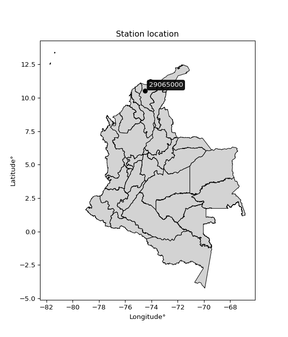

<div align="center">


</div>

# PMP Station (Rain, Pmax24h): 29065000

Probable Maximum Precipitation (PMP) is the greatest amount of rainfall for a specific duration that is meteorologically possible for a given location, acting as a "worst-case" scenario for extreme storms, crucial for designing safety-critical infrastructure like bridges, river deviations, dams, spillways, and nuclear plants to prevent catastrophic failure. PMP is calculated by hydrologists using meteorological data to determine the upper limit of extreme rainfall, often leading to the Probable Maximum Flood (PMF) for flood control design, and is increasingly being studied for climate change impacts. Probable Maximum Precipitation (PMP) is the theoretical upper limit of rainfall, a deterministic estimate for extreme events, while probability distributions (like GEV, Gumbel) describe the likelihood and frequency of various precipitation amounts, including rare ones, showing how often events occur, with PMP representing the extreme end of these distributions, used for critical infrastructure design to ensure safety against the worst conceivable weather, unlike standard statistical forecasts which cover typical probabilities.

The most common probability distributions in hydrology, used for analyzing floods, rainfall, and streamflow, include the Normal, Log-Normal, Gumbel, Gamma (including Log-Pearson Type III), and Generalized Extreme Value (GEV) distributions, often chosen based on the data´s skewness and whether modeling extremes or general conditions, with Gumbel and GEV popular for extreme events like floods, while the Normal distribution serves as a baseline, though often requiring transformations for skewed hydrological data. These distributions help in designing water infrastructure, managing water resources, and forecasting hydrologic events.

> Hydrological data often isn´t perfectly normal (it´s skewed), so different distributions are needed for different applications, such as: **Flood Frequency Analysis**: Using Gumbel, GEV, or Log-Pearson Type III for predicting extreme flood magnitudes and their return periods, **Rainfall Analysis**: Normal for annual totals, but Log-Normal, Weibull, or GEV for intensity or extreme daily rainfall, **Streamflow Modeling**: Gamma and Log-Normal for maximum flows, GEV for minimum flows, and Kappa for daily flows.

<div align="center">

</img>

</div>


## A. General information


### 1. General running parameters

• app_version: _v20260108_. • runtime: _2026-01-08 13:24:42.400241_. • Python version: _3.14.0_. • SciPy version: _1.16.3_. • Pandas version: _2.3.3_. • NumPy version: _2.3.5_. • Stations dataset (station_dataset_file): _dataset/pmax24h_in/automatic_colombia_2003_2024.csv_. • Stations catalog (station_catalog_file): _dataset/CNE.xls_. • Minimum year to eval til year_max (date_min): _1900_. • Maximum year to eval since year_min (date_max): _2024_. • Creates, save and include plots into reports (create_plot): _False_. • Plot only fit distributions with Δo > Δ (plot_only_fit): _True_. • Plot only simple graphs avoiding multiple CDFs and multiple Extreme values plots (plot_only_simple): _True_. • Eval low extreme values, if False, evaluates high extreme values (low_extreme): _False_. • Eval every SciPy distribution as logarithmic (pdist_logarithmic_on): _True_. • Standard deviation normalized (ddof): _1.0_. • Return periods to eval in years (Tr): _[2, 2.33, 5, 10, 15, 20, 25, 50, 75, 100, 200, 250, 500, 750, 1000]_. • Minimum data sample per station, 0 means any (minimum_sample): _5_. • Z-Score maximum threshold to adjust a value, 0 means disable (zscore_max): _3.5_. • Z-Score minimum threshold to adjust a value, 0 means disable (zscore_min): _-2.5_. • Avoid zeros, e.g. rain = 0 (avoid_zeros): _True_. • Avoid null values (avoid_nans): _True_. 

:file_folder:Table: [dataset.csv](../../dataset/pmax24h_in/automatic_colombia_2003_2024.csv)

> Delta Degrees of Freedom (DDOF): is a parameter used in the formulas for calculating variance and standard deviation. When ddof=0, the divisor is $N$ (the total number of observations) and this is used when your data set is the entire population. When ddof=1, the divisor is $N-1$ and this is used when your data set is a sample drawn from a larger population. Using $N-1$ provides an unbiased estimate of the population variance (known as Bessel´s correction).


### 2. Station info and location

|   id |   CODIGO | NOMBRE                      | CATEGORIA               | TECNOLOGIA                              | ESTADO   | FECHA_INSTALACION   |   FECHA_SUSPENSION |   ALTITUD |   LATITUD |   LONGITUD | DEPARTAMENTO   | MUNICIPIO   | AREA_OPERATIVA                                         | ENTIDAD                                                     | AREA_HIDROGRAFICA   | ZONA_HIDROGRAFICA   | SUBZONA_HIDROGRAFICA      |   CORRIENTE | Catalogo   |   Version |
|-----:|---------:|:----------------------------|:------------------------|:----------------------------------------|:---------|:--------------------|-------------------:|----------:|----------:|-----------:|:---------------|:------------|:-------------------------------------------------------|:------------------------------------------------------------|:--------------------|:--------------------|:--------------------------|------------:|:-----------|----------:|
|    0 | 29065000 | MEDIA LUNA - AUT [29065000] | Climatológica Principal | Automática con Telemetría, Convencional | Activa   | 05/05/2013          |                nan |        20 |     10.51 |   -74.5067 | Magdalena      | Pivijai     | Area Operativa 05 - Magdalena-Cesar-Guajira-San Andrés | INSTITUTO DE HIDROLOGIA METEOROLOGIA Y ESTUDIOS AMBIENTALES | Magdalena Cauca     | Bajo Magdalena      | Cga Grande de Santa Marta |         nan | CNE_IDEAM  |  20251226 |

<div align="center">

Dynamic map: [:earth_americas:Google](http://maps.google.com/maps?q=10.51002778,-74.50666667) [:earth_americas:OSM](https://www.openstreetmap.org/#map=18/10.51002778/-74.50666667&layers=P) [:earth_americas:Bing](https://www.bing.com/maps?cp=10.51002778~-74.50666667&lvl=18) [:earth_americas:Apple](https://maps.apple.com/frame?center=10.51002778%2C-74.50666667&span=0.003%2C0.006)

</div>


<div align="center">

```geojson
{
  "type": "Feature",
  "geometry": {
    "type": "Point", 
    "coordinates": [-74.50666667, 10.51002778]
  }, 
  "properties": {
    "Name": "29065000"
  }
}
```

</div>


### 3. Discrete values table and plot

<div align="center">

|               |          0 |           1 |           2 |           3 |           4 |           5 |           6 |
|:--------------|-----------:|------------:|------------:|------------:|------------:|------------:|------------:|
| Date          | 2017       | 2018        | 2019        | 2020        | 2021        | 2022        | 2024        |
| Value         |  105.46    |    8.86     |   14.85     |   10.34     |   14.02     |    0.79     |   32.8      |
| Value_initial |  105.46    |    8.86     |   14.85     |   10.34     |   14.02     |    0.79     |   32.8      |
| count         |    7       |    7        |    7        |    7        |    7        |    7        |    7        |
| mean          |   26.7314  |   26.7314   |   26.7314   |   26.7314   |   26.7314   |   26.7314   |   26.7314   |
| std           |   36.0527  |   36.0527   |   36.0527   |   36.0527   |   36.0527   |   36.0527   |   36.0527   |
| zscore        |    2.18371 |   -0.495703 |   -0.329557 |   -0.454652 |   -0.352579 |   -0.719542 |    0.168325 |


</div>


> The initial value (value_initial) correspond to the initial obtained or null completed value, and value (value) is adjusted only when the initial value is outside the valid range (outlier) definite through the Z-Score value. If Z-Score is active, values out of range or outliers are replaced with the station mean value. A Z-Score (or standard score) measures how many standard deviations a data point is from the mean of a dataset, indicating its relative position; positive scores mean above the mean, negative mean below, and a score of zero is exactly at the mean, allowing for comparison of values from different distributions. It´s calculated using the formula $z=(x–μ)/σ$, where $x$ is the data point, $μ$ is the mean, and $σ$ is the standard deviation, helping identify outliers and understand probability.
>
> <sub>**Note**: In this study, "completing" (filling gaps in) and "extending" (forecasting or lengthening the historical record) rainfall data series are avoided for certain critical analyses because they introduce artificial bias and uncertainty, which can distort the statistics of rare events (extremes), alter day-to-day variability, and compromise the integrity and homogeneity of the original data. Some reasons against Completing/Extending rainfall data are: **Distortion of Extremes and Variability**: The primary issue is that most gap-filling or extension methods rely on averaging or regression with nearby stations, which inherently smooths the data. Rainfall is highly variable in space and time, with a large percentage of zero values and occasional large storms. Infilling methods often underestimate the highest values and overestimate the lowest (zero) values, which severely distorts analyses focused on flood frequency, drought severity, and intensity-duration-frequency (IDF) curves, **Loss of Data Homogeneity**: Infilled or extended data are synthetic estimates, not actual measurements. Combining these estimates with observed data can violate the assumption of data homogeneity, which requires that the data properties do not change over time. Inhomogeneity can lead to incorrect conclusions about long-term trends or changes in climate patterns, **Propagation of Errors**: Errors and biases from the original data (e.g., wind-induced undercatch, instrument errors, site changes) or the data used for imputation can propagate through the analysis, leading to unreliable hydrological models and inaccurate predictions, **Compromised Statistical Integrity**: For statistical analyses, especially those involving the frequency of events, using artificial data can introduce time bias or autocorrelation that doesn´t exist in reality, making it difficult to assess the true probability of events, **Difficulty in Validation**: It is difficult to accurately validate the quality of filled or extended data, especially for past periods where ground-truth measurements are unavailable. The reliability of imputation techniques heavily depends on the density of the surrounding station network and the complexity of the local topography.</sub>


### 4. Active continuous probability distributions from SciPy (43 of 104 available)

A Probability Density Function (PDF) describes the relative likelihood of a continuous random variable falling within a specific range, where the total area under its curve equals 1, and the area over any interval gives the actual probability for that range. Unlike discrete probabilities (like rolling a die), a PDF shows density, not direct probability for a single point (which is zero), with higher points indicating higher likelihood, often visualized as a bell curve for normal distributions.

A log of a probability density function (log-PDF) is simply the logarithm of the PDF´s value, denoted as $log(f(x))$, useful for converting multiplication of probabilities into addition, improving numerical stability with tiny numbers, and connecting to information theory concepts like entropy. Instead of dealing with very small probabilities (e.g., 0.000001), log-PDFs use negative numbers (e.g., $log(0.00001) ≈ -11.51$ that are easier for computers to handle, preventing underflow errors and simplifying complex calculations. In this study, each active probability distribution from SciPy is also evaluated in the $log$ form.

[scipy.stats](https://docs.scipy.org/doc/scipy/reference/stats.html) is a Python´s powerful submodule within the SciPy library for comprehensive statistical analysis, offering over 130 probability distributions (like Normal, Poisson), functions for descriptive stats (mean, variance), hypothesis testing (t-tests, chi-square), random variable generation, and statistical tests, making it essential for data science, modeling, and research. It provides tools to explore, model, and draw conclusions from data efficiently, working seamlessly with NumPy.

<div align="center">

|   id | p_dist             |   n_parameter | fit_method   | label                                                                       | active   | ref                                                                                                        |
|-----:|:-------------------|--------------:|:-------------|:----------------------------------------------------------------------------|:---------|:-----------------------------------------------------------------------------------------------------------|
|    0 | alpha              |             3 | MLE          | Alpha                                                                       | True     | [:mortar_board:](https://docs.scipy.org/doc/scipy/reference/generated/scipy.stats.alpha.html)              |
|    1 | betaprime          |             4 | MLE          | Beta prime                                                                  | True     | [:mortar_board:](https://docs.scipy.org/doc/scipy/reference/generated/scipy.stats.betaprime.html)          |
|    2 | chi2               |             3 | MLE          | Chi²                                                                        | True     | [:mortar_board:](https://docs.scipy.org/doc/scipy/reference/generated/scipy.stats.chi2.html)               |
|    3 | crystalball        |             4 | MLE          | Crystalball                                                                 | True     | [:mortar_board:](https://docs.scipy.org/doc/scipy/reference/generated/scipy.stats.crystalball.html)        |
|    4 | erlang             |             3 | MLE          | Erlang                                                                      | True     | [:mortar_board:](https://docs.scipy.org/doc/scipy/reference/generated/scipy.stats.erlang.html)             |
|    5 | expon              |             2 | MLE          | Exponential                                                                 | True     | [:mortar_board:](https://docs.scipy.org/doc/scipy/reference/generated/scipy.stats.expon.html)              |
|    6 | exponnorm          |             3 | MLE          | Exponentially modified Normal                                               | True     | [:mortar_board:](https://docs.scipy.org/doc/scipy/reference/generated/scipy.stats.exponnorm.html)          |
|    7 | f                  |             4 | MLE          | F                                                                           | True     | [:mortar_board:](https://docs.scipy.org/doc/scipy/reference/generated/scipy.stats.f.html)                  |
|    8 | fatiguelife        |             3 | MLE          | Fatigue-life (Birnbaum-Saunders)                                            | True     | [:mortar_board:](https://docs.scipy.org/doc/scipy/reference/generated/scipy.stats.fatiguelife.html)        |
|    9 | fisk               |             3 | MLE          | Fisk                                                                        | True     | [:mortar_board:](https://docs.scipy.org/doc/scipy/reference/generated/scipy.stats.fisk.html)               |
|   10 | gamma              |             3 | MLE          | Gamma                                                                       | True     | [:mortar_board:](https://docs.scipy.org/doc/scipy/reference/generated/scipy.stats.gamma.html)              |
|   11 | genexpon           |             5 | MLE          | Generalized exponential                                                     | True     | [:mortar_board:](https://docs.scipy.org/doc/scipy/reference/generated/scipy.stats.genexpon.html)           |
|   12 | genlogistic        |             3 | MLE          | Generalized logistic                                                        | True     | [:mortar_board:](https://docs.scipy.org/doc/scipy/reference/generated/scipy.stats.genlogistic.html)        |
|   13 | gibrat             |             2 | MM           | Gibrat                                                                      | True     | [:mortar_board:](https://docs.scipy.org/doc/scipy/reference/generated/scipy.stats.gibrat.html)             |
|   14 | gompertz           |             3 | MLE          | Gompertz (or truncated Gumbel)                                              | True     | [:mortar_board:](https://docs.scipy.org/doc/scipy/reference/generated/scipy.stats.gompertz.html)           |
|   15 | gumbel_l           |             2 | MM           | Gumbel Left Skew                                                            | True     | [:mortar_board:](https://docs.scipy.org/doc/scipy/reference/generated/scipy.stats.gumbel_l.html)           |
|   16 | gumbel_r           |             2 | MM           | Gumbel Right Skew                                                           | True     | [:mortar_board:](https://docs.scipy.org/doc/scipy/reference/generated/scipy.stats.gumbel_r.html)           |
|   17 | halflogistic       |             2 | MM           | Half-logistic                                                               | True     | [:mortar_board:](https://docs.scipy.org/doc/scipy/reference/generated/scipy.stats.halflogistic.html)       |
|   18 | halfnorm           |             2 | MM           | Half Normal                                                                 | True     | [:mortar_board:](https://docs.scipy.org/doc/scipy/reference/generated/scipy.stats.halfnorm.html)           |
|   19 | hypsecant          |             2 | MM           | hyperbolic secant                                                           | True     | [:mortar_board:](https://docs.scipy.org/doc/scipy/reference/generated/scipy.stats.hypsecant.html)          |
|   20 | invgamma           |             3 | MLE          | Inverted gamma                                                              | True     | [:mortar_board:](https://docs.scipy.org/doc/scipy/reference/generated/scipy.stats.invgamma.html)           |
|   21 | invgauss           |             3 | MLE          | Inverse Gaussian                                                            | True     | [:mortar_board:](https://docs.scipy.org/doc/scipy/reference/generated/scipy.stats.invgauss.html)           |
|   22 | invweibull         |             3 | MLE          | Inverted Weibull                                                            | True     | [:mortar_board:](https://docs.scipy.org/doc/scipy/reference/generated/scipy.stats.invweibull.html)         |
|   23 | kstwobign          |             2 | MLE          | Limiting distribution of scaled Kolmogorov-Smirnov two-sided test statistic | True     | [:mortar_board:](https://docs.scipy.org/doc/scipy/reference/generated/scipy.stats.kstwobign.html)          |
|   24 | laplace            |             2 | MM           | Laplace                                                                     | True     | [:mortar_board:](https://docs.scipy.org/doc/scipy/reference/generated/scipy.stats.laplace.html)            |
|   25 | laplace_asymmetric |             3 | MLE          | Asymmetric Laplace                                                          | True     | [:mortar_board:](https://docs.scipy.org/doc/scipy/reference/generated/scipy.stats.laplace_asymmetric.html) |
|   26 | loggamma           |             3 | MLE          | Log gamma                                                                   | True     | [:mortar_board:](https://docs.scipy.org/doc/scipy/reference/generated/scipy.stats.loggamma.html)           |
|   27 | logistic           |             2 | MM           | Logistic (or Sech-squared)                                                  | True     | [:mortar_board:](https://docs.scipy.org/doc/scipy/reference/generated/scipy.stats.logistic.html)           |
|   28 | lognorm            |             3 | MLE          | Log Normal                                                                  | True     | [:mortar_board:](https://docs.scipy.org/doc/scipy/reference/generated/scipy.stats.lognorm.html)            |
|   29 | maxwell            |             2 | MM           | Maxwell                                                                     | True     | [:mortar_board:](https://docs.scipy.org/doc/scipy/reference/generated/scipy.stats.maxwell.html)            |
|   30 | mielke             |             4 | MLE          | Mielke Beta-Kappa / Dagum                                                   | True     | [:mortar_board:](https://docs.scipy.org/doc/scipy/reference/generated/scipy.stats.mielke.html)             |
|   31 | moyal              |             2 | MM           | Moyal                                                                       | True     | [:mortar_board:](https://docs.scipy.org/doc/scipy/reference/generated/scipy.stats.moyal.html)              |
|   32 | nakagami           |             3 | MLE          | Nakagami                                                                    | True     | [:mortar_board:](https://docs.scipy.org/doc/scipy/reference/generated/scipy.stats.nakagami.html)           |
|   33 | ncf                |             5 | MLE          | Non-central F distribution                                                  | True     | [:mortar_board:](https://docs.scipy.org/doc/scipy/reference/generated/scipy.stats.ncf.html)                |
|   34 | nct                |             4 | MLE          | Non-central Student’s t                                                     | True     | [:mortar_board:](https://docs.scipy.org/doc/scipy/reference/generated/scipy.stats.nct.html)                |
|   35 | norm               |             2 | MM           | Normal                                                                      | True     | [:mortar_board:](https://docs.scipy.org/doc/scipy/reference/generated/scipy.stats.norm.html)               |
|   36 | pearson3           |             3 | MM           | Pearson type III                                                            | True     | [:mortar_board:](https://docs.scipy.org/doc/scipy/reference/generated/scipy.stats.pearson3.html)           |
|   37 | rayleigh           |             2 | MM           | Rayleigh                                                                    | True     | [:mortar_board:](https://docs.scipy.org/doc/scipy/reference/generated/scipy.stats.rayleigh.html)           |
|   38 | rice               |             3 | MLE          | Rice                                                                        | True     | [:mortar_board:](https://docs.scipy.org/doc/scipy/reference/generated/scipy.stats.rice.html)               |
|   39 | t                  |             3 | MLE          | Student’s t                                                                 | True     | [:mortar_board:](https://docs.scipy.org/doc/scipy/reference/generated/scipy.stats.t.html)                  |
|   40 | truncnorm          |             4 | MLE          | Truncated normal                                                            | True     | [:mortar_board:](https://docs.scipy.org/doc/scipy/reference/generated/scipy.stats.truncnorm.html)          |
|   41 | wald               |             2 | MM           | Wald                                                                        | True     | [:mortar_board:](https://docs.scipy.org/doc/scipy/reference/generated/scipy.stats.wald.html)               |
|   42 | weibull_min        |             3 | MLE          | Weibull minimum                                                             | True     | [:mortar_board:](https://docs.scipy.org/doc/scipy/reference/generated/scipy.stats.weibull_min.html)        |

</div>

> **n_parameter:** # arguments & localization & scale.
>
> **Fit methods:** (MLE) maximum likelihood, (MM) L-moments.
>
>**Inactive** (With the only purpose of prevent loops, zero divisions, infinite values, over high estimated values or horizontal trending for recurrence intervals estimations, the follow distributions were disabled.)**:** foldnorm, gennorm, norminvgauss, powernorm, powerlognorm, skewnorm, genextreme, anglit, arcsine, argus, beta, bradford, burr, burr12, cauchy, cosine, halfcauchy, foldcauchy, skewcauchy, wrapcauchy, dgamma, gengamma, exponweib, exponpow, truncexpon, gausshyper, genhalflogistic, genhyperbolic, geninvgauss, halfgennorm, johnsonsb, johnsonsu, kappa4, kappa3, ksone, kstwo, loglaplace, levy, levy_l, levy_stable, ncx2, pareto, genpareto, truncpareto, lomax, powerlaw, rdist, rel_breitwigner, recipinvgauss, semicircular, studentized_range, trapezoid, triang, truncweibull_min, tukeylambda, uniform, loguniform, vonmises, vonmises_line, weibull_max, dweibull, 


## B. Probability (PDF) vs. Empirical (EDF) distributions functions

A continuous probability distribution (CPD) describes probabilities for variables that can take any value within a range (like rain any time), unlike discrete variables with specific outcomes (like temperature). It uses a Probability Density Function (PDF), a curve where the total area under it equals 1, and the probability of the variable falling within an interval (a to b) is found by calculating the area under the curve between those points. A key feature is that the probability of hitting any single exact value is zero, so probabilities are always expressed for ranges, e.g., $P(a ≤ X ≤ b)$.

<div align="center">

Distributions parameters from station values
|    |   station | p_dist                |   n |             loc |          scale | shape                  | shape1                 | shape2             | shape3   |
|---:|----------:|:----------------------|----:|----------------:|---------------:|:-----------------------|:-----------------------|:-------------------|:---------|
|  0 |  29065000 | alpha                 |   7 |     0.000233149 |    2.07338     | 1.4577933136929197e-08 |                        |                    |          |
|  1 |  29065000 | betaprime             |   7 |     0.79        |   87.4468      | 0.7922506525256345     | 4.841874910824616      |                    |          |
|  2 |  29065000 | chi2                  |   7 |     0.79        |    1.82456     | 1.423284721189546      |                        |                    |          |
|  3 |  29065000 | crystalball           |   7 |    26.7314      |   33.3783      | 1424.5538906373108     | 3361.380089415331      |                    |          |
|  4 |  29065000 | erlang                |   7 |     0.79        |   35.1384      | 0.685062820740179      |                        |                    |          |
|  5 |  29065000 | expon                 |   7 |     0.79        |   25.9414      |                        |                        |                    |          |
|  6 |  29065000 | exponnorm             |   7 |     0.764447    |    0.00766827  | 3385.5439569395294     |                        |                    |          |
|  7 |  29065000 | f                     |   7 |     0.79        |   19.6576      | 0.7117591790635347     | 11.41287221372303      |                    |          |
|  8 |  29065000 | fatiguelife           |   7 |    -1.62249     |   16.2178      | 1.2251798472989428     |                        |                    |          |
|  9 |  29065000 | fisk                  |   7 |    -0.204888    |   14.1878      | 1.4087067639795658     |                        |                    |          |
| 10 |  29065000 | gamma                 |   7 |     0.79        |   23.2124      | 0.7385264589555992     |                        |                    |          |
| 11 |  29065000 | genexpon              |   7 |     0.79        |   42.8836      | 1.6530953740531658     | 2.0774145410891143e-11 | 2.0701602947661435 |          |
| 12 |  29065000 | genlogistic           |   7 |  -123.007       |   17.3205      | 2712.300695799977      |                        |                    |          |
| 13 |  29065000 | gibrat                |   7 |     1.26799     |   15.4444      |                        |                        |                    |          |
| 14 |  29065000 | gompertz              |   7 |     0.79        |    3.52604e+08 | 16484386.593942668     |                        |                    |          |
| 15 |  29065000 | gumbel_l              |   7 |    41.7535      |   26.025       |                        |                        |                    |          |
| 16 |  29065000 | gumbel_r              |   7 |    11.7094      |   26.025       |                        |                        |                    |          |
| 17 |  29065000 | halflogistic          |   7 |   -12.8296      |   28.5373      |                        |                        |                    |          |
| 18 |  29065000 | halfnorm              |   7 |   -17.4484      |   55.3712      |                        |                        |                    |          |
| 19 |  29065000 | hypsecant             |   7 |    26.7314      |   21.2493      |                        |                        |                    |          |
| 20 |  29065000 | invgamma              |   7 |    -5.4001      |   30.0819      | 1.853389593507636      |                        |                    |          |
| 21 |  29065000 | invgauss              |   7 |    -2.73918     |   19.3157      | 1.5257348966846764     |                        |                    |          |
| 22 |  29065000 | invweibull            |   7 |    -8.10831     |   17.9714      | 1.6917705577936109     |                        |                    |          |
| 23 |  29065000 | kstwobign             |   7 |   -55.6071      |   96.6515      |                        |                        |                    |          |
| 24 |  29065000 | laplace               |   7 |    26.7314      |   23.602       |                        |                        |                    |          |
| 25 |  29065000 | laplace_asymmetric    |   7 |     0.79        |    0.00620346  | 0.00023914914050646944 |                        |                    |          |
| 26 |  29065000 | loggamma              |   7 | -7566.05        | 1092.41        | 1044.048258569257      |                        |                    |          |
| 27 |  29065000 | logistic              |   7 |    26.7314      |   18.4024      |                        |                        |                    |          |
| 28 |  29065000 | lognorm               |   7 |     0.79        |    0.0657861   | 13.910452392795012     |                        |                    |          |
| 29 |  29065000 | maxwell               |   7 |   -52.3612      |   49.5639      |                        |                        |                    |          |
| 30 |  29065000 | mielke                |   7 |     0.79        |   33.7613      | 0.5091692653616976     | 2.1531932598701014     |                    |          |
| 31 |  29065000 | moyal                 |   7 |     7.64356     |   15.0255      |                        |                        |                    |          |
| 32 |  29065000 | nakagami              |   7 |     0.79        |   53.7249      | 0.19731503603895978    |                        |                    |          |
| 33 |  29065000 | ncf                   |   7 |     0.79        |    0.190185    | 0.05511445200541504    | 5.231010762626038      | 3.938522898631901  |          |
| 34 |  29065000 | nct                   |   7 |    -0.0148762   |    6.38167     | 1.4173026753666615     | 1.7903866012422065     |                    |          |
| 35 |  29065000 | norm                  |   7 |    26.7314      |   33.3783      |                        |                        |                    |          |
| 36 |  29065000 | pearson3              |   7 |    26.7314      |   33.3783      | 1.7552177741482393     |                        |                    |          |
| 37 |  29065000 | rayleigh              |   7 |   -37.1233      |   50.9487      |                        |                        |                    |          |
| 38 |  29065000 | rice                  |   7 |   -20.4467      |   40.865       | 0.00029608543904605843 |                        |                    |          |
| 39 |  29065000 | t                     |   7 |    11.839       |    4.458       | 0.7675342998019221     |                        |                    |          |
| 40 |  29065000 | truncnorm             |   7 |   -63.9251      |   53.4256      | 1.2113125255299733     | 155.75594990928494     |                    |          |
| 41 |  29065000 | wald                  |   7 |    -6.6469      |   33.3783      |                        |                        |                    |          |
| 42 |  29065000 | weibull_min           |   7 |     0.79        |   21.6922      | 0.9237597288656261     |                        |                    |          |
| 43 |  29065000 | logalpha              |   7 |   -25.1711      |  529.499       | 19.168442336800823     |                        |                    |          |
| 44 |  29065000 | logbetaprime          |   7 |    -0.235722    |    4.5593      | 0.17128920097192127    | 1.7305648065080015     |                    |          |
| 45 |  29065000 | logchi2               |   7 |    -0.235722    |    1.31702     | 1.5071888897102514     |                        |                    |          |
| 46 |  29065000 | logcrystalball        |   7 |     2.53844     |    1.37843     | 10.917132626229495     | 562.5457077420045      |                    |          |
| 47 |  29065000 | logerlang             |   7 |   -19.8661      |    0.0904261   | 247.83502635178502     |                        |                    |          |
| 48 |  29065000 | logexpon              |   7 |    -0.235722    |    2.77416     |                        |                        |                    |          |
| 49 |  29065000 | logexponnorm          |   7 |     2.5374      |    1.37843     | 0.0007570641359059545  |                        |                    |          |
| 50 |  29065000 | logf                  |   7 |    -0.235722    |    1.22242     | 1.2770099608649272     | 1.1776223940425945     |                    |          |
| 51 |  29065000 | logfatiguelife        |   7 |  -466.453       |  468.986       | 0.0029466206448829704  |                        |                    |          |
| 52 |  29065000 | logfisk               |   7 |    -0.235722    |    1.87906     | 0.8226670788389603     |                        |                    |          |
| 53 |  29065000 | loggamma              |   7 |   -22.1651      |    0.0802336   | 307.63349609227794     |                        |                    |          |
| 54 |  29065000 | loggenexpon           |   7 |    -0.235722    |    3.36723e+10 | 5144820918.093551      | 33987370732.5486       | 4593727502.086201  |          |
| 55 |  29065000 | loggenlogistic        |   7 |     3.13457     |    0.579637    | 0.5790221858861637     |                        |                    |          |
| 56 |  29065000 | loggibrat             |   7 |     1.48692     |    0.637789    |                        |                        |                    |          |
| 57 |  29065000 | loggompertz           |   7 |    -0.235722    |    1.44066     | 0.11023123849989559    |                        |                    |          |
| 58 |  29065000 | loggumbel_l           |   7 |     3.15881     |    1.07475     |                        |                        |                    |          |
| 59 |  29065000 | loggumbel_r           |   7 |     1.91808     |    1.07475     |                        |                        |                    |          |
| 60 |  29065000 | loghalflogistic       |   7 |     0.904638    |    1.17853     |                        |                        |                    |          |
| 61 |  29065000 | loghalfnorm           |   7 |     0.713977    |    2.28663     |                        |                        |                    |          |
| 62 |  29065000 | loghypsecant          |   7 |     2.53844     |    0.877534    |                        |                        |                    |          |
| 63 |  29065000 | loginvgamma           |   7 |   -24.215       | 9394.66        | 352.2455410078053      |                        |                    |          |
| 64 |  29065000 | loginvgauss           |   7 |    -9.64189     |  810.268       | 0.014993999354070982   |                        |                    |          |
| 65 |  29065000 | loginvweibull         |   7 |    -9.58318e+07 |    9.58318e+07 | 63598530.50651519      |                        |                    |          |
| 66 |  29065000 | logkstwobign          |   7 |    -3.58532     |    7.01419     |                        |                        |                    |          |
| 67 |  29065000 | loglaplace            |   7 |     2.53844     |    0.974695    |                        |                        |                    |          |
| 68 |  29065000 | loglaplace_asymmetric |   7 |     2.64048     |    0.933696    | 1.0561500818908296     |                        |                    |          |
| 69 |  29065000 | logloggamma           |   7 |     0.978736    |    2.03459     | 2.6334859251732716     |                        |                    |          |
| 70 |  29065000 | loglogistic           |   7 |     2.53844     |    0.759966    |                        |                        |                    |          |
| 71 |  29065000 | loglognorm            |   7 |  -398.982       |  401.513       | 0.003422817762693488   |                        |                    |          |
| 72 |  29065000 | logmaxwell            |   7 |    -0.727851    |    2.04685     |                        |                        |                    |          |
| 73 |  29065000 | logmielke             |   7 |    -1.41777e+07 |    1.41777e+07 | 14169215.255344313     | 24516457.507713784     |                    |          |
| 74 |  29065000 | logmoyal              |   7 |     1.75017     |    0.62051     |                        |                        |                    |          |
| 75 |  29065000 | lognakagami           |   7 |  -471.62        |  474.158       | 29439.276188411313     |                        |                    |          |
| 76 |  29065000 | logncf                |   7 |    -0.235722    |    1.18925     | 1.3368726672415305     | 1.1773123681289233     | 0.9860269048605699 |          |
| 77 |  29065000 | lognct                |   7 |   -88.5397      |    1.36274     | 93483.5689271962       | 66.83386699681873      |                    |          |
| 78 |  29065000 | lognorm               |   7 |     2.53844     |    1.37843     |                        |                        |                    |          |
| 79 |  29065000 | logpearson3           |   7 |     2.53844     |    1.37843     | -0.6005303636412285    |                        |                    |          |
| 80 |  29065000 | lograyleigh           |   7 |    -0.0985578   |    2.10402     |                        |                        |                    |          |
| 81 |  29065000 | logrice               |   7 |    -1.22459     |    1.47349     | 2.3231839879066176     |                        |                    |          |
| 82 |  29065000 | logt                  |   7 |     2.5385      |    1.37833     | 14911.54040523649      |                        |                    |          |
| 83 |  29065000 | logtruncnorm          |   7 |     0.472321    |    4.21176     | -0.16811336357403023   | 0.9938876920426234     |                    |          |
| 84 |  29065000 | logwald               |   7 |     1.15998     |    1.37845     |                        |                        |                    |          |
| 85 |  29065000 | logweibull_min        |   7 |    -6.93726     |   10.0481      | 8.252673628996892      |                        |                    |          |

</div>

> **loc** (Location parameter): This shifts the distribution along the x-axis. For many common distributions, like the normal (Gaussian) distribution, loc represents the mean $μ$. For others, like the uniform distribution, it might represent the minimum value, or for the beta distribution, the left end of the support interval.
>
> **scale** (Scale parameter): This determines the width or spread of the distribution. For the normal distribution, scale represents the standard deviation $σ$. For a uniform distribution, it defines the length of the interval (from $loc$ to $loc + scale$).
>
> **shape** (Shape parameters): Refers to parameters that define the specific form of a probability distribution, distinct from its location (loc) and scale (scale). These parameters are required arguments for most distribution functions. For example, a normal (Gaussian) distribution is fully defined by its location (mean) and scale (standard deviation), so it has no specific shape parameters beyond loc and scale. However, other distributions have intrinsic properties that need specification, as Gamma distribution that takes a shape parameter, often named $a$ or $alpha$.


### 0. Cumulative distribution values - CDF (86 evaluated)

Cumulative Distribution Function (CDF), denoted as $F$<sub>$X$</sub>$(x)$, is a function that gives the probability that a random variable $X$ will take a value less than or equal to a specific value, $x$ (i.e., $(P(X≥x)$. It essentially "accumulates" probabilities from a given point up to the far right (positive infinity), providing a complete picture of the distribution´s probabilities for both discrete (like rain) and continuous (like temperature) variables, helping to find probabilities over ranges or above certain values. Each station is evaluated separately ordering the $x$ values ascending, calculating the CDF and PDF values for the activated distributions and their logarithmic forms.

<div align="center">

CDF ordered by x ascending and calculating $log(f(x))$ separately
|   id |   Station |   date |      x |   count |    mean |     std |    zscore |   Value_initial |   station |   m |      alpha |   alpha_pdf |   betaprime |   betaprime_pdf |        chi2 |        chi2_pdf |   crystalball |   crystalball_pdf |      erlang |     erlang_pdf |    expon |   expon_pdf |   exponnorm |   exponnorm_pdf |           f |       f_pdf |   fatiguelife |   fatiguelife_pdf |      fisk |    fisk_pdf |       gamma |      gamma_pdf |    genexpon |   genexpon_pdf |   genlogistic |   genlogistic_pdf |   gibrat |   gibrat_pdf |    gompertz |   gompertz_pdf |   gumbel_l |   gumbel_l_pdf |   gumbel_r |   gumbel_r_pdf |   halflogistic |   halflogistic_pdf |   halfnorm |   halfnorm_pdf |   hypsecant |   hypsecant_pdf |   invgamma |   invgamma_pdf |   invgauss |   invgauss_pdf |   invweibull |   invweibull_pdf |   kstwobign |   kstwobign_pdf |   laplace |   laplace_pdf |   laplace_asymmetric |   laplace_asymmetric_pdf |   loggamma |   loggamma_pdf |   logistic |   logistic_pdf |   lognorm |   lognorm_pdf |   maxwell |   maxwell_pdf |      mielke |   mielke_pdf |    moyal |   moyal_pdf |    nakagami |   nakagami_pdf |       ncf |     ncf_pdf |       nct |     nct_pdf |     norm |    norm_pdf |   pearson3 |   pearson3_pdf |   rayleigh |   rayleigh_pdf |     rice |    rice_pdf |        t |       t_pdf |   truncnorm |   truncnorm_pdf |      wald |    wald_pdf |   weibull_min |   weibull_min_pdf |   logalpha |   logalpha_pdf |   logbetaprime |   logbetaprime_pdf |     logchi2 |   logchi2_pdf |   logcrystalball |   logcrystalball_pdf |   logerlang |   logerlang_pdf |   logexpon |   logexpon_pdf |   logexponnorm |   logexponnorm_pdf |        logf |       logf_pdf |   logfatiguelife |   logfatiguelife_pdf |    logfisk |   logfisk_pdf |   loggenexpon |   loggenexpon_pdf |   loggenlogistic |   loggenlogistic_pdf |   loggibrat |   loggibrat_pdf |   loggompertz |   loggompertz_pdf |   loggumbel_l |   loggumbel_l_pdf |   loggumbel_r |   loggumbel_r_pdf |   loghalflogistic |   loghalflogistic_pdf |   loghalfnorm |   loghalfnorm_pdf |   loghypsecant |   loghypsecant_pdf |   loginvgamma |   loginvgamma_pdf |   loginvgauss |   loginvgauss_pdf |   loginvweibull |   loginvweibull_pdf |   logkstwobign |   logkstwobign_pdf |   loglaplace |   loglaplace_pdf |   loglaplace_asymmetric |   loglaplace_asymmetric_pdf |   logloggamma |   logloggamma_pdf |   loglogistic |   loglogistic_pdf |   loglognorm |   loglognorm_pdf |   logmaxwell |   logmaxwell_pdf |   logmielke |   logmielke_pdf |    logmoyal |   logmoyal_pdf |   lognakagami |   lognakagami_pdf |      logncf |    logncf_pdf |    lognct |   lognct_pdf |   logpearson3 |   logpearson3_pdf |   lograyleigh |   lograyleigh_pdf |   logrice |   logrice_pdf |      logt |   logt_pdf |   logtruncnorm |   logtruncnorm_pdf |   logwald |   logwald_pdf |   logweibull_min |   logweibull_min_pdf |
|-----:|----------:|-------:|-------:|--------:|--------:|--------:|----------:|----------------:|----------:|----:|-----------:|------------:|------------:|----------------:|------------:|----------------:|--------------:|------------------:|------------:|---------------:|---------:|------------:|------------:|----------------:|------------:|------------:|--------------:|------------------:|----------:|------------:|------------:|---------------:|------------:|---------------:|--------------:|------------------:|---------:|-------------:|------------:|---------------:|-----------:|---------------:|-----------:|---------------:|---------------:|-------------------:|-----------:|---------------:|------------:|----------------:|-----------:|---------------:|-----------:|---------------:|-------------:|-----------------:|------------:|----------------:|----------:|--------------:|---------------------:|-------------------------:|-----------:|---------------:|-----------:|---------------:|----------:|--------------:|----------:|--------------:|------------:|-------------:|---------:|------------:|------------:|---------------:|----------:|------------:|----------:|------------:|---------:|------------:|-----------:|---------------:|-----------:|---------------:|---------:|------------:|---------:|------------:|------------:|----------------:|----------:|------------:|--------------:|------------------:|-----------:|---------------:|---------------:|-------------------:|------------:|--------------:|-----------------:|---------------------:|------------:|----------------:|-----------:|---------------:|---------------:|-------------------:|------------:|---------------:|-----------------:|---------------------:|-----------:|--------------:|--------------:|------------------:|-----------------:|---------------------:|------------:|----------------:|--------------:|------------------:|--------------:|------------------:|--------------:|------------------:|------------------:|----------------------:|--------------:|------------------:|---------------:|-------------------:|--------------:|------------------:|--------------:|------------------:|----------------:|--------------------:|---------------:|-------------------:|-------------:|-----------------:|------------------------:|----------------------------:|--------------:|------------------:|--------------:|------------------:|-------------:|-----------------:|-------------:|-----------------:|------------:|----------------:|------------:|---------------:|--------------:|------------------:|------------:|--------------:|----------:|-------------:|--------------:|------------------:|--------------:|------------------:|----------:|--------------:|----------:|-----------:|---------------:|-------------------:|----------:|--------------:|-----------------:|---------------------:|
|    0 |  29065000 |   2022 |   0.79 |       7 | 26.7314 | 36.0527 | -0.719542 |            0.79 |  29065000 |   1 | 0.00865702 | 0.0845256   | 2.44859e-14 |   174.73        | 1.93416e-12 | 12397.8         |      0.218522 |       0.00883654  | 1.82093e-12 | 5618.02        | 0        | 0.0385484   | 0.000983777 |     0.0384644   | 5.54127e-07 | 1.77624e+09 |     0.0358173 |       0.039676    | 0.0231205 | 0.0319804   | 1.76343e-13 | 1173.05        | 1.06012e-11 |    0.0385484   |      0.118427 |        0.0145815  | 0        |  0           | 3.84298e-09 |    0.0467504   |   0.187154 |    0.00647196  |   0.218425 |     0.0127682  |       0.2342   |         0.0165599  |   0.258135 |     0.0136489  |    0.182617 |     0.00813029  |  0.0369707 |    0.0247818   |  0.0360574 |    0.0317307   |     0.037464 |       0.0233938  |    0.114665 |     0.0127007   |  0.166582 |   0.00705797  |          5.72935e-08 |              0.0385509   |  0.0219456 |      0.0402839 |   0.196286 |    0.00857264  | 0.0220806 |     0.038194  |  0.234978 |    0.0104172  | 4.44299e-09 |  1.69803e+06 | 0.209056 |  0.0151523  | 8.29321e-08 |    2.94783e+08 | 0.0485582 | 1.20528e+13 | 0.0465062 | 0.013822    | 0.218522 | 0.00883654  |   0.216788 |     0.0193271  |   0.241852 |     0.0110734  | 0.126314 | 0.0111107   | 0.150253 | 0.00968394  |  7.9048e-14 |     0.0317613   | 0.0852296 | 0.0292999   |   2.02045e-16 |       0.840556    |  0.0193943 |      0.0401701 |     0.00127774 |         7.8854e+12 | 1.74699e-13 |  4743.26      |        0.0220806 |            0.038194  |   0.0217505 |       0.0399022 |   0        |      0.360469  |      0.0220806 |          0.038194  | 1.66322e-11 | 382617         |        0.0222165 |            0.0385228 | 1.4257e-14 |   422.572     |   3.80523e-13 |         0.152791  |        0.0344434 |            0.0343045 |    0        |       0         |   1.30041e-10 |         0.0765144 |     0.0416026 |         0.0378923 |   0.000599988 |        0.00414148 |          0        |             0         |      0        |         0         |      0.0269573 |          0.0306827 |     0.0201735 |         0.039562  |     0.0207501 |         0.0438118 |       0.0203227 |           0.052546  |      0.0234768 |          0.0688236 |    0.0290327 |        0.0297864 |               0.0285331 |                   0.0289346 |     0.0363209 |         0.0401324 |     0.0253234 |         0.0324779 |    0.0217014 |        0.0380142 |   0.00363313 |        0.0218922 |   0.0343551 |       0.0342338 | 7.26785e-07 |    1.49186e-05 |     0.0223399 |         0.0385548 | 3.35495e-12 | 80797         | 0.0220624 |    0.0382065 |     0.0355595 |         0.0415912 |      0        |         0         | 0.0179537 |     0.0417611 | 0.0220798 |  0.0381872 |    2.29395e-06 |           0.229682 |  0        |     0         |        0.0347243 |            0.0420104 |
|    1 |  29065000 |   2018 |   8.86 |       7 | 26.7314 | 36.0527 | -0.495703 |            8.86 |  29065000 |   2 | 0.814968   | 0.0205061   | 0.452009    |     0.033375    | 0.938008    |     0.018654    |      0.29618  |       0.0103561   | 0.367876    |    0.027186    | 0.267349 | 0.0282425   | 0.267895    |     0.0281999   | 0.533472    | 0.0209957   |     0.359787  |       0.0298204   | 0.34727   | 0.0352257   | 0.433685    |    0.0323223   | 0.267349    |    0.0282425   |      0.262091 |        0.0202575  | 0.238806 |  0.0408361   | 0.314273    |    0.032058    |   0.246137 |    0.00818444  |   0.327684 |     0.014048   |       0.362727 |         0.0152157  |   0.365304 |     0.0128717  |    0.259209 |     0.0108943   |  0.335507  |    0.0358407   |  0.350705  |    0.0326773   |     0.332193 |       0.0364998  |    0.23478  |     0.0165559   |  0.234489 |   0.00993513  |          0.267364    |              0.0282438   |  0.41263   |      0.279179  |   0.274652 |    0.0108257   | 0.397851  |     0.279879  |  0.32365  |    0.0114536  | 0.477442    |  0.0288021   | 0.33689  |  0.0160783  | 0.373633    |    0.0182031   | 0.418872  | 0.0294409   | 0.303041  | 0.0411948   | 0.29618  | 0.0103561   |   0.364507 |     0.0170912  |   0.334549 |     0.0117883  | 0.226755 | 0.0135701   | 0.325127 | 0.0450319   |  0.233384   |     0.0261505   | 0.333022  | 0.0277244   |   0.330452    |       0.0307451   |  0.424731  |      0.277303  |     0.911133   |         0.0321461  | 0.712321    |     0.126887  |        0.397851  |            0.279879  |   0.407012  |       0.275551  |   0.581614 |      0.150815  |      0.39785   |          0.279878  | 0.611917    |      0.0705379 |        0.399388  |            0.279666  | 0.551616   |     0.0841756 |   0.518495    |         0.210097  |        0.348446  |            0.291723  |    0.534014 |       0.572239  |   0.3812      |         0.253508  |     0.331562  |         0.250527  |   0.45722     |        0.332928   |          0.494301 |             0.320596  |      0.478999 |         0.283987  |      0.373971  |          0.33467   |     0.416029  |         0.278281  |     0.435919  |         0.272529  |       0.456903  |           0.237509  |      0.491474  |          0.22586   |    0.346696  |        0.355697  |               0.331077  |                   0.335736  |     0.358208  |         0.261226  |     0.384706  |         0.311471  |    0.399726  |        0.281312  |   0.431815   |        0.286793  |   0.348177  |       0.291897  | 0.479951    |    0.353875    |     0.398859  |         0.279463  | 0.499803    |     0.0790342 | 0.398003  |    0.279856  |     0.362358  |         0.25817   |      0.444114 |         0.286313  | 0.407153  |     0.277193  | 0.39783   |  0.279889  |    0.551669    |           0.214537 |  0.541135 |     0.433577  |        0.361698  |            0.259343  |
|    2 |  29065000 |   2020 |  10.34 |       7 | 26.7314 | 36.0527 | -0.454652 |           10.34 |  29065000 |   3 | 0.84107    | 0.0151658   | 0.498491    |     0.0295533   | 0.960182    |     0.0118452   |      0.311685 |       0.0105944   | 0.406228    |    0.0247185   | 0.307978 | 0.0266763   | 0.308464    |     0.0266372   | 0.562479    | 0.0183232   |     0.401541  |       0.0266929   | 0.396991  | 0.0319803   | 0.479006    |    0.0290195   | 0.307978    |    0.0266764   |      0.292462 |        0.0207544  | 0.297346 |  0.0381713   | 0.360115    |    0.0299149   |   0.258499 |    0.00852131  |   0.348531 |     0.0141157  |       0.385032 |         0.0149235  |   0.384232 |     0.0127047  |    0.275716 |     0.0114126   |  0.386447  |    0.0329725   |  0.396678  |    0.0294977   |     0.384176 |       0.0337031  |    0.259568 |     0.0169243   |  0.249664 |   0.0105781   |          0.307995    |              0.0266775   |  0.456105  |      0.283136  |   0.290961 |    0.0112106   | 0.441625  |     0.286315  |  0.340694 |    0.0115739  | 0.517852    |  0.0259019   | 0.360623 |  0.0159822  | 0.399187    |    0.0164097   | 0.4607    | 0.027101    | 0.362825  | 0.0393456   | 0.311685 | 0.0105944   |   0.389437 |     0.0165962  |   0.352042 |     0.0118478  | 0.247074 | 0.0138808   | 0.402829 | 0.0598104   |  0.271361   |     0.0251723   | 0.372762  | 0.025976    |   0.374163    |       0.0283714   |  0.467683  |      0.278264  |     0.915874   |         0.0292917  | 0.731213    |     0.117847  |        0.441625  |            0.286315  |   0.449944  |       0.279743  |   0.604274 |      0.142647  |      0.441625  |          0.286314  | 0.622413    |      0.0654576 |        0.443112  |            0.285866  | 0.564185   |     0.0786539 |   0.550408    |         0.202978  |        0.395381  |            0.315422  |    0.612625 |       0.450993  |   0.421186    |         0.263965  |     0.371912  |         0.27179   |   0.507723    |        0.320207   |          0.542204 |             0.299531  |      0.521898 |         0.271317  |      0.427218  |          0.353292  |     0.459264  |         0.28093   |     0.478023  |         0.272104  |       0.493139  |           0.231369  |      0.525819  |          0.218649  |    0.406235  |        0.416782  |               0.387222  |                   0.392671  |     0.39978   |         0.27668   |     0.433802  |         0.323196  |    0.443706  |        0.287531  |   0.476011   |        0.284891  |   0.395147  |       0.315698  | 0.532819    |    0.330119    |     0.442559  |         0.285765  | 0.511621    |     0.0740589 | 0.441772  |    0.286255  |     0.403351  |         0.272255  |      0.48801  |         0.28157   | 0.450372  |     0.281834  | 0.441607  |  0.286329  |    0.584556    |           0.211225 |  0.602445 |     0.362648  |        0.402918  |            0.274027  |
|    3 |  29065000 |   2021 |  14.02 |       7 | 26.7314 | 36.0527 | -0.352579 |           14.02 |  29065000 |   4 | 0.88243    | 0.00832508  | 0.593224    |     0.0223915   | 0.986526    |     0.00393327  |      0.351665 |       0.0111161   | 0.488151    |    0.020089    | 0.399501 | 0.0231482   | 0.399858    |     0.0231168   | 0.621001    | 0.0138725   |     0.48824   |       0.0208107   | 0.50092   | 0.0247577   | 0.573559    |    0.0227418   | 0.399502    |    0.0231483   |      0.370042 |        0.0212353  | 0.424045 |  0.0307159   | 0.461252    |    0.0251867   |   0.291429 |    0.00937969  |   0.400499 |     0.0140816  |       0.438547 |         0.0141512  |   0.43018  |     0.0122609  |    0.320021 |     0.0126484   |  0.494698  |    0.0260063   |  0.492599  |    0.0229575   |     0.494966 |       0.0266127  |    0.322928 |     0.017413    |  0.29179  |   0.0123629   |          0.399522    |              0.023149    |  0.54231   |      0.280936  |   0.333867 |    0.0120853   | 0.529506  |     0.288627  |  0.383701 |    0.0117768  | 0.602578    |  0.0204679   | 0.418622 |  0.0154837  | 0.453555    |    0.0133943   | 0.550521  | 0.0218697   | 0.493508  | 0.0313192   | 0.351665 | 0.0111161   |   0.448203 |     0.0153391  |   0.395786 |     0.0119046  | 0.299308 | 0.0144619   | 0.635731 | 0.0531299   |  0.35963    |     0.0228197   | 0.460566  | 0.0218206   |   0.469177    |       0.0234734   |  0.551574  |      0.270816  |     0.924057   |         0.0246571  | 0.764635    |     0.102128  |        0.529506  |            0.288627  |   0.535225  |       0.278326  |   0.645407 |      0.12782   |      0.529506  |          0.288626  | 0.641014    |      0.0570472 |        0.53079   |            0.28776   | 0.586668   |     0.0693578 |   0.609881    |         0.187407  |        0.496985  |            0.348052  |    0.723276 |       0.290142  |   0.504103    |         0.279371  |     0.460645  |         0.309827  |   0.600133    |        0.285116   |          0.626991 |             0.257473  |      0.600497 |         0.244685  |      0.536931  |          0.360294  |     0.544431  |         0.276416  |     0.55972   |         0.262772  |       0.561231  |           0.215141  |      0.589925  |          0.202013  |    0.549699  |        0.461991  |               0.527288  |                   0.534708  |     0.487805  |         0.299587  |     0.533518  |         0.327484  |    0.531876  |        0.28928   |   0.561143   |        0.272562  |   0.496866  |       0.348523  | 0.625538    |    0.278535    |     0.530239  |         0.287872  | 0.532845    |     0.0656401 | 0.529624  |    0.2885    |     0.48967   |         0.292967  |      0.571455 |         0.265152  | 0.53643   |     0.28133   | 0.529493  |  0.288644  |    0.647794    |           0.204041 |  0.696069 |     0.259348  |        0.489957  |            0.295884  |
|    4 |  29065000 |   2019 |  14.85 |       7 | 26.7314 | 36.0527 | -0.329557 |           14.85 |  29065000 |   5 | 0.888957   | 0.00742928  | 0.611271    |     0.0211107   | 0.989421    |     0.0030786   |      0.360934 |       0.0112184   | 0.504471    |    0.0192476   | 0.41841  | 0.0224193   | 0.418742    |     0.0223894   | 0.632205    | 0.0131368   |     0.505073  |       0.0197665   | 0.52088   | 0.0233521   | 0.591954    |    0.0215967   | 0.418411    |    0.0224193   |      0.387658 |        0.0212057  | 0.448878 |  0.0291313   | 0.481757    |    0.0242281   |   0.299295 |    0.00957614  |   0.412169 |     0.0140371  |       0.450218 |         0.0139695  |   0.440313 |     0.0121555  |    0.330628 |     0.0129087   |  0.515691  |    0.0245918   |  0.511142  |    0.0217389   |     0.516442 |       0.0251471  |    0.337396 |     0.0174455   |  0.302234 |   0.0128054   |          0.418431    |              0.02242     |  0.558416  |      0.279061  |   0.343972 |    0.0122622   | 0.546076  |     0.287486  |  0.393487 |    0.0118037  | 0.619147    |  0.0194692   | 0.431411 |  0.015329   | 0.46446     |    0.0128899   | 0.568235  | 0.020822    | 0.518706  | 0.029407    | 0.360934 | 0.0112184   |   0.460817 |     0.0150547  |   0.405665 |     0.0119     | 0.311351 | 0.0145556   | 0.67631  | 0.0447179   |  0.378357   |     0.0223056   | 0.478317  | 0.0209583   |   0.488263    |       0.0225247   |  0.567074  |      0.268122  |     0.925453   |         0.023903   | 0.770431    |     0.0994363 |        0.546076  |            0.287486  |   0.551186  |       0.276642  |   0.652682 |      0.125197  |      0.546076  |          0.287486  | 0.644254    |      0.0556574 |        0.547309  |            0.286553  | 0.590613   |     0.067802  |   0.62057     |         0.184294  |        0.517099  |            0.351187  |    0.739323 |       0.268191  |   0.520228    |         0.281296  |     0.478643  |         0.315951  |   0.616315    |        0.277547   |          0.641574 |             0.249625  |      0.61442  |         0.239479  |      0.557561  |          0.356818  |     0.560267  |         0.27418   |     0.574752  |         0.259862  |       0.573504  |           0.211613  |      0.601446  |          0.198612  |    0.575502  |        0.435519  |               0.557063  |                   0.501028  |     0.505121  |         0.302464  |     0.552297  |         0.325363  |    0.54848   |        0.28802   |   0.576722   |        0.269102  |   0.517008  |       0.351687  | 0.641276    |    0.268739    |     0.546765  |         0.286704  | 0.53658     |     0.0642259 | 0.546186  |    0.287348  |     0.506596  |         0.295562  |      0.586592 |         0.261158  | 0.552569  |     0.2798    | 0.546063  |  0.287503  |    0.659488    |           0.202593 |  0.710541 |     0.244093  |        0.507056  |            0.298655  |
|    5 |  29065000 |   2024 |  32.8  |       7 | 26.7314 | 36.0527 |  0.168325 |           32.8  |  29065000 |   6 | 0.949597   | 0.00153465  | 0.836736    |     0.00710973  | 0.999937    |     1.77429e-05 |      0.572135 |       0.0117562   | 0.741186    |    0.00891244  | 0.708855 | 0.0112232   | 0.708867    |     0.0112141   | 0.785076    | 0.00560518  |     0.735285  |       0.00831837  | 0.766622  | 0.0076363   | 0.834595    |    0.00803759  | 0.708855    |    0.0112232   |      0.714473 |        0.0138678  | 0.762312 |  0.00980691  | 0.776083    |    0.0104682   |   0.507817 |    0.0134068   |   0.641029 |     0.0109531  |       0.663743 |         0.00980201 |   0.635848 |     0.00954619 |    0.589695 |     0.014389    |  0.776338  |    0.00808059  |  0.753017  |    0.00818088  |     0.779826 |       0.00802002 |    0.627244 |     0.0138297   |  0.613363 |   0.0163815   |          0.708879    |              0.011223    |  0.758485  |      0.216014  |   0.581703 |    0.0132224   | 0.755102  |     0.228009  |  0.600952 |    0.0108606  | 0.83706     |  0.00703874  | 0.665048 |  0.0104669  | 0.636748    |    0.00740285  | 0.801094  | 0.00762111  | 0.802198  | 0.00770319  | 0.572135 | 0.0117562   |   0.679218 |     0.00953379 |   0.610065 |     0.0105038  | 0.572112 | 0.0136433   | 0.906162 | 0.00336209  |  0.688966   |     0.0128456   | 0.731747  | 0.0091738   |   0.761291    |       0.00986824  |  0.75623   |      0.20208   |     0.941056   |         0.0161944  | 0.836533    |     0.0693911 |        0.755102  |            0.228009  |   0.750598  |       0.216869  |   0.738981 |      0.0940893 |      0.755101  |          0.22801   | 0.682075    |      0.0410177 |        0.755407  |            0.226817  | 0.637193   |     0.05104   |   0.748908    |         0.139363  |        0.778437  |            0.273066  |    0.873822 |       0.103421  |   0.741762    |         0.26244   |     0.743713  |         0.324654  |   0.793308    |        0.170909   |          0.799432 |             0.153118  |      0.775332 |         0.166956  |      0.792523  |          0.220042  |     0.755528  |         0.21002   |     0.757367  |         0.194972  |       0.719927  |           0.157     |      0.73929   |          0.148975  |    0.811725  |        0.193163  |               0.819258  |                   0.204447  |     0.743562  |         0.278389  |     0.777762  |         0.227442  |    0.757291  |        0.227045  |   0.76402    |        0.198012  |   0.778737  |       0.273367  | 0.805655    |    0.153466    |     0.755143  |         0.227288  | 0.580948    |     0.0488947 | 0.755072  |    0.22783   |     0.739891  |         0.274555  |      0.766562 |         0.189254  | 0.754865  |     0.220326  | 0.7551    |  0.228018  |    0.811432    |           0.180201 |  0.844639 |     0.114336  |        0.742834  |            0.276395  |
|    6 |  29065000 |   2017 | 105.46 |       7 | 26.7314 | 36.0527 |  2.18371  |          105.46 |  29065000 |   7 | 0.984314   | 0.000148717 | 0.98523     |     0.000382236 | 1           |     2.83866e-14 |      0.99083  |       0.000740255 | 0.974845    |    0.000776079 | 0.982312 | 0.000681851 | 0.982275    |     0.000682761 | 0.95059     | 0.000825836 |     0.962435  |       0.000923241 | 0.944198  | 0.000702426 | 0.994297    |    0.000257721 | 0.982312    |    0.000681849 |      0.994946 |        0.00029107 | 0.971868 |  0.000619066 | 0.992504    |    0.000350448 |   0.99999  |    4.22201e-06 |   0.973108 |     0.00101929 |       0.96881  |         0.00107591 |   0.973562 |     0.00122671 |    0.984342 |     0.000736569 |  0.957306  |    0.000647594 |  0.960275  |    0.000823916 |     0.956761 |       0.00062998 |    0.992258 |     0.000533939 |  0.982205 |   0.000753977 |          0.982317    |              0.000681713 |  0.932969  |      0.0873049 |   0.986322 |    0.000733129 | 0.937964  |     0.0887033 |  0.98258  |    0.00102588 | 0.980364    |  0.000383637 | 0.969225 |  0.00102359 | 0.923074    |    0.00183261  | 0.971099  | 0.000547903 | 0.959639  | 0.000536769 | 0.99083  | 0.000740255 |   0.966705 |     0.00106705 |   0.980079 |     0.00109424 | 0.991317 | 0.000654645 | 0.97001  | 0.000245591 |  0.993259   |     0.000434266 | 0.96521   | 0.000848221 |   0.986152    |       0.000523026 |  0.921838  |      0.086925  |     0.955981   |         0.0100536  | 0.899904    |     0.0416453 |        0.937964  |            0.0887033 |   0.928068  |       0.0907056 |   0.828668 |      0.0617597 |      0.937964  |          0.0887036 | 0.721965    |      0.0285257 |        0.937481  |            0.0886146 | 0.687294   |     0.0361272 |   0.875538    |         0.0802089 |        0.960458  |            0.064576  |    0.945635 |       0.0347561 |   0.958545    |         0.0947667 |     0.98233   |         0.066354  |   0.924864    |        0.0672151  |          0.920536 |             0.0647474 |      0.915466 |         0.0788176 |      0.943299  |          0.0642725 |     0.92674   |         0.0880278 |     0.918673  |         0.0863987 |       0.859522  |           0.0863492 |      0.873774  |          0.0845367 |    0.943192  |        0.0582831 |               0.951769  |                   0.0545563 |     0.962077  |         0.0878772 |     0.942103  |         0.0717726 |    0.938727  |        0.0876494 |   0.925658   |        0.0846444 |   0.96069   |       0.0643634 | 0.923517    |    0.0614397   |     0.937619  |         0.088742  | 0.629271    |     0.0351004 | 0.937832  |    0.0887202 |     0.96127   |         0.092818  |      0.922365 |         0.0834218 | 0.933746  |     0.0893793 | 0.937963  |  0.0886995 |    0.999999    |           0.142156 |  0.930224 |     0.0449209 |        0.961664  |            0.0889835 |


</div>

An Empirical Distribution Function (EDF) is a step-function estimate of a true cumulative distribution function (CDF) based on observed sample data, representing the proportion of data points less than or equal to a given value. It is calculated by ordering your data and jumping up by $1/n$ (where $n$ is sample size) at each unique data point, allowing analysis without assuming an underlying population distribution, and it gets closer to the true CDF as the sample size grows. For the empirical probability calculations, the parameter $m$ correspond to the order number which means the position of the $x$ values in an ascending order list.

The Kolmogorov-Smirnov (K-S) test is a non-parametric statistical test used to determine if a sample data set comes from a specific theoretical distribution (one-sample) or if two different samples come from the same underlying distribution (two-sample), by comparing their cumulative distribution functions (CDFs). It calculates the maximum vertical difference (D statistic) between these functions, with a small p-value indicating a significant difference and rejection of the null hypothesis (that the data/samples match).


### 1. EDF California (1923)

California´s estimates the true probability distribution of water-related data (like rainfall, streamflow) using observed samples, crucial for risk assessment.

<div align="center">


$P=m/n$


</div>


**1.1. Empirical values**

<div align="center">

|                | 0                   | 1                  | 2                   | 3                  | 4                  | 5                  | 6              |
|:---------------|:--------------------|:-------------------|:--------------------|:-------------------|:-------------------|:-------------------|:---------------|
| date           | 2022                | 2018               | 2020                | 2021               | 2019               | 2024               | 2017           |
| x              | 0.79                | 8.86               | 10.34               | 14.02              | 14.85              | 32.8               | 105.46         |
| m              | 1                   | 2                  | 3                   | 4                  | 5                  | 6                  | 7              |
| empirical_dist | edf_california      | edf_california     | edf_california      | edf_california     | edf_california     | edf_california     | edf_california |
| empirical      | 0.14285714285714285 | 0.2857142857142857 | 0.42857142857142855 | 0.5714285714285714 | 0.7142857142857143 | 0.8571428571428571 | 1.0            |
| empirical_tr   | 1.1666666666666665  | 1.4                | 1.75                | 2.333333333333333  | 3.5                | 6.999999999999997  | inf            |

</div>


**1.2. Kolmogorov-Smirnov fit test (sorted by Δ)**


<div align="center">

|                | 0                   | 1                   | 2                   | 3                   | 4                   | 5                   | 6                   | 7                   | 8                   | 9                   | 10                  | 11                    | 12                  | 13                  | 14                  | 15                  | 16                  | 17                  | 18                  | 19                  | 20                  | 21                  | 22                  | 23                  | 24                  | 25                  | 26                  | 27                  | 28                  | 29                  | 30                  | 31                  | 32                  | 33                  | 34                  | 35                  | 36                  | 37                  | 38                  | 39                  | 40                  | 41                  | 42                  | 43                  | 44                  | 45                  | 46                  | 47                  | 48                  | 49                  | 50                  | 51                  | 52                  | 53                  | 54                  | 55                  | 56                  | 57                  | 58                  | 59                  | 60                  | 61                  | 62                  | 63                  | 64                  | 65                  | 66                  | 67                  | 68                  | 69                  | 70                  | 71                  | 72                  | 73                  | 74                  | 75                  | 76                  | 77                  | 78                  | 79                  | 80                  | 81                  | 82                  | 83                  | 84                  | 85                  |
|:---------------|:--------------------|:--------------------|:--------------------|:--------------------|:--------------------|:--------------------|:--------------------|:--------------------|:--------------------|:--------------------|:--------------------|:----------------------|:--------------------|:--------------------|:--------------------|:--------------------|:--------------------|:--------------------|:--------------------|:--------------------|:--------------------|:--------------------|:--------------------|:--------------------|:--------------------|:--------------------|:--------------------|:--------------------|:--------------------|:--------------------|:--------------------|:--------------------|:--------------------|:--------------------|:--------------------|:--------------------|:--------------------|:--------------------|:--------------------|:--------------------|:--------------------|:--------------------|:--------------------|:--------------------|:--------------------|:--------------------|:--------------------|:--------------------|:--------------------|:--------------------|:--------------------|:--------------------|:--------------------|:--------------------|:--------------------|:--------------------|:--------------------|:--------------------|:--------------------|:--------------------|:--------------------|:--------------------|:--------------------|:--------------------|:--------------------|:--------------------|:--------------------|:--------------------|:--------------------|:--------------------|:--------------------|:--------------------|:--------------------|:--------------------|:--------------------|:--------------------|:--------------------|:--------------------|:--------------------|:--------------------|:--------------------|:--------------------|:--------------------|:--------------------|:--------------------|:--------------------|
| station        | 29065000            | 29065000            | 29065000            | 29065000            | 29065000            | 29065000            | 29065000            | 29065000            | 29065000            | 29065000            | 29065000            | 29065000              | 29065000            | 29065000            | 29065000            | 29065000            | 29065000            | 29065000            | 29065000            | 29065000            | 29065000            | 29065000            | 29065000            | 29065000            | 29065000            | 29065000            | 29065000            | 29065000            | 29065000            | 29065000            | 29065000            | 29065000            | 29065000            | 29065000            | 29065000            | 29065000            | 29065000            | 29065000            | 29065000            | 29065000            | 29065000            | 29065000            | 29065000            | 29065000            | 29065000            | 29065000            | 29065000            | 29065000            | 29065000            | 29065000            | 29065000            | 29065000            | 29065000            | 29065000            | 29065000            | 29065000            | 29065000            | 29065000            | 29065000            | 29065000            | 29065000            | 29065000            | 29065000            | 29065000            | 29065000            | 29065000            | 29065000            | 29065000            | 29065000            | 29065000            | 29065000            | 29065000            | 29065000            | 29065000            | 29065000            | 29065000            | 29065000            | 29065000            | 29065000            | 29065000            | 29065000            | 29065000            | 29065000            | 29065000            | 29065000            | 29065000            |
| empirical_dist | edf_california      | edf_california      | edf_california      | edf_california      | edf_california      | edf_california      | edf_california      | edf_california      | edf_california      | edf_california      | edf_california      | edf_california        | edf_california      | edf_california      | edf_california      | edf_california      | edf_california      | edf_california      | edf_california      | edf_california      | edf_california      | edf_california      | edf_california      | edf_california      | edf_california      | edf_california      | edf_california      | edf_california      | edf_california      | edf_california      | edf_california      | edf_california      | edf_california      | edf_california      | edf_california      | edf_california      | edf_california      | edf_california      | edf_california      | edf_california      | edf_california      | edf_california      | edf_california      | edf_california      | edf_california      | edf_california      | edf_california      | edf_california      | edf_california      | edf_california      | edf_california      | edf_california      | edf_california      | edf_california      | edf_california      | edf_california      | edf_california      | edf_california      | edf_california      | edf_california      | edf_california      | edf_california      | edf_california      | edf_california      | edf_california      | edf_california      | edf_california      | edf_california      | edf_california      | edf_california      | edf_california      | edf_california      | edf_california      | edf_california      | edf_california      | edf_california      | edf_california      | edf_california      | edf_california      | edf_california      | edf_california      | edf_california      | edf_california      | edf_california      | edf_california      | edf_california      |
| p_dist         | t                   | loglaplace          | ncf                 | logmaxwell          | logalpha            | gamma               | loginvgauss         | loginvgamma         | loggamma            | loggamma            | loghypsecant        | loglaplace_asymmetric | lograyleigh         | logrice             | loglogistic         | logerlang           | loglognorm          | betaprime           | logfatiguelife      | lognakagami         | lognct              | logcrystalball      | lognorm             | lognorm             | logexponnorm        | logt                | loginvweibull       | loggumbel_r         | mielke              | loghalfnorm         | fisk                | loggompertz         | logmoyal            | nct                 | loggenlogistic      | logmielke           | invweibull          | invgamma            | invgauss            | logkstwobign        | logweibull_min      | logpearson3         | loghalflogistic     | logloggamma         | fatiguelife         | erlang              | weibull_min         | gompertz            | loggenexpon         | loggumbel_l         | wald                | f                   | loggibrat           | nakagami            | pearson3            | logwald             | halflogistic        | gibrat              | logtruncnorm        | halfnorm            | moyal               | exponnorm           | laplace_asymmetric  | genexpon            | expon               | logexpon            | gumbel_r            | rayleigh            | logfisk             | maxwell             | logf                | genlogistic         | truncnorm           | norm                | crystalball         | logistic            | logncf              | kstwobign           | hypsecant           | rice                | laplace             | gumbel_l            | logchi2             | alpha               | logbetaprime        | chi2                |
| delta          | 0.06430212672336277 | 0.1387836197694977  | 0.14605102617858134 | 0.1461011882181043  | 0.14721150599310873 | 0.14797054150606415 | 0.15020429789852935 | 0.15401917428317735 | 0.15586955072850872 | 0.15586955072850872 | 0.15672496013185366 | 0.15722300487170027   | 0.15839976129706157 | 0.1617164108432153  | 0.16198899984016157 | 0.16309953316053183 | 0.16580599169898502 | 0.16629482470560247 | 0.1669772122494082  | 0.16752098337184873 | 0.16809928174747213 | 0.16820939800139456 | 0.16820942625717583 | 0.16820942625717583 | 0.16821006941019823 | 0.16822229451812087 | 0.17118900020518324 | 0.17150550058438374 | 0.1917274349607127  | 0.19328518334989664 | 0.1934057409809966  | 0.1940575451808817  | 0.194236616372646   | 0.19558013521828832 | 0.1971868033987334  | 0.19727788798071366 | 0.19784369448897798 | 0.19859438059727974 | 0.20314349455608371 | 0.20575935624708952 | 0.20722938458743245 | 0.20768923953817142 | 0.20858649139269836 | 0.20916476491161606 | 0.20921228632221978 | 0.20981436665630493 | 0.22602304709090248 | 0.23252878717701964 | 0.232781053334579   | 0.23564320166891706 | 0.2359691602030276  | 0.24775787902570878 | 0.24829976118345065 | 0.24982567033595998 | 0.25346889485828644 | 0.25542065172066164 | 0.26406793606303125 | 0.2654081470753831  | 0.265954522358256   | 0.2739725122154224  | 0.28287504341459924 | 0.29554388080627203 | 0.29585441826486214 | 0.29587508666979    | 0.29587533576395564 | 0.2958996080702504  | 0.3021163451004602  | 0.3086205361841283  | 0.31270631877148347 | 0.3207985316523919  | 0.32620249895465225 | 0.32662747425234767 | 0.3359286646908545  | 0.3533513441857844  | 0.3533513512523134  | 0.3703139676288659  | 0.37072862315799915 | 0.37688966167500876 | 0.3836577449700286  | 0.4029344827087231  | 0.4120517977187396  | 0.41499032813955894 | 0.42660678536837193 | 0.5292534276217467  | 0.6254190457897583  | 0.652293603084257   |
| deltao         | 0.48442053926100004 | 0.48442053926100004 | 0.48442053926100004 | 0.48442053926100004 | 0.48442053926100004 | 0.48442053926100004 | 0.48442053926100004 | 0.48442053926100004 | 0.48442053926100004 | 0.48442053926100004 | 0.48442053926100004 | 0.48442053926100004   | 0.48442053926100004 | 0.48442053926100004 | 0.48442053926100004 | 0.48442053926100004 | 0.48442053926100004 | 0.48442053926100004 | 0.48442053926100004 | 0.48442053926100004 | 0.48442053926100004 | 0.48442053926100004 | 0.48442053926100004 | 0.48442053926100004 | 0.48442053926100004 | 0.48442053926100004 | 0.48442053926100004 | 0.48442053926100004 | 0.48442053926100004 | 0.48442053926100004 | 0.48442053926100004 | 0.48442053926100004 | 0.48442053926100004 | 0.48442053926100004 | 0.48442053926100004 | 0.48442053926100004 | 0.48442053926100004 | 0.48442053926100004 | 0.48442053926100004 | 0.48442053926100004 | 0.48442053926100004 | 0.48442053926100004 | 0.48442053926100004 | 0.48442053926100004 | 0.48442053926100004 | 0.48442053926100004 | 0.48442053926100004 | 0.48442053926100004 | 0.48442053926100004 | 0.48442053926100004 | 0.48442053926100004 | 0.48442053926100004 | 0.48442053926100004 | 0.48442053926100004 | 0.48442053926100004 | 0.48442053926100004 | 0.48442053926100004 | 0.48442053926100004 | 0.48442053926100004 | 0.48442053926100004 | 0.48442053926100004 | 0.48442053926100004 | 0.48442053926100004 | 0.48442053926100004 | 0.48442053926100004 | 0.48442053926100004 | 0.48442053926100004 | 0.48442053926100004 | 0.48442053926100004 | 0.48442053926100004 | 0.48442053926100004 | 0.48442053926100004 | 0.48442053926100004 | 0.48442053926100004 | 0.48442053926100004 | 0.48442053926100004 | 0.48442053926100004 | 0.48442053926100004 | 0.48442053926100004 | 0.48442053926100004 | 0.48442053926100004 | 0.48442053926100004 | 0.48442053926100004 | 0.48442053926100004 | 0.48442053926100004 | 0.48442053926100004 |
| eval           | Δo > Δ              | Δo > Δ              | Δo > Δ              | Δo > Δ              | Δo > Δ              | Δo > Δ              | Δo > Δ              | Δo > Δ              | Δo > Δ              | Δo > Δ              | Δo > Δ              | Δo > Δ                | Δo > Δ              | Δo > Δ              | Δo > Δ              | Δo > Δ              | Δo > Δ              | Δo > Δ              | Δo > Δ              | Δo > Δ              | Δo > Δ              | Δo > Δ              | Δo > Δ              | Δo > Δ              | Δo > Δ              | Δo > Δ              | Δo > Δ              | Δo > Δ              | Δo > Δ              | Δo > Δ              | Δo > Δ              | Δo > Δ              | Δo > Δ              | Δo > Δ              | Δo > Δ              | Δo > Δ              | Δo > Δ              | Δo > Δ              | Δo > Δ              | Δo > Δ              | Δo > Δ              | Δo > Δ              | Δo > Δ              | Δo > Δ              | Δo > Δ              | Δo > Δ              | Δo > Δ              | Δo > Δ              | Δo > Δ              | Δo > Δ              | Δo > Δ              | Δo > Δ              | Δo > Δ              | Δo > Δ              | Δo > Δ              | Δo > Δ              | Δo > Δ              | Δo > Δ              | Δo > Δ              | Δo > Δ              | Δo > Δ              | Δo > Δ              | Δo > Δ              | Δo > Δ              | Δo > Δ              | Δo > Δ              | Δo > Δ              | Δo > Δ              | Δo > Δ              | Δo > Δ              | Δo > Δ              | Δo > Δ              | Δo > Δ              | Δo > Δ              | Δo > Δ              | Δo > Δ              | Δo > Δ              | Δo > Δ              | Δo > Δ              | Δo > Δ              | Δo > Δ              | Δo > Δ              | Δo > Δ              | Δo <= Δ             | Δo <= Δ             | Δo <= Δ             |
| fit            | 1                   | 1                   | 1                   | 1                   | 1                   | 1                   | 1                   | 1                   | 1                   | 1                   | 1                   | 1                     | 1                   | 1                   | 1                   | 1                   | 1                   | 1                   | 1                   | 1                   | 1                   | 1                   | 1                   | 1                   | 1                   | 1                   | 1                   | 1                   | 1                   | 1                   | 1                   | 1                   | 1                   | 1                   | 1                   | 1                   | 1                   | 1                   | 1                   | 1                   | 1                   | 1                   | 1                   | 1                   | 1                   | 1                   | 1                   | 1                   | 1                   | 1                   | 1                   | 1                   | 1                   | 1                   | 1                   | 1                   | 1                   | 1                   | 1                   | 1                   | 1                   | 1                   | 1                   | 1                   | 1                   | 1                   | 1                   | 1                   | 1                   | 1                   | 1                   | 1                   | 1                   | 1                   | 1                   | 1                   | 1                   | 1                   | 1                   | 1                   | 1                   | 1                   | 1                   | 0                   | 0                   | 0                   |
| n              | 7                   | 7                   | 7                   | 7                   | 7                   | 7                   | 7                   | 7                   | 7                   | 7                   | 7                   | 7                     | 7                   | 7                   | 7                   | 7                   | 7                   | 7                   | 7                   | 7                   | 7                   | 7                   | 7                   | 7                   | 7                   | 7                   | 7                   | 7                   | 7                   | 7                   | 7                   | 7                   | 7                   | 7                   | 7                   | 7                   | 7                   | 7                   | 7                   | 7                   | 7                   | 7                   | 7                   | 7                   | 7                   | 7                   | 7                   | 7                   | 7                   | 7                   | 7                   | 7                   | 7                   | 7                   | 7                   | 7                   | 7                   | 7                   | 7                   | 7                   | 7                   | 7                   | 7                   | 7                   | 7                   | 7                   | 7                   | 7                   | 7                   | 7                   | 7                   | 7                   | 7                   | 7                   | 7                   | 7                   | 7                   | 7                   | 7                   | 7                   | 7                   | 7                   | 7                   | 7                   | 7                   | 7                   |
| best_fit       | 1                   | 0                   | 0                   | 0                   | 0                   | 0                   | 0                   | 0                   | 0                   | 0                   | 0                   | 0                     | 0                   | 0                   | 0                   | 0                   | 0                   | 0                   | 0                   | 0                   | 0                   | 0                   | 0                   | 0                   | 0                   | 0                   | 0                   | 0                   | 0                   | 0                   | 0                   | 0                   | 0                   | 0                   | 0                   | 0                   | 0                   | 0                   | 0                   | 0                   | 0                   | 0                   | 0                   | 0                   | 0                   | 0                   | 0                   | 0                   | 0                   | 0                   | 0                   | 0                   | 0                   | 0                   | 0                   | 0                   | 0                   | 0                   | 0                   | 0                   | 0                   | 0                   | 0                   | 0                   | 0                   | 0                   | 0                   | 0                   | 0                   | 0                   | 0                   | 0                   | 0                   | 0                   | 0                   | 0                   | 0                   | 0                   | 0                   | 0                   | 0                   | 0                   | 0                   | 0                   | 0                   | 0                   |
| best_fit_sort  | 1                   | 2                   | 3                   | 4                   | 5                   | 6                   | 7                   | 8                   | 9                   | 10                  | 11                  | 12                    | 13                  | 14                  | 15                  | 16                  | 17                  | 18                  | 19                  | 20                  | 21                  | 22                  | 23                  | 24                  | 25                  | 26                  | 27                  | 28                  | 29                  | 30                  | 31                  | 32                  | 33                  | 34                  | 35                  | 36                  | 37                  | 38                  | 39                  | 40                  | 41                  | 42                  | 43                  | 44                  | 45                  | 46                  | 47                  | 48                  | 49                  | 50                  | 51                  | 52                  | 53                  | 54                  | 55                  | 56                  | 57                  | 58                  | 59                  | 60                  | 61                  | 62                  | 63                  | 64                  | 65                  | 66                  | 67                  | 68                  | 69                  | 70                  | 71                  | 72                  | 73                  | 74                  | 75                  | 76                  | 77                  | 78                  | 79                  | 80                  | 81                  | 82                  | 83                  | 84                  | 85                  | 86                  |

</div>


<div align="center">

</img>

</div>


**1.3. Best fit**

<div align="center">

|   id |   station | empirical_dist   | p_dist   |     delta |   deltao | eval   |   fit |   n |   best_fit |   best_fit_sort |
|-----:|----------:|:-----------------|:---------|----------:|---------:|:-------|------:|----:|-----------:|----------------:|
|    0 |  29065000 | edf_california   | t        | 0.0643021 | 0.484421 | Δo > Δ |     1 |   7 |          1 |               1 |

</div>


### 2. EDF Hazen (1930)

Hazen method for plotting positions is a formula used to estimate the empirical cumulative probability distribution of flood events or other hydrological data. This formula often results in biased estimations, particularly when extrapolating to extreme events (high return periods).

<div align="center">


$P=(m-0.5)/n$


</div>


**2.1. Empirical values**

<div align="center">

|                | 0                   | 1                   | 2                   | 3         | 4                  | 5                  | 6                  |
|:---------------|:--------------------|:--------------------|:--------------------|:----------|:-------------------|:-------------------|:-------------------|
| date           | 2022                | 2018                | 2020                | 2021      | 2019               | 2024               | 2017               |
| x              | 0.79                | 8.86                | 10.34               | 14.02     | 14.85              | 32.8               | 105.46             |
| m              | 1                   | 2                   | 3                   | 4         | 5                  | 6                  | 7                  |
| empirical_dist | edf_hazen           | edf_hazen           | edf_hazen           | edf_hazen | edf_hazen          | edf_hazen          | edf_hazen          |
| empirical      | 0.07142857142857142 | 0.21428571428571427 | 0.35714285714285715 | 0.5       | 0.6428571428571429 | 0.7857142857142857 | 0.9285714285714286 |
| empirical_tr   | 1.0769230769230769  | 1.2727272727272727  | 1.5555555555555558  | 2.0       | 2.8000000000000003 | 4.666666666666666  | 14.000000000000007 |

</div>


**2.2. Kolmogorov-Smirnov fit test (sorted by Δ)**


<div align="center">

|                | 0                     | 1                   | 2                   | 3                   | 4                   | 5                   | 6                   | 7                   | 8                   | 9                   | 10                  | 11                  | 12                  | 13                  | 14                  | 15                  | 16                  | 17                  | 18                  | 19                  | 20                  | 21                  | 22                  | 23                  | 24                  | 25                  | 26                  | 27                  | 28                  | 29                  | 30                  | 31                  | 32                  | 33                  | 34                  | 35                  | 36                  | 37                  | 38                  | 39                  | 40                  | 41                  | 42                  | 43                  | 44                  | 45                  | 46                  | 47                  | 48                  | 49                  | 50                  | 51                  | 52                  | 53                  | 54                  | 55                  | 56                  | 57                  | 58                  | 59                  | 60                  | 61                  | 62                  | 63                  | 64                  | 65                  | 66                  | 67                  | 68                  | 69                  | 70                  | 71                  | 72                  | 73                  | 74                  | 75                  | 76                  | 77                  | 78                  | 79                  | 80                  | 81                  | 82                  | 83                  | 84                  | 85                  |
|:---------------|:----------------------|:--------------------|:--------------------|:--------------------|:--------------------|:--------------------|:--------------------|:--------------------|:--------------------|:--------------------|:--------------------|:--------------------|:--------------------|:--------------------|:--------------------|:--------------------|:--------------------|:--------------------|:--------------------|:--------------------|:--------------------|:--------------------|:--------------------|:--------------------|:--------------------|:--------------------|:--------------------|:--------------------|:--------------------|:--------------------|:--------------------|:--------------------|:--------------------|:--------------------|:--------------------|:--------------------|:--------------------|:--------------------|:--------------------|:--------------------|:--------------------|:--------------------|:--------------------|:--------------------|:--------------------|:--------------------|:--------------------|:--------------------|:--------------------|:--------------------|:--------------------|:--------------------|:--------------------|:--------------------|:--------------------|:--------------------|:--------------------|:--------------------|:--------------------|:--------------------|:--------------------|:--------------------|:--------------------|:--------------------|:--------------------|:--------------------|:--------------------|:--------------------|:--------------------|:--------------------|:--------------------|:--------------------|:--------------------|:--------------------|:--------------------|:--------------------|:--------------------|:--------------------|:--------------------|:--------------------|:--------------------|:--------------------|:--------------------|:--------------------|:--------------------|:--------------------|
| station        | 29065000              | 29065000            | 29065000            | 29065000            | 29065000            | 29065000            | 29065000            | 29065000            | 29065000            | 29065000            | 29065000            | 29065000            | 29065000            | 29065000            | 29065000            | 29065000            | 29065000            | 29065000            | 29065000            | 29065000            | 29065000            | 29065000            | 29065000            | 29065000            | 29065000            | 29065000            | 29065000            | 29065000            | 29065000            | 29065000            | 29065000            | 29065000            | 29065000            | 29065000            | 29065000            | 29065000            | 29065000            | 29065000            | 29065000            | 29065000            | 29065000            | 29065000            | 29065000            | 29065000            | 29065000            | 29065000            | 29065000            | 29065000            | 29065000            | 29065000            | 29065000            | 29065000            | 29065000            | 29065000            | 29065000            | 29065000            | 29065000            | 29065000            | 29065000            | 29065000            | 29065000            | 29065000            | 29065000            | 29065000            | 29065000            | 29065000            | 29065000            | 29065000            | 29065000            | 29065000            | 29065000            | 29065000            | 29065000            | 29065000            | 29065000            | 29065000            | 29065000            | 29065000            | 29065000            | 29065000            | 29065000            | 29065000            | 29065000            | 29065000            | 29065000            | 29065000            |
| empirical_dist | edf_hazen             | edf_hazen           | edf_hazen           | edf_hazen           | edf_hazen           | edf_hazen           | edf_hazen           | edf_hazen           | edf_hazen           | edf_hazen           | edf_hazen           | edf_hazen           | edf_hazen           | edf_hazen           | edf_hazen           | edf_hazen           | edf_hazen           | edf_hazen           | edf_hazen           | edf_hazen           | edf_hazen           | edf_hazen           | edf_hazen           | edf_hazen           | edf_hazen           | edf_hazen           | edf_hazen           | edf_hazen           | edf_hazen           | edf_hazen           | edf_hazen           | edf_hazen           | edf_hazen           | edf_hazen           | edf_hazen           | edf_hazen           | edf_hazen           | edf_hazen           | edf_hazen           | edf_hazen           | edf_hazen           | edf_hazen           | edf_hazen           | edf_hazen           | edf_hazen           | edf_hazen           | edf_hazen           | edf_hazen           | edf_hazen           | edf_hazen           | edf_hazen           | edf_hazen           | edf_hazen           | edf_hazen           | edf_hazen           | edf_hazen           | edf_hazen           | edf_hazen           | edf_hazen           | edf_hazen           | edf_hazen           | edf_hazen           | edf_hazen           | edf_hazen           | edf_hazen           | edf_hazen           | edf_hazen           | edf_hazen           | edf_hazen           | edf_hazen           | edf_hazen           | edf_hazen           | edf_hazen           | edf_hazen           | edf_hazen           | edf_hazen           | edf_hazen           | edf_hazen           | edf_hazen           | edf_hazen           | edf_hazen           | edf_hazen           | edf_hazen           | edf_hazen           | edf_hazen           | edf_hazen           |
| p_dist         | loglaplace_asymmetric | nct                 | invweibull          | invgamma            | loglaplace          | fisk                | logmielke           | loggenlogistic      | t                   | invgauss            | logloggamma         | fatiguelife         | logweibull_min      | logpearson3         | erlang              | weibull_min         | loghypsecant        | gompertz            | loggumbel_l         | wald                | loggompertz         | loglogistic         | nakagami            | pearson3            | logt                | logexponnorm        | lognorm             | lognorm             | logcrystalball      | lognct              | lognakagami         | logfatiguelife      | loglognorm          | halflogistic        | logerlang           | logrice             | gibrat              | loggamma            | loggamma            | loginvgamma         | halfnorm            | ncf                 | logalpha            | moyal               | logmaxwell          | gamma               | loginvgauss         | exponnorm           | laplace_asymmetric  | genexpon            | expon               | lograyleigh         | gumbel_r            | rayleigh            | betaprime           | loginvweibull       | loggumbel_r         | maxwell             | genlogistic         | mielke              | truncnorm           | loghalfnorm         | logmoyal            | logkstwobign        | loghalflogistic     | norm                | crystalball         | logistic            | logncf              | loggenexpon         | kstwobign           | hypsecant           | f                   | loggibrat           | logwald             | rice                | logfisk             | logtruncnorm        | laplace             | gumbel_l            | logexpon            | logf                | logchi2             | alpha               | logbetaprime        | chi2                |
| delta          | 0.11679115199512521   | 0.12415156378971692 | 0.1264151230604066  | 0.12716580916870834 | 0.1324100964329474  | 0.1329844434901631  | 0.13389138133723463 | 0.13415994486944324 | 0.13573069815193417 | 0.136419287729829   | 0.14392219570154144 | 0.14550078930167723 | 0.14741240678493547 | 0.14807193597093762 | 0.153590158128629   | 0.1545944756623311  | 0.15968506495908538 | 0.16110021574844824 | 0.16421463024034566 | 0.1645405887744562  | 0.16691449541060024 | 0.17042074214369715 | 0.17839709890738858 | 0.18204032342971505 | 0.18354437476559718 | 0.18356442539515758 | 0.18356490944072132 | 0.18356490944072132 | 0.18356495308395218 | 0.18371767052876462 | 0.18457344433451442 | 0.18510256030762343 | 0.18544052993912383 | 0.19263936463445985 | 0.19272678524668516 | 0.1928673074596761  | 0.19397957564681173 | 0.1983440905424619  | 0.1983440905424619  | 0.20174306619974328 | 0.202543940786851   | 0.20458622455800937 | 0.21044507624788025 | 0.21144647198602784 | 0.21752975964667573 | 0.21939911293463557 | 0.22163286932710077 | 0.22411530937770063 | 0.22442584683629074 | 0.2244465152412186  | 0.22444676433538424 | 0.229828332725633   | 0.2306877736718888  | 0.23719196475555693 | 0.2377233961341739  | 0.24261757163375466 | 0.24293407201295517 | 0.24936996022382052 | 0.2551989028237763  | 0.26315600638928416 | 0.2645000932622831  | 0.26471375477846804 | 0.2656651878012174  | 0.2771879276756609  | 0.28001506282126976 | 0.281922772757213   | 0.281922779823742   | 0.29888539620029453 | 0.29930005172942775 | 0.3042096247631504  | 0.30546109024643736 | 0.3122291735414572  | 0.3191864504542802  | 0.31972833261202205 | 0.32684922314923304 | 0.3315059112801517  | 0.33733029593825514 | 0.3373830937868274  | 0.3406232262901682  | 0.34356175671098754 | 0.3673281794988218  | 0.39763107038322365 | 0.49803535679694333 | 0.600681999050318   | 0.6968476172183297  | 0.7237221745128284  |
| deltao         | 0.48442053926100004   | 0.48442053926100004 | 0.48442053926100004 | 0.48442053926100004 | 0.48442053926100004 | 0.48442053926100004 | 0.48442053926100004 | 0.48442053926100004 | 0.48442053926100004 | 0.48442053926100004 | 0.48442053926100004 | 0.48442053926100004 | 0.48442053926100004 | 0.48442053926100004 | 0.48442053926100004 | 0.48442053926100004 | 0.48442053926100004 | 0.48442053926100004 | 0.48442053926100004 | 0.48442053926100004 | 0.48442053926100004 | 0.48442053926100004 | 0.48442053926100004 | 0.48442053926100004 | 0.48442053926100004 | 0.48442053926100004 | 0.48442053926100004 | 0.48442053926100004 | 0.48442053926100004 | 0.48442053926100004 | 0.48442053926100004 | 0.48442053926100004 | 0.48442053926100004 | 0.48442053926100004 | 0.48442053926100004 | 0.48442053926100004 | 0.48442053926100004 | 0.48442053926100004 | 0.48442053926100004 | 0.48442053926100004 | 0.48442053926100004 | 0.48442053926100004 | 0.48442053926100004 | 0.48442053926100004 | 0.48442053926100004 | 0.48442053926100004 | 0.48442053926100004 | 0.48442053926100004 | 0.48442053926100004 | 0.48442053926100004 | 0.48442053926100004 | 0.48442053926100004 | 0.48442053926100004 | 0.48442053926100004 | 0.48442053926100004 | 0.48442053926100004 | 0.48442053926100004 | 0.48442053926100004 | 0.48442053926100004 | 0.48442053926100004 | 0.48442053926100004 | 0.48442053926100004 | 0.48442053926100004 | 0.48442053926100004 | 0.48442053926100004 | 0.48442053926100004 | 0.48442053926100004 | 0.48442053926100004 | 0.48442053926100004 | 0.48442053926100004 | 0.48442053926100004 | 0.48442053926100004 | 0.48442053926100004 | 0.48442053926100004 | 0.48442053926100004 | 0.48442053926100004 | 0.48442053926100004 | 0.48442053926100004 | 0.48442053926100004 | 0.48442053926100004 | 0.48442053926100004 | 0.48442053926100004 | 0.48442053926100004 | 0.48442053926100004 | 0.48442053926100004 | 0.48442053926100004 |
| eval           | Δo > Δ                | Δo > Δ              | Δo > Δ              | Δo > Δ              | Δo > Δ              | Δo > Δ              | Δo > Δ              | Δo > Δ              | Δo > Δ              | Δo > Δ              | Δo > Δ              | Δo > Δ              | Δo > Δ              | Δo > Δ              | Δo > Δ              | Δo > Δ              | Δo > Δ              | Δo > Δ              | Δo > Δ              | Δo > Δ              | Δo > Δ              | Δo > Δ              | Δo > Δ              | Δo > Δ              | Δo > Δ              | Δo > Δ              | Δo > Δ              | Δo > Δ              | Δo > Δ              | Δo > Δ              | Δo > Δ              | Δo > Δ              | Δo > Δ              | Δo > Δ              | Δo > Δ              | Δo > Δ              | Δo > Δ              | Δo > Δ              | Δo > Δ              | Δo > Δ              | Δo > Δ              | Δo > Δ              | Δo > Δ              | Δo > Δ              | Δo > Δ              | Δo > Δ              | Δo > Δ              | Δo > Δ              | Δo > Δ              | Δo > Δ              | Δo > Δ              | Δo > Δ              | Δo > Δ              | Δo > Δ              | Δo > Δ              | Δo > Δ              | Δo > Δ              | Δo > Δ              | Δo > Δ              | Δo > Δ              | Δo > Δ              | Δo > Δ              | Δo > Δ              | Δo > Δ              | Δo > Δ              | Δo > Δ              | Δo > Δ              | Δo > Δ              | Δo > Δ              | Δo > Δ              | Δo > Δ              | Δo > Δ              | Δo > Δ              | Δo > Δ              | Δo > Δ              | Δo > Δ              | Δo > Δ              | Δo > Δ              | Δo > Δ              | Δo > Δ              | Δo > Δ              | Δo > Δ              | Δo <= Δ             | Δo <= Δ             | Δo <= Δ             | Δo <= Δ             |
| fit            | 1                     | 1                   | 1                   | 1                   | 1                   | 1                   | 1                   | 1                   | 1                   | 1                   | 1                   | 1                   | 1                   | 1                   | 1                   | 1                   | 1                   | 1                   | 1                   | 1                   | 1                   | 1                   | 1                   | 1                   | 1                   | 1                   | 1                   | 1                   | 1                   | 1                   | 1                   | 1                   | 1                   | 1                   | 1                   | 1                   | 1                   | 1                   | 1                   | 1                   | 1                   | 1                   | 1                   | 1                   | 1                   | 1                   | 1                   | 1                   | 1                   | 1                   | 1                   | 1                   | 1                   | 1                   | 1                   | 1                   | 1                   | 1                   | 1                   | 1                   | 1                   | 1                   | 1                   | 1                   | 1                   | 1                   | 1                   | 1                   | 1                   | 1                   | 1                   | 1                   | 1                   | 1                   | 1                   | 1                   | 1                   | 1                   | 1                   | 1                   | 1                   | 1                   | 0                   | 0                   | 0                   | 0                   |
| n              | 7                     | 7                   | 7                   | 7                   | 7                   | 7                   | 7                   | 7                   | 7                   | 7                   | 7                   | 7                   | 7                   | 7                   | 7                   | 7                   | 7                   | 7                   | 7                   | 7                   | 7                   | 7                   | 7                   | 7                   | 7                   | 7                   | 7                   | 7                   | 7                   | 7                   | 7                   | 7                   | 7                   | 7                   | 7                   | 7                   | 7                   | 7                   | 7                   | 7                   | 7                   | 7                   | 7                   | 7                   | 7                   | 7                   | 7                   | 7                   | 7                   | 7                   | 7                   | 7                   | 7                   | 7                   | 7                   | 7                   | 7                   | 7                   | 7                   | 7                   | 7                   | 7                   | 7                   | 7                   | 7                   | 7                   | 7                   | 7                   | 7                   | 7                   | 7                   | 7                   | 7                   | 7                   | 7                   | 7                   | 7                   | 7                   | 7                   | 7                   | 7                   | 7                   | 7                   | 7                   | 7                   | 7                   |
| best_fit       | 1                     | 0                   | 0                   | 0                   | 0                   | 0                   | 0                   | 0                   | 0                   | 0                   | 0                   | 0                   | 0                   | 0                   | 0                   | 0                   | 0                   | 0                   | 0                   | 0                   | 0                   | 0                   | 0                   | 0                   | 0                   | 0                   | 0                   | 0                   | 0                   | 0                   | 0                   | 0                   | 0                   | 0                   | 0                   | 0                   | 0                   | 0                   | 0                   | 0                   | 0                   | 0                   | 0                   | 0                   | 0                   | 0                   | 0                   | 0                   | 0                   | 0                   | 0                   | 0                   | 0                   | 0                   | 0                   | 0                   | 0                   | 0                   | 0                   | 0                   | 0                   | 0                   | 0                   | 0                   | 0                   | 0                   | 0                   | 0                   | 0                   | 0                   | 0                   | 0                   | 0                   | 0                   | 0                   | 0                   | 0                   | 0                   | 0                   | 0                   | 0                   | 0                   | 0                   | 0                   | 0                   | 0                   |
| best_fit_sort  | 1                     | 2                   | 3                   | 4                   | 5                   | 6                   | 7                   | 8                   | 9                   | 10                  | 11                  | 12                  | 13                  | 14                  | 15                  | 16                  | 17                  | 18                  | 19                  | 20                  | 21                  | 22                  | 23                  | 24                  | 25                  | 26                  | 27                  | 28                  | 29                  | 30                  | 31                  | 32                  | 33                  | 34                  | 35                  | 36                  | 37                  | 38                  | 39                  | 40                  | 41                  | 42                  | 43                  | 44                  | 45                  | 46                  | 47                  | 48                  | 49                  | 50                  | 51                  | 52                  | 53                  | 54                  | 55                  | 56                  | 57                  | 58                  | 59                  | 60                  | 61                  | 62                  | 63                  | 64                  | 65                  | 66                  | 67                  | 68                  | 69                  | 70                  | 71                  | 72                  | 73                  | 74                  | 75                  | 76                  | 77                  | 78                  | 79                  | 80                  | 81                  | 82                  | 83                  | 84                  | 85                  | 86                  |

</div>


<div align="center">

</img>

</div>


**2.3. Best fit**

<div align="center">

|   id |   station | empirical_dist   | p_dist                |    delta |   deltao | eval   |   fit |   n |   best_fit |   best_fit_sort |
|-----:|----------:|:-----------------|:----------------------|---------:|---------:|:-------|------:|----:|-----------:|----------------:|
|    0 |  29065000 | edf_hazen        | loglaplace_asymmetric | 0.116791 | 0.484421 | Δo > Δ |     1 |   7 |          1 |               1 |

</div>


### 3. EDF Weibull (1939)

Weibull plotting position formula is an empirical method used to estimate the non-exceedance probability or plotting position for a set of observed data, is often recommended or widely used in practice, particularly in flood frequency analysis.

<div align="center">


$P=m/(n+1)$


</div>


**3.1. Empirical values**

<div align="center">

|                | 0                  | 1                  | 2           | 3           | 4                  | 5           | 6           |
|:---------------|:-------------------|:-------------------|:------------|:------------|:-------------------|:------------|:------------|
| date           | 2022               | 2018               | 2020        | 2021        | 2019               | 2024        | 2017        |
| x              | 0.79               | 8.86               | 10.34       | 14.02       | 14.85              | 32.8        | 105.46      |
| m              | 1                  | 2                  | 3           | 4           | 5                  | 6           | 7           |
| empirical_dist | edf_weibull        | edf_weibull        | edf_weibull | edf_weibull | edf_weibull        | edf_weibull | edf_weibull |
| empirical      | 0.125              | 0.25               | 0.375       | 0.5         | 0.625              | 0.75        | 0.875       |
| empirical_tr   | 1.1428571428571428 | 1.3333333333333333 | 1.6         | 2.0         | 2.6666666666666665 | 4.0         | 8.0         |

</div>


**3.2. Kolmogorov-Smirnov fit test (sorted by Δ)**


<div align="center">

|                | 0                     | 1                   | 2                   | 3                   | 4                   | 5                   | 6                   | 7                   | 8                   | 9                   | 10                  | 11                  | 12                  | 13                  | 14                  | 15                  | 16                  | 17                  | 18                  | 19                  | 20                  | 21                  | 22                  | 23                  | 24                  | 25                  | 26                  | 27                  | 28                  | 29                  | 30                  | 31                  | 32                  | 33                  | 34                  | 35                  | 36                  | 37                  | 38                  | 39                  | 40                  | 41                  | 42                  | 43                  | 44                  | 45                  | 46                  | 47                  | 48                  | 49                  | 50                  | 51                  | 52                  | 53                  | 54                  | 55                  | 56                  | 57                  | 58                  | 59                  | 60                  | 61                  | 62                  | 63                  | 64                  | 65                  | 66                  | 67                  | 68                  | 69                  | 70                  | 71                  | 72                  | 73                  | 74                  | 75                  | 76                  | 77                  | 78                  | 79                  | 80                  | 81                  | 82                  | 83                  | 84                  | 85                  |
|:---------------|:----------------------|:--------------------|:--------------------|:--------------------|:--------------------|:--------------------|:--------------------|:--------------------|:--------------------|:--------------------|:--------------------|:--------------------|:--------------------|:--------------------|:--------------------|:--------------------|:--------------------|:--------------------|:--------------------|:--------------------|:--------------------|:--------------------|:--------------------|:--------------------|:--------------------|:--------------------|:--------------------|:--------------------|:--------------------|:--------------------|:--------------------|:--------------------|:--------------------|:--------------------|:--------------------|:--------------------|:--------------------|:--------------------|:--------------------|:--------------------|:--------------------|:--------------------|:--------------------|:--------------------|:--------------------|:--------------------|:--------------------|:--------------------|:--------------------|:--------------------|:--------------------|:--------------------|:--------------------|:--------------------|:--------------------|:--------------------|:--------------------|:--------------------|:--------------------|:--------------------|:--------------------|:--------------------|:--------------------|:--------------------|:--------------------|:--------------------|:--------------------|:--------------------|:--------------------|:--------------------|:--------------------|:--------------------|:--------------------|:--------------------|:--------------------|:--------------------|:--------------------|:--------------------|:--------------------|:--------------------|:--------------------|:--------------------|:--------------------|:--------------------|:--------------------|:--------------------|
| station        | 29065000              | 29065000            | 29065000            | 29065000            | 29065000            | 29065000            | 29065000            | 29065000            | 29065000            | 29065000            | 29065000            | 29065000            | 29065000            | 29065000            | 29065000            | 29065000            | 29065000            | 29065000            | 29065000            | 29065000            | 29065000            | 29065000            | 29065000            | 29065000            | 29065000            | 29065000            | 29065000            | 29065000            | 29065000            | 29065000            | 29065000            | 29065000            | 29065000            | 29065000            | 29065000            | 29065000            | 29065000            | 29065000            | 29065000            | 29065000            | 29065000            | 29065000            | 29065000            | 29065000            | 29065000            | 29065000            | 29065000            | 29065000            | 29065000            | 29065000            | 29065000            | 29065000            | 29065000            | 29065000            | 29065000            | 29065000            | 29065000            | 29065000            | 29065000            | 29065000            | 29065000            | 29065000            | 29065000            | 29065000            | 29065000            | 29065000            | 29065000            | 29065000            | 29065000            | 29065000            | 29065000            | 29065000            | 29065000            | 29065000            | 29065000            | 29065000            | 29065000            | 29065000            | 29065000            | 29065000            | 29065000            | 29065000            | 29065000            | 29065000            | 29065000            | 29065000            |
| empirical_dist | edf_weibull           | edf_weibull         | edf_weibull         | edf_weibull         | edf_weibull         | edf_weibull         | edf_weibull         | edf_weibull         | edf_weibull         | edf_weibull         | edf_weibull         | edf_weibull         | edf_weibull         | edf_weibull         | edf_weibull         | edf_weibull         | edf_weibull         | edf_weibull         | edf_weibull         | edf_weibull         | edf_weibull         | edf_weibull         | edf_weibull         | edf_weibull         | edf_weibull         | edf_weibull         | edf_weibull         | edf_weibull         | edf_weibull         | edf_weibull         | edf_weibull         | edf_weibull         | edf_weibull         | edf_weibull         | edf_weibull         | edf_weibull         | edf_weibull         | edf_weibull         | edf_weibull         | edf_weibull         | edf_weibull         | edf_weibull         | edf_weibull         | edf_weibull         | edf_weibull         | edf_weibull         | edf_weibull         | edf_weibull         | edf_weibull         | edf_weibull         | edf_weibull         | edf_weibull         | edf_weibull         | edf_weibull         | edf_weibull         | edf_weibull         | edf_weibull         | edf_weibull         | edf_weibull         | edf_weibull         | edf_weibull         | edf_weibull         | edf_weibull         | edf_weibull         | edf_weibull         | edf_weibull         | edf_weibull         | edf_weibull         | edf_weibull         | edf_weibull         | edf_weibull         | edf_weibull         | edf_weibull         | edf_weibull         | edf_weibull         | edf_weibull         | edf_weibull         | edf_weibull         | edf_weibull         | edf_weibull         | edf_weibull         | edf_weibull         | edf_weibull         | edf_weibull         | edf_weibull         | edf_weibull         |
| p_dist         | loglaplace_asymmetric | loglaplace          | fisk                | nct                 | loggenlogistic      | logmielke           | invweibull          | invgamma            | invgauss            | logweibull_min      | logpearson3         | logloggamma         | fatiguelife         | loghypsecant        | erlang              | loggompertz         | loglogistic         | weibull_min         | gompertz            | loggumbel_l         | wald                | logt                | logexponnorm        | lognorm             | lognorm             | logcrystalball      | lognct              | lognakagami         | logfatiguelife      | loglognorm          | t                   | logerlang           | logrice             | nakagami            | loggamma            | loggamma            | pearson3            | loginvgamma         | ncf                 | logalpha            | halflogistic        | gibrat              | logmaxwell          | gamma               | halfnorm            | loginvgauss         | moyal               | lograyleigh         | betaprime           | exponnorm           | laplace_asymmetric  | genexpon            | expon               | loginvweibull       | loggumbel_r         | gumbel_r            | rayleigh            | mielke              | loghalfnorm         | logmoyal            | maxwell             | genlogistic         | logkstwobign        | loghalflogistic     | truncnorm           | logncf              | norm                | crystalball         | loggenexpon         | logistic            | f                   | loggibrat           | kstwobign           | logwald             | hypsecant           | logfisk             | logtruncnorm        | rice                | laplace             | gumbel_l            | logexpon            | logf                | logchi2             | alpha               | logbetaprime        | chi2                |
| delta          | 0.09646688666639887   | 0.09669581071866168 | 0.10412002669528231 | 0.10629442093257402 | 0.1079010891130191  | 0.10799217369499936 | 0.10855798020326368 | 0.10930866631156544 | 0.11385778027036941 | 0.11794367030171815 | 0.11840352525245712 | 0.11987905062590176 | 0.11992657203650547 | 0.12397077924479966 | 0.12499999999817907 | 0.13120020969631452 | 0.13470645642941143 | 0.13673733280518818 | 0.14324307289130533 | 0.14635748738320276 | 0.1466834459173133  | 0.14783008905131145 | 0.14785013968087185 | 0.1478506237264356  | 0.1478506237264356  | 0.14785066736966646 | 0.1480033848144789  | 0.1488591586202287  | 0.1493882745933377  | 0.1497262442248381  | 0.15616155698831435 | 0.15701249953239943 | 0.15715302174539036 | 0.16053995605024568 | 0.16262980482817618 | 0.16262980482817618 | 0.16418318057257214 | 0.16602878048545755 | 0.16887193884372365 | 0.17473079053359453 | 0.17478222177731695 | 0.17612243278966883 | 0.18181547393239    | 0.18368482722034984 | 0.1846867979297081  | 0.18591858361281505 | 0.19358932912888493 | 0.19411404701134727 | 0.20200911041988817 | 0.20625816652055773 | 0.20656870397914784 | 0.2065893723840757  | 0.20658962147824134 | 0.20690328591946894 | 0.20721978629866944 | 0.2128306308147459  | 0.21933482189841402 | 0.2274417206749984  | 0.22899946906418234 | 0.2299509020869317  | 0.23151281736667761 | 0.23734175996663337 | 0.24147364196137522 | 0.24430077710698406 | 0.24664295040514017 | 0.24980335104976598 | 0.2640656299000701  | 0.26406563696659907 | 0.2684953390488647  | 0.2810282533431516  | 0.2834721647399945  | 0.28401404689773635 | 0.28760394738929446 | 0.29113493743494734 | 0.2943720306843143  | 0.30161601022396944 | 0.3016688080725417  | 0.3136487684230088  | 0.3227660834330253  | 0.32570461385384464 | 0.3316138937845361  | 0.36191678466893795 | 0.46232107108265763 | 0.5649677133360324  | 0.661133331504044   | 0.6880078887985427  |
| deltao         | 0.48442053926100004   | 0.48442053926100004 | 0.48442053926100004 | 0.48442053926100004 | 0.48442053926100004 | 0.48442053926100004 | 0.48442053926100004 | 0.48442053926100004 | 0.48442053926100004 | 0.48442053926100004 | 0.48442053926100004 | 0.48442053926100004 | 0.48442053926100004 | 0.48442053926100004 | 0.48442053926100004 | 0.48442053926100004 | 0.48442053926100004 | 0.48442053926100004 | 0.48442053926100004 | 0.48442053926100004 | 0.48442053926100004 | 0.48442053926100004 | 0.48442053926100004 | 0.48442053926100004 | 0.48442053926100004 | 0.48442053926100004 | 0.48442053926100004 | 0.48442053926100004 | 0.48442053926100004 | 0.48442053926100004 | 0.48442053926100004 | 0.48442053926100004 | 0.48442053926100004 | 0.48442053926100004 | 0.48442053926100004 | 0.48442053926100004 | 0.48442053926100004 | 0.48442053926100004 | 0.48442053926100004 | 0.48442053926100004 | 0.48442053926100004 | 0.48442053926100004 | 0.48442053926100004 | 0.48442053926100004 | 0.48442053926100004 | 0.48442053926100004 | 0.48442053926100004 | 0.48442053926100004 | 0.48442053926100004 | 0.48442053926100004 | 0.48442053926100004 | 0.48442053926100004 | 0.48442053926100004 | 0.48442053926100004 | 0.48442053926100004 | 0.48442053926100004 | 0.48442053926100004 | 0.48442053926100004 | 0.48442053926100004 | 0.48442053926100004 | 0.48442053926100004 | 0.48442053926100004 | 0.48442053926100004 | 0.48442053926100004 | 0.48442053926100004 | 0.48442053926100004 | 0.48442053926100004 | 0.48442053926100004 | 0.48442053926100004 | 0.48442053926100004 | 0.48442053926100004 | 0.48442053926100004 | 0.48442053926100004 | 0.48442053926100004 | 0.48442053926100004 | 0.48442053926100004 | 0.48442053926100004 | 0.48442053926100004 | 0.48442053926100004 | 0.48442053926100004 | 0.48442053926100004 | 0.48442053926100004 | 0.48442053926100004 | 0.48442053926100004 | 0.48442053926100004 | 0.48442053926100004 |
| eval           | Δo > Δ                | Δo > Δ              | Δo > Δ              | Δo > Δ              | Δo > Δ              | Δo > Δ              | Δo > Δ              | Δo > Δ              | Δo > Δ              | Δo > Δ              | Δo > Δ              | Δo > Δ              | Δo > Δ              | Δo > Δ              | Δo > Δ              | Δo > Δ              | Δo > Δ              | Δo > Δ              | Δo > Δ              | Δo > Δ              | Δo > Δ              | Δo > Δ              | Δo > Δ              | Δo > Δ              | Δo > Δ              | Δo > Δ              | Δo > Δ              | Δo > Δ              | Δo > Δ              | Δo > Δ              | Δo > Δ              | Δo > Δ              | Δo > Δ              | Δo > Δ              | Δo > Δ              | Δo > Δ              | Δo > Δ              | Δo > Δ              | Δo > Δ              | Δo > Δ              | Δo > Δ              | Δo > Δ              | Δo > Δ              | Δo > Δ              | Δo > Δ              | Δo > Δ              | Δo > Δ              | Δo > Δ              | Δo > Δ              | Δo > Δ              | Δo > Δ              | Δo > Δ              | Δo > Δ              | Δo > Δ              | Δo > Δ              | Δo > Δ              | Δo > Δ              | Δo > Δ              | Δo > Δ              | Δo > Δ              | Δo > Δ              | Δo > Δ              | Δo > Δ              | Δo > Δ              | Δo > Δ              | Δo > Δ              | Δo > Δ              | Δo > Δ              | Δo > Δ              | Δo > Δ              | Δo > Δ              | Δo > Δ              | Δo > Δ              | Δo > Δ              | Δo > Δ              | Δo > Δ              | Δo > Δ              | Δo > Δ              | Δo > Δ              | Δo > Δ              | Δo > Δ              | Δo > Δ              | Δo > Δ              | Δo <= Δ             | Δo <= Δ             | Δo <= Δ             |
| fit            | 1                     | 1                   | 1                   | 1                   | 1                   | 1                   | 1                   | 1                   | 1                   | 1                   | 1                   | 1                   | 1                   | 1                   | 1                   | 1                   | 1                   | 1                   | 1                   | 1                   | 1                   | 1                   | 1                   | 1                   | 1                   | 1                   | 1                   | 1                   | 1                   | 1                   | 1                   | 1                   | 1                   | 1                   | 1                   | 1                   | 1                   | 1                   | 1                   | 1                   | 1                   | 1                   | 1                   | 1                   | 1                   | 1                   | 1                   | 1                   | 1                   | 1                   | 1                   | 1                   | 1                   | 1                   | 1                   | 1                   | 1                   | 1                   | 1                   | 1                   | 1                   | 1                   | 1                   | 1                   | 1                   | 1                   | 1                   | 1                   | 1                   | 1                   | 1                   | 1                   | 1                   | 1                   | 1                   | 1                   | 1                   | 1                   | 1                   | 1                   | 1                   | 1                   | 1                   | 0                   | 0                   | 0                   |
| n              | 7                     | 7                   | 7                   | 7                   | 7                   | 7                   | 7                   | 7                   | 7                   | 7                   | 7                   | 7                   | 7                   | 7                   | 7                   | 7                   | 7                   | 7                   | 7                   | 7                   | 7                   | 7                   | 7                   | 7                   | 7                   | 7                   | 7                   | 7                   | 7                   | 7                   | 7                   | 7                   | 7                   | 7                   | 7                   | 7                   | 7                   | 7                   | 7                   | 7                   | 7                   | 7                   | 7                   | 7                   | 7                   | 7                   | 7                   | 7                   | 7                   | 7                   | 7                   | 7                   | 7                   | 7                   | 7                   | 7                   | 7                   | 7                   | 7                   | 7                   | 7                   | 7                   | 7                   | 7                   | 7                   | 7                   | 7                   | 7                   | 7                   | 7                   | 7                   | 7                   | 7                   | 7                   | 7                   | 7                   | 7                   | 7                   | 7                   | 7                   | 7                   | 7                   | 7                   | 7                   | 7                   | 7                   |
| best_fit       | 1                     | 0                   | 0                   | 0                   | 0                   | 0                   | 0                   | 0                   | 0                   | 0                   | 0                   | 0                   | 0                   | 0                   | 0                   | 0                   | 0                   | 0                   | 0                   | 0                   | 0                   | 0                   | 0                   | 0                   | 0                   | 0                   | 0                   | 0                   | 0                   | 0                   | 0                   | 0                   | 0                   | 0                   | 0                   | 0                   | 0                   | 0                   | 0                   | 0                   | 0                   | 0                   | 0                   | 0                   | 0                   | 0                   | 0                   | 0                   | 0                   | 0                   | 0                   | 0                   | 0                   | 0                   | 0                   | 0                   | 0                   | 0                   | 0                   | 0                   | 0                   | 0                   | 0                   | 0                   | 0                   | 0                   | 0                   | 0                   | 0                   | 0                   | 0                   | 0                   | 0                   | 0                   | 0                   | 0                   | 0                   | 0                   | 0                   | 0                   | 0                   | 0                   | 0                   | 0                   | 0                   | 0                   |
| best_fit_sort  | 1                     | 2                   | 3                   | 4                   | 5                   | 6                   | 7                   | 8                   | 9                   | 10                  | 11                  | 12                  | 13                  | 14                  | 15                  | 16                  | 17                  | 18                  | 19                  | 20                  | 21                  | 22                  | 23                  | 24                  | 25                  | 26                  | 27                  | 28                  | 29                  | 30                  | 31                  | 32                  | 33                  | 34                  | 35                  | 36                  | 37                  | 38                  | 39                  | 40                  | 41                  | 42                  | 43                  | 44                  | 45                  | 46                  | 47                  | 48                  | 49                  | 50                  | 51                  | 52                  | 53                  | 54                  | 55                  | 56                  | 57                  | 58                  | 59                  | 60                  | 61                  | 62                  | 63                  | 64                  | 65                  | 66                  | 67                  | 68                  | 69                  | 70                  | 71                  | 72                  | 73                  | 74                  | 75                  | 76                  | 77                  | 78                  | 79                  | 80                  | 81                  | 82                  | 83                  | 84                  | 85                  | 86                  |

</div>


<div align="center">

</img>

</div>


**3.3. Best fit**

<div align="center">

|   id |   station | empirical_dist   | p_dist                |     delta |   deltao | eval   |   fit |   n |   best_fit |   best_fit_sort |
|-----:|----------:|:-----------------|:----------------------|----------:|---------:|:-------|------:|----:|-----------:|----------------:|
|    0 |  29065000 | edf_weibull      | loglaplace_asymmetric | 0.0964669 | 0.484421 | Δo > Δ |     1 |   7 |          1 |               1 |

</div>


### 4. EDF Beard (1943)

The Beard formula (or Beard´s plotting position formula) in hydrology is used to estimate the empirical non-exceedance probability _(P)_ of a flood event (or other extreme hydrological data point) within a given dataset.

<div align="center">


$P=(m-0.31)/(n+0.38)$


</div>


**4.1. Empirical values**

<div align="center">

|                | 0                   | 1                   | 2                   | 3         | 4                  | 5                  | 6                  |
|:---------------|:--------------------|:--------------------|:--------------------|:----------|:-------------------|:-------------------|:-------------------|
| date           | 2022                | 2018                | 2020                | 2021      | 2019               | 2024               | 2017               |
| x              | 0.79                | 8.86                | 10.34               | 14.02     | 14.85              | 32.8               | 105.46             |
| m              | 1                   | 2                   | 3                   | 4         | 5                  | 6                  | 7                  |
| empirical_dist | edf_beard           | edf_beard           | edf_beard           | edf_beard | edf_beard          | edf_beard          | edf_beard          |
| empirical      | 0.09349593495934959 | 0.22899728997289973 | 0.36449864498644985 | 0.5       | 0.6355013550135502 | 0.7710027100271003 | 0.9065040650406505 |
| empirical_tr   | 1.1031390134529149  | 1.29701230228471    | 1.5735607675906182  | 2.0       | 2.743494423791822  | 4.366863905325444  | 10.695652173913055 |

</div>


**4.2. Kolmogorov-Smirnov fit test (sorted by Δ)**


<div align="center">

|                | 0                     | 1                   | 2                   | 3                   | 4                   | 5                   | 6                   | 7                   | 8                   | 9                   | 10                  | 11                  | 12                  | 13                  | 14                  | 15                  | 16                  | 17                  | 18                  | 19                  | 20                  | 21                  | 22                  | 23                  | 24                  | 25                  | 26                  | 27                  | 28                  | 29                  | 30                  | 31                  | 32                  | 33                  | 34                  | 35                  | 36                  | 37                  | 38                  | 39                  | 40                  | 41                  | 42                  | 43                  | 44                  | 45                  | 46                  | 47                  | 48                  | 49                  | 50                  | 51                  | 52                  | 53                  | 54                  | 55                  | 56                  | 57                  | 58                  | 59                  | 60                  | 61                  | 62                  | 63                  | 64                  | 65                  | 66                  | 67                  | 68                  | 69                  | 70                  | 71                  | 72                  | 73                  | 74                  | 75                  | 76                  | 77                  | 78                  | 79                  | 80                  | 81                  | 82                  | 83                  | 84                  | 85                  |
|:---------------|:----------------------|:--------------------|:--------------------|:--------------------|:--------------------|:--------------------|:--------------------|:--------------------|:--------------------|:--------------------|:--------------------|:--------------------|:--------------------|:--------------------|:--------------------|:--------------------|:--------------------|:--------------------|:--------------------|:--------------------|:--------------------|:--------------------|:--------------------|:--------------------|:--------------------|:--------------------|:--------------------|:--------------------|:--------------------|:--------------------|:--------------------|:--------------------|:--------------------|:--------------------|:--------------------|:--------------------|:--------------------|:--------------------|:--------------------|:--------------------|:--------------------|:--------------------|:--------------------|:--------------------|:--------------------|:--------------------|:--------------------|:--------------------|:--------------------|:--------------------|:--------------------|:--------------------|:--------------------|:--------------------|:--------------------|:--------------------|:--------------------|:--------------------|:--------------------|:--------------------|:--------------------|:--------------------|:--------------------|:--------------------|:--------------------|:--------------------|:--------------------|:--------------------|:--------------------|:--------------------|:--------------------|:--------------------|:--------------------|:--------------------|:--------------------|:--------------------|:--------------------|:--------------------|:--------------------|:--------------------|:--------------------|:--------------------|:--------------------|:--------------------|:--------------------|:--------------------|
| station        | 29065000              | 29065000            | 29065000            | 29065000            | 29065000            | 29065000            | 29065000            | 29065000            | 29065000            | 29065000            | 29065000            | 29065000            | 29065000            | 29065000            | 29065000            | 29065000            | 29065000            | 29065000            | 29065000            | 29065000            | 29065000            | 29065000            | 29065000            | 29065000            | 29065000            | 29065000            | 29065000            | 29065000            | 29065000            | 29065000            | 29065000            | 29065000            | 29065000            | 29065000            | 29065000            | 29065000            | 29065000            | 29065000            | 29065000            | 29065000            | 29065000            | 29065000            | 29065000            | 29065000            | 29065000            | 29065000            | 29065000            | 29065000            | 29065000            | 29065000            | 29065000            | 29065000            | 29065000            | 29065000            | 29065000            | 29065000            | 29065000            | 29065000            | 29065000            | 29065000            | 29065000            | 29065000            | 29065000            | 29065000            | 29065000            | 29065000            | 29065000            | 29065000            | 29065000            | 29065000            | 29065000            | 29065000            | 29065000            | 29065000            | 29065000            | 29065000            | 29065000            | 29065000            | 29065000            | 29065000            | 29065000            | 29065000            | 29065000            | 29065000            | 29065000            | 29065000            |
| empirical_dist | edf_beard             | edf_beard           | edf_beard           | edf_beard           | edf_beard           | edf_beard           | edf_beard           | edf_beard           | edf_beard           | edf_beard           | edf_beard           | edf_beard           | edf_beard           | edf_beard           | edf_beard           | edf_beard           | edf_beard           | edf_beard           | edf_beard           | edf_beard           | edf_beard           | edf_beard           | edf_beard           | edf_beard           | edf_beard           | edf_beard           | edf_beard           | edf_beard           | edf_beard           | edf_beard           | edf_beard           | edf_beard           | edf_beard           | edf_beard           | edf_beard           | edf_beard           | edf_beard           | edf_beard           | edf_beard           | edf_beard           | edf_beard           | edf_beard           | edf_beard           | edf_beard           | edf_beard           | edf_beard           | edf_beard           | edf_beard           | edf_beard           | edf_beard           | edf_beard           | edf_beard           | edf_beard           | edf_beard           | edf_beard           | edf_beard           | edf_beard           | edf_beard           | edf_beard           | edf_beard           | edf_beard           | edf_beard           | edf_beard           | edf_beard           | edf_beard           | edf_beard           | edf_beard           | edf_beard           | edf_beard           | edf_beard           | edf_beard           | edf_beard           | edf_beard           | edf_beard           | edf_beard           | edf_beard           | edf_beard           | edf_beard           | edf_beard           | edf_beard           | edf_beard           | edf_beard           | edf_beard           | edf_beard           | edf_beard           | edf_beard           |
| p_dist         | loglaplace_asymmetric | nct                 | loglaplace          | fisk                | invweibull          | logmielke           | loggenlogistic      | invgamma            | invgauss            | logloggamma         | fatiguelife         | logweibull_min      | logpearson3         | t                   | erlang              | loghypsecant        | weibull_min         | loggompertz         | gompertz            | loglogistic         | loggumbel_l         | wald                | logt                | logexponnorm        | lognorm             | lognorm             | logcrystalball      | lognct              | lognakagami         | logfatiguelife      | loglognorm          | nakagami            | pearson3            | logerlang           | logrice             | loggamma            | loggamma            | halflogistic        | gibrat              | loginvgamma         | ncf                 | halfnorm            | logalpha            | logmaxwell          | moyal               | gamma               | loginvgauss         | lograyleigh         | exponnorm           | laplace_asymmetric  | genexpon            | expon               | betaprime           | gumbel_r            | loginvweibull       | loggumbel_r         | rayleigh            | maxwell             | genlogistic         | mielke              | loghalfnorm         | logmoyal            | truncnorm           | logkstwobign        | loghalflogistic     | norm                | crystalball         | logncf              | loggenexpon         | logistic            | kstwobign           | f                   | hypsecant           | loggibrat           | logwald             | logfisk             | logtruncnorm        | rice                | laplace             | gumbel_l            | logexpon            | logf                | logchi2             | alpha               | logbetaprime        | chi2                |
| delta          | 0.10207957630793976   | 0.11679577594612423 | 0.11769852074576195 | 0.11827286780297766 | 0.11905933521681389 | 0.11917980565004918 | 0.11944836918225779 | 0.11981002132511565 | 0.12435913528391962 | 0.13038040563945197 | 0.13078921361449178 | 0.13270083109775002 | 0.13336036028375217 | 0.13573069815193417 | 0.13887858244144355 | 0.14497348927189993 | 0.1472386878187384  | 0.1522029197234148  | 0.15374442790485554 | 0.1557091664565117  | 0.15685884239675296 | 0.1571848009308635  | 0.16883279907841173 | 0.16885284970797212 | 0.16885333375353587 | 0.16885333375353587 | 0.16885337739676673 | 0.16900609484157916 | 0.16986186864732897 | 0.17039098462043797 | 0.17072895425193838 | 0.1710413110637959  | 0.17468453558612235 | 0.1780152095594997  | 0.17815573177249064 | 0.18363251485527646 | 0.18363251485527646 | 0.18528357679086715 | 0.18662378780321903 | 0.18703149051255782 | 0.18987464887082392 | 0.1951881529432583  | 0.1957335005606948  | 0.20281818395949028 | 0.20409068414243514 | 0.20468753724745012 | 0.20692129363991532 | 0.21511675703844754 | 0.21675952153410794 | 0.21707005899269805 | 0.21709072739762592 | 0.21709097649179154 | 0.22301182044698845 | 0.2233319858282961  | 0.2279059959465692  | 0.2282224963257697  | 0.22983617691196423 | 0.24201417238022782 | 0.24784311498018358 | 0.24844443070209868 | 0.25000217909128264 | 0.250953612114032   | 0.2571443054186904  | 0.2624763519884755  | 0.26530348713408436 | 0.2745669849136203  | 0.2745669919801493  | 0.27723268819864966 | 0.289498049075965   | 0.29152960835670183 | 0.29810530240284466 | 0.3044748747670948  | 0.3048733856978645  | 0.30501675692483665 | 0.31213764746204764 | 0.32261872025106975 | 0.322671518099642   | 0.324150123436559   | 0.3332674384465755  | 0.33620596886739484 | 0.3526166038116364  | 0.38291949469603825 | 0.48332378110975793 | 0.5859704233631327  | 0.6821360415311443  | 0.709010598825643   |
| deltao         | 0.48442053926100004   | 0.48442053926100004 | 0.48442053926100004 | 0.48442053926100004 | 0.48442053926100004 | 0.48442053926100004 | 0.48442053926100004 | 0.48442053926100004 | 0.48442053926100004 | 0.48442053926100004 | 0.48442053926100004 | 0.48442053926100004 | 0.48442053926100004 | 0.48442053926100004 | 0.48442053926100004 | 0.48442053926100004 | 0.48442053926100004 | 0.48442053926100004 | 0.48442053926100004 | 0.48442053926100004 | 0.48442053926100004 | 0.48442053926100004 | 0.48442053926100004 | 0.48442053926100004 | 0.48442053926100004 | 0.48442053926100004 | 0.48442053926100004 | 0.48442053926100004 | 0.48442053926100004 | 0.48442053926100004 | 0.48442053926100004 | 0.48442053926100004 | 0.48442053926100004 | 0.48442053926100004 | 0.48442053926100004 | 0.48442053926100004 | 0.48442053926100004 | 0.48442053926100004 | 0.48442053926100004 | 0.48442053926100004 | 0.48442053926100004 | 0.48442053926100004 | 0.48442053926100004 | 0.48442053926100004 | 0.48442053926100004 | 0.48442053926100004 | 0.48442053926100004 | 0.48442053926100004 | 0.48442053926100004 | 0.48442053926100004 | 0.48442053926100004 | 0.48442053926100004 | 0.48442053926100004 | 0.48442053926100004 | 0.48442053926100004 | 0.48442053926100004 | 0.48442053926100004 | 0.48442053926100004 | 0.48442053926100004 | 0.48442053926100004 | 0.48442053926100004 | 0.48442053926100004 | 0.48442053926100004 | 0.48442053926100004 | 0.48442053926100004 | 0.48442053926100004 | 0.48442053926100004 | 0.48442053926100004 | 0.48442053926100004 | 0.48442053926100004 | 0.48442053926100004 | 0.48442053926100004 | 0.48442053926100004 | 0.48442053926100004 | 0.48442053926100004 | 0.48442053926100004 | 0.48442053926100004 | 0.48442053926100004 | 0.48442053926100004 | 0.48442053926100004 | 0.48442053926100004 | 0.48442053926100004 | 0.48442053926100004 | 0.48442053926100004 | 0.48442053926100004 | 0.48442053926100004 |
| eval           | Δo > Δ                | Δo > Δ              | Δo > Δ              | Δo > Δ              | Δo > Δ              | Δo > Δ              | Δo > Δ              | Δo > Δ              | Δo > Δ              | Δo > Δ              | Δo > Δ              | Δo > Δ              | Δo > Δ              | Δo > Δ              | Δo > Δ              | Δo > Δ              | Δo > Δ              | Δo > Δ              | Δo > Δ              | Δo > Δ              | Δo > Δ              | Δo > Δ              | Δo > Δ              | Δo > Δ              | Δo > Δ              | Δo > Δ              | Δo > Δ              | Δo > Δ              | Δo > Δ              | Δo > Δ              | Δo > Δ              | Δo > Δ              | Δo > Δ              | Δo > Δ              | Δo > Δ              | Δo > Δ              | Δo > Δ              | Δo > Δ              | Δo > Δ              | Δo > Δ              | Δo > Δ              | Δo > Δ              | Δo > Δ              | Δo > Δ              | Δo > Δ              | Δo > Δ              | Δo > Δ              | Δo > Δ              | Δo > Δ              | Δo > Δ              | Δo > Δ              | Δo > Δ              | Δo > Δ              | Δo > Δ              | Δo > Δ              | Δo > Δ              | Δo > Δ              | Δo > Δ              | Δo > Δ              | Δo > Δ              | Δo > Δ              | Δo > Δ              | Δo > Δ              | Δo > Δ              | Δo > Δ              | Δo > Δ              | Δo > Δ              | Δo > Δ              | Δo > Δ              | Δo > Δ              | Δo > Δ              | Δo > Δ              | Δo > Δ              | Δo > Δ              | Δo > Δ              | Δo > Δ              | Δo > Δ              | Δo > Δ              | Δo > Δ              | Δo > Δ              | Δo > Δ              | Δo > Δ              | Δo > Δ              | Δo <= Δ             | Δo <= Δ             | Δo <= Δ             |
| fit            | 1                     | 1                   | 1                   | 1                   | 1                   | 1                   | 1                   | 1                   | 1                   | 1                   | 1                   | 1                   | 1                   | 1                   | 1                   | 1                   | 1                   | 1                   | 1                   | 1                   | 1                   | 1                   | 1                   | 1                   | 1                   | 1                   | 1                   | 1                   | 1                   | 1                   | 1                   | 1                   | 1                   | 1                   | 1                   | 1                   | 1                   | 1                   | 1                   | 1                   | 1                   | 1                   | 1                   | 1                   | 1                   | 1                   | 1                   | 1                   | 1                   | 1                   | 1                   | 1                   | 1                   | 1                   | 1                   | 1                   | 1                   | 1                   | 1                   | 1                   | 1                   | 1                   | 1                   | 1                   | 1                   | 1                   | 1                   | 1                   | 1                   | 1                   | 1                   | 1                   | 1                   | 1                   | 1                   | 1                   | 1                   | 1                   | 1                   | 1                   | 1                   | 1                   | 1                   | 0                   | 0                   | 0                   |
| n              | 7                     | 7                   | 7                   | 7                   | 7                   | 7                   | 7                   | 7                   | 7                   | 7                   | 7                   | 7                   | 7                   | 7                   | 7                   | 7                   | 7                   | 7                   | 7                   | 7                   | 7                   | 7                   | 7                   | 7                   | 7                   | 7                   | 7                   | 7                   | 7                   | 7                   | 7                   | 7                   | 7                   | 7                   | 7                   | 7                   | 7                   | 7                   | 7                   | 7                   | 7                   | 7                   | 7                   | 7                   | 7                   | 7                   | 7                   | 7                   | 7                   | 7                   | 7                   | 7                   | 7                   | 7                   | 7                   | 7                   | 7                   | 7                   | 7                   | 7                   | 7                   | 7                   | 7                   | 7                   | 7                   | 7                   | 7                   | 7                   | 7                   | 7                   | 7                   | 7                   | 7                   | 7                   | 7                   | 7                   | 7                   | 7                   | 7                   | 7                   | 7                   | 7                   | 7                   | 7                   | 7                   | 7                   |
| best_fit       | 1                     | 0                   | 0                   | 0                   | 0                   | 0                   | 0                   | 0                   | 0                   | 0                   | 0                   | 0                   | 0                   | 0                   | 0                   | 0                   | 0                   | 0                   | 0                   | 0                   | 0                   | 0                   | 0                   | 0                   | 0                   | 0                   | 0                   | 0                   | 0                   | 0                   | 0                   | 0                   | 0                   | 0                   | 0                   | 0                   | 0                   | 0                   | 0                   | 0                   | 0                   | 0                   | 0                   | 0                   | 0                   | 0                   | 0                   | 0                   | 0                   | 0                   | 0                   | 0                   | 0                   | 0                   | 0                   | 0                   | 0                   | 0                   | 0                   | 0                   | 0                   | 0                   | 0                   | 0                   | 0                   | 0                   | 0                   | 0                   | 0                   | 0                   | 0                   | 0                   | 0                   | 0                   | 0                   | 0                   | 0                   | 0                   | 0                   | 0                   | 0                   | 0                   | 0                   | 0                   | 0                   | 0                   |
| best_fit_sort  | 1                     | 2                   | 3                   | 4                   | 5                   | 6                   | 7                   | 8                   | 9                   | 10                  | 11                  | 12                  | 13                  | 14                  | 15                  | 16                  | 17                  | 18                  | 19                  | 20                  | 21                  | 22                  | 23                  | 24                  | 25                  | 26                  | 27                  | 28                  | 29                  | 30                  | 31                  | 32                  | 33                  | 34                  | 35                  | 36                  | 37                  | 38                  | 39                  | 40                  | 41                  | 42                  | 43                  | 44                  | 45                  | 46                  | 47                  | 48                  | 49                  | 50                  | 51                  | 52                  | 53                  | 54                  | 55                  | 56                  | 57                  | 58                  | 59                  | 60                  | 61                  | 62                  | 63                  | 64                  | 65                  | 66                  | 67                  | 68                  | 69                  | 70                  | 71                  | 72                  | 73                  | 74                  | 75                  | 76                  | 77                  | 78                  | 79                  | 80                  | 81                  | 82                  | 83                  | 84                  | 85                  | 86                  |

</div>


<div align="center">

</img>

</div>


**4.3. Best fit**

<div align="center">

|   id |   station | empirical_dist   | p_dist                |   delta |   deltao | eval   |   fit |   n |   best_fit |   best_fit_sort |
|-----:|----------:|:-----------------|:----------------------|--------:|---------:|:-------|------:|----:|-----------:|----------------:|
|    0 |  29065000 | edf_beard        | loglaplace_asymmetric | 0.10208 | 0.484421 | Δo > Δ |     1 |   7 |          1 |               1 |

</div>


### 5. EDF Chegodayev (1955)

The Chegodayev formula is an empirical plotting position formula used in hydrological frequency analysis to estimate the exceedance probability or return period of a specific event from a set of observed data. It is primarily used for plotting observed data points on probability paper to fit a theoretical distribution, particularly for analyzing extreme events like maximum flood flows or rainfall intensities. The constant _b_ value in the generalized plotting position formula is 0.3.

<div align="center">


$P=(m-b)/(n+1-2b)$


</div>


**5.1. Empirical values**

<div align="center">

|                | 0                   | 1                   | 2                   | 3              | 4                  | 5                  | 6                  |
|:---------------|:--------------------|:--------------------|:--------------------|:---------------|:-------------------|:-------------------|:-------------------|
| date           | 2022                | 2018                | 2020                | 2021           | 2019               | 2024               | 2017               |
| x              | 0.79                | 8.86                | 10.34               | 14.02          | 14.85              | 32.8               | 105.46             |
| m              | 1                   | 2                   | 3                   | 4              | 5                  | 6                  | 7                  |
| empirical_dist | edf_chegodayev      | edf_chegodayev      | edf_chegodayev      | edf_chegodayev | edf_chegodayev     | edf_chegodayev     | edf_chegodayev     |
| empirical      | 0.09459459459459459 | 0.22972972972972971 | 0.36486486486486486 | 0.5            | 0.6351351351351351 | 0.7702702702702703 | 0.9054054054054054 |
| empirical_tr   | 1.1044776119402986  | 1.2982456140350878  | 1.574468085106383   | 2.0            | 2.7407407407407405 | 4.352941176470589  | 10.571428571428568 |

</div>


**5.2. Kolmogorov-Smirnov fit test (sorted by Δ)**


<div align="center">

|                | 0                     | 1                   | 2                   | 3                   | 4                   | 5                   | 6                   | 7                   | 8                   | 9                   | 10                  | 11                  | 12                  | 13                  | 14                  | 15                  | 16                  | 17                  | 18                  | 19                  | 20                  | 21                  | 22                  | 23                  | 24                  | 25                  | 26                  | 27                  | 28                  | 29                  | 30                  | 31                  | 32                  | 33                  | 34                  | 35                  | 36                  | 37                  | 38                  | 39                  | 40                  | 41                  | 42                  | 43                  | 44                  | 45                  | 46                  | 47                  | 48                  | 49                  | 50                  | 51                  | 52                  | 53                  | 54                  | 55                  | 56                  | 57                  | 58                  | 59                  | 60                  | 61                  | 62                  | 63                  | 64                  | 65                  | 66                  | 67                  | 68                  | 69                  | 70                  | 71                  | 72                  | 73                  | 74                  | 75                  | 76                  | 77                  | 78                  | 79                  | 80                  | 81                  | 82                  | 83                  | 84                  | 85                  |
|:---------------|:----------------------|:--------------------|:--------------------|:--------------------|:--------------------|:--------------------|:--------------------|:--------------------|:--------------------|:--------------------|:--------------------|:--------------------|:--------------------|:--------------------|:--------------------|:--------------------|:--------------------|:--------------------|:--------------------|:--------------------|:--------------------|:--------------------|:--------------------|:--------------------|:--------------------|:--------------------|:--------------------|:--------------------|:--------------------|:--------------------|:--------------------|:--------------------|:--------------------|:--------------------|:--------------------|:--------------------|:--------------------|:--------------------|:--------------------|:--------------------|:--------------------|:--------------------|:--------------------|:--------------------|:--------------------|:--------------------|:--------------------|:--------------------|:--------------------|:--------------------|:--------------------|:--------------------|:--------------------|:--------------------|:--------------------|:--------------------|:--------------------|:--------------------|:--------------------|:--------------------|:--------------------|:--------------------|:--------------------|:--------------------|:--------------------|:--------------------|:--------------------|:--------------------|:--------------------|:--------------------|:--------------------|:--------------------|:--------------------|:--------------------|:--------------------|:--------------------|:--------------------|:--------------------|:--------------------|:--------------------|:--------------------|:--------------------|:--------------------|:--------------------|:--------------------|:--------------------|
| station        | 29065000              | 29065000            | 29065000            | 29065000            | 29065000            | 29065000            | 29065000            | 29065000            | 29065000            | 29065000            | 29065000            | 29065000            | 29065000            | 29065000            | 29065000            | 29065000            | 29065000            | 29065000            | 29065000            | 29065000            | 29065000            | 29065000            | 29065000            | 29065000            | 29065000            | 29065000            | 29065000            | 29065000            | 29065000            | 29065000            | 29065000            | 29065000            | 29065000            | 29065000            | 29065000            | 29065000            | 29065000            | 29065000            | 29065000            | 29065000            | 29065000            | 29065000            | 29065000            | 29065000            | 29065000            | 29065000            | 29065000            | 29065000            | 29065000            | 29065000            | 29065000            | 29065000            | 29065000            | 29065000            | 29065000            | 29065000            | 29065000            | 29065000            | 29065000            | 29065000            | 29065000            | 29065000            | 29065000            | 29065000            | 29065000            | 29065000            | 29065000            | 29065000            | 29065000            | 29065000            | 29065000            | 29065000            | 29065000            | 29065000            | 29065000            | 29065000            | 29065000            | 29065000            | 29065000            | 29065000            | 29065000            | 29065000            | 29065000            | 29065000            | 29065000            | 29065000            |
| empirical_dist | edf_chegodayev        | edf_chegodayev      | edf_chegodayev      | edf_chegodayev      | edf_chegodayev      | edf_chegodayev      | edf_chegodayev      | edf_chegodayev      | edf_chegodayev      | edf_chegodayev      | edf_chegodayev      | edf_chegodayev      | edf_chegodayev      | edf_chegodayev      | edf_chegodayev      | edf_chegodayev      | edf_chegodayev      | edf_chegodayev      | edf_chegodayev      | edf_chegodayev      | edf_chegodayev      | edf_chegodayev      | edf_chegodayev      | edf_chegodayev      | edf_chegodayev      | edf_chegodayev      | edf_chegodayev      | edf_chegodayev      | edf_chegodayev      | edf_chegodayev      | edf_chegodayev      | edf_chegodayev      | edf_chegodayev      | edf_chegodayev      | edf_chegodayev      | edf_chegodayev      | edf_chegodayev      | edf_chegodayev      | edf_chegodayev      | edf_chegodayev      | edf_chegodayev      | edf_chegodayev      | edf_chegodayev      | edf_chegodayev      | edf_chegodayev      | edf_chegodayev      | edf_chegodayev      | edf_chegodayev      | edf_chegodayev      | edf_chegodayev      | edf_chegodayev      | edf_chegodayev      | edf_chegodayev      | edf_chegodayev      | edf_chegodayev      | edf_chegodayev      | edf_chegodayev      | edf_chegodayev      | edf_chegodayev      | edf_chegodayev      | edf_chegodayev      | edf_chegodayev      | edf_chegodayev      | edf_chegodayev      | edf_chegodayev      | edf_chegodayev      | edf_chegodayev      | edf_chegodayev      | edf_chegodayev      | edf_chegodayev      | edf_chegodayev      | edf_chegodayev      | edf_chegodayev      | edf_chegodayev      | edf_chegodayev      | edf_chegodayev      | edf_chegodayev      | edf_chegodayev      | edf_chegodayev      | edf_chegodayev      | edf_chegodayev      | edf_chegodayev      | edf_chegodayev      | edf_chegodayev      | edf_chegodayev      | edf_chegodayev      |
| p_dist         | loglaplace_asymmetric | nct                 | loglaplace          | fisk                | logmielke           | invweibull          | loggenlogistic      | invgamma            | invgauss            | logloggamma         | fatiguelife         | logweibull_min      | logpearson3         | t                   | erlang              | loghypsecant        | weibull_min         | loggompertz         | gompertz            | loglogistic         | loggumbel_l         | wald                | logt                | logexponnorm        | lognorm             | lognorm             | logcrystalball      | lognct              | lognakagami         | logfatiguelife      | loglognorm          | nakagami            | pearson3            | logerlang           | logrice             | loggamma            | loggamma            | halflogistic        | gibrat              | loginvgamma         | ncf                 | halfnorm            | logalpha            | logmaxwell          | moyal               | gamma               | loginvgauss         | lograyleigh         | exponnorm           | laplace_asymmetric  | genexpon            | expon               | betaprime           | gumbel_r            | loginvweibull       | loggumbel_r         | rayleigh            | maxwell             | genlogistic         | mielke              | loghalfnorm         | logmoyal            | truncnorm           | logkstwobign        | loghalflogistic     | norm                | crystalball         | logncf              | loggenexpon         | logistic            | kstwobign           | f                   | loggibrat           | hypsecant           | logwald             | logfisk             | logtruncnorm        | rice                | laplace             | gumbel_l            | logexpon            | logf                | logchi2             | alpha               | logbetaprime        | chi2                |
| delta          | 0.10134713655110977   | 0.1164295560677091  | 0.11696608098893196 | 0.11754042804614767 | 0.11844736589321919 | 0.11869311533839877 | 0.1187159294254278  | 0.11944380144670053 | 0.1239929154055045  | 0.13001418576103685 | 0.13006170717164056 | 0.13196839134092003 | 0.13262792052692218 | 0.13589128671804407 | 0.13814614268461356 | 0.14424104951506994 | 0.14687246794032327 | 0.1514704799665848  | 0.15337820802644042 | 0.1549767266996817  | 0.15649262251833784 | 0.1568185810524484  | 0.16810035932158174 | 0.16812040995114214 | 0.16812089399670588 | 0.16812089399670588 | 0.16812093763993674 | 0.16827365508474917 | 0.16912942889049898 | 0.16965854486360799 | 0.1699965144951084  | 0.17067509118538077 | 0.17431831570770723 | 0.17728276980266972 | 0.17742329201566065 | 0.18290007509844647 | 0.18290007509844647 | 0.18491735691245204 | 0.1862575679248039  | 0.18629905075572784 | 0.18914220911399393 | 0.1948219330648432  | 0.1950010608038648  | 0.2020857442026603  | 0.20372446426402002 | 0.20395509749062013 | 0.20618885388308533 | 0.21438431728161755 | 0.21639330165569282 | 0.21670383911428293 | 0.2167245075192108  | 0.21672475661337642 | 0.22227938069015846 | 0.222965765949881   | 0.22717355618973922 | 0.22749005656893972 | 0.2294699570335491  | 0.2416479525018127  | 0.24747689510176846 | 0.2477119909452687  | 0.24926973933445262 | 0.250221172357202   | 0.25677808554027526 | 0.2617439122316455  | 0.26457104737725434 | 0.2742007650352052  | 0.27420077210173416 | 0.2761340285634045  | 0.288765609319135   | 0.2911633884782867  | 0.29773908252442954 | 0.30374243501026477 | 0.30428431716800663 | 0.30450716581944937 | 0.3114052077052176  | 0.32188628049423973 | 0.321939078342812   | 0.3237839035581439  | 0.3329012185681604  | 0.3358397489889797  | 0.3518841640548064  | 0.38218705493920824 | 0.4825913413529279  | 0.5852379836063026  | 0.6814036017743142  | 0.708278159068813   |
| deltao         | 0.48442053926100004   | 0.48442053926100004 | 0.48442053926100004 | 0.48442053926100004 | 0.48442053926100004 | 0.48442053926100004 | 0.48442053926100004 | 0.48442053926100004 | 0.48442053926100004 | 0.48442053926100004 | 0.48442053926100004 | 0.48442053926100004 | 0.48442053926100004 | 0.48442053926100004 | 0.48442053926100004 | 0.48442053926100004 | 0.48442053926100004 | 0.48442053926100004 | 0.48442053926100004 | 0.48442053926100004 | 0.48442053926100004 | 0.48442053926100004 | 0.48442053926100004 | 0.48442053926100004 | 0.48442053926100004 | 0.48442053926100004 | 0.48442053926100004 | 0.48442053926100004 | 0.48442053926100004 | 0.48442053926100004 | 0.48442053926100004 | 0.48442053926100004 | 0.48442053926100004 | 0.48442053926100004 | 0.48442053926100004 | 0.48442053926100004 | 0.48442053926100004 | 0.48442053926100004 | 0.48442053926100004 | 0.48442053926100004 | 0.48442053926100004 | 0.48442053926100004 | 0.48442053926100004 | 0.48442053926100004 | 0.48442053926100004 | 0.48442053926100004 | 0.48442053926100004 | 0.48442053926100004 | 0.48442053926100004 | 0.48442053926100004 | 0.48442053926100004 | 0.48442053926100004 | 0.48442053926100004 | 0.48442053926100004 | 0.48442053926100004 | 0.48442053926100004 | 0.48442053926100004 | 0.48442053926100004 | 0.48442053926100004 | 0.48442053926100004 | 0.48442053926100004 | 0.48442053926100004 | 0.48442053926100004 | 0.48442053926100004 | 0.48442053926100004 | 0.48442053926100004 | 0.48442053926100004 | 0.48442053926100004 | 0.48442053926100004 | 0.48442053926100004 | 0.48442053926100004 | 0.48442053926100004 | 0.48442053926100004 | 0.48442053926100004 | 0.48442053926100004 | 0.48442053926100004 | 0.48442053926100004 | 0.48442053926100004 | 0.48442053926100004 | 0.48442053926100004 | 0.48442053926100004 | 0.48442053926100004 | 0.48442053926100004 | 0.48442053926100004 | 0.48442053926100004 | 0.48442053926100004 |
| eval           | Δo > Δ                | Δo > Δ              | Δo > Δ              | Δo > Δ              | Δo > Δ              | Δo > Δ              | Δo > Δ              | Δo > Δ              | Δo > Δ              | Δo > Δ              | Δo > Δ              | Δo > Δ              | Δo > Δ              | Δo > Δ              | Δo > Δ              | Δo > Δ              | Δo > Δ              | Δo > Δ              | Δo > Δ              | Δo > Δ              | Δo > Δ              | Δo > Δ              | Δo > Δ              | Δo > Δ              | Δo > Δ              | Δo > Δ              | Δo > Δ              | Δo > Δ              | Δo > Δ              | Δo > Δ              | Δo > Δ              | Δo > Δ              | Δo > Δ              | Δo > Δ              | Δo > Δ              | Δo > Δ              | Δo > Δ              | Δo > Δ              | Δo > Δ              | Δo > Δ              | Δo > Δ              | Δo > Δ              | Δo > Δ              | Δo > Δ              | Δo > Δ              | Δo > Δ              | Δo > Δ              | Δo > Δ              | Δo > Δ              | Δo > Δ              | Δo > Δ              | Δo > Δ              | Δo > Δ              | Δo > Δ              | Δo > Δ              | Δo > Δ              | Δo > Δ              | Δo > Δ              | Δo > Δ              | Δo > Δ              | Δo > Δ              | Δo > Δ              | Δo > Δ              | Δo > Δ              | Δo > Δ              | Δo > Δ              | Δo > Δ              | Δo > Δ              | Δo > Δ              | Δo > Δ              | Δo > Δ              | Δo > Δ              | Δo > Δ              | Δo > Δ              | Δo > Δ              | Δo > Δ              | Δo > Δ              | Δo > Δ              | Δo > Δ              | Δo > Δ              | Δo > Δ              | Δo > Δ              | Δo > Δ              | Δo <= Δ             | Δo <= Δ             | Δo <= Δ             |
| fit            | 1                     | 1                   | 1                   | 1                   | 1                   | 1                   | 1                   | 1                   | 1                   | 1                   | 1                   | 1                   | 1                   | 1                   | 1                   | 1                   | 1                   | 1                   | 1                   | 1                   | 1                   | 1                   | 1                   | 1                   | 1                   | 1                   | 1                   | 1                   | 1                   | 1                   | 1                   | 1                   | 1                   | 1                   | 1                   | 1                   | 1                   | 1                   | 1                   | 1                   | 1                   | 1                   | 1                   | 1                   | 1                   | 1                   | 1                   | 1                   | 1                   | 1                   | 1                   | 1                   | 1                   | 1                   | 1                   | 1                   | 1                   | 1                   | 1                   | 1                   | 1                   | 1                   | 1                   | 1                   | 1                   | 1                   | 1                   | 1                   | 1                   | 1                   | 1                   | 1                   | 1                   | 1                   | 1                   | 1                   | 1                   | 1                   | 1                   | 1                   | 1                   | 1                   | 1                   | 0                   | 0                   | 0                   |
| n              | 7                     | 7                   | 7                   | 7                   | 7                   | 7                   | 7                   | 7                   | 7                   | 7                   | 7                   | 7                   | 7                   | 7                   | 7                   | 7                   | 7                   | 7                   | 7                   | 7                   | 7                   | 7                   | 7                   | 7                   | 7                   | 7                   | 7                   | 7                   | 7                   | 7                   | 7                   | 7                   | 7                   | 7                   | 7                   | 7                   | 7                   | 7                   | 7                   | 7                   | 7                   | 7                   | 7                   | 7                   | 7                   | 7                   | 7                   | 7                   | 7                   | 7                   | 7                   | 7                   | 7                   | 7                   | 7                   | 7                   | 7                   | 7                   | 7                   | 7                   | 7                   | 7                   | 7                   | 7                   | 7                   | 7                   | 7                   | 7                   | 7                   | 7                   | 7                   | 7                   | 7                   | 7                   | 7                   | 7                   | 7                   | 7                   | 7                   | 7                   | 7                   | 7                   | 7                   | 7                   | 7                   | 7                   |
| best_fit       | 1                     | 0                   | 0                   | 0                   | 0                   | 0                   | 0                   | 0                   | 0                   | 0                   | 0                   | 0                   | 0                   | 0                   | 0                   | 0                   | 0                   | 0                   | 0                   | 0                   | 0                   | 0                   | 0                   | 0                   | 0                   | 0                   | 0                   | 0                   | 0                   | 0                   | 0                   | 0                   | 0                   | 0                   | 0                   | 0                   | 0                   | 0                   | 0                   | 0                   | 0                   | 0                   | 0                   | 0                   | 0                   | 0                   | 0                   | 0                   | 0                   | 0                   | 0                   | 0                   | 0                   | 0                   | 0                   | 0                   | 0                   | 0                   | 0                   | 0                   | 0                   | 0                   | 0                   | 0                   | 0                   | 0                   | 0                   | 0                   | 0                   | 0                   | 0                   | 0                   | 0                   | 0                   | 0                   | 0                   | 0                   | 0                   | 0                   | 0                   | 0                   | 0                   | 0                   | 0                   | 0                   | 0                   |
| best_fit_sort  | 1                     | 2                   | 3                   | 4                   | 5                   | 6                   | 7                   | 8                   | 9                   | 10                  | 11                  | 12                  | 13                  | 14                  | 15                  | 16                  | 17                  | 18                  | 19                  | 20                  | 21                  | 22                  | 23                  | 24                  | 25                  | 26                  | 27                  | 28                  | 29                  | 30                  | 31                  | 32                  | 33                  | 34                  | 35                  | 36                  | 37                  | 38                  | 39                  | 40                  | 41                  | 42                  | 43                  | 44                  | 45                  | 46                  | 47                  | 48                  | 49                  | 50                  | 51                  | 52                  | 53                  | 54                  | 55                  | 56                  | 57                  | 58                  | 59                  | 60                  | 61                  | 62                  | 63                  | 64                  | 65                  | 66                  | 67                  | 68                  | 69                  | 70                  | 71                  | 72                  | 73                  | 74                  | 75                  | 76                  | 77                  | 78                  | 79                  | 80                  | 81                  | 82                  | 83                  | 84                  | 85                  | 86                  |

</div>


<div align="center">

</img>

</div>


**5.3. Best fit**

<div align="center">

|   id |   station | empirical_dist   | p_dist                |    delta |   deltao | eval   |   fit |   n |   best_fit |   best_fit_sort |
|-----:|----------:|:-----------------|:----------------------|---------:|---------:|:-------|------:|----:|-----------:|----------------:|
|    0 |  29065000 | edf_chegodayev   | loglaplace_asymmetric | 0.101347 | 0.484421 | Δo > Δ |     1 |   7 |          1 |               1 |

</div>


### 6. EDF Blom (1958)

The Blom formula is a specific "plotting position" formula used in hydrology and statistical analysis to estimate the empirical cumulative probability (or non-exceedance probability) of a data series. It is particularly recommended for data that are approximately normally distributed. The constant _a_ is set to 0.375 (or 3/8).

<div align="center">


$P=(m-a)/(n+1-2a)$


</div>


**6.1. Empirical values**

<div align="center">

|                | 0                   | 1                   | 2                  | 3        | 4                  | 5                  | 6                  |
|:---------------|:--------------------|:--------------------|:-------------------|:---------|:-------------------|:-------------------|:-------------------|
| date           | 2022                | 2018                | 2020               | 2021     | 2019               | 2024               | 2017               |
| x              | 0.79                | 8.86                | 10.34              | 14.02    | 14.85              | 32.8               | 105.46             |
| m              | 1                   | 2                   | 3                  | 4        | 5                  | 6                  | 7                  |
| empirical_dist | edf_blom            | edf_blom            | edf_blom           | edf_blom | edf_blom           | edf_blom           | edf_blom           |
| empirical      | 0.08620689655172414 | 0.22413793103448276 | 0.3620689655172414 | 0.5      | 0.6379310344827587 | 0.7758620689655172 | 0.9137931034482759 |
| empirical_tr   | 1.0943396226415094  | 1.288888888888889   | 1.5675675675675675 | 2.0      | 2.7619047619047623 | 4.461538461538462  | 11.600000000000007 |

</div>


**6.2. Kolmogorov-Smirnov fit test (sorted by Δ)**


<div align="center">

|                | 0                     | 1                   | 2                   | 3                   | 4                   | 5                   | 6                   | 7                   | 8                   | 9                   | 10                  | 11                  | 12                  | 13                  | 14                  | 15                  | 16                  | 17                  | 18                  | 19                  | 20                  | 21                  | 22                  | 23                  | 24                  | 25                  | 26                  | 27                  | 28                  | 29                  | 30                  | 31                  | 32                  | 33                  | 34                  | 35                  | 36                  | 37                  | 38                  | 39                  | 40                  | 41                  | 42                  | 43                  | 44                  | 45                  | 46                  | 47                  | 48                  | 49                  | 50                  | 51                  | 52                  | 53                  | 54                  | 55                  | 56                  | 57                  | 58                  | 59                  | 60                  | 61                  | 62                  | 63                  | 64                  | 65                  | 66                  | 67                  | 68                  | 69                  | 70                  | 71                  | 72                  | 73                  | 74                  | 75                  | 76                  | 77                  | 78                  | 79                  | 80                  | 81                  | 82                  | 83                  | 84                  | 85                  |
|:---------------|:----------------------|:--------------------|:--------------------|:--------------------|:--------------------|:--------------------|:--------------------|:--------------------|:--------------------|:--------------------|:--------------------|:--------------------|:--------------------|:--------------------|:--------------------|:--------------------|:--------------------|:--------------------|:--------------------|:--------------------|:--------------------|:--------------------|:--------------------|:--------------------|:--------------------|:--------------------|:--------------------|:--------------------|:--------------------|:--------------------|:--------------------|:--------------------|:--------------------|:--------------------|:--------------------|:--------------------|:--------------------|:--------------------|:--------------------|:--------------------|:--------------------|:--------------------|:--------------------|:--------------------|:--------------------|:--------------------|:--------------------|:--------------------|:--------------------|:--------------------|:--------------------|:--------------------|:--------------------|:--------------------|:--------------------|:--------------------|:--------------------|:--------------------|:--------------------|:--------------------|:--------------------|:--------------------|:--------------------|:--------------------|:--------------------|:--------------------|:--------------------|:--------------------|:--------------------|:--------------------|:--------------------|:--------------------|:--------------------|:--------------------|:--------------------|:--------------------|:--------------------|:--------------------|:--------------------|:--------------------|:--------------------|:--------------------|:--------------------|:--------------------|:--------------------|:--------------------|
| station        | 29065000              | 29065000            | 29065000            | 29065000            | 29065000            | 29065000            | 29065000            | 29065000            | 29065000            | 29065000            | 29065000            | 29065000            | 29065000            | 29065000            | 29065000            | 29065000            | 29065000            | 29065000            | 29065000            | 29065000            | 29065000            | 29065000            | 29065000            | 29065000            | 29065000            | 29065000            | 29065000            | 29065000            | 29065000            | 29065000            | 29065000            | 29065000            | 29065000            | 29065000            | 29065000            | 29065000            | 29065000            | 29065000            | 29065000            | 29065000            | 29065000            | 29065000            | 29065000            | 29065000            | 29065000            | 29065000            | 29065000            | 29065000            | 29065000            | 29065000            | 29065000            | 29065000            | 29065000            | 29065000            | 29065000            | 29065000            | 29065000            | 29065000            | 29065000            | 29065000            | 29065000            | 29065000            | 29065000            | 29065000            | 29065000            | 29065000            | 29065000            | 29065000            | 29065000            | 29065000            | 29065000            | 29065000            | 29065000            | 29065000            | 29065000            | 29065000            | 29065000            | 29065000            | 29065000            | 29065000            | 29065000            | 29065000            | 29065000            | 29065000            | 29065000            | 29065000            |
| empirical_dist | edf_blom              | edf_blom            | edf_blom            | edf_blom            | edf_blom            | edf_blom            | edf_blom            | edf_blom            | edf_blom            | edf_blom            | edf_blom            | edf_blom            | edf_blom            | edf_blom            | edf_blom            | edf_blom            | edf_blom            | edf_blom            | edf_blom            | edf_blom            | edf_blom            | edf_blom            | edf_blom            | edf_blom            | edf_blom            | edf_blom            | edf_blom            | edf_blom            | edf_blom            | edf_blom            | edf_blom            | edf_blom            | edf_blom            | edf_blom            | edf_blom            | edf_blom            | edf_blom            | edf_blom            | edf_blom            | edf_blom            | edf_blom            | edf_blom            | edf_blom            | edf_blom            | edf_blom            | edf_blom            | edf_blom            | edf_blom            | edf_blom            | edf_blom            | edf_blom            | edf_blom            | edf_blom            | edf_blom            | edf_blom            | edf_blom            | edf_blom            | edf_blom            | edf_blom            | edf_blom            | edf_blom            | edf_blom            | edf_blom            | edf_blom            | edf_blom            | edf_blom            | edf_blom            | edf_blom            | edf_blom            | edf_blom            | edf_blom            | edf_blom            | edf_blom            | edf_blom            | edf_blom            | edf_blom            | edf_blom            | edf_blom            | edf_blom            | edf_blom            | edf_blom            | edf_blom            | edf_blom            | edf_blom            | edf_blom            | edf_blom            |
| p_dist         | loglaplace_asymmetric | nct                 | invweibull          | invgamma            | loglaplace          | fisk                | logmielke           | loggenlogistic      | invgauss            | logloggamma         | fatiguelife         | t                   | logweibull_min      | logpearson3         | erlang              | weibull_min         | loghypsecant        | gompertz            | loggompertz         | loggumbel_l         | wald                | loglogistic         | nakagami            | logt                | logexponnorm        | lognorm             | lognorm             | logcrystalball      | lognct              | lognakagami         | logfatiguelife      | loglognorm          | pearson3            | logerlang           | logrice             | halflogistic        | loggamma            | loggamma            | gibrat              | loginvgamma         | ncf                 | halfnorm            | logalpha            | moyal               | logmaxwell          | gamma               | loginvgauss         | exponnorm           | laplace_asymmetric  | genexpon            | expon               | lograyleigh         | gumbel_r            | betaprime           | rayleigh            | loginvweibull       | loggumbel_r         | maxwell             | genlogistic         | mielke              | loghalfnorm         | logmoyal            | truncnorm           | logkstwobign        | loghalflogistic     | norm                | crystalball         | logncf              | logistic            | loggenexpon         | kstwobign           | hypsecant           | f                   | loggibrat           | logwald             | rice                | logfisk             | logtruncnorm        | laplace             | gumbel_l            | logexpon            | logf                | logchi2             | alpha               | logbetaprime        | chi2                |
| delta          | 0.10693893524635673   | 0.11922545541533269 | 0.12148901468602236 | 0.12223970079432411 | 0.12255787968417892 | 0.12313222674139462 | 0.12403916458846614 | 0.12430772812067475 | 0.1267888147531281  | 0.13406997895277295 | 0.13564857255290874 | 0.13573069815193417 | 0.13756019003616698 | 0.13821971922216914 | 0.1437379413798605  | 0.14966836728794686 | 0.1498328482103169  | 0.156174107374064   | 0.15706227866183176 | 0.15928852186596143 | 0.15961448040007198 | 0.16056852539492866 | 0.17347099053300435 | 0.1736921580168287  | 0.1737122086463891  | 0.17371269269195283 | 0.17371269269195283 | 0.1737127363351837  | 0.17386545377999613 | 0.17472122758574593 | 0.17525034355885494 | 0.17558831319035534 | 0.17711421505533081 | 0.18287456849791667 | 0.1830150907109076  | 0.18771325626007562 | 0.18849187379369342 | 0.18849187379369342 | 0.1890534672724275  | 0.1918908494509748  | 0.19473400780924088 | 0.19761783241246678 | 0.20059285949911176 | 0.2065203636116436  | 0.20767754289790724 | 0.20954689618586708 | 0.21178065257833228 | 0.2191892010033164  | 0.2194997384619065  | 0.21952040686683438 | 0.219520655961      | 0.2199761159768645  | 0.22576166529750458 | 0.2278711793854054  | 0.2322658563811727  | 0.23276535488498618 | 0.23308185526418668 | 0.2444438518494363  | 0.25027279444939204 | 0.25330378964051564 | 0.2548615380296996  | 0.25581297105244893 | 0.25957398488789885 | 0.26733571092689246 | 0.2701628460725013  | 0.27699666438282877 | 0.27699667144935775 | 0.28452172660627506 | 0.2939592878259103  | 0.2943574080143819  | 0.30053498187205313 | 0.30730306516707295 | 0.3093342337055117  | 0.3098761158632536  | 0.3169970064004646  | 0.3265798029057675  | 0.3274780791894867  | 0.32753087703805894 | 0.335697117915784   | 0.3386356483366033  | 0.35747596275005333 | 0.3877788536344552  | 0.48818314004817487 | 0.5908297823015496  | 0.6869954004695612  | 0.7138699577640599  |
| deltao         | 0.48442053926100004   | 0.48442053926100004 | 0.48442053926100004 | 0.48442053926100004 | 0.48442053926100004 | 0.48442053926100004 | 0.48442053926100004 | 0.48442053926100004 | 0.48442053926100004 | 0.48442053926100004 | 0.48442053926100004 | 0.48442053926100004 | 0.48442053926100004 | 0.48442053926100004 | 0.48442053926100004 | 0.48442053926100004 | 0.48442053926100004 | 0.48442053926100004 | 0.48442053926100004 | 0.48442053926100004 | 0.48442053926100004 | 0.48442053926100004 | 0.48442053926100004 | 0.48442053926100004 | 0.48442053926100004 | 0.48442053926100004 | 0.48442053926100004 | 0.48442053926100004 | 0.48442053926100004 | 0.48442053926100004 | 0.48442053926100004 | 0.48442053926100004 | 0.48442053926100004 | 0.48442053926100004 | 0.48442053926100004 | 0.48442053926100004 | 0.48442053926100004 | 0.48442053926100004 | 0.48442053926100004 | 0.48442053926100004 | 0.48442053926100004 | 0.48442053926100004 | 0.48442053926100004 | 0.48442053926100004 | 0.48442053926100004 | 0.48442053926100004 | 0.48442053926100004 | 0.48442053926100004 | 0.48442053926100004 | 0.48442053926100004 | 0.48442053926100004 | 0.48442053926100004 | 0.48442053926100004 | 0.48442053926100004 | 0.48442053926100004 | 0.48442053926100004 | 0.48442053926100004 | 0.48442053926100004 | 0.48442053926100004 | 0.48442053926100004 | 0.48442053926100004 | 0.48442053926100004 | 0.48442053926100004 | 0.48442053926100004 | 0.48442053926100004 | 0.48442053926100004 | 0.48442053926100004 | 0.48442053926100004 | 0.48442053926100004 | 0.48442053926100004 | 0.48442053926100004 | 0.48442053926100004 | 0.48442053926100004 | 0.48442053926100004 | 0.48442053926100004 | 0.48442053926100004 | 0.48442053926100004 | 0.48442053926100004 | 0.48442053926100004 | 0.48442053926100004 | 0.48442053926100004 | 0.48442053926100004 | 0.48442053926100004 | 0.48442053926100004 | 0.48442053926100004 | 0.48442053926100004 |
| eval           | Δo > Δ                | Δo > Δ              | Δo > Δ              | Δo > Δ              | Δo > Δ              | Δo > Δ              | Δo > Δ              | Δo > Δ              | Δo > Δ              | Δo > Δ              | Δo > Δ              | Δo > Δ              | Δo > Δ              | Δo > Δ              | Δo > Δ              | Δo > Δ              | Δo > Δ              | Δo > Δ              | Δo > Δ              | Δo > Δ              | Δo > Δ              | Δo > Δ              | Δo > Δ              | Δo > Δ              | Δo > Δ              | Δo > Δ              | Δo > Δ              | Δo > Δ              | Δo > Δ              | Δo > Δ              | Δo > Δ              | Δo > Δ              | Δo > Δ              | Δo > Δ              | Δo > Δ              | Δo > Δ              | Δo > Δ              | Δo > Δ              | Δo > Δ              | Δo > Δ              | Δo > Δ              | Δo > Δ              | Δo > Δ              | Δo > Δ              | Δo > Δ              | Δo > Δ              | Δo > Δ              | Δo > Δ              | Δo > Δ              | Δo > Δ              | Δo > Δ              | Δo > Δ              | Δo > Δ              | Δo > Δ              | Δo > Δ              | Δo > Δ              | Δo > Δ              | Δo > Δ              | Δo > Δ              | Δo > Δ              | Δo > Δ              | Δo > Δ              | Δo > Δ              | Δo > Δ              | Δo > Δ              | Δo > Δ              | Δo > Δ              | Δo > Δ              | Δo > Δ              | Δo > Δ              | Δo > Δ              | Δo > Δ              | Δo > Δ              | Δo > Δ              | Δo > Δ              | Δo > Δ              | Δo > Δ              | Δo > Δ              | Δo > Δ              | Δo > Δ              | Δo > Δ              | Δo > Δ              | Δo <= Δ             | Δo <= Δ             | Δo <= Δ             | Δo <= Δ             |
| fit            | 1                     | 1                   | 1                   | 1                   | 1                   | 1                   | 1                   | 1                   | 1                   | 1                   | 1                   | 1                   | 1                   | 1                   | 1                   | 1                   | 1                   | 1                   | 1                   | 1                   | 1                   | 1                   | 1                   | 1                   | 1                   | 1                   | 1                   | 1                   | 1                   | 1                   | 1                   | 1                   | 1                   | 1                   | 1                   | 1                   | 1                   | 1                   | 1                   | 1                   | 1                   | 1                   | 1                   | 1                   | 1                   | 1                   | 1                   | 1                   | 1                   | 1                   | 1                   | 1                   | 1                   | 1                   | 1                   | 1                   | 1                   | 1                   | 1                   | 1                   | 1                   | 1                   | 1                   | 1                   | 1                   | 1                   | 1                   | 1                   | 1                   | 1                   | 1                   | 1                   | 1                   | 1                   | 1                   | 1                   | 1                   | 1                   | 1                   | 1                   | 1                   | 1                   | 0                   | 0                   | 0                   | 0                   |
| n              | 7                     | 7                   | 7                   | 7                   | 7                   | 7                   | 7                   | 7                   | 7                   | 7                   | 7                   | 7                   | 7                   | 7                   | 7                   | 7                   | 7                   | 7                   | 7                   | 7                   | 7                   | 7                   | 7                   | 7                   | 7                   | 7                   | 7                   | 7                   | 7                   | 7                   | 7                   | 7                   | 7                   | 7                   | 7                   | 7                   | 7                   | 7                   | 7                   | 7                   | 7                   | 7                   | 7                   | 7                   | 7                   | 7                   | 7                   | 7                   | 7                   | 7                   | 7                   | 7                   | 7                   | 7                   | 7                   | 7                   | 7                   | 7                   | 7                   | 7                   | 7                   | 7                   | 7                   | 7                   | 7                   | 7                   | 7                   | 7                   | 7                   | 7                   | 7                   | 7                   | 7                   | 7                   | 7                   | 7                   | 7                   | 7                   | 7                   | 7                   | 7                   | 7                   | 7                   | 7                   | 7                   | 7                   |
| best_fit       | 1                     | 0                   | 0                   | 0                   | 0                   | 0                   | 0                   | 0                   | 0                   | 0                   | 0                   | 0                   | 0                   | 0                   | 0                   | 0                   | 0                   | 0                   | 0                   | 0                   | 0                   | 0                   | 0                   | 0                   | 0                   | 0                   | 0                   | 0                   | 0                   | 0                   | 0                   | 0                   | 0                   | 0                   | 0                   | 0                   | 0                   | 0                   | 0                   | 0                   | 0                   | 0                   | 0                   | 0                   | 0                   | 0                   | 0                   | 0                   | 0                   | 0                   | 0                   | 0                   | 0                   | 0                   | 0                   | 0                   | 0                   | 0                   | 0                   | 0                   | 0                   | 0                   | 0                   | 0                   | 0                   | 0                   | 0                   | 0                   | 0                   | 0                   | 0                   | 0                   | 0                   | 0                   | 0                   | 0                   | 0                   | 0                   | 0                   | 0                   | 0                   | 0                   | 0                   | 0                   | 0                   | 0                   |
| best_fit_sort  | 1                     | 2                   | 3                   | 4                   | 5                   | 6                   | 7                   | 8                   | 9                   | 10                  | 11                  | 12                  | 13                  | 14                  | 15                  | 16                  | 17                  | 18                  | 19                  | 20                  | 21                  | 22                  | 23                  | 24                  | 25                  | 26                  | 27                  | 28                  | 29                  | 30                  | 31                  | 32                  | 33                  | 34                  | 35                  | 36                  | 37                  | 38                  | 39                  | 40                  | 41                  | 42                  | 43                  | 44                  | 45                  | 46                  | 47                  | 48                  | 49                  | 50                  | 51                  | 52                  | 53                  | 54                  | 55                  | 56                  | 57                  | 58                  | 59                  | 60                  | 61                  | 62                  | 63                  | 64                  | 65                  | 66                  | 67                  | 68                  | 69                  | 70                  | 71                  | 72                  | 73                  | 74                  | 75                  | 76                  | 77                  | 78                  | 79                  | 80                  | 81                  | 82                  | 83                  | 84                  | 85                  | 86                  |

</div>


<div align="center">

</img>

</div>


**6.3. Best fit**

<div align="center">

|   id |   station | empirical_dist   | p_dist                |    delta |   deltao | eval   |   fit |   n |   best_fit |   best_fit_sort |
|-----:|----------:|:-----------------|:----------------------|---------:|---------:|:-------|------:|----:|-----------:|----------------:|
|    0 |  29065000 | edf_blom         | loglaplace_asymmetric | 0.106939 | 0.484421 | Δo > Δ |     1 |   7 |          1 |               1 |

</div>


### 7. EDF Tukey (1962)

In hydrology, the Tukey formula is used as a plotting position formula to estimate the empirical probability or frequency of a flood event (or other hydrological data). The formula parameter is given as _c=0.333_ (or 1/3).

<div align="center">


$P=(m-c)/(n+1-2c)$


</div>


**7.1. Empirical values**

<div align="center">

|                | 0                   | 1                   | 2                   | 3         | 4                  | 5                  | 6                  |
|:---------------|:--------------------|:--------------------|:--------------------|:----------|:-------------------|:-------------------|:-------------------|
| date           | 2022                | 2018                | 2020                | 2021      | 2019               | 2024               | 2017               |
| x              | 0.79                | 8.86                | 10.34               | 14.02     | 14.85              | 32.8               | 105.46             |
| m              | 1                   | 2                   | 3                   | 4         | 5                  | 6                  | 7                  |
| empirical_dist | edf_tukey           | edf_tukey           | edf_tukey           | edf_tukey | edf_tukey          | edf_tukey          | edf_tukey          |
| empirical      | 0.09090909090909091 | 0.22727272727272727 | 0.36363636363636365 | 0.5       | 0.6363636363636364 | 0.7727272727272727 | 0.9090909090909091 |
| empirical_tr   | 1.1                 | 1.2941176470588236  | 1.5714285714285714  | 2.0       | 2.75               | 4.3999999999999995 | 10.999999999999996 |

</div>


**7.2. Kolmogorov-Smirnov fit test (sorted by Δ)**


<div align="center">

|                | 0                     | 1                   | 2                   | 3                   | 4                   | 5                   | 6                   | 7                   | 8                   | 9                   | 10                  | 11                  | 12                  | 13                  | 14                  | 15                  | 16                  | 17                  | 18                  | 19                  | 20                  | 21                  | 22                  | 23                  | 24                  | 25                  | 26                  | 27                  | 28                  | 29                  | 30                  | 31                  | 32                  | 33                  | 34                  | 35                  | 36                  | 37                  | 38                  | 39                  | 40                  | 41                  | 42                  | 43                  | 44                  | 45                  | 46                  | 47                  | 48                  | 49                  | 50                  | 51                  | 52                  | 53                  | 54                  | 55                  | 56                  | 57                  | 58                  | 59                  | 60                  | 61                  | 62                  | 63                  | 64                  | 65                  | 66                  | 67                  | 68                  | 69                  | 70                  | 71                  | 72                  | 73                  | 74                  | 75                  | 76                  | 77                  | 78                  | 79                  | 80                  | 81                  | 82                  | 83                  | 84                  | 85                  |
|:---------------|:----------------------|:--------------------|:--------------------|:--------------------|:--------------------|:--------------------|:--------------------|:--------------------|:--------------------|:--------------------|:--------------------|:--------------------|:--------------------|:--------------------|:--------------------|:--------------------|:--------------------|:--------------------|:--------------------|:--------------------|:--------------------|:--------------------|:--------------------|:--------------------|:--------------------|:--------------------|:--------------------|:--------------------|:--------------------|:--------------------|:--------------------|:--------------------|:--------------------|:--------------------|:--------------------|:--------------------|:--------------------|:--------------------|:--------------------|:--------------------|:--------------------|:--------------------|:--------------------|:--------------------|:--------------------|:--------------------|:--------------------|:--------------------|:--------------------|:--------------------|:--------------------|:--------------------|:--------------------|:--------------------|:--------------------|:--------------------|:--------------------|:--------------------|:--------------------|:--------------------|:--------------------|:--------------------|:--------------------|:--------------------|:--------------------|:--------------------|:--------------------|:--------------------|:--------------------|:--------------------|:--------------------|:--------------------|:--------------------|:--------------------|:--------------------|:--------------------|:--------------------|:--------------------|:--------------------|:--------------------|:--------------------|:--------------------|:--------------------|:--------------------|:--------------------|:--------------------|
| station        | 29065000              | 29065000            | 29065000            | 29065000            | 29065000            | 29065000            | 29065000            | 29065000            | 29065000            | 29065000            | 29065000            | 29065000            | 29065000            | 29065000            | 29065000            | 29065000            | 29065000            | 29065000            | 29065000            | 29065000            | 29065000            | 29065000            | 29065000            | 29065000            | 29065000            | 29065000            | 29065000            | 29065000            | 29065000            | 29065000            | 29065000            | 29065000            | 29065000            | 29065000            | 29065000            | 29065000            | 29065000            | 29065000            | 29065000            | 29065000            | 29065000            | 29065000            | 29065000            | 29065000            | 29065000            | 29065000            | 29065000            | 29065000            | 29065000            | 29065000            | 29065000            | 29065000            | 29065000            | 29065000            | 29065000            | 29065000            | 29065000            | 29065000            | 29065000            | 29065000            | 29065000            | 29065000            | 29065000            | 29065000            | 29065000            | 29065000            | 29065000            | 29065000            | 29065000            | 29065000            | 29065000            | 29065000            | 29065000            | 29065000            | 29065000            | 29065000            | 29065000            | 29065000            | 29065000            | 29065000            | 29065000            | 29065000            | 29065000            | 29065000            | 29065000            | 29065000            |
| empirical_dist | edf_tukey             | edf_tukey           | edf_tukey           | edf_tukey           | edf_tukey           | edf_tukey           | edf_tukey           | edf_tukey           | edf_tukey           | edf_tukey           | edf_tukey           | edf_tukey           | edf_tukey           | edf_tukey           | edf_tukey           | edf_tukey           | edf_tukey           | edf_tukey           | edf_tukey           | edf_tukey           | edf_tukey           | edf_tukey           | edf_tukey           | edf_tukey           | edf_tukey           | edf_tukey           | edf_tukey           | edf_tukey           | edf_tukey           | edf_tukey           | edf_tukey           | edf_tukey           | edf_tukey           | edf_tukey           | edf_tukey           | edf_tukey           | edf_tukey           | edf_tukey           | edf_tukey           | edf_tukey           | edf_tukey           | edf_tukey           | edf_tukey           | edf_tukey           | edf_tukey           | edf_tukey           | edf_tukey           | edf_tukey           | edf_tukey           | edf_tukey           | edf_tukey           | edf_tukey           | edf_tukey           | edf_tukey           | edf_tukey           | edf_tukey           | edf_tukey           | edf_tukey           | edf_tukey           | edf_tukey           | edf_tukey           | edf_tukey           | edf_tukey           | edf_tukey           | edf_tukey           | edf_tukey           | edf_tukey           | edf_tukey           | edf_tukey           | edf_tukey           | edf_tukey           | edf_tukey           | edf_tukey           | edf_tukey           | edf_tukey           | edf_tukey           | edf_tukey           | edf_tukey           | edf_tukey           | edf_tukey           | edf_tukey           | edf_tukey           | edf_tukey           | edf_tukey           | edf_tukey           | edf_tukey           |
| p_dist         | loglaplace_asymmetric | nct                 | loglaplace          | invweibull          | fisk                | invgamma            | logmielke           | loggenlogistic      | invgauss            | logloggamma         | fatiguelife         | logweibull_min      | logpearson3         | t                   | erlang              | loghypsecant        | weibull_min         | loggompertz         | gompertz            | loglogistic         | loggumbel_l         | wald                | logt                | logexponnorm        | lognorm             | lognorm             | logcrystalball      | lognct              | lognakagami         | nakagami            | logfatiguelife      | loglognorm          | pearson3            | logerlang           | logrice             | loggamma            | loggamma            | halflogistic        | gibrat              | loginvgamma         | ncf                 | halfnorm            | logalpha            | logmaxwell          | moyal               | gamma               | loginvgauss         | lograyleigh         | exponnorm           | laplace_asymmetric  | genexpon            | expon               | gumbel_r            | betaprime           | loginvweibull       | loggumbel_r         | rayleigh            | maxwell             | genlogistic         | mielke              | loghalfnorm         | logmoyal            | truncnorm           | logkstwobign        | loghalflogistic     | norm                | crystalball         | logncf              | loggenexpon         | logistic            | kstwobign           | hypsecant           | f                   | loggibrat           | logwald             | logfisk             | logtruncnorm        | rice                | laplace             | gumbel_l            | logexpon            | logf                | logchi2             | alpha               | logbetaprime        | chi2                |
| delta          | 0.10380413900811222   | 0.11765805729621037 | 0.11942308344593441 | 0.11992161656690004 | 0.11999743050315012 | 0.12067230267520179 | 0.12090436835022164 | 0.12117293188243025 | 0.12522141663400577 | 0.13124268698953812 | 0.13251377631466424 | 0.13442539379792248 | 0.13508492298392463 | 0.13573069815193417 | 0.140603145141616   | 0.1466980519720724  | 0.14810096916882454 | 0.15392748242358725 | 0.1546067092549417  | 0.15743372915668416 | 0.1577211237468391  | 0.15804708228094966 | 0.1705573617785842  | 0.17057741240814459 | 0.17057789645370833 | 0.17057789645370833 | 0.1705779400969392  | 0.17073065754175162 | 0.17158643134750143 | 0.17190359241388203 | 0.17211554732061043 | 0.17245351695211084 | 0.1755468169362085  | 0.17973977225967216 | 0.1798802944726631  | 0.18535707755544892 | 0.18535707755544892 | 0.1861458581409533  | 0.18748606915330518 | 0.18875605321273028 | 0.19159921157099638 | 0.19605043429334446 | 0.19745806326086726 | 0.20454274665966274 | 0.2049529654925213  | 0.20641209994762258 | 0.20864585634008778 | 0.21684131973862    | 0.21762180288419408 | 0.2179323403427842  | 0.21795300874771206 | 0.2179532578418777  | 0.22419426717838226 | 0.2247363831471609  | 0.22963055864674167 | 0.22994705902594217 | 0.23069845826205038 | 0.24287645373031397 | 0.24870539633026972 | 0.25016899340227117 | 0.25172674179145504 | 0.2526781748142044  | 0.2580065867687765  | 0.2642009146886479  | 0.26702804983425676 | 0.27542926626370645 | 0.2754292733302354  | 0.2798195322489082  | 0.2912226117761374  | 0.292391889706788   | 0.2989675837529308  | 0.30573566704795063 | 0.3061994374672672  | 0.30674131962500906 | 0.31386221016222005 | 0.32434328295124215 | 0.3243960807998144  | 0.32501240478664517 | 0.3341297197966617  | 0.337068250217481   | 0.3543411665118088  | 0.38464405739621066 | 0.48504834380993034 | 0.5876949860633051  | 0.6838606042313167  | 0.7107351615258154  |
| deltao         | 0.48442053926100004   | 0.48442053926100004 | 0.48442053926100004 | 0.48442053926100004 | 0.48442053926100004 | 0.48442053926100004 | 0.48442053926100004 | 0.48442053926100004 | 0.48442053926100004 | 0.48442053926100004 | 0.48442053926100004 | 0.48442053926100004 | 0.48442053926100004 | 0.48442053926100004 | 0.48442053926100004 | 0.48442053926100004 | 0.48442053926100004 | 0.48442053926100004 | 0.48442053926100004 | 0.48442053926100004 | 0.48442053926100004 | 0.48442053926100004 | 0.48442053926100004 | 0.48442053926100004 | 0.48442053926100004 | 0.48442053926100004 | 0.48442053926100004 | 0.48442053926100004 | 0.48442053926100004 | 0.48442053926100004 | 0.48442053926100004 | 0.48442053926100004 | 0.48442053926100004 | 0.48442053926100004 | 0.48442053926100004 | 0.48442053926100004 | 0.48442053926100004 | 0.48442053926100004 | 0.48442053926100004 | 0.48442053926100004 | 0.48442053926100004 | 0.48442053926100004 | 0.48442053926100004 | 0.48442053926100004 | 0.48442053926100004 | 0.48442053926100004 | 0.48442053926100004 | 0.48442053926100004 | 0.48442053926100004 | 0.48442053926100004 | 0.48442053926100004 | 0.48442053926100004 | 0.48442053926100004 | 0.48442053926100004 | 0.48442053926100004 | 0.48442053926100004 | 0.48442053926100004 | 0.48442053926100004 | 0.48442053926100004 | 0.48442053926100004 | 0.48442053926100004 | 0.48442053926100004 | 0.48442053926100004 | 0.48442053926100004 | 0.48442053926100004 | 0.48442053926100004 | 0.48442053926100004 | 0.48442053926100004 | 0.48442053926100004 | 0.48442053926100004 | 0.48442053926100004 | 0.48442053926100004 | 0.48442053926100004 | 0.48442053926100004 | 0.48442053926100004 | 0.48442053926100004 | 0.48442053926100004 | 0.48442053926100004 | 0.48442053926100004 | 0.48442053926100004 | 0.48442053926100004 | 0.48442053926100004 | 0.48442053926100004 | 0.48442053926100004 | 0.48442053926100004 | 0.48442053926100004 |
| eval           | Δo > Δ                | Δo > Δ              | Δo > Δ              | Δo > Δ              | Δo > Δ              | Δo > Δ              | Δo > Δ              | Δo > Δ              | Δo > Δ              | Δo > Δ              | Δo > Δ              | Δo > Δ              | Δo > Δ              | Δo > Δ              | Δo > Δ              | Δo > Δ              | Δo > Δ              | Δo > Δ              | Δo > Δ              | Δo > Δ              | Δo > Δ              | Δo > Δ              | Δo > Δ              | Δo > Δ              | Δo > Δ              | Δo > Δ              | Δo > Δ              | Δo > Δ              | Δo > Δ              | Δo > Δ              | Δo > Δ              | Δo > Δ              | Δo > Δ              | Δo > Δ              | Δo > Δ              | Δo > Δ              | Δo > Δ              | Δo > Δ              | Δo > Δ              | Δo > Δ              | Δo > Δ              | Δo > Δ              | Δo > Δ              | Δo > Δ              | Δo > Δ              | Δo > Δ              | Δo > Δ              | Δo > Δ              | Δo > Δ              | Δo > Δ              | Δo > Δ              | Δo > Δ              | Δo > Δ              | Δo > Δ              | Δo > Δ              | Δo > Δ              | Δo > Δ              | Δo > Δ              | Δo > Δ              | Δo > Δ              | Δo > Δ              | Δo > Δ              | Δo > Δ              | Δo > Δ              | Δo > Δ              | Δo > Δ              | Δo > Δ              | Δo > Δ              | Δo > Δ              | Δo > Δ              | Δo > Δ              | Δo > Δ              | Δo > Δ              | Δo > Δ              | Δo > Δ              | Δo > Δ              | Δo > Δ              | Δo > Δ              | Δo > Δ              | Δo > Δ              | Δo > Δ              | Δo > Δ              | Δo <= Δ             | Δo <= Δ             | Δo <= Δ             | Δo <= Δ             |
| fit            | 1                     | 1                   | 1                   | 1                   | 1                   | 1                   | 1                   | 1                   | 1                   | 1                   | 1                   | 1                   | 1                   | 1                   | 1                   | 1                   | 1                   | 1                   | 1                   | 1                   | 1                   | 1                   | 1                   | 1                   | 1                   | 1                   | 1                   | 1                   | 1                   | 1                   | 1                   | 1                   | 1                   | 1                   | 1                   | 1                   | 1                   | 1                   | 1                   | 1                   | 1                   | 1                   | 1                   | 1                   | 1                   | 1                   | 1                   | 1                   | 1                   | 1                   | 1                   | 1                   | 1                   | 1                   | 1                   | 1                   | 1                   | 1                   | 1                   | 1                   | 1                   | 1                   | 1                   | 1                   | 1                   | 1                   | 1                   | 1                   | 1                   | 1                   | 1                   | 1                   | 1                   | 1                   | 1                   | 1                   | 1                   | 1                   | 1                   | 1                   | 1                   | 1                   | 0                   | 0                   | 0                   | 0                   |
| n              | 7                     | 7                   | 7                   | 7                   | 7                   | 7                   | 7                   | 7                   | 7                   | 7                   | 7                   | 7                   | 7                   | 7                   | 7                   | 7                   | 7                   | 7                   | 7                   | 7                   | 7                   | 7                   | 7                   | 7                   | 7                   | 7                   | 7                   | 7                   | 7                   | 7                   | 7                   | 7                   | 7                   | 7                   | 7                   | 7                   | 7                   | 7                   | 7                   | 7                   | 7                   | 7                   | 7                   | 7                   | 7                   | 7                   | 7                   | 7                   | 7                   | 7                   | 7                   | 7                   | 7                   | 7                   | 7                   | 7                   | 7                   | 7                   | 7                   | 7                   | 7                   | 7                   | 7                   | 7                   | 7                   | 7                   | 7                   | 7                   | 7                   | 7                   | 7                   | 7                   | 7                   | 7                   | 7                   | 7                   | 7                   | 7                   | 7                   | 7                   | 7                   | 7                   | 7                   | 7                   | 7                   | 7                   |
| best_fit       | 1                     | 0                   | 0                   | 0                   | 0                   | 0                   | 0                   | 0                   | 0                   | 0                   | 0                   | 0                   | 0                   | 0                   | 0                   | 0                   | 0                   | 0                   | 0                   | 0                   | 0                   | 0                   | 0                   | 0                   | 0                   | 0                   | 0                   | 0                   | 0                   | 0                   | 0                   | 0                   | 0                   | 0                   | 0                   | 0                   | 0                   | 0                   | 0                   | 0                   | 0                   | 0                   | 0                   | 0                   | 0                   | 0                   | 0                   | 0                   | 0                   | 0                   | 0                   | 0                   | 0                   | 0                   | 0                   | 0                   | 0                   | 0                   | 0                   | 0                   | 0                   | 0                   | 0                   | 0                   | 0                   | 0                   | 0                   | 0                   | 0                   | 0                   | 0                   | 0                   | 0                   | 0                   | 0                   | 0                   | 0                   | 0                   | 0                   | 0                   | 0                   | 0                   | 0                   | 0                   | 0                   | 0                   |
| best_fit_sort  | 1                     | 2                   | 3                   | 4                   | 5                   | 6                   | 7                   | 8                   | 9                   | 10                  | 11                  | 12                  | 13                  | 14                  | 15                  | 16                  | 17                  | 18                  | 19                  | 20                  | 21                  | 22                  | 23                  | 24                  | 25                  | 26                  | 27                  | 28                  | 29                  | 30                  | 31                  | 32                  | 33                  | 34                  | 35                  | 36                  | 37                  | 38                  | 39                  | 40                  | 41                  | 42                  | 43                  | 44                  | 45                  | 46                  | 47                  | 48                  | 49                  | 50                  | 51                  | 52                  | 53                  | 54                  | 55                  | 56                  | 57                  | 58                  | 59                  | 60                  | 61                  | 62                  | 63                  | 64                  | 65                  | 66                  | 67                  | 68                  | 69                  | 70                  | 71                  | 72                  | 73                  | 74                  | 75                  | 76                  | 77                  | 78                  | 79                  | 80                  | 81                  | 82                  | 83                  | 84                  | 85                  | 86                  |

</div>


<div align="center">

</img>

</div>


**7.3. Best fit**

<div align="center">

|   id |   station | empirical_dist   | p_dist                |    delta |   deltao | eval   |   fit |   n |   best_fit |   best_fit_sort |
|-----:|----------:|:-----------------|:----------------------|---------:|---------:|:-------|------:|----:|-----------:|----------------:|
|    0 |  29065000 | edf_tukey        | loglaplace_asymmetric | 0.103804 | 0.484421 | Δo > Δ |     1 |   7 |          1 |               1 |

</div>


### 8. EDF Gringorten (1963)

Gringorten plotting position formula is essential for estimating the probability and return periods of extreme events like floods and heavy rainfall. The constant _a=0.44_.

<div align="center">


$P=(m-a)/(n+1-2a)$


</div>


**8.1. Empirical values**

<div align="center">

|                | 0                   | 1                   | 2                  | 3              | 4                  | 5                  | 6                  |
|:---------------|:--------------------|:--------------------|:-------------------|:---------------|:-------------------|:-------------------|:-------------------|
| date           | 2022                | 2018                | 2020               | 2021           | 2019               | 2024               | 2017               |
| x              | 0.79                | 8.86                | 10.34              | 14.02          | 14.85              | 32.8               | 105.46             |
| m              | 1                   | 2                   | 3                  | 4              | 5                  | 6                  | 7                  |
| empirical_dist | edf_gringorten      | edf_gringorten      | edf_gringorten     | edf_gringorten | edf_gringorten     | edf_gringorten     | edf_gringorten     |
| empirical      | 0.07865168539325844 | 0.21910112359550563 | 0.3595505617977528 | 0.5            | 0.6404494382022471 | 0.7808988764044943 | 0.9213483146067415 |
| empirical_tr   | 1.0853658536585364  | 1.2805755395683454  | 1.5614035087719298 | 2.0            | 2.781249999999999  | 4.564102564102562  | 12.714285714285701 |

</div>


**8.2. Kolmogorov-Smirnov fit test (sorted by Δ)**


<div align="center">

|                | 0                     | 1                   | 2                   | 3                   | 4                   | 5                   | 6                   | 7                   | 8                   | 9                   | 10                  | 11                  | 12                  | 13                  | 14                  | 15                  | 16                  | 17                  | 18                  | 19                  | 20                  | 21                  | 22                  | 23                  | 24                  | 25                  | 26                  | 27                  | 28                  | 29                  | 30                  | 31                  | 32                  | 33                  | 34                  | 35                  | 36                  | 37                  | 38                  | 39                  | 40                  | 41                  | 42                  | 43                  | 44                  | 45                  | 46                  | 47                  | 48                  | 49                  | 50                  | 51                  | 52                  | 53                  | 54                  | 55                  | 56                  | 57                  | 58                  | 59                  | 60                  | 61                  | 62                  | 63                  | 64                  | 65                  | 66                  | 67                  | 68                  | 69                  | 70                  | 71                  | 72                  | 73                  | 74                  | 75                  | 76                  | 77                  | 78                  | 79                  | 80                  | 81                  | 82                  | 83                  | 84                  | 85                  |
|:---------------|:----------------------|:--------------------|:--------------------|:--------------------|:--------------------|:--------------------|:--------------------|:--------------------|:--------------------|:--------------------|:--------------------|:--------------------|:--------------------|:--------------------|:--------------------|:--------------------|:--------------------|:--------------------|:--------------------|:--------------------|:--------------------|:--------------------|:--------------------|:--------------------|:--------------------|:--------------------|:--------------------|:--------------------|:--------------------|:--------------------|:--------------------|:--------------------|:--------------------|:--------------------|:--------------------|:--------------------|:--------------------|:--------------------|:--------------------|:--------------------|:--------------------|:--------------------|:--------------------|:--------------------|:--------------------|:--------------------|:--------------------|:--------------------|:--------------------|:--------------------|:--------------------|:--------------------|:--------------------|:--------------------|:--------------------|:--------------------|:--------------------|:--------------------|:--------------------|:--------------------|:--------------------|:--------------------|:--------------------|:--------------------|:--------------------|:--------------------|:--------------------|:--------------------|:--------------------|:--------------------|:--------------------|:--------------------|:--------------------|:--------------------|:--------------------|:--------------------|:--------------------|:--------------------|:--------------------|:--------------------|:--------------------|:--------------------|:--------------------|:--------------------|:--------------------|:--------------------|
| station        | 29065000              | 29065000            | 29065000            | 29065000            | 29065000            | 29065000            | 29065000            | 29065000            | 29065000            | 29065000            | 29065000            | 29065000            | 29065000            | 29065000            | 29065000            | 29065000            | 29065000            | 29065000            | 29065000            | 29065000            | 29065000            | 29065000            | 29065000            | 29065000            | 29065000            | 29065000            | 29065000            | 29065000            | 29065000            | 29065000            | 29065000            | 29065000            | 29065000            | 29065000            | 29065000            | 29065000            | 29065000            | 29065000            | 29065000            | 29065000            | 29065000            | 29065000            | 29065000            | 29065000            | 29065000            | 29065000            | 29065000            | 29065000            | 29065000            | 29065000            | 29065000            | 29065000            | 29065000            | 29065000            | 29065000            | 29065000            | 29065000            | 29065000            | 29065000            | 29065000            | 29065000            | 29065000            | 29065000            | 29065000            | 29065000            | 29065000            | 29065000            | 29065000            | 29065000            | 29065000            | 29065000            | 29065000            | 29065000            | 29065000            | 29065000            | 29065000            | 29065000            | 29065000            | 29065000            | 29065000            | 29065000            | 29065000            | 29065000            | 29065000            | 29065000            | 29065000            |
| empirical_dist | edf_gringorten        | edf_gringorten      | edf_gringorten      | edf_gringorten      | edf_gringorten      | edf_gringorten      | edf_gringorten      | edf_gringorten      | edf_gringorten      | edf_gringorten      | edf_gringorten      | edf_gringorten      | edf_gringorten      | edf_gringorten      | edf_gringorten      | edf_gringorten      | edf_gringorten      | edf_gringorten      | edf_gringorten      | edf_gringorten      | edf_gringorten      | edf_gringorten      | edf_gringorten      | edf_gringorten      | edf_gringorten      | edf_gringorten      | edf_gringorten      | edf_gringorten      | edf_gringorten      | edf_gringorten      | edf_gringorten      | edf_gringorten      | edf_gringorten      | edf_gringorten      | edf_gringorten      | edf_gringorten      | edf_gringorten      | edf_gringorten      | edf_gringorten      | edf_gringorten      | edf_gringorten      | edf_gringorten      | edf_gringorten      | edf_gringorten      | edf_gringorten      | edf_gringorten      | edf_gringorten      | edf_gringorten      | edf_gringorten      | edf_gringorten      | edf_gringorten      | edf_gringorten      | edf_gringorten      | edf_gringorten      | edf_gringorten      | edf_gringorten      | edf_gringorten      | edf_gringorten      | edf_gringorten      | edf_gringorten      | edf_gringorten      | edf_gringorten      | edf_gringorten      | edf_gringorten      | edf_gringorten      | edf_gringorten      | edf_gringorten      | edf_gringorten      | edf_gringorten      | edf_gringorten      | edf_gringorten      | edf_gringorten      | edf_gringorten      | edf_gringorten      | edf_gringorten      | edf_gringorten      | edf_gringorten      | edf_gringorten      | edf_gringorten      | edf_gringorten      | edf_gringorten      | edf_gringorten      | edf_gringorten      | edf_gringorten      | edf_gringorten      | edf_gringorten      |
| p_dist         | loglaplace_asymmetric | nct                 | invweibull          | invgamma            | loglaplace          | fisk                | logmielke           | loggenlogistic      | invgauss            | t                   | logloggamma         | fatiguelife         | logweibull_min      | logpearson3         | erlang              | weibull_min         | loghypsecant        | gompertz            | loggumbel_l         | loggompertz         | wald                | loglogistic         | nakagami            | logt                | logexponnorm        | lognorm             | lognorm             | logcrystalball      | lognct              | pearson3            | lognakagami         | logfatiguelife      | loglognorm          | logerlang           | logrice             | halflogistic        | gibrat              | loggamma            | loggamma            | loginvgamma         | ncf                 | halfnorm            | logalpha            | moyal               | logmaxwell          | gamma               | loginvgauss         | exponnorm           | laplace_asymmetric  | genexpon            | expon               | lograyleigh         | gumbel_r            | betaprime           | rayleigh            | loginvweibull       | loggumbel_r         | maxwell             | genlogistic         | mielke              | loghalfnorm         | logmoyal            | truncnorm           | logkstwobign        | loghalflogistic     | norm                | crystalball         | logncf              | logistic            | loggenexpon         | kstwobign           | hypsecant           | f                   | loggibrat           | logwald             | rice                | logfisk             | logtruncnorm        | laplace             | gumbel_l            | logexpon            | logf                | logchi2             | alpha               | logbetaprime        | chi2                |
| delta          | 0.11197574268533386   | 0.12174385913482111 | 0.12400741840551077 | 0.12475810451381253 | 0.12759468712315605 | 0.12816903418037176 | 0.12907597202744328 | 0.1293445355596519  | 0.13160387842003765 | 0.13573069815193417 | 0.1391067863917501  | 0.14068537999188588 | 0.14259699747514412 | 0.14325652666114627 | 0.14877474881883765 | 0.15218677100743527 | 0.15486965564929403 | 0.15869251109355242 | 0.16180692558544985 | 0.1620990861008089  | 0.1621328841195604  | 0.1656053328339058  | 0.17598939425249277 | 0.17872896545580583 | 0.17874901608536622 | 0.17874950013092997 | 0.17874950013092997 | 0.17874954377416083 | 0.17890226121897326 | 0.17963261877481923 | 0.17975803502472307 | 0.18028715099783207 | 0.18062512062933248 | 0.1879113759368938  | 0.18805189814988474 | 0.19023165997956404 | 0.19157187099191592 | 0.19352868123267056 | 0.19352868123267056 | 0.19692765688995192 | 0.19977081524821802 | 0.2001362361319552  | 0.2056296669380889  | 0.20903876733113202 | 0.21271435033688438 | 0.21458370362484422 | 0.21681746001730942 | 0.22170760472280482 | 0.22201814218139493 | 0.2220388105863228  | 0.22203905968048843 | 0.22501292341584164 | 0.228280069016993   | 0.23290798682438255 | 0.2347842601006611  | 0.2378021623239633  | 0.2381186627031638  | 0.2469622555689247  | 0.25279119816888046 | 0.25834059707949275 | 0.25989834546867674 | 0.2608497784914261  | 0.26209238860738726 | 0.2723725183658696  | 0.27519965351147846 | 0.2795150681023172  | 0.27951507516884616 | 0.29207693776474064 | 0.2964776915453987  | 0.2993942154533591  | 0.30305338559154155 | 0.30982146888656137 | 0.3143710411444889  | 0.31491292330223075 | 0.32203381383944174 | 0.3290982066252559  | 0.33251488662846385 | 0.3325676844770361  | 0.3382155216352724  | 0.34115405205609173 | 0.3625127701890305  | 0.39281566107343235 | 0.49321994748715203 | 0.5958665897405268  | 0.6920322079085384  | 0.7189067652030371  |
| deltao         | 0.48442053926100004   | 0.48442053926100004 | 0.48442053926100004 | 0.48442053926100004 | 0.48442053926100004 | 0.48442053926100004 | 0.48442053926100004 | 0.48442053926100004 | 0.48442053926100004 | 0.48442053926100004 | 0.48442053926100004 | 0.48442053926100004 | 0.48442053926100004 | 0.48442053926100004 | 0.48442053926100004 | 0.48442053926100004 | 0.48442053926100004 | 0.48442053926100004 | 0.48442053926100004 | 0.48442053926100004 | 0.48442053926100004 | 0.48442053926100004 | 0.48442053926100004 | 0.48442053926100004 | 0.48442053926100004 | 0.48442053926100004 | 0.48442053926100004 | 0.48442053926100004 | 0.48442053926100004 | 0.48442053926100004 | 0.48442053926100004 | 0.48442053926100004 | 0.48442053926100004 | 0.48442053926100004 | 0.48442053926100004 | 0.48442053926100004 | 0.48442053926100004 | 0.48442053926100004 | 0.48442053926100004 | 0.48442053926100004 | 0.48442053926100004 | 0.48442053926100004 | 0.48442053926100004 | 0.48442053926100004 | 0.48442053926100004 | 0.48442053926100004 | 0.48442053926100004 | 0.48442053926100004 | 0.48442053926100004 | 0.48442053926100004 | 0.48442053926100004 | 0.48442053926100004 | 0.48442053926100004 | 0.48442053926100004 | 0.48442053926100004 | 0.48442053926100004 | 0.48442053926100004 | 0.48442053926100004 | 0.48442053926100004 | 0.48442053926100004 | 0.48442053926100004 | 0.48442053926100004 | 0.48442053926100004 | 0.48442053926100004 | 0.48442053926100004 | 0.48442053926100004 | 0.48442053926100004 | 0.48442053926100004 | 0.48442053926100004 | 0.48442053926100004 | 0.48442053926100004 | 0.48442053926100004 | 0.48442053926100004 | 0.48442053926100004 | 0.48442053926100004 | 0.48442053926100004 | 0.48442053926100004 | 0.48442053926100004 | 0.48442053926100004 | 0.48442053926100004 | 0.48442053926100004 | 0.48442053926100004 | 0.48442053926100004 | 0.48442053926100004 | 0.48442053926100004 | 0.48442053926100004 |
| eval           | Δo > Δ                | Δo > Δ              | Δo > Δ              | Δo > Δ              | Δo > Δ              | Δo > Δ              | Δo > Δ              | Δo > Δ              | Δo > Δ              | Δo > Δ              | Δo > Δ              | Δo > Δ              | Δo > Δ              | Δo > Δ              | Δo > Δ              | Δo > Δ              | Δo > Δ              | Δo > Δ              | Δo > Δ              | Δo > Δ              | Δo > Δ              | Δo > Δ              | Δo > Δ              | Δo > Δ              | Δo > Δ              | Δo > Δ              | Δo > Δ              | Δo > Δ              | Δo > Δ              | Δo > Δ              | Δo > Δ              | Δo > Δ              | Δo > Δ              | Δo > Δ              | Δo > Δ              | Δo > Δ              | Δo > Δ              | Δo > Δ              | Δo > Δ              | Δo > Δ              | Δo > Δ              | Δo > Δ              | Δo > Δ              | Δo > Δ              | Δo > Δ              | Δo > Δ              | Δo > Δ              | Δo > Δ              | Δo > Δ              | Δo > Δ              | Δo > Δ              | Δo > Δ              | Δo > Δ              | Δo > Δ              | Δo > Δ              | Δo > Δ              | Δo > Δ              | Δo > Δ              | Δo > Δ              | Δo > Δ              | Δo > Δ              | Δo > Δ              | Δo > Δ              | Δo > Δ              | Δo > Δ              | Δo > Δ              | Δo > Δ              | Δo > Δ              | Δo > Δ              | Δo > Δ              | Δo > Δ              | Δo > Δ              | Δo > Δ              | Δo > Δ              | Δo > Δ              | Δo > Δ              | Δo > Δ              | Δo > Δ              | Δo > Δ              | Δo > Δ              | Δo > Δ              | Δo > Δ              | Δo <= Δ             | Δo <= Δ             | Δo <= Δ             | Δo <= Δ             |
| fit            | 1                     | 1                   | 1                   | 1                   | 1                   | 1                   | 1                   | 1                   | 1                   | 1                   | 1                   | 1                   | 1                   | 1                   | 1                   | 1                   | 1                   | 1                   | 1                   | 1                   | 1                   | 1                   | 1                   | 1                   | 1                   | 1                   | 1                   | 1                   | 1                   | 1                   | 1                   | 1                   | 1                   | 1                   | 1                   | 1                   | 1                   | 1                   | 1                   | 1                   | 1                   | 1                   | 1                   | 1                   | 1                   | 1                   | 1                   | 1                   | 1                   | 1                   | 1                   | 1                   | 1                   | 1                   | 1                   | 1                   | 1                   | 1                   | 1                   | 1                   | 1                   | 1                   | 1                   | 1                   | 1                   | 1                   | 1                   | 1                   | 1                   | 1                   | 1                   | 1                   | 1                   | 1                   | 1                   | 1                   | 1                   | 1                   | 1                   | 1                   | 1                   | 1                   | 0                   | 0                   | 0                   | 0                   |
| n              | 7                     | 7                   | 7                   | 7                   | 7                   | 7                   | 7                   | 7                   | 7                   | 7                   | 7                   | 7                   | 7                   | 7                   | 7                   | 7                   | 7                   | 7                   | 7                   | 7                   | 7                   | 7                   | 7                   | 7                   | 7                   | 7                   | 7                   | 7                   | 7                   | 7                   | 7                   | 7                   | 7                   | 7                   | 7                   | 7                   | 7                   | 7                   | 7                   | 7                   | 7                   | 7                   | 7                   | 7                   | 7                   | 7                   | 7                   | 7                   | 7                   | 7                   | 7                   | 7                   | 7                   | 7                   | 7                   | 7                   | 7                   | 7                   | 7                   | 7                   | 7                   | 7                   | 7                   | 7                   | 7                   | 7                   | 7                   | 7                   | 7                   | 7                   | 7                   | 7                   | 7                   | 7                   | 7                   | 7                   | 7                   | 7                   | 7                   | 7                   | 7                   | 7                   | 7                   | 7                   | 7                   | 7                   |
| best_fit       | 1                     | 0                   | 0                   | 0                   | 0                   | 0                   | 0                   | 0                   | 0                   | 0                   | 0                   | 0                   | 0                   | 0                   | 0                   | 0                   | 0                   | 0                   | 0                   | 0                   | 0                   | 0                   | 0                   | 0                   | 0                   | 0                   | 0                   | 0                   | 0                   | 0                   | 0                   | 0                   | 0                   | 0                   | 0                   | 0                   | 0                   | 0                   | 0                   | 0                   | 0                   | 0                   | 0                   | 0                   | 0                   | 0                   | 0                   | 0                   | 0                   | 0                   | 0                   | 0                   | 0                   | 0                   | 0                   | 0                   | 0                   | 0                   | 0                   | 0                   | 0                   | 0                   | 0                   | 0                   | 0                   | 0                   | 0                   | 0                   | 0                   | 0                   | 0                   | 0                   | 0                   | 0                   | 0                   | 0                   | 0                   | 0                   | 0                   | 0                   | 0                   | 0                   | 0                   | 0                   | 0                   | 0                   |
| best_fit_sort  | 1                     | 2                   | 3                   | 4                   | 5                   | 6                   | 7                   | 8                   | 9                   | 10                  | 11                  | 12                  | 13                  | 14                  | 15                  | 16                  | 17                  | 18                  | 19                  | 20                  | 21                  | 22                  | 23                  | 24                  | 25                  | 26                  | 27                  | 28                  | 29                  | 30                  | 31                  | 32                  | 33                  | 34                  | 35                  | 36                  | 37                  | 38                  | 39                  | 40                  | 41                  | 42                  | 43                  | 44                  | 45                  | 46                  | 47                  | 48                  | 49                  | 50                  | 51                  | 52                  | 53                  | 54                  | 55                  | 56                  | 57                  | 58                  | 59                  | 60                  | 61                  | 62                  | 63                  | 64                  | 65                  | 66                  | 67                  | 68                  | 69                  | 70                  | 71                  | 72                  | 73                  | 74                  | 75                  | 76                  | 77                  | 78                  | 79                  | 80                  | 81                  | 82                  | 83                  | 84                  | 85                  | 86                  |

</div>


<div align="center">

</img>

</div>


**8.3. Best fit**

<div align="center">

|   id |   station | empirical_dist   | p_dist                |    delta |   deltao | eval   |   fit |   n |   best_fit |   best_fit_sort |
|-----:|----------:|:-----------------|:----------------------|---------:|---------:|:-------|------:|----:|-----------:|----------------:|
|    0 |  29065000 | edf_gringorten   | loglaplace_asymmetric | 0.111976 | 0.484421 | Δo > Δ |     1 |   7 |          1 |               1 |

</div>


### 9. EDF Filliben (1975)

The specific values of the constants (0.3175) (often denoted as $alpha$) and (0.365) are derived from a method proposed by James J. Filliben in a 1975 paper. This particular formula is the mean value of the $i$-th order statistic of the normal distribution and is considered a robust and effective plotting position formula for the normal probability plot correlation coefficient test for normality.

<div align="center">


$P=(m-0.3175)/(n+0.365)$


</div>


**9.1. Empirical values**

<div align="center">

|                | 0                   | 1                   | 2                   | 3            | 4                  | 5                  | 6                  |
|:---------------|:--------------------|:--------------------|:--------------------|:-------------|:-------------------|:-------------------|:-------------------|
| date           | 2022                | 2018                | 2020                | 2021         | 2019               | 2024               | 2017               |
| x              | 0.79                | 8.86                | 10.34               | 14.02        | 14.85              | 32.8               | 105.46             |
| m              | 1                   | 2                   | 3                   | 4            | 5                  | 6                  | 7                  |
| empirical_dist | edf_filliben        | edf_filliben        | edf_filliben        | edf_filliben | edf_filliben       | edf_filliben       | edf_filliben       |
| empirical      | 0.09266802443991853 | 0.22844534962661237 | 0.36422267481330617 | 0.5          | 0.6357773251866938 | 0.7715546503733877 | 0.9073319755600815 |
| empirical_tr   | 1.1021324354657687  | 1.2960844698636163  | 1.5728777362520021  | 2.0          | 2.7455731593662627 | 4.377414561664191  | 10.791208791208794 |

</div>


**9.2. Kolmogorov-Smirnov fit test (sorted by Δ)**


<div align="center">

|                | 0                     | 1                   | 2                   | 3                   | 4                   | 5                   | 6                   | 7                   | 8                   | 9                   | 10                  | 11                  | 12                  | 13                  | 14                  | 15                  | 16                  | 17                  | 18                  | 19                  | 20                  | 21                  | 22                  | 23                  | 24                  | 25                  | 26                  | 27                  | 28                  | 29                  | 30                  | 31                  | 32                  | 33                  | 34                  | 35                  | 36                  | 37                  | 38                  | 39                  | 40                  | 41                  | 42                  | 43                  | 44                  | 45                  | 46                  | 47                  | 48                  | 49                  | 50                  | 51                  | 52                  | 53                  | 54                  | 55                  | 56                  | 57                  | 58                  | 59                  | 60                  | 61                  | 62                  | 63                  | 64                  | 65                  | 66                  | 67                  | 68                  | 69                  | 70                  | 71                  | 72                  | 73                  | 74                  | 75                  | 76                  | 77                  | 78                  | 79                  | 80                  | 81                  | 82                  | 83                  | 84                  | 85                  |
|:---------------|:----------------------|:--------------------|:--------------------|:--------------------|:--------------------|:--------------------|:--------------------|:--------------------|:--------------------|:--------------------|:--------------------|:--------------------|:--------------------|:--------------------|:--------------------|:--------------------|:--------------------|:--------------------|:--------------------|:--------------------|:--------------------|:--------------------|:--------------------|:--------------------|:--------------------|:--------------------|:--------------------|:--------------------|:--------------------|:--------------------|:--------------------|:--------------------|:--------------------|:--------------------|:--------------------|:--------------------|:--------------------|:--------------------|:--------------------|:--------------------|:--------------------|:--------------------|:--------------------|:--------------------|:--------------------|:--------------------|:--------------------|:--------------------|:--------------------|:--------------------|:--------------------|:--------------------|:--------------------|:--------------------|:--------------------|:--------------------|:--------------------|:--------------------|:--------------------|:--------------------|:--------------------|:--------------------|:--------------------|:--------------------|:--------------------|:--------------------|:--------------------|:--------------------|:--------------------|:--------------------|:--------------------|:--------------------|:--------------------|:--------------------|:--------------------|:--------------------|:--------------------|:--------------------|:--------------------|:--------------------|:--------------------|:--------------------|:--------------------|:--------------------|:--------------------|:--------------------|
| station        | 29065000              | 29065000            | 29065000            | 29065000            | 29065000            | 29065000            | 29065000            | 29065000            | 29065000            | 29065000            | 29065000            | 29065000            | 29065000            | 29065000            | 29065000            | 29065000            | 29065000            | 29065000            | 29065000            | 29065000            | 29065000            | 29065000            | 29065000            | 29065000            | 29065000            | 29065000            | 29065000            | 29065000            | 29065000            | 29065000            | 29065000            | 29065000            | 29065000            | 29065000            | 29065000            | 29065000            | 29065000            | 29065000            | 29065000            | 29065000            | 29065000            | 29065000            | 29065000            | 29065000            | 29065000            | 29065000            | 29065000            | 29065000            | 29065000            | 29065000            | 29065000            | 29065000            | 29065000            | 29065000            | 29065000            | 29065000            | 29065000            | 29065000            | 29065000            | 29065000            | 29065000            | 29065000            | 29065000            | 29065000            | 29065000            | 29065000            | 29065000            | 29065000            | 29065000            | 29065000            | 29065000            | 29065000            | 29065000            | 29065000            | 29065000            | 29065000            | 29065000            | 29065000            | 29065000            | 29065000            | 29065000            | 29065000            | 29065000            | 29065000            | 29065000            | 29065000            |
| empirical_dist | edf_filliben          | edf_filliben        | edf_filliben        | edf_filliben        | edf_filliben        | edf_filliben        | edf_filliben        | edf_filliben        | edf_filliben        | edf_filliben        | edf_filliben        | edf_filliben        | edf_filliben        | edf_filliben        | edf_filliben        | edf_filliben        | edf_filliben        | edf_filliben        | edf_filliben        | edf_filliben        | edf_filliben        | edf_filliben        | edf_filliben        | edf_filliben        | edf_filliben        | edf_filliben        | edf_filliben        | edf_filliben        | edf_filliben        | edf_filliben        | edf_filliben        | edf_filliben        | edf_filliben        | edf_filliben        | edf_filliben        | edf_filliben        | edf_filliben        | edf_filliben        | edf_filliben        | edf_filliben        | edf_filliben        | edf_filliben        | edf_filliben        | edf_filliben        | edf_filliben        | edf_filliben        | edf_filliben        | edf_filliben        | edf_filliben        | edf_filliben        | edf_filliben        | edf_filliben        | edf_filliben        | edf_filliben        | edf_filliben        | edf_filliben        | edf_filliben        | edf_filliben        | edf_filliben        | edf_filliben        | edf_filliben        | edf_filliben        | edf_filliben        | edf_filliben        | edf_filliben        | edf_filliben        | edf_filliben        | edf_filliben        | edf_filliben        | edf_filliben        | edf_filliben        | edf_filliben        | edf_filliben        | edf_filliben        | edf_filliben        | edf_filliben        | edf_filliben        | edf_filliben        | edf_filliben        | edf_filliben        | edf_filliben        | edf_filliben        | edf_filliben        | edf_filliben        | edf_filliben        | edf_filliben        |
| p_dist         | loglaplace_asymmetric | nct                 | loglaplace          | fisk                | invweibull          | logmielke           | loggenlogistic      | invgamma            | invgauss            | logloggamma         | fatiguelife         | logweibull_min      | logpearson3         | t                   | erlang              | loghypsecant        | weibull_min         | loggompertz         | gompertz            | loglogistic         | loggumbel_l         | wald                | logt                | logexponnorm        | lognorm             | lognorm             | logcrystalball      | lognct              | lognakagami         | logfatiguelife      | loglognorm          | nakagami            | pearson3            | logerlang           | logrice             | loggamma            | loggamma            | halflogistic        | gibrat              | loginvgamma         | ncf                 | halfnorm            | logalpha            | logmaxwell          | moyal               | gamma               | loginvgauss         | lograyleigh         | exponnorm           | laplace_asymmetric  | genexpon            | expon               | betaprime           | gumbel_r            | loginvweibull       | loggumbel_r         | rayleigh            | maxwell             | genlogistic         | mielke              | loghalfnorm         | logmoyal            | truncnorm           | logkstwobign        | loghalflogistic     | norm                | crystalball         | logncf              | loggenexpon         | logistic            | kstwobign           | f                   | hypsecant           | loggibrat           | logwald             | logfisk             | logtruncnorm        | rice                | laplace             | gumbel_l            | logexpon            | logf                | logchi2             | alpha               | logbetaprime        | chi2                |
| delta          | 0.10263151665422712   | 0.11707174611926785 | 0.11825046109204931 | 0.11882480814926502 | 0.11933530538995751 | 0.11973174599633654 | 0.12000030952854515 | 0.12008599149825927 | 0.12463510545706324 | 0.1306563758125956  | 0.13134115396077914 | 0.13325277144403738 | 0.13391230063003953 | 0.13573069815193417 | 0.1394305227877309  | 0.1455254296181873  | 0.14751465799188201 | 0.15275486006970215 | 0.15402039807799917 | 0.15626110680279906 | 0.1571348125698966  | 0.15746077110400714 | 0.1693847394246991  | 0.16940479005425949 | 0.16940527409982323 | 0.16940527409982323 | 0.1694053177430541  | 0.16955803518786652 | 0.17041380899361633 | 0.17094292496672533 | 0.17128089459822574 | 0.1713172812369395  | 0.17496050575926597 | 0.17856714990578706 | 0.178707672118778   | 0.18418445520156382 | 0.18418445520156382 | 0.18555954696401078 | 0.18689975797636266 | 0.18758343085884518 | 0.19042658921711128 | 0.19546412311640193 | 0.19628544090698216 | 0.20337012430577764 | 0.20436665431557877 | 0.20523947759373748 | 0.20747323398620268 | 0.2156686973847349  | 0.21703549170725156 | 0.21734602916584167 | 0.21736669757076954 | 0.21736694666493517 | 0.2235637607932758  | 0.22360795600143973 | 0.22845793629285657 | 0.22877443667205707 | 0.23011214708510785 | 0.24229014255337145 | 0.2481190851533272  | 0.24899637104838604 | 0.25055411943757    | 0.25150555246031936 | 0.257420275591834   | 0.2630282923347629  | 0.2658554274803717  | 0.27484295508676393 | 0.2748429621532929  | 0.27806059871808064 | 0.29004998942225235 | 0.29180557852984546 | 0.2983812725759883  | 0.30502681511338214 | 0.3051493558710081  | 0.305568697271124   | 0.312689587808335   | 0.3231706605973571  | 0.32322345844592937 | 0.32442609360970265 | 0.33354340861971915 | 0.33648193904053847 | 0.35316854415792376 | 0.3834714350423256  | 0.4838757214560453  | 0.58652236370942    | 0.6826879818774316  | 0.7095625391719304  |
| deltao         | 0.48442053926100004   | 0.48442053926100004 | 0.48442053926100004 | 0.48442053926100004 | 0.48442053926100004 | 0.48442053926100004 | 0.48442053926100004 | 0.48442053926100004 | 0.48442053926100004 | 0.48442053926100004 | 0.48442053926100004 | 0.48442053926100004 | 0.48442053926100004 | 0.48442053926100004 | 0.48442053926100004 | 0.48442053926100004 | 0.48442053926100004 | 0.48442053926100004 | 0.48442053926100004 | 0.48442053926100004 | 0.48442053926100004 | 0.48442053926100004 | 0.48442053926100004 | 0.48442053926100004 | 0.48442053926100004 | 0.48442053926100004 | 0.48442053926100004 | 0.48442053926100004 | 0.48442053926100004 | 0.48442053926100004 | 0.48442053926100004 | 0.48442053926100004 | 0.48442053926100004 | 0.48442053926100004 | 0.48442053926100004 | 0.48442053926100004 | 0.48442053926100004 | 0.48442053926100004 | 0.48442053926100004 | 0.48442053926100004 | 0.48442053926100004 | 0.48442053926100004 | 0.48442053926100004 | 0.48442053926100004 | 0.48442053926100004 | 0.48442053926100004 | 0.48442053926100004 | 0.48442053926100004 | 0.48442053926100004 | 0.48442053926100004 | 0.48442053926100004 | 0.48442053926100004 | 0.48442053926100004 | 0.48442053926100004 | 0.48442053926100004 | 0.48442053926100004 | 0.48442053926100004 | 0.48442053926100004 | 0.48442053926100004 | 0.48442053926100004 | 0.48442053926100004 | 0.48442053926100004 | 0.48442053926100004 | 0.48442053926100004 | 0.48442053926100004 | 0.48442053926100004 | 0.48442053926100004 | 0.48442053926100004 | 0.48442053926100004 | 0.48442053926100004 | 0.48442053926100004 | 0.48442053926100004 | 0.48442053926100004 | 0.48442053926100004 | 0.48442053926100004 | 0.48442053926100004 | 0.48442053926100004 | 0.48442053926100004 | 0.48442053926100004 | 0.48442053926100004 | 0.48442053926100004 | 0.48442053926100004 | 0.48442053926100004 | 0.48442053926100004 | 0.48442053926100004 | 0.48442053926100004 |
| eval           | Δo > Δ                | Δo > Δ              | Δo > Δ              | Δo > Δ              | Δo > Δ              | Δo > Δ              | Δo > Δ              | Δo > Δ              | Δo > Δ              | Δo > Δ              | Δo > Δ              | Δo > Δ              | Δo > Δ              | Δo > Δ              | Δo > Δ              | Δo > Δ              | Δo > Δ              | Δo > Δ              | Δo > Δ              | Δo > Δ              | Δo > Δ              | Δo > Δ              | Δo > Δ              | Δo > Δ              | Δo > Δ              | Δo > Δ              | Δo > Δ              | Δo > Δ              | Δo > Δ              | Δo > Δ              | Δo > Δ              | Δo > Δ              | Δo > Δ              | Δo > Δ              | Δo > Δ              | Δo > Δ              | Δo > Δ              | Δo > Δ              | Δo > Δ              | Δo > Δ              | Δo > Δ              | Δo > Δ              | Δo > Δ              | Δo > Δ              | Δo > Δ              | Δo > Δ              | Δo > Δ              | Δo > Δ              | Δo > Δ              | Δo > Δ              | Δo > Δ              | Δo > Δ              | Δo > Δ              | Δo > Δ              | Δo > Δ              | Δo > Δ              | Δo > Δ              | Δo > Δ              | Δo > Δ              | Δo > Δ              | Δo > Δ              | Δo > Δ              | Δo > Δ              | Δo > Δ              | Δo > Δ              | Δo > Δ              | Δo > Δ              | Δo > Δ              | Δo > Δ              | Δo > Δ              | Δo > Δ              | Δo > Δ              | Δo > Δ              | Δo > Δ              | Δo > Δ              | Δo > Δ              | Δo > Δ              | Δo > Δ              | Δo > Δ              | Δo > Δ              | Δo > Δ              | Δo > Δ              | Δo > Δ              | Δo <= Δ             | Δo <= Δ             | Δo <= Δ             |
| fit            | 1                     | 1                   | 1                   | 1                   | 1                   | 1                   | 1                   | 1                   | 1                   | 1                   | 1                   | 1                   | 1                   | 1                   | 1                   | 1                   | 1                   | 1                   | 1                   | 1                   | 1                   | 1                   | 1                   | 1                   | 1                   | 1                   | 1                   | 1                   | 1                   | 1                   | 1                   | 1                   | 1                   | 1                   | 1                   | 1                   | 1                   | 1                   | 1                   | 1                   | 1                   | 1                   | 1                   | 1                   | 1                   | 1                   | 1                   | 1                   | 1                   | 1                   | 1                   | 1                   | 1                   | 1                   | 1                   | 1                   | 1                   | 1                   | 1                   | 1                   | 1                   | 1                   | 1                   | 1                   | 1                   | 1                   | 1                   | 1                   | 1                   | 1                   | 1                   | 1                   | 1                   | 1                   | 1                   | 1                   | 1                   | 1                   | 1                   | 1                   | 1                   | 1                   | 1                   | 0                   | 0                   | 0                   |
| n              | 7                     | 7                   | 7                   | 7                   | 7                   | 7                   | 7                   | 7                   | 7                   | 7                   | 7                   | 7                   | 7                   | 7                   | 7                   | 7                   | 7                   | 7                   | 7                   | 7                   | 7                   | 7                   | 7                   | 7                   | 7                   | 7                   | 7                   | 7                   | 7                   | 7                   | 7                   | 7                   | 7                   | 7                   | 7                   | 7                   | 7                   | 7                   | 7                   | 7                   | 7                   | 7                   | 7                   | 7                   | 7                   | 7                   | 7                   | 7                   | 7                   | 7                   | 7                   | 7                   | 7                   | 7                   | 7                   | 7                   | 7                   | 7                   | 7                   | 7                   | 7                   | 7                   | 7                   | 7                   | 7                   | 7                   | 7                   | 7                   | 7                   | 7                   | 7                   | 7                   | 7                   | 7                   | 7                   | 7                   | 7                   | 7                   | 7                   | 7                   | 7                   | 7                   | 7                   | 7                   | 7                   | 7                   |
| best_fit       | 1                     | 0                   | 0                   | 0                   | 0                   | 0                   | 0                   | 0                   | 0                   | 0                   | 0                   | 0                   | 0                   | 0                   | 0                   | 0                   | 0                   | 0                   | 0                   | 0                   | 0                   | 0                   | 0                   | 0                   | 0                   | 0                   | 0                   | 0                   | 0                   | 0                   | 0                   | 0                   | 0                   | 0                   | 0                   | 0                   | 0                   | 0                   | 0                   | 0                   | 0                   | 0                   | 0                   | 0                   | 0                   | 0                   | 0                   | 0                   | 0                   | 0                   | 0                   | 0                   | 0                   | 0                   | 0                   | 0                   | 0                   | 0                   | 0                   | 0                   | 0                   | 0                   | 0                   | 0                   | 0                   | 0                   | 0                   | 0                   | 0                   | 0                   | 0                   | 0                   | 0                   | 0                   | 0                   | 0                   | 0                   | 0                   | 0                   | 0                   | 0                   | 0                   | 0                   | 0                   | 0                   | 0                   |
| best_fit_sort  | 1                     | 2                   | 3                   | 4                   | 5                   | 6                   | 7                   | 8                   | 9                   | 10                  | 11                  | 12                  | 13                  | 14                  | 15                  | 16                  | 17                  | 18                  | 19                  | 20                  | 21                  | 22                  | 23                  | 24                  | 25                  | 26                  | 27                  | 28                  | 29                  | 30                  | 31                  | 32                  | 33                  | 34                  | 35                  | 36                  | 37                  | 38                  | 39                  | 40                  | 41                  | 42                  | 43                  | 44                  | 45                  | 46                  | 47                  | 48                  | 49                  | 50                  | 51                  | 52                  | 53                  | 54                  | 55                  | 56                  | 57                  | 58                  | 59                  | 60                  | 61                  | 62                  | 63                  | 64                  | 65                  | 66                  | 67                  | 68                  | 69                  | 70                  | 71                  | 72                  | 73                  | 74                  | 75                  | 76                  | 77                  | 78                  | 79                  | 80                  | 81                  | 82                  | 83                  | 84                  | 85                  | 86                  |

</div>


<div align="center">

</img>

</div>


**9.3. Best fit**

<div align="center">

|   id |   station | empirical_dist   | p_dist                |    delta |   deltao | eval   |   fit |   n |   best_fit |   best_fit_sort |
|-----:|----------:|:-----------------|:----------------------|---------:|---------:|:-------|------:|----:|-----------:|----------------:|
|    0 |  29065000 | edf_filliben     | loglaplace_asymmetric | 0.102632 | 0.484421 | Δo > Δ |     1 |   7 |          1 |               1 |

</div>


### 10. EDF Jenkinson (1977)

The Jenkinson formula in hydrology is an empirical plotting position formula used to estimate the non-exceedance probability _(P)_ or return period _(T)_ of a given ordered observation within a sample. It is a widely used method in the frequency analysis of extreme events such as floods and rainfall, as it provides a distribution-free way to plot data. _a≈0.31_ and _b≈0.38_ are constants derived to approximate the median of the probability distribution for the given rank.

<div align="center">


$P=(m-a)/(n+b)$


</div>


**10.1. Empirical values**

<div align="center">

|                | 0                   | 1                   | 2                   | 3             | 4                  | 5                  | 6                  |
|:---------------|:--------------------|:--------------------|:--------------------|:--------------|:-------------------|:-------------------|:-------------------|
| date           | 2022                | 2018                | 2020                | 2021          | 2019               | 2024               | 2017               |
| x              | 0.79                | 8.86                | 10.34               | 14.02         | 14.85              | 32.8               | 105.46             |
| m              | 1                   | 2                   | 3                   | 4             | 5                  | 6                  | 7                  |
| empirical_dist | edf_jenkinson       | edf_jenkinson       | edf_jenkinson       | edf_jenkinson | edf_jenkinson      | edf_jenkinson      | edf_jenkinson      |
| empirical      | 0.09349593495934959 | 0.22899728997289973 | 0.36449864498644985 | 0.5           | 0.6355013550135502 | 0.7710027100271003 | 0.9065040650406505 |
| empirical_tr   | 1.1031390134529149  | 1.29701230228471    | 1.5735607675906182  | 2.0           | 2.743494423791822  | 4.366863905325444  | 10.695652173913055 |

</div>


**10.2. Kolmogorov-Smirnov fit test (sorted by Δ)**


<div align="center">

|                | 0                     | 1                   | 2                   | 3                   | 4                   | 5                   | 6                   | 7                   | 8                   | 9                   | 10                  | 11                  | 12                  | 13                  | 14                  | 15                  | 16                  | 17                  | 18                  | 19                  | 20                  | 21                  | 22                  | 23                  | 24                  | 25                  | 26                  | 27                  | 28                  | 29                  | 30                  | 31                  | 32                  | 33                  | 34                  | 35                  | 36                  | 37                  | 38                  | 39                  | 40                  | 41                  | 42                  | 43                  | 44                  | 45                  | 46                  | 47                  | 48                  | 49                  | 50                  | 51                  | 52                  | 53                  | 54                  | 55                  | 56                  | 57                  | 58                  | 59                  | 60                  | 61                  | 62                  | 63                  | 64                  | 65                  | 66                  | 67                  | 68                  | 69                  | 70                  | 71                  | 72                  | 73                  | 74                  | 75                  | 76                  | 77                  | 78                  | 79                  | 80                  | 81                  | 82                  | 83                  | 84                  | 85                  |
|:---------------|:----------------------|:--------------------|:--------------------|:--------------------|:--------------------|:--------------------|:--------------------|:--------------------|:--------------------|:--------------------|:--------------------|:--------------------|:--------------------|:--------------------|:--------------------|:--------------------|:--------------------|:--------------------|:--------------------|:--------------------|:--------------------|:--------------------|:--------------------|:--------------------|:--------------------|:--------------------|:--------------------|:--------------------|:--------------------|:--------------------|:--------------------|:--------------------|:--------------------|:--------------------|:--------------------|:--------------------|:--------------------|:--------------------|:--------------------|:--------------------|:--------------------|:--------------------|:--------------------|:--------------------|:--------------------|:--------------------|:--------------------|:--------------------|:--------------------|:--------------------|:--------------------|:--------------------|:--------------------|:--------------------|:--------------------|:--------------------|:--------------------|:--------------------|:--------------------|:--------------------|:--------------------|:--------------------|:--------------------|:--------------------|:--------------------|:--------------------|:--------------------|:--------------------|:--------------------|:--------------------|:--------------------|:--------------------|:--------------------|:--------------------|:--------------------|:--------------------|:--------------------|:--------------------|:--------------------|:--------------------|:--------------------|:--------------------|:--------------------|:--------------------|:--------------------|:--------------------|
| station        | 29065000              | 29065000            | 29065000            | 29065000            | 29065000            | 29065000            | 29065000            | 29065000            | 29065000            | 29065000            | 29065000            | 29065000            | 29065000            | 29065000            | 29065000            | 29065000            | 29065000            | 29065000            | 29065000            | 29065000            | 29065000            | 29065000            | 29065000            | 29065000            | 29065000            | 29065000            | 29065000            | 29065000            | 29065000            | 29065000            | 29065000            | 29065000            | 29065000            | 29065000            | 29065000            | 29065000            | 29065000            | 29065000            | 29065000            | 29065000            | 29065000            | 29065000            | 29065000            | 29065000            | 29065000            | 29065000            | 29065000            | 29065000            | 29065000            | 29065000            | 29065000            | 29065000            | 29065000            | 29065000            | 29065000            | 29065000            | 29065000            | 29065000            | 29065000            | 29065000            | 29065000            | 29065000            | 29065000            | 29065000            | 29065000            | 29065000            | 29065000            | 29065000            | 29065000            | 29065000            | 29065000            | 29065000            | 29065000            | 29065000            | 29065000            | 29065000            | 29065000            | 29065000            | 29065000            | 29065000            | 29065000            | 29065000            | 29065000            | 29065000            | 29065000            | 29065000            |
| empirical_dist | edf_jenkinson         | edf_jenkinson       | edf_jenkinson       | edf_jenkinson       | edf_jenkinson       | edf_jenkinson       | edf_jenkinson       | edf_jenkinson       | edf_jenkinson       | edf_jenkinson       | edf_jenkinson       | edf_jenkinson       | edf_jenkinson       | edf_jenkinson       | edf_jenkinson       | edf_jenkinson       | edf_jenkinson       | edf_jenkinson       | edf_jenkinson       | edf_jenkinson       | edf_jenkinson       | edf_jenkinson       | edf_jenkinson       | edf_jenkinson       | edf_jenkinson       | edf_jenkinson       | edf_jenkinson       | edf_jenkinson       | edf_jenkinson       | edf_jenkinson       | edf_jenkinson       | edf_jenkinson       | edf_jenkinson       | edf_jenkinson       | edf_jenkinson       | edf_jenkinson       | edf_jenkinson       | edf_jenkinson       | edf_jenkinson       | edf_jenkinson       | edf_jenkinson       | edf_jenkinson       | edf_jenkinson       | edf_jenkinson       | edf_jenkinson       | edf_jenkinson       | edf_jenkinson       | edf_jenkinson       | edf_jenkinson       | edf_jenkinson       | edf_jenkinson       | edf_jenkinson       | edf_jenkinson       | edf_jenkinson       | edf_jenkinson       | edf_jenkinson       | edf_jenkinson       | edf_jenkinson       | edf_jenkinson       | edf_jenkinson       | edf_jenkinson       | edf_jenkinson       | edf_jenkinson       | edf_jenkinson       | edf_jenkinson       | edf_jenkinson       | edf_jenkinson       | edf_jenkinson       | edf_jenkinson       | edf_jenkinson       | edf_jenkinson       | edf_jenkinson       | edf_jenkinson       | edf_jenkinson       | edf_jenkinson       | edf_jenkinson       | edf_jenkinson       | edf_jenkinson       | edf_jenkinson       | edf_jenkinson       | edf_jenkinson       | edf_jenkinson       | edf_jenkinson       | edf_jenkinson       | edf_jenkinson       | edf_jenkinson       |
| p_dist         | loglaplace_asymmetric | nct                 | loglaplace          | fisk                | invweibull          | logmielke           | loggenlogistic      | invgamma            | invgauss            | logloggamma         | fatiguelife         | logweibull_min      | logpearson3         | t                   | erlang              | loghypsecant        | weibull_min         | loggompertz         | gompertz            | loglogistic         | loggumbel_l         | wald                | logt                | logexponnorm        | lognorm             | lognorm             | logcrystalball      | lognct              | lognakagami         | logfatiguelife      | loglognorm          | nakagami            | pearson3            | logerlang           | logrice             | loggamma            | loggamma            | halflogistic        | gibrat              | loginvgamma         | ncf                 | halfnorm            | logalpha            | logmaxwell          | moyal               | gamma               | loginvgauss         | lograyleigh         | exponnorm           | laplace_asymmetric  | genexpon            | expon               | betaprime           | gumbel_r            | loginvweibull       | loggumbel_r         | rayleigh            | maxwell             | genlogistic         | mielke              | loghalfnorm         | logmoyal            | truncnorm           | logkstwobign        | loghalflogistic     | norm                | crystalball         | logncf              | loggenexpon         | logistic            | kstwobign           | f                   | hypsecant           | loggibrat           | logwald             | logfisk             | logtruncnorm        | rice                | laplace             | gumbel_l            | logexpon            | logf                | logchi2             | alpha               | logbetaprime        | chi2                |
| delta          | 0.10207957630793976   | 0.11679577594612423 | 0.11769852074576195 | 0.11827286780297766 | 0.11905933521681389 | 0.11917980565004918 | 0.11944836918225779 | 0.11981002132511565 | 0.12435913528391962 | 0.13038040563945197 | 0.13078921361449178 | 0.13270083109775002 | 0.13336036028375217 | 0.13573069815193417 | 0.13887858244144355 | 0.14497348927189993 | 0.1472386878187384  | 0.1522029197234148  | 0.15374442790485554 | 0.1557091664565117  | 0.15685884239675296 | 0.1571848009308635  | 0.16883279907841173 | 0.16885284970797212 | 0.16885333375353587 | 0.16885333375353587 | 0.16885337739676673 | 0.16900609484157916 | 0.16986186864732897 | 0.17039098462043797 | 0.17072895425193838 | 0.1710413110637959  | 0.17468453558612235 | 0.1780152095594997  | 0.17815573177249064 | 0.18363251485527646 | 0.18363251485527646 | 0.18528357679086715 | 0.18662378780321903 | 0.18703149051255782 | 0.18987464887082392 | 0.1951881529432583  | 0.1957335005606948  | 0.20281818395949028 | 0.20409068414243514 | 0.20468753724745012 | 0.20692129363991532 | 0.21511675703844754 | 0.21675952153410794 | 0.21707005899269805 | 0.21709072739762592 | 0.21709097649179154 | 0.22301182044698845 | 0.2233319858282961  | 0.2279059959465692  | 0.2282224963257697  | 0.22983617691196423 | 0.24201417238022782 | 0.24784311498018358 | 0.24844443070209868 | 0.25000217909128264 | 0.250953612114032   | 0.2571443054186904  | 0.2624763519884755  | 0.26530348713408436 | 0.2745669849136203  | 0.2745669919801493  | 0.27723268819864966 | 0.289498049075965   | 0.29152960835670183 | 0.29810530240284466 | 0.3044748747670948  | 0.3048733856978645  | 0.30501675692483665 | 0.31213764746204764 | 0.32261872025106975 | 0.322671518099642   | 0.324150123436559   | 0.3332674384465755  | 0.33620596886739484 | 0.3526166038116364  | 0.38291949469603825 | 0.48332378110975793 | 0.5859704233631327  | 0.6821360415311443  | 0.709010598825643   |
| deltao         | 0.48442053926100004   | 0.48442053926100004 | 0.48442053926100004 | 0.48442053926100004 | 0.48442053926100004 | 0.48442053926100004 | 0.48442053926100004 | 0.48442053926100004 | 0.48442053926100004 | 0.48442053926100004 | 0.48442053926100004 | 0.48442053926100004 | 0.48442053926100004 | 0.48442053926100004 | 0.48442053926100004 | 0.48442053926100004 | 0.48442053926100004 | 0.48442053926100004 | 0.48442053926100004 | 0.48442053926100004 | 0.48442053926100004 | 0.48442053926100004 | 0.48442053926100004 | 0.48442053926100004 | 0.48442053926100004 | 0.48442053926100004 | 0.48442053926100004 | 0.48442053926100004 | 0.48442053926100004 | 0.48442053926100004 | 0.48442053926100004 | 0.48442053926100004 | 0.48442053926100004 | 0.48442053926100004 | 0.48442053926100004 | 0.48442053926100004 | 0.48442053926100004 | 0.48442053926100004 | 0.48442053926100004 | 0.48442053926100004 | 0.48442053926100004 | 0.48442053926100004 | 0.48442053926100004 | 0.48442053926100004 | 0.48442053926100004 | 0.48442053926100004 | 0.48442053926100004 | 0.48442053926100004 | 0.48442053926100004 | 0.48442053926100004 | 0.48442053926100004 | 0.48442053926100004 | 0.48442053926100004 | 0.48442053926100004 | 0.48442053926100004 | 0.48442053926100004 | 0.48442053926100004 | 0.48442053926100004 | 0.48442053926100004 | 0.48442053926100004 | 0.48442053926100004 | 0.48442053926100004 | 0.48442053926100004 | 0.48442053926100004 | 0.48442053926100004 | 0.48442053926100004 | 0.48442053926100004 | 0.48442053926100004 | 0.48442053926100004 | 0.48442053926100004 | 0.48442053926100004 | 0.48442053926100004 | 0.48442053926100004 | 0.48442053926100004 | 0.48442053926100004 | 0.48442053926100004 | 0.48442053926100004 | 0.48442053926100004 | 0.48442053926100004 | 0.48442053926100004 | 0.48442053926100004 | 0.48442053926100004 | 0.48442053926100004 | 0.48442053926100004 | 0.48442053926100004 | 0.48442053926100004 |
| eval           | Δo > Δ                | Δo > Δ              | Δo > Δ              | Δo > Δ              | Δo > Δ              | Δo > Δ              | Δo > Δ              | Δo > Δ              | Δo > Δ              | Δo > Δ              | Δo > Δ              | Δo > Δ              | Δo > Δ              | Δo > Δ              | Δo > Δ              | Δo > Δ              | Δo > Δ              | Δo > Δ              | Δo > Δ              | Δo > Δ              | Δo > Δ              | Δo > Δ              | Δo > Δ              | Δo > Δ              | Δo > Δ              | Δo > Δ              | Δo > Δ              | Δo > Δ              | Δo > Δ              | Δo > Δ              | Δo > Δ              | Δo > Δ              | Δo > Δ              | Δo > Δ              | Δo > Δ              | Δo > Δ              | Δo > Δ              | Δo > Δ              | Δo > Δ              | Δo > Δ              | Δo > Δ              | Δo > Δ              | Δo > Δ              | Δo > Δ              | Δo > Δ              | Δo > Δ              | Δo > Δ              | Δo > Δ              | Δo > Δ              | Δo > Δ              | Δo > Δ              | Δo > Δ              | Δo > Δ              | Δo > Δ              | Δo > Δ              | Δo > Δ              | Δo > Δ              | Δo > Δ              | Δo > Δ              | Δo > Δ              | Δo > Δ              | Δo > Δ              | Δo > Δ              | Δo > Δ              | Δo > Δ              | Δo > Δ              | Δo > Δ              | Δo > Δ              | Δo > Δ              | Δo > Δ              | Δo > Δ              | Δo > Δ              | Δo > Δ              | Δo > Δ              | Δo > Δ              | Δo > Δ              | Δo > Δ              | Δo > Δ              | Δo > Δ              | Δo > Δ              | Δo > Δ              | Δo > Δ              | Δo > Δ              | Δo <= Δ             | Δo <= Δ             | Δo <= Δ             |
| fit            | 1                     | 1                   | 1                   | 1                   | 1                   | 1                   | 1                   | 1                   | 1                   | 1                   | 1                   | 1                   | 1                   | 1                   | 1                   | 1                   | 1                   | 1                   | 1                   | 1                   | 1                   | 1                   | 1                   | 1                   | 1                   | 1                   | 1                   | 1                   | 1                   | 1                   | 1                   | 1                   | 1                   | 1                   | 1                   | 1                   | 1                   | 1                   | 1                   | 1                   | 1                   | 1                   | 1                   | 1                   | 1                   | 1                   | 1                   | 1                   | 1                   | 1                   | 1                   | 1                   | 1                   | 1                   | 1                   | 1                   | 1                   | 1                   | 1                   | 1                   | 1                   | 1                   | 1                   | 1                   | 1                   | 1                   | 1                   | 1                   | 1                   | 1                   | 1                   | 1                   | 1                   | 1                   | 1                   | 1                   | 1                   | 1                   | 1                   | 1                   | 1                   | 1                   | 1                   | 0                   | 0                   | 0                   |
| n              | 7                     | 7                   | 7                   | 7                   | 7                   | 7                   | 7                   | 7                   | 7                   | 7                   | 7                   | 7                   | 7                   | 7                   | 7                   | 7                   | 7                   | 7                   | 7                   | 7                   | 7                   | 7                   | 7                   | 7                   | 7                   | 7                   | 7                   | 7                   | 7                   | 7                   | 7                   | 7                   | 7                   | 7                   | 7                   | 7                   | 7                   | 7                   | 7                   | 7                   | 7                   | 7                   | 7                   | 7                   | 7                   | 7                   | 7                   | 7                   | 7                   | 7                   | 7                   | 7                   | 7                   | 7                   | 7                   | 7                   | 7                   | 7                   | 7                   | 7                   | 7                   | 7                   | 7                   | 7                   | 7                   | 7                   | 7                   | 7                   | 7                   | 7                   | 7                   | 7                   | 7                   | 7                   | 7                   | 7                   | 7                   | 7                   | 7                   | 7                   | 7                   | 7                   | 7                   | 7                   | 7                   | 7                   |
| best_fit       | 1                     | 0                   | 0                   | 0                   | 0                   | 0                   | 0                   | 0                   | 0                   | 0                   | 0                   | 0                   | 0                   | 0                   | 0                   | 0                   | 0                   | 0                   | 0                   | 0                   | 0                   | 0                   | 0                   | 0                   | 0                   | 0                   | 0                   | 0                   | 0                   | 0                   | 0                   | 0                   | 0                   | 0                   | 0                   | 0                   | 0                   | 0                   | 0                   | 0                   | 0                   | 0                   | 0                   | 0                   | 0                   | 0                   | 0                   | 0                   | 0                   | 0                   | 0                   | 0                   | 0                   | 0                   | 0                   | 0                   | 0                   | 0                   | 0                   | 0                   | 0                   | 0                   | 0                   | 0                   | 0                   | 0                   | 0                   | 0                   | 0                   | 0                   | 0                   | 0                   | 0                   | 0                   | 0                   | 0                   | 0                   | 0                   | 0                   | 0                   | 0                   | 0                   | 0                   | 0                   | 0                   | 0                   |
| best_fit_sort  | 1                     | 2                   | 3                   | 4                   | 5                   | 6                   | 7                   | 8                   | 9                   | 10                  | 11                  | 12                  | 13                  | 14                  | 15                  | 16                  | 17                  | 18                  | 19                  | 20                  | 21                  | 22                  | 23                  | 24                  | 25                  | 26                  | 27                  | 28                  | 29                  | 30                  | 31                  | 32                  | 33                  | 34                  | 35                  | 36                  | 37                  | 38                  | 39                  | 40                  | 41                  | 42                  | 43                  | 44                  | 45                  | 46                  | 47                  | 48                  | 49                  | 50                  | 51                  | 52                  | 53                  | 54                  | 55                  | 56                  | 57                  | 58                  | 59                  | 60                  | 61                  | 62                  | 63                  | 64                  | 65                  | 66                  | 67                  | 68                  | 69                  | 70                  | 71                  | 72                  | 73                  | 74                  | 75                  | 76                  | 77                  | 78                  | 79                  | 80                  | 81                  | 82                  | 83                  | 84                  | 85                  | 86                  |

</div>


<div align="center">

</img>

</div>


**10.3. Best fit**

<div align="center">

|   id |   station | empirical_dist   | p_dist                |   delta |   deltao | eval   |   fit |   n |   best_fit |   best_fit_sort |
|-----:|----------:|:-----------------|:----------------------|--------:|---------:|:-------|------:|----:|-----------:|----------------:|
|    0 |  29065000 | edf_jenkinson    | loglaplace_asymmetric | 0.10208 | 0.484421 | Δo > Δ |     1 |   7 |          1 |               1 |

</div>


### 11. EDF Cunnane (1978)

Cunnane´s work in statistical hydrology has focused on the performance and evaluation of different probability distributions (such as GEV, Gumbel, Lognormal) for flood frequency estimation. _b_ is a constant, typically set to 0.4.

<div align="center">


$P=(m-b)/(n+1-2b)$


</div>


**11.1. Empirical values**

<div align="center">

|                | 0                   | 1                   | 2                  | 3           | 4                  | 5                  | 6                  |
|:---------------|:--------------------|:--------------------|:-------------------|:------------|:-------------------|:-------------------|:-------------------|
| date           | 2022                | 2018                | 2020               | 2021        | 2019               | 2024               | 2017               |
| x              | 0.79                | 8.86                | 10.34              | 14.02       | 14.85              | 32.8               | 105.46             |
| m              | 1                   | 2                   | 3                  | 4           | 5                  | 6                  | 7                  |
| empirical_dist | edf_cunnane         | edf_cunnane         | edf_cunnane        | edf_cunnane | edf_cunnane        | edf_cunnane        | edf_cunnane        |
| empirical      | 0.08333333333333333 | 0.22222222222222224 | 0.3611111111111111 | 0.5         | 0.6388888888888888 | 0.7777777777777777 | 0.9166666666666666 |
| empirical_tr   | 1.090909090909091   | 1.2857142857142856  | 1.565217391304348  | 2.0         | 2.7692307692307687 | 4.499999999999998  | 11.999999999999995 |

</div>


**11.2. Kolmogorov-Smirnov fit test (sorted by Δ)**


<div align="center">

|                | 0                     | 1                   | 2                   | 3                   | 4                   | 5                   | 6                   | 7                   | 8                   | 9                   | 10                  | 11                  | 12                  | 13                  | 14                  | 15                  | 16                  | 17                  | 18                  | 19                  | 20                  | 21                  | 22                  | 23                  | 24                  | 25                  | 26                  | 27                  | 28                  | 29                  | 30                  | 31                  | 32                  | 33                  | 34                  | 35                  | 36                  | 37                  | 38                  | 39                  | 40                  | 41                  | 42                  | 43                  | 44                  | 45                  | 46                  | 47                  | 48                  | 49                  | 50                  | 51                  | 52                  | 53                  | 54                  | 55                  | 56                  | 57                  | 58                  | 59                  | 60                  | 61                  | 62                  | 63                  | 64                  | 65                  | 66                  | 67                  | 68                  | 69                  | 70                  | 71                  | 72                  | 73                  | 74                  | 75                  | 76                  | 77                  | 78                  | 79                  | 80                  | 81                  | 82                  | 83                  | 84                  | 85                  |
|:---------------|:----------------------|:--------------------|:--------------------|:--------------------|:--------------------|:--------------------|:--------------------|:--------------------|:--------------------|:--------------------|:--------------------|:--------------------|:--------------------|:--------------------|:--------------------|:--------------------|:--------------------|:--------------------|:--------------------|:--------------------|:--------------------|:--------------------|:--------------------|:--------------------|:--------------------|:--------------------|:--------------------|:--------------------|:--------------------|:--------------------|:--------------------|:--------------------|:--------------------|:--------------------|:--------------------|:--------------------|:--------------------|:--------------------|:--------------------|:--------------------|:--------------------|:--------------------|:--------------------|:--------------------|:--------------------|:--------------------|:--------------------|:--------------------|:--------------------|:--------------------|:--------------------|:--------------------|:--------------------|:--------------------|:--------------------|:--------------------|:--------------------|:--------------------|:--------------------|:--------------------|:--------------------|:--------------------|:--------------------|:--------------------|:--------------------|:--------------------|:--------------------|:--------------------|:--------------------|:--------------------|:--------------------|:--------------------|:--------------------|:--------------------|:--------------------|:--------------------|:--------------------|:--------------------|:--------------------|:--------------------|:--------------------|:--------------------|:--------------------|:--------------------|:--------------------|:--------------------|
| station        | 29065000              | 29065000            | 29065000            | 29065000            | 29065000            | 29065000            | 29065000            | 29065000            | 29065000            | 29065000            | 29065000            | 29065000            | 29065000            | 29065000            | 29065000            | 29065000            | 29065000            | 29065000            | 29065000            | 29065000            | 29065000            | 29065000            | 29065000            | 29065000            | 29065000            | 29065000            | 29065000            | 29065000            | 29065000            | 29065000            | 29065000            | 29065000            | 29065000            | 29065000            | 29065000            | 29065000            | 29065000            | 29065000            | 29065000            | 29065000            | 29065000            | 29065000            | 29065000            | 29065000            | 29065000            | 29065000            | 29065000            | 29065000            | 29065000            | 29065000            | 29065000            | 29065000            | 29065000            | 29065000            | 29065000            | 29065000            | 29065000            | 29065000            | 29065000            | 29065000            | 29065000            | 29065000            | 29065000            | 29065000            | 29065000            | 29065000            | 29065000            | 29065000            | 29065000            | 29065000            | 29065000            | 29065000            | 29065000            | 29065000            | 29065000            | 29065000            | 29065000            | 29065000            | 29065000            | 29065000            | 29065000            | 29065000            | 29065000            | 29065000            | 29065000            | 29065000            |
| empirical_dist | edf_cunnane           | edf_cunnane         | edf_cunnane         | edf_cunnane         | edf_cunnane         | edf_cunnane         | edf_cunnane         | edf_cunnane         | edf_cunnane         | edf_cunnane         | edf_cunnane         | edf_cunnane         | edf_cunnane         | edf_cunnane         | edf_cunnane         | edf_cunnane         | edf_cunnane         | edf_cunnane         | edf_cunnane         | edf_cunnane         | edf_cunnane         | edf_cunnane         | edf_cunnane         | edf_cunnane         | edf_cunnane         | edf_cunnane         | edf_cunnane         | edf_cunnane         | edf_cunnane         | edf_cunnane         | edf_cunnane         | edf_cunnane         | edf_cunnane         | edf_cunnane         | edf_cunnane         | edf_cunnane         | edf_cunnane         | edf_cunnane         | edf_cunnane         | edf_cunnane         | edf_cunnane         | edf_cunnane         | edf_cunnane         | edf_cunnane         | edf_cunnane         | edf_cunnane         | edf_cunnane         | edf_cunnane         | edf_cunnane         | edf_cunnane         | edf_cunnane         | edf_cunnane         | edf_cunnane         | edf_cunnane         | edf_cunnane         | edf_cunnane         | edf_cunnane         | edf_cunnane         | edf_cunnane         | edf_cunnane         | edf_cunnane         | edf_cunnane         | edf_cunnane         | edf_cunnane         | edf_cunnane         | edf_cunnane         | edf_cunnane         | edf_cunnane         | edf_cunnane         | edf_cunnane         | edf_cunnane         | edf_cunnane         | edf_cunnane         | edf_cunnane         | edf_cunnane         | edf_cunnane         | edf_cunnane         | edf_cunnane         | edf_cunnane         | edf_cunnane         | edf_cunnane         | edf_cunnane         | edf_cunnane         | edf_cunnane         | edf_cunnane         | edf_cunnane         |
| p_dist         | loglaplace_asymmetric | nct                 | invweibull          | invgamma            | loglaplace          | fisk                | logmielke           | loggenlogistic      | invgauss            | t                   | logloggamma         | fatiguelife         | logweibull_min      | logpearson3         | erlang              | weibull_min         | loghypsecant        | gompertz            | loggompertz         | loggumbel_l         | wald                | loglogistic         | nakagami            | logt                | logexponnorm        | lognorm             | lognorm             | logcrystalball      | lognct              | lognakagami         | logfatiguelife      | loglognorm          | pearson3            | logerlang           | logrice             | halflogistic        | gibrat              | loggamma            | loggamma            | loginvgamma         | ncf                 | halfnorm            | logalpha            | moyal               | logmaxwell          | gamma               | loginvgauss         | exponnorm           | laplace_asymmetric  | genexpon            | expon               | lograyleigh         | gumbel_r            | betaprime           | rayleigh            | loginvweibull       | loggumbel_r         | maxwell             | genlogistic         | mielke              | loghalfnorm         | logmoyal            | truncnorm           | logkstwobign        | loghalflogistic     | norm                | crystalball         | logncf              | logistic            | loggenexpon         | kstwobign           | hypsecant           | f                   | loggibrat           | logwald             | rice                | logfisk             | logtruncnorm        | laplace             | gumbel_l            | logexpon            | logf                | logchi2             | alpha               | logbetaprime        | chi2                |
| delta          | 0.10885464405861725   | 0.12018330982146286 | 0.12244686909215252 | 0.12319755520045428 | 0.12447358849643944 | 0.12504793555365515 | 0.12595487340072667 | 0.12622343693293528 | 0.12848277979332104 | 0.13573069815193417 | 0.13598568776503347 | 0.13756428136516927 | 0.1394758988484275  | 0.14013542803442966 | 0.14565365019212104 | 0.15062622169407702 | 0.15174855702257742 | 0.15713196178019417 | 0.15897798747409228 | 0.1602463762720916  | 0.16057233480620214 | 0.1624842342071892  | 0.17442884493913452 | 0.17560786682908922 | 0.1756279174586496  | 0.17562840150421336 | 0.17562840150421336 | 0.17562844514744422 | 0.17578116259225665 | 0.17663693639800646 | 0.17716605237111546 | 0.17750402200261586 | 0.17807206946146098 | 0.1847902773101772  | 0.18493079952316813 | 0.1886711106662058  | 0.19001132167855767 | 0.19040758260595395 | 0.19040758260595395 | 0.1938065582632353  | 0.1966497166215014  | 0.19857568681859694 | 0.2025085683113723  | 0.20747821801777377 | 0.20959325171016777 | 0.2114626049981276  | 0.2136963613905928  | 0.22014705540944657 | 0.22045759286803668 | 0.22047826127296455 | 0.22047851036713018 | 0.22189182478912503 | 0.22671951970363474 | 0.22978688819766593 | 0.23322371078730286 | 0.2346810636972467  | 0.2349975640764472  | 0.24540170625556645 | 0.2512306488555222  | 0.25521949845277614 | 0.2567772468419601  | 0.2577286798647095  | 0.260531839294029   | 0.269251419739153   | 0.27207855488476185 | 0.27795451878895894 | 0.2779545258554879  | 0.2873952898246658  | 0.29491714223204046 | 0.2962731168266425  | 0.3014928362781833  | 0.3082609195732031  | 0.31124994251777227 | 0.31179182467551414 | 0.31891271521272513 | 0.32753765731189766 | 0.32939378800174723 | 0.3294465858503195  | 0.33665497232191416 | 0.3395935027427335  | 0.3593916715623139  | 0.38969456244671574 | 0.4900988488604354  | 0.5927454911138101  | 0.6889111092818218  | 0.7157856665763205  |
| deltao         | 0.48442053926100004   | 0.48442053926100004 | 0.48442053926100004 | 0.48442053926100004 | 0.48442053926100004 | 0.48442053926100004 | 0.48442053926100004 | 0.48442053926100004 | 0.48442053926100004 | 0.48442053926100004 | 0.48442053926100004 | 0.48442053926100004 | 0.48442053926100004 | 0.48442053926100004 | 0.48442053926100004 | 0.48442053926100004 | 0.48442053926100004 | 0.48442053926100004 | 0.48442053926100004 | 0.48442053926100004 | 0.48442053926100004 | 0.48442053926100004 | 0.48442053926100004 | 0.48442053926100004 | 0.48442053926100004 | 0.48442053926100004 | 0.48442053926100004 | 0.48442053926100004 | 0.48442053926100004 | 0.48442053926100004 | 0.48442053926100004 | 0.48442053926100004 | 0.48442053926100004 | 0.48442053926100004 | 0.48442053926100004 | 0.48442053926100004 | 0.48442053926100004 | 0.48442053926100004 | 0.48442053926100004 | 0.48442053926100004 | 0.48442053926100004 | 0.48442053926100004 | 0.48442053926100004 | 0.48442053926100004 | 0.48442053926100004 | 0.48442053926100004 | 0.48442053926100004 | 0.48442053926100004 | 0.48442053926100004 | 0.48442053926100004 | 0.48442053926100004 | 0.48442053926100004 | 0.48442053926100004 | 0.48442053926100004 | 0.48442053926100004 | 0.48442053926100004 | 0.48442053926100004 | 0.48442053926100004 | 0.48442053926100004 | 0.48442053926100004 | 0.48442053926100004 | 0.48442053926100004 | 0.48442053926100004 | 0.48442053926100004 | 0.48442053926100004 | 0.48442053926100004 | 0.48442053926100004 | 0.48442053926100004 | 0.48442053926100004 | 0.48442053926100004 | 0.48442053926100004 | 0.48442053926100004 | 0.48442053926100004 | 0.48442053926100004 | 0.48442053926100004 | 0.48442053926100004 | 0.48442053926100004 | 0.48442053926100004 | 0.48442053926100004 | 0.48442053926100004 | 0.48442053926100004 | 0.48442053926100004 | 0.48442053926100004 | 0.48442053926100004 | 0.48442053926100004 | 0.48442053926100004 |
| eval           | Δo > Δ                | Δo > Δ              | Δo > Δ              | Δo > Δ              | Δo > Δ              | Δo > Δ              | Δo > Δ              | Δo > Δ              | Δo > Δ              | Δo > Δ              | Δo > Δ              | Δo > Δ              | Δo > Δ              | Δo > Δ              | Δo > Δ              | Δo > Δ              | Δo > Δ              | Δo > Δ              | Δo > Δ              | Δo > Δ              | Δo > Δ              | Δo > Δ              | Δo > Δ              | Δo > Δ              | Δo > Δ              | Δo > Δ              | Δo > Δ              | Δo > Δ              | Δo > Δ              | Δo > Δ              | Δo > Δ              | Δo > Δ              | Δo > Δ              | Δo > Δ              | Δo > Δ              | Δo > Δ              | Δo > Δ              | Δo > Δ              | Δo > Δ              | Δo > Δ              | Δo > Δ              | Δo > Δ              | Δo > Δ              | Δo > Δ              | Δo > Δ              | Δo > Δ              | Δo > Δ              | Δo > Δ              | Δo > Δ              | Δo > Δ              | Δo > Δ              | Δo > Δ              | Δo > Δ              | Δo > Δ              | Δo > Δ              | Δo > Δ              | Δo > Δ              | Δo > Δ              | Δo > Δ              | Δo > Δ              | Δo > Δ              | Δo > Δ              | Δo > Δ              | Δo > Δ              | Δo > Δ              | Δo > Δ              | Δo > Δ              | Δo > Δ              | Δo > Δ              | Δo > Δ              | Δo > Δ              | Δo > Δ              | Δo > Δ              | Δo > Δ              | Δo > Δ              | Δo > Δ              | Δo > Δ              | Δo > Δ              | Δo > Δ              | Δo > Δ              | Δo > Δ              | Δo > Δ              | Δo <= Δ             | Δo <= Δ             | Δo <= Δ             | Δo <= Δ             |
| fit            | 1                     | 1                   | 1                   | 1                   | 1                   | 1                   | 1                   | 1                   | 1                   | 1                   | 1                   | 1                   | 1                   | 1                   | 1                   | 1                   | 1                   | 1                   | 1                   | 1                   | 1                   | 1                   | 1                   | 1                   | 1                   | 1                   | 1                   | 1                   | 1                   | 1                   | 1                   | 1                   | 1                   | 1                   | 1                   | 1                   | 1                   | 1                   | 1                   | 1                   | 1                   | 1                   | 1                   | 1                   | 1                   | 1                   | 1                   | 1                   | 1                   | 1                   | 1                   | 1                   | 1                   | 1                   | 1                   | 1                   | 1                   | 1                   | 1                   | 1                   | 1                   | 1                   | 1                   | 1                   | 1                   | 1                   | 1                   | 1                   | 1                   | 1                   | 1                   | 1                   | 1                   | 1                   | 1                   | 1                   | 1                   | 1                   | 1                   | 1                   | 1                   | 1                   | 0                   | 0                   | 0                   | 0                   |
| n              | 7                     | 7                   | 7                   | 7                   | 7                   | 7                   | 7                   | 7                   | 7                   | 7                   | 7                   | 7                   | 7                   | 7                   | 7                   | 7                   | 7                   | 7                   | 7                   | 7                   | 7                   | 7                   | 7                   | 7                   | 7                   | 7                   | 7                   | 7                   | 7                   | 7                   | 7                   | 7                   | 7                   | 7                   | 7                   | 7                   | 7                   | 7                   | 7                   | 7                   | 7                   | 7                   | 7                   | 7                   | 7                   | 7                   | 7                   | 7                   | 7                   | 7                   | 7                   | 7                   | 7                   | 7                   | 7                   | 7                   | 7                   | 7                   | 7                   | 7                   | 7                   | 7                   | 7                   | 7                   | 7                   | 7                   | 7                   | 7                   | 7                   | 7                   | 7                   | 7                   | 7                   | 7                   | 7                   | 7                   | 7                   | 7                   | 7                   | 7                   | 7                   | 7                   | 7                   | 7                   | 7                   | 7                   |
| best_fit       | 1                     | 0                   | 0                   | 0                   | 0                   | 0                   | 0                   | 0                   | 0                   | 0                   | 0                   | 0                   | 0                   | 0                   | 0                   | 0                   | 0                   | 0                   | 0                   | 0                   | 0                   | 0                   | 0                   | 0                   | 0                   | 0                   | 0                   | 0                   | 0                   | 0                   | 0                   | 0                   | 0                   | 0                   | 0                   | 0                   | 0                   | 0                   | 0                   | 0                   | 0                   | 0                   | 0                   | 0                   | 0                   | 0                   | 0                   | 0                   | 0                   | 0                   | 0                   | 0                   | 0                   | 0                   | 0                   | 0                   | 0                   | 0                   | 0                   | 0                   | 0                   | 0                   | 0                   | 0                   | 0                   | 0                   | 0                   | 0                   | 0                   | 0                   | 0                   | 0                   | 0                   | 0                   | 0                   | 0                   | 0                   | 0                   | 0                   | 0                   | 0                   | 0                   | 0                   | 0                   | 0                   | 0                   |
| best_fit_sort  | 1                     | 2                   | 3                   | 4                   | 5                   | 6                   | 7                   | 8                   | 9                   | 10                  | 11                  | 12                  | 13                  | 14                  | 15                  | 16                  | 17                  | 18                  | 19                  | 20                  | 21                  | 22                  | 23                  | 24                  | 25                  | 26                  | 27                  | 28                  | 29                  | 30                  | 31                  | 32                  | 33                  | 34                  | 35                  | 36                  | 37                  | 38                  | 39                  | 40                  | 41                  | 42                  | 43                  | 44                  | 45                  | 46                  | 47                  | 48                  | 49                  | 50                  | 51                  | 52                  | 53                  | 54                  | 55                  | 56                  | 57                  | 58                  | 59                  | 60                  | 61                  | 62                  | 63                  | 64                  | 65                  | 66                  | 67                  | 68                  | 69                  | 70                  | 71                  | 72                  | 73                  | 74                  | 75                  | 76                  | 77                  | 78                  | 79                  | 80                  | 81                  | 82                  | 83                  | 84                  | 85                  | 86                  |

</div>


<div align="center">

</img>

</div>


**11.3. Best fit**

<div align="center">

|   id |   station | empirical_dist   | p_dist                |    delta |   deltao | eval   |   fit |   n |   best_fit |   best_fit_sort |
|-----:|----------:|:-----------------|:----------------------|---------:|---------:|:-------|------:|----:|-----------:|----------------:|
|    0 |  29065000 | edf_cunnane      | loglaplace_asymmetric | 0.108855 | 0.484421 | Δo > Δ |     1 |   7 |          1 |               1 |

</div>


### 12. EDF Adamowski (1981)

The Adamowski formula in hydrology refers to a specific plotting position formula used for estimating the non-parametric empirical distribution of hydrological events (like flood peaks) to calculate their return periods. This formula provides an alternative to traditional parametric methods (like the Gumbel or Log Pearson Type III distributions). 

<div align="center">


$P=(m-0.25)/(n+0.5)$


</div>


**12.1. Empirical values**

<div align="center">

|                | 0                  | 1                   | 2                   | 3             | 4                  | 5                  | 6                  |
|:---------------|:-------------------|:--------------------|:--------------------|:--------------|:-------------------|:-------------------|:-------------------|
| date           | 2022               | 2018                | 2020                | 2021          | 2019               | 2024               | 2017               |
| x              | 0.79               | 8.86                | 10.34               | 14.02         | 14.85              | 32.8               | 105.46             |
| m              | 1                  | 2                   | 3                   | 4             | 5                  | 6                  | 7                  |
| empirical_dist | edf_adamowski      | edf_adamowski       | edf_adamowski       | edf_adamowski | edf_adamowski      | edf_adamowski      | edf_adamowski      |
| empirical      | 0.1                | 0.23333333333333334 | 0.36666666666666664 | 0.5           | 0.6333333333333333 | 0.7666666666666667 | 0.9                |
| empirical_tr   | 1.1111111111111112 | 1.3043478260869565  | 1.5789473684210527  | 2.0           | 2.727272727272727  | 4.2857142857142865 | 10.000000000000002 |

</div>


**12.2. Kolmogorov-Smirnov fit test (sorted by Δ)**


<div align="center">

|                | 0                     | 1                   | 2                   | 3                   | 4                   | 5                   | 6                   | 7                   | 8                   | 9                   | 10                  | 11                  | 12                  | 13                  | 14                  | 15                  | 16                  | 17                  | 18                  | 19                  | 20                  | 21                  | 22                  | 23                  | 24                  | 25                  | 26                  | 27                  | 28                  | 29                  | 30                  | 31                  | 32                  | 33                  | 34                  | 35                  | 36                  | 37                  | 38                  | 39                  | 40                  | 41                  | 42                  | 43                  | 44                  | 45                  | 46                  | 47                  | 48                  | 49                  | 50                  | 51                  | 52                  | 53                  | 54                  | 55                  | 56                  | 57                  | 58                  | 59                  | 60                  | 61                  | 62                  | 63                  | 64                  | 65                  | 66                  | 67                  | 68                  | 69                  | 70                  | 71                  | 72                  | 73                  | 74                  | 75                  | 76                  | 77                  | 78                  | 79                  | 80                  | 81                  | 82                  | 83                  | 84                  | 85                  |
|:---------------|:----------------------|:--------------------|:--------------------|:--------------------|:--------------------|:--------------------|:--------------------|:--------------------|:--------------------|:--------------------|:--------------------|:--------------------|:--------------------|:--------------------|:--------------------|:--------------------|:--------------------|:--------------------|:--------------------|:--------------------|:--------------------|:--------------------|:--------------------|:--------------------|:--------------------|:--------------------|:--------------------|:--------------------|:--------------------|:--------------------|:--------------------|:--------------------|:--------------------|:--------------------|:--------------------|:--------------------|:--------------------|:--------------------|:--------------------|:--------------------|:--------------------|:--------------------|:--------------------|:--------------------|:--------------------|:--------------------|:--------------------|:--------------------|:--------------------|:--------------------|:--------------------|:--------------------|:--------------------|:--------------------|:--------------------|:--------------------|:--------------------|:--------------------|:--------------------|:--------------------|:--------------------|:--------------------|:--------------------|:--------------------|:--------------------|:--------------------|:--------------------|:--------------------|:--------------------|:--------------------|:--------------------|:--------------------|:--------------------|:--------------------|:--------------------|:--------------------|:--------------------|:--------------------|:--------------------|:--------------------|:--------------------|:--------------------|:--------------------|:--------------------|:--------------------|:--------------------|
| station        | 29065000              | 29065000            | 29065000            | 29065000            | 29065000            | 29065000            | 29065000            | 29065000            | 29065000            | 29065000            | 29065000            | 29065000            | 29065000            | 29065000            | 29065000            | 29065000            | 29065000            | 29065000            | 29065000            | 29065000            | 29065000            | 29065000            | 29065000            | 29065000            | 29065000            | 29065000            | 29065000            | 29065000            | 29065000            | 29065000            | 29065000            | 29065000            | 29065000            | 29065000            | 29065000            | 29065000            | 29065000            | 29065000            | 29065000            | 29065000            | 29065000            | 29065000            | 29065000            | 29065000            | 29065000            | 29065000            | 29065000            | 29065000            | 29065000            | 29065000            | 29065000            | 29065000            | 29065000            | 29065000            | 29065000            | 29065000            | 29065000            | 29065000            | 29065000            | 29065000            | 29065000            | 29065000            | 29065000            | 29065000            | 29065000            | 29065000            | 29065000            | 29065000            | 29065000            | 29065000            | 29065000            | 29065000            | 29065000            | 29065000            | 29065000            | 29065000            | 29065000            | 29065000            | 29065000            | 29065000            | 29065000            | 29065000            | 29065000            | 29065000            | 29065000            | 29065000            |
| empirical_dist | edf_adamowski         | edf_adamowski       | edf_adamowski       | edf_adamowski       | edf_adamowski       | edf_adamowski       | edf_adamowski       | edf_adamowski       | edf_adamowski       | edf_adamowski       | edf_adamowski       | edf_adamowski       | edf_adamowski       | edf_adamowski       | edf_adamowski       | edf_adamowski       | edf_adamowski       | edf_adamowski       | edf_adamowski       | edf_adamowski       | edf_adamowski       | edf_adamowski       | edf_adamowski       | edf_adamowski       | edf_adamowski       | edf_adamowski       | edf_adamowski       | edf_adamowski       | edf_adamowski       | edf_adamowski       | edf_adamowski       | edf_adamowski       | edf_adamowski       | edf_adamowski       | edf_adamowski       | edf_adamowski       | edf_adamowski       | edf_adamowski       | edf_adamowski       | edf_adamowski       | edf_adamowski       | edf_adamowski       | edf_adamowski       | edf_adamowski       | edf_adamowski       | edf_adamowski       | edf_adamowski       | edf_adamowski       | edf_adamowski       | edf_adamowski       | edf_adamowski       | edf_adamowski       | edf_adamowski       | edf_adamowski       | edf_adamowski       | edf_adamowski       | edf_adamowski       | edf_adamowski       | edf_adamowski       | edf_adamowski       | edf_adamowski       | edf_adamowski       | edf_adamowski       | edf_adamowski       | edf_adamowski       | edf_adamowski       | edf_adamowski       | edf_adamowski       | edf_adamowski       | edf_adamowski       | edf_adamowski       | edf_adamowski       | edf_adamowski       | edf_adamowski       | edf_adamowski       | edf_adamowski       | edf_adamowski       | edf_adamowski       | edf_adamowski       | edf_adamowski       | edf_adamowski       | edf_adamowski       | edf_adamowski       | edf_adamowski       | edf_adamowski       | edf_adamowski       |
| p_dist         | loglaplace_asymmetric | loglaplace          | fisk                | nct                 | loggenlogistic      | logmielke           | invweibull          | invgamma            | invgauss            | logloggamma         | fatiguelife         | logweibull_min      | logpearson3         | erlang              | t                   | loghypsecant        | weibull_min         | loggompertz         | loglogistic         | gompertz            | loggumbel_l         | wald                | logt                | logexponnorm        | lognorm             | lognorm             | logcrystalball      | lognct              | lognakagami         | logfatiguelife      | loglognorm          | nakagami            | pearson3            | logerlang           | logrice             | loggamma            | loggamma            | loginvgamma         | halflogistic        | gibrat              | ncf                 | logalpha            | halfnorm            | logmaxwell          | gamma               | moyal               | loginvgauss         | lograyleigh         | exponnorm           | laplace_asymmetric  | genexpon            | expon               | betaprime           | gumbel_r            | loginvweibull       | loggumbel_r         | rayleigh            | maxwell             | mielke              | loghalfnorm         | genlogistic         | logmoyal            | truncnorm           | logkstwobign        | loghalflogistic     | logncf              | norm                | crystalball         | loggenexpon         | logistic            | kstwobign           | f                   | loggibrat           | hypsecant           | logwald             | logfisk             | logtruncnorm        | rice                | laplace             | gumbel_l            | logexpon            | logf                | logchi2             | alpha               | logbetaprime        | chi2                |
| delta          | 0.09774353294750615   | 0.11336247738532834 | 0.11393682444254405 | 0.11462775426590732 | 0.1162344224463524  | 0.11632550702833266 | 0.11689131353659699 | 0.11764199964489874 | 0.12219111360370272 | 0.12821238395923507 | 0.12825990536983878 | 0.1283647877373164  | 0.12902431692331856 | 0.13454253908100994 | 0.13949489032164764 | 0.14063744591146632 | 0.1450706661385215  | 0.14786687636298118 | 0.1513731230960781  | 0.15157640622463864 | 0.15469082071653606 | 0.1550167792506466  | 0.16449675571797812 | 0.1645168063475385  | 0.16451729039310226 | 0.16451729039310226 | 0.16451733403633312 | 0.16467005148114555 | 0.16552582528689536 | 0.16605494126000436 | 0.16639291089150476 | 0.16887328938357898 | 0.17251651390590544 | 0.1736791661990661  | 0.17381968841205703 | 0.17929647149484285 | 0.17929647149484285 | 0.1826954471521242  | 0.18311555511065025 | 0.18445576612300213 | 0.1855386055103903  | 0.1913974572002612  | 0.1930201312630414  | 0.19848214059905667 | 0.2003514938870165  | 0.20192266246221824 | 0.2025852502794817  | 0.21078071367801393 | 0.21459149985389103 | 0.21490203731248114 | 0.214922705717409   | 0.21492295481157464 | 0.21867577708655483 | 0.2211639641480792  | 0.2235699525861356  | 0.2238864529653361  | 0.22766815523174733 | 0.23984615070001092 | 0.24410838734166507 | 0.245666135730849   | 0.24567509329996667 | 0.24661756875359836 | 0.2549762837384735  | 0.2581403086280419  | 0.2609674437736507  | 0.27072862315799917 | 0.2723989632334034  | 0.2723989702999324  | 0.28516200571553135 | 0.2893615866764849  | 0.29593728072262776 | 0.30013883140666114 | 0.300680713564403   | 0.3027053640176476  | 0.307801604101614   | 0.3182826768906361  | 0.31833547473920837 | 0.3219821017563421  | 0.3310994167663586  | 0.33403794718717794 | 0.34828056045120276 | 0.3785834513356046  | 0.4789877377493243  | 0.5816343800026991  | 0.6777999981707106  | 0.7046745554652094  |
| deltao         | 0.48442053926100004   | 0.48442053926100004 | 0.48442053926100004 | 0.48442053926100004 | 0.48442053926100004 | 0.48442053926100004 | 0.48442053926100004 | 0.48442053926100004 | 0.48442053926100004 | 0.48442053926100004 | 0.48442053926100004 | 0.48442053926100004 | 0.48442053926100004 | 0.48442053926100004 | 0.48442053926100004 | 0.48442053926100004 | 0.48442053926100004 | 0.48442053926100004 | 0.48442053926100004 | 0.48442053926100004 | 0.48442053926100004 | 0.48442053926100004 | 0.48442053926100004 | 0.48442053926100004 | 0.48442053926100004 | 0.48442053926100004 | 0.48442053926100004 | 0.48442053926100004 | 0.48442053926100004 | 0.48442053926100004 | 0.48442053926100004 | 0.48442053926100004 | 0.48442053926100004 | 0.48442053926100004 | 0.48442053926100004 | 0.48442053926100004 | 0.48442053926100004 | 0.48442053926100004 | 0.48442053926100004 | 0.48442053926100004 | 0.48442053926100004 | 0.48442053926100004 | 0.48442053926100004 | 0.48442053926100004 | 0.48442053926100004 | 0.48442053926100004 | 0.48442053926100004 | 0.48442053926100004 | 0.48442053926100004 | 0.48442053926100004 | 0.48442053926100004 | 0.48442053926100004 | 0.48442053926100004 | 0.48442053926100004 | 0.48442053926100004 | 0.48442053926100004 | 0.48442053926100004 | 0.48442053926100004 | 0.48442053926100004 | 0.48442053926100004 | 0.48442053926100004 | 0.48442053926100004 | 0.48442053926100004 | 0.48442053926100004 | 0.48442053926100004 | 0.48442053926100004 | 0.48442053926100004 | 0.48442053926100004 | 0.48442053926100004 | 0.48442053926100004 | 0.48442053926100004 | 0.48442053926100004 | 0.48442053926100004 | 0.48442053926100004 | 0.48442053926100004 | 0.48442053926100004 | 0.48442053926100004 | 0.48442053926100004 | 0.48442053926100004 | 0.48442053926100004 | 0.48442053926100004 | 0.48442053926100004 | 0.48442053926100004 | 0.48442053926100004 | 0.48442053926100004 | 0.48442053926100004 |
| eval           | Δo > Δ                | Δo > Δ              | Δo > Δ              | Δo > Δ              | Δo > Δ              | Δo > Δ              | Δo > Δ              | Δo > Δ              | Δo > Δ              | Δo > Δ              | Δo > Δ              | Δo > Δ              | Δo > Δ              | Δo > Δ              | Δo > Δ              | Δo > Δ              | Δo > Δ              | Δo > Δ              | Δo > Δ              | Δo > Δ              | Δo > Δ              | Δo > Δ              | Δo > Δ              | Δo > Δ              | Δo > Δ              | Δo > Δ              | Δo > Δ              | Δo > Δ              | Δo > Δ              | Δo > Δ              | Δo > Δ              | Δo > Δ              | Δo > Δ              | Δo > Δ              | Δo > Δ              | Δo > Δ              | Δo > Δ              | Δo > Δ              | Δo > Δ              | Δo > Δ              | Δo > Δ              | Δo > Δ              | Δo > Δ              | Δo > Δ              | Δo > Δ              | Δo > Δ              | Δo > Δ              | Δo > Δ              | Δo > Δ              | Δo > Δ              | Δo > Δ              | Δo > Δ              | Δo > Δ              | Δo > Δ              | Δo > Δ              | Δo > Δ              | Δo > Δ              | Δo > Δ              | Δo > Δ              | Δo > Δ              | Δo > Δ              | Δo > Δ              | Δo > Δ              | Δo > Δ              | Δo > Δ              | Δo > Δ              | Δo > Δ              | Δo > Δ              | Δo > Δ              | Δo > Δ              | Δo > Δ              | Δo > Δ              | Δo > Δ              | Δo > Δ              | Δo > Δ              | Δo > Δ              | Δo > Δ              | Δo > Δ              | Δo > Δ              | Δo > Δ              | Δo > Δ              | Δo > Δ              | Δo > Δ              | Δo <= Δ             | Δo <= Δ             | Δo <= Δ             |
| fit            | 1                     | 1                   | 1                   | 1                   | 1                   | 1                   | 1                   | 1                   | 1                   | 1                   | 1                   | 1                   | 1                   | 1                   | 1                   | 1                   | 1                   | 1                   | 1                   | 1                   | 1                   | 1                   | 1                   | 1                   | 1                   | 1                   | 1                   | 1                   | 1                   | 1                   | 1                   | 1                   | 1                   | 1                   | 1                   | 1                   | 1                   | 1                   | 1                   | 1                   | 1                   | 1                   | 1                   | 1                   | 1                   | 1                   | 1                   | 1                   | 1                   | 1                   | 1                   | 1                   | 1                   | 1                   | 1                   | 1                   | 1                   | 1                   | 1                   | 1                   | 1                   | 1                   | 1                   | 1                   | 1                   | 1                   | 1                   | 1                   | 1                   | 1                   | 1                   | 1                   | 1                   | 1                   | 1                   | 1                   | 1                   | 1                   | 1                   | 1                   | 1                   | 1                   | 1                   | 0                   | 0                   | 0                   |
| n              | 7                     | 7                   | 7                   | 7                   | 7                   | 7                   | 7                   | 7                   | 7                   | 7                   | 7                   | 7                   | 7                   | 7                   | 7                   | 7                   | 7                   | 7                   | 7                   | 7                   | 7                   | 7                   | 7                   | 7                   | 7                   | 7                   | 7                   | 7                   | 7                   | 7                   | 7                   | 7                   | 7                   | 7                   | 7                   | 7                   | 7                   | 7                   | 7                   | 7                   | 7                   | 7                   | 7                   | 7                   | 7                   | 7                   | 7                   | 7                   | 7                   | 7                   | 7                   | 7                   | 7                   | 7                   | 7                   | 7                   | 7                   | 7                   | 7                   | 7                   | 7                   | 7                   | 7                   | 7                   | 7                   | 7                   | 7                   | 7                   | 7                   | 7                   | 7                   | 7                   | 7                   | 7                   | 7                   | 7                   | 7                   | 7                   | 7                   | 7                   | 7                   | 7                   | 7                   | 7                   | 7                   | 7                   |
| best_fit       | 1                     | 0                   | 0                   | 0                   | 0                   | 0                   | 0                   | 0                   | 0                   | 0                   | 0                   | 0                   | 0                   | 0                   | 0                   | 0                   | 0                   | 0                   | 0                   | 0                   | 0                   | 0                   | 0                   | 0                   | 0                   | 0                   | 0                   | 0                   | 0                   | 0                   | 0                   | 0                   | 0                   | 0                   | 0                   | 0                   | 0                   | 0                   | 0                   | 0                   | 0                   | 0                   | 0                   | 0                   | 0                   | 0                   | 0                   | 0                   | 0                   | 0                   | 0                   | 0                   | 0                   | 0                   | 0                   | 0                   | 0                   | 0                   | 0                   | 0                   | 0                   | 0                   | 0                   | 0                   | 0                   | 0                   | 0                   | 0                   | 0                   | 0                   | 0                   | 0                   | 0                   | 0                   | 0                   | 0                   | 0                   | 0                   | 0                   | 0                   | 0                   | 0                   | 0                   | 0                   | 0                   | 0                   |
| best_fit_sort  | 1                     | 2                   | 3                   | 4                   | 5                   | 6                   | 7                   | 8                   | 9                   | 10                  | 11                  | 12                  | 13                  | 14                  | 15                  | 16                  | 17                  | 18                  | 19                  | 20                  | 21                  | 22                  | 23                  | 24                  | 25                  | 26                  | 27                  | 28                  | 29                  | 30                  | 31                  | 32                  | 33                  | 34                  | 35                  | 36                  | 37                  | 38                  | 39                  | 40                  | 41                  | 42                  | 43                  | 44                  | 45                  | 46                  | 47                  | 48                  | 49                  | 50                  | 51                  | 52                  | 53                  | 54                  | 55                  | 56                  | 57                  | 58                  | 59                  | 60                  | 61                  | 62                  | 63                  | 64                  | 65                  | 66                  | 67                  | 68                  | 69                  | 70                  | 71                  | 72                  | 73                  | 74                  | 75                  | 76                  | 77                  | 78                  | 79                  | 80                  | 81                  | 82                  | 83                  | 84                  | 85                  | 86                  |

</div>


<div align="center">

</img>

</div>


**12.3. Best fit**

<div align="center">

|   id |   station | empirical_dist   | p_dist                |     delta |   deltao | eval   |   fit |   n |   best_fit |   best_fit_sort |
|-----:|----------:|:-----------------|:----------------------|----------:|---------:|:-------|------:|----:|-----------:|----------------:|
|    0 |  29065000 | edf_adamowski    | loglaplace_asymmetric | 0.0977435 | 0.484421 | Δo > Δ |     1 |   7 |          1 |               1 |

</div>


## C. Best fit & Estimate extreme values for specific return periods - Tr

Best fit in probability distribution analysis means finding the theoretical distribution (like Normal, Poisson, Exponential) that most accurately mirrors your real-world data´s patterns (shape, center, spread) for better predictions, using methods like visual checks (Q-Q plots), goodness-of-fit tests (Kolmogorov-Smirnov, Chi-Squared), and information criteria (AIC) to score and select the simplest, most representative model.


### 1. Best fit (ordered by delta Δ)

:file_folder:Table: [bestfit_29065000.csv](table/bestfit_29065000.csv)

<div align="center">

|   id |   station | empirical_dist   | p_dist                |     delta |   deltao | eval   |   fit |   n |   best_fit |   best_fit_sort |
|-----:|----------:|:-----------------|:----------------------|----------:|---------:|:-------|------:|----:|-----------:|----------------:|
|    0 |  29065000 | edf_california   | t                     | 0.0643021 | 0.484421 | Δo > Δ |     1 |   7 |          1 |               1 |
|    1 |  29065000 | edf_weibull      | loglaplace_asymmetric | 0.0964669 | 0.484421 | Δo > Δ |     1 |   7 |          1 |               2 |
|    2 |  29065000 | edf_adamowski    | loglaplace_asymmetric | 0.0977435 | 0.484421 | Δo > Δ |     1 |   7 |          1 |               3 |
|    3 |  29065000 | edf_chegodayev   | loglaplace_asymmetric | 0.101347  | 0.484421 | Δo > Δ |     1 |   7 |          1 |               4 |
|    4 |  29065000 | edf_jenkinson    | loglaplace_asymmetric | 0.10208   | 0.484421 | Δo > Δ |     1 |   7 |          1 |               5 |
|    5 |  29065000 | edf_beard        | loglaplace_asymmetric | 0.10208   | 0.484421 | Δo > Δ |     1 |   7 |          1 |               6 |
|    6 |  29065000 | edf_filliben     | loglaplace_asymmetric | 0.102632  | 0.484421 | Δo > Δ |     1 |   7 |          1 |               7 |
|    7 |  29065000 | edf_tukey        | loglaplace_asymmetric | 0.103804  | 0.484421 | Δo > Δ |     1 |   7 |          1 |               8 |
|    8 |  29065000 | edf_blom         | loglaplace_asymmetric | 0.106939  | 0.484421 | Δo > Δ |     1 |   7 |          1 |               9 |
|    9 |  29065000 | edf_cunnane      | loglaplace_asymmetric | 0.108855  | 0.484421 | Δo > Δ |     1 |   7 |          1 |              10 |
|   10 |  29065000 | edf_gringorten   | loglaplace_asymmetric | 0.111976  | 0.484421 | Δo > Δ |     1 |   7 |          1 |              11 |
|   11 |  29065000 | edf_hazen        | loglaplace_asymmetric | 0.116791  | 0.484421 | Δo > Δ |     1 |   7 |          1 |              12 |

</div>


### 2. Extreme values and % difference analysis

In hydrology, a return period (or recurrence interval $Tr$) is the statistical average time between extreme events like floods or droughts of a specific magnitude, indicating how rare an event is, with a 100-year flood, for example, having a 1% chance of occurring in any given year, not that it happens exactly every century. It is a key tool for infrastructure design (like bridges or dams) and risk assessment, calculated from historical data to determine the probability of future events, although it is important to remember it is statistical average, and events can cluster or be missed.

> risk_rate: assuming the return period as the project useful life.

:file_folder:Table: [extreme_29065000.csv](table/extreme_29065000.csv), all PDFs.  
:file_folder:Table: [extremepdiff_29065000.csv](table/extremepdiff_29065000.csv), % difference between bestfit and most used PDFs in Hydrology.

<div align="center">

Extreme values table for only best fit PDFs
|   id |      tr |   prob_l |     prob_g |      alpha |   betaprime |     chi2 |   crystalball |   erlang |    expon |   exponnorm |         f |   fatiguelife |      fisk |    gamma |   genexpon |   genlogistic |   gibrat |   gompertz |   gumbel_l |   gumbel_r |   halflogistic |   halfnorm |   hypsecant |   invgamma |   invgauss |   invweibull |   kstwobign |   laplace |   laplace_asymmetric |   loggamma |   logistic |   lognorm |   maxwell |    mielke |    moyal |   nakagami |      ncf |       nct |     norm |   pearson3 |   rayleigh |     rice |         t |   truncnorm |     wald |   weibull_min |   logalpha |     logbetaprime |          logchi2 |   logcrystalball |   logerlang |         logexpon |   logexponnorm |            logf |   logfatiguelife |          logfisk |   loggenexpon |   loggenlogistic |        loggibrat |   loggompertz |   loggumbel_l |   loggumbel_r |   loghalflogistic |   loghalfnorm |   loghypsecant |   loginvgamma |   loginvgauss |   loginvweibull |   logkstwobign |   loglaplace |   loglaplace_asymmetric |   logloggamma |   loglogistic |   loglognorm |   logmaxwell |   logmielke |    logmoyal |   lognakagami |         logncf |   lognct |   logpearson3 |   lograyleigh |   logrice |     logt |   logtruncnorm |      logwald |   logweibull_min |   station |   n |   risk_rate |
|-----:|--------:|---------:|-----------:|-----------:|------------:|---------:|--------------:|---------:|---------:|------------:|----------:|--------------:|----------:|---------:|-----------:|--------------:|---------:|-----------:|-----------:|-----------:|---------------:|-----------:|------------:|-----------:|-----------:|-------------:|------------:|----------:|---------------------:|-----------:|-----------:|----------:|----------:|----------:|---------:|-----------:|---------:|----------:|---------:|-----------:|-----------:|---------:|----------:|------------:|---------:|--------------:|-----------:|-----------------:|-----------------:|-----------------:|------------:|-----------------:|---------------:|----------------:|-----------------:|-----------------:|--------------:|-----------------:|-----------------:|--------------:|--------------:|--------------:|------------------:|--------------:|---------------:|--------------:|--------------:|----------------:|---------------:|-------------:|------------------------:|--------------:|--------------:|-------------:|-------------:|------------:|------------:|--------------:|---------------:|---------:|--------------:|--------------:|----------:|---------:|---------------:|-------------:|-----------------:|----------:|----:|------------:|
|    0 |    2    | 0.5      | 0.5        |    3.07423 |     10.3912 |  2.31629 |       26.7314 |  14.6191 |  18.7712 |     18.7594 |   7.38496 |       14.5953 |   13.9829 |  11.0823 |    18.7712 |       20.2673 |  16.7123 |    15.6165 |    32.215  |    21.2479 |        18.5218 |    19.8989 |     26.7314 |    14.2253 |    14.3459 |      14.2104 |     24.3791 |   26.7314 |              18.77   |    12.0703 |    26.7314 |   12.6599 |   23.8767 |   9.66679 |  19.4776 |    17.7822 |  11.8541 |   14.2289 |  26.7314 |    17.5342 |    22.8642 |  27.6681 |   11.839  |     20.773  |  15.9116 |       15.3779 |    11.6161 |      0.820948    |      2.63654     |          12.6599 |     12.3603 |      5.40423     |        12.6599 |    2.86984      |          12.6002 |     5.17241      |       8.11972 |          14.1419 |      8.37048     |       13.8154 |       15.8774 |       10.0945 |           9.01952 |       9.54758 |        12.6599 |       11.9538 |       11.2119 |         10.6521 |        9.20215 |      12.6599 |                 13.3042 |       14.6004 |       12.6599 |      12.5604 |      11.252  |     14.1465 |     9.38282 |       12.6246 |   8.88208      |  12.6543 |       14.5217 |       10.7912 |   12.3233 |  12.6606 |        6.98199 |      8.09783 |          14.5026 |  29065000 |   7 |    0.75     |
|    1 |    2.33 | 0.570815 | 0.429185   |    3.65795 |     13.0537 |  2.74593 |       32.6878 |  18.6264 |  22.733  |     22.7243 |  10.804   |       18.5498 |   17.1664 |  13.8998 |    22.733  |       23.941  |  19.7296 |    18.8833 |    37.3971 |    26.7672 |        24.1964 |    26.3274 |     31.4983 |    17.2808 |    17.8681 |      17.1911 |     28.8946 |   30.336  |              22.7316 |    15.5268 |    31.9794 |   16.1905 |   30.065  |  12.5377  |  24.7023 |    24.7519 |  14.9744 |   16.7584 |  32.6878 |    22.8742 |    29.144  |  32.705  |   12.9104 |     24.7654 |  19.8172 |       18.887  |    15.0589 |      0.859764    |      3.64898     |          16.1905 |     15.9473 |      8.25529     |        16.1905 |    5.32971      |          16.1251 |    11.267        |      11.4479  |          17.2895 |      9.48121     |       17.7522 |       19.6662 |       12.6786 |          11.4015  |      12.4505  |        15.4144 |       15.4343 |       14.6271 |         14.6629 |       12.7705  |      14.6919 |                 15.2699 |       18.4059 |       15.7237 |      16.0525 |      14.5284 |     17.29   |    11.6423  |       16.1552 |  26.8371       |  16.1849 |       18.4107 |       13.9862 |   15.8547 |  16.1911 |        9.69089 |      9.5152  |          18.3396 |  29065000 |   7 |    0.729209 |
|    2 |    5    | 0.8      | 0.2        |    8.18419 |     28.2487 |  5.05627 |       54.8233 |  40.3853 |  42.5411 |     42.5475 |  35.603   |       42.0316 |   37.7527 |  28.9131 |    42.5411 |       39.9004 |  37.1008 |    35.2162 |    54.1383 |    50.7453 |        49.8732 |    53.5126 |     50.6194 |    35.983  |    39.4236 |      35.5062 |     48.0757 |   48.3578 |              42.5384 |    40.181  |    52.2426 |   40.3889 |   54.4215 |  28.1759  |  48.9035 |    62.2413 |  32.657  |   32.5172 |  54.8233 |    48.4503 |    54.2849 |  52.87   |   19.1207 |     43.0974 |  41.6812 |       37.1008 |    41.3033 |      1.67407     |     20.4465      |          40.3889 |     41.8081 |     68.6569      |        40.389  | 7829.5          |          40.375  | 19895.6          |      48.8472  |          35.5874 |     19.4272      |       41.3559 |       39.2624 |       34.1289 |          32.9221  |      38.2604  |        33.9519 |       41.073  |       41.3887 |         58.7701 |       51.3746  |      30.9244 |                 29.9918 |       40.5737 |       36.3058 |      39.9991 |      39.7242 |     35.5426 |    31.6293  |       40.4082 |   1.07298e+07  |  40.4019 |       41.2648 |       39.5004 |   40.7405 |  40.389  |       30.7943  |     23.4724  |          40.7422 |  29065000 |   7 |    0.67232  |
|    3 |   10    | 0.9      | 0.1        |   16.5     |     44.7101 |  7.28333 |       69.5075 |  61.5215 |  60.5223 |     60.5425 |  66.729   |       66.9601 |   67.295  |  43.2804 |    60.5223 |       52.8985 |  56.9021 |    50.0427 |    63.4591 |    70.2752 |        71.1966 |    73.6291 |     65.8882 |    60.3619 |    64.6163 |      59.8547 |     62.6796 |   64.7174 |              60.5184 |    76.4982 |    67.1657 |   74.0667 |   71.5624 |  44.9349  |  69.9744 |    94.2183 |  53.0799 |   54.8346 |  69.5075 |    70.8066 |    72.2109 |  67.2481 |   31.0949 |     57.9125 |  64.884  |       54.2975 |    84.0611 |      6.47877     |    105.704       |          74.0667 |     80.4192 |    469.668       |        74.067  |    5.08408e+13  |          74.2966 |     4.91668e+11  |     147.214   |          58.4811 |     44.0085      |       67.3642 |       57.696  |       76.4525 |          79.4209  |      87.8081  |        63.7838 |       80.7106 |       86.4813 |        182.071  |      148.262   |      60.7734 |                 55.3515 |       64.9558 |       67.2393 |      73.3804 |      80.6267 |     58.3474 |    75.5087  |       74.2569 |   2.25775e+24  |  74.1409 |       66.2098 |       82.8139 |   76.5504 |  74.0669 |       54.872   |     61.1939  |          65.3255 |  29065000 |   7 |    0.651322 |
|    4 |   15    | 0.933333 | 0.0666667  |   24.7861  |     55.5921 |  8.61867 |       76.8352 |  74.2334 |  71.0407 |     71.0689 |  88.1598  |       82.5414 |   92.1621 |  51.8699 |    71.0406 |       60.2319 |  70.56   |    58.7157 |    67.6803 |    81.2937 |        83.2638 |    84.0977 |     74.6019 |    79.3177 |    81.6118 |      79.1808 |     70.4325 |   74.2873 |              71.036  |   105.901  |    75.2965 |  100.241  |   80.3572 |  56.6033  |  82.203  |   111.402  |  67.6147 |   73.6119 |  76.8352 |    83.6723 |    81.4471 |  74.6563 |   44.7741 |     65.9597 |  79.7838 |       64.5678 |   121.436  |     21.3224      |    281.821       |         100.241  |    111.96   |   1446.43        |       100.241  |    5.79893e+27  |         100.755  |     1.1944e+20   |     265.653   |          76.1552 |     77.3547      |       84.2589 |       68.6835 |      120.507  |         130.727   |     135.296   |        91.4097 |      113.989  |      126.747  |        344.592  |      260.245   |      90.2295 |                 79.2144 |       81.0044 |       94.0697 |      99.3655 |     115.935  |     75.9373 |   125.118   |      100.613  |   1.48569e+49  | 100.383  |       82.3426 |      121.271  |  104.975  | 100.243  |       67.5413  |    113.225   |          81.4531 |  29065000 |   7 |    0.644736 |
|    5 |   20    | 0.95     | 0.05       |   33.065   |     63.9162 |  9.57662 |       81.6339 |  83.3651 |  78.5036 |     78.5375 | 104.751   |       93.9242 |  114.522  |  58.0239 |    78.5035 |       65.3665 |  81.2737 |    64.8693 |    70.3078 |    89.0087 |        91.7184 |    91.0772 |     80.7491 |    95.4739 |    94.5826 |      95.898  |     75.6551 |   81.0771 |              78.4984 |   131.227  |    80.9163 |  122.211  |   86.194  |  66.0125  |  90.8635 |   122.956  |  79.33   |   90.5023 |  81.6339 |    92.7325 |    87.5862 |  79.5804 |   59.8635 |     71.4357 |  90.8871 |       71.9334 |   155.286  |     61.6889      |    568.713       |         122.211  |    139.274  |   3212.9         |       122.212  |    3.60241e+45  |         123.013  |     1.40465e+29  |     396.574   |          91.2511 |    120.401       |       96.9235 |       76.5555 |      165.721  |         185.355   |     180.494   |       117.826  |      143.337  |      163.676  |        538.641  |      380.178   |     119.433  |                102.154  |       93.1693 |      118.643  |     121.201  |     147.536  |     90.9535 |   178.914   |      122.761  |   3.89457e+80  | 122.42   |       94.3885 |      156.264  |  129.131  | 122.215  |       75.1953  |    179.095   |          93.651  |  29065000 |   7 |    0.641514 |
|    6 |   25    | 0.96     | 0.04       |   41.3409  |     70.737  | 10.3247  |       85.1664 |  90.5015 |  84.2922 |     84.3305 | 118.412   |      102.909  |  135.216  |  62.8258 |    84.2922 |       69.3215 |  90.2052 |    69.6423 |    72.1775 |    94.9512 |        98.2323 |    96.2701 |     85.5065 |   109.833  |   105.127  |     110.927  |     79.567  |   86.3438 |              84.2867 |   153.775  |    85.2154 |  141.406  |   90.5272 |  74.0832  |  97.5763 |   131.583  |  89.323  |  106.139  |  85.1664 |    99.7276 |    92.1474 |  83.2388 |   76.1267 |     75.5626 |  99.7806 |       77.6872 |   186.582  |    162.419       |    983.363       |         141.406  |    163.687  |   5966.8         |       141.406  |    5.88216e+66  |         142.49   |     5.66428e+38  |     536.406   |         104.719  |    174.106       |      107.112  |       82.7008 |      211.816  |         242.568   |     223.664   |       143.406  |      169.929  |      198.116  |        759.846  |      504.989   |     148.451  |                124.432  |      103.044  |      141.692  |     140.295  |     176.447  |    104.345  |   236.069   |      142.125  |   1.12552e+118 | 141.68   |      104.043  |      188.653  |  150.42   | 141.412  |       80.2956  |    258.578   |         103.536  |  29065000 |   7 |    0.639603 |
|    7 |   50    | 0.98     | 0.02       |   82.7076  |     94.1122 | 12.6708  |       95.2821 | 112.91   | 102.273  |    102.326  | 165.341   |      131.518  |  224.563  |  77.8697 |   102.273  |       81.5049 | 121.689  |    84.4689 |    77.2529 |   113.257  |       118.303  |   111.364  |    100.256  |   167.157  |   140.308  |     172.296  |     91.0544 |  102.703  |             102.267  |   242.974  |    98.3504 |  214.73   |  103.094  | 104.524   | 118.416  |   156.722  | 126.292  |  173.652  |  95.2821 |   121.31   |   105.388  |  93.8587 |  170.605  |     87.788  | 128.818  |       95.7626 |   319.636  |   8895.8         |   5462           |         214.73   |    260.944  |  40817.6         |       214.731  |    5.79958e+217 |         217.117  |     2.64406e+92  |    1316.73    |         159.08   |    638.942       |      140.662  |      101.986  |      451.106  |         555.654   |     417.164   |       263.698  |      278.68   |      346.806  |       2192.99   |     1162.35    |     291.74   |                229.646  |      136.124  |      243.738  |     213.357  |     296.488  |    158.362  |   558.205   |      216.207  | inf            | 215.303  |      135.555  |      325.935  |  233.003  | 214.751  |       91.827   |    857.805   |         136.56   |  29065000 |   7 |    0.63583  |
|    8 |   75    | 0.986667 | 0.0133333  |  124.068   |    109.457  | 14.056   |      100.71   | 126.155  | 112.792  |    112.852  | 196.065   |      148.647  |  300.976  |  86.7426 |   112.792  |       88.5863 | 142.953  |    93.1418 |    79.8195 |   123.897  |       129.969  |   119.581  |    108.876  |   212.041  |   162.401  |     221.614  |     97.3747 |  112.273  |             112.784  |   311.218  |   105.937  |  268.684  |  109.927  | 127.063   | 130.602  |   170.412  | 152.859  |  231.364  | 100.71   |   133.851  |   112.591  |  99.6363 |  281.14   |     94.5716 | 146.686  |      106.463  |   430.076  | 225609           |  15006.8         |         268.684  |    335.926  | 125705           |       268.685  |  inf            |         272.21   |     4.11191e+152 |    2175.44    |         202.31   |   1537.54        |      161.535  |      113.389  |      700.022  |         899.61    |     585.694   |       376.446  |      365.06   |      472.147  |       4060.58   |     1838.81    |     433.143  |                328.649  |      157.138  |      333.414  |     267.224  |     393.142  |    201.286  |   923.331   |      270.804  | inf            | 269.515  |      154.903  |      438.856  |  294.772  | 268.72   |       96.1162  |   1794.17    |         157.476  |  29065000 |   7 |    0.634587 |
|    9 |  100    | 0.99     | 0.01       |  165.428   |    121.164  | 15.0435  |      104.381  | 135.602  | 120.255  |    120.32   | 219.406   |      160.942  |  370.098  |  93.0645 |   120.255  |       93.5983 | 159.426  |    99.2954 |    81.4983 |   131.428  |       138.227  |   125.178  |    114.991  |   250.383  |   178.674  |     264.466  |    101.705  |  119.063  |             120.247  |   368.244  |   111.293  |  312.668  |  114.581  | 145.709   | 139.248  |   179.731  | 174.348  |  283.536  | 104.381  |   142.718  |   117.499  | 103.572  |  403.611  |     99.2393 | 159.714  |      114.106  |   527.388  |      3.74294e+06 |  30827.6         |         312.668  |    398.88   | 279225           |       312.669  |  inf            |         317.217  |     2.7311e+217  |    3079.76    |         239.66   |   3035.67        |      176.87   |      121.529  |      955.379  |        1265.19    |     738.007   |       484.58   |      439.008  |      583.599  |       6279.86   |     2517.79    |     573.335  |                423.824  |      172.783  |      415.955  |     311.195  |     476.45   |    238.355  |  1319.53    |      315.356  | inf            | 313.731  |      168.972  |      537.449  |  345.631  | 312.719  |       98.3533  |   3072.69    |         173.02   |  29065000 |   7 |    0.633968 |
|   10 |  200    | 0.995    | 0.005      |  330.862   |    152.438  | 17.436   |      112.708  | 158.505  | 138.236  |    138.315  | 281.23    |      190.967  |  607.654  | 108.372  |   138.236  |      105.648  | 204.241  |   114.122  |    85.1472 |   149.533  |       158.079  |   137.98   |    129.721  |   371.292  |   219.682  |     403.107  |    111.679  |  135.423  |             138.227  |   540.705  |   124.141  |  440.995  |  125.228  | 201.976   | 160.078  |   201.007  | 236.896  |  462.603  | 112.708  |   163.995  |   128.727  | 112.579  |  978.443  |    110.043  | 192.164  |      132.679  |   846.106  |      3.22027e+10 | 176087           |         440.995  |    590.573  |      1.91012e+06 |       440.997  |  inf            |         448.921  |   inf            |    6941.69    |         359.596  |  19319.8         |      215.507  |      141.294  |     2017.83   |        2872.21    |    1252.17    |       890.333  |      670.827  |      953.152  |      17914.1    |     5192.48    |    1126.73   |                782.191  |      212.96   |      707.102  |     439.735  |     739.572  |    357.303  |  3119       |      445.519  | inf            | 442.82   |      203.832  |      854.524  |  496.088  | 441.105  |      101.83    |  11736.3     |         212.848  |  29065000 |   7 |    0.633042 |
|   11 |  250    | 0.996    | 0.004      |  413.578   |    163.506  | 18.2097  |      115.253  | 165.915  | 144.025  |    144.109  | 302.912   |      200.736  |  712.494  | 113.32   |   144.024  |      109.521  | 220.321  |   118.895  |    86.2208 |   155.353  |       164.461  |   141.919  |    134.463  |   420.864  |   233.371  |     461.225  |    114.766  |  140.689  |             144.015  |   608.47   |   128.266  |  489.863  |  128.506  | 224.218   | 166.784  |   207.539  | 260.81   |  541.525  | 115.253  |   170.822  |   132.184  | 115.351  | 1304.58   |    113.4    | 202.9    |      138.702  |   980.39   |      1.41595e+12 | 309217           |         489.863  |    666.337  |      3.54736e+06 |       489.865  |  inf            |         499.207  |   inf            |    8958.8     |         409.574  |  37530.9         |      228.432  |      147.699  |     2566.09   |        3738.39    |    1473.32    |      1082.92   |      764.827  |     1110.36   |      25092.8    |     6496.2     |    1400.48   |                952.767  |      226.634  |      838.421  |     488.77   |     846.767  |    406.84   |  4114.18    |      495.145  | inf            | 492.007  |      215.293  |      985.634  |  554.062  | 489.999  |      102.544   |  18284.2     |         226.378  |  29065000 |   7 |    0.632858 |
|   12 |  500    | 0.998    | 0.002      |  827.159   |    201.352  | 20.6219  |      122.8    | 189.028  | 162.006  |    162.104  | 376.258   |      231.345  | 1167.19   | 128.739  |   162.006  |      121.544  | 275.893  |   133.722  |    89.2985 |   173.418  |       184.27   |   153.661  |    149.192  |   619.039  |   277.209  |     699.31   |    124.016  |  157.049  |             161.995  |   865.229  |   141.059  |  668.995  |  138.286  | 309.821   | 187.614  |   226.975  | 349.514  |  883.229  | 122.8    |   191.968  |   142.497  | 123.623  | 3201.29   |    123.49   | 237.035  |      157.538  |  1529.81   |      7.04137e+18 |      1.78732e+06 |         668.995  |    955.165  |      2.42667e+07 |       668.999  |  inf            |         684.039  |   inf            |   19449.8     |         613.069  | 372432           |      270.011  |      167.717  |     5410.95   |        8471.71    |    2392.76    |      1989.6    |     1133.35   |     1759.65   |      71417.6    |    12711.7     |    2752.27   |               1758.39   |      271.388  |     1421.99   |     668.855  |    1268.17   |    608.409  |  9724.54    |      677.283  | inf            | 672.421  |      251.44   |     1508.97   |  769.128  | 669.25   |      103.99    |  74870.2     |         270.587  |  29065000 |   7 |    0.632489 |
|   13 |  750    | 0.998667 | 0.00133333 | 1240.74    |    226.15   | 22.0384  |      126.992  | 202.606  | 172.524  |    172.63   | 423.673   |      249.411  | 1557.28   | 137.79   |   172.524  |      128.573  | 312.645  |   142.395  |    90.9434 |   183.979  |       195.851  |   160.222  |    157.808  |   774.35   |   303.68   |     891.076  |    129.212  |  166.619  |             172.513  |  1053.41   |   148.532  |  795.445  |  143.756  | 374.158   | 199.798  |   237.805  | 413.385  | 1175.8    | 126.992  |   204.301  |   148.264  | 128.249  | 5421.13   |    129.177  | 257.502  |      168.638  |  1969.33   |      1.6132e+24  |      5.00434e+06 |         795.446  |   1168.3    |      7.47339e+07 |       795.45   |  inf            |         814.92   |   inf            |   30285.9     |         775.903  |      1.69892e+06 |      295.296  |      179.506  |     8369.21   |       13666.9     |    3137.28    |      2839.83   |     1414.13   |     2283.94   |     131632      |    18534.6     |    4086.26   |               2516.45   |      299.154  |     1936.16   |     796.257  |    1589.59   |    769.587  | 16084.3     |      806.035  | inf            | 799.866  |      272.869  |     1914.74   |  922.961  | 795.801  |      104.477   | 174337       |         297.967  |  29065000 |   7 |    0.632366 |
|   14 | 1000    | 0.999    | 0.001      | 1654.32    |    245.053  | 23.0455  |      129.878  | 212.263  | 179.987  |    180.099  | 459.49    |      262.291  | 1910.61   | 144.224  |   179.987  |      133.559  | 340.769  |   148.548  |    92.0505 |   191.471  |       204.065  |   164.752  |    163.921  |   907.068  |   322.794  |    1057.86   |    132.812  |  173.409  |             179.975  |  1206.88   |   153.833  |  896.143  |  147.537  | 427.701   | 208.444  |   245.272  | 465.091  | 1440.43   | 129.878  |   213.037  |   152.249  | 131.445  | 7880.85   |    133.124  | 272.225  |      176.548  |  2348.71   |      7.07278e+28 |      1.04031e+07 |         896.143  |   1342.87   |      1.66004e+08 |       896.148  |  inf            |         919.35   |   inf            |   41293.2     |         916.941  |      5.42715e+06 |      313.651  |      187.903  |    11403.6    |       19186.7     |    3782.74    |      3655.36   |     1648.92   |     2738.91   |     203110      |    24068.6     |    5408.83   |               3245.2    |      319.56   |     2409.91   |     897.855  |    1858.21   |    909.124  | 22985.5     |      908.653  | inf            | 901.4    |      288.156  |     2257.28   | 1046.47   | 896.587  |      104.722   | 320215       |         318.071  |  29065000 |   7 |    0.632305 |


</div>


<div align="center">

</img>

</div>


<sub>**APP DISCLAIMER**: NO WARRANTY - This software is provided by [github.com/rcfdtools](https://github.com/rcfdtools) "as is", without any express or implied warranty, including warranties of merchantability, fitness for a particular purpose, or non-infringement. There is no guarantee that the software will be error-free or operate without interruption. LIMITATION OF LIABILITY - Neither the authors nor copyright holders will be liable for claims or damages arising from the software or its use. You are responsible for determining if the software is appropriate for your use and assume all associated risks, including errors, legal compliance, and data loss. NO PROFESSIONAL ADVICE - The software provides general information and does not offer professional advice. It should not replace consultation with professional advisors.</sub>