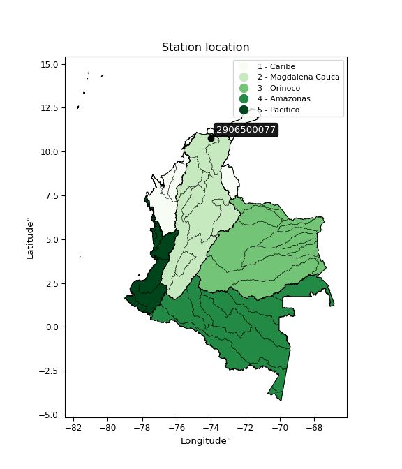

<div align="center">


</div>

# PMax24h Station (Rain, Pmax24h): 2906500077

Maximum Precipitation in 24 hours (PMax24h) is the greatest amount of rainfall for a specific duration that is meteorologically possible for a given location, acting as a "worst-case" scenario for extreme storms, crucial for designing safety-critical infrastructure like bridges, river deviations, dams, spillways, and nuclear plants to prevent catastrophic failure. The PMax24h is related with the Probable Maximum Precipitation (PMP) and it is calculated by hydrologists using meteorological data to determine the upper limit of extreme rainfall, often leading to the Probable Maximum Flood (PMF) for flood control design, and is increasingly being studied for climate change impacts. Probable Maximum Precipitation (PMP) is the theoretical upper limit of rainfall, a deterministic estimate for extreme events, while probability distributions (like GEV, Gumbel) describe the likelihood and frequency of various precipitation amounts, including rare ones, showing how often events occur, with PMP representing the extreme end of these distributions, used for critical infrastructure design to ensure safety against the worst conceivable weather, unlike standard statistical forecasts which cover typical probabilities.

The most common probability distributions in hydrology, used for analyzing floods, rainfall, and streamflow, include the Normal, Log-Normal, Gumbel, Gamma (including Log-Pearson Type III), and Generalized Extreme Value (GEV) distributions, often chosen based on the data´s skewness and whether modeling extremes or general conditions, with Gumbel and GEV popular for extreme events like floods, while the Normal distribution serves as a baseline, though often requiring transformations for skewed hydrological data. These distributions help in designing water infrastructure, managing water resources, and forecasting hydrologic events.

> Hydrological data often isn´t perfectly normal (it´s skewed), so different distributions are needed for different applications, such as: **Flood Frequency Analysis**: Using Gumbel, GEV, or Log-Pearson Type III for predicting extreme flood magnitudes and their return periods, **Rainfall Analysis**: Normal for annual totals, but Log-Normal, Weibull, or GEV for intensity or extreme daily rainfall, **Streamflow Modeling**: Gamma and Log-Normal for maximum flows, GEV for minimum flows, and Kappa for daily flows.

<div align="center">

</img>

</div>


## A. General information


### 1. General running parameters

• app_version: _v20260225_. • runtime: _2026-02-27 14:50:08.749431_. • Python version: _3.14.0_. • SciPy version: _1.16.3_. • Pandas version: _2.3.3_. • NumPy version: _2.3.5_. • Stations dataset (station_dataset_file): _dataset/pmax24h_in/automatic_colombia_2003_2025.csv_. • Stations catalog (station_catalog_file): _dataset/CNE.xls_. • Minimum year to eval til year_max (date_min): _1900_. • Maximum year to eval since year_min (date_max): _2025_. • Creates, save and include plots into reports (create_plot): _False_. • Plot only fit distributions with Δo > Δ (plot_only_fit): _True_. • Plot only simple graphs avoiding multiple CDFs and multiple Extreme values plots (plot_only_simple): _False_. • Eval low extreme values, if False, evaluates high extreme values (low_extreme): _False_. • Eval every SciPy distribution as logarithmic (pdist_logarithmic_on): _True_. • Standard deviation normalized (ddof): _1.0_. • Return periods to eval in years (Tr): _[2, 2.33, 5, 10, 15, 20, 25, 50, 75, 100, 200, 250, 500, 750, 1000]_. • Minimum data sample per station, 0 means any (minimum_sample): _5_. • Z-Score maximum threshold to adjust a value, 0 means disable (zscore_max): _3.5_. • Z-Score minimum threshold to adjust a value, 0 means disable (zscore_min): _-2.5_. • Avoid zeros, e.g. rain = 0 (avoid_zeros): _True_. • Avoid null values (avoid_nans): _True_. 

:file_folder:Table: [dataset.csv](../../dataset/pmax24h_in/automatic_colombia_2003_2025.csv)

> Delta Degrees of Freedom (DDOF): is a parameter used in the formulas for calculating variance and standard deviation. When ddof=0, the divisor is $N$ (the total number of observations) and this is used when your data set is the entire population. When ddof=1, the divisor is $N-1$ and this is used when your data set is a sample drawn from a larger population. Using $N-1$ provides an unbiased estimate of the population variance (known as Bessel´s correction).


### 2. Station info and location

|   id |     CODIGO | NOMBRE                                    | CATEGORIA               | TECNOLOGIA                | ESTADO           | FECHA_INSTALACION   |   FECHA_SUSPENSION |   ALTITUD |   LATITUD |   LONGITUD | DEPARTAMENTO   | MUNICIPIO   | AREA_OPERATIVA                                         | ENTIDAD                                                     | AREA_HIDROGRAFICA   | ZONA_HIDROGRAFICA   | SUBZONA_HIDROGRAFICA      |   CORRIENTE | Catalogo   |   Version |
|-----:|-----------:|:------------------------------------------|:------------------------|:--------------------------|:-----------------|:--------------------|-------------------:|----------:|----------:|-----------:|:---------------|:------------|:-------------------------------------------------------|:------------------------------------------------------------|:--------------------|:--------------------|:--------------------------|------------:|:-----------|----------:|
|    0 | 2906500077 | PALMOR - SIERRA NEVADA - AUT [2906500077] | Climatológica Principal | Automática con Telemetría | En Mantenimiento | 21/04/2017          |                nan |      1050 |   10.7718 |   -74.0191 | Magdalena      | Ciénaga     | Area Operativa 05 - Magdalena-Cesar-Guajira-San Andrés | INSTITUTO DE HIDROLOGIA METEOROLOGIA Y ESTUDIOS AMBIENTALES | Magdalena Cauca     | Bajo Magdalena      | Cga Grande de Santa Marta |         nan | CNE_IDEAM  |  20251226 |

<div align="center">

Dynamic map: [:earth_americas:Google](http://maps.google.com/maps?q=10.77175,-74.019138889) [:earth_americas:OSM](https://www.openstreetmap.org/#map=18/10.77175/-74.019138889&layers=P) [:earth_americas:Bing](https://www.bing.com/maps?cp=10.77175~-74.019138889&lvl=18) [:earth_americas:Apple](https://maps.apple.com/frame?center=10.77175%2C-74.019138889&span=0.003%2C0.006)

</div>


<div align="center">

```geojson
{
  "type": "Feature",
  "geometry": {
    "type": "Point", 
    "coordinates": [-74.019138889, 10.77175]
  }, 
  "properties": {
    "Name": "2906500077"
  }
}
```

</div>


### 3. Discrete values table and plot

<div align="center">

|               |           0 |             1 |          2 |          3 |           4 |
|:--------------|------------:|--------------:|-----------:|-----------:|------------:|
| Date          | 2019        | 2020          | 2022       | 2023       | 2025        |
| Value         |   99        |   74.9        |  128.7     |   12.8     |   58.8      |
| Value_initial |   99        |   74.9        |  128.7     |   12.8     |   58.8      |
| count         |    5        |    5          |    5       |    5       |    5        |
| mean          |   74.84     |   74.84       |   74.84    |   74.84    |   74.84     |
| std           |   43.5627   |   43.5627     |   43.5627  |   43.5627  |   43.5627   |
| zscore        |    0.554602 |    0.00137732 |    1.23638 |   -1.42415 |   -0.368205 |


</div>


> The initial value (value_initial) correspond to the initial obtained or null completed value, and value (value) is adjusted only when the initial value is outside the valid range (outlier) definite through the Z-Score value. If Z-Score is active, values out of range or outliers are replaced with the station mean value. A Z-Score (or standard score) measures how many standard deviations a data point is from the mean of a dataset, indicating its relative position; positive scores mean above the mean, negative mean below, and a score of zero is exactly at the mean, allowing for comparison of values from different distributions. It´s calculated using the formula $z=(x–μ)/σ$, where $x$ is the data point, $μ$ is the mean, and $σ$ is the standard deviation, helping identify outliers and understand probability.
>
> <sub>**Note**: In this study, "completing" (filling gaps in) and "extending" (forecasting or lengthening the historical record) rainfall data series are avoided for certain critical analyses because they introduce artificial bias and uncertainty, which can distort the statistics of rare events (extremes), alter day-to-day variability, and compromise the integrity and homogeneity of the original data. Some reasons against Completing/Extending rainfall data are: **Distortion of Extremes and Variability**: The primary issue is that most gap-filling or extension methods rely on averaging or regression with nearby stations, which inherently smooths the data. Rainfall is highly variable in space and time, with a large percentage of zero values and occasional large storms. Infilling methods often underestimate the highest values and overestimate the lowest (zero) values, which severely distorts analyses focused on flood frequency, drought severity, and intensity-duration-frequency (IDF) curves, **Loss of Data Homogeneity**: Infilled or extended data are synthetic estimates, not actual measurements. Combining these estimates with observed data can violate the assumption of data homogeneity, which requires that the data properties do not change over time. Inhomogeneity can lead to incorrect conclusions about long-term trends or changes in climate patterns, **Propagation of Errors**: Errors and biases from the original data (e.g., wind-induced undercatch, instrument errors, site changes) or the data used for imputation can propagate through the analysis, leading to unreliable hydrological models and inaccurate predictions, **Compromised Statistical Integrity**: For statistical analyses, especially those involving the frequency of events, using artificial data can introduce time bias or autocorrelation that doesn´t exist in reality, making it difficult to assess the true probability of events, **Difficulty in Validation**: It is difficult to accurately validate the quality of filled or extended data, especially for past periods where ground-truth measurements are unavailable. The reliability of imputation techniques heavily depends on the density of the surrounding station network and the complexity of the local topography.</sub>


### 4. Active continuous probability distributions from SciPy (80 of 104 available)

A Probability Density Function (PDF) describes the relative likelihood of a continuous random variable falling within a specific range, where the total area under its curve equals 1, and the area over any interval gives the actual probability for that range. Unlike discrete probabilities (like rolling a die), a PDF shows density, not direct probability for a single point (which is zero), with higher points indicating higher likelihood, often visualized as a bell curve for normal distributions.

A log of a probability density function (log-PDF) is simply the logarithm of the PDF´s value, denoted as $log(f(x))$, useful for converting multiplication of probabilities into addition, improving numerical stability with tiny numbers, and connecting to information theory concepts like entropy. Instead of dealing with very small probabilities (e.g., 0.000001), log-PDFs use negative numbers (e.g., $log(0.00001) ≈ -11.51$ that are easier for computers to handle, preventing underflow errors and simplifying complex calculations. In this study, each active probability distribution from SciPy is also evaluated in the $log$ form.

[scipy.stats](https://docs.scipy.org/doc/scipy/reference/stats.html) is a Python´s powerful submodule within the SciPy library for comprehensive statistical analysis, offering over 130 probability distributions (like Normal, Poisson, etc.), functions for descriptive stats (mean, variance), hypothesis testing (t-tests, chi-square), random variable generation, and statistical tests, making it essential for data science, modeling, and research. It provides tools to explore, model, and draw conclusions from data efficiently, working seamlessly with [NumPy](https://numpy.org/).

<div align="center">

|   id | p_dist           |   n_parameter | fit_method   | label                                                                       | active   | ref                                                                                                      |
|-----:|:-----------------|--------------:|:-------------|:----------------------------------------------------------------------------|:---------|:---------------------------------------------------------------------------------------------------------|
|    0 | alpha            |             3 | MLE          | Alpha                                                                       | True     | [:mortar_board:](https://docs.scipy.org/doc/scipy/reference/generated/scipy.stats.alpha.html)            |
|    1 | anglit           |             2 | MM           | Anglit                                                                      | True     | [:mortar_board:](https://docs.scipy.org/doc/scipy/reference/generated/scipy.stats.anglit.html)           |
|    2 | arcsine          |             2 | MM           | Arcsine                                                                     | True     | [:mortar_board:](https://docs.scipy.org/doc/scipy/reference/generated/scipy.stats.arcsine.html)          |
|    3 | argus            |             3 | MLE          | Argus                                                                       | True     | [:mortar_board:](https://docs.scipy.org/doc/scipy/reference/generated/scipy.stats.argus.html)            |
|    4 | beta             |             4 | MLE          | Beta                                                                        | True     | [:mortar_board:](https://docs.scipy.org/doc/scipy/reference/generated/scipy.stats.beta.html)             |
|    5 | betaprime        |             4 | MLE          | Beta prime                                                                  | True     | [:mortar_board:](https://docs.scipy.org/doc/scipy/reference/generated/scipy.stats.betaprime.html)        |
|    6 | bradford         |             3 | MLE          | Bradford                                                                    | True     | [:mortar_board:](https://docs.scipy.org/doc/scipy/reference/generated/scipy.stats.bradford.html)         |
|    7 | burr             |             4 | MLE          | Burr (Type III)                                                             | True     | [:mortar_board:](https://docs.scipy.org/doc/scipy/reference/generated/scipy.stats.burr.html)             |
|    8 | burr12           |             4 | MLE          | Burr (Type III) 12                                                          | True     | [:mortar_board:](https://docs.scipy.org/doc/scipy/reference/generated/scipy.stats.burr12.html)           |
|    9 | cosine           |             2 | MLE          | Cosine                                                                      | True     | [:mortar_board:](https://docs.scipy.org/doc/scipy/reference/generated/scipy.stats.cosine.html)           |
|   10 | crystalball      |             4 | MLE          | Crystalball                                                                 | True     | [:mortar_board:](https://docs.scipy.org/doc/scipy/reference/generated/scipy.stats.crystalball.html)      |
|   11 | dgamma           |             3 | MLE          | Double gamma                                                                | True     | [:mortar_board:](https://docs.scipy.org/doc/scipy/reference/generated/scipy.stats.dgamma.html)           |
|   12 | dweibull         |             3 | MLE          | Double Weibull                                                              | True     | [:mortar_board:](https://docs.scipy.org/doc/scipy/reference/generated/scipy.stats.dweibull.html)         |
|   13 | erlang           |             3 | MLE          | Erlang                                                                      | True     | [:mortar_board:](https://docs.scipy.org/doc/scipy/reference/generated/scipy.stats.erlang.html)           |
|   14 | exponnorm        |             3 | MLE          | Exponentially modified Normal                                               | True     | [:mortar_board:](https://docs.scipy.org/doc/scipy/reference/generated/scipy.stats.exponnorm.html)        |
|   15 | exponpow         |             3 | MLE          | Exponential power                                                           | True     | [:mortar_board:](https://docs.scipy.org/doc/scipy/reference/generated/scipy.stats.exponpow.html)         |
|   16 | exponweib        |             4 | MLE          | Exponentiated Weibull                                                       | True     | [:mortar_board:](https://docs.scipy.org/doc/scipy/reference/generated/scipy.stats.exponweib.html)        |
|   17 | f                |             4 | MLE          | F                                                                           | True     | [:mortar_board:](https://docs.scipy.org/doc/scipy/reference/generated/scipy.stats.f.html)                |
|   18 | fatiguelife      |             3 | MLE          | Fatigue-life (Birnbaum-Saunders)                                            | True     | [:mortar_board:](https://docs.scipy.org/doc/scipy/reference/generated/scipy.stats.fatiguelife.html)      |
|   19 | foldnorm         |             3 | MM           | Fold Normal                                                                 | True     | [:mortar_board:](https://docs.scipy.org/doc/scipy/reference/generated/scipy.stats.foldnorm.html)         |
|   20 | gamma            |             3 | MLE          | Gamma                                                                       | True     | [:mortar_board:](https://docs.scipy.org/doc/scipy/reference/generated/scipy.stats.gamma.html)            |
|   21 | gausshyper       |             6 | MLE          | Gauss hypergeometric                                                        | True     | [:mortar_board:](https://docs.scipy.org/doc/scipy/reference/generated/scipy.stats.gausshyper.html)       |
|   22 | genexpon         |             5 | MLE          | Generalized exponential                                                     | True     | [:mortar_board:](https://docs.scipy.org/doc/scipy/reference/generated/scipy.stats.genexpon.html)         |
|   23 | genextreme       |             3 | MLE          | Generalized exponential                                                     | True     | [:mortar_board:](https://docs.scipy.org/doc/scipy/reference/generated/scipy.stats.genextreme.html)       |
|   24 | gengamma         |             4 | MLE          | Generalized gamma                                                           | True     | [:mortar_board:](https://docs.scipy.org/doc/scipy/reference/generated/scipy.stats.gengamma.html)         |
|   25 | genhalflogistic  |             3 | MLE          | Generalized half-logistic                                                   | True     | [:mortar_board:](https://docs.scipy.org/doc/scipy/reference/generated/scipy.stats.genhalflogistic.html)  |
|   26 | genlogistic      |             3 | MLE          | Generalized logistic                                                        | True     | [:mortar_board:](https://docs.scipy.org/doc/scipy/reference/generated/scipy.stats.genlogistic.html)      |
|   27 | gennorm          |             3 | MLE          | Generalized Normal                                                          | True     | [:mortar_board:](https://docs.scipy.org/doc/scipy/reference/generated/scipy.stats.gennorm.html)          |
|   28 | genpareto        |             3 | MLE          | Generalized Pareto                                                          | True     | [:mortar_board:](https://docs.scipy.org/doc/scipy/reference/generated/scipy.stats.genpareto.html)        |
|   29 | gompertz         |             3 | MLE          | Gompertz (or truncated Gumbel)                                              | True     | [:mortar_board:](https://docs.scipy.org/doc/scipy/reference/generated/scipy.stats.gompertz.html)         |
|   30 | gumbel_l         |             2 | MM           | Gumbel Left Skew                                                            | True     | [:mortar_board:](https://docs.scipy.org/doc/scipy/reference/generated/scipy.stats.gumbel_l.html)         |
|   31 | gumbel_r         |             2 | MM           | Gumbel Right Skew                                                           | True     | [:mortar_board:](https://docs.scipy.org/doc/scipy/reference/generated/scipy.stats.gumbel_r.html)         |
|   32 | halfgennorm      |             3 | MLE          | Upper half of a generalized normal                                          | True     | [:mortar_board:](https://docs.scipy.org/doc/scipy/reference/generated/scipy.stats.halfgennorm.html)      |
|   33 | halflogistic     |             2 | MM           | Half-logistic                                                               | True     | [:mortar_board:](https://docs.scipy.org/doc/scipy/reference/generated/scipy.stats.halflogistic.html)     |
|   34 | halfnorm         |             2 | MM           | Half Normal                                                                 | True     | [:mortar_board:](https://docs.scipy.org/doc/scipy/reference/generated/scipy.stats.halfnorm.html)         |
|   35 | hypsecant        |             2 | MM           | hyperbolic secant                                                           | True     | [:mortar_board:](https://docs.scipy.org/doc/scipy/reference/generated/scipy.stats.hypsecant.html)        |
|   36 | invgamma         |             3 | MLE          | Inverted gamma                                                              | True     | [:mortar_board:](https://docs.scipy.org/doc/scipy/reference/generated/scipy.stats.invgamma.html)         |
|   37 | invgauss         |             3 | MLE          | Inverse Gaussian                                                            | True     | [:mortar_board:](https://docs.scipy.org/doc/scipy/reference/generated/scipy.stats.invgauss.html)         |
|   38 | invweibull       |             3 | MLE          | Inverted Weibull                                                            | True     | [:mortar_board:](https://docs.scipy.org/doc/scipy/reference/generated/scipy.stats.invweibull.html)       |
|   39 | johnsonsb        |             4 | MLE          | Johnson SB                                                                  | True     | [:mortar_board:](https://docs.scipy.org/doc/scipy/reference/generated/scipy.stats.johnsonsb.html)        |
|   40 | johnsonsu        |             4 | MLE          | Johnson Su                                                                  | True     | [:mortar_board:](https://docs.scipy.org/doc/scipy/reference/generated/scipy.stats.johnsonsu.html)        |
|   41 | kappa3           |             3 | MLE          | Kappa 3                                                                     | True     | [:mortar_board:](https://docs.scipy.org/doc/scipy/reference/generated/scipy.stats.kappa3.html)           |
|   42 | kappa4           |             4 | MLE          | Kappa 4                                                                     | True     | [:mortar_board:](https://docs.scipy.org/doc/scipy/reference/generated/scipy.stats.kappa4.html)           |
|   43 | ksone            |             3 | MLE          | Kolmogorov-Smirnov one-sided test statistic distribution                    | True     | [:mortar_board:](https://docs.scipy.org/doc/scipy/reference/generated/scipy.stats.ksone.html)            |
|   44 | kstwobign        |             2 | MLE          | Limiting distribution of scaled Kolmogorov-Smirnov two-sided test statistic | True     | [:mortar_board:](https://docs.scipy.org/doc/scipy/reference/generated/scipy.stats.kstwobign.html)        |
|   45 | laplace          |             2 | MM           | Laplace                                                                     | True     | [:mortar_board:](https://docs.scipy.org/doc/scipy/reference/generated/scipy.stats.laplace.html)          |
|   46 | levy_l           |             2 | MLE          | Left-skewed Levy                                                            | True     | [:mortar_board:](https://docs.scipy.org/doc/scipy/reference/generated/scipy.stats.levy_l.html)           |
|   47 | loggamma         |             3 | MLE          | Log gamma                                                                   | True     | [:mortar_board:](https://docs.scipy.org/doc/scipy/reference/generated/scipy.stats.loggamma.html)         |
|   48 | logistic         |             2 | MM           | Logistic (or Sech-squared)                                                  | True     | [:mortar_board:](https://docs.scipy.org/doc/scipy/reference/generated/scipy.stats.logistic.html)         |
|   49 | loglaplace       |             3 | MLE          | Log-Laplace                                                                 | True     | [:mortar_board:](https://docs.scipy.org/doc/scipy/reference/generated/scipy.stats.loglaplace.html)       |
|   50 | lomax            |             3 | MLE          | Lomax (Pareto of the second kind)                                           | True     | [:mortar_board:](https://docs.scipy.org/doc/scipy/reference/generated/scipy.stats.lomax.html)            |
|   51 | maxwell          |             2 | MM           | Maxwell                                                                     | True     | [:mortar_board:](https://docs.scipy.org/doc/scipy/reference/generated/scipy.stats.maxwell.html)          |
|   52 | mielke           |             4 | MLE          | Mielke Beta-Kappa / Dagum                                                   | True     | [:mortar_board:](https://docs.scipy.org/doc/scipy/reference/generated/scipy.stats.mielke.html)           |
|   53 | moyal            |             2 | MM           | Moyal                                                                       | True     | [:mortar_board:](https://docs.scipy.org/doc/scipy/reference/generated/scipy.stats.moyal.html)            |
|   54 | nakagami         |             3 | MLE          | Nakagami                                                                    | True     | [:mortar_board:](https://docs.scipy.org/doc/scipy/reference/generated/scipy.stats.nakagami.html)         |
|   55 | ncf              |             5 | MLE          | Non-central F distribution                                                  | True     | [:mortar_board:](https://docs.scipy.org/doc/scipy/reference/generated/scipy.stats.ncf.html)              |
|   56 | nct              |             4 | MLE          | Non-central Student’s t                                                     | True     | [:mortar_board:](https://docs.scipy.org/doc/scipy/reference/generated/scipy.stats.nct.html)              |
|   57 | norm             |             2 | MM           | Normal                                                                      | True     | [:mortar_board:](https://docs.scipy.org/doc/scipy/reference/generated/scipy.stats.norm.html)             |
|   58 | pearson3         |             3 | MM           | Pearson type III                                                            | True     | [:mortar_board:](https://docs.scipy.org/doc/scipy/reference/generated/scipy.stats.pearson3.html)         |
|   59 | powerlaw         |             3 | MLE          | Power-function                                                              | True     | [:mortar_board:](https://docs.scipy.org/doc/scipy/reference/generated/scipy.stats.powerlaw.html)         |
|   60 | rayleigh         |             2 | MM           | Rayleigh                                                                    | True     | [:mortar_board:](https://docs.scipy.org/doc/scipy/reference/generated/scipy.stats.rayleigh.html)         |
|   61 | rdist            |             3 | MLE          | R-distributed (symmetric beta)                                              | True     | [:mortar_board:](https://docs.scipy.org/doc/scipy/reference/generated/scipy.stats.rdist.html)            |
|   62 | rice             |             3 | MLE          | Rice                                                                        | True     | [:mortar_board:](https://docs.scipy.org/doc/scipy/reference/generated/scipy.stats.rice.html)             |
|   63 | semicircular     |             2 | MM           | Semicircular                                                                | True     | [:mortar_board:](https://docs.scipy.org/doc/scipy/reference/generated/scipy.stats.semicircular.html)     |
|   64 | skewnorm         |             3 | MLE          | Skew normal                                                                 | True     | [:mortar_board:](https://docs.scipy.org/doc/scipy/reference/generated/scipy.stats.skewnorm.html)         |
|   65 | t                |             3 | MLE          | Student’s t                                                                 | True     | [:mortar_board:](https://docs.scipy.org/doc/scipy/reference/generated/scipy.stats.t.html)                |
|   66 | trapezoid        |             4 | MLE          | Trapezoid                                                                   | True     | [:mortar_board:](https://docs.scipy.org/doc/scipy/reference/generated/scipy.stats.trapezoid.html)        |
|   67 | triang           |             3 | MLE          | Triangular                                                                  | True     | [:mortar_board:](https://docs.scipy.org/doc/scipy/reference/generated/scipy.stats.triang.html)           |
|   68 | truncexpon       |             3 | MLE          | Truncated exponential                                                       | True     | [:mortar_board:](https://docs.scipy.org/doc/scipy/reference/generated/scipy.stats.truncexpon.html)       |
|   69 | truncnorm        |             4 | MLE          | Truncated normal                                                            | True     | [:mortar_board:](https://docs.scipy.org/doc/scipy/reference/generated/scipy.stats.truncnorm.html)        |
|   70 | truncpareto      |             4 | MLE          | Upper truncated Pareto                                                      | True     | [:mortar_board:](https://docs.scipy.org/doc/scipy/reference/generated/scipy.stats.truncpareto.html)      |
|   71 | truncweibull_min |             5 | MLE          | Doubly truncated Weibull minimum                                            | True     | [:mortar_board:](https://docs.scipy.org/doc/scipy/reference/generated/scipy.stats.truncweibull_min.html) |
|   72 | tukeylambda      |             3 | MLE          | Tukey-Lamdba                                                                | True     | [:mortar_board:](https://docs.scipy.org/doc/scipy/reference/generated/scipy.stats.tukeylambda.html)      |
|   73 | uniform          |             2 | MLE          | Uniform                                                                     | True     | [:mortar_board:](https://docs.scipy.org/doc/scipy/reference/generated/scipy.stats.uniform.html)          |
|   74 | vonmises         |             3 | MLE          | Von Mises                                                                   | True     | [:mortar_board:](https://docs.scipy.org/doc/scipy/reference/generated/scipy.stats.vonmises.html)         |
|   75 | vonmises_line    |             3 | MLE          | Von Mises line                                                              | True     | [:mortar_board:](https://docs.scipy.org/doc/scipy/reference/generated/scipy.stats.vonmises_line.html)    |
|   76 | wald             |             2 | MM           | Wald                                                                        | True     | [:mortar_board:](https://docs.scipy.org/doc/scipy/reference/generated/scipy.stats.wald.html)             |
|   77 | weibull_max      |             3 | MLE          | Weibull maximum                                                             | True     | [:mortar_board:](https://docs.scipy.org/doc/scipy/reference/generated/scipy.stats.weibull_max.html)      |
|   78 | weibull_min      |             3 | MLE          | Weibull minimum                                                             | True     | [:mortar_board:](https://docs.scipy.org/doc/scipy/reference/generated/scipy.stats.weibull_min.html)      |
|   79 | wrapcauchy       |             3 | MLE          | Wrapped  Cauchy                                                             | True     | [:mortar_board:](https://docs.scipy.org/doc/scipy/reference/generated/scipy.stats.wrapcauchy.html)       |

</div>

> **n_parameter:** # arguments & localization & scale.
>
> **Fit methods:** (MLE) maximum likelihood, (MM) L-moments.
>
>**Inactive** (With the only purpose of prevent loops, zero divisions, infinite values, over high estimated values or horizontal trending for recurrence intervals estimations, the follow distributions were disabled.)**:** lognorm, norminvgauss, powernorm, powerlognorm, cauchy, halfcauchy, foldcauchy, skewcauchy, chi2, expon, fisk, genhyperbolic, geninvgauss, gibrat, kstwo, laplace_asymmetric, levy, levy_stable, ncx2, pareto, rel_breitwigner, recipinvgauss, studentized_range, loguniform, 


## B. Probability (PDF) vs. Empirical (EDF) distributions functions

A continuous probability distribution (CPD) describes probabilities for variables that can take any value within a range (like rain any time), unlike discrete variables with specific outcomes (like temperature). It uses a Probability Density Function (PDF), a curve where the total area under it equals 1, and the probability of the variable falling within an interval (a to b) is found by calculating the area under the curve between those points. A key feature is that the probability of hitting any single exact value is zero, so probabilities are always expressed for ranges, e.g., $P(a ≤ X ≤ b)$.

<div align="center">

Distributions parameters from station values
|     |    station | p_dist              |   n |               loc |            scale | shape                  | shape1                | shape2                | shape3             |
|----:|-----------:|:--------------------|----:|------------------:|-----------------:|:-----------------------|:----------------------|:----------------------|:-------------------|
|   0 | 2906500077 | alpha               |   5 |      -0.0778486   |     27.4257      | 2.2957452820026538e-10 |                       |                       |                    |
|   1 | 2906500077 | anglit              |   5 |      74.84        |    113.984       |                        |                       |                       |                    |
|   2 | 2906500077 | arcsine             |   5 |      19.737       |    110.206       |                        |                       |                       |                    |
|   3 | 2906500077 | argus               |   5 |     -17.057       |    153.538       | 0.8071960501934059     |                       |                       |                    |
|   4 | 2906500077 | beta                |   5 |     -16.8514      |    145.551       | 1.881783449141699      | 0.7585104252481767    |                       |                    |
|   5 | 2906500077 | betaprime           |   5 |    -736.113       |  92068.9         | 430.8219448651066      | 48908.60630178661     |                       |                    |
|   6 | 2906500077 | bradford            |   5 |      12.7999      |    115.9         | 1.0034149350269623     |                       |                       |                    |
|   7 | 2906500077 | burr                |   5 |      -1.40293     |    131.691       | 318.7133897479665      | 0.004092864846890792  |                       |                    |
|   8 | 2906500077 | burr12              |   5 |      -1.34594     |     13.9463      | 317.9073596996628      | 0.0021309834409824003 |                       |                    |
|   9 | 2906500077 | cosine              |   5 |      73.3943      |     32.2258      |                        |                       |                       |                    |
|  10 | 2906500077 | crystalball         |   5 |      74.84        |     38.9637      | 363.9159669928231      | 14536.710058837036    |                       |                    |
|  11 | 2906500077 | dgamma              |   5 |      74.9         |     33.7895      | 0.7839184768904085     |                       |                       |                    |
|  12 | 2906500077 | dweibull            |   5 |      74.9         |     37.6134      | 0.8622126029870395     |                       |                       |                    |
|  13 | 2906500077 | erlang              |   5 |    -655.487       |      2.12657     | 343.32497219902535     |                       |                       |                    |
|  14 | 2906500077 | exponnorm           |   5 |      74.805       |     38.9637      | 0.00090049300787422    |                       |                       |                    |
|  15 | 2906500077 | exponpow            |   5 |      12.8         |     81.6661      | 0.22229284346390676    |                       |                       |                    |
|  16 | 2906500077 | exponweib           |   5 |   -2111.36        |   1716.29        | 1081.2541974472242     | 8.308249427096989     |                       |                    |
|  17 | 2906500077 | f                   |   5 |   -1403.95        |   1478.51        | 2884.181566391516      | 243228.56464794127    |                       |                    |
|  18 | 2906500077 | fatiguelife         |   5 |   -4094.82        |   4169.41        | 0.009300306205156202   |                       |                       |                    |
|  19 | 2906500077 | foldnorm            |   5 |    -158.827       |     37.9256      | 6.1679360153251634     |                       |                       |                    |
|  20 | 2906500077 | gamma               |   5 |    -608.499       |      2.26228     | 301.9734814914144      |                       |                       |                    |
|  21 | 2906500077 | gausshyper          |   5 |       1.40117     |    127.299       | 1.252681891527132      | 0.8186175555251342    | 0.9163409059313503    | 0.8602551358752459 |
|  22 | 2906500077 | genexpon            |   5 |       5.14692     |      2.32524     | 1.6028123289903425e-10 | 0.03544098416195895   | 0.5384400228569448    |                    |
|  23 | 2906500077 | genextreme          |   5 |      79.4658      |     57.606       | 1.170040672328295      |                       |                       |                    |
|  24 | 2906500077 | gengamma            |   5 |     -66.2904      |      0.002397    | 76.01963858783188      | 0.39548864433145803   |                       |                    |
|  25 | 2906500077 | genhalflogistic     |   5 |       1.171       |    136.516       | 1.0704728217388815     |                       |                       |                    |
|  26 | 2906500077 | genlogistic         |   5 |      91.205       |     19.0899      | 0.6378502506414926     |                       |                       |                    |
|  27 | 2906500077 | gennorm             |   5 |      70.75        |     57.9501      | 11031053.396307189     |                       |                       |                    |
|  28 | 2906500077 | genpareto           |   5 |      -1.02501     |    186.114       | -1.434682349424258     |                       |                       |                    |
|  29 | 2906500077 | gompertz            |   5 |      12.7896      |     50.6413      | 0.28990584824347776    |                       |                       |                    |
|  30 | 2906500077 | gumbel_l            |   5 |      92.3757      |     30.3799      |                        |                       |                       |                    |
|  31 | 2906500077 | gumbel_r            |   5 |      57.3043      |     30.3799      |                        |                       |                       |                    |
|  32 | 2906500077 | halfgennorm         |   5 |      12.8         |      5.82344     | 0.4212224079559258     |                       |                       |                    |
|  33 | 2906500077 | halflogistic        |   5 |      28.659       |     33.3126      |                        |                       |                       |                    |
|  34 | 2906500077 | halfnorm            |   5 |      23.2673      |     64.6367      |                        |                       |                       |                    |
|  35 | 2906500077 | hypsecant           |   5 |      74.84        |     24.8051      |                        |                       |                       |                    |
|  36 | 2906500077 | invgamma            |   5 |    -411.144       |  72211.9         | 149.62517842357272     |                       |                       |                    |
|  37 | 2906500077 | invgauss            |   5 |    -148.295       |   6335.31        | 0.03524822426974475    |                       |                       |                    |
|  38 | 2906500077 | invweibull          |   5 |      -2.99809e+09 |      2.99809e+09 | 82350636.82667391      |                       |                       |                    |
|  39 | 2906500077 | johnsonsb           |   5 |      12.8         |    115.904       | 0.1512354077873873     | 0.1160705201594534    |                       |                    |
|  40 | 2906500077 | johnsonsu           |   5 |     258.136       |     31.9161      | 11.508169859999903     | 4.741677947601659     |                       |                    |
|  41 | 2906500077 | kappa3              |   5 |      12.8         |    123.733       | 3413.080023741353      |                       |                       |                    |
|  42 | 2906500077 | kappa4              |   5 |       7.62891     |    125.616       | 1.0429682426109848     | 1.0375218471422771    |                       |                    |
|  43 | 2906500077 | ksone               |   5 |       7.35288     |    134.974       | 1.0                    |                       |                       |                    |
|  44 | 2906500077 | kstwobign           |   5 |     -76.7246      |    173.036       |                        |                       |                       |                    |
|  45 | 2906500077 | laplace             |   5 |      74.84        |     27.5515      |                        |                       |                       |                    |
|  46 | 2906500077 | levy_l              |   5 |     133.246       |     17.359       |                        |                       |                       |                    |
|  47 | 2906500077 | loggamma            |   5 |     -16.2795      |     73.4486      | 3.945705168371055      |                       |                       |                    |
|  48 | 2906500077 | logistic            |   5 |      74.84        |     21.4818      |                        |                       |                       |                    |
|  49 | 2906500077 | loglaplace          |   5 |      -0.193774    |     75.0938      | 1.7767682266630018     |                       |                       |                    |
|  50 | 2906500077 | lomax               |   5 |      12.8         |      1.82758e+10 | 300193753.5250227      |                       |                       |                    |
|  51 | 2906500077 | maxwell             |   5 |     -17.4876      |     57.8578      |                        |                       |                       |                    |
|  52 | 2906500077 | mielke              |   5 |      12.8         |    115.911       | 0.5615659181153178     | 13117.439987387446    |                       |                    |
|  53 | 2906500077 | moyal               |   5 |      52.5581      |     17.5398      |                        |                       |                       |                    |
|  54 | 2906500077 | nakagami            |   5 |      58.8         |     35.2734      | 0.2736479201559141     |                       |                       |                    |
|  55 | 2906500077 | ncf                 |   5 |      -0.0683073   |      6.09576e-05 | 1.0693069877797844e-05 | 26.1010002853429      | 12.57856103313338     |                    |
|  56 | 2906500077 | nct                 |   5 |   -2179.2         |     38.9192      | 717745.9526262057      | 57.91580223528456     |                       |                    |
|  57 | 2906500077 | norm                |   5 |      74.84        |     38.9637      |                        |                       |                       |                    |
|  58 | 2906500077 | pearson3            |   5 |      74.84        |     38.9637      | -0.24536972691499936   |                       |                       |                    |
|  59 | 2906500077 | powerlaw            |   5 |      12.8         |    115.9         | 0.1232709240938025     |                       |                       |                    |
|  60 | 2906500077 | rayleigh            |   5 |       0.300155    |     59.4742      |                        |                       |                       |                    |
|  61 | 2906500077 | rdist               |   5 |       2.18692     |     72.7131      | 1.0084162962697811     |                       |                       |                    |
|  62 | 2906500077 | rice                |   5 |     -10.5801      |     44.1123      | 1.590574526430484      |                       |                       |                    |
|  63 | 2906500077 | semicircular        |   5 |      74.84        |     77.9274      |                        |                       |                       |                    |
|  64 | 2906500077 | skewnorm            |   5 |     128.7         |     66.4862      | -4857095.767397814     |                       |                       |                    |
|  65 | 2906500077 | t                   |   5 |      74.8395      |     38.9637      | 966773118.1570605      |                       |                       |                    |
|  66 | 2906500077 | trapezoid           |   5 |     -36.2502      |    165.309       | 1.0                    | 1.0                   |                       |                    |
|  67 | 2906500077 | triang              |   5 |     -35.7034      |    164.403       | 0.9999995766513454     |                       |                       |                    |
|  68 | 2906500077 | truncexpon          |   5 |       1.29506     |    168.311       | 0.7569627156845882     |                       |                       |                    |
|  69 | 2906500077 | truncnorm           |   5 |      74.84        |     38.9637      | -342.39729031059596    | 602.8374472625037     |                       |                    |
|  70 | 2906500077 | truncpareto         |   5 |      12.1849      |      0.615138    | 0.26115160888056077    | 189.4130865316923     |                       |                    |
|  71 | 2906500077 | truncweibull_min    |   5 |       1.5342      |    141.135       | 1.376187114370114      | 1.639047085241877e-07 | 0.9010255554730493    |                    |
|  72 | 2906500077 | tukeylambda         |   5 |      70.3204      |     64.688       | 1.1080583516352478     |                       |                       |                    |
|  73 | 2906500077 | uniform             |   5 |      12.8         |    115.9         |                        |                       |                       |                    |
|  74 | 2906500077 | vonmises            |   5 |      -0.936167    |      1           | 0.18115725725629536    |                       |                       |                    |
|  75 | 2906500077 | vonmises_line       |   5 |      70.7501      |     18.4461      | 0.05444202441670202    |                       |                       |                    |
|  76 | 2906500077 | wald                |   5 |      35.8763      |     38.9637      |                        |                       |                       |                    |
|  77 | 2906500077 | weibull_max         |   5 |     128.7         |      1.5385      | 0.23452332851250784    |                       |                       |                    |
|  78 | 2906500077 | weibull_min         |   5 |     -76.6378      |    166.334       | 4.5606820383684035     |                       |                       |                    |
|  79 | 2906500077 | wrapcauchy          |   5 |      12.8         |     18.4462      | 0.0694983761284651     |                       |                       |                    |
|  80 | 2906500077 | logalpha            |   5 |     -17.1883      |    523.393       | 24.67253936042239      |                       |                       |                    |
|  81 | 2906500077 | loganglit           |   5 |       4.07847     |      2.36513     |                        |                       |                       |                    |
|  82 | 2906500077 | logarcsine          |   5 |       2.93511     |      2.28672     |                        |                       |                       |                    |
|  83 | 2906500077 | logargus            |   5 |       1.47187     |      3.4618      | 2.526351430004373      |                       |                       |                    |
|  84 | 2906500077 | logbeta             |   5 |       2.392       |      2.46548     | 0.5601940470048901     | 0.1953856765544785    |                       |                    |
|  85 | 2906500077 | logbetaprime        |   5 |     -11.7695      |    181.885       | 375.4484705963364      | 4315.636723521197     |                       |                    |
|  86 | 2906500077 | logbradford         |   5 |       2.54916     |      2.30832     | 1.039766737341396      |                       |                       |                    |
|  87 | 2906500077 | logburr             |   5 |      -9.21896     |     14.0901      | 3942.0236141877467     | 0.004238782841467746  |                       |                    |
|  88 | 2906500077 | logburr12           |   5 |   -2860.86        |   2871.84        | 6226.483197091933      | 1421419.707032788     |                       |                    |
|  89 | 2906500077 | logcosine           |   5 |       3.9533      |      0.686369    |                        |                       |                       |                    |
|  90 | 2906500077 | logcrystalball      |   5 |       4.85749     |      3.09508e-06 | 4.0404505832600015e-06 | 135.87730103062688    |                       |                    |
|  91 | 2906500077 | logdgamma           |   5 |       4.31615     |      1.33824     | 0.22792314726464089    |                       |                       |                    |
|  92 | 2906500077 | logdweibull         |   5 |       4.31615     |      0.599411    | 0.9655486738197507     |                       |                       |                    |
|  93 | 2906500077 | logerlang           |   5 |      -9.10663     |      0.0545112   | 241.8759833272103      |                       |                       |                    |
|  94 | 2906500077 | logexponnorm        |   5 |       4.0779      |      0.808487    | 0.0007011860750224741  |                       |                       |                    |
|  95 | 2906500077 | logexponpow         |   5 |       2.54945     |      1.41993     | 0.5738744097412494     |                       |                       |                    |
|  96 | 2906500077 | logexponweib        |   5 |       2.54945     |      1.58845     | 1.4160958560480834     | 0.10333661422877627   |                       |                    |
|  97 | 2906500077 | logf                |   5 |    -456.337       |    460.418       | 2048203.8880513008     | 940460.1493439339     |                       |                    |
|  98 | 2906500077 | logfatiguelife      |   5 |    -409.055       |    413.133       | 0.001966114822091237   |                       |                       |                    |
|  99 | 2906500077 | logfoldnorm         |   5 |       0.281495    |      0.765502    | 4.9670630333398265     |                       |                       |                    |
| 100 | 2906500077 | loggamma            |   5 |      -9.18383     |      0.0537303   | 246.5715984807332      |                       |                       |                    |
| 101 | 2906500077 | loggausshyper       |   5 |       2.53403     |      2.32346     | 1.153150676115255      | 0.7966893238891273    | 1.0471414639638348    | 1.0007720638567033 |
| 102 | 2906500077 | loggenexpon         |   5 |       2.54807     |      0.0298096   | 0.008094980955542584   | 4.563554934297784     | 7.613130841328163e-05 |                    |
| 103 | 2906500077 | loggenextreme       |   5 |       4.04775     |      0.994067    | 1.2276534335231566     |                       |                       |                    |
| 104 | 2906500077 | loggengamma         |   5 |       2.54945     |      1.33869     | 0.9604933140011218     | 0.1443914143591567    |                       |                    |
| 105 | 2906500077 | loggenhalflogistic  |   5 |       2.4613      |      2.56299     | 1.0696161655261096     |                       |                       |                    |
| 106 | 2906500077 | loggenlogistic      |   5 |       4.85751     |      1.40608e-06 | 1.7985153304839168e-06 |                       |                       |                    |
| 107 | 2906500077 | loggennorm          |   5 |       4.31615     |      1.59653e-05 | 0.1849656700318934     |                       |                       |                    |
| 108 | 2906500077 | loggenpareto        |   5 |      -0.00565382  |      8.88508     | -1.8270257131925631    |                       |                       |                    |
| 109 | 2906500077 | loggompertz         |   5 |       2.54945     |      0.597746    | 0.047083429365217325   |                       |                       |                    |
| 110 | 2906500077 | loggumbel_l         |   5 |       4.44233     |      0.630371    |                        |                       |                       |                    |
| 111 | 2906500077 | loggumbel_r         |   5 |       3.71461     |      0.630371    |                        |                       |                       |                    |
| 112 | 2906500077 | loghalfgennorm      |   5 |       2.54944     |      2.30808     | 836439.8474229423      |                       |                       |                    |
| 113 | 2906500077 | loghalflogistic     |   5 |       3.12027     |      0.691197    |                        |                       |                       |                    |
| 114 | 2906500077 | loghalfnorm         |   5 |       3.00835     |      1.3412      |                        |                       |                       |                    |
| 115 | 2906500077 | loghypsecant        |   5 |       4.07847     |      0.514696    |                        |                       |                       |                    |
| 116 | 2906500077 | loginvgamma         |   5 |     -13.4564      |   7601.42        | 434.44077387487346     |                       |                       |                    |
| 117 | 2906500077 | loginvgauss         |   5 |      -4.22837     |    754.069       | 0.011025888559918859   |                       |                       |                    |
| 118 | 2906500077 | loginvweibull       |   5 |      -6.46953e+07 |      6.46953e+07 | 70863479.02656098      |                       |                       |                    |
| 119 | 2906500077 | logjohnsonsb        |   5 |       1.09417     |      3.76331     | -0.6036213363213238    | 0.12598335968400126   |                       |                    |
| 120 | 2906500077 | logjohnsonsu        |   5 |       4.85748     |      2.49032e-13 | 3.419971599108411      | 0.13816501603390624   |                       |                    |
| 121 | 2906500077 | logkappa3           |   5 |       2.53979     |      2.3162      | 2571.6295502704124     |                       |                       |                    |
| 122 | 2906500077 | logkappa4           |   5 |       2.36026     |      2.64905     | 1.0770861359825221     | 1.0586178836305407    |                       |                    |
| 123 | 2906500077 | logksone            |   5 |       2.31864     |      2.76965     | 1.0                    |                       |                       |                    |
| 124 | 2906500077 | logkstwobign        |   5 |       0.448895    |      4.13732     |                        |                       |                       |                    |
| 125 | 2906500077 | loglaplace          |   5 |       4.07847     |      0.571683    |                        |                       |                       |                    |
| 126 | 2906500077 | loglevy_l           |   5 |       4.90523     |      0.181845    |                        |                       |                       |                    |
| 127 | 2906500077 | logloggamma         |   5 |       4.85755     |      4.17298e-06 | 5.335256172008847e-06  |                       |                       |                    |
| 128 | 2906500077 | loglogistic         |   5 |       4.07847     |      0.44574     |                        |                       |                       |                    |
| 129 | 2906500077 | logloglaplace       |   5 | -395726           | 395730           | 768677.7521197967      |                       |                       |                    |
| 130 | 2906500077 | loglomax            |   5 |       2.54944     |   2220.85        | 1442.1119849178235     |                       |                       |                    |
| 131 | 2906500077 | logmaxwell          |   5 |       2.16271     |      1.20053     |                        |                       |                       |                    |
| 132 | 2906500077 | logmielke           |   5 | -106117           | 106122           | 135005.089585316       | 138777746.3101312     |                       |                    |
| 133 | 2906500077 | logmoyal            |   5 |       3.61613     |      0.363945    |                        |                       |                       |                    |
| 134 | 2906500077 | lognakagami         |   5 |       4.07414     |      0.354802    | 0.19219903252806742    |                       |                       |                    |
| 135 | 2906500077 | logncf              |   5 |     -17.0458      |      8.42929     | 912.0400356777825      | 9283.222638494328     | 1372.5859871638322    |                    |
| 136 | 2906500077 | lognct              |   5 |     -42.8442      |      0.694913    | 5948.216354233598      | 67.51276644003306     |                       |                    |
| 137 | 2906500077 | lognorm             |   5 |       4.07847     |      0.808482    |                        |                       |                       |                    |
| 138 | 2906500077 | logpearson3         |   5 |       4.07847     |      0.808485    | -1.116761573387272     |                       |                       |                    |
| 139 | 2906500077 | logpowerlaw         |   5 |       2.54945     |      2.30804     | 0.13517365007301732    |                       |                       |                    |
| 140 | 2906500077 | lograyleigh         |   5 |       2.53179     |      1.23407     |                        |                       |                       |                    |
| 141 | 2906500077 | logrdist            |   5 |       3.48071     |      1.37677     | 1.0101998336919928     |                       |                       |                    |
| 142 | 2906500077 | logrice             |   5 |       1.93397     |      0.872641    | 2.2130564318457107     |                       |                       |                    |
| 143 | 2906500077 | logsemicircular     |   5 |       4.07847     |      1.61696     |                        |                       |                       |                    |
| 144 | 2906500077 | logskewnorm         |   5 |       4.85748     |      1.12282     | -17340909.379196174    |                       |                       |                    |
| 145 | 2906500077 | logt                |   5 |       4.07847     |      0.808483    | 2791709318.6813307     |                       |                       |                    |
| 146 | 2906500077 | logtrapezoid        |   5 |       1.79174     |      3.4301      | 1.0                    | 1.0                   |                       |                    |
| 147 | 2906500077 | logtriang           |   5 |       2.0109      |      2.84658     | 0.9999999898615453     |                       |                       |                    |
| 148 | 2906500077 | logtruncexpon       |   5 |       2.54927     |      3.52489     | 0.6548336117007523     |                       |                       |                    |
| 149 | 2906500077 | logtruncnorm        |   5 |      -0.243757    |      1.42332     | 3.0336765025742762     | 3.584042173563388     |                       |                    |
| 150 | 2906500077 | logtruncpareto      |   5 |       2.53374     |      0.0157016   | 0.2605178890420432     | 147.99422969985392    |                       |                    |
| 151 | 2906500077 | logtruncweibull_min |   5 |       2.54945     |      2.82123     | 0.6562152969749759     | 7.889549315108761e-17 | 0.8184450776026155    |                    |
| 152 | 2906500077 | logtukeylambda      |   5 |       3.7039      |      1.21607     | 1.05337135997621       |                       |                       |                    |
| 153 | 2906500077 | loguniform          |   5 |       2.54945     |      2.30804     |                        |                       |                       |                    |
| 154 | 2906500077 | logvonmises         |   5 |      -2.08606     |      1           | 2.171607832941364      |                       |                       |                    |
| 155 | 2906500077 | logvonmises_line    |   5 |       4.29536     |      0.555741    | 1.090047576856847      |                       |                       |                    |
| 156 | 2906500077 | logwald             |   5 |       3.26996     |      0.80851     |                        |                       |                       |                    |
| 157 | 2906500077 | logweibull_max      |   5 |       4.85748     |      1.23129     | 0.14272118017002183    |                       |                       |                    |
| 158 | 2906500077 | logweibull_min      |   5 |      -4.49318e+07 |      4.49318e+07 | 85477931.7684151       |                       |                       |                    |
| 159 | 2906500077 | logwrapcauchy       |   5 |       2.54945     |      0.367336    | 0.525                  |                       |                       |                    |

</div>

> **loc** (Location parameter): This shifts the distribution along the x-axis. For many common distributions, like the normal (Gaussian) distribution, loc represents the mean $μ$. For others, like the uniform distribution, it might represent the minimum value, or for the beta distribution, the left end of the support interval.
>
> **scale** (Scale parameter): This determines the width or spread of the distribution. For the normal distribution, scale represents the standard deviation $σ$. For a uniform distribution, it defines the length of the interval (from $loc$ to $loc + scale$).
>
> **shape** (Shape parameters): Refers to parameters that define the specific form of a probability distribution, distinct from its location (loc) and scale (scale). These parameters are required arguments for most distribution functions. For example, a normal (Gaussian) distribution is fully defined by its location (mean) and scale (standard deviation), so it has no specific shape parameters beyond loc and scale. However, other distributions have intrinsic properties that need specification, as Gamma distribution that takes a shape parameter, often named $a$ or $alpha$.


### 0. Cumulative distribution values - CDF (160 evaluated)

Cumulative Distribution Function (CDF), denoted as $F$<sub>$X$</sub>$(x)$, is a function that gives the probability that a random variable $X$ will take a value less than or equal to a specific value, $x$ (i.e., $(P(X≥x)$. It essentially "accumulates" probabilities from a given point up to the far right (positive infinity), providing a complete picture of the distribution´s probabilities for both discrete (like rain) and continuous (like temperature) variables, helping to find probabilities over ranges or above certain values. Each station is evaluated separately ordering the $x$ values ascending, calculating the CDF and PDF values for the activated distributions and their logarithmic forms.

<div align="center">

CDF ordered by x ascending and calculating $log(f(x))$ separately
|   id |    Station |   date |     x |   count |   mean |     std |      zscore |   Value_initial |    station |   m |     alpha |   alpha_pdf |    anglit |   anglit_pdf |   arcsine |   arcsine_pdf |     argus |   argus_pdf |     beta |    beta_pdf |   betaprime |   betaprime_pdf |    bradford |   bradford_pdf |      burr |     burr_pdf |     burr12 |   burr12_pdf |    cosine |   cosine_pdf |   crystalball |   crystalball_pdf |    dgamma |   dgamma_pdf |   dweibull |   dweibull_pdf |    erlang |   erlang_pdf |   exponnorm |   exponnorm_pdf |   exponpow |   exponpow_pdf |   exponweib |   exponweib_pdf |         f |      f_pdf |   fatiguelife |   fatiguelife_pdf |   foldnorm |   foldnorm_pdf |     gamma |   gamma_pdf |   gausshyper |   gausshyper_pdf |   genexpon |   genexpon_pdf |   genextreme |   genextreme_pdf |   gengamma |   gengamma_pdf |   genhalflogistic |   genhalflogistic_pdf |   genlogistic |   genlogistic_pdf |     gennorm |   gennorm_pdf |   genpareto |   genpareto_pdf |    gompertz |   gompertz_pdf |   gumbel_l |   gumbel_l_pdf |   gumbel_r |   gumbel_r_pdf |   halfgennorm |   halfgennorm_pdf |   halflogistic |   halflogistic_pdf |   halfnorm |   halfnorm_pdf |   hypsecant |   hypsecant_pdf |   invgamma |   invgamma_pdf |   invgauss |   invgauss_pdf |   invweibull |   invweibull_pdf |   johnsonsb |   johnsonsb_pdf |   johnsonsu |   johnsonsu_pdf |      kappa3 |   kappa3_pdf |      kappa4 |   kappa4_pdf |     ksone |   ksone_pdf |   kstwobign |   kstwobign_pdf |   laplace |   laplace_pdf |   levy_l |   levy_l_pdf |   loggamma |   loggamma_pdf |   logistic |   logistic_pdf |   loglaplace |   loglaplace_pdf |       lomax |   lomax_pdf |   maxwell |   maxwell_pdf |      mielke |    mielke_pdf |      moyal |   moyal_pdf |    nakagami |    nakagami_pdf |       ncf |    ncf_pdf |       nct |    nct_pdf |      norm |   norm_pdf |   pearson3 |   pearson3_pdf |   powerlaw |   powerlaw_pdf |   rayleigh |   rayleigh_pdf |    rdist |       rdist_pdf |      rice |   rice_pdf |   semicircular |   semicircular_pdf |   skewnorm |   skewnorm_pdf |         t |      t_pdf |   trapezoid |   trapezoid_pdf |    triang |   triang_pdf |   truncexpon |   truncexpon_pdf |   truncnorm |   truncnorm_pdf |   truncpareto |   truncpareto_pdf |   truncweibull_min |   truncweibull_min_pdf |   tukeylambda |   tukeylambda_pdf |   uniform |   uniform_pdf |   vonmises |   vonmises_pdf |   vonmises_line |   vonmises_line_pdf |     wald |   wald_pdf |   weibull_max |   weibull_max_pdf |   weibull_min |   weibull_min_pdf |   wrapcauchy |   wrapcauchy_pdf |   logalpha |   logalpha_pdf |   loganglit |   loganglit_pdf |   logarcsine |   logarcsine_pdf |   logargus |   logargus_pdf |   logbeta |   logbeta_pdf |   logbetaprime |   logbetaprime_pdf |   logbradford |   logbradford_pdf |   logburr |   logburr_pdf |   logburr12 |   logburr12_pdf |   logcosine |   logcosine_pdf |   logcrystalball |   logcrystalball_pdf |   logdgamma |   logdgamma_pdf |   logdweibull |   logdweibull_pdf |   logerlang |   logerlang_pdf |   logexponnorm |   logexponnorm_pdf |   logexponpow |   logexponpow_pdf |   logexponweib |   logexponweib_pdf |      logf |   logf_pdf |   logfatiguelife |   logfatiguelife_pdf |   logfoldnorm |   logfoldnorm_pdf |   loggausshyper |   loggausshyper_pdf |   loggenexpon |   loggenexpon_pdf |   loggenextreme |   loggenextreme_pdf |   loggengamma |   loggengamma_pdf |   loggenhalflogistic |   loggenhalflogistic_pdf |   loggenlogistic |   loggenlogistic_pdf |   loggennorm |   loggennorm_pdf |   loggenpareto |   loggenpareto_pdf |   loggompertz |   loggompertz_pdf |   loggumbel_l |   loggumbel_l_pdf |   loggumbel_r |   loggumbel_r_pdf |   loghalfgennorm |   loghalfgennorm_pdf |   loghalflogistic |   loghalflogistic_pdf |   loghalfnorm |   loghalfnorm_pdf |   loghypsecant |   loghypsecant_pdf |   loginvgamma |   loginvgamma_pdf |   loginvgauss |   loginvgauss_pdf |   loginvweibull |   loginvweibull_pdf |   logjohnsonsb |   logjohnsonsb_pdf |   logjohnsonsu |   logjohnsonsu_pdf |   logkappa3 |   logkappa3_pdf |   logkappa4 |   logkappa4_pdf |   logksone |   logksone_pdf |   logkstwobign |   logkstwobign_pdf |   loglevy_l |   loglevy_l_pdf |   logloggamma |   logloggamma_pdf |   loglogistic |   loglogistic_pdf |   logloglaplace |   logloglaplace_pdf |    loglomax |   loglomax_pdf |   logmaxwell |   logmaxwell_pdf |   logmielke |   logmielke_pdf |    logmoyal |   logmoyal_pdf |   lognakagami |   lognakagami_pdf |    logncf |   logncf_pdf |    lognct |   lognct_pdf |   lognorm |   lognorm_pdf |   logpearson3 |   logpearson3_pdf |   logpowerlaw |   logpowerlaw_pdf |   lograyleigh |   lograyleigh_pdf |   logrdist |   logrdist_pdf |   logrice |   logrice_pdf |   logsemicircular |   logsemicircular_pdf |   logskewnorm |   logskewnorm_pdf |      logt |   logt_pdf |   logtrapezoid |   logtrapezoid_pdf |   logtriang |   logtriang_pdf |   logtruncexpon |   logtruncexpon_pdf |   logtruncnorm |   logtruncnorm_pdf |   logtruncpareto |   logtruncpareto_pdf |   logtruncweibull_min |   logtruncweibull_min_pdf |   logtukeylambda |   logtukeylambda_pdf |   loguniform |   loguniform_pdf |   logvonmises |   logvonmises_pdf |   logvonmises_line |   logvonmises_line_pdf |   logwald |   logwald_pdf |   logweibull_max |   logweibull_max_pdf |   logweibull_min |   logweibull_min_pdf |   logwrapcauchy |   logwrapcauchy_pdf |
|-----:|-----------:|-------:|------:|--------:|-------:|--------:|------------:|----------------:|-----------:|----:|----------:|------------:|----------:|-------------:|----------:|--------------:|----------:|------------:|---------:|------------:|------------:|----------------:|------------:|---------------:|----------:|-------------:|-----------:|-------------:|----------:|-------------:|--------------:|------------------:|----------:|-------------:|-----------:|---------------:|----------:|-------------:|------------:|----------------:|-----------:|---------------:|------------:|----------------:|----------:|-----------:|--------------:|------------------:|-----------:|---------------:|----------:|------------:|-------------:|-----------------:|-----------:|---------------:|-------------:|-----------------:|-----------:|---------------:|------------------:|----------------------:|--------------:|------------------:|------------:|--------------:|------------:|----------------:|------------:|---------------:|-----------:|---------------:|-----------:|---------------:|--------------:|------------------:|---------------:|-------------------:|-----------:|---------------:|------------:|----------------:|-----------:|---------------:|-----------:|---------------:|-------------:|-----------------:|------------:|----------------:|------------:|----------------:|------------:|-------------:|------------:|-------------:|----------:|------------:|------------:|----------------:|----------:|--------------:|---------:|-------------:|-----------:|---------------:|-----------:|---------------:|-------------:|-----------------:|------------:|------------:|----------:|--------------:|------------:|--------------:|-----------:|------------:|------------:|----------------:|----------:|-----------:|----------:|-----------:|----------:|-----------:|-----------:|---------------:|-----------:|---------------:|-----------:|---------------:|---------:|----------------:|----------:|-----------:|---------------:|-------------------:|-----------:|---------------:|----------:|-----------:|------------:|----------------:|----------:|-------------:|-------------:|-----------------:|------------:|----------------:|--------------:|------------------:|-------------------:|-----------------------:|--------------:|------------------:|----------:|--------------:|-----------:|---------------:|----------------:|--------------------:|---------:|-----------:|--------------:|------------------:|--------------:|------------------:|-------------:|-----------------:|-----------:|---------------:|------------:|----------------:|-------------:|-----------------:|-----------:|---------------:|----------:|--------------:|---------------:|-------------------:|--------------:|------------------:|----------:|--------------:|------------:|----------------:|------------:|----------------:|-----------------:|---------------------:|------------:|----------------:|--------------:|------------------:|------------:|----------------:|---------------:|-------------------:|--------------:|------------------:|---------------:|-------------------:|----------:|-----------:|-----------------:|---------------------:|--------------:|------------------:|----------------:|--------------------:|--------------:|------------------:|----------------:|--------------------:|--------------:|------------------:|---------------------:|-------------------------:|-----------------:|---------------------:|-------------:|-----------------:|---------------:|-------------------:|--------------:|------------------:|--------------:|------------------:|--------------:|------------------:|-----------------:|---------------------:|------------------:|----------------------:|--------------:|------------------:|---------------:|-------------------:|--------------:|------------------:|--------------:|------------------:|----------------:|--------------------:|---------------:|-------------------:|---------------:|-------------------:|------------:|----------------:|------------:|----------------:|-----------:|---------------:|---------------:|-------------------:|------------:|----------------:|--------------:|------------------:|--------------:|------------------:|----------------:|--------------------:|------------:|---------------:|-------------:|-----------------:|------------:|----------------:|------------:|---------------:|--------------:|------------------:|----------:|-------------:|----------:|-------------:|----------:|--------------:|--------------:|------------------:|--------------:|------------------:|--------------:|------------------:|-----------:|---------------:|----------:|--------------:|------------------:|----------------------:|--------------:|------------------:|----------:|-----------:|---------------:|-------------------:|------------:|----------------:|----------------:|--------------------:|---------------:|-------------------:|-----------------:|---------------------:|----------------------:|--------------------------:|-----------------:|---------------------:|-------------:|-----------------:|--------------:|------------------:|-------------------:|-----------------------:|----------:|--------------:|-----------------:|---------------------:|-----------------:|---------------------:|----------------:|--------------------:|
|    0 | 2906500077 |   2023 |  12.8 |       5 |  74.84 | 43.5627 | -1.42415    |            12.8 | 2906500077 |   1 | 0.0331981 |  0.0136626  | 0.0570177 |   0.00406856 |  0        |    0          | 0.0494401 |  0.00330008 | 0.035016 |  0.00226728 |   0.0538122 |      0.00293961 | 1.39556e-06 |     0.0124596  | 0.0547475 | nan          | 0.00960441 |   0.0469185  | 0.0491482 |   0.00343446 |     0.0556642 |        0.0028822  | 0.0543877 |   0.00174582 |   0.107105 |     0.00229128 | 0.0551004 |   0.00299941 |   0.0556637 |      0.00288219 | 0.00184707 |    9.96045e+06 |   0.0483654 |      0.0033734  | 0.0558164 | 0.00295761 |     0.0541978 |        0.00287837 |  0.0502345 |     0.00272958 | 0.0543481 |  0.00298668 |    0.0538825 |       0.00579166 |   0.060129 |     0.0118906  |     0.125099 |       0.00191757 |  0.0374397 |     0.00331548 |          0.044631 |            0.00402203 |     0.0720676 |        0.00236901 | 6.87334e-07 |    0.00862812 |   0.0755409 |      0.00555966 | 5.94249e-05 |     0.00572552 |  0.0702594 |     0.00222948 |  0.0132042 |     0.00188077 |   1.45159e-14 |        0.0592154  |       0        |         0          |   0        |     0          |   0.0520829 |      0.00209033 |  0.0497208 |     0.00309421 |  0.0482735 |     0.00337554 |    0.0438846 |       0.00376834 | 1.01208e-05 |     1.48007e+09 |   0.0708907 |      0.00259849 | 9.99811e-09 |    0.0080627 | 5.04322e-16 |   0.0362191  | 0.0403567 |  0.00740882 |   0.0482675 |      0.00443068 | 0.0526057 |    0.00190936 | 0.295783 |   0.00117    |  0.0323197 |      0.0930329 |  0.0527488 |     0.00232598 |    0.0344672 |        0.0602908 | 8.36487e-10 |  0.0164257  | 0.0351647 |    0.00329518 | 1.67078e-08 | 5716.32       | 0.00189579 | 0.000567684 | 0           |      0          | 0.0354636 | 0.00435357 | 0.0556638 | 0.00288248 | 0.0556642 | 0.0028822  |  0.0618691 |     0.00278157 | 0.00845774 |    5.86928e+11 |  0.0218441 |     0.00345665 | 0.546897 |      0.00445036 | 0.0402898 | 0.00349417 |      0.0535303 |         0.00494356 |  0.0812953 |     0.00262626 | 0.0556658 | 0.00288227 |   0.0880416 |      0.00358986 | 0.0870408 |   0.00358906 |     0.124449 |       0.0104515  |   0.0556642 |      0.0028822  |   1.48872e-16 |       0.569277    |          0.0524044 |             0.00630332 |    0.00862765 |        0.00967739 |  0        |    0.00862813 |    2.71308 |       0.169424 |     1.65025e-07 |          0.00816488 | 0        | 0          |     0.0635786 |       0.000354495 |     0.0573223 |        0.0028376  |  8.54871e-11 |       0.00991691 |  0.0325285 |       0.097741 |    0.019173 |        0.115962 |     0        |         0        |  0.0323071 |      0.0680085 |  0.063497 |   0.233776    |      0.0346896 |          0.0968051 |   0.000179648 |          0.631821 |  0.04936  |    nan        |    0.015888 |       0.0342724 |   0.0329064 |        0.125928 |              nan |                  nan |   0.0191209 |     0.0201425   |     0.0292226 |         0.0453519 |   0.0316854 |       0.0911932 |      0.0292978 |          0.0825216 |    1.2653e-09 |       1.63508e+06 |      0.0052048 |        1.69397e+12 | 0.0292338 |  0.0824191 |        0.0297196 |            0.0834268 |     0.0225154 |         0.0699161 |      0.00374961 |            0.279738 |   0.000374232 |          0.271992 |       0.0956382 |           0.0792245 |    0.00722821 |       2.25064e+12 |            0.0175176 |                 0.202472 |          0       |            0.0667977 |    0.0485633 |        0.0243986 |       0.33497  |        0.157708    |   1.27453e-09 |         0.0787682 |     0.0484351 |         0.0749443 |    0.00174761 |          0.017603 |         0        |             0.433261 |          0        |              0        |      0        |          0        |      0.0326082 |          0.0632436 |     0.0286864 |         0.0879584 |      0.028744 |         0.0928852 |        0.037178 |            0.13406  |       0.254074 |        0.0452398   |       0.211545 |        0.0173268   |  0.00415438 |        0.430426 |  1.5391e-15 |        5.25602  |  0.0833333 |       0.361057 |      0.0412001 |           0.168135 |    0.218859 |       0.0452683 |     0.0522894 |         0.0668534 |     0.0313616 |          0.068152 |       0.0161657 |           0.0314009 | 2.42486e-06 |       0.649351 |   0.00861946 |        0.0654829 |   0.0527904 |       0.0671599 | 1.49473e-05 |    0.000403688 |   0           |       0           | 0.0338259 |    0.0931106 | 0.0300048 |    0.0846898 |  0.029297 |     0.0825202 |     0.0503528 |         0.0797978 |    0.00751003 |       2.28593e+12 |   0.000102276 |         0.0115886 |   0.262104 |    0.315136    | 0.0251594 |     0.0930231 |        0.00755033 |              0.128072 |     0.0398229 |          0.08592  | 0.0292972 |  0.0825206 |      0.0487969 |           0.128801 |   0.0357926 |        0.132924 |      0.00010554 |            0.590425 |    0           |           0        |      1.52509e-16 |           22.7919    |           2.66171e-11 |             107919        |      7.10543e-15 |             0.699407 |     0        |         0.433268 |       1.02649 |         0.0523022 |        1.63563e-09 |              0.0729493 |  0        |      0        |         0.334935 |          0.0226543   |        0.0277451 |             0.052043 |        0        |            1.39102  |
|    1 | 2906500077 |   2025 |  58.8 |       5 |  74.84 | 43.5627 | -0.368205   |            58.8 | 2906500077 |   2 | 0.641354  |  0.00566341 | 0.361129  |   0.00842796 |  0.405982 |    0.00603812 | 0.311764  |  0.00794811 | 0.21893  |  0.0058509  |   0.345673  |      0.00952202 | 0.482435    |     0.00891084 | 0.36022   |   0.00780508 | 0.628475   |   0.00418468 | 0.358284  |   0.00937962 |     0.340292  |        0.00940698 | 0.252954  |   0.00911834 |   0.309043 |     0.00796284 | 0.349635  |   0.0095342  |   0.340291  |      0.00940698 | 0.756199   |    0.00250068  |   0.381899  |      0.00989046 | 0.346398  | 0.0094899  |     0.341636  |        0.00950253 |  0.333713  |     0.00959148 | 0.349347  |  0.00956327 |    0.372952  |       0.00757035 |   0.528554 |     0.00718568 |     0.259437 |       0.00428    |  0.395601  |     0.010492   |          0.273689 |            0.00618163 |     0.304216  |        0.00859133 | 0.5         |    0.00862812 |   0.350143  |      0.00648015 | 0.349018    |     0.00924487 |  0.281899  |     0.00782742 |  0.385985  |     0.0120949  |   0.589856    |        0.0054354  |       0.423867 |         0.0123127  |   0.417494 |     0.010613   |   0.307174  |      0.010549   |  0.361599  |     0.00983799 |  0.378224  |     0.00982927 |    0.413273  |       0.0100308  | 0.540885    |     0.00166028  |   0.310368  |      0.00829076 | 0.370884    |    0.0080627 | 0.401195    |   0.00844549 | 0.381163  |  0.00740882 |   0.428322  |      0.00955202 | 0.279339  |    0.0101388  | 0.37082  |   0.0023029  |  0.513005  |      0.472313  |  0.321546  |     0.0101553  |    0.49623   |        0.868015  | 0.530263    |  0.00771576 | 0.371601  |    0.0100518  | 0.595123    |    0.00726524 | 0.402595   | 0.0134117   | 1.99794e-09 | 153891          | 0.422337  | 0.00956539 | 0.340315  | 0.00940731 | 0.340292  | 0.00940698 |  0.327917  |     0.00896812 | 0.892336   |    0.00239128  |  0.383534  |     0.0101955  | 0.785365 |      0.00698895 | 0.358356  | 0.0096231  |      0.369894  |         0.00799447 |  0.293099  |     0.0069054  | 0.340297  | 0.00940703 |   0.330607  |      0.00695648 | 0.330425  |   0.00699287 |     0.545119 |       0.00795217 |   0.340292  |      0.00940698 |   0.907855    |       0.00242616  |          0.433086  |             0.00897617 |    0.403971   |        0.00834567 |  0.396894 |    0.00862813 |   10.006   |       0.131726 |     0.391609    |          0.00900424 | 0.437538 | 0.0196455  |     0.0865234 |       0.000710456 |     0.324121  |        0.00891575 |  0.409533    |       0.00769622 |  0.522592  |       0.461122 |    0.49817  |        0.422806 |     0.498795 |         0.278401 |  0.367789  |      0.507772  |  0.31566  |   0.196767    |      0.515417  |          0.467734  |   0.733552    |          0.37459  |  0.377961 |      0.475096 |    0.356346 |       0.616337  |   0.555899  |        0.460175 |              nan |                  nan |   0.140288  |     0.292062    |     0.329654  |         0.54787   |   0.506583  |       0.470555  |      0.497865  |          0.493436  |    0.840231   |       0.17753     |      0.520471  |        0.0291429   | 0.496513  |  0.491872  |        0.498263  |            0.491146  |     0.49497   |         0.52111   |      0.618828   |            0.41687  |   0.580671    |          0.363582 |       0.377806  |           0.382403  |    0.655942   |       0.0339775   |            0.47974   |                 0.459406 |          0       |            0.469613  |    0.179269  |        0.34075   |       0.631888 |        0.257208    |   0.426712    |         0.578759  |     0.427429  |         0.506489  |    0.568174   |          0.509548 |         0        |             0.433261 |          0.597991 |              0.464706 |      0.573189 |          0.433832 |      0.497324  |          0.618421  |     0.509541  |         0.47386   |      0.515505 |         0.457891  |        0.538118 |            0.365252 |       0.331674 |        0.0737029   |       0.257274 |        0.0568998   |  0.660423   |        0.430426 |  0.659048   |        0.415567 |  0.633836  |       0.361057 |      0.573628  |           0.350285 |    0.360046 |       0.201268  |     0.367292  |         0.469592  |     0.497573  |          0.560852 |       0.312473  |           0.606957  | 0.628323    |       0.241184 |   0.530999   |        0.474328  |   0.367247  |       0.467204  | 0.594035    |    0.506887    |   1.93035e-06 |       8.35444e+08 | 0.50565   |    0.469706  | 0.500308  |    0.48811   |  0.497865 |     0.493439  |     0.423632  |         0.479388  |    0.945498   |       0.0838242   |   0.542057    |         0.463784  |   0.642801 |    0.25776     | 0.507033  |     0.479873  |        0.498296   |              0.393711 |     0.48539   |          0.557109 | 0.497865  |  0.493438  |      0.442764  |           0.38798  |   0.525354  |        0.509251 |      0.73091    |            0.383098 |    5.11566e-06 |           2.70783  |      0.957754    |            0.0703426 |           0.834313    |                  0.252435 |      0.658104    |             0.427793 |     0.660603 |         0.433268 |       1.43369 |         0.533277  |        0.361205    |              0.59267   |  0.665958 |      0.49741  |         0.391608 |          0.0668893   |        0.400503  |             0.583542 |        0.55422  |            0.171046 |
|    2 | 2906500077 |   2020 |  74.9 |       5 |  74.84 | 43.5627 |  0.00137732 |            74.9 | 2906500077 |   3 | 0.714526  |  0.00364064 | 0.500526  |   0.00877313 |  0.500347 |    0.00577664 | 0.450335  |  0.00921222 | 0.325171 |  0.00738871 |   0.506367  |      0.0101635  | 0.619191    |     0.00810307 | 0.490711  |   0.00838905 | 0.683625   |   0.00281104 | 0.51487   |   0.00987209 |     0.500614  |        0.0102388  | 0.5       |  26.2896     |   0.5      |     1.52862    | 0.510048  |   0.010118   |   0.500613  |      0.0102388  | 0.790361   |    0.00180928  |   0.539655  |      0.0094513  | 0.506971  | 0.0101831  |     0.503178  |        0.0102871  |  0.497938  |     0.0105189  | 0.510202  |  0.0101412  |    0.497332  |       0.00788562 |   0.631142 |     0.00562207 |     0.340023 |       0.00582697 |  0.560037  |     0.00967074 |          0.38262  |            0.00741084 |     0.46255   |        0.0108407  | 0.5         |    0.00862812 |   0.458535  |      0.00701508 | 0.502639    |     0.00970678 |  0.430257  |     0.0105504  |  0.571008  |     0.0105321  |   0.664334    |        0.00393976 |       0.600576 |         0.0095956  |   0.575601 |     0.00897219 |   0.50077   |      0.0128324  |  0.523576  |     0.00999711 |  0.536047  |     0.00952284 |    0.566752  |       0.00883967 | 0.566661    |     0.00158382  |   0.459799  |      0.0101188  | 0.500694    |    0.0080627 | 0.536891    |   0.00841976 | 0.500445  |  0.00740882 |   0.573669  |      0.0083749  | 0.501088  |    0.0181084  | 0.414556 |   0.00321401 |  0.624588  |      0.443946  |  0.500698  |     0.0116377  |    0.670082  |        0.5771    | 0.639418    |  0.00592281 | 0.53364   |    0.00982659 | 0.704365    |    0.00636953 | 0.596851   | 0.0104601   | 0.500232    |      0.0162583  | 0.566296  | 0.00819799 | 0.500638  | 0.0102386  | 0.500614  | 0.0102388  |  0.484297  |     0.0102279  | 0.925965   |    0.00183808  |  0.544638  |     0.00960367 | 1        | 180060          | 0.517425  | 0.00989687 |      0.50049   |         0.00816939 |  0.418405  |     0.00865013 | 0.50062   | 0.0102388  |   0.452092  |      0.0081348  | 0.452601  |   0.00818421 |     0.667216 |       0.00722674 |   0.500614  |      0.0102388  |   0.940141    |       0.00166889  |          0.576272  |             0.00876142 |    0.538154   |        0.00833292 |  0.535807 |    0.00862813 |   12.5824  |       0.186001 |     0.537764    |          0.00909163 | 0.668716 | 0.0102152  |     0.100098  |       0.00100429  |     0.479957  |        0.0102334  |  0.531182    |       0.00752978 |  0.630692  |       0.427075 |    0.59982  |        0.414298 |     0.566657 |         0.284617 |  0.511045  |      0.681427  |  0.368906 |   0.249695    |      0.625918  |          0.439744  |   0.821398    |          0.351853 |  0.510946 |      0.630773 |    0.52551  |       0.76873   |   0.664414  |        0.432103 |              nan |                  nan |   0.499809  |     4.88881e+10 |     0.5       |         2.61159   |   0.618013  |       0.444455  |      0.615617  |          0.472573  |    0.878375   |       0.139139    |      0.527029  |        0.0252422   | 0.613927  |  0.471416  |        0.615433  |            0.470169  |     0.619261  |         0.497687  |      0.721199   |            0.431216 |   0.663898    |          0.323089 |       0.486576  |           0.527429  |    0.663569   |       0.0292799   |            0.601434  |                 0.551175 |          0       |            0.639999  |    0.5       |      126.947     |       0.699296 |        0.304041    |   0.575803    |         0.641988  |     0.558951  |         0.572746  |    0.680388   |          0.415648 |         0        |             0.433261 |          0.698867 |              0.370072 |      0.670492 |          0.369809 |      0.642032  |          0.557891  |     0.621279  |         0.443737  |      0.622817 |         0.424021  |        0.621649 |            0.323694 |       0.35238  |        0.100933    |       0.274015 |        0.0850132   |  0.764591   |        0.430426 |  0.760015   |        0.419455 |  0.721216  |       0.361057 |      0.653398  |           0.308231 |    0.421517 |       0.322455  |     0.500484  |         0.639882  |     0.630238  |          0.522812 |       0.5       |           0.971215  | 0.682337    |       0.206112 |   0.640716   |        0.427968  |   0.499654  |       0.63565   | 0.702287    |    0.389474    |   0.673592    |       0.992338    | 0.617156  |    0.445853  | 0.616565  |    0.46585   |  0.615617 |     0.472576  |     0.548525  |         0.547964  |    0.964516   |       0.0737966   |   0.648427    |         0.411927  |   0.708858 |    0.29224     | 0.620849  |     0.454533  |        0.593241   |              0.389436 |     0.629722  |          0.632642 | 0.615617  |  0.472575  |      0.541638  |           0.429119 |   0.655827  |        0.568985 |      0.820513   |            0.357678 |    0.509838    |           1.5934   |      0.973269    |            0.0585239 |           0.891874    |                  0.224242 |      0.761883    |             0.430116 |     0.765459 |         0.433268 |       1.5642  |         0.53383   |        0.51342     |              0.644901  |  0.763542 |      0.324214 |         0.410931 |          0.0963514   |        0.555515  |             0.685634 |        0.605263 |            0.267379 |
|    3 | 2906500077 |   2019 |  99   |       5 |  74.84 | 43.5627 |  0.554602   |            99   | 2906500077 |   4 | 0.781926  |  0.00214539 | 0.705667  |   0.00799657 |  0.644473 |    0.00642738 | 0.687147  |  0.0101872  | 0.537616 |  0.010476   |   0.733679  |      0.00820368 | 0.802314    |     0.00713491 | 0.701978  |   0.00912021 | 0.73734    |   0.00177327 | 0.740027  |   0.00839877 |     0.732392  |        0.00844814 | 0.809175  |   0.00659533 |   0.74701  |     0.00616613 | 0.735656  |   0.00812187 |   0.732392  |      0.00844816 | 0.826456   |    0.00124619  |   0.738951  |      0.00687576 | 0.735448  | 0.00826415 |     0.734879  |        0.00839971 |  0.735746  |     0.00862409 | 0.736093  |  0.00812192 |    0.694786  |       0.00858326 |   0.744535 |     0.00389375 |     0.522454 |       0.00976071 |  0.758777  |     0.00666709 |          0.59193  |            0.0102164  |     0.722455  |        0.00963914 | 0.5         |    0.00862812 |   0.642133  |      0.00839865 | 0.727684    |     0.00855373 |  0.711669  |     0.0118033  |  0.776097  |     0.00647545 |   0.742044    |        0.00263714 |       0.784041 |         0.00578281 |   0.758669 |     0.00621385 |   0.770165  |      0.00848125 |  0.740495  |     0.00762684 |  0.738653  |     0.00704348 |    0.746091  |       0.00600267 | 0.608302    |     0.00201837  |   0.710996  |      0.00998414 | 0.695005    |    0.0080627 | 0.7403      |   0.00848468 | 0.678997  |  0.00740882 |   0.746283  |      0.0059194  | 0.791965  |    0.00755076 | 0.52351  |   0.006437   |  0.739506  |      0.37486   |  0.754854  |     0.00861423 |    0.797473  |        0.354264  | 0.757292    |  0.00398665 | 0.744261  |    0.00736539 | 0.846786    |    0.00551655 | 0.790166   | 0.0058418   | 0.777538    |      0.00797206 | 0.732765  | 0.0056274  | 0.732402  | 0.00844736 | 0.732392  | 0.00844814 |  0.724195  |     0.00903831 | 0.964163   |    0.00137881  |  0.747675  |     0.00704076 | 1        |      0          | 0.736405  | 0.00787275 |      0.694163  |         0.00776686 |  0.655084  |     0.0108612  | 0.732396  | 0.00844807 |   0.669395  |      0.00989862 | 0.671329  |   0.00996751 |     0.829486 |       0.00626264 |   0.732392  |      0.00844814 |   0.97277     |       0.00110745  |          0.779306  |             0.00802707 |    0.739867   |        0.00843568 |  0.743745 |    0.00862813 |   16.3886  |       0.183412 |     0.752402    |          0.00864019 | 0.833025 | 0.00440978 |     0.135032  |       0.00213493  |     0.722446  |        0.0092376  |  0.72173     |       0.00849888 |  0.740659  |       0.357307 |    0.711562 |        0.383096 |     0.649243 |         0.312077 |  0.730618  |      0.881989  |  0.457218 |   0.421355    |      0.73983   |          0.371944  |   0.916272    |          0.328844 |  0.71849  |      0.869079 |    0.745098 |       0.757096  |   0.776892  |        0.369555 |              nan |                  nan |   0.869784  |     0.254586    |     0.689935  |         0.512797  |   0.733413  |       0.377692  |      0.7386    |          0.402311  |    0.912126   |       0.10432     |      0.533579  |        0.021873    | 0.736702  |  0.402022  |        0.737819  |            0.40055   |     0.747921  |         0.416944  |      0.846632   |            0.476883 |   0.746818    |          0.27086  |       0.670774  |           0.831611  |    0.671146   |       0.0252381   |            0.775495  |                 0.710204 |          0       |            0.914422  |    0.832361  |        0.290946  |       0.797712 |        0.422007    |   0.752306    |         0.597803  |     0.720368  |         0.56527   |    0.780841   |          0.306435 |         0        |             0.433261 |          0.788283 |              0.27388  |      0.763231 |          0.29546  |      0.776365  |          0.399625  |     0.735955  |         0.373584  |      0.732152 |         0.356078  |        0.704536 |            0.270264 |       0.390817 |        0.198161    |       0.308311 |        0.185343    |  0.884665   |        0.430426 |  0.878416   |        0.431536 |  0.821938  |       0.361057 |      0.7323    |           0.257488 |    0.556179 |       0.734767  |     0.71497   |         0.914107  |     0.761167  |          0.407843 |       0.709171  |           0.564915  | 0.734928    |       0.171967 |   0.749671   |        0.350326  |   0.712522  |       0.906453  | 0.794442    |    0.27607     |   0.862393    |       0.44724     | 0.733193  |    0.380598  | 0.737717  |    0.396312  |  0.738601 |     0.402312  |     0.706436  |         0.570086  |    0.983821   |       0.0650087   |   0.752846    |         0.334856  |   0.801838 |    0.394356    | 0.738875  |     0.385943  |        0.699896   |              0.373074 |     0.815244  |          0.691473 | 0.738601  |  0.402312  |      0.667962  |           0.47654  |   0.824159  |        0.63784  |      0.916447   |            0.330462 |    0.83815     |           0.834222 |      0.988153    |            0.0487228 |           0.950633    |                  0.197956 |      0.882583    |             0.43617  |     0.886326 |         0.433268 |       1.70408 |         0.457469  |        0.68384     |              0.552854  |  0.836244 |      0.207611 |         0.448436 |          0.195638    |        0.748051  |             0.660737 |        0.721417 |            0.650799 |
|    4 | 2906500077 |   2022 | 128.7 |       5 |  74.84 | 43.5627 |  1.23638    |           128.7 | 2906500077 |   5 | 0.831351  |  0.00128993 | 0.905261  |   0.0051385  |  0.932262 |    0.0273513  | 0.963102  |  0.00683905 | 1        | 52.6105     |   0.912657  |      0.00387562 | 1           |     0.00621917 | 0.984216  |   0.00966574 | 0.779649   |   0.00114788 | 0.930616  |   0.00422319 |     0.916562  |        0.00393847 | 0.928925  |   0.0023022  |   0.871864 |     0.00279593 | 0.912761  |   0.0038396  |   0.916562  |      0.00393848 | 0.857359   |    0.000871621 |   0.89058   |      0.00349915 | 0.915347  | 0.0038662  |     0.917192  |        0.00388464 |  0.92123   |     0.00387422 | 0.912975  |  0.00382948 |    1         |       4.97289    |   0.837545 |     0.00247611 |     1        |       3.61572    |  0.902002  |     0.00320526 |          1        |            0.164509   |     0.919677  |        0.00378034 | 0.999999    |    0.00862811 |   1         |    366.579      | 0.923434    |     0.00432336 |  0.963329  |     0.00399034 |  0.909046  |     0.00285341 |   0.805824    |        0.00174445 |       0.905428 |         0.00270469 |   0.897143 |     0.00326365 |   0.927721  |      0.0028889  |  0.906251  |     0.00365404 |  0.893941  |     0.00355655 |    0.878491  |       0.00312605 | 0.911214    |     4.84957     |   0.93477   |      0.0045222  | 0.934467    |    0.0080627 | 0.999973    |   0.0118134  | 0.899039  |  0.00740882 |   0.880667  |      0.00327281 | 0.92921   |    0.00256939 | 0.949304 |   0.0254131  |  0.827118  |      0.291641  |  0.924648  |     0.00324341 |    0.872012  |        0.22388   | 0.85099     |  0.0024476  | 0.905652  |    0.00361736 | 0.999937    |    0.00372224 | 0.909146   | 0.0025787   | 0.932243    |      0.00302322 | 0.860004  | 0.00311877 | 0.916554  | 0.00393821 | 0.916562  | 0.00393847 |  0.923313  |     0.00418474 | 1          |    0.0010636   |  0.902749  |     0.00353021 | 1        |      0          | 0.909974  | 0.00384061 |      0.901895  |         0.00590407 |  0.999999  |     0.0120008  | 0.916564  | 0.0039384  |   0.995663  |      0.0120723  | 0.999999  |   0.0121652  |     1        |       0.00524955 |   0.916562  |      0.00393847 |   1           |       0.000764125 |          1         |             0.00680261 |    1          |        0.0150145  |  1        |    0.00862813 |   21.1117  |       0.139707 |     0.999998    |          0.00816488 | 0.919782 | 0.00186459 |     0.999399  |       4.95976e+09 |     0.926733  |        0.0042532  |  0.999992    |       0.00991691 |  0.824157  |       0.278447 |    0.806064 |        0.33434  |     0.738602 |         0.380343 |  0.960406  |      0.728764  |  0.999271 |   2.60224e+11 |      0.826865  |          0.29014   |   1           |          0.309791 |  0.983815 |      1.14297  |    0.910828 |       0.468326  |   0.863734  |        0.290021 |              nan |                  nan |   0.916321  |     0.12543     |     0.797988  |         0.326552  |   0.821967  |       0.295832  |      0.832364  |          0.310193  |    0.936015   |       0.0788228   |      0.538985  |        0.0194361   | 0.830512  |  0.310815  |        0.831254  |            0.309479  |     0.843919  |         0.312713  |      1          |          446.576    |   0.811322    |          0.221099 |       1         |         914.47      |    0.67737    |       0.0223256   |            1         |                 8.52491  |          0.99997 |            1.27906   |    0.883187  |        0.131436  |       1        |        1.87664e+06 |   0.88814     |         0.418734  |     0.855151  |         0.443957  |    0.849455   |          0.219867 |         0.999987 |             0.433257 |          0.850144 |              0.200562 |      0.832019 |          0.229973 |      0.862062  |          0.25969   |     0.823258  |         0.290765  |      0.815661 |         0.279809  |        0.76894  |            0.221295 |       0.999971 |        3.65606e+10 |       0.992963 |        2.01794e+07 |  0.997593   |        0.42955  |  0.997104   |        0.531856 |  0.916667  |       0.361057 |      0.793781  |           0.211745 |    0.949004 |       2.42851   |     0.999925  |         1.27843   |     0.851661  |          0.283426 |       0.825293  |           0.339356  | 0.776413    |       0.145036 |   0.831001   |        0.269632  |   0.994837  |       1.25942   | 0.855821    |    0.195908    |   0.944822    |       0.206342    | 0.822531  |    0.298674  | 0.830204  |    0.306646  |  0.832365 |     0.310194  |     0.848201  |         0.491046  |    1          |       0.0585665   |   0.830653    |         0.258613  |   1        |    6.54679e+06 | 0.829104  |     0.300077  |        0.794392   |              0.345008 |     1         |          0.71061  | 0.832365  |  0.310193  |      0.798839  |           0.521138 |   1         |        0.702597 |      1          |            0.306758 |    0.999999    |           0.438269 |      1           |            0.0418936 |           0.999826    |                  0.177652 |      0.999563    |             0.494848 |     1        |         0.433268 |       1.80955 |         0.343405  |        0.807598    |              0.386907  |  0.881384 |      0.14158  |         0.993122 |          1.10135e+12 |        0.896772  |             0.445944 |        1        |            1.39102  |


</div>

An Empirical Distribution Function (EDF) is a step-function estimate of a true cumulative distribution function (CDF) based on observed sample data, representing the proportion of data points less than or equal to a given value. It is calculated by ordering your data and jumping up by $1/n$ (where $n$ is sample size) at each unique data point, allowing analysis without assuming an underlying population distribution, and it gets closer to the true CDF as the sample size grows. For the empirical probability calculations, the parameter $m$ correspond to the order number which means the position of the $x$ values in an ascending order list.

The Kolmogorov-Smirnov (K-S) test is a non-parametric statistical test used to determine if a sample data set comes from a specific theoretical distribution (one-sample) or if two different samples come from the same underlying distribution (two-sample), by comparing their cumulative distribution functions (CDFs). It calculates the maximum vertical difference (D statistic) between these functions, with a small p-value indicating a significant difference and rejection of the null hypothesis (that the data/samples match).


### 1. EDF California (1923)

California´s estimates the true probability distribution of water-related data (like rainfall, streamflow) using observed samples, crucial for risk assessment.

<div align="center">


$P=m/n$


</div>


**1.1. Empirical values**

<div align="center">

|                | 0              | 1                  | 2              | 3                 | 4              |
|:---------------|:---------------|:-------------------|:---------------|:------------------|:---------------|
| date           | 2023           | 2025               | 2020           | 2019              | 2022           |
| x              | 12.8           | 58.8               | 74.9           | 99.0              | 128.7          |
| m              | 1              | 2                  | 3              | 4                 | 5              |
| empirical_dist | edf_california | edf_california     | edf_california | edf_california    | edf_california |
| empirical      | 0.2            | 0.4                | 0.6            | 0.8               | 1.0            |
| empirical_tr   | 1.25           | 1.6666666666666667 | 2.5            | 5.000000000000001 | inf            |

</div>


**1.2. Kolmogorov-Smirnov fit test (sorted by Δ)**


<div align="center">

|                | 0                   | 1                   | 2                   | 3                  | 4                   | 5                   | 6                   | 7                   | 8                   | 9                  | 10                  | 11                 | 12                  | 13                  | 14                 | 15                  | 16                  | 17                 | 18                 | 19                  | 20                  | 21                  | 22                  | 23                  | 24                  | 25                 | 26                  | 27                 | 28                 | 29                 | 30                  | 31                  | 32                 | 33                  | 34                 | 35                  | 36                 | 37                  | 38                  | 39                  | 40                  | 41                  | 42                  | 43                  | 44                  | 45                  | 46                  | 47                 | 48                  | 49                  | 50                  | 51                  | 52                  | 53                  | 54                 | 55                 | 56                  | 57                  | 58                  | 59                 | 60                  | 61                  | 62                  | 63                 | 64                 | 65                  | 66                  | 67                  | 68                 | 69                  | 70                 | 71                  | 72                 | 73                  | 74                  | 75                  | 76                 | 77                  | 78                 | 79                  | 80                  | 81                  | 82                  | 83                 | 84                 | 85                  | 86                  | 87                  | 88                  | 89                  | 90                  | 91                 | 92                  | 93                  | 94                  | 95                 | 96                  | 97                  | 98                  | 99                 | 100                | 101                | 102                | 103                | 104                | 105                | 106                | 107                | 108                | 109                | 110                 | 111                 | 112                 | 113                 | 114                 | 115                 | 116                 | 117                 | 118                | 119                 | 120                 | 121                 | 122                 | 123                 | 124                | 125                | 126                 | 127                 | 128                | 129                | 130                 | 131                | 132                | 133                | 134                 | 135                | 136                | 137                | 138                 | 139                | 140                | 141                | 142                | 143                 | 144                | 145                 | 146                 | 147                 | 148                | 149                 | 150                | 151                | 152                | 153                | 154                | 155                | 156                | 157                | 158                | 159                |
|:---------------|:--------------------|:--------------------|:--------------------|:-------------------|:--------------------|:--------------------|:--------------------|:--------------------|:--------------------|:-------------------|:--------------------|:-------------------|:--------------------|:--------------------|:-------------------|:--------------------|:--------------------|:-------------------|:-------------------|:--------------------|:--------------------|:--------------------|:--------------------|:--------------------|:--------------------|:-------------------|:--------------------|:-------------------|:-------------------|:-------------------|:--------------------|:--------------------|:-------------------|:--------------------|:-------------------|:--------------------|:-------------------|:--------------------|:--------------------|:--------------------|:--------------------|:--------------------|:--------------------|:--------------------|:--------------------|:--------------------|:--------------------|:-------------------|:--------------------|:--------------------|:--------------------|:--------------------|:--------------------|:--------------------|:-------------------|:-------------------|:--------------------|:--------------------|:--------------------|:-------------------|:--------------------|:--------------------|:--------------------|:-------------------|:-------------------|:--------------------|:--------------------|:--------------------|:-------------------|:--------------------|:-------------------|:--------------------|:-------------------|:--------------------|:--------------------|:--------------------|:-------------------|:--------------------|:-------------------|:--------------------|:--------------------|:--------------------|:--------------------|:-------------------|:-------------------|:--------------------|:--------------------|:--------------------|:--------------------|:--------------------|:--------------------|:-------------------|:--------------------|:--------------------|:--------------------|:-------------------|:--------------------|:--------------------|:--------------------|:-------------------|:-------------------|:-------------------|:-------------------|:-------------------|:-------------------|:-------------------|:-------------------|:-------------------|:-------------------|:-------------------|:--------------------|:--------------------|:--------------------|:--------------------|:--------------------|:--------------------|:--------------------|:--------------------|:-------------------|:--------------------|:--------------------|:--------------------|:--------------------|:--------------------|:-------------------|:-------------------|:--------------------|:--------------------|:-------------------|:-------------------|:--------------------|:-------------------|:-------------------|:-------------------|:--------------------|:-------------------|:-------------------|:-------------------|:--------------------|:-------------------|:-------------------|:-------------------|:-------------------|:--------------------|:-------------------|:--------------------|:--------------------|:--------------------|:-------------------|:--------------------|:-------------------|:-------------------|:-------------------|:-------------------|:-------------------|:-------------------|:-------------------|:-------------------|:-------------------|:-------------------|
| station        | 2906500077          | 2906500077          | 2906500077          | 2906500077         | 2906500077          | 2906500077          | 2906500077          | 2906500077          | 2906500077          | 2906500077         | 2906500077          | 2906500077         | 2906500077          | 2906500077          | 2906500077         | 2906500077          | 2906500077          | 2906500077         | 2906500077         | 2906500077          | 2906500077          | 2906500077          | 2906500077          | 2906500077          | 2906500077          | 2906500077         | 2906500077          | 2906500077         | 2906500077         | 2906500077         | 2906500077          | 2906500077          | 2906500077         | 2906500077          | 2906500077         | 2906500077          | 2906500077         | 2906500077          | 2906500077          | 2906500077          | 2906500077          | 2906500077          | 2906500077          | 2906500077          | 2906500077          | 2906500077          | 2906500077          | 2906500077         | 2906500077          | 2906500077          | 2906500077          | 2906500077          | 2906500077          | 2906500077          | 2906500077         | 2906500077         | 2906500077          | 2906500077          | 2906500077          | 2906500077         | 2906500077          | 2906500077          | 2906500077          | 2906500077         | 2906500077         | 2906500077          | 2906500077          | 2906500077          | 2906500077         | 2906500077          | 2906500077         | 2906500077          | 2906500077         | 2906500077          | 2906500077          | 2906500077          | 2906500077         | 2906500077          | 2906500077         | 2906500077          | 2906500077          | 2906500077          | 2906500077          | 2906500077         | 2906500077         | 2906500077          | 2906500077          | 2906500077          | 2906500077          | 2906500077          | 2906500077          | 2906500077         | 2906500077          | 2906500077          | 2906500077          | 2906500077         | 2906500077          | 2906500077          | 2906500077          | 2906500077         | 2906500077         | 2906500077         | 2906500077         | 2906500077         | 2906500077         | 2906500077         | 2906500077         | 2906500077         | 2906500077         | 2906500077         | 2906500077          | 2906500077          | 2906500077          | 2906500077          | 2906500077          | 2906500077          | 2906500077          | 2906500077          | 2906500077         | 2906500077          | 2906500077          | 2906500077          | 2906500077          | 2906500077          | 2906500077         | 2906500077         | 2906500077          | 2906500077          | 2906500077         | 2906500077         | 2906500077          | 2906500077         | 2906500077         | 2906500077         | 2906500077          | 2906500077         | 2906500077         | 2906500077         | 2906500077          | 2906500077         | 2906500077         | 2906500077         | 2906500077         | 2906500077          | 2906500077         | 2906500077          | 2906500077          | 2906500077          | 2906500077         | 2906500077          | 2906500077         | 2906500077         | 2906500077         | 2906500077         | 2906500077         | 2906500077         | 2906500077         | 2906500077         | 2906500077         | 2906500077         |
| empirical_dist | edf_california      | edf_california      | edf_california      | edf_california     | edf_california      | edf_california      | edf_california      | edf_california      | edf_california      | edf_california     | edf_california      | edf_california     | edf_california      | edf_california      | edf_california     | edf_california      | edf_california      | edf_california     | edf_california     | edf_california      | edf_california      | edf_california      | edf_california      | edf_california      | edf_california      | edf_california     | edf_california      | edf_california     | edf_california     | edf_california     | edf_california      | edf_california      | edf_california     | edf_california      | edf_california     | edf_california      | edf_california     | edf_california      | edf_california      | edf_california      | edf_california      | edf_california      | edf_california      | edf_california      | edf_california      | edf_california      | edf_california      | edf_california     | edf_california      | edf_california      | edf_california      | edf_california      | edf_california      | edf_california      | edf_california     | edf_california     | edf_california      | edf_california      | edf_california      | edf_california     | edf_california      | edf_california      | edf_california      | edf_california     | edf_california     | edf_california      | edf_california      | edf_california      | edf_california     | edf_california      | edf_california     | edf_california      | edf_california     | edf_california      | edf_california      | edf_california      | edf_california     | edf_california      | edf_california     | edf_california      | edf_california      | edf_california      | edf_california      | edf_california     | edf_california     | edf_california      | edf_california      | edf_california      | edf_california      | edf_california      | edf_california      | edf_california     | edf_california      | edf_california      | edf_california      | edf_california     | edf_california      | edf_california      | edf_california      | edf_california     | edf_california     | edf_california     | edf_california     | edf_california     | edf_california     | edf_california     | edf_california     | edf_california     | edf_california     | edf_california     | edf_california      | edf_california      | edf_california      | edf_california      | edf_california      | edf_california      | edf_california      | edf_california      | edf_california     | edf_california      | edf_california      | edf_california      | edf_california      | edf_california      | edf_california     | edf_california     | edf_california      | edf_california      | edf_california     | edf_california     | edf_california      | edf_california     | edf_california     | edf_california     | edf_california      | edf_california     | edf_california     | edf_california     | edf_california      | edf_california     | edf_california     | edf_california     | edf_california     | edf_california      | edf_california     | edf_california      | edf_california      | edf_california      | edf_california     | edf_california      | edf_california     | edf_california     | edf_california     | edf_california     | edf_california     | edf_california     | edf_california     | edf_california     | edf_california     | edf_california     |
| p_dist         | dweibull            | loggenextreme       | genlogistic         | pearson3           | johnsonsu           | weibull_min         | anglit              | f                   | t                   | truncnorm          | crystalball         | norm               | nct                 | exponnorm           | erlang             | truncexpon          | burr                | gamma              | fatiguelife        | gausshyper          | betaprime           | semicircular        | dgamma              | logmielke           | logistic            | laplace            | triang              | truncweibull_min   | logloggamma        | trapezoid          | hypsecant           | foldnorm            | invgamma           | argus               | logburr            | cosine              | loggumbel_l        | exponweib           | invgauss            | kstwobign           | logpearson3         | invweibull          | genpareto           | ksone               | rice                | logskewnorm         | genexpon            | gengamma           | logtriang           | ncf                 | maxwell             | loglaplace          | loglaplace          | logcosine           | loghypsecant       | logargus           | loglogistic         | gumbel_l            | lognct              | logfatiguelife     | logexponnorm        | logt                | lognorm             | logf               | logweibull_min     | loggamma            | loggamma            | logbetaprime        | logrice            | logalpha            | loginvgamma        | logncf              | logfoldnorm        | logerlang           | rayleigh            | skewnorm            | loggenhalflogistic | logloglaplace       | logburr12          | loginvgauss         | gumbel_r            | tukeylambda         | logmaxwell          | loganglit          | moyal              | loggumbel_r         | loggenexpon         | lograyleigh         | gompertz            | logmoyal            | johnsonsb           | bradford           | vonmises_line       | mielke              | kappa3              | logvonmises_line   | loggompertz         | lomax               | wrapcauchy          | halfgennorm        | kappa4             | logwrapcauchy      | loghalflogistic    | loghalfnorm        | halflogistic       | halfnorm           | uniform            | arcsine            | wald               | logtrapezoid       | logdweibull         | logsemicircular     | logkstwobign        | genhalflogistic     | loggausshyper       | loggennorm          | loglomax            | burr12              | loginvweibull      | loggenpareto        | logksone            | alpha               | logrdist            | loglevy_l           | logtukeylambda     | logkappa4          | logdgamma           | logkappa3           | loguniform         | logarcsine         | logwald             | beta               | levy_l             | genextreme         | gennorm             | loggengamma        | logtruncexpon      | logbradford        | logbeta             | logweibull_max     | exponpow           | logtruncnorm       | lognakagami        | rdist               | nakagami           | logjohnsonsb        | logtruncweibull_min | logexponpow         | logexponweib       | logjohnsonsu        | powerlaw           | truncpareto        | logpowerlaw        | logtruncpareto     | weibull_max        | loghalfgennorm     | loggenlogistic     | logvonmises        | vonmises           | logcrystalball     |
| delta          | 0.12813623002781827 | 0.12922612854979676 | 0.13745046231022334 | 0.1381309121817961 | 0.14020050415064406 | 0.14267771111918995 | 0.14298234628479367 | 0.14418362924673195 | 0.14433424937822953 | 0.1443358379922836 | 0.14433583894480811 | 0.1443358405609335 | 0.14433621451697193 | 0.14433627677866895 | 0.1448996211292277 | 0.14511928492892312 | 0.14525252250942025 | 0.1456518776149368 | 0.1458022489862253 | 0.14611752169304962 | 0.14618776342301432 | 0.14646968717823794 | 0.14704644316074766 | 0.14720961863533402 | 0.14725122755048736 | 0.1473942649731833 | 0.14739932864151928 | 0.1475956023270227 | 0.1477105618706605 | 0.1479077010199094 | 0.14791713427006314 | 0.14976546260954587 | 0.1502791999443042 | 0.15055988457525787 | 0.1506399942658517 | 0.15085184020149411 | 0.1515648506048224 | 0.15163462718700282 | 0.15172653234340974 | 0.15173248693374486 | 0.15179855845887724 | 0.15611538392404364 | 0.15786722349729965 | 0.15964327067059994 | 0.15971016863554754 | 0.16017714308868342 | 0.16245515427965584 | 0.1625602561214859 | 0.16420738093046103 | 0.16453635864090999 | 0.16483532547898366 | 0.16553276095759567 | 0.16553276095759567 | 0.16709360724876005 | 0.1673917557849949 | 0.1676928928725014 | 0.16863837268968163 | 0.16974325068468477 | 0.16999522133984238 | 0.1702803688472751 | 0.17070218735490333 | 0.17070276369089876 | 0.17070297313437155 | 0.1707662459685883 | 0.1722549223223473 | 0.17288190108902102 | 0.17288190108902102 | 0.17313506950852797 | 0.1748406415915647 | 0.17584285340257422 | 0.176742336390049  | 0.17746901557375727 | 0.1774846404616664 | 0.17803274699307048 | 0.17815585739853193 | 0.18159495486887822 | 0.1824824444807147 | 0.18383428357128534 | 0.1841120275853521 | 0.18433943639964845 | 0.18679581159772296 | 0.19137234909090212 | 0.19138053797685506 | 0.1939358356756583 | 0.1981042113968379 | 0.19825239129757338 | 0.19962576845432708 | 0.19989772366796943 | 0.19994057512082472 | 0.19998505267997083 | 0.19998987923693337 | 0.1999986044367479 | 0.19999983497487236 | 0.19999998329224877 | 0.19999999000189464 | 0.1999999983643651 | 0.19999999872547156 | 0.19999999916351321 | 0.19999999991451292 | 0.1999999999999855 | 0.1999999999999995 | 0.2                | 0.2                | 0.2                | 0.2                | 0.2                | 0.2                | 0.2                | 0.2                | 0.2011606610807002 | 0.20201226163599195 | 0.20560849317748064 | 0.20621895940260893 | 0.21737969411115254 | 0.21882752750161583 | 0.22073121900123127 | 0.22832251951027094 | 0.22847534681091697 | 0.2310595489317483 | 0.23188766867763488 | 0.23383555664442757 | 0.24135389924388728 | 0.24280100999398369 | 0.24382125276134103 | 0.2581043409812608 | 0.2590482991632628 | 0.25971207985879585 | 0.26042309116543005 | 0.260602667973313  | 0.2613982616705659 | 0.26595794290016217 | 0.2748288747965625 | 0.2764898588825664 | 0.277545911775713  | 0.30000000000000004 | 0.3226298006777759 | 0.3309098583996093 | 0.3335519239687815 | 0.34278157516648083 | 0.3515642138190332 | 0.356199347597146  | 0.3999948843402454 | 0.3999980696485473 | 0.39999999423418575 | 0.3999999980020616 | 0.40918345093568065 | 0.43431289710960297 | 0.44023053560448044 | 0.4610150864909164 | 0.49168894865968005 | 0.4923356046346584 | 0.5078547178171344 | 0.5454981344370856 | 0.5577538132764372 | 0.6649681273891574 | 0.8                | 0.8                | 1.033694303093244  | 20.111669391332146 | nan                |
| deltao         | 0.5865427407550001  | 0.5865427407550001  | 0.5865427407550001  | 0.5865427407550001 | 0.5865427407550001  | 0.5865427407550001  | 0.5865427407550001  | 0.5865427407550001  | 0.5865427407550001  | 0.5865427407550001 | 0.5865427407550001  | 0.5865427407550001 | 0.5865427407550001  | 0.5865427407550001  | 0.5865427407550001 | 0.5865427407550001  | 0.5865427407550001  | 0.5865427407550001 | 0.5865427407550001 | 0.5865427407550001  | 0.5865427407550001  | 0.5865427407550001  | 0.5865427407550001  | 0.5865427407550001  | 0.5865427407550001  | 0.5865427407550001 | 0.5865427407550001  | 0.5865427407550001 | 0.5865427407550001 | 0.5865427407550001 | 0.5865427407550001  | 0.5865427407550001  | 0.5865427407550001 | 0.5865427407550001  | 0.5865427407550001 | 0.5865427407550001  | 0.5865427407550001 | 0.5865427407550001  | 0.5865427407550001  | 0.5865427407550001  | 0.5865427407550001  | 0.5865427407550001  | 0.5865427407550001  | 0.5865427407550001  | 0.5865427407550001  | 0.5865427407550001  | 0.5865427407550001  | 0.5865427407550001 | 0.5865427407550001  | 0.5865427407550001  | 0.5865427407550001  | 0.5865427407550001  | 0.5865427407550001  | 0.5865427407550001  | 0.5865427407550001 | 0.5865427407550001 | 0.5865427407550001  | 0.5865427407550001  | 0.5865427407550001  | 0.5865427407550001 | 0.5865427407550001  | 0.5865427407550001  | 0.5865427407550001  | 0.5865427407550001 | 0.5865427407550001 | 0.5865427407550001  | 0.5865427407550001  | 0.5865427407550001  | 0.5865427407550001 | 0.5865427407550001  | 0.5865427407550001 | 0.5865427407550001  | 0.5865427407550001 | 0.5865427407550001  | 0.5865427407550001  | 0.5865427407550001  | 0.5865427407550001 | 0.5865427407550001  | 0.5865427407550001 | 0.5865427407550001  | 0.5865427407550001  | 0.5865427407550001  | 0.5865427407550001  | 0.5865427407550001 | 0.5865427407550001 | 0.5865427407550001  | 0.5865427407550001  | 0.5865427407550001  | 0.5865427407550001  | 0.5865427407550001  | 0.5865427407550001  | 0.5865427407550001 | 0.5865427407550001  | 0.5865427407550001  | 0.5865427407550001  | 0.5865427407550001 | 0.5865427407550001  | 0.5865427407550001  | 0.5865427407550001  | 0.5865427407550001 | 0.5865427407550001 | 0.5865427407550001 | 0.5865427407550001 | 0.5865427407550001 | 0.5865427407550001 | 0.5865427407550001 | 0.5865427407550001 | 0.5865427407550001 | 0.5865427407550001 | 0.5865427407550001 | 0.5865427407550001  | 0.5865427407550001  | 0.5865427407550001  | 0.5865427407550001  | 0.5865427407550001  | 0.5865427407550001  | 0.5865427407550001  | 0.5865427407550001  | 0.5865427407550001 | 0.5865427407550001  | 0.5865427407550001  | 0.5865427407550001  | 0.5865427407550001  | 0.5865427407550001  | 0.5865427407550001 | 0.5865427407550001 | 0.5865427407550001  | 0.5865427407550001  | 0.5865427407550001 | 0.5865427407550001 | 0.5865427407550001  | 0.5865427407550001 | 0.5865427407550001 | 0.5865427407550001 | 0.5865427407550001  | 0.5865427407550001 | 0.5865427407550001 | 0.5865427407550001 | 0.5865427407550001  | 0.5865427407550001 | 0.5865427407550001 | 0.5865427407550001 | 0.5865427407550001 | 0.5865427407550001  | 0.5865427407550001 | 0.5865427407550001  | 0.5865427407550001  | 0.5865427407550001  | 0.5865427407550001 | 0.5865427407550001  | 0.5865427407550001 | 0.5865427407550001 | 0.5865427407550001 | 0.5865427407550001 | 0.5865427407550001 | 0.5865427407550001 | 0.5865427407550001 | 0.5865427407550001 | 0.5865427407550001 | 0.5865427407550001 |
| eval           | Δo > Δ              | Δo > Δ              | Δo > Δ              | Δo > Δ             | Δo > Δ              | Δo > Δ              | Δo > Δ              | Δo > Δ              | Δo > Δ              | Δo > Δ             | Δo > Δ              | Δo > Δ             | Δo > Δ              | Δo > Δ              | Δo > Δ             | Δo > Δ              | Δo > Δ              | Δo > Δ             | Δo > Δ             | Δo > Δ              | Δo > Δ              | Δo > Δ              | Δo > Δ              | Δo > Δ              | Δo > Δ              | Δo > Δ             | Δo > Δ              | Δo > Δ             | Δo > Δ             | Δo > Δ             | Δo > Δ              | Δo > Δ              | Δo > Δ             | Δo > Δ              | Δo > Δ             | Δo > Δ              | Δo > Δ             | Δo > Δ              | Δo > Δ              | Δo > Δ              | Δo > Δ              | Δo > Δ              | Δo > Δ              | Δo > Δ              | Δo > Δ              | Δo > Δ              | Δo > Δ              | Δo > Δ             | Δo > Δ              | Δo > Δ              | Δo > Δ              | Δo > Δ              | Δo > Δ              | Δo > Δ              | Δo > Δ             | Δo > Δ             | Δo > Δ              | Δo > Δ              | Δo > Δ              | Δo > Δ             | Δo > Δ              | Δo > Δ              | Δo > Δ              | Δo > Δ             | Δo > Δ             | Δo > Δ              | Δo > Δ              | Δo > Δ              | Δo > Δ             | Δo > Δ              | Δo > Δ             | Δo > Δ              | Δo > Δ             | Δo > Δ              | Δo > Δ              | Δo > Δ              | Δo > Δ             | Δo > Δ              | Δo > Δ             | Δo > Δ              | Δo > Δ              | Δo > Δ              | Δo > Δ              | Δo > Δ             | Δo > Δ             | Δo > Δ              | Δo > Δ              | Δo > Δ              | Δo > Δ              | Δo > Δ              | Δo > Δ              | Δo > Δ             | Δo > Δ              | Δo > Δ              | Δo > Δ              | Δo > Δ             | Δo > Δ              | Δo > Δ              | Δo > Δ              | Δo > Δ             | Δo > Δ             | Δo > Δ             | Δo > Δ             | Δo > Δ             | Δo > Δ             | Δo > Δ             | Δo > Δ             | Δo > Δ             | Δo > Δ             | Δo > Δ             | Δo > Δ              | Δo > Δ              | Δo > Δ              | Δo > Δ              | Δo > Δ              | Δo > Δ              | Δo > Δ              | Δo > Δ              | Δo > Δ             | Δo > Δ              | Δo > Δ              | Δo > Δ              | Δo > Δ              | Δo > Δ              | Δo > Δ             | Δo > Δ             | Δo > Δ              | Δo > Δ              | Δo > Δ             | Δo > Δ             | Δo > Δ              | Δo > Δ             | Δo > Δ             | Δo > Δ             | Δo > Δ              | Δo > Δ             | Δo > Δ             | Δo > Δ             | Δo > Δ              | Δo > Δ             | Δo > Δ             | Δo > Δ             | Δo > Δ             | Δo > Δ              | Δo > Δ             | Δo > Δ              | Δo > Δ              | Δo > Δ              | Δo > Δ             | Δo > Δ              | Δo > Δ             | Δo > Δ             | Δo > Δ             | Δo > Δ             | Δo <= Δ            | Δo <= Δ            | Δo <= Δ            | Δo <= Δ            | Δo <= Δ            | Δo <= Δ            |
| fit            | 1                   | 1                   | 1                   | 1                  | 1                   | 1                   | 1                   | 1                   | 1                   | 1                  | 1                   | 1                  | 1                   | 1                   | 1                  | 1                   | 1                   | 1                  | 1                  | 1                   | 1                   | 1                   | 1                   | 1                   | 1                   | 1                  | 1                   | 1                  | 1                  | 1                  | 1                   | 1                   | 1                  | 1                   | 1                  | 1                   | 1                  | 1                   | 1                   | 1                   | 1                   | 1                   | 1                   | 1                   | 1                   | 1                   | 1                   | 1                  | 1                   | 1                   | 1                   | 1                   | 1                   | 1                   | 1                  | 1                  | 1                   | 1                   | 1                   | 1                  | 1                   | 1                   | 1                   | 1                  | 1                  | 1                   | 1                   | 1                   | 1                  | 1                   | 1                  | 1                   | 1                  | 1                   | 1                   | 1                   | 1                  | 1                   | 1                  | 1                   | 1                   | 1                   | 1                   | 1                  | 1                  | 1                   | 1                   | 1                   | 1                   | 1                   | 1                   | 1                  | 1                   | 1                   | 1                   | 1                  | 1                   | 1                   | 1                   | 1                  | 1                  | 1                  | 1                  | 1                  | 1                  | 1                  | 1                  | 1                  | 1                  | 1                  | 1                   | 1                   | 1                   | 1                   | 1                   | 1                   | 1                   | 1                   | 1                  | 1                   | 1                   | 1                   | 1                   | 1                   | 1                  | 1                  | 1                   | 1                   | 1                  | 1                  | 1                   | 1                  | 1                  | 1                  | 1                   | 1                  | 1                  | 1                  | 1                   | 1                  | 1                  | 1                  | 1                  | 1                   | 1                  | 1                   | 1                   | 1                   | 1                  | 1                   | 1                  | 1                  | 1                  | 1                  | 0                  | 0                  | 0                  | 0                  | 0                  | 0                  |
| n              | 5                   | 5                   | 5                   | 5                  | 5                   | 5                   | 5                   | 5                   | 5                   | 5                  | 5                   | 5                  | 5                   | 5                   | 5                  | 5                   | 5                   | 5                  | 5                  | 5                   | 5                   | 5                   | 5                   | 5                   | 5                   | 5                  | 5                   | 5                  | 5                  | 5                  | 5                   | 5                   | 5                  | 5                   | 5                  | 5                   | 5                  | 5                   | 5                   | 5                   | 5                   | 5                   | 5                   | 5                   | 5                   | 5                   | 5                   | 5                  | 5                   | 5                   | 5                   | 5                   | 5                   | 5                   | 5                  | 5                  | 5                   | 5                   | 5                   | 5                  | 5                   | 5                   | 5                   | 5                  | 5                  | 5                   | 5                   | 5                   | 5                  | 5                   | 5                  | 5                   | 5                  | 5                   | 5                   | 5                   | 5                  | 5                   | 5                  | 5                   | 5                   | 5                   | 5                   | 5                  | 5                  | 5                   | 5                   | 5                   | 5                   | 5                   | 5                   | 5                  | 5                   | 5                   | 5                   | 5                  | 5                   | 5                   | 5                   | 5                  | 5                  | 5                  | 5                  | 5                  | 5                  | 5                  | 5                  | 5                  | 5                  | 5                  | 5                   | 5                   | 5                   | 5                   | 5                   | 5                   | 5                   | 5                   | 5                  | 5                   | 5                   | 5                   | 5                   | 5                   | 5                  | 5                  | 5                   | 5                   | 5                  | 5                  | 5                   | 5                  | 5                  | 5                  | 5                   | 5                  | 5                  | 5                  | 5                   | 5                  | 5                  | 5                  | 5                  | 5                   | 5                  | 5                   | 5                   | 5                   | 5                  | 5                   | 5                  | 5                  | 5                  | 5                  | 5                  | 5                  | 5                  | 5                  | 5                  | 5                  |
| best_fit       | 1                   | 0                   | 0                   | 0                  | 0                   | 0                   | 0                   | 0                   | 0                   | 0                  | 0                   | 0                  | 0                   | 0                   | 0                  | 0                   | 0                   | 0                  | 0                  | 0                   | 0                   | 0                   | 0                   | 0                   | 0                   | 0                  | 0                   | 0                  | 0                  | 0                  | 0                   | 0                   | 0                  | 0                   | 0                  | 0                   | 0                  | 0                   | 0                   | 0                   | 0                   | 0                   | 0                   | 0                   | 0                   | 0                   | 0                   | 0                  | 0                   | 0                   | 0                   | 0                   | 0                   | 0                   | 0                  | 0                  | 0                   | 0                   | 0                   | 0                  | 0                   | 0                   | 0                   | 0                  | 0                  | 0                   | 0                   | 0                   | 0                  | 0                   | 0                  | 0                   | 0                  | 0                   | 0                   | 0                   | 0                  | 0                   | 0                  | 0                   | 0                   | 0                   | 0                   | 0                  | 0                  | 0                   | 0                   | 0                   | 0                   | 0                   | 0                   | 0                  | 0                   | 0                   | 0                   | 0                  | 0                   | 0                   | 0                   | 0                  | 0                  | 0                  | 0                  | 0                  | 0                  | 0                  | 0                  | 0                  | 0                  | 0                  | 0                   | 0                   | 0                   | 0                   | 0                   | 0                   | 0                   | 0                   | 0                  | 0                   | 0                   | 0                   | 0                   | 0                   | 0                  | 0                  | 0                   | 0                   | 0                  | 0                  | 0                   | 0                  | 0                  | 0                  | 0                   | 0                  | 0                  | 0                  | 0                   | 0                  | 0                  | 0                  | 0                  | 0                   | 0                  | 0                   | 0                   | 0                   | 0                  | 0                   | 0                  | 0                  | 0                  | 0                  | 0                  | 0                  | 0                  | 0                  | 0                  | 0                  |
| best_fit_sort  | 1                   | 2                   | 3                   | 4                  | 5                   | 6                   | 7                   | 8                   | 9                   | 10                 | 11                  | 12                 | 13                  | 14                  | 15                 | 16                  | 17                  | 18                 | 19                 | 20                  | 21                  | 22                  | 23                  | 24                  | 25                  | 26                 | 27                  | 28                 | 29                 | 30                 | 31                  | 32                  | 33                 | 34                  | 35                 | 36                  | 37                 | 38                  | 39                  | 40                  | 41                  | 42                  | 43                  | 44                  | 45                  | 46                  | 47                  | 48                 | 49                  | 50                  | 51                  | 52                  | 53                  | 54                  | 55                 | 56                 | 57                  | 58                  | 59                  | 60                 | 61                  | 62                  | 63                  | 64                 | 65                 | 66                  | 67                  | 68                  | 69                 | 70                  | 71                 | 72                  | 73                 | 74                  | 75                  | 76                  | 77                 | 78                  | 79                 | 80                  | 81                  | 82                  | 83                  | 84                 | 85                 | 86                  | 87                  | 88                  | 89                  | 90                  | 91                  | 92                 | 93                  | 94                  | 95                  | 96                 | 97                  | 98                  | 99                  | 100                | 101                | 102                | 103                | 104                | 105                | 106                | 107                | 108                | 109                | 110                | 111                 | 112                 | 113                 | 114                 | 115                 | 116                 | 117                 | 118                 | 119                | 120                 | 121                 | 122                 | 123                 | 124                 | 125                | 126                | 127                 | 128                 | 129                | 130                | 131                 | 132                | 133                | 134                | 135                 | 136                | 137                | 138                | 139                 | 140                | 141                | 142                | 143                | 144                 | 145                | 146                 | 147                 | 148                 | 149                | 150                 | 151                | 152                | 153                | 154                | 155                | 156                | 157                | 158                | 159                | 160                |

</div>


**1.3. Best fit**

<div align="center">

|   id |    station | empirical_dist   | p_dist   |    delta |   deltao | eval   |   fit |   n |   best_fit |   best_fit_sort |
|-----:|-----------:|:-----------------|:---------|---------:|---------:|:-------|------:|----:|-----------:|----------------:|
|    0 | 2906500077 | edf_california   | dweibull | 0.128136 | 0.586543 | Δo > Δ |     1 |   5 |          1 |               1 |

</div>


### 2. EDF Hazen (1930)

Hazen method for plotting positions is a formula used to estimate the empirical cumulative probability distribution of flood events or other hydrological data. This formula often results in biased estimations, particularly when extrapolating to extreme events (high return periods).

<div align="center">


$P=(m-0.5)/n$


</div>


**2.1. Empirical values**

<div align="center">

|                | 0                  | 1                  | 2         | 3                 | 4                  |
|:---------------|:-------------------|:-------------------|:----------|:------------------|:-------------------|
| date           | 2023               | 2025               | 2020      | 2019              | 2022               |
| x              | 12.8               | 58.8               | 74.9      | 99.0              | 128.7              |
| m              | 1                  | 2                  | 3         | 4                 | 5                  |
| empirical_dist | edf_hazen          | edf_hazen          | edf_hazen | edf_hazen         | edf_hazen          |
| empirical      | 0.1                | 0.3                | 0.5       | 0.7               | 0.9                |
| empirical_tr   | 1.1111111111111112 | 1.4285714285714286 | 2.0       | 3.333333333333333 | 10.000000000000002 |

</div>


**2.2. Kolmogorov-Smirnov fit test (sorted by Δ)**


<div align="center">

|                | 0                    | 1                   | 2                   | 3                   | 4                   | 5                  | 6                   | 7                    | 8                   | 9                   | 10                  | 11                   | 12                  | 13                  | 14                   | 15                   | 16                  | 17                   | 18                  | 19                  | 20                   | 21                   | 22                  | 23                  | 24                  | 25                  | 26                  | 27                  | 28                  | 29                  | 30                  | 31                  | 32                 | 33                  | 34                 | 35                  | 36                  | 37                  | 38                  | 39                  | 40                  | 41                  | 42                  | 43                  | 44                  | 45                  | 46                  | 47                  | 48                  | 49                  | 50                 | 51                  | 52                 | 53                  | 54                  | 55                  | 56                  | 57                  | 58                  | 59                  | 60                 | 61                  | 62                  | 63                 | 64                  | 65                  | 66                  | 67                  | 68                 | 69                  | 70                 | 71                  | 72                  | 73                  | 74                  | 75                 | 76                  | 77                 | 78                 | 79                  | 80                  | 81                  | 82                  | 83                  | 84                 | 85                  | 86                  | 87                 | 88                  | 89                  | 90                 | 91                  | 92                  | 93                 | 94                 | 95                 | 96                  | 97                 | 98                 | 99                  | 100                 | 101                 | 102                 | 103                 | 104                 | 105                 | 106                 | 107                 | 108                 | 109                 | 110                | 111                | 112                 | 113                 | 114                | 115                | 116                | 117                | 118                | 119                | 120                 | 121                | 122                | 123                 | 124                | 125                 | 126                 | 127                 | 128                 | 129                 | 130                 | 131                | 132                | 133                | 134                | 135                | 136                | 137                | 138                | 139                | 140                 | 141                | 142                | 143                 | 144                | 145                 | 146                 | 147                 | 148                 | 149                | 150                | 151                | 152                | 153                | 154                | 155                | 156                | 157                | 158                | 159                |
|:---------------|:---------------------|:--------------------|:--------------------|:--------------------|:--------------------|:-------------------|:--------------------|:---------------------|:--------------------|:--------------------|:--------------------|:---------------------|:--------------------|:--------------------|:---------------------|:---------------------|:--------------------|:---------------------|:--------------------|:--------------------|:---------------------|:---------------------|:--------------------|:--------------------|:--------------------|:--------------------|:--------------------|:--------------------|:--------------------|:--------------------|:--------------------|:--------------------|:-------------------|:--------------------|:-------------------|:--------------------|:--------------------|:--------------------|:--------------------|:--------------------|:--------------------|:--------------------|:--------------------|:--------------------|:--------------------|:--------------------|:--------------------|:--------------------|:--------------------|:--------------------|:-------------------|:--------------------|:-------------------|:--------------------|:--------------------|:--------------------|:--------------------|:--------------------|:--------------------|:--------------------|:-------------------|:--------------------|:--------------------|:-------------------|:--------------------|:--------------------|:--------------------|:--------------------|:-------------------|:--------------------|:-------------------|:--------------------|:--------------------|:--------------------|:--------------------|:-------------------|:--------------------|:-------------------|:-------------------|:--------------------|:--------------------|:--------------------|:--------------------|:--------------------|:-------------------|:--------------------|:--------------------|:-------------------|:--------------------|:--------------------|:-------------------|:--------------------|:--------------------|:-------------------|:-------------------|:-------------------|:--------------------|:-------------------|:-------------------|:--------------------|:--------------------|:--------------------|:--------------------|:--------------------|:--------------------|:--------------------|:--------------------|:--------------------|:--------------------|:--------------------|:-------------------|:-------------------|:--------------------|:--------------------|:-------------------|:-------------------|:-------------------|:-------------------|:-------------------|:-------------------|:--------------------|:-------------------|:-------------------|:--------------------|:-------------------|:--------------------|:--------------------|:--------------------|:--------------------|:--------------------|:--------------------|:-------------------|:-------------------|:-------------------|:-------------------|:-------------------|:-------------------|:-------------------|:-------------------|:-------------------|:--------------------|:-------------------|:-------------------|:--------------------|:-------------------|:--------------------|:--------------------|:--------------------|:--------------------|:-------------------|:-------------------|:-------------------|:-------------------|:-------------------|:-------------------|:-------------------|:-------------------|:-------------------|:-------------------|:-------------------|
| station        | 2906500077           | 2906500077          | 2906500077          | 2906500077          | 2906500077          | 2906500077         | 2906500077          | 2906500077           | 2906500077          | 2906500077          | 2906500077          | 2906500077           | 2906500077          | 2906500077          | 2906500077           | 2906500077           | 2906500077          | 2906500077           | 2906500077          | 2906500077          | 2906500077           | 2906500077           | 2906500077          | 2906500077          | 2906500077          | 2906500077          | 2906500077          | 2906500077          | 2906500077          | 2906500077          | 2906500077          | 2906500077          | 2906500077         | 2906500077          | 2906500077         | 2906500077          | 2906500077          | 2906500077          | 2906500077          | 2906500077          | 2906500077          | 2906500077          | 2906500077          | 2906500077          | 2906500077          | 2906500077          | 2906500077          | 2906500077          | 2906500077          | 2906500077          | 2906500077         | 2906500077          | 2906500077         | 2906500077          | 2906500077          | 2906500077          | 2906500077          | 2906500077          | 2906500077          | 2906500077          | 2906500077         | 2906500077          | 2906500077          | 2906500077         | 2906500077          | 2906500077          | 2906500077          | 2906500077          | 2906500077         | 2906500077          | 2906500077         | 2906500077          | 2906500077          | 2906500077          | 2906500077          | 2906500077         | 2906500077          | 2906500077         | 2906500077         | 2906500077          | 2906500077          | 2906500077          | 2906500077          | 2906500077          | 2906500077         | 2906500077          | 2906500077          | 2906500077         | 2906500077          | 2906500077          | 2906500077         | 2906500077          | 2906500077          | 2906500077         | 2906500077         | 2906500077         | 2906500077          | 2906500077         | 2906500077         | 2906500077          | 2906500077          | 2906500077          | 2906500077          | 2906500077          | 2906500077          | 2906500077          | 2906500077          | 2906500077          | 2906500077          | 2906500077          | 2906500077         | 2906500077         | 2906500077          | 2906500077          | 2906500077         | 2906500077         | 2906500077         | 2906500077         | 2906500077         | 2906500077         | 2906500077          | 2906500077         | 2906500077         | 2906500077          | 2906500077         | 2906500077          | 2906500077          | 2906500077          | 2906500077          | 2906500077          | 2906500077          | 2906500077         | 2906500077         | 2906500077         | 2906500077         | 2906500077         | 2906500077         | 2906500077         | 2906500077         | 2906500077         | 2906500077          | 2906500077         | 2906500077         | 2906500077          | 2906500077         | 2906500077          | 2906500077          | 2906500077          | 2906500077          | 2906500077         | 2906500077         | 2906500077         | 2906500077         | 2906500077         | 2906500077         | 2906500077         | 2906500077         | 2906500077         | 2906500077         | 2906500077         |
| empirical_dist | edf_hazen            | edf_hazen           | edf_hazen           | edf_hazen           | edf_hazen           | edf_hazen          | edf_hazen           | edf_hazen            | edf_hazen           | edf_hazen           | edf_hazen           | edf_hazen            | edf_hazen           | edf_hazen           | edf_hazen            | edf_hazen            | edf_hazen           | edf_hazen            | edf_hazen           | edf_hazen           | edf_hazen            | edf_hazen            | edf_hazen           | edf_hazen           | edf_hazen           | edf_hazen           | edf_hazen           | edf_hazen           | edf_hazen           | edf_hazen           | edf_hazen           | edf_hazen           | edf_hazen          | edf_hazen           | edf_hazen          | edf_hazen           | edf_hazen           | edf_hazen           | edf_hazen           | edf_hazen           | edf_hazen           | edf_hazen           | edf_hazen           | edf_hazen           | edf_hazen           | edf_hazen           | edf_hazen           | edf_hazen           | edf_hazen           | edf_hazen           | edf_hazen          | edf_hazen           | edf_hazen          | edf_hazen           | edf_hazen           | edf_hazen           | edf_hazen           | edf_hazen           | edf_hazen           | edf_hazen           | edf_hazen          | edf_hazen           | edf_hazen           | edf_hazen          | edf_hazen           | edf_hazen           | edf_hazen           | edf_hazen           | edf_hazen          | edf_hazen           | edf_hazen          | edf_hazen           | edf_hazen           | edf_hazen           | edf_hazen           | edf_hazen          | edf_hazen           | edf_hazen          | edf_hazen          | edf_hazen           | edf_hazen           | edf_hazen           | edf_hazen           | edf_hazen           | edf_hazen          | edf_hazen           | edf_hazen           | edf_hazen          | edf_hazen           | edf_hazen           | edf_hazen          | edf_hazen           | edf_hazen           | edf_hazen          | edf_hazen          | edf_hazen          | edf_hazen           | edf_hazen          | edf_hazen          | edf_hazen           | edf_hazen           | edf_hazen           | edf_hazen           | edf_hazen           | edf_hazen           | edf_hazen           | edf_hazen           | edf_hazen           | edf_hazen           | edf_hazen           | edf_hazen          | edf_hazen          | edf_hazen           | edf_hazen           | edf_hazen          | edf_hazen          | edf_hazen          | edf_hazen          | edf_hazen          | edf_hazen          | edf_hazen           | edf_hazen          | edf_hazen          | edf_hazen           | edf_hazen          | edf_hazen           | edf_hazen           | edf_hazen           | edf_hazen           | edf_hazen           | edf_hazen           | edf_hazen          | edf_hazen          | edf_hazen          | edf_hazen          | edf_hazen          | edf_hazen          | edf_hazen          | edf_hazen          | edf_hazen          | edf_hazen           | edf_hazen          | edf_hazen          | edf_hazen           | edf_hazen          | edf_hazen           | edf_hazen           | edf_hazen           | edf_hazen           | edf_hazen          | edf_hazen          | edf_hazen          | edf_hazen          | edf_hazen          | edf_hazen          | edf_hazen          | edf_hazen          | edf_hazen          | edf_hazen          | edf_hazen          |
| p_dist         | genlogistic          | pearson3            | johnsonsu           | weibull_min         | t                   | truncnorm          | crystalball         | norm                 | nct                 | exponnorm           | fatiguelife         | betaprime            | f                   | dweibull            | gamma                | erlang               | foldnorm            | logistic             | cosine              | rice                | anglit               | invgamma             | argus               | logargus            | gumbel_l            | semicircular        | hypsecant           | maxwell             | invgauss            | ksone               | exponweib           | rayleigh            | logburr            | logloglaplace       | logburr12          | burr                | gumbel_r            | laplace             | logmielke           | gengamma            | trapezoid           | logloggamma         | gompertz            | skewnorm            | triang              | vonmises_line       | kappa3              | logvonmises_line    | genpareto           | loggenextreme       | uniform            | gausshyper          | logweibull_min     | kappa4              | logdweibull         | moyal               | tukeylambda         | arcsine             | dgamma              | wrapcauchy          | invweibull         | genhalflogistic     | halfnorm            | ncf                | logpearson3         | halflogistic        | loggompertz         | loggumbel_l         | kstwobign          | loggennorm          | truncweibull_min   | logtrapezoid        | loglevy_l           | wald                | logdgamma           | beta               | genextreme          | loggenhalflogistic | bradford           | logskewnorm         | logfoldnorm         | levy_l              | loglaplace          | loglaplace          | logf               | loghypsecant        | loglogistic         | lognorm            | logexponnorm        | logt                | loganglit          | logfatiguelife      | logsemicircular     | logarcsine         | gennorm            | lognct             | logncf              | logerlang          | logrice            | loginvgamma         | loggamma            | loggamma            | logbetaprime        | loginvgauss         | logalpha            | logtriang           | genexpon            | lomax               | logmaxwell          | loginvweibull       | johnsonsb          | lograyleigh        | logbeta             | truncexpon          | logweibull_max     | logwrapcauchy      | logcosine          | loggumbel_r        | loghalfnorm        | logkstwobign       | loggenexpon         | halfgennorm        | logmoyal           | mielke              | loghalflogistic    | logtruncnorm        | lognakagami         | nakagami            | logjohnsonsb        | loggausshyper       | loglomax            | burr12             | loggenpareto       | logksone           | alpha              | logrdist           | loggengamma        | logtukeylambda     | logkappa4          | logkappa3          | loguniform          | logexponweib       | logwald            | logjohnsonsu        | logtruncexpon      | logbradford         | exponpow            | rdist               | logtruncweibull_min | logexponpow        | weibull_max        | powerlaw           | truncpareto        | logpowerlaw        | logtruncpareto     | loghalfgennorm     | loggenlogistic     | logvonmises        | vonmises           | logcrystalball     |
| delta          | 0.037450462310223365 | 0.03813091218179609 | 0.04020050415064408 | 0.04267771111918995 | 0.04433424937822951 | 0.0443358379922836 | 0.04433583894480811 | 0.044335840560933475 | 0.04433621451697192 | 0.04433627677866894 | 0.04580224898622528 | 0.046187763423014304 | 0.04639831445715442 | 0.04701026307165834 | 0.049346657202692656 | 0.049634519056154014 | 0.04976546260954587 | 0.054854311317764526 | 0.05828405874054671 | 0.05971016863554754 | 0.061129379666834016 | 0.061598753385550375 | 0.06310185235157195 | 0.06778949523800964 | 0.06974325068468479 | 0.06989415939349897 | 0.07016532159180588 | 0.07160051708756182 | 0.07822421660927581 | 0.08116250706711114 | 0.08189933615017209 | 0.08353363599208802 | 0.0838151441593804 | 0.08383428357128535 | 0.0841120275853521 | 0.08421579983660576 | 0.08679581159772294 | 0.09196530428838723 | 0.09483702420445528 | 0.09560142180725556 | 0.09566312615949446 | 0.09992496023368846 | 0.09994057512082472 | 0.09999906937493808 | 0.09999948155224592 | 0.09999983497487237 | 0.09999999000189465 | 0.09999999836436509 | 0.09999999999242537 | 0.09999999999989906 | 0.1                | 0.10000000000099918 | 0.1005027175921423 | 0.10119513870359603 | 0.10201226163599197 | 0.10259501221666373 | 0.10397104873355972 | 0.10598160011581076 | 0.10917497370724227 | 0.10953342389394127 | 0.1132729713750606 | 0.11737969411115257 | 0.11749427019583636 | 0.1223374263129739 | 0.12363213408066831 | 0.12386742371667181 | 0.12671168145645378 | 0.12742903655765864 | 0.1283220540081415 | 0.13236107968099287 | 0.1330861890803272 | 0.14276401662494825 | 0.14382125276134095 | 0.16871571448242673 | 0.16978352802532914 | 0.1748288747965625 | 0.17754591177571288 | 0.1797398068499203 | 0.1824347375591711 | 0.18539039444071737 | 0.19497034687882397 | 0.19578294487456702 | 0.19622974341356564 | 0.19622974341356564 | 0.1965133333022892 | 0.19732395530252322 | 0.19757308638509335 | 0.1978648102935921 | 0.19786516714883007 | 0.19786534215303703 | 0.1981704580368479 | 0.19826337832312957 | 0.19829635899868814 | 0.1987951011803783 | 0.2                | 0.2003076920977807 | 0.20565047157620214 | 0.2065830727953269 | 0.2070334425456753 | 0.20954064805596356 | 0.21300525614715177 | 0.21300525614715177 | 0.21541688602644632 | 0.21550464591994883 | 0.22259154904421335 | 0.22535393248300234 | 0.22855351906852278 | 0.23026311345048317 | 0.23099897805937325 | 0.23811808807632834 | 0.2408845013546878 | 0.2420566089895298 | 0.24278157516648075 | 0.24511928492892315 | 0.2515642138190331 | 0.2542199653009574 | 0.2558990757850536 | 0.2681744224662668 | 0.2731887979927718 | 0.2736283099266364 | 0.28067077194973505 | 0.28985571640152   | 0.2940346212214056 | 0.29512327302184455 | 0.2979910599105407 | 0.29999488434024535 | 0.29999806964854725 | 0.29999999800206156 | 0.30918345093568056 | 0.31882752750161586 | 0.32832251951027097 | 0.328475346810917  | 0.3318876686776349 | 0.3338355566444276 | 0.3413538992438873 | 0.3428010099939837 | 0.355942300602942  | 0.3581043409812608 | 0.3590482991632628 | 0.3604230911654301 | 0.36060266797331303 | 0.3610150864909164 | 0.3659579429001622 | 0.39168894865967996 | 0.4309098583996093 | 0.43355192396878156 | 0.45619934759714603 | 0.49999999423418573 | 0.534312897109603   | 0.5402305356044805 | 0.5649681273891574 | 0.5923356046346584 | 0.6078547178171345 | 0.6454981344370856 | 0.6577538132764373 | 0.7                | 0.7                | 1.133694303093244  | 20.211669391332148 | nan                |
| deltao         | 0.5865427407550001   | 0.5865427407550001  | 0.5865427407550001  | 0.5865427407550001  | 0.5865427407550001  | 0.5865427407550001 | 0.5865427407550001  | 0.5865427407550001   | 0.5865427407550001  | 0.5865427407550001  | 0.5865427407550001  | 0.5865427407550001   | 0.5865427407550001  | 0.5865427407550001  | 0.5865427407550001   | 0.5865427407550001   | 0.5865427407550001  | 0.5865427407550001   | 0.5865427407550001  | 0.5865427407550001  | 0.5865427407550001   | 0.5865427407550001   | 0.5865427407550001  | 0.5865427407550001  | 0.5865427407550001  | 0.5865427407550001  | 0.5865427407550001  | 0.5865427407550001  | 0.5865427407550001  | 0.5865427407550001  | 0.5865427407550001  | 0.5865427407550001  | 0.5865427407550001 | 0.5865427407550001  | 0.5865427407550001 | 0.5865427407550001  | 0.5865427407550001  | 0.5865427407550001  | 0.5865427407550001  | 0.5865427407550001  | 0.5865427407550001  | 0.5865427407550001  | 0.5865427407550001  | 0.5865427407550001  | 0.5865427407550001  | 0.5865427407550001  | 0.5865427407550001  | 0.5865427407550001  | 0.5865427407550001  | 0.5865427407550001  | 0.5865427407550001 | 0.5865427407550001  | 0.5865427407550001 | 0.5865427407550001  | 0.5865427407550001  | 0.5865427407550001  | 0.5865427407550001  | 0.5865427407550001  | 0.5865427407550001  | 0.5865427407550001  | 0.5865427407550001 | 0.5865427407550001  | 0.5865427407550001  | 0.5865427407550001 | 0.5865427407550001  | 0.5865427407550001  | 0.5865427407550001  | 0.5865427407550001  | 0.5865427407550001 | 0.5865427407550001  | 0.5865427407550001 | 0.5865427407550001  | 0.5865427407550001  | 0.5865427407550001  | 0.5865427407550001  | 0.5865427407550001 | 0.5865427407550001  | 0.5865427407550001 | 0.5865427407550001 | 0.5865427407550001  | 0.5865427407550001  | 0.5865427407550001  | 0.5865427407550001  | 0.5865427407550001  | 0.5865427407550001 | 0.5865427407550001  | 0.5865427407550001  | 0.5865427407550001 | 0.5865427407550001  | 0.5865427407550001  | 0.5865427407550001 | 0.5865427407550001  | 0.5865427407550001  | 0.5865427407550001 | 0.5865427407550001 | 0.5865427407550001 | 0.5865427407550001  | 0.5865427407550001 | 0.5865427407550001 | 0.5865427407550001  | 0.5865427407550001  | 0.5865427407550001  | 0.5865427407550001  | 0.5865427407550001  | 0.5865427407550001  | 0.5865427407550001  | 0.5865427407550001  | 0.5865427407550001  | 0.5865427407550001  | 0.5865427407550001  | 0.5865427407550001 | 0.5865427407550001 | 0.5865427407550001  | 0.5865427407550001  | 0.5865427407550001 | 0.5865427407550001 | 0.5865427407550001 | 0.5865427407550001 | 0.5865427407550001 | 0.5865427407550001 | 0.5865427407550001  | 0.5865427407550001 | 0.5865427407550001 | 0.5865427407550001  | 0.5865427407550001 | 0.5865427407550001  | 0.5865427407550001  | 0.5865427407550001  | 0.5865427407550001  | 0.5865427407550001  | 0.5865427407550001  | 0.5865427407550001 | 0.5865427407550001 | 0.5865427407550001 | 0.5865427407550001 | 0.5865427407550001 | 0.5865427407550001 | 0.5865427407550001 | 0.5865427407550001 | 0.5865427407550001 | 0.5865427407550001  | 0.5865427407550001 | 0.5865427407550001 | 0.5865427407550001  | 0.5865427407550001 | 0.5865427407550001  | 0.5865427407550001  | 0.5865427407550001  | 0.5865427407550001  | 0.5865427407550001 | 0.5865427407550001 | 0.5865427407550001 | 0.5865427407550001 | 0.5865427407550001 | 0.5865427407550001 | 0.5865427407550001 | 0.5865427407550001 | 0.5865427407550001 | 0.5865427407550001 | 0.5865427407550001 |
| eval           | Δo > Δ               | Δo > Δ              | Δo > Δ              | Δo > Δ              | Δo > Δ              | Δo > Δ             | Δo > Δ              | Δo > Δ               | Δo > Δ              | Δo > Δ              | Δo > Δ              | Δo > Δ               | Δo > Δ              | Δo > Δ              | Δo > Δ               | Δo > Δ               | Δo > Δ              | Δo > Δ               | Δo > Δ              | Δo > Δ              | Δo > Δ               | Δo > Δ               | Δo > Δ              | Δo > Δ              | Δo > Δ              | Δo > Δ              | Δo > Δ              | Δo > Δ              | Δo > Δ              | Δo > Δ              | Δo > Δ              | Δo > Δ              | Δo > Δ             | Δo > Δ              | Δo > Δ             | Δo > Δ              | Δo > Δ              | Δo > Δ              | Δo > Δ              | Δo > Δ              | Δo > Δ              | Δo > Δ              | Δo > Δ              | Δo > Δ              | Δo > Δ              | Δo > Δ              | Δo > Δ              | Δo > Δ              | Δo > Δ              | Δo > Δ              | Δo > Δ             | Δo > Δ              | Δo > Δ             | Δo > Δ              | Δo > Δ              | Δo > Δ              | Δo > Δ              | Δo > Δ              | Δo > Δ              | Δo > Δ              | Δo > Δ             | Δo > Δ              | Δo > Δ              | Δo > Δ             | Δo > Δ              | Δo > Δ              | Δo > Δ              | Δo > Δ              | Δo > Δ             | Δo > Δ              | Δo > Δ             | Δo > Δ              | Δo > Δ              | Δo > Δ              | Δo > Δ              | Δo > Δ             | Δo > Δ              | Δo > Δ             | Δo > Δ             | Δo > Δ              | Δo > Δ              | Δo > Δ              | Δo > Δ              | Δo > Δ              | Δo > Δ             | Δo > Δ              | Δo > Δ              | Δo > Δ             | Δo > Δ              | Δo > Δ              | Δo > Δ             | Δo > Δ              | Δo > Δ              | Δo > Δ             | Δo > Δ             | Δo > Δ             | Δo > Δ              | Δo > Δ             | Δo > Δ             | Δo > Δ              | Δo > Δ              | Δo > Δ              | Δo > Δ              | Δo > Δ              | Δo > Δ              | Δo > Δ              | Δo > Δ              | Δo > Δ              | Δo > Δ              | Δo > Δ              | Δo > Δ             | Δo > Δ             | Δo > Δ              | Δo > Δ              | Δo > Δ             | Δo > Δ             | Δo > Δ             | Δo > Δ             | Δo > Δ             | Δo > Δ             | Δo > Δ              | Δo > Δ             | Δo > Δ             | Δo > Δ              | Δo > Δ             | Δo > Δ              | Δo > Δ              | Δo > Δ              | Δo > Δ              | Δo > Δ              | Δo > Δ              | Δo > Δ             | Δo > Δ             | Δo > Δ             | Δo > Δ             | Δo > Δ             | Δo > Δ             | Δo > Δ             | Δo > Δ             | Δo > Δ             | Δo > Δ              | Δo > Δ             | Δo > Δ             | Δo > Δ              | Δo > Δ             | Δo > Δ              | Δo > Δ              | Δo > Δ              | Δo > Δ              | Δo > Δ             | Δo > Δ             | Δo <= Δ            | Δo <= Δ            | Δo <= Δ            | Δo <= Δ            | Δo <= Δ            | Δo <= Δ            | Δo <= Δ            | Δo <= Δ            | Δo <= Δ            |
| fit            | 1                    | 1                   | 1                   | 1                   | 1                   | 1                  | 1                   | 1                    | 1                   | 1                   | 1                   | 1                    | 1                   | 1                   | 1                    | 1                    | 1                   | 1                    | 1                   | 1                   | 1                    | 1                    | 1                   | 1                   | 1                   | 1                   | 1                   | 1                   | 1                   | 1                   | 1                   | 1                   | 1                  | 1                   | 1                  | 1                   | 1                   | 1                   | 1                   | 1                   | 1                   | 1                   | 1                   | 1                   | 1                   | 1                   | 1                   | 1                   | 1                   | 1                   | 1                  | 1                   | 1                  | 1                   | 1                   | 1                   | 1                   | 1                   | 1                   | 1                   | 1                  | 1                   | 1                   | 1                  | 1                   | 1                   | 1                   | 1                   | 1                  | 1                   | 1                  | 1                   | 1                   | 1                   | 1                   | 1                  | 1                   | 1                  | 1                  | 1                   | 1                   | 1                   | 1                   | 1                   | 1                  | 1                   | 1                   | 1                  | 1                   | 1                   | 1                  | 1                   | 1                   | 1                  | 1                  | 1                  | 1                   | 1                  | 1                  | 1                   | 1                   | 1                   | 1                   | 1                   | 1                   | 1                   | 1                   | 1                   | 1                   | 1                   | 1                  | 1                  | 1                   | 1                   | 1                  | 1                  | 1                  | 1                  | 1                  | 1                  | 1                   | 1                  | 1                  | 1                   | 1                  | 1                   | 1                   | 1                   | 1                   | 1                   | 1                   | 1                  | 1                  | 1                  | 1                  | 1                  | 1                  | 1                  | 1                  | 1                  | 1                   | 1                  | 1                  | 1                   | 1                  | 1                   | 1                   | 1                   | 1                   | 1                  | 1                  | 0                  | 0                  | 0                  | 0                  | 0                  | 0                  | 0                  | 0                  | 0                  |
| n              | 5                    | 5                   | 5                   | 5                   | 5                   | 5                  | 5                   | 5                    | 5                   | 5                   | 5                   | 5                    | 5                   | 5                   | 5                    | 5                    | 5                   | 5                    | 5                   | 5                   | 5                    | 5                    | 5                   | 5                   | 5                   | 5                   | 5                   | 5                   | 5                   | 5                   | 5                   | 5                   | 5                  | 5                   | 5                  | 5                   | 5                   | 5                   | 5                   | 5                   | 5                   | 5                   | 5                   | 5                   | 5                   | 5                   | 5                   | 5                   | 5                   | 5                   | 5                  | 5                   | 5                  | 5                   | 5                   | 5                   | 5                   | 5                   | 5                   | 5                   | 5                  | 5                   | 5                   | 5                  | 5                   | 5                   | 5                   | 5                   | 5                  | 5                   | 5                  | 5                   | 5                   | 5                   | 5                   | 5                  | 5                   | 5                  | 5                  | 5                   | 5                   | 5                   | 5                   | 5                   | 5                  | 5                   | 5                   | 5                  | 5                   | 5                   | 5                  | 5                   | 5                   | 5                  | 5                  | 5                  | 5                   | 5                  | 5                  | 5                   | 5                   | 5                   | 5                   | 5                   | 5                   | 5                   | 5                   | 5                   | 5                   | 5                   | 5                  | 5                  | 5                   | 5                   | 5                  | 5                  | 5                  | 5                  | 5                  | 5                  | 5                   | 5                  | 5                  | 5                   | 5                  | 5                   | 5                   | 5                   | 5                   | 5                   | 5                   | 5                  | 5                  | 5                  | 5                  | 5                  | 5                  | 5                  | 5                  | 5                  | 5                   | 5                  | 5                  | 5                   | 5                  | 5                   | 5                   | 5                   | 5                   | 5                  | 5                  | 5                  | 5                  | 5                  | 5                  | 5                  | 5                  | 5                  | 5                  | 5                  |
| best_fit       | 1                    | 0                   | 0                   | 0                   | 0                   | 0                  | 0                   | 0                    | 0                   | 0                   | 0                   | 0                    | 0                   | 0                   | 0                    | 0                    | 0                   | 0                    | 0                   | 0                   | 0                    | 0                    | 0                   | 0                   | 0                   | 0                   | 0                   | 0                   | 0                   | 0                   | 0                   | 0                   | 0                  | 0                   | 0                  | 0                   | 0                   | 0                   | 0                   | 0                   | 0                   | 0                   | 0                   | 0                   | 0                   | 0                   | 0                   | 0                   | 0                   | 0                   | 0                  | 0                   | 0                  | 0                   | 0                   | 0                   | 0                   | 0                   | 0                   | 0                   | 0                  | 0                   | 0                   | 0                  | 0                   | 0                   | 0                   | 0                   | 0                  | 0                   | 0                  | 0                   | 0                   | 0                   | 0                   | 0                  | 0                   | 0                  | 0                  | 0                   | 0                   | 0                   | 0                   | 0                   | 0                  | 0                   | 0                   | 0                  | 0                   | 0                   | 0                  | 0                   | 0                   | 0                  | 0                  | 0                  | 0                   | 0                  | 0                  | 0                   | 0                   | 0                   | 0                   | 0                   | 0                   | 0                   | 0                   | 0                   | 0                   | 0                   | 0                  | 0                  | 0                   | 0                   | 0                  | 0                  | 0                  | 0                  | 0                  | 0                  | 0                   | 0                  | 0                  | 0                   | 0                  | 0                   | 0                   | 0                   | 0                   | 0                   | 0                   | 0                  | 0                  | 0                  | 0                  | 0                  | 0                  | 0                  | 0                  | 0                  | 0                   | 0                  | 0                  | 0                   | 0                  | 0                   | 0                   | 0                   | 0                   | 0                  | 0                  | 0                  | 0                  | 0                  | 0                  | 0                  | 0                  | 0                  | 0                  | 0                  |
| best_fit_sort  | 1                    | 2                   | 3                   | 4                   | 5                   | 6                  | 7                   | 8                    | 9                   | 10                  | 11                  | 12                   | 13                  | 14                  | 15                   | 16                   | 17                  | 18                   | 19                  | 20                  | 21                   | 22                   | 23                  | 24                  | 25                  | 26                  | 27                  | 28                  | 29                  | 30                  | 31                  | 32                  | 33                 | 34                  | 35                 | 36                  | 37                  | 38                  | 39                  | 40                  | 41                  | 42                  | 43                  | 44                  | 45                  | 46                  | 47                  | 48                  | 49                  | 50                  | 51                 | 52                  | 53                 | 54                  | 55                  | 56                  | 57                  | 58                  | 59                  | 60                  | 61                 | 62                  | 63                  | 64                 | 65                  | 66                  | 67                  | 68                  | 69                 | 70                  | 71                 | 72                  | 73                  | 74                  | 75                  | 76                 | 77                  | 78                 | 79                 | 80                  | 81                  | 82                  | 83                  | 84                  | 85                 | 86                  | 87                  | 88                 | 89                  | 90                  | 91                 | 92                  | 93                  | 94                 | 95                 | 96                 | 97                  | 98                 | 99                 | 100                 | 101                 | 102                 | 103                 | 104                 | 105                 | 106                 | 107                 | 108                 | 109                 | 110                 | 111                | 112                | 113                 | 114                 | 115                | 116                | 117                | 118                | 119                | 120                | 121                 | 122                | 123                | 124                 | 125                | 126                 | 127                 | 128                 | 129                 | 130                 | 131                 | 132                | 133                | 134                | 135                | 136                | 137                | 138                | 139                | 140                | 141                 | 142                | 143                | 144                 | 145                | 146                 | 147                 | 148                 | 149                 | 150                | 151                | 152                | 153                | 154                | 155                | 156                | 157                | 158                | 159                | 160                |

</div>


**2.3. Best fit**

<div align="center">

|   id |    station | empirical_dist   | p_dist      |     delta |   deltao | eval   |   fit |   n |   best_fit |   best_fit_sort |
|-----:|-----------:|:-----------------|:------------|----------:|---------:|:-------|------:|----:|-----------:|----------------:|
|    0 | 2906500077 | edf_hazen        | genlogistic | 0.0374505 | 0.586543 | Δo > Δ |     1 |   5 |          1 |               1 |

</div>


### 3. EDF Weibull (1939)

Weibull plotting position formula is an empirical method used to estimate the non-exceedance probability or plotting position for a set of observed data, is often recommended or widely used in practice, particularly in flood frequency analysis.

<div align="center">


$P=m/(n+1)$


</div>


**3.1. Empirical values**

<div align="center">

|                | 0                   | 1                  | 2           | 3                  | 4                  |
|:---------------|:--------------------|:-------------------|:------------|:-------------------|:-------------------|
| date           | 2023                | 2025               | 2020        | 2019               | 2022               |
| x              | 12.8                | 58.8               | 74.9        | 99.0               | 128.7              |
| m              | 1                   | 2                  | 3           | 4                  | 5                  |
| empirical_dist | edf_weibull         | edf_weibull        | edf_weibull | edf_weibull        | edf_weibull        |
| empirical      | 0.16666666666666666 | 0.3333333333333333 | 0.5         | 0.6666666666666666 | 0.8333333333333334 |
| empirical_tr   | 1.2                 | 1.4999999999999998 | 2.0         | 2.9999999999999996 | 6.000000000000002  |

</div>


**3.2. Kolmogorov-Smirnov fit test (sorted by Δ)**


<div align="center">

|                | 0                   | 1                   | 2                   | 3                   | 4                  | 5                   | 6                   | 7                   | 8                   | 9                   | 10                  | 11                  | 12                 | 13                  | 14                  | 15                  | 16                  | 17                  | 18                  | 19                  | 20                  | 21                  | 22                  | 23                  | 24                  | 25                  | 26                  | 27                  | 28                  | 29                  | 30                  | 31                  | 32                 | 33                 | 34                  | 35                 | 36                  | 37                  | 38                 | 39                  | 40                 | 41                  | 42                 | 43                  | 44                  | 45                  | 46                  | 47                  | 48                  | 49                 | 50                  | 51                  | 52                 | 53                  | 54                 | 55                  | 56                  | 57                  | 58                 | 59                  | 60                  | 61                  | 62                 | 63                 | 64                  | 65                  | 66                  | 67                  | 68                  | 69                 | 70                 | 71                  | 72                  | 73                 | 74                  | 75                  | 76                  | 77                 | 78                  | 79                  | 80                  | 81                 | 82                  | 83                  | 84                  | 85                  | 86                  | 87                  | 88                  | 89                  | 90                  | 91                  | 92                  | 93                  | 94                  | 95                  | 96                  | 97                 | 98                  | 99                  | 100                 | 101                | 102                | 103                 | 104                | 105                 | 106                 | 107                 | 108                 | 109                | 110                 | 111                 | 112                 | 113                 | 114                 | 115                | 116                 | 117                | 118                 | 119                 | 120                 | 121                | 122                | 123                | 124                | 125                 | 126                 | 127                 | 128                 | 129                | 130                | 131                | 132                | 133                | 134                | 135                | 136                | 137                 | 138                | 139                | 140                | 141                | 142                | 143                 | 144                | 145                 | 146                | 147                 | 148                 | 149                | 150                | 151                | 152                | 153                | 154                | 155                | 156                | 157                | 158                | 159                |
|:---------------|:--------------------|:--------------------|:--------------------|:--------------------|:-------------------|:--------------------|:--------------------|:--------------------|:--------------------|:--------------------|:--------------------|:--------------------|:-------------------|:--------------------|:--------------------|:--------------------|:--------------------|:--------------------|:--------------------|:--------------------|:--------------------|:--------------------|:--------------------|:--------------------|:--------------------|:--------------------|:--------------------|:--------------------|:--------------------|:--------------------|:--------------------|:--------------------|:-------------------|:-------------------|:--------------------|:-------------------|:--------------------|:--------------------|:-------------------|:--------------------|:-------------------|:--------------------|:-------------------|:--------------------|:--------------------|:--------------------|:--------------------|:--------------------|:--------------------|:-------------------|:--------------------|:--------------------|:-------------------|:--------------------|:-------------------|:--------------------|:--------------------|:--------------------|:-------------------|:--------------------|:--------------------|:--------------------|:-------------------|:-------------------|:--------------------|:--------------------|:--------------------|:--------------------|:--------------------|:-------------------|:-------------------|:--------------------|:--------------------|:-------------------|:--------------------|:--------------------|:--------------------|:-------------------|:--------------------|:--------------------|:--------------------|:-------------------|:--------------------|:--------------------|:--------------------|:--------------------|:--------------------|:--------------------|:--------------------|:--------------------|:--------------------|:--------------------|:--------------------|:--------------------|:--------------------|:--------------------|:--------------------|:-------------------|:--------------------|:--------------------|:--------------------|:-------------------|:-------------------|:--------------------|:-------------------|:--------------------|:--------------------|:--------------------|:--------------------|:-------------------|:--------------------|:--------------------|:--------------------|:--------------------|:--------------------|:-------------------|:--------------------|:-------------------|:--------------------|:--------------------|:--------------------|:-------------------|:-------------------|:-------------------|:-------------------|:--------------------|:--------------------|:--------------------|:--------------------|:-------------------|:-------------------|:-------------------|:-------------------|:-------------------|:-------------------|:-------------------|:-------------------|:--------------------|:-------------------|:-------------------|:-------------------|:-------------------|:-------------------|:--------------------|:-------------------|:--------------------|:-------------------|:--------------------|:--------------------|:-------------------|:-------------------|:-------------------|:-------------------|:-------------------|:-------------------|:-------------------|:-------------------|:-------------------|:-------------------|:-------------------|
| station        | 2906500077          | 2906500077          | 2906500077          | 2906500077          | 2906500077         | 2906500077          | 2906500077          | 2906500077          | 2906500077          | 2906500077          | 2906500077          | 2906500077          | 2906500077         | 2906500077          | 2906500077          | 2906500077          | 2906500077          | 2906500077          | 2906500077          | 2906500077          | 2906500077          | 2906500077          | 2906500077          | 2906500077          | 2906500077          | 2906500077          | 2906500077          | 2906500077          | 2906500077          | 2906500077          | 2906500077          | 2906500077          | 2906500077         | 2906500077         | 2906500077          | 2906500077         | 2906500077          | 2906500077          | 2906500077         | 2906500077          | 2906500077         | 2906500077          | 2906500077         | 2906500077          | 2906500077          | 2906500077          | 2906500077          | 2906500077          | 2906500077          | 2906500077         | 2906500077          | 2906500077          | 2906500077         | 2906500077          | 2906500077         | 2906500077          | 2906500077          | 2906500077          | 2906500077         | 2906500077          | 2906500077          | 2906500077          | 2906500077         | 2906500077         | 2906500077          | 2906500077          | 2906500077          | 2906500077          | 2906500077          | 2906500077         | 2906500077         | 2906500077          | 2906500077          | 2906500077         | 2906500077          | 2906500077          | 2906500077          | 2906500077         | 2906500077          | 2906500077          | 2906500077          | 2906500077         | 2906500077          | 2906500077          | 2906500077          | 2906500077          | 2906500077          | 2906500077          | 2906500077          | 2906500077          | 2906500077          | 2906500077          | 2906500077          | 2906500077          | 2906500077          | 2906500077          | 2906500077          | 2906500077         | 2906500077          | 2906500077          | 2906500077          | 2906500077         | 2906500077         | 2906500077          | 2906500077         | 2906500077          | 2906500077          | 2906500077          | 2906500077          | 2906500077         | 2906500077          | 2906500077          | 2906500077          | 2906500077          | 2906500077          | 2906500077         | 2906500077          | 2906500077         | 2906500077          | 2906500077          | 2906500077          | 2906500077         | 2906500077         | 2906500077         | 2906500077         | 2906500077          | 2906500077          | 2906500077          | 2906500077          | 2906500077         | 2906500077         | 2906500077         | 2906500077         | 2906500077         | 2906500077         | 2906500077         | 2906500077         | 2906500077          | 2906500077         | 2906500077         | 2906500077         | 2906500077         | 2906500077         | 2906500077          | 2906500077         | 2906500077          | 2906500077         | 2906500077          | 2906500077          | 2906500077         | 2906500077         | 2906500077         | 2906500077         | 2906500077         | 2906500077         | 2906500077         | 2906500077         | 2906500077         | 2906500077         | 2906500077         |
| empirical_dist | edf_weibull         | edf_weibull         | edf_weibull         | edf_weibull         | edf_weibull        | edf_weibull         | edf_weibull         | edf_weibull         | edf_weibull         | edf_weibull         | edf_weibull         | edf_weibull         | edf_weibull        | edf_weibull         | edf_weibull         | edf_weibull         | edf_weibull         | edf_weibull         | edf_weibull         | edf_weibull         | edf_weibull         | edf_weibull         | edf_weibull         | edf_weibull         | edf_weibull         | edf_weibull         | edf_weibull         | edf_weibull         | edf_weibull         | edf_weibull         | edf_weibull         | edf_weibull         | edf_weibull        | edf_weibull        | edf_weibull         | edf_weibull        | edf_weibull         | edf_weibull         | edf_weibull        | edf_weibull         | edf_weibull        | edf_weibull         | edf_weibull        | edf_weibull         | edf_weibull         | edf_weibull         | edf_weibull         | edf_weibull         | edf_weibull         | edf_weibull        | edf_weibull         | edf_weibull         | edf_weibull        | edf_weibull         | edf_weibull        | edf_weibull         | edf_weibull         | edf_weibull         | edf_weibull        | edf_weibull         | edf_weibull         | edf_weibull         | edf_weibull        | edf_weibull        | edf_weibull         | edf_weibull         | edf_weibull         | edf_weibull         | edf_weibull         | edf_weibull        | edf_weibull        | edf_weibull         | edf_weibull         | edf_weibull        | edf_weibull         | edf_weibull         | edf_weibull         | edf_weibull        | edf_weibull         | edf_weibull         | edf_weibull         | edf_weibull        | edf_weibull         | edf_weibull         | edf_weibull         | edf_weibull         | edf_weibull         | edf_weibull         | edf_weibull         | edf_weibull         | edf_weibull         | edf_weibull         | edf_weibull         | edf_weibull         | edf_weibull         | edf_weibull         | edf_weibull         | edf_weibull        | edf_weibull         | edf_weibull         | edf_weibull         | edf_weibull        | edf_weibull        | edf_weibull         | edf_weibull        | edf_weibull         | edf_weibull         | edf_weibull         | edf_weibull         | edf_weibull        | edf_weibull         | edf_weibull         | edf_weibull         | edf_weibull         | edf_weibull         | edf_weibull        | edf_weibull         | edf_weibull        | edf_weibull         | edf_weibull         | edf_weibull         | edf_weibull        | edf_weibull        | edf_weibull        | edf_weibull        | edf_weibull         | edf_weibull         | edf_weibull         | edf_weibull         | edf_weibull        | edf_weibull        | edf_weibull        | edf_weibull        | edf_weibull        | edf_weibull        | edf_weibull        | edf_weibull        | edf_weibull         | edf_weibull        | edf_weibull        | edf_weibull        | edf_weibull        | edf_weibull        | edf_weibull         | edf_weibull        | edf_weibull         | edf_weibull        | edf_weibull         | edf_weibull         | edf_weibull        | edf_weibull        | edf_weibull        | edf_weibull        | edf_weibull        | edf_weibull        | edf_weibull        | edf_weibull        | edf_weibull        | edf_weibull        | edf_weibull        |
| p_dist         | dweibull            | genlogistic         | johnsonsu           | pearson3            | weibull_min        | anglit              | f                   | t                   | truncnorm           | crystalball         | norm                | nct                 | exponnorm          | erlang              | gamma               | fatiguelife         | betaprime           | semicircular        | logistic            | hypsecant           | loglevy_l           | logpearson3         | foldnorm            | invgamma            | cosine              | logtrapezoid        | loggumbel_l         | exponweib           | invgauss            | kstwobign           | invweibull          | laplace             | ksone              | rice               | gengamma            | argus              | gumbel_l            | ncf                 | maxwell            | logargus            | logdweibull        | logweibull_min      | dgamma             | levy_l              | rayleigh            | logburr             | logloglaplace       | logburr12           | burr                | gumbel_r           | logmielke           | logfoldnorm         | trapezoid          | logf                | loghypsecant       | loglogistic         | lognorm             | logexponnorm        | logt               | moyal               | loganglit           | logfatiguelife      | logsemicircular    | loggennorm         | logloggamma         | gompertz            | skewnorm            | triang              | logskewnorm         | vonmises_line      | bradford           | kappa3              | logvonmises_line    | loggompertz        | wrapcauchy          | genpareto           | truncweibull_min    | loggenextreme      | genextreme          | tukeylambda         | genhalflogistic     | loggenhalflogistic | kappa4              | arcsine             | logarcsine          | uniform             | halflogistic        | halfnorm            | gennorm             | gausshyper          | lognct              | wald                | loglaplace          | loglaplace          | logncf              | logerlang           | logrice             | beta               | loginvgamma         | loggamma            | loggamma            | logbetaprime       | loginvgauss        | logalpha            | logtriang          | genexpon            | lomax               | logmaxwell          | logdgamma           | loginvweibull      | johnsonsb           | lograyleigh         | logbeta             | truncexpon          | logweibull_max      | logwrapcauchy      | logcosine           | loggumbel_r        | loghalfnorm         | logkstwobign        | loggenexpon         | halfgennorm        | logmoyal           | mielke             | loghalflogistic    | logjohnsonsb        | loggausshyper       | logexponweib        | loglomax            | burr12             | loggenpareto       | logksone           | alpha              | logrdist           | loggengamma        | logtukeylambda     | logkappa4          | logkappa3           | loguniform         | logwald            | logtruncnorm       | lognakagami        | nakagami           | logjohnsonsu        | logtruncexpon      | logbradford         | exponpow           | rdist               | logtruncweibull_min | logexponpow        | weibull_max        | powerlaw           | truncpareto        | logpowerlaw        | logtruncpareto     | loghalfgennorm     | loggenlogistic     | logvonmises        | vonmises           | logcrystalball     |
| delta          | 0.08034359640499167 | 0.09459911601730775 | 0.10143666769694415 | 0.10479757884846275 | 0.1093443777858566 | 0.10964901295146033 | 0.11085029591339858 | 0.11100091604489616 | 0.11100250465895026 | 0.11100250561147476 | 0.11100250722760013 | 0.11100288118363857 | 0.1110029434453356 | 0.11156628779589434 | 0.11231854428160347 | 0.11246891565289194 | 0.11285443008968096 | 0.11313635384490459 | 0.11391789421715401 | 0.11458380093672978 | 0.11567055911721391 | 0.11631384138989498 | 0.11643212927621252 | 0.11694586661097084 | 0.11751850686816076 | 0.11786976966941157 | 0.11823151727148905 | 0.11830129385366948 | 0.11839319901007639 | 0.11839915360041149 | 0.12278205059071029 | 0.12529863762172055 | 0.1263099373372666 | 0.1263768353022142 | 0.12922692278815254 | 0.1297685190182386 | 0.12999557803309691 | 0.13120302530757663 | 0.1315019921456503 | 0.13435955953916803 | 0.137444061550878  | 0.13892158898901394 | 0.1425083070405756 | 0.14315652554923297 | 0.14482252406519858 | 0.15048181082604706 | 0.15050095023795199 | 0.15077869425201876 | 0.15088246650327242 | 0.1534624782643896 | 0.16150369087112193 | 0.16163701354549065 | 0.1623297928261611 | 0.16317999996895588 | 0.1639906219691899 | 0.16423975305176003 | 0.16453147696025877 | 0.16453183381549674 | 0.1645320088197037 | 0.16477087806350454 | 0.16483712470351458 | 0.16493004498979624 | 0.1649630256653548 | 0.1656944130143262 | 0.16659162690035512 | 0.16660724178749137 | 0.16666573604160473 | 0.16666614821891257 | 0.16666642955477695 | 0.166666501641539  | 0.1666666345078025 | 0.16666665666856129 | 0.16666666503103175 | 0.1666666653921382 | 0.16666666658117957 | 0.16666666665909202 | 0.16666666666632712 | 0.1666666666665657 | 0.16666666666664354 | 0.16666666666665952 | 0.16666666666666408 | 0.1666666666666643 | 0.16666666666666616 | 0.16666666666666666 | 0.16666666666666666 | 0.16666666666666666 | 0.16666666666666666 | 0.16666666666666666 | 0.16666666666666669 | 0.16666666666766583 | 0.16697435876444738 | 0.16871571448242673 | 0.17008174090991945 | 0.17008174090991945 | 0.17231713824286882 | 0.17324973946199357 | 0.17370010921234197 | 0.1748288747965625 | 0.17620731472263024 | 0.17967192281381844 | 0.17967192281381844 | 0.182083552693113  | 0.1821713125866155 | 0.18925821571088003 | 0.192020599149669  | 0.19522018573518946 | 0.19692978011714984 | 0.19766564472603992 | 0.20311686135866247 | 0.204784754742995  | 0.20755116802135448 | 0.20872327565619647 | 0.20944824183314742 | 0.21178595159558983 | 0.21823088048569977 | 0.2208866319676241 | 0.22256574245172028 | 0.2348410891329335 | 0.23985546465943847 | 0.24029497659330307 | 0.24733743861640173 | 0.2565223830681867 | 0.2607012878880723 | 0.2617899396885112 | 0.2646577265772074 | 0.27585011760234723 | 0.28549419416828253 | 0.29434841982424975 | 0.29498918617693765 | 0.2951420134775837 | 0.2985543353443016 | 0.3005022233110943 | 0.308020565910554  | 0.3094676766606504 | 0.3226089672696087 | 0.3247710076479275 | 0.3257149658299295 | 0.32708975783209676 | 0.3272693346399797 | 0.3326246095668289 | 0.3333282176735787 | 0.3333314029818806 | 0.3333333313353949 | 0.35835561532634663 | 0.397576525066276  | 0.40021859063544823 | 0.4228660142638127 | 0.49999999423418573 | 0.5009795637762697  | 0.5068972022711471 | 0.531634794055824  | 0.5590022713013252 | 0.5745213844838011 | 0.6121648011037524 | 0.6244204799431039 | 0.6666666666666666 | 0.6666666666666666 | 1.1003609697599108 | 20.278336057998814 | nan                |
| deltao         | 0.5865427407550001  | 0.5865427407550001  | 0.5865427407550001  | 0.5865427407550001  | 0.5865427407550001 | 0.5865427407550001  | 0.5865427407550001  | 0.5865427407550001  | 0.5865427407550001  | 0.5865427407550001  | 0.5865427407550001  | 0.5865427407550001  | 0.5865427407550001 | 0.5865427407550001  | 0.5865427407550001  | 0.5865427407550001  | 0.5865427407550001  | 0.5865427407550001  | 0.5865427407550001  | 0.5865427407550001  | 0.5865427407550001  | 0.5865427407550001  | 0.5865427407550001  | 0.5865427407550001  | 0.5865427407550001  | 0.5865427407550001  | 0.5865427407550001  | 0.5865427407550001  | 0.5865427407550001  | 0.5865427407550001  | 0.5865427407550001  | 0.5865427407550001  | 0.5865427407550001 | 0.5865427407550001 | 0.5865427407550001  | 0.5865427407550001 | 0.5865427407550001  | 0.5865427407550001  | 0.5865427407550001 | 0.5865427407550001  | 0.5865427407550001 | 0.5865427407550001  | 0.5865427407550001 | 0.5865427407550001  | 0.5865427407550001  | 0.5865427407550001  | 0.5865427407550001  | 0.5865427407550001  | 0.5865427407550001  | 0.5865427407550001 | 0.5865427407550001  | 0.5865427407550001  | 0.5865427407550001 | 0.5865427407550001  | 0.5865427407550001 | 0.5865427407550001  | 0.5865427407550001  | 0.5865427407550001  | 0.5865427407550001 | 0.5865427407550001  | 0.5865427407550001  | 0.5865427407550001  | 0.5865427407550001 | 0.5865427407550001 | 0.5865427407550001  | 0.5865427407550001  | 0.5865427407550001  | 0.5865427407550001  | 0.5865427407550001  | 0.5865427407550001 | 0.5865427407550001 | 0.5865427407550001  | 0.5865427407550001  | 0.5865427407550001 | 0.5865427407550001  | 0.5865427407550001  | 0.5865427407550001  | 0.5865427407550001 | 0.5865427407550001  | 0.5865427407550001  | 0.5865427407550001  | 0.5865427407550001 | 0.5865427407550001  | 0.5865427407550001  | 0.5865427407550001  | 0.5865427407550001  | 0.5865427407550001  | 0.5865427407550001  | 0.5865427407550001  | 0.5865427407550001  | 0.5865427407550001  | 0.5865427407550001  | 0.5865427407550001  | 0.5865427407550001  | 0.5865427407550001  | 0.5865427407550001  | 0.5865427407550001  | 0.5865427407550001 | 0.5865427407550001  | 0.5865427407550001  | 0.5865427407550001  | 0.5865427407550001 | 0.5865427407550001 | 0.5865427407550001  | 0.5865427407550001 | 0.5865427407550001  | 0.5865427407550001  | 0.5865427407550001  | 0.5865427407550001  | 0.5865427407550001 | 0.5865427407550001  | 0.5865427407550001  | 0.5865427407550001  | 0.5865427407550001  | 0.5865427407550001  | 0.5865427407550001 | 0.5865427407550001  | 0.5865427407550001 | 0.5865427407550001  | 0.5865427407550001  | 0.5865427407550001  | 0.5865427407550001 | 0.5865427407550001 | 0.5865427407550001 | 0.5865427407550001 | 0.5865427407550001  | 0.5865427407550001  | 0.5865427407550001  | 0.5865427407550001  | 0.5865427407550001 | 0.5865427407550001 | 0.5865427407550001 | 0.5865427407550001 | 0.5865427407550001 | 0.5865427407550001 | 0.5865427407550001 | 0.5865427407550001 | 0.5865427407550001  | 0.5865427407550001 | 0.5865427407550001 | 0.5865427407550001 | 0.5865427407550001 | 0.5865427407550001 | 0.5865427407550001  | 0.5865427407550001 | 0.5865427407550001  | 0.5865427407550001 | 0.5865427407550001  | 0.5865427407550001  | 0.5865427407550001 | 0.5865427407550001 | 0.5865427407550001 | 0.5865427407550001 | 0.5865427407550001 | 0.5865427407550001 | 0.5865427407550001 | 0.5865427407550001 | 0.5865427407550001 | 0.5865427407550001 | 0.5865427407550001 |
| eval           | Δo > Δ              | Δo > Δ              | Δo > Δ              | Δo > Δ              | Δo > Δ             | Δo > Δ              | Δo > Δ              | Δo > Δ              | Δo > Δ              | Δo > Δ              | Δo > Δ              | Δo > Δ              | Δo > Δ             | Δo > Δ              | Δo > Δ              | Δo > Δ              | Δo > Δ              | Δo > Δ              | Δo > Δ              | Δo > Δ              | Δo > Δ              | Δo > Δ              | Δo > Δ              | Δo > Δ              | Δo > Δ              | Δo > Δ              | Δo > Δ              | Δo > Δ              | Δo > Δ              | Δo > Δ              | Δo > Δ              | Δo > Δ              | Δo > Δ             | Δo > Δ             | Δo > Δ              | Δo > Δ             | Δo > Δ              | Δo > Δ              | Δo > Δ             | Δo > Δ              | Δo > Δ             | Δo > Δ              | Δo > Δ             | Δo > Δ              | Δo > Δ              | Δo > Δ              | Δo > Δ              | Δo > Δ              | Δo > Δ              | Δo > Δ             | Δo > Δ              | Δo > Δ              | Δo > Δ             | Δo > Δ              | Δo > Δ             | Δo > Δ              | Δo > Δ              | Δo > Δ              | Δo > Δ             | Δo > Δ              | Δo > Δ              | Δo > Δ              | Δo > Δ             | Δo > Δ             | Δo > Δ              | Δo > Δ              | Δo > Δ              | Δo > Δ              | Δo > Δ              | Δo > Δ             | Δo > Δ             | Δo > Δ              | Δo > Δ              | Δo > Δ             | Δo > Δ              | Δo > Δ              | Δo > Δ              | Δo > Δ             | Δo > Δ              | Δo > Δ              | Δo > Δ              | Δo > Δ             | Δo > Δ              | Δo > Δ              | Δo > Δ              | Δo > Δ              | Δo > Δ              | Δo > Δ              | Δo > Δ              | Δo > Δ              | Δo > Δ              | Δo > Δ              | Δo > Δ              | Δo > Δ              | Δo > Δ              | Δo > Δ              | Δo > Δ              | Δo > Δ             | Δo > Δ              | Δo > Δ              | Δo > Δ              | Δo > Δ             | Δo > Δ             | Δo > Δ              | Δo > Δ             | Δo > Δ              | Δo > Δ              | Δo > Δ              | Δo > Δ              | Δo > Δ             | Δo > Δ              | Δo > Δ              | Δo > Δ              | Δo > Δ              | Δo > Δ              | Δo > Δ             | Δo > Δ              | Δo > Δ             | Δo > Δ              | Δo > Δ              | Δo > Δ              | Δo > Δ             | Δo > Δ             | Δo > Δ             | Δo > Δ             | Δo > Δ              | Δo > Δ              | Δo > Δ              | Δo > Δ              | Δo > Δ             | Δo > Δ             | Δo > Δ             | Δo > Δ             | Δo > Δ             | Δo > Δ             | Δo > Δ             | Δo > Δ             | Δo > Δ              | Δo > Δ             | Δo > Δ             | Δo > Δ             | Δo > Δ             | Δo > Δ             | Δo > Δ              | Δo > Δ             | Δo > Δ              | Δo > Δ             | Δo > Δ              | Δo > Δ              | Δo > Δ             | Δo > Δ             | Δo > Δ             | Δo > Δ             | Δo <= Δ            | Δo <= Δ            | Δo <= Δ            | Δo <= Δ            | Δo <= Δ            | Δo <= Δ            | Δo <= Δ            |
| fit            | 1                   | 1                   | 1                   | 1                   | 1                  | 1                   | 1                   | 1                   | 1                   | 1                   | 1                   | 1                   | 1                  | 1                   | 1                   | 1                   | 1                   | 1                   | 1                   | 1                   | 1                   | 1                   | 1                   | 1                   | 1                   | 1                   | 1                   | 1                   | 1                   | 1                   | 1                   | 1                   | 1                  | 1                  | 1                   | 1                  | 1                   | 1                   | 1                  | 1                   | 1                  | 1                   | 1                  | 1                   | 1                   | 1                   | 1                   | 1                   | 1                   | 1                  | 1                   | 1                   | 1                  | 1                   | 1                  | 1                   | 1                   | 1                   | 1                  | 1                   | 1                   | 1                   | 1                  | 1                  | 1                   | 1                   | 1                   | 1                   | 1                   | 1                  | 1                  | 1                   | 1                   | 1                  | 1                   | 1                   | 1                   | 1                  | 1                   | 1                   | 1                   | 1                  | 1                   | 1                   | 1                   | 1                   | 1                   | 1                   | 1                   | 1                   | 1                   | 1                   | 1                   | 1                   | 1                   | 1                   | 1                   | 1                  | 1                   | 1                   | 1                   | 1                  | 1                  | 1                   | 1                  | 1                   | 1                   | 1                   | 1                   | 1                  | 1                   | 1                   | 1                   | 1                   | 1                   | 1                  | 1                   | 1                  | 1                   | 1                   | 1                   | 1                  | 1                  | 1                  | 1                  | 1                   | 1                   | 1                   | 1                   | 1                  | 1                  | 1                  | 1                  | 1                  | 1                  | 1                  | 1                  | 1                   | 1                  | 1                  | 1                  | 1                  | 1                  | 1                   | 1                  | 1                   | 1                  | 1                   | 1                   | 1                  | 1                  | 1                  | 1                  | 0                  | 0                  | 0                  | 0                  | 0                  | 0                  | 0                  |
| n              | 5                   | 5                   | 5                   | 5                   | 5                  | 5                   | 5                   | 5                   | 5                   | 5                   | 5                   | 5                   | 5                  | 5                   | 5                   | 5                   | 5                   | 5                   | 5                   | 5                   | 5                   | 5                   | 5                   | 5                   | 5                   | 5                   | 5                   | 5                   | 5                   | 5                   | 5                   | 5                   | 5                  | 5                  | 5                   | 5                  | 5                   | 5                   | 5                  | 5                   | 5                  | 5                   | 5                  | 5                   | 5                   | 5                   | 5                   | 5                   | 5                   | 5                  | 5                   | 5                   | 5                  | 5                   | 5                  | 5                   | 5                   | 5                   | 5                  | 5                   | 5                   | 5                   | 5                  | 5                  | 5                   | 5                   | 5                   | 5                   | 5                   | 5                  | 5                  | 5                   | 5                   | 5                  | 5                   | 5                   | 5                   | 5                  | 5                   | 5                   | 5                   | 5                  | 5                   | 5                   | 5                   | 5                   | 5                   | 5                   | 5                   | 5                   | 5                   | 5                   | 5                   | 5                   | 5                   | 5                   | 5                   | 5                  | 5                   | 5                   | 5                   | 5                  | 5                  | 5                   | 5                  | 5                   | 5                   | 5                   | 5                   | 5                  | 5                   | 5                   | 5                   | 5                   | 5                   | 5                  | 5                   | 5                  | 5                   | 5                   | 5                   | 5                  | 5                  | 5                  | 5                  | 5                   | 5                   | 5                   | 5                   | 5                  | 5                  | 5                  | 5                  | 5                  | 5                  | 5                  | 5                  | 5                   | 5                  | 5                  | 5                  | 5                  | 5                  | 5                   | 5                  | 5                   | 5                  | 5                   | 5                   | 5                  | 5                  | 5                  | 5                  | 5                  | 5                  | 5                  | 5                  | 5                  | 5                  | 5                  |
| best_fit       | 1                   | 0                   | 0                   | 0                   | 0                  | 0                   | 0                   | 0                   | 0                   | 0                   | 0                   | 0                   | 0                  | 0                   | 0                   | 0                   | 0                   | 0                   | 0                   | 0                   | 0                   | 0                   | 0                   | 0                   | 0                   | 0                   | 0                   | 0                   | 0                   | 0                   | 0                   | 0                   | 0                  | 0                  | 0                   | 0                  | 0                   | 0                   | 0                  | 0                   | 0                  | 0                   | 0                  | 0                   | 0                   | 0                   | 0                   | 0                   | 0                   | 0                  | 0                   | 0                   | 0                  | 0                   | 0                  | 0                   | 0                   | 0                   | 0                  | 0                   | 0                   | 0                   | 0                  | 0                  | 0                   | 0                   | 0                   | 0                   | 0                   | 0                  | 0                  | 0                   | 0                   | 0                  | 0                   | 0                   | 0                   | 0                  | 0                   | 0                   | 0                   | 0                  | 0                   | 0                   | 0                   | 0                   | 0                   | 0                   | 0                   | 0                   | 0                   | 0                   | 0                   | 0                   | 0                   | 0                   | 0                   | 0                  | 0                   | 0                   | 0                   | 0                  | 0                  | 0                   | 0                  | 0                   | 0                   | 0                   | 0                   | 0                  | 0                   | 0                   | 0                   | 0                   | 0                   | 0                  | 0                   | 0                  | 0                   | 0                   | 0                   | 0                  | 0                  | 0                  | 0                  | 0                   | 0                   | 0                   | 0                   | 0                  | 0                  | 0                  | 0                  | 0                  | 0                  | 0                  | 0                  | 0                   | 0                  | 0                  | 0                  | 0                  | 0                  | 0                   | 0                  | 0                   | 0                  | 0                   | 0                   | 0                  | 0                  | 0                  | 0                  | 0                  | 0                  | 0                  | 0                  | 0                  | 0                  | 0                  |
| best_fit_sort  | 1                   | 2                   | 3                   | 4                   | 5                  | 6                   | 7                   | 8                   | 9                   | 10                  | 11                  | 12                  | 13                 | 14                  | 15                  | 16                  | 17                  | 18                  | 19                  | 20                  | 21                  | 22                  | 23                  | 24                  | 25                  | 26                  | 27                  | 28                  | 29                  | 30                  | 31                  | 32                  | 33                 | 34                 | 35                  | 36                 | 37                  | 38                  | 39                 | 40                  | 41                 | 42                  | 43                 | 44                  | 45                  | 46                  | 47                  | 48                  | 49                  | 50                 | 51                  | 52                  | 53                 | 54                  | 55                 | 56                  | 57                  | 58                  | 59                 | 60                  | 61                  | 62                  | 63                 | 64                 | 65                  | 66                  | 67                  | 68                  | 69                  | 70                 | 71                 | 72                  | 73                  | 74                 | 75                  | 76                  | 77                  | 78                 | 79                  | 80                  | 81                  | 82                 | 83                  | 84                  | 85                  | 86                  | 87                  | 88                  | 89                  | 90                  | 91                  | 92                  | 93                  | 94                  | 95                  | 96                  | 97                  | 98                 | 99                  | 100                 | 101                 | 102                | 103                | 104                 | 105                | 106                 | 107                 | 108                 | 109                 | 110                | 111                 | 112                 | 113                 | 114                 | 115                 | 116                | 117                 | 118                | 119                 | 120                 | 121                 | 122                | 123                | 124                | 125                | 126                 | 127                 | 128                 | 129                 | 130                | 131                | 132                | 133                | 134                | 135                | 136                | 137                | 138                 | 139                | 140                | 141                | 142                | 143                | 144                 | 145                | 146                 | 147                | 148                 | 149                 | 150                | 151                | 152                | 153                | 154                | 155                | 156                | 157                | 158                | 159                | 160                |

</div>


**3.3. Best fit**

<div align="center">

|   id |    station | empirical_dist   | p_dist   |     delta |   deltao | eval   |   fit |   n |   best_fit |   best_fit_sort |
|-----:|-----------:|:-----------------|:---------|----------:|---------:|:-------|------:|----:|-----------:|----------------:|
|    0 | 2906500077 | edf_weibull      | dweibull | 0.0803436 | 0.586543 | Δo > Δ |     1 |   5 |          1 |               1 |

</div>


### 4. EDF Beard (1943)

The Beard formula (or Beard´s plotting position formula) in hydrology is used to estimate the empirical non-exceedance probability _(P)_ of a flood event (or other extreme hydrological data point) within a given dataset.

<div align="center">


$P=(m-0.31)/(n+0.38)$


</div>


**4.1. Empirical values**

<div align="center">

|                | 0                   | 1                  | 2         | 3                  | 4                  |
|:---------------|:--------------------|:-------------------|:----------|:-------------------|:-------------------|
| date           | 2023                | 2025               | 2020      | 2019               | 2022               |
| x              | 12.8                | 58.8               | 74.9      | 99.0               | 128.7              |
| m              | 1                   | 2                  | 3         | 4                  | 5                  |
| empirical_dist | edf_beard           | edf_beard          | edf_beard | edf_beard          | edf_beard          |
| empirical      | 0.12825278810408922 | 0.3141263940520446 | 0.5       | 0.6858736059479554 | 0.8717472118959109 |
| empirical_tr   | 1.1471215351812367  | 1.4579945799457996 | 2.0       | 3.183431952662722  | 7.797101449275368  |

</div>


**4.2. Kolmogorov-Smirnov fit test (sorted by Δ)**


<div align="center">

|                | 0                   | 1                    | 2                   | 3                  | 4                   | 5                   | 6                   | 7                   | 8                   | 9                   | 10                  | 11                  | 12                  | 13                 | 14                  | 15                 | 16                  | 17                  | 18                  | 19                  | 20                 | 21                  | 22                  | 23                  | 24                 | 25                  | 26                  | 27                 | 28                 | 29                  | 30                  | 31                  | 32                  | 33                  | 34                  | 35                  | 36                  | 37                  | 38                  | 39                  | 40                  | 41                  | 42                  | 43                 | 44                  | 45                  | 46                  | 47                 | 48                  | 49                 | 50                  | 51                  | 52                  | 53                  | 54                  | 55                  | 56                 | 57                  | 58                  | 59                  | 60                  | 61                 | 62                  | 63                  | 64                  | 65                  | 66                  | 67                  | 68                  | 69                  | 70                  | 71                  | 72                 | 73                  | 74                  | 75                 | 76                  | 77                  | 78                  | 79                 | 80                  | 81                 | 82                 | 83                  | 84                 | 85                  | 86                  | 87                  | 88                 | 89                  | 90                  | 91                  | 92                 | 93                  | 94                  | 95                  | 96                 | 97                  | 98                  | 99                  | 100                 | 101                 | 102                | 103                | 104                 | 105                | 106                 | 107                 | 108                 | 109                | 110                 | 111                 | 112                 | 113                 | 114                 | 115                 | 116                 | 117                | 118                 | 119                 | 120                | 121                | 122                | 123                | 124                 | 125                 | 126                | 127                | 128                | 129                | 130                 | 131                 | 132                | 133                 | 134                | 135                | 136                 | 137                | 138                | 139                | 140                 | 141                | 142                 | 143                 | 144                | 145                | 146                | 147                 | 148                 | 149                | 150                | 151                | 152                | 153                | 154                | 155                | 156                | 157                | 158                | 159                |
|:---------------|:--------------------|:---------------------|:--------------------|:-------------------|:--------------------|:--------------------|:--------------------|:--------------------|:--------------------|:--------------------|:--------------------|:--------------------|:--------------------|:-------------------|:--------------------|:-------------------|:--------------------|:--------------------|:--------------------|:--------------------|:-------------------|:--------------------|:--------------------|:--------------------|:-------------------|:--------------------|:--------------------|:-------------------|:-------------------|:--------------------|:--------------------|:--------------------|:--------------------|:--------------------|:--------------------|:--------------------|:--------------------|:--------------------|:--------------------|:--------------------|:--------------------|:--------------------|:--------------------|:-------------------|:--------------------|:--------------------|:--------------------|:-------------------|:--------------------|:-------------------|:--------------------|:--------------------|:--------------------|:--------------------|:--------------------|:--------------------|:-------------------|:--------------------|:--------------------|:--------------------|:--------------------|:-------------------|:--------------------|:--------------------|:--------------------|:--------------------|:--------------------|:--------------------|:--------------------|:--------------------|:--------------------|:--------------------|:-------------------|:--------------------|:--------------------|:-------------------|:--------------------|:--------------------|:--------------------|:-------------------|:--------------------|:-------------------|:-------------------|:--------------------|:-------------------|:--------------------|:--------------------|:--------------------|:-------------------|:--------------------|:--------------------|:--------------------|:-------------------|:--------------------|:--------------------|:--------------------|:-------------------|:--------------------|:--------------------|:--------------------|:--------------------|:--------------------|:-------------------|:-------------------|:--------------------|:-------------------|:--------------------|:--------------------|:--------------------|:-------------------|:--------------------|:--------------------|:--------------------|:--------------------|:--------------------|:--------------------|:--------------------|:-------------------|:--------------------|:--------------------|:-------------------|:-------------------|:-------------------|:-------------------|:--------------------|:--------------------|:-------------------|:-------------------|:-------------------|:-------------------|:--------------------|:--------------------|:-------------------|:--------------------|:-------------------|:-------------------|:--------------------|:-------------------|:-------------------|:-------------------|:--------------------|:-------------------|:--------------------|:--------------------|:-------------------|:-------------------|:-------------------|:--------------------|:--------------------|:-------------------|:-------------------|:-------------------|:-------------------|:-------------------|:-------------------|:-------------------|:-------------------|:-------------------|:-------------------|:-------------------|
| station        | 2906500077          | 2906500077           | 2906500077          | 2906500077         | 2906500077          | 2906500077          | 2906500077          | 2906500077          | 2906500077          | 2906500077          | 2906500077          | 2906500077          | 2906500077          | 2906500077         | 2906500077          | 2906500077         | 2906500077          | 2906500077          | 2906500077          | 2906500077          | 2906500077         | 2906500077          | 2906500077          | 2906500077          | 2906500077         | 2906500077          | 2906500077          | 2906500077         | 2906500077         | 2906500077          | 2906500077          | 2906500077          | 2906500077          | 2906500077          | 2906500077          | 2906500077          | 2906500077          | 2906500077          | 2906500077          | 2906500077          | 2906500077          | 2906500077          | 2906500077          | 2906500077         | 2906500077          | 2906500077          | 2906500077          | 2906500077         | 2906500077          | 2906500077         | 2906500077          | 2906500077          | 2906500077          | 2906500077          | 2906500077          | 2906500077          | 2906500077         | 2906500077          | 2906500077          | 2906500077          | 2906500077          | 2906500077         | 2906500077          | 2906500077          | 2906500077          | 2906500077          | 2906500077          | 2906500077          | 2906500077          | 2906500077          | 2906500077          | 2906500077          | 2906500077         | 2906500077          | 2906500077          | 2906500077         | 2906500077          | 2906500077          | 2906500077          | 2906500077         | 2906500077          | 2906500077         | 2906500077         | 2906500077          | 2906500077         | 2906500077          | 2906500077          | 2906500077          | 2906500077         | 2906500077          | 2906500077          | 2906500077          | 2906500077         | 2906500077          | 2906500077          | 2906500077          | 2906500077         | 2906500077          | 2906500077          | 2906500077          | 2906500077          | 2906500077          | 2906500077         | 2906500077         | 2906500077          | 2906500077         | 2906500077          | 2906500077          | 2906500077          | 2906500077         | 2906500077          | 2906500077          | 2906500077          | 2906500077          | 2906500077          | 2906500077          | 2906500077          | 2906500077         | 2906500077          | 2906500077          | 2906500077         | 2906500077         | 2906500077         | 2906500077         | 2906500077          | 2906500077          | 2906500077         | 2906500077         | 2906500077         | 2906500077         | 2906500077          | 2906500077          | 2906500077         | 2906500077          | 2906500077         | 2906500077         | 2906500077          | 2906500077         | 2906500077         | 2906500077         | 2906500077          | 2906500077         | 2906500077          | 2906500077          | 2906500077         | 2906500077         | 2906500077         | 2906500077          | 2906500077          | 2906500077         | 2906500077         | 2906500077         | 2906500077         | 2906500077         | 2906500077         | 2906500077         | 2906500077         | 2906500077         | 2906500077         | 2906500077         |
| empirical_dist | edf_beard           | edf_beard            | edf_beard           | edf_beard          | edf_beard           | edf_beard           | edf_beard           | edf_beard           | edf_beard           | edf_beard           | edf_beard           | edf_beard           | edf_beard           | edf_beard          | edf_beard           | edf_beard          | edf_beard           | edf_beard           | edf_beard           | edf_beard           | edf_beard          | edf_beard           | edf_beard           | edf_beard           | edf_beard          | edf_beard           | edf_beard           | edf_beard          | edf_beard          | edf_beard           | edf_beard           | edf_beard           | edf_beard           | edf_beard           | edf_beard           | edf_beard           | edf_beard           | edf_beard           | edf_beard           | edf_beard           | edf_beard           | edf_beard           | edf_beard           | edf_beard          | edf_beard           | edf_beard           | edf_beard           | edf_beard          | edf_beard           | edf_beard          | edf_beard           | edf_beard           | edf_beard           | edf_beard           | edf_beard           | edf_beard           | edf_beard          | edf_beard           | edf_beard           | edf_beard           | edf_beard           | edf_beard          | edf_beard           | edf_beard           | edf_beard           | edf_beard           | edf_beard           | edf_beard           | edf_beard           | edf_beard           | edf_beard           | edf_beard           | edf_beard          | edf_beard           | edf_beard           | edf_beard          | edf_beard           | edf_beard           | edf_beard           | edf_beard          | edf_beard           | edf_beard          | edf_beard          | edf_beard           | edf_beard          | edf_beard           | edf_beard           | edf_beard           | edf_beard          | edf_beard           | edf_beard           | edf_beard           | edf_beard          | edf_beard           | edf_beard           | edf_beard           | edf_beard          | edf_beard           | edf_beard           | edf_beard           | edf_beard           | edf_beard           | edf_beard          | edf_beard          | edf_beard           | edf_beard          | edf_beard           | edf_beard           | edf_beard           | edf_beard          | edf_beard           | edf_beard           | edf_beard           | edf_beard           | edf_beard           | edf_beard           | edf_beard           | edf_beard          | edf_beard           | edf_beard           | edf_beard          | edf_beard          | edf_beard          | edf_beard          | edf_beard           | edf_beard           | edf_beard          | edf_beard          | edf_beard          | edf_beard          | edf_beard           | edf_beard           | edf_beard          | edf_beard           | edf_beard          | edf_beard          | edf_beard           | edf_beard          | edf_beard          | edf_beard          | edf_beard           | edf_beard          | edf_beard           | edf_beard           | edf_beard          | edf_beard          | edf_beard          | edf_beard           | edf_beard           | edf_beard          | edf_beard          | edf_beard          | edf_beard          | edf_beard          | edf_beard          | edf_beard          | edf_beard          | edf_beard          | edf_beard          | edf_beard          |
| p_dist         | genlogistic         | dweibull             | johnsonsu           | pearson3           | weibull_min         | anglit              | f                   | t                   | truncnorm           | crystalball         | norm                | nct                 | exponnorm           | erlang             | gamma               | fatiguelife        | betaprime           | semicircular        | logistic            | foldnorm            | invgamma           | cosine              | exponweib           | invgauss            | hypsecant          | ksone               | rice                | gengamma           | argus              | gumbel_l            | maxwell             | logargus            | logdweibull         | invweibull          | logweibull_min      | laplace             | rayleigh            | ncf                 | logpearson3         | logburr             | logloglaplace       | logburr12           | burr                | loggumbel_l        | kstwobign           | gumbel_r            | logmielke           | dgamma             | trapezoid           | moyal              | logloggamma         | gompertz            | skewnorm            | triang              | vonmises_line       | kappa3              | logvonmises_line   | loggompertz         | wrapcauchy          | genpareto           | truncweibull_min    | loggenextreme      | tukeylambda         | genhalflogistic     | kappa4              | halfnorm            | halflogistic        | uniform             | arcsine             | gausshyper          | logtrapezoid        | loglevy_l           | loggennorm         | genextreme          | loggenhalflogistic  | levy_l             | bradford            | wald                | logskewnorm         | beta               | logfoldnorm         | loglaplace         | loglaplace         | logf                | loghypsecant       | loglogistic         | lognorm             | logexponnorm        | logt               | logdgamma           | loganglit           | logfatiguelife      | logsemicircular    | logarcsine          | gennorm             | lognct              | logncf             | logerlang           | logrice             | loginvgamma         | loggamma            | loggamma            | logbetaprime       | loginvgauss        | logalpha            | logtriang          | genexpon            | lomax               | logmaxwell          | loginvweibull      | johnsonsb           | lograyleigh         | logbeta             | truncexpon          | logweibull_max      | logwrapcauchy       | logcosine           | loggumbel_r        | loghalfnorm         | logkstwobign        | loggenexpon        | halfgennorm        | logmoyal           | mielke             | loghalflogistic     | logjohnsonsb        | loggausshyper      | logtruncnorm       | lognakagami        | nakagami           | loglomax            | burr12              | loggenpareto       | logksone            | alpha              | logrdist           | logexponweib        | loggengamma        | logtukeylambda     | logkappa4          | logkappa3           | loguniform         | logwald             | logjohnsonsu        | logtruncexpon      | logbradford        | exponpow           | rdist               | logtruncweibull_min | logexponpow        | weibull_max        | powerlaw           | truncpareto        | logpowerlaw        | logtruncpareto     | loghalfgennorm     | loggenlogistic     | logvonmises        | vonmises           | logcrystalball     |
| delta          | 0.05618523745473031 | 0.061136657123702864 | 0.06302278913436665 | 0.0663837002858853 | 0.07093049922327915 | 0.07123513438888289 | 0.07243641735082114 | 0.07258703748231872 | 0.07258862609637282 | 0.07258862704889732 | 0.07258862866502269 | 0.07258900262106113 | 0.07258906488275815 | 0.0731524092333169 | 0.07390466571902603 | 0.0740550370903145 | 0.07444055152710352 | 0.07472247528232714 | 0.07550401565457657 | 0.07801825071363508 | 0.0785319880483934 | 0.07910462830558332 | 0.07988741529109204 | 0.07997932044749895 | 0.0842917156438504 | 0.08789605877468915 | 0.08796295673963675 | 0.0908130442255751 | 0.0913546404556611 | 0.09158169947051942 | 0.09308811358307287 | 0.09594568097659059 | 0.09903018298830053 | 0.09914657732301596 | 0.10050771042643651 | 0.10609169834043175 | 0.10640864550262114 | 0.10821103226092926 | 0.10950574002862368 | 0.11206793226346956 | 0.11208707167537456 | 0.11236481568944132 | 0.11246858794069492 | 0.113302642505614  | 0.11419565995609687 | 0.11504859970181215 | 0.12308981230854443 | 0.1233013677592868 | 0.12391591426358362 | 0.1263569995009271 | 0.12817774833777762 | 0.12819336322491393 | 0.12825185747902723 | 0.12825226965633507 | 0.12825262307896157 | 0.12825277810598384 | 0.1282527864684543 | 0.12825278682956076 | 0.12825278801860213 | 0.12825278809651453 | 0.12825278810374963 | 0.1282527881039882 | 0.12825278810408203 | 0.12825278810408658 | 0.12825278810408872 | 0.12825278810408922 | 0.12825278810408922 | 0.12825278810408922 | 0.12825278810408922 | 0.12825278810508833 | 0.12863762257290362 | 0.12969485870929642 | 0.1464874737330374 | 0.16341951772366836 | 0.16561341279787567 | 0.1675301567704778 | 0.16830834350712648 | 0.16871571448242673 | 0.17126400038867273 | 0.1748288747965625 | 0.18084395282677934 | 0.182103349361521  | 0.182103349361521  | 0.18238693925024457 | 0.1831975612504786 | 0.18344669233304872 | 0.18373841624154746 | 0.18373877309678543 | 0.1837389481009924 | 0.18390992207737367 | 0.18404406398480327 | 0.18413698427108494 | 0.1841699649466435 | 0.18466870712833366 | 0.18587360594795543 | 0.18618129804573608 | 0.1915240775241575 | 0.19245667874328226 | 0.19290704849363066 | 0.19541425400391893 | 0.19887886209510713 | 0.19887886209510713 | 0.2012904919744017 | 0.2013782518679042 | 0.20846515499216872 | 0.2112275384309577 | 0.21442712501647815 | 0.21613671939843854 | 0.21687258400732862 | 0.2239916940242837 | 0.22675810730264317 | 0.22793021493748516 | 0.22865518111443622 | 0.23099289087687852 | 0.23743781976698858 | 0.24009357124891278 | 0.24177268173300898 | 0.2540480284142222 | 0.25906240394072716 | 0.25950191587459176 | 0.2665443778976904 | 0.2757293223494754 | 0.279908227169361  | 0.2809968789697999 | 0.28386466585849607 | 0.29505705688363604 | 0.3047011334495712 | 0.31412127839229   | 0.3141244637005919 | 0.3141263920541062 | 0.31419612545822634 | 0.31434895275887237 | 0.3177612746255903 | 0.31970916259238297 | 0.3272275051918427 | 0.3286746159419391 | 0.33276229838682725 | 0.3418159065508974 | 0.3439779469292162 | 0.3449219051112182 | 0.34629669711338545 | 0.3464762739212684 | 0.35183154884811757 | 0.37756255460763544 | 0.4167834643475647 | 0.4194255299167369 | 0.4420729535451014 | 0.49999999423418573 | 0.5201865030575583  | 0.5261041415524359 | 0.5508417333371128 | 0.5782092105826138 | 0.5937283237650899 | 0.631371740385041  | 0.6436274192243927 | 0.6858736059479554 | 0.6858736059479554 | 1.1195679090411994 | 20.239922179436235 | nan                |
| deltao         | 0.5865427407550001  | 0.5865427407550001   | 0.5865427407550001  | 0.5865427407550001 | 0.5865427407550001  | 0.5865427407550001  | 0.5865427407550001  | 0.5865427407550001  | 0.5865427407550001  | 0.5865427407550001  | 0.5865427407550001  | 0.5865427407550001  | 0.5865427407550001  | 0.5865427407550001 | 0.5865427407550001  | 0.5865427407550001 | 0.5865427407550001  | 0.5865427407550001  | 0.5865427407550001  | 0.5865427407550001  | 0.5865427407550001 | 0.5865427407550001  | 0.5865427407550001  | 0.5865427407550001  | 0.5865427407550001 | 0.5865427407550001  | 0.5865427407550001  | 0.5865427407550001 | 0.5865427407550001 | 0.5865427407550001  | 0.5865427407550001  | 0.5865427407550001  | 0.5865427407550001  | 0.5865427407550001  | 0.5865427407550001  | 0.5865427407550001  | 0.5865427407550001  | 0.5865427407550001  | 0.5865427407550001  | 0.5865427407550001  | 0.5865427407550001  | 0.5865427407550001  | 0.5865427407550001  | 0.5865427407550001 | 0.5865427407550001  | 0.5865427407550001  | 0.5865427407550001  | 0.5865427407550001 | 0.5865427407550001  | 0.5865427407550001 | 0.5865427407550001  | 0.5865427407550001  | 0.5865427407550001  | 0.5865427407550001  | 0.5865427407550001  | 0.5865427407550001  | 0.5865427407550001 | 0.5865427407550001  | 0.5865427407550001  | 0.5865427407550001  | 0.5865427407550001  | 0.5865427407550001 | 0.5865427407550001  | 0.5865427407550001  | 0.5865427407550001  | 0.5865427407550001  | 0.5865427407550001  | 0.5865427407550001  | 0.5865427407550001  | 0.5865427407550001  | 0.5865427407550001  | 0.5865427407550001  | 0.5865427407550001 | 0.5865427407550001  | 0.5865427407550001  | 0.5865427407550001 | 0.5865427407550001  | 0.5865427407550001  | 0.5865427407550001  | 0.5865427407550001 | 0.5865427407550001  | 0.5865427407550001 | 0.5865427407550001 | 0.5865427407550001  | 0.5865427407550001 | 0.5865427407550001  | 0.5865427407550001  | 0.5865427407550001  | 0.5865427407550001 | 0.5865427407550001  | 0.5865427407550001  | 0.5865427407550001  | 0.5865427407550001 | 0.5865427407550001  | 0.5865427407550001  | 0.5865427407550001  | 0.5865427407550001 | 0.5865427407550001  | 0.5865427407550001  | 0.5865427407550001  | 0.5865427407550001  | 0.5865427407550001  | 0.5865427407550001 | 0.5865427407550001 | 0.5865427407550001  | 0.5865427407550001 | 0.5865427407550001  | 0.5865427407550001  | 0.5865427407550001  | 0.5865427407550001 | 0.5865427407550001  | 0.5865427407550001  | 0.5865427407550001  | 0.5865427407550001  | 0.5865427407550001  | 0.5865427407550001  | 0.5865427407550001  | 0.5865427407550001 | 0.5865427407550001  | 0.5865427407550001  | 0.5865427407550001 | 0.5865427407550001 | 0.5865427407550001 | 0.5865427407550001 | 0.5865427407550001  | 0.5865427407550001  | 0.5865427407550001 | 0.5865427407550001 | 0.5865427407550001 | 0.5865427407550001 | 0.5865427407550001  | 0.5865427407550001  | 0.5865427407550001 | 0.5865427407550001  | 0.5865427407550001 | 0.5865427407550001 | 0.5865427407550001  | 0.5865427407550001 | 0.5865427407550001 | 0.5865427407550001 | 0.5865427407550001  | 0.5865427407550001 | 0.5865427407550001  | 0.5865427407550001  | 0.5865427407550001 | 0.5865427407550001 | 0.5865427407550001 | 0.5865427407550001  | 0.5865427407550001  | 0.5865427407550001 | 0.5865427407550001 | 0.5865427407550001 | 0.5865427407550001 | 0.5865427407550001 | 0.5865427407550001 | 0.5865427407550001 | 0.5865427407550001 | 0.5865427407550001 | 0.5865427407550001 | 0.5865427407550001 |
| eval           | Δo > Δ              | Δo > Δ               | Δo > Δ              | Δo > Δ             | Δo > Δ              | Δo > Δ              | Δo > Δ              | Δo > Δ              | Δo > Δ              | Δo > Δ              | Δo > Δ              | Δo > Δ              | Δo > Δ              | Δo > Δ             | Δo > Δ              | Δo > Δ             | Δo > Δ              | Δo > Δ              | Δo > Δ              | Δo > Δ              | Δo > Δ             | Δo > Δ              | Δo > Δ              | Δo > Δ              | Δo > Δ             | Δo > Δ              | Δo > Δ              | Δo > Δ             | Δo > Δ             | Δo > Δ              | Δo > Δ              | Δo > Δ              | Δo > Δ              | Δo > Δ              | Δo > Δ              | Δo > Δ              | Δo > Δ              | Δo > Δ              | Δo > Δ              | Δo > Δ              | Δo > Δ              | Δo > Δ              | Δo > Δ              | Δo > Δ             | Δo > Δ              | Δo > Δ              | Δo > Δ              | Δo > Δ             | Δo > Δ              | Δo > Δ             | Δo > Δ              | Δo > Δ              | Δo > Δ              | Δo > Δ              | Δo > Δ              | Δo > Δ              | Δo > Δ             | Δo > Δ              | Δo > Δ              | Δo > Δ              | Δo > Δ              | Δo > Δ             | Δo > Δ              | Δo > Δ              | Δo > Δ              | Δo > Δ              | Δo > Δ              | Δo > Δ              | Δo > Δ              | Δo > Δ              | Δo > Δ              | Δo > Δ              | Δo > Δ             | Δo > Δ              | Δo > Δ              | Δo > Δ             | Δo > Δ              | Δo > Δ              | Δo > Δ              | Δo > Δ             | Δo > Δ              | Δo > Δ             | Δo > Δ             | Δo > Δ              | Δo > Δ             | Δo > Δ              | Δo > Δ              | Δo > Δ              | Δo > Δ             | Δo > Δ              | Δo > Δ              | Δo > Δ              | Δo > Δ             | Δo > Δ              | Δo > Δ              | Δo > Δ              | Δo > Δ             | Δo > Δ              | Δo > Δ              | Δo > Δ              | Δo > Δ              | Δo > Δ              | Δo > Δ             | Δo > Δ             | Δo > Δ              | Δo > Δ             | Δo > Δ              | Δo > Δ              | Δo > Δ              | Δo > Δ             | Δo > Δ              | Δo > Δ              | Δo > Δ              | Δo > Δ              | Δo > Δ              | Δo > Δ              | Δo > Δ              | Δo > Δ             | Δo > Δ              | Δo > Δ              | Δo > Δ             | Δo > Δ             | Δo > Δ             | Δo > Δ             | Δo > Δ              | Δo > Δ              | Δo > Δ             | Δo > Δ             | Δo > Δ             | Δo > Δ             | Δo > Δ              | Δo > Δ              | Δo > Δ             | Δo > Δ              | Δo > Δ             | Δo > Δ             | Δo > Δ              | Δo > Δ             | Δo > Δ             | Δo > Δ             | Δo > Δ              | Δo > Δ             | Δo > Δ              | Δo > Δ              | Δo > Δ             | Δo > Δ             | Δo > Δ             | Δo > Δ              | Δo > Δ              | Δo > Δ             | Δo > Δ             | Δo > Δ             | Δo <= Δ            | Δo <= Δ            | Δo <= Δ            | Δo <= Δ            | Δo <= Δ            | Δo <= Δ            | Δo <= Δ            | Δo <= Δ            |
| fit            | 1                   | 1                    | 1                   | 1                  | 1                   | 1                   | 1                   | 1                   | 1                   | 1                   | 1                   | 1                   | 1                   | 1                  | 1                   | 1                  | 1                   | 1                   | 1                   | 1                   | 1                  | 1                   | 1                   | 1                   | 1                  | 1                   | 1                   | 1                  | 1                  | 1                   | 1                   | 1                   | 1                   | 1                   | 1                   | 1                   | 1                   | 1                   | 1                   | 1                   | 1                   | 1                   | 1                   | 1                  | 1                   | 1                   | 1                   | 1                  | 1                   | 1                  | 1                   | 1                   | 1                   | 1                   | 1                   | 1                   | 1                  | 1                   | 1                   | 1                   | 1                   | 1                  | 1                   | 1                   | 1                   | 1                   | 1                   | 1                   | 1                   | 1                   | 1                   | 1                   | 1                  | 1                   | 1                   | 1                  | 1                   | 1                   | 1                   | 1                  | 1                   | 1                  | 1                  | 1                   | 1                  | 1                   | 1                   | 1                   | 1                  | 1                   | 1                   | 1                   | 1                  | 1                   | 1                   | 1                   | 1                  | 1                   | 1                   | 1                   | 1                   | 1                   | 1                  | 1                  | 1                   | 1                  | 1                   | 1                   | 1                   | 1                  | 1                   | 1                   | 1                   | 1                   | 1                   | 1                   | 1                   | 1                  | 1                   | 1                   | 1                  | 1                  | 1                  | 1                  | 1                   | 1                   | 1                  | 1                  | 1                  | 1                  | 1                   | 1                   | 1                  | 1                   | 1                  | 1                  | 1                   | 1                  | 1                  | 1                  | 1                   | 1                  | 1                   | 1                   | 1                  | 1                  | 1                  | 1                   | 1                   | 1                  | 1                  | 1                  | 0                  | 0                  | 0                  | 0                  | 0                  | 0                  | 0                  | 0                  |
| n              | 5                   | 5                    | 5                   | 5                  | 5                   | 5                   | 5                   | 5                   | 5                   | 5                   | 5                   | 5                   | 5                   | 5                  | 5                   | 5                  | 5                   | 5                   | 5                   | 5                   | 5                  | 5                   | 5                   | 5                   | 5                  | 5                   | 5                   | 5                  | 5                  | 5                   | 5                   | 5                   | 5                   | 5                   | 5                   | 5                   | 5                   | 5                   | 5                   | 5                   | 5                   | 5                   | 5                   | 5                  | 5                   | 5                   | 5                   | 5                  | 5                   | 5                  | 5                   | 5                   | 5                   | 5                   | 5                   | 5                   | 5                  | 5                   | 5                   | 5                   | 5                   | 5                  | 5                   | 5                   | 5                   | 5                   | 5                   | 5                   | 5                   | 5                   | 5                   | 5                   | 5                  | 5                   | 5                   | 5                  | 5                   | 5                   | 5                   | 5                  | 5                   | 5                  | 5                  | 5                   | 5                  | 5                   | 5                   | 5                   | 5                  | 5                   | 5                   | 5                   | 5                  | 5                   | 5                   | 5                   | 5                  | 5                   | 5                   | 5                   | 5                   | 5                   | 5                  | 5                  | 5                   | 5                  | 5                   | 5                   | 5                   | 5                  | 5                   | 5                   | 5                   | 5                   | 5                   | 5                   | 5                   | 5                  | 5                   | 5                   | 5                  | 5                  | 5                  | 5                  | 5                   | 5                   | 5                  | 5                  | 5                  | 5                  | 5                   | 5                   | 5                  | 5                   | 5                  | 5                  | 5                   | 5                  | 5                  | 5                  | 5                   | 5                  | 5                   | 5                   | 5                  | 5                  | 5                  | 5                   | 5                   | 5                  | 5                  | 5                  | 5                  | 5                  | 5                  | 5                  | 5                  | 5                  | 5                  | 5                  |
| best_fit       | 1                   | 0                    | 0                   | 0                  | 0                   | 0                   | 0                   | 0                   | 0                   | 0                   | 0                   | 0                   | 0                   | 0                  | 0                   | 0                  | 0                   | 0                   | 0                   | 0                   | 0                  | 0                   | 0                   | 0                   | 0                  | 0                   | 0                   | 0                  | 0                  | 0                   | 0                   | 0                   | 0                   | 0                   | 0                   | 0                   | 0                   | 0                   | 0                   | 0                   | 0                   | 0                   | 0                   | 0                  | 0                   | 0                   | 0                   | 0                  | 0                   | 0                  | 0                   | 0                   | 0                   | 0                   | 0                   | 0                   | 0                  | 0                   | 0                   | 0                   | 0                   | 0                  | 0                   | 0                   | 0                   | 0                   | 0                   | 0                   | 0                   | 0                   | 0                   | 0                   | 0                  | 0                   | 0                   | 0                  | 0                   | 0                   | 0                   | 0                  | 0                   | 0                  | 0                  | 0                   | 0                  | 0                   | 0                   | 0                   | 0                  | 0                   | 0                   | 0                   | 0                  | 0                   | 0                   | 0                   | 0                  | 0                   | 0                   | 0                   | 0                   | 0                   | 0                  | 0                  | 0                   | 0                  | 0                   | 0                   | 0                   | 0                  | 0                   | 0                   | 0                   | 0                   | 0                   | 0                   | 0                   | 0                  | 0                   | 0                   | 0                  | 0                  | 0                  | 0                  | 0                   | 0                   | 0                  | 0                  | 0                  | 0                  | 0                   | 0                   | 0                  | 0                   | 0                  | 0                  | 0                   | 0                  | 0                  | 0                  | 0                   | 0                  | 0                   | 0                   | 0                  | 0                  | 0                  | 0                   | 0                   | 0                  | 0                  | 0                  | 0                  | 0                  | 0                  | 0                  | 0                  | 0                  | 0                  | 0                  |
| best_fit_sort  | 1                   | 2                    | 3                   | 4                  | 5                   | 6                   | 7                   | 8                   | 9                   | 10                  | 11                  | 12                  | 13                  | 14                 | 15                  | 16                 | 17                  | 18                  | 19                  | 20                  | 21                 | 22                  | 23                  | 24                  | 25                 | 26                  | 27                  | 28                 | 29                 | 30                  | 31                  | 32                  | 33                  | 34                  | 35                  | 36                  | 37                  | 38                  | 39                  | 40                  | 41                  | 42                  | 43                  | 44                 | 45                  | 46                  | 47                  | 48                 | 49                  | 50                 | 51                  | 52                  | 53                  | 54                  | 55                  | 56                  | 57                 | 58                  | 59                  | 60                  | 61                  | 62                 | 63                  | 64                  | 65                  | 66                  | 67                  | 68                  | 69                  | 70                  | 71                  | 72                  | 73                 | 74                  | 75                  | 76                 | 77                  | 78                  | 79                  | 80                 | 81                  | 82                 | 83                 | 84                  | 85                 | 86                  | 87                  | 88                  | 89                 | 90                  | 91                  | 92                  | 93                 | 94                  | 95                  | 96                  | 97                 | 98                  | 99                  | 100                 | 101                 | 102                 | 103                | 104                | 105                 | 106                | 107                 | 108                 | 109                 | 110                | 111                 | 112                 | 113                 | 114                 | 115                 | 116                 | 117                 | 118                | 119                 | 120                 | 121                | 122                | 123                | 124                | 125                 | 126                 | 127                | 128                | 129                | 130                | 131                 | 132                 | 133                | 134                 | 135                | 136                | 137                 | 138                | 139                | 140                | 141                 | 142                | 143                 | 144                 | 145                | 146                | 147                | 148                 | 149                 | 150                | 151                | 152                | 153                | 154                | 155                | 156                | 157                | 158                | 159                | 160                |

</div>


**4.3. Best fit**

<div align="center">

|   id |    station | empirical_dist   | p_dist      |     delta |   deltao | eval   |   fit |   n |   best_fit |   best_fit_sort |
|-----:|-----------:|:-----------------|:------------|----------:|---------:|:-------|------:|----:|-----------:|----------------:|
|    0 | 2906500077 | edf_beard        | genlogistic | 0.0561852 | 0.586543 | Δo > Δ |     1 |   5 |          1 |               1 |

</div>


### 5. EDF Chegodayev (1955)

The Chegodayev formula is an empirical plotting position formula used in hydrological frequency analysis to estimate the exceedance probability or return period of a specific event from a set of observed data. It is primarily used for plotting observed data points on probability paper to fit a theoretical distribution, particularly for analyzing extreme events like maximum flood flows or rainfall intensities. The constant _b_ value in the generalized plotting position formula is 0.3.

<div align="center">


$P=(m-b)/(n+1-2b)$


</div>


**5.1. Empirical values**

<div align="center">

|                | 0                   | 1                   | 2              | 3                  | 4                  |
|:---------------|:--------------------|:--------------------|:---------------|:-------------------|:-------------------|
| date           | 2023                | 2025                | 2020           | 2019               | 2022               |
| x              | 12.8                | 58.8                | 74.9           | 99.0               | 128.7              |
| m              | 1                   | 2                   | 3              | 4                  | 5                  |
| empirical_dist | edf_chegodayev      | edf_chegodayev      | edf_chegodayev | edf_chegodayev     | edf_chegodayev     |
| empirical      | 0.12962962962962962 | 0.31481481481481477 | 0.5            | 0.6851851851851851 | 0.8703703703703703 |
| empirical_tr   | 1.148936170212766   | 1.4594594594594594  | 2.0            | 3.1764705882352935 | 7.714285714285713  |

</div>


**5.2. Kolmogorov-Smirnov fit test (sorted by Δ)**


<div align="center">

|                | 0                    | 1                   | 2                   | 3                   | 4                   | 5                  | 6                   | 7                   | 8                   | 9                   | 10                 | 11                  | 12                  | 13                 | 14                  | 15                 | 16                  | 17                  | 18                  | 19                  | 20                 | 21                  | 22                  | 23                  | 24                  | 25                  | 26                  | 27                 | 28                  | 29                  | 30                  | 31                 | 32                  | 33                  | 34                  | 35                  | 36                  | 37                  | 38                  | 39                  | 40                  | 41                  | 42                  | 43                  | 44                  | 45                  | 46                  | 47                  | 48                  | 49                 | 50                  | 51                 | 52                  | 53                  | 54                  | 55                 | 56                  | 57                  | 58                  | 59                  | 60                  | 61                  | 62                  | 63                  | 64                  | 65                 | 66                  | 67                  | 68                  | 69                  | 70                  | 71                  | 72                 | 73                  | 74                  | 75                 | 76                  | 77                  | 78                  | 79                 | 80                 | 81                  | 82                  | 83                  | 84                  | 85                  | 86                  | 87                 | 88                  | 89                  | 90                 | 91                  | 92                  | 93                  | 94                  | 95                  | 96                  | 97                 | 98                  | 99                  | 100                | 101                | 102                 | 103                 | 104                 | 105                 | 106                | 107                | 108                 | 109                 | 110                 | 111                 | 112                | 113                 | 114                 | 115                 | 116                 | 117                 | 118                | 119                | 120                | 121                 | 122                 | 123                 | 124                | 125                | 126                | 127                | 128                | 129                 | 130                 | 131                 | 132                 | 133                | 134                 | 135                 | 136                 | 137                 | 138                 | 139                | 140                | 141                 | 142                | 143                | 144                 | 145                | 146                 | 147                 | 148                 | 149                | 150                | 151                | 152                | 153                | 154                | 155                | 156                | 157                | 158                | 159                |
|:---------------|:---------------------|:--------------------|:--------------------|:--------------------|:--------------------|:-------------------|:--------------------|:--------------------|:--------------------|:--------------------|:-------------------|:--------------------|:--------------------|:-------------------|:--------------------|:-------------------|:--------------------|:--------------------|:--------------------|:--------------------|:-------------------|:--------------------|:--------------------|:--------------------|:--------------------|:--------------------|:--------------------|:-------------------|:--------------------|:--------------------|:--------------------|:-------------------|:--------------------|:--------------------|:--------------------|:--------------------|:--------------------|:--------------------|:--------------------|:--------------------|:--------------------|:--------------------|:--------------------|:--------------------|:--------------------|:--------------------|:--------------------|:--------------------|:--------------------|:-------------------|:--------------------|:-------------------|:--------------------|:--------------------|:--------------------|:-------------------|:--------------------|:--------------------|:--------------------|:--------------------|:--------------------|:--------------------|:--------------------|:--------------------|:--------------------|:-------------------|:--------------------|:--------------------|:--------------------|:--------------------|:--------------------|:--------------------|:-------------------|:--------------------|:--------------------|:-------------------|:--------------------|:--------------------|:--------------------|:-------------------|:-------------------|:--------------------|:--------------------|:--------------------|:--------------------|:--------------------|:--------------------|:-------------------|:--------------------|:--------------------|:-------------------|:--------------------|:--------------------|:--------------------|:--------------------|:--------------------|:--------------------|:-------------------|:--------------------|:--------------------|:-------------------|:-------------------|:--------------------|:--------------------|:--------------------|:--------------------|:-------------------|:-------------------|:--------------------|:--------------------|:--------------------|:--------------------|:-------------------|:--------------------|:--------------------|:--------------------|:--------------------|:--------------------|:-------------------|:-------------------|:-------------------|:--------------------|:--------------------|:--------------------|:-------------------|:-------------------|:-------------------|:-------------------|:-------------------|:--------------------|:--------------------|:--------------------|:--------------------|:-------------------|:--------------------|:--------------------|:--------------------|:--------------------|:--------------------|:-------------------|:-------------------|:--------------------|:-------------------|:-------------------|:--------------------|:-------------------|:--------------------|:--------------------|:--------------------|:-------------------|:-------------------|:-------------------|:-------------------|:-------------------|:-------------------|:-------------------|:-------------------|:-------------------|:-------------------|:-------------------|
| station        | 2906500077           | 2906500077          | 2906500077          | 2906500077          | 2906500077          | 2906500077         | 2906500077          | 2906500077          | 2906500077          | 2906500077          | 2906500077         | 2906500077          | 2906500077          | 2906500077         | 2906500077          | 2906500077         | 2906500077          | 2906500077          | 2906500077          | 2906500077          | 2906500077         | 2906500077          | 2906500077          | 2906500077          | 2906500077          | 2906500077          | 2906500077          | 2906500077         | 2906500077          | 2906500077          | 2906500077          | 2906500077         | 2906500077          | 2906500077          | 2906500077          | 2906500077          | 2906500077          | 2906500077          | 2906500077          | 2906500077          | 2906500077          | 2906500077          | 2906500077          | 2906500077          | 2906500077          | 2906500077          | 2906500077          | 2906500077          | 2906500077          | 2906500077         | 2906500077          | 2906500077         | 2906500077          | 2906500077          | 2906500077          | 2906500077         | 2906500077          | 2906500077          | 2906500077          | 2906500077          | 2906500077          | 2906500077          | 2906500077          | 2906500077          | 2906500077          | 2906500077         | 2906500077          | 2906500077          | 2906500077          | 2906500077          | 2906500077          | 2906500077          | 2906500077         | 2906500077          | 2906500077          | 2906500077         | 2906500077          | 2906500077          | 2906500077          | 2906500077         | 2906500077         | 2906500077          | 2906500077          | 2906500077          | 2906500077          | 2906500077          | 2906500077          | 2906500077         | 2906500077          | 2906500077          | 2906500077         | 2906500077          | 2906500077          | 2906500077          | 2906500077          | 2906500077          | 2906500077          | 2906500077         | 2906500077          | 2906500077          | 2906500077         | 2906500077         | 2906500077          | 2906500077          | 2906500077          | 2906500077          | 2906500077         | 2906500077         | 2906500077          | 2906500077          | 2906500077          | 2906500077          | 2906500077         | 2906500077          | 2906500077          | 2906500077          | 2906500077          | 2906500077          | 2906500077         | 2906500077         | 2906500077         | 2906500077          | 2906500077          | 2906500077          | 2906500077         | 2906500077         | 2906500077         | 2906500077         | 2906500077         | 2906500077          | 2906500077          | 2906500077          | 2906500077          | 2906500077         | 2906500077          | 2906500077          | 2906500077          | 2906500077          | 2906500077          | 2906500077         | 2906500077         | 2906500077          | 2906500077         | 2906500077         | 2906500077          | 2906500077         | 2906500077          | 2906500077          | 2906500077          | 2906500077         | 2906500077         | 2906500077         | 2906500077         | 2906500077         | 2906500077         | 2906500077         | 2906500077         | 2906500077         | 2906500077         | 2906500077         |
| empirical_dist | edf_chegodayev       | edf_chegodayev      | edf_chegodayev      | edf_chegodayev      | edf_chegodayev      | edf_chegodayev     | edf_chegodayev      | edf_chegodayev      | edf_chegodayev      | edf_chegodayev      | edf_chegodayev     | edf_chegodayev      | edf_chegodayev      | edf_chegodayev     | edf_chegodayev      | edf_chegodayev     | edf_chegodayev      | edf_chegodayev      | edf_chegodayev      | edf_chegodayev      | edf_chegodayev     | edf_chegodayev      | edf_chegodayev      | edf_chegodayev      | edf_chegodayev      | edf_chegodayev      | edf_chegodayev      | edf_chegodayev     | edf_chegodayev      | edf_chegodayev      | edf_chegodayev      | edf_chegodayev     | edf_chegodayev      | edf_chegodayev      | edf_chegodayev      | edf_chegodayev      | edf_chegodayev      | edf_chegodayev      | edf_chegodayev      | edf_chegodayev      | edf_chegodayev      | edf_chegodayev      | edf_chegodayev      | edf_chegodayev      | edf_chegodayev      | edf_chegodayev      | edf_chegodayev      | edf_chegodayev      | edf_chegodayev      | edf_chegodayev     | edf_chegodayev      | edf_chegodayev     | edf_chegodayev      | edf_chegodayev      | edf_chegodayev      | edf_chegodayev     | edf_chegodayev      | edf_chegodayev      | edf_chegodayev      | edf_chegodayev      | edf_chegodayev      | edf_chegodayev      | edf_chegodayev      | edf_chegodayev      | edf_chegodayev      | edf_chegodayev     | edf_chegodayev      | edf_chegodayev      | edf_chegodayev      | edf_chegodayev      | edf_chegodayev      | edf_chegodayev      | edf_chegodayev     | edf_chegodayev      | edf_chegodayev      | edf_chegodayev     | edf_chegodayev      | edf_chegodayev      | edf_chegodayev      | edf_chegodayev     | edf_chegodayev     | edf_chegodayev      | edf_chegodayev      | edf_chegodayev      | edf_chegodayev      | edf_chegodayev      | edf_chegodayev      | edf_chegodayev     | edf_chegodayev      | edf_chegodayev      | edf_chegodayev     | edf_chegodayev      | edf_chegodayev      | edf_chegodayev      | edf_chegodayev      | edf_chegodayev      | edf_chegodayev      | edf_chegodayev     | edf_chegodayev      | edf_chegodayev      | edf_chegodayev     | edf_chegodayev     | edf_chegodayev      | edf_chegodayev      | edf_chegodayev      | edf_chegodayev      | edf_chegodayev     | edf_chegodayev     | edf_chegodayev      | edf_chegodayev      | edf_chegodayev      | edf_chegodayev      | edf_chegodayev     | edf_chegodayev      | edf_chegodayev      | edf_chegodayev      | edf_chegodayev      | edf_chegodayev      | edf_chegodayev     | edf_chegodayev     | edf_chegodayev     | edf_chegodayev      | edf_chegodayev      | edf_chegodayev      | edf_chegodayev     | edf_chegodayev     | edf_chegodayev     | edf_chegodayev     | edf_chegodayev     | edf_chegodayev      | edf_chegodayev      | edf_chegodayev      | edf_chegodayev      | edf_chegodayev     | edf_chegodayev      | edf_chegodayev      | edf_chegodayev      | edf_chegodayev      | edf_chegodayev      | edf_chegodayev     | edf_chegodayev     | edf_chegodayev      | edf_chegodayev     | edf_chegodayev     | edf_chegodayev      | edf_chegodayev     | edf_chegodayev      | edf_chegodayev      | edf_chegodayev      | edf_chegodayev     | edf_chegodayev     | edf_chegodayev     | edf_chegodayev     | edf_chegodayev     | edf_chegodayev     | edf_chegodayev     | edf_chegodayev     | edf_chegodayev     | edf_chegodayev     | edf_chegodayev     |
| p_dist         | genlogistic          | dweibull            | johnsonsu           | pearson3            | weibull_min         | anglit             | f                   | t                   | truncnorm           | crystalball         | norm               | nct                 | exponnorm           | erlang             | gamma               | fatiguelife        | betaprime           | semicircular        | logistic            | foldnorm            | invgamma           | cosine              | exponweib           | invgauss            | hypsecant           | ksone               | rice                | gengamma           | argus               | gumbel_l            | maxwell             | logargus           | invweibull          | logdweibull         | logweibull_min      | laplace             | ncf                 | rayleigh            | logpearson3         | loggumbel_l         | logburr             | logloglaplace       | kstwobign           | logburr12           | burr                | gumbel_r            | dgamma              | logmielke           | trapezoid           | moyal              | logtrapezoid        | loglevy_l          | logloggamma         | gompertz            | skewnorm            | triang             | vonmises_line       | kappa3              | logvonmises_line    | loggompertz         | wrapcauchy          | genpareto           | truncweibull_min    | loggenextreme       | tukeylambda         | genhalflogistic    | kappa4              | halfnorm            | halflogistic        | arcsine             | uniform             | gausshyper          | loggennorm         | genextreme          | loggenhalflogistic  | levy_l             | bradford            | wald                | logskewnorm         | beta               | logfoldnorm        | loglaplace          | loglaplace          | logf                | loghypsecant        | loglogistic         | lognorm             | logexponnorm       | logt                | loganglit           | logfatiguelife     | logsemicircular     | logarcsine          | logdgamma           | gennorm             | lognct              | logncf              | logerlang          | logrice             | loginvgamma         | loggamma           | loggamma           | logbetaprime        | loginvgauss         | logalpha            | logtriang           | genexpon           | lomax              | logmaxwell          | loginvweibull       | johnsonsb           | lograyleigh         | logbeta            | truncexpon          | logweibull_max      | logwrapcauchy       | logcosine           | loggumbel_r         | loghalfnorm        | logkstwobign       | loggenexpon        | halfgennorm         | logmoyal            | mielke              | loghalflogistic    | logjohnsonsb       | loggausshyper      | loglomax           | burr12             | logtruncnorm        | lognakagami         | nakagami            | loggenpareto        | logksone           | alpha               | logrdist            | logexponweib        | loggengamma         | logtukeylambda      | logkappa4          | logkappa3          | loguniform          | logwald            | logjohnsonsu       | logtruncexpon       | logbradford        | exponpow            | rdist               | logtruncweibull_min | logexponpow        | weibull_max        | powerlaw           | truncpareto        | logpowerlaw        | logtruncpareto     | loghalfgennorm     | loggenlogistic     | logvonmises        | vonmises           | logcrystalball     |
| delta          | 0.057562078980270714 | 0.06182507788647318 | 0.06439963065990717 | 0.06776054181142571 | 0.07230734074881956 | 0.0726119759144233 | 0.07381325887636155 | 0.07396387900785913 | 0.07396546762191322 | 0.07396546857443773 | 0.0739654701905631 | 0.07396584414660154 | 0.07396590640829856 | 0.0745292507588573 | 0.07528150724456643 | 0.0754318786158549 | 0.07581739305264393 | 0.07609931680786755 | 0.07688085718011697 | 0.07939509223917549 | 0.0799088295739338 | 0.08048146983112373 | 0.08126425681663245 | 0.08135616197303935 | 0.08498013640662072 | 0.08927290030022955 | 0.08933979826517716 | 0.0921898857511155 | 0.09273148198120162 | 0.09295854099605994 | 0.09446495510861327 | 0.097322522502131  | 0.09845815656024581 | 0.10040702451384094 | 0.10188455195197692 | 0.10678011910320206 | 0.10752261149815912 | 0.10778548702816154 | 0.10881731926585353 | 0.11261422174284386 | 0.11344477378901008 | 0.11346391320091496 | 0.11350723919332673 | 0.11374165721498172 | 0.11384542946623544 | 0.11642544122735256 | 0.12398978852205711 | 0.12446665383408495 | 0.12529275578912413 | 0.1277338410264675 | 0.12794920181013347 | 0.1290064379465261 | 0.12955458986331814 | 0.12957020475045433 | 0.12962869900456775 | 0.1296291111818756 | 0.12962946460450198 | 0.12962961963152425 | 0.12962962799399472 | 0.12962962835510117 | 0.12962962954414253 | 0.12962962962205504 | 0.12962962962929014 | 0.12962962962952873 | 0.12962962962962254 | 0.1296296296296271 | 0.12962962962962912 | 0.12962962962962962 | 0.12962962962962962 | 0.12962962962962962 | 0.12962962962962965 | 0.12962962963062885 | 0.1471758944958077 | 0.16273109696089805 | 0.16492499203510552 | 0.1661533152449374 | 0.16761992274435633 | 0.16871571448242673 | 0.17057557962590258 | 0.1748288747965625 | 0.1801555320640092 | 0.18141492859875086 | 0.18141492859875086 | 0.18169851848747443 | 0.18250914048770844 | 0.18275827157027857 | 0.18304999547877732 | 0.1830503523340153 | 0.18305052733822225 | 0.18335564322203313 | 0.1834485635083148 | 0.18348154418387336 | 0.18398028636556352 | 0.18459834284014398 | 0.18518518518518523 | 0.18549287728296593 | 0.19083565676138736 | 0.1917682579805121 | 0.19221862773086051 | 0.19472583324114878 | 0.198190441332337  | 0.198190441332337  | 0.20060207121163154 | 0.20068983110513405 | 0.20777673422939857 | 0.21053911766818756 | 0.213738704253708  | 0.2154482986356684 | 0.21618416324455847 | 0.22330327326151356 | 0.22606968653987303 | 0.22724179417471502 | 0.2279667603516659 | 0.23030447011410837 | 0.23674939900421826 | 0.23940515048614264 | 0.24108426097023883 | 0.25335960765145205 | 0.258373983177957  | 0.2588134951118216 | 0.2658559571349203 | 0.27504090158670524 | 0.27921980640659083 | 0.28030845820702976 | 0.2831762450957259 | 0.2943686361208657 | 0.3040127126868011 | 0.3135077046954562 | 0.3136605319961022 | 0.31480969915506013 | 0.31481288446336203 | 0.31481481281687634 | 0.31707285386282014 | 0.3190207418296128 | 0.32653908442907253 | 0.32798619517916894 | 0.33138545686128673 | 0.34112748578812724 | 0.34328952616644604 | 0.344233484348448  | 0.3456082763506153 | 0.34578785315849825 | 0.3511431280853474 | 0.3768741338448651 | 0.41609504358479454 | 0.4187371091539668 | 0.44138453278233125 | 0.49999999423418573 | 0.5194980822947882  | 0.5254157207896657 | 0.5501533125743425 | 0.5775207898198437 | 0.5930399030023197 | 0.6306833196222709 | 0.6429389984616225 | 0.6851851851851851 | 0.6851851851851851 | 1.1188794882784294 | 20.241299020961776 | nan                |
| deltao         | 0.5865427407550001   | 0.5865427407550001  | 0.5865427407550001  | 0.5865427407550001  | 0.5865427407550001  | 0.5865427407550001 | 0.5865427407550001  | 0.5865427407550001  | 0.5865427407550001  | 0.5865427407550001  | 0.5865427407550001 | 0.5865427407550001  | 0.5865427407550001  | 0.5865427407550001 | 0.5865427407550001  | 0.5865427407550001 | 0.5865427407550001  | 0.5865427407550001  | 0.5865427407550001  | 0.5865427407550001  | 0.5865427407550001 | 0.5865427407550001  | 0.5865427407550001  | 0.5865427407550001  | 0.5865427407550001  | 0.5865427407550001  | 0.5865427407550001  | 0.5865427407550001 | 0.5865427407550001  | 0.5865427407550001  | 0.5865427407550001  | 0.5865427407550001 | 0.5865427407550001  | 0.5865427407550001  | 0.5865427407550001  | 0.5865427407550001  | 0.5865427407550001  | 0.5865427407550001  | 0.5865427407550001  | 0.5865427407550001  | 0.5865427407550001  | 0.5865427407550001  | 0.5865427407550001  | 0.5865427407550001  | 0.5865427407550001  | 0.5865427407550001  | 0.5865427407550001  | 0.5865427407550001  | 0.5865427407550001  | 0.5865427407550001 | 0.5865427407550001  | 0.5865427407550001 | 0.5865427407550001  | 0.5865427407550001  | 0.5865427407550001  | 0.5865427407550001 | 0.5865427407550001  | 0.5865427407550001  | 0.5865427407550001  | 0.5865427407550001  | 0.5865427407550001  | 0.5865427407550001  | 0.5865427407550001  | 0.5865427407550001  | 0.5865427407550001  | 0.5865427407550001 | 0.5865427407550001  | 0.5865427407550001  | 0.5865427407550001  | 0.5865427407550001  | 0.5865427407550001  | 0.5865427407550001  | 0.5865427407550001 | 0.5865427407550001  | 0.5865427407550001  | 0.5865427407550001 | 0.5865427407550001  | 0.5865427407550001  | 0.5865427407550001  | 0.5865427407550001 | 0.5865427407550001 | 0.5865427407550001  | 0.5865427407550001  | 0.5865427407550001  | 0.5865427407550001  | 0.5865427407550001  | 0.5865427407550001  | 0.5865427407550001 | 0.5865427407550001  | 0.5865427407550001  | 0.5865427407550001 | 0.5865427407550001  | 0.5865427407550001  | 0.5865427407550001  | 0.5865427407550001  | 0.5865427407550001  | 0.5865427407550001  | 0.5865427407550001 | 0.5865427407550001  | 0.5865427407550001  | 0.5865427407550001 | 0.5865427407550001 | 0.5865427407550001  | 0.5865427407550001  | 0.5865427407550001  | 0.5865427407550001  | 0.5865427407550001 | 0.5865427407550001 | 0.5865427407550001  | 0.5865427407550001  | 0.5865427407550001  | 0.5865427407550001  | 0.5865427407550001 | 0.5865427407550001  | 0.5865427407550001  | 0.5865427407550001  | 0.5865427407550001  | 0.5865427407550001  | 0.5865427407550001 | 0.5865427407550001 | 0.5865427407550001 | 0.5865427407550001  | 0.5865427407550001  | 0.5865427407550001  | 0.5865427407550001 | 0.5865427407550001 | 0.5865427407550001 | 0.5865427407550001 | 0.5865427407550001 | 0.5865427407550001  | 0.5865427407550001  | 0.5865427407550001  | 0.5865427407550001  | 0.5865427407550001 | 0.5865427407550001  | 0.5865427407550001  | 0.5865427407550001  | 0.5865427407550001  | 0.5865427407550001  | 0.5865427407550001 | 0.5865427407550001 | 0.5865427407550001  | 0.5865427407550001 | 0.5865427407550001 | 0.5865427407550001  | 0.5865427407550001 | 0.5865427407550001  | 0.5865427407550001  | 0.5865427407550001  | 0.5865427407550001 | 0.5865427407550001 | 0.5865427407550001 | 0.5865427407550001 | 0.5865427407550001 | 0.5865427407550001 | 0.5865427407550001 | 0.5865427407550001 | 0.5865427407550001 | 0.5865427407550001 | 0.5865427407550001 |
| eval           | Δo > Δ               | Δo > Δ              | Δo > Δ              | Δo > Δ              | Δo > Δ              | Δo > Δ             | Δo > Δ              | Δo > Δ              | Δo > Δ              | Δo > Δ              | Δo > Δ             | Δo > Δ              | Δo > Δ              | Δo > Δ             | Δo > Δ              | Δo > Δ             | Δo > Δ              | Δo > Δ              | Δo > Δ              | Δo > Δ              | Δo > Δ             | Δo > Δ              | Δo > Δ              | Δo > Δ              | Δo > Δ              | Δo > Δ              | Δo > Δ              | Δo > Δ             | Δo > Δ              | Δo > Δ              | Δo > Δ              | Δo > Δ             | Δo > Δ              | Δo > Δ              | Δo > Δ              | Δo > Δ              | Δo > Δ              | Δo > Δ              | Δo > Δ              | Δo > Δ              | Δo > Δ              | Δo > Δ              | Δo > Δ              | Δo > Δ              | Δo > Δ              | Δo > Δ              | Δo > Δ              | Δo > Δ              | Δo > Δ              | Δo > Δ             | Δo > Δ              | Δo > Δ             | Δo > Δ              | Δo > Δ              | Δo > Δ              | Δo > Δ             | Δo > Δ              | Δo > Δ              | Δo > Δ              | Δo > Δ              | Δo > Δ              | Δo > Δ              | Δo > Δ              | Δo > Δ              | Δo > Δ              | Δo > Δ             | Δo > Δ              | Δo > Δ              | Δo > Δ              | Δo > Δ              | Δo > Δ              | Δo > Δ              | Δo > Δ             | Δo > Δ              | Δo > Δ              | Δo > Δ             | Δo > Δ              | Δo > Δ              | Δo > Δ              | Δo > Δ             | Δo > Δ             | Δo > Δ              | Δo > Δ              | Δo > Δ              | Δo > Δ              | Δo > Δ              | Δo > Δ              | Δo > Δ             | Δo > Δ              | Δo > Δ              | Δo > Δ             | Δo > Δ              | Δo > Δ              | Δo > Δ              | Δo > Δ              | Δo > Δ              | Δo > Δ              | Δo > Δ             | Δo > Δ              | Δo > Δ              | Δo > Δ             | Δo > Δ             | Δo > Δ              | Δo > Δ              | Δo > Δ              | Δo > Δ              | Δo > Δ             | Δo > Δ             | Δo > Δ              | Δo > Δ              | Δo > Δ              | Δo > Δ              | Δo > Δ             | Δo > Δ              | Δo > Δ              | Δo > Δ              | Δo > Δ              | Δo > Δ              | Δo > Δ             | Δo > Δ             | Δo > Δ             | Δo > Δ              | Δo > Δ              | Δo > Δ              | Δo > Δ             | Δo > Δ             | Δo > Δ             | Δo > Δ             | Δo > Δ             | Δo > Δ              | Δo > Δ              | Δo > Δ              | Δo > Δ              | Δo > Δ             | Δo > Δ              | Δo > Δ              | Δo > Δ              | Δo > Δ              | Δo > Δ              | Δo > Δ             | Δo > Δ             | Δo > Δ              | Δo > Δ             | Δo > Δ             | Δo > Δ              | Δo > Δ             | Δo > Δ              | Δo > Δ              | Δo > Δ              | Δo > Δ             | Δo > Δ             | Δo > Δ             | Δo <= Δ            | Δo <= Δ            | Δo <= Δ            | Δo <= Δ            | Δo <= Δ            | Δo <= Δ            | Δo <= Δ            | Δo <= Δ            |
| fit            | 1                    | 1                   | 1                   | 1                   | 1                   | 1                  | 1                   | 1                   | 1                   | 1                   | 1                  | 1                   | 1                   | 1                  | 1                   | 1                  | 1                   | 1                   | 1                   | 1                   | 1                  | 1                   | 1                   | 1                   | 1                   | 1                   | 1                   | 1                  | 1                   | 1                   | 1                   | 1                  | 1                   | 1                   | 1                   | 1                   | 1                   | 1                   | 1                   | 1                   | 1                   | 1                   | 1                   | 1                   | 1                   | 1                   | 1                   | 1                   | 1                   | 1                  | 1                   | 1                  | 1                   | 1                   | 1                   | 1                  | 1                   | 1                   | 1                   | 1                   | 1                   | 1                   | 1                   | 1                   | 1                   | 1                  | 1                   | 1                   | 1                   | 1                   | 1                   | 1                   | 1                  | 1                   | 1                   | 1                  | 1                   | 1                   | 1                   | 1                  | 1                  | 1                   | 1                   | 1                   | 1                   | 1                   | 1                   | 1                  | 1                   | 1                   | 1                  | 1                   | 1                   | 1                   | 1                   | 1                   | 1                   | 1                  | 1                   | 1                   | 1                  | 1                  | 1                   | 1                   | 1                   | 1                   | 1                  | 1                  | 1                   | 1                   | 1                   | 1                   | 1                  | 1                   | 1                   | 1                   | 1                   | 1                   | 1                  | 1                  | 1                  | 1                   | 1                   | 1                   | 1                  | 1                  | 1                  | 1                  | 1                  | 1                   | 1                   | 1                   | 1                   | 1                  | 1                   | 1                   | 1                   | 1                   | 1                   | 1                  | 1                  | 1                   | 1                  | 1                  | 1                   | 1                  | 1                   | 1                   | 1                   | 1                  | 1                  | 1                  | 0                  | 0                  | 0                  | 0                  | 0                  | 0                  | 0                  | 0                  |
| n              | 5                    | 5                   | 5                   | 5                   | 5                   | 5                  | 5                   | 5                   | 5                   | 5                   | 5                  | 5                   | 5                   | 5                  | 5                   | 5                  | 5                   | 5                   | 5                   | 5                   | 5                  | 5                   | 5                   | 5                   | 5                   | 5                   | 5                   | 5                  | 5                   | 5                   | 5                   | 5                  | 5                   | 5                   | 5                   | 5                   | 5                   | 5                   | 5                   | 5                   | 5                   | 5                   | 5                   | 5                   | 5                   | 5                   | 5                   | 5                   | 5                   | 5                  | 5                   | 5                  | 5                   | 5                   | 5                   | 5                  | 5                   | 5                   | 5                   | 5                   | 5                   | 5                   | 5                   | 5                   | 5                   | 5                  | 5                   | 5                   | 5                   | 5                   | 5                   | 5                   | 5                  | 5                   | 5                   | 5                  | 5                   | 5                   | 5                   | 5                  | 5                  | 5                   | 5                   | 5                   | 5                   | 5                   | 5                   | 5                  | 5                   | 5                   | 5                  | 5                   | 5                   | 5                   | 5                   | 5                   | 5                   | 5                  | 5                   | 5                   | 5                  | 5                  | 5                   | 5                   | 5                   | 5                   | 5                  | 5                  | 5                   | 5                   | 5                   | 5                   | 5                  | 5                   | 5                   | 5                   | 5                   | 5                   | 5                  | 5                  | 5                  | 5                   | 5                   | 5                   | 5                  | 5                  | 5                  | 5                  | 5                  | 5                   | 5                   | 5                   | 5                   | 5                  | 5                   | 5                   | 5                   | 5                   | 5                   | 5                  | 5                  | 5                   | 5                  | 5                  | 5                   | 5                  | 5                   | 5                   | 5                   | 5                  | 5                  | 5                  | 5                  | 5                  | 5                  | 5                  | 5                  | 5                  | 5                  | 5                  |
| best_fit       | 1                    | 0                   | 0                   | 0                   | 0                   | 0                  | 0                   | 0                   | 0                   | 0                   | 0                  | 0                   | 0                   | 0                  | 0                   | 0                  | 0                   | 0                   | 0                   | 0                   | 0                  | 0                   | 0                   | 0                   | 0                   | 0                   | 0                   | 0                  | 0                   | 0                   | 0                   | 0                  | 0                   | 0                   | 0                   | 0                   | 0                   | 0                   | 0                   | 0                   | 0                   | 0                   | 0                   | 0                   | 0                   | 0                   | 0                   | 0                   | 0                   | 0                  | 0                   | 0                  | 0                   | 0                   | 0                   | 0                  | 0                   | 0                   | 0                   | 0                   | 0                   | 0                   | 0                   | 0                   | 0                   | 0                  | 0                   | 0                   | 0                   | 0                   | 0                   | 0                   | 0                  | 0                   | 0                   | 0                  | 0                   | 0                   | 0                   | 0                  | 0                  | 0                   | 0                   | 0                   | 0                   | 0                   | 0                   | 0                  | 0                   | 0                   | 0                  | 0                   | 0                   | 0                   | 0                   | 0                   | 0                   | 0                  | 0                   | 0                   | 0                  | 0                  | 0                   | 0                   | 0                   | 0                   | 0                  | 0                  | 0                   | 0                   | 0                   | 0                   | 0                  | 0                   | 0                   | 0                   | 0                   | 0                   | 0                  | 0                  | 0                  | 0                   | 0                   | 0                   | 0                  | 0                  | 0                  | 0                  | 0                  | 0                   | 0                   | 0                   | 0                   | 0                  | 0                   | 0                   | 0                   | 0                   | 0                   | 0                  | 0                  | 0                   | 0                  | 0                  | 0                   | 0                  | 0                   | 0                   | 0                   | 0                  | 0                  | 0                  | 0                  | 0                  | 0                  | 0                  | 0                  | 0                  | 0                  | 0                  |
| best_fit_sort  | 1                    | 2                   | 3                   | 4                   | 5                   | 6                  | 7                   | 8                   | 9                   | 10                  | 11                 | 12                  | 13                  | 14                 | 15                  | 16                 | 17                  | 18                  | 19                  | 20                  | 21                 | 22                  | 23                  | 24                  | 25                  | 26                  | 27                  | 28                 | 29                  | 30                  | 31                  | 32                 | 33                  | 34                  | 35                  | 36                  | 37                  | 38                  | 39                  | 40                  | 41                  | 42                  | 43                  | 44                  | 45                  | 46                  | 47                  | 48                  | 49                  | 50                 | 51                  | 52                 | 53                  | 54                  | 55                  | 56                 | 57                  | 58                  | 59                  | 60                  | 61                  | 62                  | 63                  | 64                  | 65                  | 66                 | 67                  | 68                  | 69                  | 70                  | 71                  | 72                  | 73                 | 74                  | 75                  | 76                 | 77                  | 78                  | 79                  | 80                 | 81                 | 82                  | 83                  | 84                  | 85                  | 86                  | 87                  | 88                 | 89                  | 90                  | 91                 | 92                  | 93                  | 94                  | 95                  | 96                  | 97                  | 98                 | 99                  | 100                 | 101                | 102                | 103                 | 104                 | 105                 | 106                 | 107                | 108                | 109                 | 110                 | 111                 | 112                 | 113                | 114                 | 115                 | 116                 | 117                 | 118                 | 119                | 120                | 121                | 122                 | 123                 | 124                 | 125                | 126                | 127                | 128                | 129                | 130                 | 131                 | 132                 | 133                 | 134                | 135                 | 136                 | 137                 | 138                 | 139                 | 140                | 141                | 142                 | 143                | 144                | 145                 | 146                | 147                 | 148                 | 149                 | 150                | 151                | 152                | 153                | 154                | 155                | 156                | 157                | 158                | 159                | 160                |

</div>


**5.3. Best fit**

<div align="center">

|   id |    station | empirical_dist   | p_dist      |     delta |   deltao | eval   |   fit |   n |   best_fit |   best_fit_sort |
|-----:|-----------:|:-----------------|:------------|----------:|---------:|:-------|------:|----:|-----------:|----------------:|
|    0 | 2906500077 | edf_chegodayev   | genlogistic | 0.0575621 | 0.586543 | Δo > Δ |     1 |   5 |          1 |               1 |

</div>


### 6. EDF Blom (1958)

The Blom formula is a specific "plotting position" formula used in hydrology and statistical analysis to estimate the empirical cumulative probability (or non-exceedance probability) of a data series. It is particularly recommended for data that are approximately normally distributed. The constant _a_ is set to 0.375 (or 3/8).

<div align="center">


$P=(m-a)/(n+1-2a)$


</div>


**6.1. Empirical values**

<div align="center">

|                | 0                   | 1                   | 2        | 3                  | 4                  |
|:---------------|:--------------------|:--------------------|:---------|:-------------------|:-------------------|
| date           | 2023                | 2025                | 2020     | 2019               | 2022               |
| x              | 12.8                | 58.8                | 74.9     | 99.0               | 128.7              |
| m              | 1                   | 2                   | 3        | 4                  | 5                  |
| empirical_dist | edf_blom            | edf_blom            | edf_blom | edf_blom           | edf_blom           |
| empirical      | 0.11904761904761904 | 0.30952380952380953 | 0.5      | 0.6904761904761905 | 0.8809523809523809 |
| empirical_tr   | 1.135135135135135   | 1.4482758620689655  | 2.0      | 3.230769230769231  | 8.399999999999999  |

</div>


**6.2. Kolmogorov-Smirnov fit test (sorted by Δ)**


<div align="center">

|                | 0                   | 1                   | 2                   | 3                    | 4                    | 5                    | 6                   | 7                   | 8                   | 9                   | 10                  | 11                  | 12                  | 13                  | 14                  | 15                  | 16                  | 17                  | 18                  | 19                 | 20                  | 21                  | 22                  | 23                  | 24                  | 25                  | 26                  | 27                  | 28                  | 29                  | 30                  | 31                  | 32                  | 33                  | 34                  | 35                  | 36                 | 37                  | 38                  | 39                  | 40                  | 41                  | 42                  | 43                  | 44                  | 45                  | 46                  | 47                  | 48                  | 49                  | 50                  | 51                  | 52                  | 53                  | 54                  | 55                  | 56                  | 57                  | 58                  | 59                  | 60                  | 61                  | 62                  | 63                  | 64                  | 65                  | 66                  | 67                  | 68                  | 69                  | 70                 | 71                  | 72                  | 73                 | 74                  | 75                  | 76                  | 77                 | 78                  | 79                  | 80                  | 81                  | 82                 | 83                 | 84                  | 85                  | 86                 | 87                  | 88                  | 89                  | 90                  | 91                  | 92                 | 93                  | 94                  | 95                  | 96                 | 97                  | 98                  | 99                  | 100                 | 101                 | 102                 | 103                | 104                | 105                | 106                 | 107                 | 108                | 109                | 110                 | 111                 | 112                 | 113                | 114                | 115                 | 116                 | 117                | 118                 | 119                 | 120                | 121                | 122                 | 123                | 124                 | 125                 | 126                | 127                | 128                | 129                | 130                | 131                 | 132                 | 133                 | 134                 | 135                | 136                | 137                | 138                 | 139                 | 140                 | 141                | 142                 | 143                 | 144                | 145                | 146                | 147                 | 148                 | 149                | 150                | 151                | 152                | 153                | 154                | 155                | 156                | 157                | 158                | 159                |
|:---------------|:--------------------|:--------------------|:--------------------|:---------------------|:---------------------|:---------------------|:--------------------|:--------------------|:--------------------|:--------------------|:--------------------|:--------------------|:--------------------|:--------------------|:--------------------|:--------------------|:--------------------|:--------------------|:--------------------|:-------------------|:--------------------|:--------------------|:--------------------|:--------------------|:--------------------|:--------------------|:--------------------|:--------------------|:--------------------|:--------------------|:--------------------|:--------------------|:--------------------|:--------------------|:--------------------|:--------------------|:-------------------|:--------------------|:--------------------|:--------------------|:--------------------|:--------------------|:--------------------|:--------------------|:--------------------|:--------------------|:--------------------|:--------------------|:--------------------|:--------------------|:--------------------|:--------------------|:--------------------|:--------------------|:--------------------|:--------------------|:--------------------|:--------------------|:--------------------|:--------------------|:--------------------|:--------------------|:--------------------|:--------------------|:--------------------|:--------------------|:--------------------|:--------------------|:--------------------|:--------------------|:-------------------|:--------------------|:--------------------|:-------------------|:--------------------|:--------------------|:--------------------|:-------------------|:--------------------|:--------------------|:--------------------|:--------------------|:-------------------|:-------------------|:--------------------|:--------------------|:-------------------|:--------------------|:--------------------|:--------------------|:--------------------|:--------------------|:-------------------|:--------------------|:--------------------|:--------------------|:-------------------|:--------------------|:--------------------|:--------------------|:--------------------|:--------------------|:--------------------|:-------------------|:-------------------|:-------------------|:--------------------|:--------------------|:-------------------|:-------------------|:--------------------|:--------------------|:--------------------|:-------------------|:-------------------|:--------------------|:--------------------|:-------------------|:--------------------|:--------------------|:-------------------|:-------------------|:--------------------|:-------------------|:--------------------|:--------------------|:-------------------|:-------------------|:-------------------|:-------------------|:-------------------|:--------------------|:--------------------|:--------------------|:--------------------|:-------------------|:-------------------|:-------------------|:--------------------|:--------------------|:--------------------|:-------------------|:--------------------|:--------------------|:-------------------|:-------------------|:-------------------|:--------------------|:--------------------|:-------------------|:-------------------|:-------------------|:-------------------|:-------------------|:-------------------|:-------------------|:-------------------|:-------------------|:-------------------|:-------------------|
| station        | 2906500077          | 2906500077          | 2906500077          | 2906500077           | 2906500077           | 2906500077           | 2906500077          | 2906500077          | 2906500077          | 2906500077          | 2906500077          | 2906500077          | 2906500077          | 2906500077          | 2906500077          | 2906500077          | 2906500077          | 2906500077          | 2906500077          | 2906500077         | 2906500077          | 2906500077          | 2906500077          | 2906500077          | 2906500077          | 2906500077          | 2906500077          | 2906500077          | 2906500077          | 2906500077          | 2906500077          | 2906500077          | 2906500077          | 2906500077          | 2906500077          | 2906500077          | 2906500077         | 2906500077          | 2906500077          | 2906500077          | 2906500077          | 2906500077          | 2906500077          | 2906500077          | 2906500077          | 2906500077          | 2906500077          | 2906500077          | 2906500077          | 2906500077          | 2906500077          | 2906500077          | 2906500077          | 2906500077          | 2906500077          | 2906500077          | 2906500077          | 2906500077          | 2906500077          | 2906500077          | 2906500077          | 2906500077          | 2906500077          | 2906500077          | 2906500077          | 2906500077          | 2906500077          | 2906500077          | 2906500077          | 2906500077          | 2906500077         | 2906500077          | 2906500077          | 2906500077         | 2906500077          | 2906500077          | 2906500077          | 2906500077         | 2906500077          | 2906500077          | 2906500077          | 2906500077          | 2906500077         | 2906500077         | 2906500077          | 2906500077          | 2906500077         | 2906500077          | 2906500077          | 2906500077          | 2906500077          | 2906500077          | 2906500077         | 2906500077          | 2906500077          | 2906500077          | 2906500077         | 2906500077          | 2906500077          | 2906500077          | 2906500077          | 2906500077          | 2906500077          | 2906500077         | 2906500077         | 2906500077         | 2906500077          | 2906500077          | 2906500077         | 2906500077         | 2906500077          | 2906500077          | 2906500077          | 2906500077         | 2906500077         | 2906500077          | 2906500077          | 2906500077         | 2906500077          | 2906500077          | 2906500077         | 2906500077         | 2906500077          | 2906500077         | 2906500077          | 2906500077          | 2906500077         | 2906500077         | 2906500077         | 2906500077         | 2906500077         | 2906500077          | 2906500077          | 2906500077          | 2906500077          | 2906500077         | 2906500077         | 2906500077         | 2906500077          | 2906500077          | 2906500077          | 2906500077         | 2906500077          | 2906500077          | 2906500077         | 2906500077         | 2906500077         | 2906500077          | 2906500077          | 2906500077         | 2906500077         | 2906500077         | 2906500077         | 2906500077         | 2906500077         | 2906500077         | 2906500077         | 2906500077         | 2906500077         | 2906500077         |
| empirical_dist | edf_blom            | edf_blom            | edf_blom            | edf_blom             | edf_blom             | edf_blom             | edf_blom            | edf_blom            | edf_blom            | edf_blom            | edf_blom            | edf_blom            | edf_blom            | edf_blom            | edf_blom            | edf_blom            | edf_blom            | edf_blom            | edf_blom            | edf_blom           | edf_blom            | edf_blom            | edf_blom            | edf_blom            | edf_blom            | edf_blom            | edf_blom            | edf_blom            | edf_blom            | edf_blom            | edf_blom            | edf_blom            | edf_blom            | edf_blom            | edf_blom            | edf_blom            | edf_blom           | edf_blom            | edf_blom            | edf_blom            | edf_blom            | edf_blom            | edf_blom            | edf_blom            | edf_blom            | edf_blom            | edf_blom            | edf_blom            | edf_blom            | edf_blom            | edf_blom            | edf_blom            | edf_blom            | edf_blom            | edf_blom            | edf_blom            | edf_blom            | edf_blom            | edf_blom            | edf_blom            | edf_blom            | edf_blom            | edf_blom            | edf_blom            | edf_blom            | edf_blom            | edf_blom            | edf_blom            | edf_blom            | edf_blom            | edf_blom           | edf_blom            | edf_blom            | edf_blom           | edf_blom            | edf_blom            | edf_blom            | edf_blom           | edf_blom            | edf_blom            | edf_blom            | edf_blom            | edf_blom           | edf_blom           | edf_blom            | edf_blom            | edf_blom           | edf_blom            | edf_blom            | edf_blom            | edf_blom            | edf_blom            | edf_blom           | edf_blom            | edf_blom            | edf_blom            | edf_blom           | edf_blom            | edf_blom            | edf_blom            | edf_blom            | edf_blom            | edf_blom            | edf_blom           | edf_blom           | edf_blom           | edf_blom            | edf_blom            | edf_blom           | edf_blom           | edf_blom            | edf_blom            | edf_blom            | edf_blom           | edf_blom           | edf_blom            | edf_blom            | edf_blom           | edf_blom            | edf_blom            | edf_blom           | edf_blom           | edf_blom            | edf_blom           | edf_blom            | edf_blom            | edf_blom           | edf_blom           | edf_blom           | edf_blom           | edf_blom           | edf_blom            | edf_blom            | edf_blom            | edf_blom            | edf_blom           | edf_blom           | edf_blom           | edf_blom            | edf_blom            | edf_blom            | edf_blom           | edf_blom            | edf_blom            | edf_blom           | edf_blom           | edf_blom           | edf_blom            | edf_blom            | edf_blom           | edf_blom           | edf_blom           | edf_blom           | edf_blom           | edf_blom           | edf_blom           | edf_blom           | edf_blom           | edf_blom           | edf_blom           |
| p_dist         | genlogistic         | johnsonsu           | dweibull            | pearson3             | weibull_min          | anglit               | f                   | t                   | truncnorm           | crystalball         | norm                | nct                 | exponnorm           | erlang              | gamma               | fatiguelife         | betaprime           | semicircular        | logistic            | foldnorm           | invgamma            | cosine              | invgauss            | exponweib           | ksone               | rice                | hypsecant           | argus               | gumbel_l            | maxwell             | gengamma            | logargus            | logdweibull         | logweibull_min      | rayleigh            | laplace             | logburr            | logloglaplace       | logburr12           | burr                | invweibull          | gumbel_r            | ncf                 | logmielke           | logpearson3         | trapezoid           | moyal               | loggumbel_l         | dgamma              | kstwobign           | logloggamma         | gompertz            | skewnorm            | triang              | vonmises_line       | kappa3              | logvonmises_line    | loggompertz         | wrapcauchy          | genpareto           | loggenextreme       | tukeylambda         | genhalflogistic     | kappa4              | halfnorm            | arcsine             | halflogistic        | uniform             | gausshyper          | truncweibull_min    | logtrapezoid       | loglevy_l           | loggennorm          | genextreme         | wald                | loggenhalflogistic  | bradford            | beta               | logskewnorm         | levy_l              | logdgamma           | logfoldnorm         | loglaplace         | loglaplace         | logf                | loghypsecant        | loglogistic        | lognorm             | logexponnorm        | logt                | loganglit           | logfatiguelife      | logsemicircular    | logarcsine          | gennorm             | lognct              | logncf             | logerlang           | logrice             | loginvgamma         | loggamma            | loggamma            | logbetaprime        | loginvgauss        | logalpha           | logtriang          | genexpon            | lomax               | logmaxwell         | loginvweibull      | johnsonsb           | lograyleigh         | logbeta             | truncexpon         | logweibull_max     | logwrapcauchy       | logcosine           | loggumbel_r        | loghalfnorm         | logkstwobign        | loggenexpon        | halfgennorm        | logmoyal            | mielke             | loghalflogistic     | logjohnsonsb        | loggausshyper      | logtruncnorm       | lognakagami        | nakagami           | loglomax           | burr12              | loggenpareto        | logksone            | alpha               | logrdist           | logexponweib       | loggengamma        | logtukeylambda      | logkappa4           | logkappa3           | loguniform         | logwald             | logjohnsonsu        | logtruncexpon      | logbradford        | exponpow           | rdist               | logtruncweibull_min | logexponpow        | weibull_max        | powerlaw           | truncpareto        | logpowerlaw        | logtruncpareto     | loghalfgennorm     | loggenlogistic     | logvonmises        | vonmises           | logcrystalball     |
| delta          | 0.04698006839826013 | 0.05381762007789659 | 0.05653407259546783 | 0.057178531229415124 | 0.061725330166808985 | 0.062029965332412715 | 0.06323124829435096 | 0.06338186842584854 | 0.06338345703990264 | 0.06338345799242714 | 0.06338345960855252 | 0.06338383356459096 | 0.06338389582628798 | 0.06394724017684672 | 0.06469949666255585 | 0.06484986803384432 | 0.06523538247063335 | 0.06551730622585697 | 0.06629884659810639 | 0.0688130816571649 | 0.06932681899192322 | 0.06989945924911314 | 0.07077415139102877 | 0.07237552662636254 | 0.07869088971821897 | 0.07875778768316657 | 0.07968913111561537 | 0.08214947139919104 | 0.08237653041404935 | 0.08388294452660269 | 0.08607761228344601 | 0.08674051192012042 | 0.08982501393183036 | 0.09130254136996634 | 0.09720347644615096 | 0.10148911381219672 | 0.1028627632069995 | 0.10288190261890438 | 0.10315964663297114 | 0.10326341888422486 | 0.10374916185125105 | 0.10584343064534198 | 0.11281361678916435 | 0.11388464325207437 | 0.11410832455685876 | 0.11471074520711355 | 0.11715183044445693 | 0.11790522703384909 | 0.11869878323105176 | 0.11879824448433196 | 0.11897257928130756 | 0.11898819416844375 | 0.11904668842255717 | 0.11904710059986501 | 0.11904745402249141 | 0.11904760904951368 | 0.11904761741198412 | 0.11904761777309059 | 0.11904761896213195 | 0.11904761904004446 | 0.11904761904751815 | 0.11904761904761196 | 0.11904761904761652 | 0.11904761904761854 | 0.11904761904761904 | 0.11904761904761904 | 0.11904761904761904 | 0.11904761904761907 | 0.11904761904861827 | 0.12356237955651767 | 0.1332402071011387 | 0.13429744323753146 | 0.14188488920480236 | 0.1680221022519034 | 0.16871571448242673 | 0.17021599732611076 | 0.17291092803536157 | 0.1748288747965625 | 0.17586658491690782 | 0.17673532582694798 | 0.17930733754913863 | 0.18544653735501443 | 0.1867059338897561 | 0.1867059338897561 | 0.18698952377847966 | 0.18780014577871368 | 0.1880492768612838 | 0.18834100076978255 | 0.18834135762502052 | 0.18834153262922748 | 0.18864664851303836 | 0.18873956879932002 | 0.1887725494748786 | 0.18927129165656875 | 0.19047619047619047 | 0.19078388257397116 | 0.1961266620523926 | 0.19705926327151735 | 0.19750963302186575 | 0.20001683853215402 | 0.20348144662334222 | 0.20348144662334222 | 0.20589307650263677 | 0.2059808363961393 | 0.2130677395204038 | 0.2158301229591928 | 0.21902970954471324 | 0.22073930392667362 | 0.2214751685355637 | 0.2285942785525188 | 0.23136069183087826 | 0.23253279946572025 | 0.23325776564267126 | 0.2355954754051136 | 0.2420404042952236 | 0.24469615577714787 | 0.24637526626124406 | 0.2586506129424573 | 0.26366498846896225 | 0.26410450040282685 | 0.2711469624259255 | 0.2803319068777105 | 0.28451081169759607 | 0.285599463498035  | 0.28846725038673116 | 0.29965964141187107 | 0.3093037179778063 | 0.3095186938640549 | 0.3095218791723568 | 0.3095238075258711 | 0.3187987099864614 | 0.31895153728710746 | 0.32236385915382537 | 0.32431174712061805 | 0.33183008972007777 | 0.3332772004701742 | 0.3419674674432973 | 0.3464184910791325 | 0.34858053145745127 | 0.34952448963945326 | 0.35089928164162054 | 0.3510788584495035 | 0.35643413337635266 | 0.38216513913587047 | 0.4213860488757998 | 0.424028114444972  | 0.4466755380733365 | 0.49999999423418573 | 0.5247890875857935  | 0.5307067260806709 | 0.5554443178653479 | 0.5828117951108489 | 0.5983309082933249 | 0.6359743249132761 | 0.6482300037526277 | 0.6904761904761905 | 0.6904761904761905 | 1.1241704935694345 | 20.230717010379767 | nan                |
| deltao         | 0.5865427407550001  | 0.5865427407550001  | 0.5865427407550001  | 0.5865427407550001   | 0.5865427407550001   | 0.5865427407550001   | 0.5865427407550001  | 0.5865427407550001  | 0.5865427407550001  | 0.5865427407550001  | 0.5865427407550001  | 0.5865427407550001  | 0.5865427407550001  | 0.5865427407550001  | 0.5865427407550001  | 0.5865427407550001  | 0.5865427407550001  | 0.5865427407550001  | 0.5865427407550001  | 0.5865427407550001 | 0.5865427407550001  | 0.5865427407550001  | 0.5865427407550001  | 0.5865427407550001  | 0.5865427407550001  | 0.5865427407550001  | 0.5865427407550001  | 0.5865427407550001  | 0.5865427407550001  | 0.5865427407550001  | 0.5865427407550001  | 0.5865427407550001  | 0.5865427407550001  | 0.5865427407550001  | 0.5865427407550001  | 0.5865427407550001  | 0.5865427407550001 | 0.5865427407550001  | 0.5865427407550001  | 0.5865427407550001  | 0.5865427407550001  | 0.5865427407550001  | 0.5865427407550001  | 0.5865427407550001  | 0.5865427407550001  | 0.5865427407550001  | 0.5865427407550001  | 0.5865427407550001  | 0.5865427407550001  | 0.5865427407550001  | 0.5865427407550001  | 0.5865427407550001  | 0.5865427407550001  | 0.5865427407550001  | 0.5865427407550001  | 0.5865427407550001  | 0.5865427407550001  | 0.5865427407550001  | 0.5865427407550001  | 0.5865427407550001  | 0.5865427407550001  | 0.5865427407550001  | 0.5865427407550001  | 0.5865427407550001  | 0.5865427407550001  | 0.5865427407550001  | 0.5865427407550001  | 0.5865427407550001  | 0.5865427407550001  | 0.5865427407550001  | 0.5865427407550001 | 0.5865427407550001  | 0.5865427407550001  | 0.5865427407550001 | 0.5865427407550001  | 0.5865427407550001  | 0.5865427407550001  | 0.5865427407550001 | 0.5865427407550001  | 0.5865427407550001  | 0.5865427407550001  | 0.5865427407550001  | 0.5865427407550001 | 0.5865427407550001 | 0.5865427407550001  | 0.5865427407550001  | 0.5865427407550001 | 0.5865427407550001  | 0.5865427407550001  | 0.5865427407550001  | 0.5865427407550001  | 0.5865427407550001  | 0.5865427407550001 | 0.5865427407550001  | 0.5865427407550001  | 0.5865427407550001  | 0.5865427407550001 | 0.5865427407550001  | 0.5865427407550001  | 0.5865427407550001  | 0.5865427407550001  | 0.5865427407550001  | 0.5865427407550001  | 0.5865427407550001 | 0.5865427407550001 | 0.5865427407550001 | 0.5865427407550001  | 0.5865427407550001  | 0.5865427407550001 | 0.5865427407550001 | 0.5865427407550001  | 0.5865427407550001  | 0.5865427407550001  | 0.5865427407550001 | 0.5865427407550001 | 0.5865427407550001  | 0.5865427407550001  | 0.5865427407550001 | 0.5865427407550001  | 0.5865427407550001  | 0.5865427407550001 | 0.5865427407550001 | 0.5865427407550001  | 0.5865427407550001 | 0.5865427407550001  | 0.5865427407550001  | 0.5865427407550001 | 0.5865427407550001 | 0.5865427407550001 | 0.5865427407550001 | 0.5865427407550001 | 0.5865427407550001  | 0.5865427407550001  | 0.5865427407550001  | 0.5865427407550001  | 0.5865427407550001 | 0.5865427407550001 | 0.5865427407550001 | 0.5865427407550001  | 0.5865427407550001  | 0.5865427407550001  | 0.5865427407550001 | 0.5865427407550001  | 0.5865427407550001  | 0.5865427407550001 | 0.5865427407550001 | 0.5865427407550001 | 0.5865427407550001  | 0.5865427407550001  | 0.5865427407550001 | 0.5865427407550001 | 0.5865427407550001 | 0.5865427407550001 | 0.5865427407550001 | 0.5865427407550001 | 0.5865427407550001 | 0.5865427407550001 | 0.5865427407550001 | 0.5865427407550001 | 0.5865427407550001 |
| eval           | Δo > Δ              | Δo > Δ              | Δo > Δ              | Δo > Δ               | Δo > Δ               | Δo > Δ               | Δo > Δ              | Δo > Δ              | Δo > Δ              | Δo > Δ              | Δo > Δ              | Δo > Δ              | Δo > Δ              | Δo > Δ              | Δo > Δ              | Δo > Δ              | Δo > Δ              | Δo > Δ              | Δo > Δ              | Δo > Δ             | Δo > Δ              | Δo > Δ              | Δo > Δ              | Δo > Δ              | Δo > Δ              | Δo > Δ              | Δo > Δ              | Δo > Δ              | Δo > Δ              | Δo > Δ              | Δo > Δ              | Δo > Δ              | Δo > Δ              | Δo > Δ              | Δo > Δ              | Δo > Δ              | Δo > Δ             | Δo > Δ              | Δo > Δ              | Δo > Δ              | Δo > Δ              | Δo > Δ              | Δo > Δ              | Δo > Δ              | Δo > Δ              | Δo > Δ              | Δo > Δ              | Δo > Δ              | Δo > Δ              | Δo > Δ              | Δo > Δ              | Δo > Δ              | Δo > Δ              | Δo > Δ              | Δo > Δ              | Δo > Δ              | Δo > Δ              | Δo > Δ              | Δo > Δ              | Δo > Δ              | Δo > Δ              | Δo > Δ              | Δo > Δ              | Δo > Δ              | Δo > Δ              | Δo > Δ              | Δo > Δ              | Δo > Δ              | Δo > Δ              | Δo > Δ              | Δo > Δ             | Δo > Δ              | Δo > Δ              | Δo > Δ             | Δo > Δ              | Δo > Δ              | Δo > Δ              | Δo > Δ             | Δo > Δ              | Δo > Δ              | Δo > Δ              | Δo > Δ              | Δo > Δ             | Δo > Δ             | Δo > Δ              | Δo > Δ              | Δo > Δ             | Δo > Δ              | Δo > Δ              | Δo > Δ              | Δo > Δ              | Δo > Δ              | Δo > Δ             | Δo > Δ              | Δo > Δ              | Δo > Δ              | Δo > Δ             | Δo > Δ              | Δo > Δ              | Δo > Δ              | Δo > Δ              | Δo > Δ              | Δo > Δ              | Δo > Δ             | Δo > Δ             | Δo > Δ             | Δo > Δ              | Δo > Δ              | Δo > Δ             | Δo > Δ             | Δo > Δ              | Δo > Δ              | Δo > Δ              | Δo > Δ             | Δo > Δ             | Δo > Δ              | Δo > Δ              | Δo > Δ             | Δo > Δ              | Δo > Δ              | Δo > Δ             | Δo > Δ             | Δo > Δ              | Δo > Δ             | Δo > Δ              | Δo > Δ              | Δo > Δ             | Δo > Δ             | Δo > Δ             | Δo > Δ             | Δo > Δ             | Δo > Δ              | Δo > Δ              | Δo > Δ              | Δo > Δ              | Δo > Δ             | Δo > Δ             | Δo > Δ             | Δo > Δ              | Δo > Δ              | Δo > Δ              | Δo > Δ             | Δo > Δ              | Δo > Δ              | Δo > Δ             | Δo > Δ             | Δo > Δ             | Δo > Δ              | Δo > Δ              | Δo > Δ             | Δo > Δ             | Δo > Δ             | Δo <= Δ            | Δo <= Δ            | Δo <= Δ            | Δo <= Δ            | Δo <= Δ            | Δo <= Δ            | Δo <= Δ            | Δo <= Δ            |
| fit            | 1                   | 1                   | 1                   | 1                    | 1                    | 1                    | 1                   | 1                   | 1                   | 1                   | 1                   | 1                   | 1                   | 1                   | 1                   | 1                   | 1                   | 1                   | 1                   | 1                  | 1                   | 1                   | 1                   | 1                   | 1                   | 1                   | 1                   | 1                   | 1                   | 1                   | 1                   | 1                   | 1                   | 1                   | 1                   | 1                   | 1                  | 1                   | 1                   | 1                   | 1                   | 1                   | 1                   | 1                   | 1                   | 1                   | 1                   | 1                   | 1                   | 1                   | 1                   | 1                   | 1                   | 1                   | 1                   | 1                   | 1                   | 1                   | 1                   | 1                   | 1                   | 1                   | 1                   | 1                   | 1                   | 1                   | 1                   | 1                   | 1                   | 1                   | 1                  | 1                   | 1                   | 1                  | 1                   | 1                   | 1                   | 1                  | 1                   | 1                   | 1                   | 1                   | 1                  | 1                  | 1                   | 1                   | 1                  | 1                   | 1                   | 1                   | 1                   | 1                   | 1                  | 1                   | 1                   | 1                   | 1                  | 1                   | 1                   | 1                   | 1                   | 1                   | 1                   | 1                  | 1                  | 1                  | 1                   | 1                   | 1                  | 1                  | 1                   | 1                   | 1                   | 1                  | 1                  | 1                   | 1                   | 1                  | 1                   | 1                   | 1                  | 1                  | 1                   | 1                  | 1                   | 1                   | 1                  | 1                  | 1                  | 1                  | 1                  | 1                   | 1                   | 1                   | 1                   | 1                  | 1                  | 1                  | 1                   | 1                   | 1                   | 1                  | 1                   | 1                   | 1                  | 1                  | 1                  | 1                   | 1                   | 1                  | 1                  | 1                  | 0                  | 0                  | 0                  | 0                  | 0                  | 0                  | 0                  | 0                  |
| n              | 5                   | 5                   | 5                   | 5                    | 5                    | 5                    | 5                   | 5                   | 5                   | 5                   | 5                   | 5                   | 5                   | 5                   | 5                   | 5                   | 5                   | 5                   | 5                   | 5                  | 5                   | 5                   | 5                   | 5                   | 5                   | 5                   | 5                   | 5                   | 5                   | 5                   | 5                   | 5                   | 5                   | 5                   | 5                   | 5                   | 5                  | 5                   | 5                   | 5                   | 5                   | 5                   | 5                   | 5                   | 5                   | 5                   | 5                   | 5                   | 5                   | 5                   | 5                   | 5                   | 5                   | 5                   | 5                   | 5                   | 5                   | 5                   | 5                   | 5                   | 5                   | 5                   | 5                   | 5                   | 5                   | 5                   | 5                   | 5                   | 5                   | 5                   | 5                  | 5                   | 5                   | 5                  | 5                   | 5                   | 5                   | 5                  | 5                   | 5                   | 5                   | 5                   | 5                  | 5                  | 5                   | 5                   | 5                  | 5                   | 5                   | 5                   | 5                   | 5                   | 5                  | 5                   | 5                   | 5                   | 5                  | 5                   | 5                   | 5                   | 5                   | 5                   | 5                   | 5                  | 5                  | 5                  | 5                   | 5                   | 5                  | 5                  | 5                   | 5                   | 5                   | 5                  | 5                  | 5                   | 5                   | 5                  | 5                   | 5                   | 5                  | 5                  | 5                   | 5                  | 5                   | 5                   | 5                  | 5                  | 5                  | 5                  | 5                  | 5                   | 5                   | 5                   | 5                   | 5                  | 5                  | 5                  | 5                   | 5                   | 5                   | 5                  | 5                   | 5                   | 5                  | 5                  | 5                  | 5                   | 5                   | 5                  | 5                  | 5                  | 5                  | 5                  | 5                  | 5                  | 5                  | 5                  | 5                  | 5                  |
| best_fit       | 1                   | 0                   | 0                   | 0                    | 0                    | 0                    | 0                   | 0                   | 0                   | 0                   | 0                   | 0                   | 0                   | 0                   | 0                   | 0                   | 0                   | 0                   | 0                   | 0                  | 0                   | 0                   | 0                   | 0                   | 0                   | 0                   | 0                   | 0                   | 0                   | 0                   | 0                   | 0                   | 0                   | 0                   | 0                   | 0                   | 0                  | 0                   | 0                   | 0                   | 0                   | 0                   | 0                   | 0                   | 0                   | 0                   | 0                   | 0                   | 0                   | 0                   | 0                   | 0                   | 0                   | 0                   | 0                   | 0                   | 0                   | 0                   | 0                   | 0                   | 0                   | 0                   | 0                   | 0                   | 0                   | 0                   | 0                   | 0                   | 0                   | 0                   | 0                  | 0                   | 0                   | 0                  | 0                   | 0                   | 0                   | 0                  | 0                   | 0                   | 0                   | 0                   | 0                  | 0                  | 0                   | 0                   | 0                  | 0                   | 0                   | 0                   | 0                   | 0                   | 0                  | 0                   | 0                   | 0                   | 0                  | 0                   | 0                   | 0                   | 0                   | 0                   | 0                   | 0                  | 0                  | 0                  | 0                   | 0                   | 0                  | 0                  | 0                   | 0                   | 0                   | 0                  | 0                  | 0                   | 0                   | 0                  | 0                   | 0                   | 0                  | 0                  | 0                   | 0                  | 0                   | 0                   | 0                  | 0                  | 0                  | 0                  | 0                  | 0                   | 0                   | 0                   | 0                   | 0                  | 0                  | 0                  | 0                   | 0                   | 0                   | 0                  | 0                   | 0                   | 0                  | 0                  | 0                  | 0                   | 0                   | 0                  | 0                  | 0                  | 0                  | 0                  | 0                  | 0                  | 0                  | 0                  | 0                  | 0                  |
| best_fit_sort  | 1                   | 2                   | 3                   | 4                    | 5                    | 6                    | 7                   | 8                   | 9                   | 10                  | 11                  | 12                  | 13                  | 14                  | 15                  | 16                  | 17                  | 18                  | 19                  | 20                 | 21                  | 22                  | 23                  | 24                  | 25                  | 26                  | 27                  | 28                  | 29                  | 30                  | 31                  | 32                  | 33                  | 34                  | 35                  | 36                  | 37                 | 38                  | 39                  | 40                  | 41                  | 42                  | 43                  | 44                  | 45                  | 46                  | 47                  | 48                  | 49                  | 50                  | 51                  | 52                  | 53                  | 54                  | 55                  | 56                  | 57                  | 58                  | 59                  | 60                  | 61                  | 62                  | 63                  | 64                  | 65                  | 66                  | 67                  | 68                  | 69                  | 70                  | 71                 | 72                  | 73                  | 74                 | 75                  | 76                  | 77                  | 78                 | 79                  | 80                  | 81                  | 82                  | 83                 | 84                 | 85                  | 86                  | 87                 | 88                  | 89                  | 90                  | 91                  | 92                  | 93                 | 94                  | 95                  | 96                  | 97                 | 98                  | 99                  | 100                 | 101                 | 102                 | 103                 | 104                | 105                | 106                | 107                 | 108                 | 109                | 110                | 111                 | 112                 | 113                 | 114                | 115                | 116                 | 117                 | 118                | 119                 | 120                 | 121                | 122                | 123                 | 124                | 125                 | 126                 | 127                | 128                | 129                | 130                | 131                | 132                 | 133                 | 134                 | 135                 | 136                | 137                | 138                | 139                 | 140                 | 141                 | 142                | 143                 | 144                 | 145                | 146                | 147                | 148                 | 149                 | 150                | 151                | 152                | 153                | 154                | 155                | 156                | 157                | 158                | 159                | 160                |

</div>


**6.3. Best fit**

<div align="center">

|   id |    station | empirical_dist   | p_dist      |     delta |   deltao | eval   |   fit |   n |   best_fit |   best_fit_sort |
|-----:|-----------:|:-----------------|:------------|----------:|---------:|:-------|------:|----:|-----------:|----------------:|
|    0 | 2906500077 | edf_blom         | genlogistic | 0.0469801 | 0.586543 | Δo > Δ |     1 |   5 |          1 |               1 |

</div>


### 7. EDF Tukey (1962)

In hydrology, the Tukey formula is used as a plotting position formula to estimate the empirical probability or frequency of a flood event (or other hydrological data). The formula parameter is given as _c=0.333_ (or 1/3).

<div align="center">


$P=(m-c)/(n+1-2c)$


</div>


**7.1. Empirical values**

<div align="center">

|                | 0                  | 1                  | 2         | 3         | 4         |
|:---------------|:-------------------|:-------------------|:----------|:----------|:----------|
| date           | 2023               | 2025               | 2020      | 2019      | 2022      |
| x              | 12.8               | 58.8               | 74.9      | 99.0      | 128.7     |
| m              | 1                  | 2                  | 3         | 4         | 5         |
| empirical_dist | edf_tukey          | edf_tukey          | edf_tukey | edf_tukey | edf_tukey |
| empirical      | 0.125              | 0.3125             | 0.5       | 0.6875    | 0.875     |
| empirical_tr   | 1.1428571428571428 | 1.4545454545454546 | 2.0       | 3.2       | 8.0       |

</div>


**7.2. Kolmogorov-Smirnov fit test (sorted by Δ)**


<div align="center">

|                | 0                   | 1                  | 2                   | 3                   | 4                   | 5                   | 6                   | 7                  | 8                  | 9                  | 10                  | 11                  | 12                  | 13                  | 14                  | 15                  | 16                 | 17                  | 18                  | 19                  | 20                  | 21                 | 22                  | 23                  | 24                  | 25                  | 26                  | 27                  | 28                  | 29                  | 30                  | 31                  | 32                  | 33                 | 34                  | 35                  | 36                  | 37                  | 38                  | 39                 | 40                  | 41                  | 42                 | 43                  | 44                  | 45                 | 46                 | 47                  | 48                  | 49                  | 50                  | 51                  | 52                 | 53                  | 54                  | 55                  | 56                  | 57                  | 58                  | 59                  | 60                 | 61                  | 62                 | 63                  | 64                 | 65                 | 66                 | 67                 | 68                 | 69                 | 70                  | 71                 | 72                  | 73                  | 74                 | 75                  | 76                 | 77                  | 78                  | 79                 | 80                 | 81                  | 82                  | 83                  | 84                 | 85                 | 86                  | 87                  | 88                  | 89                  | 90                 | 91                  | 92                  | 93                 | 94                 | 95                 | 96                  | 97                  | 98                  | 99                  | 100                 | 101                 | 102                | 103                 | 104                 | 105                 | 106                 | 107                 | 108                 | 109                 | 110                | 111                | 112                | 113                 | 114                 | 115                | 116                | 117                | 118                | 119                | 120                 | 121                | 122                | 123                 | 124                | 125                | 126                 | 127                 | 128                 | 129                | 130                 | 131                | 132                | 133                | 134                | 135                | 136                | 137                | 138                | 139                | 140                | 141                | 142                | 143                | 144                | 145                 | 146                | 147                 | 148                 | 149                | 150                | 151                | 152                | 153                | 154                | 155                | 156                | 157                | 158                | 159                |
|:---------------|:--------------------|:-------------------|:--------------------|:--------------------|:--------------------|:--------------------|:--------------------|:-------------------|:-------------------|:-------------------|:--------------------|:--------------------|:--------------------|:--------------------|:--------------------|:--------------------|:-------------------|:--------------------|:--------------------|:--------------------|:--------------------|:-------------------|:--------------------|:--------------------|:--------------------|:--------------------|:--------------------|:--------------------|:--------------------|:--------------------|:--------------------|:--------------------|:--------------------|:-------------------|:--------------------|:--------------------|:--------------------|:--------------------|:--------------------|:-------------------|:--------------------|:--------------------|:-------------------|:--------------------|:--------------------|:-------------------|:-------------------|:--------------------|:--------------------|:--------------------|:--------------------|:--------------------|:-------------------|:--------------------|:--------------------|:--------------------|:--------------------|:--------------------|:--------------------|:--------------------|:-------------------|:--------------------|:-------------------|:--------------------|:-------------------|:-------------------|:-------------------|:-------------------|:-------------------|:-------------------|:--------------------|:-------------------|:--------------------|:--------------------|:-------------------|:--------------------|:-------------------|:--------------------|:--------------------|:-------------------|:-------------------|:--------------------|:--------------------|:--------------------|:-------------------|:-------------------|:--------------------|:--------------------|:--------------------|:--------------------|:-------------------|:--------------------|:--------------------|:-------------------|:-------------------|:-------------------|:--------------------|:--------------------|:--------------------|:--------------------|:--------------------|:--------------------|:-------------------|:--------------------|:--------------------|:--------------------|:--------------------|:--------------------|:--------------------|:--------------------|:-------------------|:-------------------|:-------------------|:--------------------|:--------------------|:-------------------|:-------------------|:-------------------|:-------------------|:-------------------|:--------------------|:-------------------|:-------------------|:--------------------|:-------------------|:-------------------|:--------------------|:--------------------|:--------------------|:-------------------|:--------------------|:-------------------|:-------------------|:-------------------|:-------------------|:-------------------|:-------------------|:-------------------|:-------------------|:-------------------|:-------------------|:-------------------|:-------------------|:-------------------|:-------------------|:--------------------|:-------------------|:--------------------|:--------------------|:-------------------|:-------------------|:-------------------|:-------------------|:-------------------|:-------------------|:-------------------|:-------------------|:-------------------|:-------------------|:-------------------|
| station        | 2906500077          | 2906500077         | 2906500077          | 2906500077          | 2906500077          | 2906500077          | 2906500077          | 2906500077         | 2906500077         | 2906500077         | 2906500077          | 2906500077          | 2906500077          | 2906500077          | 2906500077          | 2906500077          | 2906500077         | 2906500077          | 2906500077          | 2906500077          | 2906500077          | 2906500077         | 2906500077          | 2906500077          | 2906500077          | 2906500077          | 2906500077          | 2906500077          | 2906500077          | 2906500077          | 2906500077          | 2906500077          | 2906500077          | 2906500077         | 2906500077          | 2906500077          | 2906500077          | 2906500077          | 2906500077          | 2906500077         | 2906500077          | 2906500077          | 2906500077         | 2906500077          | 2906500077          | 2906500077         | 2906500077         | 2906500077          | 2906500077          | 2906500077          | 2906500077          | 2906500077          | 2906500077         | 2906500077          | 2906500077          | 2906500077          | 2906500077          | 2906500077          | 2906500077          | 2906500077          | 2906500077         | 2906500077          | 2906500077         | 2906500077          | 2906500077         | 2906500077         | 2906500077         | 2906500077         | 2906500077         | 2906500077         | 2906500077          | 2906500077         | 2906500077          | 2906500077          | 2906500077         | 2906500077          | 2906500077         | 2906500077          | 2906500077          | 2906500077         | 2906500077         | 2906500077          | 2906500077          | 2906500077          | 2906500077         | 2906500077         | 2906500077          | 2906500077          | 2906500077          | 2906500077          | 2906500077         | 2906500077          | 2906500077          | 2906500077         | 2906500077         | 2906500077         | 2906500077          | 2906500077          | 2906500077          | 2906500077          | 2906500077          | 2906500077          | 2906500077         | 2906500077          | 2906500077          | 2906500077          | 2906500077          | 2906500077          | 2906500077          | 2906500077          | 2906500077         | 2906500077         | 2906500077         | 2906500077          | 2906500077          | 2906500077         | 2906500077         | 2906500077         | 2906500077         | 2906500077         | 2906500077          | 2906500077         | 2906500077         | 2906500077          | 2906500077         | 2906500077         | 2906500077          | 2906500077          | 2906500077          | 2906500077         | 2906500077          | 2906500077         | 2906500077         | 2906500077         | 2906500077         | 2906500077         | 2906500077         | 2906500077         | 2906500077         | 2906500077         | 2906500077         | 2906500077         | 2906500077         | 2906500077         | 2906500077         | 2906500077          | 2906500077         | 2906500077          | 2906500077          | 2906500077         | 2906500077         | 2906500077         | 2906500077         | 2906500077         | 2906500077         | 2906500077         | 2906500077         | 2906500077         | 2906500077         | 2906500077         |
| empirical_dist | edf_tukey           | edf_tukey          | edf_tukey           | edf_tukey           | edf_tukey           | edf_tukey           | edf_tukey           | edf_tukey          | edf_tukey          | edf_tukey          | edf_tukey           | edf_tukey           | edf_tukey           | edf_tukey           | edf_tukey           | edf_tukey           | edf_tukey          | edf_tukey           | edf_tukey           | edf_tukey           | edf_tukey           | edf_tukey          | edf_tukey           | edf_tukey           | edf_tukey           | edf_tukey           | edf_tukey           | edf_tukey           | edf_tukey           | edf_tukey           | edf_tukey           | edf_tukey           | edf_tukey           | edf_tukey          | edf_tukey           | edf_tukey           | edf_tukey           | edf_tukey           | edf_tukey           | edf_tukey          | edf_tukey           | edf_tukey           | edf_tukey          | edf_tukey           | edf_tukey           | edf_tukey          | edf_tukey          | edf_tukey           | edf_tukey           | edf_tukey           | edf_tukey           | edf_tukey           | edf_tukey          | edf_tukey           | edf_tukey           | edf_tukey           | edf_tukey           | edf_tukey           | edf_tukey           | edf_tukey           | edf_tukey          | edf_tukey           | edf_tukey          | edf_tukey           | edf_tukey          | edf_tukey          | edf_tukey          | edf_tukey          | edf_tukey          | edf_tukey          | edf_tukey           | edf_tukey          | edf_tukey           | edf_tukey           | edf_tukey          | edf_tukey           | edf_tukey          | edf_tukey           | edf_tukey           | edf_tukey          | edf_tukey          | edf_tukey           | edf_tukey           | edf_tukey           | edf_tukey          | edf_tukey          | edf_tukey           | edf_tukey           | edf_tukey           | edf_tukey           | edf_tukey          | edf_tukey           | edf_tukey           | edf_tukey          | edf_tukey          | edf_tukey          | edf_tukey           | edf_tukey           | edf_tukey           | edf_tukey           | edf_tukey           | edf_tukey           | edf_tukey          | edf_tukey           | edf_tukey           | edf_tukey           | edf_tukey           | edf_tukey           | edf_tukey           | edf_tukey           | edf_tukey          | edf_tukey          | edf_tukey          | edf_tukey           | edf_tukey           | edf_tukey          | edf_tukey          | edf_tukey          | edf_tukey          | edf_tukey          | edf_tukey           | edf_tukey          | edf_tukey          | edf_tukey           | edf_tukey          | edf_tukey          | edf_tukey           | edf_tukey           | edf_tukey           | edf_tukey          | edf_tukey           | edf_tukey          | edf_tukey          | edf_tukey          | edf_tukey          | edf_tukey          | edf_tukey          | edf_tukey          | edf_tukey          | edf_tukey          | edf_tukey          | edf_tukey          | edf_tukey          | edf_tukey          | edf_tukey          | edf_tukey           | edf_tukey          | edf_tukey           | edf_tukey           | edf_tukey          | edf_tukey          | edf_tukey          | edf_tukey          | edf_tukey          | edf_tukey          | edf_tukey          | edf_tukey          | edf_tukey          | edf_tukey          | edf_tukey          |
| p_dist         | genlogistic         | dweibull           | johnsonsu           | pearson3            | weibull_min         | anglit              | f                   | t                  | truncnorm          | crystalball        | norm                | nct                 | exponnorm           | erlang              | gamma               | fatiguelife         | betaprime          | semicircular        | logistic            | foldnorm            | invgamma            | cosine             | exponweib           | invgauss            | hypsecant           | ksone               | rice                | gengamma            | argus               | gumbel_l            | maxwell             | logargus            | logdweibull         | logweibull_min     | invweibull          | rayleigh            | laplace             | logburr             | logloglaplace       | logburr12          | burr                | ncf                 | logpearson3        | gumbel_r            | loggumbel_l         | kstwobign          | logmielke          | trapezoid           | dgamma              | moyal               | logloggamma         | gompertz            | skewnorm           | triang              | vonmises_line       | kappa3              | logvonmises_line    | loggompertz         | wrapcauchy          | genpareto           | truncweibull_min   | loggenextreme       | tukeylambda        | genhalflogistic     | kappa4             | halfnorm           | halflogistic       | uniform            | arcsine            | gausshyper         | logtrapezoid        | loglevy_l          | loggennorm          | genextreme          | loggenhalflogistic | wald                | bradford           | levy_l              | logskewnorm         | beta               | logdgamma          | logfoldnorm         | loglaplace          | loglaplace          | logf               | loghypsecant       | loglogistic         | lognorm             | logexponnorm        | logt                | loganglit          | logfatiguelife      | logsemicircular     | logarcsine         | gennorm            | lognct             | logncf              | logerlang           | logrice             | loginvgamma         | loggamma            | loggamma            | logbetaprime       | loginvgauss         | logalpha            | logtriang           | genexpon            | lomax               | logmaxwell          | loginvweibull       | johnsonsb          | lograyleigh        | logbeta            | truncexpon          | logweibull_max      | logwrapcauchy      | logcosine          | loggumbel_r        | loghalfnorm        | logkstwobign       | loggenexpon         | halfgennorm        | logmoyal           | mielke              | loghalflogistic    | logjohnsonsb       | loggausshyper       | logtruncnorm        | lognakagami         | nakagami           | loglomax            | burr12             | loggenpareto       | logksone           | alpha              | logrdist           | logexponweib       | loggengamma        | logtukeylambda     | logkappa4          | logkappa3          | loguniform         | logwald            | logjohnsonsu       | logtruncexpon      | logbradford         | exponpow           | rdist               | logtruncweibull_min | logexponpow        | weibull_max        | powerlaw           | truncpareto        | logpowerlaw        | logtruncpareto     | loghalfgennorm     | loggenlogistic     | logvonmises        | vonmises           | logcrystalball     |
| delta          | 0.05293244935064109 | 0.0595102630716583 | 0.05977000103027752 | 0.06313091218179609 | 0.06767771111918994 | 0.06798234628479367 | 0.06918362924673192 | 0.0693342493782295 | 0.0693358379922836 | 0.0693358389448081 | 0.06933584056093348 | 0.06933621451697192 | 0.06933627677866894 | 0.06989962112922768 | 0.07065187761493681 | 0.07080224898622528 | 0.0711877634230143 | 0.07146968717823793 | 0.07225122755048735 | 0.07476546260954586 | 0.07527919994430418 | 0.0758518402014941 | 0.07663462718700283 | 0.07672653234340973 | 0.08266532159180584 | 0.08464327067059993 | 0.08471016863554753 | 0.08756025612148588 | 0.08810185235157197 | 0.08832891136643028 | 0.08983532547898365 | 0.09269289287250138 | 0.09577739488421132 | 0.0972549223223473 | 0.10077297137506058 | 0.10315585739853192 | 0.10446530428838718 | 0.10881514415938043 | 0.10883428357128534 | 0.1091120275853521 | 0.10921579983660579 | 0.10983742631297388 | 0.1111321340806683 | 0.11179581159772294 | 0.11492903655765863 | 0.1158220540081415 | 0.1198370242044553 | 0.12066312615949448 | 0.12167497370724223 | 0.12310421139683789 | 0.12492496023368849 | 0.12494057512082471 | 0.1249990693749381 | 0.12499948155224594 | 0.12499983497487237 | 0.12499999000189464 | 0.12499999836436508 | 0.12499999872547155 | 0.12499999991451291 | 0.12499999999242539 | 0.1249999999996605 | 0.12499999999989908 | 0.1249999999999929 | 0.12499999999999745 | 0.1249999999999995 | 0.125              | 0.125              | 0.125              | 0.125              | 0.1250000000009992 | 0.13026401662494824 | 0.131321252761341  | 0.14486107968099282 | 0.16504591177571293 | 0.1672398068499203 | 0.16871571448242673 | 0.1699347375591711 | 0.17078294487456702 | 0.17289039444071735 | 0.1748288747965625 | 0.1822835280253291 | 0.18247034687882396 | 0.18372974341356563 | 0.18372974341356563 | 0.1840133333022892 | 0.1848239553025232 | 0.18507308638509334 | 0.18536481029359209 | 0.18536516714883006 | 0.18536534215303702 | 0.1856704580368479 | 0.18576337832312956 | 0.18579635899868813 | 0.1862951011803783 | 0.1875             | 0.1878076920977807 | 0.19315047157620213 | 0.19408307279532688 | 0.19453344254567528 | 0.19704064805596355 | 0.20050525614715176 | 0.20050525614715176 | 0.2029168860264463 | 0.20300464591994882 | 0.21009154904421334 | 0.21285393248300233 | 0.21605351906852277 | 0.21776311345048316 | 0.21849897805937324 | 0.22561808807632833 | 0.2283845013546878 | 0.2295566089895298 | 0.2302815751664808 | 0.23261928492892314 | 0.23906421381903314 | 0.2417199653009574 | 0.2433990757850536 | 0.2556744224662668 | 0.2606887979927718 | 0.2611283099266364 | 0.26817077194973504 | 0.27735571640152   | 0.2815346212214056 | 0.28262327302184453 | 0.2854910599105407 | 0.2966834509356806 | 0.30632752750161585 | 0.31249488434024536 | 0.31249806964854726 | 0.3124999980020616 | 0.31582251951027096 | 0.315975346810917  | 0.3193876686776349 | 0.3213355566444276 | 0.3288538992438873 | 0.3303010099939837 | 0.3360150864909164 | 0.343442300602942  | 0.3456043409812608 | 0.3465482991632628 | 0.3479230911654301 | 0.348102667973313  | 0.3534579429001622 | 0.37918894865968   | 0.4184098583996093 | 0.42105192396878155 | 0.443699347597146  | 0.49999999423418573 | 0.521812897109603   | 0.5277305356044805 | 0.5524681273891574 | 0.5798356046346584 | 0.5953547178171344 | 0.6329981344370856 | 0.6452538132764373 | 0.6875             | 0.6875             | 1.121194303093244  | 20.236669391332146 | nan                |
| deltao         | 0.5865427407550001  | 0.5865427407550001 | 0.5865427407550001  | 0.5865427407550001  | 0.5865427407550001  | 0.5865427407550001  | 0.5865427407550001  | 0.5865427407550001 | 0.5865427407550001 | 0.5865427407550001 | 0.5865427407550001  | 0.5865427407550001  | 0.5865427407550001  | 0.5865427407550001  | 0.5865427407550001  | 0.5865427407550001  | 0.5865427407550001 | 0.5865427407550001  | 0.5865427407550001  | 0.5865427407550001  | 0.5865427407550001  | 0.5865427407550001 | 0.5865427407550001  | 0.5865427407550001  | 0.5865427407550001  | 0.5865427407550001  | 0.5865427407550001  | 0.5865427407550001  | 0.5865427407550001  | 0.5865427407550001  | 0.5865427407550001  | 0.5865427407550001  | 0.5865427407550001  | 0.5865427407550001 | 0.5865427407550001  | 0.5865427407550001  | 0.5865427407550001  | 0.5865427407550001  | 0.5865427407550001  | 0.5865427407550001 | 0.5865427407550001  | 0.5865427407550001  | 0.5865427407550001 | 0.5865427407550001  | 0.5865427407550001  | 0.5865427407550001 | 0.5865427407550001 | 0.5865427407550001  | 0.5865427407550001  | 0.5865427407550001  | 0.5865427407550001  | 0.5865427407550001  | 0.5865427407550001 | 0.5865427407550001  | 0.5865427407550001  | 0.5865427407550001  | 0.5865427407550001  | 0.5865427407550001  | 0.5865427407550001  | 0.5865427407550001  | 0.5865427407550001 | 0.5865427407550001  | 0.5865427407550001 | 0.5865427407550001  | 0.5865427407550001 | 0.5865427407550001 | 0.5865427407550001 | 0.5865427407550001 | 0.5865427407550001 | 0.5865427407550001 | 0.5865427407550001  | 0.5865427407550001 | 0.5865427407550001  | 0.5865427407550001  | 0.5865427407550001 | 0.5865427407550001  | 0.5865427407550001 | 0.5865427407550001  | 0.5865427407550001  | 0.5865427407550001 | 0.5865427407550001 | 0.5865427407550001  | 0.5865427407550001  | 0.5865427407550001  | 0.5865427407550001 | 0.5865427407550001 | 0.5865427407550001  | 0.5865427407550001  | 0.5865427407550001  | 0.5865427407550001  | 0.5865427407550001 | 0.5865427407550001  | 0.5865427407550001  | 0.5865427407550001 | 0.5865427407550001 | 0.5865427407550001 | 0.5865427407550001  | 0.5865427407550001  | 0.5865427407550001  | 0.5865427407550001  | 0.5865427407550001  | 0.5865427407550001  | 0.5865427407550001 | 0.5865427407550001  | 0.5865427407550001  | 0.5865427407550001  | 0.5865427407550001  | 0.5865427407550001  | 0.5865427407550001  | 0.5865427407550001  | 0.5865427407550001 | 0.5865427407550001 | 0.5865427407550001 | 0.5865427407550001  | 0.5865427407550001  | 0.5865427407550001 | 0.5865427407550001 | 0.5865427407550001 | 0.5865427407550001 | 0.5865427407550001 | 0.5865427407550001  | 0.5865427407550001 | 0.5865427407550001 | 0.5865427407550001  | 0.5865427407550001 | 0.5865427407550001 | 0.5865427407550001  | 0.5865427407550001  | 0.5865427407550001  | 0.5865427407550001 | 0.5865427407550001  | 0.5865427407550001 | 0.5865427407550001 | 0.5865427407550001 | 0.5865427407550001 | 0.5865427407550001 | 0.5865427407550001 | 0.5865427407550001 | 0.5865427407550001 | 0.5865427407550001 | 0.5865427407550001 | 0.5865427407550001 | 0.5865427407550001 | 0.5865427407550001 | 0.5865427407550001 | 0.5865427407550001  | 0.5865427407550001 | 0.5865427407550001  | 0.5865427407550001  | 0.5865427407550001 | 0.5865427407550001 | 0.5865427407550001 | 0.5865427407550001 | 0.5865427407550001 | 0.5865427407550001 | 0.5865427407550001 | 0.5865427407550001 | 0.5865427407550001 | 0.5865427407550001 | 0.5865427407550001 |
| eval           | Δo > Δ              | Δo > Δ             | Δo > Δ              | Δo > Δ              | Δo > Δ              | Δo > Δ              | Δo > Δ              | Δo > Δ             | Δo > Δ             | Δo > Δ             | Δo > Δ              | Δo > Δ              | Δo > Δ              | Δo > Δ              | Δo > Δ              | Δo > Δ              | Δo > Δ             | Δo > Δ              | Δo > Δ              | Δo > Δ              | Δo > Δ              | Δo > Δ             | Δo > Δ              | Δo > Δ              | Δo > Δ              | Δo > Δ              | Δo > Δ              | Δo > Δ              | Δo > Δ              | Δo > Δ              | Δo > Δ              | Δo > Δ              | Δo > Δ              | Δo > Δ             | Δo > Δ              | Δo > Δ              | Δo > Δ              | Δo > Δ              | Δo > Δ              | Δo > Δ             | Δo > Δ              | Δo > Δ              | Δo > Δ             | Δo > Δ              | Δo > Δ              | Δo > Δ             | Δo > Δ             | Δo > Δ              | Δo > Δ              | Δo > Δ              | Δo > Δ              | Δo > Δ              | Δo > Δ             | Δo > Δ              | Δo > Δ              | Δo > Δ              | Δo > Δ              | Δo > Δ              | Δo > Δ              | Δo > Δ              | Δo > Δ             | Δo > Δ              | Δo > Δ             | Δo > Δ              | Δo > Δ             | Δo > Δ             | Δo > Δ             | Δo > Δ             | Δo > Δ             | Δo > Δ             | Δo > Δ              | Δo > Δ             | Δo > Δ              | Δo > Δ              | Δo > Δ             | Δo > Δ              | Δo > Δ             | Δo > Δ              | Δo > Δ              | Δo > Δ             | Δo > Δ             | Δo > Δ              | Δo > Δ              | Δo > Δ              | Δo > Δ             | Δo > Δ             | Δo > Δ              | Δo > Δ              | Δo > Δ              | Δo > Δ              | Δo > Δ             | Δo > Δ              | Δo > Δ              | Δo > Δ             | Δo > Δ             | Δo > Δ             | Δo > Δ              | Δo > Δ              | Δo > Δ              | Δo > Δ              | Δo > Δ              | Δo > Δ              | Δo > Δ             | Δo > Δ              | Δo > Δ              | Δo > Δ              | Δo > Δ              | Δo > Δ              | Δo > Δ              | Δo > Δ              | Δo > Δ             | Δo > Δ             | Δo > Δ             | Δo > Δ              | Δo > Δ              | Δo > Δ             | Δo > Δ             | Δo > Δ             | Δo > Δ             | Δo > Δ             | Δo > Δ              | Δo > Δ             | Δo > Δ             | Δo > Δ              | Δo > Δ             | Δo > Δ             | Δo > Δ              | Δo > Δ              | Δo > Δ              | Δo > Δ             | Δo > Δ              | Δo > Δ             | Δo > Δ             | Δo > Δ             | Δo > Δ             | Δo > Δ             | Δo > Δ             | Δo > Δ             | Δo > Δ             | Δo > Δ             | Δo > Δ             | Δo > Δ             | Δo > Δ             | Δo > Δ             | Δo > Δ             | Δo > Δ              | Δo > Δ             | Δo > Δ              | Δo > Δ              | Δo > Δ             | Δo > Δ             | Δo > Δ             | Δo <= Δ            | Δo <= Δ            | Δo <= Δ            | Δo <= Δ            | Δo <= Δ            | Δo <= Δ            | Δo <= Δ            | Δo <= Δ            |
| fit            | 1                   | 1                  | 1                   | 1                   | 1                   | 1                   | 1                   | 1                  | 1                  | 1                  | 1                   | 1                   | 1                   | 1                   | 1                   | 1                   | 1                  | 1                   | 1                   | 1                   | 1                   | 1                  | 1                   | 1                   | 1                   | 1                   | 1                   | 1                   | 1                   | 1                   | 1                   | 1                   | 1                   | 1                  | 1                   | 1                   | 1                   | 1                   | 1                   | 1                  | 1                   | 1                   | 1                  | 1                   | 1                   | 1                  | 1                  | 1                   | 1                   | 1                   | 1                   | 1                   | 1                  | 1                   | 1                   | 1                   | 1                   | 1                   | 1                   | 1                   | 1                  | 1                   | 1                  | 1                   | 1                  | 1                  | 1                  | 1                  | 1                  | 1                  | 1                   | 1                  | 1                   | 1                   | 1                  | 1                   | 1                  | 1                   | 1                   | 1                  | 1                  | 1                   | 1                   | 1                   | 1                  | 1                  | 1                   | 1                   | 1                   | 1                   | 1                  | 1                   | 1                   | 1                  | 1                  | 1                  | 1                   | 1                   | 1                   | 1                   | 1                   | 1                   | 1                  | 1                   | 1                   | 1                   | 1                   | 1                   | 1                   | 1                   | 1                  | 1                  | 1                  | 1                   | 1                   | 1                  | 1                  | 1                  | 1                  | 1                  | 1                   | 1                  | 1                  | 1                   | 1                  | 1                  | 1                   | 1                   | 1                   | 1                  | 1                   | 1                  | 1                  | 1                  | 1                  | 1                  | 1                  | 1                  | 1                  | 1                  | 1                  | 1                  | 1                  | 1                  | 1                  | 1                   | 1                  | 1                   | 1                   | 1                  | 1                  | 1                  | 0                  | 0                  | 0                  | 0                  | 0                  | 0                  | 0                  | 0                  |
| n              | 5                   | 5                  | 5                   | 5                   | 5                   | 5                   | 5                   | 5                  | 5                  | 5                  | 5                   | 5                   | 5                   | 5                   | 5                   | 5                   | 5                  | 5                   | 5                   | 5                   | 5                   | 5                  | 5                   | 5                   | 5                   | 5                   | 5                   | 5                   | 5                   | 5                   | 5                   | 5                   | 5                   | 5                  | 5                   | 5                   | 5                   | 5                   | 5                   | 5                  | 5                   | 5                   | 5                  | 5                   | 5                   | 5                  | 5                  | 5                   | 5                   | 5                   | 5                   | 5                   | 5                  | 5                   | 5                   | 5                   | 5                   | 5                   | 5                   | 5                   | 5                  | 5                   | 5                  | 5                   | 5                  | 5                  | 5                  | 5                  | 5                  | 5                  | 5                   | 5                  | 5                   | 5                   | 5                  | 5                   | 5                  | 5                   | 5                   | 5                  | 5                  | 5                   | 5                   | 5                   | 5                  | 5                  | 5                   | 5                   | 5                   | 5                   | 5                  | 5                   | 5                   | 5                  | 5                  | 5                  | 5                   | 5                   | 5                   | 5                   | 5                   | 5                   | 5                  | 5                   | 5                   | 5                   | 5                   | 5                   | 5                   | 5                   | 5                  | 5                  | 5                  | 5                   | 5                   | 5                  | 5                  | 5                  | 5                  | 5                  | 5                   | 5                  | 5                  | 5                   | 5                  | 5                  | 5                   | 5                   | 5                   | 5                  | 5                   | 5                  | 5                  | 5                  | 5                  | 5                  | 5                  | 5                  | 5                  | 5                  | 5                  | 5                  | 5                  | 5                  | 5                  | 5                   | 5                  | 5                   | 5                   | 5                  | 5                  | 5                  | 5                  | 5                  | 5                  | 5                  | 5                  | 5                  | 5                  | 5                  |
| best_fit       | 1                   | 0                  | 0                   | 0                   | 0                   | 0                   | 0                   | 0                  | 0                  | 0                  | 0                   | 0                   | 0                   | 0                   | 0                   | 0                   | 0                  | 0                   | 0                   | 0                   | 0                   | 0                  | 0                   | 0                   | 0                   | 0                   | 0                   | 0                   | 0                   | 0                   | 0                   | 0                   | 0                   | 0                  | 0                   | 0                   | 0                   | 0                   | 0                   | 0                  | 0                   | 0                   | 0                  | 0                   | 0                   | 0                  | 0                  | 0                   | 0                   | 0                   | 0                   | 0                   | 0                  | 0                   | 0                   | 0                   | 0                   | 0                   | 0                   | 0                   | 0                  | 0                   | 0                  | 0                   | 0                  | 0                  | 0                  | 0                  | 0                  | 0                  | 0                   | 0                  | 0                   | 0                   | 0                  | 0                   | 0                  | 0                   | 0                   | 0                  | 0                  | 0                   | 0                   | 0                   | 0                  | 0                  | 0                   | 0                   | 0                   | 0                   | 0                  | 0                   | 0                   | 0                  | 0                  | 0                  | 0                   | 0                   | 0                   | 0                   | 0                   | 0                   | 0                  | 0                   | 0                   | 0                   | 0                   | 0                   | 0                   | 0                   | 0                  | 0                  | 0                  | 0                   | 0                   | 0                  | 0                  | 0                  | 0                  | 0                  | 0                   | 0                  | 0                  | 0                   | 0                  | 0                  | 0                   | 0                   | 0                   | 0                  | 0                   | 0                  | 0                  | 0                  | 0                  | 0                  | 0                  | 0                  | 0                  | 0                  | 0                  | 0                  | 0                  | 0                  | 0                  | 0                   | 0                  | 0                   | 0                   | 0                  | 0                  | 0                  | 0                  | 0                  | 0                  | 0                  | 0                  | 0                  | 0                  | 0                  |
| best_fit_sort  | 1                   | 2                  | 3                   | 4                   | 5                   | 6                   | 7                   | 8                  | 9                  | 10                 | 11                  | 12                  | 13                  | 14                  | 15                  | 16                  | 17                 | 18                  | 19                  | 20                  | 21                  | 22                 | 23                  | 24                  | 25                  | 26                  | 27                  | 28                  | 29                  | 30                  | 31                  | 32                  | 33                  | 34                 | 35                  | 36                  | 37                  | 38                  | 39                  | 40                 | 41                  | 42                  | 43                 | 44                  | 45                  | 46                 | 47                 | 48                  | 49                  | 50                  | 51                  | 52                  | 53                 | 54                  | 55                  | 56                  | 57                  | 58                  | 59                  | 60                  | 61                 | 62                  | 63                 | 64                  | 65                 | 66                 | 67                 | 68                 | 69                 | 70                 | 71                  | 72                 | 73                  | 74                  | 75                 | 76                  | 77                 | 78                  | 79                  | 80                 | 81                 | 82                  | 83                  | 84                  | 85                 | 86                 | 87                  | 88                  | 89                  | 90                  | 91                 | 92                  | 93                  | 94                 | 95                 | 96                 | 97                  | 98                  | 99                  | 100                 | 101                 | 102                 | 103                | 104                 | 105                 | 106                 | 107                 | 108                 | 109                 | 110                 | 111                | 112                | 113                | 114                 | 115                 | 116                | 117                | 118                | 119                | 120                | 121                 | 122                | 123                | 124                 | 125                | 126                | 127                 | 128                 | 129                 | 130                | 131                 | 132                | 133                | 134                | 135                | 136                | 137                | 138                | 139                | 140                | 141                | 142                | 143                | 144                | 145                | 146                 | 147                | 148                 | 149                 | 150                | 151                | 152                | 153                | 154                | 155                | 156                | 157                | 158                | 159                | 160                |

</div>


**7.3. Best fit**

<div align="center">

|   id |    station | empirical_dist   | p_dist      |     delta |   deltao | eval   |   fit |   n |   best_fit |   best_fit_sort |
|-----:|-----------:|:-----------------|:------------|----------:|---------:|:-------|------:|----:|-----------:|----------------:|
|    0 | 2906500077 | edf_tukey        | genlogistic | 0.0529324 | 0.586543 | Δo > Δ |     1 |   5 |          1 |               1 |

</div>


### 8. EDF Gringorten (1963)

Gringorten plotting position formula is essential for estimating the probability and return periods of extreme events like floods and heavy rainfall. The constant _a=0.44_.

<div align="center">


$P=(m-a)/(n+1-2a)$


</div>


**8.1. Empirical values**

<div align="center">

|                | 0                   | 1                  | 2              | 3                 | 4                  |
|:---------------|:--------------------|:-------------------|:---------------|:------------------|:-------------------|
| date           | 2023                | 2025               | 2020           | 2019              | 2022               |
| x              | 12.8                | 58.8               | 74.9           | 99.0              | 128.7              |
| m              | 1                   | 2                  | 3              | 4                 | 5                  |
| empirical_dist | edf_gringorten      | edf_gringorten     | edf_gringorten | edf_gringorten    | edf_gringorten     |
| empirical      | 0.10937500000000001 | 0.3046875          | 0.5            | 0.6953125         | 0.8906249999999999 |
| empirical_tr   | 1.1228070175438596  | 1.4382022471910112 | 2.0            | 3.282051282051282 | 9.142857142857133  |

</div>


**8.2. Kolmogorov-Smirnov fit test (sorted by Δ)**


<div align="center">

|                | 0                    | 1                   | 2                    | 3                  | 4                   | 5                   | 6                   | 7                   | 8                   | 9                   | 10                  | 11                  | 12                 | 13                   | 14                  | 15                  | 16                   | 17                  | 18                  | 19                   | 20                  | 21                  | 22                  | 23                  | 24                 | 25                 | 26                  | 27                  | 28                  | 29                  | 30                  | 31                  | 32                  | 33                  | 34                  | 35                  | 36                  | 37                 | 38                  | 39                  | 40                  | 41                  | 42                 | 43                 | 44                  | 45                 | 46                  | 47                  | 48                  | 49                  | 50                  | 51                 | 52                  | 53                 | 54                  | 55                 | 56                  | 57                  | 58                  | 59                  | 60                  | 61                  | 62                  | 63                  | 64                 | 65                 | 66                  | 67                  | 68                 | 69                 | 70                  | 71                  | 72                 | 73                  | 74                  | 75                 | 76                 | 77                 | 78                 | 79                  | 80                  | 81                  | 82                  | 83                  | 84                 | 85                 | 86                  | 87                  | 88                  | 89                  | 90                 | 91                  | 92                  | 93                 | 94                 | 95                 | 96                  | 97                  | 98                  | 99                  | 100                 | 101                 | 102                | 103                 | 104                 | 105                 | 106                 | 107                 | 108                 | 109                 | 110                | 111                | 112                | 113                 | 114                 | 115                | 116                | 117                | 118                | 119                | 120                 | 121                | 122                | 123                 | 124                | 125                | 126                 | 127                 | 128                | 129                 | 130                 | 131                | 132                | 133                | 134                | 135                | 136                | 137                 | 138                | 139                | 140                | 141                | 142                | 143                | 144                | 145                 | 146                | 147                 | 148                 | 149                | 150                | 151                | 152                | 153                | 154                | 155                | 156                | 157                | 158                | 159                |
|:---------------|:---------------------|:--------------------|:---------------------|:-------------------|:--------------------|:--------------------|:--------------------|:--------------------|:--------------------|:--------------------|:--------------------|:--------------------|:-------------------|:---------------------|:--------------------|:--------------------|:---------------------|:--------------------|:--------------------|:---------------------|:--------------------|:--------------------|:--------------------|:--------------------|:-------------------|:-------------------|:--------------------|:--------------------|:--------------------|:--------------------|:--------------------|:--------------------|:--------------------|:--------------------|:--------------------|:--------------------|:--------------------|:-------------------|:--------------------|:--------------------|:--------------------|:--------------------|:-------------------|:-------------------|:--------------------|:-------------------|:--------------------|:--------------------|:--------------------|:--------------------|:--------------------|:-------------------|:--------------------|:-------------------|:--------------------|:-------------------|:--------------------|:--------------------|:--------------------|:--------------------|:--------------------|:--------------------|:--------------------|:--------------------|:-------------------|:-------------------|:--------------------|:--------------------|:-------------------|:-------------------|:--------------------|:--------------------|:-------------------|:--------------------|:--------------------|:-------------------|:-------------------|:-------------------|:-------------------|:--------------------|:--------------------|:--------------------|:--------------------|:--------------------|:-------------------|:-------------------|:--------------------|:--------------------|:--------------------|:--------------------|:-------------------|:--------------------|:--------------------|:-------------------|:-------------------|:-------------------|:--------------------|:--------------------|:--------------------|:--------------------|:--------------------|:--------------------|:-------------------|:--------------------|:--------------------|:--------------------|:--------------------|:--------------------|:--------------------|:--------------------|:-------------------|:-------------------|:-------------------|:--------------------|:--------------------|:-------------------|:-------------------|:-------------------|:-------------------|:-------------------|:--------------------|:-------------------|:-------------------|:--------------------|:-------------------|:-------------------|:--------------------|:--------------------|:-------------------|:--------------------|:--------------------|:-------------------|:-------------------|:-------------------|:-------------------|:-------------------|:-------------------|:--------------------|:-------------------|:-------------------|:-------------------|:-------------------|:-------------------|:-------------------|:-------------------|:--------------------|:-------------------|:--------------------|:--------------------|:-------------------|:-------------------|:-------------------|:-------------------|:-------------------|:-------------------|:-------------------|:-------------------|:-------------------|:-------------------|:-------------------|
| station        | 2906500077           | 2906500077          | 2906500077           | 2906500077         | 2906500077          | 2906500077          | 2906500077          | 2906500077          | 2906500077          | 2906500077          | 2906500077          | 2906500077          | 2906500077         | 2906500077           | 2906500077          | 2906500077          | 2906500077           | 2906500077          | 2906500077          | 2906500077           | 2906500077          | 2906500077          | 2906500077          | 2906500077          | 2906500077         | 2906500077         | 2906500077          | 2906500077          | 2906500077          | 2906500077          | 2906500077          | 2906500077          | 2906500077          | 2906500077          | 2906500077          | 2906500077          | 2906500077          | 2906500077         | 2906500077          | 2906500077          | 2906500077          | 2906500077          | 2906500077         | 2906500077         | 2906500077          | 2906500077         | 2906500077          | 2906500077          | 2906500077          | 2906500077          | 2906500077          | 2906500077         | 2906500077          | 2906500077         | 2906500077          | 2906500077         | 2906500077          | 2906500077          | 2906500077          | 2906500077          | 2906500077          | 2906500077          | 2906500077          | 2906500077          | 2906500077         | 2906500077         | 2906500077          | 2906500077          | 2906500077         | 2906500077         | 2906500077          | 2906500077          | 2906500077         | 2906500077          | 2906500077          | 2906500077         | 2906500077         | 2906500077         | 2906500077         | 2906500077          | 2906500077          | 2906500077          | 2906500077          | 2906500077          | 2906500077         | 2906500077         | 2906500077          | 2906500077          | 2906500077          | 2906500077          | 2906500077         | 2906500077          | 2906500077          | 2906500077         | 2906500077         | 2906500077         | 2906500077          | 2906500077          | 2906500077          | 2906500077          | 2906500077          | 2906500077          | 2906500077         | 2906500077          | 2906500077          | 2906500077          | 2906500077          | 2906500077          | 2906500077          | 2906500077          | 2906500077         | 2906500077         | 2906500077         | 2906500077          | 2906500077          | 2906500077         | 2906500077         | 2906500077         | 2906500077         | 2906500077         | 2906500077          | 2906500077         | 2906500077         | 2906500077          | 2906500077         | 2906500077         | 2906500077          | 2906500077          | 2906500077         | 2906500077          | 2906500077          | 2906500077         | 2906500077         | 2906500077         | 2906500077         | 2906500077         | 2906500077         | 2906500077          | 2906500077         | 2906500077         | 2906500077         | 2906500077         | 2906500077         | 2906500077         | 2906500077         | 2906500077          | 2906500077         | 2906500077          | 2906500077          | 2906500077         | 2906500077         | 2906500077         | 2906500077         | 2906500077         | 2906500077         | 2906500077         | 2906500077         | 2906500077         | 2906500077         | 2906500077         |
| empirical_dist | edf_gringorten       | edf_gringorten      | edf_gringorten       | edf_gringorten     | edf_gringorten      | edf_gringorten      | edf_gringorten      | edf_gringorten      | edf_gringorten      | edf_gringorten      | edf_gringorten      | edf_gringorten      | edf_gringorten     | edf_gringorten       | edf_gringorten      | edf_gringorten      | edf_gringorten       | edf_gringorten      | edf_gringorten      | edf_gringorten       | edf_gringorten      | edf_gringorten      | edf_gringorten      | edf_gringorten      | edf_gringorten     | edf_gringorten     | edf_gringorten      | edf_gringorten      | edf_gringorten      | edf_gringorten      | edf_gringorten      | edf_gringorten      | edf_gringorten      | edf_gringorten      | edf_gringorten      | edf_gringorten      | edf_gringorten      | edf_gringorten     | edf_gringorten      | edf_gringorten      | edf_gringorten      | edf_gringorten      | edf_gringorten     | edf_gringorten     | edf_gringorten      | edf_gringorten     | edf_gringorten      | edf_gringorten      | edf_gringorten      | edf_gringorten      | edf_gringorten      | edf_gringorten     | edf_gringorten      | edf_gringorten     | edf_gringorten      | edf_gringorten     | edf_gringorten      | edf_gringorten      | edf_gringorten      | edf_gringorten      | edf_gringorten      | edf_gringorten      | edf_gringorten      | edf_gringorten      | edf_gringorten     | edf_gringorten     | edf_gringorten      | edf_gringorten      | edf_gringorten     | edf_gringorten     | edf_gringorten      | edf_gringorten      | edf_gringorten     | edf_gringorten      | edf_gringorten      | edf_gringorten     | edf_gringorten     | edf_gringorten     | edf_gringorten     | edf_gringorten      | edf_gringorten      | edf_gringorten      | edf_gringorten      | edf_gringorten      | edf_gringorten     | edf_gringorten     | edf_gringorten      | edf_gringorten      | edf_gringorten      | edf_gringorten      | edf_gringorten     | edf_gringorten      | edf_gringorten      | edf_gringorten     | edf_gringorten     | edf_gringorten     | edf_gringorten      | edf_gringorten      | edf_gringorten      | edf_gringorten      | edf_gringorten      | edf_gringorten      | edf_gringorten     | edf_gringorten      | edf_gringorten      | edf_gringorten      | edf_gringorten      | edf_gringorten      | edf_gringorten      | edf_gringorten      | edf_gringorten     | edf_gringorten     | edf_gringorten     | edf_gringorten      | edf_gringorten      | edf_gringorten     | edf_gringorten     | edf_gringorten     | edf_gringorten     | edf_gringorten     | edf_gringorten      | edf_gringorten     | edf_gringorten     | edf_gringorten      | edf_gringorten     | edf_gringorten     | edf_gringorten      | edf_gringorten      | edf_gringorten     | edf_gringorten      | edf_gringorten      | edf_gringorten     | edf_gringorten     | edf_gringorten     | edf_gringorten     | edf_gringorten     | edf_gringorten     | edf_gringorten      | edf_gringorten     | edf_gringorten     | edf_gringorten     | edf_gringorten     | edf_gringorten     | edf_gringorten     | edf_gringorten     | edf_gringorten      | edf_gringorten     | edf_gringorten      | edf_gringorten      | edf_gringorten     | edf_gringorten     | edf_gringorten     | edf_gringorten     | edf_gringorten     | edf_gringorten     | edf_gringorten     | edf_gringorten     | edf_gringorten     | edf_gringorten     | edf_gringorten     |
| p_dist         | genlogistic          | johnsonsu           | pearson3             | dweibull           | weibull_min         | f                   | t                   | truncnorm           | crystalball         | norm                | nct                 | exponnorm           | erlang             | gamma                | fatiguelife         | betaprime           | anglit               | foldnorm            | logistic            | invgamma             | cosine              | semicircular        | rice                | argus               | gumbel_l           | invgauss           | maxwell             | hypsecant           | ksone               | logargus            | exponweib           | rayleigh            | gengamma            | logdweibull         | logburr             | logloglaplace       | logburr12           | burr               | logweibull_min      | gumbel_r            | laplace             | logmielke           | trapezoid          | moyal              | invweibull          | logloggamma        | gompertz            | skewnorm            | triang              | vonmises_line       | kappa3              | logvonmises_line   | wrapcauchy          | genpareto          | loggenextreme       | tukeylambda        | kappa4              | arcsine             | uniform             | gausshyper          | halfnorm            | dgamma              | genhalflogistic     | ncf                 | logpearson3        | halflogistic       | loggompertz         | loggumbel_l         | kstwobign          | truncweibull_min   | loggennorm          | logtrapezoid        | loglevy_l          | wald                | genextreme          | logdgamma          | beta               | loggenhalflogistic | bradford           | logskewnorm         | levy_l              | logfoldnorm         | loglaplace          | loglaplace          | logf               | loghypsecant       | loglogistic         | lognorm             | logexponnorm        | logt                | loganglit          | logfatiguelife      | logsemicircular     | logarcsine         | gennorm            | lognct             | logncf              | logerlang           | logrice             | loginvgamma         | loggamma            | loggamma            | logbetaprime       | loginvgauss         | logalpha            | logtriang           | genexpon            | lomax               | logmaxwell          | loginvweibull       | johnsonsb          | lograyleigh        | logbeta            | truncexpon          | logweibull_max      | logwrapcauchy      | logcosine          | loggumbel_r        | loghalfnorm        | logkstwobign       | loggenexpon         | halfgennorm        | logmoyal           | mielke              | loghalflogistic    | logjohnsonsb       | logtruncnorm        | lognakagami         | nakagami           | loggausshyper       | loglomax            | burr12             | loggenpareto       | logksone           | alpha              | logrdist           | loggengamma        | logexponweib        | logtukeylambda     | logkappa4          | logkappa3          | loguniform         | logwald            | logjohnsonsu       | logtruncexpon      | logbradford         | exponpow           | rdist               | logtruncweibull_min | logexponpow        | weibull_max        | powerlaw           | truncpareto        | logpowerlaw        | logtruncpareto     | loghalfgennorm     | loggenlogistic     | logvonmises        | vonmises           | logcrystalball     |
| delta          | 0.037450462310223365 | 0.04414500103027763 | 0.047505912181796096 | 0.0516977630716583 | 0.05205271111918996 | 0.05355862924673194 | 0.05370924937822952 | 0.05371083799228361 | 0.05371083894480812 | 0.05371084056093348 | 0.05371121451697193 | 0.05371127677866895 | 0.0542746211292277 | 0.055026877614936826 | 0.05517724898622529 | 0.05556276342301431 | 0.056441879666834005 | 0.05914046260954588 | 0.05954181131776448 | 0.059654199944304195 | 0.06022684020149412 | 0.06520665939349896 | 0.06908516863554755 | 0.07247685235157209 | 0.0727039113664304 | 0.0735367166092758 | 0.07421032547898365 | 0.07485282159180584 | 0.07647500706711113 | 0.07706789287250139 | 0.07721183615017208 | 0.08753085739853193 | 0.09091392180725555 | 0.09263726163599184 | 0.09319014415938054 | 0.09320928357128536 | 0.09348702758535213 | 0.0935907998366059 | 0.09581521759214229 | 0.09617081159772295 | 0.09665280428838718 | 0.10421202420445541 | 0.1050381261594946 | 0.1074792113968379 | 0.10858547137506058 | 0.1092999602336886 | 0.10931557512082472 | 0.10937406937493821 | 0.10937448155224605 | 0.10937483497487238 | 0.10937499000189466 | 0.1093749983643651 | 0.10937499991451292 | 0.1093749999924255 | 0.10937499999989919 | 0.109374999999993  | 0.10937499999999951 | 0.10937500000000001 | 0.10937500000000011 | 0.10937500000099931 | 0.11280677019583635 | 0.11386247370724223 | 0.11737969411115257 | 0.11764992631297388 | 0.1189446340806683 | 0.1191799237166718 | 0.12202418145645377 | 0.12274153655765863 | 0.1236345540081415 | 0.1283986890803272 | 0.13704857968099282 | 0.13807651662494824 | 0.139133752761341  | 0.16871571448242673 | 0.17285841177571293 | 0.1744710280253291 | 0.1748288747965625 | 0.1750523068499203 | 0.1777472375591711 | 0.18070289444071735 | 0.18640794487456702 | 0.19028284687882396 | 0.19154224341356563 | 0.19154224341356563 | 0.1918258333022892 | 0.1926364553025232 | 0.19288558638509334 | 0.19317731029359209 | 0.19317766714883006 | 0.19317784215303702 | 0.1934829580368479 | 0.19357587832312956 | 0.19360885899868813 | 0.1941076011803783 | 0.1953125          | 0.1956201920977807 | 0.20096297157620213 | 0.20189557279532688 | 0.20234594254567528 | 0.20485314805596355 | 0.20831775614715176 | 0.20831775614715176 | 0.2107293860264463 | 0.21081714591994882 | 0.21790404904421334 | 0.22066643248300233 | 0.22386601906852277 | 0.22557561345048316 | 0.22631147805937324 | 0.23343058807632833 | 0.2361970013546878 | 0.2373691089895298 | 0.2380940751664808 | 0.24043178492892314 | 0.24687671381903314 | 0.2495324653009574 | 0.2512115757850536 | 0.2634869224662668 | 0.2685012979927718 | 0.2689408099266364 | 0.27598327194973504 | 0.28516821640152   | 0.2893471212214056 | 0.29043577302184453 | 0.2933035599105407 | 0.3044959509356806 | 0.30468238434024536 | 0.30468556964854726 | 0.3046874980020616 | 0.31414002750161585 | 0.32363501951027096 | 0.323787846810917  | 0.3272001686776349 | 0.3291480566444276 | 0.3366663992438873 | 0.3381135099939837 | 0.351254800602942  | 0.35164008649091627 | 0.3534168409812608 | 0.3543607991632628 | 0.3557355911654301 | 0.355915167973313  | 0.3612704429001622 | 0.38700144865968   | 0.4262223583996093 | 0.42886442396878155 | 0.451511847597146  | 0.49999999423418573 | 0.529625397109603   | 0.5355430356044805 | 0.5602806273891574 | 0.5876481046346584 | 0.6031672178171344 | 0.6408106344370856 | 0.6530663132764373 | 0.6953125          | 0.6953125          | 1.129006803093244  | 20.221044391332146 | nan                |
| deltao         | 0.5865427407550001   | 0.5865427407550001  | 0.5865427407550001   | 0.5865427407550001 | 0.5865427407550001  | 0.5865427407550001  | 0.5865427407550001  | 0.5865427407550001  | 0.5865427407550001  | 0.5865427407550001  | 0.5865427407550001  | 0.5865427407550001  | 0.5865427407550001 | 0.5865427407550001   | 0.5865427407550001  | 0.5865427407550001  | 0.5865427407550001   | 0.5865427407550001  | 0.5865427407550001  | 0.5865427407550001   | 0.5865427407550001  | 0.5865427407550001  | 0.5865427407550001  | 0.5865427407550001  | 0.5865427407550001 | 0.5865427407550001 | 0.5865427407550001  | 0.5865427407550001  | 0.5865427407550001  | 0.5865427407550001  | 0.5865427407550001  | 0.5865427407550001  | 0.5865427407550001  | 0.5865427407550001  | 0.5865427407550001  | 0.5865427407550001  | 0.5865427407550001  | 0.5865427407550001 | 0.5865427407550001  | 0.5865427407550001  | 0.5865427407550001  | 0.5865427407550001  | 0.5865427407550001 | 0.5865427407550001 | 0.5865427407550001  | 0.5865427407550001 | 0.5865427407550001  | 0.5865427407550001  | 0.5865427407550001  | 0.5865427407550001  | 0.5865427407550001  | 0.5865427407550001 | 0.5865427407550001  | 0.5865427407550001 | 0.5865427407550001  | 0.5865427407550001 | 0.5865427407550001  | 0.5865427407550001  | 0.5865427407550001  | 0.5865427407550001  | 0.5865427407550001  | 0.5865427407550001  | 0.5865427407550001  | 0.5865427407550001  | 0.5865427407550001 | 0.5865427407550001 | 0.5865427407550001  | 0.5865427407550001  | 0.5865427407550001 | 0.5865427407550001 | 0.5865427407550001  | 0.5865427407550001  | 0.5865427407550001 | 0.5865427407550001  | 0.5865427407550001  | 0.5865427407550001 | 0.5865427407550001 | 0.5865427407550001 | 0.5865427407550001 | 0.5865427407550001  | 0.5865427407550001  | 0.5865427407550001  | 0.5865427407550001  | 0.5865427407550001  | 0.5865427407550001 | 0.5865427407550001 | 0.5865427407550001  | 0.5865427407550001  | 0.5865427407550001  | 0.5865427407550001  | 0.5865427407550001 | 0.5865427407550001  | 0.5865427407550001  | 0.5865427407550001 | 0.5865427407550001 | 0.5865427407550001 | 0.5865427407550001  | 0.5865427407550001  | 0.5865427407550001  | 0.5865427407550001  | 0.5865427407550001  | 0.5865427407550001  | 0.5865427407550001 | 0.5865427407550001  | 0.5865427407550001  | 0.5865427407550001  | 0.5865427407550001  | 0.5865427407550001  | 0.5865427407550001  | 0.5865427407550001  | 0.5865427407550001 | 0.5865427407550001 | 0.5865427407550001 | 0.5865427407550001  | 0.5865427407550001  | 0.5865427407550001 | 0.5865427407550001 | 0.5865427407550001 | 0.5865427407550001 | 0.5865427407550001 | 0.5865427407550001  | 0.5865427407550001 | 0.5865427407550001 | 0.5865427407550001  | 0.5865427407550001 | 0.5865427407550001 | 0.5865427407550001  | 0.5865427407550001  | 0.5865427407550001 | 0.5865427407550001  | 0.5865427407550001  | 0.5865427407550001 | 0.5865427407550001 | 0.5865427407550001 | 0.5865427407550001 | 0.5865427407550001 | 0.5865427407550001 | 0.5865427407550001  | 0.5865427407550001 | 0.5865427407550001 | 0.5865427407550001 | 0.5865427407550001 | 0.5865427407550001 | 0.5865427407550001 | 0.5865427407550001 | 0.5865427407550001  | 0.5865427407550001 | 0.5865427407550001  | 0.5865427407550001  | 0.5865427407550001 | 0.5865427407550001 | 0.5865427407550001 | 0.5865427407550001 | 0.5865427407550001 | 0.5865427407550001 | 0.5865427407550001 | 0.5865427407550001 | 0.5865427407550001 | 0.5865427407550001 | 0.5865427407550001 |
| eval           | Δo > Δ               | Δo > Δ              | Δo > Δ               | Δo > Δ             | Δo > Δ              | Δo > Δ              | Δo > Δ              | Δo > Δ              | Δo > Δ              | Δo > Δ              | Δo > Δ              | Δo > Δ              | Δo > Δ             | Δo > Δ               | Δo > Δ              | Δo > Δ              | Δo > Δ               | Δo > Δ              | Δo > Δ              | Δo > Δ               | Δo > Δ              | Δo > Δ              | Δo > Δ              | Δo > Δ              | Δo > Δ             | Δo > Δ             | Δo > Δ              | Δo > Δ              | Δo > Δ              | Δo > Δ              | Δo > Δ              | Δo > Δ              | Δo > Δ              | Δo > Δ              | Δo > Δ              | Δo > Δ              | Δo > Δ              | Δo > Δ             | Δo > Δ              | Δo > Δ              | Δo > Δ              | Δo > Δ              | Δo > Δ             | Δo > Δ             | Δo > Δ              | Δo > Δ             | Δo > Δ              | Δo > Δ              | Δo > Δ              | Δo > Δ              | Δo > Δ              | Δo > Δ             | Δo > Δ              | Δo > Δ             | Δo > Δ              | Δo > Δ             | Δo > Δ              | Δo > Δ              | Δo > Δ              | Δo > Δ              | Δo > Δ              | Δo > Δ              | Δo > Δ              | Δo > Δ              | Δo > Δ             | Δo > Δ             | Δo > Δ              | Δo > Δ              | Δo > Δ             | Δo > Δ             | Δo > Δ              | Δo > Δ              | Δo > Δ             | Δo > Δ              | Δo > Δ              | Δo > Δ             | Δo > Δ             | Δo > Δ             | Δo > Δ             | Δo > Δ              | Δo > Δ              | Δo > Δ              | Δo > Δ              | Δo > Δ              | Δo > Δ             | Δo > Δ             | Δo > Δ              | Δo > Δ              | Δo > Δ              | Δo > Δ              | Δo > Δ             | Δo > Δ              | Δo > Δ              | Δo > Δ             | Δo > Δ             | Δo > Δ             | Δo > Δ              | Δo > Δ              | Δo > Δ              | Δo > Δ              | Δo > Δ              | Δo > Δ              | Δo > Δ             | Δo > Δ              | Δo > Δ              | Δo > Δ              | Δo > Δ              | Δo > Δ              | Δo > Δ              | Δo > Δ              | Δo > Δ             | Δo > Δ             | Δo > Δ             | Δo > Δ              | Δo > Δ              | Δo > Δ             | Δo > Δ             | Δo > Δ             | Δo > Δ             | Δo > Δ             | Δo > Δ              | Δo > Δ             | Δo > Δ             | Δo > Δ              | Δo > Δ             | Δo > Δ             | Δo > Δ              | Δo > Δ              | Δo > Δ             | Δo > Δ              | Δo > Δ              | Δo > Δ             | Δo > Δ             | Δo > Δ             | Δo > Δ             | Δo > Δ             | Δo > Δ             | Δo > Δ              | Δo > Δ             | Δo > Δ             | Δo > Δ             | Δo > Δ             | Δo > Δ             | Δo > Δ             | Δo > Δ             | Δo > Δ              | Δo > Δ             | Δo > Δ              | Δo > Δ              | Δo > Δ             | Δo > Δ             | Δo <= Δ            | Δo <= Δ            | Δo <= Δ            | Δo <= Δ            | Δo <= Δ            | Δo <= Δ            | Δo <= Δ            | Δo <= Δ            | Δo <= Δ            |
| fit            | 1                    | 1                   | 1                    | 1                  | 1                   | 1                   | 1                   | 1                   | 1                   | 1                   | 1                   | 1                   | 1                  | 1                    | 1                   | 1                   | 1                    | 1                   | 1                   | 1                    | 1                   | 1                   | 1                   | 1                   | 1                  | 1                  | 1                   | 1                   | 1                   | 1                   | 1                   | 1                   | 1                   | 1                   | 1                   | 1                   | 1                   | 1                  | 1                   | 1                   | 1                   | 1                   | 1                  | 1                  | 1                   | 1                  | 1                   | 1                   | 1                   | 1                   | 1                   | 1                  | 1                   | 1                  | 1                   | 1                  | 1                   | 1                   | 1                   | 1                   | 1                   | 1                   | 1                   | 1                   | 1                  | 1                  | 1                   | 1                   | 1                  | 1                  | 1                   | 1                   | 1                  | 1                   | 1                   | 1                  | 1                  | 1                  | 1                  | 1                   | 1                   | 1                   | 1                   | 1                   | 1                  | 1                  | 1                   | 1                   | 1                   | 1                   | 1                  | 1                   | 1                   | 1                  | 1                  | 1                  | 1                   | 1                   | 1                   | 1                   | 1                   | 1                   | 1                  | 1                   | 1                   | 1                   | 1                   | 1                   | 1                   | 1                   | 1                  | 1                  | 1                  | 1                   | 1                   | 1                  | 1                  | 1                  | 1                  | 1                  | 1                   | 1                  | 1                  | 1                   | 1                  | 1                  | 1                   | 1                   | 1                  | 1                   | 1                   | 1                  | 1                  | 1                  | 1                  | 1                  | 1                  | 1                   | 1                  | 1                  | 1                  | 1                  | 1                  | 1                  | 1                  | 1                   | 1                  | 1                   | 1                   | 1                  | 1                  | 0                  | 0                  | 0                  | 0                  | 0                  | 0                  | 0                  | 0                  | 0                  |
| n              | 5                    | 5                   | 5                    | 5                  | 5                   | 5                   | 5                   | 5                   | 5                   | 5                   | 5                   | 5                   | 5                  | 5                    | 5                   | 5                   | 5                    | 5                   | 5                   | 5                    | 5                   | 5                   | 5                   | 5                   | 5                  | 5                  | 5                   | 5                   | 5                   | 5                   | 5                   | 5                   | 5                   | 5                   | 5                   | 5                   | 5                   | 5                  | 5                   | 5                   | 5                   | 5                   | 5                  | 5                  | 5                   | 5                  | 5                   | 5                   | 5                   | 5                   | 5                   | 5                  | 5                   | 5                  | 5                   | 5                  | 5                   | 5                   | 5                   | 5                   | 5                   | 5                   | 5                   | 5                   | 5                  | 5                  | 5                   | 5                   | 5                  | 5                  | 5                   | 5                   | 5                  | 5                   | 5                   | 5                  | 5                  | 5                  | 5                  | 5                   | 5                   | 5                   | 5                   | 5                   | 5                  | 5                  | 5                   | 5                   | 5                   | 5                   | 5                  | 5                   | 5                   | 5                  | 5                  | 5                  | 5                   | 5                   | 5                   | 5                   | 5                   | 5                   | 5                  | 5                   | 5                   | 5                   | 5                   | 5                   | 5                   | 5                   | 5                  | 5                  | 5                  | 5                   | 5                   | 5                  | 5                  | 5                  | 5                  | 5                  | 5                   | 5                  | 5                  | 5                   | 5                  | 5                  | 5                   | 5                   | 5                  | 5                   | 5                   | 5                  | 5                  | 5                  | 5                  | 5                  | 5                  | 5                   | 5                  | 5                  | 5                  | 5                  | 5                  | 5                  | 5                  | 5                   | 5                  | 5                   | 5                   | 5                  | 5                  | 5                  | 5                  | 5                  | 5                  | 5                  | 5                  | 5                  | 5                  | 5                  |
| best_fit       | 1                    | 0                   | 0                    | 0                  | 0                   | 0                   | 0                   | 0                   | 0                   | 0                   | 0                   | 0                   | 0                  | 0                    | 0                   | 0                   | 0                    | 0                   | 0                   | 0                    | 0                   | 0                   | 0                   | 0                   | 0                  | 0                  | 0                   | 0                   | 0                   | 0                   | 0                   | 0                   | 0                   | 0                   | 0                   | 0                   | 0                   | 0                  | 0                   | 0                   | 0                   | 0                   | 0                  | 0                  | 0                   | 0                  | 0                   | 0                   | 0                   | 0                   | 0                   | 0                  | 0                   | 0                  | 0                   | 0                  | 0                   | 0                   | 0                   | 0                   | 0                   | 0                   | 0                   | 0                   | 0                  | 0                  | 0                   | 0                   | 0                  | 0                  | 0                   | 0                   | 0                  | 0                   | 0                   | 0                  | 0                  | 0                  | 0                  | 0                   | 0                   | 0                   | 0                   | 0                   | 0                  | 0                  | 0                   | 0                   | 0                   | 0                   | 0                  | 0                   | 0                   | 0                  | 0                  | 0                  | 0                   | 0                   | 0                   | 0                   | 0                   | 0                   | 0                  | 0                   | 0                   | 0                   | 0                   | 0                   | 0                   | 0                   | 0                  | 0                  | 0                  | 0                   | 0                   | 0                  | 0                  | 0                  | 0                  | 0                  | 0                   | 0                  | 0                  | 0                   | 0                  | 0                  | 0                   | 0                   | 0                  | 0                   | 0                   | 0                  | 0                  | 0                  | 0                  | 0                  | 0                  | 0                   | 0                  | 0                  | 0                  | 0                  | 0                  | 0                  | 0                  | 0                   | 0                  | 0                   | 0                   | 0                  | 0                  | 0                  | 0                  | 0                  | 0                  | 0                  | 0                  | 0                  | 0                  | 0                  |
| best_fit_sort  | 1                    | 2                   | 3                    | 4                  | 5                   | 6                   | 7                   | 8                   | 9                   | 10                  | 11                  | 12                  | 13                 | 14                   | 15                  | 16                  | 17                   | 18                  | 19                  | 20                   | 21                  | 22                  | 23                  | 24                  | 25                 | 26                 | 27                  | 28                  | 29                  | 30                  | 31                  | 32                  | 33                  | 34                  | 35                  | 36                  | 37                  | 38                 | 39                  | 40                  | 41                  | 42                  | 43                 | 44                 | 45                  | 46                 | 47                  | 48                  | 49                  | 50                  | 51                  | 52                 | 53                  | 54                 | 55                  | 56                 | 57                  | 58                  | 59                  | 60                  | 61                  | 62                  | 63                  | 64                  | 65                 | 66                 | 67                  | 68                  | 69                 | 70                 | 71                  | 72                  | 73                 | 74                  | 75                  | 76                 | 77                 | 78                 | 79                 | 80                  | 81                  | 82                  | 83                  | 84                  | 85                 | 86                 | 87                  | 88                  | 89                  | 90                  | 91                 | 92                  | 93                  | 94                 | 95                 | 96                 | 97                  | 98                  | 99                  | 100                 | 101                 | 102                 | 103                | 104                 | 105                 | 106                 | 107                 | 108                 | 109                 | 110                 | 111                | 112                | 113                | 114                 | 115                 | 116                | 117                | 118                | 119                | 120                | 121                 | 122                | 123                | 124                 | 125                | 126                | 127                 | 128                 | 129                | 130                 | 131                 | 132                | 133                | 134                | 135                | 136                | 137                | 138                 | 139                | 140                | 141                | 142                | 143                | 144                | 145                | 146                 | 147                | 148                 | 149                 | 150                | 151                | 152                | 153                | 154                | 155                | 156                | 157                | 158                | 159                | 160                |

</div>


**8.3. Best fit**

<div align="center">

|   id |    station | empirical_dist   | p_dist      |     delta |   deltao | eval   |   fit |   n |   best_fit |   best_fit_sort |
|-----:|-----------:|:-----------------|:------------|----------:|---------:|:-------|------:|----:|-----------:|----------------:|
|    0 | 2906500077 | edf_gringorten   | genlogistic | 0.0374505 | 0.586543 | Δo > Δ |     1 |   5 |          1 |               1 |

</div>


### 9. EDF Filliben (1975)

The specific values of the constants (0.3175) (often denoted as $alpha$) and (0.365) are derived from a method proposed by James J. Filliben in a 1975 paper. This particular formula is the mean value of the $i$-th order statistic of the normal distribution and is considered a robust and effective plotting position formula for the normal probability plot correlation coefficient test for normality.

<div align="center">


$P=(m-0.3175)/(n+0.365)$


</div>


**9.1. Empirical values**

<div align="center">

|                | 0                   | 1                  | 2            | 3                  | 4                  |
|:---------------|:--------------------|:-------------------|:-------------|:-------------------|:-------------------|
| date           | 2023                | 2025               | 2020         | 2019               | 2022               |
| x              | 12.8                | 58.8               | 74.9         | 99.0               | 128.7              |
| m              | 1                   | 2                  | 3            | 4                  | 5                  |
| empirical_dist | edf_filliben        | edf_filliben       | edf_filliben | edf_filliben       | edf_filliben       |
| empirical      | 0.12721342031686858 | 0.3136067101584343 | 0.5          | 0.6863932898415657 | 0.8727865796831314 |
| empirical_tr   | 1.1457554725040042  | 1.456890699253225  | 2.0          | 3.188707280832095  | 7.860805860805863  |

</div>


**9.2. Kolmogorov-Smirnov fit test (sorted by Δ)**


<div align="center">

|                | 0                   | 1                   | 2                   | 3                   | 4                   | 5                   | 6                  | 7                   | 8                   | 9                   | 10                  | 11                 | 12                  | 13                  | 14                  | 15                  | 16                  | 17                  | 18                  | 19                  | 20                  | 21                  | 22                  | 23                  | 24                  | 25                  | 26                  | 27                  | 28                  | 29                  | 30                  | 31                  | 32                 | 33                  | 34                 | 35                 | 36                  | 37                  | 38                  | 39                  | 40                  | 41                  | 42                  | 43                  | 44                  | 45                  | 46                  | 47                  | 48                  | 49                  | 50                  | 51                 | 52                  | 53                 | 54                  | 55                 | 56                  | 57                  | 58                 | 59                  | 60                  | 61                  | 62                  | 63                 | 64                  | 65                  | 66                  | 67                  | 68                  | 69                  | 70                  | 71                  | 72                  | 73                 | 74                  | 75                  | 76                  | 77                  | 78                  | 79                 | 80                 | 81                  | 82                  | 83                  | 84                  | 85                  | 86                  | 87                 | 88                  | 89                  | 90                  | 91                  | 92                  | 93                 | 94                  | 95                  | 96                  | 97                 | 98                 | 99                  | 100                 | 101                 | 102                 | 103                 | 104                 | 105                 | 106                | 107                 | 108                 | 109                 | 110                 | 111                | 112                 | 113                 | 114                | 115                 | 116                 | 117                 | 118                | 119                | 120                 | 121                 | 122                | 123                 | 124                | 125                 | 126                 | 127                 | 128                 | 129                 | 130                | 131                | 132                 | 133                | 134                 | 135                 | 136                 | 137                 | 138                 | 139                | 140                | 141                 | 142                | 143                 | 144                 | 145                | 146                 | 147                 | 148                 | 149                | 150                | 151                | 152                | 153                | 154                | 155                | 156                | 157                | 158                | 159                |
|:---------------|:--------------------|:--------------------|:--------------------|:--------------------|:--------------------|:--------------------|:-------------------|:--------------------|:--------------------|:--------------------|:--------------------|:-------------------|:--------------------|:--------------------|:--------------------|:--------------------|:--------------------|:--------------------|:--------------------|:--------------------|:--------------------|:--------------------|:--------------------|:--------------------|:--------------------|:--------------------|:--------------------|:--------------------|:--------------------|:--------------------|:--------------------|:--------------------|:-------------------|:--------------------|:-------------------|:-------------------|:--------------------|:--------------------|:--------------------|:--------------------|:--------------------|:--------------------|:--------------------|:--------------------|:--------------------|:--------------------|:--------------------|:--------------------|:--------------------|:--------------------|:--------------------|:-------------------|:--------------------|:-------------------|:--------------------|:-------------------|:--------------------|:--------------------|:-------------------|:--------------------|:--------------------|:--------------------|:--------------------|:-------------------|:--------------------|:--------------------|:--------------------|:--------------------|:--------------------|:--------------------|:--------------------|:--------------------|:--------------------|:-------------------|:--------------------|:--------------------|:--------------------|:--------------------|:--------------------|:-------------------|:-------------------|:--------------------|:--------------------|:--------------------|:--------------------|:--------------------|:--------------------|:-------------------|:--------------------|:--------------------|:--------------------|:--------------------|:--------------------|:-------------------|:--------------------|:--------------------|:--------------------|:-------------------|:-------------------|:--------------------|:--------------------|:--------------------|:--------------------|:--------------------|:--------------------|:--------------------|:-------------------|:--------------------|:--------------------|:--------------------|:--------------------|:-------------------|:--------------------|:--------------------|:-------------------|:--------------------|:--------------------|:--------------------|:-------------------|:-------------------|:--------------------|:--------------------|:-------------------|:--------------------|:-------------------|:--------------------|:--------------------|:--------------------|:--------------------|:--------------------|:-------------------|:-------------------|:--------------------|:-------------------|:--------------------|:--------------------|:--------------------|:--------------------|:--------------------|:-------------------|:-------------------|:--------------------|:-------------------|:--------------------|:--------------------|:-------------------|:--------------------|:--------------------|:--------------------|:-------------------|:-------------------|:-------------------|:-------------------|:-------------------|:-------------------|:-------------------|:-------------------|:-------------------|:-------------------|:-------------------|
| station        | 2906500077          | 2906500077          | 2906500077          | 2906500077          | 2906500077          | 2906500077          | 2906500077         | 2906500077          | 2906500077          | 2906500077          | 2906500077          | 2906500077         | 2906500077          | 2906500077          | 2906500077          | 2906500077          | 2906500077          | 2906500077          | 2906500077          | 2906500077          | 2906500077          | 2906500077          | 2906500077          | 2906500077          | 2906500077          | 2906500077          | 2906500077          | 2906500077          | 2906500077          | 2906500077          | 2906500077          | 2906500077          | 2906500077         | 2906500077          | 2906500077         | 2906500077         | 2906500077          | 2906500077          | 2906500077          | 2906500077          | 2906500077          | 2906500077          | 2906500077          | 2906500077          | 2906500077          | 2906500077          | 2906500077          | 2906500077          | 2906500077          | 2906500077          | 2906500077          | 2906500077         | 2906500077          | 2906500077         | 2906500077          | 2906500077         | 2906500077          | 2906500077          | 2906500077         | 2906500077          | 2906500077          | 2906500077          | 2906500077          | 2906500077         | 2906500077          | 2906500077          | 2906500077          | 2906500077          | 2906500077          | 2906500077          | 2906500077          | 2906500077          | 2906500077          | 2906500077         | 2906500077          | 2906500077          | 2906500077          | 2906500077          | 2906500077          | 2906500077         | 2906500077         | 2906500077          | 2906500077          | 2906500077          | 2906500077          | 2906500077          | 2906500077          | 2906500077         | 2906500077          | 2906500077          | 2906500077          | 2906500077          | 2906500077          | 2906500077         | 2906500077          | 2906500077          | 2906500077          | 2906500077         | 2906500077         | 2906500077          | 2906500077          | 2906500077          | 2906500077          | 2906500077          | 2906500077          | 2906500077          | 2906500077         | 2906500077          | 2906500077          | 2906500077          | 2906500077          | 2906500077         | 2906500077          | 2906500077          | 2906500077         | 2906500077          | 2906500077          | 2906500077          | 2906500077         | 2906500077         | 2906500077          | 2906500077          | 2906500077         | 2906500077          | 2906500077         | 2906500077          | 2906500077          | 2906500077          | 2906500077          | 2906500077          | 2906500077         | 2906500077         | 2906500077          | 2906500077         | 2906500077          | 2906500077          | 2906500077          | 2906500077          | 2906500077          | 2906500077         | 2906500077         | 2906500077          | 2906500077         | 2906500077          | 2906500077          | 2906500077         | 2906500077          | 2906500077          | 2906500077          | 2906500077         | 2906500077         | 2906500077         | 2906500077         | 2906500077         | 2906500077         | 2906500077         | 2906500077         | 2906500077         | 2906500077         | 2906500077         |
| empirical_dist | edf_filliben        | edf_filliben        | edf_filliben        | edf_filliben        | edf_filliben        | edf_filliben        | edf_filliben       | edf_filliben        | edf_filliben        | edf_filliben        | edf_filliben        | edf_filliben       | edf_filliben        | edf_filliben        | edf_filliben        | edf_filliben        | edf_filliben        | edf_filliben        | edf_filliben        | edf_filliben        | edf_filliben        | edf_filliben        | edf_filliben        | edf_filliben        | edf_filliben        | edf_filliben        | edf_filliben        | edf_filliben        | edf_filliben        | edf_filliben        | edf_filliben        | edf_filliben        | edf_filliben       | edf_filliben        | edf_filliben       | edf_filliben       | edf_filliben        | edf_filliben        | edf_filliben        | edf_filliben        | edf_filliben        | edf_filliben        | edf_filliben        | edf_filliben        | edf_filliben        | edf_filliben        | edf_filliben        | edf_filliben        | edf_filliben        | edf_filliben        | edf_filliben        | edf_filliben       | edf_filliben        | edf_filliben       | edf_filliben        | edf_filliben       | edf_filliben        | edf_filliben        | edf_filliben       | edf_filliben        | edf_filliben        | edf_filliben        | edf_filliben        | edf_filliben       | edf_filliben        | edf_filliben        | edf_filliben        | edf_filliben        | edf_filliben        | edf_filliben        | edf_filliben        | edf_filliben        | edf_filliben        | edf_filliben       | edf_filliben        | edf_filliben        | edf_filliben        | edf_filliben        | edf_filliben        | edf_filliben       | edf_filliben       | edf_filliben        | edf_filliben        | edf_filliben        | edf_filliben        | edf_filliben        | edf_filliben        | edf_filliben       | edf_filliben        | edf_filliben        | edf_filliben        | edf_filliben        | edf_filliben        | edf_filliben       | edf_filliben        | edf_filliben        | edf_filliben        | edf_filliben       | edf_filliben       | edf_filliben        | edf_filliben        | edf_filliben        | edf_filliben        | edf_filliben        | edf_filliben        | edf_filliben        | edf_filliben       | edf_filliben        | edf_filliben        | edf_filliben        | edf_filliben        | edf_filliben       | edf_filliben        | edf_filliben        | edf_filliben       | edf_filliben        | edf_filliben        | edf_filliben        | edf_filliben       | edf_filliben       | edf_filliben        | edf_filliben        | edf_filliben       | edf_filliben        | edf_filliben       | edf_filliben        | edf_filliben        | edf_filliben        | edf_filliben        | edf_filliben        | edf_filliben       | edf_filliben       | edf_filliben        | edf_filliben       | edf_filliben        | edf_filliben        | edf_filliben        | edf_filliben        | edf_filliben        | edf_filliben       | edf_filliben       | edf_filliben        | edf_filliben       | edf_filliben        | edf_filliben        | edf_filliben       | edf_filliben        | edf_filliben        | edf_filliben        | edf_filliben       | edf_filliben       | edf_filliben       | edf_filliben       | edf_filliben       | edf_filliben       | edf_filliben       | edf_filliben       | edf_filliben       | edf_filliben       | edf_filliben       |
| p_dist         | genlogistic         | dweibull            | johnsonsu           | pearson3            | weibull_min         | anglit              | f                  | t                   | truncnorm           | crystalball         | norm                | nct                | exponnorm           | erlang              | gamma               | fatiguelife         | betaprime           | semicircular        | logistic            | foldnorm            | invgamma            | cosine              | exponweib           | invgauss            | hypsecant           | ksone               | rice                | gengamma            | argus               | gumbel_l            | maxwell             | logargus            | logdweibull        | logweibull_min      | invweibull         | rayleigh           | laplace             | ncf                 | logpearson3         | logburr             | logloglaplace       | logburr12           | burr                | loggumbel_l         | gumbel_r            | kstwobign           | logmielke           | dgamma              | trapezoid           | moyal               | logloggamma         | gompertz           | skewnorm            | triang             | vonmises_line       | kappa3             | logvonmises_line    | loggompertz         | wrapcauchy         | genpareto           | truncweibull_min    | loggenextreme       | tukeylambda         | genhalflogistic    | kappa4              | halfnorm            | halflogistic        | uniform             | arcsine             | gausshyper          | logtrapezoid        | loglevy_l           | loggennorm          | genextreme         | loggenhalflogistic  | levy_l              | wald                | bradford            | logskewnorm         | beta               | logfoldnorm        | loglaplace          | loglaplace          | logf                | logdgamma           | loghypsecant        | loglogistic         | lognorm            | logexponnorm        | logt                | loganglit           | logfatiguelife      | logsemicircular     | logarcsine         | gennorm             | lognct              | logncf              | logerlang          | logrice            | loginvgamma         | loggamma            | loggamma            | logbetaprime        | loginvgauss         | logalpha            | logtriang           | genexpon           | lomax               | logmaxwell          | loginvweibull       | johnsonsb           | lograyleigh        | logbeta             | truncexpon          | logweibull_max     | logwrapcauchy       | logcosine           | loggumbel_r         | loghalfnorm        | logkstwobign       | loggenexpon         | halfgennorm         | logmoyal           | mielke              | loghalflogistic    | logjohnsonsb        | loggausshyper       | logtruncnorm        | lognakagami         | nakagami            | loglomax           | burr12             | loggenpareto        | logksone           | alpha               | logrdist            | logexponweib        | loggengamma         | logtukeylambda      | logkappa4          | logkappa3          | loguniform          | logwald            | logjohnsonsu        | logtruncexpon       | logbradford        | exponpow            | rdist               | logtruncweibull_min | logexponpow        | weibull_max        | powerlaw           | truncpareto        | logpowerlaw        | logtruncpareto     | loghalfgennorm     | loggenlogistic     | logvonmises        | vonmises           | logcrystalball     |
| delta          | 0.05514586966750967 | 0.06061697323009263 | 0.06198342134714607 | 0.06534433249866467 | 0.06989113143605852 | 0.07019576660166225 | 0.0713970495636005 | 0.07154766969509808 | 0.07154925830915218 | 0.07154925926167668 | 0.07154926087780206 | 0.0715496348338405 | 0.07154969709553752 | 0.07211304144609626 | 0.07286529793180539 | 0.07301566930309386 | 0.07340118373988289 | 0.07368310749510651 | 0.07446464786735593 | 0.07697888292641444 | 0.07749262026117276 | 0.07806526051836268 | 0.07884804750387141 | 0.07893995266027831 | 0.08377203175024017 | 0.08685669098746851 | 0.08692358895241611 | 0.08977367643835446 | 0.09031527266844053 | 0.09054233168329884 | 0.09204874579585223 | 0.09490631318936996 | 0.0979908152010799 | 0.09946834263921588 | 0.0996662612166263 | 0.1053692777154005 | 0.10557201444682152 | 0.10873071615453961 | 0.11002542392223402 | 0.11102856447624898 | 0.11104770388815392 | 0.11132544790222068 | 0.11142922015347434 | 0.11382232639922435 | 0.11400923191459152 | 0.11471534384970722 | 0.12205044452132385 | 0.12278168386567656 | 0.12287654647636304 | 0.12531763171370647 | 0.12713838055055704 | 0.1271539954376933 | 0.12721248969180665 | 0.1272129018691145 | 0.12721325529174093 | 0.1272134103187632 | 0.12721341868123368 | 0.12721341904234013 | 0.1272134202313815 | 0.12721342030929395 | 0.12721342031652905 | 0.12721342031676763 | 0.12721342031686145 | 0.127213420316866  | 0.12721342031686808 | 0.12721342031686858 | 0.12721342031686858 | 0.12721342031686858 | 0.12721342031686858 | 0.12721342031786775 | 0.12915730646651397 | 0.13021454260290666 | 0.14596778983942715 | 0.1639392016172786 | 0.16613309669148602 | 0.16856952455769844 | 0.16871571448242673 | 0.16882802740073682 | 0.17178368428228308 | 0.1748288747965625 | 0.1813636367203897 | 0.18262303325513135 | 0.18262303325513135 | 0.18290662314385492 | 0.18339023818376343 | 0.18371724514408894 | 0.18396637622665907 | 0.1842581001351578 | 0.18425845699039578 | 0.18425863199460274 | 0.18456374787841362 | 0.18465666816469528 | 0.18468964884025385 | 0.185188391021944  | 0.18639328984156572 | 0.18670098193934642 | 0.19204376141776786 | 0.1929763626368926 | 0.193426732387241  | 0.19593393789752928 | 0.19939854598871748 | 0.19939854598871748 | 0.20181017586801203 | 0.20189793576151455 | 0.20898483888577907 | 0.21174722232456805 | 0.2149468089100885 | 0.21665640329204888 | 0.21739226790093896 | 0.22451137791789405 | 0.22727779119625352 | 0.2284498988310955 | 0.22917486500804646 | 0.23151257477048887 | 0.2379575036605988 | 0.24061325514252313 | 0.24229236562661932 | 0.25456771230783254 | 0.2595820878343375 | 0.2600215997682021 | 0.26706406179130077 | 0.27624900624308574 | 0.2804279110629713 | 0.28151656286341026 | 0.2843843497521064 | 0.29557674077724627 | 0.30522081734318157 | 0.31360159449867964 | 0.31360477980698154 | 0.31360670816049585 | 0.3147158093518367 | 0.3148686366524827 | 0.31828095851920063 | 0.3202288464859933 | 0.32774718908545303 | 0.32919429983554943 | 0.33380166617404783 | 0.34233559044450773 | 0.34449763082282653 | 0.3454415890048285 | 0.3468163810069958 | 0.34699595781487874 | 0.3523512327417279 | 0.37808223850124567 | 0.41730314824117504 | 0.4199452138103473 | 0.44259263743871174 | 0.49999999423418573 | 0.5207061869511687  | 0.5266238254460462 | 0.5513614172307231 | 0.5787288944762241 | 0.5942480076587002 | 0.6318914242786513 | 0.644147103118003  | 0.6863932898415657 | 0.6863932898415657 | 1.1200875929348098 | 20.238882811649013 | nan                |
| deltao         | 0.5865427407550001  | 0.5865427407550001  | 0.5865427407550001  | 0.5865427407550001  | 0.5865427407550001  | 0.5865427407550001  | 0.5865427407550001 | 0.5865427407550001  | 0.5865427407550001  | 0.5865427407550001  | 0.5865427407550001  | 0.5865427407550001 | 0.5865427407550001  | 0.5865427407550001  | 0.5865427407550001  | 0.5865427407550001  | 0.5865427407550001  | 0.5865427407550001  | 0.5865427407550001  | 0.5865427407550001  | 0.5865427407550001  | 0.5865427407550001  | 0.5865427407550001  | 0.5865427407550001  | 0.5865427407550001  | 0.5865427407550001  | 0.5865427407550001  | 0.5865427407550001  | 0.5865427407550001  | 0.5865427407550001  | 0.5865427407550001  | 0.5865427407550001  | 0.5865427407550001 | 0.5865427407550001  | 0.5865427407550001 | 0.5865427407550001 | 0.5865427407550001  | 0.5865427407550001  | 0.5865427407550001  | 0.5865427407550001  | 0.5865427407550001  | 0.5865427407550001  | 0.5865427407550001  | 0.5865427407550001  | 0.5865427407550001  | 0.5865427407550001  | 0.5865427407550001  | 0.5865427407550001  | 0.5865427407550001  | 0.5865427407550001  | 0.5865427407550001  | 0.5865427407550001 | 0.5865427407550001  | 0.5865427407550001 | 0.5865427407550001  | 0.5865427407550001 | 0.5865427407550001  | 0.5865427407550001  | 0.5865427407550001 | 0.5865427407550001  | 0.5865427407550001  | 0.5865427407550001  | 0.5865427407550001  | 0.5865427407550001 | 0.5865427407550001  | 0.5865427407550001  | 0.5865427407550001  | 0.5865427407550001  | 0.5865427407550001  | 0.5865427407550001  | 0.5865427407550001  | 0.5865427407550001  | 0.5865427407550001  | 0.5865427407550001 | 0.5865427407550001  | 0.5865427407550001  | 0.5865427407550001  | 0.5865427407550001  | 0.5865427407550001  | 0.5865427407550001 | 0.5865427407550001 | 0.5865427407550001  | 0.5865427407550001  | 0.5865427407550001  | 0.5865427407550001  | 0.5865427407550001  | 0.5865427407550001  | 0.5865427407550001 | 0.5865427407550001  | 0.5865427407550001  | 0.5865427407550001  | 0.5865427407550001  | 0.5865427407550001  | 0.5865427407550001 | 0.5865427407550001  | 0.5865427407550001  | 0.5865427407550001  | 0.5865427407550001 | 0.5865427407550001 | 0.5865427407550001  | 0.5865427407550001  | 0.5865427407550001  | 0.5865427407550001  | 0.5865427407550001  | 0.5865427407550001  | 0.5865427407550001  | 0.5865427407550001 | 0.5865427407550001  | 0.5865427407550001  | 0.5865427407550001  | 0.5865427407550001  | 0.5865427407550001 | 0.5865427407550001  | 0.5865427407550001  | 0.5865427407550001 | 0.5865427407550001  | 0.5865427407550001  | 0.5865427407550001  | 0.5865427407550001 | 0.5865427407550001 | 0.5865427407550001  | 0.5865427407550001  | 0.5865427407550001 | 0.5865427407550001  | 0.5865427407550001 | 0.5865427407550001  | 0.5865427407550001  | 0.5865427407550001  | 0.5865427407550001  | 0.5865427407550001  | 0.5865427407550001 | 0.5865427407550001 | 0.5865427407550001  | 0.5865427407550001 | 0.5865427407550001  | 0.5865427407550001  | 0.5865427407550001  | 0.5865427407550001  | 0.5865427407550001  | 0.5865427407550001 | 0.5865427407550001 | 0.5865427407550001  | 0.5865427407550001 | 0.5865427407550001  | 0.5865427407550001  | 0.5865427407550001 | 0.5865427407550001  | 0.5865427407550001  | 0.5865427407550001  | 0.5865427407550001 | 0.5865427407550001 | 0.5865427407550001 | 0.5865427407550001 | 0.5865427407550001 | 0.5865427407550001 | 0.5865427407550001 | 0.5865427407550001 | 0.5865427407550001 | 0.5865427407550001 | 0.5865427407550001 |
| eval           | Δo > Δ              | Δo > Δ              | Δo > Δ              | Δo > Δ              | Δo > Δ              | Δo > Δ              | Δo > Δ             | Δo > Δ              | Δo > Δ              | Δo > Δ              | Δo > Δ              | Δo > Δ             | Δo > Δ              | Δo > Δ              | Δo > Δ              | Δo > Δ              | Δo > Δ              | Δo > Δ              | Δo > Δ              | Δo > Δ              | Δo > Δ              | Δo > Δ              | Δo > Δ              | Δo > Δ              | Δo > Δ              | Δo > Δ              | Δo > Δ              | Δo > Δ              | Δo > Δ              | Δo > Δ              | Δo > Δ              | Δo > Δ              | Δo > Δ             | Δo > Δ              | Δo > Δ             | Δo > Δ             | Δo > Δ              | Δo > Δ              | Δo > Δ              | Δo > Δ              | Δo > Δ              | Δo > Δ              | Δo > Δ              | Δo > Δ              | Δo > Δ              | Δo > Δ              | Δo > Δ              | Δo > Δ              | Δo > Δ              | Δo > Δ              | Δo > Δ              | Δo > Δ             | Δo > Δ              | Δo > Δ             | Δo > Δ              | Δo > Δ             | Δo > Δ              | Δo > Δ              | Δo > Δ             | Δo > Δ              | Δo > Δ              | Δo > Δ              | Δo > Δ              | Δo > Δ             | Δo > Δ              | Δo > Δ              | Δo > Δ              | Δo > Δ              | Δo > Δ              | Δo > Δ              | Δo > Δ              | Δo > Δ              | Δo > Δ              | Δo > Δ             | Δo > Δ              | Δo > Δ              | Δo > Δ              | Δo > Δ              | Δo > Δ              | Δo > Δ             | Δo > Δ             | Δo > Δ              | Δo > Δ              | Δo > Δ              | Δo > Δ              | Δo > Δ              | Δo > Δ              | Δo > Δ             | Δo > Δ              | Δo > Δ              | Δo > Δ              | Δo > Δ              | Δo > Δ              | Δo > Δ             | Δo > Δ              | Δo > Δ              | Δo > Δ              | Δo > Δ             | Δo > Δ             | Δo > Δ              | Δo > Δ              | Δo > Δ              | Δo > Δ              | Δo > Δ              | Δo > Δ              | Δo > Δ              | Δo > Δ             | Δo > Δ              | Δo > Δ              | Δo > Δ              | Δo > Δ              | Δo > Δ             | Δo > Δ              | Δo > Δ              | Δo > Δ             | Δo > Δ              | Δo > Δ              | Δo > Δ              | Δo > Δ             | Δo > Δ             | Δo > Δ              | Δo > Δ              | Δo > Δ             | Δo > Δ              | Δo > Δ             | Δo > Δ              | Δo > Δ              | Δo > Δ              | Δo > Δ              | Δo > Δ              | Δo > Δ             | Δo > Δ             | Δo > Δ              | Δo > Δ             | Δo > Δ              | Δo > Δ              | Δo > Δ              | Δo > Δ              | Δo > Δ              | Δo > Δ             | Δo > Δ             | Δo > Δ              | Δo > Δ             | Δo > Δ              | Δo > Δ              | Δo > Δ             | Δo > Δ              | Δo > Δ              | Δo > Δ              | Δo > Δ             | Δo > Δ             | Δo > Δ             | Δo <= Δ            | Δo <= Δ            | Δo <= Δ            | Δo <= Δ            | Δo <= Δ            | Δo <= Δ            | Δo <= Δ            | Δo <= Δ            |
| fit            | 1                   | 1                   | 1                   | 1                   | 1                   | 1                   | 1                  | 1                   | 1                   | 1                   | 1                   | 1                  | 1                   | 1                   | 1                   | 1                   | 1                   | 1                   | 1                   | 1                   | 1                   | 1                   | 1                   | 1                   | 1                   | 1                   | 1                   | 1                   | 1                   | 1                   | 1                   | 1                   | 1                  | 1                   | 1                  | 1                  | 1                   | 1                   | 1                   | 1                   | 1                   | 1                   | 1                   | 1                   | 1                   | 1                   | 1                   | 1                   | 1                   | 1                   | 1                   | 1                  | 1                   | 1                  | 1                   | 1                  | 1                   | 1                   | 1                  | 1                   | 1                   | 1                   | 1                   | 1                  | 1                   | 1                   | 1                   | 1                   | 1                   | 1                   | 1                   | 1                   | 1                   | 1                  | 1                   | 1                   | 1                   | 1                   | 1                   | 1                  | 1                  | 1                   | 1                   | 1                   | 1                   | 1                   | 1                   | 1                  | 1                   | 1                   | 1                   | 1                   | 1                   | 1                  | 1                   | 1                   | 1                   | 1                  | 1                  | 1                   | 1                   | 1                   | 1                   | 1                   | 1                   | 1                   | 1                  | 1                   | 1                   | 1                   | 1                   | 1                  | 1                   | 1                   | 1                  | 1                   | 1                   | 1                   | 1                  | 1                  | 1                   | 1                   | 1                  | 1                   | 1                  | 1                   | 1                   | 1                   | 1                   | 1                   | 1                  | 1                  | 1                   | 1                  | 1                   | 1                   | 1                   | 1                   | 1                   | 1                  | 1                  | 1                   | 1                  | 1                   | 1                   | 1                  | 1                   | 1                   | 1                   | 1                  | 1                  | 1                  | 0                  | 0                  | 0                  | 0                  | 0                  | 0                  | 0                  | 0                  |
| n              | 5                   | 5                   | 5                   | 5                   | 5                   | 5                   | 5                  | 5                   | 5                   | 5                   | 5                   | 5                  | 5                   | 5                   | 5                   | 5                   | 5                   | 5                   | 5                   | 5                   | 5                   | 5                   | 5                   | 5                   | 5                   | 5                   | 5                   | 5                   | 5                   | 5                   | 5                   | 5                   | 5                  | 5                   | 5                  | 5                  | 5                   | 5                   | 5                   | 5                   | 5                   | 5                   | 5                   | 5                   | 5                   | 5                   | 5                   | 5                   | 5                   | 5                   | 5                   | 5                  | 5                   | 5                  | 5                   | 5                  | 5                   | 5                   | 5                  | 5                   | 5                   | 5                   | 5                   | 5                  | 5                   | 5                   | 5                   | 5                   | 5                   | 5                   | 5                   | 5                   | 5                   | 5                  | 5                   | 5                   | 5                   | 5                   | 5                   | 5                  | 5                  | 5                   | 5                   | 5                   | 5                   | 5                   | 5                   | 5                  | 5                   | 5                   | 5                   | 5                   | 5                   | 5                  | 5                   | 5                   | 5                   | 5                  | 5                  | 5                   | 5                   | 5                   | 5                   | 5                   | 5                   | 5                   | 5                  | 5                   | 5                   | 5                   | 5                   | 5                  | 5                   | 5                   | 5                  | 5                   | 5                   | 5                   | 5                  | 5                  | 5                   | 5                   | 5                  | 5                   | 5                  | 5                   | 5                   | 5                   | 5                   | 5                   | 5                  | 5                  | 5                   | 5                  | 5                   | 5                   | 5                   | 5                   | 5                   | 5                  | 5                  | 5                   | 5                  | 5                   | 5                   | 5                  | 5                   | 5                   | 5                   | 5                  | 5                  | 5                  | 5                  | 5                  | 5                  | 5                  | 5                  | 5                  | 5                  | 5                  |
| best_fit       | 1                   | 0                   | 0                   | 0                   | 0                   | 0                   | 0                  | 0                   | 0                   | 0                   | 0                   | 0                  | 0                   | 0                   | 0                   | 0                   | 0                   | 0                   | 0                   | 0                   | 0                   | 0                   | 0                   | 0                   | 0                   | 0                   | 0                   | 0                   | 0                   | 0                   | 0                   | 0                   | 0                  | 0                   | 0                  | 0                  | 0                   | 0                   | 0                   | 0                   | 0                   | 0                   | 0                   | 0                   | 0                   | 0                   | 0                   | 0                   | 0                   | 0                   | 0                   | 0                  | 0                   | 0                  | 0                   | 0                  | 0                   | 0                   | 0                  | 0                   | 0                   | 0                   | 0                   | 0                  | 0                   | 0                   | 0                   | 0                   | 0                   | 0                   | 0                   | 0                   | 0                   | 0                  | 0                   | 0                   | 0                   | 0                   | 0                   | 0                  | 0                  | 0                   | 0                   | 0                   | 0                   | 0                   | 0                   | 0                  | 0                   | 0                   | 0                   | 0                   | 0                   | 0                  | 0                   | 0                   | 0                   | 0                  | 0                  | 0                   | 0                   | 0                   | 0                   | 0                   | 0                   | 0                   | 0                  | 0                   | 0                   | 0                   | 0                   | 0                  | 0                   | 0                   | 0                  | 0                   | 0                   | 0                   | 0                  | 0                  | 0                   | 0                   | 0                  | 0                   | 0                  | 0                   | 0                   | 0                   | 0                   | 0                   | 0                  | 0                  | 0                   | 0                  | 0                   | 0                   | 0                   | 0                   | 0                   | 0                  | 0                  | 0                   | 0                  | 0                   | 0                   | 0                  | 0                   | 0                   | 0                   | 0                  | 0                  | 0                  | 0                  | 0                  | 0                  | 0                  | 0                  | 0                  | 0                  | 0                  |
| best_fit_sort  | 1                   | 2                   | 3                   | 4                   | 5                   | 6                   | 7                  | 8                   | 9                   | 10                  | 11                  | 12                 | 13                  | 14                  | 15                  | 16                  | 17                  | 18                  | 19                  | 20                  | 21                  | 22                  | 23                  | 24                  | 25                  | 26                  | 27                  | 28                  | 29                  | 30                  | 31                  | 32                  | 33                 | 34                  | 35                 | 36                 | 37                  | 38                  | 39                  | 40                  | 41                  | 42                  | 43                  | 44                  | 45                  | 46                  | 47                  | 48                  | 49                  | 50                  | 51                  | 52                 | 53                  | 54                 | 55                  | 56                 | 57                  | 58                  | 59                 | 60                  | 61                  | 62                  | 63                  | 64                 | 65                  | 66                  | 67                  | 68                  | 69                  | 70                  | 71                  | 72                  | 73                  | 74                 | 75                  | 76                  | 77                  | 78                  | 79                  | 80                 | 81                 | 82                  | 83                  | 84                  | 85                  | 86                  | 87                  | 88                 | 89                  | 90                  | 91                  | 92                  | 93                  | 94                 | 95                  | 96                  | 97                  | 98                 | 99                 | 100                 | 101                 | 102                 | 103                 | 104                 | 105                 | 106                 | 107                | 108                 | 109                 | 110                 | 111                 | 112                | 113                 | 114                 | 115                | 116                 | 117                 | 118                 | 119                | 120                | 121                 | 122                 | 123                | 124                 | 125                | 126                 | 127                 | 128                 | 129                 | 130                 | 131                | 132                | 133                 | 134                | 135                 | 136                 | 137                 | 138                 | 139                 | 140                | 141                | 142                 | 143                | 144                 | 145                 | 146                | 147                 | 148                 | 149                 | 150                | 151                | 152                | 153                | 154                | 155                | 156                | 157                | 158                | 159                | 160                |

</div>


**9.3. Best fit**

<div align="center">

|   id |    station | empirical_dist   | p_dist      |     delta |   deltao | eval   |   fit |   n |   best_fit |   best_fit_sort |
|-----:|-----------:|:-----------------|:------------|----------:|---------:|:-------|------:|----:|-----------:|----------------:|
|    0 | 2906500077 | edf_filliben     | genlogistic | 0.0551459 | 0.586543 | Δo > Δ |     1 |   5 |          1 |               1 |

</div>


### 10. EDF Jenkinson (1977)

The Jenkinson formula in hydrology is an empirical plotting position formula used to estimate the non-exceedance probability _(P)_ or return period _(T)_ of a given ordered observation within a sample. It is a widely used method in the frequency analysis of extreme events such as floods and rainfall, as it provides a distribution-free way to plot data. _a≈0.31_ and _b≈0.38_ are constants derived to approximate the median of the probability distribution for the given rank.

<div align="center">


$P=(m-a)/(n+b)$


</div>


**10.1. Empirical values**

<div align="center">

|                | 0                   | 1                  | 2             | 3                  | 4                  |
|:---------------|:--------------------|:-------------------|:--------------|:-------------------|:-------------------|
| date           | 2023                | 2025               | 2020          | 2019               | 2022               |
| x              | 12.8                | 58.8               | 74.9          | 99.0               | 128.7              |
| m              | 1                   | 2                  | 3             | 4                  | 5                  |
| empirical_dist | edf_jenkinson       | edf_jenkinson      | edf_jenkinson | edf_jenkinson      | edf_jenkinson      |
| empirical      | 0.12825278810408922 | 0.3141263940520446 | 0.5           | 0.6858736059479554 | 0.8717472118959109 |
| empirical_tr   | 1.1471215351812367  | 1.4579945799457996 | 2.0           | 3.183431952662722  | 7.797101449275368  |

</div>


**10.2. Kolmogorov-Smirnov fit test (sorted by Δ)**


<div align="center">

|                | 0                   | 1                    | 2                   | 3                  | 4                   | 5                   | 6                   | 7                   | 8                   | 9                   | 10                  | 11                  | 12                  | 13                 | 14                  | 15                 | 16                  | 17                  | 18                  | 19                  | 20                 | 21                  | 22                  | 23                  | 24                 | 25                  | 26                  | 27                 | 28                 | 29                  | 30                  | 31                  | 32                  | 33                  | 34                  | 35                  | 36                  | 37                  | 38                  | 39                  | 40                  | 41                  | 42                  | 43                 | 44                  | 45                  | 46                  | 47                 | 48                  | 49                 | 50                  | 51                  | 52                  | 53                  | 54                  | 55                  | 56                 | 57                  | 58                  | 59                  | 60                  | 61                 | 62                  | 63                  | 64                  | 65                  | 66                  | 67                  | 68                  | 69                  | 70                  | 71                  | 72                 | 73                  | 74                  | 75                 | 76                  | 77                  | 78                  | 79                 | 80                  | 81                 | 82                 | 83                  | 84                 | 85                  | 86                  | 87                  | 88                 | 89                  | 90                  | 91                  | 92                 | 93                  | 94                  | 95                  | 96                 | 97                  | 98                  | 99                  | 100                 | 101                 | 102                | 103                | 104                 | 105                | 106                 | 107                 | 108                 | 109                | 110                 | 111                 | 112                 | 113                 | 114                 | 115                 | 116                 | 117                | 118                 | 119                 | 120                | 121                | 122                | 123                | 124                 | 125                 | 126                | 127                | 128                | 129                | 130                 | 131                 | 132                | 133                 | 134                | 135                | 136                 | 137                | 138                | 139                | 140                 | 141                | 142                 | 143                 | 144                | 145                | 146                | 147                 | 148                 | 149                | 150                | 151                | 152                | 153                | 154                | 155                | 156                | 157                | 158                | 159                |
|:---------------|:--------------------|:---------------------|:--------------------|:-------------------|:--------------------|:--------------------|:--------------------|:--------------------|:--------------------|:--------------------|:--------------------|:--------------------|:--------------------|:-------------------|:--------------------|:-------------------|:--------------------|:--------------------|:--------------------|:--------------------|:-------------------|:--------------------|:--------------------|:--------------------|:-------------------|:--------------------|:--------------------|:-------------------|:-------------------|:--------------------|:--------------------|:--------------------|:--------------------|:--------------------|:--------------------|:--------------------|:--------------------|:--------------------|:--------------------|:--------------------|:--------------------|:--------------------|:--------------------|:-------------------|:--------------------|:--------------------|:--------------------|:-------------------|:--------------------|:-------------------|:--------------------|:--------------------|:--------------------|:--------------------|:--------------------|:--------------------|:-------------------|:--------------------|:--------------------|:--------------------|:--------------------|:-------------------|:--------------------|:--------------------|:--------------------|:--------------------|:--------------------|:--------------------|:--------------------|:--------------------|:--------------------|:--------------------|:-------------------|:--------------------|:--------------------|:-------------------|:--------------------|:--------------------|:--------------------|:-------------------|:--------------------|:-------------------|:-------------------|:--------------------|:-------------------|:--------------------|:--------------------|:--------------------|:-------------------|:--------------------|:--------------------|:--------------------|:-------------------|:--------------------|:--------------------|:--------------------|:-------------------|:--------------------|:--------------------|:--------------------|:--------------------|:--------------------|:-------------------|:-------------------|:--------------------|:-------------------|:--------------------|:--------------------|:--------------------|:-------------------|:--------------------|:--------------------|:--------------------|:--------------------|:--------------------|:--------------------|:--------------------|:-------------------|:--------------------|:--------------------|:-------------------|:-------------------|:-------------------|:-------------------|:--------------------|:--------------------|:-------------------|:-------------------|:-------------------|:-------------------|:--------------------|:--------------------|:-------------------|:--------------------|:-------------------|:-------------------|:--------------------|:-------------------|:-------------------|:-------------------|:--------------------|:-------------------|:--------------------|:--------------------|:-------------------|:-------------------|:-------------------|:--------------------|:--------------------|:-------------------|:-------------------|:-------------------|:-------------------|:-------------------|:-------------------|:-------------------|:-------------------|:-------------------|:-------------------|:-------------------|
| station        | 2906500077          | 2906500077           | 2906500077          | 2906500077         | 2906500077          | 2906500077          | 2906500077          | 2906500077          | 2906500077          | 2906500077          | 2906500077          | 2906500077          | 2906500077          | 2906500077         | 2906500077          | 2906500077         | 2906500077          | 2906500077          | 2906500077          | 2906500077          | 2906500077         | 2906500077          | 2906500077          | 2906500077          | 2906500077         | 2906500077          | 2906500077          | 2906500077         | 2906500077         | 2906500077          | 2906500077          | 2906500077          | 2906500077          | 2906500077          | 2906500077          | 2906500077          | 2906500077          | 2906500077          | 2906500077          | 2906500077          | 2906500077          | 2906500077          | 2906500077          | 2906500077         | 2906500077          | 2906500077          | 2906500077          | 2906500077         | 2906500077          | 2906500077         | 2906500077          | 2906500077          | 2906500077          | 2906500077          | 2906500077          | 2906500077          | 2906500077         | 2906500077          | 2906500077          | 2906500077          | 2906500077          | 2906500077         | 2906500077          | 2906500077          | 2906500077          | 2906500077          | 2906500077          | 2906500077          | 2906500077          | 2906500077          | 2906500077          | 2906500077          | 2906500077         | 2906500077          | 2906500077          | 2906500077         | 2906500077          | 2906500077          | 2906500077          | 2906500077         | 2906500077          | 2906500077         | 2906500077         | 2906500077          | 2906500077         | 2906500077          | 2906500077          | 2906500077          | 2906500077         | 2906500077          | 2906500077          | 2906500077          | 2906500077         | 2906500077          | 2906500077          | 2906500077          | 2906500077         | 2906500077          | 2906500077          | 2906500077          | 2906500077          | 2906500077          | 2906500077         | 2906500077         | 2906500077          | 2906500077         | 2906500077          | 2906500077          | 2906500077          | 2906500077         | 2906500077          | 2906500077          | 2906500077          | 2906500077          | 2906500077          | 2906500077          | 2906500077          | 2906500077         | 2906500077          | 2906500077          | 2906500077         | 2906500077         | 2906500077         | 2906500077         | 2906500077          | 2906500077          | 2906500077         | 2906500077         | 2906500077         | 2906500077         | 2906500077          | 2906500077          | 2906500077         | 2906500077          | 2906500077         | 2906500077         | 2906500077          | 2906500077         | 2906500077         | 2906500077         | 2906500077          | 2906500077         | 2906500077          | 2906500077          | 2906500077         | 2906500077         | 2906500077         | 2906500077          | 2906500077          | 2906500077         | 2906500077         | 2906500077         | 2906500077         | 2906500077         | 2906500077         | 2906500077         | 2906500077         | 2906500077         | 2906500077         | 2906500077         |
| empirical_dist | edf_jenkinson       | edf_jenkinson        | edf_jenkinson       | edf_jenkinson      | edf_jenkinson       | edf_jenkinson       | edf_jenkinson       | edf_jenkinson       | edf_jenkinson       | edf_jenkinson       | edf_jenkinson       | edf_jenkinson       | edf_jenkinson       | edf_jenkinson      | edf_jenkinson       | edf_jenkinson      | edf_jenkinson       | edf_jenkinson       | edf_jenkinson       | edf_jenkinson       | edf_jenkinson      | edf_jenkinson       | edf_jenkinson       | edf_jenkinson       | edf_jenkinson      | edf_jenkinson       | edf_jenkinson       | edf_jenkinson      | edf_jenkinson      | edf_jenkinson       | edf_jenkinson       | edf_jenkinson       | edf_jenkinson       | edf_jenkinson       | edf_jenkinson       | edf_jenkinson       | edf_jenkinson       | edf_jenkinson       | edf_jenkinson       | edf_jenkinson       | edf_jenkinson       | edf_jenkinson       | edf_jenkinson       | edf_jenkinson      | edf_jenkinson       | edf_jenkinson       | edf_jenkinson       | edf_jenkinson      | edf_jenkinson       | edf_jenkinson      | edf_jenkinson       | edf_jenkinson       | edf_jenkinson       | edf_jenkinson       | edf_jenkinson       | edf_jenkinson       | edf_jenkinson      | edf_jenkinson       | edf_jenkinson       | edf_jenkinson       | edf_jenkinson       | edf_jenkinson      | edf_jenkinson       | edf_jenkinson       | edf_jenkinson       | edf_jenkinson       | edf_jenkinson       | edf_jenkinson       | edf_jenkinson       | edf_jenkinson       | edf_jenkinson       | edf_jenkinson       | edf_jenkinson      | edf_jenkinson       | edf_jenkinson       | edf_jenkinson      | edf_jenkinson       | edf_jenkinson       | edf_jenkinson       | edf_jenkinson      | edf_jenkinson       | edf_jenkinson      | edf_jenkinson      | edf_jenkinson       | edf_jenkinson      | edf_jenkinson       | edf_jenkinson       | edf_jenkinson       | edf_jenkinson      | edf_jenkinson       | edf_jenkinson       | edf_jenkinson       | edf_jenkinson      | edf_jenkinson       | edf_jenkinson       | edf_jenkinson       | edf_jenkinson      | edf_jenkinson       | edf_jenkinson       | edf_jenkinson       | edf_jenkinson       | edf_jenkinson       | edf_jenkinson      | edf_jenkinson      | edf_jenkinson       | edf_jenkinson      | edf_jenkinson       | edf_jenkinson       | edf_jenkinson       | edf_jenkinson      | edf_jenkinson       | edf_jenkinson       | edf_jenkinson       | edf_jenkinson       | edf_jenkinson       | edf_jenkinson       | edf_jenkinson       | edf_jenkinson      | edf_jenkinson       | edf_jenkinson       | edf_jenkinson      | edf_jenkinson      | edf_jenkinson      | edf_jenkinson      | edf_jenkinson       | edf_jenkinson       | edf_jenkinson      | edf_jenkinson      | edf_jenkinson      | edf_jenkinson      | edf_jenkinson       | edf_jenkinson       | edf_jenkinson      | edf_jenkinson       | edf_jenkinson      | edf_jenkinson      | edf_jenkinson       | edf_jenkinson      | edf_jenkinson      | edf_jenkinson      | edf_jenkinson       | edf_jenkinson      | edf_jenkinson       | edf_jenkinson       | edf_jenkinson      | edf_jenkinson      | edf_jenkinson      | edf_jenkinson       | edf_jenkinson       | edf_jenkinson      | edf_jenkinson      | edf_jenkinson      | edf_jenkinson      | edf_jenkinson      | edf_jenkinson      | edf_jenkinson      | edf_jenkinson      | edf_jenkinson      | edf_jenkinson      | edf_jenkinson      |
| p_dist         | genlogistic         | dweibull             | johnsonsu           | pearson3           | weibull_min         | anglit              | f                   | t                   | truncnorm           | crystalball         | norm                | nct                 | exponnorm           | erlang             | gamma               | fatiguelife        | betaprime           | semicircular        | logistic            | foldnorm            | invgamma           | cosine              | exponweib           | invgauss            | hypsecant          | ksone               | rice                | gengamma           | argus              | gumbel_l            | maxwell             | logargus            | logdweibull         | invweibull          | logweibull_min      | laplace             | rayleigh            | ncf                 | logpearson3         | logburr             | logloglaplace       | logburr12           | burr                | loggumbel_l        | kstwobign           | gumbel_r            | logmielke           | dgamma             | trapezoid           | moyal              | logloggamma         | gompertz            | skewnorm            | triang              | vonmises_line       | kappa3              | logvonmises_line   | loggompertz         | wrapcauchy          | genpareto           | truncweibull_min    | loggenextreme      | tukeylambda         | genhalflogistic     | kappa4              | halfnorm            | halflogistic        | uniform             | arcsine             | gausshyper          | logtrapezoid        | loglevy_l           | loggennorm         | genextreme          | loggenhalflogistic  | levy_l             | bradford            | wald                | logskewnorm         | beta               | logfoldnorm         | loglaplace         | loglaplace         | logf                | loghypsecant       | loglogistic         | lognorm             | logexponnorm        | logt               | logdgamma           | loganglit           | logfatiguelife      | logsemicircular    | logarcsine          | gennorm             | lognct              | logncf             | logerlang           | logrice             | loginvgamma         | loggamma            | loggamma            | logbetaprime       | loginvgauss        | logalpha            | logtriang          | genexpon            | lomax               | logmaxwell          | loginvweibull      | johnsonsb           | lograyleigh         | logbeta             | truncexpon          | logweibull_max      | logwrapcauchy       | logcosine           | loggumbel_r        | loghalfnorm         | logkstwobign        | loggenexpon        | halfgennorm        | logmoyal           | mielke             | loghalflogistic     | logjohnsonsb        | loggausshyper      | logtruncnorm       | lognakagami        | nakagami           | loglomax            | burr12              | loggenpareto       | logksone            | alpha              | logrdist           | logexponweib        | loggengamma        | logtukeylambda     | logkappa4          | logkappa3           | loguniform         | logwald             | logjohnsonsu        | logtruncexpon      | logbradford        | exponpow           | rdist               | logtruncweibull_min | logexponpow        | weibull_max        | powerlaw           | truncpareto        | logpowerlaw        | logtruncpareto     | loghalfgennorm     | loggenlogistic     | logvonmises        | vonmises           | logcrystalball     |
| delta          | 0.05618523745473031 | 0.061136657123702864 | 0.06302278913436665 | 0.0663837002858853 | 0.07093049922327915 | 0.07123513438888289 | 0.07243641735082114 | 0.07258703748231872 | 0.07258862609637282 | 0.07258862704889732 | 0.07258862866502269 | 0.07258900262106113 | 0.07258906488275815 | 0.0731524092333169 | 0.07390466571902603 | 0.0740550370903145 | 0.07444055152710352 | 0.07472247528232714 | 0.07550401565457657 | 0.07801825071363508 | 0.0785319880483934 | 0.07910462830558332 | 0.07988741529109204 | 0.07997932044749895 | 0.0842917156438504 | 0.08789605877468915 | 0.08796295673963675 | 0.0908130442255751 | 0.0913546404556611 | 0.09158169947051942 | 0.09308811358307287 | 0.09594568097659059 | 0.09903018298830053 | 0.09914657732301596 | 0.10050771042643651 | 0.10609169834043175 | 0.10640864550262114 | 0.10821103226092926 | 0.10950574002862368 | 0.11206793226346956 | 0.11208707167537456 | 0.11236481568944132 | 0.11246858794069492 | 0.113302642505614  | 0.11419565995609687 | 0.11504859970181215 | 0.12308981230854443 | 0.1233013677592868 | 0.12391591426358362 | 0.1263569995009271 | 0.12817774833777762 | 0.12819336322491393 | 0.12825185747902723 | 0.12825226965633507 | 0.12825262307896157 | 0.12825277810598384 | 0.1282527864684543 | 0.12825278682956076 | 0.12825278801860213 | 0.12825278809651453 | 0.12825278810374963 | 0.1282527881039882 | 0.12825278810408203 | 0.12825278810408658 | 0.12825278810408872 | 0.12825278810408922 | 0.12825278810408922 | 0.12825278810408922 | 0.12825278810408922 | 0.12825278810508833 | 0.12863762257290362 | 0.12969485870929642 | 0.1464874737330374 | 0.16341951772366836 | 0.16561341279787567 | 0.1675301567704778 | 0.16830834350712648 | 0.16871571448242673 | 0.17126400038867273 | 0.1748288747965625 | 0.18084395282677934 | 0.182103349361521  | 0.182103349361521  | 0.18238693925024457 | 0.1831975612504786 | 0.18344669233304872 | 0.18373841624154746 | 0.18373877309678543 | 0.1837389481009924 | 0.18390992207737367 | 0.18404406398480327 | 0.18413698427108494 | 0.1841699649466435 | 0.18466870712833366 | 0.18587360594795543 | 0.18618129804573608 | 0.1915240775241575 | 0.19245667874328226 | 0.19290704849363066 | 0.19541425400391893 | 0.19887886209510713 | 0.19887886209510713 | 0.2012904919744017 | 0.2013782518679042 | 0.20846515499216872 | 0.2112275384309577 | 0.21442712501647815 | 0.21613671939843854 | 0.21687258400732862 | 0.2239916940242837 | 0.22675810730264317 | 0.22793021493748516 | 0.22865518111443622 | 0.23099289087687852 | 0.23743781976698858 | 0.24009357124891278 | 0.24177268173300898 | 0.2540480284142222 | 0.25906240394072716 | 0.25950191587459176 | 0.2665443778976904 | 0.2757293223494754 | 0.279908227169361  | 0.2809968789697999 | 0.28386466585849607 | 0.29505705688363604 | 0.3047011334495712 | 0.31412127839229   | 0.3141244637005919 | 0.3141263920541062 | 0.31419612545822634 | 0.31434895275887237 | 0.3177612746255903 | 0.31970916259238297 | 0.3272275051918427 | 0.3286746159419391 | 0.33276229838682725 | 0.3418159065508974 | 0.3439779469292162 | 0.3449219051112182 | 0.34629669711338545 | 0.3464762739212684 | 0.35183154884811757 | 0.37756255460763544 | 0.4167834643475647 | 0.4194255299167369 | 0.4420729535451014 | 0.49999999423418573 | 0.5201865030575583  | 0.5261041415524359 | 0.5508417333371128 | 0.5782092105826138 | 0.5937283237650899 | 0.631371740385041  | 0.6436274192243927 | 0.6858736059479554 | 0.6858736059479554 | 1.1195679090411994 | 20.239922179436235 | nan                |
| deltao         | 0.5865427407550001  | 0.5865427407550001   | 0.5865427407550001  | 0.5865427407550001 | 0.5865427407550001  | 0.5865427407550001  | 0.5865427407550001  | 0.5865427407550001  | 0.5865427407550001  | 0.5865427407550001  | 0.5865427407550001  | 0.5865427407550001  | 0.5865427407550001  | 0.5865427407550001 | 0.5865427407550001  | 0.5865427407550001 | 0.5865427407550001  | 0.5865427407550001  | 0.5865427407550001  | 0.5865427407550001  | 0.5865427407550001 | 0.5865427407550001  | 0.5865427407550001  | 0.5865427407550001  | 0.5865427407550001 | 0.5865427407550001  | 0.5865427407550001  | 0.5865427407550001 | 0.5865427407550001 | 0.5865427407550001  | 0.5865427407550001  | 0.5865427407550001  | 0.5865427407550001  | 0.5865427407550001  | 0.5865427407550001  | 0.5865427407550001  | 0.5865427407550001  | 0.5865427407550001  | 0.5865427407550001  | 0.5865427407550001  | 0.5865427407550001  | 0.5865427407550001  | 0.5865427407550001  | 0.5865427407550001 | 0.5865427407550001  | 0.5865427407550001  | 0.5865427407550001  | 0.5865427407550001 | 0.5865427407550001  | 0.5865427407550001 | 0.5865427407550001  | 0.5865427407550001  | 0.5865427407550001  | 0.5865427407550001  | 0.5865427407550001  | 0.5865427407550001  | 0.5865427407550001 | 0.5865427407550001  | 0.5865427407550001  | 0.5865427407550001  | 0.5865427407550001  | 0.5865427407550001 | 0.5865427407550001  | 0.5865427407550001  | 0.5865427407550001  | 0.5865427407550001  | 0.5865427407550001  | 0.5865427407550001  | 0.5865427407550001  | 0.5865427407550001  | 0.5865427407550001  | 0.5865427407550001  | 0.5865427407550001 | 0.5865427407550001  | 0.5865427407550001  | 0.5865427407550001 | 0.5865427407550001  | 0.5865427407550001  | 0.5865427407550001  | 0.5865427407550001 | 0.5865427407550001  | 0.5865427407550001 | 0.5865427407550001 | 0.5865427407550001  | 0.5865427407550001 | 0.5865427407550001  | 0.5865427407550001  | 0.5865427407550001  | 0.5865427407550001 | 0.5865427407550001  | 0.5865427407550001  | 0.5865427407550001  | 0.5865427407550001 | 0.5865427407550001  | 0.5865427407550001  | 0.5865427407550001  | 0.5865427407550001 | 0.5865427407550001  | 0.5865427407550001  | 0.5865427407550001  | 0.5865427407550001  | 0.5865427407550001  | 0.5865427407550001 | 0.5865427407550001 | 0.5865427407550001  | 0.5865427407550001 | 0.5865427407550001  | 0.5865427407550001  | 0.5865427407550001  | 0.5865427407550001 | 0.5865427407550001  | 0.5865427407550001  | 0.5865427407550001  | 0.5865427407550001  | 0.5865427407550001  | 0.5865427407550001  | 0.5865427407550001  | 0.5865427407550001 | 0.5865427407550001  | 0.5865427407550001  | 0.5865427407550001 | 0.5865427407550001 | 0.5865427407550001 | 0.5865427407550001 | 0.5865427407550001  | 0.5865427407550001  | 0.5865427407550001 | 0.5865427407550001 | 0.5865427407550001 | 0.5865427407550001 | 0.5865427407550001  | 0.5865427407550001  | 0.5865427407550001 | 0.5865427407550001  | 0.5865427407550001 | 0.5865427407550001 | 0.5865427407550001  | 0.5865427407550001 | 0.5865427407550001 | 0.5865427407550001 | 0.5865427407550001  | 0.5865427407550001 | 0.5865427407550001  | 0.5865427407550001  | 0.5865427407550001 | 0.5865427407550001 | 0.5865427407550001 | 0.5865427407550001  | 0.5865427407550001  | 0.5865427407550001 | 0.5865427407550001 | 0.5865427407550001 | 0.5865427407550001 | 0.5865427407550001 | 0.5865427407550001 | 0.5865427407550001 | 0.5865427407550001 | 0.5865427407550001 | 0.5865427407550001 | 0.5865427407550001 |
| eval           | Δo > Δ              | Δo > Δ               | Δo > Δ              | Δo > Δ             | Δo > Δ              | Δo > Δ              | Δo > Δ              | Δo > Δ              | Δo > Δ              | Δo > Δ              | Δo > Δ              | Δo > Δ              | Δo > Δ              | Δo > Δ             | Δo > Δ              | Δo > Δ             | Δo > Δ              | Δo > Δ              | Δo > Δ              | Δo > Δ              | Δo > Δ             | Δo > Δ              | Δo > Δ              | Δo > Δ              | Δo > Δ             | Δo > Δ              | Δo > Δ              | Δo > Δ             | Δo > Δ             | Δo > Δ              | Δo > Δ              | Δo > Δ              | Δo > Δ              | Δo > Δ              | Δo > Δ              | Δo > Δ              | Δo > Δ              | Δo > Δ              | Δo > Δ              | Δo > Δ              | Δo > Δ              | Δo > Δ              | Δo > Δ              | Δo > Δ             | Δo > Δ              | Δo > Δ              | Δo > Δ              | Δo > Δ             | Δo > Δ              | Δo > Δ             | Δo > Δ              | Δo > Δ              | Δo > Δ              | Δo > Δ              | Δo > Δ              | Δo > Δ              | Δo > Δ             | Δo > Δ              | Δo > Δ              | Δo > Δ              | Δo > Δ              | Δo > Δ             | Δo > Δ              | Δo > Δ              | Δo > Δ              | Δo > Δ              | Δo > Δ              | Δo > Δ              | Δo > Δ              | Δo > Δ              | Δo > Δ              | Δo > Δ              | Δo > Δ             | Δo > Δ              | Δo > Δ              | Δo > Δ             | Δo > Δ              | Δo > Δ              | Δo > Δ              | Δo > Δ             | Δo > Δ              | Δo > Δ             | Δo > Δ             | Δo > Δ              | Δo > Δ             | Δo > Δ              | Δo > Δ              | Δo > Δ              | Δo > Δ             | Δo > Δ              | Δo > Δ              | Δo > Δ              | Δo > Δ             | Δo > Δ              | Δo > Δ              | Δo > Δ              | Δo > Δ             | Δo > Δ              | Δo > Δ              | Δo > Δ              | Δo > Δ              | Δo > Δ              | Δo > Δ             | Δo > Δ             | Δo > Δ              | Δo > Δ             | Δo > Δ              | Δo > Δ              | Δo > Δ              | Δo > Δ             | Δo > Δ              | Δo > Δ              | Δo > Δ              | Δo > Δ              | Δo > Δ              | Δo > Δ              | Δo > Δ              | Δo > Δ             | Δo > Δ              | Δo > Δ              | Δo > Δ             | Δo > Δ             | Δo > Δ             | Δo > Δ             | Δo > Δ              | Δo > Δ              | Δo > Δ             | Δo > Δ             | Δo > Δ             | Δo > Δ             | Δo > Δ              | Δo > Δ              | Δo > Δ             | Δo > Δ              | Δo > Δ             | Δo > Δ             | Δo > Δ              | Δo > Δ             | Δo > Δ             | Δo > Δ             | Δo > Δ              | Δo > Δ             | Δo > Δ              | Δo > Δ              | Δo > Δ             | Δo > Δ             | Δo > Δ             | Δo > Δ              | Δo > Δ              | Δo > Δ             | Δo > Δ             | Δo > Δ             | Δo <= Δ            | Δo <= Δ            | Δo <= Δ            | Δo <= Δ            | Δo <= Δ            | Δo <= Δ            | Δo <= Δ            | Δo <= Δ            |
| fit            | 1                   | 1                    | 1                   | 1                  | 1                   | 1                   | 1                   | 1                   | 1                   | 1                   | 1                   | 1                   | 1                   | 1                  | 1                   | 1                  | 1                   | 1                   | 1                   | 1                   | 1                  | 1                   | 1                   | 1                   | 1                  | 1                   | 1                   | 1                  | 1                  | 1                   | 1                   | 1                   | 1                   | 1                   | 1                   | 1                   | 1                   | 1                   | 1                   | 1                   | 1                   | 1                   | 1                   | 1                  | 1                   | 1                   | 1                   | 1                  | 1                   | 1                  | 1                   | 1                   | 1                   | 1                   | 1                   | 1                   | 1                  | 1                   | 1                   | 1                   | 1                   | 1                  | 1                   | 1                   | 1                   | 1                   | 1                   | 1                   | 1                   | 1                   | 1                   | 1                   | 1                  | 1                   | 1                   | 1                  | 1                   | 1                   | 1                   | 1                  | 1                   | 1                  | 1                  | 1                   | 1                  | 1                   | 1                   | 1                   | 1                  | 1                   | 1                   | 1                   | 1                  | 1                   | 1                   | 1                   | 1                  | 1                   | 1                   | 1                   | 1                   | 1                   | 1                  | 1                  | 1                   | 1                  | 1                   | 1                   | 1                   | 1                  | 1                   | 1                   | 1                   | 1                   | 1                   | 1                   | 1                   | 1                  | 1                   | 1                   | 1                  | 1                  | 1                  | 1                  | 1                   | 1                   | 1                  | 1                  | 1                  | 1                  | 1                   | 1                   | 1                  | 1                   | 1                  | 1                  | 1                   | 1                  | 1                  | 1                  | 1                   | 1                  | 1                   | 1                   | 1                  | 1                  | 1                  | 1                   | 1                   | 1                  | 1                  | 1                  | 0                  | 0                  | 0                  | 0                  | 0                  | 0                  | 0                  | 0                  |
| n              | 5                   | 5                    | 5                   | 5                  | 5                   | 5                   | 5                   | 5                   | 5                   | 5                   | 5                   | 5                   | 5                   | 5                  | 5                   | 5                  | 5                   | 5                   | 5                   | 5                   | 5                  | 5                   | 5                   | 5                   | 5                  | 5                   | 5                   | 5                  | 5                  | 5                   | 5                   | 5                   | 5                   | 5                   | 5                   | 5                   | 5                   | 5                   | 5                   | 5                   | 5                   | 5                   | 5                   | 5                  | 5                   | 5                   | 5                   | 5                  | 5                   | 5                  | 5                   | 5                   | 5                   | 5                   | 5                   | 5                   | 5                  | 5                   | 5                   | 5                   | 5                   | 5                  | 5                   | 5                   | 5                   | 5                   | 5                   | 5                   | 5                   | 5                   | 5                   | 5                   | 5                  | 5                   | 5                   | 5                  | 5                   | 5                   | 5                   | 5                  | 5                   | 5                  | 5                  | 5                   | 5                  | 5                   | 5                   | 5                   | 5                  | 5                   | 5                   | 5                   | 5                  | 5                   | 5                   | 5                   | 5                  | 5                   | 5                   | 5                   | 5                   | 5                   | 5                  | 5                  | 5                   | 5                  | 5                   | 5                   | 5                   | 5                  | 5                   | 5                   | 5                   | 5                   | 5                   | 5                   | 5                   | 5                  | 5                   | 5                   | 5                  | 5                  | 5                  | 5                  | 5                   | 5                   | 5                  | 5                  | 5                  | 5                  | 5                   | 5                   | 5                  | 5                   | 5                  | 5                  | 5                   | 5                  | 5                  | 5                  | 5                   | 5                  | 5                   | 5                   | 5                  | 5                  | 5                  | 5                   | 5                   | 5                  | 5                  | 5                  | 5                  | 5                  | 5                  | 5                  | 5                  | 5                  | 5                  | 5                  |
| best_fit       | 1                   | 0                    | 0                   | 0                  | 0                   | 0                   | 0                   | 0                   | 0                   | 0                   | 0                   | 0                   | 0                   | 0                  | 0                   | 0                  | 0                   | 0                   | 0                   | 0                   | 0                  | 0                   | 0                   | 0                   | 0                  | 0                   | 0                   | 0                  | 0                  | 0                   | 0                   | 0                   | 0                   | 0                   | 0                   | 0                   | 0                   | 0                   | 0                   | 0                   | 0                   | 0                   | 0                   | 0                  | 0                   | 0                   | 0                   | 0                  | 0                   | 0                  | 0                   | 0                   | 0                   | 0                   | 0                   | 0                   | 0                  | 0                   | 0                   | 0                   | 0                   | 0                  | 0                   | 0                   | 0                   | 0                   | 0                   | 0                   | 0                   | 0                   | 0                   | 0                   | 0                  | 0                   | 0                   | 0                  | 0                   | 0                   | 0                   | 0                  | 0                   | 0                  | 0                  | 0                   | 0                  | 0                   | 0                   | 0                   | 0                  | 0                   | 0                   | 0                   | 0                  | 0                   | 0                   | 0                   | 0                  | 0                   | 0                   | 0                   | 0                   | 0                   | 0                  | 0                  | 0                   | 0                  | 0                   | 0                   | 0                   | 0                  | 0                   | 0                   | 0                   | 0                   | 0                   | 0                   | 0                   | 0                  | 0                   | 0                   | 0                  | 0                  | 0                  | 0                  | 0                   | 0                   | 0                  | 0                  | 0                  | 0                  | 0                   | 0                   | 0                  | 0                   | 0                  | 0                  | 0                   | 0                  | 0                  | 0                  | 0                   | 0                  | 0                   | 0                   | 0                  | 0                  | 0                  | 0                   | 0                   | 0                  | 0                  | 0                  | 0                  | 0                  | 0                  | 0                  | 0                  | 0                  | 0                  | 0                  |
| best_fit_sort  | 1                   | 2                    | 3                   | 4                  | 5                   | 6                   | 7                   | 8                   | 9                   | 10                  | 11                  | 12                  | 13                  | 14                 | 15                  | 16                 | 17                  | 18                  | 19                  | 20                  | 21                 | 22                  | 23                  | 24                  | 25                 | 26                  | 27                  | 28                 | 29                 | 30                  | 31                  | 32                  | 33                  | 34                  | 35                  | 36                  | 37                  | 38                  | 39                  | 40                  | 41                  | 42                  | 43                  | 44                 | 45                  | 46                  | 47                  | 48                 | 49                  | 50                 | 51                  | 52                  | 53                  | 54                  | 55                  | 56                  | 57                 | 58                  | 59                  | 60                  | 61                  | 62                 | 63                  | 64                  | 65                  | 66                  | 67                  | 68                  | 69                  | 70                  | 71                  | 72                  | 73                 | 74                  | 75                  | 76                 | 77                  | 78                  | 79                  | 80                 | 81                  | 82                 | 83                 | 84                  | 85                 | 86                  | 87                  | 88                  | 89                 | 90                  | 91                  | 92                  | 93                 | 94                  | 95                  | 96                  | 97                 | 98                  | 99                  | 100                 | 101                 | 102                 | 103                | 104                | 105                 | 106                | 107                 | 108                 | 109                 | 110                | 111                 | 112                 | 113                 | 114                 | 115                 | 116                 | 117                 | 118                | 119                 | 120                 | 121                | 122                | 123                | 124                | 125                 | 126                 | 127                | 128                | 129                | 130                | 131                 | 132                 | 133                | 134                 | 135                | 136                | 137                 | 138                | 139                | 140                | 141                 | 142                | 143                 | 144                 | 145                | 146                | 147                | 148                 | 149                 | 150                | 151                | 152                | 153                | 154                | 155                | 156                | 157                | 158                | 159                | 160                |

</div>


**10.3. Best fit**

<div align="center">

|   id |    station | empirical_dist   | p_dist      |     delta |   deltao | eval   |   fit |   n |   best_fit |   best_fit_sort |
|-----:|-----------:|:-----------------|:------------|----------:|---------:|:-------|------:|----:|-----------:|----------------:|
|    0 | 2906500077 | edf_jenkinson    | genlogistic | 0.0561852 | 0.586543 | Δo > Δ |     1 |   5 |          1 |               1 |

</div>


### 11. EDF Cunnane (1978)

Cunnane´s work in statistical hydrology has focused on the performance and evaluation of different probability distributions (such as GEV, Gumbel, Lognormal) for flood frequency estimation. _b_ is a constant, typically set to 0.4.

<div align="center">


$P=(m-b)/(n+1-2b)$


</div>


**11.1. Empirical values**

<div align="center">

|                | 0                   | 1                  | 2           | 3                  | 4                  |
|:---------------|:--------------------|:-------------------|:------------|:-------------------|:-------------------|
| date           | 2023                | 2025               | 2020        | 2019               | 2022               |
| x              | 12.8                | 58.8               | 74.9        | 99.0               | 128.7              |
| m              | 1                   | 2                  | 3           | 4                  | 5                  |
| empirical_dist | edf_cunnane         | edf_cunnane        | edf_cunnane | edf_cunnane        | edf_cunnane        |
| empirical      | 0.11538461538461538 | 0.3076923076923077 | 0.5         | 0.6923076923076923 | 0.8846153846153845 |
| empirical_tr   | 1.1304347826086958  | 1.4444444444444444 | 2.0         | 3.25               | 8.666666666666655  |

</div>


**11.2. Kolmogorov-Smirnov fit test (sorted by Δ)**


<div align="center">

|                | 0                   | 1                   | 2                   | 3                   | 4                   | 5                   | 6                  | 7                   | 8                   | 9                   | 10                   | 11                   | 12                   | 13                  | 14                  | 15                  | 16                   | 17                   | 18                  | 19                  | 20                  | 21                  | 22                  | 23                  | 24                 | 25                  | 26                  | 27                 | 28                  | 29                  | 30                  | 31                  | 32                  | 33                  | 34                 | 35                  | 36                  | 37                  | 38                  | 39                 | 40                  | 41                  | 42                  | 43                  | 44                  | 45                  | 46                  | 47                  | 48                  | 49                  | 50                  | 51                  | 52                  | 53                  | 54                  | 55                  | 56                  | 57                  | 58                  | 59                  | 60                  | 61                  | 62                  | 63                  | 64                  | 65                  | 66                  | 67                  | 68                  | 69                 | 70                  | 71                  | 72                  | 73                  | 74                  | 75                  | 76                 | 77                 | 78                 | 79                  | 80                  | 81                  | 82                  | 83                  | 84                  | 85                 | 86                  | 87                  | 88                  | 89                 | 90                 | 91                  | 92                  | 93                  | 94                 | 95                 | 96                  | 97                  | 98                  | 99                  | 100                 | 101                 | 102                | 103                | 104                 | 105                 | 106                 | 107                 | 108                 | 109                 | 110                | 111                 | 112                 | 113                 | 114                 | 115                | 116                | 117                | 118                 | 119                | 120                 | 121                | 122                | 123                | 124                | 125                | 126                 | 127                 | 128                | 129                 | 130                 | 131                | 132                | 133                | 134                | 135                | 136                 | 137                | 138                | 139                | 140                 | 141                | 142                | 143                | 144                | 145                 | 146                | 147                 | 148                 | 149                | 150                | 151                | 152                | 153                | 154                | 155                | 156                | 157                | 158                | 159                |
|:---------------|:--------------------|:--------------------|:--------------------|:--------------------|:--------------------|:--------------------|:-------------------|:--------------------|:--------------------|:--------------------|:---------------------|:---------------------|:---------------------|:--------------------|:--------------------|:--------------------|:---------------------|:---------------------|:--------------------|:--------------------|:--------------------|:--------------------|:--------------------|:--------------------|:-------------------|:--------------------|:--------------------|:-------------------|:--------------------|:--------------------|:--------------------|:--------------------|:--------------------|:--------------------|:-------------------|:--------------------|:--------------------|:--------------------|:--------------------|:-------------------|:--------------------|:--------------------|:--------------------|:--------------------|:--------------------|:--------------------|:--------------------|:--------------------|:--------------------|:--------------------|:--------------------|:--------------------|:--------------------|:--------------------|:--------------------|:--------------------|:--------------------|:--------------------|:--------------------|:--------------------|:--------------------|:--------------------|:--------------------|:--------------------|:--------------------|:--------------------|:--------------------|:--------------------|:--------------------|:-------------------|:--------------------|:--------------------|:--------------------|:--------------------|:--------------------|:--------------------|:-------------------|:-------------------|:-------------------|:--------------------|:--------------------|:--------------------|:--------------------|:--------------------|:--------------------|:-------------------|:--------------------|:--------------------|:--------------------|:-------------------|:-------------------|:--------------------|:--------------------|:--------------------|:-------------------|:-------------------|:--------------------|:--------------------|:--------------------|:--------------------|:--------------------|:--------------------|:-------------------|:-------------------|:--------------------|:--------------------|:--------------------|:--------------------|:--------------------|:--------------------|:-------------------|:--------------------|:--------------------|:--------------------|:--------------------|:-------------------|:-------------------|:-------------------|:--------------------|:-------------------|:--------------------|:-------------------|:-------------------|:-------------------|:-------------------|:-------------------|:--------------------|:--------------------|:-------------------|:--------------------|:--------------------|:-------------------|:-------------------|:-------------------|:-------------------|:-------------------|:--------------------|:-------------------|:-------------------|:-------------------|:--------------------|:-------------------|:-------------------|:-------------------|:-------------------|:--------------------|:-------------------|:--------------------|:--------------------|:-------------------|:-------------------|:-------------------|:-------------------|:-------------------|:-------------------|:-------------------|:-------------------|:-------------------|:-------------------|:-------------------|
| station        | 2906500077          | 2906500077          | 2906500077          | 2906500077          | 2906500077          | 2906500077          | 2906500077         | 2906500077          | 2906500077          | 2906500077          | 2906500077           | 2906500077           | 2906500077           | 2906500077          | 2906500077          | 2906500077          | 2906500077           | 2906500077           | 2906500077          | 2906500077          | 2906500077          | 2906500077          | 2906500077          | 2906500077          | 2906500077         | 2906500077          | 2906500077          | 2906500077         | 2906500077          | 2906500077          | 2906500077          | 2906500077          | 2906500077          | 2906500077          | 2906500077         | 2906500077          | 2906500077          | 2906500077          | 2906500077          | 2906500077         | 2906500077          | 2906500077          | 2906500077          | 2906500077          | 2906500077          | 2906500077          | 2906500077          | 2906500077          | 2906500077          | 2906500077          | 2906500077          | 2906500077          | 2906500077          | 2906500077          | 2906500077          | 2906500077          | 2906500077          | 2906500077          | 2906500077          | 2906500077          | 2906500077          | 2906500077          | 2906500077          | 2906500077          | 2906500077          | 2906500077          | 2906500077          | 2906500077          | 2906500077          | 2906500077         | 2906500077          | 2906500077          | 2906500077          | 2906500077          | 2906500077          | 2906500077          | 2906500077         | 2906500077         | 2906500077         | 2906500077          | 2906500077          | 2906500077          | 2906500077          | 2906500077          | 2906500077          | 2906500077         | 2906500077          | 2906500077          | 2906500077          | 2906500077         | 2906500077         | 2906500077          | 2906500077          | 2906500077          | 2906500077         | 2906500077         | 2906500077          | 2906500077          | 2906500077          | 2906500077          | 2906500077          | 2906500077          | 2906500077         | 2906500077         | 2906500077          | 2906500077          | 2906500077          | 2906500077          | 2906500077          | 2906500077          | 2906500077         | 2906500077          | 2906500077          | 2906500077          | 2906500077          | 2906500077         | 2906500077         | 2906500077         | 2906500077          | 2906500077         | 2906500077          | 2906500077         | 2906500077         | 2906500077         | 2906500077         | 2906500077         | 2906500077          | 2906500077          | 2906500077         | 2906500077          | 2906500077          | 2906500077         | 2906500077         | 2906500077         | 2906500077         | 2906500077         | 2906500077          | 2906500077         | 2906500077         | 2906500077         | 2906500077          | 2906500077         | 2906500077         | 2906500077         | 2906500077         | 2906500077          | 2906500077         | 2906500077          | 2906500077          | 2906500077         | 2906500077         | 2906500077         | 2906500077         | 2906500077         | 2906500077         | 2906500077         | 2906500077         | 2906500077         | 2906500077         | 2906500077         |
| empirical_dist | edf_cunnane         | edf_cunnane         | edf_cunnane         | edf_cunnane         | edf_cunnane         | edf_cunnane         | edf_cunnane        | edf_cunnane         | edf_cunnane         | edf_cunnane         | edf_cunnane          | edf_cunnane          | edf_cunnane          | edf_cunnane         | edf_cunnane         | edf_cunnane         | edf_cunnane          | edf_cunnane          | edf_cunnane         | edf_cunnane         | edf_cunnane         | edf_cunnane         | edf_cunnane         | edf_cunnane         | edf_cunnane        | edf_cunnane         | edf_cunnane         | edf_cunnane        | edf_cunnane         | edf_cunnane         | edf_cunnane         | edf_cunnane         | edf_cunnane         | edf_cunnane         | edf_cunnane        | edf_cunnane         | edf_cunnane         | edf_cunnane         | edf_cunnane         | edf_cunnane        | edf_cunnane         | edf_cunnane         | edf_cunnane         | edf_cunnane         | edf_cunnane         | edf_cunnane         | edf_cunnane         | edf_cunnane         | edf_cunnane         | edf_cunnane         | edf_cunnane         | edf_cunnane         | edf_cunnane         | edf_cunnane         | edf_cunnane         | edf_cunnane         | edf_cunnane         | edf_cunnane         | edf_cunnane         | edf_cunnane         | edf_cunnane         | edf_cunnane         | edf_cunnane         | edf_cunnane         | edf_cunnane         | edf_cunnane         | edf_cunnane         | edf_cunnane         | edf_cunnane         | edf_cunnane        | edf_cunnane         | edf_cunnane         | edf_cunnane         | edf_cunnane         | edf_cunnane         | edf_cunnane         | edf_cunnane        | edf_cunnane        | edf_cunnane        | edf_cunnane         | edf_cunnane         | edf_cunnane         | edf_cunnane         | edf_cunnane         | edf_cunnane         | edf_cunnane        | edf_cunnane         | edf_cunnane         | edf_cunnane         | edf_cunnane        | edf_cunnane        | edf_cunnane         | edf_cunnane         | edf_cunnane         | edf_cunnane        | edf_cunnane        | edf_cunnane         | edf_cunnane         | edf_cunnane         | edf_cunnane         | edf_cunnane         | edf_cunnane         | edf_cunnane        | edf_cunnane        | edf_cunnane         | edf_cunnane         | edf_cunnane         | edf_cunnane         | edf_cunnane         | edf_cunnane         | edf_cunnane        | edf_cunnane         | edf_cunnane         | edf_cunnane         | edf_cunnane         | edf_cunnane        | edf_cunnane        | edf_cunnane        | edf_cunnane         | edf_cunnane        | edf_cunnane         | edf_cunnane        | edf_cunnane        | edf_cunnane        | edf_cunnane        | edf_cunnane        | edf_cunnane         | edf_cunnane         | edf_cunnane        | edf_cunnane         | edf_cunnane         | edf_cunnane        | edf_cunnane        | edf_cunnane        | edf_cunnane        | edf_cunnane        | edf_cunnane         | edf_cunnane        | edf_cunnane        | edf_cunnane        | edf_cunnane         | edf_cunnane        | edf_cunnane        | edf_cunnane        | edf_cunnane        | edf_cunnane         | edf_cunnane        | edf_cunnane         | edf_cunnane         | edf_cunnane        | edf_cunnane        | edf_cunnane        | edf_cunnane        | edf_cunnane        | edf_cunnane        | edf_cunnane        | edf_cunnane        | edf_cunnane        | edf_cunnane        | edf_cunnane        |
| p_dist         | genlogistic         | johnsonsu           | pearson3            | dweibull            | weibull_min         | anglit              | f                  | t                   | truncnorm           | crystalball         | norm                 | nct                  | exponnorm            | erlang              | gamma               | fatiguelife         | betaprime            | semicircular         | logistic            | foldnorm            | invgamma            | cosine              | invgauss            | exponweib           | ksone              | rice                | hypsecant           | argus              | gumbel_l            | maxwell             | logargus            | logdweibull         | gengamma            | logweibull_min      | rayleigh           | logburr             | logloglaplace       | logburr12           | burr                | laplace            | gumbel_r            | invweibull          | logmielke           | trapezoid           | moyal               | ncf                 | logloggamma         | gompertz            | skewnorm            | triang              | vonmises_line       | kappa3              | logvonmises_line    | wrapcauchy          | genpareto           | loggenextreme       | tukeylambda         | kappa4              | arcsine             | halfnorm            | uniform             | gausshyper          | logpearson3         | halflogistic        | dgamma              | genhalflogistic     | loggompertz         | loggumbel_l         | kstwobign           | truncweibull_min   | logtrapezoid        | loglevy_l           | loggennorm          | wald                | genextreme          | loggenhalflogistic  | bradford           | beta               | logdgamma          | logskewnorm         | levy_l              | logfoldnorm         | loglaplace          | loglaplace          | logf                | loghypsecant       | loglogistic         | lognorm             | logexponnorm        | logt               | loganglit          | logfatiguelife      | logsemicircular     | logarcsine          | gennorm            | lognct             | logncf              | logerlang           | logrice             | loginvgamma         | loggamma            | loggamma            | logbetaprime       | loginvgauss        | logalpha            | logtriang           | genexpon            | lomax               | logmaxwell          | loginvweibull       | johnsonsb          | lograyleigh         | logbeta             | truncexpon          | logweibull_max      | logwrapcauchy      | logcosine          | loggumbel_r        | loghalfnorm         | logkstwobign       | loggenexpon         | halfgennorm        | logmoyal           | mielke             | loghalflogistic    | logjohnsonsb       | logtruncnorm        | lognakagami         | nakagami           | loggausshyper       | loglomax            | burr12             | loggenpareto       | logksone           | alpha              | logrdist           | logexponweib        | loggengamma        | logtukeylambda     | logkappa4          | logkappa3           | loguniform         | logwald            | logjohnsonsu       | logtruncexpon      | logbradford         | exponpow           | rdist               | logtruncweibull_min | logexponpow        | weibull_max        | powerlaw           | truncpareto        | logpowerlaw        | logtruncpareto     | loghalfgennorm     | loggenlogistic     | logvonmises        | vonmises           | logcrystalball     |
| delta          | 0.04331706473525647 | 0.05015461641489305 | 0.05351552756641146 | 0.05470257076396601 | 0.05806232650380532 | 0.05836696166940905 | 0.0595682446313473 | 0.05971886476284488 | 0.05972045337689897 | 0.05972045432942348 | 0.059720455945548846 | 0.059720829901587294 | 0.059720892163284314 | 0.06028423651384306 | 0.06103649299955219 | 0.06118686437084065 | 0.061572378807629675 | 0.062201851701191246 | 0.06263584293510273 | 0.06515007799416124 | 0.06566381532891956 | 0.06623645558610948 | 0.07053190891696809 | 0.07420702845786437 | 0.0750278860552153 | 0.07509478402016291 | 0.07785762928411355 | 0.0784864677361875 | 0.07871352675104581 | 0.08021994086359902 | 0.08307750825711675 | 0.08662764625137642 | 0.08790911411494784 | 0.09281040989983458 | 0.0935404727831473 | 0.09919975954399596 | 0.09921889895590072 | 0.09949664296996749 | 0.09960041522122132 | 0.0996576119806949 | 0.10218042698233831 | 0.10558066368275287 | 0.11022163958907083 | 0.11104774154411001 | 0.11348882678145326 | 0.11464511862066618 | 0.11530957561830402 | 0.11532519050544009 | 0.11538368475955363 | 0.11538409693686147 | 0.11538445035948774 | 0.11538460538651002 | 0.11538461374898046 | 0.11538461529912829 | 0.11538461537704092 | 0.11538461538451461 | 0.11538461538460842 | 0.11538461538461488 | 0.11538461538461538 | 0.11538461538461538 | 0.11538461538461553 | 0.11538461538561473 | 0.11593982638836059 | 0.11617511602436409 | 0.11686728139954994 | 0.11737969411115257 | 0.11901937376414606 | 0.11973672886535092 | 0.12062974631583379 | 0.1253938813880195 | 0.13507170893264053 | 0.13612894506903328 | 0.14005338737330053 | 0.16871571448242673 | 0.16985360408340522 | 0.17204749915761258 | 0.1747424298668634 | 0.1748288747965625 | 0.1774758357176368 | 0.17769808674840964 | 0.18039832948995166 | 0.18727803918651625 | 0.18853743572125792 | 0.18853743572125792 | 0.18882102560998149 | 0.1896316476102155 | 0.18988077869278563 | 0.19017250260128438 | 0.19017285945652235 | 0.1901730344607293 | 0.1904781503445402 | 0.19057107063082185 | 0.19060405130638042 | 0.19110279348807058 | 0.1923076923076923 | 0.192615384405473  | 0.19795816388389442 | 0.19889076510301917 | 0.19934113485336757 | 0.20184834036365584 | 0.20531294845484405 | 0.20531294845484405 | 0.2077245783341386 | 0.2078123382276411 | 0.21489924135190563 | 0.21766162479069462 | 0.22086121137621506 | 0.22257080575817545 | 0.22330667036706553 | 0.23042578038402062 | 0.2331921936623801 | 0.23436430129722208 | 0.23508926747417308 | 0.23742697723661543 | 0.24387190612672544 | 0.2465276576086497 | 0.2482067680927459 | 0.2604821147739591 | 0.26549649030046407 | 0.2659360022343287 | 0.27297846425742733 | 0.2821634087092123 | 0.2863423135290979 | 0.2874309653295368 | 0.290298752218233  | 0.3014911432433729 | 0.30768719203255307 | 0.30769037734085497 | 0.3076923056943693 | 0.31113521980930814 | 0.32063021181796325 | 0.3207830391186093 | 0.3241953609853272 | 0.3261432489521199 | 0.3336615915515796 | 0.335108702301676  | 0.34563047110630085 | 0.3482499929106343 | 0.3504120332889531 | 0.3513559914709551 | 0.35273078347312237 | 0.3529103602810053 | 0.3582656352078545 | 0.3839966409673723 | 0.4232175507073016 | 0.42585961627647384 | 0.4485070399048383 | 0.49999999423418573 | 0.5266205894172953  | 0.5325382279121728 | 0.5572758196968497 | 0.5846432969423507 | 0.6001624101248267 | 0.6378058267447779 | 0.6500615055841296 | 0.6923076923076923 | 0.6923076923076923 | 1.1260019954009364 | 20.227054006716763 | nan                |
| deltao         | 0.5865427407550001  | 0.5865427407550001  | 0.5865427407550001  | 0.5865427407550001  | 0.5865427407550001  | 0.5865427407550001  | 0.5865427407550001 | 0.5865427407550001  | 0.5865427407550001  | 0.5865427407550001  | 0.5865427407550001   | 0.5865427407550001   | 0.5865427407550001   | 0.5865427407550001  | 0.5865427407550001  | 0.5865427407550001  | 0.5865427407550001   | 0.5865427407550001   | 0.5865427407550001  | 0.5865427407550001  | 0.5865427407550001  | 0.5865427407550001  | 0.5865427407550001  | 0.5865427407550001  | 0.5865427407550001 | 0.5865427407550001  | 0.5865427407550001  | 0.5865427407550001 | 0.5865427407550001  | 0.5865427407550001  | 0.5865427407550001  | 0.5865427407550001  | 0.5865427407550001  | 0.5865427407550001  | 0.5865427407550001 | 0.5865427407550001  | 0.5865427407550001  | 0.5865427407550001  | 0.5865427407550001  | 0.5865427407550001 | 0.5865427407550001  | 0.5865427407550001  | 0.5865427407550001  | 0.5865427407550001  | 0.5865427407550001  | 0.5865427407550001  | 0.5865427407550001  | 0.5865427407550001  | 0.5865427407550001  | 0.5865427407550001  | 0.5865427407550001  | 0.5865427407550001  | 0.5865427407550001  | 0.5865427407550001  | 0.5865427407550001  | 0.5865427407550001  | 0.5865427407550001  | 0.5865427407550001  | 0.5865427407550001  | 0.5865427407550001  | 0.5865427407550001  | 0.5865427407550001  | 0.5865427407550001  | 0.5865427407550001  | 0.5865427407550001  | 0.5865427407550001  | 0.5865427407550001  | 0.5865427407550001  | 0.5865427407550001  | 0.5865427407550001 | 0.5865427407550001  | 0.5865427407550001  | 0.5865427407550001  | 0.5865427407550001  | 0.5865427407550001  | 0.5865427407550001  | 0.5865427407550001 | 0.5865427407550001 | 0.5865427407550001 | 0.5865427407550001  | 0.5865427407550001  | 0.5865427407550001  | 0.5865427407550001  | 0.5865427407550001  | 0.5865427407550001  | 0.5865427407550001 | 0.5865427407550001  | 0.5865427407550001  | 0.5865427407550001  | 0.5865427407550001 | 0.5865427407550001 | 0.5865427407550001  | 0.5865427407550001  | 0.5865427407550001  | 0.5865427407550001 | 0.5865427407550001 | 0.5865427407550001  | 0.5865427407550001  | 0.5865427407550001  | 0.5865427407550001  | 0.5865427407550001  | 0.5865427407550001  | 0.5865427407550001 | 0.5865427407550001 | 0.5865427407550001  | 0.5865427407550001  | 0.5865427407550001  | 0.5865427407550001  | 0.5865427407550001  | 0.5865427407550001  | 0.5865427407550001 | 0.5865427407550001  | 0.5865427407550001  | 0.5865427407550001  | 0.5865427407550001  | 0.5865427407550001 | 0.5865427407550001 | 0.5865427407550001 | 0.5865427407550001  | 0.5865427407550001 | 0.5865427407550001  | 0.5865427407550001 | 0.5865427407550001 | 0.5865427407550001 | 0.5865427407550001 | 0.5865427407550001 | 0.5865427407550001  | 0.5865427407550001  | 0.5865427407550001 | 0.5865427407550001  | 0.5865427407550001  | 0.5865427407550001 | 0.5865427407550001 | 0.5865427407550001 | 0.5865427407550001 | 0.5865427407550001 | 0.5865427407550001  | 0.5865427407550001 | 0.5865427407550001 | 0.5865427407550001 | 0.5865427407550001  | 0.5865427407550001 | 0.5865427407550001 | 0.5865427407550001 | 0.5865427407550001 | 0.5865427407550001  | 0.5865427407550001 | 0.5865427407550001  | 0.5865427407550001  | 0.5865427407550001 | 0.5865427407550001 | 0.5865427407550001 | 0.5865427407550001 | 0.5865427407550001 | 0.5865427407550001 | 0.5865427407550001 | 0.5865427407550001 | 0.5865427407550001 | 0.5865427407550001 | 0.5865427407550001 |
| eval           | Δo > Δ              | Δo > Δ              | Δo > Δ              | Δo > Δ              | Δo > Δ              | Δo > Δ              | Δo > Δ             | Δo > Δ              | Δo > Δ              | Δo > Δ              | Δo > Δ               | Δo > Δ               | Δo > Δ               | Δo > Δ              | Δo > Δ              | Δo > Δ              | Δo > Δ               | Δo > Δ               | Δo > Δ              | Δo > Δ              | Δo > Δ              | Δo > Δ              | Δo > Δ              | Δo > Δ              | Δo > Δ             | Δo > Δ              | Δo > Δ              | Δo > Δ             | Δo > Δ              | Δo > Δ              | Δo > Δ              | Δo > Δ              | Δo > Δ              | Δo > Δ              | Δo > Δ             | Δo > Δ              | Δo > Δ              | Δo > Δ              | Δo > Δ              | Δo > Δ             | Δo > Δ              | Δo > Δ              | Δo > Δ              | Δo > Δ              | Δo > Δ              | Δo > Δ              | Δo > Δ              | Δo > Δ              | Δo > Δ              | Δo > Δ              | Δo > Δ              | Δo > Δ              | Δo > Δ              | Δo > Δ              | Δo > Δ              | Δo > Δ              | Δo > Δ              | Δo > Δ              | Δo > Δ              | Δo > Δ              | Δo > Δ              | Δo > Δ              | Δo > Δ              | Δo > Δ              | Δo > Δ              | Δo > Δ              | Δo > Δ              | Δo > Δ              | Δo > Δ              | Δo > Δ             | Δo > Δ              | Δo > Δ              | Δo > Δ              | Δo > Δ              | Δo > Δ              | Δo > Δ              | Δo > Δ             | Δo > Δ             | Δo > Δ             | Δo > Δ              | Δo > Δ              | Δo > Δ              | Δo > Δ              | Δo > Δ              | Δo > Δ              | Δo > Δ             | Δo > Δ              | Δo > Δ              | Δo > Δ              | Δo > Δ             | Δo > Δ             | Δo > Δ              | Δo > Δ              | Δo > Δ              | Δo > Δ             | Δo > Δ             | Δo > Δ              | Δo > Δ              | Δo > Δ              | Δo > Δ              | Δo > Δ              | Δo > Δ              | Δo > Δ             | Δo > Δ             | Δo > Δ              | Δo > Δ              | Δo > Δ              | Δo > Δ              | Δo > Δ              | Δo > Δ              | Δo > Δ             | Δo > Δ              | Δo > Δ              | Δo > Δ              | Δo > Δ              | Δo > Δ             | Δo > Δ             | Δo > Δ             | Δo > Δ              | Δo > Δ             | Δo > Δ              | Δo > Δ             | Δo > Δ             | Δo > Δ             | Δo > Δ             | Δo > Δ             | Δo > Δ              | Δo > Δ              | Δo > Δ             | Δo > Δ              | Δo > Δ              | Δo > Δ             | Δo > Δ             | Δo > Δ             | Δo > Δ             | Δo > Δ             | Δo > Δ              | Δo > Δ             | Δo > Δ             | Δo > Δ             | Δo > Δ              | Δo > Δ             | Δo > Δ             | Δo > Δ             | Δo > Δ             | Δo > Δ              | Δo > Δ             | Δo > Δ              | Δo > Δ              | Δo > Δ             | Δo > Δ             | Δo > Δ             | Δo <= Δ            | Δo <= Δ            | Δo <= Δ            | Δo <= Δ            | Δo <= Δ            | Δo <= Δ            | Δo <= Δ            | Δo <= Δ            |
| fit            | 1                   | 1                   | 1                   | 1                   | 1                   | 1                   | 1                  | 1                   | 1                   | 1                   | 1                    | 1                    | 1                    | 1                   | 1                   | 1                   | 1                    | 1                    | 1                   | 1                   | 1                   | 1                   | 1                   | 1                   | 1                  | 1                   | 1                   | 1                  | 1                   | 1                   | 1                   | 1                   | 1                   | 1                   | 1                  | 1                   | 1                   | 1                   | 1                   | 1                  | 1                   | 1                   | 1                   | 1                   | 1                   | 1                   | 1                   | 1                   | 1                   | 1                   | 1                   | 1                   | 1                   | 1                   | 1                   | 1                   | 1                   | 1                   | 1                   | 1                   | 1                   | 1                   | 1                   | 1                   | 1                   | 1                   | 1                   | 1                   | 1                   | 1                  | 1                   | 1                   | 1                   | 1                   | 1                   | 1                   | 1                  | 1                  | 1                  | 1                   | 1                   | 1                   | 1                   | 1                   | 1                   | 1                  | 1                   | 1                   | 1                   | 1                  | 1                  | 1                   | 1                   | 1                   | 1                  | 1                  | 1                   | 1                   | 1                   | 1                   | 1                   | 1                   | 1                  | 1                  | 1                   | 1                   | 1                   | 1                   | 1                   | 1                   | 1                  | 1                   | 1                   | 1                   | 1                   | 1                  | 1                  | 1                  | 1                   | 1                  | 1                   | 1                  | 1                  | 1                  | 1                  | 1                  | 1                   | 1                   | 1                  | 1                   | 1                   | 1                  | 1                  | 1                  | 1                  | 1                  | 1                   | 1                  | 1                  | 1                  | 1                   | 1                  | 1                  | 1                  | 1                  | 1                   | 1                  | 1                   | 1                   | 1                  | 1                  | 1                  | 0                  | 0                  | 0                  | 0                  | 0                  | 0                  | 0                  | 0                  |
| n              | 5                   | 5                   | 5                   | 5                   | 5                   | 5                   | 5                  | 5                   | 5                   | 5                   | 5                    | 5                    | 5                    | 5                   | 5                   | 5                   | 5                    | 5                    | 5                   | 5                   | 5                   | 5                   | 5                   | 5                   | 5                  | 5                   | 5                   | 5                  | 5                   | 5                   | 5                   | 5                   | 5                   | 5                   | 5                  | 5                   | 5                   | 5                   | 5                   | 5                  | 5                   | 5                   | 5                   | 5                   | 5                   | 5                   | 5                   | 5                   | 5                   | 5                   | 5                   | 5                   | 5                   | 5                   | 5                   | 5                   | 5                   | 5                   | 5                   | 5                   | 5                   | 5                   | 5                   | 5                   | 5                   | 5                   | 5                   | 5                   | 5                   | 5                  | 5                   | 5                   | 5                   | 5                   | 5                   | 5                   | 5                  | 5                  | 5                  | 5                   | 5                   | 5                   | 5                   | 5                   | 5                   | 5                  | 5                   | 5                   | 5                   | 5                  | 5                  | 5                   | 5                   | 5                   | 5                  | 5                  | 5                   | 5                   | 5                   | 5                   | 5                   | 5                   | 5                  | 5                  | 5                   | 5                   | 5                   | 5                   | 5                   | 5                   | 5                  | 5                   | 5                   | 5                   | 5                   | 5                  | 5                  | 5                  | 5                   | 5                  | 5                   | 5                  | 5                  | 5                  | 5                  | 5                  | 5                   | 5                   | 5                  | 5                   | 5                   | 5                  | 5                  | 5                  | 5                  | 5                  | 5                   | 5                  | 5                  | 5                  | 5                   | 5                  | 5                  | 5                  | 5                  | 5                   | 5                  | 5                   | 5                   | 5                  | 5                  | 5                  | 5                  | 5                  | 5                  | 5                  | 5                  | 5                  | 5                  | 5                  |
| best_fit       | 1                   | 0                   | 0                   | 0                   | 0                   | 0                   | 0                  | 0                   | 0                   | 0                   | 0                    | 0                    | 0                    | 0                   | 0                   | 0                   | 0                    | 0                    | 0                   | 0                   | 0                   | 0                   | 0                   | 0                   | 0                  | 0                   | 0                   | 0                  | 0                   | 0                   | 0                   | 0                   | 0                   | 0                   | 0                  | 0                   | 0                   | 0                   | 0                   | 0                  | 0                   | 0                   | 0                   | 0                   | 0                   | 0                   | 0                   | 0                   | 0                   | 0                   | 0                   | 0                   | 0                   | 0                   | 0                   | 0                   | 0                   | 0                   | 0                   | 0                   | 0                   | 0                   | 0                   | 0                   | 0                   | 0                   | 0                   | 0                   | 0                   | 0                  | 0                   | 0                   | 0                   | 0                   | 0                   | 0                   | 0                  | 0                  | 0                  | 0                   | 0                   | 0                   | 0                   | 0                   | 0                   | 0                  | 0                   | 0                   | 0                   | 0                  | 0                  | 0                   | 0                   | 0                   | 0                  | 0                  | 0                   | 0                   | 0                   | 0                   | 0                   | 0                   | 0                  | 0                  | 0                   | 0                   | 0                   | 0                   | 0                   | 0                   | 0                  | 0                   | 0                   | 0                   | 0                   | 0                  | 0                  | 0                  | 0                   | 0                  | 0                   | 0                  | 0                  | 0                  | 0                  | 0                  | 0                   | 0                   | 0                  | 0                   | 0                   | 0                  | 0                  | 0                  | 0                  | 0                  | 0                   | 0                  | 0                  | 0                  | 0                   | 0                  | 0                  | 0                  | 0                  | 0                   | 0                  | 0                   | 0                   | 0                  | 0                  | 0                  | 0                  | 0                  | 0                  | 0                  | 0                  | 0                  | 0                  | 0                  |
| best_fit_sort  | 1                   | 2                   | 3                   | 4                   | 5                   | 6                   | 7                  | 8                   | 9                   | 10                  | 11                   | 12                   | 13                   | 14                  | 15                  | 16                  | 17                   | 18                   | 19                  | 20                  | 21                  | 22                  | 23                  | 24                  | 25                 | 26                  | 27                  | 28                 | 29                  | 30                  | 31                  | 32                  | 33                  | 34                  | 35                 | 36                  | 37                  | 38                  | 39                  | 40                 | 41                  | 42                  | 43                  | 44                  | 45                  | 46                  | 47                  | 48                  | 49                  | 50                  | 51                  | 52                  | 53                  | 54                  | 55                  | 56                  | 57                  | 58                  | 59                  | 60                  | 61                  | 62                  | 63                  | 64                  | 65                  | 66                  | 67                  | 68                  | 69                  | 70                 | 71                  | 72                  | 73                  | 74                  | 75                  | 76                  | 77                 | 78                 | 79                 | 80                  | 81                  | 82                  | 83                  | 84                  | 85                  | 86                 | 87                  | 88                  | 89                  | 90                 | 91                 | 92                  | 93                  | 94                  | 95                 | 96                 | 97                  | 98                  | 99                  | 100                 | 101                 | 102                 | 103                | 104                | 105                 | 106                 | 107                 | 108                 | 109                 | 110                 | 111                | 112                 | 113                 | 114                 | 115                 | 116                | 117                | 118                | 119                 | 120                | 121                 | 122                | 123                | 124                | 125                | 126                | 127                 | 128                 | 129                | 130                 | 131                 | 132                | 133                | 134                | 135                | 136                | 137                 | 138                | 139                | 140                | 141                 | 142                | 143                | 144                | 145                | 146                 | 147                | 148                 | 149                 | 150                | 151                | 152                | 153                | 154                | 155                | 156                | 157                | 158                | 159                | 160                |

</div>


**11.3. Best fit**

<div align="center">

|   id |    station | empirical_dist   | p_dist      |     delta |   deltao | eval   |   fit |   n |   best_fit |   best_fit_sort |
|-----:|-----------:|:-----------------|:------------|----------:|---------:|:-------|------:|----:|-----------:|----------------:|
|    0 | 2906500077 | edf_cunnane      | genlogistic | 0.0433171 | 0.586543 | Δo > Δ |     1 |   5 |          1 |               1 |

</div>


### 12. EDF Adamowski (1981)

The Adamowski formula in hydrology refers to a specific plotting position formula used for estimating the non-parametric empirical distribution of hydrological events (like flood peaks) to calculate their return periods. This formula provides an alternative to traditional parametric methods (like the Gumbel or Log Pearson Type III distributions). 

<div align="center">


$P=(m-0.25)/(n+0.5)$


</div>


**12.1. Empirical values**

<div align="center">

|                | 0                   | 1                  | 2             | 3                  | 4                  |
|:---------------|:--------------------|:-------------------|:--------------|:-------------------|:-------------------|
| date           | 2023                | 2025               | 2020          | 2019               | 2022               |
| x              | 12.8                | 58.8               | 74.9          | 99.0               | 128.7              |
| m              | 1                   | 2                  | 3             | 4                  | 5                  |
| empirical_dist | edf_adamowski       | edf_adamowski      | edf_adamowski | edf_adamowski      | edf_adamowski      |
| empirical      | 0.13636363636363635 | 0.3181818181818182 | 0.5           | 0.6818181818181818 | 0.8636363636363636 |
| empirical_tr   | 1.1578947368421053  | 1.4666666666666666 | 2.0           | 3.1428571428571423 | 7.333333333333334  |

</div>


**12.2. Kolmogorov-Smirnov fit test (sorted by Δ)**


<div align="center">

|                | 0                   | 1                   | 2                   | 3                   | 4                   | 5                   | 6                   | 7                   | 8                   | 9                   | 10                  | 11                  | 12                  | 13                  | 14                  | 15                  | 16                  | 17                  | 18                 | 19                  | 20                  | 21                  | 22                  | 23                  | 24                  | 25                 | 26                  | 27                  | 28                  | 29                  | 30                  | 31                 | 32                  | 33                  | 34                  | 35                  | 36                  | 37                  | 38                  | 39                  | 40                  | 41                  | 42                 | 43                  | 44                  | 45                  | 46                  | 47                  | 48                  | 49                  | 50                  | 51                  | 52                  | 53                  | 54                  | 55                 | 56                 | 57                  | 58                  | 59                 | 60                  | 61                  | 62                  | 63                  | 64                  | 65                 | 66                  | 67                  | 68                  | 69                  | 70                  | 71                  | 72                  | 73                  | 74                  | 75                  | 76                  | 77                  | 78                  | 79                 | 80                 | 81                  | 82                  | 83                  | 84                  | 85                  | 86                 | 87                  | 88                  | 89                  | 90                  | 91                  | 92                 | 93                  | 94                  | 95                  | 96                  | 97                 | 98                 | 99                  | 100                 | 101                 | 102                 | 103                 | 104                 | 105                 | 106                | 107                 | 108                 | 109                 | 110                 | 111                | 112                 | 113                 | 114                | 115                 | 116                 | 117                 | 118                | 119                | 120                 | 121                 | 122                | 123                 | 124                | 125                 | 126                 | 127                | 128                | 129                 | 130                | 131                 | 132                 | 133                 | 134                | 135                 | 136                 | 137                 | 138                 | 139                | 140                | 141                 | 142                | 143                 | 144                 | 145                | 146                 | 147                 | 148                 | 149                | 150                | 151                | 152                | 153                | 154                | 155                | 156                | 157                | 158                | 159                |
|:---------------|:--------------------|:--------------------|:--------------------|:--------------------|:--------------------|:--------------------|:--------------------|:--------------------|:--------------------|:--------------------|:--------------------|:--------------------|:--------------------|:--------------------|:--------------------|:--------------------|:--------------------|:--------------------|:-------------------|:--------------------|:--------------------|:--------------------|:--------------------|:--------------------|:--------------------|:-------------------|:--------------------|:--------------------|:--------------------|:--------------------|:--------------------|:-------------------|:--------------------|:--------------------|:--------------------|:--------------------|:--------------------|:--------------------|:--------------------|:--------------------|:--------------------|:--------------------|:-------------------|:--------------------|:--------------------|:--------------------|:--------------------|:--------------------|:--------------------|:--------------------|:--------------------|:--------------------|:--------------------|:--------------------|:--------------------|:-------------------|:-------------------|:--------------------|:--------------------|:-------------------|:--------------------|:--------------------|:--------------------|:--------------------|:--------------------|:-------------------|:--------------------|:--------------------|:--------------------|:--------------------|:--------------------|:--------------------|:--------------------|:--------------------|:--------------------|:--------------------|:--------------------|:--------------------|:--------------------|:-------------------|:-------------------|:--------------------|:--------------------|:--------------------|:--------------------|:--------------------|:-------------------|:--------------------|:--------------------|:--------------------|:--------------------|:--------------------|:-------------------|:--------------------|:--------------------|:--------------------|:--------------------|:-------------------|:-------------------|:--------------------|:--------------------|:--------------------|:--------------------|:--------------------|:--------------------|:--------------------|:-------------------|:--------------------|:--------------------|:--------------------|:--------------------|:-------------------|:--------------------|:--------------------|:-------------------|:--------------------|:--------------------|:--------------------|:-------------------|:-------------------|:--------------------|:--------------------|:-------------------|:--------------------|:-------------------|:--------------------|:--------------------|:-------------------|:-------------------|:--------------------|:-------------------|:--------------------|:--------------------|:--------------------|:-------------------|:--------------------|:--------------------|:--------------------|:--------------------|:-------------------|:-------------------|:--------------------|:-------------------|:--------------------|:--------------------|:-------------------|:--------------------|:--------------------|:--------------------|:-------------------|:-------------------|:-------------------|:-------------------|:-------------------|:-------------------|:-------------------|:-------------------|:-------------------|:-------------------|:-------------------|
| station        | 2906500077          | 2906500077          | 2906500077          | 2906500077          | 2906500077          | 2906500077          | 2906500077          | 2906500077          | 2906500077          | 2906500077          | 2906500077          | 2906500077          | 2906500077          | 2906500077          | 2906500077          | 2906500077          | 2906500077          | 2906500077          | 2906500077         | 2906500077          | 2906500077          | 2906500077          | 2906500077          | 2906500077          | 2906500077          | 2906500077         | 2906500077          | 2906500077          | 2906500077          | 2906500077          | 2906500077          | 2906500077         | 2906500077          | 2906500077          | 2906500077          | 2906500077          | 2906500077          | 2906500077          | 2906500077          | 2906500077          | 2906500077          | 2906500077          | 2906500077         | 2906500077          | 2906500077          | 2906500077          | 2906500077          | 2906500077          | 2906500077          | 2906500077          | 2906500077          | 2906500077          | 2906500077          | 2906500077          | 2906500077          | 2906500077         | 2906500077         | 2906500077          | 2906500077          | 2906500077         | 2906500077          | 2906500077          | 2906500077          | 2906500077          | 2906500077          | 2906500077         | 2906500077          | 2906500077          | 2906500077          | 2906500077          | 2906500077          | 2906500077          | 2906500077          | 2906500077          | 2906500077          | 2906500077          | 2906500077          | 2906500077          | 2906500077          | 2906500077         | 2906500077         | 2906500077          | 2906500077          | 2906500077          | 2906500077          | 2906500077          | 2906500077         | 2906500077          | 2906500077          | 2906500077          | 2906500077          | 2906500077          | 2906500077         | 2906500077          | 2906500077          | 2906500077          | 2906500077          | 2906500077         | 2906500077         | 2906500077          | 2906500077          | 2906500077          | 2906500077          | 2906500077          | 2906500077          | 2906500077          | 2906500077         | 2906500077          | 2906500077          | 2906500077          | 2906500077          | 2906500077         | 2906500077          | 2906500077          | 2906500077         | 2906500077          | 2906500077          | 2906500077          | 2906500077         | 2906500077         | 2906500077          | 2906500077          | 2906500077         | 2906500077          | 2906500077         | 2906500077          | 2906500077          | 2906500077         | 2906500077         | 2906500077          | 2906500077         | 2906500077          | 2906500077          | 2906500077          | 2906500077         | 2906500077          | 2906500077          | 2906500077          | 2906500077          | 2906500077         | 2906500077         | 2906500077          | 2906500077         | 2906500077          | 2906500077          | 2906500077         | 2906500077          | 2906500077          | 2906500077          | 2906500077         | 2906500077         | 2906500077         | 2906500077         | 2906500077         | 2906500077         | 2906500077         | 2906500077         | 2906500077         | 2906500077         | 2906500077         |
| empirical_dist | edf_adamowski       | edf_adamowski       | edf_adamowski       | edf_adamowski       | edf_adamowski       | edf_adamowski       | edf_adamowski       | edf_adamowski       | edf_adamowski       | edf_adamowski       | edf_adamowski       | edf_adamowski       | edf_adamowski       | edf_adamowski       | edf_adamowski       | edf_adamowski       | edf_adamowski       | edf_adamowski       | edf_adamowski      | edf_adamowski       | edf_adamowski       | edf_adamowski       | edf_adamowski       | edf_adamowski       | edf_adamowski       | edf_adamowski      | edf_adamowski       | edf_adamowski       | edf_adamowski       | edf_adamowski       | edf_adamowski       | edf_adamowski      | edf_adamowski       | edf_adamowski       | edf_adamowski       | edf_adamowski       | edf_adamowski       | edf_adamowski       | edf_adamowski       | edf_adamowski       | edf_adamowski       | edf_adamowski       | edf_adamowski      | edf_adamowski       | edf_adamowski       | edf_adamowski       | edf_adamowski       | edf_adamowski       | edf_adamowski       | edf_adamowski       | edf_adamowski       | edf_adamowski       | edf_adamowski       | edf_adamowski       | edf_adamowski       | edf_adamowski      | edf_adamowski      | edf_adamowski       | edf_adamowski       | edf_adamowski      | edf_adamowski       | edf_adamowski       | edf_adamowski       | edf_adamowski       | edf_adamowski       | edf_adamowski      | edf_adamowski       | edf_adamowski       | edf_adamowski       | edf_adamowski       | edf_adamowski       | edf_adamowski       | edf_adamowski       | edf_adamowski       | edf_adamowski       | edf_adamowski       | edf_adamowski       | edf_adamowski       | edf_adamowski       | edf_adamowski      | edf_adamowski      | edf_adamowski       | edf_adamowski       | edf_adamowski       | edf_adamowski       | edf_adamowski       | edf_adamowski      | edf_adamowski       | edf_adamowski       | edf_adamowski       | edf_adamowski       | edf_adamowski       | edf_adamowski      | edf_adamowski       | edf_adamowski       | edf_adamowski       | edf_adamowski       | edf_adamowski      | edf_adamowski      | edf_adamowski       | edf_adamowski       | edf_adamowski       | edf_adamowski       | edf_adamowski       | edf_adamowski       | edf_adamowski       | edf_adamowski      | edf_adamowski       | edf_adamowski       | edf_adamowski       | edf_adamowski       | edf_adamowski      | edf_adamowski       | edf_adamowski       | edf_adamowski      | edf_adamowski       | edf_adamowski       | edf_adamowski       | edf_adamowski      | edf_adamowski      | edf_adamowski       | edf_adamowski       | edf_adamowski      | edf_adamowski       | edf_adamowski      | edf_adamowski       | edf_adamowski       | edf_adamowski      | edf_adamowski      | edf_adamowski       | edf_adamowski      | edf_adamowski       | edf_adamowski       | edf_adamowski       | edf_adamowski      | edf_adamowski       | edf_adamowski       | edf_adamowski       | edf_adamowski       | edf_adamowski      | edf_adamowski      | edf_adamowski       | edf_adamowski      | edf_adamowski       | edf_adamowski       | edf_adamowski      | edf_adamowski       | edf_adamowski       | edf_adamowski       | edf_adamowski      | edf_adamowski      | edf_adamowski      | edf_adamowski      | edf_adamowski      | edf_adamowski      | edf_adamowski      | edf_adamowski      | edf_adamowski      | edf_adamowski      | edf_adamowski      |
| p_dist         | genlogistic         | dweibull            | johnsonsu           | pearson3            | weibull_min         | anglit              | f                   | t                   | truncnorm           | crystalball         | norm                | nct                 | exponnorm           | erlang              | gamma               | fatiguelife         | betaprime           | semicircular        | logistic           | foldnorm            | invgamma            | cosine              | exponweib           | invgauss            | hypsecant           | invweibull         | ksone               | rice                | gengamma            | argus               | gumbel_l            | maxwell            | logargus            | ncf                 | logpearson3         | logdweibull         | logweibull_min      | loggumbel_l         | kstwobign           | laplace             | rayleigh            | logburr             | logloglaplace      | logburr12           | burr                | gumbel_r            | logtrapezoid        | loglevy_l           | dgamma              | logmielke           | trapezoid           | moyal               | logloggamma         | gompertz            | skewnorm            | triang             | vonmises_line      | kappa3              | logvonmises_line    | loggompertz        | wrapcauchy          | genpareto           | truncweibull_min    | loggenextreme       | tukeylambda         | genhalflogistic    | kappa4              | halfnorm            | uniform             | arcsine             | halflogistic        | gausshyper          | loggennorm          | levy_l              | genextreme          | loggenhalflogistic  | bradford            | logskewnorm         | wald                | beta               | logfoldnorm        | loglaplace          | loglaplace          | logf                | loghypsecant        | loglogistic         | lognorm            | logexponnorm        | logt                | loganglit           | logfatiguelife      | logsemicircular     | logarcsine         | gennorm             | lognct              | logncf              | logdgamma           | logerlang          | logrice            | loginvgamma         | loggamma            | loggamma            | logbetaprime        | loginvgauss         | logalpha            | logtriang           | genexpon           | lomax               | logmaxwell          | loginvweibull       | johnsonsb           | lograyleigh        | logbeta             | truncexpon          | logweibull_max     | logwrapcauchy       | logcosine           | loggumbel_r         | loghalfnorm        | logkstwobign       | loggenexpon         | halfgennorm         | logmoyal           | mielke              | loghalflogistic    | logjohnsonsb        | loggausshyper       | loglomax           | burr12             | loggenpareto        | logksone           | logtruncnorm        | lognakagami         | nakagami            | alpha              | logrdist            | logexponweib        | loggengamma         | logtukeylambda      | logkappa4          | logkappa3          | loguniform          | logwald            | logjohnsonsu        | logtruncexpon       | logbradford        | exponpow            | rdist               | logtruncweibull_min | logexponpow        | weibull_max        | powerlaw           | truncpareto        | logpowerlaw        | logtruncpareto     | loghalfgennorm     | loggenlogistic     | logvonmises        | vonmises           | logcrystalball     |
| delta          | 0.06429608571427745 | 0.06519208125347653 | 0.07113363739391387 | 0.07449454854543244 | 0.07904134748282629 | 0.07934598264843003 | 0.08054726561036828 | 0.08069788574186586 | 0.08069947435591995 | 0.08069947530844446 | 0.08069947692456983 | 0.08069985088060827 | 0.08069991314230529 | 0.08126325749286403 | 0.08201551397857317 | 0.08216588534986163 | 0.08255139978665066 | 0.08283332354187428 | 0.0836148639141237 | 0.08612909897318222 | 0.08664283630794054 | 0.08721547656513046 | 0.08799826355063918 | 0.08809016870704608 | 0.08834713977362407 | 0.0950911531932424 | 0.09600690703423628 | 0.09607380499918389 | 0.09892389248512223 | 0.09946548871520833 | 0.09969254773006664 | 0.10119896184262   | 0.10405652923613773 | 0.10415560813115571 | 0.10545031589885012 | 0.10714103124784767 | 0.10861855868598365 | 0.10924721837584045 | 0.11014023582632332 | 0.11014712247020542 | 0.11451949376216827 | 0.12017878052301678 | 0.1201979199349217 | 0.12047566394898845 | 0.12057943620024214 | 0.12315944796135929 | 0.12458219844313007 | 0.12563943457952276 | 0.12735679188906046 | 0.13120066056809165 | 0.13202676252313084 | 0.13446784776047424 | 0.13628859659732484 | 0.13630421148446106 | 0.13636270573857445 | 0.1363631179158823 | 0.1363634713385087 | 0.13636362636553098 | 0.13636363472800145 | 0.1363636350891079 | 0.13636363627814926 | 0.13636363635606175 | 0.13636363636329685 | 0.13636363636353543 | 0.13636363636362925 | 0.1363636363636338 | 0.13636363636363585 | 0.13636363636363635 | 0.13636363636363635 | 0.13636363636363635 | 0.13636363636363635 | 0.13636363636463555 | 0.15054289786281105 | 0.15941930851093067 | 0.15997725221266063 | 0.16155798866810211 | 0.16425291937735292 | 0.16720857625889918 | 0.16871571448242673 | 0.1748288747965625 | 0.1767885286970058 | 0.17804792523174745 | 0.17804792523174745 | 0.17833151512047102 | 0.17914213712070504 | 0.17939126820327517 | 0.1796829921117739 | 0.17968334896701188 | 0.17968352397121884 | 0.17998863985502972 | 0.18008156014131138 | 0.18011454081686995 | 0.1806132829985601 | 0.18181818181818182 | 0.18212587391596252 | 0.18746865339438396 | 0.18796534620714733 | 0.1884012546135087 | 0.1888516243638571 | 0.19135882987414538 | 0.19482343796533358 | 0.19482343796533358 | 0.19723506784462813 | 0.19732282773813065 | 0.20440973086239517 | 0.20717211430118415 | 0.2103717008867046 | 0.21208129526866498 | 0.21281715987755506 | 0.21993626989451015 | 0.22270268317286962 | 0.2238747908077116 | 0.22459975698466256 | 0.22693746674710497 | 0.2333823956372149 | 0.23603814711913923 | 0.23771725760323542 | 0.24999260428444864 | 0.2550069798109536 | 0.2554464917448182 | 0.26248895376791687 | 0.27167389821970184 | 0.2758528030395874 | 0.27694145484002636 | 0.2798092417287225 | 0.29100163275386237 | 0.30064570931979767 | 0.3101407013284528 | 0.3102935286290988 | 0.31370585049581673 | 0.3156537384626094 | 0.31817670252206354 | 0.31817988783036544 | 0.31818181618387975 | 0.3231720810620691 | 0.32461919181216553 | 0.32465145012728003 | 0.33776048242112383 | 0.33992252279944263 | 0.3408664809814446 | 0.3422412729836119 | 0.34242084979149484 | 0.347776124718344  | 0.37350713047786177 | 0.41272804021779114 | 0.4153701057869634 | 0.43801752941532784 | 0.49999999423418573 | 0.5161310789277849  | 0.5220487174226622 | 0.5467863092073392 | 0.5741537864528403 | 0.5896728996353162 | 0.6273163162552675 | 0.639571995094619  | 0.6818181818181818 | 0.6818181818181818 | 1.115512484911426  | 20.248033027695783 | nan                |
| deltao         | 0.5865427407550001  | 0.5865427407550001  | 0.5865427407550001  | 0.5865427407550001  | 0.5865427407550001  | 0.5865427407550001  | 0.5865427407550001  | 0.5865427407550001  | 0.5865427407550001  | 0.5865427407550001  | 0.5865427407550001  | 0.5865427407550001  | 0.5865427407550001  | 0.5865427407550001  | 0.5865427407550001  | 0.5865427407550001  | 0.5865427407550001  | 0.5865427407550001  | 0.5865427407550001 | 0.5865427407550001  | 0.5865427407550001  | 0.5865427407550001  | 0.5865427407550001  | 0.5865427407550001  | 0.5865427407550001  | 0.5865427407550001 | 0.5865427407550001  | 0.5865427407550001  | 0.5865427407550001  | 0.5865427407550001  | 0.5865427407550001  | 0.5865427407550001 | 0.5865427407550001  | 0.5865427407550001  | 0.5865427407550001  | 0.5865427407550001  | 0.5865427407550001  | 0.5865427407550001  | 0.5865427407550001  | 0.5865427407550001  | 0.5865427407550001  | 0.5865427407550001  | 0.5865427407550001 | 0.5865427407550001  | 0.5865427407550001  | 0.5865427407550001  | 0.5865427407550001  | 0.5865427407550001  | 0.5865427407550001  | 0.5865427407550001  | 0.5865427407550001  | 0.5865427407550001  | 0.5865427407550001  | 0.5865427407550001  | 0.5865427407550001  | 0.5865427407550001 | 0.5865427407550001 | 0.5865427407550001  | 0.5865427407550001  | 0.5865427407550001 | 0.5865427407550001  | 0.5865427407550001  | 0.5865427407550001  | 0.5865427407550001  | 0.5865427407550001  | 0.5865427407550001 | 0.5865427407550001  | 0.5865427407550001  | 0.5865427407550001  | 0.5865427407550001  | 0.5865427407550001  | 0.5865427407550001  | 0.5865427407550001  | 0.5865427407550001  | 0.5865427407550001  | 0.5865427407550001  | 0.5865427407550001  | 0.5865427407550001  | 0.5865427407550001  | 0.5865427407550001 | 0.5865427407550001 | 0.5865427407550001  | 0.5865427407550001  | 0.5865427407550001  | 0.5865427407550001  | 0.5865427407550001  | 0.5865427407550001 | 0.5865427407550001  | 0.5865427407550001  | 0.5865427407550001  | 0.5865427407550001  | 0.5865427407550001  | 0.5865427407550001 | 0.5865427407550001  | 0.5865427407550001  | 0.5865427407550001  | 0.5865427407550001  | 0.5865427407550001 | 0.5865427407550001 | 0.5865427407550001  | 0.5865427407550001  | 0.5865427407550001  | 0.5865427407550001  | 0.5865427407550001  | 0.5865427407550001  | 0.5865427407550001  | 0.5865427407550001 | 0.5865427407550001  | 0.5865427407550001  | 0.5865427407550001  | 0.5865427407550001  | 0.5865427407550001 | 0.5865427407550001  | 0.5865427407550001  | 0.5865427407550001 | 0.5865427407550001  | 0.5865427407550001  | 0.5865427407550001  | 0.5865427407550001 | 0.5865427407550001 | 0.5865427407550001  | 0.5865427407550001  | 0.5865427407550001 | 0.5865427407550001  | 0.5865427407550001 | 0.5865427407550001  | 0.5865427407550001  | 0.5865427407550001 | 0.5865427407550001 | 0.5865427407550001  | 0.5865427407550001 | 0.5865427407550001  | 0.5865427407550001  | 0.5865427407550001  | 0.5865427407550001 | 0.5865427407550001  | 0.5865427407550001  | 0.5865427407550001  | 0.5865427407550001  | 0.5865427407550001 | 0.5865427407550001 | 0.5865427407550001  | 0.5865427407550001 | 0.5865427407550001  | 0.5865427407550001  | 0.5865427407550001 | 0.5865427407550001  | 0.5865427407550001  | 0.5865427407550001  | 0.5865427407550001 | 0.5865427407550001 | 0.5865427407550001 | 0.5865427407550001 | 0.5865427407550001 | 0.5865427407550001 | 0.5865427407550001 | 0.5865427407550001 | 0.5865427407550001 | 0.5865427407550001 | 0.5865427407550001 |
| eval           | Δo > Δ              | Δo > Δ              | Δo > Δ              | Δo > Δ              | Δo > Δ              | Δo > Δ              | Δo > Δ              | Δo > Δ              | Δo > Δ              | Δo > Δ              | Δo > Δ              | Δo > Δ              | Δo > Δ              | Δo > Δ              | Δo > Δ              | Δo > Δ              | Δo > Δ              | Δo > Δ              | Δo > Δ             | Δo > Δ              | Δo > Δ              | Δo > Δ              | Δo > Δ              | Δo > Δ              | Δo > Δ              | Δo > Δ             | Δo > Δ              | Δo > Δ              | Δo > Δ              | Δo > Δ              | Δo > Δ              | Δo > Δ             | Δo > Δ              | Δo > Δ              | Δo > Δ              | Δo > Δ              | Δo > Δ              | Δo > Δ              | Δo > Δ              | Δo > Δ              | Δo > Δ              | Δo > Δ              | Δo > Δ             | Δo > Δ              | Δo > Δ              | Δo > Δ              | Δo > Δ              | Δo > Δ              | Δo > Δ              | Δo > Δ              | Δo > Δ              | Δo > Δ              | Δo > Δ              | Δo > Δ              | Δo > Δ              | Δo > Δ             | Δo > Δ             | Δo > Δ              | Δo > Δ              | Δo > Δ             | Δo > Δ              | Δo > Δ              | Δo > Δ              | Δo > Δ              | Δo > Δ              | Δo > Δ             | Δo > Δ              | Δo > Δ              | Δo > Δ              | Δo > Δ              | Δo > Δ              | Δo > Δ              | Δo > Δ              | Δo > Δ              | Δo > Δ              | Δo > Δ              | Δo > Δ              | Δo > Δ              | Δo > Δ              | Δo > Δ             | Δo > Δ             | Δo > Δ              | Δo > Δ              | Δo > Δ              | Δo > Δ              | Δo > Δ              | Δo > Δ             | Δo > Δ              | Δo > Δ              | Δo > Δ              | Δo > Δ              | Δo > Δ              | Δo > Δ             | Δo > Δ              | Δo > Δ              | Δo > Δ              | Δo > Δ              | Δo > Δ             | Δo > Δ             | Δo > Δ              | Δo > Δ              | Δo > Δ              | Δo > Δ              | Δo > Δ              | Δo > Δ              | Δo > Δ              | Δo > Δ             | Δo > Δ              | Δo > Δ              | Δo > Δ              | Δo > Δ              | Δo > Δ             | Δo > Δ              | Δo > Δ              | Δo > Δ             | Δo > Δ              | Δo > Δ              | Δo > Δ              | Δo > Δ             | Δo > Δ             | Δo > Δ              | Δo > Δ              | Δo > Δ             | Δo > Δ              | Δo > Δ             | Δo > Δ              | Δo > Δ              | Δo > Δ             | Δo > Δ             | Δo > Δ              | Δo > Δ             | Δo > Δ              | Δo > Δ              | Δo > Δ              | Δo > Δ             | Δo > Δ              | Δo > Δ              | Δo > Δ              | Δo > Δ              | Δo > Δ             | Δo > Δ             | Δo > Δ              | Δo > Δ             | Δo > Δ              | Δo > Δ              | Δo > Δ             | Δo > Δ              | Δo > Δ              | Δo > Δ              | Δo > Δ             | Δo > Δ             | Δo > Δ             | Δo <= Δ            | Δo <= Δ            | Δo <= Δ            | Δo <= Δ            | Δo <= Δ            | Δo <= Δ            | Δo <= Δ            | Δo <= Δ            |
| fit            | 1                   | 1                   | 1                   | 1                   | 1                   | 1                   | 1                   | 1                   | 1                   | 1                   | 1                   | 1                   | 1                   | 1                   | 1                   | 1                   | 1                   | 1                   | 1                  | 1                   | 1                   | 1                   | 1                   | 1                   | 1                   | 1                  | 1                   | 1                   | 1                   | 1                   | 1                   | 1                  | 1                   | 1                   | 1                   | 1                   | 1                   | 1                   | 1                   | 1                   | 1                   | 1                   | 1                  | 1                   | 1                   | 1                   | 1                   | 1                   | 1                   | 1                   | 1                   | 1                   | 1                   | 1                   | 1                   | 1                  | 1                  | 1                   | 1                   | 1                  | 1                   | 1                   | 1                   | 1                   | 1                   | 1                  | 1                   | 1                   | 1                   | 1                   | 1                   | 1                   | 1                   | 1                   | 1                   | 1                   | 1                   | 1                   | 1                   | 1                  | 1                  | 1                   | 1                   | 1                   | 1                   | 1                   | 1                  | 1                   | 1                   | 1                   | 1                   | 1                   | 1                  | 1                   | 1                   | 1                   | 1                   | 1                  | 1                  | 1                   | 1                   | 1                   | 1                   | 1                   | 1                   | 1                   | 1                  | 1                   | 1                   | 1                   | 1                   | 1                  | 1                   | 1                   | 1                  | 1                   | 1                   | 1                   | 1                  | 1                  | 1                   | 1                   | 1                  | 1                   | 1                  | 1                   | 1                   | 1                  | 1                  | 1                   | 1                  | 1                   | 1                   | 1                   | 1                  | 1                   | 1                   | 1                   | 1                   | 1                  | 1                  | 1                   | 1                  | 1                   | 1                   | 1                  | 1                   | 1                   | 1                   | 1                  | 1                  | 1                  | 0                  | 0                  | 0                  | 0                  | 0                  | 0                  | 0                  | 0                  |
| n              | 5                   | 5                   | 5                   | 5                   | 5                   | 5                   | 5                   | 5                   | 5                   | 5                   | 5                   | 5                   | 5                   | 5                   | 5                   | 5                   | 5                   | 5                   | 5                  | 5                   | 5                   | 5                   | 5                   | 5                   | 5                   | 5                  | 5                   | 5                   | 5                   | 5                   | 5                   | 5                  | 5                   | 5                   | 5                   | 5                   | 5                   | 5                   | 5                   | 5                   | 5                   | 5                   | 5                  | 5                   | 5                   | 5                   | 5                   | 5                   | 5                   | 5                   | 5                   | 5                   | 5                   | 5                   | 5                   | 5                  | 5                  | 5                   | 5                   | 5                  | 5                   | 5                   | 5                   | 5                   | 5                   | 5                  | 5                   | 5                   | 5                   | 5                   | 5                   | 5                   | 5                   | 5                   | 5                   | 5                   | 5                   | 5                   | 5                   | 5                  | 5                  | 5                   | 5                   | 5                   | 5                   | 5                   | 5                  | 5                   | 5                   | 5                   | 5                   | 5                   | 5                  | 5                   | 5                   | 5                   | 5                   | 5                  | 5                  | 5                   | 5                   | 5                   | 5                   | 5                   | 5                   | 5                   | 5                  | 5                   | 5                   | 5                   | 5                   | 5                  | 5                   | 5                   | 5                  | 5                   | 5                   | 5                   | 5                  | 5                  | 5                   | 5                   | 5                  | 5                   | 5                  | 5                   | 5                   | 5                  | 5                  | 5                   | 5                  | 5                   | 5                   | 5                   | 5                  | 5                   | 5                   | 5                   | 5                   | 5                  | 5                  | 5                   | 5                  | 5                   | 5                   | 5                  | 5                   | 5                   | 5                   | 5                  | 5                  | 5                  | 5                  | 5                  | 5                  | 5                  | 5                  | 5                  | 5                  | 5                  |
| best_fit       | 1                   | 0                   | 0                   | 0                   | 0                   | 0                   | 0                   | 0                   | 0                   | 0                   | 0                   | 0                   | 0                   | 0                   | 0                   | 0                   | 0                   | 0                   | 0                  | 0                   | 0                   | 0                   | 0                   | 0                   | 0                   | 0                  | 0                   | 0                   | 0                   | 0                   | 0                   | 0                  | 0                   | 0                   | 0                   | 0                   | 0                   | 0                   | 0                   | 0                   | 0                   | 0                   | 0                  | 0                   | 0                   | 0                   | 0                   | 0                   | 0                   | 0                   | 0                   | 0                   | 0                   | 0                   | 0                   | 0                  | 0                  | 0                   | 0                   | 0                  | 0                   | 0                   | 0                   | 0                   | 0                   | 0                  | 0                   | 0                   | 0                   | 0                   | 0                   | 0                   | 0                   | 0                   | 0                   | 0                   | 0                   | 0                   | 0                   | 0                  | 0                  | 0                   | 0                   | 0                   | 0                   | 0                   | 0                  | 0                   | 0                   | 0                   | 0                   | 0                   | 0                  | 0                   | 0                   | 0                   | 0                   | 0                  | 0                  | 0                   | 0                   | 0                   | 0                   | 0                   | 0                   | 0                   | 0                  | 0                   | 0                   | 0                   | 0                   | 0                  | 0                   | 0                   | 0                  | 0                   | 0                   | 0                   | 0                  | 0                  | 0                   | 0                   | 0                  | 0                   | 0                  | 0                   | 0                   | 0                  | 0                  | 0                   | 0                  | 0                   | 0                   | 0                   | 0                  | 0                   | 0                   | 0                   | 0                   | 0                  | 0                  | 0                   | 0                  | 0                   | 0                   | 0                  | 0                   | 0                   | 0                   | 0                  | 0                  | 0                  | 0                  | 0                  | 0                  | 0                  | 0                  | 0                  | 0                  | 0                  |
| best_fit_sort  | 1                   | 2                   | 3                   | 4                   | 5                   | 6                   | 7                   | 8                   | 9                   | 10                  | 11                  | 12                  | 13                  | 14                  | 15                  | 16                  | 17                  | 18                  | 19                 | 20                  | 21                  | 22                  | 23                  | 24                  | 25                  | 26                 | 27                  | 28                  | 29                  | 30                  | 31                  | 32                 | 33                  | 34                  | 35                  | 36                  | 37                  | 38                  | 39                  | 40                  | 41                  | 42                  | 43                 | 44                  | 45                  | 46                  | 47                  | 48                  | 49                  | 50                  | 51                  | 52                  | 53                  | 54                  | 55                  | 56                 | 57                 | 58                  | 59                  | 60                 | 61                  | 62                  | 63                  | 64                  | 65                  | 66                 | 67                  | 68                  | 69                  | 70                  | 71                  | 72                  | 73                  | 74                  | 75                  | 76                  | 77                  | 78                  | 79                  | 80                 | 81                 | 82                  | 83                  | 84                  | 85                  | 86                  | 87                 | 88                  | 89                  | 90                  | 91                  | 92                  | 93                 | 94                  | 95                  | 96                  | 97                  | 98                 | 99                 | 100                 | 101                 | 102                 | 103                 | 104                 | 105                 | 106                 | 107                | 108                 | 109                 | 110                 | 111                 | 112                | 113                 | 114                 | 115                | 116                 | 117                 | 118                 | 119                | 120                | 121                 | 122                 | 123                | 124                 | 125                | 126                 | 127                 | 128                | 129                | 130                 | 131                | 132                 | 133                 | 134                 | 135                | 136                 | 137                 | 138                 | 139                 | 140                | 141                | 142                 | 143                | 144                 | 145                 | 146                | 147                 | 148                 | 149                 | 150                | 151                | 152                | 153                | 154                | 155                | 156                | 157                | 158                | 159                | 160                |

</div>


**12.3. Best fit**

<div align="center">

|   id |    station | empirical_dist   | p_dist      |     delta |   deltao | eval   |   fit |   n |   best_fit |   best_fit_sort |
|-----:|-----------:|:-----------------|:------------|----------:|---------:|:-------|------:|----:|-----------:|----------------:|
|    0 | 2906500077 | edf_adamowski    | genlogistic | 0.0642961 | 0.586543 | Δo > Δ |     1 |   5 |          1 |               1 |

</div>


## C. Best fit & Estimate extreme values for specific return periods - Tr

Best fit in probability distribution analysis means finding the theoretical distribution (like Normal, Poisson, Exponential, etc.) that most accurately mirrors your real-world data´s patterns (shape, center, spread) for better predictions, using methods like visual checks (Q-Q plots), goodness-of-fit tests (Kolmogorov-Smirnov, Chi-Squared), and information criteria (AIC) to score and select the simplest, most representative model.


### 1. Best fit (ordered by delta Δ)

:file_folder:Table: [bestfit_2906500077.csv](table/bestfit_2906500077.csv)

<div align="center">

|   id |    station | empirical_dist   | p_dist      |     delta |   deltao | eval   |   fit |   n |   best_fit |   best_fit_sort |
|-----:|-----------:|:-----------------|:------------|----------:|---------:|:-------|------:|----:|-----------:|----------------:|
|    0 | 2906500077 | edf_gringorten   | genlogistic | 0.0374505 | 0.586543 | Δo > Δ |     1 |   5 |          1 |               1 |
|    1 | 2906500077 | edf_hazen        | genlogistic | 0.0374505 | 0.586543 | Δo > Δ |     1 |   5 |          1 |               2 |
|    2 | 2906500077 | edf_cunnane      | genlogistic | 0.0433171 | 0.586543 | Δo > Δ |     1 |   5 |          1 |               3 |
|    3 | 2906500077 | edf_blom         | genlogistic | 0.0469801 | 0.586543 | Δo > Δ |     1 |   5 |          1 |               4 |
|    4 | 2906500077 | edf_tukey        | genlogistic | 0.0529324 | 0.586543 | Δo > Δ |     1 |   5 |          1 |               5 |
|    5 | 2906500077 | edf_filliben     | genlogistic | 0.0551459 | 0.586543 | Δo > Δ |     1 |   5 |          1 |               6 |
|    6 | 2906500077 | edf_beard        | genlogistic | 0.0561852 | 0.586543 | Δo > Δ |     1 |   5 |          1 |               7 |
|    7 | 2906500077 | edf_jenkinson    | genlogistic | 0.0561852 | 0.586543 | Δo > Δ |     1 |   5 |          1 |               8 |
|    8 | 2906500077 | edf_chegodayev   | genlogistic | 0.0575621 | 0.586543 | Δo > Δ |     1 |   5 |          1 |               9 |
|    9 | 2906500077 | edf_adamowski    | genlogistic | 0.0642961 | 0.586543 | Δo > Δ |     1 |   5 |          1 |              10 |
|   10 | 2906500077 | edf_weibull      | dweibull    | 0.0803436 | 0.586543 | Δo > Δ |     1 |   5 |          1 |              11 |
|   11 | 2906500077 | edf_california   | dweibull    | 0.128136  | 0.586543 | Δo > Δ |     1 |   5 |          1 |              12 |

</div>


### 2. Extreme values and % difference analysis

In hydrology, a return period (or recurrence interval $Tr$) is the statistical average time between extreme events like floods or droughts of a specific magnitude, indicating how rare an event is, with a 100-year flood, for example, having a 1% chance of occurring in any given year, not that it happens exactly every century. It is a key tool for infrastructure design (like bridges or dams) and risk assessment, calculated from historical data to determine the probability of future events, although it is important to remember it is statistical average, and events can cluster or be missed.

The extreme value porcentage difference is evaluated as $pdiff = 1 - (ETrBf / ETr) * 100$, where _ETrBf_ correspond to the bestfit extreme value for a specific recurrence interval and _ETr_ correspond to the extreme value for one of the most used PDFsused in hydrology.

> risk_rate: assuming the return period as the project useful life.

:file_folder:Table: [extreme_2906500077.csv](table/extreme_2906500077.csv), all PDFs.  
:file_folder:Table: [extremepdiff_2906500077.csv](table/extremepdiff_2906500077.csv), % difference between bestfit and most used PDFs in Hydrology.

<div align="center">

Extreme values table for only best fit PDFs
|   id |      tr |   prob_l |     prob_g |      alpha |   anglit |   arcsine |    argus |     beta |   betaprime |   bradford |     burr |   burr12 |   cosine |   crystalball |   dgamma |   dweibull |   erlang |   exponnorm |   exponpow |   exponweib |        f |   fatiguelife |   foldnorm |    gamma |   gausshyper |   genexpon |   genextreme |   gengamma |   genhalflogistic |   genlogistic |   gennorm |   genpareto |   gompertz |   gumbel_l |   gumbel_r |   halfgennorm |   halflogistic |   halfnorm |   hypsecant |   invgamma |   invgauss |   invweibull |   johnsonsb |   johnsonsu |   kappa3 |   kappa4 |    ksone |   kstwobign |   laplace |   levy_l |   loggamma |   logistic |   loglaplace |    lomax |   maxwell |   mielke |    moyal |   nakagami |      ncf |      nct |     norm |   pearson3 |   powerlaw |   rayleigh |    rdist |     rice |   semicircular |   skewnorm |        t |   trapezoid |   triang |   truncexpon |   truncnorm |   truncpareto |   truncweibull_min |   tukeylambda |   uniform |   vonmises |   vonmises_line |     wald |   weibull_max |   weibull_min |   wrapcauchy |   logalpha |   loganglit |   logarcsine |   logargus |   logbeta |   logbetaprime |   logbradford |   logburr |   logburr12 |   logcosine |   logcrystalball |   logdgamma |   logdweibull |   logerlang |   logexponnorm |   logexponpow |   logexponweib |     logf |   logfatiguelife |   logfoldnorm |   loggausshyper |   loggenexpon |   loggenextreme |    loggengamma |   loggenhalflogistic |   loggenlogistic |       loggennorm |   loggenpareto |   loggompertz |   loggumbel_l |   loggumbel_r |   loghalfgennorm |   loghalflogistic |   loghalfnorm |   loghypsecant |   loginvgamma |   loginvgauss |   loginvweibull |   logjohnsonsb |   logjohnsonsu |   logkappa3 |   logkappa4 |   logksone |   logkstwobign |   loglevy_l |   logloggamma |   loglogistic |   logloglaplace |    loglomax |   logmaxwell |   logmielke |   logmoyal |   lognakagami |   logncf |   lognct |   lognorm |   logpearson3 |   logpowerlaw |   lograyleigh |   logrdist |   logrice |   logsemicircular |   logskewnorm |     logt |   logtrapezoid |   logtriang |   logtruncexpon |   logtruncnorm |   logtruncpareto |   logtruncweibull_min |   logtukeylambda |   loguniform |   logvonmises |   logvonmises_line |    logwald |   logweibull_max |   logweibull_min |   logwrapcauchy |    station |   n |   risk_rate |
|-----:|--------:|---------:|-----------:|-----------:|---------:|----------:|---------:|---------:|------------:|-----------:|---------:|---------:|---------:|--------------:|---------:|-----------:|---------:|------------:|-----------:|------------:|---------:|--------------:|-----------:|---------:|-------------:|-----------:|-------------:|-----------:|------------------:|--------------:|----------:|------------:|-----------:|-----------:|-----------:|--------------:|---------------:|-----------:|------------:|-----------:|-----------:|-------------:|------------:|------------:|---------:|---------:|---------:|------------:|----------:|---------:|-----------:|-----------:|-------------:|---------:|----------:|---------:|---------:|-----------:|---------:|---------:|---------:|-----------:|-----------:|-----------:|---------:|---------:|---------------:|-----------:|---------:|------------:|---------:|-------------:|------------:|--------------:|-------------------:|--------------:|----------:|-----------:|----------------:|---------:|--------------:|--------------:|-------------:|-----------:|------------:|-------------:|-----------:|----------:|---------------:|--------------:|----------:|------------:|------------:|-----------------:|------------:|--------------:|------------:|---------------:|--------------:|---------------:|---------:|-----------------:|--------------:|----------------:|--------------:|----------------:|---------------:|---------------------:|-----------------:|-----------------:|---------------:|--------------:|--------------:|--------------:|-----------------:|------------------:|--------------:|---------------:|--------------:|--------------:|----------------:|---------------:|---------------:|------------:|------------:|-----------:|---------------:|------------:|--------------:|--------------:|----------------:|------------:|-------------:|------------:|-----------:|--------------:|---------:|---------:|----------:|--------------:|--------------:|--------------:|-----------:|----------:|------------------:|--------------:|---------:|---------------:|------------:|----------------:|---------------:|-----------------:|----------------------:|-----------------:|-------------:|--------------:|-------------------:|-----------:|-----------------:|-----------------:|----------------:|-----------:|----:|------------:|
|    0 |    2    | 0.5      | 0.5        |    40.5835 |  74.84   |   74.84   |  80.193  |  95.3055 |     74.2738 |    60.7833 |  76.0048 |  37.4525 |  73.3943 |       74.84   |  74.9    |    74.9    |  73.9075 |     74.8401 |    17.361  |      70.763 |  74.2156 |       74.5911 |    75.0961 |  73.8947 |      75.2382 |    54.942  |      96.6354 |    68.8544 |           89.3573 |       78.3152 |     70.75 |     80.711  |    74.6281 |    81.2411 |    68.4389 |       44.8226 |        65.2566 |    66.8642 |     74.84   |    72.5521 |    71.1568 |      67.64   |     37.5648 |     78.8182 |   12.8   |  70.5189 |  74.84   |     66.4757 |   74.84   |  95.0894 |    57.2047 |    74.84   |      59.055  |  54.9989 |   71.5076 |   12.8   |  66.3724 |    74.8858 |  67.1733 |  74.8377 |  74.84   |    76.432  |    13.2189 |    70.3257 |  2.18692 |  73.1431 |        74.84   |    83.8558 |  74.8395 |     80.641  |  80.5474 |      53.2197 |     74.84   |       15.8573 |            66.2757 |       70.3204 |   70.75   |  -0.936167 |         70.7501 |  62.2096 |       128.378 |       76.8521 |      70.7504 |    55.9979 |      59.055 |      59.055  |    73.6846 |   108.062 |        56.8958 |       33.1085 |   73.5984 |     72.4313 |     52.1068 |                0 |     74.9    |       74.9    |     57.9835 |        59.0549 |       20.3662 |         33.397 |  59.2183 |          59.0083 |       59.3702 |         44.1061 |       47.5132 |         76.796  |  13.7477       |              61.4097 |          inf     |     74.9         |        32.6823 |       66.4374 |       67.4435 |       51.7098 |          12.7999 |           48.4062 |       50.0473 |        59.055  |       57.6291 |       56.8472 |         53.0827 |        124.773 |        127.802 |     12.6771 |     40.078  |    40.5877 |        48.0783 |     90.5152 |       74.8433 |       59.055  |         74.9    |     37.231  |      55.1095 |     74.9407 |    49.5394 |       65.5215 |  58.0971 |  58.7629 |   59.055  |       68.4326 |       12.9764 |       53.7744 |    32.4828 |   57.9448 |           59.055  |       60.3497 |  59.0549 |        67.8421 |     55.9098 |         33.7075 |        74.4421 |          13.7761 |               22.362  |          40.6053 |      40.5877 |      0.124175 |            73.3583 |    45.4396 |          117.104 |          68.9731 |         40.5877 | 2906500077 |   5 |    0.75     |
|    1 |    2.33 | 0.570815 | 0.429185   |    48.3047 |  82.9391 |   86.9981 |  87.4652 | 102.092  |     81.2943 |    69.0292 |  84.278  |  47.2632 |  80.5935 |       81.7931 |  77.5487 |    79.1543 |  80.9577 |     81.7932 |    21.8315 |      78.242 |  81.2147 |       81.5166 |    81.8639 |  80.9295 |      84.099  |    64.9619 |     103.681  |    76.0208 |           96.9007 |       84.6654 |     70.75 |     90.1535 |    81.941  |    87.2904 |    74.8817 |       55.4265 |        71.8808 |    74.3684 |     80.4046 |    79.6844 |    78.6007 |      75.3609 |     77.515  |     85.5474 |   12.8   |  78.9289 |  84.3983 |     74.5599 |   79.0477 | 105.473  |    66.5296 |    80.9662 |      64.4427 |  64.2966 |   78.7314 |   12.8   |  72.4713 |    79.5917 |  75.4533 |  81.791  |  81.7931 |    83.3141 |    14.0267 |    77.6563 | 18.1403  |  80.3511 |        83.5264 |    91.0123 |  81.7926 |     88.6447 |  88.5072 |      62.0628 |     81.7931 |       17.3282 |            74.2777 |       78.8183 |   78.9575 |  -0.560308 |         78.541  |  66.7688 |       128.569 |       83.7019 |      80.135  |    65.357  |      69.862 |      76.0008 |    81.4398 |   118.668 |        66.2617 |       39.0153 |   81.9579 |     79.3816 |     60.7417 |                0 |     74.9126 |       81.5944 |     67.4848 |        68.2204 |       23.443  |       1368.71  |  68.4421 |          68.2142 |       68.0605 |         52.3768 |       57.2362 |         86.4449 |  17.1714       |              70.7627 |          inf     |     75.3877      |        45.6297 |       74.32   |       76.4632 |       59.1061 |          12.7999 |           55.5383 |       58.4797 |        66.2829 |       67.0107 |       66.4567 |         64.4227 |        127.73  |        128.453 |     12.6771 |     47.5372 |    49.3826 |        58.3306 |    100.917  |       83.0131 |       67.0598 |         81.0266 |     47.1086 |      64.0211 |     83.1641 |    56.2227 |       68.5848 |  67.6251 |  67.9982 |   68.2204 |       77.986  |       13.2753 |       62.6088 |    43.9221 |   67.2289 |           70.7186 |       68.1026 |  68.2203 |        80.0984 |     64.1716 |         39.6155 |        77.9586 |          14.2553 |               26.1053 |          47.9351 |      47.7944 |      0.14162  |            81.9302 |    49.9483 |          125.979 |          76.5838 |         64.3892 | 2906500077 |   5 |    0.729209 |
|    2 |    5    | 0.8      | 0.2        |   108.176  | 111.515  |  119.419  | 110.165  | 119.578  |    107.742  |    98.6759 | 109.582  | inf      | 106.537  |      107.633  |  97.6451 |   108.887  | 107.555  |    107.633  |    80.4903 |     108.737 | 107.421  |      107.354  |   107.015  | 107.496  |     110.831  |   115.059  |     120.187  |   105.623  |          116.563  |      107.818  |     70.75 |    115.811  |   107.98   |   106.833  |   102.872  |      125.431  |       101.854  |   106.103  |    102.725  |   107.451  |   108.521  |     108.904  |    128.402  |    108.484  |   12.8   | 106.015  | 115.332  |    108.9    |  100.085  | 122.677  |   117.789  |   104.62   |      99.7131 | 110.783  |  107.164  |   12.8   | 100.722  |   101.94   | 112.52   | 107.632  | 107.633  |   108.01   |    31.7639 |   107.004  | 60.8341  | 107.716  |       113.17   |   111.856  | 107.632  |    111.607  | 111.344  |      94.3564 |    107.633  |       32.0781 |           101.594  |      106.099  |  105.52   |   0.771226 |        104.554  |  92.2914 |       128.697 |      107.99   |     107.905  |   118.451  |     126.4   |     148.929  |   106.952  |   128.488 |       117.826  |       70.5131 |  108.229  |    106.73   |    105.551  |                0 |     82.8207 |      129.5    |    119.823  |       116.619  |       47.9331 |        inf     | 117.261  |         116.964  |      113.076  |         89.5438 |      122.405  |        113.19   |   1.76113e+13  |             102.412  |          inf     |     90.4543      |        99.5356 |      107.528  |      114.699  |      105.65   |          12.7999 |          103.439  |      112.974  |       105.328  |      119.196  |      121.885  |        149.399  |        128.695 |        128.698 |     81.3221 |     82.3667 |    93.1637 |       132.582  |    120.845  |      108.095  |      109.552  |        120.046  |    152.834  |     115.489  |    108.434  |   101.04   |       87.9755 | 119.692  | 117.222  |  116.618  |      117.166  |       19.9325 |      115.107  |    98.5378 |  117.368  |          130.816  |       96.8363 | 116.618  |       128.987  |     95.2936 |         70.758  |        94.7945 |          19.7281 |               51.5641 |          81.8297 |      81.1157 |      0.233862 |           126.237  |    84.8251 |          128.696 |         107.396  |        109.287  | 2906500077 |   5 |    0.67232  |
|    3 |   10    | 0.9      | 0.1        |   218.173  | 127.689  |  127.246  | 120.749  | 125.113  |    125.6    |   113.167  | 120.07   | inf      | 122.211  |      124.774  | 118.234  |   140.22   | 125.547  |    124.774  |   194.605  |     131.495 | 124.976  |      124.583  |   123.7    | 125.489  |     120.981  |   160.536  |     125.162  |   128.081  |          123.246  |      123.982  |     70.75 |    123.932  |   123.736  |   117.714  |   125.67   |      213      |       126.746  |   129.585  |    120.549  |   127.033  |   130.445  |     136.224  |    128.697  |    122.057  |  124.425 | 117.623  | 128.83   |    135.046  |  119.182  | 126.83   |   173.581  |   122.04   |     148.199  | 152.982  |  127.173  |   12.8   | 125.319  |   119.68   | 143.711  | 124.775  | 124.774  |   123.639  |    62.1048 |   127.93   | 71.2535  | 126.204  |       128.38   |   120.345  | 124.774  |    120.576  | 120.263  |     110.654  |    124.774  |       55.6994 |           114.628  |      117.715  |  117.11   |   1.45854  |        116.5    | 119.377  |       128.7   |      123.073  |     118.537  |   179.033  |     176.807 |     175.19   |   119.492  |   128.694 |       174.024  |       94.2475 |  119.414  |    125.855  |    147.383  |                0 |    114.845  |      199.815  |    176.938  |       166.432  |       88.7136 |        inf     | 167.663  |         167.327  |      158.353  |        110.233  |      212.251  |        122.287  |   1.08638e+153 |             116.134  |          inf     |    149.558       |       119.708  |      132.515  |      143.75   |      169.555  |          12.7999 |          173.375  |      183.905  |       152.462  |      177.094  |      186.582  |        296.406  |        128.7   |        128.7   |    102.591  |    104.054  |   122.894  |       247.731  |    126.219  |      118.526  |      157.254  |        171.524  |    445.075  |     174.925  |    118.953  |   168.324  |      108.963  | 175.813  | 168.544  |  166.431  |      144.149  |       36.8941 |      177.694  |   120.072  |  170.383  |          179.361  |      111.764  | 166.431  |       155.371  |    111.209  |         94.2263 |       107.422  |          32.1008 |               77.688  |         103.026  |     102.174  |      0.33607  |           175.908  |   148.803  |          128.7   |         129.643  |        119.508  | 2906500077 |   5 |    0.651322 |
|    4 |   15    | 0.933333 | 0.0666667  |   327.778  | 134.595  |  128.739  | 124.708  | 126.609  |    134.605  |   118.225  | 123.504  | inf      | 129.351  |      133.328  | 130.679  |   159.665  | 134.629  |    133.328  |   288.445  |     143.626 | 133.788  |      133.206  |   132.026  | 134.579  |     123.986  |   187.138  |     126.544  |   140.207  |          125.231  |      132.621  |     70.75 |    126.035  |   131.094  |   122.641  |   138.533  |      274.807  |       140.832  |   141.806  |    130.721  |   137.173  |   142.04   |     151.638  |    128.703  |    128.385  |  128.559 | 121.422  | 133.329  |    148.926  |  130.354  | 128.085  |   211.195  |   131.532  |     186.859  | 177.667  |  137.439  |   12.8   | 139.594  |   129.063  | 161.678  | 133.331  | 133.328  |   131.216  |    79.024  |   138.712  | 73.2608  | 135.498  |       134.311  |   123.138  | 133.327  |    123.454  | 123.125  |     116.457  |    133.328  |       70.9828 |           119.188  |      121.499  |  120.973  |   1.70303  |        120.55   | 136.77   |       128.7   |      130.304  |     121.955  |   221.31   |     204.051 |     180.701  |   124.288  |   128.699 |       211.931  |      104.305  |  123.113  |    135.61   |    171.589  |                0 |    150.877  |      258.393  |    215.506  |       198.756  |      124.471  |        inf     | 200.437  |         200.089  |      187.331  |        117.198  |      282.311  |        124.847  | inf            |             120.557  |          inf     |    251.336       |       124.332  |      145.744  |      159.226  |      221.421  |          12.7999 |          232.231  |      236.983  |       188.289  |      216.703  |      232.426  |        436.27   |        128.7   |        128.7   |    110.851  |    112.245  |   134.78   |       345.233  |    127.889  |      121.946  |      191.484  |        211.339  |    831.926  |     216.455  |    122.403  |   226.352  |      122.263  | 213.37   | 202.141  |  198.755  |      157.184  |       51.1548 |      222.245  |   124.742  |  205.353  |          202.853  |      117.162  | 198.755  |       164.931  |    116.858  |        104.229  |       113.131  |          43.431  |               90.8615 |         111.143  |     110.345  |      0.40989  |           211.273  |   213.478  |          128.7   |         141.182  |        122.599  | 2906500077 |   5 |    0.644736 |
|    5 |   20    | 0.95     | 0.05       |   437.286  | 138.658  |  129.265  | 126.866  | 127.272  |    140.537  |   120.798  | 125.21   | inf      | 133.742  |      138.93   | 139.624  |   173.856  | 140.615  |    138.93   |   366.539  |     151.845 | 139.576  |      138.863  |   137.478  | 140.572  |     125.379  |   206.012  |     127.176  |   148.498  |          126.174  |      138.549  |     70.75 |    126.936  |   135.735  |   125.708  |   147.538  |      323.428  |       150.702  |   149.953  |    137.897  |   143.95   |   149.877  |     162.431  |    128.704  |    132.377  |  130.627 | 123.298  | 135.578  |    158.276  |  138.28   | 128.727  |   240.371  |   138.092  |     220.262  | 195.181  |  144.253  |   12.8   | 149.704  |   135.346  | 174.428  | 138.933  | 138.93   |   136.099  |    89.2491 |   145.878  | 73.972   | 141.603  |       137.601  |   124.531  | 138.929  |    124.873  | 124.537  |     119.435  |    138.93   |       81.176  |           121.515  |      123.363  |  122.905  |   1.8274   |        122.583  | 149.731  |       128.7   |      134.936  |     123.649  |   254.828  |     221.999 |     182.683  |   126.926  |   128.7   |       241.34   |      109.829  |  124.957  |    142.06   |    188.41   |                0 |    188.004  |      310.455  |    245.45   |       223.254  |      156.778  |        inf     | 225.308  |         224.955  |      209.125  |        120.551  |      341.402  |        126.01   | inf            |             122.716  |          inf     |    413.846       |       126.1    |      154.659  |      169.689  |      266.916  |          12.7999 |          285.007  |      280.632  |       218.519  |      247.717  |      269.106  |        571.864  |        128.7   |        128.7   |    115.228  |    116.498  |   141.148  |       431.723  |    128.753  |      123.646  |      219.406  |        245.076  |   1296.79   |     249.325  |    124.118  |   279.181  |      132.111  | 242.365  | 227.741  |  223.253  |      165.418  |       62.0955 |      257.876  |   126.442  |  232.104  |          217.184  |      119.95   | 223.253  |       169.862  |    119.75   |        109.743  |       116.41   |          52.9162 |               98.6843 |         115.404  |     114.673  |      0.471279 |           238.721  |   279.356  |          128.7   |         148.876  |        124.123  | 2906500077 |   5 |    0.641514 |
|    6 |   25    | 0.96     | 0.04       |   546.756  | 141.411  |  129.508  | 128.252  | 127.637  |    144.92   |   122.357  | 126.231  | inf      | 136.821  |      143.053  | 146.614  |   185.062  | 145.04   |    143.053  |   433.392  |     158.03  | 143.847  |      143.032  |   141.492  | 145.004  |     126.17   |   220.652  |     127.533  |   154.783  |          126.722  |      143.067  |     70.75 |    127.419  |   139.062  |   127.891  |   154.475  |      363.885  |       158.306  |   156.015  |    143.45   |   149.011  |   155.771  |     170.744  |    128.704  |    135.242  |  131.867 | 124.414  | 136.928  |    165.279  |  144.428  | 129.131  |   264.522  |   143.11   |     250.231  | 208.766  |  149.311  |   12.8   | 157.54   |   140.029  | 184.35   | 143.057  | 143.053  |   139.654  |    96.0269 |   151.202  | 74.3034  | 146.107  |       139.736  |   125.366  | 143.053  |    125.719  | 125.378  |     121.248  |    143.053  |       88.373  |           122.926  |      124.469  |  124.064  |   1.90254  |        123.804  | 160.113  |       128.7   |      138.295  |     124.662  |   283.023  |     235.051 |     183.61   |   128.628  |   128.7   |       265.687  |      113.317  |  126.063  |    146.836  |    201.18   |                0 |    225.727  |      358.164  |    270.253  |       243.198  |      186.528  |        inf     | 245.572  |         245.219  |      226.773  |        122.484  |      393.261  |        126.662  | inf            |             123.988  |          inf     |    664.705       |       126.964  |      161.342  |      177.55   |      308.238  |          12.7999 |          333.714  |      318.247  |       245.208  |      273.572  |      300.165  |        704.414  |        128.7   |        128.7   |    117.936  |    119.09   |   145.111  |       510.423  |    129.298  |      124.663  |      243.485  |        274.911  |   1829.92   |     276.917  |    125.143  |   328.474  |      139.978  | 266.284  | 248.661  |  243.196  |      171.289  |       70.5183 |      288      |   127.242  |  254.023  |          227.019  |      121.653  | 243.196  |       172.869  |    121.507  |        113.232  |       118.545  |          60.7335 |              103.847  |         118.022  |     117.35   |      0.525481 |           260.565  |   346.51   |          128.7   |         154.606  |        125.035  | 2906500077 |   5 |    0.639603 |
|    7 |   50    | 0.98     | 0.02       |  1093.93   | 148.189  |  129.834  | 131.376  | 128.275  |    157.554  |   125.506  | 128.267  | inf      | 144.884  |      154.862  | 168.549  |   220.842  | 157.803  |    154.862  |   673.663  |     176.346 | 156.121  |      154.993  |   152.986  | 157.792  |     127.614  |   266.129  |     128.188  |   173.67   |          127.768  |      156.806  |     70.75 |    128.226  |   148.191  |   133.816  |   175.845  |      504.985  |       181.734  |   173.635  |    160.668  |   163.845  |   173.251  |     196.352  |    128.704  |    143.111  |  134.347 | 126.612  | 139.628  |    185.845  |  163.525  | 130.039  |   348.756  |   158.443  |     371.908  | 250.965  |  163.981  |  124.615 | 181.866  |   153.659  | 215.528  | 154.868  | 154.862  |   149.647  |   111.18   |   166.658  | 74.749   | 159.04   |       144.612  |   127.033  | 154.861  |    127.397  | 127.048  |     124.933  |    154.862  |      105.85   |           125.787  |      126.643  |  126.382  |   2.05367  |        126.251  | 194.009  |       128.7   |      147.685  |     126.683  |   384.319  |     270.544 |     184.855  |   132.494  |   128.7   |       350.61   |      120.709  |  128.274  |    160.626  |    238.873  |                0 |    420.025  |      559.905  |    356.86   |       310.722  |      311.4    |        inf     | 314.291  |         313.953  |      285.986  |        126.052  |      593.374  |        127.837  | inf            |             126.458  |          inf     |   5204.8         |       128.208  |      181.013  |      200.776  |      480.236  |          12.7999 |          542.616  |      458.719  |       350.505  |      364.925  |      413.049  |       1338.82   |        128.7   |        128.7   |    123.545  |    124.321  |   153.376  |       834.619  |    130.534  |      126.69   |      334.691  |        392.798  |   5335.38   |     375.446  |    127.188  |   544.148  |      165.685  | 349.174  | 319.975  |  310.719  |      187.027  |       93.4168 |      396.893  |   128.329  |  329.06   |          251.189  |      125.128  | 310.719  |       178.996  |    125.07   |        120.649  |       123.258  |          84.4368 |              115.39   |         123.384  |     122.894  |      0.745333 |           323.144  |   700.133  |          128.7   |         171.296  |        126.861  | 2906500077 |   5 |    0.63583  |
|    8 |   75    | 0.986667 | 0.0133333  |  1641.04   | 151.172  |  129.895  | 132.609  | 128.451  |    164.382  |   126.566  | 128.956  | inf      | 148.734  |      161.198  | 181.501  |   242.371  | 164.706  |    161.198  |   835.267  |     186.519 | 162.734  |      161.425  |   159.153  | 164.712  |     128.038  |   292.731  |     128.382  |   184.366  |          128.098  |      164.712  |     70.75 |    128.435  |   152.857  |   136.812  |   188.265  |      598.462  |       195.353  |   183.226  |    170.73   |   172.019  |   183.003  |     211.237  |    128.704  |    147.138  |  135.174 | 127.33   | 140.527  |    197.161  |  174.696  | 130.412  |   405.088  |   167.299  |     468.926  | 275.649  |  171.957  |  125.973 | 196.092  |   161.08   | 234.119  | 161.205  | 161.198  |   154.897  |   116.742  |   175.067  | 74.8324  | 166      |       146.559  |   127.589  | 161.197  |    127.953  | 127.6    |     126.179  |    161.198  |      112.781  |           126.752  |      127.35   |  127.155  |   2.10422  |        127.067  | 214.867  |       128.7   |      152.589  |     127.356  |   454.426  |     287.818 |     185.087  |   134.03   |   128.7   |       407.403  |      123.304  |  129.024  |    168.085  |    259.288  |                0 |    621.593  |      728.339  |    414.852  |       354.38   |      412.948  |        inf     | 358.8    |         358.484  |      323.897  |        127.1    |      742.537  |        128.177  | inf            |             127.247  |          inf     |  28508.8         |       128.465  |      191.876  |      213.654  |      621.417  |          12.7999 |          719.806  |      559.734  |       431.885  |      426.955  |      492.182  |       1944.58   |        128.7   |        128.7   |    125.474  |    126.057  |   156.235  |      1093.92   |    131.045  |      127.363  |      402.205  |        483.977  |   9979.76   |     443.019  |    127.868  |   730.989  |      181.618  | 404.198  | 366.443  |  354.376  |      194.729  |      103.472  |      472.55   |   128.533  |  378.165  |          261.549  |      126.308  | 354.377  |       181.071  |    126.273  |        123.259  |       124.982  |          96.0523 |              119.64   |         125.201  |     124.8    |      0.924671 |           351.4    |  1079.32   |          128.7   |         180.411  |        127.472  | 2906500077 |   5 |    0.634587 |
|    9 |  100    | 0.99     | 0.01       |  2188.12   | 152.946  |  129.916  | 133.296  | 128.53   |    169.02   |   127.098  | 129.314  | inf      | 151.148  |      165.483  | 190.733  |   257.884  | 169.397  |    165.483  |   958.535  |     193.525 | 167.217  |      165.781  |   163.324  | 169.416  |     128.234  |   311.606  |     128.474  |   191.832  |          128.259  |      170.287  |     70.75 |    128.525  |   155.924  |   138.771  |   197.056  |      669.742  |       204.993  |   189.761  |    177.868  |   177.634  |   189.751  |     221.772  |    128.704  |    149.788  |  135.588 | 127.684  | 140.977  |    204.913  |  182.622  | 130.63   |   448.51   |   173.552  |     552.751  | 293.164  |  177.39   |  126.655 | 206.184  |   166.133  | 247.507  | 165.492  | 165.483  |   158.403  |   119.626  |   180.796  | 74.8618  | 170.714  |       147.65   |   127.867  | 165.483  |    128.23   | 127.876  |     126.806  |    165.483  |      116.49   |           127.237  |      127.699  |  127.541  |   2.12951  |        127.476  | 230.075  |       128.7   |      155.854  |     127.692  |   509.664  |     298.608 |     185.168  |   134.887  |   128.7   |       451.178  |      124.626  |  129.417  |    173.151  |    272.965  |                0 |    829.108  |      878.324  |    459.587  |       387.335  |      500.906  |        inf     | 392.435  |         392.14   |      352.348  |        127.583  |      865.239  |        128.333  | inf            |             127.632  |          inf     | 124370           |       128.561  |      199.339  |      222.52   |      745.765  |          12.7999 |          879.176  |      641.008  |       500.827  |      475.239  |      555.019  |       2532.55   |        128.7   |        128.7   |    126.449  |    126.917  |   157.684  |      1316.71   |    131.345  |      127.7    |      457.921  |        561.237  |  15564      |     495.882  |    128.207  |   901.278  |      193.331  | 446.414  | 401.688  |  387.331  |      199.619  |      109.082  |      532.195  |   128.606  |  415.501  |          267.536  |      126.902  | 387.332  |       182.116  |    126.877  |        124.591  |       125.876  |         102.87   |              121.848  |         126.111  |     125.764  |      1.08133  |           367.11   |  1479.78   |          128.7   |         186.633  |        127.778  | 2906500077 |   5 |    0.633968 |
|   10 |  200    | 0.995    | 0.005      |  4376.4    | 156.296  |  129.936  | 134.486  | 128.632  |    179.6    |   127.897  | 129.926  | inf      | 156.055  |      175.204  | 213.095  |   295.995  | 180.102  |    175.204  |  1282.33   |     209.758 | 177.418  |      175.677  |   172.786  | 180.155  |     128.5    |   357.082  |     128.6    |   209.481  |          128.49   |      183.643  |     70.75 |    128.635  |   162.63   |   143.031  |   218.19   |      858.586  |       228.167  |   204.705  |    195.063  |   190.641  |   205.516  |     247.098  |    128.704  |    155.583  |  136.208 | 128.206  | 141.652  |    222.77   |  201.719  | 131.043  |   565.988  |   188.55   |     821.53   | 335.363  |  189.819  |  127.681 | 230.5    |   177.679  | 280.545  | 175.215  | 175.204  |   166.225  |   124.082  |   193.903  | 74.8903  | 181.427  |       149.552  |   128.283  | 175.203  |    128.645  | 128.289  |     127.75   |    175.204  |      122.382  |           127.967  |      128.212  |  128.12   |   2.16746  |        128.088  | 267.956  |       128.7   |      163.113  |     128.197  |   663.943  |     320.109 |     185.247  |   136.378  |   128.7   |       569.599  |      126.643  |  130.092  |    184.694  |    303.038  |                0 |   1705.43   |     1381.79   |    580.744  |       473.898  |      780.107  |        inf     | 480.919  |         480.7    |      426.493  |        128.231  |     1228.27   |        128.544  | inf            |             128.192  |          inf     |      1.26894e+07 |       128.661  |      216.594  |      243.083  |     1156.25   |          12.7999 |         1422      |      874.047  |       715.551  |      607.742  |      732.45   |       4779.5    |        128.7   |        128.7   |    127.927  |    128.183  |   159.883  |      2017.96   |    131.915  |      128.204  |      625.096  |        801.905  |  45425.6    |     641.775  |    128.717  |  1492.73   |      222.982  | 559.857  | 494.893  |  473.893  |      209.717  |      118.328  |      698.538  |   128.676  |  514.541  |          278.303  |      127.798  | 473.894  |       183.69   |    127.786  |        126.624  |       127.261  |         114.652  |              125.269  |         127.475  |     127.223  |      1.55224  |           392.648  |  3247.64   |          128.7   |         200.908  |        128.238  | 2906500077 |   5 |    0.633042 |
|   11 |  250    | 0.996    | 0.004      |  5470.53   | 157.149  |  129.939  | 134.765  | 128.649  |    182.849  |   128.058  | 130.078  | inf      | 157.4    |      178.174  | 220.324  |   308.468  | 183.392  |    178.174  |  1394.01   |     214.805 | 180.544  |      178.706  |   175.678  | 183.456  |     128.548  |   371.723  |     128.623  |   215.078  |          128.535  |      187.927  |     70.75 |    128.653  |   164.613  |   144.284  |   224.985  |      924.578  |       235.617  |   209.302  |    200.598  |   194.691  |   210.463  |     255.24   |    128.704  |    157.297  |  136.332 | 128.309  | 141.787  |    228.296  |  207.867  | 131.151  |   607.972  |   193.365  |     933.309  | 348.948  |  193.645  |  127.886 | 238.328  |   181.227  | 291.44   | 178.186  | 178.174  |   168.579  |   124.992  |   197.938  | 74.8938  | 184.705  |       149.998  |   128.367  | 178.174  |    128.728  | 128.371  |     127.94   |    178.174  |      123.61   |           128.113  |      128.313  |  128.236  |   2.17505  |        128.21   | 280.488  |       128.7   |      165.291  |     128.298  |   720.687  |     325.824 |     185.256  |   136.727  |   128.7   |       611.914  |      127.051  |  130.261  |    188.235  |    311.846  |                0 |   2165.85   |     1599.66   |    624.082  |       504.028  |      894.15   |        inf     | 511.76   |         511.573  |      452.125  |        128.345  |     1368.29   |        128.581  | inf            |             128.3    |          inf     |      8.15201e+07 |       128.674  |      221.954  |      249.487  |     1331.31   |          12.7999 |         1659.72   |      961.534  |       802.641  |      655.712  |      798.327  |       5862.14   |        128.7   |        128.7   |    128.224  |    128.43   |   160.326  |      2303.02   |    132.063  |      128.305  |      690.777  |        899.527  |  64136      |     694.802  |    128.819  |  1755.99   |      232.967  | 600.152  | 527.532  |  504.022  |      212.523  |      120.308  |      759.538  |   128.685  |  549.311  |          280.891  |      127.978  | 504.023  |       184.006  |    127.969  |        127.036  |       127.544  |         117.264  |              125.97   |         127.746  |     127.517  |      1.71742  |           398.031  |  4212.14   |          128.7   |         205.312  |        128.33   | 2906500077 |   5 |    0.632858 |
|   12 |  500    | 0.998    | 0.002      | 10941.2    | 159.264  |  129.942  | 135.403  | 128.68   |    192.531  |   128.379  | 130.478  | inf      | 160.98   |      186.984  | 242.854  |   347.786  | 193.198  |    186.984  |  1761.71   |     229.98  | 189.839  |      187.701  |   184.252  | 193.3    |     128.635  |   417.199  |     128.666  |   232.255  |          128.622  |      201.208  |     70.75 |    128.683  |   170.319  |   147.877  |   246.073  |     1145.94   |       258.741  |   223.01   |    217.792  |   206.916  |   225.495  |     280.512  |    128.704  |    162.228  |  136.58  | 128.51   | 142.057  |    244.857  |  226.965  | 131.428  |   752.652  |   208.298  |    1387.14   | 391.146  |  205.062  |  128.298 | 262.644  |   191.792  | 326.18   | 186.998  | 186.984  |   175.461  |   126.833  |   209.977  | 74.8984  | 194.44   |       151.025  |   128.533  | 186.983  |    128.893  | 128.536  |     128.319  |    186.984  |      126.119  |           128.406  |      128.511  |  128.468  |   2.19024  |        128.455  | 320.335  |       128.7   |      171.647  |     128.499  |   922.213  |     340.438 |     185.269  |   137.529  |   128.7   |       757.709  |      127.873  |  130.708  |    198.766  |    336.552  |                0 |   4627.98   |     2524.58   |    773.566  |       605.119  |     1342.67   |        inf     | 615.377  |         615.317  |      537.556  |        128.551  |     1888.8    |        128.649  | inf            |             128.509  |          inf     |      1.03496e+11 |       128.693  |      238.077  |      268.797  |     2062.12   |          12.7999 |         2681.67   |     1277.88   |      1146.73   |      823.277  |     1034.52   |      11047.9    |        128.7   |        128.7   |    128.822  |    128.915  |   161.217  |      3421.87   |    132.448  |      128.506  |      941.688  |       1285.26   | 187317      |     880.531  |    129.035  |  2908.3    |      265.395  | 738.14   | 637.712  |  605.111  |      220.08   |      124.406  |      975.072  |   128.696  |  666.953  |          286.942  |      128.338  | 605.112  |       184.639  |    128.334  |        127.864  |       128.118  |         122.775  |              127.387  |         128.286  |     128.107  |      2.18016  |           409.06   |  9629.41   |          128.7   |         218.48   |        128.515  | 2906500077 |   5 |    0.632489 |
|   13 |  750    | 0.998667 | 0.00133333 | 16411.8    | 160.2    |  129.943  | 135.66   | 128.688  |    197.938  |   128.486  | 130.683  | inf      | 162.714  |      191.878  | 256.079  |   371.162  | 198.678  |    191.878  |  1990.18   |     238.529 | 195.019  |      192.706  |   189.016  | 198.803  |     128.66   |   443.801  |     128.679  |   242.182  |          128.649  |      208.965  |     70.75 |    128.69   |   173.382  |   149.797  |   258.401  |     1287.04   |       272.259  |   230.668  |    227.85   |   213.847  |   234.082  |     295.286  |    128.704  |    164.872  |  136.663 | 128.576  | 142.147  |    254.16   |  238.136  | 131.56   |   848.115  |   217.023  |    1748.99   | 415.831  |  211.447  |  128.436 | 276.867  |   197.685  | 347.177  | 191.893  | 191.878  |   179.221  |   127.452  |   216.709  | 74.8993  | 199.855  |       151.438  |   128.589  | 191.877  |    128.949  | 128.59   |     128.446  |    191.878  |      126.971  |           128.504  |      128.576  |  128.545  |   2.1953   |        128.537  | 344.227  |       128.7   |      175.111  |     128.566  |  1059.94   |     347.116 |     185.271  |   137.852  |   128.7   |       853.883  |      128.148  |  130.937  |    204.634  |    349.22   |                0 |   7288.82   |     3300.1    |    872.299  |       669.793  |     1684.22   |        inf     | 681.772  |         681.808  |      591.805  |        128.61   |     2262.29   |        128.669  | inf            |             128.576  |          inf     |      2.025e+13   |       128.697  |      247.176  |      279.722  |     2663.22   |          12.7999 |         3549.93   |     1497.96   |      1412.85   |      935.612  |     1197.65   |      16002.1    |        128.7   |        128.7   |    129.025  |    129.071  |   161.515  |      4274.35   |    132.631  |      128.573  |     1128.57   |       1583.61   | 350724      |    1005.28   |    129.118  |  3906.75   |      285.382  | 828.523  | 708.702  |  669.784  |      223.793  |      125.815  |     1121.25   |   128.698  |  742.932  |          289.414  |      128.459  | 669.785  |       184.851  |    128.456  |        128.142  |       128.311  |         124.702  |              127.864  |         128.464  |     128.305  |      2.38367  |           412.812  | 15809      |          128.7   |         225.86   |        128.577  | 2906500077 |   5 |    0.632366 |
|   14 | 1000    | 0.999    | 0.001      | 21882.5    | 160.758  |  129.943  | 135.803  | 128.692  |    201.674  |   128.539  | 130.82   | inf      | 163.809  |      195.247  | 265.48   |   387.903  | 202.464  |    195.247  |  2157.77   |     244.458 | 198.592  |      196.155  |   192.295  | 202.606  |     128.672  |   462.676  |     128.685  |   249.18   |          128.663  |      214.465  |     70.75 |    128.694  |   175.447  |   151.089  |   267.146  |     1392.41   |       281.848  |   235.956  |    234.986  |   218.68   |   240.094  |     305.765  |    128.704  |    166.654  |  136.705 | 128.609  | 142.192  |    260.605  |  246.062  | 131.643  |   921.106  |   223.21   |    2061.64   | 433.345  |  215.861  |  128.504 | 286.959  |   201.751  | 362.4    | 195.263  | 195.247  |   181.783  |   127.763  |   221.361  | 74.8996  | 203.586  |       151.671  |   128.617  | 195.246  |    128.976  | 128.618  |     128.51   |    195.247  |      127.401  |           128.553  |      128.608  |  128.584  |   2.19783  |        128.578  | 361.413  |       128.7   |      177.47   |     128.6    |  1167.65   |     351.158 |     185.272  |   138.033  |   128.7   |       927.406  |      128.286  |  131.091  |    208.681  |    357.455  |                0 |  10098.9    |     3992.49   |    947.839  |       718.296  |     1968.98   |        inf     | 731.615  |         731.728  |      632.306  |        128.638  |     2562.88   |        128.678  | inf            |             128.609  |          128.602 |      1.49664e+15 |       128.698  |      253.497  |      287.325  |     3193.09   |          12.7999 |         4331.39   |     1671.7    |      1638.33   |     1022.38   |     1326.06   |      20811.7    |        128.7   |        128.7   |    129.13   |    129.148  |   161.664  |      4986.53   |    132.746  |      128.607  |     1283.16   |       1836.41   | 547363      |    1101.69   |    129.166  |  4816.78   |      300.032  | 897.309  | 762.178  |  718.286  |      226.155  |      126.528  |     1234.88   |   128.699  |  800.244  |          290.812  |      128.519  | 718.287  |       184.956  |    128.517  |        128.281  |       128.408  |         125.684  |              128.104  |         128.552  |     128.403  |      2.49576  |           414.702  | 22583      |          128.7   |         230.968  |        128.608  | 2906500077 |   5 |    0.632305 |


</div>


<sub>**APP DISCLAIMER**: NO WARRANTY - This software is provided by [github.com/rcfdtools](https://github.com/rcfdtools) "as is", without any express or implied warranty, including warranties of merchantability, fitness for a particular purpose, or non-infringement. There is no guarantee that the software will be error-free or operate without interruption. LIMITATION OF LIABILITY - Neither the authors nor copyright holders will be liable for claims or damages arising from the software or its use. You are responsible for determining if the software is appropriate for your use and assume all associated risks, including errors, legal compliance, and data loss. NO PROFESSIONAL ADVICE - The software provides general information and does not offer professional advice. It should not replace consultation with professional advisors.</sub>