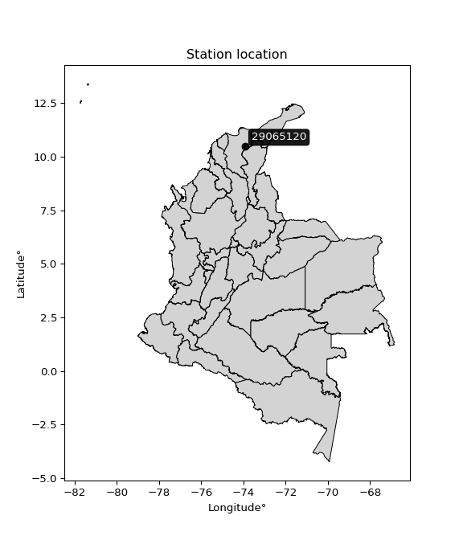

<div align="center">


</div>

# PMP Station (Rain, Pmax24h): 29065120

Probable Maximum Precipitation (PMP) is the greatest amount of rainfall for a specific duration that is meteorologically possible for a given location, acting as a "worst-case" scenario for extreme storms, crucial for designing safety-critical infrastructure like bridges, river deviations, dams, spillways, and nuclear plants to prevent catastrophic failure. PMP is calculated by hydrologists using meteorological data to determine the upper limit of extreme rainfall, often leading to the Probable Maximum Flood (PMF) for flood control design, and is increasingly being studied for climate change impacts. Probable Maximum Precipitation (PMP) is the theoretical upper limit of rainfall, a deterministic estimate for extreme events, while probability distributions (like GEV, Gumbel) describe the likelihood and frequency of various precipitation amounts, including rare ones, showing how often events occur, with PMP representing the extreme end of these distributions, used for critical infrastructure design to ensure safety against the worst conceivable weather, unlike standard statistical forecasts which cover typical probabilities.

The most common probability distributions in hydrology, used for analyzing floods, rainfall, and streamflow, include the Normal, Log-Normal, Gumbel, Gamma (including Log-Pearson Type III), and Generalized Extreme Value (GEV) distributions, often chosen based on the data´s skewness and whether modeling extremes or general conditions, with Gumbel and GEV popular for extreme events like floods, while the Normal distribution serves as a baseline, though often requiring transformations for skewed hydrological data. These distributions help in designing water infrastructure, managing water resources, and forecasting hydrologic events.

> Hydrological data often isn´t perfectly normal (it´s skewed), so different distributions are needed for different applications, such as: **Flood Frequency Analysis**: Using Gumbel, GEV, or Log-Pearson Type III for predicting extreme flood magnitudes and their return periods, **Rainfall Analysis**: Normal for annual totals, but Log-Normal, Weibull, or GEV for intensity or extreme daily rainfall, **Streamflow Modeling**: Gamma and Log-Normal for maximum flows, GEV for minimum flows, and Kappa for daily flows.

<div align="center">

</img>

</div>


## A. General information


### 1. General running parameters

• app_version: _v20260108_. • runtime: _2026-01-08 13:24:42.400241_. • Python version: _3.14.0_. • SciPy version: _1.16.3_. • Pandas version: _2.3.3_. • NumPy version: _2.3.5_. • Stations dataset (station_dataset_file): _dataset/pmax24h_in/automatic_colombia_2003_2024.csv_. • Stations catalog (station_catalog_file): _dataset/CNE.xls_. • Minimum year to eval til year_max (date_min): _1900_. • Maximum year to eval since year_min (date_max): _2024_. • Creates, save and include plots into reports (create_plot): _False_. • Plot only fit distributions with Δo > Δ (plot_only_fit): _True_. • Plot only simple graphs avoiding multiple CDFs and multiple Extreme values plots (plot_only_simple): _True_. • Eval low extreme values, if False, evaluates high extreme values (low_extreme): _False_. • Eval every SciPy distribution as logarithmic (pdist_logarithmic_on): _True_. • Standard deviation normalized (ddof): _1.0_. • Return periods to eval in years (Tr): _[2, 2.33, 5, 10, 15, 20, 25, 50, 75, 100, 200, 250, 500, 750, 1000]_. • Minimum data sample per station, 0 means any (minimum_sample): _5_. • Z-Score maximum threshold to adjust a value, 0 means disable (zscore_max): _3.5_. • Z-Score minimum threshold to adjust a value, 0 means disable (zscore_min): _-2.5_. • Avoid zeros, e.g. rain = 0 (avoid_zeros): _True_. • Avoid null values (avoid_nans): _True_. 

:file_folder:Table: [dataset.csv](../../dataset/pmax24h_in/automatic_colombia_2003_2024.csv)

> Delta Degrees of Freedom (DDOF): is a parameter used in the formulas for calculating variance and standard deviation. When ddof=0, the divisor is $N$ (the total number of observations) and this is used when your data set is the entire population. When ddof=1, the divisor is $N-1$ and this is used when your data set is a sample drawn from a larger population. Using $N-1$ provides an unbiased estimate of the population variance (known as Bessel´s correction).


### 2. Station info and location

|   id |   CODIGO | NOMBRE                          | CATEGORIA               | TECNOLOGIA                | ESTADO           | FECHA_INSTALACION   |   FECHA_SUSPENSION |   ALTITUD |   LATITUD |   LONGITUD | DEPARTAMENTO   | MUNICIPIO   | AREA_OPERATIVA                                         | ENTIDAD                                                     | AREA_HIDROGRAFICA   | ZONA_HIDROGRAFICA   | SUBZONA_HIDROGRAFICA      |   CORRIENTE | Catalogo   |   Version |
|-----:|---------:|:--------------------------------|:------------------------|:--------------------------|:-----------------|:--------------------|-------------------:|----------:|----------:|-----------:|:---------------|:------------|:-------------------------------------------------------|:------------------------------------------------------------|:--------------------|:--------------------|:--------------------------|------------:|:-----------|----------:|
|    0 | 29065120 | BATALLON NO. 6 - AUT [29065120] | Climatológica Principal | Automática con Telemetría | En Mantenimiento | 24/02/2006          |                nan |      1280 |   10.4654 |   -73.9278 | Magdalena      | Fundación   | Area Operativa 05 - Magdalena-Cesar-Guajira-San Andrés | INSTITUTO DE HIDROLOGIA METEOROLOGIA Y ESTUDIOS AMBIENTALES | Magdalena Cauca     | Bajo Magdalena      | Cga Grande de Santa Marta |         nan | CNE_IDEAM  |  20251226 |

<div align="center">

Dynamic map: [:earth_americas:Google](http://maps.google.com/maps?q=10.46536111,-73.92777778) [:earth_americas:OSM](https://www.openstreetmap.org/#map=18/10.46536111/-73.92777778&layers=P) [:earth_americas:Bing](https://www.bing.com/maps?cp=10.46536111~-73.92777778&lvl=18) [:earth_americas:Apple](https://maps.apple.com/frame?center=10.46536111%2C-73.92777778&span=0.003%2C0.006)

</div>


<div align="center">

```geojson
{
  "type": "Feature",
  "geometry": {
    "type": "Point", 
    "coordinates": [-73.92777778, 10.46536111]
  }, 
  "properties": {
    "Name": "29065120"
  }
}
```

</div>


### 3. Discrete values table and plot

<div align="center">

|               |          0 |           1 |           2 |           3 |          4 |           5 |
|:--------------|-----------:|------------:|------------:|------------:|-----------:|------------:|
| Date          | 2017       | 2018        | 2019        | 2020        | 2021       | 2024        |
| Value         |   56.1     |    9.4      |   17.5      |   11.2      |   60.4     |   16        |
| Value_initial |   56.1     |    9.4      |   17.5      |   11.2      |   60.4     |   16        |
| count         |    6       |    6        |    6        |    6        |    6       |    6        |
| mean          |   28.4333  |   28.4333   |   28.4333   |   28.4333   |   28.4333  |   28.4333   |
| std           |   23.3268  |   23.3268   |   23.3268   |   23.3268   |   23.3268  |   23.3268   |
| zscore        |    1.18605 |   -0.815943 |   -0.468703 |   -0.738779 |    1.37038 |   -0.533007 |


</div>


> The initial value (value_initial) correspond to the initial obtained or null completed value, and value (value) is adjusted only when the initial value is outside the valid range (outlier) definite through the Z-Score value. If Z-Score is active, values out of range or outliers are replaced with the station mean value. A Z-Score (or standard score) measures how many standard deviations a data point is from the mean of a dataset, indicating its relative position; positive scores mean above the mean, negative mean below, and a score of zero is exactly at the mean, allowing for comparison of values from different distributions. It´s calculated using the formula $z=(x–μ)/σ$, where $x$ is the data point, $μ$ is the mean, and $σ$ is the standard deviation, helping identify outliers and understand probability.
>
> <sub>**Note**: In this study, "completing" (filling gaps in) and "extending" (forecasting or lengthening the historical record) rainfall data series are avoided for certain critical analyses because they introduce artificial bias and uncertainty, which can distort the statistics of rare events (extremes), alter day-to-day variability, and compromise the integrity and homogeneity of the original data. Some reasons against Completing/Extending rainfall data are: **Distortion of Extremes and Variability**: The primary issue is that most gap-filling or extension methods rely on averaging or regression with nearby stations, which inherently smooths the data. Rainfall is highly variable in space and time, with a large percentage of zero values and occasional large storms. Infilling methods often underestimate the highest values and overestimate the lowest (zero) values, which severely distorts analyses focused on flood frequency, drought severity, and intensity-duration-frequency (IDF) curves, **Loss of Data Homogeneity**: Infilled or extended data are synthetic estimates, not actual measurements. Combining these estimates with observed data can violate the assumption of data homogeneity, which requires that the data properties do not change over time. Inhomogeneity can lead to incorrect conclusions about long-term trends or changes in climate patterns, **Propagation of Errors**: Errors and biases from the original data (e.g., wind-induced undercatch, instrument errors, site changes) or the data used for imputation can propagate through the analysis, leading to unreliable hydrological models and inaccurate predictions, **Compromised Statistical Integrity**: For statistical analyses, especially those involving the frequency of events, using artificial data can introduce time bias or autocorrelation that doesn´t exist in reality, making it difficult to assess the true probability of events, **Difficulty in Validation**: It is difficult to accurately validate the quality of filled or extended data, especially for past periods where ground-truth measurements are unavailable. The reliability of imputation techniques heavily depends on the density of the surrounding station network and the complexity of the local topography.</sub>


### 4. Active continuous probability distributions from SciPy (43 of 104 available)

A Probability Density Function (PDF) describes the relative likelihood of a continuous random variable falling within a specific range, where the total area under its curve equals 1, and the area over any interval gives the actual probability for that range. Unlike discrete probabilities (like rolling a die), a PDF shows density, not direct probability for a single point (which is zero), with higher points indicating higher likelihood, often visualized as a bell curve for normal distributions.

A log of a probability density function (log-PDF) is simply the logarithm of the PDF´s value, denoted as $log(f(x))$, useful for converting multiplication of probabilities into addition, improving numerical stability with tiny numbers, and connecting to information theory concepts like entropy. Instead of dealing with very small probabilities (e.g., 0.000001), log-PDFs use negative numbers (e.g., $log(0.00001) ≈ -11.51$ that are easier for computers to handle, preventing underflow errors and simplifying complex calculations. In this study, each active probability distribution from SciPy is also evaluated in the $log$ form.

[scipy.stats](https://docs.scipy.org/doc/scipy/reference/stats.html) is a Python´s powerful submodule within the SciPy library for comprehensive statistical analysis, offering over 130 probability distributions (like Normal, Poisson), functions for descriptive stats (mean, variance), hypothesis testing (t-tests, chi-square), random variable generation, and statistical tests, making it essential for data science, modeling, and research. It provides tools to explore, model, and draw conclusions from data efficiently, working seamlessly with NumPy.

<div align="center">

|   id | p_dist             |   n_parameter | fit_method   | label                                                                       | active   | ref                                                                                                        |
|-----:|:-------------------|--------------:|:-------------|:----------------------------------------------------------------------------|:---------|:-----------------------------------------------------------------------------------------------------------|
|    0 | alpha              |             3 | MLE          | Alpha                                                                       | True     | [:mortar_board:](https://docs.scipy.org/doc/scipy/reference/generated/scipy.stats.alpha.html)              |
|    1 | betaprime          |             4 | MLE          | Beta prime                                                                  | True     | [:mortar_board:](https://docs.scipy.org/doc/scipy/reference/generated/scipy.stats.betaprime.html)          |
|    2 | chi2               |             3 | MLE          | Chi²                                                                        | True     | [:mortar_board:](https://docs.scipy.org/doc/scipy/reference/generated/scipy.stats.chi2.html)               |
|    3 | crystalball        |             4 | MLE          | Crystalball                                                                 | True     | [:mortar_board:](https://docs.scipy.org/doc/scipy/reference/generated/scipy.stats.crystalball.html)        |
|    4 | erlang             |             3 | MLE          | Erlang                                                                      | True     | [:mortar_board:](https://docs.scipy.org/doc/scipy/reference/generated/scipy.stats.erlang.html)             |
|    5 | expon              |             2 | MLE          | Exponential                                                                 | True     | [:mortar_board:](https://docs.scipy.org/doc/scipy/reference/generated/scipy.stats.expon.html)              |
|    6 | exponnorm          |             3 | MLE          | Exponentially modified Normal                                               | True     | [:mortar_board:](https://docs.scipy.org/doc/scipy/reference/generated/scipy.stats.exponnorm.html)          |
|    7 | f                  |             4 | MLE          | F                                                                           | True     | [:mortar_board:](https://docs.scipy.org/doc/scipy/reference/generated/scipy.stats.f.html)                  |
|    8 | fatiguelife        |             3 | MLE          | Fatigue-life (Birnbaum-Saunders)                                            | True     | [:mortar_board:](https://docs.scipy.org/doc/scipy/reference/generated/scipy.stats.fatiguelife.html)        |
|    9 | fisk               |             3 | MLE          | Fisk                                                                        | True     | [:mortar_board:](https://docs.scipy.org/doc/scipy/reference/generated/scipy.stats.fisk.html)               |
|   10 | gamma              |             3 | MLE          | Gamma                                                                       | True     | [:mortar_board:](https://docs.scipy.org/doc/scipy/reference/generated/scipy.stats.gamma.html)              |
|   11 | genexpon           |             5 | MLE          | Generalized exponential                                                     | True     | [:mortar_board:](https://docs.scipy.org/doc/scipy/reference/generated/scipy.stats.genexpon.html)           |
|   12 | genlogistic        |             3 | MLE          | Generalized logistic                                                        | True     | [:mortar_board:](https://docs.scipy.org/doc/scipy/reference/generated/scipy.stats.genlogistic.html)        |
|   13 | gibrat             |             2 | MM           | Gibrat                                                                      | True     | [:mortar_board:](https://docs.scipy.org/doc/scipy/reference/generated/scipy.stats.gibrat.html)             |
|   14 | gompertz           |             3 | MLE          | Gompertz (or truncated Gumbel)                                              | True     | [:mortar_board:](https://docs.scipy.org/doc/scipy/reference/generated/scipy.stats.gompertz.html)           |
|   15 | gumbel_l           |             2 | MM           | Gumbel Left Skew                                                            | True     | [:mortar_board:](https://docs.scipy.org/doc/scipy/reference/generated/scipy.stats.gumbel_l.html)           |
|   16 | gumbel_r           |             2 | MM           | Gumbel Right Skew                                                           | True     | [:mortar_board:](https://docs.scipy.org/doc/scipy/reference/generated/scipy.stats.gumbel_r.html)           |
|   17 | halflogistic       |             2 | MM           | Half-logistic                                                               | True     | [:mortar_board:](https://docs.scipy.org/doc/scipy/reference/generated/scipy.stats.halflogistic.html)       |
|   18 | halfnorm           |             2 | MM           | Half Normal                                                                 | True     | [:mortar_board:](https://docs.scipy.org/doc/scipy/reference/generated/scipy.stats.halfnorm.html)           |
|   19 | hypsecant          |             2 | MM           | hyperbolic secant                                                           | True     | [:mortar_board:](https://docs.scipy.org/doc/scipy/reference/generated/scipy.stats.hypsecant.html)          |
|   20 | invgamma           |             3 | MLE          | Inverted gamma                                                              | True     | [:mortar_board:](https://docs.scipy.org/doc/scipy/reference/generated/scipy.stats.invgamma.html)           |
|   21 | invgauss           |             3 | MLE          | Inverse Gaussian                                                            | True     | [:mortar_board:](https://docs.scipy.org/doc/scipy/reference/generated/scipy.stats.invgauss.html)           |
|   22 | invweibull         |             3 | MLE          | Inverted Weibull                                                            | True     | [:mortar_board:](https://docs.scipy.org/doc/scipy/reference/generated/scipy.stats.invweibull.html)         |
|   23 | kstwobign          |             2 | MLE          | Limiting distribution of scaled Kolmogorov-Smirnov two-sided test statistic | True     | [:mortar_board:](https://docs.scipy.org/doc/scipy/reference/generated/scipy.stats.kstwobign.html)          |
|   24 | laplace            |             2 | MM           | Laplace                                                                     | True     | [:mortar_board:](https://docs.scipy.org/doc/scipy/reference/generated/scipy.stats.laplace.html)            |
|   25 | laplace_asymmetric |             3 | MLE          | Asymmetric Laplace                                                          | True     | [:mortar_board:](https://docs.scipy.org/doc/scipy/reference/generated/scipy.stats.laplace_asymmetric.html) |
|   26 | loggamma           |             3 | MLE          | Log gamma                                                                   | True     | [:mortar_board:](https://docs.scipy.org/doc/scipy/reference/generated/scipy.stats.loggamma.html)           |
|   27 | logistic           |             2 | MM           | Logistic (or Sech-squared)                                                  | True     | [:mortar_board:](https://docs.scipy.org/doc/scipy/reference/generated/scipy.stats.logistic.html)           |
|   28 | lognorm            |             3 | MLE          | Log Normal                                                                  | True     | [:mortar_board:](https://docs.scipy.org/doc/scipy/reference/generated/scipy.stats.lognorm.html)            |
|   29 | maxwell            |             2 | MM           | Maxwell                                                                     | True     | [:mortar_board:](https://docs.scipy.org/doc/scipy/reference/generated/scipy.stats.maxwell.html)            |
|   30 | mielke             |             4 | MLE          | Mielke Beta-Kappa / Dagum                                                   | True     | [:mortar_board:](https://docs.scipy.org/doc/scipy/reference/generated/scipy.stats.mielke.html)             |
|   31 | moyal              |             2 | MM           | Moyal                                                                       | True     | [:mortar_board:](https://docs.scipy.org/doc/scipy/reference/generated/scipy.stats.moyal.html)              |
|   32 | nakagami           |             3 | MLE          | Nakagami                                                                    | True     | [:mortar_board:](https://docs.scipy.org/doc/scipy/reference/generated/scipy.stats.nakagami.html)           |
|   33 | ncf                |             5 | MLE          | Non-central F distribution                                                  | True     | [:mortar_board:](https://docs.scipy.org/doc/scipy/reference/generated/scipy.stats.ncf.html)                |
|   34 | nct                |             4 | MLE          | Non-central Student’s t                                                     | True     | [:mortar_board:](https://docs.scipy.org/doc/scipy/reference/generated/scipy.stats.nct.html)                |
|   35 | norm               |             2 | MM           | Normal                                                                      | True     | [:mortar_board:](https://docs.scipy.org/doc/scipy/reference/generated/scipy.stats.norm.html)               |
|   36 | pearson3           |             3 | MM           | Pearson type III                                                            | True     | [:mortar_board:](https://docs.scipy.org/doc/scipy/reference/generated/scipy.stats.pearson3.html)           |
|   37 | rayleigh           |             2 | MM           | Rayleigh                                                                    | True     | [:mortar_board:](https://docs.scipy.org/doc/scipy/reference/generated/scipy.stats.rayleigh.html)           |
|   38 | rice               |             3 | MLE          | Rice                                                                        | True     | [:mortar_board:](https://docs.scipy.org/doc/scipy/reference/generated/scipy.stats.rice.html)               |
|   39 | t                  |             3 | MLE          | Student’s t                                                                 | True     | [:mortar_board:](https://docs.scipy.org/doc/scipy/reference/generated/scipy.stats.t.html)                  |
|   40 | truncnorm          |             4 | MLE          | Truncated normal                                                            | True     | [:mortar_board:](https://docs.scipy.org/doc/scipy/reference/generated/scipy.stats.truncnorm.html)          |
|   41 | wald               |             2 | MM           | Wald                                                                        | True     | [:mortar_board:](https://docs.scipy.org/doc/scipy/reference/generated/scipy.stats.wald.html)               |
|   42 | weibull_min        |             3 | MLE          | Weibull minimum                                                             | True     | [:mortar_board:](https://docs.scipy.org/doc/scipy/reference/generated/scipy.stats.weibull_min.html)        |

</div>

> **n_parameter:** # arguments & localization & scale.
>
> **Fit methods:** (MLE) maximum likelihood, (MM) L-moments.
>
>**Inactive** (With the only purpose of prevent loops, zero divisions, infinite values, over high estimated values or horizontal trending for recurrence intervals estimations, the follow distributions were disabled.)**:** foldnorm, gennorm, norminvgauss, powernorm, powerlognorm, skewnorm, genextreme, anglit, arcsine, argus, beta, bradford, burr, burr12, cauchy, cosine, halfcauchy, foldcauchy, skewcauchy, wrapcauchy, dgamma, gengamma, exponweib, exponpow, truncexpon, gausshyper, genhalflogistic, genhyperbolic, geninvgauss, halfgennorm, johnsonsb, johnsonsu, kappa4, kappa3, ksone, kstwo, loglaplace, levy, levy_l, levy_stable, ncx2, pareto, genpareto, truncpareto, lomax, powerlaw, rdist, rel_breitwigner, recipinvgauss, semicircular, studentized_range, trapezoid, triang, truncweibull_min, tukeylambda, uniform, loguniform, vonmises, vonmises_line, weibull_max, dweibull, 


## B. Probability (PDF) vs. Empirical (EDF) distributions functions

A continuous probability distribution (CPD) describes probabilities for variables that can take any value within a range (like rain any time), unlike discrete variables with specific outcomes (like temperature). It uses a Probability Density Function (PDF), a curve where the total area under it equals 1, and the probability of the variable falling within an interval (a to b) is found by calculating the area under the curve between those points. A key feature is that the probability of hitting any single exact value is zero, so probabilities are always expressed for ranges, e.g., $P(a ≤ X ≤ b)$.

<div align="center">

Distributions parameters from station values
|    |   station | p_dist                |   n |            loc |         scale | shape                  | shape1                 | shape2                | shape3   |
|---:|----------:|:----------------------|----:|---------------:|--------------:|:-----------------------|:-----------------------|:----------------------|:---------|
|  0 |  29065120 | alpha                 |   6 |     6.14648    |   6.36969     | 2.34336808670283e-09   |                        |                       |          |
|  1 |  29065120 | betaprime             |   6 |     6.23935    |   6.32796     | 2.9061012647176057     | 1.742481225621801      |                       |          |
|  2 |  29065120 | chi2                  |   6 |     9.4        |  11.4888      | 1.4063839313659434     |                        |                       |          |
|  3 |  29065120 | crystalball           |   6 |    28.4333     |  21.2943      | 3017.0581259593246     | 13.09521454751328      |                       |          |
|  4 |  29065120 | erlang                |   6 |     9.4        |  17.3789      | 0.7083597007911449     |                        |                       |          |
|  5 |  29065120 | expon                 |   6 |     9.4        |  19.0333      |                        |                        |                       |          |
|  6 |  29065120 | exponnorm             |   6 |     9.38604    |   0.00425733  | 4448.273101713501      |                        |                       |          |
|  7 |  29065120 | f                     |   6 |     7.95242    |   4.75308     | 484.8945918935953      | 1.6219301071194934     |                       |          |
|  8 |  29065120 | fatiguelife           |   6 |     9.4        |   9.36827e-06 | 1328.1164792513878     |                        |                       |          |
|  9 |  29065120 | fisk                  |   6 |     9.4        |   7.42219     | 0.596717724612402      |                        |                       |          |
| 10 |  29065120 | gamma                 |   6 |     9.4        |  25.442       | 0.34145424424838433    |                        |                       |          |
| 11 |  29065120 | genexpon              |   6 |     9.4        |  39.7852      | 2.0902928229159734     | 1.0539226747433538e-10 | 0.28582738801602625   |          |
| 12 |  29065120 | genlogistic           |   6 |   -94.6876     |  14.6605      | 2292.8556584348935     |                        |                       |          |
| 13 |  29065120 | gibrat                |   6 |    12.1884     |   9.85304     |                        |                        |                       |          |
| 14 |  29065120 | gompertz              |   6 |     9.39943    | 294.098       | 15.035202204845078     |                        |                       |          |
| 15 |  29065120 | gumbel_l              |   6 |    38.0169     |  16.6031      |                        |                        |                       |          |
| 16 |  29065120 | gumbel_r              |   6 |    18.8497     |  16.6031      |                        |                        |                       |          |
| 17 |  29065120 | halflogistic          |   6 |     3.19459    |  18.2059      |                        |                        |                       |          |
| 18 |  29065120 | halfnorm              |   6 |     0.247973   |  35.3251      |                        |                        |                       |          |
| 19 |  29065120 | hypsecant             |   6 |    28.4333     |  13.5564      |                        |                        |                       |          |
| 20 |  29065120 | invgamma              |   6 |     7.9445     |   3.85306     | 0.810958613398925      |                        |                       |          |
| 21 |  29065120 | invgauss              |   6 |     8.2372     |   5.09655     | 3.9627101312941537     |                        |                       |          |
| 22 |  29065120 | invweibull            |   6 |     9.4        |   1.1777      | 0.04590898482958647    |                        |                       |          |
| 23 |  29065120 | kstwobign             |   6 |   -32.1933     |  69.5842      |                        |                        |                       |          |
| 24 |  29065120 | laplace               |   6 |    28.4333     |  15.0574      |                        |                        |                       |          |
| 25 |  29065120 | laplace_asymmetric    |   6 |     9.4        |   0.000140817 | 7.3984430864819295e-06 |                        |                       |          |
| 26 |  29065120 | loggamma              |   6 | -7382.86       | 972.011       | 2048.214051810305      |                        |                       |          |
| 27 |  29065120 | logistic              |   6 |    28.4333     |  11.7402      |                        |                        |                       |          |
| 28 |  29065120 | lognorm               |   6 |     9.4        |   0.0272241   | 13.626969659186495     |                        |                       |          |
| 29 |  29065120 | maxwell               |   6 |   -22.0253     |  31.6203      |                        |                        |                       |          |
| 30 |  29065120 | mielke                |   6 |     8.9343     |   0.111228    | 6.578389268946889      | 0.6587074472155983     |                       |          |
| 31 |  29065120 | moyal                 |   6 |    16.2559     |   9.58582     |                        |                        |                       |          |
| 32 |  29065120 | nakagami              |   6 |     9.4        |  35.2459      | 0.061359885974509136   |                        |                       |          |
| 33 |  29065120 | ncf                   |   6 |     0.893829   |  15.584       | 23.798888807509748     | 4.861200905689522      | 2.5471044122224704    |          |
| 34 |  29065120 | nct                   |   6 |     0.00287253 |   0.202242    | 1.6049472148496533     | 73.57071910555432      |                       |          |
| 35 |  29065120 | norm                  |   6 |    28.4333     |  21.2943      |                        |                        |                       |          |
| 36 |  29065120 | pearson3              |   6 |    28.4333     |  21.2945      | 0.6662299534869045     |                        |                       |          |
| 37 |  29065120 | rayleigh              |   6 |   -12.304      |  32.5037      |                        |                        |                       |          |
| 38 |  29065120 | rice                  |   6 |    -4.95612    |  28.0027      | 0.0012658849893460219  |                        |                       |          |
| 39 |  29065120 | t                     |   6 |    14.4953     |   4.87987     | 0.7829717568772555     |                        |                       |          |
| 40 |  29065120 | truncnorm             |   6 | -1934.45       | 206.8         | 9.399663876968093      | 62.301655573828846     |                       |          |
| 41 |  29065120 | wald                  |   6 |     7.13899    |  21.2943      |                        |                        |                       |          |
| 42 |  29065120 | weibull_min           |   6 |     9.4        |  14.215       | 0.43088587188036676    |                        |                       |          |
| 43 |  29065120 | logalpha              |   6 |     0.95953    |   5.83897     | 3.099754232537979      |                        |                       |          |
| 44 |  29065120 | logbetaprime          |   6 |     1.85989    |   1.55387     | 4.54538455037877       | 7.126178235584746      |                       |          |
| 45 |  29065120 | logchi2               |   6 |     2.24071    |   0.940837    | 1.0757016172830234     |                        |                       |          |
| 46 |  29065120 | logcrystalball        |   6 |     3.06992    |   0.733283    | 47.15761832262405      | 11.742770190461552     |                       |          |
| 47 |  29065120 | logerlang             |   6 |     2.24071    |   0.854027    | 0.5233242147041687     |                        |                       |          |
| 48 |  29065120 | logexpon              |   6 |     2.24071    |   0.829213    |                        |                        |                       |          |
| 49 |  29065120 | logexponnorm          |   6 |     2.23972    |   0.000318459 | 2582.8698564715432     |                        |                       |          |
| 50 |  29065120 | logf                  |   6 |     1.83186    |   0.850761    | 400.9461818522208      | 5.634901769543528      |                       |          |
| 51 |  29065120 | logfatiguelife        |   6 |     2.1645     |   0.491004    | 1.2575506044376241     |                        |                       |          |
| 52 |  29065120 | logfisk               |   6 |     2.24071    |   0.729708    | 0.9466219699107037     |                        |                       |          |
| 53 |  29065120 | loggamma              |   6 |     2.24071    |   0.922736    | 0.22513429748559732    |                        |                       |          |
| 54 |  29065120 | loggenexpon           |   6 |     2.24068    |   0.0287053   | 0.030058417931809148   | 2.1609034314059983     | 8.151698230818416e-05 |          |
| 55 |  29065120 | loggenlogistic        |   6 |    -1.30384    |   0.560047    | 1334.652375886014      |                        |                       |          |
| 56 |  29065120 | loggibrat             |   6 |     2.51049    |   0.339309    |                        |                        |                       |          |
| 57 |  29065120 | loggompertz           |   6 |     2.24071    |   3.35107     | 3.1986080750951724     |                        |                       |          |
| 58 |  29065120 | loggumbel_l           |   6 |     3.39994    |   0.571739    |                        |                        |                       |          |
| 59 |  29065120 | loggumbel_r           |   6 |     2.73991    |   0.571739    |                        |                        |                       |          |
| 60 |  29065120 | loghalflogistic       |   6 |     2.20081    |   0.626932    |                        |                        |                       |          |
| 61 |  29065120 | loghalfnorm           |   6 |     2.09934    |   1.21644     |                        |                        |                       |          |
| 62 |  29065120 | loghypsecant          |   6 |     3.06992    |   0.466823    |                        |                        |                       |          |
| 63 |  29065120 | loginvgamma           |   6 |     1.82597    |   2.40722     | 2.817066643997147      |                        |                       |          |
| 64 |  29065120 | loginvgauss           |   6 |     2.04609    |   1.07623     | 0.9513151114046755     |                        |                       |          |
| 65 |  29065120 | loginvweibull         |   6 |     1.55004    |   1.06305     | 2.378788424039723      |                        |                       |          |
| 66 |  29065120 | logkstwobign          |   6 |     0.790135   |   2.60979     |                        |                        |                       |          |
| 67 |  29065120 | loglaplace            |   6 |     3.06992    |   0.51851     |                        |                        |                       |          |
| 68 |  29065120 | loglaplace_asymmetric |   6 |     2.77259    |   0.533186    | 0.7593003928227982     |                        |                       |          |
| 69 |  29065120 | logloggamma           |   6 |  -173.139      |  25.0442      | 1137.1404600068945     |                        |                       |          |
| 70 |  29065120 | loglogistic           |   6 |     3.06992    |   0.404281    |                        |                        |                       |          |
| 71 |  29065120 | loglognorm            |   6 |     2.24071    |   0.0020988   | 13.076013398836196     |                        |                       |          |
| 72 |  29065120 | logmaxwell            |   6 |     1.33235    |   1.08886     |                        |                        |                       |          |
| 73 |  29065120 | logmielke             |   6 |     1.57858    |   0.206187    | 104.41577938882922     | 2.345971805320185      |                       |          |
| 74 |  29065120 | logmoyal              |   6 |     2.65058    |   0.330094    |                        |                        |                       |          |
| 75 |  29065120 | lognakagami           |   6 |     2.24071    |   2.30593     | 0.06504710260091351    |                        |                       |          |
| 76 |  29065120 | logncf                |   6 |    -1.12614    |   4.0655      | 139.35709197067112     | 126.04467368341945     | 2.2392518808921196    |          |
| 77 |  29065120 | lognct                |   6 |     0.0645983  |   0.0396083   | 9.821238656797195      | 69.85242696125718      |                       |          |
| 78 |  29065120 | lognorm               |   6 |     3.06992    |   0.733284    |                        |                        |                       |          |
| 79 |  29065120 | logpearson3           |   6 |     3.06992    |   0.733285    | 0.45990468808357204    |                        |                       |          |
| 80 |  29065120 | lograyleigh           |   6 |     1.66711    |   1.11928     |                        |                        |                       |          |
| 81 |  29065120 | logrice               |   6 |     1.84178    |   1.01144     | 0.0017593730026307913  |                        |                       |          |
| 82 |  29065120 | logt                  |   6 |     3.06988    |   0.733293    | 88575287.8501904       |                        |                       |          |
| 83 |  29065120 | logtruncnorm          |   6 |    -0.178923   |   1.5214      | 1.939994052913855      | 2.813212858780182      |                       |          |
| 84 |  29065120 | logwald               |   6 |     2.33665    |   0.733279    |                        |                        |                       |          |
| 85 |  29065120 | logweibull_min        |   6 |     2.24071    |   1.03622     | 0.16720161036718797    |                        |                       |          |

</div>

> **loc** (Location parameter): This shifts the distribution along the x-axis. For many common distributions, like the normal (Gaussian) distribution, loc represents the mean $μ$. For others, like the uniform distribution, it might represent the minimum value, or for the beta distribution, the left end of the support interval.
>
> **scale** (Scale parameter): This determines the width or spread of the distribution. For the normal distribution, scale represents the standard deviation $σ$. For a uniform distribution, it defines the length of the interval (from $loc$ to $loc + scale$).
>
> **shape** (Shape parameters): Refers to parameters that define the specific form of a probability distribution, distinct from its location (loc) and scale (scale). These parameters are required arguments for most distribution functions. For example, a normal (Gaussian) distribution is fully defined by its location (mean) and scale (standard deviation), so it has no specific shape parameters beyond loc and scale. However, other distributions have intrinsic properties that need specification, as Gamma distribution that takes a shape parameter, often named $a$ or $alpha$.


### 0. Cumulative distribution values - CDF (86 evaluated)

Cumulative Distribution Function (CDF), denoted as $F$<sub>$X$</sub>$(x)$, is a function that gives the probability that a random variable $X$ will take a value less than or equal to a specific value, $x$ (i.e., $(P(X≥x)$. It essentially "accumulates" probabilities from a given point up to the far right (positive infinity), providing a complete picture of the distribution´s probabilities for both discrete (like rain) and continuous (like temperature) variables, helping to find probabilities over ranges or above certain values. Each station is evaluated separately ordering the $x$ values ascending, calculating the CDF and PDF values for the activated distributions and their logarithmic forms.

<div align="center">

CDF ordered by x ascending and calculating $log(f(x))$ separately
|   id |   Station |   date |    x |   count |    mean |     std |    zscore |   Value_initial |   station |   m |     alpha |   alpha_pdf |   betaprime |   betaprime_pdf |       chi2 |      chi2_pdf |   crystalball |   crystalball_pdf |      erlang |    erlang_pdf |     expon |   expon_pdf |   exponnorm |   exponnorm_pdf |         f |      f_pdf |   fatiguelife |   fatiguelife_pdf |        fisk |        fisk_pdf |       gamma |   gamma_pdf |    genexpon |   genexpon_pdf |   genlogistic |   genlogistic_pdf |   gibrat |   gibrat_pdf |    gompertz |   gompertz_pdf |   gumbel_l |   gumbel_l_pdf |   gumbel_r |   gumbel_r_pdf |   halflogistic |   halflogistic_pdf |   halfnorm |   halfnorm_pdf |   hypsecant |   hypsecant_pdf |   invgamma |   invgamma_pdf |   invgauss |   invgauss_pdf |   invweibull |   invweibull_pdf |   kstwobign |   kstwobign_pdf |   laplace |   laplace_pdf |   laplace_asymmetric |   laplace_asymmetric_pdf |    loggamma |   loggamma_pdf |   logistic |   logistic_pdf |   lognorm |   lognorm_pdf |   maxwell |   maxwell_pdf |    mielke |   mielke_pdf |    moyal |   moyal_pdf |   nakagami |   nakagami_pdf |      ncf |    ncf_pdf |       nct |    nct_pdf |     norm |   norm_pdf |   pearson3 |   pearson3_pdf |   rayleigh |   rayleigh_pdf |     rice |   rice_pdf |        t |       t_pdf |   truncnorm |   truncnorm_pdf |       wald |   wald_pdf |   weibull_min |   weibull_min_pdf |   logalpha |   logalpha_pdf |   logbetaprime |   logbetaprime_pdf |     logchi2 |   logchi2_pdf |   logcrystalball |   logcrystalball_pdf |   logerlang |   logerlang_pdf |   logexpon |   logexpon_pdf |   logexponnorm |   logexponnorm_pdf |      logf |   logf_pdf |   logfatiguelife |   logfatiguelife_pdf |     logfisk |   logfisk_pdf |   loggenexpon |   loggenexpon_pdf |   loggenlogistic |   loggenlogistic_pdf |   loggibrat |   loggibrat_pdf |   loggompertz |   loggompertz_pdf |   loggumbel_l |   loggumbel_l_pdf |   loggumbel_r |   loggumbel_r_pdf |   loghalflogistic |   loghalflogistic_pdf |   loghalfnorm |   loghalfnorm_pdf |   loghypsecant |   loghypsecant_pdf |   loginvgamma |   loginvgamma_pdf |   loginvgauss |   loginvgauss_pdf |   loginvweibull |   loginvweibull_pdf |   logkstwobign |   logkstwobign_pdf |   loglaplace |   loglaplace_pdf |   loglaplace_asymmetric |   loglaplace_asymmetric_pdf |   logloggamma |   logloggamma_pdf |   loglogistic |   loglogistic_pdf |   loglognorm |   loglognorm_pdf |   logmaxwell |   logmaxwell_pdf |   logmielke |   logmielke_pdf |   logmoyal |   logmoyal_pdf |   lognakagami |   lognakagami_pdf |   logncf |   logncf_pdf |    lognct |   lognct_pdf |   logpearson3 |   logpearson3_pdf |   lograyleigh |   lograyleigh_pdf |   logrice |   logrice_pdf |     logt |   logt_pdf |   logtruncnorm |   logtruncnorm_pdf |   logwald |   logwald_pdf |   logweibull_min |   logweibull_min_pdf |
|-----:|----------:|-------:|-----:|--------:|--------:|--------:|----------:|----------------:|----------:|----:|----------:|------------:|------------:|----------------:|-----------:|--------------:|--------------:|------------------:|------------:|--------------:|----------:|------------:|------------:|----------------:|----------:|-----------:|--------------:|------------------:|------------:|----------------:|------------:|------------:|------------:|---------------:|--------------:|------------------:|---------:|-------------:|------------:|---------------:|-----------:|---------------:|-----------:|---------------:|---------------:|-------------------:|-----------:|---------------:|------------:|----------------:|-----------:|---------------:|-----------:|---------------:|-------------:|-----------------:|------------:|----------------:|----------:|--------------:|---------------------:|-------------------------:|------------:|---------------:|-----------:|---------------:|----------:|--------------:|----------:|--------------:|----------:|-------------:|---------:|------------:|-----------:|---------------:|---------:|-----------:|----------:|-----------:|---------:|-----------:|-----------:|---------------:|-----------:|---------------:|---------:|-----------:|---------:|------------:|------------:|----------------:|-----------:|-----------:|--------------:|------------------:|-----------:|---------------:|---------------:|-------------------:|------------:|--------------:|-----------------:|---------------------:|------------:|----------------:|-----------:|---------------:|---------------:|-------------------:|----------:|-----------:|-----------------:|---------------------:|------------:|--------------:|--------------:|------------------:|-----------------:|---------------------:|------------:|----------------:|--------------:|------------------:|--------------:|------------------:|--------------:|------------------:|------------------:|----------------------:|--------------:|------------------:|---------------:|-------------------:|--------------:|------------------:|--------------:|------------------:|----------------:|--------------------:|---------------:|-------------------:|-------------:|-----------------:|------------------------:|----------------------------:|--------------:|------------------:|--------------:|------------------:|-------------:|-----------------:|-------------:|-----------------:|------------:|----------------:|-----------:|---------------:|--------------:|------------------:|---------:|-------------:|----------:|-------------:|--------------:|------------------:|--------------:|------------------:|----------:|--------------:|---------:|-----------:|---------------:|-------------------:|----------:|--------------:|-----------------:|---------------------:|
|    0 |  29065120 |   2018 |  9.4 |       6 | 28.4333 | 23.3268 | -0.815943 |             9.4 |  29065120 |   1 | 0.0502556 |  0.070639   |   0.0970146 |      0.0544425  | 5.1481e-12 | 2037.94       |      0.185709 |        0.012565   | 5.17391e-12 | 2063.2        | 0         |  0.0525394  | 0.000736712 |      0.0527381  | 0.0484746 | 0.0930414  |     0.0412738 |       4.35438e+10 | 4.77168e-10 | 160291          | 3.41245e-06 | 6.55947e+08 | 1.12945e-11 |     0.0525394  |      0.150868 |        0.0194554  | 0        |   0          | 2.93921e-05 |     0.0511216  |   0.163413 |     0.00899036 |   0.170884 |     0.0181841  |       0.168792 |         0.0266812  |   0.204426 |     0.0218414  |    0.153325 |      0.0108778  |  0.0484734 |     0.0930396  |  0.0464617 |     0.102559   |   0.00830286 |      1.0281e+12  |    0.13274  |      0.0188476  |  0.141253 |    0.009381   |          2.32218e-10 |               0.0525395  | 0.000390429 |    1.97931e+11 |   0.165038 |     0.0117375  |  0.129065 |      0.287051 |  0.195774 |    0.0152098  | 0.0374738 |   0.148346   | 0.152746 |  0.0214094  | 0.00870292 |    6.01242e+11 | 0.112181 | 0.0358154  | 0.0936902 | 0.0429471  | 0.185709 | 0.012565   |   0.187338 |     0.0159987  |   0.199835 |     0.0164382  | 0.123146 | 0.0160533  | 0.260696 | 0.0284762   | 5.38535e-10 |      0.0459564  | 0.00558159 | 0.0125811  |   1.40452e-07 |       3.40691e+07 |  0.0725264 |       0.490917 |      0.0751318 |           0.541401 | 4.43132e-09 |   5.36691e+06 |         0.129065 |             0.287051 | 1.13107e-08 |     1.33287e+07 |   0        |       1.20596  |     0.00120273 |           1.21314  | 0.0586984 |   0.605812 |        0.0440777 |             1.42617  | 3.94915e-15 |      8.41803  |    3.5094e-05 |          1.04711  |        0.0926815 |             0.393279 |    0        |       0         |   5.43463e-12 |          0.954504 |      0.123359 |          0.201869 |     0.0912303 |          0.382061 |         0.0318098 |              0.796728 |     0.0925169 |          0.651502 |       0.106746 |           0.224402 |     0.0586984 |          0.605828 |     0.0494269 |          0.785986 |       0.0614585 |            0.590445 |      0.0831488 |           0.400489 |     0.101027 |         0.19484  |               0.0983012 |                    0.24281  |      0.132924 |          0.286041 |      0.113943 |          0.249727 |    0.0128114 |      5.69233e+12 |     0.125841 |         0.360094 |   0.0612298 |        0.587325 |  0.0628148 |       0.398342 |    0.00781925 |       2.29062e+12 | 0.119366 |     0.340166 | 0.0972101 |     0.409648 |      0.121299 |          0.336365 |      0.123057 |          0.401514 | 0.0748328 |      0.36077  | 0.12908  |   0.28707  |    0           |           0        | 0         |     0         |       0.00269069 |          1.01169e+12 |
|    1 |  29065120 |   2020 | 11.2 |       6 | 28.4333 | 23.3268 | -0.738779 |            11.2 |  29065120 |   2 | 0.207509  |  0.0899256  |   0.199673  |      0.0573325  | 0.177679   |    0.0662742  |      0.209174 |        0.0135028  | 0.21127     |    0.0782135  | 0.0902368 |  0.0477984  | 0.0913407   |      0.0479813  | 0.233442  | 0.0935879  |     0.629316  |       0.0346359   | 0.300407    |      0.0696709  | 0.445766    | 0.0802001   | 0.0902368   |     0.0477984  |      0.187702 |        0.0214107  | 0        |   0          | 0.0881987   |     0.0469003  |   0.180332 |     0.00981719 |   0.204897 |     0.0195633  |       0.216382 |         0.0261777  |   0.243466 |     0.021527   |    0.174089 |      0.0122112  |  0.23344   |     0.0935876  |  0.241356  |     0.0944102  |   0.375044   |      0.00938099  |    0.168434 |      0.020746   |  0.15919  |    0.0105722  |          0.0902369   |               0.0477985  | 0.729424    |    0.801779    |   0.187263 |     0.0129636  |  0.186226 |      0.365514 |  0.223915 |    0.0160409  | 0.276617  |   0.0969771  | 0.192999 |  0.0232188  | 0.604175   |    0.041185    | 0.180499 | 0.0393747  | 0.178199  | 0.0493033  | 0.209174 | 0.0135028  |   0.217066 |     0.0170087  |   0.230065 |     0.0171289  | 0.153322 | 0.0174444  | 0.32271  | 0.0411646   | 0.079427    |      0.0423445  | 0.0555693  | 0.040396   |   0.336668    |       0.0651797   |  0.181727  |       0.726951 |      0.191497  |           0.753119 | 0.304136    |   0.878463    |         0.186226 |             0.365514 | 0.459373    |     1.19701     |   0.19046  |       0.976274 |     0.192819   |           0.981329 | 0.19587   |   0.884722 |        0.293815  |             1.15088  | 0.205782    |      0.883039 |    0.170374   |          0.899806 |        0.175514  |             0.544957 |    0        |       0         |   0.157753    |          0.847078 |      0.163783 |          0.261609 |     0.171632  |          0.52906  |         0.169889  |              0.774516 |     0.205324  |          0.634077 |       0.153773 |           0.316739 |     0.195875  |          0.884753 |     0.220708  |          1.01629  |       0.196105  |            0.877689 |      0.167491  |           0.552001 |     0.141639 |         0.273166 |               0.151533  |                    0.374295 |      0.189671 |          0.361789 |      0.165521 |          0.341653 |    0.632459  |      0.164448    |     0.196399 |         0.442273 |   0.195614  |        0.878024 |  0.153627  |       0.62311  |    0.61947    |       0.459812    | 0.187651 |     0.437031 | 0.182252  |     0.552357 |      0.18855  |          0.429243 |      0.200512 |          0.47786  | 0.148797  |      0.477706 | 0.186244 |   0.365531 |    0           |           0        | 0.0061103 |     0.386302  |       0.524272   |          0.33728     |
|    2 |  29065120 |   2024 | 16   |       6 | 28.4333 | 23.3268 | -0.533007 |            16   |  29065120 |   3 | 0.517996  |  0.042475   |   0.436745  |      0.0401204  | 0.407796   |    0.0365713  |      0.279651 |        0.0157985  | 0.475742    |    0.0406225  | 0.293025  |  0.037144   | 0.294781    |      0.0372388  | 0.520206  | 0.0367226  |     0.736301  |       0.0156428   | 0.482493    |      0.0225752  | 0.663729    | 0.0282254   | 0.293025    |     0.037144   |      0.299413 |        0.0246224  | 0.171124 |   0.0666712  | 0.289124    |     0.037167   |   0.233192 |     0.0122629  |   0.305059 |     0.021814   |       0.337867 |         0.0243285  |   0.344342 |     0.0204493  |    0.242048 |      0.0161832  |  0.520203  |     0.0367226  |  0.52594   |     0.0367696  |   0.396958   |      0.00255114  |    0.276467 |      0.0237716  |  0.218957 |    0.0145415  |          0.293025    |               0.0371441  | 0.880441    |    0.230403    |   0.257493 |     0.0162851  |  0.342561 |      0.501113 |  0.305247 |    0.0177076  | 0.53356   |   0.0302845  | 0.310852 |  0.025238   | 0.708532   |    0.0131477   | 0.365141 | 0.0355849  | 0.399971  | 0.0401028  | 0.279651 | 0.0157985  |   0.303802 |     0.0189354  |   0.315551 |     0.0183368  | 0.244233 | 0.0201976  | 0.590103 | 0.0559552   | 0.262003    |      0.0340283  | 0.286673   | 0.0463356  |   0.512518    |       0.0228668   |  0.452381  |       0.704169 |      0.46447   |           0.70508  | 0.518832    |   0.435033    |         0.342561 |             0.501113 | 0.72221     |     0.464337    |   0.473459 |       0.634989 |     0.476822   |           0.636052 | 0.486965  |   0.67709  |        0.567646  |             0.517124 | 0.425717    |      0.435122 |    0.444126   |          0.645239 |        0.398252  |             0.654467 |    0.398124 |       1.47223   |   0.423159    |          0.645304 |      0.28379  |          0.418124 |     0.388897  |          0.642409 |         0.426829  |              0.652238 |     0.420048  |          0.562773 |       0.309722 |           0.563621 |     0.486974  |          0.677084 |     0.515158  |          0.627882 |       0.488168  |            0.681142 |      0.389007  |           0.642845 |     0.281792 |         0.543464 |               0.365699  |                    0.903297 |      0.34386  |          0.493453 |      0.323997 |          0.541759 |    0.663961  |      0.0524461   |     0.374023 |         0.534543 |   0.48818   |        0.682284 |  0.405822  |       0.711154 |    0.715614   |       0.174467    | 0.368772 |     0.555901 | 0.402956  |     0.637712 |      0.366378 |          0.547196 |      0.38599  |          0.541809 | 0.345218  |      0.595762 | 0.342584 |   0.501119 |    1.70427e-06 |           1.68258  | 0.44224   |     1.03359   |       0.591181   |          0.114956    |
|    3 |  29065120 |   2019 | 17.5 |       6 | 28.4333 | 23.3268 | -0.468703 |            17.5 |  29065120 |   4 | 0.574776  |  0.0336859  |   0.49286   |      0.0348133  | 0.459283   |    0.0322397  |      0.303822 |        0.0164211  | 0.532378    |    0.0351029  | 0.346602  |  0.0343291  | 0.348484    |      0.034403   | 0.569205  | 0.0290563  |     0.758076  |       0.0134937   | 0.513034    |      0.0184047  | 0.702128    | 0.0232522   | 0.346602    |     0.0343291  |      0.336662 |        0.0249942  | 0.268325 |   0.0620557  | 0.342876    |     0.0345324  |   0.252203 |     0.0130896  |   0.338006 |     0.0220821  |       0.373839 |         0.0236254  |   0.374718 |     0.0200477  |    0.267296 |      0.0174804  |  0.569202  |     0.0290563  |  0.575305  |     0.0294727  |   0.400405   |      0.00207714  |    0.312425 |      0.0241297  |  0.241893 |    0.0160648  |          0.346603    |               0.0343292  | 0.898966    |    0.185316    |   0.282666 |     0.0172711  |  0.388482 |      0.522652 |  0.332077 |    0.018051   | 0.573838  |   0.0238402  | 0.348673 |  0.0251409  | 0.726519   |    0.0109736   | 0.416546 | 0.0329222  | 0.456715  | 0.0355853  | 0.303822 | 0.0164211  |   0.332487 |     0.0192908  |   0.34321  |     0.0185283  | 0.274971 | 0.020763   | 0.664979 | 0.0435838   | 0.311339    |      0.0317774  | 0.353047   | 0.0421007  |   0.543783    |       0.0190458   |  0.512833  |       0.643772 |      0.525141  |           0.647973 | 0.555542    |   0.386       |         0.388483 |             0.522653 | 0.760269    |     0.388177    |   0.527395 |       0.569944 |     0.530825   |           0.570398 | 0.544033  |   0.597335 |        0.610574  |             0.443875 | 0.462084    |      0.378597 |    0.499471   |          0.59057  |        0.456312  |             0.639067 |    0.514314 |       1.13357   |   0.478888    |          0.598761 |      0.323228 |          0.462144 |     0.446003  |          0.629861 |         0.483454  |              0.611129 |     0.469421  |          0.538826 |       0.362817 |           0.619514 |     0.544041  |          0.597324 |     0.567679  |          0.546323 |       0.545509  |            0.599336 |      0.446     |           0.627264 |     0.334954 |         0.645994 |               0.441693  |                    0.795075 |      0.389082 |          0.51477  |      0.374302 |          0.5793   |    0.668293  |      0.0446551   |     0.422184 |         0.539095 |   0.545604  |        0.600048 |  0.467988  |       0.674043 |    0.730201   |       0.152173    | 0.418967 |     0.562757 | 0.459373  |     0.619413 |      0.415857 |          0.555593 |      0.434488 |          0.539464 | 0.398851  |      0.599622 | 0.388505 |   0.522655 |    0.142406    |           1.49829  | 0.526272  |     0.847826  |       0.600713   |          0.0986208   |
|    4 |  29065120 |   2017 | 56.1 |       6 | 28.4333 | 23.3268 |  1.18605  |            56.1 |  29065120 |   5 | 0.898535  |  0.0020202  |   0.905615  |      0.00268308 | 0.925909   |    0.00357274 |      0.903071 |        0.00805546 | 0.963393    |    0.00228482 | 0.914016  |  0.00451757 | 0.915136    |      0.00448119 | 0.866783  | 0.00214588 |     0.953628  |       0.00174775  | 0.749796    |      0.00239712 | 0.967668    | 0.00160887  | 0.914016    |     0.00451757 |      0.924725 |        0.00493613 | 0.932464 |   0.00297435 | 0.92479     |     0.00450664 |   0.948784 |     0.00916684 |   0.899353 |     0.00574607 |       0.896279 |         0.00540164 |   0.886142 |     0.0064718  |    0.917753 |      0.00599976 |  0.866781  |     0.00214589 |  0.897425  |     0.00246127 |   0.429751   |      0.000356798 |    0.9201   |      0.00582681 |  0.920386 |    0.00528738 |          0.914016    |               0.00451756 | 0.9836      |    0.0231372   |   0.913456 |     0.00673366 |  0.904118 |      0.232069 |  0.893366 |    0.00727854 | 0.831968  |   0.0021179  | 0.900409 |  0.00516764 | 0.895485   |    0.00212575  | 0.89659  | 0.00346657 | 0.895765  | 0.00288975 | 0.903071 | 0.00805546 |   0.895475 |     0.00670006 |   0.890788 |     0.00707113 | 0.907171 | 0.00722792 | 0.942158 | 0.0010811   | 0.885981    |      0.00536309 | 0.913477   | 0.00372257 |   0.811656    |       0.00290121  |  0.885072  |       0.12114  |      0.910056  |           0.124597 | 0.816088    |   0.127585    |         0.904118 |             0.232068 | 0.956264    |     0.0599861   |   0.884023 |       0.139864 |     0.88617    |           0.138389 | 0.877105  |   0.115143 |        0.872966  |             0.10937  | 0.70005     |      0.111268 |    0.890434   |          0.156469 |        0.906616  |             0.158697 |    0.932848 |       0.0857384 |   0.894857    |          0.171031 |      0.949971 |          0.262085 |     0.900101  |          0.165695 |         0.896982  |              0.155857 |     0.886984  |          0.186843 |       0.918532 |           0.172617 |     0.877102  |          0.115139 |     0.879544  |          0.117059 |       0.874872  |            0.112309 |      0.9078    |           0.175225 |     0.921073 |         0.152219 |               0.893734  |                    0.151332 |      0.902253 |          0.235353 |      0.91433  |          0.193752 |    0.697056  |      0.0149501   |     0.894313 |         0.20992  |   0.8747    |        0.112025 |  0.901081  |       0.149064 |    0.83598    |       0.0586868   | 0.896766 |     0.198796 | 0.896552  |     0.159747 |      0.897732 |          0.204308 |      0.891707 |          0.204002 | 0.903108  |      0.206979 | 0.904125 |   0.232054 |    0.983266    |           0.241866 | 0.913961  |     0.107405  |       0.665574   |          0.034285    |
|    5 |  29065120 |   2021 | 60.4 |       6 | 28.4333 | 23.3268 |  1.37038  |            60.4 |  29065120 |   6 | 0.906538  |  0.00171478 |   0.916136  |      0.00222967 | 0.939741   |    0.00288652 |      0.933346 |        0.00607148 | 0.971988    |    0.00173876 | 0.931403  |  0.00360403 | 0.932374    |      0.00357094 | 0.87535   | 0.00185005 |     0.960523  |       0.00146841  | 0.759526    |      0.00213702 | 0.973854    | 0.00128212  | 0.931403    |     0.00360404 |      0.943306 |        0.00375534 | 0.943836 |   0.00234581 | 0.941984    |     0.0035276  |   0.978724 |     0.00493371 |   0.921387 |     0.00454366 |       0.917195 |         0.00435992 |   0.911397 |     0.00529936 |    0.939952 |      0.0044033  |  0.875348  |     0.00185007 |  0.907238  |     0.00211521 |   0.431219   |      0.000326508 |    0.942052 |      0.00443222 |  0.940163 |    0.00397391 |          0.931404    |               0.00360402 | 0.985217    |    0.0206976   |   0.938361 |     0.00492663 |  0.920152 |      0.202449 |  0.921273 |    0.0057365  | 0.840486  |   0.00185319 | 0.920344 |  0.00414108 | 0.904188   |    0.00192727  | 0.910121 | 0.00285209 | 0.907099  | 0.00240256 | 0.933346 | 0.00607148 |   0.921141 |     0.00527774 |   0.918048 |     0.00563966 | 0.934361 | 0.00547072 | 0.946419 | 0.000908753 | 0.90688     |      0.00438935 | 0.927908   | 0.00301842 |   0.823435    |       0.0025868   |  0.893576  |       0.109381 |      0.918767  |           0.111554 | 0.825243    |   0.120399    |         0.920152 |             0.202449 | 0.960468    |     0.0539645   |   0.893906 |       0.127946 |     0.895945   |           0.126505 | 0.885234  |   0.105183 |        0.880759  |             0.101791 | 0.70804     |      0.105191 |    0.901458   |          0.142273 |        0.917663  |             0.140787 |    0.938814 |       0.0760529 |   0.906884    |          0.154844 |      0.966898 |          0.197324 |     0.911654  |          0.147486 |         0.907903  |              0.140137 |     0.900132  |          0.169391 |       0.93035  |           0.148013 |     0.885231  |          0.10518  |     0.887839  |          0.107729 |       0.882802  |            0.102618 |      0.920003  |           0.155519 |     0.931551 |         0.132011 |               0.904342  |                    0.136224 |      0.91853  |          0.205731 |      0.927599 |          0.166121 |    0.698137  |      0.0143336   |     0.908957 |         0.186913 |   0.88261   |        0.10236  |  0.911505  |       0.133494 |    0.840231   |       0.0564684   | 0.910602 |     0.1762   | 0.90771   |     0.142703 |      0.911945 |          0.18089  |      0.905977 |          0.182663 | 0.91747   |      0.182258 | 0.920158 |   0.202436 |    0.999976    |           0.211242 | 0.921488  |     0.0966584 |       0.668054   |          0.0329018   |


</div>

An Empirical Distribution Function (EDF) is a step-function estimate of a true cumulative distribution function (CDF) based on observed sample data, representing the proportion of data points less than or equal to a given value. It is calculated by ordering your data and jumping up by $1/n$ (where $n$ is sample size) at each unique data point, allowing analysis without assuming an underlying population distribution, and it gets closer to the true CDF as the sample size grows. For the empirical probability calculations, the parameter $m$ correspond to the order number which means the position of the $x$ values in an ascending order list.

The Kolmogorov-Smirnov (K-S) test is a non-parametric statistical test used to determine if a sample data set comes from a specific theoretical distribution (one-sample) or if two different samples come from the same underlying distribution (two-sample), by comparing their cumulative distribution functions (CDFs). It calculates the maximum vertical difference (D statistic) between these functions, with a small p-value indicating a significant difference and rejection of the null hypothesis (that the data/samples match).


### 1. EDF California (1923)

California´s estimates the true probability distribution of water-related data (like rainfall, streamflow) using observed samples, crucial for risk assessment.

<div align="center">


$P=m/n$


</div>


**1.1. Empirical values**

<div align="center">

|                | 0                   | 1                  | 2              | 3                  | 4                  | 5              |
|:---------------|:--------------------|:-------------------|:---------------|:-------------------|:-------------------|:---------------|
| date           | 2018                | 2020               | 2024           | 2019               | 2017               | 2021           |
| x              | 9.4                 | 11.2               | 16.0           | 17.5               | 56.1               | 60.4           |
| m              | 1                   | 2                  | 3              | 4                  | 5                  | 6              |
| empirical_dist | edf_california      | edf_california     | edf_california | edf_california     | edf_california     | edf_california |
| empirical      | 0.16666666666666666 | 0.3333333333333333 | 0.5            | 0.6666666666666666 | 0.8333333333333334 | 1.0            |
| empirical_tr   | 1.2                 | 1.4999999999999998 | 2.0            | 2.9999999999999996 | 6.000000000000002  | inf            |

</div>


**1.2. Kolmogorov-Smirnov fit test (sorted by Δ)**


<div align="center">

|                | 0                   | 1                   | 2                   | 3                   | 4                   | 5                   | 6                  | 7                   | 8                  | 9                  | 10                 | 11                 | 12                  | 13                 | 14                  | 15                  | 16                  | 17                  | 18                  | 19                  | 20                  | 21                  | 22                  | 23                  | 24                  | 25                 | 26                  | 27                  | 28                  | 29                 | 30                  | 31                 | 32                  | 33                    | 34                  | 35                  | 36                  | 37                  | 38                 | 39                  | 40                 | 41                 | 42                  | 43                 | 44                 | 45                  | 46                  | 47                 | 48                 | 49                 | 50                  | 51                 | 52                 | 53                 | 54                  | 55                 | 56                  | 57                  | 58                 | 59                 | 60                 | 61                  | 62                 | 63                 | 64                 | 65                 | 66                  | 67                 | 68                 | 69                 | 70                 | 71                  | 72                  | 73                | 74                 | 75                  | 76                 | 77                 | 78                 | 79                 | 80                  | 81                 | 82                  | 83                 | 84                 | 85                 |
|:---------------|:--------------------|:--------------------|:--------------------|:--------------------|:--------------------|:--------------------|:-------------------|:--------------------|:-------------------|:-------------------|:-------------------|:-------------------|:--------------------|:-------------------|:--------------------|:--------------------|:--------------------|:--------------------|:--------------------|:--------------------|:--------------------|:--------------------|:--------------------|:--------------------|:--------------------|:-------------------|:--------------------|:--------------------|:--------------------|:-------------------|:--------------------|:-------------------|:--------------------|:----------------------|:--------------------|:--------------------|:--------------------|:--------------------|:-------------------|:--------------------|:-------------------|:-------------------|:--------------------|:-------------------|:-------------------|:--------------------|:--------------------|:-------------------|:-------------------|:-------------------|:--------------------|:-------------------|:-------------------|:-------------------|:--------------------|:-------------------|:--------------------|:--------------------|:-------------------|:-------------------|:-------------------|:--------------------|:-------------------|:-------------------|:-------------------|:-------------------|:--------------------|:-------------------|:-------------------|:-------------------|:-------------------|:--------------------|:--------------------|:------------------|:-------------------|:--------------------|:-------------------|:-------------------|:-------------------|:-------------------|:--------------------|:-------------------|:--------------------|:-------------------|:-------------------|:-------------------|
| station        | 29065120            | 29065120            | 29065120            | 29065120            | 29065120            | 29065120            | 29065120           | 29065120            | 29065120           | 29065120           | 29065120           | 29065120           | 29065120            | 29065120           | 29065120            | 29065120            | 29065120            | 29065120            | 29065120            | 29065120            | 29065120            | 29065120            | 29065120            | 29065120            | 29065120            | 29065120           | 29065120            | 29065120            | 29065120            | 29065120           | 29065120            | 29065120           | 29065120            | 29065120              | 29065120            | 29065120            | 29065120            | 29065120            | 29065120           | 29065120            | 29065120           | 29065120           | 29065120            | 29065120           | 29065120           | 29065120            | 29065120            | 29065120           | 29065120           | 29065120           | 29065120            | 29065120           | 29065120           | 29065120           | 29065120            | 29065120           | 29065120            | 29065120            | 29065120           | 29065120           | 29065120           | 29065120            | 29065120           | 29065120           | 29065120           | 29065120           | 29065120            | 29065120           | 29065120           | 29065120           | 29065120           | 29065120            | 29065120            | 29065120          | 29065120           | 29065120            | 29065120           | 29065120           | 29065120           | 29065120           | 29065120            | 29065120           | 29065120            | 29065120           | 29065120           | 29065120           |
| empirical_dist | edf_california      | edf_california      | edf_california      | edf_california      | edf_california      | edf_california      | edf_california     | edf_california      | edf_california     | edf_california     | edf_california     | edf_california     | edf_california      | edf_california     | edf_california      | edf_california      | edf_california      | edf_california      | edf_california      | edf_california      | edf_california      | edf_california      | edf_california      | edf_california      | edf_california      | edf_california     | edf_california      | edf_california      | edf_california      | edf_california     | edf_california      | edf_california     | edf_california      | edf_california        | edf_california      | edf_california      | edf_california      | edf_california      | edf_california     | edf_california      | edf_california     | edf_california     | edf_california      | edf_california     | edf_california     | edf_california      | edf_california      | edf_california     | edf_california     | edf_california     | edf_california      | edf_california     | edf_california     | edf_california     | edf_california      | edf_california     | edf_california      | edf_california      | edf_california     | edf_california     | edf_california     | edf_california      | edf_california     | edf_california     | edf_california     | edf_california     | edf_california      | edf_california     | edf_california     | edf_california     | edf_california     | edf_california      | edf_california      | edf_california    | edf_california     | edf_california      | edf_california     | edf_california     | edf_california     | edf_california     | edf_california      | edf_california     | edf_california      | edf_california     | edf_california     | edf_california     |
| p_dist         | t                   | loginvgauss         | invgauss            | logfatiguelife      | f                   | invgamma            | alpha              | loginvweibull       | loginvgamma        | logf               | logmielke          | logbetaprime       | logalpha            | mielke             | logexponnorm        | gamma               | erlang              | logexpon            | loggenexpon         | betaprime           | logchi2             | weibull_min         | loghalflogistic     | loggompertz         | loghalfnorm         | logmoyal           | lognct              | chi2                | nct                 | loggenlogistic     | loggumbel_r         | logkstwobign       | logerlang           | loglaplace_asymmetric | lograyleigh         | fisk                | logmaxwell          | logncf              | ncf                | logpearson3         | logrice            | nakagami           | logloggamma         | logt               | logcrystalball     | lognorm             | lognorm             | lognakagami        | halfnorm           | logfisk            | loglogistic         | halflogistic       | fatiguelife        | loglognorm         | loghypsecant        | wald               | moyal               | exponnorm           | laplace_asymmetric | expon              | genexpon           | rayleigh            | gompertz           | logwald            | gumbel_r           | genlogistic        | loglaplace          | logweibull_min     | loggibrat          | pearson3           | maxwell            | loggumbel_l         | kstwobign           | truncnorm         | crystalball        | norm                | logistic           | rice               | loggamma           | loggamma           | gibrat              | hypsecant          | gumbel_l            | laplace            | logtruncnorm       | invweibull         |
| delta          | 0.10882456930230444 | 0.11723981430644206 | 0.12020495565005598 | 0.12258896476696095 | 0.12464987870765698 | 0.12465171961461607 | 0.1258244650620796 | 0.13722833122147285 | 0.1374587082506696 | 0.1374636602456841 | 0.1377198186165774 | 0.1418366877216876 | 0.15383412503632365 | 0.1595144259962975 | 0.16546394015614188 | 0.16666325421498351 | 0.16666666666149274 | 0.16666666666666666 | 0.16719595643235607 | 0.17380621759225817 | 0.17475745230020046 | 0.17656500619983262 | 0.18321306300838314 | 0.18777912478736636 | 0.19724555095927765 | 0.1986787704259172 | 0.20729408764782542 | 0.20738381729374916 | 0.20995126868103153 | 0.2103544120045473 | 0.22066365026050383 | 0.2206671538310082 | 0.22220989869044183 | 0.22497384995006353   | 0.23217907449394792 | 0.24047364734167098 | 0.24448233060396612 | 0.24769999159716904 | 0.2501211505797389 | 0.25080962667856255 | 0.2678155866557608 | 0.2708411842706299 | 0.27758445168079315 | 0.2781614948744611 | 0.2781839892795513 | 0.27818421644716546 | 0.27818421644716546 | 0.2861361710767439 | 0.2919483872318101 | 0.2919599056734786 | 0.29236509823600554 | 0.2928277650752874 | 0.2959822117194511 | 0.3018626232650362 | 0.30384972973727165 | 0.3136197032540981 | 0.31799358672611955 | 0.31818243669890056 | 0.3200640131821191 | 0.3200644470265357 | 0.3200644874136045 | 0.32345647922197157 | 0.3237910304544146 | 0.3272230327636306 | 0.3286603145990309 | 0.3300043117579905 | 0.33171218421530135 | 0.3319460378503196 | 0.3333333333333333 | 0.3341799911459866 | 0.3345893224972067 | 0.34343915198487884 | 0.35424173883285465 | 0.355328002869833 | 0.3628443495033876 | 0.36284435115483593 | 0.3840004281385385 | 0.3916961054405426 | 0.3960904360703071 | 0.3960904360703071 | 0.39834195788361815 | 0.3993702295597094 | 0.41446371610140464 | 0.4247734367697771 | 0.5242610330470963 | 0.5687813705830507 |
| deltao         | 0.530385761606      | 0.530385761606      | 0.530385761606      | 0.530385761606      | 0.530385761606      | 0.530385761606      | 0.530385761606     | 0.530385761606      | 0.530385761606     | 0.530385761606     | 0.530385761606     | 0.530385761606     | 0.530385761606      | 0.530385761606     | 0.530385761606      | 0.530385761606      | 0.530385761606      | 0.530385761606      | 0.530385761606      | 0.530385761606      | 0.530385761606      | 0.530385761606      | 0.530385761606      | 0.530385761606      | 0.530385761606      | 0.530385761606     | 0.530385761606      | 0.530385761606      | 0.530385761606      | 0.530385761606     | 0.530385761606      | 0.530385761606     | 0.530385761606      | 0.530385761606        | 0.530385761606      | 0.530385761606      | 0.530385761606      | 0.530385761606      | 0.530385761606     | 0.530385761606      | 0.530385761606     | 0.530385761606     | 0.530385761606      | 0.530385761606     | 0.530385761606     | 0.530385761606      | 0.530385761606      | 0.530385761606     | 0.530385761606     | 0.530385761606     | 0.530385761606      | 0.530385761606     | 0.530385761606     | 0.530385761606     | 0.530385761606      | 0.530385761606     | 0.530385761606      | 0.530385761606      | 0.530385761606     | 0.530385761606     | 0.530385761606     | 0.530385761606      | 0.530385761606     | 0.530385761606     | 0.530385761606     | 0.530385761606     | 0.530385761606      | 0.530385761606     | 0.530385761606     | 0.530385761606     | 0.530385761606     | 0.530385761606      | 0.530385761606      | 0.530385761606    | 0.530385761606     | 0.530385761606      | 0.530385761606     | 0.530385761606     | 0.530385761606     | 0.530385761606     | 0.530385761606      | 0.530385761606     | 0.530385761606      | 0.530385761606     | 0.530385761606     | 0.530385761606     |
| eval           | Δo > Δ              | Δo > Δ              | Δo > Δ              | Δo > Δ              | Δo > Δ              | Δo > Δ              | Δo > Δ             | Δo > Δ              | Δo > Δ             | Δo > Δ             | Δo > Δ             | Δo > Δ             | Δo > Δ              | Δo > Δ             | Δo > Δ              | Δo > Δ              | Δo > Δ              | Δo > Δ              | Δo > Δ              | Δo > Δ              | Δo > Δ              | Δo > Δ              | Δo > Δ              | Δo > Δ              | Δo > Δ              | Δo > Δ             | Δo > Δ              | Δo > Δ              | Δo > Δ              | Δo > Δ             | Δo > Δ              | Δo > Δ             | Δo > Δ              | Δo > Δ                | Δo > Δ              | Δo > Δ              | Δo > Δ              | Δo > Δ              | Δo > Δ             | Δo > Δ              | Δo > Δ             | Δo > Δ             | Δo > Δ              | Δo > Δ             | Δo > Δ             | Δo > Δ              | Δo > Δ              | Δo > Δ             | Δo > Δ             | Δo > Δ             | Δo > Δ              | Δo > Δ             | Δo > Δ             | Δo > Δ             | Δo > Δ              | Δo > Δ             | Δo > Δ              | Δo > Δ              | Δo > Δ             | Δo > Δ             | Δo > Δ             | Δo > Δ              | Δo > Δ             | Δo > Δ             | Δo > Δ             | Δo > Δ             | Δo > Δ              | Δo > Δ             | Δo > Δ             | Δo > Δ             | Δo > Δ             | Δo > Δ              | Δo > Δ              | Δo > Δ            | Δo > Δ             | Δo > Δ              | Δo > Δ             | Δo > Δ             | Δo > Δ             | Δo > Δ             | Δo > Δ              | Δo > Δ             | Δo > Δ              | Δo > Δ             | Δo > Δ             | Δo <= Δ            |
| fit            | 1                   | 1                   | 1                   | 1                   | 1                   | 1                   | 1                  | 1                   | 1                  | 1                  | 1                  | 1                  | 1                   | 1                  | 1                   | 1                   | 1                   | 1                   | 1                   | 1                   | 1                   | 1                   | 1                   | 1                   | 1                   | 1                  | 1                   | 1                   | 1                   | 1                  | 1                   | 1                  | 1                   | 1                     | 1                   | 1                   | 1                   | 1                   | 1                  | 1                   | 1                  | 1                  | 1                   | 1                  | 1                  | 1                   | 1                   | 1                  | 1                  | 1                  | 1                   | 1                  | 1                  | 1                  | 1                   | 1                  | 1                   | 1                   | 1                  | 1                  | 1                  | 1                   | 1                  | 1                  | 1                  | 1                  | 1                   | 1                  | 1                  | 1                  | 1                  | 1                   | 1                   | 1                 | 1                  | 1                   | 1                  | 1                  | 1                  | 1                  | 1                   | 1                  | 1                   | 1                  | 1                  | 0                  |
| n              | 6                   | 6                   | 6                   | 6                   | 6                   | 6                   | 6                  | 6                   | 6                  | 6                  | 6                  | 6                  | 6                   | 6                  | 6                   | 6                   | 6                   | 6                   | 6                   | 6                   | 6                   | 6                   | 6                   | 6                   | 6                   | 6                  | 6                   | 6                   | 6                   | 6                  | 6                   | 6                  | 6                   | 6                     | 6                   | 6                   | 6                   | 6                   | 6                  | 6                   | 6                  | 6                  | 6                   | 6                  | 6                  | 6                   | 6                   | 6                  | 6                  | 6                  | 6                   | 6                  | 6                  | 6                  | 6                   | 6                  | 6                   | 6                   | 6                  | 6                  | 6                  | 6                   | 6                  | 6                  | 6                  | 6                  | 6                   | 6                  | 6                  | 6                  | 6                  | 6                   | 6                   | 6                 | 6                  | 6                   | 6                  | 6                  | 6                  | 6                  | 6                   | 6                  | 6                   | 6                  | 6                  | 6                  |
| best_fit       | 1                   | 0                   | 0                   | 0                   | 0                   | 0                   | 0                  | 0                   | 0                  | 0                  | 0                  | 0                  | 0                   | 0                  | 0                   | 0                   | 0                   | 0                   | 0                   | 0                   | 0                   | 0                   | 0                   | 0                   | 0                   | 0                  | 0                   | 0                   | 0                   | 0                  | 0                   | 0                  | 0                   | 0                     | 0                   | 0                   | 0                   | 0                   | 0                  | 0                   | 0                  | 0                  | 0                   | 0                  | 0                  | 0                   | 0                   | 0                  | 0                  | 0                  | 0                   | 0                  | 0                  | 0                  | 0                   | 0                  | 0                   | 0                   | 0                  | 0                  | 0                  | 0                   | 0                  | 0                  | 0                  | 0                  | 0                   | 0                  | 0                  | 0                  | 0                  | 0                   | 0                   | 0                 | 0                  | 0                   | 0                  | 0                  | 0                  | 0                  | 0                   | 0                  | 0                   | 0                  | 0                  | 0                  |
| best_fit_sort  | 1                   | 2                   | 3                   | 4                   | 5                   | 6                   | 7                  | 8                   | 9                  | 10                 | 11                 | 12                 | 13                  | 14                 | 15                  | 16                  | 17                  | 18                  | 19                  | 20                  | 21                  | 22                  | 23                  | 24                  | 25                  | 26                 | 27                  | 28                  | 29                  | 30                 | 31                  | 32                 | 33                  | 34                    | 35                  | 36                  | 37                  | 38                  | 39                 | 40                  | 41                 | 42                 | 43                  | 44                 | 45                 | 46                  | 47                  | 48                 | 49                 | 50                 | 51                  | 52                 | 53                 | 54                 | 55                  | 56                 | 57                  | 58                  | 59                 | 60                 | 61                 | 62                  | 63                 | 64                 | 65                 | 66                 | 67                  | 68                 | 69                 | 70                 | 71                 | 72                  | 73                  | 74                | 75                 | 76                  | 77                 | 78                 | 79                 | 80                 | 81                  | 82                 | 83                  | 84                 | 85                 | 86                 |

</div>


<div align="center">

</img>

</div>


**1.3. Best fit**

<div align="center">

|   id |   station | empirical_dist   | p_dist   |    delta |   deltao | eval   |   fit |   n |   best_fit |   best_fit_sort |
|-----:|----------:|:-----------------|:---------|---------:|---------:|:-------|------:|----:|-----------:|----------------:|
|    0 |  29065120 | edf_california   | t        | 0.108825 | 0.530386 | Δo > Δ |     1 |   6 |          1 |               1 |

</div>


### 2. EDF Hazen (1930)

Hazen method for plotting positions is a formula used to estimate the empirical cumulative probability distribution of flood events or other hydrological data. This formula often results in biased estimations, particularly when extrapolating to extreme events (high return periods).

<div align="center">


$P=(m-0.5)/n$


</div>


**2.1. Empirical values**

<div align="center">

|                | 0                   | 1                  | 2                  | 3                  | 4         | 5                  |
|:---------------|:--------------------|:-------------------|:-------------------|:-------------------|:----------|:-------------------|
| date           | 2018                | 2020               | 2024               | 2019               | 2017      | 2021               |
| x              | 9.4                 | 11.2               | 16.0               | 17.5               | 56.1      | 60.4               |
| m              | 1                   | 2                  | 3                  | 4                  | 5         | 6                  |
| empirical_dist | edf_hazen           | edf_hazen          | edf_hazen          | edf_hazen          | edf_hazen | edf_hazen          |
| empirical      | 0.08333333333333333 | 0.25               | 0.4166666666666667 | 0.5833333333333334 | 0.75      | 0.9166666666666666 |
| empirical_tr   | 1.090909090909091   | 1.3333333333333333 | 1.7142857142857144 | 2.4000000000000004 | 4.0       | 11.999999999999995 |

</div>


**2.2. Kolmogorov-Smirnov fit test (sorted by Δ)**


<div align="center">

|                | 0                   | 1                   | 2                   | 3                   | 4                  | 5                   | 6                   | 7                  | 8                   | 9                   | 10                  | 11                  | 12                  | 13                 | 14                  | 15                    | 16                 | 17                 | 18                  | 19                  | 20                  | 21                  | 22                  | 23                  | 24                  | 25                | 26                  | 27                 | 28                 | 29                  | 30                  | 31                  | 32                  | 33                  | 34                 | 35                  | 36                  | 37                 | 38                 | 39                  | 40                  | 41                 | 42                 | 43                  | 44                  | 45                  | 46                  | 47                  | 48                 | 49                  | 50                 | 51                 | 52                  | 53                  | 54                  | 55                 | 56                  | 57                  | 58                  | 59                  | 60                  | 61                 | 62             | 63                  | 64                 | 65                 | 66                 | 67                  | 68                  | 69                  | 70                  | 71                  | 72                  | 73                  | 74                 | 75                  | 76                 | 77                 | 78                  | 79                 | 80                 | 81                 | 82                | 83                 | 84                 | 85                 |
|:---------------|:--------------------|:--------------------|:--------------------|:--------------------|:-------------------|:--------------------|:--------------------|:-------------------|:--------------------|:--------------------|:--------------------|:--------------------|:--------------------|:-------------------|:--------------------|:----------------------|:-------------------|:-------------------|:--------------------|:--------------------|:--------------------|:--------------------|:--------------------|:--------------------|:--------------------|:------------------|:--------------------|:-------------------|:-------------------|:--------------------|:--------------------|:--------------------|:--------------------|:--------------------|:-------------------|:--------------------|:--------------------|:-------------------|:-------------------|:--------------------|:--------------------|:-------------------|:-------------------|:--------------------|:--------------------|:--------------------|:--------------------|:--------------------|:-------------------|:--------------------|:-------------------|:-------------------|:--------------------|:--------------------|:--------------------|:-------------------|:--------------------|:--------------------|:--------------------|:--------------------|:--------------------|:-------------------|:---------------|:--------------------|:-------------------|:-------------------|:-------------------|:--------------------|:--------------------|:--------------------|:--------------------|:--------------------|:--------------------|:--------------------|:-------------------|:--------------------|:-------------------|:-------------------|:--------------------|:-------------------|:-------------------|:-------------------|:------------------|:-------------------|:-------------------|:-------------------|
| station        | 29065120            | 29065120            | 29065120            | 29065120            | 29065120           | 29065120            | 29065120            | 29065120           | 29065120            | 29065120            | 29065120            | 29065120            | 29065120            | 29065120           | 29065120            | 29065120              | 29065120           | 29065120           | 29065120            | 29065120            | 29065120            | 29065120            | 29065120            | 29065120            | 29065120            | 29065120          | 29065120            | 29065120           | 29065120           | 29065120            | 29065120            | 29065120            | 29065120            | 29065120            | 29065120           | 29065120            | 29065120            | 29065120           | 29065120           | 29065120            | 29065120            | 29065120           | 29065120           | 29065120            | 29065120            | 29065120            | 29065120            | 29065120            | 29065120           | 29065120            | 29065120           | 29065120           | 29065120            | 29065120            | 29065120            | 29065120           | 29065120            | 29065120            | 29065120            | 29065120            | 29065120            | 29065120           | 29065120       | 29065120            | 29065120           | 29065120           | 29065120           | 29065120            | 29065120            | 29065120            | 29065120            | 29065120            | 29065120            | 29065120            | 29065120           | 29065120            | 29065120           | 29065120           | 29065120            | 29065120           | 29065120           | 29065120           | 29065120          | 29065120           | 29065120           | 29065120           |
| empirical_dist | edf_hazen           | edf_hazen           | edf_hazen           | edf_hazen           | edf_hazen          | edf_hazen           | edf_hazen           | edf_hazen          | edf_hazen           | edf_hazen           | edf_hazen           | edf_hazen           | edf_hazen           | edf_hazen          | edf_hazen           | edf_hazen             | edf_hazen          | edf_hazen          | edf_hazen           | edf_hazen           | edf_hazen           | edf_hazen           | edf_hazen           | edf_hazen           | edf_hazen           | edf_hazen         | edf_hazen           | edf_hazen          | edf_hazen          | edf_hazen           | edf_hazen           | edf_hazen           | edf_hazen           | edf_hazen           | edf_hazen          | edf_hazen           | edf_hazen           | edf_hazen          | edf_hazen          | edf_hazen           | edf_hazen           | edf_hazen          | edf_hazen          | edf_hazen           | edf_hazen           | edf_hazen           | edf_hazen           | edf_hazen           | edf_hazen          | edf_hazen           | edf_hazen          | edf_hazen          | edf_hazen           | edf_hazen           | edf_hazen           | edf_hazen          | edf_hazen           | edf_hazen           | edf_hazen           | edf_hazen           | edf_hazen           | edf_hazen          | edf_hazen      | edf_hazen           | edf_hazen          | edf_hazen          | edf_hazen          | edf_hazen           | edf_hazen           | edf_hazen           | edf_hazen           | edf_hazen           | edf_hazen           | edf_hazen           | edf_hazen          | edf_hazen           | edf_hazen          | edf_hazen          | edf_hazen           | edf_hazen          | edf_hazen          | edf_hazen          | edf_hazen         | edf_hazen          | edf_hazen          | edf_hazen          |
| p_dist         | weibull_min         | logchi2             | invgamma            | f                   | mielke             | logmielke           | loginvweibull       | loginvgamma        | logf                | loginvgauss         | logexpon            | logalpha            | logexponnorm        | loghalfnorm        | loggenexpon         | loglaplace_asymmetric | loggompertz        | nct                | lognct              | loghalflogistic     | invgauss            | alpha               | lograyleigh         | loggumbel_r         | logfatiguelife      | logmoyal          | betaprime           | loggenlogistic     | fisk               | logkstwobign        | logbetaprime        | logmaxwell          | logncf              | ncf                 | logpearson3        | chi2                | logrice             | t                  | logloggamma        | logt                | logcrystalball      | lognorm            | lognorm            | halfnorm            | logfisk             | loglogistic         | halflogistic        | erlang              | loghypsecant       | wald                | moyal              | exponnorm          | laplace_asymmetric  | expon               | genexpon            | rayleigh           | gompertz            | logwald             | gumbel_r            | genlogistic         | gamma               | loglaplace         | loggibrat      | pearson3            | maxwell            | loggumbel_l        | kstwobign          | truncnorm           | logweibull_min      | crystalball         | norm                | logistic            | logerlang           | rice                | gibrat             | hypsecant           | gumbel_l           | laplace            | nakagami            | lognakagami        | fatiguelife        | loglognorm         | logtruncnorm      | loggamma           | loggamma           | invweibull         |
| delta          | 0.09585115163419894 | 0.10216563017716856 | 0.11678134772954096 | 0.11678325038845183 | 0.1168933726833929 | 0.12470019429340773 | 0.12487245330518104 | 0.1271020740704224 | 0.12710524560219894 | 0.12954446127081876 | 0.13402290682748075 | 0.13507230046105267 | 0.13616974237233048 | 0.1369836345337644 | 0.14043358368026015 | 0.14373379498064454   | 0.1448573261101599 | 0.1457648977386854 | 0.14655204848156989 | 0.14698200184085009 | 0.14742542041865925 | 0.14853497940730742 | 0.14884574116061466 | 0.15010053040242322 | 0.15097967498175474 | 0.151081148363036 | 0.15561486178936323 | 0.1566161469697328 | 0.1571403140083376 | 0.15780001753472295 | 0.16005624472315638 | 0.16114899727063287 | 0.16436665826383579 | 0.16678781724640562 | 0.1674762933452293 | 0.17590885788234423 | 0.18448225332242751 | 0.1921579026356378 | 0.1942511183474599 | 0.19482816154112786 | 0.19485065594621803 | 0.1948508831138322 | 0.1948508831138322 | 0.20861505389847684 | 0.20862657234014526 | 0.20903176490267228 | 0.20949443174195415 | 0.21339260007970162 | 0.2205163964039384 | 0.23028636992076484 | 0.2346602533927863 | 0.2348491033655673 | 0.23673067984878582 | 0.23673111369320243 | 0.23673115408027123 | 0.2401231458886383 | 0.24045769712108134 | 0.24388969943029729 | 0.24532698126569763 | 0.24667097842465724 | 0.24706247745041038 | 0.2483788508819681 | 0.25           | 0.25084665781265336 | 0.2512559891638734 | 0.2601058186515456 | 0.2709084054995214 | 0.27199466953649976 | 0.27427187834231104 | 0.27951101617005436 | 0.27951101782150267 | 0.30066709480520526 | 0.30554323202377515 | 0.30836277210720936 | 0.3150086245502849 | 0.31603689622637615 | 0.3311303827680714 | 0.3414401034364438 | 0.35417451760396323 | 0.3694695044100772 | 0.3793155450527844 | 0.3824594071544277 | 0.440927699713763 | 0.4794237694036404 | 0.4794237694036404 | 0.4854480372497173 |
| deltao         | 0.530385761606      | 0.530385761606      | 0.530385761606      | 0.530385761606      | 0.530385761606     | 0.530385761606      | 0.530385761606      | 0.530385761606     | 0.530385761606      | 0.530385761606      | 0.530385761606      | 0.530385761606      | 0.530385761606      | 0.530385761606     | 0.530385761606      | 0.530385761606        | 0.530385761606     | 0.530385761606     | 0.530385761606      | 0.530385761606      | 0.530385761606      | 0.530385761606      | 0.530385761606      | 0.530385761606      | 0.530385761606      | 0.530385761606    | 0.530385761606      | 0.530385761606     | 0.530385761606     | 0.530385761606      | 0.530385761606      | 0.530385761606      | 0.530385761606      | 0.530385761606      | 0.530385761606     | 0.530385761606      | 0.530385761606      | 0.530385761606     | 0.530385761606     | 0.530385761606      | 0.530385761606      | 0.530385761606     | 0.530385761606     | 0.530385761606      | 0.530385761606      | 0.530385761606      | 0.530385761606      | 0.530385761606      | 0.530385761606     | 0.530385761606      | 0.530385761606     | 0.530385761606     | 0.530385761606      | 0.530385761606      | 0.530385761606      | 0.530385761606     | 0.530385761606      | 0.530385761606      | 0.530385761606      | 0.530385761606      | 0.530385761606      | 0.530385761606     | 0.530385761606 | 0.530385761606      | 0.530385761606     | 0.530385761606     | 0.530385761606     | 0.530385761606      | 0.530385761606      | 0.530385761606      | 0.530385761606      | 0.530385761606      | 0.530385761606      | 0.530385761606      | 0.530385761606     | 0.530385761606      | 0.530385761606     | 0.530385761606     | 0.530385761606      | 0.530385761606     | 0.530385761606     | 0.530385761606     | 0.530385761606    | 0.530385761606     | 0.530385761606     | 0.530385761606     |
| eval           | Δo > Δ              | Δo > Δ              | Δo > Δ              | Δo > Δ              | Δo > Δ             | Δo > Δ              | Δo > Δ              | Δo > Δ             | Δo > Δ              | Δo > Δ              | Δo > Δ              | Δo > Δ              | Δo > Δ              | Δo > Δ             | Δo > Δ              | Δo > Δ                | Δo > Δ             | Δo > Δ             | Δo > Δ              | Δo > Δ              | Δo > Δ              | Δo > Δ              | Δo > Δ              | Δo > Δ              | Δo > Δ              | Δo > Δ            | Δo > Δ              | Δo > Δ             | Δo > Δ             | Δo > Δ              | Δo > Δ              | Δo > Δ              | Δo > Δ              | Δo > Δ              | Δo > Δ             | Δo > Δ              | Δo > Δ              | Δo > Δ             | Δo > Δ             | Δo > Δ              | Δo > Δ              | Δo > Δ             | Δo > Δ             | Δo > Δ              | Δo > Δ              | Δo > Δ              | Δo > Δ              | Δo > Δ              | Δo > Δ             | Δo > Δ              | Δo > Δ             | Δo > Δ             | Δo > Δ              | Δo > Δ              | Δo > Δ              | Δo > Δ             | Δo > Δ              | Δo > Δ              | Δo > Δ              | Δo > Δ              | Δo > Δ              | Δo > Δ             | Δo > Δ         | Δo > Δ              | Δo > Δ             | Δo > Δ             | Δo > Δ             | Δo > Δ              | Δo > Δ              | Δo > Δ              | Δo > Δ              | Δo > Δ              | Δo > Δ              | Δo > Δ              | Δo > Δ             | Δo > Δ              | Δo > Δ             | Δo > Δ             | Δo > Δ              | Δo > Δ             | Δo > Δ             | Δo > Δ             | Δo > Δ            | Δo > Δ             | Δo > Δ             | Δo > Δ             |
| fit            | 1                   | 1                   | 1                   | 1                   | 1                  | 1                   | 1                   | 1                  | 1                   | 1                   | 1                   | 1                   | 1                   | 1                  | 1                   | 1                     | 1                  | 1                  | 1                   | 1                   | 1                   | 1                   | 1                   | 1                   | 1                   | 1                 | 1                   | 1                  | 1                  | 1                   | 1                   | 1                   | 1                   | 1                   | 1                  | 1                   | 1                   | 1                  | 1                  | 1                   | 1                   | 1                  | 1                  | 1                   | 1                   | 1                   | 1                   | 1                   | 1                  | 1                   | 1                  | 1                  | 1                   | 1                   | 1                   | 1                  | 1                   | 1                   | 1                   | 1                   | 1                   | 1                  | 1              | 1                   | 1                  | 1                  | 1                  | 1                   | 1                   | 1                   | 1                   | 1                   | 1                   | 1                   | 1                  | 1                   | 1                  | 1                  | 1                   | 1                  | 1                  | 1                  | 1                 | 1                  | 1                  | 1                  |
| n              | 6                   | 6                   | 6                   | 6                   | 6                  | 6                   | 6                   | 6                  | 6                   | 6                   | 6                   | 6                   | 6                   | 6                  | 6                   | 6                     | 6                  | 6                  | 6                   | 6                   | 6                   | 6                   | 6                   | 6                   | 6                   | 6                 | 6                   | 6                  | 6                  | 6                   | 6                   | 6                   | 6                   | 6                   | 6                  | 6                   | 6                   | 6                  | 6                  | 6                   | 6                   | 6                  | 6                  | 6                   | 6                   | 6                   | 6                   | 6                   | 6                  | 6                   | 6                  | 6                  | 6                   | 6                   | 6                   | 6                  | 6                   | 6                   | 6                   | 6                   | 6                   | 6                  | 6              | 6                   | 6                  | 6                  | 6                  | 6                   | 6                   | 6                   | 6                   | 6                   | 6                   | 6                   | 6                  | 6                   | 6                  | 6                  | 6                   | 6                  | 6                  | 6                  | 6                 | 6                  | 6                  | 6                  |
| best_fit       | 1                   | 0                   | 0                   | 0                   | 0                  | 0                   | 0                   | 0                  | 0                   | 0                   | 0                   | 0                   | 0                   | 0                  | 0                   | 0                     | 0                  | 0                  | 0                   | 0                   | 0                   | 0                   | 0                   | 0                   | 0                   | 0                 | 0                   | 0                  | 0                  | 0                   | 0                   | 0                   | 0                   | 0                   | 0                  | 0                   | 0                   | 0                  | 0                  | 0                   | 0                   | 0                  | 0                  | 0                   | 0                   | 0                   | 0                   | 0                   | 0                  | 0                   | 0                  | 0                  | 0                   | 0                   | 0                   | 0                  | 0                   | 0                   | 0                   | 0                   | 0                   | 0                  | 0              | 0                   | 0                  | 0                  | 0                  | 0                   | 0                   | 0                   | 0                   | 0                   | 0                   | 0                   | 0                  | 0                   | 0                  | 0                  | 0                   | 0                  | 0                  | 0                  | 0                 | 0                  | 0                  | 0                  |
| best_fit_sort  | 1                   | 2                   | 3                   | 4                   | 5                  | 6                   | 7                   | 8                  | 9                   | 10                  | 11                  | 12                  | 13                  | 14                 | 15                  | 16                    | 17                 | 18                 | 19                  | 20                  | 21                  | 22                  | 23                  | 24                  | 25                  | 26                | 27                  | 28                 | 29                 | 30                  | 31                  | 32                  | 33                  | 34                  | 35                 | 36                  | 37                  | 38                 | 39                 | 40                  | 41                  | 42                 | 43                 | 44                  | 45                  | 46                  | 47                  | 48                  | 49                 | 50                  | 51                 | 52                 | 53                  | 54                  | 55                  | 56                 | 57                  | 58                  | 59                  | 60                  | 61                  | 62                 | 63             | 64                  | 65                 | 66                 | 67                 | 68                  | 69                  | 70                  | 71                  | 72                  | 73                  | 74                  | 75                 | 76                  | 77                 | 78                 | 79                  | 80                 | 81                 | 82                 | 83                | 84                 | 85                 | 86                 |

</div>


<div align="center">

</img>

</div>


**2.3. Best fit**

<div align="center">

|   id |   station | empirical_dist   | p_dist      |     delta |   deltao | eval   |   fit |   n |   best_fit |   best_fit_sort |
|-----:|----------:|:-----------------|:------------|----------:|---------:|:-------|------:|----:|-----------:|----------------:|
|    0 |  29065120 | edf_hazen        | weibull_min | 0.0958512 | 0.530386 | Δo > Δ |     1 |   6 |          1 |               1 |

</div>


### 3. EDF Weibull (1939)

Weibull plotting position formula is an empirical method used to estimate the non-exceedance probability or plotting position for a set of observed data, is often recommended or widely used in practice, particularly in flood frequency analysis.

<div align="center">


$P=m/(n+1)$


</div>


**3.1. Empirical values**

<div align="center">

|                | 0                   | 1                  | 2                   | 3                  | 4                  | 5                  |
|:---------------|:--------------------|:-------------------|:--------------------|:-------------------|:-------------------|:-------------------|
| date           | 2018                | 2020               | 2024                | 2019               | 2017               | 2021               |
| x              | 9.4                 | 11.2               | 16.0                | 17.5               | 56.1               | 60.4               |
| m              | 1                   | 2                  | 3                   | 4                  | 5                  | 6                  |
| empirical_dist | edf_weibull         | edf_weibull        | edf_weibull         | edf_weibull        | edf_weibull        | edf_weibull        |
| empirical      | 0.14285714285714285 | 0.2857142857142857 | 0.42857142857142855 | 0.5714285714285714 | 0.7142857142857143 | 0.8571428571428571 |
| empirical_tr   | 1.1666666666666665  | 1.4                | 1.75                | 2.333333333333333  | 3.5                | 6.999999999999997  |

</div>


**3.2. Kolmogorov-Smirnov fit test (sorted by Δ)**


<div align="center">

|                | 0                   | 1                   | 2                   | 3                   | 4                   | 5                   | 6                   | 7                   | 8                   | 9                   | 10                 | 11                  | 12                  | 13                  | 14                  | 15                  | 16                  | 17                  | 18                 | 19                    | 20                  | 21                 | 22                 | 23                  | 24                  | 25                  | 26                  | 27                  | 28                  | 29                  | 30                  | 31                 | 32                  | 33                  | 34                  | 35                  | 36                 | 37                  | 38                  | 39                 | 40                  | 41                  | 42                  | 43                  | 44                 | 45                 | 46                  | 47                  | 48                  | 49                  | 50                  | 51                  | 52                 | 53                  | 54                  | 55                  | 56                  | 57                  | 58                  | 59                  | 60                 | 61                  | 62                 | 63                  | 64                 | 65                 | 66                 | 67                 | 68                 | 69                  | 70                 | 71                 | 72                 | 73                 | 74                 | 75                 | 76                  | 77                 | 78                  | 79                 | 80                 | 81                | 82                  | 83                | 84                 | 85                 |
|:---------------|:--------------------|:--------------------|:--------------------|:--------------------|:--------------------|:--------------------|:--------------------|:--------------------|:--------------------|:--------------------|:-------------------|:--------------------|:--------------------|:--------------------|:--------------------|:--------------------|:--------------------|:--------------------|:-------------------|:----------------------|:--------------------|:-------------------|:-------------------|:--------------------|:--------------------|:--------------------|:--------------------|:--------------------|:--------------------|:--------------------|:--------------------|:-------------------|:--------------------|:--------------------|:--------------------|:--------------------|:-------------------|:--------------------|:--------------------|:-------------------|:--------------------|:--------------------|:--------------------|:--------------------|:-------------------|:-------------------|:--------------------|:--------------------|:--------------------|:--------------------|:--------------------|:--------------------|:-------------------|:--------------------|:--------------------|:--------------------|:--------------------|:--------------------|:--------------------|:--------------------|:-------------------|:--------------------|:-------------------|:--------------------|:-------------------|:-------------------|:-------------------|:-------------------|:-------------------|:--------------------|:-------------------|:-------------------|:-------------------|:-------------------|:-------------------|:-------------------|:--------------------|:-------------------|:--------------------|:-------------------|:-------------------|:------------------|:--------------------|:------------------|:-------------------|:-------------------|
| station        | 29065120            | 29065120            | 29065120            | 29065120            | 29065120            | 29065120            | 29065120            | 29065120            | 29065120            | 29065120            | 29065120           | 29065120            | 29065120            | 29065120            | 29065120            | 29065120            | 29065120            | 29065120            | 29065120           | 29065120              | 29065120            | 29065120           | 29065120           | 29065120            | 29065120            | 29065120            | 29065120            | 29065120            | 29065120            | 29065120            | 29065120            | 29065120           | 29065120            | 29065120            | 29065120            | 29065120            | 29065120           | 29065120            | 29065120            | 29065120           | 29065120            | 29065120            | 29065120            | 29065120            | 29065120           | 29065120           | 29065120            | 29065120            | 29065120            | 29065120            | 29065120            | 29065120            | 29065120           | 29065120            | 29065120            | 29065120            | 29065120            | 29065120            | 29065120            | 29065120            | 29065120           | 29065120            | 29065120           | 29065120            | 29065120           | 29065120           | 29065120           | 29065120           | 29065120           | 29065120            | 29065120           | 29065120           | 29065120           | 29065120           | 29065120           | 29065120           | 29065120            | 29065120           | 29065120            | 29065120           | 29065120           | 29065120          | 29065120            | 29065120          | 29065120           | 29065120           |
| empirical_dist | edf_weibull         | edf_weibull         | edf_weibull         | edf_weibull         | edf_weibull         | edf_weibull         | edf_weibull         | edf_weibull         | edf_weibull         | edf_weibull         | edf_weibull        | edf_weibull         | edf_weibull         | edf_weibull         | edf_weibull         | edf_weibull         | edf_weibull         | edf_weibull         | edf_weibull        | edf_weibull           | edf_weibull         | edf_weibull        | edf_weibull        | edf_weibull         | edf_weibull         | edf_weibull         | edf_weibull         | edf_weibull         | edf_weibull         | edf_weibull         | edf_weibull         | edf_weibull        | edf_weibull         | edf_weibull         | edf_weibull         | edf_weibull         | edf_weibull        | edf_weibull         | edf_weibull         | edf_weibull        | edf_weibull         | edf_weibull         | edf_weibull         | edf_weibull         | edf_weibull        | edf_weibull        | edf_weibull         | edf_weibull         | edf_weibull         | edf_weibull         | edf_weibull         | edf_weibull         | edf_weibull        | edf_weibull         | edf_weibull         | edf_weibull         | edf_weibull         | edf_weibull         | edf_weibull         | edf_weibull         | edf_weibull        | edf_weibull         | edf_weibull        | edf_weibull         | edf_weibull        | edf_weibull        | edf_weibull        | edf_weibull        | edf_weibull        | edf_weibull         | edf_weibull        | edf_weibull        | edf_weibull        | edf_weibull        | edf_weibull        | edf_weibull        | edf_weibull         | edf_weibull        | edf_weibull         | edf_weibull        | edf_weibull        | edf_weibull       | edf_weibull         | edf_weibull       | edf_weibull        | edf_weibull        |
| p_dist         | mielke              | weibull_min         | logchi2             | fisk                | logfisk             | invgamma            | f                   | logfatiguelife      | logmielke           | loginvweibull       | loginvgamma        | logf                | loginvgauss         | logexpon            | logalpha            | logexponnorm        | loghalfnorm         | loggenexpon         | lograyleigh        | loglaplace_asymmetric | logmaxwell          | loggompertz        | nct                | lognct              | ncf                 | logncf              | loghalflogistic     | invgauss            | logpearson3         | alpha               | loggumbel_r         | logmoyal           | logloggamma         | logrice             | lognorm             | lognorm             | logcrystalball     | logt                | betaprime           | loggenlogistic     | logkstwobign        | logbetaprime        | halfnorm            | halflogistic        | loglogistic        | loghypsecant       | chi2                | moyal               | exponnorm           | laplace_asymmetric  | expon               | genexpon            | t                  | rayleigh            | gompertz            | wald                | gumbel_r            | genlogistic         | loglaplace          | logweibull_min      | pearson3           | maxwell             | loggumbel_l        | erlang              | gamma              | kstwobign          | truncnorm          | crystalball        | norm               | logwald             | loggibrat          | logistic           | logerlang          | rice               | gibrat             | hypsecant          | nakagami            | gumbel_l           | laplace             | lognakagami        | fatiguelife        | loglognorm        | invweibull          | logtruncnorm      | loggamma           | loggamma           |
| delta          | 0.11768249778935802 | 0.14285700240488203 | 0.14285713842582312 | 0.14285714237997496 | 0.14910276281633572 | 0.15249563344382666 | 0.15249753610273753 | 0.15868019061064975 | 0.16041448000769343 | 0.16058673901946674 | 0.1628163597847081 | 0.16281953131648463 | 0.16525874698510445 | 0.16973719254176645 | 0.17078658617533837 | 0.17188402808661618 | 0.17269792024805009 | 0.17614786939454585 | 0.1774215536362619 | 0.17944808069493023   | 0.18002711850550235 | 0.1805716118244456 | 0.1814791834529711 | 0.18226633419585558 | 0.18230427472649224 | 0.18248034218867248 | 0.18269628755513578 | 0.18313970613294495 | 0.18344654891674972 | 0.18424926512159312 | 0.18581481611670891 | 0.1867954340773217 | 0.18796697768169568 | 0.18882238305317023 | 0.18983220371576015 | 0.18983220371576015 | 0.1898326001852062 | 0.18983905824095748 | 0.19132914750364893 | 0.1923304326840185 | 0.19351430324900865 | 0.19577053043744208 | 0.19671029199371487 | 0.19758966983719217 | 0.2000446731189215 | 0.2086116344991764 | 0.21162314359662993 | 0.22275549148802432 | 0.22294434146080533 | 0.22482591794402385 | 0.22482635178844046 | 0.22482639217550926 | 0.2278721883499235 | 0.22821838398387634 | 0.22855293521631936 | 0.23014500186558656 | 0.23342221936093566 | 0.23476621651989527 | 0.23647408897720612 | 0.23855759262802534 | 0.2389418959078914 | 0.23935122725911145 | 0.2482010567467836 | 0.24910688579398732 | 0.2533822823004359 | 0.2590036435947594 | 0.2600899076317378 | 0.2676062542652924 | 0.2676062559167407 | 0.27960398514458296 | 0.2857142857142857 | 0.2887623329004433 | 0.2936384701190133 | 0.2964580102024474 | 0.3031038626455229 | 0.3041321343216142 | 0.31846023188967754 | 0.3192256208633094 | 0.32953534153168185 | 0.3337552186957915 | 0.3436012593384987 | 0.346745121440142 | 0.42592422772590777 | 0.429022937809001 | 0.4518700204372384 | 0.4518700204372384 |
| deltao         | 0.530385761606      | 0.530385761606      | 0.530385761606      | 0.530385761606      | 0.530385761606      | 0.530385761606      | 0.530385761606      | 0.530385761606      | 0.530385761606      | 0.530385761606      | 0.530385761606     | 0.530385761606      | 0.530385761606      | 0.530385761606      | 0.530385761606      | 0.530385761606      | 0.530385761606      | 0.530385761606      | 0.530385761606     | 0.530385761606        | 0.530385761606      | 0.530385761606     | 0.530385761606     | 0.530385761606      | 0.530385761606      | 0.530385761606      | 0.530385761606      | 0.530385761606      | 0.530385761606      | 0.530385761606      | 0.530385761606      | 0.530385761606     | 0.530385761606      | 0.530385761606      | 0.530385761606      | 0.530385761606      | 0.530385761606     | 0.530385761606      | 0.530385761606      | 0.530385761606     | 0.530385761606      | 0.530385761606      | 0.530385761606      | 0.530385761606      | 0.530385761606     | 0.530385761606     | 0.530385761606      | 0.530385761606      | 0.530385761606      | 0.530385761606      | 0.530385761606      | 0.530385761606      | 0.530385761606     | 0.530385761606      | 0.530385761606      | 0.530385761606      | 0.530385761606      | 0.530385761606      | 0.530385761606      | 0.530385761606      | 0.530385761606     | 0.530385761606      | 0.530385761606     | 0.530385761606      | 0.530385761606     | 0.530385761606     | 0.530385761606     | 0.530385761606     | 0.530385761606     | 0.530385761606      | 0.530385761606     | 0.530385761606     | 0.530385761606     | 0.530385761606     | 0.530385761606     | 0.530385761606     | 0.530385761606      | 0.530385761606     | 0.530385761606      | 0.530385761606     | 0.530385761606     | 0.530385761606    | 0.530385761606      | 0.530385761606    | 0.530385761606     | 0.530385761606     |
| eval           | Δo > Δ              | Δo > Δ              | Δo > Δ              | Δo > Δ              | Δo > Δ              | Δo > Δ              | Δo > Δ              | Δo > Δ              | Δo > Δ              | Δo > Δ              | Δo > Δ             | Δo > Δ              | Δo > Δ              | Δo > Δ              | Δo > Δ              | Δo > Δ              | Δo > Δ              | Δo > Δ              | Δo > Δ             | Δo > Δ                | Δo > Δ              | Δo > Δ             | Δo > Δ             | Δo > Δ              | Δo > Δ              | Δo > Δ              | Δo > Δ              | Δo > Δ              | Δo > Δ              | Δo > Δ              | Δo > Δ              | Δo > Δ             | Δo > Δ              | Δo > Δ              | Δo > Δ              | Δo > Δ              | Δo > Δ             | Δo > Δ              | Δo > Δ              | Δo > Δ             | Δo > Δ              | Δo > Δ              | Δo > Δ              | Δo > Δ              | Δo > Δ             | Δo > Δ             | Δo > Δ              | Δo > Δ              | Δo > Δ              | Δo > Δ              | Δo > Δ              | Δo > Δ              | Δo > Δ             | Δo > Δ              | Δo > Δ              | Δo > Δ              | Δo > Δ              | Δo > Δ              | Δo > Δ              | Δo > Δ              | Δo > Δ             | Δo > Δ              | Δo > Δ             | Δo > Δ              | Δo > Δ             | Δo > Δ             | Δo > Δ             | Δo > Δ             | Δo > Δ             | Δo > Δ              | Δo > Δ             | Δo > Δ             | Δo > Δ             | Δo > Δ             | Δo > Δ             | Δo > Δ             | Δo > Δ              | Δo > Δ             | Δo > Δ              | Δo > Δ             | Δo > Δ             | Δo > Δ            | Δo > Δ              | Δo > Δ            | Δo > Δ             | Δo > Δ             |
| fit            | 1                   | 1                   | 1                   | 1                   | 1                   | 1                   | 1                   | 1                   | 1                   | 1                   | 1                  | 1                   | 1                   | 1                   | 1                   | 1                   | 1                   | 1                   | 1                  | 1                     | 1                   | 1                  | 1                  | 1                   | 1                   | 1                   | 1                   | 1                   | 1                   | 1                   | 1                   | 1                  | 1                   | 1                   | 1                   | 1                   | 1                  | 1                   | 1                   | 1                  | 1                   | 1                   | 1                   | 1                   | 1                  | 1                  | 1                   | 1                   | 1                   | 1                   | 1                   | 1                   | 1                  | 1                   | 1                   | 1                   | 1                   | 1                   | 1                   | 1                   | 1                  | 1                   | 1                  | 1                   | 1                  | 1                  | 1                  | 1                  | 1                  | 1                   | 1                  | 1                  | 1                  | 1                  | 1                  | 1                  | 1                   | 1                  | 1                   | 1                  | 1                  | 1                 | 1                   | 1                 | 1                  | 1                  |
| n              | 6                   | 6                   | 6                   | 6                   | 6                   | 6                   | 6                   | 6                   | 6                   | 6                   | 6                  | 6                   | 6                   | 6                   | 6                   | 6                   | 6                   | 6                   | 6                  | 6                     | 6                   | 6                  | 6                  | 6                   | 6                   | 6                   | 6                   | 6                   | 6                   | 6                   | 6                   | 6                  | 6                   | 6                   | 6                   | 6                   | 6                  | 6                   | 6                   | 6                  | 6                   | 6                   | 6                   | 6                   | 6                  | 6                  | 6                   | 6                   | 6                   | 6                   | 6                   | 6                   | 6                  | 6                   | 6                   | 6                   | 6                   | 6                   | 6                   | 6                   | 6                  | 6                   | 6                  | 6                   | 6                  | 6                  | 6                  | 6                  | 6                  | 6                   | 6                  | 6                  | 6                  | 6                  | 6                  | 6                  | 6                   | 6                  | 6                   | 6                  | 6                  | 6                 | 6                   | 6                 | 6                  | 6                  |
| best_fit       | 1                   | 0                   | 0                   | 0                   | 0                   | 0                   | 0                   | 0                   | 0                   | 0                   | 0                  | 0                   | 0                   | 0                   | 0                   | 0                   | 0                   | 0                   | 0                  | 0                     | 0                   | 0                  | 0                  | 0                   | 0                   | 0                   | 0                   | 0                   | 0                   | 0                   | 0                   | 0                  | 0                   | 0                   | 0                   | 0                   | 0                  | 0                   | 0                   | 0                  | 0                   | 0                   | 0                   | 0                   | 0                  | 0                  | 0                   | 0                   | 0                   | 0                   | 0                   | 0                   | 0                  | 0                   | 0                   | 0                   | 0                   | 0                   | 0                   | 0                   | 0                  | 0                   | 0                  | 0                   | 0                  | 0                  | 0                  | 0                  | 0                  | 0                   | 0                  | 0                  | 0                  | 0                  | 0                  | 0                  | 0                   | 0                  | 0                   | 0                  | 0                  | 0                 | 0                   | 0                 | 0                  | 0                  |
| best_fit_sort  | 1                   | 2                   | 3                   | 4                   | 5                   | 6                   | 7                   | 8                   | 9                   | 10                  | 11                 | 12                  | 13                  | 14                  | 15                  | 16                  | 17                  | 18                  | 19                 | 20                    | 21                  | 22                 | 23                 | 24                  | 25                  | 26                  | 27                  | 28                  | 29                  | 30                  | 31                  | 32                 | 33                  | 34                  | 35                  | 36                  | 37                 | 38                  | 39                  | 40                 | 41                  | 42                  | 43                  | 44                  | 45                 | 46                 | 47                  | 48                  | 49                  | 50                  | 51                  | 52                  | 53                 | 54                  | 55                  | 56                  | 57                  | 58                  | 59                  | 60                  | 61                 | 62                  | 63                 | 64                  | 65                 | 66                 | 67                 | 68                 | 69                 | 70                  | 71                 | 72                 | 73                 | 74                 | 75                 | 76                 | 77                  | 78                 | 79                  | 80                 | 81                 | 82                | 83                  | 84                | 85                 | 86                 |

</div>


<div align="center">

</img>

</div>


**3.3. Best fit**

<div align="center">

|   id |   station | empirical_dist   | p_dist   |    delta |   deltao | eval   |   fit |   n |   best_fit |   best_fit_sort |
|-----:|----------:|:-----------------|:---------|---------:|---------:|:-------|------:|----:|-----------:|----------------:|
|    0 |  29065120 | edf_weibull      | mielke   | 0.117682 | 0.530386 | Δo > Δ |     1 |   6 |          1 |               1 |

</div>


### 4. EDF Beard (1943)

The Beard formula (or Beard´s plotting position formula) in hydrology is used to estimate the empirical non-exceedance probability _(P)_ of a flood event (or other extreme hydrological data point) within a given dataset.

<div align="center">


$P=(m-0.31)/(n+0.38)$


</div>


**4.1. Empirical values**

<div align="center">

|                | 0                   | 1                   | 2                  | 3                  | 4                  | 5                  |
|:---------------|:--------------------|:--------------------|:-------------------|:-------------------|:-------------------|:-------------------|
| date           | 2018                | 2020                | 2024               | 2019               | 2017               | 2021               |
| x              | 9.4                 | 11.2                | 16.0               | 17.5               | 56.1               | 60.4               |
| m              | 1                   | 2                   | 3                  | 4                  | 5                  | 6                  |
| empirical_dist | edf_beard           | edf_beard           | edf_beard          | edf_beard          | edf_beard          | edf_beard          |
| empirical      | 0.10815047021943573 | 0.26489028213166144 | 0.4216300940438871 | 0.5783699059561128 | 0.7351097178683387 | 0.8918495297805643 |
| empirical_tr   | 1.1212653778558874  | 1.3603411513859276  | 1.7289972899728996 | 2.3717472118959106 | 3.7751479289940844 | 9.246376811594207  |

</div>


**4.2. Kolmogorov-Smirnov fit test (sorted by Δ)**


<div align="center">

|                | 0                   | 1                   | 2                   | 3                  | 4                   | 5                  | 6                   | 7                   | 8                   | 9                   | 10                  | 11                 | 12                  | 13                | 14                 | 15                 | 16                  | 17                 | 18                    | 19                  | 20                  | 21                  | 22                 | 23                 | 24                  | 25                 | 26                  | 27                  | 28                  | 29                  | 30                  | 31                  | 32                  | 33                  | 34                 | 35                  | 36                  | 37                  | 38                 | 39                  | 40                  | 41                  | 42                  | 43                 | 44                  | 45                 | 46                  | 47                  | 48                 | 49                  | 50                  | 51                  | 52                  | 53                  | 54                  | 55                  | 56                  | 57                  | 58                 | 59                  | 60                  | 61                 | 62                  | 63                  | 64                 | 65                 | 66                  | 67                  | 68                 | 69                 | 70                 | 71                 | 72                 | 73                 | 74                  | 75                 | 76                  | 77                  | 78                 | 79                  | 80                | 81                 | 82                  | 83                | 84                  | 85                  |
|:---------------|:--------------------|:--------------------|:--------------------|:-------------------|:--------------------|:-------------------|:--------------------|:--------------------|:--------------------|:--------------------|:--------------------|:-------------------|:--------------------|:------------------|:-------------------|:-------------------|:--------------------|:-------------------|:----------------------|:--------------------|:--------------------|:--------------------|:-------------------|:-------------------|:--------------------|:-------------------|:--------------------|:--------------------|:--------------------|:--------------------|:--------------------|:--------------------|:--------------------|:--------------------|:-------------------|:--------------------|:--------------------|:--------------------|:-------------------|:--------------------|:--------------------|:--------------------|:--------------------|:-------------------|:--------------------|:-------------------|:--------------------|:--------------------|:-------------------|:--------------------|:--------------------|:--------------------|:--------------------|:--------------------|:--------------------|:--------------------|:--------------------|:--------------------|:-------------------|:--------------------|:--------------------|:-------------------|:--------------------|:--------------------|:-------------------|:-------------------|:--------------------|:--------------------|:-------------------|:-------------------|:-------------------|:-------------------|:-------------------|:-------------------|:--------------------|:-------------------|:--------------------|:--------------------|:-------------------|:--------------------|:------------------|:-------------------|:--------------------|:------------------|:--------------------|:--------------------|
| station        | 29065120            | 29065120            | 29065120            | 29065120           | 29065120            | 29065120           | 29065120            | 29065120            | 29065120            | 29065120            | 29065120            | 29065120           | 29065120            | 29065120          | 29065120           | 29065120           | 29065120            | 29065120           | 29065120              | 29065120            | 29065120            | 29065120            | 29065120           | 29065120           | 29065120            | 29065120           | 29065120            | 29065120            | 29065120            | 29065120            | 29065120            | 29065120            | 29065120            | 29065120            | 29065120           | 29065120            | 29065120            | 29065120            | 29065120           | 29065120            | 29065120            | 29065120            | 29065120            | 29065120           | 29065120            | 29065120           | 29065120            | 29065120            | 29065120           | 29065120            | 29065120            | 29065120            | 29065120            | 29065120            | 29065120            | 29065120            | 29065120            | 29065120            | 29065120           | 29065120            | 29065120            | 29065120           | 29065120            | 29065120            | 29065120           | 29065120           | 29065120            | 29065120            | 29065120           | 29065120           | 29065120           | 29065120           | 29065120           | 29065120           | 29065120            | 29065120           | 29065120            | 29065120            | 29065120           | 29065120            | 29065120          | 29065120           | 29065120            | 29065120          | 29065120            | 29065120            |
| empirical_dist | edf_beard           | edf_beard           | edf_beard           | edf_beard          | edf_beard           | edf_beard          | edf_beard           | edf_beard           | edf_beard           | edf_beard           | edf_beard           | edf_beard          | edf_beard           | edf_beard         | edf_beard          | edf_beard          | edf_beard           | edf_beard          | edf_beard             | edf_beard           | edf_beard           | edf_beard           | edf_beard          | edf_beard          | edf_beard           | edf_beard          | edf_beard           | edf_beard           | edf_beard           | edf_beard           | edf_beard           | edf_beard           | edf_beard           | edf_beard           | edf_beard          | edf_beard           | edf_beard           | edf_beard           | edf_beard          | edf_beard           | edf_beard           | edf_beard           | edf_beard           | edf_beard          | edf_beard           | edf_beard          | edf_beard           | edf_beard           | edf_beard          | edf_beard           | edf_beard           | edf_beard           | edf_beard           | edf_beard           | edf_beard           | edf_beard           | edf_beard           | edf_beard           | edf_beard          | edf_beard           | edf_beard           | edf_beard          | edf_beard           | edf_beard           | edf_beard          | edf_beard          | edf_beard           | edf_beard           | edf_beard          | edf_beard          | edf_beard          | edf_beard          | edf_beard          | edf_beard          | edf_beard           | edf_beard          | edf_beard           | edf_beard           | edf_beard          | edf_beard           | edf_beard         | edf_beard          | edf_beard           | edf_beard         | edf_beard           | edf_beard           |
| p_dist         | weibull_min         | logchi2             | mielke              | invgamma           | f                   | fisk               | logmielke           | loginvweibull       | loginvgamma         | logf                | loginvgauss         | logfatiguelife     | logexpon            | logalpha          | logexponnorm       | loghalfnorm        | loggenexpon         | lograyleigh        | loglaplace_asymmetric | logmaxwell          | loggompertz         | nct                 | lognct             | logncf             | ncf                 | loghalflogistic    | invgauss            | logpearson3         | alpha               | loggumbel_r         | logmoyal            | betaprime           | loggenlogistic      | logkstwobign        | logbetaprime       | logrice             | logfisk             | logloggamma         | logt               | logcrystalball      | lognorm             | lognorm             | chi2                | halfnorm           | loglogistic         | halflogistic       | t                   | loghypsecant        | wald               | erlang              | moyal               | exponnorm           | laplace_asymmetric  | expon               | genexpon            | rayleigh            | gompertz            | gumbel_r            | genlogistic        | gamma               | loglaplace          | pearson3           | maxwell             | loggumbel_l         | logwald            | logweibull_min     | loggibrat           | kstwobign           | truncnorm          | crystalball        | norm               | logistic           | logerlang          | rice               | gibrat              | hypsecant          | gumbel_l            | laplace             | nakagami           | lognakagami         | fatiguelife       | loglognorm         | logtruncnorm        | invweibull        | loggamma            | loggamma            |
| delta          | 0.10815032976717491 | 0.10815046578811599 | 0.11192994530617245 | 0.1316716298612023 | 0.13167353252011316 | 0.1323231771222353 | 0.13959047642506905 | 0.13976273543684237 | 0.14199235620208372 | 0.14199552773386026 | 0.14443474340248008 | 0.1460162476045343 | 0.14891318895914207 | 0.149962582592714 | 0.1510600245039918 | 0.1518739166654257 | 0.15532386581192148 | 0.1565975500536375 | 0.15862407711230586   | 0.15920311492287798 | 0.15974760824182122 | 0.16065517987034672 | 0.1614423306132312 | 0.1616563386060481 | 0.16182438986918507 | 0.1618722839725114 | 0.16231570255032057 | 0.16262254533412535 | 0.16342526153896875 | 0.16499081253408454 | 0.16597143049469731 | 0.17050514392102456 | 0.17150642910139413 | 0.17269029966638427 | 0.1749465268548177 | 0.17951882594520696 | 0.18380943545404294 | 0.18928769097023934 | 0.1898647341639073 | 0.18988722856899748 | 0.18988745573661164 | 0.18988745573661164 | 0.19079914001400555 | 0.2036516265212563 | 0.20406833752545173 | 0.2045310043647336 | 0.20704818476729914 | 0.21555296902671783 | 0.2253229425435443 | 0.22828288221136295 | 0.22969682601556574 | 0.22988567598834675 | 0.23176725247156527 | 0.23176768631598188 | 0.23176772670305068 | 0.23515971851141776 | 0.23549426974386078 | 0.24036355388847708 | 0.2417075510474367 | 0.24209905007318994 | 0.24341542350474754 | 0.2458832304354328 | 0.24629256178665287 | 0.25514239127432503 | 0.2587799815619587 | 0.2593815962106496 | 0.26489028213166144 | 0.26594497812230083 | 0.2670312421592792 | 0.2745475887928338 | 0.2745475904442821 | 0.2957036674279847 | 0.3005798046465547 | 0.3033993447299888 | 0.31004519717306434 | 0.3110734688491556 | 0.32616695539085083 | 0.33647667605922327 | 0.3392842354723018 | 0.35457922227841576 | 0.364425262921123 | 0.3675691250227663 | 0.43596427233654245 | 0.460630900363615 | 0.46453348727197896 | 0.46453348727197896 |
| deltao         | 0.530385761606      | 0.530385761606      | 0.530385761606      | 0.530385761606     | 0.530385761606      | 0.530385761606     | 0.530385761606      | 0.530385761606      | 0.530385761606      | 0.530385761606      | 0.530385761606      | 0.530385761606     | 0.530385761606      | 0.530385761606    | 0.530385761606     | 0.530385761606     | 0.530385761606      | 0.530385761606     | 0.530385761606        | 0.530385761606      | 0.530385761606      | 0.530385761606      | 0.530385761606     | 0.530385761606     | 0.530385761606      | 0.530385761606     | 0.530385761606      | 0.530385761606      | 0.530385761606      | 0.530385761606      | 0.530385761606      | 0.530385761606      | 0.530385761606      | 0.530385761606      | 0.530385761606     | 0.530385761606      | 0.530385761606      | 0.530385761606      | 0.530385761606     | 0.530385761606      | 0.530385761606      | 0.530385761606      | 0.530385761606      | 0.530385761606     | 0.530385761606      | 0.530385761606     | 0.530385761606      | 0.530385761606      | 0.530385761606     | 0.530385761606      | 0.530385761606      | 0.530385761606      | 0.530385761606      | 0.530385761606      | 0.530385761606      | 0.530385761606      | 0.530385761606      | 0.530385761606      | 0.530385761606     | 0.530385761606      | 0.530385761606      | 0.530385761606     | 0.530385761606      | 0.530385761606      | 0.530385761606     | 0.530385761606     | 0.530385761606      | 0.530385761606      | 0.530385761606     | 0.530385761606     | 0.530385761606     | 0.530385761606     | 0.530385761606     | 0.530385761606     | 0.530385761606      | 0.530385761606     | 0.530385761606      | 0.530385761606      | 0.530385761606     | 0.530385761606      | 0.530385761606    | 0.530385761606     | 0.530385761606      | 0.530385761606    | 0.530385761606      | 0.530385761606      |
| eval           | Δo > Δ              | Δo > Δ              | Δo > Δ              | Δo > Δ             | Δo > Δ              | Δo > Δ             | Δo > Δ              | Δo > Δ              | Δo > Δ              | Δo > Δ              | Δo > Δ              | Δo > Δ             | Δo > Δ              | Δo > Δ            | Δo > Δ             | Δo > Δ             | Δo > Δ              | Δo > Δ             | Δo > Δ                | Δo > Δ              | Δo > Δ              | Δo > Δ              | Δo > Δ             | Δo > Δ             | Δo > Δ              | Δo > Δ             | Δo > Δ              | Δo > Δ              | Δo > Δ              | Δo > Δ              | Δo > Δ              | Δo > Δ              | Δo > Δ              | Δo > Δ              | Δo > Δ             | Δo > Δ              | Δo > Δ              | Δo > Δ              | Δo > Δ             | Δo > Δ              | Δo > Δ              | Δo > Δ              | Δo > Δ              | Δo > Δ             | Δo > Δ              | Δo > Δ             | Δo > Δ              | Δo > Δ              | Δo > Δ             | Δo > Δ              | Δo > Δ              | Δo > Δ              | Δo > Δ              | Δo > Δ              | Δo > Δ              | Δo > Δ              | Δo > Δ              | Δo > Δ              | Δo > Δ             | Δo > Δ              | Δo > Δ              | Δo > Δ             | Δo > Δ              | Δo > Δ              | Δo > Δ             | Δo > Δ             | Δo > Δ              | Δo > Δ              | Δo > Δ             | Δo > Δ             | Δo > Δ             | Δo > Δ             | Δo > Δ             | Δo > Δ             | Δo > Δ              | Δo > Δ             | Δo > Δ              | Δo > Δ              | Δo > Δ             | Δo > Δ              | Δo > Δ            | Δo > Δ             | Δo > Δ              | Δo > Δ            | Δo > Δ              | Δo > Δ              |
| fit            | 1                   | 1                   | 1                   | 1                  | 1                   | 1                  | 1                   | 1                   | 1                   | 1                   | 1                   | 1                  | 1                   | 1                 | 1                  | 1                  | 1                   | 1                  | 1                     | 1                   | 1                   | 1                   | 1                  | 1                  | 1                   | 1                  | 1                   | 1                   | 1                   | 1                   | 1                   | 1                   | 1                   | 1                   | 1                  | 1                   | 1                   | 1                   | 1                  | 1                   | 1                   | 1                   | 1                   | 1                  | 1                   | 1                  | 1                   | 1                   | 1                  | 1                   | 1                   | 1                   | 1                   | 1                   | 1                   | 1                   | 1                   | 1                   | 1                  | 1                   | 1                   | 1                  | 1                   | 1                   | 1                  | 1                  | 1                   | 1                   | 1                  | 1                  | 1                  | 1                  | 1                  | 1                  | 1                   | 1                  | 1                   | 1                   | 1                  | 1                   | 1                 | 1                  | 1                   | 1                 | 1                   | 1                   |
| n              | 6                   | 6                   | 6                   | 6                  | 6                   | 6                  | 6                   | 6                   | 6                   | 6                   | 6                   | 6                  | 6                   | 6                 | 6                  | 6                  | 6                   | 6                  | 6                     | 6                   | 6                   | 6                   | 6                  | 6                  | 6                   | 6                  | 6                   | 6                   | 6                   | 6                   | 6                   | 6                   | 6                   | 6                   | 6                  | 6                   | 6                   | 6                   | 6                  | 6                   | 6                   | 6                   | 6                   | 6                  | 6                   | 6                  | 6                   | 6                   | 6                  | 6                   | 6                   | 6                   | 6                   | 6                   | 6                   | 6                   | 6                   | 6                   | 6                  | 6                   | 6                   | 6                  | 6                   | 6                   | 6                  | 6                  | 6                   | 6                   | 6                  | 6                  | 6                  | 6                  | 6                  | 6                  | 6                   | 6                  | 6                   | 6                   | 6                  | 6                   | 6                 | 6                  | 6                   | 6                 | 6                   | 6                   |
| best_fit       | 1                   | 0                   | 0                   | 0                  | 0                   | 0                  | 0                   | 0                   | 0                   | 0                   | 0                   | 0                  | 0                   | 0                 | 0                  | 0                  | 0                   | 0                  | 0                     | 0                   | 0                   | 0                   | 0                  | 0                  | 0                   | 0                  | 0                   | 0                   | 0                   | 0                   | 0                   | 0                   | 0                   | 0                   | 0                  | 0                   | 0                   | 0                   | 0                  | 0                   | 0                   | 0                   | 0                   | 0                  | 0                   | 0                  | 0                   | 0                   | 0                  | 0                   | 0                   | 0                   | 0                   | 0                   | 0                   | 0                   | 0                   | 0                   | 0                  | 0                   | 0                   | 0                  | 0                   | 0                   | 0                  | 0                  | 0                   | 0                   | 0                  | 0                  | 0                  | 0                  | 0                  | 0                  | 0                   | 0                  | 0                   | 0                   | 0                  | 0                   | 0                 | 0                  | 0                   | 0                 | 0                   | 0                   |
| best_fit_sort  | 1                   | 2                   | 3                   | 4                  | 5                   | 6                  | 7                   | 8                   | 9                   | 10                  | 11                  | 12                 | 13                  | 14                | 15                 | 16                 | 17                  | 18                 | 19                    | 20                  | 21                  | 22                  | 23                 | 24                 | 25                  | 26                 | 27                  | 28                  | 29                  | 30                  | 31                  | 32                  | 33                  | 34                  | 35                 | 36                  | 37                  | 38                  | 39                 | 40                  | 41                  | 42                  | 43                  | 44                 | 45                  | 46                 | 47                  | 48                  | 49                 | 50                  | 51                  | 52                  | 53                  | 54                  | 55                  | 56                  | 57                  | 58                  | 59                 | 60                  | 61                  | 62                 | 63                  | 64                  | 65                 | 66                 | 67                  | 68                  | 69                 | 70                 | 71                 | 72                 | 73                 | 74                 | 75                  | 76                 | 77                  | 78                  | 79                 | 80                  | 81                | 82                 | 83                  | 84                | 85                  | 86                  |

</div>


<div align="center">

</img>

</div>


**4.3. Best fit**

<div align="center">

|   id |   station | empirical_dist   | p_dist      |   delta |   deltao | eval   |   fit |   n |   best_fit |   best_fit_sort |
|-----:|----------:|:-----------------|:------------|--------:|---------:|:-------|------:|----:|-----------:|----------------:|
|    0 |  29065120 | edf_beard        | weibull_min | 0.10815 | 0.530386 | Δo > Δ |     1 |   6 |          1 |               1 |

</div>


### 5. EDF Chegodayev (1955)

The Chegodayev formula is an empirical plotting position formula used in hydrological frequency analysis to estimate the exceedance probability or return period of a specific event from a set of observed data. It is primarily used for plotting observed data points on probability paper to fit a theoretical distribution, particularly for analyzing extreme events like maximum flood flows or rainfall intensities. The constant _b_ value in the generalized plotting position formula is 0.3.

<div align="center">


$P=(m-b)/(n+1-2b)$


</div>


**5.1. Empirical values**

<div align="center">

|                | 0                   | 1                  | 2                  | 3                  | 4                 | 5                 |
|:---------------|:--------------------|:-------------------|:-------------------|:-------------------|:------------------|:------------------|
| date           | 2018                | 2020               | 2024               | 2019               | 2017              | 2021              |
| x              | 9.4                 | 11.2               | 16.0               | 17.5               | 56.1              | 60.4              |
| m              | 1                   | 2                  | 3                  | 4                  | 5                 | 6                 |
| empirical_dist | edf_chegodayev      | edf_chegodayev     | edf_chegodayev     | edf_chegodayev     | edf_chegodayev    | edf_chegodayev    |
| empirical      | 0.10937499999999999 | 0.265625           | 0.421875           | 0.578125           | 0.734375          | 0.890625          |
| empirical_tr   | 1.1228070175438596  | 1.3617021276595744 | 1.7297297297297298 | 2.3703703703703702 | 3.764705882352941 | 9.142857142857142 |

</div>


**5.2. Kolmogorov-Smirnov fit test (sorted by Δ)**


<div align="center">

|                | 0                   | 1                   | 2                   | 3                   | 4                   | 5                   | 6                   | 7                   | 8                  | 9                   | 10                  | 11                  | 12                  | 13                  | 14                  | 15                 | 16                  | 17                 | 18                    | 19                  | 20                 | 21                 | 22                  | 23                  | 24                  | 25                  | 26                  | 27                  | 28                  | 29                  | 30                | 31                  | 32                 | 33                  | 34                  | 35                  | 36                  | 37                  | 38                 | 39                  | 40                  | 41                  | 42                  | 43                  | 44                 | 45                  | 46                 | 47                  | 48                  | 49                  | 50                  | 51                  | 52                  | 53                  | 54                  | 55                  | 56                  | 57                  | 58                  | 59                  | 60                  | 61               | 62                  | 63                 | 64                  | 65                  | 66             | 67                | 68                 | 69                | 70                 | 71                 | 72                  | 73                | 74                 | 75                 | 76                | 77                  | 78                  | 79                 | 80                 | 81                 | 82                  | 83                  | 84                 | 85                 |
|:---------------|:--------------------|:--------------------|:--------------------|:--------------------|:--------------------|:--------------------|:--------------------|:--------------------|:-------------------|:--------------------|:--------------------|:--------------------|:--------------------|:--------------------|:--------------------|:-------------------|:--------------------|:-------------------|:----------------------|:--------------------|:-------------------|:-------------------|:--------------------|:--------------------|:--------------------|:--------------------|:--------------------|:--------------------|:--------------------|:--------------------|:------------------|:--------------------|:-------------------|:--------------------|:--------------------|:--------------------|:--------------------|:--------------------|:-------------------|:--------------------|:--------------------|:--------------------|:--------------------|:--------------------|:-------------------|:--------------------|:-------------------|:--------------------|:--------------------|:--------------------|:--------------------|:--------------------|:--------------------|:--------------------|:--------------------|:--------------------|:--------------------|:--------------------|:--------------------|:--------------------|:--------------------|:-----------------|:--------------------|:-------------------|:--------------------|:--------------------|:---------------|:------------------|:-------------------|:------------------|:-------------------|:-------------------|:--------------------|:------------------|:-------------------|:-------------------|:------------------|:--------------------|:--------------------|:-------------------|:-------------------|:-------------------|:--------------------|:--------------------|:-------------------|:-------------------|
| station        | 29065120            | 29065120            | 29065120            | 29065120            | 29065120            | 29065120            | 29065120            | 29065120            | 29065120           | 29065120            | 29065120            | 29065120            | 29065120            | 29065120            | 29065120            | 29065120           | 29065120            | 29065120           | 29065120              | 29065120            | 29065120           | 29065120           | 29065120            | 29065120            | 29065120            | 29065120            | 29065120            | 29065120            | 29065120            | 29065120            | 29065120          | 29065120            | 29065120           | 29065120            | 29065120            | 29065120            | 29065120            | 29065120            | 29065120           | 29065120            | 29065120            | 29065120            | 29065120            | 29065120            | 29065120           | 29065120            | 29065120           | 29065120            | 29065120            | 29065120            | 29065120            | 29065120            | 29065120            | 29065120            | 29065120            | 29065120            | 29065120            | 29065120            | 29065120            | 29065120            | 29065120            | 29065120         | 29065120            | 29065120           | 29065120            | 29065120            | 29065120       | 29065120          | 29065120           | 29065120          | 29065120           | 29065120           | 29065120            | 29065120          | 29065120           | 29065120           | 29065120          | 29065120            | 29065120            | 29065120           | 29065120           | 29065120           | 29065120            | 29065120            | 29065120           | 29065120           |
| empirical_dist | edf_chegodayev      | edf_chegodayev      | edf_chegodayev      | edf_chegodayev      | edf_chegodayev      | edf_chegodayev      | edf_chegodayev      | edf_chegodayev      | edf_chegodayev     | edf_chegodayev      | edf_chegodayev      | edf_chegodayev      | edf_chegodayev      | edf_chegodayev      | edf_chegodayev      | edf_chegodayev     | edf_chegodayev      | edf_chegodayev     | edf_chegodayev        | edf_chegodayev      | edf_chegodayev     | edf_chegodayev     | edf_chegodayev      | edf_chegodayev      | edf_chegodayev      | edf_chegodayev      | edf_chegodayev      | edf_chegodayev      | edf_chegodayev      | edf_chegodayev      | edf_chegodayev    | edf_chegodayev      | edf_chegodayev     | edf_chegodayev      | edf_chegodayev      | edf_chegodayev      | edf_chegodayev      | edf_chegodayev      | edf_chegodayev     | edf_chegodayev      | edf_chegodayev      | edf_chegodayev      | edf_chegodayev      | edf_chegodayev      | edf_chegodayev     | edf_chegodayev      | edf_chegodayev     | edf_chegodayev      | edf_chegodayev      | edf_chegodayev      | edf_chegodayev      | edf_chegodayev      | edf_chegodayev      | edf_chegodayev      | edf_chegodayev      | edf_chegodayev      | edf_chegodayev      | edf_chegodayev      | edf_chegodayev      | edf_chegodayev      | edf_chegodayev      | edf_chegodayev   | edf_chegodayev      | edf_chegodayev     | edf_chegodayev      | edf_chegodayev      | edf_chegodayev | edf_chegodayev    | edf_chegodayev     | edf_chegodayev    | edf_chegodayev     | edf_chegodayev     | edf_chegodayev      | edf_chegodayev    | edf_chegodayev     | edf_chegodayev     | edf_chegodayev    | edf_chegodayev      | edf_chegodayev      | edf_chegodayev     | edf_chegodayev     | edf_chegodayev     | edf_chegodayev      | edf_chegodayev      | edf_chegodayev     | edf_chegodayev     |
| p_dist         | weibull_min         | logchi2             | mielke              | fisk                | invgamma            | f                   | logmielke           | loginvweibull       | loginvgamma        | logf                | loginvgauss         | logfatiguelife      | logexpon            | logalpha            | logexponnorm        | loghalfnorm        | loggenexpon         | lograyleigh        | loglaplace_asymmetric | logmaxwell          | loggompertz        | nct                | lognct              | ncf                 | logncf              | loghalflogistic     | invgauss            | logpearson3         | alpha               | loggumbel_r         | logmoyal          | betaprime           | loggenlogistic     | logkstwobign        | logbetaprime        | logrice             | logfisk             | logloggamma         | logt               | logcrystalball      | lognorm             | lognorm             | chi2                | halfnorm            | loglogistic        | halflogistic        | t                  | loghypsecant        | wald                | erlang              | moyal               | exponnorm           | laplace_asymmetric  | expon               | genexpon            | rayleigh            | gompertz            | gumbel_r            | genlogistic         | gamma               | loglaplace          | pearson3         | maxwell             | loggumbel_l        | logweibull_min      | logwald             | loggibrat      | kstwobign         | truncnorm          | crystalball       | norm               | logistic           | logerlang           | rice              | gibrat             | hypsecant          | gumbel_l          | laplace             | nakagami            | lognakagami        | fatiguelife        | loglognorm         | logtruncnorm        | invweibull          | loggamma           | loggamma           |
| delta          | 0.10937485954773916 | 0.10937499556868024 | 0.11168503935005958 | 0.13109864734167098 | 0.13240634772954096 | 0.13240825038845183 | 0.14032519429340773 | 0.14049745330518104 | 0.1427270740704224 | 0.14273024560219894 | 0.14516946127081876 | 0.14577134164842143 | 0.14964790682748075 | 0.15069730046105267 | 0.15179474237233048 | 0.1526086345337644 | 0.15605858368026015 | 0.1573322679219762 | 0.15935879498064454   | 0.15993783279121665 | 0.1604823261101599 | 0.1613898977386854 | 0.16217704848156989 | 0.16221498901220655 | 0.16239105647438679 | 0.16260700184085009 | 0.16305042041865925 | 0.16335726320246402 | 0.16415997940730742 | 0.16572553040242322 | 0.166706148363036 | 0.17123986178936323 | 0.1722411469697328 | 0.17342501753472295 | 0.17568124472315638 | 0.17927391998909414 | 0.18258490567347863 | 0.18904278501412652 | 0.1896198282077945 | 0.18964232261288466 | 0.18964254978049883 | 0.18964254978049883 | 0.19153385788234423 | 0.20340672056514347 | 0.2038234315693389 | 0.20428609840862078 | 0.2077829026356378 | 0.21530806307060502 | 0.22507803658743147 | 0.22901760007970162 | 0.22945192005945292 | 0.22964077003223393 | 0.23152234651545245 | 0.23152278035986906 | 0.23152282074693786 | 0.23491481255530494 | 0.23524936378774797 | 0.24011864793236426 | 0.24146264509132387 | 0.24185414411707706 | 0.24317051754863472 | 0.24563832447932 | 0.24604765583054006 | 0.2548974853182122 | 0.25864687834231104 | 0.25951469943029726 | 0.265625       | 0.265700072166188 | 0.2667863362031664 | 0.274302682836721 | 0.2743026844881693 | 0.2954587614718719 | 0.30033489869044183 | 0.303154438773876 | 0.3098002912169515 | 0.3108285628930428 | 0.325922049434738 | 0.33623177010311045 | 0.33854951760396323 | 0.3538445044100772 | 0.3636905450527844 | 0.3668344071544277 | 0.43571936638042963 | 0.45940637058305067 | 0.4637987694036404 | 0.4637987694036404 |
| deltao         | 0.530385761606      | 0.530385761606      | 0.530385761606      | 0.530385761606      | 0.530385761606      | 0.530385761606      | 0.530385761606      | 0.530385761606      | 0.530385761606     | 0.530385761606      | 0.530385761606      | 0.530385761606      | 0.530385761606      | 0.530385761606      | 0.530385761606      | 0.530385761606     | 0.530385761606      | 0.530385761606     | 0.530385761606        | 0.530385761606      | 0.530385761606     | 0.530385761606     | 0.530385761606      | 0.530385761606      | 0.530385761606      | 0.530385761606      | 0.530385761606      | 0.530385761606      | 0.530385761606      | 0.530385761606      | 0.530385761606    | 0.530385761606      | 0.530385761606     | 0.530385761606      | 0.530385761606      | 0.530385761606      | 0.530385761606      | 0.530385761606      | 0.530385761606     | 0.530385761606      | 0.530385761606      | 0.530385761606      | 0.530385761606      | 0.530385761606      | 0.530385761606     | 0.530385761606      | 0.530385761606     | 0.530385761606      | 0.530385761606      | 0.530385761606      | 0.530385761606      | 0.530385761606      | 0.530385761606      | 0.530385761606      | 0.530385761606      | 0.530385761606      | 0.530385761606      | 0.530385761606      | 0.530385761606      | 0.530385761606      | 0.530385761606      | 0.530385761606   | 0.530385761606      | 0.530385761606     | 0.530385761606      | 0.530385761606      | 0.530385761606 | 0.530385761606    | 0.530385761606     | 0.530385761606    | 0.530385761606     | 0.530385761606     | 0.530385761606      | 0.530385761606    | 0.530385761606     | 0.530385761606     | 0.530385761606    | 0.530385761606      | 0.530385761606      | 0.530385761606     | 0.530385761606     | 0.530385761606     | 0.530385761606      | 0.530385761606      | 0.530385761606     | 0.530385761606     |
| eval           | Δo > Δ              | Δo > Δ              | Δo > Δ              | Δo > Δ              | Δo > Δ              | Δo > Δ              | Δo > Δ              | Δo > Δ              | Δo > Δ             | Δo > Δ              | Δo > Δ              | Δo > Δ              | Δo > Δ              | Δo > Δ              | Δo > Δ              | Δo > Δ             | Δo > Δ              | Δo > Δ             | Δo > Δ                | Δo > Δ              | Δo > Δ             | Δo > Δ             | Δo > Δ              | Δo > Δ              | Δo > Δ              | Δo > Δ              | Δo > Δ              | Δo > Δ              | Δo > Δ              | Δo > Δ              | Δo > Δ            | Δo > Δ              | Δo > Δ             | Δo > Δ              | Δo > Δ              | Δo > Δ              | Δo > Δ              | Δo > Δ              | Δo > Δ             | Δo > Δ              | Δo > Δ              | Δo > Δ              | Δo > Δ              | Δo > Δ              | Δo > Δ             | Δo > Δ              | Δo > Δ             | Δo > Δ              | Δo > Δ              | Δo > Δ              | Δo > Δ              | Δo > Δ              | Δo > Δ              | Δo > Δ              | Δo > Δ              | Δo > Δ              | Δo > Δ              | Δo > Δ              | Δo > Δ              | Δo > Δ              | Δo > Δ              | Δo > Δ           | Δo > Δ              | Δo > Δ             | Δo > Δ              | Δo > Δ              | Δo > Δ         | Δo > Δ            | Δo > Δ             | Δo > Δ            | Δo > Δ             | Δo > Δ             | Δo > Δ              | Δo > Δ            | Δo > Δ             | Δo > Δ             | Δo > Δ            | Δo > Δ              | Δo > Δ              | Δo > Δ             | Δo > Δ             | Δo > Δ             | Δo > Δ              | Δo > Δ              | Δo > Δ             | Δo > Δ             |
| fit            | 1                   | 1                   | 1                   | 1                   | 1                   | 1                   | 1                   | 1                   | 1                  | 1                   | 1                   | 1                   | 1                   | 1                   | 1                   | 1                  | 1                   | 1                  | 1                     | 1                   | 1                  | 1                  | 1                   | 1                   | 1                   | 1                   | 1                   | 1                   | 1                   | 1                   | 1                 | 1                   | 1                  | 1                   | 1                   | 1                   | 1                   | 1                   | 1                  | 1                   | 1                   | 1                   | 1                   | 1                   | 1                  | 1                   | 1                  | 1                   | 1                   | 1                   | 1                   | 1                   | 1                   | 1                   | 1                   | 1                   | 1                   | 1                   | 1                   | 1                   | 1                   | 1                | 1                   | 1                  | 1                   | 1                   | 1              | 1                 | 1                  | 1                 | 1                  | 1                  | 1                   | 1                 | 1                  | 1                  | 1                 | 1                   | 1                   | 1                  | 1                  | 1                  | 1                   | 1                   | 1                  | 1                  |
| n              | 6                   | 6                   | 6                   | 6                   | 6                   | 6                   | 6                   | 6                   | 6                  | 6                   | 6                   | 6                   | 6                   | 6                   | 6                   | 6                  | 6                   | 6                  | 6                     | 6                   | 6                  | 6                  | 6                   | 6                   | 6                   | 6                   | 6                   | 6                   | 6                   | 6                   | 6                 | 6                   | 6                  | 6                   | 6                   | 6                   | 6                   | 6                   | 6                  | 6                   | 6                   | 6                   | 6                   | 6                   | 6                  | 6                   | 6                  | 6                   | 6                   | 6                   | 6                   | 6                   | 6                   | 6                   | 6                   | 6                   | 6                   | 6                   | 6                   | 6                   | 6                   | 6                | 6                   | 6                  | 6                   | 6                   | 6              | 6                 | 6                  | 6                 | 6                  | 6                  | 6                   | 6                 | 6                  | 6                  | 6                 | 6                   | 6                   | 6                  | 6                  | 6                  | 6                   | 6                   | 6                  | 6                  |
| best_fit       | 1                   | 0                   | 0                   | 0                   | 0                   | 0                   | 0                   | 0                   | 0                  | 0                   | 0                   | 0                   | 0                   | 0                   | 0                   | 0                  | 0                   | 0                  | 0                     | 0                   | 0                  | 0                  | 0                   | 0                   | 0                   | 0                   | 0                   | 0                   | 0                   | 0                   | 0                 | 0                   | 0                  | 0                   | 0                   | 0                   | 0                   | 0                   | 0                  | 0                   | 0                   | 0                   | 0                   | 0                   | 0                  | 0                   | 0                  | 0                   | 0                   | 0                   | 0                   | 0                   | 0                   | 0                   | 0                   | 0                   | 0                   | 0                   | 0                   | 0                   | 0                   | 0                | 0                   | 0                  | 0                   | 0                   | 0              | 0                 | 0                  | 0                 | 0                  | 0                  | 0                   | 0                 | 0                  | 0                  | 0                 | 0                   | 0                   | 0                  | 0                  | 0                  | 0                   | 0                   | 0                  | 0                  |
| best_fit_sort  | 1                   | 2                   | 3                   | 4                   | 5                   | 6                   | 7                   | 8                   | 9                  | 10                  | 11                  | 12                  | 13                  | 14                  | 15                  | 16                 | 17                  | 18                 | 19                    | 20                  | 21                 | 22                 | 23                  | 24                  | 25                  | 26                  | 27                  | 28                  | 29                  | 30                  | 31                | 32                  | 33                 | 34                  | 35                  | 36                  | 37                  | 38                  | 39                 | 40                  | 41                  | 42                  | 43                  | 44                  | 45                 | 46                  | 47                 | 48                  | 49                  | 50                  | 51                  | 52                  | 53                  | 54                  | 55                  | 56                  | 57                  | 58                  | 59                  | 60                  | 61                  | 62               | 63                  | 64                 | 65                  | 66                  | 67             | 68                | 69                 | 70                | 71                 | 72                 | 73                  | 74                | 75                 | 76                 | 77                | 78                  | 79                  | 80                 | 81                 | 82                 | 83                  | 84                  | 85                 | 86                 |

</div>


<div align="center">

</img>

</div>


**5.3. Best fit**

<div align="center">

|   id |   station | empirical_dist   | p_dist      |    delta |   deltao | eval   |   fit |   n |   best_fit |   best_fit_sort |
|-----:|----------:|:-----------------|:------------|---------:|---------:|:-------|------:|----:|-----------:|----------------:|
|    0 |  29065120 | edf_chegodayev   | weibull_min | 0.109375 | 0.530386 | Δo > Δ |     1 |   6 |          1 |               1 |

</div>


### 6. EDF Blom (1958)

The Blom formula is a specific "plotting position" formula used in hydrology and statistical analysis to estimate the empirical cumulative probability (or non-exceedance probability) of a data series. It is particularly recommended for data that are approximately normally distributed. The constant _a_ is set to 0.375 (or 3/8).

<div align="center">


$P=(m-a)/(n+1-2a)$


</div>


**6.1. Empirical values**

<div align="center">

|                | 0                  | 1                  | 2                  | 3                 | 4                 | 5                  |
|:---------------|:-------------------|:-------------------|:-------------------|:------------------|:------------------|:-------------------|
| date           | 2018               | 2020               | 2024               | 2019              | 2017              | 2021               |
| x              | 9.4                | 11.2               | 16.0               | 17.5              | 56.1              | 60.4               |
| m              | 1                  | 2                  | 3                  | 4                 | 5                 | 6                  |
| empirical_dist | edf_blom           | edf_blom           | edf_blom           | edf_blom          | edf_blom          | edf_blom           |
| empirical      | 0.1                | 0.26               | 0.42               | 0.58              | 0.74              | 0.9                |
| empirical_tr   | 1.1111111111111112 | 1.3513513513513513 | 1.7241379310344827 | 2.380952380952381 | 3.846153846153846 | 10.000000000000002 |

</div>


**6.2. Kolmogorov-Smirnov fit test (sorted by Δ)**


<div align="center">

|                | 0                   | 1                   | 2                  | 3                   | 4                   | 5                   | 6                   | 7                  | 8                   | 9                   | 10                | 11                  | 12                  | 13                 | 14                 | 15                  | 16                  | 17                 | 18                    | 19                 | 20                 | 21                 | 22                 | 23                  | 24                  | 25                  | 26                  | 27                  | 28                | 29                 | 30                  | 31                  | 32                  | 33                  | 34                 | 35                 | 36                  | 37                  | 38                  | 39                  | 40                  | 41                  | 42                  | 43                  | 44                  | 45                  | 46                  | 47                  | 48                  | 49                  | 50                  | 51                 | 52                 | 53                  | 54                  | 55                 | 56                  | 57                  | 58                  | 59                  | 60                  | 61                  | 62                  | 63                  | 64                 | 65             | 66                  | 67                | 68                  | 69                  | 70                  | 71                  | 72                  | 73                  | 74                 | 75                  | 76                | 77                 | 78                 | 79                 | 80                 | 81                 | 82                 | 83                 | 84                 | 85                 |
|:---------------|:--------------------|:--------------------|:-------------------|:--------------------|:--------------------|:--------------------|:--------------------|:-------------------|:--------------------|:--------------------|:------------------|:--------------------|:--------------------|:-------------------|:-------------------|:--------------------|:--------------------|:-------------------|:----------------------|:-------------------|:-------------------|:-------------------|:-------------------|:--------------------|:--------------------|:--------------------|:--------------------|:--------------------|:------------------|:-------------------|:--------------------|:--------------------|:--------------------|:--------------------|:-------------------|:-------------------|:--------------------|:--------------------|:--------------------|:--------------------|:--------------------|:--------------------|:--------------------|:--------------------|:--------------------|:--------------------|:--------------------|:--------------------|:--------------------|:--------------------|:--------------------|:-------------------|:-------------------|:--------------------|:--------------------|:-------------------|:--------------------|:--------------------|:--------------------|:--------------------|:--------------------|:--------------------|:--------------------|:--------------------|:-------------------|:---------------|:--------------------|:------------------|:--------------------|:--------------------|:--------------------|:--------------------|:--------------------|:--------------------|:-------------------|:--------------------|:------------------|:-------------------|:-------------------|:-------------------|:-------------------|:-------------------|:-------------------|:-------------------|:-------------------|:-------------------|
| station        | 29065120            | 29065120            | 29065120           | 29065120            | 29065120            | 29065120            | 29065120            | 29065120           | 29065120            | 29065120            | 29065120          | 29065120            | 29065120            | 29065120           | 29065120           | 29065120            | 29065120            | 29065120           | 29065120              | 29065120           | 29065120           | 29065120           | 29065120           | 29065120            | 29065120            | 29065120            | 29065120            | 29065120            | 29065120          | 29065120           | 29065120            | 29065120            | 29065120            | 29065120            | 29065120           | 29065120           | 29065120            | 29065120            | 29065120            | 29065120            | 29065120            | 29065120            | 29065120            | 29065120            | 29065120            | 29065120            | 29065120            | 29065120            | 29065120            | 29065120            | 29065120            | 29065120           | 29065120           | 29065120            | 29065120            | 29065120           | 29065120            | 29065120            | 29065120            | 29065120            | 29065120            | 29065120            | 29065120            | 29065120            | 29065120           | 29065120       | 29065120            | 29065120          | 29065120            | 29065120            | 29065120            | 29065120            | 29065120            | 29065120            | 29065120           | 29065120            | 29065120          | 29065120           | 29065120           | 29065120           | 29065120           | 29065120           | 29065120           | 29065120           | 29065120           | 29065120           |
| empirical_dist | edf_blom            | edf_blom            | edf_blom           | edf_blom            | edf_blom            | edf_blom            | edf_blom            | edf_blom           | edf_blom            | edf_blom            | edf_blom          | edf_blom            | edf_blom            | edf_blom           | edf_blom           | edf_blom            | edf_blom            | edf_blom           | edf_blom              | edf_blom           | edf_blom           | edf_blom           | edf_blom           | edf_blom            | edf_blom            | edf_blom            | edf_blom            | edf_blom            | edf_blom          | edf_blom           | edf_blom            | edf_blom            | edf_blom            | edf_blom            | edf_blom           | edf_blom           | edf_blom            | edf_blom            | edf_blom            | edf_blom            | edf_blom            | edf_blom            | edf_blom            | edf_blom            | edf_blom            | edf_blom            | edf_blom            | edf_blom            | edf_blom            | edf_blom            | edf_blom            | edf_blom           | edf_blom           | edf_blom            | edf_blom            | edf_blom           | edf_blom            | edf_blom            | edf_blom            | edf_blom            | edf_blom            | edf_blom            | edf_blom            | edf_blom            | edf_blom           | edf_blom       | edf_blom            | edf_blom          | edf_blom            | edf_blom            | edf_blom            | edf_blom            | edf_blom            | edf_blom            | edf_blom           | edf_blom            | edf_blom          | edf_blom           | edf_blom           | edf_blom           | edf_blom           | edf_blom           | edf_blom           | edf_blom           | edf_blom           | edf_blom           |
| p_dist         | weibull_min         | logchi2             | mielke             | invgamma            | f                   | logmielke           | loginvweibull       | loginvgamma        | logf                | loginvgauss         | fisk              | logexpon            | logalpha            | logexponnorm       | loghalfnorm        | logfatiguelife      | loggenexpon         | lograyleigh        | loglaplace_asymmetric | loggompertz        | nct                | lognct             | loghalflogistic    | invgauss            | logmaxwell          | alpha               | loggumbel_r         | logncf              | logmoyal          | ncf                | logpearson3         | betaprime           | loggenlogistic      | logkstwobign        | logbetaprime       | logrice            | chi2                | logloggamma         | logt                | logcrystalball      | lognorm             | lognorm             | logfisk             | t                   | halfnorm            | loglogistic         | halflogistic        | loghypsecant        | erlang              | wald                | moyal               | exponnorm          | laplace_asymmetric | expon               | genexpon            | rayleigh           | gompertz            | gumbel_r            | genlogistic         | gamma               | loglaplace          | pearson3            | maxwell             | logwald             | loggumbel_l        | loggibrat      | logweibull_min      | kstwobign         | truncnorm           | crystalball         | norm                | logistic            | logerlang           | rice                | gibrat             | hypsecant           | gumbel_l          | laplace            | nakagami           | lognakagami        | fatiguelife        | loglognorm         | logtruncnorm       | invweibull         | loggamma           | loggamma           |
| delta          | 0.09999985954773918 | 0.09999999556868026 | 0.1135600393500596 | 0.12678134772954097 | 0.12678325038845184 | 0.13470019429340774 | 0.13487245330518105 | 0.1371020740704224 | 0.13710524560219894 | 0.13954446127081876 | 0.140473647341671 | 0.14402290682748076 | 0.14507230046105268 | 0.1461697423723305 | 0.1469836345337644 | 0.14764634164842144 | 0.15043358368026016 | 0.1517072679219762 | 0.15373379498064454   | 0.1548573261101599 | 0.1557648977386854 | 0.1565520484815699 | 0.1569820018408501 | 0.15742542041865926 | 0.15781566393729946 | 0.15853497940730743 | 0.16010053040242322 | 0.16103332493050238 | 0.161081148363036 | 0.1634544839130722 | 0.16414296001189588 | 0.16561486178936324 | 0.16661614696973281 | 0.16780001753472296 | 0.1700562447231564 | 0.1811489199890941 | 0.18590885788234424 | 0.19091778501412648 | 0.19149482820779445 | 0.19151732261288462 | 0.19151754978049879 | 0.19151754978049879 | 0.19195990567347865 | 0.20215790263563782 | 0.20528172056514343 | 0.20569843156933887 | 0.20616109840862074 | 0.21718306307060498 | 0.22339260007970163 | 0.22695303658743143 | 0.23132692005945288 | 0.2315157700322339 | 0.2333973465154524 | 0.23339778035986902 | 0.23339782074693782 | 0.2367898125553049 | 0.23712436378774793 | 0.24199364793236422 | 0.24333764509132383 | 0.24372914411707708 | 0.24504551754863468 | 0.24751332447931995 | 0.24792265583054002 | 0.25388969943029727 | 0.2567724853182122 | 0.26           | 0.26427187834231103 | 0.267575072166188 | 0.26866133620316635 | 0.27617768283672095 | 0.27617768448816926 | 0.29733376147187185 | 0.30220989869044185 | 0.30502943877387595 | 0.3116752912169515 | 0.31270356289304274 | 0.327797049434738 | 0.3381067701031104 | 0.3441745176039632 | 0.3594695044100772 | 0.3693155450527844 | 0.3724594071544277 | 0.4375943663804296 | 0.4687813705830507 | 0.4694237694036404 | 0.4694237694036404 |
| deltao         | 0.530385761606      | 0.530385761606      | 0.530385761606     | 0.530385761606      | 0.530385761606      | 0.530385761606      | 0.530385761606      | 0.530385761606     | 0.530385761606      | 0.530385761606      | 0.530385761606    | 0.530385761606      | 0.530385761606      | 0.530385761606     | 0.530385761606     | 0.530385761606      | 0.530385761606      | 0.530385761606     | 0.530385761606        | 0.530385761606     | 0.530385761606     | 0.530385761606     | 0.530385761606     | 0.530385761606      | 0.530385761606      | 0.530385761606      | 0.530385761606      | 0.530385761606      | 0.530385761606    | 0.530385761606     | 0.530385761606      | 0.530385761606      | 0.530385761606      | 0.530385761606      | 0.530385761606     | 0.530385761606     | 0.530385761606      | 0.530385761606      | 0.530385761606      | 0.530385761606      | 0.530385761606      | 0.530385761606      | 0.530385761606      | 0.530385761606      | 0.530385761606      | 0.530385761606      | 0.530385761606      | 0.530385761606      | 0.530385761606      | 0.530385761606      | 0.530385761606      | 0.530385761606     | 0.530385761606     | 0.530385761606      | 0.530385761606      | 0.530385761606     | 0.530385761606      | 0.530385761606      | 0.530385761606      | 0.530385761606      | 0.530385761606      | 0.530385761606      | 0.530385761606      | 0.530385761606      | 0.530385761606     | 0.530385761606 | 0.530385761606      | 0.530385761606    | 0.530385761606      | 0.530385761606      | 0.530385761606      | 0.530385761606      | 0.530385761606      | 0.530385761606      | 0.530385761606     | 0.530385761606      | 0.530385761606    | 0.530385761606     | 0.530385761606     | 0.530385761606     | 0.530385761606     | 0.530385761606     | 0.530385761606     | 0.530385761606     | 0.530385761606     | 0.530385761606     |
| eval           | Δo > Δ              | Δo > Δ              | Δo > Δ             | Δo > Δ              | Δo > Δ              | Δo > Δ              | Δo > Δ              | Δo > Δ             | Δo > Δ              | Δo > Δ              | Δo > Δ            | Δo > Δ              | Δo > Δ              | Δo > Δ             | Δo > Δ             | Δo > Δ              | Δo > Δ              | Δo > Δ             | Δo > Δ                | Δo > Δ             | Δo > Δ             | Δo > Δ             | Δo > Δ             | Δo > Δ              | Δo > Δ              | Δo > Δ              | Δo > Δ              | Δo > Δ              | Δo > Δ            | Δo > Δ             | Δo > Δ              | Δo > Δ              | Δo > Δ              | Δo > Δ              | Δo > Δ             | Δo > Δ             | Δo > Δ              | Δo > Δ              | Δo > Δ              | Δo > Δ              | Δo > Δ              | Δo > Δ              | Δo > Δ              | Δo > Δ              | Δo > Δ              | Δo > Δ              | Δo > Δ              | Δo > Δ              | Δo > Δ              | Δo > Δ              | Δo > Δ              | Δo > Δ             | Δo > Δ             | Δo > Δ              | Δo > Δ              | Δo > Δ             | Δo > Δ              | Δo > Δ              | Δo > Δ              | Δo > Δ              | Δo > Δ              | Δo > Δ              | Δo > Δ              | Δo > Δ              | Δo > Δ             | Δo > Δ         | Δo > Δ              | Δo > Δ            | Δo > Δ              | Δo > Δ              | Δo > Δ              | Δo > Δ              | Δo > Δ              | Δo > Δ              | Δo > Δ             | Δo > Δ              | Δo > Δ            | Δo > Δ             | Δo > Δ             | Δo > Δ             | Δo > Δ             | Δo > Δ             | Δo > Δ             | Δo > Δ             | Δo > Δ             | Δo > Δ             |
| fit            | 1                   | 1                   | 1                  | 1                   | 1                   | 1                   | 1                   | 1                  | 1                   | 1                   | 1                 | 1                   | 1                   | 1                  | 1                  | 1                   | 1                   | 1                  | 1                     | 1                  | 1                  | 1                  | 1                  | 1                   | 1                   | 1                   | 1                   | 1                   | 1                 | 1                  | 1                   | 1                   | 1                   | 1                   | 1                  | 1                  | 1                   | 1                   | 1                   | 1                   | 1                   | 1                   | 1                   | 1                   | 1                   | 1                   | 1                   | 1                   | 1                   | 1                   | 1                   | 1                  | 1                  | 1                   | 1                   | 1                  | 1                   | 1                   | 1                   | 1                   | 1                   | 1                   | 1                   | 1                   | 1                  | 1              | 1                   | 1                 | 1                   | 1                   | 1                   | 1                   | 1                   | 1                   | 1                  | 1                   | 1                 | 1                  | 1                  | 1                  | 1                  | 1                  | 1                  | 1                  | 1                  | 1                  |
| n              | 6                   | 6                   | 6                  | 6                   | 6                   | 6                   | 6                   | 6                  | 6                   | 6                   | 6                 | 6                   | 6                   | 6                  | 6                  | 6                   | 6                   | 6                  | 6                     | 6                  | 6                  | 6                  | 6                  | 6                   | 6                   | 6                   | 6                   | 6                   | 6                 | 6                  | 6                   | 6                   | 6                   | 6                   | 6                  | 6                  | 6                   | 6                   | 6                   | 6                   | 6                   | 6                   | 6                   | 6                   | 6                   | 6                   | 6                   | 6                   | 6                   | 6                   | 6                   | 6                  | 6                  | 6                   | 6                   | 6                  | 6                   | 6                   | 6                   | 6                   | 6                   | 6                   | 6                   | 6                   | 6                  | 6              | 6                   | 6                 | 6                   | 6                   | 6                   | 6                   | 6                   | 6                   | 6                  | 6                   | 6                 | 6                  | 6                  | 6                  | 6                  | 6                  | 6                  | 6                  | 6                  | 6                  |
| best_fit       | 1                   | 0                   | 0                  | 0                   | 0                   | 0                   | 0                   | 0                  | 0                   | 0                   | 0                 | 0                   | 0                   | 0                  | 0                  | 0                   | 0                   | 0                  | 0                     | 0                  | 0                  | 0                  | 0                  | 0                   | 0                   | 0                   | 0                   | 0                   | 0                 | 0                  | 0                   | 0                   | 0                   | 0                   | 0                  | 0                  | 0                   | 0                   | 0                   | 0                   | 0                   | 0                   | 0                   | 0                   | 0                   | 0                   | 0                   | 0                   | 0                   | 0                   | 0                   | 0                  | 0                  | 0                   | 0                   | 0                  | 0                   | 0                   | 0                   | 0                   | 0                   | 0                   | 0                   | 0                   | 0                  | 0              | 0                   | 0                 | 0                   | 0                   | 0                   | 0                   | 0                   | 0                   | 0                  | 0                   | 0                 | 0                  | 0                  | 0                  | 0                  | 0                  | 0                  | 0                  | 0                  | 0                  |
| best_fit_sort  | 1                   | 2                   | 3                  | 4                   | 5                   | 6                   | 7                   | 8                  | 9                   | 10                  | 11                | 12                  | 13                  | 14                 | 15                 | 16                  | 17                  | 18                 | 19                    | 20                 | 21                 | 22                 | 23                 | 24                  | 25                  | 26                  | 27                  | 28                  | 29                | 30                 | 31                  | 32                  | 33                  | 34                  | 35                 | 36                 | 37                  | 38                  | 39                  | 40                  | 41                  | 42                  | 43                  | 44                  | 45                  | 46                  | 47                  | 48                  | 49                  | 50                  | 51                  | 52                 | 53                 | 54                  | 55                  | 56                 | 57                  | 58                  | 59                  | 60                  | 61                  | 62                  | 63                  | 64                  | 65                 | 66             | 67                  | 68                | 69                  | 70                  | 71                  | 72                  | 73                  | 74                  | 75                 | 76                  | 77                | 78                 | 79                 | 80                 | 81                 | 82                 | 83                 | 84                 | 85                 | 86                 |

</div>


<div align="center">

</img>

</div>


**6.3. Best fit**

<div align="center">

|   id |   station | empirical_dist   | p_dist      |     delta |   deltao | eval   |   fit |   n |   best_fit |   best_fit_sort |
|-----:|----------:|:-----------------|:------------|----------:|---------:|:-------|------:|----:|-----------:|----------------:|
|    0 |  29065120 | edf_blom         | weibull_min | 0.0999999 | 0.530386 | Δo > Δ |     1 |   6 |          1 |               1 |

</div>


### 7. EDF Tukey (1962)

In hydrology, the Tukey formula is used as a plotting position formula to estimate the empirical probability or frequency of a flood event (or other hydrological data). The formula parameter is given as _c=0.333_ (or 1/3).

<div align="center">


$P=(m-c)/(n+1-2c)$


</div>


**7.1. Empirical values**

<div align="center">

|                | 0                   | 1                  | 2                   | 3                  | 4                  | 5                  |
|:---------------|:--------------------|:-------------------|:--------------------|:-------------------|:-------------------|:-------------------|
| date           | 2018                | 2020               | 2024                | 2019               | 2017               | 2021               |
| x              | 9.4                 | 11.2               | 16.0                | 17.5               | 56.1               | 60.4               |
| m              | 1                   | 2                  | 3                   | 4                  | 5                  | 6                  |
| empirical_dist | edf_tukey           | edf_tukey          | edf_tukey           | edf_tukey          | edf_tukey          | edf_tukey          |
| empirical      | 0.10526315789473684 | 0.2631578947368421 | 0.42105263157894735 | 0.5789473684210527 | 0.7368421052631579 | 0.8947368421052632 |
| empirical_tr   | 1.1176470588235294  | 1.357142857142857  | 1.7272727272727273  | 2.375              | 3.7999999999999994 | 9.5                |

</div>


**7.2. Kolmogorov-Smirnov fit test (sorted by Δ)**


<div align="center">

|                | 0                   | 1                  | 2                   | 3                  | 4                   | 5                   | 6                   | 7                  | 8                   | 9                   | 10                 | 11                  | 12                 | 13                  | 14                  | 15                  | 16                 | 17                  | 18                    | 19                 | 20                  | 21                  | 22                  | 23                  | 24                  | 25                 | 26                  | 27                 | 28                  | 29                  | 30                  | 31                  | 32                  | 33                 | 34                  | 35                 | 36                 | 37                  | 38                  | 39                  | 40                  | 41                  | 42                  | 43                  | 44                  | 45                  | 46                  | 47                  | 48                  | 49                  | 50                  | 51                 | 52                 | 53                  | 54                  | 55                 | 56                  | 57                  | 58                  | 59                  | 60                  | 61                  | 62                 | 63                  | 64                  | 65                  | 66                 | 67                  | 68                  | 69                  | 70                  | 71                  | 72                 | 73                  | 74                 | 75                  | 76                  | 77                 | 78                  | 79                 | 80                  | 81                  | 82                 | 83                  | 84                 | 85                 |
|:---------------|:--------------------|:-------------------|:--------------------|:-------------------|:--------------------|:--------------------|:--------------------|:-------------------|:--------------------|:--------------------|:-------------------|:--------------------|:-------------------|:--------------------|:--------------------|:--------------------|:-------------------|:--------------------|:----------------------|:-------------------|:--------------------|:--------------------|:--------------------|:--------------------|:--------------------|:-------------------|:--------------------|:-------------------|:--------------------|:--------------------|:--------------------|:--------------------|:--------------------|:-------------------|:--------------------|:-------------------|:-------------------|:--------------------|:--------------------|:--------------------|:--------------------|:--------------------|:--------------------|:--------------------|:--------------------|:--------------------|:--------------------|:--------------------|:--------------------|:--------------------|:--------------------|:-------------------|:-------------------|:--------------------|:--------------------|:-------------------|:--------------------|:--------------------|:--------------------|:--------------------|:--------------------|:--------------------|:-------------------|:--------------------|:--------------------|:--------------------|:-------------------|:--------------------|:--------------------|:--------------------|:--------------------|:--------------------|:-------------------|:--------------------|:-------------------|:--------------------|:--------------------|:-------------------|:--------------------|:-------------------|:--------------------|:--------------------|:-------------------|:--------------------|:-------------------|:-------------------|
| station        | 29065120            | 29065120           | 29065120            | 29065120           | 29065120            | 29065120            | 29065120            | 29065120           | 29065120            | 29065120            | 29065120           | 29065120            | 29065120           | 29065120            | 29065120            | 29065120            | 29065120           | 29065120            | 29065120              | 29065120           | 29065120            | 29065120            | 29065120            | 29065120            | 29065120            | 29065120           | 29065120            | 29065120           | 29065120            | 29065120            | 29065120            | 29065120            | 29065120            | 29065120           | 29065120            | 29065120           | 29065120           | 29065120            | 29065120            | 29065120            | 29065120            | 29065120            | 29065120            | 29065120            | 29065120            | 29065120            | 29065120            | 29065120            | 29065120            | 29065120            | 29065120            | 29065120           | 29065120           | 29065120            | 29065120            | 29065120           | 29065120            | 29065120            | 29065120            | 29065120            | 29065120            | 29065120            | 29065120           | 29065120            | 29065120            | 29065120            | 29065120           | 29065120            | 29065120            | 29065120            | 29065120            | 29065120            | 29065120           | 29065120            | 29065120           | 29065120            | 29065120            | 29065120           | 29065120            | 29065120           | 29065120            | 29065120            | 29065120           | 29065120            | 29065120           | 29065120           |
| empirical_dist | edf_tukey           | edf_tukey          | edf_tukey           | edf_tukey          | edf_tukey           | edf_tukey           | edf_tukey           | edf_tukey          | edf_tukey           | edf_tukey           | edf_tukey          | edf_tukey           | edf_tukey          | edf_tukey           | edf_tukey           | edf_tukey           | edf_tukey          | edf_tukey           | edf_tukey             | edf_tukey          | edf_tukey           | edf_tukey           | edf_tukey           | edf_tukey           | edf_tukey           | edf_tukey          | edf_tukey           | edf_tukey          | edf_tukey           | edf_tukey           | edf_tukey           | edf_tukey           | edf_tukey           | edf_tukey          | edf_tukey           | edf_tukey          | edf_tukey          | edf_tukey           | edf_tukey           | edf_tukey           | edf_tukey           | edf_tukey           | edf_tukey           | edf_tukey           | edf_tukey           | edf_tukey           | edf_tukey           | edf_tukey           | edf_tukey           | edf_tukey           | edf_tukey           | edf_tukey          | edf_tukey          | edf_tukey           | edf_tukey           | edf_tukey          | edf_tukey           | edf_tukey           | edf_tukey           | edf_tukey           | edf_tukey           | edf_tukey           | edf_tukey          | edf_tukey           | edf_tukey           | edf_tukey           | edf_tukey          | edf_tukey           | edf_tukey           | edf_tukey           | edf_tukey           | edf_tukey           | edf_tukey          | edf_tukey           | edf_tukey          | edf_tukey           | edf_tukey           | edf_tukey          | edf_tukey           | edf_tukey          | edf_tukey           | edf_tukey           | edf_tukey          | edf_tukey           | edf_tukey          | edf_tukey          |
| p_dist         | weibull_min         | logchi2            | mielke              | invgamma           | f                   | fisk                | logmielke           | loginvweibull      | loginvgamma         | logf                | loginvgauss        | logfatiguelife      | logexpon           | logalpha            | logexponnorm        | loghalfnorm         | loggenexpon        | lograyleigh         | loglaplace_asymmetric | logmaxwell         | loggompertz         | nct                 | lognct              | logncf              | loghalflogistic     | invgauss           | alpha               | ncf                | logpearson3         | loggumbel_r         | logmoyal            | betaprime           | loggenlogistic      | logkstwobign       | logbetaprime        | logrice            | logfisk            | chi2                | logloggamma         | logt                | logcrystalball      | lognorm             | lognorm             | halfnorm            | loglogistic         | halflogistic        | t                   | loghypsecant        | wald                | erlang              | moyal               | exponnorm          | laplace_asymmetric | expon               | genexpon            | rayleigh           | gompertz            | gumbel_r            | genlogistic         | gamma               | loglaplace          | pearson3            | maxwell            | loggumbel_l         | logwald             | logweibull_min      | loggibrat          | kstwobign           | truncnorm           | crystalball         | norm                | logistic            | logerlang          | rice                | gibrat             | hypsecant           | gumbel_l            | laplace            | nakagami            | lognakagami        | fatiguelife         | loglognorm          | logtruncnorm       | invweibull          | loggamma           | loggamma           |
| delta          | 0.10526301744247601 | 0.1052631534634171 | 0.11250740777111223 | 0.1299392424663831 | 0.12994114512529398 | 0.13521048944693415 | 0.13785808903024988 | 0.1380303480420232 | 0.14025996880726455 | 0.14026314033904108 | 0.1427023560076609 | 0.14659371006947408 | 0.1471808015643229 | 0.14823019519789482 | 0.14932763710917263 | 0.15014152927060653 | 0.1535914784171023 | 0.15486516265881833 | 0.15689168971748668   | 0.1574707275280588 | 0.15801522084700204 | 0.15892279247552754 | 0.15970994321841203 | 0.15998069335155507 | 0.16013989657769223 | 0.1605833151555014 | 0.16169287414414957 | 0.1624018523341249 | 0.16309032843294857 | 0.16325842513926536 | 0.16423904309987813 | 0.16877275652620538 | 0.16977404170657495 | 0.1709579122715651 | 0.17321413945999853 | 0.1800962884101468 | 0.1866967477787418 | 0.18906675261918637 | 0.18986515343517918 | 0.19044219662884715 | 0.19046469103393732 | 0.19046491820155148 | 0.19046491820155148 | 0.20422908898619613 | 0.20464579999039156 | 0.20510846682967343 | 0.20531579737247996 | 0.21613043149165767 | 0.22590040500848413 | 0.22655049481654377 | 0.23027428848050557 | 0.2304631384532866 | 0.2323447149365051 | 0.23234514878092172 | 0.23234518916799052 | 0.2357371809763576 | 0.23607173220880062 | 0.24094101635341691 | 0.24228501351237652 | 0.24267651253812972 | 0.24399288596968738 | 0.24646069290037265 | 0.2468700242515927 | 0.25571985373926487 | 0.25704759416713935 | 0.26111398360546895 | 0.2631578947368421 | 0.26652244058724067 | 0.26760870462421904 | 0.27512505125777365 | 0.27512505290922196 | 0.29628112989292454 | 0.3011572671114945 | 0.30397680719492864 | 0.3106226596380042 | 0.31165093131409544 | 0.32674441785579067 | 0.3370541385241631 | 0.34101662286712114 | 0.3563116096732351 | 0.36615765031594233 | 0.36930151241758563 | 0.4365417348014823 | 0.46351821268831384 | 0.4662658746667983 | 0.4662658746667983 |
| deltao         | 0.530385761606      | 0.530385761606     | 0.530385761606      | 0.530385761606     | 0.530385761606      | 0.530385761606      | 0.530385761606      | 0.530385761606     | 0.530385761606      | 0.530385761606      | 0.530385761606     | 0.530385761606      | 0.530385761606     | 0.530385761606      | 0.530385761606      | 0.530385761606      | 0.530385761606     | 0.530385761606      | 0.530385761606        | 0.530385761606     | 0.530385761606      | 0.530385761606      | 0.530385761606      | 0.530385761606      | 0.530385761606      | 0.530385761606     | 0.530385761606      | 0.530385761606     | 0.530385761606      | 0.530385761606      | 0.530385761606      | 0.530385761606      | 0.530385761606      | 0.530385761606     | 0.530385761606      | 0.530385761606     | 0.530385761606     | 0.530385761606      | 0.530385761606      | 0.530385761606      | 0.530385761606      | 0.530385761606      | 0.530385761606      | 0.530385761606      | 0.530385761606      | 0.530385761606      | 0.530385761606      | 0.530385761606      | 0.530385761606      | 0.530385761606      | 0.530385761606      | 0.530385761606     | 0.530385761606     | 0.530385761606      | 0.530385761606      | 0.530385761606     | 0.530385761606      | 0.530385761606      | 0.530385761606      | 0.530385761606      | 0.530385761606      | 0.530385761606      | 0.530385761606     | 0.530385761606      | 0.530385761606      | 0.530385761606      | 0.530385761606     | 0.530385761606      | 0.530385761606      | 0.530385761606      | 0.530385761606      | 0.530385761606      | 0.530385761606     | 0.530385761606      | 0.530385761606     | 0.530385761606      | 0.530385761606      | 0.530385761606     | 0.530385761606      | 0.530385761606     | 0.530385761606      | 0.530385761606      | 0.530385761606     | 0.530385761606      | 0.530385761606     | 0.530385761606     |
| eval           | Δo > Δ              | Δo > Δ             | Δo > Δ              | Δo > Δ             | Δo > Δ              | Δo > Δ              | Δo > Δ              | Δo > Δ             | Δo > Δ              | Δo > Δ              | Δo > Δ             | Δo > Δ              | Δo > Δ             | Δo > Δ              | Δo > Δ              | Δo > Δ              | Δo > Δ             | Δo > Δ              | Δo > Δ                | Δo > Δ             | Δo > Δ              | Δo > Δ              | Δo > Δ              | Δo > Δ              | Δo > Δ              | Δo > Δ             | Δo > Δ              | Δo > Δ             | Δo > Δ              | Δo > Δ              | Δo > Δ              | Δo > Δ              | Δo > Δ              | Δo > Δ             | Δo > Δ              | Δo > Δ             | Δo > Δ             | Δo > Δ              | Δo > Δ              | Δo > Δ              | Δo > Δ              | Δo > Δ              | Δo > Δ              | Δo > Δ              | Δo > Δ              | Δo > Δ              | Δo > Δ              | Δo > Δ              | Δo > Δ              | Δo > Δ              | Δo > Δ              | Δo > Δ             | Δo > Δ             | Δo > Δ              | Δo > Δ              | Δo > Δ             | Δo > Δ              | Δo > Δ              | Δo > Δ              | Δo > Δ              | Δo > Δ              | Δo > Δ              | Δo > Δ             | Δo > Δ              | Δo > Δ              | Δo > Δ              | Δo > Δ             | Δo > Δ              | Δo > Δ              | Δo > Δ              | Δo > Δ              | Δo > Δ              | Δo > Δ             | Δo > Δ              | Δo > Δ             | Δo > Δ              | Δo > Δ              | Δo > Δ             | Δo > Δ              | Δo > Δ             | Δo > Δ              | Δo > Δ              | Δo > Δ             | Δo > Δ              | Δo > Δ             | Δo > Δ             |
| fit            | 1                   | 1                  | 1                   | 1                  | 1                   | 1                   | 1                   | 1                  | 1                   | 1                   | 1                  | 1                   | 1                  | 1                   | 1                   | 1                   | 1                  | 1                   | 1                     | 1                  | 1                   | 1                   | 1                   | 1                   | 1                   | 1                  | 1                   | 1                  | 1                   | 1                   | 1                   | 1                   | 1                   | 1                  | 1                   | 1                  | 1                  | 1                   | 1                   | 1                   | 1                   | 1                   | 1                   | 1                   | 1                   | 1                   | 1                   | 1                   | 1                   | 1                   | 1                   | 1                  | 1                  | 1                   | 1                   | 1                  | 1                   | 1                   | 1                   | 1                   | 1                   | 1                   | 1                  | 1                   | 1                   | 1                   | 1                  | 1                   | 1                   | 1                   | 1                   | 1                   | 1                  | 1                   | 1                  | 1                   | 1                   | 1                  | 1                   | 1                  | 1                   | 1                   | 1                  | 1                   | 1                  | 1                  |
| n              | 6                   | 6                  | 6                   | 6                  | 6                   | 6                   | 6                   | 6                  | 6                   | 6                   | 6                  | 6                   | 6                  | 6                   | 6                   | 6                   | 6                  | 6                   | 6                     | 6                  | 6                   | 6                   | 6                   | 6                   | 6                   | 6                  | 6                   | 6                  | 6                   | 6                   | 6                   | 6                   | 6                   | 6                  | 6                   | 6                  | 6                  | 6                   | 6                   | 6                   | 6                   | 6                   | 6                   | 6                   | 6                   | 6                   | 6                   | 6                   | 6                   | 6                   | 6                   | 6                  | 6                  | 6                   | 6                   | 6                  | 6                   | 6                   | 6                   | 6                   | 6                   | 6                   | 6                  | 6                   | 6                   | 6                   | 6                  | 6                   | 6                   | 6                   | 6                   | 6                   | 6                  | 6                   | 6                  | 6                   | 6                   | 6                  | 6                   | 6                  | 6                   | 6                   | 6                  | 6                   | 6                  | 6                  |
| best_fit       | 1                   | 0                  | 0                   | 0                  | 0                   | 0                   | 0                   | 0                  | 0                   | 0                   | 0                  | 0                   | 0                  | 0                   | 0                   | 0                   | 0                  | 0                   | 0                     | 0                  | 0                   | 0                   | 0                   | 0                   | 0                   | 0                  | 0                   | 0                  | 0                   | 0                   | 0                   | 0                   | 0                   | 0                  | 0                   | 0                  | 0                  | 0                   | 0                   | 0                   | 0                   | 0                   | 0                   | 0                   | 0                   | 0                   | 0                   | 0                   | 0                   | 0                   | 0                   | 0                  | 0                  | 0                   | 0                   | 0                  | 0                   | 0                   | 0                   | 0                   | 0                   | 0                   | 0                  | 0                   | 0                   | 0                   | 0                  | 0                   | 0                   | 0                   | 0                   | 0                   | 0                  | 0                   | 0                  | 0                   | 0                   | 0                  | 0                   | 0                  | 0                   | 0                   | 0                  | 0                   | 0                  | 0                  |
| best_fit_sort  | 1                   | 2                  | 3                   | 4                  | 5                   | 6                   | 7                   | 8                  | 9                   | 10                  | 11                 | 12                  | 13                 | 14                  | 15                  | 16                  | 17                 | 18                  | 19                    | 20                 | 21                  | 22                  | 23                  | 24                  | 25                  | 26                 | 27                  | 28                 | 29                  | 30                  | 31                  | 32                  | 33                  | 34                 | 35                  | 36                 | 37                 | 38                  | 39                  | 40                  | 41                  | 42                  | 43                  | 44                  | 45                  | 46                  | 47                  | 48                  | 49                  | 50                  | 51                  | 52                 | 53                 | 54                  | 55                  | 56                 | 57                  | 58                  | 59                  | 60                  | 61                  | 62                  | 63                 | 64                  | 65                  | 66                  | 67                 | 68                  | 69                  | 70                  | 71                  | 72                  | 73                 | 74                  | 75                 | 76                  | 77                  | 78                 | 79                  | 80                 | 81                  | 82                  | 83                 | 84                  | 85                 | 86                 |

</div>


<div align="center">

</img>

</div>


**7.3. Best fit**

<div align="center">

|   id |   station | empirical_dist   | p_dist      |    delta |   deltao | eval   |   fit |   n |   best_fit |   best_fit_sort |
|-----:|----------:|:-----------------|:------------|---------:|---------:|:-------|------:|----:|-----------:|----------------:|
|    0 |  29065120 | edf_tukey        | weibull_min | 0.105263 | 0.530386 | Δo > Δ |     1 |   6 |          1 |               1 |

</div>


### 8. EDF Gringorten (1963)

Gringorten plotting position formula is essential for estimating the probability and return periods of extreme events like floods and heavy rainfall. The constant _a=0.44_.

<div align="center">


$P=(m-a)/(n+1-2a)$


</div>


**8.1. Empirical values**

<div align="center">

|                | 0                   | 1                  | 2                   | 3                  | 4                  | 5                  |
|:---------------|:--------------------|:-------------------|:--------------------|:-------------------|:-------------------|:-------------------|
| date           | 2018                | 2020               | 2024                | 2019               | 2017               | 2021               |
| x              | 9.4                 | 11.2               | 16.0                | 17.5               | 56.1               | 60.4               |
| m              | 1                   | 2                  | 3                   | 4                  | 5                  | 6                  |
| empirical_dist | edf_gringorten      | edf_gringorten     | edf_gringorten      | edf_gringorten     | edf_gringorten     | edf_gringorten     |
| empirical      | 0.09150326797385622 | 0.2549019607843137 | 0.41830065359477125 | 0.5816993464052288 | 0.7450980392156862 | 0.9084967320261437 |
| empirical_tr   | 1.1007194244604317  | 1.3421052631578947 | 1.7191011235955058  | 2.3906250000000004 | 3.9230769230769216 | 10.928571428571415 |

</div>


**8.2. Kolmogorov-Smirnov fit test (sorted by Δ)**


<div align="center">

|                | 0                   | 1                 | 2                   | 3                   | 4                   | 5                   | 6                   | 7                   | 8                   | 9                   | 10                  | 11                 | 12                 | 13                 | 14                  | 15                 | 16                    | 17                  | 18                  | 19                 | 20                  | 21                 | 22                 | 23                  | 24                  | 25                  | 26                 | 27                 | 28                  | 29                  | 30                  | 31                  | 32                 | 33                  | 34                  | 35                  | 36                  | 37                  | 38                 | 39                  | 40                  | 41                  | 42                  | 43                 | 44                  | 45                 | 46                  | 47                  | 48                  | 49                  | 50                  | 51                  | 52                  | 53                  | 54                  | 55                  | 56                  | 57                  | 58                  | 59                 | 60                  | 61                | 62                 | 63                  | 64                 | 65                | 66                 | 67                  | 68                 | 69                 | 70                 | 71                 | 72                 | 73                 | 74                 | 75                 | 76                 | 77                  | 78                 | 79                 | 80                 | 81                | 82                  | 83                 | 84                 | 85                  |
|:---------------|:--------------------|:------------------|:--------------------|:--------------------|:--------------------|:--------------------|:--------------------|:--------------------|:--------------------|:--------------------|:--------------------|:-------------------|:-------------------|:-------------------|:--------------------|:-------------------|:----------------------|:--------------------|:--------------------|:-------------------|:--------------------|:-------------------|:-------------------|:--------------------|:--------------------|:--------------------|:-------------------|:-------------------|:--------------------|:--------------------|:--------------------|:--------------------|:-------------------|:--------------------|:--------------------|:--------------------|:--------------------|:--------------------|:-------------------|:--------------------|:--------------------|:--------------------|:--------------------|:-------------------|:--------------------|:-------------------|:--------------------|:--------------------|:--------------------|:--------------------|:--------------------|:--------------------|:--------------------|:--------------------|:--------------------|:--------------------|:--------------------|:--------------------|:--------------------|:-------------------|:--------------------|:------------------|:-------------------|:--------------------|:-------------------|:------------------|:-------------------|:--------------------|:-------------------|:-------------------|:-------------------|:-------------------|:-------------------|:-------------------|:-------------------|:-------------------|:-------------------|:--------------------|:-------------------|:-------------------|:-------------------|:------------------|:--------------------|:-------------------|:-------------------|:--------------------|
| station        | 29065120            | 29065120          | 29065120            | 29065120            | 29065120            | 29065120            | 29065120            | 29065120            | 29065120            | 29065120            | 29065120            | 29065120           | 29065120           | 29065120           | 29065120            | 29065120           | 29065120              | 29065120            | 29065120            | 29065120           | 29065120            | 29065120           | 29065120           | 29065120            | 29065120            | 29065120            | 29065120           | 29065120           | 29065120            | 29065120            | 29065120            | 29065120            | 29065120           | 29065120            | 29065120            | 29065120            | 29065120            | 29065120            | 29065120           | 29065120            | 29065120            | 29065120            | 29065120            | 29065120           | 29065120            | 29065120           | 29065120            | 29065120            | 29065120            | 29065120            | 29065120            | 29065120            | 29065120            | 29065120            | 29065120            | 29065120            | 29065120            | 29065120            | 29065120            | 29065120           | 29065120            | 29065120          | 29065120           | 29065120            | 29065120           | 29065120          | 29065120           | 29065120            | 29065120           | 29065120           | 29065120           | 29065120           | 29065120           | 29065120           | 29065120           | 29065120           | 29065120           | 29065120            | 29065120           | 29065120           | 29065120           | 29065120          | 29065120            | 29065120           | 29065120           | 29065120            |
| empirical_dist | edf_gringorten      | edf_gringorten    | edf_gringorten      | edf_gringorten      | edf_gringorten      | edf_gringorten      | edf_gringorten      | edf_gringorten      | edf_gringorten      | edf_gringorten      | edf_gringorten      | edf_gringorten     | edf_gringorten     | edf_gringorten     | edf_gringorten      | edf_gringorten     | edf_gringorten        | edf_gringorten      | edf_gringorten      | edf_gringorten     | edf_gringorten      | edf_gringorten     | edf_gringorten     | edf_gringorten      | edf_gringorten      | edf_gringorten      | edf_gringorten     | edf_gringorten     | edf_gringorten      | edf_gringorten      | edf_gringorten      | edf_gringorten      | edf_gringorten     | edf_gringorten      | edf_gringorten      | edf_gringorten      | edf_gringorten      | edf_gringorten      | edf_gringorten     | edf_gringorten      | edf_gringorten      | edf_gringorten      | edf_gringorten      | edf_gringorten     | edf_gringorten      | edf_gringorten     | edf_gringorten      | edf_gringorten      | edf_gringorten      | edf_gringorten      | edf_gringorten      | edf_gringorten      | edf_gringorten      | edf_gringorten      | edf_gringorten      | edf_gringorten      | edf_gringorten      | edf_gringorten      | edf_gringorten      | edf_gringorten     | edf_gringorten      | edf_gringorten    | edf_gringorten     | edf_gringorten      | edf_gringorten     | edf_gringorten    | edf_gringorten     | edf_gringorten      | edf_gringorten     | edf_gringorten     | edf_gringorten     | edf_gringorten     | edf_gringorten     | edf_gringorten     | edf_gringorten     | edf_gringorten     | edf_gringorten     | edf_gringorten      | edf_gringorten     | edf_gringorten     | edf_gringorten     | edf_gringorten    | edf_gringorten      | edf_gringorten     | edf_gringorten     | edf_gringorten      |
| p_dist         | weibull_min         | logchi2           | mielke              | invgamma            | f                   | logmielke           | loginvweibull       | loginvgamma         | logf                | loginvgauss         | logexpon            | logalpha           | logexponnorm       | loghalfnorm        | loggenexpon         | lograyleigh        | loglaplace_asymmetric | fisk                | logfatiguelife      | loggompertz        | nct                 | lognct             | loghalflogistic    | invgauss            | alpha               | loggumbel_r         | logmoyal           | logmaxwell         | betaprime           | loggenlogistic      | logkstwobign        | logncf              | logbetaprime       | ncf                 | logpearson3         | chi2                | logrice             | logloggamma         | logt               | logcrystalball      | lognorm             | lognorm             | t                   | logfisk            | halfnorm            | loglogistic        | halflogistic        | erlang              | loghypsecant        | wald                | moyal               | exponnorm           | laplace_asymmetric  | expon               | genexpon            | rayleigh            | gompertz            | gumbel_r            | genlogistic         | gamma              | loglaplace          | logwald           | pearson3           | maxwell             | loggibrat          | loggumbel_l       | kstwobign          | logweibull_min      | truncnorm          | crystalball        | norm               | logistic           | logerlang          | rice               | gibrat             | hypsecant          | gumbel_l           | laplace             | nakagami           | lognakagami        | fatiguelife        | loglognorm        | logtruncnorm        | loggamma           | loggamma           | invweibull          |
| delta          | 0.09421716470609437 | 0.100531643249064 | 0.11525938575528832 | 0.12168330851385478 | 0.12168521117276565 | 0.12960215507772155 | 0.12977441408949486 | 0.13200403485473622 | 0.13200720638651275 | 0.13444642205513258 | 0.13892486761179457 | 0.1399742612453665 | 0.1410717031566443 | 0.1418855953180782 | 0.14533554446457397 | 0.1472117542325101 | 0.14863575576495835   | 0.14897037936781465 | 0.14934568805365017 | 0.1497592868944737 | 0.15066685852299921 | 0.1514540092658837 | 0.1518839626251639 | 0.15232738120297307 | 0.15343694019162124 | 0.15500249118673703 | 0.1559831091473498 | 0.1595150103425283 | 0.16051682257367705 | 0.16151810775404662 | 0.16270197831903677 | 0.16273267133573122 | 0.1649582055074702 | 0.16515383031830105 | 0.16584230641712472 | 0.18081081866665805 | 0.18284826639432294 | 0.19261713141935533 | 0.1931941746130233 | 0.19321666901811346 | 0.19321689618572763 | 0.19321689618572763 | 0.19705986341995163 | 0.2004566376996223 | 0.20698106697037227 | 0.2073977779745677 | 0.20786044481384958 | 0.21829456086401544 | 0.21888240947583382 | 0.22865238299266027 | 0.23302626646468172 | 0.23321511643746273 | 0.23509669292068125 | 0.23509712676509786 | 0.23509716715216666 | 0.23848915896053374 | 0.23882371019297677 | 0.24369299433759306 | 0.24503699149655267 | 0.2454284905223058 | 0.24674486395386352 | 0.248791660214611 | 0.2492126708845488 | 0.24962200223576886 | 0.2549019607843137 | 0.258471831723441 | 0.2692744185714168 | 0.26936991755799733 | 0.2703606826083952 | 0.2778770292419498 | 0.2778770308933981 | 0.2990331078771007 | 0.3039092450956706 | 0.3067287851791048 | 0.3133746376221803 | 0.3144029092982716 | 0.3294963958399668 | 0.33980611650833925 | 0.3492725568196495 | 0.3645675436257635 | 0.3744135842684707 | 0.377557446370114 | 0.43929371278565843 | 0.4745218086193267 | 0.4745218086193267 | 0.47727810260919434 |
| deltao         | 0.530385761606      | 0.530385761606    | 0.530385761606      | 0.530385761606      | 0.530385761606      | 0.530385761606      | 0.530385761606      | 0.530385761606      | 0.530385761606      | 0.530385761606      | 0.530385761606      | 0.530385761606     | 0.530385761606     | 0.530385761606     | 0.530385761606      | 0.530385761606     | 0.530385761606        | 0.530385761606      | 0.530385761606      | 0.530385761606     | 0.530385761606      | 0.530385761606     | 0.530385761606     | 0.530385761606      | 0.530385761606      | 0.530385761606      | 0.530385761606     | 0.530385761606     | 0.530385761606      | 0.530385761606      | 0.530385761606      | 0.530385761606      | 0.530385761606     | 0.530385761606      | 0.530385761606      | 0.530385761606      | 0.530385761606      | 0.530385761606      | 0.530385761606     | 0.530385761606      | 0.530385761606      | 0.530385761606      | 0.530385761606      | 0.530385761606     | 0.530385761606      | 0.530385761606     | 0.530385761606      | 0.530385761606      | 0.530385761606      | 0.530385761606      | 0.530385761606      | 0.530385761606      | 0.530385761606      | 0.530385761606      | 0.530385761606      | 0.530385761606      | 0.530385761606      | 0.530385761606      | 0.530385761606      | 0.530385761606     | 0.530385761606      | 0.530385761606    | 0.530385761606     | 0.530385761606      | 0.530385761606     | 0.530385761606    | 0.530385761606     | 0.530385761606      | 0.530385761606     | 0.530385761606     | 0.530385761606     | 0.530385761606     | 0.530385761606     | 0.530385761606     | 0.530385761606     | 0.530385761606     | 0.530385761606     | 0.530385761606      | 0.530385761606     | 0.530385761606     | 0.530385761606     | 0.530385761606    | 0.530385761606      | 0.530385761606     | 0.530385761606     | 0.530385761606      |
| eval           | Δo > Δ              | Δo > Δ            | Δo > Δ              | Δo > Δ              | Δo > Δ              | Δo > Δ              | Δo > Δ              | Δo > Δ              | Δo > Δ              | Δo > Δ              | Δo > Δ              | Δo > Δ             | Δo > Δ             | Δo > Δ             | Δo > Δ              | Δo > Δ             | Δo > Δ                | Δo > Δ              | Δo > Δ              | Δo > Δ             | Δo > Δ              | Δo > Δ             | Δo > Δ             | Δo > Δ              | Δo > Δ              | Δo > Δ              | Δo > Δ             | Δo > Δ             | Δo > Δ              | Δo > Δ              | Δo > Δ              | Δo > Δ              | Δo > Δ             | Δo > Δ              | Δo > Δ              | Δo > Δ              | Δo > Δ              | Δo > Δ              | Δo > Δ             | Δo > Δ              | Δo > Δ              | Δo > Δ              | Δo > Δ              | Δo > Δ             | Δo > Δ              | Δo > Δ             | Δo > Δ              | Δo > Δ              | Δo > Δ              | Δo > Δ              | Δo > Δ              | Δo > Δ              | Δo > Δ              | Δo > Δ              | Δo > Δ              | Δo > Δ              | Δo > Δ              | Δo > Δ              | Δo > Δ              | Δo > Δ             | Δo > Δ              | Δo > Δ            | Δo > Δ             | Δo > Δ              | Δo > Δ             | Δo > Δ            | Δo > Δ             | Δo > Δ              | Δo > Δ             | Δo > Δ             | Δo > Δ             | Δo > Δ             | Δo > Δ             | Δo > Δ             | Δo > Δ             | Δo > Δ             | Δo > Δ             | Δo > Δ              | Δo > Δ             | Δo > Δ             | Δo > Δ             | Δo > Δ            | Δo > Δ              | Δo > Δ             | Δo > Δ             | Δo > Δ              |
| fit            | 1                   | 1                 | 1                   | 1                   | 1                   | 1                   | 1                   | 1                   | 1                   | 1                   | 1                   | 1                  | 1                  | 1                  | 1                   | 1                  | 1                     | 1                   | 1                   | 1                  | 1                   | 1                  | 1                  | 1                   | 1                   | 1                   | 1                  | 1                  | 1                   | 1                   | 1                   | 1                   | 1                  | 1                   | 1                   | 1                   | 1                   | 1                   | 1                  | 1                   | 1                   | 1                   | 1                   | 1                  | 1                   | 1                  | 1                   | 1                   | 1                   | 1                   | 1                   | 1                   | 1                   | 1                   | 1                   | 1                   | 1                   | 1                   | 1                   | 1                  | 1                   | 1                 | 1                  | 1                   | 1                  | 1                 | 1                  | 1                   | 1                  | 1                  | 1                  | 1                  | 1                  | 1                  | 1                  | 1                  | 1                  | 1                   | 1                  | 1                  | 1                  | 1                 | 1                   | 1                  | 1                  | 1                   |
| n              | 6                   | 6                 | 6                   | 6                   | 6                   | 6                   | 6                   | 6                   | 6                   | 6                   | 6                   | 6                  | 6                  | 6                  | 6                   | 6                  | 6                     | 6                   | 6                   | 6                  | 6                   | 6                  | 6                  | 6                   | 6                   | 6                   | 6                  | 6                  | 6                   | 6                   | 6                   | 6                   | 6                  | 6                   | 6                   | 6                   | 6                   | 6                   | 6                  | 6                   | 6                   | 6                   | 6                   | 6                  | 6                   | 6                  | 6                   | 6                   | 6                   | 6                   | 6                   | 6                   | 6                   | 6                   | 6                   | 6                   | 6                   | 6                   | 6                   | 6                  | 6                   | 6                 | 6                  | 6                   | 6                  | 6                 | 6                  | 6                   | 6                  | 6                  | 6                  | 6                  | 6                  | 6                  | 6                  | 6                  | 6                  | 6                   | 6                  | 6                  | 6                  | 6                 | 6                   | 6                  | 6                  | 6                   |
| best_fit       | 1                   | 0                 | 0                   | 0                   | 0                   | 0                   | 0                   | 0                   | 0                   | 0                   | 0                   | 0                  | 0                  | 0                  | 0                   | 0                  | 0                     | 0                   | 0                   | 0                  | 0                   | 0                  | 0                  | 0                   | 0                   | 0                   | 0                  | 0                  | 0                   | 0                   | 0                   | 0                   | 0                  | 0                   | 0                   | 0                   | 0                   | 0                   | 0                  | 0                   | 0                   | 0                   | 0                   | 0                  | 0                   | 0                  | 0                   | 0                   | 0                   | 0                   | 0                   | 0                   | 0                   | 0                   | 0                   | 0                   | 0                   | 0                   | 0                   | 0                  | 0                   | 0                 | 0                  | 0                   | 0                  | 0                 | 0                  | 0                   | 0                  | 0                  | 0                  | 0                  | 0                  | 0                  | 0                  | 0                  | 0                  | 0                   | 0                  | 0                  | 0                  | 0                 | 0                   | 0                  | 0                  | 0                   |
| best_fit_sort  | 1                   | 2                 | 3                   | 4                   | 5                   | 6                   | 7                   | 8                   | 9                   | 10                  | 11                  | 12                 | 13                 | 14                 | 15                  | 16                 | 17                    | 18                  | 19                  | 20                 | 21                  | 22                 | 23                 | 24                  | 25                  | 26                  | 27                 | 28                 | 29                  | 30                  | 31                  | 32                  | 33                 | 34                  | 35                  | 36                  | 37                  | 38                  | 39                 | 40                  | 41                  | 42                  | 43                  | 44                 | 45                  | 46                 | 47                  | 48                  | 49                  | 50                  | 51                  | 52                  | 53                  | 54                  | 55                  | 56                  | 57                  | 58                  | 59                  | 60                 | 61                  | 62                | 63                 | 64                  | 65                 | 66                | 67                 | 68                  | 69                 | 70                 | 71                 | 72                 | 73                 | 74                 | 75                 | 76                 | 77                 | 78                  | 79                 | 80                 | 81                 | 82                | 83                  | 84                 | 85                 | 86                  |

</div>


<div align="center">

</img>

</div>


**8.3. Best fit**

<div align="center">

|   id |   station | empirical_dist   | p_dist      |     delta |   deltao | eval   |   fit |   n |   best_fit |   best_fit_sort |
|-----:|----------:|:-----------------|:------------|----------:|---------:|:-------|------:|----:|-----------:|----------------:|
|    0 |  29065120 | edf_gringorten   | weibull_min | 0.0942172 | 0.530386 | Δo > Δ |     1 |   6 |          1 |               1 |

</div>


### 9. EDF Filliben (1975)

The specific values of the constants (0.3175) (often denoted as $alpha$) and (0.365) are derived from a method proposed by James J. Filliben in a 1975 paper. This particular formula is the mean value of the $i$-th order statistic of the normal distribution and is considered a robust and effective plotting position formula for the normal probability plot correlation coefficient test for normality.

<div align="center">


$P=(m-0.3175)/(n+0.365)$


</div>


**9.1. Empirical values**

<div align="center">

|                | 0                   | 1                   | 2                  | 3                  | 4                  | 5                  |
|:---------------|:--------------------|:--------------------|:-------------------|:-------------------|:-------------------|:-------------------|
| date           | 2018                | 2020                | 2024               | 2019               | 2017               | 2021               |
| x              | 9.4                 | 11.2                | 16.0               | 17.5               | 56.1               | 60.4               |
| m              | 1                   | 2                   | 3                  | 4                  | 5                  | 6                  |
| empirical_dist | edf_filliben        | edf_filliben        | edf_filliben       | edf_filliben       | edf_filliben       | edf_filliben       |
| empirical      | 0.10722702278083267 | 0.26433621366849963 | 0.4214454045561665 | 0.5785545954438335 | 0.7356637863315004 | 0.8927729772191673 |
| empirical_tr   | 1.1201055873295205  | 1.3593166043780034  | 1.7284453496266123 | 2.3727865796831313 | 3.783060921248143  | 9.326007326007321  |

</div>


**9.2. Kolmogorov-Smirnov fit test (sorted by Δ)**


<div align="center">

|                | 0                   | 1                   | 2                   | 3                   | 4                  | 5                   | 6                  | 7                   | 8                   | 9                  | 10                  | 11                 | 12                  | 13                  | 14                  | 15                  | 16                  | 17                  | 18                    | 19                  | 20                  | 21                  | 22                  | 23                  | 24                  | 25                  | 26                  | 27                 | 28                | 29                 | 30                  | 31                 | 32                  | 33                  | 34                  | 35                  | 36                 | 37               | 38                  | 39                  | 40                 | 41                 | 42                 | 43                  | 44                  | 45                  | 46                 | 47                 | 48                  | 49                 | 50                 | 51                 | 52                  | 53                  | 54                  | 55                  | 56                  | 57                  | 58                  | 59                  | 60                 | 61                  | 62                  | 63                 | 64                 | 65                 | 66                  | 67                 | 68                  | 69                  | 70                 | 71                  | 72                 | 73                  | 74                | 75                  | 76                 | 77                 | 78                 | 79                  | 80                 | 81                 | 82                 | 83                  | 84                  | 85                  |
|:---------------|:--------------------|:--------------------|:--------------------|:--------------------|:-------------------|:--------------------|:-------------------|:--------------------|:--------------------|:-------------------|:--------------------|:-------------------|:--------------------|:--------------------|:--------------------|:--------------------|:--------------------|:--------------------|:----------------------|:--------------------|:--------------------|:--------------------|:--------------------|:--------------------|:--------------------|:--------------------|:--------------------|:-------------------|:------------------|:-------------------|:--------------------|:-------------------|:--------------------|:--------------------|:--------------------|:--------------------|:-------------------|:-----------------|:--------------------|:--------------------|:-------------------|:-------------------|:-------------------|:--------------------|:--------------------|:--------------------|:-------------------|:-------------------|:--------------------|:-------------------|:-------------------|:-------------------|:--------------------|:--------------------|:--------------------|:--------------------|:--------------------|:--------------------|:--------------------|:--------------------|:-------------------|:--------------------|:--------------------|:-------------------|:-------------------|:-------------------|:--------------------|:-------------------|:--------------------|:--------------------|:-------------------|:--------------------|:-------------------|:--------------------|:------------------|:--------------------|:-------------------|:-------------------|:-------------------|:--------------------|:-------------------|:-------------------|:-------------------|:--------------------|:--------------------|:--------------------|
| station        | 29065120            | 29065120            | 29065120            | 29065120            | 29065120           | 29065120            | 29065120           | 29065120            | 29065120            | 29065120           | 29065120            | 29065120           | 29065120            | 29065120            | 29065120            | 29065120            | 29065120            | 29065120            | 29065120              | 29065120            | 29065120            | 29065120            | 29065120            | 29065120            | 29065120            | 29065120            | 29065120            | 29065120           | 29065120          | 29065120           | 29065120            | 29065120           | 29065120            | 29065120            | 29065120            | 29065120            | 29065120           | 29065120         | 29065120            | 29065120            | 29065120           | 29065120           | 29065120           | 29065120            | 29065120            | 29065120            | 29065120           | 29065120           | 29065120            | 29065120           | 29065120           | 29065120           | 29065120            | 29065120            | 29065120            | 29065120            | 29065120            | 29065120            | 29065120            | 29065120            | 29065120           | 29065120            | 29065120            | 29065120           | 29065120           | 29065120           | 29065120            | 29065120           | 29065120            | 29065120            | 29065120           | 29065120            | 29065120           | 29065120            | 29065120          | 29065120            | 29065120           | 29065120           | 29065120           | 29065120            | 29065120           | 29065120           | 29065120           | 29065120            | 29065120            | 29065120            |
| empirical_dist | edf_filliben        | edf_filliben        | edf_filliben        | edf_filliben        | edf_filliben       | edf_filliben        | edf_filliben       | edf_filliben        | edf_filliben        | edf_filliben       | edf_filliben        | edf_filliben       | edf_filliben        | edf_filliben        | edf_filliben        | edf_filliben        | edf_filliben        | edf_filliben        | edf_filliben          | edf_filliben        | edf_filliben        | edf_filliben        | edf_filliben        | edf_filliben        | edf_filliben        | edf_filliben        | edf_filliben        | edf_filliben       | edf_filliben      | edf_filliben       | edf_filliben        | edf_filliben       | edf_filliben        | edf_filliben        | edf_filliben        | edf_filliben        | edf_filliben       | edf_filliben     | edf_filliben        | edf_filliben        | edf_filliben       | edf_filliben       | edf_filliben       | edf_filliben        | edf_filliben        | edf_filliben        | edf_filliben       | edf_filliben       | edf_filliben        | edf_filliben       | edf_filliben       | edf_filliben       | edf_filliben        | edf_filliben        | edf_filliben        | edf_filliben        | edf_filliben        | edf_filliben        | edf_filliben        | edf_filliben        | edf_filliben       | edf_filliben        | edf_filliben        | edf_filliben       | edf_filliben       | edf_filliben       | edf_filliben        | edf_filliben       | edf_filliben        | edf_filliben        | edf_filliben       | edf_filliben        | edf_filliben       | edf_filliben        | edf_filliben      | edf_filliben        | edf_filliben       | edf_filliben       | edf_filliben       | edf_filliben        | edf_filliben       | edf_filliben       | edf_filliben       | edf_filliben        | edf_filliben        | edf_filliben        |
| p_dist         | weibull_min         | logchi2             | mielke              | invgamma            | f                  | fisk                | logmielke          | loginvweibull       | loginvgamma         | logf               | loginvgauss         | logfatiguelife     | logexpon            | logalpha            | logexponnorm        | loghalfnorm         | loggenexpon         | lograyleigh         | loglaplace_asymmetric | logmaxwell          | loggompertz         | nct                 | lognct              | logncf              | loghalflogistic     | invgauss            | ncf                 | logpearson3        | alpha             | loggumbel_r        | logmoyal            | betaprime          | loggenlogistic      | logkstwobign        | logbetaprime        | logrice             | logfisk            | logloggamma      | logt                | logcrystalball      | lognorm            | lognorm            | chi2               | halfnorm            | loglogistic         | halflogistic        | t                  | loghypsecant       | wald                | erlang             | moyal              | exponnorm          | laplace_asymmetric  | expon               | genexpon            | rayleigh            | gompertz            | gumbel_r            | genlogistic         | gamma               | loglaplace         | pearson3            | maxwell             | loggumbel_l        | logwald            | logweibull_min     | loggibrat           | kstwobign          | truncnorm           | crystalball         | norm               | logistic            | logerlang          | rice                | gibrat            | hypsecant           | gumbel_l           | laplace            | nakagami           | lognakagami         | fatiguelife        | loglognorm         | logtruncnorm       | invweibull          | loggamma            | loggamma            |
| delta          | 0.10722688232857185 | 0.10722701834951293 | 0.11211463479389305 | 0.13111756139804054 | 0.1311194640569514 | 0.13324662456083824 | 0.1390364079619073 | 0.13920866697368062 | 0.14143828773892198 | 0.1414414592706985 | 0.14388067493931833 | 0.1462009370922549 | 0.14835912049598032 | 0.14940851412955225 | 0.15050595604083006 | 0.15131984820226396 | 0.15476979734875973 | 0.15604348159047576 | 0.1580700086491441    | 0.15864904645971623 | 0.15919353977865947 | 0.16010111140718497 | 0.16088826215006946 | 0.16110227014288636 | 0.16131821550934966 | 0.16176163408715882 | 0.16200907935690573 | 0.1626975554557294 | 0.162871193075807 | 0.1644367440709228 | 0.16541736203153556 | 0.1699510754578628 | 0.17095236063823238 | 0.17213623120322252 | 0.17439245839165596 | 0.17970351543292762 | 0.1847328828926459 | 0.18947238045796 | 0.19004942365162797 | 0.19007191805671814 | 0.1900721452243323 | 0.1900721452243323 | 0.1902450715508438 | 0.20383631600897695 | 0.20425302701317238 | 0.20471569385245425 | 0.2064941163041374 | 0.2157376585144385 | 0.22550763203126495 | 0.2277288137482012 | 0.2298815155032864 | 0.2300703654760674 | 0.23195194195928592 | 0.23195237580370254 | 0.23195241619077134 | 0.23534440799913842 | 0.23567895923158144 | 0.24054824337619773 | 0.24189224053515734 | 0.24228373956091054 | 0.2436001129924682 | 0.24606791992315347 | 0.24647725127437353 | 0.2553270807620457 | 0.2582259130987969 | 0.2599356646738114 | 0.26433621366849963 | 0.2661296676100215 | 0.26721593164699986 | 0.27473227828055446 | 0.2747322799320028 | 0.29588835691570536 | 0.3007644941342753 | 0.30358403421770946 | 0.310229886660785 | 0.31125815833687626 | 0.3263516448785715 | 0.3366613655469439 | 0.3398383039354636 | 0.35513329074157757 | 0.3649793313842848 | 0.3681231934859281 | 0.4361489618242631 | 0.46155434780221793 | 0.46508755573514077 | 0.46508755573514077 |
| deltao         | 0.530385761606      | 0.530385761606      | 0.530385761606      | 0.530385761606      | 0.530385761606     | 0.530385761606      | 0.530385761606     | 0.530385761606      | 0.530385761606      | 0.530385761606     | 0.530385761606      | 0.530385761606     | 0.530385761606      | 0.530385761606      | 0.530385761606      | 0.530385761606      | 0.530385761606      | 0.530385761606      | 0.530385761606        | 0.530385761606      | 0.530385761606      | 0.530385761606      | 0.530385761606      | 0.530385761606      | 0.530385761606      | 0.530385761606      | 0.530385761606      | 0.530385761606     | 0.530385761606    | 0.530385761606     | 0.530385761606      | 0.530385761606     | 0.530385761606      | 0.530385761606      | 0.530385761606      | 0.530385761606      | 0.530385761606     | 0.530385761606   | 0.530385761606      | 0.530385761606      | 0.530385761606     | 0.530385761606     | 0.530385761606     | 0.530385761606      | 0.530385761606      | 0.530385761606      | 0.530385761606     | 0.530385761606     | 0.530385761606      | 0.530385761606     | 0.530385761606     | 0.530385761606     | 0.530385761606      | 0.530385761606      | 0.530385761606      | 0.530385761606      | 0.530385761606      | 0.530385761606      | 0.530385761606      | 0.530385761606      | 0.530385761606     | 0.530385761606      | 0.530385761606      | 0.530385761606     | 0.530385761606     | 0.530385761606     | 0.530385761606      | 0.530385761606     | 0.530385761606      | 0.530385761606      | 0.530385761606     | 0.530385761606      | 0.530385761606     | 0.530385761606      | 0.530385761606    | 0.530385761606      | 0.530385761606     | 0.530385761606     | 0.530385761606     | 0.530385761606      | 0.530385761606     | 0.530385761606     | 0.530385761606     | 0.530385761606      | 0.530385761606      | 0.530385761606      |
| eval           | Δo > Δ              | Δo > Δ              | Δo > Δ              | Δo > Δ              | Δo > Δ             | Δo > Δ              | Δo > Δ             | Δo > Δ              | Δo > Δ              | Δo > Δ             | Δo > Δ              | Δo > Δ             | Δo > Δ              | Δo > Δ              | Δo > Δ              | Δo > Δ              | Δo > Δ              | Δo > Δ              | Δo > Δ                | Δo > Δ              | Δo > Δ              | Δo > Δ              | Δo > Δ              | Δo > Δ              | Δo > Δ              | Δo > Δ              | Δo > Δ              | Δo > Δ             | Δo > Δ            | Δo > Δ             | Δo > Δ              | Δo > Δ             | Δo > Δ              | Δo > Δ              | Δo > Δ              | Δo > Δ              | Δo > Δ             | Δo > Δ           | Δo > Δ              | Δo > Δ              | Δo > Δ             | Δo > Δ             | Δo > Δ             | Δo > Δ              | Δo > Δ              | Δo > Δ              | Δo > Δ             | Δo > Δ             | Δo > Δ              | Δo > Δ             | Δo > Δ             | Δo > Δ             | Δo > Δ              | Δo > Δ              | Δo > Δ              | Δo > Δ              | Δo > Δ              | Δo > Δ              | Δo > Δ              | Δo > Δ              | Δo > Δ             | Δo > Δ              | Δo > Δ              | Δo > Δ             | Δo > Δ             | Δo > Δ             | Δo > Δ              | Δo > Δ             | Δo > Δ              | Δo > Δ              | Δo > Δ             | Δo > Δ              | Δo > Δ             | Δo > Δ              | Δo > Δ            | Δo > Δ              | Δo > Δ             | Δo > Δ             | Δo > Δ             | Δo > Δ              | Δo > Δ             | Δo > Δ             | Δo > Δ             | Δo > Δ              | Δo > Δ              | Δo > Δ              |
| fit            | 1                   | 1                   | 1                   | 1                   | 1                  | 1                   | 1                  | 1                   | 1                   | 1                  | 1                   | 1                  | 1                   | 1                   | 1                   | 1                   | 1                   | 1                   | 1                     | 1                   | 1                   | 1                   | 1                   | 1                   | 1                   | 1                   | 1                   | 1                  | 1                 | 1                  | 1                   | 1                  | 1                   | 1                   | 1                   | 1                   | 1                  | 1                | 1                   | 1                   | 1                  | 1                  | 1                  | 1                   | 1                   | 1                   | 1                  | 1                  | 1                   | 1                  | 1                  | 1                  | 1                   | 1                   | 1                   | 1                   | 1                   | 1                   | 1                   | 1                   | 1                  | 1                   | 1                   | 1                  | 1                  | 1                  | 1                   | 1                  | 1                   | 1                   | 1                  | 1                   | 1                  | 1                   | 1                 | 1                   | 1                  | 1                  | 1                  | 1                   | 1                  | 1                  | 1                  | 1                   | 1                   | 1                   |
| n              | 6                   | 6                   | 6                   | 6                   | 6                  | 6                   | 6                  | 6                   | 6                   | 6                  | 6                   | 6                  | 6                   | 6                   | 6                   | 6                   | 6                   | 6                   | 6                     | 6                   | 6                   | 6                   | 6                   | 6                   | 6                   | 6                   | 6                   | 6                  | 6                 | 6                  | 6                   | 6                  | 6                   | 6                   | 6                   | 6                   | 6                  | 6                | 6                   | 6                   | 6                  | 6                  | 6                  | 6                   | 6                   | 6                   | 6                  | 6                  | 6                   | 6                  | 6                  | 6                  | 6                   | 6                   | 6                   | 6                   | 6                   | 6                   | 6                   | 6                   | 6                  | 6                   | 6                   | 6                  | 6                  | 6                  | 6                   | 6                  | 6                   | 6                   | 6                  | 6                   | 6                  | 6                   | 6                 | 6                   | 6                  | 6                  | 6                  | 6                   | 6                  | 6                  | 6                  | 6                   | 6                   | 6                   |
| best_fit       | 1                   | 0                   | 0                   | 0                   | 0                  | 0                   | 0                  | 0                   | 0                   | 0                  | 0                   | 0                  | 0                   | 0                   | 0                   | 0                   | 0                   | 0                   | 0                     | 0                   | 0                   | 0                   | 0                   | 0                   | 0                   | 0                   | 0                   | 0                  | 0                 | 0                  | 0                   | 0                  | 0                   | 0                   | 0                   | 0                   | 0                  | 0                | 0                   | 0                   | 0                  | 0                  | 0                  | 0                   | 0                   | 0                   | 0                  | 0                  | 0                   | 0                  | 0                  | 0                  | 0                   | 0                   | 0                   | 0                   | 0                   | 0                   | 0                   | 0                   | 0                  | 0                   | 0                   | 0                  | 0                  | 0                  | 0                   | 0                  | 0                   | 0                   | 0                  | 0                   | 0                  | 0                   | 0                 | 0                   | 0                  | 0                  | 0                  | 0                   | 0                  | 0                  | 0                  | 0                   | 0                   | 0                   |
| best_fit_sort  | 1                   | 2                   | 3                   | 4                   | 5                  | 6                   | 7                  | 8                   | 9                   | 10                 | 11                  | 12                 | 13                  | 14                  | 15                  | 16                  | 17                  | 18                  | 19                    | 20                  | 21                  | 22                  | 23                  | 24                  | 25                  | 26                  | 27                  | 28                 | 29                | 30                 | 31                  | 32                 | 33                  | 34                  | 35                  | 36                  | 37                 | 38               | 39                  | 40                  | 41                 | 42                 | 43                 | 44                  | 45                  | 46                  | 47                 | 48                 | 49                  | 50                 | 51                 | 52                 | 53                  | 54                  | 55                  | 56                  | 57                  | 58                  | 59                  | 60                  | 61                 | 62                  | 63                  | 64                 | 65                 | 66                 | 67                  | 68                 | 69                  | 70                  | 71                 | 72                  | 73                 | 74                  | 75                | 76                  | 77                 | 78                 | 79                 | 80                  | 81                 | 82                 | 83                 | 84                  | 85                  | 86                  |

</div>


<div align="center">

</img>

</div>


**9.3. Best fit**

<div align="center">

|   id |   station | empirical_dist   | p_dist      |    delta |   deltao | eval   |   fit |   n |   best_fit |   best_fit_sort |
|-----:|----------:|:-----------------|:------------|---------:|---------:|:-------|------:|----:|-----------:|----------------:|
|    0 |  29065120 | edf_filliben     | weibull_min | 0.107227 | 0.530386 | Δo > Δ |     1 |   6 |          1 |               1 |

</div>


### 10. EDF Jenkinson (1977)

The Jenkinson formula in hydrology is an empirical plotting position formula used to estimate the non-exceedance probability _(P)_ or return period _(T)_ of a given ordered observation within a sample. It is a widely used method in the frequency analysis of extreme events such as floods and rainfall, as it provides a distribution-free way to plot data. _a≈0.31_ and _b≈0.38_ are constants derived to approximate the median of the probability distribution for the given rank.

<div align="center">


$P=(m-a)/(n+b)$


</div>


**10.1. Empirical values**

<div align="center">

|                | 0                   | 1                   | 2                  | 3                  | 4                  | 5                  |
|:---------------|:--------------------|:--------------------|:-------------------|:-------------------|:-------------------|:-------------------|
| date           | 2018                | 2020                | 2024               | 2019               | 2017               | 2021               |
| x              | 9.4                 | 11.2                | 16.0               | 17.5               | 56.1               | 60.4               |
| m              | 1                   | 2                   | 3                  | 4                  | 5                  | 6                  |
| empirical_dist | edf_jenkinson       | edf_jenkinson       | edf_jenkinson      | edf_jenkinson      | edf_jenkinson      | edf_jenkinson      |
| empirical      | 0.10815047021943573 | 0.26489028213166144 | 0.4216300940438871 | 0.5783699059561128 | 0.7351097178683387 | 0.8918495297805643 |
| empirical_tr   | 1.1212653778558874  | 1.3603411513859276  | 1.7289972899728996 | 2.3717472118959106 | 3.7751479289940844 | 9.246376811594207  |

</div>


**10.2. Kolmogorov-Smirnov fit test (sorted by Δ)**


<div align="center">

|                | 0                   | 1                   | 2                   | 3                  | 4                   | 5                  | 6                   | 7                   | 8                   | 9                   | 10                  | 11                 | 12                  | 13                | 14                 | 15                 | 16                  | 17                 | 18                    | 19                  | 20                  | 21                  | 22                 | 23                 | 24                  | 25                 | 26                  | 27                  | 28                  | 29                  | 30                  | 31                  | 32                  | 33                  | 34                 | 35                  | 36                  | 37                  | 38                 | 39                  | 40                  | 41                  | 42                  | 43                 | 44                  | 45                 | 46                  | 47                  | 48                 | 49                  | 50                  | 51                  | 52                  | 53                  | 54                  | 55                  | 56                  | 57                  | 58                 | 59                  | 60                  | 61                 | 62                  | 63                  | 64                 | 65                 | 66                  | 67                  | 68                 | 69                 | 70                 | 71                 | 72                 | 73                 | 74                  | 75                 | 76                  | 77                  | 78                 | 79                  | 80                | 81                 | 82                  | 83                | 84                  | 85                  |
|:---------------|:--------------------|:--------------------|:--------------------|:-------------------|:--------------------|:-------------------|:--------------------|:--------------------|:--------------------|:--------------------|:--------------------|:-------------------|:--------------------|:------------------|:-------------------|:-------------------|:--------------------|:-------------------|:----------------------|:--------------------|:--------------------|:--------------------|:-------------------|:-------------------|:--------------------|:-------------------|:--------------------|:--------------------|:--------------------|:--------------------|:--------------------|:--------------------|:--------------------|:--------------------|:-------------------|:--------------------|:--------------------|:--------------------|:-------------------|:--------------------|:--------------------|:--------------------|:--------------------|:-------------------|:--------------------|:-------------------|:--------------------|:--------------------|:-------------------|:--------------------|:--------------------|:--------------------|:--------------------|:--------------------|:--------------------|:--------------------|:--------------------|:--------------------|:-------------------|:--------------------|:--------------------|:-------------------|:--------------------|:--------------------|:-------------------|:-------------------|:--------------------|:--------------------|:-------------------|:-------------------|:-------------------|:-------------------|:-------------------|:-------------------|:--------------------|:-------------------|:--------------------|:--------------------|:-------------------|:--------------------|:------------------|:-------------------|:--------------------|:------------------|:--------------------|:--------------------|
| station        | 29065120            | 29065120            | 29065120            | 29065120           | 29065120            | 29065120           | 29065120            | 29065120            | 29065120            | 29065120            | 29065120            | 29065120           | 29065120            | 29065120          | 29065120           | 29065120           | 29065120            | 29065120           | 29065120              | 29065120            | 29065120            | 29065120            | 29065120           | 29065120           | 29065120            | 29065120           | 29065120            | 29065120            | 29065120            | 29065120            | 29065120            | 29065120            | 29065120            | 29065120            | 29065120           | 29065120            | 29065120            | 29065120            | 29065120           | 29065120            | 29065120            | 29065120            | 29065120            | 29065120           | 29065120            | 29065120           | 29065120            | 29065120            | 29065120           | 29065120            | 29065120            | 29065120            | 29065120            | 29065120            | 29065120            | 29065120            | 29065120            | 29065120            | 29065120           | 29065120            | 29065120            | 29065120           | 29065120            | 29065120            | 29065120           | 29065120           | 29065120            | 29065120            | 29065120           | 29065120           | 29065120           | 29065120           | 29065120           | 29065120           | 29065120            | 29065120           | 29065120            | 29065120            | 29065120           | 29065120            | 29065120          | 29065120           | 29065120            | 29065120          | 29065120            | 29065120            |
| empirical_dist | edf_jenkinson       | edf_jenkinson       | edf_jenkinson       | edf_jenkinson      | edf_jenkinson       | edf_jenkinson      | edf_jenkinson       | edf_jenkinson       | edf_jenkinson       | edf_jenkinson       | edf_jenkinson       | edf_jenkinson      | edf_jenkinson       | edf_jenkinson     | edf_jenkinson      | edf_jenkinson      | edf_jenkinson       | edf_jenkinson      | edf_jenkinson         | edf_jenkinson       | edf_jenkinson       | edf_jenkinson       | edf_jenkinson      | edf_jenkinson      | edf_jenkinson       | edf_jenkinson      | edf_jenkinson       | edf_jenkinson       | edf_jenkinson       | edf_jenkinson       | edf_jenkinson       | edf_jenkinson       | edf_jenkinson       | edf_jenkinson       | edf_jenkinson      | edf_jenkinson       | edf_jenkinson       | edf_jenkinson       | edf_jenkinson      | edf_jenkinson       | edf_jenkinson       | edf_jenkinson       | edf_jenkinson       | edf_jenkinson      | edf_jenkinson       | edf_jenkinson      | edf_jenkinson       | edf_jenkinson       | edf_jenkinson      | edf_jenkinson       | edf_jenkinson       | edf_jenkinson       | edf_jenkinson       | edf_jenkinson       | edf_jenkinson       | edf_jenkinson       | edf_jenkinson       | edf_jenkinson       | edf_jenkinson      | edf_jenkinson       | edf_jenkinson       | edf_jenkinson      | edf_jenkinson       | edf_jenkinson       | edf_jenkinson      | edf_jenkinson      | edf_jenkinson       | edf_jenkinson       | edf_jenkinson      | edf_jenkinson      | edf_jenkinson      | edf_jenkinson      | edf_jenkinson      | edf_jenkinson      | edf_jenkinson       | edf_jenkinson      | edf_jenkinson       | edf_jenkinson       | edf_jenkinson      | edf_jenkinson       | edf_jenkinson     | edf_jenkinson      | edf_jenkinson       | edf_jenkinson     | edf_jenkinson       | edf_jenkinson       |
| p_dist         | weibull_min         | logchi2             | mielke              | invgamma           | f                   | fisk               | logmielke           | loginvweibull       | loginvgamma         | logf                | loginvgauss         | logfatiguelife     | logexpon            | logalpha          | logexponnorm       | loghalfnorm        | loggenexpon         | lograyleigh        | loglaplace_asymmetric | logmaxwell          | loggompertz         | nct                 | lognct             | logncf             | ncf                 | loghalflogistic    | invgauss            | logpearson3         | alpha               | loggumbel_r         | logmoyal            | betaprime           | loggenlogistic      | logkstwobign        | logbetaprime       | logrice             | logfisk             | logloggamma         | logt               | logcrystalball      | lognorm             | lognorm             | chi2                | halfnorm           | loglogistic         | halflogistic       | t                   | loghypsecant        | wald               | erlang              | moyal               | exponnorm           | laplace_asymmetric  | expon               | genexpon            | rayleigh            | gompertz            | gumbel_r            | genlogistic        | gamma               | loglaplace          | pearson3           | maxwell             | loggumbel_l         | logwald            | logweibull_min     | loggibrat           | kstwobign           | truncnorm          | crystalball        | norm               | logistic           | logerlang          | rice               | gibrat              | hypsecant          | gumbel_l            | laplace             | nakagami           | lognakagami         | fatiguelife       | loglognorm         | logtruncnorm        | invweibull        | loggamma            | loggamma            |
| delta          | 0.10815032976717491 | 0.10815046578811599 | 0.11192994530617245 | 0.1316716298612023 | 0.13167353252011316 | 0.1323231771222353 | 0.13959047642506905 | 0.13976273543684237 | 0.14199235620208372 | 0.14199552773386026 | 0.14443474340248008 | 0.1460162476045343 | 0.14891318895914207 | 0.149962582592714 | 0.1510600245039918 | 0.1518739166654257 | 0.15532386581192148 | 0.1565975500536375 | 0.15862407711230586   | 0.15920311492287798 | 0.15974760824182122 | 0.16065517987034672 | 0.1614423306132312 | 0.1616563386060481 | 0.16182438986918507 | 0.1618722839725114 | 0.16231570255032057 | 0.16262254533412535 | 0.16342526153896875 | 0.16499081253408454 | 0.16597143049469731 | 0.17050514392102456 | 0.17150642910139413 | 0.17269029966638427 | 0.1749465268548177 | 0.17951882594520696 | 0.18380943545404294 | 0.18928769097023934 | 0.1898647341639073 | 0.18988722856899748 | 0.18988745573661164 | 0.18988745573661164 | 0.19079914001400555 | 0.2036516265212563 | 0.20406833752545173 | 0.2045310043647336 | 0.20704818476729914 | 0.21555296902671783 | 0.2253229425435443 | 0.22828288221136295 | 0.22969682601556574 | 0.22988567598834675 | 0.23176725247156527 | 0.23176768631598188 | 0.23176772670305068 | 0.23515971851141776 | 0.23549426974386078 | 0.24036355388847708 | 0.2417075510474367 | 0.24209905007318994 | 0.24341542350474754 | 0.2458832304354328 | 0.24629256178665287 | 0.25514239127432503 | 0.2587799815619587 | 0.2593815962106496 | 0.26489028213166144 | 0.26594497812230083 | 0.2670312421592792 | 0.2745475887928338 | 0.2745475904442821 | 0.2957036674279847 | 0.3005798046465547 | 0.3033993447299888 | 0.31004519717306434 | 0.3110734688491556 | 0.32616695539085083 | 0.33647667605922327 | 0.3392842354723018 | 0.35457922227841576 | 0.364425262921123 | 0.3675691250227663 | 0.43596427233654245 | 0.460630900363615 | 0.46453348727197896 | 0.46453348727197896 |
| deltao         | 0.530385761606      | 0.530385761606      | 0.530385761606      | 0.530385761606     | 0.530385761606      | 0.530385761606     | 0.530385761606      | 0.530385761606      | 0.530385761606      | 0.530385761606      | 0.530385761606      | 0.530385761606     | 0.530385761606      | 0.530385761606    | 0.530385761606     | 0.530385761606     | 0.530385761606      | 0.530385761606     | 0.530385761606        | 0.530385761606      | 0.530385761606      | 0.530385761606      | 0.530385761606     | 0.530385761606     | 0.530385761606      | 0.530385761606     | 0.530385761606      | 0.530385761606      | 0.530385761606      | 0.530385761606      | 0.530385761606      | 0.530385761606      | 0.530385761606      | 0.530385761606      | 0.530385761606     | 0.530385761606      | 0.530385761606      | 0.530385761606      | 0.530385761606     | 0.530385761606      | 0.530385761606      | 0.530385761606      | 0.530385761606      | 0.530385761606     | 0.530385761606      | 0.530385761606     | 0.530385761606      | 0.530385761606      | 0.530385761606     | 0.530385761606      | 0.530385761606      | 0.530385761606      | 0.530385761606      | 0.530385761606      | 0.530385761606      | 0.530385761606      | 0.530385761606      | 0.530385761606      | 0.530385761606     | 0.530385761606      | 0.530385761606      | 0.530385761606     | 0.530385761606      | 0.530385761606      | 0.530385761606     | 0.530385761606     | 0.530385761606      | 0.530385761606      | 0.530385761606     | 0.530385761606     | 0.530385761606     | 0.530385761606     | 0.530385761606     | 0.530385761606     | 0.530385761606      | 0.530385761606     | 0.530385761606      | 0.530385761606      | 0.530385761606     | 0.530385761606      | 0.530385761606    | 0.530385761606     | 0.530385761606      | 0.530385761606    | 0.530385761606      | 0.530385761606      |
| eval           | Δo > Δ              | Δo > Δ              | Δo > Δ              | Δo > Δ             | Δo > Δ              | Δo > Δ             | Δo > Δ              | Δo > Δ              | Δo > Δ              | Δo > Δ              | Δo > Δ              | Δo > Δ             | Δo > Δ              | Δo > Δ            | Δo > Δ             | Δo > Δ             | Δo > Δ              | Δo > Δ             | Δo > Δ                | Δo > Δ              | Δo > Δ              | Δo > Δ              | Δo > Δ             | Δo > Δ             | Δo > Δ              | Δo > Δ             | Δo > Δ              | Δo > Δ              | Δo > Δ              | Δo > Δ              | Δo > Δ              | Δo > Δ              | Δo > Δ              | Δo > Δ              | Δo > Δ             | Δo > Δ              | Δo > Δ              | Δo > Δ              | Δo > Δ             | Δo > Δ              | Δo > Δ              | Δo > Δ              | Δo > Δ              | Δo > Δ             | Δo > Δ              | Δo > Δ             | Δo > Δ              | Δo > Δ              | Δo > Δ             | Δo > Δ              | Δo > Δ              | Δo > Δ              | Δo > Δ              | Δo > Δ              | Δo > Δ              | Δo > Δ              | Δo > Δ              | Δo > Δ              | Δo > Δ             | Δo > Δ              | Δo > Δ              | Δo > Δ             | Δo > Δ              | Δo > Δ              | Δo > Δ             | Δo > Δ             | Δo > Δ              | Δo > Δ              | Δo > Δ             | Δo > Δ             | Δo > Δ             | Δo > Δ             | Δo > Δ             | Δo > Δ             | Δo > Δ              | Δo > Δ             | Δo > Δ              | Δo > Δ              | Δo > Δ             | Δo > Δ              | Δo > Δ            | Δo > Δ             | Δo > Δ              | Δo > Δ            | Δo > Δ              | Δo > Δ              |
| fit            | 1                   | 1                   | 1                   | 1                  | 1                   | 1                  | 1                   | 1                   | 1                   | 1                   | 1                   | 1                  | 1                   | 1                 | 1                  | 1                  | 1                   | 1                  | 1                     | 1                   | 1                   | 1                   | 1                  | 1                  | 1                   | 1                  | 1                   | 1                   | 1                   | 1                   | 1                   | 1                   | 1                   | 1                   | 1                  | 1                   | 1                   | 1                   | 1                  | 1                   | 1                   | 1                   | 1                   | 1                  | 1                   | 1                  | 1                   | 1                   | 1                  | 1                   | 1                   | 1                   | 1                   | 1                   | 1                   | 1                   | 1                   | 1                   | 1                  | 1                   | 1                   | 1                  | 1                   | 1                   | 1                  | 1                  | 1                   | 1                   | 1                  | 1                  | 1                  | 1                  | 1                  | 1                  | 1                   | 1                  | 1                   | 1                   | 1                  | 1                   | 1                 | 1                  | 1                   | 1                 | 1                   | 1                   |
| n              | 6                   | 6                   | 6                   | 6                  | 6                   | 6                  | 6                   | 6                   | 6                   | 6                   | 6                   | 6                  | 6                   | 6                 | 6                  | 6                  | 6                   | 6                  | 6                     | 6                   | 6                   | 6                   | 6                  | 6                  | 6                   | 6                  | 6                   | 6                   | 6                   | 6                   | 6                   | 6                   | 6                   | 6                   | 6                  | 6                   | 6                   | 6                   | 6                  | 6                   | 6                   | 6                   | 6                   | 6                  | 6                   | 6                  | 6                   | 6                   | 6                  | 6                   | 6                   | 6                   | 6                   | 6                   | 6                   | 6                   | 6                   | 6                   | 6                  | 6                   | 6                   | 6                  | 6                   | 6                   | 6                  | 6                  | 6                   | 6                   | 6                  | 6                  | 6                  | 6                  | 6                  | 6                  | 6                   | 6                  | 6                   | 6                   | 6                  | 6                   | 6                 | 6                  | 6                   | 6                 | 6                   | 6                   |
| best_fit       | 1                   | 0                   | 0                   | 0                  | 0                   | 0                  | 0                   | 0                   | 0                   | 0                   | 0                   | 0                  | 0                   | 0                 | 0                  | 0                  | 0                   | 0                  | 0                     | 0                   | 0                   | 0                   | 0                  | 0                  | 0                   | 0                  | 0                   | 0                   | 0                   | 0                   | 0                   | 0                   | 0                   | 0                   | 0                  | 0                   | 0                   | 0                   | 0                  | 0                   | 0                   | 0                   | 0                   | 0                  | 0                   | 0                  | 0                   | 0                   | 0                  | 0                   | 0                   | 0                   | 0                   | 0                   | 0                   | 0                   | 0                   | 0                   | 0                  | 0                   | 0                   | 0                  | 0                   | 0                   | 0                  | 0                  | 0                   | 0                   | 0                  | 0                  | 0                  | 0                  | 0                  | 0                  | 0                   | 0                  | 0                   | 0                   | 0                  | 0                   | 0                 | 0                  | 0                   | 0                 | 0                   | 0                   |
| best_fit_sort  | 1                   | 2                   | 3                   | 4                  | 5                   | 6                  | 7                   | 8                   | 9                   | 10                  | 11                  | 12                 | 13                  | 14                | 15                 | 16                 | 17                  | 18                 | 19                    | 20                  | 21                  | 22                  | 23                 | 24                 | 25                  | 26                 | 27                  | 28                  | 29                  | 30                  | 31                  | 32                  | 33                  | 34                  | 35                 | 36                  | 37                  | 38                  | 39                 | 40                  | 41                  | 42                  | 43                  | 44                 | 45                  | 46                 | 47                  | 48                  | 49                 | 50                  | 51                  | 52                  | 53                  | 54                  | 55                  | 56                  | 57                  | 58                  | 59                 | 60                  | 61                  | 62                 | 63                  | 64                  | 65                 | 66                 | 67                  | 68                  | 69                 | 70                 | 71                 | 72                 | 73                 | 74                 | 75                  | 76                 | 77                  | 78                  | 79                 | 80                  | 81                | 82                 | 83                  | 84                | 85                  | 86                  |

</div>


<div align="center">

</img>

</div>


**10.3. Best fit**

<div align="center">

|   id |   station | empirical_dist   | p_dist      |   delta |   deltao | eval   |   fit |   n |   best_fit |   best_fit_sort |
|-----:|----------:|:-----------------|:------------|--------:|---------:|:-------|------:|----:|-----------:|----------------:|
|    0 |  29065120 | edf_jenkinson    | weibull_min | 0.10815 | 0.530386 | Δo > Δ |     1 |   6 |          1 |               1 |

</div>


### 11. EDF Cunnane (1978)

Cunnane´s work in statistical hydrology has focused on the performance and evaluation of different probability distributions (such as GEV, Gumbel, Lognormal) for flood frequency estimation. _b_ is a constant, typically set to 0.4.

<div align="center">


$P=(m-b)/(n+1-2b)$


</div>


**11.1. Empirical values**

<div align="center">

|                | 0                  | 1                   | 2                   | 3                  | 4                  | 5                  |
|:---------------|:-------------------|:--------------------|:--------------------|:-------------------|:-------------------|:-------------------|
| date           | 2018               | 2020                | 2024                | 2019               | 2017               | 2021               |
| x              | 9.4                | 11.2                | 16.0                | 17.5               | 56.1               | 60.4               |
| m              | 1                  | 2                   | 3                   | 4                  | 5                  | 6                  |
| empirical_dist | edf_cunnane        | edf_cunnane         | edf_cunnane         | edf_cunnane        | edf_cunnane        | edf_cunnane        |
| empirical      | 0.0967741935483871 | 0.25806451612903225 | 0.41935483870967744 | 0.5806451612903226 | 0.7419354838709676 | 0.9032258064516128 |
| empirical_tr   | 1.1071428571428572 | 1.3478260869565217  | 1.7222222222222225  | 2.384615384615385  | 3.8749999999999982 | 10.333333333333318 |

</div>


**11.2. Kolmogorov-Smirnov fit test (sorted by Δ)**


<div align="center">

|                | 0                   | 1                   | 2                   | 3                   | 4                  | 5                  | 6                  | 7                   | 8                  | 9                   | 10                 | 11                  | 12                  | 13                  | 14                  | 15                | 16                  | 17                  | 18                    | 19                  | 20                  | 21                  | 22                  | 23                 | 24                  | 25                  | 26                  | 27                  | 28                  | 29                 | 30                  | 31                  | 32                  | 33                 | 34                  | 35                  | 36                 | 37                  | 38                  | 39                  | 40                  | 41                  | 42                 | 43                  | 44                 | 45                  | 46                 | 47                  | 48                  | 49                 | 50                  | 51                  | 52                  | 53                  | 54                  | 55                  | 56                 | 57                  | 58                 | 59                  | 60                  | 61                 | 62                  | 63                 | 64                  | 65                  | 66                 | 67                  | 68                | 69                 | 70                 | 71                 | 72                 | 73                 | 74                  | 75                 | 76                  | 77                  | 78                | 79                  | 80                  | 81                  | 82                  | 83                  | 84                  | 85                  |
|:---------------|:--------------------|:--------------------|:--------------------|:--------------------|:-------------------|:-------------------|:-------------------|:--------------------|:-------------------|:--------------------|:-------------------|:--------------------|:--------------------|:--------------------|:--------------------|:------------------|:--------------------|:--------------------|:----------------------|:--------------------|:--------------------|:--------------------|:--------------------|:-------------------|:--------------------|:--------------------|:--------------------|:--------------------|:--------------------|:-------------------|:--------------------|:--------------------|:--------------------|:-------------------|:--------------------|:--------------------|:-------------------|:--------------------|:--------------------|:--------------------|:--------------------|:--------------------|:-------------------|:--------------------|:-------------------|:--------------------|:-------------------|:--------------------|:--------------------|:-------------------|:--------------------|:--------------------|:--------------------|:--------------------|:--------------------|:--------------------|:-------------------|:--------------------|:-------------------|:--------------------|:--------------------|:-------------------|:--------------------|:-------------------|:--------------------|:--------------------|:-------------------|:--------------------|:------------------|:-------------------|:-------------------|:-------------------|:-------------------|:-------------------|:--------------------|:-------------------|:--------------------|:--------------------|:------------------|:--------------------|:--------------------|:--------------------|:--------------------|:--------------------|:--------------------|:--------------------|
| station        | 29065120            | 29065120            | 29065120            | 29065120            | 29065120           | 29065120           | 29065120           | 29065120            | 29065120           | 29065120            | 29065120           | 29065120            | 29065120            | 29065120            | 29065120            | 29065120          | 29065120            | 29065120            | 29065120              | 29065120            | 29065120            | 29065120            | 29065120            | 29065120           | 29065120            | 29065120            | 29065120            | 29065120            | 29065120            | 29065120           | 29065120            | 29065120            | 29065120            | 29065120           | 29065120            | 29065120            | 29065120           | 29065120            | 29065120            | 29065120            | 29065120            | 29065120            | 29065120           | 29065120            | 29065120           | 29065120            | 29065120           | 29065120            | 29065120            | 29065120           | 29065120            | 29065120            | 29065120            | 29065120            | 29065120            | 29065120            | 29065120           | 29065120            | 29065120           | 29065120            | 29065120            | 29065120           | 29065120            | 29065120           | 29065120            | 29065120            | 29065120           | 29065120            | 29065120          | 29065120           | 29065120           | 29065120           | 29065120           | 29065120           | 29065120            | 29065120           | 29065120            | 29065120            | 29065120          | 29065120            | 29065120            | 29065120            | 29065120            | 29065120            | 29065120            | 29065120            |
| empirical_dist | edf_cunnane         | edf_cunnane         | edf_cunnane         | edf_cunnane         | edf_cunnane        | edf_cunnane        | edf_cunnane        | edf_cunnane         | edf_cunnane        | edf_cunnane         | edf_cunnane        | edf_cunnane         | edf_cunnane         | edf_cunnane         | edf_cunnane         | edf_cunnane       | edf_cunnane         | edf_cunnane         | edf_cunnane           | edf_cunnane         | edf_cunnane         | edf_cunnane         | edf_cunnane         | edf_cunnane        | edf_cunnane         | edf_cunnane         | edf_cunnane         | edf_cunnane         | edf_cunnane         | edf_cunnane        | edf_cunnane         | edf_cunnane         | edf_cunnane         | edf_cunnane        | edf_cunnane         | edf_cunnane         | edf_cunnane        | edf_cunnane         | edf_cunnane         | edf_cunnane         | edf_cunnane         | edf_cunnane         | edf_cunnane        | edf_cunnane         | edf_cunnane        | edf_cunnane         | edf_cunnane        | edf_cunnane         | edf_cunnane         | edf_cunnane        | edf_cunnane         | edf_cunnane         | edf_cunnane         | edf_cunnane         | edf_cunnane         | edf_cunnane         | edf_cunnane        | edf_cunnane         | edf_cunnane        | edf_cunnane         | edf_cunnane         | edf_cunnane        | edf_cunnane         | edf_cunnane        | edf_cunnane         | edf_cunnane         | edf_cunnane        | edf_cunnane         | edf_cunnane       | edf_cunnane        | edf_cunnane        | edf_cunnane        | edf_cunnane        | edf_cunnane        | edf_cunnane         | edf_cunnane        | edf_cunnane         | edf_cunnane         | edf_cunnane       | edf_cunnane         | edf_cunnane         | edf_cunnane         | edf_cunnane         | edf_cunnane         | edf_cunnane         | edf_cunnane         |
| p_dist         | weibull_min         | logchi2             | mielke              | invgamma            | f                  | logmielke          | loginvweibull      | loginvgamma         | logf               | loginvgauss         | logexpon           | logalpha            | fisk                | logexponnorm        | loghalfnorm         | logfatiguelife    | loggenexpon         | lograyleigh         | loglaplace_asymmetric | loggompertz         | nct                 | lognct              | loghalflogistic     | invgauss           | alpha               | loggumbel_r         | logmaxwell          | logmoyal            | logncf              | betaprime          | ncf                 | loggenlogistic      | logpearson3         | logkstwobign       | logbetaprime        | logrice             | chi2               | logloggamma         | logt                | logcrystalball      | lognorm             | lognorm             | logfisk            | t                   | halfnorm           | loglogistic         | halflogistic       | loghypsecant        | erlang              | wald               | moyal               | exponnorm           | laplace_asymmetric  | expon               | genexpon            | rayleigh            | gompertz           | gumbel_r            | genlogistic        | gamma               | loglaplace          | pearson3           | maxwell             | logwald            | loggumbel_l         | loggibrat           | logweibull_min     | kstwobign           | truncnorm         | crystalball        | norm               | logistic           | logerlang          | rice               | gibrat              | hypsecant          | gumbel_l            | laplace             | nakagami          | lognakagami         | fatiguelife         | loglognorm          | logtruncnorm        | loggamma            | loggamma            | invweibull          |
| delta          | 0.09677405309612627 | 0.09947745813415781 | 0.11420520064038214 | 0.12484586385857332 | 0.1248477665174842 | 0.1327647104224401 | 0.1329369694342134 | 0.13516659019945476 | 0.1351697617312313 | 0.13760897739985112 | 0.1420874229565131 | 0.14313681659008504 | 0.14369945379328375 | 0.14423425850136284 | 0.14504815066279675 | 0.148291502938744 | 0.14849809980929252 | 0.14977178405100855 | 0.1517983111096769    | 0.15292184223919225 | 0.15382941386771776 | 0.15461656461060225 | 0.15504651796988245 | 0.1554899365476916 | 0.15659949553633978 | 0.15816504653145558 | 0.15846082522762212 | 0.15914566449206835 | 0.16167848622082504 | 0.1636793779183956 | 0.16409964520339487 | 0.16468066309876517 | 0.16478812130221854 | 0.1658645336637553 | 0.16812076085218874 | 0.18179408127941676 | 0.1839733740113766 | 0.19156294630444914 | 0.19213998949811711 | 0.19216248390320728 | 0.19216271107082145 | 0.19216271107082145 | 0.1951857121250914 | 0.20022241876467017 | 0.2059268818554661 | 0.20634359285966153 | 0.2068062596989434 | 0.21782822436092764 | 0.22145711620873398 | 0.2275981978777541 | 0.23197208134977554 | 0.23216093132255655 | 0.23404250780577507 | 0.23404294165019168 | 0.23404298203726048 | 0.23743497384562756 | 0.2377695250780706 | 0.24263880922268688 | 0.2439828063816465 | 0.24437430540739963 | 0.24569067883895734 | 0.2481584857696426 | 0.24856781712086268 | 0.2519542155593295 | 0.25741764660853483 | 0.25806451612903225 | 0.2662073622132788 | 0.26822023345651064 | 0.269306497493489 | 0.2768228441270436 | 0.2768228457784919 | 0.2979789227621945 | 0.3028550599807644 | 0.3056746000641986 | 0.31232045250727414 | 0.3133487241833654 | 0.32844221072506063 | 0.33875193139343307 | 0.346110001474931 | 0.36140498828104495 | 0.37125102892375217 | 0.37439489102539547 | 0.43823952767075225 | 0.47135925327460815 | 0.47135925327460815 | 0.47200717703466344 |
| deltao         | 0.530385761606      | 0.530385761606      | 0.530385761606      | 0.530385761606      | 0.530385761606     | 0.530385761606     | 0.530385761606     | 0.530385761606      | 0.530385761606     | 0.530385761606      | 0.530385761606     | 0.530385761606      | 0.530385761606      | 0.530385761606      | 0.530385761606      | 0.530385761606    | 0.530385761606      | 0.530385761606      | 0.530385761606        | 0.530385761606      | 0.530385761606      | 0.530385761606      | 0.530385761606      | 0.530385761606     | 0.530385761606      | 0.530385761606      | 0.530385761606      | 0.530385761606      | 0.530385761606      | 0.530385761606     | 0.530385761606      | 0.530385761606      | 0.530385761606      | 0.530385761606     | 0.530385761606      | 0.530385761606      | 0.530385761606     | 0.530385761606      | 0.530385761606      | 0.530385761606      | 0.530385761606      | 0.530385761606      | 0.530385761606     | 0.530385761606      | 0.530385761606     | 0.530385761606      | 0.530385761606     | 0.530385761606      | 0.530385761606      | 0.530385761606     | 0.530385761606      | 0.530385761606      | 0.530385761606      | 0.530385761606      | 0.530385761606      | 0.530385761606      | 0.530385761606     | 0.530385761606      | 0.530385761606     | 0.530385761606      | 0.530385761606      | 0.530385761606     | 0.530385761606      | 0.530385761606     | 0.530385761606      | 0.530385761606      | 0.530385761606     | 0.530385761606      | 0.530385761606    | 0.530385761606     | 0.530385761606     | 0.530385761606     | 0.530385761606     | 0.530385761606     | 0.530385761606      | 0.530385761606     | 0.530385761606      | 0.530385761606      | 0.530385761606    | 0.530385761606      | 0.530385761606      | 0.530385761606      | 0.530385761606      | 0.530385761606      | 0.530385761606      | 0.530385761606      |
| eval           | Δo > Δ              | Δo > Δ              | Δo > Δ              | Δo > Δ              | Δo > Δ             | Δo > Δ             | Δo > Δ             | Δo > Δ              | Δo > Δ             | Δo > Δ              | Δo > Δ             | Δo > Δ              | Δo > Δ              | Δo > Δ              | Δo > Δ              | Δo > Δ            | Δo > Δ              | Δo > Δ              | Δo > Δ                | Δo > Δ              | Δo > Δ              | Δo > Δ              | Δo > Δ              | Δo > Δ             | Δo > Δ              | Δo > Δ              | Δo > Δ              | Δo > Δ              | Δo > Δ              | Δo > Δ             | Δo > Δ              | Δo > Δ              | Δo > Δ              | Δo > Δ             | Δo > Δ              | Δo > Δ              | Δo > Δ             | Δo > Δ              | Δo > Δ              | Δo > Δ              | Δo > Δ              | Δo > Δ              | Δo > Δ             | Δo > Δ              | Δo > Δ             | Δo > Δ              | Δo > Δ             | Δo > Δ              | Δo > Δ              | Δo > Δ             | Δo > Δ              | Δo > Δ              | Δo > Δ              | Δo > Δ              | Δo > Δ              | Δo > Δ              | Δo > Δ             | Δo > Δ              | Δo > Δ             | Δo > Δ              | Δo > Δ              | Δo > Δ             | Δo > Δ              | Δo > Δ             | Δo > Δ              | Δo > Δ              | Δo > Δ             | Δo > Δ              | Δo > Δ            | Δo > Δ             | Δo > Δ             | Δo > Δ             | Δo > Δ             | Δo > Δ             | Δo > Δ              | Δo > Δ             | Δo > Δ              | Δo > Δ              | Δo > Δ            | Δo > Δ              | Δo > Δ              | Δo > Δ              | Δo > Δ              | Δo > Δ              | Δo > Δ              | Δo > Δ              |
| fit            | 1                   | 1                   | 1                   | 1                   | 1                  | 1                  | 1                  | 1                   | 1                  | 1                   | 1                  | 1                   | 1                   | 1                   | 1                   | 1                 | 1                   | 1                   | 1                     | 1                   | 1                   | 1                   | 1                   | 1                  | 1                   | 1                   | 1                   | 1                   | 1                   | 1                  | 1                   | 1                   | 1                   | 1                  | 1                   | 1                   | 1                  | 1                   | 1                   | 1                   | 1                   | 1                   | 1                  | 1                   | 1                  | 1                   | 1                  | 1                   | 1                   | 1                  | 1                   | 1                   | 1                   | 1                   | 1                   | 1                   | 1                  | 1                   | 1                  | 1                   | 1                   | 1                  | 1                   | 1                  | 1                   | 1                   | 1                  | 1                   | 1                 | 1                  | 1                  | 1                  | 1                  | 1                  | 1                   | 1                  | 1                   | 1                   | 1                 | 1                   | 1                   | 1                   | 1                   | 1                   | 1                   | 1                   |
| n              | 6                   | 6                   | 6                   | 6                   | 6                  | 6                  | 6                  | 6                   | 6                  | 6                   | 6                  | 6                   | 6                   | 6                   | 6                   | 6                 | 6                   | 6                   | 6                     | 6                   | 6                   | 6                   | 6                   | 6                  | 6                   | 6                   | 6                   | 6                   | 6                   | 6                  | 6                   | 6                   | 6                   | 6                  | 6                   | 6                   | 6                  | 6                   | 6                   | 6                   | 6                   | 6                   | 6                  | 6                   | 6                  | 6                   | 6                  | 6                   | 6                   | 6                  | 6                   | 6                   | 6                   | 6                   | 6                   | 6                   | 6                  | 6                   | 6                  | 6                   | 6                   | 6                  | 6                   | 6                  | 6                   | 6                   | 6                  | 6                   | 6                 | 6                  | 6                  | 6                  | 6                  | 6                  | 6                   | 6                  | 6                   | 6                   | 6                 | 6                   | 6                   | 6                   | 6                   | 6                   | 6                   | 6                   |
| best_fit       | 1                   | 0                   | 0                   | 0                   | 0                  | 0                  | 0                  | 0                   | 0                  | 0                   | 0                  | 0                   | 0                   | 0                   | 0                   | 0                 | 0                   | 0                   | 0                     | 0                   | 0                   | 0                   | 0                   | 0                  | 0                   | 0                   | 0                   | 0                   | 0                   | 0                  | 0                   | 0                   | 0                   | 0                  | 0                   | 0                   | 0                  | 0                   | 0                   | 0                   | 0                   | 0                   | 0                  | 0                   | 0                  | 0                   | 0                  | 0                   | 0                   | 0                  | 0                   | 0                   | 0                   | 0                   | 0                   | 0                   | 0                  | 0                   | 0                  | 0                   | 0                   | 0                  | 0                   | 0                  | 0                   | 0                   | 0                  | 0                   | 0                 | 0                  | 0                  | 0                  | 0                  | 0                  | 0                   | 0                  | 0                   | 0                   | 0                 | 0                   | 0                   | 0                   | 0                   | 0                   | 0                   | 0                   |
| best_fit_sort  | 1                   | 2                   | 3                   | 4                   | 5                  | 6                  | 7                  | 8                   | 9                  | 10                  | 11                 | 12                  | 13                  | 14                  | 15                  | 16                | 17                  | 18                  | 19                    | 20                  | 21                  | 22                  | 23                  | 24                 | 25                  | 26                  | 27                  | 28                  | 29                  | 30                 | 31                  | 32                  | 33                  | 34                 | 35                  | 36                  | 37                 | 38                  | 39                  | 40                  | 41                  | 42                  | 43                 | 44                  | 45                 | 46                  | 47                 | 48                  | 49                  | 50                 | 51                  | 52                  | 53                  | 54                  | 55                  | 56                  | 57                 | 58                  | 59                 | 60                  | 61                  | 62                 | 63                  | 64                 | 65                  | 66                  | 67                 | 68                  | 69                | 70                 | 71                 | 72                 | 73                 | 74                 | 75                  | 76                 | 77                  | 78                  | 79                | 80                  | 81                  | 82                  | 83                  | 84                  | 85                  | 86                  |

</div>


<div align="center">

</img>

</div>


**11.3. Best fit**

<div align="center">

|   id |   station | empirical_dist   | p_dist      |     delta |   deltao | eval   |   fit |   n |   best_fit |   best_fit_sort |
|-----:|----------:|:-----------------|:------------|----------:|---------:|:-------|------:|----:|-----------:|----------------:|
|    0 |  29065120 | edf_cunnane      | weibull_min | 0.0967741 | 0.530386 | Δo > Δ |     1 |   6 |          1 |               1 |

</div>


### 12. EDF Adamowski (1981)

The Adamowski formula in hydrology refers to a specific plotting position formula used for estimating the non-parametric empirical distribution of hydrological events (like flood peaks) to calculate their return periods. This formula provides an alternative to traditional parametric methods (like the Gumbel or Log Pearson Type III distributions). 

<div align="center">


$P=(m-0.25)/(n+0.5)$


</div>


**12.1. Empirical values**

<div align="center">

|                | 0                   | 1                  | 2                  | 3                  | 4                  | 5                  |
|:---------------|:--------------------|:-------------------|:-------------------|:-------------------|:-------------------|:-------------------|
| date           | 2018                | 2020               | 2024               | 2019               | 2017               | 2021               |
| x              | 9.4                 | 11.2               | 16.0               | 17.5               | 56.1               | 60.4               |
| m              | 1                   | 2                  | 3                  | 4                  | 5                  | 6                  |
| empirical_dist | edf_adamowski       | edf_adamowski      | edf_adamowski      | edf_adamowski      | edf_adamowski      | edf_adamowski      |
| empirical      | 0.11538461538461539 | 0.2692307692307692 | 0.4230769230769231 | 0.5769230769230769 | 0.7307692307692307 | 0.8846153846153846 |
| empirical_tr   | 1.1304347826086958  | 1.3684210526315788 | 1.7333333333333334 | 2.3636363636363633 | 3.7142857142857135 | 8.666666666666664  |

</div>


**12.2. Kolmogorov-Smirnov fit test (sorted by Δ)**


<div align="center">

|                | 0                  | 1                   | 2                   | 3                   | 4                   | 5                  | 6                 | 7                   | 8                   | 9                   | 10                 | 11                  | 12                  | 13                  | 14                  | 15                  | 16                  | 17                  | 18                    | 19                  | 20                  | 21                  | 22                  | 23                  | 24                  | 25                  | 26                  | 27                 | 28                 | 29                 | 30                  | 31                 | 32                  | 33                 | 34                  | 35                  | 36                  | 37                 | 38                  | 39                  | 40                 | 41                 | 42                 | 43                  | 44                  | 45                  | 46                  | 47                 | 48                  | 49                 | 50                 | 51                  | 52                  | 53                  | 54                 | 55                 | 56                  | 57                  | 58                  | 59                | 60                 | 61                  | 62                  | 63                 | 64                 | 65                 | 66                 | 67                  | 68                 | 69                  | 70                 | 71                  | 72                  | 73                  | 74                 | 75                  | 76                 | 77                | 78                 | 79                | 80                 | 81                 | 82                 | 83                  | 84                 | 85                 |
|:---------------|:-------------------|:--------------------|:--------------------|:--------------------|:--------------------|:-------------------|:------------------|:--------------------|:--------------------|:--------------------|:-------------------|:--------------------|:--------------------|:--------------------|:--------------------|:--------------------|:--------------------|:--------------------|:----------------------|:--------------------|:--------------------|:--------------------|:--------------------|:--------------------|:--------------------|:--------------------|:--------------------|:-------------------|:-------------------|:-------------------|:--------------------|:-------------------|:--------------------|:-------------------|:--------------------|:--------------------|:--------------------|:-------------------|:--------------------|:--------------------|:-------------------|:-------------------|:-------------------|:--------------------|:--------------------|:--------------------|:--------------------|:-------------------|:--------------------|:-------------------|:-------------------|:--------------------|:--------------------|:--------------------|:-------------------|:-------------------|:--------------------|:--------------------|:--------------------|:------------------|:-------------------|:--------------------|:--------------------|:-------------------|:-------------------|:-------------------|:-------------------|:--------------------|:-------------------|:--------------------|:-------------------|:--------------------|:--------------------|:--------------------|:-------------------|:--------------------|:-------------------|:------------------|:-------------------|:------------------|:-------------------|:-------------------|:-------------------|:--------------------|:-------------------|:-------------------|
| station        | 29065120           | 29065120            | 29065120            | 29065120            | 29065120            | 29065120           | 29065120          | 29065120            | 29065120            | 29065120            | 29065120           | 29065120            | 29065120            | 29065120            | 29065120            | 29065120            | 29065120            | 29065120            | 29065120              | 29065120            | 29065120            | 29065120            | 29065120            | 29065120            | 29065120            | 29065120            | 29065120            | 29065120           | 29065120           | 29065120           | 29065120            | 29065120           | 29065120            | 29065120           | 29065120            | 29065120            | 29065120            | 29065120           | 29065120            | 29065120            | 29065120           | 29065120           | 29065120           | 29065120            | 29065120            | 29065120            | 29065120            | 29065120           | 29065120            | 29065120           | 29065120           | 29065120            | 29065120            | 29065120            | 29065120           | 29065120           | 29065120            | 29065120            | 29065120            | 29065120          | 29065120           | 29065120            | 29065120            | 29065120           | 29065120           | 29065120           | 29065120           | 29065120            | 29065120           | 29065120            | 29065120           | 29065120            | 29065120            | 29065120            | 29065120           | 29065120            | 29065120           | 29065120          | 29065120           | 29065120          | 29065120           | 29065120           | 29065120           | 29065120            | 29065120           | 29065120           |
| empirical_dist | edf_adamowski      | edf_adamowski       | edf_adamowski       | edf_adamowski       | edf_adamowski       | edf_adamowski      | edf_adamowski     | edf_adamowski       | edf_adamowski       | edf_adamowski       | edf_adamowski      | edf_adamowski       | edf_adamowski       | edf_adamowski       | edf_adamowski       | edf_adamowski       | edf_adamowski       | edf_adamowski       | edf_adamowski         | edf_adamowski       | edf_adamowski       | edf_adamowski       | edf_adamowski       | edf_adamowski       | edf_adamowski       | edf_adamowski       | edf_adamowski       | edf_adamowski      | edf_adamowski      | edf_adamowski      | edf_adamowski       | edf_adamowski      | edf_adamowski       | edf_adamowski      | edf_adamowski       | edf_adamowski       | edf_adamowski       | edf_adamowski      | edf_adamowski       | edf_adamowski       | edf_adamowski      | edf_adamowski      | edf_adamowski      | edf_adamowski       | edf_adamowski       | edf_adamowski       | edf_adamowski       | edf_adamowski      | edf_adamowski       | edf_adamowski      | edf_adamowski      | edf_adamowski       | edf_adamowski       | edf_adamowski       | edf_adamowski      | edf_adamowski      | edf_adamowski       | edf_adamowski       | edf_adamowski       | edf_adamowski     | edf_adamowski      | edf_adamowski       | edf_adamowski       | edf_adamowski      | edf_adamowski      | edf_adamowski      | edf_adamowski      | edf_adamowski       | edf_adamowski      | edf_adamowski       | edf_adamowski      | edf_adamowski       | edf_adamowski       | edf_adamowski       | edf_adamowski      | edf_adamowski       | edf_adamowski      | edf_adamowski     | edf_adamowski      | edf_adamowski     | edf_adamowski      | edf_adamowski      | edf_adamowski      | edf_adamowski       | edf_adamowski      | edf_adamowski      |
| p_dist         | mielke             | weibull_min         | logchi2             | fisk                | invgamma            | f                  | logmielke         | loginvweibull       | logfatiguelife      | loginvgamma         | logf               | loginvgauss         | logexpon            | logalpha            | logexponnorm        | loghalfnorm         | loggenexpon         | lograyleigh         | loglaplace_asymmetric | logmaxwell          | loggompertz         | nct                 | lognct              | ncf                 | logncf              | loghalflogistic     | invgauss            | logpearson3        | alpha              | loggumbel_r        | logmoyal            | betaprime          | loggenlogistic      | logfisk            | logkstwobign        | logrice             | logbetaprime        | logloggamma        | logt                | logcrystalball      | lognorm            | lognorm            | chi2               | halfnorm            | loglogistic         | halflogistic        | t                   | loghypsecant       | wald                | moyal              | exponnorm          | laplace_asymmetric  | expon               | genexpon            | erlang             | rayleigh           | gompertz            | gumbel_r            | genlogistic         | gamma             | loglaplace         | pearson3            | maxwell             | loggumbel_l        | logweibull_min     | logwald            | kstwobign          | truncnorm           | loggibrat          | crystalball         | norm               | logistic            | logerlang           | rice                | gibrat             | hypsecant           | gumbel_l           | nakagami          | laplace            | lognakagami       | fatiguelife        | loglognorm         | logtruncnorm       | invweibull          | loggamma           | loggamma           |
| delta          | 0.1104831162731365 | 0.11538447493235457 | 0.11538461095329565 | 0.12508903195705556 | 0.13601211696031024 | 0.1360140196192211 | 0.143930963524177 | 0.14410322253595031 | 0.14456941857149835 | 0.14633284330119167 | 0.1463360148329682 | 0.14877523050158803 | 0.15325367605825002 | 0.15430306969182195 | 0.15540051160309976 | 0.15621440376453366 | 0.15966435291102943 | 0.16093803715274546 | 0.1629645642114138    | 0.16354360202198592 | 0.16408809534092916 | 0.16499566696945467 | 0.16578281771233916 | 0.16582075824297582 | 0.16599682570515606 | 0.16621277107161936 | 0.16665618964942852 | 0.1669630324332333 | 0.1677657486380767 | 0.1693312996331925 | 0.17031191759380526 | 0.1748456310201325 | 0.17584691620050208 | 0.1765752902888632 | 0.17703078676549222 | 0.17807199691217102 | 0.17928701395392566 | 0.1878408619372034 | 0.18841790513087137 | 0.18844039953596153 | 0.1884406267035757 | 0.1884406267035757 | 0.1951396271131135 | 0.20220479748822034 | 0.20262150849241578 | 0.20308417533169765 | 0.21138867186640709 | 0.2141061399936819 | 0.22387611351050835 | 0.2282499969825298 | 0.2284388469553108 | 0.23032042343852932 | 0.23032085728294593 | 0.23032089767001473 | 0.2326233693104709 | 0.2337128894783818 | 0.23404744071082484 | 0.23891672485544113 | 0.24026072201440074 | 0.240652221040154 | 0.2419685944717116 | 0.24443640140239686 | 0.24484573275361693 | 0.2536955622412891 | 0.2550411091115418 | 0.2631204686610665 | 0.2644981490892649 | 0.26558441312624326 | 0.2692307692307692 | 0.27310075975979786 | 0.2731007614112462 | 0.29425683839494876 | 0.29913297561351876 | 0.30195251569695286 | 0.3085983681400284 | 0.30962663981611965 | 0.3247201263578149 | 0.334943748373194 | 0.3350298470261873 | 0.350238735179308 | 0.3600847758220152 | 0.3632286379236585 | 0.4345174433035065 | 0.45339675519843525 | 0.4601930001728712 | 0.4601930001728712 |
| deltao         | 0.530385761606     | 0.530385761606      | 0.530385761606      | 0.530385761606      | 0.530385761606      | 0.530385761606     | 0.530385761606    | 0.530385761606      | 0.530385761606      | 0.530385761606      | 0.530385761606     | 0.530385761606      | 0.530385761606      | 0.530385761606      | 0.530385761606      | 0.530385761606      | 0.530385761606      | 0.530385761606      | 0.530385761606        | 0.530385761606      | 0.530385761606      | 0.530385761606      | 0.530385761606      | 0.530385761606      | 0.530385761606      | 0.530385761606      | 0.530385761606      | 0.530385761606     | 0.530385761606     | 0.530385761606     | 0.530385761606      | 0.530385761606     | 0.530385761606      | 0.530385761606     | 0.530385761606      | 0.530385761606      | 0.530385761606      | 0.530385761606     | 0.530385761606      | 0.530385761606      | 0.530385761606     | 0.530385761606     | 0.530385761606     | 0.530385761606      | 0.530385761606      | 0.530385761606      | 0.530385761606      | 0.530385761606     | 0.530385761606      | 0.530385761606     | 0.530385761606     | 0.530385761606      | 0.530385761606      | 0.530385761606      | 0.530385761606     | 0.530385761606     | 0.530385761606      | 0.530385761606      | 0.530385761606      | 0.530385761606    | 0.530385761606     | 0.530385761606      | 0.530385761606      | 0.530385761606     | 0.530385761606     | 0.530385761606     | 0.530385761606     | 0.530385761606      | 0.530385761606     | 0.530385761606      | 0.530385761606     | 0.530385761606      | 0.530385761606      | 0.530385761606      | 0.530385761606     | 0.530385761606      | 0.530385761606     | 0.530385761606    | 0.530385761606     | 0.530385761606    | 0.530385761606     | 0.530385761606     | 0.530385761606     | 0.530385761606      | 0.530385761606     | 0.530385761606     |
| eval           | Δo > Δ             | Δo > Δ              | Δo > Δ              | Δo > Δ              | Δo > Δ              | Δo > Δ             | Δo > Δ            | Δo > Δ              | Δo > Δ              | Δo > Δ              | Δo > Δ             | Δo > Δ              | Δo > Δ              | Δo > Δ              | Δo > Δ              | Δo > Δ              | Δo > Δ              | Δo > Δ              | Δo > Δ                | Δo > Δ              | Δo > Δ              | Δo > Δ              | Δo > Δ              | Δo > Δ              | Δo > Δ              | Δo > Δ              | Δo > Δ              | Δo > Δ             | Δo > Δ             | Δo > Δ             | Δo > Δ              | Δo > Δ             | Δo > Δ              | Δo > Δ             | Δo > Δ              | Δo > Δ              | Δo > Δ              | Δo > Δ             | Δo > Δ              | Δo > Δ              | Δo > Δ             | Δo > Δ             | Δo > Δ             | Δo > Δ              | Δo > Δ              | Δo > Δ              | Δo > Δ              | Δo > Δ             | Δo > Δ              | Δo > Δ             | Δo > Δ             | Δo > Δ              | Δo > Δ              | Δo > Δ              | Δo > Δ             | Δo > Δ             | Δo > Δ              | Δo > Δ              | Δo > Δ              | Δo > Δ            | Δo > Δ             | Δo > Δ              | Δo > Δ              | Δo > Δ             | Δo > Δ             | Δo > Δ             | Δo > Δ             | Δo > Δ              | Δo > Δ             | Δo > Δ              | Δo > Δ             | Δo > Δ              | Δo > Δ              | Δo > Δ              | Δo > Δ             | Δo > Δ              | Δo > Δ             | Δo > Δ            | Δo > Δ             | Δo > Δ            | Δo > Δ             | Δo > Δ             | Δo > Δ             | Δo > Δ              | Δo > Δ             | Δo > Δ             |
| fit            | 1                  | 1                   | 1                   | 1                   | 1                   | 1                  | 1                 | 1                   | 1                   | 1                   | 1                  | 1                   | 1                   | 1                   | 1                   | 1                   | 1                   | 1                   | 1                     | 1                   | 1                   | 1                   | 1                   | 1                   | 1                   | 1                   | 1                   | 1                  | 1                  | 1                  | 1                   | 1                  | 1                   | 1                  | 1                   | 1                   | 1                   | 1                  | 1                   | 1                   | 1                  | 1                  | 1                  | 1                   | 1                   | 1                   | 1                   | 1                  | 1                   | 1                  | 1                  | 1                   | 1                   | 1                   | 1                  | 1                  | 1                   | 1                   | 1                   | 1                 | 1                  | 1                   | 1                   | 1                  | 1                  | 1                  | 1                  | 1                   | 1                  | 1                   | 1                  | 1                   | 1                   | 1                   | 1                  | 1                   | 1                  | 1                 | 1                  | 1                 | 1                  | 1                  | 1                  | 1                   | 1                  | 1                  |
| n              | 6                  | 6                   | 6                   | 6                   | 6                   | 6                  | 6                 | 6                   | 6                   | 6                   | 6                  | 6                   | 6                   | 6                   | 6                   | 6                   | 6                   | 6                   | 6                     | 6                   | 6                   | 6                   | 6                   | 6                   | 6                   | 6                   | 6                   | 6                  | 6                  | 6                  | 6                   | 6                  | 6                   | 6                  | 6                   | 6                   | 6                   | 6                  | 6                   | 6                   | 6                  | 6                  | 6                  | 6                   | 6                   | 6                   | 6                   | 6                  | 6                   | 6                  | 6                  | 6                   | 6                   | 6                   | 6                  | 6                  | 6                   | 6                   | 6                   | 6                 | 6                  | 6                   | 6                   | 6                  | 6                  | 6                  | 6                  | 6                   | 6                  | 6                   | 6                  | 6                   | 6                   | 6                   | 6                  | 6                   | 6                  | 6                 | 6                  | 6                 | 6                  | 6                  | 6                  | 6                   | 6                  | 6                  |
| best_fit       | 1                  | 0                   | 0                   | 0                   | 0                   | 0                  | 0                 | 0                   | 0                   | 0                   | 0                  | 0                   | 0                   | 0                   | 0                   | 0                   | 0                   | 0                   | 0                     | 0                   | 0                   | 0                   | 0                   | 0                   | 0                   | 0                   | 0                   | 0                  | 0                  | 0                  | 0                   | 0                  | 0                   | 0                  | 0                   | 0                   | 0                   | 0                  | 0                   | 0                   | 0                  | 0                  | 0                  | 0                   | 0                   | 0                   | 0                   | 0                  | 0                   | 0                  | 0                  | 0                   | 0                   | 0                   | 0                  | 0                  | 0                   | 0                   | 0                   | 0                 | 0                  | 0                   | 0                   | 0                  | 0                  | 0                  | 0                  | 0                   | 0                  | 0                   | 0                  | 0                   | 0                   | 0                   | 0                  | 0                   | 0                  | 0                 | 0                  | 0                 | 0                  | 0                  | 0                  | 0                   | 0                  | 0                  |
| best_fit_sort  | 1                  | 2                   | 3                   | 4                   | 5                   | 6                  | 7                 | 8                   | 9                   | 10                  | 11                 | 12                  | 13                  | 14                  | 15                  | 16                  | 17                  | 18                  | 19                    | 20                  | 21                  | 22                  | 23                  | 24                  | 25                  | 26                  | 27                  | 28                 | 29                 | 30                 | 31                  | 32                 | 33                  | 34                 | 35                  | 36                  | 37                  | 38                 | 39                  | 40                  | 41                 | 42                 | 43                 | 44                  | 45                  | 46                  | 47                  | 48                 | 49                  | 50                 | 51                 | 52                  | 53                  | 54                  | 55                 | 56                 | 57                  | 58                  | 59                  | 60                | 61                 | 62                  | 63                  | 64                 | 65                 | 66                 | 67                 | 68                  | 69                 | 70                  | 71                 | 72                  | 73                  | 74                  | 75                 | 76                  | 77                 | 78                | 79                 | 80                | 81                 | 82                 | 83                 | 84                  | 85                 | 86                 |

</div>


<div align="center">

</img>

</div>


**12.3. Best fit**

<div align="center">

|   id |   station | empirical_dist   | p_dist   |    delta |   deltao | eval   |   fit |   n |   best_fit |   best_fit_sort |
|-----:|----------:|:-----------------|:---------|---------:|---------:|:-------|------:|----:|-----------:|----------------:|
|    0 |  29065120 | edf_adamowski    | mielke   | 0.110483 | 0.530386 | Δo > Δ |     1 |   6 |          1 |               1 |

</div>


## C. Best fit & Estimate extreme values for specific return periods - Tr

Best fit in probability distribution analysis means finding the theoretical distribution (like Normal, Poisson, Exponential) that most accurately mirrors your real-world data´s patterns (shape, center, spread) for better predictions, using methods like visual checks (Q-Q plots), goodness-of-fit tests (Kolmogorov-Smirnov, Chi-Squared), and information criteria (AIC) to score and select the simplest, most representative model.


### 1. Best fit (ordered by delta Δ)

:file_folder:Table: [bestfit_29065120.csv](table/bestfit_29065120.csv)

<div align="center">

|   id |   station | empirical_dist   | p_dist      |     delta |   deltao | eval   |   fit |   n |   best_fit |   best_fit_sort |
|-----:|----------:|:-----------------|:------------|----------:|---------:|:-------|------:|----:|-----------:|----------------:|
|    0 |  29065120 | edf_gringorten   | weibull_min | 0.0942172 | 0.530386 | Δo > Δ |     1 |   6 |          1 |               1 |
|    1 |  29065120 | edf_hazen        | weibull_min | 0.0958512 | 0.530386 | Δo > Δ |     1 |   6 |          1 |               2 |
|    2 |  29065120 | edf_cunnane      | weibull_min | 0.0967741 | 0.530386 | Δo > Δ |     1 |   6 |          1 |               3 |
|    3 |  29065120 | edf_blom         | weibull_min | 0.0999999 | 0.530386 | Δo > Δ |     1 |   6 |          1 |               4 |
|    4 |  29065120 | edf_tukey        | weibull_min | 0.105263  | 0.530386 | Δo > Δ |     1 |   6 |          1 |               5 |
|    5 |  29065120 | edf_filliben     | weibull_min | 0.107227  | 0.530386 | Δo > Δ |     1 |   6 |          1 |               6 |
|    6 |  29065120 | edf_beard        | weibull_min | 0.10815   | 0.530386 | Δo > Δ |     1 |   6 |          1 |               7 |
|    7 |  29065120 | edf_jenkinson    | weibull_min | 0.10815   | 0.530386 | Δo > Δ |     1 |   6 |          1 |               8 |
|    8 |  29065120 | edf_california   | t           | 0.108825  | 0.530386 | Δo > Δ |     1 |   6 |          1 |               9 |
|    9 |  29065120 | edf_chegodayev   | weibull_min | 0.109375  | 0.530386 | Δo > Δ |     1 |   6 |          1 |              10 |
|   10 |  29065120 | edf_adamowski    | mielke      | 0.110483  | 0.530386 | Δo > Δ |     1 |   6 |          1 |              11 |
|   11 |  29065120 | edf_weibull      | mielke      | 0.117682  | 0.530386 | Δo > Δ |     1 |   6 |          1 |              12 |

</div>


### 2. Extreme values and % difference analysis

In hydrology, a return period (or recurrence interval $Tr$) is the statistical average time between extreme events like floods or droughts of a specific magnitude, indicating how rare an event is, with a 100-year flood, for example, having a 1% chance of occurring in any given year, not that it happens exactly every century. It is a key tool for infrastructure design (like bridges or dams) and risk assessment, calculated from historical data to determine the probability of future events, although it is important to remember it is statistical average, and events can cluster or be missed.

> risk_rate: assuming the return period as the project useful life.

:file_folder:Table: [extreme_29065120.csv](table/extreme_29065120.csv), all PDFs.  
:file_folder:Table: [extremepdiff_29065120.csv](table/extremepdiff_29065120.csv), % difference between bestfit and most used PDFs in Hydrology.

<div align="center">

Extreme values table for only best fit PDFs
|   id |      tr |   prob_l |     prob_g |     alpha |   betaprime |     chi2 |   crystalball |   erlang |    expon |   exponnorm |          f |   fatiguelife |        fisk |    gamma |   genexpon |   genlogistic |   gibrat |   gompertz |   gumbel_l |   gumbel_r |   halflogistic |   halfnorm |   hypsecant |   invgamma |   invgauss |       invweibull |   kstwobign |   laplace |   laplace_asymmetric |   loggamma |   logistic |   lognorm |   maxwell |      mielke |    moyal |   nakagami |      ncf |       nct |    norm |   pearson3 |   rayleigh |    rice |         t |   truncnorm |     wald |   weibull_min |         logalpha |   logbetaprime |     logchi2 |   logcrystalball |   logerlang |   logexpon |   logexponnorm |             logf |   logfatiguelife |          logfisk |   loggenexpon |   loggenlogistic |   loggibrat |   loggompertz |   loggumbel_l |   loggumbel_r |   loghalflogistic |   loghalfnorm |   loghypsecant |      loginvgamma |   loginvgauss |    loginvweibull |   logkstwobign |   loglaplace |   loglaplace_asymmetric |   logloggamma |   loglogistic |    loglognorm |   logmaxwell |        logmielke |   logmoyal |      lognakagami |   logncf |    lognct |   logpearson3 |   lograyleigh |   logrice |     logt |   logtruncnorm |   logwald |   logweibull_min |   station |   n |   risk_rate |
|-----:|--------:|---------:|-----------:|----------:|------------:|---------:|--------------:|---------:|---------:|------------:|-----------:|--------------:|------------:|---------:|-----------:|--------------:|---------:|-----------:|-----------:|-----------:|---------------:|-----------:|------------:|-----------:|-----------:|-----------------:|------------:|----------:|---------------------:|-----------:|-----------:|----------:|----------:|------------:|---------:|-----------:|---------:|----------:|--------:|-----------:|-----------:|--------:|----------:|------------:|---------:|--------------:|-----------------:|---------------:|------------:|-----------------:|------------:|-----------:|---------------:|-----------------:|-----------------:|-----------------:|--------------:|-----------------:|------------:|--------------:|--------------:|--------------:|------------------:|--------------:|---------------:|-----------------:|--------------:|-----------------:|---------------:|-------------:|------------------------:|--------------:|--------------:|--------------:|-------------:|-----------------:|-----------:|-----------------:|---------:|----------:|--------------:|--------------:|----------:|---------:|---------------:|----------:|-----------------:|----------:|----:|------------:|
|    0 |    2    | 0.5      | 0.5        |   15.5902 |     17.7071 |  18.8299 |       28.4333 |  16.6158 |  22.5929 |     22.5127 |    15.4737 |       9.40001 |     16.8222 |  11.9758 |    22.5929 |       24.1201 |  22.0414 |    22.6546 |    31.9317 |    24.935  |        23.1958 |    24.0744 |     28.4333 |    15.4738 |    15.3317 |   3462.51        |     25.3927 |   28.4333 |              22.5929 |    9.67573 |    28.4333 |   21.5402 |   26.6121 |     14.9892 |  23.8056 |    9.78502 |  20.2442 |   18.7827 | 28.4333 |    26.085  |    25.9662 | 28.0146 |   14.4953 |     24.4259 |  21.5306 |        15.472 |     17.1583      |        16.8464 |     15.3418 |          21.5402 |     11.6138 |    16.7011 |        16.6076 |     16.3152      |          14.2322 |    19.5001       |       17.5157 |          18.7578 |     17.2844 |       18.1379 |       24.2979 |       19.0956 |           17.9855 |       18.538  |        21.5402 |     16.315       |       15.6253 |     16.2838      |        19.1045 |      21.5402 |                 18.9093 |       21.5794 |       21.5402 |   9.41975     |      20.2308 |     16.283       |    18.3672 |      9.72262     |  20.2224 |   18.7061 |       20.3666 |       19.7858 |   20.7525 |  21.5394 |        23.347  |   16.9833 |    10.5534       |  29065120 |   6 |    0.75     |
|    1 |    2.33 | 0.570815 | 0.429185   |   17.3834 |     20.0164 |  21.5085 |       32.2333 |  18.6541 |  25.4997 |     25.4049 |    17.5557 |       9.92624 |     21.3698 |  13.3456 |    25.4997 |       27.2297 |  23.9664 |    25.4965 |    35.2377 |    28.4561 |        26.8161 |    28.1756 |     31.4745 |    17.5558 |    17.3493 | 350296           |     28.6437 |   30.7329 |              25.4997 |    9.91343 |    31.7814 |   24.5516 |   30.56   |     17.3744 |  27.1388 |   10.5331  |  23.0124 |   21.2402 | 32.2333 |    29.878  |    29.9725 | 31.4661 |   15.6623 |     27.7214 |  24.0223 |        19.039 |     19.2464      |        18.8306 |     18.2249 |          24.5516 |     12.5318 |    18.9559 |        18.8305 |     18.3305      |          16.0989 |    25.2028       |       19.9062 |          21.124  |     18.469  |       20.6351 |       27.2277 |       21.5572 |           20.3734 |       21.3499 |        23.9184 |     18.3302      |       17.6012 |     18.2801      |        21.5819 |      23.3153 |                 21.0499 |       24.635  |       24.1725 |   9.60568     |      23.1769 |     18.2761      |    20.6011 |     10.3204      |  23.0413 |   21.1563 |       23.2242 |       22.7127 |   23.5078 |  24.5507 |        25.1431 |   18.5048 |    13.7561       |  29065120 |   6 |    0.729209 |
|    2 |    5    | 0.8      | 0.2        |   31.2886 |     34.5458 |  35.9557 |       46.3551 |  29.6277 |  40.033  |     39.8652 |    36.2498 |      21.1049  |     85.1679 |  23.0955 |    40.033  |       40.7383 |  35.0487 |    39.3075 |    45.9181 |    43.7534 |        43.1971 |    45.5189 |     43.6731 |    36.2502 |    33.0401 |      1.82104e+14 |     42.4531 |   42.2303 |              40.0329 |   12.5573  |    44.7087 |   39.9277 |   46.0988 |     44.0112 |  42.5784 |   27.2648  |  38.7077 |   36.6127 | 46.3551 |    45.3262 |    46.0116 | 45.2842 |   22.3482 |     44.1176 |  37.9708 |        52.294 |     34.5401      |        31.9993 |     49.7481 |          39.9276 |     19.609  |    35.7045 |        35.2881 |     34.6402      |          33.7325 |   220.713        |       36.2924 |          35.3919 |     27.0513 |       36.8377 |       39.3314 |       36.5061 |           35.8134 |       38.7944 |        36.4053 |     34.6402      |       34.0615 |     34.7134      |        36.2262 |      34.6407 |                 35.9842 |       40.2166 |       37.727  |   6.67664e+55 |      39.5768 |     34.7128      |    35.0585 |     33.218       |  38.8765 |   36.4147 |       39.0588 |       39.4582 |   38.7231 |  39.9264 |        34.6099 |   29.9148 |     5.28913e+08  |  29065120 |   6 |    0.67232  |
|    3 |   10    | 0.9      | 0.1        |   56.8358 |     54.1    |  49.9154 |       55.7231 |  40.2155 |  53.2259 |     52.9919 |    77.4559 |      36.5397  |    304.307  |  34.5799 |    53.2259 |       51.7403 |  47.6813 |    51.3067 |    51.8645 |    56.2129 |        56.8008 |    58.3526 |     53.4141 |    77.4574 |    57.1664 |      2.28712e+21 |     52.9672 |   52.6672 |              53.2258 |   17.5986  |    54.2292 |   55.1284 |   57.0341 |    119.517  |  56.021  |   58.2781  |  57.1068 |   57.615  | 55.7231 |    56.788  |    57.4478 | 55.1368 |   34.9547 |     58.8872 |  52.7735 |       107.887 |     64.213       |        51.9851 |    139.352  |          55.1283 |     31.137  |    63.4368 |        62.4075 |     70.4336      |          74.3961 | 15903.8          |       59.7882 |          53.8812 |     41.7943 |       57.8483 |       48.269  |       56.066  |           57.2126 |       60.3531 |        50.9147 |     70.4367      |       68.1404 |     72.809       |        53.7378 |      49.6219 |                 58.5461 |       55.57   |       52.364  | inf           |      57.6742 |     73.0174      |    55.6968 |    251.111       |  57.0324 |   57.3448 |       56.7319 |       58.5016 |   55.2741 |  55.1267 |        42.885  |   49.8038 |     9.51609e+66  |  29065120 |   6 |    0.651322 |
|    4 |   15    | 0.933333 | 0.0666667  |   82.2918 |     69.6189 |  58.2936 |       60.398  |  46.5662 |  60.9432 |     60.6705 |   123.949  |      46.6343  |    627.776  |  41.9987 |    60.9432 |       57.9475 |  56.3946 |    58.1054 |    54.5574 |    63.2424 |        64.4993 |    65.0312 |     58.9732 |   123.952  |    76.0639 |      2.31455e+25 |     58.5489 |   58.7725 |              60.9431 |   22.21    |    59.4164 |   64.7572 |   62.6449 |    219.812  |  63.8225 |   78.619   |  70.393  |   74.6161 | 60.398  |    62.8806 |    63.3402 | 60.2133 |   49.1475 |     67.4774 |  62.2791 |       152.901 |     99.0979      |        69.838  |    262.365  |          64.7571 |     41.396  |    88.7888 |        87.1122 |    115.572       |         122.1    |     1.32352e+06  |       78.7645 |          68.2997 |     56.42   |       73.4155 |       52.9593 |       71.4212 |           74.5802 |       75.959  |        61.6568 |    115.583       |      106.113  |    124.111       |        66.2517 |      61.232  |                 77.8306 |       65.267  |       62.6049 | inf           |      69.9668 |    124.92        |    72.8623 |    921.344       |  69.8741 |   74.539  |       68.9416 |       71.6623 |   66.3979 |  64.7554 |        47.0621 |   69.0907 |     1.26724e+175 |  29065120 |   6 |    0.644736 |
|    5 |   20    | 0.95     | 0.05       |  107.725  |     83.0124 |  64.3065 |       63.4594 |  51.1229 |  66.4188 |     66.1185 |   174.26   |      54.1081  |   1041      |  47.4902 |    66.4188 |       62.2935 |  63.2296 |    62.8355 |    56.2337 |    68.1643 |        69.893  |    69.4839 |     62.8949 |   174.265  |    91.5942 |      1.47499e+28 |     62.3089 |   63.1042 |              66.4187 |   26.5036  |    63.0016 |   71.9569 |   66.3686 |    340.115  |  69.3476 |   93.0397  |  81.2066 |   89.5041 | 63.4594 |    67.0073 |    67.2568 | 63.5874 |   64.6624 |     73.5504 |  69.3627 |       190.791 |    140.972       |        86.7043 |    415.062  |          71.9568 |     50.9002 |   112.709  |       110.369  |    171.497       |         175.397  |     1.20748e+08  |       95.1722 |          80.6348 |     71.3929 |       86.099  |       56.1062 |       84.6126 |           89.8026 |       88.5463 |        70.5717 |    171.52        |      147.488  |    191.581       |        76.2855 |      71.0822 |                 95.254  |       72.5033 |       70.8314 | inf           |      79.5391 |    193.566       |    88.1317 |   2303.68        |  80.1742 |   89.8399 |       78.5765 |       82.0093 |   75.0038 |  71.955  |        49.6124 |   88.177  |   inf            |  29065120 |   6 |    0.641514 |
|    6 |   25    | 0.96     | 0.04       |  133.15   |     95.0249 |  69.003  |       65.713  |  54.6814 |  70.6659 |     70.3444 |   227.618  |      60.0464  |   1535.34   |  51.8577 |    70.6659 |       65.6411 |  68.9276 |    66.4528 |    57.4265 |    71.9554 |        74.0487 |    72.7969 |     65.93   |   227.624  |   104.813  |      2.13233e+30 |     65.1253 |   66.4642 |              70.6658 |   30.566   |    65.7443 |   77.7636 |   69.1331 |    477.702  |  73.6302 |  104.047   |  90.4982 |  103.009  | 65.713  |    70.1149 |    70.1667 | 66.0944 |   81.274  |     78.2486 |  75.0364 |       223.702 |    191.265       |       103.001  |    595.171  |          77.7634 |     59.8821 |   135.618  |       132.604  |    239.497       |         233.474  |     1.17943e+10  |      109.851  |          91.635  |     86.8708 |       96.9401 |       58.4587 |       96.4123 |          103.619  |       99.2468 |        78.3467 |    239.539       |      191.912  |    278.275       |        84.7846 |      79.8012 |                111.413  |       78.3305 |       77.8473 | inf           |      87.483  |    282.234       |   102.136  |   4629.15        |  88.9245 |  103.936  |       86.6589 |       90.6529 |   82.1124 |  77.7616 |        51.3381 |  107.203  |   inf            |  29065120 |   6 |    0.639603 |
|    7 |   50    | 0.98     | 0.02       |  260.234  |    143.798  |  83.7384 |       72.1666 |  65.8439 |  83.8588 |     83.471  |   527.22   |      79.099   |   5056.25   |  65.9096 |    83.8588 |       75.9535 |  89.0133 |    77.4136 |    60.6645 |    83.6341 |        86.8529 |    82.4265 |     75.34   |   527.239  |   151.977  |      9.61592e+36 |     73.3957 |   76.9011 |              83.8587 |   48.792   |    74.124  |   97.1158 |   77.1505 |   1374.78   |  86.925  |  136.744   | 125.346  |  159.076  | 72.1666 |    79.3445 |    78.6137 | 73.3717 |  176.524  |     92.7745 |  93.5614 |       346.37  |    627.022       |       180.863  |   1861.78   |          97.1156 |    100.189  |   240.955  |       234.513  |    809.642       |         580.714  |     2.05222e+20  |      168.673  |         135.878  |    173.488  |      136.701  |       65.3543 |      144.142  |          161.038  |      138.27   |       108.33   |    809.925       |      452.46   |   1132.18        |       115.618  |     114.313  |                181.267  |       97.6969 |      103.888  | inf           |     115.299  |   1169.41        |   161.438  |  36629.4         | 121.019  |  164.789  |      115.579  |      121.257  |  106.798  |  97.1136 |        55.3566 |  202.885  |   inf            |  29065120 |   6 |    0.63583  |
|    8 |   75    | 0.986667 | 0.0133333  |  387.299  |    182.707  |  92.4414 |       75.6293 |  72.4353 |  91.5762 |     91.1496 |   865.45   |      90.5734  |  10080      |  74.4027 |    91.5762 |       81.9474 | 102.579  |    83.6408 |    62.3019 |    90.4222 |        94.296  |    87.6684 |     80.8391 |   865.484  |   183.461  |      7.08971e+40 |     77.946  |   83.0064 |              91.5761 |   65.0394  |    78.9639 |  109.415  |   81.5095 |   2550.98   |  94.6995 |  154.709   | 150.784  |  204.954  | 75.6293 |    84.501  |    83.2091 | 77.3308 |  286.487  |    101.225  | 104.961  |       433.034 |   1591.65        |       256.976  |   3671.02   |         109.415  |    136.145  |   337.251  |       327.348  |   1916.32        |        1002.29   |     7.34469e+30  |      214.489  |         170.841  |    276.796  |      164.619  |       69.1451 |      182.099  |          208.084  |      165.624  |       130.915  |   1917.27        |      766.09   |   3164.93        |       137.134  |     141.059  |                240.975  |      109.963  |      122.728  | inf           |     133.972  |   3323.75        |   210.996  | 113990           | 143.83   |  217.431  |      135.526  |      142.048  |  123.216  | 109.412  |        56.9047 |  300.42   |   inf            |  29065120 |   6 |    0.634587 |
|    9 |  100    | 0.99     | 0.01       |  514.361  |    216.342  |  98.6467 |       77.9714 |  77.1345 |  97.0517 |     96.5977 |  1231.49   |      98.8296  |  16411      |  80.5273 |    97.0518 |       86.1896 | 113.088  |    87.9805 |    63.3729 |    95.2266 |        99.564  |    91.2394 |     84.7399 |  1231.54   |   207.359  |      3.87252e+43 |     81.0636 |   87.3381 |              97.0516 |   80.1494  |    82.3809 |  118.605  |   84.4785 |   3954.21   | 100.215  |  166.946   | 171.569  |  245.276  | 77.9714 |    88.0703 |    86.3399 | 80.028  |  407.271  |    107.199  | 113.272  |       501.448 |   3591.58        |       333.291  |   5968.35   |         118.604  |    169.58   |   428.109  |       414.74   |   3820.74        |        1483.07   |     4.23318e+41  |      253.284  |         200.896  |    397.493  |      186.7    |       71.7429 |      214.861  |          249.473  |      187.296  |       149.736  |   3823.14        |     1124.19   |   7346.26        |       154.144  |     163.751  |                294.92   |      119.108  |      138.053  | inf           |     148.394  |   7834           |   255.131  | 246951           | 162.14   |  265.792  |      151.218  |      158.218  |  135.825  | 118.602  |        57.726  |  399.967  |   inf            |  29065120 |   6 |    0.633968 |
|   10 |  200    | 0.995    | 0.005      | 1022.59   |    324.292  | 113.684  |       83.2839 |  88.5208 | 110.245  |    109.724  |  2887.03   |     119.039   |  52857.5    |  95.5623 |   110.245  |       96.3884 | 141.679  |    98.1808 |    65.7008 |   106.777  |       112.229  |    99.4068 |     94.1373 |  2887.17   |   269.647  |      1.47536e+50 |     88.2444 |   97.7751 |             110.244  |  134.443   |    90.5777 |  142.414  |   91.2713 |  11356.5    | 113.504  |  194.821   | 232.961  |  377.941  | 83.2839 |    96.4126 |    93.5035 | 86.1997 |  966.478  |    121.525  | 133.974  |       690.681 |  55983.5         |       649.256  |  19484.6    |         142.413  |    289.518  |   760.628  |       733.474  |  27674.3         |        3861.81   |     9.37942e+85  |      373.142  |         296.603  |   1063.97   |      248.307  |       77.7308 |      319.811  |          385.863  |      248.126  |       206.951  |  27703.4         |     2918.64   |  89265.7         |       201.785  |     234.569  |                479.833  |      142.727  |      183.076  | inf           |     187.502  | 100369           |   403.186  |      1.43699e+06 | 214.796  |  438.264  |      194.972  |      202.483  |  169.742  | 142.411  |        59.0233 |  815.888  |   inf            |  29065120 |   6 |    0.633042 |
|   11 |  250    | 0.996    | 0.004      | 1276.71   |    369.224  | 118.547  |       84.9074 |  92.203  | 114.492  |    113.95   |  3799.62   |     125.626   |  76951.7    | 100.474  |   114.492  |       99.6672 | 151.938  |   101.391  |    66.3857 |   110.49   |       116.301  |   101.919  |     97.1624 |  3799.82   |   290.97   |      1.92558e+52 |     90.4666 |  101.135  |             114.492  |  159.368   |    93.2092 |  150.602  |   93.3623 |  15945.3    | 117.782  |  203.35    | 256.739  |  434.352  | 84.9074 |    99.0306 |    95.7086 | 88.0994 | 1280.4    |    126.116  | 140.823  |       759.131 | 190382           |       815.249  |  28607.6    |         150.602  |    344.434  |   915.233  |       881.246  |  58448           |        5272.75   |     4.80292e+108 |      421.174  |         336.18   |   1514.79   |      270.841  |       79.586  |      363.434  |          443.941  |      270.551  |       229.672  |  58519.8         |     4000.56   | 235696           |       219.324  |     263.342  |                561.23   |      150.826  |      200.442  | inf           |     201.501  | 271223           |   467.181  |      2.46333e+06 | 234.703  |  517.6    |      211.049  |      218.457  |  181.798  | 150.6    |        59.2928 | 1032.9    |   inf            |  29065120 |   6 |    0.632858 |
|   12 |  500    | 0.998    | 0.002      | 2547.28   |    551.835  | 133.713  |       89.7219 | 103.684  | 127.685  |    127.077  |  8923.97   |     146.287   | 246671      | 115.916  |   127.685  |      109.844  | 187.391  |   111.144  |    68.3492 |   122.015  |       128.938  |   109.411  |    106.559  |  8924.49   |   360.62   |      7.0982e+58  |     97.1263 |  111.572  |             127.685  |  272.768   |   101.37   |  177.76   |   99.6019 |  45730.1    | 131.071  |  228.625   | 346.162  |  669.068  | 89.7219 |   106.985  |   102.288  | 93.7677 | 3082.63   |    140.313  | 162.601  |       995.91  |      4.98354e+07 |      1728.2    |  95085      |         177.759  |    593.048  |  1626.11   |      1558.5    | 902418           |       13990.9    |     2.82731e+225 |      607.261  |         495.914  |   5135.5    |      349.97   |       85.1532 |      540.486  |          685.998  |      350.175  |       317.423  | 904168           |    10894.1    |      9.21829e+06 |       281.553  |     377.23   |                913.117  |      177.605  |      265.485  | inf           |     249.799  |      1.1699e+07  |   738.282  |      1.21691e+07 | 307.625  |  884.187  |      268.111  |      274.008  |  223.103  | 177.757  |        59.8425 | 2186.45   |   inf            |  29065120 |   6 |    0.632489 |
|   13 |  750    | 0.998667 | 0.00133333 | 3817.85   |    697.603  | 142.619  |       92.3964 | 110.426  | 135.402  |    134.755  | 14709.1    |     158.495   | 487187      | 125.06   |   135.402  |      115.793  | 210.837  |   116.703  |    69.3986 |   128.753  |       136.326  |   113.596  |    112.056  | 14710      |   403.489  |      4.89741e+62 |    100.868  |  117.677  |             135.402  |  375.579   |   106.139  |  194.909  |  103.092  |  84670.8    | 138.845  |  242.637   | 411.572  |  861.403  | 92.3964 |   111.527  |   105.967  | 96.9374 | 5164.13   |    148.574  | 175.658  |      1151.77  |      8.88914e+09 |      2772.66   | 192934      |         194.908  |    816.869  |  2275.97   |      2175.45   |      6.2889e+06  |       24888.4    |   inf            |      747.228  |         622.454  |  11514.4    |      403.094  |       88.2865 |      681.625  |          884.73   |      404.459  |       383.568  |      6.30458e+06 |    19853.6    |      1.36426e+08 |       323.966  |     465.492  |               1213.89   |      194.454  |      312.859  | inf           |     281.697  |      1.87693e+08 |   964.885  |      2.95091e+07 | 359.361  | 1226.63   |      307.098  |      311.018  |  250.165  | 194.906  |        60.029  | 3427.77   |   inf            |  29065120 |   6 |    0.632366 |
|   14 | 1000    | 0.999    | 0.001      | 5088.42   |    823.644  | 148.953  |       94.2378 | 115.221  | 140.878  |    140.204  | 20969.8    |     167.203   | 789427      | 131.591  |   140.878  |      120.013  | 228.78   |   120.584  |    70.1049 |   133.532  |       141.567  |   116.486  |    115.956  | 20971.2    |   434.746  |      2.58814e+65 |    103.459  |  122.009  |             140.877  |  472.255   |   109.52   |  207.668  |  105.504  | 131072      | 144.36   |  252.267   | 465.056  | 1030.53   | 94.2378 |   114.706  |   108.51   | 99.1278 | 7450.61   |    154.415  | 185.05   |      1270.3   |      1.36142e+12 |      3940      | 319359      |         207.667  |   1026.16   |  2889.13   |      2756.23   |      2.98317e+07 |       37527.6    |   inf            |      863.322  |         731.34   |  21359.3    |      444.053  |       90.4601 |      803.562  |         1059.7    |      446.786  |       438.699  |      2.99202e+07 |    30566.8    |      1.2437e+09  |       357.04   |     540.373  |               1485.63   |      206.962  |      351.493  | inf           |     306.093  |      1.83661e+09 |  1166.7    |      5.42515e+07 | 400.84   | 1557.9    |      337.585  |      339.475  |  270.761  | 207.665  |        60.1229 | 4736.71   |   inf            |  29065120 |   6 |    0.632305 |


</div>


<div align="center">

</img>

</div>


<sub>**APP DISCLAIMER**: NO WARRANTY - This software is provided by [github.com/rcfdtools](https://github.com/rcfdtools) "as is", without any express or implied warranty, including warranties of merchantability, fitness for a particular purpose, or non-infringement. There is no guarantee that the software will be error-free or operate without interruption. LIMITATION OF LIABILITY - Neither the authors nor copyright holders will be liable for claims or damages arising from the software or its use. You are responsible for determining if the software is appropriate for your use and assume all associated risks, including errors, legal compliance, and data loss. NO PROFESSIONAL ADVICE - The software provides general information and does not offer professional advice. It should not replace consultation with professional advisors.</sub>