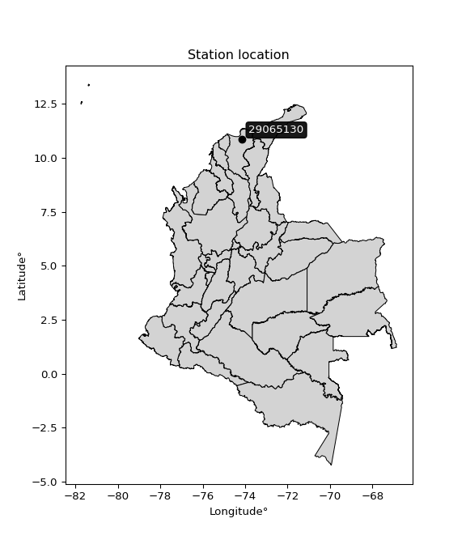

<div align="center">


</div>

# PMP Station (rain, Pmax24h): 29065130

Probable Maximum Precipitation (PMP) is the greatest amount of rainfall for a specific duration that is meteorologically possible for a given location, acting as a "worst-case" scenario for extreme storms, crucial for designing safety-critical infrastructure like bridges, river deviations, dams, spillways, and nuclear plants to prevent catastrophic failure. PMP is calculated by hydrologists using meteorological data to determine the upper limit of extreme rainfall, often leading to the Probable Maximum Flood (PMF) for flood control design, and is increasingly being studied for climate change impacts.

<div align="center">

</img>

</div>


## A. General information


### 1. General running parameters

• app_version: _v20251228_. • runtime: _2025-12-28 08:43:48.795225_. • Python version: _3.14.0_. • SciPy version: _1.16.3_. • Pandas version: _2.3.3_. • NumPy version: _2.3.5_. • Stations dataset (station_dataset_file): _dataset/pmax24h_in/automatic_colombia_2003_2024.csv_. • Stations catalog (station_catalog_file): _dataset/CNE_IDEAM.xls_. • Minimum year to eval til year_max (date_min): _1900_. • Maximum year to eval since year_min (date_max): _2024_. • Creates, save and include plots into reports (create_plot): _False_. • Plot only fit distributions with Δo > Δ (plot_only_fit): _True_. • Eval low extreme values, if False, evaluates high extreme values (low_extreme): _False_. • Eval every SciPy distribution as logarithmic (pdist_logarithmic_on): _True_. • Standard deviation normalized (ddof): _1.0_. • Return periods to eval in years (Tr): _[2, 2.33, 5, 10, 15, 20, 25, 50, 75, 100, 200, 250, 500, 750, 1000]_. • Minimum data sample per station, 0 means any (minimum_sample): _5_. • Z-Score maximum threshold to adjust a value, 0 means disable (zscore_max): _3.5_. • Z-Score minimum threshold to adjust a value, 0 means disable (zscore_min): _-2.5_. • Avoid zeros, e.g. rain = 0 (avoid_zeros): _True_. • Avoid null values (avoid_nans): _True_. [:file_folder:Dataset file.](../../dataset/pmax24h_in/automatic_colombia_2003_2024.csv)

> Delta Degrees of Freedom (DDOF): is a parameter used in the formulas for calculating variance and standard deviation. When ddof=0, the divisor is $N$ (the total number of observations) and this is used when your data set is the entire population. When ddof=1, the divisor is $N-1$ and this is used when your data set is a sample drawn from a larger population. Using $N-1$ provides an unbiased estimate of the population variance (known as Bessel´s correction).


### 2. Station info and location

|   id |   CODIGO | NOMBRE                       | CATEGORIA         | TECNOLOGIA                | ESTADO   | FECHA_INSTALACION   |   FECHA_SUSPENSION |   ALTITUD |   LATITUD |   LONGITUD | DEPARTAMENTO   | MUNICIPIO     | AREA_OPERATIVA                                         | ENTIDAD                                                     | AREA_HIDROGRAFICA   | ZONA_HIDROGRAFICA   | SUBZONA_HIDROGRAFICA      |   CORRIENTE | Catalogo   |
|-----:|---------:|:-----------------------------|:------------------|:--------------------------|:---------|:--------------------|-------------------:|----------:|----------:|-----------:|:---------------|:--------------|:-------------------------------------------------------|:------------------------------------------------------------|:--------------------|:--------------------|:--------------------------|------------:|:-----------|
|    0 | 29065130 | LA GRAN VIA - AUT [29065130] | Agrometeorológica | Automática con Telemetría | Activa   | 01/10/2008          |                nan |        30 |     10.85 |   -74.1333 | Magdalena      | Zona Bananera | Area Operativa 05 - Magdalena-Cesar-Guajira-San Andrés | INSTITUTO DE HIDROLOGIA METEOROLOGIA Y ESTUDIOS AMBIENTALES | Magdalena Cauca     | Bajo Magdalena      | Cga Grande de Santa Marta |         nan | CNE_IDEAM  |

<div align="center">

Map location in: [:earth_americas:Google](http://maps.google.com/maps?q=10.85,-74.13333333) [:earth_americas:OSM](https://www.openstreetmap.org/#map=18/10.85/-74.13333333&layers=P) [:earth_americas:Bing](https://www.bing.com/maps?cp=10.85~-74.13333333&lvl=18) [:earth_americas:Apple](https://maps.apple.com/frame?center=10.85%2C-74.13333333&span=0.003%2C0.006)

</div>


<div align="center">

```geojson
{
  "type": "Feature",
  "geometry": {
    "type": "Point", 
    "coordinates": [-74.13333333, 10.85]
  }, 
  "properties": {
    "Name": "29065130"
  }
}
```

</div>


### 3. Discrete values table and plot

|               |           0 |           1 |           2 |            3 |           4 |            5 |          6 |          7 |
|:--------------|------------:|------------:|------------:|-------------:|------------:|-------------:|-----------:|-----------:|
| Date          | 2017        | 2018        | 2019        | 2020         | 2021        | 2022         | 2023       | 2024       |
| Value         |   71.5      |   64        |   66.2      |   69.8       |   89        |   72.4       |    3.9     |  128.8     |
| Value_initial |   71.5      |   64        |   66.2      |   69.8       |   89        |   72.4       |    3.9     |  128.8     |
| count         |    8        |    8        |    8        |    8         |    8        |    8         |    8       |    8       |
| mean          |   70.7      |   70.7      |   70.7      |   70.7       |   70.7      |   70.7       |   70.7     |   70.7     |
| std           |   34.3141   |   34.3141   |   34.3141   |   34.3141    |   34.3141   |   34.3141    |   34.3141  |   34.3141  |
| zscore        |    0.023314 |   -0.195255 |   -0.131141 |   -0.0262283 |    0.533308 |    0.0495423 |   -1.94672 |    1.69318 |

> The initial value (value_initial) correspond to the initial obtained or null completed value, and value (value) is adjusted only when the initial value is outside the valid range definite through the Z-Score value. If Z-Score is active, values out of range or outliers are replaced with the station mean value


### 4. Active continuous probability distributions from SciPy (44 of 104 available)

[scipy.stats](https://docs.scipy.org/doc/scipy/reference/stats.html) is a Python´s powerful submodule within the SciPy library for comprehensive statistical analysis, offering over 130 probability distributions (like Normal, Poisson), functions for descriptive stats (mean, variance), hypothesis testing (t-tests, chi-square), random variable generation, and statistical tests, making it essential for data science, modeling, and research. It provides tools to explore, model, and draw conclusions from data efficiently, working seamlessly with NumPy.

<div align="center">

|   id | p_dist             |   n_parameter | fit_method   | label                                                                       | active   | ref                                                                                                        |
|-----:|:-------------------|--------------:|:-------------|:----------------------------------------------------------------------------|:---------|:-----------------------------------------------------------------------------------------------------------|
|    0 | alpha              |             3 | MLE          | Alpha                                                                       | True     | [:mortar_board:](https://docs.scipy.org/doc/scipy/reference/generated/scipy.stats.alpha.html)              |
|    1 | betaprime          |             4 | MLE          | Beta prime                                                                  | True     | [:mortar_board:](https://docs.scipy.org/doc/scipy/reference/generated/scipy.stats.betaprime.html)          |
|    2 | chi2               |             3 | MLE          | Chi²                                                                        | True     | [:mortar_board:](https://docs.scipy.org/doc/scipy/reference/generated/scipy.stats.chi2.html)               |
|    3 | crystalball        |             4 | MLE          | Crystalball                                                                 | True     | [:mortar_board:](https://docs.scipy.org/doc/scipy/reference/generated/scipy.stats.crystalball.html)        |
|    4 | erlang             |             3 | MLE          | Erlang                                                                      | True     | [:mortar_board:](https://docs.scipy.org/doc/scipy/reference/generated/scipy.stats.erlang.html)             |
|    5 | expon              |             2 | MLE          | Exponential                                                                 | True     | [:mortar_board:](https://docs.scipy.org/doc/scipy/reference/generated/scipy.stats.expon.html)              |
|    6 | exponnorm          |             3 | MLE          | Exponentially modified Normal                                               | True     | [:mortar_board:](https://docs.scipy.org/doc/scipy/reference/generated/scipy.stats.exponnorm.html)          |
|    7 | f                  |             4 | MLE          | F                                                                           | True     | [:mortar_board:](https://docs.scipy.org/doc/scipy/reference/generated/scipy.stats.f.html)                  |
|    8 | fatiguelife        |             3 | MLE          | Fatigue-life (Birnbaum-Saunders)                                            | True     | [:mortar_board:](https://docs.scipy.org/doc/scipy/reference/generated/scipy.stats.fatiguelife.html)        |
|    9 | fisk               |             3 | MLE          | Fisk                                                                        | True     | [:mortar_board:](https://docs.scipy.org/doc/scipy/reference/generated/scipy.stats.fisk.html)               |
|   10 | gamma              |             3 | MLE          | Gamma                                                                       | True     | [:mortar_board:](https://docs.scipy.org/doc/scipy/reference/generated/scipy.stats.gamma.html)              |
|   11 | genexpon           |             5 | MLE          | Generalized exponential                                                     | True     | [:mortar_board:](https://docs.scipy.org/doc/scipy/reference/generated/scipy.stats.genexpon.html)           |
|   12 | genlogistic        |             3 | MLE          | Generalized logistic                                                        | True     | [:mortar_board:](https://docs.scipy.org/doc/scipy/reference/generated/scipy.stats.genlogistic.html)        |
|   13 | gibrat             |             2 | MM           | Gibrat                                                                      | True     | [:mortar_board:](https://docs.scipy.org/doc/scipy/reference/generated/scipy.stats.gibrat.html)             |
|   14 | gompertz           |             3 | MLE          | Gompertz (or truncated Gumbel)                                              | True     | [:mortar_board:](https://docs.scipy.org/doc/scipy/reference/generated/scipy.stats.gompertz.html)           |
|   15 | gumbel_l           |             2 | MM           | Gumbel Left Skew                                                            | True     | [:mortar_board:](https://docs.scipy.org/doc/scipy/reference/generated/scipy.stats.gumbel_l.html)           |
|   16 | gumbel_r           |             2 | MM           | Gumbel Right Skew                                                           | True     | [:mortar_board:](https://docs.scipy.org/doc/scipy/reference/generated/scipy.stats.gumbel_r.html)           |
|   17 | halflogistic       |             2 | MM           | Half-logistic                                                               | True     | [:mortar_board:](https://docs.scipy.org/doc/scipy/reference/generated/scipy.stats.halflogistic.html)       |
|   18 | halfnorm           |             2 | MM           | Half Normal                                                                 | True     | [:mortar_board:](https://docs.scipy.org/doc/scipy/reference/generated/scipy.stats.halfnorm.html)           |
|   19 | hypsecant          |             2 | MM           | hyperbolic secant                                                           | True     | [:mortar_board:](https://docs.scipy.org/doc/scipy/reference/generated/scipy.stats.hypsecant.html)          |
|   20 | invgamma           |             3 | MLE          | Inverted gamma                                                              | True     | [:mortar_board:](https://docs.scipy.org/doc/scipy/reference/generated/scipy.stats.invgamma.html)           |
|   21 | invgauss           |             3 | MLE          | Inverse Gaussian                                                            | True     | [:mortar_board:](https://docs.scipy.org/doc/scipy/reference/generated/scipy.stats.invgauss.html)           |
|   22 | invweibull         |             3 | MLE          | Inverted Weibull                                                            | True     | [:mortar_board:](https://docs.scipy.org/doc/scipy/reference/generated/scipy.stats.invweibull.html)         |
|   23 | johnsonsu          |             4 | MLE          | Johnson Su                                                                  | True     | [:mortar_board:](https://docs.scipy.org/doc/scipy/reference/generated/scipy.stats.johnsonsu.html)          |
|   24 | kstwobign          |             2 | MLE          | Limiting distribution of scaled Kolmogorov-Smirnov two-sided test statistic | True     | [:mortar_board:](https://docs.scipy.org/doc/scipy/reference/generated/scipy.stats.kstwobign.html)          |
|   25 | laplace            |             2 | MM           | Laplace                                                                     | True     | [:mortar_board:](https://docs.scipy.org/doc/scipy/reference/generated/scipy.stats.laplace.html)            |
|   26 | laplace_asymmetric |             3 | MLE          | Asymmetric Laplace                                                          | True     | [:mortar_board:](https://docs.scipy.org/doc/scipy/reference/generated/scipy.stats.laplace_asymmetric.html) |
|   27 | loggamma           |             3 | MLE          | Log gamma                                                                   | True     | [:mortar_board:](https://docs.scipy.org/doc/scipy/reference/generated/scipy.stats.loggamma.html)           |
|   28 | logistic           |             2 | MM           | Logistic (or Sech-squared)                                                  | True     | [:mortar_board:](https://docs.scipy.org/doc/scipy/reference/generated/scipy.stats.logistic.html)           |
|   29 | lognorm            |             3 | MLE          | Log Normal                                                                  | True     | [:mortar_board:](https://docs.scipy.org/doc/scipy/reference/generated/scipy.stats.lognorm.html)            |
|   30 | maxwell            |             2 | MM           | Maxwell                                                                     | True     | [:mortar_board:](https://docs.scipy.org/doc/scipy/reference/generated/scipy.stats.maxwell.html)            |
|   31 | mielke             |             4 | MLE          | Mielke Beta-Kappa / Dagum                                                   | True     | [:mortar_board:](https://docs.scipy.org/doc/scipy/reference/generated/scipy.stats.mielke.html)             |
|   32 | moyal              |             2 | MM           | Moyal                                                                       | True     | [:mortar_board:](https://docs.scipy.org/doc/scipy/reference/generated/scipy.stats.moyal.html)              |
|   33 | nakagami           |             3 | MLE          | Nakagami                                                                    | True     | [:mortar_board:](https://docs.scipy.org/doc/scipy/reference/generated/scipy.stats.nakagami.html)           |
|   34 | ncf                |             5 | MLE          | Non-central F distribution                                                  | True     | [:mortar_board:](https://docs.scipy.org/doc/scipy/reference/generated/scipy.stats.ncf.html)                |
|   35 | nct                |             4 | MLE          | Non-central Student’s t                                                     | True     | [:mortar_board:](https://docs.scipy.org/doc/scipy/reference/generated/scipy.stats.nct.html)                |
|   36 | norm               |             2 | MM           | Normal                                                                      | True     | [:mortar_board:](https://docs.scipy.org/doc/scipy/reference/generated/scipy.stats.norm.html)               |
|   37 | pearson3           |             3 | MM           | Pearson type III                                                            | True     | [:mortar_board:](https://docs.scipy.org/doc/scipy/reference/generated/scipy.stats.pearson3.html)           |
|   38 | rayleigh           |             2 | MM           | Rayleigh                                                                    | True     | [:mortar_board:](https://docs.scipy.org/doc/scipy/reference/generated/scipy.stats.rayleigh.html)           |
|   39 | rice               |             3 | MLE          | Rice                                                                        | True     | [:mortar_board:](https://docs.scipy.org/doc/scipy/reference/generated/scipy.stats.rice.html)               |
|   40 | t                  |             3 | MLE          | Student’s t                                                                 | True     | [:mortar_board:](https://docs.scipy.org/doc/scipy/reference/generated/scipy.stats.t.html)                  |
|   41 | truncnorm          |             4 | MLE          | Truncated normal                                                            | True     | [:mortar_board:](https://docs.scipy.org/doc/scipy/reference/generated/scipy.stats.truncnorm.html)          |
|   42 | wald               |             2 | MM           | Wald                                                                        | True     | [:mortar_board:](https://docs.scipy.org/doc/scipy/reference/generated/scipy.stats.wald.html)               |
|   43 | weibull_min        |             3 | MLE          | Weibull minimum                                                             | True     | [:mortar_board:](https://docs.scipy.org/doc/scipy/reference/generated/scipy.stats.weibull_min.html)        |

</div>

> **n_parameter:** # arguments & localization & scale.
>
> **Fit methods:** (MLE) maximum likelihood, (MM) L-moments.
>
>**Inactive:** foldnorm, gennorm, norminvgauss, powernorm, powerlognorm, skewnorm, genextreme, anglit, arcsine, argus, beta, bradford, burr, burr12, cauchy, cosine, halfcauchy, foldcauchy, skewcauchy, wrapcauchy, dgamma, gengamma, exponweib, exponpow, truncexpon, gausshyper, genhalflogistic, genhyperbolic, geninvgauss, halfgennorm, johnsonsb, kappa4, kappa3, ksone, kstwo, loglaplace, levy, levy_l, levy_stable, ncx2, pareto, genpareto, truncpareto, lomax, powerlaw, rdist, rel_breitwigner, recipinvgauss, semicircular, studentized_range, trapezoid, triang, truncweibull_min, tukeylambda, uniform, loguniform, vonmises, vonmises_line, weibull_max, dweibull, 


## B. Probability distributions vs. Empirical distributions

A continuous probability distribution (CPD) describes probabilities for variables that can take any value within a range (like rain any time), unlike discrete variables with specific outcomes (like temperature). It uses a Probability Density Function (PDF), a curve where the total area under it equals 1, and the probability of the variable falling within an interval (a to b) is found by calculating the area under the curve between those points. A key feature is that the probability of hitting any single exact value is zero, so probabilities are always expressed for ranges, e.g., $P(a ≤ X ≤ b)$.

<div align="center">

Distributions parameters from station values
|    |   station | p_dist                |   n |              loc |            scale | shape                  | shape1                 | shape2                 | shape3   |
|---:|----------:|:----------------------|----:|-----------------:|-----------------:|:-----------------------|:-----------------------|:-----------------------|:---------|
|  0 |  29065130 | alpha                 |   8 |   -576.929       |  14098.8         | 21.840955348635994     |                        |                        |          |
|  1 |  29065130 | betaprime             |   8 |   -786.436       | 109978           | 698.0431852115748      | 89572.08165316228      |                        |          |
|  2 |  29065130 | chi2                  |   8 |      3.9         |      3.2907      | 1.2298527289779866     |                        |                        |          |
|  3 |  29065130 | crystalball           |   8 |     70.7         |     32.0979      | 4494.479467383688      | 5797.019695334945      |                        |          |
|  4 |  29065130 | erlang                |   8 |   -546.443       |      1.70202     | 362.4033115497522      |                        |                        |          |
|  5 |  29065130 | expon                 |   8 |      3.9         |     66.8         |                        |                        |                        |          |
|  6 |  29065130 | exponnorm             |   8 |     70.674       |     32.0978      | 0.0008081501296972049  |                        |                        |          |
|  7 |  29065130 | f                     |   8 | -12938.1         |  13008.9         | 346918.36476144486     | 5272734.808794865      |                        |          |
|  8 |  29065130 | fatiguelife           |   8 |  -2007.9         |   2078.04        | 0.015546579578379113   |                        |                        |          |
|  9 |  29065130 | fisk                  |   8 |     -2.54534e+09 |      2.54534e+09 | 156798239.70905453     |                        |                        |          |
| 10 |  29065130 | gamma                 |   8 |   -534.163       |      1.74601     | 346.3831357875333      |                        |                        |          |
| 11 |  29065130 | genexpon              |   8 |      3.89998     |      2.38077     | 0.03562379909445579    | 5.7764008183256044e-08 | 2.7258206694339058     |          |
| 12 |  29065130 | genlogistic           |   8 |     78.608       |     14.1416      | 0.7120480305945087     |                        |                        |          |
| 13 |  29065130 | gibrat                |   8 |     46.2133      |     14.8519      |                        |                        |                        |          |
| 14 |  29065130 | gompertz              |   8 |     64           |     76.1457      | 3.4002350267334056     |                        |                        |          |
| 15 |  29065130 | gumbel_l              |   8 |     85.1458      |     25.0267      |                        |                        |                        |          |
| 16 |  29065130 | gumbel_r              |   8 |     56.2542      |     25.0267      |                        |                        |                        |          |
| 17 |  29065130 | halflogistic          |   8 |     32.6565      |     27.4426      |                        |                        |                        |          |
| 18 |  29065130 | halfnorm              |   8 |     28.2149      |     53.2472      |                        |                        |                        |          |
| 19 |  29065130 | hypsecant             |   8 |     70.7         |     20.4342      |                        |                        |                        |          |
| 20 |  29065130 | invgamma              |   8 |   -382.457       |  85544.5         | 190.18054035915543     |                        |                        |          |
| 21 |  29065130 | invgauss              |   8 |   -139.096       |   7173.97        | 0.029113154520005652   |                        |                        |          |
| 22 |  29065130 | invweibull            |   8 |     -2.10641e+09 |      2.10641e+09 | 60866302.06038259      |                        |                        |          |
| 23 |  29065130 | johnsonsu             |   8 |     70.5054      |      1.9327      | -0.017690600857819358  | 0.3973848309763022     |                        |          |
| 24 |  29065130 | kstwobign             |   8 |    -72.4634      |    164.382       |                        |                        |                        |          |
| 25 |  29065130 | laplace               |   8 |     70.7         |     22.6967      |                        |                        |                        |          |
| 26 |  29065130 | laplace_asymmetric    |   8 |     71.5         |     19.7254      | 1.0242428968752697     |                        |                        |          |
| 27 |  29065130 | loggamma              |   8 |   -217.192       |    113.669       | 13.084428950332608     |                        |                        |          |
| 28 |  29065130 | logistic              |   8 |     70.7         |     17.6965      |                        |                        |                        |          |
| 29 |  29065130 | lognorm               |   8 |      3.9         |      0.520572    | 13.11636779167633      |                        |                        |          |
| 30 |  29065130 | maxwell               |   8 |     -5.35863     |     47.6627      |                        |                        |                        |          |
| 31 |  29065130 | mielke                |   8 |   -870.237       |    948.757       | 48.35156883573504      | 67.65668696734195      |                        |          |
| 32 |  29065130 | moyal                 |   8 |     52.3443      |     14.4491      |                        |                        |                        |          |
| 33 |  29065130 | nakagami              |   8 |      3.9         |     83.5965      | 0.3095321173945677     |                        |                        |          |
| 34 |  29065130 | ncf                   |   8 |     -0.0173464   |      6.73469e-07 | 9.358986579686617e-08  | 3.709514543149429      | 8.465842453145012      |          |
| 35 |  29065130 | nct                   |   8 |  -1579.82        |     32.0531      | 439616.1793305541      | 51.493049772767094     |                        |          |
| 36 |  29065130 | norm                  |   8 |     70.7         |     32.0979      |                        |                        |                        |          |
| 37 |  29065130 | pearson3              |   8 |     70.7         |     32.098       | -0.36368784916996333   |                        |                        |          |
| 38 |  29065130 | rayleigh              |   8 |      9.2948      |     48.9943      |                        |                        |                        |          |
| 39 |  29065130 | rice                  |   8 |     51.3562      |     24.3813      | 0.1289445351600309     |                        |                        |          |
| 40 |  29065130 | t                     |   8 |     70.7         |     32.0978      | 257659.15892366684     |                        |                        |          |
| 41 |  29065130 | truncnorm             |   8 |      9.90117     |      4.11263     | -5.15475027045332      | 28.9106722232769       |                        |          |
| 42 |  29065130 | wald                  |   8 |     38.6021      |     32.0979      |                        |                        |                        |          |
| 43 |  29065130 | weibull_min           |   8 |    -66.7381      |    149.681       | 4.854484565201096      |                        |                        |          |
| 44 |  29065130 | logalpha              |   8 |    -34.6276      |   1352.89        | 35.09730488517399      |                        |                        |          |
| 45 |  29065130 | logbetaprime          |   8 |    -17.2351      |    574.09        | 372.5006204098388      | 10080.421085253896     |                        |          |
| 46 |  29065130 | logchi2               |   8 |      1.36098     |      1.10373     | 0.5223511590130618     |                        |                        |          |
| 47 |  29065130 | logcrystalball        |   8 |      3.98212     |      1.01318     | 16.598281720304783     | 345.72016776495093     |                        |          |
| 48 |  29065130 | logerlang             |   8 |     -8.34123     |      0.112319    | 109.4027728477495      |                        |                        |          |
| 49 |  29065130 | logexpon              |   8 |      1.36098     |      2.62115     |                        |                        |                        |          |
| 50 |  29065130 | logexponnorm          |   8 |      3.9815      |      1.01318     | 0.00060174986009037    |                        |                        |          |
| 51 |  29065130 | logf                  |   8 |  -2538.14        |   2542.12        | 42853281.48058006      | 17635661.138828278     |                        |          |
| 52 |  29065130 | logfatiguelife        |   8 |   -769.349       |    773.324       | 0.0013138430378440294  |                        |                        |          |
| 53 |  29065130 | logfisk               |   8 |     -3.82903e+06 |      3.82904e+06 | 9122762.184573065      |                        |                        |          |
| 54 |  29065130 | loggamma              |   8 |    -15.7609      |      0.0582422   | 338.67833920258613     |                        |                        |          |
| 55 |  29065130 | loggenexpon           |   8 |      1.21621     |      0.0136173   | 0.0007924660985072474  | 2.222343379323492      | 1.6190991377432328e-05 |          |
| 56 |  29065130 | loggenlogistic        |   8 |      4.6501      |      0.133339    | 0.1890949413501709     |                        |                        |          |
| 57 |  29065130 | loggibrat             |   8 |      3.20925     |      0.468787    |                        |                        |                        |          |
| 58 |  29065130 | loggompertz           |   8 |      1.36098     |      1.26605     | 0.12561380181288712    |                        |                        |          |
| 59 |  29065130 | loggumbel_l           |   8 |      4.43811     |      0.789977    |                        |                        |                        |          |
| 60 |  29065130 | loggumbel_r           |   8 |      3.52613     |      0.789977    |                        |                        |                        |          |
| 61 |  29065130 | loghalflogistic       |   8 |      2.78133     |      0.866196    |                        |                        |                        |          |
| 62 |  29065130 | loghalfnorm           |   8 |      2.64104     |      1.68079     |                        |                        |                        |          |
| 63 |  29065130 | loghypsecant          |   8 |      3.98212     |      0.645013    |                        |                        |                        |          |
| 64 |  29065130 | loginvgamma           |   8 |    -21.9059      |  14741.7         | 570.9130150326832      |                        |                        |          |
| 65 |  29065130 | loginvgauss           |   8 |     -9.20701     |   1762.23        | 0.007460461010947508   |                        |                        |          |
| 66 |  29065130 | loginvweibull         |   8 |     -3.67315e+08 |      3.67315e+08 | 288934997.6217802      |                        |                        |          |
| 67 |  29065130 | logjohnsonsu          |   8 |      4.26483     |      0.0190387   | 0.11398700297849731    | 0.33707509912817124    |                        |          |
| 68 |  29065130 | logkstwobign          |   8 |     -1.52189     |      6.30999     |                        |                        |                        |          |
| 69 |  29065130 | loglaplace            |   8 |      3.98212     |      0.71643     |                        |                        |                        |          |
| 70 |  29065130 | loglaplace_asymmetric |   8 |      4.28221     |      0.419001    | 1.4202771946937782     |                        |                        |          |
| 71 |  29065130 | logloggamma           |   8 |      4.78809     |      0.181125    | 0.2376708910690551     |                        |                        |          |
| 72 |  29065130 | loglogistic           |   8 |      3.98212     |      0.558598    |                        |                        |                        |          |
| 73 |  29065130 | loglognorm            |   8 |      1.36098     |      0.0287875   | 12.282458950995172     |                        |                        |          |
| 74 |  29065130 | logmaxwell            |   8 |      1.58131     |      1.50449     |                        |                        |                        |          |
| 75 |  29065130 | logmielke             |   8 |     -5.74319e+07 |      5.74319e+07 | 65334158.10150985      | 104431952946.06851     |                        |          |
| 76 |  29065130 | logmoyal              |   8 |      3.40272     |      0.456093    |                        |                        |                        |          |
| 77 |  29065130 | lognakagami           |   8 |      4.15888     |      0.223814    | 0.3704813812663713     |                        |                        |          |
| 78 |  29065130 | logncf                |   8 |     -0.41327     |      4.60363e-07 | 5.2205786613162525e-06 | 125.56060888741422     | 49.356000241844065     |          |
| 79 |  29065130 | lognct                |   8 |    -59.7489      |      0.944716    | 13031.965510234579     | 67.45527481679349      |                        |          |
| 80 |  29065130 | lognorm               |   8 |      3.98212     |      1.01318     |                        |                        |                        |          |
| 81 |  29065130 | logpearson3           |   8 |      3.98212     |      1.01318     | -2.0577486971996413    |                        |                        |          |
| 82 |  29065130 | lograyleigh           |   8 |      2.04387     |      1.5465      |                        |                        |                        |          |
| 83 |  29065130 | logrice               |   8 |   -559.984       |      1.01331     | 556.5592046621796      |                        |                        |          |
| 84 |  29065130 | logt                  |   8 |      4.25539     |      0.0491514   | 0.5573822877141723     |                        |                        |          |
| 85 |  29065130 | logtruncnorm          |   8 |      0.498142    |      7.01004     | 0.12308373993867429    | 0.6219973157135431     |                        |          |
| 86 |  29065130 | logwald               |   8 |      2.96896     |      1.01316     |                        |                        |                        |          |
| 87 |  29065130 | logweibull_min        |   8 |      1.36098     |      1.2935      | 0.6861752020509401     |                        |                        |          |

</div>

> **loc** (Location parameter): This shifts the distribution along the x-axis. For many common distributions, like the normal (Gaussian) distribution, loc represents the mean $μ$. For others, like the uniform distribution, it might represent the minimum value, or for the beta distribution, the left end of the support interval.
>
> **scale** (Scale parameter): This determines the width or spread of the distribution. For the normal distribution, scale represents the standard deviation $σ$. For a uniform distribution, it defines the length of the interval (from $loc$ to $loc + scale$).
>
> **shape** (Shape parameters): Refers to parameters that define the specific form of a probability distribution, distinct from its location (loc) and scale (scale). These parameters are required arguments for most distribution functions. For example, a normal (Gaussian) distribution is fully defined by its location (mean) and scale (standard deviation), so it has no specific shape parameters beyond loc and scale. However, other distributions have intrinsic properties that need specification, as Gamma distribution that takes a shape parameter, often named $a$ or $alpha$.


### 0. Cumulative distribution values - CDF (88 evaluated)

Cumulative Distribution Function (CDF), denoted as $F$<sub>$X$</sub>$(x)$, is a function that gives the probability that a random variable $X$ will take a value less than or equal to a specific value, $x$ (i.e., $(P(X≥x)$. It essentially "accumulates" probabilities from a given point up to the far right (positive infinity), providing a complete picture of the distribution´s probabilities for both discrete (like rain) and continuous (like temperature) variables, helping to find probabilities over ranges or above certain values.

<div align="center">

CDF ordered by x ascending and calculating $log(f(x))$ separately
|   id |   Station |   date |     x |   count |   mean |     std |     zscore |   Value_initial |   station |   m |     alpha |   alpha_pdf |   betaprime |   betaprime_pdf |        chi2 |         chi2_pdf |   crystalball |   crystalball_pdf |    erlang |   erlang_pdf |    expon |   expon_pdf |   exponnorm |   exponnorm_pdf |         f |      f_pdf |   fatiguelife |   fatiguelife_pdf |      fisk |    fisk_pdf |     gamma |   gamma_pdf |    genexpon |   genexpon_pdf |   genlogistic |   genlogistic_pdf |   gibrat |   gibrat_pdf |    gompertz |   gompertz_pdf |   gumbel_l |   gumbel_l_pdf |    gumbel_r |   gumbel_r_pdf |   halflogistic |   halflogistic_pdf |   halfnorm |   halfnorm_pdf |   hypsecant |   hypsecant_pdf |   invgamma |   invgamma_pdf |   invgauss |   invgauss_pdf |   invweibull |   invweibull_pdf |   johnsonsu |   johnsonsu_pdf |   kstwobign |   kstwobign_pdf |   laplace |   laplace_pdf |   laplace_asymmetric |   laplace_asymmetric_pdf |   loggamma |   loggamma_pdf |   logistic |   logistic_pdf |    lognorm |   lognorm_pdf |    maxwell |   maxwell_pdf |    mielke |   mielke_pdf |       moyal |   moyal_pdf |    nakagami |   nakagami_pdf |      ncf |    ncf_pdf |       nct |    nct_pdf |     norm |   norm_pdf |   pearson3 |   pearson3_pdf |   rayleigh |   rayleigh_pdf |     rice |    rice_pdf |         t |      t_pdf |   truncnorm |   truncnorm_pdf |     wald |   wald_pdf |   weibull_min |   weibull_min_pdf |   logalpha |   logalpha_pdf |   logbetaprime |   logbetaprime_pdf |     logchi2 |   logchi2_pdf |   logcrystalball |   logcrystalball_pdf |   logerlang |   logerlang_pdf |   logexpon |   logexpon_pdf |   logexponnorm |   logexponnorm_pdf |       logf |   logf_pdf |   logfatiguelife |   logfatiguelife_pdf |    logfisk |   logfisk_pdf |   loggenexpon |   loggenexpon_pdf |   loggenlogistic |   loggenlogistic_pdf |   loggibrat |   loggibrat_pdf |   loggompertz |   loggompertz_pdf |   loggumbel_l |   loggumbel_l_pdf |   loggumbel_r |   loggumbel_r_pdf |   loghalflogistic |   loghalflogistic_pdf |   loghalfnorm |   loghalfnorm_pdf |   loghypsecant |   loghypsecant_pdf |   loginvgamma |   loginvgamma_pdf |   loginvgauss |   loginvgauss_pdf |   loginvweibull |   loginvweibull_pdf |   logjohnsonsu |   logjohnsonsu_pdf |   logkstwobign |   logkstwobign_pdf |   loglaplace |   loglaplace_pdf |   loglaplace_asymmetric |   loglaplace_asymmetric_pdf |   logloggamma |   logloggamma_pdf |   loglogistic |   loglogistic_pdf |   loglognorm |   loglognorm_pdf |   logmaxwell |   logmaxwell_pdf |   logmielke |   logmielke_pdf |    logmoyal |   logmoyal_pdf |   lognakagami |   lognakagami_pdf |     logncf |   logncf_pdf |     lognct |   lognct_pdf |   logpearson3 |   logpearson3_pdf |   lograyleigh |   lograyleigh_pdf |    logrice |   logrice_pdf |      logt |   logt_pdf |   logtruncnorm |   logtruncnorm_pdf |   logwald |   logwald_pdf |   logweibull_min |   logweibull_min_pdf |
|-----:|----------:|-------:|------:|--------:|-------:|--------:|-----------:|----------------:|----------:|----:|----------:|------------:|------------:|----------------:|------------:|-----------------:|--------------:|------------------:|----------:|-------------:|---------:|------------:|------------:|----------------:|----------:|-----------:|--------------:|------------------:|----------:|------------:|----------:|------------:|------------:|---------------:|--------------:|------------------:|---------:|-------------:|------------:|---------------:|-----------:|---------------:|------------:|---------------:|---------------:|-------------------:|-----------:|---------------:|------------:|----------------:|-----------:|---------------:|-----------:|---------------:|-------------:|-----------------:|------------:|----------------:|------------:|----------------:|----------:|--------------:|---------------------:|-------------------------:|-----------:|---------------:|-----------:|---------------:|-----------:|--------------:|-----------:|--------------:|----------:|-------------:|------------:|------------:|------------:|---------------:|---------:|-----------:|----------:|-----------:|---------:|-----------:|-----------:|---------------:|-----------:|---------------:|---------:|------------:|----------:|-----------:|------------:|----------------:|---------:|-----------:|--------------:|------------------:|-----------:|---------------:|---------------:|-------------------:|------------:|--------------:|-----------------:|---------------------:|------------:|----------------:|-----------:|---------------:|---------------:|-------------------:|-----------:|-----------:|-----------------:|---------------------:|-----------:|--------------:|--------------:|------------------:|-----------------:|---------------------:|------------:|----------------:|--------------:|------------------:|--------------:|------------------:|--------------:|------------------:|------------------:|----------------------:|--------------:|------------------:|---------------:|-------------------:|--------------:|------------------:|--------------:|------------------:|----------------:|--------------------:|---------------:|-------------------:|---------------:|-------------------:|-------------:|-----------------:|------------------------:|----------------------------:|--------------:|------------------:|--------------:|------------------:|-------------:|-----------------:|-------------:|-----------------:|------------:|----------------:|------------:|---------------:|--------------:|------------------:|-----------:|-------------:|-----------:|-------------:|--------------:|------------------:|--------------:|------------------:|-----------:|--------------:|----------:|-----------:|---------------:|-------------------:|----------:|--------------:|-----------------:|---------------------:|
|    0 |  29065130 |   2023 |   3.9 |       8 |   70.7 | 34.3141 | -1.94672   |             3.9 |  29065130 |   1 | 0.0074954 |   0.000865  |   0.0181883 |      0.0014484  | 1.27104e-10 | 175999           |      0.018711 |        0.00142543 | 0.0173137 |   0.00142647 | 0        |  0.0149701  |   0.0187105 |      0.00142541 | 0.0189464 | 0.00143929 |      0.018586 |        0.00145473 | 0.0150337 | 0.000912182 | 0.0171708 |  0.00141502 | 3.32627e-07 |     0.0149631  |     0.0231619 |        0.00116034 | 0        |   0          | 0           |     0          |  0.0381678 |    0.0014956   | 0.000303357 |    9.81903e-05 |       0        |         0          |   0        |     0          |   0.0242074 |      0.00118351 |  0.0148032 |     0.00140666 |  0.0154968 |     0.00163118 |    0.0142786 |       0.0017531  |    0.044574 |     0.000560971 |   0.0177542 |      0.00242576 | 0.0263494 |    0.00116094 |            0.0180355 |              0.000892686 | 0.00575927 |      0.0168192 |  0.0224282 |     0.00123895 | 0.00484028 |     0.0138646 | 0.00192758 |   0.000619875 | 0.0189965 |   0.00104666 | 8.98529e-08 | 9.17891e-08 | 1.56984e-11 | 21883.7        | 0.034931 | 0.00609663 | 0.0187137 | 0.00142579 | 0.018711 | 0.00142543 |  0.0272007 |     0.0015806  |   0        |     0          | 0        | 0           | 0.0187109 | 0.00142541 |   0.0722542 |    0.0334521    | 0        | 0          |     0.0257725 |        0.00174815 | 0.00630106 |      0.0185477 |     0.00754881 |          0.0203836 | 7.33849e-05 |   8.63175e+10 |       0.00484029 |            0.0138647 |  0.00950734 |       0.0254432 |   0        |       0.381513 |     0.00484035 |          0.0138648 | 0.00504365 |   0.014344 |        0.0049808 |            0.0142311 | 0.00109595 |    0.00260825 |     0.0104032 |         0.0853859 |       0.00942431 |            0.0133651 |    0        |        0        |   3.36059e-08 |         0.0992175 |     0.0201335 |         0.0252279 |   1.85693e-07 |       3.64325e-06 |          0        |              0        |      0        |          0        |      0.0109394 |          0.0169566 |    0.00543702 |         0.0165682 |    0.00634232 |         0.0197016 |      0.00838601 |           0.0315393 |       0.03482  |         0.00893132 |       0.014874 |          0.0558297 |     0.012884 |        0.0179836 |              0.00493478 |                  0.00829239 |      0.012257 |         0.0160835 |    0.00908176 |         0.0161105 |   0.00407597 |      4.41774e+12 |     0        |         0        |    0.018652 |       0.0212184 | 6.76779e-21 |    6.59668e-19 |   0           |         0         | 0.00895169 |    0.0302931 | 0.00506283 |    0.0144479 |      0.028011 |          0.027218 |      0        |          0        | 0.00484484 |     0.0138746 | 0.0326256 | 0.00628215 |    3.92766e-06 |           0.306879 |  0        |      0        |      1.52133e-11 |        47013.2       |
|    1 |  29065130 |   2018 |  64   |       8 |   70.7 | 34.3141 | -0.195255  |            64   |  29065130 |   2 | 0.437833  |   0.0135256 |   0.424014  |      0.01209    | 0.999969    |      4.81696e-06 |      0.417327 |        0.0121611  | 0.428602  |   0.0121982  | 0.593309 |  0.00608819 |   0.417327  |      0.0121611  | 0.417426  | 0.0121102  |      0.424516 |        0.012163   | 0.382244  | 0.0145463   | 0.425956  |  0.0121527  | 0.59314     |     0.00608791 |     0.385833  |        0.0143274  | 0.57155  |   0.0220675  | 3.93493e-09 |     0.0446543  |  0.349222  |    0.0111707   | 0.480075    |    0.0140764   |       0.516148 |         0.0133659  |   0.498452 |     0.0119555  |   0.397453  |      0.0147759  |  0.449325  |     0.0122521  |  0.468227  |     0.0115187  |    0.473171  |       0.0102312  |    0.216537 |     0.0171802   |   0.504057  |      0.00953092 | 0.372192  |    0.0163985  |            0.353207  |              0.0174824   | 0.578838   |      0.362503  |  0.406463  |     0.0136327  | 0.569248   |     0.387804  | 0.45164    |   0.0122963   | 0.382382  |   0.0146349  | 0.504077    | 0.0147564   | 0.609956    |     0.00555489 | 0.507795 | 0.0056784  | 0.417367  | 0.0121603  | 0.417327 | 0.0121611  |  0.394879  |     0.0116904  |   0.463858 |     0.0122185  | 0.124845 | 0.0184605   | 0.417326  | 0.0121611  |   1         |    2.58497e-39  | 0.56994  | 0.0171788  |     0.40457   |        0.0114629  | 0.58587    |      0.350423  |     0.570017   |          0.34885   | 0.951373    |   0.0309226   |       0.569249   |            0.387804  |  0.583679   |       0.328234  |   0.656111 |       0.131198 |     0.569251   |          0.387804  | 0.571269   |   0.385933 |        0.571797  |            0.386182  | 0.462826   |    0.592338   |     0.635933  |         0.22871   |       0.495934   |            0.686072  |    0.759885 |        0.327446 |   0.639188    |         0.326319  |     0.504533  |         0.440448  |   0.638334    |       0.362724    |          0.661329 |              0.324779 |      0.633501 |          0.31575  |      0.586159  |          0.475526  |    0.583169   |         0.356603  |    0.592676   |         0.336521  |      0.589011   |           0.245242  |       0.241673 |         0.977129   |       0.607659 |          0.218684  |     0.609322 |        0.545312  |              0.543431   |                  0.91318    |      0.478939 |         0.612896  |    0.578456   |         0.43653   |   0.645284   |      0.0108303   |     0.598283 |         0.35877  |    0.449815 |       0.511707  | 0.662471    |    0.347112    |   1.66077e-11 |     13854.9       | 0.583304   |    0.27656   | 0.569902   |    0.383323  |      0.43421  |          0.43297  |      0.607483 |          0.347112 | 0.569246   |     0.387758  | 0.212206  | 1.12916    |    0.816414    |           0.269798 |  0.729484 |      0.305384 |      0.816935    |            0.0762295 |
|    2 |  29065130 |   2019 |  66.2 |       8 |   70.7 | 34.3141 | -0.131141  |            66.2 |  29065130 |   3 | 0.467635  |   0.0135539 |   0.450742  |      0.0121988  | 0.999978    |      3.40085e-06 |      0.444253 |        0.0123074  | 0.45555   |   0.0122907  | 0.606484 |  0.00589095 |   0.444252  |      0.0123074  | 0.444236  | 0.0122537  |      0.451414 |        0.0122803  | 0.414714  | 0.0149524   | 0.452809  |  0.0122497  | 0.606315    |     0.00589077 |     0.417962  |        0.0148637  | 0.616743 |   0.0190995  | 0.0948662   |     0.0416029  |  0.37441   |    0.0117251   | 0.510655    |    0.013713    |       0.544941 |         0.0128093  |   0.524385 |     0.0116181  |   0.430462  |      0.0152071  |  0.476287  |     0.0122495  |  0.493478  |     0.0114291  |    0.49549   |       0.0100539  |    0.264321 |     0.0275444   |   0.524817  |      0.00933948 | 0.410075  |    0.0180676  |            0.39384   |              0.0194935   | 0.591043   |      0.35967   |  0.436769  |     0.0139011  | 0.582315   |     0.385339  | 0.478623   |   0.0122254   | 0.41519   |   0.0151715  | 0.53584     | 0.0141126   | 0.622022    |     0.00541437 | 0.520079 | 0.00548971 | 0.444291  | 0.0123064  | 0.444253 | 0.0123074  |  0.420914  |     0.0119703  |   0.49059  |     0.0120762  | 0.167896 | 0.0206065   | 0.444252  | 0.0123074  |   1         |    1.96924e-42  | 0.605749 | 0.0154124  |     0.430058  |        0.0117012  | 0.597662   |      0.347356  |     0.581767   |          0.346475  | 0.952406    |   0.0301838   |       0.582315   |            0.385339  |  0.594728   |       0.325553  |   0.660517 |       0.129517 |     0.582318   |          0.385339  | 0.58426    |   0.38342  |        0.584807  |            0.383636  | 0.482895   |    0.594933   |     0.64362   |         0.226209  |       0.51959    |            0.713751  |    0.770624 |        0.308294 |   0.650194    |         0.324924  |     0.51951   |         0.445804  |   0.650448    |       0.354129    |          0.672164 |              0.316438 |      0.644076 |          0.310005 |      0.602111  |          0.468318  |    0.59517    |         0.35352   |    0.603994   |         0.333237  |      0.597248   |           0.242147  |       0.282828 |         1.52796    |       0.615007 |          0.216157  |     0.627324 |        0.520184  |              0.575187   |                  0.966543   |      0.500053 |         0.636628  |    0.593135   |         0.432021  |   0.645648   |      0.0106972   |     0.610333 |         0.354247 |    0.467446 |       0.531764  | 0.674028    |    0.33677     |   0.191371    |         4.16976   | 0.592604   |    0.273752  | 0.582816   |    0.380837  |      0.449101 |          0.448296 |      0.619132 |          0.342193 | 0.58231    |     0.385294  | 0.262381  | 1.95173    |    0.825521    |           0.269117 |  0.739566 |      0.291383 |      0.819488    |            0.0748835 |
|    3 |  29065130 |   2020 |  69.8 |       8 |   70.7 | 34.3141 | -0.0262283 |            69.8 |  29065130 |   4 | 0.516277  |   0.0134365 |   0.494807  |      0.0122569  | 0.999988    |      1.92591e-06 |      0.488815 |        0.012424   | 0.499894  |   0.0123193  | 0.627131 |  0.00558188 |   0.488816  |      0.0124241  | 0.4886    | 0.0123674  |      0.495794 |        0.0123501  | 0.469352  | 0.0153426   | 0.49702   |  0.0122866  | 0.626961    |     0.00558184 |     0.472704  |        0.0154914  | 0.678158 |   0.0151978  | 0.235944    |     0.0368187  |  0.418199  |    0.0125913   | 0.55877     |    0.0129947   |       0.589402 |         0.0118904  |   0.565187 |     0.0110458  |   0.485985  |      0.0155622  |  0.520205  |     0.0121255  |  0.534228  |     0.0111917  |    0.531085  |       0.00971153 |    0.436562 |     0.0760783   |   0.557832  |      0.00899645 | 0.480561  |    0.0211732  |            0.470658  |              0.0232957   | 0.609958   |      0.354584  |  0.487288  |     0.0141179  | 0.6026     |     0.380656  | 0.522277   |   0.0120063   | 0.47101   |   0.0157783  | 0.584653    | 0.0129975   | 0.641111    |     0.0051925  | 0.539305 | 0.00519416 | 0.48885   | 0.0124227  | 0.488815 | 0.012424   |  0.464689  |     0.012327   |   0.533522 |     0.011758   | 0.247053 | 0.0231684   | 0.488815  | 0.0124241  |   1         |    8.39052e-48  | 0.656677 | 0.0129653  |     0.472754  |        0.0119989  | 0.615916   |      0.341981  |     0.600004   |          0.342173  | 0.953974    |   0.0290677   |       0.6026     |            0.380656  |  0.611846   |       0.320886  |   0.667306 |       0.126927 |     0.602603   |          0.380656  | 0.604437   |   0.378674 |        0.604999  |            0.378837  | 0.514425   |    0.595134   |     0.655493  |         0.2222    |       0.558507   |            0.755658  |    0.786213 |        0.281006 |   0.667331    |         0.322205  |     0.543317  |         0.453092  |   0.668841    |       0.340533    |          0.688578 |              0.303546 |      0.660252 |          0.300969 |      0.626568  |          0.454993  |    0.613749   |         0.348088  |    0.621494   |         0.327613  |      0.60994    |           0.237204  |       0.426576 |         4.88902    |       0.626347 |          0.212154  |     0.653877 |        0.483122  |              0.628715   |                  1.05649    |      0.534752 |         0.673835  |    0.615795   |         0.423545  |   0.646209   |      0.0104949   |     0.628894 |         0.346691 |    0.49647  |       0.564781  | 0.691438    |    0.320874    |   0.379954    |         3.11573   | 0.606979   |    0.269131  | 0.602863   |    0.376152  |      0.473501 |          0.47351  |      0.637041 |          0.334139 | 0.602593   |     0.380612  | 0.445809  | 5.36219    |    0.839743    |           0.26804  |  0.754448 |      0.271004 |      0.823399    |            0.0728364 |
|    4 |  29065130 |   2017 |  71.5 |       8 |   70.7 | 34.3141 |  0.023314  |            71.5 |  29065130 |   5 | 0.539021  |   0.0133132 |   0.515627  |      0.0122322  | 0.999991    |      1.47298e-06 |      0.509942 |        0.012425   | 0.520808  |   0.01228    | 0.6365   |  0.00544162 |   0.509942  |      0.0124251  | 0.50963   | 0.0123677  |      0.516777 |        0.0123297  | 0.495495  | 0.0153992   | 0.517882  |  0.0122517  | 0.63633     |     0.00544164 |     0.499196  |        0.0156611  | 0.702689 |   0.0136938  | 0.296689    |     0.0346567  |  0.439932  |    0.012973    | 0.58054     |    0.0126144   |       0.609247 |         0.011457   |   0.58373  |     0.0107683  |   0.512459  |      0.0155654  |  0.540731  |     0.0120175  |  0.553131  |     0.0110434  |    0.547443  |       0.00953078 |    0.570917 |     0.0717806   |   0.57298   |      0.00882387 | 0.517317  |    0.0212667  |            0.511975  |              0.0253407   | 0.61846    |      0.352021  |  0.5113    |     0.0141199  | 0.611731   |     0.378205  | 0.542568   |   0.0118614   | 0.497975  |   0.0159292  | 0.606293    | 0.0124599   | 0.649852    |     0.00509093 | 0.54802  | 0.00506029 | 0.509974  | 0.0124236  | 0.509942 | 0.012425   |  0.485751  |     0.0124473  |   0.553357 |     0.0115743  | 0.287147 | 0.0239565   | 0.509942  | 0.0124251  |   1         |    1.87086e-50  | 0.677862 | 0.0119747  |     0.493239  |        0.0120961  | 0.624114   |      0.339319  |     0.608212   |          0.339991  | 0.954668    |   0.0285767   |       0.611731   |            0.378205  |  0.61954    |       0.318585  |   0.670347 |       0.125767 |     0.611734   |          0.378205  | 0.613519   |   0.376199 |        0.614085  |            0.376339  | 0.52873    |    0.593663   |     0.660818  |         0.220344  |       0.576908   |            0.773526  |    0.792836 |        0.269602 |   0.675067    |         0.320751  |     0.554254  |         0.455919  |   0.676961    |       0.334327    |          0.695813 |              0.297764 |      0.667445 |          0.296853 |      0.637436  |          0.448204  |    0.622093   |         0.345387  |    0.629345   |         0.324872  |      0.61562    |           0.234924  |       0.57895  |         6.70885    |       0.63143  |          0.210319  |     0.665309 |        0.467165  |              0.654659   |                  1.10009    |      0.551168 |         0.690524  |    0.625935   |         0.419157  |   0.646461   |      0.0104054   |     0.637194 |         0.34308  |    0.510248 |       0.580455  | 0.699074    |    0.313787    |   0.451311    |         2.82324   | 0.613429   |    0.266948  | 0.611885   |    0.373713  |      0.485038 |          0.485478 |      0.645036 |          0.33035  | 0.611723   |     0.378162  | 0.577956  | 5.06494    |    0.846187    |           0.267547 |  0.760864 |      0.262326 |      0.825141    |            0.0719303 |
|    5 |  29065130 |   2022 |  72.4 |       8 |   70.7 | 34.3141 |  0.0495423 |            72.4 |  29065130 |   6 | 0.550967  |   0.0132312 |   0.526625  |      0.0122057  | 0.999992    |      1.27819e-06 |      0.521119 |        0.0124115  | 0.531845  |   0.0122456  | 0.641365 |  0.00536879 |   0.52112   |      0.0124115  | 0.520755  | 0.0123539  |      0.527864 |        0.0123052  | 0.509354  | 0.0153951   | 0.528895  |  0.0122197  | 0.641195    |     0.00536885 |     0.513317  |        0.0157149  | 0.714685 |   0.0129714  | 0.327375    |     0.0335386  |  0.451695  |    0.0131655   | 0.591799    |    0.0124048   |       0.619455 |         0.0112284  |   0.593354 |     0.0106199  |   0.526451  |      0.0155236  |  0.551517  |     0.0119481  |  0.563031  |     0.0109562  |    0.555976  |       0.00943085 |    0.628159 |     0.0555275   |   0.58088   |      0.0087302  | 0.536082  |    0.0204399  |            0.534257  |              0.0241837   | 0.622854   |      0.350629  |  0.523998  |     0.0140945  | 0.616453   |     0.376854  | 0.553205   |   0.0117746   | 0.512332  |   0.0159708  | 0.617378    | 0.012175    | 0.65441     |     0.00503794 | 0.552543 | 0.00499089 | 0.52115   | 0.01241    | 0.521119 | 0.0124115  |  0.496977  |     0.0124976  |   0.563727 |     0.0114692  | 0.308853 | 0.0242649   | 0.521119  | 0.0124115  |   1         |    6.8886e-52   | 0.688418 | 0.0114877  |     0.504144  |        0.0121356  | 0.628349   |      0.337882  |     0.612457   |          0.338802  | 0.955024    |   0.0283252   |       0.616454   |            0.376854  |  0.623517   |       0.317346  |   0.671916 |       0.125168 |     0.616456   |          0.376853  | 0.618217   |   0.374837 |        0.618785  |            0.374964  | 0.53615    |    0.592517   |     0.663568  |         0.219371  |       0.58664    |            0.782378  |    0.796173 |        0.263903 |   0.679074    |         0.319941  |     0.559966  |         0.457261  |   0.681123    |       0.331098    |          0.699519 |              0.294779 |      0.671145 |          0.294712 |      0.64302   |          0.444513  |    0.626405   |         0.343927  |    0.633399   |         0.323404  |      0.618552   |           0.233732  |       0.651647 |         4.8357     |       0.634055 |          0.209361  |     0.671102 |        0.459079  |              0.668566   |                  1.12346    |      0.559859 |         0.699089  |    0.631163   |         0.416751  |   0.64659    |      0.0103595   |     0.641473 |         0.341161 |    0.517561 |       0.588774  | 0.702976    |    0.31014     |   0.485767    |         2.68726   | 0.616761   |    0.265794  | 0.616552   |    0.37237   |      0.491151 |          0.491832 |      0.649156 |          0.328351 | 0.616445   |     0.376811  | 0.635091  | 4.05249    |    0.849532    |           0.26729  |  0.764118 |      0.257951 |      0.826037    |            0.0714651 |
|    6 |  29065130 |   2021 |  89   |       8 |   70.7 | 34.3141 |  0.533308  |            89   |  29065130 |   7 | 0.748365  |   0.0101379 |   0.71652   |      0.0102511  | 0.999999    |      9.4385e-08  |      0.715705 |        0.0105645  | 0.721256  |   0.0101624  | 0.720276 |  0.00418748 |   0.715706  |      0.0105645  | 0.714494  | 0.0105269  |      0.719426 |        0.0103364  | 0.742693  | 0.0117721   | 0.718272  |  0.0101841  | 0.720112    |     0.00418801 |     0.756578  |        0.0123477  | 0.854995 |   0.00532708 | 0.733248    |     0.0165409  |  0.688544  |    0.014517    | 0.763194    |    0.00824111  |       0.772529 |         0.00734622 |   0.746365 |     0.00781023 |   0.753177  |      0.0109044  |  0.732038  |     0.00948438 |  0.726824  |     0.00858347 |    0.695333  |       0.00730079 |    0.876231 |     0.00436878  |   0.710477  |      0.00685627 | 0.776743  |    0.00983654 |            0.8033    |              0.0102137   | 0.692474   |      0.322289  |  0.73771   |     0.010934   | 0.691435   |     0.347497  | 0.729687   |   0.009245    | 0.75728   |   0.0123021  | 0.778503    | 0.00746472  | 0.73041     |     0.00414292 | 0.625759 | 0.00388277 | 0.715706  | 0.0105627  | 0.715705 | 0.0105645  |  0.701915  |     0.0116117  |   0.73374  |     0.008841   | 0.693357 | 0.0192585   | 0.715706  | 0.0105645  |   1         |    4.58014e-82  | 0.824174 | 0.00569607 |     0.702504  |        0.0112424  | 0.695317   |      0.309572  |     0.680016   |          0.314272  | 0.960468    |   0.0245274   |       0.691436   |            0.347497  |  0.68664    |       0.293088  |   0.696763 |       0.115689 |     0.691438   |          0.347496  | 0.692772   |   0.345423 |        0.693346  |            0.345351  | 0.654001   |    0.539125   |     0.707146  |         0.202642  |       0.757077   |            0.827206  |    0.842308 |        0.188375 |   0.743357    |         0.301166  |     0.655634  |         0.464712  |   0.744007    |       0.278498    |          0.755444 |              0.24781  |      0.728337 |          0.259443 |      0.727637  |          0.372587  |    0.694561   |         0.314969  |    0.697384   |         0.295405  |      0.66473    |           0.213533  |       0.880779 |         0.298824   |       0.675624 |          0.193318  |     0.753439 |        0.344153  |              0.83537    |                  0.558041   |      0.716711 |         0.804703  |    0.712337   |         0.366835  |   0.648655   |      0.00965538  |     0.70838  |         0.306103 |    0.654559 |       0.744622  | 0.761065    |    0.253962    |   0.855686    |         1.04291   | 0.669543   |    0.245111  | 0.690644   |    0.343449  |      0.604522 |          0.611565 |      0.713357 |          0.293006 | 0.691419   |     0.347463  | 0.867749  | 0.311367   |    0.904264    |           0.262961 |  0.810754 |      0.197216 |      0.840036    |            0.0643213 |
|    7 |  29065130 |   2024 | 128.8 |       8 |   70.7 | 34.3141 |  1.69318   |           128.8 |  29065130 |   8 | 0.968793  |   0.0019901 |   0.96075   |      0.00249344 | 1           |      1.92491e-10 |      0.964859 |        0.00241529 | 0.961348  |   0.00243538 | 0.845839 |  0.00230779 |   0.964859  |      0.00241526 | 0.963932  | 0.0024483  |      0.963323 |        0.00241727 | 0.971021  | 0.00173344  | 0.960254  |  0.00248184 | 0.845706    |     0.00230872 |     0.980022  |        0.00137887 | 0.956893 |   0.00110863 | 0.98957     |     0.00109076 |  0.996727  |    0.000748396 | 0.946398    |    0.00208336  |       0.941571 |         0.00206693 |   0.941111 |     0.00251637 |   0.962969  |      0.00180815 |  0.955868  |     0.00241255 |  0.939744  |     0.00264357 |    0.891323  |       0.00296313 |    0.946475 |     0.000741778 |   0.900251  |      0.00297072 | 0.961342  |    0.00170326 |            0.975095  |              0.00129319  | 0.799459   |      0.253998  |  0.963846  |     0.00196916 | 0.806409   |     0.270922  | 0.952366   |   0.00252477  | 0.978835  |   0.00139704 | 0.943432    | 0.0019542   | 0.8601      |     0.00247204 | 0.74368  | 0.00223196 | 0.964835  | 0.00241585 | 0.964859 | 0.00241529 |  0.977033  |     0.00222051 |   0.948941 |     0.00254197 | 0.993284 | 0.000867813 | 0.964859  | 0.00241528 |   1         |    3.08511e-183 | 0.944982 | 0.00147289 |     0.974256  |        0.00233889 | 0.798067   |      0.244334  |     0.785438   |          0.253515  | 0.968483    |   0.0191025   |       0.806409   |            0.270922  |  0.784977   |       0.237115  |   0.736647 |       0.100473 |     0.806411   |          0.270921  | 0.807035   |   0.269242 |        0.807528  |            0.268903  | 0.820142   |    0.351443   |     0.77621   |         0.170838  |       0.964612   |            0.237321  |    0.895765 |        0.109687 |   0.844914    |         0.243693  |     0.817697  |         0.39279   |   0.830933    |       0.194808    |          0.833312 |              0.176398 |      0.812882 |          0.198864 |      0.8398    |          0.238013  |    0.798959   |         0.247734  |    0.795486   |         0.233888  |      0.736871   |           0.176986  |       0.934103 |         0.0727527  |       0.741729 |          0.164464  |     0.852816 |        0.205441  |              0.95297    |                  0.159417   |      0.967453 |         0.362757  |    0.827564   |         0.255464  |   0.652022   |      0.00860464  |     0.808485 |         0.234706 |    0.996691 |       1.12816   | 0.839312    |    0.173756    |   0.995648    |         0.0515049 | 0.75255    |    0.203457  | 0.804425   |    0.268674  |      0.885154 |          0.946369 |      0.809082 |          0.224662 | 0.806384   |     0.270911  | 0.921826  | 0.0721128  |    0.999973    |           0.25483  |  0.869416 |      0.126538 |      0.861766    |            0.0536688 |


</div>

An Empirical Distribution Function (EDF) is a step-function estimate of a true cumulative distribution function (CDF) based on observed sample data, representing the proportion of data points less than or equal to a given value. It is calculated by ordering your data and jumping up by $1/n$ (where $n$ is sample size) at each unique data point, allowing analysis without assuming an underlying population distribution, and it gets closer to the true CDF as the sample size grows.


### 1. Empirical - EDF California (1923)

California´s estimates the true probability distribution of water-related data (like rainfall, streamflow) using observed samples, crucial for risk assessment.

<div align="center">


$P=m/n$


</div>


**1.1. Empirical values**

<div align="center">

|                | 0                  | 1                  | 2              | 3              | 4                  | 5              | 6              | 7              |
|:---------------|:-------------------|:-------------------|:---------------|:---------------|:-------------------|:---------------|:---------------|:---------------|
| date           | 2023               | 2018               | 2019           | 2020           | 2017               | 2022           | 2021           | 2024           |
| x              | 3.9                | 64.0               | 66.2           | 69.8           | 71.5               | 72.4           | 89.0           | 128.8          |
| m              | 1                  | 2                  | 3              | 4              | 5                  | 6              | 7              | 8              |
| empirical_dist | edf_california     | edf_california     | edf_california | edf_california | edf_california     | edf_california | edf_california | edf_california |
| empirical      | 0.125              | 0.25               | 0.375          | 0.5            | 0.625              | 0.75           | 0.875          | 1.0            |
| empirical_tr   | 1.1428571428571428 | 1.3333333333333333 | 1.6            | 2.0            | 2.6666666666666665 | 4.0            | 8.0            | inf            |

</div>


**1.2. Kolmogorov-Smirnov fit test (sorted by Δ)**


<div align="center">

|                | 0                   | 1                   | 2                   | 3                  | 4                  | 5                   | 6                  | 7                   | 8                   | 9                   | 10                  | 11                 | 12                  | 13                  | 14                  | 15                  | 16                  | 17                  | 18                  | 19                 | 20                  | 21                  | 22                  | 23                 | 24                  | 25                  | 26                 | 27                  | 28                  | 29                  | 30                 | 31                 | 32                  | 33                 | 34                  | 35                 | 36                 | 37                  | 38                  | 39                 | 40                 | 41                    | 42                  | 43                  | 44                 | 45                 | 46                 | 47                 | 48                  | 49                 | 50                 | 51                 | 52                 | 53                 | 54                  | 55                 | 56                 | 57                 | 58                 | 59                  | 60                 | 61                  | 62                 | 63                  | 64                  | 65                 | 66                 | 67                 | 68                 | 69                 | 70                 | 71                  | 72                 | 73                 | 74                 | 75                  | 76                  | 77                  | 78                 | 79                 | 80                 | 81                 | 82                 | 83                 | 84                 | 85                 | 86                 | 87                 |
|:---------------|:--------------------|:--------------------|:--------------------|:-------------------|:-------------------|:--------------------|:-------------------|:--------------------|:--------------------|:--------------------|:--------------------|:-------------------|:--------------------|:--------------------|:--------------------|:--------------------|:--------------------|:--------------------|:--------------------|:-------------------|:--------------------|:--------------------|:--------------------|:-------------------|:--------------------|:--------------------|:-------------------|:--------------------|:--------------------|:--------------------|:-------------------|:-------------------|:--------------------|:-------------------|:--------------------|:-------------------|:-------------------|:--------------------|:--------------------|:-------------------|:-------------------|:----------------------|:--------------------|:--------------------|:-------------------|:-------------------|:-------------------|:-------------------|:--------------------|:-------------------|:-------------------|:-------------------|:-------------------|:-------------------|:--------------------|:-------------------|:-------------------|:-------------------|:-------------------|:--------------------|:-------------------|:--------------------|:-------------------|:--------------------|:--------------------|:-------------------|:-------------------|:-------------------|:-------------------|:-------------------|:-------------------|:--------------------|:-------------------|:-------------------|:-------------------|:--------------------|:--------------------|:--------------------|:-------------------|:-------------------|:-------------------|:-------------------|:-------------------|:-------------------|:-------------------|:-------------------|:-------------------|:-------------------|
| station        | 29065130            | 29065130            | 29065130            | 29065130           | 29065130           | 29065130            | 29065130           | 29065130            | 29065130            | 29065130            | 29065130            | 29065130           | 29065130            | 29065130            | 29065130            | 29065130            | 29065130            | 29065130            | 29065130            | 29065130           | 29065130            | 29065130            | 29065130            | 29065130           | 29065130            | 29065130            | 29065130           | 29065130            | 29065130            | 29065130            | 29065130           | 29065130           | 29065130            | 29065130           | 29065130            | 29065130           | 29065130           | 29065130            | 29065130            | 29065130           | 29065130           | 29065130              | 29065130            | 29065130            | 29065130           | 29065130           | 29065130           | 29065130           | 29065130            | 29065130           | 29065130           | 29065130           | 29065130           | 29065130           | 29065130            | 29065130           | 29065130           | 29065130           | 29065130           | 29065130            | 29065130           | 29065130            | 29065130           | 29065130            | 29065130            | 29065130           | 29065130           | 29065130           | 29065130           | 29065130           | 29065130           | 29065130            | 29065130           | 29065130           | 29065130           | 29065130            | 29065130            | 29065130            | 29065130           | 29065130           | 29065130           | 29065130           | 29065130           | 29065130           | 29065130           | 29065130           | 29065130           | 29065130           |
| empirical_dist | edf_california      | edf_california      | edf_california      | edf_california     | edf_california     | edf_california      | edf_california     | edf_california      | edf_california      | edf_california      | edf_california      | edf_california     | edf_california      | edf_california      | edf_california      | edf_california      | edf_california      | edf_california      | edf_california      | edf_california     | edf_california      | edf_california      | edf_california      | edf_california     | edf_california      | edf_california      | edf_california     | edf_california      | edf_california      | edf_california      | edf_california     | edf_california     | edf_california      | edf_california     | edf_california      | edf_california     | edf_california     | edf_california      | edf_california      | edf_california     | edf_california     | edf_california        | edf_california      | edf_california      | edf_california     | edf_california     | edf_california     | edf_california     | edf_california      | edf_california     | edf_california     | edf_california     | edf_california     | edf_california     | edf_california      | edf_california     | edf_california     | edf_california     | edf_california     | edf_california      | edf_california     | edf_california      | edf_california     | edf_california      | edf_california      | edf_california     | edf_california     | edf_california     | edf_california     | edf_california     | edf_california     | edf_california      | edf_california     | edf_california     | edf_california     | edf_california      | edf_california      | edf_california      | edf_california     | edf_california     | edf_california     | edf_california     | edf_california     | edf_california     | edf_california     | edf_california     | edf_california     | edf_california     |
| p_dist         | logjohnsonsu        | logt                | johnsonsu           | alpha              | invgamma           | maxwell             | rayleigh           | laplace             | laplace_asymmetric  | erlang              | invgauss            | logfisk            | gamma               | fatiguelife         | invweibull          | betaprime           | hypsecant           | logistic            | nct                 | exponnorm          | crystalball         | norm                | t                   | logloggamma        | f                   | gumbel_r            | logmielke          | genlogistic         | mielke              | fisk                | weibull_min        | loggenlogistic     | halfnorm            | pearson3           | kstwobign           | moyal              | loggumbel_l        | ncf                 | lognakagami         | halflogistic       | logpearson3        | loglaplace_asymmetric | gumbel_l            | logrice             | lognorm            | lognorm            | logcrystalball     | logexponnorm       | lognct              | wald               | logbetaprime       | logf               | gibrat             | logfatiguelife     | loglogistic         | loggamma           | loggamma           | loginvgamma        | logncf             | logerlang           | logalpha           | loghypsecant        | loginvweibull      | loginvgauss         | genexpon            | expon              | logmaxwell         | lograyleigh        | logkstwobign       | loglaplace         | nakagami           | loghalfnorm         | loggenexpon        | loggumbel_r        | loggompertz        | loglognorm          | logexpon            | loghalflogistic     | logmoyal           | gompertz           | rice               | logwald            | loggibrat          | logtruncnorm       | logweibull_min     | logchi2            | chi2               | truncnorm          |
| delta          | 0.09835299818731769 | 0.11490889682266703 | 0.12184056293656653 | 0.1990334794682015 | 0.1993246760350626 | 0.20163982157598442 | 0.213858339661413  | 0.21391773310885476 | 0.21574349050810349 | 0.21815517404945206 | 0.21822744638770858 | 0.2209985894512525 | 0.22110527786087864 | 0.22213643691867602 | 0.22317112390597282 | 0.22337508069494594 | 0.22354904117517982 | 0.22600243019219146 | 0.22885014396223569 | 0.2288804776825598 | 0.22888072691936623 | 0.22888073110621165 | 0.22888107654960987 | 0.2289385838443777 | 0.22924482887208497 | 0.23007499945015675 | 0.2324388650817092 | 0.23668322414339515 | 0.23766843903774382 | 0.24064579498664895 | 0.2458562888365301 | 0.2459343121553103 | 0.24845219840810207 | 0.2530226629391787 | 0.25405701559779614 | 0.2540767651780156 | 0.254532508674971  | 0.25779485122528945 | 0.26423277334081047 | 0.2661475546741233 | 0.2704777737886248 | 0.2934308761712957    | 0.29830519315992843 | 0.31924556723214703 | 0.3192483986676078 | 0.3192483986676078 | 0.3192485592438028 | 0.3192513287728933 | 0.31990167239223766 | 0.319940181502255  | 0.3200165625543848 | 0.321269006721175  | 0.3215503998658431 | 0.3217968296638276 | 0.32845572457829986 | 0.3288383916755385 | 0.3288383916755385 | 0.3331688201812222 | 0.3333040145166939 | 0.33367885431802236 | 0.3358695604926435 | 0.33615872065596075 | 0.3390113088314618 | 0.34267558577145474 | 0.34313987236990773 | 0.3433085945918749 | 0.3482834697570133 | 0.3574834152532198 | 0.3576585123532898 | 0.359322258286237  | 0.3599562339965384 | 0.38350111174729684 | 0.3859326374136689 | 0.3883343463558975 | 0.3891879793591385 | 0.39528420640888173 | 0.40611109635901455 | 0.41132875233873045 | 0.4124714454468661 | 0.4226245360628323 | 0.4411473190279356 | 0.4794838115051717 | 0.50988460436703   | 0.5664136106480818 | 0.5669345008322637 | 0.7013730053968432 | 0.7499694710846544 | 0.75               |
| deltao         | 0.4472608134160001  | 0.4472608134160001  | 0.4472608134160001  | 0.4472608134160001 | 0.4472608134160001 | 0.4472608134160001  | 0.4472608134160001 | 0.4472608134160001  | 0.4472608134160001  | 0.4472608134160001  | 0.4472608134160001  | 0.4472608134160001 | 0.4472608134160001  | 0.4472608134160001  | 0.4472608134160001  | 0.4472608134160001  | 0.4472608134160001  | 0.4472608134160001  | 0.4472608134160001  | 0.4472608134160001 | 0.4472608134160001  | 0.4472608134160001  | 0.4472608134160001  | 0.4472608134160001 | 0.4472608134160001  | 0.4472608134160001  | 0.4472608134160001 | 0.4472608134160001  | 0.4472608134160001  | 0.4472608134160001  | 0.4472608134160001 | 0.4472608134160001 | 0.4472608134160001  | 0.4472608134160001 | 0.4472608134160001  | 0.4472608134160001 | 0.4472608134160001 | 0.4472608134160001  | 0.4472608134160001  | 0.4472608134160001 | 0.4472608134160001 | 0.4472608134160001    | 0.4472608134160001  | 0.4472608134160001  | 0.4472608134160001 | 0.4472608134160001 | 0.4472608134160001 | 0.4472608134160001 | 0.4472608134160001  | 0.4472608134160001 | 0.4472608134160001 | 0.4472608134160001 | 0.4472608134160001 | 0.4472608134160001 | 0.4472608134160001  | 0.4472608134160001 | 0.4472608134160001 | 0.4472608134160001 | 0.4472608134160001 | 0.4472608134160001  | 0.4472608134160001 | 0.4472608134160001  | 0.4472608134160001 | 0.4472608134160001  | 0.4472608134160001  | 0.4472608134160001 | 0.4472608134160001 | 0.4472608134160001 | 0.4472608134160001 | 0.4472608134160001 | 0.4472608134160001 | 0.4472608134160001  | 0.4472608134160001 | 0.4472608134160001 | 0.4472608134160001 | 0.4472608134160001  | 0.4472608134160001  | 0.4472608134160001  | 0.4472608134160001 | 0.4472608134160001 | 0.4472608134160001 | 0.4472608134160001 | 0.4472608134160001 | 0.4472608134160001 | 0.4472608134160001 | 0.4472608134160001 | 0.4472608134160001 | 0.4472608134160001 |
| eval           | Δo > Δ              | Δo > Δ              | Δo > Δ              | Δo > Δ             | Δo > Δ             | Δo > Δ              | Δo > Δ             | Δo > Δ              | Δo > Δ              | Δo > Δ              | Δo > Δ              | Δo > Δ             | Δo > Δ              | Δo > Δ              | Δo > Δ              | Δo > Δ              | Δo > Δ              | Δo > Δ              | Δo > Δ              | Δo > Δ             | Δo > Δ              | Δo > Δ              | Δo > Δ              | Δo > Δ             | Δo > Δ              | Δo > Δ              | Δo > Δ             | Δo > Δ              | Δo > Δ              | Δo > Δ              | Δo > Δ             | Δo > Δ             | Δo > Δ              | Δo > Δ             | Δo > Δ              | Δo > Δ             | Δo > Δ             | Δo > Δ              | Δo > Δ              | Δo > Δ             | Δo > Δ             | Δo > Δ                | Δo > Δ              | Δo > Δ              | Δo > Δ             | Δo > Δ             | Δo > Δ             | Δo > Δ             | Δo > Δ              | Δo > Δ             | Δo > Δ             | Δo > Δ             | Δo > Δ             | Δo > Δ             | Δo > Δ              | Δo > Δ             | Δo > Δ             | Δo > Δ             | Δo > Δ             | Δo > Δ              | Δo > Δ             | Δo > Δ              | Δo > Δ             | Δo > Δ              | Δo > Δ              | Δo > Δ             | Δo > Δ             | Δo > Δ             | Δo > Δ             | Δo > Δ             | Δo > Δ             | Δo > Δ              | Δo > Δ             | Δo > Δ             | Δo > Δ             | Δo > Δ              | Δo > Δ              | Δo > Δ              | Δo > Δ             | Δo > Δ             | Δo > Δ             | Δo <= Δ            | Δo <= Δ            | Δo <= Δ            | Δo <= Δ            | Δo <= Δ            | Δo <= Δ            | Δo <= Δ            |
| fit            | 1                   | 1                   | 1                   | 1                  | 1                  | 1                   | 1                  | 1                   | 1                   | 1                   | 1                   | 1                  | 1                   | 1                   | 1                   | 1                   | 1                   | 1                   | 1                   | 1                  | 1                   | 1                   | 1                   | 1                  | 1                   | 1                   | 1                  | 1                   | 1                   | 1                   | 1                  | 1                  | 1                   | 1                  | 1                   | 1                  | 1                  | 1                   | 1                   | 1                  | 1                  | 1                     | 1                   | 1                   | 1                  | 1                  | 1                  | 1                  | 1                   | 1                  | 1                  | 1                  | 1                  | 1                  | 1                   | 1                  | 1                  | 1                  | 1                  | 1                   | 1                  | 1                   | 1                  | 1                   | 1                   | 1                  | 1                  | 1                  | 1                  | 1                  | 1                  | 1                   | 1                  | 1                  | 1                  | 1                   | 1                   | 1                   | 1                  | 1                  | 1                  | 0                  | 0                  | 0                  | 0                  | 0                  | 0                  | 0                  |
| n              | 8                   | 8                   | 8                   | 8                  | 8                  | 8                   | 8                  | 8                   | 8                   | 8                   | 8                   | 8                  | 8                   | 8                   | 8                   | 8                   | 8                   | 8                   | 8                   | 8                  | 8                   | 8                   | 8                   | 8                  | 8                   | 8                   | 8                  | 8                   | 8                   | 8                   | 8                  | 8                  | 8                   | 8                  | 8                   | 8                  | 8                  | 8                   | 8                   | 8                  | 8                  | 8                     | 8                   | 8                   | 8                  | 8                  | 8                  | 8                  | 8                   | 8                  | 8                  | 8                  | 8                  | 8                  | 8                   | 8                  | 8                  | 8                  | 8                  | 8                   | 8                  | 8                   | 8                  | 8                   | 8                   | 8                  | 8                  | 8                  | 8                  | 8                  | 8                  | 8                   | 8                  | 8                  | 8                  | 8                   | 8                   | 8                   | 8                  | 8                  | 8                  | 8                  | 8                  | 8                  | 8                  | 8                  | 8                  | 8                  |
| best_fit       | 1                   | 0                   | 0                   | 0                  | 0                  | 0                   | 0                  | 0                   | 0                   | 0                   | 0                   | 0                  | 0                   | 0                   | 0                   | 0                   | 0                   | 0                   | 0                   | 0                  | 0                   | 0                   | 0                   | 0                  | 0                   | 0                   | 0                  | 0                   | 0                   | 0                   | 0                  | 0                  | 0                   | 0                  | 0                   | 0                  | 0                  | 0                   | 0                   | 0                  | 0                  | 0                     | 0                   | 0                   | 0                  | 0                  | 0                  | 0                  | 0                   | 0                  | 0                  | 0                  | 0                  | 0                  | 0                   | 0                  | 0                  | 0                  | 0                  | 0                   | 0                  | 0                   | 0                  | 0                   | 0                   | 0                  | 0                  | 0                  | 0                  | 0                  | 0                  | 0                   | 0                  | 0                  | 0                  | 0                   | 0                   | 0                   | 0                  | 0                  | 0                  | 0                  | 0                  | 0                  | 0                  | 0                  | 0                  | 0                  |
| best_fit_sort  | 1                   | 2                   | 3                   | 4                  | 5                  | 6                   | 7                  | 8                   | 9                   | 10                  | 11                  | 12                 | 13                  | 14                  | 15                  | 16                  | 17                  | 18                  | 19                  | 20                 | 21                  | 22                  | 23                  | 24                 | 25                  | 26                  | 27                 | 28                  | 29                  | 30                  | 31                 | 32                 | 33                  | 34                 | 35                  | 36                 | 37                 | 38                  | 39                  | 40                 | 41                 | 42                    | 43                  | 44                  | 45                 | 46                 | 47                 | 48                 | 49                  | 50                 | 51                 | 52                 | 53                 | 54                 | 55                  | 56                 | 57                 | 58                 | 59                 | 60                  | 61                 | 62                  | 63                 | 64                  | 65                  | 66                 | 67                 | 68                 | 69                 | 70                 | 71                 | 72                  | 73                 | 74                 | 75                 | 76                  | 77                  | 78                  | 79                 | 80                 | 81                 | 82                 | 83                 | 84                 | 85                 | 86                 | 87                 | 88                 |

</div>


**1.3. Best fit**

<div align="center">

|   id |   station | empirical_dist   | p_dist       |    delta |   deltao | eval   |   fit |   n |   best_fit |   best_fit_sort |
|-----:|----------:|:-----------------|:-------------|---------:|---------:|:-------|------:|----:|-----------:|----------------:|
|    0 |  29065130 | edf_california   | logjohnsonsu | 0.098353 | 0.447261 | Δo > Δ |     1 |   8 |          1 |               1 |

</div>


### 2. Empirical - EDF Hazen (1930)

Hazen method for plotting positions is a formula used to estimate the empirical cumulative probability distribution of flood events or other hydrological data. This formula often results in biased estimations, particularly when extrapolating to extreme events (high return periods).

<div align="center">


$P=(m-0.5)/n$


</div>


**2.1. Empirical values**

<div align="center">

|                | 0                  | 1                  | 2                  | 3                  | 4                  | 5         | 6                 | 7         |
|:---------------|:-------------------|:-------------------|:-------------------|:-------------------|:-------------------|:----------|:------------------|:----------|
| date           | 2023               | 2018               | 2019               | 2020               | 2017               | 2022      | 2021              | 2024      |
| x              | 3.9                | 64.0               | 66.2               | 69.8               | 71.5               | 72.4      | 89.0              | 128.8     |
| m              | 1                  | 2                  | 3                  | 4                  | 5                  | 6         | 7                 | 8         |
| empirical_dist | edf_hazen          | edf_hazen          | edf_hazen          | edf_hazen          | edf_hazen          | edf_hazen | edf_hazen         | edf_hazen |
| empirical      | 0.0625             | 0.1875             | 0.3125             | 0.4375             | 0.5625             | 0.6875    | 0.8125            | 0.9375    |
| empirical_tr   | 1.0666666666666667 | 1.2307692307692308 | 1.4545454545454546 | 1.7777777777777777 | 2.2857142857142856 | 3.2       | 5.333333333333333 | 16.0      |

</div>


**2.2. Kolmogorov-Smirnov fit test (sorted by Δ)**


<div align="center">

|                | 0                   | 1                   | 2                   | 3                  | 4                   | 5                   | 6                  | 7                   | 8                   | 9                   | 10                 | 11                  | 12                  | 13                  | 14                  | 15                  | 16                 | 17                  | 18                  | 19                  | 20                  | 21                  | 22                  | 23                  | 24                  | 25                 | 26                 | 27                  | 28                 | 29                 | 30                 | 31                 | 32                 | 33                 | 34                  | 35                 | 36                  | 37                  | 38                 | 39                 | 40                  | 41                 | 42                    | 43                 | 44                 | 45                  | 46                 | 47                 | 48                 | 49                 | 50                  | 51                 | 52                 | 53                 | 54                 | 55                 | 56                  | 57                 | 58                 | 59                 | 60                 | 61                  | 62                 | 63                  | 64                 | 65                  | 66                  | 67                 | 68                 | 69                 | 70                 | 71                 | 72                 | 73                  | 74                 | 75                 | 76                 | 77                  | 78                  | 79                  | 80                 | 81                 | 82                 | 83                 | 84                 | 85                 | 86                 | 87                 |
|:---------------|:--------------------|:--------------------|:--------------------|:-------------------|:--------------------|:--------------------|:-------------------|:--------------------|:--------------------|:--------------------|:-------------------|:--------------------|:--------------------|:--------------------|:--------------------|:--------------------|:-------------------|:--------------------|:--------------------|:--------------------|:--------------------|:--------------------|:--------------------|:--------------------|:--------------------|:-------------------|:-------------------|:--------------------|:-------------------|:-------------------|:-------------------|:-------------------|:-------------------|:-------------------|:--------------------|:-------------------|:--------------------|:--------------------|:-------------------|:-------------------|:--------------------|:-------------------|:----------------------|:-------------------|:-------------------|:--------------------|:-------------------|:-------------------|:-------------------|:-------------------|:--------------------|:-------------------|:-------------------|:-------------------|:-------------------|:-------------------|:--------------------|:-------------------|:-------------------|:-------------------|:-------------------|:--------------------|:-------------------|:--------------------|:-------------------|:--------------------|:--------------------|:-------------------|:-------------------|:-------------------|:-------------------|:-------------------|:-------------------|:--------------------|:-------------------|:-------------------|:-------------------|:--------------------|:--------------------|:--------------------|:-------------------|:-------------------|:-------------------|:-------------------|:-------------------|:-------------------|:-------------------|:-------------------|
| station        | 29065130            | 29065130            | 29065130            | 29065130           | 29065130            | 29065130            | 29065130           | 29065130            | 29065130            | 29065130            | 29065130           | 29065130            | 29065130            | 29065130            | 29065130            | 29065130            | 29065130           | 29065130            | 29065130            | 29065130            | 29065130            | 29065130            | 29065130            | 29065130            | 29065130            | 29065130           | 29065130           | 29065130            | 29065130           | 29065130           | 29065130           | 29065130           | 29065130           | 29065130           | 29065130            | 29065130           | 29065130            | 29065130            | 29065130           | 29065130           | 29065130            | 29065130           | 29065130              | 29065130           | 29065130           | 29065130            | 29065130           | 29065130           | 29065130           | 29065130           | 29065130            | 29065130           | 29065130           | 29065130           | 29065130           | 29065130           | 29065130            | 29065130           | 29065130           | 29065130           | 29065130           | 29065130            | 29065130           | 29065130            | 29065130           | 29065130            | 29065130            | 29065130           | 29065130           | 29065130           | 29065130           | 29065130           | 29065130           | 29065130            | 29065130           | 29065130           | 29065130           | 29065130            | 29065130            | 29065130            | 29065130           | 29065130           | 29065130           | 29065130           | 29065130           | 29065130           | 29065130           | 29065130           |
| empirical_dist | edf_hazen           | edf_hazen           | edf_hazen           | edf_hazen          | edf_hazen           | edf_hazen           | edf_hazen          | edf_hazen           | edf_hazen           | edf_hazen           | edf_hazen          | edf_hazen           | edf_hazen           | edf_hazen           | edf_hazen           | edf_hazen           | edf_hazen          | edf_hazen           | edf_hazen           | edf_hazen           | edf_hazen           | edf_hazen           | edf_hazen           | edf_hazen           | edf_hazen           | edf_hazen          | edf_hazen          | edf_hazen           | edf_hazen          | edf_hazen          | edf_hazen          | edf_hazen          | edf_hazen          | edf_hazen          | edf_hazen           | edf_hazen          | edf_hazen           | edf_hazen           | edf_hazen          | edf_hazen          | edf_hazen           | edf_hazen          | edf_hazen             | edf_hazen          | edf_hazen          | edf_hazen           | edf_hazen          | edf_hazen          | edf_hazen          | edf_hazen          | edf_hazen           | edf_hazen          | edf_hazen          | edf_hazen          | edf_hazen          | edf_hazen          | edf_hazen           | edf_hazen          | edf_hazen          | edf_hazen          | edf_hazen          | edf_hazen           | edf_hazen          | edf_hazen           | edf_hazen          | edf_hazen           | edf_hazen           | edf_hazen          | edf_hazen          | edf_hazen          | edf_hazen          | edf_hazen          | edf_hazen          | edf_hazen           | edf_hazen          | edf_hazen          | edf_hazen          | edf_hazen           | edf_hazen           | edf_hazen           | edf_hazen          | edf_hazen          | edf_hazen          | edf_hazen          | edf_hazen          | edf_hazen          | edf_hazen          | edf_hazen          |
| p_dist         | logt                | johnsonsu           | logjohnsonsu        | laplace_asymmetric | laplace             | fisk                | mielke             | genlogistic         | lognakagami         | pearson3            | hypsecant          | weibull_min         | logistic            | t                   | exponnorm           | norm                | crystalball        | nct                 | f                   | gumbel_l            | betaprime           | fatiguelife         | gamma               | erlang              | logpearson3         | alpha              | invgamma           | logmielke           | maxwell            | logfisk            | rayleigh           | invgauss           | invweibull         | logloggamma        | gumbel_r            | loggenlogistic     | halfnorm            | kstwobign           | moyal              | loggumbel_l        | ncf                 | halflogistic       | loglaplace_asymmetric | gompertz           | rice               | logrice             | lognorm            | lognorm            | logcrystalball     | logexponnorm       | lognct              | wald               | logbetaprime       | logf               | gibrat             | logfatiguelife     | loglogistic         | loggamma           | loggamma           | loginvgamma        | logncf             | logerlang           | logalpha           | loghypsecant        | loginvweibull      | loginvgauss         | genexpon            | expon              | logmaxwell         | lograyleigh        | logkstwobign       | loglaplace         | nakagami           | loghalfnorm         | loggenexpon        | loggumbel_r        | loggompertz        | loglognorm          | logexpon            | loghalflogistic     | logmoyal           | logwald            | loggibrat          | logtruncnorm       | logweibull_min     | logchi2            | chi2               | truncnorm          |
| delta          | 0.05524931880887185 | 0.06373145330895258 | 0.06827924839306021 | 0.1657070886159679 | 0.18469227403818728 | 0.19474375778798025 | 0.1948824847494554 | 0.19833321731097525 | 0.20173277334081047 | 0.20737889766572914 | 0.2099532194098575 | 0.21706965495996344 | 0.21896327293937995 | 0.22982633275232006 | 0.22982684558679511 | 0.22982710415516372 | 0.2298271085854957 | 0.22986721051191272 | 0.22992585444197178 | 0.23580519315992843 | 0.23651379540624673 | 0.23701596535534197 | 0.23845590589979965 | 0.24110170343060394 | 0.24671042867421855 | 0.2503333737543258 | 0.2618246760350626 | 0.26231478588494805 | 0.2641398215759844 | 0.275326444275755  | 0.276358339661413  | 0.2807274463877086 | 0.2856711239059728 | 0.2914385838443777 | 0.29257499945015675 | 0.3084343121553103 | 0.31095219840810207 | 0.31655701559779614 | 0.3165767651780156 | 0.317032508674971  | 0.32029485122528945 | 0.3286475546741233 | 0.3559308761712957    | 0.3601245360628323 | 0.3786473190279356 | 0.38174556723214703 | 0.3817483986676078 | 0.3817483986676078 | 0.3817485592438028 | 0.3817513287728933 | 0.38240167239223766 | 0.382440181502255  | 0.3825165625543848 | 0.383769006721175  | 0.3840503998658431 | 0.3842968296638276 | 0.39095572457829986 | 0.3913383916755385 | 0.3913383916755385 | 0.3956688201812222 | 0.3958040145166939 | 0.39617885431802236 | 0.3983695604926435 | 0.39865872065596075 | 0.4015113088314618 | 0.40517558577145474 | 0.40563987236990773 | 0.4058085945918749 | 0.4107834697570133 | 0.4199834152532198 | 0.4201585123532898 | 0.421822258286237  | 0.4224562339965384 | 0.44600111174729684 | 0.4484326374136689 | 0.4508343463558975 | 0.4516879793591385 | 0.45778420640888173 | 0.46861109635901455 | 0.47382875233873045 | 0.4749714454468661 | 0.5419838115051717 | 0.57238460436703   | 0.6289136106480818 | 0.6294345008322637 | 0.7638730053968432 | 0.8124694710846544 | 0.8125             |
| deltao         | 0.4472608134160001  | 0.4472608134160001  | 0.4472608134160001  | 0.4472608134160001 | 0.4472608134160001  | 0.4472608134160001  | 0.4472608134160001 | 0.4472608134160001  | 0.4472608134160001  | 0.4472608134160001  | 0.4472608134160001 | 0.4472608134160001  | 0.4472608134160001  | 0.4472608134160001  | 0.4472608134160001  | 0.4472608134160001  | 0.4472608134160001 | 0.4472608134160001  | 0.4472608134160001  | 0.4472608134160001  | 0.4472608134160001  | 0.4472608134160001  | 0.4472608134160001  | 0.4472608134160001  | 0.4472608134160001  | 0.4472608134160001 | 0.4472608134160001 | 0.4472608134160001  | 0.4472608134160001 | 0.4472608134160001 | 0.4472608134160001 | 0.4472608134160001 | 0.4472608134160001 | 0.4472608134160001 | 0.4472608134160001  | 0.4472608134160001 | 0.4472608134160001  | 0.4472608134160001  | 0.4472608134160001 | 0.4472608134160001 | 0.4472608134160001  | 0.4472608134160001 | 0.4472608134160001    | 0.4472608134160001 | 0.4472608134160001 | 0.4472608134160001  | 0.4472608134160001 | 0.4472608134160001 | 0.4472608134160001 | 0.4472608134160001 | 0.4472608134160001  | 0.4472608134160001 | 0.4472608134160001 | 0.4472608134160001 | 0.4472608134160001 | 0.4472608134160001 | 0.4472608134160001  | 0.4472608134160001 | 0.4472608134160001 | 0.4472608134160001 | 0.4472608134160001 | 0.4472608134160001  | 0.4472608134160001 | 0.4472608134160001  | 0.4472608134160001 | 0.4472608134160001  | 0.4472608134160001  | 0.4472608134160001 | 0.4472608134160001 | 0.4472608134160001 | 0.4472608134160001 | 0.4472608134160001 | 0.4472608134160001 | 0.4472608134160001  | 0.4472608134160001 | 0.4472608134160001 | 0.4472608134160001 | 0.4472608134160001  | 0.4472608134160001  | 0.4472608134160001  | 0.4472608134160001 | 0.4472608134160001 | 0.4472608134160001 | 0.4472608134160001 | 0.4472608134160001 | 0.4472608134160001 | 0.4472608134160001 | 0.4472608134160001 |
| eval           | Δo > Δ              | Δo > Δ              | Δo > Δ              | Δo > Δ             | Δo > Δ              | Δo > Δ              | Δo > Δ             | Δo > Δ              | Δo > Δ              | Δo > Δ              | Δo > Δ             | Δo > Δ              | Δo > Δ              | Δo > Δ              | Δo > Δ              | Δo > Δ              | Δo > Δ             | Δo > Δ              | Δo > Δ              | Δo > Δ              | Δo > Δ              | Δo > Δ              | Δo > Δ              | Δo > Δ              | Δo > Δ              | Δo > Δ             | Δo > Δ             | Δo > Δ              | Δo > Δ             | Δo > Δ             | Δo > Δ             | Δo > Δ             | Δo > Δ             | Δo > Δ             | Δo > Δ              | Δo > Δ             | Δo > Δ              | Δo > Δ              | Δo > Δ             | Δo > Δ             | Δo > Δ              | Δo > Δ             | Δo > Δ                | Δo > Δ             | Δo > Δ             | Δo > Δ              | Δo > Δ             | Δo > Δ             | Δo > Δ             | Δo > Δ             | Δo > Δ              | Δo > Δ             | Δo > Δ             | Δo > Δ             | Δo > Δ             | Δo > Δ             | Δo > Δ              | Δo > Δ             | Δo > Δ             | Δo > Δ             | Δo > Δ             | Δo > Δ              | Δo > Δ             | Δo > Δ              | Δo > Δ             | Δo > Δ              | Δo > Δ              | Δo > Δ             | Δo > Δ             | Δo > Δ             | Δo > Δ             | Δo > Δ             | Δo > Δ             | Δo > Δ              | Δo <= Δ            | Δo <= Δ            | Δo <= Δ            | Δo <= Δ             | Δo <= Δ             | Δo <= Δ             | Δo <= Δ            | Δo <= Δ            | Δo <= Δ            | Δo <= Δ            | Δo <= Δ            | Δo <= Δ            | Δo <= Δ            | Δo <= Δ            |
| fit            | 1                   | 1                   | 1                   | 1                  | 1                   | 1                   | 1                  | 1                   | 1                   | 1                   | 1                  | 1                   | 1                   | 1                   | 1                   | 1                   | 1                  | 1                   | 1                   | 1                   | 1                   | 1                   | 1                   | 1                   | 1                   | 1                  | 1                  | 1                   | 1                  | 1                  | 1                  | 1                  | 1                  | 1                  | 1                   | 1                  | 1                   | 1                   | 1                  | 1                  | 1                   | 1                  | 1                     | 1                  | 1                  | 1                   | 1                  | 1                  | 1                  | 1                  | 1                   | 1                  | 1                  | 1                  | 1                  | 1                  | 1                   | 1                  | 1                  | 1                  | 1                  | 1                   | 1                  | 1                   | 1                  | 1                   | 1                   | 1                  | 1                  | 1                  | 1                  | 1                  | 1                  | 1                   | 0                  | 0                  | 0                  | 0                   | 0                   | 0                   | 0                  | 0                  | 0                  | 0                  | 0                  | 0                  | 0                  | 0                  |
| n              | 8                   | 8                   | 8                   | 8                  | 8                   | 8                   | 8                  | 8                   | 8                   | 8                   | 8                  | 8                   | 8                   | 8                   | 8                   | 8                   | 8                  | 8                   | 8                   | 8                   | 8                   | 8                   | 8                   | 8                   | 8                   | 8                  | 8                  | 8                   | 8                  | 8                  | 8                  | 8                  | 8                  | 8                  | 8                   | 8                  | 8                   | 8                   | 8                  | 8                  | 8                   | 8                  | 8                     | 8                  | 8                  | 8                   | 8                  | 8                  | 8                  | 8                  | 8                   | 8                  | 8                  | 8                  | 8                  | 8                  | 8                   | 8                  | 8                  | 8                  | 8                  | 8                   | 8                  | 8                   | 8                  | 8                   | 8                   | 8                  | 8                  | 8                  | 8                  | 8                  | 8                  | 8                   | 8                  | 8                  | 8                  | 8                   | 8                   | 8                   | 8                  | 8                  | 8                  | 8                  | 8                  | 8                  | 8                  | 8                  |
| best_fit       | 1                   | 0                   | 0                   | 0                  | 0                   | 0                   | 0                  | 0                   | 0                   | 0                   | 0                  | 0                   | 0                   | 0                   | 0                   | 0                   | 0                  | 0                   | 0                   | 0                   | 0                   | 0                   | 0                   | 0                   | 0                   | 0                  | 0                  | 0                   | 0                  | 0                  | 0                  | 0                  | 0                  | 0                  | 0                   | 0                  | 0                   | 0                   | 0                  | 0                  | 0                   | 0                  | 0                     | 0                  | 0                  | 0                   | 0                  | 0                  | 0                  | 0                  | 0                   | 0                  | 0                  | 0                  | 0                  | 0                  | 0                   | 0                  | 0                  | 0                  | 0                  | 0                   | 0                  | 0                   | 0                  | 0                   | 0                   | 0                  | 0                  | 0                  | 0                  | 0                  | 0                  | 0                   | 0                  | 0                  | 0                  | 0                   | 0                   | 0                   | 0                  | 0                  | 0                  | 0                  | 0                  | 0                  | 0                  | 0                  |
| best_fit_sort  | 1                   | 2                   | 3                   | 4                  | 5                   | 6                   | 7                  | 8                   | 9                   | 10                  | 11                 | 12                  | 13                  | 14                  | 15                  | 16                  | 17                 | 18                  | 19                  | 20                  | 21                  | 22                  | 23                  | 24                  | 25                  | 26                 | 27                 | 28                  | 29                 | 30                 | 31                 | 32                 | 33                 | 34                 | 35                  | 36                 | 37                  | 38                  | 39                 | 40                 | 41                  | 42                 | 43                    | 44                 | 45                 | 46                  | 47                 | 48                 | 49                 | 50                 | 51                  | 52                 | 53                 | 54                 | 55                 | 56                 | 57                  | 58                 | 59                 | 60                 | 61                 | 62                  | 63                 | 64                  | 65                 | 66                  | 67                  | 68                 | 69                 | 70                 | 71                 | 72                 | 73                 | 74                  | 75                 | 76                 | 77                 | 78                  | 79                  | 80                  | 81                 | 82                 | 83                 | 84                 | 85                 | 86                 | 87                 | 88                 |

</div>


**2.3. Best fit**

<div align="center">

|   id |   station | empirical_dist   | p_dist   |     delta |   deltao | eval   |   fit |   n |   best_fit |   best_fit_sort |
|-----:|----------:|:-----------------|:---------|----------:|---------:|:-------|------:|----:|-----------:|----------------:|
|    0 |  29065130 | edf_hazen        | logt     | 0.0552493 | 0.447261 | Δo > Δ |     1 |   8 |          1 |               1 |

</div>


### 3. Empirical - EDF Weibull (1939)

Weibull plotting position formula is an empirical method used to estimate the non-exceedance probability or plotting position for a set of observed data, is often recommended or widely used in practice, particularly in flood frequency analysis.

<div align="center">


$P=m/(n+1)$


</div>


**3.1. Empirical values**

<div align="center">

|                | 0                  | 1                  | 2                  | 3                  | 4                  | 5                  | 6                  | 7                  |
|:---------------|:-------------------|:-------------------|:-------------------|:-------------------|:-------------------|:-------------------|:-------------------|:-------------------|
| date           | 2023               | 2018               | 2019               | 2020               | 2017               | 2022               | 2021               | 2024               |
| x              | 3.9                | 64.0               | 66.2               | 69.8               | 71.5               | 72.4               | 89.0               | 128.8              |
| m              | 1                  | 2                  | 3                  | 4                  | 5                  | 6                  | 7                  | 8                  |
| empirical_dist | edf_weibull        | edf_weibull        | edf_weibull        | edf_weibull        | edf_weibull        | edf_weibull        | edf_weibull        | edf_weibull        |
| empirical      | 0.1111111111111111 | 0.2222222222222222 | 0.3333333333333333 | 0.4444444444444444 | 0.5555555555555556 | 0.6666666666666666 | 0.7777777777777778 | 0.8888888888888888 |
| empirical_tr   | 1.125              | 1.2857142857142856 | 1.4999999999999998 | 1.7999999999999998 | 2.25               | 2.9999999999999996 | 4.5                | 8.999999999999996  |

</div>


**3.2. Kolmogorov-Smirnov fit test (sorted by Δ)**


<div align="center">

|                | 0                   | 1                   | 2                   | 3                   | 4                   | 5                   | 6                  | 7                   | 8                   | 9                  | 10                  | 11                  | 12                  | 13                 | 14                 | 15                 | 16                 | 17                  | 18                  | 19                  | 20                  | 21                  | 22                  | 23                  | 24                  | 25                  | 26                 | 27                  | 28                 | 29                  | 30                  | 31                  | 32                 | 33                 | 34                  | 35                 | 36                  | 37                  | 38                 | 39                 | 40                  | 41                 | 42                    | 43                 | 44                 | 45                 | 46                 | 47                 | 48                 | 49                  | 50                 | 51                 | 52                  | 53                 | 54                 | 55                  | 56                 | 57                 | 58                 | 59                  | 60                 | 61                  | 62                 | 63                  | 64                 | 65                  | 66                 | 67                 | 68                 | 69                 | 70                 | 71                 | 72                 | 73                  | 74                 | 75                  | 76                 | 77                 | 78                  | 79                  | 80                 | 81                 | 82                 | 83                 | 84                 | 85                 | 86                 | 87                 |
|:---------------|:--------------------|:--------------------|:--------------------|:--------------------|:--------------------|:--------------------|:-------------------|:--------------------|:--------------------|:-------------------|:--------------------|:--------------------|:--------------------|:-------------------|:-------------------|:-------------------|:-------------------|:--------------------|:--------------------|:--------------------|:--------------------|:--------------------|:--------------------|:--------------------|:--------------------|:--------------------|:-------------------|:--------------------|:-------------------|:--------------------|:--------------------|:--------------------|:-------------------|:-------------------|:--------------------|:-------------------|:--------------------|:--------------------|:-------------------|:-------------------|:--------------------|:-------------------|:----------------------|:-------------------|:-------------------|:-------------------|:-------------------|:-------------------|:-------------------|:--------------------|:-------------------|:-------------------|:--------------------|:-------------------|:-------------------|:--------------------|:-------------------|:-------------------|:-------------------|:--------------------|:-------------------|:--------------------|:-------------------|:--------------------|:-------------------|:--------------------|:-------------------|:-------------------|:-------------------|:-------------------|:-------------------|:-------------------|:-------------------|:--------------------|:-------------------|:--------------------|:-------------------|:-------------------|:--------------------|:--------------------|:-------------------|:-------------------|:-------------------|:-------------------|:-------------------|:-------------------|:-------------------|:-------------------|
| station        | 29065130            | 29065130            | 29065130            | 29065130            | 29065130            | 29065130            | 29065130           | 29065130            | 29065130            | 29065130           | 29065130            | 29065130            | 29065130            | 29065130           | 29065130           | 29065130           | 29065130           | 29065130            | 29065130            | 29065130            | 29065130            | 29065130            | 29065130            | 29065130            | 29065130            | 29065130            | 29065130           | 29065130            | 29065130           | 29065130            | 29065130            | 29065130            | 29065130           | 29065130           | 29065130            | 29065130           | 29065130            | 29065130            | 29065130           | 29065130           | 29065130            | 29065130           | 29065130              | 29065130           | 29065130           | 29065130           | 29065130           | 29065130           | 29065130           | 29065130            | 29065130           | 29065130           | 29065130            | 29065130           | 29065130           | 29065130            | 29065130           | 29065130           | 29065130           | 29065130            | 29065130           | 29065130            | 29065130           | 29065130            | 29065130           | 29065130            | 29065130           | 29065130           | 29065130           | 29065130           | 29065130           | 29065130           | 29065130           | 29065130            | 29065130           | 29065130            | 29065130           | 29065130           | 29065130            | 29065130            | 29065130           | 29065130           | 29065130           | 29065130           | 29065130           | 29065130           | 29065130           | 29065130           |
| empirical_dist | edf_weibull         | edf_weibull         | edf_weibull         | edf_weibull         | edf_weibull         | edf_weibull         | edf_weibull        | edf_weibull         | edf_weibull         | edf_weibull        | edf_weibull         | edf_weibull         | edf_weibull         | edf_weibull        | edf_weibull        | edf_weibull        | edf_weibull        | edf_weibull         | edf_weibull         | edf_weibull         | edf_weibull         | edf_weibull         | edf_weibull         | edf_weibull         | edf_weibull         | edf_weibull         | edf_weibull        | edf_weibull         | edf_weibull        | edf_weibull         | edf_weibull         | edf_weibull         | edf_weibull        | edf_weibull        | edf_weibull         | edf_weibull        | edf_weibull         | edf_weibull         | edf_weibull        | edf_weibull        | edf_weibull         | edf_weibull        | edf_weibull           | edf_weibull        | edf_weibull        | edf_weibull        | edf_weibull        | edf_weibull        | edf_weibull        | edf_weibull         | edf_weibull        | edf_weibull        | edf_weibull         | edf_weibull        | edf_weibull        | edf_weibull         | edf_weibull        | edf_weibull        | edf_weibull        | edf_weibull         | edf_weibull        | edf_weibull         | edf_weibull        | edf_weibull         | edf_weibull        | edf_weibull         | edf_weibull        | edf_weibull        | edf_weibull        | edf_weibull        | edf_weibull        | edf_weibull        | edf_weibull        | edf_weibull         | edf_weibull        | edf_weibull         | edf_weibull        | edf_weibull        | edf_weibull         | edf_weibull         | edf_weibull        | edf_weibull        | edf_weibull        | edf_weibull        | edf_weibull        | edf_weibull        | edf_weibull        | edf_weibull        |
| p_dist         | logt                | johnsonsu           | logjohnsonsu        | laplace_asymmetric  | laplace             | fisk                | mielke             | genlogistic         | pearson3            | hypsecant          | weibull_min         | logistic            | t                   | exponnorm          | norm               | crystalball        | nct                | f                   | betaprime           | fatiguelife         | gamma               | erlang              | logpearson3         | gumbel_l            | alpha               | lognakagami         | invgamma           | logmielke           | maxwell            | logfisk             | rayleigh            | invgauss            | invweibull         | logloggamma        | gumbel_r            | loggenlogistic     | halfnorm            | kstwobign           | moyal              | loggumbel_l        | ncf                 | halflogistic       | loglaplace_asymmetric | gompertz           | logrice            | lognorm            | lognorm            | logcrystalball     | logexponnorm       | lognct              | wald               | logbetaprime       | logf                | gibrat             | logfatiguelife     | loglogistic         | loggamma           | loggamma           | rice               | loginvgamma         | logncf             | logerlang           | logalpha           | loghypsecant        | loginvweibull      | loginvgauss         | genexpon           | expon              | logmaxwell         | lograyleigh        | logkstwobign       | loglaplace         | nakagami           | loghalfnorm         | loggenexpon        | loggumbel_r         | loggompertz        | loglognorm         | logexpon            | loghalflogistic     | logmoyal           | logwald            | loggibrat          | logtruncnorm       | logweibull_min     | logchi2            | chi2               | truncnorm          |
| delta          | 0.08997154103109406 | 0.09845367553117479 | 0.10300147061528242 | 0.13241015717477012 | 0.14997005181596507 | 0.16002153556575804 | 0.1601602625272332 | 0.16361099508875304 | 0.17265667544350694 | 0.1752309971876353 | 0.18234743273774123 | 0.18424105071715774 | 0.19510411053009785 | 0.1951046233645729 | 0.1951048819329415 | 0.1951048863632735 | 0.1951449882896905 | 0.19520363221974957 | 0.20179157318402452 | 0.20229374313311976 | 0.20373368367757744 | 0.20637948120838173 | 0.21198820645199634 | 0.21497185982659506 | 0.21561115153210358 | 0.22222222220561455 | 0.2271024538128404 | 0.22759256366272584 | 0.2294175993537622 | 0.24060422205353277 | 0.24163611743919078 | 0.24600522416548637 | 0.2509489016837506 | 0.2567163616221555 | 0.25785277722793454 | 0.2737120899330881 | 0.27622997618587986 | 0.28183479337557393 | 0.2818545429557934 | 0.2823102864527488 | 0.28557262900306724 | 0.2939253324519011 | 0.3212086539490735    | 0.3392912027294989 | 0.3470233450099248 | 0.3470261764453856 | 0.3470261764453856 | 0.3470263370215806 | 0.3470291065506711 | 0.34767945017001545 | 0.3477179592800328 | 0.3477943403321626 | 0.34904678449895277 | 0.3493281776436209 | 0.3495746074416054 | 0.35623350235607765 | 0.3566161694533163 | 0.3566161694533163 | 0.3578139856946022 | 0.36094659795899997 | 0.3610817922944717 | 0.36145663209580015 | 0.3636473382704213 | 0.36393649843373854 | 0.3667890866092396 | 0.37045336354923253 | 0.3709176501476855 | 0.3710863723696527 | 0.3760612475347911 | 0.3852611930309976 | 0.3854362901310676 | 0.3871000360640148 | 0.3877340117743162 | 0.41127888952507463 | 0.4137104151914467 | 0.41611212413367527 | 0.4169657571369163 | 0.4230619841866595 | 0.43388887413679234 | 0.43910653011650824 | 0.4402492232246439 | 0.5072615892829495 | 0.5376623821448078 | 0.5941913884258596 | 0.5947122786100415 | 0.729150783174621  | 0.7777472488624322 | 0.7777777777777778 |
| deltao         | 0.4472608134160001  | 0.4472608134160001  | 0.4472608134160001  | 0.4472608134160001  | 0.4472608134160001  | 0.4472608134160001  | 0.4472608134160001 | 0.4472608134160001  | 0.4472608134160001  | 0.4472608134160001 | 0.4472608134160001  | 0.4472608134160001  | 0.4472608134160001  | 0.4472608134160001 | 0.4472608134160001 | 0.4472608134160001 | 0.4472608134160001 | 0.4472608134160001  | 0.4472608134160001  | 0.4472608134160001  | 0.4472608134160001  | 0.4472608134160001  | 0.4472608134160001  | 0.4472608134160001  | 0.4472608134160001  | 0.4472608134160001  | 0.4472608134160001 | 0.4472608134160001  | 0.4472608134160001 | 0.4472608134160001  | 0.4472608134160001  | 0.4472608134160001  | 0.4472608134160001 | 0.4472608134160001 | 0.4472608134160001  | 0.4472608134160001 | 0.4472608134160001  | 0.4472608134160001  | 0.4472608134160001 | 0.4472608134160001 | 0.4472608134160001  | 0.4472608134160001 | 0.4472608134160001    | 0.4472608134160001 | 0.4472608134160001 | 0.4472608134160001 | 0.4472608134160001 | 0.4472608134160001 | 0.4472608134160001 | 0.4472608134160001  | 0.4472608134160001 | 0.4472608134160001 | 0.4472608134160001  | 0.4472608134160001 | 0.4472608134160001 | 0.4472608134160001  | 0.4472608134160001 | 0.4472608134160001 | 0.4472608134160001 | 0.4472608134160001  | 0.4472608134160001 | 0.4472608134160001  | 0.4472608134160001 | 0.4472608134160001  | 0.4472608134160001 | 0.4472608134160001  | 0.4472608134160001 | 0.4472608134160001 | 0.4472608134160001 | 0.4472608134160001 | 0.4472608134160001 | 0.4472608134160001 | 0.4472608134160001 | 0.4472608134160001  | 0.4472608134160001 | 0.4472608134160001  | 0.4472608134160001 | 0.4472608134160001 | 0.4472608134160001  | 0.4472608134160001  | 0.4472608134160001 | 0.4472608134160001 | 0.4472608134160001 | 0.4472608134160001 | 0.4472608134160001 | 0.4472608134160001 | 0.4472608134160001 | 0.4472608134160001 |
| eval           | Δo > Δ              | Δo > Δ              | Δo > Δ              | Δo > Δ              | Δo > Δ              | Δo > Δ              | Δo > Δ             | Δo > Δ              | Δo > Δ              | Δo > Δ             | Δo > Δ              | Δo > Δ              | Δo > Δ              | Δo > Δ             | Δo > Δ             | Δo > Δ             | Δo > Δ             | Δo > Δ              | Δo > Δ              | Δo > Δ              | Δo > Δ              | Δo > Δ              | Δo > Δ              | Δo > Δ              | Δo > Δ              | Δo > Δ              | Δo > Δ             | Δo > Δ              | Δo > Δ             | Δo > Δ              | Δo > Δ              | Δo > Δ              | Δo > Δ             | Δo > Δ             | Δo > Δ              | Δo > Δ             | Δo > Δ              | Δo > Δ              | Δo > Δ             | Δo > Δ             | Δo > Δ              | Δo > Δ             | Δo > Δ                | Δo > Δ             | Δo > Δ             | Δo > Δ             | Δo > Δ             | Δo > Δ             | Δo > Δ             | Δo > Δ              | Δo > Δ             | Δo > Δ             | Δo > Δ              | Δo > Δ             | Δo > Δ             | Δo > Δ              | Δo > Δ             | Δo > Δ             | Δo > Δ             | Δo > Δ              | Δo > Δ             | Δo > Δ              | Δo > Δ             | Δo > Δ              | Δo > Δ             | Δo > Δ              | Δo > Δ             | Δo > Δ             | Δo > Δ             | Δo > Δ             | Δo > Δ             | Δo > Δ             | Δo > Δ             | Δo > Δ              | Δo > Δ             | Δo > Δ              | Δo > Δ             | Δo > Δ             | Δo > Δ              | Δo > Δ              | Δo > Δ             | Δo <= Δ            | Δo <= Δ            | Δo <= Δ            | Δo <= Δ            | Δo <= Δ            | Δo <= Δ            | Δo <= Δ            |
| fit            | 1                   | 1                   | 1                   | 1                   | 1                   | 1                   | 1                  | 1                   | 1                   | 1                  | 1                   | 1                   | 1                   | 1                  | 1                  | 1                  | 1                  | 1                   | 1                   | 1                   | 1                   | 1                   | 1                   | 1                   | 1                   | 1                   | 1                  | 1                   | 1                  | 1                   | 1                   | 1                   | 1                  | 1                  | 1                   | 1                  | 1                   | 1                   | 1                  | 1                  | 1                   | 1                  | 1                     | 1                  | 1                  | 1                  | 1                  | 1                  | 1                  | 1                   | 1                  | 1                  | 1                   | 1                  | 1                  | 1                   | 1                  | 1                  | 1                  | 1                   | 1                  | 1                   | 1                  | 1                   | 1                  | 1                   | 1                  | 1                  | 1                  | 1                  | 1                  | 1                  | 1                  | 1                   | 1                  | 1                   | 1                  | 1                  | 1                   | 1                   | 1                  | 0                  | 0                  | 0                  | 0                  | 0                  | 0                  | 0                  |
| n              | 8                   | 8                   | 8                   | 8                   | 8                   | 8                   | 8                  | 8                   | 8                   | 8                  | 8                   | 8                   | 8                   | 8                  | 8                  | 8                  | 8                  | 8                   | 8                   | 8                   | 8                   | 8                   | 8                   | 8                   | 8                   | 8                   | 8                  | 8                   | 8                  | 8                   | 8                   | 8                   | 8                  | 8                  | 8                   | 8                  | 8                   | 8                   | 8                  | 8                  | 8                   | 8                  | 8                     | 8                  | 8                  | 8                  | 8                  | 8                  | 8                  | 8                   | 8                  | 8                  | 8                   | 8                  | 8                  | 8                   | 8                  | 8                  | 8                  | 8                   | 8                  | 8                   | 8                  | 8                   | 8                  | 8                   | 8                  | 8                  | 8                  | 8                  | 8                  | 8                  | 8                  | 8                   | 8                  | 8                   | 8                  | 8                  | 8                   | 8                   | 8                  | 8                  | 8                  | 8                  | 8                  | 8                  | 8                  | 8                  |
| best_fit       | 1                   | 0                   | 0                   | 0                   | 0                   | 0                   | 0                  | 0                   | 0                   | 0                  | 0                   | 0                   | 0                   | 0                  | 0                  | 0                  | 0                  | 0                   | 0                   | 0                   | 0                   | 0                   | 0                   | 0                   | 0                   | 0                   | 0                  | 0                   | 0                  | 0                   | 0                   | 0                   | 0                  | 0                  | 0                   | 0                  | 0                   | 0                   | 0                  | 0                  | 0                   | 0                  | 0                     | 0                  | 0                  | 0                  | 0                  | 0                  | 0                  | 0                   | 0                  | 0                  | 0                   | 0                  | 0                  | 0                   | 0                  | 0                  | 0                  | 0                   | 0                  | 0                   | 0                  | 0                   | 0                  | 0                   | 0                  | 0                  | 0                  | 0                  | 0                  | 0                  | 0                  | 0                   | 0                  | 0                   | 0                  | 0                  | 0                   | 0                   | 0                  | 0                  | 0                  | 0                  | 0                  | 0                  | 0                  | 0                  |
| best_fit_sort  | 1                   | 2                   | 3                   | 4                   | 5                   | 6                   | 7                  | 8                   | 9                   | 10                 | 11                  | 12                  | 13                  | 14                 | 15                 | 16                 | 17                 | 18                  | 19                  | 20                  | 21                  | 22                  | 23                  | 24                  | 25                  | 26                  | 27                 | 28                  | 29                 | 30                  | 31                  | 32                  | 33                 | 34                 | 35                  | 36                 | 37                  | 38                  | 39                 | 40                 | 41                  | 42                 | 43                    | 44                 | 45                 | 46                 | 47                 | 48                 | 49                 | 50                  | 51                 | 52                 | 53                  | 54                 | 55                 | 56                  | 57                 | 58                 | 59                 | 60                  | 61                 | 62                  | 63                 | 64                  | 65                 | 66                  | 67                 | 68                 | 69                 | 70                 | 71                 | 72                 | 73                 | 74                  | 75                 | 76                  | 77                 | 78                 | 79                  | 80                  | 81                 | 82                 | 83                 | 84                 | 85                 | 86                 | 87                 | 88                 |

</div>


**3.3. Best fit**

<div align="center">

|   id |   station | empirical_dist   | p_dist   |     delta |   deltao | eval   |   fit |   n |   best_fit |   best_fit_sort |
|-----:|----------:|:-----------------|:---------|----------:|---------:|:-------|------:|----:|-----------:|----------------:|
|    0 |  29065130 | edf_weibull      | logt     | 0.0899715 | 0.447261 | Δo > Δ |     1 |   8 |          1 |               1 |

</div>


### 4. Empirical - EDF Beard (1943)

The Beard formula (or Beard´s plotting position formula) in hydrology is used to estimate the empirical non-exceedance probability _(P)_ of a flood event (or other extreme hydrological data point) within a given dataset.

<div align="center">


$P=(m-0.31)/(n+0.38)$


</div>


**4.1. Empirical values**

<div align="center">

|                | 0                   | 1                   | 2                  | 3                   | 4                  | 5                  | 6                  | 7                  |
|:---------------|:--------------------|:--------------------|:-------------------|:--------------------|:-------------------|:-------------------|:-------------------|:-------------------|
| date           | 2023                | 2018                | 2019               | 2020                | 2017               | 2022               | 2021               | 2024               |
| x              | 3.9                 | 64.0                | 66.2               | 69.8                | 71.5               | 72.4               | 89.0               | 128.8              |
| m              | 1                   | 2                   | 3                  | 4                   | 5                  | 6                  | 7                  | 8                  |
| empirical_dist | edf_beard           | edf_beard           | edf_beard          | edf_beard           | edf_beard          | edf_beard          | edf_beard          | edf_beard          |
| empirical      | 0.08233890214797135 | 0.20167064439140808 | 0.3210023866348448 | 0.44033412887828155 | 0.5596658711217184 | 0.6789976133651551 | 0.7983293556085919 | 0.9176610978520287 |
| empirical_tr   | 1.0897269180754225  | 1.2526158445440956  | 1.4727592267135323 | 1.7867803837953091  | 2.2710027100271004 | 3.115241635687732  | 4.958579881656804  | 12.144927536231886 |

</div>


**4.2. Kolmogorov-Smirnov fit test (sorted by Δ)**


<div align="center">

|                | 0                   | 1                   | 2                   | 3                  | 4                  | 5                   | 6                   | 7                   | 8                   | 9                   | 10                  | 11                  | 12                  | 13                  | 14                  | 15                  | 16                  | 17                  | 18                 | 19                  | 20                 | 21                  | 22                  | 23                 | 24                  | 25                 | 26                  | 27                  | 28                  | 29                 | 30                 | 31                 | 32                  | 33                 | 34                  | 35                 | 36                 | 37                  | 38                 | 39                  | 40                  | 41                  | 42                    | 43                  | 44                  | 45                 | 46                 | 47                 | 48                 | 49                 | 50                 | 51                  | 52                 | 53                 | 54                  | 55                  | 56                 | 57                  | 58                  | 59                 | 60                 | 61                 | 62                 | 63                  | 64                 | 65                  | 66                  | 67                 | 68                 | 69                 | 70                  | 71                 | 72                  | 73                  | 74                 | 75                 | 76                  | 77                  | 78                  | 79                  | 80                 | 81                 | 82                 | 83                 | 84                 | 85                 | 86                 | 87                 |
|:---------------|:--------------------|:--------------------|:--------------------|:-------------------|:-------------------|:--------------------|:--------------------|:--------------------|:--------------------|:--------------------|:--------------------|:--------------------|:--------------------|:--------------------|:--------------------|:--------------------|:--------------------|:--------------------|:-------------------|:--------------------|:-------------------|:--------------------|:--------------------|:-------------------|:--------------------|:-------------------|:--------------------|:--------------------|:--------------------|:-------------------|:-------------------|:-------------------|:--------------------|:-------------------|:--------------------|:-------------------|:-------------------|:--------------------|:-------------------|:--------------------|:--------------------|:--------------------|:----------------------|:--------------------|:--------------------|:-------------------|:-------------------|:-------------------|:-------------------|:-------------------|:-------------------|:--------------------|:-------------------|:-------------------|:--------------------|:--------------------|:-------------------|:--------------------|:--------------------|:-------------------|:-------------------|:-------------------|:-------------------|:--------------------|:-------------------|:--------------------|:--------------------|:-------------------|:-------------------|:-------------------|:--------------------|:-------------------|:--------------------|:--------------------|:-------------------|:-------------------|:--------------------|:--------------------|:--------------------|:--------------------|:-------------------|:-------------------|:-------------------|:-------------------|:-------------------|:-------------------|:-------------------|:-------------------|
| station        | 29065130            | 29065130            | 29065130            | 29065130           | 29065130           | 29065130            | 29065130            | 29065130            | 29065130            | 29065130            | 29065130            | 29065130            | 29065130            | 29065130            | 29065130            | 29065130            | 29065130            | 29065130            | 29065130           | 29065130            | 29065130           | 29065130            | 29065130            | 29065130           | 29065130            | 29065130           | 29065130            | 29065130            | 29065130            | 29065130           | 29065130           | 29065130           | 29065130            | 29065130           | 29065130            | 29065130           | 29065130           | 29065130            | 29065130           | 29065130            | 29065130            | 29065130            | 29065130              | 29065130            | 29065130            | 29065130           | 29065130           | 29065130           | 29065130           | 29065130           | 29065130           | 29065130            | 29065130           | 29065130           | 29065130            | 29065130            | 29065130           | 29065130            | 29065130            | 29065130           | 29065130           | 29065130           | 29065130           | 29065130            | 29065130           | 29065130            | 29065130            | 29065130           | 29065130           | 29065130           | 29065130            | 29065130           | 29065130            | 29065130            | 29065130           | 29065130           | 29065130            | 29065130            | 29065130            | 29065130            | 29065130           | 29065130           | 29065130           | 29065130           | 29065130           | 29065130           | 29065130           | 29065130           |
| empirical_dist | edf_beard           | edf_beard           | edf_beard           | edf_beard          | edf_beard          | edf_beard           | edf_beard           | edf_beard           | edf_beard           | edf_beard           | edf_beard           | edf_beard           | edf_beard           | edf_beard           | edf_beard           | edf_beard           | edf_beard           | edf_beard           | edf_beard          | edf_beard           | edf_beard          | edf_beard           | edf_beard           | edf_beard          | edf_beard           | edf_beard          | edf_beard           | edf_beard           | edf_beard           | edf_beard          | edf_beard          | edf_beard          | edf_beard           | edf_beard          | edf_beard           | edf_beard          | edf_beard          | edf_beard           | edf_beard          | edf_beard           | edf_beard           | edf_beard           | edf_beard             | edf_beard           | edf_beard           | edf_beard          | edf_beard          | edf_beard          | edf_beard          | edf_beard          | edf_beard          | edf_beard           | edf_beard          | edf_beard          | edf_beard           | edf_beard           | edf_beard          | edf_beard           | edf_beard           | edf_beard          | edf_beard          | edf_beard          | edf_beard          | edf_beard           | edf_beard          | edf_beard           | edf_beard           | edf_beard          | edf_beard          | edf_beard          | edf_beard           | edf_beard          | edf_beard           | edf_beard           | edf_beard          | edf_beard          | edf_beard           | edf_beard           | edf_beard           | edf_beard           | edf_beard          | edf_beard          | edf_beard          | edf_beard          | edf_beard          | edf_beard          | edf_beard          | edf_beard          |
| p_dist         | logt                | johnsonsu           | logjohnsonsu        | laplace_asymmetric | laplace            | fisk                | mielke              | genlogistic         | pearson3            | hypsecant           | lognakagami         | weibull_min         | logistic            | t                   | exponnorm           | norm                | crystalball         | nct                 | f                  | betaprime           | fatiguelife        | gamma               | erlang              | gumbel_l           | logpearson3         | alpha              | invgamma            | logmielke           | maxwell             | logfisk            | rayleigh           | invgauss           | invweibull          | logloggamma        | gumbel_r            | loggenlogistic     | halfnorm           | kstwobign           | moyal              | loggumbel_l         | ncf                 | halflogistic        | loglaplace_asymmetric | gompertz            | logrice             | lognorm            | lognorm            | logcrystalball     | logexponnorm       | lognct             | wald               | logbetaprime        | logf               | gibrat             | logfatiguelife      | rice                | loglogistic        | loggamma            | loggamma            | loginvgamma        | logncf             | logerlang          | logalpha           | loghypsecant        | loginvweibull      | loginvgauss         | genexpon            | expon              | logmaxwell         | lograyleigh        | logkstwobign        | loglaplace         | nakagami            | loghalfnorm         | loggenexpon        | loggumbel_r        | loggompertz         | loglognorm          | logexpon            | loghalflogistic     | logmoyal           | logwald            | loggibrat          | logtruncnorm       | logweibull_min     | logchi2            | chi2               | truncnorm          |
| delta          | 0.06941996320027999 | 0.07790209770036072 | 0.08244989278446835 | 0.1515364442245598 | 0.1705216296467792 | 0.18057311339657217 | 0.18071184035804733 | 0.18416257291956717 | 0.19320825327432106 | 0.19578257501844942 | 0.20167064437480042 | 0.20289901056855536 | 0.20479262854797187 | 0.21565568836091198 | 0.21565620119538703 | 0.21565645976375564 | 0.21565646419408763 | 0.21569656612050464 | 0.2157552100505637 | 0.22234315101483865 | 0.2228453209639339 | 0.22428526150839156 | 0.22693105903919586 | 0.2273028065250835 | 0.23253978428281047 | 0.2361627293629177 | 0.24765403164365452 | 0.24814414149353997 | 0.24996917718457634 | 0.2611557998843469 | 0.2621876952700049 | 0.2665568019963005 | 0.27150047951456474 | 0.2772679394529696 | 0.27840435505874866 | 0.2942636677639022 | 0.296781554016694  | 0.30238637120638806 | 0.3024061207866075 | 0.30286186428356293 | 0.30612420683388136 | 0.31447691028271524 | 0.3417602317798876    | 0.35162214942798736 | 0.36757492284073895 | 0.3675777542761997 | 0.3675777542761997 | 0.3675779148523947 | 0.3675806843814852 | 0.3682310280008296 | 0.3682695371108469 | 0.36834591816297674 | 0.3695983623297669 | 0.369879755474435  | 0.37012618527241953 | 0.37014493239309065 | 0.3767850801868918 | 0.37716774728413044 | 0.37716774728413044 | 0.3814981757898141 | 0.3816333701252858 | 0.3820082099266143 | 0.3841989161012354 | 0.38448807626455267 | 0.3873406644400537 | 0.39100494138004666 | 0.39146922797849965 | 0.3916379502004668 | 0.3966128253656052 | 0.4058127708618117 | 0.40598786796188174 | 0.4076516138948289 | 0.40828558960513034 | 0.43183046735588876 | 0.4342619930222608 | 0.4366637019644894 | 0.43751733496773043 | 0.44361356201747365 | 0.45444045196760646 | 0.45965810794732237 | 0.460800801055458  | 0.5278131671137636 | 0.558213959975622  | 0.6147429662566737 | 0.6152638564408557 | 0.7497023610054352 | 0.7982988266932463 | 0.798329355608592  |
| deltao         | 0.4472608134160001  | 0.4472608134160001  | 0.4472608134160001  | 0.4472608134160001 | 0.4472608134160001 | 0.4472608134160001  | 0.4472608134160001  | 0.4472608134160001  | 0.4472608134160001  | 0.4472608134160001  | 0.4472608134160001  | 0.4472608134160001  | 0.4472608134160001  | 0.4472608134160001  | 0.4472608134160001  | 0.4472608134160001  | 0.4472608134160001  | 0.4472608134160001  | 0.4472608134160001 | 0.4472608134160001  | 0.4472608134160001 | 0.4472608134160001  | 0.4472608134160001  | 0.4472608134160001 | 0.4472608134160001  | 0.4472608134160001 | 0.4472608134160001  | 0.4472608134160001  | 0.4472608134160001  | 0.4472608134160001 | 0.4472608134160001 | 0.4472608134160001 | 0.4472608134160001  | 0.4472608134160001 | 0.4472608134160001  | 0.4472608134160001 | 0.4472608134160001 | 0.4472608134160001  | 0.4472608134160001 | 0.4472608134160001  | 0.4472608134160001  | 0.4472608134160001  | 0.4472608134160001    | 0.4472608134160001  | 0.4472608134160001  | 0.4472608134160001 | 0.4472608134160001 | 0.4472608134160001 | 0.4472608134160001 | 0.4472608134160001 | 0.4472608134160001 | 0.4472608134160001  | 0.4472608134160001 | 0.4472608134160001 | 0.4472608134160001  | 0.4472608134160001  | 0.4472608134160001 | 0.4472608134160001  | 0.4472608134160001  | 0.4472608134160001 | 0.4472608134160001 | 0.4472608134160001 | 0.4472608134160001 | 0.4472608134160001  | 0.4472608134160001 | 0.4472608134160001  | 0.4472608134160001  | 0.4472608134160001 | 0.4472608134160001 | 0.4472608134160001 | 0.4472608134160001  | 0.4472608134160001 | 0.4472608134160001  | 0.4472608134160001  | 0.4472608134160001 | 0.4472608134160001 | 0.4472608134160001  | 0.4472608134160001  | 0.4472608134160001  | 0.4472608134160001  | 0.4472608134160001 | 0.4472608134160001 | 0.4472608134160001 | 0.4472608134160001 | 0.4472608134160001 | 0.4472608134160001 | 0.4472608134160001 | 0.4472608134160001 |
| eval           | Δo > Δ              | Δo > Δ              | Δo > Δ              | Δo > Δ             | Δo > Δ             | Δo > Δ              | Δo > Δ              | Δo > Δ              | Δo > Δ              | Δo > Δ              | Δo > Δ              | Δo > Δ              | Δo > Δ              | Δo > Δ              | Δo > Δ              | Δo > Δ              | Δo > Δ              | Δo > Δ              | Δo > Δ             | Δo > Δ              | Δo > Δ             | Δo > Δ              | Δo > Δ              | Δo > Δ             | Δo > Δ              | Δo > Δ             | Δo > Δ              | Δo > Δ              | Δo > Δ              | Δo > Δ             | Δo > Δ             | Δo > Δ             | Δo > Δ              | Δo > Δ             | Δo > Δ              | Δo > Δ             | Δo > Δ             | Δo > Δ              | Δo > Δ             | Δo > Δ              | Δo > Δ              | Δo > Δ              | Δo > Δ                | Δo > Δ              | Δo > Δ              | Δo > Δ             | Δo > Δ             | Δo > Δ             | Δo > Δ             | Δo > Δ             | Δo > Δ             | Δo > Δ              | Δo > Δ             | Δo > Δ             | Δo > Δ              | Δo > Δ              | Δo > Δ             | Δo > Δ              | Δo > Δ              | Δo > Δ             | Δo > Δ             | Δo > Δ             | Δo > Δ             | Δo > Δ              | Δo > Δ             | Δo > Δ              | Δo > Δ              | Δo > Δ             | Δo > Δ             | Δo > Δ             | Δo > Δ              | Δo > Δ             | Δo > Δ              | Δo > Δ              | Δo > Δ             | Δo > Δ             | Δo > Δ              | Δo > Δ              | Δo <= Δ             | Δo <= Δ             | Δo <= Δ            | Δo <= Δ            | Δo <= Δ            | Δo <= Δ            | Δo <= Δ            | Δo <= Δ            | Δo <= Δ            | Δo <= Δ            |
| fit            | 1                   | 1                   | 1                   | 1                  | 1                  | 1                   | 1                   | 1                   | 1                   | 1                   | 1                   | 1                   | 1                   | 1                   | 1                   | 1                   | 1                   | 1                   | 1                  | 1                   | 1                  | 1                   | 1                   | 1                  | 1                   | 1                  | 1                   | 1                   | 1                   | 1                  | 1                  | 1                  | 1                   | 1                  | 1                   | 1                  | 1                  | 1                   | 1                  | 1                   | 1                   | 1                   | 1                     | 1                   | 1                   | 1                  | 1                  | 1                  | 1                  | 1                  | 1                  | 1                   | 1                  | 1                  | 1                   | 1                   | 1                  | 1                   | 1                   | 1                  | 1                  | 1                  | 1                  | 1                   | 1                  | 1                   | 1                   | 1                  | 1                  | 1                  | 1                   | 1                  | 1                   | 1                   | 1                  | 1                  | 1                   | 1                   | 0                   | 0                   | 0                  | 0                  | 0                  | 0                  | 0                  | 0                  | 0                  | 0                  |
| n              | 8                   | 8                   | 8                   | 8                  | 8                  | 8                   | 8                   | 8                   | 8                   | 8                   | 8                   | 8                   | 8                   | 8                   | 8                   | 8                   | 8                   | 8                   | 8                  | 8                   | 8                  | 8                   | 8                   | 8                  | 8                   | 8                  | 8                   | 8                   | 8                   | 8                  | 8                  | 8                  | 8                   | 8                  | 8                   | 8                  | 8                  | 8                   | 8                  | 8                   | 8                   | 8                   | 8                     | 8                   | 8                   | 8                  | 8                  | 8                  | 8                  | 8                  | 8                  | 8                   | 8                  | 8                  | 8                   | 8                   | 8                  | 8                   | 8                   | 8                  | 8                  | 8                  | 8                  | 8                   | 8                  | 8                   | 8                   | 8                  | 8                  | 8                  | 8                   | 8                  | 8                   | 8                   | 8                  | 8                  | 8                   | 8                   | 8                   | 8                   | 8                  | 8                  | 8                  | 8                  | 8                  | 8                  | 8                  | 8                  |
| best_fit       | 1                   | 0                   | 0                   | 0                  | 0                  | 0                   | 0                   | 0                   | 0                   | 0                   | 0                   | 0                   | 0                   | 0                   | 0                   | 0                   | 0                   | 0                   | 0                  | 0                   | 0                  | 0                   | 0                   | 0                  | 0                   | 0                  | 0                   | 0                   | 0                   | 0                  | 0                  | 0                  | 0                   | 0                  | 0                   | 0                  | 0                  | 0                   | 0                  | 0                   | 0                   | 0                   | 0                     | 0                   | 0                   | 0                  | 0                  | 0                  | 0                  | 0                  | 0                  | 0                   | 0                  | 0                  | 0                   | 0                   | 0                  | 0                   | 0                   | 0                  | 0                  | 0                  | 0                  | 0                   | 0                  | 0                   | 0                   | 0                  | 0                  | 0                  | 0                   | 0                  | 0                   | 0                   | 0                  | 0                  | 0                   | 0                   | 0                   | 0                   | 0                  | 0                  | 0                  | 0                  | 0                  | 0                  | 0                  | 0                  |
| best_fit_sort  | 1                   | 2                   | 3                   | 4                  | 5                  | 6                   | 7                   | 8                   | 9                   | 10                  | 11                  | 12                  | 13                  | 14                  | 15                  | 16                  | 17                  | 18                  | 19                 | 20                  | 21                 | 22                  | 23                  | 24                 | 25                  | 26                 | 27                  | 28                  | 29                  | 30                 | 31                 | 32                 | 33                  | 34                 | 35                  | 36                 | 37                 | 38                  | 39                 | 40                  | 41                  | 42                  | 43                    | 44                  | 45                  | 46                 | 47                 | 48                 | 49                 | 50                 | 51                 | 52                  | 53                 | 54                 | 55                  | 56                  | 57                 | 58                  | 59                  | 60                 | 61                 | 62                 | 63                 | 64                  | 65                 | 66                  | 67                  | 68                 | 69                 | 70                 | 71                  | 72                 | 73                  | 74                  | 75                 | 76                 | 77                  | 78                  | 79                  | 80                  | 81                 | 82                 | 83                 | 84                 | 85                 | 86                 | 87                 | 88                 |

</div>


**4.3. Best fit**

<div align="center">

|   id |   station | empirical_dist   | p_dist   |   delta |   deltao | eval   |   fit |   n |   best_fit |   best_fit_sort |
|-----:|----------:|:-----------------|:---------|--------:|---------:|:-------|------:|----:|-----------:|----------------:|
|    0 |  29065130 | edf_beard        | logt     | 0.06942 | 0.447261 | Δo > Δ |     1 |   8 |          1 |               1 |

</div>


### 5. Empirical - EDF Chegodayev (1955)

The Chegodayev formula is an empirical plotting position formula used in hydrological frequency analysis to estimate the exceedance probability or return period of a specific event from a set of observed data. It is primarily used for plotting observed data points on probability paper to fit a theoretical distribution, particularly for analyzing extreme events like maximum flood flows or rainfall intensities. The constant _b_ value in the generalized plotting position formula is 0.3.

<div align="center">


$P=(m-b)/(n+1-2b)$


</div>


**5.1. Empirical values**

<div align="center">

|                | 0                   | 1                   | 2                   | 3                   | 4                  | 5                  | 6                  | 7                  |
|:---------------|:--------------------|:--------------------|:--------------------|:--------------------|:-------------------|:-------------------|:-------------------|:-------------------|
| date           | 2023                | 2018                | 2019                | 2020                | 2017               | 2022               | 2021               | 2024               |
| x              | 3.9                 | 64.0                | 66.2                | 69.8                | 71.5               | 72.4               | 89.0               | 128.8              |
| m              | 1                   | 2                   | 3                   | 4                   | 5                  | 6                  | 7                  | 8                  |
| empirical_dist | edf_chegodayev      | edf_chegodayev      | edf_chegodayev      | edf_chegodayev      | edf_chegodayev     | edf_chegodayev     | edf_chegodayev     | edf_chegodayev     |
| empirical      | 0.08333333333333333 | 0.20238095238095236 | 0.32142857142857145 | 0.44047619047619047 | 0.5595238095238095 | 0.6785714285714286 | 0.7976190476190476 | 0.9166666666666666 |
| empirical_tr   | 1.090909090909091   | 1.253731343283582   | 1.4736842105263157  | 1.7872340425531914  | 2.27027027027027   | 3.1111111111111116 | 4.941176470588234  | 11.999999999999995 |

</div>


**5.2. Kolmogorov-Smirnov fit test (sorted by Δ)**


<div align="center">

|                | 0                   | 1                   | 2                   | 3                   | 4                   | 5                  | 6                   | 7                  | 8                  | 9                   | 10                 | 11                 | 12                 | 13                 | 14                  | 15                  | 16                  | 17                  | 18                  | 19                  | 20                  | 21                 | 22                  | 23                  | 24                 | 25                  | 26                  | 27                 | 28                  | 29                 | 30                  | 31                 | 32                 | 33                 | 34                 | 35                 | 36                  | 37                 | 38                  | 39                 | 40                 | 41                 | 42                    | 43                 | 44                 | 45                  | 46                  | 47                  | 48                 | 49                  | 50                 | 51                 | 52                  | 53                 | 54                 | 55                 | 56                  | 57                 | 58                 | 59                  | 60                  | 61                 | 62                  | 63                 | 64                  | 65                 | 66                 | 67                 | 68                  | 69                 | 70                 | 71                  | 72                 | 73                 | 74                  | 75                  | 76                 | 77                 | 78                 | 79                 | 80                  | 81                 | 82                 | 83                 | 84                 | 85                 | 86                 | 87                 |
|:---------------|:--------------------|:--------------------|:--------------------|:--------------------|:--------------------|:-------------------|:--------------------|:-------------------|:-------------------|:--------------------|:-------------------|:-------------------|:-------------------|:-------------------|:--------------------|:--------------------|:--------------------|:--------------------|:--------------------|:--------------------|:--------------------|:-------------------|:--------------------|:--------------------|:-------------------|:--------------------|:--------------------|:-------------------|:--------------------|:-------------------|:--------------------|:-------------------|:-------------------|:-------------------|:-------------------|:-------------------|:--------------------|:-------------------|:--------------------|:-------------------|:-------------------|:-------------------|:----------------------|:-------------------|:-------------------|:--------------------|:--------------------|:--------------------|:-------------------|:--------------------|:-------------------|:-------------------|:--------------------|:-------------------|:-------------------|:-------------------|:--------------------|:-------------------|:-------------------|:--------------------|:--------------------|:-------------------|:--------------------|:-------------------|:--------------------|:-------------------|:-------------------|:-------------------|:--------------------|:-------------------|:-------------------|:--------------------|:-------------------|:-------------------|:--------------------|:--------------------|:-------------------|:-------------------|:-------------------|:-------------------|:--------------------|:-------------------|:-------------------|:-------------------|:-------------------|:-------------------|:-------------------|:-------------------|
| station        | 29065130            | 29065130            | 29065130            | 29065130            | 29065130            | 29065130           | 29065130            | 29065130           | 29065130           | 29065130            | 29065130           | 29065130           | 29065130           | 29065130           | 29065130            | 29065130            | 29065130            | 29065130            | 29065130            | 29065130            | 29065130            | 29065130           | 29065130            | 29065130            | 29065130           | 29065130            | 29065130            | 29065130           | 29065130            | 29065130           | 29065130            | 29065130           | 29065130           | 29065130           | 29065130           | 29065130           | 29065130            | 29065130           | 29065130            | 29065130           | 29065130           | 29065130           | 29065130              | 29065130           | 29065130           | 29065130            | 29065130            | 29065130            | 29065130           | 29065130            | 29065130           | 29065130           | 29065130            | 29065130           | 29065130           | 29065130           | 29065130            | 29065130           | 29065130           | 29065130            | 29065130            | 29065130           | 29065130            | 29065130           | 29065130            | 29065130           | 29065130           | 29065130           | 29065130            | 29065130           | 29065130           | 29065130            | 29065130           | 29065130           | 29065130            | 29065130            | 29065130           | 29065130           | 29065130           | 29065130           | 29065130            | 29065130           | 29065130           | 29065130           | 29065130           | 29065130           | 29065130           | 29065130           |
| empirical_dist | edf_chegodayev      | edf_chegodayev      | edf_chegodayev      | edf_chegodayev      | edf_chegodayev      | edf_chegodayev     | edf_chegodayev      | edf_chegodayev     | edf_chegodayev     | edf_chegodayev      | edf_chegodayev     | edf_chegodayev     | edf_chegodayev     | edf_chegodayev     | edf_chegodayev      | edf_chegodayev      | edf_chegodayev      | edf_chegodayev      | edf_chegodayev      | edf_chegodayev      | edf_chegodayev      | edf_chegodayev     | edf_chegodayev      | edf_chegodayev      | edf_chegodayev     | edf_chegodayev      | edf_chegodayev      | edf_chegodayev     | edf_chegodayev      | edf_chegodayev     | edf_chegodayev      | edf_chegodayev     | edf_chegodayev     | edf_chegodayev     | edf_chegodayev     | edf_chegodayev     | edf_chegodayev      | edf_chegodayev     | edf_chegodayev      | edf_chegodayev     | edf_chegodayev     | edf_chegodayev     | edf_chegodayev        | edf_chegodayev     | edf_chegodayev     | edf_chegodayev      | edf_chegodayev      | edf_chegodayev      | edf_chegodayev     | edf_chegodayev      | edf_chegodayev     | edf_chegodayev     | edf_chegodayev      | edf_chegodayev     | edf_chegodayev     | edf_chegodayev     | edf_chegodayev      | edf_chegodayev     | edf_chegodayev     | edf_chegodayev      | edf_chegodayev      | edf_chegodayev     | edf_chegodayev      | edf_chegodayev     | edf_chegodayev      | edf_chegodayev     | edf_chegodayev     | edf_chegodayev     | edf_chegodayev      | edf_chegodayev     | edf_chegodayev     | edf_chegodayev      | edf_chegodayev     | edf_chegodayev     | edf_chegodayev      | edf_chegodayev      | edf_chegodayev     | edf_chegodayev     | edf_chegodayev     | edf_chegodayev     | edf_chegodayev      | edf_chegodayev     | edf_chegodayev     | edf_chegodayev     | edf_chegodayev     | edf_chegodayev     | edf_chegodayev     | edf_chegodayev     |
| p_dist         | logt                | johnsonsu           | logjohnsonsu        | laplace_asymmetric  | laplace             | fisk               | mielke              | genlogistic        | pearson3           | hypsecant           | weibull_min        | lognakagami        | logistic           | t                  | exponnorm           | norm                | crystalball         | nct                 | f                   | betaprime           | fatiguelife         | gamma              | erlang              | gumbel_l            | logpearson3        | alpha               | invgamma            | logmielke          | maxwell             | logfisk            | rayleigh            | invgauss           | invweibull         | logloggamma        | gumbel_r           | loggenlogistic     | halfnorm            | kstwobign          | moyal               | loggumbel_l        | ncf                | halflogistic       | loglaplace_asymmetric | gompertz           | logrice            | lognorm             | lognorm             | logcrystalball      | logexponnorm       | lognct              | wald               | logbetaprime       | logf                | gibrat             | logfatiguelife     | rice               | loglogistic         | loggamma           | loggamma           | loginvgamma         | logncf              | logerlang          | logalpha            | loghypsecant       | loginvweibull       | loginvgauss        | genexpon           | expon              | logmaxwell          | lograyleigh        | logkstwobign       | loglaplace          | nakagami           | loghalfnorm        | loggenexpon         | loggumbel_r         | loggompertz        | loglognorm         | logexpon           | loghalflogistic    | logmoyal            | logwald            | loggibrat          | logtruncnorm       | logweibull_min     | logchi2            | chi2               | truncnorm          |
| delta          | 0.07013027118982429 | 0.07861240568990502 | 0.08316020077401265 | 0.15082613623501553 | 0.16981132165723492 | 0.1798628054070279 | 0.18000153236850305 | 0.1834522649300229 | 0.1924979452847768 | 0.19507226702890515 | 0.2021887025790111 | 0.2023809523643447 | 0.2040823205584276 | 0.2149453803713677 | 0.21494589320584276 | 0.21494615177421136 | 0.21494615620454335 | 0.21498625813096037 | 0.21504490206101942 | 0.22163284302529437 | 0.22213501297438962 | 0.2235749535188473 | 0.22622075104965159 | 0.22687662173135703 | 0.2318294762932662 | 0.23545242137337344 | 0.24694372365411024 | 0.2474338335039957 | 0.24925886919503207 | 0.2604454918948026 | 0.26147738728046066 | 0.2658464940067562 | 0.2707901715250205 | 0.2765576314634254 | 0.2776940470692044 | 0.2935533597743579 | 0.29607124602714974 | 0.3016760632168438 | 0.30169581279706326 | 0.3021515562940187 | 0.3054138988443371 | 0.313766602293171  | 0.3410499237903434    | 0.3511959646342609 | 0.3668646148511947 | 0.36686744628665546 | 0.36686744628665546 | 0.36686760686285047 | 0.366870376391941  | 0.36752072001128533 | 0.3675592291213027 | 0.3676356101734325 | 0.36888805434022265 | 0.3691694474848908 | 0.3694158772828753 | 0.3697187475993642 | 0.37607477219734753 | 0.3764574392945862 | 0.3764574392945862 | 0.38078786780026985 | 0.38092306213574156 | 0.38129790193707   | 0.38348860811169116 | 0.3837777682750084 | 0.38663035645050947 | 0.3902946333905024 | 0.3907589199889554 | 0.3909276422109226 | 0.39590251737606097 | 0.4051024628722675 | 0.4052775599723375 | 0.40694130590528466 | 0.4075752816155861 | 0.4311201593663445 | 0.43355168503271657 | 0.43595339397494515 | 0.4368070269781862 | 0.4429032540279294 | 0.4537301439780622 | 0.4589477999577781 | 0.46009049306591376 | 0.5271028591242194 | 0.5575036519860777 | 0.6140326582671295 | 0.6145535484513114 | 0.7489920530158909 | 0.7975885187037021 | 0.7976190476190477 |
| deltao         | 0.4472608134160001  | 0.4472608134160001  | 0.4472608134160001  | 0.4472608134160001  | 0.4472608134160001  | 0.4472608134160001 | 0.4472608134160001  | 0.4472608134160001 | 0.4472608134160001 | 0.4472608134160001  | 0.4472608134160001 | 0.4472608134160001 | 0.4472608134160001 | 0.4472608134160001 | 0.4472608134160001  | 0.4472608134160001  | 0.4472608134160001  | 0.4472608134160001  | 0.4472608134160001  | 0.4472608134160001  | 0.4472608134160001  | 0.4472608134160001 | 0.4472608134160001  | 0.4472608134160001  | 0.4472608134160001 | 0.4472608134160001  | 0.4472608134160001  | 0.4472608134160001 | 0.4472608134160001  | 0.4472608134160001 | 0.4472608134160001  | 0.4472608134160001 | 0.4472608134160001 | 0.4472608134160001 | 0.4472608134160001 | 0.4472608134160001 | 0.4472608134160001  | 0.4472608134160001 | 0.4472608134160001  | 0.4472608134160001 | 0.4472608134160001 | 0.4472608134160001 | 0.4472608134160001    | 0.4472608134160001 | 0.4472608134160001 | 0.4472608134160001  | 0.4472608134160001  | 0.4472608134160001  | 0.4472608134160001 | 0.4472608134160001  | 0.4472608134160001 | 0.4472608134160001 | 0.4472608134160001  | 0.4472608134160001 | 0.4472608134160001 | 0.4472608134160001 | 0.4472608134160001  | 0.4472608134160001 | 0.4472608134160001 | 0.4472608134160001  | 0.4472608134160001  | 0.4472608134160001 | 0.4472608134160001  | 0.4472608134160001 | 0.4472608134160001  | 0.4472608134160001 | 0.4472608134160001 | 0.4472608134160001 | 0.4472608134160001  | 0.4472608134160001 | 0.4472608134160001 | 0.4472608134160001  | 0.4472608134160001 | 0.4472608134160001 | 0.4472608134160001  | 0.4472608134160001  | 0.4472608134160001 | 0.4472608134160001 | 0.4472608134160001 | 0.4472608134160001 | 0.4472608134160001  | 0.4472608134160001 | 0.4472608134160001 | 0.4472608134160001 | 0.4472608134160001 | 0.4472608134160001 | 0.4472608134160001 | 0.4472608134160001 |
| eval           | Δo > Δ              | Δo > Δ              | Δo > Δ              | Δo > Δ              | Δo > Δ              | Δo > Δ             | Δo > Δ              | Δo > Δ             | Δo > Δ             | Δo > Δ              | Δo > Δ             | Δo > Δ             | Δo > Δ             | Δo > Δ             | Δo > Δ              | Δo > Δ              | Δo > Δ              | Δo > Δ              | Δo > Δ              | Δo > Δ              | Δo > Δ              | Δo > Δ             | Δo > Δ              | Δo > Δ              | Δo > Δ             | Δo > Δ              | Δo > Δ              | Δo > Δ             | Δo > Δ              | Δo > Δ             | Δo > Δ              | Δo > Δ             | Δo > Δ             | Δo > Δ             | Δo > Δ             | Δo > Δ             | Δo > Δ              | Δo > Δ             | Δo > Δ              | Δo > Δ             | Δo > Δ             | Δo > Δ             | Δo > Δ                | Δo > Δ             | Δo > Δ             | Δo > Δ              | Δo > Δ              | Δo > Δ              | Δo > Δ             | Δo > Δ              | Δo > Δ             | Δo > Δ             | Δo > Δ              | Δo > Δ             | Δo > Δ             | Δo > Δ             | Δo > Δ              | Δo > Δ             | Δo > Δ             | Δo > Δ              | Δo > Δ              | Δo > Δ             | Δo > Δ              | Δo > Δ             | Δo > Δ              | Δo > Δ             | Δo > Δ             | Δo > Δ             | Δo > Δ              | Δo > Δ             | Δo > Δ             | Δo > Δ              | Δo > Δ             | Δo > Δ             | Δo > Δ              | Δo > Δ              | Δo > Δ             | Δo > Δ             | Δo <= Δ            | Δo <= Δ            | Δo <= Δ             | Δo <= Δ            | Δo <= Δ            | Δo <= Δ            | Δo <= Δ            | Δo <= Δ            | Δo <= Δ            | Δo <= Δ            |
| fit            | 1                   | 1                   | 1                   | 1                   | 1                   | 1                  | 1                   | 1                  | 1                  | 1                   | 1                  | 1                  | 1                  | 1                  | 1                   | 1                   | 1                   | 1                   | 1                   | 1                   | 1                   | 1                  | 1                   | 1                   | 1                  | 1                   | 1                   | 1                  | 1                   | 1                  | 1                   | 1                  | 1                  | 1                  | 1                  | 1                  | 1                   | 1                  | 1                   | 1                  | 1                  | 1                  | 1                     | 1                  | 1                  | 1                   | 1                   | 1                   | 1                  | 1                   | 1                  | 1                  | 1                   | 1                  | 1                  | 1                  | 1                   | 1                  | 1                  | 1                   | 1                   | 1                  | 1                   | 1                  | 1                   | 1                  | 1                  | 1                  | 1                   | 1                  | 1                  | 1                   | 1                  | 1                  | 1                   | 1                   | 1                  | 1                  | 0                  | 0                  | 0                   | 0                  | 0                  | 0                  | 0                  | 0                  | 0                  | 0                  |
| n              | 8                   | 8                   | 8                   | 8                   | 8                   | 8                  | 8                   | 8                  | 8                  | 8                   | 8                  | 8                  | 8                  | 8                  | 8                   | 8                   | 8                   | 8                   | 8                   | 8                   | 8                   | 8                  | 8                   | 8                   | 8                  | 8                   | 8                   | 8                  | 8                   | 8                  | 8                   | 8                  | 8                  | 8                  | 8                  | 8                  | 8                   | 8                  | 8                   | 8                  | 8                  | 8                  | 8                     | 8                  | 8                  | 8                   | 8                   | 8                   | 8                  | 8                   | 8                  | 8                  | 8                   | 8                  | 8                  | 8                  | 8                   | 8                  | 8                  | 8                   | 8                   | 8                  | 8                   | 8                  | 8                   | 8                  | 8                  | 8                  | 8                   | 8                  | 8                  | 8                   | 8                  | 8                  | 8                   | 8                   | 8                  | 8                  | 8                  | 8                  | 8                   | 8                  | 8                  | 8                  | 8                  | 8                  | 8                  | 8                  |
| best_fit       | 1                   | 0                   | 0                   | 0                   | 0                   | 0                  | 0                   | 0                  | 0                  | 0                   | 0                  | 0                  | 0                  | 0                  | 0                   | 0                   | 0                   | 0                   | 0                   | 0                   | 0                   | 0                  | 0                   | 0                   | 0                  | 0                   | 0                   | 0                  | 0                   | 0                  | 0                   | 0                  | 0                  | 0                  | 0                  | 0                  | 0                   | 0                  | 0                   | 0                  | 0                  | 0                  | 0                     | 0                  | 0                  | 0                   | 0                   | 0                   | 0                  | 0                   | 0                  | 0                  | 0                   | 0                  | 0                  | 0                  | 0                   | 0                  | 0                  | 0                   | 0                   | 0                  | 0                   | 0                  | 0                   | 0                  | 0                  | 0                  | 0                   | 0                  | 0                  | 0                   | 0                  | 0                  | 0                   | 0                   | 0                  | 0                  | 0                  | 0                  | 0                   | 0                  | 0                  | 0                  | 0                  | 0                  | 0                  | 0                  |
| best_fit_sort  | 1                   | 2                   | 3                   | 4                   | 5                   | 6                  | 7                   | 8                  | 9                  | 10                  | 11                 | 12                 | 13                 | 14                 | 15                  | 16                  | 17                  | 18                  | 19                  | 20                  | 21                  | 22                 | 23                  | 24                  | 25                 | 26                  | 27                  | 28                 | 29                  | 30                 | 31                  | 32                 | 33                 | 34                 | 35                 | 36                 | 37                  | 38                 | 39                  | 40                 | 41                 | 42                 | 43                    | 44                 | 45                 | 46                  | 47                  | 48                  | 49                 | 50                  | 51                 | 52                 | 53                  | 54                 | 55                 | 56                 | 57                  | 58                 | 59                 | 60                  | 61                  | 62                 | 63                  | 64                 | 65                  | 66                 | 67                 | 68                 | 69                  | 70                 | 71                 | 72                  | 73                 | 74                 | 75                  | 76                  | 77                 | 78                 | 79                 | 80                 | 81                  | 82                 | 83                 | 84                 | 85                 | 86                 | 87                 | 88                 |

</div>


**5.3. Best fit**

<div align="center">

|   id |   station | empirical_dist   | p_dist   |     delta |   deltao | eval   |   fit |   n |   best_fit |   best_fit_sort |
|-----:|----------:|:-----------------|:---------|----------:|---------:|:-------|------:|----:|-----------:|----------------:|
|    0 |  29065130 | edf_chegodayev   | logt     | 0.0701303 | 0.447261 | Δo > Δ |     1 |   8 |          1 |               1 |

</div>


### 6. Empirical - EDF Blom (1958)

The Blom formula is a specific "plotting position" formula used in hydrology and statistical analysis to estimate the empirical cumulative probability (or non-exceedance probability) of a data series. It is particularly recommended for data that are approximately normally distributed. The constant _a_ is set to 0.375 (or 3/8).

<div align="center">


$P=(m-a)/(n+1-2a)$


</div>


**6.1. Empirical values**

<div align="center">

|                | 0                   | 1                   | 2                  | 3                  | 4                  | 5                  | 6                 | 7                  |
|:---------------|:--------------------|:--------------------|:-------------------|:-------------------|:-------------------|:-------------------|:------------------|:-------------------|
| date           | 2023                | 2018                | 2019               | 2020               | 2017               | 2022               | 2021              | 2024               |
| x              | 3.9                 | 64.0                | 66.2               | 69.8               | 71.5               | 72.4               | 89.0              | 128.8              |
| m              | 1                   | 2                   | 3                  | 4                  | 5                  | 6                  | 7                 | 8                  |
| empirical_dist | edf_blom            | edf_blom            | edf_blom           | edf_blom           | edf_blom           | edf_blom           | edf_blom          | edf_blom           |
| empirical      | 0.07575757575757576 | 0.19696969696969696 | 0.3181818181818182 | 0.4393939393939394 | 0.5606060606060606 | 0.6818181818181818 | 0.803030303030303 | 0.9242424242424242 |
| empirical_tr   | 1.0819672131147542  | 1.2452830188679247  | 1.4666666666666666 | 1.783783783783784  | 2.275862068965517  | 3.1428571428571423 | 5.076923076923076 | 13.199999999999992 |

</div>


**6.2. Kolmogorov-Smirnov fit test (sorted by Δ)**


<div align="center">

|                | 0                   | 1                  | 2                   | 3                   | 4                   | 5                  | 6                   | 7                  | 8                  | 9                   | 10                  | 11                  | 12                 | 13                 | 14                  | 15                  | 16                  | 17                  | 18                  | 19                  | 20                 | 21                  | 22                 | 23                  | 24                 | 25                  | 26                  | 27                 | 28                  | 29                 | 30                 | 31                 | 32                  | 33                  | 34                 | 35                  | 36                 | 37                 | 38                 | 39                  | 40                 | 41                  | 42                    | 43                  | 44                  | 45                  | 46                  | 47                  | 48                  | 49                 | 50                  | 51                  | 52                  | 53                 | 54                  | 55                  | 56                 | 57                  | 58                  | 59                 | 60                  | 61                 | 62                  | 63                 | 64                  | 65                 | 66                  | 67                  | 68                  | 69                  | 70                  | 71                 | 72                  | 73                 | 74                  | 75                 | 76                  | 77                  | 78                 | 79                 | 80                  | 81                 | 82                 | 83                 | 84                 | 85                 | 86                 | 87                 |
|:---------------|:--------------------|:-------------------|:--------------------|:--------------------|:--------------------|:-------------------|:--------------------|:-------------------|:-------------------|:--------------------|:--------------------|:--------------------|:-------------------|:-------------------|:--------------------|:--------------------|:--------------------|:--------------------|:--------------------|:--------------------|:-------------------|:--------------------|:-------------------|:--------------------|:-------------------|:--------------------|:--------------------|:-------------------|:--------------------|:-------------------|:-------------------|:-------------------|:--------------------|:--------------------|:-------------------|:--------------------|:-------------------|:-------------------|:-------------------|:--------------------|:-------------------|:--------------------|:----------------------|:--------------------|:--------------------|:--------------------|:--------------------|:--------------------|:--------------------|:-------------------|:--------------------|:--------------------|:--------------------|:-------------------|:--------------------|:--------------------|:-------------------|:--------------------|:--------------------|:-------------------|:--------------------|:-------------------|:--------------------|:-------------------|:--------------------|:-------------------|:--------------------|:--------------------|:--------------------|:--------------------|:--------------------|:-------------------|:--------------------|:-------------------|:--------------------|:-------------------|:--------------------|:--------------------|:-------------------|:-------------------|:--------------------|:-------------------|:-------------------|:-------------------|:-------------------|:-------------------|:-------------------|:-------------------|
| station        | 29065130            | 29065130           | 29065130            | 29065130            | 29065130            | 29065130           | 29065130            | 29065130           | 29065130           | 29065130            | 29065130            | 29065130            | 29065130           | 29065130           | 29065130            | 29065130            | 29065130            | 29065130            | 29065130            | 29065130            | 29065130           | 29065130            | 29065130           | 29065130            | 29065130           | 29065130            | 29065130            | 29065130           | 29065130            | 29065130           | 29065130           | 29065130           | 29065130            | 29065130            | 29065130           | 29065130            | 29065130           | 29065130           | 29065130           | 29065130            | 29065130           | 29065130            | 29065130              | 29065130            | 29065130            | 29065130            | 29065130            | 29065130            | 29065130            | 29065130           | 29065130            | 29065130            | 29065130            | 29065130           | 29065130            | 29065130            | 29065130           | 29065130            | 29065130            | 29065130           | 29065130            | 29065130           | 29065130            | 29065130           | 29065130            | 29065130           | 29065130            | 29065130            | 29065130            | 29065130            | 29065130            | 29065130           | 29065130            | 29065130           | 29065130            | 29065130           | 29065130            | 29065130            | 29065130           | 29065130           | 29065130            | 29065130           | 29065130           | 29065130           | 29065130           | 29065130           | 29065130           | 29065130           |
| empirical_dist | edf_blom            | edf_blom           | edf_blom            | edf_blom            | edf_blom            | edf_blom           | edf_blom            | edf_blom           | edf_blom           | edf_blom            | edf_blom            | edf_blom            | edf_blom           | edf_blom           | edf_blom            | edf_blom            | edf_blom            | edf_blom            | edf_blom            | edf_blom            | edf_blom           | edf_blom            | edf_blom           | edf_blom            | edf_blom           | edf_blom            | edf_blom            | edf_blom           | edf_blom            | edf_blom           | edf_blom           | edf_blom           | edf_blom            | edf_blom            | edf_blom           | edf_blom            | edf_blom           | edf_blom           | edf_blom           | edf_blom            | edf_blom           | edf_blom            | edf_blom              | edf_blom            | edf_blom            | edf_blom            | edf_blom            | edf_blom            | edf_blom            | edf_blom           | edf_blom            | edf_blom            | edf_blom            | edf_blom           | edf_blom            | edf_blom            | edf_blom           | edf_blom            | edf_blom            | edf_blom           | edf_blom            | edf_blom           | edf_blom            | edf_blom           | edf_blom            | edf_blom           | edf_blom            | edf_blom            | edf_blom            | edf_blom            | edf_blom            | edf_blom           | edf_blom            | edf_blom           | edf_blom            | edf_blom           | edf_blom            | edf_blom            | edf_blom           | edf_blom           | edf_blom            | edf_blom           | edf_blom           | edf_blom           | edf_blom           | edf_blom           | edf_blom           | edf_blom           |
| p_dist         | logt                | johnsonsu          | logjohnsonsu        | laplace_asymmetric  | laplace             | fisk               | mielke              | genlogistic        | lognakagami        | pearson3            | hypsecant           | weibull_min         | logistic           | t                  | exponnorm           | norm                | crystalball         | nct                 | f                   | betaprime           | fatiguelife        | gamma               | gumbel_l           | erlang              | logpearson3        | alpha               | invgamma            | logmielke          | maxwell             | logfisk            | rayleigh           | invgauss           | invweibull          | logloggamma         | gumbel_r           | loggenlogistic      | halfnorm           | kstwobign          | moyal              | loggumbel_l         | ncf                | halflogistic        | loglaplace_asymmetric | gompertz            | logrice             | lognorm             | lognorm             | logcrystalball      | logexponnorm        | lognct             | rice                | wald                | logbetaprime        | logf               | gibrat              | logfatiguelife      | loglogistic        | loggamma            | loggamma            | loginvgamma        | logncf              | logerlang          | logalpha            | loghypsecant       | loginvweibull       | loginvgauss        | genexpon            | expon               | logmaxwell          | lograyleigh         | logkstwobign        | loglaplace         | nakagami            | loghalfnorm        | loggenexpon         | loggumbel_r        | loggompertz         | loglognorm          | logexpon           | loghalflogistic    | logmoyal            | logwald            | loggibrat          | logtruncnorm       | logweibull_min     | logchi2            | chi2               | truncnorm          |
| delta          | 0.06471901577856887 | 0.0732011502786496 | 0.07774894536275723 | 0.15623739164627093 | 0.17522257706849031 | 0.1852740608182833 | 0.18541278777975845 | 0.1888635203412783 | 0.1969696969530893 | 0.19790920069603218 | 0.20048352244016054 | 0.20759995799026648 | 0.209493575969683  | 0.2203566357826231 | 0.22035714861709815 | 0.22035740718546676 | 0.22035741161579875 | 0.22039751354221576 | 0.22045615747227482 | 0.22704409843654977 | 0.227546268385645  | 0.22898620893010269 | 0.2301233749781102 | 0.23163200646090698 | 0.2372407317045216 | 0.24086367678462883 | 0.25235497906536564 | 0.2528450889152511 | 0.25467012460628746 | 0.265856747306058  | 0.266888642691716  | 0.2712577494180116 | 0.27620142693627586 | 0.28196888687468075 | 0.2831053024804598 | 0.29896461518561335 | 0.3014825014384051 | 0.3070873186280992 | 0.3071070682083186 | 0.30756281170527405 | 0.3108251542555925 | 0.31917785770442636 | 0.34646117920159875   | 0.35444271788101406 | 0.37227587026245007 | 0.37227870169791083 | 0.37227870169791083 | 0.37227886227410584 | 0.37228163180319634 | 0.3729319754225407 | 0.37296550084611735 | 0.37297048453255804 | 0.37304686558468786 | 0.374299309751478  | 0.37458070289614614 | 0.37482713269413065 | 0.3814860276086029 | 0.38186869470584156 | 0.38186869470584156 | 0.3861991232115252 | 0.38633431754699693 | 0.3867091573483254 | 0.38889986352294653 | 0.3891890236862638 | 0.39204161186176484 | 0.3957058888017578 | 0.39617017540021077 | 0.39633889762217794 | 0.40131377278731634 | 0.41051371828352284 | 0.41068881538359286 | 0.41235256131654   | 0.41298653702684146 | 0.4365314147775999 | 0.43896294044397194 | 0.4413646493862005 | 0.44221828238944155 | 0.44831450943918477 | 0.4591413993893176 | 0.4643590553690335 | 0.46550174847716913 | 0.5325141145354748 | 0.562914907397333  | 0.6194439136783849 | 0.6199648038625667 | 0.7544033084271462 | 0.8029997741149575 | 0.803030303030303  |
| deltao         | 0.4472608134160001  | 0.4472608134160001 | 0.4472608134160001  | 0.4472608134160001  | 0.4472608134160001  | 0.4472608134160001 | 0.4472608134160001  | 0.4472608134160001 | 0.4472608134160001 | 0.4472608134160001  | 0.4472608134160001  | 0.4472608134160001  | 0.4472608134160001 | 0.4472608134160001 | 0.4472608134160001  | 0.4472608134160001  | 0.4472608134160001  | 0.4472608134160001  | 0.4472608134160001  | 0.4472608134160001  | 0.4472608134160001 | 0.4472608134160001  | 0.4472608134160001 | 0.4472608134160001  | 0.4472608134160001 | 0.4472608134160001  | 0.4472608134160001  | 0.4472608134160001 | 0.4472608134160001  | 0.4472608134160001 | 0.4472608134160001 | 0.4472608134160001 | 0.4472608134160001  | 0.4472608134160001  | 0.4472608134160001 | 0.4472608134160001  | 0.4472608134160001 | 0.4472608134160001 | 0.4472608134160001 | 0.4472608134160001  | 0.4472608134160001 | 0.4472608134160001  | 0.4472608134160001    | 0.4472608134160001  | 0.4472608134160001  | 0.4472608134160001  | 0.4472608134160001  | 0.4472608134160001  | 0.4472608134160001  | 0.4472608134160001 | 0.4472608134160001  | 0.4472608134160001  | 0.4472608134160001  | 0.4472608134160001 | 0.4472608134160001  | 0.4472608134160001  | 0.4472608134160001 | 0.4472608134160001  | 0.4472608134160001  | 0.4472608134160001 | 0.4472608134160001  | 0.4472608134160001 | 0.4472608134160001  | 0.4472608134160001 | 0.4472608134160001  | 0.4472608134160001 | 0.4472608134160001  | 0.4472608134160001  | 0.4472608134160001  | 0.4472608134160001  | 0.4472608134160001  | 0.4472608134160001 | 0.4472608134160001  | 0.4472608134160001 | 0.4472608134160001  | 0.4472608134160001 | 0.4472608134160001  | 0.4472608134160001  | 0.4472608134160001 | 0.4472608134160001 | 0.4472608134160001  | 0.4472608134160001 | 0.4472608134160001 | 0.4472608134160001 | 0.4472608134160001 | 0.4472608134160001 | 0.4472608134160001 | 0.4472608134160001 |
| eval           | Δo > Δ              | Δo > Δ             | Δo > Δ              | Δo > Δ              | Δo > Δ              | Δo > Δ             | Δo > Δ              | Δo > Δ             | Δo > Δ             | Δo > Δ              | Δo > Δ              | Δo > Δ              | Δo > Δ             | Δo > Δ             | Δo > Δ              | Δo > Δ              | Δo > Δ              | Δo > Δ              | Δo > Δ              | Δo > Δ              | Δo > Δ             | Δo > Δ              | Δo > Δ             | Δo > Δ              | Δo > Δ             | Δo > Δ              | Δo > Δ              | Δo > Δ             | Δo > Δ              | Δo > Δ             | Δo > Δ             | Δo > Δ             | Δo > Δ              | Δo > Δ              | Δo > Δ             | Δo > Δ              | Δo > Δ             | Δo > Δ             | Δo > Δ             | Δo > Δ              | Δo > Δ             | Δo > Δ              | Δo > Δ                | Δo > Δ              | Δo > Δ              | Δo > Δ              | Δo > Δ              | Δo > Δ              | Δo > Δ              | Δo > Δ             | Δo > Δ              | Δo > Δ              | Δo > Δ              | Δo > Δ             | Δo > Δ              | Δo > Δ              | Δo > Δ             | Δo > Δ              | Δo > Δ              | Δo > Δ             | Δo > Δ              | Δo > Δ             | Δo > Δ              | Δo > Δ             | Δo > Δ              | Δo > Δ             | Δo > Δ              | Δo > Δ              | Δo > Δ              | Δo > Δ              | Δo > Δ              | Δo > Δ             | Δo > Δ              | Δo > Δ             | Δo > Δ              | Δo > Δ             | Δo > Δ              | Δo <= Δ             | Δo <= Δ            | Δo <= Δ            | Δo <= Δ             | Δo <= Δ            | Δo <= Δ            | Δo <= Δ            | Δo <= Δ            | Δo <= Δ            | Δo <= Δ            | Δo <= Δ            |
| fit            | 1                   | 1                  | 1                   | 1                   | 1                   | 1                  | 1                   | 1                  | 1                  | 1                   | 1                   | 1                   | 1                  | 1                  | 1                   | 1                   | 1                   | 1                   | 1                   | 1                   | 1                  | 1                   | 1                  | 1                   | 1                  | 1                   | 1                   | 1                  | 1                   | 1                  | 1                  | 1                  | 1                   | 1                   | 1                  | 1                   | 1                  | 1                  | 1                  | 1                   | 1                  | 1                   | 1                     | 1                   | 1                   | 1                   | 1                   | 1                   | 1                   | 1                  | 1                   | 1                   | 1                   | 1                  | 1                   | 1                   | 1                  | 1                   | 1                   | 1                  | 1                   | 1                  | 1                   | 1                  | 1                   | 1                  | 1                   | 1                   | 1                   | 1                   | 1                   | 1                  | 1                   | 1                  | 1                   | 1                  | 1                   | 0                   | 0                  | 0                  | 0                   | 0                  | 0                  | 0                  | 0                  | 0                  | 0                  | 0                  |
| n              | 8                   | 8                  | 8                   | 8                   | 8                   | 8                  | 8                   | 8                  | 8                  | 8                   | 8                   | 8                   | 8                  | 8                  | 8                   | 8                   | 8                   | 8                   | 8                   | 8                   | 8                  | 8                   | 8                  | 8                   | 8                  | 8                   | 8                   | 8                  | 8                   | 8                  | 8                  | 8                  | 8                   | 8                   | 8                  | 8                   | 8                  | 8                  | 8                  | 8                   | 8                  | 8                   | 8                     | 8                   | 8                   | 8                   | 8                   | 8                   | 8                   | 8                  | 8                   | 8                   | 8                   | 8                  | 8                   | 8                   | 8                  | 8                   | 8                   | 8                  | 8                   | 8                  | 8                   | 8                  | 8                   | 8                  | 8                   | 8                   | 8                   | 8                   | 8                   | 8                  | 8                   | 8                  | 8                   | 8                  | 8                   | 8                   | 8                  | 8                  | 8                   | 8                  | 8                  | 8                  | 8                  | 8                  | 8                  | 8                  |
| best_fit       | 1                   | 0                  | 0                   | 0                   | 0                   | 0                  | 0                   | 0                  | 0                  | 0                   | 0                   | 0                   | 0                  | 0                  | 0                   | 0                   | 0                   | 0                   | 0                   | 0                   | 0                  | 0                   | 0                  | 0                   | 0                  | 0                   | 0                   | 0                  | 0                   | 0                  | 0                  | 0                  | 0                   | 0                   | 0                  | 0                   | 0                  | 0                  | 0                  | 0                   | 0                  | 0                   | 0                     | 0                   | 0                   | 0                   | 0                   | 0                   | 0                   | 0                  | 0                   | 0                   | 0                   | 0                  | 0                   | 0                   | 0                  | 0                   | 0                   | 0                  | 0                   | 0                  | 0                   | 0                  | 0                   | 0                  | 0                   | 0                   | 0                   | 0                   | 0                   | 0                  | 0                   | 0                  | 0                   | 0                  | 0                   | 0                   | 0                  | 0                  | 0                   | 0                  | 0                  | 0                  | 0                  | 0                  | 0                  | 0                  |
| best_fit_sort  | 1                   | 2                  | 3                   | 4                   | 5                   | 6                  | 7                   | 8                  | 9                  | 10                  | 11                  | 12                  | 13                 | 14                 | 15                  | 16                  | 17                  | 18                  | 19                  | 20                  | 21                 | 22                  | 23                 | 24                  | 25                 | 26                  | 27                  | 28                 | 29                  | 30                 | 31                 | 32                 | 33                  | 34                  | 35                 | 36                  | 37                 | 38                 | 39                 | 40                  | 41                 | 42                  | 43                    | 44                  | 45                  | 46                  | 47                  | 48                  | 49                  | 50                 | 51                  | 52                  | 53                  | 54                 | 55                  | 56                  | 57                 | 58                  | 59                  | 60                 | 61                  | 62                 | 63                  | 64                 | 65                  | 66                 | 67                  | 68                  | 69                  | 70                  | 71                  | 72                 | 73                  | 74                 | 75                  | 76                 | 77                  | 78                  | 79                 | 80                 | 81                  | 82                 | 83                 | 84                 | 85                 | 86                 | 87                 | 88                 |

</div>


**6.3. Best fit**

<div align="center">

|   id |   station | empirical_dist   | p_dist   |    delta |   deltao | eval   |   fit |   n |   best_fit |   best_fit_sort |
|-----:|----------:|:-----------------|:---------|---------:|---------:|:-------|------:|----:|-----------:|----------------:|
|    0 |  29065130 | edf_blom         | logt     | 0.064719 | 0.447261 | Δo > Δ |     1 |   8 |          1 |               1 |

</div>


### 7. Empirical - EDF Tukey (1962)

In hydrology, the Tukey formula is used as a plotting position formula to estimate the empirical probability or frequency of a flood event (or other hydrological data). The formula parameter is given as _c=0.333_ (or 1/3).

<div align="center">


$P=(m-c)/(n+1-2c)$


</div>


**7.1. Empirical values**

<div align="center">

|                | 0                  | 1         | 2                  | 3                  | 4                 | 5                  | 6                 | 7                  |
|:---------------|:-------------------|:----------|:-------------------|:-------------------|:------------------|:-------------------|:------------------|:-------------------|
| date           | 2023               | 2018      | 2019               | 2020               | 2017              | 2022               | 2021              | 2024               |
| x              | 3.9                | 64.0      | 66.2               | 69.8               | 71.5              | 72.4               | 89.0              | 128.8              |
| m              | 1                  | 2         | 3                  | 4                  | 5                 | 6                  | 7                 | 8                  |
| empirical_dist | edf_tukey          | edf_tukey | edf_tukey          | edf_tukey          | edf_tukey         | edf_tukey          | edf_tukey         | edf_tukey          |
| empirical      | 0.08               | 0.2       | 0.32               | 0.44               | 0.56              | 0.68               | 0.8               | 0.92               |
| empirical_tr   | 1.0869565217391304 | 1.25      | 1.4705882352941178 | 1.7857142857142856 | 2.272727272727273 | 3.1250000000000004 | 5.000000000000001 | 12.500000000000007 |

</div>


**7.2. Kolmogorov-Smirnov fit test (sorted by Δ)**


<div align="center">

|                | 0                  | 1                   | 2                   | 3                   | 4                   | 5                   | 6                  | 7                   | 8                   | 9                  | 10                  | 11                  | 12                  | 13                  | 14                 | 15                 | 16                 | 17                 | 18                  | 19                  | 20                  | 21                  | 22                  | 23                  | 24                  | 25                  | 26                 | 27                  | 28                 | 29                  | 30                 | 31                  | 32                 | 33                 | 34                  | 35                 | 36                  | 37                  | 38                 | 39                 | 40                  | 41                 | 42                    | 43                  | 44                 | 45                 | 46                 | 47                 | 48                 | 49                  | 50                 | 51                 | 52                  | 53                  | 54                 | 55                 | 56                  | 57                 | 58                 | 59                  | 60                 | 61                  | 62                 | 63                  | 64                 | 65                 | 66                 | 67                 | 68                 | 69                 | 70                 | 71                 | 72                 | 73                  | 74                 | 75                  | 76                 | 77                 | 78                  | 79                  | 80                 | 81                 | 82                 | 83                 | 84                 | 85                 | 86                 | 87                 |
|:---------------|:-------------------|:--------------------|:--------------------|:--------------------|:--------------------|:--------------------|:-------------------|:--------------------|:--------------------|:-------------------|:--------------------|:--------------------|:--------------------|:--------------------|:-------------------|:-------------------|:-------------------|:-------------------|:--------------------|:--------------------|:--------------------|:--------------------|:--------------------|:--------------------|:--------------------|:--------------------|:-------------------|:--------------------|:-------------------|:--------------------|:-------------------|:--------------------|:-------------------|:-------------------|:--------------------|:-------------------|:--------------------|:--------------------|:-------------------|:-------------------|:--------------------|:-------------------|:----------------------|:--------------------|:-------------------|:-------------------|:-------------------|:-------------------|:-------------------|:--------------------|:-------------------|:-------------------|:--------------------|:--------------------|:-------------------|:-------------------|:--------------------|:-------------------|:-------------------|:--------------------|:-------------------|:--------------------|:-------------------|:--------------------|:-------------------|:-------------------|:-------------------|:-------------------|:-------------------|:-------------------|:-------------------|:-------------------|:-------------------|:--------------------|:-------------------|:--------------------|:-------------------|:-------------------|:--------------------|:--------------------|:-------------------|:-------------------|:-------------------|:-------------------|:-------------------|:-------------------|:-------------------|:-------------------|
| station        | 29065130           | 29065130            | 29065130            | 29065130            | 29065130            | 29065130            | 29065130           | 29065130            | 29065130            | 29065130           | 29065130            | 29065130            | 29065130            | 29065130            | 29065130           | 29065130           | 29065130           | 29065130           | 29065130            | 29065130            | 29065130            | 29065130            | 29065130            | 29065130            | 29065130            | 29065130            | 29065130           | 29065130            | 29065130           | 29065130            | 29065130           | 29065130            | 29065130           | 29065130           | 29065130            | 29065130           | 29065130            | 29065130            | 29065130           | 29065130           | 29065130            | 29065130           | 29065130              | 29065130            | 29065130           | 29065130           | 29065130           | 29065130           | 29065130           | 29065130            | 29065130           | 29065130           | 29065130            | 29065130            | 29065130           | 29065130           | 29065130            | 29065130           | 29065130           | 29065130            | 29065130           | 29065130            | 29065130           | 29065130            | 29065130           | 29065130           | 29065130           | 29065130           | 29065130           | 29065130           | 29065130           | 29065130           | 29065130           | 29065130            | 29065130           | 29065130            | 29065130           | 29065130           | 29065130            | 29065130            | 29065130           | 29065130           | 29065130           | 29065130           | 29065130           | 29065130           | 29065130           | 29065130           |
| empirical_dist | edf_tukey          | edf_tukey           | edf_tukey           | edf_tukey           | edf_tukey           | edf_tukey           | edf_tukey          | edf_tukey           | edf_tukey           | edf_tukey          | edf_tukey           | edf_tukey           | edf_tukey           | edf_tukey           | edf_tukey          | edf_tukey          | edf_tukey          | edf_tukey          | edf_tukey           | edf_tukey           | edf_tukey           | edf_tukey           | edf_tukey           | edf_tukey           | edf_tukey           | edf_tukey           | edf_tukey          | edf_tukey           | edf_tukey          | edf_tukey           | edf_tukey          | edf_tukey           | edf_tukey          | edf_tukey          | edf_tukey           | edf_tukey          | edf_tukey           | edf_tukey           | edf_tukey          | edf_tukey          | edf_tukey           | edf_tukey          | edf_tukey             | edf_tukey           | edf_tukey          | edf_tukey          | edf_tukey          | edf_tukey          | edf_tukey          | edf_tukey           | edf_tukey          | edf_tukey          | edf_tukey           | edf_tukey           | edf_tukey          | edf_tukey          | edf_tukey           | edf_tukey          | edf_tukey          | edf_tukey           | edf_tukey          | edf_tukey           | edf_tukey          | edf_tukey           | edf_tukey          | edf_tukey          | edf_tukey          | edf_tukey          | edf_tukey          | edf_tukey          | edf_tukey          | edf_tukey          | edf_tukey          | edf_tukey           | edf_tukey          | edf_tukey           | edf_tukey          | edf_tukey          | edf_tukey           | edf_tukey           | edf_tukey          | edf_tukey          | edf_tukey          | edf_tukey          | edf_tukey          | edf_tukey          | edf_tukey          | edf_tukey          |
| p_dist         | logt               | johnsonsu           | logjohnsonsu        | laplace_asymmetric  | laplace             | fisk                | mielke             | genlogistic         | pearson3            | hypsecant          | lognakagami         | weibull_min         | logistic            | t                   | exponnorm          | norm               | crystalball        | nct                | f                   | betaprime           | fatiguelife         | gamma               | gumbel_l            | erlang              | logpearson3         | alpha               | invgamma           | logmielke           | maxwell            | logfisk             | rayleigh           | invgauss            | invweibull         | logloggamma        | gumbel_r            | loggenlogistic     | halfnorm            | kstwobign           | moyal              | loggumbel_l        | ncf                 | halflogistic       | loglaplace_asymmetric | gompertz            | logrice            | lognorm            | lognorm            | logcrystalball     | logexponnorm       | lognct              | wald               | logbetaprime       | rice                | logf                | gibrat             | logfatiguelife     | loglogistic         | loggamma           | loggamma           | loginvgamma         | logncf             | logerlang           | logalpha           | loghypsecant        | loginvweibull      | loginvgauss        | genexpon           | expon              | logmaxwell         | lograyleigh        | logkstwobign       | loglaplace         | nakagami           | loghalfnorm         | loggenexpon        | loggumbel_r         | loggompertz        | loglognorm         | logexpon            | loghalflogistic     | logmoyal           | logwald            | loggibrat          | logtruncnorm       | logweibull_min     | logchi2            | chi2               | truncnorm          |
| delta          | 0.0677493188088718 | 0.07623145330895253 | 0.08077924839306017 | 0.15320708861596788 | 0.17219227403818727 | 0.18224375778798024 | 0.1823824847494554 | 0.18583321731097524 | 0.19487889766572913 | 0.1974532194098575 | 0.19999999998339235 | 0.20456965495996343 | 0.20646327293937994 | 0.21732633275232005 | 0.2173268455867951 | 0.2173271041551637 | 0.2173271085854957 | 0.2173672105119127 | 0.21742585444197177 | 0.22401379540624672 | 0.22451596535534196 | 0.22595590589979964 | 0.22830519315992848 | 0.22860170343060393 | 0.23421042867421854 | 0.23783337375432578 | 0.2493246760350626 | 0.24981478588494804 | 0.2516398215759844 | 0.26282644427575497 | 0.263858339661413  | 0.26822744638770857 | 0.2731711239059728 | 0.2789385838443777 | 0.28007499945015674 | 0.2959343121553103 | 0.29845219840810205 | 0.30405701559779613 | 0.3040767651780156 | 0.304532508674971  | 0.30779485122528943 | 0.3161475546741233 | 0.3434308761712957    | 0.35262453606283234 | 0.369245567232147  | 0.3692483986676078 | 0.3692483986676078 | 0.3692485592438028 | 0.3692513287728933 | 0.36990167239223765 | 0.369940181502255  | 0.3700165625543848 | 0.37114731902793563 | 0.37126900672117497 | 0.3715503998658431 | 0.3717968296638276 | 0.37845572457829985 | 0.3788383916755385 | 0.3788383916755385 | 0.38316882018122217 | 0.3833040145166939 | 0.38367885431802234 | 0.3858695604926435 | 0.38615872065596074 | 0.3890113088314618 | 0.3926755857714547 | 0.3931398723699077 | 0.3933085945918749 | 0.3982834697570133 | 0.4074834152532198 | 0.4076585123532898 | 0.409322258286237  | 0.4099562339965384 | 0.43350111174729683 | 0.4359326374136689 | 0.43833434635589746 | 0.4391879793591385 | 0.4452842064088817 | 0.45611109635901453 | 0.46132875233873044 | 0.4624714454468661 | 0.5294838115051717 | 0.55988460436703   | 0.6164136106480818 | 0.6169345008322638 | 0.7513730053968433 | 0.7999694710846543 | 0.8                |
| deltao         | 0.4472608134160001 | 0.4472608134160001  | 0.4472608134160001  | 0.4472608134160001  | 0.4472608134160001  | 0.4472608134160001  | 0.4472608134160001 | 0.4472608134160001  | 0.4472608134160001  | 0.4472608134160001 | 0.4472608134160001  | 0.4472608134160001  | 0.4472608134160001  | 0.4472608134160001  | 0.4472608134160001 | 0.4472608134160001 | 0.4472608134160001 | 0.4472608134160001 | 0.4472608134160001  | 0.4472608134160001  | 0.4472608134160001  | 0.4472608134160001  | 0.4472608134160001  | 0.4472608134160001  | 0.4472608134160001  | 0.4472608134160001  | 0.4472608134160001 | 0.4472608134160001  | 0.4472608134160001 | 0.4472608134160001  | 0.4472608134160001 | 0.4472608134160001  | 0.4472608134160001 | 0.4472608134160001 | 0.4472608134160001  | 0.4472608134160001 | 0.4472608134160001  | 0.4472608134160001  | 0.4472608134160001 | 0.4472608134160001 | 0.4472608134160001  | 0.4472608134160001 | 0.4472608134160001    | 0.4472608134160001  | 0.4472608134160001 | 0.4472608134160001 | 0.4472608134160001 | 0.4472608134160001 | 0.4472608134160001 | 0.4472608134160001  | 0.4472608134160001 | 0.4472608134160001 | 0.4472608134160001  | 0.4472608134160001  | 0.4472608134160001 | 0.4472608134160001 | 0.4472608134160001  | 0.4472608134160001 | 0.4472608134160001 | 0.4472608134160001  | 0.4472608134160001 | 0.4472608134160001  | 0.4472608134160001 | 0.4472608134160001  | 0.4472608134160001 | 0.4472608134160001 | 0.4472608134160001 | 0.4472608134160001 | 0.4472608134160001 | 0.4472608134160001 | 0.4472608134160001 | 0.4472608134160001 | 0.4472608134160001 | 0.4472608134160001  | 0.4472608134160001 | 0.4472608134160001  | 0.4472608134160001 | 0.4472608134160001 | 0.4472608134160001  | 0.4472608134160001  | 0.4472608134160001 | 0.4472608134160001 | 0.4472608134160001 | 0.4472608134160001 | 0.4472608134160001 | 0.4472608134160001 | 0.4472608134160001 | 0.4472608134160001 |
| eval           | Δo > Δ             | Δo > Δ              | Δo > Δ              | Δo > Δ              | Δo > Δ              | Δo > Δ              | Δo > Δ             | Δo > Δ              | Δo > Δ              | Δo > Δ             | Δo > Δ              | Δo > Δ              | Δo > Δ              | Δo > Δ              | Δo > Δ             | Δo > Δ             | Δo > Δ             | Δo > Δ             | Δo > Δ              | Δo > Δ              | Δo > Δ              | Δo > Δ              | Δo > Δ              | Δo > Δ              | Δo > Δ              | Δo > Δ              | Δo > Δ             | Δo > Δ              | Δo > Δ             | Δo > Δ              | Δo > Δ             | Δo > Δ              | Δo > Δ             | Δo > Δ             | Δo > Δ              | Δo > Δ             | Δo > Δ              | Δo > Δ              | Δo > Δ             | Δo > Δ             | Δo > Δ              | Δo > Δ             | Δo > Δ                | Δo > Δ              | Δo > Δ             | Δo > Δ             | Δo > Δ             | Δo > Δ             | Δo > Δ             | Δo > Δ              | Δo > Δ             | Δo > Δ             | Δo > Δ              | Δo > Δ              | Δo > Δ             | Δo > Δ             | Δo > Δ              | Δo > Δ             | Δo > Δ             | Δo > Δ              | Δo > Δ             | Δo > Δ              | Δo > Δ             | Δo > Δ              | Δo > Δ             | Δo > Δ             | Δo > Δ             | Δo > Δ             | Δo > Δ             | Δo > Δ             | Δo > Δ             | Δo > Δ             | Δo > Δ             | Δo > Δ              | Δo > Δ             | Δo > Δ              | Δo > Δ             | Δo > Δ             | Δo <= Δ             | Δo <= Δ             | Δo <= Δ            | Δo <= Δ            | Δo <= Δ            | Δo <= Δ            | Δo <= Δ            | Δo <= Δ            | Δo <= Δ            | Δo <= Δ            |
| fit            | 1                  | 1                   | 1                   | 1                   | 1                   | 1                   | 1                  | 1                   | 1                   | 1                  | 1                   | 1                   | 1                   | 1                   | 1                  | 1                  | 1                  | 1                  | 1                   | 1                   | 1                   | 1                   | 1                   | 1                   | 1                   | 1                   | 1                  | 1                   | 1                  | 1                   | 1                  | 1                   | 1                  | 1                  | 1                   | 1                  | 1                   | 1                   | 1                  | 1                  | 1                   | 1                  | 1                     | 1                   | 1                  | 1                  | 1                  | 1                  | 1                  | 1                   | 1                  | 1                  | 1                   | 1                   | 1                  | 1                  | 1                   | 1                  | 1                  | 1                   | 1                  | 1                   | 1                  | 1                   | 1                  | 1                  | 1                  | 1                  | 1                  | 1                  | 1                  | 1                  | 1                  | 1                   | 1                  | 1                   | 1                  | 1                  | 0                   | 0                   | 0                  | 0                  | 0                  | 0                  | 0                  | 0                  | 0                  | 0                  |
| n              | 8                  | 8                   | 8                   | 8                   | 8                   | 8                   | 8                  | 8                   | 8                   | 8                  | 8                   | 8                   | 8                   | 8                   | 8                  | 8                  | 8                  | 8                  | 8                   | 8                   | 8                   | 8                   | 8                   | 8                   | 8                   | 8                   | 8                  | 8                   | 8                  | 8                   | 8                  | 8                   | 8                  | 8                  | 8                   | 8                  | 8                   | 8                   | 8                  | 8                  | 8                   | 8                  | 8                     | 8                   | 8                  | 8                  | 8                  | 8                  | 8                  | 8                   | 8                  | 8                  | 8                   | 8                   | 8                  | 8                  | 8                   | 8                  | 8                  | 8                   | 8                  | 8                   | 8                  | 8                   | 8                  | 8                  | 8                  | 8                  | 8                  | 8                  | 8                  | 8                  | 8                  | 8                   | 8                  | 8                   | 8                  | 8                  | 8                   | 8                   | 8                  | 8                  | 8                  | 8                  | 8                  | 8                  | 8                  | 8                  |
| best_fit       | 1                  | 0                   | 0                   | 0                   | 0                   | 0                   | 0                  | 0                   | 0                   | 0                  | 0                   | 0                   | 0                   | 0                   | 0                  | 0                  | 0                  | 0                  | 0                   | 0                   | 0                   | 0                   | 0                   | 0                   | 0                   | 0                   | 0                  | 0                   | 0                  | 0                   | 0                  | 0                   | 0                  | 0                  | 0                   | 0                  | 0                   | 0                   | 0                  | 0                  | 0                   | 0                  | 0                     | 0                   | 0                  | 0                  | 0                  | 0                  | 0                  | 0                   | 0                  | 0                  | 0                   | 0                   | 0                  | 0                  | 0                   | 0                  | 0                  | 0                   | 0                  | 0                   | 0                  | 0                   | 0                  | 0                  | 0                  | 0                  | 0                  | 0                  | 0                  | 0                  | 0                  | 0                   | 0                  | 0                   | 0                  | 0                  | 0                   | 0                   | 0                  | 0                  | 0                  | 0                  | 0                  | 0                  | 0                  | 0                  |
| best_fit_sort  | 1                  | 2                   | 3                   | 4                   | 5                   | 6                   | 7                  | 8                   | 9                   | 10                 | 11                  | 12                  | 13                  | 14                  | 15                 | 16                 | 17                 | 18                 | 19                  | 20                  | 21                  | 22                  | 23                  | 24                  | 25                  | 26                  | 27                 | 28                  | 29                 | 30                  | 31                 | 32                  | 33                 | 34                 | 35                  | 36                 | 37                  | 38                  | 39                 | 40                 | 41                  | 42                 | 43                    | 44                  | 45                 | 46                 | 47                 | 48                 | 49                 | 50                  | 51                 | 52                 | 53                  | 54                  | 55                 | 56                 | 57                  | 58                 | 59                 | 60                  | 61                 | 62                  | 63                 | 64                  | 65                 | 66                 | 67                 | 68                 | 69                 | 70                 | 71                 | 72                 | 73                 | 74                  | 75                 | 76                  | 77                 | 78                 | 79                  | 80                  | 81                 | 82                 | 83                 | 84                 | 85                 | 86                 | 87                 | 88                 |

</div>


**7.3. Best fit**

<div align="center">

|   id |   station | empirical_dist   | p_dist   |     delta |   deltao | eval   |   fit |   n |   best_fit |   best_fit_sort |
|-----:|----------:|:-----------------|:---------|----------:|---------:|:-------|------:|----:|-----------:|----------------:|
|    0 |  29065130 | edf_tukey        | logt     | 0.0677493 | 0.447261 | Δo > Δ |     1 |   8 |          1 |               1 |

</div>


### 8. Empirical - EDF Gringorten (1963)

Gringorten plotting position formula is essential for estimating the probability and return periods of extreme events like floods and heavy rainfall. The constant _a=0.44_.

<div align="center">


$P=(m-a)/(n+1-2a)$


</div>


**8.1. Empirical values**

<div align="center">

|                | 0                   | 1                   | 2                  | 3                  | 4                  | 5                  | 6                  | 7                  |
|:---------------|:--------------------|:--------------------|:-------------------|:-------------------|:-------------------|:-------------------|:-------------------|:-------------------|
| date           | 2023                | 2018                | 2019               | 2020               | 2017               | 2022               | 2021               | 2024               |
| x              | 3.9                 | 64.0                | 66.2               | 69.8               | 71.5               | 72.4               | 89.0               | 128.8              |
| m              | 1                   | 2                   | 3                  | 4                  | 5                  | 6                  | 7                  | 8                  |
| empirical_dist | edf_gringorten      | edf_gringorten      | edf_gringorten     | edf_gringorten     | edf_gringorten     | edf_gringorten     | edf_gringorten     | edf_gringorten     |
| empirical      | 0.06896551724137932 | 0.19211822660098524 | 0.3152709359605912 | 0.4384236453201971 | 0.5615763546798029 | 0.6847290640394089 | 0.8078817733990148 | 0.9310344827586208 |
| empirical_tr   | 1.0740740740740742  | 1.2378048780487805  | 1.460431654676259  | 1.780701754385965  | 2.2808988764044944 | 3.1718750000000004 | 5.205128205128205  | 14.500000000000018 |

</div>


**8.2. Kolmogorov-Smirnov fit test (sorted by Δ)**


<div align="center">

|                | 0                   | 1                   | 2                   | 3                   | 4                   | 5                   | 6                   | 7                   | 8                  | 9                  | 10                  | 11                 | 12                 | 13                  | 14                  | 15                  | 16                  | 17                  | 18                  | 19                 | 20                  | 21                  | 22                 | 23                 | 24                  | 25                  | 26                  | 27                  | 28                  | 29                 | 30                 | 31                 | 32                 | 33                 | 34                  | 35                  | 36                  | 37                  | 38                 | 39                 | 40                  | 41                 | 42                    | 43                 | 44                 | 45                 | 46                 | 47                 | 48                 | 49                 | 50                  | 51                 | 52                 | 53                  | 54                 | 55                 | 56                  | 57                 | 58                 | 59                  | 60                 | 61                  | 62                 | 63                  | 64                 | 65                  | 66                 | 67                 | 68                 | 69                 | 70                 | 71                 | 72                 | 73                  | 74                 | 75                  | 76                 | 77                 | 78                  | 79                  | 80                 | 81                 | 82                 | 83                 | 84                 | 85                 | 86                 | 87                 |
|:---------------|:--------------------|:--------------------|:--------------------|:--------------------|:--------------------|:--------------------|:--------------------|:--------------------|:-------------------|:-------------------|:--------------------|:-------------------|:-------------------|:--------------------|:--------------------|:--------------------|:--------------------|:--------------------|:--------------------|:-------------------|:--------------------|:--------------------|:-------------------|:-------------------|:--------------------|:--------------------|:--------------------|:--------------------|:--------------------|:-------------------|:-------------------|:-------------------|:-------------------|:-------------------|:--------------------|:--------------------|:--------------------|:--------------------|:-------------------|:-------------------|:--------------------|:-------------------|:----------------------|:-------------------|:-------------------|:-------------------|:-------------------|:-------------------|:-------------------|:-------------------|:--------------------|:-------------------|:-------------------|:--------------------|:-------------------|:-------------------|:--------------------|:-------------------|:-------------------|:--------------------|:-------------------|:--------------------|:-------------------|:--------------------|:-------------------|:--------------------|:-------------------|:-------------------|:-------------------|:-------------------|:-------------------|:-------------------|:-------------------|:--------------------|:-------------------|:--------------------|:-------------------|:-------------------|:--------------------|:--------------------|:-------------------|:-------------------|:-------------------|:-------------------|:-------------------|:-------------------|:-------------------|:-------------------|
| station        | 29065130            | 29065130            | 29065130            | 29065130            | 29065130            | 29065130            | 29065130            | 29065130            | 29065130           | 29065130           | 29065130            | 29065130           | 29065130           | 29065130            | 29065130            | 29065130            | 29065130            | 29065130            | 29065130            | 29065130           | 29065130            | 29065130            | 29065130           | 29065130           | 29065130            | 29065130            | 29065130            | 29065130            | 29065130            | 29065130           | 29065130           | 29065130           | 29065130           | 29065130           | 29065130            | 29065130            | 29065130            | 29065130            | 29065130           | 29065130           | 29065130            | 29065130           | 29065130              | 29065130           | 29065130           | 29065130           | 29065130           | 29065130           | 29065130           | 29065130           | 29065130            | 29065130           | 29065130           | 29065130            | 29065130           | 29065130           | 29065130            | 29065130           | 29065130           | 29065130            | 29065130           | 29065130            | 29065130           | 29065130            | 29065130           | 29065130            | 29065130           | 29065130           | 29065130           | 29065130           | 29065130           | 29065130           | 29065130           | 29065130            | 29065130           | 29065130            | 29065130           | 29065130           | 29065130            | 29065130            | 29065130           | 29065130           | 29065130           | 29065130           | 29065130           | 29065130           | 29065130           | 29065130           |
| empirical_dist | edf_gringorten      | edf_gringorten      | edf_gringorten      | edf_gringorten      | edf_gringorten      | edf_gringorten      | edf_gringorten      | edf_gringorten      | edf_gringorten     | edf_gringorten     | edf_gringorten      | edf_gringorten     | edf_gringorten     | edf_gringorten      | edf_gringorten      | edf_gringorten      | edf_gringorten      | edf_gringorten      | edf_gringorten      | edf_gringorten     | edf_gringorten      | edf_gringorten      | edf_gringorten     | edf_gringorten     | edf_gringorten      | edf_gringorten      | edf_gringorten      | edf_gringorten      | edf_gringorten      | edf_gringorten     | edf_gringorten     | edf_gringorten     | edf_gringorten     | edf_gringorten     | edf_gringorten      | edf_gringorten      | edf_gringorten      | edf_gringorten      | edf_gringorten     | edf_gringorten     | edf_gringorten      | edf_gringorten     | edf_gringorten        | edf_gringorten     | edf_gringorten     | edf_gringorten     | edf_gringorten     | edf_gringorten     | edf_gringorten     | edf_gringorten     | edf_gringorten      | edf_gringorten     | edf_gringorten     | edf_gringorten      | edf_gringorten     | edf_gringorten     | edf_gringorten      | edf_gringorten     | edf_gringorten     | edf_gringorten      | edf_gringorten     | edf_gringorten      | edf_gringorten     | edf_gringorten      | edf_gringorten     | edf_gringorten      | edf_gringorten     | edf_gringorten     | edf_gringorten     | edf_gringorten     | edf_gringorten     | edf_gringorten     | edf_gringorten     | edf_gringorten      | edf_gringorten     | edf_gringorten      | edf_gringorten     | edf_gringorten     | edf_gringorten      | edf_gringorten      | edf_gringorten     | edf_gringorten     | edf_gringorten     | edf_gringorten     | edf_gringorten     | edf_gringorten     | edf_gringorten     | edf_gringorten     |
| p_dist         | logt                | johnsonsu           | logjohnsonsu        | laplace_asymmetric  | laplace             | fisk                | mielke              | genlogistic         | lognakagami        | pearson3           | hypsecant           | weibull_min        | logistic           | t                   | exponnorm           | norm                | crystalball         | nct                 | f                   | betaprime          | fatiguelife         | gumbel_l            | gamma              | erlang             | logpearson3         | alpha               | invgamma            | logmielke           | maxwell             | logfisk            | rayleigh           | invgauss           | invweibull         | logloggamma        | gumbel_r            | loggenlogistic      | halfnorm            | kstwobign           | moyal              | loggumbel_l        | ncf                 | halflogistic       | loglaplace_asymmetric | gompertz           | rice               | logrice            | lognorm            | lognorm            | logcrystalball     | logexponnorm       | lognct              | wald               | logbetaprime       | logf                | gibrat             | logfatiguelife     | loglogistic         | loggamma           | loggamma           | loginvgamma         | logncf             | logerlang           | logalpha           | loghypsecant        | loginvweibull      | loginvgauss         | genexpon           | expon              | logmaxwell         | lograyleigh        | logkstwobign       | loglaplace         | nakagami           | loghalfnorm         | loggenexpon        | loggumbel_r         | loggompertz        | loglognorm         | logexpon            | loghalflogistic     | logmoyal           | logwald            | loggibrat          | logtruncnorm       | logweibull_min     | logchi2            | chi2               | truncnorm          |
| delta          | 0.05986754540985706 | 0.06834967990993779 | 0.07289747499404542 | 0.16108886201498265 | 0.18007404743720204 | 0.19012553118699502 | 0.19026425814847017 | 0.19371499070999001 | 0.1989618373802194 | 0.2027606710647439 | 0.20533499280887227 | 0.2124514283589782 | 0.2143450463383947 | 0.22520810615133482 | 0.22520861898580988 | 0.22520887755417848 | 0.22520888198451047 | 0.22524898391092749 | 0.22530762784098654 | 0.2318955688052615 | 0.23239773875435674 | 0.23303425719933735 | 0.2338376792988144 | 0.2364834768296187 | 0.24209220207323331 | 0.24571514715334056 | 0.25720644943407733 | 0.25769655928396284 | 0.25952159497499916 | 0.2707082176747697 | 0.2717401130604278 | 0.2761092197867233 | 0.2810528973049876 | 0.2868203572433925 | 0.28795677284917154 | 0.30381608555432504 | 0.30633397180711686 | 0.31193878899681093 | 0.3119585385770304 | 0.3124142820739858 | 0.31567662462430424 | 0.3240293280731381 | 0.3513126495703105    | 0.3573536001022412 | 0.3758763830673445 | 0.3771273406311618 | 0.3771301720666226 | 0.3771301720666226 | 0.3771303326428176 | 0.3771331021719081 | 0.37778344579125245 | 0.3778219549012698 | 0.3778983359533996 | 0.37915078012018977 | 0.3794321732648579 | 0.3796786030628424 | 0.38633749797731465 | 0.3867201650745533 | 0.3867201650745533 | 0.39105059358023697 | 0.3911857879157087 | 0.39156062771703715 | 0.3937513338916583 | 0.39404049405497554 | 0.3968930822304766 | 0.40055735917046953 | 0.4010216457689225 | 0.4011903679908897 | 0.4061652431560281 | 0.4153651886522346 | 0.4155402857523046 | 0.4172040316852518 | 0.4178380073955532 | 0.44138288514631163 | 0.4438144108126837 | 0.44621611975491227 | 0.4470697527581533 | 0.4531659798078965 | 0.46399286975802934 | 0.46921052573774524 | 0.4703532188458809 | 0.5373655849041865 | 0.5677663777660448 | 0.6242953840470966 | 0.6248162742312785 | 0.759254778795858  | 0.8078512444836692 | 0.8078817733990148 |
| deltao         | 0.4472608134160001  | 0.4472608134160001  | 0.4472608134160001  | 0.4472608134160001  | 0.4472608134160001  | 0.4472608134160001  | 0.4472608134160001  | 0.4472608134160001  | 0.4472608134160001 | 0.4472608134160001 | 0.4472608134160001  | 0.4472608134160001 | 0.4472608134160001 | 0.4472608134160001  | 0.4472608134160001  | 0.4472608134160001  | 0.4472608134160001  | 0.4472608134160001  | 0.4472608134160001  | 0.4472608134160001 | 0.4472608134160001  | 0.4472608134160001  | 0.4472608134160001 | 0.4472608134160001 | 0.4472608134160001  | 0.4472608134160001  | 0.4472608134160001  | 0.4472608134160001  | 0.4472608134160001  | 0.4472608134160001 | 0.4472608134160001 | 0.4472608134160001 | 0.4472608134160001 | 0.4472608134160001 | 0.4472608134160001  | 0.4472608134160001  | 0.4472608134160001  | 0.4472608134160001  | 0.4472608134160001 | 0.4472608134160001 | 0.4472608134160001  | 0.4472608134160001 | 0.4472608134160001    | 0.4472608134160001 | 0.4472608134160001 | 0.4472608134160001 | 0.4472608134160001 | 0.4472608134160001 | 0.4472608134160001 | 0.4472608134160001 | 0.4472608134160001  | 0.4472608134160001 | 0.4472608134160001 | 0.4472608134160001  | 0.4472608134160001 | 0.4472608134160001 | 0.4472608134160001  | 0.4472608134160001 | 0.4472608134160001 | 0.4472608134160001  | 0.4472608134160001 | 0.4472608134160001  | 0.4472608134160001 | 0.4472608134160001  | 0.4472608134160001 | 0.4472608134160001  | 0.4472608134160001 | 0.4472608134160001 | 0.4472608134160001 | 0.4472608134160001 | 0.4472608134160001 | 0.4472608134160001 | 0.4472608134160001 | 0.4472608134160001  | 0.4472608134160001 | 0.4472608134160001  | 0.4472608134160001 | 0.4472608134160001 | 0.4472608134160001  | 0.4472608134160001  | 0.4472608134160001 | 0.4472608134160001 | 0.4472608134160001 | 0.4472608134160001 | 0.4472608134160001 | 0.4472608134160001 | 0.4472608134160001 | 0.4472608134160001 |
| eval           | Δo > Δ              | Δo > Δ              | Δo > Δ              | Δo > Δ              | Δo > Δ              | Δo > Δ              | Δo > Δ              | Δo > Δ              | Δo > Δ             | Δo > Δ             | Δo > Δ              | Δo > Δ             | Δo > Δ             | Δo > Δ              | Δo > Δ              | Δo > Δ              | Δo > Δ              | Δo > Δ              | Δo > Δ              | Δo > Δ             | Δo > Δ              | Δo > Δ              | Δo > Δ             | Δo > Δ             | Δo > Δ              | Δo > Δ              | Δo > Δ              | Δo > Δ              | Δo > Δ              | Δo > Δ             | Δo > Δ             | Δo > Δ             | Δo > Δ             | Δo > Δ             | Δo > Δ              | Δo > Δ              | Δo > Δ              | Δo > Δ              | Δo > Δ             | Δo > Δ             | Δo > Δ              | Δo > Δ             | Δo > Δ                | Δo > Δ             | Δo > Δ             | Δo > Δ             | Δo > Δ             | Δo > Δ             | Δo > Δ             | Δo > Δ             | Δo > Δ              | Δo > Δ             | Δo > Δ             | Δo > Δ              | Δo > Δ             | Δo > Δ             | Δo > Δ              | Δo > Δ             | Δo > Δ             | Δo > Δ              | Δo > Δ             | Δo > Δ              | Δo > Δ             | Δo > Δ              | Δo > Δ             | Δo > Δ              | Δo > Δ             | Δo > Δ             | Δo > Δ             | Δo > Δ             | Δo > Δ             | Δo > Δ             | Δo > Δ             | Δo > Δ              | Δo > Δ             | Δo > Δ              | Δo > Δ             | Δo <= Δ            | Δo <= Δ             | Δo <= Δ             | Δo <= Δ            | Δo <= Δ            | Δo <= Δ            | Δo <= Δ            | Δo <= Δ            | Δo <= Δ            | Δo <= Δ            | Δo <= Δ            |
| fit            | 1                   | 1                   | 1                   | 1                   | 1                   | 1                   | 1                   | 1                   | 1                  | 1                  | 1                   | 1                  | 1                  | 1                   | 1                   | 1                   | 1                   | 1                   | 1                   | 1                  | 1                   | 1                   | 1                  | 1                  | 1                   | 1                   | 1                   | 1                   | 1                   | 1                  | 1                  | 1                  | 1                  | 1                  | 1                   | 1                   | 1                   | 1                   | 1                  | 1                  | 1                   | 1                  | 1                     | 1                  | 1                  | 1                  | 1                  | 1                  | 1                  | 1                  | 1                   | 1                  | 1                  | 1                   | 1                  | 1                  | 1                   | 1                  | 1                  | 1                   | 1                  | 1                   | 1                  | 1                   | 1                  | 1                   | 1                  | 1                  | 1                  | 1                  | 1                  | 1                  | 1                  | 1                   | 1                  | 1                   | 1                  | 0                  | 0                   | 0                   | 0                  | 0                  | 0                  | 0                  | 0                  | 0                  | 0                  | 0                  |
| n              | 8                   | 8                   | 8                   | 8                   | 8                   | 8                   | 8                   | 8                   | 8                  | 8                  | 8                   | 8                  | 8                  | 8                   | 8                   | 8                   | 8                   | 8                   | 8                   | 8                  | 8                   | 8                   | 8                  | 8                  | 8                   | 8                   | 8                   | 8                   | 8                   | 8                  | 8                  | 8                  | 8                  | 8                  | 8                   | 8                   | 8                   | 8                   | 8                  | 8                  | 8                   | 8                  | 8                     | 8                  | 8                  | 8                  | 8                  | 8                  | 8                  | 8                  | 8                   | 8                  | 8                  | 8                   | 8                  | 8                  | 8                   | 8                  | 8                  | 8                   | 8                  | 8                   | 8                  | 8                   | 8                  | 8                   | 8                  | 8                  | 8                  | 8                  | 8                  | 8                  | 8                  | 8                   | 8                  | 8                   | 8                  | 8                  | 8                   | 8                   | 8                  | 8                  | 8                  | 8                  | 8                  | 8                  | 8                  | 8                  |
| best_fit       | 1                   | 0                   | 0                   | 0                   | 0                   | 0                   | 0                   | 0                   | 0                  | 0                  | 0                   | 0                  | 0                  | 0                   | 0                   | 0                   | 0                   | 0                   | 0                   | 0                  | 0                   | 0                   | 0                  | 0                  | 0                   | 0                   | 0                   | 0                   | 0                   | 0                  | 0                  | 0                  | 0                  | 0                  | 0                   | 0                   | 0                   | 0                   | 0                  | 0                  | 0                   | 0                  | 0                     | 0                  | 0                  | 0                  | 0                  | 0                  | 0                  | 0                  | 0                   | 0                  | 0                  | 0                   | 0                  | 0                  | 0                   | 0                  | 0                  | 0                   | 0                  | 0                   | 0                  | 0                   | 0                  | 0                   | 0                  | 0                  | 0                  | 0                  | 0                  | 0                  | 0                  | 0                   | 0                  | 0                   | 0                  | 0                  | 0                   | 0                   | 0                  | 0                  | 0                  | 0                  | 0                  | 0                  | 0                  | 0                  |
| best_fit_sort  | 1                   | 2                   | 3                   | 4                   | 5                   | 6                   | 7                   | 8                   | 9                  | 10                 | 11                  | 12                 | 13                 | 14                  | 15                  | 16                  | 17                  | 18                  | 19                  | 20                 | 21                  | 22                  | 23                 | 24                 | 25                  | 26                  | 27                  | 28                  | 29                  | 30                 | 31                 | 32                 | 33                 | 34                 | 35                  | 36                  | 37                  | 38                  | 39                 | 40                 | 41                  | 42                 | 43                    | 44                 | 45                 | 46                 | 47                 | 48                 | 49                 | 50                 | 51                  | 52                 | 53                 | 54                  | 55                 | 56                 | 57                  | 58                 | 59                 | 60                  | 61                 | 62                  | 63                 | 64                  | 65                 | 66                  | 67                 | 68                 | 69                 | 70                 | 71                 | 72                 | 73                 | 74                  | 75                 | 76                  | 77                 | 78                 | 79                  | 80                  | 81                 | 82                 | 83                 | 84                 | 85                 | 86                 | 87                 | 88                 |

</div>


**8.3. Best fit**

<div align="center">

|   id |   station | empirical_dist   | p_dist   |     delta |   deltao | eval   |   fit |   n |   best_fit |   best_fit_sort |
|-----:|----------:|:-----------------|:---------|----------:|---------:|:-------|------:|----:|-----------:|----------------:|
|    0 |  29065130 | edf_gringorten   | logt     | 0.0598675 | 0.447261 | Δo > Δ |     1 |   8 |          1 |               1 |

</div>


### 9. Empirical - EDF Filliben (1975)

The specific values of the constants (0.3175) (often denoted as $alpha$) and (0.365) are derived from a method proposed by James J. Filliben in a 1975 paper. This particular formula is the mean value of the $i$-th order statistic of the normal distribution and is considered a robust and effective plotting position formula for the normal probability plot correlation coefficient test for normality.

<div align="center">


$P=(m-0.3175)/(n+0.365)$


</div>


**9.1. Empirical values**

<div align="center">

|                | 0                  | 1                   | 2                  | 3                   | 4                  | 5                  | 6                  | 7                  |
|:---------------|:-------------------|:--------------------|:-------------------|:--------------------|:-------------------|:-------------------|:-------------------|:-------------------|
| date           | 2023               | 2018                | 2019               | 2020                | 2017               | 2022               | 2021               | 2024               |
| x              | 3.9                | 64.0                | 66.2               | 69.8                | 71.5               | 72.4               | 89.0               | 128.8              |
| m              | 1                  | 2                   | 3                  | 4                   | 5                  | 6                  | 7                  | 8                  |
| empirical_dist | edf_filliben       | edf_filliben        | edf_filliben       | edf_filliben        | edf_filliben       | edf_filliben       | edf_filliben       | edf_filliben       |
| empirical      | 0.0815899581589958 | 0.20113568439928273 | 0.3206814106395696 | 0.44022713687985654 | 0.5597728631201434 | 0.6793185893604303 | 0.7988643156007172 | 0.9184100418410042 |
| empirical_tr   | 1.0888382687927107 | 1.2517770295548074  | 1.4720633523977125 | 1.7864388681260008  | 2.271554650373387  | 3.118359739049394  | 4.971768202080237  | 12.256410256410254 |

</div>


**9.2. Kolmogorov-Smirnov fit test (sorted by Δ)**


<div align="center">

|                | 0                  | 1                   | 2                   | 3                   | 4                   | 5                   | 6                   | 7                   | 8                   | 9                   | 10                  | 11                  | 12                  | 13                  | 14                 | 15                 | 16                  | 17                 | 18                  | 19                 | 20                  | 21                  | 22                  | 23                  | 24                  | 25                  | 26                  | 27                  | 28                 | 29                 | 30                  | 31                 | 32                  | 33                  | 34                 | 35                 | 36                 | 37                 | 38                  | 39                  | 40                 | 41                  | 42                    | 43                 | 44                 | 45                  | 46                  | 47                  | 48                  | 49                 | 50                  | 51                  | 52                 | 53                  | 54                 | 55                  | 56                 | 57                  | 58                  | 59                 | 60                  | 61                 | 62                  | 63                 | 64                  | 65                 | 66                 | 67                  | 68                  | 69                  | 70                  | 71                  | 72                  | 73                 | 74                  | 75                 | 76                  | 77                 | 78                 | 79                 | 80                  | 81                 | 82                 | 83                 | 84                 | 85                 | 86                 | 87                 |
|:---------------|:-------------------|:--------------------|:--------------------|:--------------------|:--------------------|:--------------------|:--------------------|:--------------------|:--------------------|:--------------------|:--------------------|:--------------------|:--------------------|:--------------------|:-------------------|:-------------------|:--------------------|:-------------------|:--------------------|:-------------------|:--------------------|:--------------------|:--------------------|:--------------------|:--------------------|:--------------------|:--------------------|:--------------------|:-------------------|:-------------------|:--------------------|:-------------------|:--------------------|:--------------------|:-------------------|:-------------------|:-------------------|:-------------------|:--------------------|:--------------------|:-------------------|:--------------------|:----------------------|:-------------------|:-------------------|:--------------------|:--------------------|:--------------------|:--------------------|:-------------------|:--------------------|:--------------------|:-------------------|:--------------------|:-------------------|:--------------------|:-------------------|:--------------------|:--------------------|:-------------------|:--------------------|:-------------------|:--------------------|:-------------------|:--------------------|:-------------------|:-------------------|:--------------------|:--------------------|:--------------------|:--------------------|:--------------------|:--------------------|:-------------------|:--------------------|:-------------------|:--------------------|:-------------------|:-------------------|:-------------------|:--------------------|:-------------------|:-------------------|:-------------------|:-------------------|:-------------------|:-------------------|:-------------------|
| station        | 29065130           | 29065130            | 29065130            | 29065130            | 29065130            | 29065130            | 29065130            | 29065130            | 29065130            | 29065130            | 29065130            | 29065130            | 29065130            | 29065130            | 29065130           | 29065130           | 29065130            | 29065130           | 29065130            | 29065130           | 29065130            | 29065130            | 29065130            | 29065130            | 29065130            | 29065130            | 29065130            | 29065130            | 29065130           | 29065130           | 29065130            | 29065130           | 29065130            | 29065130            | 29065130           | 29065130           | 29065130           | 29065130           | 29065130            | 29065130            | 29065130           | 29065130            | 29065130              | 29065130           | 29065130           | 29065130            | 29065130            | 29065130            | 29065130            | 29065130           | 29065130            | 29065130            | 29065130           | 29065130            | 29065130           | 29065130            | 29065130           | 29065130            | 29065130            | 29065130           | 29065130            | 29065130           | 29065130            | 29065130           | 29065130            | 29065130           | 29065130           | 29065130            | 29065130            | 29065130            | 29065130            | 29065130            | 29065130            | 29065130           | 29065130            | 29065130           | 29065130            | 29065130           | 29065130           | 29065130           | 29065130            | 29065130           | 29065130           | 29065130           | 29065130           | 29065130           | 29065130           | 29065130           |
| empirical_dist | edf_filliben       | edf_filliben        | edf_filliben        | edf_filliben        | edf_filliben        | edf_filliben        | edf_filliben        | edf_filliben        | edf_filliben        | edf_filliben        | edf_filliben        | edf_filliben        | edf_filliben        | edf_filliben        | edf_filliben       | edf_filliben       | edf_filliben        | edf_filliben       | edf_filliben        | edf_filliben       | edf_filliben        | edf_filliben        | edf_filliben        | edf_filliben        | edf_filliben        | edf_filliben        | edf_filliben        | edf_filliben        | edf_filliben       | edf_filliben       | edf_filliben        | edf_filliben       | edf_filliben        | edf_filliben        | edf_filliben       | edf_filliben       | edf_filliben       | edf_filliben       | edf_filliben        | edf_filliben        | edf_filliben       | edf_filliben        | edf_filliben          | edf_filliben       | edf_filliben       | edf_filliben        | edf_filliben        | edf_filliben        | edf_filliben        | edf_filliben       | edf_filliben        | edf_filliben        | edf_filliben       | edf_filliben        | edf_filliben       | edf_filliben        | edf_filliben       | edf_filliben        | edf_filliben        | edf_filliben       | edf_filliben        | edf_filliben       | edf_filliben        | edf_filliben       | edf_filliben        | edf_filliben       | edf_filliben       | edf_filliben        | edf_filliben        | edf_filliben        | edf_filliben        | edf_filliben        | edf_filliben        | edf_filliben       | edf_filliben        | edf_filliben       | edf_filliben        | edf_filliben       | edf_filliben       | edf_filliben       | edf_filliben        | edf_filliben       | edf_filliben       | edf_filliben       | edf_filliben       | edf_filliben       | edf_filliben       | edf_filliben       |
| p_dist         | logt               | johnsonsu           | logjohnsonsu        | laplace_asymmetric  | laplace             | fisk                | mielke              | genlogistic         | pearson3            | hypsecant           | lognakagami         | weibull_min         | logistic            | t                   | exponnorm          | norm               | crystalball         | nct                | f                   | betaprime          | fatiguelife         | gamma               | erlang              | gumbel_l            | logpearson3         | alpha               | invgamma            | logmielke           | maxwell            | logfisk            | rayleigh            | invgauss           | invweibull          | logloggamma         | gumbel_r           | loggenlogistic     | halfnorm           | kstwobign          | moyal               | loggumbel_l         | ncf                | halflogistic        | loglaplace_asymmetric | gompertz           | logrice            | lognorm             | lognorm             | logcrystalball      | logexponnorm        | lognct             | wald                | logbetaprime        | logf               | gibrat              | rice               | logfatiguelife      | loglogistic        | loggamma            | loggamma            | loginvgamma        | logncf              | logerlang          | logalpha            | loghypsecant       | loginvweibull       | loginvgauss        | genexpon           | expon               | logmaxwell          | lograyleigh         | logkstwobign        | loglaplace          | nakagami            | loghalfnorm        | loggenexpon         | loggumbel_r        | loggompertz         | loglognorm         | logexpon           | loghalflogistic    | logmoyal            | logwald            | loggibrat          | logtruncnorm       | logweibull_min     | logchi2            | chi2               | truncnorm          |
| delta          | 0.0688850032081546 | 0.07736713770823533 | 0.08191493279234296 | 0.15207140421668516 | 0.17105658963890455 | 0.18110807338869753 | 0.18124680035017268 | 0.18469753291169252 | 0.19374321326644642 | 0.19631753501057478 | 0.20113568438267507 | 0.20343397056068072 | 0.20532758854009722 | 0.21619064835303733 | 0.2161911611875124 | 0.216191419755881  | 0.21619142418621298 | 0.21623152611263   | 0.21629017004268905 | 0.222878111006964  | 0.22338028095605925 | 0.22482022150051692 | 0.22746601903132121 | 0.22762378252035875 | 0.23307474427493582 | 0.23669768935504307 | 0.24818899163577987 | 0.24867910148566533 | 0.2505041371767017 | 0.2616907598764723 | 0.26272265526213023 | 0.2670917619884259 | 0.27203543950669007 | 0.27780289944509495 | 0.278939315050874  | 0.2947986277560276 | 0.2973165140088193 | 0.3029213311985134 | 0.30294108077873283 | 0.30339682427568826 | 0.3066591668260067 | 0.31501187027484057 | 0.34229519177201295   | 0.3519431254232626 | 0.3681098828328643 | 0.36811271426832504 | 0.36811271426832504 | 0.36811287484452004 | 0.36811564437361055 | 0.3687659879929549 | 0.36880449710297225 | 0.36888087815510207 | 0.3701333223218922 | 0.37041471546656035 | 0.3704659083883659 | 0.37066114526454486 | 0.3773200401790171 | 0.37770270727625577 | 0.37770270727625577 | 0.3820331357819394 | 0.38216833011741114 | 0.3825431699187396 | 0.38473387609336074 | 0.385023036256678  | 0.38787562443217904 | 0.391539901372172  | 0.392004187970625  | 0.39217291019259215 | 0.39714778535773054 | 0.40634773085393705 | 0.40652282795400707 | 0.40818657388695423 | 0.40882054959725567 | 0.4323654273480141 | 0.43479695301438614 | 0.4371986619566147 | 0.43805229495985576 | 0.444148522009599  | 0.4549754119597318 | 0.4601930679394477 | 0.46133576104758334 | 0.528348127105889  | 0.5587489199677472 | 0.6152779262487991 | 0.615798816432981  | 0.7502373209975605 | 0.7988337866853716 | 0.7988643156007172 |
| deltao         | 0.4472608134160001 | 0.4472608134160001  | 0.4472608134160001  | 0.4472608134160001  | 0.4472608134160001  | 0.4472608134160001  | 0.4472608134160001  | 0.4472608134160001  | 0.4472608134160001  | 0.4472608134160001  | 0.4472608134160001  | 0.4472608134160001  | 0.4472608134160001  | 0.4472608134160001  | 0.4472608134160001 | 0.4472608134160001 | 0.4472608134160001  | 0.4472608134160001 | 0.4472608134160001  | 0.4472608134160001 | 0.4472608134160001  | 0.4472608134160001  | 0.4472608134160001  | 0.4472608134160001  | 0.4472608134160001  | 0.4472608134160001  | 0.4472608134160001  | 0.4472608134160001  | 0.4472608134160001 | 0.4472608134160001 | 0.4472608134160001  | 0.4472608134160001 | 0.4472608134160001  | 0.4472608134160001  | 0.4472608134160001 | 0.4472608134160001 | 0.4472608134160001 | 0.4472608134160001 | 0.4472608134160001  | 0.4472608134160001  | 0.4472608134160001 | 0.4472608134160001  | 0.4472608134160001    | 0.4472608134160001 | 0.4472608134160001 | 0.4472608134160001  | 0.4472608134160001  | 0.4472608134160001  | 0.4472608134160001  | 0.4472608134160001 | 0.4472608134160001  | 0.4472608134160001  | 0.4472608134160001 | 0.4472608134160001  | 0.4472608134160001 | 0.4472608134160001  | 0.4472608134160001 | 0.4472608134160001  | 0.4472608134160001  | 0.4472608134160001 | 0.4472608134160001  | 0.4472608134160001 | 0.4472608134160001  | 0.4472608134160001 | 0.4472608134160001  | 0.4472608134160001 | 0.4472608134160001 | 0.4472608134160001  | 0.4472608134160001  | 0.4472608134160001  | 0.4472608134160001  | 0.4472608134160001  | 0.4472608134160001  | 0.4472608134160001 | 0.4472608134160001  | 0.4472608134160001 | 0.4472608134160001  | 0.4472608134160001 | 0.4472608134160001 | 0.4472608134160001 | 0.4472608134160001  | 0.4472608134160001 | 0.4472608134160001 | 0.4472608134160001 | 0.4472608134160001 | 0.4472608134160001 | 0.4472608134160001 | 0.4472608134160001 |
| eval           | Δo > Δ             | Δo > Δ              | Δo > Δ              | Δo > Δ              | Δo > Δ              | Δo > Δ              | Δo > Δ              | Δo > Δ              | Δo > Δ              | Δo > Δ              | Δo > Δ              | Δo > Δ              | Δo > Δ              | Δo > Δ              | Δo > Δ             | Δo > Δ             | Δo > Δ              | Δo > Δ             | Δo > Δ              | Δo > Δ             | Δo > Δ              | Δo > Δ              | Δo > Δ              | Δo > Δ              | Δo > Δ              | Δo > Δ              | Δo > Δ              | Δo > Δ              | Δo > Δ             | Δo > Δ             | Δo > Δ              | Δo > Δ             | Δo > Δ              | Δo > Δ              | Δo > Δ             | Δo > Δ             | Δo > Δ             | Δo > Δ             | Δo > Δ              | Δo > Δ              | Δo > Δ             | Δo > Δ              | Δo > Δ                | Δo > Δ             | Δo > Δ             | Δo > Δ              | Δo > Δ              | Δo > Δ              | Δo > Δ              | Δo > Δ             | Δo > Δ              | Δo > Δ              | Δo > Δ             | Δo > Δ              | Δo > Δ             | Δo > Δ              | Δo > Δ             | Δo > Δ              | Δo > Δ              | Δo > Δ             | Δo > Δ              | Δo > Δ             | Δo > Δ              | Δo > Δ             | Δo > Δ              | Δo > Δ             | Δo > Δ             | Δo > Δ              | Δo > Δ              | Δo > Δ              | Δo > Δ              | Δo > Δ              | Δo > Δ              | Δo > Δ             | Δo > Δ              | Δo > Δ             | Δo > Δ              | Δo > Δ             | Δo <= Δ            | Δo <= Δ            | Δo <= Δ             | Δo <= Δ            | Δo <= Δ            | Δo <= Δ            | Δo <= Δ            | Δo <= Δ            | Δo <= Δ            | Δo <= Δ            |
| fit            | 1                  | 1                   | 1                   | 1                   | 1                   | 1                   | 1                   | 1                   | 1                   | 1                   | 1                   | 1                   | 1                   | 1                   | 1                  | 1                  | 1                   | 1                  | 1                   | 1                  | 1                   | 1                   | 1                   | 1                   | 1                   | 1                   | 1                   | 1                   | 1                  | 1                  | 1                   | 1                  | 1                   | 1                   | 1                  | 1                  | 1                  | 1                  | 1                   | 1                   | 1                  | 1                   | 1                     | 1                  | 1                  | 1                   | 1                   | 1                   | 1                   | 1                  | 1                   | 1                   | 1                  | 1                   | 1                  | 1                   | 1                  | 1                   | 1                   | 1                  | 1                   | 1                  | 1                   | 1                  | 1                   | 1                  | 1                  | 1                   | 1                   | 1                   | 1                   | 1                   | 1                   | 1                  | 1                   | 1                  | 1                   | 1                  | 0                  | 0                  | 0                   | 0                  | 0                  | 0                  | 0                  | 0                  | 0                  | 0                  |
| n              | 8                  | 8                   | 8                   | 8                   | 8                   | 8                   | 8                   | 8                   | 8                   | 8                   | 8                   | 8                   | 8                   | 8                   | 8                  | 8                  | 8                   | 8                  | 8                   | 8                  | 8                   | 8                   | 8                   | 8                   | 8                   | 8                   | 8                   | 8                   | 8                  | 8                  | 8                   | 8                  | 8                   | 8                   | 8                  | 8                  | 8                  | 8                  | 8                   | 8                   | 8                  | 8                   | 8                     | 8                  | 8                  | 8                   | 8                   | 8                   | 8                   | 8                  | 8                   | 8                   | 8                  | 8                   | 8                  | 8                   | 8                  | 8                   | 8                   | 8                  | 8                   | 8                  | 8                   | 8                  | 8                   | 8                  | 8                  | 8                   | 8                   | 8                   | 8                   | 8                   | 8                   | 8                  | 8                   | 8                  | 8                   | 8                  | 8                  | 8                  | 8                   | 8                  | 8                  | 8                  | 8                  | 8                  | 8                  | 8                  |
| best_fit       | 1                  | 0                   | 0                   | 0                   | 0                   | 0                   | 0                   | 0                   | 0                   | 0                   | 0                   | 0                   | 0                   | 0                   | 0                  | 0                  | 0                   | 0                  | 0                   | 0                  | 0                   | 0                   | 0                   | 0                   | 0                   | 0                   | 0                   | 0                   | 0                  | 0                  | 0                   | 0                  | 0                   | 0                   | 0                  | 0                  | 0                  | 0                  | 0                   | 0                   | 0                  | 0                   | 0                     | 0                  | 0                  | 0                   | 0                   | 0                   | 0                   | 0                  | 0                   | 0                   | 0                  | 0                   | 0                  | 0                   | 0                  | 0                   | 0                   | 0                  | 0                   | 0                  | 0                   | 0                  | 0                   | 0                  | 0                  | 0                   | 0                   | 0                   | 0                   | 0                   | 0                   | 0                  | 0                   | 0                  | 0                   | 0                  | 0                  | 0                  | 0                   | 0                  | 0                  | 0                  | 0                  | 0                  | 0                  | 0                  |
| best_fit_sort  | 1                  | 2                   | 3                   | 4                   | 5                   | 6                   | 7                   | 8                   | 9                   | 10                  | 11                  | 12                  | 13                  | 14                  | 15                 | 16                 | 17                  | 18                 | 19                  | 20                 | 21                  | 22                  | 23                  | 24                  | 25                  | 26                  | 27                  | 28                  | 29                 | 30                 | 31                  | 32                 | 33                  | 34                  | 35                 | 36                 | 37                 | 38                 | 39                  | 40                  | 41                 | 42                  | 43                    | 44                 | 45                 | 46                  | 47                  | 48                  | 49                  | 50                 | 51                  | 52                  | 53                 | 54                  | 55                 | 56                  | 57                 | 58                  | 59                  | 60                 | 61                  | 62                 | 63                  | 64                 | 65                  | 66                 | 67                 | 68                  | 69                  | 70                  | 71                  | 72                  | 73                  | 74                 | 75                  | 76                 | 77                  | 78                 | 79                 | 80                 | 81                  | 82                 | 83                 | 84                 | 85                 | 86                 | 87                 | 88                 |

</div>


**9.3. Best fit**

<div align="center">

|   id |   station | empirical_dist   | p_dist   |    delta |   deltao | eval   |   fit |   n |   best_fit |   best_fit_sort |
|-----:|----------:|:-----------------|:---------|---------:|---------:|:-------|------:|----:|-----------:|----------------:|
|    0 |  29065130 | edf_filliben     | logt     | 0.068885 | 0.447261 | Δo > Δ |     1 |   8 |          1 |               1 |

</div>


### 10. Empirical - EDF Jenkinson (1977)

The Jenkinson formula in hydrology is an empirical plotting position formula used to estimate the non-exceedance probability _(P)_ or return period _(T)_ of a given ordered observation within a sample. It is a widely used method in the frequency analysis of extreme events such as floods and rainfall, as it provides a distribution-free way to plot data. _a≈0.31_ and _b≈0.38_ are constants derived to approximate the median of the probability distribution for the given rank.

<div align="center">


$P=(m-a)/(n+b)$


</div>


**10.1. Empirical values**

<div align="center">

|                | 0                   | 1                   | 2                  | 3                   | 4                  | 5                  | 6                  | 7                  |
|:---------------|:--------------------|:--------------------|:-------------------|:--------------------|:-------------------|:-------------------|:-------------------|:-------------------|
| date           | 2023                | 2018                | 2019               | 2020                | 2017               | 2022               | 2021               | 2024               |
| x              | 3.9                 | 64.0                | 66.2               | 69.8                | 71.5               | 72.4               | 89.0               | 128.8              |
| m              | 1                   | 2                   | 3                  | 4                   | 5                  | 6                  | 7                  | 8                  |
| empirical_dist | edf_jenkinson       | edf_jenkinson       | edf_jenkinson      | edf_jenkinson       | edf_jenkinson      | edf_jenkinson      | edf_jenkinson      | edf_jenkinson      |
| empirical      | 0.08233890214797135 | 0.20167064439140808 | 0.3210023866348448 | 0.44033412887828155 | 0.5596658711217184 | 0.6789976133651551 | 0.7983293556085919 | 0.9176610978520287 |
| empirical_tr   | 1.0897269180754225  | 1.2526158445440956  | 1.4727592267135323 | 1.7867803837953091  | 2.2710027100271004 | 3.115241635687732  | 4.958579881656804  | 12.144927536231886 |

</div>


**10.2. Kolmogorov-Smirnov fit test (sorted by Δ)**


<div align="center">

|                | 0                   | 1                   | 2                   | 3                  | 4                  | 5                   | 6                   | 7                   | 8                   | 9                   | 10                  | 11                  | 12                  | 13                  | 14                  | 15                  | 16                  | 17                  | 18                 | 19                  | 20                 | 21                  | 22                  | 23                 | 24                  | 25                 | 26                  | 27                  | 28                  | 29                 | 30                 | 31                 | 32                  | 33                 | 34                  | 35                 | 36                 | 37                  | 38                 | 39                  | 40                  | 41                  | 42                    | 43                  | 44                  | 45                 | 46                 | 47                 | 48                 | 49                 | 50                 | 51                  | 52                 | 53                 | 54                  | 55                  | 56                 | 57                  | 58                  | 59                 | 60                 | 61                 | 62                 | 63                  | 64                 | 65                  | 66                  | 67                 | 68                 | 69                 | 70                  | 71                 | 72                  | 73                  | 74                 | 75                 | 76                  | 77                  | 78                  | 79                  | 80                 | 81                 | 82                 | 83                 | 84                 | 85                 | 86                 | 87                 |
|:---------------|:--------------------|:--------------------|:--------------------|:-------------------|:-------------------|:--------------------|:--------------------|:--------------------|:--------------------|:--------------------|:--------------------|:--------------------|:--------------------|:--------------------|:--------------------|:--------------------|:--------------------|:--------------------|:-------------------|:--------------------|:-------------------|:--------------------|:--------------------|:-------------------|:--------------------|:-------------------|:--------------------|:--------------------|:--------------------|:-------------------|:-------------------|:-------------------|:--------------------|:-------------------|:--------------------|:-------------------|:-------------------|:--------------------|:-------------------|:--------------------|:--------------------|:--------------------|:----------------------|:--------------------|:--------------------|:-------------------|:-------------------|:-------------------|:-------------------|:-------------------|:-------------------|:--------------------|:-------------------|:-------------------|:--------------------|:--------------------|:-------------------|:--------------------|:--------------------|:-------------------|:-------------------|:-------------------|:-------------------|:--------------------|:-------------------|:--------------------|:--------------------|:-------------------|:-------------------|:-------------------|:--------------------|:-------------------|:--------------------|:--------------------|:-------------------|:-------------------|:--------------------|:--------------------|:--------------------|:--------------------|:-------------------|:-------------------|:-------------------|:-------------------|:-------------------|:-------------------|:-------------------|:-------------------|
| station        | 29065130            | 29065130            | 29065130            | 29065130           | 29065130           | 29065130            | 29065130            | 29065130            | 29065130            | 29065130            | 29065130            | 29065130            | 29065130            | 29065130            | 29065130            | 29065130            | 29065130            | 29065130            | 29065130           | 29065130            | 29065130           | 29065130            | 29065130            | 29065130           | 29065130            | 29065130           | 29065130            | 29065130            | 29065130            | 29065130           | 29065130           | 29065130           | 29065130            | 29065130           | 29065130            | 29065130           | 29065130           | 29065130            | 29065130           | 29065130            | 29065130            | 29065130            | 29065130              | 29065130            | 29065130            | 29065130           | 29065130           | 29065130           | 29065130           | 29065130           | 29065130           | 29065130            | 29065130           | 29065130           | 29065130            | 29065130            | 29065130           | 29065130            | 29065130            | 29065130           | 29065130           | 29065130           | 29065130           | 29065130            | 29065130           | 29065130            | 29065130            | 29065130           | 29065130           | 29065130           | 29065130            | 29065130           | 29065130            | 29065130            | 29065130           | 29065130           | 29065130            | 29065130            | 29065130            | 29065130            | 29065130           | 29065130           | 29065130           | 29065130           | 29065130           | 29065130           | 29065130           | 29065130           |
| empirical_dist | edf_jenkinson       | edf_jenkinson       | edf_jenkinson       | edf_jenkinson      | edf_jenkinson      | edf_jenkinson       | edf_jenkinson       | edf_jenkinson       | edf_jenkinson       | edf_jenkinson       | edf_jenkinson       | edf_jenkinson       | edf_jenkinson       | edf_jenkinson       | edf_jenkinson       | edf_jenkinson       | edf_jenkinson       | edf_jenkinson       | edf_jenkinson      | edf_jenkinson       | edf_jenkinson      | edf_jenkinson       | edf_jenkinson       | edf_jenkinson      | edf_jenkinson       | edf_jenkinson      | edf_jenkinson       | edf_jenkinson       | edf_jenkinson       | edf_jenkinson      | edf_jenkinson      | edf_jenkinson      | edf_jenkinson       | edf_jenkinson      | edf_jenkinson       | edf_jenkinson      | edf_jenkinson      | edf_jenkinson       | edf_jenkinson      | edf_jenkinson       | edf_jenkinson       | edf_jenkinson       | edf_jenkinson         | edf_jenkinson       | edf_jenkinson       | edf_jenkinson      | edf_jenkinson      | edf_jenkinson      | edf_jenkinson      | edf_jenkinson      | edf_jenkinson      | edf_jenkinson       | edf_jenkinson      | edf_jenkinson      | edf_jenkinson       | edf_jenkinson       | edf_jenkinson      | edf_jenkinson       | edf_jenkinson       | edf_jenkinson      | edf_jenkinson      | edf_jenkinson      | edf_jenkinson      | edf_jenkinson       | edf_jenkinson      | edf_jenkinson       | edf_jenkinson       | edf_jenkinson      | edf_jenkinson      | edf_jenkinson      | edf_jenkinson       | edf_jenkinson      | edf_jenkinson       | edf_jenkinson       | edf_jenkinson      | edf_jenkinson      | edf_jenkinson       | edf_jenkinson       | edf_jenkinson       | edf_jenkinson       | edf_jenkinson      | edf_jenkinson      | edf_jenkinson      | edf_jenkinson      | edf_jenkinson      | edf_jenkinson      | edf_jenkinson      | edf_jenkinson      |
| p_dist         | logt                | johnsonsu           | logjohnsonsu        | laplace_asymmetric | laplace            | fisk                | mielke              | genlogistic         | pearson3            | hypsecant           | lognakagami         | weibull_min         | logistic            | t                   | exponnorm           | norm                | crystalball         | nct                 | f                  | betaprime           | fatiguelife        | gamma               | erlang              | gumbel_l           | logpearson3         | alpha              | invgamma            | logmielke           | maxwell             | logfisk            | rayleigh           | invgauss           | invweibull          | logloggamma        | gumbel_r            | loggenlogistic     | halfnorm           | kstwobign           | moyal              | loggumbel_l         | ncf                 | halflogistic        | loglaplace_asymmetric | gompertz            | logrice             | lognorm            | lognorm            | logcrystalball     | logexponnorm       | lognct             | wald               | logbetaprime        | logf               | gibrat             | logfatiguelife      | rice                | loglogistic        | loggamma            | loggamma            | loginvgamma        | logncf             | logerlang          | logalpha           | loghypsecant        | loginvweibull      | loginvgauss         | genexpon            | expon              | logmaxwell         | lograyleigh        | logkstwobign        | loglaplace         | nakagami            | loghalfnorm         | loggenexpon        | loggumbel_r        | loggompertz         | loglognorm          | logexpon            | loghalflogistic     | logmoyal           | logwald            | loggibrat          | logtruncnorm       | logweibull_min     | logchi2            | chi2               | truncnorm          |
| delta          | 0.06941996320027999 | 0.07790209770036072 | 0.08244989278446835 | 0.1515364442245598 | 0.1705216296467792 | 0.18057311339657217 | 0.18071184035804733 | 0.18416257291956717 | 0.19320825327432106 | 0.19578257501844942 | 0.20167064437480042 | 0.20289901056855536 | 0.20479262854797187 | 0.21565568836091198 | 0.21565620119538703 | 0.21565645976375564 | 0.21565646419408763 | 0.21569656612050464 | 0.2157552100505637 | 0.22234315101483865 | 0.2228453209639339 | 0.22428526150839156 | 0.22693105903919586 | 0.2273028065250835 | 0.23253978428281047 | 0.2361627293629177 | 0.24765403164365452 | 0.24814414149353997 | 0.24996917718457634 | 0.2611557998843469 | 0.2621876952700049 | 0.2665568019963005 | 0.27150047951456474 | 0.2772679394529696 | 0.27840435505874866 | 0.2942636677639022 | 0.296781554016694  | 0.30238637120638806 | 0.3024061207866075 | 0.30286186428356293 | 0.30612420683388136 | 0.31447691028271524 | 0.3417602317798876    | 0.35162214942798736 | 0.36757492284073895 | 0.3675777542761997 | 0.3675777542761997 | 0.3675779148523947 | 0.3675806843814852 | 0.3682310280008296 | 0.3682695371108469 | 0.36834591816297674 | 0.3695983623297669 | 0.369879755474435  | 0.37012618527241953 | 0.37014493239309065 | 0.3767850801868918 | 0.37716774728413044 | 0.37716774728413044 | 0.3814981757898141 | 0.3816333701252858 | 0.3820082099266143 | 0.3841989161012354 | 0.38448807626455267 | 0.3873406644400537 | 0.39100494138004666 | 0.39146922797849965 | 0.3916379502004668 | 0.3966128253656052 | 0.4058127708618117 | 0.40598786796188174 | 0.4076516138948289 | 0.40828558960513034 | 0.43183046735588876 | 0.4342619930222608 | 0.4366637019644894 | 0.43751733496773043 | 0.44361356201747365 | 0.45444045196760646 | 0.45965810794732237 | 0.460800801055458  | 0.5278131671137636 | 0.558213959975622  | 0.6147429662566737 | 0.6152638564408557 | 0.7497023610054352 | 0.7982988266932463 | 0.798329355608592  |
| deltao         | 0.4472608134160001  | 0.4472608134160001  | 0.4472608134160001  | 0.4472608134160001 | 0.4472608134160001 | 0.4472608134160001  | 0.4472608134160001  | 0.4472608134160001  | 0.4472608134160001  | 0.4472608134160001  | 0.4472608134160001  | 0.4472608134160001  | 0.4472608134160001  | 0.4472608134160001  | 0.4472608134160001  | 0.4472608134160001  | 0.4472608134160001  | 0.4472608134160001  | 0.4472608134160001 | 0.4472608134160001  | 0.4472608134160001 | 0.4472608134160001  | 0.4472608134160001  | 0.4472608134160001 | 0.4472608134160001  | 0.4472608134160001 | 0.4472608134160001  | 0.4472608134160001  | 0.4472608134160001  | 0.4472608134160001 | 0.4472608134160001 | 0.4472608134160001 | 0.4472608134160001  | 0.4472608134160001 | 0.4472608134160001  | 0.4472608134160001 | 0.4472608134160001 | 0.4472608134160001  | 0.4472608134160001 | 0.4472608134160001  | 0.4472608134160001  | 0.4472608134160001  | 0.4472608134160001    | 0.4472608134160001  | 0.4472608134160001  | 0.4472608134160001 | 0.4472608134160001 | 0.4472608134160001 | 0.4472608134160001 | 0.4472608134160001 | 0.4472608134160001 | 0.4472608134160001  | 0.4472608134160001 | 0.4472608134160001 | 0.4472608134160001  | 0.4472608134160001  | 0.4472608134160001 | 0.4472608134160001  | 0.4472608134160001  | 0.4472608134160001 | 0.4472608134160001 | 0.4472608134160001 | 0.4472608134160001 | 0.4472608134160001  | 0.4472608134160001 | 0.4472608134160001  | 0.4472608134160001  | 0.4472608134160001 | 0.4472608134160001 | 0.4472608134160001 | 0.4472608134160001  | 0.4472608134160001 | 0.4472608134160001  | 0.4472608134160001  | 0.4472608134160001 | 0.4472608134160001 | 0.4472608134160001  | 0.4472608134160001  | 0.4472608134160001  | 0.4472608134160001  | 0.4472608134160001 | 0.4472608134160001 | 0.4472608134160001 | 0.4472608134160001 | 0.4472608134160001 | 0.4472608134160001 | 0.4472608134160001 | 0.4472608134160001 |
| eval           | Δo > Δ              | Δo > Δ              | Δo > Δ              | Δo > Δ             | Δo > Δ             | Δo > Δ              | Δo > Δ              | Δo > Δ              | Δo > Δ              | Δo > Δ              | Δo > Δ              | Δo > Δ              | Δo > Δ              | Δo > Δ              | Δo > Δ              | Δo > Δ              | Δo > Δ              | Δo > Δ              | Δo > Δ             | Δo > Δ              | Δo > Δ             | Δo > Δ              | Δo > Δ              | Δo > Δ             | Δo > Δ              | Δo > Δ             | Δo > Δ              | Δo > Δ              | Δo > Δ              | Δo > Δ             | Δo > Δ             | Δo > Δ             | Δo > Δ              | Δo > Δ             | Δo > Δ              | Δo > Δ             | Δo > Δ             | Δo > Δ              | Δo > Δ             | Δo > Δ              | Δo > Δ              | Δo > Δ              | Δo > Δ                | Δo > Δ              | Δo > Δ              | Δo > Δ             | Δo > Δ             | Δo > Δ             | Δo > Δ             | Δo > Δ             | Δo > Δ             | Δo > Δ              | Δo > Δ             | Δo > Δ             | Δo > Δ              | Δo > Δ              | Δo > Δ             | Δo > Δ              | Δo > Δ              | Δo > Δ             | Δo > Δ             | Δo > Δ             | Δo > Δ             | Δo > Δ              | Δo > Δ             | Δo > Δ              | Δo > Δ              | Δo > Δ             | Δo > Δ             | Δo > Δ             | Δo > Δ              | Δo > Δ             | Δo > Δ              | Δo > Δ              | Δo > Δ             | Δo > Δ             | Δo > Δ              | Δo > Δ              | Δo <= Δ             | Δo <= Δ             | Δo <= Δ            | Δo <= Δ            | Δo <= Δ            | Δo <= Δ            | Δo <= Δ            | Δo <= Δ            | Δo <= Δ            | Δo <= Δ            |
| fit            | 1                   | 1                   | 1                   | 1                  | 1                  | 1                   | 1                   | 1                   | 1                   | 1                   | 1                   | 1                   | 1                   | 1                   | 1                   | 1                   | 1                   | 1                   | 1                  | 1                   | 1                  | 1                   | 1                   | 1                  | 1                   | 1                  | 1                   | 1                   | 1                   | 1                  | 1                  | 1                  | 1                   | 1                  | 1                   | 1                  | 1                  | 1                   | 1                  | 1                   | 1                   | 1                   | 1                     | 1                   | 1                   | 1                  | 1                  | 1                  | 1                  | 1                  | 1                  | 1                   | 1                  | 1                  | 1                   | 1                   | 1                  | 1                   | 1                   | 1                  | 1                  | 1                  | 1                  | 1                   | 1                  | 1                   | 1                   | 1                  | 1                  | 1                  | 1                   | 1                  | 1                   | 1                   | 1                  | 1                  | 1                   | 1                   | 0                   | 0                   | 0                  | 0                  | 0                  | 0                  | 0                  | 0                  | 0                  | 0                  |
| n              | 8                   | 8                   | 8                   | 8                  | 8                  | 8                   | 8                   | 8                   | 8                   | 8                   | 8                   | 8                   | 8                   | 8                   | 8                   | 8                   | 8                   | 8                   | 8                  | 8                   | 8                  | 8                   | 8                   | 8                  | 8                   | 8                  | 8                   | 8                   | 8                   | 8                  | 8                  | 8                  | 8                   | 8                  | 8                   | 8                  | 8                  | 8                   | 8                  | 8                   | 8                   | 8                   | 8                     | 8                   | 8                   | 8                  | 8                  | 8                  | 8                  | 8                  | 8                  | 8                   | 8                  | 8                  | 8                   | 8                   | 8                  | 8                   | 8                   | 8                  | 8                  | 8                  | 8                  | 8                   | 8                  | 8                   | 8                   | 8                  | 8                  | 8                  | 8                   | 8                  | 8                   | 8                   | 8                  | 8                  | 8                   | 8                   | 8                   | 8                   | 8                  | 8                  | 8                  | 8                  | 8                  | 8                  | 8                  | 8                  |
| best_fit       | 1                   | 0                   | 0                   | 0                  | 0                  | 0                   | 0                   | 0                   | 0                   | 0                   | 0                   | 0                   | 0                   | 0                   | 0                   | 0                   | 0                   | 0                   | 0                  | 0                   | 0                  | 0                   | 0                   | 0                  | 0                   | 0                  | 0                   | 0                   | 0                   | 0                  | 0                  | 0                  | 0                   | 0                  | 0                   | 0                  | 0                  | 0                   | 0                  | 0                   | 0                   | 0                   | 0                     | 0                   | 0                   | 0                  | 0                  | 0                  | 0                  | 0                  | 0                  | 0                   | 0                  | 0                  | 0                   | 0                   | 0                  | 0                   | 0                   | 0                  | 0                  | 0                  | 0                  | 0                   | 0                  | 0                   | 0                   | 0                  | 0                  | 0                  | 0                   | 0                  | 0                   | 0                   | 0                  | 0                  | 0                   | 0                   | 0                   | 0                   | 0                  | 0                  | 0                  | 0                  | 0                  | 0                  | 0                  | 0                  |
| best_fit_sort  | 1                   | 2                   | 3                   | 4                  | 5                  | 6                   | 7                   | 8                   | 9                   | 10                  | 11                  | 12                  | 13                  | 14                  | 15                  | 16                  | 17                  | 18                  | 19                 | 20                  | 21                 | 22                  | 23                  | 24                 | 25                  | 26                 | 27                  | 28                  | 29                  | 30                 | 31                 | 32                 | 33                  | 34                 | 35                  | 36                 | 37                 | 38                  | 39                 | 40                  | 41                  | 42                  | 43                    | 44                  | 45                  | 46                 | 47                 | 48                 | 49                 | 50                 | 51                 | 52                  | 53                 | 54                 | 55                  | 56                  | 57                 | 58                  | 59                  | 60                 | 61                 | 62                 | 63                 | 64                  | 65                 | 66                  | 67                  | 68                 | 69                 | 70                 | 71                  | 72                 | 73                  | 74                  | 75                 | 76                 | 77                  | 78                  | 79                  | 80                  | 81                 | 82                 | 83                 | 84                 | 85                 | 86                 | 87                 | 88                 |

</div>


**10.3. Best fit**

<div align="center">

|   id |   station | empirical_dist   | p_dist   |   delta |   deltao | eval   |   fit |   n |   best_fit |   best_fit_sort |
|-----:|----------:|:-----------------|:---------|--------:|---------:|:-------|------:|----:|-----------:|----------------:|
|    0 |  29065130 | edf_jenkinson    | logt     | 0.06942 | 0.447261 | Δo > Δ |     1 |   8 |          1 |               1 |

</div>


### 11. Empirical - EDF Cunnane (1978)

Cunnane´s work in statistical hydrology has focused on the performance and evaluation of different probability distributions (such as GEV, Gumbel, Lognormal) for flood frequency estimation. _b_ is a constant, typically set to 0.4.

<div align="center">


$P=(m-b)/(n+1-2b)$


</div>


**11.1. Empirical values**

<div align="center">

|                | 0                   | 1                   | 2                  | 3                  | 4                  | 5                  | 6                  | 7                  |
|:---------------|:--------------------|:--------------------|:-------------------|:-------------------|:-------------------|:-------------------|:-------------------|:-------------------|
| date           | 2023                | 2018                | 2019               | 2020               | 2017               | 2022               | 2021               | 2024               |
| x              | 3.9                 | 64.0                | 66.2               | 69.8               | 71.5               | 72.4               | 89.0               | 128.8              |
| m              | 1                   | 2                   | 3                  | 4                  | 5                  | 6                  | 7                  | 8                  |
| empirical_dist | edf_cunnane         | edf_cunnane         | edf_cunnane        | edf_cunnane        | edf_cunnane        | edf_cunnane        | edf_cunnane        | edf_cunnane        |
| empirical      | 0.07317073170731708 | 0.19512195121951223 | 0.3170731707317074 | 0.4390243902439025 | 0.5609756097560976 | 0.6829268292682927 | 0.8048780487804879 | 0.926829268292683  |
| empirical_tr   | 1.0789473684210527  | 1.2424242424242424  | 1.4642857142857144 | 1.782608695652174  | 2.277777777777778  | 3.153846153846154  | 5.125000000000001  | 13.666666666666675 |

</div>


**11.2. Kolmogorov-Smirnov fit test (sorted by Δ)**


<div align="center">

|                | 0                  | 1                   | 2                   | 3                   | 4                   | 5                   | 6                   | 7                   | 8                  | 9                   | 10                  | 11                 | 12                  | 13                  | 14                  | 15                 | 16                  | 17                 | 18                  | 19                 | 20                  | 21                  | 22                  | 23                 | 24                  | 25                  | 26                 | 27                 | 28                 | 29                 | 30                  | 31                 | 32                  | 33                  | 34                 | 35                 | 36                 | 37                 | 38                 | 39                  | 40                 | 41                  | 42                    | 43                 | 44                 | 45                 | 46                  | 47                  | 48                  | 49                  | 50                 | 51                  | 52                  | 53                 | 54                  | 55                  | 56                 | 57                  | 58                  | 59                 | 60                  | 61                 | 62                  | 63                 | 64                  | 65                 | 66                  | 67                  | 68                  | 69                  | 70                  | 71                 | 72                  | 73                 | 74                  | 75                 | 76                  | 77                 | 78                 | 79                 | 80                  | 81                 | 82                 | 83                 | 84                 | 85                 | 86                 | 87                 |
|:---------------|:-------------------|:--------------------|:--------------------|:--------------------|:--------------------|:--------------------|:--------------------|:--------------------|:-------------------|:--------------------|:--------------------|:-------------------|:--------------------|:--------------------|:--------------------|:-------------------|:--------------------|:-------------------|:--------------------|:-------------------|:--------------------|:--------------------|:--------------------|:-------------------|:--------------------|:--------------------|:-------------------|:-------------------|:-------------------|:-------------------|:--------------------|:-------------------|:--------------------|:--------------------|:-------------------|:-------------------|:-------------------|:-------------------|:-------------------|:--------------------|:-------------------|:--------------------|:----------------------|:-------------------|:-------------------|:-------------------|:--------------------|:--------------------|:--------------------|:--------------------|:-------------------|:--------------------|:--------------------|:-------------------|:--------------------|:--------------------|:-------------------|:--------------------|:--------------------|:-------------------|:--------------------|:-------------------|:--------------------|:-------------------|:--------------------|:-------------------|:--------------------|:--------------------|:--------------------|:--------------------|:--------------------|:-------------------|:--------------------|:-------------------|:--------------------|:-------------------|:--------------------|:-------------------|:-------------------|:-------------------|:--------------------|:-------------------|:-------------------|:-------------------|:-------------------|:-------------------|:-------------------|:-------------------|
| station        | 29065130           | 29065130            | 29065130            | 29065130            | 29065130            | 29065130            | 29065130            | 29065130            | 29065130           | 29065130            | 29065130            | 29065130           | 29065130            | 29065130            | 29065130            | 29065130           | 29065130            | 29065130           | 29065130            | 29065130           | 29065130            | 29065130            | 29065130            | 29065130           | 29065130            | 29065130            | 29065130           | 29065130           | 29065130           | 29065130           | 29065130            | 29065130           | 29065130            | 29065130            | 29065130           | 29065130           | 29065130           | 29065130           | 29065130           | 29065130            | 29065130           | 29065130            | 29065130              | 29065130           | 29065130           | 29065130           | 29065130            | 29065130            | 29065130            | 29065130            | 29065130           | 29065130            | 29065130            | 29065130           | 29065130            | 29065130            | 29065130           | 29065130            | 29065130            | 29065130           | 29065130            | 29065130           | 29065130            | 29065130           | 29065130            | 29065130           | 29065130            | 29065130            | 29065130            | 29065130            | 29065130            | 29065130           | 29065130            | 29065130           | 29065130            | 29065130           | 29065130            | 29065130           | 29065130           | 29065130           | 29065130            | 29065130           | 29065130           | 29065130           | 29065130           | 29065130           | 29065130           | 29065130           |
| empirical_dist | edf_cunnane        | edf_cunnane         | edf_cunnane         | edf_cunnane         | edf_cunnane         | edf_cunnane         | edf_cunnane         | edf_cunnane         | edf_cunnane        | edf_cunnane         | edf_cunnane         | edf_cunnane        | edf_cunnane         | edf_cunnane         | edf_cunnane         | edf_cunnane        | edf_cunnane         | edf_cunnane        | edf_cunnane         | edf_cunnane        | edf_cunnane         | edf_cunnane         | edf_cunnane         | edf_cunnane        | edf_cunnane         | edf_cunnane         | edf_cunnane        | edf_cunnane        | edf_cunnane        | edf_cunnane        | edf_cunnane         | edf_cunnane        | edf_cunnane         | edf_cunnane         | edf_cunnane        | edf_cunnane        | edf_cunnane        | edf_cunnane        | edf_cunnane        | edf_cunnane         | edf_cunnane        | edf_cunnane         | edf_cunnane           | edf_cunnane        | edf_cunnane        | edf_cunnane        | edf_cunnane         | edf_cunnane         | edf_cunnane         | edf_cunnane         | edf_cunnane        | edf_cunnane         | edf_cunnane         | edf_cunnane        | edf_cunnane         | edf_cunnane         | edf_cunnane        | edf_cunnane         | edf_cunnane         | edf_cunnane        | edf_cunnane         | edf_cunnane        | edf_cunnane         | edf_cunnane        | edf_cunnane         | edf_cunnane        | edf_cunnane         | edf_cunnane         | edf_cunnane         | edf_cunnane         | edf_cunnane         | edf_cunnane        | edf_cunnane         | edf_cunnane        | edf_cunnane         | edf_cunnane        | edf_cunnane         | edf_cunnane        | edf_cunnane        | edf_cunnane        | edf_cunnane         | edf_cunnane        | edf_cunnane        | edf_cunnane        | edf_cunnane        | edf_cunnane        | edf_cunnane        | edf_cunnane        |
| p_dist         | logt               | johnsonsu           | logjohnsonsu        | laplace_asymmetric  | laplace             | fisk                | mielke              | genlogistic         | lognakagami        | pearson3            | hypsecant           | weibull_min        | logistic            | t                   | exponnorm           | norm               | crystalball         | nct                | f                   | betaprime          | fatiguelife         | gamma               | gumbel_l            | erlang             | logpearson3         | alpha               | invgamma           | logmielke          | maxwell            | logfisk            | rayleigh            | invgauss           | invweibull          | logloggamma         | gumbel_r           | loggenlogistic     | halfnorm           | kstwobign          | moyal              | loggumbel_l         | ncf                | halflogistic        | loglaplace_asymmetric | gompertz           | rice               | logrice            | lognorm             | lognorm             | logcrystalball      | logexponnorm        | lognct             | wald                | logbetaprime        | logf               | gibrat              | logfatiguelife      | loglogistic        | loggamma            | loggamma            | loginvgamma        | logncf              | logerlang          | logalpha            | loghypsecant       | loginvweibull       | loginvgauss        | genexpon            | expon               | logmaxwell          | lograyleigh         | logkstwobign        | loglaplace         | nakagami            | loghalfnorm        | loggenexpon         | loggumbel_r        | loggompertz         | loglognorm         | logexpon           | loghalflogistic    | logmoyal            | logwald            | loggibrat          | logtruncnorm       | logweibull_min     | logchi2            | chi2               | truncnorm          |
| delta          | 0.062871270028384  | 0.07135340452846473 | 0.07590119961257236 | 0.15808513739645566 | 0.17707032281867505 | 0.18712180656846802 | 0.18726053352994318 | 0.19071126609146302 | 0.1971596026091032 | 0.19975694644621692 | 0.20233126819034528 | 0.2094477037404512 | 0.21134132171986772 | 0.22220438153280783 | 0.22220489436728288 | 0.2222051529356515 | 0.22220515736598348 | 0.2222452592924005 | 0.22230390322245955 | 0.2288918441867345 | 0.22939401413582974 | 0.23083395468028742 | 0.23123202242822116 | 0.2334797522110917 | 0.23908847745470632 | 0.24271142253481356 | 0.2542027248155504 | 0.2546928346654358 | 0.2565178703564722 | 0.2677044930562428 | 0.26873638844190073 | 0.2731054951681964 | 0.27804917268646057 | 0.28381663262486545 | 0.2849530482306445 | 0.3008123609357981 | 0.3033302471885898 | 0.3089350643782839 | 0.3089548139585033 | 0.30941055745545876 | 0.3126729000057772 | 0.32102560345461106 | 0.34830892495178345   | 0.355551365331125  | 0.3740741482962283 | 0.3741236160126348 | 0.37412644744809553 | 0.37412644744809553 | 0.37412660802429054 | 0.37412937755338105 | 0.3747797211727254 | 0.37481823028274275 | 0.37489461133487256 | 0.3761470555016627 | 0.37642844864633085 | 0.37667487844431535 | 0.3833337733587876 | 0.38371644045602626 | 0.38371644045602626 | 0.3880468689617099 | 0.38818206329718163 | 0.3885569030985101 | 0.39074760927313124 | 0.3910367694364485 | 0.39388935761194954 | 0.3975536345519425 | 0.39801792115039547 | 0.39818664337236265 | 0.40316151853750104 | 0.41236146403370755 | 0.41253656113377757 | 0.4142003070667247 | 0.41483428277702616 | 0.4383791605277846 | 0.44081068619415664 | 0.4432123951363852 | 0.44406602813962626 | 0.4501622551893695 | 0.4609891451395023 | 0.4662068011192182 | 0.46734949422735383 | 0.5343618602856595 | 0.5647626531475177 | 0.6212916594285696 | 0.6218125496127515 | 0.756251054177331  | 0.8048475198651421 | 0.8048780487804877 |
| deltao         | 0.4472608134160001 | 0.4472608134160001  | 0.4472608134160001  | 0.4472608134160001  | 0.4472608134160001  | 0.4472608134160001  | 0.4472608134160001  | 0.4472608134160001  | 0.4472608134160001 | 0.4472608134160001  | 0.4472608134160001  | 0.4472608134160001 | 0.4472608134160001  | 0.4472608134160001  | 0.4472608134160001  | 0.4472608134160001 | 0.4472608134160001  | 0.4472608134160001 | 0.4472608134160001  | 0.4472608134160001 | 0.4472608134160001  | 0.4472608134160001  | 0.4472608134160001  | 0.4472608134160001 | 0.4472608134160001  | 0.4472608134160001  | 0.4472608134160001 | 0.4472608134160001 | 0.4472608134160001 | 0.4472608134160001 | 0.4472608134160001  | 0.4472608134160001 | 0.4472608134160001  | 0.4472608134160001  | 0.4472608134160001 | 0.4472608134160001 | 0.4472608134160001 | 0.4472608134160001 | 0.4472608134160001 | 0.4472608134160001  | 0.4472608134160001 | 0.4472608134160001  | 0.4472608134160001    | 0.4472608134160001 | 0.4472608134160001 | 0.4472608134160001 | 0.4472608134160001  | 0.4472608134160001  | 0.4472608134160001  | 0.4472608134160001  | 0.4472608134160001 | 0.4472608134160001  | 0.4472608134160001  | 0.4472608134160001 | 0.4472608134160001  | 0.4472608134160001  | 0.4472608134160001 | 0.4472608134160001  | 0.4472608134160001  | 0.4472608134160001 | 0.4472608134160001  | 0.4472608134160001 | 0.4472608134160001  | 0.4472608134160001 | 0.4472608134160001  | 0.4472608134160001 | 0.4472608134160001  | 0.4472608134160001  | 0.4472608134160001  | 0.4472608134160001  | 0.4472608134160001  | 0.4472608134160001 | 0.4472608134160001  | 0.4472608134160001 | 0.4472608134160001  | 0.4472608134160001 | 0.4472608134160001  | 0.4472608134160001 | 0.4472608134160001 | 0.4472608134160001 | 0.4472608134160001  | 0.4472608134160001 | 0.4472608134160001 | 0.4472608134160001 | 0.4472608134160001 | 0.4472608134160001 | 0.4472608134160001 | 0.4472608134160001 |
| eval           | Δo > Δ             | Δo > Δ              | Δo > Δ              | Δo > Δ              | Δo > Δ              | Δo > Δ              | Δo > Δ              | Δo > Δ              | Δo > Δ             | Δo > Δ              | Δo > Δ              | Δo > Δ             | Δo > Δ              | Δo > Δ              | Δo > Δ              | Δo > Δ             | Δo > Δ              | Δo > Δ             | Δo > Δ              | Δo > Δ             | Δo > Δ              | Δo > Δ              | Δo > Δ              | Δo > Δ             | Δo > Δ              | Δo > Δ              | Δo > Δ             | Δo > Δ             | Δo > Δ             | Δo > Δ             | Δo > Δ              | Δo > Δ             | Δo > Δ              | Δo > Δ              | Δo > Δ             | Δo > Δ             | Δo > Δ             | Δo > Δ             | Δo > Δ             | Δo > Δ              | Δo > Δ             | Δo > Δ              | Δo > Δ                | Δo > Δ             | Δo > Δ             | Δo > Δ             | Δo > Δ              | Δo > Δ              | Δo > Δ              | Δo > Δ              | Δo > Δ             | Δo > Δ              | Δo > Δ              | Δo > Δ             | Δo > Δ              | Δo > Δ              | Δo > Δ             | Δo > Δ              | Δo > Δ              | Δo > Δ             | Δo > Δ              | Δo > Δ             | Δo > Δ              | Δo > Δ             | Δo > Δ              | Δo > Δ             | Δo > Δ              | Δo > Δ              | Δo > Δ              | Δo > Δ              | Δo > Δ              | Δo > Δ             | Δo > Δ              | Δo > Δ             | Δo > Δ              | Δo > Δ             | Δo > Δ              | Δo <= Δ            | Δo <= Δ            | Δo <= Δ            | Δo <= Δ             | Δo <= Δ            | Δo <= Δ            | Δo <= Δ            | Δo <= Δ            | Δo <= Δ            | Δo <= Δ            | Δo <= Δ            |
| fit            | 1                  | 1                   | 1                   | 1                   | 1                   | 1                   | 1                   | 1                   | 1                  | 1                   | 1                   | 1                  | 1                   | 1                   | 1                   | 1                  | 1                   | 1                  | 1                   | 1                  | 1                   | 1                   | 1                   | 1                  | 1                   | 1                   | 1                  | 1                  | 1                  | 1                  | 1                   | 1                  | 1                   | 1                   | 1                  | 1                  | 1                  | 1                  | 1                  | 1                   | 1                  | 1                   | 1                     | 1                  | 1                  | 1                  | 1                   | 1                   | 1                   | 1                   | 1                  | 1                   | 1                   | 1                  | 1                   | 1                   | 1                  | 1                   | 1                   | 1                  | 1                   | 1                  | 1                   | 1                  | 1                   | 1                  | 1                   | 1                   | 1                   | 1                   | 1                   | 1                  | 1                   | 1                  | 1                   | 1                  | 1                   | 0                  | 0                  | 0                  | 0                   | 0                  | 0                  | 0                  | 0                  | 0                  | 0                  | 0                  |
| n              | 8                  | 8                   | 8                   | 8                   | 8                   | 8                   | 8                   | 8                   | 8                  | 8                   | 8                   | 8                  | 8                   | 8                   | 8                   | 8                  | 8                   | 8                  | 8                   | 8                  | 8                   | 8                   | 8                   | 8                  | 8                   | 8                   | 8                  | 8                  | 8                  | 8                  | 8                   | 8                  | 8                   | 8                   | 8                  | 8                  | 8                  | 8                  | 8                  | 8                   | 8                  | 8                   | 8                     | 8                  | 8                  | 8                  | 8                   | 8                   | 8                   | 8                   | 8                  | 8                   | 8                   | 8                  | 8                   | 8                   | 8                  | 8                   | 8                   | 8                  | 8                   | 8                  | 8                   | 8                  | 8                   | 8                  | 8                   | 8                   | 8                   | 8                   | 8                   | 8                  | 8                   | 8                  | 8                   | 8                  | 8                   | 8                  | 8                  | 8                  | 8                   | 8                  | 8                  | 8                  | 8                  | 8                  | 8                  | 8                  |
| best_fit       | 1                  | 0                   | 0                   | 0                   | 0                   | 0                   | 0                   | 0                   | 0                  | 0                   | 0                   | 0                  | 0                   | 0                   | 0                   | 0                  | 0                   | 0                  | 0                   | 0                  | 0                   | 0                   | 0                   | 0                  | 0                   | 0                   | 0                  | 0                  | 0                  | 0                  | 0                   | 0                  | 0                   | 0                   | 0                  | 0                  | 0                  | 0                  | 0                  | 0                   | 0                  | 0                   | 0                     | 0                  | 0                  | 0                  | 0                   | 0                   | 0                   | 0                   | 0                  | 0                   | 0                   | 0                  | 0                   | 0                   | 0                  | 0                   | 0                   | 0                  | 0                   | 0                  | 0                   | 0                  | 0                   | 0                  | 0                   | 0                   | 0                   | 0                   | 0                   | 0                  | 0                   | 0                  | 0                   | 0                  | 0                   | 0                  | 0                  | 0                  | 0                   | 0                  | 0                  | 0                  | 0                  | 0                  | 0                  | 0                  |
| best_fit_sort  | 1                  | 2                   | 3                   | 4                   | 5                   | 6                   | 7                   | 8                   | 9                  | 10                  | 11                  | 12                 | 13                  | 14                  | 15                  | 16                 | 17                  | 18                 | 19                  | 20                 | 21                  | 22                  | 23                  | 24                 | 25                  | 26                  | 27                 | 28                 | 29                 | 30                 | 31                  | 32                 | 33                  | 34                  | 35                 | 36                 | 37                 | 38                 | 39                 | 40                  | 41                 | 42                  | 43                    | 44                 | 45                 | 46                 | 47                  | 48                  | 49                  | 50                  | 51                 | 52                  | 53                  | 54                 | 55                  | 56                  | 57                 | 58                  | 59                  | 60                 | 61                  | 62                 | 63                  | 64                 | 65                  | 66                 | 67                  | 68                  | 69                  | 70                  | 71                  | 72                 | 73                  | 74                 | 75                  | 76                 | 77                  | 78                 | 79                 | 80                 | 81                  | 82                 | 83                 | 84                 | 85                 | 86                 | 87                 | 88                 |

</div>


**11.3. Best fit**

<div align="center">

|   id |   station | empirical_dist   | p_dist   |     delta |   deltao | eval   |   fit |   n |   best_fit |   best_fit_sort |
|-----:|----------:|:-----------------|:---------|----------:|---------:|:-------|------:|----:|-----------:|----------------:|
|    0 |  29065130 | edf_cunnane      | logt     | 0.0628713 | 0.447261 | Δo > Δ |     1 |   8 |          1 |               1 |

</div>


### 12. Empirical - EDF Adamowski (1981)

The Adamowski formula in hydrology refers to a specific plotting position formula used for estimating the non-parametric empirical distribution of hydrological events (like flood peaks) to calculate their return periods. This formula provides an alternative to traditional parametric methods (like the Gumbel or Log Pearson Type III distributions). 

<div align="center">


$P=(m-0.25)/(n+0.5)$


</div>


**12.1. Empirical values**

<div align="center">

|                | 0                   | 1                   | 2                  | 3                  | 4                  | 5                  | 6                  | 7                  |
|:---------------|:--------------------|:--------------------|:-------------------|:-------------------|:-------------------|:-------------------|:-------------------|:-------------------|
| date           | 2023                | 2018                | 2019               | 2020               | 2017               | 2022               | 2021               | 2024               |
| x              | 3.9                 | 64.0                | 66.2               | 69.8               | 71.5               | 72.4               | 89.0               | 128.8              |
| m              | 1                   | 2                   | 3                  | 4                  | 5                  | 6                  | 7                  | 8                  |
| empirical_dist | edf_adamowski       | edf_adamowski       | edf_adamowski      | edf_adamowski      | edf_adamowski      | edf_adamowski      | edf_adamowski      | edf_adamowski      |
| empirical      | 0.08823529411764706 | 0.20588235294117646 | 0.3235294117647059 | 0.4411764705882353 | 0.5588235294117647 | 0.6764705882352942 | 0.7941176470588235 | 0.9117647058823529 |
| empirical_tr   | 1.096774193548387   | 1.259259259259259   | 1.4782608695652173 | 1.7894736842105263 | 2.2666666666666666 | 3.0909090909090913 | 4.857142857142856  | 11.33333333333333  |

</div>


**12.2. Kolmogorov-Smirnov fit test (sorted by Δ)**


<div align="center">

|                | 0                   | 1                  | 2                   | 3                   | 4                   | 5                  | 6                   | 7                  | 8                   | 9                   | 10                  | 11                 | 12                 | 13                 | 14                  | 15                  | 16                  | 17                  | 18                  | 19                  | 20                 | 21                 | 22                  | 23                  | 24                 | 25                  | 26                  | 27                 | 28                  | 29                 | 30                 | 31                 | 32                  | 33                  | 34                 | 35                  | 36                 | 37                 | 38                 | 39                  | 40                 | 41                  | 42                    | 43                  | 44                  | 45                  | 46                  | 47                  | 48                  | 49                 | 50                  | 51                  | 52                 | 53                  | 54                  | 55                  | 56                 | 57                  | 58                  | 59                 | 60                  | 61                 | 62                  | 63                 | 64                  | 65                 | 66                  | 67                  | 68                  | 69                  | 70                  | 71                 | 72                  | 73                 | 74                  | 75                 | 76                  | 77                 | 78                 | 79                 | 80                  | 81                 | 82                 | 83                 | 84                 | 85                 | 86                 | 87                 |
|:---------------|:--------------------|:-------------------|:--------------------|:--------------------|:--------------------|:-------------------|:--------------------|:-------------------|:--------------------|:--------------------|:--------------------|:-------------------|:-------------------|:-------------------|:--------------------|:--------------------|:--------------------|:--------------------|:--------------------|:--------------------|:-------------------|:-------------------|:--------------------|:--------------------|:-------------------|:--------------------|:--------------------|:-------------------|:--------------------|:-------------------|:-------------------|:-------------------|:--------------------|:--------------------|:-------------------|:--------------------|:-------------------|:-------------------|:-------------------|:--------------------|:-------------------|:--------------------|:----------------------|:--------------------|:--------------------|:--------------------|:--------------------|:--------------------|:--------------------|:-------------------|:--------------------|:--------------------|:-------------------|:--------------------|:--------------------|:--------------------|:-------------------|:--------------------|:--------------------|:-------------------|:--------------------|:-------------------|:--------------------|:-------------------|:--------------------|:-------------------|:--------------------|:--------------------|:--------------------|:--------------------|:--------------------|:-------------------|:--------------------|:-------------------|:--------------------|:-------------------|:--------------------|:-------------------|:-------------------|:-------------------|:--------------------|:-------------------|:-------------------|:-------------------|:-------------------|:-------------------|:-------------------|:-------------------|
| station        | 29065130            | 29065130           | 29065130            | 29065130            | 29065130            | 29065130           | 29065130            | 29065130           | 29065130            | 29065130            | 29065130            | 29065130           | 29065130           | 29065130           | 29065130            | 29065130            | 29065130            | 29065130            | 29065130            | 29065130            | 29065130           | 29065130           | 29065130            | 29065130            | 29065130           | 29065130            | 29065130            | 29065130           | 29065130            | 29065130           | 29065130           | 29065130           | 29065130            | 29065130            | 29065130           | 29065130            | 29065130           | 29065130           | 29065130           | 29065130            | 29065130           | 29065130            | 29065130              | 29065130            | 29065130            | 29065130            | 29065130            | 29065130            | 29065130            | 29065130           | 29065130            | 29065130            | 29065130           | 29065130            | 29065130            | 29065130            | 29065130           | 29065130            | 29065130            | 29065130           | 29065130            | 29065130           | 29065130            | 29065130           | 29065130            | 29065130           | 29065130            | 29065130            | 29065130            | 29065130            | 29065130            | 29065130           | 29065130            | 29065130           | 29065130            | 29065130           | 29065130            | 29065130           | 29065130           | 29065130           | 29065130            | 29065130           | 29065130           | 29065130           | 29065130           | 29065130           | 29065130           | 29065130           |
| empirical_dist | edf_adamowski       | edf_adamowski      | edf_adamowski       | edf_adamowski       | edf_adamowski       | edf_adamowski      | edf_adamowski       | edf_adamowski      | edf_adamowski       | edf_adamowski       | edf_adamowski       | edf_adamowski      | edf_adamowski      | edf_adamowski      | edf_adamowski       | edf_adamowski       | edf_adamowski       | edf_adamowski       | edf_adamowski       | edf_adamowski       | edf_adamowski      | edf_adamowski      | edf_adamowski       | edf_adamowski       | edf_adamowski      | edf_adamowski       | edf_adamowski       | edf_adamowski      | edf_adamowski       | edf_adamowski      | edf_adamowski      | edf_adamowski      | edf_adamowski       | edf_adamowski       | edf_adamowski      | edf_adamowski       | edf_adamowski      | edf_adamowski      | edf_adamowski      | edf_adamowski       | edf_adamowski      | edf_adamowski       | edf_adamowski         | edf_adamowski       | edf_adamowski       | edf_adamowski       | edf_adamowski       | edf_adamowski       | edf_adamowski       | edf_adamowski      | edf_adamowski       | edf_adamowski       | edf_adamowski      | edf_adamowski       | edf_adamowski       | edf_adamowski       | edf_adamowski      | edf_adamowski       | edf_adamowski       | edf_adamowski      | edf_adamowski       | edf_adamowski      | edf_adamowski       | edf_adamowski      | edf_adamowski       | edf_adamowski      | edf_adamowski       | edf_adamowski       | edf_adamowski       | edf_adamowski       | edf_adamowski       | edf_adamowski      | edf_adamowski       | edf_adamowski      | edf_adamowski       | edf_adamowski      | edf_adamowski       | edf_adamowski      | edf_adamowski      | edf_adamowski      | edf_adamowski       | edf_adamowski      | edf_adamowski      | edf_adamowski      | edf_adamowski      | edf_adamowski      | edf_adamowski      | edf_adamowski      |
| p_dist         | logt                | johnsonsu          | logjohnsonsu        | laplace_asymmetric  | laplace             | fisk               | mielke              | genlogistic        | pearson3            | hypsecant           | weibull_min         | logistic           | lognakagami        | t                  | exponnorm           | norm                | crystalball         | nct                 | f                   | betaprime           | fatiguelife        | gamma              | erlang              | gumbel_l            | logpearson3        | alpha               | invgamma            | logmielke          | maxwell             | logfisk            | rayleigh           | invgauss           | invweibull          | logloggamma         | gumbel_r           | loggenlogistic      | halfnorm           | kstwobign          | moyal              | loggumbel_l         | ncf                | halflogistic        | loglaplace_asymmetric | gompertz            | logrice             | lognorm             | lognorm             | logcrystalball      | logexponnorm        | lognct             | wald                | logbetaprime        | logf               | gibrat              | logfatiguelife      | rice                | loglogistic        | loggamma            | loggamma            | loginvgamma        | logncf              | logerlang          | logalpha            | loghypsecant       | loginvweibull       | loginvgauss        | genexpon            | expon               | logmaxwell          | lograyleigh         | logkstwobign        | loglaplace         | nakagami            | loghalfnorm        | loggenexpon         | loggumbel_r        | loggompertz         | loglognorm         | logexpon           | loghalflogistic    | logmoyal            | logwald            | loggibrat          | logtruncnorm       | logweibull_min     | logchi2            | chi2               | truncnorm          |
| delta          | 0.07363167175004837 | 0.0821138062501291 | 0.08666160133423673 | 0.14732473567479143 | 0.16630992109701082 | 0.1763614048468038 | 0.17650013180827895 | 0.1799508643697988 | 0.18899654472455268 | 0.19157086646868104 | 0.19868730201878698 | 0.2005809199982035 | 0.2058823529245688 | 0.2114439798111436 | 0.21144449264561865 | 0.21144475121398726 | 0.21144475564431925 | 0.21148485757073626 | 0.21154350150079532 | 0.21813144246507027 | 0.2186336124141655 | 0.2200735529586232 | 0.22271935048942748 | 0.22477578139522258 | 0.2283280757330421 | 0.23195102081314933 | 0.24344232309388614 | 0.2439324329437716 | 0.24575746863480796 | 0.2569440913345785 | 0.2579759867202365 | 0.2623450934465321 | 0.26728877096479636 | 0.27305623090320125 | 0.2741926465089803 | 0.29005195921413385 | 0.2925698454669256 | 0.2981746626566197 | 0.2981944122368391 | 0.29865015573379455 | 0.301912498284113  | 0.31026520173294686 | 0.33754852323011925   | 0.34909512429812645 | 0.36336321429097057 | 0.36336604572643133 | 0.36336604572643133 | 0.36336620630262634 | 0.36336897583171685 | 0.3640193194510612 | 0.36405782856107854 | 0.36413420961320836 | 0.3653866537799985 | 0.36566804692466665 | 0.36591447672265115 | 0.36761790726322974 | 0.3725733716371234 | 0.37295603873436206 | 0.37295603873436206 | 0.3772864672400457 | 0.37742166157551743 | 0.3777965013768459 | 0.37998720755146703 | 0.3802763677147843 | 0.38312895589028534 | 0.3867932328302783 | 0.38725751942873127 | 0.38742624165069844 | 0.39240111681583684 | 0.40160106231204334 | 0.40177615941211337 | 0.4034399053450605 | 0.40407388105536196 | 0.4276187588061204 | 0.43005028447249244 | 0.432451993414721  | 0.43330562641796205 | 0.4394018534677053 | 0.4502287434178381 | 0.455446399397554  | 0.45658909250568963 | 0.5236014585639952 | 0.5540022514258536 | 0.6105312577069053 | 0.6110521478910873 | 0.7454906524556668 | 0.7940871181434779 | 0.7941176470588236 |
| deltao         | 0.4472608134160001  | 0.4472608134160001 | 0.4472608134160001  | 0.4472608134160001  | 0.4472608134160001  | 0.4472608134160001 | 0.4472608134160001  | 0.4472608134160001 | 0.4472608134160001  | 0.4472608134160001  | 0.4472608134160001  | 0.4472608134160001 | 0.4472608134160001 | 0.4472608134160001 | 0.4472608134160001  | 0.4472608134160001  | 0.4472608134160001  | 0.4472608134160001  | 0.4472608134160001  | 0.4472608134160001  | 0.4472608134160001 | 0.4472608134160001 | 0.4472608134160001  | 0.4472608134160001  | 0.4472608134160001 | 0.4472608134160001  | 0.4472608134160001  | 0.4472608134160001 | 0.4472608134160001  | 0.4472608134160001 | 0.4472608134160001 | 0.4472608134160001 | 0.4472608134160001  | 0.4472608134160001  | 0.4472608134160001 | 0.4472608134160001  | 0.4472608134160001 | 0.4472608134160001 | 0.4472608134160001 | 0.4472608134160001  | 0.4472608134160001 | 0.4472608134160001  | 0.4472608134160001    | 0.4472608134160001  | 0.4472608134160001  | 0.4472608134160001  | 0.4472608134160001  | 0.4472608134160001  | 0.4472608134160001  | 0.4472608134160001 | 0.4472608134160001  | 0.4472608134160001  | 0.4472608134160001 | 0.4472608134160001  | 0.4472608134160001  | 0.4472608134160001  | 0.4472608134160001 | 0.4472608134160001  | 0.4472608134160001  | 0.4472608134160001 | 0.4472608134160001  | 0.4472608134160001 | 0.4472608134160001  | 0.4472608134160001 | 0.4472608134160001  | 0.4472608134160001 | 0.4472608134160001  | 0.4472608134160001  | 0.4472608134160001  | 0.4472608134160001  | 0.4472608134160001  | 0.4472608134160001 | 0.4472608134160001  | 0.4472608134160001 | 0.4472608134160001  | 0.4472608134160001 | 0.4472608134160001  | 0.4472608134160001 | 0.4472608134160001 | 0.4472608134160001 | 0.4472608134160001  | 0.4472608134160001 | 0.4472608134160001 | 0.4472608134160001 | 0.4472608134160001 | 0.4472608134160001 | 0.4472608134160001 | 0.4472608134160001 |
| eval           | Δo > Δ              | Δo > Δ             | Δo > Δ              | Δo > Δ              | Δo > Δ              | Δo > Δ             | Δo > Δ              | Δo > Δ             | Δo > Δ              | Δo > Δ              | Δo > Δ              | Δo > Δ             | Δo > Δ             | Δo > Δ             | Δo > Δ              | Δo > Δ              | Δo > Δ              | Δo > Δ              | Δo > Δ              | Δo > Δ              | Δo > Δ             | Δo > Δ             | Δo > Δ              | Δo > Δ              | Δo > Δ             | Δo > Δ              | Δo > Δ              | Δo > Δ             | Δo > Δ              | Δo > Δ             | Δo > Δ             | Δo > Δ             | Δo > Δ              | Δo > Δ              | Δo > Δ             | Δo > Δ              | Δo > Δ             | Δo > Δ             | Δo > Δ             | Δo > Δ              | Δo > Δ             | Δo > Δ              | Δo > Δ                | Δo > Δ              | Δo > Δ              | Δo > Δ              | Δo > Δ              | Δo > Δ              | Δo > Δ              | Δo > Δ             | Δo > Δ              | Δo > Δ              | Δo > Δ             | Δo > Δ              | Δo > Δ              | Δo > Δ              | Δo > Δ             | Δo > Δ              | Δo > Δ              | Δo > Δ             | Δo > Δ              | Δo > Δ             | Δo > Δ              | Δo > Δ             | Δo > Δ              | Δo > Δ             | Δo > Δ              | Δo > Δ              | Δo > Δ              | Δo > Δ              | Δo > Δ              | Δo > Δ             | Δo > Δ              | Δo > Δ             | Δo > Δ              | Δo > Δ             | Δo > Δ              | Δo > Δ             | Δo <= Δ            | Δo <= Δ            | Δo <= Δ             | Δo <= Δ            | Δo <= Δ            | Δo <= Δ            | Δo <= Δ            | Δo <= Δ            | Δo <= Δ            | Δo <= Δ            |
| fit            | 1                   | 1                  | 1                   | 1                   | 1                   | 1                  | 1                   | 1                  | 1                   | 1                   | 1                   | 1                  | 1                  | 1                  | 1                   | 1                   | 1                   | 1                   | 1                   | 1                   | 1                  | 1                  | 1                   | 1                   | 1                  | 1                   | 1                   | 1                  | 1                   | 1                  | 1                  | 1                  | 1                   | 1                   | 1                  | 1                   | 1                  | 1                  | 1                  | 1                   | 1                  | 1                   | 1                     | 1                   | 1                   | 1                   | 1                   | 1                   | 1                   | 1                  | 1                   | 1                   | 1                  | 1                   | 1                   | 1                   | 1                  | 1                   | 1                   | 1                  | 1                   | 1                  | 1                   | 1                  | 1                   | 1                  | 1                   | 1                   | 1                   | 1                   | 1                   | 1                  | 1                   | 1                  | 1                   | 1                  | 1                   | 1                  | 0                  | 0                  | 0                   | 0                  | 0                  | 0                  | 0                  | 0                  | 0                  | 0                  |
| n              | 8                   | 8                  | 8                   | 8                   | 8                   | 8                  | 8                   | 8                  | 8                   | 8                   | 8                   | 8                  | 8                  | 8                  | 8                   | 8                   | 8                   | 8                   | 8                   | 8                   | 8                  | 8                  | 8                   | 8                   | 8                  | 8                   | 8                   | 8                  | 8                   | 8                  | 8                  | 8                  | 8                   | 8                   | 8                  | 8                   | 8                  | 8                  | 8                  | 8                   | 8                  | 8                   | 8                     | 8                   | 8                   | 8                   | 8                   | 8                   | 8                   | 8                  | 8                   | 8                   | 8                  | 8                   | 8                   | 8                   | 8                  | 8                   | 8                   | 8                  | 8                   | 8                  | 8                   | 8                  | 8                   | 8                  | 8                   | 8                   | 8                   | 8                   | 8                   | 8                  | 8                   | 8                  | 8                   | 8                  | 8                   | 8                  | 8                  | 8                  | 8                   | 8                  | 8                  | 8                  | 8                  | 8                  | 8                  | 8                  |
| best_fit       | 1                   | 0                  | 0                   | 0                   | 0                   | 0                  | 0                   | 0                  | 0                   | 0                   | 0                   | 0                  | 0                  | 0                  | 0                   | 0                   | 0                   | 0                   | 0                   | 0                   | 0                  | 0                  | 0                   | 0                   | 0                  | 0                   | 0                   | 0                  | 0                   | 0                  | 0                  | 0                  | 0                   | 0                   | 0                  | 0                   | 0                  | 0                  | 0                  | 0                   | 0                  | 0                   | 0                     | 0                   | 0                   | 0                   | 0                   | 0                   | 0                   | 0                  | 0                   | 0                   | 0                  | 0                   | 0                   | 0                   | 0                  | 0                   | 0                   | 0                  | 0                   | 0                  | 0                   | 0                  | 0                   | 0                  | 0                   | 0                   | 0                   | 0                   | 0                   | 0                  | 0                   | 0                  | 0                   | 0                  | 0                   | 0                  | 0                  | 0                  | 0                   | 0                  | 0                  | 0                  | 0                  | 0                  | 0                  | 0                  |
| best_fit_sort  | 1                   | 2                  | 3                   | 4                   | 5                   | 6                  | 7                   | 8                  | 9                   | 10                  | 11                  | 12                 | 13                 | 14                 | 15                  | 16                  | 17                  | 18                  | 19                  | 20                  | 21                 | 22                 | 23                  | 24                  | 25                 | 26                  | 27                  | 28                 | 29                  | 30                 | 31                 | 32                 | 33                  | 34                  | 35                 | 36                  | 37                 | 38                 | 39                 | 40                  | 41                 | 42                  | 43                    | 44                  | 45                  | 46                  | 47                  | 48                  | 49                  | 50                 | 51                  | 52                  | 53                 | 54                  | 55                  | 56                  | 57                 | 58                  | 59                  | 60                 | 61                  | 62                 | 63                  | 64                 | 65                  | 66                 | 67                  | 68                  | 69                  | 70                  | 71                  | 72                 | 73                  | 74                 | 75                  | 76                 | 77                  | 78                 | 79                 | 80                 | 81                  | 82                 | 83                 | 84                 | 85                 | 86                 | 87                 | 88                 |

</div>


**12.3. Best fit**

<div align="center">

|   id |   station | empirical_dist   | p_dist   |     delta |   deltao | eval   |   fit |   n |   best_fit |   best_fit_sort |
|-----:|----------:|:-----------------|:---------|----------:|---------:|:-------|------:|----:|-----------:|----------------:|
|    0 |  29065130 | edf_adamowski    | logt     | 0.0736317 | 0.447261 | Δo > Δ |     1 |   8 |          1 |               1 |

</div>


## C. Best fit & Estimate extreme values for specific return periods - Tr


### 1. Best fit (ordered by delta Δ)

<div align="center">

|   id |   station | empirical_dist   | p_dist       |     delta |   deltao | eval   |   fit |   n |   best_fit |   best_fit_sort |
|-----:|----------:|:-----------------|:-------------|----------:|---------:|:-------|------:|----:|-----------:|----------------:|
|    0 |  29065130 | edf_hazen        | logt         | 0.0552493 | 0.447261 | Δo > Δ |     1 |   8 |          1 |               1 |
|    1 |  29065130 | edf_gringorten   | logt         | 0.0598675 | 0.447261 | Δo > Δ |     1 |   8 |          1 |               2 |
|    2 |  29065130 | edf_cunnane      | logt         | 0.0628713 | 0.447261 | Δo > Δ |     1 |   8 |          1 |               3 |
|    3 |  29065130 | edf_blom         | logt         | 0.064719  | 0.447261 | Δo > Δ |     1 |   8 |          1 |               4 |
|    4 |  29065130 | edf_tukey        | logt         | 0.0677493 | 0.447261 | Δo > Δ |     1 |   8 |          1 |               5 |
|    5 |  29065130 | edf_filliben     | logt         | 0.068885  | 0.447261 | Δo > Δ |     1 |   8 |          1 |               6 |
|    6 |  29065130 | edf_beard        | logt         | 0.06942   | 0.447261 | Δo > Δ |     1 |   8 |          1 |               7 |
|    7 |  29065130 | edf_jenkinson    | logt         | 0.06942   | 0.447261 | Δo > Δ |     1 |   8 |          1 |               8 |
|    8 |  29065130 | edf_chegodayev   | logt         | 0.0701303 | 0.447261 | Δo > Δ |     1 |   8 |          1 |               9 |
|    9 |  29065130 | edf_adamowski    | logt         | 0.0736317 | 0.447261 | Δo > Δ |     1 |   8 |          1 |              10 |
|   10 |  29065130 | edf_weibull      | logt         | 0.0899715 | 0.447261 | Δo > Δ |     1 |   8 |          1 |              11 |
|   11 |  29065130 | edf_california   | logjohnsonsu | 0.098353  | 0.447261 | Δo > Δ |     1 |   8 |          1 |              12 |

</div>

:file_folder:Tables: [bestfit_29065130.csv](table/bestfit_29065130.csv) | [extreme_29065130.csv](table/extreme_29065130.csv)


### 2. Extreme values

In hydrology, a return period (or recurrence interval $Tr$) is the statistical average time between extreme events like floods or droughts of a specific magnitude, indicating how rare an event is, with a 100-year flood, for example, having a 1% chance of occurring in any given year, not that it happens exactly every century. It is a key tool for infrastructure design (like bridges or dams) and risk assessment, calculated from historical data to determine the probability of future events, although it is important to remember it is statistical average, and events can cluster or be missed.

> risk_rate: assuming the return period as the project useful life.

|   id |      tr |   prob_l |     prob_g |    alpha |   betaprime |     chi2 |   crystalball |   erlang |    expon |   exponnorm |        f |   fatiguelife |     fisk |    gamma |   genexpon |   genlogistic |   gibrat |   gompertz |   gumbel_l |   gumbel_r |   halflogistic |   halfnorm |   hypsecant |   invgamma |   invgauss |   invweibull |   johnsonsu |   kstwobign |   laplace |   laplace_asymmetric |   loggamma |   logistic |   lognorm |   maxwell |   mielke |    moyal |   nakagami |       ncf |      nct |     norm |   pearson3 |   rayleigh |     rice |        t |   truncnorm |     wald |   weibull_min |   logalpha |   logbetaprime |     logchi2 |   logcrystalball |   logerlang |         logexpon |   logexponnorm |      logf |   logfatiguelife |   logfisk |   loggenexpon |   loggenlogistic |   loggibrat |   loggompertz |   loggumbel_l |   loggumbel_r |   loghalflogistic |   loghalfnorm |   loghypsecant |   loginvgamma |   loginvgauss |   loginvweibull |    logjohnsonsu |   logkstwobign |   loglaplace |   loglaplace_asymmetric |   logloggamma |   loglogistic |   loglognorm |   logmaxwell |   logmielke |   logmoyal |   lognakagami |    logncf |    lognct |   logpearson3 |   lograyleigh |   logrice |             logt |   logtruncnorm |    logwald |   logweibull_min |   station |   n |   risk_rate |
|-----:|--------:|---------:|-----------:|---------:|------------:|---------:|--------------:|---------:|---------:|------------:|---------:|--------------:|---------:|---------:|-----------:|--------------:|---------:|-----------:|-----------:|-----------:|---------------:|-----------:|------------:|-----------:|-----------:|-------------:|------------:|------------:|----------:|---------------------:|-----------:|-----------:|----------:|----------:|---------:|---------:|-----------:|----------:|---------:|---------:|-----------:|-----------:|---------:|---------:|------------:|---------:|--------------:|-----------:|---------------:|------------:|-----------------:|------------:|-----------------:|---------------:|----------:|-----------------:|----------:|--------------:|-----------------:|------------:|--------------:|--------------:|--------------:|------------------:|--------------:|---------------:|--------------:|--------------:|----------------:|----------------:|---------------:|-------------:|------------------------:|--------------:|--------------:|-------------:|-------------:|------------:|-----------:|--------------:|----------:|----------:|--------------:|--------------:|----------:|-----------------:|---------------:|-----------:|-----------------:|----------:|----:|------------:|
|    0 |    2    | 0.5      | 0.5        |  68.5915 |     70.2237 |  6.06667 |       70.7    |  69.8086 |  50.2022 |     70.7    |  70.7215 |       70.1405 |  71.7925 |  70.0426 |    50.2236 |       71.5514 |  61.0652 |    78.1271 |    75.9732 |    65.4268 |        62.8053 |    64.1296 |     70.7    |    68.1391 |    66.7714 |      66.6495 |     70.5915 |     63.5751 |   70.7    |              71.0218 |    51.6775 |    70.7    |   53.6307 |   67.9548 |  71.6271 |  63.7245 |    46.2223 |   62.6415 |  70.6973 |  70.7    |    72.6417 |    66.9811 |  80.1823 |  70.7    |     9.90117 |  60.2952 |       72.0584 |    50.3575 |        52.5038 |     4.3528  |          53.6307 |     49.8688 |     23.9943      |        53.6303 |   53.3134 |          53.2507 |   68.1294 |       36.8535 |          64.379  |     39.5685 |       41.8578 |       63.3435 |       45.4072 |           41.8022 |       43.5853 |        53.6307 |       50.9279 |       48.97   |         45.4249 |    70.6877      |        40.4511 |      53.6307 |                 60.905  |       66.1944 |       53.6307 |      4.0139  |      49.1792 |       0     |    43.0316 |       72.7885 |    47.866 |   53.4356 |       73.7022 |       47.6909 |   53.63   |    70.4843       |        20.6925 |    38.6174 |      8.3244      |  29065130 |   8 |    0.75     |
|    1 |    2.33 | 0.570815 | 0.429185   |  73.9091 |     76.0467 |  6.74972 |       76.4279 |  75.6056 |  60.404  |     76.4279 |  76.4768 |       75.9136 |  76.4219 |  75.8568 |    60.4301 |       76.0563 |  63.9667 |    80.9163 |    80.9565 |    70.7344 |        68.2623 |    70.3115 |     75.284  |    74.0249 |    73.1128 |      73.9888 |     71.4986 |     71.255  |   74.1663 |              73.9743 |    62.6023 |    75.7467 |   64.2592 |   73.9057 |  76.0662 |  68.7487 |    57.2296 |   76.1677 |  76.4259 |  76.4279 |    78.271  |    73.0201 |  83.2    |  76.4279 |    10.6351  |  64.051  |       77.8699 |    61.322  |        64.1468 |     4.70399 |          64.2592 |     61.5508 |     35.8062      |        64.2587 |   63.9247 |          63.8376 |   76.7924 |       48.6884 |          70.937  |     43.3635 |       51.9775 |       74.1339 |       53.6889 |           49.6596 |       52.9769 |        61.9804 |       61.8295 |       60.0076 |         59.4816 |    71.4141      |        54.3202 |      59.8317 |                 65.9001 |       73.535  |       62.8922 |      5.04635 |      59.3417 |       0     |    50.4271 |       74.8884 |    61.192 |   64.1528 |       84.0849 |       57.7059 |   64.2597 |    71.4003       |        26.4651 |    43.478  |     10.7453      |  29065130 |   8 |    0.729209 |
|    2 |    5    | 0.8      | 0.2        |  94.463  |     97.9193 | 10.5701  |       97.7143 |  97.4669 | 111.41   |     97.7142 |  97.8806 |       97.5087 |  94.2966 |  97.79   |   111.46   |       92.7433 |  80.6716 |    93.5084 |    97.0556 |    93.7927 |        92.954  |    96.4539 |     93.6716 |    96.8171 |    98.4214 |     105.874  |     78.7939 |    103.878  |   91.4967 |              88.6796 |   129.075  |    95.2326 |  125.818  |   97.3279 |  92.7008 |  92.0215 |   107.81   |  159.112  |  97.7159 |  97.7143 |    98.1232 |    97.1965 |  95.2807 |  97.7142 |    13.3624  |  85.0763 |       98.3597 |   129.826  |       136.585  |     9.12362 |         125.818  |    137.425  |    264.952       |       125.817  |  125.514  |         125.285  |  121.908  |      148.835  |          93.8504 |     73.471  |      108.319  |      123.229  |      111.169  |          108.263  |      120.912  |       110.745  |      129.343  |      131.329  |        191.896  |    77.1821      |       190.024  |     103.397  |                 84.034  |       98.6936 |      116.338  |    inf       |     124.293  |     106.167 |   105.125  |       84.9268 |   165.572 |  126.71   |      117.01   |      123.778  |  125.83   |    78.5389       |        60.2308 |    84.4291 |     51.8819      |  29065130 |   8 |    0.67232  |
|    3 |   10    | 0.9      | 0.1        | 108.829  |    112.632  | 14.3676  |      111.835  | 112.247  | 157.713  |    111.835  | 112.093  |      111.957  | 107.461  | 112.625  |   157.784  |      104.57   |  99.7133 |   103.376  |   106.019  |   112.573  |       113.46   |   115.799  |    108.355  |   112.778  |   116.805  |     131.844  |     95.8815 |    128.716  |  107.229  |             102.029  |   210.592  |   109.583  |  196.482  |  113.811  | 104.673  | 112.284  |   147.189  |  267.316  | 111.84   | 111.835  |   110.384  |   114.435  | 103.894  | 111.835  |    15.1717  | 107.389  |      111.001  |   217.021  |       227.768  |    21.8817  |         196.482  |    238.506  |   1630.08        |       196.48   |  196.386  |         196.016  |  171.338  |      330.643  |         108.768  |    134.011  |      165.772  |      163.527  |      201.114  |          206.809  |      222.672  |       176.039  |      214.335  |      226.366  |        498.176  |    96.4059      |       493.035  |     169.893  |                103.101  |      113.012  |      183      |    inf       |     209.128  |     117.749 |   199.286  |       93.4573 |   346.326 |  199.258  |      130.813  |      213.282  |  196.51   |   103.788        |        87.5692 |   170.751  |    305.68        |  29065130 |   8 |    0.651322 |
|    4 |   15    | 0.933333 | 0.0666667  | 116.231  |    120.035  | 16.6723  |      118.882  | 119.706  | 184.798  |    118.882  | 119.19   |      119.204  | 114.633  | 120.114  |   184.881  |      110.926  | 112.847  |   108.606  |   110.078  |   123.169  |       125.064  |   125.866  |    116.734  |   121.007  |   126.479  |     146.496  |    114.639  |    141.902  |  116.432  |             109.837  |   269.633  |   117.402  |  245.427  |  122.269  | 111.169  | 124.044  |   167.926  |  351.453  | 118.889  | 118.882  |   116.237  |   123.317  | 108.333  | 118.882  |    16.0746  | 121.717  |      117.04   |   281.864  |       294.87   |    39.3832  |         245.427  |    315.793  |   4718.14        |       245.425  |  245.553  |         245.098  |  206.249  |      499.007  |         116.685  |    202.854  |      201.566  |      185.881  |      280.995  |          298.292  |      305.965  |       229.341  |      277.085  |      299.307  |        853.368  |   127.462       |       817.897  |     227.161  |                116.202  |      119.478  |      234.228  |    inf       |     273.118  |     121.574 |   288.859  |       98.2627 |   513.271 |  249.85   |      135.265  |      282.301  |  245.468  |   157.276        |        99.453  |   268.399  |    978.05        |  29065130 |   8 |    0.644736 |
|    5 |   20    | 0.95     | 0.05       | 121.165  |    124.905  | 18.3344  |      123.496  | 124.621  | 204.015  |    123.496  | 123.838  |      123.964  | 119.59   | 125.049  |   204.107  |      115.296  | 123.15   |   112.111  |   112.605  |   130.588  |       133.194  |   132.577  |    122.646  |   126.495  |   133      |     156.755  |    133.892  |    150.784  |  122.961  |             115.378  |   317.33   |   122.806  |  283.912  |  127.882  | 115.662  | 132.372  |   181.797  |  423.16   | 123.505  | 123.496  |   119.976  |   129.22   | 111.282  | 123.496  |    16.6658  | 132.395  |      120.902  |   335.119  |       349.576  |    61.2629  |         283.911  |    380.288  |  10028.9         |       283.909  |  284.246  |         283.733  |  234.454  |      656.078  |         122.19   |    280.811  |      227.815  |      201.313  |      355.143  |          385.56   |      378.165  |       276.388  |      328.4    |      360.389  |       1243.95   |   173.825       |      1150.21   |     279.154  |                126.494  |      123.491  |      277.794  |    inf       |     326.059  |     123.48  |   375.712  |      101.609  |   670.484 |  289.792  |      137.447  |      340.127  |  283.964  |   270.627        |       106.04   |   375.968  |   2347.86        |  29065130 |   8 |    0.641514 |
|    6 |   25    | 0.96     | 0.04       | 124.843  |    128.501  | 19.6364  |      126.893  | 128.255  | 218.921  |    126.893  | 127.261  |      127.474  | 123.383  | 128.698  |   219.02   |      118.631  | 131.739  |   114.722  |   114.403  |   136.303  |       139.458  |   137.571  |    127.22   |   130.586  |   137.896  |     164.658  |    153.243  |    157.437  |  128.026  |             119.675  |   357.942  |   126.94   |  316.047  |  132.049  | 119.103  | 138.827  |   192.131  |  486.887  | 126.903  | 126.893  |   122.682  |   133.607  | 113.474  | 126.893  |    17.1011  | 140.947  |      123.699  |   381.015  |       396.452  |    87.3295  |         316.047  |    436.487  |  17999.8         |       316.044  |  316.577  |         316.019  |  258.608  |      804.041  |         126.452  |    368.257  |      248.627  |      213.069  |      425.346  |          469.85   |      442.732  |       319.326  |      372.486  |      413.774  |       1662.92   |   241.672       |      1484.89   |     327.546  |                135.102  |      126.341  |      316.517  |    inf       |     371.894  |     124.622 |   460.627  |      104.175  |   820.306 |  323.241  |      138.736  |      390.634  |  316.11   |   524.978        |       110.219  |   492.482  |   4758.63        |  29065130 |   8 |    0.639603 |
|    7 |   50    | 0.98     | 0.02       | 135.591  |    138.852  | 23.7385  |      136.621  | 138.731  | 265.223  |    136.621  | 137.066  |      137.557  | 134.969  | 139.22   |   265.344  |      128.784  | 162.015  |   122.305  |   119.284  |   153.907  |       158.758  |   152.086  |    141.405  |   142.543  |   152.373  |     189      |    247.908  |    176.975  |  143.758  |             133.024  |   506.582  |   139.572  |  429.641  |  144.134  | 129.657  | 158.867  |   222.197  |  741.258  | 136.634  | 136.621  |   130.21   |   146.339  | 119.836  | 136.621  |    18.3475  | 168.87   |      131.506  |   552.766  |       569.923  |   276.934   |         429.64   |    650.849  | 110742           |       429.637  |  430.986  |         430.304  |  348.939  |     1451.27   |         139.927  |    957.584  |      315.579  |      248.559  |      741.427  |          864.031  |      700.046  |       499.666  |      536.548  |      618.717  |       4066.55   |  1436.18        |      3143.4    |     538.195  |                165.756  |      134.054  |      471.578  |    inf       |     544.615  |     126.902 |   867.1    |      112.011  |  1497.36  |  442.091  |      141.252  |      583.866  |  429.742  | 74581.8          |       119.123  |  1188.98   |  49209.8         |  29065130 |   8 |    0.63583  |
|    8 |   75    | 0.986667 | 0.0133333  | 141.495  |    144.438  | 26.1707  |      141.841  | 144.396  | 292.308  |    141.84   | 142.33   |      142.987  | 141.661  | 144.911  |   292.441  |      134.633  | 182.463  |   126.415  |   121.752  |   164.139  |       169.978  |   159.988  |    149.694  |   149.112  |   160.425  |     203.149  |    337.612  |    187.724  |  152.96   |             140.833  |   611.279  |   146.867  |  506.593  |  150.704  | 135.789  | 170.586  |   238.566  |  940.391  | 141.855  | 141.841  |   134.117  |   153.266  | 123.297  | 141.841  |    19.0162  | 186.053  |      135.574  |   676.828  |       693.565  |   560.361   |         506.592  |    808.848  | 320533           |       506.588  |  508.584  |         507.845  |  414.854  |     2001.36   |         148.126  |   1825.94   |      356.225  |      268.698  |     1024.09   |         1231.18   |      898.352  |       649.101  |      654.325  |      771.01   |       6838.37   |  9254.05        |      4748.99   |     719.609  |                186.818  |      137.945  |      593.694  |    inf       |     670.133  |     127.66  |  1255.22   |      116.522  |  2100.14  |  523.07   |      142.063  |      726.56   |  506.722  |     1.28317e+08  |       122.262  |  2045.15   | 211796           |  29065130 |   8 |    0.634587 |
|    9 |  100    | 0.99     | 0.01       | 145.544  |    148.229  | 27.9082  |      145.371  | 148.246  | 311.525  |    145.371  | 145.89   |      146.668  | 146.386  | 148.778  |   311.667  |      138.759  | 198.304  |   129.201  |   123.366  |   171.381  |       177.918  |   165.371  |    155.573  |   153.616  |   165.985  |     213.164  |    422.786  |    195.089  |  159.49   |             146.373  |   694.518  |   152.018  |  566.31   |  155.179  | 140.136  | 178.9    |   249.713  | 1110.48   | 145.387  | 145.371  |   136.707  |   157.985  | 125.655  | 145.371  |    19.4686  | 198.581  |      138.28   |   777.051  |       792.568  |   933.853   |         566.31   |    938.033  | 681326           |       566.305  |  568.847  |         568.077  |  468.759  |     2491.35   |         154.138  |   3010.45   |      385.673  |      282.745  |     1287.1    |         1581.89   |     1064.73   |       781.479  |      749.105  |      896.24   |       9879      | 60536.3         |      6300.6    |     884.314  |                203.365  |      140.487  |      698.508  |    inf       |     771.813  |     128.039 |  1631.91   |      119.698  |  2656.89  |  586.136  |      142.461  |      843.265  |  566.463  |     2.17399e+12  |       123.865  |  3037.13   | 620333           |  29065130 |   8 |    0.633968 |
|   10 |  200    | 0.995    | 0.005      | 154.9    |    156.866  | 32.1284  |      153.379  | 157.03   | 357.828  |    153.378  | 153.97   |      155.039  | 157.72   | 157.604  |   357.991  |      148.647  | 241.401  |   135.525  |   126.875  |   188.791  |       197.009  |   177.682  |    169.739  |   164.022  |   178.947  |     237.238  |    730.506  |    212.053  |  175.222  |             159.722  |   929.455  |   164.373  |  729.174  |  165.419  | 150.632  | 198.932  |   275.189  | 1646.73   | 153.398  | 153.379  |   142.431  |   168.783  | 131.05   | 153.379  |    20.4946  | 229.787  |      144.288  |  1066.57   |      1074.76   |  3294.09    |         729.174  |   1317.41   |      4.19178e+06 |       729.168  |  733.364  |         732.567  |  628.373  |     4112.5    |         169.422  |  11732.8    |      458.563  |      315.863  |     2229.88   |         2889.82   |     1570.39   |      1222.09   |     1021.38   |     1267.32   |      23921.8    |     9.85729e+07 |     12083      |    1453.03   |                249.508  |      146.008  |     1031.69   |    inf       |    1066.29   |     128.608 |  3071.14   |      127.288  |  4619.23  |  758.998  |      143.041  |     1185.74   |  729.393  |     1.67673e+38  |       126.313  |  8132.84   |      9.37273e+06 |  29065130 |   8 |    0.633042 |
|   11 |  250    | 0.996    | 0.004      | 157.808  |    159.516  | 33.4958  |      155.826  | 159.728  | 372.734  |    155.826  | 156.44   |      157.604  | 161.359  | 160.316  |   372.904  |      151.82   | 256.864  |   137.453  |   127.907  |   194.388  |       203.146  |   181.469  |    174.299  |   167.256  |   183.006  |     244.978  |    870.094  |    217.302  |  180.287  |             164.019  |  1016.52   |   168.34   |  787.733  |  168.57   | 154.023  | 205.38   |   283.02   | 1866.55   | 155.846  | 155.826  |   144.138  |   172.107  | 132.711  | 155.826  |    20.8081  | 240.111  |      146.089  |  1176.09   |      1180.22   |  4981.04    |         787.732  |   1462.94   |      7.52339e+06 |       787.725  |  792.568  |         791.78   |  690.361  |     4798.7    |         174.613  |  19114.9    |      482.577  |      326.326  |     2660.79   |         3507.53   |     1769.81   |      1411.28   |     1123.89   |     1410.84   |      31788.4    |     3.56874e+09 |     14780.7    |    1704.91   |                266.486  |      147.632  |     1169.3    |    inf       |    1177.83   |     128.721 |  3764.44   |      129.717  |  5500.6   |  821.427  |      143.154  |     1316.9    |  787.976  |     1.36089e+56  |       126.809  | 11265.8    |      2.32943e+07 |  29065130 |   8 |    0.632858 |
|   12 |  500    | 0.998    | 0.002      | 166.568  |    167.403  | 37.7658  |      163.083  | 167.772  | 419.036  |    163.083  | 163.766  |      165.227  | 172.643  | 168.399  |   419.227  |      161.656  | 310.304  |   143.151  |   130.867  |   211.76   |       222.196  |   192.761  |    188.463  |   176.994  |   195.316  |     269.001  |   1482.91   |    233.035  |  196.019  |             177.368  |  1327.5    |   180.642  |  990.522  |  177.976  | 164.607  | 225.411  |   306.346  | 2745.18   | 163.106  | 163.083  |   149.086  |   182.025  | 137.666  | 163.083  |    21.738   | 272.937  |      151.337  |  1575.86   |      1560.1    | 18352.7     |         990.521  |   2001.45   |      4.62868e+07 |       990.512  |  997.772  |         997.083  |  924.254  |     7605.4    |         191.682  | 103260      |      558.759  |      358.282  |     4604.28   |         6399.26   |     2527.73   |      2206.91   |     1496.15   |     1946.92   |      76827      |     8.16001e+16 |     27037.6    |    2801.36   |                326.95   |      152.289  |     1724.12   |    inf       |    1584.95   |     128.951 |  7084.3    |      137.234  |  9381.95  | 1038.59   |      143.373  |     1800.97   |  990.855  |     1.29006e+190 |       127.807  | 31750.9    |      4.3831e+08  |  29065130 |   8 |    0.632489 |
|   13 |  750    | 0.998667 | 0.00133333 | 171.525  |    171.804  | 40.2775  |      167.114  | 172.266  | 446.121  |    167.114  | 167.837  |      169.473  | 179.236  | 172.917  |   446.325  |      167.401  | 345.646  |   146.296  |   132.449  |   221.916  |       233.332  |   199.07   |    196.748  |   182.503  |   202.334  |     283.044  |   2007.91   |    241.873  |  205.221  |             185.177  |  1541.04   |   187.829  | 1124.94   |  183.236  | 170.84   | 237.128  |   319.362  | 3433.62   | 167.14   | 167.114  |   151.762  |   187.57   | 140.437  | 167.115  |    22.2545  | 292.618  |      154.195  |  1857.31   |      1823.42   | 39827.4     |        1124.94   |   2386.29   |      1.33973e+08 |      1124.93   | 1133.92   |        1133.36   | 1096.03   |     9839.72   |         202.387  | 315067      |      604.378  |      376.625  |     6344.31   |         9094.62   |     3084.69   |      2866.6    |     1756.72   |     2334.3    |     128694      |     5.14392e+23 |     37958.2    |    3745.64   |                368.495  |      154.781  |     2163.18   |    inf       |    1871.23   |     129.033 | 10254.8    |      141.619  | 12757.2   | 1183.28   |      143.444  |     2145.51   | 1125.34   |   inf            |       128.142  | 59096.4    |      2.62156e+09 |  29065130 |   8 |    0.632366 |
|   14 | 1000    | 0.999    | 0.001      | 174.977  |    174.842  | 42.065   |      169.89   | 175.372  | 465.338  |    169.89   | 170.64   |      172.402  | 183.912  | 176.038  |   465.551  |      171.475  | 372.691  |   148.451  |   133.513  |   229.12   |       241.231  |   203.426  |    202.627  |   186.337  |   207.24   |     293.006  |   2478.89   |    247.996  |  211.751  |             190.717  |  1708.35   |   192.926  | 1227.95   |  186.872  | 175.282  | 245.442  |   328.344  | 4021.84   | 169.917  | 169.89   |   153.574  |   191.403  | 142.352  | 169.891  |    22.6101  | 306.776  |      156.14   |  2081.35   |      2030.91   | 69329       |        1227.95   |   2695.43   |      2.84774e+08 |      1227.93   | 1238.32   |        1237.87   | 1236.87   |    11756.9    |         210.331  | 739852      |      637.193  |      389.496  |     7964.16   |        11669.9    |     3539.46   |      3451.07   |     1963.39   |     2647.76   |     185559      |     1.27064e+30 |     48015.4    |    4602.95   |                401.134  |      156.459  |     2540.77   |    inf       |    2098.79   |     129.078 | 13331.9    |      144.727  | 15835.6   | 1294.51   |      143.479  |     2421.4    | 1228.39   |   inf            |       128.309  | 92393.1    |      9.61889e+09 |  29065130 |   8 |    0.632305 |

<sub>**APP DISCLAIMER**: NO WARRANTY - This software is provided by [github.com/rcfdtools](https://github.com/rcfdtools) "as is", without any express or implied warranty, including warranties of merchantability, fitness for a particular purpose, or non-infringement. There is no guarantee that the software will be error-free or operate without interruption. LIMITATION OF LIABILITY - Neither the authors nor copyright holders will be liable for claims or damages arising from the software or its use. You are responsible for determining if the software is appropriate for your use and assume all associated risks, including errors, legal compliance, and data loss. NO PROFESSIONAL ADVICE - The software provides general information and does not offer professional advice. It should not replace consultation with professional advisors.</sub>