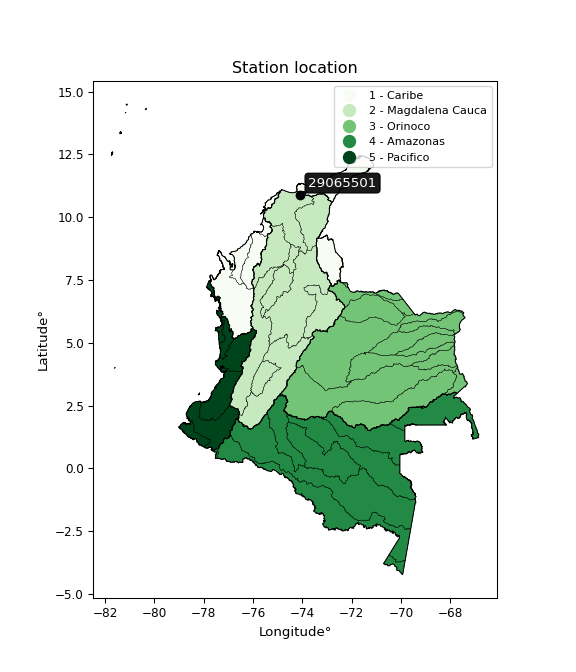

<div align="center">


</div>

# PMP Station (Rain, Pmax24h): 29065501

Probable Maximum Precipitation (PMP) is the greatest amount of rainfall for a specific duration that is meteorologically possible for a given location, acting as a "worst-case" scenario for extreme storms, crucial for designing safety-critical infrastructure like bridges, river deviations, dams, spillways, and nuclear plants to prevent catastrophic failure. PMP is calculated by hydrologists using meteorological data to determine the upper limit of extreme rainfall, often leading to the Probable Maximum Flood (PMF) for flood control design, and is increasingly being studied for climate change impacts. Probable Maximum Precipitation (PMP) is the theoretical upper limit of rainfall, a deterministic estimate for extreme events, while probability distributions (like GEV, Gumbel) describe the likelihood and frequency of various precipitation amounts, including rare ones, showing how often events occur, with PMP representing the extreme end of these distributions, used for critical infrastructure design to ensure safety against the worst conceivable weather, unlike standard statistical forecasts which cover typical probabilities.

The most common probability distributions in hydrology, used for analyzing floods, rainfall, and streamflow, include the Normal, Log-Normal, Gumbel, Gamma (including Log-Pearson Type III), and Generalized Extreme Value (GEV) distributions, often chosen based on the data´s skewness and whether modeling extremes or general conditions, with Gumbel and GEV popular for extreme events like floods, while the Normal distribution serves as a baseline, though often requiring transformations for skewed hydrological data. These distributions help in designing water infrastructure, managing water resources, and forecasting hydrologic events.

> Hydrological data often isn´t perfectly normal (it´s skewed), so different distributions are needed for different applications, such as: **Flood Frequency Analysis**: Using Gumbel, GEV, or Log-Pearson Type III for predicting extreme flood magnitudes and their return periods, **Rainfall Analysis**: Normal for annual totals, but Log-Normal, Weibull, or GEV for intensity or extreme daily rainfall, **Streamflow Modeling**: Gamma and Log-Normal for maximum flows, GEV for minimum flows, and Kappa for daily flows.

<div align="center">

</img>

</div>


## A. General information


### 1. General running parameters

• app_version: _v20260113_. • runtime: _2026-01-13 16:28:34.738620_. • Python version: _3.14.0_. • SciPy version: _1.16.3_. • Pandas version: _2.3.3_. • NumPy version: _2.3.5_. • Stations dataset (station_dataset_file): _dataset/pmax24h_in/automatic_colombia_2003_2025.csv_. • Stations catalog (station_catalog_file): _dataset/CNE.xls_. • Minimum year to eval til year_max (date_min): _1900_. • Maximum year to eval since year_min (date_max): _2025_. • Creates, save and include plots into reports (create_plot): _False_. • Plot only fit distributions with Δo > Δ (plot_only_fit): _True_. • Plot only simple graphs avoiding multiple CDFs and multiple Extreme values plots (plot_only_simple): _True_. • Eval low extreme values, if False, evaluates high extreme values (low_extreme): _False_. • Eval every SciPy distribution as logarithmic (pdist_logarithmic_on): _True_. • Standard deviation normalized (ddof): _1.0_. • Return periods to eval in years (Tr): _[2, 2.33, 5, 10, 15, 20, 25, 50, 75, 100, 200, 250, 500, 750, 1000]_. • Minimum data sample per station, 0 means any (minimum_sample): _5_. • Z-Score maximum threshold to adjust a value, 0 means disable (zscore_max): _3.5_. • Z-Score minimum threshold to adjust a value, 0 means disable (zscore_min): _-2.5_. • Avoid zeros, e.g. rain = 0 (avoid_zeros): _True_. • Avoid null values (avoid_nans): _True_. 

:file_folder:Table: [dataset.csv](../../dataset/pmax24h_in/automatic_colombia_2003_2025.csv)

> Delta Degrees of Freedom (DDOF): is a parameter used in the formulas for calculating variance and standard deviation. When ddof=0, the divisor is $N$ (the total number of observations) and this is used when your data set is the entire population. When ddof=1, the divisor is $N-1$ and this is used when your data set is a sample drawn from a larger population. Using $N-1$ provides an unbiased estimate of the population variance (known as Bessel´s correction).


### 2. Station info and location

|   id |   CODIGO | NOMBRE                        | CATEGORIA               | TECNOLOGIA                | ESTADO     | FECHA_INSTALACION   | FECHA_SUSPENSION   |   ALTITUD |   LATITUD |   LONGITUD | DEPARTAMENTO   | MUNICIPIO   | AREA_OPERATIVA                                         | ENTIDAD                                    | AREA_HIDROGRAFICA   | ZONA_HIDROGRAFICA   | SUBZONA_HIDROGRAFICA      |   CORRIENTE | Catalogo   |   Version |
|-----:|---------:|:------------------------------|:------------------------|:--------------------------|:-----------|:--------------------|:-------------------|----------:|----------:|-----------:|:---------------|:------------|:-------------------------------------------------------|:-------------------------------------------|:--------------------|:--------------------|:--------------------------|------------:|:-----------|----------:|
|    0 | 29065501 | CIENAGA,LA  - AUT  [29065501] | Climatológica Principal | Automática con Telemetría | Suspendida | 12/09/2013          | 21/10/2020         |      1207 |      10.9 |     -74.08 | Magdalena      | Ciénaga     | Area Operativa 05 - Magdalena-Cesar-Guajira-San Andrés | CENTRO NACIONAL DE INVESTIGACIONES DE CAFE | Magdalena Cauca     | Bajo Magdalena      | Cga Grande de Santa Marta |         nan | CNE_OE     |  20251226 |

<div align="center">

Dynamic map: [:earth_americas:Google](http://maps.google.com/maps?q=10.9,-74.08) [:earth_americas:OSM](https://www.openstreetmap.org/#map=18/10.9/-74.08&layers=P) [:earth_americas:Bing](https://www.bing.com/maps?cp=10.9~-74.08&lvl=18) [:earth_americas:Apple](https://maps.apple.com/frame?center=10.9%2C-74.08&span=0.003%2C0.006)

</div>


<div align="center">

```geojson
{
  "type": "Feature",
  "geometry": {
    "type": "Point", 
    "coordinates": [-74.08, 10.9]
  }, 
  "properties": {
    "Name": "29065501"
  }
}
```

</div>


### 3. Discrete values table and plot

<div align="center">

|               |           0 |           1 |          2 |          3 |          4 |
|:--------------|------------:|------------:|-----------:|-----------:|-----------:|
| Date          | 2017        | 2018        | 2019       | 2020       | 2021       |
| Value         |   52.4      |   43.3      |  101.7     |   96.9     |   13.5     |
| Value_initial |   52.4      |   43.3      |  101.7     |   96.9     |   13.5     |
| count         |    5        |    5        |    5       |    5       |    5       |
| mean          |   61.56     |   61.56     |   61.56    |   61.56    |   61.56    |
| std           |   37.3739   |   37.3739   |   37.3739  |   37.3739  |   37.3739  |
| zscore        |   -0.245091 |   -0.488576 |    1.07401 |    0.94558 |   -1.28592 |


</div>


> The initial value (value_initial) correspond to the initial obtained or null completed value, and value (value) is adjusted only when the initial value is outside the valid range (outlier) definite through the Z-Score value. If Z-Score is active, values out of range or outliers are replaced with the station mean value. A Z-Score (or standard score) measures how many standard deviations a data point is from the mean of a dataset, indicating its relative position; positive scores mean above the mean, negative mean below, and a score of zero is exactly at the mean, allowing for comparison of values from different distributions. It´s calculated using the formula $z=(x–μ)/σ$, where $x$ is the data point, $μ$ is the mean, and $σ$ is the standard deviation, helping identify outliers and understand probability.
>
> <sub>**Note**: In this study, "completing" (filling gaps in) and "extending" (forecasting or lengthening the historical record) rainfall data series are avoided for certain critical analyses because they introduce artificial bias and uncertainty, which can distort the statistics of rare events (extremes), alter day-to-day variability, and compromise the integrity and homogeneity of the original data. Some reasons against Completing/Extending rainfall data are: **Distortion of Extremes and Variability**: The primary issue is that most gap-filling or extension methods rely on averaging or regression with nearby stations, which inherently smooths the data. Rainfall is highly variable in space and time, with a large percentage of zero values and occasional large storms. Infilling methods often underestimate the highest values and overestimate the lowest (zero) values, which severely distorts analyses focused on flood frequency, drought severity, and intensity-duration-frequency (IDF) curves, **Loss of Data Homogeneity**: Infilled or extended data are synthetic estimates, not actual measurements. Combining these estimates with observed data can violate the assumption of data homogeneity, which requires that the data properties do not change over time. Inhomogeneity can lead to incorrect conclusions about long-term trends or changes in climate patterns, **Propagation of Errors**: Errors and biases from the original data (e.g., wind-induced undercatch, instrument errors, site changes) or the data used for imputation can propagate through the analysis, leading to unreliable hydrological models and inaccurate predictions, **Compromised Statistical Integrity**: For statistical analyses, especially those involving the frequency of events, using artificial data can introduce time bias or autocorrelation that doesn´t exist in reality, making it difficult to assess the true probability of events, **Difficulty in Validation**: It is difficult to accurately validate the quality of filled or extended data, especially for past periods where ground-truth measurements are unavailable. The reliability of imputation techniques heavily depends on the density of the surrounding station network and the complexity of the local topography.</sub>


### 4. Active continuous probability distributions from SciPy (45 of 104 available)

A Probability Density Function (PDF) describes the relative likelihood of a continuous random variable falling within a specific range, where the total area under its curve equals 1, and the area over any interval gives the actual probability for that range. Unlike discrete probabilities (like rolling a die), a PDF shows density, not direct probability for a single point (which is zero), with higher points indicating higher likelihood, often visualized as a bell curve for normal distributions.

A log of a probability density function (log-PDF) is simply the logarithm of the PDF´s value, denoted as $log(f(x))$, useful for converting multiplication of probabilities into addition, improving numerical stability with tiny numbers, and connecting to information theory concepts like entropy. Instead of dealing with very small probabilities (e.g., 0.000001), log-PDFs use negative numbers (e.g., $log(0.00001) ≈ -11.51$ that are easier for computers to handle, preventing underflow errors and simplifying complex calculations. In this study, each active probability distribution from SciPy is also evaluated in the $log$ form.

[scipy.stats](https://docs.scipy.org/doc/scipy/reference/stats.html) is a Python´s powerful submodule within the SciPy library for comprehensive statistical analysis, offering over 130 probability distributions (like Normal, Poisson), functions for descriptive stats (mean, variance), hypothesis testing (t-tests, chi-square), random variable generation, and statistical tests, making it essential for data science, modeling, and research. It provides tools to explore, model, and draw conclusions from data efficiently, working seamlessly with NumPy.

<div align="center">

|   id | p_dist             |   n_parameter | fit_method   | label                                                                       | active   | ref                                                                                                        |
|-----:|:-------------------|--------------:|:-------------|:----------------------------------------------------------------------------|:---------|:-----------------------------------------------------------------------------------------------------------|
|    0 | alpha              |             3 | MLE          | Alpha                                                                       | True     | [:mortar_board:](https://docs.scipy.org/doc/scipy/reference/generated/scipy.stats.alpha.html)              |
|    1 | betaprime          |             4 | MLE          | Beta prime                                                                  | True     | [:mortar_board:](https://docs.scipy.org/doc/scipy/reference/generated/scipy.stats.betaprime.html)          |
|    2 | chi2               |             3 | MLE          | Chi²                                                                        | True     | [:mortar_board:](https://docs.scipy.org/doc/scipy/reference/generated/scipy.stats.chi2.html)               |
|    3 | crystalball        |             4 | MLE          | Crystalball                                                                 | True     | [:mortar_board:](https://docs.scipy.org/doc/scipy/reference/generated/scipy.stats.crystalball.html)        |
|    4 | dweibull           |             3 | MLE          | Double Weibull                                                              | True     | [:mortar_board:](https://docs.scipy.org/doc/scipy/reference/generated/scipy.stats.dweibull.html)           |
|    5 | erlang             |             3 | MLE          | Erlang                                                                      | True     | [:mortar_board:](https://docs.scipy.org/doc/scipy/reference/generated/scipy.stats.erlang.html)             |
|    6 | expon              |             2 | MLE          | Exponential                                                                 | True     | [:mortar_board:](https://docs.scipy.org/doc/scipy/reference/generated/scipy.stats.expon.html)              |
|    7 | exponnorm          |             3 | MLE          | Exponentially modified Normal                                               | True     | [:mortar_board:](https://docs.scipy.org/doc/scipy/reference/generated/scipy.stats.exponnorm.html)          |
|    8 | f                  |             4 | MLE          | F                                                                           | True     | [:mortar_board:](https://docs.scipy.org/doc/scipy/reference/generated/scipy.stats.f.html)                  |
|    9 | fatiguelife        |             3 | MLE          | Fatigue-life (Birnbaum-Saunders)                                            | True     | [:mortar_board:](https://docs.scipy.org/doc/scipy/reference/generated/scipy.stats.fatiguelife.html)        |
|   10 | fisk               |             3 | MLE          | Fisk                                                                        | True     | [:mortar_board:](https://docs.scipy.org/doc/scipy/reference/generated/scipy.stats.fisk.html)               |
|   11 | gamma              |             3 | MLE          | Gamma                                                                       | True     | [:mortar_board:](https://docs.scipy.org/doc/scipy/reference/generated/scipy.stats.gamma.html)              |
|   12 | genexpon           |             5 | MLE          | Generalized exponential                                                     | True     | [:mortar_board:](https://docs.scipy.org/doc/scipy/reference/generated/scipy.stats.genexpon.html)           |
|   13 | genlogistic        |             3 | MLE          | Generalized logistic                                                        | True     | [:mortar_board:](https://docs.scipy.org/doc/scipy/reference/generated/scipy.stats.genlogistic.html)        |
|   14 | gibrat             |             2 | MM           | Gibrat                                                                      | True     | [:mortar_board:](https://docs.scipy.org/doc/scipy/reference/generated/scipy.stats.gibrat.html)             |
|   15 | gompertz           |             3 | MLE          | Gompertz (or truncated Gumbel)                                              | True     | [:mortar_board:](https://docs.scipy.org/doc/scipy/reference/generated/scipy.stats.gompertz.html)           |
|   16 | gumbel_l           |             2 | MM           | Gumbel Left Skew                                                            | True     | [:mortar_board:](https://docs.scipy.org/doc/scipy/reference/generated/scipy.stats.gumbel_l.html)           |
|   17 | gumbel_r           |             2 | MM           | Gumbel Right Skew                                                           | True     | [:mortar_board:](https://docs.scipy.org/doc/scipy/reference/generated/scipy.stats.gumbel_r.html)           |
|   18 | halflogistic       |             2 | MM           | Half-logistic                                                               | True     | [:mortar_board:](https://docs.scipy.org/doc/scipy/reference/generated/scipy.stats.halflogistic.html)       |
|   19 | halfnorm           |             2 | MM           | Half Normal                                                                 | True     | [:mortar_board:](https://docs.scipy.org/doc/scipy/reference/generated/scipy.stats.halfnorm.html)           |
|   20 | hypsecant          |             2 | MM           | hyperbolic secant                                                           | True     | [:mortar_board:](https://docs.scipy.org/doc/scipy/reference/generated/scipy.stats.hypsecant.html)          |
|   21 | invgamma           |             3 | MLE          | Inverted gamma                                                              | True     | [:mortar_board:](https://docs.scipy.org/doc/scipy/reference/generated/scipy.stats.invgamma.html)           |
|   22 | invgauss           |             3 | MLE          | Inverse Gaussian                                                            | True     | [:mortar_board:](https://docs.scipy.org/doc/scipy/reference/generated/scipy.stats.invgauss.html)           |
|   23 | invweibull         |             3 | MLE          | Inverted Weibull                                                            | True     | [:mortar_board:](https://docs.scipy.org/doc/scipy/reference/generated/scipy.stats.invweibull.html)         |
|   24 | kappa4             |             4 | MLE          | Kappa 4                                                                     | True     | [:mortar_board:](https://docs.scipy.org/doc/scipy/reference/generated/scipy.stats.kappa4.html)             |
|   25 | kstwobign          |             2 | MLE          | Limiting distribution of scaled Kolmogorov-Smirnov two-sided test statistic | True     | [:mortar_board:](https://docs.scipy.org/doc/scipy/reference/generated/scipy.stats.kstwobign.html)          |
|   26 | laplace            |             2 | MM           | Laplace                                                                     | True     | [:mortar_board:](https://docs.scipy.org/doc/scipy/reference/generated/scipy.stats.laplace.html)            |
|   27 | laplace_asymmetric |             3 | MLE          | Asymmetric Laplace                                                          | True     | [:mortar_board:](https://docs.scipy.org/doc/scipy/reference/generated/scipy.stats.laplace_asymmetric.html) |
|   28 | loggamma           |             3 | MLE          | Log gamma                                                                   | True     | [:mortar_board:](https://docs.scipy.org/doc/scipy/reference/generated/scipy.stats.loggamma.html)           |
|   29 | logistic           |             2 | MM           | Logistic (or Sech-squared)                                                  | True     | [:mortar_board:](https://docs.scipy.org/doc/scipy/reference/generated/scipy.stats.logistic.html)           |
|   30 | lognorm            |             3 | MLE          | Log Normal                                                                  | True     | [:mortar_board:](https://docs.scipy.org/doc/scipy/reference/generated/scipy.stats.lognorm.html)            |
|   31 | maxwell            |             2 | MM           | Maxwell                                                                     | True     | [:mortar_board:](https://docs.scipy.org/doc/scipy/reference/generated/scipy.stats.maxwell.html)            |
|   32 | mielke             |             4 | MLE          | Mielke Beta-Kappa / Dagum                                                   | True     | [:mortar_board:](https://docs.scipy.org/doc/scipy/reference/generated/scipy.stats.mielke.html)             |
|   33 | moyal              |             2 | MM           | Moyal                                                                       | True     | [:mortar_board:](https://docs.scipy.org/doc/scipy/reference/generated/scipy.stats.moyal.html)              |
|   34 | nakagami           |             3 | MLE          | Nakagami                                                                    | True     | [:mortar_board:](https://docs.scipy.org/doc/scipy/reference/generated/scipy.stats.nakagami.html)           |
|   35 | ncf                |             5 | MLE          | Non-central F distribution                                                  | True     | [:mortar_board:](https://docs.scipy.org/doc/scipy/reference/generated/scipy.stats.ncf.html)                |
|   36 | nct                |             4 | MLE          | Non-central Student’s t                                                     | True     | [:mortar_board:](https://docs.scipy.org/doc/scipy/reference/generated/scipy.stats.nct.html)                |
|   37 | norm               |             2 | MM           | Normal                                                                      | True     | [:mortar_board:](https://docs.scipy.org/doc/scipy/reference/generated/scipy.stats.norm.html)               |
|   38 | pearson3           |             3 | MM           | Pearson type III                                                            | True     | [:mortar_board:](https://docs.scipy.org/doc/scipy/reference/generated/scipy.stats.pearson3.html)           |
|   39 | rayleigh           |             2 | MM           | Rayleigh                                                                    | True     | [:mortar_board:](https://docs.scipy.org/doc/scipy/reference/generated/scipy.stats.rayleigh.html)           |
|   40 | rice               |             3 | MLE          | Rice                                                                        | True     | [:mortar_board:](https://docs.scipy.org/doc/scipy/reference/generated/scipy.stats.rice.html)               |
|   41 | t                  |             3 | MLE          | Student’s t                                                                 | True     | [:mortar_board:](https://docs.scipy.org/doc/scipy/reference/generated/scipy.stats.t.html)                  |
|   42 | truncnorm          |             4 | MLE          | Truncated normal                                                            | True     | [:mortar_board:](https://docs.scipy.org/doc/scipy/reference/generated/scipy.stats.truncnorm.html)          |
|   43 | wald               |             2 | MM           | Wald                                                                        | True     | [:mortar_board:](https://docs.scipy.org/doc/scipy/reference/generated/scipy.stats.wald.html)               |
|   44 | weibull_min        |             3 | MLE          | Weibull minimum                                                             | True     | [:mortar_board:](https://docs.scipy.org/doc/scipy/reference/generated/scipy.stats.weibull_min.html)        |

</div>

> **n_parameter:** # arguments & localization & scale.
>
> **Fit methods:** (MLE) maximum likelihood, (MM) L-moments.
>
>**Inactive** (With the only purpose of prevent loops, zero divisions, infinite values, over high estimated values or horizontal trending for recurrence intervals estimations, the follow distributions were disabled.)**:** foldnorm, gennorm, norminvgauss, powernorm, powerlognorm, skewnorm, genextreme, anglit, arcsine, argus, beta, bradford, burr, burr12, cauchy, cosine, halfcauchy, foldcauchy, skewcauchy, wrapcauchy, dgamma, gengamma, exponweib, exponpow, truncexpon, gausshyper, genhalflogistic, genhyperbolic, geninvgauss, halfgennorm, johnsonsb, johnsonsu, kappa3, ksone, kstwo, loglaplace, levy, levy_l, levy_stable, ncx2, pareto, genpareto, truncpareto, lomax, powerlaw, rdist, rel_breitwigner, recipinvgauss, semicircular, studentized_range, trapezoid, triang, truncweibull_min, tukeylambda, uniform, loguniform, vonmises, vonmises_line, weibull_max, 


## B. Probability (PDF) vs. Empirical (EDF) distributions functions

A continuous probability distribution (CPD) describes probabilities for variables that can take any value within a range (like rain any time), unlike discrete variables with specific outcomes (like temperature). It uses a Probability Density Function (PDF), a curve where the total area under it equals 1, and the probability of the variable falling within an interval (a to b) is found by calculating the area under the curve between those points. A key feature is that the probability of hitting any single exact value is zero, so probabilities are always expressed for ranges, e.g., $P(a ≤ X ≤ b)$.

<div align="center">

Distributions parameters from station values
|    |   station | p_dist                |   n |             loc |            scale | shape                  | shape1                | shape2                 | shape3   |
|---:|----------:|:----------------------|----:|----------------:|-----------------:|:-----------------------|:----------------------|:-----------------------|:---------|
|  0 |  29065501 | alpha                 |   5 |    -0.0754034   |     27.6957      | 3.293014728465781e-10  |                       |                        |          |
|  1 |  29065501 | betaprime             |   5 |  -205.282       | 107718           | 62.415657645809574     | 25202.407546417075    |                        |          |
|  2 |  29065501 | chi2                  |   5 |  -116.237       |      3.24626     | 54.708173256329005     |                       |                        |          |
|  3 |  29065501 | crystalball           |   5 |    61.56        |     33.4282      | 4825.035342829425      | 251.65853002817977    |                        |          |
|  4 |  29065501 | dweibull              |   5 |    68.3067      |     35.6272      | 2.605396922283388      |                       |                        |          |
|  5 |  29065501 | erlang                |   5 | -1477.18        |      0.727747    | 2114.3746307640777     |                       |                        |          |
|  6 |  29065501 | expon                 |   5 |    13.5         |     48.06        |                        |                       |                        |          |
|  7 |  29065501 | exponnorm             |   5 |    61.5211      |     33.4282      | 0.0011668973060089127  |                       |                        |          |
|  8 |  29065501 | f                     |   5 |  -918.217       |    979.894       | 1720.1566799081888     | 507631.33194082964    |                        |          |
|  9 |  29065501 | fatiguelife           |   5 |    13.5         |      5.24354e-06 | 2584.3516812559733     |                       |                        |          |
| 10 |  29065501 | fisk                  |   5 |  -800.688       |    861.621       | 41.655097934232586     |                       |                        |          |
| 11 |  29065501 | gamma                 |   5 | -1475.48        |      0.727322    | 2113.2920374501045     |                       |                        |          |
| 12 |  29065501 | genexpon              |   5 |    13.5         |      2.13984     | 0.0445192725743684     | 9.193650426541725e-10 | 1.2529602339289578     |          |
| 13 |  29065501 | genlogistic           |   5 |  -109.177       |     29.9838      | 170.88983743878356     |                       |                        |          |
| 14 |  29065501 | gibrat                |   5 |    36.0585      |     15.4675      |                        |                       |                        |          |
| 15 |  29065501 | gompertz              |   5 |   -76.3518      |     29.0911      | 0.004985058922487774   |                       |                        |          |
| 16 |  29065501 | gumbel_l              |   5 |    76.6045      |     26.0639      |                        |                       |                        |          |
| 17 |  29065501 | gumbel_r              |   5 |    46.5155      |     26.0639      |                        |                       |                        |          |
| 18 |  29065501 | halflogistic          |   5 |    21.9398      |     28.58        |                        |                       |                        |          |
| 19 |  29065501 | halfnorm              |   5 |    17.3142      |     55.4539      |                        |                       |                        |          |
| 20 |  29065501 | hypsecant             |   5 |    61.56        |     21.2811      |                        |                       |                        |          |
| 21 |  29065501 | invgamma              |   5 |  -229.517       |  20984.8         | 73.22200244126361      |                       |                        |          |
| 22 |  29065501 | invgauss              |   5 |  -111.69        |   4259.31        | 0.04062654167740731    |                       |                        |          |
| 23 |  29065501 | invweibull            |   5 |    -9.9859e+08  |      9.9859e+08  | 33186517.09728107      |                       |                        |          |
| 24 |  29065501 | kappa4                |   5 |     3.7787      |     98.625       | 1.1093674674381953     | 1.0034138574268732    |                        |          |
| 25 |  29065501 | kstwobign             |   5 |   -59.0782      |    137.662       |                        |                       |                        |          |
| 26 |  29065501 | laplace               |   5 |    61.56        |     23.6373      |                        |                       |                        |          |
| 27 |  29065501 | laplace_asymmetric    |   5 |    52.4         |     27.2174      | 0.8457871753054378     |                       |                        |          |
| 28 |  29065501 | loggamma              |   5 |  -520.106       |    175.58        | 27.96106014358641      |                       |                        |          |
| 29 |  29065501 | logistic              |   5 |    61.56        |     18.4299      |                        |                       |                        |          |
| 30 |  29065501 | lognorm               |   5 |    13.5         |      0.0272939   | 15.187425859642028     |                       |                        |          |
| 31 |  29065501 | maxwell               |   5 |   -17.6509      |     49.638       |                        |                       |                        |          |
| 32 |  29065501 | mielke                |   5 |    -4.26376     |    106.618       | 1.5197593289480427     | 743.0367491230813     |                        |          |
| 33 |  29065501 | moyal                 |   5 |    42.4436      |     15.048       |                        |                       |                        |          |
| 34 |  29065501 | nakagami              |   5 |    43.3         |     34.8066      | 0.25372915035161453    |                       |                        |          |
| 35 |  29065501 | ncf                   |   5 |    -0.0270354   |      4.90497e-05 | 5.047417925943336e-06  | 15.132183813923568    | 5.365877065723311      |          |
| 36 |  29065501 | nct                   |   5 | -2150.99        |     33.3145      | 309134.03809783165     | 66.41374246179751     |                        |          |
| 37 |  29065501 | norm                  |   5 |    61.56        |     33.4282      |                        |                       |                        |          |
| 38 |  29065501 | pearson3              |   5 |    61.56        |     33.4282      | -0.048475930635444545  |                       |                        |          |
| 39 |  29065501 | rayleigh              |   5 |    -2.39015     |     51.0248      |                        |                       |                        |          |
| 40 |  29065501 | rice                  |   5 |    -4.19223     |     40.4817      | 1.1489384975662564     |                       |                        |          |
| 41 |  29065501 | t                     |   5 |    61.5595      |     33.4282      | 182993677.81748796     |                       |                        |          |
| 42 |  29065501 | truncnorm             |   5 |    82.5916      |     27.1195      | -174.42432093401376    | 0.7045994628460145    |                        |          |
| 43 |  29065501 | wald                  |   5 |    28.1317      |     33.4282      |                        |                       |                        |          |
| 44 |  29065501 | weibull_min           |   5 |     0.176193    |     68.998       | 1.8748825474857629     |                       |                        |          |
| 45 |  29065501 | logalpha              |   5 |   -13.0716      |    375.069       | 22.162334650968575     |                       |                        |          |
| 46 |  29065501 | logbetaprime          |   5 |     0.0855811   |   2667.46        | 21.430631172215158     | 14936.994748823643    |                        |          |
| 47 |  29065501 | logchi2               |   5 |     2.60269     |      0.96339     | 1.053156664856501      |                       |                        |          |
| 48 |  29065501 | logcrystalball        |   5 |     3.90509     |      0.731971    | 1256.7369658463244     | 2.399669102613869     |                        |          |
| 49 |  29065501 | logdweibull           |   5 |     3.95891     |      0.486021    | 0.8274810883654826     |                       |                        |          |
| 50 |  29065501 | logerlang             |   5 |    -7.31466     |      0.0501964   | 223.37387318865046     |                       |                        |          |
| 51 |  29065501 | logexpon              |   5 |     2.60269     |      1.3024      |                        |                       |                        |          |
| 52 |  29065501 | logexponnorm          |   5 |     3.90458     |      0.731967    | 0.00069885700269837    |                       |                        |          |
| 53 |  29065501 | logf                  |   5 |  -497.936       |    501.841       | 2147967.113497222      | 1660900.497694729     |                        |          |
| 54 |  29065501 | logfatiguelife        |   5 |  -227.116       |    231.019       | 0.0031529534720077567  |                       |                        |          |
| 55 |  29065501 | logfisk               |   5 |    -1.78199e+07 |      1.78199e+07 | 42440137.18149628      |                       |                        |          |
| 56 |  29065501 | loggamma              |   5 |   -10.174       |      0.0411101   | 342.4672808044987      |                       |                        |          |
| 57 |  29065501 | loggenexpon           |   5 |     2.59764     |      0.0058983   | 0.0019668110181604564  | 3.212308981925169     | 5.444232829801294e-06  |          |
| 58 |  29065501 | loggenlogistic        |   5 |     4.62224     |      1.93532e-05 | 2.6657562471663212e-05 |                       |                        |          |
| 59 |  29065501 | loggibrat             |   5 |     3.34671     |      0.338675    |                        |                       |                        |          |
| 60 |  29065501 | loggompertz           |   5 |     2.60269     |      0.718507    | 0.12962175124034175    |                       |                        |          |
| 61 |  29065501 | loggumbel_l           |   5 |     4.23452     |      0.570715    |                        |                       |                        |          |
| 62 |  29065501 | loggumbel_r           |   5 |     3.57567     |      0.570715    |                        |                       |                        |          |
| 63 |  29065501 | loghalflogistic       |   5 |     3.03756     |      0.625792    |                        |                       |                        |          |
| 64 |  29065501 | loghalfnorm           |   5 |     2.93622     |      1.2143      |                        |                       |                        |          |
| 65 |  29065501 | loghypsecant          |   5 |     3.90509     |      0.465987    |                        |                       |                        |          |
| 66 |  29065501 | loginvgamma           |   5 |   -12.6312      |   8102.53        | 491.31856083029857     |                       |                        |          |
| 67 |  29065501 | loginvgauss           |   5 |    -3.75315     |    731.431       | 0.010464376278970289   |                       |                        |          |
| 68 |  29065501 | loginvweibull         |   5 |    -8.39235e+07 |      8.39235e+07 | 107235939.5368343      |                       |                        |          |
| 69 |  29065501 | logkappa4             |   5 |     2.47172     |      2.26973     | 1.0613399233329908     | 1.054675091087088     |                        |          |
| 70 |  29065501 | logkstwobign          |   5 |     0.785897    |      3.55639     |                        |                       |                        |          |
| 71 |  29065501 | loglaplace            |   5 |     3.90509     |      0.517581    |                        |                       |                        |          |
| 72 |  29065501 | loglaplace_asymmetric |   5 |     3.95891     |      0.563056    | 1.0488498384015759     |                       |                        |          |
| 73 |  29065501 | logloggamma           |   5 |     4.62207     |      3.24318e-06 | 4.53066620240941e-06   |                       |                        |          |
| 74 |  29065501 | loglogistic           |   5 |     3.90509     |      0.403557    |                        |                       |                        |          |
| 75 |  29065501 | loglognorm            |   5 |     2.60269     |      0.00122811  | 14.325685395694704     |                       |                        |          |
| 76 |  29065501 | logmaxwell            |   5 |     2.17063     |      1.08691     |                        |                       |                        |          |
| 77 |  29065501 | logmielke             |   5 |    -5.36793e+07 |      5.36793e+07 | 73573375.83284879      | 33035043045.7158      |                        |          |
| 78 |  29065501 | logmoyal              |   5 |     3.4865      |      0.329503    |                        |                       |                        |          |
| 79 |  29065501 | lognakagami           |   5 |     3.76815     |      0.441365    | 0.1837646770928168     |                       |                        |          |
| 80 |  29065501 | logncf                |   5 |   -13.412       |     17.3054      | 1648.3990254325267     | 2792.2253424871096    | 4.9348910890960935e-06 |          |
| 81 |  29065501 | lognct                |   5 |    51.9569      |      0.72387     | 94709.08271173868      | -66.38154307643232    |                        |          |
| 82 |  29065501 | lognorm               |   5 |     3.90509     |      0.731971    |                        |                       |                        |          |
| 83 |  29065501 | logpearson3           |   5 |     3.90509     |      0.731969    | -0.7874862775678846    |                       |                        |          |
| 84 |  29065501 | lograyleigh           |   5 |     2.50479     |      1.11728     |                        |                       |                        |          |
| 85 |  29065501 | logrice               |   5 |     2.09739     |      0.800247    | 1.984797150057334      |                       |                        |          |
| 86 |  29065501 | logt                  |   5 |     3.90509     |      0.73197     | 3077541485.2953615     |                       |                        |          |
| 87 |  29065501 | logtruncnorm          |   5 |    -0.297463    |      1.31525     | 3.091110631885133      | 3.740518858423931     |                        |          |
| 88 |  29065501 | logwald               |   5 |     3.17311     |      0.731974    |                        |                       |                        |          |
| 89 |  29065501 | logweibull_min        |   5 |    -7.57154e+07 |      7.57154e+07 | 141881429.66475832     |                       |                        |          |

</div>

> **loc** (Location parameter): This shifts the distribution along the x-axis. For many common distributions, like the normal (Gaussian) distribution, loc represents the mean $μ$. For others, like the uniform distribution, it might represent the minimum value, or for the beta distribution, the left end of the support interval.
>
> **scale** (Scale parameter): This determines the width or spread of the distribution. For the normal distribution, scale represents the standard deviation $σ$. For a uniform distribution, it defines the length of the interval (from $loc$ to $loc + scale$).
>
> **shape** (Shape parameters): Refers to parameters that define the specific form of a probability distribution, distinct from its location (loc) and scale (scale). These parameters are required arguments for most distribution functions. For example, a normal (Gaussian) distribution is fully defined by its location (mean) and scale (standard deviation), so it has no specific shape parameters beyond loc and scale. However, other distributions have intrinsic properties that need specification, as Gamma distribution that takes a shape parameter, often named $a$ or $alpha$.


### 0. Cumulative distribution values - CDF (90 evaluated)

Cumulative Distribution Function (CDF), denoted as $F$<sub>$X$</sub>$(x)$, is a function that gives the probability that a random variable $X$ will take a value less than or equal to a specific value, $x$ (i.e., $(P(X≥x)$. It essentially "accumulates" probabilities from a given point up to the far right (positive infinity), providing a complete picture of the distribution´s probabilities for both discrete (like rain) and continuous (like temperature) variables, helping to find probabilities over ranges or above certain values. Each station is evaluated separately ordering the $x$ values ascending, calculating the CDF and PDF values for the activated distributions and their logarithmic forms.

<div align="center">

CDF ordered by x ascending and calculating $log(f(x))$ separately
|   id |   Station |   date |     x |   count |   mean |     std |    zscore |   Value_initial |   station |   m |     alpha |   alpha_pdf |   betaprime |   betaprime_pdf |     chi2 |   chi2_pdf |   crystalball |   crystalball_pdf |   dweibull |   dweibull_pdf |    erlang |   erlang_pdf |    expon |   expon_pdf |   exponnorm |   exponnorm_pdf |         f |      f_pdf |   fatiguelife |   fatiguelife_pdf |      fisk |   fisk_pdf |     gamma |   gamma_pdf |    genexpon |   genexpon_pdf |   genlogistic |   genlogistic_pdf |   gibrat |   gibrat_pdf |   gompertz |   gompertz_pdf |   gumbel_l |   gumbel_l_pdf |   gumbel_r |   gumbel_r_pdf |   halflogistic |   halflogistic_pdf |   halfnorm |   halfnorm_pdf |   hypsecant |   hypsecant_pdf |   invgamma |   invgamma_pdf |   invgauss |   invgauss_pdf |   invweibull |   invweibull_pdf |      kappa4 |   kappa4_pdf |   kstwobign |   kstwobign_pdf |   laplace |   laplace_pdf |   laplace_asymmetric |   laplace_asymmetric_pdf |   loggamma |   loggamma_pdf |   logistic |   logistic_pdf |   lognorm |   lognorm_pdf |   maxwell |   maxwell_pdf |    mielke |   mielke_pdf |      moyal |   moyal_pdf |   nakagami |    nakagami_pdf |      ncf |    ncf_pdf |       nct |    nct_pdf |      norm |   norm_pdf |   pearson3 |   pearson3_pdf |   rayleigh |   rayleigh_pdf |      rice |   rice_pdf |         t |      t_pdf |   truncnorm |   truncnorm_pdf |     wald |   wald_pdf |   weibull_min |   weibull_min_pdf |   logalpha |   logalpha_pdf |   logbetaprime |   logbetaprime_pdf |     logchi2 |   logchi2_pdf |   logcrystalball |   logcrystalball_pdf |   logdweibull |   logdweibull_pdf |   logerlang |   logerlang_pdf |   logexpon |   logexpon_pdf |   logexponnorm |   logexponnorm_pdf |      logf |   logf_pdf |   logfatiguelife |   logfatiguelife_pdf |   logfisk |   logfisk_pdf |   loggenexpon |   loggenexpon_pdf |   loggenlogistic |   loggenlogistic_pdf |   loggibrat |   loggibrat_pdf |   loggompertz |   loggompertz_pdf |   loggumbel_l |   loggumbel_l_pdf |   loggumbel_r |   loggumbel_r_pdf |   loghalflogistic |   loghalflogistic_pdf |   loghalfnorm |   loghalfnorm_pdf |   loghypsecant |   loghypsecant_pdf |   loginvgamma |   loginvgamma_pdf |   loginvgauss |   loginvgauss_pdf |   loginvweibull |   loginvweibull_pdf |   logkappa4 |   logkappa4_pdf |   logkstwobign |   logkstwobign_pdf |   loglaplace |   loglaplace_pdf |   loglaplace_asymmetric |   loglaplace_asymmetric_pdf |   logloggamma |   logloggamma_pdf |   loglogistic |   loglogistic_pdf |   loglognorm |   loglognorm_pdf |   logmaxwell |   logmaxwell_pdf |   logmielke |   logmielke_pdf |    logmoyal |   logmoyal_pdf |   lognakagami |   lognakagami_pdf |    logncf |   logncf_pdf |   lognct |   lognct_pdf |   logpearson3 |   logpearson3_pdf |   lograyleigh |   lograyleigh_pdf |   logrice |   logrice_pdf |      logt |   logt_pdf |   logtruncnorm |   logtruncnorm_pdf |   logwald |   logwald_pdf |   logweibull_min |   logweibull_min_pdf |
|-----:|----------:|-------:|------:|--------:|-------:|--------:|----------:|----------------:|----------:|----:|----------:|------------:|------------:|----------------:|---------:|-----------:|--------------:|------------------:|-----------:|---------------:|----------:|-------------:|---------:|------------:|------------:|----------------:|----------:|-----------:|--------------:|------------------:|----------:|-----------:|----------:|------------:|------------:|---------------:|--------------:|------------------:|---------:|-------------:|-----------:|---------------:|-----------:|---------------:|-----------:|---------------:|---------------:|-------------------:|-----------:|---------------:|------------:|----------------:|-----------:|---------------:|-----------:|---------------:|-------------:|-----------------:|------------:|-------------:|------------:|----------------:|----------:|--------------:|---------------------:|-------------------------:|-----------:|---------------:|-----------:|---------------:|----------:|--------------:|----------:|--------------:|----------:|-------------:|-----------:|------------:|-----------:|----------------:|---------:|-----------:|----------:|-----------:|----------:|-----------:|-----------:|---------------:|-----------:|---------------:|----------:|-----------:|----------:|-----------:|------------:|----------------:|---------:|-----------:|--------------:|------------------:|-----------:|---------------:|---------------:|-------------------:|------------:|--------------:|-----------------:|---------------------:|--------------:|------------------:|------------:|----------------:|-----------:|---------------:|---------------:|-------------------:|----------:|-----------:|-----------------:|---------------------:|----------:|--------------:|--------------:|------------------:|-----------------:|---------------------:|------------:|----------------:|--------------:|------------------:|--------------:|------------------:|--------------:|------------------:|------------------:|----------------------:|--------------:|------------------:|---------------:|-------------------:|--------------:|------------------:|--------------:|------------------:|----------------:|--------------------:|------------:|----------------:|---------------:|-------------------:|-------------:|-----------------:|------------------------:|----------------------------:|--------------:|------------------:|--------------:|------------------:|-------------:|-----------------:|-------------:|-----------------:|------------:|----------------:|------------:|---------------:|--------------:|------------------:|----------:|-------------:|---------:|-------------:|--------------:|------------------:|--------------:|------------------:|----------:|--------------:|----------:|-----------:|---------------:|-------------------:|----------:|--------------:|-----------------:|---------------------:|
|    0 |  29065501 |   2021 |  13.5 |       5 |  61.56 | 37.3739 | -1.28592  |            13.5 |  29065501 |   1 | 0.0413364 |  0.0149638  |   0.0704752 |      0.00456071 | 0.067414 | 0.00474378 |     0.0752586 |        0.00424574 |  0.0231767 |     0.00338405 | 0.0744118 |   0.00429474 | 0        |  0.0208073  |   0.0752583 |      0.00424572 | 0.0731895 | 0.00429374 |     0.0254726 |       2.81198e+11 | 0.0863757 | 0.00403741 | 0.0741447 |  0.0042867  | 1.82375e-09 |     0.020805   |      0.058844 |        0.00551374 | 0        |   0          |  0.0991549 |     0.00338793 |  0.0849895 |     0.00311815 |  0.0287483 |     0.00391472 |       0        |         0          |   0        |     0          |   0.0663009 |      0.00309301 |  0.0681696 |     0.00489581 |  0.0640793 |     0.00506157 |    0.0585437 |       0.00552159 | 4.15241e-15 |    0.379365  |   0.0561717 |      0.00609626 | 0.0654563 |    0.00276919 |            0.0769639 |               0.00334333 |  0.0401193 |       0.121156 |  0.0686437 |     0.00346891 | 0.0375946 |      0.111929 | 0.0584863 |    0.00519896 | 0.0656417 |   0.0056159  | 0.00889235 |  0.00226397 | 0          |      0          | 0.206893 | 0.0106409  | 0.0752898 | 0.00424773 | 0.0752586 | 0.00424574 |  0.0764453 |     0.00419969 |  0.0473343 |     0.00581441 | 0.0485512 | 0.00539632 | 0.0752608 | 0.00424583 |  0.00713938 |     0.000754554 | 0        | 0          |     0.0447749 |        0.00615737 |  0.0386446 |       0.127918 |      0.0411123 |           0.141392 | 6.57046e-09 |   7.79091e+06 |        0.0375946 |             0.111929 |     0.0482752 |         0.0688557 |   0.0379276 |        0.11941  |   0        |       0.767812 |      0.0375939 |           0.111928 | 0.0376682 |   0.112205 |        0.0366271 |             0.110731 | 0.0351518 |     0.0807753 |    0.00168893 |          0.335425 |         0        |            0.0853022 |    0        |        0        |   3.55486e-08 |          0.180404 |     0.0556994 |         0.0948259 |     0.0040848 |         0.0393688 |          0        |              0        |      0        |          0        |      0.0388613 |          0.0831886 |     0.0361957 |          0.11868  |     0.0382952 |          0.128651 |       0.0404422 |            0.165772 | 9.27903e-16 |        3.6943   |      0.0434237 |           0.202079 |    0.0403781 |        0.0780129 |               0.0527032 |                   0.0892426 |     0.0595445 |         0.0831827 |     0.0381509 |          0.09093  |     0.022762 |      8.49036e+12 |    0.0159359 |         0.107185 |   0.0621802 |       0.0852247 | 0.000131638 |     0.00309885 |   0           |       0           | 0.0396656 |     0.120802 | 0.037724 |     0.112061 |      0.054287 |          0.105942 |    0.00383168 |         0.0781263 | 0.0303164 |      0.129216 | 0.0375943 |   0.111928 |    0           |           0        |  0        |      0        |        0.0457601 |            0.0837562 |
|    1 |  29065501 |   2018 |  43.3 |       5 |  61.56 | 37.3739 | -0.488576 |            43.3 |  29065501 |   2 | 0.52314   |  0.00957933 |   0.305564  |      0.0108668  | 0.313233 | 0.0112021  |     0.292449  |        0.0102802  |  0.335954  |     0.0139182  | 0.294551  |   0.0103857  | 0.462087 |  0.0111925  |   0.292448  |      0.0102802  | 0.294182  | 0.0104268  |     0.821854  |       0.00403491  | 0.29706   | 0.0103061  | 0.294166  |  0.0103883  | 0.462049    |     0.0111921  |      0.348526 |        0.0122143  | 0.223954 |   0.0413064  |  0.258996  |     0.00776214 |  0.243195  |     0.00809101 |  0.322612  |     0.014003   |       0.357217 |         0.0152624  |   0.360646 |     0.0128921  |   0.255295  |      0.010751   |  0.321404  |     0.0114195  |  0.326473  |     0.0116195  |    0.348487  |       0.0122086  | 0.373677    |    0.0113117 |   0.362203  |      0.0122455  | 0.230927  |    0.00976959 |            0.280859  |               0.0122006  |  0.435548  |       0.520865 |  0.270758  |     0.0107134  | 0.425798  |      0.53557  | 0.319518  |    0.0114038  | 0.293254  |   0.00937006 | 0.331078   |  0.0160672  | 8.5086e-09 | 607671          | 0.499578 | 0.00843609 | 0.292543  | 0.0102815  | 0.292449  | 0.0102802  |  0.2905    |     0.0101587  |  0.330293  |     0.0117529  | 0.312701  | 0.0113534  | 0.292454  | 0.0102803  |  0.0970306  |     0.00678109  | 0.322929 | 0.0281042  |     0.339188  |        0.0119024  |  0.455994  |       0.524443 |      0.458275  |           0.491448 | 0.713092    |   0.213399    |        0.425798  |             0.53557  |     0.315262  |         0.630738  |   0.439875  |        0.529748 |   0.591334 |       0.313779 |      0.425798  |           0.535572 | 0.425934  |   0.534771 |        0.426144  |             0.538605 | 0.368976  |     0.554518  |    0.520281   |          0.44208  |         0        |            0.424764  |    0.586536 |        0.924254 |   0.409462    |          0.539446 |     0.357048  |         0.49759   |     0.489822  |         0.612551  |          0.525374 |              0.578452 |      0.506729 |          0.519622 |      0.407777  |          0.654618  |     0.444622  |          0.534985 |     0.452192  |          0.515481 |       0.485032  |            0.448425 | 0.576509    |        0.478039 |      0.517141  |           0.435061 |    0.383766  |        0.741461  |               0.379237  |                   0.642164  |     0.303341  |         0.423762  |     0.415972  |          0.601996 |     0.683867 |      0.0213093   |    0.460181  |         0.538464 |   0.307179  |       0.421022  | 0.514264    |     0.638366   |   2.44234e-06 |       2.02128e+09 | 0.435827  |     0.521389 | 0.425755 |     0.535291 |      0.376911 |          0.492829 |    0.472337   |         0.534024  | 0.438732  |      0.52696  | 0.425797  |   0.535571 |    7.87795e-05 |           2.82021  |  0.58168  |      0.727764 |        0.340317  |            0.51424   |
|    2 |  29065501 |   2017 |  52.4 |       5 |  61.56 | 37.3739 | -0.245091 |            52.4 |  29065501 |   3 | 0.597649  |  0.00698157 |   0.409131  |      0.011757   | 0.419022 | 0.0118986  |     0.392035  |        0.0114945  |  0.442422  |     0.00886576 | 0.394898  |   0.0115512  | 0.554877 |  0.00926182 |   0.392034  |      0.0114945  | 0.39484   | 0.0115762  |     0.854042  |       0.00310129  | 0.397807  | 0.0116972  | 0.394558  |  0.0115584  | 0.554836    |     0.00926162 |      0.458976 |        0.0118937  | 0.521919 |   0.024376   |  0.337455  |     0.00948917 |  0.326376  |     0.010211   |  0.450273  |     0.0137843  |       0.487591 |         0.0133355  |   0.473072 |     0.0117783  |   0.367035  |      0.0136713  |  0.42857   |     0.0119754  |  0.434506  |     0.0119639  |    0.458843  |       0.0118796  | 0.47524     |    0.0110244 |   0.471707  |      0.0116898  | 0.339368  |    0.0143573  |            0.417031  |               0.0181159  |  0.535436  |       0.520942 |  0.378242  |     0.0127605  | 0.529304  |      0.543554 | 0.425844  |    0.0118265  | 0.382639  |   0.0102626  | 0.472552   |  0.0147133  | 0.393315   |      0.0216315  | 0.571697 | 0.00741525 | 0.392134  | 0.0114943  | 0.392035  | 0.0114945  |  0.389167  |     0.01142    |  0.438148  |     0.0118239  | 0.418607  | 0.0118009  | 0.392041  | 0.0114946  |  0.17485    |     0.0104228   | 0.531989 | 0.018321   |     0.447442  |        0.0117675  |  0.555252  |       0.510947 |      0.550735  |           0.473883 | 0.750479    |   0.1799      |        0.529304  |             0.543554 |     0.5       |       334.67      |   0.541206  |        0.526953 |   0.647012 |       0.271029 |      0.529304  |           0.543556 | 0.529261  |   0.542497 |        0.530183  |             0.546003 | 0.479435  |     0.594396  |    0.601273   |          0.405632 |         0        |            0.552405  |    0.723079 |        0.546907 |   0.516301    |          0.576202 |     0.460428  |         0.583311  |     0.599934  |         0.537094  |          0.62681  |              0.485073 |      0.600326 |          0.460881 |      0.536679  |          0.678557  |     0.54659   |          0.5283   |     0.549751  |          0.502407 |       0.567206  |            0.410966 | 0.667847    |        0.479982 |      0.596408  |           0.394681 |    0.549376  |        0.870634  |               0.523829  |                   0.887002  |     0.395969  |         0.553162  |     0.533289  |          0.616746 |     0.687622 |      0.0182186   |    0.560953  |         0.513356 |   0.398967  |       0.546828  | 0.625344    |     0.524754   |   0.580183    |       1.08586     | 0.535755  |     0.520832 | 0.529218 |     0.543388 |      0.476965 |          0.55255  |    0.571269   |         0.499414  | 0.539604  |      0.525247 | 0.529304  |   0.543555 |    0.432277    |           1.78243  |  0.695888 |      0.488767 |        0.448294  |            0.61486   |
|    3 |  29065501 |   2020 |  96.9 |       5 |  61.56 | 37.3739 |  0.94558  |            96.9 |  29065501 |   4 | 0.775188  |  0.00225589 |   0.85218   |      0.00628322 | 0.852393 | 0.00601453 |     0.854788  |        0.00682499 |  0.715484  |     0.0146169  | 0.854464  |   0.0067254  | 0.823658 |  0.0036692  |   0.854787  |      0.00682501 | 0.85344   | 0.00669896 |     0.938607  |       0.00112205  | 0.84599   | 0.00604653 | 0.854517  |  0.00672935 | 0.823624    |     0.00366951 |      0.837902 |        0.00493966 | 0.914584 |   0.00256699 |  0.853182  |     0.0097078  |  0.8868    |     0.00946202 |  0.865285  |     0.00480373 |       0.864632 |         0.00441587 |   0.848761 |     0.00513744 |   0.880455  |      0.0054863  |  0.853235  |     0.0057686  |  0.849145  |     0.00561695 |    0.837329  |       0.0049404  | 0.946732    |    0.010303  |   0.84663   |      0.00504249 | 0.887886  |    0.00474309 |            0.853754  |               0.00454462 |  0.811518  |       0.344116 |  0.871863  |     0.00606176 | 0.819486  |      0.359126 | 0.850549  |    0.00597113 | 0.9233    |   0.0138705  | 0.869929   |  0.00428337 | 0.869779   |      0.00503486 | 0.805314 | 0.00345887 | 0.854776  | 0.00682279 | 0.854788  | 0.00682499 |  0.855032  |     0.00693628 |  0.849426  |     0.00574241 | 0.851086  | 0.00619635 | 0.854791  | 0.00682487 |  0.923161   |     0.0168528   | 0.891561 | 0.00308256 |     0.847992  |        0.0055507  |  0.817599  |       0.318731 |      0.796169  |           0.307542 | 0.837191    |   0.109547    |        0.819486  |             0.359126 |     0.851594  |         0.242632  |   0.817397  |        0.339409 |   0.779829 |       0.16905  |      0.819487  |           0.359127 | 0.818885  |   0.358715 |        0.8208    |             0.358199 | 0.799287  |     0.382076  |    0.805973   |          0.257258 |         0        |            1.2883    |    0.900999 |        0.141989 |   0.848051    |          0.425882 |     0.836627  |         0.518623  |     0.840298  |         0.256189  |          0.841806 |              0.232795 |      0.822496 |          0.264699 |      0.851151  |          0.307913  |     0.820452  |          0.332793 |     0.809487  |          0.319795 |       0.772214  |            0.255061 | 0.97168     |        0.536345 |      0.793339  |           0.246739 |    0.862606  |        0.265454  |               0.848499  |                   0.282212  |     0.934643  |         1.30568   |     0.8398    |          0.333376 |     0.696799 |      0.0123728   |    0.81982   |         0.311497 |   0.926573  |       1.26997   | 0.847661    |     0.228335   |   0.909912    |       0.245003    | 0.811333  |     0.343056 | 0.819422 |     0.359297 |      0.820634 |          0.482203 |    0.819935   |         0.298431  | 0.81697   |      0.343945 | 0.819486  |   0.359127 |    0.984018    |           0.352078 |  0.875482 |      0.165584 |        0.847728  |            0.537034  |
|    4 |  29065501 |   2019 | 101.7 |       5 |  61.56 | 37.3739 |  1.07401  |           101.7 |  29065501 |   5 | 0.785525  |  0.00205583 |   0.880157  |      0.00538233 | 0.8792   | 0.00516444 |     0.885082  |        0.0058036  |  0.785169  |     0.0141593  | 0.88433   |   0.00572529 | 0.840419 |  0.00332045 |   0.885081  |      0.00580362 | 0.883202  | 0.00570879 |     0.943741  |       0.00101882  | 0.872767  | 0.00512592 | 0.884398  |  0.00572764 | 0.840386    |     0.00332076 |      0.860102 |        0.00432112 | 0.925837 |   0.0021381  |  0.896028  |     0.00810807 |  0.927135  |     0.00732219 |  0.886602  |     0.00409419 |       0.884351 |         0.00381253 |   0.871923 |     0.00452032 |   0.904187  |      0.00443459 |  0.878949  |     0.004956   |  0.874252  |     0.00485461 |    0.859538  |       0.00432367 | 0.996181    |    0.0103383 |   0.869344  |      0.00443018 | 0.90849   |    0.00387141 |            0.874019  |               0.00391487 |  0.827683  |       0.324581 |  0.898254  |     0.00495897 | 0.836324  |      0.337363 | 0.877248  |    0.00516137 | 0.990672  |   0.014063   | 0.888969   |  0.00366531 | 0.89218    |      0.00431264 | 0.821208 | 0.00316744 | 0.885061  | 0.00580198 | 0.885082  | 0.0058036  |  0.885808  |     0.00589241 |  0.875167  |     0.00499086 | 0.878779  | 0.005349   | 0.885085  | 0.00580349 |  1          |     0.0151117   | 0.905248 | 0.00263429 |     0.872914  |        0.0048415  |  0.832561  |       0.300231 |      0.810663  |           0.292031 | 0.842392    |   0.105613    |        0.836324  |             0.337363 |     0.862801  |         0.221398  |   0.833324  |        0.319435 |   0.787852 |       0.16289  |      0.836325  |           0.337363 | 0.835705  |   0.337065 |        0.837589  |             0.336269 | 0.817125  |     0.355889  |    0.818127   |          0.245555 |         0.999709 |            1.37699   |    0.907565 |        0.129879 |   0.867925    |          0.395947 |     0.860806  |         0.480931  |     0.852258  |         0.23873   |          0.852701 |              0.218044 |      0.834953 |          0.250663 |      0.865364  |          0.280388  |     0.836059  |          0.312839 |     0.824519  |          0.302088 |       0.784266  |            0.243523 | 0.998817    |        0.636945 |      0.805006  |           0.235908 |    0.874859  |        0.241781  |               0.861547  |                   0.257907  |     0.99995   |         1.3969    |     0.85527   |          0.306731 |     0.697389 |      0.0120661   |    0.834444  |         0.293505 |   0.990028  |       1.34187   | 0.858319    |     0.212718   |   0.921117    |       0.218923    | 0.827448  |     0.323572 | 0.836268 |     0.337538 |      0.843299 |          0.454929 |    0.833956   |         0.281624  | 0.833117  |      0.324021 | 0.836324  |   0.337364 |    0.999929    |           0.307057 |  0.883193 |      0.153587 |        0.872617  |            0.491855  |


</div>

An Empirical Distribution Function (EDF) is a step-function estimate of a true cumulative distribution function (CDF) based on observed sample data, representing the proportion of data points less than or equal to a given value. It is calculated by ordering your data and jumping up by $1/n$ (where $n$ is sample size) at each unique data point, allowing analysis without assuming an underlying population distribution, and it gets closer to the true CDF as the sample size grows. For the empirical probability calculations, the parameter $m$ correspond to the order number which means the position of the $x$ values in an ascending order list.

The Kolmogorov-Smirnov (K-S) test is a non-parametric statistical test used to determine if a sample data set comes from a specific theoretical distribution (one-sample) or if two different samples come from the same underlying distribution (two-sample), by comparing their cumulative distribution functions (CDFs). It calculates the maximum vertical difference (D statistic) between these functions, with a small p-value indicating a significant difference and rejection of the null hypothesis (that the data/samples match).


### 1. EDF California (1923)

California´s estimates the true probability distribution of water-related data (like rainfall, streamflow) using observed samples, crucial for risk assessment.

<div align="center">


$P=m/n$


</div>


**1.1. Empirical values**

<div align="center">

|                | 0              | 1                  | 2              | 3                 | 4              |
|:---------------|:---------------|:-------------------|:---------------|:------------------|:---------------|
| date           | 2021           | 2018               | 2017           | 2020              | 2019           |
| x              | 13.5           | 43.3               | 52.4           | 96.9              | 101.7          |
| m              | 1              | 2                  | 3              | 4                 | 5              |
| empirical_dist | edf_california | edf_california     | edf_california | edf_california    | edf_california |
| empirical      | 0.2            | 0.4                | 0.6            | 0.8               | 1.0            |
| empirical_tr   | 1.25           | 1.6666666666666667 | 2.5            | 5.000000000000001 | inf            |

</div>


**1.2. Kolmogorov-Smirnov fit test (sorted by Δ)**


<div align="center">

|                | 0                   | 1                  | 2                   | 3                   | 4                     | 5                   | 6                  | 7                   | 8                   | 9                   | 10                  | 11                  | 12                  | 13                  | 14                 | 15                  | 16                  | 17                 | 18                 | 19                  | 20                  | 21                  | 22                  | 23                 | 24                  | 25                  | 26                 | 27                  | 28                  | 29                  | 30                  | 31                  | 32                  | 33                 | 34                  | 35                  | 36                 | 37                 | 38                 | 39                  | 40                  | 41                 | 42                  | 43                  | 44                 | 45                 | 46                 | 47                  | 48                  | 49                  | 50                 | 51                 | 52                 | 53                 | 54                 | 55                 | 56                 | 57                 | 58                 | 59                 | 60                  | 61                  | 62                  | 63                  | 64                  | 65                 | 66                  | 67                  | 68                 | 69                  | 70                 | 71                  | 72                  | 73                  | 74                 | 75                  | 76                  | 77                  | 78                  | 79                 | 80                  | 81                  | 82                 | 83                 | 84                  | 85                  | 86                 | 87                 | 88                 | 89                 |
|:---------------|:--------------------|:-------------------|:--------------------|:--------------------|:----------------------|:--------------------|:-------------------|:--------------------|:--------------------|:--------------------|:--------------------|:--------------------|:--------------------|:--------------------|:-------------------|:--------------------|:--------------------|:-------------------|:-------------------|:--------------------|:--------------------|:--------------------|:--------------------|:-------------------|:--------------------|:--------------------|:-------------------|:--------------------|:--------------------|:--------------------|:--------------------|:--------------------|:--------------------|:-------------------|:--------------------|:--------------------|:-------------------|:-------------------|:-------------------|:--------------------|:--------------------|:-------------------|:--------------------|:--------------------|:-------------------|:-------------------|:-------------------|:--------------------|:--------------------|:--------------------|:-------------------|:-------------------|:-------------------|:-------------------|:-------------------|:-------------------|:-------------------|:-------------------|:-------------------|:-------------------|:--------------------|:--------------------|:--------------------|:--------------------|:--------------------|:-------------------|:--------------------|:--------------------|:-------------------|:--------------------|:-------------------|:--------------------|:--------------------|:--------------------|:-------------------|:--------------------|:--------------------|:--------------------|:--------------------|:-------------------|:--------------------|:--------------------|:-------------------|:-------------------|:--------------------|:--------------------|:-------------------|:-------------------|:-------------------|:-------------------|
| station        | 29065501            | 29065501           | 29065501            | 29065501            | 29065501              | 29065501            | 29065501           | 29065501            | 29065501            | 29065501            | 29065501            | 29065501            | 29065501            | 29065501            | 29065501           | 29065501            | 29065501            | 29065501           | 29065501           | 29065501            | 29065501            | 29065501            | 29065501            | 29065501           | 29065501            | 29065501            | 29065501           | 29065501            | 29065501            | 29065501            | 29065501            | 29065501            | 29065501            | 29065501           | 29065501            | 29065501            | 29065501           | 29065501           | 29065501           | 29065501            | 29065501            | 29065501           | 29065501            | 29065501            | 29065501           | 29065501           | 29065501           | 29065501            | 29065501            | 29065501            | 29065501           | 29065501           | 29065501           | 29065501           | 29065501           | 29065501           | 29065501           | 29065501           | 29065501           | 29065501           | 29065501            | 29065501            | 29065501            | 29065501            | 29065501            | 29065501           | 29065501            | 29065501            | 29065501           | 29065501            | 29065501           | 29065501            | 29065501            | 29065501            | 29065501           | 29065501            | 29065501            | 29065501            | 29065501            | 29065501           | 29065501            | 29065501            | 29065501           | 29065501           | 29065501            | 29065501            | 29065501           | 29065501           | 29065501           | 29065501           |
| empirical_dist | edf_california      | edf_california     | edf_california      | edf_california      | edf_california        | edf_california      | edf_california     | edf_california      | edf_california      | edf_california      | edf_california      | edf_california      | edf_california      | edf_california      | edf_california     | edf_california      | edf_california      | edf_california     | edf_california     | edf_california      | edf_california      | edf_california      | edf_california      | edf_california     | edf_california      | edf_california      | edf_california     | edf_california      | edf_california      | edf_california      | edf_california      | edf_california      | edf_california      | edf_california     | edf_california      | edf_california      | edf_california     | edf_california     | edf_california     | edf_california      | edf_california      | edf_california     | edf_california      | edf_california      | edf_california     | edf_california     | edf_california     | edf_california      | edf_california      | edf_california      | edf_california     | edf_california     | edf_california     | edf_california     | edf_california     | edf_california     | edf_california     | edf_california     | edf_california     | edf_california     | edf_california      | edf_california      | edf_california      | edf_california      | edf_california      | edf_california     | edf_california      | edf_california      | edf_california     | edf_california      | edf_california     | edf_california      | edf_california      | edf_california      | edf_california     | edf_california      | edf_california      | edf_california      | edf_california      | edf_california     | edf_california      | edf_california      | edf_california     | edf_california     | edf_california      | edf_california      | edf_california     | edf_california     | edf_california     | edf_california     |
| p_dist         | genlogistic         | invweibull         | kstwobign           | loggumbel_l         | loglaplace_asymmetric | logdweibull         | logweibull_min     | weibull_min         | logpearson3         | loglaplace          | loghypsecant        | loglogistic         | rayleigh            | logfatiguelife      | logexponnorm       | lognorm             | lognorm             | logcrystalball     | logt               | lognct              | loginvgamma         | logf                | invgauss            | logerlang          | logalpha            | logrice             | gumbel_r           | invgamma            | loggamma            | loggamma            | logncf              | maxwell             | loginvgauss         | ncf                | chi2                | rice                | logfisk            | laplace_asymmetric | logmaxwell         | logbetaprime        | betaprime           | moyal              | logkstwobign        | loggumbel_r         | lograyleigh        | loggenexpon        | logmoyal           | loggompertz         | genexpon            | kappa4              | logkappa4          | expon              | loghalflogistic    | loggibrat          | gibrat             | wald               | loghalfnorm        | logwald            | halflogistic       | halfnorm           | logmielke           | fisk                | logloggamma         | erlang              | f                   | gamma              | nct                 | t                   | crystalball        | norm                | exponnorm          | pearson3            | logexpon            | alpha               | dweibull           | loginvweibull       | mielke              | logistic            | hypsecant           | laplace            | gompertz            | gumbel_l            | loglognorm         | logchi2            | logtruncnorm        | lognakagami         | nakagami           | fatiguelife        | truncnorm          | loggenlogistic     |
| delta          | 0.14115595745024828 | 0.1414562899344881 | 0.14382833529613193 | 0.14430057964941748 | 0.14729682540830458   | 0.15172476536279134 | 0.1542399438438937 | 0.15522513540058247 | 0.15670069170874223 | 0.15962194680484493 | 0.16113870698069457 | 0.16184909039758677 | 0.16185218407388346 | 0.16337287921674132 | 0.16367525261867   | 0.16367633355958888 | 0.16367633355958888 | 0.1636763474855243 | 0.1636763744747105 | 0.16373221625346057 | 0.16394052107302903 | 0.16429455730525244 | 0.16549363864857508 | 0.1666761893973231 | 0.16743933715813175 | 0.16968360946033292 | 0.1712516674461897 | 0.17142965786080616 | 0.17231659941331778 | 0.17231659941331778 | 0.17255199118012898 | 0.17415628882757994 | 0.17548060400789256 | 0.1787921172047776 | 0.18097800280349524 | 0.18139270564528348 | 0.1828749327131005 | 0.1829693843991328 | 0.1840640924628928 | 0.18933722813205245 | 0.19086904517678094 | 0.1911076529553517 | 0.19499433784575237 | 0.19591519699148394 | 0.1961683200514678 | 0.198311065242772  | 0.199868361592393  | 0.19999996445138768 | 0.19999999817624706 | 0.19999999999999585 | 0.1999999999999991 | 0.2                | 0.2                | 0.2                | 0.2                | 0.2                | 0.2                | 0.2                | 0.2                | 0.2                | 0.20103275927454695 | 0.20219278395288964 | 0.20403069216405367 | 0.20510230999518758 | 0.20516005589554775 | 0.2054423300399072 | 0.20786617025992088 | 0.20795922869592398 | 0.2079653320201464 | 0.20796534041615278 | 0.2079664911713739 | 0.21083298784780535 | 0.21214771557668122 | 0.21447477847095675 | 0.2148313038816616 | 0.21573428145196127 | 0.21736061722340672 | 0.22175809312499561 | 0.23296531460968212 | 0.2606318786823622 | 0.26254481150291825 | 0.27362424524013484 | 0.3026105614512986 | 0.313092128328054  | 0.39992122050660706 | 0.39999755766308354 | 0.3999999914913985 | 0.4218537355104989 | 0.425149810955224  | 0.8                |
| deltao         | 0.5865427407550001  | 0.5865427407550001 | 0.5865427407550001  | 0.5865427407550001  | 0.5865427407550001    | 0.5865427407550001  | 0.5865427407550001 | 0.5865427407550001  | 0.5865427407550001  | 0.5865427407550001  | 0.5865427407550001  | 0.5865427407550001  | 0.5865427407550001  | 0.5865427407550001  | 0.5865427407550001 | 0.5865427407550001  | 0.5865427407550001  | 0.5865427407550001 | 0.5865427407550001 | 0.5865427407550001  | 0.5865427407550001  | 0.5865427407550001  | 0.5865427407550001  | 0.5865427407550001 | 0.5865427407550001  | 0.5865427407550001  | 0.5865427407550001 | 0.5865427407550001  | 0.5865427407550001  | 0.5865427407550001  | 0.5865427407550001  | 0.5865427407550001  | 0.5865427407550001  | 0.5865427407550001 | 0.5865427407550001  | 0.5865427407550001  | 0.5865427407550001 | 0.5865427407550001 | 0.5865427407550001 | 0.5865427407550001  | 0.5865427407550001  | 0.5865427407550001 | 0.5865427407550001  | 0.5865427407550001  | 0.5865427407550001 | 0.5865427407550001 | 0.5865427407550001 | 0.5865427407550001  | 0.5865427407550001  | 0.5865427407550001  | 0.5865427407550001 | 0.5865427407550001 | 0.5865427407550001 | 0.5865427407550001 | 0.5865427407550001 | 0.5865427407550001 | 0.5865427407550001 | 0.5865427407550001 | 0.5865427407550001 | 0.5865427407550001 | 0.5865427407550001  | 0.5865427407550001  | 0.5865427407550001  | 0.5865427407550001  | 0.5865427407550001  | 0.5865427407550001 | 0.5865427407550001  | 0.5865427407550001  | 0.5865427407550001 | 0.5865427407550001  | 0.5865427407550001 | 0.5865427407550001  | 0.5865427407550001  | 0.5865427407550001  | 0.5865427407550001 | 0.5865427407550001  | 0.5865427407550001  | 0.5865427407550001  | 0.5865427407550001  | 0.5865427407550001 | 0.5865427407550001  | 0.5865427407550001  | 0.5865427407550001 | 0.5865427407550001 | 0.5865427407550001  | 0.5865427407550001  | 0.5865427407550001 | 0.5865427407550001 | 0.5865427407550001 | 0.5865427407550001 |
| eval           | Δo > Δ              | Δo > Δ             | Δo > Δ              | Δo > Δ              | Δo > Δ                | Δo > Δ              | Δo > Δ             | Δo > Δ              | Δo > Δ              | Δo > Δ              | Δo > Δ              | Δo > Δ              | Δo > Δ              | Δo > Δ              | Δo > Δ             | Δo > Δ              | Δo > Δ              | Δo > Δ             | Δo > Δ             | Δo > Δ              | Δo > Δ              | Δo > Δ              | Δo > Δ              | Δo > Δ             | Δo > Δ              | Δo > Δ              | Δo > Δ             | Δo > Δ              | Δo > Δ              | Δo > Δ              | Δo > Δ              | Δo > Δ              | Δo > Δ              | Δo > Δ             | Δo > Δ              | Δo > Δ              | Δo > Δ             | Δo > Δ             | Δo > Δ             | Δo > Δ              | Δo > Δ              | Δo > Δ             | Δo > Δ              | Δo > Δ              | Δo > Δ             | Δo > Δ             | Δo > Δ             | Δo > Δ              | Δo > Δ              | Δo > Δ              | Δo > Δ             | Δo > Δ             | Δo > Δ             | Δo > Δ             | Δo > Δ             | Δo > Δ             | Δo > Δ             | Δo > Δ             | Δo > Δ             | Δo > Δ             | Δo > Δ              | Δo > Δ              | Δo > Δ              | Δo > Δ              | Δo > Δ              | Δo > Δ             | Δo > Δ              | Δo > Δ              | Δo > Δ             | Δo > Δ              | Δo > Δ             | Δo > Δ              | Δo > Δ              | Δo > Δ              | Δo > Δ             | Δo > Δ              | Δo > Δ              | Δo > Δ              | Δo > Δ              | Δo > Δ             | Δo > Δ              | Δo > Δ              | Δo > Δ             | Δo > Δ             | Δo > Δ              | Δo > Δ              | Δo > Δ             | Δo > Δ             | Δo > Δ             | Δo <= Δ            |
| fit            | 1                   | 1                  | 1                   | 1                   | 1                     | 1                   | 1                  | 1                   | 1                   | 1                   | 1                   | 1                   | 1                   | 1                   | 1                  | 1                   | 1                   | 1                  | 1                  | 1                   | 1                   | 1                   | 1                   | 1                  | 1                   | 1                   | 1                  | 1                   | 1                   | 1                   | 1                   | 1                   | 1                   | 1                  | 1                   | 1                   | 1                  | 1                  | 1                  | 1                   | 1                   | 1                  | 1                   | 1                   | 1                  | 1                  | 1                  | 1                   | 1                   | 1                   | 1                  | 1                  | 1                  | 1                  | 1                  | 1                  | 1                  | 1                  | 1                  | 1                  | 1                   | 1                   | 1                   | 1                   | 1                   | 1                  | 1                   | 1                   | 1                  | 1                   | 1                  | 1                   | 1                   | 1                   | 1                  | 1                   | 1                   | 1                   | 1                   | 1                  | 1                   | 1                   | 1                  | 1                  | 1                   | 1                   | 1                  | 1                  | 1                  | 0                  |
| n              | 5                   | 5                  | 5                   | 5                   | 5                     | 5                   | 5                  | 5                   | 5                   | 5                   | 5                   | 5                   | 5                   | 5                   | 5                  | 5                   | 5                   | 5                  | 5                  | 5                   | 5                   | 5                   | 5                   | 5                  | 5                   | 5                   | 5                  | 5                   | 5                   | 5                   | 5                   | 5                   | 5                   | 5                  | 5                   | 5                   | 5                  | 5                  | 5                  | 5                   | 5                   | 5                  | 5                   | 5                   | 5                  | 5                  | 5                  | 5                   | 5                   | 5                   | 5                  | 5                  | 5                  | 5                  | 5                  | 5                  | 5                  | 5                  | 5                  | 5                  | 5                   | 5                   | 5                   | 5                   | 5                   | 5                  | 5                   | 5                   | 5                  | 5                   | 5                  | 5                   | 5                   | 5                   | 5                  | 5                   | 5                   | 5                   | 5                   | 5                  | 5                   | 5                   | 5                  | 5                  | 5                   | 5                   | 5                  | 5                  | 5                  | 5                  |
| best_fit       | 1                   | 0                  | 0                   | 0                   | 0                     | 0                   | 0                  | 0                   | 0                   | 0                   | 0                   | 0                   | 0                   | 0                   | 0                  | 0                   | 0                   | 0                  | 0                  | 0                   | 0                   | 0                   | 0                   | 0                  | 0                   | 0                   | 0                  | 0                   | 0                   | 0                   | 0                   | 0                   | 0                   | 0                  | 0                   | 0                   | 0                  | 0                  | 0                  | 0                   | 0                   | 0                  | 0                   | 0                   | 0                  | 0                  | 0                  | 0                   | 0                   | 0                   | 0                  | 0                  | 0                  | 0                  | 0                  | 0                  | 0                  | 0                  | 0                  | 0                  | 0                   | 0                   | 0                   | 0                   | 0                   | 0                  | 0                   | 0                   | 0                  | 0                   | 0                  | 0                   | 0                   | 0                   | 0                  | 0                   | 0                   | 0                   | 0                   | 0                  | 0                   | 0                   | 0                  | 0                  | 0                   | 0                   | 0                  | 0                  | 0                  | 0                  |
| best_fit_sort  | 1                   | 2                  | 3                   | 4                   | 5                     | 6                   | 7                  | 8                   | 9                   | 10                  | 11                  | 12                  | 13                  | 14                  | 15                 | 16                  | 17                  | 18                 | 19                 | 20                  | 21                  | 22                  | 23                  | 24                 | 25                  | 26                  | 27                 | 28                  | 29                  | 30                  | 31                  | 32                  | 33                  | 34                 | 35                  | 36                  | 37                 | 38                 | 39                 | 40                  | 41                  | 42                 | 43                  | 44                  | 45                 | 46                 | 47                 | 48                  | 49                  | 50                  | 51                 | 52                 | 53                 | 54                 | 55                 | 56                 | 57                 | 58                 | 59                 | 60                 | 61                  | 62                  | 63                  | 64                  | 65                  | 66                 | 67                  | 68                  | 69                 | 70                  | 71                 | 72                  | 73                  | 74                  | 75                 | 76                  | 77                  | 78                  | 79                  | 80                 | 81                  | 82                  | 83                 | 84                 | 85                  | 86                  | 87                 | 88                 | 89                 | 90                 |

</div>


**1.3. Best fit**

<div align="center">

|   id |   station | empirical_dist   | p_dist      |    delta |   deltao | eval   |   fit |   n |   best_fit |   best_fit_sort |
|-----:|----------:|:-----------------|:------------|---------:|---------:|:-------|------:|----:|-----------:|----------------:|
|    0 |  29065501 | edf_california   | genlogistic | 0.141156 | 0.586543 | Δo > Δ |     1 |   5 |          1 |               1 |

</div>


### 2. EDF Hazen (1930)

Hazen method for plotting positions is a formula used to estimate the empirical cumulative probability distribution of flood events or other hydrological data. This formula often results in biased estimations, particularly when extrapolating to extreme events (high return periods).

<div align="center">


$P=(m-0.5)/n$


</div>


**2.1. Empirical values**

<div align="center">

|                | 0                  | 1                  | 2         | 3                 | 4                  |
|:---------------|:-------------------|:-------------------|:----------|:------------------|:-------------------|
| date           | 2021               | 2018               | 2017      | 2020              | 2019               |
| x              | 13.5               | 43.3               | 52.4      | 96.9              | 101.7              |
| m              | 1                  | 2                  | 3         | 4                 | 5                  |
| empirical_dist | edf_hazen          | edf_hazen          | edf_hazen | edf_hazen         | edf_hazen          |
| empirical      | 0.1                | 0.3                | 0.5       | 0.7               | 0.9                |
| empirical_tr   | 1.1111111111111112 | 1.4285714285714286 | 2.0       | 3.333333333333333 | 10.000000000000002 |

</div>


**2.2. Kolmogorov-Smirnov fit test (sorted by Δ)**


<div align="center">

|                | 0                   | 1                   | 2                   | 3                  | 4                   | 5                   | 6                   | 7                   | 8                   | 9                  | 10                  | 11                 | 12                 | 13                  | 14                 | 15                  | 16                  | 17                  | 18                 | 19                  | 20                 | 21                  | 22                 | 23                 | 24                  | 25                  | 26                    | 27                 | 28                 | 29                  | 30                  | 31                  | 32                  | 33                 | 34                  | 35                 | 36                  | 37                  | 38                 | 39                  | 40                  | 41                  | 42                  | 43                 | 44                  | 45                  | 46                  | 47                  | 48                  | 49                  | 50                 | 51                  | 52                  | 53                  | 54                 | 55                  | 56                  | 57                  | 58                  | 59                  | 60                  | 61                 | 62                  | 63                 | 64                  | 65                  | 66                 | 67                 | 68                  | 69                  | 70                 | 71                  | 72                 | 73                  | 74                 | 75                 | 76                  | 77                  | 78                 | 79                 | 80                  | 81                  | 82                 | 83                 | 84                  | 85                 | 86                  | 87                  | 88                 | 89                 |
|:---------------|:--------------------|:--------------------|:--------------------|:-------------------|:--------------------|:--------------------|:--------------------|:--------------------|:--------------------|:-------------------|:--------------------|:-------------------|:-------------------|:--------------------|:-------------------|:--------------------|:--------------------|:--------------------|:-------------------|:--------------------|:-------------------|:--------------------|:-------------------|:-------------------|:--------------------|:--------------------|:----------------------|:-------------------|:-------------------|:--------------------|:--------------------|:--------------------|:--------------------|:-------------------|:--------------------|:-------------------|:--------------------|:--------------------|:-------------------|:--------------------|:--------------------|:--------------------|:--------------------|:-------------------|:--------------------|:--------------------|:--------------------|:--------------------|:--------------------|:--------------------|:-------------------|:--------------------|:--------------------|:--------------------|:-------------------|:--------------------|:--------------------|:--------------------|:--------------------|:--------------------|:--------------------|:-------------------|:--------------------|:-------------------|:--------------------|:--------------------|:-------------------|:-------------------|:--------------------|:--------------------|:-------------------|:--------------------|:-------------------|:--------------------|:-------------------|:-------------------|:--------------------|:--------------------|:-------------------|:-------------------|:--------------------|:--------------------|:-------------------|:-------------------|:--------------------|:-------------------|:--------------------|:--------------------|:-------------------|:-------------------|
| station        | 29065501            | 29065501            | 29065501            | 29065501           | 29065501            | 29065501            | 29065501            | 29065501            | 29065501            | 29065501           | 29065501            | 29065501           | 29065501           | 29065501            | 29065501           | 29065501            | 29065501            | 29065501            | 29065501           | 29065501            | 29065501           | 29065501            | 29065501           | 29065501           | 29065501            | 29065501            | 29065501              | 29065501           | 29065501           | 29065501            | 29065501            | 29065501            | 29065501            | 29065501           | 29065501            | 29065501           | 29065501            | 29065501            | 29065501           | 29065501            | 29065501            | 29065501            | 29065501            | 29065501           | 29065501            | 29065501            | 29065501            | 29065501            | 29065501            | 29065501            | 29065501           | 29065501            | 29065501            | 29065501            | 29065501           | 29065501            | 29065501            | 29065501            | 29065501            | 29065501            | 29065501            | 29065501           | 29065501            | 29065501           | 29065501            | 29065501            | 29065501           | 29065501           | 29065501            | 29065501            | 29065501           | 29065501            | 29065501           | 29065501            | 29065501           | 29065501           | 29065501            | 29065501            | 29065501           | 29065501           | 29065501            | 29065501            | 29065501           | 29065501           | 29065501            | 29065501           | 29065501            | 29065501            | 29065501           | 29065501           |
| empirical_dist | edf_hazen           | edf_hazen           | edf_hazen           | edf_hazen          | edf_hazen           | edf_hazen           | edf_hazen           | edf_hazen           | edf_hazen           | edf_hazen          | edf_hazen           | edf_hazen          | edf_hazen          | edf_hazen           | edf_hazen          | edf_hazen           | edf_hazen           | edf_hazen           | edf_hazen          | edf_hazen           | edf_hazen          | edf_hazen           | edf_hazen          | edf_hazen          | edf_hazen           | edf_hazen           | edf_hazen             | edf_hazen          | edf_hazen          | edf_hazen           | edf_hazen           | edf_hazen           | edf_hazen           | edf_hazen          | edf_hazen           | edf_hazen          | edf_hazen           | edf_hazen           | edf_hazen          | edf_hazen           | edf_hazen           | edf_hazen           | edf_hazen           | edf_hazen          | edf_hazen           | edf_hazen           | edf_hazen           | edf_hazen           | edf_hazen           | edf_hazen           | edf_hazen          | edf_hazen           | edf_hazen           | edf_hazen           | edf_hazen          | edf_hazen           | edf_hazen           | edf_hazen           | edf_hazen           | edf_hazen           | edf_hazen           | edf_hazen          | edf_hazen           | edf_hazen          | edf_hazen           | edf_hazen           | edf_hazen          | edf_hazen          | edf_hazen           | edf_hazen           | edf_hazen          | edf_hazen           | edf_hazen          | edf_hazen           | edf_hazen          | edf_hazen          | edf_hazen           | edf_hazen           | edf_hazen          | edf_hazen          | edf_hazen           | edf_hazen           | edf_hazen          | edf_hazen          | edf_hazen           | edf_hazen          | edf_hazen           | edf_hazen           | edf_hazen          | edf_hazen          |
| p_dist         | logfisk             | dweibull            | logpearson3         | lognct             | logt                | logexponnorm        | logcrystalball      | lognorm             | lognorm             | logf               | logfatiguelife      | loggamma           | loggamma           | logncf              | loggumbel_l        | invweibull          | genlogistic         | logrice             | loglogistic        | logerlang           | loginvgamma        | fisk                | kstwobign          | logweibull_min     | weibull_min         | loggompertz         | loglaplace_asymmetric | halfnorm           | invgauss           | rayleigh            | maxwell             | rice                | loghypsecant        | logdweibull        | betaprime           | loginvgauss        | chi2                | invgamma            | f                  | laplace_asymmetric  | erlang              | gamma               | nct                 | exponnorm          | norm                | crystalball         | t                   | pearson3            | logalpha            | logbetaprime        | logmaxwell         | genexpon            | expon               | gompertz            | loglaplace         | halflogistic        | gumbel_r            | moyal               | logistic            | lograyleigh         | hypsecant           | loginvweibull      | gumbel_l            | laplace            | loggumbel_r         | wald                | ncf                | loghalfnorm        | logmoyal            | gibrat              | logkstwobign       | loggenexpon         | alpha              | mielke              | loghalflogistic    | logmielke          | logloggamma         | kappa4              | logkappa4          | logwald            | loggibrat           | logexpon            | logtruncnorm       | lognakagami        | nakagami            | truncnorm          | loglognorm          | logchi2             | fatiguelife        | loggenlogistic     |
| delta          | 0.09928697392976271 | 0.11483130388166163 | 0.12063388159492172 | 0.1257554741175621 | 0.12579744702674123 | 0.12579773846182762 | 0.12579813950309354 | 0.12579818911697965 | 0.12579818911697965 | 0.1259343470748696 | 0.12614393314071964 | 0.1355476303070532 | 0.1355476303070532 | 0.13582675560933682 | 0.1366270307329751 | 0.13732904500769694 | 0.13790174704251457 | 0.13873198976518514 | 0.1397998995853682 | 0.13987514259766576 | 0.1446222306766795 | 0.14598969110254456 | 0.1466298890062958 | 0.1477276921414563 | 0.14799158947175683 | 0.14805130252886123 | 0.14849942186685494   | 0.1487613088687887 | 0.1491449353911768 | 0.14942567051330669 | 0.15054921692257417 | 0.15108595150987292 | 0.15115062555009184 | 0.15159356640082   | 0.15218030330689825 | 0.1521921057238727 | 0.15239321613263734 | 0.15323537108828156 | 0.1534399125515319 | 0.15375420558046693 | 0.15446365286949326 | 0.15451681272500284 | 0.15477593929550892 | 0.154786631524494  | 0.15478764100606224 | 0.15478764226971142 | 0.15479132460515177 | 0.15503179388099508 | 0.15599377338816062 | 0.15827453024195454 | 0.1601808123593581 | 0.16204927355152482 | 0.16208690240842233 | 0.16254481150291827 | 0.1626059286672148 | 0.16463246565383494 | 0.16528463551483352 | 0.16992927873638175 | 0.17186287793880373 | 0.17233713830625746 | 0.18045530249928265 | 0.1850315068980567 | 0.18680039250627833 | 0.1878861187326356 | 0.18982189074930605 | 0.19156059230366018 | 0.1995777659454554 | 0.2067287188492392 | 0.21426442084893932 | 0.21458384402805875 | 0.2171413801670224 | 0.22028137656758112 | 0.2231403422917218 | 0.22330002269130622 | 0.2253742651808865 | 0.2265725821478145 | 0.23464257427622526 | 0.24673151324964537 | 0.2765087095499312 | 0.281680261179246  | 0.28653592092808694 | 0.29133393024382287 | 0.299921220506607  | 0.2999975576630835 | 0.29999999149139844 | 0.325149810955224  | 0.38386658613174013 | 0.41309212832805403 | 0.5218537355104989 | 0.7                |
| deltao         | 0.5865427407550001  | 0.5865427407550001  | 0.5865427407550001  | 0.5865427407550001 | 0.5865427407550001  | 0.5865427407550001  | 0.5865427407550001  | 0.5865427407550001  | 0.5865427407550001  | 0.5865427407550001 | 0.5865427407550001  | 0.5865427407550001 | 0.5865427407550001 | 0.5865427407550001  | 0.5865427407550001 | 0.5865427407550001  | 0.5865427407550001  | 0.5865427407550001  | 0.5865427407550001 | 0.5865427407550001  | 0.5865427407550001 | 0.5865427407550001  | 0.5865427407550001 | 0.5865427407550001 | 0.5865427407550001  | 0.5865427407550001  | 0.5865427407550001    | 0.5865427407550001 | 0.5865427407550001 | 0.5865427407550001  | 0.5865427407550001  | 0.5865427407550001  | 0.5865427407550001  | 0.5865427407550001 | 0.5865427407550001  | 0.5865427407550001 | 0.5865427407550001  | 0.5865427407550001  | 0.5865427407550001 | 0.5865427407550001  | 0.5865427407550001  | 0.5865427407550001  | 0.5865427407550001  | 0.5865427407550001 | 0.5865427407550001  | 0.5865427407550001  | 0.5865427407550001  | 0.5865427407550001  | 0.5865427407550001  | 0.5865427407550001  | 0.5865427407550001 | 0.5865427407550001  | 0.5865427407550001  | 0.5865427407550001  | 0.5865427407550001 | 0.5865427407550001  | 0.5865427407550001  | 0.5865427407550001  | 0.5865427407550001  | 0.5865427407550001  | 0.5865427407550001  | 0.5865427407550001 | 0.5865427407550001  | 0.5865427407550001 | 0.5865427407550001  | 0.5865427407550001  | 0.5865427407550001 | 0.5865427407550001 | 0.5865427407550001  | 0.5865427407550001  | 0.5865427407550001 | 0.5865427407550001  | 0.5865427407550001 | 0.5865427407550001  | 0.5865427407550001 | 0.5865427407550001 | 0.5865427407550001  | 0.5865427407550001  | 0.5865427407550001 | 0.5865427407550001 | 0.5865427407550001  | 0.5865427407550001  | 0.5865427407550001 | 0.5865427407550001 | 0.5865427407550001  | 0.5865427407550001 | 0.5865427407550001  | 0.5865427407550001  | 0.5865427407550001 | 0.5865427407550001 |
| eval           | Δo > Δ              | Δo > Δ              | Δo > Δ              | Δo > Δ             | Δo > Δ              | Δo > Δ              | Δo > Δ              | Δo > Δ              | Δo > Δ              | Δo > Δ             | Δo > Δ              | Δo > Δ             | Δo > Δ             | Δo > Δ              | Δo > Δ             | Δo > Δ              | Δo > Δ              | Δo > Δ              | Δo > Δ             | Δo > Δ              | Δo > Δ             | Δo > Δ              | Δo > Δ             | Δo > Δ             | Δo > Δ              | Δo > Δ              | Δo > Δ                | Δo > Δ             | Δo > Δ             | Δo > Δ              | Δo > Δ              | Δo > Δ              | Δo > Δ              | Δo > Δ             | Δo > Δ              | Δo > Δ             | Δo > Δ              | Δo > Δ              | Δo > Δ             | Δo > Δ              | Δo > Δ              | Δo > Δ              | Δo > Δ              | Δo > Δ             | Δo > Δ              | Δo > Δ              | Δo > Δ              | Δo > Δ              | Δo > Δ              | Δo > Δ              | Δo > Δ             | Δo > Δ              | Δo > Δ              | Δo > Δ              | Δo > Δ             | Δo > Δ              | Δo > Δ              | Δo > Δ              | Δo > Δ              | Δo > Δ              | Δo > Δ              | Δo > Δ             | Δo > Δ              | Δo > Δ             | Δo > Δ              | Δo > Δ              | Δo > Δ             | Δo > Δ             | Δo > Δ              | Δo > Δ              | Δo > Δ             | Δo > Δ              | Δo > Δ             | Δo > Δ              | Δo > Δ             | Δo > Δ             | Δo > Δ              | Δo > Δ              | Δo > Δ             | Δo > Δ             | Δo > Δ              | Δo > Δ              | Δo > Δ             | Δo > Δ             | Δo > Δ              | Δo > Δ             | Δo > Δ              | Δo > Δ              | Δo > Δ             | Δo <= Δ            |
| fit            | 1                   | 1                   | 1                   | 1                  | 1                   | 1                   | 1                   | 1                   | 1                   | 1                  | 1                   | 1                  | 1                  | 1                   | 1                  | 1                   | 1                   | 1                   | 1                  | 1                   | 1                  | 1                   | 1                  | 1                  | 1                   | 1                   | 1                     | 1                  | 1                  | 1                   | 1                   | 1                   | 1                   | 1                  | 1                   | 1                  | 1                   | 1                   | 1                  | 1                   | 1                   | 1                   | 1                   | 1                  | 1                   | 1                   | 1                   | 1                   | 1                   | 1                   | 1                  | 1                   | 1                   | 1                   | 1                  | 1                   | 1                   | 1                   | 1                   | 1                   | 1                   | 1                  | 1                   | 1                  | 1                   | 1                   | 1                  | 1                  | 1                   | 1                   | 1                  | 1                   | 1                  | 1                   | 1                  | 1                  | 1                   | 1                   | 1                  | 1                  | 1                   | 1                   | 1                  | 1                  | 1                   | 1                  | 1                   | 1                   | 1                  | 0                  |
| n              | 5                   | 5                   | 5                   | 5                  | 5                   | 5                   | 5                   | 5                   | 5                   | 5                  | 5                   | 5                  | 5                  | 5                   | 5                  | 5                   | 5                   | 5                   | 5                  | 5                   | 5                  | 5                   | 5                  | 5                  | 5                   | 5                   | 5                     | 5                  | 5                  | 5                   | 5                   | 5                   | 5                   | 5                  | 5                   | 5                  | 5                   | 5                   | 5                  | 5                   | 5                   | 5                   | 5                   | 5                  | 5                   | 5                   | 5                   | 5                   | 5                   | 5                   | 5                  | 5                   | 5                   | 5                   | 5                  | 5                   | 5                   | 5                   | 5                   | 5                   | 5                   | 5                  | 5                   | 5                  | 5                   | 5                   | 5                  | 5                  | 5                   | 5                   | 5                  | 5                   | 5                  | 5                   | 5                  | 5                  | 5                   | 5                   | 5                  | 5                  | 5                   | 5                   | 5                  | 5                  | 5                   | 5                  | 5                   | 5                   | 5                  | 5                  |
| best_fit       | 1                   | 0                   | 0                   | 0                  | 0                   | 0                   | 0                   | 0                   | 0                   | 0                  | 0                   | 0                  | 0                  | 0                   | 0                  | 0                   | 0                   | 0                   | 0                  | 0                   | 0                  | 0                   | 0                  | 0                  | 0                   | 0                   | 0                     | 0                  | 0                  | 0                   | 0                   | 0                   | 0                   | 0                  | 0                   | 0                  | 0                   | 0                   | 0                  | 0                   | 0                   | 0                   | 0                   | 0                  | 0                   | 0                   | 0                   | 0                   | 0                   | 0                   | 0                  | 0                   | 0                   | 0                   | 0                  | 0                   | 0                   | 0                   | 0                   | 0                   | 0                   | 0                  | 0                   | 0                  | 0                   | 0                   | 0                  | 0                  | 0                   | 0                   | 0                  | 0                   | 0                  | 0                   | 0                  | 0                  | 0                   | 0                   | 0                  | 0                  | 0                   | 0                   | 0                  | 0                  | 0                   | 0                  | 0                   | 0                   | 0                  | 0                  |
| best_fit_sort  | 1                   | 2                   | 3                   | 4                  | 5                   | 6                   | 7                   | 8                   | 9                   | 10                 | 11                  | 12                 | 13                 | 14                  | 15                 | 16                  | 17                  | 18                  | 19                 | 20                  | 21                 | 22                  | 23                 | 24                 | 25                  | 26                  | 27                    | 28                 | 29                 | 30                  | 31                  | 32                  | 33                  | 34                 | 35                  | 36                 | 37                  | 38                  | 39                 | 40                  | 41                  | 42                  | 43                  | 44                 | 45                  | 46                  | 47                  | 48                  | 49                  | 50                  | 51                 | 52                  | 53                  | 54                  | 55                 | 56                  | 57                  | 58                  | 59                  | 60                  | 61                  | 62                 | 63                  | 64                 | 65                  | 66                  | 67                 | 68                 | 69                  | 70                  | 71                 | 72                  | 73                 | 74                  | 75                 | 76                 | 77                  | 78                  | 79                 | 80                 | 81                  | 82                  | 83                 | 84                 | 85                  | 86                 | 87                  | 88                  | 89                 | 90                 |

</div>


**2.3. Best fit**

<div align="center">

|   id |   station | empirical_dist   | p_dist   |    delta |   deltao | eval   |   fit |   n |   best_fit |   best_fit_sort |
|-----:|----------:|:-----------------|:---------|---------:|---------:|:-------|------:|----:|-----------:|----------------:|
|    0 |  29065501 | edf_hazen        | logfisk  | 0.099287 | 0.586543 | Δo > Δ |     1 |   5 |          1 |               1 |

</div>


### 3. EDF Weibull (1939)

Weibull plotting position formula is an empirical method used to estimate the non-exceedance probability or plotting position for a set of observed data, is often recommended or widely used in practice, particularly in flood frequency analysis.

<div align="center">


$P=m/(n+1)$


</div>


**3.1. Empirical values**

<div align="center">

|                | 0                   | 1                  | 2           | 3                  | 4                  |
|:---------------|:--------------------|:-------------------|:------------|:-------------------|:-------------------|
| date           | 2021                | 2018               | 2017        | 2020               | 2019               |
| x              | 13.5                | 43.3               | 52.4        | 96.9               | 101.7              |
| m              | 1                   | 2                  | 3           | 4                  | 5                  |
| empirical_dist | edf_weibull         | edf_weibull        | edf_weibull | edf_weibull        | edf_weibull        |
| empirical      | 0.16666666666666666 | 0.3333333333333333 | 0.5         | 0.6666666666666666 | 0.8333333333333334 |
| empirical_tr   | 1.2                 | 1.4999999999999998 | 2.0         | 2.9999999999999996 | 6.000000000000002  |

</div>


**3.2. Kolmogorov-Smirnov fit test (sorted by Δ)**


<div align="center">

|                | 0                   | 1                   | 2                   | 3                   | 4                   | 5                   | 6                   | 7                  | 8                   | 9                   | 10                  | 11                 | 12                  | 13                  | 14                  | 15                 | 16                 | 17                  | 18                 | 19                  | 20                  | 21                  | 22                  | 23                  | 24                 | 25                  | 26                  | 27                  | 28                 | 29                  | 30                 | 31                 | 32                 | 33                  | 34                  | 35                  | 36                  | 37                  | 38                    | 39                  | 40                  | 41                 | 42                  | 43                 | 44                  | 45                  | 46                  | 47                  | 48                  | 49                  | 50                  | 51                 | 52                 | 53                  | 54                 | 55                  | 56                  | 57                  | 58                  | 59                  | 60                 | 61                 | 62                  | 63                  | 64                  | 65                  | 66                  | 67                  | 68                  | 69                  | 70                  | 71                  | 72                 | 73                  | 74                  | 75                 | 76                  | 77                  | 78                  | 79                 | 80                 | 81                 | 82                 | 83                  | 84                  | 85                  | 86                 | 87                 | 88                 | 89                 |
|:---------------|:--------------------|:--------------------|:--------------------|:--------------------|:--------------------|:--------------------|:--------------------|:-------------------|:--------------------|:--------------------|:--------------------|:-------------------|:--------------------|:--------------------|:--------------------|:-------------------|:-------------------|:--------------------|:-------------------|:--------------------|:--------------------|:--------------------|:--------------------|:--------------------|:-------------------|:--------------------|:--------------------|:--------------------|:-------------------|:--------------------|:-------------------|:-------------------|:-------------------|:--------------------|:--------------------|:--------------------|:--------------------|:--------------------|:----------------------|:--------------------|:--------------------|:-------------------|:--------------------|:-------------------|:--------------------|:--------------------|:--------------------|:--------------------|:--------------------|:--------------------|:--------------------|:-------------------|:-------------------|:--------------------|:-------------------|:--------------------|:--------------------|:--------------------|:--------------------|:--------------------|:-------------------|:-------------------|:--------------------|:--------------------|:--------------------|:--------------------|:--------------------|:--------------------|:--------------------|:--------------------|:--------------------|:--------------------|:-------------------|:--------------------|:--------------------|:-------------------|:--------------------|:--------------------|:--------------------|:-------------------|:-------------------|:-------------------|:-------------------|:--------------------|:--------------------|:--------------------|:-------------------|:-------------------|:-------------------|:-------------------|
| station        | 29065501            | 29065501            | 29065501            | 29065501            | 29065501            | 29065501            | 29065501            | 29065501           | 29065501            | 29065501            | 29065501            | 29065501           | 29065501            | 29065501            | 29065501            | 29065501           | 29065501           | 29065501            | 29065501           | 29065501            | 29065501            | 29065501            | 29065501            | 29065501            | 29065501           | 29065501            | 29065501            | 29065501            | 29065501           | 29065501            | 29065501           | 29065501           | 29065501           | 29065501            | 29065501            | 29065501            | 29065501            | 29065501            | 29065501              | 29065501            | 29065501            | 29065501           | 29065501            | 29065501           | 29065501            | 29065501            | 29065501            | 29065501            | 29065501            | 29065501            | 29065501            | 29065501           | 29065501           | 29065501            | 29065501           | 29065501            | 29065501            | 29065501            | 29065501            | 29065501            | 29065501           | 29065501           | 29065501            | 29065501            | 29065501            | 29065501            | 29065501            | 29065501            | 29065501            | 29065501            | 29065501            | 29065501            | 29065501           | 29065501            | 29065501            | 29065501           | 29065501            | 29065501            | 29065501            | 29065501           | 29065501           | 29065501           | 29065501           | 29065501            | 29065501            | 29065501            | 29065501           | 29065501           | 29065501           | 29065501           |
| empirical_dist | edf_weibull         | edf_weibull         | edf_weibull         | edf_weibull         | edf_weibull         | edf_weibull         | edf_weibull         | edf_weibull        | edf_weibull         | edf_weibull         | edf_weibull         | edf_weibull        | edf_weibull         | edf_weibull         | edf_weibull         | edf_weibull        | edf_weibull        | edf_weibull         | edf_weibull        | edf_weibull         | edf_weibull         | edf_weibull         | edf_weibull         | edf_weibull         | edf_weibull        | edf_weibull         | edf_weibull         | edf_weibull         | edf_weibull        | edf_weibull         | edf_weibull        | edf_weibull        | edf_weibull        | edf_weibull         | edf_weibull         | edf_weibull         | edf_weibull         | edf_weibull         | edf_weibull           | edf_weibull         | edf_weibull         | edf_weibull        | edf_weibull         | edf_weibull        | edf_weibull         | edf_weibull         | edf_weibull         | edf_weibull         | edf_weibull         | edf_weibull         | edf_weibull         | edf_weibull        | edf_weibull        | edf_weibull         | edf_weibull        | edf_weibull         | edf_weibull         | edf_weibull         | edf_weibull         | edf_weibull         | edf_weibull        | edf_weibull        | edf_weibull         | edf_weibull         | edf_weibull         | edf_weibull         | edf_weibull         | edf_weibull         | edf_weibull         | edf_weibull         | edf_weibull         | edf_weibull         | edf_weibull        | edf_weibull         | edf_weibull         | edf_weibull        | edf_weibull         | edf_weibull         | edf_weibull         | edf_weibull        | edf_weibull        | edf_weibull        | edf_weibull        | edf_weibull         | edf_weibull         | edf_weibull         | edf_weibull        | edf_weibull        | edf_weibull        | edf_weibull        |
| p_dist         | logbetaprime        | logfisk             | loginvgauss         | dweibull            | logncf              | loggamma            | loggamma            | logrice            | logerlang           | logalpha            | loginvweibull       | logf               | lognct              | logt                | logcrystalball      | lognorm            | lognorm            | logexponnorm        | logmaxwell         | loginvgamma         | logpearson3         | logfatiguelife      | lograyleigh         | ncf                 | genexpon           | expon               | loggumbel_l         | invweibull          | genlogistic        | loglogistic         | loghalfnorm        | loggumbel_r        | fisk               | kstwobign           | logmoyal            | logweibull_min      | weibull_min         | loggompertz         | loglaplace_asymmetric | halfnorm            | invgauss            | rayleigh           | logkstwobign        | maxwell            | rice                | loghypsecant        | logdweibull         | betaprime           | chi2                | gompertz            | invgamma            | f                  | loggenexpon        | laplace_asymmetric  | erlang             | gamma               | nct                 | exponnorm           | norm                | crystalball         | t                  | pearson3           | alpha               | loghalflogistic     | loglaplace          | halflogistic        | gumbel_r            | moyal               | logistic            | hypsecant           | gumbel_l            | laplace             | wald               | gibrat              | logwald             | loggibrat          | mielke              | logexpon            | logmielke           | logloggamma        | kappa4             | logkappa4          | truncnorm          | logtruncnorm        | lognakagami         | nakagami            | loglognorm         | logchi2            | fatiguelife        | loggenlogistic     |
| delta          | 0.12950249958502869 | 0.13262030726309604 | 0.14281984551113525 | 0.14348994844707022 | 0.14466606852368713 | 0.14485141621765807 | 0.14485141621765807 | 0.1503028822640169 | 0.15073035405811253 | 0.15093192228691843 | 0.15169817356472337 | 0.1522184383110844 | 0.15275524481115677 | 0.15281942911386792 | 0.15281948250637434 | 0.1528194983750003 | 0.1528194983750003 | 0.15282056678540912 | 0.1531531072230925 | 0.15378574278409252 | 0.15396721492825505 | 0.15413378554459156 | 0.16283498671813446 | 0.16624443261212207 | 0.1666666648429137 | 0.16666666666666666 | 0.16996036406630843 | 0.17066237834103026 | 0.1712350803758479 | 0.17313323291870153 | 0.1733953855159059 | 0.1736313662884904 | 0.1793230244358779 | 0.17996322233962914 | 0.18099481796021755 | 0.18106102547478964 | 0.18132492280509016 | 0.18138463586219455 | 0.18183275520018827   | 0.18209464220212201 | 0.18247826872451012 | 0.18275900384664   | 0.18380804683368906 | 0.1838825502559075 | 0.18441928484320624 | 0.18448395888342517 | 0.18492689973415333 | 0.18551363664023157 | 0.18572654946597067 | 0.18651557112413764 | 0.18656870442161488 | 0.1867732458848652 | 0.1869480432342478 | 0.18708753891380026 | 0.1877969862028266 | 0.18785014605833616 | 0.18810927262884225 | 0.18811996485782734 | 0.18812097433939556 | 0.18812097560304475 | 0.1881246579384851 | 0.1883651272143284 | 0.18980700895838848 | 0.19204093184755316 | 0.19593926200054812 | 0.19796579898716826 | 0.19861796884816685 | 0.20326261206971508 | 0.20519621127213705 | 0.21378863583261598 | 0.22013372583961166 | 0.22121945206596894 | 0.2248939256369935 | 0.24791717736139207 | 0.24834692784591267 | 0.2532025875947536 | 0.25663335602463955 | 0.25800059691048954 | 0.25990591548114783 | 0.2679759076095586 | 0.2800648465829787 | 0.3050137378400871 | 0.325149810955224  | 0.33325455383994035 | 0.33333089099641683 | 0.33333332482473177 | 0.3505332527984068 | 0.3797587949947207 | 0.4885204021771656 | 0.6666666666666666 |
| deltao         | 0.5865427407550001  | 0.5865427407550001  | 0.5865427407550001  | 0.5865427407550001  | 0.5865427407550001  | 0.5865427407550001  | 0.5865427407550001  | 0.5865427407550001 | 0.5865427407550001  | 0.5865427407550001  | 0.5865427407550001  | 0.5865427407550001 | 0.5865427407550001  | 0.5865427407550001  | 0.5865427407550001  | 0.5865427407550001 | 0.5865427407550001 | 0.5865427407550001  | 0.5865427407550001 | 0.5865427407550001  | 0.5865427407550001  | 0.5865427407550001  | 0.5865427407550001  | 0.5865427407550001  | 0.5865427407550001 | 0.5865427407550001  | 0.5865427407550001  | 0.5865427407550001  | 0.5865427407550001 | 0.5865427407550001  | 0.5865427407550001 | 0.5865427407550001 | 0.5865427407550001 | 0.5865427407550001  | 0.5865427407550001  | 0.5865427407550001  | 0.5865427407550001  | 0.5865427407550001  | 0.5865427407550001    | 0.5865427407550001  | 0.5865427407550001  | 0.5865427407550001 | 0.5865427407550001  | 0.5865427407550001 | 0.5865427407550001  | 0.5865427407550001  | 0.5865427407550001  | 0.5865427407550001  | 0.5865427407550001  | 0.5865427407550001  | 0.5865427407550001  | 0.5865427407550001 | 0.5865427407550001 | 0.5865427407550001  | 0.5865427407550001 | 0.5865427407550001  | 0.5865427407550001  | 0.5865427407550001  | 0.5865427407550001  | 0.5865427407550001  | 0.5865427407550001 | 0.5865427407550001 | 0.5865427407550001  | 0.5865427407550001  | 0.5865427407550001  | 0.5865427407550001  | 0.5865427407550001  | 0.5865427407550001  | 0.5865427407550001  | 0.5865427407550001  | 0.5865427407550001  | 0.5865427407550001  | 0.5865427407550001 | 0.5865427407550001  | 0.5865427407550001  | 0.5865427407550001 | 0.5865427407550001  | 0.5865427407550001  | 0.5865427407550001  | 0.5865427407550001 | 0.5865427407550001 | 0.5865427407550001 | 0.5865427407550001 | 0.5865427407550001  | 0.5865427407550001  | 0.5865427407550001  | 0.5865427407550001 | 0.5865427407550001 | 0.5865427407550001 | 0.5865427407550001 |
| eval           | Δo > Δ              | Δo > Δ              | Δo > Δ              | Δo > Δ              | Δo > Δ              | Δo > Δ              | Δo > Δ              | Δo > Δ             | Δo > Δ              | Δo > Δ              | Δo > Δ              | Δo > Δ             | Δo > Δ              | Δo > Δ              | Δo > Δ              | Δo > Δ             | Δo > Δ             | Δo > Δ              | Δo > Δ             | Δo > Δ              | Δo > Δ              | Δo > Δ              | Δo > Δ              | Δo > Δ              | Δo > Δ             | Δo > Δ              | Δo > Δ              | Δo > Δ              | Δo > Δ             | Δo > Δ              | Δo > Δ             | Δo > Δ             | Δo > Δ             | Δo > Δ              | Δo > Δ              | Δo > Δ              | Δo > Δ              | Δo > Δ              | Δo > Δ                | Δo > Δ              | Δo > Δ              | Δo > Δ             | Δo > Δ              | Δo > Δ             | Δo > Δ              | Δo > Δ              | Δo > Δ              | Δo > Δ              | Δo > Δ              | Δo > Δ              | Δo > Δ              | Δo > Δ             | Δo > Δ             | Δo > Δ              | Δo > Δ             | Δo > Δ              | Δo > Δ              | Δo > Δ              | Δo > Δ              | Δo > Δ              | Δo > Δ             | Δo > Δ             | Δo > Δ              | Δo > Δ              | Δo > Δ              | Δo > Δ              | Δo > Δ              | Δo > Δ              | Δo > Δ              | Δo > Δ              | Δo > Δ              | Δo > Δ              | Δo > Δ             | Δo > Δ              | Δo > Δ              | Δo > Δ             | Δo > Δ              | Δo > Δ              | Δo > Δ              | Δo > Δ             | Δo > Δ             | Δo > Δ             | Δo > Δ             | Δo > Δ              | Δo > Δ              | Δo > Δ              | Δo > Δ             | Δo > Δ             | Δo > Δ             | Δo <= Δ            |
| fit            | 1                   | 1                   | 1                   | 1                   | 1                   | 1                   | 1                   | 1                  | 1                   | 1                   | 1                   | 1                  | 1                   | 1                   | 1                   | 1                  | 1                  | 1                   | 1                  | 1                   | 1                   | 1                   | 1                   | 1                   | 1                  | 1                   | 1                   | 1                   | 1                  | 1                   | 1                  | 1                  | 1                  | 1                   | 1                   | 1                   | 1                   | 1                   | 1                     | 1                   | 1                   | 1                  | 1                   | 1                  | 1                   | 1                   | 1                   | 1                   | 1                   | 1                   | 1                   | 1                  | 1                  | 1                   | 1                  | 1                   | 1                   | 1                   | 1                   | 1                   | 1                  | 1                  | 1                   | 1                   | 1                   | 1                   | 1                   | 1                   | 1                   | 1                   | 1                   | 1                   | 1                  | 1                   | 1                   | 1                  | 1                   | 1                   | 1                   | 1                  | 1                  | 1                  | 1                  | 1                   | 1                   | 1                   | 1                  | 1                  | 1                  | 0                  |
| n              | 5                   | 5                   | 5                   | 5                   | 5                   | 5                   | 5                   | 5                  | 5                   | 5                   | 5                   | 5                  | 5                   | 5                   | 5                   | 5                  | 5                  | 5                   | 5                  | 5                   | 5                   | 5                   | 5                   | 5                   | 5                  | 5                   | 5                   | 5                   | 5                  | 5                   | 5                  | 5                  | 5                  | 5                   | 5                   | 5                   | 5                   | 5                   | 5                     | 5                   | 5                   | 5                  | 5                   | 5                  | 5                   | 5                   | 5                   | 5                   | 5                   | 5                   | 5                   | 5                  | 5                  | 5                   | 5                  | 5                   | 5                   | 5                   | 5                   | 5                   | 5                  | 5                  | 5                   | 5                   | 5                   | 5                   | 5                   | 5                   | 5                   | 5                   | 5                   | 5                   | 5                  | 5                   | 5                   | 5                  | 5                   | 5                   | 5                   | 5                  | 5                  | 5                  | 5                  | 5                   | 5                   | 5                   | 5                  | 5                  | 5                  | 5                  |
| best_fit       | 1                   | 0                   | 0                   | 0                   | 0                   | 0                   | 0                   | 0                  | 0                   | 0                   | 0                   | 0                  | 0                   | 0                   | 0                   | 0                  | 0                  | 0                   | 0                  | 0                   | 0                   | 0                   | 0                   | 0                   | 0                  | 0                   | 0                   | 0                   | 0                  | 0                   | 0                  | 0                  | 0                  | 0                   | 0                   | 0                   | 0                   | 0                   | 0                     | 0                   | 0                   | 0                  | 0                   | 0                  | 0                   | 0                   | 0                   | 0                   | 0                   | 0                   | 0                   | 0                  | 0                  | 0                   | 0                  | 0                   | 0                   | 0                   | 0                   | 0                   | 0                  | 0                  | 0                   | 0                   | 0                   | 0                   | 0                   | 0                   | 0                   | 0                   | 0                   | 0                   | 0                  | 0                   | 0                   | 0                  | 0                   | 0                   | 0                   | 0                  | 0                  | 0                  | 0                  | 0                   | 0                   | 0                   | 0                  | 0                  | 0                  | 0                  |
| best_fit_sort  | 1                   | 2                   | 3                   | 4                   | 5                   | 6                   | 7                   | 8                  | 9                   | 10                  | 11                  | 12                 | 13                  | 14                  | 15                  | 16                 | 17                 | 18                  | 19                 | 20                  | 21                  | 22                  | 23                  | 24                  | 25                 | 26                  | 27                  | 28                  | 29                 | 30                  | 31                 | 32                 | 33                 | 34                  | 35                  | 36                  | 37                  | 38                  | 39                    | 40                  | 41                  | 42                 | 43                  | 44                 | 45                  | 46                  | 47                  | 48                  | 49                  | 50                  | 51                  | 52                 | 53                 | 54                  | 55                 | 56                  | 57                  | 58                  | 59                  | 60                  | 61                 | 62                 | 63                  | 64                  | 65                  | 66                  | 67                  | 68                  | 69                  | 70                  | 71                  | 72                  | 73                 | 74                  | 75                  | 76                 | 77                  | 78                  | 79                  | 80                 | 81                 | 82                 | 83                 | 84                  | 85                  | 86                  | 87                 | 88                 | 89                 | 90                 |

</div>


**3.3. Best fit**

<div align="center">

|   id |   station | empirical_dist   | p_dist       |    delta |   deltao | eval   |   fit |   n |   best_fit |   best_fit_sort |
|-----:|----------:|:-----------------|:-------------|---------:|---------:|:-------|------:|----:|-----------:|----------------:|
|    0 |  29065501 | edf_weibull      | logbetaprime | 0.129502 | 0.586543 | Δo > Δ |     1 |   5 |          1 |               1 |

</div>


### 4. EDF Beard (1943)

The Beard formula (or Beard´s plotting position formula) in hydrology is used to estimate the empirical non-exceedance probability _(P)_ of a flood event (or other extreme hydrological data point) within a given dataset.

<div align="center">


$P=(m-0.31)/(n+0.38)$


</div>


**4.1. Empirical values**

<div align="center">

|                | 0                   | 1                  | 2         | 3                  | 4                  |
|:---------------|:--------------------|:-------------------|:----------|:-------------------|:-------------------|
| date           | 2021                | 2018               | 2017      | 2020               | 2019               |
| x              | 13.5                | 43.3               | 52.4      | 96.9               | 101.7              |
| m              | 1                   | 2                  | 3         | 4                  | 5                  |
| empirical_dist | edf_beard           | edf_beard          | edf_beard | edf_beard          | edf_beard          |
| empirical      | 0.12825278810408922 | 0.3141263940520446 | 0.5       | 0.6858736059479554 | 0.8717472118959109 |
| empirical_tr   | 1.1471215351812367  | 1.4579945799457996 | 2.0       | 3.183431952662722  | 7.797101449275368  |

</div>


**4.2. Kolmogorov-Smirnov fit test (sorted by Δ)**


<div align="center">

|                | 0                   | 1                   | 2                   | 3                   | 4                   | 5                  | 6                   | 7                  | 8                   | 9                   | 10                  | 11                 | 12                 | 13                 | 14                 | 15                  | 16                  | 17                  | 18                  | 19                 | 20                  | 21                 | 22                 | 23                  | 24                  | 25                 | 26                  | 27                  | 28                  | 29                  | 30                  | 31                  | 32                  | 33                    | 34                 | 35                 | 36                 | 37                 | 38                  | 39                  | 40                  | 41                  | 42                  | 43                  | 44                  | 45                 | 46                  | 47                  | 48                  | 49                  | 50                  | 51                  | 52                  | 53                 | 54                 | 55                  | 56                  | 57                  | 58                  | 59                  | 60                  | 61                  | 62                  | 63                  | 64                  | 65                  | 66                  | 67                  | 68                  | 69                 | 70                 | 71                  | 72                  | 73                  | 74                  | 75                  | 76                  | 77                 | 78                  | 79                 | 80                  | 81                 | 82                  | 83                  | 84                 | 85                 | 86                 | 87                 | 88                 | 89                 |
|:---------------|:--------------------|:--------------------|:--------------------|:--------------------|:--------------------|:-------------------|:--------------------|:-------------------|:--------------------|:--------------------|:--------------------|:-------------------|:-------------------|:-------------------|:-------------------|:--------------------|:--------------------|:--------------------|:--------------------|:-------------------|:--------------------|:-------------------|:-------------------|:--------------------|:--------------------|:-------------------|:--------------------|:--------------------|:--------------------|:--------------------|:--------------------|:--------------------|:--------------------|:----------------------|:-------------------|:-------------------|:-------------------|:-------------------|:--------------------|:--------------------|:--------------------|:--------------------|:--------------------|:--------------------|:--------------------|:-------------------|:--------------------|:--------------------|:--------------------|:--------------------|:--------------------|:--------------------|:--------------------|:-------------------|:-------------------|:--------------------|:--------------------|:--------------------|:--------------------|:--------------------|:--------------------|:--------------------|:--------------------|:--------------------|:--------------------|:--------------------|:--------------------|:--------------------|:--------------------|:-------------------|:-------------------|:--------------------|:--------------------|:--------------------|:--------------------|:--------------------|:--------------------|:-------------------|:--------------------|:-------------------|:--------------------|:-------------------|:--------------------|:--------------------|:-------------------|:-------------------|:-------------------|:-------------------|:-------------------|:-------------------|
| station        | 29065501            | 29065501            | 29065501            | 29065501            | 29065501            | 29065501           | 29065501            | 29065501           | 29065501            | 29065501            | 29065501            | 29065501           | 29065501           | 29065501           | 29065501           | 29065501            | 29065501            | 29065501            | 29065501            | 29065501           | 29065501            | 29065501           | 29065501           | 29065501            | 29065501            | 29065501           | 29065501            | 29065501            | 29065501            | 29065501            | 29065501            | 29065501            | 29065501            | 29065501              | 29065501           | 29065501           | 29065501           | 29065501           | 29065501            | 29065501            | 29065501            | 29065501            | 29065501            | 29065501            | 29065501            | 29065501           | 29065501            | 29065501            | 29065501            | 29065501            | 29065501            | 29065501            | 29065501            | 29065501           | 29065501           | 29065501            | 29065501            | 29065501            | 29065501            | 29065501            | 29065501            | 29065501            | 29065501            | 29065501            | 29065501            | 29065501            | 29065501            | 29065501            | 29065501            | 29065501           | 29065501           | 29065501            | 29065501            | 29065501            | 29065501            | 29065501            | 29065501            | 29065501           | 29065501            | 29065501           | 29065501            | 29065501           | 29065501            | 29065501            | 29065501           | 29065501           | 29065501           | 29065501           | 29065501           | 29065501           |
| empirical_dist | edf_beard           | edf_beard           | edf_beard           | edf_beard           | edf_beard           | edf_beard          | edf_beard           | edf_beard          | edf_beard           | edf_beard           | edf_beard           | edf_beard          | edf_beard          | edf_beard          | edf_beard          | edf_beard           | edf_beard           | edf_beard           | edf_beard           | edf_beard          | edf_beard           | edf_beard          | edf_beard          | edf_beard           | edf_beard           | edf_beard          | edf_beard           | edf_beard           | edf_beard           | edf_beard           | edf_beard           | edf_beard           | edf_beard           | edf_beard             | edf_beard          | edf_beard          | edf_beard          | edf_beard          | edf_beard           | edf_beard           | edf_beard           | edf_beard           | edf_beard           | edf_beard           | edf_beard           | edf_beard          | edf_beard           | edf_beard           | edf_beard           | edf_beard           | edf_beard           | edf_beard           | edf_beard           | edf_beard          | edf_beard          | edf_beard           | edf_beard           | edf_beard           | edf_beard           | edf_beard           | edf_beard           | edf_beard           | edf_beard           | edf_beard           | edf_beard           | edf_beard           | edf_beard           | edf_beard           | edf_beard           | edf_beard          | edf_beard          | edf_beard           | edf_beard           | edf_beard           | edf_beard           | edf_beard           | edf_beard           | edf_beard          | edf_beard           | edf_beard          | edf_beard           | edf_beard          | edf_beard           | edf_beard           | edf_beard          | edf_beard          | edf_beard          | edf_beard          | edf_beard          | edf_beard          |
| p_dist         | dweibull            | logfisk             | logncf              | loggamma            | loggamma            | logrice            | logerlang           | logf               | lognct              | logt                | logcrystalball      | lognorm            | lognorm            | logexponnorm       | loginvgamma        | logpearson3         | logfatiguelife      | loginvgauss         | logalpha            | logbetaprime       | logmaxwell          | genexpon           | expon              | loggumbel_l         | invweibull          | genlogistic        | loglogistic         | lograyleigh         | fisk                | kstwobign           | logweibull_min      | weibull_min         | loggompertz         | loglaplace_asymmetric | halfnorm           | invgauss           | rayleigh           | maxwell            | rice                | loghypsecant        | logdweibull         | betaprime           | chi2                | gompertz            | invgamma            | f                  | laplace_asymmetric  | erlang              | gamma               | nct                 | exponnorm           | norm                | crystalball         | t                  | pearson3           | loginvweibull       | loggumbel_r         | loglaplace          | halflogistic        | gumbel_r            | moyal               | ncf                 | logistic            | loghalfnorm         | hypsecant           | logmoyal            | gumbel_l            | laplace             | logkstwobign        | wald               | loggenexpon        | alpha               | loghalflogistic     | gibrat              | mielke              | logmielke           | logloggamma         | kappa4             | logwald             | loggibrat          | logexpon            | logkappa4          | logtruncnorm        | lognakagami         | nakagami           | truncnorm          | loglognorm         | logchi2            | fatiguelife        | loggenlogistic     |
| delta          | 0.10507606988449276 | 0.11341336798180723 | 0.12545912924239833 | 0.12564447693636926 | 0.12564447693636926 | 0.1310959429827281 | 0.13152341477682372 | 0.1330114990297956 | 0.13354830552986796 | 0.13361248983257912 | 0.13361254322508553 | 0.1336125590937115 | 0.1336125590937115 | 0.1336136275041203 | 0.1345788035028037 | 0.13476027564696624 | 0.13492684626330276 | 0.13806571167182807 | 0.14186737933611598 | 0.1441481361899099 | 0.14605441830731347 | 0.1479228794994802 | 0.1479605083563777 | 0.15075342478501963 | 0.15145543905974146 | 0.1520281410945591 | 0.15392629363741273 | 0.15821074425421283 | 0.16011608515458908 | 0.16075628305834033 | 0.16185408619350083 | 0.16211798352380136 | 0.16217769658090575 | 0.16262581591889946   | 0.1628877029208332 | 0.1632713294432213 | 0.1635520645653512 | 0.1646756109746187 | 0.16521234556191744 | 0.16527701960213637 | 0.16571996045286452 | 0.16630669735894277 | 0.16651961018468187 | 0.16730863184284883 | 0.16736176514032608 | 0.1675663066035764 | 0.16788059963251145 | 0.16859004692153778 | 0.16864320677704736 | 0.16890233334755345 | 0.16891302557653853 | 0.16891403505810676 | 0.16891403632175594 | 0.1689177186571963 | 0.1691581879330396 | 0.17090511284601206 | 0.17569549669726142 | 0.17673232271925932 | 0.17875885970587946 | 0.17941102956687804 | 0.18405567278842627 | 0.18545137189341077 | 0.18598927199084825 | 0.19260232479719458 | 0.19458169655132718 | 0.20013802679689469 | 0.20092678655832286 | 0.20201251278468013 | 0.20301498611497776 | 0.2056869863557047 | 0.2061549825155365 | 0.20901394823967717 | 0.21124787112884186 | 0.22871023808010327 | 0.23742641674335074 | 0.24069897619985903 | 0.24876896832826978 | 0.2608579073016899 | 0.26755386712720136 | 0.2724095268760423 | 0.27720753619177824 | 0.2858067985587983 | 0.31404761455865166 | 0.31412395171512814 | 0.3141263855434431 | 0.325149810955224  | 0.3697401920796955 | 0.3989657342760094 | 0.5077273414584542 | 0.6858736059479554 |
| deltao         | 0.5865427407550001  | 0.5865427407550001  | 0.5865427407550001  | 0.5865427407550001  | 0.5865427407550001  | 0.5865427407550001 | 0.5865427407550001  | 0.5865427407550001 | 0.5865427407550001  | 0.5865427407550001  | 0.5865427407550001  | 0.5865427407550001 | 0.5865427407550001 | 0.5865427407550001 | 0.5865427407550001 | 0.5865427407550001  | 0.5865427407550001  | 0.5865427407550001  | 0.5865427407550001  | 0.5865427407550001 | 0.5865427407550001  | 0.5865427407550001 | 0.5865427407550001 | 0.5865427407550001  | 0.5865427407550001  | 0.5865427407550001 | 0.5865427407550001  | 0.5865427407550001  | 0.5865427407550001  | 0.5865427407550001  | 0.5865427407550001  | 0.5865427407550001  | 0.5865427407550001  | 0.5865427407550001    | 0.5865427407550001 | 0.5865427407550001 | 0.5865427407550001 | 0.5865427407550001 | 0.5865427407550001  | 0.5865427407550001  | 0.5865427407550001  | 0.5865427407550001  | 0.5865427407550001  | 0.5865427407550001  | 0.5865427407550001  | 0.5865427407550001 | 0.5865427407550001  | 0.5865427407550001  | 0.5865427407550001  | 0.5865427407550001  | 0.5865427407550001  | 0.5865427407550001  | 0.5865427407550001  | 0.5865427407550001 | 0.5865427407550001 | 0.5865427407550001  | 0.5865427407550001  | 0.5865427407550001  | 0.5865427407550001  | 0.5865427407550001  | 0.5865427407550001  | 0.5865427407550001  | 0.5865427407550001  | 0.5865427407550001  | 0.5865427407550001  | 0.5865427407550001  | 0.5865427407550001  | 0.5865427407550001  | 0.5865427407550001  | 0.5865427407550001 | 0.5865427407550001 | 0.5865427407550001  | 0.5865427407550001  | 0.5865427407550001  | 0.5865427407550001  | 0.5865427407550001  | 0.5865427407550001  | 0.5865427407550001 | 0.5865427407550001  | 0.5865427407550001 | 0.5865427407550001  | 0.5865427407550001 | 0.5865427407550001  | 0.5865427407550001  | 0.5865427407550001 | 0.5865427407550001 | 0.5865427407550001 | 0.5865427407550001 | 0.5865427407550001 | 0.5865427407550001 |
| eval           | Δo > Δ              | Δo > Δ              | Δo > Δ              | Δo > Δ              | Δo > Δ              | Δo > Δ             | Δo > Δ              | Δo > Δ             | Δo > Δ              | Δo > Δ              | Δo > Δ              | Δo > Δ             | Δo > Δ             | Δo > Δ             | Δo > Δ             | Δo > Δ              | Δo > Δ              | Δo > Δ              | Δo > Δ              | Δo > Δ             | Δo > Δ              | Δo > Δ             | Δo > Δ             | Δo > Δ              | Δo > Δ              | Δo > Δ             | Δo > Δ              | Δo > Δ              | Δo > Δ              | Δo > Δ              | Δo > Δ              | Δo > Δ              | Δo > Δ              | Δo > Δ                | Δo > Δ             | Δo > Δ             | Δo > Δ             | Δo > Δ             | Δo > Δ              | Δo > Δ              | Δo > Δ              | Δo > Δ              | Δo > Δ              | Δo > Δ              | Δo > Δ              | Δo > Δ             | Δo > Δ              | Δo > Δ              | Δo > Δ              | Δo > Δ              | Δo > Δ              | Δo > Δ              | Δo > Δ              | Δo > Δ             | Δo > Δ             | Δo > Δ              | Δo > Δ              | Δo > Δ              | Δo > Δ              | Δo > Δ              | Δo > Δ              | Δo > Δ              | Δo > Δ              | Δo > Δ              | Δo > Δ              | Δo > Δ              | Δo > Δ              | Δo > Δ              | Δo > Δ              | Δo > Δ             | Δo > Δ             | Δo > Δ              | Δo > Δ              | Δo > Δ              | Δo > Δ              | Δo > Δ              | Δo > Δ              | Δo > Δ             | Δo > Δ              | Δo > Δ             | Δo > Δ              | Δo > Δ             | Δo > Δ              | Δo > Δ              | Δo > Δ             | Δo > Δ             | Δo > Δ             | Δo > Δ             | Δo > Δ             | Δo <= Δ            |
| fit            | 1                   | 1                   | 1                   | 1                   | 1                   | 1                  | 1                   | 1                  | 1                   | 1                   | 1                   | 1                  | 1                  | 1                  | 1                  | 1                   | 1                   | 1                   | 1                   | 1                  | 1                   | 1                  | 1                  | 1                   | 1                   | 1                  | 1                   | 1                   | 1                   | 1                   | 1                   | 1                   | 1                   | 1                     | 1                  | 1                  | 1                  | 1                  | 1                   | 1                   | 1                   | 1                   | 1                   | 1                   | 1                   | 1                  | 1                   | 1                   | 1                   | 1                   | 1                   | 1                   | 1                   | 1                  | 1                  | 1                   | 1                   | 1                   | 1                   | 1                   | 1                   | 1                   | 1                   | 1                   | 1                   | 1                   | 1                   | 1                   | 1                   | 1                  | 1                  | 1                   | 1                   | 1                   | 1                   | 1                   | 1                   | 1                  | 1                   | 1                  | 1                   | 1                  | 1                   | 1                   | 1                  | 1                  | 1                  | 1                  | 1                  | 0                  |
| n              | 5                   | 5                   | 5                   | 5                   | 5                   | 5                  | 5                   | 5                  | 5                   | 5                   | 5                   | 5                  | 5                  | 5                  | 5                  | 5                   | 5                   | 5                   | 5                   | 5                  | 5                   | 5                  | 5                  | 5                   | 5                   | 5                  | 5                   | 5                   | 5                   | 5                   | 5                   | 5                   | 5                   | 5                     | 5                  | 5                  | 5                  | 5                  | 5                   | 5                   | 5                   | 5                   | 5                   | 5                   | 5                   | 5                  | 5                   | 5                   | 5                   | 5                   | 5                   | 5                   | 5                   | 5                  | 5                  | 5                   | 5                   | 5                   | 5                   | 5                   | 5                   | 5                   | 5                   | 5                   | 5                   | 5                   | 5                   | 5                   | 5                   | 5                  | 5                  | 5                   | 5                   | 5                   | 5                   | 5                   | 5                   | 5                  | 5                   | 5                  | 5                   | 5                  | 5                   | 5                   | 5                  | 5                  | 5                  | 5                  | 5                  | 5                  |
| best_fit       | 1                   | 0                   | 0                   | 0                   | 0                   | 0                  | 0                   | 0                  | 0                   | 0                   | 0                   | 0                  | 0                  | 0                  | 0                  | 0                   | 0                   | 0                   | 0                   | 0                  | 0                   | 0                  | 0                  | 0                   | 0                   | 0                  | 0                   | 0                   | 0                   | 0                   | 0                   | 0                   | 0                   | 0                     | 0                  | 0                  | 0                  | 0                  | 0                   | 0                   | 0                   | 0                   | 0                   | 0                   | 0                   | 0                  | 0                   | 0                   | 0                   | 0                   | 0                   | 0                   | 0                   | 0                  | 0                  | 0                   | 0                   | 0                   | 0                   | 0                   | 0                   | 0                   | 0                   | 0                   | 0                   | 0                   | 0                   | 0                   | 0                   | 0                  | 0                  | 0                   | 0                   | 0                   | 0                   | 0                   | 0                   | 0                  | 0                   | 0                  | 0                   | 0                  | 0                   | 0                   | 0                  | 0                  | 0                  | 0                  | 0                  | 0                  |
| best_fit_sort  | 1                   | 2                   | 3                   | 4                   | 5                   | 6                  | 7                   | 8                  | 9                   | 10                  | 11                  | 12                 | 13                 | 14                 | 15                 | 16                  | 17                  | 18                  | 19                  | 20                 | 21                  | 22                 | 23                 | 24                  | 25                  | 26                 | 27                  | 28                  | 29                  | 30                  | 31                  | 32                  | 33                  | 34                    | 35                 | 36                 | 37                 | 38                 | 39                  | 40                  | 41                  | 42                  | 43                  | 44                  | 45                  | 46                 | 47                  | 48                  | 49                  | 50                  | 51                  | 52                  | 53                  | 54                 | 55                 | 56                  | 57                  | 58                  | 59                  | 60                  | 61                  | 62                  | 63                  | 64                  | 65                  | 66                  | 67                  | 68                  | 69                  | 70                 | 71                 | 72                  | 73                  | 74                  | 75                  | 76                  | 77                  | 78                 | 79                  | 80                 | 81                  | 82                 | 83                  | 84                  | 85                 | 86                 | 87                 | 88                 | 89                 | 90                 |

</div>


**4.3. Best fit**

<div align="center">

|   id |   station | empirical_dist   | p_dist   |    delta |   deltao | eval   |   fit |   n |   best_fit |   best_fit_sort |
|-----:|----------:|:-----------------|:---------|---------:|---------:|:-------|------:|----:|-----------:|----------------:|
|    0 |  29065501 | edf_beard        | dweibull | 0.105076 | 0.586543 | Δo > Δ |     1 |   5 |          1 |               1 |

</div>


### 5. EDF Chegodayev (1955)

The Chegodayev formula is an empirical plotting position formula used in hydrological frequency analysis to estimate the exceedance probability or return period of a specific event from a set of observed data. It is primarily used for plotting observed data points on probability paper to fit a theoretical distribution, particularly for analyzing extreme events like maximum flood flows or rainfall intensities. The constant _b_ value in the generalized plotting position formula is 0.3.

<div align="center">


$P=(m-b)/(n+1-2b)$


</div>


**5.1. Empirical values**

<div align="center">

|                | 0                   | 1                   | 2              | 3                  | 4                  |
|:---------------|:--------------------|:--------------------|:---------------|:-------------------|:-------------------|
| date           | 2021                | 2018                | 2017           | 2020               | 2019               |
| x              | 13.5                | 43.3                | 52.4           | 96.9               | 101.7              |
| m              | 1                   | 2                   | 3              | 4                  | 5                  |
| empirical_dist | edf_chegodayev      | edf_chegodayev      | edf_chegodayev | edf_chegodayev     | edf_chegodayev     |
| empirical      | 0.12962962962962962 | 0.31481481481481477 | 0.5            | 0.6851851851851851 | 0.8703703703703703 |
| empirical_tr   | 1.148936170212766   | 1.4594594594594594  | 2.0            | 3.1764705882352935 | 7.714285714285713  |

</div>


**5.2. Kolmogorov-Smirnov fit test (sorted by Δ)**


<div align="center">

|                | 0                   | 1                   | 2                   | 3                   | 4                   | 5                  | 6                   | 7                  | 8                   | 9                   | 10                  | 11                  | 12                  | 13                  | 14                  | 15                  | 16                  | 17                  | 18                  | 19                  | 20                  | 21                  | 22                  | 23                  | 24                  | 25                 | 26                  | 27                  | 28                 | 29                  | 30                  | 31                  | 32                  | 33                    | 34                  | 35                  | 36                  | 37                 | 38                  | 39                  | 40                  | 41                  | 42                  | 43                  | 44                 | 45                  | 46                  | 47                 | 48                  | 49                  | 50                  | 51                  | 52                  | 53                 | 54                  | 55                  | 56                  | 57                  | 58                  | 59                  | 60                 | 61                  | 62                  | 63                  | 64                 | 65                  | 66                  | 67                 | 68                  | 69                  | 70                  | 71                  | 72                 | 73                  | 74                  | 75                  | 76                 | 77                 | 78                 | 79                  | 80                 | 81                  | 82                 | 83                 | 84                 | 85                 | 86                  | 87                  | 88                 | 89                 |
|:---------------|:--------------------|:--------------------|:--------------------|:--------------------|:--------------------|:-------------------|:--------------------|:-------------------|:--------------------|:--------------------|:--------------------|:--------------------|:--------------------|:--------------------|:--------------------|:--------------------|:--------------------|:--------------------|:--------------------|:--------------------|:--------------------|:--------------------|:--------------------|:--------------------|:--------------------|:-------------------|:--------------------|:--------------------|:-------------------|:--------------------|:--------------------|:--------------------|:--------------------|:----------------------|:--------------------|:--------------------|:--------------------|:-------------------|:--------------------|:--------------------|:--------------------|:--------------------|:--------------------|:--------------------|:-------------------|:--------------------|:--------------------|:-------------------|:--------------------|:--------------------|:--------------------|:--------------------|:--------------------|:-------------------|:--------------------|:--------------------|:--------------------|:--------------------|:--------------------|:--------------------|:-------------------|:--------------------|:--------------------|:--------------------|:-------------------|:--------------------|:--------------------|:-------------------|:--------------------|:--------------------|:--------------------|:--------------------|:-------------------|:--------------------|:--------------------|:--------------------|:-------------------|:-------------------|:-------------------|:--------------------|:-------------------|:--------------------|:-------------------|:-------------------|:-------------------|:-------------------|:--------------------|:--------------------|:-------------------|:-------------------|
| station        | 29065501            | 29065501            | 29065501            | 29065501            | 29065501            | 29065501           | 29065501            | 29065501           | 29065501            | 29065501            | 29065501            | 29065501            | 29065501            | 29065501            | 29065501            | 29065501            | 29065501            | 29065501            | 29065501            | 29065501            | 29065501            | 29065501            | 29065501            | 29065501            | 29065501            | 29065501           | 29065501            | 29065501            | 29065501           | 29065501            | 29065501            | 29065501            | 29065501            | 29065501              | 29065501            | 29065501            | 29065501            | 29065501           | 29065501            | 29065501            | 29065501            | 29065501            | 29065501            | 29065501            | 29065501           | 29065501            | 29065501            | 29065501           | 29065501            | 29065501            | 29065501            | 29065501            | 29065501            | 29065501           | 29065501            | 29065501            | 29065501            | 29065501            | 29065501            | 29065501            | 29065501           | 29065501            | 29065501            | 29065501            | 29065501           | 29065501            | 29065501            | 29065501           | 29065501            | 29065501            | 29065501            | 29065501            | 29065501           | 29065501            | 29065501            | 29065501            | 29065501           | 29065501           | 29065501           | 29065501            | 29065501           | 29065501            | 29065501           | 29065501           | 29065501           | 29065501           | 29065501            | 29065501            | 29065501           | 29065501           |
| empirical_dist | edf_chegodayev      | edf_chegodayev      | edf_chegodayev      | edf_chegodayev      | edf_chegodayev      | edf_chegodayev     | edf_chegodayev      | edf_chegodayev     | edf_chegodayev      | edf_chegodayev      | edf_chegodayev      | edf_chegodayev      | edf_chegodayev      | edf_chegodayev      | edf_chegodayev      | edf_chegodayev      | edf_chegodayev      | edf_chegodayev      | edf_chegodayev      | edf_chegodayev      | edf_chegodayev      | edf_chegodayev      | edf_chegodayev      | edf_chegodayev      | edf_chegodayev      | edf_chegodayev     | edf_chegodayev      | edf_chegodayev      | edf_chegodayev     | edf_chegodayev      | edf_chegodayev      | edf_chegodayev      | edf_chegodayev      | edf_chegodayev        | edf_chegodayev      | edf_chegodayev      | edf_chegodayev      | edf_chegodayev     | edf_chegodayev      | edf_chegodayev      | edf_chegodayev      | edf_chegodayev      | edf_chegodayev      | edf_chegodayev      | edf_chegodayev     | edf_chegodayev      | edf_chegodayev      | edf_chegodayev     | edf_chegodayev      | edf_chegodayev      | edf_chegodayev      | edf_chegodayev      | edf_chegodayev      | edf_chegodayev     | edf_chegodayev      | edf_chegodayev      | edf_chegodayev      | edf_chegodayev      | edf_chegodayev      | edf_chegodayev      | edf_chegodayev     | edf_chegodayev      | edf_chegodayev      | edf_chegodayev      | edf_chegodayev     | edf_chegodayev      | edf_chegodayev      | edf_chegodayev     | edf_chegodayev      | edf_chegodayev      | edf_chegodayev      | edf_chegodayev      | edf_chegodayev     | edf_chegodayev      | edf_chegodayev      | edf_chegodayev      | edf_chegodayev     | edf_chegodayev     | edf_chegodayev     | edf_chegodayev      | edf_chegodayev     | edf_chegodayev      | edf_chegodayev     | edf_chegodayev     | edf_chegodayev     | edf_chegodayev     | edf_chegodayev      | edf_chegodayev      | edf_chegodayev     | edf_chegodayev     |
| p_dist         | dweibull            | logfisk             | logncf              | loggamma            | loggamma            | logrice            | logerlang           | logf               | lognct              | logt                | logcrystalball      | lognorm             | lognorm             | logexponnorm        | loginvgamma         | logpearson3         | logfatiguelife      | loginvgauss         | logalpha            | logbetaprime        | logmaxwell          | genexpon            | expon               | loggumbel_l         | invweibull          | genlogistic        | loglogistic         | lograyleigh         | fisk               | kstwobign           | logweibull_min      | weibull_min         | loggompertz         | loglaplace_asymmetric | halfnorm            | invgauss            | rayleigh            | maxwell            | rice                | loghypsecant        | logdweibull         | betaprime           | chi2                | gompertz            | invgamma           | f                   | laplace_asymmetric  | erlang             | gamma               | nct                 | exponnorm           | norm                | crystalball         | t                  | pearson3            | loginvweibull       | loggumbel_r         | loglaplace          | halflogistic        | gumbel_r            | moyal              | ncf                 | logistic            | loghalfnorm         | hypsecant          | logmoyal            | gumbel_l            | logkstwobign       | laplace             | loggenexpon         | wald                | alpha               | loghalflogistic    | gibrat              | mielke              | logmielke           | logloggamma        | kappa4             | logwald            | loggibrat           | logexpon           | logkappa4           | logtruncnorm       | lognakagami        | nakagami           | truncnorm          | loglognorm          | logchi2             | fatiguelife        | loggenlogistic     |
| delta          | 0.10645291141003317 | 0.11410178874457755 | 0.12614755000516864 | 0.12633289769913958 | 0.12633289769913958 | 0.1317843637454984 | 0.13221183553959404 | 0.1336999197925659 | 0.13423672629263828 | 0.13430091059534943 | 0.13430096398785585 | 0.13430097985648182 | 0.13430097985648182 | 0.13430204826689063 | 0.13526722426557403 | 0.13544869640973656 | 0.13561526702607307 | 0.13737729090905793 | 0.14117895857334584 | 0.14345971542713976 | 0.14536599754454332 | 0.14723445873671004 | 0.14727208759360755 | 0.15144184554778994 | 0.15214385982251177 | 0.1527165618573294 | 0.15461471440018304 | 0.15752232349144268 | 0.1608045059173594 | 0.16144470382111065 | 0.16254250695627115 | 0.16280640428657167 | 0.16286611734367606 | 0.16331423668166978   | 0.16357612368360352 | 0.16395975020599163 | 0.16424048532812152 | 0.165364031737389  | 0.16590076632468775 | 0.16596544036490668 | 0.16640838121563484 | 0.16699511812171308 | 0.16720803094745218 | 0.16799705260561915 | 0.1680501859030964 | 0.16825472736634672 | 0.16856902039528177 | 0.1692784676843081 | 0.16933162753981768 | 0.16959075411032376 | 0.16960144633930885 | 0.16960245582087707 | 0.16960245708452626 | 0.1696061394199666 | 0.16984660869580992 | 0.17021669208324192 | 0.17500707593449127 | 0.17742074348202963 | 0.17944728046864977 | 0.18009945032964836 | 0.1847440935511966 | 0.18476295113064062 | 0.18667769275361856 | 0.19191390403442443 | 0.1952701173140975 | 0.19944960603412454 | 0.20161520732109317 | 0.2023265653522076 | 0.20270093354745045 | 0.20546656175276634 | 0.20637540711847502 | 0.20832552747690702 | 0.2105594503660717 | 0.22939865884287358 | 0.23811483750612106 | 0.24138739696262934 | 0.2494573890910401 | 0.2615463280644602 | 0.2668654463644312 | 0.27172110611327216 | 0.2765191154290081 | 0.28649521932156863 | 0.3147360353214218 | 0.3148123724778983 | 0.3148148063062132 | 0.325149810955224  | 0.36905177131692535 | 0.39827731351323925 | 0.5070389206956841 | 0.6851851851851851 |
| deltao         | 0.5865427407550001  | 0.5865427407550001  | 0.5865427407550001  | 0.5865427407550001  | 0.5865427407550001  | 0.5865427407550001 | 0.5865427407550001  | 0.5865427407550001 | 0.5865427407550001  | 0.5865427407550001  | 0.5865427407550001  | 0.5865427407550001  | 0.5865427407550001  | 0.5865427407550001  | 0.5865427407550001  | 0.5865427407550001  | 0.5865427407550001  | 0.5865427407550001  | 0.5865427407550001  | 0.5865427407550001  | 0.5865427407550001  | 0.5865427407550001  | 0.5865427407550001  | 0.5865427407550001  | 0.5865427407550001  | 0.5865427407550001 | 0.5865427407550001  | 0.5865427407550001  | 0.5865427407550001 | 0.5865427407550001  | 0.5865427407550001  | 0.5865427407550001  | 0.5865427407550001  | 0.5865427407550001    | 0.5865427407550001  | 0.5865427407550001  | 0.5865427407550001  | 0.5865427407550001 | 0.5865427407550001  | 0.5865427407550001  | 0.5865427407550001  | 0.5865427407550001  | 0.5865427407550001  | 0.5865427407550001  | 0.5865427407550001 | 0.5865427407550001  | 0.5865427407550001  | 0.5865427407550001 | 0.5865427407550001  | 0.5865427407550001  | 0.5865427407550001  | 0.5865427407550001  | 0.5865427407550001  | 0.5865427407550001 | 0.5865427407550001  | 0.5865427407550001  | 0.5865427407550001  | 0.5865427407550001  | 0.5865427407550001  | 0.5865427407550001  | 0.5865427407550001 | 0.5865427407550001  | 0.5865427407550001  | 0.5865427407550001  | 0.5865427407550001 | 0.5865427407550001  | 0.5865427407550001  | 0.5865427407550001 | 0.5865427407550001  | 0.5865427407550001  | 0.5865427407550001  | 0.5865427407550001  | 0.5865427407550001 | 0.5865427407550001  | 0.5865427407550001  | 0.5865427407550001  | 0.5865427407550001 | 0.5865427407550001 | 0.5865427407550001 | 0.5865427407550001  | 0.5865427407550001 | 0.5865427407550001  | 0.5865427407550001 | 0.5865427407550001 | 0.5865427407550001 | 0.5865427407550001 | 0.5865427407550001  | 0.5865427407550001  | 0.5865427407550001 | 0.5865427407550001 |
| eval           | Δo > Δ              | Δo > Δ              | Δo > Δ              | Δo > Δ              | Δo > Δ              | Δo > Δ             | Δo > Δ              | Δo > Δ             | Δo > Δ              | Δo > Δ              | Δo > Δ              | Δo > Δ              | Δo > Δ              | Δo > Δ              | Δo > Δ              | Δo > Δ              | Δo > Δ              | Δo > Δ              | Δo > Δ              | Δo > Δ              | Δo > Δ              | Δo > Δ              | Δo > Δ              | Δo > Δ              | Δo > Δ              | Δo > Δ             | Δo > Δ              | Δo > Δ              | Δo > Δ             | Δo > Δ              | Δo > Δ              | Δo > Δ              | Δo > Δ              | Δo > Δ                | Δo > Δ              | Δo > Δ              | Δo > Δ              | Δo > Δ             | Δo > Δ              | Δo > Δ              | Δo > Δ              | Δo > Δ              | Δo > Δ              | Δo > Δ              | Δo > Δ             | Δo > Δ              | Δo > Δ              | Δo > Δ             | Δo > Δ              | Δo > Δ              | Δo > Δ              | Δo > Δ              | Δo > Δ              | Δo > Δ             | Δo > Δ              | Δo > Δ              | Δo > Δ              | Δo > Δ              | Δo > Δ              | Δo > Δ              | Δo > Δ             | Δo > Δ              | Δo > Δ              | Δo > Δ              | Δo > Δ             | Δo > Δ              | Δo > Δ              | Δo > Δ             | Δo > Δ              | Δo > Δ              | Δo > Δ              | Δo > Δ              | Δo > Δ             | Δo > Δ              | Δo > Δ              | Δo > Δ              | Δo > Δ             | Δo > Δ             | Δo > Δ             | Δo > Δ              | Δo > Δ             | Δo > Δ              | Δo > Δ             | Δo > Δ             | Δo > Δ             | Δo > Δ             | Δo > Δ              | Δo > Δ              | Δo > Δ             | Δo <= Δ            |
| fit            | 1                   | 1                   | 1                   | 1                   | 1                   | 1                  | 1                   | 1                  | 1                   | 1                   | 1                   | 1                   | 1                   | 1                   | 1                   | 1                   | 1                   | 1                   | 1                   | 1                   | 1                   | 1                   | 1                   | 1                   | 1                   | 1                  | 1                   | 1                   | 1                  | 1                   | 1                   | 1                   | 1                   | 1                     | 1                   | 1                   | 1                   | 1                  | 1                   | 1                   | 1                   | 1                   | 1                   | 1                   | 1                  | 1                   | 1                   | 1                  | 1                   | 1                   | 1                   | 1                   | 1                   | 1                  | 1                   | 1                   | 1                   | 1                   | 1                   | 1                   | 1                  | 1                   | 1                   | 1                   | 1                  | 1                   | 1                   | 1                  | 1                   | 1                   | 1                   | 1                   | 1                  | 1                   | 1                   | 1                   | 1                  | 1                  | 1                  | 1                   | 1                  | 1                   | 1                  | 1                  | 1                  | 1                  | 1                   | 1                   | 1                  | 0                  |
| n              | 5                   | 5                   | 5                   | 5                   | 5                   | 5                  | 5                   | 5                  | 5                   | 5                   | 5                   | 5                   | 5                   | 5                   | 5                   | 5                   | 5                   | 5                   | 5                   | 5                   | 5                   | 5                   | 5                   | 5                   | 5                   | 5                  | 5                   | 5                   | 5                  | 5                   | 5                   | 5                   | 5                   | 5                     | 5                   | 5                   | 5                   | 5                  | 5                   | 5                   | 5                   | 5                   | 5                   | 5                   | 5                  | 5                   | 5                   | 5                  | 5                   | 5                   | 5                   | 5                   | 5                   | 5                  | 5                   | 5                   | 5                   | 5                   | 5                   | 5                   | 5                  | 5                   | 5                   | 5                   | 5                  | 5                   | 5                   | 5                  | 5                   | 5                   | 5                   | 5                   | 5                  | 5                   | 5                   | 5                   | 5                  | 5                  | 5                  | 5                   | 5                  | 5                   | 5                  | 5                  | 5                  | 5                  | 5                   | 5                   | 5                  | 5                  |
| best_fit       | 1                   | 0                   | 0                   | 0                   | 0                   | 0                  | 0                   | 0                  | 0                   | 0                   | 0                   | 0                   | 0                   | 0                   | 0                   | 0                   | 0                   | 0                   | 0                   | 0                   | 0                   | 0                   | 0                   | 0                   | 0                   | 0                  | 0                   | 0                   | 0                  | 0                   | 0                   | 0                   | 0                   | 0                     | 0                   | 0                   | 0                   | 0                  | 0                   | 0                   | 0                   | 0                   | 0                   | 0                   | 0                  | 0                   | 0                   | 0                  | 0                   | 0                   | 0                   | 0                   | 0                   | 0                  | 0                   | 0                   | 0                   | 0                   | 0                   | 0                   | 0                  | 0                   | 0                   | 0                   | 0                  | 0                   | 0                   | 0                  | 0                   | 0                   | 0                   | 0                   | 0                  | 0                   | 0                   | 0                   | 0                  | 0                  | 0                  | 0                   | 0                  | 0                   | 0                  | 0                  | 0                  | 0                  | 0                   | 0                   | 0                  | 0                  |
| best_fit_sort  | 1                   | 2                   | 3                   | 4                   | 5                   | 6                  | 7                   | 8                  | 9                   | 10                  | 11                  | 12                  | 13                  | 14                  | 15                  | 16                  | 17                  | 18                  | 19                  | 20                  | 21                  | 22                  | 23                  | 24                  | 25                  | 26                 | 27                  | 28                  | 29                 | 30                  | 31                  | 32                  | 33                  | 34                    | 35                  | 36                  | 37                  | 38                 | 39                  | 40                  | 41                  | 42                  | 43                  | 44                  | 45                 | 46                  | 47                  | 48                 | 49                  | 50                  | 51                  | 52                  | 53                  | 54                 | 55                  | 56                  | 57                  | 58                  | 59                  | 60                  | 61                 | 62                  | 63                  | 64                  | 65                 | 66                  | 67                  | 68                 | 69                  | 70                  | 71                  | 72                  | 73                 | 74                  | 75                  | 76                  | 77                 | 78                 | 79                 | 80                  | 81                 | 82                  | 83                 | 84                 | 85                 | 86                 | 87                  | 88                  | 89                 | 90                 |

</div>


**5.3. Best fit**

<div align="center">

|   id |   station | empirical_dist   | p_dist   |    delta |   deltao | eval   |   fit |   n |   best_fit |   best_fit_sort |
|-----:|----------:|:-----------------|:---------|---------:|---------:|:-------|------:|----:|-----------:|----------------:|
|    0 |  29065501 | edf_chegodayev   | dweibull | 0.106453 | 0.586543 | Δo > Δ |     1 |   5 |          1 |               1 |

</div>


### 6. EDF Blom (1958)

The Blom formula is a specific "plotting position" formula used in hydrology and statistical analysis to estimate the empirical cumulative probability (or non-exceedance probability) of a data series. It is particularly recommended for data that are approximately normally distributed. The constant _a_ is set to 0.375 (or 3/8).

<div align="center">


$P=(m-a)/(n+1-2a)$


</div>


**6.1. Empirical values**

<div align="center">

|                | 0                   | 1                   | 2        | 3                  | 4                  |
|:---------------|:--------------------|:--------------------|:---------|:-------------------|:-------------------|
| date           | 2021                | 2018                | 2017     | 2020               | 2019               |
| x              | 13.5                | 43.3                | 52.4     | 96.9               | 101.7              |
| m              | 1                   | 2                   | 3        | 4                  | 5                  |
| empirical_dist | edf_blom            | edf_blom            | edf_blom | edf_blom           | edf_blom           |
| empirical      | 0.11904761904761904 | 0.30952380952380953 | 0.5      | 0.6904761904761905 | 0.8809523809523809 |
| empirical_tr   | 1.135135135135135   | 1.4482758620689655  | 2.0      | 3.230769230769231  | 8.399999999999999  |

</div>


**6.2. Kolmogorov-Smirnov fit test (sorted by Δ)**


<div align="center">

|                | 0                   | 1                  | 2                   | 3                   | 4                   | 5                   | 6                   | 7                   | 8                  | 9                   | 10                  | 11                  | 12                 | 13                 | 14                  | 15                 | 16                  | 17                  | 18                 | 19                  | 20                  | 21                  | 22                 | 23                 | 24                  | 25                  | 26                  | 27                  | 28                 | 29                 | 30                  | 31                  | 32                    | 33                  | 34                  | 35                  | 36                  | 37                 | 38                  | 39                 | 40                  | 41                  | 42                 | 43                  | 44                  | 45                  | 46                  | 47                  | 48                  | 49                  | 50                 | 51                  | 52                 | 53                  | 54                  | 55                  | 56                  | 57                 | 58                  | 59                  | 60                 | 61                  | 62                  | 63                  | 64                  | 65                  | 66                 | 67                  | 68                  | 69                  | 70                  | 71                  | 72                  | 73                  | 74                 | 75                 | 76                  | 77                  | 78                  | 79                 | 80                 | 81                 | 82                  | 83                  | 84                 | 85                 | 86                 | 87                 | 88                 | 89                 |
|:---------------|:--------------------|:-------------------|:--------------------|:--------------------|:--------------------|:--------------------|:--------------------|:--------------------|:-------------------|:--------------------|:--------------------|:--------------------|:-------------------|:-------------------|:--------------------|:-------------------|:--------------------|:--------------------|:-------------------|:--------------------|:--------------------|:--------------------|:-------------------|:-------------------|:--------------------|:--------------------|:--------------------|:--------------------|:-------------------|:-------------------|:--------------------|:--------------------|:----------------------|:--------------------|:--------------------|:--------------------|:--------------------|:-------------------|:--------------------|:-------------------|:--------------------|:--------------------|:-------------------|:--------------------|:--------------------|:--------------------|:--------------------|:--------------------|:--------------------|:--------------------|:-------------------|:--------------------|:-------------------|:--------------------|:--------------------|:--------------------|:--------------------|:-------------------|:--------------------|:--------------------|:-------------------|:--------------------|:--------------------|:--------------------|:--------------------|:--------------------|:-------------------|:--------------------|:--------------------|:--------------------|:--------------------|:--------------------|:--------------------|:--------------------|:-------------------|:-------------------|:--------------------|:--------------------|:--------------------|:-------------------|:-------------------|:-------------------|:--------------------|:--------------------|:-------------------|:-------------------|:-------------------|:-------------------|:-------------------|:-------------------|
| station        | 29065501            | 29065501           | 29065501            | 29065501            | 29065501            | 29065501            | 29065501            | 29065501            | 29065501           | 29065501            | 29065501            | 29065501            | 29065501           | 29065501           | 29065501            | 29065501           | 29065501            | 29065501            | 29065501           | 29065501            | 29065501            | 29065501            | 29065501           | 29065501           | 29065501            | 29065501            | 29065501            | 29065501            | 29065501           | 29065501           | 29065501            | 29065501            | 29065501              | 29065501            | 29065501            | 29065501            | 29065501            | 29065501           | 29065501            | 29065501           | 29065501            | 29065501            | 29065501           | 29065501            | 29065501            | 29065501            | 29065501            | 29065501            | 29065501            | 29065501            | 29065501           | 29065501            | 29065501           | 29065501            | 29065501            | 29065501            | 29065501            | 29065501           | 29065501            | 29065501            | 29065501           | 29065501            | 29065501            | 29065501            | 29065501            | 29065501            | 29065501           | 29065501            | 29065501            | 29065501            | 29065501            | 29065501            | 29065501            | 29065501            | 29065501           | 29065501           | 29065501            | 29065501            | 29065501            | 29065501           | 29065501           | 29065501           | 29065501            | 29065501            | 29065501           | 29065501           | 29065501           | 29065501           | 29065501           | 29065501           |
| empirical_dist | edf_blom            | edf_blom           | edf_blom            | edf_blom            | edf_blom            | edf_blom            | edf_blom            | edf_blom            | edf_blom           | edf_blom            | edf_blom            | edf_blom            | edf_blom           | edf_blom           | edf_blom            | edf_blom           | edf_blom            | edf_blom            | edf_blom           | edf_blom            | edf_blom            | edf_blom            | edf_blom           | edf_blom           | edf_blom            | edf_blom            | edf_blom            | edf_blom            | edf_blom           | edf_blom           | edf_blom            | edf_blom            | edf_blom              | edf_blom            | edf_blom            | edf_blom            | edf_blom            | edf_blom           | edf_blom            | edf_blom           | edf_blom            | edf_blom            | edf_blom           | edf_blom            | edf_blom            | edf_blom            | edf_blom            | edf_blom            | edf_blom            | edf_blom            | edf_blom           | edf_blom            | edf_blom           | edf_blom            | edf_blom            | edf_blom            | edf_blom            | edf_blom           | edf_blom            | edf_blom            | edf_blom           | edf_blom            | edf_blom            | edf_blom            | edf_blom            | edf_blom            | edf_blom           | edf_blom            | edf_blom            | edf_blom            | edf_blom            | edf_blom            | edf_blom            | edf_blom            | edf_blom           | edf_blom           | edf_blom            | edf_blom            | edf_blom            | edf_blom           | edf_blom           | edf_blom           | edf_blom            | edf_blom            | edf_blom           | edf_blom           | edf_blom           | edf_blom           | edf_blom           | edf_blom           |
| p_dist         | dweibull            | logfisk            | loggamma            | loggamma            | logncf              | logf                | lognct              | logt                | logcrystalball     | lognorm             | lognorm             | logexponnorm        | logrice            | logpearson3        | logfatiguelife      | logerlang          | loginvgamma         | loginvgauss         | loggumbel_l        | logalpha            | invweibull          | genlogistic         | logbetaprime       | loglogistic        | logmaxwell          | genexpon            | expon               | fisk                | kstwobign          | logweibull_min     | weibull_min         | loggompertz         | loglaplace_asymmetric | halfnorm            | invgauss            | rayleigh            | maxwell             | rice               | loghypsecant        | logdweibull        | betaprime           | chi2                | gompertz           | invgamma            | lograyleigh         | f                   | laplace_asymmetric  | erlang              | gamma               | nct                 | exponnorm          | norm                | crystalball        | t                   | pearson3            | loglaplace          | halflogistic        | gumbel_r           | loginvweibull       | moyal               | loggumbel_r        | logistic            | hypsecant           | ncf                 | gumbel_l            | loghalfnorm         | laplace            | wald                | logmoyal            | logkstwobign        | loggenexpon         | alpha               | loghalflogistic     | gibrat              | mielke             | logmielke          | logloggamma         | kappa4              | logwald             | loggibrat          | logkappa4          | logexpon           | logtruncnorm        | lognakagami         | nakagami           | truncnorm          | loglognorm         | logchi2            | fatiguelife        | loggenlogistic     |
| delta          | 0.09587090082802259 | 0.1088107834535722 | 0.12602382078324365 | 0.12602382078324365 | 0.12630294608552728 | 0.12840891450156056 | 0.12894572100163293 | 0.12900990530434409 | 0.1290099586968505 | 0.12900997456547647 | 0.12900997456547647 | 0.12901104297588528 | 0.1292081802413756 | 0.1301576911187312 | 0.13032426173506773 | 0.1303513330738562 | 0.13509842115286996 | 0.14266829620006316 | 0.1461508402567846 | 0.14646996386435107 | 0.14685285453150643 | 0.14742555656632406 | 0.148750720718145  | 0.1493237091091777 | 0.15065700283554856 | 0.15252546402771527 | 0.15256309288461278 | 0.15551350062635405 | 0.1561536985301053 | 0.1572515016652658 | 0.15751539899556632 | 0.15757511205267072 | 0.15802323139066443   | 0.15828511839259818 | 0.15866874491498628 | 0.15894948003711618 | 0.16007302644638366 | 0.1606097610336824 | 0.16067443507390133 | 0.1611173759246295 | 0.16170411283070774 | 0.16191702565644683 | 0.1627060473146138 | 0.16275918061209105 | 0.16281332878244792 | 0.16296372207534138 | 0.16327801510427642 | 0.16398746239330275 | 0.16404062224881233 | 0.16429974881931841 | 0.1643104410483035 | 0.16431145052987173 | 0.1643114517935209 | 0.16431513412896126 | 0.16455560340480457 | 0.17212973819102428 | 0.17415627517764443 | 0.174808445038643  | 0.17550769737424715 | 0.17945308826019124 | 0.1802980812254965 | 0.18138668746261322 | 0.18997911202309214 | 0.19005395642164585 | 0.19632420203008782 | 0.19720490932542967 | 0.1974099282564451 | 0.20108440182746967 | 0.20474061132512977 | 0.20761757064321285 | 0.21075756704377158 | 0.21361653276791226 | 0.21585045565707695 | 0.22410765355186824 | 0.2328238322151157 | 0.236096391671624  | 0.24416638380003475 | 0.25625532277345486 | 0.27215645165543645 | 0.2770121114042774 | 0.2812042140305633 | 0.2818101207200133 | 0.30944503003041657 | 0.30952136718689305 | 0.309523801015208  | 0.325149810955224  | 0.3743427766079306 | 0.4035683188042445 | 0.5123299259866894 | 0.6904761904761905 |
| deltao         | 0.5865427407550001  | 0.5865427407550001 | 0.5865427407550001  | 0.5865427407550001  | 0.5865427407550001  | 0.5865427407550001  | 0.5865427407550001  | 0.5865427407550001  | 0.5865427407550001 | 0.5865427407550001  | 0.5865427407550001  | 0.5865427407550001  | 0.5865427407550001 | 0.5865427407550001 | 0.5865427407550001  | 0.5865427407550001 | 0.5865427407550001  | 0.5865427407550001  | 0.5865427407550001 | 0.5865427407550001  | 0.5865427407550001  | 0.5865427407550001  | 0.5865427407550001 | 0.5865427407550001 | 0.5865427407550001  | 0.5865427407550001  | 0.5865427407550001  | 0.5865427407550001  | 0.5865427407550001 | 0.5865427407550001 | 0.5865427407550001  | 0.5865427407550001  | 0.5865427407550001    | 0.5865427407550001  | 0.5865427407550001  | 0.5865427407550001  | 0.5865427407550001  | 0.5865427407550001 | 0.5865427407550001  | 0.5865427407550001 | 0.5865427407550001  | 0.5865427407550001  | 0.5865427407550001 | 0.5865427407550001  | 0.5865427407550001  | 0.5865427407550001  | 0.5865427407550001  | 0.5865427407550001  | 0.5865427407550001  | 0.5865427407550001  | 0.5865427407550001 | 0.5865427407550001  | 0.5865427407550001 | 0.5865427407550001  | 0.5865427407550001  | 0.5865427407550001  | 0.5865427407550001  | 0.5865427407550001 | 0.5865427407550001  | 0.5865427407550001  | 0.5865427407550001 | 0.5865427407550001  | 0.5865427407550001  | 0.5865427407550001  | 0.5865427407550001  | 0.5865427407550001  | 0.5865427407550001 | 0.5865427407550001  | 0.5865427407550001  | 0.5865427407550001  | 0.5865427407550001  | 0.5865427407550001  | 0.5865427407550001  | 0.5865427407550001  | 0.5865427407550001 | 0.5865427407550001 | 0.5865427407550001  | 0.5865427407550001  | 0.5865427407550001  | 0.5865427407550001 | 0.5865427407550001 | 0.5865427407550001 | 0.5865427407550001  | 0.5865427407550001  | 0.5865427407550001 | 0.5865427407550001 | 0.5865427407550001 | 0.5865427407550001 | 0.5865427407550001 | 0.5865427407550001 |
| eval           | Δo > Δ              | Δo > Δ             | Δo > Δ              | Δo > Δ              | Δo > Δ              | Δo > Δ              | Δo > Δ              | Δo > Δ              | Δo > Δ             | Δo > Δ              | Δo > Δ              | Δo > Δ              | Δo > Δ             | Δo > Δ             | Δo > Δ              | Δo > Δ             | Δo > Δ              | Δo > Δ              | Δo > Δ             | Δo > Δ              | Δo > Δ              | Δo > Δ              | Δo > Δ             | Δo > Δ             | Δo > Δ              | Δo > Δ              | Δo > Δ              | Δo > Δ              | Δo > Δ             | Δo > Δ             | Δo > Δ              | Δo > Δ              | Δo > Δ                | Δo > Δ              | Δo > Δ              | Δo > Δ              | Δo > Δ              | Δo > Δ             | Δo > Δ              | Δo > Δ             | Δo > Δ              | Δo > Δ              | Δo > Δ             | Δo > Δ              | Δo > Δ              | Δo > Δ              | Δo > Δ              | Δo > Δ              | Δo > Δ              | Δo > Δ              | Δo > Δ             | Δo > Δ              | Δo > Δ             | Δo > Δ              | Δo > Δ              | Δo > Δ              | Δo > Δ              | Δo > Δ             | Δo > Δ              | Δo > Δ              | Δo > Δ             | Δo > Δ              | Δo > Δ              | Δo > Δ              | Δo > Δ              | Δo > Δ              | Δo > Δ             | Δo > Δ              | Δo > Δ              | Δo > Δ              | Δo > Δ              | Δo > Δ              | Δo > Δ              | Δo > Δ              | Δo > Δ             | Δo > Δ             | Δo > Δ              | Δo > Δ              | Δo > Δ              | Δo > Δ             | Δo > Δ             | Δo > Δ             | Δo > Δ              | Δo > Δ              | Δo > Δ             | Δo > Δ             | Δo > Δ             | Δo > Δ             | Δo > Δ             | Δo <= Δ            |
| fit            | 1                   | 1                  | 1                   | 1                   | 1                   | 1                   | 1                   | 1                   | 1                  | 1                   | 1                   | 1                   | 1                  | 1                  | 1                   | 1                  | 1                   | 1                   | 1                  | 1                   | 1                   | 1                   | 1                  | 1                  | 1                   | 1                   | 1                   | 1                   | 1                  | 1                  | 1                   | 1                   | 1                     | 1                   | 1                   | 1                   | 1                   | 1                  | 1                   | 1                  | 1                   | 1                   | 1                  | 1                   | 1                   | 1                   | 1                   | 1                   | 1                   | 1                   | 1                  | 1                   | 1                  | 1                   | 1                   | 1                   | 1                   | 1                  | 1                   | 1                   | 1                  | 1                   | 1                   | 1                   | 1                   | 1                   | 1                  | 1                   | 1                   | 1                   | 1                   | 1                   | 1                   | 1                   | 1                  | 1                  | 1                   | 1                   | 1                   | 1                  | 1                  | 1                  | 1                   | 1                   | 1                  | 1                  | 1                  | 1                  | 1                  | 0                  |
| n              | 5                   | 5                  | 5                   | 5                   | 5                   | 5                   | 5                   | 5                   | 5                  | 5                   | 5                   | 5                   | 5                  | 5                  | 5                   | 5                  | 5                   | 5                   | 5                  | 5                   | 5                   | 5                   | 5                  | 5                  | 5                   | 5                   | 5                   | 5                   | 5                  | 5                  | 5                   | 5                   | 5                     | 5                   | 5                   | 5                   | 5                   | 5                  | 5                   | 5                  | 5                   | 5                   | 5                  | 5                   | 5                   | 5                   | 5                   | 5                   | 5                   | 5                   | 5                  | 5                   | 5                  | 5                   | 5                   | 5                   | 5                   | 5                  | 5                   | 5                   | 5                  | 5                   | 5                   | 5                   | 5                   | 5                   | 5                  | 5                   | 5                   | 5                   | 5                   | 5                   | 5                   | 5                   | 5                  | 5                  | 5                   | 5                   | 5                   | 5                  | 5                  | 5                  | 5                   | 5                   | 5                  | 5                  | 5                  | 5                  | 5                  | 5                  |
| best_fit       | 1                   | 0                  | 0                   | 0                   | 0                   | 0                   | 0                   | 0                   | 0                  | 0                   | 0                   | 0                   | 0                  | 0                  | 0                   | 0                  | 0                   | 0                   | 0                  | 0                   | 0                   | 0                   | 0                  | 0                  | 0                   | 0                   | 0                   | 0                   | 0                  | 0                  | 0                   | 0                   | 0                     | 0                   | 0                   | 0                   | 0                   | 0                  | 0                   | 0                  | 0                   | 0                   | 0                  | 0                   | 0                   | 0                   | 0                   | 0                   | 0                   | 0                   | 0                  | 0                   | 0                  | 0                   | 0                   | 0                   | 0                   | 0                  | 0                   | 0                   | 0                  | 0                   | 0                   | 0                   | 0                   | 0                   | 0                  | 0                   | 0                   | 0                   | 0                   | 0                   | 0                   | 0                   | 0                  | 0                  | 0                   | 0                   | 0                   | 0                  | 0                  | 0                  | 0                   | 0                   | 0                  | 0                  | 0                  | 0                  | 0                  | 0                  |
| best_fit_sort  | 1                   | 2                  | 3                   | 4                   | 5                   | 6                   | 7                   | 8                   | 9                  | 10                  | 11                  | 12                  | 13                 | 14                 | 15                  | 16                 | 17                  | 18                  | 19                 | 20                  | 21                  | 22                  | 23                 | 24                 | 25                  | 26                  | 27                  | 28                  | 29                 | 30                 | 31                  | 32                  | 33                    | 34                  | 35                  | 36                  | 37                  | 38                 | 39                  | 40                 | 41                  | 42                  | 43                 | 44                  | 45                  | 46                  | 47                  | 48                  | 49                  | 50                  | 51                 | 52                  | 53                 | 54                  | 55                  | 56                  | 57                  | 58                 | 59                  | 60                  | 61                 | 62                  | 63                  | 64                  | 65                  | 66                  | 67                 | 68                  | 69                  | 70                  | 71                  | 72                  | 73                  | 74                  | 75                 | 76                 | 77                  | 78                  | 79                  | 80                 | 81                 | 82                 | 83                  | 84                  | 85                 | 86                 | 87                 | 88                 | 89                 | 90                 |

</div>


**6.3. Best fit**

<div align="center">

|   id |   station | empirical_dist   | p_dist   |     delta |   deltao | eval   |   fit |   n |   best_fit |   best_fit_sort |
|-----:|----------:|:-----------------|:---------|----------:|---------:|:-------|------:|----:|-----------:|----------------:|
|    0 |  29065501 | edf_blom         | dweibull | 0.0958709 | 0.586543 | Δo > Δ |     1 |   5 |          1 |               1 |

</div>


### 7. EDF Tukey (1962)

In hydrology, the Tukey formula is used as a plotting position formula to estimate the empirical probability or frequency of a flood event (or other hydrological data). The formula parameter is given as _c=0.333_ (or 1/3).

<div align="center">


$P=(m-c)/(n+1-2c)$


</div>


**7.1. Empirical values**

<div align="center">

|                | 0                  | 1                  | 2         | 3         | 4         |
|:---------------|:-------------------|:-------------------|:----------|:----------|:----------|
| date           | 2021               | 2018               | 2017      | 2020      | 2019      |
| x              | 13.5               | 43.3               | 52.4      | 96.9      | 101.7     |
| m              | 1                  | 2                  | 3         | 4         | 5         |
| empirical_dist | edf_tukey          | edf_tukey          | edf_tukey | edf_tukey | edf_tukey |
| empirical      | 0.125              | 0.3125             | 0.5       | 0.6875    | 0.875     |
| empirical_tr   | 1.1428571428571428 | 1.4545454545454546 | 2.0       | 3.2       | 8.0       |

</div>


**7.2. Kolmogorov-Smirnov fit test (sorted by Δ)**


<div align="center">

|                | 0                   | 1                   | 2                   | 3                  | 4                  | 5                   | 6                   | 7                   | 8                  | 9                   | 10                  | 11                  | 12                  | 13                  | 14                  | 15                  | 16                 | 17                 | 18                 | 19                  | 20                 | 21                  | 22                 | 23                  | 24                 | 25                  | 26                  | 27                  | 28                  | 29                  | 30                  | 31                 | 32                  | 33                    | 34                  | 35                  | 36                  | 37                  | 38                  | 39                 | 40                  | 41                 | 42                 | 43                  | 44                 | 45                  | 46                  | 47                  | 48                 | 49                  | 50                  | 51                 | 52                  | 53                  | 54                  | 55                  | 56                  | 57                 | 58                  | 59                  | 60                 | 61                  | 62                 | 63                 | 64                 | 65                 | 66                  | 67                 | 68                  | 69                  | 70                 | 71                 | 72                  | 73                 | 74                  | 75                  | 76                 | 77                  | 78                 | 79                  | 80                  | 81                  | 82                  | 83                 | 84                  | 85                 | 86                 | 87                 | 88                 | 89                 |
|:---------------|:--------------------|:--------------------|:--------------------|:-------------------|:-------------------|:--------------------|:--------------------|:--------------------|:-------------------|:--------------------|:--------------------|:--------------------|:--------------------|:--------------------|:--------------------|:--------------------|:-------------------|:-------------------|:-------------------|:--------------------|:-------------------|:--------------------|:-------------------|:--------------------|:-------------------|:--------------------|:--------------------|:--------------------|:--------------------|:--------------------|:--------------------|:-------------------|:--------------------|:----------------------|:--------------------|:--------------------|:--------------------|:--------------------|:--------------------|:-------------------|:--------------------|:-------------------|:-------------------|:--------------------|:-------------------|:--------------------|:--------------------|:--------------------|:-------------------|:--------------------|:--------------------|:-------------------|:--------------------|:--------------------|:--------------------|:--------------------|:--------------------|:-------------------|:--------------------|:--------------------|:-------------------|:--------------------|:-------------------|:-------------------|:-------------------|:-------------------|:--------------------|:-------------------|:--------------------|:--------------------|:-------------------|:-------------------|:--------------------|:-------------------|:--------------------|:--------------------|:-------------------|:--------------------|:-------------------|:--------------------|:--------------------|:--------------------|:--------------------|:-------------------|:--------------------|:-------------------|:-------------------|:-------------------|:-------------------|:-------------------|
| station        | 29065501            | 29065501            | 29065501            | 29065501           | 29065501           | 29065501            | 29065501            | 29065501            | 29065501           | 29065501            | 29065501            | 29065501            | 29065501            | 29065501            | 29065501            | 29065501            | 29065501           | 29065501           | 29065501           | 29065501            | 29065501           | 29065501            | 29065501           | 29065501            | 29065501           | 29065501            | 29065501            | 29065501            | 29065501            | 29065501            | 29065501            | 29065501           | 29065501            | 29065501              | 29065501            | 29065501            | 29065501            | 29065501            | 29065501            | 29065501           | 29065501            | 29065501           | 29065501           | 29065501            | 29065501           | 29065501            | 29065501            | 29065501            | 29065501           | 29065501            | 29065501            | 29065501           | 29065501            | 29065501            | 29065501            | 29065501            | 29065501            | 29065501           | 29065501            | 29065501            | 29065501           | 29065501            | 29065501           | 29065501           | 29065501           | 29065501           | 29065501            | 29065501           | 29065501            | 29065501            | 29065501           | 29065501           | 29065501            | 29065501           | 29065501            | 29065501            | 29065501           | 29065501            | 29065501           | 29065501            | 29065501            | 29065501            | 29065501            | 29065501           | 29065501            | 29065501           | 29065501           | 29065501           | 29065501           | 29065501           |
| empirical_dist | edf_tukey           | edf_tukey           | edf_tukey           | edf_tukey          | edf_tukey          | edf_tukey           | edf_tukey           | edf_tukey           | edf_tukey          | edf_tukey           | edf_tukey           | edf_tukey           | edf_tukey           | edf_tukey           | edf_tukey           | edf_tukey           | edf_tukey          | edf_tukey          | edf_tukey          | edf_tukey           | edf_tukey          | edf_tukey           | edf_tukey          | edf_tukey           | edf_tukey          | edf_tukey           | edf_tukey           | edf_tukey           | edf_tukey           | edf_tukey           | edf_tukey           | edf_tukey          | edf_tukey           | edf_tukey             | edf_tukey           | edf_tukey           | edf_tukey           | edf_tukey           | edf_tukey           | edf_tukey          | edf_tukey           | edf_tukey          | edf_tukey          | edf_tukey           | edf_tukey          | edf_tukey           | edf_tukey           | edf_tukey           | edf_tukey          | edf_tukey           | edf_tukey           | edf_tukey          | edf_tukey           | edf_tukey           | edf_tukey           | edf_tukey           | edf_tukey           | edf_tukey          | edf_tukey           | edf_tukey           | edf_tukey          | edf_tukey           | edf_tukey          | edf_tukey          | edf_tukey          | edf_tukey          | edf_tukey           | edf_tukey          | edf_tukey           | edf_tukey           | edf_tukey          | edf_tukey          | edf_tukey           | edf_tukey          | edf_tukey           | edf_tukey           | edf_tukey          | edf_tukey           | edf_tukey          | edf_tukey           | edf_tukey           | edf_tukey           | edf_tukey           | edf_tukey          | edf_tukey           | edf_tukey          | edf_tukey          | edf_tukey          | edf_tukey          | edf_tukey          |
| p_dist         | dweibull            | logfisk             | logncf              | loggamma           | loggamma           | logrice             | logerlang           | logf                | lognct             | logt                | logcrystalball      | lognorm             | lognorm             | logexponnorm        | loginvgamma         | logpearson3         | logfatiguelife     | loginvgauss        | logalpha           | logbetaprime        | logmaxwell         | loggumbel_l         | genexpon           | expon               | invweibull         | genlogistic         | loglogistic         | fisk                | kstwobign           | lograyleigh         | logweibull_min      | weibull_min        | loggompertz         | loglaplace_asymmetric | halfnorm            | invgauss            | rayleigh            | maxwell             | rice                | loghypsecant       | logdweibull         | betaprime          | chi2               | gompertz            | invgamma           | f                   | laplace_asymmetric  | erlang              | gamma              | nct                 | exponnorm           | norm               | crystalball         | t                   | pearson3            | loginvweibull       | loglaplace          | halflogistic       | loggumbel_r         | gumbel_r            | moyal              | logistic            | ncf                | hypsecant          | loghalfnorm        | gumbel_l           | laplace             | logmoyal           | wald                | logkstwobign        | loggenexpon        | alpha              | loghalflogistic     | gibrat             | mielke              | logmielke           | logloggamma        | kappa4              | logwald            | loggibrat           | logexpon            | logkappa4           | logtruncnorm        | lognakagami        | nakagami            | truncnorm          | loglognorm         | logchi2            | fatiguelife        | loggenlogistic     |
| delta          | 0.10182328178040355 | 0.11178697392976267 | 0.12383273519035376 | 0.1240180828843247 | 0.1240180828843247 | 0.12946954893068352 | 0.12989702072477916 | 0.13138510497775102 | 0.1319219114778234 | 0.13198609578053455 | 0.13198614917304097 | 0.13198616504166694 | 0.13198616504166694 | 0.13198723345207575 | 0.13295240945075915 | 0.13313388159492168 | 0.1333004522112582 | 0.1396921057238727 | 0.1434937733881606 | 0.14577453024195453 | 0.1476808123593581 | 0.14912703073297506 | 0.1495492735515248 | 0.14958690240842232 | 0.1498290450076969 | 0.15040174704251452 | 0.15229989958536816 | 0.15848969110254452 | 0.15912988900629577 | 0.15983713830625745 | 0.16022769214145627 | 0.1604915894717568 | 0.16055130252886118 | 0.1609994218668549    | 0.16126130886878864 | 0.16164493539117675 | 0.16192567051330664 | 0.16304921692257413 | 0.16358595150987287 | 0.1636506255500918 | 0.16409356640081996 | 0.1646803033068982 | 0.1648932161326373 | 0.16568223779080427 | 0.1657353710882815 | 0.16593991255153184 | 0.16625420558046689 | 0.16696365286949322 | 0.1670168127250028 | 0.16727593929550888 | 0.16728663152449397 | 0.1672876410060622 | 0.16728764226971138 | 0.16729132460515173 | 0.16753179388099504 | 0.17253150689805669 | 0.17510592866721475 | 0.1771324656538349 | 0.17732189074930604 | 0.17778463551483348 | 0.1824292787363817 | 0.18436287793880368 | 0.1870777659454554 | 0.1929553024992826 | 0.1942287188492392 | 0.1993003925062783 | 0.20038611873263557 | 0.2017644208489393 | 0.20406059230366014 | 0.20464138016702238 | 0.2077813765675811 | 0.2106403422917218 | 0.21287426518088648 | 0.2270838440280587 | 0.23580002269130618 | 0.23907258214781446 | 0.2471425742762252 | 0.25923151324964533 | 0.269180261179246  | 0.27403592092808693 | 0.27883393024382286 | 0.28418040450675375 | 0.31242122050660703 | 0.3124975576630835 | 0.31249999149139845 | 0.325149810955224  | 0.3713665861317401 | 0.400592128328054  | 0.5093537355104989 | 0.6875             |
| deltao         | 0.5865427407550001  | 0.5865427407550001  | 0.5865427407550001  | 0.5865427407550001 | 0.5865427407550001 | 0.5865427407550001  | 0.5865427407550001  | 0.5865427407550001  | 0.5865427407550001 | 0.5865427407550001  | 0.5865427407550001  | 0.5865427407550001  | 0.5865427407550001  | 0.5865427407550001  | 0.5865427407550001  | 0.5865427407550001  | 0.5865427407550001 | 0.5865427407550001 | 0.5865427407550001 | 0.5865427407550001  | 0.5865427407550001 | 0.5865427407550001  | 0.5865427407550001 | 0.5865427407550001  | 0.5865427407550001 | 0.5865427407550001  | 0.5865427407550001  | 0.5865427407550001  | 0.5865427407550001  | 0.5865427407550001  | 0.5865427407550001  | 0.5865427407550001 | 0.5865427407550001  | 0.5865427407550001    | 0.5865427407550001  | 0.5865427407550001  | 0.5865427407550001  | 0.5865427407550001  | 0.5865427407550001  | 0.5865427407550001 | 0.5865427407550001  | 0.5865427407550001 | 0.5865427407550001 | 0.5865427407550001  | 0.5865427407550001 | 0.5865427407550001  | 0.5865427407550001  | 0.5865427407550001  | 0.5865427407550001 | 0.5865427407550001  | 0.5865427407550001  | 0.5865427407550001 | 0.5865427407550001  | 0.5865427407550001  | 0.5865427407550001  | 0.5865427407550001  | 0.5865427407550001  | 0.5865427407550001 | 0.5865427407550001  | 0.5865427407550001  | 0.5865427407550001 | 0.5865427407550001  | 0.5865427407550001 | 0.5865427407550001 | 0.5865427407550001 | 0.5865427407550001 | 0.5865427407550001  | 0.5865427407550001 | 0.5865427407550001  | 0.5865427407550001  | 0.5865427407550001 | 0.5865427407550001 | 0.5865427407550001  | 0.5865427407550001 | 0.5865427407550001  | 0.5865427407550001  | 0.5865427407550001 | 0.5865427407550001  | 0.5865427407550001 | 0.5865427407550001  | 0.5865427407550001  | 0.5865427407550001  | 0.5865427407550001  | 0.5865427407550001 | 0.5865427407550001  | 0.5865427407550001 | 0.5865427407550001 | 0.5865427407550001 | 0.5865427407550001 | 0.5865427407550001 |
| eval           | Δo > Δ              | Δo > Δ              | Δo > Δ              | Δo > Δ             | Δo > Δ             | Δo > Δ              | Δo > Δ              | Δo > Δ              | Δo > Δ             | Δo > Δ              | Δo > Δ              | Δo > Δ              | Δo > Δ              | Δo > Δ              | Δo > Δ              | Δo > Δ              | Δo > Δ             | Δo > Δ             | Δo > Δ             | Δo > Δ              | Δo > Δ             | Δo > Δ              | Δo > Δ             | Δo > Δ              | Δo > Δ             | Δo > Δ              | Δo > Δ              | Δo > Δ              | Δo > Δ              | Δo > Δ              | Δo > Δ              | Δo > Δ             | Δo > Δ              | Δo > Δ                | Δo > Δ              | Δo > Δ              | Δo > Δ              | Δo > Δ              | Δo > Δ              | Δo > Δ             | Δo > Δ              | Δo > Δ             | Δo > Δ             | Δo > Δ              | Δo > Δ             | Δo > Δ              | Δo > Δ              | Δo > Δ              | Δo > Δ             | Δo > Δ              | Δo > Δ              | Δo > Δ             | Δo > Δ              | Δo > Δ              | Δo > Δ              | Δo > Δ              | Δo > Δ              | Δo > Δ             | Δo > Δ              | Δo > Δ              | Δo > Δ             | Δo > Δ              | Δo > Δ             | Δo > Δ             | Δo > Δ             | Δo > Δ             | Δo > Δ              | Δo > Δ             | Δo > Δ              | Δo > Δ              | Δo > Δ             | Δo > Δ             | Δo > Δ              | Δo > Δ             | Δo > Δ              | Δo > Δ              | Δo > Δ             | Δo > Δ              | Δo > Δ             | Δo > Δ              | Δo > Δ              | Δo > Δ              | Δo > Δ              | Δo > Δ             | Δo > Δ              | Δo > Δ             | Δo > Δ             | Δo > Δ             | Δo > Δ             | Δo <= Δ            |
| fit            | 1                   | 1                   | 1                   | 1                  | 1                  | 1                   | 1                   | 1                   | 1                  | 1                   | 1                   | 1                   | 1                   | 1                   | 1                   | 1                   | 1                  | 1                  | 1                  | 1                   | 1                  | 1                   | 1                  | 1                   | 1                  | 1                   | 1                   | 1                   | 1                   | 1                   | 1                   | 1                  | 1                   | 1                     | 1                   | 1                   | 1                   | 1                   | 1                   | 1                  | 1                   | 1                  | 1                  | 1                   | 1                  | 1                   | 1                   | 1                   | 1                  | 1                   | 1                   | 1                  | 1                   | 1                   | 1                   | 1                   | 1                   | 1                  | 1                   | 1                   | 1                  | 1                   | 1                  | 1                  | 1                  | 1                  | 1                   | 1                  | 1                   | 1                   | 1                  | 1                  | 1                   | 1                  | 1                   | 1                   | 1                  | 1                   | 1                  | 1                   | 1                   | 1                   | 1                   | 1                  | 1                   | 1                  | 1                  | 1                  | 1                  | 0                  |
| n              | 5                   | 5                   | 5                   | 5                  | 5                  | 5                   | 5                   | 5                   | 5                  | 5                   | 5                   | 5                   | 5                   | 5                   | 5                   | 5                   | 5                  | 5                  | 5                  | 5                   | 5                  | 5                   | 5                  | 5                   | 5                  | 5                   | 5                   | 5                   | 5                   | 5                   | 5                   | 5                  | 5                   | 5                     | 5                   | 5                   | 5                   | 5                   | 5                   | 5                  | 5                   | 5                  | 5                  | 5                   | 5                  | 5                   | 5                   | 5                   | 5                  | 5                   | 5                   | 5                  | 5                   | 5                   | 5                   | 5                   | 5                   | 5                  | 5                   | 5                   | 5                  | 5                   | 5                  | 5                  | 5                  | 5                  | 5                   | 5                  | 5                   | 5                   | 5                  | 5                  | 5                   | 5                  | 5                   | 5                   | 5                  | 5                   | 5                  | 5                   | 5                   | 5                   | 5                   | 5                  | 5                   | 5                  | 5                  | 5                  | 5                  | 5                  |
| best_fit       | 1                   | 0                   | 0                   | 0                  | 0                  | 0                   | 0                   | 0                   | 0                  | 0                   | 0                   | 0                   | 0                   | 0                   | 0                   | 0                   | 0                  | 0                  | 0                  | 0                   | 0                  | 0                   | 0                  | 0                   | 0                  | 0                   | 0                   | 0                   | 0                   | 0                   | 0                   | 0                  | 0                   | 0                     | 0                   | 0                   | 0                   | 0                   | 0                   | 0                  | 0                   | 0                  | 0                  | 0                   | 0                  | 0                   | 0                   | 0                   | 0                  | 0                   | 0                   | 0                  | 0                   | 0                   | 0                   | 0                   | 0                   | 0                  | 0                   | 0                   | 0                  | 0                   | 0                  | 0                  | 0                  | 0                  | 0                   | 0                  | 0                   | 0                   | 0                  | 0                  | 0                   | 0                  | 0                   | 0                   | 0                  | 0                   | 0                  | 0                   | 0                   | 0                   | 0                   | 0                  | 0                   | 0                  | 0                  | 0                  | 0                  | 0                  |
| best_fit_sort  | 1                   | 2                   | 3                   | 4                  | 5                  | 6                   | 7                   | 8                   | 9                  | 10                  | 11                  | 12                  | 13                  | 14                  | 15                  | 16                  | 17                 | 18                 | 19                 | 20                  | 21                 | 22                  | 23                 | 24                  | 25                 | 26                  | 27                  | 28                  | 29                  | 30                  | 31                  | 32                 | 33                  | 34                    | 35                  | 36                  | 37                  | 38                  | 39                  | 40                 | 41                  | 42                 | 43                 | 44                  | 45                 | 46                  | 47                  | 48                  | 49                 | 50                  | 51                  | 52                 | 53                  | 54                  | 55                  | 56                  | 57                  | 58                 | 59                  | 60                  | 61                 | 62                  | 63                 | 64                 | 65                 | 66                 | 67                  | 68                 | 69                  | 70                  | 71                 | 72                 | 73                  | 74                 | 75                  | 76                  | 77                 | 78                  | 79                 | 80                  | 81                  | 82                  | 83                  | 84                 | 85                  | 86                 | 87                 | 88                 | 89                 | 90                 |

</div>


**7.3. Best fit**

<div align="center">

|   id |   station | empirical_dist   | p_dist   |    delta |   deltao | eval   |   fit |   n |   best_fit |   best_fit_sort |
|-----:|----------:|:-----------------|:---------|---------:|---------:|:-------|------:|----:|-----------:|----------------:|
|    0 |  29065501 | edf_tukey        | dweibull | 0.101823 | 0.586543 | Δo > Δ |     1 |   5 |          1 |               1 |

</div>


### 8. EDF Gringorten (1963)

Gringorten plotting position formula is essential for estimating the probability and return periods of extreme events like floods and heavy rainfall. The constant _a=0.44_.

<div align="center">


$P=(m-a)/(n+1-2a)$


</div>


**8.1. Empirical values**

<div align="center">

|                | 0                   | 1                  | 2              | 3                 | 4                  |
|:---------------|:--------------------|:-------------------|:---------------|:------------------|:-------------------|
| date           | 2021                | 2018               | 2017           | 2020              | 2019               |
| x              | 13.5                | 43.3               | 52.4           | 96.9              | 101.7              |
| m              | 1                   | 2                  | 3              | 4                 | 5                  |
| empirical_dist | edf_gringorten      | edf_gringorten     | edf_gringorten | edf_gringorten    | edf_gringorten     |
| empirical      | 0.10937500000000001 | 0.3046875          | 0.5            | 0.6953125         | 0.8906249999999999 |
| empirical_tr   | 1.1228070175438596  | 1.4382022471910112 | 2.0            | 3.282051282051282 | 9.142857142857133  |

</div>


**8.2. Kolmogorov-Smirnov fit test (sorted by Δ)**


<div align="center">

|                | 0                   | 1                  | 2                   | 3                  | 4                   | 5                   | 6                   | 7                   | 8                   | 9                   | 10                 | 11                  | 12                  | 13                 | 14                  | 15                  | 16                 | 17                  | 18                 | 19                  | 20                  | 21                 | 22                  | 23                 | 24                  | 25                  | 26                 | 27                  | 28                    | 29                  | 30                  | 31                  | 32                  | 33                  | 34                 | 35                  | 36                 | 37                  | 38                 | 39                 | 40                 | 41                  | 42                 | 43                  | 44                  | 45                  | 46                 | 47                  | 48                  | 49                 | 50                  | 51                  | 52                  | 53                  | 54                  | 55                  | 56                 | 57                  | 58                 | 59                  | 60                  | 61                  | 62                 | 63                 | 64                  | 65                 | 66                  | 67                 | 68                 | 69                  | 70                 | 71                 | 72                 | 73                  | 74                  | 75                  | 76                 | 77                  | 78                  | 79                 | 80                  | 81                  | 82                  | 83                 | 84                  | 85                 | 86                 | 87                 | 88                 | 89                 |
|:---------------|:--------------------|:-------------------|:--------------------|:-------------------|:--------------------|:--------------------|:--------------------|:--------------------|:--------------------|:--------------------|:-------------------|:--------------------|:--------------------|:-------------------|:--------------------|:--------------------|:-------------------|:--------------------|:-------------------|:--------------------|:--------------------|:-------------------|:--------------------|:-------------------|:--------------------|:--------------------|:-------------------|:--------------------|:----------------------|:--------------------|:--------------------|:--------------------|:--------------------|:--------------------|:-------------------|:--------------------|:-------------------|:--------------------|:-------------------|:-------------------|:-------------------|:--------------------|:-------------------|:--------------------|:--------------------|:--------------------|:-------------------|:--------------------|:--------------------|:-------------------|:--------------------|:--------------------|:--------------------|:--------------------|:--------------------|:--------------------|:-------------------|:--------------------|:-------------------|:--------------------|:--------------------|:--------------------|:-------------------|:-------------------|:--------------------|:-------------------|:--------------------|:-------------------|:-------------------|:--------------------|:-------------------|:-------------------|:-------------------|:--------------------|:--------------------|:--------------------|:-------------------|:--------------------|:--------------------|:-------------------|:--------------------|:--------------------|:--------------------|:-------------------|:--------------------|:-------------------|:-------------------|:-------------------|:-------------------|:-------------------|
| station        | 29065501            | 29065501           | 29065501            | 29065501           | 29065501            | 29065501            | 29065501            | 29065501            | 29065501            | 29065501            | 29065501           | 29065501            | 29065501            | 29065501           | 29065501            | 29065501            | 29065501           | 29065501            | 29065501           | 29065501            | 29065501            | 29065501           | 29065501            | 29065501           | 29065501            | 29065501            | 29065501           | 29065501            | 29065501              | 29065501            | 29065501            | 29065501            | 29065501            | 29065501            | 29065501           | 29065501            | 29065501           | 29065501            | 29065501           | 29065501           | 29065501           | 29065501            | 29065501           | 29065501            | 29065501            | 29065501            | 29065501           | 29065501            | 29065501            | 29065501           | 29065501            | 29065501            | 29065501            | 29065501            | 29065501            | 29065501            | 29065501           | 29065501            | 29065501           | 29065501            | 29065501            | 29065501            | 29065501           | 29065501           | 29065501            | 29065501           | 29065501            | 29065501           | 29065501           | 29065501            | 29065501           | 29065501           | 29065501           | 29065501            | 29065501            | 29065501            | 29065501           | 29065501            | 29065501            | 29065501           | 29065501            | 29065501            | 29065501            | 29065501           | 29065501            | 29065501           | 29065501           | 29065501           | 29065501           | 29065501           |
| empirical_dist | edf_gringorten      | edf_gringorten     | edf_gringorten      | edf_gringorten     | edf_gringorten      | edf_gringorten      | edf_gringorten      | edf_gringorten      | edf_gringorten      | edf_gringorten      | edf_gringorten     | edf_gringorten      | edf_gringorten      | edf_gringorten     | edf_gringorten      | edf_gringorten      | edf_gringorten     | edf_gringorten      | edf_gringorten     | edf_gringorten      | edf_gringorten      | edf_gringorten     | edf_gringorten      | edf_gringorten     | edf_gringorten      | edf_gringorten      | edf_gringorten     | edf_gringorten      | edf_gringorten        | edf_gringorten      | edf_gringorten      | edf_gringorten      | edf_gringorten      | edf_gringorten      | edf_gringorten     | edf_gringorten      | edf_gringorten     | edf_gringorten      | edf_gringorten     | edf_gringorten     | edf_gringorten     | edf_gringorten      | edf_gringorten     | edf_gringorten      | edf_gringorten      | edf_gringorten      | edf_gringorten     | edf_gringorten      | edf_gringorten      | edf_gringorten     | edf_gringorten      | edf_gringorten      | edf_gringorten      | edf_gringorten      | edf_gringorten      | edf_gringorten      | edf_gringorten     | edf_gringorten      | edf_gringorten     | edf_gringorten      | edf_gringorten      | edf_gringorten      | edf_gringorten     | edf_gringorten     | edf_gringorten      | edf_gringorten     | edf_gringorten      | edf_gringorten     | edf_gringorten     | edf_gringorten      | edf_gringorten     | edf_gringorten     | edf_gringorten     | edf_gringorten      | edf_gringorten      | edf_gringorten      | edf_gringorten     | edf_gringorten      | edf_gringorten      | edf_gringorten     | edf_gringorten      | edf_gringorten      | edf_gringorten      | edf_gringorten     | edf_gringorten      | edf_gringorten     | edf_gringorten     | edf_gringorten     | edf_gringorten     | edf_gringorten     |
| p_dist         | logfisk             | dweibull           | logf                | lognct             | logt                | logcrystalball      | lognorm             | lognorm             | logexponnorm        | logpearson3         | logfatiguelife     | loggamma            | loggamma            | logncf             | logrice             | logerlang           | loginvgamma        | loggumbel_l         | invweibull         | genlogistic         | loglogistic         | loginvgauss        | fisk                | logalpha           | kstwobign           | logweibull_min      | weibull_min        | loggompertz         | loglaplace_asymmetric | halfnorm            | logbetaprime        | invgauss            | rayleigh            | maxwell             | logmaxwell         | rice                | loghypsecant       | logdweibull         | betaprime          | chi2               | genexpon           | expon               | invgamma           | f                   | laplace_asymmetric  | erlang              | gamma              | nct                 | exponnorm           | norm               | crystalball         | t                   | pearson3            | gompertz            | loglaplace          | lograyleigh         | halflogistic       | gumbel_r            | moyal              | logistic            | loginvweibull       | loggumbel_r         | hypsecant          | gumbel_l           | laplace             | ncf                | wald                | loghalfnorm        | logmoyal           | logkstwobign        | loggenexpon        | alpha              | gibrat             | loghalflogistic     | mielke              | logmielke           | logloggamma        | kappa4              | logkappa4           | logwald            | loggibrat           | logexpon            | logtruncnorm        | lognakagami        | nakagami            | truncnorm          | loglognorm         | logchi2            | fatiguelife        | loggenlogistic     |
| delta          | 0.10397447392976267 | 0.1054563038816615 | 0.12357260497775102 | 0.1241094114778234 | 0.12417359578053455 | 0.12417364917304097 | 0.12417366504166694 | 0.12417366504166694 | 0.12417473345207575 | 0.12532138159492168 | 0.1254879522112582 | 0.13086013030705318 | 0.13086013030705318 | 0.1311392556093368 | 0.13404448976518513 | 0.13518764259766575 | 0.1399347306766795 | 0.14131453073297506 | 0.1420165450076969 | 0.14258924704251452 | 0.14448739958536816 | 0.1475046057238727 | 0.15067719110254452 | 0.1513062733881606 | 0.15131738900629577 | 0.15241519214145627 | 0.1526790894717568 | 0.15273880252886118 | 0.1531869218668549    | 0.15344880886878864 | 0.15358703024195453 | 0.15383243539117675 | 0.15411317051330664 | 0.15523671692257413 | 0.1554933123593581 | 0.15577345150987287 | 0.1558381255500918 | 0.15628106640081996 | 0.1568678033068982 | 0.1570807161326373 | 0.1573617735515248 | 0.15739940240842232 | 0.1579228710882815 | 0.15812741255153184 | 0.15844170558046689 | 0.15915115286949322 | 0.1592043127250028 | 0.15946343929550888 | 0.15947413152449397 | 0.1594751410060622 | 0.15947514226971138 | 0.15947882460515173 | 0.15971929388099504 | 0.16254481150291827 | 0.16729342866721475 | 0.16764963830625745 | 0.1693199656538349 | 0.16997213551483348 | 0.1746167787363817 | 0.17655037793880368 | 0.18034400689805669 | 0.18513439074930604 | 0.1851428024992826 | 0.1914878925062783 | 0.19257361873263557 | 0.1948902659454554 | 0.19624809230366014 | 0.2020412188492392 | 0.2095769208489393 | 0.21245388016702238 | 0.2155938765675811 | 0.2184528422917218 | 0.2192713440280587 | 0.22068676518088648 | 0.22798752269130618 | 0.23126008214781446 | 0.2393300742762252 | 0.25141901324964533 | 0.27636790450675375 | 0.276992761179246  | 0.28184842092808693 | 0.28664643024382286 | 0.30460872050660703 | 0.3046850576630835 | 0.30468749149139845 | 0.325149810955224  | 0.3791790861317401 | 0.408404628328054  | 0.5171662355104989 | 0.6953125          |
| deltao         | 0.5865427407550001  | 0.5865427407550001 | 0.5865427407550001  | 0.5865427407550001 | 0.5865427407550001  | 0.5865427407550001  | 0.5865427407550001  | 0.5865427407550001  | 0.5865427407550001  | 0.5865427407550001  | 0.5865427407550001 | 0.5865427407550001  | 0.5865427407550001  | 0.5865427407550001 | 0.5865427407550001  | 0.5865427407550001  | 0.5865427407550001 | 0.5865427407550001  | 0.5865427407550001 | 0.5865427407550001  | 0.5865427407550001  | 0.5865427407550001 | 0.5865427407550001  | 0.5865427407550001 | 0.5865427407550001  | 0.5865427407550001  | 0.5865427407550001 | 0.5865427407550001  | 0.5865427407550001    | 0.5865427407550001  | 0.5865427407550001  | 0.5865427407550001  | 0.5865427407550001  | 0.5865427407550001  | 0.5865427407550001 | 0.5865427407550001  | 0.5865427407550001 | 0.5865427407550001  | 0.5865427407550001 | 0.5865427407550001 | 0.5865427407550001 | 0.5865427407550001  | 0.5865427407550001 | 0.5865427407550001  | 0.5865427407550001  | 0.5865427407550001  | 0.5865427407550001 | 0.5865427407550001  | 0.5865427407550001  | 0.5865427407550001 | 0.5865427407550001  | 0.5865427407550001  | 0.5865427407550001  | 0.5865427407550001  | 0.5865427407550001  | 0.5865427407550001  | 0.5865427407550001 | 0.5865427407550001  | 0.5865427407550001 | 0.5865427407550001  | 0.5865427407550001  | 0.5865427407550001  | 0.5865427407550001 | 0.5865427407550001 | 0.5865427407550001  | 0.5865427407550001 | 0.5865427407550001  | 0.5865427407550001 | 0.5865427407550001 | 0.5865427407550001  | 0.5865427407550001 | 0.5865427407550001 | 0.5865427407550001 | 0.5865427407550001  | 0.5865427407550001  | 0.5865427407550001  | 0.5865427407550001 | 0.5865427407550001  | 0.5865427407550001  | 0.5865427407550001 | 0.5865427407550001  | 0.5865427407550001  | 0.5865427407550001  | 0.5865427407550001 | 0.5865427407550001  | 0.5865427407550001 | 0.5865427407550001 | 0.5865427407550001 | 0.5865427407550001 | 0.5865427407550001 |
| eval           | Δo > Δ              | Δo > Δ             | Δo > Δ              | Δo > Δ             | Δo > Δ              | Δo > Δ              | Δo > Δ              | Δo > Δ              | Δo > Δ              | Δo > Δ              | Δo > Δ             | Δo > Δ              | Δo > Δ              | Δo > Δ             | Δo > Δ              | Δo > Δ              | Δo > Δ             | Δo > Δ              | Δo > Δ             | Δo > Δ              | Δo > Δ              | Δo > Δ             | Δo > Δ              | Δo > Δ             | Δo > Δ              | Δo > Δ              | Δo > Δ             | Δo > Δ              | Δo > Δ                | Δo > Δ              | Δo > Δ              | Δo > Δ              | Δo > Δ              | Δo > Δ              | Δo > Δ             | Δo > Δ              | Δo > Δ             | Δo > Δ              | Δo > Δ             | Δo > Δ             | Δo > Δ             | Δo > Δ              | Δo > Δ             | Δo > Δ              | Δo > Δ              | Δo > Δ              | Δo > Δ             | Δo > Δ              | Δo > Δ              | Δo > Δ             | Δo > Δ              | Δo > Δ              | Δo > Δ              | Δo > Δ              | Δo > Δ              | Δo > Δ              | Δo > Δ             | Δo > Δ              | Δo > Δ             | Δo > Δ              | Δo > Δ              | Δo > Δ              | Δo > Δ             | Δo > Δ             | Δo > Δ              | Δo > Δ             | Δo > Δ              | Δo > Δ             | Δo > Δ             | Δo > Δ              | Δo > Δ             | Δo > Δ             | Δo > Δ             | Δo > Δ              | Δo > Δ              | Δo > Δ              | Δo > Δ             | Δo > Δ              | Δo > Δ              | Δo > Δ             | Δo > Δ              | Δo > Δ              | Δo > Δ              | Δo > Δ             | Δo > Δ              | Δo > Δ             | Δo > Δ             | Δo > Δ             | Δo > Δ             | Δo <= Δ            |
| fit            | 1                   | 1                  | 1                   | 1                  | 1                   | 1                   | 1                   | 1                   | 1                   | 1                   | 1                  | 1                   | 1                   | 1                  | 1                   | 1                   | 1                  | 1                   | 1                  | 1                   | 1                   | 1                  | 1                   | 1                  | 1                   | 1                   | 1                  | 1                   | 1                     | 1                   | 1                   | 1                   | 1                   | 1                   | 1                  | 1                   | 1                  | 1                   | 1                  | 1                  | 1                  | 1                   | 1                  | 1                   | 1                   | 1                   | 1                  | 1                   | 1                   | 1                  | 1                   | 1                   | 1                   | 1                   | 1                   | 1                   | 1                  | 1                   | 1                  | 1                   | 1                   | 1                   | 1                  | 1                  | 1                   | 1                  | 1                   | 1                  | 1                  | 1                   | 1                  | 1                  | 1                  | 1                   | 1                   | 1                   | 1                  | 1                   | 1                   | 1                  | 1                   | 1                   | 1                   | 1                  | 1                   | 1                  | 1                  | 1                  | 1                  | 0                  |
| n              | 5                   | 5                  | 5                   | 5                  | 5                   | 5                   | 5                   | 5                   | 5                   | 5                   | 5                  | 5                   | 5                   | 5                  | 5                   | 5                   | 5                  | 5                   | 5                  | 5                   | 5                   | 5                  | 5                   | 5                  | 5                   | 5                   | 5                  | 5                   | 5                     | 5                   | 5                   | 5                   | 5                   | 5                   | 5                  | 5                   | 5                  | 5                   | 5                  | 5                  | 5                  | 5                   | 5                  | 5                   | 5                   | 5                   | 5                  | 5                   | 5                   | 5                  | 5                   | 5                   | 5                   | 5                   | 5                   | 5                   | 5                  | 5                   | 5                  | 5                   | 5                   | 5                   | 5                  | 5                  | 5                   | 5                  | 5                   | 5                  | 5                  | 5                   | 5                  | 5                  | 5                  | 5                   | 5                   | 5                   | 5                  | 5                   | 5                   | 5                  | 5                   | 5                   | 5                   | 5                  | 5                   | 5                  | 5                  | 5                  | 5                  | 5                  |
| best_fit       | 1                   | 0                  | 0                   | 0                  | 0                   | 0                   | 0                   | 0                   | 0                   | 0                   | 0                  | 0                   | 0                   | 0                  | 0                   | 0                   | 0                  | 0                   | 0                  | 0                   | 0                   | 0                  | 0                   | 0                  | 0                   | 0                   | 0                  | 0                   | 0                     | 0                   | 0                   | 0                   | 0                   | 0                   | 0                  | 0                   | 0                  | 0                   | 0                  | 0                  | 0                  | 0                   | 0                  | 0                   | 0                   | 0                   | 0                  | 0                   | 0                   | 0                  | 0                   | 0                   | 0                   | 0                   | 0                   | 0                   | 0                  | 0                   | 0                  | 0                   | 0                   | 0                   | 0                  | 0                  | 0                   | 0                  | 0                   | 0                  | 0                  | 0                   | 0                  | 0                  | 0                  | 0                   | 0                   | 0                   | 0                  | 0                   | 0                   | 0                  | 0                   | 0                   | 0                   | 0                  | 0                   | 0                  | 0                  | 0                  | 0                  | 0                  |
| best_fit_sort  | 1                   | 2                  | 3                   | 4                  | 5                   | 6                   | 7                   | 8                   | 9                   | 10                  | 11                 | 12                  | 13                  | 14                 | 15                  | 16                  | 17                 | 18                  | 19                 | 20                  | 21                  | 22                 | 23                  | 24                 | 25                  | 26                  | 27                 | 28                  | 29                    | 30                  | 31                  | 32                  | 33                  | 34                  | 35                 | 36                  | 37                 | 38                  | 39                 | 40                 | 41                 | 42                  | 43                 | 44                  | 45                  | 46                  | 47                 | 48                  | 49                  | 50                 | 51                  | 52                  | 53                  | 54                  | 55                  | 56                  | 57                 | 58                  | 59                 | 60                  | 61                  | 62                  | 63                 | 64                 | 65                  | 66                 | 67                  | 68                 | 69                 | 70                  | 71                 | 72                 | 73                 | 74                  | 75                  | 76                  | 77                 | 78                  | 79                  | 80                 | 81                  | 82                  | 83                  | 84                 | 85                  | 86                 | 87                 | 88                 | 89                 | 90                 |

</div>


**8.3. Best fit**

<div align="center">

|   id |   station | empirical_dist   | p_dist   |    delta |   deltao | eval   |   fit |   n |   best_fit |   best_fit_sort |
|-----:|----------:|:-----------------|:---------|---------:|---------:|:-------|------:|----:|-----------:|----------------:|
|    0 |  29065501 | edf_gringorten   | logfisk  | 0.103974 | 0.586543 | Δo > Δ |     1 |   5 |          1 |               1 |

</div>


### 9. EDF Filliben (1975)

The specific values of the constants (0.3175) (often denoted as $alpha$) and (0.365) are derived from a method proposed by James J. Filliben in a 1975 paper. This particular formula is the mean value of the $i$-th order statistic of the normal distribution and is considered a robust and effective plotting position formula for the normal probability plot correlation coefficient test for normality.

<div align="center">


$P=(m-0.3175)/(n+0.365)$


</div>


**9.1. Empirical values**

<div align="center">

|                | 0                   | 1                  | 2            | 3                  | 4                  |
|:---------------|:--------------------|:-------------------|:-------------|:-------------------|:-------------------|
| date           | 2021                | 2018               | 2017         | 2020               | 2019               |
| x              | 13.5                | 43.3               | 52.4         | 96.9               | 101.7              |
| m              | 1                   | 2                  | 3            | 4                  | 5                  |
| empirical_dist | edf_filliben        | edf_filliben       | edf_filliben | edf_filliben       | edf_filliben       |
| empirical      | 0.12721342031686858 | 0.3136067101584343 | 0.5          | 0.6863932898415657 | 0.8727865796831314 |
| empirical_tr   | 1.1457554725040042  | 1.456890699253225  | 2.0          | 3.188707280832095  | 7.860805860805863  |

</div>


**9.2. Kolmogorov-Smirnov fit test (sorted by Δ)**


<div align="center">

|                | 0                   | 1                  | 2                   | 3                   | 4                   | 5                   | 6                  | 7                   | 8                   | 9                   | 10                 | 11                  | 12                  | 13                  | 14                  | 15                 | 16                  | 17                  | 18                  | 19                  | 20                  | 21                  | 22                  | 23                 | 24                  | 25                  | 26                 | 27                  | 28                  | 29                 | 30                 | 31                  | 32                  | 33                    | 34                  | 35                  | 36                  | 37                  | 38                 | 39                  | 40                 | 41                  | 42                  | 43                 | 44                  | 45                  | 46                  | 47                  | 48                  | 49                 | 50                 | 51                  | 52                 | 53                  | 54                  | 55                 | 56                  | 57                  | 58                  | 59                 | 60                  | 61                  | 62                 | 63                  | 64                  | 65                  | 66                  | 67                 | 68                 | 69                  | 70                  | 71                  | 72                 | 73                  | 74                 | 75                 | 76                  | 77                  | 78                 | 79                  | 80                 | 81                 | 82                 | 83                 | 84                  | 85                 | 86                  | 87                  | 88                 | 89                 |
|:---------------|:--------------------|:-------------------|:--------------------|:--------------------|:--------------------|:--------------------|:-------------------|:--------------------|:--------------------|:--------------------|:-------------------|:--------------------|:--------------------|:--------------------|:--------------------|:-------------------|:--------------------|:--------------------|:--------------------|:--------------------|:--------------------|:--------------------|:--------------------|:-------------------|:--------------------|:--------------------|:-------------------|:--------------------|:--------------------|:-------------------|:-------------------|:--------------------|:--------------------|:----------------------|:--------------------|:--------------------|:--------------------|:--------------------|:-------------------|:--------------------|:-------------------|:--------------------|:--------------------|:-------------------|:--------------------|:--------------------|:--------------------|:--------------------|:--------------------|:-------------------|:-------------------|:--------------------|:-------------------|:--------------------|:--------------------|:-------------------|:--------------------|:--------------------|:--------------------|:-------------------|:--------------------|:--------------------|:-------------------|:--------------------|:--------------------|:--------------------|:--------------------|:-------------------|:-------------------|:--------------------|:--------------------|:--------------------|:-------------------|:--------------------|:-------------------|:-------------------|:--------------------|:--------------------|:-------------------|:--------------------|:-------------------|:-------------------|:-------------------|:-------------------|:--------------------|:-------------------|:--------------------|:--------------------|:-------------------|:-------------------|
| station        | 29065501            | 29065501           | 29065501            | 29065501            | 29065501            | 29065501            | 29065501           | 29065501            | 29065501            | 29065501            | 29065501           | 29065501            | 29065501            | 29065501            | 29065501            | 29065501           | 29065501            | 29065501            | 29065501            | 29065501            | 29065501            | 29065501            | 29065501            | 29065501           | 29065501            | 29065501            | 29065501           | 29065501            | 29065501            | 29065501           | 29065501           | 29065501            | 29065501            | 29065501              | 29065501            | 29065501            | 29065501            | 29065501            | 29065501           | 29065501            | 29065501           | 29065501            | 29065501            | 29065501           | 29065501            | 29065501            | 29065501            | 29065501            | 29065501            | 29065501           | 29065501           | 29065501            | 29065501           | 29065501            | 29065501            | 29065501           | 29065501            | 29065501            | 29065501            | 29065501           | 29065501            | 29065501            | 29065501           | 29065501            | 29065501            | 29065501            | 29065501            | 29065501           | 29065501           | 29065501            | 29065501            | 29065501            | 29065501           | 29065501            | 29065501           | 29065501           | 29065501            | 29065501            | 29065501           | 29065501            | 29065501           | 29065501           | 29065501           | 29065501           | 29065501            | 29065501           | 29065501            | 29065501            | 29065501           | 29065501           |
| empirical_dist | edf_filliben        | edf_filliben       | edf_filliben        | edf_filliben        | edf_filliben        | edf_filliben        | edf_filliben       | edf_filliben        | edf_filliben        | edf_filliben        | edf_filliben       | edf_filliben        | edf_filliben        | edf_filliben        | edf_filliben        | edf_filliben       | edf_filliben        | edf_filliben        | edf_filliben        | edf_filliben        | edf_filliben        | edf_filliben        | edf_filliben        | edf_filliben       | edf_filliben        | edf_filliben        | edf_filliben       | edf_filliben        | edf_filliben        | edf_filliben       | edf_filliben       | edf_filliben        | edf_filliben        | edf_filliben          | edf_filliben        | edf_filliben        | edf_filliben        | edf_filliben        | edf_filliben       | edf_filliben        | edf_filliben       | edf_filliben        | edf_filliben        | edf_filliben       | edf_filliben        | edf_filliben        | edf_filliben        | edf_filliben        | edf_filliben        | edf_filliben       | edf_filliben       | edf_filliben        | edf_filliben       | edf_filliben        | edf_filliben        | edf_filliben       | edf_filliben        | edf_filliben        | edf_filliben        | edf_filliben       | edf_filliben        | edf_filliben        | edf_filliben       | edf_filliben        | edf_filliben        | edf_filliben        | edf_filliben        | edf_filliben       | edf_filliben       | edf_filliben        | edf_filliben        | edf_filliben        | edf_filliben       | edf_filliben        | edf_filliben       | edf_filliben       | edf_filliben        | edf_filliben        | edf_filliben       | edf_filliben        | edf_filliben       | edf_filliben       | edf_filliben       | edf_filliben       | edf_filliben        | edf_filliben       | edf_filliben        | edf_filliben        | edf_filliben       | edf_filliben       |
| p_dist         | dweibull            | logfisk            | logncf              | loggamma            | loggamma            | logrice             | logerlang          | logf                | lognct              | logt                | logcrystalball     | lognorm             | lognorm             | logexponnorm        | loginvgamma         | logpearson3        | logfatiguelife      | loginvgauss         | logalpha            | logbetaprime        | logmaxwell          | genexpon            | expon               | loggumbel_l        | invweibull          | genlogistic         | loglogistic        | lograyleigh         | fisk                | kstwobign          | logweibull_min     | weibull_min         | loggompertz         | loglaplace_asymmetric | halfnorm            | invgauss            | rayleigh            | maxwell             | rice               | loghypsecant        | logdweibull        | betaprime           | chi2                | gompertz           | invgamma            | f                   | laplace_asymmetric  | erlang              | gamma               | nct                | exponnorm          | norm                | crystalball        | t                   | pearson3            | loginvweibull      | loglaplace          | loggumbel_r         | halflogistic        | gumbel_r           | moyal               | logistic            | ncf                | loghalfnorm         | hypsecant           | gumbel_l            | logmoyal            | laplace            | logkstwobign       | wald                | loggenexpon         | alpha               | loghalflogistic    | gibrat              | mielke             | logmielke          | logloggamma         | kappa4              | logwald            | loggibrat           | logexpon           | logkappa4          | logtruncnorm       | lognakagami        | nakagami            | truncnorm          | loglognorm          | logchi2             | fatiguelife        | loggenlogistic     |
| delta          | 0.10403670209727213 | 0.112893684088197  | 0.12493944534878809 | 0.12512479304275903 | 0.12512479304275903 | 0.13057625908911785 | 0.1310037308832135 | 0.13249181513618535 | 0.13302862163625773 | 0.13309280593896888 | 0.1330928593314753 | 0.13309287520010127 | 0.13309287520010127 | 0.13309394361051008 | 0.13405911960919348 | 0.134240591753356  | 0.13440716236969252 | 0.13858539556543842 | 0.14238706322972633 | 0.14466782008352025 | 0.14657410220092382 | 0.14844256339309053 | 0.14848019224998804 | 0.1502337408914094 | 0.15093575516613122 | 0.15150845720094885 | 0.1534066097438025 | 0.15873042814782318 | 0.15959640126097885 | 0.1602365991647301 | 0.1613344022998906 | 0.16159829963019112 | 0.16165801268729552 | 0.16210613202528923   | 0.16236801902722298 | 0.16275164554961108 | 0.16303238067174097 | 0.16415592708100846 | 0.1646926616683072 | 0.16475733570852613 | 0.1652002765592543 | 0.16578701346533253 | 0.16599992629107163 | 0.1667889479492386 | 0.16684208124671585 | 0.16704662270996617 | 0.16736091573890122 | 0.16807036302792755 | 0.16812352288343713 | 0.1683826494539432 | 0.1683933416829283 | 0.16839435116449653 | 0.1683943524281457 | 0.16839803476358606 | 0.16863850403942937 | 0.1714247967396224 | 0.17621263882564908 | 0.17621518059087177 | 0.17823917581226922 | 0.1788913456732678 | 0.18353598889481604 | 0.18546958809723801 | 0.1859710557870211 | 0.19312200869080492 | 0.19406201265771694 | 0.20040710266471262 | 0.20065771069050503 | 0.2014928288910699 | 0.2035346700085881 | 0.20516730246209447 | 0.20667466640914683 | 0.20953363213328752 | 0.2117675550224522 | 0.22819055418649303 | 0.2369067328497405 | 0.2401792923062488 | 0.24824928443465955 | 0.26033822340807966 | 0.2680735510208117 | 0.27292921076965265 | 0.2777272200853886 | 0.2852871146651881 | 0.3135279306650413 | 0.3136042678215178 | 0.31360670164983273 | 0.325149810955224  | 0.37025987597330584 | 0.39948541816961974 | 0.5082470253520646 | 0.6863932898415657 |
| deltao         | 0.5865427407550001  | 0.5865427407550001 | 0.5865427407550001  | 0.5865427407550001  | 0.5865427407550001  | 0.5865427407550001  | 0.5865427407550001 | 0.5865427407550001  | 0.5865427407550001  | 0.5865427407550001  | 0.5865427407550001 | 0.5865427407550001  | 0.5865427407550001  | 0.5865427407550001  | 0.5865427407550001  | 0.5865427407550001 | 0.5865427407550001  | 0.5865427407550001  | 0.5865427407550001  | 0.5865427407550001  | 0.5865427407550001  | 0.5865427407550001  | 0.5865427407550001  | 0.5865427407550001 | 0.5865427407550001  | 0.5865427407550001  | 0.5865427407550001 | 0.5865427407550001  | 0.5865427407550001  | 0.5865427407550001 | 0.5865427407550001 | 0.5865427407550001  | 0.5865427407550001  | 0.5865427407550001    | 0.5865427407550001  | 0.5865427407550001  | 0.5865427407550001  | 0.5865427407550001  | 0.5865427407550001 | 0.5865427407550001  | 0.5865427407550001 | 0.5865427407550001  | 0.5865427407550001  | 0.5865427407550001 | 0.5865427407550001  | 0.5865427407550001  | 0.5865427407550001  | 0.5865427407550001  | 0.5865427407550001  | 0.5865427407550001 | 0.5865427407550001 | 0.5865427407550001  | 0.5865427407550001 | 0.5865427407550001  | 0.5865427407550001  | 0.5865427407550001 | 0.5865427407550001  | 0.5865427407550001  | 0.5865427407550001  | 0.5865427407550001 | 0.5865427407550001  | 0.5865427407550001  | 0.5865427407550001 | 0.5865427407550001  | 0.5865427407550001  | 0.5865427407550001  | 0.5865427407550001  | 0.5865427407550001 | 0.5865427407550001 | 0.5865427407550001  | 0.5865427407550001  | 0.5865427407550001  | 0.5865427407550001 | 0.5865427407550001  | 0.5865427407550001 | 0.5865427407550001 | 0.5865427407550001  | 0.5865427407550001  | 0.5865427407550001 | 0.5865427407550001  | 0.5865427407550001 | 0.5865427407550001 | 0.5865427407550001 | 0.5865427407550001 | 0.5865427407550001  | 0.5865427407550001 | 0.5865427407550001  | 0.5865427407550001  | 0.5865427407550001 | 0.5865427407550001 |
| eval           | Δo > Δ              | Δo > Δ             | Δo > Δ              | Δo > Δ              | Δo > Δ              | Δo > Δ              | Δo > Δ             | Δo > Δ              | Δo > Δ              | Δo > Δ              | Δo > Δ             | Δo > Δ              | Δo > Δ              | Δo > Δ              | Δo > Δ              | Δo > Δ             | Δo > Δ              | Δo > Δ              | Δo > Δ              | Δo > Δ              | Δo > Δ              | Δo > Δ              | Δo > Δ              | Δo > Δ             | Δo > Δ              | Δo > Δ              | Δo > Δ             | Δo > Δ              | Δo > Δ              | Δo > Δ             | Δo > Δ             | Δo > Δ              | Δo > Δ              | Δo > Δ                | Δo > Δ              | Δo > Δ              | Δo > Δ              | Δo > Δ              | Δo > Δ             | Δo > Δ              | Δo > Δ             | Δo > Δ              | Δo > Δ              | Δo > Δ             | Δo > Δ              | Δo > Δ              | Δo > Δ              | Δo > Δ              | Δo > Δ              | Δo > Δ             | Δo > Δ             | Δo > Δ              | Δo > Δ             | Δo > Δ              | Δo > Δ              | Δo > Δ             | Δo > Δ              | Δo > Δ              | Δo > Δ              | Δo > Δ             | Δo > Δ              | Δo > Δ              | Δo > Δ             | Δo > Δ              | Δo > Δ              | Δo > Δ              | Δo > Δ              | Δo > Δ             | Δo > Δ             | Δo > Δ              | Δo > Δ              | Δo > Δ              | Δo > Δ             | Δo > Δ              | Δo > Δ             | Δo > Δ             | Δo > Δ              | Δo > Δ              | Δo > Δ             | Δo > Δ              | Δo > Δ             | Δo > Δ             | Δo > Δ             | Δo > Δ             | Δo > Δ              | Δo > Δ             | Δo > Δ              | Δo > Δ              | Δo > Δ             | Δo <= Δ            |
| fit            | 1                   | 1                  | 1                   | 1                   | 1                   | 1                   | 1                  | 1                   | 1                   | 1                   | 1                  | 1                   | 1                   | 1                   | 1                   | 1                  | 1                   | 1                   | 1                   | 1                   | 1                   | 1                   | 1                   | 1                  | 1                   | 1                   | 1                  | 1                   | 1                   | 1                  | 1                  | 1                   | 1                   | 1                     | 1                   | 1                   | 1                   | 1                   | 1                  | 1                   | 1                  | 1                   | 1                   | 1                  | 1                   | 1                   | 1                   | 1                   | 1                   | 1                  | 1                  | 1                   | 1                  | 1                   | 1                   | 1                  | 1                   | 1                   | 1                   | 1                  | 1                   | 1                   | 1                  | 1                   | 1                   | 1                   | 1                   | 1                  | 1                  | 1                   | 1                   | 1                   | 1                  | 1                   | 1                  | 1                  | 1                   | 1                   | 1                  | 1                   | 1                  | 1                  | 1                  | 1                  | 1                   | 1                  | 1                   | 1                   | 1                  | 0                  |
| n              | 5                   | 5                  | 5                   | 5                   | 5                   | 5                   | 5                  | 5                   | 5                   | 5                   | 5                  | 5                   | 5                   | 5                   | 5                   | 5                  | 5                   | 5                   | 5                   | 5                   | 5                   | 5                   | 5                   | 5                  | 5                   | 5                   | 5                  | 5                   | 5                   | 5                  | 5                  | 5                   | 5                   | 5                     | 5                   | 5                   | 5                   | 5                   | 5                  | 5                   | 5                  | 5                   | 5                   | 5                  | 5                   | 5                   | 5                   | 5                   | 5                   | 5                  | 5                  | 5                   | 5                  | 5                   | 5                   | 5                  | 5                   | 5                   | 5                   | 5                  | 5                   | 5                   | 5                  | 5                   | 5                   | 5                   | 5                   | 5                  | 5                  | 5                   | 5                   | 5                   | 5                  | 5                   | 5                  | 5                  | 5                   | 5                   | 5                  | 5                   | 5                  | 5                  | 5                  | 5                  | 5                   | 5                  | 5                   | 5                   | 5                  | 5                  |
| best_fit       | 1                   | 0                  | 0                   | 0                   | 0                   | 0                   | 0                  | 0                   | 0                   | 0                   | 0                  | 0                   | 0                   | 0                   | 0                   | 0                  | 0                   | 0                   | 0                   | 0                   | 0                   | 0                   | 0                   | 0                  | 0                   | 0                   | 0                  | 0                   | 0                   | 0                  | 0                  | 0                   | 0                   | 0                     | 0                   | 0                   | 0                   | 0                   | 0                  | 0                   | 0                  | 0                   | 0                   | 0                  | 0                   | 0                   | 0                   | 0                   | 0                   | 0                  | 0                  | 0                   | 0                  | 0                   | 0                   | 0                  | 0                   | 0                   | 0                   | 0                  | 0                   | 0                   | 0                  | 0                   | 0                   | 0                   | 0                   | 0                  | 0                  | 0                   | 0                   | 0                   | 0                  | 0                   | 0                  | 0                  | 0                   | 0                   | 0                  | 0                   | 0                  | 0                  | 0                  | 0                  | 0                   | 0                  | 0                   | 0                   | 0                  | 0                  |
| best_fit_sort  | 1                   | 2                  | 3                   | 4                   | 5                   | 6                   | 7                  | 8                   | 9                   | 10                  | 11                 | 12                  | 13                  | 14                  | 15                  | 16                 | 17                  | 18                  | 19                  | 20                  | 21                  | 22                  | 23                  | 24                 | 25                  | 26                  | 27                 | 28                  | 29                  | 30                 | 31                 | 32                  | 33                  | 34                    | 35                  | 36                  | 37                  | 38                  | 39                 | 40                  | 41                 | 42                  | 43                  | 44                 | 45                  | 46                  | 47                  | 48                  | 49                  | 50                 | 51                 | 52                  | 53                 | 54                  | 55                  | 56                 | 57                  | 58                  | 59                  | 60                 | 61                  | 62                  | 63                 | 64                  | 65                  | 66                  | 67                  | 68                 | 69                 | 70                  | 71                  | 72                  | 73                 | 74                  | 75                 | 76                 | 77                  | 78                  | 79                 | 80                  | 81                 | 82                 | 83                 | 84                 | 85                  | 86                 | 87                  | 88                  | 89                 | 90                 |

</div>


**9.3. Best fit**

<div align="center">

|   id |   station | empirical_dist   | p_dist   |    delta |   deltao | eval   |   fit |   n |   best_fit |   best_fit_sort |
|-----:|----------:|:-----------------|:---------|---------:|---------:|:-------|------:|----:|-----------:|----------------:|
|    0 |  29065501 | edf_filliben     | dweibull | 0.104037 | 0.586543 | Δo > Δ |     1 |   5 |          1 |               1 |

</div>


### 10. EDF Jenkinson (1977)

The Jenkinson formula in hydrology is an empirical plotting position formula used to estimate the non-exceedance probability _(P)_ or return period _(T)_ of a given ordered observation within a sample. It is a widely used method in the frequency analysis of extreme events such as floods and rainfall, as it provides a distribution-free way to plot data. _a≈0.31_ and _b≈0.38_ are constants derived to approximate the median of the probability distribution for the given rank.

<div align="center">


$P=(m-a)/(n+b)$


</div>


**10.1. Empirical values**

<div align="center">

|                | 0                   | 1                  | 2             | 3                  | 4                  |
|:---------------|:--------------------|:-------------------|:--------------|:-------------------|:-------------------|
| date           | 2021                | 2018               | 2017          | 2020               | 2019               |
| x              | 13.5                | 43.3               | 52.4          | 96.9               | 101.7              |
| m              | 1                   | 2                  | 3             | 4                  | 5                  |
| empirical_dist | edf_jenkinson       | edf_jenkinson      | edf_jenkinson | edf_jenkinson      | edf_jenkinson      |
| empirical      | 0.12825278810408922 | 0.3141263940520446 | 0.5           | 0.6858736059479554 | 0.8717472118959109 |
| empirical_tr   | 1.1471215351812367  | 1.4579945799457996 | 2.0           | 3.183431952662722  | 7.797101449275368  |

</div>


**10.2. Kolmogorov-Smirnov fit test (sorted by Δ)**


<div align="center">

|                | 0                   | 1                   | 2                   | 3                   | 4                   | 5                  | 6                   | 7                  | 8                   | 9                   | 10                  | 11                 | 12                 | 13                 | 14                 | 15                  | 16                  | 17                  | 18                  | 19                 | 20                  | 21                 | 22                 | 23                  | 24                  | 25                 | 26                  | 27                  | 28                  | 29                  | 30                  | 31                  | 32                  | 33                    | 34                 | 35                 | 36                 | 37                 | 38                  | 39                  | 40                  | 41                  | 42                  | 43                  | 44                  | 45                 | 46                  | 47                  | 48                  | 49                  | 50                  | 51                  | 52                  | 53                 | 54                 | 55                  | 56                  | 57                  | 58                  | 59                  | 60                  | 61                  | 62                  | 63                  | 64                  | 65                  | 66                  | 67                  | 68                  | 69                 | 70                 | 71                  | 72                  | 73                  | 74                  | 75                  | 76                  | 77                 | 78                  | 79                 | 80                  | 81                 | 82                  | 83                  | 84                 | 85                 | 86                 | 87                 | 88                 | 89                 |
|:---------------|:--------------------|:--------------------|:--------------------|:--------------------|:--------------------|:-------------------|:--------------------|:-------------------|:--------------------|:--------------------|:--------------------|:-------------------|:-------------------|:-------------------|:-------------------|:--------------------|:--------------------|:--------------------|:--------------------|:-------------------|:--------------------|:-------------------|:-------------------|:--------------------|:--------------------|:-------------------|:--------------------|:--------------------|:--------------------|:--------------------|:--------------------|:--------------------|:--------------------|:----------------------|:-------------------|:-------------------|:-------------------|:-------------------|:--------------------|:--------------------|:--------------------|:--------------------|:--------------------|:--------------------|:--------------------|:-------------------|:--------------------|:--------------------|:--------------------|:--------------------|:--------------------|:--------------------|:--------------------|:-------------------|:-------------------|:--------------------|:--------------------|:--------------------|:--------------------|:--------------------|:--------------------|:--------------------|:--------------------|:--------------------|:--------------------|:--------------------|:--------------------|:--------------------|:--------------------|:-------------------|:-------------------|:--------------------|:--------------------|:--------------------|:--------------------|:--------------------|:--------------------|:-------------------|:--------------------|:-------------------|:--------------------|:-------------------|:--------------------|:--------------------|:-------------------|:-------------------|:-------------------|:-------------------|:-------------------|:-------------------|
| station        | 29065501            | 29065501            | 29065501            | 29065501            | 29065501            | 29065501           | 29065501            | 29065501           | 29065501            | 29065501            | 29065501            | 29065501           | 29065501           | 29065501           | 29065501           | 29065501            | 29065501            | 29065501            | 29065501            | 29065501           | 29065501            | 29065501           | 29065501           | 29065501            | 29065501            | 29065501           | 29065501            | 29065501            | 29065501            | 29065501            | 29065501            | 29065501            | 29065501            | 29065501              | 29065501           | 29065501           | 29065501           | 29065501           | 29065501            | 29065501            | 29065501            | 29065501            | 29065501            | 29065501            | 29065501            | 29065501           | 29065501            | 29065501            | 29065501            | 29065501            | 29065501            | 29065501            | 29065501            | 29065501           | 29065501           | 29065501            | 29065501            | 29065501            | 29065501            | 29065501            | 29065501            | 29065501            | 29065501            | 29065501            | 29065501            | 29065501            | 29065501            | 29065501            | 29065501            | 29065501           | 29065501           | 29065501            | 29065501            | 29065501            | 29065501            | 29065501            | 29065501            | 29065501           | 29065501            | 29065501           | 29065501            | 29065501           | 29065501            | 29065501            | 29065501           | 29065501           | 29065501           | 29065501           | 29065501           | 29065501           |
| empirical_dist | edf_jenkinson       | edf_jenkinson       | edf_jenkinson       | edf_jenkinson       | edf_jenkinson       | edf_jenkinson      | edf_jenkinson       | edf_jenkinson      | edf_jenkinson       | edf_jenkinson       | edf_jenkinson       | edf_jenkinson      | edf_jenkinson      | edf_jenkinson      | edf_jenkinson      | edf_jenkinson       | edf_jenkinson       | edf_jenkinson       | edf_jenkinson       | edf_jenkinson      | edf_jenkinson       | edf_jenkinson      | edf_jenkinson      | edf_jenkinson       | edf_jenkinson       | edf_jenkinson      | edf_jenkinson       | edf_jenkinson       | edf_jenkinson       | edf_jenkinson       | edf_jenkinson       | edf_jenkinson       | edf_jenkinson       | edf_jenkinson         | edf_jenkinson      | edf_jenkinson      | edf_jenkinson      | edf_jenkinson      | edf_jenkinson       | edf_jenkinson       | edf_jenkinson       | edf_jenkinson       | edf_jenkinson       | edf_jenkinson       | edf_jenkinson       | edf_jenkinson      | edf_jenkinson       | edf_jenkinson       | edf_jenkinson       | edf_jenkinson       | edf_jenkinson       | edf_jenkinson       | edf_jenkinson       | edf_jenkinson      | edf_jenkinson      | edf_jenkinson       | edf_jenkinson       | edf_jenkinson       | edf_jenkinson       | edf_jenkinson       | edf_jenkinson       | edf_jenkinson       | edf_jenkinson       | edf_jenkinson       | edf_jenkinson       | edf_jenkinson       | edf_jenkinson       | edf_jenkinson       | edf_jenkinson       | edf_jenkinson      | edf_jenkinson      | edf_jenkinson       | edf_jenkinson       | edf_jenkinson       | edf_jenkinson       | edf_jenkinson       | edf_jenkinson       | edf_jenkinson      | edf_jenkinson       | edf_jenkinson      | edf_jenkinson       | edf_jenkinson      | edf_jenkinson       | edf_jenkinson       | edf_jenkinson      | edf_jenkinson      | edf_jenkinson      | edf_jenkinson      | edf_jenkinson      | edf_jenkinson      |
| p_dist         | dweibull            | logfisk             | logncf              | loggamma            | loggamma            | logrice            | logerlang           | logf               | lognct              | logt                | logcrystalball      | lognorm            | lognorm            | logexponnorm       | loginvgamma        | logpearson3         | logfatiguelife      | loginvgauss         | logalpha            | logbetaprime       | logmaxwell          | genexpon           | expon              | loggumbel_l         | invweibull          | genlogistic        | loglogistic         | lograyleigh         | fisk                | kstwobign           | logweibull_min      | weibull_min         | loggompertz         | loglaplace_asymmetric | halfnorm           | invgauss           | rayleigh           | maxwell            | rice                | loghypsecant        | logdweibull         | betaprime           | chi2                | gompertz            | invgamma            | f                  | laplace_asymmetric  | erlang              | gamma               | nct                 | exponnorm           | norm                | crystalball         | t                  | pearson3           | loginvweibull       | loggumbel_r         | loglaplace          | halflogistic        | gumbel_r            | moyal               | ncf                 | logistic            | loghalfnorm         | hypsecant           | logmoyal            | gumbel_l            | laplace             | logkstwobign        | wald               | loggenexpon        | alpha               | loghalflogistic     | gibrat              | mielke              | logmielke           | logloggamma         | kappa4             | logwald             | loggibrat          | logexpon            | logkappa4          | logtruncnorm        | lognakagami         | nakagami           | truncnorm          | loglognorm         | logchi2            | fatiguelife        | loggenlogistic     |
| delta          | 0.10507606988449276 | 0.11341336798180723 | 0.12545912924239833 | 0.12564447693636926 | 0.12564447693636926 | 0.1310959429827281 | 0.13152341477682372 | 0.1330114990297956 | 0.13354830552986796 | 0.13361248983257912 | 0.13361254322508553 | 0.1336125590937115 | 0.1336125590937115 | 0.1336136275041203 | 0.1345788035028037 | 0.13476027564696624 | 0.13492684626330276 | 0.13806571167182807 | 0.14186737933611598 | 0.1441481361899099 | 0.14605441830731347 | 0.1479228794994802 | 0.1479605083563777 | 0.15075342478501963 | 0.15145543905974146 | 0.1520281410945591 | 0.15392629363741273 | 0.15821074425421283 | 0.16011608515458908 | 0.16075628305834033 | 0.16185408619350083 | 0.16211798352380136 | 0.16217769658090575 | 0.16262581591889946   | 0.1628877029208332 | 0.1632713294432213 | 0.1635520645653512 | 0.1646756109746187 | 0.16521234556191744 | 0.16527701960213637 | 0.16571996045286452 | 0.16630669735894277 | 0.16651961018468187 | 0.16730863184284883 | 0.16736176514032608 | 0.1675663066035764 | 0.16788059963251145 | 0.16859004692153778 | 0.16864320677704736 | 0.16890233334755345 | 0.16891302557653853 | 0.16891403505810676 | 0.16891403632175594 | 0.1689177186571963 | 0.1691581879330396 | 0.17090511284601206 | 0.17569549669726142 | 0.17673232271925932 | 0.17875885970587946 | 0.17941102956687804 | 0.18405567278842627 | 0.18545137189341077 | 0.18598927199084825 | 0.19260232479719458 | 0.19458169655132718 | 0.20013802679689469 | 0.20092678655832286 | 0.20201251278468013 | 0.20301498611497776 | 0.2056869863557047 | 0.2061549825155365 | 0.20901394823967717 | 0.21124787112884186 | 0.22871023808010327 | 0.23742641674335074 | 0.24069897619985903 | 0.24876896832826978 | 0.2608579073016899 | 0.26755386712720136 | 0.2724095268760423 | 0.27720753619177824 | 0.2858067985587983 | 0.31404761455865166 | 0.31412395171512814 | 0.3141263855434431 | 0.325149810955224  | 0.3697401920796955 | 0.3989657342760094 | 0.5077273414584542 | 0.6858736059479554 |
| deltao         | 0.5865427407550001  | 0.5865427407550001  | 0.5865427407550001  | 0.5865427407550001  | 0.5865427407550001  | 0.5865427407550001 | 0.5865427407550001  | 0.5865427407550001 | 0.5865427407550001  | 0.5865427407550001  | 0.5865427407550001  | 0.5865427407550001 | 0.5865427407550001 | 0.5865427407550001 | 0.5865427407550001 | 0.5865427407550001  | 0.5865427407550001  | 0.5865427407550001  | 0.5865427407550001  | 0.5865427407550001 | 0.5865427407550001  | 0.5865427407550001 | 0.5865427407550001 | 0.5865427407550001  | 0.5865427407550001  | 0.5865427407550001 | 0.5865427407550001  | 0.5865427407550001  | 0.5865427407550001  | 0.5865427407550001  | 0.5865427407550001  | 0.5865427407550001  | 0.5865427407550001  | 0.5865427407550001    | 0.5865427407550001 | 0.5865427407550001 | 0.5865427407550001 | 0.5865427407550001 | 0.5865427407550001  | 0.5865427407550001  | 0.5865427407550001  | 0.5865427407550001  | 0.5865427407550001  | 0.5865427407550001  | 0.5865427407550001  | 0.5865427407550001 | 0.5865427407550001  | 0.5865427407550001  | 0.5865427407550001  | 0.5865427407550001  | 0.5865427407550001  | 0.5865427407550001  | 0.5865427407550001  | 0.5865427407550001 | 0.5865427407550001 | 0.5865427407550001  | 0.5865427407550001  | 0.5865427407550001  | 0.5865427407550001  | 0.5865427407550001  | 0.5865427407550001  | 0.5865427407550001  | 0.5865427407550001  | 0.5865427407550001  | 0.5865427407550001  | 0.5865427407550001  | 0.5865427407550001  | 0.5865427407550001  | 0.5865427407550001  | 0.5865427407550001 | 0.5865427407550001 | 0.5865427407550001  | 0.5865427407550001  | 0.5865427407550001  | 0.5865427407550001  | 0.5865427407550001  | 0.5865427407550001  | 0.5865427407550001 | 0.5865427407550001  | 0.5865427407550001 | 0.5865427407550001  | 0.5865427407550001 | 0.5865427407550001  | 0.5865427407550001  | 0.5865427407550001 | 0.5865427407550001 | 0.5865427407550001 | 0.5865427407550001 | 0.5865427407550001 | 0.5865427407550001 |
| eval           | Δo > Δ              | Δo > Δ              | Δo > Δ              | Δo > Δ              | Δo > Δ              | Δo > Δ             | Δo > Δ              | Δo > Δ             | Δo > Δ              | Δo > Δ              | Δo > Δ              | Δo > Δ             | Δo > Δ             | Δo > Δ             | Δo > Δ             | Δo > Δ              | Δo > Δ              | Δo > Δ              | Δo > Δ              | Δo > Δ             | Δo > Δ              | Δo > Δ             | Δo > Δ             | Δo > Δ              | Δo > Δ              | Δo > Δ             | Δo > Δ              | Δo > Δ              | Δo > Δ              | Δo > Δ              | Δo > Δ              | Δo > Δ              | Δo > Δ              | Δo > Δ                | Δo > Δ             | Δo > Δ             | Δo > Δ             | Δo > Δ             | Δo > Δ              | Δo > Δ              | Δo > Δ              | Δo > Δ              | Δo > Δ              | Δo > Δ              | Δo > Δ              | Δo > Δ             | Δo > Δ              | Δo > Δ              | Δo > Δ              | Δo > Δ              | Δo > Δ              | Δo > Δ              | Δo > Δ              | Δo > Δ             | Δo > Δ             | Δo > Δ              | Δo > Δ              | Δo > Δ              | Δo > Δ              | Δo > Δ              | Δo > Δ              | Δo > Δ              | Δo > Δ              | Δo > Δ              | Δo > Δ              | Δo > Δ              | Δo > Δ              | Δo > Δ              | Δo > Δ              | Δo > Δ             | Δo > Δ             | Δo > Δ              | Δo > Δ              | Δo > Δ              | Δo > Δ              | Δo > Δ              | Δo > Δ              | Δo > Δ             | Δo > Δ              | Δo > Δ             | Δo > Δ              | Δo > Δ             | Δo > Δ              | Δo > Δ              | Δo > Δ             | Δo > Δ             | Δo > Δ             | Δo > Δ             | Δo > Δ             | Δo <= Δ            |
| fit            | 1                   | 1                   | 1                   | 1                   | 1                   | 1                  | 1                   | 1                  | 1                   | 1                   | 1                   | 1                  | 1                  | 1                  | 1                  | 1                   | 1                   | 1                   | 1                   | 1                  | 1                   | 1                  | 1                  | 1                   | 1                   | 1                  | 1                   | 1                   | 1                   | 1                   | 1                   | 1                   | 1                   | 1                     | 1                  | 1                  | 1                  | 1                  | 1                   | 1                   | 1                   | 1                   | 1                   | 1                   | 1                   | 1                  | 1                   | 1                   | 1                   | 1                   | 1                   | 1                   | 1                   | 1                  | 1                  | 1                   | 1                   | 1                   | 1                   | 1                   | 1                   | 1                   | 1                   | 1                   | 1                   | 1                   | 1                   | 1                   | 1                   | 1                  | 1                  | 1                   | 1                   | 1                   | 1                   | 1                   | 1                   | 1                  | 1                   | 1                  | 1                   | 1                  | 1                   | 1                   | 1                  | 1                  | 1                  | 1                  | 1                  | 0                  |
| n              | 5                   | 5                   | 5                   | 5                   | 5                   | 5                  | 5                   | 5                  | 5                   | 5                   | 5                   | 5                  | 5                  | 5                  | 5                  | 5                   | 5                   | 5                   | 5                   | 5                  | 5                   | 5                  | 5                  | 5                   | 5                   | 5                  | 5                   | 5                   | 5                   | 5                   | 5                   | 5                   | 5                   | 5                     | 5                  | 5                  | 5                  | 5                  | 5                   | 5                   | 5                   | 5                   | 5                   | 5                   | 5                   | 5                  | 5                   | 5                   | 5                   | 5                   | 5                   | 5                   | 5                   | 5                  | 5                  | 5                   | 5                   | 5                   | 5                   | 5                   | 5                   | 5                   | 5                   | 5                   | 5                   | 5                   | 5                   | 5                   | 5                   | 5                  | 5                  | 5                   | 5                   | 5                   | 5                   | 5                   | 5                   | 5                  | 5                   | 5                  | 5                   | 5                  | 5                   | 5                   | 5                  | 5                  | 5                  | 5                  | 5                  | 5                  |
| best_fit       | 1                   | 0                   | 0                   | 0                   | 0                   | 0                  | 0                   | 0                  | 0                   | 0                   | 0                   | 0                  | 0                  | 0                  | 0                  | 0                   | 0                   | 0                   | 0                   | 0                  | 0                   | 0                  | 0                  | 0                   | 0                   | 0                  | 0                   | 0                   | 0                   | 0                   | 0                   | 0                   | 0                   | 0                     | 0                  | 0                  | 0                  | 0                  | 0                   | 0                   | 0                   | 0                   | 0                   | 0                   | 0                   | 0                  | 0                   | 0                   | 0                   | 0                   | 0                   | 0                   | 0                   | 0                  | 0                  | 0                   | 0                   | 0                   | 0                   | 0                   | 0                   | 0                   | 0                   | 0                   | 0                   | 0                   | 0                   | 0                   | 0                   | 0                  | 0                  | 0                   | 0                   | 0                   | 0                   | 0                   | 0                   | 0                  | 0                   | 0                  | 0                   | 0                  | 0                   | 0                   | 0                  | 0                  | 0                  | 0                  | 0                  | 0                  |
| best_fit_sort  | 1                   | 2                   | 3                   | 4                   | 5                   | 6                  | 7                   | 8                  | 9                   | 10                  | 11                  | 12                 | 13                 | 14                 | 15                 | 16                  | 17                  | 18                  | 19                  | 20                 | 21                  | 22                 | 23                 | 24                  | 25                  | 26                 | 27                  | 28                  | 29                  | 30                  | 31                  | 32                  | 33                  | 34                    | 35                 | 36                 | 37                 | 38                 | 39                  | 40                  | 41                  | 42                  | 43                  | 44                  | 45                  | 46                 | 47                  | 48                  | 49                  | 50                  | 51                  | 52                  | 53                  | 54                 | 55                 | 56                  | 57                  | 58                  | 59                  | 60                  | 61                  | 62                  | 63                  | 64                  | 65                  | 66                  | 67                  | 68                  | 69                  | 70                 | 71                 | 72                  | 73                  | 74                  | 75                  | 76                  | 77                  | 78                 | 79                  | 80                 | 81                  | 82                 | 83                  | 84                  | 85                 | 86                 | 87                 | 88                 | 89                 | 90                 |

</div>


**10.3. Best fit**

<div align="center">

|   id |   station | empirical_dist   | p_dist   |    delta |   deltao | eval   |   fit |   n |   best_fit |   best_fit_sort |
|-----:|----------:|:-----------------|:---------|---------:|---------:|:-------|------:|----:|-----------:|----------------:|
|    0 |  29065501 | edf_jenkinson    | dweibull | 0.105076 | 0.586543 | Δo > Δ |     1 |   5 |          1 |               1 |

</div>


### 11. EDF Cunnane (1978)

Cunnane´s work in statistical hydrology has focused on the performance and evaluation of different probability distributions (such as GEV, Gumbel, Lognormal) for flood frequency estimation. _b_ is a constant, typically set to 0.4.

<div align="center">


$P=(m-b)/(n+1-2b)$


</div>


**11.1. Empirical values**

<div align="center">

|                | 0                   | 1                  | 2           | 3                  | 4                  |
|:---------------|:--------------------|:-------------------|:------------|:-------------------|:-------------------|
| date           | 2021                | 2018               | 2017        | 2020               | 2019               |
| x              | 13.5                | 43.3               | 52.4        | 96.9               | 101.7              |
| m              | 1                   | 2                  | 3           | 4                  | 5                  |
| empirical_dist | edf_cunnane         | edf_cunnane        | edf_cunnane | edf_cunnane        | edf_cunnane        |
| empirical      | 0.11538461538461538 | 0.3076923076923077 | 0.5         | 0.6923076923076923 | 0.8846153846153845 |
| empirical_tr   | 1.1304347826086958  | 1.4444444444444444 | 2.0         | 3.25               | 8.666666666666655  |

</div>


**11.2. Kolmogorov-Smirnov fit test (sorted by Δ)**


<div align="center">

|                | 0                   | 1                   | 2                   | 3                  | 4                   | 5                   | 6                   | 7                   | 8                   | 9                   | 10                  | 11                 | 12                 | 13                 | 14                  | 15                  | 16                 | 17                  | 18                  | 19                 | 20                  | 21                  | 22                 | 23                  | 24                  | 25                  | 26                  | 27                 | 28                 | 29                  | 30                 | 31                 | 32                    | 33                  | 34                  | 35                  | 36                  | 37                  | 38                 | 39                  | 40                 | 41                 | 42                  | 43                  | 44                 | 45                  | 46                 | 47                 | 48                  | 49                 | 50                 | 51                  | 52                  | 53                  | 54                  | 55                  | 56                 | 57                 | 58                  | 59                  | 60                 | 61                  | 62                  | 63                  | 64                 | 65                  | 66                 | 67                  | 68                 | 69                  | 70                 | 71                  | 72                  | 73                 | 74                 | 75                  | 76                  | 77                  | 78                 | 79                 | 80                  | 81                  | 82                  | 83                 | 84                  | 85                 | 86                 | 87                 | 88                 | 89                 |
|:---------------|:--------------------|:--------------------|:--------------------|:-------------------|:--------------------|:--------------------|:--------------------|:--------------------|:--------------------|:--------------------|:--------------------|:-------------------|:-------------------|:-------------------|:--------------------|:--------------------|:-------------------|:--------------------|:--------------------|:-------------------|:--------------------|:--------------------|:-------------------|:--------------------|:--------------------|:--------------------|:--------------------|:-------------------|:-------------------|:--------------------|:-------------------|:-------------------|:----------------------|:--------------------|:--------------------|:--------------------|:--------------------|:--------------------|:-------------------|:--------------------|:-------------------|:-------------------|:--------------------|:--------------------|:-------------------|:--------------------|:-------------------|:-------------------|:--------------------|:-------------------|:-------------------|:--------------------|:--------------------|:--------------------|:--------------------|:--------------------|:-------------------|:-------------------|:--------------------|:--------------------|:-------------------|:--------------------|:--------------------|:--------------------|:-------------------|:--------------------|:-------------------|:--------------------|:-------------------|:--------------------|:-------------------|:--------------------|:--------------------|:-------------------|:-------------------|:--------------------|:--------------------|:--------------------|:-------------------|:-------------------|:--------------------|:--------------------|:--------------------|:-------------------|:--------------------|:-------------------|:-------------------|:-------------------|:-------------------|:-------------------|
| station        | 29065501            | 29065501            | 29065501            | 29065501           | 29065501            | 29065501            | 29065501            | 29065501            | 29065501            | 29065501            | 29065501            | 29065501           | 29065501           | 29065501           | 29065501            | 29065501            | 29065501           | 29065501            | 29065501            | 29065501           | 29065501            | 29065501            | 29065501           | 29065501            | 29065501            | 29065501            | 29065501            | 29065501           | 29065501           | 29065501            | 29065501           | 29065501           | 29065501              | 29065501            | 29065501            | 29065501            | 29065501            | 29065501            | 29065501           | 29065501            | 29065501           | 29065501           | 29065501            | 29065501            | 29065501           | 29065501            | 29065501           | 29065501           | 29065501            | 29065501           | 29065501           | 29065501            | 29065501            | 29065501            | 29065501            | 29065501            | 29065501           | 29065501           | 29065501            | 29065501            | 29065501           | 29065501            | 29065501            | 29065501            | 29065501           | 29065501            | 29065501           | 29065501            | 29065501           | 29065501            | 29065501           | 29065501            | 29065501            | 29065501           | 29065501           | 29065501            | 29065501            | 29065501            | 29065501           | 29065501           | 29065501            | 29065501            | 29065501            | 29065501           | 29065501            | 29065501           | 29065501           | 29065501           | 29065501           | 29065501           |
| empirical_dist | edf_cunnane         | edf_cunnane         | edf_cunnane         | edf_cunnane        | edf_cunnane         | edf_cunnane         | edf_cunnane         | edf_cunnane         | edf_cunnane         | edf_cunnane         | edf_cunnane         | edf_cunnane        | edf_cunnane        | edf_cunnane        | edf_cunnane         | edf_cunnane         | edf_cunnane        | edf_cunnane         | edf_cunnane         | edf_cunnane        | edf_cunnane         | edf_cunnane         | edf_cunnane        | edf_cunnane         | edf_cunnane         | edf_cunnane         | edf_cunnane         | edf_cunnane        | edf_cunnane        | edf_cunnane         | edf_cunnane        | edf_cunnane        | edf_cunnane           | edf_cunnane         | edf_cunnane         | edf_cunnane         | edf_cunnane         | edf_cunnane         | edf_cunnane        | edf_cunnane         | edf_cunnane        | edf_cunnane        | edf_cunnane         | edf_cunnane         | edf_cunnane        | edf_cunnane         | edf_cunnane        | edf_cunnane        | edf_cunnane         | edf_cunnane        | edf_cunnane        | edf_cunnane         | edf_cunnane         | edf_cunnane         | edf_cunnane         | edf_cunnane         | edf_cunnane        | edf_cunnane        | edf_cunnane         | edf_cunnane         | edf_cunnane        | edf_cunnane         | edf_cunnane         | edf_cunnane         | edf_cunnane        | edf_cunnane         | edf_cunnane        | edf_cunnane         | edf_cunnane        | edf_cunnane         | edf_cunnane        | edf_cunnane         | edf_cunnane         | edf_cunnane        | edf_cunnane        | edf_cunnane         | edf_cunnane         | edf_cunnane         | edf_cunnane        | edf_cunnane        | edf_cunnane         | edf_cunnane         | edf_cunnane         | edf_cunnane        | edf_cunnane         | edf_cunnane        | edf_cunnane        | edf_cunnane        | edf_cunnane        | edf_cunnane        |
| p_dist         | dweibull            | logfisk             | logf                | lognct             | logt                | logcrystalball      | lognorm             | lognorm             | logexponnorm        | loggamma            | loggamma            | logncf             | logpearson3        | logfatiguelife     | logrice             | logerlang           | loginvgamma        | loggumbel_l         | loginvgauss         | invweibull         | genlogistic         | loglogistic         | logalpha           | logbetaprime        | logmaxwell          | fisk                | kstwobign           | genexpon           | expon              | logweibull_min      | weibull_min        | loggompertz        | loglaplace_asymmetric | halfnorm            | invgauss            | rayleigh            | maxwell             | rice                | loghypsecant       | logdweibull         | betaprime          | chi2               | invgamma            | f                   | laplace_asymmetric | erlang              | gamma              | nct                | exponnorm           | norm               | crystalball        | t                   | gompertz            | pearson3            | lograyleigh         | loglaplace          | halflogistic       | gumbel_r           | loginvweibull       | moyal               | logistic           | loggumbel_r         | hypsecant           | ncf                 | gumbel_l           | laplace             | loghalfnorm        | wald                | logmoyal           | logkstwobign        | loggenexpon        | alpha               | loghalflogistic     | gibrat             | mielke             | logmielke           | logloggamma         | kappa4              | logwald            | loggibrat          | logkappa4           | logexpon            | logtruncnorm        | lognakagami        | nakagami            | truncnorm          | loglognorm         | logchi2            | fatiguelife        | loggenlogistic     |
| delta          | 0.09944668849704608 | 0.10697928162207038 | 0.12657741267005873 | 0.1271142191701311 | 0.12717840347284226 | 0.12717845686534868 | 0.12717847273397465 | 0.12717847273397465 | 0.12717954114438346 | 0.12785532261474547 | 0.12785532261474547 | 0.1281344479170291 | 0.1283261892872294 | 0.1284927599035659 | 0.13103968207287742 | 0.13218283490535804 | 0.1369299229843718 | 0.14431933842528277 | 0.14449979803156499 | 0.1450213527000046 | 0.14559405473482223 | 0.14749220727767587 | 0.1483014656958529 | 0.15058222254964682 | 0.15248850466705038 | 0.15368199879485223 | 0.15432219669860348 | 0.1543569658592171 | 0.1543945947161146 | 0.15541999983376398 | 0.1556838971640645 | 0.1557436102211689 | 0.1561917295591626    | 0.15645361656109635 | 0.15683724308348446 | 0.15711797820561435 | 0.15824152461488183 | 0.15877825920218058 | 0.1588429332423995 | 0.15928587409312767 | 0.1598726109992059 | 0.160085523824945  | 0.16092767878058922 | 0.16113222024383955 | 0.1614465132727746 | 0.16215596056180093 | 0.1622091204173105 | 0.1624682469878166 | 0.16247893921680168 | 0.1624799486983699 | 0.1624799499620191 | 0.16248363229745943 | 0.16254481150291827 | 0.16272410157330275 | 0.16464483061394974 | 0.17029823635952246 | 0.1723247733461426 | 0.1729769432071412 | 0.17733919920574898 | 0.17762158642868942 | 0.1795551856311114 | 0.18212958305699833 | 0.18814761019159032 | 0.19188545825314768 | 0.194492700198586  | 0.19557842642494327 | 0.1990364111569315 | 0.19925289999596785 | 0.2065721131566316 | 0.20944907247471467 | 0.2125890688752734 | 0.21544803459941408 | 0.21768195748857877 | 0.2222761517203664 | 0.2309923303836139 | 0.23426488984012217 | 0.24233488196853292 | 0.25442382094195304 | 0.2739879534869383 | 0.2788436132357792 | 0.27937271219906146 | 0.28364162255151515 | 0.30761352819891474 | 0.3076898653553912 | 0.30769229918370616 | 0.325149810955224  | 0.3761742784394324 | 0.4053998206357463 | 0.5141614278181912 | 0.6923076923076923 |
| deltao         | 0.5865427407550001  | 0.5865427407550001  | 0.5865427407550001  | 0.5865427407550001 | 0.5865427407550001  | 0.5865427407550001  | 0.5865427407550001  | 0.5865427407550001  | 0.5865427407550001  | 0.5865427407550001  | 0.5865427407550001  | 0.5865427407550001 | 0.5865427407550001 | 0.5865427407550001 | 0.5865427407550001  | 0.5865427407550001  | 0.5865427407550001 | 0.5865427407550001  | 0.5865427407550001  | 0.5865427407550001 | 0.5865427407550001  | 0.5865427407550001  | 0.5865427407550001 | 0.5865427407550001  | 0.5865427407550001  | 0.5865427407550001  | 0.5865427407550001  | 0.5865427407550001 | 0.5865427407550001 | 0.5865427407550001  | 0.5865427407550001 | 0.5865427407550001 | 0.5865427407550001    | 0.5865427407550001  | 0.5865427407550001  | 0.5865427407550001  | 0.5865427407550001  | 0.5865427407550001  | 0.5865427407550001 | 0.5865427407550001  | 0.5865427407550001 | 0.5865427407550001 | 0.5865427407550001  | 0.5865427407550001  | 0.5865427407550001 | 0.5865427407550001  | 0.5865427407550001 | 0.5865427407550001 | 0.5865427407550001  | 0.5865427407550001 | 0.5865427407550001 | 0.5865427407550001  | 0.5865427407550001  | 0.5865427407550001  | 0.5865427407550001  | 0.5865427407550001  | 0.5865427407550001 | 0.5865427407550001 | 0.5865427407550001  | 0.5865427407550001  | 0.5865427407550001 | 0.5865427407550001  | 0.5865427407550001  | 0.5865427407550001  | 0.5865427407550001 | 0.5865427407550001  | 0.5865427407550001 | 0.5865427407550001  | 0.5865427407550001 | 0.5865427407550001  | 0.5865427407550001 | 0.5865427407550001  | 0.5865427407550001  | 0.5865427407550001 | 0.5865427407550001 | 0.5865427407550001  | 0.5865427407550001  | 0.5865427407550001  | 0.5865427407550001 | 0.5865427407550001 | 0.5865427407550001  | 0.5865427407550001  | 0.5865427407550001  | 0.5865427407550001 | 0.5865427407550001  | 0.5865427407550001 | 0.5865427407550001 | 0.5865427407550001 | 0.5865427407550001 | 0.5865427407550001 |
| eval           | Δo > Δ              | Δo > Δ              | Δo > Δ              | Δo > Δ             | Δo > Δ              | Δo > Δ              | Δo > Δ              | Δo > Δ              | Δo > Δ              | Δo > Δ              | Δo > Δ              | Δo > Δ             | Δo > Δ             | Δo > Δ             | Δo > Δ              | Δo > Δ              | Δo > Δ             | Δo > Δ              | Δo > Δ              | Δo > Δ             | Δo > Δ              | Δo > Δ              | Δo > Δ             | Δo > Δ              | Δo > Δ              | Δo > Δ              | Δo > Δ              | Δo > Δ             | Δo > Δ             | Δo > Δ              | Δo > Δ             | Δo > Δ             | Δo > Δ                | Δo > Δ              | Δo > Δ              | Δo > Δ              | Δo > Δ              | Δo > Δ              | Δo > Δ             | Δo > Δ              | Δo > Δ             | Δo > Δ             | Δo > Δ              | Δo > Δ              | Δo > Δ             | Δo > Δ              | Δo > Δ             | Δo > Δ             | Δo > Δ              | Δo > Δ             | Δo > Δ             | Δo > Δ              | Δo > Δ              | Δo > Δ              | Δo > Δ              | Δo > Δ              | Δo > Δ             | Δo > Δ             | Δo > Δ              | Δo > Δ              | Δo > Δ             | Δo > Δ              | Δo > Δ              | Δo > Δ              | Δo > Δ             | Δo > Δ              | Δo > Δ             | Δo > Δ              | Δo > Δ             | Δo > Δ              | Δo > Δ             | Δo > Δ              | Δo > Δ              | Δo > Δ             | Δo > Δ             | Δo > Δ              | Δo > Δ              | Δo > Δ              | Δo > Δ             | Δo > Δ             | Δo > Δ              | Δo > Δ              | Δo > Δ              | Δo > Δ             | Δo > Δ              | Δo > Δ             | Δo > Δ             | Δo > Δ             | Δo > Δ             | Δo <= Δ            |
| fit            | 1                   | 1                   | 1                   | 1                  | 1                   | 1                   | 1                   | 1                   | 1                   | 1                   | 1                   | 1                  | 1                  | 1                  | 1                   | 1                   | 1                  | 1                   | 1                   | 1                  | 1                   | 1                   | 1                  | 1                   | 1                   | 1                   | 1                   | 1                  | 1                  | 1                   | 1                  | 1                  | 1                     | 1                   | 1                   | 1                   | 1                   | 1                   | 1                  | 1                   | 1                  | 1                  | 1                   | 1                   | 1                  | 1                   | 1                  | 1                  | 1                   | 1                  | 1                  | 1                   | 1                   | 1                   | 1                   | 1                   | 1                  | 1                  | 1                   | 1                   | 1                  | 1                   | 1                   | 1                   | 1                  | 1                   | 1                  | 1                   | 1                  | 1                   | 1                  | 1                   | 1                   | 1                  | 1                  | 1                   | 1                   | 1                   | 1                  | 1                  | 1                   | 1                   | 1                   | 1                  | 1                   | 1                  | 1                  | 1                  | 1                  | 0                  |
| n              | 5                   | 5                   | 5                   | 5                  | 5                   | 5                   | 5                   | 5                   | 5                   | 5                   | 5                   | 5                  | 5                  | 5                  | 5                   | 5                   | 5                  | 5                   | 5                   | 5                  | 5                   | 5                   | 5                  | 5                   | 5                   | 5                   | 5                   | 5                  | 5                  | 5                   | 5                  | 5                  | 5                     | 5                   | 5                   | 5                   | 5                   | 5                   | 5                  | 5                   | 5                  | 5                  | 5                   | 5                   | 5                  | 5                   | 5                  | 5                  | 5                   | 5                  | 5                  | 5                   | 5                   | 5                   | 5                   | 5                   | 5                  | 5                  | 5                   | 5                   | 5                  | 5                   | 5                   | 5                   | 5                  | 5                   | 5                  | 5                   | 5                  | 5                   | 5                  | 5                   | 5                   | 5                  | 5                  | 5                   | 5                   | 5                   | 5                  | 5                  | 5                   | 5                   | 5                   | 5                  | 5                   | 5                  | 5                  | 5                  | 5                  | 5                  |
| best_fit       | 1                   | 0                   | 0                   | 0                  | 0                   | 0                   | 0                   | 0                   | 0                   | 0                   | 0                   | 0                  | 0                  | 0                  | 0                   | 0                   | 0                  | 0                   | 0                   | 0                  | 0                   | 0                   | 0                  | 0                   | 0                   | 0                   | 0                   | 0                  | 0                  | 0                   | 0                  | 0                  | 0                     | 0                   | 0                   | 0                   | 0                   | 0                   | 0                  | 0                   | 0                  | 0                  | 0                   | 0                   | 0                  | 0                   | 0                  | 0                  | 0                   | 0                  | 0                  | 0                   | 0                   | 0                   | 0                   | 0                   | 0                  | 0                  | 0                   | 0                   | 0                  | 0                   | 0                   | 0                   | 0                  | 0                   | 0                  | 0                   | 0                  | 0                   | 0                  | 0                   | 0                   | 0                  | 0                  | 0                   | 0                   | 0                   | 0                  | 0                  | 0                   | 0                   | 0                   | 0                  | 0                   | 0                  | 0                  | 0                  | 0                  | 0                  |
| best_fit_sort  | 1                   | 2                   | 3                   | 4                  | 5                   | 6                   | 7                   | 8                   | 9                   | 10                  | 11                  | 12                 | 13                 | 14                 | 15                  | 16                  | 17                 | 18                  | 19                  | 20                 | 21                  | 22                  | 23                 | 24                  | 25                  | 26                  | 27                  | 28                 | 29                 | 30                  | 31                 | 32                 | 33                    | 34                  | 35                  | 36                  | 37                  | 38                  | 39                 | 40                  | 41                 | 42                 | 43                  | 44                  | 45                 | 46                  | 47                 | 48                 | 49                  | 50                 | 51                 | 52                  | 53                  | 54                  | 55                  | 56                  | 57                 | 58                 | 59                  | 60                  | 61                 | 62                  | 63                  | 64                  | 65                 | 66                  | 67                 | 68                  | 69                 | 70                  | 71                 | 72                  | 73                  | 74                 | 75                 | 76                  | 77                  | 78                  | 79                 | 80                 | 81                  | 82                  | 83                  | 84                 | 85                  | 86                 | 87                 | 88                 | 89                 | 90                 |

</div>


**11.3. Best fit**

<div align="center">

|   id |   station | empirical_dist   | p_dist   |     delta |   deltao | eval   |   fit |   n |   best_fit |   best_fit_sort |
|-----:|----------:|:-----------------|:---------|----------:|---------:|:-------|------:|----:|-----------:|----------------:|
|    0 |  29065501 | edf_cunnane      | dweibull | 0.0994467 | 0.586543 | Δo > Δ |     1 |   5 |          1 |               1 |

</div>


### 12. EDF Adamowski (1981)

The Adamowski formula in hydrology refers to a specific plotting position formula used for estimating the non-parametric empirical distribution of hydrological events (like flood peaks) to calculate their return periods. This formula provides an alternative to traditional parametric methods (like the Gumbel or Log Pearson Type III distributions). 

<div align="center">


$P=(m-0.25)/(n+0.5)$


</div>


**12.1. Empirical values**

<div align="center">

|                | 0                   | 1                  | 2             | 3                  | 4                  |
|:---------------|:--------------------|:-------------------|:--------------|:-------------------|:-------------------|
| date           | 2021                | 2018               | 2017          | 2020               | 2019               |
| x              | 13.5                | 43.3               | 52.4          | 96.9               | 101.7              |
| m              | 1                   | 2                  | 3             | 4                  | 5                  |
| empirical_dist | edf_adamowski       | edf_adamowski      | edf_adamowski | edf_adamowski      | edf_adamowski      |
| empirical      | 0.13636363636363635 | 0.3181818181818182 | 0.5           | 0.6818181818181818 | 0.8636363636363636 |
| empirical_tr   | 1.1578947368421053  | 1.4666666666666666 | 2.0           | 3.1428571428571423 | 7.333333333333334  |

</div>


**12.2. Kolmogorov-Smirnov fit test (sorted by Δ)**


<div align="center">

|                | 0                  | 1                  | 2                  | 3                   | 4                   | 5                   | 6                   | 7                  | 8                   | 9                   | 10                  | 11                 | 12                  | 13                  | 14                  | 15                  | 16                  | 17                 | 18                  | 19                  | 20                  | 21                  | 22                  | 23                  | 24                 | 25                  | 26                  | 27                 | 28                  | 29                 | 30                 | 31                  | 32                  | 33                    | 34                 | 35                  | 36                  | 37                  | 38                  | 39                 | 40                  | 41                 | 42                  | 43                  | 44                 | 45                  | 46                  | 47                  | 48                  | 49                  | 50                  | 51                 | 52                 | 53                  | 54                 | 55                  | 56                  | 57                  | 58                 | 59                  | 60                 | 61                  | 62                  | 63                  | 64                  | 65                  | 66                 | 67                  | 68                  | 69                  | 70                 | 71                 | 72                  | 73                  | 74                 | 75                 | 76                  | 77                 | 78                  | 79                  | 80                 | 81                 | 82                 | 83                 | 84                  | 85                 | 86                  | 87                  | 88                 | 89                 |
|:---------------|:-------------------|:-------------------|:-------------------|:--------------------|:--------------------|:--------------------|:--------------------|:-------------------|:--------------------|:--------------------|:--------------------|:-------------------|:--------------------|:--------------------|:--------------------|:--------------------|:--------------------|:-------------------|:--------------------|:--------------------|:--------------------|:--------------------|:--------------------|:--------------------|:-------------------|:--------------------|:--------------------|:-------------------|:--------------------|:-------------------|:-------------------|:--------------------|:--------------------|:----------------------|:-------------------|:--------------------|:--------------------|:--------------------|:--------------------|:-------------------|:--------------------|:-------------------|:--------------------|:--------------------|:-------------------|:--------------------|:--------------------|:--------------------|:--------------------|:--------------------|:--------------------|:-------------------|:-------------------|:--------------------|:-------------------|:--------------------|:--------------------|:--------------------|:-------------------|:--------------------|:-------------------|:--------------------|:--------------------|:--------------------|:--------------------|:--------------------|:-------------------|:--------------------|:--------------------|:--------------------|:-------------------|:-------------------|:--------------------|:--------------------|:-------------------|:-------------------|:--------------------|:-------------------|:--------------------|:--------------------|:-------------------|:-------------------|:-------------------|:-------------------|:--------------------|:-------------------|:--------------------|:--------------------|:-------------------|:-------------------|
| station        | 29065501           | 29065501           | 29065501           | 29065501            | 29065501            | 29065501            | 29065501            | 29065501           | 29065501            | 29065501            | 29065501            | 29065501           | 29065501            | 29065501            | 29065501            | 29065501            | 29065501            | 29065501           | 29065501            | 29065501            | 29065501            | 29065501            | 29065501            | 29065501            | 29065501           | 29065501            | 29065501            | 29065501           | 29065501            | 29065501           | 29065501           | 29065501            | 29065501            | 29065501              | 29065501           | 29065501            | 29065501            | 29065501            | 29065501            | 29065501           | 29065501            | 29065501           | 29065501            | 29065501            | 29065501           | 29065501            | 29065501            | 29065501            | 29065501            | 29065501            | 29065501            | 29065501           | 29065501           | 29065501            | 29065501           | 29065501            | 29065501            | 29065501            | 29065501           | 29065501            | 29065501           | 29065501            | 29065501            | 29065501            | 29065501            | 29065501            | 29065501           | 29065501            | 29065501            | 29065501            | 29065501           | 29065501           | 29065501            | 29065501            | 29065501           | 29065501           | 29065501            | 29065501           | 29065501            | 29065501            | 29065501           | 29065501           | 29065501           | 29065501           | 29065501            | 29065501           | 29065501            | 29065501            | 29065501           | 29065501           |
| empirical_dist | edf_adamowski      | edf_adamowski      | edf_adamowski      | edf_adamowski       | edf_adamowski       | edf_adamowski       | edf_adamowski       | edf_adamowski      | edf_adamowski       | edf_adamowski       | edf_adamowski       | edf_adamowski      | edf_adamowski       | edf_adamowski       | edf_adamowski       | edf_adamowski       | edf_adamowski       | edf_adamowski      | edf_adamowski       | edf_adamowski       | edf_adamowski       | edf_adamowski       | edf_adamowski       | edf_adamowski       | edf_adamowski      | edf_adamowski       | edf_adamowski       | edf_adamowski      | edf_adamowski       | edf_adamowski      | edf_adamowski      | edf_adamowski       | edf_adamowski       | edf_adamowski         | edf_adamowski      | edf_adamowski       | edf_adamowski       | edf_adamowski       | edf_adamowski       | edf_adamowski      | edf_adamowski       | edf_adamowski      | edf_adamowski       | edf_adamowski       | edf_adamowski      | edf_adamowski       | edf_adamowski       | edf_adamowski       | edf_adamowski       | edf_adamowski       | edf_adamowski       | edf_adamowski      | edf_adamowski      | edf_adamowski       | edf_adamowski      | edf_adamowski       | edf_adamowski       | edf_adamowski       | edf_adamowski      | edf_adamowski       | edf_adamowski      | edf_adamowski       | edf_adamowski       | edf_adamowski       | edf_adamowski       | edf_adamowski       | edf_adamowski      | edf_adamowski       | edf_adamowski       | edf_adamowski       | edf_adamowski      | edf_adamowski      | edf_adamowski       | edf_adamowski       | edf_adamowski      | edf_adamowski      | edf_adamowski       | edf_adamowski      | edf_adamowski       | edf_adamowski       | edf_adamowski      | edf_adamowski      | edf_adamowski      | edf_adamowski      | edf_adamowski       | edf_adamowski      | edf_adamowski       | edf_adamowski       | edf_adamowski      | edf_adamowski      |
| p_dist         | dweibull           | logfisk            | logncf             | loggamma            | loggamma            | loginvgauss         | logrice             | logerlang          | logf                | lognct              | logt                | logcrystalball     | lognorm             | lognorm             | logexponnorm        | logalpha            | loginvgamma         | logpearson3        | logfatiguelife      | logbetaprime        | logmaxwell          | genexpon            | expon               | lograyleigh         | loggumbel_l        | invweibull          | genlogistic         | loglogistic        | fisk                | kstwobign          | logweibull_min     | weibull_min         | loggompertz         | loglaplace_asymmetric | loginvweibull      | halfnorm            | invgauss            | rayleigh            | maxwell             | rice               | loghypsecant        | logdweibull        | betaprime           | chi2                | gompertz           | invgamma            | f                   | loggumbel_r         | laplace_asymmetric  | erlang              | gamma               | nct                | exponnorm          | norm                | crystalball        | t                   | pearson3            | loglaplace          | ncf                | halflogistic        | gumbel_r           | moyal               | loghalfnorm         | logistic            | logmoyal            | hypsecant           | logkstwobign       | loggenexpon         | alpha               | gumbel_l            | laplace            | loghalflogistic    | wald                | gibrat              | mielke             | logmielke          | logloggamma         | logwald            | kappa4              | loggibrat           | logexpon           | logkappa4          | logtruncnorm       | lognakagami        | nakagami            | truncnorm          | loglognorm          | logchi2             | fatiguelife        | loggenlogistic     |
| delta          | 0.1131869181440399 | 0.1174687921115809 | 0.129514553372172  | 0.12969990106614293 | 0.12969990106614293 | 0.13401028754205452 | 0.13515136711250175 | 0.1355788389065974 | 0.13706692315956925 | 0.13760372965964163 | 0.13766791396235278 | 0.1376679673548592 | 0.13766798322348517 | 0.13766798322348517 | 0.13766905163389398 | 0.13781195520634243 | 0.13863422763257738 | 0.1388156997767399 | 0.13898227039307642 | 0.14009271206013635 | 0.14199899417753992 | 0.14386745536970663 | 0.14390508422660414 | 0.15415532012443928 | 0.1548088489147933 | 0.15551086318951512 | 0.15608356522433275 | 0.1579817177671864 | 0.16417150928436275 | 0.164811707188114  | 0.1659095103232745 | 0.16617340765357502 | 0.16623312071067942 | 0.16668124004867313   | 0.1668496887162385 | 0.16694312705060688 | 0.16732675357299498 | 0.16760748869512487 | 0.16873103510439236 | 0.1692677696916911 | 0.16933244373191003 | 0.1697753845826382 | 0.17036212148871643 | 0.17057503431445553 | 0.1713640559726225 | 0.17141718927009975 | 0.17162173073335008 | 0.17164007256748787 | 0.17193602376228512 | 0.17264547105131145 | 0.17269863090682103 | 0.1729577574773271 | 0.1729684497063122 | 0.17296945918788043 | 0.1729694604515296 | 0.17297314278696996 | 0.17321361206281327 | 0.18078774684903298 | 0.1813959477636372 | 0.18281428383565312 | 0.1834664536966517 | 0.18811109691819994 | 0.18854690066742102 | 0.19004469612062191 | 0.19608260266712113 | 0.19863712068110084 | 0.1989595619852042 | 0.20209955838576293 | 0.20495852410990362 | 0.20498221068809652 | 0.2060679369144538 | 0.2071924469990683 | 0.20974241048547837 | 0.23276566220987693 | 0.2414818408731244 | 0.2447544003296327 | 0.25282439245804345 | 0.2634984429974278 | 0.26491333143146356 | 0.26835410274626875 | 0.2731521120620047 | 0.289862222688572  | 0.3181030386884252 | 0.3181793758449017 | 0.31818180967321663 | 0.325149810955224  | 0.36568476794992194 | 0.39491031014623584 | 0.5036719173286808 | 0.6818181818181818 |
| deltao         | 0.5865427407550001 | 0.5865427407550001 | 0.5865427407550001 | 0.5865427407550001  | 0.5865427407550001  | 0.5865427407550001  | 0.5865427407550001  | 0.5865427407550001 | 0.5865427407550001  | 0.5865427407550001  | 0.5865427407550001  | 0.5865427407550001 | 0.5865427407550001  | 0.5865427407550001  | 0.5865427407550001  | 0.5865427407550001  | 0.5865427407550001  | 0.5865427407550001 | 0.5865427407550001  | 0.5865427407550001  | 0.5865427407550001  | 0.5865427407550001  | 0.5865427407550001  | 0.5865427407550001  | 0.5865427407550001 | 0.5865427407550001  | 0.5865427407550001  | 0.5865427407550001 | 0.5865427407550001  | 0.5865427407550001 | 0.5865427407550001 | 0.5865427407550001  | 0.5865427407550001  | 0.5865427407550001    | 0.5865427407550001 | 0.5865427407550001  | 0.5865427407550001  | 0.5865427407550001  | 0.5865427407550001  | 0.5865427407550001 | 0.5865427407550001  | 0.5865427407550001 | 0.5865427407550001  | 0.5865427407550001  | 0.5865427407550001 | 0.5865427407550001  | 0.5865427407550001  | 0.5865427407550001  | 0.5865427407550001  | 0.5865427407550001  | 0.5865427407550001  | 0.5865427407550001 | 0.5865427407550001 | 0.5865427407550001  | 0.5865427407550001 | 0.5865427407550001  | 0.5865427407550001  | 0.5865427407550001  | 0.5865427407550001 | 0.5865427407550001  | 0.5865427407550001 | 0.5865427407550001  | 0.5865427407550001  | 0.5865427407550001  | 0.5865427407550001  | 0.5865427407550001  | 0.5865427407550001 | 0.5865427407550001  | 0.5865427407550001  | 0.5865427407550001  | 0.5865427407550001 | 0.5865427407550001 | 0.5865427407550001  | 0.5865427407550001  | 0.5865427407550001 | 0.5865427407550001 | 0.5865427407550001  | 0.5865427407550001 | 0.5865427407550001  | 0.5865427407550001  | 0.5865427407550001 | 0.5865427407550001 | 0.5865427407550001 | 0.5865427407550001 | 0.5865427407550001  | 0.5865427407550001 | 0.5865427407550001  | 0.5865427407550001  | 0.5865427407550001 | 0.5865427407550001 |
| eval           | Δo > Δ             | Δo > Δ             | Δo > Δ             | Δo > Δ              | Δo > Δ              | Δo > Δ              | Δo > Δ              | Δo > Δ             | Δo > Δ              | Δo > Δ              | Δo > Δ              | Δo > Δ             | Δo > Δ              | Δo > Δ              | Δo > Δ              | Δo > Δ              | Δo > Δ              | Δo > Δ             | Δo > Δ              | Δo > Δ              | Δo > Δ              | Δo > Δ              | Δo > Δ              | Δo > Δ              | Δo > Δ             | Δo > Δ              | Δo > Δ              | Δo > Δ             | Δo > Δ              | Δo > Δ             | Δo > Δ             | Δo > Δ              | Δo > Δ              | Δo > Δ                | Δo > Δ             | Δo > Δ              | Δo > Δ              | Δo > Δ              | Δo > Δ              | Δo > Δ             | Δo > Δ              | Δo > Δ             | Δo > Δ              | Δo > Δ              | Δo > Δ             | Δo > Δ              | Δo > Δ              | Δo > Δ              | Δo > Δ              | Δo > Δ              | Δo > Δ              | Δo > Δ             | Δo > Δ             | Δo > Δ              | Δo > Δ             | Δo > Δ              | Δo > Δ              | Δo > Δ              | Δo > Δ             | Δo > Δ              | Δo > Δ             | Δo > Δ              | Δo > Δ              | Δo > Δ              | Δo > Δ              | Δo > Δ              | Δo > Δ             | Δo > Δ              | Δo > Δ              | Δo > Δ              | Δo > Δ             | Δo > Δ             | Δo > Δ              | Δo > Δ              | Δo > Δ             | Δo > Δ             | Δo > Δ              | Δo > Δ             | Δo > Δ              | Δo > Δ              | Δo > Δ             | Δo > Δ             | Δo > Δ             | Δo > Δ             | Δo > Δ              | Δo > Δ             | Δo > Δ              | Δo > Δ              | Δo > Δ             | Δo <= Δ            |
| fit            | 1                  | 1                  | 1                  | 1                   | 1                   | 1                   | 1                   | 1                  | 1                   | 1                   | 1                   | 1                  | 1                   | 1                   | 1                   | 1                   | 1                   | 1                  | 1                   | 1                   | 1                   | 1                   | 1                   | 1                   | 1                  | 1                   | 1                   | 1                  | 1                   | 1                  | 1                  | 1                   | 1                   | 1                     | 1                  | 1                   | 1                   | 1                   | 1                   | 1                  | 1                   | 1                  | 1                   | 1                   | 1                  | 1                   | 1                   | 1                   | 1                   | 1                   | 1                   | 1                  | 1                  | 1                   | 1                  | 1                   | 1                   | 1                   | 1                  | 1                   | 1                  | 1                   | 1                   | 1                   | 1                   | 1                   | 1                  | 1                   | 1                   | 1                   | 1                  | 1                  | 1                   | 1                   | 1                  | 1                  | 1                   | 1                  | 1                   | 1                   | 1                  | 1                  | 1                  | 1                  | 1                   | 1                  | 1                   | 1                   | 1                  | 0                  |
| n              | 5                  | 5                  | 5                  | 5                   | 5                   | 5                   | 5                   | 5                  | 5                   | 5                   | 5                   | 5                  | 5                   | 5                   | 5                   | 5                   | 5                   | 5                  | 5                   | 5                   | 5                   | 5                   | 5                   | 5                   | 5                  | 5                   | 5                   | 5                  | 5                   | 5                  | 5                  | 5                   | 5                   | 5                     | 5                  | 5                   | 5                   | 5                   | 5                   | 5                  | 5                   | 5                  | 5                   | 5                   | 5                  | 5                   | 5                   | 5                   | 5                   | 5                   | 5                   | 5                  | 5                  | 5                   | 5                  | 5                   | 5                   | 5                   | 5                  | 5                   | 5                  | 5                   | 5                   | 5                   | 5                   | 5                   | 5                  | 5                   | 5                   | 5                   | 5                  | 5                  | 5                   | 5                   | 5                  | 5                  | 5                   | 5                  | 5                   | 5                   | 5                  | 5                  | 5                  | 5                  | 5                   | 5                  | 5                   | 5                   | 5                  | 5                  |
| best_fit       | 1                  | 0                  | 0                  | 0                   | 0                   | 0                   | 0                   | 0                  | 0                   | 0                   | 0                   | 0                  | 0                   | 0                   | 0                   | 0                   | 0                   | 0                  | 0                   | 0                   | 0                   | 0                   | 0                   | 0                   | 0                  | 0                   | 0                   | 0                  | 0                   | 0                  | 0                  | 0                   | 0                   | 0                     | 0                  | 0                   | 0                   | 0                   | 0                   | 0                  | 0                   | 0                  | 0                   | 0                   | 0                  | 0                   | 0                   | 0                   | 0                   | 0                   | 0                   | 0                  | 0                  | 0                   | 0                  | 0                   | 0                   | 0                   | 0                  | 0                   | 0                  | 0                   | 0                   | 0                   | 0                   | 0                   | 0                  | 0                   | 0                   | 0                   | 0                  | 0                  | 0                   | 0                   | 0                  | 0                  | 0                   | 0                  | 0                   | 0                   | 0                  | 0                  | 0                  | 0                  | 0                   | 0                  | 0                   | 0                   | 0                  | 0                  |
| best_fit_sort  | 1                  | 2                  | 3                  | 4                   | 5                   | 6                   | 7                   | 8                  | 9                   | 10                  | 11                  | 12                 | 13                  | 14                  | 15                  | 16                  | 17                  | 18                 | 19                  | 20                  | 21                  | 22                  | 23                  | 24                  | 25                 | 26                  | 27                  | 28                 | 29                  | 30                 | 31                 | 32                  | 33                  | 34                    | 35                 | 36                  | 37                  | 38                  | 39                  | 40                 | 41                  | 42                 | 43                  | 44                  | 45                 | 46                  | 47                  | 48                  | 49                  | 50                  | 51                  | 52                 | 53                 | 54                  | 55                 | 56                  | 57                  | 58                  | 59                 | 60                  | 61                 | 62                  | 63                  | 64                  | 65                  | 66                  | 67                 | 68                  | 69                  | 70                  | 71                 | 72                 | 73                  | 74                  | 75                 | 76                 | 77                  | 78                 | 79                  | 80                  | 81                 | 82                 | 83                 | 84                 | 85                  | 86                 | 87                  | 88                  | 89                 | 90                 |

</div>


**12.3. Best fit**

<div align="center">

|   id |   station | empirical_dist   | p_dist   |    delta |   deltao | eval   |   fit |   n |   best_fit |   best_fit_sort |
|-----:|----------:|:-----------------|:---------|---------:|---------:|:-------|------:|----:|-----------:|----------------:|
|    0 |  29065501 | edf_adamowski    | dweibull | 0.113187 | 0.586543 | Δo > Δ |     1 |   5 |          1 |               1 |

</div>


## C. Best fit & Estimate extreme values for specific return periods - Tr

Best fit in probability distribution analysis means finding the theoretical distribution (like Normal, Poisson, Exponential) that most accurately mirrors your real-world data´s patterns (shape, center, spread) for better predictions, using methods like visual checks (Q-Q plots), goodness-of-fit tests (Kolmogorov-Smirnov, Chi-Squared), and information criteria (AIC) to score and select the simplest, most representative model.


### 1. Best fit (ordered by delta Δ)

:file_folder:Table: [bestfit_29065501.csv](table/bestfit_29065501.csv)

<div align="center">

|   id |   station | empirical_dist   | p_dist       |     delta |   deltao | eval   |   fit |   n |   best_fit |   best_fit_sort |
|-----:|----------:|:-----------------|:-------------|----------:|---------:|:-------|------:|----:|-----------:|----------------:|
|    0 |  29065501 | edf_blom         | dweibull     | 0.0958709 | 0.586543 | Δo > Δ |     1 |   5 |          1 |               1 |
|    1 |  29065501 | edf_hazen        | logfisk      | 0.099287  | 0.586543 | Δo > Δ |     1 |   5 |          1 |               2 |
|    2 |  29065501 | edf_cunnane      | dweibull     | 0.0994467 | 0.586543 | Δo > Δ |     1 |   5 |          1 |               3 |
|    3 |  29065501 | edf_tukey        | dweibull     | 0.101823  | 0.586543 | Δo > Δ |     1 |   5 |          1 |               4 |
|    4 |  29065501 | edf_gringorten   | logfisk      | 0.103974  | 0.586543 | Δo > Δ |     1 |   5 |          1 |               5 |
|    5 |  29065501 | edf_filliben     | dweibull     | 0.104037  | 0.586543 | Δo > Δ |     1 |   5 |          1 |               6 |
|    6 |  29065501 | edf_beard        | dweibull     | 0.105076  | 0.586543 | Δo > Δ |     1 |   5 |          1 |               7 |
|    7 |  29065501 | edf_jenkinson    | dweibull     | 0.105076  | 0.586543 | Δo > Δ |     1 |   5 |          1 |               8 |
|    8 |  29065501 | edf_chegodayev   | dweibull     | 0.106453  | 0.586543 | Δo > Δ |     1 |   5 |          1 |               9 |
|    9 |  29065501 | edf_adamowski    | dweibull     | 0.113187  | 0.586543 | Δo > Δ |     1 |   5 |          1 |              10 |
|   10 |  29065501 | edf_weibull      | logbetaprime | 0.129502  | 0.586543 | Δo > Δ |     1 |   5 |          1 |              11 |
|   11 |  29065501 | edf_california   | genlogistic  | 0.141156  | 0.586543 | Δo > Δ |     1 |   5 |          1 |              12 |

</div>


### 2. Extreme values and % difference analysis

In hydrology, a return period (or recurrence interval $Tr$) is the statistical average time between extreme events like floods or droughts of a specific magnitude, indicating how rare an event is, with a 100-year flood, for example, having a 1% chance of occurring in any given year, not that it happens exactly every century. It is a key tool for infrastructure design (like bridges or dams) and risk assessment, calculated from historical data to determine the probability of future events, although it is important to remember it is statistical average, and events can cluster or be missed.

The extreme value porcentage difference is evaluated as $pdiff = 1 - (ETrBf / ETr) * 100$, where _ETrBf_ correspond to the bestfit extreme value for a specific recurrence interval and _ETr_ correspond to the extreme value for one of the most used PDFsused in hydrology.

> risk_rate: assuming the return period as the project useful life.

:file_folder:Table: [extreme_29065501.csv](table/extreme_29065501.csv), all PDFs.  
:file_folder:Table: [extremepdiff_29065501.csv](table/extremepdiff_29065501.csv), % difference between bestfit and most used PDFs in Hydrology.

<div align="center">

Extreme values table for only best fit PDFs
|   id |      tr |   prob_l |     prob_g |      alpha |   betaprime |     chi2 |   crystalball |   dweibull |   erlang |    expon |   exponnorm |        f |   fatiguelife |     fisk |    gamma |   genexpon |   genlogistic |   gibrat |   gompertz |   gumbel_l |   gumbel_r |   halflogistic |   halfnorm |   hypsecant |   invgamma |   invgauss |   invweibull |   kappa4 |   kstwobign |   laplace |   laplace_asymmetric |   loggamma |   logistic |   lognorm |   maxwell |   mielke |    moyal |   nakagami |      ncf |      nct |     norm |   pearson3 |   rayleigh |     rice |        t |   truncnorm |     wald |   weibull_min |   logalpha |   logbetaprime |     logchi2 |   logcrystalball |   logdweibull |   logerlang |    logexpon |   logexponnorm |     logf |   logfatiguelife |   logfisk |   loggenexpon |   loggenlogistic |   loggibrat |   loggompertz |   loggumbel_l |   loggumbel_r |   loghalflogistic |   loghalfnorm |   loghypsecant |   loginvgamma |   loginvgauss |   loginvweibull |   logkappa4 |   logkstwobign |   loglaplace |   loglaplace_asymmetric |   logloggamma |   loglogistic |    loglognorm |   logmaxwell |   logmielke |   logmoyal |   lognakagami |   logncf |   lognct |   logpearson3 |   lograyleigh |   logrice |     logt |   logtruncnorm |    logwald |   logweibull_min |   station |   n |   risk_rate |
|-----:|--------:|---------:|-----------:|-----------:|------------:|---------:|--------------:|-----------:|---------:|---------:|------------:|---------:|--------------:|---------:|---------:|-----------:|--------------:|---------:|-----------:|-----------:|-----------:|---------------:|-----------:|------------:|-----------:|-----------:|-------------:|---------:|------------:|----------:|---------------------:|-----------:|-----------:|----------:|----------:|---------:|---------:|-----------:|---------:|---------:|---------:|-----------:|-----------:|---------:|---------:|------------:|---------:|--------------:|-----------:|---------------:|------------:|-----------------:|--------------:|------------:|------------:|---------------:|---------:|-----------------:|----------:|--------------:|-----------------:|------------:|--------------:|--------------:|--------------:|------------------:|--------------:|---------------:|--------------:|--------------:|----------------:|------------:|---------------:|-------------:|------------------------:|--------------:|--------------:|--------------:|-------------:|------------:|-----------:|--------------:|---------:|---------:|--------------:|--------------:|----------:|---------:|---------------:|-----------:|-----------------:|----------:|----:|------------:|
|    0 |    2    | 0.5      | 0.5        |    40.9863 |     60.069  |  59.2011 |       61.56   |    68.3067 |  61.3025 |  46.8127 |     61.5601 |  61.2979 |       13.5    |  60.9335 |  61.3245 |    46.8164 |       55.8993 |  51.5259 |    67.4156 |    67.0517 |    56.0683 |        53.338  |    54.7173 |     61.56   |    58.3839 |    57.9166 |      55.9154 |  54.652  |     54.8476 |   61.56   |              57.3405 |    48.9682 |    61.56   |   49.6546 |   58.701  |  63.3059 |  54.2954 |    58.0669 |  43.3501 |  61.5525 |  61.56   |    61.8301 |    57.687  |  59.3188 |  61.5595 |     74.2883 |  50.7239 |       56.9226 |    47.0937 |        47.153  |     21.874  |          49.6546 |       52.4    |     48.4808 |     33.2963 |        49.6546 |  49.6535 |          49.5875 |   54.2426 |       41.3741 |          inf     |     39.8605 |       50.9339 |       55.9995 |       44.0286 |           41.4738 |       42.7449 |        49.6546 |       48.011  |       47.5139 |         44.779  |     36.8943 |        41.6406 |      49.6546 |                 50.9789 |       61.9228 |       49.6546 |  13.5166      |      46.6414 |     61.7812 |    42.3521 |       49.1264 |  48.9385 |  49.6615 |       54.6106 |       45.6172 |   48.6129 |  49.6547 |        54.5328 |    39.1661 |          56.8615 |  29065501 |   5 |    0.75     |
|    1 |    2.33 | 0.570815 | 0.429185   |    48.7835 |     66.1291 |  65.2866 |       67.5253 |    85.6266 |  67.2813 |  54.1524 |     67.5254 |  67.2813 |       14.6152 |  66.8526 |  67.2982 |    54.157  |       62.2698 |  54.5477 |    73.1707 |    72.2416 |    61.5958 |        59.0212 |    61.1554 |     66.334  |    64.484  |    64.0965 |      62.2968 |  61.1567 |     61.2792 |   65.1699 |              62.2551 |    56.1088 |    66.8158 |   56.5832 |   64.8985 |  69.4594 |  59.5278 |    62.7221 |  52.2812 |  67.5187 |  67.5253 |    67.7861 |    63.9762 |  65.4987 |  67.5248 |     78.0511 |  54.6354 |       63.281  |    54.0286 |        54.6852 |     25.9971 |          56.5832 |       55.0957 |     55.4489 |     40.6236 |        56.5832 |  56.5966 |          56.4728 |   61.1426 |       48.6771 |          inf     |     42.587  |       57.5622 |       62.739  |       49.6935 |           46.9697 |       49.2165 |        55.1263 |       54.8741 |       54.6587 |         52.8633 |     42.7873 |        49.1673 |      53.7389 |                 55.4055 |       68.0815 |       55.711  |  13.7154      |      53.4205 |     68.0499 |    47.4935 |       51.9569 |  56.0755 |  56.5934 |       61.7967 |       52.3524 |   55.629  |  56.5832 |        57.1247 |    42.6685 |          63.2363 |  29065501 |   5 |    0.729209 |
|    2 |    5    | 0.8      | 0.2        |   109.244  |     89.4575 |  89.128  |       89.6939 |   102.758  |  89.6356 |  90.8496 |     89.694  |  89.7314 |       38.3063 |  90.091  |  89.6338 |    90.8583 |       89.925  |  71.9449 |    91.8034 |    89.0079 |    85.6098 |        84.7363 |    88.3813 |     85.4837 |    88.7218 |    89.0793 |      90.0205 |  82.7466 |     88.5991 |   83.2187 |              86.8267 |    93.7694 |    87.1093 |   91.9397 |   89.2915 |  87.7945 |  83.7652 |    85.3553 |  95.3847 |  89.6931 |  89.6939 |    89.7698 |    89.1547 |  89.4685 |  89.6934 |     89.9954 |  76.5321 |       89.1106 |    91.8531 |        98.1226 |     71.6785 |          91.9397 |       81.1419 |     92.1968 |    109.818  |        91.9395 |  92.0787 |          91.614  |   97.0812 |       94.7    |          inf     |     62.3322 |       87.2064 |       90.569  |       84.0746 |           82.4808 |       89.3362 |        83.8428 |       91.3231 |       94.1137 |        108.719  |     68.8794 |        99.5855 |      79.7859 |                 83.4783 |       86.6893 |       86.881  |   1.02593e+93 |      91.1332 |     87.0528 |    80.7464 |       71.0148 |  93.8089 |  91.9573 |       92.9282 |       90.8605 |   92.3616 |  91.9398 |        70.0831 |    68.9188 |          89.1362 |  29065501 |   5 |    0.67232  |
|    3 |   10    | 0.9      | 0.1        |   220.324  |    105.644  | 106.03   |      104.4    |   111.074  | 104.583  | 124.162  |    104.4    | 104.811  |       71.0175 | 107.602  | 104.569  |   124.175  |      112.436  |  91.7757 |   102.195  |    98.3426 |   105.169  |       106.092  |   108.528  |    100.775  |   106.282  |   107.515  |     112.601  |  92.3714 |    109.4    |   99.6028 |             109.132  |   132.718  |   102.055  |  126.868  |  106.458  |  95.2128 | 104.868  |   103.57   | 134.996  | 104.405  | 104.4    |   104.223  |   107.107  | 105.953  | 104.399  |     95.5432 |  99.7696 |      107.83   |   133.063  |       149.031  |    203.981  |         126.868  |      124.302  |    130.249  |    270.854  |       126.868  | 127.202  |         126.356  |  136.462  |      153.481  |          inf     |     96.2253 |      110.975  |      111.109  |      129.022  |          131.653  |      138.874  |       117.188  |      129.516  |      137.749  |        195.597  |     84.3245 |       170.44   |     114.218  |                121.109  |       94.3153 |      120.518  | inf           |     132.716  |     94.8645 |   128.174  |       93.2226 | 132.988  | 126.878  |      116.751  |      134.617  |  129.762  | 126.868  |        80.6906 |   114.635  |         107.909  |  29065501 |   5 |    0.651322 |
|    4 |   15    | 0.933333 | 0.0666667  |   331.008  |    113.937  | 114.795  |      111.739  |   114.925  | 112.078  | 143.649  |    111.739  | 112.392  |       92.4113 | 117.288  | 112.057  |   143.664  |      125.134  | 105.454  |   106.904  |   102.57   |   116.204  |       118.177  |   119.012  |    109.502  |   115.526  |   117.303  |     125.341  |  95.6001 |    120.442  |  109.187  |             122.18   |   158.159  |   110.198  |  148.984  |  115.266  |  97.622  | 117.115  |   113.233  | 159.046  | 111.747  | 111.739  |   111.396  |   116.357  | 114.293  | 111.738  |     97.5072 | 114.692  |      117.558  |   161.045  |       185.283  |    388.293  |         148.984  |      162.747  |    155.142  |    459.279  |       148.984  | 149.472  |         148.37   |  164.278  |      197.149  |          inf     |    129.826  |      123.976  |      121.885  |      164.287  |          171.535  |      174.713  |       141.864  |      154.735  |      167.642  |        272.434  |     90.0472 |       226.707  |     140.888  |                150.559  |       96.8028 |      144.041  | inf           |     160.948  |     97.4153 |   167.596  |      107.973  | 158.656  | 148.982  |      129.286  |      164.841  |  153.876  | 148.984  |        85.8561 |   158.936  |         117.666  |  29065501 |   5 |    0.644736 |
|    5 |   20    | 0.95     | 0.05       |   441.595  |    119.446  | 120.655  |      116.545  |   117.376  | 116.998  | 157.475  |    116.545  | 117.377  |      108.251  | 124.042  | 116.974  |   157.491  |      134.024  | 116.184  |   109.836  |   105.201  |   123.93   |       126.644  |   126.002  |    115.658  |   121.763  |   123.933  |     134.261  |  97.2173 |    127.881  |  115.987  |             131.438  |   177.536  |   115.826  |  165.517  |  121.111  |  98.8155 | 125.788  |   119.709  | 176.631  | 116.555  | 116.545  |   116.08   |   122.506  | 119.787  | 116.544  |     98.5187 | 125.812  |      124.052  |   182.89   |       214.395  |    619.445  |         165.517  |      198.453  |    174.124  |    668.032  |       165.516  | 166.133  |         164.836  |  186.753  |      232.951  |          inf     |    164.207  |      132.883  |      129.114  |      194.572  |          206.477  |      203.61   |       162.337  |      174.082  |      191.092  |        343.572  |     92.9992 |       274.742  |     163.509  |                175.703  |       98.0371 |      162.933  | inf           |     182.925  |     98.6815 |   202.649  |      119.196  | 178.245  | 165.503  |      137.647  |      188.596  |  172.087  | 165.517  |        88.9578 |   202.754  |         124.179  |  29065501 |   5 |    0.641514 |
|    6 |   25    | 0.96     | 0.04       |   552.143  |    123.541  | 125.03   |      120.082  |   119.149  | 120.627  | 168.199  |    120.083  | 121.056  |      120.836  | 129.243  | 120.599  |   168.217  |      140.871  | 125.129  |   111.923  |   107.074  |   129.882  |       133.168  |   131.203  |    120.423  |   126.45   |   128.927  |     141.132  |  98.1882 |    133.453  |  121.261  |             138.618  |   193.374  |   120.131  |  178.849  |  125.451  |  99.5282 | 132.511  |   124.537  | 190.607  | 120.095  | 120.082  |   119.521  |   127.074  | 123.846  | 120.082  |     99.1363 | 134.718  |      128.891  |   201.073  |       239.117  |    894.273  |         178.849  |      232.303  |    189.653  |    893.332  |       178.848  | 179.576  |         178.119  |  206      |      263.752  |          inf     |    199.734  |      139.633  |      134.518  |      221.654  |          238.181  |      228.17   |       180.188  |      189.98   |      210.675  |        410.795  |     94.7926 |       317.277  |     183.527  |                198.063  |       98.7747 |      179.041  | inf           |     201.16   |     99.4383 |   234.789  |      128.334  | 194.278  | 178.823  |      143.854  |      208.436  |  186.876  | 178.849  |        91.0362 |   246.417  |         129.033  |  29065501 |   5 |    0.639603 |
|    7 |   50    | 0.98     | 0.02       |  1104.71   |    135.454  | 137.848  |      130.213  |   124.108  | 131.049  | 201.512  |    130.213  | 131.642  |      161.214  | 145.315  | 131.012  |   201.533  |      161.964  | 156.659  |   117.588  |   112.157  |   148.215  |       153.268  |   146.319  |    135.195  |   140.337  |   143.77   |     162.297  | 100.131  |    149.815  |  137.646  |             160.924  |   247.412  |   133.286  |  223.269  |  138.037  | 100.946  | 153.381  |   138.594  | 236.128  | 130.231  | 130.213  |   129.341  |   140.334  | 135.528  | 130.213  |    100.398  | 163.799  |      143.001  |   265.232  |       329.486  |   2860.29   |         223.269  |      385.727  |    242.73   |   2203.31   |       223.267  | 224.412  |         222.411  |  277.988  |      378.524  |          inf     |    398.371  |      159.844  |      150.356  |      331.147  |          369.869  |      317.7    |       249.001  |      244.779  |      280.148  |        712.36   |     98.4016 |       484.185  |     262.729  |                287.346  |      100.243  |      238.808  | inf           |     264.991  |    100.946  |   370.806  |      159.17   | 249.133  | 223.19   |      161.726  |      278.659  |  236.747  | 223.268  |        95.8177 |   465.822  |         143.185  |  29065501 |   5 |    0.63583  |
|    8 |   75    | 0.986667 | 0.0133333  |  1657.2    |    141.962  | 144.904  |      135.649  |   126.708  | 136.659  | 220.998  |    135.649  | 137.351  |      185.532  | 154.724  | 136.618  |   221.022  |      174.223  | 177.955  |   120.454  |   114.727  |   158.871  |       164.952  |   154.548  |    143.827  |   148.083  |   152.072  |     174.599  | 100.778  |    158.817  |  147.23   |             173.972  |   282.689  |   140.884  |  251.49   |  144.88   | 101.417  | 165.586  |   146.247  | 264.401  | 135.67   | 135.649  |   134.59   |   147.548  | 141.828  | 135.649  |    100.827  | 181.694  |      150.715  |   308.793  |       393.275  |   5717.54   |         251.49   |      524.724  |    277.455  |   3736.08   |       251.488  | 252.932  |         250.579  |  330.521  |      460.931  |          100.735 |    635.034  |      171.21   |      159.061  |      418.173  |          477.703  |      380.429  |       300.812  |      280.988  |      327.575  |        980.977  |     99.5975 |       610.958  |     324.078  |                357.221  |      100.731  |      282.033  | inf           |     307.824  |    101.447  |   484.405  |      178.975  | 285.057  | 251.37   |      171.283  |      326.344  |  268.852  | 251.49   |        97.6397 |   689.28   |         150.923  |  29065501 |   5 |    0.634587 |
|    9 |  100    | 0.99     | 0.01       |  2209.67   |    146.409  | 149.747  |      139.326  |   128.446  | 140.461  | 234.824  |    139.326  | 141.224  |      203.03   | 161.423  | 140.417  |   234.849  |      182.9    | 194.453  |   122.328  |   116.409  |   166.413  |       173.222  |   160.154  |    149.951  |   153.444  |   157.825  |     183.307  | 101.101  |    164.984  |  154.03   |             183.229  |   309.489  |   146.248  |  272.574  |  149.541  | 101.652  | 174.244  |   151.458  | 285.271  | 139.349  | 139.326  |   138.132  |   152.463  | 146.099  | 139.325  |    101.044  | 194.741  |      155.984  |   342.728  |       444.163  |   9388.6    |         272.574  |      655.678  |    303.874  |   5434.21   |       272.572  | 274.254  |         271.635  |  373.486  |      527.202  |          100.982 |    911.324  |      179.097  |      165.026  |      493.262  |          572.532  |      430.115  |       343.976  |      308.712  |      364.634  |       1230.29   |    100.189  |       716.493  |     376.11   |                416.877  |      100.975  |      317.184  | inf           |     340.899  |    101.698  |   585.531  |      193.848  | 312.403  | 272.418  |      177.697  |      363.424  |  293.026  | 272.574  |        98.602  |   917.212  |         156.208  |  29065501 |   5 |    0.633968 |
|   10 |  200    | 0.995    | 0.005      |  4419.49   |    156.634  | 160.947  |      147.665  |   132.331  | 149.108  | 268.137  |    147.666  | 150.045  |      245.86   | 177.685  | 149.056  |   268.166  |      203.759  | 239.335  |   126.403  |   120.063  |   184.545  |       193.104  |   172.975  |    164.703  |   165.982  |   171.289  |     204.239  | 101.586  |    179.19   |  170.414  |             205.535  |   380.56   |   159.115  |  327.184  |  160.204  | 102.016  | 195.106  |   163.362  | 338.563  | 147.695  | 147.665  |   146.143  |   163.708  | 155.817  | 147.665  |    101.371  | 227.24   |      168.083  |   436.061  |       588.847  |  31416.6    |         327.184  |     1137.14   |    374.086  |  13402.9    |       327.181  | 329.537  |         326.226  |  500.715  |      717.189  |          101.352 |   2434.86   |      197.57   |      178.774  |      733.675  |          884.838  |      569.526  |       475.134  |      383.083  |      466.949  |       2120.56   |    101.062  |      1034.19   |     538.422  |                604.797  |      101.339  |      420.414  | inf           |     430.557  |    102.089  |   924.562  |      232.595  | 385.139  | 326.921  |      192.007  |      464.895  |  356.311  | 327.183  |       100.116  |  1868.64   |         168.345  |  29065501 |   5 |    0.633042 |
|   11 |  250    | 0.996    | 0.004      |  5524.4    |    159.797  | 164.428  |      150.214  |   133.505  | 151.756  | 278.861  |    150.214  | 152.75   |      259.819  | 182.964  | 151.703  |   278.891  |      210.465  | 255.439  |   127.602  |   121.138  |   190.374  |       199.496  |   176.92   |    169.452  |   169.92   |   175.521  |     210.969  | 101.682  |    183.587  |  175.688  |             212.716  |   405.52   |   163.246  |  345.962  |  163.487  | 102.095  | 201.822  |   167.019  | 356.688  | 150.245  | 150.214  |   148.585  |   167.17   | 158.794  | 150.213  |    101.436  | 237.992  |      171.818  |   469.943  |       642.905  |  46502.6    |         345.962  |     1362.9    |    398.793  |  17923.2    |       345.959  | 348.564  |         345.013  |  550.129  |      788.529  |          101.426 |   3464.27   |      203.373  |      183.033  |      833.558  |         1017.76   |      620.904  |       527.201  |      409.477  |      504.203  |       2526.18   |    101.233  |      1158.58   |     604.34   |                681.764  |      101.412  |      460.216  | inf           |     462.643  |    102.175  |  1071.03   |      245.976  | 410.752  | 345.658  |      196.292  |      501.503  |  378.275  | 345.961  |       100.43   |  2364.66   |         172.092  |  29065501 |   5 |    0.632858 |
|   12 |  500    | 0.998    | 0.002      | 11048.9    |    169.283  | 174.919  |      157.772  |   136.95   | 159.627  | 312.174  |    157.772  | 160.799  |      303.607  | 199.517  | 159.567  |   312.208  |      231.278  | 311.094  |   131.039  |   124.221  |   208.466  |       219.335  |   188.68   |    184.203  |   181.909  |   188.399  |     231.856  | 101.876  |    196.762  |  192.073  |             235.021  |   490.057  |   176.058  |  408.226  |  173.282  | 102.281  | 222.683  |   177.908  | 416.264  | 157.809  | 157.772  |   155.807  |   177.498  | 167.64   | 157.771  |    101.568  | 272.178  |      182.993  |   588.75   |       838.039  | 158589      |         408.226  |     2418.34   |    482.655  |  44205.5    |       408.222  | 411.71   |         407.364  |  736.593  |     1046.65   |          101.574 |  11717.9    |      221.002  |      195.813  |     1238.76   |         1571.45   |      803.273  |       728.207  |      499.871  |      635.169  |       4349.03   |    101.568  |      1628.34   |     865.145  |                989.092  |      101.558  |      609.25   | inf           |     573.315  |    102.382  |  1691.15   |      290.506  | 497.748  | 407.767  |      208.693  |      628.772  |  451.769  | 408.225  |       101.069  |  4998.87   |         183.303  |  29065501 |   5 |    0.632489 |
|   13 |  750    | 0.998667 | 0.00133333 | 16573.4    |    174.621  | 180.853  |      161.97   |   138.842  | 164.01   | 331.661  |    161.971  | 165.288  |      329.479  | 209.316  | 163.946  |   331.697  |      243.446  | 347.901  |   132.877  |   125.868  |   219.043  |       230.932  |   195.25   |    192.832  |   188.773  |   195.768  |     244.066  | 101.94   |    204.164  |  201.657  |             248.069  |   544.756  |   183.543  |  447.535  |  178.76   | 102.366  | 234.886  |   183.981  | 453.572  | 162.011  | 161.97   |   159.807  |   183.274  | 172.565  | 161.97   |    101.612  | 292.676  |      189.261  |   668.814  |       973.893  | 326754      |         447.535  |     3406.55   |    537.054  |  74958      |       447.53   | 451.618  |         446.769  |  873.549  |     1226.4    |          101.623 |  26233.4    |      231.061  |      203.005  |     1561.59   |         2025.76   |      927.561  |       879.653  |      559.13   |      723.648  |       5974.7    |    101.676  |      1971.46   |    1067.16   |               1229.61   |      101.607  |      717.754  | inf           |     646.384  |    102.477  |  2209.16   |      318.72   | 554.226  | 446.967  |      215.353  |      713.538  |  498.645  | 447.534  |       101.285  |  7830.62   |         189.591  |  29065501 |   5 |    0.632366 |
|   14 | 1000    | 0.999    | 0.001      | 22097.9    |    178.325  | 184.983  |      164.861  |   140.137  | 167.032  | 345.487  |    164.861  | 168.386  |      347.934  | 216.324  | 166.966  |   345.524  |      252.077  | 376.067  |   134.113  |   126.977  |   226.545  |       239.159  |   199.787  |    198.954  |   193.586  |   200.932  |     252.728  | 101.972  |    209.291  |  208.457  |             257.327  |   586.078  |   188.851  |  476.778  |  182.546  | 102.42   | 243.544  |   188.17   | 481.221  | 164.904  | 164.861  |   162.556  |   187.265  | 175.959  | 164.86   |    101.634  | 307.42   |      193.6    |   730.894  |      1081.37   | 546840      |         476.778  |     4357.04   |    578.217  | 109028      |       476.773  | 481.326  |         476.104  |  985.843  |     1368.42   |          101.648 |  48606.8    |      238.095  |      207.993  |     1840.41   |         2425.59   |     1024.45   |      1005.85   |      604.274  |      792.339  |       7484.3    |    101.729  |      2250.7    |    1238.5    |               1434.96   |      101.631  |      806.221  | inf           |     702.261  |    102.539  |  2670.32   |      339.751  | 596.983  | 476.122  |      219.832  |      778.704  |  533.737  | 476.777  |       101.394  | 10814.6    |         193.944  |  29065501 |   5 |    0.632305 |


</div>


<sub>**APP DISCLAIMER**: NO WARRANTY - This software is provided by [github.com/rcfdtools](https://github.com/rcfdtools) "as is", without any express or implied warranty, including warranties of merchantability, fitness for a particular purpose, or non-infringement. There is no guarantee that the software will be error-free or operate without interruption. LIMITATION OF LIABILITY - Neither the authors nor copyright holders will be liable for claims or damages arising from the software or its use. You are responsible for determining if the software is appropriate for your use and assume all associated risks, including errors, legal compliance, and data loss. NO PROFESSIONAL ADVICE - The software provides general information and does not offer professional advice. It should not replace consultation with professional advisors.</sub>