<div align="center">


</div>

# PMax24h Station (Rain): 29067060

Maximum Precipitation in 24 hours (PMax24h) is the greatest amount of rainfall for a specific duration that is meteorologically possible for a given location, acting as a "worst-case" scenario for extreme storms, crucial for designing safety-critical infrastructure like bridges, river deviations, dams, spillways, and nuclear plants to prevent catastrophic failure. The PMax24h is related with the Probable Maximum Precipitation (PMP) and it is calculated by hydrologists using meteorological data to determine the upper limit of extreme rainfall, often leading to the Probable Maximum Flood (PMF) for flood control design, and is increasingly being studied for climate change impacts. Probable Maximum Precipitation (PMP) is the theoretical upper limit of rainfall, a deterministic estimate for extreme events, while probability distributions (like GEV, Gumbel) describe the likelihood and frequency of various precipitation amounts, including rare ones, showing how often events occur, with PMP representing the extreme end of these distributions, used for critical infrastructure design to ensure safety against the worst conceivable weather, unlike standard statistical forecasts which cover typical probabilities.

The most common probability distributions in hydrology, used for analyzing floods, rainfall, and streamflow, include the Normal, Log-Normal, Gumbel, Gamma (including Log-Pearson Type III), and Generalized Extreme Value (GEV) distributions, often chosen based on the data´s skewness and whether modeling extremes or general conditions, with Gumbel and GEV popular for extreme events like floods, while the Normal distribution serves as a baseline, though often requiring transformations for skewed hydrological data. These distributions help in designing water infrastructure, managing water resources, and forecasting hydrologic events.

> Hydrological data often isn´t perfectly normal (it´s skewed), so different distributions are needed for different applications, such as: **Flood Frequency Analysis**: Using Gumbel, GEV, or Log-Pearson Type III for predicting extreme flood magnitudes and their return periods, **Rainfall Analysis**: Normal for annual totals, but Log-Normal, Weibull, or GEV for intensity or extreme daily rainfall, **Streamflow Modeling**: Gamma and Log-Normal for maximum flows, GEV for minimum flows, and Kappa for daily flows.

<div align="center">

</img>

</div>


## A. General information


### 1. General running parameters

• app_version: _v20260312_. • runtime: _2026-03-12 07:15:23.203550_. • Python version: _3.14.0_. • SciPy version: _1.16.3_. • Pandas version: _2.3.3_. • NumPy version: _2.3.5_. • Stations dataset (station_dataset_file): _dataset/pmax24h_in/automatic_colombia_2003_2025.csv_. • Stations catalog (station_catalog_file): _dataset/CNE.xls_. • Minimum year to eval til year_max (date_min): _1900_. • Maximum year to eval since year_min (date_max): _2025_. • Creates, save and include plots into reports (create_plot): _True_. • Plot only fit distributions with Δo > Δ (plot_only_fit): _True_. • Plot only simple graphs avoiding multiple CDFs and multiple Extreme values plots (plot_only_simple): _True_. • Eval low extreme values, if False, evaluates high extreme values (low_extreme): _False_. • Eval every SciPy distribution as logarithmic (pdist_logarithmic_on): _True_. • Standard deviation normalized (ddof): _1.0_. • Return periods to eval in years (Tr): _[2, 2.33, 5, 10, 15, 20, 25, 50, 75, 100, 200, 250, 500, 750, 1000]_. • Minimum data sample per station, 0 means any (minimum_sample): _5_. • Z-Score maximum threshold to adjust a value, 0 means disable (zscore_max): _3.5_. • Z-Score minimum threshold to adjust a value, 0 means disable (zscore_min): _-2.5_. • Avoid zeros, e.g. rain = 0 (avoid_zeros): _True_. • Avoid null values (avoid_nans): _True_. 

:file_folder:Table: [dataset.csv](../../dataset/pmax24h_in/automatic_colombia_2003_2025.csv)

> Delta Degrees of Freedom (DDOF): is a parameter used in the formulas for calculating variance and standard deviation. When ddof=0, the divisor is $N$ (the total number of observations) and this is used when your data set is the entire population. When ddof=1, the divisor is $N-1$ and this is used when your data set is a sample drawn from a larger population. Using $N-1$ provides an unbiased estimate of the population variance (known as Bessel´s correction).


### 2. Station info and location

|   id |   CODIGO | NOMBRE                                 | CATEGORIA    | TECNOLOGIA                              | ESTADO   | FECHA_INSTALACION   |   FECHA_SUSPENSION |   ALTITUD |   LATITUD |   LONGITUD | DEPARTAMENTO   | MUNICIPIO   | AREA_OPERATIVA                                         | ENTIDAD                                                     | AREA_HIDROGRAFICA   | ZONA_HIDROGRAFICA   | SUBZONA_HIDROGRAFICA      | CORRIENTE   | Catalogo   |   Version |
|-----:|---------:|:---------------------------------------|:-------------|:----------------------------------------|:---------|:--------------------|-------------------:|----------:|----------:|-----------:|:---------------|:------------|:-------------------------------------------------------|:------------------------------------------------------------|:--------------------|:--------------------|:--------------------------|:------------|:-----------|----------:|
|    0 | 29067060 | PUERTO RICO HACIENDA  - AUT [29067060] | Limnigráfica | Automática con Telemetría, Convencional | Activa   | 15/06/1967          |                nan |        64 |   10.4966 |   -74.1283 | Magdalena      | Aracataca   | Area Operativa 05 - Magdalena-Cesar-Guajira-San Andrés | INSTITUTO DE HIDROLOGIA METEOROLOGIA Y ESTUDIOS AMBIENTALES | Magdalena Cauca     | Bajo Magdalena      | Cga Grande de Santa Marta | Fundacion   | CNE_IDEAM  |  20251226 |

<div align="center">

Dynamic map: [:earth_americas:Google](http://maps.google.com/maps?q=10.496596,-74.128263) [:earth_americas:OSM](https://www.openstreetmap.org/#map=18/10.496596/-74.128263&layers=P) [:earth_americas:Bing](https://www.bing.com/maps?cp=10.496596~-74.128263&lvl=18) [:earth_americas:Apple](https://maps.apple.com/frame?center=10.496596%2C-74.128263&span=0.003%2C0.006)

</div>


<div align="center">

```geojson
{
  "type": "Feature",
  "geometry": {
    "type": "Point", 
    "coordinates": [-74.128263, 10.496596]
  }, 
  "properties": {
    "Name": "29067060"
  }
}
```

</div>


### 3. Discrete values table and plot

<div align="center">

|               |          0 |           1 |          2 |           3 |           4 |           5 |           6 |
|:--------------|-----------:|------------:|-----------:|------------:|------------:|------------:|------------:|
| Date          | 2019       | 2020        | 2021       | 2022        | 2023        | 2024        | 2025        |
| Value         |  231.6     |   79.6      |   22       |   19.5      |   22.9      |   36.02     |   67.6      |
| Value_initial |  231.6     |   79.6      |   22       |   19.5      |   22.9      |   36.02     |   67.6      |
| count         |    7       |    7        |    7       |    7        |    7        |    7        |    7        |
| mean          |   68.46    |   68.46     |   68.46    |   68.46     |   68.46     |   68.46     |   68.46     |
| std           |   75.7443  |   75.7443   |   75.7443  |   75.7443   |   75.7443   |   75.7443   |   75.7443   |
| zscore        |    2.15383 |    0.147074 |   -0.61338 |   -0.646385 |   -0.601498 |   -0.428283 |   -0.011354 |


</div>


<div align="center">

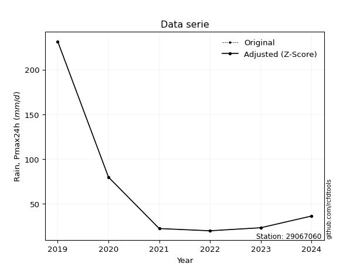</img>

</div>


> The initial value (value_initial) correspond to the initial obtained or null completed value, and value (value) is adjusted only when the initial value is outside the valid range (outlier) definite through the Z-Score value. If Z-Score is active, values out of range or outliers are replaced with the station mean value. A Z-Score (or standard score) measures how many standard deviations a data point is from the mean of a dataset, indicating its relative position; positive scores mean above the mean, negative mean below, and a score of zero is exactly at the mean, allowing for comparison of values from different distributions. It´s calculated using the formula $z=(x–μ)/σ$, where $x$ is the data point, $μ$ is the mean, and $σ$ is the standard deviation, helping identify outliers and understand probability.
>
> <sub>**Note**: In this study, "completing" (filling gaps in) and "extending" (forecasting or lengthening the historical record) rainfall data series are avoided for certain critical analyses because they introduce artificial bias and uncertainty, which can distort the statistics of rare events (extremes), alter day-to-day variability, and compromise the integrity and homogeneity of the original data. Some reasons against Completing/Extending rainfall data are: **Distortion of Extremes and Variability**: The primary issue is that most gap-filling or extension methods rely on averaging or regression with nearby stations, which inherently smooths the data. Rainfall is highly variable in space and time, with a large percentage of zero values and occasional large storms. Infilling methods often underestimate the highest values and overestimate the lowest (zero) values, which severely distorts analyses focused on flood frequency, drought severity, and intensity-duration-frequency (IDF) curves, **Loss of Data Homogeneity**: Infilled or extended data are synthetic estimates, not actual measurements. Combining these estimates with observed data can violate the assumption of data homogeneity, which requires that the data properties do not change over time. Inhomogeneity can lead to incorrect conclusions about long-term trends or changes in climate patterns, **Propagation of Errors**: Errors and biases from the original data (e.g., wind-induced undercatch, instrument errors, site changes) or the data used for imputation can propagate through the analysis, leading to unreliable hydrological models and inaccurate predictions, **Compromised Statistical Integrity**: For statistical analyses, especially those involving the frequency of events, using artificial data can introduce time bias or autocorrelation that doesn´t exist in reality, making it difficult to assess the true probability of events, **Difficulty in Validation**: It is difficult to accurately validate the quality of filled or extended data, especially for past periods where ground-truth measurements are unavailable. The reliability of imputation techniques heavily depends on the density of the surrounding station network and the complexity of the local topography.</sub>


### 4. Active continuous probability distributions from SciPy (80 of 104 available)

A Probability Density Function (PDF) describes the relative likelihood of a continuous random variable falling within a specific range, where the total area under its curve equals 1, and the area over any interval gives the actual probability for that range. Unlike discrete probabilities (like rolling a die), a PDF shows density, not direct probability for a single point (which is zero), with higher points indicating higher likelihood, often visualized as a bell curve for normal distributions.

A log of a probability density function (log-PDF) is simply the logarithm of the PDF´s value, denoted as $log(f(x))$, useful for converting multiplication of probabilities into addition, improving numerical stability with tiny numbers, and connecting to information theory concepts like entropy. Instead of dealing with very small probabilities (e.g., 0.000001), log-PDFs use negative numbers (e.g., $log(0.00001) ≈ -11.51$ that are easier for computers to handle, preventing underflow errors and simplifying complex calculations. In this study, each active probability distribution from SciPy is also evaluated in the $log$ form.

[scipy.stats](https://docs.scipy.org/doc/scipy/reference/stats.html) is a Python´s powerful submodule within the SciPy library for comprehensive statistical analysis, offering over 130 probability distributions (like Normal, Poisson, etc.), functions for descriptive stats (mean, variance), hypothesis testing (t-tests, chi-square), random variable generation, and statistical tests, making it essential for data science, modeling, and research. It provides tools to explore, model, and draw conclusions from data efficiently, working seamlessly with [NumPy](https://numpy.org/).

<div align="center">

|   id | p_dist           |   n_parameter | fit_method   | label                                                                       | active   | ref                                                                                                      |
|-----:|:-----------------|--------------:|:-------------|:----------------------------------------------------------------------------|:---------|:---------------------------------------------------------------------------------------------------------|
|    0 | alpha            |             3 | MLE          | Alpha                                                                       | True     | [:mortar_board:](https://docs.scipy.org/doc/scipy/reference/generated/scipy.stats.alpha.html)            |
|    1 | anglit           |             2 | MM           | Anglit                                                                      | True     | [:mortar_board:](https://docs.scipy.org/doc/scipy/reference/generated/scipy.stats.anglit.html)           |
|    2 | arcsine          |             2 | MM           | Arcsine                                                                     | True     | [:mortar_board:](https://docs.scipy.org/doc/scipy/reference/generated/scipy.stats.arcsine.html)          |
|    3 | argus            |             3 | MLE          | Argus                                                                       | True     | [:mortar_board:](https://docs.scipy.org/doc/scipy/reference/generated/scipy.stats.argus.html)            |
|    4 | beta             |             4 | MLE          | Beta                                                                        | True     | [:mortar_board:](https://docs.scipy.org/doc/scipy/reference/generated/scipy.stats.beta.html)             |
|    5 | betaprime        |             4 | MLE          | Beta prime                                                                  | True     | [:mortar_board:](https://docs.scipy.org/doc/scipy/reference/generated/scipy.stats.betaprime.html)        |
|    6 | bradford         |             3 | MLE          | Bradford                                                                    | True     | [:mortar_board:](https://docs.scipy.org/doc/scipy/reference/generated/scipy.stats.bradford.html)         |
|    7 | burr             |             4 | MLE          | Burr (Type III)                                                             | True     | [:mortar_board:](https://docs.scipy.org/doc/scipy/reference/generated/scipy.stats.burr.html)             |
|    8 | burr12           |             4 | MLE          | Burr (Type III) 12                                                          | True     | [:mortar_board:](https://docs.scipy.org/doc/scipy/reference/generated/scipy.stats.burr12.html)           |
|    9 | cosine           |             2 | MLE          | Cosine                                                                      | True     | [:mortar_board:](https://docs.scipy.org/doc/scipy/reference/generated/scipy.stats.cosine.html)           |
|   10 | crystalball      |             4 | MLE          | Crystalball                                                                 | True     | [:mortar_board:](https://docs.scipy.org/doc/scipy/reference/generated/scipy.stats.crystalball.html)      |
|   11 | dgamma           |             3 | MLE          | Double gamma                                                                | True     | [:mortar_board:](https://docs.scipy.org/doc/scipy/reference/generated/scipy.stats.dgamma.html)           |
|   12 | dweibull         |             3 | MLE          | Double Weibull                                                              | True     | [:mortar_board:](https://docs.scipy.org/doc/scipy/reference/generated/scipy.stats.dweibull.html)         |
|   13 | erlang           |             3 | MLE          | Erlang                                                                      | True     | [:mortar_board:](https://docs.scipy.org/doc/scipy/reference/generated/scipy.stats.erlang.html)           |
|   14 | exponnorm        |             3 | MLE          | Exponentially modified Normal                                               | True     | [:mortar_board:](https://docs.scipy.org/doc/scipy/reference/generated/scipy.stats.exponnorm.html)        |
|   15 | exponpow         |             3 | MLE          | Exponential power                                                           | True     | [:mortar_board:](https://docs.scipy.org/doc/scipy/reference/generated/scipy.stats.exponpow.html)         |
|   16 | exponweib        |             4 | MLE          | Exponentiated Weibull                                                       | True     | [:mortar_board:](https://docs.scipy.org/doc/scipy/reference/generated/scipy.stats.exponweib.html)        |
|   17 | f                |             4 | MLE          | F                                                                           | True     | [:mortar_board:](https://docs.scipy.org/doc/scipy/reference/generated/scipy.stats.f.html)                |
|   18 | fatiguelife      |             3 | MLE          | Fatigue-life (Birnbaum-Saunders)                                            | True     | [:mortar_board:](https://docs.scipy.org/doc/scipy/reference/generated/scipy.stats.fatiguelife.html)      |
|   19 | foldnorm         |             3 | MM           | Fold Normal                                                                 | True     | [:mortar_board:](https://docs.scipy.org/doc/scipy/reference/generated/scipy.stats.foldnorm.html)         |
|   20 | gamma            |             3 | MLE          | Gamma                                                                       | True     | [:mortar_board:](https://docs.scipy.org/doc/scipy/reference/generated/scipy.stats.gamma.html)            |
|   21 | gausshyper       |             6 | MLE          | Gauss hypergeometric                                                        | True     | [:mortar_board:](https://docs.scipy.org/doc/scipy/reference/generated/scipy.stats.gausshyper.html)       |
|   22 | genexpon         |             5 | MLE          | Generalized exponential                                                     | True     | [:mortar_board:](https://docs.scipy.org/doc/scipy/reference/generated/scipy.stats.genexpon.html)         |
|   23 | genextreme       |             3 | MLE          | Generalized exponential                                                     | True     | [:mortar_board:](https://docs.scipy.org/doc/scipy/reference/generated/scipy.stats.genextreme.html)       |
|   24 | gengamma         |             4 | MLE          | Generalized gamma                                                           | True     | [:mortar_board:](https://docs.scipy.org/doc/scipy/reference/generated/scipy.stats.gengamma.html)         |
|   25 | genhalflogistic  |             3 | MLE          | Generalized half-logistic                                                   | True     | [:mortar_board:](https://docs.scipy.org/doc/scipy/reference/generated/scipy.stats.genhalflogistic.html)  |
|   26 | genlogistic      |             3 | MLE          | Generalized logistic                                                        | True     | [:mortar_board:](https://docs.scipy.org/doc/scipy/reference/generated/scipy.stats.genlogistic.html)      |
|   27 | gennorm          |             3 | MLE          | Generalized Normal                                                          | True     | [:mortar_board:](https://docs.scipy.org/doc/scipy/reference/generated/scipy.stats.gennorm.html)          |
|   28 | genpareto        |             3 | MLE          | Generalized Pareto                                                          | True     | [:mortar_board:](https://docs.scipy.org/doc/scipy/reference/generated/scipy.stats.genpareto.html)        |
|   29 | gompertz         |             3 | MLE          | Gompertz (or truncated Gumbel)                                              | True     | [:mortar_board:](https://docs.scipy.org/doc/scipy/reference/generated/scipy.stats.gompertz.html)         |
|   30 | gumbel_l         |             2 | MM           | Gumbel Left Skew                                                            | True     | [:mortar_board:](https://docs.scipy.org/doc/scipy/reference/generated/scipy.stats.gumbel_l.html)         |
|   31 | gumbel_r         |             2 | MM           | Gumbel Right Skew                                                           | True     | [:mortar_board:](https://docs.scipy.org/doc/scipy/reference/generated/scipy.stats.gumbel_r.html)         |
|   32 | halfgennorm      |             3 | MLE          | Upper half of a generalized normal                                          | True     | [:mortar_board:](https://docs.scipy.org/doc/scipy/reference/generated/scipy.stats.halfgennorm.html)      |
|   33 | halflogistic     |             2 | MM           | Half-logistic                                                               | True     | [:mortar_board:](https://docs.scipy.org/doc/scipy/reference/generated/scipy.stats.halflogistic.html)     |
|   34 | halfnorm         |             2 | MM           | Half Normal                                                                 | True     | [:mortar_board:](https://docs.scipy.org/doc/scipy/reference/generated/scipy.stats.halfnorm.html)         |
|   35 | hypsecant        |             2 | MM           | hyperbolic secant                                                           | True     | [:mortar_board:](https://docs.scipy.org/doc/scipy/reference/generated/scipy.stats.hypsecant.html)        |
|   36 | invgamma         |             3 | MLE          | Inverted gamma                                                              | True     | [:mortar_board:](https://docs.scipy.org/doc/scipy/reference/generated/scipy.stats.invgamma.html)         |
|   37 | invgauss         |             3 | MLE          | Inverse Gaussian                                                            | True     | [:mortar_board:](https://docs.scipy.org/doc/scipy/reference/generated/scipy.stats.invgauss.html)         |
|   38 | invweibull       |             3 | MLE          | Inverted Weibull                                                            | True     | [:mortar_board:](https://docs.scipy.org/doc/scipy/reference/generated/scipy.stats.invweibull.html)       |
|   39 | johnsonsb        |             4 | MLE          | Johnson SB                                                                  | True     | [:mortar_board:](https://docs.scipy.org/doc/scipy/reference/generated/scipy.stats.johnsonsb.html)        |
|   40 | johnsonsu        |             4 | MLE          | Johnson Su                                                                  | True     | [:mortar_board:](https://docs.scipy.org/doc/scipy/reference/generated/scipy.stats.johnsonsu.html)        |
|   41 | kappa3           |             3 | MLE          | Kappa 3                                                                     | True     | [:mortar_board:](https://docs.scipy.org/doc/scipy/reference/generated/scipy.stats.kappa3.html)           |
|   42 | kappa4           |             4 | MLE          | Kappa 4                                                                     | True     | [:mortar_board:](https://docs.scipy.org/doc/scipy/reference/generated/scipy.stats.kappa4.html)           |
|   43 | ksone            |             3 | MLE          | Kolmogorov-Smirnov one-sided test statistic distribution                    | True     | [:mortar_board:](https://docs.scipy.org/doc/scipy/reference/generated/scipy.stats.ksone.html)            |
|   44 | kstwobign        |             2 | MLE          | Limiting distribution of scaled Kolmogorov-Smirnov two-sided test statistic | True     | [:mortar_board:](https://docs.scipy.org/doc/scipy/reference/generated/scipy.stats.kstwobign.html)        |
|   45 | laplace          |             2 | MM           | Laplace                                                                     | True     | [:mortar_board:](https://docs.scipy.org/doc/scipy/reference/generated/scipy.stats.laplace.html)          |
|   46 | levy_l           |             2 | MLE          | Left-skewed Levy                                                            | True     | [:mortar_board:](https://docs.scipy.org/doc/scipy/reference/generated/scipy.stats.levy_l.html)           |
|   47 | loggamma         |             3 | MLE          | Log gamma                                                                   | True     | [:mortar_board:](https://docs.scipy.org/doc/scipy/reference/generated/scipy.stats.loggamma.html)         |
|   48 | logistic         |             2 | MM           | Logistic (or Sech-squared)                                                  | True     | [:mortar_board:](https://docs.scipy.org/doc/scipy/reference/generated/scipy.stats.logistic.html)         |
|   49 | loglaplace       |             3 | MLE          | Log-Laplace                                                                 | True     | [:mortar_board:](https://docs.scipy.org/doc/scipy/reference/generated/scipy.stats.loglaplace.html)       |
|   50 | lomax            |             3 | MLE          | Lomax (Pareto of the second kind)                                           | True     | [:mortar_board:](https://docs.scipy.org/doc/scipy/reference/generated/scipy.stats.lomax.html)            |
|   51 | maxwell          |             2 | MM           | Maxwell                                                                     | True     | [:mortar_board:](https://docs.scipy.org/doc/scipy/reference/generated/scipy.stats.maxwell.html)          |
|   52 | mielke           |             4 | MLE          | Mielke Beta-Kappa / Dagum                                                   | True     | [:mortar_board:](https://docs.scipy.org/doc/scipy/reference/generated/scipy.stats.mielke.html)           |
|   53 | moyal            |             2 | MM           | Moyal                                                                       | True     | [:mortar_board:](https://docs.scipy.org/doc/scipy/reference/generated/scipy.stats.moyal.html)            |
|   54 | nakagami         |             3 | MLE          | Nakagami                                                                    | True     | [:mortar_board:](https://docs.scipy.org/doc/scipy/reference/generated/scipy.stats.nakagami.html)         |
|   55 | ncf              |             5 | MLE          | Non-central F distribution                                                  | True     | [:mortar_board:](https://docs.scipy.org/doc/scipy/reference/generated/scipy.stats.ncf.html)              |
|   56 | nct              |             4 | MLE          | Non-central Student’s t                                                     | True     | [:mortar_board:](https://docs.scipy.org/doc/scipy/reference/generated/scipy.stats.nct.html)              |
|   57 | norm             |             2 | MM           | Normal                                                                      | True     | [:mortar_board:](https://docs.scipy.org/doc/scipy/reference/generated/scipy.stats.norm.html)             |
|   58 | pearson3         |             3 | MM           | Pearson type III                                                            | True     | [:mortar_board:](https://docs.scipy.org/doc/scipy/reference/generated/scipy.stats.pearson3.html)         |
|   59 | powerlaw         |             3 | MLE          | Power-function                                                              | True     | [:mortar_board:](https://docs.scipy.org/doc/scipy/reference/generated/scipy.stats.powerlaw.html)         |
|   60 | rayleigh         |             2 | MM           | Rayleigh                                                                    | True     | [:mortar_board:](https://docs.scipy.org/doc/scipy/reference/generated/scipy.stats.rayleigh.html)         |
|   61 | rdist            |             3 | MLE          | R-distributed (symmetric beta)                                              | True     | [:mortar_board:](https://docs.scipy.org/doc/scipy/reference/generated/scipy.stats.rdist.html)            |
|   62 | rice             |             3 | MLE          | Rice                                                                        | True     | [:mortar_board:](https://docs.scipy.org/doc/scipy/reference/generated/scipy.stats.rice.html)             |
|   63 | semicircular     |             2 | MM           | Semicircular                                                                | True     | [:mortar_board:](https://docs.scipy.org/doc/scipy/reference/generated/scipy.stats.semicircular.html)     |
|   64 | skewnorm         |             3 | MLE          | Skew normal                                                                 | True     | [:mortar_board:](https://docs.scipy.org/doc/scipy/reference/generated/scipy.stats.skewnorm.html)         |
|   65 | t                |             3 | MLE          | Student’s t                                                                 | True     | [:mortar_board:](https://docs.scipy.org/doc/scipy/reference/generated/scipy.stats.t.html)                |
|   66 | trapezoid        |             4 | MLE          | Trapezoid                                                                   | True     | [:mortar_board:](https://docs.scipy.org/doc/scipy/reference/generated/scipy.stats.trapezoid.html)        |
|   67 | triang           |             3 | MLE          | Triangular                                                                  | True     | [:mortar_board:](https://docs.scipy.org/doc/scipy/reference/generated/scipy.stats.triang.html)           |
|   68 | truncexpon       |             3 | MLE          | Truncated exponential                                                       | True     | [:mortar_board:](https://docs.scipy.org/doc/scipy/reference/generated/scipy.stats.truncexpon.html)       |
|   69 | truncnorm        |             4 | MLE          | Truncated normal                                                            | True     | [:mortar_board:](https://docs.scipy.org/doc/scipy/reference/generated/scipy.stats.truncnorm.html)        |
|   70 | truncpareto      |             4 | MLE          | Upper truncated Pareto                                                      | True     | [:mortar_board:](https://docs.scipy.org/doc/scipy/reference/generated/scipy.stats.truncpareto.html)      |
|   71 | truncweibull_min |             5 | MLE          | Doubly truncated Weibull minimum                                            | True     | [:mortar_board:](https://docs.scipy.org/doc/scipy/reference/generated/scipy.stats.truncweibull_min.html) |
|   72 | tukeylambda      |             3 | MLE          | Tukey-Lamdba                                                                | True     | [:mortar_board:](https://docs.scipy.org/doc/scipy/reference/generated/scipy.stats.tukeylambda.html)      |
|   73 | uniform          |             2 | MLE          | Uniform                                                                     | True     | [:mortar_board:](https://docs.scipy.org/doc/scipy/reference/generated/scipy.stats.uniform.html)          |
|   74 | vonmises         |             3 | MLE          | Von Mises                                                                   | True     | [:mortar_board:](https://docs.scipy.org/doc/scipy/reference/generated/scipy.stats.vonmises.html)         |
|   75 | vonmises_line    |             3 | MLE          | Von Mises line                                                              | True     | [:mortar_board:](https://docs.scipy.org/doc/scipy/reference/generated/scipy.stats.vonmises_line.html)    |
|   76 | wald             |             2 | MM           | Wald                                                                        | True     | [:mortar_board:](https://docs.scipy.org/doc/scipy/reference/generated/scipy.stats.wald.html)             |
|   77 | weibull_max      |             3 | MLE          | Weibull maximum                                                             | True     | [:mortar_board:](https://docs.scipy.org/doc/scipy/reference/generated/scipy.stats.weibull_max.html)      |
|   78 | weibull_min      |             3 | MLE          | Weibull minimum                                                             | True     | [:mortar_board:](https://docs.scipy.org/doc/scipy/reference/generated/scipy.stats.weibull_min.html)      |
|   79 | wrapcauchy       |             3 | MLE          | Wrapped  Cauchy                                                             | True     | [:mortar_board:](https://docs.scipy.org/doc/scipy/reference/generated/scipy.stats.wrapcauchy.html)       |

</div>

> **n_parameter:** # arguments & localization & scale.
>
> **Fit methods:** (MLE) maximum likelihood, (MM) L-moments.
>
>**Inactive** (With the only purpose of prevent loops, zero divisions, infinite values, over high estimated values or horizontal trending for recurrence intervals estimations, the follow distributions were disabled.)**:** lognorm, norminvgauss, powernorm, powerlognorm, cauchy, halfcauchy, foldcauchy, skewcauchy, chi2, expon, fisk, genhyperbolic, geninvgauss, gibrat, kstwo, laplace_asymmetric, levy, levy_stable, ncx2, pareto, rel_breitwigner, recipinvgauss, studentized_range, loguniform, 


## B. Probability (PDF) vs. Empirical (EDF) distributions functions

A continuous probability distribution (CPD) describes probabilities for variables that can take any value within a range (like rain any time), unlike discrete variables with specific outcomes (like temperature). It uses a Probability Density Function (PDF), a curve where the total area under it equals 1, and the probability of the variable falling within an interval (a to b) is found by calculating the area under the curve between those points. A key feature is that the probability of hitting any single exact value is zero, so probabilities are always expressed for ranges, e.g., $P(a ≤ X ≤ b)$.

<div align="center">

Distributions parameters from station values
|     |   station | p_dist              |   n |             loc |          scale | shape                  | shape1                 | shape2               | shape3             |
|----:|----------:|:--------------------|----:|----------------:|---------------:|:-----------------------|:-----------------------|:---------------------|:-------------------|
|   0 |  29067060 | alpha               |   7 |     13.3381     |   11.4782      | 6.917837110715538e-10  |                        |                      |                    |
|   1 |  29067060 | anglit              |   7 |     68.46       |  205.145       |                        |                        |                      |                    |
|   2 |  29067060 | arcsine             |   7 |    -30.7125     |  198.345       |                        |                        |                      |                    |
|   3 |  29067060 | argus               |   7 |    -97.5687     |  341.849       | 1.255725123150527e-06  |                        |                      |                    |
|   4 |  29067060 | beta                |   7 |     19.5        | 4216.45        | 0.740886115707154      | 176.7881521162378      |                      |                    |
|   5 |  29067060 | betaprime           |   7 |      4.80496    |    3.10911     | 17.295576659717298     | 1.9090101042244187     |                      |                    |
|   6 |  29067060 | bradford            |   7 |     19.3485     |  212.251       | 26.2081978857906       |                        |                      |                    |
|   7 |  29067060 | burr                |   7 |     11.0179     |    2.39558     | 1.2283274234748571     | 11.736140322575672     |                      |                    |
|   8 |  29067060 | burr12              |   7 |     -3.07018    |   22.3081      | 301.6205435320396      | 0.004102033508422802   |                      |                    |
|   9 |  29067060 | cosine              |   7 |     84.9692     |   64.051       |                        |                        |                      |                    |
|  10 |  29067060 | crystalball         |   7 |     68.46       |   70.1256      | 4678.406053621236      | 5205.19390413337       |                      |                    |
|  11 |  29067060 | dgamma              |   7 |     50.6007     |   33.2926      | 1.4116425930551753     |                        |                      |                    |
|  12 |  29067060 | dweibull            |   7 |     22.9        |   49.6516      | 0.5449182244850767     |                        |                      |                    |
|  13 |  29067060 | erlang              |   7 |     19.5        |   73.6869      | 0.3870531576833416     |                        |                      |                    |
|  14 |  29067060 | exponnorm           |   7 |     19.4283     |    0.0229258   | 2122.8437700698505     |                        |                      |                    |
|  15 |  29067060 | exponpow            |   7 |     19.5        |   87.0876      | 0.5727314679210866     |                        |                      |                    |
|  16 |  29067060 | exponweib           |   7 |     19.5        |    3.60824e-05 | 8.261215930233249      | 0.0874924937416299     |                      |                    |
|  17 |  29067060 | f                   |   7 |     19.5        |    4.75977     | 0.6510514320960907     | 0.6779773387989166     |                      |                    |
|  18 |  29067060 | fatiguelife         |   7 |     19.5        |    0.000294946 | 441.6150146875058      |                        |                      |                    |
|  19 |  29067060 | foldnorm            |   7 |    -31.0327     |  123.489       | 0.0030529935534387345  |                        |                      |                    |
|  20 |  29067060 | gamma               |   7 |     19.5        |   56.7676      | 0.5315412530293337     |                        |                      |                    |
|  21 |  29067060 | gausshyper          |   7 |     -1.58588    |  233.186       | 0.316031381669711      | 0.2452104290308001     | 0.8441350416319469   | 2.5393371854051985 |
|  22 |  29067060 | genexpon            |   7 |     19.5        |  184.145       | 3.761130649439316      | 6.084293146764908e-13  | 2.4157063769868365   |                    |
|  23 |  29067060 | genextreme          |   7 |     23.4387     |    8.58583     | -2.001549244946975     |                        |                      |                    |
|  24 |  29067060 | gengamma            |   7 |     19.5        |    4.13634e-09 | 9.325911208457454      | 0.1064004090939917     |                      |                    |
|  25 |  29067060 | genhalflogistic     |   7 |     -1.76187    |  249.181       | 1.0677881660901714     |                        |                      |                    |
|  26 |  29067060 | genlogistic         |   7 |   -270.244      |   38.1824      | 3459.6237453987123     |                        |                      |                    |
|  27 |  29067060 | gennorm             |   7 |     36.02       |    8.78297     | 0.5072950887510754     |                        |                      |                    |
|  28 |  29067060 | genpareto           |   7 |     19.5        |    8.54215     | 1.5071652942209797     |                        |                      |                    |
|  29 |  29067060 | gompertz            |   7 |     19.5        |    8.93535e+10 | 1607630464.7011724     |                        |                      |                    |
|  30 |  29067060 | gumbel_l            |   7 |    100.02       |   54.6767      |                        |                        |                      |                    |
|  31 |  29067060 | gumbel_r            |   7 |     36.8998     |   54.6767      |                        |                        |                      |                    |
|  32 |  29067060 | halfgennorm         |   7 |     19.5        |    0.0514554   | 0.24677699834316097    |                        |                      |                    |
|  33 |  29067060 | halflogistic        |   7 |    -14.6551     |   59.9549      |                        |                        |                      |                    |
|  34 |  29067060 | halfnorm            |   7 |    -24.3588     |  116.331       |                        |                        |                      |                    |
|  35 |  29067060 | hypsecant           |   7 |     68.46       |   44.6433      |                        |                        |                      |                    |
|  36 |  29067060 | invgamma            |   7 |     18.2916     |    2.69564     | 0.54372047038725       |                        |                      |                    |
|  37 |  29067060 | invgauss            |   7 |     18.1097     |    6.1242      | 8.221547156688688      |                        |                      |                    |
|  38 |  29067060 | invweibull          |   7 |     19.1491     |    4.28958     | 0.49961758013736546    |                        |                      |                    |
|  39 |  29067060 | johnsonsb           |   7 |     19.5        |  212.362       | 0.3191177210494054     | 0.11749509887151635    |                      |                    |
|  40 |  29067060 | johnsonsu           |   7 |     19.5        |    7.27185e-08 | -2.0564000003432437    | 0.1390592361199227     |                      |                    |
|  41 |  29067060 | kappa3              |   7 |     19.5        |    5.65451     | 0.0768429613968068     |                        |                      |                    |
|  42 |  29067060 | kappa4              |   7 |     -1.69026    |  233.012       | 1.1000254814323491     | 0.9975519835258388     |                      |                    |
|  43 |  29067060 | ksone               |   7 |     -1.71       |  254.52        | 1.0                    |                        |                      |                    |
|  44 |  29067060 | kstwobign           |   7 |   -108.387      |  206.906       |                        |                        |                      |                    |
|  45 |  29067060 | laplace             |   7 |     68.46       |   49.5863      |                        |                        |                      |                    |
|  46 |  29067060 | levy_l              |   7 |    251.228      |   87.5842      |                        |                        |                      |                    |
|  47 |  29067060 | loggamma            |   7 | -21039.8        | 2868.72        | 1569.477386053893      |                        |                      |                    |
|  48 |  29067060 | logistic            |   7 |     68.46       |   38.6623      |                        |                        |                      |                    |
|  49 |  29067060 | loglaplace          |   7 |     -0.0985487  |   36.1185      | 1.4484671637662392     |                        |                      |                    |
|  50 |  29067060 | lomax               |   7 |     19.5        |    2.42738e+08 | 3635622.8212193036     |                        |                      |                    |
|  51 |  29067060 | maxwell             |   7 |    -97.7082     |  104.13        |                        |                        |                      |                    |
|  52 |  29067060 | mielke              |   7 |     14.7897     |    0.0105025   | 1810.3933826482798     | 1.0564674694485574     |                      |                    |
|  53 |  29067060 | moyal               |   7 |     28.3577     |   31.5676      |                        |                        |                      |                    |
|  54 |  29067060 | nakagami            |   7 |     19.5        |  137.227       | 0.15936009966586184    |                        |                      |                    |
|  55 |  29067060 | ncf                 |   7 |     -1.33823    |    0.390968    | 1.1690898647518813     | 4.244517674022049      | 111.74932731110175   |                    |
|  56 |  29067060 | nct                 |   7 |     -0.150872   |    0.89495     | 1.4149878162322125     | 33.78356114061235      |                      |                    |
|  57 |  29067060 | norm                |   7 |     68.46       |   70.1256      |                        |                        |                      |                    |
|  58 |  29067060 | pearson3            |   7 |     68.46       |   70.1256      | 1.6557706085303896     |                        |                      |                    |
|  59 |  29067060 | powerlaw            |   7 |     19.5        |  212.1         | 0.1333346491912483     |                        |                      |                    |
|  60 |  29067060 | rayleigh            |   7 |    -65.6943     |  107.04        |                        |                        |                      |                    |
|  61 |  29067060 | rdist               |   7 |     -0.787593   |   80.3876      | 1.1992270462721715     |                        |                      |                    |
|  62 |  29067060 | rice                |   7 |    -31.9523     |   86.6032      | 0.000510969568518669   |                        |                      |                    |
|  63 |  29067060 | semicircular        |   7 |     68.46       |  140.251       |                        |                        |                      |                    |
|  64 |  29067060 | skewnorm            |   7 |     19.4999     |   85.5154      | 4452896.570926354      |                        |                      |                    |
|  65 |  29067060 | t                   |   7 |     22.2637     |    1.7535      | 0.34324121783598316    |                        |                      |                    |
|  66 |  29067060 | trapezoid           |   7 |     -1.7955     |  254.52        | 1.0                    | 1.0                    |                      |                    |
|  67 |  29067060 | triang              |   7 |     -1.84068    |  233.441       | 0.9999999875712838     |                        |                      |                    |
|  68 |  29067060 | truncexpon          |   7 |     -1.76091    |  203.751       | 1.145324884183859      |                        |                      |                    |
|  69 |  29067060 | truncnorm           |   7 | -26857.7        | 1377.55        | 19.510914959867897     | 19.6648847830522       |                      |                    |
|  70 |  29067060 | truncpareto         |   7 |     13.832      |    5.66803     | 0.6635242487982713     | 38.42039193192751      |                      |                    |
|  71 |  29067060 | truncweibull_min    |   7 |      0.866686   |  183.227       | 0.700880182236904      | 0.004524535376278239   | 1.2592791492520363   |                    |
|  72 |  29067060 | tukeylambda         |   7 |     -0.774271   |   94.5902      | 1.1768715603169686     |                        |                      |                    |
|  73 |  29067060 | uniform             |   7 |     19.5        |  212.1         |                        |                        |                      |                    |
|  74 |  29067060 | vonmises            |   7 |     -1.75706    |    1           | 1.3480533330322682     |                        |                      |                    |
|  75 |  29067060 | vonmises_line       |   7 |     51.1721     |   57.432       | 1.646037828642847      |                        |                      |                    |
|  76 |  29067060 | wald                |   7 |     -1.66558    |   70.1256      |                        |                        |                      |                    |
|  77 |  29067060 | weibull_max         |   7 |    231.6        |    1.77238     | 0.19473815052031018    |                        |                      |                    |
|  78 |  29067060 | weibull_min         |   7 |     19.5        |   71.8763      | 0.6540224422686289     |                        |                      |                    |
|  79 |  29067060 | wrapcauchy          |   7 |     19.5        |   33.7726      | 0.8717801067378416     |                        |                      |                    |
|  80 |  29067060 | logalpha            |   7 |      2.76457    |    0.403889    | 7.295046584361738e-05  |                        |                      |                    |
|  81 |  29067060 | loganglit           |   7 |      3.83033    |    2.44468     |                        |                        |                      |                    |
|  82 |  29067060 | logarcsine          |   7 |      2.64849    |    2.36367     |                        |                        |                      |                    |
|  83 |  29067060 | logargus            |   7 |      1.96043    |    3.62669     | 3.0053574710694445e-05 |                        |                      |                    |
|  84 |  29067060 | logbeta             |   7 |      2.97041    |    2.91703     | 0.507307627594379      | 1.1171880230813986     |                      |                    |
|  85 |  29067060 | logbetaprime        |   7 |      1.98755    |    0.0369459   | 245.45392385112285     | 6.1307200149867285     |                      |                    |
|  86 |  29067060 | logbradford         |   7 |      2.97041    |    2.47461     | 1.3037501755947725     |                        |                      |                    |
|  87 |  29067060 | logburr             |   7 |      0.926452   |    0.39922     | 4.674036353105034      | 4748.715732721832      |                      |                    |
|  88 |  29067060 | logburr12           |   7 |      1.16022    |    1.80068     | 654.5642086563448      | 0.00447331670241353    |                      |                    |
|  89 |  29067060 | logcosine           |   7 |      3.93059    |    0.705239    |                        |                        |                      |                    |
|  90 |  29067060 | logcrystalball      |   7 |      3.83033    |    0.835676    | 409.1480518751509      | 12.278171065817652     |                      |                    |
|  91 |  29067060 | logdgamma           |   7 |      3.46134    |    0.407111    | 1.7425042548289644     |                        |                      |                    |
|  92 |  29067060 | logdweibull         |   7 |      3.49687    |    0.767542    | 1.3189512620850856     |                        |                      |                    |
|  93 |  29067060 | logerlang           |   7 |      2.97041    |    0.777801    | 0.5075746660587761     |                        |                      |                    |
|  94 |  29067060 | logexponnorm        |   7 |      2.96967    |    0.00023411  | 3676.0323776692676     |                        |                      |                    |
|  95 |  29067060 | logexponpow         |   7 |      2.97041    |    1.57241     | 0.7752586706373754     |                        |                      |                    |
|  96 |  29067060 | logexponweib        |   7 |      2.97041    |    1.28589     | 1.0444587481968781     | 0.6026674627187065     |                      |                    |
|  97 |  29067060 | logf                |   7 |      2.81825    |    0.427445    | 324.16564137837366     | 2.5370695956626763     |                      |                    |
|  98 |  29067060 | logfatiguelife      |   7 |      2.94413    |    0.313993    | 1.7969269061774533     |                        |                      |                    |
|  99 |  29067060 | logfoldnorm         |   7 |      2.63124    |    1.06838     | 0.9335226427717482     |                        |                      |                    |
| 100 |  29067060 | loggamma            |   7 |      2.97041    |    0.73048     | 0.7183026851024239     |                        |                      |                    |
| 101 |  29067060 | loggausshyper       |   7 |      2.97041    |    2.64718     | 0.6155929417752255     | 0.9452284266205956     | 1.427604478574595    | 0.925377097317025  |
| 102 |  29067060 | loggenexpon         |   7 |      2.97041    |    0.571566    | 0.6474838219348997     | 2.230499688404082      | 0.005329887775720778 |                    |
| 103 |  29067060 | loggenextreme       |   7 |      3.21021    |    0.349075    | -0.971402799769638     |                        |                      |                    |
| 104 |  29067060 | loggengamma         |   7 |      2.97041    |    1.52367     | 1.1060045466218007     | 0.23883595573495986    |                      |                    |
| 105 |  29067060 | loggenhalflogistic  |   7 |      2.77708    |    2.85734     | 1.070995529005053      |                        |                      |                    |
| 106 |  29067060 | loggenlogistic      |   7 |     -0.905771   |    0.612599    | 1221.6732439985071     |                        |                      |                    |
| 107 |  29067060 | loggennorm          |   7 |      4.20771    |    1.2373      | 8289196.210578132      |                        |                      |                    |
| 108 |  29067060 | loggenpareto        |   7 |      0.00707548 |   10.1999      | -1.8757003506804604    |                        |                      |                    |
| 109 |  29067060 | loggompertz         |   7 |      2.97041    |   17.528       | 19.418419861338418     |                        |                      |                    |
| 110 |  29067060 | loggumbel_l         |   7 |      4.20643    |    0.651574    |                        |                        |                      |                    |
| 111 |  29067060 | loggumbel_r         |   7 |      3.45423    |    0.651574    |                        |                        |                      |                    |
| 112 |  29067060 | loghalfgennorm      |   7 |      2.97041    |    0.0204745   | 0.3460979657260025     |                        |                      |                    |
| 113 |  29067060 | loghalflogistic     |   7 |      2.83986    |    0.714473    |                        |                        |                      |                    |
| 114 |  29067060 | loghalfnorm         |   7 |      2.72422    |    1.3863      |                        |                        |                      |                    |
| 115 |  29067060 | loghypsecant        |   7 |      3.83033    |    0.532008    |                        |                        |                      |                    |
| 116 |  29067060 | loginvgamma         |   7 |      2.81659    |    0.542615    | 1.268480199065544      |                        |                      |                    |
| 117 |  29067060 | loginvgauss         |   7 |      2.87477    |    0.470897    | 2.029274427769095      |                        |                      |                    |
| 118 |  29067060 | loginvweibull       |   7 |      2.85084    |    0.359377    | 1.0295260335211553     |                        |                      |                    |
| 119 |  29067060 | logjohnsonsb        |   7 |      2.97041    |    6.0658      | 1.2091971473630458     | 0.1378417366781309     |                      |                    |
| 120 |  29067060 | logjohnsonsu        |   7 |      2.97041    |    1.18695e-11 | -3.197799174672755     | 0.1632023822896711     |                      |                    |
| 121 |  29067060 | logkappa3           |   7 |      2.97041    |    0.482547    | 1.2095718458771496     |                        |                      |                    |
| 122 |  29067060 | logkappa4           |   7 |      2.30913    |    3.25398     | 1.256274869224093      | 1.0345563758073375     |                      |                    |
| 123 |  29067060 | logksone            |   7 |      2.72295    |    2.96952     | 1.0                    |                        |                      |                    |
| 124 |  29067060 | logkstwobign        |   7 |      1.31388    |    2.88862     |                        |                        |                      |                    |
| 125 |  29067060 | loglaplace          |   7 |      3.83033    |    0.590912    |                        |                        |                      |                    |
| 126 |  29067060 | loglevy_l           |   7 |      5.62562    |    0.803901    |                        |                        |                      |                    |
| 127 |  29067060 | logloggamma         |   7 |   -284.595      |   37.8509      | 2039.200547472672      |                        |                      |                    |
| 128 |  29067060 | loglogistic         |   7 |      3.83033    |    0.460732    |                        |                        |                      |                    |
| 129 |  29067060 | logloglaplace       |   7 |      2.97041    |    0.621706    | 0.9063515646359873     |                        |                      |                    |
| 130 |  29067060 | loglomax            |   7 |      2.97041    |   38.1756      | 45.31394461758018      |                        |                      |                    |
| 131 |  29067060 | logmaxwell          |   7 |      1.85013    |    1.24091     |                        |                        |                      |                    |
| 132 |  29067060 | logmielke           |   7 |      1.86421    |    0.119047    | 6518.892287085258      | 3.0533565322509073     |                      |                    |
| 133 |  29067060 | logmoyal            |   7 |      3.35244    |    0.376186    |                        |                        |                      |                    |
| 134 |  29067060 | lognakagami         |   7 |      2.97041    |    1.67577     | 0.24613439649087177    |                        |                      |                    |
| 135 |  29067060 | logncf              |   7 |     -1.3485     |    5.05693     | 202.4861811534564      | 135.31795178469872     | 1.798632849910119    |                    |
| 136 |  29067060 | lognct              |   7 |     -0.133619   |    0.0900231   | 13.906310155423057     | 41.58350612655343      |                      |                    |
| 137 |  29067060 | lognorm             |   7 |      3.83033    |    0.835676    |                        |                        |                      |                    |
| 138 |  29067060 | logpearson3         |   7 |      3.83033    |    0.835675    | 0.7424246124657681     |                        |                      |                    |
| 139 |  29067060 | logpowerlaw         |   7 |      2.97041    |    2.4746      | 0.1567413972257135     |                        |                      |                    |
| 140 |  29067060 | lograyleigh         |   7 |      2.23163    |    1.27558     |                        |                        |                      |                    |
| 141 |  29067060 | logrdist            |   7 |      4.2102     |    1.23979     | 0.9872780668397425     |                        |                      |                    |
| 142 |  29067060 | logrice             |   7 |      2.4724     |    1.12746     | 0.0005357917054152944  |                        |                      |                    |
| 143 |  29067060 | logsemicircular     |   7 |      3.83033    |    1.67135     |                        |                        |                      |                    |
| 144 |  29067060 | logskewnorm         |   7 |      2.97041    |    1.19906     | 15841215.108797975     |                        |                      |                    |
| 145 |  29067060 | logt                |   7 |      3.83033    |    0.835675    | 5790013042.790695      |                        |                      |                    |
| 146 |  29067060 | logtrapezoid        |   7 |      2.72295    |    2.96952     | 1.0                    | 1.0                    |                      |                    |
| 147 |  29067060 | logtriang           |   7 |      1.67131    |    3.7737      | 0.9999999999853042     |                        |                      |                    |
| 148 |  29067060 | logtruncexpon       |   7 |      2.9695     |    3.27771     | 0.7552597298034935     |                        |                      |                    |
| 149 |  29067060 | logtruncnorm        |   7 |     -6.20691    |    3.03183     | 3.026987029430174      | 3.8432230054940093     |                      |                    |
| 150 |  29067060 | logtruncpareto      |   7 |      2.96981    |    0.000608751 | 2.03137041591072e-08   | 4071.805738804246      |                      |                    |
| 151 |  29067060 | logtruncweibull_min |   7 |      2.96979    |    2.82525     | 0.8651253262295184     | 0.00021967837268842106 | 0.8761097400406743   |                    |
| 152 |  29067060 | logtukeylambda      |   7 |      3.67371    |    0.937341    | 1.3327763842423632     |                        |                      |                    |
| 153 |  29067060 | loguniform          |   7 |      2.97041    |    2.4746      |                        |                        |                      |                    |
| 154 |  29067060 | logvonmises         |   7 |     -2.54022    |    1           | 1.9988438027976911     |                        |                      |                    |
| 155 |  29067060 | logvonmises_line    |   7 |      4.29203    |    0.420684    | 1.8065775037007443e-05 |                        |                      |                    |
| 156 |  29067060 | logwald             |   7 |      2.99464    |    0.835686    |                        |                        |                      |                    |
| 157 |  29067060 | logweibull_max      |   7 |      5.44501    |    1.54892     | 0.9955868873287358     |                        |                      |                    |
| 158 |  29067060 | logweibull_min      |   7 |      2.97041    |    0.916489    | 0.6638971829657632     |                        |                      |                    |
| 159 |  29067060 | logwrapcauchy       |   7 |      2.97041    |    0.393844    | 0.525                  |                        |                      |                    |

</div>

> **loc** (Location parameter): This shifts the distribution along the x-axis. For many common distributions, like the normal (Gaussian) distribution, loc represents the mean $μ$. For others, like the uniform distribution, it might represent the minimum value, or for the beta distribution, the left end of the support interval.
>
> **scale** (Scale parameter): This determines the width or spread of the distribution. For the normal distribution, scale represents the standard deviation $σ$. For a uniform distribution, it defines the length of the interval (from $loc$ to $loc + scale$).
>
> **shape** (Shape parameters): Refers to parameters that define the specific form of a probability distribution, distinct from its location (loc) and scale (scale). These parameters are required arguments for most distribution functions. For example, a normal (Gaussian) distribution is fully defined by its location (mean) and scale (standard deviation), so it has no specific shape parameters beyond loc and scale. However, other distributions have intrinsic properties that need specification, as Gamma distribution that takes a shape parameter, often named $a$ or $alpha$.


### 0. Cumulative distribution values - CDF (160 evaluated)

Cumulative Distribution Function (CDF), denoted as $F$<sub>$X$</sub>$(x)$, is a function that gives the probability that a random variable $X$ will take a value less than or equal to a specific value, $x$ (i.e., $(P(X≥x)$. It essentially "accumulates" probabilities from a given point up to the far right (positive infinity), providing a complete picture of the distribution´s probabilities for both discrete (like rain) and continuous (like temperature) variables, helping to find probabilities over ranges or above certain values. Each station is evaluated separately ordering the $x$ values ascending, calculating the CDF and PDF values for the activated distributions and their logarithmic forms.

<div align="center">

CDF ordered by x ascending and calculating $log(f(x))$ separately
|   id |   Station |   date |      x |   count |   mean |     std |    zscore |   Value_initial |   station |   m |     alpha |   alpha_pdf |   anglit |   anglit_pdf |   arcsine |   arcsine_pdf |    argus |   argus_pdf |        beta |      beta_pdf |   betaprime |   betaprime_pdf |   bradford |   bradford_pdf |     burr |    burr_pdf |    burr12 |   burr12_pdf |   cosine |   cosine_pdf |   crystalball |   crystalball_pdf |   dgamma |   dgamma_pdf |   dweibull |    dweibull_pdf |      erlang |   erlang_pdf |   exponnorm |   exponnorm_pdf |    exponpow |    exponpow_pdf |   exponweib |   exponweib_pdf |          f |          f_pdf |   fatiguelife |   fatiguelife_pdf |   foldnorm |   foldnorm_pdf |       gamma |        gamma_pdf |   gausshyper |   gausshyper_pdf |    genexpon |   genexpon_pdf |   genextreme |   genextreme_pdf |    gengamma |   gengamma_pdf |   genhalflogistic |   genhalflogistic_pdf |   genlogistic |   genlogistic_pdf |   gennorm |   gennorm_pdf |   genpareto |   genpareto_pdf |    gompertz |   gompertz_pdf |   gumbel_l |   gumbel_l_pdf |   gumbel_r |   gumbel_r_pdf |   halfgennorm |   halfgennorm_pdf |   halflogistic |   halflogistic_pdf |   halfnorm |   halfnorm_pdf |   hypsecant |   hypsecant_pdf |   invgamma |   invgamma_pdf |   invgauss |   invgauss_pdf |   invweibull |   invweibull_pdf |   johnsonsb |   johnsonsb_pdf |   johnsonsu |   johnsonsu_pdf |   kappa3 |   kappa3_pdf |      kappa4 |   kappa4_pdf |     ksone |   ksone_pdf |   kstwobign |   kstwobign_pdf |   laplace |   laplace_pdf |   levy_l |   levy_l_pdf |    loggamma |   loggamma_pdf |   logistic |   logistic_pdf |   loglaplace |   loglaplace_pdf |       lomax |   lomax_pdf |   maxwell |   maxwell_pdf |   mielke |   mielke_pdf |    moyal |   moyal_pdf |    nakagami |   nakagami_pdf |      ncf |     ncf_pdf |      nct |     nct_pdf |     norm |    norm_pdf |   pearson3 |   pearson3_pdf |   powerlaw |   powerlaw_pdf |   rayleigh |   rayleigh_pdf |    rdist |     rdist_pdf |     rice |   rice_pdf |   semicircular |   semicircular_pdf |   skewnorm |   skewnorm_pdf |        t |       t_pdf |   trapezoid |   trapezoid_pdf |     triang |   triang_pdf |   truncexpon |   truncexpon_pdf |   truncnorm |   truncnorm_pdf |   truncpareto |   truncpareto_pdf |   truncweibull_min |   truncweibull_min_pdf |   tukeylambda |   tukeylambda_pdf |   uniform |   uniform_pdf |   vonmises |   vonmises_pdf |   vonmises_line |   vonmises_line_pdf |     wald |    wald_pdf |   weibull_max |   weibull_max_pdf |   weibull_min |   weibull_min_pdf |   wrapcauchy |   wrapcauchy_pdf |   logalpha |   logalpha_pdf |   loganglit |   loganglit_pdf |   logarcsine |   logarcsine_pdf |   logargus |   logargus_pdf |     logbeta |   logbeta_pdf |   logbetaprime |   logbetaprime_pdf |   logbradford |   logbradford_pdf |   logburr |   logburr_pdf |   logburr12 |   logburr12_pdf |   logcosine |   logcosine_pdf |   logcrystalball |   logcrystalball_pdf |   logdgamma |   logdgamma_pdf |   logdweibull |   logdweibull_pdf |   logerlang |   logerlang_pdf |   logexponnorm |   logexponnorm_pdf |   logexponpow |   logexponpow_pdf |   logexponweib |   logexponweib_pdf |      logf |   logf_pdf |   logfatiguelife |   logfatiguelife_pdf |   logfoldnorm |   logfoldnorm_pdf |   loggausshyper |   loggausshyper_pdf |   loggenexpon |   loggenexpon_pdf |   loggenextreme |   loggenextreme_pdf |   loggengamma |   loggengamma_pdf |   loggenhalflogistic |   loggenhalflogistic_pdf |   loggenlogistic |   loggenlogistic_pdf |   loggennorm |   loggennorm_pdf |   loggenpareto |   loggenpareto_pdf |   loggompertz |   loggompertz_pdf |   loggumbel_l |   loggumbel_l_pdf |   loggumbel_r |   loggumbel_r_pdf |   loghalfgennorm |   loghalfgennorm_pdf |   loghalflogistic |   loghalflogistic_pdf |   loghalfnorm |   loghalfnorm_pdf |   loghypsecant |   loghypsecant_pdf |   loginvgamma |   loginvgamma_pdf |   loginvgauss |   loginvgauss_pdf |   loginvweibull |   loginvweibull_pdf |   logjohnsonsb |   logjohnsonsb_pdf |   logjohnsonsu |   logjohnsonsu_pdf |   logkappa3 |   logkappa3_pdf |   logkappa4 |   logkappa4_pdf |   logksone |   logksone_pdf |   logkstwobign |   logkstwobign_pdf |   loglevy_l |   loglevy_l_pdf |   logloggamma |   logloggamma_pdf |   loglogistic |   loglogistic_pdf |   logloglaplace |   logloglaplace_pdf |   loglomax |   loglomax_pdf |   logmaxwell |   logmaxwell_pdf |   logmielke |   logmielke_pdf |   logmoyal |   logmoyal_pdf |   lognakagami |   lognakagami_pdf |   logncf |   logncf_pdf |   lognct |   lognct_pdf |   lognorm |   lognorm_pdf |   logpearson3 |   logpearson3_pdf |   logpowerlaw |   logpowerlaw_pdf |   lograyleigh |   lograyleigh_pdf |    logrdist |   logrdist_pdf |   logrice |   logrice_pdf |   logsemicircular |   logsemicircular_pdf |   logskewnorm |   logskewnorm_pdf |     logt |   logt_pdf |   logtrapezoid |   logtrapezoid_pdf |   logtriang |   logtriang_pdf |   logtruncexpon |   logtruncexpon_pdf |   logtruncnorm |   logtruncnorm_pdf |   logtruncpareto |   logtruncpareto_pdf |   logtruncweibull_min |   logtruncweibull_min_pdf |   logtukeylambda |   logtukeylambda_pdf |   loguniform |   loguniform_pdf |   logvonmises |   logvonmises_pdf |   logvonmises_line |   logvonmises_line_pdf |    logwald |   logwald_pdf |   logweibull_max |   logweibull_max_pdf |   logweibull_min |   logweibull_min_pdf |   logwrapcauchy |   logwrapcauchy_pdf |
|-----:|----------:|-------:|-------:|--------:|-------:|--------:|----------:|----------------:|----------:|----:|----------:|------------:|---------:|-------------:|----------:|--------------:|---------:|------------:|------------:|--------------:|------------:|----------------:|-----------:|---------------:|---------:|------------:|----------:|-------------:|---------:|-------------:|--------------:|------------------:|---------:|-------------:|-----------:|----------------:|------------:|-------------:|------------:|----------------:|------------:|----------------:|------------:|----------------:|-----------:|---------------:|--------------:|------------------:|-----------:|---------------:|------------:|-----------------:|-------------:|-----------------:|------------:|---------------:|-------------:|-----------------:|------------:|---------------:|------------------:|----------------------:|--------------:|------------------:|----------:|--------------:|------------:|----------------:|------------:|---------------:|-----------:|---------------:|-----------:|---------------:|--------------:|------------------:|---------------:|-------------------:|-----------:|---------------:|------------:|----------------:|-----------:|---------------:|-----------:|---------------:|-------------:|-----------------:|------------:|----------------:|------------:|----------------:|---------:|-------------:|------------:|-------------:|----------:|------------:|------------:|----------------:|----------:|--------------:|---------:|-------------:|------------:|---------------:|-----------:|---------------:|-------------:|-----------------:|------------:|------------:|----------:|--------------:|---------:|-------------:|---------:|------------:|------------:|---------------:|---------:|------------:|---------:|------------:|---------:|------------:|-----------:|---------------:|-----------:|---------------:|-----------:|---------------:|---------:|--------------:|---------:|-----------:|---------------:|-------------------:|-----------:|---------------:|---------:|------------:|------------:|----------------:|-----------:|-------------:|-------------:|-----------------:|------------:|----------------:|--------------:|------------------:|-------------------:|-----------------------:|--------------:|------------------:|----------:|--------------:|-----------:|---------------:|----------------:|--------------------:|---------:|------------:|--------------:|------------------:|--------------:|------------------:|-------------:|-----------------:|-----------:|---------------:|------------:|----------------:|-------------:|-----------------:|-----------:|---------------:|------------:|--------------:|---------------:|-------------------:|--------------:|------------------:|----------:|--------------:|------------:|----------------:|------------:|----------------:|-----------------:|---------------------:|------------:|----------------:|--------------:|------------------:|------------:|----------------:|---------------:|-------------------:|--------------:|------------------:|---------------:|-------------------:|----------:|-----------:|-----------------:|---------------------:|--------------:|------------------:|----------------:|--------------------:|--------------:|------------------:|----------------:|--------------------:|--------------:|------------------:|---------------------:|-------------------------:|-----------------:|---------------------:|-------------:|-----------------:|---------------:|-------------------:|--------------:|------------------:|--------------:|------------------:|--------------:|------------------:|-----------------:|---------------------:|------------------:|----------------------:|--------------:|------------------:|---------------:|-------------------:|--------------:|------------------:|--------------:|------------------:|----------------:|--------------------:|---------------:|-------------------:|---------------:|-------------------:|------------:|----------------:|------------:|----------------:|-----------:|---------------:|---------------:|-------------------:|------------:|----------------:|--------------:|------------------:|--------------:|------------------:|----------------:|--------------------:|-----------:|---------------:|-------------:|-----------------:|------------:|----------------:|-----------:|---------------:|--------------:|------------------:|---------:|-------------:|---------:|-------------:|----------:|--------------:|--------------:|------------------:|--------------:|------------------:|--------------:|------------------:|------------:|---------------:|----------:|--------------:|------------------:|----------------------:|--------------:|------------------:|---------:|-----------:|---------------:|-------------------:|------------:|----------------:|----------------:|--------------------:|---------------:|-------------------:|-----------------:|---------------------:|----------------------:|--------------------------:|-----------------:|---------------------:|-------------:|-----------------:|--------------:|------------------:|-------------------:|-----------------------:|-----------:|--------------:|-----------------:|---------------------:|-----------------:|---------------------:|----------------:|--------------------:|
|    0 |  29067060 |   2022 |  19.5  |       7 |  68.46 | 75.7443 | -0.646385 |           19.5  |  29067060 |   1 | 0.0624924 | 0.0425497   | 0.2703   |   0.00432976 |  0.335649 |    0.00369079 | 0.170652 |  0.00282361 | 2.04847e-12 | 427.19        |    0.132316 |     0.0221002   | 0.00560941 |     0.0366912  | 0.10511  | 0.0311999   | 0.0144638 |  0.0524762   | 0.201526 |  0.00378075  |      0.242534 |       0.00445846  | 0.283242 |  0.00647102  |   0.396477 |     0.0147414   | 5.44608e-07 |  5.93327e+07 |  0.00147307 |     0.0204991   | 4.10466e-10 | 66171.1         | 1.79616e-07 |     2.80012e+06 | 0.00358412 | 1416.36        |     0.0348241 |       1.51909e+08 |   0.317611 |     0.00594221 | 2.74729e-09 | 411038           |     0.385824 |      0.00535714  | 1.17988e-13 |    0.0204248   |    0.0304124 |      0.151241    | 4.60685e-06 |   84.764       |         0.044704  |            0.00220331 |      0.173579 |       0.00795867  |  0.295262 |   0.00736857  | 1.06193e-10 |     0.117067    | 7.93627e-13 |    0.0179918   |   0.204921 |    0.00333456  |   0.252917 |    0.0063589   |      0        |       0.748266    |       0.277379 |        0.00769796  |   0.293839 |     0.0063882  |    0.2052   |     0.00428461  |  0.0394592 |    0.0841762   |  0.0404217 |    0.0750508   |    0.0304117 |       0.151239   | 1.22345e-05 |     1.79465e+09 |   0.0223429 | 95730.8         | 0        |  5.62155e+13 | 3.13447e-15 |   0.121136   | 0.0833333 |  0.00392896 |    0.160541 |     0.00685227  |  0.186278 |   0.00375664  | 0.461303 |  0.000876155 | 1.28855e-11 |  20841.9       |   0.219882 |    0.00443673  |     0.116673 |         0.197446 | 1.52413e-07 | 0.0149775   |  0.263005 |    0.00515237 |      nan |          nan | 0.24989  | 0.00750091  | 4.14793e-06 |    3.72118e+08 | 0.135676 | 0.0170655   | 0.111987 | 0.0213396   | 0.242534 | 0.00445846  |   0.268257 |    0.00841078  |  0.0057967 |    2.17552e+11 |   0.271479 |    0.00541705  | 0.591716 |    0.00460131 | 0.16179  | 0.00575029 |       0.282364 |         0.00425358 |  0         |    0.0093303   | 0.288008 | 0.0332176   |  0.00700055 |     0.000657467 | 0.00835724 |  0.000783222 |     0.145316 |       0.00648448 | 5.97053e-07 |     0.0149262   |   1.21847e-16 |       0.128478    |           0.239226 |             0.00926375 |      0.621323 |        0.0060018  | 0         |    0.00471476 |    3.97724 |       0.038778 |        0.266585 |         0.00625208  | 0.167684 | 0.0153006   |     0.0789452 |       0.000184034 |   2.16518e-11 |    3985.9         |   2.0277e-09 |      0.0687948   |  0.0497522 |      1.10959   |    0.176556 |        0.311936 |     0.240633 |         0.392619 |   0.114048 |       0.221252 | 1.01226e-08 |   1.15636e+07 |       0.116398 |          0.553325  |   1.10898e-06 |          0.631307 |  0.100453 |     0.527764  |   0.0154461 |       1.54349   |    0.12763  |        0.272565 |         0.151739 |            0.281155  |    0.288902 |       0.460649  |      0.272169 |         0.414706  | 2.06614e-08 |     2.36151e+07 |    0.000865842 |          1.16014   |    8.8192e-13 |      1539.59      |    1.85113e-10 |     262383         | 0.0486122 |  1.04676   |        0.0389858 |            3.34698   |      0.16346  |          0.479613 |      2.7008e-10 |       375734        |   1.26676e-09 |         1.13283   |       0.0448399 |           1.19868   |   7.50263e-05 |       4.46231e+10 |            0.0351043 |                 0.188427 |         0.112964 |            0.401763  |  7.67276e-07 |         0.404105 |       0.342788 |        0.141592    |   2.05475e-09 |          1.10785  |      0.139312 |         0.198171  |      0.122303 |         0.394414  |         0        |            9.33754   |         0.0911115 |             0.694007  |      0.140955 |         0.566545  |       0.124822 |           0.228656 |     0.0486092 |          1.04677  |     0.0425515 |         1.26065   |       0.0448414 |           1.1986    |    4.57559e-05 |        5.88236e+10 |    0.000865927 |        3.75387e+07 | 1.23537e-09 |       1.7707    | 1.99563e-13 |      556.774    |  0.0833333 |       0.336755 |       0.102656 |          0.402976  |    0.417845 |       0.071059  |      0.152325 |         0.278884  |      0.133958 |         0.251802  |     9.35976e-15 |           19.1026   | 3.6161e-13 |      1.18699   |     0.154134 |        0.348656  |         nan |             nan |  0.0966014 |      0.443127  |   1.67685e-08 |       1.85878e+07 | 0.141171 |    0.33267   | 0.12226  |     0.385058 |  0.151739 |     0.281155  |      0.141928 |         0.371595  |    0.00340365 |       1.20132e+12 |      0.154411 |         0.38394   | 1.03008e-08 |     1.2314e+07 | 0.0929473 |     0.355363  |          0.187545 |             0.326619  |     0         |         0.665424  | 0.151738 |   0.281154 |     0.00694444 |          0.0561259 |    0.11851  |        0.182448 |     0.000528489 |            0.575362 |    1.52795e-06 |          1.14757   |      6.57543e-10 |          197.635     |           1.30922e-05 |                  1.6141   |      8.67573e-12 |             1.06662  |    0         |         0.404106 |       1.16689 |         0.292402  |        2.61705e-06 |               0.378317 | 0          |      0        |         0.203045 |             0.13024  |      6.80209e-11 |       101689         |        0        |            1.29739  |
|    1 |  29067060 |   2021 |  22    |       7 |  68.46 | 75.7443 | -0.61338  |           22    |  29067060 |   2 | 0.185123  | 0.0507318   | 0.281191 |   0.00438305 |  0.344803 |    0.00363299 | 0.177776 |  0.00287563 | 0.196151    |   0.0547243   |    0.188929 |     0.0229298   | 0.0857326  |     0.0281585  | 0.186038 | 0.0326033   | 0.134479  |  0.042715    | 0.21108  |  0.00386249  |      0.253817 |       0.00456792  | 0.299756 |  0.00673913  |   0.446825 |     0.0304192   | 0.301105    |  0.0454889   |  0.0514707  |     0.0194898   | 0.130485    |     0.0297141   | 0.546479    |     0.0317927   | 0.430803   |    0.0458434   |     0.582562  |       0.0162784   |   0.332405 |     0.00589198 | 0.211008    |      0.0435884   |     0.398646 |      0.00491484  | 0.0497804   |    0.0194081   |    0.293334  |      0.0630463   | 0.446251    |    0.0498673   |         0.0502436 |            0.00222841 |      0.193948 |       0.00832926  |  0.314721 |   0.00822574  | 0.215293    |     0.0637452   | 0.0439829   |    0.0172005   |   0.213406 |    0.00345332  |   0.268944 |    0.00645963  |      0.256198 |       0.0551719   |       0.29651  |        0.0076064   |   0.309744 |     0.00633519 |    0.216152 |     0.00447814  |  0.250599  |    0.0670756   |  0.236041  |    0.0658266   |    0.293334  |       0.0630468  | 0.420191    |     0.0185919   |   0.674754  |     0.020026    | 0.359368 |  0.0108715   | 0.0176678   |   0.00642442 | 0.0931557 |  0.00392896 |    0.178009 |     0.0071173   |  0.19591  |   0.00395089  | 0.463509 |  0.000888694 | 0.28094     |      1.51778   |   0.231175 |    0.00459707  |     0.143096 |         0.242161 | 0.0367516   | 0.0144271   |  0.275984 |    0.00522971 |      nan |          nan | 0.268751 | 0.00758239  | 0.223866    |    0.028539    | 0.179334 | 0.0177391   | 0.167587 | 0.0228146   | 0.253817 | 0.00456792  |   0.289162 |    0.0083102   |  0.55316   |    0.0295022   |   0.285092 |    0.00547183  | 0.60326  |    0.00463452 | 0.176386 | 0.00592469 |       0.293035 |         0.00428285 |  0.0233233 |    0.00932632  | 0.46442  | 0.131163    |  0.00874069 |     0.000734651 | 0.01043    |  0.000874974 |     0.161428 |       0.00640541 | 0.0366632   |     0.0144069   |   0.236282    |       0.0699605   |           0.261736 |             0.00875708 |      0.636336 |        0.00600902 | 0.0117869 |    0.00471476 |    4.10043 |       0.13701  |        0.282505 |         0.00648256  | 0.205803 | 0.0151439   |     0.0794089 |       0.000186891 |   0.105219    |       0.0260245   |   0.157744   |      0.0533113   |  0.216049  |      1.40664   |    0.215697 |        0.336489 |     0.28488  |         0.345215 |   0.14218  |       0.245028 | 0.212344    |   0.890085    |       0.190062 |          0.657725  |   0.0738324   |          0.593583 |  0.172409 |     0.654315  |   0.1848    |       1.23624   |    0.162753 |        0.309455 |         0.188171 |            0.322797  |    0.347242 |       0.502484  |      0.324771 |         0.45544   | 0.416165    |     1.57826     |    0.13154     |          1.00914   |    0.136176   |         0.869461  |    0.199378    |          0.92043   | 0.203728  |  1.32678   |        0.332532  |            1.47648   |      0.22113  |          0.476324 |      0.203779   |            1.00429  |   0.127956    |         0.9917    |       0.22003   |           1.42777   |   0.370503    |       0.618685    |            0.0583833 |                 0.197651 |         0.16676  |            0.487238  |  0.5         |         0.404106 |       0.360067 |        0.144934    |   0.125496    |          0.97551  |      0.165176 |         0.231309  |      0.174448 |         0.467497  |         0.30723  |            1.47193   |         0.173994  |             0.67863   |      0.208686 |         0.55575   |       0.155461 |           0.280737 |     0.20373   |          1.32683  |     0.22108   |         1.41861   |       0.220023  |           1.42776   |    0.74919     |        0.371127    |    0.750427    |        0.429542    | 0.189667    |       1.36184   | 0.0876651   |        0.578973 |  0.123955  |       0.336755 |       0.156503 |          0.485999  |    0.426689 |       0.0756448 |      0.188451 |         0.320001  |      0.167341 |         0.302427  |     0.113116    |            0.849908 | 0.13321    |      1.02563   |     0.198751 |        0.389993  |         nan |             nan |  0.156946  |      0.551261  |   0.213689    |       0.871148    | 0.184495 |    0.384768  | 0.173147 |     0.456359 |  0.188171 |     0.322797  |      0.190004 |         0.423775  |    0.622797   |       0.809249    |      0.203051 |         0.420939  | 0.143628    |     0.597816   | 0.139755  |     0.418659  |          0.227878 |             0.341612  |     0.0801338 |         0.662065  | 0.18817  |   0.322796 |     0.0153649  |          0.0834853 |    0.14154  |        0.199389 |     0.0686716   |            0.554572 |    0.130386    |          1.01655   |      0.636934    |            0.992358  |           0.106601    |                  0.743892 |      0.0968658   |             0.747867 |    0.0487465 |         0.404106 |       1.20516 |         0.342273  |        0.0456383   |               0.378317 | 0.00837948 |      0.409833 |         0.219382 |             0.14075  |      0.229108    |            1.10399   |        0.146447 |            1.06643  |
|    2 |  29067060 |   2023 |  22.9  |       7 |  68.46 | 75.7443 | -0.601498 |           22.9  |  29067060 |   3 | 0.229977  | 0.0487327   | 0.285144 |   0.00440159 |  0.348064 |    0.00361355 | 0.180373 |  0.00289422 | 0.242531    |   0.0486711   |    0.209561 |     0.0228935   | 0.11007    |     0.0259832  | 0.215151 | 0.03203     | 0.171436  |  0.039474    | 0.214569 |  0.00389141  |      0.257946 |       0.00460655  | 0.305864 |  0.00683326  |   0.5      | 89092.3         | 0.33802     |  0.0372176   |  0.0688503  |     0.0191327   | 0.155414    |     0.0259548   | 0.57084     |     0.0232123   | 0.46652    |    0.03454     |     0.596036  |       0.0138494   |   0.337699 |     0.00587341 | 0.247129    |      0.0371474   |     0.403006 |      0.00477473  | 0.0670881   |    0.0190546   |    0.343234  |      0.0488882   | 0.484986    |    0.0373781   |         0.0522532 |            0.00223756 |      0.2015   |       0.00845209  |  0.322281 |   0.00857823  | 0.267873    |     0.0535709   | 0.0593387   |    0.0169242   |   0.216533 |    0.00349668  |   0.274772 |    0.00649188  |      0.300904 |       0.0449213   |       0.303341 |        0.00757223  |   0.315437 |     0.0063155  |    0.220214 |     0.00454858  |  0.305436  |    0.0552772   |  0.29063   |    0.0557936   |    0.343234  |       0.0488886  | 0.434562    |     0.0138218   |   0.689995  |     0.0144293   | 0.36773  |  0.00800285  | 0.0233656   |   0.00624722 | 0.0966918 |  0.00392896 |    0.184454 |     0.00720518  |  0.199498 |   0.00402326  | 0.464311 |  0.000893281 | 0.337735    |      1.32514   |   0.235338 |    0.00465452  |     0.153142 |         0.259162 | 0.0496489   | 0.0142339   |  0.280702 |    0.00525596 |      nan |          nan | 0.275585 | 0.00760467  | 0.246915    |    0.0231441   | 0.19534  | 0.017817    | 0.188182 | 0.0229205   | 0.257946 | 0.00460655  |   0.296623 |    0.00827019  |  0.57631   |    0.0226006   |   0.290025 |    0.00548984  | 0.607437 |    0.00464764 | 0.181746 | 0.00598433 |       0.296894 |         0.00429297 |  0.0317156 |    0.00932293  | 0.580798 | 0.110076    |  0.00941438 |     0.000762437 | 0.0112323  |  0.000908005 |     0.16718  |       0.00637717 | 0.0495471   |     0.0142244   |   0.293989    |       0.0587944   |           0.269542 |             0.00859225 |      0.641746 |        0.00601185 | 0.0160302 |    0.00471476 |    4.31608 |       0.349706 |        0.288375 |         0.00656324  | 0.21938  | 0.0150214   |     0.0795775 |       0.000187938 |   0.127106    |       0.0228258   |   0.201847   |      0.0447597   |  0.270554  |      1.30705   |    0.229338 |        0.343936 |     0.298492 |         0.33407  |   0.152159 |       0.252729 | 0.245484    |   0.771424    |       0.216877 |          0.678721  |   0.0973986   |          0.582023 |  0.19921  |     0.681277  |   0.232412  |       1.14036   |    0.175397 |        0.321227 |         0.201387 |            0.336405  |    0.367541 |       0.509261  |      0.343244 |         0.465637  | 0.473523    |     1.30144     |    0.171073    |          0.963202  |    0.169792   |         0.81056   |    0.233501    |          0.790125  | 0.255543  |  1.2529    |        0.385279  |            1.1762    |      0.2402   |          0.474911 |      0.241465   |            0.88318  |   0.166849    |         0.948684  |       0.27485   |           1.30379   |   0.392326    |       0.481893    |            0.0663723 |                 0.200875 |         0.186785 |            0.511219  |  0.5         |         0.404106 |       0.365901 |        0.146101    |   0.16379     |          0.93493  |      0.174687 |         0.243187  |      0.193608 |         0.487879  |         0.360741 |            1.21369   |         0.201064  |             0.671525  |      0.23088  |         0.551282  |       0.167098 |           0.299861 |     0.255548  |          1.25294  |     0.275401  |         1.28981   |       0.274843  |           1.3038    |    0.761901    |        0.272685    |    0.765058    |        0.312       | 0.241662    |       1.23378   | 0.110186    |        0.546333 |  0.137457  |       0.336755 |       0.176443 |          0.508214  |    0.429754 |       0.0772787 |      0.201551 |         0.333467  |      0.17982  |         0.32011   |     0.146717    |            0.827372 | 0.173351   |      0.977108  |     0.214635 |        0.402178  |         nan |             nan |  0.179607  |      0.578355  |   0.246064    |       0.752289    | 0.200244 |    0.400736  | 0.191858 |     0.476642 |  0.201387 |     0.336405  |      0.207298 |         0.438658  |    0.65145    |       0.635313    |      0.220136 |         0.431132  | 0.165954    |     0.521471   | 0.156911  |     0.436902  |          0.241663 |             0.345969  |     0.106629  |         0.659473  | 0.201386 |   0.336404 |     0.0188945  |          0.092579  |    0.149647 |        0.20502  |     0.0907715   |            0.54783  |    0.170327    |          0.976064  |      0.671308    |            0.745735  |           0.135566    |                  0.702726 |      0.126505    |             0.731436 |    0.0649489 |         0.404106 |       1.21921 |         0.358864  |        0.0608067   |               0.378318 | 0.0339763  |      0.848394 |         0.225098 |             0.144428 |      0.270079    |            0.949206  |        0.186652 |            0.938674 |
|    3 |  29067060 |   2024 |  36.02 |       7 |  68.46 | 75.7443 | -0.428283 |           36.02 |  29067060 |   4 | 0.61282   | 0.015662    | 0.344491 |   0.00463283 |  0.393926 |    0.00339651 | 0.220085 |  0.00315673 | 0.632099    |   0.0186752   |    0.469558 |     0.0158994   | 0.338409   |     0.0122207  | 0.527052 | 0.0161393   | 0.500428  |  0.0158121   | 0.268239 |  0.00427866  |      0.321826 |       0.00511169  | 0.402958 |  0.00778118  |   0.691909 |     0.00619603  | 0.594227    |  0.0118199   |  0.288882   |     0.0146116   | 0.375619    |     0.0122891   | 0.690705    |     0.00433049  | 0.647869   |    0.00635136  |     0.703986  |       0.00560539  |   0.412858 |     0.00557555 | 0.530341    |      0.0140586   |     0.455634 |      0.00341665  | 0.28639     |    0.0145754   |    0.603802  |      0.00902108  | 0.684632    |    0.00725605  |         0.082516  |            0.0023779  |      0.321038 |       0.00955157  |  0.5      |   0.0292237   | 0.595665    |     0.0120912   | 0.257123    |    0.0133657   |   0.266703 |    0.00416032  |   0.36196  |    0.00672739  |      0.585785 |       0.0117377   |       0.399127 |        0.00701108  |   0.396257 |     0.00599443 |    0.286722 |     0.00558856  |  0.616469  |    0.0106484   |  0.626065  |    0.0121327   |    0.603804  |       0.00902113 | 0.511402    |     0.00307548  |   0.7629    |     0.00259946  | 0.410741 |  0.00164319  | 0.0983221   |   0.00540997 | 0.14824   |  0.00392896 |    0.28533  |     0.00803263  |  0.259925 |   0.00524188  | 0.476491 |  0.000964852 | 0.701967    |      0.488732  |   0.301733 |    0.0054495   |     0.329597 |         0.557777 | 0.219194    | 0.0116945   |  0.351728 |    0.00554012 |      nan |          nan | 0.375773 | 0.00756157  | 0.408532    |    0.00786612  | 0.412424 | 0.0144216   | 0.450405 | 0.015912    | 0.321826 | 0.00511169  |   0.400551 |    0.00753343  |  0.711532  |    0.00574285  |   0.363319 |    0.00565216  | 0.670038 |    0.00492437 | 0.265093 | 0.00666034 |       0.354074 |         0.00441605 |  0.153184  |    0.00915782  | 0.831918 | 0.00418055  |  0.0220748  |     0.0011675   | 0.0263041  |  0.00138952  |     0.248212 |       0.00597947 | 0.219853    |     0.0118114   |   0.653746    |       0.0132703   |           0.36972  |             0.00684378 |      0.720966 |        0.00606994 | 0.0778878 |    0.00471476 |    6.53161 |       0.404504 |        0.381349 |         0.00753816  | 0.396925 | 0.0118336   |     0.0821488 |       0.000204424 |   0.317681    |       0.0103259   |   0.414732   |      0.00511985  |  0.622136  |      0.42496   |    0.399949 |        0.400778 |     0.433186 |         0.275379 |   0.285036 |       0.331147 | 0.48119     |   0.390376    |       0.521274 |          0.592712  |   0.335676    |          0.477068 |  0.509791 |     0.604034  |   0.581134  |       0.506     |    0.346707 |        0.424652 |         0.38412  |            0.457106  |    0.532054 |       0.406556  |      0.527597 |         0.405666  | 0.787262    |     0.375838    |    0.510284    |          0.569043  |    0.461832   |         0.530934  |    0.457375    |          0.334875  | 0.613891  |  0.458464  |        0.657135  |            0.340127  |      0.449407 |          0.443658 |      0.512187   |            0.437079 |   0.504411    |         0.572451  |       0.618833  |           0.416975  |   0.503993    |       0.144241    |            0.166604  |                 0.243908 |         0.448749 |            0.58678   |  0.5         |         0.404106 |       0.43543  |        0.161742    |   0.499368    |          0.574387 |      0.319381 |         0.401904  |      0.44073  |         0.554197  |         0.654056 |            0.364215  |         0.478328  |             0.5397    |      0.464907 |         0.474837  |       0.357657 |           0.539485 |     0.6139    |          0.458456 |     0.625461  |         0.448277  |       0.618838  |           0.416995  |    0.818089    |        0.0660104   |    0.82673     |        0.0681237   | 0.587098    |       0.454348  | 0.32097     |        0.418414 |  0.289986  |       0.336755 |       0.432773 |          0.570904  |    0.469676 |       0.100708  |      0.382845 |         0.454248  |      0.369471 |         0.505635  |     0.494131    |            0.729812 | 0.514519   |      0.567144  |     0.417678 |        0.472947  |         nan |             nan |  0.462336  |      0.59496   |   0.472993    |       0.369496    | 0.410908 |    0.502509  | 0.435883 |     0.554345 |  0.38412  |     0.457105  |      0.428225 |         0.505644  |    0.803676   |       0.205275    |      0.429976 |         0.473805  | 0.33287     |     0.295389   | 0.384978  |     0.537858  |          0.406542 |             0.376744  |     0.391197  |         0.583744  | 0.384119 |   0.457106 |     0.0840921  |          0.195309  |    0.256914 |        0.268631 |     0.322523    |            0.477124 |    0.523505    |          0.609254  |      0.83216     |            0.195859  |           0.396534    |                  0.488611 |      0.439746    |             0.672903 |    0.247984  |         0.404106 |       1.41874 |         0.502882  |        0.232162    |               0.378323 | 0.519125   |      0.757791 |         0.301053 |             0.193349 |      0.53523     |            0.385266  |        0.402735 |            0.231893 |
|    4 |  29067060 |   2025 |  67.6  |       7 |  68.46 | 75.7443 | -0.011354 |           67.6  |  29067060 |   5 | 0.832471  | 0.00304165  | 0.495808 |   0.00487442 |  0.49724  |    0.00320978 | 0.328858 |  0.00371237 | 0.918998    |   0.00375655  |    0.764323 |     0.00509542  | 0.587218   |     0.0053719  | 0.787469 | 0.00404323  | 0.759888  |  0.00420376  | 0.414208 |  0.00487883  |      0.495108 |       0.00568854  | 0.615788 |  0.00770783  |   0.805536 |     0.00223873  | 0.809294    |  0.00399944  |  0.62835    |     0.00763643  | 0.645699    |     0.00611847  | 0.762837    |     0.00131152  | 0.747745   |    0.00169362  |     0.819757  |       0.00249642  |   0.575542 |     0.00469658 | 0.792518    |      0.00488558  |     0.539544 |      0.00213896  | 0.625602    |    0.00764703  |    0.742429  |      0.00228009  | 0.801846    |    0.00202975  |         0.16368   |            0.00277873 |      0.608395 |       0.00791749  |  0.789423 |   0.0043104   | 0.775257    |     0.00277335  | 0.579119    |    0.0075724   |   0.424604 |    0.00581637  |   0.565322 |    0.00589716  |      0.780246 |       0.00334987  |       0.59539  |        0.0053833   |   0.570759 |     0.00501827 |    0.493869 |     0.00712874  |  0.772617  |    0.00241978  |  0.807185  |    0.00283561  |    0.742432  |       0.00228009 | 0.569387    |     0.00124076  |   0.806282  |     0.000793893 | 0.439636 |  0.000559348 | 0.259718    |   0.00490695 | 0.272317  |  0.00392896 |    0.535538 |     0.00733556  |  0.491403 |   0.00991006  | 0.5102   |  0.00118207  | 0.88941     |      0.169208  |   0.494439 |    0.00646545  |     0.738617 |         0.442338 | 0.513452    | 0.00728729  |  0.528346 |    0.00547701 |      nan |          nan | 0.591194 | 0.00587605  | 0.572967    |    0.00373297  | 0.711473 | 0.00578038  | 0.74068  | 0.00498129  | 0.495108 | 0.00568854  |   0.605216 |    0.0054322   |  0.820502  |    0.00227446  |   0.539462 |    0.00535781  | 0.852788 |    0.00750103 | 0.483511 | 0.00685559 |       0.496096 |         0.00453905 |  0.426206  |    0.00796518  | 0.888325 | 0.000845246 |  0.0743394  |     0.00214248  | 0.088486   |  0.00254854  |     0.423137 |       0.00512095 | 0.520539    |     0.00754771  |   0.850851    |       0.00304378  |           0.548027 |             0.0047271  |      0.917568 |        0.00649375 | 0.22678   |    0.00471476 |   11.597   |       0.390516 |        0.628221 |         0.0074637   | 0.663164 | 0.00579481  |     0.0893703 |       0.000256278 |   0.536512    |       0.00484616  |   0.474793   |      0.000751315 |  0.780463  |      0.147624  |    0.654224 |        0.389106 |     0.605132 |         0.284724 |   0.518865 |       0.402704 | 0.681223    |   0.265564    |       0.789223 |          0.278341  |   0.603672    |          0.38146  |  0.779231 |     0.27638   |   0.78696   |       0.204297  |    0.626038 |        0.433421 |         0.676756 |            0.429729  |    0.815043 |       0.332818  |      0.799468 |         0.337151  | 0.924635    |     0.118171    |    0.764358    |          0.273813  |    0.727835   |         0.325555  |    0.611702    |          0.182373  | 0.787026  |  0.16202   |        0.800165  |            0.153829  |      0.700129 |          0.341659 |      0.725557   |            0.268078 |   0.762202    |         0.280079  |       0.776042  |           0.148638  |   0.567841    |       0.0740079   |            0.346049  |                 0.333724 |         0.75066  |            0.351397  |  0.5         |         0.404106 |       0.546987 |        0.196131    |   0.760042    |          0.285377 |      0.636175 |         0.564567  |      0.732141 |         0.350334  |         0.80028  |            0.14839   |         0.744888  |             0.311517  |      0.717339 |         0.323177  |       0.711725 |           0.470769 |     0.78703   |          0.162015 |     0.800921  |         0.171788  |       0.776054  |           0.148642  |    0.846689    |        0.0329916   |    0.854639    |        0.029971    | 0.763922    |       0.170824  | 0.565615    |        0.36686  |  0.501985  |       0.336755 |       0.734101 |          0.366989  |    0.549474 |       0.16037   |      0.674876 |         0.430868  |      0.696755 |         0.458591  |     0.733191    |            0.194517 | 0.76593    |      0.269075  |     0.69542  |        0.38027   |         nan |             nan |  0.750221  |      0.320925  |   0.65654     |       0.233044    | 0.704429 |    0.392388  | 0.731664 |     0.359492 |  0.676756 |     0.429728  |      0.711375 |         0.366886  |    0.897717   |       0.113184    |      0.700946 |         0.36428   | 0.500866    |     0.254475   | 0.696548  |     0.415662  |          0.644702 |             0.37075   |     0.700173  |         0.388752  | 0.676755 |   0.429729 |     0.251989   |          0.338092  |    0.453856 |        0.357044 |     0.595805    |            0.393748 |    0.80129     |          0.304942  |      0.917038    |            0.0967278 |           0.657871    |                  0.354874 |      0.871534    |             0.730502 |    0.502382  |         0.404106 |       1.7261  |         0.414974  |        0.470332    |               0.378331 | 0.802281   |      0.252134 |         0.451215 |             0.290317 |      0.706053    |            0.192194  |        0.500742 |            0.125875 |
|    5 |  29067060 |   2020 |  79.6  |       7 |  68.46 | 75.7443 |  0.147074 |           79.6  |  29067060 |   6 | 0.862474  | 0.00205481  | 0.554196 |   0.00484587 |  0.535831 |    0.0032301  | 0.374491 |  0.0038897  | 0.953412    |   0.00213613  |    0.815437 |     0.003545    | 0.645658   |     0.00442878 | 0.827739 | 0.00278034  | 0.802239  |  0.00295973  | 0.473333 |  0.00496091  |      0.56311  |       0.00561764  | 0.702922 |  0.00669696  |   0.829354 |     0.00176303  | 0.850665    |  0.00296472  |  0.709564   |     0.0059677   | 0.712003    |     0.00498181  | 0.776666    |     0.00101628  | 0.765334   |    0.00127271  |     0.846648  |       0.00201211  |   0.629686 |     0.00432538 | 0.842695    |      0.00356285  |     0.563764 |      0.00191095  | 0.706986    |    0.00598478  |    0.765937  |      0.00168801  | 0.822948    |    0.00152776  |         0.198093  |            0.00295976 |      0.69564  |       0.00661169  |  0.833082 |   0.00306888  | 0.803376    |     0.00198364  | 0.660848    |    0.00610195  |   0.497591 |    0.00632497  |   0.632569 |    0.00529833  |      0.814735 |       0.00246775  |       0.656166 |        0.00474896  |   0.628489 |     0.00460076 |    0.578617 |     0.0069137   |  0.79726   |    0.00174738  |  0.836036  |    0.00204252  |    0.765939  |       0.00168801 | 0.583125    |     0.00106408  |   0.814673  |     0.0006183   | 0.445621 |  0.000446522 | 0.317982    |   0.00480771 | 0.319464  |  0.00392896 |    0.618982 |     0.00654977  |  0.600606 |   0.00805453  | 0.524997 |  0.00128655  | 0.913766    |      0.130666  |   0.57154  |    0.00633388  |     0.801765 |         0.335473 | 0.593491    | 0.0060885   |  0.592596 |    0.00521286 |      nan |          nan | 0.656945 | 0.00508568  | 0.6142      |    0.00317237  | 0.770644 | 0.00418686  | 0.79082  | 0.00349454  | 0.56311  | 0.00561764  |   0.665929 |    0.00469757  |  0.845234  |    0.00187519  |   0.601979 |    0.00504737  | 1        | 6286.14       | 0.563768 | 0.00648826 |       0.550513 |         0.0045248  |  0.517819  |    0.00728855  | 0.896971 | 0.000616667 |  0.102272   |     0.00251297  | 0.121711   |  0.00298895  |     0.482814 |       0.00482806 | 0.603819    |     0.0063658   |   0.881712    |       0.00217706  |           0.601694 |             0.00423468 |      1        |        0.0105388  | 0.283357  |    0.00471476 |   13.3713  |       0.378594 |        0.712646 |         0.00654937  | 0.724603 | 0.00451086  |     0.0925973 |       0.000282287 |   0.589164    |       0.00397706  |   0.482349   |      0.000533158 |  0.802224  |      0.120114  |    0.716241 |        0.368817 |     0.653075 |         0.303791 |   0.585418 |       0.410998 | 0.723052    |   0.246898    |       0.829983 |          0.222466  |   0.664438    |          0.362598 |  0.819681 |     0.220771  |   0.81712   |       0.166466  |    0.694897 |        0.407627 |         0.743503 |            0.385428  |    0.863152 |       0.257796  |      0.849083 |         0.270911  | 0.941539    |     0.0901283   |    0.805109    |          0.22646   |    0.777397   |         0.281604  |    0.639723    |          0.161287  | 0.810866  |  0.131297  |        0.823376  |            0.131132  |      0.753075 |          0.305988 |      0.767286   |            0.243433 |   0.803928    |         0.232086  |       0.798     |           0.12146   |   0.579227    |       0.0656796   |            0.403158  |                 0.366082 |         0.802792 |            0.287831  |  0.5         |         0.404106 |       0.580099 |        0.20961     |   0.802602    |          0.23696  |      0.727271 |         0.543838  |      0.784566 |         0.292147  |         0.822435 |            0.123838  |         0.791609  |             0.26128   |      0.76683  |         0.282765  |       0.781214 |           0.379621 |     0.810869  |          0.131293 |     0.826383  |         0.141249  |       0.798011  |           0.121463  |    0.851782    |        0.0295101   |    0.859192    |        0.0259259   | 0.789174    |       0.139718  | 0.624924    |        0.359295 |  0.557013  |       0.336755 |       0.78923  |          0.308403  |    0.577675 |       0.185808  |      0.741878 |         0.387355  |      0.766125 |         0.388897  |     0.761444    |            0.153715 | 0.805941   |      0.22216   |     0.753938 |        0.335328  |         nan |             nan |  0.797796  |      0.262926  |   0.692757    |       0.210729    | 0.764228 |    0.339049  | 0.785478 |     0.299864 |  0.743503 |     0.385428  |      0.767146 |         0.315712  |    0.915263   |       0.10199     |      0.756924 |         0.320504  | 0.54258     |     0.256839   | 0.75994   |     0.359689  |          0.704458 |             0.359949  |     0.759238  |         0.334408  | 0.743503 |   0.385429 |     0.310263   |          0.375154  |    0.514074 |        0.379993 |     0.658568    |            0.3746   |    0.846756    |          0.253009  |      0.931888    |            0.0854957 |           0.713806    |                  0.330199 |      1           |             1.06608  |    0.568416  |         0.404106 |       1.78866 |         0.349684  |        0.532154    |               0.378331 | 0.838765   |      0.19716  |         0.501254 |             0.322716 |      0.735249    |            0.166066  |        0.521611 |            0.131261 |
|    6 |  29067060 |   2019 | 231.6  |       7 |  68.46 | 75.7443 |  2.15383  |          231.6  |  29067060 |   7 | 0.958059  | 0.000191981 | 1        |   0          |  1        |    0          | 0.980352 |  0.0022802  | 0.999951    |   2.20521e-06 |    0.969176 |     0.000236752 | 1          |     0.00137376 | 0.955715 | 0.000240597 | 0.945609  |  0.000286768 | 0.984163 |  0.000849196 |      0.990001 |       0.000380019 | 0.994729 |  0.000148063 |   0.943861 |     0.000320536 | 0.989047    |  0.000173956 |  0.987216   |     0.000262674 | 0.986234    |     0.000327124 | 0.846101    |     0.000230425 | 0.845494   |    0.000244127 |     0.972586  |       0.000285763 |   0.96656  |     0.00067318 | 0.993024    |      0.000135637 |     1        |      4.35284e+08 | 0.98686     |    0.000268378 |    0.867353  |      0.000290272 | 0.916694    |    0.000267841 |         1         |            0.0826774  |      0.993247 |       0.000176259 |  0.977557 |   0.000234118 | 0.911155    |     0.000270693 | 0.977986    |    0.000396078 |   0.999985 |    3.08162e-06 |   0.971988 |    0.000505084 |      0.949081 |       0.000306419 |       0.96763  |        0.000531174 |   0.972212 |     0.00060954 |    0.983528 |     0.000368801 |  0.895941  |    0.000263081 |  0.947432  |    0.000272253 |    0.867355  |       0.00029027 | 0.865656    |     0.0973037   |   0.857827  |     0.00014746  | 0.479167 |  0.000124176 | 0.998763    |   0.00422238 | 0.916667  |  0.00392896 |    0.990968 |     0.000286904 |  0.981374 |   0.000375638 | 0.965345 |  0.00461168  | 0.982325    |      0.0258281 |   0.985509 |    0.000369383 |     0.967473 |         0.055046 | 0.958278    | 0.000624887 |  0.981444 |    0.00051605 |      nan |          nan | 0.968102 | 0.000504961 | 0.878173    |    0.000946693 | 0.962318 | 0.000304208 | 0.952031 | 0.000290814 | 0.990001 | 0.000380019 |   0.966247 |    0.000529924 |  1         |    0.00062864  |   0.978869 |    0.000548286 | 1        |    0          | 0.990251 | 0.00034258 |       1        |         0          |  0.986871  |    0.000430603 | 0.933941 | 0.000108313 |  0.840894   |     0.00720574  | 1          |  0.00856748  |     1        |       0.00228973 | 1           |     0.000731382 |   1           |       0.000297079 |           1        |             0.00164797 |      1        |        0          | 1         |    0.00471476 |   37.8053  |       0.249248 |        1        |         0.000296667 | 0.964282 | 0.000415689 |     0.997943  |       1.40771e+10 |   0.868582    |       0.000822373 |   0.993176   |      0.0687633   |  0.880234  |      0.0443445 |    0.984478 |        0.10113  |     1        |         0        |   0.978704 |       0.220301 | 0.938359    |   0.161865    |       0.954489 |          0.0522647 |   0.999997    |          0.274036 |  0.945179 |     0.0551234 |   0.921005  |       0.0539827 |    0.975191 |        0.102645 |         0.973332 |            0.0738219 |    0.984509 |       0.0332083 |      0.983581 |         0.0379746 | 0.98805     |     0.0172871   |    0.943658    |          0.0654687 |    0.956821   |         0.0796423 |    0.764406    |          0.0846223 | 0.894674  |  0.0463354 |        0.915182  |            0.0549079 |      0.955268 |          0.088651 |      0.972074   |            0.158673 |   0.945734    |         0.0663049 |       0.877488  |           0.0455089 |   0.631696    |       0.0376147   |            1         |                 7.99258  |         0.962302 |            0.0603623 |  0.999999    |         0.404105 |       1        |        2.75458e+06 |   0.947369    |          0.067149 |      0.998759 |         0.0127437 |      0.953986 |         0.0689699 |         0.905998 |            0.0486932 |         0.949149  |             0.0693625 |      0.950311 |         0.0838787 |       0.969421 |           0.057391 |     0.894674  |          0.046334 |     0.918314  |         0.0511472 |       0.8775    |           0.0455082 |    0.87654     |        0.0192007   |    0.878776    |        0.0132875   | 0.879857    |       0.0509975 | 0.996367    |        0.373512 |  0.916667  |       0.336755 |       0.966542 |          0.0662585 |    0.96512  |       0.50335   |      0.973529 |         0.0741882 |      0.970818 |         0.0614891 |     0.857034    |            0.052363 | 0.941926   |      0.0647366 |     0.96144  |        0.0812239 |         nan |             nan |  0.950597  |      0.0655796 |   0.858741    |       0.109996    | 0.963319 |    0.0734055 | 0.956923 |     0.067098 |  0.973332 |     0.0738219 |      0.957167 |         0.0763311 |    1          |       0.0633402   |      0.958126 |         0.0826982 | 0.970451    |     2.93013    | 0.969061  |     0.0723516 |          0.996272 |             0.0983447 |     0.960961  |         0.0791097 | 0.973332 |   0.073822 |     0.840278   |          0.617384  |    1        |        0.529983 |     0.999999    |            0.270432 |    0.999993    |          0.0695233 |      0.99983     |            0.0486062 |           1           |                  0.21677  |      1           |             0        |    1         |         0.404106 |       1.9705  |         0.0537904 |        0.936203    |               0.378318 | 0.950426   |      0.050305 |         1        |             0.750433 |      0.855389    |            0.0750221 |        1        |            1.29739  |


</div>

An Empirical Distribution Function (EDF) is a step-function estimate of a true cumulative distribution function (CDF) based on observed sample data, representing the proportion of data points less than or equal to a given value. It is calculated by ordering your data and jumping up by $1/n$ (where $n$ is sample size) at each unique data point, allowing analysis without assuming an underlying population distribution, and it gets closer to the true CDF as the sample size grows. For the empirical probability calculations, the parameter $m$ correspond to the order number which means the position of the $x$ values in an ascending order list.

The Kolmogorov-Smirnov (K-S) test is a non-parametric statistical test used to determine if a sample data set comes from a specific theoretical distribution (one-sample) or if two different samples come from the same underlying distribution (two-sample), by comparing their cumulative distribution functions (CDFs). It calculates the maximum vertical difference (D statistic) between these functions, with a small p-value indicating a significant difference and rejection of the null hypothesis (that the data/samples match).


### 1. EDF California (1923)

California´s estimates the true probability distribution of water-related data (like rainfall, streamflow) using observed samples, crucial for risk assessment.

<div align="center">


$P=m/n$


</div>


**1.1. Empirical values**

<div align="center">

|                | 0                   | 1                  | 2                   | 3                  | 4                  | 5                  | 6              |
|:---------------|:--------------------|:-------------------|:--------------------|:-------------------|:-------------------|:-------------------|:---------------|
| date           | 2022                | 2021               | 2023                | 2024               | 2025               | 2020               | 2019           |
| x              | 19.5                | 22.0               | 22.9                | 36.02              | 67.6               | 79.6               | 231.6          |
| m              | 1                   | 2                  | 3                   | 4                  | 5                  | 6                  | 7              |
| empirical_dist | edf_california      | edf_california     | edf_california      | edf_california     | edf_california     | edf_california     | edf_california |
| empirical      | 0.14285714285714285 | 0.2857142857142857 | 0.42857142857142855 | 0.5714285714285714 | 0.7142857142857143 | 0.8571428571428571 | 1.0            |
| empirical_tr   | 1.1666666666666665  | 1.4                | 1.75                | 2.333333333333333  | 3.5                | 6.999999999999997  | inf            |

</div>


**1.2. Kolmogorov-Smirnov fit test (sorted by Δ)**


<div align="center">

|                | 0                   | 1                   | 2                   | 3                   | 4                   | 5                   | 6                   | 7                   | 8                   | 9                   | 10                  | 11                  | 12                  | 13                  | 14                  | 15                  | 16                  | 17                  | 18                  | 19                  | 20                  | 21                  | 22                  | 23                  | 24                  | 25                  | 26                  | 27                  | 28                  | 29                  | 30                  | 31                  | 32                  | 33                  | 34                  | 35                  | 36                  | 37                  | 38                  | 39                  | 40                  | 41                  | 42                  | 43                  | 44                  | 45                  | 46                  | 47                  | 48                  | 49                  | 50                  | 51                  | 52                  | 53                  | 54                  | 55                  | 56                  | 57                  | 58                  | 59                  | 60                  | 61                  | 62                  | 63                  | 64                  | 65                  | 66                  | 67                  | 68                  | 69                  | 70                  | 71                  | 72                  | 73                  | 74                  | 75                  | 76                  | 77                  | 78                  | 79                  | 80                  | 81                  | 82                  | 83                  | 84                  | 85                  | 86                  | 87                  | 88                  | 89                  | 90                  | 91                  | 92                  | 93                  | 94                  | 95                  | 96                  | 97                  | 98                  | 99                  | 100                 | 101                 | 102                 | 103                 | 104                 | 105                 | 106                 | 107                 | 108                 | 109                 | 110                 | 111                 | 112                 | 113                 | 114                 | 115                 | 116                 | 117                 | 118                 | 119                 | 120                 | 121                 | 122                 | 123                 | 124                 | 125                 | 126                 | 127                 | 128                 | 129                 | 130                 | 131                 | 132                 | 133                 | 134                 | 135                 | 136                 | 137                 | 138                 | 139                 | 140                 | 141                 | 142                 | 143                 | 144                 | 145                 | 146                 | 147                 | 148                 | 149                 | 150                 | 151                 | 152                 | 153                 | 154                 | 155                 | 156                 | 157                 | 158                 | 159                 |
|:---------------|:--------------------|:--------------------|:--------------------|:--------------------|:--------------------|:--------------------|:--------------------|:--------------------|:--------------------|:--------------------|:--------------------|:--------------------|:--------------------|:--------------------|:--------------------|:--------------------|:--------------------|:--------------------|:--------------------|:--------------------|:--------------------|:--------------------|:--------------------|:--------------------|:--------------------|:--------------------|:--------------------|:--------------------|:--------------------|:--------------------|:--------------------|:--------------------|:--------------------|:--------------------|:--------------------|:--------------------|:--------------------|:--------------------|:--------------------|:--------------------|:--------------------|:--------------------|:--------------------|:--------------------|:--------------------|:--------------------|:--------------------|:--------------------|:--------------------|:--------------------|:--------------------|:--------------------|:--------------------|:--------------------|:--------------------|:--------------------|:--------------------|:--------------------|:--------------------|:--------------------|:--------------------|:--------------------|:--------------------|:--------------------|:--------------------|:--------------------|:--------------------|:--------------------|:--------------------|:--------------------|:--------------------|:--------------------|:--------------------|:--------------------|:--------------------|:--------------------|:--------------------|:--------------------|:--------------------|:--------------------|:--------------------|:--------------------|:--------------------|:--------------------|:--------------------|:--------------------|:--------------------|:--------------------|:--------------------|:--------------------|:--------------------|:--------------------|:--------------------|:--------------------|:--------------------|:--------------------|:--------------------|:--------------------|:--------------------|:--------------------|:--------------------|:--------------------|:--------------------|:--------------------|:--------------------|:--------------------|:--------------------|:--------------------|:--------------------|:--------------------|:--------------------|:--------------------|:--------------------|:--------------------|:--------------------|:--------------------|:--------------------|:--------------------|:--------------------|:--------------------|:--------------------|:--------------------|:--------------------|:--------------------|:--------------------|:--------------------|:--------------------|:--------------------|:--------------------|:--------------------|:--------------------|:--------------------|:--------------------|:--------------------|:--------------------|:--------------------|:--------------------|:--------------------|:--------------------|:--------------------|:--------------------|:--------------------|:--------------------|:--------------------|:--------------------|:--------------------|:--------------------|:--------------------|:--------------------|:--------------------|:--------------------|:--------------------|:--------------------|:--------------------|:--------------------|:--------------------|:--------------------|:--------------------|:--------------------|:--------------------|
| station        | 29067060            | 29067060            | 29067060            | 29067060            | 29067060            | 29067060            | 29067060            | 29067060            | 29067060            | 29067060            | 29067060            | 29067060            | 29067060            | 29067060            | 29067060            | 29067060            | 29067060            | 29067060            | 29067060            | 29067060            | 29067060            | 29067060            | 29067060            | 29067060            | 29067060            | 29067060            | 29067060            | 29067060            | 29067060            | 29067060            | 29067060            | 29067060            | 29067060            | 29067060            | 29067060            | 29067060            | 29067060            | 29067060            | 29067060            | 29067060            | 29067060            | 29067060            | 29067060            | 29067060            | 29067060            | 29067060            | 29067060            | 29067060            | 29067060            | 29067060            | 29067060            | 29067060            | 29067060            | 29067060            | 29067060            | 29067060            | 29067060            | 29067060            | 29067060            | 29067060            | 29067060            | 29067060            | 29067060            | 29067060            | 29067060            | 29067060            | 29067060            | 29067060            | 29067060            | 29067060            | 29067060            | 29067060            | 29067060            | 29067060            | 29067060            | 29067060            | 29067060            | 29067060            | 29067060            | 29067060            | 29067060            | 29067060            | 29067060            | 29067060            | 29067060            | 29067060            | 29067060            | 29067060            | 29067060            | 29067060            | 29067060            | 29067060            | 29067060            | 29067060            | 29067060            | 29067060            | 29067060            | 29067060            | 29067060            | 29067060            | 29067060            | 29067060            | 29067060            | 29067060            | 29067060            | 29067060            | 29067060            | 29067060            | 29067060            | 29067060            | 29067060            | 29067060            | 29067060            | 29067060            | 29067060            | 29067060            | 29067060            | 29067060            | 29067060            | 29067060            | 29067060            | 29067060            | 29067060            | 29067060            | 29067060            | 29067060            | 29067060            | 29067060            | 29067060            | 29067060            | 29067060            | 29067060            | 29067060            | 29067060            | 29067060            | 29067060            | 29067060            | 29067060            | 29067060            | 29067060            | 29067060            | 29067060            | 29067060            | 29067060            | 29067060            | 29067060            | 29067060            | 29067060            | 29067060            | 29067060            | 29067060            | 29067060            | 29067060            | 29067060            | 29067060            | 29067060            | 29067060            | 29067060            | 29067060            | 29067060            |
| empirical_dist | edf_california      | edf_california      | edf_california      | edf_california      | edf_california      | edf_california      | edf_california      | edf_california      | edf_california      | edf_california      | edf_california      | edf_california      | edf_california      | edf_california      | edf_california      | edf_california      | edf_california      | edf_california      | edf_california      | edf_california      | edf_california      | edf_california      | edf_california      | edf_california      | edf_california      | edf_california      | edf_california      | edf_california      | edf_california      | edf_california      | edf_california      | edf_california      | edf_california      | edf_california      | edf_california      | edf_california      | edf_california      | edf_california      | edf_california      | edf_california      | edf_california      | edf_california      | edf_california      | edf_california      | edf_california      | edf_california      | edf_california      | edf_california      | edf_california      | edf_california      | edf_california      | edf_california      | edf_california      | edf_california      | edf_california      | edf_california      | edf_california      | edf_california      | edf_california      | edf_california      | edf_california      | edf_california      | edf_california      | edf_california      | edf_california      | edf_california      | edf_california      | edf_california      | edf_california      | edf_california      | edf_california      | edf_california      | edf_california      | edf_california      | edf_california      | edf_california      | edf_california      | edf_california      | edf_california      | edf_california      | edf_california      | edf_california      | edf_california      | edf_california      | edf_california      | edf_california      | edf_california      | edf_california      | edf_california      | edf_california      | edf_california      | edf_california      | edf_california      | edf_california      | edf_california      | edf_california      | edf_california      | edf_california      | edf_california      | edf_california      | edf_california      | edf_california      | edf_california      | edf_california      | edf_california      | edf_california      | edf_california      | edf_california      | edf_california      | edf_california      | edf_california      | edf_california      | edf_california      | edf_california      | edf_california      | edf_california      | edf_california      | edf_california      | edf_california      | edf_california      | edf_california      | edf_california      | edf_california      | edf_california      | edf_california      | edf_california      | edf_california      | edf_california      | edf_california      | edf_california      | edf_california      | edf_california      | edf_california      | edf_california      | edf_california      | edf_california      | edf_california      | edf_california      | edf_california      | edf_california      | edf_california      | edf_california      | edf_california      | edf_california      | edf_california      | edf_california      | edf_california      | edf_california      | edf_california      | edf_california      | edf_california      | edf_california      | edf_california      | edf_california      | edf_california      | edf_california      | edf_california      | edf_california      | edf_california      | edf_california      |
| p_dist         | logfatiguelife      | invgamma            | logdweibull         | invweibull          | genextreme          | invgauss            | erlang              | truncpareto         | loghalfgennorm      | halfgennorm         | logdgamma           | gennorm             | loginvgauss         | loggenextreme       | loginvweibull       | f                   | logalpha            | logweibull_min      | gengamma            | genpareto           | dgamma              | loginvgamma         | logf                | loggamma            | loggamma            | gamma               | lognakagami         | logbeta             | logsemicircular     | logkappa3           | loggausshyper       | logfoldnorm         | vonmises_line       | pearson3            | logburr12           | loghalfnorm         | alpha               | loganglit           | moyal               | halflogistic        | logarcsine          | beta                | lograyleigh         | wald                | logbetaprime        | burr                | logmaxwell          | logerlang           | betaprime           | logpearson3         | gumbel_r            | logloggamma         | lognorm             | logcrystalball      | logt                | foldnorm            | loghalflogistic     | logncf              | halfnorm            | logburr             | ncf                 | loggumbel_r         | logexponweib        | lognct              | nct                 | loggenlogistic      | nakagami            | loglogistic         | logmoyal            | genlogistic         | logkstwobign        | logcosine           | dweibull            | loggumbel_l         | rayleigh            | loglomax            | truncweibull_min    | burr12              | logexponnorm        | logtruncnorm        | logexponpow         | t                   | exponweib           | loghypsecant        | loggenexpon         | maxwell             | loggompertz         | powerlaw            | logrice             | exponpow            | johnsonsb           | loglaplace          | loglaplace          | loggenpareto        | loglevy_l           | logloglaplace       | hypsecant           | logistic            | kstwobign           | logargus            | logtruncweibull_min | gausshyper          | norm                | crystalball         | fatiguelife         | logksone            | weibull_min         | logtukeylambda      | anglit              | rice                | semicircular        | laplace             | logrdist            | logkappa4           | bradford            | arcsine             | logskewnorm         | logbradford         | levy_l              | logwrapcauchy       | logpowerlaw         | logtruncexpon       | logtriang           | logtruncpareto      | logweibull_max      | loggennorm          | gumbel_l            | exponnorm           | genexpon            | loguniform          | logvonmises_line    | loggengamma         | gompertz            | truncexpon          | wrapcauchy          | lomax               | truncnorm           | cosine              | johnsonsu           | logwald             | skewnorm            | rdist               | loggenhalflogistic  | logjohnsonsb        | logjohnsonsu        | tukeylambda         | argus               | kappa3              | ksone               | kappa4              | logtrapezoid        | uniform             | genhalflogistic     | triang              | trapezoid           | weibull_max         | logvonmises         | vonmises            | mielke              | logmielke           |
| delta          | 0.10387138229577897 | 0.12313551288149638 | 0.1293121033834243  | 0.13264505989847775 | 0.13264747133314891 | 0.13794156247162742 | 0.14285659824924418 | 0.14285714285714274 | 0.14285714285714285 | 0.14285714285714285 | 0.1460445436366542  | 0.152405001694567   | 0.15317047580415372 | 0.15372167184077912 | 0.15372850231399193 | 0.15450617873290495 | 0.15801751091554567 | 0.15849288676644357 | 0.16053713421184052 | 0.16069858644106466 | 0.16847042330390022 | 0.17302353925232222 | 0.17302813515498633 | 0.17512437628885402 | 0.17512437628885402 | 0.18144268303630018 | 0.18250732231173672 | 0.18308718273812707 | 0.1869085341613395  | 0.1869092939020581  | 0.18710628807102123 | 0.18837135525969606 | 0.1900795725146423  | 0.19121349924418685 | 0.19615948437315409 | 0.19769149557963073 | 0.19859414494517172 | 0.19923297594884815 | 0.20019741205152575 | 0.20097709240891526 | 0.20406827647649817 | 0.2047126524118804  | 0.208435017227768   | 0.20919145078114149 | 0.21169462541877854 | 0.2134201308571782  | 0.21393687594249894 | 0.21583385316304027 | 0.21901081908070955 | 0.22127355152131115 | 0.22457432023406843 | 0.22701997657600928 | 0.22718481350207914 | 0.22718491905678653 | 0.2271857963482274  | 0.22745654712291685 | 0.22750748464474843 | 0.22832693576253696 | 0.22865433622938525 | 0.22936145163830235 | 0.23323108619880698 | 0.23496349949008385 | 0.23559398217730187 | 0.23671373936797319 | 0.2403894309842575  | 0.24178656177715308 | 0.24294329840739426 | 0.24875138475861838 | 0.24896405395822602 | 0.2503908669659757  | 0.2521279384000754  | 0.253174098723813   | 0.25362020969069143 | 0.25388428709195987 | 0.25516378639145454 | 0.255220454980007   | 0.25544900553463623 | 0.2571353393301924  | 0.25749818787818085 | 0.2582442299258003  | 0.25877900728703185 | 0.26048931512072304 | 0.26076503135374096 | 0.2614735571782308  | 0.26172258089806966 | 0.26454665124322163 | 0.2647815805226163  | 0.2674456374006685  | 0.2716602892888469  | 0.27315753363358586 | 0.27401751049662726 | 0.27542939390061405 | 0.27542939390061405 | 0.277043682085229   | 0.2794673584103561  | 0.28185439080323105 | 0.28470615921372217 | 0.28560305117799545 | 0.28609870395364745 | 0.28639301071165013 | 0.29300539796576863 | 0.293378382059871   | 0.2940332860254742  | 0.2940332950698077  | 0.29684730316783725 | 0.30012988087141057 | 0.30146553689902666 | 0.30206681757329584 | 0.30294655504071655 | 0.30633592800516624 | 0.30663001254137967 | 0.311503139378677   | 0.3145632276555844  | 0.31838493554379665 | 0.31850127061198397 | 0.3213116924649593  | 0.3219420354970139  | 0.33117287036728976 | 0.33214614604897885 | 0.33553202922563075 | 0.3370826098943549  | 0.337799953954261   | 0.3430689818022262  | 0.35121935905689494 | 0.3558889168327336  | 0.3571428571428571  | 0.3595522892043679  | 0.3597211390933885  | 0.3614833503332603  | 0.36362249878754643 | 0.36776472926630976 | 0.3683043036639546  | 0.36923275897729546 | 0.3743286307531559  | 0.3747942189610648  | 0.3789225218600235  | 0.3790243037219787  | 0.3838103469867334  | 0.3890393974882763  | 0.39459511503531053 | 0.41824441889762687 | 0.44885918981238143 | 0.4539852669151982  | 0.46347537295338836 | 0.4647127678355095  | 0.4784659125371635  | 0.48265140510447746 | 0.5208326893266011  | 0.5376787678767876  | 0.5391609207501574  | 0.546879401408082   | 0.5737859500235738  | 0.659050074397398   | 0.7354319450716958  | 0.7548708070909945  | 0.7645455618804855  | 1.0240278840207533  | 36.80533120048149   | nan                 | nan                 |
| deltao         | 0.48442053926100004 | 0.48442053926100004 | 0.48442053926100004 | 0.48442053926100004 | 0.48442053926100004 | 0.48442053926100004 | 0.48442053926100004 | 0.48442053926100004 | 0.48442053926100004 | 0.48442053926100004 | 0.48442053926100004 | 0.48442053926100004 | 0.48442053926100004 | 0.48442053926100004 | 0.48442053926100004 | 0.48442053926100004 | 0.48442053926100004 | 0.48442053926100004 | 0.48442053926100004 | 0.48442053926100004 | 0.48442053926100004 | 0.48442053926100004 | 0.48442053926100004 | 0.48442053926100004 | 0.48442053926100004 | 0.48442053926100004 | 0.48442053926100004 | 0.48442053926100004 | 0.48442053926100004 | 0.48442053926100004 | 0.48442053926100004 | 0.48442053926100004 | 0.48442053926100004 | 0.48442053926100004 | 0.48442053926100004 | 0.48442053926100004 | 0.48442053926100004 | 0.48442053926100004 | 0.48442053926100004 | 0.48442053926100004 | 0.48442053926100004 | 0.48442053926100004 | 0.48442053926100004 | 0.48442053926100004 | 0.48442053926100004 | 0.48442053926100004 | 0.48442053926100004 | 0.48442053926100004 | 0.48442053926100004 | 0.48442053926100004 | 0.48442053926100004 | 0.48442053926100004 | 0.48442053926100004 | 0.48442053926100004 | 0.48442053926100004 | 0.48442053926100004 | 0.48442053926100004 | 0.48442053926100004 | 0.48442053926100004 | 0.48442053926100004 | 0.48442053926100004 | 0.48442053926100004 | 0.48442053926100004 | 0.48442053926100004 | 0.48442053926100004 | 0.48442053926100004 | 0.48442053926100004 | 0.48442053926100004 | 0.48442053926100004 | 0.48442053926100004 | 0.48442053926100004 | 0.48442053926100004 | 0.48442053926100004 | 0.48442053926100004 | 0.48442053926100004 | 0.48442053926100004 | 0.48442053926100004 | 0.48442053926100004 | 0.48442053926100004 | 0.48442053926100004 | 0.48442053926100004 | 0.48442053926100004 | 0.48442053926100004 | 0.48442053926100004 | 0.48442053926100004 | 0.48442053926100004 | 0.48442053926100004 | 0.48442053926100004 | 0.48442053926100004 | 0.48442053926100004 | 0.48442053926100004 | 0.48442053926100004 | 0.48442053926100004 | 0.48442053926100004 | 0.48442053926100004 | 0.48442053926100004 | 0.48442053926100004 | 0.48442053926100004 | 0.48442053926100004 | 0.48442053926100004 | 0.48442053926100004 | 0.48442053926100004 | 0.48442053926100004 | 0.48442053926100004 | 0.48442053926100004 | 0.48442053926100004 | 0.48442053926100004 | 0.48442053926100004 | 0.48442053926100004 | 0.48442053926100004 | 0.48442053926100004 | 0.48442053926100004 | 0.48442053926100004 | 0.48442053926100004 | 0.48442053926100004 | 0.48442053926100004 | 0.48442053926100004 | 0.48442053926100004 | 0.48442053926100004 | 0.48442053926100004 | 0.48442053926100004 | 0.48442053926100004 | 0.48442053926100004 | 0.48442053926100004 | 0.48442053926100004 | 0.48442053926100004 | 0.48442053926100004 | 0.48442053926100004 | 0.48442053926100004 | 0.48442053926100004 | 0.48442053926100004 | 0.48442053926100004 | 0.48442053926100004 | 0.48442053926100004 | 0.48442053926100004 | 0.48442053926100004 | 0.48442053926100004 | 0.48442053926100004 | 0.48442053926100004 | 0.48442053926100004 | 0.48442053926100004 | 0.48442053926100004 | 0.48442053926100004 | 0.48442053926100004 | 0.48442053926100004 | 0.48442053926100004 | 0.48442053926100004 | 0.48442053926100004 | 0.48442053926100004 | 0.48442053926100004 | 0.48442053926100004 | 0.48442053926100004 | 0.48442053926100004 | 0.48442053926100004 | 0.48442053926100004 | 0.48442053926100004 | 0.48442053926100004 | 0.48442053926100004 | 0.48442053926100004 | 0.48442053926100004 |
| eval           | Δo > Δ              | Δo > Δ              | Δo > Δ              | Δo > Δ              | Δo > Δ              | Δo > Δ              | Δo > Δ              | Δo > Δ              | Δo > Δ              | Δo > Δ              | Δo > Δ              | Δo > Δ              | Δo > Δ              | Δo > Δ              | Δo > Δ              | Δo > Δ              | Δo > Δ              | Δo > Δ              | Δo > Δ              | Δo > Δ              | Δo > Δ              | Δo > Δ              | Δo > Δ              | Δo > Δ              | Δo > Δ              | Δo > Δ              | Δo > Δ              | Δo > Δ              | Δo > Δ              | Δo > Δ              | Δo > Δ              | Δo > Δ              | Δo > Δ              | Δo > Δ              | Δo > Δ              | Δo > Δ              | Δo > Δ              | Δo > Δ              | Δo > Δ              | Δo > Δ              | Δo > Δ              | Δo > Δ              | Δo > Δ              | Δo > Δ              | Δo > Δ              | Δo > Δ              | Δo > Δ              | Δo > Δ              | Δo > Δ              | Δo > Δ              | Δo > Δ              | Δo > Δ              | Δo > Δ              | Δo > Δ              | Δo > Δ              | Δo > Δ              | Δo > Δ              | Δo > Δ              | Δo > Δ              | Δo > Δ              | Δo > Δ              | Δo > Δ              | Δo > Δ              | Δo > Δ              | Δo > Δ              | Δo > Δ              | Δo > Δ              | Δo > Δ              | Δo > Δ              | Δo > Δ              | Δo > Δ              | Δo > Δ              | Δo > Δ              | Δo > Δ              | Δo > Δ              | Δo > Δ              | Δo > Δ              | Δo > Δ              | Δo > Δ              | Δo > Δ              | Δo > Δ              | Δo > Δ              | Δo > Δ              | Δo > Δ              | Δo > Δ              | Δo > Δ              | Δo > Δ              | Δo > Δ              | Δo > Δ              | Δo > Δ              | Δo > Δ              | Δo > Δ              | Δo > Δ              | Δo > Δ              | Δo > Δ              | Δo > Δ              | Δo > Δ              | Δo > Δ              | Δo > Δ              | Δo > Δ              | Δo > Δ              | Δo > Δ              | Δo > Δ              | Δo > Δ              | Δo > Δ              | Δo > Δ              | Δo > Δ              | Δo > Δ              | Δo > Δ              | Δo > Δ              | Δo > Δ              | Δo > Δ              | Δo > Δ              | Δo > Δ              | Δo > Δ              | Δo > Δ              | Δo > Δ              | Δo > Δ              | Δo > Δ              | Δo > Δ              | Δo > Δ              | Δo > Δ              | Δo > Δ              | Δo > Δ              | Δo > Δ              | Δo > Δ              | Δo > Δ              | Δo > Δ              | Δo > Δ              | Δo > Δ              | Δo > Δ              | Δo > Δ              | Δo > Δ              | Δo > Δ              | Δo > Δ              | Δo > Δ              | Δo > Δ              | Δo > Δ              | Δo > Δ              | Δo > Δ              | Δo > Δ              | Δo > Δ              | Δo > Δ              | Δo > Δ              | Δo > Δ              | Δo > Δ              | Δo > Δ              | Δo <= Δ             | Δo <= Δ             | Δo <= Δ             | Δo <= Δ             | Δo <= Δ             | Δo <= Δ             | Δo <= Δ             | Δo <= Δ             | Δo <= Δ             | Δo <= Δ             | Δo <= Δ             | Δo <= Δ             | Δo <= Δ             |
| fit            | 1                   | 1                   | 1                   | 1                   | 1                   | 1                   | 1                   | 1                   | 1                   | 1                   | 1                   | 1                   | 1                   | 1                   | 1                   | 1                   | 1                   | 1                   | 1                   | 1                   | 1                   | 1                   | 1                   | 1                   | 1                   | 1                   | 1                   | 1                   | 1                   | 1                   | 1                   | 1                   | 1                   | 1                   | 1                   | 1                   | 1                   | 1                   | 1                   | 1                   | 1                   | 1                   | 1                   | 1                   | 1                   | 1                   | 1                   | 1                   | 1                   | 1                   | 1                   | 1                   | 1                   | 1                   | 1                   | 1                   | 1                   | 1                   | 1                   | 1                   | 1                   | 1                   | 1                   | 1                   | 1                   | 1                   | 1                   | 1                   | 1                   | 1                   | 1                   | 1                   | 1                   | 1                   | 1                   | 1                   | 1                   | 1                   | 1                   | 1                   | 1                   | 1                   | 1                   | 1                   | 1                   | 1                   | 1                   | 1                   | 1                   | 1                   | 1                   | 1                   | 1                   | 1                   | 1                   | 1                   | 1                   | 1                   | 1                   | 1                   | 1                   | 1                   | 1                   | 1                   | 1                   | 1                   | 1                   | 1                   | 1                   | 1                   | 1                   | 1                   | 1                   | 1                   | 1                   | 1                   | 1                   | 1                   | 1                   | 1                   | 1                   | 1                   | 1                   | 1                   | 1                   | 1                   | 1                   | 1                   | 1                   | 1                   | 1                   | 1                   | 1                   | 1                   | 1                   | 1                   | 1                   | 1                   | 1                   | 1                   | 1                   | 1                   | 1                   | 1                   | 1                   | 1                   | 1                   | 0                   | 0                   | 0                   | 0                   | 0                   | 0                   | 0                   | 0                   | 0                   | 0                   | 0                   | 0                   | 0                   |
| n              | 7                   | 7                   | 7                   | 7                   | 7                   | 7                   | 7                   | 7                   | 7                   | 7                   | 7                   | 7                   | 7                   | 7                   | 7                   | 7                   | 7                   | 7                   | 7                   | 7                   | 7                   | 7                   | 7                   | 7                   | 7                   | 7                   | 7                   | 7                   | 7                   | 7                   | 7                   | 7                   | 7                   | 7                   | 7                   | 7                   | 7                   | 7                   | 7                   | 7                   | 7                   | 7                   | 7                   | 7                   | 7                   | 7                   | 7                   | 7                   | 7                   | 7                   | 7                   | 7                   | 7                   | 7                   | 7                   | 7                   | 7                   | 7                   | 7                   | 7                   | 7                   | 7                   | 7                   | 7                   | 7                   | 7                   | 7                   | 7                   | 7                   | 7                   | 7                   | 7                   | 7                   | 7                   | 7                   | 7                   | 7                   | 7                   | 7                   | 7                   | 7                   | 7                   | 7                   | 7                   | 7                   | 7                   | 7                   | 7                   | 7                   | 7                   | 7                   | 7                   | 7                   | 7                   | 7                   | 7                   | 7                   | 7                   | 7                   | 7                   | 7                   | 7                   | 7                   | 7                   | 7                   | 7                   | 7                   | 7                   | 7                   | 7                   | 7                   | 7                   | 7                   | 7                   | 7                   | 7                   | 7                   | 7                   | 7                   | 7                   | 7                   | 7                   | 7                   | 7                   | 7                   | 7                   | 7                   | 7                   | 7                   | 7                   | 7                   | 7                   | 7                   | 7                   | 7                   | 7                   | 7                   | 7                   | 7                   | 7                   | 7                   | 7                   | 7                   | 7                   | 7                   | 7                   | 7                   | 7                   | 7                   | 7                   | 7                   | 7                   | 7                   | 7                   | 7                   | 7                   | 7                   | 7                   | 7                   | 7                   |
| best_fit       | 1                   | 0                   | 0                   | 0                   | 0                   | 0                   | 0                   | 0                   | 0                   | 0                   | 0                   | 0                   | 0                   | 0                   | 0                   | 0                   | 0                   | 0                   | 0                   | 0                   | 0                   | 0                   | 0                   | 0                   | 0                   | 0                   | 0                   | 0                   | 0                   | 0                   | 0                   | 0                   | 0                   | 0                   | 0                   | 0                   | 0                   | 0                   | 0                   | 0                   | 0                   | 0                   | 0                   | 0                   | 0                   | 0                   | 0                   | 0                   | 0                   | 0                   | 0                   | 0                   | 0                   | 0                   | 0                   | 0                   | 0                   | 0                   | 0                   | 0                   | 0                   | 0                   | 0                   | 0                   | 0                   | 0                   | 0                   | 0                   | 0                   | 0                   | 0                   | 0                   | 0                   | 0                   | 0                   | 0                   | 0                   | 0                   | 0                   | 0                   | 0                   | 0                   | 0                   | 0                   | 0                   | 0                   | 0                   | 0                   | 0                   | 0                   | 0                   | 0                   | 0                   | 0                   | 0                   | 0                   | 0                   | 0                   | 0                   | 0                   | 0                   | 0                   | 0                   | 0                   | 0                   | 0                   | 0                   | 0                   | 0                   | 0                   | 0                   | 0                   | 0                   | 0                   | 0                   | 0                   | 0                   | 0                   | 0                   | 0                   | 0                   | 0                   | 0                   | 0                   | 0                   | 0                   | 0                   | 0                   | 0                   | 0                   | 0                   | 0                   | 0                   | 0                   | 0                   | 0                   | 0                   | 0                   | 0                   | 0                   | 0                   | 0                   | 0                   | 0                   | 0                   | 0                   | 0                   | 0                   | 0                   | 0                   | 0                   | 0                   | 0                   | 0                   | 0                   | 0                   | 0                   | 0                   | 0                   | 0                   |
| best_fit_sort  | 1                   | 2                   | 3                   | 4                   | 5                   | 6                   | 7                   | 8                   | 9                   | 10                  | 11                  | 12                  | 13                  | 14                  | 15                  | 16                  | 17                  | 18                  | 19                  | 20                  | 21                  | 22                  | 23                  | 24                  | 25                  | 26                  | 27                  | 28                  | 29                  | 30                  | 31                  | 32                  | 33                  | 34                  | 35                  | 36                  | 37                  | 38                  | 39                  | 40                  | 41                  | 42                  | 43                  | 44                  | 45                  | 46                  | 47                  | 48                  | 49                  | 50                  | 51                  | 52                  | 53                  | 54                  | 55                  | 56                  | 57                  | 58                  | 59                  | 60                  | 61                  | 62                  | 63                  | 64                  | 65                  | 66                  | 67                  | 68                  | 69                  | 70                  | 71                  | 72                  | 73                  | 74                  | 75                  | 76                  | 77                  | 78                  | 79                  | 80                  | 81                  | 82                  | 83                  | 84                  | 85                  | 86                  | 87                  | 88                  | 89                  | 90                  | 91                  | 92                  | 93                  | 94                  | 95                  | 96                  | 97                  | 98                  | 99                  | 100                 | 101                 | 102                 | 103                 | 104                 | 105                 | 106                 | 107                 | 108                 | 109                 | 110                 | 111                 | 112                 | 113                 | 114                 | 115                 | 116                 | 117                 | 118                 | 119                 | 120                 | 121                 | 122                 | 123                 | 124                 | 125                 | 126                 | 127                 | 128                 | 129                 | 130                 | 131                 | 132                 | 133                 | 134                 | 135                 | 136                 | 137                 | 138                 | 139                 | 140                 | 141                 | 142                 | 143                 | 144                 | 145                 | 146                 | 147                 | 148                 | 149                 | 150                 | 151                 | 152                 | 153                 | 154                 | 155                 | 156                 | 157                 | 158                 | 159                 | 160                 |

</div>


**1.3. Best fit**

<div align="center">

|   id |   station | empirical_dist   | p_dist         |    delta |   deltao | eval   |   fit |   n |   best_fit |   best_fit_sort |
|-----:|----------:|:-----------------|:---------------|---------:|---------:|:-------|------:|----:|-----------:|----------------:|
|    0 |  29067060 | edf_california   | logfatiguelife | 0.103871 | 0.484421 | Δo > Δ |     1 |   7 |          1 |               1 |

</div>


<div align="center">

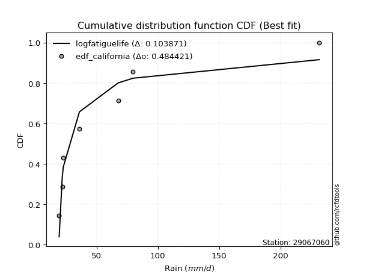</img></img>

</div>


### 2. EDF Hazen (1930)

Hazen method for plotting positions is a formula used to estimate the empirical cumulative probability distribution of flood events or other hydrological data. This formula often results in biased estimations, particularly when extrapolating to extreme events (high return periods).

<div align="center">


$P=(m-0.5)/n$


</div>


**2.1. Empirical values**

<div align="center">

|                | 0                   | 1                   | 2                   | 3         | 4                  | 5                  | 6                  |
|:---------------|:--------------------|:--------------------|:--------------------|:----------|:-------------------|:-------------------|:-------------------|
| date           | 2022                | 2021                | 2023                | 2024      | 2025               | 2020               | 2019               |
| x              | 19.5                | 22.0                | 22.9                | 36.02     | 67.6               | 79.6               | 231.6              |
| m              | 1                   | 2                   | 3                   | 4         | 5                  | 6                  | 7                  |
| empirical_dist | edf_hazen           | edf_hazen           | edf_hazen           | edf_hazen | edf_hazen          | edf_hazen          | edf_hazen          |
| empirical      | 0.07142857142857142 | 0.21428571428571427 | 0.35714285714285715 | 0.5       | 0.6428571428571429 | 0.7857142857142857 | 0.9285714285714286 |
| empirical_tr   | 1.0769230769230769  | 1.2727272727272727  | 1.5555555555555558  | 2.0       | 2.8000000000000003 | 4.666666666666666  | 14.000000000000007 |

</div>


**2.2. Kolmogorov-Smirnov fit test (sorted by Δ)**


<div align="center">

|                | 0                   | 1                   | 2                   | 3                   | 4                   | 5                   | 6                   | 7                   | 8                   | 9                   | 10                  | 11                  | 12                  | 13                  | 14                  | 15                  | 16                  | 17                  | 18                  | 19                  | 20                  | 21                  | 22                  | 23                  | 24                  | 25                  | 26                  | 27                  | 28                  | 29                  | 30                  | 31                  | 32                  | 33                  | 34                  | 35                  | 36                  | 37                  | 38                  | 39                  | 40                  | 41                  | 42                  | 43                  | 44                  | 45                  | 46                  | 47                  | 48                  | 49                  | 50                  | 51                  | 52                  | 53                  | 54                  | 55                  | 56                  | 57                  | 58                  | 59                  | 60                  | 61                  | 62                  | 63                  | 64                  | 65                  | 66                  | 67                  | 68                  | 69                  | 70                  | 71                  | 72                  | 73                  | 74                  | 75                  | 76                  | 77                  | 78                  | 79                  | 80                  | 81                  | 82                  | 83                  | 84                  | 85                  | 86                  | 87                  | 88                  | 89                  | 90                  | 91                  | 92                  | 93                  | 94                  | 95                  | 96                  | 97                  | 98                  | 99                  | 100                 | 101                 | 102                 | 103                 | 104                 | 105                 | 106                 | 107                 | 108                 | 109                 | 110                 | 111                 | 112                 | 113                 | 114                 | 115                 | 116                 | 117                 | 118                 | 119                 | 120                 | 121                 | 122                 | 123                 | 124                 | 125                 | 126                 | 127                 | 128                 | 129                 | 130                 | 131                 | 132                 | 133                 | 134                 | 135                 | 136                 | 137                 | 138                 | 139                 | 140                 | 141                 | 142                 | 143                 | 144                 | 145                 | 146                 | 147                 | 148                 | 149                 | 150                 | 151                 | 152                 | 153                 | 154                 | 155                 | 156                 | 157                 | 158                 | 159                 |
|:---------------|:--------------------|:--------------------|:--------------------|:--------------------|:--------------------|:--------------------|:--------------------|:--------------------|:--------------------|:--------------------|:--------------------|:--------------------|:--------------------|:--------------------|:--------------------|:--------------------|:--------------------|:--------------------|:--------------------|:--------------------|:--------------------|:--------------------|:--------------------|:--------------------|:--------------------|:--------------------|:--------------------|:--------------------|:--------------------|:--------------------|:--------------------|:--------------------|:--------------------|:--------------------|:--------------------|:--------------------|:--------------------|:--------------------|:--------------------|:--------------------|:--------------------|:--------------------|:--------------------|:--------------------|:--------------------|:--------------------|:--------------------|:--------------------|:--------------------|:--------------------|:--------------------|:--------------------|:--------------------|:--------------------|:--------------------|:--------------------|:--------------------|:--------------------|:--------------------|:--------------------|:--------------------|:--------------------|:--------------------|:--------------------|:--------------------|:--------------------|:--------------------|:--------------------|:--------------------|:--------------------|:--------------------|:--------------------|:--------------------|:--------------------|:--------------------|:--------------------|:--------------------|:--------------------|:--------------------|:--------------------|:--------------------|:--------------------|:--------------------|:--------------------|:--------------------|:--------------------|:--------------------|:--------------------|:--------------------|:--------------------|:--------------------|:--------------------|:--------------------|:--------------------|:--------------------|:--------------------|:--------------------|:--------------------|:--------------------|:--------------------|:--------------------|:--------------------|:--------------------|:--------------------|:--------------------|:--------------------|:--------------------|:--------------------|:--------------------|:--------------------|:--------------------|:--------------------|:--------------------|:--------------------|:--------------------|:--------------------|:--------------------|:--------------------|:--------------------|:--------------------|:--------------------|:--------------------|:--------------------|:--------------------|:--------------------|:--------------------|:--------------------|:--------------------|:--------------------|:--------------------|:--------------------|:--------------------|:--------------------|:--------------------|:--------------------|:--------------------|:--------------------|:--------------------|:--------------------|:--------------------|:--------------------|:--------------------|:--------------------|:--------------------|:--------------------|:--------------------|:--------------------|:--------------------|:--------------------|:--------------------|:--------------------|:--------------------|:--------------------|:--------------------|:--------------------|:--------------------|:--------------------|:--------------------|:--------------------|:--------------------|
| station        | 29067060            | 29067060            | 29067060            | 29067060            | 29067060            | 29067060            | 29067060            | 29067060            | 29067060            | 29067060            | 29067060            | 29067060            | 29067060            | 29067060            | 29067060            | 29067060            | 29067060            | 29067060            | 29067060            | 29067060            | 29067060            | 29067060            | 29067060            | 29067060            | 29067060            | 29067060            | 29067060            | 29067060            | 29067060            | 29067060            | 29067060            | 29067060            | 29067060            | 29067060            | 29067060            | 29067060            | 29067060            | 29067060            | 29067060            | 29067060            | 29067060            | 29067060            | 29067060            | 29067060            | 29067060            | 29067060            | 29067060            | 29067060            | 29067060            | 29067060            | 29067060            | 29067060            | 29067060            | 29067060            | 29067060            | 29067060            | 29067060            | 29067060            | 29067060            | 29067060            | 29067060            | 29067060            | 29067060            | 29067060            | 29067060            | 29067060            | 29067060            | 29067060            | 29067060            | 29067060            | 29067060            | 29067060            | 29067060            | 29067060            | 29067060            | 29067060            | 29067060            | 29067060            | 29067060            | 29067060            | 29067060            | 29067060            | 29067060            | 29067060            | 29067060            | 29067060            | 29067060            | 29067060            | 29067060            | 29067060            | 29067060            | 29067060            | 29067060            | 29067060            | 29067060            | 29067060            | 29067060            | 29067060            | 29067060            | 29067060            | 29067060            | 29067060            | 29067060            | 29067060            | 29067060            | 29067060            | 29067060            | 29067060            | 29067060            | 29067060            | 29067060            | 29067060            | 29067060            | 29067060            | 29067060            | 29067060            | 29067060            | 29067060            | 29067060            | 29067060            | 29067060            | 29067060            | 29067060            | 29067060            | 29067060            | 29067060            | 29067060            | 29067060            | 29067060            | 29067060            | 29067060            | 29067060            | 29067060            | 29067060            | 29067060            | 29067060            | 29067060            | 29067060            | 29067060            | 29067060            | 29067060            | 29067060            | 29067060            | 29067060            | 29067060            | 29067060            | 29067060            | 29067060            | 29067060            | 29067060            | 29067060            | 29067060            | 29067060            | 29067060            | 29067060            | 29067060            | 29067060            | 29067060            | 29067060            | 29067060            |
| empirical_dist | edf_hazen           | edf_hazen           | edf_hazen           | edf_hazen           | edf_hazen           | edf_hazen           | edf_hazen           | edf_hazen           | edf_hazen           | edf_hazen           | edf_hazen           | edf_hazen           | edf_hazen           | edf_hazen           | edf_hazen           | edf_hazen           | edf_hazen           | edf_hazen           | edf_hazen           | edf_hazen           | edf_hazen           | edf_hazen           | edf_hazen           | edf_hazen           | edf_hazen           | edf_hazen           | edf_hazen           | edf_hazen           | edf_hazen           | edf_hazen           | edf_hazen           | edf_hazen           | edf_hazen           | edf_hazen           | edf_hazen           | edf_hazen           | edf_hazen           | edf_hazen           | edf_hazen           | edf_hazen           | edf_hazen           | edf_hazen           | edf_hazen           | edf_hazen           | edf_hazen           | edf_hazen           | edf_hazen           | edf_hazen           | edf_hazen           | edf_hazen           | edf_hazen           | edf_hazen           | edf_hazen           | edf_hazen           | edf_hazen           | edf_hazen           | edf_hazen           | edf_hazen           | edf_hazen           | edf_hazen           | edf_hazen           | edf_hazen           | edf_hazen           | edf_hazen           | edf_hazen           | edf_hazen           | edf_hazen           | edf_hazen           | edf_hazen           | edf_hazen           | edf_hazen           | edf_hazen           | edf_hazen           | edf_hazen           | edf_hazen           | edf_hazen           | edf_hazen           | edf_hazen           | edf_hazen           | edf_hazen           | edf_hazen           | edf_hazen           | edf_hazen           | edf_hazen           | edf_hazen           | edf_hazen           | edf_hazen           | edf_hazen           | edf_hazen           | edf_hazen           | edf_hazen           | edf_hazen           | edf_hazen           | edf_hazen           | edf_hazen           | edf_hazen           | edf_hazen           | edf_hazen           | edf_hazen           | edf_hazen           | edf_hazen           | edf_hazen           | edf_hazen           | edf_hazen           | edf_hazen           | edf_hazen           | edf_hazen           | edf_hazen           | edf_hazen           | edf_hazen           | edf_hazen           | edf_hazen           | edf_hazen           | edf_hazen           | edf_hazen           | edf_hazen           | edf_hazen           | edf_hazen           | edf_hazen           | edf_hazen           | edf_hazen           | edf_hazen           | edf_hazen           | edf_hazen           | edf_hazen           | edf_hazen           | edf_hazen           | edf_hazen           | edf_hazen           | edf_hazen           | edf_hazen           | edf_hazen           | edf_hazen           | edf_hazen           | edf_hazen           | edf_hazen           | edf_hazen           | edf_hazen           | edf_hazen           | edf_hazen           | edf_hazen           | edf_hazen           | edf_hazen           | edf_hazen           | edf_hazen           | edf_hazen           | edf_hazen           | edf_hazen           | edf_hazen           | edf_hazen           | edf_hazen           | edf_hazen           | edf_hazen           | edf_hazen           | edf_hazen           | edf_hazen           | edf_hazen           | edf_hazen           | edf_hazen           | edf_hazen           |
| p_dist         | logweibull_min      | genextreme          | invweibull          | lognakagami         | logbeta             | loggausshyper       | logsemicircular     | logfoldnorm         | logkappa3           | loghalfnorm         | loganglit           | invgamma            | genpareto           | loggenextreme       | loginvweibull       | lograyleigh         | halfgennorm         | logalpha            | wald                | logmaxwell          | logburr12           | logf                | loginvgamma         | burr                | logbetaprime        | betaprime           | gamma               | logpearson3         | logloggamma         | lognorm             | logcrystalball      | logt                | loghalflogistic     | logncf              | logfatiguelife      | loghalfgennorm      | logburr             | loginvgauss         | ncf                 | loggumbel_r         | logexponweib        | invgauss            | lognct              | erlang              | nct                 | logarcsine          | loggenlogistic      | nakagami            | loglogistic         | logmoyal            | moyal               | genlogistic         | logkstwobign        | gumbel_r            | logcosine           | loggumbel_l         | loglomax            | truncweibull_min    | burr12              | logexponnorm        | logtruncnorm        | logexponpow         | alpha               | loghypsecant        | loggenexpon         | maxwell             | loggompertz         | vonmises_line       | pearson3            | rayleigh            | logrice             | logdweibull         | exponpow            | loglaplace          | loglaplace          | johnsonsb           | halflogistic        | truncpareto         | logloglaplace       | dgamma              | hypsecant           | logistic            | kstwobign           | logargus            | f                   | logdgamma           | logtruncweibull_min | halfnorm            | norm                | crystalball         | gennorm             | logksone            | weibull_min         | logtukeylambda      | anglit              | gengamma            | rice                | semicircular        | laplace             | logrdist            | foldnorm            | loggamma            | loggamma            | logkappa4           | bradford            | logskewnorm         | logbradford         | logwrapcauchy       | arcsine             | logtruncexpon       | loggenpareto        | logtriang           | beta                | logweibull_max      | loggennorm          | logerlang           | gumbel_l            | exponnorm           | genexpon            | loguniform          | logvonmises_line    | loggengamma         | gompertz            | truncexpon          | wrapcauchy          | lomax               | truncnorm           | cosine              | gausshyper          | logwald             | dweibull            | t                   | exponweib           | powerlaw            | loglevy_l           | skewnorm            | fatiguelife         | loggenhalflogistic  | levy_l              | logpowerlaw         | argus               | logtruncpareto      | kappa3              | johnsonsu           | ksone               | kappa4              | logtrapezoid        | uniform             | rdist               | logjohnsonsb        | logjohnsonsu        | tukeylambda         | genhalflogistic     | triang              | trapezoid           | weibull_max         | logvonmises         | vonmises            | mielke              | logmielke           |
| delta          | 0.08706431533787218 | 0.1038019333047645  | 0.10380435847066649 | 0.11107875088316532 | 0.11165861130955568 | 0.11567771664244983 | 0.11611604780438764 | 0.11694278383112466 | 0.12106514528880674 | 0.12626292415105933 | 0.12780440452027675 | 0.12975936446972292 | 0.13239951860191812 | 0.1331852669890805  | 0.1331964928011935  | 0.1370064457991966  | 0.13738918704810366 | 0.13760563173578688 | 0.1377628793525701  | 0.14250830451392754 | 0.14410276127448574 | 0.14416919241803383 | 0.14417295333025548 | 0.14461156880800785 | 0.14636633939277433 | 0.14758224765213815 | 0.14966115446243    | 0.14984498009273975 | 0.15559140514743788 | 0.15575624207350774 | 0.15575634762821514 | 0.155757224919656   | 0.15607891321617703 | 0.15689836433396556 | 0.15730744458250878 | 0.15742319024488394 | 0.15793288020973095 | 0.1580641002081381  | 0.16180251477023558 | 0.16353492806151246 | 0.16416541074873048 | 0.16432768972128364 | 0.1652851679394018  | 0.16643720071361423 | 0.1689608595556861  | 0.16920438559498327 | 0.17035799034858168 | 0.17151472697882286 | 0.17732281333004699 | 0.17753548252965462 | 0.17846180430905542 | 0.17896229553740428 | 0.180699366971504   | 0.18148884493350473 | 0.18174552729524163 | 0.1824557156633885  | 0.18379188355143558 | 0.18402043410606483 | 0.18570676790162102 | 0.18606961644960945 | 0.1868156584972289  | 0.18735043585846042 | 0.18961359528064758 | 0.1900449857496594  | 0.19029400946949823 | 0.19311807981465023 | 0.1933530090940449  | 0.1951559423516452  | 0.19682862047589558 | 0.20005073061077175 | 0.20023171786027547 | 0.20074067481199573 | 0.20172896220501446 | 0.20400082247204268 | 0.20400082247204268 | 0.2059055954753661  | 0.20595020237564918 | 0.20799415997503357 | 0.21042581937465968 | 0.21181323258827892 | 0.21327758778515077 | 0.21417447974942405 | 0.21467013252507605 | 0.21496443928307873 | 0.2165170851728417  | 0.21747311506522563 | 0.22157682653719726 | 0.22241036091789698 | 0.2226047145969028  | 0.2226047236412363  | 0.22383357312313842 | 0.22870130944283917 | 0.2300369654704553  | 0.23063824614472445 | 0.23151798361214515 | 0.23196570564041194 | 0.23490735657659484 | 0.23520144111280827 | 0.24007456795010562 | 0.24313465622701302 | 0.24618280715748672 | 0.24655294771742542 | 0.24655294771742542 | 0.24695636411522526 | 0.24707269918341257 | 0.2505134640684425  | 0.25974429893871837 | 0.26410345779705935 | 0.2642209164008673  | 0.2663713825256896  | 0.27135918268644277 | 0.27164041037365483 | 0.2761412238404518  | 0.2844603454041622  | 0.2857142857142857  | 0.28726242459161166 | 0.2881237177757965  | 0.2882925676648171  | 0.2900547789046889  | 0.29219392735897504 | 0.29633615783773837 | 0.2968757322353832  | 0.29780418754872406 | 0.3029000593245845  | 0.3033656475324934  | 0.3074939504314521  | 0.3075957322934073  | 0.312381775558162   | 0.314395095764579   | 0.32316654360673913 | 0.32504878111926283 | 0.33191788654929444 | 0.33219360278231236 | 0.3388742088292399  | 0.3464165619261017  | 0.34681584746905547 | 0.36827587459640865 | 0.3825566954866268  | 0.3898748079577621  | 0.4085111813229263  | 0.41122283367590606 | 0.42264793048546634 | 0.4494041178980297  | 0.4604679689168477  | 0.4662501964482162  | 0.467732349321586   | 0.47545082997951066 | 0.5023573785950024  | 0.5202877612409529  | 0.5349039443819598  | 0.5361413392640809  | 0.5498944839657349  | 0.5876215029688266  | 0.6640033736431245  | 0.6834422356624231  | 0.6931169904519141  | 1.0954564554493247  | 36.87675977191006   | nan                 | nan                 |
| deltao         | 0.48442053926100004 | 0.48442053926100004 | 0.48442053926100004 | 0.48442053926100004 | 0.48442053926100004 | 0.48442053926100004 | 0.48442053926100004 | 0.48442053926100004 | 0.48442053926100004 | 0.48442053926100004 | 0.48442053926100004 | 0.48442053926100004 | 0.48442053926100004 | 0.48442053926100004 | 0.48442053926100004 | 0.48442053926100004 | 0.48442053926100004 | 0.48442053926100004 | 0.48442053926100004 | 0.48442053926100004 | 0.48442053926100004 | 0.48442053926100004 | 0.48442053926100004 | 0.48442053926100004 | 0.48442053926100004 | 0.48442053926100004 | 0.48442053926100004 | 0.48442053926100004 | 0.48442053926100004 | 0.48442053926100004 | 0.48442053926100004 | 0.48442053926100004 | 0.48442053926100004 | 0.48442053926100004 | 0.48442053926100004 | 0.48442053926100004 | 0.48442053926100004 | 0.48442053926100004 | 0.48442053926100004 | 0.48442053926100004 | 0.48442053926100004 | 0.48442053926100004 | 0.48442053926100004 | 0.48442053926100004 | 0.48442053926100004 | 0.48442053926100004 | 0.48442053926100004 | 0.48442053926100004 | 0.48442053926100004 | 0.48442053926100004 | 0.48442053926100004 | 0.48442053926100004 | 0.48442053926100004 | 0.48442053926100004 | 0.48442053926100004 | 0.48442053926100004 | 0.48442053926100004 | 0.48442053926100004 | 0.48442053926100004 | 0.48442053926100004 | 0.48442053926100004 | 0.48442053926100004 | 0.48442053926100004 | 0.48442053926100004 | 0.48442053926100004 | 0.48442053926100004 | 0.48442053926100004 | 0.48442053926100004 | 0.48442053926100004 | 0.48442053926100004 | 0.48442053926100004 | 0.48442053926100004 | 0.48442053926100004 | 0.48442053926100004 | 0.48442053926100004 | 0.48442053926100004 | 0.48442053926100004 | 0.48442053926100004 | 0.48442053926100004 | 0.48442053926100004 | 0.48442053926100004 | 0.48442053926100004 | 0.48442053926100004 | 0.48442053926100004 | 0.48442053926100004 | 0.48442053926100004 | 0.48442053926100004 | 0.48442053926100004 | 0.48442053926100004 | 0.48442053926100004 | 0.48442053926100004 | 0.48442053926100004 | 0.48442053926100004 | 0.48442053926100004 | 0.48442053926100004 | 0.48442053926100004 | 0.48442053926100004 | 0.48442053926100004 | 0.48442053926100004 | 0.48442053926100004 | 0.48442053926100004 | 0.48442053926100004 | 0.48442053926100004 | 0.48442053926100004 | 0.48442053926100004 | 0.48442053926100004 | 0.48442053926100004 | 0.48442053926100004 | 0.48442053926100004 | 0.48442053926100004 | 0.48442053926100004 | 0.48442053926100004 | 0.48442053926100004 | 0.48442053926100004 | 0.48442053926100004 | 0.48442053926100004 | 0.48442053926100004 | 0.48442053926100004 | 0.48442053926100004 | 0.48442053926100004 | 0.48442053926100004 | 0.48442053926100004 | 0.48442053926100004 | 0.48442053926100004 | 0.48442053926100004 | 0.48442053926100004 | 0.48442053926100004 | 0.48442053926100004 | 0.48442053926100004 | 0.48442053926100004 | 0.48442053926100004 | 0.48442053926100004 | 0.48442053926100004 | 0.48442053926100004 | 0.48442053926100004 | 0.48442053926100004 | 0.48442053926100004 | 0.48442053926100004 | 0.48442053926100004 | 0.48442053926100004 | 0.48442053926100004 | 0.48442053926100004 | 0.48442053926100004 | 0.48442053926100004 | 0.48442053926100004 | 0.48442053926100004 | 0.48442053926100004 | 0.48442053926100004 | 0.48442053926100004 | 0.48442053926100004 | 0.48442053926100004 | 0.48442053926100004 | 0.48442053926100004 | 0.48442053926100004 | 0.48442053926100004 | 0.48442053926100004 | 0.48442053926100004 | 0.48442053926100004 | 0.48442053926100004 | 0.48442053926100004 |
| eval           | Δo > Δ              | Δo > Δ              | Δo > Δ              | Δo > Δ              | Δo > Δ              | Δo > Δ              | Δo > Δ              | Δo > Δ              | Δo > Δ              | Δo > Δ              | Δo > Δ              | Δo > Δ              | Δo > Δ              | Δo > Δ              | Δo > Δ              | Δo > Δ              | Δo > Δ              | Δo > Δ              | Δo > Δ              | Δo > Δ              | Δo > Δ              | Δo > Δ              | Δo > Δ              | Δo > Δ              | Δo > Δ              | Δo > Δ              | Δo > Δ              | Δo > Δ              | Δo > Δ              | Δo > Δ              | Δo > Δ              | Δo > Δ              | Δo > Δ              | Δo > Δ              | Δo > Δ              | Δo > Δ              | Δo > Δ              | Δo > Δ              | Δo > Δ              | Δo > Δ              | Δo > Δ              | Δo > Δ              | Δo > Δ              | Δo > Δ              | Δo > Δ              | Δo > Δ              | Δo > Δ              | Δo > Δ              | Δo > Δ              | Δo > Δ              | Δo > Δ              | Δo > Δ              | Δo > Δ              | Δo > Δ              | Δo > Δ              | Δo > Δ              | Δo > Δ              | Δo > Δ              | Δo > Δ              | Δo > Δ              | Δo > Δ              | Δo > Δ              | Δo > Δ              | Δo > Δ              | Δo > Δ              | Δo > Δ              | Δo > Δ              | Δo > Δ              | Δo > Δ              | Δo > Δ              | Δo > Δ              | Δo > Δ              | Δo > Δ              | Δo > Δ              | Δo > Δ              | Δo > Δ              | Δo > Δ              | Δo > Δ              | Δo > Δ              | Δo > Δ              | Δo > Δ              | Δo > Δ              | Δo > Δ              | Δo > Δ              | Δo > Δ              | Δo > Δ              | Δo > Δ              | Δo > Δ              | Δo > Δ              | Δo > Δ              | Δo > Δ              | Δo > Δ              | Δo > Δ              | Δo > Δ              | Δo > Δ              | Δo > Δ              | Δo > Δ              | Δo > Δ              | Δo > Δ              | Δo > Δ              | Δo > Δ              | Δo > Δ              | Δo > Δ              | Δo > Δ              | Δo > Δ              | Δo > Δ              | Δo > Δ              | Δo > Δ              | Δo > Δ              | Δo > Δ              | Δo > Δ              | Δo > Δ              | Δo > Δ              | Δo > Δ              | Δo > Δ              | Δo > Δ              | Δo > Δ              | Δo > Δ              | Δo > Δ              | Δo > Δ              | Δo > Δ              | Δo > Δ              | Δo > Δ              | Δo > Δ              | Δo > Δ              | Δo > Δ              | Δo > Δ              | Δo > Δ              | Δo > Δ              | Δo > Δ              | Δo > Δ              | Δo > Δ              | Δo > Δ              | Δo > Δ              | Δo > Δ              | Δo > Δ              | Δo > Δ              | Δo > Δ              | Δo > Δ              | Δo > Δ              | Δo > Δ              | Δo > Δ              | Δo > Δ              | Δo > Δ              | Δo > Δ              | Δo > Δ              | Δo > Δ              | Δo <= Δ             | Δo <= Δ             | Δo <= Δ             | Δo <= Δ             | Δo <= Δ             | Δo <= Δ             | Δo <= Δ             | Δo <= Δ             | Δo <= Δ             | Δo <= Δ             | Δo <= Δ             | Δo <= Δ             | Δo <= Δ             |
| fit            | 1                   | 1                   | 1                   | 1                   | 1                   | 1                   | 1                   | 1                   | 1                   | 1                   | 1                   | 1                   | 1                   | 1                   | 1                   | 1                   | 1                   | 1                   | 1                   | 1                   | 1                   | 1                   | 1                   | 1                   | 1                   | 1                   | 1                   | 1                   | 1                   | 1                   | 1                   | 1                   | 1                   | 1                   | 1                   | 1                   | 1                   | 1                   | 1                   | 1                   | 1                   | 1                   | 1                   | 1                   | 1                   | 1                   | 1                   | 1                   | 1                   | 1                   | 1                   | 1                   | 1                   | 1                   | 1                   | 1                   | 1                   | 1                   | 1                   | 1                   | 1                   | 1                   | 1                   | 1                   | 1                   | 1                   | 1                   | 1                   | 1                   | 1                   | 1                   | 1                   | 1                   | 1                   | 1                   | 1                   | 1                   | 1                   | 1                   | 1                   | 1                   | 1                   | 1                   | 1                   | 1                   | 1                   | 1                   | 1                   | 1                   | 1                   | 1                   | 1                   | 1                   | 1                   | 1                   | 1                   | 1                   | 1                   | 1                   | 1                   | 1                   | 1                   | 1                   | 1                   | 1                   | 1                   | 1                   | 1                   | 1                   | 1                   | 1                   | 1                   | 1                   | 1                   | 1                   | 1                   | 1                   | 1                   | 1                   | 1                   | 1                   | 1                   | 1                   | 1                   | 1                   | 1                   | 1                   | 1                   | 1                   | 1                   | 1                   | 1                   | 1                   | 1                   | 1                   | 1                   | 1                   | 1                   | 1                   | 1                   | 1                   | 1                   | 1                   | 1                   | 1                   | 1                   | 1                   | 0                   | 0                   | 0                   | 0                   | 0                   | 0                   | 0                   | 0                   | 0                   | 0                   | 0                   | 0                   | 0                   |
| n              | 7                   | 7                   | 7                   | 7                   | 7                   | 7                   | 7                   | 7                   | 7                   | 7                   | 7                   | 7                   | 7                   | 7                   | 7                   | 7                   | 7                   | 7                   | 7                   | 7                   | 7                   | 7                   | 7                   | 7                   | 7                   | 7                   | 7                   | 7                   | 7                   | 7                   | 7                   | 7                   | 7                   | 7                   | 7                   | 7                   | 7                   | 7                   | 7                   | 7                   | 7                   | 7                   | 7                   | 7                   | 7                   | 7                   | 7                   | 7                   | 7                   | 7                   | 7                   | 7                   | 7                   | 7                   | 7                   | 7                   | 7                   | 7                   | 7                   | 7                   | 7                   | 7                   | 7                   | 7                   | 7                   | 7                   | 7                   | 7                   | 7                   | 7                   | 7                   | 7                   | 7                   | 7                   | 7                   | 7                   | 7                   | 7                   | 7                   | 7                   | 7                   | 7                   | 7                   | 7                   | 7                   | 7                   | 7                   | 7                   | 7                   | 7                   | 7                   | 7                   | 7                   | 7                   | 7                   | 7                   | 7                   | 7                   | 7                   | 7                   | 7                   | 7                   | 7                   | 7                   | 7                   | 7                   | 7                   | 7                   | 7                   | 7                   | 7                   | 7                   | 7                   | 7                   | 7                   | 7                   | 7                   | 7                   | 7                   | 7                   | 7                   | 7                   | 7                   | 7                   | 7                   | 7                   | 7                   | 7                   | 7                   | 7                   | 7                   | 7                   | 7                   | 7                   | 7                   | 7                   | 7                   | 7                   | 7                   | 7                   | 7                   | 7                   | 7                   | 7                   | 7                   | 7                   | 7                   | 7                   | 7                   | 7                   | 7                   | 7                   | 7                   | 7                   | 7                   | 7                   | 7                   | 7                   | 7                   | 7                   |
| best_fit       | 1                   | 0                   | 0                   | 0                   | 0                   | 0                   | 0                   | 0                   | 0                   | 0                   | 0                   | 0                   | 0                   | 0                   | 0                   | 0                   | 0                   | 0                   | 0                   | 0                   | 0                   | 0                   | 0                   | 0                   | 0                   | 0                   | 0                   | 0                   | 0                   | 0                   | 0                   | 0                   | 0                   | 0                   | 0                   | 0                   | 0                   | 0                   | 0                   | 0                   | 0                   | 0                   | 0                   | 0                   | 0                   | 0                   | 0                   | 0                   | 0                   | 0                   | 0                   | 0                   | 0                   | 0                   | 0                   | 0                   | 0                   | 0                   | 0                   | 0                   | 0                   | 0                   | 0                   | 0                   | 0                   | 0                   | 0                   | 0                   | 0                   | 0                   | 0                   | 0                   | 0                   | 0                   | 0                   | 0                   | 0                   | 0                   | 0                   | 0                   | 0                   | 0                   | 0                   | 0                   | 0                   | 0                   | 0                   | 0                   | 0                   | 0                   | 0                   | 0                   | 0                   | 0                   | 0                   | 0                   | 0                   | 0                   | 0                   | 0                   | 0                   | 0                   | 0                   | 0                   | 0                   | 0                   | 0                   | 0                   | 0                   | 0                   | 0                   | 0                   | 0                   | 0                   | 0                   | 0                   | 0                   | 0                   | 0                   | 0                   | 0                   | 0                   | 0                   | 0                   | 0                   | 0                   | 0                   | 0                   | 0                   | 0                   | 0                   | 0                   | 0                   | 0                   | 0                   | 0                   | 0                   | 0                   | 0                   | 0                   | 0                   | 0                   | 0                   | 0                   | 0                   | 0                   | 0                   | 0                   | 0                   | 0                   | 0                   | 0                   | 0                   | 0                   | 0                   | 0                   | 0                   | 0                   | 0                   | 0                   |
| best_fit_sort  | 1                   | 2                   | 3                   | 4                   | 5                   | 6                   | 7                   | 8                   | 9                   | 10                  | 11                  | 12                  | 13                  | 14                  | 15                  | 16                  | 17                  | 18                  | 19                  | 20                  | 21                  | 22                  | 23                  | 24                  | 25                  | 26                  | 27                  | 28                  | 29                  | 30                  | 31                  | 32                  | 33                  | 34                  | 35                  | 36                  | 37                  | 38                  | 39                  | 40                  | 41                  | 42                  | 43                  | 44                  | 45                  | 46                  | 47                  | 48                  | 49                  | 50                  | 51                  | 52                  | 53                  | 54                  | 55                  | 56                  | 57                  | 58                  | 59                  | 60                  | 61                  | 62                  | 63                  | 64                  | 65                  | 66                  | 67                  | 68                  | 69                  | 70                  | 71                  | 72                  | 73                  | 74                  | 75                  | 76                  | 77                  | 78                  | 79                  | 80                  | 81                  | 82                  | 83                  | 84                  | 85                  | 86                  | 87                  | 88                  | 89                  | 90                  | 91                  | 92                  | 93                  | 94                  | 95                  | 96                  | 97                  | 98                  | 99                  | 100                 | 101                 | 102                 | 103                 | 104                 | 105                 | 106                 | 107                 | 108                 | 109                 | 110                 | 111                 | 112                 | 113                 | 114                 | 115                 | 116                 | 117                 | 118                 | 119                 | 120                 | 121                 | 122                 | 123                 | 124                 | 125                 | 126                 | 127                 | 128                 | 129                 | 130                 | 131                 | 132                 | 133                 | 134                 | 135                 | 136                 | 137                 | 138                 | 139                 | 140                 | 141                 | 142                 | 143                 | 144                 | 145                 | 146                 | 147                 | 148                 | 149                 | 150                 | 151                 | 152                 | 153                 | 154                 | 155                 | 156                 | 157                 | 158                 | 159                 | 160                 |

</div>


**2.3. Best fit**

<div align="center">

|   id |   station | empirical_dist   | p_dist         |     delta |   deltao | eval   |   fit |   n |   best_fit |   best_fit_sort |
|-----:|----------:|:-----------------|:---------------|----------:|---------:|:-------|------:|----:|-----------:|----------------:|
|    0 |  29067060 | edf_hazen        | logweibull_min | 0.0870643 | 0.484421 | Δo > Δ |     1 |   7 |          1 |               1 |

</div>


<div align="center">

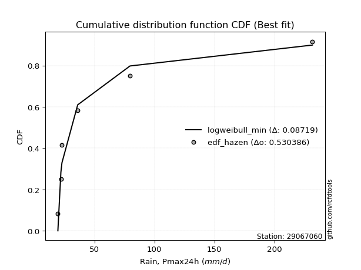</img>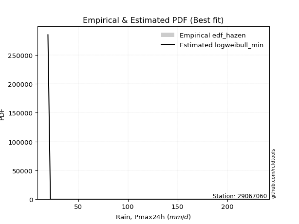</img>

</div>


### 3. EDF Weibull (1939)

Weibull plotting position formula is an empirical method used to estimate the non-exceedance probability or plotting position for a set of observed data, is often recommended or widely used in practice, particularly in flood frequency analysis.

<div align="center">


$P=m/(n+1)$


</div>


**3.1. Empirical values**

<div align="center">

|                | 0                  | 1                  | 2           | 3           | 4                  | 5           | 6           |
|:---------------|:-------------------|:-------------------|:------------|:------------|:-------------------|:------------|:------------|
| date           | 2022               | 2021               | 2023        | 2024        | 2025               | 2020        | 2019        |
| x              | 19.5               | 22.0               | 22.9        | 36.02       | 67.6               | 79.6        | 231.6       |
| m              | 1                  | 2                  | 3           | 4           | 5                  | 6           | 7           |
| empirical_dist | edf_weibull        | edf_weibull        | edf_weibull | edf_weibull | edf_weibull        | edf_weibull | edf_weibull |
| empirical      | 0.125              | 0.25               | 0.375       | 0.5         | 0.625              | 0.75        | 0.875       |
| empirical_tr   | 1.1428571428571428 | 1.3333333333333333 | 1.6         | 2.0         | 2.6666666666666665 | 4.0         | 8.0         |

</div>


**3.2. Kolmogorov-Smirnov fit test (sorted by Δ)**


<div align="center">

|                | 0                   | 1                   | 2                   | 3                   | 4                   | 5                   | 6                   | 7                   | 8                   | 9                   | 10                  | 11                  | 12                  | 13                  | 14                  | 15                  | 16                  | 17                  | 18                  | 19                  | 20                  | 21                  | 22                  | 23                  | 24                  | 25                  | 26                  | 27                  | 28                  | 29                  | 30                  | 31                  | 32                  | 33                  | 34                  | 35                  | 36                  | 37                  | 38                  | 39                  | 40                  | 41                  | 42                  | 43                  | 44                  | 45                  | 46                  | 47                  | 48                  | 49                  | 50                  | 51                  | 52                  | 53                  | 54                  | 55                  | 56                  | 57                  | 58                  | 59                  | 60                  | 61                  | 62                  | 63                  | 64                  | 65                  | 66                  | 67                  | 68                  | 69                  | 70                  | 71                  | 72                  | 73                  | 74                  | 75                  | 76                  | 77                  | 78                  | 79                  | 80                  | 81                  | 82                  | 83                  | 84                  | 85                  | 86                  | 87                  | 88                  | 89                  | 90                  | 91                  | 92                  | 93                  | 94                  | 95                  | 96                  | 97                  | 98                  | 99                  | 100                 | 101                 | 102                 | 103                 | 104                 | 105                 | 106                 | 107                 | 108                 | 109                 | 110                 | 111                 | 112                 | 113                 | 114                 | 115                 | 116                 | 117                 | 118                 | 119                 | 120                 | 121                 | 122                 | 123                 | 124                 | 125                 | 126                 | 127                 | 128                 | 129                 | 130                 | 131                 | 132                 | 133                 | 134                 | 135                 | 136                 | 137                 | 138                 | 139                 | 140                 | 141                 | 142                 | 143                 | 144                 | 145                 | 146                 | 147                 | 148                 | 149                 | 150                 | 151                 | 152                 | 153                 | 154                 | 155                 | 156                 | 157                 | 158                 | 159                 |
|:---------------|:--------------------|:--------------------|:--------------------|:--------------------|:--------------------|:--------------------|:--------------------|:--------------------|:--------------------|:--------------------|:--------------------|:--------------------|:--------------------|:--------------------|:--------------------|:--------------------|:--------------------|:--------------------|:--------------------|:--------------------|:--------------------|:--------------------|:--------------------|:--------------------|:--------------------|:--------------------|:--------------------|:--------------------|:--------------------|:--------------------|:--------------------|:--------------------|:--------------------|:--------------------|:--------------------|:--------------------|:--------------------|:--------------------|:--------------------|:--------------------|:--------------------|:--------------------|:--------------------|:--------------------|:--------------------|:--------------------|:--------------------|:--------------------|:--------------------|:--------------------|:--------------------|:--------------------|:--------------------|:--------------------|:--------------------|:--------------------|:--------------------|:--------------------|:--------------------|:--------------------|:--------------------|:--------------------|:--------------------|:--------------------|:--------------------|:--------------------|:--------------------|:--------------------|:--------------------|:--------------------|:--------------------|:--------------------|:--------------------|:--------------------|:--------------------|:--------------------|:--------------------|:--------------------|:--------------------|:--------------------|:--------------------|:--------------------|:--------------------|:--------------------|:--------------------|:--------------------|:--------------------|:--------------------|:--------------------|:--------------------|:--------------------|:--------------------|:--------------------|:--------------------|:--------------------|:--------------------|:--------------------|:--------------------|:--------------------|:--------------------|:--------------------|:--------------------|:--------------------|:--------------------|:--------------------|:--------------------|:--------------------|:--------------------|:--------------------|:--------------------|:--------------------|:--------------------|:--------------------|:--------------------|:--------------------|:--------------------|:--------------------|:--------------------|:--------------------|:--------------------|:--------------------|:--------------------|:--------------------|:--------------------|:--------------------|:--------------------|:--------------------|:--------------------|:--------------------|:--------------------|:--------------------|:--------------------|:--------------------|:--------------------|:--------------------|:--------------------|:--------------------|:--------------------|:--------------------|:--------------------|:--------------------|:--------------------|:--------------------|:--------------------|:--------------------|:--------------------|:--------------------|:--------------------|:--------------------|:--------------------|:--------------------|:--------------------|:--------------------|:--------------------|:--------------------|:--------------------|:--------------------|:--------------------|:--------------------|:--------------------|
| station        | 29067060            | 29067060            | 29067060            | 29067060            | 29067060            | 29067060            | 29067060            | 29067060            | 29067060            | 29067060            | 29067060            | 29067060            | 29067060            | 29067060            | 29067060            | 29067060            | 29067060            | 29067060            | 29067060            | 29067060            | 29067060            | 29067060            | 29067060            | 29067060            | 29067060            | 29067060            | 29067060            | 29067060            | 29067060            | 29067060            | 29067060            | 29067060            | 29067060            | 29067060            | 29067060            | 29067060            | 29067060            | 29067060            | 29067060            | 29067060            | 29067060            | 29067060            | 29067060            | 29067060            | 29067060            | 29067060            | 29067060            | 29067060            | 29067060            | 29067060            | 29067060            | 29067060            | 29067060            | 29067060            | 29067060            | 29067060            | 29067060            | 29067060            | 29067060            | 29067060            | 29067060            | 29067060            | 29067060            | 29067060            | 29067060            | 29067060            | 29067060            | 29067060            | 29067060            | 29067060            | 29067060            | 29067060            | 29067060            | 29067060            | 29067060            | 29067060            | 29067060            | 29067060            | 29067060            | 29067060            | 29067060            | 29067060            | 29067060            | 29067060            | 29067060            | 29067060            | 29067060            | 29067060            | 29067060            | 29067060            | 29067060            | 29067060            | 29067060            | 29067060            | 29067060            | 29067060            | 29067060            | 29067060            | 29067060            | 29067060            | 29067060            | 29067060            | 29067060            | 29067060            | 29067060            | 29067060            | 29067060            | 29067060            | 29067060            | 29067060            | 29067060            | 29067060            | 29067060            | 29067060            | 29067060            | 29067060            | 29067060            | 29067060            | 29067060            | 29067060            | 29067060            | 29067060            | 29067060            | 29067060            | 29067060            | 29067060            | 29067060            | 29067060            | 29067060            | 29067060            | 29067060            | 29067060            | 29067060            | 29067060            | 29067060            | 29067060            | 29067060            | 29067060            | 29067060            | 29067060            | 29067060            | 29067060            | 29067060            | 29067060            | 29067060            | 29067060            | 29067060            | 29067060            | 29067060            | 29067060            | 29067060            | 29067060            | 29067060            | 29067060            | 29067060            | 29067060            | 29067060            | 29067060            | 29067060            | 29067060            |
| empirical_dist | edf_weibull         | edf_weibull         | edf_weibull         | edf_weibull         | edf_weibull         | edf_weibull         | edf_weibull         | edf_weibull         | edf_weibull         | edf_weibull         | edf_weibull         | edf_weibull         | edf_weibull         | edf_weibull         | edf_weibull         | edf_weibull         | edf_weibull         | edf_weibull         | edf_weibull         | edf_weibull         | edf_weibull         | edf_weibull         | edf_weibull         | edf_weibull         | edf_weibull         | edf_weibull         | edf_weibull         | edf_weibull         | edf_weibull         | edf_weibull         | edf_weibull         | edf_weibull         | edf_weibull         | edf_weibull         | edf_weibull         | edf_weibull         | edf_weibull         | edf_weibull         | edf_weibull         | edf_weibull         | edf_weibull         | edf_weibull         | edf_weibull         | edf_weibull         | edf_weibull         | edf_weibull         | edf_weibull         | edf_weibull         | edf_weibull         | edf_weibull         | edf_weibull         | edf_weibull         | edf_weibull         | edf_weibull         | edf_weibull         | edf_weibull         | edf_weibull         | edf_weibull         | edf_weibull         | edf_weibull         | edf_weibull         | edf_weibull         | edf_weibull         | edf_weibull         | edf_weibull         | edf_weibull         | edf_weibull         | edf_weibull         | edf_weibull         | edf_weibull         | edf_weibull         | edf_weibull         | edf_weibull         | edf_weibull         | edf_weibull         | edf_weibull         | edf_weibull         | edf_weibull         | edf_weibull         | edf_weibull         | edf_weibull         | edf_weibull         | edf_weibull         | edf_weibull         | edf_weibull         | edf_weibull         | edf_weibull         | edf_weibull         | edf_weibull         | edf_weibull         | edf_weibull         | edf_weibull         | edf_weibull         | edf_weibull         | edf_weibull         | edf_weibull         | edf_weibull         | edf_weibull         | edf_weibull         | edf_weibull         | edf_weibull         | edf_weibull         | edf_weibull         | edf_weibull         | edf_weibull         | edf_weibull         | edf_weibull         | edf_weibull         | edf_weibull         | edf_weibull         | edf_weibull         | edf_weibull         | edf_weibull         | edf_weibull         | edf_weibull         | edf_weibull         | edf_weibull         | edf_weibull         | edf_weibull         | edf_weibull         | edf_weibull         | edf_weibull         | edf_weibull         | edf_weibull         | edf_weibull         | edf_weibull         | edf_weibull         | edf_weibull         | edf_weibull         | edf_weibull         | edf_weibull         | edf_weibull         | edf_weibull         | edf_weibull         | edf_weibull         | edf_weibull         | edf_weibull         | edf_weibull         | edf_weibull         | edf_weibull         | edf_weibull         | edf_weibull         | edf_weibull         | edf_weibull         | edf_weibull         | edf_weibull         | edf_weibull         | edf_weibull         | edf_weibull         | edf_weibull         | edf_weibull         | edf_weibull         | edf_weibull         | edf_weibull         | edf_weibull         | edf_weibull         | edf_weibull         | edf_weibull         | edf_weibull         | edf_weibull         |
| p_dist         | genextreme          | invweibull          | moyal               | logweibull_min      | logarcsine          | lognakagami         | logbeta             | logsemicircular     | loggausshyper       | logfoldnorm         | nakagami            | gumbel_r            | logkappa3           | logexponweib        | vonmises_line       | pearson3            | loghalfnorm         | loganglit           | invgamma            | rayleigh            | truncweibull_min    | genpareto           | loggenextreme       | loginvweibull       | halflogistic        | lograyleigh         | halfgennorm         | logalpha            | wald                | maxwell             | dgamma              | logmaxwell          | logburr12           | logf                | loginvgamma         | burr                | logbetaprime        | betaprime           | gamma               | logpearson3         | halfnorm            | johnsonsb           | gennorm             | logloggamma         | lognorm             | logcrystalball      | logt                | loghalflogistic     | logdweibull         | logncf              | logfatiguelife      | loghalfgennorm      | logburr             | loginvgauss         | genlogistic         | ncf                 | f                   | loggumbel_r         | invgauss            | lognct              | erlang              | nct                 | norm                | crystalball         | loggenlogistic      | logdgamma           | foldnorm            | loglogistic         | logmoyal            | anglit              | gengamma            | logistic            | logkstwobign        | semicircular        | logcosine           | loggumbel_l         | loglomax            | burr12              | logexponnorm        | logtruncnorm        | logexponpow         | alpha               | loghypsecant        | loggenexpon         | logrdist            | loggompertz         | hypsecant           | arcsine             | kstwobign           | loggenpareto        | logrice             | exponpow            | loglaplace          | loglaplace          | logargus            | truncpareto         | logloglaplace       | logwrapcauchy       | rice                | logksone            | logtruncweibull_min | laplace             | logtriang           | loggengamma         | weibull_min         | logweibull_max      | logtukeylambda      | loggennorm          | gumbel_l            | gausshyper          | loggamma            | loggamma            | logkappa4           | bradford            | truncexpon          | wrapcauchy          | logskewnorm         | dweibull            | cosine              | logbradford         | logtruncexpon       | loglevy_l           | beta                | exponweib           | logerlang           | powerlaw            | exponnorm           | genexpon            | loguniform          | logvonmises_line    | gompertz            | lomax               | truncnorm           | t                   | fatiguelife         | levy_l              | logwald             | skewnorm            | loggenhalflogistic  | logpowerlaw         | argus               | logtruncpareto      | kappa3              | johnsonsu           | ksone               | kappa4              | logtrapezoid        | uniform             | rdist               | tukeylambda         | logjohnsonsb        | logjohnsonsu        | genhalflogistic     | triang              | trapezoid           | weibull_max         | logvonmises         | vonmises            | mielke              | logmielke           |
| delta          | 0.11742949371213474 | 0.11743231640693885 | 0.12489037573762685 | 0.1249999999319791  | 0.125               | 0.12893589374030817 | 0.12951575416669853 | 0.13333710558991096 | 0.13353485949959268 | 0.1347999266882675  | 0.13580044126453716 | 0.13803954752948872 | 0.13892228814594965 | 0.14149883114703724 | 0.14158451378021664 | 0.143257191904467   | 0.14412006700820218 | 0.1456615473774196  | 0.14761650732686582 | 0.14802092924859744 | 0.14830614839177914 | 0.15025666145906102 | 0.1510424098462234  | 0.1510536356583364  | 0.1523787738042206  | 0.15486358865633945 | 0.15524632990524656 | 0.1554627745929298  | 0.15562002220971294 | 0.15740379410036454 | 0.15824180401685034 | 0.1603654473710704  | 0.16195990413162864 | 0.16202633527517674 | 0.1620300961873984  | 0.16246871166515076 | 0.16422348224991723 | 0.165439390509281   | 0.1675182973195729  | 0.1677021229498826  | 0.1688389323464684  | 0.17019130976108038 | 0.17026214455170985 | 0.17344854800458073 | 0.1736133849306506  | 0.17361349048535799 | 0.17361436777679884 | 0.17393605607331988 | 0.17446770022374203 | 0.1747555071911084  | 0.1751645874396517  | 0.17528033310202684 | 0.1757900230668738  | 0.175921243065281   | 0.17896229553740428 | 0.17965965762737843 | 0.18080279945855599 | 0.1813920709186553  | 0.18218483257842655 | 0.18314231079654464 | 0.18429434357075714 | 0.18681800241282895 | 0.1868904288826171  | 0.1868904379269506  | 0.18821513320572453 | 0.19004299577868367 | 0.19261137858605815 | 0.19517995618718983 | 0.19539262538679747 | 0.19580369789785945 | 0.1962514199261262  | 0.19826745019552228 | 0.19855650982864684 | 0.19948715539852258 | 0.19960267015238448 | 0.20031285852053135 | 0.20164902640857843 | 0.20356391075876387 | 0.2039267593067523  | 0.20467280135437174 | 0.20520757871560327 | 0.2074707381377905  | 0.20790212860680224 | 0.20815115232664108 | 0.20904609562691975 | 0.21121015195118775 | 0.21327758778515077 | 0.21416883532210218 | 0.21467013252507605 | 0.21778775411501422 | 0.21808886071741831 | 0.2195861050621573  | 0.22185796532918553 | 0.22185796532918553 | 0.2228414039033907  | 0.22585130283217647 | 0.22828296223180253 | 0.22838917208277365 | 0.23490735657659484 | 0.23754255851343153 | 0.2394339693943401  | 0.24007456795010562 | 0.243085869719391   | 0.2433043036639546  | 0.24789410832759814 | 0.2487460596898765  | 0.24999999963755926 | 0.25                | 0.2524094320615108  | 0.2608236671931505  | 0.2644100905745683  | 0.2644100905745683  | 0.2648135069723681  | 0.2649298420405554  | 0.2671857736102988  | 0.2676513618182077  | 0.26837060692558534 | 0.2714773525478343  | 0.2766674898438763  | 0.2776014417958612  | 0.2842285253828324  | 0.2928451333546731  | 0.2939983666975947  | 0.29647931706802666 | 0.29963467706302294 | 0.3031599231149542  | 0.30614971052195994 | 0.3079119217618318  | 0.3100510702161179  | 0.3141933006948812  | 0.3156613304058669  | 0.3253510932885949  | 0.32545287515055016 | 0.33191788654929444 | 0.33256158888212295 | 0.3363033793863335  | 0.34102368646388204 | 0.34681584746905547 | 0.3468424097723411  | 0.3727968956086406  | 0.37550854796162036 | 0.38693364477118064 | 0.3958326893266011  | 0.424753683202562   | 0.4305359107339305  | 0.43201806360730033 | 0.43973654426522496 | 0.46664309288071665 | 0.4667163326695243  | 0.4963230553943063  | 0.49918965866767406 | 0.5004270535497952  | 0.551907217254541   | 0.6282890879288388  | 0.6477279499481374  | 0.6574027047376283  | 1.1011006773465888  | 36.93033120048149   | nan                 | nan                 |
| deltao         | 0.48442053926100004 | 0.48442053926100004 | 0.48442053926100004 | 0.48442053926100004 | 0.48442053926100004 | 0.48442053926100004 | 0.48442053926100004 | 0.48442053926100004 | 0.48442053926100004 | 0.48442053926100004 | 0.48442053926100004 | 0.48442053926100004 | 0.48442053926100004 | 0.48442053926100004 | 0.48442053926100004 | 0.48442053926100004 | 0.48442053926100004 | 0.48442053926100004 | 0.48442053926100004 | 0.48442053926100004 | 0.48442053926100004 | 0.48442053926100004 | 0.48442053926100004 | 0.48442053926100004 | 0.48442053926100004 | 0.48442053926100004 | 0.48442053926100004 | 0.48442053926100004 | 0.48442053926100004 | 0.48442053926100004 | 0.48442053926100004 | 0.48442053926100004 | 0.48442053926100004 | 0.48442053926100004 | 0.48442053926100004 | 0.48442053926100004 | 0.48442053926100004 | 0.48442053926100004 | 0.48442053926100004 | 0.48442053926100004 | 0.48442053926100004 | 0.48442053926100004 | 0.48442053926100004 | 0.48442053926100004 | 0.48442053926100004 | 0.48442053926100004 | 0.48442053926100004 | 0.48442053926100004 | 0.48442053926100004 | 0.48442053926100004 | 0.48442053926100004 | 0.48442053926100004 | 0.48442053926100004 | 0.48442053926100004 | 0.48442053926100004 | 0.48442053926100004 | 0.48442053926100004 | 0.48442053926100004 | 0.48442053926100004 | 0.48442053926100004 | 0.48442053926100004 | 0.48442053926100004 | 0.48442053926100004 | 0.48442053926100004 | 0.48442053926100004 | 0.48442053926100004 | 0.48442053926100004 | 0.48442053926100004 | 0.48442053926100004 | 0.48442053926100004 | 0.48442053926100004 | 0.48442053926100004 | 0.48442053926100004 | 0.48442053926100004 | 0.48442053926100004 | 0.48442053926100004 | 0.48442053926100004 | 0.48442053926100004 | 0.48442053926100004 | 0.48442053926100004 | 0.48442053926100004 | 0.48442053926100004 | 0.48442053926100004 | 0.48442053926100004 | 0.48442053926100004 | 0.48442053926100004 | 0.48442053926100004 | 0.48442053926100004 | 0.48442053926100004 | 0.48442053926100004 | 0.48442053926100004 | 0.48442053926100004 | 0.48442053926100004 | 0.48442053926100004 | 0.48442053926100004 | 0.48442053926100004 | 0.48442053926100004 | 0.48442053926100004 | 0.48442053926100004 | 0.48442053926100004 | 0.48442053926100004 | 0.48442053926100004 | 0.48442053926100004 | 0.48442053926100004 | 0.48442053926100004 | 0.48442053926100004 | 0.48442053926100004 | 0.48442053926100004 | 0.48442053926100004 | 0.48442053926100004 | 0.48442053926100004 | 0.48442053926100004 | 0.48442053926100004 | 0.48442053926100004 | 0.48442053926100004 | 0.48442053926100004 | 0.48442053926100004 | 0.48442053926100004 | 0.48442053926100004 | 0.48442053926100004 | 0.48442053926100004 | 0.48442053926100004 | 0.48442053926100004 | 0.48442053926100004 | 0.48442053926100004 | 0.48442053926100004 | 0.48442053926100004 | 0.48442053926100004 | 0.48442053926100004 | 0.48442053926100004 | 0.48442053926100004 | 0.48442053926100004 | 0.48442053926100004 | 0.48442053926100004 | 0.48442053926100004 | 0.48442053926100004 | 0.48442053926100004 | 0.48442053926100004 | 0.48442053926100004 | 0.48442053926100004 | 0.48442053926100004 | 0.48442053926100004 | 0.48442053926100004 | 0.48442053926100004 | 0.48442053926100004 | 0.48442053926100004 | 0.48442053926100004 | 0.48442053926100004 | 0.48442053926100004 | 0.48442053926100004 | 0.48442053926100004 | 0.48442053926100004 | 0.48442053926100004 | 0.48442053926100004 | 0.48442053926100004 | 0.48442053926100004 | 0.48442053926100004 | 0.48442053926100004 | 0.48442053926100004 | 0.48442053926100004 |
| eval           | Δo > Δ              | Δo > Δ              | Δo > Δ              | Δo > Δ              | Δo > Δ              | Δo > Δ              | Δo > Δ              | Δo > Δ              | Δo > Δ              | Δo > Δ              | Δo > Δ              | Δo > Δ              | Δo > Δ              | Δo > Δ              | Δo > Δ              | Δo > Δ              | Δo > Δ              | Δo > Δ              | Δo > Δ              | Δo > Δ              | Δo > Δ              | Δo > Δ              | Δo > Δ              | Δo > Δ              | Δo > Δ              | Δo > Δ              | Δo > Δ              | Δo > Δ              | Δo > Δ              | Δo > Δ              | Δo > Δ              | Δo > Δ              | Δo > Δ              | Δo > Δ              | Δo > Δ              | Δo > Δ              | Δo > Δ              | Δo > Δ              | Δo > Δ              | Δo > Δ              | Δo > Δ              | Δo > Δ              | Δo > Δ              | Δo > Δ              | Δo > Δ              | Δo > Δ              | Δo > Δ              | Δo > Δ              | Δo > Δ              | Δo > Δ              | Δo > Δ              | Δo > Δ              | Δo > Δ              | Δo > Δ              | Δo > Δ              | Δo > Δ              | Δo > Δ              | Δo > Δ              | Δo > Δ              | Δo > Δ              | Δo > Δ              | Δo > Δ              | Δo > Δ              | Δo > Δ              | Δo > Δ              | Δo > Δ              | Δo > Δ              | Δo > Δ              | Δo > Δ              | Δo > Δ              | Δo > Δ              | Δo > Δ              | Δo > Δ              | Δo > Δ              | Δo > Δ              | Δo > Δ              | Δo > Δ              | Δo > Δ              | Δo > Δ              | Δo > Δ              | Δo > Δ              | Δo > Δ              | Δo > Δ              | Δo > Δ              | Δo > Δ              | Δo > Δ              | Δo > Δ              | Δo > Δ              | Δo > Δ              | Δo > Δ              | Δo > Δ              | Δo > Δ              | Δo > Δ              | Δo > Δ              | Δo > Δ              | Δo > Δ              | Δo > Δ              | Δo > Δ              | Δo > Δ              | Δo > Δ              | Δo > Δ              | Δo > Δ              | Δo > Δ              | Δo > Δ              | Δo > Δ              | Δo > Δ              | Δo > Δ              | Δo > Δ              | Δo > Δ              | Δo > Δ              | Δo > Δ              | Δo > Δ              | Δo > Δ              | Δo > Δ              | Δo > Δ              | Δo > Δ              | Δo > Δ              | Δo > Δ              | Δo > Δ              | Δo > Δ              | Δo > Δ              | Δo > Δ              | Δo > Δ              | Δo > Δ              | Δo > Δ              | Δo > Δ              | Δo > Δ              | Δo > Δ              | Δo > Δ              | Δo > Δ              | Δo > Δ              | Δo > Δ              | Δo > Δ              | Δo > Δ              | Δo > Δ              | Δo > Δ              | Δo > Δ              | Δo > Δ              | Δo > Δ              | Δo > Δ              | Δo > Δ              | Δo > Δ              | Δo > Δ              | Δo > Δ              | Δo > Δ              | Δo > Δ              | Δo > Δ              | Δo > Δ              | Δo > Δ              | Δo <= Δ             | Δo <= Δ             | Δo <= Δ             | Δo <= Δ             | Δo <= Δ             | Δo <= Δ             | Δo <= Δ             | Δo <= Δ             | Δo <= Δ             | Δo <= Δ             | Δo <= Δ             |
| fit            | 1                   | 1                   | 1                   | 1                   | 1                   | 1                   | 1                   | 1                   | 1                   | 1                   | 1                   | 1                   | 1                   | 1                   | 1                   | 1                   | 1                   | 1                   | 1                   | 1                   | 1                   | 1                   | 1                   | 1                   | 1                   | 1                   | 1                   | 1                   | 1                   | 1                   | 1                   | 1                   | 1                   | 1                   | 1                   | 1                   | 1                   | 1                   | 1                   | 1                   | 1                   | 1                   | 1                   | 1                   | 1                   | 1                   | 1                   | 1                   | 1                   | 1                   | 1                   | 1                   | 1                   | 1                   | 1                   | 1                   | 1                   | 1                   | 1                   | 1                   | 1                   | 1                   | 1                   | 1                   | 1                   | 1                   | 1                   | 1                   | 1                   | 1                   | 1                   | 1                   | 1                   | 1                   | 1                   | 1                   | 1                   | 1                   | 1                   | 1                   | 1                   | 1                   | 1                   | 1                   | 1                   | 1                   | 1                   | 1                   | 1                   | 1                   | 1                   | 1                   | 1                   | 1                   | 1                   | 1                   | 1                   | 1                   | 1                   | 1                   | 1                   | 1                   | 1                   | 1                   | 1                   | 1                   | 1                   | 1                   | 1                   | 1                   | 1                   | 1                   | 1                   | 1                   | 1                   | 1                   | 1                   | 1                   | 1                   | 1                   | 1                   | 1                   | 1                   | 1                   | 1                   | 1                   | 1                   | 1                   | 1                   | 1                   | 1                   | 1                   | 1                   | 1                   | 1                   | 1                   | 1                   | 1                   | 1                   | 1                   | 1                   | 1                   | 1                   | 1                   | 1                   | 1                   | 1                   | 1                   | 1                   | 0                   | 0                   | 0                   | 0                   | 0                   | 0                   | 0                   | 0                   | 0                   | 0                   | 0                   |
| n              | 7                   | 7                   | 7                   | 7                   | 7                   | 7                   | 7                   | 7                   | 7                   | 7                   | 7                   | 7                   | 7                   | 7                   | 7                   | 7                   | 7                   | 7                   | 7                   | 7                   | 7                   | 7                   | 7                   | 7                   | 7                   | 7                   | 7                   | 7                   | 7                   | 7                   | 7                   | 7                   | 7                   | 7                   | 7                   | 7                   | 7                   | 7                   | 7                   | 7                   | 7                   | 7                   | 7                   | 7                   | 7                   | 7                   | 7                   | 7                   | 7                   | 7                   | 7                   | 7                   | 7                   | 7                   | 7                   | 7                   | 7                   | 7                   | 7                   | 7                   | 7                   | 7                   | 7                   | 7                   | 7                   | 7                   | 7                   | 7                   | 7                   | 7                   | 7                   | 7                   | 7                   | 7                   | 7                   | 7                   | 7                   | 7                   | 7                   | 7                   | 7                   | 7                   | 7                   | 7                   | 7                   | 7                   | 7                   | 7                   | 7                   | 7                   | 7                   | 7                   | 7                   | 7                   | 7                   | 7                   | 7                   | 7                   | 7                   | 7                   | 7                   | 7                   | 7                   | 7                   | 7                   | 7                   | 7                   | 7                   | 7                   | 7                   | 7                   | 7                   | 7                   | 7                   | 7                   | 7                   | 7                   | 7                   | 7                   | 7                   | 7                   | 7                   | 7                   | 7                   | 7                   | 7                   | 7                   | 7                   | 7                   | 7                   | 7                   | 7                   | 7                   | 7                   | 7                   | 7                   | 7                   | 7                   | 7                   | 7                   | 7                   | 7                   | 7                   | 7                   | 7                   | 7                   | 7                   | 7                   | 7                   | 7                   | 7                   | 7                   | 7                   | 7                   | 7                   | 7                   | 7                   | 7                   | 7                   | 7                   |
| best_fit       | 1                   | 0                   | 0                   | 0                   | 0                   | 0                   | 0                   | 0                   | 0                   | 0                   | 0                   | 0                   | 0                   | 0                   | 0                   | 0                   | 0                   | 0                   | 0                   | 0                   | 0                   | 0                   | 0                   | 0                   | 0                   | 0                   | 0                   | 0                   | 0                   | 0                   | 0                   | 0                   | 0                   | 0                   | 0                   | 0                   | 0                   | 0                   | 0                   | 0                   | 0                   | 0                   | 0                   | 0                   | 0                   | 0                   | 0                   | 0                   | 0                   | 0                   | 0                   | 0                   | 0                   | 0                   | 0                   | 0                   | 0                   | 0                   | 0                   | 0                   | 0                   | 0                   | 0                   | 0                   | 0                   | 0                   | 0                   | 0                   | 0                   | 0                   | 0                   | 0                   | 0                   | 0                   | 0                   | 0                   | 0                   | 0                   | 0                   | 0                   | 0                   | 0                   | 0                   | 0                   | 0                   | 0                   | 0                   | 0                   | 0                   | 0                   | 0                   | 0                   | 0                   | 0                   | 0                   | 0                   | 0                   | 0                   | 0                   | 0                   | 0                   | 0                   | 0                   | 0                   | 0                   | 0                   | 0                   | 0                   | 0                   | 0                   | 0                   | 0                   | 0                   | 0                   | 0                   | 0                   | 0                   | 0                   | 0                   | 0                   | 0                   | 0                   | 0                   | 0                   | 0                   | 0                   | 0                   | 0                   | 0                   | 0                   | 0                   | 0                   | 0                   | 0                   | 0                   | 0                   | 0                   | 0                   | 0                   | 0                   | 0                   | 0                   | 0                   | 0                   | 0                   | 0                   | 0                   | 0                   | 0                   | 0                   | 0                   | 0                   | 0                   | 0                   | 0                   | 0                   | 0                   | 0                   | 0                   | 0                   |
| best_fit_sort  | 1                   | 2                   | 3                   | 4                   | 5                   | 6                   | 7                   | 8                   | 9                   | 10                  | 11                  | 12                  | 13                  | 14                  | 15                  | 16                  | 17                  | 18                  | 19                  | 20                  | 21                  | 22                  | 23                  | 24                  | 25                  | 26                  | 27                  | 28                  | 29                  | 30                  | 31                  | 32                  | 33                  | 34                  | 35                  | 36                  | 37                  | 38                  | 39                  | 40                  | 41                  | 42                  | 43                  | 44                  | 45                  | 46                  | 47                  | 48                  | 49                  | 50                  | 51                  | 52                  | 53                  | 54                  | 55                  | 56                  | 57                  | 58                  | 59                  | 60                  | 61                  | 62                  | 63                  | 64                  | 65                  | 66                  | 67                  | 68                  | 69                  | 70                  | 71                  | 72                  | 73                  | 74                  | 75                  | 76                  | 77                  | 78                  | 79                  | 80                  | 81                  | 82                  | 83                  | 84                  | 85                  | 86                  | 87                  | 88                  | 89                  | 90                  | 91                  | 92                  | 93                  | 94                  | 95                  | 96                  | 97                  | 98                  | 99                  | 100                 | 101                 | 102                 | 103                 | 104                 | 105                 | 106                 | 107                 | 108                 | 109                 | 110                 | 111                 | 112                 | 113                 | 114                 | 115                 | 116                 | 117                 | 118                 | 119                 | 120                 | 121                 | 122                 | 123                 | 124                 | 125                 | 126                 | 127                 | 128                 | 129                 | 130                 | 131                 | 132                 | 133                 | 134                 | 135                 | 136                 | 137                 | 138                 | 139                 | 140                 | 141                 | 142                 | 143                 | 144                 | 145                 | 146                 | 147                 | 148                 | 149                 | 150                 | 151                 | 152                 | 153                 | 154                 | 155                 | 156                 | 157                 | 158                 | 159                 | 160                 |

</div>


**3.3. Best fit**

<div align="center">

|   id |   station | empirical_dist   | p_dist     |    delta |   deltao | eval   |   fit |   n |   best_fit |   best_fit_sort |
|-----:|----------:|:-----------------|:-----------|---------:|---------:|:-------|------:|----:|-----------:|----------------:|
|    0 |  29067060 | edf_weibull      | genextreme | 0.117429 | 0.484421 | Δo > Δ |     1 |   7 |          1 |               1 |

</div>


<div align="center">

</img></img>

</div>


### 4. EDF Beard (1943)

The Beard formula (or Beard´s plotting position formula) in hydrology is used to estimate the empirical non-exceedance probability _(P)_ of a flood event (or other extreme hydrological data point) within a given dataset.

<div align="center">


$P=(m-0.31)/(n+0.38)$


</div>


**4.1. Empirical values**

<div align="center">

|                | 0                   | 1                   | 2                   | 3         | 4                  | 5                  | 6                  |
|:---------------|:--------------------|:--------------------|:--------------------|:----------|:-------------------|:-------------------|:-------------------|
| date           | 2022                | 2021                | 2023                | 2024      | 2025               | 2020               | 2019               |
| x              | 19.5                | 22.0                | 22.9                | 36.02     | 67.6               | 79.6               | 231.6              |
| m              | 1                   | 2                   | 3                   | 4         | 5                  | 6                  | 7                  |
| empirical_dist | edf_beard           | edf_beard           | edf_beard           | edf_beard | edf_beard          | edf_beard          | edf_beard          |
| empirical      | 0.09349593495934959 | 0.22899728997289973 | 0.36449864498644985 | 0.5       | 0.6355013550135502 | 0.7710027100271003 | 0.9065040650406505 |
| empirical_tr   | 1.1031390134529149  | 1.29701230228471    | 1.5735607675906182  | 2.0       | 2.743494423791822  | 4.366863905325444  | 10.695652173913055 |

</div>


**4.2. Kolmogorov-Smirnov fit test (sorted by Δ)**


<div align="center">

|                | 0                   | 1                   | 2                   | 3                   | 4                   | 5                   | 6                   | 7                   | 8                   | 9                   | 10                  | 11                  | 12                  | 13                  | 14                  | 15                  | 16                  | 17                  | 18                  | 19                  | 20                  | 21                  | 22                  | 23                  | 24                  | 25                  | 26                  | 27                  | 28                  | 29                  | 30                  | 31                  | 32                  | 33                  | 34                  | 35                  | 36                  | 37                  | 38                  | 39                  | 40                  | 41                  | 42                  | 43                  | 44                  | 45                  | 46                  | 47                  | 48                  | 49                  | 50                  | 51                  | 52                  | 53                  | 54                  | 55                  | 56                  | 57                  | 58                  | 59                  | 60                  | 61                  | 62                  | 63                  | 64                  | 65                  | 66                  | 67                  | 68                  | 69                  | 70                  | 71                  | 72                  | 73                  | 74                  | 75                  | 76                  | 77                  | 78                  | 79                  | 80                  | 81                  | 82                  | 83                  | 84                  | 85                  | 86                  | 87                  | 88                  | 89                  | 90                  | 91                  | 92                  | 93                  | 94                  | 95                  | 96                  | 97                  | 98                  | 99                  | 100                 | 101                 | 102                 | 103                 | 104                 | 105                 | 106                 | 107                 | 108                 | 109                 | 110                 | 111                 | 112                 | 113                 | 114                 | 115                 | 116                 | 117                 | 118                 | 119                 | 120                 | 121                 | 122                 | 123                 | 124                 | 125                 | 126                 | 127                 | 128                 | 129                 | 130                 | 131                 | 132                 | 133                 | 134                 | 135                 | 136                 | 137                 | 138                 | 139                 | 140                 | 141                 | 142                 | 143                 | 144                 | 145                 | 146                 | 147                 | 148                 | 149                 | 150                 | 151                 | 152                 | 153                 | 154                 | 155                 | 156                 | 157                 | 158                 | 159                 |
|:---------------|:--------------------|:--------------------|:--------------------|:--------------------|:--------------------|:--------------------|:--------------------|:--------------------|:--------------------|:--------------------|:--------------------|:--------------------|:--------------------|:--------------------|:--------------------|:--------------------|:--------------------|:--------------------|:--------------------|:--------------------|:--------------------|:--------------------|:--------------------|:--------------------|:--------------------|:--------------------|:--------------------|:--------------------|:--------------------|:--------------------|:--------------------|:--------------------|:--------------------|:--------------------|:--------------------|:--------------------|:--------------------|:--------------------|:--------------------|:--------------------|:--------------------|:--------------------|:--------------------|:--------------------|:--------------------|:--------------------|:--------------------|:--------------------|:--------------------|:--------------------|:--------------------|:--------------------|:--------------------|:--------------------|:--------------------|:--------------------|:--------------------|:--------------------|:--------------------|:--------------------|:--------------------|:--------------------|:--------------------|:--------------------|:--------------------|:--------------------|:--------------------|:--------------------|:--------------------|:--------------------|:--------------------|:--------------------|:--------------------|:--------------------|:--------------------|:--------------------|:--------------------|:--------------------|:--------------------|:--------------------|:--------------------|:--------------------|:--------------------|:--------------------|:--------------------|:--------------------|:--------------------|:--------------------|:--------------------|:--------------------|:--------------------|:--------------------|:--------------------|:--------------------|:--------------------|:--------------------|:--------------------|:--------------------|:--------------------|:--------------------|:--------------------|:--------------------|:--------------------|:--------------------|:--------------------|:--------------------|:--------------------|:--------------------|:--------------------|:--------------------|:--------------------|:--------------------|:--------------------|:--------------------|:--------------------|:--------------------|:--------------------|:--------------------|:--------------------|:--------------------|:--------------------|:--------------------|:--------------------|:--------------------|:--------------------|:--------------------|:--------------------|:--------------------|:--------------------|:--------------------|:--------------------|:--------------------|:--------------------|:--------------------|:--------------------|:--------------------|:--------------------|:--------------------|:--------------------|:--------------------|:--------------------|:--------------------|:--------------------|:--------------------|:--------------------|:--------------------|:--------------------|:--------------------|:--------------------|:--------------------|:--------------------|:--------------------|:--------------------|:--------------------|:--------------------|:--------------------|:--------------------|:--------------------|:--------------------|:--------------------|
| station        | 29067060            | 29067060            | 29067060            | 29067060            | 29067060            | 29067060            | 29067060            | 29067060            | 29067060            | 29067060            | 29067060            | 29067060            | 29067060            | 29067060            | 29067060            | 29067060            | 29067060            | 29067060            | 29067060            | 29067060            | 29067060            | 29067060            | 29067060            | 29067060            | 29067060            | 29067060            | 29067060            | 29067060            | 29067060            | 29067060            | 29067060            | 29067060            | 29067060            | 29067060            | 29067060            | 29067060            | 29067060            | 29067060            | 29067060            | 29067060            | 29067060            | 29067060            | 29067060            | 29067060            | 29067060            | 29067060            | 29067060            | 29067060            | 29067060            | 29067060            | 29067060            | 29067060            | 29067060            | 29067060            | 29067060            | 29067060            | 29067060            | 29067060            | 29067060            | 29067060            | 29067060            | 29067060            | 29067060            | 29067060            | 29067060            | 29067060            | 29067060            | 29067060            | 29067060            | 29067060            | 29067060            | 29067060            | 29067060            | 29067060            | 29067060            | 29067060            | 29067060            | 29067060            | 29067060            | 29067060            | 29067060            | 29067060            | 29067060            | 29067060            | 29067060            | 29067060            | 29067060            | 29067060            | 29067060            | 29067060            | 29067060            | 29067060            | 29067060            | 29067060            | 29067060            | 29067060            | 29067060            | 29067060            | 29067060            | 29067060            | 29067060            | 29067060            | 29067060            | 29067060            | 29067060            | 29067060            | 29067060            | 29067060            | 29067060            | 29067060            | 29067060            | 29067060            | 29067060            | 29067060            | 29067060            | 29067060            | 29067060            | 29067060            | 29067060            | 29067060            | 29067060            | 29067060            | 29067060            | 29067060            | 29067060            | 29067060            | 29067060            | 29067060            | 29067060            | 29067060            | 29067060            | 29067060            | 29067060            | 29067060            | 29067060            | 29067060            | 29067060            | 29067060            | 29067060            | 29067060            | 29067060            | 29067060            | 29067060            | 29067060            | 29067060            | 29067060            | 29067060            | 29067060            | 29067060            | 29067060            | 29067060            | 29067060            | 29067060            | 29067060            | 29067060            | 29067060            | 29067060            | 29067060            | 29067060            | 29067060            |
| empirical_dist | edf_beard           | edf_beard           | edf_beard           | edf_beard           | edf_beard           | edf_beard           | edf_beard           | edf_beard           | edf_beard           | edf_beard           | edf_beard           | edf_beard           | edf_beard           | edf_beard           | edf_beard           | edf_beard           | edf_beard           | edf_beard           | edf_beard           | edf_beard           | edf_beard           | edf_beard           | edf_beard           | edf_beard           | edf_beard           | edf_beard           | edf_beard           | edf_beard           | edf_beard           | edf_beard           | edf_beard           | edf_beard           | edf_beard           | edf_beard           | edf_beard           | edf_beard           | edf_beard           | edf_beard           | edf_beard           | edf_beard           | edf_beard           | edf_beard           | edf_beard           | edf_beard           | edf_beard           | edf_beard           | edf_beard           | edf_beard           | edf_beard           | edf_beard           | edf_beard           | edf_beard           | edf_beard           | edf_beard           | edf_beard           | edf_beard           | edf_beard           | edf_beard           | edf_beard           | edf_beard           | edf_beard           | edf_beard           | edf_beard           | edf_beard           | edf_beard           | edf_beard           | edf_beard           | edf_beard           | edf_beard           | edf_beard           | edf_beard           | edf_beard           | edf_beard           | edf_beard           | edf_beard           | edf_beard           | edf_beard           | edf_beard           | edf_beard           | edf_beard           | edf_beard           | edf_beard           | edf_beard           | edf_beard           | edf_beard           | edf_beard           | edf_beard           | edf_beard           | edf_beard           | edf_beard           | edf_beard           | edf_beard           | edf_beard           | edf_beard           | edf_beard           | edf_beard           | edf_beard           | edf_beard           | edf_beard           | edf_beard           | edf_beard           | edf_beard           | edf_beard           | edf_beard           | edf_beard           | edf_beard           | edf_beard           | edf_beard           | edf_beard           | edf_beard           | edf_beard           | edf_beard           | edf_beard           | edf_beard           | edf_beard           | edf_beard           | edf_beard           | edf_beard           | edf_beard           | edf_beard           | edf_beard           | edf_beard           | edf_beard           | edf_beard           | edf_beard           | edf_beard           | edf_beard           | edf_beard           | edf_beard           | edf_beard           | edf_beard           | edf_beard           | edf_beard           | edf_beard           | edf_beard           | edf_beard           | edf_beard           | edf_beard           | edf_beard           | edf_beard           | edf_beard           | edf_beard           | edf_beard           | edf_beard           | edf_beard           | edf_beard           | edf_beard           | edf_beard           | edf_beard           | edf_beard           | edf_beard           | edf_beard           | edf_beard           | edf_beard           | edf_beard           | edf_beard           | edf_beard           | edf_beard           | edf_beard           | edf_beard           |
| p_dist         | logweibull_min      | genextreme          | invweibull          | lognakagami         | logbeta             | logsemicircular     | loggausshyper       | logfoldnorm         | logkappa3           | loghalfnorm         | loganglit           | invgamma            | genpareto           | loggenextreme       | loginvweibull       | logexponweib        | lograyleigh         | halfgennorm         | logalpha            | wald                | logarcsine          | logmaxwell          | logburr12           | logf                | loginvgamma         | burr                | logbetaprime        | betaprime           | moyal               | nakagami            | gamma               | logpearson3         | gumbel_r            | logloggamma         | lognorm             | logcrystalball      | logt                | loghalflogistic     | logncf              | logfatiguelife      | loghalfgennorm      | logburr             | loginvgauss         | ncf                 | truncweibull_min    | loggumbel_r         | invgauss            | lognct              | vonmises_line       | erlang              | pearson3            | nct                 | loggenlogistic      | rayleigh            | maxwell             | logdweibull         | genlogistic         | halflogistic        | loglogistic         | logmoyal            | logkstwobign        | logcosine           | dgamma              | loggumbel_l         | loglomax            | johnsonsb           | burr12              | logexponnorm        | logtruncnorm        | logexponpow         | logdgamma           | alpha               | loghypsecant        | loggenexpon         | logistic            | halfnorm            | loggompertz         | gennorm             | f                   | logrice             | norm                | crystalball         | exponpow            | loglaplace          | loglaplace          | hypsecant           | kstwobign           | logargus            | truncpareto         | anglit              | gengamma            | logloglaplace       | semicircular        | foldnorm            | logksone            | logrdist            | logtruncweibull_min | rice                | weibull_min         | logtukeylambda      | laplace             | arcsine             | loggenpareto        | logwrapcauchy       | loggamma            | loggamma            | logkappa4           | bradford            | logtriang           | logskewnorm         | logbradford         | logweibull_max      | loggennorm          | gumbel_l            | logtruncexpon       | loggengamma         | beta                | truncexpon          | wrapcauchy          | logerlang           | gausshyper          | exponnorm           | genexpon            | cosine              | loguniform          | dweibull            | logvonmises_line    | gompertz            | lomax               | truncnorm           | exponweib           | powerlaw            | loglevy_l           | logwald             | t                   | skewnorm            | fatiguelife         | levy_l              | loggenhalflogistic  | logpowerlaw         | argus               | logtruncpareto      | kappa3              | johnsonsu           | ksone               | kappa4              | logtrapezoid        | uniform             | rdist               | logjohnsonsb        | logjohnsonsu        | tukeylambda         | genhalflogistic     | triang              | trapezoid           | weibull_max         | logvonmises         | vonmises            | mielke              | logmielke           |
| delta          | 0.09442010318146488 | 0.10692813869858453 | 0.10693096139338865 | 0.11843453872675802 | 0.11901439915314838 | 0.12283575057636081 | 0.12303350448604253 | 0.12429857167471736 | 0.12842093313239944 | 0.13361871199465203 | 0.13516019236386945 | 0.1371151523133156  | 0.13975530644551082 | 0.1405410548326732  | 0.1405522806447862  | 0.14209804721795238 | 0.1443622336427893  | 0.14474497489169635 | 0.14496141957937958 | 0.1451186671961628  | 0.1471370220642051  | 0.14986409235752024 | 0.15145854911807843 | 0.15152498026162653 | 0.15152874117384818 | 0.15196735665160055 | 0.15372212723636702 | 0.15493803549573085 | 0.15639444077827724 | 0.15680315129163747 | 0.1570169423060227  | 0.15720076793633245 | 0.15942148140272655 | 0.16294719299103058 | 0.16311202991710044 | 0.16311213547180783 | 0.1631130127632487  | 0.16343470105976973 | 0.16425415217755826 | 0.16466323242610148 | 0.16477897808847664 | 0.16528866805332365 | 0.1654198880517308  | 0.16915830261382828 | 0.16930885841887944 | 0.17089071590510516 | 0.17168347756487634 | 0.1726409557829945  | 0.17308857882086703 | 0.17379298855720693 | 0.1747612569451174  | 0.1763166473992788  | 0.17771377819217438 | 0.17798336707999357 | 0.17840650412746484 | 0.17867331128121755 | 0.17896229553740428 | 0.183882838844871   | 0.18467860117363968 | 0.18489127037324732 | 0.1880551548150967  | 0.18910131513883432 | 0.18974586905750074 | 0.1898115035069812  | 0.19114767139502828 | 0.19119401978818065 | 0.19306255574521372 | 0.19342540429320215 | 0.1941714463408216  | 0.19470622370205312 | 0.19540575153444745 | 0.19696938312424028 | 0.1974007735932521  | 0.19764979731309093 | 0.19946290406223866 | 0.2003429973871188  | 0.2007087969376376  | 0.20176620959236025 | 0.20180550948565626 | 0.20758750570386816 | 0.2078931389097174  | 0.2078931479540509  | 0.20908475004860716 | 0.21135661031563538 | 0.21135661031563538 | 0.21327758778515077 | 0.21467013252507605 | 0.21496443928307873 | 0.21534994781862626 | 0.21680640792495975 | 0.2172541299532265  | 0.21778160721825238 | 0.22048986542562288 | 0.22411544362670854 | 0.22704120349988138 | 0.22842308053982763 | 0.22893261438078996 | 0.23490735657659484 | 0.237392753314048   | 0.23799403398831714 | 0.24007456795010562 | 0.24215355287008916 | 0.24929181915566462 | 0.24939188210987395 | 0.2539087355610181  | 0.2539087355610181  | 0.25431215195881796 | 0.25442848702700527 | 0.25692883468646943 | 0.2578692519120352  | 0.26710008678231106 | 0.2697487697169768  | 0.2710027100271003  | 0.2734121420886111  | 0.2737271703692823  | 0.2748083687046051  | 0.2834970116840445  | 0.28818848363739913 | 0.288654071845308   | 0.28913332204947273 | 0.2923277322338009  | 0.2956483555084098  | 0.2974105667482816  | 0.2976701998709766  | 0.29954971520256773 | 0.3029814175884847  | 0.30369194568133107 | 0.30515997539231676 | 0.3148497382750448  | 0.314951520137      | 0.31748202709512696 | 0.3241626331420545  | 0.3243491983953235  | 0.33052233145033183 | 0.33191788654929444 | 0.34681584746905547 | 0.35356429890922325 | 0.3678074444269839  | 0.3678451197994414  | 0.3937996056357409  | 0.39651125798872067 | 0.40793635479828094 | 0.4273367543672516  | 0.4457563932296623  | 0.4515386207610308  | 0.45302077363440063 | 0.46073925429232526 | 0.48764580290781695 | 0.4982203977101747  | 0.5201923686947744  | 0.5214297635768955  | 0.5278271204349567  | 0.5729099272816413  | 0.649291797955939   | 0.6687306599752377  | 0.6784054147647287  | 1.0905993223330386  | 36.89882713544084   | nan                 | nan                 |
| deltao         | 0.48442053926100004 | 0.48442053926100004 | 0.48442053926100004 | 0.48442053926100004 | 0.48442053926100004 | 0.48442053926100004 | 0.48442053926100004 | 0.48442053926100004 | 0.48442053926100004 | 0.48442053926100004 | 0.48442053926100004 | 0.48442053926100004 | 0.48442053926100004 | 0.48442053926100004 | 0.48442053926100004 | 0.48442053926100004 | 0.48442053926100004 | 0.48442053926100004 | 0.48442053926100004 | 0.48442053926100004 | 0.48442053926100004 | 0.48442053926100004 | 0.48442053926100004 | 0.48442053926100004 | 0.48442053926100004 | 0.48442053926100004 | 0.48442053926100004 | 0.48442053926100004 | 0.48442053926100004 | 0.48442053926100004 | 0.48442053926100004 | 0.48442053926100004 | 0.48442053926100004 | 0.48442053926100004 | 0.48442053926100004 | 0.48442053926100004 | 0.48442053926100004 | 0.48442053926100004 | 0.48442053926100004 | 0.48442053926100004 | 0.48442053926100004 | 0.48442053926100004 | 0.48442053926100004 | 0.48442053926100004 | 0.48442053926100004 | 0.48442053926100004 | 0.48442053926100004 | 0.48442053926100004 | 0.48442053926100004 | 0.48442053926100004 | 0.48442053926100004 | 0.48442053926100004 | 0.48442053926100004 | 0.48442053926100004 | 0.48442053926100004 | 0.48442053926100004 | 0.48442053926100004 | 0.48442053926100004 | 0.48442053926100004 | 0.48442053926100004 | 0.48442053926100004 | 0.48442053926100004 | 0.48442053926100004 | 0.48442053926100004 | 0.48442053926100004 | 0.48442053926100004 | 0.48442053926100004 | 0.48442053926100004 | 0.48442053926100004 | 0.48442053926100004 | 0.48442053926100004 | 0.48442053926100004 | 0.48442053926100004 | 0.48442053926100004 | 0.48442053926100004 | 0.48442053926100004 | 0.48442053926100004 | 0.48442053926100004 | 0.48442053926100004 | 0.48442053926100004 | 0.48442053926100004 | 0.48442053926100004 | 0.48442053926100004 | 0.48442053926100004 | 0.48442053926100004 | 0.48442053926100004 | 0.48442053926100004 | 0.48442053926100004 | 0.48442053926100004 | 0.48442053926100004 | 0.48442053926100004 | 0.48442053926100004 | 0.48442053926100004 | 0.48442053926100004 | 0.48442053926100004 | 0.48442053926100004 | 0.48442053926100004 | 0.48442053926100004 | 0.48442053926100004 | 0.48442053926100004 | 0.48442053926100004 | 0.48442053926100004 | 0.48442053926100004 | 0.48442053926100004 | 0.48442053926100004 | 0.48442053926100004 | 0.48442053926100004 | 0.48442053926100004 | 0.48442053926100004 | 0.48442053926100004 | 0.48442053926100004 | 0.48442053926100004 | 0.48442053926100004 | 0.48442053926100004 | 0.48442053926100004 | 0.48442053926100004 | 0.48442053926100004 | 0.48442053926100004 | 0.48442053926100004 | 0.48442053926100004 | 0.48442053926100004 | 0.48442053926100004 | 0.48442053926100004 | 0.48442053926100004 | 0.48442053926100004 | 0.48442053926100004 | 0.48442053926100004 | 0.48442053926100004 | 0.48442053926100004 | 0.48442053926100004 | 0.48442053926100004 | 0.48442053926100004 | 0.48442053926100004 | 0.48442053926100004 | 0.48442053926100004 | 0.48442053926100004 | 0.48442053926100004 | 0.48442053926100004 | 0.48442053926100004 | 0.48442053926100004 | 0.48442053926100004 | 0.48442053926100004 | 0.48442053926100004 | 0.48442053926100004 | 0.48442053926100004 | 0.48442053926100004 | 0.48442053926100004 | 0.48442053926100004 | 0.48442053926100004 | 0.48442053926100004 | 0.48442053926100004 | 0.48442053926100004 | 0.48442053926100004 | 0.48442053926100004 | 0.48442053926100004 | 0.48442053926100004 | 0.48442053926100004 | 0.48442053926100004 | 0.48442053926100004 | 0.48442053926100004 |
| eval           | Δo > Δ              | Δo > Δ              | Δo > Δ              | Δo > Δ              | Δo > Δ              | Δo > Δ              | Δo > Δ              | Δo > Δ              | Δo > Δ              | Δo > Δ              | Δo > Δ              | Δo > Δ              | Δo > Δ              | Δo > Δ              | Δo > Δ              | Δo > Δ              | Δo > Δ              | Δo > Δ              | Δo > Δ              | Δo > Δ              | Δo > Δ              | Δo > Δ              | Δo > Δ              | Δo > Δ              | Δo > Δ              | Δo > Δ              | Δo > Δ              | Δo > Δ              | Δo > Δ              | Δo > Δ              | Δo > Δ              | Δo > Δ              | Δo > Δ              | Δo > Δ              | Δo > Δ              | Δo > Δ              | Δo > Δ              | Δo > Δ              | Δo > Δ              | Δo > Δ              | Δo > Δ              | Δo > Δ              | Δo > Δ              | Δo > Δ              | Δo > Δ              | Δo > Δ              | Δo > Δ              | Δo > Δ              | Δo > Δ              | Δo > Δ              | Δo > Δ              | Δo > Δ              | Δo > Δ              | Δo > Δ              | Δo > Δ              | Δo > Δ              | Δo > Δ              | Δo > Δ              | Δo > Δ              | Δo > Δ              | Δo > Δ              | Δo > Δ              | Δo > Δ              | Δo > Δ              | Δo > Δ              | Δo > Δ              | Δo > Δ              | Δo > Δ              | Δo > Δ              | Δo > Δ              | Δo > Δ              | Δo > Δ              | Δo > Δ              | Δo > Δ              | Δo > Δ              | Δo > Δ              | Δo > Δ              | Δo > Δ              | Δo > Δ              | Δo > Δ              | Δo > Δ              | Δo > Δ              | Δo > Δ              | Δo > Δ              | Δo > Δ              | Δo > Δ              | Δo > Δ              | Δo > Δ              | Δo > Δ              | Δo > Δ              | Δo > Δ              | Δo > Δ              | Δo > Δ              | Δo > Δ              | Δo > Δ              | Δo > Δ              | Δo > Δ              | Δo > Δ              | Δo > Δ              | Δo > Δ              | Δo > Δ              | Δo > Δ              | Δo > Δ              | Δo > Δ              | Δo > Δ              | Δo > Δ              | Δo > Δ              | Δo > Δ              | Δo > Δ              | Δo > Δ              | Δo > Δ              | Δo > Δ              | Δo > Δ              | Δo > Δ              | Δo > Δ              | Δo > Δ              | Δo > Δ              | Δo > Δ              | Δo > Δ              | Δo > Δ              | Δo > Δ              | Δo > Δ              | Δo > Δ              | Δo > Δ              | Δo > Δ              | Δo > Δ              | Δo > Δ              | Δo > Δ              | Δo > Δ              | Δo > Δ              | Δo > Δ              | Δo > Δ              | Δo > Δ              | Δo > Δ              | Δo > Δ              | Δo > Δ              | Δo > Δ              | Δo > Δ              | Δo > Δ              | Δo > Δ              | Δo > Δ              | Δo > Δ              | Δo > Δ              | Δo > Δ              | Δo > Δ              | Δo > Δ              | Δo > Δ              | Δo <= Δ             | Δo <= Δ             | Δo <= Δ             | Δo <= Δ             | Δo <= Δ             | Δo <= Δ             | Δo <= Δ             | Δo <= Δ             | Δo <= Δ             | Δo <= Δ             | Δo <= Δ             | Δo <= Δ             | Δo <= Δ             |
| fit            | 1                   | 1                   | 1                   | 1                   | 1                   | 1                   | 1                   | 1                   | 1                   | 1                   | 1                   | 1                   | 1                   | 1                   | 1                   | 1                   | 1                   | 1                   | 1                   | 1                   | 1                   | 1                   | 1                   | 1                   | 1                   | 1                   | 1                   | 1                   | 1                   | 1                   | 1                   | 1                   | 1                   | 1                   | 1                   | 1                   | 1                   | 1                   | 1                   | 1                   | 1                   | 1                   | 1                   | 1                   | 1                   | 1                   | 1                   | 1                   | 1                   | 1                   | 1                   | 1                   | 1                   | 1                   | 1                   | 1                   | 1                   | 1                   | 1                   | 1                   | 1                   | 1                   | 1                   | 1                   | 1                   | 1                   | 1                   | 1                   | 1                   | 1                   | 1                   | 1                   | 1                   | 1                   | 1                   | 1                   | 1                   | 1                   | 1                   | 1                   | 1                   | 1                   | 1                   | 1                   | 1                   | 1                   | 1                   | 1                   | 1                   | 1                   | 1                   | 1                   | 1                   | 1                   | 1                   | 1                   | 1                   | 1                   | 1                   | 1                   | 1                   | 1                   | 1                   | 1                   | 1                   | 1                   | 1                   | 1                   | 1                   | 1                   | 1                   | 1                   | 1                   | 1                   | 1                   | 1                   | 1                   | 1                   | 1                   | 1                   | 1                   | 1                   | 1                   | 1                   | 1                   | 1                   | 1                   | 1                   | 1                   | 1                   | 1                   | 1                   | 1                   | 1                   | 1                   | 1                   | 1                   | 1                   | 1                   | 1                   | 1                   | 1                   | 1                   | 1                   | 1                   | 1                   | 1                   | 0                   | 0                   | 0                   | 0                   | 0                   | 0                   | 0                   | 0                   | 0                   | 0                   | 0                   | 0                   | 0                   |
| n              | 7                   | 7                   | 7                   | 7                   | 7                   | 7                   | 7                   | 7                   | 7                   | 7                   | 7                   | 7                   | 7                   | 7                   | 7                   | 7                   | 7                   | 7                   | 7                   | 7                   | 7                   | 7                   | 7                   | 7                   | 7                   | 7                   | 7                   | 7                   | 7                   | 7                   | 7                   | 7                   | 7                   | 7                   | 7                   | 7                   | 7                   | 7                   | 7                   | 7                   | 7                   | 7                   | 7                   | 7                   | 7                   | 7                   | 7                   | 7                   | 7                   | 7                   | 7                   | 7                   | 7                   | 7                   | 7                   | 7                   | 7                   | 7                   | 7                   | 7                   | 7                   | 7                   | 7                   | 7                   | 7                   | 7                   | 7                   | 7                   | 7                   | 7                   | 7                   | 7                   | 7                   | 7                   | 7                   | 7                   | 7                   | 7                   | 7                   | 7                   | 7                   | 7                   | 7                   | 7                   | 7                   | 7                   | 7                   | 7                   | 7                   | 7                   | 7                   | 7                   | 7                   | 7                   | 7                   | 7                   | 7                   | 7                   | 7                   | 7                   | 7                   | 7                   | 7                   | 7                   | 7                   | 7                   | 7                   | 7                   | 7                   | 7                   | 7                   | 7                   | 7                   | 7                   | 7                   | 7                   | 7                   | 7                   | 7                   | 7                   | 7                   | 7                   | 7                   | 7                   | 7                   | 7                   | 7                   | 7                   | 7                   | 7                   | 7                   | 7                   | 7                   | 7                   | 7                   | 7                   | 7                   | 7                   | 7                   | 7                   | 7                   | 7                   | 7                   | 7                   | 7                   | 7                   | 7                   | 7                   | 7                   | 7                   | 7                   | 7                   | 7                   | 7                   | 7                   | 7                   | 7                   | 7                   | 7                   | 7                   |
| best_fit       | 1                   | 0                   | 0                   | 0                   | 0                   | 0                   | 0                   | 0                   | 0                   | 0                   | 0                   | 0                   | 0                   | 0                   | 0                   | 0                   | 0                   | 0                   | 0                   | 0                   | 0                   | 0                   | 0                   | 0                   | 0                   | 0                   | 0                   | 0                   | 0                   | 0                   | 0                   | 0                   | 0                   | 0                   | 0                   | 0                   | 0                   | 0                   | 0                   | 0                   | 0                   | 0                   | 0                   | 0                   | 0                   | 0                   | 0                   | 0                   | 0                   | 0                   | 0                   | 0                   | 0                   | 0                   | 0                   | 0                   | 0                   | 0                   | 0                   | 0                   | 0                   | 0                   | 0                   | 0                   | 0                   | 0                   | 0                   | 0                   | 0                   | 0                   | 0                   | 0                   | 0                   | 0                   | 0                   | 0                   | 0                   | 0                   | 0                   | 0                   | 0                   | 0                   | 0                   | 0                   | 0                   | 0                   | 0                   | 0                   | 0                   | 0                   | 0                   | 0                   | 0                   | 0                   | 0                   | 0                   | 0                   | 0                   | 0                   | 0                   | 0                   | 0                   | 0                   | 0                   | 0                   | 0                   | 0                   | 0                   | 0                   | 0                   | 0                   | 0                   | 0                   | 0                   | 0                   | 0                   | 0                   | 0                   | 0                   | 0                   | 0                   | 0                   | 0                   | 0                   | 0                   | 0                   | 0                   | 0                   | 0                   | 0                   | 0                   | 0                   | 0                   | 0                   | 0                   | 0                   | 0                   | 0                   | 0                   | 0                   | 0                   | 0                   | 0                   | 0                   | 0                   | 0                   | 0                   | 0                   | 0                   | 0                   | 0                   | 0                   | 0                   | 0                   | 0                   | 0                   | 0                   | 0                   | 0                   | 0                   |
| best_fit_sort  | 1                   | 2                   | 3                   | 4                   | 5                   | 6                   | 7                   | 8                   | 9                   | 10                  | 11                  | 12                  | 13                  | 14                  | 15                  | 16                  | 17                  | 18                  | 19                  | 20                  | 21                  | 22                  | 23                  | 24                  | 25                  | 26                  | 27                  | 28                  | 29                  | 30                  | 31                  | 32                  | 33                  | 34                  | 35                  | 36                  | 37                  | 38                  | 39                  | 40                  | 41                  | 42                  | 43                  | 44                  | 45                  | 46                  | 47                  | 48                  | 49                  | 50                  | 51                  | 52                  | 53                  | 54                  | 55                  | 56                  | 57                  | 58                  | 59                  | 60                  | 61                  | 62                  | 63                  | 64                  | 65                  | 66                  | 67                  | 68                  | 69                  | 70                  | 71                  | 72                  | 73                  | 74                  | 75                  | 76                  | 77                  | 78                  | 79                  | 80                  | 81                  | 82                  | 83                  | 84                  | 85                  | 86                  | 87                  | 88                  | 89                  | 90                  | 91                  | 92                  | 93                  | 94                  | 95                  | 96                  | 97                  | 98                  | 99                  | 100                 | 101                 | 102                 | 103                 | 104                 | 105                 | 106                 | 107                 | 108                 | 109                 | 110                 | 111                 | 112                 | 113                 | 114                 | 115                 | 116                 | 117                 | 118                 | 119                 | 120                 | 121                 | 122                 | 123                 | 124                 | 125                 | 126                 | 127                 | 128                 | 129                 | 130                 | 131                 | 132                 | 133                 | 134                 | 135                 | 136                 | 137                 | 138                 | 139                 | 140                 | 141                 | 142                 | 143                 | 144                 | 145                 | 146                 | 147                 | 148                 | 149                 | 150                 | 151                 | 152                 | 153                 | 154                 | 155                 | 156                 | 157                 | 158                 | 159                 | 160                 |

</div>


**4.3. Best fit**

<div align="center">

|   id |   station | empirical_dist   | p_dist         |     delta |   deltao | eval   |   fit |   n |   best_fit |   best_fit_sort |
|-----:|----------:|:-----------------|:---------------|----------:|---------:|:-------|------:|----:|-----------:|----------------:|
|    0 |  29067060 | edf_beard        | logweibull_min | 0.0944201 | 0.484421 | Δo > Δ |     1 |   7 |          1 |               1 |

</div>


<div align="center">

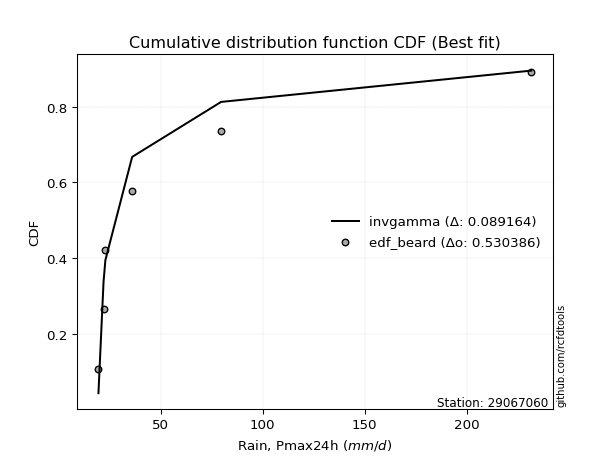</img>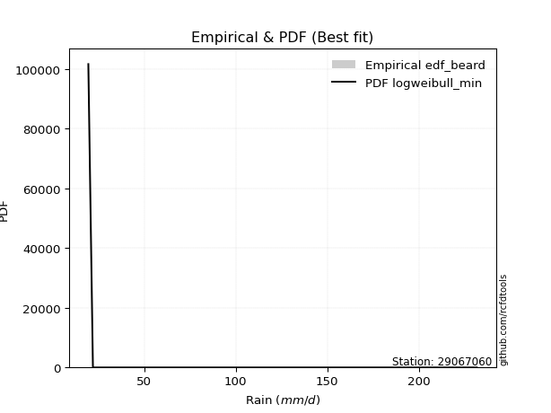</img>

</div>


### 5. EDF Chegodayev (1955)

The Chegodayev formula is an empirical plotting position formula used in hydrological frequency analysis to estimate the exceedance probability or return period of a specific event from a set of observed data. It is primarily used for plotting observed data points on probability paper to fit a theoretical distribution, particularly for analyzing extreme events like maximum flood flows or rainfall intensities. The constant _b_ value in the generalized plotting position formula is 0.3.

<div align="center">


$P=(m-b)/(n+1-2b)$


</div>


**5.1. Empirical values**

<div align="center">

|                | 0                   | 1                   | 2                   | 3              | 4                  | 5                  | 6                  |
|:---------------|:--------------------|:--------------------|:--------------------|:---------------|:-------------------|:-------------------|:-------------------|
| date           | 2022                | 2021                | 2023                | 2024           | 2025               | 2020               | 2019               |
| x              | 19.5                | 22.0                | 22.9                | 36.02          | 67.6               | 79.6               | 231.6              |
| m              | 1                   | 2                   | 3                   | 4              | 5                  | 6                  | 7                  |
| empirical_dist | edf_chegodayev      | edf_chegodayev      | edf_chegodayev      | edf_chegodayev | edf_chegodayev     | edf_chegodayev     | edf_chegodayev     |
| empirical      | 0.09459459459459459 | 0.22972972972972971 | 0.36486486486486486 | 0.5            | 0.6351351351351351 | 0.7702702702702703 | 0.9054054054054054 |
| empirical_tr   | 1.1044776119402986  | 1.2982456140350878  | 1.574468085106383   | 2.0            | 2.7407407407407405 | 4.352941176470589  | 10.571428571428568 |

</div>


**5.2. Kolmogorov-Smirnov fit test (sorted by Δ)**


<div align="center">

|                | 0                   | 1                   | 2                   | 3                   | 4                   | 5                   | 6                   | 7                   | 8                   | 9                   | 10                  | 11                  | 12                  | 13                  | 14                  | 15                  | 16                  | 17                  | 18                  | 19                  | 20                  | 21                  | 22                  | 23                  | 24                  | 25                  | 26                  | 27                  | 28                  | 29                  | 30                  | 31                  | 32                  | 33                  | 34                  | 35                  | 36                  | 37                  | 38                  | 39                  | 40                  | 41                  | 42                  | 43                  | 44                  | 45                  | 46                  | 47                  | 48                  | 49                  | 50                  | 51                  | 52                  | 53                  | 54                  | 55                  | 56                  | 57                  | 58                  | 59                  | 60                  | 61                  | 62                  | 63                  | 64                  | 65                  | 66                  | 67                  | 68                  | 69                  | 70                  | 71                  | 72                  | 73                  | 74                  | 75                  | 76                  | 77                  | 78                  | 79                  | 80                  | 81                  | 82                  | 83                  | 84                  | 85                  | 86                  | 87                  | 88                  | 89                  | 90                  | 91                  | 92                  | 93                  | 94                  | 95                  | 96                  | 97                  | 98                  | 99                  | 100                 | 101                 | 102                 | 103                 | 104                 | 105                 | 106                 | 107                 | 108                 | 109                 | 110                 | 111                 | 112                 | 113                 | 114                 | 115                 | 116                 | 117                 | 118                 | 119                 | 120                 | 121                 | 122                 | 123                 | 124                 | 125                 | 126                 | 127                 | 128                 | 129                 | 130                 | 131                 | 132                 | 133                 | 134                 | 135                 | 136                 | 137                 | 138                 | 139                 | 140                 | 141                 | 142                 | 143                 | 144                 | 145                 | 146                 | 147                 | 148                 | 149                 | 150                 | 151                 | 152                 | 153                 | 154                 | 155                 | 156                 | 157                 | 158                 | 159                 |
|:---------------|:--------------------|:--------------------|:--------------------|:--------------------|:--------------------|:--------------------|:--------------------|:--------------------|:--------------------|:--------------------|:--------------------|:--------------------|:--------------------|:--------------------|:--------------------|:--------------------|:--------------------|:--------------------|:--------------------|:--------------------|:--------------------|:--------------------|:--------------------|:--------------------|:--------------------|:--------------------|:--------------------|:--------------------|:--------------------|:--------------------|:--------------------|:--------------------|:--------------------|:--------------------|:--------------------|:--------------------|:--------------------|:--------------------|:--------------------|:--------------------|:--------------------|:--------------------|:--------------------|:--------------------|:--------------------|:--------------------|:--------------------|:--------------------|:--------------------|:--------------------|:--------------------|:--------------------|:--------------------|:--------------------|:--------------------|:--------------------|:--------------------|:--------------------|:--------------------|:--------------------|:--------------------|:--------------------|:--------------------|:--------------------|:--------------------|:--------------------|:--------------------|:--------------------|:--------------------|:--------------------|:--------------------|:--------------------|:--------------------|:--------------------|:--------------------|:--------------------|:--------------------|:--------------------|:--------------------|:--------------------|:--------------------|:--------------------|:--------------------|:--------------------|:--------------------|:--------------------|:--------------------|:--------------------|:--------------------|:--------------------|:--------------------|:--------------------|:--------------------|:--------------------|:--------------------|:--------------------|:--------------------|:--------------------|:--------------------|:--------------------|:--------------------|:--------------------|:--------------------|:--------------------|:--------------------|:--------------------|:--------------------|:--------------------|:--------------------|:--------------------|:--------------------|:--------------------|:--------------------|:--------------------|:--------------------|:--------------------|:--------------------|:--------------------|:--------------------|:--------------------|:--------------------|:--------------------|:--------------------|:--------------------|:--------------------|:--------------------|:--------------------|:--------------------|:--------------------|:--------------------|:--------------------|:--------------------|:--------------------|:--------------------|:--------------------|:--------------------|:--------------------|:--------------------|:--------------------|:--------------------|:--------------------|:--------------------|:--------------------|:--------------------|:--------------------|:--------------------|:--------------------|:--------------------|:--------------------|:--------------------|:--------------------|:--------------------|:--------------------|:--------------------|:--------------------|:--------------------|:--------------------|:--------------------|:--------------------|:--------------------|
| station        | 29067060            | 29067060            | 29067060            | 29067060            | 29067060            | 29067060            | 29067060            | 29067060            | 29067060            | 29067060            | 29067060            | 29067060            | 29067060            | 29067060            | 29067060            | 29067060            | 29067060            | 29067060            | 29067060            | 29067060            | 29067060            | 29067060            | 29067060            | 29067060            | 29067060            | 29067060            | 29067060            | 29067060            | 29067060            | 29067060            | 29067060            | 29067060            | 29067060            | 29067060            | 29067060            | 29067060            | 29067060            | 29067060            | 29067060            | 29067060            | 29067060            | 29067060            | 29067060            | 29067060            | 29067060            | 29067060            | 29067060            | 29067060            | 29067060            | 29067060            | 29067060            | 29067060            | 29067060            | 29067060            | 29067060            | 29067060            | 29067060            | 29067060            | 29067060            | 29067060            | 29067060            | 29067060            | 29067060            | 29067060            | 29067060            | 29067060            | 29067060            | 29067060            | 29067060            | 29067060            | 29067060            | 29067060            | 29067060            | 29067060            | 29067060            | 29067060            | 29067060            | 29067060            | 29067060            | 29067060            | 29067060            | 29067060            | 29067060            | 29067060            | 29067060            | 29067060            | 29067060            | 29067060            | 29067060            | 29067060            | 29067060            | 29067060            | 29067060            | 29067060            | 29067060            | 29067060            | 29067060            | 29067060            | 29067060            | 29067060            | 29067060            | 29067060            | 29067060            | 29067060            | 29067060            | 29067060            | 29067060            | 29067060            | 29067060            | 29067060            | 29067060            | 29067060            | 29067060            | 29067060            | 29067060            | 29067060            | 29067060            | 29067060            | 29067060            | 29067060            | 29067060            | 29067060            | 29067060            | 29067060            | 29067060            | 29067060            | 29067060            | 29067060            | 29067060            | 29067060            | 29067060            | 29067060            | 29067060            | 29067060            | 29067060            | 29067060            | 29067060            | 29067060            | 29067060            | 29067060            | 29067060            | 29067060            | 29067060            | 29067060            | 29067060            | 29067060            | 29067060            | 29067060            | 29067060            | 29067060            | 29067060            | 29067060            | 29067060            | 29067060            | 29067060            | 29067060            | 29067060            | 29067060            | 29067060            | 29067060            |
| empirical_dist | edf_chegodayev      | edf_chegodayev      | edf_chegodayev      | edf_chegodayev      | edf_chegodayev      | edf_chegodayev      | edf_chegodayev      | edf_chegodayev      | edf_chegodayev      | edf_chegodayev      | edf_chegodayev      | edf_chegodayev      | edf_chegodayev      | edf_chegodayev      | edf_chegodayev      | edf_chegodayev      | edf_chegodayev      | edf_chegodayev      | edf_chegodayev      | edf_chegodayev      | edf_chegodayev      | edf_chegodayev      | edf_chegodayev      | edf_chegodayev      | edf_chegodayev      | edf_chegodayev      | edf_chegodayev      | edf_chegodayev      | edf_chegodayev      | edf_chegodayev      | edf_chegodayev      | edf_chegodayev      | edf_chegodayev      | edf_chegodayev      | edf_chegodayev      | edf_chegodayev      | edf_chegodayev      | edf_chegodayev      | edf_chegodayev      | edf_chegodayev      | edf_chegodayev      | edf_chegodayev      | edf_chegodayev      | edf_chegodayev      | edf_chegodayev      | edf_chegodayev      | edf_chegodayev      | edf_chegodayev      | edf_chegodayev      | edf_chegodayev      | edf_chegodayev      | edf_chegodayev      | edf_chegodayev      | edf_chegodayev      | edf_chegodayev      | edf_chegodayev      | edf_chegodayev      | edf_chegodayev      | edf_chegodayev      | edf_chegodayev      | edf_chegodayev      | edf_chegodayev      | edf_chegodayev      | edf_chegodayev      | edf_chegodayev      | edf_chegodayev      | edf_chegodayev      | edf_chegodayev      | edf_chegodayev      | edf_chegodayev      | edf_chegodayev      | edf_chegodayev      | edf_chegodayev      | edf_chegodayev      | edf_chegodayev      | edf_chegodayev      | edf_chegodayev      | edf_chegodayev      | edf_chegodayev      | edf_chegodayev      | edf_chegodayev      | edf_chegodayev      | edf_chegodayev      | edf_chegodayev      | edf_chegodayev      | edf_chegodayev      | edf_chegodayev      | edf_chegodayev      | edf_chegodayev      | edf_chegodayev      | edf_chegodayev      | edf_chegodayev      | edf_chegodayev      | edf_chegodayev      | edf_chegodayev      | edf_chegodayev      | edf_chegodayev      | edf_chegodayev      | edf_chegodayev      | edf_chegodayev      | edf_chegodayev      | edf_chegodayev      | edf_chegodayev      | edf_chegodayev      | edf_chegodayev      | edf_chegodayev      | edf_chegodayev      | edf_chegodayev      | edf_chegodayev      | edf_chegodayev      | edf_chegodayev      | edf_chegodayev      | edf_chegodayev      | edf_chegodayev      | edf_chegodayev      | edf_chegodayev      | edf_chegodayev      | edf_chegodayev      | edf_chegodayev      | edf_chegodayev      | edf_chegodayev      | edf_chegodayev      | edf_chegodayev      | edf_chegodayev      | edf_chegodayev      | edf_chegodayev      | edf_chegodayev      | edf_chegodayev      | edf_chegodayev      | edf_chegodayev      | edf_chegodayev      | edf_chegodayev      | edf_chegodayev      | edf_chegodayev      | edf_chegodayev      | edf_chegodayev      | edf_chegodayev      | edf_chegodayev      | edf_chegodayev      | edf_chegodayev      | edf_chegodayev      | edf_chegodayev      | edf_chegodayev      | edf_chegodayev      | edf_chegodayev      | edf_chegodayev      | edf_chegodayev      | edf_chegodayev      | edf_chegodayev      | edf_chegodayev      | edf_chegodayev      | edf_chegodayev      | edf_chegodayev      | edf_chegodayev      | edf_chegodayev      | edf_chegodayev      | edf_chegodayev      | edf_chegodayev      | edf_chegodayev      | edf_chegodayev      |
| p_dist         | logweibull_min      | genextreme          | invweibull          | lognakagami         | logbeta             | logsemicircular     | loggausshyper       | logfoldnorm         | logkappa3           | loghalfnorm         | loganglit           | invgamma            | genpareto           | loggenextreme       | loginvweibull       | logexponweib        | lograyleigh         | halfgennorm         | logalpha            | wald                | logarcsine          | logmaxwell          | logburr12           | logf                | loginvgamma         | burr                | logbetaprime        | moyal               | betaprime           | nakagami            | gamma               | logpearson3         | gumbel_r            | logloggamma         | lognorm             | logcrystalball      | logt                | loghalflogistic     | logncf              | logfatiguelife      | loghalfgennorm      | logburr             | loginvgauss         | truncweibull_min    | ncf                 | loggumbel_r         | vonmises_line       | invgauss            | lognct              | pearson3            | erlang              | nct                 | rayleigh            | logdweibull         | maxwell             | loggenlogistic      | genlogistic         | halflogistic        | loglogistic         | logmoyal            | logkstwobign        | dgamma              | logcosine           | loggumbel_l         | johnsonsb           | loglomax            | burr12              | logexponnorm        | logdgamma           | logtruncnorm        | logexponpow         | alpha               | loghypsecant        | loggenexpon         | logistic            | halfnorm            | gennorm             | f                   | loggompertz         | norm                | crystalball         | logrice             | exponpow            | loglaplace          | loglaplace          | hypsecant           | kstwobign           | logargus            | truncpareto         | anglit              | gengamma            | logloglaplace       | semicircular        | foldnorm            | logksone            | logrdist            | logtruncweibull_min | rice                | weibull_min         | logtukeylambda      | laplace             | arcsine             | loggenpareto        | logwrapcauchy       | loggamma            | loggamma            | logkappa4           | bradford            | logtriang           | logskewnorm         | logbradford         | logweibull_max      | loggennorm          | gumbel_l            | loggengamma         | logtruncexpon       | beta                | truncexpon          | wrapcauchy          | logerlang           | gausshyper          | exponnorm           | cosine              | genexpon            | loguniform          | dweibull            | logvonmises_line    | gompertz            | lomax               | truncnorm           | exponweib           | loglevy_l           | powerlaw            | logwald             | t                   | skewnorm            | fatiguelife         | levy_l              | loggenhalflogistic  | logpowerlaw         | argus               | logtruncpareto      | kappa3              | johnsonsu           | ksone               | kappa4              | logtrapezoid        | uniform             | rdist               | logjohnsonsb        | logjohnsonsu        | tukeylambda         | genhalflogistic     | triang              | trapezoid           | weibull_max         | logvonmises         | vonmises            | mielke              | logmielke           |
| delta          | 0.09478632305987988 | 0.10729435857699965 | 0.10729718127180377 | 0.11880075860517303 | 0.11938061903156338 | 0.12320197045477582 | 0.12339972436445754 | 0.12466479155313237 | 0.12878715301081456 | 0.13398493187306704 | 0.13552641224228446 | 0.13748137219173073 | 0.14012152632392594 | 0.14090727471108833 | 0.14091850052320132 | 0.14099938758270725 | 0.1447284535212043  | 0.14511119477011147 | 0.1453276394577947  | 0.1454848870745778  | 0.14603836242896012 | 0.15023031223593525 | 0.15182476899649355 | 0.15189120014004165 | 0.1518949610522633  | 0.15233357653001567 | 0.15408834711478214 | 0.15529578114303227 | 0.15530425537414586 | 0.15607071153480745 | 0.15738316218443782 | 0.15756698781474746 | 0.15832282176748158 | 0.1633134128694456  | 0.16347824979551545 | 0.16347835535022284 | 0.1634792326416637  | 0.16380092093818474 | 0.16462037205597327 | 0.1650294523045166  | 0.16514519796689175 | 0.16565488793173866 | 0.16578610793014592 | 0.16857641866204942 | 0.16952452249224328 | 0.17125693578352016 | 0.17198991918562206 | 0.17204969744329146 | 0.1730071756614095  | 0.17366259730987244 | 0.17415920843562205 | 0.1766828672776938  | 0.1768847074447486  | 0.17757465164597258 | 0.17767406437063482 | 0.17807999807058938 | 0.17896229553740428 | 0.18278417920962603 | 0.1850448210520547  | 0.18525749025166233 | 0.1884213746935117  | 0.18864720942225577 | 0.18946753501724933 | 0.1901777233853962  | 0.19046158003135066 | 0.1915138912734433  | 0.19342877562362873 | 0.19379162417161716 | 0.19430709189920248 | 0.1945376662192366  | 0.19507244358046813 | 0.1973356030026554  | 0.1977669934716671  | 0.19801601719150594 | 0.19873046430540864 | 0.19924433775187383 | 0.20066754995711528 | 0.20107306972882627 | 0.2010750168160526  | 0.20716069915288737 | 0.20716070819722088 | 0.20795372558228317 | 0.20945096992702217 | 0.2117228301940504  | 0.2117228301940504  | 0.21327758778515077 | 0.21467013252507605 | 0.21496443928307873 | 0.21571616769704138 | 0.21607396816812974 | 0.2165216901963965  | 0.21814782709666738 | 0.21975742566879286 | 0.22301678399146357 | 0.2274074233782964  | 0.2276906407829976  | 0.22929883425920497 | 0.23490735657659484 | 0.237758973192463   | 0.23836025386673215 | 0.24007456795010562 | 0.2410548932348442  | 0.24819315952041965 | 0.24865944235304394 | 0.25427495543943324 | 0.25427495543943324 | 0.25467837183723296 | 0.2547947069054203  | 0.2561963949296394  | 0.2582354717904502  | 0.26746630666072607 | 0.2690163299601468  | 0.2702702702702703  | 0.27267970233178107 | 0.27370970906936    | 0.2740933902476973  | 0.28386323156245963 | 0.2874560438805691  | 0.287921632088478   | 0.28949954192788785 | 0.2912290725985559  | 0.2960145753868248  | 0.2969377601141466  | 0.2977767866266966  | 0.29991593508098274 | 0.3018827579532397  | 0.3040581655597461  | 0.30552619527073177 | 0.3152159581534598  | 0.315317740015415   | 0.31674958733829695 | 0.32325053876007853 | 0.3234301933852245  | 0.33088855132874684 | 0.33191788654929444 | 0.34681584746905547 | 0.35283185915239323 | 0.3667087847917389  | 0.3671126800426114  | 0.3930671658789109  | 0.39577881823189065 | 0.4072039150414509  | 0.42623809473200647 | 0.4450239534728323  | 0.4508061810042008  | 0.4522883338775706  | 0.46000681453549525 | 0.48691336315098693 | 0.4971217380749297  | 0.5194599289379443  | 0.5206973238200655  | 0.5267284607997117  | 0.5721774875248112  | 0.648559358199109   | 0.6679982202184077  | 0.6776729750078987  | 1.0909655422114537  | 36.899925795076086  | nan                 | nan                 |
| deltao         | 0.48442053926100004 | 0.48442053926100004 | 0.48442053926100004 | 0.48442053926100004 | 0.48442053926100004 | 0.48442053926100004 | 0.48442053926100004 | 0.48442053926100004 | 0.48442053926100004 | 0.48442053926100004 | 0.48442053926100004 | 0.48442053926100004 | 0.48442053926100004 | 0.48442053926100004 | 0.48442053926100004 | 0.48442053926100004 | 0.48442053926100004 | 0.48442053926100004 | 0.48442053926100004 | 0.48442053926100004 | 0.48442053926100004 | 0.48442053926100004 | 0.48442053926100004 | 0.48442053926100004 | 0.48442053926100004 | 0.48442053926100004 | 0.48442053926100004 | 0.48442053926100004 | 0.48442053926100004 | 0.48442053926100004 | 0.48442053926100004 | 0.48442053926100004 | 0.48442053926100004 | 0.48442053926100004 | 0.48442053926100004 | 0.48442053926100004 | 0.48442053926100004 | 0.48442053926100004 | 0.48442053926100004 | 0.48442053926100004 | 0.48442053926100004 | 0.48442053926100004 | 0.48442053926100004 | 0.48442053926100004 | 0.48442053926100004 | 0.48442053926100004 | 0.48442053926100004 | 0.48442053926100004 | 0.48442053926100004 | 0.48442053926100004 | 0.48442053926100004 | 0.48442053926100004 | 0.48442053926100004 | 0.48442053926100004 | 0.48442053926100004 | 0.48442053926100004 | 0.48442053926100004 | 0.48442053926100004 | 0.48442053926100004 | 0.48442053926100004 | 0.48442053926100004 | 0.48442053926100004 | 0.48442053926100004 | 0.48442053926100004 | 0.48442053926100004 | 0.48442053926100004 | 0.48442053926100004 | 0.48442053926100004 | 0.48442053926100004 | 0.48442053926100004 | 0.48442053926100004 | 0.48442053926100004 | 0.48442053926100004 | 0.48442053926100004 | 0.48442053926100004 | 0.48442053926100004 | 0.48442053926100004 | 0.48442053926100004 | 0.48442053926100004 | 0.48442053926100004 | 0.48442053926100004 | 0.48442053926100004 | 0.48442053926100004 | 0.48442053926100004 | 0.48442053926100004 | 0.48442053926100004 | 0.48442053926100004 | 0.48442053926100004 | 0.48442053926100004 | 0.48442053926100004 | 0.48442053926100004 | 0.48442053926100004 | 0.48442053926100004 | 0.48442053926100004 | 0.48442053926100004 | 0.48442053926100004 | 0.48442053926100004 | 0.48442053926100004 | 0.48442053926100004 | 0.48442053926100004 | 0.48442053926100004 | 0.48442053926100004 | 0.48442053926100004 | 0.48442053926100004 | 0.48442053926100004 | 0.48442053926100004 | 0.48442053926100004 | 0.48442053926100004 | 0.48442053926100004 | 0.48442053926100004 | 0.48442053926100004 | 0.48442053926100004 | 0.48442053926100004 | 0.48442053926100004 | 0.48442053926100004 | 0.48442053926100004 | 0.48442053926100004 | 0.48442053926100004 | 0.48442053926100004 | 0.48442053926100004 | 0.48442053926100004 | 0.48442053926100004 | 0.48442053926100004 | 0.48442053926100004 | 0.48442053926100004 | 0.48442053926100004 | 0.48442053926100004 | 0.48442053926100004 | 0.48442053926100004 | 0.48442053926100004 | 0.48442053926100004 | 0.48442053926100004 | 0.48442053926100004 | 0.48442053926100004 | 0.48442053926100004 | 0.48442053926100004 | 0.48442053926100004 | 0.48442053926100004 | 0.48442053926100004 | 0.48442053926100004 | 0.48442053926100004 | 0.48442053926100004 | 0.48442053926100004 | 0.48442053926100004 | 0.48442053926100004 | 0.48442053926100004 | 0.48442053926100004 | 0.48442053926100004 | 0.48442053926100004 | 0.48442053926100004 | 0.48442053926100004 | 0.48442053926100004 | 0.48442053926100004 | 0.48442053926100004 | 0.48442053926100004 | 0.48442053926100004 | 0.48442053926100004 | 0.48442053926100004 | 0.48442053926100004 | 0.48442053926100004 |
| eval           | Δo > Δ              | Δo > Δ              | Δo > Δ              | Δo > Δ              | Δo > Δ              | Δo > Δ              | Δo > Δ              | Δo > Δ              | Δo > Δ              | Δo > Δ              | Δo > Δ              | Δo > Δ              | Δo > Δ              | Δo > Δ              | Δo > Δ              | Δo > Δ              | Δo > Δ              | Δo > Δ              | Δo > Δ              | Δo > Δ              | Δo > Δ              | Δo > Δ              | Δo > Δ              | Δo > Δ              | Δo > Δ              | Δo > Δ              | Δo > Δ              | Δo > Δ              | Δo > Δ              | Δo > Δ              | Δo > Δ              | Δo > Δ              | Δo > Δ              | Δo > Δ              | Δo > Δ              | Δo > Δ              | Δo > Δ              | Δo > Δ              | Δo > Δ              | Δo > Δ              | Δo > Δ              | Δo > Δ              | Δo > Δ              | Δo > Δ              | Δo > Δ              | Δo > Δ              | Δo > Δ              | Δo > Δ              | Δo > Δ              | Δo > Δ              | Δo > Δ              | Δo > Δ              | Δo > Δ              | Δo > Δ              | Δo > Δ              | Δo > Δ              | Δo > Δ              | Δo > Δ              | Δo > Δ              | Δo > Δ              | Δo > Δ              | Δo > Δ              | Δo > Δ              | Δo > Δ              | Δo > Δ              | Δo > Δ              | Δo > Δ              | Δo > Δ              | Δo > Δ              | Δo > Δ              | Δo > Δ              | Δo > Δ              | Δo > Δ              | Δo > Δ              | Δo > Δ              | Δo > Δ              | Δo > Δ              | Δo > Δ              | Δo > Δ              | Δo > Δ              | Δo > Δ              | Δo > Δ              | Δo > Δ              | Δo > Δ              | Δo > Δ              | Δo > Δ              | Δo > Δ              | Δo > Δ              | Δo > Δ              | Δo > Δ              | Δo > Δ              | Δo > Δ              | Δo > Δ              | Δo > Δ              | Δo > Δ              | Δo > Δ              | Δo > Δ              | Δo > Δ              | Δo > Δ              | Δo > Δ              | Δo > Δ              | Δo > Δ              | Δo > Δ              | Δo > Δ              | Δo > Δ              | Δo > Δ              | Δo > Δ              | Δo > Δ              | Δo > Δ              | Δo > Δ              | Δo > Δ              | Δo > Δ              | Δo > Δ              | Δo > Δ              | Δo > Δ              | Δo > Δ              | Δo > Δ              | Δo > Δ              | Δo > Δ              | Δo > Δ              | Δo > Δ              | Δo > Δ              | Δo > Δ              | Δo > Δ              | Δo > Δ              | Δo > Δ              | Δo > Δ              | Δo > Δ              | Δo > Δ              | Δo > Δ              | Δo > Δ              | Δo > Δ              | Δo > Δ              | Δo > Δ              | Δo > Δ              | Δo > Δ              | Δo > Δ              | Δo > Δ              | Δo > Δ              | Δo > Δ              | Δo > Δ              | Δo > Δ              | Δo > Δ              | Δo > Δ              | Δo > Δ              | Δo > Δ              | Δo > Δ              | Δo <= Δ             | Δo <= Δ             | Δo <= Δ             | Δo <= Δ             | Δo <= Δ             | Δo <= Δ             | Δo <= Δ             | Δo <= Δ             | Δo <= Δ             | Δo <= Δ             | Δo <= Δ             | Δo <= Δ             | Δo <= Δ             |
| fit            | 1                   | 1                   | 1                   | 1                   | 1                   | 1                   | 1                   | 1                   | 1                   | 1                   | 1                   | 1                   | 1                   | 1                   | 1                   | 1                   | 1                   | 1                   | 1                   | 1                   | 1                   | 1                   | 1                   | 1                   | 1                   | 1                   | 1                   | 1                   | 1                   | 1                   | 1                   | 1                   | 1                   | 1                   | 1                   | 1                   | 1                   | 1                   | 1                   | 1                   | 1                   | 1                   | 1                   | 1                   | 1                   | 1                   | 1                   | 1                   | 1                   | 1                   | 1                   | 1                   | 1                   | 1                   | 1                   | 1                   | 1                   | 1                   | 1                   | 1                   | 1                   | 1                   | 1                   | 1                   | 1                   | 1                   | 1                   | 1                   | 1                   | 1                   | 1                   | 1                   | 1                   | 1                   | 1                   | 1                   | 1                   | 1                   | 1                   | 1                   | 1                   | 1                   | 1                   | 1                   | 1                   | 1                   | 1                   | 1                   | 1                   | 1                   | 1                   | 1                   | 1                   | 1                   | 1                   | 1                   | 1                   | 1                   | 1                   | 1                   | 1                   | 1                   | 1                   | 1                   | 1                   | 1                   | 1                   | 1                   | 1                   | 1                   | 1                   | 1                   | 1                   | 1                   | 1                   | 1                   | 1                   | 1                   | 1                   | 1                   | 1                   | 1                   | 1                   | 1                   | 1                   | 1                   | 1                   | 1                   | 1                   | 1                   | 1                   | 1                   | 1                   | 1                   | 1                   | 1                   | 1                   | 1                   | 1                   | 1                   | 1                   | 1                   | 1                   | 1                   | 1                   | 1                   | 1                   | 0                   | 0                   | 0                   | 0                   | 0                   | 0                   | 0                   | 0                   | 0                   | 0                   | 0                   | 0                   | 0                   |
| n              | 7                   | 7                   | 7                   | 7                   | 7                   | 7                   | 7                   | 7                   | 7                   | 7                   | 7                   | 7                   | 7                   | 7                   | 7                   | 7                   | 7                   | 7                   | 7                   | 7                   | 7                   | 7                   | 7                   | 7                   | 7                   | 7                   | 7                   | 7                   | 7                   | 7                   | 7                   | 7                   | 7                   | 7                   | 7                   | 7                   | 7                   | 7                   | 7                   | 7                   | 7                   | 7                   | 7                   | 7                   | 7                   | 7                   | 7                   | 7                   | 7                   | 7                   | 7                   | 7                   | 7                   | 7                   | 7                   | 7                   | 7                   | 7                   | 7                   | 7                   | 7                   | 7                   | 7                   | 7                   | 7                   | 7                   | 7                   | 7                   | 7                   | 7                   | 7                   | 7                   | 7                   | 7                   | 7                   | 7                   | 7                   | 7                   | 7                   | 7                   | 7                   | 7                   | 7                   | 7                   | 7                   | 7                   | 7                   | 7                   | 7                   | 7                   | 7                   | 7                   | 7                   | 7                   | 7                   | 7                   | 7                   | 7                   | 7                   | 7                   | 7                   | 7                   | 7                   | 7                   | 7                   | 7                   | 7                   | 7                   | 7                   | 7                   | 7                   | 7                   | 7                   | 7                   | 7                   | 7                   | 7                   | 7                   | 7                   | 7                   | 7                   | 7                   | 7                   | 7                   | 7                   | 7                   | 7                   | 7                   | 7                   | 7                   | 7                   | 7                   | 7                   | 7                   | 7                   | 7                   | 7                   | 7                   | 7                   | 7                   | 7                   | 7                   | 7                   | 7                   | 7                   | 7                   | 7                   | 7                   | 7                   | 7                   | 7                   | 7                   | 7                   | 7                   | 7                   | 7                   | 7                   | 7                   | 7                   | 7                   |
| best_fit       | 1                   | 0                   | 0                   | 0                   | 0                   | 0                   | 0                   | 0                   | 0                   | 0                   | 0                   | 0                   | 0                   | 0                   | 0                   | 0                   | 0                   | 0                   | 0                   | 0                   | 0                   | 0                   | 0                   | 0                   | 0                   | 0                   | 0                   | 0                   | 0                   | 0                   | 0                   | 0                   | 0                   | 0                   | 0                   | 0                   | 0                   | 0                   | 0                   | 0                   | 0                   | 0                   | 0                   | 0                   | 0                   | 0                   | 0                   | 0                   | 0                   | 0                   | 0                   | 0                   | 0                   | 0                   | 0                   | 0                   | 0                   | 0                   | 0                   | 0                   | 0                   | 0                   | 0                   | 0                   | 0                   | 0                   | 0                   | 0                   | 0                   | 0                   | 0                   | 0                   | 0                   | 0                   | 0                   | 0                   | 0                   | 0                   | 0                   | 0                   | 0                   | 0                   | 0                   | 0                   | 0                   | 0                   | 0                   | 0                   | 0                   | 0                   | 0                   | 0                   | 0                   | 0                   | 0                   | 0                   | 0                   | 0                   | 0                   | 0                   | 0                   | 0                   | 0                   | 0                   | 0                   | 0                   | 0                   | 0                   | 0                   | 0                   | 0                   | 0                   | 0                   | 0                   | 0                   | 0                   | 0                   | 0                   | 0                   | 0                   | 0                   | 0                   | 0                   | 0                   | 0                   | 0                   | 0                   | 0                   | 0                   | 0                   | 0                   | 0                   | 0                   | 0                   | 0                   | 0                   | 0                   | 0                   | 0                   | 0                   | 0                   | 0                   | 0                   | 0                   | 0                   | 0                   | 0                   | 0                   | 0                   | 0                   | 0                   | 0                   | 0                   | 0                   | 0                   | 0                   | 0                   | 0                   | 0                   | 0                   |
| best_fit_sort  | 1                   | 2                   | 3                   | 4                   | 5                   | 6                   | 7                   | 8                   | 9                   | 10                  | 11                  | 12                  | 13                  | 14                  | 15                  | 16                  | 17                  | 18                  | 19                  | 20                  | 21                  | 22                  | 23                  | 24                  | 25                  | 26                  | 27                  | 28                  | 29                  | 30                  | 31                  | 32                  | 33                  | 34                  | 35                  | 36                  | 37                  | 38                  | 39                  | 40                  | 41                  | 42                  | 43                  | 44                  | 45                  | 46                  | 47                  | 48                  | 49                  | 50                  | 51                  | 52                  | 53                  | 54                  | 55                  | 56                  | 57                  | 58                  | 59                  | 60                  | 61                  | 62                  | 63                  | 64                  | 65                  | 66                  | 67                  | 68                  | 69                  | 70                  | 71                  | 72                  | 73                  | 74                  | 75                  | 76                  | 77                  | 78                  | 79                  | 80                  | 81                  | 82                  | 83                  | 84                  | 85                  | 86                  | 87                  | 88                  | 89                  | 90                  | 91                  | 92                  | 93                  | 94                  | 95                  | 96                  | 97                  | 98                  | 99                  | 100                 | 101                 | 102                 | 103                 | 104                 | 105                 | 106                 | 107                 | 108                 | 109                 | 110                 | 111                 | 112                 | 113                 | 114                 | 115                 | 116                 | 117                 | 118                 | 119                 | 120                 | 121                 | 122                 | 123                 | 124                 | 125                 | 126                 | 127                 | 128                 | 129                 | 130                 | 131                 | 132                 | 133                 | 134                 | 135                 | 136                 | 137                 | 138                 | 139                 | 140                 | 141                 | 142                 | 143                 | 144                 | 145                 | 146                 | 147                 | 148                 | 149                 | 150                 | 151                 | 152                 | 153                 | 154                 | 155                 | 156                 | 157                 | 158                 | 159                 | 160                 |

</div>


**5.3. Best fit**

<div align="center">

|   id |   station | empirical_dist   | p_dist         |     delta |   deltao | eval   |   fit |   n |   best_fit |   best_fit_sort |
|-----:|----------:|:-----------------|:---------------|----------:|---------:|:-------|------:|----:|-----------:|----------------:|
|    0 |  29067060 | edf_chegodayev   | logweibull_min | 0.0947863 | 0.484421 | Δo > Δ |     1 |   7 |          1 |               1 |

</div>


<div align="center">

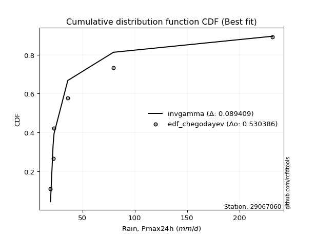</img>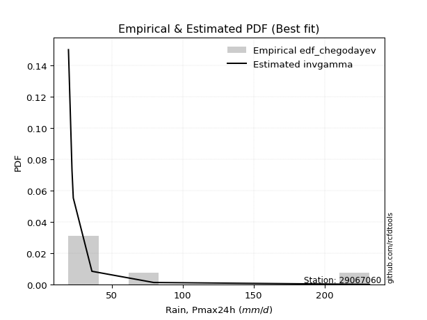</img>

</div>


### 6. EDF Blom (1958)

The Blom formula is a specific "plotting position" formula used in hydrology and statistical analysis to estimate the empirical cumulative probability (or non-exceedance probability) of a data series. It is particularly recommended for data that are approximately normally distributed. The constant _a_ is set to 0.375 (or 3/8).

<div align="center">


$P=(m-a)/(n+1-2a)$


</div>


**6.1. Empirical values**

<div align="center">

|                | 0                   | 1                   | 2                  | 3        | 4                  | 5                  | 6                  |
|:---------------|:--------------------|:--------------------|:-------------------|:---------|:-------------------|:-------------------|:-------------------|
| date           | 2022                | 2021                | 2023               | 2024     | 2025               | 2020               | 2019               |
| x              | 19.5                | 22.0                | 22.9               | 36.02    | 67.6               | 79.6               | 231.6              |
| m              | 1                   | 2                   | 3                  | 4        | 5                  | 6                  | 7                  |
| empirical_dist | edf_blom            | edf_blom            | edf_blom           | edf_blom | edf_blom           | edf_blom           | edf_blom           |
| empirical      | 0.08620689655172414 | 0.22413793103448276 | 0.3620689655172414 | 0.5      | 0.6379310344827587 | 0.7758620689655172 | 0.9137931034482759 |
| empirical_tr   | 1.0943396226415094  | 1.288888888888889   | 1.5675675675675675 | 2.0      | 2.7619047619047623 | 4.461538461538462  | 11.600000000000007 |

</div>


**6.2. Kolmogorov-Smirnov fit test (sorted by Δ)**


<div align="center">

|                | 0                   | 1                   | 2                   | 3                   | 4                   | 5                   | 6                   | 7                   | 8                   | 9                   | 10                  | 11                  | 12                  | 13                  | 14                  | 15                  | 16                  | 17                  | 18                  | 19                  | 20                  | 21                  | 22                  | 23                  | 24                  | 25                  | 26                  | 27                  | 28                  | 29                  | 30                  | 31                  | 32                  | 33                  | 34                  | 35                  | 36                  | 37                  | 38                  | 39                  | 40                  | 41                  | 42                  | 43                  | 44                  | 45                  | 46                  | 47                  | 48                  | 49                  | 50                  | 51                  | 52                  | 53                  | 54                  | 55                  | 56                  | 57                  | 58                  | 59                  | 60                  | 61                  | 62                  | 63                  | 64                  | 65                  | 66                  | 67                  | 68                  | 69                  | 70                  | 71                  | 72                  | 73                  | 74                  | 75                  | 76                  | 77                  | 78                  | 79                  | 80                  | 81                  | 82                  | 83                  | 84                  | 85                  | 86                  | 87                  | 88                  | 89                  | 90                  | 91                  | 92                  | 93                  | 94                  | 95                  | 96                  | 97                  | 98                  | 99                  | 100                 | 101                 | 102                 | 103                 | 104                 | 105                 | 106                 | 107                 | 108                 | 109                 | 110                 | 111                 | 112                 | 113                 | 114                 | 115                 | 116                 | 117                 | 118                 | 119                 | 120                 | 121                 | 122                 | 123                 | 124                 | 125                 | 126                 | 127                 | 128                 | 129                 | 130                 | 131                 | 132                 | 133                 | 134                 | 135                 | 136                 | 137                 | 138                 | 139                 | 140                 | 141                 | 142                 | 143                 | 144                 | 145                 | 146                 | 147                 | 148                 | 149                 | 150                 | 151                 | 152                 | 153                 | 154                 | 155                 | 156                 | 157                 | 158                 | 159                 |
|:---------------|:--------------------|:--------------------|:--------------------|:--------------------|:--------------------|:--------------------|:--------------------|:--------------------|:--------------------|:--------------------|:--------------------|:--------------------|:--------------------|:--------------------|:--------------------|:--------------------|:--------------------|:--------------------|:--------------------|:--------------------|:--------------------|:--------------------|:--------------------|:--------------------|:--------------------|:--------------------|:--------------------|:--------------------|:--------------------|:--------------------|:--------------------|:--------------------|:--------------------|:--------------------|:--------------------|:--------------------|:--------------------|:--------------------|:--------------------|:--------------------|:--------------------|:--------------------|:--------------------|:--------------------|:--------------------|:--------------------|:--------------------|:--------------------|:--------------------|:--------------------|:--------------------|:--------------------|:--------------------|:--------------------|:--------------------|:--------------------|:--------------------|:--------------------|:--------------------|:--------------------|:--------------------|:--------------------|:--------------------|:--------------------|:--------------------|:--------------------|:--------------------|:--------------------|:--------------------|:--------------------|:--------------------|:--------------------|:--------------------|:--------------------|:--------------------|:--------------------|:--------------------|:--------------------|:--------------------|:--------------------|:--------------------|:--------------------|:--------------------|:--------------------|:--------------------|:--------------------|:--------------------|:--------------------|:--------------------|:--------------------|:--------------------|:--------------------|:--------------------|:--------------------|:--------------------|:--------------------|:--------------------|:--------------------|:--------------------|:--------------------|:--------------------|:--------------------|:--------------------|:--------------------|:--------------------|:--------------------|:--------------------|:--------------------|:--------------------|:--------------------|:--------------------|:--------------------|:--------------------|:--------------------|:--------------------|:--------------------|:--------------------|:--------------------|:--------------------|:--------------------|:--------------------|:--------------------|:--------------------|:--------------------|:--------------------|:--------------------|:--------------------|:--------------------|:--------------------|:--------------------|:--------------------|:--------------------|:--------------------|:--------------------|:--------------------|:--------------------|:--------------------|:--------------------|:--------------------|:--------------------|:--------------------|:--------------------|:--------------------|:--------------------|:--------------------|:--------------------|:--------------------|:--------------------|:--------------------|:--------------------|:--------------------|:--------------------|:--------------------|:--------------------|:--------------------|:--------------------|:--------------------|:--------------------|:--------------------|:--------------------|
| station        | 29067060            | 29067060            | 29067060            | 29067060            | 29067060            | 29067060            | 29067060            | 29067060            | 29067060            | 29067060            | 29067060            | 29067060            | 29067060            | 29067060            | 29067060            | 29067060            | 29067060            | 29067060            | 29067060            | 29067060            | 29067060            | 29067060            | 29067060            | 29067060            | 29067060            | 29067060            | 29067060            | 29067060            | 29067060            | 29067060            | 29067060            | 29067060            | 29067060            | 29067060            | 29067060            | 29067060            | 29067060            | 29067060            | 29067060            | 29067060            | 29067060            | 29067060            | 29067060            | 29067060            | 29067060            | 29067060            | 29067060            | 29067060            | 29067060            | 29067060            | 29067060            | 29067060            | 29067060            | 29067060            | 29067060            | 29067060            | 29067060            | 29067060            | 29067060            | 29067060            | 29067060            | 29067060            | 29067060            | 29067060            | 29067060            | 29067060            | 29067060            | 29067060            | 29067060            | 29067060            | 29067060            | 29067060            | 29067060            | 29067060            | 29067060            | 29067060            | 29067060            | 29067060            | 29067060            | 29067060            | 29067060            | 29067060            | 29067060            | 29067060            | 29067060            | 29067060            | 29067060            | 29067060            | 29067060            | 29067060            | 29067060            | 29067060            | 29067060            | 29067060            | 29067060            | 29067060            | 29067060            | 29067060            | 29067060            | 29067060            | 29067060            | 29067060            | 29067060            | 29067060            | 29067060            | 29067060            | 29067060            | 29067060            | 29067060            | 29067060            | 29067060            | 29067060            | 29067060            | 29067060            | 29067060            | 29067060            | 29067060            | 29067060            | 29067060            | 29067060            | 29067060            | 29067060            | 29067060            | 29067060            | 29067060            | 29067060            | 29067060            | 29067060            | 29067060            | 29067060            | 29067060            | 29067060            | 29067060            | 29067060            | 29067060            | 29067060            | 29067060            | 29067060            | 29067060            | 29067060            | 29067060            | 29067060            | 29067060            | 29067060            | 29067060            | 29067060            | 29067060            | 29067060            | 29067060            | 29067060            | 29067060            | 29067060            | 29067060            | 29067060            | 29067060            | 29067060            | 29067060            | 29067060            | 29067060            | 29067060            |
| empirical_dist | edf_blom            | edf_blom            | edf_blom            | edf_blom            | edf_blom            | edf_blom            | edf_blom            | edf_blom            | edf_blom            | edf_blom            | edf_blom            | edf_blom            | edf_blom            | edf_blom            | edf_blom            | edf_blom            | edf_blom            | edf_blom            | edf_blom            | edf_blom            | edf_blom            | edf_blom            | edf_blom            | edf_blom            | edf_blom            | edf_blom            | edf_blom            | edf_blom            | edf_blom            | edf_blom            | edf_blom            | edf_blom            | edf_blom            | edf_blom            | edf_blom            | edf_blom            | edf_blom            | edf_blom            | edf_blom            | edf_blom            | edf_blom            | edf_blom            | edf_blom            | edf_blom            | edf_blom            | edf_blom            | edf_blom            | edf_blom            | edf_blom            | edf_blom            | edf_blom            | edf_blom            | edf_blom            | edf_blom            | edf_blom            | edf_blom            | edf_blom            | edf_blom            | edf_blom            | edf_blom            | edf_blom            | edf_blom            | edf_blom            | edf_blom            | edf_blom            | edf_blom            | edf_blom            | edf_blom            | edf_blom            | edf_blom            | edf_blom            | edf_blom            | edf_blom            | edf_blom            | edf_blom            | edf_blom            | edf_blom            | edf_blom            | edf_blom            | edf_blom            | edf_blom            | edf_blom            | edf_blom            | edf_blom            | edf_blom            | edf_blom            | edf_blom            | edf_blom            | edf_blom            | edf_blom            | edf_blom            | edf_blom            | edf_blom            | edf_blom            | edf_blom            | edf_blom            | edf_blom            | edf_blom            | edf_blom            | edf_blom            | edf_blom            | edf_blom            | edf_blom            | edf_blom            | edf_blom            | edf_blom            | edf_blom            | edf_blom            | edf_blom            | edf_blom            | edf_blom            | edf_blom            | edf_blom            | edf_blom            | edf_blom            | edf_blom            | edf_blom            | edf_blom            | edf_blom            | edf_blom            | edf_blom            | edf_blom            | edf_blom            | edf_blom            | edf_blom            | edf_blom            | edf_blom            | edf_blom            | edf_blom            | edf_blom            | edf_blom            | edf_blom            | edf_blom            | edf_blom            | edf_blom            | edf_blom            | edf_blom            | edf_blom            | edf_blom            | edf_blom            | edf_blom            | edf_blom            | edf_blom            | edf_blom            | edf_blom            | edf_blom            | edf_blom            | edf_blom            | edf_blom            | edf_blom            | edf_blom            | edf_blom            | edf_blom            | edf_blom            | edf_blom            | edf_blom            | edf_blom            | edf_blom            | edf_blom            | edf_blom            |
| p_dist         | logweibull_min      | genextreme          | invweibull          | lognakagami         | logbeta             | logsemicircular     | loggausshyper       | logfoldnorm         | logkappa3           | loghalfnorm         | loganglit           | invgamma            | genpareto           | loggenextreme       | loginvweibull       | lograyleigh         | halfgennorm         | logalpha            | wald                | logmaxwell          | logburr12           | logf                | loginvgamma         | logexponweib        | burr                | logbetaprime        | betaprime           | logarcsine          | gamma               | logpearson3         | logloggamma         | lognorm             | logcrystalball      | logt                | loghalflogistic     | nakagami            | logncf              | logfatiguelife      | loghalfgennorm      | logburr             | loginvgauss         | moyal               | gumbel_r            | ncf                 | loggumbel_r         | invgauss            | lognct              | erlang              | nct                 | truncweibull_min    | loggenlogistic      | genlogistic         | vonmises_line       | pearson3            | loglogistic         | logmoyal            | maxwell             | rayleigh            | logkstwobign        | logdweibull         | logcosine           | loggumbel_l         | loglomax            | burr12              | logexponnorm        | halflogistic        | logtruncnorm        | logexponpow         | alpha               | loghypsecant        | loggenexpon         | johnsonsb           | dgamma              | loggompertz         | logdgamma           | logistic            | logrice             | exponpow            | f                   | halfnorm            | loglaplace          | loglaplace          | gennorm             | norm                | crystalball         | truncpareto         | hypsecant           | kstwobign           | logargus            | logloglaplace       | anglit              | gengamma            | logksone            | semicircular        | logtruncweibull_min | foldnorm            | logrdist            | rice                | weibull_min         | logtukeylambda      | laplace             | arcsine             | loggamma            | loggamma            | logkappa4           | bradford            | logwrapcauchy       | logskewnorm         | loggenpareto        | logtriang           | logbradford         | logtruncexpon       | logweibull_max      | loggennorm          | gumbel_l            | beta                | loggengamma         | logerlang           | truncexpon          | exponnorm           | wrapcauchy          | genexpon            | loguniform          | gausshyper          | logvonmises_line    | cosine              | gompertz            | dweibull            | lomax               | truncnorm           | exponweib           | logwald             | powerlaw            | loglevy_l           | t                   | skewnorm            | fatiguelife         | loggenhalflogistic  | levy_l              | logpowerlaw         | argus               | logtruncpareto      | kappa3              | johnsonsu           | ksone               | kappa4              | logtrapezoid        | uniform             | rdist               | logjohnsonsb        | logjohnsonsu        | tukeylambda         | genhalflogistic     | triang              | trapezoid           | weibull_max         | logvonmises         | vonmises            | mielke              | logmielke           |
| delta          | 0.09199042371225641 | 0.10449845922937606 | 0.10450128192418018 | 0.11600485925754955 | 0.11658471968393991 | 0.12040607110715235 | 0.12060382501683406 | 0.1218688922055089  | 0.12599125366319097 | 0.13118903252544356 | 0.13273051289466098 | 0.13468547284410715 | 0.13732562697630235 | 0.13811137536346474 | 0.13812260117557773 | 0.14193255417358083 | 0.1423152954224879  | 0.1425317401101711  | 0.14268898772695432 | 0.14743441288831177 | 0.14902886964886997 | 0.14909530079241806 | 0.1490990617046397  | 0.1493870856255778  | 0.14953767718239208 | 0.15129244776715856 | 0.15250835602652238 | 0.15442606047183055 | 0.15458726283681423 | 0.15477108846712398 | 0.1605175135218221  | 0.16068235044789198 | 0.16068245600259937 | 0.16068333329404022 | 0.16100502159056126 | 0.1616625102300544  | 0.1618244727083498  | 0.162233552956893   | 0.16234929861926817 | 0.16285898858411518 | 0.16299020858252233 | 0.1636834791859027  | 0.166710519810352   | 0.1667286231446198  | 0.1684610364358967  | 0.16925379809566787 | 0.17021127631378602 | 0.17136330908799846 | 0.17388696793007033 | 0.17416821735729637 | 0.1752840987229659  | 0.17896229553740428 | 0.1803776172284925  | 0.18205029535274286 | 0.18224892170443122 | 0.18246159090403885 | 0.18326586306588177 | 0.18527240548761903 | 0.18562547534588822 | 0.185962349688843   | 0.18667163566962586 | 0.18738182403777273 | 0.1887179919258198  | 0.19063287627600525 | 0.19099572482399368 | 0.19117187725249646 | 0.19174176687161312 | 0.19227654423284465 | 0.19453970365503181 | 0.19497109412404362 | 0.19522011784388246 | 0.19605337872659762 | 0.1970349074651262  | 0.19827911746842913 | 0.2026947899420729  | 0.2043222630006556  | 0.2051578262346597  | 0.2066550705793987  | 0.20666486842407322 | 0.20763203579474426 | 0.2089269308464269  | 0.2089269308464269  | 0.2090552479999857  | 0.21275249784813433 | 0.21275250689246783 | 0.2129202683494178  | 0.21327758778515077 | 0.21467013252507605 | 0.21496443928307873 | 0.2153519277490439  | 0.2216657668633767  | 0.22211348889164345 | 0.22461152403067292 | 0.2253492243640398  | 0.2265029349115815  | 0.231404482034334   | 0.23328243947824456 | 0.23490735657659484 | 0.23496307384483953 | 0.23556435451910868 | 0.24007456795010562 | 0.24944259127771462 | 0.25147905609180965 | 0.25147905609180965 | 0.2518824724896095  | 0.2519988075577968  | 0.2542512410482909  | 0.2554395724428267  | 0.2565808575632901  | 0.26178819362488637 | 0.2646704073131026  | 0.2712974909000738  | 0.27460812865539375 | 0.27586206896551724 | 0.278271501027028   | 0.28106733221483604 | 0.2820974071122305  | 0.28726242459161166 | 0.29304784257581606 | 0.2932186760392013  | 0.29351343078372494 | 0.2949808872790731  | 0.29712003573335927 | 0.29961677064142633 | 0.3012622662121226  | 0.30252955880939353 | 0.3027302959231083  | 0.31027045599611014 | 0.31242005880583634 | 0.31252184066779154 | 0.3223413860335439  | 0.32809265198112336 | 0.32902199208047145 | 0.33163823680294896 | 0.33191788654929444 | 0.34681584746905547 | 0.3584236578476402  | 0.37270447873785834 | 0.37509648283460933 | 0.39865896457415784 | 0.4013706169271376  | 0.4127957137366979  | 0.434625792774877   | 0.45061575216807925 | 0.45639797969944773 | 0.45788013257281757 | 0.4655986132307422  | 0.4925051618462339  | 0.5055094361178001  | 0.5250517276331913  | 0.5262891225153125  | 0.5351161588425821  | 0.5777692862200582  | 0.654151156894356   | 0.6735900189136547  | 0.6832647737031456  | 1.0881696428638301  | 36.89153809703321   | nan                 | nan                 |
| deltao         | 0.48442053926100004 | 0.48442053926100004 | 0.48442053926100004 | 0.48442053926100004 | 0.48442053926100004 | 0.48442053926100004 | 0.48442053926100004 | 0.48442053926100004 | 0.48442053926100004 | 0.48442053926100004 | 0.48442053926100004 | 0.48442053926100004 | 0.48442053926100004 | 0.48442053926100004 | 0.48442053926100004 | 0.48442053926100004 | 0.48442053926100004 | 0.48442053926100004 | 0.48442053926100004 | 0.48442053926100004 | 0.48442053926100004 | 0.48442053926100004 | 0.48442053926100004 | 0.48442053926100004 | 0.48442053926100004 | 0.48442053926100004 | 0.48442053926100004 | 0.48442053926100004 | 0.48442053926100004 | 0.48442053926100004 | 0.48442053926100004 | 0.48442053926100004 | 0.48442053926100004 | 0.48442053926100004 | 0.48442053926100004 | 0.48442053926100004 | 0.48442053926100004 | 0.48442053926100004 | 0.48442053926100004 | 0.48442053926100004 | 0.48442053926100004 | 0.48442053926100004 | 0.48442053926100004 | 0.48442053926100004 | 0.48442053926100004 | 0.48442053926100004 | 0.48442053926100004 | 0.48442053926100004 | 0.48442053926100004 | 0.48442053926100004 | 0.48442053926100004 | 0.48442053926100004 | 0.48442053926100004 | 0.48442053926100004 | 0.48442053926100004 | 0.48442053926100004 | 0.48442053926100004 | 0.48442053926100004 | 0.48442053926100004 | 0.48442053926100004 | 0.48442053926100004 | 0.48442053926100004 | 0.48442053926100004 | 0.48442053926100004 | 0.48442053926100004 | 0.48442053926100004 | 0.48442053926100004 | 0.48442053926100004 | 0.48442053926100004 | 0.48442053926100004 | 0.48442053926100004 | 0.48442053926100004 | 0.48442053926100004 | 0.48442053926100004 | 0.48442053926100004 | 0.48442053926100004 | 0.48442053926100004 | 0.48442053926100004 | 0.48442053926100004 | 0.48442053926100004 | 0.48442053926100004 | 0.48442053926100004 | 0.48442053926100004 | 0.48442053926100004 | 0.48442053926100004 | 0.48442053926100004 | 0.48442053926100004 | 0.48442053926100004 | 0.48442053926100004 | 0.48442053926100004 | 0.48442053926100004 | 0.48442053926100004 | 0.48442053926100004 | 0.48442053926100004 | 0.48442053926100004 | 0.48442053926100004 | 0.48442053926100004 | 0.48442053926100004 | 0.48442053926100004 | 0.48442053926100004 | 0.48442053926100004 | 0.48442053926100004 | 0.48442053926100004 | 0.48442053926100004 | 0.48442053926100004 | 0.48442053926100004 | 0.48442053926100004 | 0.48442053926100004 | 0.48442053926100004 | 0.48442053926100004 | 0.48442053926100004 | 0.48442053926100004 | 0.48442053926100004 | 0.48442053926100004 | 0.48442053926100004 | 0.48442053926100004 | 0.48442053926100004 | 0.48442053926100004 | 0.48442053926100004 | 0.48442053926100004 | 0.48442053926100004 | 0.48442053926100004 | 0.48442053926100004 | 0.48442053926100004 | 0.48442053926100004 | 0.48442053926100004 | 0.48442053926100004 | 0.48442053926100004 | 0.48442053926100004 | 0.48442053926100004 | 0.48442053926100004 | 0.48442053926100004 | 0.48442053926100004 | 0.48442053926100004 | 0.48442053926100004 | 0.48442053926100004 | 0.48442053926100004 | 0.48442053926100004 | 0.48442053926100004 | 0.48442053926100004 | 0.48442053926100004 | 0.48442053926100004 | 0.48442053926100004 | 0.48442053926100004 | 0.48442053926100004 | 0.48442053926100004 | 0.48442053926100004 | 0.48442053926100004 | 0.48442053926100004 | 0.48442053926100004 | 0.48442053926100004 | 0.48442053926100004 | 0.48442053926100004 | 0.48442053926100004 | 0.48442053926100004 | 0.48442053926100004 | 0.48442053926100004 | 0.48442053926100004 | 0.48442053926100004 | 0.48442053926100004 |
| eval           | Δo > Δ              | Δo > Δ              | Δo > Δ              | Δo > Δ              | Δo > Δ              | Δo > Δ              | Δo > Δ              | Δo > Δ              | Δo > Δ              | Δo > Δ              | Δo > Δ              | Δo > Δ              | Δo > Δ              | Δo > Δ              | Δo > Δ              | Δo > Δ              | Δo > Δ              | Δo > Δ              | Δo > Δ              | Δo > Δ              | Δo > Δ              | Δo > Δ              | Δo > Δ              | Δo > Δ              | Δo > Δ              | Δo > Δ              | Δo > Δ              | Δo > Δ              | Δo > Δ              | Δo > Δ              | Δo > Δ              | Δo > Δ              | Δo > Δ              | Δo > Δ              | Δo > Δ              | Δo > Δ              | Δo > Δ              | Δo > Δ              | Δo > Δ              | Δo > Δ              | Δo > Δ              | Δo > Δ              | Δo > Δ              | Δo > Δ              | Δo > Δ              | Δo > Δ              | Δo > Δ              | Δo > Δ              | Δo > Δ              | Δo > Δ              | Δo > Δ              | Δo > Δ              | Δo > Δ              | Δo > Δ              | Δo > Δ              | Δo > Δ              | Δo > Δ              | Δo > Δ              | Δo > Δ              | Δo > Δ              | Δo > Δ              | Δo > Δ              | Δo > Δ              | Δo > Δ              | Δo > Δ              | Δo > Δ              | Δo > Δ              | Δo > Δ              | Δo > Δ              | Δo > Δ              | Δo > Δ              | Δo > Δ              | Δo > Δ              | Δo > Δ              | Δo > Δ              | Δo > Δ              | Δo > Δ              | Δo > Δ              | Δo > Δ              | Δo > Δ              | Δo > Δ              | Δo > Δ              | Δo > Δ              | Δo > Δ              | Δo > Δ              | Δo > Δ              | Δo > Δ              | Δo > Δ              | Δo > Δ              | Δo > Δ              | Δo > Δ              | Δo > Δ              | Δo > Δ              | Δo > Δ              | Δo > Δ              | Δo > Δ              | Δo > Δ              | Δo > Δ              | Δo > Δ              | Δo > Δ              | Δo > Δ              | Δo > Δ              | Δo > Δ              | Δo > Δ              | Δo > Δ              | Δo > Δ              | Δo > Δ              | Δo > Δ              | Δo > Δ              | Δo > Δ              | Δo > Δ              | Δo > Δ              | Δo > Δ              | Δo > Δ              | Δo > Δ              | Δo > Δ              | Δo > Δ              | Δo > Δ              | Δo > Δ              | Δo > Δ              | Δo > Δ              | Δo > Δ              | Δo > Δ              | Δo > Δ              | Δo > Δ              | Δo > Δ              | Δo > Δ              | Δo > Δ              | Δo > Δ              | Δo > Δ              | Δo > Δ              | Δo > Δ              | Δo > Δ              | Δo > Δ              | Δo > Δ              | Δo > Δ              | Δo > Δ              | Δo > Δ              | Δo > Δ              | Δo > Δ              | Δo > Δ              | Δo > Δ              | Δo > Δ              | Δo > Δ              | Δo > Δ              | Δo > Δ              | Δo > Δ              | Δo <= Δ             | Δo <= Δ             | Δo <= Δ             | Δo <= Δ             | Δo <= Δ             | Δo <= Δ             | Δo <= Δ             | Δo <= Δ             | Δo <= Δ             | Δo <= Δ             | Δo <= Δ             | Δo <= Δ             | Δo <= Δ             |
| fit            | 1                   | 1                   | 1                   | 1                   | 1                   | 1                   | 1                   | 1                   | 1                   | 1                   | 1                   | 1                   | 1                   | 1                   | 1                   | 1                   | 1                   | 1                   | 1                   | 1                   | 1                   | 1                   | 1                   | 1                   | 1                   | 1                   | 1                   | 1                   | 1                   | 1                   | 1                   | 1                   | 1                   | 1                   | 1                   | 1                   | 1                   | 1                   | 1                   | 1                   | 1                   | 1                   | 1                   | 1                   | 1                   | 1                   | 1                   | 1                   | 1                   | 1                   | 1                   | 1                   | 1                   | 1                   | 1                   | 1                   | 1                   | 1                   | 1                   | 1                   | 1                   | 1                   | 1                   | 1                   | 1                   | 1                   | 1                   | 1                   | 1                   | 1                   | 1                   | 1                   | 1                   | 1                   | 1                   | 1                   | 1                   | 1                   | 1                   | 1                   | 1                   | 1                   | 1                   | 1                   | 1                   | 1                   | 1                   | 1                   | 1                   | 1                   | 1                   | 1                   | 1                   | 1                   | 1                   | 1                   | 1                   | 1                   | 1                   | 1                   | 1                   | 1                   | 1                   | 1                   | 1                   | 1                   | 1                   | 1                   | 1                   | 1                   | 1                   | 1                   | 1                   | 1                   | 1                   | 1                   | 1                   | 1                   | 1                   | 1                   | 1                   | 1                   | 1                   | 1                   | 1                   | 1                   | 1                   | 1                   | 1                   | 1                   | 1                   | 1                   | 1                   | 1                   | 1                   | 1                   | 1                   | 1                   | 1                   | 1                   | 1                   | 1                   | 1                   | 1                   | 1                   | 1                   | 1                   | 0                   | 0                   | 0                   | 0                   | 0                   | 0                   | 0                   | 0                   | 0                   | 0                   | 0                   | 0                   | 0                   |
| n              | 7                   | 7                   | 7                   | 7                   | 7                   | 7                   | 7                   | 7                   | 7                   | 7                   | 7                   | 7                   | 7                   | 7                   | 7                   | 7                   | 7                   | 7                   | 7                   | 7                   | 7                   | 7                   | 7                   | 7                   | 7                   | 7                   | 7                   | 7                   | 7                   | 7                   | 7                   | 7                   | 7                   | 7                   | 7                   | 7                   | 7                   | 7                   | 7                   | 7                   | 7                   | 7                   | 7                   | 7                   | 7                   | 7                   | 7                   | 7                   | 7                   | 7                   | 7                   | 7                   | 7                   | 7                   | 7                   | 7                   | 7                   | 7                   | 7                   | 7                   | 7                   | 7                   | 7                   | 7                   | 7                   | 7                   | 7                   | 7                   | 7                   | 7                   | 7                   | 7                   | 7                   | 7                   | 7                   | 7                   | 7                   | 7                   | 7                   | 7                   | 7                   | 7                   | 7                   | 7                   | 7                   | 7                   | 7                   | 7                   | 7                   | 7                   | 7                   | 7                   | 7                   | 7                   | 7                   | 7                   | 7                   | 7                   | 7                   | 7                   | 7                   | 7                   | 7                   | 7                   | 7                   | 7                   | 7                   | 7                   | 7                   | 7                   | 7                   | 7                   | 7                   | 7                   | 7                   | 7                   | 7                   | 7                   | 7                   | 7                   | 7                   | 7                   | 7                   | 7                   | 7                   | 7                   | 7                   | 7                   | 7                   | 7                   | 7                   | 7                   | 7                   | 7                   | 7                   | 7                   | 7                   | 7                   | 7                   | 7                   | 7                   | 7                   | 7                   | 7                   | 7                   | 7                   | 7                   | 7                   | 7                   | 7                   | 7                   | 7                   | 7                   | 7                   | 7                   | 7                   | 7                   | 7                   | 7                   | 7                   |
| best_fit       | 1                   | 0                   | 0                   | 0                   | 0                   | 0                   | 0                   | 0                   | 0                   | 0                   | 0                   | 0                   | 0                   | 0                   | 0                   | 0                   | 0                   | 0                   | 0                   | 0                   | 0                   | 0                   | 0                   | 0                   | 0                   | 0                   | 0                   | 0                   | 0                   | 0                   | 0                   | 0                   | 0                   | 0                   | 0                   | 0                   | 0                   | 0                   | 0                   | 0                   | 0                   | 0                   | 0                   | 0                   | 0                   | 0                   | 0                   | 0                   | 0                   | 0                   | 0                   | 0                   | 0                   | 0                   | 0                   | 0                   | 0                   | 0                   | 0                   | 0                   | 0                   | 0                   | 0                   | 0                   | 0                   | 0                   | 0                   | 0                   | 0                   | 0                   | 0                   | 0                   | 0                   | 0                   | 0                   | 0                   | 0                   | 0                   | 0                   | 0                   | 0                   | 0                   | 0                   | 0                   | 0                   | 0                   | 0                   | 0                   | 0                   | 0                   | 0                   | 0                   | 0                   | 0                   | 0                   | 0                   | 0                   | 0                   | 0                   | 0                   | 0                   | 0                   | 0                   | 0                   | 0                   | 0                   | 0                   | 0                   | 0                   | 0                   | 0                   | 0                   | 0                   | 0                   | 0                   | 0                   | 0                   | 0                   | 0                   | 0                   | 0                   | 0                   | 0                   | 0                   | 0                   | 0                   | 0                   | 0                   | 0                   | 0                   | 0                   | 0                   | 0                   | 0                   | 0                   | 0                   | 0                   | 0                   | 0                   | 0                   | 0                   | 0                   | 0                   | 0                   | 0                   | 0                   | 0                   | 0                   | 0                   | 0                   | 0                   | 0                   | 0                   | 0                   | 0                   | 0                   | 0                   | 0                   | 0                   | 0                   |
| best_fit_sort  | 1                   | 2                   | 3                   | 4                   | 5                   | 6                   | 7                   | 8                   | 9                   | 10                  | 11                  | 12                  | 13                  | 14                  | 15                  | 16                  | 17                  | 18                  | 19                  | 20                  | 21                  | 22                  | 23                  | 24                  | 25                  | 26                  | 27                  | 28                  | 29                  | 30                  | 31                  | 32                  | 33                  | 34                  | 35                  | 36                  | 37                  | 38                  | 39                  | 40                  | 41                  | 42                  | 43                  | 44                  | 45                  | 46                  | 47                  | 48                  | 49                  | 50                  | 51                  | 52                  | 53                  | 54                  | 55                  | 56                  | 57                  | 58                  | 59                  | 60                  | 61                  | 62                  | 63                  | 64                  | 65                  | 66                  | 67                  | 68                  | 69                  | 70                  | 71                  | 72                  | 73                  | 74                  | 75                  | 76                  | 77                  | 78                  | 79                  | 80                  | 81                  | 82                  | 83                  | 84                  | 85                  | 86                  | 87                  | 88                  | 89                  | 90                  | 91                  | 92                  | 93                  | 94                  | 95                  | 96                  | 97                  | 98                  | 99                  | 100                 | 101                 | 102                 | 103                 | 104                 | 105                 | 106                 | 107                 | 108                 | 109                 | 110                 | 111                 | 112                 | 113                 | 114                 | 115                 | 116                 | 117                 | 118                 | 119                 | 120                 | 121                 | 122                 | 123                 | 124                 | 125                 | 126                 | 127                 | 128                 | 129                 | 130                 | 131                 | 132                 | 133                 | 134                 | 135                 | 136                 | 137                 | 138                 | 139                 | 140                 | 141                 | 142                 | 143                 | 144                 | 145                 | 146                 | 147                 | 148                 | 149                 | 150                 | 151                 | 152                 | 153                 | 154                 | 155                 | 156                 | 157                 | 158                 | 159                 | 160                 |

</div>


**6.3. Best fit**

<div align="center">

|   id |   station | empirical_dist   | p_dist         |     delta |   deltao | eval   |   fit |   n |   best_fit |   best_fit_sort |
|-----:|----------:|:-----------------|:---------------|----------:|---------:|:-------|------:|----:|-----------:|----------------:|
|    0 |  29067060 | edf_blom         | logweibull_min | 0.0919904 | 0.484421 | Δo > Δ |     1 |   7 |          1 |               1 |

</div>


<div align="center">

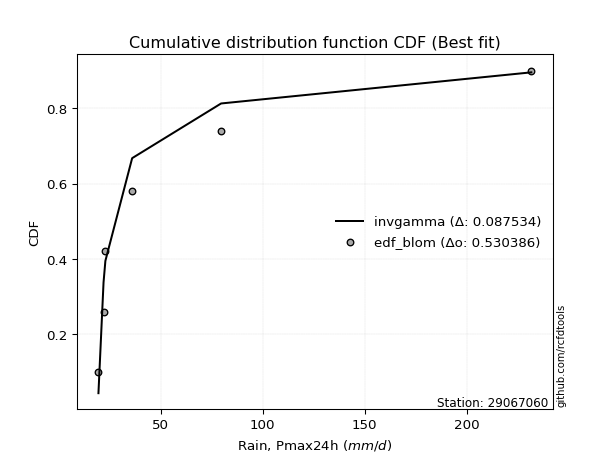</img></img>

</div>


### 7. EDF Tukey (1962)

In hydrology, the Tukey formula is used as a plotting position formula to estimate the empirical probability or frequency of a flood event (or other hydrological data). The formula parameter is given as _c=0.333_ (or 1/3).

<div align="center">


$P=(m-c)/(n+1-2c)$


</div>


**7.1. Empirical values**

<div align="center">

|                | 0                   | 1                   | 2                   | 3         | 4                  | 5                  | 6                  |
|:---------------|:--------------------|:--------------------|:--------------------|:----------|:-------------------|:-------------------|:-------------------|
| date           | 2022                | 2021                | 2023                | 2024      | 2025               | 2020               | 2019               |
| x              | 19.5                | 22.0                | 22.9                | 36.02     | 67.6               | 79.6               | 231.6              |
| m              | 1                   | 2                   | 3                   | 4         | 5                  | 6                  | 7                  |
| empirical_dist | edf_tukey           | edf_tukey           | edf_tukey           | edf_tukey | edf_tukey          | edf_tukey          | edf_tukey          |
| empirical      | 0.09090909090909091 | 0.22727272727272727 | 0.36363636363636365 | 0.5       | 0.6363636363636364 | 0.7727272727272727 | 0.9090909090909091 |
| empirical_tr   | 1.1                 | 1.2941176470588236  | 1.5714285714285714  | 2.0       | 2.75               | 4.3999999999999995 | 10.999999999999996 |

</div>


**7.2. Kolmogorov-Smirnov fit test (sorted by Δ)**


<div align="center">

|                | 0                   | 1                   | 2                   | 3                   | 4                   | 5                   | 6                   | 7                   | 8                   | 9                   | 10                  | 11                  | 12                  | 13                  | 14                  | 15                  | 16                  | 17                  | 18                  | 19                  | 20                  | 21                  | 22                  | 23                  | 24                  | 25                  | 26                  | 27                  | 28                  | 29                  | 30                  | 31                  | 32                  | 33                  | 34                  | 35                  | 36                  | 37                  | 38                  | 39                  | 40                  | 41                  | 42                  | 43                  | 44                  | 45                  | 46                  | 47                  | 48                  | 49                  | 50                  | 51                  | 52                  | 53                  | 54                  | 55                  | 56                  | 57                  | 58                  | 59                  | 60                  | 61                  | 62                  | 63                  | 64                  | 65                  | 66                  | 67                  | 68                  | 69                  | 70                  | 71                  | 72                  | 73                  | 74                  | 75                  | 76                  | 77                  | 78                  | 79                  | 80                  | 81                  | 82                  | 83                  | 84                  | 85                  | 86                  | 87                  | 88                  | 89                  | 90                  | 91                  | 92                  | 93                  | 94                  | 95                  | 96                  | 97                  | 98                  | 99                  | 100                 | 101                 | 102                 | 103                 | 104                 | 105                 | 106                 | 107                 | 108                 | 109                 | 110                 | 111                 | 112                 | 113                 | 114                 | 115                 | 116                 | 117                 | 118                 | 119                 | 120                 | 121                 | 122                 | 123                 | 124                 | 125                 | 126                 | 127                 | 128                 | 129                 | 130                 | 131                 | 132                 | 133                 | 134                 | 135                 | 136                 | 137                 | 138                 | 139                 | 140                 | 141                 | 142                 | 143                 | 144                 | 145                 | 146                 | 147                 | 148                 | 149                 | 150                 | 151                 | 152                 | 153                 | 154                 | 155                 | 156                 | 157                 | 158                 | 159                 |
|:---------------|:--------------------|:--------------------|:--------------------|:--------------------|:--------------------|:--------------------|:--------------------|:--------------------|:--------------------|:--------------------|:--------------------|:--------------------|:--------------------|:--------------------|:--------------------|:--------------------|:--------------------|:--------------------|:--------------------|:--------------------|:--------------------|:--------------------|:--------------------|:--------------------|:--------------------|:--------------------|:--------------------|:--------------------|:--------------------|:--------------------|:--------------------|:--------------------|:--------------------|:--------------------|:--------------------|:--------------------|:--------------------|:--------------------|:--------------------|:--------------------|:--------------------|:--------------------|:--------------------|:--------------------|:--------------------|:--------------------|:--------------------|:--------------------|:--------------------|:--------------------|:--------------------|:--------------------|:--------------------|:--------------------|:--------------------|:--------------------|:--------------------|:--------------------|:--------------------|:--------------------|:--------------------|:--------------------|:--------------------|:--------------------|:--------------------|:--------------------|:--------------------|:--------------------|:--------------------|:--------------------|:--------------------|:--------------------|:--------------------|:--------------------|:--------------------|:--------------------|:--------------------|:--------------------|:--------------------|:--------------------|:--------------------|:--------------------|:--------------------|:--------------------|:--------------------|:--------------------|:--------------------|:--------------------|:--------------------|:--------------------|:--------------------|:--------------------|:--------------------|:--------------------|:--------------------|:--------------------|:--------------------|:--------------------|:--------------------|:--------------------|:--------------------|:--------------------|:--------------------|:--------------------|:--------------------|:--------------------|:--------------------|:--------------------|:--------------------|:--------------------|:--------------------|:--------------------|:--------------------|:--------------------|:--------------------|:--------------------|:--------------------|:--------------------|:--------------------|:--------------------|:--------------------|:--------------------|:--------------------|:--------------------|:--------------------|:--------------------|:--------------------|:--------------------|:--------------------|:--------------------|:--------------------|:--------------------|:--------------------|:--------------------|:--------------------|:--------------------|:--------------------|:--------------------|:--------------------|:--------------------|:--------------------|:--------------------|:--------------------|:--------------------|:--------------------|:--------------------|:--------------------|:--------------------|:--------------------|:--------------------|:--------------------|:--------------------|:--------------------|:--------------------|:--------------------|:--------------------|:--------------------|:--------------------|:--------------------|:--------------------|
| station        | 29067060            | 29067060            | 29067060            | 29067060            | 29067060            | 29067060            | 29067060            | 29067060            | 29067060            | 29067060            | 29067060            | 29067060            | 29067060            | 29067060            | 29067060            | 29067060            | 29067060            | 29067060            | 29067060            | 29067060            | 29067060            | 29067060            | 29067060            | 29067060            | 29067060            | 29067060            | 29067060            | 29067060            | 29067060            | 29067060            | 29067060            | 29067060            | 29067060            | 29067060            | 29067060            | 29067060            | 29067060            | 29067060            | 29067060            | 29067060            | 29067060            | 29067060            | 29067060            | 29067060            | 29067060            | 29067060            | 29067060            | 29067060            | 29067060            | 29067060            | 29067060            | 29067060            | 29067060            | 29067060            | 29067060            | 29067060            | 29067060            | 29067060            | 29067060            | 29067060            | 29067060            | 29067060            | 29067060            | 29067060            | 29067060            | 29067060            | 29067060            | 29067060            | 29067060            | 29067060            | 29067060            | 29067060            | 29067060            | 29067060            | 29067060            | 29067060            | 29067060            | 29067060            | 29067060            | 29067060            | 29067060            | 29067060            | 29067060            | 29067060            | 29067060            | 29067060            | 29067060            | 29067060            | 29067060            | 29067060            | 29067060            | 29067060            | 29067060            | 29067060            | 29067060            | 29067060            | 29067060            | 29067060            | 29067060            | 29067060            | 29067060            | 29067060            | 29067060            | 29067060            | 29067060            | 29067060            | 29067060            | 29067060            | 29067060            | 29067060            | 29067060            | 29067060            | 29067060            | 29067060            | 29067060            | 29067060            | 29067060            | 29067060            | 29067060            | 29067060            | 29067060            | 29067060            | 29067060            | 29067060            | 29067060            | 29067060            | 29067060            | 29067060            | 29067060            | 29067060            | 29067060            | 29067060            | 29067060            | 29067060            | 29067060            | 29067060            | 29067060            | 29067060            | 29067060            | 29067060            | 29067060            | 29067060            | 29067060            | 29067060            | 29067060            | 29067060            | 29067060            | 29067060            | 29067060            | 29067060            | 29067060            | 29067060            | 29067060            | 29067060            | 29067060            | 29067060            | 29067060            | 29067060            | 29067060            | 29067060            |
| empirical_dist | edf_tukey           | edf_tukey           | edf_tukey           | edf_tukey           | edf_tukey           | edf_tukey           | edf_tukey           | edf_tukey           | edf_tukey           | edf_tukey           | edf_tukey           | edf_tukey           | edf_tukey           | edf_tukey           | edf_tukey           | edf_tukey           | edf_tukey           | edf_tukey           | edf_tukey           | edf_tukey           | edf_tukey           | edf_tukey           | edf_tukey           | edf_tukey           | edf_tukey           | edf_tukey           | edf_tukey           | edf_tukey           | edf_tukey           | edf_tukey           | edf_tukey           | edf_tukey           | edf_tukey           | edf_tukey           | edf_tukey           | edf_tukey           | edf_tukey           | edf_tukey           | edf_tukey           | edf_tukey           | edf_tukey           | edf_tukey           | edf_tukey           | edf_tukey           | edf_tukey           | edf_tukey           | edf_tukey           | edf_tukey           | edf_tukey           | edf_tukey           | edf_tukey           | edf_tukey           | edf_tukey           | edf_tukey           | edf_tukey           | edf_tukey           | edf_tukey           | edf_tukey           | edf_tukey           | edf_tukey           | edf_tukey           | edf_tukey           | edf_tukey           | edf_tukey           | edf_tukey           | edf_tukey           | edf_tukey           | edf_tukey           | edf_tukey           | edf_tukey           | edf_tukey           | edf_tukey           | edf_tukey           | edf_tukey           | edf_tukey           | edf_tukey           | edf_tukey           | edf_tukey           | edf_tukey           | edf_tukey           | edf_tukey           | edf_tukey           | edf_tukey           | edf_tukey           | edf_tukey           | edf_tukey           | edf_tukey           | edf_tukey           | edf_tukey           | edf_tukey           | edf_tukey           | edf_tukey           | edf_tukey           | edf_tukey           | edf_tukey           | edf_tukey           | edf_tukey           | edf_tukey           | edf_tukey           | edf_tukey           | edf_tukey           | edf_tukey           | edf_tukey           | edf_tukey           | edf_tukey           | edf_tukey           | edf_tukey           | edf_tukey           | edf_tukey           | edf_tukey           | edf_tukey           | edf_tukey           | edf_tukey           | edf_tukey           | edf_tukey           | edf_tukey           | edf_tukey           | edf_tukey           | edf_tukey           | edf_tukey           | edf_tukey           | edf_tukey           | edf_tukey           | edf_tukey           | edf_tukey           | edf_tukey           | edf_tukey           | edf_tukey           | edf_tukey           | edf_tukey           | edf_tukey           | edf_tukey           | edf_tukey           | edf_tukey           | edf_tukey           | edf_tukey           | edf_tukey           | edf_tukey           | edf_tukey           | edf_tukey           | edf_tukey           | edf_tukey           | edf_tukey           | edf_tukey           | edf_tukey           | edf_tukey           | edf_tukey           | edf_tukey           | edf_tukey           | edf_tukey           | edf_tukey           | edf_tukey           | edf_tukey           | edf_tukey           | edf_tukey           | edf_tukey           | edf_tukey           | edf_tukey           | edf_tukey           | edf_tukey           |
| p_dist         | logweibull_min      | genextreme          | invweibull          | lognakagami         | logbeta             | logsemicircular     | loggausshyper       | logfoldnorm         | logkappa3           | loghalfnorm         | loganglit           | invgamma            | genpareto           | loggenextreme       | loginvweibull       | lograyleigh         | halfgennorm         | logalpha            | wald                | logexponweib        | logmaxwell          | logarcsine          | logburr12           | logf                | loginvgamma         | burr                | logbetaprime        | betaprime           | gamma               | logpearson3         | nakagami            | moyal               | gumbel_r            | logloggamma         | lognorm             | logcrystalball      | logt                | loghalflogistic     | logncf              | logfatiguelife      | loghalfgennorm      | logburr             | loginvgauss         | ncf                 | loggumbel_r         | invgauss            | truncweibull_min    | lognct              | erlang              | nct                 | vonmises_line       | loggenlogistic      | pearson3            | genlogistic         | maxwell             | rayleigh            | logdweibull         | loglogistic         | logmoyal            | halflogistic        | logkstwobign        | logcosine           | loggumbel_l         | loglomax            | burr12              | dgamma              | logexponnorm        | johnsonsb           | logtruncnorm        | logexponpow         | alpha               | loghypsecant        | loggenexpon         | logdgamma           | loggompertz         | logistic            | halfnorm            | f                   | gennorm             | logrice             | exponpow            | norm                | crystalball         | loglaplace          | loglaplace          | hypsecant           | truncpareto         | kstwobign           | logargus            | logloglaplace       | anglit              | gengamma            | semicircular        | logksone            | foldnorm            | logtruncweibull_min | logrdist            | rice                | weibull_min         | logtukeylambda      | laplace             | arcsine             | logwrapcauchy       | loggenpareto        | loggamma            | loggamma            | logkappa4           | bradford            | logskewnorm         | logtriang           | logbradford         | logweibull_max      | loggennorm          | logtruncexpon       | gumbel_l            | loggengamma         | beta                | logerlang           | truncexpon          | wrapcauchy          | exponnorm           | gausshyper          | genexpon            | loguniform          | cosine              | logvonmises_line    | gompertz            | dweibull            | lomax               | truncnorm           | exponweib           | powerlaw            | loglevy_l           | logwald             | t                   | skewnorm            | fatiguelife         | loggenhalflogistic  | levy_l              | logpowerlaw         | argus               | logtruncpareto      | kappa3              | johnsonsu           | ksone               | kappa4              | logtrapezoid        | uniform             | rdist               | logjohnsonsb        | logjohnsonsu        | tukeylambda         | genhalflogistic     | triang              | trapezoid           | weibull_max         | logvonmises         | vonmises            | mielke              | logmielke           |
| delta          | 0.09355782183137867 | 0.10606585734849838 | 0.1060686800433025  | 0.11757225737667182 | 0.11815211780306217 | 0.12197346922627461 | 0.12217122313595632 | 0.12343629032463116 | 0.1275586517823133  | 0.13275643064456583 | 0.13429791101378324 | 0.13625287096322947 | 0.13889302509542467 | 0.13967877348258706 | 0.13968999929470005 | 0.1434999522927031  | 0.1438826935416102  | 0.14409913822929343 | 0.14425638584607658 | 0.14468489126821094 | 0.14900181100743404 | 0.14972386611446378 | 0.1505962677679923  | 0.15066269891154038 | 0.15066645982376203 | 0.1511050753015144  | 0.15285984588628088 | 0.15407575414564464 | 0.15615466095593655 | 0.15633848658624624 | 0.15852771399180987 | 0.15898128482853593 | 0.16200832545298524 | 0.16208491164094438 | 0.16224974856701424 | 0.16224985412172163 | 0.16225073141316249 | 0.16257241970968353 | 0.16339187082747206 | 0.16380095107601533 | 0.1639166967383905  | 0.16442638670323745 | 0.16455760670164465 | 0.16829602126374207 | 0.17002843455501895 | 0.1708211962147902  | 0.17103342111905184 | 0.17177867443290828 | 0.17293070720712078 | 0.1754543660491926  | 0.17567542287112572 | 0.17685149684208817 | 0.1773481009953761  | 0.17896229553740428 | 0.18013106682763724 | 0.18057021113025226 | 0.18126015533147624 | 0.18381631982355348 | 0.18402898902316112 | 0.1864696828951297  | 0.18719287346501048 | 0.18823903378874812 | 0.188949222156895   | 0.19028539004494208 | 0.19220027439512752 | 0.19233271310775943 | 0.19256312294311595 | 0.1929185824883531  | 0.1933091649907354  | 0.19384394235196692 | 0.19610710177415414 | 0.19653849224316589 | 0.19678751596300473 | 0.19799259558470614 | 0.1998465155875514  | 0.20118746676241106 | 0.2029298414373775  | 0.20353007218582872 | 0.20435305364261894 | 0.20672522435378196 | 0.20822246869852096 | 0.2096177016098898  | 0.2096177106542233  | 0.21049432896554918 | 0.21049432896554918 | 0.21327758778515077 | 0.21448766646854012 | 0.21467013252507605 | 0.21496443928307873 | 0.21691932586816617 | 0.21853097062513216 | 0.21897869265339895 | 0.22221442812579528 | 0.22617892214979518 | 0.22670228767696723 | 0.22807033303070376 | 0.23014764324000003 | 0.23490735657659484 | 0.2365304719639618  | 0.23713175263823094 | 0.24007456795010562 | 0.24474039692034785 | 0.25111644481004636 | 0.25187866320592334 | 0.25304645421093197 | 0.25304645421093197 | 0.25344987060873175 | 0.25356620567691907 | 0.257006970561949   | 0.25865339738664184 | 0.26623780543222486 | 0.2714733324171492  | 0.2727272727272727  | 0.27286488901919603 | 0.2751367047887835  | 0.2773952127548637  | 0.28263473033395836 | 0.2882710406993866  | 0.28991304633757153 | 0.2903786345454804  | 0.2947860741583236  | 0.2949145762840596  | 0.29654828539819544 | 0.29868743385248153 | 0.299394762571149   | 0.30282966433124486 | 0.30429769404223056 | 0.3055682616387434  | 0.31398745692495855 | 0.3140892387869138  | 0.31920658979529937 | 0.3258871958422269  | 0.32693604244558216 | 0.3296600501002457  | 0.33191788654929444 | 0.34681584746905547 | 0.35528886160939566 | 0.3695696824996138  | 0.37039428847724254 | 0.3955241683359133  | 0.39823582068889307 | 0.40966091749845335 | 0.42992359841751016 | 0.4474809559298347  | 0.4532631834612032  | 0.45474533633457304 | 0.46246381699249767 | 0.48937036560798935 | 0.5008072417604333  | 0.5219169313949468  | 0.5231543262770679  | 0.5304139644852154  | 0.5746344899818137  | 0.6510163606561115  | 0.6704552226754101  | 0.680129977464901   | 1.0897370409829525  | 36.89624029139058   | nan                 | nan                 |
| deltao         | 0.48442053926100004 | 0.48442053926100004 | 0.48442053926100004 | 0.48442053926100004 | 0.48442053926100004 | 0.48442053926100004 | 0.48442053926100004 | 0.48442053926100004 | 0.48442053926100004 | 0.48442053926100004 | 0.48442053926100004 | 0.48442053926100004 | 0.48442053926100004 | 0.48442053926100004 | 0.48442053926100004 | 0.48442053926100004 | 0.48442053926100004 | 0.48442053926100004 | 0.48442053926100004 | 0.48442053926100004 | 0.48442053926100004 | 0.48442053926100004 | 0.48442053926100004 | 0.48442053926100004 | 0.48442053926100004 | 0.48442053926100004 | 0.48442053926100004 | 0.48442053926100004 | 0.48442053926100004 | 0.48442053926100004 | 0.48442053926100004 | 0.48442053926100004 | 0.48442053926100004 | 0.48442053926100004 | 0.48442053926100004 | 0.48442053926100004 | 0.48442053926100004 | 0.48442053926100004 | 0.48442053926100004 | 0.48442053926100004 | 0.48442053926100004 | 0.48442053926100004 | 0.48442053926100004 | 0.48442053926100004 | 0.48442053926100004 | 0.48442053926100004 | 0.48442053926100004 | 0.48442053926100004 | 0.48442053926100004 | 0.48442053926100004 | 0.48442053926100004 | 0.48442053926100004 | 0.48442053926100004 | 0.48442053926100004 | 0.48442053926100004 | 0.48442053926100004 | 0.48442053926100004 | 0.48442053926100004 | 0.48442053926100004 | 0.48442053926100004 | 0.48442053926100004 | 0.48442053926100004 | 0.48442053926100004 | 0.48442053926100004 | 0.48442053926100004 | 0.48442053926100004 | 0.48442053926100004 | 0.48442053926100004 | 0.48442053926100004 | 0.48442053926100004 | 0.48442053926100004 | 0.48442053926100004 | 0.48442053926100004 | 0.48442053926100004 | 0.48442053926100004 | 0.48442053926100004 | 0.48442053926100004 | 0.48442053926100004 | 0.48442053926100004 | 0.48442053926100004 | 0.48442053926100004 | 0.48442053926100004 | 0.48442053926100004 | 0.48442053926100004 | 0.48442053926100004 | 0.48442053926100004 | 0.48442053926100004 | 0.48442053926100004 | 0.48442053926100004 | 0.48442053926100004 | 0.48442053926100004 | 0.48442053926100004 | 0.48442053926100004 | 0.48442053926100004 | 0.48442053926100004 | 0.48442053926100004 | 0.48442053926100004 | 0.48442053926100004 | 0.48442053926100004 | 0.48442053926100004 | 0.48442053926100004 | 0.48442053926100004 | 0.48442053926100004 | 0.48442053926100004 | 0.48442053926100004 | 0.48442053926100004 | 0.48442053926100004 | 0.48442053926100004 | 0.48442053926100004 | 0.48442053926100004 | 0.48442053926100004 | 0.48442053926100004 | 0.48442053926100004 | 0.48442053926100004 | 0.48442053926100004 | 0.48442053926100004 | 0.48442053926100004 | 0.48442053926100004 | 0.48442053926100004 | 0.48442053926100004 | 0.48442053926100004 | 0.48442053926100004 | 0.48442053926100004 | 0.48442053926100004 | 0.48442053926100004 | 0.48442053926100004 | 0.48442053926100004 | 0.48442053926100004 | 0.48442053926100004 | 0.48442053926100004 | 0.48442053926100004 | 0.48442053926100004 | 0.48442053926100004 | 0.48442053926100004 | 0.48442053926100004 | 0.48442053926100004 | 0.48442053926100004 | 0.48442053926100004 | 0.48442053926100004 | 0.48442053926100004 | 0.48442053926100004 | 0.48442053926100004 | 0.48442053926100004 | 0.48442053926100004 | 0.48442053926100004 | 0.48442053926100004 | 0.48442053926100004 | 0.48442053926100004 | 0.48442053926100004 | 0.48442053926100004 | 0.48442053926100004 | 0.48442053926100004 | 0.48442053926100004 | 0.48442053926100004 | 0.48442053926100004 | 0.48442053926100004 | 0.48442053926100004 | 0.48442053926100004 | 0.48442053926100004 | 0.48442053926100004 |
| eval           | Δo > Δ              | Δo > Δ              | Δo > Δ              | Δo > Δ              | Δo > Δ              | Δo > Δ              | Δo > Δ              | Δo > Δ              | Δo > Δ              | Δo > Δ              | Δo > Δ              | Δo > Δ              | Δo > Δ              | Δo > Δ              | Δo > Δ              | Δo > Δ              | Δo > Δ              | Δo > Δ              | Δo > Δ              | Δo > Δ              | Δo > Δ              | Δo > Δ              | Δo > Δ              | Δo > Δ              | Δo > Δ              | Δo > Δ              | Δo > Δ              | Δo > Δ              | Δo > Δ              | Δo > Δ              | Δo > Δ              | Δo > Δ              | Δo > Δ              | Δo > Δ              | Δo > Δ              | Δo > Δ              | Δo > Δ              | Δo > Δ              | Δo > Δ              | Δo > Δ              | Δo > Δ              | Δo > Δ              | Δo > Δ              | Δo > Δ              | Δo > Δ              | Δo > Δ              | Δo > Δ              | Δo > Δ              | Δo > Δ              | Δo > Δ              | Δo > Δ              | Δo > Δ              | Δo > Δ              | Δo > Δ              | Δo > Δ              | Δo > Δ              | Δo > Δ              | Δo > Δ              | Δo > Δ              | Δo > Δ              | Δo > Δ              | Δo > Δ              | Δo > Δ              | Δo > Δ              | Δo > Δ              | Δo > Δ              | Δo > Δ              | Δo > Δ              | Δo > Δ              | Δo > Δ              | Δo > Δ              | Δo > Δ              | Δo > Δ              | Δo > Δ              | Δo > Δ              | Δo > Δ              | Δo > Δ              | Δo > Δ              | Δo > Δ              | Δo > Δ              | Δo > Δ              | Δo > Δ              | Δo > Δ              | Δo > Δ              | Δo > Δ              | Δo > Δ              | Δo > Δ              | Δo > Δ              | Δo > Δ              | Δo > Δ              | Δo > Δ              | Δo > Δ              | Δo > Δ              | Δo > Δ              | Δo > Δ              | Δo > Δ              | Δo > Δ              | Δo > Δ              | Δo > Δ              | Δo > Δ              | Δo > Δ              | Δo > Δ              | Δo > Δ              | Δo > Δ              | Δo > Δ              | Δo > Δ              | Δo > Δ              | Δo > Δ              | Δo > Δ              | Δo > Δ              | Δo > Δ              | Δo > Δ              | Δo > Δ              | Δo > Δ              | Δo > Δ              | Δo > Δ              | Δo > Δ              | Δo > Δ              | Δo > Δ              | Δo > Δ              | Δo > Δ              | Δo > Δ              | Δo > Δ              | Δo > Δ              | Δo > Δ              | Δo > Δ              | Δo > Δ              | Δo > Δ              | Δo > Δ              | Δo > Δ              | Δo > Δ              | Δo > Δ              | Δo > Δ              | Δo > Δ              | Δo > Δ              | Δo > Δ              | Δo > Δ              | Δo > Δ              | Δo > Δ              | Δo > Δ              | Δo > Δ              | Δo > Δ              | Δo > Δ              | Δo > Δ              | Δo > Δ              | Δo > Δ              | Δo > Δ              | Δo <= Δ             | Δo <= Δ             | Δo <= Δ             | Δo <= Δ             | Δo <= Δ             | Δo <= Δ             | Δo <= Δ             | Δo <= Δ             | Δo <= Δ             | Δo <= Δ             | Δo <= Δ             | Δo <= Δ             | Δo <= Δ             |
| fit            | 1                   | 1                   | 1                   | 1                   | 1                   | 1                   | 1                   | 1                   | 1                   | 1                   | 1                   | 1                   | 1                   | 1                   | 1                   | 1                   | 1                   | 1                   | 1                   | 1                   | 1                   | 1                   | 1                   | 1                   | 1                   | 1                   | 1                   | 1                   | 1                   | 1                   | 1                   | 1                   | 1                   | 1                   | 1                   | 1                   | 1                   | 1                   | 1                   | 1                   | 1                   | 1                   | 1                   | 1                   | 1                   | 1                   | 1                   | 1                   | 1                   | 1                   | 1                   | 1                   | 1                   | 1                   | 1                   | 1                   | 1                   | 1                   | 1                   | 1                   | 1                   | 1                   | 1                   | 1                   | 1                   | 1                   | 1                   | 1                   | 1                   | 1                   | 1                   | 1                   | 1                   | 1                   | 1                   | 1                   | 1                   | 1                   | 1                   | 1                   | 1                   | 1                   | 1                   | 1                   | 1                   | 1                   | 1                   | 1                   | 1                   | 1                   | 1                   | 1                   | 1                   | 1                   | 1                   | 1                   | 1                   | 1                   | 1                   | 1                   | 1                   | 1                   | 1                   | 1                   | 1                   | 1                   | 1                   | 1                   | 1                   | 1                   | 1                   | 1                   | 1                   | 1                   | 1                   | 1                   | 1                   | 1                   | 1                   | 1                   | 1                   | 1                   | 1                   | 1                   | 1                   | 1                   | 1                   | 1                   | 1                   | 1                   | 1                   | 1                   | 1                   | 1                   | 1                   | 1                   | 1                   | 1                   | 1                   | 1                   | 1                   | 1                   | 1                   | 1                   | 1                   | 1                   | 1                   | 0                   | 0                   | 0                   | 0                   | 0                   | 0                   | 0                   | 0                   | 0                   | 0                   | 0                   | 0                   | 0                   |
| n              | 7                   | 7                   | 7                   | 7                   | 7                   | 7                   | 7                   | 7                   | 7                   | 7                   | 7                   | 7                   | 7                   | 7                   | 7                   | 7                   | 7                   | 7                   | 7                   | 7                   | 7                   | 7                   | 7                   | 7                   | 7                   | 7                   | 7                   | 7                   | 7                   | 7                   | 7                   | 7                   | 7                   | 7                   | 7                   | 7                   | 7                   | 7                   | 7                   | 7                   | 7                   | 7                   | 7                   | 7                   | 7                   | 7                   | 7                   | 7                   | 7                   | 7                   | 7                   | 7                   | 7                   | 7                   | 7                   | 7                   | 7                   | 7                   | 7                   | 7                   | 7                   | 7                   | 7                   | 7                   | 7                   | 7                   | 7                   | 7                   | 7                   | 7                   | 7                   | 7                   | 7                   | 7                   | 7                   | 7                   | 7                   | 7                   | 7                   | 7                   | 7                   | 7                   | 7                   | 7                   | 7                   | 7                   | 7                   | 7                   | 7                   | 7                   | 7                   | 7                   | 7                   | 7                   | 7                   | 7                   | 7                   | 7                   | 7                   | 7                   | 7                   | 7                   | 7                   | 7                   | 7                   | 7                   | 7                   | 7                   | 7                   | 7                   | 7                   | 7                   | 7                   | 7                   | 7                   | 7                   | 7                   | 7                   | 7                   | 7                   | 7                   | 7                   | 7                   | 7                   | 7                   | 7                   | 7                   | 7                   | 7                   | 7                   | 7                   | 7                   | 7                   | 7                   | 7                   | 7                   | 7                   | 7                   | 7                   | 7                   | 7                   | 7                   | 7                   | 7                   | 7                   | 7                   | 7                   | 7                   | 7                   | 7                   | 7                   | 7                   | 7                   | 7                   | 7                   | 7                   | 7                   | 7                   | 7                   | 7                   |
| best_fit       | 1                   | 0                   | 0                   | 0                   | 0                   | 0                   | 0                   | 0                   | 0                   | 0                   | 0                   | 0                   | 0                   | 0                   | 0                   | 0                   | 0                   | 0                   | 0                   | 0                   | 0                   | 0                   | 0                   | 0                   | 0                   | 0                   | 0                   | 0                   | 0                   | 0                   | 0                   | 0                   | 0                   | 0                   | 0                   | 0                   | 0                   | 0                   | 0                   | 0                   | 0                   | 0                   | 0                   | 0                   | 0                   | 0                   | 0                   | 0                   | 0                   | 0                   | 0                   | 0                   | 0                   | 0                   | 0                   | 0                   | 0                   | 0                   | 0                   | 0                   | 0                   | 0                   | 0                   | 0                   | 0                   | 0                   | 0                   | 0                   | 0                   | 0                   | 0                   | 0                   | 0                   | 0                   | 0                   | 0                   | 0                   | 0                   | 0                   | 0                   | 0                   | 0                   | 0                   | 0                   | 0                   | 0                   | 0                   | 0                   | 0                   | 0                   | 0                   | 0                   | 0                   | 0                   | 0                   | 0                   | 0                   | 0                   | 0                   | 0                   | 0                   | 0                   | 0                   | 0                   | 0                   | 0                   | 0                   | 0                   | 0                   | 0                   | 0                   | 0                   | 0                   | 0                   | 0                   | 0                   | 0                   | 0                   | 0                   | 0                   | 0                   | 0                   | 0                   | 0                   | 0                   | 0                   | 0                   | 0                   | 0                   | 0                   | 0                   | 0                   | 0                   | 0                   | 0                   | 0                   | 0                   | 0                   | 0                   | 0                   | 0                   | 0                   | 0                   | 0                   | 0                   | 0                   | 0                   | 0                   | 0                   | 0                   | 0                   | 0                   | 0                   | 0                   | 0                   | 0                   | 0                   | 0                   | 0                   | 0                   |
| best_fit_sort  | 1                   | 2                   | 3                   | 4                   | 5                   | 6                   | 7                   | 8                   | 9                   | 10                  | 11                  | 12                  | 13                  | 14                  | 15                  | 16                  | 17                  | 18                  | 19                  | 20                  | 21                  | 22                  | 23                  | 24                  | 25                  | 26                  | 27                  | 28                  | 29                  | 30                  | 31                  | 32                  | 33                  | 34                  | 35                  | 36                  | 37                  | 38                  | 39                  | 40                  | 41                  | 42                  | 43                  | 44                  | 45                  | 46                  | 47                  | 48                  | 49                  | 50                  | 51                  | 52                  | 53                  | 54                  | 55                  | 56                  | 57                  | 58                  | 59                  | 60                  | 61                  | 62                  | 63                  | 64                  | 65                  | 66                  | 67                  | 68                  | 69                  | 70                  | 71                  | 72                  | 73                  | 74                  | 75                  | 76                  | 77                  | 78                  | 79                  | 80                  | 81                  | 82                  | 83                  | 84                  | 85                  | 86                  | 87                  | 88                  | 89                  | 90                  | 91                  | 92                  | 93                  | 94                  | 95                  | 96                  | 97                  | 98                  | 99                  | 100                 | 101                 | 102                 | 103                 | 104                 | 105                 | 106                 | 107                 | 108                 | 109                 | 110                 | 111                 | 112                 | 113                 | 114                 | 115                 | 116                 | 117                 | 118                 | 119                 | 120                 | 121                 | 122                 | 123                 | 124                 | 125                 | 126                 | 127                 | 128                 | 129                 | 130                 | 131                 | 132                 | 133                 | 134                 | 135                 | 136                 | 137                 | 138                 | 139                 | 140                 | 141                 | 142                 | 143                 | 144                 | 145                 | 146                 | 147                 | 148                 | 149                 | 150                 | 151                 | 152                 | 153                 | 154                 | 155                 | 156                 | 157                 | 158                 | 159                 | 160                 |

</div>


**7.3. Best fit**

<div align="center">

|   id |   station | empirical_dist   | p_dist         |     delta |   deltao | eval   |   fit |   n |   best_fit |   best_fit_sort |
|-----:|----------:|:-----------------|:---------------|----------:|---------:|:-------|------:|----:|-----------:|----------------:|
|    0 |  29067060 | edf_tukey        | logweibull_min | 0.0935578 | 0.484421 | Δo > Δ |     1 |   7 |          1 |               1 |

</div>


<div align="center">

</img></img>

</div>


### 8. EDF Gringorten (1963)

Gringorten plotting position formula is essential for estimating the probability and return periods of extreme events like floods and heavy rainfall. The constant _a=0.44_.

<div align="center">


$P=(m-a)/(n+1-2a)$


</div>


**8.1. Empirical values**

<div align="center">

|                | 0                   | 1                   | 2                  | 3              | 4                  | 5                  | 6                  |
|:---------------|:--------------------|:--------------------|:-------------------|:---------------|:-------------------|:-------------------|:-------------------|
| date           | 2022                | 2021                | 2023               | 2024           | 2025               | 2020               | 2019               |
| x              | 19.5                | 22.0                | 22.9               | 36.02          | 67.6               | 79.6               | 231.6              |
| m              | 1                   | 2                   | 3                  | 4              | 5                  | 6                  | 7                  |
| empirical_dist | edf_gringorten      | edf_gringorten      | edf_gringorten     | edf_gringorten | edf_gringorten     | edf_gringorten     | edf_gringorten     |
| empirical      | 0.07865168539325844 | 0.21910112359550563 | 0.3595505617977528 | 0.5            | 0.6404494382022471 | 0.7808988764044943 | 0.9213483146067415 |
| empirical_tr   | 1.0853658536585364  | 1.2805755395683454  | 1.5614035087719298 | 2.0            | 2.781249999999999  | 4.564102564102562  | 12.714285714285701 |

</div>


**8.2. Kolmogorov-Smirnov fit test (sorted by Δ)**


<div align="center">

|                | 0                   | 1                   | 2                   | 3                   | 4                   | 5                   | 6                   | 7                   | 8                   | 9                   | 10                  | 11                  | 12                  | 13                  | 14                  | 15                  | 16                  | 17                  | 18                  | 19                  | 20                  | 21                  | 22                  | 23                  | 24                  | 25                  | 26                  | 27                  | 28                  | 29                  | 30                  | 31                  | 32                  | 33                  | 34                  | 35                  | 36                  | 37                  | 38                  | 39                  | 40                  | 41                  | 42                  | 43                  | 44                  | 45                  | 46                  | 47                  | 48                  | 49                  | 50                  | 51                  | 52                  | 53                  | 54                  | 55                  | 56                  | 57                  | 58                  | 59                  | 60                  | 61                  | 62                  | 63                  | 64                  | 65                  | 66                  | 67                  | 68                  | 69                  | 70                  | 71                  | 72                  | 73                  | 74                  | 75                  | 76                  | 77                  | 78                  | 79                  | 80                  | 81                  | 82                  | 83                  | 84                  | 85                  | 86                  | 87                  | 88                  | 89                  | 90                  | 91                  | 92                  | 93                  | 94                  | 95                  | 96                  | 97                  | 98                  | 99                  | 100                 | 101                 | 102                 | 103                 | 104                 | 105                 | 106                 | 107                 | 108                 | 109                 | 110                 | 111                 | 112                 | 113                 | 114                 | 115                 | 116                 | 117                 | 118                 | 119                 | 120                 | 121                 | 122                 | 123                 | 124                 | 125                 | 126                 | 127                 | 128                 | 129                 | 130                 | 131                 | 132                 | 133                 | 134                 | 135                 | 136                 | 137                 | 138                 | 139                 | 140                 | 141                 | 142                 | 143                 | 144                 | 145                 | 146                 | 147                 | 148                 | 149                 | 150                 | 151                 | 152                 | 153                 | 154                 | 155                 | 156                 | 157                 | 158                 | 159                 |
|:---------------|:--------------------|:--------------------|:--------------------|:--------------------|:--------------------|:--------------------|:--------------------|:--------------------|:--------------------|:--------------------|:--------------------|:--------------------|:--------------------|:--------------------|:--------------------|:--------------------|:--------------------|:--------------------|:--------------------|:--------------------|:--------------------|:--------------------|:--------------------|:--------------------|:--------------------|:--------------------|:--------------------|:--------------------|:--------------------|:--------------------|:--------------------|:--------------------|:--------------------|:--------------------|:--------------------|:--------------------|:--------------------|:--------------------|:--------------------|:--------------------|:--------------------|:--------------------|:--------------------|:--------------------|:--------------------|:--------------------|:--------------------|:--------------------|:--------------------|:--------------------|:--------------------|:--------------------|:--------------------|:--------------------|:--------------------|:--------------------|:--------------------|:--------------------|:--------------------|:--------------------|:--------------------|:--------------------|:--------------------|:--------------------|:--------------------|:--------------------|:--------------------|:--------------------|:--------------------|:--------------------|:--------------------|:--------------------|:--------------------|:--------------------|:--------------------|:--------------------|:--------------------|:--------------------|:--------------------|:--------------------|:--------------------|:--------------------|:--------------------|:--------------------|:--------------------|:--------------------|:--------------------|:--------------------|:--------------------|:--------------------|:--------------------|:--------------------|:--------------------|:--------------------|:--------------------|:--------------------|:--------------------|:--------------------|:--------------------|:--------------------|:--------------------|:--------------------|:--------------------|:--------------------|:--------------------|:--------------------|:--------------------|:--------------------|:--------------------|:--------------------|:--------------------|:--------------------|:--------------------|:--------------------|:--------------------|:--------------------|:--------------------|:--------------------|:--------------------|:--------------------|:--------------------|:--------------------|:--------------------|:--------------------|:--------------------|:--------------------|:--------------------|:--------------------|:--------------------|:--------------------|:--------------------|:--------------------|:--------------------|:--------------------|:--------------------|:--------------------|:--------------------|:--------------------|:--------------------|:--------------------|:--------------------|:--------------------|:--------------------|:--------------------|:--------------------|:--------------------|:--------------------|:--------------------|:--------------------|:--------------------|:--------------------|:--------------------|:--------------------|:--------------------|:--------------------|:--------------------|:--------------------|:--------------------|:--------------------|:--------------------|
| station        | 29067060            | 29067060            | 29067060            | 29067060            | 29067060            | 29067060            | 29067060            | 29067060            | 29067060            | 29067060            | 29067060            | 29067060            | 29067060            | 29067060            | 29067060            | 29067060            | 29067060            | 29067060            | 29067060            | 29067060            | 29067060            | 29067060            | 29067060            | 29067060            | 29067060            | 29067060            | 29067060            | 29067060            | 29067060            | 29067060            | 29067060            | 29067060            | 29067060            | 29067060            | 29067060            | 29067060            | 29067060            | 29067060            | 29067060            | 29067060            | 29067060            | 29067060            | 29067060            | 29067060            | 29067060            | 29067060            | 29067060            | 29067060            | 29067060            | 29067060            | 29067060            | 29067060            | 29067060            | 29067060            | 29067060            | 29067060            | 29067060            | 29067060            | 29067060            | 29067060            | 29067060            | 29067060            | 29067060            | 29067060            | 29067060            | 29067060            | 29067060            | 29067060            | 29067060            | 29067060            | 29067060            | 29067060            | 29067060            | 29067060            | 29067060            | 29067060            | 29067060            | 29067060            | 29067060            | 29067060            | 29067060            | 29067060            | 29067060            | 29067060            | 29067060            | 29067060            | 29067060            | 29067060            | 29067060            | 29067060            | 29067060            | 29067060            | 29067060            | 29067060            | 29067060            | 29067060            | 29067060            | 29067060            | 29067060            | 29067060            | 29067060            | 29067060            | 29067060            | 29067060            | 29067060            | 29067060            | 29067060            | 29067060            | 29067060            | 29067060            | 29067060            | 29067060            | 29067060            | 29067060            | 29067060            | 29067060            | 29067060            | 29067060            | 29067060            | 29067060            | 29067060            | 29067060            | 29067060            | 29067060            | 29067060            | 29067060            | 29067060            | 29067060            | 29067060            | 29067060            | 29067060            | 29067060            | 29067060            | 29067060            | 29067060            | 29067060            | 29067060            | 29067060            | 29067060            | 29067060            | 29067060            | 29067060            | 29067060            | 29067060            | 29067060            | 29067060            | 29067060            | 29067060            | 29067060            | 29067060            | 29067060            | 29067060            | 29067060            | 29067060            | 29067060            | 29067060            | 29067060            | 29067060            | 29067060            | 29067060            |
| empirical_dist | edf_gringorten      | edf_gringorten      | edf_gringorten      | edf_gringorten      | edf_gringorten      | edf_gringorten      | edf_gringorten      | edf_gringorten      | edf_gringorten      | edf_gringorten      | edf_gringorten      | edf_gringorten      | edf_gringorten      | edf_gringorten      | edf_gringorten      | edf_gringorten      | edf_gringorten      | edf_gringorten      | edf_gringorten      | edf_gringorten      | edf_gringorten      | edf_gringorten      | edf_gringorten      | edf_gringorten      | edf_gringorten      | edf_gringorten      | edf_gringorten      | edf_gringorten      | edf_gringorten      | edf_gringorten      | edf_gringorten      | edf_gringorten      | edf_gringorten      | edf_gringorten      | edf_gringorten      | edf_gringorten      | edf_gringorten      | edf_gringorten      | edf_gringorten      | edf_gringorten      | edf_gringorten      | edf_gringorten      | edf_gringorten      | edf_gringorten      | edf_gringorten      | edf_gringorten      | edf_gringorten      | edf_gringorten      | edf_gringorten      | edf_gringorten      | edf_gringorten      | edf_gringorten      | edf_gringorten      | edf_gringorten      | edf_gringorten      | edf_gringorten      | edf_gringorten      | edf_gringorten      | edf_gringorten      | edf_gringorten      | edf_gringorten      | edf_gringorten      | edf_gringorten      | edf_gringorten      | edf_gringorten      | edf_gringorten      | edf_gringorten      | edf_gringorten      | edf_gringorten      | edf_gringorten      | edf_gringorten      | edf_gringorten      | edf_gringorten      | edf_gringorten      | edf_gringorten      | edf_gringorten      | edf_gringorten      | edf_gringorten      | edf_gringorten      | edf_gringorten      | edf_gringorten      | edf_gringorten      | edf_gringorten      | edf_gringorten      | edf_gringorten      | edf_gringorten      | edf_gringorten      | edf_gringorten      | edf_gringorten      | edf_gringorten      | edf_gringorten      | edf_gringorten      | edf_gringorten      | edf_gringorten      | edf_gringorten      | edf_gringorten      | edf_gringorten      | edf_gringorten      | edf_gringorten      | edf_gringorten      | edf_gringorten      | edf_gringorten      | edf_gringorten      | edf_gringorten      | edf_gringorten      | edf_gringorten      | edf_gringorten      | edf_gringorten      | edf_gringorten      | edf_gringorten      | edf_gringorten      | edf_gringorten      | edf_gringorten      | edf_gringorten      | edf_gringorten      | edf_gringorten      | edf_gringorten      | edf_gringorten      | edf_gringorten      | edf_gringorten      | edf_gringorten      | edf_gringorten      | edf_gringorten      | edf_gringorten      | edf_gringorten      | edf_gringorten      | edf_gringorten      | edf_gringorten      | edf_gringorten      | edf_gringorten      | edf_gringorten      | edf_gringorten      | edf_gringorten      | edf_gringorten      | edf_gringorten      | edf_gringorten      | edf_gringorten      | edf_gringorten      | edf_gringorten      | edf_gringorten      | edf_gringorten      | edf_gringorten      | edf_gringorten      | edf_gringorten      | edf_gringorten      | edf_gringorten      | edf_gringorten      | edf_gringorten      | edf_gringorten      | edf_gringorten      | edf_gringorten      | edf_gringorten      | edf_gringorten      | edf_gringorten      | edf_gringorten      | edf_gringorten      | edf_gringorten      | edf_gringorten      | edf_gringorten      | edf_gringorten      |
| p_dist         | logweibull_min      | genextreme          | invweibull          | lognakagami         | logbeta             | logsemicircular     | loggausshyper       | logfoldnorm         | logkappa3           | loghalfnorm         | loganglit           | invgamma            | genpareto           | loggenextreme       | loginvweibull       | lograyleigh         | halfgennorm         | logalpha            | wald                | logmaxwell          | logburr12           | logf                | loginvgamma         | burr                | logbetaprime        | betaprime           | gamma               | logpearson3         | logexponweib        | logloggamma         | lognorm             | logcrystalball      | logt                | loghalflogistic     | logncf              | logfatiguelife      | loghalfgennorm      | logburr             | loginvgauss         | logarcsine          | ncf                 | loggumbel_r         | nakagami            | invgauss            | lognct              | erlang              | moyal               | nct                 | loggenlogistic      | gumbel_r            | genlogistic         | truncweibull_min    | loglogistic         | logmoyal            | logkstwobign        | logcosine           | loggumbel_l         | loglomax            | vonmises_line       | burr12              | maxwell             | logexponnorm        | logtruncnorm        | pearson3            | logexponpow         | alpha               | loghypsecant        | loggenexpon         | rayleigh            | logdweibull         | loggompertz         | halflogistic        | johnsonsb           | logrice             | exponpow            | dgamma              | loglaplace          | loglaplace          | logistic            | logdgamma           | truncpareto         | f                   | logloglaplace       | hypsecant           | kstwobign           | logargus            | halfnorm            | gennorm             | norm                | crystalball         | logksone            | logtruncweibull_min | anglit              | gengamma            | semicircular        | weibull_min         | logtukeylambda      | rice                | logrdist            | foldnorm            | laplace             | loggamma            | loggamma            | logkappa4           | bradford            | logskewnorm         | arcsine             | logwrapcauchy       | logbradford         | loggenpareto        | logtriang           | logtruncexpon       | beta                | logweibull_max      | loggennorm          | gumbel_l            | logerlang           | loggengamma         | exponnorm           | genexpon            | loguniform          | truncexpon          | wrapcauchy          | logvonmises_line    | gompertz            | gausshyper          | cosine              | lomax               | truncnorm           | dweibull            | logwald             | exponweib           | t                   | powerlaw            | loglevy_l           | skewnorm            | fatiguelife         | loggenhalflogistic  | levy_l              | logpowerlaw         | argus               | logtruncpareto      | kappa3              | johnsonsu           | ksone               | kappa4              | logtrapezoid        | uniform             | rdist               | logjohnsonsb        | logjohnsonsu        | tukeylambda         | genhalflogistic     | triang              | trapezoid           | weibull_max         | logvonmises         | vonmises            | mielke              | logmielke           |
| delta          | 0.08947201999276783 | 0.1038019333047645  | 0.10380435847066649 | 0.11348645553806097 | 0.11406631596445133 | 0.11788766738766376 | 0.11808542129734548 | 0.11935048848602031 | 0.12347284994370256 | 0.12867062880595498 | 0.1302121091751724  | 0.13216706912461873 | 0.13480722325681394 | 0.13559297164397632 | 0.13560419745608931 | 0.13941415045409225 | 0.13979689170299947 | 0.1400133363906827  | 0.14017058400746574 | 0.1449160091688232  | 0.14651046592938155 | 0.14657689707292965 | 0.1465806579851513  | 0.14701927346290367 | 0.14877404404767014 | 0.1499899523070338  | 0.15206885911732582 | 0.1522526847476354  | 0.15694229678404337 | 0.15799910980233353 | 0.1581639467284034  | 0.15816405228311078 | 0.15816492957455164 | 0.15848661787107268 | 0.1593060689888612  | 0.1597151492374046  | 0.15983089489977975 | 0.1603405848646266  | 0.16047180486303392 | 0.16198127163029624 | 0.16421021942513123 | 0.1659426327164081  | 0.16669931766903145 | 0.16673539437617946 | 0.16769287259429744 | 0.16884490536851005 | 0.1712386903443684  | 0.17136856421058175 | 0.17276569500347733 | 0.1742657309688177  | 0.17896229553740428 | 0.17920502479627343 | 0.17973051798494263 | 0.17994318718455027 | 0.18310707162639964 | 0.18415323195013727 | 0.18486342031828415 | 0.18619958820633123 | 0.18793282838695818 | 0.18811447255651667 | 0.18830267050485883 | 0.1884773211045051  | 0.18922336315212454 | 0.18960550651120855 | 0.18975814051335607 | 0.1920212999355434  | 0.19245269040455504 | 0.19270171412439388 | 0.19282761664608472 | 0.1935175608473087  | 0.19576071374894055 | 0.19872708841096215 | 0.20109018616557475 | 0.2026394225151711  | 0.2041366668599101  | 0.2045901186235919  | 0.20640852712693833 | 0.20640852712693833 | 0.20935907043963264 | 0.2102500011005386  | 0.21040186462992938 | 0.21170167586305036 | 0.21283352402955533 | 0.21327758778515077 | 0.21467013252507605 | 0.21496443928307873 | 0.21518724695320995 | 0.2166104591584514  | 0.21778930528711138 | 0.21778931433144488 | 0.22388590013304777 | 0.2239845311920929  | 0.22670257430235374 | 0.2271502963306206  | 0.23038603180301687 | 0.23244467012535094 | 0.2330459507996201  | 0.23490735657659484 | 0.23831924691722162 | 0.2389596931927997  | 0.24007456795010562 | 0.24896065237232123 | 0.24896065237232123 | 0.2493640687701209  | 0.24948040383830822 | 0.25292116872333814 | 0.2569978024361803  | 0.25928804848726794 | 0.262152003593614   | 0.26413606872175577 | 0.2668250010638634  | 0.2687790871805852  | 0.2785489284953476  | 0.2796449360943708  | 0.2808988764044944  | 0.2833083084660051  | 0.28726242459161166 | 0.2896526182706961  | 0.29070027231971274 | 0.2924624835595846  | 0.2946016320138707  | 0.2980846500147931  | 0.298550238222702   | 0.298743862492634   | 0.3002118922036197  | 0.307171981799892   | 0.3075663662483706  | 0.3099016550863477  | 0.31000343694830296 | 0.31782566715457583 | 0.32557424826163484 | 0.32737819347252106 | 0.33191788654929444 | 0.3340587995194486  | 0.33919344796141465 | 0.34681584746905547 | 0.36346046528661735 | 0.3777412861768354  | 0.382651693993075   | 0.403695772013135   | 0.40640742436611466 | 0.41783252117567504 | 0.4421810039333426  | 0.4556525596070564  | 0.4614347871384248  | 0.4629169400117946  | 0.47063542066971925 | 0.49754196928521094 | 0.5130646472762659  | 0.5300885350721685  | 0.5313259299542896  | 0.5426713700010479  | 0.5828060936590352  | 0.659187964333333   | 0.6786268263526317  | 0.6883015811421227  | 1.0882333414846377  | 36.88398288587475   | nan                 | nan                 |
| deltao         | 0.48442053926100004 | 0.48442053926100004 | 0.48442053926100004 | 0.48442053926100004 | 0.48442053926100004 | 0.48442053926100004 | 0.48442053926100004 | 0.48442053926100004 | 0.48442053926100004 | 0.48442053926100004 | 0.48442053926100004 | 0.48442053926100004 | 0.48442053926100004 | 0.48442053926100004 | 0.48442053926100004 | 0.48442053926100004 | 0.48442053926100004 | 0.48442053926100004 | 0.48442053926100004 | 0.48442053926100004 | 0.48442053926100004 | 0.48442053926100004 | 0.48442053926100004 | 0.48442053926100004 | 0.48442053926100004 | 0.48442053926100004 | 0.48442053926100004 | 0.48442053926100004 | 0.48442053926100004 | 0.48442053926100004 | 0.48442053926100004 | 0.48442053926100004 | 0.48442053926100004 | 0.48442053926100004 | 0.48442053926100004 | 0.48442053926100004 | 0.48442053926100004 | 0.48442053926100004 | 0.48442053926100004 | 0.48442053926100004 | 0.48442053926100004 | 0.48442053926100004 | 0.48442053926100004 | 0.48442053926100004 | 0.48442053926100004 | 0.48442053926100004 | 0.48442053926100004 | 0.48442053926100004 | 0.48442053926100004 | 0.48442053926100004 | 0.48442053926100004 | 0.48442053926100004 | 0.48442053926100004 | 0.48442053926100004 | 0.48442053926100004 | 0.48442053926100004 | 0.48442053926100004 | 0.48442053926100004 | 0.48442053926100004 | 0.48442053926100004 | 0.48442053926100004 | 0.48442053926100004 | 0.48442053926100004 | 0.48442053926100004 | 0.48442053926100004 | 0.48442053926100004 | 0.48442053926100004 | 0.48442053926100004 | 0.48442053926100004 | 0.48442053926100004 | 0.48442053926100004 | 0.48442053926100004 | 0.48442053926100004 | 0.48442053926100004 | 0.48442053926100004 | 0.48442053926100004 | 0.48442053926100004 | 0.48442053926100004 | 0.48442053926100004 | 0.48442053926100004 | 0.48442053926100004 | 0.48442053926100004 | 0.48442053926100004 | 0.48442053926100004 | 0.48442053926100004 | 0.48442053926100004 | 0.48442053926100004 | 0.48442053926100004 | 0.48442053926100004 | 0.48442053926100004 | 0.48442053926100004 | 0.48442053926100004 | 0.48442053926100004 | 0.48442053926100004 | 0.48442053926100004 | 0.48442053926100004 | 0.48442053926100004 | 0.48442053926100004 | 0.48442053926100004 | 0.48442053926100004 | 0.48442053926100004 | 0.48442053926100004 | 0.48442053926100004 | 0.48442053926100004 | 0.48442053926100004 | 0.48442053926100004 | 0.48442053926100004 | 0.48442053926100004 | 0.48442053926100004 | 0.48442053926100004 | 0.48442053926100004 | 0.48442053926100004 | 0.48442053926100004 | 0.48442053926100004 | 0.48442053926100004 | 0.48442053926100004 | 0.48442053926100004 | 0.48442053926100004 | 0.48442053926100004 | 0.48442053926100004 | 0.48442053926100004 | 0.48442053926100004 | 0.48442053926100004 | 0.48442053926100004 | 0.48442053926100004 | 0.48442053926100004 | 0.48442053926100004 | 0.48442053926100004 | 0.48442053926100004 | 0.48442053926100004 | 0.48442053926100004 | 0.48442053926100004 | 0.48442053926100004 | 0.48442053926100004 | 0.48442053926100004 | 0.48442053926100004 | 0.48442053926100004 | 0.48442053926100004 | 0.48442053926100004 | 0.48442053926100004 | 0.48442053926100004 | 0.48442053926100004 | 0.48442053926100004 | 0.48442053926100004 | 0.48442053926100004 | 0.48442053926100004 | 0.48442053926100004 | 0.48442053926100004 | 0.48442053926100004 | 0.48442053926100004 | 0.48442053926100004 | 0.48442053926100004 | 0.48442053926100004 | 0.48442053926100004 | 0.48442053926100004 | 0.48442053926100004 | 0.48442053926100004 | 0.48442053926100004 | 0.48442053926100004 | 0.48442053926100004 |
| eval           | Δo > Δ              | Δo > Δ              | Δo > Δ              | Δo > Δ              | Δo > Δ              | Δo > Δ              | Δo > Δ              | Δo > Δ              | Δo > Δ              | Δo > Δ              | Δo > Δ              | Δo > Δ              | Δo > Δ              | Δo > Δ              | Δo > Δ              | Δo > Δ              | Δo > Δ              | Δo > Δ              | Δo > Δ              | Δo > Δ              | Δo > Δ              | Δo > Δ              | Δo > Δ              | Δo > Δ              | Δo > Δ              | Δo > Δ              | Δo > Δ              | Δo > Δ              | Δo > Δ              | Δo > Δ              | Δo > Δ              | Δo > Δ              | Δo > Δ              | Δo > Δ              | Δo > Δ              | Δo > Δ              | Δo > Δ              | Δo > Δ              | Δo > Δ              | Δo > Δ              | Δo > Δ              | Δo > Δ              | Δo > Δ              | Δo > Δ              | Δo > Δ              | Δo > Δ              | Δo > Δ              | Δo > Δ              | Δo > Δ              | Δo > Δ              | Δo > Δ              | Δo > Δ              | Δo > Δ              | Δo > Δ              | Δo > Δ              | Δo > Δ              | Δo > Δ              | Δo > Δ              | Δo > Δ              | Δo > Δ              | Δo > Δ              | Δo > Δ              | Δo > Δ              | Δo > Δ              | Δo > Δ              | Δo > Δ              | Δo > Δ              | Δo > Δ              | Δo > Δ              | Δo > Δ              | Δo > Δ              | Δo > Δ              | Δo > Δ              | Δo > Δ              | Δo > Δ              | Δo > Δ              | Δo > Δ              | Δo > Δ              | Δo > Δ              | Δo > Δ              | Δo > Δ              | Δo > Δ              | Δo > Δ              | Δo > Δ              | Δo > Δ              | Δo > Δ              | Δo > Δ              | Δo > Δ              | Δo > Δ              | Δo > Δ              | Δo > Δ              | Δo > Δ              | Δo > Δ              | Δo > Δ              | Δo > Δ              | Δo > Δ              | Δo > Δ              | Δo > Δ              | Δo > Δ              | Δo > Δ              | Δo > Δ              | Δo > Δ              | Δo > Δ              | Δo > Δ              | Δo > Δ              | Δo > Δ              | Δo > Δ              | Δo > Δ              | Δo > Δ              | Δo > Δ              | Δo > Δ              | Δo > Δ              | Δo > Δ              | Δo > Δ              | Δo > Δ              | Δo > Δ              | Δo > Δ              | Δo > Δ              | Δo > Δ              | Δo > Δ              | Δo > Δ              | Δo > Δ              | Δo > Δ              | Δo > Δ              | Δo > Δ              | Δo > Δ              | Δo > Δ              | Δo > Δ              | Δo > Δ              | Δo > Δ              | Δo > Δ              | Δo > Δ              | Δo > Δ              | Δo > Δ              | Δo > Δ              | Δo > Δ              | Δo > Δ              | Δo > Δ              | Δo > Δ              | Δo > Δ              | Δo > Δ              | Δo > Δ              | Δo > Δ              | Δo > Δ              | Δo > Δ              | Δo > Δ              | Δo > Δ              | Δo <= Δ             | Δo <= Δ             | Δo <= Δ             | Δo <= Δ             | Δo <= Δ             | Δo <= Δ             | Δo <= Δ             | Δo <= Δ             | Δo <= Δ             | Δo <= Δ             | Δo <= Δ             | Δo <= Δ             | Δo <= Δ             |
| fit            | 1                   | 1                   | 1                   | 1                   | 1                   | 1                   | 1                   | 1                   | 1                   | 1                   | 1                   | 1                   | 1                   | 1                   | 1                   | 1                   | 1                   | 1                   | 1                   | 1                   | 1                   | 1                   | 1                   | 1                   | 1                   | 1                   | 1                   | 1                   | 1                   | 1                   | 1                   | 1                   | 1                   | 1                   | 1                   | 1                   | 1                   | 1                   | 1                   | 1                   | 1                   | 1                   | 1                   | 1                   | 1                   | 1                   | 1                   | 1                   | 1                   | 1                   | 1                   | 1                   | 1                   | 1                   | 1                   | 1                   | 1                   | 1                   | 1                   | 1                   | 1                   | 1                   | 1                   | 1                   | 1                   | 1                   | 1                   | 1                   | 1                   | 1                   | 1                   | 1                   | 1                   | 1                   | 1                   | 1                   | 1                   | 1                   | 1                   | 1                   | 1                   | 1                   | 1                   | 1                   | 1                   | 1                   | 1                   | 1                   | 1                   | 1                   | 1                   | 1                   | 1                   | 1                   | 1                   | 1                   | 1                   | 1                   | 1                   | 1                   | 1                   | 1                   | 1                   | 1                   | 1                   | 1                   | 1                   | 1                   | 1                   | 1                   | 1                   | 1                   | 1                   | 1                   | 1                   | 1                   | 1                   | 1                   | 1                   | 1                   | 1                   | 1                   | 1                   | 1                   | 1                   | 1                   | 1                   | 1                   | 1                   | 1                   | 1                   | 1                   | 1                   | 1                   | 1                   | 1                   | 1                   | 1                   | 1                   | 1                   | 1                   | 1                   | 1                   | 1                   | 1                   | 1                   | 1                   | 0                   | 0                   | 0                   | 0                   | 0                   | 0                   | 0                   | 0                   | 0                   | 0                   | 0                   | 0                   | 0                   |
| n              | 7                   | 7                   | 7                   | 7                   | 7                   | 7                   | 7                   | 7                   | 7                   | 7                   | 7                   | 7                   | 7                   | 7                   | 7                   | 7                   | 7                   | 7                   | 7                   | 7                   | 7                   | 7                   | 7                   | 7                   | 7                   | 7                   | 7                   | 7                   | 7                   | 7                   | 7                   | 7                   | 7                   | 7                   | 7                   | 7                   | 7                   | 7                   | 7                   | 7                   | 7                   | 7                   | 7                   | 7                   | 7                   | 7                   | 7                   | 7                   | 7                   | 7                   | 7                   | 7                   | 7                   | 7                   | 7                   | 7                   | 7                   | 7                   | 7                   | 7                   | 7                   | 7                   | 7                   | 7                   | 7                   | 7                   | 7                   | 7                   | 7                   | 7                   | 7                   | 7                   | 7                   | 7                   | 7                   | 7                   | 7                   | 7                   | 7                   | 7                   | 7                   | 7                   | 7                   | 7                   | 7                   | 7                   | 7                   | 7                   | 7                   | 7                   | 7                   | 7                   | 7                   | 7                   | 7                   | 7                   | 7                   | 7                   | 7                   | 7                   | 7                   | 7                   | 7                   | 7                   | 7                   | 7                   | 7                   | 7                   | 7                   | 7                   | 7                   | 7                   | 7                   | 7                   | 7                   | 7                   | 7                   | 7                   | 7                   | 7                   | 7                   | 7                   | 7                   | 7                   | 7                   | 7                   | 7                   | 7                   | 7                   | 7                   | 7                   | 7                   | 7                   | 7                   | 7                   | 7                   | 7                   | 7                   | 7                   | 7                   | 7                   | 7                   | 7                   | 7                   | 7                   | 7                   | 7                   | 7                   | 7                   | 7                   | 7                   | 7                   | 7                   | 7                   | 7                   | 7                   | 7                   | 7                   | 7                   | 7                   |
| best_fit       | 1                   | 0                   | 0                   | 0                   | 0                   | 0                   | 0                   | 0                   | 0                   | 0                   | 0                   | 0                   | 0                   | 0                   | 0                   | 0                   | 0                   | 0                   | 0                   | 0                   | 0                   | 0                   | 0                   | 0                   | 0                   | 0                   | 0                   | 0                   | 0                   | 0                   | 0                   | 0                   | 0                   | 0                   | 0                   | 0                   | 0                   | 0                   | 0                   | 0                   | 0                   | 0                   | 0                   | 0                   | 0                   | 0                   | 0                   | 0                   | 0                   | 0                   | 0                   | 0                   | 0                   | 0                   | 0                   | 0                   | 0                   | 0                   | 0                   | 0                   | 0                   | 0                   | 0                   | 0                   | 0                   | 0                   | 0                   | 0                   | 0                   | 0                   | 0                   | 0                   | 0                   | 0                   | 0                   | 0                   | 0                   | 0                   | 0                   | 0                   | 0                   | 0                   | 0                   | 0                   | 0                   | 0                   | 0                   | 0                   | 0                   | 0                   | 0                   | 0                   | 0                   | 0                   | 0                   | 0                   | 0                   | 0                   | 0                   | 0                   | 0                   | 0                   | 0                   | 0                   | 0                   | 0                   | 0                   | 0                   | 0                   | 0                   | 0                   | 0                   | 0                   | 0                   | 0                   | 0                   | 0                   | 0                   | 0                   | 0                   | 0                   | 0                   | 0                   | 0                   | 0                   | 0                   | 0                   | 0                   | 0                   | 0                   | 0                   | 0                   | 0                   | 0                   | 0                   | 0                   | 0                   | 0                   | 0                   | 0                   | 0                   | 0                   | 0                   | 0                   | 0                   | 0                   | 0                   | 0                   | 0                   | 0                   | 0                   | 0                   | 0                   | 0                   | 0                   | 0                   | 0                   | 0                   | 0                   | 0                   |
| best_fit_sort  | 1                   | 2                   | 3                   | 4                   | 5                   | 6                   | 7                   | 8                   | 9                   | 10                  | 11                  | 12                  | 13                  | 14                  | 15                  | 16                  | 17                  | 18                  | 19                  | 20                  | 21                  | 22                  | 23                  | 24                  | 25                  | 26                  | 27                  | 28                  | 29                  | 30                  | 31                  | 32                  | 33                  | 34                  | 35                  | 36                  | 37                  | 38                  | 39                  | 40                  | 41                  | 42                  | 43                  | 44                  | 45                  | 46                  | 47                  | 48                  | 49                  | 50                  | 51                  | 52                  | 53                  | 54                  | 55                  | 56                  | 57                  | 58                  | 59                  | 60                  | 61                  | 62                  | 63                  | 64                  | 65                  | 66                  | 67                  | 68                  | 69                  | 70                  | 71                  | 72                  | 73                  | 74                  | 75                  | 76                  | 77                  | 78                  | 79                  | 80                  | 81                  | 82                  | 83                  | 84                  | 85                  | 86                  | 87                  | 88                  | 89                  | 90                  | 91                  | 92                  | 93                  | 94                  | 95                  | 96                  | 97                  | 98                  | 99                  | 100                 | 101                 | 102                 | 103                 | 104                 | 105                 | 106                 | 107                 | 108                 | 109                 | 110                 | 111                 | 112                 | 113                 | 114                 | 115                 | 116                 | 117                 | 118                 | 119                 | 120                 | 121                 | 122                 | 123                 | 124                 | 125                 | 126                 | 127                 | 128                 | 129                 | 130                 | 131                 | 132                 | 133                 | 134                 | 135                 | 136                 | 137                 | 138                 | 139                 | 140                 | 141                 | 142                 | 143                 | 144                 | 145                 | 146                 | 147                 | 148                 | 149                 | 150                 | 151                 | 152                 | 153                 | 154                 | 155                 | 156                 | 157                 | 158                 | 159                 | 160                 |

</div>


**8.3. Best fit**

<div align="center">

|   id |   station | empirical_dist   | p_dist         |    delta |   deltao | eval   |   fit |   n |   best_fit |   best_fit_sort |
|-----:|----------:|:-----------------|:---------------|---------:|---------:|:-------|------:|----:|-----------:|----------------:|
|    0 |  29067060 | edf_gringorten   | logweibull_min | 0.089472 | 0.484421 | Δo > Δ |     1 |   7 |          1 |               1 |

</div>


<div align="center">

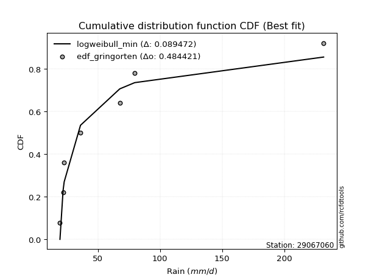</img></img>

</div>


### 9. EDF Filliben (1975)

The specific values of the constants (0.3175) (often denoted as $alpha$) and (0.365) are derived from a method proposed by James J. Filliben in a 1975 paper. This particular formula is the mean value of the $i$-th order statistic of the normal distribution and is considered a robust and effective plotting position formula for the normal probability plot correlation coefficient test for normality.

<div align="center">


$P=(m-0.3175)/(n+0.365)$


</div>


**9.1. Empirical values**

<div align="center">

|                | 0                   | 1                   | 2                   | 3            | 4                  | 5                  | 6                  |
|:---------------|:--------------------|:--------------------|:--------------------|:-------------|:-------------------|:-------------------|:-------------------|
| date           | 2022                | 2021                | 2023                | 2024         | 2025               | 2020               | 2019               |
| x              | 19.5                | 22.0                | 22.9                | 36.02        | 67.6               | 79.6               | 231.6              |
| m              | 1                   | 2                   | 3                   | 4            | 5                  | 6                  | 7                  |
| empirical_dist | edf_filliben        | edf_filliben        | edf_filliben        | edf_filliben | edf_filliben       | edf_filliben       | edf_filliben       |
| empirical      | 0.09266802443991853 | 0.22844534962661237 | 0.36422267481330617 | 0.5          | 0.6357773251866938 | 0.7715546503733877 | 0.9073319755600815 |
| empirical_tr   | 1.1021324354657687  | 1.2960844698636163  | 1.5728777362520021  | 2.0          | 2.7455731593662627 | 4.377414561664191  | 10.791208791208794 |

</div>


**9.2. Kolmogorov-Smirnov fit test (sorted by Δ)**


<div align="center">

|                | 0                   | 1                   | 2                   | 3                   | 4                   | 5                   | 6                   | 7                   | 8                   | 9                   | 10                  | 11                  | 12                  | 13                  | 14                  | 15                  | 16                  | 17                  | 18                  | 19                  | 20                  | 21                  | 22                  | 23                  | 24                  | 25                  | 26                  | 27                  | 28                  | 29                  | 30                  | 31                  | 32                  | 33                  | 34                  | 35                  | 36                  | 37                  | 38                  | 39                  | 40                  | 41                  | 42                  | 43                  | 44                  | 45                  | 46                  | 47                  | 48                  | 49                  | 50                  | 51                  | 52                  | 53                  | 54                  | 55                  | 56                  | 57                  | 58                  | 59                  | 60                  | 61                  | 62                  | 63                  | 64                  | 65                  | 66                  | 67                  | 68                  | 69                  | 70                  | 71                  | 72                  | 73                  | 74                  | 75                  | 76                  | 77                  | 78                  | 79                  | 80                  | 81                  | 82                  | 83                  | 84                  | 85                  | 86                  | 87                  | 88                  | 89                  | 90                  | 91                  | 92                  | 93                  | 94                  | 95                  | 96                  | 97                  | 98                  | 99                  | 100                 | 101                 | 102                 | 103                 | 104                 | 105                 | 106                 | 107                 | 108                 | 109                 | 110                 | 111                 | 112                 | 113                 | 114                 | 115                 | 116                 | 117                 | 118                 | 119                 | 120                 | 121                 | 122                 | 123                 | 124                 | 125                 | 126                 | 127                 | 128                 | 129                 | 130                 | 131                 | 132                 | 133                 | 134                 | 135                 | 136                 | 137                 | 138                 | 139                 | 140                 | 141                 | 142                 | 143                 | 144                 | 145                 | 146                 | 147                 | 148                 | 149                 | 150                 | 151                 | 152                 | 153                 | 154                 | 155                 | 156                 | 157                 | 158                 | 159                 |
|:---------------|:--------------------|:--------------------|:--------------------|:--------------------|:--------------------|:--------------------|:--------------------|:--------------------|:--------------------|:--------------------|:--------------------|:--------------------|:--------------------|:--------------------|:--------------------|:--------------------|:--------------------|:--------------------|:--------------------|:--------------------|:--------------------|:--------------------|:--------------------|:--------------------|:--------------------|:--------------------|:--------------------|:--------------------|:--------------------|:--------------------|:--------------------|:--------------------|:--------------------|:--------------------|:--------------------|:--------------------|:--------------------|:--------------------|:--------------------|:--------------------|:--------------------|:--------------------|:--------------------|:--------------------|:--------------------|:--------------------|:--------------------|:--------------------|:--------------------|:--------------------|:--------------------|:--------------------|:--------------------|:--------------------|:--------------------|:--------------------|:--------------------|:--------------------|:--------------------|:--------------------|:--------------------|:--------------------|:--------------------|:--------------------|:--------------------|:--------------------|:--------------------|:--------------------|:--------------------|:--------------------|:--------------------|:--------------------|:--------------------|:--------------------|:--------------------|:--------------------|:--------------------|:--------------------|:--------------------|:--------------------|:--------------------|:--------------------|:--------------------|:--------------------|:--------------------|:--------------------|:--------------------|:--------------------|:--------------------|:--------------------|:--------------------|:--------------------|:--------------------|:--------------------|:--------------------|:--------------------|:--------------------|:--------------------|:--------------------|:--------------------|:--------------------|:--------------------|:--------------------|:--------------------|:--------------------|:--------------------|:--------------------|:--------------------|:--------------------|:--------------------|:--------------------|:--------------------|:--------------------|:--------------------|:--------------------|:--------------------|:--------------------|:--------------------|:--------------------|:--------------------|:--------------------|:--------------------|:--------------------|:--------------------|:--------------------|:--------------------|:--------------------|:--------------------|:--------------------|:--------------------|:--------------------|:--------------------|:--------------------|:--------------------|:--------------------|:--------------------|:--------------------|:--------------------|:--------------------|:--------------------|:--------------------|:--------------------|:--------------------|:--------------------|:--------------------|:--------------------|:--------------------|:--------------------|:--------------------|:--------------------|:--------------------|:--------------------|:--------------------|:--------------------|:--------------------|:--------------------|:--------------------|:--------------------|:--------------------|:--------------------|
| station        | 29067060            | 29067060            | 29067060            | 29067060            | 29067060            | 29067060            | 29067060            | 29067060            | 29067060            | 29067060            | 29067060            | 29067060            | 29067060            | 29067060            | 29067060            | 29067060            | 29067060            | 29067060            | 29067060            | 29067060            | 29067060            | 29067060            | 29067060            | 29067060            | 29067060            | 29067060            | 29067060            | 29067060            | 29067060            | 29067060            | 29067060            | 29067060            | 29067060            | 29067060            | 29067060            | 29067060            | 29067060            | 29067060            | 29067060            | 29067060            | 29067060            | 29067060            | 29067060            | 29067060            | 29067060            | 29067060            | 29067060            | 29067060            | 29067060            | 29067060            | 29067060            | 29067060            | 29067060            | 29067060            | 29067060            | 29067060            | 29067060            | 29067060            | 29067060            | 29067060            | 29067060            | 29067060            | 29067060            | 29067060            | 29067060            | 29067060            | 29067060            | 29067060            | 29067060            | 29067060            | 29067060            | 29067060            | 29067060            | 29067060            | 29067060            | 29067060            | 29067060            | 29067060            | 29067060            | 29067060            | 29067060            | 29067060            | 29067060            | 29067060            | 29067060            | 29067060            | 29067060            | 29067060            | 29067060            | 29067060            | 29067060            | 29067060            | 29067060            | 29067060            | 29067060            | 29067060            | 29067060            | 29067060            | 29067060            | 29067060            | 29067060            | 29067060            | 29067060            | 29067060            | 29067060            | 29067060            | 29067060            | 29067060            | 29067060            | 29067060            | 29067060            | 29067060            | 29067060            | 29067060            | 29067060            | 29067060            | 29067060            | 29067060            | 29067060            | 29067060            | 29067060            | 29067060            | 29067060            | 29067060            | 29067060            | 29067060            | 29067060            | 29067060            | 29067060            | 29067060            | 29067060            | 29067060            | 29067060            | 29067060            | 29067060            | 29067060            | 29067060            | 29067060            | 29067060            | 29067060            | 29067060            | 29067060            | 29067060            | 29067060            | 29067060            | 29067060            | 29067060            | 29067060            | 29067060            | 29067060            | 29067060            | 29067060            | 29067060            | 29067060            | 29067060            | 29067060            | 29067060            | 29067060            | 29067060            | 29067060            |
| empirical_dist | edf_filliben        | edf_filliben        | edf_filliben        | edf_filliben        | edf_filliben        | edf_filliben        | edf_filliben        | edf_filliben        | edf_filliben        | edf_filliben        | edf_filliben        | edf_filliben        | edf_filliben        | edf_filliben        | edf_filliben        | edf_filliben        | edf_filliben        | edf_filliben        | edf_filliben        | edf_filliben        | edf_filliben        | edf_filliben        | edf_filliben        | edf_filliben        | edf_filliben        | edf_filliben        | edf_filliben        | edf_filliben        | edf_filliben        | edf_filliben        | edf_filliben        | edf_filliben        | edf_filliben        | edf_filliben        | edf_filliben        | edf_filliben        | edf_filliben        | edf_filliben        | edf_filliben        | edf_filliben        | edf_filliben        | edf_filliben        | edf_filliben        | edf_filliben        | edf_filliben        | edf_filliben        | edf_filliben        | edf_filliben        | edf_filliben        | edf_filliben        | edf_filliben        | edf_filliben        | edf_filliben        | edf_filliben        | edf_filliben        | edf_filliben        | edf_filliben        | edf_filliben        | edf_filliben        | edf_filliben        | edf_filliben        | edf_filliben        | edf_filliben        | edf_filliben        | edf_filliben        | edf_filliben        | edf_filliben        | edf_filliben        | edf_filliben        | edf_filliben        | edf_filliben        | edf_filliben        | edf_filliben        | edf_filliben        | edf_filliben        | edf_filliben        | edf_filliben        | edf_filliben        | edf_filliben        | edf_filliben        | edf_filliben        | edf_filliben        | edf_filliben        | edf_filliben        | edf_filliben        | edf_filliben        | edf_filliben        | edf_filliben        | edf_filliben        | edf_filliben        | edf_filliben        | edf_filliben        | edf_filliben        | edf_filliben        | edf_filliben        | edf_filliben        | edf_filliben        | edf_filliben        | edf_filliben        | edf_filliben        | edf_filliben        | edf_filliben        | edf_filliben        | edf_filliben        | edf_filliben        | edf_filliben        | edf_filliben        | edf_filliben        | edf_filliben        | edf_filliben        | edf_filliben        | edf_filliben        | edf_filliben        | edf_filliben        | edf_filliben        | edf_filliben        | edf_filliben        | edf_filliben        | edf_filliben        | edf_filliben        | edf_filliben        | edf_filliben        | edf_filliben        | edf_filliben        | edf_filliben        | edf_filliben        | edf_filliben        | edf_filliben        | edf_filliben        | edf_filliben        | edf_filliben        | edf_filliben        | edf_filliben        | edf_filliben        | edf_filliben        | edf_filliben        | edf_filliben        | edf_filliben        | edf_filliben        | edf_filliben        | edf_filliben        | edf_filliben        | edf_filliben        | edf_filliben        | edf_filliben        | edf_filliben        | edf_filliben        | edf_filliben        | edf_filliben        | edf_filliben        | edf_filliben        | edf_filliben        | edf_filliben        | edf_filliben        | edf_filliben        | edf_filliben        | edf_filliben        | edf_filliben        | edf_filliben        | edf_filliben        |
| p_dist         | logweibull_min      | genextreme          | invweibull          | lognakagami         | logbeta             | logsemicircular     | loggausshyper       | logfoldnorm         | logkappa3           | loghalfnorm         | loganglit           | invgamma            | genpareto           | loggenextreme       | loginvweibull       | logexponweib        | lograyleigh         | halfgennorm         | logalpha            | wald                | logarcsine          | logmaxwell          | logburr12           | logf                | loginvgamma         | burr                | logbetaprime        | betaprime           | gamma               | logpearson3         | moyal               | nakagami            | gumbel_r            | logloggamma         | lognorm             | logcrystalball      | logt                | loghalflogistic     | logncf              | logfatiguelife      | loghalfgennorm      | logburr             | loginvgauss         | ncf                 | truncweibull_min    | loggumbel_r         | invgauss            | lognct              | erlang              | vonmises_line       | pearson3            | nct                 | loggenlogistic      | rayleigh            | maxwell             | genlogistic         | logdweibull         | loglogistic         | logmoyal            | halflogistic        | logkstwobign        | logcosine           | loggumbel_l         | dgamma              | loglomax            | johnsonsb           | burr12              | logexponnorm        | logtruncnorm        | logexponpow         | logdgamma           | alpha               | loghypsecant        | loggenexpon         | logistic            | loggompertz         | halfnorm            | f                   | gennorm             | logrice             | norm                | crystalball         | exponpow            | loglaplace          | loglaplace          | hypsecant           | kstwobign           | logargus            | truncpareto         | anglit              | logloglaplace       | gengamma            | semicircular        | foldnorm            | logksone            | logtruncweibull_min | logrdist            | rice                | weibull_min         | logtukeylambda      | laplace             | arcsine             | logwrapcauchy       | loggenpareto        | loggamma            | loggamma            | logkappa4           | bradford            | logtriang           | logskewnorm         | logbradford         | logweibull_max      | loggennorm          | logtruncexpon       | gumbel_l            | loggengamma         | beta                | truncexpon          | logerlang           | wrapcauchy          | gausshyper          | exponnorm           | genexpon            | cosine              | loguniform          | logvonmises_line    | dweibull            | gompertz            | lomax               | truncnorm           | exponweib           | powerlaw            | loglevy_l           | logwald             | t                   | skewnorm            | fatiguelife         | loggenhalflogistic  | levy_l              | logpowerlaw         | argus               | logtruncpareto      | kappa3              | johnsonsu           | ksone               | kappa4              | logtrapezoid        | uniform             | rdist               | logjohnsonsb        | logjohnsonsu        | tukeylambda         | genhalflogistic     | triang              | trapezoid           | weibull_max         | logvonmises         | vonmises            | mielke              | logmielke           |
| delta          | 0.0941441330083212  | 0.1066521685254409  | 0.10665499122024502 | 0.11815856855361434 | 0.1187384289800047  | 0.12255978040321713 | 0.12275753431289885 | 0.12402260150157368 | 0.12814496295925581 | 0.13334274182150835 | 0.13488422219072577 | 0.136839182140172   | 0.1394793362723672  | 0.14026508465952958 | 0.14027631047164257 | 0.14292595773738337 | 0.14408626346964562 | 0.14446900471855273 | 0.14468544940623596 | 0.1448426970230191  | 0.14796493258363616 | 0.14958812218437656 | 0.1511825789449348  | 0.1512490100884829  | 0.15125277100070456 | 0.15169138647845692 | 0.1534461570632234  | 0.15466206532258717 | 0.15674097213287908 | 0.15692479776318877 | 0.1572223512977083  | 0.15735509163792483 | 0.16024939192215762 | 0.1626712228178869  | 0.16283605974395676 | 0.16283616529866415 | 0.162837042590105   | 0.16315873088662605 | 0.16397818200441458 | 0.16438726225295786 | 0.164503007915333   | 0.16501269788017997 | 0.16514391787858718 | 0.1688823324406846  | 0.1698607987651668  | 0.17061474573196148 | 0.17140750739173272 | 0.1723649856098508  | 0.1735170183840633  | 0.1739164893402981  | 0.17558916746454847 | 0.17604067722613512 | 0.1774378080190307  | 0.17881127759942464 | 0.1789584444737522  | 0.17896229553740428 | 0.17950122180064862 | 0.184402631000496   | 0.18461530020010364 | 0.18471074936430207 | 0.187779184641953   | 0.18882534496569064 | 0.18953553333383752 | 0.1905737795769318  | 0.1908717012218846  | 0.191745960134468   | 0.19278658557207004 | 0.19314943412005847 | 0.1938954761676779  | 0.19443025352890944 | 0.19623366205387852 | 0.19669341295109666 | 0.1971248034201084  | 0.19737382713994725 | 0.20001484440852602 | 0.20043282676449392 | 0.20117090790654987 | 0.20235744983194362 | 0.20259412011179131 | 0.20731153553072448 | 0.20844507925600475 | 0.20844508830033825 | 0.20880877987546348 | 0.2110806401424917  | 0.2110806401424917  | 0.21327758778515077 | 0.21467013252507605 | 0.21496443928307873 | 0.21507397764548264 | 0.21735834827124711 | 0.2175056370451087  | 0.21780607029951385 | 0.22104180577191024 | 0.2249433541461396  | 0.2267652333267377  | 0.22865664420764628 | 0.228975020886115   | 0.23490735657659484 | 0.2371167831409043  | 0.23771806381517346 | 0.24007456795010562 | 0.24298146338952023 | 0.2499438224561613  | 0.25011972967509566 | 0.2536327653878745  | 0.2536327653878745  | 0.2540361817856743  | 0.2541525168538616  | 0.2574807750327568  | 0.2575932817388915  | 0.2668241166091674  | 0.27030071006326417 | 0.27155465037338766 | 0.27345120019613856 | 0.27396408243489845 | 0.2756362792240361  | 0.2832210415109009  | 0.2887404239836865  | 0.2888573518763291  | 0.28920601219159536 | 0.2931556427532319  | 0.2953723853352661  | 0.29713459657513797 | 0.29822214021726395 | 0.29927374502942405 | 0.3034159755081874  | 0.3038093281079157  | 0.3048840052191731  | 0.3145737681019011  | 0.3146755499638563  | 0.3180339674414143  | 0.3247145734883419  | 0.3251771089147546  | 0.3302463612771882  | 0.33191788654929444 | 0.34681584746905547 | 0.3541162392555106  | 0.36839706014572876 | 0.368635354946415   | 0.39435154598202826 | 0.397063198335008   | 0.4084882951445683  | 0.4281646648866826  | 0.4463083335759497  | 0.45209056110731816 | 0.453572713980688   | 0.4612911946386126  | 0.4881977432541043  | 0.4990483082296058  | 0.5207443090410617  | 0.5219817039231829  | 0.5286550309543878  | 0.5734618676279286  | 0.6498437383022264  | 0.6692826003215251  | 0.678957355111016   | 1.090323352159895   | 36.897999224921406  | nan                 | nan                 |
| deltao         | 0.48442053926100004 | 0.48442053926100004 | 0.48442053926100004 | 0.48442053926100004 | 0.48442053926100004 | 0.48442053926100004 | 0.48442053926100004 | 0.48442053926100004 | 0.48442053926100004 | 0.48442053926100004 | 0.48442053926100004 | 0.48442053926100004 | 0.48442053926100004 | 0.48442053926100004 | 0.48442053926100004 | 0.48442053926100004 | 0.48442053926100004 | 0.48442053926100004 | 0.48442053926100004 | 0.48442053926100004 | 0.48442053926100004 | 0.48442053926100004 | 0.48442053926100004 | 0.48442053926100004 | 0.48442053926100004 | 0.48442053926100004 | 0.48442053926100004 | 0.48442053926100004 | 0.48442053926100004 | 0.48442053926100004 | 0.48442053926100004 | 0.48442053926100004 | 0.48442053926100004 | 0.48442053926100004 | 0.48442053926100004 | 0.48442053926100004 | 0.48442053926100004 | 0.48442053926100004 | 0.48442053926100004 | 0.48442053926100004 | 0.48442053926100004 | 0.48442053926100004 | 0.48442053926100004 | 0.48442053926100004 | 0.48442053926100004 | 0.48442053926100004 | 0.48442053926100004 | 0.48442053926100004 | 0.48442053926100004 | 0.48442053926100004 | 0.48442053926100004 | 0.48442053926100004 | 0.48442053926100004 | 0.48442053926100004 | 0.48442053926100004 | 0.48442053926100004 | 0.48442053926100004 | 0.48442053926100004 | 0.48442053926100004 | 0.48442053926100004 | 0.48442053926100004 | 0.48442053926100004 | 0.48442053926100004 | 0.48442053926100004 | 0.48442053926100004 | 0.48442053926100004 | 0.48442053926100004 | 0.48442053926100004 | 0.48442053926100004 | 0.48442053926100004 | 0.48442053926100004 | 0.48442053926100004 | 0.48442053926100004 | 0.48442053926100004 | 0.48442053926100004 | 0.48442053926100004 | 0.48442053926100004 | 0.48442053926100004 | 0.48442053926100004 | 0.48442053926100004 | 0.48442053926100004 | 0.48442053926100004 | 0.48442053926100004 | 0.48442053926100004 | 0.48442053926100004 | 0.48442053926100004 | 0.48442053926100004 | 0.48442053926100004 | 0.48442053926100004 | 0.48442053926100004 | 0.48442053926100004 | 0.48442053926100004 | 0.48442053926100004 | 0.48442053926100004 | 0.48442053926100004 | 0.48442053926100004 | 0.48442053926100004 | 0.48442053926100004 | 0.48442053926100004 | 0.48442053926100004 | 0.48442053926100004 | 0.48442053926100004 | 0.48442053926100004 | 0.48442053926100004 | 0.48442053926100004 | 0.48442053926100004 | 0.48442053926100004 | 0.48442053926100004 | 0.48442053926100004 | 0.48442053926100004 | 0.48442053926100004 | 0.48442053926100004 | 0.48442053926100004 | 0.48442053926100004 | 0.48442053926100004 | 0.48442053926100004 | 0.48442053926100004 | 0.48442053926100004 | 0.48442053926100004 | 0.48442053926100004 | 0.48442053926100004 | 0.48442053926100004 | 0.48442053926100004 | 0.48442053926100004 | 0.48442053926100004 | 0.48442053926100004 | 0.48442053926100004 | 0.48442053926100004 | 0.48442053926100004 | 0.48442053926100004 | 0.48442053926100004 | 0.48442053926100004 | 0.48442053926100004 | 0.48442053926100004 | 0.48442053926100004 | 0.48442053926100004 | 0.48442053926100004 | 0.48442053926100004 | 0.48442053926100004 | 0.48442053926100004 | 0.48442053926100004 | 0.48442053926100004 | 0.48442053926100004 | 0.48442053926100004 | 0.48442053926100004 | 0.48442053926100004 | 0.48442053926100004 | 0.48442053926100004 | 0.48442053926100004 | 0.48442053926100004 | 0.48442053926100004 | 0.48442053926100004 | 0.48442053926100004 | 0.48442053926100004 | 0.48442053926100004 | 0.48442053926100004 | 0.48442053926100004 | 0.48442053926100004 | 0.48442053926100004 | 0.48442053926100004 |
| eval           | Δo > Δ              | Δo > Δ              | Δo > Δ              | Δo > Δ              | Δo > Δ              | Δo > Δ              | Δo > Δ              | Δo > Δ              | Δo > Δ              | Δo > Δ              | Δo > Δ              | Δo > Δ              | Δo > Δ              | Δo > Δ              | Δo > Δ              | Δo > Δ              | Δo > Δ              | Δo > Δ              | Δo > Δ              | Δo > Δ              | Δo > Δ              | Δo > Δ              | Δo > Δ              | Δo > Δ              | Δo > Δ              | Δo > Δ              | Δo > Δ              | Δo > Δ              | Δo > Δ              | Δo > Δ              | Δo > Δ              | Δo > Δ              | Δo > Δ              | Δo > Δ              | Δo > Δ              | Δo > Δ              | Δo > Δ              | Δo > Δ              | Δo > Δ              | Δo > Δ              | Δo > Δ              | Δo > Δ              | Δo > Δ              | Δo > Δ              | Δo > Δ              | Δo > Δ              | Δo > Δ              | Δo > Δ              | Δo > Δ              | Δo > Δ              | Δo > Δ              | Δo > Δ              | Δo > Δ              | Δo > Δ              | Δo > Δ              | Δo > Δ              | Δo > Δ              | Δo > Δ              | Δo > Δ              | Δo > Δ              | Δo > Δ              | Δo > Δ              | Δo > Δ              | Δo > Δ              | Δo > Δ              | Δo > Δ              | Δo > Δ              | Δo > Δ              | Δo > Δ              | Δo > Δ              | Δo > Δ              | Δo > Δ              | Δo > Δ              | Δo > Δ              | Δo > Δ              | Δo > Δ              | Δo > Δ              | Δo > Δ              | Δo > Δ              | Δo > Δ              | Δo > Δ              | Δo > Δ              | Δo > Δ              | Δo > Δ              | Δo > Δ              | Δo > Δ              | Δo > Δ              | Δo > Δ              | Δo > Δ              | Δo > Δ              | Δo > Δ              | Δo > Δ              | Δo > Δ              | Δo > Δ              | Δo > Δ              | Δo > Δ              | Δo > Δ              | Δo > Δ              | Δo > Δ              | Δo > Δ              | Δo > Δ              | Δo > Δ              | Δo > Δ              | Δo > Δ              | Δo > Δ              | Δo > Δ              | Δo > Δ              | Δo > Δ              | Δo > Δ              | Δo > Δ              | Δo > Δ              | Δo > Δ              | Δo > Δ              | Δo > Δ              | Δo > Δ              | Δo > Δ              | Δo > Δ              | Δo > Δ              | Δo > Δ              | Δo > Δ              | Δo > Δ              | Δo > Δ              | Δo > Δ              | Δo > Δ              | Δo > Δ              | Δo > Δ              | Δo > Δ              | Δo > Δ              | Δo > Δ              | Δo > Δ              | Δo > Δ              | Δo > Δ              | Δo > Δ              | Δo > Δ              | Δo > Δ              | Δo > Δ              | Δo > Δ              | Δo > Δ              | Δo > Δ              | Δo > Δ              | Δo > Δ              | Δo > Δ              | Δo > Δ              | Δo > Δ              | Δo > Δ              | Δo > Δ              | Δo > Δ              | Δo <= Δ             | Δo <= Δ             | Δo <= Δ             | Δo <= Δ             | Δo <= Δ             | Δo <= Δ             | Δo <= Δ             | Δo <= Δ             | Δo <= Δ             | Δo <= Δ             | Δo <= Δ             | Δo <= Δ             | Δo <= Δ             |
| fit            | 1                   | 1                   | 1                   | 1                   | 1                   | 1                   | 1                   | 1                   | 1                   | 1                   | 1                   | 1                   | 1                   | 1                   | 1                   | 1                   | 1                   | 1                   | 1                   | 1                   | 1                   | 1                   | 1                   | 1                   | 1                   | 1                   | 1                   | 1                   | 1                   | 1                   | 1                   | 1                   | 1                   | 1                   | 1                   | 1                   | 1                   | 1                   | 1                   | 1                   | 1                   | 1                   | 1                   | 1                   | 1                   | 1                   | 1                   | 1                   | 1                   | 1                   | 1                   | 1                   | 1                   | 1                   | 1                   | 1                   | 1                   | 1                   | 1                   | 1                   | 1                   | 1                   | 1                   | 1                   | 1                   | 1                   | 1                   | 1                   | 1                   | 1                   | 1                   | 1                   | 1                   | 1                   | 1                   | 1                   | 1                   | 1                   | 1                   | 1                   | 1                   | 1                   | 1                   | 1                   | 1                   | 1                   | 1                   | 1                   | 1                   | 1                   | 1                   | 1                   | 1                   | 1                   | 1                   | 1                   | 1                   | 1                   | 1                   | 1                   | 1                   | 1                   | 1                   | 1                   | 1                   | 1                   | 1                   | 1                   | 1                   | 1                   | 1                   | 1                   | 1                   | 1                   | 1                   | 1                   | 1                   | 1                   | 1                   | 1                   | 1                   | 1                   | 1                   | 1                   | 1                   | 1                   | 1                   | 1                   | 1                   | 1                   | 1                   | 1                   | 1                   | 1                   | 1                   | 1                   | 1                   | 1                   | 1                   | 1                   | 1                   | 1                   | 1                   | 1                   | 1                   | 1                   | 1                   | 0                   | 0                   | 0                   | 0                   | 0                   | 0                   | 0                   | 0                   | 0                   | 0                   | 0                   | 0                   | 0                   |
| n              | 7                   | 7                   | 7                   | 7                   | 7                   | 7                   | 7                   | 7                   | 7                   | 7                   | 7                   | 7                   | 7                   | 7                   | 7                   | 7                   | 7                   | 7                   | 7                   | 7                   | 7                   | 7                   | 7                   | 7                   | 7                   | 7                   | 7                   | 7                   | 7                   | 7                   | 7                   | 7                   | 7                   | 7                   | 7                   | 7                   | 7                   | 7                   | 7                   | 7                   | 7                   | 7                   | 7                   | 7                   | 7                   | 7                   | 7                   | 7                   | 7                   | 7                   | 7                   | 7                   | 7                   | 7                   | 7                   | 7                   | 7                   | 7                   | 7                   | 7                   | 7                   | 7                   | 7                   | 7                   | 7                   | 7                   | 7                   | 7                   | 7                   | 7                   | 7                   | 7                   | 7                   | 7                   | 7                   | 7                   | 7                   | 7                   | 7                   | 7                   | 7                   | 7                   | 7                   | 7                   | 7                   | 7                   | 7                   | 7                   | 7                   | 7                   | 7                   | 7                   | 7                   | 7                   | 7                   | 7                   | 7                   | 7                   | 7                   | 7                   | 7                   | 7                   | 7                   | 7                   | 7                   | 7                   | 7                   | 7                   | 7                   | 7                   | 7                   | 7                   | 7                   | 7                   | 7                   | 7                   | 7                   | 7                   | 7                   | 7                   | 7                   | 7                   | 7                   | 7                   | 7                   | 7                   | 7                   | 7                   | 7                   | 7                   | 7                   | 7                   | 7                   | 7                   | 7                   | 7                   | 7                   | 7                   | 7                   | 7                   | 7                   | 7                   | 7                   | 7                   | 7                   | 7                   | 7                   | 7                   | 7                   | 7                   | 7                   | 7                   | 7                   | 7                   | 7                   | 7                   | 7                   | 7                   | 7                   | 7                   |
| best_fit       | 1                   | 0                   | 0                   | 0                   | 0                   | 0                   | 0                   | 0                   | 0                   | 0                   | 0                   | 0                   | 0                   | 0                   | 0                   | 0                   | 0                   | 0                   | 0                   | 0                   | 0                   | 0                   | 0                   | 0                   | 0                   | 0                   | 0                   | 0                   | 0                   | 0                   | 0                   | 0                   | 0                   | 0                   | 0                   | 0                   | 0                   | 0                   | 0                   | 0                   | 0                   | 0                   | 0                   | 0                   | 0                   | 0                   | 0                   | 0                   | 0                   | 0                   | 0                   | 0                   | 0                   | 0                   | 0                   | 0                   | 0                   | 0                   | 0                   | 0                   | 0                   | 0                   | 0                   | 0                   | 0                   | 0                   | 0                   | 0                   | 0                   | 0                   | 0                   | 0                   | 0                   | 0                   | 0                   | 0                   | 0                   | 0                   | 0                   | 0                   | 0                   | 0                   | 0                   | 0                   | 0                   | 0                   | 0                   | 0                   | 0                   | 0                   | 0                   | 0                   | 0                   | 0                   | 0                   | 0                   | 0                   | 0                   | 0                   | 0                   | 0                   | 0                   | 0                   | 0                   | 0                   | 0                   | 0                   | 0                   | 0                   | 0                   | 0                   | 0                   | 0                   | 0                   | 0                   | 0                   | 0                   | 0                   | 0                   | 0                   | 0                   | 0                   | 0                   | 0                   | 0                   | 0                   | 0                   | 0                   | 0                   | 0                   | 0                   | 0                   | 0                   | 0                   | 0                   | 0                   | 0                   | 0                   | 0                   | 0                   | 0                   | 0                   | 0                   | 0                   | 0                   | 0                   | 0                   | 0                   | 0                   | 0                   | 0                   | 0                   | 0                   | 0                   | 0                   | 0                   | 0                   | 0                   | 0                   | 0                   |
| best_fit_sort  | 1                   | 2                   | 3                   | 4                   | 5                   | 6                   | 7                   | 8                   | 9                   | 10                  | 11                  | 12                  | 13                  | 14                  | 15                  | 16                  | 17                  | 18                  | 19                  | 20                  | 21                  | 22                  | 23                  | 24                  | 25                  | 26                  | 27                  | 28                  | 29                  | 30                  | 31                  | 32                  | 33                  | 34                  | 35                  | 36                  | 37                  | 38                  | 39                  | 40                  | 41                  | 42                  | 43                  | 44                  | 45                  | 46                  | 47                  | 48                  | 49                  | 50                  | 51                  | 52                  | 53                  | 54                  | 55                  | 56                  | 57                  | 58                  | 59                  | 60                  | 61                  | 62                  | 63                  | 64                  | 65                  | 66                  | 67                  | 68                  | 69                  | 70                  | 71                  | 72                  | 73                  | 74                  | 75                  | 76                  | 77                  | 78                  | 79                  | 80                  | 81                  | 82                  | 83                  | 84                  | 85                  | 86                  | 87                  | 88                  | 89                  | 90                  | 91                  | 92                  | 93                  | 94                  | 95                  | 96                  | 97                  | 98                  | 99                  | 100                 | 101                 | 102                 | 103                 | 104                 | 105                 | 106                 | 107                 | 108                 | 109                 | 110                 | 111                 | 112                 | 113                 | 114                 | 115                 | 116                 | 117                 | 118                 | 119                 | 120                 | 121                 | 122                 | 123                 | 124                 | 125                 | 126                 | 127                 | 128                 | 129                 | 130                 | 131                 | 132                 | 133                 | 134                 | 135                 | 136                 | 137                 | 138                 | 139                 | 140                 | 141                 | 142                 | 143                 | 144                 | 145                 | 146                 | 147                 | 148                 | 149                 | 150                 | 151                 | 152                 | 153                 | 154                 | 155                 | 156                 | 157                 | 158                 | 159                 | 160                 |

</div>


**9.3. Best fit**

<div align="center">

|   id |   station | empirical_dist   | p_dist         |     delta |   deltao | eval   |   fit |   n |   best_fit |   best_fit_sort |
|-----:|----------:|:-----------------|:---------------|----------:|---------:|:-------|------:|----:|-----------:|----------------:|
|    0 |  29067060 | edf_filliben     | logweibull_min | 0.0941441 | 0.484421 | Δo > Δ |     1 |   7 |          1 |               1 |

</div>


<div align="center">

</img></img>

</div>


### 10. EDF Jenkinson (1977)

The Jenkinson formula in hydrology is an empirical plotting position formula used to estimate the non-exceedance probability _(P)_ or return period _(T)_ of a given ordered observation within a sample. It is a widely used method in the frequency analysis of extreme events such as floods and rainfall, as it provides a distribution-free way to plot data. _a≈0.31_ and _b≈0.38_ are constants derived to approximate the median of the probability distribution for the given rank.

<div align="center">


$P=(m-a)/(n+b)$


</div>


**10.1. Empirical values**

<div align="center">

|                | 0                   | 1                   | 2                   | 3             | 4                  | 5                  | 6                  |
|:---------------|:--------------------|:--------------------|:--------------------|:--------------|:-------------------|:-------------------|:-------------------|
| date           | 2022                | 2021                | 2023                | 2024          | 2025               | 2020               | 2019               |
| x              | 19.5                | 22.0                | 22.9                | 36.02         | 67.6               | 79.6               | 231.6              |
| m              | 1                   | 2                   | 3                   | 4             | 5                  | 6                  | 7                  |
| empirical_dist | edf_jenkinson       | edf_jenkinson       | edf_jenkinson       | edf_jenkinson | edf_jenkinson      | edf_jenkinson      | edf_jenkinson      |
| empirical      | 0.09349593495934959 | 0.22899728997289973 | 0.36449864498644985 | 0.5           | 0.6355013550135502 | 0.7710027100271003 | 0.9065040650406505 |
| empirical_tr   | 1.1031390134529149  | 1.29701230228471    | 1.5735607675906182  | 2.0           | 2.743494423791822  | 4.366863905325444  | 10.695652173913055 |

</div>


**10.2. Kolmogorov-Smirnov fit test (sorted by Δ)**


<div align="center">

|                | 0                   | 1                   | 2                   | 3                   | 4                   | 5                   | 6                   | 7                   | 8                   | 9                   | 10                  | 11                  | 12                  | 13                  | 14                  | 15                  | 16                  | 17                  | 18                  | 19                  | 20                  | 21                  | 22                  | 23                  | 24                  | 25                  | 26                  | 27                  | 28                  | 29                  | 30                  | 31                  | 32                  | 33                  | 34                  | 35                  | 36                  | 37                  | 38                  | 39                  | 40                  | 41                  | 42                  | 43                  | 44                  | 45                  | 46                  | 47                  | 48                  | 49                  | 50                  | 51                  | 52                  | 53                  | 54                  | 55                  | 56                  | 57                  | 58                  | 59                  | 60                  | 61                  | 62                  | 63                  | 64                  | 65                  | 66                  | 67                  | 68                  | 69                  | 70                  | 71                  | 72                  | 73                  | 74                  | 75                  | 76                  | 77                  | 78                  | 79                  | 80                  | 81                  | 82                  | 83                  | 84                  | 85                  | 86                  | 87                  | 88                  | 89                  | 90                  | 91                  | 92                  | 93                  | 94                  | 95                  | 96                  | 97                  | 98                  | 99                  | 100                 | 101                 | 102                 | 103                 | 104                 | 105                 | 106                 | 107                 | 108                 | 109                 | 110                 | 111                 | 112                 | 113                 | 114                 | 115                 | 116                 | 117                 | 118                 | 119                 | 120                 | 121                 | 122                 | 123                 | 124                 | 125                 | 126                 | 127                 | 128                 | 129                 | 130                 | 131                 | 132                 | 133                 | 134                 | 135                 | 136                 | 137                 | 138                 | 139                 | 140                 | 141                 | 142                 | 143                 | 144                 | 145                 | 146                 | 147                 | 148                 | 149                 | 150                 | 151                 | 152                 | 153                 | 154                 | 155                 | 156                 | 157                 | 158                 | 159                 |
|:---------------|:--------------------|:--------------------|:--------------------|:--------------------|:--------------------|:--------------------|:--------------------|:--------------------|:--------------------|:--------------------|:--------------------|:--------------------|:--------------------|:--------------------|:--------------------|:--------------------|:--------------------|:--------------------|:--------------------|:--------------------|:--------------------|:--------------------|:--------------------|:--------------------|:--------------------|:--------------------|:--------------------|:--------------------|:--------------------|:--------------------|:--------------------|:--------------------|:--------------------|:--------------------|:--------------------|:--------------------|:--------------------|:--------------------|:--------------------|:--------------------|:--------------------|:--------------------|:--------------------|:--------------------|:--------------------|:--------------------|:--------------------|:--------------------|:--------------------|:--------------------|:--------------------|:--------------------|:--------------------|:--------------------|:--------------------|:--------------------|:--------------------|:--------------------|:--------------------|:--------------------|:--------------------|:--------------------|:--------------------|:--------------------|:--------------------|:--------------------|:--------------------|:--------------------|:--------------------|:--------------------|:--------------------|:--------------------|:--------------------|:--------------------|:--------------------|:--------------------|:--------------------|:--------------------|:--------------------|:--------------------|:--------------------|:--------------------|:--------------------|:--------------------|:--------------------|:--------------------|:--------------------|:--------------------|:--------------------|:--------------------|:--------------------|:--------------------|:--------------------|:--------------------|:--------------------|:--------------------|:--------------------|:--------------------|:--------------------|:--------------------|:--------------------|:--------------------|:--------------------|:--------------------|:--------------------|:--------------------|:--------------------|:--------------------|:--------------------|:--------------------|:--------------------|:--------------------|:--------------------|:--------------------|:--------------------|:--------------------|:--------------------|:--------------------|:--------------------|:--------------------|:--------------------|:--------------------|:--------------------|:--------------------|:--------------------|:--------------------|:--------------------|:--------------------|:--------------------|:--------------------|:--------------------|:--------------------|:--------------------|:--------------------|:--------------------|:--------------------|:--------------------|:--------------------|:--------------------|:--------------------|:--------------------|:--------------------|:--------------------|:--------------------|:--------------------|:--------------------|:--------------------|:--------------------|:--------------------|:--------------------|:--------------------|:--------------------|:--------------------|:--------------------|:--------------------|:--------------------|:--------------------|:--------------------|:--------------------|:--------------------|
| station        | 29067060            | 29067060            | 29067060            | 29067060            | 29067060            | 29067060            | 29067060            | 29067060            | 29067060            | 29067060            | 29067060            | 29067060            | 29067060            | 29067060            | 29067060            | 29067060            | 29067060            | 29067060            | 29067060            | 29067060            | 29067060            | 29067060            | 29067060            | 29067060            | 29067060            | 29067060            | 29067060            | 29067060            | 29067060            | 29067060            | 29067060            | 29067060            | 29067060            | 29067060            | 29067060            | 29067060            | 29067060            | 29067060            | 29067060            | 29067060            | 29067060            | 29067060            | 29067060            | 29067060            | 29067060            | 29067060            | 29067060            | 29067060            | 29067060            | 29067060            | 29067060            | 29067060            | 29067060            | 29067060            | 29067060            | 29067060            | 29067060            | 29067060            | 29067060            | 29067060            | 29067060            | 29067060            | 29067060            | 29067060            | 29067060            | 29067060            | 29067060            | 29067060            | 29067060            | 29067060            | 29067060            | 29067060            | 29067060            | 29067060            | 29067060            | 29067060            | 29067060            | 29067060            | 29067060            | 29067060            | 29067060            | 29067060            | 29067060            | 29067060            | 29067060            | 29067060            | 29067060            | 29067060            | 29067060            | 29067060            | 29067060            | 29067060            | 29067060            | 29067060            | 29067060            | 29067060            | 29067060            | 29067060            | 29067060            | 29067060            | 29067060            | 29067060            | 29067060            | 29067060            | 29067060            | 29067060            | 29067060            | 29067060            | 29067060            | 29067060            | 29067060            | 29067060            | 29067060            | 29067060            | 29067060            | 29067060            | 29067060            | 29067060            | 29067060            | 29067060            | 29067060            | 29067060            | 29067060            | 29067060            | 29067060            | 29067060            | 29067060            | 29067060            | 29067060            | 29067060            | 29067060            | 29067060            | 29067060            | 29067060            | 29067060            | 29067060            | 29067060            | 29067060            | 29067060            | 29067060            | 29067060            | 29067060            | 29067060            | 29067060            | 29067060            | 29067060            | 29067060            | 29067060            | 29067060            | 29067060            | 29067060            | 29067060            | 29067060            | 29067060            | 29067060            | 29067060            | 29067060            | 29067060            | 29067060            | 29067060            |
| empirical_dist | edf_jenkinson       | edf_jenkinson       | edf_jenkinson       | edf_jenkinson       | edf_jenkinson       | edf_jenkinson       | edf_jenkinson       | edf_jenkinson       | edf_jenkinson       | edf_jenkinson       | edf_jenkinson       | edf_jenkinson       | edf_jenkinson       | edf_jenkinson       | edf_jenkinson       | edf_jenkinson       | edf_jenkinson       | edf_jenkinson       | edf_jenkinson       | edf_jenkinson       | edf_jenkinson       | edf_jenkinson       | edf_jenkinson       | edf_jenkinson       | edf_jenkinson       | edf_jenkinson       | edf_jenkinson       | edf_jenkinson       | edf_jenkinson       | edf_jenkinson       | edf_jenkinson       | edf_jenkinson       | edf_jenkinson       | edf_jenkinson       | edf_jenkinson       | edf_jenkinson       | edf_jenkinson       | edf_jenkinson       | edf_jenkinson       | edf_jenkinson       | edf_jenkinson       | edf_jenkinson       | edf_jenkinson       | edf_jenkinson       | edf_jenkinson       | edf_jenkinson       | edf_jenkinson       | edf_jenkinson       | edf_jenkinson       | edf_jenkinson       | edf_jenkinson       | edf_jenkinson       | edf_jenkinson       | edf_jenkinson       | edf_jenkinson       | edf_jenkinson       | edf_jenkinson       | edf_jenkinson       | edf_jenkinson       | edf_jenkinson       | edf_jenkinson       | edf_jenkinson       | edf_jenkinson       | edf_jenkinson       | edf_jenkinson       | edf_jenkinson       | edf_jenkinson       | edf_jenkinson       | edf_jenkinson       | edf_jenkinson       | edf_jenkinson       | edf_jenkinson       | edf_jenkinson       | edf_jenkinson       | edf_jenkinson       | edf_jenkinson       | edf_jenkinson       | edf_jenkinson       | edf_jenkinson       | edf_jenkinson       | edf_jenkinson       | edf_jenkinson       | edf_jenkinson       | edf_jenkinson       | edf_jenkinson       | edf_jenkinson       | edf_jenkinson       | edf_jenkinson       | edf_jenkinson       | edf_jenkinson       | edf_jenkinson       | edf_jenkinson       | edf_jenkinson       | edf_jenkinson       | edf_jenkinson       | edf_jenkinson       | edf_jenkinson       | edf_jenkinson       | edf_jenkinson       | edf_jenkinson       | edf_jenkinson       | edf_jenkinson       | edf_jenkinson       | edf_jenkinson       | edf_jenkinson       | edf_jenkinson       | edf_jenkinson       | edf_jenkinson       | edf_jenkinson       | edf_jenkinson       | edf_jenkinson       | edf_jenkinson       | edf_jenkinson       | edf_jenkinson       | edf_jenkinson       | edf_jenkinson       | edf_jenkinson       | edf_jenkinson       | edf_jenkinson       | edf_jenkinson       | edf_jenkinson       | edf_jenkinson       | edf_jenkinson       | edf_jenkinson       | edf_jenkinson       | edf_jenkinson       | edf_jenkinson       | edf_jenkinson       | edf_jenkinson       | edf_jenkinson       | edf_jenkinson       | edf_jenkinson       | edf_jenkinson       | edf_jenkinson       | edf_jenkinson       | edf_jenkinson       | edf_jenkinson       | edf_jenkinson       | edf_jenkinson       | edf_jenkinson       | edf_jenkinson       | edf_jenkinson       | edf_jenkinson       | edf_jenkinson       | edf_jenkinson       | edf_jenkinson       | edf_jenkinson       | edf_jenkinson       | edf_jenkinson       | edf_jenkinson       | edf_jenkinson       | edf_jenkinson       | edf_jenkinson       | edf_jenkinson       | edf_jenkinson       | edf_jenkinson       | edf_jenkinson       | edf_jenkinson       | edf_jenkinson       | edf_jenkinson       |
| p_dist         | logweibull_min      | genextreme          | invweibull          | lognakagami         | logbeta             | logsemicircular     | loggausshyper       | logfoldnorm         | logkappa3           | loghalfnorm         | loganglit           | invgamma            | genpareto           | loggenextreme       | loginvweibull       | logexponweib        | lograyleigh         | halfgennorm         | logalpha            | wald                | logarcsine          | logmaxwell          | logburr12           | logf                | loginvgamma         | burr                | logbetaprime        | betaprime           | moyal               | nakagami            | gamma               | logpearson3         | gumbel_r            | logloggamma         | lognorm             | logcrystalball      | logt                | loghalflogistic     | logncf              | logfatiguelife      | loghalfgennorm      | logburr             | loginvgauss         | ncf                 | truncweibull_min    | loggumbel_r         | invgauss            | lognct              | vonmises_line       | erlang              | pearson3            | nct                 | loggenlogistic      | rayleigh            | maxwell             | logdweibull         | genlogistic         | halflogistic        | loglogistic         | logmoyal            | logkstwobign        | logcosine           | dgamma              | loggumbel_l         | loglomax            | johnsonsb           | burr12              | logexponnorm        | logtruncnorm        | logexponpow         | logdgamma           | alpha               | loghypsecant        | loggenexpon         | logistic            | halfnorm            | loggompertz         | gennorm             | f                   | logrice             | norm                | crystalball         | exponpow            | loglaplace          | loglaplace          | hypsecant           | kstwobign           | logargus            | truncpareto         | anglit              | gengamma            | logloglaplace       | semicircular        | foldnorm            | logksone            | logrdist            | logtruncweibull_min | rice                | weibull_min         | logtukeylambda      | laplace             | arcsine             | loggenpareto        | logwrapcauchy       | loggamma            | loggamma            | logkappa4           | bradford            | logtriang           | logskewnorm         | logbradford         | logweibull_max      | loggennorm          | gumbel_l            | logtruncexpon       | loggengamma         | beta                | truncexpon          | wrapcauchy          | logerlang           | gausshyper          | exponnorm           | genexpon            | cosine              | loguniform          | dweibull            | logvonmises_line    | gompertz            | lomax               | truncnorm           | exponweib           | powerlaw            | loglevy_l           | logwald             | t                   | skewnorm            | fatiguelife         | levy_l              | loggenhalflogistic  | logpowerlaw         | argus               | logtruncpareto      | kappa3              | johnsonsu           | ksone               | kappa4              | logtrapezoid        | uniform             | rdist               | logjohnsonsb        | logjohnsonsu        | tukeylambda         | genhalflogistic     | triang              | trapezoid           | weibull_max         | logvonmises         | vonmises            | mielke              | logmielke           |
| delta          | 0.09442010318146488 | 0.10692813869858453 | 0.10693096139338865 | 0.11843453872675802 | 0.11901439915314838 | 0.12283575057636081 | 0.12303350448604253 | 0.12429857167471736 | 0.12842093313239944 | 0.13361871199465203 | 0.13516019236386945 | 0.1371151523133156  | 0.13975530644551082 | 0.1405410548326732  | 0.1405522806447862  | 0.14209804721795238 | 0.1443622336427893  | 0.14474497489169635 | 0.14496141957937958 | 0.1451186671961628  | 0.1471370220642051  | 0.14986409235752024 | 0.15145854911807843 | 0.15152498026162653 | 0.15152874117384818 | 0.15196735665160055 | 0.15372212723636702 | 0.15493803549573085 | 0.15639444077827724 | 0.15680315129163747 | 0.1570169423060227  | 0.15720076793633245 | 0.15942148140272655 | 0.16294719299103058 | 0.16311202991710044 | 0.16311213547180783 | 0.1631130127632487  | 0.16343470105976973 | 0.16425415217755826 | 0.16466323242610148 | 0.16477897808847664 | 0.16528866805332365 | 0.1654198880517308  | 0.16915830261382828 | 0.16930885841887944 | 0.17089071590510516 | 0.17168347756487634 | 0.1726409557829945  | 0.17308857882086703 | 0.17379298855720693 | 0.1747612569451174  | 0.1763166473992788  | 0.17771377819217438 | 0.17798336707999357 | 0.17840650412746484 | 0.17867331128121755 | 0.17896229553740428 | 0.183882838844871   | 0.18467860117363968 | 0.18489127037324732 | 0.1880551548150967  | 0.18910131513883432 | 0.18974586905750074 | 0.1898115035069812  | 0.19114767139502828 | 0.19119401978818065 | 0.19306255574521372 | 0.19342540429320215 | 0.1941714463408216  | 0.19470622370205312 | 0.19540575153444745 | 0.19696938312424028 | 0.1974007735932521  | 0.19764979731309093 | 0.19946290406223866 | 0.2003429973871188  | 0.2007087969376376  | 0.20176620959236025 | 0.20180550948565626 | 0.20758750570386816 | 0.2078931389097174  | 0.2078931479540509  | 0.20908475004860716 | 0.21135661031563538 | 0.21135661031563538 | 0.21327758778515077 | 0.21467013252507605 | 0.21496443928307873 | 0.21534994781862626 | 0.21680640792495975 | 0.2172541299532265  | 0.21778160721825238 | 0.22048986542562288 | 0.22411544362670854 | 0.22704120349988138 | 0.22842308053982763 | 0.22893261438078996 | 0.23490735657659484 | 0.237392753314048   | 0.23799403398831714 | 0.24007456795010562 | 0.24215355287008916 | 0.24929181915566462 | 0.24939188210987395 | 0.2539087355610181  | 0.2539087355610181  | 0.25431215195881796 | 0.25442848702700527 | 0.25692883468646943 | 0.2578692519120352  | 0.26710008678231106 | 0.2697487697169768  | 0.2710027100271003  | 0.2734121420886111  | 0.2737271703692823  | 0.2748083687046051  | 0.2834970116840445  | 0.28818848363739913 | 0.288654071845308   | 0.28913332204947273 | 0.2923277322338009  | 0.2956483555084098  | 0.2974105667482816  | 0.2976701998709766  | 0.29954971520256773 | 0.3029814175884847  | 0.30369194568133107 | 0.30515997539231676 | 0.3148497382750448  | 0.314951520137      | 0.31748202709512696 | 0.3241626331420545  | 0.3243491983953235  | 0.33052233145033183 | 0.33191788654929444 | 0.34681584746905547 | 0.35356429890922325 | 0.3678074444269839  | 0.3678451197994414  | 0.3937996056357409  | 0.39651125798872067 | 0.40793635479828094 | 0.4273367543672516  | 0.4457563932296623  | 0.4515386207610308  | 0.45302077363440063 | 0.46073925429232526 | 0.48764580290781695 | 0.4982203977101747  | 0.5201923686947744  | 0.5214297635768955  | 0.5278271204349567  | 0.5729099272816413  | 0.649291797955939   | 0.6687306599752377  | 0.6784054147647287  | 1.0905993223330386  | 36.89882713544084   | nan                 | nan                 |
| deltao         | 0.48442053926100004 | 0.48442053926100004 | 0.48442053926100004 | 0.48442053926100004 | 0.48442053926100004 | 0.48442053926100004 | 0.48442053926100004 | 0.48442053926100004 | 0.48442053926100004 | 0.48442053926100004 | 0.48442053926100004 | 0.48442053926100004 | 0.48442053926100004 | 0.48442053926100004 | 0.48442053926100004 | 0.48442053926100004 | 0.48442053926100004 | 0.48442053926100004 | 0.48442053926100004 | 0.48442053926100004 | 0.48442053926100004 | 0.48442053926100004 | 0.48442053926100004 | 0.48442053926100004 | 0.48442053926100004 | 0.48442053926100004 | 0.48442053926100004 | 0.48442053926100004 | 0.48442053926100004 | 0.48442053926100004 | 0.48442053926100004 | 0.48442053926100004 | 0.48442053926100004 | 0.48442053926100004 | 0.48442053926100004 | 0.48442053926100004 | 0.48442053926100004 | 0.48442053926100004 | 0.48442053926100004 | 0.48442053926100004 | 0.48442053926100004 | 0.48442053926100004 | 0.48442053926100004 | 0.48442053926100004 | 0.48442053926100004 | 0.48442053926100004 | 0.48442053926100004 | 0.48442053926100004 | 0.48442053926100004 | 0.48442053926100004 | 0.48442053926100004 | 0.48442053926100004 | 0.48442053926100004 | 0.48442053926100004 | 0.48442053926100004 | 0.48442053926100004 | 0.48442053926100004 | 0.48442053926100004 | 0.48442053926100004 | 0.48442053926100004 | 0.48442053926100004 | 0.48442053926100004 | 0.48442053926100004 | 0.48442053926100004 | 0.48442053926100004 | 0.48442053926100004 | 0.48442053926100004 | 0.48442053926100004 | 0.48442053926100004 | 0.48442053926100004 | 0.48442053926100004 | 0.48442053926100004 | 0.48442053926100004 | 0.48442053926100004 | 0.48442053926100004 | 0.48442053926100004 | 0.48442053926100004 | 0.48442053926100004 | 0.48442053926100004 | 0.48442053926100004 | 0.48442053926100004 | 0.48442053926100004 | 0.48442053926100004 | 0.48442053926100004 | 0.48442053926100004 | 0.48442053926100004 | 0.48442053926100004 | 0.48442053926100004 | 0.48442053926100004 | 0.48442053926100004 | 0.48442053926100004 | 0.48442053926100004 | 0.48442053926100004 | 0.48442053926100004 | 0.48442053926100004 | 0.48442053926100004 | 0.48442053926100004 | 0.48442053926100004 | 0.48442053926100004 | 0.48442053926100004 | 0.48442053926100004 | 0.48442053926100004 | 0.48442053926100004 | 0.48442053926100004 | 0.48442053926100004 | 0.48442053926100004 | 0.48442053926100004 | 0.48442053926100004 | 0.48442053926100004 | 0.48442053926100004 | 0.48442053926100004 | 0.48442053926100004 | 0.48442053926100004 | 0.48442053926100004 | 0.48442053926100004 | 0.48442053926100004 | 0.48442053926100004 | 0.48442053926100004 | 0.48442053926100004 | 0.48442053926100004 | 0.48442053926100004 | 0.48442053926100004 | 0.48442053926100004 | 0.48442053926100004 | 0.48442053926100004 | 0.48442053926100004 | 0.48442053926100004 | 0.48442053926100004 | 0.48442053926100004 | 0.48442053926100004 | 0.48442053926100004 | 0.48442053926100004 | 0.48442053926100004 | 0.48442053926100004 | 0.48442053926100004 | 0.48442053926100004 | 0.48442053926100004 | 0.48442053926100004 | 0.48442053926100004 | 0.48442053926100004 | 0.48442053926100004 | 0.48442053926100004 | 0.48442053926100004 | 0.48442053926100004 | 0.48442053926100004 | 0.48442053926100004 | 0.48442053926100004 | 0.48442053926100004 | 0.48442053926100004 | 0.48442053926100004 | 0.48442053926100004 | 0.48442053926100004 | 0.48442053926100004 | 0.48442053926100004 | 0.48442053926100004 | 0.48442053926100004 | 0.48442053926100004 | 0.48442053926100004 | 0.48442053926100004 | 0.48442053926100004 |
| eval           | Δo > Δ              | Δo > Δ              | Δo > Δ              | Δo > Δ              | Δo > Δ              | Δo > Δ              | Δo > Δ              | Δo > Δ              | Δo > Δ              | Δo > Δ              | Δo > Δ              | Δo > Δ              | Δo > Δ              | Δo > Δ              | Δo > Δ              | Δo > Δ              | Δo > Δ              | Δo > Δ              | Δo > Δ              | Δo > Δ              | Δo > Δ              | Δo > Δ              | Δo > Δ              | Δo > Δ              | Δo > Δ              | Δo > Δ              | Δo > Δ              | Δo > Δ              | Δo > Δ              | Δo > Δ              | Δo > Δ              | Δo > Δ              | Δo > Δ              | Δo > Δ              | Δo > Δ              | Δo > Δ              | Δo > Δ              | Δo > Δ              | Δo > Δ              | Δo > Δ              | Δo > Δ              | Δo > Δ              | Δo > Δ              | Δo > Δ              | Δo > Δ              | Δo > Δ              | Δo > Δ              | Δo > Δ              | Δo > Δ              | Δo > Δ              | Δo > Δ              | Δo > Δ              | Δo > Δ              | Δo > Δ              | Δo > Δ              | Δo > Δ              | Δo > Δ              | Δo > Δ              | Δo > Δ              | Δo > Δ              | Δo > Δ              | Δo > Δ              | Δo > Δ              | Δo > Δ              | Δo > Δ              | Δo > Δ              | Δo > Δ              | Δo > Δ              | Δo > Δ              | Δo > Δ              | Δo > Δ              | Δo > Δ              | Δo > Δ              | Δo > Δ              | Δo > Δ              | Δo > Δ              | Δo > Δ              | Δo > Δ              | Δo > Δ              | Δo > Δ              | Δo > Δ              | Δo > Δ              | Δo > Δ              | Δo > Δ              | Δo > Δ              | Δo > Δ              | Δo > Δ              | Δo > Δ              | Δo > Δ              | Δo > Δ              | Δo > Δ              | Δo > Δ              | Δo > Δ              | Δo > Δ              | Δo > Δ              | Δo > Δ              | Δo > Δ              | Δo > Δ              | Δo > Δ              | Δo > Δ              | Δo > Δ              | Δo > Δ              | Δo > Δ              | Δo > Δ              | Δo > Δ              | Δo > Δ              | Δo > Δ              | Δo > Δ              | Δo > Δ              | Δo > Δ              | Δo > Δ              | Δo > Δ              | Δo > Δ              | Δo > Δ              | Δo > Δ              | Δo > Δ              | Δo > Δ              | Δo > Δ              | Δo > Δ              | Δo > Δ              | Δo > Δ              | Δo > Δ              | Δo > Δ              | Δo > Δ              | Δo > Δ              | Δo > Δ              | Δo > Δ              | Δo > Δ              | Δo > Δ              | Δo > Δ              | Δo > Δ              | Δo > Δ              | Δo > Δ              | Δo > Δ              | Δo > Δ              | Δo > Δ              | Δo > Δ              | Δo > Δ              | Δo > Δ              | Δo > Δ              | Δo > Δ              | Δo > Δ              | Δo > Δ              | Δo > Δ              | Δo > Δ              | Δo > Δ              | Δo > Δ              | Δo <= Δ             | Δo <= Δ             | Δo <= Δ             | Δo <= Δ             | Δo <= Δ             | Δo <= Δ             | Δo <= Δ             | Δo <= Δ             | Δo <= Δ             | Δo <= Δ             | Δo <= Δ             | Δo <= Δ             | Δo <= Δ             |
| fit            | 1                   | 1                   | 1                   | 1                   | 1                   | 1                   | 1                   | 1                   | 1                   | 1                   | 1                   | 1                   | 1                   | 1                   | 1                   | 1                   | 1                   | 1                   | 1                   | 1                   | 1                   | 1                   | 1                   | 1                   | 1                   | 1                   | 1                   | 1                   | 1                   | 1                   | 1                   | 1                   | 1                   | 1                   | 1                   | 1                   | 1                   | 1                   | 1                   | 1                   | 1                   | 1                   | 1                   | 1                   | 1                   | 1                   | 1                   | 1                   | 1                   | 1                   | 1                   | 1                   | 1                   | 1                   | 1                   | 1                   | 1                   | 1                   | 1                   | 1                   | 1                   | 1                   | 1                   | 1                   | 1                   | 1                   | 1                   | 1                   | 1                   | 1                   | 1                   | 1                   | 1                   | 1                   | 1                   | 1                   | 1                   | 1                   | 1                   | 1                   | 1                   | 1                   | 1                   | 1                   | 1                   | 1                   | 1                   | 1                   | 1                   | 1                   | 1                   | 1                   | 1                   | 1                   | 1                   | 1                   | 1                   | 1                   | 1                   | 1                   | 1                   | 1                   | 1                   | 1                   | 1                   | 1                   | 1                   | 1                   | 1                   | 1                   | 1                   | 1                   | 1                   | 1                   | 1                   | 1                   | 1                   | 1                   | 1                   | 1                   | 1                   | 1                   | 1                   | 1                   | 1                   | 1                   | 1                   | 1                   | 1                   | 1                   | 1                   | 1                   | 1                   | 1                   | 1                   | 1                   | 1                   | 1                   | 1                   | 1                   | 1                   | 1                   | 1                   | 1                   | 1                   | 1                   | 1                   | 0                   | 0                   | 0                   | 0                   | 0                   | 0                   | 0                   | 0                   | 0                   | 0                   | 0                   | 0                   | 0                   |
| n              | 7                   | 7                   | 7                   | 7                   | 7                   | 7                   | 7                   | 7                   | 7                   | 7                   | 7                   | 7                   | 7                   | 7                   | 7                   | 7                   | 7                   | 7                   | 7                   | 7                   | 7                   | 7                   | 7                   | 7                   | 7                   | 7                   | 7                   | 7                   | 7                   | 7                   | 7                   | 7                   | 7                   | 7                   | 7                   | 7                   | 7                   | 7                   | 7                   | 7                   | 7                   | 7                   | 7                   | 7                   | 7                   | 7                   | 7                   | 7                   | 7                   | 7                   | 7                   | 7                   | 7                   | 7                   | 7                   | 7                   | 7                   | 7                   | 7                   | 7                   | 7                   | 7                   | 7                   | 7                   | 7                   | 7                   | 7                   | 7                   | 7                   | 7                   | 7                   | 7                   | 7                   | 7                   | 7                   | 7                   | 7                   | 7                   | 7                   | 7                   | 7                   | 7                   | 7                   | 7                   | 7                   | 7                   | 7                   | 7                   | 7                   | 7                   | 7                   | 7                   | 7                   | 7                   | 7                   | 7                   | 7                   | 7                   | 7                   | 7                   | 7                   | 7                   | 7                   | 7                   | 7                   | 7                   | 7                   | 7                   | 7                   | 7                   | 7                   | 7                   | 7                   | 7                   | 7                   | 7                   | 7                   | 7                   | 7                   | 7                   | 7                   | 7                   | 7                   | 7                   | 7                   | 7                   | 7                   | 7                   | 7                   | 7                   | 7                   | 7                   | 7                   | 7                   | 7                   | 7                   | 7                   | 7                   | 7                   | 7                   | 7                   | 7                   | 7                   | 7                   | 7                   | 7                   | 7                   | 7                   | 7                   | 7                   | 7                   | 7                   | 7                   | 7                   | 7                   | 7                   | 7                   | 7                   | 7                   | 7                   |
| best_fit       | 1                   | 0                   | 0                   | 0                   | 0                   | 0                   | 0                   | 0                   | 0                   | 0                   | 0                   | 0                   | 0                   | 0                   | 0                   | 0                   | 0                   | 0                   | 0                   | 0                   | 0                   | 0                   | 0                   | 0                   | 0                   | 0                   | 0                   | 0                   | 0                   | 0                   | 0                   | 0                   | 0                   | 0                   | 0                   | 0                   | 0                   | 0                   | 0                   | 0                   | 0                   | 0                   | 0                   | 0                   | 0                   | 0                   | 0                   | 0                   | 0                   | 0                   | 0                   | 0                   | 0                   | 0                   | 0                   | 0                   | 0                   | 0                   | 0                   | 0                   | 0                   | 0                   | 0                   | 0                   | 0                   | 0                   | 0                   | 0                   | 0                   | 0                   | 0                   | 0                   | 0                   | 0                   | 0                   | 0                   | 0                   | 0                   | 0                   | 0                   | 0                   | 0                   | 0                   | 0                   | 0                   | 0                   | 0                   | 0                   | 0                   | 0                   | 0                   | 0                   | 0                   | 0                   | 0                   | 0                   | 0                   | 0                   | 0                   | 0                   | 0                   | 0                   | 0                   | 0                   | 0                   | 0                   | 0                   | 0                   | 0                   | 0                   | 0                   | 0                   | 0                   | 0                   | 0                   | 0                   | 0                   | 0                   | 0                   | 0                   | 0                   | 0                   | 0                   | 0                   | 0                   | 0                   | 0                   | 0                   | 0                   | 0                   | 0                   | 0                   | 0                   | 0                   | 0                   | 0                   | 0                   | 0                   | 0                   | 0                   | 0                   | 0                   | 0                   | 0                   | 0                   | 0                   | 0                   | 0                   | 0                   | 0                   | 0                   | 0                   | 0                   | 0                   | 0                   | 0                   | 0                   | 0                   | 0                   | 0                   |
| best_fit_sort  | 1                   | 2                   | 3                   | 4                   | 5                   | 6                   | 7                   | 8                   | 9                   | 10                  | 11                  | 12                  | 13                  | 14                  | 15                  | 16                  | 17                  | 18                  | 19                  | 20                  | 21                  | 22                  | 23                  | 24                  | 25                  | 26                  | 27                  | 28                  | 29                  | 30                  | 31                  | 32                  | 33                  | 34                  | 35                  | 36                  | 37                  | 38                  | 39                  | 40                  | 41                  | 42                  | 43                  | 44                  | 45                  | 46                  | 47                  | 48                  | 49                  | 50                  | 51                  | 52                  | 53                  | 54                  | 55                  | 56                  | 57                  | 58                  | 59                  | 60                  | 61                  | 62                  | 63                  | 64                  | 65                  | 66                  | 67                  | 68                  | 69                  | 70                  | 71                  | 72                  | 73                  | 74                  | 75                  | 76                  | 77                  | 78                  | 79                  | 80                  | 81                  | 82                  | 83                  | 84                  | 85                  | 86                  | 87                  | 88                  | 89                  | 90                  | 91                  | 92                  | 93                  | 94                  | 95                  | 96                  | 97                  | 98                  | 99                  | 100                 | 101                 | 102                 | 103                 | 104                 | 105                 | 106                 | 107                 | 108                 | 109                 | 110                 | 111                 | 112                 | 113                 | 114                 | 115                 | 116                 | 117                 | 118                 | 119                 | 120                 | 121                 | 122                 | 123                 | 124                 | 125                 | 126                 | 127                 | 128                 | 129                 | 130                 | 131                 | 132                 | 133                 | 134                 | 135                 | 136                 | 137                 | 138                 | 139                 | 140                 | 141                 | 142                 | 143                 | 144                 | 145                 | 146                 | 147                 | 148                 | 149                 | 150                 | 151                 | 152                 | 153                 | 154                 | 155                 | 156                 | 157                 | 158                 | 159                 | 160                 |

</div>


**10.3. Best fit**

<div align="center">

|   id |   station | empirical_dist   | p_dist         |     delta |   deltao | eval   |   fit |   n |   best_fit |   best_fit_sort |
|-----:|----------:|:-----------------|:---------------|----------:|---------:|:-------|------:|----:|-----------:|----------------:|
|    0 |  29067060 | edf_jenkinson    | logweibull_min | 0.0944201 | 0.484421 | Δo > Δ |     1 |   7 |          1 |               1 |

</div>


<div align="center">

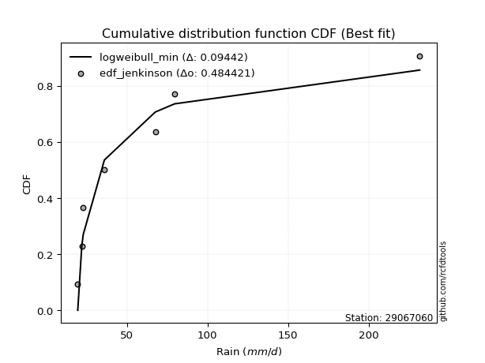</img>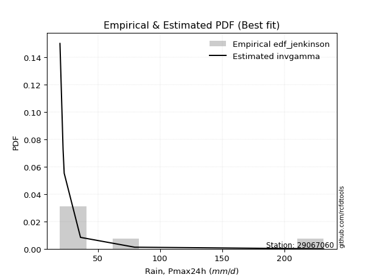</img>

</div>


### 11. EDF Cunnane (1978)

Cunnane´s work in statistical hydrology has focused on the performance and evaluation of different probability distributions (such as GEV, Gumbel, Lognormal) for flood frequency estimation. _b_ is a constant, typically set to 0.4.

<div align="center">


$P=(m-b)/(n+1-2b)$


</div>


**11.1. Empirical values**

<div align="center">

|                | 0                   | 1                   | 2                  | 3           | 4                  | 5                  | 6                  |
|:---------------|:--------------------|:--------------------|:-------------------|:------------|:-------------------|:-------------------|:-------------------|
| date           | 2022                | 2021                | 2023               | 2024        | 2025               | 2020               | 2019               |
| x              | 19.5                | 22.0                | 22.9               | 36.02       | 67.6               | 79.6               | 231.6              |
| m              | 1                   | 2                   | 3                  | 4           | 5                  | 6                  | 7                  |
| empirical_dist | edf_cunnane         | edf_cunnane         | edf_cunnane        | edf_cunnane | edf_cunnane        | edf_cunnane        | edf_cunnane        |
| empirical      | 0.08333333333333333 | 0.22222222222222224 | 0.3611111111111111 | 0.5         | 0.6388888888888888 | 0.7777777777777777 | 0.9166666666666666 |
| empirical_tr   | 1.090909090909091   | 1.2857142857142856  | 1.565217391304348  | 2.0         | 2.7692307692307687 | 4.499999999999998  | 11.999999999999995 |

</div>


**11.2. Kolmogorov-Smirnov fit test (sorted by Δ)**


<div align="center">

|                | 0                   | 1                   | 2                   | 3                   | 4                   | 5                   | 6                   | 7                   | 8                   | 9                   | 10                  | 11                  | 12                  | 13                  | 14                  | 15                  | 16                  | 17                  | 18                  | 19                  | 20                  | 21                  | 22                  | 23                  | 24                  | 25                  | 26                  | 27                  | 28                  | 29                  | 30                  | 31                  | 32                  | 33                  | 34                  | 35                  | 36                  | 37                  | 38                  | 39                  | 40                  | 41                  | 42                  | 43                  | 44                  | 45                  | 46                  | 47                  | 48                  | 49                  | 50                  | 51                  | 52                  | 53                  | 54                  | 55                  | 56                  | 57                  | 58                  | 59                  | 60                  | 61                  | 62                  | 63                  | 64                  | 65                  | 66                  | 67                  | 68                  | 69                  | 70                  | 71                  | 72                  | 73                  | 74                  | 75                  | 76                  | 77                  | 78                  | 79                  | 80                  | 81                  | 82                  | 83                  | 84                  | 85                  | 86                  | 87                  | 88                  | 89                  | 90                  | 91                  | 92                  | 93                  | 94                  | 95                  | 96                  | 97                  | 98                  | 99                  | 100                 | 101                 | 102                 | 103                 | 104                 | 105                 | 106                 | 107                 | 108                 | 109                 | 110                 | 111                 | 112                 | 113                 | 114                 | 115                 | 116                 | 117                 | 118                 | 119                 | 120                 | 121                 | 122                 | 123                 | 124                 | 125                 | 126                 | 127                 | 128                 | 129                 | 130                 | 131                 | 132                 | 133                 | 134                 | 135                 | 136                 | 137                 | 138                 | 139                 | 140                 | 141                 | 142                 | 143                 | 144                 | 145                 | 146                 | 147                 | 148                 | 149                 | 150                 | 151                 | 152                 | 153                 | 154                 | 155                 | 156                 | 157                 | 158                 | 159                 |
|:---------------|:--------------------|:--------------------|:--------------------|:--------------------|:--------------------|:--------------------|:--------------------|:--------------------|:--------------------|:--------------------|:--------------------|:--------------------|:--------------------|:--------------------|:--------------------|:--------------------|:--------------------|:--------------------|:--------------------|:--------------------|:--------------------|:--------------------|:--------------------|:--------------------|:--------------------|:--------------------|:--------------------|:--------------------|:--------------------|:--------------------|:--------------------|:--------------------|:--------------------|:--------------------|:--------------------|:--------------------|:--------------------|:--------------------|:--------------------|:--------------------|:--------------------|:--------------------|:--------------------|:--------------------|:--------------------|:--------------------|:--------------------|:--------------------|:--------------------|:--------------------|:--------------------|:--------------------|:--------------------|:--------------------|:--------------------|:--------------------|:--------------------|:--------------------|:--------------------|:--------------------|:--------------------|:--------------------|:--------------------|:--------------------|:--------------------|:--------------------|:--------------------|:--------------------|:--------------------|:--------------------|:--------------------|:--------------------|:--------------------|:--------------------|:--------------------|:--------------------|:--------------------|:--------------------|:--------------------|:--------------------|:--------------------|:--------------------|:--------------------|:--------------------|:--------------------|:--------------------|:--------------------|:--------------------|:--------------------|:--------------------|:--------------------|:--------------------|:--------------------|:--------------------|:--------------------|:--------------------|:--------------------|:--------------------|:--------------------|:--------------------|:--------------------|:--------------------|:--------------------|:--------------------|:--------------------|:--------------------|:--------------------|:--------------------|:--------------------|:--------------------|:--------------------|:--------------------|:--------------------|:--------------------|:--------------------|:--------------------|:--------------------|:--------------------|:--------------------|:--------------------|:--------------------|:--------------------|:--------------------|:--------------------|:--------------------|:--------------------|:--------------------|:--------------------|:--------------------|:--------------------|:--------------------|:--------------------|:--------------------|:--------------------|:--------------------|:--------------------|:--------------------|:--------------------|:--------------------|:--------------------|:--------------------|:--------------------|:--------------------|:--------------------|:--------------------|:--------------------|:--------------------|:--------------------|:--------------------|:--------------------|:--------------------|:--------------------|:--------------------|:--------------------|:--------------------|:--------------------|:--------------------|:--------------------|:--------------------|:--------------------|
| station        | 29067060            | 29067060            | 29067060            | 29067060            | 29067060            | 29067060            | 29067060            | 29067060            | 29067060            | 29067060            | 29067060            | 29067060            | 29067060            | 29067060            | 29067060            | 29067060            | 29067060            | 29067060            | 29067060            | 29067060            | 29067060            | 29067060            | 29067060            | 29067060            | 29067060            | 29067060            | 29067060            | 29067060            | 29067060            | 29067060            | 29067060            | 29067060            | 29067060            | 29067060            | 29067060            | 29067060            | 29067060            | 29067060            | 29067060            | 29067060            | 29067060            | 29067060            | 29067060            | 29067060            | 29067060            | 29067060            | 29067060            | 29067060            | 29067060            | 29067060            | 29067060            | 29067060            | 29067060            | 29067060            | 29067060            | 29067060            | 29067060            | 29067060            | 29067060            | 29067060            | 29067060            | 29067060            | 29067060            | 29067060            | 29067060            | 29067060            | 29067060            | 29067060            | 29067060            | 29067060            | 29067060            | 29067060            | 29067060            | 29067060            | 29067060            | 29067060            | 29067060            | 29067060            | 29067060            | 29067060            | 29067060            | 29067060            | 29067060            | 29067060            | 29067060            | 29067060            | 29067060            | 29067060            | 29067060            | 29067060            | 29067060            | 29067060            | 29067060            | 29067060            | 29067060            | 29067060            | 29067060            | 29067060            | 29067060            | 29067060            | 29067060            | 29067060            | 29067060            | 29067060            | 29067060            | 29067060            | 29067060            | 29067060            | 29067060            | 29067060            | 29067060            | 29067060            | 29067060            | 29067060            | 29067060            | 29067060            | 29067060            | 29067060            | 29067060            | 29067060            | 29067060            | 29067060            | 29067060            | 29067060            | 29067060            | 29067060            | 29067060            | 29067060            | 29067060            | 29067060            | 29067060            | 29067060            | 29067060            | 29067060            | 29067060            | 29067060            | 29067060            | 29067060            | 29067060            | 29067060            | 29067060            | 29067060            | 29067060            | 29067060            | 29067060            | 29067060            | 29067060            | 29067060            | 29067060            | 29067060            | 29067060            | 29067060            | 29067060            | 29067060            | 29067060            | 29067060            | 29067060            | 29067060            | 29067060            | 29067060            |
| empirical_dist | edf_cunnane         | edf_cunnane         | edf_cunnane         | edf_cunnane         | edf_cunnane         | edf_cunnane         | edf_cunnane         | edf_cunnane         | edf_cunnane         | edf_cunnane         | edf_cunnane         | edf_cunnane         | edf_cunnane         | edf_cunnane         | edf_cunnane         | edf_cunnane         | edf_cunnane         | edf_cunnane         | edf_cunnane         | edf_cunnane         | edf_cunnane         | edf_cunnane         | edf_cunnane         | edf_cunnane         | edf_cunnane         | edf_cunnane         | edf_cunnane         | edf_cunnane         | edf_cunnane         | edf_cunnane         | edf_cunnane         | edf_cunnane         | edf_cunnane         | edf_cunnane         | edf_cunnane         | edf_cunnane         | edf_cunnane         | edf_cunnane         | edf_cunnane         | edf_cunnane         | edf_cunnane         | edf_cunnane         | edf_cunnane         | edf_cunnane         | edf_cunnane         | edf_cunnane         | edf_cunnane         | edf_cunnane         | edf_cunnane         | edf_cunnane         | edf_cunnane         | edf_cunnane         | edf_cunnane         | edf_cunnane         | edf_cunnane         | edf_cunnane         | edf_cunnane         | edf_cunnane         | edf_cunnane         | edf_cunnane         | edf_cunnane         | edf_cunnane         | edf_cunnane         | edf_cunnane         | edf_cunnane         | edf_cunnane         | edf_cunnane         | edf_cunnane         | edf_cunnane         | edf_cunnane         | edf_cunnane         | edf_cunnane         | edf_cunnane         | edf_cunnane         | edf_cunnane         | edf_cunnane         | edf_cunnane         | edf_cunnane         | edf_cunnane         | edf_cunnane         | edf_cunnane         | edf_cunnane         | edf_cunnane         | edf_cunnane         | edf_cunnane         | edf_cunnane         | edf_cunnane         | edf_cunnane         | edf_cunnane         | edf_cunnane         | edf_cunnane         | edf_cunnane         | edf_cunnane         | edf_cunnane         | edf_cunnane         | edf_cunnane         | edf_cunnane         | edf_cunnane         | edf_cunnane         | edf_cunnane         | edf_cunnane         | edf_cunnane         | edf_cunnane         | edf_cunnane         | edf_cunnane         | edf_cunnane         | edf_cunnane         | edf_cunnane         | edf_cunnane         | edf_cunnane         | edf_cunnane         | edf_cunnane         | edf_cunnane         | edf_cunnane         | edf_cunnane         | edf_cunnane         | edf_cunnane         | edf_cunnane         | edf_cunnane         | edf_cunnane         | edf_cunnane         | edf_cunnane         | edf_cunnane         | edf_cunnane         | edf_cunnane         | edf_cunnane         | edf_cunnane         | edf_cunnane         | edf_cunnane         | edf_cunnane         | edf_cunnane         | edf_cunnane         | edf_cunnane         | edf_cunnane         | edf_cunnane         | edf_cunnane         | edf_cunnane         | edf_cunnane         | edf_cunnane         | edf_cunnane         | edf_cunnane         | edf_cunnane         | edf_cunnane         | edf_cunnane         | edf_cunnane         | edf_cunnane         | edf_cunnane         | edf_cunnane         | edf_cunnane         | edf_cunnane         | edf_cunnane         | edf_cunnane         | edf_cunnane         | edf_cunnane         | edf_cunnane         | edf_cunnane         | edf_cunnane         | edf_cunnane         | edf_cunnane         | edf_cunnane         |
| p_dist         | logweibull_min      | genextreme          | invweibull          | lognakagami         | logbeta             | logsemicircular     | loggausshyper       | logfoldnorm         | logkappa3           | loghalfnorm         | loganglit           | invgamma            | genpareto           | loggenextreme       | loginvweibull       | lograyleigh         | halfgennorm         | logalpha            | wald                | logmaxwell          | logburr12           | logf                | loginvgamma         | burr                | logbetaprime        | betaprime           | logexponweib        | gamma               | logpearson3         | logarcsine          | logloggamma         | lognorm             | logcrystalball      | logt                | loghalflogistic     | logncf              | logfatiguelife      | loghalfgennorm      | logburr             | loginvgauss         | nakagami            | ncf                 | moyal               | loggumbel_r         | invgauss            | lognct              | gumbel_r            | erlang              | nct                 | loggenlogistic      | truncweibull_min    | genlogistic         | loglogistic         | logmoyal            | vonmises_line       | logkstwobign        | pearson3            | maxwell             | logcosine           | loggumbel_l         | loglomax            | rayleigh            | logdweibull         | burr12              | logexponnorm        | logtruncnorm        | logexponpow         | alpha               | loghypsecant        | halflogistic        | loggenexpon         | loggompertz         | johnsonsb           | dgamma              | logrice             | logdgamma           | exponpow            | logistic            | loglaplace          | loglaplace          | f                   | halfnorm            | gennorm             | truncpareto         | hypsecant           | logloglaplace       | norm                | crystalball         | kstwobign           | logargus            | anglit              | logksone            | gengamma            | logtruncweibull_min | semicircular        | weibull_min         | foldnorm            | logtukeylambda      | rice                | logrdist            | laplace             | loggamma            | loggamma            | logkappa4           | bradford            | arcsine             | logskewnorm         | logwrapcauchy       | loggenpareto        | logtriang           | logbradford         | logtruncexpon       | logweibull_max      | loggennorm          | beta                | gumbel_l            | loggengamma         | logerlang           | exponnorm           | genexpon            | truncexpon          | wrapcauchy          | loguniform          | logvonmises_line    | gompertz            | gausshyper          | cosine              | lomax               | truncnorm           | dweibull            | exponweib           | logwald             | powerlaw            | t                   | loglevy_l           | skewnorm            | fatiguelife         | loggenhalflogistic  | levy_l              | logpowerlaw         | argus               | logtruncpareto      | kappa3              | johnsonsu           | ksone               | kappa4              | logtrapezoid        | uniform             | rdist               | logjohnsonsb        | logjohnsonsu        | tukeylambda         | genhalflogistic     | triang              | trapezoid           | weibull_max         | logvonmises         | vonmises            | mielke              | logmielke           |
| delta          | 0.09103256930612613 | 0.1038019333047645  | 0.10380435847066649 | 0.11504700485141928 | 0.11562686527780963 | 0.11944821670102207 | 0.11964597061070378 | 0.12091103779937862 | 0.1250333992570608  | 0.13023117811931328 | 0.1317726584885307  | 0.13372761843797698 | 0.13636777257017219 | 0.13715352095733457 | 0.13716474676944757 | 0.14097469976745056 | 0.14135744101635772 | 0.14157388570404095 | 0.14173113332082404 | 0.1464765584821815  | 0.1480710152427398  | 0.1481374463862879  | 0.14814120729850955 | 0.14857982277626192 | 0.1503345933610284  | 0.1515505016203921  | 0.1522606488439685  | 0.15362940843068407 | 0.1538132340609937  | 0.15729962369022138 | 0.15955965911569184 | 0.1597244960417617  | 0.1597246015964691  | 0.15972547888790994 | 0.160047167184431   | 0.16086661830221952 | 0.16127569855076285 | 0.161391444213138   | 0.1619011341779849  | 0.16203235417639217 | 0.16357821904231484 | 0.16577076873848953 | 0.16655704240429353 | 0.1675031820297664  | 0.1682959436895377  | 0.16925342190765574 | 0.16958408302874284 | 0.1704054546818683  | 0.17292911352394005 | 0.17432624431683563 | 0.17608392616955681 | 0.17896229553740428 | 0.18129106729830094 | 0.18150373649790857 | 0.18325118044688332 | 0.18466762093975794 | 0.1849238585711337  | 0.18518157187814221 | 0.18571378126349558 | 0.18642396963164246 | 0.18776013751968954 | 0.18814596870600986 | 0.18883591290723384 | 0.18967502186987498 | 0.1900378704178634  | 0.19078391246548285 | 0.19131868982671438 | 0.19358184924890165 | 0.19401323971791334 | 0.1940454404708873  | 0.1942622634377522  | 0.19732126306229886 | 0.19796908753885814 | 0.19990847068351703 | 0.20419997182852942 | 0.20556835316046373 | 0.20569721617326842 | 0.20623797181291603 | 0.20796907644029664 | 0.20796907644029664 | 0.20858057723633375 | 0.2105055990131351  | 0.21192881121837653 | 0.21196241394328763 | 0.21327758778515077 | 0.21439407334291363 | 0.21466820666039477 | 0.21466821570472827 | 0.21467013252507605 | 0.21496443928307873 | 0.22358147567563713 | 0.22365366962454264 | 0.22402919770390398 | 0.22554508050545122 | 0.22726493317630025 | 0.23400521943870925 | 0.23427804525272483 | 0.2346065001129784  | 0.23490735657659484 | 0.235198148290505   | 0.24007456795010562 | 0.2505212016856795  | 0.2505212016856795  | 0.2509246180834792  | 0.2510409531516665  | 0.25231615449610545 | 0.25448171803669645 | 0.25616694986055133 | 0.2594544207816809  | 0.2637039024371468  | 0.2637125529069723  | 0.27033963649394355 | 0.2765238374676542  | 0.2777777777777778  | 0.2801094778087059  | 0.28018720983928846 | 0.28497097033062124 | 0.28726242459161166 | 0.29226082163307104 | 0.29402303287294285 | 0.2949635513880765  | 0.2954291395959854  | 0.296162181327229   | 0.3003044118059923  | 0.301772441516978   | 0.30249033385981716 | 0.30444526762165397 | 0.31146220439970607 | 0.31156398626166126 | 0.31314401921450097 | 0.32425709484580445 | 0.3271347975749931  | 0.330937700892732   | 0.33191788654929444 | 0.3345118000213398  | 0.34681584746905547 | 0.36033936665990074 | 0.3746201875501188  | 0.37797004605300016 | 0.4005746733864184  | 0.40328632573939804 | 0.41471142254895843 | 0.4374993559932677  | 0.4525314609803398  | 0.4583136885117082  | 0.459795841385078   | 0.46751432204300264 | 0.4944208706584943  | 0.5083829993361909  | 0.5269674364454519  | 0.528204831327573   | 0.537989722060973   | 0.5796849950323186  | 0.6560668657066164  | 0.6755057277259151  | 0.685180482515406   | 1.0872117884577     | 36.888664533814826  | nan                 | nan                 |
| deltao         | 0.48442053926100004 | 0.48442053926100004 | 0.48442053926100004 | 0.48442053926100004 | 0.48442053926100004 | 0.48442053926100004 | 0.48442053926100004 | 0.48442053926100004 | 0.48442053926100004 | 0.48442053926100004 | 0.48442053926100004 | 0.48442053926100004 | 0.48442053926100004 | 0.48442053926100004 | 0.48442053926100004 | 0.48442053926100004 | 0.48442053926100004 | 0.48442053926100004 | 0.48442053926100004 | 0.48442053926100004 | 0.48442053926100004 | 0.48442053926100004 | 0.48442053926100004 | 0.48442053926100004 | 0.48442053926100004 | 0.48442053926100004 | 0.48442053926100004 | 0.48442053926100004 | 0.48442053926100004 | 0.48442053926100004 | 0.48442053926100004 | 0.48442053926100004 | 0.48442053926100004 | 0.48442053926100004 | 0.48442053926100004 | 0.48442053926100004 | 0.48442053926100004 | 0.48442053926100004 | 0.48442053926100004 | 0.48442053926100004 | 0.48442053926100004 | 0.48442053926100004 | 0.48442053926100004 | 0.48442053926100004 | 0.48442053926100004 | 0.48442053926100004 | 0.48442053926100004 | 0.48442053926100004 | 0.48442053926100004 | 0.48442053926100004 | 0.48442053926100004 | 0.48442053926100004 | 0.48442053926100004 | 0.48442053926100004 | 0.48442053926100004 | 0.48442053926100004 | 0.48442053926100004 | 0.48442053926100004 | 0.48442053926100004 | 0.48442053926100004 | 0.48442053926100004 | 0.48442053926100004 | 0.48442053926100004 | 0.48442053926100004 | 0.48442053926100004 | 0.48442053926100004 | 0.48442053926100004 | 0.48442053926100004 | 0.48442053926100004 | 0.48442053926100004 | 0.48442053926100004 | 0.48442053926100004 | 0.48442053926100004 | 0.48442053926100004 | 0.48442053926100004 | 0.48442053926100004 | 0.48442053926100004 | 0.48442053926100004 | 0.48442053926100004 | 0.48442053926100004 | 0.48442053926100004 | 0.48442053926100004 | 0.48442053926100004 | 0.48442053926100004 | 0.48442053926100004 | 0.48442053926100004 | 0.48442053926100004 | 0.48442053926100004 | 0.48442053926100004 | 0.48442053926100004 | 0.48442053926100004 | 0.48442053926100004 | 0.48442053926100004 | 0.48442053926100004 | 0.48442053926100004 | 0.48442053926100004 | 0.48442053926100004 | 0.48442053926100004 | 0.48442053926100004 | 0.48442053926100004 | 0.48442053926100004 | 0.48442053926100004 | 0.48442053926100004 | 0.48442053926100004 | 0.48442053926100004 | 0.48442053926100004 | 0.48442053926100004 | 0.48442053926100004 | 0.48442053926100004 | 0.48442053926100004 | 0.48442053926100004 | 0.48442053926100004 | 0.48442053926100004 | 0.48442053926100004 | 0.48442053926100004 | 0.48442053926100004 | 0.48442053926100004 | 0.48442053926100004 | 0.48442053926100004 | 0.48442053926100004 | 0.48442053926100004 | 0.48442053926100004 | 0.48442053926100004 | 0.48442053926100004 | 0.48442053926100004 | 0.48442053926100004 | 0.48442053926100004 | 0.48442053926100004 | 0.48442053926100004 | 0.48442053926100004 | 0.48442053926100004 | 0.48442053926100004 | 0.48442053926100004 | 0.48442053926100004 | 0.48442053926100004 | 0.48442053926100004 | 0.48442053926100004 | 0.48442053926100004 | 0.48442053926100004 | 0.48442053926100004 | 0.48442053926100004 | 0.48442053926100004 | 0.48442053926100004 | 0.48442053926100004 | 0.48442053926100004 | 0.48442053926100004 | 0.48442053926100004 | 0.48442053926100004 | 0.48442053926100004 | 0.48442053926100004 | 0.48442053926100004 | 0.48442053926100004 | 0.48442053926100004 | 0.48442053926100004 | 0.48442053926100004 | 0.48442053926100004 | 0.48442053926100004 | 0.48442053926100004 | 0.48442053926100004 | 0.48442053926100004 |
| eval           | Δo > Δ              | Δo > Δ              | Δo > Δ              | Δo > Δ              | Δo > Δ              | Δo > Δ              | Δo > Δ              | Δo > Δ              | Δo > Δ              | Δo > Δ              | Δo > Δ              | Δo > Δ              | Δo > Δ              | Δo > Δ              | Δo > Δ              | Δo > Δ              | Δo > Δ              | Δo > Δ              | Δo > Δ              | Δo > Δ              | Δo > Δ              | Δo > Δ              | Δo > Δ              | Δo > Δ              | Δo > Δ              | Δo > Δ              | Δo > Δ              | Δo > Δ              | Δo > Δ              | Δo > Δ              | Δo > Δ              | Δo > Δ              | Δo > Δ              | Δo > Δ              | Δo > Δ              | Δo > Δ              | Δo > Δ              | Δo > Δ              | Δo > Δ              | Δo > Δ              | Δo > Δ              | Δo > Δ              | Δo > Δ              | Δo > Δ              | Δo > Δ              | Δo > Δ              | Δo > Δ              | Δo > Δ              | Δo > Δ              | Δo > Δ              | Δo > Δ              | Δo > Δ              | Δo > Δ              | Δo > Δ              | Δo > Δ              | Δo > Δ              | Δo > Δ              | Δo > Δ              | Δo > Δ              | Δo > Δ              | Δo > Δ              | Δo > Δ              | Δo > Δ              | Δo > Δ              | Δo > Δ              | Δo > Δ              | Δo > Δ              | Δo > Δ              | Δo > Δ              | Δo > Δ              | Δo > Δ              | Δo > Δ              | Δo > Δ              | Δo > Δ              | Δo > Δ              | Δo > Δ              | Δo > Δ              | Δo > Δ              | Δo > Δ              | Δo > Δ              | Δo > Δ              | Δo > Δ              | Δo > Δ              | Δo > Δ              | Δo > Δ              | Δo > Δ              | Δo > Δ              | Δo > Δ              | Δo > Δ              | Δo > Δ              | Δo > Δ              | Δo > Δ              | Δo > Δ              | Δo > Δ              | Δo > Δ              | Δo > Δ              | Δo > Δ              | Δo > Δ              | Δo > Δ              | Δo > Δ              | Δo > Δ              | Δo > Δ              | Δo > Δ              | Δo > Δ              | Δo > Δ              | Δo > Δ              | Δo > Δ              | Δo > Δ              | Δo > Δ              | Δo > Δ              | Δo > Δ              | Δo > Δ              | Δo > Δ              | Δo > Δ              | Δo > Δ              | Δo > Δ              | Δo > Δ              | Δo > Δ              | Δo > Δ              | Δo > Δ              | Δo > Δ              | Δo > Δ              | Δo > Δ              | Δo > Δ              | Δo > Δ              | Δo > Δ              | Δo > Δ              | Δo > Δ              | Δo > Δ              | Δo > Δ              | Δo > Δ              | Δo > Δ              | Δo > Δ              | Δo > Δ              | Δo > Δ              | Δo > Δ              | Δo > Δ              | Δo > Δ              | Δo > Δ              | Δo > Δ              | Δo > Δ              | Δo > Δ              | Δo > Δ              | Δo > Δ              | Δo > Δ              | Δo > Δ              | Δo > Δ              | Δo <= Δ             | Δo <= Δ             | Δo <= Δ             | Δo <= Δ             | Δo <= Δ             | Δo <= Δ             | Δo <= Δ             | Δo <= Δ             | Δo <= Δ             | Δo <= Δ             | Δo <= Δ             | Δo <= Δ             | Δo <= Δ             |
| fit            | 1                   | 1                   | 1                   | 1                   | 1                   | 1                   | 1                   | 1                   | 1                   | 1                   | 1                   | 1                   | 1                   | 1                   | 1                   | 1                   | 1                   | 1                   | 1                   | 1                   | 1                   | 1                   | 1                   | 1                   | 1                   | 1                   | 1                   | 1                   | 1                   | 1                   | 1                   | 1                   | 1                   | 1                   | 1                   | 1                   | 1                   | 1                   | 1                   | 1                   | 1                   | 1                   | 1                   | 1                   | 1                   | 1                   | 1                   | 1                   | 1                   | 1                   | 1                   | 1                   | 1                   | 1                   | 1                   | 1                   | 1                   | 1                   | 1                   | 1                   | 1                   | 1                   | 1                   | 1                   | 1                   | 1                   | 1                   | 1                   | 1                   | 1                   | 1                   | 1                   | 1                   | 1                   | 1                   | 1                   | 1                   | 1                   | 1                   | 1                   | 1                   | 1                   | 1                   | 1                   | 1                   | 1                   | 1                   | 1                   | 1                   | 1                   | 1                   | 1                   | 1                   | 1                   | 1                   | 1                   | 1                   | 1                   | 1                   | 1                   | 1                   | 1                   | 1                   | 1                   | 1                   | 1                   | 1                   | 1                   | 1                   | 1                   | 1                   | 1                   | 1                   | 1                   | 1                   | 1                   | 1                   | 1                   | 1                   | 1                   | 1                   | 1                   | 1                   | 1                   | 1                   | 1                   | 1                   | 1                   | 1                   | 1                   | 1                   | 1                   | 1                   | 1                   | 1                   | 1                   | 1                   | 1                   | 1                   | 1                   | 1                   | 1                   | 1                   | 1                   | 1                   | 1                   | 1                   | 0                   | 0                   | 0                   | 0                   | 0                   | 0                   | 0                   | 0                   | 0                   | 0                   | 0                   | 0                   | 0                   |
| n              | 7                   | 7                   | 7                   | 7                   | 7                   | 7                   | 7                   | 7                   | 7                   | 7                   | 7                   | 7                   | 7                   | 7                   | 7                   | 7                   | 7                   | 7                   | 7                   | 7                   | 7                   | 7                   | 7                   | 7                   | 7                   | 7                   | 7                   | 7                   | 7                   | 7                   | 7                   | 7                   | 7                   | 7                   | 7                   | 7                   | 7                   | 7                   | 7                   | 7                   | 7                   | 7                   | 7                   | 7                   | 7                   | 7                   | 7                   | 7                   | 7                   | 7                   | 7                   | 7                   | 7                   | 7                   | 7                   | 7                   | 7                   | 7                   | 7                   | 7                   | 7                   | 7                   | 7                   | 7                   | 7                   | 7                   | 7                   | 7                   | 7                   | 7                   | 7                   | 7                   | 7                   | 7                   | 7                   | 7                   | 7                   | 7                   | 7                   | 7                   | 7                   | 7                   | 7                   | 7                   | 7                   | 7                   | 7                   | 7                   | 7                   | 7                   | 7                   | 7                   | 7                   | 7                   | 7                   | 7                   | 7                   | 7                   | 7                   | 7                   | 7                   | 7                   | 7                   | 7                   | 7                   | 7                   | 7                   | 7                   | 7                   | 7                   | 7                   | 7                   | 7                   | 7                   | 7                   | 7                   | 7                   | 7                   | 7                   | 7                   | 7                   | 7                   | 7                   | 7                   | 7                   | 7                   | 7                   | 7                   | 7                   | 7                   | 7                   | 7                   | 7                   | 7                   | 7                   | 7                   | 7                   | 7                   | 7                   | 7                   | 7                   | 7                   | 7                   | 7                   | 7                   | 7                   | 7                   | 7                   | 7                   | 7                   | 7                   | 7                   | 7                   | 7                   | 7                   | 7                   | 7                   | 7                   | 7                   | 7                   |
| best_fit       | 1                   | 0                   | 0                   | 0                   | 0                   | 0                   | 0                   | 0                   | 0                   | 0                   | 0                   | 0                   | 0                   | 0                   | 0                   | 0                   | 0                   | 0                   | 0                   | 0                   | 0                   | 0                   | 0                   | 0                   | 0                   | 0                   | 0                   | 0                   | 0                   | 0                   | 0                   | 0                   | 0                   | 0                   | 0                   | 0                   | 0                   | 0                   | 0                   | 0                   | 0                   | 0                   | 0                   | 0                   | 0                   | 0                   | 0                   | 0                   | 0                   | 0                   | 0                   | 0                   | 0                   | 0                   | 0                   | 0                   | 0                   | 0                   | 0                   | 0                   | 0                   | 0                   | 0                   | 0                   | 0                   | 0                   | 0                   | 0                   | 0                   | 0                   | 0                   | 0                   | 0                   | 0                   | 0                   | 0                   | 0                   | 0                   | 0                   | 0                   | 0                   | 0                   | 0                   | 0                   | 0                   | 0                   | 0                   | 0                   | 0                   | 0                   | 0                   | 0                   | 0                   | 0                   | 0                   | 0                   | 0                   | 0                   | 0                   | 0                   | 0                   | 0                   | 0                   | 0                   | 0                   | 0                   | 0                   | 0                   | 0                   | 0                   | 0                   | 0                   | 0                   | 0                   | 0                   | 0                   | 0                   | 0                   | 0                   | 0                   | 0                   | 0                   | 0                   | 0                   | 0                   | 0                   | 0                   | 0                   | 0                   | 0                   | 0                   | 0                   | 0                   | 0                   | 0                   | 0                   | 0                   | 0                   | 0                   | 0                   | 0                   | 0                   | 0                   | 0                   | 0                   | 0                   | 0                   | 0                   | 0                   | 0                   | 0                   | 0                   | 0                   | 0                   | 0                   | 0                   | 0                   | 0                   | 0                   | 0                   |
| best_fit_sort  | 1                   | 2                   | 3                   | 4                   | 5                   | 6                   | 7                   | 8                   | 9                   | 10                  | 11                  | 12                  | 13                  | 14                  | 15                  | 16                  | 17                  | 18                  | 19                  | 20                  | 21                  | 22                  | 23                  | 24                  | 25                  | 26                  | 27                  | 28                  | 29                  | 30                  | 31                  | 32                  | 33                  | 34                  | 35                  | 36                  | 37                  | 38                  | 39                  | 40                  | 41                  | 42                  | 43                  | 44                  | 45                  | 46                  | 47                  | 48                  | 49                  | 50                  | 51                  | 52                  | 53                  | 54                  | 55                  | 56                  | 57                  | 58                  | 59                  | 60                  | 61                  | 62                  | 63                  | 64                  | 65                  | 66                  | 67                  | 68                  | 69                  | 70                  | 71                  | 72                  | 73                  | 74                  | 75                  | 76                  | 77                  | 78                  | 79                  | 80                  | 81                  | 82                  | 83                  | 84                  | 85                  | 86                  | 87                  | 88                  | 89                  | 90                  | 91                  | 92                  | 93                  | 94                  | 95                  | 96                  | 97                  | 98                  | 99                  | 100                 | 101                 | 102                 | 103                 | 104                 | 105                 | 106                 | 107                 | 108                 | 109                 | 110                 | 111                 | 112                 | 113                 | 114                 | 115                 | 116                 | 117                 | 118                 | 119                 | 120                 | 121                 | 122                 | 123                 | 124                 | 125                 | 126                 | 127                 | 128                 | 129                 | 130                 | 131                 | 132                 | 133                 | 134                 | 135                 | 136                 | 137                 | 138                 | 139                 | 140                 | 141                 | 142                 | 143                 | 144                 | 145                 | 146                 | 147                 | 148                 | 149                 | 150                 | 151                 | 152                 | 153                 | 154                 | 155                 | 156                 | 157                 | 158                 | 159                 | 160                 |

</div>


**11.3. Best fit**

<div align="center">

|   id |   station | empirical_dist   | p_dist         |     delta |   deltao | eval   |   fit |   n |   best_fit |   best_fit_sort |
|-----:|----------:|:-----------------|:---------------|----------:|---------:|:-------|------:|----:|-----------:|----------------:|
|    0 |  29067060 | edf_cunnane      | logweibull_min | 0.0910326 | 0.484421 | Δo > Δ |     1 |   7 |          1 |               1 |

</div>


<div align="center">

</img></img>

</div>


### 12. EDF Adamowski (1981)

The Adamowski formula in hydrology refers to a specific plotting position formula used for estimating the non-parametric empirical distribution of hydrological events (like flood peaks) to calculate their return periods. This formula provides an alternative to traditional parametric methods (like the Gumbel or Log Pearson Type III distributions). 

<div align="center">


$P=(m-0.25)/(n+0.5)$


</div>


**12.1. Empirical values**

<div align="center">

|                | 0                  | 1                   | 2                   | 3             | 4                  | 5                  | 6                  |
|:---------------|:-------------------|:--------------------|:--------------------|:--------------|:-------------------|:-------------------|:-------------------|
| date           | 2022               | 2021                | 2023                | 2024          | 2025               | 2020               | 2019               |
| x              | 19.5               | 22.0                | 22.9                | 36.02         | 67.6               | 79.6               | 231.6              |
| m              | 1                  | 2                   | 3                   | 4             | 5                  | 6                  | 7                  |
| empirical_dist | edf_adamowski      | edf_adamowski       | edf_adamowski       | edf_adamowski | edf_adamowski      | edf_adamowski      | edf_adamowski      |
| empirical      | 0.1                | 0.23333333333333334 | 0.36666666666666664 | 0.5           | 0.6333333333333333 | 0.7666666666666667 | 0.9                |
| empirical_tr   | 1.1111111111111112 | 1.3043478260869565  | 1.5789473684210527  | 2.0           | 2.727272727272727  | 4.2857142857142865 | 10.000000000000002 |

</div>


**12.2. Kolmogorov-Smirnov fit test (sorted by Δ)**


<div align="center">

|                | 0                   | 1                   | 2                   | 3                   | 4                   | 5                   | 6                   | 7                   | 8                   | 9                   | 10                  | 11                  | 12                  | 13                  | 14                  | 15                  | 16                  | 17                  | 18                  | 19                  | 20                  | 21                  | 22                  | 23                  | 24                  | 25                  | 26                  | 27                  | 28                  | 29                  | 30                  | 31                  | 32                  | 33                  | 34                  | 35                  | 36                  | 37                  | 38                  | 39                  | 40                  | 41                  | 42                  | 43                  | 44                  | 45                  | 46                  | 47                  | 48                  | 49                  | 50                  | 51                  | 52                  | 53                  | 54                  | 55                  | 56                  | 57                  | 58                  | 59                  | 60                  | 61                  | 62                  | 63                  | 64                  | 65                  | 66                  | 67                  | 68                  | 69                  | 70                  | 71                  | 72                  | 73                  | 74                  | 75                  | 76                  | 77                  | 78                  | 79                  | 80                  | 81                  | 82                  | 83                  | 84                  | 85                  | 86                  | 87                  | 88                  | 89                  | 90                  | 91                  | 92                  | 93                  | 94                  | 95                  | 96                  | 97                  | 98                  | 99                  | 100                 | 101                 | 102                 | 103                 | 104                 | 105                 | 106                 | 107                 | 108                 | 109                 | 110                 | 111                 | 112                 | 113                 | 114                 | 115                 | 116                 | 117                 | 118                 | 119                 | 120                 | 121                 | 122                 | 123                 | 124                 | 125                 | 126                 | 127                 | 128                 | 129                 | 130                 | 131                 | 132                 | 133                 | 134                 | 135                 | 136                 | 137                 | 138                 | 139                 | 140                 | 141                 | 142                 | 143                 | 144                 | 145                 | 146                 | 147                 | 148                 | 149                 | 150                 | 151                 | 152                 | 153                 | 154                 | 155                 | 156                 | 157                 | 158                 | 159                 |
|:---------------|:--------------------|:--------------------|:--------------------|:--------------------|:--------------------|:--------------------|:--------------------|:--------------------|:--------------------|:--------------------|:--------------------|:--------------------|:--------------------|:--------------------|:--------------------|:--------------------|:--------------------|:--------------------|:--------------------|:--------------------|:--------------------|:--------------------|:--------------------|:--------------------|:--------------------|:--------------------|:--------------------|:--------------------|:--------------------|:--------------------|:--------------------|:--------------------|:--------------------|:--------------------|:--------------------|:--------------------|:--------------------|:--------------------|:--------------------|:--------------------|:--------------------|:--------------------|:--------------------|:--------------------|:--------------------|:--------------------|:--------------------|:--------------------|:--------------------|:--------------------|:--------------------|:--------------------|:--------------------|:--------------------|:--------------------|:--------------------|:--------------------|:--------------------|:--------------------|:--------------------|:--------------------|:--------------------|:--------------------|:--------------------|:--------------------|:--------------------|:--------------------|:--------------------|:--------------------|:--------------------|:--------------------|:--------------------|:--------------------|:--------------------|:--------------------|:--------------------|:--------------------|:--------------------|:--------------------|:--------------------|:--------------------|:--------------------|:--------------------|:--------------------|:--------------------|:--------------------|:--------------------|:--------------------|:--------------------|:--------------------|:--------------------|:--------------------|:--------------------|:--------------------|:--------------------|:--------------------|:--------------------|:--------------------|:--------------------|:--------------------|:--------------------|:--------------------|:--------------------|:--------------------|:--------------------|:--------------------|:--------------------|:--------------------|:--------------------|:--------------------|:--------------------|:--------------------|:--------------------|:--------------------|:--------------------|:--------------------|:--------------------|:--------------------|:--------------------|:--------------------|:--------------------|:--------------------|:--------------------|:--------------------|:--------------------|:--------------------|:--------------------|:--------------------|:--------------------|:--------------------|:--------------------|:--------------------|:--------------------|:--------------------|:--------------------|:--------------------|:--------------------|:--------------------|:--------------------|:--------------------|:--------------------|:--------------------|:--------------------|:--------------------|:--------------------|:--------------------|:--------------------|:--------------------|:--------------------|:--------------------|:--------------------|:--------------------|:--------------------|:--------------------|:--------------------|:--------------------|:--------------------|:--------------------|:--------------------|:--------------------|
| station        | 29067060            | 29067060            | 29067060            | 29067060            | 29067060            | 29067060            | 29067060            | 29067060            | 29067060            | 29067060            | 29067060            | 29067060            | 29067060            | 29067060            | 29067060            | 29067060            | 29067060            | 29067060            | 29067060            | 29067060            | 29067060            | 29067060            | 29067060            | 29067060            | 29067060            | 29067060            | 29067060            | 29067060            | 29067060            | 29067060            | 29067060            | 29067060            | 29067060            | 29067060            | 29067060            | 29067060            | 29067060            | 29067060            | 29067060            | 29067060            | 29067060            | 29067060            | 29067060            | 29067060            | 29067060            | 29067060            | 29067060            | 29067060            | 29067060            | 29067060            | 29067060            | 29067060            | 29067060            | 29067060            | 29067060            | 29067060            | 29067060            | 29067060            | 29067060            | 29067060            | 29067060            | 29067060            | 29067060            | 29067060            | 29067060            | 29067060            | 29067060            | 29067060            | 29067060            | 29067060            | 29067060            | 29067060            | 29067060            | 29067060            | 29067060            | 29067060            | 29067060            | 29067060            | 29067060            | 29067060            | 29067060            | 29067060            | 29067060            | 29067060            | 29067060            | 29067060            | 29067060            | 29067060            | 29067060            | 29067060            | 29067060            | 29067060            | 29067060            | 29067060            | 29067060            | 29067060            | 29067060            | 29067060            | 29067060            | 29067060            | 29067060            | 29067060            | 29067060            | 29067060            | 29067060            | 29067060            | 29067060            | 29067060            | 29067060            | 29067060            | 29067060            | 29067060            | 29067060            | 29067060            | 29067060            | 29067060            | 29067060            | 29067060            | 29067060            | 29067060            | 29067060            | 29067060            | 29067060            | 29067060            | 29067060            | 29067060            | 29067060            | 29067060            | 29067060            | 29067060            | 29067060            | 29067060            | 29067060            | 29067060            | 29067060            | 29067060            | 29067060            | 29067060            | 29067060            | 29067060            | 29067060            | 29067060            | 29067060            | 29067060            | 29067060            | 29067060            | 29067060            | 29067060            | 29067060            | 29067060            | 29067060            | 29067060            | 29067060            | 29067060            | 29067060            | 29067060            | 29067060            | 29067060            | 29067060            | 29067060            |
| empirical_dist | edf_adamowski       | edf_adamowski       | edf_adamowski       | edf_adamowski       | edf_adamowski       | edf_adamowski       | edf_adamowski       | edf_adamowski       | edf_adamowski       | edf_adamowski       | edf_adamowski       | edf_adamowski       | edf_adamowski       | edf_adamowski       | edf_adamowski       | edf_adamowski       | edf_adamowski       | edf_adamowski       | edf_adamowski       | edf_adamowski       | edf_adamowski       | edf_adamowski       | edf_adamowski       | edf_adamowski       | edf_adamowski       | edf_adamowski       | edf_adamowski       | edf_adamowski       | edf_adamowski       | edf_adamowski       | edf_adamowski       | edf_adamowski       | edf_adamowski       | edf_adamowski       | edf_adamowski       | edf_adamowski       | edf_adamowski       | edf_adamowski       | edf_adamowski       | edf_adamowski       | edf_adamowski       | edf_adamowski       | edf_adamowski       | edf_adamowski       | edf_adamowski       | edf_adamowski       | edf_adamowski       | edf_adamowski       | edf_adamowski       | edf_adamowski       | edf_adamowski       | edf_adamowski       | edf_adamowski       | edf_adamowski       | edf_adamowski       | edf_adamowski       | edf_adamowski       | edf_adamowski       | edf_adamowski       | edf_adamowski       | edf_adamowski       | edf_adamowski       | edf_adamowski       | edf_adamowski       | edf_adamowski       | edf_adamowski       | edf_adamowski       | edf_adamowski       | edf_adamowski       | edf_adamowski       | edf_adamowski       | edf_adamowski       | edf_adamowski       | edf_adamowski       | edf_adamowski       | edf_adamowski       | edf_adamowski       | edf_adamowski       | edf_adamowski       | edf_adamowski       | edf_adamowski       | edf_adamowski       | edf_adamowski       | edf_adamowski       | edf_adamowski       | edf_adamowski       | edf_adamowski       | edf_adamowski       | edf_adamowski       | edf_adamowski       | edf_adamowski       | edf_adamowski       | edf_adamowski       | edf_adamowski       | edf_adamowski       | edf_adamowski       | edf_adamowski       | edf_adamowski       | edf_adamowski       | edf_adamowski       | edf_adamowski       | edf_adamowski       | edf_adamowski       | edf_adamowski       | edf_adamowski       | edf_adamowski       | edf_adamowski       | edf_adamowski       | edf_adamowski       | edf_adamowski       | edf_adamowski       | edf_adamowski       | edf_adamowski       | edf_adamowski       | edf_adamowski       | edf_adamowski       | edf_adamowski       | edf_adamowski       | edf_adamowski       | edf_adamowski       | edf_adamowski       | edf_adamowski       | edf_adamowski       | edf_adamowski       | edf_adamowski       | edf_adamowski       | edf_adamowski       | edf_adamowski       | edf_adamowski       | edf_adamowski       | edf_adamowski       | edf_adamowski       | edf_adamowski       | edf_adamowski       | edf_adamowski       | edf_adamowski       | edf_adamowski       | edf_adamowski       | edf_adamowski       | edf_adamowski       | edf_adamowski       | edf_adamowski       | edf_adamowski       | edf_adamowski       | edf_adamowski       | edf_adamowski       | edf_adamowski       | edf_adamowski       | edf_adamowski       | edf_adamowski       | edf_adamowski       | edf_adamowski       | edf_adamowski       | edf_adamowski       | edf_adamowski       | edf_adamowski       | edf_adamowski       | edf_adamowski       | edf_adamowski       | edf_adamowski       |
| p_dist         | logweibull_min      | genextreme          | invweibull          | lognakagami         | logbeta             | logsemicircular     | loggausshyper       | logfoldnorm         | logkappa3           | logexponweib        | loghalfnorm         | loganglit           | invgamma            | logarcsine          | genpareto           | loggenextreme       | loginvweibull       | lograyleigh         | halfgennorm         | logalpha            | wald                | moyal               | logmaxwell          | nakagami            | gumbel_r            | logburr12           | logf                | loginvgamma         | burr                | logbetaprime        | betaprime           | gamma               | logpearson3         | truncweibull_min    | logloggamma         | lognorm             | logcrystalball      | logt                | loghalflogistic     | logncf              | vonmises_line       | logfatiguelife      | loghalfgennorm      | logburr             | loginvgauss         | pearson3            | ncf                 | rayleigh            | logdweibull         | loggumbel_r         | invgauss            | maxwell             | lognct              | erlang              | halflogistic        | nct                 | genlogistic         | loggenlogistic      | dgamma              | loglogistic         | johnsonsb           | logmoyal            | logdgamma           | logkstwobign        | logcosine           | loggumbel_l         | loglomax            | halfnorm            | burr12              | gennorm             | logexponnorm        | logtruncnorm        | logexponpow         | f                   | logistic            | alpha               | loghypsecant        | loggenexpon         | loggompertz         | norm                | crystalball         | logrice             | exponpow            | anglit              | gengamma            | hypsecant           | loglaplace          | loglaplace          | kstwobign           | logargus            | semicircular        | truncpareto         | foldnorm            | logloglaplace       | logrdist            | logksone            | logtruncweibull_min | rice                | arcsine             | weibull_min         | laplace             | logtukeylambda      | loggenpareto        | logwrapcauchy       | logtriang           | loggamma            | loggamma            | logkappa4           | bradford            | logskewnorm         | logweibull_max      | loggennorm          | loggengamma         | gumbel_l            | logbradford         | logtruncexpon       | truncexpon          | wrapcauchy          | beta                | gausshyper          | logerlang           | cosine              | dweibull            | exponnorm           | genexpon            | loguniform          | logvonmises_line    | gompertz            | exponweib           | lomax               | truncnorm           | loglevy_l           | powerlaw            | t                   | logwald             | skewnorm            | fatiguelife         | levy_l              | loggenhalflogistic  | logpowerlaw         | argus               | logtruncpareto      | kappa3              | johnsonsu           | ksone               | kappa4              | logtrapezoid        | uniform             | rdist               | logjohnsonsb        | logjohnsonsu        | tukeylambda         | genhalflogistic     | triang              | trapezoid           | weibull_max         | logvonmises         | vonmises            | mielke              | logmielke           |
| delta          | 0.09999999993197911 | 0.10909616037880143 | 0.10909898307360555 | 0.12060256040697481 | 0.12118242083336517 | 0.1250037722565776  | 0.12520152616625932 | 0.12646659335493415 | 0.13058895481261634 | 0.1355939821773019  | 0.13578673367486882 | 0.13732821404408624 | 0.13928317399353252 | 0.1406329570235547  | 0.14192332812572772 | 0.1427090765128901  | 0.1427203023250031  | 0.1465302553230061  | 0.14691299657191326 | 0.14712944125959648 | 0.14728668887637958 | 0.14989037573762684 | 0.15203211403773703 | 0.15246710793120388 | 0.15291741636207615 | 0.15362657079829534 | 0.15369300194184343 | 0.15369676285406508 | 0.15413537833181745 | 0.15589014891658393 | 0.15710605717594764 | 0.1591849639862396  | 0.15936878961654924 | 0.16497281505844585 | 0.16511521467124737 | 0.16528005159731723 | 0.16528015715202463 | 0.16528103444346548 | 0.16560272273998652 | 0.16642217385777505 | 0.16658451378021663 | 0.16683125410631838 | 0.16694699976869354 | 0.16745668973354044 | 0.1675879097319477  | 0.168257191904467   | 0.17132632429404507 | 0.17147930203934317 | 0.17216924624056715 | 0.17305873758532195 | 0.17385149924509324 | 0.17407046076703125 | 0.17480897746321128 | 0.17596101023742383 | 0.1773787738042206  | 0.1784846690794956  | 0.17896229553740428 | 0.17988179987239117 | 0.18324180401685033 | 0.18684662285385648 | 0.18685797642774704 | 0.1870592920534641  | 0.18890168649379704 | 0.19022317649531348 | 0.19126933681905112 | 0.191979525187198   | 0.19331569307524507 | 0.1938389323464684  | 0.1952305774254305  | 0.19526214455170984 | 0.19559342597341894 | 0.19633946802103838 | 0.1968742453822699  | 0.19746946612522265 | 0.19826745019552228 | 0.19913740480445719 | 0.19956879527346888 | 0.19981781899330772 | 0.2028768186178544  | 0.2035570955492838  | 0.2035571045936173  | 0.20975552738408496 | 0.21125277172882395 | 0.21247036456452617 | 0.21291808659279288 | 0.21327758778515077 | 0.21352463199585217 | 0.21352463199585217 | 0.21467013252507605 | 0.21496443928307873 | 0.2161538220651893  | 0.21751796949884317 | 0.21761137858605814 | 0.21994962889846917 | 0.22408703717939404 | 0.22920922518009818 | 0.23110063606100675 | 0.23490735657659484 | 0.23564948782943876 | 0.23956077499426479 | 0.24007456795010562 | 0.24016205566853394 | 0.24278775411501421 | 0.24505583874944037 | 0.25259279132603585 | 0.256076757241235   | 0.256076757241235   | 0.25648017363903475 | 0.25659650870722206 | 0.260037273592252   | 0.2654127263565432  | 0.2666666666666667  | 0.26830430366395464 | 0.2690760987281775  | 0.26926810846252786 | 0.2758951920494991  | 0.28385244027696555 | 0.2843180284848744  | 0.2856650333642614  | 0.28582366719315044 | 0.29130134372968963 | 0.293334156510543   | 0.29647735254783425 | 0.2978163771886266  | 0.2995785884284984  | 0.3017177368827845  | 0.30585996736154786 | 0.30732799707253355 | 0.3131459837346933  | 0.3170177599552616  | 0.3171195418172168  | 0.3178451333546731  | 0.3198265897816209  | 0.33191788654929444 | 0.3326903531305486  | 0.34681584746905547 | 0.3492282555487896  | 0.3613033793863335  | 0.3635090764390078  | 0.38946356227530726 | 0.3921752146282871  | 0.4036003114378473  | 0.4208326893266011  | 0.4414203498692287  | 0.4472025774005972  | 0.44868473027396705 | 0.4564032109318917  | 0.48330975954738337 | 0.4917163326695243  | 0.5158563253343407  | 0.5170937202164618  | 0.5213230553943063  | 0.5685738839212077  | 0.6449557545955055  | 0.6643946166148041  | 0.6740693714042951  | 1.0927673440132555  | 36.90533120048149   | nan                 | nan                 |
| deltao         | 0.48442053926100004 | 0.48442053926100004 | 0.48442053926100004 | 0.48442053926100004 | 0.48442053926100004 | 0.48442053926100004 | 0.48442053926100004 | 0.48442053926100004 | 0.48442053926100004 | 0.48442053926100004 | 0.48442053926100004 | 0.48442053926100004 | 0.48442053926100004 | 0.48442053926100004 | 0.48442053926100004 | 0.48442053926100004 | 0.48442053926100004 | 0.48442053926100004 | 0.48442053926100004 | 0.48442053926100004 | 0.48442053926100004 | 0.48442053926100004 | 0.48442053926100004 | 0.48442053926100004 | 0.48442053926100004 | 0.48442053926100004 | 0.48442053926100004 | 0.48442053926100004 | 0.48442053926100004 | 0.48442053926100004 | 0.48442053926100004 | 0.48442053926100004 | 0.48442053926100004 | 0.48442053926100004 | 0.48442053926100004 | 0.48442053926100004 | 0.48442053926100004 | 0.48442053926100004 | 0.48442053926100004 | 0.48442053926100004 | 0.48442053926100004 | 0.48442053926100004 | 0.48442053926100004 | 0.48442053926100004 | 0.48442053926100004 | 0.48442053926100004 | 0.48442053926100004 | 0.48442053926100004 | 0.48442053926100004 | 0.48442053926100004 | 0.48442053926100004 | 0.48442053926100004 | 0.48442053926100004 | 0.48442053926100004 | 0.48442053926100004 | 0.48442053926100004 | 0.48442053926100004 | 0.48442053926100004 | 0.48442053926100004 | 0.48442053926100004 | 0.48442053926100004 | 0.48442053926100004 | 0.48442053926100004 | 0.48442053926100004 | 0.48442053926100004 | 0.48442053926100004 | 0.48442053926100004 | 0.48442053926100004 | 0.48442053926100004 | 0.48442053926100004 | 0.48442053926100004 | 0.48442053926100004 | 0.48442053926100004 | 0.48442053926100004 | 0.48442053926100004 | 0.48442053926100004 | 0.48442053926100004 | 0.48442053926100004 | 0.48442053926100004 | 0.48442053926100004 | 0.48442053926100004 | 0.48442053926100004 | 0.48442053926100004 | 0.48442053926100004 | 0.48442053926100004 | 0.48442053926100004 | 0.48442053926100004 | 0.48442053926100004 | 0.48442053926100004 | 0.48442053926100004 | 0.48442053926100004 | 0.48442053926100004 | 0.48442053926100004 | 0.48442053926100004 | 0.48442053926100004 | 0.48442053926100004 | 0.48442053926100004 | 0.48442053926100004 | 0.48442053926100004 | 0.48442053926100004 | 0.48442053926100004 | 0.48442053926100004 | 0.48442053926100004 | 0.48442053926100004 | 0.48442053926100004 | 0.48442053926100004 | 0.48442053926100004 | 0.48442053926100004 | 0.48442053926100004 | 0.48442053926100004 | 0.48442053926100004 | 0.48442053926100004 | 0.48442053926100004 | 0.48442053926100004 | 0.48442053926100004 | 0.48442053926100004 | 0.48442053926100004 | 0.48442053926100004 | 0.48442053926100004 | 0.48442053926100004 | 0.48442053926100004 | 0.48442053926100004 | 0.48442053926100004 | 0.48442053926100004 | 0.48442053926100004 | 0.48442053926100004 | 0.48442053926100004 | 0.48442053926100004 | 0.48442053926100004 | 0.48442053926100004 | 0.48442053926100004 | 0.48442053926100004 | 0.48442053926100004 | 0.48442053926100004 | 0.48442053926100004 | 0.48442053926100004 | 0.48442053926100004 | 0.48442053926100004 | 0.48442053926100004 | 0.48442053926100004 | 0.48442053926100004 | 0.48442053926100004 | 0.48442053926100004 | 0.48442053926100004 | 0.48442053926100004 | 0.48442053926100004 | 0.48442053926100004 | 0.48442053926100004 | 0.48442053926100004 | 0.48442053926100004 | 0.48442053926100004 | 0.48442053926100004 | 0.48442053926100004 | 0.48442053926100004 | 0.48442053926100004 | 0.48442053926100004 | 0.48442053926100004 | 0.48442053926100004 | 0.48442053926100004 | 0.48442053926100004 |
| eval           | Δo > Δ              | Δo > Δ              | Δo > Δ              | Δo > Δ              | Δo > Δ              | Δo > Δ              | Δo > Δ              | Δo > Δ              | Δo > Δ              | Δo > Δ              | Δo > Δ              | Δo > Δ              | Δo > Δ              | Δo > Δ              | Δo > Δ              | Δo > Δ              | Δo > Δ              | Δo > Δ              | Δo > Δ              | Δo > Δ              | Δo > Δ              | Δo > Δ              | Δo > Δ              | Δo > Δ              | Δo > Δ              | Δo > Δ              | Δo > Δ              | Δo > Δ              | Δo > Δ              | Δo > Δ              | Δo > Δ              | Δo > Δ              | Δo > Δ              | Δo > Δ              | Δo > Δ              | Δo > Δ              | Δo > Δ              | Δo > Δ              | Δo > Δ              | Δo > Δ              | Δo > Δ              | Δo > Δ              | Δo > Δ              | Δo > Δ              | Δo > Δ              | Δo > Δ              | Δo > Δ              | Δo > Δ              | Δo > Δ              | Δo > Δ              | Δo > Δ              | Δo > Δ              | Δo > Δ              | Δo > Δ              | Δo > Δ              | Δo > Δ              | Δo > Δ              | Δo > Δ              | Δo > Δ              | Δo > Δ              | Δo > Δ              | Δo > Δ              | Δo > Δ              | Δo > Δ              | Δo > Δ              | Δo > Δ              | Δo > Δ              | Δo > Δ              | Δo > Δ              | Δo > Δ              | Δo > Δ              | Δo > Δ              | Δo > Δ              | Δo > Δ              | Δo > Δ              | Δo > Δ              | Δo > Δ              | Δo > Δ              | Δo > Δ              | Δo > Δ              | Δo > Δ              | Δo > Δ              | Δo > Δ              | Δo > Δ              | Δo > Δ              | Δo > Δ              | Δo > Δ              | Δo > Δ              | Δo > Δ              | Δo > Δ              | Δo > Δ              | Δo > Δ              | Δo > Δ              | Δo > Δ              | Δo > Δ              | Δo > Δ              | Δo > Δ              | Δo > Δ              | Δo > Δ              | Δo > Δ              | Δo > Δ              | Δo > Δ              | Δo > Δ              | Δo > Δ              | Δo > Δ              | Δo > Δ              | Δo > Δ              | Δo > Δ              | Δo > Δ              | Δo > Δ              | Δo > Δ              | Δo > Δ              | Δo > Δ              | Δo > Δ              | Δo > Δ              | Δo > Δ              | Δo > Δ              | Δo > Δ              | Δo > Δ              | Δo > Δ              | Δo > Δ              | Δo > Δ              | Δo > Δ              | Δo > Δ              | Δo > Δ              | Δo > Δ              | Δo > Δ              | Δo > Δ              | Δo > Δ              | Δo > Δ              | Δo > Δ              | Δo > Δ              | Δo > Δ              | Δo > Δ              | Δo > Δ              | Δo > Δ              | Δo > Δ              | Δo > Δ              | Δo > Δ              | Δo > Δ              | Δo > Δ              | Δo > Δ              | Δo > Δ              | Δo > Δ              | Δo > Δ              | Δo > Δ              | Δo > Δ              | Δo > Δ              | Δo <= Δ             | Δo <= Δ             | Δo <= Δ             | Δo <= Δ             | Δo <= Δ             | Δo <= Δ             | Δo <= Δ             | Δo <= Δ             | Δo <= Δ             | Δo <= Δ             | Δo <= Δ             | Δo <= Δ             |
| fit            | 1                   | 1                   | 1                   | 1                   | 1                   | 1                   | 1                   | 1                   | 1                   | 1                   | 1                   | 1                   | 1                   | 1                   | 1                   | 1                   | 1                   | 1                   | 1                   | 1                   | 1                   | 1                   | 1                   | 1                   | 1                   | 1                   | 1                   | 1                   | 1                   | 1                   | 1                   | 1                   | 1                   | 1                   | 1                   | 1                   | 1                   | 1                   | 1                   | 1                   | 1                   | 1                   | 1                   | 1                   | 1                   | 1                   | 1                   | 1                   | 1                   | 1                   | 1                   | 1                   | 1                   | 1                   | 1                   | 1                   | 1                   | 1                   | 1                   | 1                   | 1                   | 1                   | 1                   | 1                   | 1                   | 1                   | 1                   | 1                   | 1                   | 1                   | 1                   | 1                   | 1                   | 1                   | 1                   | 1                   | 1                   | 1                   | 1                   | 1                   | 1                   | 1                   | 1                   | 1                   | 1                   | 1                   | 1                   | 1                   | 1                   | 1                   | 1                   | 1                   | 1                   | 1                   | 1                   | 1                   | 1                   | 1                   | 1                   | 1                   | 1                   | 1                   | 1                   | 1                   | 1                   | 1                   | 1                   | 1                   | 1                   | 1                   | 1                   | 1                   | 1                   | 1                   | 1                   | 1                   | 1                   | 1                   | 1                   | 1                   | 1                   | 1                   | 1                   | 1                   | 1                   | 1                   | 1                   | 1                   | 1                   | 1                   | 1                   | 1                   | 1                   | 1                   | 1                   | 1                   | 1                   | 1                   | 1                   | 1                   | 1                   | 1                   | 1                   | 1                   | 1                   | 1                   | 1                   | 1                   | 0                   | 0                   | 0                   | 0                   | 0                   | 0                   | 0                   | 0                   | 0                   | 0                   | 0                   | 0                   |
| n              | 7                   | 7                   | 7                   | 7                   | 7                   | 7                   | 7                   | 7                   | 7                   | 7                   | 7                   | 7                   | 7                   | 7                   | 7                   | 7                   | 7                   | 7                   | 7                   | 7                   | 7                   | 7                   | 7                   | 7                   | 7                   | 7                   | 7                   | 7                   | 7                   | 7                   | 7                   | 7                   | 7                   | 7                   | 7                   | 7                   | 7                   | 7                   | 7                   | 7                   | 7                   | 7                   | 7                   | 7                   | 7                   | 7                   | 7                   | 7                   | 7                   | 7                   | 7                   | 7                   | 7                   | 7                   | 7                   | 7                   | 7                   | 7                   | 7                   | 7                   | 7                   | 7                   | 7                   | 7                   | 7                   | 7                   | 7                   | 7                   | 7                   | 7                   | 7                   | 7                   | 7                   | 7                   | 7                   | 7                   | 7                   | 7                   | 7                   | 7                   | 7                   | 7                   | 7                   | 7                   | 7                   | 7                   | 7                   | 7                   | 7                   | 7                   | 7                   | 7                   | 7                   | 7                   | 7                   | 7                   | 7                   | 7                   | 7                   | 7                   | 7                   | 7                   | 7                   | 7                   | 7                   | 7                   | 7                   | 7                   | 7                   | 7                   | 7                   | 7                   | 7                   | 7                   | 7                   | 7                   | 7                   | 7                   | 7                   | 7                   | 7                   | 7                   | 7                   | 7                   | 7                   | 7                   | 7                   | 7                   | 7                   | 7                   | 7                   | 7                   | 7                   | 7                   | 7                   | 7                   | 7                   | 7                   | 7                   | 7                   | 7                   | 7                   | 7                   | 7                   | 7                   | 7                   | 7                   | 7                   | 7                   | 7                   | 7                   | 7                   | 7                   | 7                   | 7                   | 7                   | 7                   | 7                   | 7                   | 7                   |
| best_fit       | 1                   | 0                   | 0                   | 0                   | 0                   | 0                   | 0                   | 0                   | 0                   | 0                   | 0                   | 0                   | 0                   | 0                   | 0                   | 0                   | 0                   | 0                   | 0                   | 0                   | 0                   | 0                   | 0                   | 0                   | 0                   | 0                   | 0                   | 0                   | 0                   | 0                   | 0                   | 0                   | 0                   | 0                   | 0                   | 0                   | 0                   | 0                   | 0                   | 0                   | 0                   | 0                   | 0                   | 0                   | 0                   | 0                   | 0                   | 0                   | 0                   | 0                   | 0                   | 0                   | 0                   | 0                   | 0                   | 0                   | 0                   | 0                   | 0                   | 0                   | 0                   | 0                   | 0                   | 0                   | 0                   | 0                   | 0                   | 0                   | 0                   | 0                   | 0                   | 0                   | 0                   | 0                   | 0                   | 0                   | 0                   | 0                   | 0                   | 0                   | 0                   | 0                   | 0                   | 0                   | 0                   | 0                   | 0                   | 0                   | 0                   | 0                   | 0                   | 0                   | 0                   | 0                   | 0                   | 0                   | 0                   | 0                   | 0                   | 0                   | 0                   | 0                   | 0                   | 0                   | 0                   | 0                   | 0                   | 0                   | 0                   | 0                   | 0                   | 0                   | 0                   | 0                   | 0                   | 0                   | 0                   | 0                   | 0                   | 0                   | 0                   | 0                   | 0                   | 0                   | 0                   | 0                   | 0                   | 0                   | 0                   | 0                   | 0                   | 0                   | 0                   | 0                   | 0                   | 0                   | 0                   | 0                   | 0                   | 0                   | 0                   | 0                   | 0                   | 0                   | 0                   | 0                   | 0                   | 0                   | 0                   | 0                   | 0                   | 0                   | 0                   | 0                   | 0                   | 0                   | 0                   | 0                   | 0                   | 0                   |
| best_fit_sort  | 1                   | 2                   | 3                   | 4                   | 5                   | 6                   | 7                   | 8                   | 9                   | 10                  | 11                  | 12                  | 13                  | 14                  | 15                  | 16                  | 17                  | 18                  | 19                  | 20                  | 21                  | 22                  | 23                  | 24                  | 25                  | 26                  | 27                  | 28                  | 29                  | 30                  | 31                  | 32                  | 33                  | 34                  | 35                  | 36                  | 37                  | 38                  | 39                  | 40                  | 41                  | 42                  | 43                  | 44                  | 45                  | 46                  | 47                  | 48                  | 49                  | 50                  | 51                  | 52                  | 53                  | 54                  | 55                  | 56                  | 57                  | 58                  | 59                  | 60                  | 61                  | 62                  | 63                  | 64                  | 65                  | 66                  | 67                  | 68                  | 69                  | 70                  | 71                  | 72                  | 73                  | 74                  | 75                  | 76                  | 77                  | 78                  | 79                  | 80                  | 81                  | 82                  | 83                  | 84                  | 85                  | 86                  | 87                  | 88                  | 89                  | 90                  | 91                  | 92                  | 93                  | 94                  | 95                  | 96                  | 97                  | 98                  | 99                  | 100                 | 101                 | 102                 | 103                 | 104                 | 105                 | 106                 | 107                 | 108                 | 109                 | 110                 | 111                 | 112                 | 113                 | 114                 | 115                 | 116                 | 117                 | 118                 | 119                 | 120                 | 121                 | 122                 | 123                 | 124                 | 125                 | 126                 | 127                 | 128                 | 129                 | 130                 | 131                 | 132                 | 133                 | 134                 | 135                 | 136                 | 137                 | 138                 | 139                 | 140                 | 141                 | 142                 | 143                 | 144                 | 145                 | 146                 | 147                 | 148                 | 149                 | 150                 | 151                 | 152                 | 153                 | 154                 | 155                 | 156                 | 157                 | 158                 | 159                 | 160                 |

</div>


**12.3. Best fit**

<div align="center">

|   id |   station | empirical_dist   | p_dist         |   delta |   deltao | eval   |   fit |   n |   best_fit |   best_fit_sort |
|-----:|----------:|:-----------------|:---------------|--------:|---------:|:-------|------:|----:|-----------:|----------------:|
|    0 |  29067060 | edf_adamowski    | logweibull_min |     0.1 | 0.484421 | Δo > Δ |     1 |   7 |          1 |               1 |

</div>


<div align="center">

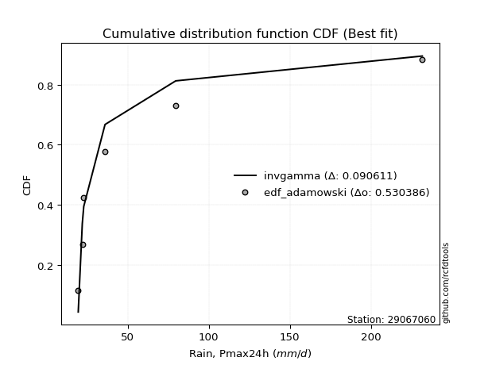</img></img>

</div>


## C. Best fit & Estimate extreme values for specific return periods - Tr

Best fit in probability distribution analysis means finding the theoretical distribution (like Normal, Poisson, Exponential, etc.) that most accurately mirrors your real-world data´s patterns (shape, center, spread) for better predictions, using methods like visual checks (Q-Q plots), goodness-of-fit tests (Kolmogorov-Smirnov, Chi-Squared), and information criteria (AIC) to score and select the simplest, most representative model.


### 1. Best fit (ordered by delta Δ)

:file_folder:Table: [bestfit_29067060.csv](table/bestfit_29067060.csv)

<div align="center">

|   id |   station | empirical_dist   | p_dist         |     delta |   deltao | eval   |   fit |   n |   best_fit |   best_fit_sort |
|-----:|----------:|:-----------------|:---------------|----------:|---------:|:-------|------:|----:|-----------:|----------------:|
|    0 |  29067060 | edf_hazen        | logweibull_min | 0.0870643 | 0.484421 | Δo > Δ |     1 |   7 |          1 |               1 |
|    1 |  29067060 | edf_gringorten   | logweibull_min | 0.089472  | 0.484421 | Δo > Δ |     1 |   7 |          1 |               2 |
|    2 |  29067060 | edf_cunnane      | logweibull_min | 0.0910326 | 0.484421 | Δo > Δ |     1 |   7 |          1 |               3 |
|    3 |  29067060 | edf_blom         | logweibull_min | 0.0919904 | 0.484421 | Δo > Δ |     1 |   7 |          1 |               4 |
|    4 |  29067060 | edf_tukey        | logweibull_min | 0.0935578 | 0.484421 | Δo > Δ |     1 |   7 |          1 |               5 |
|    5 |  29067060 | edf_filliben     | logweibull_min | 0.0941441 | 0.484421 | Δo > Δ |     1 |   7 |          1 |               6 |
|    6 |  29067060 | edf_beard        | logweibull_min | 0.0944201 | 0.484421 | Δo > Δ |     1 |   7 |          1 |               7 |
|    7 |  29067060 | edf_jenkinson    | logweibull_min | 0.0944201 | 0.484421 | Δo > Δ |     1 |   7 |          1 |               8 |
|    8 |  29067060 | edf_chegodayev   | logweibull_min | 0.0947863 | 0.484421 | Δo > Δ |     1 |   7 |          1 |               9 |
|    9 |  29067060 | edf_adamowski    | logweibull_min | 0.1       | 0.484421 | Δo > Δ |     1 |   7 |          1 |              10 |
|   10 |  29067060 | edf_california   | logfatiguelife | 0.103871  | 0.484421 | Δo > Δ |     1 |   7 |          1 |              11 |
|   11 |  29067060 | edf_weibull      | genextreme     | 0.117429  | 0.484421 | Δo > Δ |     1 |   7 |          1 |              12 |

</div>


### 2. Extreme values and % difference analysis

In hydrology, a return period (or recurrence interval $Tr$) is the statistical average time between extreme events like floods or droughts of a specific magnitude, indicating how rare an event is, with a 100-year flood, for example, having a 1% chance of occurring in any given year, not that it happens exactly every century. It is a key tool for infrastructure design (like bridges or dams) and risk assessment, calculated from historical data to determine the probability of future events, although it is important to remember it is statistical average, and events can cluster or be missed.

The extreme value porcentage difference is evaluated as $pdiff = 1 - (ETrBf / ETr) * 100$, where _ETrBf_ correspond to the bestfit extreme value for a specific recurrence interval and _ETr_ correspond to the extreme value for one of the most used PDFsused in hydrology.

> risk_rate: assuming the return period as the project useful life.

:file_folder:Table: [extreme_29067060.csv](table/extreme_29067060.csv), all PDFs.  
:file_folder:Table: [extremepdiff_29067060.csv](table/extremepdiff_29067060.csv), % difference between bestfit and most used PDFs in Hydrology.

<div align="center">

Extreme values table for only best fit PDFs
|   id |      tr |   prob_l |     prob_g |     alpha |   anglit |   arcsine |   argus |     beta |   betaprime |   bradford |      burr |   burr12 |   cosine |   crystalball |   dgamma |   dweibull |   erlang |   exponnorm |   exponpow |        exponweib |                f |   fatiguelife |   foldnorm |    gamma |   gausshyper |   genexpon |       genextreme |   gengamma |   genhalflogistic |   genlogistic |   gennorm |   genpareto |   gompertz |   gumbel_l |   gumbel_r |   halfgennorm |   halflogistic |   halfnorm |   hypsecant |         invgamma |   invgauss |       invweibull |   johnsonsb |        johnsonsu |         kappa3 |   kappa4 |   ksone |   kstwobign |   laplace |   levy_l |   loggamma |   logistic |   loglaplace |    lomax |   maxwell |    mielke |    moyal |   nakagami |       ncf |       nct |    norm |   pearson3 |   powerlaw |   rayleigh |     rdist |     rice |   semicircular |   skewnorm |                t |   trapezoid |   triang |   truncexpon |   truncnorm |   truncpareto |   truncweibull_min |   tukeylambda |   uniform |   vonmises |   vonmises_line |     wald |   weibull_max |   weibull_min |   wrapcauchy |         logalpha |   loganglit |   logarcsine |   logargus |   logbeta |   logbetaprime |   logbradford |     logburr |   logburr12 |   logcosine |   logcrystalball |   logdgamma |   logdweibull |   logerlang |   logexponnorm |   logexponpow |     logexponweib |             logf |   logfatiguelife |   logfoldnorm |   loggausshyper |   loggenexpon |    loggenextreme |    loggengamma |   loggenhalflogistic |   loggenlogistic |   loggennorm |   loggenpareto |   loggompertz |   loggumbel_l |   loggumbel_r |   loghalfgennorm |   loghalflogistic |   loghalfnorm |   loghypsecant |      loginvgamma |      loginvgauss |    loginvweibull |   logjohnsonsb |    logjohnsonsu |       logkappa3 |   logkappa4 |   logksone |   logkstwobign |   loglevy_l |   logloggamma |   loglogistic |     logloglaplace |   loglomax |   logmaxwell |        logmielke |   logmoyal |   lognakagami |    logncf |    lognct |   lognorm |   logpearson3 |   logpowerlaw |   lograyleigh |   logrdist |   logrice |   logsemicircular |   logskewnorm |     logt |   logtrapezoid |   logtriang |   logtruncexpon |   logtruncnorm |   logtruncpareto |   logtruncweibull_min |   logtukeylambda |   loguniform |   logvonmises |   logvonmises_line |    logwald |   logweibull_max |   logweibull_min |   logwrapcauchy |   station |   n |   risk_rate |
|-----:|--------:|---------:|-----------:|----------:|---------:|----------:|--------:|---------:|------------:|-----------:|----------:|---------:|---------:|--------------:|---------:|-----------:|---------:|------------:|-----------:|-----------------:|-----------------:|--------------:|-----------:|---------:|-------------:|-----------:|-----------------:|-----------:|------------------:|--------------:|----------:|------------:|-----------:|-----------:|-----------:|--------------:|---------------:|-----------:|------------:|-----------------:|-----------:|-----------------:|------------:|-----------------:|---------------:|---------:|--------:|------------:|----------:|---------:|-----------:|-----------:|-------------:|---------:|----------:|----------:|---------:|-----------:|----------:|----------:|--------:|-----------:|-----------:|-----------:|----------:|---------:|---------------:|-----------:|-----------------:|------------:|---------:|-------------:|------------:|--------------:|-------------------:|--------------:|----------:|-----------:|----------------:|---------:|--------------:|--------------:|-------------:|-----------------:|------------:|-------------:|-----------:|----------:|---------------:|--------------:|------------:|------------:|------------:|-----------------:|------------:|--------------:|------------:|---------------:|--------------:|-----------------:|-----------------:|-----------------:|--------------:|----------------:|--------------:|-----------------:|---------------:|---------------------:|-----------------:|-------------:|---------------:|--------------:|--------------:|--------------:|-----------------:|------------------:|--------------:|---------------:|-----------------:|-----------------:|-----------------:|---------------:|----------------:|----------------:|------------:|-----------:|---------------:|------------:|--------------:|--------------:|------------------:|-----------:|-------------:|-----------------:|-----------:|--------------:|----------:|----------:|----------:|--------------:|--------------:|--------------:|-----------:|----------:|------------------:|--------------:|---------:|---------------:|------------:|----------------:|---------------:|-----------------:|----------------------:|-----------------:|-------------:|--------------:|-------------------:|-----------:|-----------------:|-----------------:|----------------:|----------:|----:|------------:|
|    0 |    2    | 0.5      | 0.5        |   30.3558 |  68.46   |   68.46   | 110.381 |  30.1223 |     38.0073 |    53.4937 |   34.4182 |  35.993  |  84.9692 |        68.46  |  50.6007 |    22.9    |  29.4506 |     53.1623 |    47.9211 |     20.8951      |     24.0144      |       19.5003 |    52.2598 |  33.9649 |      50.8766 |    53.4365 |     28.0824      |    23.3252 |           159.395 |       54.8922 |   36.02   |     29.9428 |    58.0257 |    79.9805 |    56.9395 |       30.1025 |        51.2121 |    54.1053 |     68.46   |     28.4448      |    28.6176 |     28.0823      |     32.6739 |     19.5961      |  490.085       |  118.409 | 125.55  |     62.843  |   68.46   |  58.7087 |    26.5887 |    68.46   |      46.0777 |  65.7791 |   62.4624 |   31.8875 |  53.2203 |    50.719  |   42.6622 |   39.3474 |  68.46  |    50.087  |    20.6718 |    60.3352 | -0.787593 |  70.0152 |        68.46   |    77.1792 |     22.2637      |     178.177 |  163.227 |      83.191  |     64.93   |       28.0032 |            57.9223 |     -0.774271 |   125.55  | -1.75706   |         51.1721 |  45.7282 |       231.33  |       60.54   |      125.6   |    28.886        |     46.0777 |      46.0775 |    64.494  |   37.8357 |        34.7694 |       52.1047 |     35.4452 |     31.2447 |     50.9372 |          46.0777 |     31.8597 |       33.012  |     23.3923 |        35.3815 |       38.7817 |     41.35        |     29.5109      |          26.0008 |       40.44   |         35.0432 |       35.7447 |    28.9013       |  35.0566       |              101.741 |          39.3666 |      67.2027 |        52.6256 |       36.0597 |       52.8584 |       40.1668 |     26.6102      |           37.5168 |       38.8329 |        46.0777 |     29.5105      |     28.8687      |    28.9013       |        19.5183 |   19.5374       |    30.6123      |     56.6613 |    67.2027 |        40.6266 |     47.397  |       46.2548 |       46.0777 |     36.311        |    35.1231 |      42.8993 |     33.685       |    38.4254 |       38.8498 |   43.022  |   40.5167 |   46.0777 |       41.588  |       20.0881 |       41.8256 |    67.3703 |   44.6959 |           46.0777 |       43.7797 |  46.0778 |        124.303 |     76.6861 |         53.4582 |        34.6835 |          20.26   |               45.1358 |          39.398  |      67.2027 |     0.0788491 |            73.1145 |    35.1433 |          79.2909 |     33.0524      |         67.2027 |  29067060 |   7 |    0.75     |
|    1 |    2.33 | 0.570815 | 0.429185   |   33.5872 |  83.0365 |   90.3417 | 126.863 |  33.0185 |     43.3131 |    64.6279 |   38.9573 |  41.1249 |  99.2782 |        80.974 |  61.8071 |    24.4786 |  34.1352 |     60.5949 |    56.5507 |     22.8989      |     27.7417      |       21.3323 |    66.5968 |  39.1002 |      83.3463 |    60.9137 |     32.8063      |    26.1437 |           173.208 |       62.9904 |   39.6858 |     34.1125 |    66.5141 |    90.8678 |    68.5351 |       34.7935 |        63.1341 |    67.6112 |     78.4749 |     32.3579      |    32.1418 |     32.8061      |     68.7617 |     19.8469      | 7966.83        |  133.939 | 143.574 |     72.5096 |   76.0329 | 111.1    |    28.996  |    79.4857 |      50.4294 |  75.9758 |   75.4636 |   35.6893 |  64.197  |    67.0262 |   49.1569 |   45.0285 |  80.974 |    61.4893 |    22.6643 |    73.5287 | 14.932    |  80.6897 |        84.0935 |    87.1073 |     22.8116      |     190.5   |  174.529 |      98.6945 |     74.5974 |       30.9707 |            72.5348 |     11.0711   |   140.57  | -1.5815    |         60.1051 |  53.9337 |       231.509 |       75.1457 |      211.839 |    32.3643       |     54.8189 |      59.805  |    76.8171 |   46.3652 |        39.297  |       62.0936 |     40.0693 |     35.3046 |     59.6292 |          53.4879 |     39.2325 |       39.7068 |     25.0178 |        40.3511 |       45.0027 |     55.0165      |     33.0573      |          29.2606 |       47.8964 |         41.5825 |       40.7875 |    32.5003       |  70.4166       |              119.13  |          44.8296 |      67.2027 |        76.1188 |       41.1727 |       60.1812 |       46.1189 |     29.8287      |           43.2441 |       45.6139 |        51.9185 |     33.0568      |     32.2919      |    32.5001       |        19.567  |   19.612        |    34.7927      |     68.566  |    82.9303 |        46.4966 |     76.6646 |       53.7129 |       52.5476 |     40.6998       |    40.0338 |      50.0884 |     37.938       |    43.7953 |       48.6063 |   49.7648 |   46.4808 |   53.4879 |       48.2411 |       20.8967 |       48.9467 |    88.7768 |   51.3595 |           55.5138 |       50.3188 |  53.488  |        143.523 |     92.059  |         63.4815 |        39.0615 |          20.9007 |               53.5814 |          43.7742 |      80.0741 |     0.0905341 |            88.1645 |    38.7535 |          97.3947 |     39.7518      |        110.222  |  29067060 |   7 |    0.729209 |
|    2 |    5    | 0.8      | 0.2        |   58.6444 | 134.466  |  148.692  | 179.731 |  48.406  |     75.4991 |   125.058  |   70.8712 |  78.8513 | 150.843  |       127.479 |  96.3879 |    65.1921 |  65.3449 |     97.7563 |   100.469  |    108.608       |    117.263       |       60.2445 |   127.226  |  69.1643 |     215.039  |    98.298  |    105.498       |    66.7015 |           209.259 |       98.1717 |   70.1499 |     77.934  |   108.954  |   126.04   |   118.912  |       74.0204 |       117.079  |   124.726  |    118.647  |     81.1987      |    65.16   |    105.495       |    229.403  |     60.3692      |    1.51741e+09 |  185.492 | 201.906 |    113.571  |  113.895  | 197.901  |    46.1611 |   122.057  |      79.1841 | 126.957  |  126.635  |   64.785  | 115.042  |   166.116  |   87.3229 |   82.3264 | 127.479 |   115.207  |    59.2853 |   126.348  | 59.8531   | 123.424  |       137.444  |   129.092  |     30.5297      |     225.854 |  206.955 |     158.91   |    120.135  |       54.3673 |           137.805  |     48.9442   |   189.18  | -0.899013  |         94.5633 |  99.8684 |       231.599 |      168.296  |      228.34  |    78.1559       |    101.181  |     119.875  |   134.6    |  111.101  |        70.3429 |      118.255  |     73.18   |     72.2542 |    105.204  |          93.0979 |     64.7043 |       67.7069 |     37.3083 |        77.8469 |       86.5251 |    371.388       |     73.5714      |          67.5277 |       93.7168 |         91.526  |       78.2768 |    80.9348       |   2.66889e+08  |              179.718 |          78.8362 |      67.2027 |       177.562  |       78.736  |       91.5149 |       84.0618 |     67.4726      |           82.2461 |       90.0924 |        83.7972 |     73.5697      |     67.2397      |    80.9268       |        28.9193 |   27.209        |    86.3337      |    131.108  |   163.787  |        82.4871 |    170.059  |       93.4542 |       87.2728 |    107.665        |    77.5314 |      92.166  |     70.8146      |    80.2735 |      146.098  |   88.9999 |   83.67   |   93.0979 |       88.8542 |       35.3884 |       91.8513 |   184.538  |   89.5859 |          104.837  |       90.6562 |  93.098  |        216.799 |    155.495  |        118.883  |        67.3152 |          31.1867 |              104.967  |          61.176  |     141.188  |     0.153648  |           161.578  |    66.9954 |         164.296  |    127.393       |        194.36   |  29067060 |   7 |    0.67232  |
|    3 |   10    | 0.9      | 0.1        |  104.681  | 163.575  |  162.779  | 205.225 |  63.0696 |    116.929  |   169.609  |  121.729  | 140.38   | 181.996  |       158.33  | 123.794  |   141.807  | 100.523  |    131.49   |   138.311  |    770.76        |    791.349       |      113.972  |   172.09   | 100.093  |     230.547  |   132.234  |    406.919       |   180.508  |           221.54  |      126.826  |  110.424  |    196.042  |   147.48   |   145.622  |   159.942  |      137.548  |       161.878  |   166.989  |    150.726  |    247.928       |   129.869  |    406.902       |    231.803  |    986.302       |    2.80501e+13 |  208.524 | 227.358 |    144.835  |  148.266  | 218.856  |    72.2068 |   153.41   |     119.267  | 173.236  |  162.647  |  116.515  | 159.311  |   256.686  |  134.356  |  136.844  | 158.33  |   161.46   |   115.742  |   164.009  | 73.2456   | 153.895  |       164.819  |   160.16   |     84.8093      |     239.663 |  219.621 |     192.03   |    155.745  |       88.9902 |           178.697  |     64.8784   |   210.39  | -0.378202  |        120.344  | 148.616  |       231.6   |      276.784  |      230.196 |   394.851        |    143.137  |     141.786  |   176.403  |  184.83   |       120.35   |      163.191  |    131.53   |    166.253  |    148.253  |         134.463  |     93.747  |       99.2754 |     56.5545 |       141.353  |      140.95   |   3847.85        |    261.227       |         180.086  |      148.817  |        150.618  |      139.914  |   423.672        |   1.44875e+31  |              206.662 |         124.85   |      67.2027 |       215.425  |      139.012  |      115.568  |      137.073  |    205.849       |          140.272  |      149.08   |       122.815  |    261.226       |    169.261       |   423.512        |       881.415  | 2712.63         |   369.011       |    175.545  |   220.417  |       127.626  |    206.127  |      134.743  |      126.806  |    766.124        |   142.651  |     141.562  |    138.047       |   136.044  |      356.11   |  135.965  |  134.084  |  134.463  |      140.55   |       68.9866 |      143.879  |   219.544  |  133.205  |          145.275  |      140.148  | 134.463  |        254.7   |    190.825  |        163.146  |       101.319  |          57.3612 |              151.303  |          70.2591 |     180.829  |     0.22609   |           210.464  |   119.767  |         197.046  |    487.547       |        213.912  |  29067060 |   7 |    0.651322 |
|    4 |   15    | 0.933333 | 0.0666667  |  150.552  | 176.006  |  165.465  | 214.917 |  71.8096 |    148.858  |   188.044  |  167.489  | 196.009  | 196.187  |       173.725 | 139.221  |   202.49   | 122.896  |    151.224  |   159.139  |   2170.81        |   2577.83        |      149.111  |   195.437  | 119.113  |     231.398  |   152.086  |    924.062       |   310.495  |           225.195 |      142.992  |  138.836  |    349.547  |   170.016  |   154.491  |   183.092  |      189.815  |       187.231  |   188.983  |    169.033  |    504.298       |   188.845  |    924.015       |    231.853  |   4707.24        |    7.05814e+15 |  216.271 | 235.842 |    161.431  |  168.372  | 225.187  |    94.4048 |   170.492  |     151.557  | 200.307  |  181.124  |  166.663  | 185.002  |   306.11   |  169.523  |  183.114  | 173.725 |   187.901  |   145.921  |   183.414  | 76.3525   | 169.595  |       175.495  |   176.328  |    226.086       |     244.094 |  223.684 |     204.386  |    173.203  |      113.137  |           194.76   |     70.0129   |   217.46  | -0.0823233 |        134.921  | 179.919  |       231.6   |      349.199  |      230.716 |  1983.32         |    165.991  |     146.399  |   195.507  |  224.569  |       167.377  |      182.799  |    191.332  |    299.063  |    173.325  |         161.54   |    115.031  |      121.8    |     73.1246 |       200.378  |      181.11   |  19153.7         |    808.826       |         337.771  |      187.811  |        182.502  |      195.617  |  2155.92         |   3.83551e+58  |              215.417 |         161.82   |      67.2027 |       223.894  |      192.239  |      128.451  |      180.617  |    471.882       |          189.749  |      193.752  |       152.755  |    808.855       |    323.382       |  2154.35         |      4379.73   |    3.29612e+09  |  1368           |    193.481  |   243.351  |       160.906  |    218.459  |      161.664  |      155.435  |   6077.8          |   204.673  |     176.431  |    217.726       |   184.776  |      571.651  |  170.084  |  174.777  |  161.54   |      179.62   |       95.9545 |      181.312  |   226.824  |  163.413  |          164.984  |      175.808  | 161.54   |        268.213 |    203.782  |        182.605  |       123.192  |          80.9649 |              173.079  |          73.4194 |     196.377  |     0.279989  |           229.85   |   173.919  |         208.389  |   1188.21        |        219.848  |  29067060 |   7 |    0.644736 |
|    5 |   20    | 0.95     | 0.05       |  196.384  | 183.318  |  166.412  | 220.237 |  78.0595 |    175.92   |   198.05   |  210.321  | inf      | 204.914  |       183.806 | 149.997  |   252.329  | 139.352  |    165.224  |   173.335  |   4282.92        |   6000.28        |      175.127  |   211.003  | 132.908  |     231.537  |   166.171  |   1657.07        |   445.236  |           226.932 |      154.311  |  161.055  |    531.765  |   186.005  |   160.011  |   199.3    |      234.642  |       204.993  |   203.646  |    181.947  |    844.46        |   241.41   |   1656.98        |    231.859  |  13200.9         |    3.37247e+17 |  220.158 | 240.084 |    172.612  |  182.637  | 228.429  |   114.415  |   182.299  |     179.64   | 219.515  |  193.387  |  215.858  | 203.197  |   339.475  |  198.773  |  224.858  | 183.806 |   206.462  |   163.867  |   196.312  | 77.5861   | 180.03   |       181.416  |   187.107  |    493.514       |     246.28  |  225.689 |     210.856  |    183.885  |      130.523  |           203.34   |     72.5259   |   220.995 |  0.125579  |        145.331  | 203.247  |       231.6   |      404.232  |      230.966 |  9948.03         |    181.104  |     148.059  |   206.859  |  249.185  |       213.489  |      193.702  |    254.009  |    477.9    |    190.806  |         182.161  |    132.547  |      139.966  |     88.1363 |       256.668  |      213.652  |  66075.7         |   2313.02        |         536.826  |      218.814  |        201.852  |      247.635  | 10787.8          |   2.01347e+87  |              219.702 |         194.045  |      67.2027 |       227.076  |      241.089  |      137.184  |      219.101  |    924.039       |          234.481  |      230.746  |       178.17   |   2313.21        |    535.028       | 10775.7          |      6564.79   |    1.39647e+21  |  4677.4         |    203.074  |   255.698  |       188.087  |    225.057  |      182.117  |      178.918  |  51915.8          |   264.944  |     204.192  |    311.698       |   229.515  |      785.105  |  197.877  |  210.446  |  182.161  |      212.196  |      116.09   |      211.435  |   229.42   |  187.191  |          177.046  |      204.493  | 182.161  |        275.14  |    210.494  |        193.476  |       138.629  |         100.046  |              185.61   |          75.0058 |     204.646  |     0.325745  |           240.202  |   229.656  |         214.134  |   2333.7         |        222.78   |  29067060 |   7 |    0.641514 |
|    6 |   25    | 0.96     | 0.04       |  242.2    | 188.273  |  166.851  | 223.668 |  82.9292 |    199.874  |   204.325  |  251.125  | inf      | 211.034  |       191.228 | 158.28   |   294.774  | 152.393  |    176.084  |   184.025  |   7053.59        |  11573.3         |      195.798  |   222.584  | 143.751  |     231.575  |   177.096  |   2606.05        |   580.905  |           227.942 |      163.029  |  179.438  |    738.824  |   198.408  |   163.939  |   211.785  |      274.222  |       218.679  |   214.556  |    191.942  |   1264.56        |   288.53   |   2605.89        |    231.861  |  28234.9         |    6.61806e+18 |  222.495 | 242.629 |    180.986  |  193.701  | 230.463  |   132.942  |   191.331  |     204.959  | 234.414  |  202.491  |  264.371  | 217.3    |   364.426  |  224.307  |  263.561  | 191.228 |   220.765  |   175.662  |   205.894  | 78.2106   | 187.784  |       185.257  |   195.127  |    925.061       |     247.582 |  226.884 |     214.839  |    191.174  |      143.547  |           208.678  |     74.0106   |   223.116 |  0.283658  |        153.484  | 221.931  |       231.6   |      448.903  |      231.115 | 49869.6          |    192.121  |     148.836  |   214.526  |  265.953  |       259.392  |      200.631  |    319.967  |    inf      |    204.106  |         199.006  |    147.721  |      155.452  |    102.085  |       311.008  |      241.331  | 182398           |   6259.71        |         775.057  |      244.897  |        214.721  |      297.006  | 53331            |   1.55051e+116 |              222.229 |         223.179  |      67.2027 |       228.613  |      286.805  |      143.759  |      254.248  |   1634.81        |          276.016  |      262.784  |       200.708  |   6260.57        |    809.501       | 53248.6          |      7473.86   |    1.84113e+39  | 15126           |    209.025  |   263.404  |       211.415  |    229.299  |      198.793  |      199.25   | 469332            |   324.036  |     227.591  |    421.218       |   271.52   |      994.682  |  221.747  |  242.88   |  199.006  |      240.635  |      131.317  |      237.013  |   230.626  |  207.072  |          185.339  |      228.832  | 199.006  |        279.353 |    214.598  |        200.406  |       150.157  |         115.285  |              193.735  |          75.9545 |     209.773  |     0.366774  |           246.636  |   286.933  |         217.603  |   4032.13        |        224.535  |  29067060 |   7 |    0.639603 |
|    7 |   50    | 0.98     | 0.02       |  471.205  | 200.471  |  167.437  | 231.446 |  98.1477 |    294.774  |   217.512  |  437.023  | inf      | 227.059  |       212.48  | 183.678  |   447.168  | 194.141  |    209.818  |   215.566  |  29085.8         |  89314.7         |      262.119  |   256.247  | 178.072  |     231.599  |   211.033  |  10592.7         |  1239.6    |           229.874 |      189.887  |  242.775  |   2074.63   |   236.934  |   174.602  |   250.245  |      426.875  |       260.845  |   246.268  |    222.931  |   4482.04        |   470.198  |  10591.9         |    231.862  | 249467           |    6.31903e+22 |  227.182 | 247.72  |    205.578  |  228.072  | 235.045  |   212.834  |   218.927  |     308.71   | 280.693  |  228.893  |  500.493  | 261.082  |   437.229  |  322.907  |  430.987  | 212.48  |   264.767  |   201.779  |   233.712  | 79.162    | 210.29   |       194.033  |   218.438  |   6823.88        |     250.166 |  229.254 |     223.047  |    208.513  |      178.22   |           219.812  |     76.9068   |   227.358 |  0.723888  |        178.716  | 282.937  |       231.6   |      598.085  |      231.408 |     1.5748e+08   |    222.18   |     149.879  |   232.979  |  305.507  |       493.369  |      215.432  |    702.434  |    inf      |    243.494  |         256.364  |    205.485  |      212.533  |    162.65   |       564.724  |      341.79   |      5.7309e+06  | 555546           |        2510.67   |      338.242  |        243.483  |      519.3    |     1.4041e+08   |   7.79448e+253 |              227.14  |         343.396  |      67.2027 |       230.782  |      486.605  |      163.238  |      402.072  |  12803.9         |          456.208  |      383.461  |       290.364  | 555800           |   3300.12        |     1.39855e+08  |      8291.64   |    3.12677e+244 |     3.2579e+06  |    221.321  |   279.522  |       298.016  |    239.147  |      255.386  |      276.833  |      5.05285e+10  |   609.488  |     311.746  |   1243.62        |   457.5    |     1980.88   |  310.979  |  378.82   |  256.364  |      350.049  |      171.701  |      330.17   |   232.231  |  277.568  |          205.77   |      317.301  | 256.364  |        287.904 |    222.98   |        215.267  |       181.193  |         158.998  |              211.511  |          77.8282 |     220.417  |     0.53721   |           260.025  |   593.626  |         224.585  |  24898.4         |        228.053  |  29067060 |   7 |    0.63583  |
|    8 |   75    | 0.986667 | 0.0133333  |  700.178  | 205.84   |  167.546  | 234.531 | 107.097  |    368.45   |   222.105  |  605.407  | inf      | 234.713  |       223.884 | 198.357  |   550.367  | 219.263  |    229.552  |   232.941  |  61609.2         | 295343           |      302.061  |   274.572  | 198.512  |     231.6    |   230.884  |  23986.3         |  1852.61   |           230.484 |      205.498  |  284.098  |   3810.77   |   259.47   |   179.994  |   272.599  |      539.322  |       285.356  |   263.53   |    241.04   |   9429.66        |   600.197  |  23984.3         |    231.862  | 803244           |    1.29658e+25 |  228.748 | 249.416 |    219.108  |  248.178  | 236.927  |   280.981  |   234.865  |     392.288  | 307.764  |  243.248  |  730.012  | 286.685  |   476.891  |  397.291  |  574.305  | 223.884 |   290.263  |   211.287  |   248.845  | 79.3772   | 222.534  |       197.538  |   231.128  |  22185.7         |     251.022 |  230.039 |     225.859  |    215.397  |      193.347  |           223.665  |     77.8409   |   228.772 |  0.921077  |        192.226  | 320.477  |       231.6   |      692.25   |      231.505 |     4.96738e+11  |    236.858  |     150.074  |   240.73   |  321.134  |       740.396  |      220.663  |   1175      |    inf      |    264.901  |         293.68   |    248.345  |      253.248  |    214.733  |       800.534  |      411.407  |      5.24596e+07 |      3.07104e+07 |        5089.13   |      402.308  |        253.934  |      717.138  |     3.28291e+11  | inf            |              228.711 |         441.132  |      67.2027 |       231.217  |      658.167  |      174.072  |      524.803  |  52622           |          610.967  |      471.044  |       360.302  |      3.07354e+07 |   8088.18        |     3.26107e+11  |      8367.83   |  inf            |     4.34802e+08 |    225.508  |   285.111  |       359.977  |    243.315  |      292.062  |      334.739  |      1.03375e+16  |   885.97   |     369.907  |   2642.97        |   620.72   |     2882.39   |  375.723  |  491.973  |  293.68   |      431.904  |      189.031  |      395.421  |   232.525  |  325.535  |          214.548  |      379.093  | 293.68   |        290.792 |    225.827  |        220.54   |       195.064  |         179.198  |              217.933  |          78.4385 |     224.083  |     0.676893  |           264.648  |   928.54   |         226.924  |  78272           |        229.231  |  29067060 |   7 |    0.634587 |
|    9 |  100    | 0.99     | 0.01       |  929.143  | 209.032  |  167.584  | 236.253 | 113.461  |    431.046  |   224.44   |  763.387  | inf      | 239.509  |       231.596 | 208.709  |   629.736  | 237.34   |    243.552  |   244.83   | 101899           | 690041           |      330.8    |   287.056  | 213.146  |     231.6    |   244.969  |  42790.2         |  2424.92   |           230.781 |      216.546  |  315.292  |   5871.66   |   275.459  |   183.521  |   288.421  |      630.591  |       302.704  |   275.29   |    253.886  |  15994.4         |   702.283  |  42786.5         |    231.862  |      1.77148e+06 |    5.60974e+26 |  229.532 | 250.265 |    228.378  |  262.443  | 238.028  |   342.503  |   246.118  |     464.978  | 326.972  |  253.026  |  955.366  | 304.849  |   503.884  |  459.345  |  703.954  | 231.596 |   308.263  |   216.2    |   259.155  | 79.4621   | 230.876  |       199.501  |   239.773  |  51265.2         |     251.449 |  230.43  |     227.279  |    219.11   |      201.802  |           225.62   |     78.299    |   229.479 |  1.02983   |        200.534  | 347.847  |       231.6   |      761.985  |      231.554 |     1.56641e+15  |    246.042  |     150.142  |   245.169  |  329.609  |      1002.28   |      223.337  |   1739.45   |    inf      |    279.268  |         321.952  |    283.712  |      285.959  |    262.022  |      1025.42   |      465.988  |      2.74817e+08 |      1.28402e+09 |        8458.18   |      452.407  |        259.288  |      900.128  |     7.1165e+14   | inf            |              229.477 |         526.689  |      67.2027 |       231.377  |      812.913  |      181.544  |      633.694  | 158190           |          751.283  |      541.906  |       419.904  |      1.28555e+09 |  15734           |     7.04868e+14  |      8386.55   |  inf            |     4.36612e+10 |    227.609  |   287.947  |       409.715  |    245.786  |      319.78   |      382.775  |      3.27243e+21  |  1157.62   |     415.618  |   4806.05        |   770.731  |     3721.01   |  428.344  |  592.982  |  321.952  |      499.667  |      198.605  |      447.116  |   232.627  |  362.879  |          219.626  |      427.945  | 321.952  |        292.243 |    227.26   |        223.239  |       202.943  |         190.723  |              221.244  |          78.7389 |     225.939  |     0.795813  |           266.99   |  1286.63   |         228.094  | 182521           |        229.821  |  29067060 |   7 |    0.633968 |
|   10 |  200    | 0.995    | 0.005      | 1844.98   | 215.063  |  167.62   | 239.246 | 128.828  |    626.861  |   227.99   | 1336.79   | inf      | 249.262  |       249.092 | 233.475  |   841.516  | 281.611  |    277.287  |   272.109  | 314344           |      5.33199e+06 |      401.149  |   315.607  | 248.78   |     231.6    |   278.905  | 172152           |  4427.89   |           231.21  |      243.108  |  396.741  |  16664.8    |   313.985  |   191.188  |   326.457  |      893.642  |       344.412  |   302.187  |    284.833  |  57186.3         |   978.625  | 172135           |    231.862  |      1.06533e+07 |    4.80535e+30 |  230.711 | 251.537 |    249.73   |  296.813  | 240.113  |   553.307  |   273.111  |     700.349  | 373.251  |  275.395  | 1831.85   | 348.612  |   565.479  |  648.318  | 1149.29   | 249.092 |   351.378  |   223.774  |   282.746  | 79.5566   | 249.963  |       202.924  |   259.544  | 386083           |     252.087 |  231.016 |     229.428  |    225.077  |      215.79   |           228.588  |     78.9698   |   230.54  |  1.20342   |        215.124  | 416.023  |       231.6   |      939.509  |      231.627 |     1.54781e+29  |    264.375  |     150.207  |   253.078  |  343.482  |      2198.12   |      227.424  |   4964.44   |    inf      |    310.927  |         396.583  |    389.632  |      379.965  |    425.584  |      1861.94   |      616.306  |      1.96657e+10 |      8.27389e+14 |       29307.1    |      590.46   |        267.402  |     1547.43   |     9.93867e+27  | inf            |              230.59  |         806.556  |      67.2027 |       231.539  |     1338.36   |      198.91   |      997.091  |      3.17551e+06 |         1234.98   |      746.661  |       607.175  |      8.29683e+14 |  85415           |     9.71932e+27  |      8399.41   |  inf            |     8.92229e+17 |    230.749  |   292.254  |       552.002  |    250.535  |      392.693  |      528.015  |      5.53274e+44  |  2220.56   |     542.584  |  26104.6         |  1298.36   |     6668.13   |  582.338  |  935.754  |  396.584  |      703.045  |      214.246  |      592.259  |   232.725  |  465.24   |          228.769  |      564.66   | 396.583  |        294.429 |    229.423  |        227.37   |       216.213  |         210.107  |              226.341  |          79.1804 |     228.752  |     1.12091   |           270.542  |  2899.34   |         229.85   |      1.56731e+06 |        230.709  |  29067060 |   7 |    0.633042 |
|   11 |  250    | 0.996    | 0.004      | 2302.9    | 216.598  |  167.625  | 239.946 | 133.783  |    706.589  |   228.707  | 1601.61   | inf      | 251.936  |       254.438 | 241.404  |   915.778  | 296.047  |    288.146  |   280.513  | 441573           |      1.02984e+07 |      424.076  |   324.391  | 260.349  |     231.6    |   289.831  | 269340           |  5309.3    |           231.293 |      251.648  |  424.83   |  23321.5    |   326.388  |   193.443  |   338.685  |      992.373  |       357.821  |   310.461  |    294.796  |  86195.6         |  1075.87   | 269312           |    231.862  |      1.84327e+07 |    8.82923e+31 |  230.947 | 251.792 |    256.338  |  307.878  | 240.655  |   646.124  |   281.777  |     799.061  | 388.15   |  282.281  | 2260.25   | 362.701  |   584.379  |  723.489  | 1345.68   | 254.438 |   365.191  |   225.319  |   290.008  | 79.5701   | 255.838  |       203.727  |   265.627  | 739616           |     252.215 |  231.133 |     229.861  |    226.334  |      218.796  |           229.187  |     79.1007   |   230.752 |  1.23926   |        218.314  | 438.578  |       231.6   |      999.409  |      231.641 |     1.53839e+36  |    269.256  |     150.215  |   254.966  |  346.49   |      2882.07   |      228.252  |   7199.31   |    inf      |    320.217  |         422.673  |    431.136  |      415.433  |    498.213  |      2256.14   |      670.649  |      8.44139e+10 |      3.72908e+17 |       43931.7    |      640.537  |        269.021  |     1839.2    |     3.09437e+34  | inf            |              230.805 |         924.986  |      67.2027 |       231.56   |     1566.71   |      204.329  |     1153.51   |      9.29206e+06 |         1448.96   |      824.038  |       683.711  |      3.74246e+17 | 150806           |     3.00552e+34  |      8400.48   |  inf            |     2.20895e+21 |    231.372  |   293.123  |       605.348  |    251.785  |      418.101  |      585.459  |      7.46517e+56  |  2744.47   |     588.986  |  49072.6         |  1535.71   |     7976.9    |  641.435  | 1086.26   |  422.673  |      782.751  |      217.573  |      645.795  |   232.736  |  502.221  |          230.968  |      614.931  | 422.673  |        294.868 |    229.857  |        228.208  |       219.108  |         214.319  |              227.38   |          79.2668 |     229.319  |     1.22276   |           271.258  |  3793.42   |         230.201  |      3.2331e+06  |        230.887  |  29067060 |   7 |    0.632858 |
|   12 |  500    | 0.998    | 0.002      | 4592.48   | 220.403  |  167.631  | 241.557 | 149.186  |   1022.94   |   230.149  | 2810.1    | inf      | 259.051  |       270.293 | 265.917  |  1165      | 341.366  |    321.881  |   305.553  |      1.19416e+06 |      7.95777e+07 |      495.997  |   350.579  | 296.533  |     231.6    |   323.767  |      1.08063e+06 |  9032.55   |           231.454 |      278.152  |  517.81   |  66266      |   364.913  |   199.909  |   376.639  |     1347.3    |       399.439  |   335.131  |    325.741  | 308371           |  1400.26   |      1.0805e+06  |    231.862  |      9.36903e+07 |    7.40448e+35 |  231.419 | 252.301 |    276.14   |  342.249  | 242.057  |  1047.8    |   308.653  |    1203.54   | 434.429  |  302.829  | 4346.49   | 406.463  |   640.574  | 1014.35   | 2196.51   | 270.293 |   407.923  |   228.439  |   311.675  | 79.5906   | 273.368  |       205.575  |   283.762  |      5.57207e+06 |     252.47  |  231.366 |     230.728  |    228.918  |      225.037  |           230.39   |     79.3573   |   231.176 |  1.31164   |        224.884  | 510.294  |       231.6   |     1193.63   |      231.67  |     1.4918e+71   |    281.748  |     150.226  |   259.359  |  352.878  |      7114.22   |      229.92   |  25730.6    |    inf      |    346.312  |         510.575  |    589.058  |      544.811  |    815.768  |      4096.67   |      859.171  |      9.97309e+12 |      3.41597e+29 |      156352      |      815.463  |        272.221  |     3129.44   |     3.17155e+66  | inf            |              231.222 |        1415.18   |      67.2027 |       231.589  |     2533.19   |      220.697  |     1813.21   |      3.70517e+08 |         2379.27   |     1105.67   |       988.611  |      3.44233e+29 | 940248           |     2.96984e+66  |      8401.65   |  inf            |     8.40912e+36 |    232.606  |   294.869  |       798.124  |    255.045  |      503.425  |      806.478  |      5.12501e+120 |  5334.98   |     752.4    | 480337           |  2587      |    13600      |  861.224  | 1741.14   |  510.575  |     1085.43   |      224.439  |      836.047  |   232.752  |  630.972  |          236.113  |      792.978  | 510.575  |        295.746 |    230.727  |        229.896  |       225.168  |         223.108  |              229.477  |          79.4368 |     230.457  |     1.48166   |           272.696  |  8916.56   |         230.902  |      3.36774e+07 |        231.243  |  29067060 |   7 |    0.632489 |
|   13 |  750    | 0.998667 | 0.00133333 | 6882.05   | 222.088  |  167.632  | 242.204 | 158.199  |   1268.78   |   230.632  | 3905.97   | inf      | 262.499  |       279.1   | 280.188  |  1323.61   | 368.165  |    341.614  |   319.515  |      2.05718e+06 |      2.63179e+08 |      538.491  |   365.21   | 317.853  |     231.6    |   343.619  |      2.43454e+06 | 12079.3    |           231.505 |      293.647  |  576.175  | 122081      |   387.45   |   203.365  |   398.827  |     1591.5    |       423.768  |   348.914  |    343.842  | 650017           |  1603.94   |      2.43423e+06 |    231.862  |      2.31177e+08 |    1.45579e+38 |  231.577 | 252.471 |    287.264  |  362.354  | 242.722  |  1391.76   |   324.355  |    1529.38   | 461.5    |  314.322  | 6375.05   | 432.062  |   671.862  | 1234.08   | 2925.46   | 279.1   |   432.813  |   229.488  |   323.791  | 79.5952   | 283.171  |       206.319  |   293.894  |      1.81568e+07 |     252.555 |  231.444 |     231.019  |    229.801  |      227.188  |           230.793  |     79.4407   |   231.317 |  1.33591   |        227.113  | 553.293  |       231.6   |     1312.76   |      231.68  |     1.44645e+106 |    287.463  |     150.228  |   261.146  |  355.172  |     12651.5    |      230.479  |  59427      |    inf      |    359.712  |         567.078  |    706.05   |      635.992  |   1090.96   |      5807.31   |      983.99   |      1.9246e+14  |      1.71793e+40 |      330942      |      932.531  |        273.264  |     4256.05   |     1.08563e+98  | inf            |              231.355 |        1814.57   |      67.2027 |       231.595  |     3335.32   |      229.975  |     2361.99   |      4.12656e+09 |         3179.5    |     1303.03   |      1226.61   |      1.73833e+40 |      2.85551e+06 |     9.77547e+97  |      8401.82   |  inf            |     1.40053e+51 |    233.01   |   295.454  |       932.222  |    256.606  |      558.061  |      972.427  |      1.21196e+188 |  7907.78   |     862.835  |      2.36612e+06 |  3509.81   |    18312.4    | 1019.82   | 2309.94   |  567.078  |     1308.75   |      226.793  |      965.909  |   232.754  |  716.86   |          238.216  |      914.022  | 567.078  |        296.039 |    231.018  |        230.462  |       227.274  |         226.151  |              230.181  |          79.4924 |     230.837  |     1.58638   |           273.177  | 14884.7    |         231.136  |      1.41358e+08 |        231.362  |  29067060 |   7 |    0.632366 |
|   14 | 1000    | 0.999    | 0.001      | 9171.63   | 223.092  |  167.632  | 242.567 | 164.594  |   1477.72   |   230.873  | 4934.6    | inf      | 264.674  |       285.164 | 290.286  |  1441.82   | 387.291  |    355.615  |   329.139  |      2.98036e+06 |      6.14915e+08 |      568.803  |   375.314  | 333.039  |     231.6    |   357.703  |      4.33143e+06 | 14727.7    |           231.53  |      304.637  |  619.35   | 188336      |   403.439  |   205.691  |   414.566  |     1782.46   |       441.026  |   358.432  |    356.685  |      1.10333e+06 |  1753.94   |      4.33086e+06 |    231.862  |      4.30537e+08 |    6.16611e+39 |  231.656 | 252.555 |    294.971  |  376.619  | 243.139  |  1703.01   |   335.491  |    1812.78   | 480.708  |  322.265  | 8367.05   | 450.225  |   693.424  | 1417.49   | 3585.08   | 285.164 |   450.43   |   230.014  |   332.164  | 79.597    | 289.945  |       206.737  |   300.891  |      4.19795e+07 |     252.597 |  231.483 |     231.164  |    230.246  |      228.277  |           230.994  |     79.4817   |   231.388 |  1.34806   |        228.232  | 584.224  |       231.6   |     1399.67   |      231.685 |     1.40244e+141 |    290.923  |     150.228  |   262.155  |  356.37   |     19474.2    |      230.76   | 112635      |    inf      |    368.43   |         609.574  |    802.456  |      708.697  |   1342.01   |      7438.69   |     1079.4    |      1.69202e+15 |      1.55682e+50 |      564953      |     1022.77   |        273.777  |     5285.75   |     1.84014e+129 | inf            |              231.42  |        2164.49   |      67.2027 |       231.597  |     4043.71   |      236.438  |     2849.26   |      2.56703e+10 |         3905.5    |     1459.54   |      1429.47   |      1.58178e+50 |      6.38189e+06 |     1.59071e+129 |      8401.87   |  inf            |     3.56582e+64 |    233.21   |   295.746  |      1038.12   |    257.592  |      599.054  |     1110.42   |      7.28211e+257 | 10477.5    |     948.499  |      8.39717e+06 |  4357.97   |    22484      | 1148.3    | 2832.29   |  609.574  |     1492.1    |      227.982  |     1067.26   |   232.755  |  782.951  |          239.405  |     1008.24   | 609.574  |        296.186 |    231.163  |        230.746  |       228.343  |         227.694  |              230.535  |          79.5198 |     231.028  |     1.64236   |           273.418  | 21519      |         231.252  |      4.02042e+08 |        231.422  |  29067060 |   7 |    0.632305 |


</div>


<div align="center">

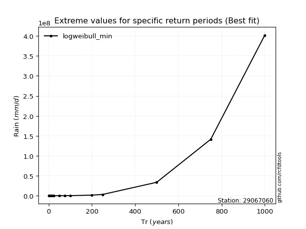</img>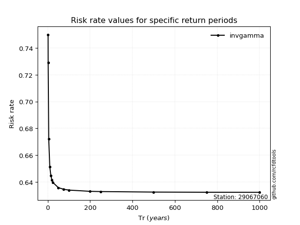</img>

</div>


<sub>**APP DISCLAIMER**: NO WARRANTY - This software is provided by [github.com/rcfdtools](https://github.com/rcfdtools) "as is", without any express or implied warranty, including warranties of merchantability, fitness for a particular purpose, or non-infringement. There is no guarantee that the software will be error-free or operate without interruption. LIMITATION OF LIABILITY - Neither the authors nor copyright holders will be liable for claims or damages arising from the software or its use. You are responsible for determining if the software is appropriate for your use and assume all associated risks, including errors, legal compliance, and data loss. NO PROFESSIONAL ADVICE - The software provides general information and does not offer professional advice. It should not replace consultation with professional advisors.</sub>