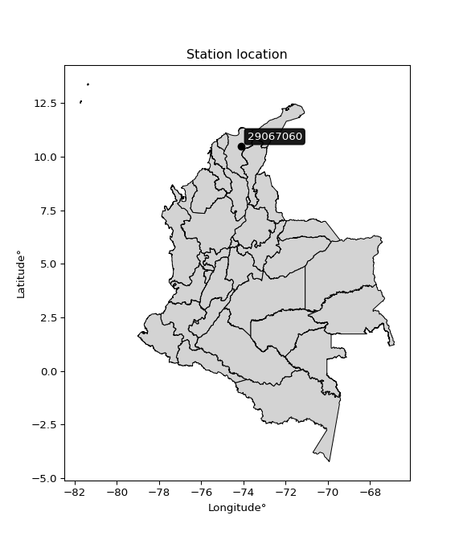

<div align="center">


</div>

# PMP Station (Rain, Pmax24h): 29067060

Probable Maximum Precipitation (PMP) is the greatest amount of rainfall for a specific duration that is meteorologically possible for a given location, acting as a "worst-case" scenario for extreme storms, crucial for designing safety-critical infrastructure like bridges, river deviations, dams, spillways, and nuclear plants to prevent catastrophic failure. PMP is calculated by hydrologists using meteorological data to determine the upper limit of extreme rainfall, often leading to the Probable Maximum Flood (PMF) for flood control design, and is increasingly being studied for climate change impacts. Probable Maximum Precipitation (PMP) is the theoretical upper limit of rainfall, a deterministic estimate for extreme events, while probability distributions (like GEV, Gumbel) describe the likelihood and frequency of various precipitation amounts, including rare ones, showing how often events occur, with PMP representing the extreme end of these distributions, used for critical infrastructure design to ensure safety against the worst conceivable weather, unlike standard statistical forecasts which cover typical probabilities.

The most common probability distributions in hydrology, used for analyzing floods, rainfall, and streamflow, include the Normal, Log-Normal, Gumbel, Gamma (including Log-Pearson Type III), and Generalized Extreme Value (GEV) distributions, often chosen based on the data´s skewness and whether modeling extremes or general conditions, with Gumbel and GEV popular for extreme events like floods, while the Normal distribution serves as a baseline, though often requiring transformations for skewed hydrological data. These distributions help in designing water infrastructure, managing water resources, and forecasting hydrologic events.

> Hydrological data often isn´t perfectly normal (it´s skewed), so different distributions are needed for different applications, such as: **Flood Frequency Analysis**: Using Gumbel, GEV, or Log-Pearson Type III for predicting extreme flood magnitudes and their return periods, **Rainfall Analysis**: Normal for annual totals, but Log-Normal, Weibull, or GEV for intensity or extreme daily rainfall, **Streamflow Modeling**: Gamma and Log-Normal for maximum flows, GEV for minimum flows, and Kappa for daily flows.

<div align="center">

</img>

</div>


## A. General information


### 1. General running parameters

• app_version: _v20260108_. • runtime: _2026-01-08 13:24:42.400241_. • Python version: _3.14.0_. • SciPy version: _1.16.3_. • Pandas version: _2.3.3_. • NumPy version: _2.3.5_. • Stations dataset (station_dataset_file): _dataset/pmax24h_in/automatic_colombia_2003_2024.csv_. • Stations catalog (station_catalog_file): _dataset/CNE.xls_. • Minimum year to eval til year_max (date_min): _1900_. • Maximum year to eval since year_min (date_max): _2024_. • Creates, save and include plots into reports (create_plot): _False_. • Plot only fit distributions with Δo > Δ (plot_only_fit): _True_. • Plot only simple graphs avoiding multiple CDFs and multiple Extreme values plots (plot_only_simple): _True_. • Eval low extreme values, if False, evaluates high extreme values (low_extreme): _False_. • Eval every SciPy distribution as logarithmic (pdist_logarithmic_on): _True_. • Standard deviation normalized (ddof): _1.0_. • Return periods to eval in years (Tr): _[2, 2.33, 5, 10, 15, 20, 25, 50, 75, 100, 200, 250, 500, 750, 1000]_. • Minimum data sample per station, 0 means any (minimum_sample): _5_. • Z-Score maximum threshold to adjust a value, 0 means disable (zscore_max): _3.5_. • Z-Score minimum threshold to adjust a value, 0 means disable (zscore_min): _-2.5_. • Avoid zeros, e.g. rain = 0 (avoid_zeros): _True_. • Avoid null values (avoid_nans): _True_. 

:file_folder:Table: [dataset.csv](../../dataset/pmax24h_in/automatic_colombia_2003_2024.csv)

> Delta Degrees of Freedom (DDOF): is a parameter used in the formulas for calculating variance and standard deviation. When ddof=0, the divisor is $N$ (the total number of observations) and this is used when your data set is the entire population. When ddof=1, the divisor is $N-1$ and this is used when your data set is a sample drawn from a larger population. Using $N-1$ provides an unbiased estimate of the population variance (known as Bessel´s correction).


### 2. Station info and location

|   id |   CODIGO | NOMBRE                                 | CATEGORIA    | TECNOLOGIA                              | ESTADO   | FECHA_INSTALACION   |   FECHA_SUSPENSION |   ALTITUD |   LATITUD |   LONGITUD | DEPARTAMENTO   | MUNICIPIO   | AREA_OPERATIVA                                         | ENTIDAD                                                     | AREA_HIDROGRAFICA   | ZONA_HIDROGRAFICA   | SUBZONA_HIDROGRAFICA      | CORRIENTE   | Catalogo   |   Version |
|-----:|---------:|:---------------------------------------|:-------------|:----------------------------------------|:---------|:--------------------|-------------------:|----------:|----------:|-----------:|:---------------|:------------|:-------------------------------------------------------|:------------------------------------------------------------|:--------------------|:--------------------|:--------------------------|:------------|:-----------|----------:|
|    0 | 29067060 | PUERTO RICO HACIENDA  - AUT [29067060] | Limnigráfica | Automática con Telemetría, Convencional | Activa   | 15/06/1967          |                nan |        64 |   10.4966 |   -74.1283 | Magdalena      | Aracataca   | Area Operativa 05 - Magdalena-Cesar-Guajira-San Andrés | INSTITUTO DE HIDROLOGIA METEOROLOGIA Y ESTUDIOS AMBIENTALES | Magdalena Cauca     | Bajo Magdalena      | Cga Grande de Santa Marta | Fundacion   | CNE_IDEAM  |  20251226 |

<div align="center">

Dynamic map: [:earth_americas:Google](http://maps.google.com/maps?q=10.496596,-74.128263) [:earth_americas:OSM](https://www.openstreetmap.org/#map=18/10.496596/-74.128263&layers=P) [:earth_americas:Bing](https://www.bing.com/maps?cp=10.496596~-74.128263&lvl=18) [:earth_americas:Apple](https://maps.apple.com/frame?center=10.496596%2C-74.128263&span=0.003%2C0.006)

</div>


<div align="center">

```geojson
{
  "type": "Feature",
  "geometry": {
    "type": "Point", 
    "coordinates": [-74.128263, 10.496596]
  }, 
  "properties": {
    "Name": "29067060"
  }
}
```

</div>


### 3. Discrete values table and plot

<div align="center">

|               |          0 |           1 |           2 |           3 |           4 |         5 |
|:--------------|-----------:|------------:|------------:|------------:|------------:|----------:|
| Date          | 2019       | 2020        | 2021        | 2022        | 2023        | 2024      |
| Value         |  231.6     |   79.6      |   22        |   19.5      |   22.9      |   36.02   |
| Value_initial |  231.6     |   79.6      |   22        |   19.5      |   22.9      |   36.02   |
| count         |    6       |    6        |    6        |    6        |    6        |    6      |
| mean          |   68.6033  |   68.6033   |   68.6033   |   68.6033   |   68.6033   |   68.6033 |
| std           |   82.9727  |   82.9727   |   82.9727   |   82.9727   |   82.9727   |   82.9727 |
| zscore        |    1.96446 |    0.132534 |   -0.561671 |   -0.591801 |   -0.550824 |   -0.3927 |


</div>


> The initial value (value_initial) correspond to the initial obtained or null completed value, and value (value) is adjusted only when the initial value is outside the valid range (outlier) definite through the Z-Score value. If Z-Score is active, values out of range or outliers are replaced with the station mean value. A Z-Score (or standard score) measures how many standard deviations a data point is from the mean of a dataset, indicating its relative position; positive scores mean above the mean, negative mean below, and a score of zero is exactly at the mean, allowing for comparison of values from different distributions. It´s calculated using the formula $z=(x–μ)/σ$, where $x$ is the data point, $μ$ is the mean, and $σ$ is the standard deviation, helping identify outliers and understand probability.
>
> <sub>**Note**: In this study, "completing" (filling gaps in) and "extending" (forecasting or lengthening the historical record) rainfall data series are avoided for certain critical analyses because they introduce artificial bias and uncertainty, which can distort the statistics of rare events (extremes), alter day-to-day variability, and compromise the integrity and homogeneity of the original data. Some reasons against Completing/Extending rainfall data are: **Distortion of Extremes and Variability**: The primary issue is that most gap-filling or extension methods rely on averaging or regression with nearby stations, which inherently smooths the data. Rainfall is highly variable in space and time, with a large percentage of zero values and occasional large storms. Infilling methods often underestimate the highest values and overestimate the lowest (zero) values, which severely distorts analyses focused on flood frequency, drought severity, and intensity-duration-frequency (IDF) curves, **Loss of Data Homogeneity**: Infilled or extended data are synthetic estimates, not actual measurements. Combining these estimates with observed data can violate the assumption of data homogeneity, which requires that the data properties do not change over time. Inhomogeneity can lead to incorrect conclusions about long-term trends or changes in climate patterns, **Propagation of Errors**: Errors and biases from the original data (e.g., wind-induced undercatch, instrument errors, site changes) or the data used for imputation can propagate through the analysis, leading to unreliable hydrological models and inaccurate predictions, **Compromised Statistical Integrity**: For statistical analyses, especially those involving the frequency of events, using artificial data can introduce time bias or autocorrelation that doesn´t exist in reality, making it difficult to assess the true probability of events, **Difficulty in Validation**: It is difficult to accurately validate the quality of filled or extended data, especially for past periods where ground-truth measurements are unavailable. The reliability of imputation techniques heavily depends on the density of the surrounding station network and the complexity of the local topography.</sub>


### 4. Active continuous probability distributions from SciPy (43 of 104 available)

A Probability Density Function (PDF) describes the relative likelihood of a continuous random variable falling within a specific range, where the total area under its curve equals 1, and the area over any interval gives the actual probability for that range. Unlike discrete probabilities (like rolling a die), a PDF shows density, not direct probability for a single point (which is zero), with higher points indicating higher likelihood, often visualized as a bell curve for normal distributions.

A log of a probability density function (log-PDF) is simply the logarithm of the PDF´s value, denoted as $log(f(x))$, useful for converting multiplication of probabilities into addition, improving numerical stability with tiny numbers, and connecting to information theory concepts like entropy. Instead of dealing with very small probabilities (e.g., 0.000001), log-PDFs use negative numbers (e.g., $log(0.00001) ≈ -11.51$ that are easier for computers to handle, preventing underflow errors and simplifying complex calculations. In this study, each active probability distribution from SciPy is also evaluated in the $log$ form.

[scipy.stats](https://docs.scipy.org/doc/scipy/reference/stats.html) is a Python´s powerful submodule within the SciPy library for comprehensive statistical analysis, offering over 130 probability distributions (like Normal, Poisson), functions for descriptive stats (mean, variance), hypothesis testing (t-tests, chi-square), random variable generation, and statistical tests, making it essential for data science, modeling, and research. It provides tools to explore, model, and draw conclusions from data efficiently, working seamlessly with NumPy.

<div align="center">

|   id | p_dist             |   n_parameter | fit_method   | label                                                                       | active   | ref                                                                                                        |
|-----:|:-------------------|--------------:|:-------------|:----------------------------------------------------------------------------|:---------|:-----------------------------------------------------------------------------------------------------------|
|    0 | alpha              |             3 | MLE          | Alpha                                                                       | True     | [:mortar_board:](https://docs.scipy.org/doc/scipy/reference/generated/scipy.stats.alpha.html)              |
|    1 | betaprime          |             4 | MLE          | Beta prime                                                                  | True     | [:mortar_board:](https://docs.scipy.org/doc/scipy/reference/generated/scipy.stats.betaprime.html)          |
|    2 | chi2               |             3 | MLE          | Chi²                                                                        | True     | [:mortar_board:](https://docs.scipy.org/doc/scipy/reference/generated/scipy.stats.chi2.html)               |
|    3 | crystalball        |             4 | MLE          | Crystalball                                                                 | True     | [:mortar_board:](https://docs.scipy.org/doc/scipy/reference/generated/scipy.stats.crystalball.html)        |
|    4 | erlang             |             3 | MLE          | Erlang                                                                      | True     | [:mortar_board:](https://docs.scipy.org/doc/scipy/reference/generated/scipy.stats.erlang.html)             |
|    5 | expon              |             2 | MLE          | Exponential                                                                 | True     | [:mortar_board:](https://docs.scipy.org/doc/scipy/reference/generated/scipy.stats.expon.html)              |
|    6 | exponnorm          |             3 | MLE          | Exponentially modified Normal                                               | True     | [:mortar_board:](https://docs.scipy.org/doc/scipy/reference/generated/scipy.stats.exponnorm.html)          |
|    7 | f                  |             4 | MLE          | F                                                                           | True     | [:mortar_board:](https://docs.scipy.org/doc/scipy/reference/generated/scipy.stats.f.html)                  |
|    8 | fatiguelife        |             3 | MLE          | Fatigue-life (Birnbaum-Saunders)                                            | True     | [:mortar_board:](https://docs.scipy.org/doc/scipy/reference/generated/scipy.stats.fatiguelife.html)        |
|    9 | fisk               |             3 | MLE          | Fisk                                                                        | True     | [:mortar_board:](https://docs.scipy.org/doc/scipy/reference/generated/scipy.stats.fisk.html)               |
|   10 | gamma              |             3 | MLE          | Gamma                                                                       | True     | [:mortar_board:](https://docs.scipy.org/doc/scipy/reference/generated/scipy.stats.gamma.html)              |
|   11 | genexpon           |             5 | MLE          | Generalized exponential                                                     | True     | [:mortar_board:](https://docs.scipy.org/doc/scipy/reference/generated/scipy.stats.genexpon.html)           |
|   12 | genlogistic        |             3 | MLE          | Generalized logistic                                                        | True     | [:mortar_board:](https://docs.scipy.org/doc/scipy/reference/generated/scipy.stats.genlogistic.html)        |
|   13 | gibrat             |             2 | MM           | Gibrat                                                                      | True     | [:mortar_board:](https://docs.scipy.org/doc/scipy/reference/generated/scipy.stats.gibrat.html)             |
|   14 | gompertz           |             3 | MLE          | Gompertz (or truncated Gumbel)                                              | True     | [:mortar_board:](https://docs.scipy.org/doc/scipy/reference/generated/scipy.stats.gompertz.html)           |
|   15 | gumbel_l           |             2 | MM           | Gumbel Left Skew                                                            | True     | [:mortar_board:](https://docs.scipy.org/doc/scipy/reference/generated/scipy.stats.gumbel_l.html)           |
|   16 | gumbel_r           |             2 | MM           | Gumbel Right Skew                                                           | True     | [:mortar_board:](https://docs.scipy.org/doc/scipy/reference/generated/scipy.stats.gumbel_r.html)           |
|   17 | halflogistic       |             2 | MM           | Half-logistic                                                               | True     | [:mortar_board:](https://docs.scipy.org/doc/scipy/reference/generated/scipy.stats.halflogistic.html)       |
|   18 | halfnorm           |             2 | MM           | Half Normal                                                                 | True     | [:mortar_board:](https://docs.scipy.org/doc/scipy/reference/generated/scipy.stats.halfnorm.html)           |
|   19 | hypsecant          |             2 | MM           | hyperbolic secant                                                           | True     | [:mortar_board:](https://docs.scipy.org/doc/scipy/reference/generated/scipy.stats.hypsecant.html)          |
|   20 | invgamma           |             3 | MLE          | Inverted gamma                                                              | True     | [:mortar_board:](https://docs.scipy.org/doc/scipy/reference/generated/scipy.stats.invgamma.html)           |
|   21 | invgauss           |             3 | MLE          | Inverse Gaussian                                                            | True     | [:mortar_board:](https://docs.scipy.org/doc/scipy/reference/generated/scipy.stats.invgauss.html)           |
|   22 | invweibull         |             3 | MLE          | Inverted Weibull                                                            | True     | [:mortar_board:](https://docs.scipy.org/doc/scipy/reference/generated/scipy.stats.invweibull.html)         |
|   23 | kstwobign          |             2 | MLE          | Limiting distribution of scaled Kolmogorov-Smirnov two-sided test statistic | True     | [:mortar_board:](https://docs.scipy.org/doc/scipy/reference/generated/scipy.stats.kstwobign.html)          |
|   24 | laplace            |             2 | MM           | Laplace                                                                     | True     | [:mortar_board:](https://docs.scipy.org/doc/scipy/reference/generated/scipy.stats.laplace.html)            |
|   25 | laplace_asymmetric |             3 | MLE          | Asymmetric Laplace                                                          | True     | [:mortar_board:](https://docs.scipy.org/doc/scipy/reference/generated/scipy.stats.laplace_asymmetric.html) |
|   26 | loggamma           |             3 | MLE          | Log gamma                                                                   | True     | [:mortar_board:](https://docs.scipy.org/doc/scipy/reference/generated/scipy.stats.loggamma.html)           |
|   27 | logistic           |             2 | MM           | Logistic (or Sech-squared)                                                  | True     | [:mortar_board:](https://docs.scipy.org/doc/scipy/reference/generated/scipy.stats.logistic.html)           |
|   28 | lognorm            |             3 | MLE          | Log Normal                                                                  | True     | [:mortar_board:](https://docs.scipy.org/doc/scipy/reference/generated/scipy.stats.lognorm.html)            |
|   29 | maxwell            |             2 | MM           | Maxwell                                                                     | True     | [:mortar_board:](https://docs.scipy.org/doc/scipy/reference/generated/scipy.stats.maxwell.html)            |
|   30 | mielke             |             4 | MLE          | Mielke Beta-Kappa / Dagum                                                   | True     | [:mortar_board:](https://docs.scipy.org/doc/scipy/reference/generated/scipy.stats.mielke.html)             |
|   31 | moyal              |             2 | MM           | Moyal                                                                       | True     | [:mortar_board:](https://docs.scipy.org/doc/scipy/reference/generated/scipy.stats.moyal.html)              |
|   32 | nakagami           |             3 | MLE          | Nakagami                                                                    | True     | [:mortar_board:](https://docs.scipy.org/doc/scipy/reference/generated/scipy.stats.nakagami.html)           |
|   33 | ncf                |             5 | MLE          | Non-central F distribution                                                  | True     | [:mortar_board:](https://docs.scipy.org/doc/scipy/reference/generated/scipy.stats.ncf.html)                |
|   34 | nct                |             4 | MLE          | Non-central Student’s t                                                     | True     | [:mortar_board:](https://docs.scipy.org/doc/scipy/reference/generated/scipy.stats.nct.html)                |
|   35 | norm               |             2 | MM           | Normal                                                                      | True     | [:mortar_board:](https://docs.scipy.org/doc/scipy/reference/generated/scipy.stats.norm.html)               |
|   36 | pearson3           |             3 | MM           | Pearson type III                                                            | True     | [:mortar_board:](https://docs.scipy.org/doc/scipy/reference/generated/scipy.stats.pearson3.html)           |
|   37 | rayleigh           |             2 | MM           | Rayleigh                                                                    | True     | [:mortar_board:](https://docs.scipy.org/doc/scipy/reference/generated/scipy.stats.rayleigh.html)           |
|   38 | rice               |             3 | MLE          | Rice                                                                        | True     | [:mortar_board:](https://docs.scipy.org/doc/scipy/reference/generated/scipy.stats.rice.html)               |
|   39 | t                  |             3 | MLE          | Student’s t                                                                 | True     | [:mortar_board:](https://docs.scipy.org/doc/scipy/reference/generated/scipy.stats.t.html)                  |
|   40 | truncnorm          |             4 | MLE          | Truncated normal                                                            | True     | [:mortar_board:](https://docs.scipy.org/doc/scipy/reference/generated/scipy.stats.truncnorm.html)          |
|   41 | wald               |             2 | MM           | Wald                                                                        | True     | [:mortar_board:](https://docs.scipy.org/doc/scipy/reference/generated/scipy.stats.wald.html)               |
|   42 | weibull_min        |             3 | MLE          | Weibull minimum                                                             | True     | [:mortar_board:](https://docs.scipy.org/doc/scipy/reference/generated/scipy.stats.weibull_min.html)        |

</div>

> **n_parameter:** # arguments & localization & scale.
>
> **Fit methods:** (MLE) maximum likelihood, (MM) L-moments.
>
>**Inactive** (With the only purpose of prevent loops, zero divisions, infinite values, over high estimated values or horizontal trending for recurrence intervals estimations, the follow distributions were disabled.)**:** foldnorm, gennorm, norminvgauss, powernorm, powerlognorm, skewnorm, genextreme, anglit, arcsine, argus, beta, bradford, burr, burr12, cauchy, cosine, halfcauchy, foldcauchy, skewcauchy, wrapcauchy, dgamma, gengamma, exponweib, exponpow, truncexpon, gausshyper, genhalflogistic, genhyperbolic, geninvgauss, halfgennorm, johnsonsb, johnsonsu, kappa4, kappa3, ksone, kstwo, loglaplace, levy, levy_l, levy_stable, ncx2, pareto, genpareto, truncpareto, lomax, powerlaw, rdist, rel_breitwigner, recipinvgauss, semicircular, studentized_range, trapezoid, triang, truncweibull_min, tukeylambda, uniform, loguniform, vonmises, vonmises_line, weibull_max, dweibull, 


## B. Probability (PDF) vs. Empirical (EDF) distributions functions

A continuous probability distribution (CPD) describes probabilities for variables that can take any value within a range (like rain any time), unlike discrete variables with specific outcomes (like temperature). It uses a Probability Density Function (PDF), a curve where the total area under it equals 1, and the probability of the variable falling within an interval (a to b) is found by calculating the area under the curve between those points. A key feature is that the probability of hitting any single exact value is zero, so probabilities are always expressed for ranges, e.g., $P(a ≤ X ≤ b)$.

<div align="center">

Distributions parameters from station values
|    |   station | p_dist                |   n |           loc |          scale | shape                  | shape1               | shape2                | shape3   |
|---:|----------:|:----------------------|----:|--------------:|---------------:|:-----------------------|:---------------------|:----------------------|:---------|
|  0 |  29067060 | alpha                 |   6 |     15.3244   |    7.80314     | 2.2031397965369554e-06 |                      |                       |          |
|  1 |  29067060 | betaprime             |   6 |      4.01812  |    0.0682977   | 717.4231048979086      | 1.8244217210482132   |                       |          |
|  2 |  29067060 | chi2                  |   6 |     19.5      |   46.8203      | 1.0544103255709945     |                      |                       |          |
|  3 |  29067060 | crystalball           |   6 |     68.6033   |   75.7433      | 4794.624589556146      | 4603.988002598666    |                       |          |
|  4 |  29067060 | erlang                |   6 |     19.5      |   89.2875      | 0.38770221357595014    |                      |                       |          |
|  5 |  29067060 | expon                 |   6 |     19.5      |   49.1033      |                        |                      |                       |          |
|  6 |  29067060 | exponnorm             |   6 |     19.4229   |    0.0239527   | 2038.521344694023      |                      |                       |          |
|  7 |  29067060 | f                     |   6 |     19.5      |    4.63135     | 0.6426430685984116     | 0.9551504872627001   |                       |          |
|  8 |  29067060 | fatiguelife           |   6 |     19.5      |    0.000183944 | 485.64510373882        |                      |                       |          |
|  9 |  29067060 | fisk                  |   6 |     19.5      |   16.7939      | 0.6015424676179285     |                      |                       |          |
| 10 |  29067060 | gamma                 |   6 |     19.5      |   62.1717      | 0.3485785226268433     |                      |                       |          |
| 11 |  29067060 | genexpon              |   6 |     19.5      |  109.614       | 2.232303787662596      | 4.34713650222766e-12 | 2.8321347134875046    |          |
| 12 |  29067060 | genlogistic           |   6 |   -279.38     |   40.7082      | 2465.7873715443166     |                      |                       |          |
| 13 |  29067060 | gibrat                |   6 |     10.8207   |   35.0469      |                        |                      |                       |          |
| 14 |  29067060 | gompertz              |   6 |     19.5      |    1.22571e+12 | 23705246667.00786      |                      |                       |          |
| 15 |  29067060 | gumbel_l              |   6 |    102.692    |   59.0568      |                        |                      |                       |          |
| 16 |  29067060 | gumbel_r              |   6 |     34.5148   |   59.0568      |                        |                      |                       |          |
| 17 |  29067060 | halflogistic          |   6 |    -21.1701   |   64.7579      |                        |                      |                       |          |
| 18 |  29067060 | halfnorm              |   6 |    -31.6512   |  125.65        |                        |                      |                       |          |
| 19 |  29067060 | hypsecant             |   6 |     68.6033   |   48.2197      |                        |                      |                       |          |
| 20 |  29067060 | invgamma              |   6 |     18.8188   |    1.33503     | 0.46876359939169676    |                      |                       |          |
| 21 |  29067060 | invgauss              |   6 |     18.5875   |    3.79901     | 13.165475671406654     |                      |                       |          |
| 22 |  29067060 | invweibull            |   6 |     19.5      |    4.32853     | 0.05659024040749522    |                      |                       |          |
| 23 |  29067060 | kstwobign             |   6 |   -120.641    |  221.147       |                        |                      |                       |          |
| 24 |  29067060 | laplace               |   6 |     68.6033   |   53.5586      |                        |                      |                       |          |
| 25 |  29067060 | laplace_asymmetric    |   6 |     19.5      |    0.00120984  | 2.463873202780153e-05  |                      |                       |          |
| 26 |  29067060 | loggamma              |   6 | -18339.2      | 2611.31        | 1152.4473158213777     |                      |                       |          |
| 27 |  29067060 | logistic              |   6 |     68.6033   |   41.7595      |                        |                      |                       |          |
| 28 |  29067060 | lognorm               |   6 |     19.5      |    0.0430428   | 13.560203214084412     |                      |                       |          |
| 29 |  29067060 | maxwell               |   6 |   -110.877    |  112.472       |                        |                      |                       |          |
| 30 |  29067060 | mielke                |   6 |     12.9317   |    9.29651     | 2.2690421695150214     | 1.098588083935038    |                       |          |
| 31 |  29067060 | moyal                 |   6 |     25.2884   |   34.0965      |                        |                      |                       |          |
| 32 |  29067060 | nakagami              |   6 |     19.5      |  128.467       | 0.2073655373562524     |                      |                       |          |
| 33 |  29067060 | ncf                   |   6 |      0.510593 |    1.02936e-05 | 5.289507158325052e-05  | 3.796833959314867    | 165.54238577878505    |          |
| 34 |  29067060 | nct                   |   6 |      0.942429 |    0.395427    | 1.5162359054215955     | 68.13516987866139    |                       |          |
| 35 |  29067060 | norm                  |   6 |     68.6033   |   75.7433      |                        |                      |                       |          |
| 36 |  29067060 | pearson3              |   6 |     68.6033   |   75.7434      | 1.5273308349434092     |                      |                       |          |
| 37 |  29067060 | rayleigh              |   6 |    -76.2981   |  115.615       |                        |                      |                       |          |
| 38 |  29067060 | rice                  |   6 |    -39.6294   |   93.4114      | 0.0007822657950276857  |                      |                       |          |
| 39 |  29067060 | t                     |   6 |     22.2619   |    1.25861     | 0.34143679640260716    |                      |                       |          |
| 40 |  29067060 | truncnorm             |   6 | -29021.3      | 1489.16        | 19.50146366467925      | 307.97213815313273   |                       |          |
| 41 |  29067060 | wald                  |   6 |     -7.14     |   75.7433      |                        |                      |                       |          |
| 42 |  29067060 | weibull_min           |   6 |     19.5      |   80.9569      | 0.4599002125366597     |                      |                       |          |
| 43 |  29067060 | logalpha              |   6 |      2.81237  |    0.303831    | 4.937852600530087e-07  |                      |                       |          |
| 44 |  29067060 | logbetaprime          |   6 |     -0.672332 |    2.45794     | 76.34621489110054      | 43.365091673863446   |                       |          |
| 45 |  29067060 | logchi2               |   6 |      2.97041  |    0.940712    | 1.0786371226996077     |                      |                       |          |
| 46 |  29067060 | logcrystalball        |   6 |      3.76645  |    0.886669    | 171.88855461245566     | 220.25870888860118   |                       |          |
| 47 |  29067060 | logerlang             |   6 |      2.97041  |    1.09488     | 0.2521222949898933     |                      |                       |          |
| 48 |  29067060 | logexpon              |   6 |      2.97041  |    0.796035    |                        |                      |                       |          |
| 49 |  29067060 | logexponnorm          |   6 |      2.96942  |    0.000284229 | 2814.220395769952      |                      |                       |          |
| 50 |  29067060 | logf                  |   6 |      2.89351  |    0.243298    | 392.49052545847974     | 1.8269254233876406   |                       |          |
| 51 |  29067060 | logfatiguelife        |   6 |      2.97041  |    3.53362e-07 | 1380.593939596828      |                      |                       |          |
| 52 |  29067060 | logfisk               |   6 |      2.97041  |    0.937135    | 0.5744327225149848     |                      |                       |          |
| 53 |  29067060 | loggamma              |   6 |      2.97041  |    0.729395    | 0.5436557540775858     |                      |                       |          |
| 54 |  29067060 | loggenexpon           |   6 |      2.97041  |    1.03469     | 1.2998191140954507     | 1.0347330655198075   | 9.275713049926323e-07 |          |
| 55 |  29067060 | loggenlogistic        |   6 |     -1.30432  |    0.595454    | 2578.4726471566682     |                      |                       |          |
| 56 |  29067060 | loggibrat             |   6 |      3.09005  |    0.410258    |                        |                      |                       |          |
| 57 |  29067060 | loggompertz           |   6 |      2.97041  |    1.95264e+06 | 2386453.226563053      |                      |                       |          |
| 58 |  29067060 | loggumbel_l           |   6 |      4.1655   |    0.691333    |                        |                      |                       |          |
| 59 |  29067060 | loggumbel_r           |   6 |      3.3674   |    0.691333    |                        |                      |                       |          |
| 60 |  29067060 | loghalflogistic       |   6 |      2.71554  |    0.75807     |                        |                      |                       |          |
| 61 |  29067060 | loghalfnorm           |   6 |      2.59285  |    1.47089     |                        |                      |                       |          |
| 62 |  29067060 | loghypsecant          |   6 |      3.76645  |    0.564471    |                        |                      |                       |          |
| 63 |  29067060 | loginvgamma           |   6 |      2.89294  |    0.222234    | 0.9135555176927124     |                      |                       |          |
| 64 |  29067060 | loginvgauss           |   6 |      2.91236  |    0.261607    | 3.264820811797592      |                      |                       |          |
| 65 |  29067060 | loginvweibull         |   6 |      2.9186   |    0.209459    | 0.812371732232406      |                      |                       |          |
| 66 |  29067060 | logkstwobign          |   6 |      1.25929  |    2.8885      |                        |                      |                       |          |
| 67 |  29067060 | loglaplace            |   6 |      3.76645  |    0.62697     |                        |                      |                       |          |
| 68 |  29067060 | loglaplace_asymmetric |   6 |      2.97041  |    0.00075305  | 0.0009464908899569358  |                      |                       |          |
| 69 |  29067060 | logloggamma           |   6 |   -274.849    |   37.442       | 1705.2812059884218     |                      |                       |          |
| 70 |  29067060 | loglogistic           |   6 |      3.76645  |    0.488846    |                        |                      |                       |          |
| 71 |  29067060 | loglognorm            |   6 |      2.97041  |    0.00162467  | 12.98179725725064      |                      |                       |          |
| 72 |  29067060 | logmaxwell            |   6 |      1.66542  |    1.31663     |                        |                      |                       |          |
| 73 |  29067060 | logmielke             |   6 |      2.93919  |    0.0134261   | 5.734394953715437      | 0.7591112863904903   |                       |          |
| 74 |  29067060 | logmoyal              |   6 |      3.25939  |    0.399141    |                        |                      |                       |          |
| 75 |  29067060 | lognakagami           |   6 |      2.97041  |    2.09164     | 0.11529255023840126    |                      |                       |          |
| 76 |  29067060 | logncf                |   6 |     -0.73467  |    4.40654     | 138.48599906120404     | 97.5761633217825     | 0.033599519572196784  |          |
| 77 |  29067060 | lognct                |   6 |     -0.103565 |    0.0753682   | 12.895403672303175     | 48.19331809609096    |                       |          |
| 78 |  29067060 | lognorm               |   6 |      3.76645  |    0.886669    |                        |                      |                       |          |
| 79 |  29067060 | logpearson3           |   6 |      3.76645  |    0.886669    | 0.9281800504819674     |                      |                       |          |
| 80 |  29067060 | lograyleigh           |   6 |      2.0702   |    1.35341     |                        |                      |                       |          |
| 81 |  29067060 | logrice               |   6 |      2.38912  |    1.15828     | 0.0004928536902830908  |                      |                       |          |
| 82 |  29067060 | logt                  |   6 |      3.76645  |    0.886668    | 7188952217.4158535     |                      |                       |          |
| 83 |  29067060 | logtruncnorm          |   6 |     -6.92727  |    3.2534      | 3.0422249561249872     | 3.804970610988512    |                       |          |
| 84 |  29067060 | logwald               |   6 |      2.87978  |    0.886669    |                        |                      |                       |          |
| 85 |  29067060 | logweibull_min        |   6 |      2.97041  |    0.674846    | 0.6391459827645645     |                      |                       |          |

</div>

> **loc** (Location parameter): This shifts the distribution along the x-axis. For many common distributions, like the normal (Gaussian) distribution, loc represents the mean $μ$. For others, like the uniform distribution, it might represent the minimum value, or for the beta distribution, the left end of the support interval.
>
> **scale** (Scale parameter): This determines the width or spread of the distribution. For the normal distribution, scale represents the standard deviation $σ$. For a uniform distribution, it defines the length of the interval (from $loc$ to $loc + scale$).
>
> **shape** (Shape parameters): Refers to parameters that define the specific form of a probability distribution, distinct from its location (loc) and scale (scale). These parameters are required arguments for most distribution functions. For example, a normal (Gaussian) distribution is fully defined by its location (mean) and scale (standard deviation), so it has no specific shape parameters beyond loc and scale. However, other distributions have intrinsic properties that need specification, as Gamma distribution that takes a shape parameter, often named $a$ or $alpha$.


### 0. Cumulative distribution values - CDF (86 evaluated)

Cumulative Distribution Function (CDF), denoted as $F$<sub>$X$</sub>$(x)$, is a function that gives the probability that a random variable $X$ will take a value less than or equal to a specific value, $x$ (i.e., $(P(X≥x)$. It essentially "accumulates" probabilities from a given point up to the far right (positive infinity), providing a complete picture of the distribution´s probabilities for both discrete (like rain) and continuous (like temperature) variables, helping to find probabilities over ranges or above certain values. Each station is evaluated separately ordering the $x$ values ascending, calculating the CDF and PDF values for the activated distributions and their logarithmic forms.

<div align="center">

CDF ordered by x ascending and calculating $log(f(x))$ separately
|   id |   Station |   date |      x |   count |    mean |     std |    zscore |   Value_initial |   station |   m |     alpha |   alpha_pdf |   betaprime |   betaprime_pdf |        chi2 |         chi2_pdf |   crystalball |   crystalball_pdf |      erlang |   erlang_pdf |     expon |   expon_pdf |   exponnorm |   exponnorm_pdf |           f |           f_pdf |   fatiguelife |   fatiguelife_pdf |        fisk |        fisk_pdf |       gamma |   gamma_pdf |    genexpon |   genexpon_pdf |   genlogistic |   genlogistic_pdf |    gibrat |   gibrat_pdf |    gompertz |   gompertz_pdf |   gumbel_l |   gumbel_l_pdf |   gumbel_r |   gumbel_r_pdf |   halflogistic |   halflogistic_pdf |   halfnorm |   halfnorm_pdf |   hypsecant |   hypsecant_pdf |   invgamma |   invgamma_pdf |   invgauss |   invgauss_pdf |   invweibull |   invweibull_pdf |   kstwobign |   kstwobign_pdf |   laplace |   laplace_pdf |   laplace_asymmetric |   laplace_asymmetric_pdf |    loggamma |   loggamma_pdf |   logistic |   logistic_pdf |   lognorm |   lognorm_pdf |   maxwell |   maxwell_pdf |   mielke |   mielke_pdf |    moyal |   moyal_pdf |    nakagami |   nakagami_pdf |      ncf |     ncf_pdf |      nct |     nct_pdf |     norm |    norm_pdf |   pearson3 |   pearson3_pdf |   rayleigh |   rayleigh_pdf |     rice |    rice_pdf |        t |       t_pdf |   truncnorm |   truncnorm_pdf |     wald |    wald_pdf |   weibull_min |   weibull_min_pdf |   logalpha |   logalpha_pdf |   logbetaprime |   logbetaprime_pdf |     logchi2 |   logchi2_pdf |   logcrystalball |   logcrystalball_pdf |   logerlang |   logerlang_pdf |   logexpon |   logexpon_pdf |   logexponnorm |   logexponnorm_pdf |      logf |   logf_pdf |   logfatiguelife |   logfatiguelife_pdf |     logfisk |   logfisk_pdf |   loggenexpon |   loggenexpon_pdf |   loggenlogistic |   loggenlogistic_pdf |   loggibrat |   loggibrat_pdf |   loggompertz |   loggompertz_pdf |   loggumbel_l |   loggumbel_l_pdf |   loggumbel_r |   loggumbel_r_pdf |   loghalflogistic |   loghalflogistic_pdf |   loghalfnorm |   loghalfnorm_pdf |   loghypsecant |   loghypsecant_pdf |   loginvgamma |   loginvgamma_pdf |   loginvgauss |   loginvgauss_pdf |   loginvweibull |   loginvweibull_pdf |   logkstwobign |   logkstwobign_pdf |   loglaplace |   loglaplace_pdf |   loglaplace_asymmetric |   loglaplace_asymmetric_pdf |   logloggamma |   logloggamma_pdf |   loglogistic |   loglogistic_pdf |   loglognorm |   loglognorm_pdf |   logmaxwell |   logmaxwell_pdf |   logmielke |   logmielke_pdf |   logmoyal |   logmoyal_pdf |   lognakagami |   lognakagami_pdf |   logncf |   logncf_pdf |   lognct |   lognct_pdf |   logpearson3 |   logpearson3_pdf |   lograyleigh |   lograyleigh_pdf |   logrice |   logrice_pdf |     logt |   logt_pdf |   logtruncnorm |   logtruncnorm_pdf |    logwald |   logwald_pdf |   logweibull_min |   logweibull_min_pdf |
|-----:|----------:|-------:|-------:|--------:|--------:|--------:|----------:|----------------:|----------:|----:|----------:|------------:|------------:|----------------:|------------:|-----------------:|--------------:|------------------:|------------:|-------------:|----------:|------------:|------------:|----------------:|------------:|----------------:|--------------:|------------------:|------------:|----------------:|------------:|------------:|------------:|---------------:|--------------:|------------------:|----------:|-------------:|------------:|---------------:|-----------:|---------------:|-----------:|---------------:|---------------:|-------------------:|-----------:|---------------:|------------:|----------------:|-----------:|---------------:|-----------:|---------------:|-------------:|-----------------:|------------:|----------------:|----------:|--------------:|---------------------:|-------------------------:|------------:|---------------:|-----------:|---------------:|----------:|--------------:|----------:|--------------:|---------:|-------------:|---------:|------------:|------------:|---------------:|---------:|------------:|---------:|------------:|---------:|------------:|-----------:|---------------:|-----------:|---------------:|---------:|------------:|---------:|------------:|------------:|----------------:|---------:|------------:|--------------:|------------------:|-----------:|---------------:|---------------:|-------------------:|------------:|--------------:|-----------------:|---------------------:|------------:|----------------:|-----------:|---------------:|---------------:|-------------------:|----------:|-----------:|-----------------:|---------------------:|------------:|--------------:|--------------:|------------------:|-----------------:|---------------------:|------------:|----------------:|--------------:|------------------:|--------------:|------------------:|--------------:|------------------:|------------------:|----------------------:|--------------:|------------------:|---------------:|-------------------:|--------------:|------------------:|--------------:|------------------:|----------------:|--------------------:|---------------:|-------------------:|-------------:|-----------------:|------------------------:|----------------------------:|--------------:|------------------:|--------------:|------------------:|-------------:|-----------------:|-------------:|-----------------:|------------:|----------------:|-----------:|---------------:|--------------:|------------------:|---------:|-------------:|---------:|-------------:|--------------:|------------------:|--------------:|------------------:|----------:|--------------:|---------:|-----------:|---------------:|-------------------:|-----------:|--------------:|-----------------:|---------------------:|
|    0 |  29067060 |   2022 |  19.5  |       6 | 68.6033 | 82.9727 | -0.591801 |           19.5  |  29067060 |   1 | 0.0616606 | 0.0622951   |    0.145972 |     0.0237844   | 2.48136e-09 | 368221           |      0.2584   |       0.00426878  | 4.93378e-07 |  5.38416e+07 | 0         | 0.0203652   |  0.00157839 |     0.0204346   | 0.000652402 | 83216.5         |     0.0574328 |       2.8924e+08  | 3.72449e-10 | 63062.8         | 2.44346e-06 | 2.39743e+08 | 1.96797e-13 |    0.0203652   |      0.202562 |       0.00794257  | 0.0813951 |  0.017354    | 3.99382e-12 |    0.0193401   |   0.216878 |    0.00324175  |   0.275412 |    0.00601354  |       0.304087 |        0.00700711  |   0.316059 |    0.00584507  |    0.220663 |      0.00421838 |  0.0433902 |    0.150058    |  0.0445404 |    0.119956    |  0.000792626 |      9.01483e+10 |    0.183227 |     0.0067259   |  0.199895 |    0.00373227 |          8.48742e-10 |              0.0203653   | 6.01716e-09 |    7.36623e+06 |   0.235797 |    0.00431511  |  0.184651 |     0.300695  |  0.281221 |   0.00486875  | 0.155185 |  0.0318585   | 0.276335 | 0.0070427   | 1.06927e-07 |    1.24823e+07 | 0.161727 | 0.0200853   | 0.13461  | 0.0256016   | 0.2584   | 0.00426878  |   0.296294 |    0.00719861  |   0.290566 |    0.00508444  | 0.181551 | 0.0055462   | 0.259279 | 0.0308211   |   0         |     0.0131299   | 0.22086  | 0.0138933   |   2.99981e-08 |       3.88326e+06 |  0.0545454 |      1.52922   |       0.176751 |          0.378998  | 4.20322e-09 |   5.10454e+06 |         0.184651 |            0.300694  | 0.000145294 |     8.24876e+10 |   0        |      1.25623   |     0.00124428 |          1.24834   | 0.0478843 |  1.8146    |        0.0278342 |          1.20831e+12 | 1.57472e-09 |   2.03691e+06 |   6.58787e-09 |         1.25624   |         0.140121 |            0.462283  | 0           |     0           |   7.73989e-09 |         1.22217   |      0.162657 |         0.215014  |      0.169353 |          0.435003 |          0.166541 |             0.641276  |      0.202584 |         0.524869  |       0.15241  |          0.259806  |     0.0478796 |         1.81438   |     0.0455029 |         2.06036   |       0.0445705 |           2.17393   |       0.125808 |          0.443424  |     0.140464 |         0.224037 |             1.01714e-06 |                   1.25688   |      0.190485 |         0.297619  |      0.16405  |         0.280534  |    0.0129284 |      5.77891e+12 |     0.194493 |        0.364287  |   0.0408669 |       2.5902    |   0.150945 |      0.511793  |   0.000200572 |       1.04143e+11 | 0.173149 |     0.371947 | 0.154365 |    0.434515  |      0.182915 |         0.429331  |      0.198451 |         0.393928  |  0.118326 |     0.382014  | 0.184652 |  0.300695  |    0.000116654 |          1.08673   | 0.00458261 |     0.267063  |      1.97995e-10 |       284961         |
|    1 |  29067060 |   2021 |  22    |       6 | 68.6033 | 82.9727 | -0.561671 |           22    |  29067060 |   2 | 0.242445  | 0.0705556   |    0.206267 |     0.0241807   | 0.165316    |      0.034257    |      0.269185 |       0.00435873  | 0.279357    |  0.0424561   | 0.0496387 | 0.0193543   |  0.051411   |     0.0194271   | 0.477001    |     0.0509156   |     0.594849  |       0.018611    | 0.241262    |     0.044046    | 0.362241    | 0.0490208   | 0.0496387   |    0.0193543   |      0.222766 |       0.00821483  | 0.126597  |  0.0185776   | 0.0471999   |    0.0184272   |   0.225113 |    0.00334636  |   0.290533 |    0.00608075  |       0.3215   |        0.006923    |   0.330612 |    0.00579677  |    0.23142  |      0.00438753 |  0.337665  |    0.0727933   |  0.313923  |    0.0760785   |  0.356453    |      0.0083233   |    0.200294 |     0.00692377  |  0.209447 |    0.00391061 |          0.049639    |              0.0193544   | 0.399704    |    1.61643     |   0.246755 |    0.00445089  |  0.223109 |     0.336629  |  0.293467 |   0.0049274   | 0.232229 |  0.0294506   | 0.293992 | 0.00707962  | 0.153728    |    0.0255006   | 0.212288 | 0.0202197   | 0.200389 | 0.0266137   | 0.269185 | 0.00435873  |   0.314218 |    0.00713836  |   0.303327 |    0.00512329  | 0.195588 | 0.00568155  | 0.451469 | 0.175751    |   0.0322931 |     0.012707    | 0.255121 | 0.013495    |   0.182926    |       0.0303663   |  0.275584  |      1.72291   |       0.225233 |          0.423363  | 0.250275    |   1.07311     |         0.223109 |            0.336629  | 0.619336    |     1.18492     |   0.140613 |      1.07958   |     0.141056   |          1.07384   | 0.290815  |  1.72602   |        0.663926  |          0.639868    | 0.235474    |   0.857288    |   0.140614    |         1.07959   |         0.200895 |            0.54132   | 8.52234e-10 |     5.30489e-06 |   0.137075    |         1.05464   |      0.19052  |         0.247484  |      0.225047 |          0.485505 |          0.242727 |             0.62071   |      0.265166 |         0.51221   |       0.186855 |          0.31234   |     0.290801  |         1.72605   |     0.301642  |         1.70925   |       0.310005  |           1.71045   |       0.183904 |          0.515591  |     0.170264 |         0.271567 |             0.140681    |                   1.08006   |      0.228453 |         0.331603  |      0.200747 |         0.328217  |    0.629981  |      0.241113    |     0.240375 |        0.395343  |   0.328885  |       1.70013   |   0.216912 |      0.575828  |   0.427084    |       0.816107    | 0.220811 |     0.416937 | 0.210596 |    0.494805  |      0.237039 |         0.465661  |      0.247583 |         0.419332  |  0.16775  |     0.435429  | 0.22311  |  0.33663   |    0.124056    |          0.970138  | 0.10065    |     1.14484   |      0.283026    |            1.26395   |
|    2 |  29067060 |   2023 |  22.9  |       6 | 68.6033 | 82.9727 | -0.550824 |           22.9  |  29067060 |   3 | 0.302996  | 0.0638243   |    0.227952 |     0.023983    | 0.193771    |      0.0293386   |      0.273122 |       0.00439041  | 0.313849    |  0.0348175   | 0.0668989 | 0.0190028   |  0.0687352  |     0.0190723   | 0.516699    |     0.03841     |     0.610236  |       0.0157938   | 0.276716    |     0.0354104   | 0.401741    | 0.0395461   | 0.0668989   |    0.0190028   |      0.2302   |       0.00830345  | 0.143394  |  0.0187277   | 0.0636409   |    0.0181092   |   0.228142 |    0.00338447  |   0.296015 |    0.00610179  |       0.327717 |        0.00689184  |   0.335821 |    0.00577892  |    0.235397 |      0.0044488  |  0.394772  |    0.0553817   |  0.374784  |    0.0601077   |  0.362853    |      0.00612248  |    0.206555 |     0.00698874  |  0.212996 |    0.00397688 |          0.0668993   |              0.0190029   | 0.458661    |    1.34218     |   0.250783 |    0.00449936  |  0.236837 |     0.34807   |  0.297911 |   0.00494723  | 0.258205 |  0.0282615   | 0.300368 | 0.00708774  | 0.174634    |    0.0212993   | 0.23043  | 0.0200827   | 0.22429  | 0.0264632   | 0.273122 | 0.00439041  |   0.320632 |    0.00711393  |   0.307943 |    0.00513593  | 0.200722 | 0.00572773  | 0.606341 | 0.130672    |   0.0436623 |     0.0125581   | 0.267191 | 0.0133256   |   0.207619    |       0.0249425   |  0.340512  |      1.5148    |       0.242465 |          0.436018  | 0.290036    |   0.920401    |         0.236836 |            0.34807   | 0.661132    |     0.921678    |   0.182827 |      1.02656   |     0.18305    |          1.02134   | 0.35467   |  1.46512   |        0.687401  |          0.538083    | 0.26643     |   0.698534    |   0.182828    |         1.02656   |         0.223021 |            0.561829  | 0.0106935   |     0.687719    |   0.178341    |         1.0042    |      0.200672 |         0.258973  |      0.244776 |          0.498314 |          0.267449 |             0.612391  |      0.285606 |         0.507314  |       0.199753 |          0.331102  |     0.354658  |         1.46517   |     0.364423  |         1.43241   |       0.372232  |           1.40606   |       0.204951 |          0.533821  |     0.181508 |         0.289501 |             0.182913    |                   1.02698   |      0.241967 |         0.342418  |      0.21423  |         0.344352  |    0.638296  |      0.179598    |     0.256406 |        0.404151  |   0.389987  |       1.36545   |   0.240277 |      0.589008  |   0.456286    |       0.654225    | 0.237792 |     0.429932 | 0.23076  |    0.510643  |      0.255893 |         0.474565  |      0.264532 |         0.425985  |  0.185514 |     0.450476  | 0.236837 |  0.348071  |    0.162223    |          0.93394   | 0.148033   |     1.20531   |      0.329476    |            1.06578   |
|    3 |  29067060 |   2024 |  36.02 |       6 | 68.6033 | 82.9727 | -0.3927   |           36.02 |  29067060 |   4 | 0.706142  | 0.0135388   |    0.491336 |     0.0156542   | 0.425401    |      0.0120782   |      0.333532 |       0.00480155  | 0.55674     |  0.0114188   | 0.285687  | 0.0145471   |  0.288165   |     0.0145784   | 0.71641     |     0.0068107   |     0.731408  |       0.00615931  | 0.497527    |     0.00910302  | 0.661809    | 0.0114349   | 0.285686    |    0.0145471   |      0.344998 |       0.00901718  | 0.370748  |  0.0149931   | 0.273486    |    0.0140508   |   0.276297 |    0.00396274  |   0.377255 |    0.00622724  |       0.414944 |        0.00639167  |   0.409814 |    0.00549277  |    0.299626 |      0.00533596 |  0.667534  |    0.00859172  |  0.688412  |    0.0102005   |  0.395736    |      0.00125667  |    0.302793 |     0.00757031  |  0.272119 |    0.00508077 |          0.285688    |              0.0145472   | 0.785213    |    0.391382    |   0.314263 |    0.00516055  |  0.418518 |     0.440516  |  0.364358 |   0.00515719  | 0.523423 |  0.0138408   | 0.39289  | 0.00693973  | 0.33621     |    0.00841655  | 0.459708 | 0.0143682   | 0.509222 | 0.0163024   | 0.333532 | 0.00480155  |   0.411033 |    0.00663287  |   0.37618  |    0.00524184  | 0.279587 | 0.00624579  | 0.849175 | 0.00373692  |   0.195043  |     0.010575    | 0.423153 | 0.0104097   |   0.382117    |       0.00828164  |  0.693791  |      0.376716  |       0.458489 |          0.489909  | 0.551458    |   0.39028     |         0.418518 |            0.440516  | 0.861046    |     0.22375     |   0.537402 |      0.581129  |     0.53626    |          0.579759  | 0.683843  |  0.35168   |        0.830091  |          0.19674     | 0.439496    |   0.230592    |   0.537405    |         0.58113   |         0.495903 |            0.584036  | 0.573699    |     0.793715    |   0.527631    |         0.577314  |      0.350318 |         0.405289  |      0.481453 |          0.509041 |          0.517455 |             0.482963  |      0.499622 |         0.43226   |       0.398901 |          0.535704  |     0.683849  |         0.351699  |     0.691393  |         0.367371  |       0.676387  |           0.32284   |       0.463717 |          0.560314  |     0.373802 |         0.596204 |             0.537586    |                   0.581197  |      0.419841 |         0.430346  |      0.407799 |         0.494018  |    0.676205  |      0.0451102   |     0.452844 |        0.445058  |   0.677419  |       0.302694  |   0.50552  |      0.533186  |   0.620854    |       0.231221    | 0.452399 |     0.490185 | 0.478105 |    0.537856  |      0.477682 |         0.477661  |      0.465055 |         0.44212   |  0.412669 |     0.523128  | 0.418519 |  0.440517  |    0.504981    |          0.601425  | 0.571618   |     0.618862  |      0.609786    |            0.382466  |
|    4 |  29067060 |   2020 |  79.6  |       6 | 68.6033 | 82.9727 |  0.132534 |           79.6  |  29067060 |   5 | 0.903373  | 0.00149594  |    0.823392 |     0.00334376  | 0.727442    |      0.00411821  |      0.557717 |       0.00521181  | 0.814827    |  0.00317856  | 0.705934  | 0.00598873  |  0.708417   |     0.00597164  | 0.836743    |     0.00122377  |     0.880401  |       0.00195418  | 0.682863    |     0.00216756  | 0.894039    | 0.00244597  | 0.705933    |    0.00598873  |      0.694274 |       0.00622267  | 0.749913  |  0.00462109  | 0.687246    |    0.00604869  |   0.491542 |    0.00582332  |   0.627464 |    0.00495187  |       0.651588 |        0.00444296  |   0.62406  |    0.00429088  |    0.57197  |      0.00643322 |  0.812771  |    0.00142251  |  0.859237  |    0.00162916  |  0.422454    |      0.00034276  |    0.614771 |     0.00616996  |  0.592807 |    0.00760276 |          0.705936    |              0.00598872  | 0.94389     |    0.0903807   |   0.565456 |    0.00588407  |  0.754464 |     0.354962  |  0.587585 |   0.00484942  | 0.798906 |  0.00280066  | 0.652039 | 0.00476603  | 0.570319    |    0.00379015  | 0.793217 | 0.00369787  | 0.833042 | 0.00305837  | 0.557717 | 0.00521181  |   0.653625 |    0.00447457  |   0.597126 |    0.00469878  | 0.557177 | 0.00605081  | 0.907331 | 0.000551774 |   0.546118  |     0.00597168  | 0.720235 | 0.0042585   |   0.58187     |       0.00278996  |  0.84603   |      0.097175  |       0.784133 |          0.299703  | 0.758616    |   0.174736    |         0.754464 |            0.354962  | 0.954543    |     0.05832     |   0.829157 |      0.214618  |     0.827912   |          0.215141  | 0.829845  |  0.0967569 |        0.92579   |          0.0721313   | 0.558057    |   0.100719    |   0.82916     |         0.214616  |         0.83093  |            0.258442  | 0.873534    |     0.161259    |   0.820773    |         0.219046  |      0.742805 |         0.505184  |      0.79283  |          0.266229 |          0.799006 |             0.238493  |      0.774864 |         0.259935  |       0.791907 |          0.342947  |     0.829857  |         0.0967588 |     0.850502  |         0.10998   |       0.81326   |           0.0936384 |       0.805594 |          0.289775  |     0.811184 |         0.301157 |             0.829313    |                   0.214533  |      0.74979  |         0.352515  |      0.777125 |         0.354307  |    0.698819  |      0.0190748   |     0.763466 |        0.308291  |   0.807038  |       0.0900616 |   0.805226 |      0.239086  |   0.748489    |       0.117089    | 0.781307 |     0.305152 | 0.804344 |    0.271623  |      0.781779 |         0.275237  |      0.766031 |         0.294654  |  0.770707 |     0.339748  | 0.754465 |  0.354962  |    0.832414    |          0.265642  | 0.84432    |     0.178188  |      0.797914    |            0.146835  |
|    5 |  29067060 |   2019 | 231.6  |       6 | 68.6033 | 82.9727 |  1.96446  |          231.6  |  29067060 |   6 | 0.971219  | 0.000133018 |    0.969073 |     0.000229369 | 0.963851    |      0.000447524 |      0.9843   |       0.000519961 | 0.980081    |  0.00026765  | 0.986693  | 0.000271001 |  0.987034   |     0.000265553 | 0.908797    |     0.000201847 |     0.986486  |       0.000180436 | 0.821352    |     0.000416153 | 0.994986    | 9.33055e-05 | 0.986693    |    0.000271001 |      0.991317 |       0.000212379 | 0.967151  |  0.000332199 | 0.983461    |    0.000319868 |   0.99986  |    2.10911e-05 |   0.965088 |    0.000580716 |       0.960448 |        0.000598689 |   0.963839 |    0.000707315 |    0.978339 |      0.00044886 |  0.895418  |    0.000229414 |  0.949118  |    0.000227513 |  0.448285    |      9.59635e-05 |    0.987485 |     0.000360556 |  0.976162 |    0.00044508 |          0.986693    |              0.000270995 | 0.989384    |    0.0161516   |   0.980222 |    0.000464243 |  0.970828 |     0.0749758 |  0.974114 |   0.000637808 | 0.938627 |  0.000294141 | 0.961287 | 0.000567245 | 0.888354    |    0.00107734  | 0.962497 | 0.000279536 | 0.966212 | 0.000220801 | 0.9843   | 0.000519961 |   0.960058 |    0.000600609 |   0.971165 |    0.000664206 | 0.985234 | 0.000458977 | 0.940445 | 9.71349e-05 |   0.938883  |     0.000808291 | 0.958771 | 0.000451499 |   0.789294    |       0.000711491 |  0.908121  |      0.0347454 |       0.96137  |          0.0691719 | 0.883989    |   0.0763542   |         0.970828 |            0.0749759 | 0.987437    |     0.0144113   |   0.955339 |      0.0561043 |     0.954722   |          0.0566053 | 0.893219  |  0.0365083 |        0.972368  |          0.024611    | 0.635938    |   0.0537433   |   0.95534     |         0.0561031 |         0.969657 |            0.0501764 | 0.959724    |     0.0367973   |   0.951412    |         0.0593831 |      0.998279 |         0.0158443 |      0.951679 |          0.068179 |          0.946835 |             0.0682683 |      0.947507 |         0.0827725 |       0.967488 |          0.0574973 |     0.89323   |         0.0365077 |     0.923027  |         0.0414706 |       0.876095  |           0.0372649 |       0.970003 |          0.0601957 |     0.965624 |         0.054828 |             0.955411    |                   0.0560431 |      0.96882  |         0.0786448 |      0.968742 |         0.0619436 |    0.713801  |      0.0105893   |     0.95871  |        0.0810948 |   0.868221  |       0.0368215 |   0.948408 |      0.0645386 |   0.843465    |       0.0679694   | 0.961789 |     0.069876 | 0.959217 |    0.0613135 |      0.951967 |         0.0743607 |      0.955351 |         0.0822627 |  0.969203 |     0.0701497 | 0.970829 |  0.0749752 |    0.999454    |          0.0804517 | 0.948753   |     0.0492161 |      0.899178    |            0.0597473 |


</div>

An Empirical Distribution Function (EDF) is a step-function estimate of a true cumulative distribution function (CDF) based on observed sample data, representing the proportion of data points less than or equal to a given value. It is calculated by ordering your data and jumping up by $1/n$ (where $n$ is sample size) at each unique data point, allowing analysis without assuming an underlying population distribution, and it gets closer to the true CDF as the sample size grows. For the empirical probability calculations, the parameter $m$ correspond to the order number which means the position of the $x$ values in an ascending order list.

The Kolmogorov-Smirnov (K-S) test is a non-parametric statistical test used to determine if a sample data set comes from a specific theoretical distribution (one-sample) or if two different samples come from the same underlying distribution (two-sample), by comparing their cumulative distribution functions (CDFs). It calculates the maximum vertical difference (D statistic) between these functions, with a small p-value indicating a significant difference and rejection of the null hypothesis (that the data/samples match).


### 1. EDF California (1923)

California´s estimates the true probability distribution of water-related data (like rainfall, streamflow) using observed samples, crucial for risk assessment.

<div align="center">


$P=m/n$


</div>


**1.1. Empirical values**

<div align="center">

|                | 0                   | 1                  | 2              | 3                  | 4                  | 5              |
|:---------------|:--------------------|:-------------------|:---------------|:-------------------|:-------------------|:---------------|
| date           | 2022                | 2021               | 2023           | 2024               | 2020               | 2019           |
| x              | 19.5                | 22.0               | 22.9           | 36.02              | 79.6               | 231.6          |
| m              | 1                   | 2                  | 3              | 4                  | 5                  | 6              |
| empirical_dist | edf_california      | edf_california     | edf_california | edf_california     | edf_california     | edf_california |
| empirical      | 0.16666666666666666 | 0.3333333333333333 | 0.5            | 0.6666666666666666 | 0.8333333333333334 | 1.0            |
| empirical_tr   | 1.2                 | 1.4999999999999998 | 2.0            | 2.9999999999999996 | 6.000000000000002  | inf            |

</div>


**1.2. Kolmogorov-Smirnov fit test (sorted by Δ)**


<div align="center">

|                | 0                   | 1                   | 2                   | 3                   | 4                   | 5                  | 6                   | 7                   | 8                  | 9                   | 10                  | 11                  | 12                  | 13                  | 14                  | 15                 | 16                  | 17                  | 18                  | 19                  | 20                  | 21                  | 22                  | 23                  | 24                 | 25                  | 26                  | 27                  | 28                 | 29                 | 30                  | 31                 | 32                  | 33                 | 34                  | 35                | 36                  | 37                  | 38                 | 39                 | 40                  | 41                  | 42                  | 43                 | 44                 | 45                  | 46                  | 47                  | 48                 | 49                 | 50                 | 51                 | 52                | 53                 | 54                 | 55                 | 56                 | 57                 | 58                    | 59                 | 60                  | 61                  | 62                  | 63                 | 64                  | 65                 | 66                  | 67                 | 68                 | 69                 | 70                 | 71                  | 72                 | 73                 | 74                  | 75                 | 76                 | 77                 | 78                 | 79                  | 80                 | 81                  | 82                  | 83                  | 84                 | 85                 |
|:---------------|:--------------------|:--------------------|:--------------------|:--------------------|:--------------------|:-------------------|:--------------------|:--------------------|:-------------------|:--------------------|:--------------------|:--------------------|:--------------------|:--------------------|:--------------------|:-------------------|:--------------------|:--------------------|:--------------------|:--------------------|:--------------------|:--------------------|:--------------------|:--------------------|:-------------------|:--------------------|:--------------------|:--------------------|:-------------------|:-------------------|:--------------------|:-------------------|:--------------------|:-------------------|:--------------------|:------------------|:--------------------|:--------------------|:-------------------|:-------------------|:--------------------|:--------------------|:--------------------|:-------------------|:-------------------|:--------------------|:--------------------|:--------------------|:-------------------|:-------------------|:-------------------|:-------------------|:------------------|:-------------------|:-------------------|:-------------------|:-------------------|:-------------------|:----------------------|:-------------------|:--------------------|:--------------------|:--------------------|:-------------------|:--------------------|:-------------------|:--------------------|:-------------------|:-------------------|:-------------------|:-------------------|:--------------------|:-------------------|:-------------------|:--------------------|:-------------------|:-------------------|:-------------------|:-------------------|:--------------------|:-------------------|:--------------------|:--------------------|:--------------------|:-------------------|:-------------------|
| station        | 29067060            | 29067060            | 29067060            | 29067060            | 29067060            | 29067060           | 29067060            | 29067060            | 29067060           | 29067060            | 29067060            | 29067060            | 29067060            | 29067060            | 29067060            | 29067060           | 29067060            | 29067060            | 29067060            | 29067060            | 29067060            | 29067060            | 29067060            | 29067060            | 29067060           | 29067060            | 29067060            | 29067060            | 29067060           | 29067060           | 29067060            | 29067060           | 29067060            | 29067060           | 29067060            | 29067060          | 29067060            | 29067060            | 29067060           | 29067060           | 29067060            | 29067060            | 29067060            | 29067060           | 29067060           | 29067060            | 29067060            | 29067060            | 29067060           | 29067060           | 29067060           | 29067060           | 29067060          | 29067060           | 29067060           | 29067060           | 29067060           | 29067060           | 29067060              | 29067060           | 29067060            | 29067060            | 29067060            | 29067060           | 29067060            | 29067060           | 29067060            | 29067060           | 29067060           | 29067060           | 29067060           | 29067060            | 29067060           | 29067060           | 29067060            | 29067060           | 29067060           | 29067060           | 29067060           | 29067060            | 29067060           | 29067060            | 29067060            | 29067060            | 29067060           | 29067060           |
| empirical_dist | edf_california      | edf_california      | edf_california      | edf_california      | edf_california      | edf_california     | edf_california      | edf_california      | edf_california     | edf_california      | edf_california      | edf_california      | edf_california      | edf_california      | edf_california      | edf_california     | edf_california      | edf_california      | edf_california      | edf_california      | edf_california      | edf_california      | edf_california      | edf_california      | edf_california     | edf_california      | edf_california      | edf_california      | edf_california     | edf_california     | edf_california      | edf_california     | edf_california      | edf_california     | edf_california      | edf_california    | edf_california      | edf_california      | edf_california     | edf_california     | edf_california      | edf_california      | edf_california      | edf_california     | edf_california     | edf_california      | edf_california      | edf_california      | edf_california     | edf_california     | edf_california     | edf_california     | edf_california    | edf_california     | edf_california     | edf_california     | edf_california     | edf_california     | edf_california        | edf_california     | edf_california      | edf_california      | edf_california      | edf_california     | edf_california      | edf_california     | edf_california      | edf_california     | edf_california     | edf_california     | edf_california     | edf_california      | edf_california     | edf_california     | edf_california      | edf_california     | edf_california     | edf_california     | edf_california     | edf_california      | edf_california     | edf_california      | edf_california      | edf_california      | edf_california     | edf_california     |
| p_dist         | invgamma            | invgauss            | loginvweibull       | logmielke           | loginvgauss         | logf               | loginvgamma         | logalpha            | f                  | lognakagami         | gamma               | loggamma            | loggamma            | logweibull_min      | t                   | erlang             | alpha               | logchi2             | loghalfnorm         | fisk                | loghalflogistic     | lograyleigh         | mielke              | wald                | logmaxwell         | logpearson3         | halflogistic        | loggumbel_r         | pearson3           | halfnorm           | logbetaprime        | logloggamma        | logmoyal            | fatiguelife        | logncf              | logt              | lognorm             | lognorm             | logcrystalball     | lognct             | ncf                 | betaprime           | moyal               | nct                | loggenlogistic     | loglogistic         | logerlang           | gumbel_r            | rayleigh           | weibull_min        | logkstwobign       | loglognorm         | loghypsecant      | maxwell            | chi2               | logrice            | loggumbel_l        | logexponnorm       | loglaplace_asymmetric | loggenexpon        | logexpon            | loglaplace          | loggompertz         | genlogistic        | nakagami            | logfatiguelife     | norm                | crystalball        | logtruncnorm       | logwald            | logistic           | gibrat              | kstwobign          | logfisk            | hypsecant           | rice               | gumbel_l           | laplace            | exponnorm          | laplace_asymmetric  | expon              | genexpon            | gompertz            | truncnorm           | loggibrat          | invweibull         |
| delta          | 0.12327651500662629 | 0.12521648573675653 | 0.12776768261444021 | 0.13177932162280237 | 0.13557671319450537 | 0.1453300792282387 | 0.14534209550917743 | 0.15948827499621643 | 0.1660142646030479 | 0.16646609476683405 | 0.16666422320551547 | 0.16666666064951124 | 0.16666666064951124 | 0.17052375747909515 | 0.18250864575367187 | 0.1861505785733536 | 0.19700379360985515 | 0.20996448880148022 | 0.21439375847395165 | 0.22328368221463252 | 0.23255055409466235 | 0.23546777075310288 | 0.24179496150148377 | 0.24351411381927734 | 0.2435944851735387 | 0.24410689196568192 | 0.25172256278130806 | 0.25522364602837366 | 0.2556339988381449 | 0.2568522510260395 | 0.25753545202554284 | 0.2580333034641583 | 0.25972283497910575 | 0.2615154767932006 | 0.26220782710726354 | 0.263162798331294 | 0.26316349798344185 | 0.26316349798344185 | 0.2631636571099787 | 0.2692396544323578 | 0.26956970279366765 | 0.27204836669073634 | 0.27377626532879595 | 0.2757102685154387 | 0.2769791963404641 | 0.28577028891165857 | 0.28600266275342906 | 0.28941199271995716 | 0.2904866142980612 | 0.2923807961674256 | 0.2950487111354906 | 0.2966477966562699 | 0.300247387623739 | 0.3023085702025112 | 0.3062287844472618 | 0.3144856849441965 | 0.3163490913006465 | 0.3169500230819269 | 0.3170873696704025    | 0.3171718980536393 | 0.31717348770353904 | 0.31849159875984145 | 0.32165910161610856 | 0.3216685813370168 | 0.33045642207602327 | 0.3305923951977338 | 0.33313462742392996 | 0.3331346295290438 | 0.3377771141046595 | 0.3519674126718591 | 0.3524031982400873 | 0.35660637118990346 | 0.3638739167714173 | 0.3640618553110889 | 0.36704017857448523 | 0.3870799461695527 | 0.3903694151721885 | 0.3945473915713768 | 0.4312647823838378 | 0.43310069036419474 | 0.4331010895122137 | 0.43310110293342613 | 0.43635911456685494 | 0.47162335199091454 | 0.4893064661914275 | 0.5517151958346609 |
| deltao         | 0.530385761606      | 0.530385761606      | 0.530385761606      | 0.530385761606      | 0.530385761606      | 0.530385761606     | 0.530385761606      | 0.530385761606      | 0.530385761606     | 0.530385761606      | 0.530385761606      | 0.530385761606      | 0.530385761606      | 0.530385761606      | 0.530385761606      | 0.530385761606     | 0.530385761606      | 0.530385761606      | 0.530385761606      | 0.530385761606      | 0.530385761606      | 0.530385761606      | 0.530385761606      | 0.530385761606      | 0.530385761606     | 0.530385761606      | 0.530385761606      | 0.530385761606      | 0.530385761606     | 0.530385761606     | 0.530385761606      | 0.530385761606     | 0.530385761606      | 0.530385761606     | 0.530385761606      | 0.530385761606    | 0.530385761606      | 0.530385761606      | 0.530385761606     | 0.530385761606     | 0.530385761606      | 0.530385761606      | 0.530385761606      | 0.530385761606     | 0.530385761606     | 0.530385761606      | 0.530385761606      | 0.530385761606      | 0.530385761606     | 0.530385761606     | 0.530385761606     | 0.530385761606     | 0.530385761606    | 0.530385761606     | 0.530385761606     | 0.530385761606     | 0.530385761606     | 0.530385761606     | 0.530385761606        | 0.530385761606     | 0.530385761606      | 0.530385761606      | 0.530385761606      | 0.530385761606     | 0.530385761606      | 0.530385761606     | 0.530385761606      | 0.530385761606     | 0.530385761606     | 0.530385761606     | 0.530385761606     | 0.530385761606      | 0.530385761606     | 0.530385761606     | 0.530385761606      | 0.530385761606     | 0.530385761606     | 0.530385761606     | 0.530385761606     | 0.530385761606      | 0.530385761606     | 0.530385761606      | 0.530385761606      | 0.530385761606      | 0.530385761606     | 0.530385761606     |
| eval           | Δo > Δ              | Δo > Δ              | Δo > Δ              | Δo > Δ              | Δo > Δ              | Δo > Δ             | Δo > Δ              | Δo > Δ              | Δo > Δ             | Δo > Δ              | Δo > Δ              | Δo > Δ              | Δo > Δ              | Δo > Δ              | Δo > Δ              | Δo > Δ             | Δo > Δ              | Δo > Δ              | Δo > Δ              | Δo > Δ              | Δo > Δ              | Δo > Δ              | Δo > Δ              | Δo > Δ              | Δo > Δ             | Δo > Δ              | Δo > Δ              | Δo > Δ              | Δo > Δ             | Δo > Δ             | Δo > Δ              | Δo > Δ             | Δo > Δ              | Δo > Δ             | Δo > Δ              | Δo > Δ            | Δo > Δ              | Δo > Δ              | Δo > Δ             | Δo > Δ             | Δo > Δ              | Δo > Δ              | Δo > Δ              | Δo > Δ             | Δo > Δ             | Δo > Δ              | Δo > Δ              | Δo > Δ              | Δo > Δ             | Δo > Δ             | Δo > Δ             | Δo > Δ             | Δo > Δ            | Δo > Δ             | Δo > Δ             | Δo > Δ             | Δo > Δ             | Δo > Δ             | Δo > Δ                | Δo > Δ             | Δo > Δ              | Δo > Δ              | Δo > Δ              | Δo > Δ             | Δo > Δ              | Δo > Δ             | Δo > Δ              | Δo > Δ             | Δo > Δ             | Δo > Δ             | Δo > Δ             | Δo > Δ              | Δo > Δ             | Δo > Δ             | Δo > Δ              | Δo > Δ             | Δo > Δ             | Δo > Δ             | Δo > Δ             | Δo > Δ              | Δo > Δ             | Δo > Δ              | Δo > Δ              | Δo > Δ              | Δo > Δ             | Δo <= Δ            |
| fit            | 1                   | 1                   | 1                   | 1                   | 1                   | 1                  | 1                   | 1                   | 1                  | 1                   | 1                   | 1                   | 1                   | 1                   | 1                   | 1                  | 1                   | 1                   | 1                   | 1                   | 1                   | 1                   | 1                   | 1                   | 1                  | 1                   | 1                   | 1                   | 1                  | 1                  | 1                   | 1                  | 1                   | 1                  | 1                   | 1                 | 1                   | 1                   | 1                  | 1                  | 1                   | 1                   | 1                   | 1                  | 1                  | 1                   | 1                   | 1                   | 1                  | 1                  | 1                  | 1                  | 1                 | 1                  | 1                  | 1                  | 1                  | 1                  | 1                     | 1                  | 1                   | 1                   | 1                   | 1                  | 1                   | 1                  | 1                   | 1                  | 1                  | 1                  | 1                  | 1                   | 1                  | 1                  | 1                   | 1                  | 1                  | 1                  | 1                  | 1                   | 1                  | 1                   | 1                   | 1                   | 1                  | 0                  |
| n              | 6                   | 6                   | 6                   | 6                   | 6                   | 6                  | 6                   | 6                   | 6                  | 6                   | 6                   | 6                   | 6                   | 6                   | 6                   | 6                  | 6                   | 6                   | 6                   | 6                   | 6                   | 6                   | 6                   | 6                   | 6                  | 6                   | 6                   | 6                   | 6                  | 6                  | 6                   | 6                  | 6                   | 6                  | 6                   | 6                 | 6                   | 6                   | 6                  | 6                  | 6                   | 6                   | 6                   | 6                  | 6                  | 6                   | 6                   | 6                   | 6                  | 6                  | 6                  | 6                  | 6                 | 6                  | 6                  | 6                  | 6                  | 6                  | 6                     | 6                  | 6                   | 6                   | 6                   | 6                  | 6                   | 6                  | 6                   | 6                  | 6                  | 6                  | 6                  | 6                   | 6                  | 6                  | 6                   | 6                  | 6                  | 6                  | 6                  | 6                   | 6                  | 6                   | 6                   | 6                   | 6                  | 6                  |
| best_fit       | 1                   | 0                   | 0                   | 0                   | 0                   | 0                  | 0                   | 0                   | 0                  | 0                   | 0                   | 0                   | 0                   | 0                   | 0                   | 0                  | 0                   | 0                   | 0                   | 0                   | 0                   | 0                   | 0                   | 0                   | 0                  | 0                   | 0                   | 0                   | 0                  | 0                  | 0                   | 0                  | 0                   | 0                  | 0                   | 0                 | 0                   | 0                   | 0                  | 0                  | 0                   | 0                   | 0                   | 0                  | 0                  | 0                   | 0                   | 0                   | 0                  | 0                  | 0                  | 0                  | 0                 | 0                  | 0                  | 0                  | 0                  | 0                  | 0                     | 0                  | 0                   | 0                   | 0                   | 0                  | 0                   | 0                  | 0                   | 0                  | 0                  | 0                  | 0                  | 0                   | 0                  | 0                  | 0                   | 0                  | 0                  | 0                  | 0                  | 0                   | 0                  | 0                   | 0                   | 0                   | 0                  | 0                  |
| best_fit_sort  | 1                   | 2                   | 3                   | 4                   | 5                   | 6                  | 7                   | 8                   | 9                  | 10                  | 11                  | 12                  | 13                  | 14                  | 15                  | 16                 | 17                  | 18                  | 19                  | 20                  | 21                  | 22                  | 23                  | 24                  | 25                 | 26                  | 27                  | 28                  | 29                 | 30                 | 31                  | 32                 | 33                  | 34                 | 35                  | 36                | 37                  | 38                  | 39                 | 40                 | 41                  | 42                  | 43                  | 44                 | 45                 | 46                  | 47                  | 48                  | 49                 | 50                 | 51                 | 52                 | 53                | 54                 | 55                 | 56                 | 57                 | 58                 | 59                    | 60                 | 61                  | 62                  | 63                  | 64                 | 65                  | 66                 | 67                  | 68                 | 69                 | 70                 | 71                 | 72                  | 73                 | 74                 | 75                  | 76                 | 77                 | 78                 | 79                 | 80                  | 81                 | 82                  | 83                  | 84                  | 85                 | 86                 |

</div>


<div align="center">

</img>

</div>


**1.3. Best fit**

<div align="center">

|   id |   station | empirical_dist   | p_dist   |    delta |   deltao | eval   |   fit |   n |   best_fit |   best_fit_sort |
|-----:|----------:|:-----------------|:---------|---------:|---------:|:-------|------:|----:|-----------:|----------------:|
|    0 |  29067060 | edf_california   | invgamma | 0.123277 | 0.530386 | Δo > Δ |     1 |   6 |          1 |               1 |

</div>


### 2. EDF Hazen (1930)

Hazen method for plotting positions is a formula used to estimate the empirical cumulative probability distribution of flood events or other hydrological data. This formula often results in biased estimations, particularly when extrapolating to extreme events (high return periods).

<div align="center">


$P=(m-0.5)/n$


</div>


**2.1. Empirical values**

<div align="center">

|                | 0                   | 1                  | 2                  | 3                  | 4         | 5                  |
|:---------------|:--------------------|:-------------------|:-------------------|:-------------------|:----------|:-------------------|
| date           | 2022                | 2021               | 2023               | 2024               | 2020      | 2019               |
| x              | 19.5                | 22.0               | 22.9               | 36.02              | 79.6      | 231.6              |
| m              | 1                   | 2                  | 3                  | 4                  | 5         | 6                  |
| empirical_dist | edf_hazen           | edf_hazen          | edf_hazen          | edf_hazen          | edf_hazen | edf_hazen          |
| empirical      | 0.08333333333333333 | 0.25               | 0.4166666666666667 | 0.5833333333333334 | 0.75      | 0.9166666666666666 |
| empirical_tr   | 1.090909090909091   | 1.3333333333333333 | 1.7142857142857144 | 2.4000000000000004 | 4.0       | 11.999999999999995 |

</div>


**2.2. Kolmogorov-Smirnov fit test (sorted by Δ)**


<div align="center">

|                | 0                   | 1                   | 2                   | 3                   | 4                   | 5                   | 6                   | 7                   | 8                   | 9                   | 10                 | 11                  | 12                 | 13                 | 14                  | 15                  | 16                 | 17                  | 18                  | 19                 | 20                 | 21                  | 22                 | 23                  | 24                  | 25                  | 26                  | 27                 | 28                  | 29                  | 30                  | 31                 | 32                  | 33                  | 34                  | 35                  | 36                  | 37                  | 38                  | 39                  | 40                 | 41                  | 42                 | 43                 | 44                  | 45                  | 46                 | 47                  | 48                 | 49                  | 50                 | 51                  | 52                  | 53                  | 54                    | 55                  | 56                  | 57                  | 58                  | 59                  | 60               | 61                 | 62                  | 63                  | 64                  | 65                 | 66                  | 67                  | 68                | 69                  | 70                | 71                  | 72                 | 73                  | 74                 | 75                 | 76                 | 77                  | 78                 | 79                 | 80                 | 81                 | 82                 | 83                  | 84                 | 85                 |
|:---------------|:--------------------|:--------------------|:--------------------|:--------------------|:--------------------|:--------------------|:--------------------|:--------------------|:--------------------|:--------------------|:-------------------|:--------------------|:-------------------|:-------------------|:--------------------|:--------------------|:-------------------|:--------------------|:--------------------|:-------------------|:-------------------|:--------------------|:-------------------|:--------------------|:--------------------|:--------------------|:--------------------|:-------------------|:--------------------|:--------------------|:--------------------|:-------------------|:--------------------|:--------------------|:--------------------|:--------------------|:--------------------|:--------------------|:--------------------|:--------------------|:-------------------|:--------------------|:-------------------|:-------------------|:--------------------|:--------------------|:-------------------|:--------------------|:-------------------|:--------------------|:-------------------|:--------------------|:--------------------|:--------------------|:----------------------|:--------------------|:--------------------|:--------------------|:--------------------|:--------------------|:-----------------|:-------------------|:--------------------|:--------------------|:--------------------|:-------------------|:--------------------|:--------------------|:------------------|:--------------------|:------------------|:--------------------|:-------------------|:--------------------|:-------------------|:-------------------|:-------------------|:--------------------|:-------------------|:-------------------|:-------------------|:-------------------|:-------------------|:--------------------|:-------------------|:-------------------|
| station        | 29067060            | 29067060            | 29067060            | 29067060            | 29067060            | 29067060            | 29067060            | 29067060            | 29067060            | 29067060            | 29067060           | 29067060            | 29067060           | 29067060           | 29067060            | 29067060            | 29067060           | 29067060            | 29067060            | 29067060           | 29067060           | 29067060            | 29067060           | 29067060            | 29067060            | 29067060            | 29067060            | 29067060           | 29067060            | 29067060            | 29067060            | 29067060           | 29067060            | 29067060            | 29067060            | 29067060            | 29067060            | 29067060            | 29067060            | 29067060            | 29067060           | 29067060            | 29067060           | 29067060           | 29067060            | 29067060            | 29067060           | 29067060            | 29067060           | 29067060            | 29067060           | 29067060            | 29067060            | 29067060            | 29067060              | 29067060            | 29067060            | 29067060            | 29067060            | 29067060            | 29067060         | 29067060           | 29067060            | 29067060            | 29067060            | 29067060           | 29067060            | 29067060            | 29067060          | 29067060            | 29067060          | 29067060            | 29067060           | 29067060            | 29067060           | 29067060           | 29067060           | 29067060            | 29067060           | 29067060           | 29067060           | 29067060           | 29067060           | 29067060            | 29067060           | 29067060           |
| empirical_dist | edf_hazen           | edf_hazen           | edf_hazen           | edf_hazen           | edf_hazen           | edf_hazen           | edf_hazen           | edf_hazen           | edf_hazen           | edf_hazen           | edf_hazen          | edf_hazen           | edf_hazen          | edf_hazen          | edf_hazen           | edf_hazen           | edf_hazen          | edf_hazen           | edf_hazen           | edf_hazen          | edf_hazen          | edf_hazen           | edf_hazen          | edf_hazen           | edf_hazen           | edf_hazen           | edf_hazen           | edf_hazen          | edf_hazen           | edf_hazen           | edf_hazen           | edf_hazen          | edf_hazen           | edf_hazen           | edf_hazen           | edf_hazen           | edf_hazen           | edf_hazen           | edf_hazen           | edf_hazen           | edf_hazen          | edf_hazen           | edf_hazen          | edf_hazen          | edf_hazen           | edf_hazen           | edf_hazen          | edf_hazen           | edf_hazen          | edf_hazen           | edf_hazen          | edf_hazen           | edf_hazen           | edf_hazen           | edf_hazen             | edf_hazen           | edf_hazen           | edf_hazen           | edf_hazen           | edf_hazen           | edf_hazen        | edf_hazen          | edf_hazen           | edf_hazen           | edf_hazen           | edf_hazen          | edf_hazen           | edf_hazen           | edf_hazen         | edf_hazen           | edf_hazen         | edf_hazen           | edf_hazen          | edf_hazen           | edf_hazen          | edf_hazen          | edf_hazen          | edf_hazen           | edf_hazen          | edf_hazen          | edf_hazen          | edf_hazen          | edf_hazen          | edf_hazen           | edf_hazen          | edf_hazen          |
| p_dist         | logweibull_min      | invgamma            | loginvweibull       | logmielke           | logf                | loginvgamma         | erlang              | loginvgauss         | invgauss            | logalpha            | logchi2            | loghalfnorm         | fisk               | gamma              | loghalflogistic     | lograyleigh         | alpha              | mielke              | wald                | logmaxwell         | logpearson3        | loggumbel_r         | logbetaprime       | logloggamma         | logmoyal            | lognakagami         | logncf              | logt               | lognorm             | lognorm             | logcrystalball      | lognct             | ncf                 | betaprime           | nct                 | moyal               | loggenlogistic      | loggamma            | loggamma            | loglogistic         | gumbel_r           | rayleigh            | weibull_min        | logkstwobign       | pearson3            | loghypsecant        | maxwell            | halflogistic        | chi2               | f                   | logrice            | halfnorm            | loggumbel_l         | logexponnorm        | loglaplace_asymmetric | loggenexpon         | logexpon            | loglaplace          | loggompertz         | genlogistic         | nakagami         | norm               | crystalball         | logtruncnorm        | t                   | logwald            | logistic            | gibrat              | kstwobign         | logfisk             | hypsecant         | rice                | gumbel_l           | laplace             | fatiguelife        | exponnorm          | laplace_asymmetric | expon               | genexpon           | gompertz           | logerlang          | loglognorm         | truncnorm          | loggibrat           | logfatiguelife     | invweibull         |
| delta          | 0.08719042414576184 | 0.08766492397090242 | 0.09305360335218416 | 0.09408582085561334 | 0.10050981681784898 | 0.10051554961664333 | 0.10281724524002028 | 0.10805970387467034 | 0.10923731969847283 | 0.11045741790161179 | 0.1266311554681469 | 0.13106042514061833 | 0.1399503488812992 | 0.1440387108613227 | 0.14921722076132904 | 0.15213443741976956 | 0.1533734538740209 | 0.15846162816815046 | 0.16018078048594409 | 0.1602611518402054 | 0.1607735586323486 | 0.17189031269504032 | 0.1742021186922095 | 0.17469997013082503 | 0.17638950164577244 | 0.17708381123070543 | 0.17887449377393022 | 0.1798294649979607 | 0.17983016465010854 | 0.17983016465010854 | 0.17983032377664535 | 0.1859063210990245 | 0.18623636946033434 | 0.18871503335740303 | 0.19237693518210539 | 0.19300146650743516 | 0.19364586300713074 | 0.20187971851986508 | 0.20187971851986508 | 0.20243695557832525 | 0.2060786593866239 | 0.20723260458498632 | 0.2090474628340923 | 0.2117153778021573 | 0.21296110325858142 | 0.21691405429040567 | 0.2189752368691779 | 0.22075363535398823 | 0.2228954511139285 | 0.22700149654939145 | 0.2311523516108632 | 0.23272564454124445 | 0.23301575796731322 | 0.23361668974859356 | 0.2337540363370692    | 0.23383856472030598 | 0.23384015437020572 | 0.23515826542650817 | 0.23832576828277527 | 0.23833524800368355 | 0.24712308874269 | 0.2498012940905967 | 0.24980129619571056 | 0.25444378077132623 | 0.26584197908700513 | 0.2686340793385258 | 0.26906986490675405 | 0.27327303785657014 | 0.280540583438084 | 0.28072852197775555 | 0.283706845241152 | 0.30374661283621945 | 0.3070360818388552 | 0.31121405823804354 | 0.3448488101265339 | 0.3479314490505045 | 0.3497673570308614 | 0.34976775617888045 | 0.3497677696000928 | 0.3530257812335217 | 0.3693359960867624 | 0.3799811299896032 | 0.3882900186575813 | 0.40597313285809417 | 0.4139257285310671 | 0.4683818625013275 |
| deltao         | 0.530385761606      | 0.530385761606      | 0.530385761606      | 0.530385761606      | 0.530385761606      | 0.530385761606      | 0.530385761606      | 0.530385761606      | 0.530385761606      | 0.530385761606      | 0.530385761606     | 0.530385761606      | 0.530385761606     | 0.530385761606     | 0.530385761606      | 0.530385761606      | 0.530385761606     | 0.530385761606      | 0.530385761606      | 0.530385761606     | 0.530385761606     | 0.530385761606      | 0.530385761606     | 0.530385761606      | 0.530385761606      | 0.530385761606      | 0.530385761606      | 0.530385761606     | 0.530385761606      | 0.530385761606      | 0.530385761606      | 0.530385761606     | 0.530385761606      | 0.530385761606      | 0.530385761606      | 0.530385761606      | 0.530385761606      | 0.530385761606      | 0.530385761606      | 0.530385761606      | 0.530385761606     | 0.530385761606      | 0.530385761606     | 0.530385761606     | 0.530385761606      | 0.530385761606      | 0.530385761606     | 0.530385761606      | 0.530385761606     | 0.530385761606      | 0.530385761606     | 0.530385761606      | 0.530385761606      | 0.530385761606      | 0.530385761606        | 0.530385761606      | 0.530385761606      | 0.530385761606      | 0.530385761606      | 0.530385761606      | 0.530385761606   | 0.530385761606     | 0.530385761606      | 0.530385761606      | 0.530385761606      | 0.530385761606     | 0.530385761606      | 0.530385761606      | 0.530385761606    | 0.530385761606      | 0.530385761606    | 0.530385761606      | 0.530385761606     | 0.530385761606      | 0.530385761606     | 0.530385761606     | 0.530385761606     | 0.530385761606      | 0.530385761606     | 0.530385761606     | 0.530385761606     | 0.530385761606     | 0.530385761606     | 0.530385761606      | 0.530385761606     | 0.530385761606     |
| eval           | Δo > Δ              | Δo > Δ              | Δo > Δ              | Δo > Δ              | Δo > Δ              | Δo > Δ              | Δo > Δ              | Δo > Δ              | Δo > Δ              | Δo > Δ              | Δo > Δ             | Δo > Δ              | Δo > Δ             | Δo > Δ             | Δo > Δ              | Δo > Δ              | Δo > Δ             | Δo > Δ              | Δo > Δ              | Δo > Δ             | Δo > Δ             | Δo > Δ              | Δo > Δ             | Δo > Δ              | Δo > Δ              | Δo > Δ              | Δo > Δ              | Δo > Δ             | Δo > Δ              | Δo > Δ              | Δo > Δ              | Δo > Δ             | Δo > Δ              | Δo > Δ              | Δo > Δ              | Δo > Δ              | Δo > Δ              | Δo > Δ              | Δo > Δ              | Δo > Δ              | Δo > Δ             | Δo > Δ              | Δo > Δ             | Δo > Δ             | Δo > Δ              | Δo > Δ              | Δo > Δ             | Δo > Δ              | Δo > Δ             | Δo > Δ              | Δo > Δ             | Δo > Δ              | Δo > Δ              | Δo > Δ              | Δo > Δ                | Δo > Δ              | Δo > Δ              | Δo > Δ              | Δo > Δ              | Δo > Δ              | Δo > Δ           | Δo > Δ             | Δo > Δ              | Δo > Δ              | Δo > Δ              | Δo > Δ             | Δo > Δ              | Δo > Δ              | Δo > Δ            | Δo > Δ              | Δo > Δ            | Δo > Δ              | Δo > Δ             | Δo > Δ              | Δo > Δ             | Δo > Δ             | Δo > Δ             | Δo > Δ              | Δo > Δ             | Δo > Δ             | Δo > Δ             | Δo > Δ             | Δo > Δ             | Δo > Δ              | Δo > Δ             | Δo > Δ             |
| fit            | 1                   | 1                   | 1                   | 1                   | 1                   | 1                   | 1                   | 1                   | 1                   | 1                   | 1                  | 1                   | 1                  | 1                  | 1                   | 1                   | 1                  | 1                   | 1                   | 1                  | 1                  | 1                   | 1                  | 1                   | 1                   | 1                   | 1                   | 1                  | 1                   | 1                   | 1                   | 1                  | 1                   | 1                   | 1                   | 1                   | 1                   | 1                   | 1                   | 1                   | 1                  | 1                   | 1                  | 1                  | 1                   | 1                   | 1                  | 1                   | 1                  | 1                   | 1                  | 1                   | 1                   | 1                   | 1                     | 1                   | 1                   | 1                   | 1                   | 1                   | 1                | 1                  | 1                   | 1                   | 1                   | 1                  | 1                   | 1                   | 1                 | 1                   | 1                 | 1                   | 1                  | 1                   | 1                  | 1                  | 1                  | 1                   | 1                  | 1                  | 1                  | 1                  | 1                  | 1                   | 1                  | 1                  |
| n              | 6                   | 6                   | 6                   | 6                   | 6                   | 6                   | 6                   | 6                   | 6                   | 6                   | 6                  | 6                   | 6                  | 6                  | 6                   | 6                   | 6                  | 6                   | 6                   | 6                  | 6                  | 6                   | 6                  | 6                   | 6                   | 6                   | 6                   | 6                  | 6                   | 6                   | 6                   | 6                  | 6                   | 6                   | 6                   | 6                   | 6                   | 6                   | 6                   | 6                   | 6                  | 6                   | 6                  | 6                  | 6                   | 6                   | 6                  | 6                   | 6                  | 6                   | 6                  | 6                   | 6                   | 6                   | 6                     | 6                   | 6                   | 6                   | 6                   | 6                   | 6                | 6                  | 6                   | 6                   | 6                   | 6                  | 6                   | 6                   | 6                 | 6                   | 6                 | 6                   | 6                  | 6                   | 6                  | 6                  | 6                  | 6                   | 6                  | 6                  | 6                  | 6                  | 6                  | 6                   | 6                  | 6                  |
| best_fit       | 1                   | 0                   | 0                   | 0                   | 0                   | 0                   | 0                   | 0                   | 0                   | 0                   | 0                  | 0                   | 0                  | 0                  | 0                   | 0                   | 0                  | 0                   | 0                   | 0                  | 0                  | 0                   | 0                  | 0                   | 0                   | 0                   | 0                   | 0                  | 0                   | 0                   | 0                   | 0                  | 0                   | 0                   | 0                   | 0                   | 0                   | 0                   | 0                   | 0                   | 0                  | 0                   | 0                  | 0                  | 0                   | 0                   | 0                  | 0                   | 0                  | 0                   | 0                  | 0                   | 0                   | 0                   | 0                     | 0                   | 0                   | 0                   | 0                   | 0                   | 0                | 0                  | 0                   | 0                   | 0                   | 0                  | 0                   | 0                   | 0                 | 0                   | 0                 | 0                   | 0                  | 0                   | 0                  | 0                  | 0                  | 0                   | 0                  | 0                  | 0                  | 0                  | 0                  | 0                   | 0                  | 0                  |
| best_fit_sort  | 1                   | 2                   | 3                   | 4                   | 5                   | 6                   | 7                   | 8                   | 9                   | 10                  | 11                 | 12                  | 13                 | 14                 | 15                  | 16                  | 17                 | 18                  | 19                  | 20                 | 21                 | 22                  | 23                 | 24                  | 25                  | 26                  | 27                  | 28                 | 29                  | 30                  | 31                  | 32                 | 33                  | 34                  | 35                  | 36                  | 37                  | 38                  | 39                  | 40                  | 41                 | 42                  | 43                 | 44                 | 45                  | 46                  | 47                 | 48                  | 49                 | 50                  | 51                 | 52                  | 53                  | 54                  | 55                    | 56                  | 57                  | 58                  | 59                  | 60                  | 61               | 62                 | 63                  | 64                  | 65                  | 66                 | 67                  | 68                  | 69                | 70                  | 71                | 72                  | 73                 | 74                  | 75                 | 76                 | 77                 | 78                  | 79                 | 80                 | 81                 | 82                 | 83                 | 84                  | 85                 | 86                 |

</div>


<div align="center">

</img>

</div>


**2.3. Best fit**

<div align="center">

|   id |   station | empirical_dist   | p_dist         |     delta |   deltao | eval   |   fit |   n |   best_fit |   best_fit_sort |
|-----:|----------:|:-----------------|:---------------|----------:|---------:|:-------|------:|----:|-----------:|----------------:|
|    0 |  29067060 | edf_hazen        | logweibull_min | 0.0871904 | 0.530386 | Δo > Δ |     1 |   6 |          1 |               1 |

</div>


### 3. EDF Weibull (1939)

Weibull plotting position formula is an empirical method used to estimate the non-exceedance probability or plotting position for a set of observed data, is often recommended or widely used in practice, particularly in flood frequency analysis.

<div align="center">


$P=m/(n+1)$


</div>


**3.1. Empirical values**

<div align="center">

|                | 0                   | 1                  | 2                   | 3                  | 4                  | 5                  |
|:---------------|:--------------------|:-------------------|:--------------------|:-------------------|:-------------------|:-------------------|
| date           | 2022                | 2021               | 2023                | 2024               | 2020               | 2019               |
| x              | 19.5                | 22.0               | 22.9                | 36.02              | 79.6               | 231.6              |
| m              | 1                   | 2                  | 3                   | 4                  | 5                  | 6                  |
| empirical_dist | edf_weibull         | edf_weibull        | edf_weibull         | edf_weibull        | edf_weibull        | edf_weibull        |
| empirical      | 0.14285714285714285 | 0.2857142857142857 | 0.42857142857142855 | 0.5714285714285714 | 0.7142857142857143 | 0.8571428571428571 |
| empirical_tr   | 1.1666666666666665  | 1.4                | 1.75                | 2.333333333333333  | 3.5                | 6.999999999999997  |

</div>


**3.2. Kolmogorov-Smirnov fit test (sorted by Δ)**


<div align="center">

|                | 0                   | 1                   | 2                   | 3                  | 4                   | 5                   | 6                   | 7                   | 8                   | 9                   | 10                 | 11                 | 12                  | 13                  | 14                  | 15                 | 16                 | 17                  | 18                  | 19                  | 20                  | 21                  | 22                 | 23                  | 24                 | 25                  | 26                  | 27                 | 28                 | 29                 | 30                  | 31                  | 32                  | 33                 | 34                 | 35                 | 36                  | 37                  | 38                  | 39                 | 40                 | 41                  | 42                 | 43                  | 44                 | 45                  | 46                  | 47                  | 48                  | 49                 | 50                  | 51                 | 52                 | 53                  | 54                  | 55                 | 56                  | 57                  | 58                    | 59                  | 60                  | 61                  | 62                  | 63                 | 64                 | 65                 | 66                  | 67               | 68                 | 69                  | 70                | 71                 | 72                  | 73                  | 74                 | 75                 | 76                 | 77                  | 78                 | 79                 | 80                 | 81                  | 82                  | 83                 | 84                | 85                  |
|:---------------|:--------------------|:--------------------|:--------------------|:-------------------|:--------------------|:--------------------|:--------------------|:--------------------|:--------------------|:--------------------|:-------------------|:-------------------|:--------------------|:--------------------|:--------------------|:-------------------|:-------------------|:--------------------|:--------------------|:--------------------|:--------------------|:--------------------|:-------------------|:--------------------|:-------------------|:--------------------|:--------------------|:-------------------|:-------------------|:-------------------|:--------------------|:--------------------|:--------------------|:-------------------|:-------------------|:-------------------|:--------------------|:--------------------|:--------------------|:-------------------|:-------------------|:--------------------|:-------------------|:--------------------|:-------------------|:--------------------|:--------------------|:--------------------|:--------------------|:-------------------|:--------------------|:-------------------|:-------------------|:--------------------|:--------------------|:-------------------|:--------------------|:--------------------|:----------------------|:--------------------|:--------------------|:--------------------|:--------------------|:-------------------|:-------------------|:-------------------|:--------------------|:-----------------|:-------------------|:--------------------|:------------------|:-------------------|:--------------------|:--------------------|:-------------------|:-------------------|:-------------------|:--------------------|:-------------------|:-------------------|:-------------------|:--------------------|:--------------------|:-------------------|:------------------|:--------------------|
| station        | 29067060            | 29067060            | 29067060            | 29067060           | 29067060            | 29067060            | 29067060            | 29067060            | 29067060            | 29067060            | 29067060           | 29067060           | 29067060            | 29067060            | 29067060            | 29067060           | 29067060           | 29067060            | 29067060            | 29067060            | 29067060            | 29067060            | 29067060           | 29067060            | 29067060           | 29067060            | 29067060            | 29067060           | 29067060           | 29067060           | 29067060            | 29067060            | 29067060            | 29067060           | 29067060           | 29067060           | 29067060            | 29067060            | 29067060            | 29067060           | 29067060           | 29067060            | 29067060           | 29067060            | 29067060           | 29067060            | 29067060            | 29067060            | 29067060            | 29067060           | 29067060            | 29067060           | 29067060           | 29067060            | 29067060            | 29067060           | 29067060            | 29067060            | 29067060              | 29067060            | 29067060            | 29067060            | 29067060            | 29067060           | 29067060           | 29067060           | 29067060            | 29067060         | 29067060           | 29067060            | 29067060          | 29067060           | 29067060            | 29067060            | 29067060           | 29067060           | 29067060           | 29067060            | 29067060           | 29067060           | 29067060           | 29067060            | 29067060            | 29067060           | 29067060          | 29067060            |
| empirical_dist | edf_weibull         | edf_weibull         | edf_weibull         | edf_weibull        | edf_weibull         | edf_weibull         | edf_weibull         | edf_weibull         | edf_weibull         | edf_weibull         | edf_weibull        | edf_weibull        | edf_weibull         | edf_weibull         | edf_weibull         | edf_weibull        | edf_weibull        | edf_weibull         | edf_weibull         | edf_weibull         | edf_weibull         | edf_weibull         | edf_weibull        | edf_weibull         | edf_weibull        | edf_weibull         | edf_weibull         | edf_weibull        | edf_weibull        | edf_weibull        | edf_weibull         | edf_weibull         | edf_weibull         | edf_weibull        | edf_weibull        | edf_weibull        | edf_weibull         | edf_weibull         | edf_weibull         | edf_weibull        | edf_weibull        | edf_weibull         | edf_weibull        | edf_weibull         | edf_weibull        | edf_weibull         | edf_weibull         | edf_weibull         | edf_weibull         | edf_weibull        | edf_weibull         | edf_weibull        | edf_weibull        | edf_weibull         | edf_weibull         | edf_weibull        | edf_weibull         | edf_weibull         | edf_weibull           | edf_weibull         | edf_weibull         | edf_weibull         | edf_weibull         | edf_weibull        | edf_weibull        | edf_weibull        | edf_weibull         | edf_weibull      | edf_weibull        | edf_weibull         | edf_weibull       | edf_weibull        | edf_weibull         | edf_weibull         | edf_weibull        | edf_weibull        | edf_weibull        | edf_weibull         | edf_weibull        | edf_weibull        | edf_weibull        | edf_weibull         | edf_weibull         | edf_weibull        | edf_weibull       | edf_weibull         |
| p_dist         | invgamma            | loginvweibull       | logmielke           | logf               | loginvgamma         | logalpha            | loginvgauss         | lognakagami         | erlang              | logchi2             | logweibull_min     | loghalfnorm        | invgauss            | fisk                | pearson3            | loghalflogistic    | halflogistic       | wald                | lograyleigh         | mielke              | logmaxwell          | logpearson3         | halfnorm           | moyal               | gamma              | loggumbel_r         | logbetaprime        | logloggamma        | logmoyal           | alpha              | logncf              | f                   | logt                | lognorm            | lognorm            | logcrystalball     | gumbel_r            | rayleigh            | lognct              | ncf                | betaprime          | nct                 | loggenlogistic     | maxwell             | loglogistic        | weibull_min         | logfisk             | logkstwobign        | genlogistic         | loggumbel_l        | loghypsecant        | loggamma           | loggamma           | chi2                | norm                | crystalball        | logrice             | logexponnorm        | loglaplace_asymmetric | loggenexpon         | logexpon            | loglaplace          | loggompertz         | nakagami           | logistic           | logtruncnorm       | kstwobign           | hypsecant        | t                  | logwald             | gibrat            | rice               | gumbel_l            | laplace             | fatiguelife        | logerlang          | loglognorm         | exponnorm           | laplace_asymmetric | expon              | genexpon           | gompertz            | logfatiguelife      | truncnorm          | invweibull        | loggibrat           |
| delta          | 0.09946699119710248 | 0.10495836525694613 | 0.10599058276037532 | 0.1155594375897071 | 0.11557115506992433 | 0.13174468852807364 | 0.13621674539288386 | 0.14265657095731024 | 0.14285664947903945 | 0.14285713865392743 | 0.1428571426591474 | 0.1429651870453802 | 0.14495160541275853 | 0.15185511078606106 | 0.16039590360004968 | 0.1611219826660909 | 0.1612298258301787 | 0.16138041172113998 | 0.16403919932453143 | 0.17036639007291232 | 0.17216591374496726 | 0.17267832053711046 | 0.1732018350174349 | 0.17853817009070072 | 0.1797529965756084 | 0.18379507459980218 | 0.18610688059697136 | 0.1866047320355869 | 0.1882942635505343 | 0.1890877395883066 | 0.19077925567869208 | 0.19128721083510575 | 0.19173422690272257 | 0.1917349265548704 | 0.1917349265548704 | 0.1917350856814072 | 0.19417389748186192 | 0.19524851905996599 | 0.19781108300378636 | 0.1981411313650962 | 0.2006197952621649 | 0.20428169708686725 | 0.2055506249118926 | 0.20707047496441594 | 0.2143417174830871 | 0.22095222473885417 | 0.22120471245394602 | 0.22362013970691916 | 0.22643048609892158 | 0.2278997171759449 | 0.22881881619516753 | 0.2296046037742121 | 0.2296046037742121 | 0.23480021301869036 | 0.23789653218583473 | 0.2378965342909486 | 0.24305711351562506 | 0.24552145165335543 | 0.24565879824183107   | 0.24574332662506784 | 0.24574491627496758 | 0.24706302733127003 | 0.25023053018753716 | 0.2539369770160992 | 0.2571651030019921 | 0.2663485426760881 | 0.26863582153332205 | 0.27180208333639 | 0.2777467409917671 | 0.28053884124328765 | 0.285177799761332 | 0.2918418509314575 | 0.29513131993409325 | 0.29930929633328157 | 0.3091345244122482 | 0.3336217103724767 | 0.3442668442753175 | 0.35983621095526636 | 0.3616721189356233 | 0.3616725180836423 | 0.3616725315048547 | 0.36493054313828355 | 0.37821144281678143 | 0.3849091584506628 | 0.408858052977518 | 0.41787789476285603 |
| deltao         | 0.530385761606      | 0.530385761606      | 0.530385761606      | 0.530385761606     | 0.530385761606      | 0.530385761606      | 0.530385761606      | 0.530385761606      | 0.530385761606      | 0.530385761606      | 0.530385761606     | 0.530385761606     | 0.530385761606      | 0.530385761606      | 0.530385761606      | 0.530385761606     | 0.530385761606     | 0.530385761606      | 0.530385761606      | 0.530385761606      | 0.530385761606      | 0.530385761606      | 0.530385761606     | 0.530385761606      | 0.530385761606     | 0.530385761606      | 0.530385761606      | 0.530385761606     | 0.530385761606     | 0.530385761606     | 0.530385761606      | 0.530385761606      | 0.530385761606      | 0.530385761606     | 0.530385761606     | 0.530385761606     | 0.530385761606      | 0.530385761606      | 0.530385761606      | 0.530385761606     | 0.530385761606     | 0.530385761606      | 0.530385761606     | 0.530385761606      | 0.530385761606     | 0.530385761606      | 0.530385761606      | 0.530385761606      | 0.530385761606      | 0.530385761606     | 0.530385761606      | 0.530385761606     | 0.530385761606     | 0.530385761606      | 0.530385761606      | 0.530385761606     | 0.530385761606      | 0.530385761606      | 0.530385761606        | 0.530385761606      | 0.530385761606      | 0.530385761606      | 0.530385761606      | 0.530385761606     | 0.530385761606     | 0.530385761606     | 0.530385761606      | 0.530385761606   | 0.530385761606     | 0.530385761606      | 0.530385761606    | 0.530385761606     | 0.530385761606      | 0.530385761606      | 0.530385761606     | 0.530385761606     | 0.530385761606     | 0.530385761606      | 0.530385761606     | 0.530385761606     | 0.530385761606     | 0.530385761606      | 0.530385761606      | 0.530385761606     | 0.530385761606    | 0.530385761606      |
| eval           | Δo > Δ              | Δo > Δ              | Δo > Δ              | Δo > Δ             | Δo > Δ              | Δo > Δ              | Δo > Δ              | Δo > Δ              | Δo > Δ              | Δo > Δ              | Δo > Δ             | Δo > Δ             | Δo > Δ              | Δo > Δ              | Δo > Δ              | Δo > Δ             | Δo > Δ             | Δo > Δ              | Δo > Δ              | Δo > Δ              | Δo > Δ              | Δo > Δ              | Δo > Δ             | Δo > Δ              | Δo > Δ             | Δo > Δ              | Δo > Δ              | Δo > Δ             | Δo > Δ             | Δo > Δ             | Δo > Δ              | Δo > Δ              | Δo > Δ              | Δo > Δ             | Δo > Δ             | Δo > Δ             | Δo > Δ              | Δo > Δ              | Δo > Δ              | Δo > Δ             | Δo > Δ             | Δo > Δ              | Δo > Δ             | Δo > Δ              | Δo > Δ             | Δo > Δ              | Δo > Δ              | Δo > Δ              | Δo > Δ              | Δo > Δ             | Δo > Δ              | Δo > Δ             | Δo > Δ             | Δo > Δ              | Δo > Δ              | Δo > Δ             | Δo > Δ              | Δo > Δ              | Δo > Δ                | Δo > Δ              | Δo > Δ              | Δo > Δ              | Δo > Δ              | Δo > Δ             | Δo > Δ             | Δo > Δ             | Δo > Δ              | Δo > Δ           | Δo > Δ             | Δo > Δ              | Δo > Δ            | Δo > Δ             | Δo > Δ              | Δo > Δ              | Δo > Δ             | Δo > Δ             | Δo > Δ             | Δo > Δ              | Δo > Δ             | Δo > Δ             | Δo > Δ             | Δo > Δ              | Δo > Δ              | Δo > Δ             | Δo > Δ            | Δo > Δ              |
| fit            | 1                   | 1                   | 1                   | 1                  | 1                   | 1                   | 1                   | 1                   | 1                   | 1                   | 1                  | 1                  | 1                   | 1                   | 1                   | 1                  | 1                  | 1                   | 1                   | 1                   | 1                   | 1                   | 1                  | 1                   | 1                  | 1                   | 1                   | 1                  | 1                  | 1                  | 1                   | 1                   | 1                   | 1                  | 1                  | 1                  | 1                   | 1                   | 1                   | 1                  | 1                  | 1                   | 1                  | 1                   | 1                  | 1                   | 1                   | 1                   | 1                   | 1                  | 1                   | 1                  | 1                  | 1                   | 1                   | 1                  | 1                   | 1                   | 1                     | 1                   | 1                   | 1                   | 1                   | 1                  | 1                  | 1                  | 1                   | 1                | 1                  | 1                   | 1                 | 1                  | 1                   | 1                   | 1                  | 1                  | 1                  | 1                   | 1                  | 1                  | 1                  | 1                   | 1                   | 1                  | 1                 | 1                   |
| n              | 6                   | 6                   | 6                   | 6                  | 6                   | 6                   | 6                   | 6                   | 6                   | 6                   | 6                  | 6                  | 6                   | 6                   | 6                   | 6                  | 6                  | 6                   | 6                   | 6                   | 6                   | 6                   | 6                  | 6                   | 6                  | 6                   | 6                   | 6                  | 6                  | 6                  | 6                   | 6                   | 6                   | 6                  | 6                  | 6                  | 6                   | 6                   | 6                   | 6                  | 6                  | 6                   | 6                  | 6                   | 6                  | 6                   | 6                   | 6                   | 6                   | 6                  | 6                   | 6                  | 6                  | 6                   | 6                   | 6                  | 6                   | 6                   | 6                     | 6                   | 6                   | 6                   | 6                   | 6                  | 6                  | 6                  | 6                   | 6                | 6                  | 6                   | 6                 | 6                  | 6                   | 6                   | 6                  | 6                  | 6                  | 6                   | 6                  | 6                  | 6                  | 6                   | 6                   | 6                  | 6                 | 6                   |
| best_fit       | 1                   | 0                   | 0                   | 0                  | 0                   | 0                   | 0                   | 0                   | 0                   | 0                   | 0                  | 0                  | 0                   | 0                   | 0                   | 0                  | 0                  | 0                   | 0                   | 0                   | 0                   | 0                   | 0                  | 0                   | 0                  | 0                   | 0                   | 0                  | 0                  | 0                  | 0                   | 0                   | 0                   | 0                  | 0                  | 0                  | 0                   | 0                   | 0                   | 0                  | 0                  | 0                   | 0                  | 0                   | 0                  | 0                   | 0                   | 0                   | 0                   | 0                  | 0                   | 0                  | 0                  | 0                   | 0                   | 0                  | 0                   | 0                   | 0                     | 0                   | 0                   | 0                   | 0                   | 0                  | 0                  | 0                  | 0                   | 0                | 0                  | 0                   | 0                 | 0                  | 0                   | 0                   | 0                  | 0                  | 0                  | 0                   | 0                  | 0                  | 0                  | 0                   | 0                   | 0                  | 0                 | 0                   |
| best_fit_sort  | 1                   | 2                   | 3                   | 4                  | 5                   | 6                   | 7                   | 8                   | 9                   | 10                  | 11                 | 12                 | 13                  | 14                  | 15                  | 16                 | 17                 | 18                  | 19                  | 20                  | 21                  | 22                  | 23                 | 24                  | 25                 | 26                  | 27                  | 28                 | 29                 | 30                 | 31                  | 32                  | 33                  | 34                 | 35                 | 36                 | 37                  | 38                  | 39                  | 40                 | 41                 | 42                  | 43                 | 44                  | 45                 | 46                  | 47                  | 48                  | 49                  | 50                 | 51                  | 52                 | 53                 | 54                  | 55                  | 56                 | 57                  | 58                  | 59                    | 60                  | 61                  | 62                  | 63                  | 64                 | 65                 | 66                 | 67                  | 68               | 69                 | 70                  | 71                | 72                 | 73                  | 74                  | 75                 | 76                 | 77                 | 78                  | 79                 | 80                 | 81                 | 82                  | 83                  | 84                 | 85                | 86                  |

</div>


<div align="center">

</img>

</div>


**3.3. Best fit**

<div align="center">

|   id |   station | empirical_dist   | p_dist   |    delta |   deltao | eval   |   fit |   n |   best_fit |   best_fit_sort |
|-----:|----------:|:-----------------|:---------|---------:|---------:|:-------|------:|----:|-----------:|----------------:|
|    0 |  29067060 | edf_weibull      | invgamma | 0.099467 | 0.530386 | Δo > Δ |     1 |   6 |          1 |               1 |

</div>


### 4. EDF Beard (1943)

The Beard formula (or Beard´s plotting position formula) in hydrology is used to estimate the empirical non-exceedance probability _(P)_ of a flood event (or other extreme hydrological data point) within a given dataset.

<div align="center">


$P=(m-0.31)/(n+0.38)$


</div>


**4.1. Empirical values**

<div align="center">

|                | 0                   | 1                   | 2                  | 3                  | 4                  | 5                  |
|:---------------|:--------------------|:--------------------|:-------------------|:-------------------|:-------------------|:-------------------|
| date           | 2022                | 2021                | 2023               | 2024               | 2020               | 2019               |
| x              | 19.5                | 22.0                | 22.9               | 36.02              | 79.6               | 231.6              |
| m              | 1                   | 2                   | 3                  | 4                  | 5                  | 6                  |
| empirical_dist | edf_beard           | edf_beard           | edf_beard          | edf_beard          | edf_beard          | edf_beard          |
| empirical      | 0.10815047021943573 | 0.26489028213166144 | 0.4216300940438871 | 0.5783699059561128 | 0.7351097178683387 | 0.8918495297805643 |
| empirical_tr   | 1.1212653778558874  | 1.3603411513859276  | 1.7289972899728996 | 2.3717472118959106 | 3.7751479289940844 | 9.246376811594207  |

</div>


**4.2. Kolmogorov-Smirnov fit test (sorted by Δ)**


<div align="center">

|                | 0                   | 1                   | 2                  | 3                   | 4                   | 5                   | 6                   | 7                   | 8                   | 9                   | 10                  | 11                  | 12                  | 13                  | 14                  | 15               | 16                  | 17                | 18                 | 19                  | 20                  | 21                  | 22                  | 23                  | 24                  | 25                  | 26                  | 27                  | 28                  | 29                  | 30                 | 31                  | 32                | 33                  | 34                  | 35                  | 36                 | 37                  | 38                  | 39                  | 40                 | 41                 | 42                  | 43                  | 44                  | 45               | 46                  | 47                  | 48                  | 49                 | 50                  | 51                  | 52                | 53                  | 54                | 55                    | 56                  | 57                  | 58                 | 59                 | 60                  | 61               | 62                 | 63                  | 64                 | 65                 | 66                 | 67                  | 68                  | 69                 | 70                 | 71                 | 72                  | 73                | 74                  | 75                  | 76                  | 77                  | 78                 | 79                  | 80                 | 81                  | 82                  | 83                 | 84                 | 85                 |
|:---------------|:--------------------|:--------------------|:-------------------|:--------------------|:--------------------|:--------------------|:--------------------|:--------------------|:--------------------|:--------------------|:--------------------|:--------------------|:--------------------|:--------------------|:--------------------|:-----------------|:--------------------|:------------------|:-------------------|:--------------------|:--------------------|:--------------------|:--------------------|:--------------------|:--------------------|:--------------------|:--------------------|:--------------------|:--------------------|:--------------------|:-------------------|:--------------------|:------------------|:--------------------|:--------------------|:--------------------|:-------------------|:--------------------|:--------------------|:--------------------|:-------------------|:-------------------|:--------------------|:--------------------|:--------------------|:-----------------|:--------------------|:--------------------|:--------------------|:-------------------|:--------------------|:--------------------|:------------------|:--------------------|:------------------|:----------------------|:--------------------|:--------------------|:-------------------|:-------------------|:--------------------|:-----------------|:-------------------|:--------------------|:-------------------|:-------------------|:-------------------|:--------------------|:--------------------|:-------------------|:-------------------|:-------------------|:--------------------|:------------------|:--------------------|:--------------------|:--------------------|:--------------------|:-------------------|:--------------------|:-------------------|:--------------------|:--------------------|:-------------------|:-------------------|:-------------------|
| station        | 29067060            | 29067060            | 29067060           | 29067060            | 29067060            | 29067060            | 29067060            | 29067060            | 29067060            | 29067060            | 29067060            | 29067060            | 29067060            | 29067060            | 29067060            | 29067060         | 29067060            | 29067060          | 29067060           | 29067060            | 29067060            | 29067060            | 29067060            | 29067060            | 29067060            | 29067060            | 29067060            | 29067060            | 29067060            | 29067060            | 29067060           | 29067060            | 29067060          | 29067060            | 29067060            | 29067060            | 29067060           | 29067060            | 29067060            | 29067060            | 29067060           | 29067060           | 29067060            | 29067060            | 29067060            | 29067060         | 29067060            | 29067060            | 29067060            | 29067060           | 29067060            | 29067060            | 29067060          | 29067060            | 29067060          | 29067060              | 29067060            | 29067060            | 29067060           | 29067060           | 29067060            | 29067060         | 29067060           | 29067060            | 29067060           | 29067060           | 29067060           | 29067060            | 29067060            | 29067060           | 29067060           | 29067060           | 29067060            | 29067060          | 29067060            | 29067060            | 29067060            | 29067060            | 29067060           | 29067060            | 29067060           | 29067060            | 29067060            | 29067060           | 29067060           | 29067060           |
| empirical_dist | edf_beard           | edf_beard           | edf_beard          | edf_beard           | edf_beard           | edf_beard           | edf_beard           | edf_beard           | edf_beard           | edf_beard           | edf_beard           | edf_beard           | edf_beard           | edf_beard           | edf_beard           | edf_beard        | edf_beard           | edf_beard         | edf_beard          | edf_beard           | edf_beard           | edf_beard           | edf_beard           | edf_beard           | edf_beard           | edf_beard           | edf_beard           | edf_beard           | edf_beard           | edf_beard           | edf_beard          | edf_beard           | edf_beard         | edf_beard           | edf_beard           | edf_beard           | edf_beard          | edf_beard           | edf_beard           | edf_beard           | edf_beard          | edf_beard          | edf_beard           | edf_beard           | edf_beard           | edf_beard        | edf_beard           | edf_beard           | edf_beard           | edf_beard          | edf_beard           | edf_beard           | edf_beard         | edf_beard           | edf_beard         | edf_beard             | edf_beard           | edf_beard           | edf_beard          | edf_beard          | edf_beard           | edf_beard        | edf_beard          | edf_beard           | edf_beard          | edf_beard          | edf_beard          | edf_beard           | edf_beard           | edf_beard          | edf_beard          | edf_beard          | edf_beard           | edf_beard         | edf_beard           | edf_beard           | edf_beard           | edf_beard           | edf_beard          | edf_beard           | edf_beard          | edf_beard           | edf_beard           | edf_beard          | edf_beard          | edf_beard          |
| p_dist         | invgamma            | loginvweibull       | logmielke          | logf                | loginvgamma         | erlang              | logweibull_min      | loginvgauss         | logalpha            | invgauss            | logchi2             | loghalfnorm         | fisk                | loghalflogistic     | wald                | lograyleigh      | gamma               | lognakagami       | mielke             | logmaxwell          | logpearson3         | alpha               | loggumbel_r         | logbetaprime        | logloggamma         | logmoyal            | logncf              | logt                | lognorm             | lognorm             | logcrystalball     | moyal               | pearson3          | lognct              | ncf                 | betaprime           | halflogistic       | nct                 | loggenlogistic      | gumbel_r            | rayleigh           | loglogistic        | halfnorm            | loggamma            | loggamma            | f                | weibull_min         | maxwell             | logkstwobign        | loghypsecant       | chi2                | loggumbel_l         | genlogistic       | logrice             | logexponnorm      | loglaplace_asymmetric | loggenexpon         | logexpon            | loglaplace         | loggompertz        | norm                | crystalball      | nakagami           | logfisk             | logtruncnorm       | logistic           | t                  | logwald             | kstwobign           | gibrat             | hypsecant          | rice               | gumbel_l            | laplace           | fatiguelife         | exponnorm           | logerlang           | laplace_asymmetric  | expon              | genexpon            | gompertz           | loglognorm          | truncnorm           | logfatiguelife     | loggibrat          | invweibull         |
| delta          | 0.08916380815749647 | 0.09801703072940471 | 0.0990492482328339 | 0.10547324419506954 | 0.10547897699386388 | 0.10814997684133233 | 0.10815047002144028 | 0.11539274181025949 | 0.11542084527883234 | 0.12412760183013416 | 0.13159458284536735 | 0.13602385251783877 | 0.14491377625851964 | 0.15418064813854948 | 0.15521735310872353 | 0.15709786479699 | 0.15892899299298402 | 0.162193529099044 | 0.1634250555453709 | 0.16522457921742584 | 0.16573698600956904 | 0.16826373600568223 | 0.17685374007226076 | 0.17916554606942994 | 0.17966339750804547 | 0.18135292902299288 | 0.18383792115115066 | 0.18479289237518115 | 0.18479359202732898 | 0.18479359202732898 | 0.1847937511538658 | 0.18547950461824214 | 0.188143966372479 | 0.19086974847624494 | 0.19119979683755478 | 0.19367846073462347 | 0.1959364984678858 | 0.19734036255932583 | 0.19860929038435118 | 0.20111523200940334 | 0.2021898535875074 | 0.2074003829555457 | 0.20790850765514202 | 0.20878060019158773 | 0.20878060019158773 | 0.21211121441773 | 0.21401089021131275 | 0.21401180949195736 | 0.21667880517937774 | 0.2218774816676261 | 0.22785887849114894 | 0.22805233059009267 | 0.233371820626463 | 0.23611577898808364 | 0.238580117125814 | 0.23871746371428965   | 0.23880199209752642 | 0.23880358174742616 | 0.2401216928037286 | 0.2432891956599957 | 0.24483786671337615 | 0.24483786881849 | 0.2469956424885578 | 0.25591138509165323 | 0.2594072081485467 | 0.2641064375295335 | 0.2708054064642257 | 0.27359750671574623 | 0.27557715606086347 | 0.2782364652337906 | 0.2787434178639314 | 0.2987831854589989 | 0.30207265446163467 | 0.306250630860823 | 0.32995852799487246 | 0.35289487642772494 | 0.35444571395510094 | 0.35473078440808187 | 0.3547311835561009 | 0.35473119697731326 | 0.3579892086107421 | 0.36509084785794177 | 0.38332659128036073 | 0.3990354463994057 | 0.4109365602353146 | 0.4435647256152252 |
| deltao         | 0.530385761606      | 0.530385761606      | 0.530385761606     | 0.530385761606      | 0.530385761606      | 0.530385761606      | 0.530385761606      | 0.530385761606      | 0.530385761606      | 0.530385761606      | 0.530385761606      | 0.530385761606      | 0.530385761606      | 0.530385761606      | 0.530385761606      | 0.530385761606   | 0.530385761606      | 0.530385761606    | 0.530385761606     | 0.530385761606      | 0.530385761606      | 0.530385761606      | 0.530385761606      | 0.530385761606      | 0.530385761606      | 0.530385761606      | 0.530385761606      | 0.530385761606      | 0.530385761606      | 0.530385761606      | 0.530385761606     | 0.530385761606      | 0.530385761606    | 0.530385761606      | 0.530385761606      | 0.530385761606      | 0.530385761606     | 0.530385761606      | 0.530385761606      | 0.530385761606      | 0.530385761606     | 0.530385761606     | 0.530385761606      | 0.530385761606      | 0.530385761606      | 0.530385761606   | 0.530385761606      | 0.530385761606      | 0.530385761606      | 0.530385761606     | 0.530385761606      | 0.530385761606      | 0.530385761606    | 0.530385761606      | 0.530385761606    | 0.530385761606        | 0.530385761606      | 0.530385761606      | 0.530385761606     | 0.530385761606     | 0.530385761606      | 0.530385761606   | 0.530385761606     | 0.530385761606      | 0.530385761606     | 0.530385761606     | 0.530385761606     | 0.530385761606      | 0.530385761606      | 0.530385761606     | 0.530385761606     | 0.530385761606     | 0.530385761606      | 0.530385761606    | 0.530385761606      | 0.530385761606      | 0.530385761606      | 0.530385761606      | 0.530385761606     | 0.530385761606      | 0.530385761606     | 0.530385761606      | 0.530385761606      | 0.530385761606     | 0.530385761606     | 0.530385761606     |
| eval           | Δo > Δ              | Δo > Δ              | Δo > Δ             | Δo > Δ              | Δo > Δ              | Δo > Δ              | Δo > Δ              | Δo > Δ              | Δo > Δ              | Δo > Δ              | Δo > Δ              | Δo > Δ              | Δo > Δ              | Δo > Δ              | Δo > Δ              | Δo > Δ           | Δo > Δ              | Δo > Δ            | Δo > Δ             | Δo > Δ              | Δo > Δ              | Δo > Δ              | Δo > Δ              | Δo > Δ              | Δo > Δ              | Δo > Δ              | Δo > Δ              | Δo > Δ              | Δo > Δ              | Δo > Δ              | Δo > Δ             | Δo > Δ              | Δo > Δ            | Δo > Δ              | Δo > Δ              | Δo > Δ              | Δo > Δ             | Δo > Δ              | Δo > Δ              | Δo > Δ              | Δo > Δ             | Δo > Δ             | Δo > Δ              | Δo > Δ              | Δo > Δ              | Δo > Δ           | Δo > Δ              | Δo > Δ              | Δo > Δ              | Δo > Δ             | Δo > Δ              | Δo > Δ              | Δo > Δ            | Δo > Δ              | Δo > Δ            | Δo > Δ                | Δo > Δ              | Δo > Δ              | Δo > Δ             | Δo > Δ             | Δo > Δ              | Δo > Δ           | Δo > Δ             | Δo > Δ              | Δo > Δ             | Δo > Δ             | Δo > Δ             | Δo > Δ              | Δo > Δ              | Δo > Δ             | Δo > Δ             | Δo > Δ             | Δo > Δ              | Δo > Δ            | Δo > Δ              | Δo > Δ              | Δo > Δ              | Δo > Δ              | Δo > Δ             | Δo > Δ              | Δo > Δ             | Δo > Δ              | Δo > Δ              | Δo > Δ             | Δo > Δ             | Δo > Δ             |
| fit            | 1                   | 1                   | 1                  | 1                   | 1                   | 1                   | 1                   | 1                   | 1                   | 1                   | 1                   | 1                   | 1                   | 1                   | 1                   | 1                | 1                   | 1                 | 1                  | 1                   | 1                   | 1                   | 1                   | 1                   | 1                   | 1                   | 1                   | 1                   | 1                   | 1                   | 1                  | 1                   | 1                 | 1                   | 1                   | 1                   | 1                  | 1                   | 1                   | 1                   | 1                  | 1                  | 1                   | 1                   | 1                   | 1                | 1                   | 1                   | 1                   | 1                  | 1                   | 1                   | 1                 | 1                   | 1                 | 1                     | 1                   | 1                   | 1                  | 1                  | 1                   | 1                | 1                  | 1                   | 1                  | 1                  | 1                  | 1                   | 1                   | 1                  | 1                  | 1                  | 1                   | 1                 | 1                   | 1                   | 1                   | 1                   | 1                  | 1                   | 1                  | 1                   | 1                   | 1                  | 1                  | 1                  |
| n              | 6                   | 6                   | 6                  | 6                   | 6                   | 6                   | 6                   | 6                   | 6                   | 6                   | 6                   | 6                   | 6                   | 6                   | 6                   | 6                | 6                   | 6                 | 6                  | 6                   | 6                   | 6                   | 6                   | 6                   | 6                   | 6                   | 6                   | 6                   | 6                   | 6                   | 6                  | 6                   | 6                 | 6                   | 6                   | 6                   | 6                  | 6                   | 6                   | 6                   | 6                  | 6                  | 6                   | 6                   | 6                   | 6                | 6                   | 6                   | 6                   | 6                  | 6                   | 6                   | 6                 | 6                   | 6                 | 6                     | 6                   | 6                   | 6                  | 6                  | 6                   | 6                | 6                  | 6                   | 6                  | 6                  | 6                  | 6                   | 6                   | 6                  | 6                  | 6                  | 6                   | 6                 | 6                   | 6                   | 6                   | 6                   | 6                  | 6                   | 6                  | 6                   | 6                   | 6                  | 6                  | 6                  |
| best_fit       | 1                   | 0                   | 0                  | 0                   | 0                   | 0                   | 0                   | 0                   | 0                   | 0                   | 0                   | 0                   | 0                   | 0                   | 0                   | 0                | 0                   | 0                 | 0                  | 0                   | 0                   | 0                   | 0                   | 0                   | 0                   | 0                   | 0                   | 0                   | 0                   | 0                   | 0                  | 0                   | 0                 | 0                   | 0                   | 0                   | 0                  | 0                   | 0                   | 0                   | 0                  | 0                  | 0                   | 0                   | 0                   | 0                | 0                   | 0                   | 0                   | 0                  | 0                   | 0                   | 0                 | 0                   | 0                 | 0                     | 0                   | 0                   | 0                  | 0                  | 0                   | 0                | 0                  | 0                   | 0                  | 0                  | 0                  | 0                   | 0                   | 0                  | 0                  | 0                  | 0                   | 0                 | 0                   | 0                   | 0                   | 0                   | 0                  | 0                   | 0                  | 0                   | 0                   | 0                  | 0                  | 0                  |
| best_fit_sort  | 1                   | 2                   | 3                  | 4                   | 5                   | 6                   | 7                   | 8                   | 9                   | 10                  | 11                  | 12                  | 13                  | 14                  | 15                  | 16               | 17                  | 18                | 19                 | 20                  | 21                  | 22                  | 23                  | 24                  | 25                  | 26                  | 27                  | 28                  | 29                  | 30                  | 31                 | 32                  | 33                | 34                  | 35                  | 36                  | 37                 | 38                  | 39                  | 40                  | 41                 | 42                 | 43                  | 44                  | 45                  | 46               | 47                  | 48                  | 49                  | 50                 | 51                  | 52                  | 53                | 54                  | 55                | 56                    | 57                  | 58                  | 59                 | 60                 | 61                  | 62               | 63                 | 64                  | 65                 | 66                 | 67                 | 68                  | 69                  | 70                 | 71                 | 72                 | 73                  | 74                | 75                  | 76                  | 77                  | 78                  | 79                 | 80                  | 81                 | 82                  | 83                  | 84                 | 85                 | 86                 |

</div>


<div align="center">

</img>

</div>


**4.3. Best fit**

<div align="center">

|   id |   station | empirical_dist   | p_dist   |     delta |   deltao | eval   |   fit |   n |   best_fit |   best_fit_sort |
|-----:|----------:|:-----------------|:---------|----------:|---------:|:-------|------:|----:|-----------:|----------------:|
|    0 |  29067060 | edf_beard        | invgamma | 0.0891638 | 0.530386 | Δo > Δ |     1 |   6 |          1 |               1 |

</div>


### 5. EDF Chegodayev (1955)

The Chegodayev formula is an empirical plotting position formula used in hydrological frequency analysis to estimate the exceedance probability or return period of a specific event from a set of observed data. It is primarily used for plotting observed data points on probability paper to fit a theoretical distribution, particularly for analyzing extreme events like maximum flood flows or rainfall intensities. The constant _b_ value in the generalized plotting position formula is 0.3.

<div align="center">


$P=(m-b)/(n+1-2b)$


</div>


**5.1. Empirical values**

<div align="center">

|                | 0                   | 1                  | 2                  | 3                  | 4                 | 5                 |
|:---------------|:--------------------|:-------------------|:-------------------|:-------------------|:------------------|:------------------|
| date           | 2022                | 2021               | 2023               | 2024               | 2020              | 2019              |
| x              | 19.5                | 22.0               | 22.9               | 36.02              | 79.6              | 231.6             |
| m              | 1                   | 2                  | 3                  | 4                  | 5                 | 6                 |
| empirical_dist | edf_chegodayev      | edf_chegodayev     | edf_chegodayev     | edf_chegodayev     | edf_chegodayev    | edf_chegodayev    |
| empirical      | 0.10937499999999999 | 0.265625           | 0.421875           | 0.578125           | 0.734375          | 0.890625          |
| empirical_tr   | 1.1228070175438596  | 1.3617021276595744 | 1.7297297297297298 | 2.3703703703703702 | 3.764705882352941 | 9.142857142857142 |

</div>


**5.2. Kolmogorov-Smirnov fit test (sorted by Δ)**


<div align="center">

|                | 0                   | 1                   | 2                   | 3                   | 4                  | 5                   | 6                   | 7                   | 8                   | 9                   | 10                  | 11                  | 12                  | 13                  | 14                  | 15                  | 16                 | 17                  | 18                  | 19                 | 20                  | 21                 | 22                  | 23                  | 24                  | 25                  | 26                  | 27                  | 28                  | 29                  | 30                  | 31                  | 32                  | 33                 | 34                  | 35                  | 36                  | 37                 | 38                  | 39                  | 40                 | 41                  | 42                  | 43                 | 44                 | 45                  | 46                  | 47                  | 48                 | 49                  | 50                  | 51                  | 52                  | 53                  | 54                  | 55                    | 56                 | 57                  | 58                  | 59                  | 60                  | 61                 | 62                  | 63                 | 64                 | 65                 | 66                 | 67                 | 68                  | 69                  | 70                 | 71                 | 72                  | 73                 | 74                 | 75                 | 76                 | 77                  | 78                 | 79                  | 80                  | 81                 | 82                 | 83                 | 84                 | 85                 |
|:---------------|:--------------------|:--------------------|:--------------------|:--------------------|:-------------------|:--------------------|:--------------------|:--------------------|:--------------------|:--------------------|:--------------------|:--------------------|:--------------------|:--------------------|:--------------------|:--------------------|:-------------------|:--------------------|:--------------------|:-------------------|:--------------------|:-------------------|:--------------------|:--------------------|:--------------------|:--------------------|:--------------------|:--------------------|:--------------------|:--------------------|:--------------------|:--------------------|:--------------------|:-------------------|:--------------------|:--------------------|:--------------------|:-------------------|:--------------------|:--------------------|:-------------------|:--------------------|:--------------------|:-------------------|:-------------------|:--------------------|:--------------------|:--------------------|:-------------------|:--------------------|:--------------------|:--------------------|:--------------------|:--------------------|:--------------------|:----------------------|:-------------------|:--------------------|:--------------------|:--------------------|:--------------------|:-------------------|:--------------------|:-------------------|:-------------------|:-------------------|:-------------------|:-------------------|:--------------------|:--------------------|:-------------------|:-------------------|:--------------------|:-------------------|:-------------------|:-------------------|:-------------------|:--------------------|:-------------------|:--------------------|:--------------------|:-------------------|:-------------------|:-------------------|:-------------------|:-------------------|
| station        | 29067060            | 29067060            | 29067060            | 29067060            | 29067060           | 29067060            | 29067060            | 29067060            | 29067060            | 29067060            | 29067060            | 29067060            | 29067060            | 29067060            | 29067060            | 29067060            | 29067060           | 29067060            | 29067060            | 29067060           | 29067060            | 29067060           | 29067060            | 29067060            | 29067060            | 29067060            | 29067060            | 29067060            | 29067060            | 29067060            | 29067060            | 29067060            | 29067060            | 29067060           | 29067060            | 29067060            | 29067060            | 29067060           | 29067060            | 29067060            | 29067060           | 29067060            | 29067060            | 29067060           | 29067060           | 29067060            | 29067060            | 29067060            | 29067060           | 29067060            | 29067060            | 29067060            | 29067060            | 29067060            | 29067060            | 29067060              | 29067060           | 29067060            | 29067060            | 29067060            | 29067060            | 29067060           | 29067060            | 29067060           | 29067060           | 29067060           | 29067060           | 29067060           | 29067060            | 29067060            | 29067060           | 29067060           | 29067060            | 29067060           | 29067060           | 29067060           | 29067060           | 29067060            | 29067060           | 29067060            | 29067060            | 29067060           | 29067060           | 29067060           | 29067060           | 29067060           |
| empirical_dist | edf_chegodayev      | edf_chegodayev      | edf_chegodayev      | edf_chegodayev      | edf_chegodayev     | edf_chegodayev      | edf_chegodayev      | edf_chegodayev      | edf_chegodayev      | edf_chegodayev      | edf_chegodayev      | edf_chegodayev      | edf_chegodayev      | edf_chegodayev      | edf_chegodayev      | edf_chegodayev      | edf_chegodayev     | edf_chegodayev      | edf_chegodayev      | edf_chegodayev     | edf_chegodayev      | edf_chegodayev     | edf_chegodayev      | edf_chegodayev      | edf_chegodayev      | edf_chegodayev      | edf_chegodayev      | edf_chegodayev      | edf_chegodayev      | edf_chegodayev      | edf_chegodayev      | edf_chegodayev      | edf_chegodayev      | edf_chegodayev     | edf_chegodayev      | edf_chegodayev      | edf_chegodayev      | edf_chegodayev     | edf_chegodayev      | edf_chegodayev      | edf_chegodayev     | edf_chegodayev      | edf_chegodayev      | edf_chegodayev     | edf_chegodayev     | edf_chegodayev      | edf_chegodayev      | edf_chegodayev      | edf_chegodayev     | edf_chegodayev      | edf_chegodayev      | edf_chegodayev      | edf_chegodayev      | edf_chegodayev      | edf_chegodayev      | edf_chegodayev        | edf_chegodayev     | edf_chegodayev      | edf_chegodayev      | edf_chegodayev      | edf_chegodayev      | edf_chegodayev     | edf_chegodayev      | edf_chegodayev     | edf_chegodayev     | edf_chegodayev     | edf_chegodayev     | edf_chegodayev     | edf_chegodayev      | edf_chegodayev      | edf_chegodayev     | edf_chegodayev     | edf_chegodayev      | edf_chegodayev     | edf_chegodayev     | edf_chegodayev     | edf_chegodayev     | edf_chegodayev      | edf_chegodayev     | edf_chegodayev      | edf_chegodayev      | edf_chegodayev     | edf_chegodayev     | edf_chegodayev     | edf_chegodayev     | edf_chegodayev     |
| p_dist         | invgamma            | loginvweibull       | logmielke           | logf                | loginvgamma        | erlang              | logweibull_min      | logalpha            | loginvgauss         | invgauss            | logchi2             | loghalfnorm         | fisk                | loghalflogistic     | wald                | lograyleigh         | gamma              | lognakagami         | mielke              | logmaxwell         | logpearson3         | alpha              | loggumbel_r         | logbetaprime        | logloggamma         | logmoyal            | logncf              | logt                | lognorm             | lognorm             | logcrystalball      | moyal               | pearson3            | lognct             | ncf                 | betaprime           | halflogistic        | nct                | loggenlogistic      | gumbel_r            | rayleigh           | halfnorm            | loglogistic         | loggamma           | loggamma           | f                   | maxwell             | weibull_min         | logkstwobign       | loghypsecant        | loggumbel_l         | chi2                | genlogistic         | logrice             | logexponnorm        | loglaplace_asymmetric | loggenexpon        | logexpon            | loglaplace          | loggompertz         | norm                | crystalball        | nakagami            | logfisk            | logtruncnorm       | logistic           | t                  | logwald            | kstwobign           | gibrat              | hypsecant          | rice               | gumbel_l            | laplace            | fatiguelife        | exponnorm          | logerlang          | laplace_asymmetric  | expon              | genexpon            | gompertz            | loglognorm         | truncnorm          | logfatiguelife     | loggibrat          | invweibull         |
| delta          | 0.08940871411360929 | 0.09826193668551753 | 0.09929415418894671 | 0.10571815015118236 | 0.1057238829499767 | 0.10937450662189659 | 0.10937499980200453 | 0.11566575123494516 | 0.11612745967859817 | 0.12486231969847283 | 0.13183948880148022 | 0.13626875847395165 | 0.14515868221463252 | 0.15442555409466235 | 0.15497244715261072 | 0.15734277075310288 | 0.1596637108613227 | 0.16145881123070543 | 0.16366996150148377 | 0.1654694851735387 | 0.16598189196568192 | 0.1689984538740209 | 0.17709864602837364 | 0.17941045202554282 | 0.17990830346415834 | 0.18159783497910575 | 0.18408282710726354 | 0.18503779833129402 | 0.18503849798344185 | 0.18503849798344185 | 0.18503865710997866 | 0.18523459866212932 | 0.18691943659191473 | 0.1911146544323578 | 0.19144470279366765 | 0.19392336669073634 | 0.19471196868732155 | 0.1975852685154387 | 0.19885419634046406 | 0.20087032605329053 | 0.2019449476313946 | 0.20668397787457776 | 0.20764528891165857 | 0.2095153180599264 | 0.2095153180599264 | 0.21137649654939145 | 0.21376690353584454 | 0.21425579616742563 | 0.2169237111354906 | 0.22212238762373898 | 0.22780742463397985 | 0.22810378444726181 | 0.23312691467035018 | 0.23636068494419651 | 0.23882502308192688 | 0.23896236967040252   | 0.2390468980536393 | 0.23904848770353904 | 0.24036659875984148 | 0.24353410161610858 | 0.24459296075726333 | 0.2445929628623772 | 0.24724054844467067 | 0.2546868553110889 | 0.2596521141046595 | 0.2638615315734207 | 0.2710503124203385 | 0.2738424126718591 | 0.27533225010475065 | 0.27848137118990346 | 0.2784985119078186 | 0.2985382795028861 | 0.30182774850552185 | 0.3060057249047102 | 0.3292238101265339 | 0.3531397823838378 | 0.3537109960867624 | 0.35497569036419474 | 0.3549760895122137 | 0.35497610293342613 | 0.35823411456685494 | 0.3643561299896032 | 0.3830816853242479 | 0.3983007285310671 | 0.4111814661914275 | 0.4423401958346609 |
| deltao         | 0.530385761606      | 0.530385761606      | 0.530385761606      | 0.530385761606      | 0.530385761606     | 0.530385761606      | 0.530385761606      | 0.530385761606      | 0.530385761606      | 0.530385761606      | 0.530385761606      | 0.530385761606      | 0.530385761606      | 0.530385761606      | 0.530385761606      | 0.530385761606      | 0.530385761606     | 0.530385761606      | 0.530385761606      | 0.530385761606     | 0.530385761606      | 0.530385761606     | 0.530385761606      | 0.530385761606      | 0.530385761606      | 0.530385761606      | 0.530385761606      | 0.530385761606      | 0.530385761606      | 0.530385761606      | 0.530385761606      | 0.530385761606      | 0.530385761606      | 0.530385761606     | 0.530385761606      | 0.530385761606      | 0.530385761606      | 0.530385761606     | 0.530385761606      | 0.530385761606      | 0.530385761606     | 0.530385761606      | 0.530385761606      | 0.530385761606     | 0.530385761606     | 0.530385761606      | 0.530385761606      | 0.530385761606      | 0.530385761606     | 0.530385761606      | 0.530385761606      | 0.530385761606      | 0.530385761606      | 0.530385761606      | 0.530385761606      | 0.530385761606        | 0.530385761606     | 0.530385761606      | 0.530385761606      | 0.530385761606      | 0.530385761606      | 0.530385761606     | 0.530385761606      | 0.530385761606     | 0.530385761606     | 0.530385761606     | 0.530385761606     | 0.530385761606     | 0.530385761606      | 0.530385761606      | 0.530385761606     | 0.530385761606     | 0.530385761606      | 0.530385761606     | 0.530385761606     | 0.530385761606     | 0.530385761606     | 0.530385761606      | 0.530385761606     | 0.530385761606      | 0.530385761606      | 0.530385761606     | 0.530385761606     | 0.530385761606     | 0.530385761606     | 0.530385761606     |
| eval           | Δo > Δ              | Δo > Δ              | Δo > Δ              | Δo > Δ              | Δo > Δ             | Δo > Δ              | Δo > Δ              | Δo > Δ              | Δo > Δ              | Δo > Δ              | Δo > Δ              | Δo > Δ              | Δo > Δ              | Δo > Δ              | Δo > Δ              | Δo > Δ              | Δo > Δ             | Δo > Δ              | Δo > Δ              | Δo > Δ             | Δo > Δ              | Δo > Δ             | Δo > Δ              | Δo > Δ              | Δo > Δ              | Δo > Δ              | Δo > Δ              | Δo > Δ              | Δo > Δ              | Δo > Δ              | Δo > Δ              | Δo > Δ              | Δo > Δ              | Δo > Δ             | Δo > Δ              | Δo > Δ              | Δo > Δ              | Δo > Δ             | Δo > Δ              | Δo > Δ              | Δo > Δ             | Δo > Δ              | Δo > Δ              | Δo > Δ             | Δo > Δ             | Δo > Δ              | Δo > Δ              | Δo > Δ              | Δo > Δ             | Δo > Δ              | Δo > Δ              | Δo > Δ              | Δo > Δ              | Δo > Δ              | Δo > Δ              | Δo > Δ                | Δo > Δ             | Δo > Δ              | Δo > Δ              | Δo > Δ              | Δo > Δ              | Δo > Δ             | Δo > Δ              | Δo > Δ             | Δo > Δ             | Δo > Δ             | Δo > Δ             | Δo > Δ             | Δo > Δ              | Δo > Δ              | Δo > Δ             | Δo > Δ             | Δo > Δ              | Δo > Δ             | Δo > Δ             | Δo > Δ             | Δo > Δ             | Δo > Δ              | Δo > Δ             | Δo > Δ              | Δo > Δ              | Δo > Δ             | Δo > Δ             | Δo > Δ             | Δo > Δ             | Δo > Δ             |
| fit            | 1                   | 1                   | 1                   | 1                   | 1                  | 1                   | 1                   | 1                   | 1                   | 1                   | 1                   | 1                   | 1                   | 1                   | 1                   | 1                   | 1                  | 1                   | 1                   | 1                  | 1                   | 1                  | 1                   | 1                   | 1                   | 1                   | 1                   | 1                   | 1                   | 1                   | 1                   | 1                   | 1                   | 1                  | 1                   | 1                   | 1                   | 1                  | 1                   | 1                   | 1                  | 1                   | 1                   | 1                  | 1                  | 1                   | 1                   | 1                   | 1                  | 1                   | 1                   | 1                   | 1                   | 1                   | 1                   | 1                     | 1                  | 1                   | 1                   | 1                   | 1                   | 1                  | 1                   | 1                  | 1                  | 1                  | 1                  | 1                  | 1                   | 1                   | 1                  | 1                  | 1                   | 1                  | 1                  | 1                  | 1                  | 1                   | 1                  | 1                   | 1                   | 1                  | 1                  | 1                  | 1                  | 1                  |
| n              | 6                   | 6                   | 6                   | 6                   | 6                  | 6                   | 6                   | 6                   | 6                   | 6                   | 6                   | 6                   | 6                   | 6                   | 6                   | 6                   | 6                  | 6                   | 6                   | 6                  | 6                   | 6                  | 6                   | 6                   | 6                   | 6                   | 6                   | 6                   | 6                   | 6                   | 6                   | 6                   | 6                   | 6                  | 6                   | 6                   | 6                   | 6                  | 6                   | 6                   | 6                  | 6                   | 6                   | 6                  | 6                  | 6                   | 6                   | 6                   | 6                  | 6                   | 6                   | 6                   | 6                   | 6                   | 6                   | 6                     | 6                  | 6                   | 6                   | 6                   | 6                   | 6                  | 6                   | 6                  | 6                  | 6                  | 6                  | 6                  | 6                   | 6                   | 6                  | 6                  | 6                   | 6                  | 6                  | 6                  | 6                  | 6                   | 6                  | 6                   | 6                   | 6                  | 6                  | 6                  | 6                  | 6                  |
| best_fit       | 1                   | 0                   | 0                   | 0                   | 0                  | 0                   | 0                   | 0                   | 0                   | 0                   | 0                   | 0                   | 0                   | 0                   | 0                   | 0                   | 0                  | 0                   | 0                   | 0                  | 0                   | 0                  | 0                   | 0                   | 0                   | 0                   | 0                   | 0                   | 0                   | 0                   | 0                   | 0                   | 0                   | 0                  | 0                   | 0                   | 0                   | 0                  | 0                   | 0                   | 0                  | 0                   | 0                   | 0                  | 0                  | 0                   | 0                   | 0                   | 0                  | 0                   | 0                   | 0                   | 0                   | 0                   | 0                   | 0                     | 0                  | 0                   | 0                   | 0                   | 0                   | 0                  | 0                   | 0                  | 0                  | 0                  | 0                  | 0                  | 0                   | 0                   | 0                  | 0                  | 0                   | 0                  | 0                  | 0                  | 0                  | 0                   | 0                  | 0                   | 0                   | 0                  | 0                  | 0                  | 0                  | 0                  |
| best_fit_sort  | 1                   | 2                   | 3                   | 4                   | 5                  | 6                   | 7                   | 8                   | 9                   | 10                  | 11                  | 12                  | 13                  | 14                  | 15                  | 16                  | 17                 | 18                  | 19                  | 20                 | 21                  | 22                 | 23                  | 24                  | 25                  | 26                  | 27                  | 28                  | 29                  | 30                  | 31                  | 32                  | 33                  | 34                 | 35                  | 36                  | 37                  | 38                 | 39                  | 40                  | 41                 | 42                  | 43                  | 44                 | 45                 | 46                  | 47                  | 48                  | 49                 | 50                  | 51                  | 52                  | 53                  | 54                  | 55                  | 56                    | 57                 | 58                  | 59                  | 60                  | 61                  | 62                 | 63                  | 64                 | 65                 | 66                 | 67                 | 68                 | 69                  | 70                  | 71                 | 72                 | 73                  | 74                 | 75                 | 76                 | 77                 | 78                  | 79                 | 80                  | 81                  | 82                 | 83                 | 84                 | 85                 | 86                 |

</div>


<div align="center">

</img>

</div>


**5.3. Best fit**

<div align="center">

|   id |   station | empirical_dist   | p_dist   |     delta |   deltao | eval   |   fit |   n |   best_fit |   best_fit_sort |
|-----:|----------:|:-----------------|:---------|----------:|---------:|:-------|------:|----:|-----------:|----------------:|
|    0 |  29067060 | edf_chegodayev   | invgamma | 0.0894087 | 0.530386 | Δo > Δ |     1 |   6 |          1 |               1 |

</div>


### 6. EDF Blom (1958)

The Blom formula is a specific "plotting position" formula used in hydrology and statistical analysis to estimate the empirical cumulative probability (or non-exceedance probability) of a data series. It is particularly recommended for data that are approximately normally distributed. The constant _a_ is set to 0.375 (or 3/8).

<div align="center">


$P=(m-a)/(n+1-2a)$


</div>


**6.1. Empirical values**

<div align="center">

|                | 0                  | 1                  | 2                  | 3                 | 4                 | 5                  |
|:---------------|:-------------------|:-------------------|:-------------------|:------------------|:------------------|:-------------------|
| date           | 2022               | 2021               | 2023               | 2024              | 2020              | 2019               |
| x              | 19.5               | 22.0               | 22.9               | 36.02             | 79.6              | 231.6              |
| m              | 1                  | 2                  | 3                  | 4                 | 5                 | 6                  |
| empirical_dist | edf_blom           | edf_blom           | edf_blom           | edf_blom          | edf_blom          | edf_blom           |
| empirical      | 0.1                | 0.26               | 0.42               | 0.58              | 0.74              | 0.9                |
| empirical_tr   | 1.1111111111111112 | 1.3513513513513513 | 1.7241379310344827 | 2.380952380952381 | 3.846153846153846 | 10.000000000000002 |

</div>


**6.2. Kolmogorov-Smirnov fit test (sorted by Δ)**


<div align="center">

|                | 0                   | 1                   | 2                   | 3                   | 4                  | 5                   | 6                   | 7                   | 8                  | 9                   | 10                 | 11                  | 12                 | 13                  | 14                 | 15                  | 16                  | 17                  | 18                 | 19                 | 20                 | 21                  | 22                  | 23                 | 24                  | 25                  | 26                  | 27                | 28                  | 29                  | 30                  | 31                  | 32                 | 33                  | 34                  | 35                  | 36                  | 37                  | 38                 | 39                  | 40                  | 41                 | 42                 | 43                  | 44                 | 45                 | 46                 | 47                  | 48                  | 49                  | 50                 | 51                 | 52                 | 53                  | 54                  | 55                    | 56                  | 57                  | 58                  | 59                  | 60                  | 61                 | 62                  | 63                  | 64                  | 65                  | 66                  | 67                 | 68                  | 69                 | 70                  | 71                  | 72                 | 73                  | 74                 | 75                 | 76                 | 77                  | 78                 | 79                | 80                  | 81                 | 82                  | 83                 | 84                  | 85                 |
|:---------------|:--------------------|:--------------------|:--------------------|:--------------------|:-------------------|:--------------------|:--------------------|:--------------------|:-------------------|:--------------------|:-------------------|:--------------------|:-------------------|:--------------------|:-------------------|:--------------------|:--------------------|:--------------------|:-------------------|:-------------------|:-------------------|:--------------------|:--------------------|:-------------------|:--------------------|:--------------------|:--------------------|:------------------|:--------------------|:--------------------|:--------------------|:--------------------|:-------------------|:--------------------|:--------------------|:--------------------|:--------------------|:--------------------|:-------------------|:--------------------|:--------------------|:-------------------|:-------------------|:--------------------|:-------------------|:-------------------|:-------------------|:--------------------|:--------------------|:--------------------|:-------------------|:-------------------|:-------------------|:--------------------|:--------------------|:----------------------|:--------------------|:--------------------|:--------------------|:--------------------|:--------------------|:-------------------|:--------------------|:--------------------|:--------------------|:--------------------|:--------------------|:-------------------|:--------------------|:-------------------|:--------------------|:--------------------|:-------------------|:--------------------|:-------------------|:-------------------|:-------------------|:--------------------|:-------------------|:------------------|:--------------------|:-------------------|:--------------------|:-------------------|:--------------------|:-------------------|
| station        | 29067060            | 29067060            | 29067060            | 29067060            | 29067060           | 29067060            | 29067060            | 29067060            | 29067060           | 29067060            | 29067060           | 29067060            | 29067060           | 29067060            | 29067060           | 29067060            | 29067060            | 29067060            | 29067060           | 29067060           | 29067060           | 29067060            | 29067060            | 29067060           | 29067060            | 29067060            | 29067060            | 29067060          | 29067060            | 29067060            | 29067060            | 29067060            | 29067060           | 29067060            | 29067060            | 29067060            | 29067060            | 29067060            | 29067060           | 29067060            | 29067060            | 29067060           | 29067060           | 29067060            | 29067060           | 29067060           | 29067060           | 29067060            | 29067060            | 29067060            | 29067060           | 29067060           | 29067060           | 29067060            | 29067060            | 29067060              | 29067060            | 29067060            | 29067060            | 29067060            | 29067060            | 29067060           | 29067060            | 29067060            | 29067060            | 29067060            | 29067060            | 29067060           | 29067060            | 29067060           | 29067060            | 29067060            | 29067060           | 29067060            | 29067060           | 29067060           | 29067060           | 29067060            | 29067060           | 29067060          | 29067060            | 29067060           | 29067060            | 29067060           | 29067060            | 29067060           |
| empirical_dist | edf_blom            | edf_blom            | edf_blom            | edf_blom            | edf_blom           | edf_blom            | edf_blom            | edf_blom            | edf_blom           | edf_blom            | edf_blom           | edf_blom            | edf_blom           | edf_blom            | edf_blom           | edf_blom            | edf_blom            | edf_blom            | edf_blom           | edf_blom           | edf_blom           | edf_blom            | edf_blom            | edf_blom           | edf_blom            | edf_blom            | edf_blom            | edf_blom          | edf_blom            | edf_blom            | edf_blom            | edf_blom            | edf_blom           | edf_blom            | edf_blom            | edf_blom            | edf_blom            | edf_blom            | edf_blom           | edf_blom            | edf_blom            | edf_blom           | edf_blom           | edf_blom            | edf_blom           | edf_blom           | edf_blom           | edf_blom            | edf_blom            | edf_blom            | edf_blom           | edf_blom           | edf_blom           | edf_blom            | edf_blom            | edf_blom              | edf_blom            | edf_blom            | edf_blom            | edf_blom            | edf_blom            | edf_blom           | edf_blom            | edf_blom            | edf_blom            | edf_blom            | edf_blom            | edf_blom           | edf_blom            | edf_blom           | edf_blom            | edf_blom            | edf_blom           | edf_blom            | edf_blom           | edf_blom           | edf_blom           | edf_blom            | edf_blom           | edf_blom          | edf_blom            | edf_blom           | edf_blom            | edf_blom           | edf_blom            | edf_blom           |
| p_dist         | invgamma            | loginvweibull       | logmielke           | logweibull_min      | logf               | loginvgamma         | erlang              | loginvgauss         | logalpha           | invgauss            | logchi2            | loghalfnorm         | fisk               | loghalflogistic     | gamma              | lograyleigh         | wald                | mielke              | alpha              | logmaxwell         | logpearson3        | lognakagami         | loggumbel_r         | logbetaprime       | logloggamma         | logmoyal            | logncf              | logt              | lognorm             | lognorm             | logcrystalball      | moyal               | lognct             | ncf                 | betaprime           | nct                 | pearson3            | loggenlogistic      | gumbel_r           | rayleigh            | halflogistic        | loggamma           | loggamma           | loglogistic         | weibull_min        | logkstwobign       | maxwell            | halfnorm            | f                   | loghypsecant        | chi2               | loggumbel_l        | logrice            | genlogistic         | logexponnorm        | loglaplace_asymmetric | loggenexpon         | logexpon            | loglaplace          | loggompertz         | nakagami            | norm               | crystalball         | logtruncnorm        | logfisk             | logistic            | t                   | logwald            | gibrat              | kstwobign          | hypsecant           | rice                | gumbel_l           | laplace             | fatiguelife        | exponnorm          | laplace_asymmetric | expon               | genexpon           | gompertz          | logerlang           | loglognorm         | truncnorm           | logfatiguelife     | loggibrat           | invweibull         |
| delta          | 0.08753371411360933 | 0.09638693668551757 | 0.09741915418894675 | 0.09999999980200455 | 0.1038431501511824 | 0.10384888294997674 | 0.10615057857335358 | 0.11139303720800375 | 0.1137907512349452 | 0.11923731969847284 | 0.1299644888014802 | 0.13439375847395163 | 0.1432836822146325 | 0.15255055409466234 | 0.1540387108613227 | 0.15546777075310286 | 0.15684744715261068 | 0.16179496150148376 | 0.1633734538740209 | 0.1635944851735387 | 0.1641068919656819 | 0.16708381123070543 | 0.17522364602837362 | 0.1775354520255428 | 0.17803330346415833 | 0.17972283497910574 | 0.18220782710726352 | 0.183162798331294 | 0.18316349798344184 | 0.18316349798344184 | 0.18316365710997864 | 0.18710959866212928 | 0.1892396544323578 | 0.18956970279366764 | 0.19204836669073633 | 0.19571026851543868 | 0.19629443659191473 | 0.19697919634046404 | 0.2027453260532905 | 0.20381994763139455 | 0.20408696868732154 | 0.2052130518531985 | 0.2052130518531985 | 0.20577028891165855 | 0.2123807961674256 | 0.2150487111354906 | 0.2156419035358445 | 0.21605897787457776 | 0.21700149654939144 | 0.22024738762373897 | 0.2262287844472618 | 0.2296824246339798 | 0.2344856849441965 | 0.23500191467035014 | 0.23695002308192686 | 0.2370873696704025    | 0.23717189805363928 | 0.23717348770353902 | 0.23849159875984147 | 0.24165910161610857 | 0.24536554844467065 | 0.2464679607572633 | 0.24646796286237715 | 0.25777711410465953 | 0.26406185531108894 | 0.26573653157342064 | 0.26917531242033854 | 0.2719674126718591 | 0.27660637118990344 | 0.2772072501047506 | 0.28037351190781856 | 0.30041327950288604 | 0.3037027485055218 | 0.30788072490471013 | 0.3348488101265339 | 0.3512647823838378 | 0.3531006903641947 | 0.35310108951221375 | 0.3531011029334261 | 0.356359114566855 | 0.35933599608676237 | 0.3699811299896032 | 0.38495668532424787 | 0.4039257285310671 | 0.40930646619142746 | 0.4517151958346609 |
| deltao         | 0.530385761606      | 0.530385761606      | 0.530385761606      | 0.530385761606      | 0.530385761606     | 0.530385761606      | 0.530385761606      | 0.530385761606      | 0.530385761606     | 0.530385761606      | 0.530385761606     | 0.530385761606      | 0.530385761606     | 0.530385761606      | 0.530385761606     | 0.530385761606      | 0.530385761606      | 0.530385761606      | 0.530385761606     | 0.530385761606     | 0.530385761606     | 0.530385761606      | 0.530385761606      | 0.530385761606     | 0.530385761606      | 0.530385761606      | 0.530385761606      | 0.530385761606    | 0.530385761606      | 0.530385761606      | 0.530385761606      | 0.530385761606      | 0.530385761606     | 0.530385761606      | 0.530385761606      | 0.530385761606      | 0.530385761606      | 0.530385761606      | 0.530385761606     | 0.530385761606      | 0.530385761606      | 0.530385761606     | 0.530385761606     | 0.530385761606      | 0.530385761606     | 0.530385761606     | 0.530385761606     | 0.530385761606      | 0.530385761606      | 0.530385761606      | 0.530385761606     | 0.530385761606     | 0.530385761606     | 0.530385761606      | 0.530385761606      | 0.530385761606        | 0.530385761606      | 0.530385761606      | 0.530385761606      | 0.530385761606      | 0.530385761606      | 0.530385761606     | 0.530385761606      | 0.530385761606      | 0.530385761606      | 0.530385761606      | 0.530385761606      | 0.530385761606     | 0.530385761606      | 0.530385761606     | 0.530385761606      | 0.530385761606      | 0.530385761606     | 0.530385761606      | 0.530385761606     | 0.530385761606     | 0.530385761606     | 0.530385761606      | 0.530385761606     | 0.530385761606    | 0.530385761606      | 0.530385761606     | 0.530385761606      | 0.530385761606     | 0.530385761606      | 0.530385761606     |
| eval           | Δo > Δ              | Δo > Δ              | Δo > Δ              | Δo > Δ              | Δo > Δ             | Δo > Δ              | Δo > Δ              | Δo > Δ              | Δo > Δ             | Δo > Δ              | Δo > Δ             | Δo > Δ              | Δo > Δ             | Δo > Δ              | Δo > Δ             | Δo > Δ              | Δo > Δ              | Δo > Δ              | Δo > Δ             | Δo > Δ             | Δo > Δ             | Δo > Δ              | Δo > Δ              | Δo > Δ             | Δo > Δ              | Δo > Δ              | Δo > Δ              | Δo > Δ            | Δo > Δ              | Δo > Δ              | Δo > Δ              | Δo > Δ              | Δo > Δ             | Δo > Δ              | Δo > Δ              | Δo > Δ              | Δo > Δ              | Δo > Δ              | Δo > Δ             | Δo > Δ              | Δo > Δ              | Δo > Δ             | Δo > Δ             | Δo > Δ              | Δo > Δ             | Δo > Δ             | Δo > Δ             | Δo > Δ              | Δo > Δ              | Δo > Δ              | Δo > Δ             | Δo > Δ             | Δo > Δ             | Δo > Δ              | Δo > Δ              | Δo > Δ                | Δo > Δ              | Δo > Δ              | Δo > Δ              | Δo > Δ              | Δo > Δ              | Δo > Δ             | Δo > Δ              | Δo > Δ              | Δo > Δ              | Δo > Δ              | Δo > Δ              | Δo > Δ             | Δo > Δ              | Δo > Δ             | Δo > Δ              | Δo > Δ              | Δo > Δ             | Δo > Δ              | Δo > Δ             | Δo > Δ             | Δo > Δ             | Δo > Δ              | Δo > Δ             | Δo > Δ            | Δo > Δ              | Δo > Δ             | Δo > Δ              | Δo > Δ             | Δo > Δ              | Δo > Δ             |
| fit            | 1                   | 1                   | 1                   | 1                   | 1                  | 1                   | 1                   | 1                   | 1                  | 1                   | 1                  | 1                   | 1                  | 1                   | 1                  | 1                   | 1                   | 1                   | 1                  | 1                  | 1                  | 1                   | 1                   | 1                  | 1                   | 1                   | 1                   | 1                 | 1                   | 1                   | 1                   | 1                   | 1                  | 1                   | 1                   | 1                   | 1                   | 1                   | 1                  | 1                   | 1                   | 1                  | 1                  | 1                   | 1                  | 1                  | 1                  | 1                   | 1                   | 1                   | 1                  | 1                  | 1                  | 1                   | 1                   | 1                     | 1                   | 1                   | 1                   | 1                   | 1                   | 1                  | 1                   | 1                   | 1                   | 1                   | 1                   | 1                  | 1                   | 1                  | 1                   | 1                   | 1                  | 1                   | 1                  | 1                  | 1                  | 1                   | 1                  | 1                 | 1                   | 1                  | 1                   | 1                  | 1                   | 1                  |
| n              | 6                   | 6                   | 6                   | 6                   | 6                  | 6                   | 6                   | 6                   | 6                  | 6                   | 6                  | 6                   | 6                  | 6                   | 6                  | 6                   | 6                   | 6                   | 6                  | 6                  | 6                  | 6                   | 6                   | 6                  | 6                   | 6                   | 6                   | 6                 | 6                   | 6                   | 6                   | 6                   | 6                  | 6                   | 6                   | 6                   | 6                   | 6                   | 6                  | 6                   | 6                   | 6                  | 6                  | 6                   | 6                  | 6                  | 6                  | 6                   | 6                   | 6                   | 6                  | 6                  | 6                  | 6                   | 6                   | 6                     | 6                   | 6                   | 6                   | 6                   | 6                   | 6                  | 6                   | 6                   | 6                   | 6                   | 6                   | 6                  | 6                   | 6                  | 6                   | 6                   | 6                  | 6                   | 6                  | 6                  | 6                  | 6                   | 6                  | 6                 | 6                   | 6                  | 6                   | 6                  | 6                   | 6                  |
| best_fit       | 1                   | 0                   | 0                   | 0                   | 0                  | 0                   | 0                   | 0                   | 0                  | 0                   | 0                  | 0                   | 0                  | 0                   | 0                  | 0                   | 0                   | 0                   | 0                  | 0                  | 0                  | 0                   | 0                   | 0                  | 0                   | 0                   | 0                   | 0                 | 0                   | 0                   | 0                   | 0                   | 0                  | 0                   | 0                   | 0                   | 0                   | 0                   | 0                  | 0                   | 0                   | 0                  | 0                  | 0                   | 0                  | 0                  | 0                  | 0                   | 0                   | 0                   | 0                  | 0                  | 0                  | 0                   | 0                   | 0                     | 0                   | 0                   | 0                   | 0                   | 0                   | 0                  | 0                   | 0                   | 0                   | 0                   | 0                   | 0                  | 0                   | 0                  | 0                   | 0                   | 0                  | 0                   | 0                  | 0                  | 0                  | 0                   | 0                  | 0                 | 0                   | 0                  | 0                   | 0                  | 0                   | 0                  |
| best_fit_sort  | 1                   | 2                   | 3                   | 4                   | 5                  | 6                   | 7                   | 8                   | 9                  | 10                  | 11                 | 12                  | 13                 | 14                  | 15                 | 16                  | 17                  | 18                  | 19                 | 20                 | 21                 | 22                  | 23                  | 24                 | 25                  | 26                  | 27                  | 28                | 29                  | 30                  | 31                  | 32                  | 33                 | 34                  | 35                  | 36                  | 37                  | 38                  | 39                 | 40                  | 41                  | 42                 | 43                 | 44                  | 45                 | 46                 | 47                 | 48                  | 49                  | 50                  | 51                 | 52                 | 53                 | 54                  | 55                  | 56                    | 57                  | 58                  | 59                  | 60                  | 61                  | 62                 | 63                  | 64                  | 65                  | 66                  | 67                  | 68                 | 69                  | 70                 | 71                  | 72                  | 73                 | 74                  | 75                 | 76                 | 77                 | 78                  | 79                 | 80                | 81                  | 82                 | 83                  | 84                 | 85                  | 86                 |

</div>


<div align="center">

</img>

</div>


**6.3. Best fit**

<div align="center">

|   id |   station | empirical_dist   | p_dist   |     delta |   deltao | eval   |   fit |   n |   best_fit |   best_fit_sort |
|-----:|----------:|:-----------------|:---------|----------:|---------:|:-------|------:|----:|-----------:|----------------:|
|    0 |  29067060 | edf_blom         | invgamma | 0.0875337 | 0.530386 | Δo > Δ |     1 |   6 |          1 |               1 |

</div>


### 7. EDF Tukey (1962)

In hydrology, the Tukey formula is used as a plotting position formula to estimate the empirical probability or frequency of a flood event (or other hydrological data). The formula parameter is given as _c=0.333_ (or 1/3).

<div align="center">


$P=(m-c)/(n+1-2c)$


</div>


**7.1. Empirical values**

<div align="center">

|                | 0                   | 1                  | 2                   | 3                  | 4                  | 5                  |
|:---------------|:--------------------|:-------------------|:--------------------|:-------------------|:-------------------|:-------------------|
| date           | 2022                | 2021               | 2023                | 2024               | 2020               | 2019               |
| x              | 19.5                | 22.0               | 22.9                | 36.02              | 79.6               | 231.6              |
| m              | 1                   | 2                  | 3                   | 4                  | 5                  | 6                  |
| empirical_dist | edf_tukey           | edf_tukey          | edf_tukey           | edf_tukey          | edf_tukey          | edf_tukey          |
| empirical      | 0.10526315789473684 | 0.2631578947368421 | 0.42105263157894735 | 0.5789473684210527 | 0.7368421052631579 | 0.8947368421052632 |
| empirical_tr   | 1.1176470588235294  | 1.357142857142857  | 1.7272727272727273  | 2.375              | 3.7999999999999994 | 9.5                |

</div>


**7.2. Kolmogorov-Smirnov fit test (sorted by Δ)**


<div align="center">

|                | 0                   | 1                   | 2                   | 3                  | 4                   | 5                   | 6                   | 7                   | 8                  | 9                   | 10                  | 11                | 12                  | 13                 | 14                  | 15                  | 16                  | 17                  | 18                  | 19                  | 20                  | 21                  | 22                  | 23                  | 24                 | 25                 | 26                  | 27                  | 28                 | 29                 | 30                | 31                  | 32                  | 33                | 34                 | 35                 | 36                  | 37                 | 38                 | 39                  | 40                  | 41                 | 42                  | 43                  | 44                  | 45                  | 46                  | 47                 | 48                  | 49                  | 50                  | 51                 | 52                  | 53                  | 54                  | 55                    | 56                  | 57                  | 58                  | 59                  | 60                | 61                  | 62                | 63                 | 64                  | 65                  | 66                  | 67                  | 68                 | 69                 | 70                  | 71                  | 72                 | 73                  | 74                 | 75                  | 76                 | 77                  | 78                 | 79                 | 80                 | 81                 | 82                  | 83                  | 84                 | 85                  |
|:---------------|:--------------------|:--------------------|:--------------------|:-------------------|:--------------------|:--------------------|:--------------------|:--------------------|:-------------------|:--------------------|:--------------------|:------------------|:--------------------|:-------------------|:--------------------|:--------------------|:--------------------|:--------------------|:--------------------|:--------------------|:--------------------|:--------------------|:--------------------|:--------------------|:-------------------|:-------------------|:--------------------|:--------------------|:-------------------|:-------------------|:------------------|:--------------------|:--------------------|:------------------|:-------------------|:-------------------|:--------------------|:-------------------|:-------------------|:--------------------|:--------------------|:-------------------|:--------------------|:--------------------|:--------------------|:--------------------|:--------------------|:-------------------|:--------------------|:--------------------|:--------------------|:-------------------|:--------------------|:--------------------|:--------------------|:----------------------|:--------------------|:--------------------|:--------------------|:--------------------|:------------------|:--------------------|:------------------|:-------------------|:--------------------|:--------------------|:--------------------|:--------------------|:-------------------|:-------------------|:--------------------|:--------------------|:-------------------|:--------------------|:-------------------|:--------------------|:-------------------|:--------------------|:-------------------|:-------------------|:-------------------|:-------------------|:--------------------|:--------------------|:-------------------|:--------------------|
| station        | 29067060            | 29067060            | 29067060            | 29067060           | 29067060            | 29067060            | 29067060            | 29067060            | 29067060           | 29067060            | 29067060            | 29067060          | 29067060            | 29067060           | 29067060            | 29067060            | 29067060            | 29067060            | 29067060            | 29067060            | 29067060            | 29067060            | 29067060            | 29067060            | 29067060           | 29067060           | 29067060            | 29067060            | 29067060           | 29067060           | 29067060          | 29067060            | 29067060            | 29067060          | 29067060           | 29067060           | 29067060            | 29067060           | 29067060           | 29067060            | 29067060            | 29067060           | 29067060            | 29067060            | 29067060            | 29067060            | 29067060            | 29067060           | 29067060            | 29067060            | 29067060            | 29067060           | 29067060            | 29067060            | 29067060            | 29067060              | 29067060            | 29067060            | 29067060            | 29067060            | 29067060          | 29067060            | 29067060          | 29067060           | 29067060            | 29067060            | 29067060            | 29067060            | 29067060           | 29067060           | 29067060            | 29067060            | 29067060           | 29067060            | 29067060           | 29067060            | 29067060           | 29067060            | 29067060           | 29067060           | 29067060           | 29067060           | 29067060            | 29067060            | 29067060           | 29067060            |
| empirical_dist | edf_tukey           | edf_tukey           | edf_tukey           | edf_tukey          | edf_tukey           | edf_tukey           | edf_tukey           | edf_tukey           | edf_tukey          | edf_tukey           | edf_tukey           | edf_tukey         | edf_tukey           | edf_tukey          | edf_tukey           | edf_tukey           | edf_tukey           | edf_tukey           | edf_tukey           | edf_tukey           | edf_tukey           | edf_tukey           | edf_tukey           | edf_tukey           | edf_tukey          | edf_tukey          | edf_tukey           | edf_tukey           | edf_tukey          | edf_tukey          | edf_tukey         | edf_tukey           | edf_tukey           | edf_tukey         | edf_tukey          | edf_tukey          | edf_tukey           | edf_tukey          | edf_tukey          | edf_tukey           | edf_tukey           | edf_tukey          | edf_tukey           | edf_tukey           | edf_tukey           | edf_tukey           | edf_tukey           | edf_tukey          | edf_tukey           | edf_tukey           | edf_tukey           | edf_tukey          | edf_tukey           | edf_tukey           | edf_tukey           | edf_tukey             | edf_tukey           | edf_tukey           | edf_tukey           | edf_tukey           | edf_tukey         | edf_tukey           | edf_tukey         | edf_tukey          | edf_tukey           | edf_tukey           | edf_tukey           | edf_tukey           | edf_tukey          | edf_tukey          | edf_tukey           | edf_tukey           | edf_tukey          | edf_tukey           | edf_tukey          | edf_tukey           | edf_tukey          | edf_tukey           | edf_tukey          | edf_tukey          | edf_tukey          | edf_tukey          | edf_tukey           | edf_tukey           | edf_tukey          | edf_tukey           |
| p_dist         | invgamma            | loginvweibull       | logmielke           | logf               | loginvgamma         | logweibull_min      | erlang              | loginvgauss         | logalpha           | invgauss            | logchi2             | loghalfnorm       | fisk                | loghalflogistic    | wald                | lograyleigh         | gamma               | mielke              | lognakagami         | logmaxwell          | logpearson3         | alpha               | loggumbel_r         | logbetaprime        | logloggamma        | logmoyal           | logncf              | logt                | lognorm            | lognorm            | logcrystalball    | moyal               | lognct              | ncf               | pearson3           | betaprime          | nct                 | loggenlogistic     | halflogistic       | gumbel_r            | rayleigh            | loglogistic        | loggamma            | loggamma            | halfnorm            | weibull_min         | f                   | maxwell            | logkstwobign        | loghypsecant        | chi2                | loggumbel_l        | genlogistic         | logrice             | logexponnorm        | loglaplace_asymmetric | loggenexpon         | logexpon            | loglaplace          | loggompertz         | norm              | crystalball         | nakagami          | logfisk            | logtruncnorm        | logistic            | t                   | logwald             | kstwobign          | gibrat             | hypsecant           | rice                | gumbel_l           | laplace             | fatiguelife        | exponnorm           | laplace_asymmetric | expon               | genexpon           | logerlang          | gompertz           | loglognorm         | truncnorm           | logfatiguelife      | loggibrat          | invweibull          |
| delta          | 0.08858634569255663 | 0.09743956826446487 | 0.09847178576789406 | 0.1048957817301297 | 0.10490151452892404 | 0.10526315769674138 | 0.10720321015230094 | 0.11366035441544031 | 0.1148433828138925 | 0.12239521443531498 | 0.13101712038042757 | 0.135446390052899 | 0.14433631379357986 | 0.1536031856736097 | 0.15579481557366337 | 0.15652040233205022 | 0.15719660559816484 | 0.16284759308043112 | 0.16392591649386334 | 0.16464711675248606 | 0.16515952354462926 | 0.16653134861086305 | 0.17627627760732098 | 0.17858808360449016 | 0.1790859350431057 | 0.1807754665580531 | 0.18326045868621088 | 0.18421542991024137 | 0.1842161295623892 | 0.1842161295623892 | 0.184216288688926 | 0.18605696708318198 | 0.19029228601130516 | 0.190622334372615 | 0.1910312786971779 | 0.1931009982696837 | 0.19676290009438605 | 0.1980318279194114 | 0.1988238107925847 | 0.20169269447434318 | 0.20276731605244724 | 0.2068229204906059 | 0.20704821279676855 | 0.20704821279676855 | 0.21079581997984093 | 0.21343342774637297 | 0.21384360181254936 | 0.2145892719568972 | 0.21610134271443796 | 0.22130001920268633 | 0.22728141602620916 | 0.2286297930550325 | 0.23394928309140284 | 0.23553831652314386 | 0.23800265466087422 | 0.23814000124934986   | 0.23822452963258664 | 0.23822611928248638 | 0.23954423033878883 | 0.24271173319505593 | 0.245415329178316 | 0.24541533128342985 | 0.246418180023618 | 0.2587986974163521 | 0.25882974568360684 | 0.26468389999447334 | 0.27022794399928585 | 0.27302004425080645 | 0.2761546185258033 | 0.2776590027688508 | 0.27932088032887126 | 0.29936064792393874 | 0.3026501169265745 | 0.30682809332576283 | 0.3316909153896918 | 0.35231741396278515 | 0.3541533219431421 | 0.35415372109116106 | 0.3541537345123735 | 0.3561781013499203 | 0.3574117461458023 | 0.3668232352527611 | 0.38390405374530057 | 0.40076783379422504 | 0.4103590977703748 | 0.44645203793992405 |
| deltao         | 0.530385761606      | 0.530385761606      | 0.530385761606      | 0.530385761606     | 0.530385761606      | 0.530385761606      | 0.530385761606      | 0.530385761606      | 0.530385761606     | 0.530385761606      | 0.530385761606      | 0.530385761606    | 0.530385761606      | 0.530385761606     | 0.530385761606      | 0.530385761606      | 0.530385761606      | 0.530385761606      | 0.530385761606      | 0.530385761606      | 0.530385761606      | 0.530385761606      | 0.530385761606      | 0.530385761606      | 0.530385761606     | 0.530385761606     | 0.530385761606      | 0.530385761606      | 0.530385761606     | 0.530385761606     | 0.530385761606    | 0.530385761606      | 0.530385761606      | 0.530385761606    | 0.530385761606     | 0.530385761606     | 0.530385761606      | 0.530385761606     | 0.530385761606     | 0.530385761606      | 0.530385761606      | 0.530385761606     | 0.530385761606      | 0.530385761606      | 0.530385761606      | 0.530385761606      | 0.530385761606      | 0.530385761606     | 0.530385761606      | 0.530385761606      | 0.530385761606      | 0.530385761606     | 0.530385761606      | 0.530385761606      | 0.530385761606      | 0.530385761606        | 0.530385761606      | 0.530385761606      | 0.530385761606      | 0.530385761606      | 0.530385761606    | 0.530385761606      | 0.530385761606    | 0.530385761606     | 0.530385761606      | 0.530385761606      | 0.530385761606      | 0.530385761606      | 0.530385761606     | 0.530385761606     | 0.530385761606      | 0.530385761606      | 0.530385761606     | 0.530385761606      | 0.530385761606     | 0.530385761606      | 0.530385761606     | 0.530385761606      | 0.530385761606     | 0.530385761606     | 0.530385761606     | 0.530385761606     | 0.530385761606      | 0.530385761606      | 0.530385761606     | 0.530385761606      |
| eval           | Δo > Δ              | Δo > Δ              | Δo > Δ              | Δo > Δ             | Δo > Δ              | Δo > Δ              | Δo > Δ              | Δo > Δ              | Δo > Δ             | Δo > Δ              | Δo > Δ              | Δo > Δ            | Δo > Δ              | Δo > Δ             | Δo > Δ              | Δo > Δ              | Δo > Δ              | Δo > Δ              | Δo > Δ              | Δo > Δ              | Δo > Δ              | Δo > Δ              | Δo > Δ              | Δo > Δ              | Δo > Δ             | Δo > Δ             | Δo > Δ              | Δo > Δ              | Δo > Δ             | Δo > Δ             | Δo > Δ            | Δo > Δ              | Δo > Δ              | Δo > Δ            | Δo > Δ             | Δo > Δ             | Δo > Δ              | Δo > Δ             | Δo > Δ             | Δo > Δ              | Δo > Δ              | Δo > Δ             | Δo > Δ              | Δo > Δ              | Δo > Δ              | Δo > Δ              | Δo > Δ              | Δo > Δ             | Δo > Δ              | Δo > Δ              | Δo > Δ              | Δo > Δ             | Δo > Δ              | Δo > Δ              | Δo > Δ              | Δo > Δ                | Δo > Δ              | Δo > Δ              | Δo > Δ              | Δo > Δ              | Δo > Δ            | Δo > Δ              | Δo > Δ            | Δo > Δ             | Δo > Δ              | Δo > Δ              | Δo > Δ              | Δo > Δ              | Δo > Δ             | Δo > Δ             | Δo > Δ              | Δo > Δ              | Δo > Δ             | Δo > Δ              | Δo > Δ             | Δo > Δ              | Δo > Δ             | Δo > Δ              | Δo > Δ             | Δo > Δ             | Δo > Δ             | Δo > Δ             | Δo > Δ              | Δo > Δ              | Δo > Δ             | Δo > Δ              |
| fit            | 1                   | 1                   | 1                   | 1                  | 1                   | 1                   | 1                   | 1                   | 1                  | 1                   | 1                   | 1                 | 1                   | 1                  | 1                   | 1                   | 1                   | 1                   | 1                   | 1                   | 1                   | 1                   | 1                   | 1                   | 1                  | 1                  | 1                   | 1                   | 1                  | 1                  | 1                 | 1                   | 1                   | 1                 | 1                  | 1                  | 1                   | 1                  | 1                  | 1                   | 1                   | 1                  | 1                   | 1                   | 1                   | 1                   | 1                   | 1                  | 1                   | 1                   | 1                   | 1                  | 1                   | 1                   | 1                   | 1                     | 1                   | 1                   | 1                   | 1                   | 1                 | 1                   | 1                 | 1                  | 1                   | 1                   | 1                   | 1                   | 1                  | 1                  | 1                   | 1                   | 1                  | 1                   | 1                  | 1                   | 1                  | 1                   | 1                  | 1                  | 1                  | 1                  | 1                   | 1                   | 1                  | 1                   |
| n              | 6                   | 6                   | 6                   | 6                  | 6                   | 6                   | 6                   | 6                   | 6                  | 6                   | 6                   | 6                 | 6                   | 6                  | 6                   | 6                   | 6                   | 6                   | 6                   | 6                   | 6                   | 6                   | 6                   | 6                   | 6                  | 6                  | 6                   | 6                   | 6                  | 6                  | 6                 | 6                   | 6                   | 6                 | 6                  | 6                  | 6                   | 6                  | 6                  | 6                   | 6                   | 6                  | 6                   | 6                   | 6                   | 6                   | 6                   | 6                  | 6                   | 6                   | 6                   | 6                  | 6                   | 6                   | 6                   | 6                     | 6                   | 6                   | 6                   | 6                   | 6                 | 6                   | 6                 | 6                  | 6                   | 6                   | 6                   | 6                   | 6                  | 6                  | 6                   | 6                   | 6                  | 6                   | 6                  | 6                   | 6                  | 6                   | 6                  | 6                  | 6                  | 6                  | 6                   | 6                   | 6                  | 6                   |
| best_fit       | 1                   | 0                   | 0                   | 0                  | 0                   | 0                   | 0                   | 0                   | 0                  | 0                   | 0                   | 0                 | 0                   | 0                  | 0                   | 0                   | 0                   | 0                   | 0                   | 0                   | 0                   | 0                   | 0                   | 0                   | 0                  | 0                  | 0                   | 0                   | 0                  | 0                  | 0                 | 0                   | 0                   | 0                 | 0                  | 0                  | 0                   | 0                  | 0                  | 0                   | 0                   | 0                  | 0                   | 0                   | 0                   | 0                   | 0                   | 0                  | 0                   | 0                   | 0                   | 0                  | 0                   | 0                   | 0                   | 0                     | 0                   | 0                   | 0                   | 0                   | 0                 | 0                   | 0                 | 0                  | 0                   | 0                   | 0                   | 0                   | 0                  | 0                  | 0                   | 0                   | 0                  | 0                   | 0                  | 0                   | 0                  | 0                   | 0                  | 0                  | 0                  | 0                  | 0                   | 0                   | 0                  | 0                   |
| best_fit_sort  | 1                   | 2                   | 3                   | 4                  | 5                   | 6                   | 7                   | 8                   | 9                  | 10                  | 11                  | 12                | 13                  | 14                 | 15                  | 16                  | 17                  | 18                  | 19                  | 20                  | 21                  | 22                  | 23                  | 24                  | 25                 | 26                 | 27                  | 28                  | 29                 | 30                 | 31                | 32                  | 33                  | 34                | 35                 | 36                 | 37                  | 38                 | 39                 | 40                  | 41                  | 42                 | 43                  | 44                  | 45                  | 46                  | 47                  | 48                 | 49                  | 50                  | 51                  | 52                 | 53                  | 54                  | 55                  | 56                    | 57                  | 58                  | 59                  | 60                  | 61                | 62                  | 63                | 64                 | 65                  | 66                  | 67                  | 68                  | 69                 | 70                 | 71                  | 72                  | 73                 | 74                  | 75                 | 76                  | 77                 | 78                  | 79                 | 80                 | 81                 | 82                 | 83                  | 84                  | 85                 | 86                  |

</div>


<div align="center">

</img>

</div>


**7.3. Best fit**

<div align="center">

|   id |   station | empirical_dist   | p_dist   |     delta |   deltao | eval   |   fit |   n |   best_fit |   best_fit_sort |
|-----:|----------:|:-----------------|:---------|----------:|---------:|:-------|------:|----:|-----------:|----------------:|
|    0 |  29067060 | edf_tukey        | invgamma | 0.0885863 | 0.530386 | Δo > Δ |     1 |   6 |          1 |               1 |

</div>


### 8. EDF Gringorten (1963)

Gringorten plotting position formula is essential for estimating the probability and return periods of extreme events like floods and heavy rainfall. The constant _a=0.44_.

<div align="center">


$P=(m-a)/(n+1-2a)$


</div>


**8.1. Empirical values**

<div align="center">

|                | 0                   | 1                  | 2                   | 3                  | 4                  | 5                  |
|:---------------|:--------------------|:-------------------|:--------------------|:-------------------|:-------------------|:-------------------|
| date           | 2022                | 2021               | 2023                | 2024               | 2020               | 2019               |
| x              | 19.5                | 22.0               | 22.9                | 36.02              | 79.6               | 231.6              |
| m              | 1                   | 2                  | 3                   | 4                  | 5                  | 6                  |
| empirical_dist | edf_gringorten      | edf_gringorten     | edf_gringorten      | edf_gringorten     | edf_gringorten     | edf_gringorten     |
| empirical      | 0.09150326797385622 | 0.2549019607843137 | 0.41830065359477125 | 0.5816993464052288 | 0.7450980392156862 | 0.9084967320261437 |
| empirical_tr   | 1.1007194244604317  | 1.3421052631578947 | 1.7191011235955058  | 2.3906250000000004 | 3.9230769230769216 | 10.928571428571415 |

</div>


**8.2. Kolmogorov-Smirnov fit test (sorted by Δ)**


<div align="center">

|                | 0                   | 1                   | 2                   | 3                   | 4                   | 5                  | 6                   | 7                   | 8                   | 9                   | 10                  | 11                 | 12                  | 13                 | 14                 | 15                  | 16                  | 17                  | 18                  | 19                  | 20                  | 21                  | 22                 | 23                  | 24                 | 25                | 26                 | 27                  | 28                 | 29                 | 30                  | 31                  | 32                 | 33                  | 34                 | 35                  | 36                 | 37                  | 38                  | 39                  | 40                  | 41                  | 42                 | 43                  | 44                  | 45                  | 46                  | 47                  | 48                  | 49                  | 50                  | 51                  | 52                  | 53                  | 54                    | 55                  | 56                 | 57                  | 58                  | 59                  | 60                  | 61                  | 62                | 63                 | 64                 | 65                 | 66                  | 67                 | 68                 | 69                  | 70                 | 71                 | 72                  | 73                | 74                 | 75                  | 76                 | 77                | 78                 | 79                  | 80                  | 81                 | 82                 | 83                  | 84                 | 85                  |
|:---------------|:--------------------|:--------------------|:--------------------|:--------------------|:--------------------|:-------------------|:--------------------|:--------------------|:--------------------|:--------------------|:--------------------|:-------------------|:--------------------|:-------------------|:-------------------|:--------------------|:--------------------|:--------------------|:--------------------|:--------------------|:--------------------|:--------------------|:-------------------|:--------------------|:-------------------|:------------------|:-------------------|:--------------------|:-------------------|:-------------------|:--------------------|:--------------------|:-------------------|:--------------------|:-------------------|:--------------------|:-------------------|:--------------------|:--------------------|:--------------------|:--------------------|:--------------------|:-------------------|:--------------------|:--------------------|:--------------------|:--------------------|:--------------------|:--------------------|:--------------------|:--------------------|:--------------------|:--------------------|:--------------------|:----------------------|:--------------------|:-------------------|:--------------------|:--------------------|:--------------------|:--------------------|:--------------------|:------------------|:-------------------|:-------------------|:-------------------|:--------------------|:-------------------|:-------------------|:--------------------|:-------------------|:-------------------|:--------------------|:------------------|:-------------------|:--------------------|:-------------------|:------------------|:-------------------|:--------------------|:--------------------|:-------------------|:-------------------|:--------------------|:-------------------|:--------------------|
| station        | 29067060            | 29067060            | 29067060            | 29067060            | 29067060            | 29067060           | 29067060            | 29067060            | 29067060            | 29067060            | 29067060            | 29067060           | 29067060            | 29067060           | 29067060           | 29067060            | 29067060            | 29067060            | 29067060            | 29067060            | 29067060            | 29067060            | 29067060           | 29067060            | 29067060           | 29067060          | 29067060           | 29067060            | 29067060           | 29067060           | 29067060            | 29067060            | 29067060           | 29067060            | 29067060           | 29067060            | 29067060           | 29067060            | 29067060            | 29067060            | 29067060            | 29067060            | 29067060           | 29067060            | 29067060            | 29067060            | 29067060            | 29067060            | 29067060            | 29067060            | 29067060            | 29067060            | 29067060            | 29067060            | 29067060              | 29067060            | 29067060           | 29067060            | 29067060            | 29067060            | 29067060            | 29067060            | 29067060          | 29067060           | 29067060           | 29067060           | 29067060            | 29067060           | 29067060           | 29067060            | 29067060           | 29067060           | 29067060            | 29067060          | 29067060           | 29067060            | 29067060           | 29067060          | 29067060           | 29067060            | 29067060            | 29067060           | 29067060           | 29067060            | 29067060           | 29067060            |
| empirical_dist | edf_gringorten      | edf_gringorten      | edf_gringorten      | edf_gringorten      | edf_gringorten      | edf_gringorten     | edf_gringorten      | edf_gringorten      | edf_gringorten      | edf_gringorten      | edf_gringorten      | edf_gringorten     | edf_gringorten      | edf_gringorten     | edf_gringorten     | edf_gringorten      | edf_gringorten      | edf_gringorten      | edf_gringorten      | edf_gringorten      | edf_gringorten      | edf_gringorten      | edf_gringorten     | edf_gringorten      | edf_gringorten     | edf_gringorten    | edf_gringorten     | edf_gringorten      | edf_gringorten     | edf_gringorten     | edf_gringorten      | edf_gringorten      | edf_gringorten     | edf_gringorten      | edf_gringorten     | edf_gringorten      | edf_gringorten     | edf_gringorten      | edf_gringorten      | edf_gringorten      | edf_gringorten      | edf_gringorten      | edf_gringorten     | edf_gringorten      | edf_gringorten      | edf_gringorten      | edf_gringorten      | edf_gringorten      | edf_gringorten      | edf_gringorten      | edf_gringorten      | edf_gringorten      | edf_gringorten      | edf_gringorten      | edf_gringorten        | edf_gringorten      | edf_gringorten     | edf_gringorten      | edf_gringorten      | edf_gringorten      | edf_gringorten      | edf_gringorten      | edf_gringorten    | edf_gringorten     | edf_gringorten     | edf_gringorten     | edf_gringorten      | edf_gringorten     | edf_gringorten     | edf_gringorten      | edf_gringorten     | edf_gringorten     | edf_gringorten      | edf_gringorten    | edf_gringorten     | edf_gringorten      | edf_gringorten     | edf_gringorten    | edf_gringorten     | edf_gringorten      | edf_gringorten      | edf_gringorten     | edf_gringorten     | edf_gringorten      | edf_gringorten     | edf_gringorten      |
| p_dist         | invgamma            | logweibull_min      | loginvweibull       | logmielke           | logf                | loginvgamma        | erlang              | loginvgauss         | logalpha            | invgauss            | logchi2             | loghalfnorm        | fisk                | gamma              | loghalflogistic    | lograyleigh         | alpha               | wald                | mielke              | logmaxwell          | logpearson3         | lognakagami         | loggumbel_r        | logbetaprime        | logloggamma        | logmoyal          | logncf             | logt                | lognorm            | lognorm            | logcrystalball      | lognct              | ncf                | moyal               | betaprime          | nct                 | loggenlogistic     | loggamma            | loggamma            | loglogistic         | gumbel_r            | pearson3            | rayleigh           | weibull_min         | halflogistic        | logkstwobign        | maxwell             | loghypsecant        | f                   | chi2                | halfnorm            | loggumbel_l         | logrice             | logexponnorm        | loglaplace_asymmetric | loggenexpon         | logexpon           | genlogistic         | loglaplace          | loggompertz         | nakagami            | norm                | crystalball       | logtruncnorm       | logistic           | t                  | logwald             | logfisk            | gibrat             | kstwobign           | hypsecant          | rice               | gumbel_l            | laplace           | fatiguelife        | exponnorm           | laplace_asymmetric | expon             | genexpon           | gompertz            | logerlang           | loglognorm         | truncnorm          | loggibrat           | logfatiguelife     | invweibull          |
| delta          | 0.08583436770838049 | 0.09150326777586076 | 0.09468759028028872 | 0.09571980778371791 | 0.10214380374595355 | 0.1021495365447479 | 0.10445123216812485 | 0.10969369080277491 | 0.11209140482971636 | 0.11413928048278665 | 0.12826514239625147 | 0.1326944120687229 | 0.14158433580940377 | 0.1489406716456365 | 0.1508512076894336 | 0.15376842434787413 | 0.15827541465833472 | 0.15854679355783952 | 0.16009561509625503 | 0.16189513876830997 | 0.16240754556045317 | 0.17218185044639173 | 0.1735242996231449 | 0.17583610562031407 | 0.1763339570589296 | 0.178023488573877 | 0.1805084807020348 | 0.18146345192606528 | 0.1814641515782131 | 0.1814641515782131 | 0.18146431070474991 | 0.18754030802712907 | 0.1878703563884389 | 0.18880894506735812 | 0.1903490202855076 | 0.19401092211020995 | 0.1952798499352353 | 0.20351370544796965 | 0.20351370544796965 | 0.20407094250642982 | 0.20444467245851933 | 0.20479116861805852 | 0.2055192940366234 | 0.21068144976219688 | 0.21258370071346533 | 0.21334936473026186 | 0.21734124994107334 | 0.21854804121851024 | 0.22209953576507774 | 0.22452943804203307 | 0.22455570990072155 | 0.23138177103920865 | 0.23278633853896777 | 0.23525067667669813 | 0.23538802326517377   | 0.23547255164841055 | 0.2354741412983103 | 0.23670126107557898 | 0.23679225235461274 | 0.23995975521087984 | 0.24548910181458544 | 0.24816730716249213 | 0.248167309267606 | 0.2560777676994308 | 0.2674358779786495 | 0.2674759660151097 | 0.27026806626663036 | 0.2725585873372326 | 0.2749070247846747 | 0.27890659650997945 | 0.2820728583130474 | 0.3021126259081149 | 0.30540209491075065 | 0.309580071309939 | 0.3399468493422202 | 0.34956543597860906 | 0.351401343958966  | 0.351401743106985 | 0.3514017565281974 | 0.35465976816162625 | 0.36443403530244867 | 0.3750791692052895 | 0.3866560317294767 | 0.40760711978619873 | 0.4090237677467534 | 0.46021192786080456 |
| deltao         | 0.530385761606      | 0.530385761606      | 0.530385761606      | 0.530385761606      | 0.530385761606      | 0.530385761606     | 0.530385761606      | 0.530385761606      | 0.530385761606      | 0.530385761606      | 0.530385761606      | 0.530385761606     | 0.530385761606      | 0.530385761606     | 0.530385761606     | 0.530385761606      | 0.530385761606      | 0.530385761606      | 0.530385761606      | 0.530385761606      | 0.530385761606      | 0.530385761606      | 0.530385761606     | 0.530385761606      | 0.530385761606     | 0.530385761606    | 0.530385761606     | 0.530385761606      | 0.530385761606     | 0.530385761606     | 0.530385761606      | 0.530385761606      | 0.530385761606     | 0.530385761606      | 0.530385761606     | 0.530385761606      | 0.530385761606     | 0.530385761606      | 0.530385761606      | 0.530385761606      | 0.530385761606      | 0.530385761606      | 0.530385761606     | 0.530385761606      | 0.530385761606      | 0.530385761606      | 0.530385761606      | 0.530385761606      | 0.530385761606      | 0.530385761606      | 0.530385761606      | 0.530385761606      | 0.530385761606      | 0.530385761606      | 0.530385761606        | 0.530385761606      | 0.530385761606     | 0.530385761606      | 0.530385761606      | 0.530385761606      | 0.530385761606      | 0.530385761606      | 0.530385761606    | 0.530385761606     | 0.530385761606     | 0.530385761606     | 0.530385761606      | 0.530385761606     | 0.530385761606     | 0.530385761606      | 0.530385761606     | 0.530385761606     | 0.530385761606      | 0.530385761606    | 0.530385761606     | 0.530385761606      | 0.530385761606     | 0.530385761606    | 0.530385761606     | 0.530385761606      | 0.530385761606      | 0.530385761606     | 0.530385761606     | 0.530385761606      | 0.530385761606     | 0.530385761606      |
| eval           | Δo > Δ              | Δo > Δ              | Δo > Δ              | Δo > Δ              | Δo > Δ              | Δo > Δ             | Δo > Δ              | Δo > Δ              | Δo > Δ              | Δo > Δ              | Δo > Δ              | Δo > Δ             | Δo > Δ              | Δo > Δ             | Δo > Δ             | Δo > Δ              | Δo > Δ              | Δo > Δ              | Δo > Δ              | Δo > Δ              | Δo > Δ              | Δo > Δ              | Δo > Δ             | Δo > Δ              | Δo > Δ             | Δo > Δ            | Δo > Δ             | Δo > Δ              | Δo > Δ             | Δo > Δ             | Δo > Δ              | Δo > Δ              | Δo > Δ             | Δo > Δ              | Δo > Δ             | Δo > Δ              | Δo > Δ             | Δo > Δ              | Δo > Δ              | Δo > Δ              | Δo > Δ              | Δo > Δ              | Δo > Δ             | Δo > Δ              | Δo > Δ              | Δo > Δ              | Δo > Δ              | Δo > Δ              | Δo > Δ              | Δo > Δ              | Δo > Δ              | Δo > Δ              | Δo > Δ              | Δo > Δ              | Δo > Δ                | Δo > Δ              | Δo > Δ             | Δo > Δ              | Δo > Δ              | Δo > Δ              | Δo > Δ              | Δo > Δ              | Δo > Δ            | Δo > Δ             | Δo > Δ             | Δo > Δ             | Δo > Δ              | Δo > Δ             | Δo > Δ             | Δo > Δ              | Δo > Δ             | Δo > Δ             | Δo > Δ              | Δo > Δ            | Δo > Δ             | Δo > Δ              | Δo > Δ             | Δo > Δ            | Δo > Δ             | Δo > Δ              | Δo > Δ              | Δo > Δ             | Δo > Δ             | Δo > Δ              | Δo > Δ             | Δo > Δ              |
| fit            | 1                   | 1                   | 1                   | 1                   | 1                   | 1                  | 1                   | 1                   | 1                   | 1                   | 1                   | 1                  | 1                   | 1                  | 1                  | 1                   | 1                   | 1                   | 1                   | 1                   | 1                   | 1                   | 1                  | 1                   | 1                  | 1                 | 1                  | 1                   | 1                  | 1                  | 1                   | 1                   | 1                  | 1                   | 1                  | 1                   | 1                  | 1                   | 1                   | 1                   | 1                   | 1                   | 1                  | 1                   | 1                   | 1                   | 1                   | 1                   | 1                   | 1                   | 1                   | 1                   | 1                   | 1                   | 1                     | 1                   | 1                  | 1                   | 1                   | 1                   | 1                   | 1                   | 1                 | 1                  | 1                  | 1                  | 1                   | 1                  | 1                  | 1                   | 1                  | 1                  | 1                   | 1                 | 1                  | 1                   | 1                  | 1                 | 1                  | 1                   | 1                   | 1                  | 1                  | 1                   | 1                  | 1                   |
| n              | 6                   | 6                   | 6                   | 6                   | 6                   | 6                  | 6                   | 6                   | 6                   | 6                   | 6                   | 6                  | 6                   | 6                  | 6                  | 6                   | 6                   | 6                   | 6                   | 6                   | 6                   | 6                   | 6                  | 6                   | 6                  | 6                 | 6                  | 6                   | 6                  | 6                  | 6                   | 6                   | 6                  | 6                   | 6                  | 6                   | 6                  | 6                   | 6                   | 6                   | 6                   | 6                   | 6                  | 6                   | 6                   | 6                   | 6                   | 6                   | 6                   | 6                   | 6                   | 6                   | 6                   | 6                   | 6                     | 6                   | 6                  | 6                   | 6                   | 6                   | 6                   | 6                   | 6                 | 6                  | 6                  | 6                  | 6                   | 6                  | 6                  | 6                   | 6                  | 6                  | 6                   | 6                 | 6                  | 6                   | 6                  | 6                 | 6                  | 6                   | 6                   | 6                  | 6                  | 6                   | 6                  | 6                   |
| best_fit       | 1                   | 0                   | 0                   | 0                   | 0                   | 0                  | 0                   | 0                   | 0                   | 0                   | 0                   | 0                  | 0                   | 0                  | 0                  | 0                   | 0                   | 0                   | 0                   | 0                   | 0                   | 0                   | 0                  | 0                   | 0                  | 0                 | 0                  | 0                   | 0                  | 0                  | 0                   | 0                   | 0                  | 0                   | 0                  | 0                   | 0                  | 0                   | 0                   | 0                   | 0                   | 0                   | 0                  | 0                   | 0                   | 0                   | 0                   | 0                   | 0                   | 0                   | 0                   | 0                   | 0                   | 0                   | 0                     | 0                   | 0                  | 0                   | 0                   | 0                   | 0                   | 0                   | 0                 | 0                  | 0                  | 0                  | 0                   | 0                  | 0                  | 0                   | 0                  | 0                  | 0                   | 0                 | 0                  | 0                   | 0                  | 0                 | 0                  | 0                   | 0                   | 0                  | 0                  | 0                   | 0                  | 0                   |
| best_fit_sort  | 1                   | 2                   | 3                   | 4                   | 5                   | 6                  | 7                   | 8                   | 9                   | 10                  | 11                  | 12                 | 13                  | 14                 | 15                 | 16                  | 17                  | 18                  | 19                  | 20                  | 21                  | 22                  | 23                 | 24                  | 25                 | 26                | 27                 | 28                  | 29                 | 30                 | 31                  | 32                  | 33                 | 34                  | 35                 | 36                  | 37                 | 38                  | 39                  | 40                  | 41                  | 42                  | 43                 | 44                  | 45                  | 46                  | 47                  | 48                  | 49                  | 50                  | 51                  | 52                  | 53                  | 54                  | 55                    | 56                  | 57                 | 58                  | 59                  | 60                  | 61                  | 62                  | 63                | 64                 | 65                 | 66                 | 67                  | 68                 | 69                 | 70                  | 71                 | 72                 | 73                  | 74                | 75                 | 76                  | 77                 | 78                | 79                 | 80                  | 81                  | 82                 | 83                 | 84                  | 85                 | 86                  |

</div>


<div align="center">

</img>

</div>


**8.3. Best fit**

<div align="center">

|   id |   station | empirical_dist   | p_dist   |     delta |   deltao | eval   |   fit |   n |   best_fit |   best_fit_sort |
|-----:|----------:|:-----------------|:---------|----------:|---------:|:-------|------:|----:|-----------:|----------------:|
|    0 |  29067060 | edf_gringorten   | invgamma | 0.0858344 | 0.530386 | Δo > Δ |     1 |   6 |          1 |               1 |

</div>


### 9. EDF Filliben (1975)

The specific values of the constants (0.3175) (often denoted as $alpha$) and (0.365) are derived from a method proposed by James J. Filliben in a 1975 paper. This particular formula is the mean value of the $i$-th order statistic of the normal distribution and is considered a robust and effective plotting position formula for the normal probability plot correlation coefficient test for normality.

<div align="center">


$P=(m-0.3175)/(n+0.365)$


</div>


**9.1. Empirical values**

<div align="center">

|                | 0                   | 1                   | 2                  | 3                  | 4                  | 5                  |
|:---------------|:--------------------|:--------------------|:-------------------|:-------------------|:-------------------|:-------------------|
| date           | 2022                | 2021                | 2023               | 2024               | 2020               | 2019               |
| x              | 19.5                | 22.0                | 22.9               | 36.02              | 79.6               | 231.6              |
| m              | 1                   | 2                   | 3                  | 4                  | 5                  | 6                  |
| empirical_dist | edf_filliben        | edf_filliben        | edf_filliben       | edf_filliben       | edf_filliben       | edf_filliben       |
| empirical      | 0.10722702278083267 | 0.26433621366849963 | 0.4214454045561665 | 0.5785545954438335 | 0.7356637863315004 | 0.8927729772191673 |
| empirical_tr   | 1.1201055873295205  | 1.3593166043780034  | 1.7284453496266123 | 2.3727865796831313 | 3.783060921248143  | 9.326007326007321  |

</div>


**9.2. Kolmogorov-Smirnov fit test (sorted by Δ)**


<div align="center">

|                | 0                   | 1                   | 2                   | 3                   | 4                   | 5                   | 6                   | 7                   | 8                   | 9                   | 10                  | 11                  | 12                  | 13                  | 14                 | 15                 | 16                  | 17                 | 18                 | 19                  | 20                  | 21                  | 22                  | 23                  | 24                  | 25                  | 26                  | 27                  | 28                  | 29                  | 30                  | 31                 | 32                  | 33                  | 34                  | 35                  | 36                  | 37                  | 38                  | 39                | 40                  | 41                 | 42                  | 43                  | 44                  | 45                  | 46                  | 47                  | 48                  | 49                 | 50                  | 51                  | 52                  | 53                  | 54                 | 55                    | 56                  | 57                  | 58                | 59                 | 60                 | 61                  | 62                 | 63                 | 64                | 65                  | 66                | 67                  | 68                  | 69               | 70                 | 71                  | 72                  | 73                  | 74                  | 75                  | 76                  | 77                  | 78                  | 79                  | 80                  | 81                 | 82                 | 83                 | 84                | 85                  |
|:---------------|:--------------------|:--------------------|:--------------------|:--------------------|:--------------------|:--------------------|:--------------------|:--------------------|:--------------------|:--------------------|:--------------------|:--------------------|:--------------------|:--------------------|:-------------------|:-------------------|:--------------------|:-------------------|:-------------------|:--------------------|:--------------------|:--------------------|:--------------------|:--------------------|:--------------------|:--------------------|:--------------------|:--------------------|:--------------------|:--------------------|:--------------------|:-------------------|:--------------------|:--------------------|:--------------------|:--------------------|:--------------------|:--------------------|:--------------------|:------------------|:--------------------|:-------------------|:--------------------|:--------------------|:--------------------|:--------------------|:--------------------|:--------------------|:--------------------|:-------------------|:--------------------|:--------------------|:--------------------|:--------------------|:-------------------|:----------------------|:--------------------|:--------------------|:------------------|:-------------------|:-------------------|:--------------------|:-------------------|:-------------------|:------------------|:--------------------|:------------------|:--------------------|:--------------------|:-----------------|:-------------------|:--------------------|:--------------------|:--------------------|:--------------------|:--------------------|:--------------------|:--------------------|:--------------------|:--------------------|:--------------------|:-------------------|:-------------------|:-------------------|:------------------|:--------------------|
| station        | 29067060            | 29067060            | 29067060            | 29067060            | 29067060            | 29067060            | 29067060            | 29067060            | 29067060            | 29067060            | 29067060            | 29067060            | 29067060            | 29067060            | 29067060           | 29067060           | 29067060            | 29067060           | 29067060           | 29067060            | 29067060            | 29067060            | 29067060            | 29067060            | 29067060            | 29067060            | 29067060            | 29067060            | 29067060            | 29067060            | 29067060            | 29067060           | 29067060            | 29067060            | 29067060            | 29067060            | 29067060            | 29067060            | 29067060            | 29067060          | 29067060            | 29067060           | 29067060            | 29067060            | 29067060            | 29067060            | 29067060            | 29067060            | 29067060            | 29067060           | 29067060            | 29067060            | 29067060            | 29067060            | 29067060           | 29067060              | 29067060            | 29067060            | 29067060          | 29067060           | 29067060           | 29067060            | 29067060           | 29067060           | 29067060          | 29067060            | 29067060          | 29067060            | 29067060            | 29067060         | 29067060           | 29067060            | 29067060            | 29067060            | 29067060            | 29067060            | 29067060            | 29067060            | 29067060            | 29067060            | 29067060            | 29067060           | 29067060           | 29067060           | 29067060          | 29067060            |
| empirical_dist | edf_filliben        | edf_filliben        | edf_filliben        | edf_filliben        | edf_filliben        | edf_filliben        | edf_filliben        | edf_filliben        | edf_filliben        | edf_filliben        | edf_filliben        | edf_filliben        | edf_filliben        | edf_filliben        | edf_filliben       | edf_filliben       | edf_filliben        | edf_filliben       | edf_filliben       | edf_filliben        | edf_filliben        | edf_filliben        | edf_filliben        | edf_filliben        | edf_filliben        | edf_filliben        | edf_filliben        | edf_filliben        | edf_filliben        | edf_filliben        | edf_filliben        | edf_filliben       | edf_filliben        | edf_filliben        | edf_filliben        | edf_filliben        | edf_filliben        | edf_filliben        | edf_filliben        | edf_filliben      | edf_filliben        | edf_filliben       | edf_filliben        | edf_filliben        | edf_filliben        | edf_filliben        | edf_filliben        | edf_filliben        | edf_filliben        | edf_filliben       | edf_filliben        | edf_filliben        | edf_filliben        | edf_filliben        | edf_filliben       | edf_filliben          | edf_filliben        | edf_filliben        | edf_filliben      | edf_filliben       | edf_filliben       | edf_filliben        | edf_filliben       | edf_filliben       | edf_filliben      | edf_filliben        | edf_filliben      | edf_filliben        | edf_filliben        | edf_filliben     | edf_filliben       | edf_filliben        | edf_filliben        | edf_filliben        | edf_filliben        | edf_filliben        | edf_filliben        | edf_filliben        | edf_filliben        | edf_filliben        | edf_filliben        | edf_filliben       | edf_filliben       | edf_filliben       | edf_filliben      | edf_filliben        |
| p_dist         | invgamma            | loginvweibull       | logmielke           | logf                | loginvgamma         | logweibull_min      | erlang              | loginvgauss         | logalpha            | invgauss            | logchi2             | loghalfnorm         | fisk                | loghalflogistic     | wald               | lograyleigh        | gamma               | lognakagami        | mielke             | logmaxwell          | logpearson3         | alpha               | loggumbel_r         | logbetaprime        | logloggamma         | logmoyal            | logncf              | logt                | lognorm             | lognorm             | logcrystalball      | moyal              | pearson3            | lognct              | ncf                 | betaprime           | halflogistic        | nct                 | loggenlogistic      | gumbel_r          | rayleigh            | loglogistic        | loggamma            | loggamma            | halfnorm            | f                   | weibull_min         | maxwell             | logkstwobign        | loghypsecant       | chi2                | loggumbel_l         | genlogistic         | logrice             | logexponnorm       | loglaplace_asymmetric | loggenexpon         | logexpon            | loglaplace        | loggompertz        | norm               | crystalball         | nakagami           | logfisk            | logtruncnorm      | logistic            | t                 | logwald             | kstwobign           | gibrat           | hypsecant          | rice                | gumbel_l            | laplace             | fatiguelife         | exponnorm           | laplace_asymmetric  | expon               | genexpon            | logerlang           | gompertz            | loglognorm         | truncnorm          | logfatiguelife     | loggibrat         | invweibull          |
| delta          | 0.08897911866977581 | 0.09783234124168405 | 0.09886455874511324 | 0.10528855470734888 | 0.10529428750614322 | 0.10722702258283721 | 0.10759598312952012 | 0.11483867334709774 | 0.11523615579111168 | 0.12357353336697241 | 0.13140989335764675 | 0.13583916303011817 | 0.14472908677079904 | 0.15399595865082888 | 0.1554020425964442 | 0.1569131753092694 | 0.15837492452982227 | 0.1627475975622058 | 0.1632403660576503 | 0.16503988972970524 | 0.16555229652184844 | 0.16770966754252048 | 0.17666905058454016 | 0.17898085658170934 | 0.17947870802032487 | 0.18116823953527228 | 0.18365323166343006 | 0.18460820288746055 | 0.18460890253960838 | 0.18460890253960838 | 0.18460906166614519 | 0.1856641941059628 | 0.18906741381108205 | 0.19068505898852434 | 0.19101510734983418 | 0.19349377124690287 | 0.19685994590648886 | 0.19715567307160523 | 0.19842460089663058 | 0.201299921497124 | 0.20237454307522806 | 0.2072156934678251 | 0.20822653172842598 | 0.20822653172842598 | 0.20883195509374508 | 0.21266528288089181 | 0.21382620072359215 | 0.21419649897967802 | 0.21649411569165714 | 0.2216927921799055 | 0.22767418900342834 | 0.22823702007781332 | 0.23355651011418366 | 0.23593108950036304 | 0.2383954276380934 | 0.23853277422656904   | 0.23861730260980582 | 0.23861889225970556 | 0.239937003316008 | 0.2431045061722751 | 0.2450225562010968 | 0.24502255830621067 | 0.2468109530008372 | 0.2568348325302562 | 0.259222518660826 | 0.26429112701725416 | 0.270620716976505 | 0.27341281722802563 | 0.27576184554858413 | 0.27805177574607 | 0.2789281073516521 | 0.29896787494671956 | 0.30225734394935533 | 0.30643532034854365 | 0.33051259645803427 | 0.35271018694000433 | 0.35454609492036127 | 0.35454649406838024 | 0.35454650748959265 | 0.35499978241826274 | 0.35780451912302147 | 0.3656449163211036 | 0.3835112807680814 | 0.3995895148625675 | 0.410751870747594 | 0.44448817305382815 |
| deltao         | 0.530385761606      | 0.530385761606      | 0.530385761606      | 0.530385761606      | 0.530385761606      | 0.530385761606      | 0.530385761606      | 0.530385761606      | 0.530385761606      | 0.530385761606      | 0.530385761606      | 0.530385761606      | 0.530385761606      | 0.530385761606      | 0.530385761606     | 0.530385761606     | 0.530385761606      | 0.530385761606     | 0.530385761606     | 0.530385761606      | 0.530385761606      | 0.530385761606      | 0.530385761606      | 0.530385761606      | 0.530385761606      | 0.530385761606      | 0.530385761606      | 0.530385761606      | 0.530385761606      | 0.530385761606      | 0.530385761606      | 0.530385761606     | 0.530385761606      | 0.530385761606      | 0.530385761606      | 0.530385761606      | 0.530385761606      | 0.530385761606      | 0.530385761606      | 0.530385761606    | 0.530385761606      | 0.530385761606     | 0.530385761606      | 0.530385761606      | 0.530385761606      | 0.530385761606      | 0.530385761606      | 0.530385761606      | 0.530385761606      | 0.530385761606     | 0.530385761606      | 0.530385761606      | 0.530385761606      | 0.530385761606      | 0.530385761606     | 0.530385761606        | 0.530385761606      | 0.530385761606      | 0.530385761606    | 0.530385761606     | 0.530385761606     | 0.530385761606      | 0.530385761606     | 0.530385761606     | 0.530385761606    | 0.530385761606      | 0.530385761606    | 0.530385761606      | 0.530385761606      | 0.530385761606   | 0.530385761606     | 0.530385761606      | 0.530385761606      | 0.530385761606      | 0.530385761606      | 0.530385761606      | 0.530385761606      | 0.530385761606      | 0.530385761606      | 0.530385761606      | 0.530385761606      | 0.530385761606     | 0.530385761606     | 0.530385761606     | 0.530385761606    | 0.530385761606      |
| eval           | Δo > Δ              | Δo > Δ              | Δo > Δ              | Δo > Δ              | Δo > Δ              | Δo > Δ              | Δo > Δ              | Δo > Δ              | Δo > Δ              | Δo > Δ              | Δo > Δ              | Δo > Δ              | Δo > Δ              | Δo > Δ              | Δo > Δ             | Δo > Δ             | Δo > Δ              | Δo > Δ             | Δo > Δ             | Δo > Δ              | Δo > Δ              | Δo > Δ              | Δo > Δ              | Δo > Δ              | Δo > Δ              | Δo > Δ              | Δo > Δ              | Δo > Δ              | Δo > Δ              | Δo > Δ              | Δo > Δ              | Δo > Δ             | Δo > Δ              | Δo > Δ              | Δo > Δ              | Δo > Δ              | Δo > Δ              | Δo > Δ              | Δo > Δ              | Δo > Δ            | Δo > Δ              | Δo > Δ             | Δo > Δ              | Δo > Δ              | Δo > Δ              | Δo > Δ              | Δo > Δ              | Δo > Δ              | Δo > Δ              | Δo > Δ             | Δo > Δ              | Δo > Δ              | Δo > Δ              | Δo > Δ              | Δo > Δ             | Δo > Δ                | Δo > Δ              | Δo > Δ              | Δo > Δ            | Δo > Δ             | Δo > Δ             | Δo > Δ              | Δo > Δ             | Δo > Δ             | Δo > Δ            | Δo > Δ              | Δo > Δ            | Δo > Δ              | Δo > Δ              | Δo > Δ           | Δo > Δ             | Δo > Δ              | Δo > Δ              | Δo > Δ              | Δo > Δ              | Δo > Δ              | Δo > Δ              | Δo > Δ              | Δo > Δ              | Δo > Δ              | Δo > Δ              | Δo > Δ             | Δo > Δ             | Δo > Δ             | Δo > Δ            | Δo > Δ              |
| fit            | 1                   | 1                   | 1                   | 1                   | 1                   | 1                   | 1                   | 1                   | 1                   | 1                   | 1                   | 1                   | 1                   | 1                   | 1                  | 1                  | 1                   | 1                  | 1                  | 1                   | 1                   | 1                   | 1                   | 1                   | 1                   | 1                   | 1                   | 1                   | 1                   | 1                   | 1                   | 1                  | 1                   | 1                   | 1                   | 1                   | 1                   | 1                   | 1                   | 1                 | 1                   | 1                  | 1                   | 1                   | 1                   | 1                   | 1                   | 1                   | 1                   | 1                  | 1                   | 1                   | 1                   | 1                   | 1                  | 1                     | 1                   | 1                   | 1                 | 1                  | 1                  | 1                   | 1                  | 1                  | 1                 | 1                   | 1                 | 1                   | 1                   | 1                | 1                  | 1                   | 1                   | 1                   | 1                   | 1                   | 1                   | 1                   | 1                   | 1                   | 1                   | 1                  | 1                  | 1                  | 1                 | 1                   |
| n              | 6                   | 6                   | 6                   | 6                   | 6                   | 6                   | 6                   | 6                   | 6                   | 6                   | 6                   | 6                   | 6                   | 6                   | 6                  | 6                  | 6                   | 6                  | 6                  | 6                   | 6                   | 6                   | 6                   | 6                   | 6                   | 6                   | 6                   | 6                   | 6                   | 6                   | 6                   | 6                  | 6                   | 6                   | 6                   | 6                   | 6                   | 6                   | 6                   | 6                 | 6                   | 6                  | 6                   | 6                   | 6                   | 6                   | 6                   | 6                   | 6                   | 6                  | 6                   | 6                   | 6                   | 6                   | 6                  | 6                     | 6                   | 6                   | 6                 | 6                  | 6                  | 6                   | 6                  | 6                  | 6                 | 6                   | 6                 | 6                   | 6                   | 6                | 6                  | 6                   | 6                   | 6                   | 6                   | 6                   | 6                   | 6                   | 6                   | 6                   | 6                   | 6                  | 6                  | 6                  | 6                 | 6                   |
| best_fit       | 1                   | 0                   | 0                   | 0                   | 0                   | 0                   | 0                   | 0                   | 0                   | 0                   | 0                   | 0                   | 0                   | 0                   | 0                  | 0                  | 0                   | 0                  | 0                  | 0                   | 0                   | 0                   | 0                   | 0                   | 0                   | 0                   | 0                   | 0                   | 0                   | 0                   | 0                   | 0                  | 0                   | 0                   | 0                   | 0                   | 0                   | 0                   | 0                   | 0                 | 0                   | 0                  | 0                   | 0                   | 0                   | 0                   | 0                   | 0                   | 0                   | 0                  | 0                   | 0                   | 0                   | 0                   | 0                  | 0                     | 0                   | 0                   | 0                 | 0                  | 0                  | 0                   | 0                  | 0                  | 0                 | 0                   | 0                 | 0                   | 0                   | 0                | 0                  | 0                   | 0                   | 0                   | 0                   | 0                   | 0                   | 0                   | 0                   | 0                   | 0                   | 0                  | 0                  | 0                  | 0                 | 0                   |
| best_fit_sort  | 1                   | 2                   | 3                   | 4                   | 5                   | 6                   | 7                   | 8                   | 9                   | 10                  | 11                  | 12                  | 13                  | 14                  | 15                 | 16                 | 17                  | 18                 | 19                 | 20                  | 21                  | 22                  | 23                  | 24                  | 25                  | 26                  | 27                  | 28                  | 29                  | 30                  | 31                  | 32                 | 33                  | 34                  | 35                  | 36                  | 37                  | 38                  | 39                  | 40                | 41                  | 42                 | 43                  | 44                  | 45                  | 46                  | 47                  | 48                  | 49                  | 50                 | 51                  | 52                  | 53                  | 54                  | 55                 | 56                    | 57                  | 58                  | 59                | 60                 | 61                 | 62                  | 63                 | 64                 | 65                | 66                  | 67                | 68                  | 69                  | 70               | 71                 | 72                  | 73                  | 74                  | 75                  | 76                  | 77                  | 78                  | 79                  | 80                  | 81                  | 82                 | 83                 | 84                 | 85                | 86                  |

</div>


<div align="center">

</img>

</div>


**9.3. Best fit**

<div align="center">

|   id |   station | empirical_dist   | p_dist   |     delta |   deltao | eval   |   fit |   n |   best_fit |   best_fit_sort |
|-----:|----------:|:-----------------|:---------|----------:|---------:|:-------|------:|----:|-----------:|----------------:|
|    0 |  29067060 | edf_filliben     | invgamma | 0.0889791 | 0.530386 | Δo > Δ |     1 |   6 |          1 |               1 |

</div>


### 10. EDF Jenkinson (1977)

The Jenkinson formula in hydrology is an empirical plotting position formula used to estimate the non-exceedance probability _(P)_ or return period _(T)_ of a given ordered observation within a sample. It is a widely used method in the frequency analysis of extreme events such as floods and rainfall, as it provides a distribution-free way to plot data. _a≈0.31_ and _b≈0.38_ are constants derived to approximate the median of the probability distribution for the given rank.

<div align="center">


$P=(m-a)/(n+b)$


</div>


**10.1. Empirical values**

<div align="center">

|                | 0                   | 1                   | 2                  | 3                  | 4                  | 5                  |
|:---------------|:--------------------|:--------------------|:-------------------|:-------------------|:-------------------|:-------------------|
| date           | 2022                | 2021                | 2023               | 2024               | 2020               | 2019               |
| x              | 19.5                | 22.0                | 22.9               | 36.02              | 79.6               | 231.6              |
| m              | 1                   | 2                   | 3                  | 4                  | 5                  | 6                  |
| empirical_dist | edf_jenkinson       | edf_jenkinson       | edf_jenkinson      | edf_jenkinson      | edf_jenkinson      | edf_jenkinson      |
| empirical      | 0.10815047021943573 | 0.26489028213166144 | 0.4216300940438871 | 0.5783699059561128 | 0.7351097178683387 | 0.8918495297805643 |
| empirical_tr   | 1.1212653778558874  | 1.3603411513859276  | 1.7289972899728996 | 2.3717472118959106 | 3.7751479289940844 | 9.246376811594207  |

</div>


**10.2. Kolmogorov-Smirnov fit test (sorted by Δ)**


<div align="center">

|                | 0                   | 1                   | 2                  | 3                   | 4                   | 5                   | 6                   | 7                   | 8                   | 9                   | 10                  | 11                  | 12                  | 13                  | 14                  | 15               | 16                  | 17                | 18                 | 19                  | 20                  | 21                  | 22                  | 23                  | 24                  | 25                  | 26                  | 27                  | 28                  | 29                  | 30                 | 31                  | 32                | 33                  | 34                  | 35                  | 36                 | 37                  | 38                  | 39                  | 40                 | 41                 | 42                  | 43                  | 44                  | 45               | 46                  | 47                  | 48                  | 49                 | 50                  | 51                  | 52                | 53                  | 54                | 55                    | 56                  | 57                  | 58                 | 59                 | 60                  | 61               | 62                 | 63                  | 64                 | 65                 | 66                 | 67                  | 68                  | 69                 | 70                 | 71                 | 72                  | 73                | 74                  | 75                  | 76                  | 77                  | 78                 | 79                  | 80                 | 81                  | 82                  | 83                 | 84                 | 85                 |
|:---------------|:--------------------|:--------------------|:-------------------|:--------------------|:--------------------|:--------------------|:--------------------|:--------------------|:--------------------|:--------------------|:--------------------|:--------------------|:--------------------|:--------------------|:--------------------|:-----------------|:--------------------|:------------------|:-------------------|:--------------------|:--------------------|:--------------------|:--------------------|:--------------------|:--------------------|:--------------------|:--------------------|:--------------------|:--------------------|:--------------------|:-------------------|:--------------------|:------------------|:--------------------|:--------------------|:--------------------|:-------------------|:--------------------|:--------------------|:--------------------|:-------------------|:-------------------|:--------------------|:--------------------|:--------------------|:-----------------|:--------------------|:--------------------|:--------------------|:-------------------|:--------------------|:--------------------|:------------------|:--------------------|:------------------|:----------------------|:--------------------|:--------------------|:-------------------|:-------------------|:--------------------|:-----------------|:-------------------|:--------------------|:-------------------|:-------------------|:-------------------|:--------------------|:--------------------|:-------------------|:-------------------|:-------------------|:--------------------|:------------------|:--------------------|:--------------------|:--------------------|:--------------------|:-------------------|:--------------------|:-------------------|:--------------------|:--------------------|:-------------------|:-------------------|:-------------------|
| station        | 29067060            | 29067060            | 29067060           | 29067060            | 29067060            | 29067060            | 29067060            | 29067060            | 29067060            | 29067060            | 29067060            | 29067060            | 29067060            | 29067060            | 29067060            | 29067060         | 29067060            | 29067060          | 29067060           | 29067060            | 29067060            | 29067060            | 29067060            | 29067060            | 29067060            | 29067060            | 29067060            | 29067060            | 29067060            | 29067060            | 29067060           | 29067060            | 29067060          | 29067060            | 29067060            | 29067060            | 29067060           | 29067060            | 29067060            | 29067060            | 29067060           | 29067060           | 29067060            | 29067060            | 29067060            | 29067060         | 29067060            | 29067060            | 29067060            | 29067060           | 29067060            | 29067060            | 29067060          | 29067060            | 29067060          | 29067060              | 29067060            | 29067060            | 29067060           | 29067060           | 29067060            | 29067060         | 29067060           | 29067060            | 29067060           | 29067060           | 29067060           | 29067060            | 29067060            | 29067060           | 29067060           | 29067060           | 29067060            | 29067060          | 29067060            | 29067060            | 29067060            | 29067060            | 29067060           | 29067060            | 29067060           | 29067060            | 29067060            | 29067060           | 29067060           | 29067060           |
| empirical_dist | edf_jenkinson       | edf_jenkinson       | edf_jenkinson      | edf_jenkinson       | edf_jenkinson       | edf_jenkinson       | edf_jenkinson       | edf_jenkinson       | edf_jenkinson       | edf_jenkinson       | edf_jenkinson       | edf_jenkinson       | edf_jenkinson       | edf_jenkinson       | edf_jenkinson       | edf_jenkinson    | edf_jenkinson       | edf_jenkinson     | edf_jenkinson      | edf_jenkinson       | edf_jenkinson       | edf_jenkinson       | edf_jenkinson       | edf_jenkinson       | edf_jenkinson       | edf_jenkinson       | edf_jenkinson       | edf_jenkinson       | edf_jenkinson       | edf_jenkinson       | edf_jenkinson      | edf_jenkinson       | edf_jenkinson     | edf_jenkinson       | edf_jenkinson       | edf_jenkinson       | edf_jenkinson      | edf_jenkinson       | edf_jenkinson       | edf_jenkinson       | edf_jenkinson      | edf_jenkinson      | edf_jenkinson       | edf_jenkinson       | edf_jenkinson       | edf_jenkinson    | edf_jenkinson       | edf_jenkinson       | edf_jenkinson       | edf_jenkinson      | edf_jenkinson       | edf_jenkinson       | edf_jenkinson     | edf_jenkinson       | edf_jenkinson     | edf_jenkinson         | edf_jenkinson       | edf_jenkinson       | edf_jenkinson      | edf_jenkinson      | edf_jenkinson       | edf_jenkinson    | edf_jenkinson      | edf_jenkinson       | edf_jenkinson      | edf_jenkinson      | edf_jenkinson      | edf_jenkinson       | edf_jenkinson       | edf_jenkinson      | edf_jenkinson      | edf_jenkinson      | edf_jenkinson       | edf_jenkinson     | edf_jenkinson       | edf_jenkinson       | edf_jenkinson       | edf_jenkinson       | edf_jenkinson      | edf_jenkinson       | edf_jenkinson      | edf_jenkinson       | edf_jenkinson       | edf_jenkinson      | edf_jenkinson      | edf_jenkinson      |
| p_dist         | invgamma            | loginvweibull       | logmielke          | logf                | loginvgamma         | erlang              | logweibull_min      | loginvgauss         | logalpha            | invgauss            | logchi2             | loghalfnorm         | fisk                | loghalflogistic     | wald                | lograyleigh      | gamma               | lognakagami       | mielke             | logmaxwell          | logpearson3         | alpha               | loggumbel_r         | logbetaprime        | logloggamma         | logmoyal            | logncf              | logt                | lognorm             | lognorm             | logcrystalball     | moyal               | pearson3          | lognct              | ncf                 | betaprime           | halflogistic       | nct                 | loggenlogistic      | gumbel_r            | rayleigh           | loglogistic        | halfnorm            | loggamma            | loggamma            | f                | weibull_min         | maxwell             | logkstwobign        | loghypsecant       | chi2                | loggumbel_l         | genlogistic       | logrice             | logexponnorm      | loglaplace_asymmetric | loggenexpon         | logexpon            | loglaplace         | loggompertz        | norm                | crystalball      | nakagami           | logfisk             | logtruncnorm       | logistic           | t                  | logwald             | kstwobign           | gibrat             | hypsecant          | rice               | gumbel_l            | laplace           | fatiguelife         | exponnorm           | logerlang           | laplace_asymmetric  | expon              | genexpon            | gompertz           | loglognorm          | truncnorm           | logfatiguelife     | loggibrat          | invweibull         |
| delta          | 0.08916380815749647 | 0.09801703072940471 | 0.0990492482328339 | 0.10547324419506954 | 0.10547897699386388 | 0.10814997684133233 | 0.10815047002144028 | 0.11539274181025949 | 0.11542084527883234 | 0.12412760183013416 | 0.13159458284536735 | 0.13602385251783877 | 0.14491377625851964 | 0.15418064813854948 | 0.15521735310872353 | 0.15709786479699 | 0.15892899299298402 | 0.162193529099044 | 0.1634250555453709 | 0.16522457921742584 | 0.16573698600956904 | 0.16826373600568223 | 0.17685374007226076 | 0.17916554606942994 | 0.17966339750804547 | 0.18135292902299288 | 0.18383792115115066 | 0.18479289237518115 | 0.18479359202732898 | 0.18479359202732898 | 0.1847937511538658 | 0.18547950461824214 | 0.188143966372479 | 0.19086974847624494 | 0.19119979683755478 | 0.19367846073462347 | 0.1959364984678858 | 0.19734036255932583 | 0.19860929038435118 | 0.20111523200940334 | 0.2021898535875074 | 0.2074003829555457 | 0.20790850765514202 | 0.20878060019158773 | 0.20878060019158773 | 0.21211121441773 | 0.21401089021131275 | 0.21401180949195736 | 0.21667880517937774 | 0.2218774816676261 | 0.22785887849114894 | 0.22805233059009267 | 0.233371820626463 | 0.23611577898808364 | 0.238580117125814 | 0.23871746371428965   | 0.23880199209752642 | 0.23880358174742616 | 0.2401216928037286 | 0.2432891956599957 | 0.24483786671337615 | 0.24483786881849 | 0.2469956424885578 | 0.25591138509165323 | 0.2594072081485467 | 0.2641064375295335 | 0.2708054064642257 | 0.27359750671574623 | 0.27557715606086347 | 0.2782364652337906 | 0.2787434178639314 | 0.2987831854589989 | 0.30207265446163467 | 0.306250630860823 | 0.32995852799487246 | 0.35289487642772494 | 0.35444571395510094 | 0.35473078440808187 | 0.3547311835561009 | 0.35473119697731326 | 0.3579892086107421 | 0.36509084785794177 | 0.38332659128036073 | 0.3990354463994057 | 0.4109365602353146 | 0.4435647256152252 |
| deltao         | 0.530385761606      | 0.530385761606      | 0.530385761606     | 0.530385761606      | 0.530385761606      | 0.530385761606      | 0.530385761606      | 0.530385761606      | 0.530385761606      | 0.530385761606      | 0.530385761606      | 0.530385761606      | 0.530385761606      | 0.530385761606      | 0.530385761606      | 0.530385761606   | 0.530385761606      | 0.530385761606    | 0.530385761606     | 0.530385761606      | 0.530385761606      | 0.530385761606      | 0.530385761606      | 0.530385761606      | 0.530385761606      | 0.530385761606      | 0.530385761606      | 0.530385761606      | 0.530385761606      | 0.530385761606      | 0.530385761606     | 0.530385761606      | 0.530385761606    | 0.530385761606      | 0.530385761606      | 0.530385761606      | 0.530385761606     | 0.530385761606      | 0.530385761606      | 0.530385761606      | 0.530385761606     | 0.530385761606     | 0.530385761606      | 0.530385761606      | 0.530385761606      | 0.530385761606   | 0.530385761606      | 0.530385761606      | 0.530385761606      | 0.530385761606     | 0.530385761606      | 0.530385761606      | 0.530385761606    | 0.530385761606      | 0.530385761606    | 0.530385761606        | 0.530385761606      | 0.530385761606      | 0.530385761606     | 0.530385761606     | 0.530385761606      | 0.530385761606   | 0.530385761606     | 0.530385761606      | 0.530385761606     | 0.530385761606     | 0.530385761606     | 0.530385761606      | 0.530385761606      | 0.530385761606     | 0.530385761606     | 0.530385761606     | 0.530385761606      | 0.530385761606    | 0.530385761606      | 0.530385761606      | 0.530385761606      | 0.530385761606      | 0.530385761606     | 0.530385761606      | 0.530385761606     | 0.530385761606      | 0.530385761606      | 0.530385761606     | 0.530385761606     | 0.530385761606     |
| eval           | Δo > Δ              | Δo > Δ              | Δo > Δ             | Δo > Δ              | Δo > Δ              | Δo > Δ              | Δo > Δ              | Δo > Δ              | Δo > Δ              | Δo > Δ              | Δo > Δ              | Δo > Δ              | Δo > Δ              | Δo > Δ              | Δo > Δ              | Δo > Δ           | Δo > Δ              | Δo > Δ            | Δo > Δ             | Δo > Δ              | Δo > Δ              | Δo > Δ              | Δo > Δ              | Δo > Δ              | Δo > Δ              | Δo > Δ              | Δo > Δ              | Δo > Δ              | Δo > Δ              | Δo > Δ              | Δo > Δ             | Δo > Δ              | Δo > Δ            | Δo > Δ              | Δo > Δ              | Δo > Δ              | Δo > Δ             | Δo > Δ              | Δo > Δ              | Δo > Δ              | Δo > Δ             | Δo > Δ             | Δo > Δ              | Δo > Δ              | Δo > Δ              | Δo > Δ           | Δo > Δ              | Δo > Δ              | Δo > Δ              | Δo > Δ             | Δo > Δ              | Δo > Δ              | Δo > Δ            | Δo > Δ              | Δo > Δ            | Δo > Δ                | Δo > Δ              | Δo > Δ              | Δo > Δ             | Δo > Δ             | Δo > Δ              | Δo > Δ           | Δo > Δ             | Δo > Δ              | Δo > Δ             | Δo > Δ             | Δo > Δ             | Δo > Δ              | Δo > Δ              | Δo > Δ             | Δo > Δ             | Δo > Δ             | Δo > Δ              | Δo > Δ            | Δo > Δ              | Δo > Δ              | Δo > Δ              | Δo > Δ              | Δo > Δ             | Δo > Δ              | Δo > Δ             | Δo > Δ              | Δo > Δ              | Δo > Δ             | Δo > Δ             | Δo > Δ             |
| fit            | 1                   | 1                   | 1                  | 1                   | 1                   | 1                   | 1                   | 1                   | 1                   | 1                   | 1                   | 1                   | 1                   | 1                   | 1                   | 1                | 1                   | 1                 | 1                  | 1                   | 1                   | 1                   | 1                   | 1                   | 1                   | 1                   | 1                   | 1                   | 1                   | 1                   | 1                  | 1                   | 1                 | 1                   | 1                   | 1                   | 1                  | 1                   | 1                   | 1                   | 1                  | 1                  | 1                   | 1                   | 1                   | 1                | 1                   | 1                   | 1                   | 1                  | 1                   | 1                   | 1                 | 1                   | 1                 | 1                     | 1                   | 1                   | 1                  | 1                  | 1                   | 1                | 1                  | 1                   | 1                  | 1                  | 1                  | 1                   | 1                   | 1                  | 1                  | 1                  | 1                   | 1                 | 1                   | 1                   | 1                   | 1                   | 1                  | 1                   | 1                  | 1                   | 1                   | 1                  | 1                  | 1                  |
| n              | 6                   | 6                   | 6                  | 6                   | 6                   | 6                   | 6                   | 6                   | 6                   | 6                   | 6                   | 6                   | 6                   | 6                   | 6                   | 6                | 6                   | 6                 | 6                  | 6                   | 6                   | 6                   | 6                   | 6                   | 6                   | 6                   | 6                   | 6                   | 6                   | 6                   | 6                  | 6                   | 6                 | 6                   | 6                   | 6                   | 6                  | 6                   | 6                   | 6                   | 6                  | 6                  | 6                   | 6                   | 6                   | 6                | 6                   | 6                   | 6                   | 6                  | 6                   | 6                   | 6                 | 6                   | 6                 | 6                     | 6                   | 6                   | 6                  | 6                  | 6                   | 6                | 6                  | 6                   | 6                  | 6                  | 6                  | 6                   | 6                   | 6                  | 6                  | 6                  | 6                   | 6                 | 6                   | 6                   | 6                   | 6                   | 6                  | 6                   | 6                  | 6                   | 6                   | 6                  | 6                  | 6                  |
| best_fit       | 1                   | 0                   | 0                  | 0                   | 0                   | 0                   | 0                   | 0                   | 0                   | 0                   | 0                   | 0                   | 0                   | 0                   | 0                   | 0                | 0                   | 0                 | 0                  | 0                   | 0                   | 0                   | 0                   | 0                   | 0                   | 0                   | 0                   | 0                   | 0                   | 0                   | 0                  | 0                   | 0                 | 0                   | 0                   | 0                   | 0                  | 0                   | 0                   | 0                   | 0                  | 0                  | 0                   | 0                   | 0                   | 0                | 0                   | 0                   | 0                   | 0                  | 0                   | 0                   | 0                 | 0                   | 0                 | 0                     | 0                   | 0                   | 0                  | 0                  | 0                   | 0                | 0                  | 0                   | 0                  | 0                  | 0                  | 0                   | 0                   | 0                  | 0                  | 0                  | 0                   | 0                 | 0                   | 0                   | 0                   | 0                   | 0                  | 0                   | 0                  | 0                   | 0                   | 0                  | 0                  | 0                  |
| best_fit_sort  | 1                   | 2                   | 3                  | 4                   | 5                   | 6                   | 7                   | 8                   | 9                   | 10                  | 11                  | 12                  | 13                  | 14                  | 15                  | 16               | 17                  | 18                | 19                 | 20                  | 21                  | 22                  | 23                  | 24                  | 25                  | 26                  | 27                  | 28                  | 29                  | 30                  | 31                 | 32                  | 33                | 34                  | 35                  | 36                  | 37                 | 38                  | 39                  | 40                  | 41                 | 42                 | 43                  | 44                  | 45                  | 46               | 47                  | 48                  | 49                  | 50                 | 51                  | 52                  | 53                | 54                  | 55                | 56                    | 57                  | 58                  | 59                 | 60                 | 61                  | 62               | 63                 | 64                  | 65                 | 66                 | 67                 | 68                  | 69                  | 70                 | 71                 | 72                 | 73                  | 74                | 75                  | 76                  | 77                  | 78                  | 79                 | 80                  | 81                 | 82                  | 83                  | 84                 | 85                 | 86                 |

</div>


<div align="center">

</img>

</div>


**10.3. Best fit**

<div align="center">

|   id |   station | empirical_dist   | p_dist   |     delta |   deltao | eval   |   fit |   n |   best_fit |   best_fit_sort |
|-----:|----------:|:-----------------|:---------|----------:|---------:|:-------|------:|----:|-----------:|----------------:|
|    0 |  29067060 | edf_jenkinson    | invgamma | 0.0891638 | 0.530386 | Δo > Δ |     1 |   6 |          1 |               1 |

</div>


### 11. EDF Cunnane (1978)

Cunnane´s work in statistical hydrology has focused on the performance and evaluation of different probability distributions (such as GEV, Gumbel, Lognormal) for flood frequency estimation. _b_ is a constant, typically set to 0.4.

<div align="center">


$P=(m-b)/(n+1-2b)$


</div>


**11.1. Empirical values**

<div align="center">

|                | 0                  | 1                   | 2                   | 3                  | 4                  | 5                  |
|:---------------|:-------------------|:--------------------|:--------------------|:-------------------|:-------------------|:-------------------|
| date           | 2022               | 2021                | 2023                | 2024               | 2020               | 2019               |
| x              | 19.5               | 22.0                | 22.9                | 36.02              | 79.6               | 231.6              |
| m              | 1                  | 2                   | 3                   | 4                  | 5                  | 6                  |
| empirical_dist | edf_cunnane        | edf_cunnane         | edf_cunnane         | edf_cunnane        | edf_cunnane        | edf_cunnane        |
| empirical      | 0.0967741935483871 | 0.25806451612903225 | 0.41935483870967744 | 0.5806451612903226 | 0.7419354838709676 | 0.9032258064516128 |
| empirical_tr   | 1.1071428571428572 | 1.3478260869565217  | 1.7222222222222225  | 2.384615384615385  | 3.8749999999999982 | 10.333333333333318 |

</div>


**11.2. Kolmogorov-Smirnov fit test (sorted by Δ)**


<div align="center">

|                | 0                   | 1                  | 2                  | 3                   | 4                   | 5                   | 6                   | 7                  | 8                   | 9                  | 10                  | 11                  | 12                  | 13                 | 14                  | 15                  | 16                  | 17                 | 18                  | 19                  | 20                  | 21                  | 22                  | 23                  | 24                  | 25                 | 26                  | 27                  | 28                 | 29                 | 30                 | 31                  | 32                  | 33                 | 34                  | 35                  | 36                 | 37                  | 38                  | 39                 | 40                  | 41                  | 42                | 43                  | 44                  | 45                  | 46                  | 47                 | 48                  | 49                  | 50                  | 51                  | 52                  | 53                 | 54                  | 55                    | 56                  | 57                  | 58                  | 59                  | 60                 | 61                  | 62                  | 63                | 64                 | 65                 | 66                 | 67                  | 68                 | 69                 | 70                 | 71                 | 72                 | 73                 | 74                  | 75                  | 76                 | 77                 | 78                  | 79                  | 80                 | 81                  | 82                  | 83                 | 84                 | 85                  |
|:---------------|:--------------------|:-------------------|:-------------------|:--------------------|:--------------------|:--------------------|:--------------------|:-------------------|:--------------------|:-------------------|:--------------------|:--------------------|:--------------------|:-------------------|:--------------------|:--------------------|:--------------------|:-------------------|:--------------------|:--------------------|:--------------------|:--------------------|:--------------------|:--------------------|:--------------------|:-------------------|:--------------------|:--------------------|:-------------------|:-------------------|:-------------------|:--------------------|:--------------------|:-------------------|:--------------------|:--------------------|:-------------------|:--------------------|:--------------------|:-------------------|:--------------------|:--------------------|:------------------|:--------------------|:--------------------|:--------------------|:--------------------|:-------------------|:--------------------|:--------------------|:--------------------|:--------------------|:--------------------|:-------------------|:--------------------|:----------------------|:--------------------|:--------------------|:--------------------|:--------------------|:-------------------|:--------------------|:--------------------|:------------------|:-------------------|:-------------------|:-------------------|:--------------------|:-------------------|:-------------------|:-------------------|:-------------------|:-------------------|:-------------------|:--------------------|:--------------------|:-------------------|:-------------------|:--------------------|:--------------------|:-------------------|:--------------------|:--------------------|:-------------------|:-------------------|:--------------------|
| station        | 29067060            | 29067060           | 29067060           | 29067060            | 29067060            | 29067060            | 29067060            | 29067060           | 29067060            | 29067060           | 29067060            | 29067060            | 29067060            | 29067060           | 29067060            | 29067060            | 29067060            | 29067060           | 29067060            | 29067060            | 29067060            | 29067060            | 29067060            | 29067060            | 29067060            | 29067060           | 29067060            | 29067060            | 29067060           | 29067060           | 29067060           | 29067060            | 29067060            | 29067060           | 29067060            | 29067060            | 29067060           | 29067060            | 29067060            | 29067060           | 29067060            | 29067060            | 29067060          | 29067060            | 29067060            | 29067060            | 29067060            | 29067060           | 29067060            | 29067060            | 29067060            | 29067060            | 29067060            | 29067060           | 29067060            | 29067060              | 29067060            | 29067060            | 29067060            | 29067060            | 29067060           | 29067060            | 29067060            | 29067060          | 29067060           | 29067060           | 29067060           | 29067060            | 29067060           | 29067060           | 29067060           | 29067060           | 29067060           | 29067060           | 29067060            | 29067060            | 29067060           | 29067060           | 29067060            | 29067060            | 29067060           | 29067060            | 29067060            | 29067060           | 29067060           | 29067060            |
| empirical_dist | edf_cunnane         | edf_cunnane        | edf_cunnane        | edf_cunnane         | edf_cunnane         | edf_cunnane         | edf_cunnane         | edf_cunnane        | edf_cunnane         | edf_cunnane        | edf_cunnane         | edf_cunnane         | edf_cunnane         | edf_cunnane        | edf_cunnane         | edf_cunnane         | edf_cunnane         | edf_cunnane        | edf_cunnane         | edf_cunnane         | edf_cunnane         | edf_cunnane         | edf_cunnane         | edf_cunnane         | edf_cunnane         | edf_cunnane        | edf_cunnane         | edf_cunnane         | edf_cunnane        | edf_cunnane        | edf_cunnane        | edf_cunnane         | edf_cunnane         | edf_cunnane        | edf_cunnane         | edf_cunnane         | edf_cunnane        | edf_cunnane         | edf_cunnane         | edf_cunnane        | edf_cunnane         | edf_cunnane         | edf_cunnane       | edf_cunnane         | edf_cunnane         | edf_cunnane         | edf_cunnane         | edf_cunnane        | edf_cunnane         | edf_cunnane         | edf_cunnane         | edf_cunnane         | edf_cunnane         | edf_cunnane        | edf_cunnane         | edf_cunnane           | edf_cunnane         | edf_cunnane         | edf_cunnane         | edf_cunnane         | edf_cunnane        | edf_cunnane         | edf_cunnane         | edf_cunnane       | edf_cunnane        | edf_cunnane        | edf_cunnane        | edf_cunnane         | edf_cunnane        | edf_cunnane        | edf_cunnane        | edf_cunnane        | edf_cunnane        | edf_cunnane        | edf_cunnane         | edf_cunnane         | edf_cunnane        | edf_cunnane        | edf_cunnane         | edf_cunnane         | edf_cunnane        | edf_cunnane         | edf_cunnane         | edf_cunnane        | edf_cunnane        | edf_cunnane         |
| p_dist         | invgamma            | loginvweibull      | logmielke          | logweibull_min      | logf                | loginvgamma         | erlang              | loginvgauss        | logalpha            | invgauss           | logchi2             | loghalfnorm         | fisk                | loghalflogistic    | gamma               | lograyleigh         | wald                | mielke             | alpha               | logmaxwell          | logpearson3         | lognakagami         | loggumbel_r         | logbetaprime        | logloggamma         | logmoyal           | logncf              | logt                | lognorm            | lognorm            | logcrystalball     | moyal               | lognct              | ncf                | betaprime           | nct                 | loggenlogistic     | pearson3            | gumbel_r            | rayleigh           | loggamma            | loggamma            | loglogistic       | halflogistic        | weibull_min         | logkstwobign        | maxwell             | f                  | halfnorm            | loghypsecant        | chi2                | loggumbel_l         | logrice             | genlogistic        | logexponnorm        | loglaplace_asymmetric | loggenexpon         | logexpon            | loglaplace          | loggompertz         | nakagami           | norm                | crystalball         | logtruncnorm      | logistic           | logfisk            | t                  | logwald             | gibrat             | kstwobign          | hypsecant          | rice               | gumbel_l           | laplace            | fatiguelife         | exponnorm           | laplace_asymmetric | expon              | genexpon            | gompertz            | logerlang          | loglognorm          | truncnorm           | logfatiguelife     | loggibrat          | invweibull          |
| delta          | 0.08688855282328667 | 0.0957417753951949 | 0.0967739928986241 | 0.09677419335039164 | 0.10319798886085974 | 0.10320372165965408 | 0.10550541728303103 | 0.1107478759176811 | 0.11314558994462254 | 0.1173018358275052 | 0.12931932751115766 | 0.13374859718362908 | 0.14263852092430995 | 0.1519053928043398 | 0.15210322699035506 | 0.15482260946278031 | 0.15749260844293334 | 0.1611498002111612 | 0.16143797000305327 | 0.16294932388321615 | 0.16346173067535935 | 0.16901929510167318 | 0.17457848473805107 | 0.17689029073522025 | 0.17738814217383578 | 0.1790776736887832 | 0.18156266581694097 | 0.18251763704097146 | 0.1825183366931193 | 0.1825183366931193 | 0.1825184958196561 | 0.18775475995245194 | 0.18859449314203525 | 0.1889245415033451 | 0.19140320540041378 | 0.19506510722511614 | 0.1963340350501415 | 0.19952024304352764 | 0.20339048734361315 | 0.2044651089217172 | 0.20456789056287583 | 0.20456789056287583 | 0.205125127621336 | 0.20731277513893445 | 0.21173563487710306 | 0.21440354984516805 | 0.21628706482616716 | 0.2189369804203592 | 0.21928478432619067 | 0.21960222633341642 | 0.22558362315693925 | 0.23032758592430247 | 0.23384052365387395 | 0.2356470759606728 | 0.23630486179160431 | 0.23644220838007995   | 0.23652673676331673 | 0.23652832641321647 | 0.23784643746951892 | 0.24101394032578602 | 0.2447203871543481 | 0.24711312204758595 | 0.24711312415269981 | 0.257131952814337 | 0.2663816928637433 | 0.2672876617627017 | 0.2685301511300159 | 0.27132225138153654 | 0.2759612098995809 | 0.2778524113950733 | 0.2810186731981412 | 0.3010584407932087 | 0.3043479097958445 | 0.3085258861950328 | 0.33678429399750165 | 0.35061962109351524 | 0.3524555290738722 | 0.3524559282218912 | 0.35245594164310357 | 0.35571395327653244 | 0.3612714799577301 | 0.37191661386057095 | 0.38560184661457053 | 0.4058612124020349 | 0.4086613049011049 | 0.45494100228627365 |
| deltao         | 0.530385761606      | 0.530385761606     | 0.530385761606     | 0.530385761606      | 0.530385761606      | 0.530385761606      | 0.530385761606      | 0.530385761606     | 0.530385761606      | 0.530385761606     | 0.530385761606      | 0.530385761606      | 0.530385761606      | 0.530385761606     | 0.530385761606      | 0.530385761606      | 0.530385761606      | 0.530385761606     | 0.530385761606      | 0.530385761606      | 0.530385761606      | 0.530385761606      | 0.530385761606      | 0.530385761606      | 0.530385761606      | 0.530385761606     | 0.530385761606      | 0.530385761606      | 0.530385761606     | 0.530385761606     | 0.530385761606     | 0.530385761606      | 0.530385761606      | 0.530385761606     | 0.530385761606      | 0.530385761606      | 0.530385761606     | 0.530385761606      | 0.530385761606      | 0.530385761606     | 0.530385761606      | 0.530385761606      | 0.530385761606    | 0.530385761606      | 0.530385761606      | 0.530385761606      | 0.530385761606      | 0.530385761606     | 0.530385761606      | 0.530385761606      | 0.530385761606      | 0.530385761606      | 0.530385761606      | 0.530385761606     | 0.530385761606      | 0.530385761606        | 0.530385761606      | 0.530385761606      | 0.530385761606      | 0.530385761606      | 0.530385761606     | 0.530385761606      | 0.530385761606      | 0.530385761606    | 0.530385761606     | 0.530385761606     | 0.530385761606     | 0.530385761606      | 0.530385761606     | 0.530385761606     | 0.530385761606     | 0.530385761606     | 0.530385761606     | 0.530385761606     | 0.530385761606      | 0.530385761606      | 0.530385761606     | 0.530385761606     | 0.530385761606      | 0.530385761606      | 0.530385761606     | 0.530385761606      | 0.530385761606      | 0.530385761606     | 0.530385761606     | 0.530385761606      |
| eval           | Δo > Δ              | Δo > Δ             | Δo > Δ             | Δo > Δ              | Δo > Δ              | Δo > Δ              | Δo > Δ              | Δo > Δ             | Δo > Δ              | Δo > Δ             | Δo > Δ              | Δo > Δ              | Δo > Δ              | Δo > Δ             | Δo > Δ              | Δo > Δ              | Δo > Δ              | Δo > Δ             | Δo > Δ              | Δo > Δ              | Δo > Δ              | Δo > Δ              | Δo > Δ              | Δo > Δ              | Δo > Δ              | Δo > Δ             | Δo > Δ              | Δo > Δ              | Δo > Δ             | Δo > Δ             | Δo > Δ             | Δo > Δ              | Δo > Δ              | Δo > Δ             | Δo > Δ              | Δo > Δ              | Δo > Δ             | Δo > Δ              | Δo > Δ              | Δo > Δ             | Δo > Δ              | Δo > Δ              | Δo > Δ            | Δo > Δ              | Δo > Δ              | Δo > Δ              | Δo > Δ              | Δo > Δ             | Δo > Δ              | Δo > Δ              | Δo > Δ              | Δo > Δ              | Δo > Δ              | Δo > Δ             | Δo > Δ              | Δo > Δ                | Δo > Δ              | Δo > Δ              | Δo > Δ              | Δo > Δ              | Δo > Δ             | Δo > Δ              | Δo > Δ              | Δo > Δ            | Δo > Δ             | Δo > Δ             | Δo > Δ             | Δo > Δ              | Δo > Δ             | Δo > Δ             | Δo > Δ             | Δo > Δ             | Δo > Δ             | Δo > Δ             | Δo > Δ              | Δo > Δ              | Δo > Δ             | Δo > Δ             | Δo > Δ              | Δo > Δ              | Δo > Δ             | Δo > Δ              | Δo > Δ              | Δo > Δ             | Δo > Δ             | Δo > Δ              |
| fit            | 1                   | 1                  | 1                  | 1                   | 1                   | 1                   | 1                   | 1                  | 1                   | 1                  | 1                   | 1                   | 1                   | 1                  | 1                   | 1                   | 1                   | 1                  | 1                   | 1                   | 1                   | 1                   | 1                   | 1                   | 1                   | 1                  | 1                   | 1                   | 1                  | 1                  | 1                  | 1                   | 1                   | 1                  | 1                   | 1                   | 1                  | 1                   | 1                   | 1                  | 1                   | 1                   | 1                 | 1                   | 1                   | 1                   | 1                   | 1                  | 1                   | 1                   | 1                   | 1                   | 1                   | 1                  | 1                   | 1                     | 1                   | 1                   | 1                   | 1                   | 1                  | 1                   | 1                   | 1                 | 1                  | 1                  | 1                  | 1                   | 1                  | 1                  | 1                  | 1                  | 1                  | 1                  | 1                   | 1                   | 1                  | 1                  | 1                   | 1                   | 1                  | 1                   | 1                   | 1                  | 1                  | 1                   |
| n              | 6                   | 6                  | 6                  | 6                   | 6                   | 6                   | 6                   | 6                  | 6                   | 6                  | 6                   | 6                   | 6                   | 6                  | 6                   | 6                   | 6                   | 6                  | 6                   | 6                   | 6                   | 6                   | 6                   | 6                   | 6                   | 6                  | 6                   | 6                   | 6                  | 6                  | 6                  | 6                   | 6                   | 6                  | 6                   | 6                   | 6                  | 6                   | 6                   | 6                  | 6                   | 6                   | 6                 | 6                   | 6                   | 6                   | 6                   | 6                  | 6                   | 6                   | 6                   | 6                   | 6                   | 6                  | 6                   | 6                     | 6                   | 6                   | 6                   | 6                   | 6                  | 6                   | 6                   | 6                 | 6                  | 6                  | 6                  | 6                   | 6                  | 6                  | 6                  | 6                  | 6                  | 6                  | 6                   | 6                   | 6                  | 6                  | 6                   | 6                   | 6                  | 6                   | 6                   | 6                  | 6                  | 6                   |
| best_fit       | 1                   | 0                  | 0                  | 0                   | 0                   | 0                   | 0                   | 0                  | 0                   | 0                  | 0                   | 0                   | 0                   | 0                  | 0                   | 0                   | 0                   | 0                  | 0                   | 0                   | 0                   | 0                   | 0                   | 0                   | 0                   | 0                  | 0                   | 0                   | 0                  | 0                  | 0                  | 0                   | 0                   | 0                  | 0                   | 0                   | 0                  | 0                   | 0                   | 0                  | 0                   | 0                   | 0                 | 0                   | 0                   | 0                   | 0                   | 0                  | 0                   | 0                   | 0                   | 0                   | 0                   | 0                  | 0                   | 0                     | 0                   | 0                   | 0                   | 0                   | 0                  | 0                   | 0                   | 0                 | 0                  | 0                  | 0                  | 0                   | 0                  | 0                  | 0                  | 0                  | 0                  | 0                  | 0                   | 0                   | 0                  | 0                  | 0                   | 0                   | 0                  | 0                   | 0                   | 0                  | 0                  | 0                   |
| best_fit_sort  | 1                   | 2                  | 3                  | 4                   | 5                   | 6                   | 7                   | 8                  | 9                   | 10                 | 11                  | 12                  | 13                  | 14                 | 15                  | 16                  | 17                  | 18                 | 19                  | 20                  | 21                  | 22                  | 23                  | 24                  | 25                  | 26                 | 27                  | 28                  | 29                 | 30                 | 31                 | 32                  | 33                  | 34                 | 35                  | 36                  | 37                 | 38                  | 39                  | 40                 | 41                  | 42                  | 43                | 44                  | 45                  | 46                  | 47                  | 48                 | 49                  | 50                  | 51                  | 52                  | 53                  | 54                 | 55                  | 56                    | 57                  | 58                  | 59                  | 60                  | 61                 | 62                  | 63                  | 64                | 65                 | 66                 | 67                 | 68                  | 69                 | 70                 | 71                 | 72                 | 73                 | 74                 | 75                  | 76                  | 77                 | 78                 | 79                  | 80                  | 81                 | 82                  | 83                  | 84                 | 85                 | 86                  |

</div>


<div align="center">

</img>

</div>


**11.3. Best fit**

<div align="center">

|   id |   station | empirical_dist   | p_dist   |     delta |   deltao | eval   |   fit |   n |   best_fit |   best_fit_sort |
|-----:|----------:|:-----------------|:---------|----------:|---------:|:-------|------:|----:|-----------:|----------------:|
|    0 |  29067060 | edf_cunnane      | invgamma | 0.0868886 | 0.530386 | Δo > Δ |     1 |   6 |          1 |               1 |

</div>


### 12. EDF Adamowski (1981)

The Adamowski formula in hydrology refers to a specific plotting position formula used for estimating the non-parametric empirical distribution of hydrological events (like flood peaks) to calculate their return periods. This formula provides an alternative to traditional parametric methods (like the Gumbel or Log Pearson Type III distributions). 

<div align="center">


$P=(m-0.25)/(n+0.5)$


</div>


**12.1. Empirical values**

<div align="center">

|                | 0                   | 1                  | 2                  | 3                  | 4                  | 5                  |
|:---------------|:--------------------|:-------------------|:-------------------|:-------------------|:-------------------|:-------------------|
| date           | 2022                | 2021               | 2023               | 2024               | 2020               | 2019               |
| x              | 19.5                | 22.0               | 22.9               | 36.02              | 79.6               | 231.6              |
| m              | 1                   | 2                  | 3                  | 4                  | 5                  | 6                  |
| empirical_dist | edf_adamowski       | edf_adamowski      | edf_adamowski      | edf_adamowski      | edf_adamowski      | edf_adamowski      |
| empirical      | 0.11538461538461539 | 0.2692307692307692 | 0.4230769230769231 | 0.5769230769230769 | 0.7307692307692307 | 0.8846153846153846 |
| empirical_tr   | 1.1304347826086958  | 1.3684210526315788 | 1.7333333333333334 | 2.3636363636363633 | 3.7142857142857135 | 8.666666666666664  |

</div>


**12.2. Kolmogorov-Smirnov fit test (sorted by Δ)**


<div align="center">

|                | 0                   | 1                   | 2                   | 3                   | 4                   | 5                   | 6                   | 7                   | 8                   | 9                  | 10                 | 11                  | 12                 | 13                  | 14                 | 15                  | 16                  | 17                  | 18                  | 19                  | 20                | 21                  | 22                 | 23                 | 24                  | 25                  | 26                  | 27                 | 28                 | 29                 | 30                  | 31                  | 32                  | 33                  | 34                  | 35                  | 36                  | 37                  | 38                 | 39                  | 40                  | 41                  | 42                  | 43                  | 44                  | 45                  | 46                  | 47                 | 48                  | 49                  | 50                  | 51                 | 52                  | 53                 | 54                  | 55                    | 56                  | 57                 | 58                  | 59                 | 60                  | 61                  | 62                  | 63                 | 64                 | 65                  | 66                  | 67                 | 68                 | 69                 | 70                  | 71                  | 72                 | 73                  | 74                 | 75                  | 76                 | 77                 | 78                  | 79                 | 80                 | 81                | 82                 | 83                 | 84                  | 85                  |
|:---------------|:--------------------|:--------------------|:--------------------|:--------------------|:--------------------|:--------------------|:--------------------|:--------------------|:--------------------|:-------------------|:-------------------|:--------------------|:-------------------|:--------------------|:-------------------|:--------------------|:--------------------|:--------------------|:--------------------|:--------------------|:------------------|:--------------------|:-------------------|:-------------------|:--------------------|:--------------------|:--------------------|:-------------------|:-------------------|:-------------------|:--------------------|:--------------------|:--------------------|:--------------------|:--------------------|:--------------------|:--------------------|:--------------------|:-------------------|:--------------------|:--------------------|:--------------------|:--------------------|:--------------------|:--------------------|:--------------------|:--------------------|:-------------------|:--------------------|:--------------------|:--------------------|:-------------------|:--------------------|:-------------------|:--------------------|:----------------------|:--------------------|:-------------------|:--------------------|:-------------------|:--------------------|:--------------------|:--------------------|:-------------------|:-------------------|:--------------------|:--------------------|:-------------------|:-------------------|:-------------------|:--------------------|:--------------------|:-------------------|:--------------------|:-------------------|:--------------------|:-------------------|:-------------------|:--------------------|:-------------------|:-------------------|:------------------|:-------------------|:-------------------|:--------------------|:--------------------|
| station        | 29067060            | 29067060            | 29067060            | 29067060            | 29067060            | 29067060            | 29067060            | 29067060            | 29067060            | 29067060           | 29067060           | 29067060            | 29067060           | 29067060            | 29067060           | 29067060            | 29067060            | 29067060            | 29067060            | 29067060            | 29067060          | 29067060            | 29067060           | 29067060           | 29067060            | 29067060            | 29067060            | 29067060           | 29067060           | 29067060           | 29067060            | 29067060            | 29067060            | 29067060            | 29067060            | 29067060            | 29067060            | 29067060            | 29067060           | 29067060            | 29067060            | 29067060            | 29067060            | 29067060            | 29067060            | 29067060            | 29067060            | 29067060           | 29067060            | 29067060            | 29067060            | 29067060           | 29067060            | 29067060           | 29067060            | 29067060              | 29067060            | 29067060           | 29067060            | 29067060           | 29067060            | 29067060            | 29067060            | 29067060           | 29067060           | 29067060            | 29067060            | 29067060           | 29067060           | 29067060           | 29067060            | 29067060            | 29067060           | 29067060            | 29067060           | 29067060            | 29067060           | 29067060           | 29067060            | 29067060           | 29067060           | 29067060          | 29067060           | 29067060           | 29067060            | 29067060            |
| empirical_dist | edf_adamowski       | edf_adamowski       | edf_adamowski       | edf_adamowski       | edf_adamowski       | edf_adamowski       | edf_adamowski       | edf_adamowski       | edf_adamowski       | edf_adamowski      | edf_adamowski      | edf_adamowski       | edf_adamowski      | edf_adamowski       | edf_adamowski      | edf_adamowski       | edf_adamowski       | edf_adamowski       | edf_adamowski       | edf_adamowski       | edf_adamowski     | edf_adamowski       | edf_adamowski      | edf_adamowski      | edf_adamowski       | edf_adamowski       | edf_adamowski       | edf_adamowski      | edf_adamowski      | edf_adamowski      | edf_adamowski       | edf_adamowski       | edf_adamowski       | edf_adamowski       | edf_adamowski       | edf_adamowski       | edf_adamowski       | edf_adamowski       | edf_adamowski      | edf_adamowski       | edf_adamowski       | edf_adamowski       | edf_adamowski       | edf_adamowski       | edf_adamowski       | edf_adamowski       | edf_adamowski       | edf_adamowski      | edf_adamowski       | edf_adamowski       | edf_adamowski       | edf_adamowski      | edf_adamowski       | edf_adamowski      | edf_adamowski       | edf_adamowski         | edf_adamowski       | edf_adamowski      | edf_adamowski       | edf_adamowski      | edf_adamowski       | edf_adamowski       | edf_adamowski       | edf_adamowski      | edf_adamowski      | edf_adamowski       | edf_adamowski       | edf_adamowski      | edf_adamowski      | edf_adamowski      | edf_adamowski       | edf_adamowski       | edf_adamowski      | edf_adamowski       | edf_adamowski      | edf_adamowski       | edf_adamowski      | edf_adamowski      | edf_adamowski       | edf_adamowski      | edf_adamowski      | edf_adamowski     | edf_adamowski      | edf_adamowski      | edf_adamowski       | edf_adamowski       |
| p_dist         | invgamma            | loginvweibull       | logmielke           | logf                | loginvgamma         | erlang              | logweibull_min      | logalpha            | loginvgauss         | invgauss           | logchi2            | loghalfnorm         | fisk               | loghalflogistic     | wald               | lognakagami         | lograyleigh         | gamma               | mielke              | logmaxwell          | logpearson3       | alpha               | loggumbel_r        | logbetaprime       | pearson3            | logloggamma         | logmoyal            | moyal              | logncf             | logt               | lognorm             | lognorm             | logcrystalball      | halflogistic        | lognct              | ncf                 | betaprime           | nct                 | gumbel_r           | loggenlogistic      | halfnorm            | rayleigh            | f                   | loglogistic         | maxwell             | loggamma            | loggamma            | weibull_min        | logkstwobign        | loghypsecant        | loggumbel_l         | chi2               | genlogistic         | logrice            | logexponnorm        | loglaplace_asymmetric | loggenexpon         | logexpon           | loglaplace          | norm               | crystalball         | loggompertz         | nakagami            | logfisk            | logtruncnorm       | logistic            | t                   | kstwobign          | logwald            | hypsecant          | gibrat              | rice                | gumbel_l           | laplace             | fatiguelife        | logerlang           | exponnorm          | laplace_asymmetric | expon               | genexpon           | gompertz           | loglognorm        | truncnorm          | logfatiguelife     | loggibrat           | invweibull          |
| delta          | 0.09061063719053242 | 0.09946385976244065 | 0.10049607726586984 | 0.10692007322810548 | 0.10692580602689983 | 0.11538412200651199 | 0.11538461518661994 | 0.11686767431186829 | 0.11973322890936744 | 0.1284680889292421 | 0.1330414118784033 | 0.13747068155087472 | 0.1463606052915556 | 0.15562747717158543 | 0.1558859062266345 | 0.15785304199993622 | 0.15854469383002595 | 0.16326948009209197 | 0.16487188457840685 | 0.16667140825046178 | 0.167183815042605 | 0.17260422310479018 | 0.1783005691052967 | 0.1806123751024659 | 0.18090982120729934 | 0.18111022654108141 | 0.18279975805602883 | 0.1840326755852062 | 0.1852847501841866 | 0.1862397214082171 | 0.18624042106036492 | 0.18624042106036492 | 0.18624058018690173 | 0.18870235330270616 | 0.19231657750928088 | 0.19264662587059073 | 0.19512528976765942 | 0.19878719159236177 | 0.1996684029763674 | 0.20005611941738713 | 0.20067436248996237 | 0.20074302455447146 | 0.20777072731862223 | 0.20884721198858164 | 0.21256498045892142 | 0.21312108729069568 | 0.21312108729069568 | 0.2154577192443487 | 0.21812563421241368 | 0.22332431070066205 | 0.22660550155705672 | 0.2293057075241849 | 0.23192499159342705 | 0.2375626080211196 | 0.24002694615884995 | 0.2401642927473256    | 0.24024882113056237 | 0.2402504107804621 | 0.24156852183676455 | 0.2433910376803402 | 0.24339103978545407 | 0.24473602469303166 | 0.24844247152159374 | 0.2486772399264735 | 0.2608540371815826 | 0.26265960849649755 | 0.27225223549726163 | 0.2741303270278275 | 0.2750443357487822 | 0.2772965888308955 | 0.27968329426682653 | 0.29733635642596296 | 0.3006258254285987 | 0.30480380182778705 | 0.3256180408957647 | 0.35010522685599316 | 0.3543417054607609 | 0.3561776134411178 | 0.35617801258913684 | 0.3561780260103492 | 0.3594360376437781 | 0.360750360758834 | 0.3818797622473248 | 0.3946949593002979 | 0.41238338926835055 | 0.43633058045004547 |
| deltao         | 0.530385761606      | 0.530385761606      | 0.530385761606      | 0.530385761606      | 0.530385761606      | 0.530385761606      | 0.530385761606      | 0.530385761606      | 0.530385761606      | 0.530385761606     | 0.530385761606     | 0.530385761606      | 0.530385761606     | 0.530385761606      | 0.530385761606     | 0.530385761606      | 0.530385761606      | 0.530385761606      | 0.530385761606      | 0.530385761606      | 0.530385761606    | 0.530385761606      | 0.530385761606     | 0.530385761606     | 0.530385761606      | 0.530385761606      | 0.530385761606      | 0.530385761606     | 0.530385761606     | 0.530385761606     | 0.530385761606      | 0.530385761606      | 0.530385761606      | 0.530385761606      | 0.530385761606      | 0.530385761606      | 0.530385761606      | 0.530385761606      | 0.530385761606     | 0.530385761606      | 0.530385761606      | 0.530385761606      | 0.530385761606      | 0.530385761606      | 0.530385761606      | 0.530385761606      | 0.530385761606      | 0.530385761606     | 0.530385761606      | 0.530385761606      | 0.530385761606      | 0.530385761606     | 0.530385761606      | 0.530385761606     | 0.530385761606      | 0.530385761606        | 0.530385761606      | 0.530385761606     | 0.530385761606      | 0.530385761606     | 0.530385761606      | 0.530385761606      | 0.530385761606      | 0.530385761606     | 0.530385761606     | 0.530385761606      | 0.530385761606      | 0.530385761606     | 0.530385761606     | 0.530385761606     | 0.530385761606      | 0.530385761606      | 0.530385761606     | 0.530385761606      | 0.530385761606     | 0.530385761606      | 0.530385761606     | 0.530385761606     | 0.530385761606      | 0.530385761606     | 0.530385761606     | 0.530385761606    | 0.530385761606     | 0.530385761606     | 0.530385761606      | 0.530385761606      |
| eval           | Δo > Δ              | Δo > Δ              | Δo > Δ              | Δo > Δ              | Δo > Δ              | Δo > Δ              | Δo > Δ              | Δo > Δ              | Δo > Δ              | Δo > Δ             | Δo > Δ             | Δo > Δ              | Δo > Δ             | Δo > Δ              | Δo > Δ             | Δo > Δ              | Δo > Δ              | Δo > Δ              | Δo > Δ              | Δo > Δ              | Δo > Δ            | Δo > Δ              | Δo > Δ             | Δo > Δ             | Δo > Δ              | Δo > Δ              | Δo > Δ              | Δo > Δ             | Δo > Δ             | Δo > Δ             | Δo > Δ              | Δo > Δ              | Δo > Δ              | Δo > Δ              | Δo > Δ              | Δo > Δ              | Δo > Δ              | Δo > Δ              | Δo > Δ             | Δo > Δ              | Δo > Δ              | Δo > Δ              | Δo > Δ              | Δo > Δ              | Δo > Δ              | Δo > Δ              | Δo > Δ              | Δo > Δ             | Δo > Δ              | Δo > Δ              | Δo > Δ              | Δo > Δ             | Δo > Δ              | Δo > Δ             | Δo > Δ              | Δo > Δ                | Δo > Δ              | Δo > Δ             | Δo > Δ              | Δo > Δ             | Δo > Δ              | Δo > Δ              | Δo > Δ              | Δo > Δ             | Δo > Δ             | Δo > Δ              | Δo > Δ              | Δo > Δ             | Δo > Δ             | Δo > Δ             | Δo > Δ              | Δo > Δ              | Δo > Δ             | Δo > Δ              | Δo > Δ             | Δo > Δ              | Δo > Δ             | Δo > Δ             | Δo > Δ              | Δo > Δ             | Δo > Δ             | Δo > Δ            | Δo > Δ             | Δo > Δ             | Δo > Δ              | Δo > Δ              |
| fit            | 1                   | 1                   | 1                   | 1                   | 1                   | 1                   | 1                   | 1                   | 1                   | 1                  | 1                  | 1                   | 1                  | 1                   | 1                  | 1                   | 1                   | 1                   | 1                   | 1                   | 1                 | 1                   | 1                  | 1                  | 1                   | 1                   | 1                   | 1                  | 1                  | 1                  | 1                   | 1                   | 1                   | 1                   | 1                   | 1                   | 1                   | 1                   | 1                  | 1                   | 1                   | 1                   | 1                   | 1                   | 1                   | 1                   | 1                   | 1                  | 1                   | 1                   | 1                   | 1                  | 1                   | 1                  | 1                   | 1                     | 1                   | 1                  | 1                   | 1                  | 1                   | 1                   | 1                   | 1                  | 1                  | 1                   | 1                   | 1                  | 1                  | 1                  | 1                   | 1                   | 1                  | 1                   | 1                  | 1                   | 1                  | 1                  | 1                   | 1                  | 1                  | 1                 | 1                  | 1                  | 1                   | 1                   |
| n              | 6                   | 6                   | 6                   | 6                   | 6                   | 6                   | 6                   | 6                   | 6                   | 6                  | 6                  | 6                   | 6                  | 6                   | 6                  | 6                   | 6                   | 6                   | 6                   | 6                   | 6                 | 6                   | 6                  | 6                  | 6                   | 6                   | 6                   | 6                  | 6                  | 6                  | 6                   | 6                   | 6                   | 6                   | 6                   | 6                   | 6                   | 6                   | 6                  | 6                   | 6                   | 6                   | 6                   | 6                   | 6                   | 6                   | 6                   | 6                  | 6                   | 6                   | 6                   | 6                  | 6                   | 6                  | 6                   | 6                     | 6                   | 6                  | 6                   | 6                  | 6                   | 6                   | 6                   | 6                  | 6                  | 6                   | 6                   | 6                  | 6                  | 6                  | 6                   | 6                   | 6                  | 6                   | 6                  | 6                   | 6                  | 6                  | 6                   | 6                  | 6                  | 6                 | 6                  | 6                  | 6                   | 6                   |
| best_fit       | 1                   | 0                   | 0                   | 0                   | 0                   | 0                   | 0                   | 0                   | 0                   | 0                  | 0                  | 0                   | 0                  | 0                   | 0                  | 0                   | 0                   | 0                   | 0                   | 0                   | 0                 | 0                   | 0                  | 0                  | 0                   | 0                   | 0                   | 0                  | 0                  | 0                  | 0                   | 0                   | 0                   | 0                   | 0                   | 0                   | 0                   | 0                   | 0                  | 0                   | 0                   | 0                   | 0                   | 0                   | 0                   | 0                   | 0                   | 0                  | 0                   | 0                   | 0                   | 0                  | 0                   | 0                  | 0                   | 0                     | 0                   | 0                  | 0                   | 0                  | 0                   | 0                   | 0                   | 0                  | 0                  | 0                   | 0                   | 0                  | 0                  | 0                  | 0                   | 0                   | 0                  | 0                   | 0                  | 0                   | 0                  | 0                  | 0                   | 0                  | 0                  | 0                 | 0                  | 0                  | 0                   | 0                   |
| best_fit_sort  | 1                   | 2                   | 3                   | 4                   | 5                   | 6                   | 7                   | 8                   | 9                   | 10                 | 11                 | 12                  | 13                 | 14                  | 15                 | 16                  | 17                  | 18                  | 19                  | 20                  | 21                | 22                  | 23                 | 24                 | 25                  | 26                  | 27                  | 28                 | 29                 | 30                 | 31                  | 32                  | 33                  | 34                  | 35                  | 36                  | 37                  | 38                  | 39                 | 40                  | 41                  | 42                  | 43                  | 44                  | 45                  | 46                  | 47                  | 48                 | 49                  | 50                  | 51                  | 52                 | 53                  | 54                 | 55                  | 56                    | 57                  | 58                 | 59                  | 60                 | 61                  | 62                  | 63                  | 64                 | 65                 | 66                  | 67                  | 68                 | 69                 | 70                 | 71                  | 72                  | 73                 | 74                  | 75                 | 76                  | 77                 | 78                 | 79                  | 80                 | 81                 | 82                | 83                 | 84                 | 85                  | 86                  |

</div>


<div align="center">

</img>

</div>


**12.3. Best fit**

<div align="center">

|   id |   station | empirical_dist   | p_dist   |     delta |   deltao | eval   |   fit |   n |   best_fit |   best_fit_sort |
|-----:|----------:|:-----------------|:---------|----------:|---------:|:-------|------:|----:|-----------:|----------------:|
|    0 |  29067060 | edf_adamowski    | invgamma | 0.0906106 | 0.530386 | Δo > Δ |     1 |   6 |          1 |               1 |

</div>


## C. Best fit & Estimate extreme values for specific return periods - Tr

Best fit in probability distribution analysis means finding the theoretical distribution (like Normal, Poisson, Exponential) that most accurately mirrors your real-world data´s patterns (shape, center, spread) for better predictions, using methods like visual checks (Q-Q plots), goodness-of-fit tests (Kolmogorov-Smirnov, Chi-Squared), and information criteria (AIC) to score and select the simplest, most representative model.


### 1. Best fit (ordered by delta Δ)

:file_folder:Table: [bestfit_29067060.csv](table/bestfit_29067060.csv)

<div align="center">

|   id |   station | empirical_dist   | p_dist         |     delta |   deltao | eval   |   fit |   n |   best_fit |   best_fit_sort |
|-----:|----------:|:-----------------|:---------------|----------:|---------:|:-------|------:|----:|-----------:|----------------:|
|    0 |  29067060 | edf_gringorten   | invgamma       | 0.0858344 | 0.530386 | Δo > Δ |     1 |   6 |          1 |               1 |
|    1 |  29067060 | edf_cunnane      | invgamma       | 0.0868886 | 0.530386 | Δo > Δ |     1 |   6 |          1 |               2 |
|    2 |  29067060 | edf_hazen        | logweibull_min | 0.0871904 | 0.530386 | Δo > Δ |     1 |   6 |          1 |               3 |
|    3 |  29067060 | edf_blom         | invgamma       | 0.0875337 | 0.530386 | Δo > Δ |     1 |   6 |          1 |               4 |
|    4 |  29067060 | edf_tukey        | invgamma       | 0.0885863 | 0.530386 | Δo > Δ |     1 |   6 |          1 |               5 |
|    5 |  29067060 | edf_filliben     | invgamma       | 0.0889791 | 0.530386 | Δo > Δ |     1 |   6 |          1 |               6 |
|    6 |  29067060 | edf_beard        | invgamma       | 0.0891638 | 0.530386 | Δo > Δ |     1 |   6 |          1 |               7 |
|    7 |  29067060 | edf_jenkinson    | invgamma       | 0.0891638 | 0.530386 | Δo > Δ |     1 |   6 |          1 |               8 |
|    8 |  29067060 | edf_chegodayev   | invgamma       | 0.0894087 | 0.530386 | Δo > Δ |     1 |   6 |          1 |               9 |
|    9 |  29067060 | edf_adamowski    | invgamma       | 0.0906106 | 0.530386 | Δo > Δ |     1 |   6 |          1 |              10 |
|   10 |  29067060 | edf_weibull      | invgamma       | 0.099467  | 0.530386 | Δo > Δ |     1 |   6 |          1 |              11 |
|   11 |  29067060 | edf_california   | invgamma       | 0.123277  | 0.530386 | Δo > Δ |     1 |   6 |          1 |              12 |

</div>


### 2. Extreme values and % difference analysis

In hydrology, a return period (or recurrence interval $Tr$) is the statistical average time between extreme events like floods or droughts of a specific magnitude, indicating how rare an event is, with a 100-year flood, for example, having a 1% chance of occurring in any given year, not that it happens exactly every century. It is a key tool for infrastructure design (like bridges or dams) and risk assessment, calculated from historical data to determine the probability of future events, although it is important to remember it is statistical average, and events can cluster or be missed.

> risk_rate: assuming the return period as the project useful life.

:file_folder:Table: [extreme_29067060.csv](table/extreme_29067060.csv), all PDFs.  
:file_folder:Table: [extremepdiff_29067060.csv](table/extremepdiff_29067060.csv), % difference between bestfit and most used PDFs in Hydrology.

<div align="center">

Extreme values table for only best fit PDFs
|   id |      tr |   prob_l |     prob_g |     alpha |   betaprime |     chi2 |   crystalball |   erlang |    expon |   exponnorm |                f |   fatiguelife |             fisk |    gamma |   genexpon |   genlogistic |   gibrat |   gompertz |   gumbel_l |   gumbel_r |   halflogistic |   halfnorm |   hypsecant |         invgamma |   invgauss |       invweibull |   kstwobign |   laplace |   laplace_asymmetric |   loggamma |   logistic |   lognorm |   maxwell |    mielke |    moyal |   nakagami |       ncf |       nct |     norm |   pearson3 |   rayleigh |     rice |                t |   truncnorm |     wald |   weibull_min |        logalpha |   logbetaprime |     logchi2 |   logcrystalball |   logerlang |   logexpon |   logexponnorm |             logf |   logfatiguelife |          logfisk |   loggenexpon |   loggenlogistic |   loggibrat |   loggompertz |   loggumbel_l |   loggumbel_r |   loghalflogistic |   loghalfnorm |   loghypsecant |      loginvgamma |      loginvgauss |     loginvweibull |   logkstwobign |   loglaplace |   loglaplace_asymmetric |   logloggamma |   loglogistic |    loglognorm |   logmaxwell |         logmielke |   logmoyal |      lognakagami |    logncf |    lognct |   logpearson3 |   lograyleigh |   logrice |     logt |   logtruncnorm |    logwald |   logweibull_min |   station |   n |   risk_rate |
|-----:|--------:|---------:|-----------:|----------:|------------:|---------:|--------------:|---------:|---------:|------------:|-----------------:|--------------:|-----------------:|---------:|-----------:|--------------:|---------:|-----------:|-----------:|-----------:|---------------:|-----------:|------------:|-----------------:|-----------:|-----------------:|------------:|----------:|---------------------:|-----------:|-----------:|----------:|----------:|----------:|---------:|-----------:|----------:|----------:|---------:|-----------:|-----------:|---------:|-----------------:|------------:|---------:|--------------:|----------------:|---------------:|------------:|-----------------:|------------:|-----------:|---------------:|-----------------:|-----------------:|-----------------:|--------------:|-----------------:|------------:|--------------:|--------------:|--------------:|------------------:|--------------:|---------------:|-----------------:|-----------------:|------------------:|---------------:|-------------:|------------------------:|--------------:|--------------:|--------------:|-------------:|------------------:|-----------:|-----------------:|----------:|----------:|--------------:|--------------:|----------:|---------:|---------------:|-----------:|-----------------:|----------:|----:|------------:|
|    0 |    2    | 0.5      | 0.5        |   26.8933 |     36.5798 |  43.0057 |       68.6033 |  31.6018 |  53.5358 |     53.2679 |     22.4903      |       19.5002 |     36.2939      |  26.1115 |    53.5358 |       53.4768 |  45.8676 |    55.34   |    81.0468 |    56.1599 |        49.9737 |    53.0987 |     68.6033 |     25.4625      |    25.6879 |   2832.02        |     62.3745 |   68.6033 |              53.5356 |    23.6657 |    68.6033 |   43.2263 |   62.1253 |   34.3982 |  52.1427 |    62.8729 |   38.9637 |   35.4616 |  68.6033 |    50.1296 |    59.8277 |  70.3541 |     22.2619      |     72.244  |  44.0505 |       55.9877 |   26.1235       |        39.2291 |     31.9013 |          43.2263 |     20.4804 |    33.8583 |        33.9149 |    25.9817       |          19.5    |     49.7768      |       33.8581 |          36.274  |     33.1256 |       34.3829 |       50.0046 |       37.3668 |           34.7565 |       36.0515 |        43.2263 |    25.9818       |     25.8         |     25.7255       |        38.4643 |      43.2263 |                 33.8486 |       43.2789 |       43.2263 |  19.5317      |      40.0695 |     25.3552       |    35.6503 |     24.7667      |   39.7207 |   37.529  |       37.7571 |       39.0062 |   42.644  |  43.2262 |        35.7241 |    32.4282 |     28.524       |  29067060 |   6 |    0.75     |
|    1 |    2.33 | 0.570815 | 0.429185   |   29.0901 |     41.7056 |  51.4081 |       82.1198 |  37.2901 |  61.035  |     60.725  |     24.6317      |       20.8819 |     46.48        |  29.5562 |    61.035  |       62.1111 |  52.7145 |    63.2366 |    92.8062 |    68.6844 |        62.8508 |    67.6865 |     79.4205 |     28.3965      |    28.2457 | 119320           |     72.7065 |   76.7829 |              61.0347 |    25.3172 |    80.5123 |   50.6366 |   76.1679 |   39.7799 |  63.9988 |    79.7311 |   44.9733 |   40.1726 |  82.1198 |    62.6792 |    74.0781 |  81.8678 |     22.656       |     83.8523 |  52.9133 |       75.7577 |   28.4564       |        45.5995 |     37.9129 |          50.6367 |     21.2326 |    38.2351 |        38.3216 |    28.4867       |          19.9228 |     90.9235      |       38.2349 |          41.1572 |     35.8899 |       38.9594 |       57.3845 |       43.2673 |           40.4113 |       42.7648 |        49.0616 |    28.4868       |     28.2553      |     28.3773       |        44.0216 |      47.5699 |                 38.2218 |       50.8745 |       49.6927 |  19.8239      |      47.2287 |     28.0013       |    40.958  |     29.835       |   46.1627 |   43.1126 |       44.1268 |       46.0873 |   49.1882 |  50.6365 |        40.4466 |    35.9734 |     32.7784      |  29067060 |   6 |    0.729209 |
|    2 |    5    | 0.8      | 0.2        |   46.1245 |     73.2375 | 100.736  |      132.351  |  75.1561 |  98.5288 |     98.0086 |     57.5497      |       50.23   |    187.772       |  53.791  |    98.5288 |       99.6204 |  92.134  |   102.718  |   130.796  |   123.097  |       121.117  |   129.376  |    122.811  |     71.4988      |    54.8095 |      1.40422e+12 |    116.594  |  117.679  |              98.5283 |    37.4662 |   126.494  |   91.1666 |  131.439  |   79.9925 | 118.917  |   168.334  |   81.4803 |   70.2734 | 132.351  |   120.594  |   131.129  | 127.962  |     28.2613      |    141.822  | 102.528  |      247.347  |   55.2374       |        84.0546 |    103.659  |          91.1666 |     29.1518 |    70.2165 |        70.5824 |    61.3394       |          31.4214 | 686400           |       70.2156 |          71.2404 |     56.9343 |       72.7687 |       89.5227 |       81.8067 |           79.9332 |       88.047  |        81.5335 |    61.3344       |     55.3135      |     69.8186       |        78.0945 |      76.7793 |                 70.1699 |       92.5951 |       85.1261 |   3.26229e+40 |      90.1987 |     73.8538       |    77.9005 |    132.187       |   84.7997 |   78.349  |       85.2428 |       89.8719 |   87.1136 |  91.1663 |        70.9723 |    64.3011 |     80.7469      |  29067060 |   6 |    0.67232  |
|    3 |   10    | 0.9      | 0.1        |   77.4208 |    114.626  | 151.588  |      165.672  | 117.813  | 132.565  |    131.854  |    193.761       |       90.7521 |    667.356       |  82.1204 |   132.565  |      130.17   | 137.068  |   138.558  |   151.947  |   167.414  |       169.505  |   175.025  |    157.459  |    253.03        |   115.436  |      8.06294e+17 |    150.009  |  154.803  |             132.564  |    55.9479 |   160.358  |  134.661  |  170.336  |  149.248  | 166.732  |   242.915  |  128.576  |  112.634  | 165.672  |   169.51   |   171.807  | 160.828  |     68.1386      |    194.346  | 155.181  |      515.921  |  186.836        |       132.672  |    290.651  |         134.661  |     44.6329 |   121.918  |       122.881  |   282.583        |          58.9442 |      8.79568e+19 |      121.916  |         111.377  |     96.3406 |      128.308  |      114.674  |      137.435  |          140.841  |      150.242  |       122.317  |   282.479        |    146.134       |    524.102        |       120.828  |     118.572  |                121.803  |      137.518  |      126.539  | inf           |     142.216  |    764.891        |   136.342  |    645.984       |  133.139  |  127.028  |      141.75   |      144.687  |  130.941  | 134.661  |       107.163  |   119.097  |    234.823       |  29067060 |   6 |    0.651322 |
|    4 |   15    | 0.933333 | 0.0666667  |  108.605  |    146.965  | 182.884  |      182.301  | 144.937  | 152.474  |    151.652  |    431.743       |      117.254  |   1369.92        | 100.372  |   152.474  |      147.406  | 168.061  |   159.523  |   161.526  |   192.418  |       196.889  |   198.781  |    177.233  |    576.305       |   177.027  |      1.43122e+21 |    167.749  |  176.519  |             152.473  |    71.5566 |   178.809  |  163.598  |  190.293  |  214.967  | 194.482  |   282.876  |  164.93   |  147.644  | 182.301  |   197.229  |   192.766  | 177.762  |    172.7         |    225.028  | 188.992  |      725.843  |  629.212        |       169.448  |    547.464  |         163.599  |     59.5203 |   168.362  |       169.957  |  1404.52         |          88.9465 |      3.50864e+41 |      168.358  |         143.313  |    138.476  |      178.786  |      128.281  |      184.169  |          194.064  |      198.41   |       154.175  |  1403.45         |    304.701       |   5158.23         |       152.333  |     152.892  |                168.174  |      167.437  |      157.047  | inf           |     179.644  |  12376.5          |   188.672  |   1584.1         |  169.406  |  166.914  |      186.81   |      184.921  |  161.536  | 163.598  |       129.855  |   176.928  |    481.871       |  29067060 |   6 |    0.644736 |
|    5 |   20    | 0.95     | 0.05       |  139.763  |    174.611  | 205.59   |      193.19   | 164.886  | 166.6    |    165.699  |    775.512       |      136.876  |   2263.09        | 113.867  |   166.6    |      159.473  | 192.373  |   174.398  |   167.488  |   209.925  |       216.074  |   214.619  |    191.182  |   1049.41        |   235.534  |      2.696e+23   |    179.699  |  191.927  |             166.6    |    85.524  |   191.562  |  185.841  |  203.538  |  278.587  | 214.134  |   309.725  |  195.775  |  178.705  | 193.19   |   216.609  |   206.697  | 189.018  |    371.628       |    246.777  | 214.188  |      899.24   | 2116.75         |       200.199  |    866.322  |         185.841  |     73.9376 |   211.69   |       213.931  |  7354.08         |         120.622  |      6.19186e+69 |      211.684  |         170.98   |    184.065  |      226.236  |      137.554  |      226.059  |          242.931  |      238.828  |       181.523  |  7344.97         |    551.477       |  61550.1          |       178.065  |     183.112  |                211.429  |      190.438  |      182.332  | inf           |     209.773  | 278232            |   237.476  |   2918.68        |  199.565  |  202.235  |      225.663  |      217.676  |  185.73   | 185.84   |       145.533  |   237.625  |    834.224       |  29067060 |   6 |    0.641514 |
|    6 |   25    | 0.96     | 0.04       |  170.909  |    199.237  | 223.441  |      201.206  | 180.694  | 177.558  |    176.594  |   1228           |      152.466  |   3327.81        | 124.594  |   177.558  |      168.769  | 212.64   |   185.936  |   171.731  |   223.41   |       230.856  |   226.403  |    201.978  |   1678.28        |   290.26   |      1.52433e+25 |    188.649  |  203.878  |             177.557  |    98.3831 |   201.317  |  204.124  |  213.371  |  340.719  | 229.367  |   329.765  |  223.096  |  207.15   | 201.206  |   231.503  |   217.048  | 197.381  |    693.862       |    263.636  | 234.369  |     1047.98   | 7118.02         |       227.129  |   1242.48   |         204.124  |     88.0126 |   252.838  |       255.736  | 40075.8          |         153.653  |      1.4738e+104 |      252.832  |         195.883  |    233.35   |      271.553  |      144.559  |      264.715  |          288.823  |      274.154  |       205.976  | 40005            |    908.698       | 855488            |       200.149  |     210.609  |                252.504  |      209.347  |      204.39   | inf           |     235.364  |      8.17021e+06  |   283.833  |   4617.58        |  225.867  |  234.606  |      260.429  |      245.715  |  206.023  | 204.123  |       157.044  |   300.949  |   1304.21        |  29067060 |   6 |    0.639603 |
|    7 |   50    | 0.98     | 0.02       |  326.591  |    297.958  | 279.959  |      224.161  | 231.299  | 211.593  |    210.439  |   5190.77        |      202.486  |  10856.8         | 159.076  |   211.593  |      197.403  | 284.084  |   221.776  |   183.249  |   264.951  |       276.4    |   260.655  |    235.449  |   7302.15        |   515.775  |      3.81297e+30 |    214.934  |  241.002  |             211.592  |   153.228  |   231.124  |  267.052  |  241.889  |  637.587  | 276.656  |   388.15   |  331.495  |  327.382  | 224.161  |   277.149  |   247.093  | 221.656  |   5136.34        |    315.943  | 300.262  |     1591.17   |    3.05475e+06  |       331.586  |   3888.59   |         267.052  |    155.357  |   439.009  |       445.226  |     2.89282e+08  |         334.038  |    inf           |      438.994  |         297.782  |    538.539  |      478.809  |      165.424  |      430.497  |          492.239  |      409.384  |       304.777  |     2.87825e+08  |   5245.77        |      2.26865e+12  |       282.13   |     325.247  |                438.303  |      274.412  |      289.73   | inf           |     328.642  |      3.44929e+15  |   493.718  |  17682.6         |  327.064  |  372.457  |      400.427  |      349.287  |  278.383  | 267.051  |       187.15   |   650.861  |   5842.78        |  29067060 |   6 |    0.63583  |
|    8 |   75    | 0.986667 | 0.0133333  |  482.252  |    375.614  | 313.627  |      236.478  | 261.747  | 231.503  |    230.237  |  12111.4         |      232.611  |  21525           | 179.903  |   231.503  |      214.047  | 332.338  |   242.741  |   189.073  |   289.096  |       302.875  |   279.301  |    255.009  |  17317.5         |   687.115  |      5.23474e+33 |    229.395  |  262.718  |             231.502  |   199.457  |   248.339  |  308.471  |  257.394  |  920.574  | 304.31   |   419.944  |  415.782  |  427.723  | 236.478  |   303.496  |   263.439  | 234.863  |  16791.1         |    346.498  | 340.809  |     1967.06   |    1.30986e+09  |       410.68   |   7669.24   |         308.472  |    219.919  |   606.245  |       615.79   |     3.27552e+12  |         533.22   |    inf           |      606.223  |         379.864  |    947.393  |      667.181  |      177.096  |      571.113  |          671.077  |      509.241  |       383.2    |     3.24608e+12  |  16622.9         |      4.06339e+19  |       340.786  |     419.39   |                605.169  |      317.213  |      354.417  | inf           |     394.047  |      5.35454e+25  |   682.449  |  36780.1         |  402.966  |  489.371  |      510.64   |      422.945  |  327.917  | 308.47   |       200.172  |  1046.23   |  15129           |  29067060 |   6 |    0.634587 |
|    9 |  100    | 0.99     | 0.01       |  637.907  |    442.149  | 337.735  |      244.809  | 283.657  | 245.629  |    244.284  |  22108           |      254.287  |  34908           | 194.915  |   245.629  |      225.826  | 369.718  |   257.616  |   192.882  |   306.185  |       321.613  |   292.003  |    268.884  |  31974.7         |   825.745  |      8.70143e+35 |    239.303  |  278.126  |             245.628  |   240.884  |   260.493  |  340.069  |  267.954  | 1194.97   | 323.929  |   441.588  |  487.467  |  517.03   | 244.809  |   322.06   |   274.575  | 243.861  |  38964.8         |    368.158  | 370.372  |     2260.31   |    5.61539e+11  |       476.777  |  12470.5    |         340.069  |    282.951  |   762.261  |       775.12   |     5.0317e+16   |         746.538  |    inf           |      762.231  |         451.293  |   1467.45   |      844.249  |      185.172  |      697.592  |          835.673  |      590.88   |       450.781  |     4.9642e+16   |  39644.4         |      2.864e+27    |       387.871  |     502.285  |                760.818  |      349.849  |      408.608  | inf           |     445.902  |      1.21815e+37  |   858.645  |  60540.6         |  465.997  |  595.085  |      604.882  |      481.837  |  366.621  | 340.068  |       207.448  |  1478.85   |  30668.1         |  29067060 |   6 |    0.633968 |
|   10 |  200    | 0.995    | 0.005      | 1260.51   |    652.882  | 396.446  |      263.705  | 337.313  | 279.665  |    278.129  |  94328.4         |      307.345  | 111385           | 231.755  |   279.665  |      254.145  | 471.415  |   293.456  |   201.163  |   347.269  |       366.662  |   321.054  |    302.31   | 140216           |  1213.73   |      1.8983e+41  |    262.124  |  315.25   |             279.663  |   381.326  |   289.649  |  424.264  |  292.116  | 2241.99   | 371.199  |   491.007  |  712.047  |  816.424  | 263.705  |   366.414  |   300.056  | 264.448  | 296561           |    420.28   | 444.01   |     3059.04   |    1.89572e+22  |       678.448  |  40724.6    |         424.265  |    527.284  |  1323.53   |      1349.45   |     1.9996e+34   |        1701.33   |    inf           |     1323.47   |         682.902  |   4825.86   |     1488.6    |      204.02   |     1128.42   |         1416      |      830.22   |       666.659  |     1.93141e+34  | 375202           |      8.53136e+62  |       522.565  |     775.688  |               1320.65   |      436.729  |      574.822  | inf           |     591.665  |      7.08342e+90  |  1493.23   | 188597           |  656.471  |  961.309  |      901.525  |      649.295  |  473.241  | 424.262  |       219.503  |  3501.83   | 186553           |  29067060 |   6 |    0.633042 |
|   11 |  250    | 0.996    | 0.004      | 1571.82   |    739.607  | 415.508  |      269.48   | 354.809  | 290.622  |    289.025  | 150500           |      324.636  | 161670           | 243.787  |   290.622  |      263.25   | 507.904  |   304.993  |   203.599  |   360.477  |       381.145  |   329.991  |    313.071  | 225690           |  1353.56   |      9.87879e+42 |    269.187  |  327.201  |             290.62   |   442.628  |   299.009  |  453.936  |  299.554  | 2745.87   | 386.416  |   506.183  |  803.604  |  945.775  | 269.48   |   380.596  |   307.9    | 270.785  | 570069           |    437.041  | 468.371  |     3344.29   |    3.48282e+27  |       758.782  |  59797.4    |         453.937  |    646.804  |  1580.8    |      1613.15   |     2.87427e+43  |        2225.23   |    inf           |     1580.73   |         780.179  |   7397.41   |     1786.78   |      209.922  |     1317.09   |         1677.62   |      921.785  |       756.15   |     2.74313e+43  | 806212           |      2.97653e+82  |       573.064  |     892.168  |               1577.22   |      467.317  |      641.388  | inf           |     645.488  |      3.5446e+121  |  1784.39   | 267184           |  731.688  | 1125.1    |     1022.68   |      711.735  |  511.928  | 453.934  |       222.098  |  4657.45   | 343724           |  29067060 |   6 |    0.632858 |
|   12 |  500    | 0.998    | 0.002      | 3128.32   |   1087.74   | 475.139  |      286.605  | 409.733  | 324.658  |    322.87   | 642438           |      378.88   | 513419           | 281.602  |   324.658  |      291.507  | 634.01   |   340.833  |   210.583  |   401.471  |       426.097  |   356.638  |    346.495  | 990065           |  1828.62   |      2.09829e+48 |    290.352  |  364.325  |             324.656  |   705.502  |   328.039  |  554.699  |  321.748  | 5156.13   | 433.684  |   551.34   | 1167.4    | 1493.52   | 286.605  |   424.393  |   331.302  | 289.693  |      4.3408e+06  |    489.042  | 545.833  |     4319.22   |    7.28834e+53  |      1070.04   | 198799      |         554.699  |   1232.34   |  2744.78   |      2808.43   |     2.7955e+91   |        5165.46   |    inf           |     2744.63   |        1179.51   |  32372.7    |     3150.5    |      227.806  |     2128.28   |         2839.39   |     1259.22   |      1118.24   |     2.49e+91     |      9.6947e+06  |      1.29733e+192 |       755.549  |    1377.79   |               2737.77   |      571.075  |      900.957  | inf           |     836.992  |      2.82475e+301 |  3103.11   | 751801           | 1020.31   | 1853.81   |     1503.66   |      936.045  |  647.193  | 554.696  |       227.495  | 11533.4    |      2.50759e+06 |  29067060 |   6 |    0.632489 |
|   13 |  750    | 0.998667 | 0.00133333 | 4684.82   |   1361.82   | 510.275  |      296.118  | 442.21   | 344.568  |    342.668  |      1.50157e+06 |      410.93   |      1.00851e+06 | 303.99   |   344.568  |      308.027  | 717.408  |   361.798  |   214.316  |   425.436  |       452.375  |   371.524  |    366.046  |      2.35131e+06 |  2131.96   |      2.72971e+51 |    302.242  |  386.041  |             344.566  |   928.44   |   344.998  |  620.043  |  334.161  | 7455.42   | 461.333  |   576.507  | 1450.55   | 1951.18   | 296.118  |   449.856  |   344.389  | 300.267  |      1.42332e+07 |    519.419  | 592.277  |     4952.66   |    1.52507e+80  |      1305.57   | 403421      |         620.043  |   1807.67   |  3790.38   |      3884.33   |     7.36777e+141 |        8495.69   |    inf           |     3790.15   |        1501.91   |  85933.5    |     4389.96   |      237.981  |     2817.52   |         3862.11   |     1498.93   |      1405.83   |     6.06262e+141 |      4.45071e+07 |    inf            |       882.489  |    1776.59   |               3780.07   |      638.264  |     1098.82   | inf           |     967.898  |    inf            |  4289.12   |      1.33634e+06 | 1236.23   | 2503.33   |     1876.74   |     1091.01   |  737.858  | 620.039  |       229.357  | 19864.5    |      8.51768e+06 |  29067060 |   6 |    0.632366 |
|   14 | 1000    | 0.999    | 0.001      | 6241.31   |   1596.73   | 535.305  |      302.668  | 465.389  | 358.694  |    356.715  |      2.74254e+06 |      433.792  |      1.62785e+06 | 319.979  |   358.694  |      319.744  | 781.229  |   376.673  |   216.828  |   442.435  |       471.016  |   381.805  |    379.918  |      4.34347e+06 |  2357.24   |      4.41749e+53 |    310.48   |  401.449  |             358.692  |  1128.98   |   357.026  |  669.453  |  342.74   | 9685.52   | 480.951  |   593.861  | 1691.46   | 2358.67   | 302.668  |   467.86   |   353.432  | 307.574  |      3.3054e+07  |    540.953  | 625.685  |     5430.72   |    3.19111e+106 |      1502.39   | 667823      |         669.454  |   2377.88   |  4765.83   |      4889.37   |     8.63264e+193 |       12115.5    |    inf           |     4765.52   |        1782.71   | 181391      |     5555.04   |      245.083  |     3437.89   |         4803.88   |     1690.63   |      1653.7    |     6.51574e+193 |      1.34888e+08 |    inf            |       982.733  |    2127.75   |               4752.3    |      689.02   |     1264.95   | inf           |    1070.16   |    inf            |  5396.41   |      1.9858e+06  | 1415.33   | 3110.49   |     2192.98   |     1212.84   |  807.832  | 669.45   |       230.301  | 29371.5    |      2.08202e+07 |  29067060 |   6 |    0.632305 |


</div>


<div align="center">

</img>

</div>


<sub>**APP DISCLAIMER**: NO WARRANTY - This software is provided by [github.com/rcfdtools](https://github.com/rcfdtools) "as is", without any express or implied warranty, including warranties of merchantability, fitness for a particular purpose, or non-infringement. There is no guarantee that the software will be error-free or operate without interruption. LIMITATION OF LIABILITY - Neither the authors nor copyright holders will be liable for claims or damages arising from the software or its use. You are responsible for determining if the software is appropriate for your use and assume all associated risks, including errors, legal compliance, and data loss. NO PROFESSIONAL ADVICE - The software provides general information and does not offer professional advice. It should not replace consultation with professional advisors.</sub>