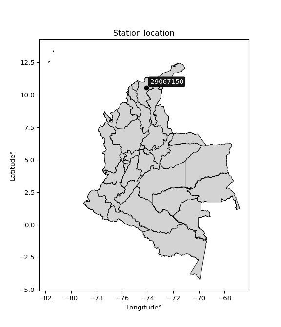

<div align="center">


</div>

# PMax24h Station (Rain): 29067150

Maximum Precipitation in 24 hours (PMax24h) is the greatest amount of rainfall for a specific duration that is meteorologically possible for a given location, acting as a "worst-case" scenario for extreme storms, crucial for designing safety-critical infrastructure like bridges, river deviations, dams, spillways, and nuclear plants to prevent catastrophic failure. The PMax24h is related with the Probable Maximum Precipitation (PMP) and it is calculated by hydrologists using meteorological data to determine the upper limit of extreme rainfall, often leading to the Probable Maximum Flood (PMF) for flood control design, and is increasingly being studied for climate change impacts. Probable Maximum Precipitation (PMP) is the theoretical upper limit of rainfall, a deterministic estimate for extreme events, while probability distributions (like GEV, Gumbel) describe the likelihood and frequency of various precipitation amounts, including rare ones, showing how often events occur, with PMP representing the extreme end of these distributions, used for critical infrastructure design to ensure safety against the worst conceivable weather, unlike standard statistical forecasts which cover typical probabilities.

The most common probability distributions in hydrology, used for analyzing floods, rainfall, and streamflow, include the Normal, Log-Normal, Gumbel, Gamma (including Log-Pearson Type III), and Generalized Extreme Value (GEV) distributions, often chosen based on the data´s skewness and whether modeling extremes or general conditions, with Gumbel and GEV popular for extreme events like floods, while the Normal distribution serves as a baseline, though often requiring transformations for skewed hydrological data. These distributions help in designing water infrastructure, managing water resources, and forecasting hydrologic events.

> Hydrological data often isn´t perfectly normal (it´s skewed), so different distributions are needed for different applications, such as: **Flood Frequency Analysis**: Using Gumbel, GEV, or Log-Pearson Type III for predicting extreme flood magnitudes and their return periods, **Rainfall Analysis**: Normal for annual totals, but Log-Normal, Weibull, or GEV for intensity or extreme daily rainfall, **Streamflow Modeling**: Gamma and Log-Normal for maximum flows, GEV for minimum flows, and Kappa for daily flows.

<div align="center">

</img>

</div>


## A. General information


### 1. General running parameters

• app_version: _v20260225_. • runtime: _2026-02-28 16:54:07.457399_. • Python version: _3.14.0_. • SciPy version: _1.16.3_. • Pandas version: _2.3.3_. • NumPy version: _2.3.5_. • Stations dataset (station_dataset_file): _dataset/pmax24h_in/automatic_colombia_2003_2025.csv_. • Stations catalog (station_catalog_file): _dataset/CNE.xls_. • Minimum year to eval til year_max (date_min): _1900_. • Maximum year to eval since year_min (date_max): _2025_. • Creates, save and include plots into reports (create_plot): _False_. • Plot only fit distributions with Δo > Δ (plot_only_fit): _True_. • Plot only simple graphs avoiding multiple CDFs and multiple Extreme values plots (plot_only_simple): _False_. • Eval low extreme values, if False, evaluates high extreme values (low_extreme): _False_. • Eval every SciPy distribution as logarithmic (pdist_logarithmic_on): _True_. • Standard deviation normalized (ddof): _1.0_. • Return periods to eval in years (Tr): _[2, 2.33, 5, 10, 15, 20, 25, 50, 75, 100, 200, 250, 500, 750, 1000]_. • Minimum data sample per station, 0 means any (minimum_sample): _5_. • Z-Score maximum threshold to adjust a value, 0 means disable (zscore_max): _3.5_. • Z-Score minimum threshold to adjust a value, 0 means disable (zscore_min): _-2.5_. • Avoid zeros, e.g. rain = 0 (avoid_zeros): _True_. • Avoid null values (avoid_nans): _True_. 

:file_folder:Table: [dataset.csv](../../dataset/pmax24h_in/automatic_colombia_2003_2025.csv)

> Delta Degrees of Freedom (DDOF): is a parameter used in the formulas for calculating variance and standard deviation. When ddof=0, the divisor is $N$ (the total number of observations) and this is used when your data set is the entire population. When ddof=1, the divisor is $N-1$ and this is used when your data set is a sample drawn from a larger population. Using $N-1$ provides an unbiased estimate of the population variance (known as Bessel´s correction).


### 2. Station info and location

|   id |   CODIGO | NOMBRE                             | CATEGORIA    | TECNOLOGIA                              | ESTADO   | FECHA_INSTALACION   |   FECHA_SUSPENSION |   ALTITUD |   LATITUD |   LONGITUD | DEPARTAMENTO   | MUNICIPIO   | AREA_OPERATIVA                                         | ENTIDAD                                                     | AREA_HIDROGRAFICA   | ZONA_HIDROGRAFICA   | SUBZONA_HIDROGRAFICA      | CORRIENTE   | Catalogo   |   Version |
|-----:|---------:|:-----------------------------------|:-------------|:----------------------------------------|:---------|:--------------------|-------------------:|----------:|----------:|-----------:|:---------------|:------------|:-------------------------------------------------------|:------------------------------------------------------------|:--------------------|:--------------------|:--------------------------|:------------|:-----------|----------:|
|    0 | 29067150 | GANADERIA CARIBE  - AUT [29067150] | Limnigráfica | Automática con Telemetría, Convencional | Activa   | 15/05/1965          |                nan |        75 |   10.5724 |   -74.1222 | Magdalena      | Aracataca   | Area Operativa 05 - Magdalena-Cesar-Guajira-San Andrés | INSTITUTO DE HIDROLOGIA METEOROLOGIA Y ESTUDIOS AMBIENTALES | Magdalena Cauca     | Bajo Magdalena      | Cga Grande de Santa Marta | Aracataca   | CNE_IDEAM  |  20251226 |

<div align="center">

Dynamic map: [:earth_americas:Google](http://maps.google.com/maps?q=10.572415,-74.122212) [:earth_americas:OSM](https://www.openstreetmap.org/#map=18/10.572415/-74.122212&layers=P) [:earth_americas:Bing](https://www.bing.com/maps?cp=10.572415~-74.122212&lvl=18) [:earth_americas:Apple](https://maps.apple.com/frame?center=10.572415%2C-74.122212&span=0.003%2C0.006)

</div>


<div align="center">

```geojson
{
  "type": "Feature",
  "geometry": {
    "type": "Point", 
    "coordinates": [-74.122212, 10.572415]
  }, 
  "properties": {
    "Name": "29067150"
  }
}
```

</div>


### 3. Discrete values table and plot

<div align="center">

|               |           0 |           1 |           2 |           3 |          4 |          5 |          6 |
|:--------------|------------:|------------:|------------:|------------:|-----------:|-----------:|-----------:|
| Date          | 2019        | 2020        | 2021        | 2022        | 2023       | 2024       | 2025       |
| Value         |   53.2      |   61.6      |   47.2      |   87.5      |   10.2     |   95.2     |  108       |
| Value_initial |   53.2      |   61.6      |   47.2      |   87.5      |   10.2     |   95.2     |  108       |
| count         |    7        |    7        |    7        |    7        |    7       |    7       |    7       |
| mean          |   66.1286   |   66.1286   |   66.1286   |   66.1286   |   66.1286  |   66.1286  |   66.1286  |
| std           |   33.4889   |   33.4889   |   33.4889   |   33.4889   |   33.4889  |   33.4889  |   33.4889  |
| zscore        |   -0.386055 |   -0.135226 |   -0.565219 |    0.638164 |   -1.67006 |    0.86809 |    1.25031 |


</div>


> The initial value (value_initial) correspond to the initial obtained or null completed value, and value (value) is adjusted only when the initial value is outside the valid range (outlier) definite through the Z-Score value. If Z-Score is active, values out of range or outliers are replaced with the station mean value. A Z-Score (or standard score) measures how many standard deviations a data point is from the mean of a dataset, indicating its relative position; positive scores mean above the mean, negative mean below, and a score of zero is exactly at the mean, allowing for comparison of values from different distributions. It´s calculated using the formula $z=(x–μ)/σ$, where $x$ is the data point, $μ$ is the mean, and $σ$ is the standard deviation, helping identify outliers and understand probability.
>
> <sub>**Note**: In this study, "completing" (filling gaps in) and "extending" (forecasting or lengthening the historical record) rainfall data series are avoided for certain critical analyses because they introduce artificial bias and uncertainty, which can distort the statistics of rare events (extremes), alter day-to-day variability, and compromise the integrity and homogeneity of the original data. Some reasons against Completing/Extending rainfall data are: **Distortion of Extremes and Variability**: The primary issue is that most gap-filling or extension methods rely on averaging or regression with nearby stations, which inherently smooths the data. Rainfall is highly variable in space and time, with a large percentage of zero values and occasional large storms. Infilling methods often underestimate the highest values and overestimate the lowest (zero) values, which severely distorts analyses focused on flood frequency, drought severity, and intensity-duration-frequency (IDF) curves, **Loss of Data Homogeneity**: Infilled or extended data are synthetic estimates, not actual measurements. Combining these estimates with observed data can violate the assumption of data homogeneity, which requires that the data properties do not change over time. Inhomogeneity can lead to incorrect conclusions about long-term trends or changes in climate patterns, **Propagation of Errors**: Errors and biases from the original data (e.g., wind-induced undercatch, instrument errors, site changes) or the data used for imputation can propagate through the analysis, leading to unreliable hydrological models and inaccurate predictions, **Compromised Statistical Integrity**: For statistical analyses, especially those involving the frequency of events, using artificial data can introduce time bias or autocorrelation that doesn´t exist in reality, making it difficult to assess the true probability of events, **Difficulty in Validation**: It is difficult to accurately validate the quality of filled or extended data, especially for past periods where ground-truth measurements are unavailable. The reliability of imputation techniques heavily depends on the density of the surrounding station network and the complexity of the local topography.</sub>


### 4. Active continuous probability distributions from SciPy (80 of 104 available)

A Probability Density Function (PDF) describes the relative likelihood of a continuous random variable falling within a specific range, where the total area under its curve equals 1, and the area over any interval gives the actual probability for that range. Unlike discrete probabilities (like rolling a die), a PDF shows density, not direct probability for a single point (which is zero), with higher points indicating higher likelihood, often visualized as a bell curve for normal distributions.

A log of a probability density function (log-PDF) is simply the logarithm of the PDF´s value, denoted as $log(f(x))$, useful for converting multiplication of probabilities into addition, improving numerical stability with tiny numbers, and connecting to information theory concepts like entropy. Instead of dealing with very small probabilities (e.g., 0.000001), log-PDFs use negative numbers (e.g., $log(0.00001) ≈ -11.51$ that are easier for computers to handle, preventing underflow errors and simplifying complex calculations. In this study, each active probability distribution from SciPy is also evaluated in the $log$ form.

[scipy.stats](https://docs.scipy.org/doc/scipy/reference/stats.html) is a Python´s powerful submodule within the SciPy library for comprehensive statistical analysis, offering over 130 probability distributions (like Normal, Poisson, etc.), functions for descriptive stats (mean, variance), hypothesis testing (t-tests, chi-square), random variable generation, and statistical tests, making it essential for data science, modeling, and research. It provides tools to explore, model, and draw conclusions from data efficiently, working seamlessly with [NumPy](https://numpy.org/).

<div align="center">

|   id | p_dist           |   n_parameter | fit_method   | label                                                                       | active   | ref                                                                                                      |
|-----:|:-----------------|--------------:|:-------------|:----------------------------------------------------------------------------|:---------|:---------------------------------------------------------------------------------------------------------|
|    0 | alpha            |             3 | MLE          | Alpha                                                                       | True     | [:mortar_board:](https://docs.scipy.org/doc/scipy/reference/generated/scipy.stats.alpha.html)            |
|    1 | anglit           |             2 | MM           | Anglit                                                                      | True     | [:mortar_board:](https://docs.scipy.org/doc/scipy/reference/generated/scipy.stats.anglit.html)           |
|    2 | arcsine          |             2 | MM           | Arcsine                                                                     | True     | [:mortar_board:](https://docs.scipy.org/doc/scipy/reference/generated/scipy.stats.arcsine.html)          |
|    3 | argus            |             3 | MLE          | Argus                                                                       | True     | [:mortar_board:](https://docs.scipy.org/doc/scipy/reference/generated/scipy.stats.argus.html)            |
|    4 | beta             |             4 | MLE          | Beta                                                                        | True     | [:mortar_board:](https://docs.scipy.org/doc/scipy/reference/generated/scipy.stats.beta.html)             |
|    5 | betaprime        |             4 | MLE          | Beta prime                                                                  | True     | [:mortar_board:](https://docs.scipy.org/doc/scipy/reference/generated/scipy.stats.betaprime.html)        |
|    6 | bradford         |             3 | MLE          | Bradford                                                                    | True     | [:mortar_board:](https://docs.scipy.org/doc/scipy/reference/generated/scipy.stats.bradford.html)         |
|    7 | burr             |             4 | MLE          | Burr (Type III)                                                             | True     | [:mortar_board:](https://docs.scipy.org/doc/scipy/reference/generated/scipy.stats.burr.html)             |
|    8 | burr12           |             4 | MLE          | Burr (Type III) 12                                                          | True     | [:mortar_board:](https://docs.scipy.org/doc/scipy/reference/generated/scipy.stats.burr12.html)           |
|    9 | cosine           |             2 | MLE          | Cosine                                                                      | True     | [:mortar_board:](https://docs.scipy.org/doc/scipy/reference/generated/scipy.stats.cosine.html)           |
|   10 | crystalball      |             4 | MLE          | Crystalball                                                                 | True     | [:mortar_board:](https://docs.scipy.org/doc/scipy/reference/generated/scipy.stats.crystalball.html)      |
|   11 | dgamma           |             3 | MLE          | Double gamma                                                                | True     | [:mortar_board:](https://docs.scipy.org/doc/scipy/reference/generated/scipy.stats.dgamma.html)           |
|   12 | dweibull         |             3 | MLE          | Double Weibull                                                              | True     | [:mortar_board:](https://docs.scipy.org/doc/scipy/reference/generated/scipy.stats.dweibull.html)         |
|   13 | erlang           |             3 | MLE          | Erlang                                                                      | True     | [:mortar_board:](https://docs.scipy.org/doc/scipy/reference/generated/scipy.stats.erlang.html)           |
|   14 | exponnorm        |             3 | MLE          | Exponentially modified Normal                                               | True     | [:mortar_board:](https://docs.scipy.org/doc/scipy/reference/generated/scipy.stats.exponnorm.html)        |
|   15 | exponpow         |             3 | MLE          | Exponential power                                                           | True     | [:mortar_board:](https://docs.scipy.org/doc/scipy/reference/generated/scipy.stats.exponpow.html)         |
|   16 | exponweib        |             4 | MLE          | Exponentiated Weibull                                                       | True     | [:mortar_board:](https://docs.scipy.org/doc/scipy/reference/generated/scipy.stats.exponweib.html)        |
|   17 | f                |             4 | MLE          | F                                                                           | True     | [:mortar_board:](https://docs.scipy.org/doc/scipy/reference/generated/scipy.stats.f.html)                |
|   18 | fatiguelife      |             3 | MLE          | Fatigue-life (Birnbaum-Saunders)                                            | True     | [:mortar_board:](https://docs.scipy.org/doc/scipy/reference/generated/scipy.stats.fatiguelife.html)      |
|   19 | foldnorm         |             3 | MM           | Fold Normal                                                                 | True     | [:mortar_board:](https://docs.scipy.org/doc/scipy/reference/generated/scipy.stats.foldnorm.html)         |
|   20 | gamma            |             3 | MLE          | Gamma                                                                       | True     | [:mortar_board:](https://docs.scipy.org/doc/scipy/reference/generated/scipy.stats.gamma.html)            |
|   21 | gausshyper       |             6 | MLE          | Gauss hypergeometric                                                        | True     | [:mortar_board:](https://docs.scipy.org/doc/scipy/reference/generated/scipy.stats.gausshyper.html)       |
|   22 | genexpon         |             5 | MLE          | Generalized exponential                                                     | True     | [:mortar_board:](https://docs.scipy.org/doc/scipy/reference/generated/scipy.stats.genexpon.html)         |
|   23 | genextreme       |             3 | MLE          | Generalized exponential                                                     | True     | [:mortar_board:](https://docs.scipy.org/doc/scipy/reference/generated/scipy.stats.genextreme.html)       |
|   24 | gengamma         |             4 | MLE          | Generalized gamma                                                           | True     | [:mortar_board:](https://docs.scipy.org/doc/scipy/reference/generated/scipy.stats.gengamma.html)         |
|   25 | genhalflogistic  |             3 | MLE          | Generalized half-logistic                                                   | True     | [:mortar_board:](https://docs.scipy.org/doc/scipy/reference/generated/scipy.stats.genhalflogistic.html)  |
|   26 | genlogistic      |             3 | MLE          | Generalized logistic                                                        | True     | [:mortar_board:](https://docs.scipy.org/doc/scipy/reference/generated/scipy.stats.genlogistic.html)      |
|   27 | gennorm          |             3 | MLE          | Generalized Normal                                                          | True     | [:mortar_board:](https://docs.scipy.org/doc/scipy/reference/generated/scipy.stats.gennorm.html)          |
|   28 | genpareto        |             3 | MLE          | Generalized Pareto                                                          | True     | [:mortar_board:](https://docs.scipy.org/doc/scipy/reference/generated/scipy.stats.genpareto.html)        |
|   29 | gompertz         |             3 | MLE          | Gompertz (or truncated Gumbel)                                              | True     | [:mortar_board:](https://docs.scipy.org/doc/scipy/reference/generated/scipy.stats.gompertz.html)         |
|   30 | gumbel_l         |             2 | MM           | Gumbel Left Skew                                                            | True     | [:mortar_board:](https://docs.scipy.org/doc/scipy/reference/generated/scipy.stats.gumbel_l.html)         |
|   31 | gumbel_r         |             2 | MM           | Gumbel Right Skew                                                           | True     | [:mortar_board:](https://docs.scipy.org/doc/scipy/reference/generated/scipy.stats.gumbel_r.html)         |
|   32 | halfgennorm      |             3 | MLE          | Upper half of a generalized normal                                          | True     | [:mortar_board:](https://docs.scipy.org/doc/scipy/reference/generated/scipy.stats.halfgennorm.html)      |
|   33 | halflogistic     |             2 | MM           | Half-logistic                                                               | True     | [:mortar_board:](https://docs.scipy.org/doc/scipy/reference/generated/scipy.stats.halflogistic.html)     |
|   34 | halfnorm         |             2 | MM           | Half Normal                                                                 | True     | [:mortar_board:](https://docs.scipy.org/doc/scipy/reference/generated/scipy.stats.halfnorm.html)         |
|   35 | hypsecant        |             2 | MM           | hyperbolic secant                                                           | True     | [:mortar_board:](https://docs.scipy.org/doc/scipy/reference/generated/scipy.stats.hypsecant.html)        |
|   36 | invgamma         |             3 | MLE          | Inverted gamma                                                              | True     | [:mortar_board:](https://docs.scipy.org/doc/scipy/reference/generated/scipy.stats.invgamma.html)         |
|   37 | invgauss         |             3 | MLE          | Inverse Gaussian                                                            | True     | [:mortar_board:](https://docs.scipy.org/doc/scipy/reference/generated/scipy.stats.invgauss.html)         |
|   38 | invweibull       |             3 | MLE          | Inverted Weibull                                                            | True     | [:mortar_board:](https://docs.scipy.org/doc/scipy/reference/generated/scipy.stats.invweibull.html)       |
|   39 | johnsonsb        |             4 | MLE          | Johnson SB                                                                  | True     | [:mortar_board:](https://docs.scipy.org/doc/scipy/reference/generated/scipy.stats.johnsonsb.html)        |
|   40 | johnsonsu        |             4 | MLE          | Johnson Su                                                                  | True     | [:mortar_board:](https://docs.scipy.org/doc/scipy/reference/generated/scipy.stats.johnsonsu.html)        |
|   41 | kappa3           |             3 | MLE          | Kappa 3                                                                     | True     | [:mortar_board:](https://docs.scipy.org/doc/scipy/reference/generated/scipy.stats.kappa3.html)           |
|   42 | kappa4           |             4 | MLE          | Kappa 4                                                                     | True     | [:mortar_board:](https://docs.scipy.org/doc/scipy/reference/generated/scipy.stats.kappa4.html)           |
|   43 | ksone            |             3 | MLE          | Kolmogorov-Smirnov one-sided test statistic distribution                    | True     | [:mortar_board:](https://docs.scipy.org/doc/scipy/reference/generated/scipy.stats.ksone.html)            |
|   44 | kstwobign        |             2 | MLE          | Limiting distribution of scaled Kolmogorov-Smirnov two-sided test statistic | True     | [:mortar_board:](https://docs.scipy.org/doc/scipy/reference/generated/scipy.stats.kstwobign.html)        |
|   45 | laplace          |             2 | MM           | Laplace                                                                     | True     | [:mortar_board:](https://docs.scipy.org/doc/scipy/reference/generated/scipy.stats.laplace.html)          |
|   46 | levy_l           |             2 | MLE          | Left-skewed Levy                                                            | True     | [:mortar_board:](https://docs.scipy.org/doc/scipy/reference/generated/scipy.stats.levy_l.html)           |
|   47 | loggamma         |             3 | MLE          | Log gamma                                                                   | True     | [:mortar_board:](https://docs.scipy.org/doc/scipy/reference/generated/scipy.stats.loggamma.html)         |
|   48 | logistic         |             2 | MM           | Logistic (or Sech-squared)                                                  | True     | [:mortar_board:](https://docs.scipy.org/doc/scipy/reference/generated/scipy.stats.logistic.html)         |
|   49 | loglaplace       |             3 | MLE          | Log-Laplace                                                                 | True     | [:mortar_board:](https://docs.scipy.org/doc/scipy/reference/generated/scipy.stats.loglaplace.html)       |
|   50 | lomax            |             3 | MLE          | Lomax (Pareto of the second kind)                                           | True     | [:mortar_board:](https://docs.scipy.org/doc/scipy/reference/generated/scipy.stats.lomax.html)            |
|   51 | maxwell          |             2 | MM           | Maxwell                                                                     | True     | [:mortar_board:](https://docs.scipy.org/doc/scipy/reference/generated/scipy.stats.maxwell.html)          |
|   52 | mielke           |             4 | MLE          | Mielke Beta-Kappa / Dagum                                                   | True     | [:mortar_board:](https://docs.scipy.org/doc/scipy/reference/generated/scipy.stats.mielke.html)           |
|   53 | moyal            |             2 | MM           | Moyal                                                                       | True     | [:mortar_board:](https://docs.scipy.org/doc/scipy/reference/generated/scipy.stats.moyal.html)            |
|   54 | nakagami         |             3 | MLE          | Nakagami                                                                    | True     | [:mortar_board:](https://docs.scipy.org/doc/scipy/reference/generated/scipy.stats.nakagami.html)         |
|   55 | ncf              |             5 | MLE          | Non-central F distribution                                                  | True     | [:mortar_board:](https://docs.scipy.org/doc/scipy/reference/generated/scipy.stats.ncf.html)              |
|   56 | nct              |             4 | MLE          | Non-central Student’s t                                                     | True     | [:mortar_board:](https://docs.scipy.org/doc/scipy/reference/generated/scipy.stats.nct.html)              |
|   57 | norm             |             2 | MM           | Normal                                                                      | True     | [:mortar_board:](https://docs.scipy.org/doc/scipy/reference/generated/scipy.stats.norm.html)             |
|   58 | pearson3         |             3 | MM           | Pearson type III                                                            | True     | [:mortar_board:](https://docs.scipy.org/doc/scipy/reference/generated/scipy.stats.pearson3.html)         |
|   59 | powerlaw         |             3 | MLE          | Power-function                                                              | True     | [:mortar_board:](https://docs.scipy.org/doc/scipy/reference/generated/scipy.stats.powerlaw.html)         |
|   60 | rayleigh         |             2 | MM           | Rayleigh                                                                    | True     | [:mortar_board:](https://docs.scipy.org/doc/scipy/reference/generated/scipy.stats.rayleigh.html)         |
|   61 | rdist            |             3 | MLE          | R-distributed (symmetric beta)                                              | True     | [:mortar_board:](https://docs.scipy.org/doc/scipy/reference/generated/scipy.stats.rdist.html)            |
|   62 | rice             |             3 | MLE          | Rice                                                                        | True     | [:mortar_board:](https://docs.scipy.org/doc/scipy/reference/generated/scipy.stats.rice.html)             |
|   63 | semicircular     |             2 | MM           | Semicircular                                                                | True     | [:mortar_board:](https://docs.scipy.org/doc/scipy/reference/generated/scipy.stats.semicircular.html)     |
|   64 | skewnorm         |             3 | MLE          | Skew normal                                                                 | True     | [:mortar_board:](https://docs.scipy.org/doc/scipy/reference/generated/scipy.stats.skewnorm.html)         |
|   65 | t                |             3 | MLE          | Student’s t                                                                 | True     | [:mortar_board:](https://docs.scipy.org/doc/scipy/reference/generated/scipy.stats.t.html)                |
|   66 | trapezoid        |             4 | MLE          | Trapezoid                                                                   | True     | [:mortar_board:](https://docs.scipy.org/doc/scipy/reference/generated/scipy.stats.trapezoid.html)        |
|   67 | triang           |             3 | MLE          | Triangular                                                                  | True     | [:mortar_board:](https://docs.scipy.org/doc/scipy/reference/generated/scipy.stats.triang.html)           |
|   68 | truncexpon       |             3 | MLE          | Truncated exponential                                                       | True     | [:mortar_board:](https://docs.scipy.org/doc/scipy/reference/generated/scipy.stats.truncexpon.html)       |
|   69 | truncnorm        |             4 | MLE          | Truncated normal                                                            | True     | [:mortar_board:](https://docs.scipy.org/doc/scipy/reference/generated/scipy.stats.truncnorm.html)        |
|   70 | truncpareto      |             4 | MLE          | Upper truncated Pareto                                                      | True     | [:mortar_board:](https://docs.scipy.org/doc/scipy/reference/generated/scipy.stats.truncpareto.html)      |
|   71 | truncweibull_min |             5 | MLE          | Doubly truncated Weibull minimum                                            | True     | [:mortar_board:](https://docs.scipy.org/doc/scipy/reference/generated/scipy.stats.truncweibull_min.html) |
|   72 | tukeylambda      |             3 | MLE          | Tukey-Lamdba                                                                | True     | [:mortar_board:](https://docs.scipy.org/doc/scipy/reference/generated/scipy.stats.tukeylambda.html)      |
|   73 | uniform          |             2 | MLE          | Uniform                                                                     | True     | [:mortar_board:](https://docs.scipy.org/doc/scipy/reference/generated/scipy.stats.uniform.html)          |
|   74 | vonmises         |             3 | MLE          | Von Mises                                                                   | True     | [:mortar_board:](https://docs.scipy.org/doc/scipy/reference/generated/scipy.stats.vonmises.html)         |
|   75 | vonmises_line    |             3 | MLE          | Von Mises line                                                              | True     | [:mortar_board:](https://docs.scipy.org/doc/scipy/reference/generated/scipy.stats.vonmises_line.html)    |
|   76 | wald             |             2 | MM           | Wald                                                                        | True     | [:mortar_board:](https://docs.scipy.org/doc/scipy/reference/generated/scipy.stats.wald.html)             |
|   77 | weibull_max      |             3 | MLE          | Weibull maximum                                                             | True     | [:mortar_board:](https://docs.scipy.org/doc/scipy/reference/generated/scipy.stats.weibull_max.html)      |
|   78 | weibull_min      |             3 | MLE          | Weibull minimum                                                             | True     | [:mortar_board:](https://docs.scipy.org/doc/scipy/reference/generated/scipy.stats.weibull_min.html)      |
|   79 | wrapcauchy       |             3 | MLE          | Wrapped  Cauchy                                                             | True     | [:mortar_board:](https://docs.scipy.org/doc/scipy/reference/generated/scipy.stats.wrapcauchy.html)       |

</div>

> **n_parameter:** # arguments & localization & scale.
>
> **Fit methods:** (MLE) maximum likelihood, (MM) L-moments.
>
>**Inactive** (With the only purpose of prevent loops, zero divisions, infinite values, over high estimated values or horizontal trending for recurrence intervals estimations, the follow distributions were disabled.)**:** lognorm, norminvgauss, powernorm, powerlognorm, cauchy, halfcauchy, foldcauchy, skewcauchy, chi2, expon, fisk, genhyperbolic, geninvgauss, gibrat, kstwo, laplace_asymmetric, levy, levy_stable, ncx2, pareto, rel_breitwigner, recipinvgauss, studentized_range, loguniform, 


## B. Probability (PDF) vs. Empirical (EDF) distributions functions

A continuous probability distribution (CPD) describes probabilities for variables that can take any value within a range (like rain any time), unlike discrete variables with specific outcomes (like temperature). It uses a Probability Density Function (PDF), a curve where the total area under it equals 1, and the probability of the variable falling within an interval (a to b) is found by calculating the area under the curve between those points. A key feature is that the probability of hitting any single exact value is zero, so probabilities are always expressed for ranges, e.g., $P(a ≤ X ≤ b)$.

<div align="center">

Distributions parameters from station values
|     |   station | p_dist              |   n |              loc |           scale | shape                  | shape1                 | shape2                 | shape3             |
|----:|----------:|:--------------------|----:|-----------------:|----------------:|:-----------------------|:-----------------------|:-----------------------|:-------------------|
|   0 |  29067150 | alpha               |   7 |     -0.0792558   |    25.4363      | 1.3454829031483275e-11 |                        |                        |                    |
|   1 |  29067150 | anglit              |   7 |     66.1286      |    90.7012      |                        |                        |                        |                    |
|   2 |  29067150 | arcsine             |   7 |     22.2813      |    87.6946      |                        |                        |                        |                    |
|   3 |  29067150 | argus               |   7 |    -12.515       |   124.961       | 1.2784833390517685     |                        |                        |                    |
|   4 |  29067150 | beta                |   7 |     -4.27074     |   112.271       | 2.392698378966654      | 0.6115598640071704     |                        |                    |
|   5 |  29067150 | betaprime           |   7 |   -707.043       | 58385.8         | 621.6144428819343      | 46934.14045590334      |                        |                    |
|   6 |  29067150 | bradford            |   7 |     10.2         |    97.8274      | 0.9977500347721375     |                        |                        |                    |
|   7 |  29067150 | burr                |   7 |     -0.750901    |   109.948       | 307.7196908680845      | 0.004756254266824585   |                        |                    |
|   8 |  29067150 | burr12              |   7 |     -1.3337      |    11.3789      | 313.69629651846583     | 0.001992875769649373   |                        |                    |
|   9 |  29067150 | cosine              |   7 |     64.0975      |    25.9569      |                        |                        |                        |                    |
|  10 |  29067150 | crystalball         |   7 |     66.1286      |    31.0047      | 2627.14052856192       | 13762.249424919339     |                        |                    |
|  11 |  29067150 | dgamma              |   7 |     58.7628      |    19.3853      | 1.3481340506621988     |                        |                        |                    |
|  12 |  29067150 | dweibull            |   7 |     58.9995      |    28.0257      | 1.2805271404933327     |                        |                        |                    |
|  13 |  29067150 | erlang              |   7 |   -405.797       |     2.09467     | 225.20968288714005     |                        |                        |                    |
|  14 |  29067150 | exponnorm           |   7 |     66.1042      |    31.0047      | 0.000787655920193152   |                        |                        |                    |
|  15 |  29067150 | exponpow            |   7 |    -20.5957      |   115.171       | 2.5478282680098907     |                        |                        |                    |
|  16 |  29067150 | exponweib           |   7 |    -94.519       |   204.018       | 0.029227787456129414   | 131.78917394389228     |                        |                    |
|  17 |  29067150 | f                   |   7 |  -9696.64        |  9762.79        | 209295.70775180485     | 3413862.3621908287     |                        |                    |
|  18 |  29067150 | fatiguelife         |   7 |  -3326.56        |  3392.68        | 0.009154969586389585   |                        |                        |                    |
|  19 |  29067150 | foldnorm            |   7 |   -132.677       |    29.85        | 6.669388309717723      |                        |                        |                    |
|  20 |  29067150 | gamma               |   7 |   -453.391       |     1.91764     | 270.8431937515626      |                        |                        |                    |
|  21 |  29067150 | gausshyper          |   7 |      0.524925    |   107.475       | 1.4473964319153103     | 0.6542983949196342     | 0.8139756174761921     | 0.7692208873771257 |
|  22 |  29067150 | genexpon            |   7 |     -0.970975    |     2.76123     | 0.0005449379936536063  | 1.661043485292895      | 0.0016763601400100647  |                    |
|  23 |  29067150 | genextreme          |   7 |     65.5838      |    46.8136      | 1.1036724599108645     |                        |                        |                    |
|  24 |  29067150 | gengamma            |   7 |   -279.783       |   389.965       | 0.029154508973917387   | 281.0221547314882      |                        |                    |
|  25 |  29067150 | genhalflogistic     |   7 |     -1.99227     |   110.207       | 1.001952339523256      |                        |                        |                    |
|  26 |  29067150 | genlogistic         |   7 |    108.001       |     4.29776e-06 | 1.0276040458529292e-07 |                        |                        |                    |
|  27 |  29067150 | gennorm             |   7 |     59.1         |    48.9001      | 6780016.438455734      |                        |                        |                    |
|  28 |  29067150 | genpareto           |   7 |     -1.16562     |   184.995       | -1.6946297373970642    |                        |                        |                    |
|  29 |  29067150 | gompertz            |   7 |     10.2         |    33.9402      | 0.1558957503261137     |                        |                        |                    |
|  30 |  29067150 | gumbel_l            |   7 |     80.0824      |    24.1743      |                        |                        |                        |                    |
|  31 |  29067150 | gumbel_r            |   7 |     52.1748      |    24.1743      |                        |                        |                        |                    |
|  32 |  29067150 | halfgennorm         |   7 |      9.91157     |    98.5039      | 1447.8112931733822     |                        |                        |                    |
|  33 |  29067150 | halflogistic        |   7 |     29.3807      |    26.508       |                        |                        |                        |                    |
|  34 |  29067150 | halfnorm            |   7 |     25.0904      |    51.4337      |                        |                        |                        |                    |
|  35 |  29067150 | hypsecant           |   7 |     66.1286      |    19.7382      |                        |                        |                        |                    |
|  36 |  29067150 | invgamma            |   7 |   -267.424       | 35570.2         | 107.43136184338223     |                        |                        |                    |
|  37 |  29067150 | invgauss            |   7 |   -110.804       |  4356.65        | 0.04051385306685806    |                        |                        |                    |
|  38 |  29067150 | invweibull          |   7 | -47801.2         | 47851.3         | 1544.3082102183853     |                        |                        |                    |
|  39 |  29067150 | johnsonsb           |   7 |      2.19909     |   105.801       | -0.7845059300267672    | 0.10391583368276437    |                        |                    |
|  40 |  29067150 | johnsonsu           |   7 |    151.201       |     4.12157     | 9.654470445033535      | 2.6436587136330196     |                        |                    |
|  41 |  29067150 | kappa3              |   7 |     10.1952      |   102.508       | 3379.0219688425104     |                        |                        |                    |
|  42 |  29067150 | kappa4              |   7 |      0.427213    |   109.499       | 1.098064836930281      | 1.0139386314358667     |                        |                    |
|  43 |  29067150 | ksone               |   7 |      0.42        |   117.36        | 1.0                    |                        |                        |                    |
|  44 |  29067150 | kstwobign           |   7 |    -60.0543      |   144.266       |                        |                        |                        |                    |
|  45 |  29067150 | laplace             |   7 |     66.1286      |    21.9237      |                        |                        |                        |                    |
|  46 |  29067150 | levy_l              |   7 |    111.568       |    15.7139      |                        |                        |                        |                    |
|  47 |  29067150 | loggamma            |   7 |     71.6209      |    30.3185      | 1.2895104717898387     |                        |                        |                    |
|  48 |  29067150 | logistic            |   7 |     66.1286      |    17.0938      |                        |                        |                        |                    |
|  49 |  29067150 | loglaplace          |   7 |     -0.165426    |    61.7654      | 1.9766410390002984     |                        |                        |                    |
|  50 |  29067150 | lomax               |   7 |     10.2         |     3.27791e+11 | 5572798497.627525      |                        |                        |                    |
|  51 |  29067150 | maxwell             |   7 |     -7.33963     |    46.0394      |                        |                        |                        |                    |
|  52 |  29067150 | mielke              |   7 |     -7.08253     |   115.671       | 1.6830730640131355     | 833.8730369062123      |                        |                    |
|  53 |  29067150 | moyal               |   7 |     48.3981      |    13.957       |                        |                        |                        |                    |
|  54 |  29067150 | nakagami            |   7 |     47.2         |    32.6778      | 0.30834746398964674    |                        |                        |                    |
|  55 |  29067150 | ncf                 |   7 |     -0.143466    |     2.83383e-07 | 7.259662859672815e-08  | 21.911375368169125     | 16.155620029845565     |                    |
|  56 |  29067150 | nct                 |   7 |  -2426.34        |    30.9707      | 1377502.4091979265     | 80.47814056109308      |                        |                    |
|  57 |  29067150 | norm                |   7 |     66.1286      |    31.0047      |                        |                        |                        |                    |
|  58 |  29067150 | pearson3            |   7 |     66.1286      |    31.0047      | -0.3654371971656504    |                        |                        |                    |
|  59 |  29067150 | powerlaw            |   7 |     10.2         |    97.8         | 0.1692470478712954     |                        |                        |                    |
|  60 |  29067150 | rayleigh            |   7 |      6.81471     |    47.3256      |                        |                        |                        |                    |
|  61 |  29067150 | rdist               |   7 |      1.39164     |    60.2084      | 1.013738214738344      |                        |                        |                    |
|  62 |  29067150 | rice                |   7 |     -8.18352     |    34.0798      | 1.8927175925462882     |                        |                        |                    |
|  63 |  29067150 | semicircular        |   7 |     66.1286      |    62.0095      |                        |                        |                        |                    |
|  64 |  29067150 | skewnorm            |   7 |    108           |    52.0884      | -8156876.972969981     |                        |                        |                    |
|  65 |  29067150 | t                   |   7 |     66.1279      |    31.0029      | 5780358.570013354      |                        |                        |                    |
|  66 |  29067150 | trapezoid           |   7 |    -22.6444      |   131.542       | 1.0                    | 1.0                    |                        |                    |
|  67 |  29067150 | triang              |   7 |    -12.9762      |   120.976       | 0.9999999988943384     |                        |                        |                    |
|  68 |  29067150 | truncexpon          |   7 |      0.448707    |   142.816       | 0.7530750709394562     |                        |                        |                    |
|  69 |  29067150 | truncnorm           |   7 |     66.1286      |    31.0047      | -180.333395310247      | 646.4010722289551      |                        |                    |
|  70 |  29067150 | truncpareto         |   7 |     10.1413      |     0.0587198   | 0.16786154065502107    | 1666.5361720050666     |                        |                    |
|  71 |  29067150 | truncweibull_min    |   7 |      0.284267    |   122.741       | 1.7221303317179066     | 0.00323424043727916    | 0.8775886161315282     |                    |
|  72 |  29067150 | tukeylambda         |   7 |     75.3529      |    33.4186      | 1.1870366472501894     |                        |                        |                    |
|  73 |  29067150 | uniform             |   7 |     10.2         |    97.8         |                        |                        |                        |                    |
|  74 |  29067150 | vonmises            |   7 |     -2.73307     |     1           | 0.15869516137012196    |                        |                        |                    |
|  75 |  29067150 | vonmises_line       |   7 |     59.0967      |    15.5664      | 2.9522427763368136e-05 |                        |                        |                    |
|  76 |  29067150 | wald                |   7 |     35.1238      |    31.0047      |                        |                        |                        |                    |
|  77 |  29067150 | weibull_max         |   7 |    108           |     1.54672     | 0.26658532785311295    |                        |                        |                    |
|  78 |  29067150 | weibull_min         |   7 |   -160.138       |   239.539       | 8.82974681623355       |                        |                        |                    |
|  79 |  29067150 | wrapcauchy          |   7 |     10.2         |    15.5899      | 0.07395297858517116    |                        |                        |                    |
|  80 |  29067150 | logalpha            |   7 |    -17.2574      |   577.574       | 27.200708206651285     |                        |                        |                    |
|  81 |  29067150 | loganglit           |   7 |      3.99732     |     2.16887     |                        |                        |                        |                    |
|  82 |  29067150 | logarcsine          |   7 |      2.94885     |     2.09694     |                        |                        |                        |                    |
|  83 |  29067150 | logargus            |   7 |      1.27482     |     3.462       | 2.801968474361009      |                        |                        |                    |
|  84 |  29067150 | logbeta             |   7 |      2.1398      |     2.54234     | 0.9221255449273339     | 0.23470034005313933    |                        |                    |
|  85 |  29067150 | logbetaprime        |   7 |    -13.751       |   328.879       | 545.6091498190096      | 10103.329683535965     |                        |                    |
|  86 |  29067150 | logbradford         |   7 |      2.32237     |     2.35981     | 1.04140974452537       |                        |                        |                    |
|  87 |  29067150 | logburr             |   7 |   -113.75        |   118.446       | 26760.640030596158     | 0.006290812218778875   |                        |                    |
|  88 |  29067150 | logburr12           |   7 |  -2105.06        |  2115.63        | 4635.421570093846      | 915704.523266214       |                        |                    |
|  89 |  29067150 | logcosine           |   7 |      3.84148     |     0.669354    |                        |                        |                        |                    |
|  90 |  29067150 | logcrystalball      |   7 |      3.99732     |     0.741391    | 997.0309357884942      | 137.22493545409787     |                        |                    |
|  91 |  29067150 | logdgamma           |   7 |      4.12066     |     0.611358    | 0.6844711657207937     |                        |                        |                    |
|  92 |  29067150 | logdweibull         |   7 |      4.12066     |     0.545819    | 0.9460502071885999     |                        |                        |                    |
|  93 |  29067150 | logerlang           |   7 |     -8.11862     |     0.0527828   | 229.31247206727386     |                        |                        |                    |
|  94 |  29067150 | logexponnorm        |   7 |      3.99679     |     0.741389    | 0.0007099449346118754  |                        |                        |                    |
|  95 |  29067150 | logexponpow         |   7 |      2.32239     |     1.53025     | 0.5284460694605513     |                        |                        |                    |
|  96 |  29067150 | logexponweib        |   7 |      2.32239     |     2.42559     | 0.0633781002874621     | 2.854525694511213      |                        |                    |
|  97 |  29067150 | logf                |   7 |  -1243.17        |  1247.17        | 14594916.739709288     | 9130703.081051342      |                        |                    |
|  98 |  29067150 | logfatiguelife      |   7 |   -484.182       |   488.179       | 0.001517077782058951   |                        |                        |                    |
|  99 |  29067150 | logfoldnorm         |   7 |      1.29871     |     0.691698    | 3.91007393803644       |                        |                        |                    |
| 100 |  29067150 | loggamma            |   7 |     -9.20353     |     0.0462063   | 285.65271792498334     |                        |                        |                    |
| 101 |  29067150 | loggausshyper       |   7 |      2.30955     |     2.37258     | 1.140179173880686      | 0.7686701185244782     | 1.0201219134914785     | 1.127088973192399  |
| 102 |  29067150 | loggenexpon         |   7 |      2.27559     |     0.0214      | 0.0032109654765153407  | 4.596061444153364      | 4.1902726108381815e-05 |                    |
| 103 |  29067150 | loggenextreme       |   7 |      4.02142     |     0.751393    | 1.1372410103143191     |                        |                        |                    |
| 104 |  29067150 | loggengamma         |   7 |    -32.3529      |    10.8827      | 144.85660804296367     | 4.123820557288102      |                        |                    |
| 105 |  29067150 | loggenhalflogistic  |   7 |      2.2286      |     2.6176      | 1.0668725847717337     |                        |                        |                    |
| 106 |  29067150 | loggenlogistic      |   7 |      4.68219     |     1.7664e-06  | 2.5897496421612516e-06 |                        |                        |                    |
| 107 |  29067150 | loggennorm          |   7 |      4.12066     |     2.29492e-08 | 0.12917524770664046    |                        |                        |                    |
| 108 |  29067150 | loggenpareto        |   7 |     -0.00358169  |     9.75259     | -2.0813469690594646    |                        |                        |                    |
| 109 |  29067150 | loggompertz         |   7 |      2.32239     |     0.484938    | 0.017319407437648697   |                        |                        |                    |
| 110 |  29067150 | loggumbel_l         |   7 |      4.33099     |     0.57806     |                        |                        |                        |                    |
| 111 |  29067150 | loggumbel_r         |   7 |      3.66366     |     0.57806     |                        |                        |                        |                    |
| 112 |  29067150 | loghalfgennorm      |   7 |      2.32238     |     2.35979     | 662682.6808239869      |                        |                        |                    |
| 113 |  29067150 | loghalflogistic     |   7 |      3.11854     |     0.633898    |                        |                        |                        |                    |
| 114 |  29067150 | loghalfnorm         |   7 |      3.01603     |     1.22987     |                        |                        |                        |                    |
| 115 |  29067150 | loghypsecant        |   7 |      3.99732     |     0.471984    |                        |                        |                        |                    |
| 116 |  29067150 | loginvgamma         |   7 |    -14.791       | 11035.7         | 588.2952214812806      |                        |                        |                    |
| 117 |  29067150 | loginvgauss         |   7 |     -5.14953     |  1074.75        | 0.0084914122996444     |                        |                        |                    |
| 118 |  29067150 | loginvweibull       |   7 |     -1.29828e+08 |     1.29828e+08 | 144358040.92165697     |                        |                        |                    |
| 119 |  29067150 | logjohnsonsb        |   7 |      2.32239     |     2.35985     | 0.4865292909077219     | 0.07785044800033088    |                        |                    |
| 120 |  29067150 | logjohnsonsu        |   7 |      4.72871     |     0.00127673  | 5.429619642704752      | 0.8394937222050942     |                        |                    |
| 121 |  29067150 | logkappa3           |   7 |      2.32239     |     2.34986     | 494.46436492776945     |                        |                        |                    |
| 122 |  29067150 | logkappa4           |   7 |      2.15007     |     2.65686     | 1.0694705427795497     | 1.0469294995649614     |                        |                    |
| 123 |  29067150 | logksone            |   7 |      2.08641     |     2.83169     | 1.0                    |                        |                        |                    |
| 124 |  29067150 | logkstwobign        |   7 |      0.345605    |     4.17786     |                        |                        |                        |                    |
| 125 |  29067150 | loglaplace          |   7 |      3.99732     |     0.524243    |                        |                        |                        |                    |
| 126 |  29067150 | loglevy_l           |   7 |      4.7236      |     0.181277    |                        |                        |                        |                    |
| 127 |  29067150 | logloggamma         |   7 |      4.68217     |     1.05759e-06 | 1.5533793953605363e-06 |                        |                        |                    |
| 128 |  29067150 | loglogistic         |   7 |      3.99732     |     0.40875     |                        |                        |                        |                    |
| 129 |  29067150 | logloglaplace       |   7 |     -0.0879243   |     4.20859     | 7.290485925189021      |                        |                        |                    |
| 130 |  29067150 | loglomax            |   7 |      2.32184     |   147.954       | 88.23660482544074      |                        |                        |                    |
| 131 |  29067150 | logmaxwell          |   7 |      2.24054     |     1.1009      |                        |                        |                        |                    |
| 132 |  29067150 | logmielke           |   7 |     -5.29289e+06 |     5.29289e+06 | 7641597.063573202      | 2950007725.1183667     |                        |                    |
| 133 |  29067150 | logmoyal            |   7 |      3.57335     |     0.333743    |                        |                        |                        |                    |
| 134 |  29067150 | lognakagami         |   7 |      3.85439     |     0.463194    | 0.2764366677653737     |                        |                        |                    |
| 135 |  29067150 | logncf              |   7 |    -14.0483      |    18.028       | 1869.9804192362262     | 2230.1607464388876     | 0.2794038628929383     |                    |
| 136 |  29067150 | lognct              |   7 |    -44.8749      |     0.680513    | 12298.267872783967     | 71.81324003567909      |                        |                    |
| 137 |  29067150 | lognorm             |   7 |      3.99732     |     0.741391    |                        |                        |                        |                    |
| 138 |  29067150 | logpearson3         |   7 |      3.99732     |     0.741392    | -1.4365208448709699    |                        |                        |                    |
| 139 |  29067150 | logpowerlaw         |   7 |      2.32239     |     2.35974     | 0.18707623698613954    |                        |                        |                    |
| 140 |  29067150 | lograyleigh         |   7 |      2.57897     |     1.13168     |                        |                        |                        |                    |
| 141 |  29067150 | logrdist            |   7 |      3.24833     |     1.43381     | 1.0162171690857695     |                        |                        |                    |
| 142 |  29067150 | logrice             |   7 |   -497.513       |     0.740953    | 676.8438267449878      |                        |                        |                    |
| 143 |  29067150 | logsemicircular     |   7 |      3.99732     |     1.48276     |                        |                        |                        |                    |
| 144 |  29067150 | logskewnorm         |   7 |      4.68213     |     1.00931     | -15859948.517969996    |                        |                        |                    |
| 145 |  29067150 | logt                |   7 |      4.22908     |     0.379944    | 2.0073913373414296     |                        |                        |                    |
| 146 |  29067150 | logtrapezoid        |   7 |      1.90035     |     3.14546     | 1.0                    | 1.0                    |                        |                    |
| 147 |  29067150 | logtriang           |   7 |      2.0189      |     2.66324     | 0.9999975766713953     |                        |                        |                    |
| 148 |  29067150 | logtruncexpon       |   7 |      2.32238     |     2.7469      | 0.8591007952668059     |                        |                        |                    |
| 149 |  29067150 | logtruncnorm        |   7 |     -0.201817    |     1.50082     | 2.702661515754028      | 3.2541929263354596     |                        |                    |
| 150 |  29067150 | logtruncpareto      |   7 |      2.32054     |     0.00184593  | 0.16779764389045176    | 1279.3477579347004     |                        |                    |
| 151 |  29067150 | logtruncweibull_min |   7 |      2.27333     |     3.66257     | 1.08699895685678       | 0.00011206641799537023 | 0.6576821941791422     |                    |
| 152 |  29067150 | logtukeylambda      |   7 |      3.52345     |     1.45203     | 1.208955324307074      |                        |                        |                    |
| 153 |  29067150 | loguniform          |   7 |      2.32239     |     2.35974     |                        |                        |                        |                    |
| 154 |  29067150 | logvonmises         |   7 |     -2.1783      |     1           | 2.590475283967437      |                        |                        |                    |
| 155 |  29067150 | logvonmises_line    |   7 |      4.16612     |     0.586878    | 1.4578492456716785     |                        |                        |                    |
| 156 |  29067150 | logwald             |   7 |      3.25598     |     0.741352    |                        |                        |                        |                    |
| 157 |  29067150 | logweibull_max      |   7 |      4.68213     |     0.815092    | 0.6918932936186719     |                        |                        |                    |
| 158 |  29067150 | logweibull_min      |   7 |      2.32239     |     1.14618     | 0.8945146215310977     |                        |                        |                    |
| 159 |  29067150 | logwrapcauchy       |   7 |      2.32239     |     0.375565    | 0.5203856752168812     |                        |                        |                    |

</div>

> **loc** (Location parameter): This shifts the distribution along the x-axis. For many common distributions, like the normal (Gaussian) distribution, loc represents the mean $μ$. For others, like the uniform distribution, it might represent the minimum value, or for the beta distribution, the left end of the support interval.
>
> **scale** (Scale parameter): This determines the width or spread of the distribution. For the normal distribution, scale represents the standard deviation $σ$. For a uniform distribution, it defines the length of the interval (from $loc$ to $loc + scale$).
>
> **shape** (Shape parameters): Refers to parameters that define the specific form of a probability distribution, distinct from its location (loc) and scale (scale). These parameters are required arguments for most distribution functions. For example, a normal (Gaussian) distribution is fully defined by its location (mean) and scale (standard deviation), so it has no specific shape parameters beyond loc and scale. However, other distributions have intrinsic properties that need specification, as Gamma distribution that takes a shape parameter, often named $a$ or $alpha$.


### 0. Cumulative distribution values - CDF (160 evaluated)

Cumulative Distribution Function (CDF), denoted as $F$<sub>$X$</sub>$(x)$, is a function that gives the probability that a random variable $X$ will take a value less than or equal to a specific value, $x$ (i.e., $(P(X≥x)$. It essentially "accumulates" probabilities from a given point up to the far right (positive infinity), providing a complete picture of the distribution´s probabilities for both discrete (like rain) and continuous (like temperature) variables, helping to find probabilities over ranges or above certain values. Each station is evaluated separately ordering the $x$ values ascending, calculating the CDF and PDF values for the activated distributions and their logarithmic forms.

<div align="center">

CDF ordered by x ascending and calculating $log(f(x))$ separately
|   id |   Station |   date |     x |   count |    mean |     std |    zscore |   Value_initial |   station |   m |     alpha |   alpha_pdf |    anglit |   anglit_pdf |   arcsine |   arcsine_pdf |     argus |   argus_pdf |       beta |        beta_pdf |   betaprime |   betaprime_pdf |    bradford |   bradford_pdf |      burr |    burr_pdf |     burr12 |   burr12_pdf |   cosine |   cosine_pdf |   crystalball |   crystalball_pdf |    dgamma |   dgamma_pdf |   dweibull |   dweibull_pdf |    erlang |   erlang_pdf |   exponnorm |   exponnorm_pdf |   exponpow |   exponpow_pdf |   exponweib |   exponweib_pdf |         f |      f_pdf |   fatiguelife |   fatiguelife_pdf |   foldnorm |   foldnorm_pdf |     gamma |   gamma_pdf |   gausshyper |   gausshyper_pdf |   genexpon |   genexpon_pdf |   genextreme |   genextreme_pdf |   gengamma |   gengamma_pdf |   genhalflogistic |   genhalflogistic_pdf |   genlogistic |   genlogistic_pdf |     gennorm |   gennorm_pdf |   genpareto |   genpareto_pdf |    gompertz |   gompertz_pdf |   gumbel_l |   gumbel_l_pdf |   gumbel_r |   gumbel_r_pdf |   halfgennorm |   halfgennorm_pdf |   halflogistic |   halflogistic_pdf |   halfnorm |   halfnorm_pdf |   hypsecant |   hypsecant_pdf |   invgamma |   invgamma_pdf |   invgauss |   invgauss_pdf |   invweibull |   invweibull_pdf |   johnsonsb |   johnsonsb_pdf |   johnsonsu |   johnsonsu_pdf |      kappa3 |   kappa3_pdf |      kappa4 |   kappa4_pdf |     ksone |   ksone_pdf |   kstwobign |   kstwobign_pdf |   laplace |   laplace_pdf |   levy_l |   levy_l_pdf |   loggamma |   loggamma_pdf |   logistic |   logistic_pdf |   loglaplace |   loglaplace_pdf |       lomax |   lomax_pdf |   maxwell |   maxwell_pdf |    mielke |   mielke_pdf |       moyal |   moyal_pdf |    nakagami |   nakagami_pdf |       ncf |    ncf_pdf |      nct |    nct_pdf |      norm |   norm_pdf |   pearson3 |   pearson3_pdf |   powerlaw |   powerlaw_pdf |   rayleigh |   rayleigh_pdf |    rdist |       rdist_pdf |      rice |   rice_pdf |   semicircular |   semicircular_pdf |   skewnorm |   skewnorm_pdf |         t |      t_pdf |   trapezoid |   trapezoid_pdf |    triang |   triang_pdf |   truncexpon |   truncexpon_pdf |   truncnorm |   truncnorm_pdf |   truncpareto |   truncpareto_pdf |   truncweibull_min |   truncweibull_min_pdf |   tukeylambda |   tukeylambda_pdf |   uniform |   uniform_pdf |   vonmises |   vonmises_pdf |   vonmises_line |   vonmises_line_pdf |     wald |   wald_pdf |   weibull_max |   weibull_max_pdf |   weibull_min |   weibull_min_pdf |   wrapcauchy |   wrapcauchy_pdf |   logalpha |   logalpha_pdf |   loganglit |   loganglit_pdf |   logarcsine |   logarcsine_pdf |   logargus |   logargus_pdf |   logbeta |   logbeta_pdf |   logbetaprime |   logbetaprime_pdf |   logbradford |   logbradford_pdf |   logburr |   logburr_pdf |   logburr12 |   logburr12_pdf |   logcosine |   logcosine_pdf |   logcrystalball |   logcrystalball_pdf |   logdgamma |   logdgamma_pdf |   logdweibull |   logdweibull_pdf |   logerlang |   logerlang_pdf |   logexponnorm |   logexponnorm_pdf |   logexponpow |   logexponpow_pdf |   logexponweib |   logexponweib_pdf |      logf |   logf_pdf |   logfatiguelife |   logfatiguelife_pdf |   logfoldnorm |   logfoldnorm_pdf |   loggausshyper |   loggausshyper_pdf |   loggenexpon |   loggenexpon_pdf |   loggenextreme |   loggenextreme_pdf |   loggengamma |   loggengamma_pdf |   loggenhalflogistic |   loggenhalflogistic_pdf |   loggenlogistic |   loggenlogistic_pdf |   loggennorm |   loggennorm_pdf |   loggenpareto |   loggenpareto_pdf |   loggompertz |   loggompertz_pdf |   loggumbel_l |   loggumbel_l_pdf |   loggumbel_r |   loggumbel_r_pdf |   loghalfgennorm |   loghalfgennorm_pdf |   loghalflogistic |   loghalflogistic_pdf |   loghalfnorm |   loghalfnorm_pdf |   loghypsecant |   loghypsecant_pdf |   loginvgamma |   loginvgamma_pdf |   loginvgauss |   loginvgauss_pdf |   loginvweibull |   loginvweibull_pdf |   logjohnsonsb |   logjohnsonsb_pdf |   logjohnsonsu |   logjohnsonsu_pdf |   logkappa3 |   logkappa3_pdf |   logkappa4 |   logkappa4_pdf |   logksone |   logksone_pdf |   logkstwobign |   logkstwobign_pdf |   loglevy_l |   loglevy_l_pdf |   logloggamma |   logloggamma_pdf |   loglogistic |   loglogistic_pdf |   logloglaplace |   logloglaplace_pdf |    loglomax |   loglomax_pdf |   logmaxwell |   logmaxwell_pdf |   logmielke |   logmielke_pdf |    logmoyal |   logmoyal_pdf |   lognakagami |   lognakagami_pdf |    logncf |   logncf_pdf |    lognct |   lognct_pdf |   lognorm |   lognorm_pdf |   logpearson3 |   logpearson3_pdf |   logpowerlaw |   logpowerlaw_pdf |   lograyleigh |   lograyleigh_pdf |   logrdist |   logrdist_pdf |   logrice |   logrice_pdf |   logsemicircular |   logsemicircular_pdf |   logskewnorm |   logskewnorm_pdf |      logt |   logt_pdf |   logtrapezoid |   logtrapezoid_pdf |   logtriang |   logtriang_pdf |   logtruncexpon |   logtruncexpon_pdf |   logtruncnorm |   logtruncnorm_pdf |   logtruncpareto |   logtruncpareto_pdf |   logtruncweibull_min |   logtruncweibull_min_pdf |   logtukeylambda |   logtukeylambda_pdf |   loguniform |   loguniform_pdf |   logvonmises |   logvonmises_pdf |   logvonmises_line |   logvonmises_line_pdf |   logwald |   logwald_pdf |   logweibull_max |   logweibull_max_pdf |   logweibull_min |   logweibull_min_pdf |   logwrapcauchy |   logwrapcauchy_pdf |
|-----:|----------:|-------:|------:|--------:|--------:|--------:|----------:|----------------:|----------:|----:|----------:|------------:|----------:|-------------:|----------:|--------------:|----------:|------------:|-----------:|----------------:|------------:|----------------:|------------:|---------------:|----------:|------------:|-----------:|-------------:|---------:|-------------:|--------------:|------------------:|----------:|-------------:|-----------:|---------------:|----------:|-------------:|------------:|----------------:|-----------:|---------------:|------------:|----------------:|----------:|-----------:|--------------:|------------------:|-----------:|---------------:|----------:|------------:|-------------:|-----------------:|-----------:|---------------:|-------------:|-----------------:|-----------:|---------------:|------------------:|----------------------:|--------------:|------------------:|------------:|--------------:|------------:|----------------:|------------:|---------------:|-----------:|---------------:|-----------:|---------------:|--------------:|------------------:|---------------:|-------------------:|-----------:|---------------:|------------:|----------------:|-----------:|---------------:|-----------:|---------------:|-------------:|-----------------:|------------:|----------------:|------------:|----------------:|------------:|-------------:|------------:|-------------:|----------:|------------:|------------:|----------------:|----------:|--------------:|---------:|-------------:|-----------:|---------------:|-----------:|---------------:|-------------:|-----------------:|------------:|------------:|----------:|--------------:|----------:|-------------:|------------:|------------:|------------:|---------------:|----------:|-----------:|---------:|-----------:|----------:|-----------:|-----------:|---------------:|-----------:|---------------:|-----------:|---------------:|---------:|----------------:|----------:|-----------:|---------------:|-------------------:|-----------:|---------------:|----------:|-----------:|------------:|----------------:|----------:|-------------:|-------------:|-----------------:|------------:|----------------:|--------------:|------------------:|-------------------:|-----------------------:|--------------:|------------------:|----------:|--------------:|-----------:|---------------:|----------------:|--------------------:|---------:|-----------:|--------------:|------------------:|--------------:|------------------:|-------------:|-----------------:|-----------:|---------------:|------------:|----------------:|-------------:|-----------------:|-----------:|---------------:|----------:|--------------:|---------------:|-------------------:|--------------:|------------------:|----------:|--------------:|------------:|----------------:|------------:|----------------:|-----------------:|---------------------:|------------:|----------------:|--------------:|------------------:|------------:|----------------:|---------------:|-------------------:|--------------:|------------------:|---------------:|-------------------:|----------:|-----------:|-----------------:|---------------------:|--------------:|------------------:|----------------:|--------------------:|--------------:|------------------:|----------------:|--------------------:|--------------:|------------------:|---------------------:|-------------------------:|-----------------:|---------------------:|-------------:|-----------------:|---------------:|-------------------:|--------------:|------------------:|--------------:|------------------:|--------------:|------------------:|-----------------:|---------------------:|------------------:|----------------------:|--------------:|------------------:|---------------:|-------------------:|--------------:|------------------:|--------------:|------------------:|----------------:|--------------------:|---------------:|-------------------:|---------------:|-------------------:|------------:|----------------:|------------:|----------------:|-----------:|---------------:|---------------:|-------------------:|------------:|----------------:|--------------:|------------------:|--------------:|------------------:|----------------:|--------------------:|------------:|---------------:|-------------:|-----------------:|------------:|----------------:|------------:|---------------:|--------------:|------------------:|----------:|-------------:|----------:|-------------:|----------:|--------------:|--------------:|------------------:|--------------:|------------------:|--------------:|------------------:|-----------:|---------------:|----------:|--------------:|------------------:|----------------------:|--------------:|------------------:|----------:|-----------:|---------------:|-------------------:|------------:|----------------:|----------------:|--------------------:|---------------:|-------------------:|-----------------:|---------------------:|----------------------:|--------------------------:|-----------------:|---------------------:|-------------:|-----------------:|--------------:|------------------:|-------------------:|-----------------------:|----------:|--------------:|-----------------:|---------------------:|-----------------:|---------------------:|----------------:|--------------------:|
|    0 |  29067150 |   2023 |  10.2 |       7 | 66.1286 | 33.4889 | -1.67006  |            10.2 |  29067150 |   1 | 0.0133412 |  0.00899113 | 0.0282152 |   0.00365127 |  0        |    0          | 0.0350982 |  0.00310596 | 0.00357795 |     0.000601345 |   0.0337953 |      0.00253034 | 5.57278e-08 |     0.0147381  | 0.0341871 | nan         | 0.00843964 |   0.0529808  | 0.030287 |   0.00316168 |     0.0356257 |        0.00252869 | 0.0703475 |   0.00325336 |  0.0653824 |     0.00349029 | 0.0339257 |   0.0026063  |   0.0356255 |      0.00252867 |  0.0347038 |     0.00286999 |   0.0766168 |      0.00281822 | 0.0357568 | 0.00253957 |     0.0347496 |        0.00251468 |  0.0298585 |     0.00227055 | 0.0347722 |  0.00262766 |    0.0250036 |       0.00370933 |  0.0246321 |     0.00415828 |     0.118635 |       0.00234294 |  0.0897318 |     0.00253525 |         0.0585612 |            0.00508501 |      0        |        0.00230682 | 9.91771e-07 |     0.0102249 |   0.0628168 |      0.00565472 | 6.79359e-11 |     0.00459325 |  0.0540195 |     0.00217311 | 0.00342542 |    0.000804347 |      0        |         0.0101559 |       0        |         0          |   0        |     0          |   0.0373938 |      0.00189013 |  0.0278998 |     0.00253774 |  0.0361842 |     0.00333627 |    0.0265887 |       0.00311515 |    0.148093 |     0.00324813  |    0.064588 |      0.00236456 | 4.71333e-05 |   0.00973191 | 2.95302e-15 |   0.243226   | 0.0833333 |  0.00852079 |   0.0283305 |      0.00379246 | 0.0389995 |    0.00177888 | 0.306215 |   0.00143397 |  0.0132009 |      0.0475645 |  0.0365492 |     0.00206001 |    0.0204841 |        0.0390737 | 3.19469e-11 |  0.0170011  | 0.0140819 |    0.00233925 | 0.0407782 |   0.00397122 | 8.52556e-05 | 4.98987e-05 | 0           |     0          | 0.0155401 | 0.00302297 | 0.035636 | 0.00252936 | 0.0356257 | 0.00252869 |  0.0449215 |     0.00252812 |  0.0014678 |    1.39849e+11 | 0.00255514 |     0.00150762 | 0.547177 |      0.00539423 | 0.0255764 | 0.00291676 |      0.0181583 |         0.00443379 |  0.0604391 |     0.0026284  | 0.0356188 | 0.00252844 |   0.0623438 |      0.00379632 | 0.0367015 |   0.00316717 |     0.124744 |       0.0123608  |   0.0356257 |      0.00252869 |      0        |       4.01422     |          0.0236246 |             0.00409231 |   0           |         0         |  0        |     0.0102249 |    2.56773 |       0.183412 |     6.88378e-05 |           0.0102239 | 0        | 0          |     0.0487694 |       0.000401555 |     0.0480803 |        0.00243143 |  6.27494e-10 |       0.0118393  |  0.0107873 |      0.0428959 | 0.000172526 |       0.0121112 |     0        |         0        |   0.019572 |      0.0434693 | 0.0224403 |   0.116766    |      0.0130736 |          0.0462175 |   1.19135e-05 |          0.618388 | 0.0331257 |      0.048044 |    0.012665 |        0.027681 |    0.016937 |       0.0848329 |        0.0119362 |            0.0419342 |   0.0130774 |       0.0232117 |      0.022765 |         0.0369997 |   0.0153206 |        0.05327  |      0.0119362 |          0.0419345 |   6.15715e-09 |       7.32672e+06 |     0.00142196 |        5.79282e+11 | 0.0120033 |  0.0420399 |        0.0117423 |             0.041529 |    0.00754672 |         0.0301044 |      0.00315918 |            0.280014 |    0.00745393 |          0.168458 |       0.0467519 |           0.0533598 |      0.011728 |         0.0410794 |            0.0182636 |                 0.19854  |         0        |            0.0460917 |    0.0793316 |        0.0267087 |       0.280772 |        0.146439    |   3.29075e-09 |         0.0357147 |     0.0304957 |         0.0519426 |   3.79727e-05 |       0.000668634 |         0        |             0.423766 |          0        |              0        |      0        |          0        |      0.0183053 |          0.0387623 |     0.0114583 |         0.0438578 |     0.0165723 |         0.0602781 |       0.0172602 |           0.0779065 |     0.00984073 |        4.60718e+12 |      0.0689891 |          0.0463202 | 6.43872e-14 |        0.420252 | 1.20722e-15 |        4.10561  |  0.0833333 |       0.353146 |      0.0214219 |           0.108598 |    0.2165   |       0.0439583 |     0.0312409 |         0.0458864 |     0.0163395 |         0.0393212 |      0.00859436 |           0.0259954 | 0.000324002 |       0.596183 |  0.000109128 |        0.0039953 |   0.0328034 |       0.0473599 | 7.26068e-11 |    4.72145e-09 |   0           |       0           | 0.0148903 |    0.0516576 | 0.0122655 |    0.0430143 | 0.0119362 |     0.0419343 |     0.0345525 |         0.0548628 |    0.00114328 |       4.81616e+11 |      0        |          0        |   0.274343 |     0.292737   | 0.0118944 |     0.0418316 |          0        |              0        |     0.0193886 |         0.0513998 | 0.0186038 |  0.0184943 |      0.0180025 |          0.0853126 |   0.0129853 |       0.0855748 |     2.30198e-06 |            0.631523 |    0           |           0        |         0        |          130.056     |             0.0194042 |                  0.430333 |      7.10543e-15 |             0.687931 |     0        |         0.423775 |       1.01172 |         0.0261817 |        2.63536e-10 |              0.0392945 |  0        |      0        |         0.124121 |            0.0759342 |      1.63657e-14 |            32.9649   |     1.56173e-07 |            1.34337  |
|    1 |  29067150 |   2021 |  47.2 |       7 | 66.1286 | 33.4889 | -0.565219 |            47.2 |  29067150 |   2 | 0.590576  |  0.00785599 | 0.297315  |   0.0100787  |  0.357916 |    0.00804805 | 0.249025  |  0.00855646 | 0.0840022  |     0.00423433  |   0.273613  |      0.0108417  | 0.462664    |     0.0107002  | 0.296847  |   0.0090606 | 0.596181   |   0.00520155 | 0.29995  |   0.0110091  |     0.270763  |        0.0106794  | 0.350844  |   0.0133132  |  0.359352  |     0.0128813  | 0.280253  |   0.011006   |   0.270763  |      0.0106794  |  0.256134  |     0.00939006 |   0.245739  |      0.00667917 | 0.271294  | 0.0106749  |     0.270733  |        0.0107197  |  0.26      |     0.0108665  | 0.280167  |  0.0109341  |    0.238058  |       0.00738249 |  0.348925  |     0.0114167  |     0.250138 |       0.00516557 |  0.240014  |     0.00601393 |         0.287494  |            0.00752927 |      0        |        0.0055876  | 0.5         |     0.0102249 |   0.292043  |      0.00687114 | 0.264976    |     0.0100431  |  0.226326  |     0.00821237 | 0.292733   |    0.0148762   |      0        |         0.0101559 |       0.324001 |         0.0168822  |   0.332707 |     0.0141438  |   0.233011  |      0.0107786  |  0.285861  |     0.0113906  |  0.325139  |     0.0113947  |    0.333409  |       0.0118195  |    0.207314 |     0.00114934  |    0.237863 |      0.0078575  | 0.360128    |   0.00973191 | 0.406979    |   0.0100523  | 0.398603  |  0.00852079 |   0.361791  |      0.0116854  | 0.210866  |    0.00961819 | 0.378759 |   0.00271042 |  0.43585   |      0.507803  |  0.248368  |     0.010921   |    0.380685  |        0.726161  | 0.466897    |  0.00906334 | 0.29525   |    0.0120571  | 0.279901  |   0.00867854 | 0.296553    | 0.017304    | 1.70192e-10 | 14771.3        | 0.347084  | 0.0119937  | 0.270805 | 0.0106798  | 0.270763  | 0.0106794  |  0.25798   |     0.00970435 |  0.84831   |    0.00388038  | 0.30518    |     0.0125286  | 0.777304 |      0.00817531 | 0.283452  | 0.0110223  |      0.308732  |         0.00977649 |  0.243111  |     0.00775075 | 0.270758  | 0.01068    |   0.281925  |      0.00807296 | 0.247428  |   0.00822347 |     0.527649 |       0.00953961 |   0.270763  |      0.0106794  |      0.92844  |       0.00215509  |          0.315822  |             0.0105248  |   7.10543e-15 |         0.0298561 |  0.378323 |     0.0102249 |    8.43856 |       0.183754 |     0.378362    |           0.0102245 | 0.259989 | 0.0328047  |     0.0698683 |       0.000815232 |     0.243845  |        0.00900071 |  0.393246    |       0.00913178 |  0.437553  |      0.510626  | 0.434291    |       0.457072  |     0.456472 |         0.306455 |   0.286685 |      0.462272  | 0.248125  |   0.218655    |      0.426211  |          0.505361  |   0.72371     |          0.368948 | 0.301186  |      0.431136 |    0.309342 |        0.561854 |    0.50614  |       0.475504  |        0.423564  |            0.528193  |   0.235974  |       0.519698  |      0.301122 |         0.542532  |   0.443489  |        0.497635 |      0.423567  |          0.528195  |   0.820922    |       0.168114    |     0.912585   |        0.093903    | 0.421973  |  0.525841  |        0.423475  |             0.528884 |    0.414775   |         0.563547  |      0.603257   |            0.400811 |    0.53255    |          0.380016 |       0.295474  |           0.382684  |      0.422661 |         0.533151  |            0.469352  |                 0.441466 |         0        |            0.435604  |    0.19619   |        0.26325   |       0.565218 |        0.252368    |   0.323331    |         0.569162  |     0.354976  |         0.489261  |   0.487263    |       0.606024    |         0        |             0.423766 |          0.522968 |              0.573045 |      0.504553 |          0.514254 |      0.405049  |          0.644625  |     0.436081  |         0.5133    |     0.459972  |         0.478923  |       0.477584  |           0.392441  |     0.703484   |        0.0500982   |      0.26322   |          0.31342   | 0.643829    |        0.420252 | 0.64996     |        0.407669 |  0.624355  |       0.353146 |      0.519138  |           0.369607 |    0.352097 |       0.188846  |     0.296465  |         0.435446  |     0.413462  |         0.593299  |      0.310479   |           0.574166  | 0.597185    |       0.237767 |  0.457933    |        0.531837  |   0.299575  |       0.43251   | 0.511596    |    0.632541    |   3.86842e-09 |       4.81603e+06 | 0.436713  |    0.496029  | 0.424978  |    0.52406   | 0.423564  |     0.528193  |     0.335896  |         0.445277  |    0.922367   |       0.112632    |      0.47011  |          0.527709 |   0.640399 |     0.247312   | 0.423516  |     0.528492  |          0.438728 |              0.427349 |     0.412158  |         0.564767  | 0.213842  |  0.513955  |      0.385923  |          0.395     |   0.47499   |       0.517562  |     0.741579    |            0.361555 |    3.84039e-06 |           2.40136  |         0.967651 |            0.0506602 |             0.703797  |                  0.393324 |      0.631978    |             0.400388 |     0.649226 |         0.423775 |       1.35323 |         0.555027  |        0.288263    |              0.593431  |  0.578616 |      0.725129 |         0.363961 |            0.307487  |      0.726466    |             0.20704  |     0.550429    |            0.163792 |
|    2 |  29067150 |   2019 |  53.2 |       7 | 66.1286 | 33.4889 | -0.386055 |            53.2 |  29067150 |   3 | 0.633067  |  0.00637947 | 0.359383  |   0.0105802  |  0.404729 |    0.00759726 | 0.303145  |  0.00948367 | 0.112069   |     0.00514048  |   0.342002  |      0.011898   | 0.52548     |     0.010245   | 0.352754  |   0.0095696 | 0.62456    |   0.00430392 | 0.368309 |   0.0117305  |     0.338344  |        0.0117957  | 0.43423   |   0.014063   |  0.437725  |     0.012856   | 0.349428  |   0.0119918  |   0.338343  |      0.0117957  |  0.31579   |     0.0104838  |   0.288298  |      0.00751762 | 0.338816  | 0.0117805  |     0.338518  |        0.0118221  |  0.329122  |     0.0121193  | 0.348902  |  0.0119186  |    0.283814  |       0.00787226 |  0.41767   |     0.0114482  |     0.283302 |       0.00590782 |  0.278571  |     0.00685427 |         0.334317  |            0.00808851 |      0        |        0.00644956 | 0.5         |     0.0102249 |   0.334144  |      0.00717009 | 0.328021    |     0.0109572  |  0.28028   |     0.00979185 | 0.383476   |    0.0152043   |      0        |         0.0101559 |       0.421311 |         0.0155142  |   0.415292 |     0.0133608  |   0.304991  |      0.0131937  |  0.356801  |     0.0121838  |  0.394711  |     0.0117293  |    0.404533  |       0.0118148  |    0.214189 |     0.0011469   |    0.289026 |      0.00921118 | 0.418519    |   0.00973191 | 0.46692     |   0.00993181 | 0.449727  |  0.00852079 |   0.431329  |      0.0114396  | 0.277244  |    0.0126459  | 0.396146 |   0.00309977 |  0.496947  |      0.511333  |  0.319443  |     0.012718   |    0.478298  |        0.912359  | 0.518595    |  0.0081844  | 0.369517  |    0.012623   | 0.333916  |   0.00932284 | 0.399812    | 0.0168839   | 0.272277    |     0.0277637  | 0.41826   | 0.0116692  | 0.338386 | 0.0117957  | 0.338344  | 0.0117957  |  0.320099  |     0.0109759  |  0.870163  |    0.00342494  | 0.38142    |     0.012811   | 0.832041 |      0.0103788  | 0.352383  | 0.0118994  |      0.368237  |         0.0100409  |  0.292773  |     0.00880754 | 0.338342  | 0.0117964  |   0.332444  |      0.00876647 | 0.299229  |   0.0090434  |     0.583701 |       0.00914713 |   0.338344  |      0.0117957  |      0.940275 |       0.00180865  |          0.380423  |             0.0109867  |   0.115712    |         0.018187  |  0.439673 |     0.0102249 |    9.38701 |       0.180036 |     0.439709    |           0.0102245 | 0.433447 | 0.0249002  |     0.0751367 |       0.000946122 |     0.302028  |        0.0103875  |  0.447218    |       0.00888558 |  0.49881   |      0.511159  | 0.489275    |       0.460965  |     0.492936 |         0.303669 |   0.347599 |      0.558543  | 0.275799  |   0.245119    |      0.487171  |          0.511482  |   0.767179    |          0.357678 | 0.357428  |      0.511125 |    0.382117 |        0.653835 |    0.562841 |       0.470899  |        0.487484  |            0.537835  |   0.311087  |       0.763018  |      0.374756 |         0.697291  |   0.503253  |        0.499346 |      0.487487  |          0.537836  |   0.839994    |       0.150978    |     0.923292   |        0.0851866   | 0.484705  |  0.535724  |        0.487473  |             0.53843  |    0.483138   |         0.576243  |      0.651526   |            0.406328 |    0.577154   |          0.364966 |       0.345501  |           0.455989  |      0.487237 |         0.543783  |            0.524422  |                 0.479851 |         0        |            0.519141  |    0.238391  |        0.482866  |       0.596643 |        0.273695    |   0.396333    |         0.649867  |     0.416851  |         0.54406   |   0.557376    |       0.5636      |         0        |             0.423766 |          0.588131 |              0.515936 |      0.564002 |          0.47898  |      0.484317  |          0.673589  |     0.497764  |         0.515564  |     0.517119  |         0.474585  |       0.523643  |           0.376681  |     0.709682   |        0.0537915   |      0.305065  |          0.389695  | 0.694118    |        0.420252 | 0.698784    |        0.408451 |  0.666614  |       0.353146 |      0.562336  |           0.351994 |    0.377126 |       0.231936  |     0.353432  |         0.519119  |     0.485776  |         0.611125  |      0.386109   |           0.692992  | 0.624645    |       0.221381 |  0.52099     |        0.520163  |   0.356071  |       0.514076  | 0.583259    |    0.56418     |   0.366471    |       1.66885     | 0.496367  |    0.499106  | 0.48835   |    0.532856  | 0.487484  |     0.537835  |     0.392674  |         0.50403   |    0.935436   |       0.105952    |      0.532263 |          0.509516 |   0.670692 |     0.259671   | 0.487473  |     0.538152  |          0.490011 |              0.429295 |     0.482966  |         0.618079  | 0.285501  |  0.686577  |      0.434638  |          0.419189  |   0.538942  |       0.551304  |     0.783916    |            0.346142 |    0.25825     |           1.9297   |         0.973452 |            0.0464052 |             0.750242  |                  0.382935 |      0.680013    |             0.402578 |     0.699937 |         0.423775 |       1.42185 |         0.588589  |        0.364194    |              0.671431  |  0.655279 |      0.564209 |         0.403651 |            0.357826  |      0.750062    |             0.187685 |     0.571686    |            0.194007 |
|    3 |  29067150 |   2020 |  61.6 |       7 | 66.1286 | 33.4889 | -0.135226 |            61.6 |  29067150 |   4 | 0.680049  |  0.00489988 | 0.450154  |   0.0109703  |  0.467066 |    0.00729854 | 0.388221  |  0.0107665  | 0.161306   |     0.00663109  |   0.445966  |      0.0127119  | 0.609073    |     0.00966919 | 0.435963  |   0.0102336 | 0.656724   |   0.00340997 | 0.469397 |   0.0122347  |     0.441937  |        0.0127306  | 0.528702  |   0.0128039  |  0.523256  |     0.0111808  | 0.45367   |   0.0126819  |   0.441936  |      0.0127306  |  0.409715  |     0.0118309  |   0.356748  |      0.008802   | 0.442218  | 0.0127009  |     0.44221   |        0.0127262  |  0.436074  |     0.013193   | 0.452572  |  0.0126216  |    0.352964  |       0.00860446 |  0.512421  |     0.0110292  |     0.337991 |       0.00715931 |  0.341652  |     0.00819953 |         0.405918  |            0.00898279 |      0        |        0.00788417 | 0.5         |     0.0102249 |   0.396416  |      0.00767618 | 0.424741    |     0.0120141  |  0.372207  |     0.0120899  | 0.508071   |    0.0142313   |      0        |         0.0101559 |       0.542526 |         0.0133105  |   0.522195 |     0.0120581  |   0.427602  |      0.0157112  |  0.461239  |     0.0125311  |  0.492994  |     0.0115533  |    0.501502  |       0.0111674  |    0.223975 |     0.00119324  |    0.374651 |      0.0111729  | 0.500267    |   0.00973191 | 0.549754    |   0.00979621 | 0.521302  |  0.00852079 |   0.524386  |      0.0106465  | 0.406688  |    0.0185502  | 0.425056 |   0.00382584 |  0.571253  |      0.499474  |  0.434153  |     0.0143715  |    0.604822  |        0.753806  | 0.582661    |  0.00709522 | 0.476321  |    0.0126648  | 0.415902  |   0.0101917  | 0.533178    | 0.0146687   | 0.461827    |     0.0188908  | 0.512588  | 0.0107142  | 0.441976 | 0.01273    | 0.441937  | 0.0127306  |  0.418551  |     0.0123675  |  0.896843  |    0.00295307  | 0.488316   |     0.0125162  | 1        | 198656          | 0.455425  | 0.0125033  |      0.453549  |         0.0102391  |  0.37304   |     0.0103012  | 0.441942  | 0.0127314  |   0.41016   |      0.00973738 | 0.380015  |   0.0101913  |     0.658321 |       0.00862464 |   0.441937  |      0.0127306  |      0.953948 |       0.00146881  |          0.474694  |             0.0114188  |   0.264339    |         0.0173581 |  0.525562 |     0.0102249 |   10.7641  |       0.159912 |     0.525595    |           0.0102245 | 0.602835 | 0.0161034  |     0.0840672 |       0.00119597  |     0.39691   |        0.0121443  |  0.521338    |       0.00881647 |  0.572825  |      0.495751  | 0.556746    |       0.458092  |     0.537532 |         0.305717 |   0.439478 |      0.698902  | 0.314865  |   0.290992    |      0.561727  |          0.502698  |   0.818659    |          0.344777 | 0.440737  |      0.629473 |    0.485465 |        0.751414 |    0.630855 |       0.455164  |        0.566064  |            0.530704  |   0.5       |   29699.9       |      0.5      |         5.44095   |   0.575707  |        0.486422 |      0.566068  |          0.530705  |   0.860738    |       0.132428    |     0.935057   |        0.0754676   | 0.563938  |  0.529107  |        0.566128  |             0.531119 |    0.567365   |         0.568516  |      0.711829   |            0.417272 |    0.629086   |          0.34293  |       0.420359  |           0.570537  |      0.566742 |         0.537241  |            0.598716  |                 0.535493 |         0        |            0.643623  |    0.500693  |      132.793     |       0.639187 |        0.308753    |   0.497927    |         0.731286  |     0.500924  |         0.600035  |   0.63535     |       0.498532    |         0        |             0.423766 |          0.658659 |              0.446577 |      0.630906 |          0.433417 |      0.582251  |          0.652018  |     0.572553  |         0.501789  |     0.585545  |         0.456732  |       0.577161  |           0.35273   |     0.718076   |        0.0614417   |      0.371246  |          0.521852  | 0.755729    |        0.420252 | 0.758788    |        0.410327 |  0.718386  |       0.353146 |      0.612202  |           0.327937 |    0.416527 |       0.312164  |     0.438351  |         0.643848  |     0.57487   |         0.597906  |      0.5        |           0.866144  | 0.655723    |       0.202853 |  0.595336    |        0.491741  |   0.440006  |       0.635257  | 0.659613    |    0.477822    |   0.561505    |       1.08504     | 0.568907  |    0.487809  | 0.566154  |    0.525206  | 0.566064  |     0.530704  |     0.471924  |         0.576868  |    0.950437   |       0.0988749   |      0.604632 |          0.475942 |   0.710267 |     0.281807   | 0.566099  |     0.531011  |          0.552893 |              0.42786  |     0.578013  |         0.6772    | 0.40106   |  0.8769    |      0.498265  |          0.448824  |   0.622796  |       0.592643  |     0.833331    |            0.328153 |    0.505598    |           1.46346  |         0.979924 |            0.0420227 |             0.805451  |                  0.370261 |      0.739305    |             0.406566 |     0.762063 |         0.423775 |       1.50949 |         0.601571  |        0.467071    |              0.72228   |  0.726965 |      0.422165 |         0.461777 |            0.439685  |      0.776005    |             0.166702 |     0.604414    |            0.259244 |
|    4 |  29067150 |   2022 |  87.5 |       7 | 66.1286 | 33.4889 |  0.638164 |            87.5 |  29067150 |   5 | 0.771481  |  0.00253673 | 0.727     |   0.00982348 |  0.662057 |    0.00831391 | 0.710964  |  0.0136986  | 0.41897    |     0.0144529   |   0.754201  |      0.00990351 | 0.840025    |     0.00824099 | 0.724889  |   0.0120219 | 0.723267   |   0.00194748 | 0.76832  |   0.00993527 |     0.754681  |        0.0101463  | 0.827761  |   0.00753644 |  0.820017  |     0.00826248 | 0.757313  |   0.00965683 |   0.754681  |      0.0101464  |  0.738569  |     0.0122764  |   0.644367  |      0.0136362  | 0.75402   | 0.0101173  |     0.753782  |        0.0100847  |  0.760136  |     0.0104113  | 0.755731  |  0.00967909 |    0.614556  |       0.0121106  |  0.758643  |     0.00764025 |     0.596027 |       0.0136319  |  0.621996  |     0.013875   |         0.684937  |            0.0129226  |      0        |        0.0146455  | 0.5         |     0.0102249 |   0.627272  |      0.0107291  | 0.744491    |     0.0114459  |  0.743114  |     0.0144426  | 0.792993   |    0.0076084   |      0.787983 |         0.0101559 |       0.799152 |         0.006816   |   0.775023 |     0.00742982 |   0.792117  |      0.00979912 |  0.751649  |     0.00903462 |  0.752234  |     0.00797483 |    0.741334  |       0.0071553  |    0.262275 |     0.00204853  |    0.719378 |      0.013956   | 0.752324    |   0.00973191 | 0.799755    |   0.00954781 | 0.74199   |  0.00852079 |   0.753633  |      0.00694709 | 0.811368  |    0.00860403 | 0.580922 |   0.00966315 |  0.733118  |      0.411071  |  0.777342  |     0.0101254  |    0.797682  |        0.385925  | 0.731307    |  0.00456808 | 0.763654  |    0.00881199 | 0.712654  |   0.0126815  | 0.805372    | 0.00683243  | 0.797473    |     0.00845802 | 0.737998  | 0.00666204 | 0.754689 | 0.010145   | 0.754681  | 0.0101463  |  0.745035  |     0.0113237  |  0.96097   |    0.00210403  | 0.766211   |     0.0084222  | 1        |      0          | 0.755597  | 0.00963258 |      0.714985  |         0.00963749 |  0.693904  |     0.0141764  | 0.754701  | 0.0101465  |   0.701126  |      0.012731   | 0.689805  |   0.0137307  |     0.862615 |       0.00719417 |   0.754681  |      0.0101463  |      0.983731 |       0.00091242  |          0.774528  |             0.0114403  |   0.707852    |         0.0172785 |  0.790389 |     0.0102249 |   14.8798  |       0.142828 |     0.790407    |           0.0102242 | 0.844429 | 0.00509154 |     0.136478  |       0.00353464  |     0.738481  |        0.0125067  |  0.765933    |       0.0104728  |  0.732359  |      0.402694  | 0.711787    |       0.417666  |     0.649428 |         0.340421 |   0.751177 |      1.05993   | 0.457004  |   0.608767    |      0.725724  |          0.419253  |   0.934725    |          0.31737  | 0.727038  |      1.03529  |    0.76236  |        0.750375 |    0.778497 |       0.377733  |        0.738838  |            0.438515  |   0.803355  |       0.414691  |      0.741194 |         0.459394  |   0.733239  |        0.400476 |      0.738841  |          0.438513  |   0.900634    |       0.096739    |     0.95791    |        0.0554283   | 0.73645   |  0.438715  |        0.738959  |             0.438449 |    0.750823   |         0.458611  |      0.868064   |            0.49175  |    0.7387     |          0.280001 |       0.693683  |           1.05985   |      0.741615 |         0.443218  |            0.818068  |                 0.736443 |         0        |            1.07673   |    0.82299   |        0.195599  |       0.774802 |        0.514023    |   0.762894    |         0.712175  |     0.720701  |         0.616265  |   0.781021    |       0.33393     |         0        |             0.423766 |          0.788435 |              0.298448 |      0.763408 |          0.322036 |      0.776601  |          0.435409  |     0.734443  |         0.409227  |     0.732326  |         0.371843  |       0.689328  |           0.285157  |     0.747732   |        0.129598    |      0.653269  |          1.2054    | 0.903228    |        0.420252 | 0.904539    |        0.423258 |  0.842332  |       0.353146 |      0.716465  |           0.265779 |    0.603677 |       0.937226  |     0.734018  |         1.07812   |     0.761407  |         0.444444  |      0.72116    |           0.44585   | 0.719972    |       0.164611 |  0.749877    |        0.381834  |   0.73034   |       1.05443   | 0.794605    |    0.300825    |   0.826417    |       0.499648    | 0.727485  |    0.404734  | 0.737135  |    0.434378  | 0.738838  |     0.438515  |     0.700408  |         0.70539   |    0.982673   |       0.0855343   |      0.753041 |          0.364967 |   0.827931 |     0.425871   | 0.738958  |     0.43867   |          0.700117 |              0.406788 |     0.834799  |         0.773518  | 0.705825  |  0.705029  |      0.668243  |          0.519773  |   0.848167  |       0.691609  |     0.94145     |            0.288792 |    0.876521    |           0.726101 |         0.993199 |            0.0341306 |             0.930152  |                  0.340505 |      0.884976    |             0.427436 |     0.910799 |         0.423775 |       1.7086  |         0.506536  |        0.708039    |              0.598042  |  0.836374 |      0.226202 |         0.675764 |            0.870533  |      0.827062    |             0.126306 |     0.764578    |            0.79385  |
|    5 |  29067150 |   2024 |  95.2 |       7 | 66.1286 | 33.4889 |  0.86809  |            95.2 |  29067150 |   6 | 0.789495  |  0.00215735 | 0.799014  |   0.00883644 |  0.730724 |    0.00969737 | 0.816521  |  0.0135643  | 0.547595   |     0.0194151   |   0.823591  |      0.00809509 | 0.902127    |     0.00789433 | 0.819302  |   0.0124973 | 0.737281   |   0.00170139 | 0.838942 |   0.00836338 |     0.825787  |        0.00829031 | 0.877632  |   0.00550242 |  0.875194  |     0.00612705 | 0.824902  |   0.00788051 |   0.825786  |      0.00829033 |  0.827307  |     0.0106182  |   0.755866  |      0.015346   | 0.824954  | 0.00827513 |     0.824466  |        0.00824474 |  0.832652  |     0.00839228 | 0.82355   |  0.00791651 |    0.715763  |       0.0144063  |  0.81278   |     0.00642432 |     0.713397 |       0.0170543  |  0.737247  |     0.016108   |         0.790734  |            0.0146098  |      0        |        0.017606   | 0.5         |     0.0102249 |   0.717713  |      0.0130139  | 0.82652     |     0.00975035 |  0.84571   |     0.0119282  | 0.844785   |    0.00589439  |      0.866183 |         0.0101559 |       0.845883 |         0.00536598 |   0.827151 |     0.00612661 |   0.856521  |      0.00702543 |  0.814944  |     0.00740302 |  0.808432  |     0.00662826 |    0.791759  |       0.00596084 |    0.281489 |     0.00311697  |    0.821414 |      0.0122926  | 0.82726     |   0.00973191 | 0.873166    |   0.00952584 | 0.807601  |  0.00852079 |   0.802905  |      0.00586402 | 0.867235  |    0.00605577 | 0.672824 |   0.0147771  |  0.766548  |      0.381322  |  0.845626  |     0.00763684 |    0.827748  |        0.328573  | 0.764276    |  0.00400757 | 0.825287  |    0.00719744 | 0.812994  |   0.0133779  | 0.85166     | 0.00525251  | 0.854837    |     0.00649975 | 0.785034  | 0.00557584 | 0.825785 | 0.00828928 | 0.825787  | 0.00829031 |  0.825211  |     0.00941723 |  0.976539  |    0.00194443  | 0.825174   |     0.00689912 | 1        |      0          | 0.823261  | 0.0079199  |      0.787136  |         0.00906832 |  0.805886  |     0.0148623  | 0.825807  | 0.00829021 |   0.802581  |      0.013621   | 0.799583  |   0.014783   |     0.916544 |       0.00681657 |   0.825787  |      0.00829031 |      0.990375 |       0.00081671  |          0.86156   |             0.0111468  |   0.84276     |         0.017854  |  0.869121 |     0.0102249 |   16.0739  |       0.138073 |     0.869133    |           0.010224  | 0.878379 | 0.00380227 |     0.172632  |       0.00631565  |     0.827548  |        0.0104817  |  0.849471    |       0.0112094  |  0.765079  |      0.372945  | 0.746338    |       0.40123   |     0.678871 |         0.358764 |   0.841989 |      1.08121   | 0.518729  |   0.898276    |      0.759866  |          0.389971  |   0.96124     |          0.311421 | 0.81978   |      1.16653  |    0.822642 |        0.674028 |    0.809304 |       0.352468  |        0.774433  |            0.405103  |   0.834927  |       0.337521  |      0.776979 |         0.391301  |   0.765832  |        0.372081 |      0.774436  |          0.405102  |   0.908491    |       0.089665    |     0.962404   |        0.0511661   | 0.772081  |  0.405743  |        0.774545  |             0.404956 |    0.787859   |         0.419142  |      0.911548   |            0.545554 |    0.761635   |          0.263842 |       0.792024  |           1.28723   |      0.777567 |         0.408817  |            0.883366  |                 0.816066 |         0        |            1.21846   |    0.837609  |        0.154013  |       0.823909 |        0.670657    |   0.820205    |         0.64262   |     0.771411  |         0.583604  |   0.807672    |       0.298444    |         0        |             0.423766 |          0.812318 |              0.268292 |      0.789476 |          0.296233 |      0.810859  |          0.377566  |     0.767691  |         0.378876  |     0.762608  |         0.346046  |       0.712672  |           0.268423  |     0.761209   |        0.201963    |      0.766679  |          1.48756   | 0.938672    |        0.420252 | 0.940554    |        0.431572 |  0.872117  |       0.353146 |      0.73825   |           0.250844 |    0.701627 |       1.44127   |     0.83082   |         1.2203    |     0.796854  |         0.396031  |      0.756037   |           0.382998  | 0.733513    |       0.156563 |  0.780788    |        0.351075  |   0.824912  |       1.19097   | 0.818532    |    0.267131    |   0.864635    |       0.408838    | 0.760453  |    0.376715  | 0.772413  |    0.40173   | 0.774433  |     0.405103  |     0.760163  |         0.708626  |    0.989774   |       0.0828993   |      0.782587 |          0.335621 |   0.868018 |     0.539476   | 0.774564  |     0.40521   |          0.734055 |              0.397709 |     0.900533  |         0.784373  | 0.76002   |  0.580656  |      0.7128    |          0.536822  |   0.907501  |       0.715391  |     0.965437    |            0.28006  |    0.932674    |           0.608573 |         0.996014 |            0.0326317 |             0.958576  |                  0.333526 |      0.921456    |             0.438457 |     0.94654  |         0.423775 |       1.74958 |         0.464401  |        0.755742    |              0.53207   |  0.85419  |      0.1971   |         0.759565 |            1.14567   |      0.837373    |             0.118294 |     0.84302     |            1.07225  |
|    6 |  29067150 |   2025 | 108   |       7 | 66.1286 | 33.4889 |  1.25031  |           108   |  29067150 |   7 | 0.813938  |  0.00168998 | 0.898793  |   0.00665046 |  0.904078 |    0.0244586  | 0.971514  |  0.00922225 | 1          | 15575.3         |   0.907735  |      0.00511341 | 0.999798    |     0.00737838 | 0.983943  |   0.0128017 | 0.756955   |   0.0013897  | 0.927188 |   0.00539405 |     0.91157   |        0.00516948 | 0.931814  |   0.00315725 |  0.935316  |     0.003457   | 0.906935  |   0.00500307 |   0.91157   |      0.00516949 |  0.936686  |     0.00624578 |   0.966806  |      0.0151281  | 0.910697  | 0.0051774  |     0.909937  |        0.00516733 |  0.918267  |     0.00506168 | 0.906088  |  0.00504228 |    1         |    2293.3        |  0.882679  |     0.00454111 |     1        |       0.673453   |  0.965213  |     0.0166785  |         1         |            0.0194944  |      0.999986 |        0.0239099  | 0.999999    |     0.0102249 |   1         |  18734.2        | 0.927601    |     0.00593325 |  0.958145  |     0.00549463 | 0.905441   |    0.00372048  |      0.996178 |         0.0101336 |       0.902017 |         0.00351528 |   0.893032 |     0.00423103 |   0.92405   |      0.00381146 |  0.893084  |     0.00487854 |  0.879863  |     0.00459292 |    0.8568    |       0.0042684  |    0.998789 |     3.54892e+10 |    0.945685 |      0.00670969 | 0.951828    |   0.00973191 | 0.995788    |   0.0098601  | 0.916667  |  0.00852079 |   0.867487  |      0.00427621 | 0.92595   |    0.00337761 | 0.964149 |   0.0259457  |  0.811695  |      0.334073  |  0.920526  |     0.00427981 |    0.864588  |        0.258301  | 0.810375    |  0.00322383 | 0.901082  |    0.00471677 | 0.991428  |   0.0142958  | 0.905892    | 0.00335567  | 0.920926    |     0.003971   | 0.846327  | 0.00406384 | 0.911559 | 0.00516914 | 0.91157   | 0.00516948 |  0.921997  |     0.00568978 |  1         |    0.00173054  | 0.898293   |     0.00459488 | 1        |      0          | 0.906144  | 0.00508224 |      0.894497  |         0.00757252 |  1         |     0.0153179  | 0.911586  | 0.00516907 |   0.986399  |      0.0151005  | 1         |   0.0165322  |     1        |       0.00623221 |   0.91157   |      0.00516948 |      1        |       0.000693374 |          1         |             0.0104455  |   1           |         0         |  1        |     0.0102249 |   18.1065  |       0.141242 |     0.999999    |           0.0102239 | 0.917431 | 0.00242245 |     0.999782  |       2.04333e+09 |     0.933268  |        0.00594875 |  0.99817     |       0.0118392  |  0.809209  |      0.326449  | 0.795174    |       0.372152  |     0.726552 |         0.400928 |   0.968271 |      0.82153   | 0.999794  |   8.57315e+10 |      0.806121  |          0.34289   |   0.999985    |          0.302928 | 0.9806    |      1.33197  |    0.897922 |        0.51181  |    0.851214 |       0.311414  |        0.822174  |            0.351233  |   0.871883  |       0.253404  |      0.820979 |         0.309818  |   0.809954  |        0.327105 |      0.822177  |          0.351231  |   0.919181    |       0.0799915   |     0.968475   |        0.0451441   | 0.81994   |  0.352454  |        0.822262  |             0.351004 |    0.836801   |         0.356329  |      1          |         1132.01     |    0.793389   |          0.239605 |       1         |         112.077     |      0.825673 |         0.353284  |            1         |                 7.64144  |         0.999921 |            1.466     |    0.854375  |        0.115109  |       1        |        1.99507e+07 |   0.892569    |         0.498062  |     0.840506  |         0.506506  |   0.842214    |       0.250192    |         0.999983 |             0.423764 |          0.843537 |              0.227517 |      0.824486 |          0.259161 |      0.853449  |          0.299645  |     0.812492  |         0.331107  |     0.803749  |         0.306033  |       0.744977  |           0.243868  |     0.897242   |      131.703       |      0.966227  |          1.35186   | 0.991655    |        0.41357  | 0.997047    |        0.494813 |  0.916667  |       0.353146 |      0.768508  |           0.228978 |    0.963445 |       2.26092   |     0.999948  |         1.46872   |     0.842291  |         0.324983  |      0.79934    |           0.306686  | 0.752542    |       0.145261 |  0.822152    |        0.304762  |   0.989659  |       1.40298   | 0.849369    |    0.222969    |   0.908826    |       0.296133    | 0.805184  |    0.33206   | 0.819809  |    0.349146  | 0.822174  |     0.351233  |     0.84785   |         0.671513  |    1          |       0.0792782   |      0.822167 |          0.292039 |   1        |     5.6872e+06 | 0.822314  |     0.351266  |          0.783205 |              0.380815 |     1         |         0.790524  | 0.822496  |  0.416112  |      0.782129  |          0.562323  |   0.999992  |       0.750963  |     0.999968    |            0.267489 |    0.999995    |           0.464573 |         1        |            0.0306053 |             1         |                  0.323237 |      0.978665    |             0.477242 |     1        |         0.423775 |       1.80386 |         0.395494  |        0.81629     |              0.427797  |  0.876724 |      0.161569 |         1        |        34589.4       |      0.851592    |             0.107328 |     0.999999    |            1.34337  |


</div>

An Empirical Distribution Function (EDF) is a step-function estimate of a true cumulative distribution function (CDF) based on observed sample data, representing the proportion of data points less than or equal to a given value. It is calculated by ordering your data and jumping up by $1/n$ (where $n$ is sample size) at each unique data point, allowing analysis without assuming an underlying population distribution, and it gets closer to the true CDF as the sample size grows. For the empirical probability calculations, the parameter $m$ correspond to the order number which means the position of the $x$ values in an ascending order list.

The Kolmogorov-Smirnov (K-S) test is a non-parametric statistical test used to determine if a sample data set comes from a specific theoretical distribution (one-sample) or if two different samples come from the same underlying distribution (two-sample), by comparing their cumulative distribution functions (CDFs). It calculates the maximum vertical difference (D statistic) between these functions, with a small p-value indicating a significant difference and rejection of the null hypothesis (that the data/samples match).


### 1. EDF California (1923)

California´s estimates the true probability distribution of water-related data (like rainfall, streamflow) using observed samples, crucial for risk assessment.

<div align="center">


$P=m/n$


</div>


**1.1. Empirical values**

<div align="center">

|                | 0                   | 1                  | 2                   | 3                  | 4                  | 5                  | 6              |
|:---------------|:--------------------|:-------------------|:--------------------|:-------------------|:-------------------|:-------------------|:---------------|
| date           | 2023                | 2021               | 2019                | 2020               | 2022               | 2024               | 2025           |
| x              | 10.2                | 47.2               | 53.2                | 61.6               | 87.5               | 95.2               | 108.0          |
| m              | 1                   | 2                  | 3                   | 4                  | 5                  | 6                  | 7              |
| empirical_dist | edf_california      | edf_california     | edf_california      | edf_california     | edf_california     | edf_california     | edf_california |
| empirical      | 0.14285714285714285 | 0.2857142857142857 | 0.42857142857142855 | 0.5714285714285714 | 0.7142857142857143 | 0.8571428571428571 | 1.0            |
| empirical_tr   | 1.1666666666666665  | 1.4                | 1.75                | 2.333333333333333  | 3.5                | 6.999999999999997  | inf            |

</div>


**1.2. Kolmogorov-Smirnov fit test (sorted by Δ)**


<div align="center">

|                | 0                   | 1                   | 2                   | 3                   | 4                   | 5                   | 6                   | 7                   | 8                   | 9                   | 10                  | 11                  | 12                  | 13                  | 14                  | 15                  | 16                  | 17                  | 18                  | 19                  | 20                  | 21                  | 22                  | 23                  | 24                  | 25                  | 26                  | 27                  | 28                  | 29                  | 30                  | 31                  | 32                  | 33                  | 34                  | 35                  | 36                  | 37                  | 38                  | 39                  | 40                  | 41                  | 42                  | 43                  | 44                  | 45                  | 46                  | 47                  | 48                  | 49                  | 50                  | 51                  | 52                  | 53                  | 54                  | 55                  | 56                  | 57                  | 58                  | 59                  | 60                  | 61                  | 62                  | 63                  | 64                  | 65                  | 66                  | 67                  | 68                  | 69                  | 70                  | 71                  | 72                  | 73                  | 74                  | 75                  | 76                  | 77                  | 78                  | 79                  | 80                  | 81                  | 82                  | 83                  | 84                  | 85                  | 86                  | 87                  | 88                  | 89                  | 90                  | 91                  | 92                  | 93                  | 94                  | 95                  | 96                  | 97                  | 98                  | 99                  | 100                 | 101                 | 102                 | 103                 | 104                 | 105                 | 106                 | 107                 | 108                 | 109                 | 110                 | 111                 | 112                 | 113                 | 114                 | 115                 | 116                 | 117                 | 118                 | 119                 | 120                 | 121                 | 122                 | 123                 | 124                 | 125                 | 126                 | 127                 | 128                 | 129                 | 130                 | 131                 | 132                 | 133                 | 134                 | 135                 | 136                 | 137                 | 138                 | 139                 | 140                 | 141                 | 142                 | 143                 | 144                 | 145                 | 146                 | 147                 | 148                 | 149                 | 150                 | 151                 | 152                 | 153                 | 154                 | 155                 | 156                 | 157                 | 158                 | 159                 |
|:---------------|:--------------------|:--------------------|:--------------------|:--------------------|:--------------------|:--------------------|:--------------------|:--------------------|:--------------------|:--------------------|:--------------------|:--------------------|:--------------------|:--------------------|:--------------------|:--------------------|:--------------------|:--------------------|:--------------------|:--------------------|:--------------------|:--------------------|:--------------------|:--------------------|:--------------------|:--------------------|:--------------------|:--------------------|:--------------------|:--------------------|:--------------------|:--------------------|:--------------------|:--------------------|:--------------------|:--------------------|:--------------------|:--------------------|:--------------------|:--------------------|:--------------------|:--------------------|:--------------------|:--------------------|:--------------------|:--------------------|:--------------------|:--------------------|:--------------------|:--------------------|:--------------------|:--------------------|:--------------------|:--------------------|:--------------------|:--------------------|:--------------------|:--------------------|:--------------------|:--------------------|:--------------------|:--------------------|:--------------------|:--------------------|:--------------------|:--------------------|:--------------------|:--------------------|:--------------------|:--------------------|:--------------------|:--------------------|:--------------------|:--------------------|:--------------------|:--------------------|:--------------------|:--------------------|:--------------------|:--------------------|:--------------------|:--------------------|:--------------------|:--------------------|:--------------------|:--------------------|:--------------------|:--------------------|:--------------------|:--------------------|:--------------------|:--------------------|:--------------------|:--------------------|:--------------------|:--------------------|:--------------------|:--------------------|:--------------------|:--------------------|:--------------------|:--------------------|:--------------------|:--------------------|:--------------------|:--------------------|:--------------------|:--------------------|:--------------------|:--------------------|:--------------------|:--------------------|:--------------------|:--------------------|:--------------------|:--------------------|:--------------------|:--------------------|:--------------------|:--------------------|:--------------------|:--------------------|:--------------------|:--------------------|:--------------------|:--------------------|:--------------------|:--------------------|:--------------------|:--------------------|:--------------------|:--------------------|:--------------------|:--------------------|:--------------------|:--------------------|:--------------------|:--------------------|:--------------------|:--------------------|:--------------------|:--------------------|:--------------------|:--------------------|:--------------------|:--------------------|:--------------------|:--------------------|:--------------------|:--------------------|:--------------------|:--------------------|:--------------------|:--------------------|:--------------------|:--------------------|:--------------------|:--------------------|:--------------------|:--------------------|
| station        | 29067150            | 29067150            | 29067150            | 29067150            | 29067150            | 29067150            | 29067150            | 29067150            | 29067150            | 29067150            | 29067150            | 29067150            | 29067150            | 29067150            | 29067150            | 29067150            | 29067150            | 29067150            | 29067150            | 29067150            | 29067150            | 29067150            | 29067150            | 29067150            | 29067150            | 29067150            | 29067150            | 29067150            | 29067150            | 29067150            | 29067150            | 29067150            | 29067150            | 29067150            | 29067150            | 29067150            | 29067150            | 29067150            | 29067150            | 29067150            | 29067150            | 29067150            | 29067150            | 29067150            | 29067150            | 29067150            | 29067150            | 29067150            | 29067150            | 29067150            | 29067150            | 29067150            | 29067150            | 29067150            | 29067150            | 29067150            | 29067150            | 29067150            | 29067150            | 29067150            | 29067150            | 29067150            | 29067150            | 29067150            | 29067150            | 29067150            | 29067150            | 29067150            | 29067150            | 29067150            | 29067150            | 29067150            | 29067150            | 29067150            | 29067150            | 29067150            | 29067150            | 29067150            | 29067150            | 29067150            | 29067150            | 29067150            | 29067150            | 29067150            | 29067150            | 29067150            | 29067150            | 29067150            | 29067150            | 29067150            | 29067150            | 29067150            | 29067150            | 29067150            | 29067150            | 29067150            | 29067150            | 29067150            | 29067150            | 29067150            | 29067150            | 29067150            | 29067150            | 29067150            | 29067150            | 29067150            | 29067150            | 29067150            | 29067150            | 29067150            | 29067150            | 29067150            | 29067150            | 29067150            | 29067150            | 29067150            | 29067150            | 29067150            | 29067150            | 29067150            | 29067150            | 29067150            | 29067150            | 29067150            | 29067150            | 29067150            | 29067150            | 29067150            | 29067150            | 29067150            | 29067150            | 29067150            | 29067150            | 29067150            | 29067150            | 29067150            | 29067150            | 29067150            | 29067150            | 29067150            | 29067150            | 29067150            | 29067150            | 29067150            | 29067150            | 29067150            | 29067150            | 29067150            | 29067150            | 29067150            | 29067150            | 29067150            | 29067150            | 29067150            | 29067150            | 29067150            | 29067150            | 29067150            | 29067150            | 29067150            |
| empirical_dist | edf_california      | edf_california      | edf_california      | edf_california      | edf_california      | edf_california      | edf_california      | edf_california      | edf_california      | edf_california      | edf_california      | edf_california      | edf_california      | edf_california      | edf_california      | edf_california      | edf_california      | edf_california      | edf_california      | edf_california      | edf_california      | edf_california      | edf_california      | edf_california      | edf_california      | edf_california      | edf_california      | edf_california      | edf_california      | edf_california      | edf_california      | edf_california      | edf_california      | edf_california      | edf_california      | edf_california      | edf_california      | edf_california      | edf_california      | edf_california      | edf_california      | edf_california      | edf_california      | edf_california      | edf_california      | edf_california      | edf_california      | edf_california      | edf_california      | edf_california      | edf_california      | edf_california      | edf_california      | edf_california      | edf_california      | edf_california      | edf_california      | edf_california      | edf_california      | edf_california      | edf_california      | edf_california      | edf_california      | edf_california      | edf_california      | edf_california      | edf_california      | edf_california      | edf_california      | edf_california      | edf_california      | edf_california      | edf_california      | edf_california      | edf_california      | edf_california      | edf_california      | edf_california      | edf_california      | edf_california      | edf_california      | edf_california      | edf_california      | edf_california      | edf_california      | edf_california      | edf_california      | edf_california      | edf_california      | edf_california      | edf_california      | edf_california      | edf_california      | edf_california      | edf_california      | edf_california      | edf_california      | edf_california      | edf_california      | edf_california      | edf_california      | edf_california      | edf_california      | edf_california      | edf_california      | edf_california      | edf_california      | edf_california      | edf_california      | edf_california      | edf_california      | edf_california      | edf_california      | edf_california      | edf_california      | edf_california      | edf_california      | edf_california      | edf_california      | edf_california      | edf_california      | edf_california      | edf_california      | edf_california      | edf_california      | edf_california      | edf_california      | edf_california      | edf_california      | edf_california      | edf_california      | edf_california      | edf_california      | edf_california      | edf_california      | edf_california      | edf_california      | edf_california      | edf_california      | edf_california      | edf_california      | edf_california      | edf_california      | edf_california      | edf_california      | edf_california      | edf_california      | edf_california      | edf_california      | edf_california      | edf_california      | edf_california      | edf_california      | edf_california      | edf_california      | edf_california      | edf_california      | edf_california      | edf_california      | edf_california      |
| p_dist         | dweibull            | logweibull_max      | cosine              | ksone               | dgamma              | invgamma            | rice                | erlang              | genexpon            | gamma               | truncweibull_min    | invgauss            | anglit              | semicircular        | betaprime           | logskewnorm         | maxwell             | f                   | fatiguelife         | nct                 | t                   | truncnorm           | norm                | crystalball         | exponnorm           | logdgamma           | logburr12           | logburr             | logmielke           | logargus            | kstwobign           | logloggamma         | foldnorm            | loglaplace          | loglaplace          | burr                | logistic            | gumbel_r            | rayleigh            | moyal               | vonmises_line       | kappa3              | loggompertz         | wrapcauchy          | kappa4              | halfnorm            | wald                | uniform             | halflogistic        | arcsine             | invweibull          | hypsecant           | loghypsecant        | gompertz            | loggenextreme       | logpearson3         | pearson3            | ncf                 | loglevy_l           | mielke              | loglogistic         | loggumbel_l         | trapezoid           | exponpow            | logfoldnorm         | laplace             | genhalflogistic     | loggengamma         | weibull_min         | genpareto           | bradford            | logt                | logrice             | logfatiguelife      | logexponnorm        | logcrystalball      | lognorm             | logmaxwell          | logdweibull         | logf                | lognct              | argus               | loggenhalflogistic  | logvonmises_line    | levy_l              | lograyleigh         | loginvgamma         | loggamma            | loggamma            | logtriang           | lomax               | logerlang           | loggennorm          | logalpha            | triang              | logbetaprime        | logncf              | loginvgauss         | johnsonsu           | skewnorm            | gumbel_l            | logjohnsonsu        | logloglaplace       | loggumbel_r         | loganglit           | exponweib           | logsemicircular     | logtrapezoid        | gausshyper          | loghalfnorm         | logcosine           | logmoyal            | gengamma            | logkstwobign        | genextreme          | loghalflogistic     | truncexpon          | loggenexpon         | loginvweibull       | logwrapcauchy       | logarcsine          | loggenpareto        | logtruncnorm        | lognakagami         | nakagami            | logwald             | alpha               | burr12              | loglomax            | tukeylambda         | loggausshyper       | logbeta             | logksone            | logtukeylambda      | logrdist            | gennorm             | logkappa3           | loguniform          | logkappa4           | beta                | logjohnsonsb        | logtruncweibull_min | logbradford         | logweibull_min      | logtruncexpon       | rdist               | logexponpow         | powerlaw            | halfgennorm         | johnsonsb           | logexponweib        | logpowerlaw         | truncpareto         | logtruncpareto      | weibull_max         | genlogistic         | loggenlogistic      | loghalfgennorm      | logvonmises         | vonmises            |
| delta          | 0.10573145603580714 | 0.10965160733527746 | 0.11257017038850269 | 0.11288830460609606 | 0.11347527277622582 | 0.11495739190386121 | 0.11728076621331515 | 0.11775905145533477 | 0.1182250160979388  | 0.11885681624974198 | 0.11923252518275772 | 0.12013703433491152 | 0.1212740880588245  | 0.12469887332900204 | 0.1254628453540898  | 0.12644403203042753 | 0.1287752620160341  | 0.12921021950280348 | 0.12921902325579987 | 0.1294522758083379  | 0.12948701499117682 | 0.12949180579406605 | 0.12949181608151789 | 0.12949182103740986 | 0.1294926280793265  | 0.12977970151934018 | 0.13019210301827513 | 0.13069160809483538 | 0.13142288312721423 | 0.1319503970309469  | 0.13251325130845248 | 0.13307710159299052 | 0.13535483345472166 | 0.1354123744416047  | 0.1354123744416047  | 0.13546511751155227 | 0.13727507895088076 | 0.13943171881067098 | 0.1403020039845298  | 0.14277188722297035 | 0.14278830503402956 | 0.14281000959491966 | 0.1428571395663904  | 0.14285714222964843 | 0.1428571428571399  | 0.14285714285714285 | 0.14285714285714285 | 0.14285714285714285 | 0.14285714285714285 | 0.14285714285714285 | 0.1431998931926347  | 0.1438264955299426  | 0.14655058530392506 | 0.14668725024344886 | 0.15106993133907531 | 0.1521502384152551  | 0.1528774583086034  | 0.153672827392364   | 0.15551569533793386 | 0.15552668845605316 | 0.15770906752560998 | 0.15949407867069532 | 0.16126870225521028 | 0.16171345582132624 | 0.16319894305269644 | 0.16474022945362116 | 0.16551039615195956 | 0.1743274120468502  | 0.1745188602239952  | 0.1750129473242012  | 0.1769493270079926  | 0.17750449659439804 | 0.177686224866497   | 0.177738334871142   | 0.17782335393232962 | 0.17782595125325407 | 0.1778260013577304  | 0.17784845174328356 | 0.17902090251105052 | 0.18005997077500413 | 0.1801914045434747  | 0.1832072116469433  | 0.1836378881308704  | 0.1837101371058245  | 0.1843187742117648  | 0.18439573700322887 | 0.18750772545669026 | 0.18830474533583796 | 0.18830474533583796 | 0.1892753970028651  | 0.1896251066979595  | 0.19004552329427982 | 0.1901799475536956  | 0.19079126796543    | 0.19141378686816746 | 0.19387857553441246 | 0.1948159375057219  | 0.19625117104264722 | 0.19677793556101691 | 0.19838849696447702 | 0.19922120503466367 | 0.20018262497551592 | 0.20066000559791597 | 0.2015486536873371  | 0.20482550933824495 | 0.2146805855954711  | 0.21679515604502764 | 0.21787102793002266 | 0.21846500062797986 | 0.21883826893640457 | 0.22042576400693004 | 0.22588127832761395 | 0.22977648321590527 | 0.23342411579169242 | 0.23343744325695986 | 0.23725371093801795 | 0.241935082466049   | 0.2468358732852739  | 0.2550231360336086  | 0.2647150025655899  | 0.27344757859368707 | 0.2795040662896361  | 0.2857104453216034  | 0.2857142818458678  | 0.2857142855440939  | 0.2929012384482843  | 0.30486160508630056 | 0.31046700881349876 | 0.31147103939820264 | 0.3128594504355868  | 0.31754306859691783 | 0.33841423259263637 | 0.338640479208427   | 0.34626398301423833 | 0.35468459271254293 | 0.3571428571428571  | 0.35811472093854324 | 0.36351143219296955 | 0.364245452073539   | 0.4101228246345303  | 0.417769557967406   | 0.418082428271468   | 0.43799604615425436 | 0.4407516172640711  | 0.45586488746334586 | 0.4915894161994179  | 0.5352075398973709  | 0.5625956171501033  | 0.5714285714285714  | 0.5756538344324543  | 0.6268702239668169  | 0.6366525864032764  | 0.6427256531073219  | 0.6819372040990535  | 0.6845111932054937  | 0.8571428571428571  | 0.8571428571428571  | 0.8571428571428571  | 1.0675202058493576  | 17.106548771856836  |
| deltao         | 0.48442053926100004 | 0.48442053926100004 | 0.48442053926100004 | 0.48442053926100004 | 0.48442053926100004 | 0.48442053926100004 | 0.48442053926100004 | 0.48442053926100004 | 0.48442053926100004 | 0.48442053926100004 | 0.48442053926100004 | 0.48442053926100004 | 0.48442053926100004 | 0.48442053926100004 | 0.48442053926100004 | 0.48442053926100004 | 0.48442053926100004 | 0.48442053926100004 | 0.48442053926100004 | 0.48442053926100004 | 0.48442053926100004 | 0.48442053926100004 | 0.48442053926100004 | 0.48442053926100004 | 0.48442053926100004 | 0.48442053926100004 | 0.48442053926100004 | 0.48442053926100004 | 0.48442053926100004 | 0.48442053926100004 | 0.48442053926100004 | 0.48442053926100004 | 0.48442053926100004 | 0.48442053926100004 | 0.48442053926100004 | 0.48442053926100004 | 0.48442053926100004 | 0.48442053926100004 | 0.48442053926100004 | 0.48442053926100004 | 0.48442053926100004 | 0.48442053926100004 | 0.48442053926100004 | 0.48442053926100004 | 0.48442053926100004 | 0.48442053926100004 | 0.48442053926100004 | 0.48442053926100004 | 0.48442053926100004 | 0.48442053926100004 | 0.48442053926100004 | 0.48442053926100004 | 0.48442053926100004 | 0.48442053926100004 | 0.48442053926100004 | 0.48442053926100004 | 0.48442053926100004 | 0.48442053926100004 | 0.48442053926100004 | 0.48442053926100004 | 0.48442053926100004 | 0.48442053926100004 | 0.48442053926100004 | 0.48442053926100004 | 0.48442053926100004 | 0.48442053926100004 | 0.48442053926100004 | 0.48442053926100004 | 0.48442053926100004 | 0.48442053926100004 | 0.48442053926100004 | 0.48442053926100004 | 0.48442053926100004 | 0.48442053926100004 | 0.48442053926100004 | 0.48442053926100004 | 0.48442053926100004 | 0.48442053926100004 | 0.48442053926100004 | 0.48442053926100004 | 0.48442053926100004 | 0.48442053926100004 | 0.48442053926100004 | 0.48442053926100004 | 0.48442053926100004 | 0.48442053926100004 | 0.48442053926100004 | 0.48442053926100004 | 0.48442053926100004 | 0.48442053926100004 | 0.48442053926100004 | 0.48442053926100004 | 0.48442053926100004 | 0.48442053926100004 | 0.48442053926100004 | 0.48442053926100004 | 0.48442053926100004 | 0.48442053926100004 | 0.48442053926100004 | 0.48442053926100004 | 0.48442053926100004 | 0.48442053926100004 | 0.48442053926100004 | 0.48442053926100004 | 0.48442053926100004 | 0.48442053926100004 | 0.48442053926100004 | 0.48442053926100004 | 0.48442053926100004 | 0.48442053926100004 | 0.48442053926100004 | 0.48442053926100004 | 0.48442053926100004 | 0.48442053926100004 | 0.48442053926100004 | 0.48442053926100004 | 0.48442053926100004 | 0.48442053926100004 | 0.48442053926100004 | 0.48442053926100004 | 0.48442053926100004 | 0.48442053926100004 | 0.48442053926100004 | 0.48442053926100004 | 0.48442053926100004 | 0.48442053926100004 | 0.48442053926100004 | 0.48442053926100004 | 0.48442053926100004 | 0.48442053926100004 | 0.48442053926100004 | 0.48442053926100004 | 0.48442053926100004 | 0.48442053926100004 | 0.48442053926100004 | 0.48442053926100004 | 0.48442053926100004 | 0.48442053926100004 | 0.48442053926100004 | 0.48442053926100004 | 0.48442053926100004 | 0.48442053926100004 | 0.48442053926100004 | 0.48442053926100004 | 0.48442053926100004 | 0.48442053926100004 | 0.48442053926100004 | 0.48442053926100004 | 0.48442053926100004 | 0.48442053926100004 | 0.48442053926100004 | 0.48442053926100004 | 0.48442053926100004 | 0.48442053926100004 | 0.48442053926100004 | 0.48442053926100004 | 0.48442053926100004 | 0.48442053926100004 | 0.48442053926100004 | 0.48442053926100004 |
| eval           | Δo > Δ              | Δo > Δ              | Δo > Δ              | Δo > Δ              | Δo > Δ              | Δo > Δ              | Δo > Δ              | Δo > Δ              | Δo > Δ              | Δo > Δ              | Δo > Δ              | Δo > Δ              | Δo > Δ              | Δo > Δ              | Δo > Δ              | Δo > Δ              | Δo > Δ              | Δo > Δ              | Δo > Δ              | Δo > Δ              | Δo > Δ              | Δo > Δ              | Δo > Δ              | Δo > Δ              | Δo > Δ              | Δo > Δ              | Δo > Δ              | Δo > Δ              | Δo > Δ              | Δo > Δ              | Δo > Δ              | Δo > Δ              | Δo > Δ              | Δo > Δ              | Δo > Δ              | Δo > Δ              | Δo > Δ              | Δo > Δ              | Δo > Δ              | Δo > Δ              | Δo > Δ              | Δo > Δ              | Δo > Δ              | Δo > Δ              | Δo > Δ              | Δo > Δ              | Δo > Δ              | Δo > Δ              | Δo > Δ              | Δo > Δ              | Δo > Δ              | Δo > Δ              | Δo > Δ              | Δo > Δ              | Δo > Δ              | Δo > Δ              | Δo > Δ              | Δo > Δ              | Δo > Δ              | Δo > Δ              | Δo > Δ              | Δo > Δ              | Δo > Δ              | Δo > Δ              | Δo > Δ              | Δo > Δ              | Δo > Δ              | Δo > Δ              | Δo > Δ              | Δo > Δ              | Δo > Δ              | Δo > Δ              | Δo > Δ              | Δo > Δ              | Δo > Δ              | Δo > Δ              | Δo > Δ              | Δo > Δ              | Δo > Δ              | Δo > Δ              | Δo > Δ              | Δo > Δ              | Δo > Δ              | Δo > Δ              | Δo > Δ              | Δo > Δ              | Δo > Δ              | Δo > Δ              | Δo > Δ              | Δo > Δ              | Δo > Δ              | Δo > Δ              | Δo > Δ              | Δo > Δ              | Δo > Δ              | Δo > Δ              | Δo > Δ              | Δo > Δ              | Δo > Δ              | Δo > Δ              | Δo > Δ              | Δo > Δ              | Δo > Δ              | Δo > Δ              | Δo > Δ              | Δo > Δ              | Δo > Δ              | Δo > Δ              | Δo > Δ              | Δo > Δ              | Δo > Δ              | Δo > Δ              | Δo > Δ              | Δo > Δ              | Δo > Δ              | Δo > Δ              | Δo > Δ              | Δo > Δ              | Δo > Δ              | Δo > Δ              | Δo > Δ              | Δo > Δ              | Δo > Δ              | Δo > Δ              | Δo > Δ              | Δo > Δ              | Δo > Δ              | Δo > Δ              | Δo > Δ              | Δo > Δ              | Δo > Δ              | Δo > Δ              | Δo > Δ              | Δo > Δ              | Δo > Δ              | Δo > Δ              | Δo > Δ              | Δo > Δ              | Δo > Δ              | Δo > Δ              | Δo > Δ              | Δo > Δ              | Δo > Δ              | Δo > Δ              | Δo > Δ              | Δo <= Δ             | Δo <= Δ             | Δo <= Δ             | Δo <= Δ             | Δo <= Δ             | Δo <= Δ             | Δo <= Δ             | Δo <= Δ             | Δo <= Δ             | Δo <= Δ             | Δo <= Δ             | Δo <= Δ             | Δo <= Δ             | Δo <= Δ             | Δo <= Δ             |
| fit            | 1                   | 1                   | 1                   | 1                   | 1                   | 1                   | 1                   | 1                   | 1                   | 1                   | 1                   | 1                   | 1                   | 1                   | 1                   | 1                   | 1                   | 1                   | 1                   | 1                   | 1                   | 1                   | 1                   | 1                   | 1                   | 1                   | 1                   | 1                   | 1                   | 1                   | 1                   | 1                   | 1                   | 1                   | 1                   | 1                   | 1                   | 1                   | 1                   | 1                   | 1                   | 1                   | 1                   | 1                   | 1                   | 1                   | 1                   | 1                   | 1                   | 1                   | 1                   | 1                   | 1                   | 1                   | 1                   | 1                   | 1                   | 1                   | 1                   | 1                   | 1                   | 1                   | 1                   | 1                   | 1                   | 1                   | 1                   | 1                   | 1                   | 1                   | 1                   | 1                   | 1                   | 1                   | 1                   | 1                   | 1                   | 1                   | 1                   | 1                   | 1                   | 1                   | 1                   | 1                   | 1                   | 1                   | 1                   | 1                   | 1                   | 1                   | 1                   | 1                   | 1                   | 1                   | 1                   | 1                   | 1                   | 1                   | 1                   | 1                   | 1                   | 1                   | 1                   | 1                   | 1                   | 1                   | 1                   | 1                   | 1                   | 1                   | 1                   | 1                   | 1                   | 1                   | 1                   | 1                   | 1                   | 1                   | 1                   | 1                   | 1                   | 1                   | 1                   | 1                   | 1                   | 1                   | 1                   | 1                   | 1                   | 1                   | 1                   | 1                   | 1                   | 1                   | 1                   | 1                   | 1                   | 1                   | 1                   | 1                   | 1                   | 1                   | 1                   | 1                   | 1                   | 0                   | 0                   | 0                   | 0                   | 0                   | 0                   | 0                   | 0                   | 0                   | 0                   | 0                   | 0                   | 0                   | 0                   | 0                   |
| n              | 7                   | 7                   | 7                   | 7                   | 7                   | 7                   | 7                   | 7                   | 7                   | 7                   | 7                   | 7                   | 7                   | 7                   | 7                   | 7                   | 7                   | 7                   | 7                   | 7                   | 7                   | 7                   | 7                   | 7                   | 7                   | 7                   | 7                   | 7                   | 7                   | 7                   | 7                   | 7                   | 7                   | 7                   | 7                   | 7                   | 7                   | 7                   | 7                   | 7                   | 7                   | 7                   | 7                   | 7                   | 7                   | 7                   | 7                   | 7                   | 7                   | 7                   | 7                   | 7                   | 7                   | 7                   | 7                   | 7                   | 7                   | 7                   | 7                   | 7                   | 7                   | 7                   | 7                   | 7                   | 7                   | 7                   | 7                   | 7                   | 7                   | 7                   | 7                   | 7                   | 7                   | 7                   | 7                   | 7                   | 7                   | 7                   | 7                   | 7                   | 7                   | 7                   | 7                   | 7                   | 7                   | 7                   | 7                   | 7                   | 7                   | 7                   | 7                   | 7                   | 7                   | 7                   | 7                   | 7                   | 7                   | 7                   | 7                   | 7                   | 7                   | 7                   | 7                   | 7                   | 7                   | 7                   | 7                   | 7                   | 7                   | 7                   | 7                   | 7                   | 7                   | 7                   | 7                   | 7                   | 7                   | 7                   | 7                   | 7                   | 7                   | 7                   | 7                   | 7                   | 7                   | 7                   | 7                   | 7                   | 7                   | 7                   | 7                   | 7                   | 7                   | 7                   | 7                   | 7                   | 7                   | 7                   | 7                   | 7                   | 7                   | 7                   | 7                   | 7                   | 7                   | 7                   | 7                   | 7                   | 7                   | 7                   | 7                   | 7                   | 7                   | 7                   | 7                   | 7                   | 7                   | 7                   | 7                   | 7                   |
| best_fit       | 1                   | 0                   | 0                   | 0                   | 0                   | 0                   | 0                   | 0                   | 0                   | 0                   | 0                   | 0                   | 0                   | 0                   | 0                   | 0                   | 0                   | 0                   | 0                   | 0                   | 0                   | 0                   | 0                   | 0                   | 0                   | 0                   | 0                   | 0                   | 0                   | 0                   | 0                   | 0                   | 0                   | 0                   | 0                   | 0                   | 0                   | 0                   | 0                   | 0                   | 0                   | 0                   | 0                   | 0                   | 0                   | 0                   | 0                   | 0                   | 0                   | 0                   | 0                   | 0                   | 0                   | 0                   | 0                   | 0                   | 0                   | 0                   | 0                   | 0                   | 0                   | 0                   | 0                   | 0                   | 0                   | 0                   | 0                   | 0                   | 0                   | 0                   | 0                   | 0                   | 0                   | 0                   | 0                   | 0                   | 0                   | 0                   | 0                   | 0                   | 0                   | 0                   | 0                   | 0                   | 0                   | 0                   | 0                   | 0                   | 0                   | 0                   | 0                   | 0                   | 0                   | 0                   | 0                   | 0                   | 0                   | 0                   | 0                   | 0                   | 0                   | 0                   | 0                   | 0                   | 0                   | 0                   | 0                   | 0                   | 0                   | 0                   | 0                   | 0                   | 0                   | 0                   | 0                   | 0                   | 0                   | 0                   | 0                   | 0                   | 0                   | 0                   | 0                   | 0                   | 0                   | 0                   | 0                   | 0                   | 0                   | 0                   | 0                   | 0                   | 0                   | 0                   | 0                   | 0                   | 0                   | 0                   | 0                   | 0                   | 0                   | 0                   | 0                   | 0                   | 0                   | 0                   | 0                   | 0                   | 0                   | 0                   | 0                   | 0                   | 0                   | 0                   | 0                   | 0                   | 0                   | 0                   | 0                   | 0                   |
| best_fit_sort  | 1                   | 2                   | 3                   | 4                   | 5                   | 6                   | 7                   | 8                   | 9                   | 10                  | 11                  | 12                  | 13                  | 14                  | 15                  | 16                  | 17                  | 18                  | 19                  | 20                  | 21                  | 22                  | 23                  | 24                  | 25                  | 26                  | 27                  | 28                  | 29                  | 30                  | 31                  | 32                  | 33                  | 34                  | 35                  | 36                  | 37                  | 38                  | 39                  | 40                  | 41                  | 42                  | 43                  | 44                  | 45                  | 46                  | 47                  | 48                  | 49                  | 50                  | 51                  | 52                  | 53                  | 54                  | 55                  | 56                  | 57                  | 58                  | 59                  | 60                  | 61                  | 62                  | 63                  | 64                  | 65                  | 66                  | 67                  | 68                  | 69                  | 70                  | 71                  | 72                  | 73                  | 74                  | 75                  | 76                  | 77                  | 78                  | 79                  | 80                  | 81                  | 82                  | 83                  | 84                  | 85                  | 86                  | 87                  | 88                  | 89                  | 90                  | 91                  | 92                  | 93                  | 94                  | 95                  | 96                  | 97                  | 98                  | 99                  | 100                 | 101                 | 102                 | 103                 | 104                 | 105                 | 106                 | 107                 | 108                 | 109                 | 110                 | 111                 | 112                 | 113                 | 114                 | 115                 | 116                 | 117                 | 118                 | 119                 | 120                 | 121                 | 122                 | 123                 | 124                 | 125                 | 126                 | 127                 | 128                 | 129                 | 130                 | 131                 | 132                 | 133                 | 134                 | 135                 | 136                 | 137                 | 138                 | 139                 | 140                 | 141                 | 142                 | 143                 | 144                 | 145                 | 146                 | 147                 | 148                 | 149                 | 150                 | 151                 | 152                 | 153                 | 154                 | 155                 | 156                 | 157                 | 158                 | 159                 | 160                 |

</div>


**1.3. Best fit**

<div align="center">

|   id |   station | empirical_dist   | p_dist   |    delta |   deltao | eval   |   fit |   n |   best_fit |   best_fit_sort |
|-----:|----------:|:-----------------|:---------|---------:|---------:|:-------|------:|----:|-----------:|----------------:|
|    0 |  29067150 | edf_california   | dweibull | 0.105731 | 0.484421 | Δo > Δ |     1 |   7 |          1 |               1 |

</div>


### 2. EDF Hazen (1930)

Hazen method for plotting positions is a formula used to estimate the empirical cumulative probability distribution of flood events or other hydrological data. This formula often results in biased estimations, particularly when extrapolating to extreme events (high return periods).

<div align="center">


$P=(m-0.5)/n$


</div>


**2.1. Empirical values**

<div align="center">

|                | 0                   | 1                   | 2                   | 3         | 4                  | 5                  | 6                  |
|:---------------|:--------------------|:--------------------|:--------------------|:----------|:-------------------|:-------------------|:-------------------|
| date           | 2023                | 2021                | 2019                | 2020      | 2022               | 2024               | 2025               |
| x              | 10.2                | 47.2                | 53.2                | 61.6      | 87.5               | 95.2               | 108.0              |
| m              | 1                   | 2                   | 3                   | 4         | 5                  | 6                  | 7                  |
| empirical_dist | edf_hazen           | edf_hazen           | edf_hazen           | edf_hazen | edf_hazen          | edf_hazen          | edf_hazen          |
| empirical      | 0.07142857142857142 | 0.21428571428571427 | 0.35714285714285715 | 0.5       | 0.6428571428571429 | 0.7857142857142857 | 0.9285714285714286 |
| empirical_tr   | 1.0769230769230769  | 1.2727272727272727  | 1.5555555555555558  | 2.0       | 2.8000000000000003 | 4.666666666666666  | 14.000000000000007 |

</div>


**2.2. Kolmogorov-Smirnov fit test (sorted by Δ)**


<div align="center">

|                | 0                   | 1                   | 2                   | 3                   | 4                   | 5                   | 6                   | 7                   | 8                   | 9                   | 10                  | 11                  | 12                  | 13                  | 14                  | 15                  | 16                  | 17                  | 18                  | 19                  | 20                  | 21                  | 22                  | 23                  | 24                  | 25                  | 26                  | 27                  | 28                  | 29                  | 30                  | 31                  | 32                  | 33                  | 34                  | 35                  | 36                  | 37                  | 38                  | 39                  | 40                  | 41                  | 42                  | 43                  | 44                  | 45                  | 46                  | 47                  | 48                  | 49                  | 50                  | 51                  | 52                  | 53                  | 54                  | 55                  | 56                  | 57                  | 58                  | 59                  | 60                  | 61                  | 62                  | 63                  | 64                  | 65                  | 66                  | 67                  | 68                  | 69                  | 70                  | 71                  | 72                  | 73                  | 74                  | 75                  | 76                  | 77                  | 78                  | 79                  | 80                  | 81                  | 82                  | 83                  | 84                  | 85                  | 86                  | 87                  | 88                  | 89                  | 90                  | 91                  | 92                  | 93                  | 94                  | 95                  | 96                  | 97                  | 98                  | 99                  | 100                 | 101                 | 102                 | 103                 | 104                 | 105                 | 106                 | 107                 | 108                 | 109                 | 110                 | 111                 | 112                 | 113                 | 114                 | 115                 | 116                 | 117                 | 118                 | 119                 | 120                 | 121                 | 122                 | 123                 | 124                 | 125                 | 126                 | 127                 | 128                 | 129                 | 130                 | 131                 | 132                 | 133                 | 134                 | 135                 | 136                 | 137                 | 138                 | 139                 | 140                 | 141                 | 142                 | 143                 | 144                 | 145                 | 146                 | 147                 | 148                 | 149                 | 150                 | 151                 | 152                 | 153                 | 154                 | 155                 | 156                 | 157                 | 158                 | 159                 |
|:---------------|:--------------------|:--------------------|:--------------------|:--------------------|:--------------------|:--------------------|:--------------------|:--------------------|:--------------------|:--------------------|:--------------------|:--------------------|:--------------------|:--------------------|:--------------------|:--------------------|:--------------------|:--------------------|:--------------------|:--------------------|:--------------------|:--------------------|:--------------------|:--------------------|:--------------------|:--------------------|:--------------------|:--------------------|:--------------------|:--------------------|:--------------------|:--------------------|:--------------------|:--------------------|:--------------------|:--------------------|:--------------------|:--------------------|:--------------------|:--------------------|:--------------------|:--------------------|:--------------------|:--------------------|:--------------------|:--------------------|:--------------------|:--------------------|:--------------------|:--------------------|:--------------------|:--------------------|:--------------------|:--------------------|:--------------------|:--------------------|:--------------------|:--------------------|:--------------------|:--------------------|:--------------------|:--------------------|:--------------------|:--------------------|:--------------------|:--------------------|:--------------------|:--------------------|:--------------------|:--------------------|:--------------------|:--------------------|:--------------------|:--------------------|:--------------------|:--------------------|:--------------------|:--------------------|:--------------------|:--------------------|:--------------------|:--------------------|:--------------------|:--------------------|:--------------------|:--------------------|:--------------------|:--------------------|:--------------------|:--------------------|:--------------------|:--------------------|:--------------------|:--------------------|:--------------------|:--------------------|:--------------------|:--------------------|:--------------------|:--------------------|:--------------------|:--------------------|:--------------------|:--------------------|:--------------------|:--------------------|:--------------------|:--------------------|:--------------------|:--------------------|:--------------------|:--------------------|:--------------------|:--------------------|:--------------------|:--------------------|:--------------------|:--------------------|:--------------------|:--------------------|:--------------------|:--------------------|:--------------------|:--------------------|:--------------------|:--------------------|:--------------------|:--------------------|:--------------------|:--------------------|:--------------------|:--------------------|:--------------------|:--------------------|:--------------------|:--------------------|:--------------------|:--------------------|:--------------------|:--------------------|:--------------------|:--------------------|:--------------------|:--------------------|:--------------------|:--------------------|:--------------------|:--------------------|:--------------------|:--------------------|:--------------------|:--------------------|:--------------------|:--------------------|:--------------------|:--------------------|:--------------------|:--------------------|:--------------------|:--------------------|
| station        | 29067150            | 29067150            | 29067150            | 29067150            | 29067150            | 29067150            | 29067150            | 29067150            | 29067150            | 29067150            | 29067150            | 29067150            | 29067150            | 29067150            | 29067150            | 29067150            | 29067150            | 29067150            | 29067150            | 29067150            | 29067150            | 29067150            | 29067150            | 29067150            | 29067150            | 29067150            | 29067150            | 29067150            | 29067150            | 29067150            | 29067150            | 29067150            | 29067150            | 29067150            | 29067150            | 29067150            | 29067150            | 29067150            | 29067150            | 29067150            | 29067150            | 29067150            | 29067150            | 29067150            | 29067150            | 29067150            | 29067150            | 29067150            | 29067150            | 29067150            | 29067150            | 29067150            | 29067150            | 29067150            | 29067150            | 29067150            | 29067150            | 29067150            | 29067150            | 29067150            | 29067150            | 29067150            | 29067150            | 29067150            | 29067150            | 29067150            | 29067150            | 29067150            | 29067150            | 29067150            | 29067150            | 29067150            | 29067150            | 29067150            | 29067150            | 29067150            | 29067150            | 29067150            | 29067150            | 29067150            | 29067150            | 29067150            | 29067150            | 29067150            | 29067150            | 29067150            | 29067150            | 29067150            | 29067150            | 29067150            | 29067150            | 29067150            | 29067150            | 29067150            | 29067150            | 29067150            | 29067150            | 29067150            | 29067150            | 29067150            | 29067150            | 29067150            | 29067150            | 29067150            | 29067150            | 29067150            | 29067150            | 29067150            | 29067150            | 29067150            | 29067150            | 29067150            | 29067150            | 29067150            | 29067150            | 29067150            | 29067150            | 29067150            | 29067150            | 29067150            | 29067150            | 29067150            | 29067150            | 29067150            | 29067150            | 29067150            | 29067150            | 29067150            | 29067150            | 29067150            | 29067150            | 29067150            | 29067150            | 29067150            | 29067150            | 29067150            | 29067150            | 29067150            | 29067150            | 29067150            | 29067150            | 29067150            | 29067150            | 29067150            | 29067150            | 29067150            | 29067150            | 29067150            | 29067150            | 29067150            | 29067150            | 29067150            | 29067150            | 29067150            | 29067150            | 29067150            | 29067150            | 29067150            | 29067150            | 29067150            |
| empirical_dist | edf_hazen           | edf_hazen           | edf_hazen           | edf_hazen           | edf_hazen           | edf_hazen           | edf_hazen           | edf_hazen           | edf_hazen           | edf_hazen           | edf_hazen           | edf_hazen           | edf_hazen           | edf_hazen           | edf_hazen           | edf_hazen           | edf_hazen           | edf_hazen           | edf_hazen           | edf_hazen           | edf_hazen           | edf_hazen           | edf_hazen           | edf_hazen           | edf_hazen           | edf_hazen           | edf_hazen           | edf_hazen           | edf_hazen           | edf_hazen           | edf_hazen           | edf_hazen           | edf_hazen           | edf_hazen           | edf_hazen           | edf_hazen           | edf_hazen           | edf_hazen           | edf_hazen           | edf_hazen           | edf_hazen           | edf_hazen           | edf_hazen           | edf_hazen           | edf_hazen           | edf_hazen           | edf_hazen           | edf_hazen           | edf_hazen           | edf_hazen           | edf_hazen           | edf_hazen           | edf_hazen           | edf_hazen           | edf_hazen           | edf_hazen           | edf_hazen           | edf_hazen           | edf_hazen           | edf_hazen           | edf_hazen           | edf_hazen           | edf_hazen           | edf_hazen           | edf_hazen           | edf_hazen           | edf_hazen           | edf_hazen           | edf_hazen           | edf_hazen           | edf_hazen           | edf_hazen           | edf_hazen           | edf_hazen           | edf_hazen           | edf_hazen           | edf_hazen           | edf_hazen           | edf_hazen           | edf_hazen           | edf_hazen           | edf_hazen           | edf_hazen           | edf_hazen           | edf_hazen           | edf_hazen           | edf_hazen           | edf_hazen           | edf_hazen           | edf_hazen           | edf_hazen           | edf_hazen           | edf_hazen           | edf_hazen           | edf_hazen           | edf_hazen           | edf_hazen           | edf_hazen           | edf_hazen           | edf_hazen           | edf_hazen           | edf_hazen           | edf_hazen           | edf_hazen           | edf_hazen           | edf_hazen           | edf_hazen           | edf_hazen           | edf_hazen           | edf_hazen           | edf_hazen           | edf_hazen           | edf_hazen           | edf_hazen           | edf_hazen           | edf_hazen           | edf_hazen           | edf_hazen           | edf_hazen           | edf_hazen           | edf_hazen           | edf_hazen           | edf_hazen           | edf_hazen           | edf_hazen           | edf_hazen           | edf_hazen           | edf_hazen           | edf_hazen           | edf_hazen           | edf_hazen           | edf_hazen           | edf_hazen           | edf_hazen           | edf_hazen           | edf_hazen           | edf_hazen           | edf_hazen           | edf_hazen           | edf_hazen           | edf_hazen           | edf_hazen           | edf_hazen           | edf_hazen           | edf_hazen           | edf_hazen           | edf_hazen           | edf_hazen           | edf_hazen           | edf_hazen           | edf_hazen           | edf_hazen           | edf_hazen           | edf_hazen           | edf_hazen           | edf_hazen           | edf_hazen           | edf_hazen           | edf_hazen           | edf_hazen           |
| p_dist         | loggenextreme       | burr                | mielke              | anglit              | logburr             | logmielke           | trapezoid           | logloggamma         | genhalflogistic     | semicircular        | exponpow            | gompertz            | pearson3            | weibull_min         | genpareto           | logt                | logdweibull         | logargus            | invgamma            | invgauss            | fatiguelife         | f                   | betaprime           | argus               | exponnorm           | crystalball         | norm                | truncnorm           | nct                 | t                   | logvonmises_line    | rice                | gamma               | erlang              | foldnorm            | invweibull          | logburr12           | triang              | loggompertz         | maxwell             | logpearson3         | rayleigh            | johnsonsu           | cosine              | skewnorm            | gumbel_l            | logjohnsonsu        | logloglaplace       | truncweibull_min    | halfnorm            | ncf                 | logistic            | genexpon            | loggumbel_l         | exponweib           | arcsine             | loglevy_l           | kappa3              | gausshyper          | kstwobign           | hypsecant           | logweibull_max      | gumbel_r            | halflogistic        | gengamma            | logdgamma           | genextreme          | moyal               | uniform             | vonmises_line       | loglaplace          | loglaplace          | laplace             | logtrapezoid        | dweibull            | wrapcauchy          | loggennorm          | ksone               | dgamma              | loghypsecant        | kappa4              | logskewnorm         | loglogistic         | logfoldnorm         | wald                | logf                | loggengamma         | logfatiguelife      | logrice             | lognorm             | logcrystalball      | logexponnorm        | lognct              | logbetaprime        | lognakagami         | nakagami            | loganglit           | loggamma            | loggamma            | loginvgamma         | logncf              | logalpha            | logsemicircular     | logerlang           | logtruncnorm        | levy_l              | tukeylambda         | logarcsine          | logmaxwell          | loginvgauss         | bradford            | lomax               | loggenhalflogistic  | lograyleigh         | logtriang           | loginvweibull       | logbeta             | loggumbel_r         | gennorm             | loghalfnorm         | logcosine           | logmoyal            | logkstwobign        | loghalflogistic     | truncexpon          | loggenexpon         | logwrapcauchy       | beta                | loggenpareto        | logwald             | alpha               | burr12              | loglomax            | loggausshyper       | logksone            | logtukeylambda      | logrdist            | logkappa3           | loguniform          | logkappa4           | logjohnsonsb        | logtruncweibull_min | halfgennorm         | johnsonsb           | logbradford         | logweibull_min      | logtruncexpon       | rdist               | logexponpow         | weibull_max         | powerlaw            | logexponweib        | logpowerlaw         | truncpareto         | logtruncpareto      | genlogistic         | loggenlogistic      | loghalfgennorm      | logvonmises         | vonmises            |
| delta          | 0.0811878956701945  | 0.08256165294176213 | 0.08409811702748177 | 0.08414259833234428 | 0.0868998689547639  | 0.08748253816871798 | 0.08984013082663889 | 0.0911610110614437  | 0.09408182472338816 | 0.09444580943819383 | 0.09571224749905138 | 0.101634138754359   | 0.1021783553571406  | 0.10309028879542381 | 0.1035843758956298  | 0.10607592516582665 | 0.10759233108247912 | 0.10831978020007205 | 0.10879199624934455 | 0.11085282138616556 | 0.11092521218755136 | 0.11116329951254911 | 0.11134433205065375 | 0.11177864021837192 | 0.11182373411346225 | 0.11182424561896187 | 0.11182424960722759 | 0.11182426926951228 | 0.11183176803532291 | 0.11184401429190782 | 0.11228156567725311 | 0.112739646650587   | 0.1128734382070693  | 0.11445571447475422 | 0.11727932672829289 | 0.1191229474745357  | 0.11950286310584324 | 0.11998521543959606 | 0.12003636853127542 | 0.1207971415054172  | 0.12161035729616695 | 0.12335392537775303 | 0.12534936413244552 | 0.125463105074883   | 0.12695992553590563 | 0.12779263360609228 | 0.12875405354694452 | 0.12923143416934457 | 0.13167117995975142 | 0.1321655724004891  | 0.1327982088730432  | 0.13448496492324835 | 0.1346390435077686  | 0.1406900641038715  | 0.1432520141668997  | 0.14363076962171192 | 0.14507186340521835 | 0.14584219575035248 | 0.14703642919940846 | 0.14750489891251897 | 0.14926003176178693 | 0.1496753168100459  | 0.150135668911361   | 0.15629464079478184 | 0.15834791178733387 | 0.16049828654738996 | 0.16200887182838847 | 0.1625149638817318  | 0.16403739409874382 | 0.16407669009095308 | 0.16639896134727303 | 0.16639896134727303 | 0.16851108912143165 | 0.17163754272470363 | 0.17716002746437853 | 0.1789599643241089  | 0.18013326845385447 | 0.18431687603466748 | 0.18490384420479722 | 0.19076297609750045 | 0.1926937755374715  | 0.19787260345899896 | 0.1991766994808338  | 0.20048909560625053 | 0.2015719608034986  | 0.20768737845549953 | 0.20837534289602996 | 0.20918948194301087 | 0.20923022486507722 | 0.20927864608631538 | 0.20927868437805883 | 0.2092813856726594  | 0.2106924689712618  | 0.2119252696865381  | 0.21428571041729638 | 0.21428571411552247 | 0.22000510131991216 | 0.22156420325855483 | 0.22156420325855483 | 0.22179501302851115 | 0.2224277523979076  | 0.22326697182710845 | 0.22444226806693482 | 0.22920319243934031 | 0.23366415101824578 | 0.23478684633931055 | 0.24143087900701538 | 0.24218601831744155 | 0.24364752923497682 | 0.2456858340071104  | 0.24837789843656402 | 0.2526110618293419  | 0.25506645955944185 | 0.25582430843180026 | 0.2607039684314365  | 0.2632979542636812  | 0.26698566116406497 | 0.2729772251159085  | 0.2857142857142857  | 0.29026684036497596 | 0.29185433543550143 | 0.29730984975618535 | 0.3048526872202638  | 0.30868228236658934 | 0.3133636538946204  | 0.3182644447138453  | 0.3361435739941613  | 0.3386942532059589  | 0.3509326377182075  | 0.3643298098768557  | 0.37629017651487195 | 0.38189558024207015 | 0.38289961082677404 | 0.38897164002548923 | 0.4100690506369984  | 0.4176925544428097  | 0.42611316414111433 | 0.42954329236711464 | 0.43494000362154095 | 0.4356740235021104  | 0.4891981293959774  | 0.4895109997000394  | 0.5                 | 0.5042252630038829  | 0.5094246175828258  | 0.5121801886926425  | 0.5272934588919173  | 0.5630179876279893  | 0.6066361113259423  | 0.6130826217769223  | 0.6340241885786747  | 0.6982987953953883  | 0.7080811578318478  | 0.7141542245358933  | 0.7533657755276248  | 0.7857142857142857  | 0.7857142857142857  | 0.7857142857142857  | 1.1389487772779292  | 17.17797734328541   |
| deltao         | 0.48442053926100004 | 0.48442053926100004 | 0.48442053926100004 | 0.48442053926100004 | 0.48442053926100004 | 0.48442053926100004 | 0.48442053926100004 | 0.48442053926100004 | 0.48442053926100004 | 0.48442053926100004 | 0.48442053926100004 | 0.48442053926100004 | 0.48442053926100004 | 0.48442053926100004 | 0.48442053926100004 | 0.48442053926100004 | 0.48442053926100004 | 0.48442053926100004 | 0.48442053926100004 | 0.48442053926100004 | 0.48442053926100004 | 0.48442053926100004 | 0.48442053926100004 | 0.48442053926100004 | 0.48442053926100004 | 0.48442053926100004 | 0.48442053926100004 | 0.48442053926100004 | 0.48442053926100004 | 0.48442053926100004 | 0.48442053926100004 | 0.48442053926100004 | 0.48442053926100004 | 0.48442053926100004 | 0.48442053926100004 | 0.48442053926100004 | 0.48442053926100004 | 0.48442053926100004 | 0.48442053926100004 | 0.48442053926100004 | 0.48442053926100004 | 0.48442053926100004 | 0.48442053926100004 | 0.48442053926100004 | 0.48442053926100004 | 0.48442053926100004 | 0.48442053926100004 | 0.48442053926100004 | 0.48442053926100004 | 0.48442053926100004 | 0.48442053926100004 | 0.48442053926100004 | 0.48442053926100004 | 0.48442053926100004 | 0.48442053926100004 | 0.48442053926100004 | 0.48442053926100004 | 0.48442053926100004 | 0.48442053926100004 | 0.48442053926100004 | 0.48442053926100004 | 0.48442053926100004 | 0.48442053926100004 | 0.48442053926100004 | 0.48442053926100004 | 0.48442053926100004 | 0.48442053926100004 | 0.48442053926100004 | 0.48442053926100004 | 0.48442053926100004 | 0.48442053926100004 | 0.48442053926100004 | 0.48442053926100004 | 0.48442053926100004 | 0.48442053926100004 | 0.48442053926100004 | 0.48442053926100004 | 0.48442053926100004 | 0.48442053926100004 | 0.48442053926100004 | 0.48442053926100004 | 0.48442053926100004 | 0.48442053926100004 | 0.48442053926100004 | 0.48442053926100004 | 0.48442053926100004 | 0.48442053926100004 | 0.48442053926100004 | 0.48442053926100004 | 0.48442053926100004 | 0.48442053926100004 | 0.48442053926100004 | 0.48442053926100004 | 0.48442053926100004 | 0.48442053926100004 | 0.48442053926100004 | 0.48442053926100004 | 0.48442053926100004 | 0.48442053926100004 | 0.48442053926100004 | 0.48442053926100004 | 0.48442053926100004 | 0.48442053926100004 | 0.48442053926100004 | 0.48442053926100004 | 0.48442053926100004 | 0.48442053926100004 | 0.48442053926100004 | 0.48442053926100004 | 0.48442053926100004 | 0.48442053926100004 | 0.48442053926100004 | 0.48442053926100004 | 0.48442053926100004 | 0.48442053926100004 | 0.48442053926100004 | 0.48442053926100004 | 0.48442053926100004 | 0.48442053926100004 | 0.48442053926100004 | 0.48442053926100004 | 0.48442053926100004 | 0.48442053926100004 | 0.48442053926100004 | 0.48442053926100004 | 0.48442053926100004 | 0.48442053926100004 | 0.48442053926100004 | 0.48442053926100004 | 0.48442053926100004 | 0.48442053926100004 | 0.48442053926100004 | 0.48442053926100004 | 0.48442053926100004 | 0.48442053926100004 | 0.48442053926100004 | 0.48442053926100004 | 0.48442053926100004 | 0.48442053926100004 | 0.48442053926100004 | 0.48442053926100004 | 0.48442053926100004 | 0.48442053926100004 | 0.48442053926100004 | 0.48442053926100004 | 0.48442053926100004 | 0.48442053926100004 | 0.48442053926100004 | 0.48442053926100004 | 0.48442053926100004 | 0.48442053926100004 | 0.48442053926100004 | 0.48442053926100004 | 0.48442053926100004 | 0.48442053926100004 | 0.48442053926100004 | 0.48442053926100004 | 0.48442053926100004 | 0.48442053926100004 | 0.48442053926100004 |
| eval           | Δo > Δ              | Δo > Δ              | Δo > Δ              | Δo > Δ              | Δo > Δ              | Δo > Δ              | Δo > Δ              | Δo > Δ              | Δo > Δ              | Δo > Δ              | Δo > Δ              | Δo > Δ              | Δo > Δ              | Δo > Δ              | Δo > Δ              | Δo > Δ              | Δo > Δ              | Δo > Δ              | Δo > Δ              | Δo > Δ              | Δo > Δ              | Δo > Δ              | Δo > Δ              | Δo > Δ              | Δo > Δ              | Δo > Δ              | Δo > Δ              | Δo > Δ              | Δo > Δ              | Δo > Δ              | Δo > Δ              | Δo > Δ              | Δo > Δ              | Δo > Δ              | Δo > Δ              | Δo > Δ              | Δo > Δ              | Δo > Δ              | Δo > Δ              | Δo > Δ              | Δo > Δ              | Δo > Δ              | Δo > Δ              | Δo > Δ              | Δo > Δ              | Δo > Δ              | Δo > Δ              | Δo > Δ              | Δo > Δ              | Δo > Δ              | Δo > Δ              | Δo > Δ              | Δo > Δ              | Δo > Δ              | Δo > Δ              | Δo > Δ              | Δo > Δ              | Δo > Δ              | Δo > Δ              | Δo > Δ              | Δo > Δ              | Δo > Δ              | Δo > Δ              | Δo > Δ              | Δo > Δ              | Δo > Δ              | Δo > Δ              | Δo > Δ              | Δo > Δ              | Δo > Δ              | Δo > Δ              | Δo > Δ              | Δo > Δ              | Δo > Δ              | Δo > Δ              | Δo > Δ              | Δo > Δ              | Δo > Δ              | Δo > Δ              | Δo > Δ              | Δo > Δ              | Δo > Δ              | Δo > Δ              | Δo > Δ              | Δo > Δ              | Δo > Δ              | Δo > Δ              | Δo > Δ              | Δo > Δ              | Δo > Δ              | Δo > Δ              | Δo > Δ              | Δo > Δ              | Δo > Δ              | Δo > Δ              | Δo > Δ              | Δo > Δ              | Δo > Δ              | Δo > Δ              | Δo > Δ              | Δo > Δ              | Δo > Δ              | Δo > Δ              | Δo > Δ              | Δo > Δ              | Δo > Δ              | Δo > Δ              | Δo > Δ              | Δo > Δ              | Δo > Δ              | Δo > Δ              | Δo > Δ              | Δo > Δ              | Δo > Δ              | Δo > Δ              | Δo > Δ              | Δo > Δ              | Δo > Δ              | Δo > Δ              | Δo > Δ              | Δo > Δ              | Δo > Δ              | Δo > Δ              | Δo > Δ              | Δo > Δ              | Δo > Δ              | Δo > Δ              | Δo > Δ              | Δo > Δ              | Δo > Δ              | Δo > Δ              | Δo > Δ              | Δo > Δ              | Δo > Δ              | Δo > Δ              | Δo > Δ              | Δo > Δ              | Δo > Δ              | Δo > Δ              | Δo > Δ              | Δo <= Δ             | Δo <= Δ             | Δo <= Δ             | Δo <= Δ             | Δo <= Δ             | Δo <= Δ             | Δo <= Δ             | Δo <= Δ             | Δo <= Δ             | Δo <= Δ             | Δo <= Δ             | Δo <= Δ             | Δo <= Δ             | Δo <= Δ             | Δo <= Δ             | Δo <= Δ             | Δo <= Δ             | Δo <= Δ             | Δo <= Δ             | Δo <= Δ             |
| fit            | 1                   | 1                   | 1                   | 1                   | 1                   | 1                   | 1                   | 1                   | 1                   | 1                   | 1                   | 1                   | 1                   | 1                   | 1                   | 1                   | 1                   | 1                   | 1                   | 1                   | 1                   | 1                   | 1                   | 1                   | 1                   | 1                   | 1                   | 1                   | 1                   | 1                   | 1                   | 1                   | 1                   | 1                   | 1                   | 1                   | 1                   | 1                   | 1                   | 1                   | 1                   | 1                   | 1                   | 1                   | 1                   | 1                   | 1                   | 1                   | 1                   | 1                   | 1                   | 1                   | 1                   | 1                   | 1                   | 1                   | 1                   | 1                   | 1                   | 1                   | 1                   | 1                   | 1                   | 1                   | 1                   | 1                   | 1                   | 1                   | 1                   | 1                   | 1                   | 1                   | 1                   | 1                   | 1                   | 1                   | 1                   | 1                   | 1                   | 1                   | 1                   | 1                   | 1                   | 1                   | 1                   | 1                   | 1                   | 1                   | 1                   | 1                   | 1                   | 1                   | 1                   | 1                   | 1                   | 1                   | 1                   | 1                   | 1                   | 1                   | 1                   | 1                   | 1                   | 1                   | 1                   | 1                   | 1                   | 1                   | 1                   | 1                   | 1                   | 1                   | 1                   | 1                   | 1                   | 1                   | 1                   | 1                   | 1                   | 1                   | 1                   | 1                   | 1                   | 1                   | 1                   | 1                   | 1                   | 1                   | 1                   | 1                   | 1                   | 1                   | 1                   | 1                   | 1                   | 1                   | 1                   | 1                   | 1                   | 1                   | 0                   | 0                   | 0                   | 0                   | 0                   | 0                   | 0                   | 0                   | 0                   | 0                   | 0                   | 0                   | 0                   | 0                   | 0                   | 0                   | 0                   | 0                   | 0                   | 0                   |
| n              | 7                   | 7                   | 7                   | 7                   | 7                   | 7                   | 7                   | 7                   | 7                   | 7                   | 7                   | 7                   | 7                   | 7                   | 7                   | 7                   | 7                   | 7                   | 7                   | 7                   | 7                   | 7                   | 7                   | 7                   | 7                   | 7                   | 7                   | 7                   | 7                   | 7                   | 7                   | 7                   | 7                   | 7                   | 7                   | 7                   | 7                   | 7                   | 7                   | 7                   | 7                   | 7                   | 7                   | 7                   | 7                   | 7                   | 7                   | 7                   | 7                   | 7                   | 7                   | 7                   | 7                   | 7                   | 7                   | 7                   | 7                   | 7                   | 7                   | 7                   | 7                   | 7                   | 7                   | 7                   | 7                   | 7                   | 7                   | 7                   | 7                   | 7                   | 7                   | 7                   | 7                   | 7                   | 7                   | 7                   | 7                   | 7                   | 7                   | 7                   | 7                   | 7                   | 7                   | 7                   | 7                   | 7                   | 7                   | 7                   | 7                   | 7                   | 7                   | 7                   | 7                   | 7                   | 7                   | 7                   | 7                   | 7                   | 7                   | 7                   | 7                   | 7                   | 7                   | 7                   | 7                   | 7                   | 7                   | 7                   | 7                   | 7                   | 7                   | 7                   | 7                   | 7                   | 7                   | 7                   | 7                   | 7                   | 7                   | 7                   | 7                   | 7                   | 7                   | 7                   | 7                   | 7                   | 7                   | 7                   | 7                   | 7                   | 7                   | 7                   | 7                   | 7                   | 7                   | 7                   | 7                   | 7                   | 7                   | 7                   | 7                   | 7                   | 7                   | 7                   | 7                   | 7                   | 7                   | 7                   | 7                   | 7                   | 7                   | 7                   | 7                   | 7                   | 7                   | 7                   | 7                   | 7                   | 7                   | 7                   |
| best_fit       | 1                   | 0                   | 0                   | 0                   | 0                   | 0                   | 0                   | 0                   | 0                   | 0                   | 0                   | 0                   | 0                   | 0                   | 0                   | 0                   | 0                   | 0                   | 0                   | 0                   | 0                   | 0                   | 0                   | 0                   | 0                   | 0                   | 0                   | 0                   | 0                   | 0                   | 0                   | 0                   | 0                   | 0                   | 0                   | 0                   | 0                   | 0                   | 0                   | 0                   | 0                   | 0                   | 0                   | 0                   | 0                   | 0                   | 0                   | 0                   | 0                   | 0                   | 0                   | 0                   | 0                   | 0                   | 0                   | 0                   | 0                   | 0                   | 0                   | 0                   | 0                   | 0                   | 0                   | 0                   | 0                   | 0                   | 0                   | 0                   | 0                   | 0                   | 0                   | 0                   | 0                   | 0                   | 0                   | 0                   | 0                   | 0                   | 0                   | 0                   | 0                   | 0                   | 0                   | 0                   | 0                   | 0                   | 0                   | 0                   | 0                   | 0                   | 0                   | 0                   | 0                   | 0                   | 0                   | 0                   | 0                   | 0                   | 0                   | 0                   | 0                   | 0                   | 0                   | 0                   | 0                   | 0                   | 0                   | 0                   | 0                   | 0                   | 0                   | 0                   | 0                   | 0                   | 0                   | 0                   | 0                   | 0                   | 0                   | 0                   | 0                   | 0                   | 0                   | 0                   | 0                   | 0                   | 0                   | 0                   | 0                   | 0                   | 0                   | 0                   | 0                   | 0                   | 0                   | 0                   | 0                   | 0                   | 0                   | 0                   | 0                   | 0                   | 0                   | 0                   | 0                   | 0                   | 0                   | 0                   | 0                   | 0                   | 0                   | 0                   | 0                   | 0                   | 0                   | 0                   | 0                   | 0                   | 0                   | 0                   |
| best_fit_sort  | 1                   | 2                   | 3                   | 4                   | 5                   | 6                   | 7                   | 8                   | 9                   | 10                  | 11                  | 12                  | 13                  | 14                  | 15                  | 16                  | 17                  | 18                  | 19                  | 20                  | 21                  | 22                  | 23                  | 24                  | 25                  | 26                  | 27                  | 28                  | 29                  | 30                  | 31                  | 32                  | 33                  | 34                  | 35                  | 36                  | 37                  | 38                  | 39                  | 40                  | 41                  | 42                  | 43                  | 44                  | 45                  | 46                  | 47                  | 48                  | 49                  | 50                  | 51                  | 52                  | 53                  | 54                  | 55                  | 56                  | 57                  | 58                  | 59                  | 60                  | 61                  | 62                  | 63                  | 64                  | 65                  | 66                  | 67                  | 68                  | 69                  | 70                  | 71                  | 72                  | 73                  | 74                  | 75                  | 76                  | 77                  | 78                  | 79                  | 80                  | 81                  | 82                  | 83                  | 84                  | 85                  | 86                  | 87                  | 88                  | 89                  | 90                  | 91                  | 92                  | 93                  | 94                  | 95                  | 96                  | 97                  | 98                  | 99                  | 100                 | 101                 | 102                 | 103                 | 104                 | 105                 | 106                 | 107                 | 108                 | 109                 | 110                 | 111                 | 112                 | 113                 | 114                 | 115                 | 116                 | 117                 | 118                 | 119                 | 120                 | 121                 | 122                 | 123                 | 124                 | 125                 | 126                 | 127                 | 128                 | 129                 | 130                 | 131                 | 132                 | 133                 | 134                 | 135                 | 136                 | 137                 | 138                 | 139                 | 140                 | 141                 | 142                 | 143                 | 144                 | 145                 | 146                 | 147                 | 148                 | 149                 | 150                 | 151                 | 152                 | 153                 | 154                 | 155                 | 156                 | 157                 | 158                 | 159                 | 160                 |

</div>


**2.3. Best fit**

<div align="center">

|   id |   station | empirical_dist   | p_dist        |     delta |   deltao | eval   |   fit |   n |   best_fit |   best_fit_sort |
|-----:|----------:|:-----------------|:--------------|----------:|---------:|:-------|------:|----:|-----------:|----------------:|
|    0 |  29067150 | edf_hazen        | loggenextreme | 0.0811879 | 0.484421 | Δo > Δ |     1 |   7 |          1 |               1 |

</div>


### 3. EDF Weibull (1939)

Weibull plotting position formula is an empirical method used to estimate the non-exceedance probability or plotting position for a set of observed data, is often recommended or widely used in practice, particularly in flood frequency analysis.

<div align="center">


$P=m/(n+1)$


</div>


**3.1. Empirical values**

<div align="center">

|                | 0                  | 1                  | 2           | 3           | 4                  | 5           | 6           |
|:---------------|:-------------------|:-------------------|:------------|:------------|:-------------------|:------------|:------------|
| date           | 2023               | 2021               | 2019        | 2020        | 2022               | 2024        | 2025        |
| x              | 10.2               | 47.2               | 53.2        | 61.6        | 87.5               | 95.2        | 108.0       |
| m              | 1                  | 2                  | 3           | 4           | 5                  | 6           | 7           |
| empirical_dist | edf_weibull        | edf_weibull        | edf_weibull | edf_weibull | edf_weibull        | edf_weibull | edf_weibull |
| empirical      | 0.125              | 0.25               | 0.375       | 0.5         | 0.625              | 0.75        | 0.875       |
| empirical_tr   | 1.1428571428571428 | 1.3333333333333333 | 1.6         | 2.0         | 2.6666666666666665 | 4.0         | 8.0         |

</div>


**3.2. Kolmogorov-Smirnov fit test (sorted by Δ)**


<div align="center">

|                | 0                   | 1                   | 2                   | 3                   | 4                   | 5                   | 6                   | 7                   | 8                   | 9                   | 10                  | 11                  | 12                  | 13                  | 14                  | 15                  | 16                  | 17                  | 18                  | 19                  | 20                  | 21                  | 22                  | 23                  | 24                  | 25                  | 26                  | 27                  | 28                  | 29                  | 30                  | 31                  | 32                  | 33                  | 34                  | 35                  | 36                  | 37                  | 38                  | 39                  | 40                  | 41                  | 42                  | 43                  | 44                  | 45                  | 46                  | 47                  | 48                  | 49                  | 50                  | 51                  | 52                  | 53                  | 54                  | 55                  | 56                  | 57                  | 58                  | 59                  | 60                  | 61                  | 62                  | 63                  | 64                  | 65                  | 66                  | 67                  | 68                  | 69                  | 70                  | 71                  | 72                  | 73                  | 74                  | 75                  | 76                  | 77                  | 78                  | 79                  | 80                  | 81                  | 82                  | 83                  | 84                  | 85                  | 86                  | 87                  | 88                  | 89                  | 90                  | 91                  | 92                  | 93                  | 94                  | 95                  | 96                  | 97                  | 98                  | 99                  | 100                 | 101                 | 102                 | 103                 | 104                 | 105                 | 106                 | 107                 | 108                 | 109                 | 110                 | 111                 | 112                 | 113                 | 114                 | 115                 | 116                 | 117                 | 118                 | 119                 | 120                 | 121                 | 122                 | 123                 | 124                 | 125                 | 126                 | 127                 | 128                 | 129                 | 130                 | 131                 | 132                 | 133                 | 134                 | 135                 | 136                 | 137                 | 138                 | 139                 | 140                 | 141                 | 142                 | 143                 | 144                 | 145                 | 146                 | 147                 | 148                 | 149                 | 150                 | 151                 | 152                 | 153                 | 154                 | 155                 | 156                 | 157                 | 158                 | 159                 |
|:---------------|:--------------------|:--------------------|:--------------------|:--------------------|:--------------------|:--------------------|:--------------------|:--------------------|:--------------------|:--------------------|:--------------------|:--------------------|:--------------------|:--------------------|:--------------------|:--------------------|:--------------------|:--------------------|:--------------------|:--------------------|:--------------------|:--------------------|:--------------------|:--------------------|:--------------------|:--------------------|:--------------------|:--------------------|:--------------------|:--------------------|:--------------------|:--------------------|:--------------------|:--------------------|:--------------------|:--------------------|:--------------------|:--------------------|:--------------------|:--------------------|:--------------------|:--------------------|:--------------------|:--------------------|:--------------------|:--------------------|:--------------------|:--------------------|:--------------------|:--------------------|:--------------------|:--------------------|:--------------------|:--------------------|:--------------------|:--------------------|:--------------------|:--------------------|:--------------------|:--------------------|:--------------------|:--------------------|:--------------------|:--------------------|:--------------------|:--------------------|:--------------------|:--------------------|:--------------------|:--------------------|:--------------------|:--------------------|:--------------------|:--------------------|:--------------------|:--------------------|:--------------------|:--------------------|:--------------------|:--------------------|:--------------------|:--------------------|:--------------------|:--------------------|:--------------------|:--------------------|:--------------------|:--------------------|:--------------------|:--------------------|:--------------------|:--------------------|:--------------------|:--------------------|:--------------------|:--------------------|:--------------------|:--------------------|:--------------------|:--------------------|:--------------------|:--------------------|:--------------------|:--------------------|:--------------------|:--------------------|:--------------------|:--------------------|:--------------------|:--------------------|:--------------------|:--------------------|:--------------------|:--------------------|:--------------------|:--------------------|:--------------------|:--------------------|:--------------------|:--------------------|:--------------------|:--------------------|:--------------------|:--------------------|:--------------------|:--------------------|:--------------------|:--------------------|:--------------------|:--------------------|:--------------------|:--------------------|:--------------------|:--------------------|:--------------------|:--------------------|:--------------------|:--------------------|:--------------------|:--------------------|:--------------------|:--------------------|:--------------------|:--------------------|:--------------------|:--------------------|:--------------------|:--------------------|:--------------------|:--------------------|:--------------------|:--------------------|:--------------------|:--------------------|:--------------------|:--------------------|:--------------------|:--------------------|:--------------------|:--------------------|
| station        | 29067150            | 29067150            | 29067150            | 29067150            | 29067150            | 29067150            | 29067150            | 29067150            | 29067150            | 29067150            | 29067150            | 29067150            | 29067150            | 29067150            | 29067150            | 29067150            | 29067150            | 29067150            | 29067150            | 29067150            | 29067150            | 29067150            | 29067150            | 29067150            | 29067150            | 29067150            | 29067150            | 29067150            | 29067150            | 29067150            | 29067150            | 29067150            | 29067150            | 29067150            | 29067150            | 29067150            | 29067150            | 29067150            | 29067150            | 29067150            | 29067150            | 29067150            | 29067150            | 29067150            | 29067150            | 29067150            | 29067150            | 29067150            | 29067150            | 29067150            | 29067150            | 29067150            | 29067150            | 29067150            | 29067150            | 29067150            | 29067150            | 29067150            | 29067150            | 29067150            | 29067150            | 29067150            | 29067150            | 29067150            | 29067150            | 29067150            | 29067150            | 29067150            | 29067150            | 29067150            | 29067150            | 29067150            | 29067150            | 29067150            | 29067150            | 29067150            | 29067150            | 29067150            | 29067150            | 29067150            | 29067150            | 29067150            | 29067150            | 29067150            | 29067150            | 29067150            | 29067150            | 29067150            | 29067150            | 29067150            | 29067150            | 29067150            | 29067150            | 29067150            | 29067150            | 29067150            | 29067150            | 29067150            | 29067150            | 29067150            | 29067150            | 29067150            | 29067150            | 29067150            | 29067150            | 29067150            | 29067150            | 29067150            | 29067150            | 29067150            | 29067150            | 29067150            | 29067150            | 29067150            | 29067150            | 29067150            | 29067150            | 29067150            | 29067150            | 29067150            | 29067150            | 29067150            | 29067150            | 29067150            | 29067150            | 29067150            | 29067150            | 29067150            | 29067150            | 29067150            | 29067150            | 29067150            | 29067150            | 29067150            | 29067150            | 29067150            | 29067150            | 29067150            | 29067150            | 29067150            | 29067150            | 29067150            | 29067150            | 29067150            | 29067150            | 29067150            | 29067150            | 29067150            | 29067150            | 29067150            | 29067150            | 29067150            | 29067150            | 29067150            | 29067150            | 29067150            | 29067150            | 29067150            | 29067150            | 29067150            |
| empirical_dist | edf_weibull         | edf_weibull         | edf_weibull         | edf_weibull         | edf_weibull         | edf_weibull         | edf_weibull         | edf_weibull         | edf_weibull         | edf_weibull         | edf_weibull         | edf_weibull         | edf_weibull         | edf_weibull         | edf_weibull         | edf_weibull         | edf_weibull         | edf_weibull         | edf_weibull         | edf_weibull         | edf_weibull         | edf_weibull         | edf_weibull         | edf_weibull         | edf_weibull         | edf_weibull         | edf_weibull         | edf_weibull         | edf_weibull         | edf_weibull         | edf_weibull         | edf_weibull         | edf_weibull         | edf_weibull         | edf_weibull         | edf_weibull         | edf_weibull         | edf_weibull         | edf_weibull         | edf_weibull         | edf_weibull         | edf_weibull         | edf_weibull         | edf_weibull         | edf_weibull         | edf_weibull         | edf_weibull         | edf_weibull         | edf_weibull         | edf_weibull         | edf_weibull         | edf_weibull         | edf_weibull         | edf_weibull         | edf_weibull         | edf_weibull         | edf_weibull         | edf_weibull         | edf_weibull         | edf_weibull         | edf_weibull         | edf_weibull         | edf_weibull         | edf_weibull         | edf_weibull         | edf_weibull         | edf_weibull         | edf_weibull         | edf_weibull         | edf_weibull         | edf_weibull         | edf_weibull         | edf_weibull         | edf_weibull         | edf_weibull         | edf_weibull         | edf_weibull         | edf_weibull         | edf_weibull         | edf_weibull         | edf_weibull         | edf_weibull         | edf_weibull         | edf_weibull         | edf_weibull         | edf_weibull         | edf_weibull         | edf_weibull         | edf_weibull         | edf_weibull         | edf_weibull         | edf_weibull         | edf_weibull         | edf_weibull         | edf_weibull         | edf_weibull         | edf_weibull         | edf_weibull         | edf_weibull         | edf_weibull         | edf_weibull         | edf_weibull         | edf_weibull         | edf_weibull         | edf_weibull         | edf_weibull         | edf_weibull         | edf_weibull         | edf_weibull         | edf_weibull         | edf_weibull         | edf_weibull         | edf_weibull         | edf_weibull         | edf_weibull         | edf_weibull         | edf_weibull         | edf_weibull         | edf_weibull         | edf_weibull         | edf_weibull         | edf_weibull         | edf_weibull         | edf_weibull         | edf_weibull         | edf_weibull         | edf_weibull         | edf_weibull         | edf_weibull         | edf_weibull         | edf_weibull         | edf_weibull         | edf_weibull         | edf_weibull         | edf_weibull         | edf_weibull         | edf_weibull         | edf_weibull         | edf_weibull         | edf_weibull         | edf_weibull         | edf_weibull         | edf_weibull         | edf_weibull         | edf_weibull         | edf_weibull         | edf_weibull         | edf_weibull         | edf_weibull         | edf_weibull         | edf_weibull         | edf_weibull         | edf_weibull         | edf_weibull         | edf_weibull         | edf_weibull         | edf_weibull         | edf_weibull         | edf_weibull         | edf_weibull         |
| p_dist         | logpearson3         | anglit              | loglevy_l           | loggumbel_l         | logburr             | logt                | semicircular        | burr                | trapezoid           | argus               | ncf                 | weibull_min         | exponpow            | logmielke           | logdweibull         | invweibull          | logloglaplace       | mielke              | pearson3            | logloggamma         | triang              | genpareto           | logvonmises_line    | gompertz            | logweibull_max      | loggenextreme       | genhalflogistic     | arcsine             | johnsonsu           | logargus            | invgamma            | skewnorm            | invgauss            | kappa3              | gumbel_l            | kstwobign           | logjohnsonsu        | fatiguelife         | f                   | betaprime           | exponnorm           | crystalball         | norm                | truncnorm           | nct                 | t                   | rice                | gamma               | erlang              | genexpon            | foldnorm            | logtrapezoid        | logburr12           | loggompertz         | maxwell             | rayleigh            | wrapcauchy          | exponweib           | cosine              | gausshyper          | ksone               | truncweibull_min    | halfnorm            | logistic            | loghypsecant        | gengamma            | genextreme          | loglogistic         | logfoldnorm         | uniform             | vonmises_line       | hypsecant           | gumbel_r            | logf                | loggengamma         | loglaplace          | loglaplace          | logfatiguelife      | logrice             | lognorm             | logcrystalball      | logexponnorm        | halflogistic        | kappa4              | lognct              | logbetaprime        | logdgamma           | moyal               | levy_l              | loganglit           | loggamma            | loggamma            | loginvgamma         | laplace             | logncf              | logalpha            | logsemicircular     | logerlang           | dweibull            | loggennorm          | dgamma              | logarcsine          | logmaxwell          | logskewnorm         | loginvgauss         | bradford            | lomax               | loggenhalflogistic  | wald                | lograyleigh         | logtriang           | loginvweibull       | logbeta             | loggumbel_r         | lognakagami         | nakagami            | gennorm             | logtruncnorm        | loghalfnorm         | logcosine           | tukeylambda         | logmoyal            | logkstwobign        | loghalflogistic     | truncexpon          | loggenexpon         | logwrapcauchy       | loggenpareto        | logwald             | beta                | alpha               | burr12              | loglomax            | loggausshyper       | logksone            | logtukeylambda      | logrdist            | logkappa3           | loguniform          | logkappa4           | logjohnsonsb        | logtruncweibull_min | johnsonsb           | logbradford         | logweibull_min      | logtruncexpon       | halfgennorm         | rdist               | logexponpow         | weibull_max         | powerlaw            | logexponweib        | logpowerlaw         | truncpareto         | logtruncpareto      | genlogistic         | loggenlogistic      | loghalfgennorm      | logvonmises         | vonmises            |
| delta          | 0.09044752396077552 | 0.10199974118948718 | 0.10209669354012929 | 0.10497577838958577 | 0.10560027278521245 | 0.10639618592005529 | 0.10684173047185919 | 0.1089428233154014  | 0.11139946809657875 | 0.11177864021837192 | 0.11299835118205503 | 0.11348126571248518 | 0.11356939035619429 | 0.11465896773580231 | 0.11619429507251355 | 0.1163336334477274  | 0.11640564242397428 | 0.11642843973680361 | 0.1200354982142835  | 0.12494846627287826 | 0.12499999823831054 | 0.12499999961522568 | 0.12499999973646408 | 0.12499999993206415 | 0.12499999995559785 | 0.12499999999999067 | 0.12499999999999967 | 0.125               | 0.12534936413244552 | 0.12617692305721495 | 0.12664913910648745 | 0.12695992553590563 | 0.1272337098689582  | 0.12732399933298277 | 0.12779263360609228 | 0.12863295454753942 | 0.12875405354694452 | 0.12878235504469426 | 0.129020442369692   | 0.12920147490779665 | 0.12968087697060515 | 0.12968138847610478 | 0.1296813924643705  | 0.12968141212665518 | 0.12968891089246581 | 0.12970115714905073 | 0.1305967895077299  | 0.1307305810642122  | 0.13231285733189713 | 0.13364320851237643 | 0.1351364695854358  | 0.1359232570104179  | 0.13736000596298614 | 0.13789351138841832 | 0.1386542843625601  | 0.14121106823489593 | 0.14324567860982318 | 0.1432520141668997  | 0.1433202479320259  | 0.14703642919940846 | 0.14860259032038176 | 0.14952832281689432 | 0.150022715257632   | 0.15234210778039126 | 0.15504869038321473 | 0.15834791178733387 | 0.16200887182838847 | 0.16346241376654808 | 0.1647748098919648  | 0.16538854805725967 | 0.16540700615493964 | 0.16711717461892983 | 0.1679928117685039  | 0.1719730927412138  | 0.17266105718174424 | 0.17268176440199257 | 0.17268176440199257 | 0.17347519622872515 | 0.1735159391507915  | 0.17356436037202966 | 0.1735643986637731  | 0.17356709995837366 | 0.17415178365192474 | 0.17475532360304857 | 0.17497818325697606 | 0.17621098397225238 | 0.17835542940453286 | 0.18037210673887472 | 0.18121541776788197 | 0.18429081560562643 | 0.1858499175442691  | 0.1858499175442691  | 0.18608072731422542 | 0.18636823197857455 | 0.18671346668362188 | 0.18755268611282272 | 0.1887279823526491  | 0.1934889067250546  | 0.19501717032152144 | 0.19799041131099737 | 0.20276098706194012 | 0.20647173260315582 | 0.2079332435206911  | 0.20979886457387364 | 0.20997154829282466 | 0.21502515632322883 | 0.2168967761150562  | 0.2193521738451561  | 0.2194291036606415  | 0.22011002271751456 | 0.2249896827171508  | 0.22758366854939543 | 0.23127137544977927 | 0.2372629394016228  | 0.2499999961315821  | 0.2499999998298082  | 0.25                | 0.2515212938753887  | 0.25455255465069027 | 0.25614004972121573 | 0.2592880218641582  | 0.26159556404189965 | 0.2691384015059781  | 0.27296799665230365 | 0.2776493681803347  | 0.2825501589995596  | 0.3004292882798756  | 0.3152183520039218  | 0.32861552416257    | 0.3386942532059589  | 0.34057589080058626 | 0.34618129452778446 | 0.34718532511248834 | 0.35325735431120353 | 0.3743547649227127  | 0.38197826872852403 | 0.39039887842682863 | 0.39382900665282894 | 0.39922571790725525 | 0.3999597377878247  | 0.4534838436816917  | 0.4537967139857537  | 0.46851097728959723 | 0.47371033186854006 | 0.4764659029783568  | 0.49157917317763156 | 0.5                 | 0.5273037019137036  | 0.5709218256116566  | 0.5773683360626366  | 0.598309902864389   | 0.6625845096811026  | 0.6723668721175621  | 0.6784399388216076  | 0.7176514898133391  | 0.75                | 0.75                | 0.75                | 1.1032344915636434  | 17.231548771856836  |
| deltao         | 0.48442053926100004 | 0.48442053926100004 | 0.48442053926100004 | 0.48442053926100004 | 0.48442053926100004 | 0.48442053926100004 | 0.48442053926100004 | 0.48442053926100004 | 0.48442053926100004 | 0.48442053926100004 | 0.48442053926100004 | 0.48442053926100004 | 0.48442053926100004 | 0.48442053926100004 | 0.48442053926100004 | 0.48442053926100004 | 0.48442053926100004 | 0.48442053926100004 | 0.48442053926100004 | 0.48442053926100004 | 0.48442053926100004 | 0.48442053926100004 | 0.48442053926100004 | 0.48442053926100004 | 0.48442053926100004 | 0.48442053926100004 | 0.48442053926100004 | 0.48442053926100004 | 0.48442053926100004 | 0.48442053926100004 | 0.48442053926100004 | 0.48442053926100004 | 0.48442053926100004 | 0.48442053926100004 | 0.48442053926100004 | 0.48442053926100004 | 0.48442053926100004 | 0.48442053926100004 | 0.48442053926100004 | 0.48442053926100004 | 0.48442053926100004 | 0.48442053926100004 | 0.48442053926100004 | 0.48442053926100004 | 0.48442053926100004 | 0.48442053926100004 | 0.48442053926100004 | 0.48442053926100004 | 0.48442053926100004 | 0.48442053926100004 | 0.48442053926100004 | 0.48442053926100004 | 0.48442053926100004 | 0.48442053926100004 | 0.48442053926100004 | 0.48442053926100004 | 0.48442053926100004 | 0.48442053926100004 | 0.48442053926100004 | 0.48442053926100004 | 0.48442053926100004 | 0.48442053926100004 | 0.48442053926100004 | 0.48442053926100004 | 0.48442053926100004 | 0.48442053926100004 | 0.48442053926100004 | 0.48442053926100004 | 0.48442053926100004 | 0.48442053926100004 | 0.48442053926100004 | 0.48442053926100004 | 0.48442053926100004 | 0.48442053926100004 | 0.48442053926100004 | 0.48442053926100004 | 0.48442053926100004 | 0.48442053926100004 | 0.48442053926100004 | 0.48442053926100004 | 0.48442053926100004 | 0.48442053926100004 | 0.48442053926100004 | 0.48442053926100004 | 0.48442053926100004 | 0.48442053926100004 | 0.48442053926100004 | 0.48442053926100004 | 0.48442053926100004 | 0.48442053926100004 | 0.48442053926100004 | 0.48442053926100004 | 0.48442053926100004 | 0.48442053926100004 | 0.48442053926100004 | 0.48442053926100004 | 0.48442053926100004 | 0.48442053926100004 | 0.48442053926100004 | 0.48442053926100004 | 0.48442053926100004 | 0.48442053926100004 | 0.48442053926100004 | 0.48442053926100004 | 0.48442053926100004 | 0.48442053926100004 | 0.48442053926100004 | 0.48442053926100004 | 0.48442053926100004 | 0.48442053926100004 | 0.48442053926100004 | 0.48442053926100004 | 0.48442053926100004 | 0.48442053926100004 | 0.48442053926100004 | 0.48442053926100004 | 0.48442053926100004 | 0.48442053926100004 | 0.48442053926100004 | 0.48442053926100004 | 0.48442053926100004 | 0.48442053926100004 | 0.48442053926100004 | 0.48442053926100004 | 0.48442053926100004 | 0.48442053926100004 | 0.48442053926100004 | 0.48442053926100004 | 0.48442053926100004 | 0.48442053926100004 | 0.48442053926100004 | 0.48442053926100004 | 0.48442053926100004 | 0.48442053926100004 | 0.48442053926100004 | 0.48442053926100004 | 0.48442053926100004 | 0.48442053926100004 | 0.48442053926100004 | 0.48442053926100004 | 0.48442053926100004 | 0.48442053926100004 | 0.48442053926100004 | 0.48442053926100004 | 0.48442053926100004 | 0.48442053926100004 | 0.48442053926100004 | 0.48442053926100004 | 0.48442053926100004 | 0.48442053926100004 | 0.48442053926100004 | 0.48442053926100004 | 0.48442053926100004 | 0.48442053926100004 | 0.48442053926100004 | 0.48442053926100004 | 0.48442053926100004 | 0.48442053926100004 | 0.48442053926100004 | 0.48442053926100004 |
| eval           | Δo > Δ              | Δo > Δ              | Δo > Δ              | Δo > Δ              | Δo > Δ              | Δo > Δ              | Δo > Δ              | Δo > Δ              | Δo > Δ              | Δo > Δ              | Δo > Δ              | Δo > Δ              | Δo > Δ              | Δo > Δ              | Δo > Δ              | Δo > Δ              | Δo > Δ              | Δo > Δ              | Δo > Δ              | Δo > Δ              | Δo > Δ              | Δo > Δ              | Δo > Δ              | Δo > Δ              | Δo > Δ              | Δo > Δ              | Δo > Δ              | Δo > Δ              | Δo > Δ              | Δo > Δ              | Δo > Δ              | Δo > Δ              | Δo > Δ              | Δo > Δ              | Δo > Δ              | Δo > Δ              | Δo > Δ              | Δo > Δ              | Δo > Δ              | Δo > Δ              | Δo > Δ              | Δo > Δ              | Δo > Δ              | Δo > Δ              | Δo > Δ              | Δo > Δ              | Δo > Δ              | Δo > Δ              | Δo > Δ              | Δo > Δ              | Δo > Δ              | Δo > Δ              | Δo > Δ              | Δo > Δ              | Δo > Δ              | Δo > Δ              | Δo > Δ              | Δo > Δ              | Δo > Δ              | Δo > Δ              | Δo > Δ              | Δo > Δ              | Δo > Δ              | Δo > Δ              | Δo > Δ              | Δo > Δ              | Δo > Δ              | Δo > Δ              | Δo > Δ              | Δo > Δ              | Δo > Δ              | Δo > Δ              | Δo > Δ              | Δo > Δ              | Δo > Δ              | Δo > Δ              | Δo > Δ              | Δo > Δ              | Δo > Δ              | Δo > Δ              | Δo > Δ              | Δo > Δ              | Δo > Δ              | Δo > Δ              | Δo > Δ              | Δo > Δ              | Δo > Δ              | Δo > Δ              | Δo > Δ              | Δo > Δ              | Δo > Δ              | Δo > Δ              | Δo > Δ              | Δo > Δ              | Δo > Δ              | Δo > Δ              | Δo > Δ              | Δo > Δ              | Δo > Δ              | Δo > Δ              | Δo > Δ              | Δo > Δ              | Δo > Δ              | Δo > Δ              | Δo > Δ              | Δo > Δ              | Δo > Δ              | Δo > Δ              | Δo > Δ              | Δo > Δ              | Δo > Δ              | Δo > Δ              | Δo > Δ              | Δo > Δ              | Δo > Δ              | Δo > Δ              | Δo > Δ              | Δo > Δ              | Δo > Δ              | Δo > Δ              | Δo > Δ              | Δo > Δ              | Δo > Δ              | Δo > Δ              | Δo > Δ              | Δo > Δ              | Δo > Δ              | Δo > Δ              | Δo > Δ              | Δo > Δ              | Δo > Δ              | Δo > Δ              | Δo > Δ              | Δo > Δ              | Δo > Δ              | Δo > Δ              | Δo > Δ              | Δo > Δ              | Δo > Δ              | Δo > Δ              | Δo > Δ              | Δo > Δ              | Δo > Δ              | Δo > Δ              | Δo > Δ              | Δo <= Δ             | Δo <= Δ             | Δo <= Δ             | Δo <= Δ             | Δo <= Δ             | Δo <= Δ             | Δo <= Δ             | Δo <= Δ             | Δo <= Δ             | Δo <= Δ             | Δo <= Δ             | Δo <= Δ             | Δo <= Δ             | Δo <= Δ             | Δo <= Δ             |
| fit            | 1                   | 1                   | 1                   | 1                   | 1                   | 1                   | 1                   | 1                   | 1                   | 1                   | 1                   | 1                   | 1                   | 1                   | 1                   | 1                   | 1                   | 1                   | 1                   | 1                   | 1                   | 1                   | 1                   | 1                   | 1                   | 1                   | 1                   | 1                   | 1                   | 1                   | 1                   | 1                   | 1                   | 1                   | 1                   | 1                   | 1                   | 1                   | 1                   | 1                   | 1                   | 1                   | 1                   | 1                   | 1                   | 1                   | 1                   | 1                   | 1                   | 1                   | 1                   | 1                   | 1                   | 1                   | 1                   | 1                   | 1                   | 1                   | 1                   | 1                   | 1                   | 1                   | 1                   | 1                   | 1                   | 1                   | 1                   | 1                   | 1                   | 1                   | 1                   | 1                   | 1                   | 1                   | 1                   | 1                   | 1                   | 1                   | 1                   | 1                   | 1                   | 1                   | 1                   | 1                   | 1                   | 1                   | 1                   | 1                   | 1                   | 1                   | 1                   | 1                   | 1                   | 1                   | 1                   | 1                   | 1                   | 1                   | 1                   | 1                   | 1                   | 1                   | 1                   | 1                   | 1                   | 1                   | 1                   | 1                   | 1                   | 1                   | 1                   | 1                   | 1                   | 1                   | 1                   | 1                   | 1                   | 1                   | 1                   | 1                   | 1                   | 1                   | 1                   | 1                   | 1                   | 1                   | 1                   | 1                   | 1                   | 1                   | 1                   | 1                   | 1                   | 1                   | 1                   | 1                   | 1                   | 1                   | 1                   | 1                   | 1                   | 1                   | 1                   | 1                   | 1                   | 0                   | 0                   | 0                   | 0                   | 0                   | 0                   | 0                   | 0                   | 0                   | 0                   | 0                   | 0                   | 0                   | 0                   | 0                   |
| n              | 7                   | 7                   | 7                   | 7                   | 7                   | 7                   | 7                   | 7                   | 7                   | 7                   | 7                   | 7                   | 7                   | 7                   | 7                   | 7                   | 7                   | 7                   | 7                   | 7                   | 7                   | 7                   | 7                   | 7                   | 7                   | 7                   | 7                   | 7                   | 7                   | 7                   | 7                   | 7                   | 7                   | 7                   | 7                   | 7                   | 7                   | 7                   | 7                   | 7                   | 7                   | 7                   | 7                   | 7                   | 7                   | 7                   | 7                   | 7                   | 7                   | 7                   | 7                   | 7                   | 7                   | 7                   | 7                   | 7                   | 7                   | 7                   | 7                   | 7                   | 7                   | 7                   | 7                   | 7                   | 7                   | 7                   | 7                   | 7                   | 7                   | 7                   | 7                   | 7                   | 7                   | 7                   | 7                   | 7                   | 7                   | 7                   | 7                   | 7                   | 7                   | 7                   | 7                   | 7                   | 7                   | 7                   | 7                   | 7                   | 7                   | 7                   | 7                   | 7                   | 7                   | 7                   | 7                   | 7                   | 7                   | 7                   | 7                   | 7                   | 7                   | 7                   | 7                   | 7                   | 7                   | 7                   | 7                   | 7                   | 7                   | 7                   | 7                   | 7                   | 7                   | 7                   | 7                   | 7                   | 7                   | 7                   | 7                   | 7                   | 7                   | 7                   | 7                   | 7                   | 7                   | 7                   | 7                   | 7                   | 7                   | 7                   | 7                   | 7                   | 7                   | 7                   | 7                   | 7                   | 7                   | 7                   | 7                   | 7                   | 7                   | 7                   | 7                   | 7                   | 7                   | 7                   | 7                   | 7                   | 7                   | 7                   | 7                   | 7                   | 7                   | 7                   | 7                   | 7                   | 7                   | 7                   | 7                   | 7                   |
| best_fit       | 1                   | 0                   | 0                   | 0                   | 0                   | 0                   | 0                   | 0                   | 0                   | 0                   | 0                   | 0                   | 0                   | 0                   | 0                   | 0                   | 0                   | 0                   | 0                   | 0                   | 0                   | 0                   | 0                   | 0                   | 0                   | 0                   | 0                   | 0                   | 0                   | 0                   | 0                   | 0                   | 0                   | 0                   | 0                   | 0                   | 0                   | 0                   | 0                   | 0                   | 0                   | 0                   | 0                   | 0                   | 0                   | 0                   | 0                   | 0                   | 0                   | 0                   | 0                   | 0                   | 0                   | 0                   | 0                   | 0                   | 0                   | 0                   | 0                   | 0                   | 0                   | 0                   | 0                   | 0                   | 0                   | 0                   | 0                   | 0                   | 0                   | 0                   | 0                   | 0                   | 0                   | 0                   | 0                   | 0                   | 0                   | 0                   | 0                   | 0                   | 0                   | 0                   | 0                   | 0                   | 0                   | 0                   | 0                   | 0                   | 0                   | 0                   | 0                   | 0                   | 0                   | 0                   | 0                   | 0                   | 0                   | 0                   | 0                   | 0                   | 0                   | 0                   | 0                   | 0                   | 0                   | 0                   | 0                   | 0                   | 0                   | 0                   | 0                   | 0                   | 0                   | 0                   | 0                   | 0                   | 0                   | 0                   | 0                   | 0                   | 0                   | 0                   | 0                   | 0                   | 0                   | 0                   | 0                   | 0                   | 0                   | 0                   | 0                   | 0                   | 0                   | 0                   | 0                   | 0                   | 0                   | 0                   | 0                   | 0                   | 0                   | 0                   | 0                   | 0                   | 0                   | 0                   | 0                   | 0                   | 0                   | 0                   | 0                   | 0                   | 0                   | 0                   | 0                   | 0                   | 0                   | 0                   | 0                   | 0                   |
| best_fit_sort  | 1                   | 2                   | 3                   | 4                   | 5                   | 6                   | 7                   | 8                   | 9                   | 10                  | 11                  | 12                  | 13                  | 14                  | 15                  | 16                  | 17                  | 18                  | 19                  | 20                  | 21                  | 22                  | 23                  | 24                  | 25                  | 26                  | 27                  | 28                  | 29                  | 30                  | 31                  | 32                  | 33                  | 34                  | 35                  | 36                  | 37                  | 38                  | 39                  | 40                  | 41                  | 42                  | 43                  | 44                  | 45                  | 46                  | 47                  | 48                  | 49                  | 50                  | 51                  | 52                  | 53                  | 54                  | 55                  | 56                  | 57                  | 58                  | 59                  | 60                  | 61                  | 62                  | 63                  | 64                  | 65                  | 66                  | 67                  | 68                  | 69                  | 70                  | 71                  | 72                  | 73                  | 74                  | 75                  | 76                  | 77                  | 78                  | 79                  | 80                  | 81                  | 82                  | 83                  | 84                  | 85                  | 86                  | 87                  | 88                  | 89                  | 90                  | 91                  | 92                  | 93                  | 94                  | 95                  | 96                  | 97                  | 98                  | 99                  | 100                 | 101                 | 102                 | 103                 | 104                 | 105                 | 106                 | 107                 | 108                 | 109                 | 110                 | 111                 | 112                 | 113                 | 114                 | 115                 | 116                 | 117                 | 118                 | 119                 | 120                 | 121                 | 122                 | 123                 | 124                 | 125                 | 126                 | 127                 | 128                 | 129                 | 130                 | 131                 | 132                 | 133                 | 134                 | 135                 | 136                 | 137                 | 138                 | 139                 | 140                 | 141                 | 142                 | 143                 | 144                 | 145                 | 146                 | 147                 | 148                 | 149                 | 150                 | 151                 | 152                 | 153                 | 154                 | 155                 | 156                 | 157                 | 158                 | 159                 | 160                 |

</div>


**3.3. Best fit**

<div align="center">

|   id |   station | empirical_dist   | p_dist      |     delta |   deltao | eval   |   fit |   n |   best_fit |   best_fit_sort |
|-----:|----------:|:-----------------|:------------|----------:|---------:|:-------|------:|----:|-----------:|----------------:|
|    0 |  29067150 | edf_weibull      | logpearson3 | 0.0904475 | 0.484421 | Δo > Δ |     1 |   7 |          1 |               1 |

</div>


### 4. EDF Beard (1943)

The Beard formula (or Beard´s plotting position formula) in hydrology is used to estimate the empirical non-exceedance probability _(P)_ of a flood event (or other extreme hydrological data point) within a given dataset.

<div align="center">


$P=(m-0.31)/(n+0.38)$


</div>


**4.1. Empirical values**

<div align="center">

|                | 0                   | 1                   | 2                   | 3         | 4                  | 5                  | 6                  |
|:---------------|:--------------------|:--------------------|:--------------------|:----------|:-------------------|:-------------------|:-------------------|
| date           | 2023                | 2021                | 2019                | 2020      | 2022               | 2024               | 2025               |
| x              | 10.2                | 47.2                | 53.2                | 61.6      | 87.5               | 95.2               | 108.0              |
| m              | 1                   | 2                   | 3                   | 4         | 5                  | 6                  | 7                  |
| empirical_dist | edf_beard           | edf_beard           | edf_beard           | edf_beard | edf_beard          | edf_beard          | edf_beard          |
| empirical      | 0.09349593495934959 | 0.22899728997289973 | 0.36449864498644985 | 0.5       | 0.6355013550135502 | 0.7710027100271003 | 0.9065040650406505 |
| empirical_tr   | 1.1031390134529149  | 1.29701230228471    | 1.5735607675906182  | 2.0       | 2.743494423791822  | 4.366863905325444  | 10.695652173913055 |

</div>


**4.2. Kolmogorov-Smirnov fit test (sorted by Δ)**


<div align="center">

|                | 0                   | 1                   | 2                   | 3                   | 4                   | 5                   | 6                   | 7                   | 8                   | 9                   | 10                  | 11                  | 12                  | 13                  | 14                  | 15                  | 16                  | 17                  | 18                  | 19                  | 20                  | 21                  | 22                  | 23                  | 24                  | 25                  | 26                  | 27                  | 28                  | 29                  | 30                  | 31                  | 32                  | 33                  | 34                  | 35                  | 36                  | 37                  | 38                  | 39                  | 40                  | 41                  | 42                  | 43                  | 44                  | 45                  | 46                  | 47                  | 48                  | 49                  | 50                  | 51                  | 52                  | 53                  | 54                  | 55                  | 56                  | 57                  | 58                  | 59                  | 60                  | 61                  | 62                  | 63                  | 64                  | 65                  | 66                  | 67                  | 68                  | 69                  | 70                  | 71                  | 72                  | 73                  | 74                  | 75                  | 76                  | 77                  | 78                  | 79                  | 80                  | 81                  | 82                  | 83                  | 84                  | 85                  | 86                  | 87                  | 88                  | 89                  | 90                  | 91                  | 92                  | 93                  | 94                  | 95                  | 96                  | 97                  | 98                  | 99                  | 100                 | 101                 | 102                 | 103                 | 104                 | 105                 | 106                 | 107                 | 108                 | 109                 | 110                 | 111                 | 112                 | 113                 | 114                 | 115                 | 116                 | 117                 | 118                 | 119                 | 120                 | 121                 | 122                 | 123                 | 124                 | 125                 | 126                 | 127                 | 128                 | 129                 | 130                 | 131                 | 132                 | 133                 | 134                 | 135                 | 136                 | 137                 | 138                 | 139                 | 140                 | 141                 | 142                 | 143                 | 144                 | 145                 | 146                 | 147                 | 148                 | 149                 | 150                 | 151                 | 152                 | 153                 | 154                 | 155                 | 156                 | 157                 | 158                 | 159                 |
|:---------------|:--------------------|:--------------------|:--------------------|:--------------------|:--------------------|:--------------------|:--------------------|:--------------------|:--------------------|:--------------------|:--------------------|:--------------------|:--------------------|:--------------------|:--------------------|:--------------------|:--------------------|:--------------------|:--------------------|:--------------------|:--------------------|:--------------------|:--------------------|:--------------------|:--------------------|:--------------------|:--------------------|:--------------------|:--------------------|:--------------------|:--------------------|:--------------------|:--------------------|:--------------------|:--------------------|:--------------------|:--------------------|:--------------------|:--------------------|:--------------------|:--------------------|:--------------------|:--------------------|:--------------------|:--------------------|:--------------------|:--------------------|:--------------------|:--------------------|:--------------------|:--------------------|:--------------------|:--------------------|:--------------------|:--------------------|:--------------------|:--------------------|:--------------------|:--------------------|:--------------------|:--------------------|:--------------------|:--------------------|:--------------------|:--------------------|:--------------------|:--------------------|:--------------------|:--------------------|:--------------------|:--------------------|:--------------------|:--------------------|:--------------------|:--------------------|:--------------------|:--------------------|:--------------------|:--------------------|:--------------------|:--------------------|:--------------------|:--------------------|:--------------------|:--------------------|:--------------------|:--------------------|:--------------------|:--------------------|:--------------------|:--------------------|:--------------------|:--------------------|:--------------------|:--------------------|:--------------------|:--------------------|:--------------------|:--------------------|:--------------------|:--------------------|:--------------------|:--------------------|:--------------------|:--------------------|:--------------------|:--------------------|:--------------------|:--------------------|:--------------------|:--------------------|:--------------------|:--------------------|:--------------------|:--------------------|:--------------------|:--------------------|:--------------------|:--------------------|:--------------------|:--------------------|:--------------------|:--------------------|:--------------------|:--------------------|:--------------------|:--------------------|:--------------------|:--------------------|:--------------------|:--------------------|:--------------------|:--------------------|:--------------------|:--------------------|:--------------------|:--------------------|:--------------------|:--------------------|:--------------------|:--------------------|:--------------------|:--------------------|:--------------------|:--------------------|:--------------------|:--------------------|:--------------------|:--------------------|:--------------------|:--------------------|:--------------------|:--------------------|:--------------------|:--------------------|:--------------------|:--------------------|:--------------------|:--------------------|:--------------------|
| station        | 29067150            | 29067150            | 29067150            | 29067150            | 29067150            | 29067150            | 29067150            | 29067150            | 29067150            | 29067150            | 29067150            | 29067150            | 29067150            | 29067150            | 29067150            | 29067150            | 29067150            | 29067150            | 29067150            | 29067150            | 29067150            | 29067150            | 29067150            | 29067150            | 29067150            | 29067150            | 29067150            | 29067150            | 29067150            | 29067150            | 29067150            | 29067150            | 29067150            | 29067150            | 29067150            | 29067150            | 29067150            | 29067150            | 29067150            | 29067150            | 29067150            | 29067150            | 29067150            | 29067150            | 29067150            | 29067150            | 29067150            | 29067150            | 29067150            | 29067150            | 29067150            | 29067150            | 29067150            | 29067150            | 29067150            | 29067150            | 29067150            | 29067150            | 29067150            | 29067150            | 29067150            | 29067150            | 29067150            | 29067150            | 29067150            | 29067150            | 29067150            | 29067150            | 29067150            | 29067150            | 29067150            | 29067150            | 29067150            | 29067150            | 29067150            | 29067150            | 29067150            | 29067150            | 29067150            | 29067150            | 29067150            | 29067150            | 29067150            | 29067150            | 29067150            | 29067150            | 29067150            | 29067150            | 29067150            | 29067150            | 29067150            | 29067150            | 29067150            | 29067150            | 29067150            | 29067150            | 29067150            | 29067150            | 29067150            | 29067150            | 29067150            | 29067150            | 29067150            | 29067150            | 29067150            | 29067150            | 29067150            | 29067150            | 29067150            | 29067150            | 29067150            | 29067150            | 29067150            | 29067150            | 29067150            | 29067150            | 29067150            | 29067150            | 29067150            | 29067150            | 29067150            | 29067150            | 29067150            | 29067150            | 29067150            | 29067150            | 29067150            | 29067150            | 29067150            | 29067150            | 29067150            | 29067150            | 29067150            | 29067150            | 29067150            | 29067150            | 29067150            | 29067150            | 29067150            | 29067150            | 29067150            | 29067150            | 29067150            | 29067150            | 29067150            | 29067150            | 29067150            | 29067150            | 29067150            | 29067150            | 29067150            | 29067150            | 29067150            | 29067150            | 29067150            | 29067150            | 29067150            | 29067150            | 29067150            | 29067150            |
| empirical_dist | edf_beard           | edf_beard           | edf_beard           | edf_beard           | edf_beard           | edf_beard           | edf_beard           | edf_beard           | edf_beard           | edf_beard           | edf_beard           | edf_beard           | edf_beard           | edf_beard           | edf_beard           | edf_beard           | edf_beard           | edf_beard           | edf_beard           | edf_beard           | edf_beard           | edf_beard           | edf_beard           | edf_beard           | edf_beard           | edf_beard           | edf_beard           | edf_beard           | edf_beard           | edf_beard           | edf_beard           | edf_beard           | edf_beard           | edf_beard           | edf_beard           | edf_beard           | edf_beard           | edf_beard           | edf_beard           | edf_beard           | edf_beard           | edf_beard           | edf_beard           | edf_beard           | edf_beard           | edf_beard           | edf_beard           | edf_beard           | edf_beard           | edf_beard           | edf_beard           | edf_beard           | edf_beard           | edf_beard           | edf_beard           | edf_beard           | edf_beard           | edf_beard           | edf_beard           | edf_beard           | edf_beard           | edf_beard           | edf_beard           | edf_beard           | edf_beard           | edf_beard           | edf_beard           | edf_beard           | edf_beard           | edf_beard           | edf_beard           | edf_beard           | edf_beard           | edf_beard           | edf_beard           | edf_beard           | edf_beard           | edf_beard           | edf_beard           | edf_beard           | edf_beard           | edf_beard           | edf_beard           | edf_beard           | edf_beard           | edf_beard           | edf_beard           | edf_beard           | edf_beard           | edf_beard           | edf_beard           | edf_beard           | edf_beard           | edf_beard           | edf_beard           | edf_beard           | edf_beard           | edf_beard           | edf_beard           | edf_beard           | edf_beard           | edf_beard           | edf_beard           | edf_beard           | edf_beard           | edf_beard           | edf_beard           | edf_beard           | edf_beard           | edf_beard           | edf_beard           | edf_beard           | edf_beard           | edf_beard           | edf_beard           | edf_beard           | edf_beard           | edf_beard           | edf_beard           | edf_beard           | edf_beard           | edf_beard           | edf_beard           | edf_beard           | edf_beard           | edf_beard           | edf_beard           | edf_beard           | edf_beard           | edf_beard           | edf_beard           | edf_beard           | edf_beard           | edf_beard           | edf_beard           | edf_beard           | edf_beard           | edf_beard           | edf_beard           | edf_beard           | edf_beard           | edf_beard           | edf_beard           | edf_beard           | edf_beard           | edf_beard           | edf_beard           | edf_beard           | edf_beard           | edf_beard           | edf_beard           | edf_beard           | edf_beard           | edf_beard           | edf_beard           | edf_beard           | edf_beard           | edf_beard           | edf_beard           | edf_beard           |
| p_dist         | semicircular        | mielke              | burr                | trapezoid           | anglit              | logburr             | logvonmises_line    | loggenextreme       | genhalflogistic     | logmielke           | logloggamma         | logt                | exponpow            | weibull_min         | genpareto           | logdweibull         | invweibull          | logpearson3         | logloglaplace       | gompertz            | pearson3            | argus               | logargus            | invgamma            | invgauss            | ncf                 | fatiguelife         | f                   | betaprime           | exponnorm           | crystalball         | norm                | truncnorm           | nct                 | t                   | triang              | rice                | gamma               | erlang              | loglevy_l           | genexpon            | foldnorm            | johnsonsu           | loggumbel_l         | logburr12           | skewnorm            | loggompertz         | gumbel_l            | maxwell             | logjohnsonsu        | arcsine             | rayleigh            | kappa3              | kstwobign           | cosine              | logweibull_max      | truncweibull_min    | halfnorm            | logistic            | exponweib           | gausshyper          | uniform             | vonmises_line       | hypsecant           | logtrapezoid        | gumbel_r            | gengamma            | genextreme          | loglaplace          | loglaplace          | halflogistic        | wrapcauchy          | logdgamma           | ksone               | moyal               | laplace             | loghypsecant        | kappa4              | loglogistic         | dweibull            | logfoldnorm         | loggennorm          | dgamma              | logf                | loggengamma         | logfatiguelife      | logrice             | lognorm             | logcrystalball      | logexponnorm        | lognct              | logbetaprime        | logskewnorm         | loganglit           | loggamma            | loggamma            | loginvgamma         | logncf              | logalpha            | wald                | logsemicircular     | levy_l              | logerlang           | logarcsine          | logmaxwell          | lognakagami         | nakagami            | loginvgauss         | bradford            | lomax               | loggenhalflogistic  | logtruncnorm        | lograyleigh         | logtriang           | loginvweibull       | tukeylambda         | logbeta             | loggumbel_r         | gennorm             | loghalfnorm         | logcosine           | logmoyal            | logkstwobign        | loghalflogistic     | truncexpon          | loggenexpon         | logwrapcauchy       | loggenpareto        | beta                | logwald             | alpha               | burr12              | loglomax            | loggausshyper       | logksone            | logtukeylambda      | logrdist            | logkappa3           | loguniform          | logkappa4           | logjohnsonsb        | logtruncweibull_min | johnsonsb           | logbradford         | logweibull_min      | halfgennorm         | logtruncexpon       | rdist               | logexponpow         | weibull_max         | powerlaw            | logexponweib        | logpowerlaw         | truncpareto         | logtruncpareto      | genlogistic         | loggenlogistic      | loghalfgennorm      | logvonmises         | vonmises            |
| delta          | 0.07973423375100838 | 0.0849243746961531  | 0.08938806982143466 | 0.08984013082663889 | 0.09149838617593697 | 0.0915364956798449  | 0.09349593469581367 | 0.09349593495934017 | 0.09408182472338816 | 0.09483832601231068 | 0.0985167989050364  | 0.09893999406733178 | 0.10306803534264408 | 0.10309028879542381 | 0.1035843758956298  | 0.10569294005896335 | 0.1058322784341772  | 0.1068987816089815  | 0.10716407063856648 | 0.1089899265979517  | 0.10953414320073329 | 0.11177864021837192 | 0.11567556804366474 | 0.11614778409293725 | 0.116732354855408   | 0.11808663318585774 | 0.11828100003114406 | 0.1185190873561418  | 0.11870011989424645 | 0.11917952195705495 | 0.11918003346255457 | 0.11918003745082029 | 0.11918005711310498 | 0.11918755587891561 | 0.11919980213550052 | 0.11998521543959606 | 0.1200954344941797  | 0.120229226050662   | 0.12181150231834692 | 0.12309940356722957 | 0.12314185349882623 | 0.12463511457188559 | 0.12534936413244552 | 0.12597848841668605 | 0.12685865094943594 | 0.12695992553590563 | 0.12739215637486812 | 0.12779263360609228 | 0.1281529293490099  | 0.12875405354694452 | 0.12891919393452647 | 0.13070971322134572 | 0.13113062006316703 | 0.13279332322533352 | 0.1328188929184757  | 0.13496374112286044 | 0.13902696780334411 | 0.1395213602440818  | 0.14184075276684105 | 0.1432520141668997  | 0.14703642919940846 | 0.15488719304370946 | 0.15490565114138943 | 0.15661581960537962 | 0.15692596703751818 | 0.15749145675495368 | 0.15834791178733387 | 0.16200887182838847 | 0.16218040938844236 | 0.16218040938844236 | 0.16365042863837453 | 0.16424838863692345 | 0.16785407439098265 | 0.16960530034748203 | 0.1698707517253245  | 0.17586687696502434 | 0.176051400410315   | 0.17798219985028604 | 0.18446512379364835 | 0.18451581530797123 | 0.18577751991906508 | 0.18748905629744717 | 0.19225963204838992 | 0.19297580276831408 | 0.1936637672088445  | 0.19447790625582542 | 0.19451864917789177 | 0.19456707039912993 | 0.19456710869087337 | 0.19456980998547393 | 0.19598089328407634 | 0.19721369399935265 | 0.19929750956032344 | 0.2052935256327267  | 0.20685262757136938 | 0.20685262757136938 | 0.2070834373413257  | 0.20771617671072215 | 0.208555396139923   | 0.2089277486470913  | 0.20973069237974937 | 0.21271948280853237 | 0.21449161675215486 | 0.2274744426302561  | 0.22893595354779137 | 0.22899728610448183 | 0.22899728980270792 | 0.23097425831992494 | 0.23366632274937857 | 0.23789948614215647 | 0.24035488387225637 | 0.24101993886183848 | 0.24111273274461484 | 0.24599239274425108 | 0.2485863785764957  | 0.24878666685060807 | 0.2522740854768796  | 0.2582656494287231  | 0.2710027100271003  | 0.27555526467779057 | 0.27714275974831604 | 0.28259827406899996 | 0.2901411115330784  | 0.29397070667940395 | 0.298652078207435   | 0.3035528690266599  | 0.3214319983069759  | 0.3362210620310221  | 0.3386942532059589  | 0.3496182341896703  | 0.36157860082768656 | 0.36718400455488476 | 0.36818803513958864 | 0.37426006433830383 | 0.395357474949813   | 0.40298097875562433 | 0.41140158845392893 | 0.41483171667992924 | 0.42022842793435555 | 0.420962447814925   | 0.474486553708792   | 0.474799424012854   | 0.48951368731669753 | 0.49471304189564036 | 0.4974686130054571  | 0.5                 | 0.5125818832047319  | 0.5483064119408039  | 0.5919245356387569  | 0.5983710460897369  | 0.6193126128914893  | 0.6835872197082029  | 0.6933695821446624  | 0.6994426488487079  | 0.7386541998404395  | 0.7710027100271003  | 0.7710027100271003  | 0.7710027100271003  | 1.1242372015907436  | 17.200044706816186  |
| deltao         | 0.48442053926100004 | 0.48442053926100004 | 0.48442053926100004 | 0.48442053926100004 | 0.48442053926100004 | 0.48442053926100004 | 0.48442053926100004 | 0.48442053926100004 | 0.48442053926100004 | 0.48442053926100004 | 0.48442053926100004 | 0.48442053926100004 | 0.48442053926100004 | 0.48442053926100004 | 0.48442053926100004 | 0.48442053926100004 | 0.48442053926100004 | 0.48442053926100004 | 0.48442053926100004 | 0.48442053926100004 | 0.48442053926100004 | 0.48442053926100004 | 0.48442053926100004 | 0.48442053926100004 | 0.48442053926100004 | 0.48442053926100004 | 0.48442053926100004 | 0.48442053926100004 | 0.48442053926100004 | 0.48442053926100004 | 0.48442053926100004 | 0.48442053926100004 | 0.48442053926100004 | 0.48442053926100004 | 0.48442053926100004 | 0.48442053926100004 | 0.48442053926100004 | 0.48442053926100004 | 0.48442053926100004 | 0.48442053926100004 | 0.48442053926100004 | 0.48442053926100004 | 0.48442053926100004 | 0.48442053926100004 | 0.48442053926100004 | 0.48442053926100004 | 0.48442053926100004 | 0.48442053926100004 | 0.48442053926100004 | 0.48442053926100004 | 0.48442053926100004 | 0.48442053926100004 | 0.48442053926100004 | 0.48442053926100004 | 0.48442053926100004 | 0.48442053926100004 | 0.48442053926100004 | 0.48442053926100004 | 0.48442053926100004 | 0.48442053926100004 | 0.48442053926100004 | 0.48442053926100004 | 0.48442053926100004 | 0.48442053926100004 | 0.48442053926100004 | 0.48442053926100004 | 0.48442053926100004 | 0.48442053926100004 | 0.48442053926100004 | 0.48442053926100004 | 0.48442053926100004 | 0.48442053926100004 | 0.48442053926100004 | 0.48442053926100004 | 0.48442053926100004 | 0.48442053926100004 | 0.48442053926100004 | 0.48442053926100004 | 0.48442053926100004 | 0.48442053926100004 | 0.48442053926100004 | 0.48442053926100004 | 0.48442053926100004 | 0.48442053926100004 | 0.48442053926100004 | 0.48442053926100004 | 0.48442053926100004 | 0.48442053926100004 | 0.48442053926100004 | 0.48442053926100004 | 0.48442053926100004 | 0.48442053926100004 | 0.48442053926100004 | 0.48442053926100004 | 0.48442053926100004 | 0.48442053926100004 | 0.48442053926100004 | 0.48442053926100004 | 0.48442053926100004 | 0.48442053926100004 | 0.48442053926100004 | 0.48442053926100004 | 0.48442053926100004 | 0.48442053926100004 | 0.48442053926100004 | 0.48442053926100004 | 0.48442053926100004 | 0.48442053926100004 | 0.48442053926100004 | 0.48442053926100004 | 0.48442053926100004 | 0.48442053926100004 | 0.48442053926100004 | 0.48442053926100004 | 0.48442053926100004 | 0.48442053926100004 | 0.48442053926100004 | 0.48442053926100004 | 0.48442053926100004 | 0.48442053926100004 | 0.48442053926100004 | 0.48442053926100004 | 0.48442053926100004 | 0.48442053926100004 | 0.48442053926100004 | 0.48442053926100004 | 0.48442053926100004 | 0.48442053926100004 | 0.48442053926100004 | 0.48442053926100004 | 0.48442053926100004 | 0.48442053926100004 | 0.48442053926100004 | 0.48442053926100004 | 0.48442053926100004 | 0.48442053926100004 | 0.48442053926100004 | 0.48442053926100004 | 0.48442053926100004 | 0.48442053926100004 | 0.48442053926100004 | 0.48442053926100004 | 0.48442053926100004 | 0.48442053926100004 | 0.48442053926100004 | 0.48442053926100004 | 0.48442053926100004 | 0.48442053926100004 | 0.48442053926100004 | 0.48442053926100004 | 0.48442053926100004 | 0.48442053926100004 | 0.48442053926100004 | 0.48442053926100004 | 0.48442053926100004 | 0.48442053926100004 | 0.48442053926100004 | 0.48442053926100004 | 0.48442053926100004 | 0.48442053926100004 |
| eval           | Δo > Δ              | Δo > Δ              | Δo > Δ              | Δo > Δ              | Δo > Δ              | Δo > Δ              | Δo > Δ              | Δo > Δ              | Δo > Δ              | Δo > Δ              | Δo > Δ              | Δo > Δ              | Δo > Δ              | Δo > Δ              | Δo > Δ              | Δo > Δ              | Δo > Δ              | Δo > Δ              | Δo > Δ              | Δo > Δ              | Δo > Δ              | Δo > Δ              | Δo > Δ              | Δo > Δ              | Δo > Δ              | Δo > Δ              | Δo > Δ              | Δo > Δ              | Δo > Δ              | Δo > Δ              | Δo > Δ              | Δo > Δ              | Δo > Δ              | Δo > Δ              | Δo > Δ              | Δo > Δ              | Δo > Δ              | Δo > Δ              | Δo > Δ              | Δo > Δ              | Δo > Δ              | Δo > Δ              | Δo > Δ              | Δo > Δ              | Δo > Δ              | Δo > Δ              | Δo > Δ              | Δo > Δ              | Δo > Δ              | Δo > Δ              | Δo > Δ              | Δo > Δ              | Δo > Δ              | Δo > Δ              | Δo > Δ              | Δo > Δ              | Δo > Δ              | Δo > Δ              | Δo > Δ              | Δo > Δ              | Δo > Δ              | Δo > Δ              | Δo > Δ              | Δo > Δ              | Δo > Δ              | Δo > Δ              | Δo > Δ              | Δo > Δ              | Δo > Δ              | Δo > Δ              | Δo > Δ              | Δo > Δ              | Δo > Δ              | Δo > Δ              | Δo > Δ              | Δo > Δ              | Δo > Δ              | Δo > Δ              | Δo > Δ              | Δo > Δ              | Δo > Δ              | Δo > Δ              | Δo > Δ              | Δo > Δ              | Δo > Δ              | Δo > Δ              | Δo > Δ              | Δo > Δ              | Δo > Δ              | Δo > Δ              | Δo > Δ              | Δo > Δ              | Δo > Δ              | Δo > Δ              | Δo > Δ              | Δo > Δ              | Δo > Δ              | Δo > Δ              | Δo > Δ              | Δo > Δ              | Δo > Δ              | Δo > Δ              | Δo > Δ              | Δo > Δ              | Δo > Δ              | Δo > Δ              | Δo > Δ              | Δo > Δ              | Δo > Δ              | Δo > Δ              | Δo > Δ              | Δo > Δ              | Δo > Δ              | Δo > Δ              | Δo > Δ              | Δo > Δ              | Δo > Δ              | Δo > Δ              | Δo > Δ              | Δo > Δ              | Δo > Δ              | Δo > Δ              | Δo > Δ              | Δo > Δ              | Δo > Δ              | Δo > Δ              | Δo > Δ              | Δo > Δ              | Δo > Δ              | Δo > Δ              | Δo > Δ              | Δo > Δ              | Δo > Δ              | Δo > Δ              | Δo > Δ              | Δo > Δ              | Δo > Δ              | Δo > Δ              | Δo > Δ              | Δo > Δ              | Δo > Δ              | Δo > Δ              | Δo <= Δ             | Δo <= Δ             | Δo <= Δ             | Δo <= Δ             | Δo <= Δ             | Δo <= Δ             | Δo <= Δ             | Δo <= Δ             | Δo <= Δ             | Δo <= Δ             | Δo <= Δ             | Δo <= Δ             | Δo <= Δ             | Δo <= Δ             | Δo <= Δ             | Δo <= Δ             | Δo <= Δ             | Δo <= Δ             |
| fit            | 1                   | 1                   | 1                   | 1                   | 1                   | 1                   | 1                   | 1                   | 1                   | 1                   | 1                   | 1                   | 1                   | 1                   | 1                   | 1                   | 1                   | 1                   | 1                   | 1                   | 1                   | 1                   | 1                   | 1                   | 1                   | 1                   | 1                   | 1                   | 1                   | 1                   | 1                   | 1                   | 1                   | 1                   | 1                   | 1                   | 1                   | 1                   | 1                   | 1                   | 1                   | 1                   | 1                   | 1                   | 1                   | 1                   | 1                   | 1                   | 1                   | 1                   | 1                   | 1                   | 1                   | 1                   | 1                   | 1                   | 1                   | 1                   | 1                   | 1                   | 1                   | 1                   | 1                   | 1                   | 1                   | 1                   | 1                   | 1                   | 1                   | 1                   | 1                   | 1                   | 1                   | 1                   | 1                   | 1                   | 1                   | 1                   | 1                   | 1                   | 1                   | 1                   | 1                   | 1                   | 1                   | 1                   | 1                   | 1                   | 1                   | 1                   | 1                   | 1                   | 1                   | 1                   | 1                   | 1                   | 1                   | 1                   | 1                   | 1                   | 1                   | 1                   | 1                   | 1                   | 1                   | 1                   | 1                   | 1                   | 1                   | 1                   | 1                   | 1                   | 1                   | 1                   | 1                   | 1                   | 1                   | 1                   | 1                   | 1                   | 1                   | 1                   | 1                   | 1                   | 1                   | 1                   | 1                   | 1                   | 1                   | 1                   | 1                   | 1                   | 1                   | 1                   | 1                   | 1                   | 1                   | 1                   | 1                   | 1                   | 1                   | 1                   | 0                   | 0                   | 0                   | 0                   | 0                   | 0                   | 0                   | 0                   | 0                   | 0                   | 0                   | 0                   | 0                   | 0                   | 0                   | 0                   | 0                   | 0                   |
| n              | 7                   | 7                   | 7                   | 7                   | 7                   | 7                   | 7                   | 7                   | 7                   | 7                   | 7                   | 7                   | 7                   | 7                   | 7                   | 7                   | 7                   | 7                   | 7                   | 7                   | 7                   | 7                   | 7                   | 7                   | 7                   | 7                   | 7                   | 7                   | 7                   | 7                   | 7                   | 7                   | 7                   | 7                   | 7                   | 7                   | 7                   | 7                   | 7                   | 7                   | 7                   | 7                   | 7                   | 7                   | 7                   | 7                   | 7                   | 7                   | 7                   | 7                   | 7                   | 7                   | 7                   | 7                   | 7                   | 7                   | 7                   | 7                   | 7                   | 7                   | 7                   | 7                   | 7                   | 7                   | 7                   | 7                   | 7                   | 7                   | 7                   | 7                   | 7                   | 7                   | 7                   | 7                   | 7                   | 7                   | 7                   | 7                   | 7                   | 7                   | 7                   | 7                   | 7                   | 7                   | 7                   | 7                   | 7                   | 7                   | 7                   | 7                   | 7                   | 7                   | 7                   | 7                   | 7                   | 7                   | 7                   | 7                   | 7                   | 7                   | 7                   | 7                   | 7                   | 7                   | 7                   | 7                   | 7                   | 7                   | 7                   | 7                   | 7                   | 7                   | 7                   | 7                   | 7                   | 7                   | 7                   | 7                   | 7                   | 7                   | 7                   | 7                   | 7                   | 7                   | 7                   | 7                   | 7                   | 7                   | 7                   | 7                   | 7                   | 7                   | 7                   | 7                   | 7                   | 7                   | 7                   | 7                   | 7                   | 7                   | 7                   | 7                   | 7                   | 7                   | 7                   | 7                   | 7                   | 7                   | 7                   | 7                   | 7                   | 7                   | 7                   | 7                   | 7                   | 7                   | 7                   | 7                   | 7                   | 7                   |
| best_fit       | 1                   | 0                   | 0                   | 0                   | 0                   | 0                   | 0                   | 0                   | 0                   | 0                   | 0                   | 0                   | 0                   | 0                   | 0                   | 0                   | 0                   | 0                   | 0                   | 0                   | 0                   | 0                   | 0                   | 0                   | 0                   | 0                   | 0                   | 0                   | 0                   | 0                   | 0                   | 0                   | 0                   | 0                   | 0                   | 0                   | 0                   | 0                   | 0                   | 0                   | 0                   | 0                   | 0                   | 0                   | 0                   | 0                   | 0                   | 0                   | 0                   | 0                   | 0                   | 0                   | 0                   | 0                   | 0                   | 0                   | 0                   | 0                   | 0                   | 0                   | 0                   | 0                   | 0                   | 0                   | 0                   | 0                   | 0                   | 0                   | 0                   | 0                   | 0                   | 0                   | 0                   | 0                   | 0                   | 0                   | 0                   | 0                   | 0                   | 0                   | 0                   | 0                   | 0                   | 0                   | 0                   | 0                   | 0                   | 0                   | 0                   | 0                   | 0                   | 0                   | 0                   | 0                   | 0                   | 0                   | 0                   | 0                   | 0                   | 0                   | 0                   | 0                   | 0                   | 0                   | 0                   | 0                   | 0                   | 0                   | 0                   | 0                   | 0                   | 0                   | 0                   | 0                   | 0                   | 0                   | 0                   | 0                   | 0                   | 0                   | 0                   | 0                   | 0                   | 0                   | 0                   | 0                   | 0                   | 0                   | 0                   | 0                   | 0                   | 0                   | 0                   | 0                   | 0                   | 0                   | 0                   | 0                   | 0                   | 0                   | 0                   | 0                   | 0                   | 0                   | 0                   | 0                   | 0                   | 0                   | 0                   | 0                   | 0                   | 0                   | 0                   | 0                   | 0                   | 0                   | 0                   | 0                   | 0                   | 0                   |
| best_fit_sort  | 1                   | 2                   | 3                   | 4                   | 5                   | 6                   | 7                   | 8                   | 9                   | 10                  | 11                  | 12                  | 13                  | 14                  | 15                  | 16                  | 17                  | 18                  | 19                  | 20                  | 21                  | 22                  | 23                  | 24                  | 25                  | 26                  | 27                  | 28                  | 29                  | 30                  | 31                  | 32                  | 33                  | 34                  | 35                  | 36                  | 37                  | 38                  | 39                  | 40                  | 41                  | 42                  | 43                  | 44                  | 45                  | 46                  | 47                  | 48                  | 49                  | 50                  | 51                  | 52                  | 53                  | 54                  | 55                  | 56                  | 57                  | 58                  | 59                  | 60                  | 61                  | 62                  | 63                  | 64                  | 65                  | 66                  | 67                  | 68                  | 69                  | 70                  | 71                  | 72                  | 73                  | 74                  | 75                  | 76                  | 77                  | 78                  | 79                  | 80                  | 81                  | 82                  | 83                  | 84                  | 85                  | 86                  | 87                  | 88                  | 89                  | 90                  | 91                  | 92                  | 93                  | 94                  | 95                  | 96                  | 97                  | 98                  | 99                  | 100                 | 101                 | 102                 | 103                 | 104                 | 105                 | 106                 | 107                 | 108                 | 109                 | 110                 | 111                 | 112                 | 113                 | 114                 | 115                 | 116                 | 117                 | 118                 | 119                 | 120                 | 121                 | 122                 | 123                 | 124                 | 125                 | 126                 | 127                 | 128                 | 129                 | 130                 | 131                 | 132                 | 133                 | 134                 | 135                 | 136                 | 137                 | 138                 | 139                 | 140                 | 141                 | 142                 | 143                 | 144                 | 145                 | 146                 | 147                 | 148                 | 149                 | 150                 | 151                 | 152                 | 153                 | 154                 | 155                 | 156                 | 157                 | 158                 | 159                 | 160                 |

</div>


**4.3. Best fit**

<div align="center">

|   id |   station | empirical_dist   | p_dist       |     delta |   deltao | eval   |   fit |   n |   best_fit |   best_fit_sort |
|-----:|----------:|:-----------------|:-------------|----------:|---------:|:-------|------:|----:|-----------:|----------------:|
|    0 |  29067150 | edf_beard        | semicircular | 0.0797342 | 0.484421 | Δo > Δ |     1 |   7 |          1 |               1 |

</div>


### 5. EDF Chegodayev (1955)

The Chegodayev formula is an empirical plotting position formula used in hydrological frequency analysis to estimate the exceedance probability or return period of a specific event from a set of observed data. It is primarily used for plotting observed data points on probability paper to fit a theoretical distribution, particularly for analyzing extreme events like maximum flood flows or rainfall intensities. The constant _b_ value in the generalized plotting position formula is 0.3.

<div align="center">


$P=(m-b)/(n+1-2b)$


</div>


**5.1. Empirical values**

<div align="center">

|                | 0                   | 1                   | 2                   | 3              | 4                  | 5                  | 6                  |
|:---------------|:--------------------|:--------------------|:--------------------|:---------------|:-------------------|:-------------------|:-------------------|
| date           | 2023                | 2021                | 2019                | 2020           | 2022               | 2024               | 2025               |
| x              | 10.2                | 47.2                | 53.2                | 61.6           | 87.5               | 95.2               | 108.0              |
| m              | 1                   | 2                   | 3                   | 4              | 5                  | 6                  | 7                  |
| empirical_dist | edf_chegodayev      | edf_chegodayev      | edf_chegodayev      | edf_chegodayev | edf_chegodayev     | edf_chegodayev     | edf_chegodayev     |
| empirical      | 0.09459459459459459 | 0.22972972972972971 | 0.36486486486486486 | 0.5            | 0.6351351351351351 | 0.7702702702702703 | 0.9054054054054054 |
| empirical_tr   | 1.1044776119402986  | 1.2982456140350878  | 1.574468085106383   | 2.0            | 2.7407407407407405 | 4.352941176470589  | 10.571428571428568 |

</div>


**5.2. Kolmogorov-Smirnov fit test (sorted by Δ)**


<div align="center">

|                | 0                   | 1                   | 2                   | 3                   | 4                   | 5                   | 6                   | 7                   | 8                   | 9                   | 10                  | 11                  | 12                  | 13                  | 14                  | 15                  | 16                  | 17                  | 18                  | 19                  | 20                  | 21                  | 22                  | 23                  | 24                  | 25                  | 26                  | 27                  | 28                  | 29                  | 30                  | 31                  | 32                  | 33                  | 34                  | 35                  | 36                  | 37                  | 38                  | 39                  | 40                  | 41                  | 42                  | 43                  | 44                  | 45                  | 46                  | 47                  | 48                  | 49                  | 50                  | 51                  | 52                  | 53                  | 54                  | 55                  | 56                  | 57                  | 58                  | 59                  | 60                  | 61                  | 62                  | 63                  | 64                  | 65                  | 66                  | 67                  | 68                  | 69                  | 70                  | 71                  | 72                  | 73                  | 74                  | 75                  | 76                  | 77                  | 78                  | 79                  | 80                  | 81                  | 82                  | 83                  | 84                  | 85                  | 86                  | 87                  | 88                  | 89                  | 90                  | 91                  | 92                  | 93                  | 94                  | 95                  | 96                  | 97                  | 98                  | 99                  | 100                 | 101                 | 102                 | 103                 | 104                 | 105                 | 106                 | 107                 | 108                 | 109                 | 110                 | 111                 | 112                 | 113                 | 114                 | 115                 | 116                 | 117                 | 118                 | 119                 | 120                 | 121                 | 122                 | 123                 | 124                 | 125                 | 126                 | 127                 | 128                 | 129                 | 130                 | 131                 | 132                 | 133                 | 134                 | 135                 | 136                 | 137                 | 138                 | 139                 | 140                 | 141                 | 142                 | 143                 | 144                 | 145                 | 146                 | 147                 | 148                 | 149                 | 150                 | 151                 | 152                 | 153                 | 154                 | 155                 | 156                 | 157                 | 158                 | 159                 |
|:---------------|:--------------------|:--------------------|:--------------------|:--------------------|:--------------------|:--------------------|:--------------------|:--------------------|:--------------------|:--------------------|:--------------------|:--------------------|:--------------------|:--------------------|:--------------------|:--------------------|:--------------------|:--------------------|:--------------------|:--------------------|:--------------------|:--------------------|:--------------------|:--------------------|:--------------------|:--------------------|:--------------------|:--------------------|:--------------------|:--------------------|:--------------------|:--------------------|:--------------------|:--------------------|:--------------------|:--------------------|:--------------------|:--------------------|:--------------------|:--------------------|:--------------------|:--------------------|:--------------------|:--------------------|:--------------------|:--------------------|:--------------------|:--------------------|:--------------------|:--------------------|:--------------------|:--------------------|:--------------------|:--------------------|:--------------------|:--------------------|:--------------------|:--------------------|:--------------------|:--------------------|:--------------------|:--------------------|:--------------------|:--------------------|:--------------------|:--------------------|:--------------------|:--------------------|:--------------------|:--------------------|:--------------------|:--------------------|:--------------------|:--------------------|:--------------------|:--------------------|:--------------------|:--------------------|:--------------------|:--------------------|:--------------------|:--------------------|:--------------------|:--------------------|:--------------------|:--------------------|:--------------------|:--------------------|:--------------------|:--------------------|:--------------------|:--------------------|:--------------------|:--------------------|:--------------------|:--------------------|:--------------------|:--------------------|:--------------------|:--------------------|:--------------------|:--------------------|:--------------------|:--------------------|:--------------------|:--------------------|:--------------------|:--------------------|:--------------------|:--------------------|:--------------------|:--------------------|:--------------------|:--------------------|:--------------------|:--------------------|:--------------------|:--------------------|:--------------------|:--------------------|:--------------------|:--------------------|:--------------------|:--------------------|:--------------------|:--------------------|:--------------------|:--------------------|:--------------------|:--------------------|:--------------------|:--------------------|:--------------------|:--------------------|:--------------------|:--------------------|:--------------------|:--------------------|:--------------------|:--------------------|:--------------------|:--------------------|:--------------------|:--------------------|:--------------------|:--------------------|:--------------------|:--------------------|:--------------------|:--------------------|:--------------------|:--------------------|:--------------------|:--------------------|:--------------------|:--------------------|:--------------------|:--------------------|:--------------------|:--------------------|
| station        | 29067150            | 29067150            | 29067150            | 29067150            | 29067150            | 29067150            | 29067150            | 29067150            | 29067150            | 29067150            | 29067150            | 29067150            | 29067150            | 29067150            | 29067150            | 29067150            | 29067150            | 29067150            | 29067150            | 29067150            | 29067150            | 29067150            | 29067150            | 29067150            | 29067150            | 29067150            | 29067150            | 29067150            | 29067150            | 29067150            | 29067150            | 29067150            | 29067150            | 29067150            | 29067150            | 29067150            | 29067150            | 29067150            | 29067150            | 29067150            | 29067150            | 29067150            | 29067150            | 29067150            | 29067150            | 29067150            | 29067150            | 29067150            | 29067150            | 29067150            | 29067150            | 29067150            | 29067150            | 29067150            | 29067150            | 29067150            | 29067150            | 29067150            | 29067150            | 29067150            | 29067150            | 29067150            | 29067150            | 29067150            | 29067150            | 29067150            | 29067150            | 29067150            | 29067150            | 29067150            | 29067150            | 29067150            | 29067150            | 29067150            | 29067150            | 29067150            | 29067150            | 29067150            | 29067150            | 29067150            | 29067150            | 29067150            | 29067150            | 29067150            | 29067150            | 29067150            | 29067150            | 29067150            | 29067150            | 29067150            | 29067150            | 29067150            | 29067150            | 29067150            | 29067150            | 29067150            | 29067150            | 29067150            | 29067150            | 29067150            | 29067150            | 29067150            | 29067150            | 29067150            | 29067150            | 29067150            | 29067150            | 29067150            | 29067150            | 29067150            | 29067150            | 29067150            | 29067150            | 29067150            | 29067150            | 29067150            | 29067150            | 29067150            | 29067150            | 29067150            | 29067150            | 29067150            | 29067150            | 29067150            | 29067150            | 29067150            | 29067150            | 29067150            | 29067150            | 29067150            | 29067150            | 29067150            | 29067150            | 29067150            | 29067150            | 29067150            | 29067150            | 29067150            | 29067150            | 29067150            | 29067150            | 29067150            | 29067150            | 29067150            | 29067150            | 29067150            | 29067150            | 29067150            | 29067150            | 29067150            | 29067150            | 29067150            | 29067150            | 29067150            | 29067150            | 29067150            | 29067150            | 29067150            | 29067150            | 29067150            |
| empirical_dist | edf_chegodayev      | edf_chegodayev      | edf_chegodayev      | edf_chegodayev      | edf_chegodayev      | edf_chegodayev      | edf_chegodayev      | edf_chegodayev      | edf_chegodayev      | edf_chegodayev      | edf_chegodayev      | edf_chegodayev      | edf_chegodayev      | edf_chegodayev      | edf_chegodayev      | edf_chegodayev      | edf_chegodayev      | edf_chegodayev      | edf_chegodayev      | edf_chegodayev      | edf_chegodayev      | edf_chegodayev      | edf_chegodayev      | edf_chegodayev      | edf_chegodayev      | edf_chegodayev      | edf_chegodayev      | edf_chegodayev      | edf_chegodayev      | edf_chegodayev      | edf_chegodayev      | edf_chegodayev      | edf_chegodayev      | edf_chegodayev      | edf_chegodayev      | edf_chegodayev      | edf_chegodayev      | edf_chegodayev      | edf_chegodayev      | edf_chegodayev      | edf_chegodayev      | edf_chegodayev      | edf_chegodayev      | edf_chegodayev      | edf_chegodayev      | edf_chegodayev      | edf_chegodayev      | edf_chegodayev      | edf_chegodayev      | edf_chegodayev      | edf_chegodayev      | edf_chegodayev      | edf_chegodayev      | edf_chegodayev      | edf_chegodayev      | edf_chegodayev      | edf_chegodayev      | edf_chegodayev      | edf_chegodayev      | edf_chegodayev      | edf_chegodayev      | edf_chegodayev      | edf_chegodayev      | edf_chegodayev      | edf_chegodayev      | edf_chegodayev      | edf_chegodayev      | edf_chegodayev      | edf_chegodayev      | edf_chegodayev      | edf_chegodayev      | edf_chegodayev      | edf_chegodayev      | edf_chegodayev      | edf_chegodayev      | edf_chegodayev      | edf_chegodayev      | edf_chegodayev      | edf_chegodayev      | edf_chegodayev      | edf_chegodayev      | edf_chegodayev      | edf_chegodayev      | edf_chegodayev      | edf_chegodayev      | edf_chegodayev      | edf_chegodayev      | edf_chegodayev      | edf_chegodayev      | edf_chegodayev      | edf_chegodayev      | edf_chegodayev      | edf_chegodayev      | edf_chegodayev      | edf_chegodayev      | edf_chegodayev      | edf_chegodayev      | edf_chegodayev      | edf_chegodayev      | edf_chegodayev      | edf_chegodayev      | edf_chegodayev      | edf_chegodayev      | edf_chegodayev      | edf_chegodayev      | edf_chegodayev      | edf_chegodayev      | edf_chegodayev      | edf_chegodayev      | edf_chegodayev      | edf_chegodayev      | edf_chegodayev      | edf_chegodayev      | edf_chegodayev      | edf_chegodayev      | edf_chegodayev      | edf_chegodayev      | edf_chegodayev      | edf_chegodayev      | edf_chegodayev      | edf_chegodayev      | edf_chegodayev      | edf_chegodayev      | edf_chegodayev      | edf_chegodayev      | edf_chegodayev      | edf_chegodayev      | edf_chegodayev      | edf_chegodayev      | edf_chegodayev      | edf_chegodayev      | edf_chegodayev      | edf_chegodayev      | edf_chegodayev      | edf_chegodayev      | edf_chegodayev      | edf_chegodayev      | edf_chegodayev      | edf_chegodayev      | edf_chegodayev      | edf_chegodayev      | edf_chegodayev      | edf_chegodayev      | edf_chegodayev      | edf_chegodayev      | edf_chegodayev      | edf_chegodayev      | edf_chegodayev      | edf_chegodayev      | edf_chegodayev      | edf_chegodayev      | edf_chegodayev      | edf_chegodayev      | edf_chegodayev      | edf_chegodayev      | edf_chegodayev      | edf_chegodayev      | edf_chegodayev      | edf_chegodayev      | edf_chegodayev      |
| p_dist         | semicircular        | mielke              | burr                | trapezoid           | anglit              | logburr             | logvonmises_line    | loggenextreme       | genhalflogistic     | logmielke           | logloggamma         | logt                | weibull_min         | exponpow            | genpareto           | logdweibull         | logloglaplace       | logpearson3         | invweibull          | gompertz            | pearson3            | argus               | logargus            | invgamma            | invgauss            | ncf                 | fatiguelife         | f                   | betaprime           | exponnorm           | crystalball         | norm                | truncnorm           | nct                 | t                   | triang              | rice                | gamma               | erlang              | loglevy_l           | genexpon            | foldnorm            | loggumbel_l         | johnsonsu           | skewnorm            | logburr12           | loggompertz         | gumbel_l            | arcsine             | maxwell             | logjohnsonsu        | kappa3              | rayleigh            | kstwobign           | cosine              | logweibull_max      | truncweibull_min    | halfnorm            | logistic            | exponweib           | gausshyper          | uniform             | vonmises_line       | logtrapezoid        | hypsecant           | gumbel_r            | gengamma            | genextreme          | loglaplace          | loglaplace          | wrapcauchy          | halflogistic        | logdgamma           | ksone               | moyal               | loghypsecant        | laplace             | kappa4              | loglogistic         | dweibull            | logfoldnorm         | loggennorm          | logf                | dgamma              | loggengamma         | logfatiguelife      | logrice             | lognorm             | logcrystalball      | logexponnorm        | lognct              | logbetaprime        | logskewnorm         | loganglit           | loggamma            | loggamma            | loginvgamma         | logncf              | logalpha            | logsemicircular     | wald                | levy_l              | logerlang           | logarcsine          | logmaxwell          | lognakagami         | nakagami            | loginvgauss         | bradford            | lomax               | loggenhalflogistic  | lograyleigh         | logtruncnorm        | logtriang           | loginvweibull       | tukeylambda         | logbeta             | loggumbel_r         | gennorm             | loghalfnorm         | logcosine           | logmoyal            | logkstwobign        | loghalflogistic     | truncexpon          | loggenexpon         | logwrapcauchy       | loggenpareto        | beta                | logwald             | alpha               | burr12              | loglomax            | loggausshyper       | logksone            | logtukeylambda      | logrdist            | logkappa3           | loguniform          | logkappa4           | logjohnsonsb        | logtruncweibull_min | johnsonsb           | logbradford         | logweibull_min      | halfgennorm         | logtruncexpon       | rdist               | logexponpow         | weibull_max         | powerlaw            | logexponweib        | logpowerlaw         | truncpareto         | logtruncpareto      | genlogistic         | loggenlogistic      | loghalfgennorm      | logvonmises         | vonmises            |
| delta          | 0.07984995840324538 | 0.08602303433139824 | 0.08975428969984978 | 0.08984013082663889 | 0.0918646060543521  | 0.09190271555826002 | 0.09459459433105867 | 0.0945945945945853  | 0.0945945945945943  | 0.0952045458907258  | 0.09888301878345152 | 0.09893999406733178 | 0.10334613057735009 | 0.1034342552210592  | 0.1035843758956298  | 0.10605915993737847 | 0.10606541100332134 | 0.10616634185215151 | 0.10619849831259232 | 0.10935614647636682 | 0.10990036307914841 | 0.11177864021837192 | 0.11604178792207986 | 0.11651400397135236 | 0.11709857473382312 | 0.11735419342902775 | 0.11864721990955918 | 0.11888530723455693 | 0.11906633977266157 | 0.11954574183547007 | 0.11954625334096969 | 0.1195462573292354  | 0.1195462769915201  | 0.11955377575733073 | 0.11956602201391564 | 0.11998521543959606 | 0.12046165437259482 | 0.12059544592907712 | 0.12217772219676204 | 0.12236696381039958 | 0.12350807337724135 | 0.1250013344503007  | 0.12524604865985606 | 0.12534936413244552 | 0.12695992553590563 | 0.12722487082785106 | 0.12775837625328323 | 0.12779263360609228 | 0.12818675417769648 | 0.12851914922742502 | 0.12875405354694452 | 0.13039818030633704 | 0.13107593309976084 | 0.13206088346850353 | 0.13318511279689083 | 0.13423130136603045 | 0.13939318768175923 | 0.1398875801224969  | 0.14220697264525617 | 0.1432520141668997  | 0.14703642919940846 | 0.15525341292212458 | 0.15527187101980455 | 0.1561935272806882  | 0.15698203948379474 | 0.1578576766333688  | 0.15834791178733387 | 0.16200887182838847 | 0.16254662926685748 | 0.16254662926685748 | 0.16351594888009346 | 0.16401664851678965 | 0.16822029426939777 | 0.16887286059065204 | 0.17023697160373963 | 0.175318960653485   | 0.17623309684343946 | 0.17724976009345605 | 0.18373268403681836 | 0.18488203518638635 | 0.1850450801622351  | 0.18785527617586228 | 0.1922433630114841  | 0.19262585192680504 | 0.19293132745201452 | 0.19374546649899543 | 0.19378620942106178 | 0.19383463064229994 | 0.19383466893404339 | 0.19383737022864395 | 0.19524845352724635 | 0.19648125424252266 | 0.19966372943873856 | 0.20456108587589672 | 0.2061201878145394  | 0.2061201878145394  | 0.2063509975844957  | 0.20698373695389216 | 0.207822956383093   | 0.20899825262291938 | 0.2092939685255064  | 0.2116208231732874  | 0.21375917699532487 | 0.2267420028734261  | 0.22820351379096138 | 0.22972972586131182 | 0.2297297295595379  | 0.23024181856309495 | 0.23293388299254858 | 0.23716704638532649 | 0.23962244411542638 | 0.24038029298778485 | 0.2413861587402536  | 0.2452599529874211  | 0.24785393881966572 | 0.24915288672902308 | 0.25154164572004956 | 0.2575332096718931  | 0.2702702702702703  | 0.27482282492096055 | 0.276410319991486   | 0.28186583431216994 | 0.2894086717762484  | 0.29323826692257393 | 0.297919638450605   | 0.3028204292698299  | 0.32069955855014587 | 0.33548862227419207 | 0.3386942532059589  | 0.3488857944328403  | 0.36084616107085654 | 0.36645156479805474 | 0.3674555953827586  | 0.3735276245814738  | 0.394625035192983   | 0.4022485389987943  | 0.4106691486970989  | 0.4140992769230992  | 0.41949598817752554 | 0.42023000805809496 | 0.473754113951962   | 0.474066984256024   | 0.4887812475598675  | 0.49398060213881034 | 0.49673617324862707 | 0.5                 | 0.5118494434479018  | 0.5475739721839739  | 0.5911920958819269  | 0.5976386063329069  | 0.6185801731346593  | 0.6828547799513729  | 0.6926371423878324  | 0.6987102090918779  | 0.7379217600836094  | 0.7702702702702703  | 0.7702702702702703  | 0.7702702702702703  | 1.1235047618339138  | 17.20114336645143   |
| deltao         | 0.48442053926100004 | 0.48442053926100004 | 0.48442053926100004 | 0.48442053926100004 | 0.48442053926100004 | 0.48442053926100004 | 0.48442053926100004 | 0.48442053926100004 | 0.48442053926100004 | 0.48442053926100004 | 0.48442053926100004 | 0.48442053926100004 | 0.48442053926100004 | 0.48442053926100004 | 0.48442053926100004 | 0.48442053926100004 | 0.48442053926100004 | 0.48442053926100004 | 0.48442053926100004 | 0.48442053926100004 | 0.48442053926100004 | 0.48442053926100004 | 0.48442053926100004 | 0.48442053926100004 | 0.48442053926100004 | 0.48442053926100004 | 0.48442053926100004 | 0.48442053926100004 | 0.48442053926100004 | 0.48442053926100004 | 0.48442053926100004 | 0.48442053926100004 | 0.48442053926100004 | 0.48442053926100004 | 0.48442053926100004 | 0.48442053926100004 | 0.48442053926100004 | 0.48442053926100004 | 0.48442053926100004 | 0.48442053926100004 | 0.48442053926100004 | 0.48442053926100004 | 0.48442053926100004 | 0.48442053926100004 | 0.48442053926100004 | 0.48442053926100004 | 0.48442053926100004 | 0.48442053926100004 | 0.48442053926100004 | 0.48442053926100004 | 0.48442053926100004 | 0.48442053926100004 | 0.48442053926100004 | 0.48442053926100004 | 0.48442053926100004 | 0.48442053926100004 | 0.48442053926100004 | 0.48442053926100004 | 0.48442053926100004 | 0.48442053926100004 | 0.48442053926100004 | 0.48442053926100004 | 0.48442053926100004 | 0.48442053926100004 | 0.48442053926100004 | 0.48442053926100004 | 0.48442053926100004 | 0.48442053926100004 | 0.48442053926100004 | 0.48442053926100004 | 0.48442053926100004 | 0.48442053926100004 | 0.48442053926100004 | 0.48442053926100004 | 0.48442053926100004 | 0.48442053926100004 | 0.48442053926100004 | 0.48442053926100004 | 0.48442053926100004 | 0.48442053926100004 | 0.48442053926100004 | 0.48442053926100004 | 0.48442053926100004 | 0.48442053926100004 | 0.48442053926100004 | 0.48442053926100004 | 0.48442053926100004 | 0.48442053926100004 | 0.48442053926100004 | 0.48442053926100004 | 0.48442053926100004 | 0.48442053926100004 | 0.48442053926100004 | 0.48442053926100004 | 0.48442053926100004 | 0.48442053926100004 | 0.48442053926100004 | 0.48442053926100004 | 0.48442053926100004 | 0.48442053926100004 | 0.48442053926100004 | 0.48442053926100004 | 0.48442053926100004 | 0.48442053926100004 | 0.48442053926100004 | 0.48442053926100004 | 0.48442053926100004 | 0.48442053926100004 | 0.48442053926100004 | 0.48442053926100004 | 0.48442053926100004 | 0.48442053926100004 | 0.48442053926100004 | 0.48442053926100004 | 0.48442053926100004 | 0.48442053926100004 | 0.48442053926100004 | 0.48442053926100004 | 0.48442053926100004 | 0.48442053926100004 | 0.48442053926100004 | 0.48442053926100004 | 0.48442053926100004 | 0.48442053926100004 | 0.48442053926100004 | 0.48442053926100004 | 0.48442053926100004 | 0.48442053926100004 | 0.48442053926100004 | 0.48442053926100004 | 0.48442053926100004 | 0.48442053926100004 | 0.48442053926100004 | 0.48442053926100004 | 0.48442053926100004 | 0.48442053926100004 | 0.48442053926100004 | 0.48442053926100004 | 0.48442053926100004 | 0.48442053926100004 | 0.48442053926100004 | 0.48442053926100004 | 0.48442053926100004 | 0.48442053926100004 | 0.48442053926100004 | 0.48442053926100004 | 0.48442053926100004 | 0.48442053926100004 | 0.48442053926100004 | 0.48442053926100004 | 0.48442053926100004 | 0.48442053926100004 | 0.48442053926100004 | 0.48442053926100004 | 0.48442053926100004 | 0.48442053926100004 | 0.48442053926100004 | 0.48442053926100004 | 0.48442053926100004 | 0.48442053926100004 |
| eval           | Δo > Δ              | Δo > Δ              | Δo > Δ              | Δo > Δ              | Δo > Δ              | Δo > Δ              | Δo > Δ              | Δo > Δ              | Δo > Δ              | Δo > Δ              | Δo > Δ              | Δo > Δ              | Δo > Δ              | Δo > Δ              | Δo > Δ              | Δo > Δ              | Δo > Δ              | Δo > Δ              | Δo > Δ              | Δo > Δ              | Δo > Δ              | Δo > Δ              | Δo > Δ              | Δo > Δ              | Δo > Δ              | Δo > Δ              | Δo > Δ              | Δo > Δ              | Δo > Δ              | Δo > Δ              | Δo > Δ              | Δo > Δ              | Δo > Δ              | Δo > Δ              | Δo > Δ              | Δo > Δ              | Δo > Δ              | Δo > Δ              | Δo > Δ              | Δo > Δ              | Δo > Δ              | Δo > Δ              | Δo > Δ              | Δo > Δ              | Δo > Δ              | Δo > Δ              | Δo > Δ              | Δo > Δ              | Δo > Δ              | Δo > Δ              | Δo > Δ              | Δo > Δ              | Δo > Δ              | Δo > Δ              | Δo > Δ              | Δo > Δ              | Δo > Δ              | Δo > Δ              | Δo > Δ              | Δo > Δ              | Δo > Δ              | Δo > Δ              | Δo > Δ              | Δo > Δ              | Δo > Δ              | Δo > Δ              | Δo > Δ              | Δo > Δ              | Δo > Δ              | Δo > Δ              | Δo > Δ              | Δo > Δ              | Δo > Δ              | Δo > Δ              | Δo > Δ              | Δo > Δ              | Δo > Δ              | Δo > Δ              | Δo > Δ              | Δo > Δ              | Δo > Δ              | Δo > Δ              | Δo > Δ              | Δo > Δ              | Δo > Δ              | Δo > Δ              | Δo > Δ              | Δo > Δ              | Δo > Δ              | Δo > Δ              | Δo > Δ              | Δo > Δ              | Δo > Δ              | Δo > Δ              | Δo > Δ              | Δo > Δ              | Δo > Δ              | Δo > Δ              | Δo > Δ              | Δo > Δ              | Δo > Δ              | Δo > Δ              | Δo > Δ              | Δo > Δ              | Δo > Δ              | Δo > Δ              | Δo > Δ              | Δo > Δ              | Δo > Δ              | Δo > Δ              | Δo > Δ              | Δo > Δ              | Δo > Δ              | Δo > Δ              | Δo > Δ              | Δo > Δ              | Δo > Δ              | Δo > Δ              | Δo > Δ              | Δo > Δ              | Δo > Δ              | Δo > Δ              | Δo > Δ              | Δo > Δ              | Δo > Δ              | Δo > Δ              | Δo > Δ              | Δo > Δ              | Δo > Δ              | Δo > Δ              | Δo > Δ              | Δo > Δ              | Δo > Δ              | Δo > Δ              | Δo > Δ              | Δo > Δ              | Δo > Δ              | Δo > Δ              | Δo > Δ              | Δo > Δ              | Δo > Δ              | Δo > Δ              | Δo <= Δ             | Δo <= Δ             | Δo <= Δ             | Δo <= Δ             | Δo <= Δ             | Δo <= Δ             | Δo <= Δ             | Δo <= Δ             | Δo <= Δ             | Δo <= Δ             | Δo <= Δ             | Δo <= Δ             | Δo <= Δ             | Δo <= Δ             | Δo <= Δ             | Δo <= Δ             | Δo <= Δ             | Δo <= Δ             |
| fit            | 1                   | 1                   | 1                   | 1                   | 1                   | 1                   | 1                   | 1                   | 1                   | 1                   | 1                   | 1                   | 1                   | 1                   | 1                   | 1                   | 1                   | 1                   | 1                   | 1                   | 1                   | 1                   | 1                   | 1                   | 1                   | 1                   | 1                   | 1                   | 1                   | 1                   | 1                   | 1                   | 1                   | 1                   | 1                   | 1                   | 1                   | 1                   | 1                   | 1                   | 1                   | 1                   | 1                   | 1                   | 1                   | 1                   | 1                   | 1                   | 1                   | 1                   | 1                   | 1                   | 1                   | 1                   | 1                   | 1                   | 1                   | 1                   | 1                   | 1                   | 1                   | 1                   | 1                   | 1                   | 1                   | 1                   | 1                   | 1                   | 1                   | 1                   | 1                   | 1                   | 1                   | 1                   | 1                   | 1                   | 1                   | 1                   | 1                   | 1                   | 1                   | 1                   | 1                   | 1                   | 1                   | 1                   | 1                   | 1                   | 1                   | 1                   | 1                   | 1                   | 1                   | 1                   | 1                   | 1                   | 1                   | 1                   | 1                   | 1                   | 1                   | 1                   | 1                   | 1                   | 1                   | 1                   | 1                   | 1                   | 1                   | 1                   | 1                   | 1                   | 1                   | 1                   | 1                   | 1                   | 1                   | 1                   | 1                   | 1                   | 1                   | 1                   | 1                   | 1                   | 1                   | 1                   | 1                   | 1                   | 1                   | 1                   | 1                   | 1                   | 1                   | 1                   | 1                   | 1                   | 1                   | 1                   | 1                   | 1                   | 1                   | 1                   | 0                   | 0                   | 0                   | 0                   | 0                   | 0                   | 0                   | 0                   | 0                   | 0                   | 0                   | 0                   | 0                   | 0                   | 0                   | 0                   | 0                   | 0                   |
| n              | 7                   | 7                   | 7                   | 7                   | 7                   | 7                   | 7                   | 7                   | 7                   | 7                   | 7                   | 7                   | 7                   | 7                   | 7                   | 7                   | 7                   | 7                   | 7                   | 7                   | 7                   | 7                   | 7                   | 7                   | 7                   | 7                   | 7                   | 7                   | 7                   | 7                   | 7                   | 7                   | 7                   | 7                   | 7                   | 7                   | 7                   | 7                   | 7                   | 7                   | 7                   | 7                   | 7                   | 7                   | 7                   | 7                   | 7                   | 7                   | 7                   | 7                   | 7                   | 7                   | 7                   | 7                   | 7                   | 7                   | 7                   | 7                   | 7                   | 7                   | 7                   | 7                   | 7                   | 7                   | 7                   | 7                   | 7                   | 7                   | 7                   | 7                   | 7                   | 7                   | 7                   | 7                   | 7                   | 7                   | 7                   | 7                   | 7                   | 7                   | 7                   | 7                   | 7                   | 7                   | 7                   | 7                   | 7                   | 7                   | 7                   | 7                   | 7                   | 7                   | 7                   | 7                   | 7                   | 7                   | 7                   | 7                   | 7                   | 7                   | 7                   | 7                   | 7                   | 7                   | 7                   | 7                   | 7                   | 7                   | 7                   | 7                   | 7                   | 7                   | 7                   | 7                   | 7                   | 7                   | 7                   | 7                   | 7                   | 7                   | 7                   | 7                   | 7                   | 7                   | 7                   | 7                   | 7                   | 7                   | 7                   | 7                   | 7                   | 7                   | 7                   | 7                   | 7                   | 7                   | 7                   | 7                   | 7                   | 7                   | 7                   | 7                   | 7                   | 7                   | 7                   | 7                   | 7                   | 7                   | 7                   | 7                   | 7                   | 7                   | 7                   | 7                   | 7                   | 7                   | 7                   | 7                   | 7                   | 7                   |
| best_fit       | 1                   | 0                   | 0                   | 0                   | 0                   | 0                   | 0                   | 0                   | 0                   | 0                   | 0                   | 0                   | 0                   | 0                   | 0                   | 0                   | 0                   | 0                   | 0                   | 0                   | 0                   | 0                   | 0                   | 0                   | 0                   | 0                   | 0                   | 0                   | 0                   | 0                   | 0                   | 0                   | 0                   | 0                   | 0                   | 0                   | 0                   | 0                   | 0                   | 0                   | 0                   | 0                   | 0                   | 0                   | 0                   | 0                   | 0                   | 0                   | 0                   | 0                   | 0                   | 0                   | 0                   | 0                   | 0                   | 0                   | 0                   | 0                   | 0                   | 0                   | 0                   | 0                   | 0                   | 0                   | 0                   | 0                   | 0                   | 0                   | 0                   | 0                   | 0                   | 0                   | 0                   | 0                   | 0                   | 0                   | 0                   | 0                   | 0                   | 0                   | 0                   | 0                   | 0                   | 0                   | 0                   | 0                   | 0                   | 0                   | 0                   | 0                   | 0                   | 0                   | 0                   | 0                   | 0                   | 0                   | 0                   | 0                   | 0                   | 0                   | 0                   | 0                   | 0                   | 0                   | 0                   | 0                   | 0                   | 0                   | 0                   | 0                   | 0                   | 0                   | 0                   | 0                   | 0                   | 0                   | 0                   | 0                   | 0                   | 0                   | 0                   | 0                   | 0                   | 0                   | 0                   | 0                   | 0                   | 0                   | 0                   | 0                   | 0                   | 0                   | 0                   | 0                   | 0                   | 0                   | 0                   | 0                   | 0                   | 0                   | 0                   | 0                   | 0                   | 0                   | 0                   | 0                   | 0                   | 0                   | 0                   | 0                   | 0                   | 0                   | 0                   | 0                   | 0                   | 0                   | 0                   | 0                   | 0                   | 0                   |
| best_fit_sort  | 1                   | 2                   | 3                   | 4                   | 5                   | 6                   | 7                   | 8                   | 9                   | 10                  | 11                  | 12                  | 13                  | 14                  | 15                  | 16                  | 17                  | 18                  | 19                  | 20                  | 21                  | 22                  | 23                  | 24                  | 25                  | 26                  | 27                  | 28                  | 29                  | 30                  | 31                  | 32                  | 33                  | 34                  | 35                  | 36                  | 37                  | 38                  | 39                  | 40                  | 41                  | 42                  | 43                  | 44                  | 45                  | 46                  | 47                  | 48                  | 49                  | 50                  | 51                  | 52                  | 53                  | 54                  | 55                  | 56                  | 57                  | 58                  | 59                  | 60                  | 61                  | 62                  | 63                  | 64                  | 65                  | 66                  | 67                  | 68                  | 69                  | 70                  | 71                  | 72                  | 73                  | 74                  | 75                  | 76                  | 77                  | 78                  | 79                  | 80                  | 81                  | 82                  | 83                  | 84                  | 85                  | 86                  | 87                  | 88                  | 89                  | 90                  | 91                  | 92                  | 93                  | 94                  | 95                  | 96                  | 97                  | 98                  | 99                  | 100                 | 101                 | 102                 | 103                 | 104                 | 105                 | 106                 | 107                 | 108                 | 109                 | 110                 | 111                 | 112                 | 113                 | 114                 | 115                 | 116                 | 117                 | 118                 | 119                 | 120                 | 121                 | 122                 | 123                 | 124                 | 125                 | 126                 | 127                 | 128                 | 129                 | 130                 | 131                 | 132                 | 133                 | 134                 | 135                 | 136                 | 137                 | 138                 | 139                 | 140                 | 141                 | 142                 | 143                 | 144                 | 145                 | 146                 | 147                 | 148                 | 149                 | 150                 | 151                 | 152                 | 153                 | 154                 | 155                 | 156                 | 157                 | 158                 | 159                 | 160                 |

</div>


**5.3. Best fit**

<div align="center">

|   id |   station | empirical_dist   | p_dist       |   delta |   deltao | eval   |   fit |   n |   best_fit |   best_fit_sort |
|-----:|----------:|:-----------------|:-------------|--------:|---------:|:-------|------:|----:|-----------:|----------------:|
|    0 |  29067150 | edf_chegodayev   | semicircular | 0.07985 | 0.484421 | Δo > Δ |     1 |   7 |          1 |               1 |

</div>


### 6. EDF Blom (1958)

The Blom formula is a specific "plotting position" formula used in hydrology and statistical analysis to estimate the empirical cumulative probability (or non-exceedance probability) of a data series. It is particularly recommended for data that are approximately normally distributed. The constant _a_ is set to 0.375 (or 3/8).

<div align="center">


$P=(m-a)/(n+1-2a)$


</div>


**6.1. Empirical values**

<div align="center">

|                | 0                   | 1                   | 2                  | 3        | 4                  | 5                  | 6                  |
|:---------------|:--------------------|:--------------------|:-------------------|:---------|:-------------------|:-------------------|:-------------------|
| date           | 2023                | 2021                | 2019               | 2020     | 2022               | 2024               | 2025               |
| x              | 10.2                | 47.2                | 53.2               | 61.6     | 87.5               | 95.2               | 108.0              |
| m              | 1                   | 2                   | 3                  | 4        | 5                  | 6                  | 7                  |
| empirical_dist | edf_blom            | edf_blom            | edf_blom           | edf_blom | edf_blom           | edf_blom           | edf_blom           |
| empirical      | 0.08620689655172414 | 0.22413793103448276 | 0.3620689655172414 | 0.5      | 0.6379310344827587 | 0.7758620689655172 | 0.9137931034482759 |
| empirical_tr   | 1.0943396226415094  | 1.288888888888889   | 1.5675675675675675 | 2.0      | 2.7619047619047623 | 4.461538461538462  | 11.600000000000007 |

</div>


**6.2. Kolmogorov-Smirnov fit test (sorted by Δ)**


<div align="center">

|                | 0                   | 1                   | 2                   | 3                   | 4                   | 5                   | 6                   | 7                   | 8                   | 9                   | 10                  | 11                  | 12                  | 13                  | 14                  | 15                  | 16                  | 17                  | 18                  | 19                  | 20                  | 21                  | 22                  | 23                  | 24                  | 25                  | 26                  | 27                  | 28                  | 29                  | 30                  | 31                  | 32                  | 33                  | 34                  | 35                  | 36                  | 37                  | 38                  | 39                  | 40                  | 41                  | 42                  | 43                  | 44                  | 45                  | 46                  | 47                  | 48                  | 49                  | 50                  | 51                  | 52                  | 53                  | 54                  | 55                  | 56                  | 57                  | 58                  | 59                  | 60                  | 61                  | 62                  | 63                  | 64                  | 65                  | 66                  | 67                  | 68                  | 69                  | 70                  | 71                  | 72                  | 73                  | 74                  | 75                  | 76                  | 77                  | 78                  | 79                  | 80                  | 81                  | 82                  | 83                  | 84                  | 85                  | 86                  | 87                  | 88                  | 89                  | 90                  | 91                  | 92                  | 93                  | 94                  | 95                  | 96                  | 97                  | 98                  | 99                  | 100                 | 101                 | 102                 | 103                 | 104                 | 105                 | 106                 | 107                 | 108                 | 109                 | 110                 | 111                 | 112                 | 113                 | 114                 | 115                 | 116                 | 117                 | 118                 | 119                 | 120                 | 121                 | 122                 | 123                 | 124                 | 125                 | 126                 | 127                 | 128                 | 129                 | 130                 | 131                 | 132                 | 133                 | 134                 | 135                 | 136                 | 137                 | 138                 | 139                 | 140                 | 141                 | 142                 | 143                 | 144                 | 145                 | 146                 | 147                 | 148                 | 149                 | 150                 | 151                 | 152                 | 153                 | 154                 | 155                 | 156                 | 157                 | 158                 | 159                 |
|:---------------|:--------------------|:--------------------|:--------------------|:--------------------|:--------------------|:--------------------|:--------------------|:--------------------|:--------------------|:--------------------|:--------------------|:--------------------|:--------------------|:--------------------|:--------------------|:--------------------|:--------------------|:--------------------|:--------------------|:--------------------|:--------------------|:--------------------|:--------------------|:--------------------|:--------------------|:--------------------|:--------------------|:--------------------|:--------------------|:--------------------|:--------------------|:--------------------|:--------------------|:--------------------|:--------------------|:--------------------|:--------------------|:--------------------|:--------------------|:--------------------|:--------------------|:--------------------|:--------------------|:--------------------|:--------------------|:--------------------|:--------------------|:--------------------|:--------------------|:--------------------|:--------------------|:--------------------|:--------------------|:--------------------|:--------------------|:--------------------|:--------------------|:--------------------|:--------------------|:--------------------|:--------------------|:--------------------|:--------------------|:--------------------|:--------------------|:--------------------|:--------------------|:--------------------|:--------------------|:--------------------|:--------------------|:--------------------|:--------------------|:--------------------|:--------------------|:--------------------|:--------------------|:--------------------|:--------------------|:--------------------|:--------------------|:--------------------|:--------------------|:--------------------|:--------------------|:--------------------|:--------------------|:--------------------|:--------------------|:--------------------|:--------------------|:--------------------|:--------------------|:--------------------|:--------------------|:--------------------|:--------------------|:--------------------|:--------------------|:--------------------|:--------------------|:--------------------|:--------------------|:--------------------|:--------------------|:--------------------|:--------------------|:--------------------|:--------------------|:--------------------|:--------------------|:--------------------|:--------------------|:--------------------|:--------------------|:--------------------|:--------------------|:--------------------|:--------------------|:--------------------|:--------------------|:--------------------|:--------------------|:--------------------|:--------------------|:--------------------|:--------------------|:--------------------|:--------------------|:--------------------|:--------------------|:--------------------|:--------------------|:--------------------|:--------------------|:--------------------|:--------------------|:--------------------|:--------------------|:--------------------|:--------------------|:--------------------|:--------------------|:--------------------|:--------------------|:--------------------|:--------------------|:--------------------|:--------------------|:--------------------|:--------------------|:--------------------|:--------------------|:--------------------|:--------------------|:--------------------|:--------------------|:--------------------|:--------------------|:--------------------|
| station        | 29067150            | 29067150            | 29067150            | 29067150            | 29067150            | 29067150            | 29067150            | 29067150            | 29067150            | 29067150            | 29067150            | 29067150            | 29067150            | 29067150            | 29067150            | 29067150            | 29067150            | 29067150            | 29067150            | 29067150            | 29067150            | 29067150            | 29067150            | 29067150            | 29067150            | 29067150            | 29067150            | 29067150            | 29067150            | 29067150            | 29067150            | 29067150            | 29067150            | 29067150            | 29067150            | 29067150            | 29067150            | 29067150            | 29067150            | 29067150            | 29067150            | 29067150            | 29067150            | 29067150            | 29067150            | 29067150            | 29067150            | 29067150            | 29067150            | 29067150            | 29067150            | 29067150            | 29067150            | 29067150            | 29067150            | 29067150            | 29067150            | 29067150            | 29067150            | 29067150            | 29067150            | 29067150            | 29067150            | 29067150            | 29067150            | 29067150            | 29067150            | 29067150            | 29067150            | 29067150            | 29067150            | 29067150            | 29067150            | 29067150            | 29067150            | 29067150            | 29067150            | 29067150            | 29067150            | 29067150            | 29067150            | 29067150            | 29067150            | 29067150            | 29067150            | 29067150            | 29067150            | 29067150            | 29067150            | 29067150            | 29067150            | 29067150            | 29067150            | 29067150            | 29067150            | 29067150            | 29067150            | 29067150            | 29067150            | 29067150            | 29067150            | 29067150            | 29067150            | 29067150            | 29067150            | 29067150            | 29067150            | 29067150            | 29067150            | 29067150            | 29067150            | 29067150            | 29067150            | 29067150            | 29067150            | 29067150            | 29067150            | 29067150            | 29067150            | 29067150            | 29067150            | 29067150            | 29067150            | 29067150            | 29067150            | 29067150            | 29067150            | 29067150            | 29067150            | 29067150            | 29067150            | 29067150            | 29067150            | 29067150            | 29067150            | 29067150            | 29067150            | 29067150            | 29067150            | 29067150            | 29067150            | 29067150            | 29067150            | 29067150            | 29067150            | 29067150            | 29067150            | 29067150            | 29067150            | 29067150            | 29067150            | 29067150            | 29067150            | 29067150            | 29067150            | 29067150            | 29067150            | 29067150            | 29067150            | 29067150            |
| empirical_dist | edf_blom            | edf_blom            | edf_blom            | edf_blom            | edf_blom            | edf_blom            | edf_blom            | edf_blom            | edf_blom            | edf_blom            | edf_blom            | edf_blom            | edf_blom            | edf_blom            | edf_blom            | edf_blom            | edf_blom            | edf_blom            | edf_blom            | edf_blom            | edf_blom            | edf_blom            | edf_blom            | edf_blom            | edf_blom            | edf_blom            | edf_blom            | edf_blom            | edf_blom            | edf_blom            | edf_blom            | edf_blom            | edf_blom            | edf_blom            | edf_blom            | edf_blom            | edf_blom            | edf_blom            | edf_blom            | edf_blom            | edf_blom            | edf_blom            | edf_blom            | edf_blom            | edf_blom            | edf_blom            | edf_blom            | edf_blom            | edf_blom            | edf_blom            | edf_blom            | edf_blom            | edf_blom            | edf_blom            | edf_blom            | edf_blom            | edf_blom            | edf_blom            | edf_blom            | edf_blom            | edf_blom            | edf_blom            | edf_blom            | edf_blom            | edf_blom            | edf_blom            | edf_blom            | edf_blom            | edf_blom            | edf_blom            | edf_blom            | edf_blom            | edf_blom            | edf_blom            | edf_blom            | edf_blom            | edf_blom            | edf_blom            | edf_blom            | edf_blom            | edf_blom            | edf_blom            | edf_blom            | edf_blom            | edf_blom            | edf_blom            | edf_blom            | edf_blom            | edf_blom            | edf_blom            | edf_blom            | edf_blom            | edf_blom            | edf_blom            | edf_blom            | edf_blom            | edf_blom            | edf_blom            | edf_blom            | edf_blom            | edf_blom            | edf_blom            | edf_blom            | edf_blom            | edf_blom            | edf_blom            | edf_blom            | edf_blom            | edf_blom            | edf_blom            | edf_blom            | edf_blom            | edf_blom            | edf_blom            | edf_blom            | edf_blom            | edf_blom            | edf_blom            | edf_blom            | edf_blom            | edf_blom            | edf_blom            | edf_blom            | edf_blom            | edf_blom            | edf_blom            | edf_blom            | edf_blom            | edf_blom            | edf_blom            | edf_blom            | edf_blom            | edf_blom            | edf_blom            | edf_blom            | edf_blom            | edf_blom            | edf_blom            | edf_blom            | edf_blom            | edf_blom            | edf_blom            | edf_blom            | edf_blom            | edf_blom            | edf_blom            | edf_blom            | edf_blom            | edf_blom            | edf_blom            | edf_blom            | edf_blom            | edf_blom            | edf_blom            | edf_blom            | edf_blom            | edf_blom            | edf_blom            | edf_blom            | edf_blom            |
| p_dist         | mielke              | semicircular        | loggenextreme       | burr                | anglit              | logburr             | trapezoid           | logmielke           | genhalflogistic     | logloggamma         | logvonmises_line    | logt                | exponpow            | weibull_min         | logdweibull         | genpareto           | gompertz            | pearson3            | invweibull          | logpearson3         | argus               | logargus            | invgamma            | invgauss            | logloglaplace       | fatiguelife         | f                   | betaprime           | exponnorm           | crystalball         | norm                | truncnorm           | nct                 | t                   | rice                | gamma               | erlang              | triang              | foldnorm            | ncf                 | logburr12           | genexpon            | loggompertz         | johnsonsu           | maxwell             | skewnorm            | gumbel_l            | rayleigh            | logjohnsonsu        | loglevy_l           | cosine              | loggumbel_l         | arcsine             | kappa3              | truncweibull_min    | halfnorm            | kstwobign           | logistic            | logweibull_max      | exponweib           | gausshyper          | uniform             | hypsecant           | vonmises_line       | gumbel_r            | gengamma            | loglaplace          | loglaplace          | halflogistic        | logtrapezoid        | genextreme          | logdgamma           | moyal               | wrapcauchy          | laplace             | ksone               | loghypsecant        | dweibull            | kappa4              | loggennorm          | loglogistic         | dgamma              | logfoldnorm         | logskewnorm         | logf                | loggengamma         | logfatiguelife      | logrice             | lognorm             | logcrystalball      | logexponnorm        | lognct              | logbetaprime        | wald                | loganglit           | loggamma            | loggamma            | loginvgamma         | logncf              | logalpha            | logsemicircular     | logerlang           | levy_l              | lognakagami         | nakagami            | logarcsine          | logmaxwell          | loginvgauss         | bradford            | logtruncnorm        | lomax               | loggenhalflogistic  | lograyleigh         | tukeylambda         | logtriang           | loginvweibull       | logbeta             | loggumbel_r         | gennorm             | loghalfnorm         | logcosine           | logmoyal            | logkstwobign        | loghalflogistic     | truncexpon          | loggenexpon         | logwrapcauchy       | beta                | loggenpareto        | logwald             | alpha               | burr12              | loglomax            | loggausshyper       | logksone            | logtukeylambda      | logrdist            | logkappa3           | loguniform          | logkappa4           | logjohnsonsb        | logtruncweibull_min | johnsonsb           | logbradford         | halfgennorm         | logweibull_min      | logtruncexpon       | rdist               | logexponpow         | weibull_max         | powerlaw            | logexponweib        | logpowerlaw         | truncpareto         | logtruncpareto      | genlogistic         | loggenlogistic      | loghalfgennorm      | logvonmises         | vonmises            |
| delta          | 0.08409811702748177 | 0.08459359268942535 | 0.08620689655171476 | 0.08695839035222619 | 0.0890687067067285  | 0.08910681621063643 | 0.08984013082663889 | 0.09240864654310221 | 0.09408182472338816 | 0.09608711943582793 | 0.09750324055410042 | 0.09893999406733178 | 0.10063835587343561 | 0.10309028879542381 | 0.10326326058975488 | 0.1035843758956298  | 0.10656024712874324 | 0.10710446373152482 | 0.1092707307257672  | 0.11175814054739847 | 0.11177864021837192 | 0.11324588857445628 | 0.11371810462372878 | 0.11430267538619954 | 0.11445310904619188 | 0.11585132056193559 | 0.11608940788693334 | 0.11627044042503798 | 0.11674984248784648 | 0.1167503539933461  | 0.11675035798161182 | 0.11675037764389651 | 0.11675787640970714 | 0.11677012266629205 | 0.11766575502497123 | 0.11779954658145353 | 0.11938182284913845 | 0.11998521543959606 | 0.12220543510267712 | 0.1229459921242747  | 0.12442897148022747 | 0.1247868267590001  | 0.12496247690565965 | 0.12534936413244552 | 0.12572324987980144 | 0.12695992553590563 | 0.12779263360609228 | 0.12828003375213726 | 0.12875405354694452 | 0.13029353828206564 | 0.13038921344926724 | 0.130837847355103   | 0.13377855287294343 | 0.135989979001584   | 0.13659728833413565 | 0.13709168077487333 | 0.13765268216375048 | 0.13941107329763258 | 0.1398231000612774  | 0.1432520141668997  | 0.14703642919940846 | 0.15418517734997533 | 0.15418614013617116 | 0.1542244733421846  | 0.15506177728574522 | 0.15834791178733387 | 0.1597507299192339  | 0.1597507299192339  | 0.16122074916916607 | 0.16178532597593515 | 0.16200887182838847 | 0.1654243949217742  | 0.16744107225611604 | 0.16910774757534042 | 0.17343719749581588 | 0.174464659285899   | 0.18091075934873196 | 0.18208613583876276 | 0.182841558788703   | 0.1850593768282387  | 0.1893244827320653  | 0.18982995257918145 | 0.19063687885748204 | 0.19686783009111497 | 0.19783516170673104 | 0.19852312614726147 | 0.19933726519424239 | 0.19937800811630874 | 0.1994264293375469  | 0.19942646762929034 | 0.1994291689238909  | 0.2008402522224933  | 0.20207305293776961 | 0.20649806917788283 | 0.21015288457114367 | 0.21171198650978634 | 0.21171198650978634 | 0.21194279627974266 | 0.2125755356491391  | 0.21341475507833996 | 0.21459005131816633 | 0.21935097569057183 | 0.22000852121615783 | 0.22413792716606487 | 0.22413793086429096 | 0.23233380156867306 | 0.23379531248620833 | 0.2358336172583419  | 0.23852568168779553 | 0.23859025939263    | 0.24275884508057344 | 0.24521424281067333 | 0.2459720916830318  | 0.2463569873813996  | 0.25085175168266804 | 0.2534457375149127  | 0.2571334444152965  | 0.26312500836714003 | 0.27586206896551724 | 0.2804146236162075  | 0.28200211868673297 | 0.2874576330074169  | 0.29500047047149536 | 0.2988300656178209  | 0.30351143714585194 | 0.30841222796507684 | 0.3262913572453928  | 0.3386942532059589  | 0.341080420969439   | 0.35447759312808724 | 0.3664379597661035  | 0.3720433634933017  | 0.3730473940780056  | 0.37911942327672077 | 0.40021683388822993 | 0.40784033769404127 | 0.41626094739234587 | 0.4196910756183462  | 0.4250877868727725  | 0.4258218067533419  | 0.47934591264720894 | 0.47965878295127096 | 0.49437304625511447 | 0.4995724008340573  | 0.5                 | 0.502327971943874   | 0.5174412421431488  | 0.5531657708792208  | 0.5967838945771738  | 0.6032304050281538  | 0.6241719718299062  | 0.6884465786466198  | 0.6982289410830793  | 0.7043020077871248  | 0.7435135587788564  | 0.7758620689655172  | 0.7758620689655172  | 0.7758620689655172  | 1.1290965605291605  | 17.19275566840856   |
| deltao         | 0.48442053926100004 | 0.48442053926100004 | 0.48442053926100004 | 0.48442053926100004 | 0.48442053926100004 | 0.48442053926100004 | 0.48442053926100004 | 0.48442053926100004 | 0.48442053926100004 | 0.48442053926100004 | 0.48442053926100004 | 0.48442053926100004 | 0.48442053926100004 | 0.48442053926100004 | 0.48442053926100004 | 0.48442053926100004 | 0.48442053926100004 | 0.48442053926100004 | 0.48442053926100004 | 0.48442053926100004 | 0.48442053926100004 | 0.48442053926100004 | 0.48442053926100004 | 0.48442053926100004 | 0.48442053926100004 | 0.48442053926100004 | 0.48442053926100004 | 0.48442053926100004 | 0.48442053926100004 | 0.48442053926100004 | 0.48442053926100004 | 0.48442053926100004 | 0.48442053926100004 | 0.48442053926100004 | 0.48442053926100004 | 0.48442053926100004 | 0.48442053926100004 | 0.48442053926100004 | 0.48442053926100004 | 0.48442053926100004 | 0.48442053926100004 | 0.48442053926100004 | 0.48442053926100004 | 0.48442053926100004 | 0.48442053926100004 | 0.48442053926100004 | 0.48442053926100004 | 0.48442053926100004 | 0.48442053926100004 | 0.48442053926100004 | 0.48442053926100004 | 0.48442053926100004 | 0.48442053926100004 | 0.48442053926100004 | 0.48442053926100004 | 0.48442053926100004 | 0.48442053926100004 | 0.48442053926100004 | 0.48442053926100004 | 0.48442053926100004 | 0.48442053926100004 | 0.48442053926100004 | 0.48442053926100004 | 0.48442053926100004 | 0.48442053926100004 | 0.48442053926100004 | 0.48442053926100004 | 0.48442053926100004 | 0.48442053926100004 | 0.48442053926100004 | 0.48442053926100004 | 0.48442053926100004 | 0.48442053926100004 | 0.48442053926100004 | 0.48442053926100004 | 0.48442053926100004 | 0.48442053926100004 | 0.48442053926100004 | 0.48442053926100004 | 0.48442053926100004 | 0.48442053926100004 | 0.48442053926100004 | 0.48442053926100004 | 0.48442053926100004 | 0.48442053926100004 | 0.48442053926100004 | 0.48442053926100004 | 0.48442053926100004 | 0.48442053926100004 | 0.48442053926100004 | 0.48442053926100004 | 0.48442053926100004 | 0.48442053926100004 | 0.48442053926100004 | 0.48442053926100004 | 0.48442053926100004 | 0.48442053926100004 | 0.48442053926100004 | 0.48442053926100004 | 0.48442053926100004 | 0.48442053926100004 | 0.48442053926100004 | 0.48442053926100004 | 0.48442053926100004 | 0.48442053926100004 | 0.48442053926100004 | 0.48442053926100004 | 0.48442053926100004 | 0.48442053926100004 | 0.48442053926100004 | 0.48442053926100004 | 0.48442053926100004 | 0.48442053926100004 | 0.48442053926100004 | 0.48442053926100004 | 0.48442053926100004 | 0.48442053926100004 | 0.48442053926100004 | 0.48442053926100004 | 0.48442053926100004 | 0.48442053926100004 | 0.48442053926100004 | 0.48442053926100004 | 0.48442053926100004 | 0.48442053926100004 | 0.48442053926100004 | 0.48442053926100004 | 0.48442053926100004 | 0.48442053926100004 | 0.48442053926100004 | 0.48442053926100004 | 0.48442053926100004 | 0.48442053926100004 | 0.48442053926100004 | 0.48442053926100004 | 0.48442053926100004 | 0.48442053926100004 | 0.48442053926100004 | 0.48442053926100004 | 0.48442053926100004 | 0.48442053926100004 | 0.48442053926100004 | 0.48442053926100004 | 0.48442053926100004 | 0.48442053926100004 | 0.48442053926100004 | 0.48442053926100004 | 0.48442053926100004 | 0.48442053926100004 | 0.48442053926100004 | 0.48442053926100004 | 0.48442053926100004 | 0.48442053926100004 | 0.48442053926100004 | 0.48442053926100004 | 0.48442053926100004 | 0.48442053926100004 | 0.48442053926100004 | 0.48442053926100004 | 0.48442053926100004 |
| eval           | Δo > Δ              | Δo > Δ              | Δo > Δ              | Δo > Δ              | Δo > Δ              | Δo > Δ              | Δo > Δ              | Δo > Δ              | Δo > Δ              | Δo > Δ              | Δo > Δ              | Δo > Δ              | Δo > Δ              | Δo > Δ              | Δo > Δ              | Δo > Δ              | Δo > Δ              | Δo > Δ              | Δo > Δ              | Δo > Δ              | Δo > Δ              | Δo > Δ              | Δo > Δ              | Δo > Δ              | Δo > Δ              | Δo > Δ              | Δo > Δ              | Δo > Δ              | Δo > Δ              | Δo > Δ              | Δo > Δ              | Δo > Δ              | Δo > Δ              | Δo > Δ              | Δo > Δ              | Δo > Δ              | Δo > Δ              | Δo > Δ              | Δo > Δ              | Δo > Δ              | Δo > Δ              | Δo > Δ              | Δo > Δ              | Δo > Δ              | Δo > Δ              | Δo > Δ              | Δo > Δ              | Δo > Δ              | Δo > Δ              | Δo > Δ              | Δo > Δ              | Δo > Δ              | Δo > Δ              | Δo > Δ              | Δo > Δ              | Δo > Δ              | Δo > Δ              | Δo > Δ              | Δo > Δ              | Δo > Δ              | Δo > Δ              | Δo > Δ              | Δo > Δ              | Δo > Δ              | Δo > Δ              | Δo > Δ              | Δo > Δ              | Δo > Δ              | Δo > Δ              | Δo > Δ              | Δo > Δ              | Δo > Δ              | Δo > Δ              | Δo > Δ              | Δo > Δ              | Δo > Δ              | Δo > Δ              | Δo > Δ              | Δo > Δ              | Δo > Δ              | Δo > Δ              | Δo > Δ              | Δo > Δ              | Δo > Δ              | Δo > Δ              | Δo > Δ              | Δo > Δ              | Δo > Δ              | Δo > Δ              | Δo > Δ              | Δo > Δ              | Δo > Δ              | Δo > Δ              | Δo > Δ              | Δo > Δ              | Δo > Δ              | Δo > Δ              | Δo > Δ              | Δo > Δ              | Δo > Δ              | Δo > Δ              | Δo > Δ              | Δo > Δ              | Δo > Δ              | Δo > Δ              | Δo > Δ              | Δo > Δ              | Δo > Δ              | Δo > Δ              | Δo > Δ              | Δo > Δ              | Δo > Δ              | Δo > Δ              | Δo > Δ              | Δo > Δ              | Δo > Δ              | Δo > Δ              | Δo > Δ              | Δo > Δ              | Δo > Δ              | Δo > Δ              | Δo > Δ              | Δo > Δ              | Δo > Δ              | Δo > Δ              | Δo > Δ              | Δo > Δ              | Δo > Δ              | Δo > Δ              | Δo > Δ              | Δo > Δ              | Δo > Δ              | Δo > Δ              | Δo > Δ              | Δo > Δ              | Δo > Δ              | Δo > Δ              | Δo > Δ              | Δo > Δ              | Δo > Δ              | Δo > Δ              | Δo > Δ              | Δo <= Δ             | Δo <= Δ             | Δo <= Δ             | Δo <= Δ             | Δo <= Δ             | Δo <= Δ             | Δo <= Δ             | Δo <= Δ             | Δo <= Δ             | Δo <= Δ             | Δo <= Δ             | Δo <= Δ             | Δo <= Δ             | Δo <= Δ             | Δo <= Δ             | Δo <= Δ             | Δo <= Δ             | Δo <= Δ             |
| fit            | 1                   | 1                   | 1                   | 1                   | 1                   | 1                   | 1                   | 1                   | 1                   | 1                   | 1                   | 1                   | 1                   | 1                   | 1                   | 1                   | 1                   | 1                   | 1                   | 1                   | 1                   | 1                   | 1                   | 1                   | 1                   | 1                   | 1                   | 1                   | 1                   | 1                   | 1                   | 1                   | 1                   | 1                   | 1                   | 1                   | 1                   | 1                   | 1                   | 1                   | 1                   | 1                   | 1                   | 1                   | 1                   | 1                   | 1                   | 1                   | 1                   | 1                   | 1                   | 1                   | 1                   | 1                   | 1                   | 1                   | 1                   | 1                   | 1                   | 1                   | 1                   | 1                   | 1                   | 1                   | 1                   | 1                   | 1                   | 1                   | 1                   | 1                   | 1                   | 1                   | 1                   | 1                   | 1                   | 1                   | 1                   | 1                   | 1                   | 1                   | 1                   | 1                   | 1                   | 1                   | 1                   | 1                   | 1                   | 1                   | 1                   | 1                   | 1                   | 1                   | 1                   | 1                   | 1                   | 1                   | 1                   | 1                   | 1                   | 1                   | 1                   | 1                   | 1                   | 1                   | 1                   | 1                   | 1                   | 1                   | 1                   | 1                   | 1                   | 1                   | 1                   | 1                   | 1                   | 1                   | 1                   | 1                   | 1                   | 1                   | 1                   | 1                   | 1                   | 1                   | 1                   | 1                   | 1                   | 1                   | 1                   | 1                   | 1                   | 1                   | 1                   | 1                   | 1                   | 1                   | 1                   | 1                   | 1                   | 1                   | 1                   | 1                   | 0                   | 0                   | 0                   | 0                   | 0                   | 0                   | 0                   | 0                   | 0                   | 0                   | 0                   | 0                   | 0                   | 0                   | 0                   | 0                   | 0                   | 0                   |
| n              | 7                   | 7                   | 7                   | 7                   | 7                   | 7                   | 7                   | 7                   | 7                   | 7                   | 7                   | 7                   | 7                   | 7                   | 7                   | 7                   | 7                   | 7                   | 7                   | 7                   | 7                   | 7                   | 7                   | 7                   | 7                   | 7                   | 7                   | 7                   | 7                   | 7                   | 7                   | 7                   | 7                   | 7                   | 7                   | 7                   | 7                   | 7                   | 7                   | 7                   | 7                   | 7                   | 7                   | 7                   | 7                   | 7                   | 7                   | 7                   | 7                   | 7                   | 7                   | 7                   | 7                   | 7                   | 7                   | 7                   | 7                   | 7                   | 7                   | 7                   | 7                   | 7                   | 7                   | 7                   | 7                   | 7                   | 7                   | 7                   | 7                   | 7                   | 7                   | 7                   | 7                   | 7                   | 7                   | 7                   | 7                   | 7                   | 7                   | 7                   | 7                   | 7                   | 7                   | 7                   | 7                   | 7                   | 7                   | 7                   | 7                   | 7                   | 7                   | 7                   | 7                   | 7                   | 7                   | 7                   | 7                   | 7                   | 7                   | 7                   | 7                   | 7                   | 7                   | 7                   | 7                   | 7                   | 7                   | 7                   | 7                   | 7                   | 7                   | 7                   | 7                   | 7                   | 7                   | 7                   | 7                   | 7                   | 7                   | 7                   | 7                   | 7                   | 7                   | 7                   | 7                   | 7                   | 7                   | 7                   | 7                   | 7                   | 7                   | 7                   | 7                   | 7                   | 7                   | 7                   | 7                   | 7                   | 7                   | 7                   | 7                   | 7                   | 7                   | 7                   | 7                   | 7                   | 7                   | 7                   | 7                   | 7                   | 7                   | 7                   | 7                   | 7                   | 7                   | 7                   | 7                   | 7                   | 7                   | 7                   |
| best_fit       | 1                   | 0                   | 0                   | 0                   | 0                   | 0                   | 0                   | 0                   | 0                   | 0                   | 0                   | 0                   | 0                   | 0                   | 0                   | 0                   | 0                   | 0                   | 0                   | 0                   | 0                   | 0                   | 0                   | 0                   | 0                   | 0                   | 0                   | 0                   | 0                   | 0                   | 0                   | 0                   | 0                   | 0                   | 0                   | 0                   | 0                   | 0                   | 0                   | 0                   | 0                   | 0                   | 0                   | 0                   | 0                   | 0                   | 0                   | 0                   | 0                   | 0                   | 0                   | 0                   | 0                   | 0                   | 0                   | 0                   | 0                   | 0                   | 0                   | 0                   | 0                   | 0                   | 0                   | 0                   | 0                   | 0                   | 0                   | 0                   | 0                   | 0                   | 0                   | 0                   | 0                   | 0                   | 0                   | 0                   | 0                   | 0                   | 0                   | 0                   | 0                   | 0                   | 0                   | 0                   | 0                   | 0                   | 0                   | 0                   | 0                   | 0                   | 0                   | 0                   | 0                   | 0                   | 0                   | 0                   | 0                   | 0                   | 0                   | 0                   | 0                   | 0                   | 0                   | 0                   | 0                   | 0                   | 0                   | 0                   | 0                   | 0                   | 0                   | 0                   | 0                   | 0                   | 0                   | 0                   | 0                   | 0                   | 0                   | 0                   | 0                   | 0                   | 0                   | 0                   | 0                   | 0                   | 0                   | 0                   | 0                   | 0                   | 0                   | 0                   | 0                   | 0                   | 0                   | 0                   | 0                   | 0                   | 0                   | 0                   | 0                   | 0                   | 0                   | 0                   | 0                   | 0                   | 0                   | 0                   | 0                   | 0                   | 0                   | 0                   | 0                   | 0                   | 0                   | 0                   | 0                   | 0                   | 0                   | 0                   |
| best_fit_sort  | 1                   | 2                   | 3                   | 4                   | 5                   | 6                   | 7                   | 8                   | 9                   | 10                  | 11                  | 12                  | 13                  | 14                  | 15                  | 16                  | 17                  | 18                  | 19                  | 20                  | 21                  | 22                  | 23                  | 24                  | 25                  | 26                  | 27                  | 28                  | 29                  | 30                  | 31                  | 32                  | 33                  | 34                  | 35                  | 36                  | 37                  | 38                  | 39                  | 40                  | 41                  | 42                  | 43                  | 44                  | 45                  | 46                  | 47                  | 48                  | 49                  | 50                  | 51                  | 52                  | 53                  | 54                  | 55                  | 56                  | 57                  | 58                  | 59                  | 60                  | 61                  | 62                  | 63                  | 64                  | 65                  | 66                  | 67                  | 68                  | 69                  | 70                  | 71                  | 72                  | 73                  | 74                  | 75                  | 76                  | 77                  | 78                  | 79                  | 80                  | 81                  | 82                  | 83                  | 84                  | 85                  | 86                  | 87                  | 88                  | 89                  | 90                  | 91                  | 92                  | 93                  | 94                  | 95                  | 96                  | 97                  | 98                  | 99                  | 100                 | 101                 | 102                 | 103                 | 104                 | 105                 | 106                 | 107                 | 108                 | 109                 | 110                 | 111                 | 112                 | 113                 | 114                 | 115                 | 116                 | 117                 | 118                 | 119                 | 120                 | 121                 | 122                 | 123                 | 124                 | 125                 | 126                 | 127                 | 128                 | 129                 | 130                 | 131                 | 132                 | 133                 | 134                 | 135                 | 136                 | 137                 | 138                 | 139                 | 140                 | 141                 | 142                 | 143                 | 144                 | 145                 | 146                 | 147                 | 148                 | 149                 | 150                 | 151                 | 152                 | 153                 | 154                 | 155                 | 156                 | 157                 | 158                 | 159                 | 160                 |

</div>


**6.3. Best fit**

<div align="center">

|   id |   station | empirical_dist   | p_dist   |     delta |   deltao | eval   |   fit |   n |   best_fit |   best_fit_sort |
|-----:|----------:|:-----------------|:---------|----------:|---------:|:-------|------:|----:|-----------:|----------------:|
|    0 |  29067150 | edf_blom         | mielke   | 0.0840981 | 0.484421 | Δo > Δ |     1 |   7 |          1 |               1 |

</div>


### 7. EDF Tukey (1962)

In hydrology, the Tukey formula is used as a plotting position formula to estimate the empirical probability or frequency of a flood event (or other hydrological data). The formula parameter is given as _c=0.333_ (or 1/3).

<div align="center">


$P=(m-c)/(n+1-2c)$


</div>


**7.1. Empirical values**

<div align="center">

|                | 0                   | 1                   | 2                   | 3         | 4                  | 5                  | 6                  |
|:---------------|:--------------------|:--------------------|:--------------------|:----------|:-------------------|:-------------------|:-------------------|
| date           | 2023                | 2021                | 2019                | 2020      | 2022               | 2024               | 2025               |
| x              | 10.2                | 47.2                | 53.2                | 61.6      | 87.5               | 95.2               | 108.0              |
| m              | 1                   | 2                   | 3                   | 4         | 5                  | 6                  | 7                  |
| empirical_dist | edf_tukey           | edf_tukey           | edf_tukey           | edf_tukey | edf_tukey          | edf_tukey          | edf_tukey          |
| empirical      | 0.09090909090909091 | 0.22727272727272727 | 0.36363636363636365 | 0.5       | 0.6363636363636364 | 0.7727272727272727 | 0.9090909090909091 |
| empirical_tr   | 1.1                 | 1.2941176470588236  | 1.5714285714285714  | 2.0       | 2.75               | 4.3999999999999995 | 10.999999999999996 |

</div>


**7.2. Kolmogorov-Smirnov fit test (sorted by Δ)**


<div align="center">

|                | 0                   | 1                   | 2                   | 3                   | 4                   | 5                   | 6                   | 7                   | 8                   | 9                   | 10                  | 11                  | 12                  | 13                  | 14                  | 15                  | 16                  | 17                  | 18                  | 19                  | 20                  | 21                  | 22                  | 23                  | 24                  | 25                  | 26                  | 27                  | 28                  | 29                  | 30                  | 31                  | 32                  | 33                  | 34                  | 35                  | 36                  | 37                  | 38                  | 39                  | 40                  | 41                  | 42                  | 43                  | 44                  | 45                  | 46                  | 47                  | 48                  | 49                  | 50                  | 51                  | 52                  | 53                  | 54                  | 55                  | 56                  | 57                  | 58                  | 59                  | 60                  | 61                  | 62                  | 63                  | 64                  | 65                  | 66                  | 67                  | 68                  | 69                  | 70                  | 71                  | 72                  | 73                  | 74                  | 75                  | 76                  | 77                  | 78                  | 79                  | 80                  | 81                  | 82                  | 83                  | 84                  | 85                  | 86                  | 87                  | 88                  | 89                  | 90                  | 91                  | 92                  | 93                  | 94                  | 95                  | 96                  | 97                  | 98                  | 99                  | 100                 | 101                 | 102                 | 103                 | 104                 | 105                 | 106                 | 107                 | 108                 | 109                 | 110                 | 111                 | 112                 | 113                 | 114                 | 115                 | 116                 | 117                 | 118                 | 119                 | 120                 | 121                 | 122                 | 123                 | 124                 | 125                 | 126                 | 127                 | 128                 | 129                 | 130                 | 131                 | 132                 | 133                 | 134                 | 135                 | 136                 | 137                 | 138                 | 139                 | 140                 | 141                 | 142                 | 143                 | 144                 | 145                 | 146                 | 147                 | 148                 | 149                 | 150                 | 151                 | 152                 | 153                 | 154                 | 155                 | 156                 | 157                 | 158                 | 159                 |
|:---------------|:--------------------|:--------------------|:--------------------|:--------------------|:--------------------|:--------------------|:--------------------|:--------------------|:--------------------|:--------------------|:--------------------|:--------------------|:--------------------|:--------------------|:--------------------|:--------------------|:--------------------|:--------------------|:--------------------|:--------------------|:--------------------|:--------------------|:--------------------|:--------------------|:--------------------|:--------------------|:--------------------|:--------------------|:--------------------|:--------------------|:--------------------|:--------------------|:--------------------|:--------------------|:--------------------|:--------------------|:--------------------|:--------------------|:--------------------|:--------------------|:--------------------|:--------------------|:--------------------|:--------------------|:--------------------|:--------------------|:--------------------|:--------------------|:--------------------|:--------------------|:--------------------|:--------------------|:--------------------|:--------------------|:--------------------|:--------------------|:--------------------|:--------------------|:--------------------|:--------------------|:--------------------|:--------------------|:--------------------|:--------------------|:--------------------|:--------------------|:--------------------|:--------------------|:--------------------|:--------------------|:--------------------|:--------------------|:--------------------|:--------------------|:--------------------|:--------------------|:--------------------|:--------------------|:--------------------|:--------------------|:--------------------|:--------------------|:--------------------|:--------------------|:--------------------|:--------------------|:--------------------|:--------------------|:--------------------|:--------------------|:--------------------|:--------------------|:--------------------|:--------------------|:--------------------|:--------------------|:--------------------|:--------------------|:--------------------|:--------------------|:--------------------|:--------------------|:--------------------|:--------------------|:--------------------|:--------------------|:--------------------|:--------------------|:--------------------|:--------------------|:--------------------|:--------------------|:--------------------|:--------------------|:--------------------|:--------------------|:--------------------|:--------------------|:--------------------|:--------------------|:--------------------|:--------------------|:--------------------|:--------------------|:--------------------|:--------------------|:--------------------|:--------------------|:--------------------|:--------------------|:--------------------|:--------------------|:--------------------|:--------------------|:--------------------|:--------------------|:--------------------|:--------------------|:--------------------|:--------------------|:--------------------|:--------------------|:--------------------|:--------------------|:--------------------|:--------------------|:--------------------|:--------------------|:--------------------|:--------------------|:--------------------|:--------------------|:--------------------|:--------------------|:--------------------|:--------------------|:--------------------|:--------------------|:--------------------|:--------------------|
| station        | 29067150            | 29067150            | 29067150            | 29067150            | 29067150            | 29067150            | 29067150            | 29067150            | 29067150            | 29067150            | 29067150            | 29067150            | 29067150            | 29067150            | 29067150            | 29067150            | 29067150            | 29067150            | 29067150            | 29067150            | 29067150            | 29067150            | 29067150            | 29067150            | 29067150            | 29067150            | 29067150            | 29067150            | 29067150            | 29067150            | 29067150            | 29067150            | 29067150            | 29067150            | 29067150            | 29067150            | 29067150            | 29067150            | 29067150            | 29067150            | 29067150            | 29067150            | 29067150            | 29067150            | 29067150            | 29067150            | 29067150            | 29067150            | 29067150            | 29067150            | 29067150            | 29067150            | 29067150            | 29067150            | 29067150            | 29067150            | 29067150            | 29067150            | 29067150            | 29067150            | 29067150            | 29067150            | 29067150            | 29067150            | 29067150            | 29067150            | 29067150            | 29067150            | 29067150            | 29067150            | 29067150            | 29067150            | 29067150            | 29067150            | 29067150            | 29067150            | 29067150            | 29067150            | 29067150            | 29067150            | 29067150            | 29067150            | 29067150            | 29067150            | 29067150            | 29067150            | 29067150            | 29067150            | 29067150            | 29067150            | 29067150            | 29067150            | 29067150            | 29067150            | 29067150            | 29067150            | 29067150            | 29067150            | 29067150            | 29067150            | 29067150            | 29067150            | 29067150            | 29067150            | 29067150            | 29067150            | 29067150            | 29067150            | 29067150            | 29067150            | 29067150            | 29067150            | 29067150            | 29067150            | 29067150            | 29067150            | 29067150            | 29067150            | 29067150            | 29067150            | 29067150            | 29067150            | 29067150            | 29067150            | 29067150            | 29067150            | 29067150            | 29067150            | 29067150            | 29067150            | 29067150            | 29067150            | 29067150            | 29067150            | 29067150            | 29067150            | 29067150            | 29067150            | 29067150            | 29067150            | 29067150            | 29067150            | 29067150            | 29067150            | 29067150            | 29067150            | 29067150            | 29067150            | 29067150            | 29067150            | 29067150            | 29067150            | 29067150            | 29067150            | 29067150            | 29067150            | 29067150            | 29067150            | 29067150            | 29067150            |
| empirical_dist | edf_tukey           | edf_tukey           | edf_tukey           | edf_tukey           | edf_tukey           | edf_tukey           | edf_tukey           | edf_tukey           | edf_tukey           | edf_tukey           | edf_tukey           | edf_tukey           | edf_tukey           | edf_tukey           | edf_tukey           | edf_tukey           | edf_tukey           | edf_tukey           | edf_tukey           | edf_tukey           | edf_tukey           | edf_tukey           | edf_tukey           | edf_tukey           | edf_tukey           | edf_tukey           | edf_tukey           | edf_tukey           | edf_tukey           | edf_tukey           | edf_tukey           | edf_tukey           | edf_tukey           | edf_tukey           | edf_tukey           | edf_tukey           | edf_tukey           | edf_tukey           | edf_tukey           | edf_tukey           | edf_tukey           | edf_tukey           | edf_tukey           | edf_tukey           | edf_tukey           | edf_tukey           | edf_tukey           | edf_tukey           | edf_tukey           | edf_tukey           | edf_tukey           | edf_tukey           | edf_tukey           | edf_tukey           | edf_tukey           | edf_tukey           | edf_tukey           | edf_tukey           | edf_tukey           | edf_tukey           | edf_tukey           | edf_tukey           | edf_tukey           | edf_tukey           | edf_tukey           | edf_tukey           | edf_tukey           | edf_tukey           | edf_tukey           | edf_tukey           | edf_tukey           | edf_tukey           | edf_tukey           | edf_tukey           | edf_tukey           | edf_tukey           | edf_tukey           | edf_tukey           | edf_tukey           | edf_tukey           | edf_tukey           | edf_tukey           | edf_tukey           | edf_tukey           | edf_tukey           | edf_tukey           | edf_tukey           | edf_tukey           | edf_tukey           | edf_tukey           | edf_tukey           | edf_tukey           | edf_tukey           | edf_tukey           | edf_tukey           | edf_tukey           | edf_tukey           | edf_tukey           | edf_tukey           | edf_tukey           | edf_tukey           | edf_tukey           | edf_tukey           | edf_tukey           | edf_tukey           | edf_tukey           | edf_tukey           | edf_tukey           | edf_tukey           | edf_tukey           | edf_tukey           | edf_tukey           | edf_tukey           | edf_tukey           | edf_tukey           | edf_tukey           | edf_tukey           | edf_tukey           | edf_tukey           | edf_tukey           | edf_tukey           | edf_tukey           | edf_tukey           | edf_tukey           | edf_tukey           | edf_tukey           | edf_tukey           | edf_tukey           | edf_tukey           | edf_tukey           | edf_tukey           | edf_tukey           | edf_tukey           | edf_tukey           | edf_tukey           | edf_tukey           | edf_tukey           | edf_tukey           | edf_tukey           | edf_tukey           | edf_tukey           | edf_tukey           | edf_tukey           | edf_tukey           | edf_tukey           | edf_tukey           | edf_tukey           | edf_tukey           | edf_tukey           | edf_tukey           | edf_tukey           | edf_tukey           | edf_tukey           | edf_tukey           | edf_tukey           | edf_tukey           | edf_tukey           | edf_tukey           | edf_tukey           | edf_tukey           |
| p_dist         | semicircular        | mielke              | burr                | trapezoid           | anglit              | logburr             | loggenextreme       | logvonmises_line    | logmielke           | genhalflogistic     | logloggamma         | logt                | exponpow            | weibull_min         | genpareto           | logdweibull         | invweibull          | gompertz            | logpearson3         | pearson3            | logloglaplace       | argus               | logargus            | invgamma            | invgauss            | fatiguelife         | f                   | betaprime           | exponnorm           | crystalball         | norm                | truncnorm           | nct                 | t                   | rice                | gamma               | ncf                 | triang              | erlang              | genexpon            | foldnorm            | johnsonsu           | loglevy_l           | logburr12           | loggompertz         | skewnorm            | maxwell             | loggumbel_l         | gumbel_l            | logjohnsonsu        | rayleigh            | arcsine             | cosine              | kappa3              | kstwobign           | logweibull_max      | truncweibull_min    | halfnorm            | logistic            | exponweib           | gausshyper          | uniform             | vonmises_line       | hypsecant           | gumbel_r            | gengamma            | logtrapezoid        | loglaplace          | loglaplace          | genextreme          | halflogistic        | wrapcauchy          | logdgamma           | moyal               | ksone               | laplace             | loghypsecant        | kappa4              | dweibull            | loglogistic         | loggennorm          | logfoldnorm         | dgamma              | logf                | loggengamma         | logfatiguelife      | logrice             | lognorm             | logcrystalball      | logexponnorm        | lognct              | logskewnorm         | logbetaprime        | loganglit           | wald                | loggamma            | loggamma            | loginvgamma         | logncf              | logalpha            | logsemicircular     | levy_l              | logerlang           | lognakagami         | nakagami            | logarcsine          | logmaxwell          | loginvgauss         | bradford            | lomax               | logtruncnorm        | loggenhalflogistic  | lograyleigh         | logtriang           | tukeylambda         | loginvweibull       | logbeta             | loggumbel_r         | gennorm             | loghalfnorm         | logcosine           | logmoyal            | logkstwobign        | loghalflogistic     | truncexpon          | loggenexpon         | logwrapcauchy       | loggenpareto        | beta                | logwald             | alpha               | burr12              | loglomax            | loggausshyper       | logksone            | logtukeylambda      | logrdist            | logkappa3           | loguniform          | logkappa4           | logjohnsonsb        | logtruncweibull_min | johnsonsb           | logbradford         | logweibull_min      | halfgennorm         | logtruncexpon       | rdist               | logexponpow         | weibull_max         | powerlaw            | logexponweib        | logpowerlaw         | truncpareto         | logtruncpareto      | genlogistic         | loggenlogistic      | loghalfgennorm      | logvonmises         | vonmises            |
| delta          | 0.08145879645118084 | 0.08409811702748177 | 0.08852578847134851 | 0.08984013082663889 | 0.09063610482585083 | 0.09067421432975875 | 0.09090909090908161 | 0.09280104619673357 | 0.09397604466222453 | 0.09408182472338816 | 0.09765451755495025 | 0.09893999406733178 | 0.10220575399255794 | 0.10309028879542381 | 0.1035843758956298  | 0.1048306587088772  | 0.1061359344875227  | 0.10812764524786556 | 0.10862334430915396 | 0.10867186185064714 | 0.10975091468882503 | 0.11177864021837192 | 0.1148132866935786  | 0.1152855027428511  | 0.11587007350532186 | 0.11741871868105791 | 0.11765680600605566 | 0.1178378385441603  | 0.1183172406069688  | 0.11831775211246842 | 0.11831775610073414 | 0.11831777576301883 | 0.11832527452882946 | 0.11833752078541437 | 0.11923315314409355 | 0.11936694470057585 | 0.1198111958860302  | 0.11998521543959606 | 0.12094922096826077 | 0.12227957214874008 | 0.12377283322179944 | 0.12534936413244552 | 0.12559134392469887 | 0.1259963695993498  | 0.12652987502478197 | 0.12695992553590563 | 0.12729064799892376 | 0.1277030511168585  | 0.12779263360609228 | 0.12875405354694452 | 0.12984743187125958 | 0.13064375663469893 | 0.13195661156838956 | 0.1328551827633395  | 0.13451788592550598 | 0.1366883038230329  | 0.13816468645325797 | 0.13865907889399565 | 0.1409784714167549  | 0.1432520141668997  | 0.14703642919940846 | 0.1540249116936233  | 0.1540433697913033  | 0.15575353825529348 | 0.15662917540486754 | 0.15834791178733387 | 0.15865052973769064 | 0.1613181280383562  | 0.1613181280383562  | 0.16200887182838847 | 0.1627881472882884  | 0.16597295133709591 | 0.1669917930408965  | 0.16900847037523836 | 0.1713298630476545  | 0.1750045956149382  | 0.17777596311048746 | 0.1797067625504585  | 0.18365353395788508 | 0.1861896864938208  | 0.18662677494736102 | 0.18750208261923754 | 0.19139735069830377 | 0.19470036546848654 | 0.19538832990901697 | 0.19620246895599788 | 0.19624321187806423 | 0.1962916330993024  | 0.19629167139104584 | 0.1962943726856464  | 0.1977054559842488  | 0.1984352282102373  | 0.1989382566995251  | 0.20701808833289917 | 0.20806546729700515 | 0.20857719027154184 | 0.20857719027154184 | 0.20880800004149816 | 0.2094407394108946  | 0.21027995884009545 | 0.21145525507992183 | 0.21530632685879106 | 0.21621617945232732 | 0.22727272340430937 | 0.22727272710253546 | 0.22919900533042856 | 0.23066051624796383 | 0.2326988210200974  | 0.23539088544955103 | 0.23962404884232893 | 0.24015765751175233 | 0.24207944657242883 | 0.2428372954447873  | 0.24771695544442354 | 0.24792438550052187 | 0.2503109412766682  | 0.253998648177052   | 0.2599902121288955  | 0.2727272727272727  | 0.277279827377963   | 0.27886732244848844 | 0.28432283676917236 | 0.2918656742332508  | 0.29569526937957635 | 0.3003766409076074  | 0.3052774317268323  | 0.3231565610071483  | 0.3379456247311945  | 0.3386942532059589  | 0.3513427968898427  | 0.36330316352785896 | 0.36890856725505716 | 0.36991259783976105 | 0.37598462703847624 | 0.3970820376499854  | 0.40470554145579674 | 0.41312615115410134 | 0.41655627938010165 | 0.42195299063452796 | 0.4226870105150974  | 0.4762111164089644  | 0.4765239867130264  | 0.49123825001686994 | 0.49643760459581276 | 0.4991931757056295  | 0.5                 | 0.5143064459049043  | 0.5500309746409763  | 0.5936490983389293  | 0.6000956087899093  | 0.6210371755916617  | 0.6853117824083753  | 0.6950941448448348  | 0.7011672115488803  | 0.7403787625406119  | 0.7727272727272727  | 0.7727272727272727  | 0.7727272727272727  | 1.125961764290916   | 17.197457862765926  |
| deltao         | 0.48442053926100004 | 0.48442053926100004 | 0.48442053926100004 | 0.48442053926100004 | 0.48442053926100004 | 0.48442053926100004 | 0.48442053926100004 | 0.48442053926100004 | 0.48442053926100004 | 0.48442053926100004 | 0.48442053926100004 | 0.48442053926100004 | 0.48442053926100004 | 0.48442053926100004 | 0.48442053926100004 | 0.48442053926100004 | 0.48442053926100004 | 0.48442053926100004 | 0.48442053926100004 | 0.48442053926100004 | 0.48442053926100004 | 0.48442053926100004 | 0.48442053926100004 | 0.48442053926100004 | 0.48442053926100004 | 0.48442053926100004 | 0.48442053926100004 | 0.48442053926100004 | 0.48442053926100004 | 0.48442053926100004 | 0.48442053926100004 | 0.48442053926100004 | 0.48442053926100004 | 0.48442053926100004 | 0.48442053926100004 | 0.48442053926100004 | 0.48442053926100004 | 0.48442053926100004 | 0.48442053926100004 | 0.48442053926100004 | 0.48442053926100004 | 0.48442053926100004 | 0.48442053926100004 | 0.48442053926100004 | 0.48442053926100004 | 0.48442053926100004 | 0.48442053926100004 | 0.48442053926100004 | 0.48442053926100004 | 0.48442053926100004 | 0.48442053926100004 | 0.48442053926100004 | 0.48442053926100004 | 0.48442053926100004 | 0.48442053926100004 | 0.48442053926100004 | 0.48442053926100004 | 0.48442053926100004 | 0.48442053926100004 | 0.48442053926100004 | 0.48442053926100004 | 0.48442053926100004 | 0.48442053926100004 | 0.48442053926100004 | 0.48442053926100004 | 0.48442053926100004 | 0.48442053926100004 | 0.48442053926100004 | 0.48442053926100004 | 0.48442053926100004 | 0.48442053926100004 | 0.48442053926100004 | 0.48442053926100004 | 0.48442053926100004 | 0.48442053926100004 | 0.48442053926100004 | 0.48442053926100004 | 0.48442053926100004 | 0.48442053926100004 | 0.48442053926100004 | 0.48442053926100004 | 0.48442053926100004 | 0.48442053926100004 | 0.48442053926100004 | 0.48442053926100004 | 0.48442053926100004 | 0.48442053926100004 | 0.48442053926100004 | 0.48442053926100004 | 0.48442053926100004 | 0.48442053926100004 | 0.48442053926100004 | 0.48442053926100004 | 0.48442053926100004 | 0.48442053926100004 | 0.48442053926100004 | 0.48442053926100004 | 0.48442053926100004 | 0.48442053926100004 | 0.48442053926100004 | 0.48442053926100004 | 0.48442053926100004 | 0.48442053926100004 | 0.48442053926100004 | 0.48442053926100004 | 0.48442053926100004 | 0.48442053926100004 | 0.48442053926100004 | 0.48442053926100004 | 0.48442053926100004 | 0.48442053926100004 | 0.48442053926100004 | 0.48442053926100004 | 0.48442053926100004 | 0.48442053926100004 | 0.48442053926100004 | 0.48442053926100004 | 0.48442053926100004 | 0.48442053926100004 | 0.48442053926100004 | 0.48442053926100004 | 0.48442053926100004 | 0.48442053926100004 | 0.48442053926100004 | 0.48442053926100004 | 0.48442053926100004 | 0.48442053926100004 | 0.48442053926100004 | 0.48442053926100004 | 0.48442053926100004 | 0.48442053926100004 | 0.48442053926100004 | 0.48442053926100004 | 0.48442053926100004 | 0.48442053926100004 | 0.48442053926100004 | 0.48442053926100004 | 0.48442053926100004 | 0.48442053926100004 | 0.48442053926100004 | 0.48442053926100004 | 0.48442053926100004 | 0.48442053926100004 | 0.48442053926100004 | 0.48442053926100004 | 0.48442053926100004 | 0.48442053926100004 | 0.48442053926100004 | 0.48442053926100004 | 0.48442053926100004 | 0.48442053926100004 | 0.48442053926100004 | 0.48442053926100004 | 0.48442053926100004 | 0.48442053926100004 | 0.48442053926100004 | 0.48442053926100004 | 0.48442053926100004 | 0.48442053926100004 | 0.48442053926100004 |
| eval           | Δo > Δ              | Δo > Δ              | Δo > Δ              | Δo > Δ              | Δo > Δ              | Δo > Δ              | Δo > Δ              | Δo > Δ              | Δo > Δ              | Δo > Δ              | Δo > Δ              | Δo > Δ              | Δo > Δ              | Δo > Δ              | Δo > Δ              | Δo > Δ              | Δo > Δ              | Δo > Δ              | Δo > Δ              | Δo > Δ              | Δo > Δ              | Δo > Δ              | Δo > Δ              | Δo > Δ              | Δo > Δ              | Δo > Δ              | Δo > Δ              | Δo > Δ              | Δo > Δ              | Δo > Δ              | Δo > Δ              | Δo > Δ              | Δo > Δ              | Δo > Δ              | Δo > Δ              | Δo > Δ              | Δo > Δ              | Δo > Δ              | Δo > Δ              | Δo > Δ              | Δo > Δ              | Δo > Δ              | Δo > Δ              | Δo > Δ              | Δo > Δ              | Δo > Δ              | Δo > Δ              | Δo > Δ              | Δo > Δ              | Δo > Δ              | Δo > Δ              | Δo > Δ              | Δo > Δ              | Δo > Δ              | Δo > Δ              | Δo > Δ              | Δo > Δ              | Δo > Δ              | Δo > Δ              | Δo > Δ              | Δo > Δ              | Δo > Δ              | Δo > Δ              | Δo > Δ              | Δo > Δ              | Δo > Δ              | Δo > Δ              | Δo > Δ              | Δo > Δ              | Δo > Δ              | Δo > Δ              | Δo > Δ              | Δo > Δ              | Δo > Δ              | Δo > Δ              | Δo > Δ              | Δo > Δ              | Δo > Δ              | Δo > Δ              | Δo > Δ              | Δo > Δ              | Δo > Δ              | Δo > Δ              | Δo > Δ              | Δo > Δ              | Δo > Δ              | Δo > Δ              | Δo > Δ              | Δo > Δ              | Δo > Δ              | Δo > Δ              | Δo > Δ              | Δo > Δ              | Δo > Δ              | Δo > Δ              | Δo > Δ              | Δo > Δ              | Δo > Δ              | Δo > Δ              | Δo > Δ              | Δo > Δ              | Δo > Δ              | Δo > Δ              | Δo > Δ              | Δo > Δ              | Δo > Δ              | Δo > Δ              | Δo > Δ              | Δo > Δ              | Δo > Δ              | Δo > Δ              | Δo > Δ              | Δo > Δ              | Δo > Δ              | Δo > Δ              | Δo > Δ              | Δo > Δ              | Δo > Δ              | Δo > Δ              | Δo > Δ              | Δo > Δ              | Δo > Δ              | Δo > Δ              | Δo > Δ              | Δo > Δ              | Δo > Δ              | Δo > Δ              | Δo > Δ              | Δo > Δ              | Δo > Δ              | Δo > Δ              | Δo > Δ              | Δo > Δ              | Δo > Δ              | Δo > Δ              | Δo > Δ              | Δo > Δ              | Δo > Δ              | Δo > Δ              | Δo > Δ              | Δo > Δ              | Δo > Δ              | Δo <= Δ             | Δo <= Δ             | Δo <= Δ             | Δo <= Δ             | Δo <= Δ             | Δo <= Δ             | Δo <= Δ             | Δo <= Δ             | Δo <= Δ             | Δo <= Δ             | Δo <= Δ             | Δo <= Δ             | Δo <= Δ             | Δo <= Δ             | Δo <= Δ             | Δo <= Δ             | Δo <= Δ             | Δo <= Δ             |
| fit            | 1                   | 1                   | 1                   | 1                   | 1                   | 1                   | 1                   | 1                   | 1                   | 1                   | 1                   | 1                   | 1                   | 1                   | 1                   | 1                   | 1                   | 1                   | 1                   | 1                   | 1                   | 1                   | 1                   | 1                   | 1                   | 1                   | 1                   | 1                   | 1                   | 1                   | 1                   | 1                   | 1                   | 1                   | 1                   | 1                   | 1                   | 1                   | 1                   | 1                   | 1                   | 1                   | 1                   | 1                   | 1                   | 1                   | 1                   | 1                   | 1                   | 1                   | 1                   | 1                   | 1                   | 1                   | 1                   | 1                   | 1                   | 1                   | 1                   | 1                   | 1                   | 1                   | 1                   | 1                   | 1                   | 1                   | 1                   | 1                   | 1                   | 1                   | 1                   | 1                   | 1                   | 1                   | 1                   | 1                   | 1                   | 1                   | 1                   | 1                   | 1                   | 1                   | 1                   | 1                   | 1                   | 1                   | 1                   | 1                   | 1                   | 1                   | 1                   | 1                   | 1                   | 1                   | 1                   | 1                   | 1                   | 1                   | 1                   | 1                   | 1                   | 1                   | 1                   | 1                   | 1                   | 1                   | 1                   | 1                   | 1                   | 1                   | 1                   | 1                   | 1                   | 1                   | 1                   | 1                   | 1                   | 1                   | 1                   | 1                   | 1                   | 1                   | 1                   | 1                   | 1                   | 1                   | 1                   | 1                   | 1                   | 1                   | 1                   | 1                   | 1                   | 1                   | 1                   | 1                   | 1                   | 1                   | 1                   | 1                   | 1                   | 1                   | 0                   | 0                   | 0                   | 0                   | 0                   | 0                   | 0                   | 0                   | 0                   | 0                   | 0                   | 0                   | 0                   | 0                   | 0                   | 0                   | 0                   | 0                   |
| n              | 7                   | 7                   | 7                   | 7                   | 7                   | 7                   | 7                   | 7                   | 7                   | 7                   | 7                   | 7                   | 7                   | 7                   | 7                   | 7                   | 7                   | 7                   | 7                   | 7                   | 7                   | 7                   | 7                   | 7                   | 7                   | 7                   | 7                   | 7                   | 7                   | 7                   | 7                   | 7                   | 7                   | 7                   | 7                   | 7                   | 7                   | 7                   | 7                   | 7                   | 7                   | 7                   | 7                   | 7                   | 7                   | 7                   | 7                   | 7                   | 7                   | 7                   | 7                   | 7                   | 7                   | 7                   | 7                   | 7                   | 7                   | 7                   | 7                   | 7                   | 7                   | 7                   | 7                   | 7                   | 7                   | 7                   | 7                   | 7                   | 7                   | 7                   | 7                   | 7                   | 7                   | 7                   | 7                   | 7                   | 7                   | 7                   | 7                   | 7                   | 7                   | 7                   | 7                   | 7                   | 7                   | 7                   | 7                   | 7                   | 7                   | 7                   | 7                   | 7                   | 7                   | 7                   | 7                   | 7                   | 7                   | 7                   | 7                   | 7                   | 7                   | 7                   | 7                   | 7                   | 7                   | 7                   | 7                   | 7                   | 7                   | 7                   | 7                   | 7                   | 7                   | 7                   | 7                   | 7                   | 7                   | 7                   | 7                   | 7                   | 7                   | 7                   | 7                   | 7                   | 7                   | 7                   | 7                   | 7                   | 7                   | 7                   | 7                   | 7                   | 7                   | 7                   | 7                   | 7                   | 7                   | 7                   | 7                   | 7                   | 7                   | 7                   | 7                   | 7                   | 7                   | 7                   | 7                   | 7                   | 7                   | 7                   | 7                   | 7                   | 7                   | 7                   | 7                   | 7                   | 7                   | 7                   | 7                   | 7                   |
| best_fit       | 1                   | 0                   | 0                   | 0                   | 0                   | 0                   | 0                   | 0                   | 0                   | 0                   | 0                   | 0                   | 0                   | 0                   | 0                   | 0                   | 0                   | 0                   | 0                   | 0                   | 0                   | 0                   | 0                   | 0                   | 0                   | 0                   | 0                   | 0                   | 0                   | 0                   | 0                   | 0                   | 0                   | 0                   | 0                   | 0                   | 0                   | 0                   | 0                   | 0                   | 0                   | 0                   | 0                   | 0                   | 0                   | 0                   | 0                   | 0                   | 0                   | 0                   | 0                   | 0                   | 0                   | 0                   | 0                   | 0                   | 0                   | 0                   | 0                   | 0                   | 0                   | 0                   | 0                   | 0                   | 0                   | 0                   | 0                   | 0                   | 0                   | 0                   | 0                   | 0                   | 0                   | 0                   | 0                   | 0                   | 0                   | 0                   | 0                   | 0                   | 0                   | 0                   | 0                   | 0                   | 0                   | 0                   | 0                   | 0                   | 0                   | 0                   | 0                   | 0                   | 0                   | 0                   | 0                   | 0                   | 0                   | 0                   | 0                   | 0                   | 0                   | 0                   | 0                   | 0                   | 0                   | 0                   | 0                   | 0                   | 0                   | 0                   | 0                   | 0                   | 0                   | 0                   | 0                   | 0                   | 0                   | 0                   | 0                   | 0                   | 0                   | 0                   | 0                   | 0                   | 0                   | 0                   | 0                   | 0                   | 0                   | 0                   | 0                   | 0                   | 0                   | 0                   | 0                   | 0                   | 0                   | 0                   | 0                   | 0                   | 0                   | 0                   | 0                   | 0                   | 0                   | 0                   | 0                   | 0                   | 0                   | 0                   | 0                   | 0                   | 0                   | 0                   | 0                   | 0                   | 0                   | 0                   | 0                   | 0                   |
| best_fit_sort  | 1                   | 2                   | 3                   | 4                   | 5                   | 6                   | 7                   | 8                   | 9                   | 10                  | 11                  | 12                  | 13                  | 14                  | 15                  | 16                  | 17                  | 18                  | 19                  | 20                  | 21                  | 22                  | 23                  | 24                  | 25                  | 26                  | 27                  | 28                  | 29                  | 30                  | 31                  | 32                  | 33                  | 34                  | 35                  | 36                  | 37                  | 38                  | 39                  | 40                  | 41                  | 42                  | 43                  | 44                  | 45                  | 46                  | 47                  | 48                  | 49                  | 50                  | 51                  | 52                  | 53                  | 54                  | 55                  | 56                  | 57                  | 58                  | 59                  | 60                  | 61                  | 62                  | 63                  | 64                  | 65                  | 66                  | 67                  | 68                  | 69                  | 70                  | 71                  | 72                  | 73                  | 74                  | 75                  | 76                  | 77                  | 78                  | 79                  | 80                  | 81                  | 82                  | 83                  | 84                  | 85                  | 86                  | 87                  | 88                  | 89                  | 90                  | 91                  | 92                  | 93                  | 94                  | 95                  | 96                  | 97                  | 98                  | 99                  | 100                 | 101                 | 102                 | 103                 | 104                 | 105                 | 106                 | 107                 | 108                 | 109                 | 110                 | 111                 | 112                 | 113                 | 114                 | 115                 | 116                 | 117                 | 118                 | 119                 | 120                 | 121                 | 122                 | 123                 | 124                 | 125                 | 126                 | 127                 | 128                 | 129                 | 130                 | 131                 | 132                 | 133                 | 134                 | 135                 | 136                 | 137                 | 138                 | 139                 | 140                 | 141                 | 142                 | 143                 | 144                 | 145                 | 146                 | 147                 | 148                 | 149                 | 150                 | 151                 | 152                 | 153                 | 154                 | 155                 | 156                 | 157                 | 158                 | 159                 | 160                 |

</div>


**7.3. Best fit**

<div align="center">

|   id |   station | empirical_dist   | p_dist       |     delta |   deltao | eval   |   fit |   n |   best_fit |   best_fit_sort |
|-----:|----------:|:-----------------|:-------------|----------:|---------:|:-------|------:|----:|-----------:|----------------:|
|    0 |  29067150 | edf_tukey        | semicircular | 0.0814588 | 0.484421 | Δo > Δ |     1 |   7 |          1 |               1 |

</div>


### 8. EDF Gringorten (1963)

Gringorten plotting position formula is essential for estimating the probability and return periods of extreme events like floods and heavy rainfall. The constant _a=0.44_.

<div align="center">


$P=(m-a)/(n+1-2a)$


</div>


**8.1. Empirical values**

<div align="center">

|                | 0                   | 1                   | 2                  | 3              | 4                  | 5                  | 6                  |
|:---------------|:--------------------|:--------------------|:-------------------|:---------------|:-------------------|:-------------------|:-------------------|
| date           | 2023                | 2021                | 2019               | 2020           | 2022               | 2024               | 2025               |
| x              | 10.2                | 47.2                | 53.2               | 61.6           | 87.5               | 95.2               | 108.0              |
| m              | 1                   | 2                   | 3                  | 4              | 5                  | 6                  | 7                  |
| empirical_dist | edf_gringorten      | edf_gringorten      | edf_gringorten     | edf_gringorten | edf_gringorten     | edf_gringorten     | edf_gringorten     |
| empirical      | 0.07865168539325844 | 0.21910112359550563 | 0.3595505617977528 | 0.5            | 0.6404494382022471 | 0.7808988764044943 | 0.9213483146067415 |
| empirical_tr   | 1.0853658536585364  | 1.2805755395683454  | 1.5614035087719298 | 2.0            | 2.781249999999999  | 4.564102564102562  | 12.714285714285701 |

</div>


**8.2. Kolmogorov-Smirnov fit test (sorted by Δ)**


<div align="center">

|                | 0                   | 1                   | 2                   | 3                   | 4                   | 5                   | 6                   | 7                   | 8                   | 9                   | 10                  | 11                  | 12                  | 13                  | 14                  | 15                  | 16                  | 17                  | 18                  | 19                  | 20                  | 21                  | 22                  | 23                  | 24                  | 25                  | 26                  | 27                  | 28                  | 29                  | 30                  | 31                  | 32                  | 33                  | 34                  | 35                  | 36                  | 37                  | 38                  | 39                  | 40                  | 41                  | 42                  | 43                  | 44                  | 45                  | 46                  | 47                  | 48                  | 49                  | 50                  | 51                  | 52                  | 53                  | 54                  | 55                  | 56                  | 57                  | 58                  | 59                  | 60                  | 61                  | 62                  | 63                  | 64                  | 65                  | 66                  | 67                  | 68                  | 69                  | 70                  | 71                  | 72                  | 73                  | 74                  | 75                  | 76                  | 77                  | 78                  | 79                  | 80                  | 81                  | 82                  | 83                  | 84                  | 85                  | 86                  | 87                  | 88                  | 89                  | 90                  | 91                  | 92                  | 93                  | 94                  | 95                  | 96                  | 97                  | 98                  | 99                  | 100                 | 101                 | 102                 | 103                 | 104                 | 105                 | 106                 | 107                 | 108                 | 109                 | 110                 | 111                 | 112                 | 113                 | 114                 | 115                 | 116                 | 117                 | 118                 | 119                 | 120                 | 121                 | 122                 | 123                 | 124                 | 125                 | 126                 | 127                 | 128                 | 129                 | 130                 | 131                 | 132                 | 133                 | 134                 | 135                 | 136                 | 137                 | 138                 | 139                 | 140                 | 141                 | 142                 | 143                 | 144                 | 145                 | 146                 | 147                 | 148                 | 149                 | 150                 | 151                 | 152                 | 153                 | 154                 | 155                 | 156                 | 157                 | 158                 | 159                 |
|:---------------|:--------------------|:--------------------|:--------------------|:--------------------|:--------------------|:--------------------|:--------------------|:--------------------|:--------------------|:--------------------|:--------------------|:--------------------|:--------------------|:--------------------|:--------------------|:--------------------|:--------------------|:--------------------|:--------------------|:--------------------|:--------------------|:--------------------|:--------------------|:--------------------|:--------------------|:--------------------|:--------------------|:--------------------|:--------------------|:--------------------|:--------------------|:--------------------|:--------------------|:--------------------|:--------------------|:--------------------|:--------------------|:--------------------|:--------------------|:--------------------|:--------------------|:--------------------|:--------------------|:--------------------|:--------------------|:--------------------|:--------------------|:--------------------|:--------------------|:--------------------|:--------------------|:--------------------|:--------------------|:--------------------|:--------------------|:--------------------|:--------------------|:--------------------|:--------------------|:--------------------|:--------------------|:--------------------|:--------------------|:--------------------|:--------------------|:--------------------|:--------------------|:--------------------|:--------------------|:--------------------|:--------------------|:--------------------|:--------------------|:--------------------|:--------------------|:--------------------|:--------------------|:--------------------|:--------------------|:--------------------|:--------------------|:--------------------|:--------------------|:--------------------|:--------------------|:--------------------|:--------------------|:--------------------|:--------------------|:--------------------|:--------------------|:--------------------|:--------------------|:--------------------|:--------------------|:--------------------|:--------------------|:--------------------|:--------------------|:--------------------|:--------------------|:--------------------|:--------------------|:--------------------|:--------------------|:--------------------|:--------------------|:--------------------|:--------------------|:--------------------|:--------------------|:--------------------|:--------------------|:--------------------|:--------------------|:--------------------|:--------------------|:--------------------|:--------------------|:--------------------|:--------------------|:--------------------|:--------------------|:--------------------|:--------------------|:--------------------|:--------------------|:--------------------|:--------------------|:--------------------|:--------------------|:--------------------|:--------------------|:--------------------|:--------------------|:--------------------|:--------------------|:--------------------|:--------------------|:--------------------|:--------------------|:--------------------|:--------------------|:--------------------|:--------------------|:--------------------|:--------------------|:--------------------|:--------------------|:--------------------|:--------------------|:--------------------|:--------------------|:--------------------|:--------------------|:--------------------|:--------------------|:--------------------|:--------------------|:--------------------|
| station        | 29067150            | 29067150            | 29067150            | 29067150            | 29067150            | 29067150            | 29067150            | 29067150            | 29067150            | 29067150            | 29067150            | 29067150            | 29067150            | 29067150            | 29067150            | 29067150            | 29067150            | 29067150            | 29067150            | 29067150            | 29067150            | 29067150            | 29067150            | 29067150            | 29067150            | 29067150            | 29067150            | 29067150            | 29067150            | 29067150            | 29067150            | 29067150            | 29067150            | 29067150            | 29067150            | 29067150            | 29067150            | 29067150            | 29067150            | 29067150            | 29067150            | 29067150            | 29067150            | 29067150            | 29067150            | 29067150            | 29067150            | 29067150            | 29067150            | 29067150            | 29067150            | 29067150            | 29067150            | 29067150            | 29067150            | 29067150            | 29067150            | 29067150            | 29067150            | 29067150            | 29067150            | 29067150            | 29067150            | 29067150            | 29067150            | 29067150            | 29067150            | 29067150            | 29067150            | 29067150            | 29067150            | 29067150            | 29067150            | 29067150            | 29067150            | 29067150            | 29067150            | 29067150            | 29067150            | 29067150            | 29067150            | 29067150            | 29067150            | 29067150            | 29067150            | 29067150            | 29067150            | 29067150            | 29067150            | 29067150            | 29067150            | 29067150            | 29067150            | 29067150            | 29067150            | 29067150            | 29067150            | 29067150            | 29067150            | 29067150            | 29067150            | 29067150            | 29067150            | 29067150            | 29067150            | 29067150            | 29067150            | 29067150            | 29067150            | 29067150            | 29067150            | 29067150            | 29067150            | 29067150            | 29067150            | 29067150            | 29067150            | 29067150            | 29067150            | 29067150            | 29067150            | 29067150            | 29067150            | 29067150            | 29067150            | 29067150            | 29067150            | 29067150            | 29067150            | 29067150            | 29067150            | 29067150            | 29067150            | 29067150            | 29067150            | 29067150            | 29067150            | 29067150            | 29067150            | 29067150            | 29067150            | 29067150            | 29067150            | 29067150            | 29067150            | 29067150            | 29067150            | 29067150            | 29067150            | 29067150            | 29067150            | 29067150            | 29067150            | 29067150            | 29067150            | 29067150            | 29067150            | 29067150            | 29067150            | 29067150            |
| empirical_dist | edf_gringorten      | edf_gringorten      | edf_gringorten      | edf_gringorten      | edf_gringorten      | edf_gringorten      | edf_gringorten      | edf_gringorten      | edf_gringorten      | edf_gringorten      | edf_gringorten      | edf_gringorten      | edf_gringorten      | edf_gringorten      | edf_gringorten      | edf_gringorten      | edf_gringorten      | edf_gringorten      | edf_gringorten      | edf_gringorten      | edf_gringorten      | edf_gringorten      | edf_gringorten      | edf_gringorten      | edf_gringorten      | edf_gringorten      | edf_gringorten      | edf_gringorten      | edf_gringorten      | edf_gringorten      | edf_gringorten      | edf_gringorten      | edf_gringorten      | edf_gringorten      | edf_gringorten      | edf_gringorten      | edf_gringorten      | edf_gringorten      | edf_gringorten      | edf_gringorten      | edf_gringorten      | edf_gringorten      | edf_gringorten      | edf_gringorten      | edf_gringorten      | edf_gringorten      | edf_gringorten      | edf_gringorten      | edf_gringorten      | edf_gringorten      | edf_gringorten      | edf_gringorten      | edf_gringorten      | edf_gringorten      | edf_gringorten      | edf_gringorten      | edf_gringorten      | edf_gringorten      | edf_gringorten      | edf_gringorten      | edf_gringorten      | edf_gringorten      | edf_gringorten      | edf_gringorten      | edf_gringorten      | edf_gringorten      | edf_gringorten      | edf_gringorten      | edf_gringorten      | edf_gringorten      | edf_gringorten      | edf_gringorten      | edf_gringorten      | edf_gringorten      | edf_gringorten      | edf_gringorten      | edf_gringorten      | edf_gringorten      | edf_gringorten      | edf_gringorten      | edf_gringorten      | edf_gringorten      | edf_gringorten      | edf_gringorten      | edf_gringorten      | edf_gringorten      | edf_gringorten      | edf_gringorten      | edf_gringorten      | edf_gringorten      | edf_gringorten      | edf_gringorten      | edf_gringorten      | edf_gringorten      | edf_gringorten      | edf_gringorten      | edf_gringorten      | edf_gringorten      | edf_gringorten      | edf_gringorten      | edf_gringorten      | edf_gringorten      | edf_gringorten      | edf_gringorten      | edf_gringorten      | edf_gringorten      | edf_gringorten      | edf_gringorten      | edf_gringorten      | edf_gringorten      | edf_gringorten      | edf_gringorten      | edf_gringorten      | edf_gringorten      | edf_gringorten      | edf_gringorten      | edf_gringorten      | edf_gringorten      | edf_gringorten      | edf_gringorten      | edf_gringorten      | edf_gringorten      | edf_gringorten      | edf_gringorten      | edf_gringorten      | edf_gringorten      | edf_gringorten      | edf_gringorten      | edf_gringorten      | edf_gringorten      | edf_gringorten      | edf_gringorten      | edf_gringorten      | edf_gringorten      | edf_gringorten      | edf_gringorten      | edf_gringorten      | edf_gringorten      | edf_gringorten      | edf_gringorten      | edf_gringorten      | edf_gringorten      | edf_gringorten      | edf_gringorten      | edf_gringorten      | edf_gringorten      | edf_gringorten      | edf_gringorten      | edf_gringorten      | edf_gringorten      | edf_gringorten      | edf_gringorten      | edf_gringorten      | edf_gringorten      | edf_gringorten      | edf_gringorten      | edf_gringorten      | edf_gringorten      | edf_gringorten      | edf_gringorten      |
| p_dist         | loggenextreme       | mielke              | burr                | anglit              | logburr             | semicircular        | trapezoid           | logmielke           | logloggamma         | genhalflogistic     | exponpow            | logt                | logdweibull         | weibull_min         | genpareto           | gompertz            | pearson3            | logvonmises_line    | logargus            | invgamma            | argus               | invgauss            | fatiguelife         | f                   | betaprime           | exponnorm           | crystalball         | norm                | truncnorm           | nct                 | t                   | invweibull          | rice                | gamma               | logpearson3         | erlang              | foldnorm            | triang              | logburr12           | logloglaplace       | loggompertz         | maxwell             | johnsonsu           | rayleigh            | skewnorm            | gumbel_l            | cosine              | ncf                 | logjohnsonsu        | genexpon            | truncweibull_min    | halfnorm            | loggumbel_l         | logistic            | loglevy_l           | arcsine             | kappa3              | kstwobign           | exponweib           | logweibull_max      | gausshyper          | hypsecant           | gumbel_r            | gengamma            | halflogistic        | uniform             | vonmises_line       | loglaplace          | loglaplace          | genextreme          | logdgamma           | moyal               | logtrapezoid        | laplace             | wrapcauchy          | ksone               | dweibull            | loggennorm          | loghypsecant        | dgamma              | kappa4              | logskewnorm         | loglogistic         | logfoldnorm         | logf                | loggengamma         | wald                | logfatiguelife      | logrice             | lognorm             | logcrystalball      | logexponnorm        | lognct              | logbetaprime        | loganglit           | loggamma            | loggamma            | loginvgamma         | logncf              | logalpha            | lognakagami         | nakagami            | logsemicircular     | logerlang           | levy_l              | logtruncnorm        | logarcsine          | logmaxwell          | loginvgauss         | bradford            | tukeylambda         | lomax               | loggenhalflogistic  | lograyleigh         | logtriang           | loginvweibull       | logbeta             | loggumbel_r         | gennorm             | loghalfnorm         | logcosine           | logmoyal            | logkstwobign        | loghalflogistic     | truncexpon          | loggenexpon         | logwrapcauchy       | beta                | loggenpareto        | logwald             | alpha               | burr12              | loglomax            | loggausshyper       | logksone            | logtukeylambda      | logrdist            | logkappa3           | loguniform          | logkappa4           | logjohnsonsb        | logtruncweibull_min | johnsonsb           | halfgennorm         | logbradford         | logweibull_min      | logtruncexpon       | rdist               | logexponpow         | weibull_max         | powerlaw            | logexponweib        | logpowerlaw         | truncpareto         | logtruncpareto      | genlogistic         | loggenlogistic      | loghalfgennorm      | logvonmises         | vonmises            |
| delta          | 0.07964135991050392 | 0.08409811702748177 | 0.08443998663273777 | 0.08655030298724009 | 0.08658841249114801 | 0.08963040012840248 | 0.08984013082663889 | 0.0898902428236138  | 0.09356871571633951 | 0.09408182472338816 | 0.0981199521539472  | 0.09893999406733178 | 0.10074485687026646 | 0.10309028879542381 | 0.1035843758956298  | 0.10404184340925482 | 0.10458606001203641 | 0.105058451712566   | 0.11072748485496786 | 0.11119970090424036 | 0.11177864021837192 | 0.11178427166671112 | 0.11333291684244717 | 0.11357100416744492 | 0.11375203670554956 | 0.11423143876835806 | 0.11423195027385769 | 0.1142319542621234  | 0.11423197392440809 | 0.11423947269021872 | 0.11425171894680364 | 0.11430753816474434 | 0.11514735130548281 | 0.11528114286196511 | 0.1167949479863756  | 0.11686341912965004 | 0.1196870313831887  | 0.11998521543959606 | 0.12191056776073905 | 0.12200832020465746 | 0.12244407318617123 | 0.12320484616031302 | 0.12534936413244552 | 0.12576163003264884 | 0.12695992553590563 | 0.12779263360609228 | 0.12787080972977882 | 0.12798279956325184 | 0.12875405354694452 | 0.12982363419797724 | 0.13407888461464723 | 0.1345732770553849  | 0.13587465479408015 | 0.13689266957814417 | 0.13784874944053133 | 0.13881536031192057 | 0.14102678644056113 | 0.14268948960272762 | 0.1432520141668997  | 0.14485990750025454 | 0.14703642919940846 | 0.15166773641668274 | 0.1525433735662568  | 0.15834791178733387 | 0.15870234544967765 | 0.15922198478895247 | 0.15926128078116172 | 0.16158355203748168 | 0.16158355203748168 | 0.16200887182838847 | 0.16290599120228577 | 0.16492266853662763 | 0.16682213341491228 | 0.17091879377632746 | 0.17414455501431755 | 0.17950146672487613 | 0.17956773211927435 | 0.18254097310875028 | 0.1859475667877091  | 0.18731154885969303 | 0.18787836622768014 | 0.19434942637162655 | 0.19436129017104245 | 0.19567368629645918 | 0.20287196914570818 | 0.2035599335862386  | 0.2039796654583944  | 0.20437407263321952 | 0.20441481555528587 | 0.20446323677652403 | 0.20446327506826747 | 0.20446597636286803 | 0.20587705966147044 | 0.20710986037674675 | 0.2151896920101208  | 0.21674879394876348 | 0.21674879394876348 | 0.2169796037187198  | 0.21761234308811625 | 0.2184515625173171  | 0.21910111972708773 | 0.21910112342531382 | 0.21962685875714347 | 0.22438778312954896 | 0.22756373237462352 | 0.2360718556731416  | 0.2373706090076502  | 0.23883211992518547 | 0.24087042469731904 | 0.24356248912677267 | 0.24383858366191102 | 0.24779565251955057 | 0.25025105024965044 | 0.25100889912200897 | 0.2558885591216452  | 0.2584825449538898  | 0.26217025185427356 | 0.2681618158061172  | 0.2808988764044944  | 0.28545143105518467 | 0.28703892612571014 | 0.29249444044639406 | 0.3000372779104725  | 0.30386687305679805 | 0.3085482445848291  | 0.313449035404054   | 0.33132816468437    | 0.3386942532059589  | 0.3461172284084162  | 0.3595144005670644  | 0.37147476720508066 | 0.37708017093227886 | 0.37808420151698274 | 0.38415623071569793 | 0.4052536413272071  | 0.41287714513301843 | 0.42129775483132303 | 0.42472788305732334 | 0.43012459431174965 | 0.4308586141923191  | 0.4843827200861861  | 0.4846955903902481  | 0.4994098536940915  | 0.5                 | 0.5046092082730345  | 0.5073647793828512  | 0.522478049582126   | 0.558202578318198   | 0.601820702016151   | 0.6082672124671309  | 0.6292087792688834  | 0.693483386085597   | 0.7032657485220565  | 0.709338815226102   | 0.7485503662178336  | 0.7808988764044943  | 0.7808988764044943  | 0.7808988764044943  | 1.1341333679681378  | 17.185200457250094  |
| deltao         | 0.48442053926100004 | 0.48442053926100004 | 0.48442053926100004 | 0.48442053926100004 | 0.48442053926100004 | 0.48442053926100004 | 0.48442053926100004 | 0.48442053926100004 | 0.48442053926100004 | 0.48442053926100004 | 0.48442053926100004 | 0.48442053926100004 | 0.48442053926100004 | 0.48442053926100004 | 0.48442053926100004 | 0.48442053926100004 | 0.48442053926100004 | 0.48442053926100004 | 0.48442053926100004 | 0.48442053926100004 | 0.48442053926100004 | 0.48442053926100004 | 0.48442053926100004 | 0.48442053926100004 | 0.48442053926100004 | 0.48442053926100004 | 0.48442053926100004 | 0.48442053926100004 | 0.48442053926100004 | 0.48442053926100004 | 0.48442053926100004 | 0.48442053926100004 | 0.48442053926100004 | 0.48442053926100004 | 0.48442053926100004 | 0.48442053926100004 | 0.48442053926100004 | 0.48442053926100004 | 0.48442053926100004 | 0.48442053926100004 | 0.48442053926100004 | 0.48442053926100004 | 0.48442053926100004 | 0.48442053926100004 | 0.48442053926100004 | 0.48442053926100004 | 0.48442053926100004 | 0.48442053926100004 | 0.48442053926100004 | 0.48442053926100004 | 0.48442053926100004 | 0.48442053926100004 | 0.48442053926100004 | 0.48442053926100004 | 0.48442053926100004 | 0.48442053926100004 | 0.48442053926100004 | 0.48442053926100004 | 0.48442053926100004 | 0.48442053926100004 | 0.48442053926100004 | 0.48442053926100004 | 0.48442053926100004 | 0.48442053926100004 | 0.48442053926100004 | 0.48442053926100004 | 0.48442053926100004 | 0.48442053926100004 | 0.48442053926100004 | 0.48442053926100004 | 0.48442053926100004 | 0.48442053926100004 | 0.48442053926100004 | 0.48442053926100004 | 0.48442053926100004 | 0.48442053926100004 | 0.48442053926100004 | 0.48442053926100004 | 0.48442053926100004 | 0.48442053926100004 | 0.48442053926100004 | 0.48442053926100004 | 0.48442053926100004 | 0.48442053926100004 | 0.48442053926100004 | 0.48442053926100004 | 0.48442053926100004 | 0.48442053926100004 | 0.48442053926100004 | 0.48442053926100004 | 0.48442053926100004 | 0.48442053926100004 | 0.48442053926100004 | 0.48442053926100004 | 0.48442053926100004 | 0.48442053926100004 | 0.48442053926100004 | 0.48442053926100004 | 0.48442053926100004 | 0.48442053926100004 | 0.48442053926100004 | 0.48442053926100004 | 0.48442053926100004 | 0.48442053926100004 | 0.48442053926100004 | 0.48442053926100004 | 0.48442053926100004 | 0.48442053926100004 | 0.48442053926100004 | 0.48442053926100004 | 0.48442053926100004 | 0.48442053926100004 | 0.48442053926100004 | 0.48442053926100004 | 0.48442053926100004 | 0.48442053926100004 | 0.48442053926100004 | 0.48442053926100004 | 0.48442053926100004 | 0.48442053926100004 | 0.48442053926100004 | 0.48442053926100004 | 0.48442053926100004 | 0.48442053926100004 | 0.48442053926100004 | 0.48442053926100004 | 0.48442053926100004 | 0.48442053926100004 | 0.48442053926100004 | 0.48442053926100004 | 0.48442053926100004 | 0.48442053926100004 | 0.48442053926100004 | 0.48442053926100004 | 0.48442053926100004 | 0.48442053926100004 | 0.48442053926100004 | 0.48442053926100004 | 0.48442053926100004 | 0.48442053926100004 | 0.48442053926100004 | 0.48442053926100004 | 0.48442053926100004 | 0.48442053926100004 | 0.48442053926100004 | 0.48442053926100004 | 0.48442053926100004 | 0.48442053926100004 | 0.48442053926100004 | 0.48442053926100004 | 0.48442053926100004 | 0.48442053926100004 | 0.48442053926100004 | 0.48442053926100004 | 0.48442053926100004 | 0.48442053926100004 | 0.48442053926100004 | 0.48442053926100004 | 0.48442053926100004 | 0.48442053926100004 |
| eval           | Δo > Δ              | Δo > Δ              | Δo > Δ              | Δo > Δ              | Δo > Δ              | Δo > Δ              | Δo > Δ              | Δo > Δ              | Δo > Δ              | Δo > Δ              | Δo > Δ              | Δo > Δ              | Δo > Δ              | Δo > Δ              | Δo > Δ              | Δo > Δ              | Δo > Δ              | Δo > Δ              | Δo > Δ              | Δo > Δ              | Δo > Δ              | Δo > Δ              | Δo > Δ              | Δo > Δ              | Δo > Δ              | Δo > Δ              | Δo > Δ              | Δo > Δ              | Δo > Δ              | Δo > Δ              | Δo > Δ              | Δo > Δ              | Δo > Δ              | Δo > Δ              | Δo > Δ              | Δo > Δ              | Δo > Δ              | Δo > Δ              | Δo > Δ              | Δo > Δ              | Δo > Δ              | Δo > Δ              | Δo > Δ              | Δo > Δ              | Δo > Δ              | Δo > Δ              | Δo > Δ              | Δo > Δ              | Δo > Δ              | Δo > Δ              | Δo > Δ              | Δo > Δ              | Δo > Δ              | Δo > Δ              | Δo > Δ              | Δo > Δ              | Δo > Δ              | Δo > Δ              | Δo > Δ              | Δo > Δ              | Δo > Δ              | Δo > Δ              | Δo > Δ              | Δo > Δ              | Δo > Δ              | Δo > Δ              | Δo > Δ              | Δo > Δ              | Δo > Δ              | Δo > Δ              | Δo > Δ              | Δo > Δ              | Δo > Δ              | Δo > Δ              | Δo > Δ              | Δo > Δ              | Δo > Δ              | Δo > Δ              | Δo > Δ              | Δo > Δ              | Δo > Δ              | Δo > Δ              | Δo > Δ              | Δo > Δ              | Δo > Δ              | Δo > Δ              | Δo > Δ              | Δo > Δ              | Δo > Δ              | Δo > Δ              | Δo > Δ              | Δo > Δ              | Δo > Δ              | Δo > Δ              | Δo > Δ              | Δo > Δ              | Δo > Δ              | Δo > Δ              | Δo > Δ              | Δo > Δ              | Δo > Δ              | Δo > Δ              | Δo > Δ              | Δo > Δ              | Δo > Δ              | Δo > Δ              | Δo > Δ              | Δo > Δ              | Δo > Δ              | Δo > Δ              | Δo > Δ              | Δo > Δ              | Δo > Δ              | Δo > Δ              | Δo > Δ              | Δo > Δ              | Δo > Δ              | Δo > Δ              | Δo > Δ              | Δo > Δ              | Δo > Δ              | Δo > Δ              | Δo > Δ              | Δo > Δ              | Δo > Δ              | Δo > Δ              | Δo > Δ              | Δo > Δ              | Δo > Δ              | Δo > Δ              | Δo > Δ              | Δo > Δ              | Δo > Δ              | Δo > Δ              | Δo > Δ              | Δo > Δ              | Δo > Δ              | Δo > Δ              | Δo > Δ              | Δo > Δ              | Δo > Δ              | Δo <= Δ             | Δo <= Δ             | Δo <= Δ             | Δo <= Δ             | Δo <= Δ             | Δo <= Δ             | Δo <= Δ             | Δo <= Δ             | Δo <= Δ             | Δo <= Δ             | Δo <= Δ             | Δo <= Δ             | Δo <= Δ             | Δo <= Δ             | Δo <= Δ             | Δo <= Δ             | Δo <= Δ             | Δo <= Δ             | Δo <= Δ             |
| fit            | 1                   | 1                   | 1                   | 1                   | 1                   | 1                   | 1                   | 1                   | 1                   | 1                   | 1                   | 1                   | 1                   | 1                   | 1                   | 1                   | 1                   | 1                   | 1                   | 1                   | 1                   | 1                   | 1                   | 1                   | 1                   | 1                   | 1                   | 1                   | 1                   | 1                   | 1                   | 1                   | 1                   | 1                   | 1                   | 1                   | 1                   | 1                   | 1                   | 1                   | 1                   | 1                   | 1                   | 1                   | 1                   | 1                   | 1                   | 1                   | 1                   | 1                   | 1                   | 1                   | 1                   | 1                   | 1                   | 1                   | 1                   | 1                   | 1                   | 1                   | 1                   | 1                   | 1                   | 1                   | 1                   | 1                   | 1                   | 1                   | 1                   | 1                   | 1                   | 1                   | 1                   | 1                   | 1                   | 1                   | 1                   | 1                   | 1                   | 1                   | 1                   | 1                   | 1                   | 1                   | 1                   | 1                   | 1                   | 1                   | 1                   | 1                   | 1                   | 1                   | 1                   | 1                   | 1                   | 1                   | 1                   | 1                   | 1                   | 1                   | 1                   | 1                   | 1                   | 1                   | 1                   | 1                   | 1                   | 1                   | 1                   | 1                   | 1                   | 1                   | 1                   | 1                   | 1                   | 1                   | 1                   | 1                   | 1                   | 1                   | 1                   | 1                   | 1                   | 1                   | 1                   | 1                   | 1                   | 1                   | 1                   | 1                   | 1                   | 1                   | 1                   | 1                   | 1                   | 1                   | 1                   | 1                   | 1                   | 1                   | 1                   | 0                   | 0                   | 0                   | 0                   | 0                   | 0                   | 0                   | 0                   | 0                   | 0                   | 0                   | 0                   | 0                   | 0                   | 0                   | 0                   | 0                   | 0                   | 0                   |
| n              | 7                   | 7                   | 7                   | 7                   | 7                   | 7                   | 7                   | 7                   | 7                   | 7                   | 7                   | 7                   | 7                   | 7                   | 7                   | 7                   | 7                   | 7                   | 7                   | 7                   | 7                   | 7                   | 7                   | 7                   | 7                   | 7                   | 7                   | 7                   | 7                   | 7                   | 7                   | 7                   | 7                   | 7                   | 7                   | 7                   | 7                   | 7                   | 7                   | 7                   | 7                   | 7                   | 7                   | 7                   | 7                   | 7                   | 7                   | 7                   | 7                   | 7                   | 7                   | 7                   | 7                   | 7                   | 7                   | 7                   | 7                   | 7                   | 7                   | 7                   | 7                   | 7                   | 7                   | 7                   | 7                   | 7                   | 7                   | 7                   | 7                   | 7                   | 7                   | 7                   | 7                   | 7                   | 7                   | 7                   | 7                   | 7                   | 7                   | 7                   | 7                   | 7                   | 7                   | 7                   | 7                   | 7                   | 7                   | 7                   | 7                   | 7                   | 7                   | 7                   | 7                   | 7                   | 7                   | 7                   | 7                   | 7                   | 7                   | 7                   | 7                   | 7                   | 7                   | 7                   | 7                   | 7                   | 7                   | 7                   | 7                   | 7                   | 7                   | 7                   | 7                   | 7                   | 7                   | 7                   | 7                   | 7                   | 7                   | 7                   | 7                   | 7                   | 7                   | 7                   | 7                   | 7                   | 7                   | 7                   | 7                   | 7                   | 7                   | 7                   | 7                   | 7                   | 7                   | 7                   | 7                   | 7                   | 7                   | 7                   | 7                   | 7                   | 7                   | 7                   | 7                   | 7                   | 7                   | 7                   | 7                   | 7                   | 7                   | 7                   | 7                   | 7                   | 7                   | 7                   | 7                   | 7                   | 7                   | 7                   |
| best_fit       | 1                   | 0                   | 0                   | 0                   | 0                   | 0                   | 0                   | 0                   | 0                   | 0                   | 0                   | 0                   | 0                   | 0                   | 0                   | 0                   | 0                   | 0                   | 0                   | 0                   | 0                   | 0                   | 0                   | 0                   | 0                   | 0                   | 0                   | 0                   | 0                   | 0                   | 0                   | 0                   | 0                   | 0                   | 0                   | 0                   | 0                   | 0                   | 0                   | 0                   | 0                   | 0                   | 0                   | 0                   | 0                   | 0                   | 0                   | 0                   | 0                   | 0                   | 0                   | 0                   | 0                   | 0                   | 0                   | 0                   | 0                   | 0                   | 0                   | 0                   | 0                   | 0                   | 0                   | 0                   | 0                   | 0                   | 0                   | 0                   | 0                   | 0                   | 0                   | 0                   | 0                   | 0                   | 0                   | 0                   | 0                   | 0                   | 0                   | 0                   | 0                   | 0                   | 0                   | 0                   | 0                   | 0                   | 0                   | 0                   | 0                   | 0                   | 0                   | 0                   | 0                   | 0                   | 0                   | 0                   | 0                   | 0                   | 0                   | 0                   | 0                   | 0                   | 0                   | 0                   | 0                   | 0                   | 0                   | 0                   | 0                   | 0                   | 0                   | 0                   | 0                   | 0                   | 0                   | 0                   | 0                   | 0                   | 0                   | 0                   | 0                   | 0                   | 0                   | 0                   | 0                   | 0                   | 0                   | 0                   | 0                   | 0                   | 0                   | 0                   | 0                   | 0                   | 0                   | 0                   | 0                   | 0                   | 0                   | 0                   | 0                   | 0                   | 0                   | 0                   | 0                   | 0                   | 0                   | 0                   | 0                   | 0                   | 0                   | 0                   | 0                   | 0                   | 0                   | 0                   | 0                   | 0                   | 0                   | 0                   |
| best_fit_sort  | 1                   | 2                   | 3                   | 4                   | 5                   | 6                   | 7                   | 8                   | 9                   | 10                  | 11                  | 12                  | 13                  | 14                  | 15                  | 16                  | 17                  | 18                  | 19                  | 20                  | 21                  | 22                  | 23                  | 24                  | 25                  | 26                  | 27                  | 28                  | 29                  | 30                  | 31                  | 32                  | 33                  | 34                  | 35                  | 36                  | 37                  | 38                  | 39                  | 40                  | 41                  | 42                  | 43                  | 44                  | 45                  | 46                  | 47                  | 48                  | 49                  | 50                  | 51                  | 52                  | 53                  | 54                  | 55                  | 56                  | 57                  | 58                  | 59                  | 60                  | 61                  | 62                  | 63                  | 64                  | 65                  | 66                  | 67                  | 68                  | 69                  | 70                  | 71                  | 72                  | 73                  | 74                  | 75                  | 76                  | 77                  | 78                  | 79                  | 80                  | 81                  | 82                  | 83                  | 84                  | 85                  | 86                  | 87                  | 88                  | 89                  | 90                  | 91                  | 92                  | 93                  | 94                  | 95                  | 96                  | 97                  | 98                  | 99                  | 100                 | 101                 | 102                 | 103                 | 104                 | 105                 | 106                 | 107                 | 108                 | 109                 | 110                 | 111                 | 112                 | 113                 | 114                 | 115                 | 116                 | 117                 | 118                 | 119                 | 120                 | 121                 | 122                 | 123                 | 124                 | 125                 | 126                 | 127                 | 128                 | 129                 | 130                 | 131                 | 132                 | 133                 | 134                 | 135                 | 136                 | 137                 | 138                 | 139                 | 140                 | 141                 | 142                 | 143                 | 144                 | 145                 | 146                 | 147                 | 148                 | 149                 | 150                 | 151                 | 152                 | 153                 | 154                 | 155                 | 156                 | 157                 | 158                 | 159                 | 160                 |

</div>


**8.3. Best fit**

<div align="center">

|   id |   station | empirical_dist   | p_dist        |     delta |   deltao | eval   |   fit |   n |   best_fit |   best_fit_sort |
|-----:|----------:|:-----------------|:--------------|----------:|---------:|:-------|------:|----:|-----------:|----------------:|
|    0 |  29067150 | edf_gringorten   | loggenextreme | 0.0796414 | 0.484421 | Δo > Δ |     1 |   7 |          1 |               1 |

</div>


### 9. EDF Filliben (1975)

The specific values of the constants (0.3175) (often denoted as $alpha$) and (0.365) are derived from a method proposed by James J. Filliben in a 1975 paper. This particular formula is the mean value of the $i$-th order statistic of the normal distribution and is considered a robust and effective plotting position formula for the normal probability plot correlation coefficient test for normality.

<div align="center">


$P=(m-0.3175)/(n+0.365)$


</div>


**9.1. Empirical values**

<div align="center">

|                | 0                   | 1                   | 2                   | 3            | 4                  | 5                  | 6                  |
|:---------------|:--------------------|:--------------------|:--------------------|:-------------|:-------------------|:-------------------|:-------------------|
| date           | 2023                | 2021                | 2019                | 2020         | 2022               | 2024               | 2025               |
| x              | 10.2                | 47.2                | 53.2                | 61.6         | 87.5               | 95.2               | 108.0              |
| m              | 1                   | 2                   | 3                   | 4            | 5                  | 6                  | 7                  |
| empirical_dist | edf_filliben        | edf_filliben        | edf_filliben        | edf_filliben | edf_filliben       | edf_filliben       | edf_filliben       |
| empirical      | 0.09266802443991853 | 0.22844534962661237 | 0.36422267481330617 | 0.5          | 0.6357773251866938 | 0.7715546503733877 | 0.9073319755600815 |
| empirical_tr   | 1.1021324354657687  | 1.2960844698636163  | 1.5728777362520021  | 2.0          | 2.7455731593662627 | 4.377414561664191  | 10.791208791208794 |

</div>


**9.2. Kolmogorov-Smirnov fit test (sorted by Δ)**


<div align="center">

|                | 0                   | 1                   | 2                   | 3                   | 4                   | 5                   | 6                   | 7                   | 8                   | 9                   | 10                  | 11                  | 12                  | 13                  | 14                  | 15                  | 16                  | 17                  | 18                  | 19                  | 20                  | 21                  | 22                  | 23                  | 24                  | 25                  | 26                  | 27                  | 28                  | 29                  | 30                  | 31                  | 32                  | 33                  | 34                  | 35                  | 36                  | 37                  | 38                  | 39                  | 40                  | 41                  | 42                  | 43                  | 44                  | 45                  | 46                  | 47                  | 48                  | 49                  | 50                  | 51                  | 52                  | 53                  | 54                  | 55                  | 56                  | 57                  | 58                  | 59                  | 60                  | 61                  | 62                  | 63                  | 64                  | 65                  | 66                  | 67                  | 68                  | 69                  | 70                  | 71                  | 72                  | 73                  | 74                  | 75                  | 76                  | 77                  | 78                  | 79                  | 80                  | 81                  | 82                  | 83                  | 84                  | 85                  | 86                  | 87                  | 88                  | 89                  | 90                  | 91                  | 92                  | 93                  | 94                  | 95                  | 96                  | 97                  | 98                  | 99                  | 100                 | 101                 | 102                 | 103                 | 104                 | 105                 | 106                 | 107                 | 108                 | 109                 | 110                 | 111                 | 112                 | 113                 | 114                 | 115                 | 116                 | 117                 | 118                 | 119                 | 120                 | 121                 | 122                 | 123                 | 124                 | 125                 | 126                 | 127                 | 128                 | 129                 | 130                 | 131                 | 132                 | 133                 | 134                 | 135                 | 136                 | 137                 | 138                 | 139                 | 140                 | 141                 | 142                 | 143                 | 144                 | 145                 | 146                 | 147                 | 148                 | 149                 | 150                 | 151                 | 152                 | 153                 | 154                 | 155                 | 156                 | 157                 | 158                 | 159                 |
|:---------------|:--------------------|:--------------------|:--------------------|:--------------------|:--------------------|:--------------------|:--------------------|:--------------------|:--------------------|:--------------------|:--------------------|:--------------------|:--------------------|:--------------------|:--------------------|:--------------------|:--------------------|:--------------------|:--------------------|:--------------------|:--------------------|:--------------------|:--------------------|:--------------------|:--------------------|:--------------------|:--------------------|:--------------------|:--------------------|:--------------------|:--------------------|:--------------------|:--------------------|:--------------------|:--------------------|:--------------------|:--------------------|:--------------------|:--------------------|:--------------------|:--------------------|:--------------------|:--------------------|:--------------------|:--------------------|:--------------------|:--------------------|:--------------------|:--------------------|:--------------------|:--------------------|:--------------------|:--------------------|:--------------------|:--------------------|:--------------------|:--------------------|:--------------------|:--------------------|:--------------------|:--------------------|:--------------------|:--------------------|:--------------------|:--------------------|:--------------------|:--------------------|:--------------------|:--------------------|:--------------------|:--------------------|:--------------------|:--------------------|:--------------------|:--------------------|:--------------------|:--------------------|:--------------------|:--------------------|:--------------------|:--------------------|:--------------------|:--------------------|:--------------------|:--------------------|:--------------------|:--------------------|:--------------------|:--------------------|:--------------------|:--------------------|:--------------------|:--------------------|:--------------------|:--------------------|:--------------------|:--------------------|:--------------------|:--------------------|:--------------------|:--------------------|:--------------------|:--------------------|:--------------------|:--------------------|:--------------------|:--------------------|:--------------------|:--------------------|:--------------------|:--------------------|:--------------------|:--------------------|:--------------------|:--------------------|:--------------------|:--------------------|:--------------------|:--------------------|:--------------------|:--------------------|:--------------------|:--------------------|:--------------------|:--------------------|:--------------------|:--------------------|:--------------------|:--------------------|:--------------------|:--------------------|:--------------------|:--------------------|:--------------------|:--------------------|:--------------------|:--------------------|:--------------------|:--------------------|:--------------------|:--------------------|:--------------------|:--------------------|:--------------------|:--------------------|:--------------------|:--------------------|:--------------------|:--------------------|:--------------------|:--------------------|:--------------------|:--------------------|:--------------------|:--------------------|:--------------------|:--------------------|:--------------------|:--------------------|:--------------------|
| station        | 29067150            | 29067150            | 29067150            | 29067150            | 29067150            | 29067150            | 29067150            | 29067150            | 29067150            | 29067150            | 29067150            | 29067150            | 29067150            | 29067150            | 29067150            | 29067150            | 29067150            | 29067150            | 29067150            | 29067150            | 29067150            | 29067150            | 29067150            | 29067150            | 29067150            | 29067150            | 29067150            | 29067150            | 29067150            | 29067150            | 29067150            | 29067150            | 29067150            | 29067150            | 29067150            | 29067150            | 29067150            | 29067150            | 29067150            | 29067150            | 29067150            | 29067150            | 29067150            | 29067150            | 29067150            | 29067150            | 29067150            | 29067150            | 29067150            | 29067150            | 29067150            | 29067150            | 29067150            | 29067150            | 29067150            | 29067150            | 29067150            | 29067150            | 29067150            | 29067150            | 29067150            | 29067150            | 29067150            | 29067150            | 29067150            | 29067150            | 29067150            | 29067150            | 29067150            | 29067150            | 29067150            | 29067150            | 29067150            | 29067150            | 29067150            | 29067150            | 29067150            | 29067150            | 29067150            | 29067150            | 29067150            | 29067150            | 29067150            | 29067150            | 29067150            | 29067150            | 29067150            | 29067150            | 29067150            | 29067150            | 29067150            | 29067150            | 29067150            | 29067150            | 29067150            | 29067150            | 29067150            | 29067150            | 29067150            | 29067150            | 29067150            | 29067150            | 29067150            | 29067150            | 29067150            | 29067150            | 29067150            | 29067150            | 29067150            | 29067150            | 29067150            | 29067150            | 29067150            | 29067150            | 29067150            | 29067150            | 29067150            | 29067150            | 29067150            | 29067150            | 29067150            | 29067150            | 29067150            | 29067150            | 29067150            | 29067150            | 29067150            | 29067150            | 29067150            | 29067150            | 29067150            | 29067150            | 29067150            | 29067150            | 29067150            | 29067150            | 29067150            | 29067150            | 29067150            | 29067150            | 29067150            | 29067150            | 29067150            | 29067150            | 29067150            | 29067150            | 29067150            | 29067150            | 29067150            | 29067150            | 29067150            | 29067150            | 29067150            | 29067150            | 29067150            | 29067150            | 29067150            | 29067150            | 29067150            | 29067150            |
| empirical_dist | edf_filliben        | edf_filliben        | edf_filliben        | edf_filliben        | edf_filliben        | edf_filliben        | edf_filliben        | edf_filliben        | edf_filliben        | edf_filliben        | edf_filliben        | edf_filliben        | edf_filliben        | edf_filliben        | edf_filliben        | edf_filliben        | edf_filliben        | edf_filliben        | edf_filliben        | edf_filliben        | edf_filliben        | edf_filliben        | edf_filliben        | edf_filliben        | edf_filliben        | edf_filliben        | edf_filliben        | edf_filliben        | edf_filliben        | edf_filliben        | edf_filliben        | edf_filliben        | edf_filliben        | edf_filliben        | edf_filliben        | edf_filliben        | edf_filliben        | edf_filliben        | edf_filliben        | edf_filliben        | edf_filliben        | edf_filliben        | edf_filliben        | edf_filliben        | edf_filliben        | edf_filliben        | edf_filliben        | edf_filliben        | edf_filliben        | edf_filliben        | edf_filliben        | edf_filliben        | edf_filliben        | edf_filliben        | edf_filliben        | edf_filliben        | edf_filliben        | edf_filliben        | edf_filliben        | edf_filliben        | edf_filliben        | edf_filliben        | edf_filliben        | edf_filliben        | edf_filliben        | edf_filliben        | edf_filliben        | edf_filliben        | edf_filliben        | edf_filliben        | edf_filliben        | edf_filliben        | edf_filliben        | edf_filliben        | edf_filliben        | edf_filliben        | edf_filliben        | edf_filliben        | edf_filliben        | edf_filliben        | edf_filliben        | edf_filliben        | edf_filliben        | edf_filliben        | edf_filliben        | edf_filliben        | edf_filliben        | edf_filliben        | edf_filliben        | edf_filliben        | edf_filliben        | edf_filliben        | edf_filliben        | edf_filliben        | edf_filliben        | edf_filliben        | edf_filliben        | edf_filliben        | edf_filliben        | edf_filliben        | edf_filliben        | edf_filliben        | edf_filliben        | edf_filliben        | edf_filliben        | edf_filliben        | edf_filliben        | edf_filliben        | edf_filliben        | edf_filliben        | edf_filliben        | edf_filliben        | edf_filliben        | edf_filliben        | edf_filliben        | edf_filliben        | edf_filliben        | edf_filliben        | edf_filliben        | edf_filliben        | edf_filliben        | edf_filliben        | edf_filliben        | edf_filliben        | edf_filliben        | edf_filliben        | edf_filliben        | edf_filliben        | edf_filliben        | edf_filliben        | edf_filliben        | edf_filliben        | edf_filliben        | edf_filliben        | edf_filliben        | edf_filliben        | edf_filliben        | edf_filliben        | edf_filliben        | edf_filliben        | edf_filliben        | edf_filliben        | edf_filliben        | edf_filliben        | edf_filliben        | edf_filliben        | edf_filliben        | edf_filliben        | edf_filliben        | edf_filliben        | edf_filliben        | edf_filliben        | edf_filliben        | edf_filliben        | edf_filliben        | edf_filliben        | edf_filliben        | edf_filliben        | edf_filliben        | edf_filliben        |
| p_dist         | semicircular        | mielke              | burr                | trapezoid           | anglit              | logburr             | logvonmises_line    | loggenextreme       | genhalflogistic     | logmielke           | logloggamma         | logt                | exponpow            | weibull_min         | genpareto           | logdweibull         | invweibull          | logpearson3         | logloglaplace       | gompertz            | pearson3            | argus               | logargus            | invgamma            | invgauss            | fatiguelife         | f                   | betaprime           | ncf                 | exponnorm           | crystalball         | norm                | truncnorm           | nct                 | t                   | rice                | gamma               | triang              | erlang              | genexpon            | loglevy_l           | foldnorm            | johnsonsu           | loggumbel_l         | logburr12           | skewnorm            | loggompertz         | gumbel_l            | maxwell             | logjohnsonsu        | arcsine             | rayleigh            | kappa3              | cosine              | kstwobign           | logweibull_max      | truncweibull_min    | halfnorm            | logistic            | exponweib           | gausshyper          | uniform             | vonmises_line       | hypsecant           | gumbel_r            | logtrapezoid        | gengamma            | loglaplace          | loglaplace          | genextreme          | halflogistic        | wrapcauchy          | logdgamma           | moyal               | ksone               | laplace             | loghypsecant        | kappa4              | dweibull            | loglogistic         | logfoldnorm         | loggennorm          | dgamma              | logf                | loggengamma         | logfatiguelife      | logrice             | lognorm             | logcrystalball      | logexponnorm        | lognct              | logbetaprime        | logskewnorm         | loganglit           | loggamma            | loggamma            | loginvgamma         | logncf              | wald                | logalpha            | logsemicircular     | levy_l              | logerlang           | logarcsine          | lognakagami         | nakagami            | logmaxwell          | loginvgauss         | bradford            | lomax               | logtruncnorm        | loggenhalflogistic  | lograyleigh         | logtriang           | tukeylambda         | loginvweibull       | logbeta             | loggumbel_r         | gennorm             | loghalfnorm         | logcosine           | logmoyal            | logkstwobign        | loghalflogistic     | truncexpon          | loggenexpon         | logwrapcauchy       | loggenpareto        | beta                | logwald             | alpha               | burr12              | loglomax            | loggausshyper       | logksone            | logtukeylambda      | logrdist            | logkappa3           | loguniform          | logkappa4           | logjohnsonsb        | logtruncweibull_min | johnsonsb           | logbradford         | logweibull_min      | halfgennorm         | logtruncexpon       | rdist               | logexponpow         | weibull_max         | powerlaw            | logexponweib        | logpowerlaw         | truncpareto         | logtruncpareto      | genlogistic         | loggenlogistic      | loghalfgennorm      | logvonmises         | vonmises            |
| delta          | 0.08028617409729574 | 0.08409811702748177 | 0.08911209964829103 | 0.08984013082663889 | 0.09122241600279335 | 0.09126052550670127 | 0.09266802417638262 | 0.09266802443990918 | 0.09408182472338816 | 0.09456235583916706 | 0.09824082873189277 | 0.09893999406733178 | 0.10279206516950046 | 0.10309028879542381 | 0.1035843758956298  | 0.10541696988581972 | 0.10555630826103357 | 0.10745072195526886 | 0.10799198115799746 | 0.10871395642480808 | 0.10925817302758967 | 0.11177864021837192 | 0.11539959787052112 | 0.11587181391979362 | 0.11645638468226438 | 0.11800502985800043 | 0.11824311718299818 | 0.11842414972110282 | 0.1186385735321451  | 0.11890355178391132 | 0.11890406328941094 | 0.11890406727767666 | 0.11890408693996135 | 0.11891158570577198 | 0.1189238319623569  | 0.11981946432103607 | 0.11995325587751837 | 0.11998521543959606 | 0.1215355321452033  | 0.1228658833256826  | 0.12383241039387125 | 0.12435914439874196 | 0.12534936413244552 | 0.1265304287629734  | 0.1265826807762923  | 0.12695992553590563 | 0.1271161862017245  | 0.12779263360609228 | 0.12787695917586628 | 0.12875405354694452 | 0.12947113428081383 | 0.1304337430482021  | 0.1316825604094544  | 0.13254292274533208 | 0.13334526357162088 | 0.1355156814691478  | 0.1387509976302005  | 0.13924539007093817 | 0.14156478259369742 | 0.1432520141668997  | 0.14703642919940846 | 0.15461122287056583 | 0.1546296809682458  | 0.156339849432236   | 0.15721548658181006 | 0.15747790738380554 | 0.15834791178733387 | 0.16190443921529873 | 0.16190443921529873 | 0.16200887182838847 | 0.1633744584652309  | 0.16480032898321081 | 0.16757810421783903 | 0.16959478155218088 | 0.1701572406937694  | 0.17559090679188072 | 0.17660334075660236 | 0.1785341401965734  | 0.1842398451348276  | 0.1850170641399357  | 0.18632946026535244 | 0.18721308612430354 | 0.1919836618752463  | 0.19352774311460144 | 0.19421570755513187 | 0.19502984660211278 | 0.19507058952417913 | 0.1951190107454173  | 0.19511904903716074 | 0.1951217503317613  | 0.1965328336303637  | 0.19776563434564    | 0.1990215393871798  | 0.20584546597901407 | 0.20740456791765674 | 0.20740456791765674 | 0.20763537768761306 | 0.2082681170570095  | 0.20865177847394767 | 0.20910733648621035 | 0.21028263272603673 | 0.21354739332796344 | 0.21504355709844222 | 0.22802638297654346 | 0.22844534575819447 | 0.22844534945642056 | 0.22948789389407873 | 0.2315261986662123  | 0.23421826309566593 | 0.23845142648844384 | 0.24074396868869485 | 0.24090682421854373 | 0.2416646730909022  | 0.24654433309053844 | 0.2485106966774644  | 0.24913831892278307 | 0.25282602582316693 | 0.25881758977501046 | 0.27155465037338766 | 0.27610720502407793 | 0.2776947000946034  | 0.2831502144152873  | 0.2906930518793658  | 0.2945226470256913  | 0.29920401855372236 | 0.30410480937294726 | 0.32198393865326325 | 0.33677300237730945 | 0.3386942532059589  | 0.35017017453595767 | 0.3621305411739739  | 0.3677359449011721  | 0.368739975485876   | 0.3748120046845912  | 0.39590941529610035 | 0.4035329191019117  | 0.4119535288002163  | 0.4153836570262166  | 0.4207803682806429  | 0.42151438816121234 | 0.47503849405507936 | 0.4753513643591414  | 0.4900656276629849  | 0.4952649822419277  | 0.49802055335174444 | 0.5                 | 0.5131338235510192  | 0.5488583522870912  | 0.5924764759850443  | 0.5989229864360243  | 0.6198645532377767  | 0.6841391600544903  | 0.6939215224909497  | 0.6999945891949952  | 0.7392061401867268  | 0.7715546503733877  | 0.7715546503733877  | 0.7715546503733877  | 1.124789141937031   | 17.199216796296756  |
| deltao         | 0.48442053926100004 | 0.48442053926100004 | 0.48442053926100004 | 0.48442053926100004 | 0.48442053926100004 | 0.48442053926100004 | 0.48442053926100004 | 0.48442053926100004 | 0.48442053926100004 | 0.48442053926100004 | 0.48442053926100004 | 0.48442053926100004 | 0.48442053926100004 | 0.48442053926100004 | 0.48442053926100004 | 0.48442053926100004 | 0.48442053926100004 | 0.48442053926100004 | 0.48442053926100004 | 0.48442053926100004 | 0.48442053926100004 | 0.48442053926100004 | 0.48442053926100004 | 0.48442053926100004 | 0.48442053926100004 | 0.48442053926100004 | 0.48442053926100004 | 0.48442053926100004 | 0.48442053926100004 | 0.48442053926100004 | 0.48442053926100004 | 0.48442053926100004 | 0.48442053926100004 | 0.48442053926100004 | 0.48442053926100004 | 0.48442053926100004 | 0.48442053926100004 | 0.48442053926100004 | 0.48442053926100004 | 0.48442053926100004 | 0.48442053926100004 | 0.48442053926100004 | 0.48442053926100004 | 0.48442053926100004 | 0.48442053926100004 | 0.48442053926100004 | 0.48442053926100004 | 0.48442053926100004 | 0.48442053926100004 | 0.48442053926100004 | 0.48442053926100004 | 0.48442053926100004 | 0.48442053926100004 | 0.48442053926100004 | 0.48442053926100004 | 0.48442053926100004 | 0.48442053926100004 | 0.48442053926100004 | 0.48442053926100004 | 0.48442053926100004 | 0.48442053926100004 | 0.48442053926100004 | 0.48442053926100004 | 0.48442053926100004 | 0.48442053926100004 | 0.48442053926100004 | 0.48442053926100004 | 0.48442053926100004 | 0.48442053926100004 | 0.48442053926100004 | 0.48442053926100004 | 0.48442053926100004 | 0.48442053926100004 | 0.48442053926100004 | 0.48442053926100004 | 0.48442053926100004 | 0.48442053926100004 | 0.48442053926100004 | 0.48442053926100004 | 0.48442053926100004 | 0.48442053926100004 | 0.48442053926100004 | 0.48442053926100004 | 0.48442053926100004 | 0.48442053926100004 | 0.48442053926100004 | 0.48442053926100004 | 0.48442053926100004 | 0.48442053926100004 | 0.48442053926100004 | 0.48442053926100004 | 0.48442053926100004 | 0.48442053926100004 | 0.48442053926100004 | 0.48442053926100004 | 0.48442053926100004 | 0.48442053926100004 | 0.48442053926100004 | 0.48442053926100004 | 0.48442053926100004 | 0.48442053926100004 | 0.48442053926100004 | 0.48442053926100004 | 0.48442053926100004 | 0.48442053926100004 | 0.48442053926100004 | 0.48442053926100004 | 0.48442053926100004 | 0.48442053926100004 | 0.48442053926100004 | 0.48442053926100004 | 0.48442053926100004 | 0.48442053926100004 | 0.48442053926100004 | 0.48442053926100004 | 0.48442053926100004 | 0.48442053926100004 | 0.48442053926100004 | 0.48442053926100004 | 0.48442053926100004 | 0.48442053926100004 | 0.48442053926100004 | 0.48442053926100004 | 0.48442053926100004 | 0.48442053926100004 | 0.48442053926100004 | 0.48442053926100004 | 0.48442053926100004 | 0.48442053926100004 | 0.48442053926100004 | 0.48442053926100004 | 0.48442053926100004 | 0.48442053926100004 | 0.48442053926100004 | 0.48442053926100004 | 0.48442053926100004 | 0.48442053926100004 | 0.48442053926100004 | 0.48442053926100004 | 0.48442053926100004 | 0.48442053926100004 | 0.48442053926100004 | 0.48442053926100004 | 0.48442053926100004 | 0.48442053926100004 | 0.48442053926100004 | 0.48442053926100004 | 0.48442053926100004 | 0.48442053926100004 | 0.48442053926100004 | 0.48442053926100004 | 0.48442053926100004 | 0.48442053926100004 | 0.48442053926100004 | 0.48442053926100004 | 0.48442053926100004 | 0.48442053926100004 | 0.48442053926100004 | 0.48442053926100004 | 0.48442053926100004 |
| eval           | Δo > Δ              | Δo > Δ              | Δo > Δ              | Δo > Δ              | Δo > Δ              | Δo > Δ              | Δo > Δ              | Δo > Δ              | Δo > Δ              | Δo > Δ              | Δo > Δ              | Δo > Δ              | Δo > Δ              | Δo > Δ              | Δo > Δ              | Δo > Δ              | Δo > Δ              | Δo > Δ              | Δo > Δ              | Δo > Δ              | Δo > Δ              | Δo > Δ              | Δo > Δ              | Δo > Δ              | Δo > Δ              | Δo > Δ              | Δo > Δ              | Δo > Δ              | Δo > Δ              | Δo > Δ              | Δo > Δ              | Δo > Δ              | Δo > Δ              | Δo > Δ              | Δo > Δ              | Δo > Δ              | Δo > Δ              | Δo > Δ              | Δo > Δ              | Δo > Δ              | Δo > Δ              | Δo > Δ              | Δo > Δ              | Δo > Δ              | Δo > Δ              | Δo > Δ              | Δo > Δ              | Δo > Δ              | Δo > Δ              | Δo > Δ              | Δo > Δ              | Δo > Δ              | Δo > Δ              | Δo > Δ              | Δo > Δ              | Δo > Δ              | Δo > Δ              | Δo > Δ              | Δo > Δ              | Δo > Δ              | Δo > Δ              | Δo > Δ              | Δo > Δ              | Δo > Δ              | Δo > Δ              | Δo > Δ              | Δo > Δ              | Δo > Δ              | Δo > Δ              | Δo > Δ              | Δo > Δ              | Δo > Δ              | Δo > Δ              | Δo > Δ              | Δo > Δ              | Δo > Δ              | Δo > Δ              | Δo > Δ              | Δo > Δ              | Δo > Δ              | Δo > Δ              | Δo > Δ              | Δo > Δ              | Δo > Δ              | Δo > Δ              | Δo > Δ              | Δo > Δ              | Δo > Δ              | Δo > Δ              | Δo > Δ              | Δo > Δ              | Δo > Δ              | Δo > Δ              | Δo > Δ              | Δo > Δ              | Δo > Δ              | Δo > Δ              | Δo > Δ              | Δo > Δ              | Δo > Δ              | Δo > Δ              | Δo > Δ              | Δo > Δ              | Δo > Δ              | Δo > Δ              | Δo > Δ              | Δo > Δ              | Δo > Δ              | Δo > Δ              | Δo > Δ              | Δo > Δ              | Δo > Δ              | Δo > Δ              | Δo > Δ              | Δo > Δ              | Δo > Δ              | Δo > Δ              | Δo > Δ              | Δo > Δ              | Δo > Δ              | Δo > Δ              | Δo > Δ              | Δo > Δ              | Δo > Δ              | Δo > Δ              | Δo > Δ              | Δo > Δ              | Δo > Δ              | Δo > Δ              | Δo > Δ              | Δo > Δ              | Δo > Δ              | Δo > Δ              | Δo > Δ              | Δo > Δ              | Δo > Δ              | Δo > Δ              | Δo > Δ              | Δo > Δ              | Δo > Δ              | Δo > Δ              | Δo > Δ              | Δo <= Δ             | Δo <= Δ             | Δo <= Δ             | Δo <= Δ             | Δo <= Δ             | Δo <= Δ             | Δo <= Δ             | Δo <= Δ             | Δo <= Δ             | Δo <= Δ             | Δo <= Δ             | Δo <= Δ             | Δo <= Δ             | Δo <= Δ             | Δo <= Δ             | Δo <= Δ             | Δo <= Δ             | Δo <= Δ             |
| fit            | 1                   | 1                   | 1                   | 1                   | 1                   | 1                   | 1                   | 1                   | 1                   | 1                   | 1                   | 1                   | 1                   | 1                   | 1                   | 1                   | 1                   | 1                   | 1                   | 1                   | 1                   | 1                   | 1                   | 1                   | 1                   | 1                   | 1                   | 1                   | 1                   | 1                   | 1                   | 1                   | 1                   | 1                   | 1                   | 1                   | 1                   | 1                   | 1                   | 1                   | 1                   | 1                   | 1                   | 1                   | 1                   | 1                   | 1                   | 1                   | 1                   | 1                   | 1                   | 1                   | 1                   | 1                   | 1                   | 1                   | 1                   | 1                   | 1                   | 1                   | 1                   | 1                   | 1                   | 1                   | 1                   | 1                   | 1                   | 1                   | 1                   | 1                   | 1                   | 1                   | 1                   | 1                   | 1                   | 1                   | 1                   | 1                   | 1                   | 1                   | 1                   | 1                   | 1                   | 1                   | 1                   | 1                   | 1                   | 1                   | 1                   | 1                   | 1                   | 1                   | 1                   | 1                   | 1                   | 1                   | 1                   | 1                   | 1                   | 1                   | 1                   | 1                   | 1                   | 1                   | 1                   | 1                   | 1                   | 1                   | 1                   | 1                   | 1                   | 1                   | 1                   | 1                   | 1                   | 1                   | 1                   | 1                   | 1                   | 1                   | 1                   | 1                   | 1                   | 1                   | 1                   | 1                   | 1                   | 1                   | 1                   | 1                   | 1                   | 1                   | 1                   | 1                   | 1                   | 1                   | 1                   | 1                   | 1                   | 1                   | 1                   | 1                   | 0                   | 0                   | 0                   | 0                   | 0                   | 0                   | 0                   | 0                   | 0                   | 0                   | 0                   | 0                   | 0                   | 0                   | 0                   | 0                   | 0                   | 0                   |
| n              | 7                   | 7                   | 7                   | 7                   | 7                   | 7                   | 7                   | 7                   | 7                   | 7                   | 7                   | 7                   | 7                   | 7                   | 7                   | 7                   | 7                   | 7                   | 7                   | 7                   | 7                   | 7                   | 7                   | 7                   | 7                   | 7                   | 7                   | 7                   | 7                   | 7                   | 7                   | 7                   | 7                   | 7                   | 7                   | 7                   | 7                   | 7                   | 7                   | 7                   | 7                   | 7                   | 7                   | 7                   | 7                   | 7                   | 7                   | 7                   | 7                   | 7                   | 7                   | 7                   | 7                   | 7                   | 7                   | 7                   | 7                   | 7                   | 7                   | 7                   | 7                   | 7                   | 7                   | 7                   | 7                   | 7                   | 7                   | 7                   | 7                   | 7                   | 7                   | 7                   | 7                   | 7                   | 7                   | 7                   | 7                   | 7                   | 7                   | 7                   | 7                   | 7                   | 7                   | 7                   | 7                   | 7                   | 7                   | 7                   | 7                   | 7                   | 7                   | 7                   | 7                   | 7                   | 7                   | 7                   | 7                   | 7                   | 7                   | 7                   | 7                   | 7                   | 7                   | 7                   | 7                   | 7                   | 7                   | 7                   | 7                   | 7                   | 7                   | 7                   | 7                   | 7                   | 7                   | 7                   | 7                   | 7                   | 7                   | 7                   | 7                   | 7                   | 7                   | 7                   | 7                   | 7                   | 7                   | 7                   | 7                   | 7                   | 7                   | 7                   | 7                   | 7                   | 7                   | 7                   | 7                   | 7                   | 7                   | 7                   | 7                   | 7                   | 7                   | 7                   | 7                   | 7                   | 7                   | 7                   | 7                   | 7                   | 7                   | 7                   | 7                   | 7                   | 7                   | 7                   | 7                   | 7                   | 7                   | 7                   |
| best_fit       | 1                   | 0                   | 0                   | 0                   | 0                   | 0                   | 0                   | 0                   | 0                   | 0                   | 0                   | 0                   | 0                   | 0                   | 0                   | 0                   | 0                   | 0                   | 0                   | 0                   | 0                   | 0                   | 0                   | 0                   | 0                   | 0                   | 0                   | 0                   | 0                   | 0                   | 0                   | 0                   | 0                   | 0                   | 0                   | 0                   | 0                   | 0                   | 0                   | 0                   | 0                   | 0                   | 0                   | 0                   | 0                   | 0                   | 0                   | 0                   | 0                   | 0                   | 0                   | 0                   | 0                   | 0                   | 0                   | 0                   | 0                   | 0                   | 0                   | 0                   | 0                   | 0                   | 0                   | 0                   | 0                   | 0                   | 0                   | 0                   | 0                   | 0                   | 0                   | 0                   | 0                   | 0                   | 0                   | 0                   | 0                   | 0                   | 0                   | 0                   | 0                   | 0                   | 0                   | 0                   | 0                   | 0                   | 0                   | 0                   | 0                   | 0                   | 0                   | 0                   | 0                   | 0                   | 0                   | 0                   | 0                   | 0                   | 0                   | 0                   | 0                   | 0                   | 0                   | 0                   | 0                   | 0                   | 0                   | 0                   | 0                   | 0                   | 0                   | 0                   | 0                   | 0                   | 0                   | 0                   | 0                   | 0                   | 0                   | 0                   | 0                   | 0                   | 0                   | 0                   | 0                   | 0                   | 0                   | 0                   | 0                   | 0                   | 0                   | 0                   | 0                   | 0                   | 0                   | 0                   | 0                   | 0                   | 0                   | 0                   | 0                   | 0                   | 0                   | 0                   | 0                   | 0                   | 0                   | 0                   | 0                   | 0                   | 0                   | 0                   | 0                   | 0                   | 0                   | 0                   | 0                   | 0                   | 0                   | 0                   |
| best_fit_sort  | 1                   | 2                   | 3                   | 4                   | 5                   | 6                   | 7                   | 8                   | 9                   | 10                  | 11                  | 12                  | 13                  | 14                  | 15                  | 16                  | 17                  | 18                  | 19                  | 20                  | 21                  | 22                  | 23                  | 24                  | 25                  | 26                  | 27                  | 28                  | 29                  | 30                  | 31                  | 32                  | 33                  | 34                  | 35                  | 36                  | 37                  | 38                  | 39                  | 40                  | 41                  | 42                  | 43                  | 44                  | 45                  | 46                  | 47                  | 48                  | 49                  | 50                  | 51                  | 52                  | 53                  | 54                  | 55                  | 56                  | 57                  | 58                  | 59                  | 60                  | 61                  | 62                  | 63                  | 64                  | 65                  | 66                  | 67                  | 68                  | 69                  | 70                  | 71                  | 72                  | 73                  | 74                  | 75                  | 76                  | 77                  | 78                  | 79                  | 80                  | 81                  | 82                  | 83                  | 84                  | 85                  | 86                  | 87                  | 88                  | 89                  | 90                  | 91                  | 92                  | 93                  | 94                  | 95                  | 96                  | 97                  | 98                  | 99                  | 100                 | 101                 | 102                 | 103                 | 104                 | 105                 | 106                 | 107                 | 108                 | 109                 | 110                 | 111                 | 112                 | 113                 | 114                 | 115                 | 116                 | 117                 | 118                 | 119                 | 120                 | 121                 | 122                 | 123                 | 124                 | 125                 | 126                 | 127                 | 128                 | 129                 | 130                 | 131                 | 132                 | 133                 | 134                 | 135                 | 136                 | 137                 | 138                 | 139                 | 140                 | 141                 | 142                 | 143                 | 144                 | 145                 | 146                 | 147                 | 148                 | 149                 | 150                 | 151                 | 152                 | 153                 | 154                 | 155                 | 156                 | 157                 | 158                 | 159                 | 160                 |

</div>


**9.3. Best fit**

<div align="center">

|   id |   station | empirical_dist   | p_dist       |     delta |   deltao | eval   |   fit |   n |   best_fit |   best_fit_sort |
|-----:|----------:|:-----------------|:-------------|----------:|---------:|:-------|------:|----:|-----------:|----------------:|
|    0 |  29067150 | edf_filliben     | semicircular | 0.0802862 | 0.484421 | Δo > Δ |     1 |   7 |          1 |               1 |

</div>


### 10. EDF Jenkinson (1977)

The Jenkinson formula in hydrology is an empirical plotting position formula used to estimate the non-exceedance probability _(P)_ or return period _(T)_ of a given ordered observation within a sample. It is a widely used method in the frequency analysis of extreme events such as floods and rainfall, as it provides a distribution-free way to plot data. _a≈0.31_ and _b≈0.38_ are constants derived to approximate the median of the probability distribution for the given rank.

<div align="center">


$P=(m-a)/(n+b)$


</div>


**10.1. Empirical values**

<div align="center">

|                | 0                   | 1                   | 2                   | 3             | 4                  | 5                  | 6                  |
|:---------------|:--------------------|:--------------------|:--------------------|:--------------|:-------------------|:-------------------|:-------------------|
| date           | 2023                | 2021                | 2019                | 2020          | 2022               | 2024               | 2025               |
| x              | 10.2                | 47.2                | 53.2                | 61.6          | 87.5               | 95.2               | 108.0              |
| m              | 1                   | 2                   | 3                   | 4             | 5                  | 6                  | 7                  |
| empirical_dist | edf_jenkinson       | edf_jenkinson       | edf_jenkinson       | edf_jenkinson | edf_jenkinson      | edf_jenkinson      | edf_jenkinson      |
| empirical      | 0.09349593495934959 | 0.22899728997289973 | 0.36449864498644985 | 0.5           | 0.6355013550135502 | 0.7710027100271003 | 0.9065040650406505 |
| empirical_tr   | 1.1031390134529149  | 1.29701230228471    | 1.5735607675906182  | 2.0           | 2.743494423791822  | 4.366863905325444  | 10.695652173913055 |

</div>


**10.2. Kolmogorov-Smirnov fit test (sorted by Δ)**


<div align="center">

|                | 0                   | 1                   | 2                   | 3                   | 4                   | 5                   | 6                   | 7                   | 8                   | 9                   | 10                  | 11                  | 12                  | 13                  | 14                  | 15                  | 16                  | 17                  | 18                  | 19                  | 20                  | 21                  | 22                  | 23                  | 24                  | 25                  | 26                  | 27                  | 28                  | 29                  | 30                  | 31                  | 32                  | 33                  | 34                  | 35                  | 36                  | 37                  | 38                  | 39                  | 40                  | 41                  | 42                  | 43                  | 44                  | 45                  | 46                  | 47                  | 48                  | 49                  | 50                  | 51                  | 52                  | 53                  | 54                  | 55                  | 56                  | 57                  | 58                  | 59                  | 60                  | 61                  | 62                  | 63                  | 64                  | 65                  | 66                  | 67                  | 68                  | 69                  | 70                  | 71                  | 72                  | 73                  | 74                  | 75                  | 76                  | 77                  | 78                  | 79                  | 80                  | 81                  | 82                  | 83                  | 84                  | 85                  | 86                  | 87                  | 88                  | 89                  | 90                  | 91                  | 92                  | 93                  | 94                  | 95                  | 96                  | 97                  | 98                  | 99                  | 100                 | 101                 | 102                 | 103                 | 104                 | 105                 | 106                 | 107                 | 108                 | 109                 | 110                 | 111                 | 112                 | 113                 | 114                 | 115                 | 116                 | 117                 | 118                 | 119                 | 120                 | 121                 | 122                 | 123                 | 124                 | 125                 | 126                 | 127                 | 128                 | 129                 | 130                 | 131                 | 132                 | 133                 | 134                 | 135                 | 136                 | 137                 | 138                 | 139                 | 140                 | 141                 | 142                 | 143                 | 144                 | 145                 | 146                 | 147                 | 148                 | 149                 | 150                 | 151                 | 152                 | 153                 | 154                 | 155                 | 156                 | 157                 | 158                 | 159                 |
|:---------------|:--------------------|:--------------------|:--------------------|:--------------------|:--------------------|:--------------------|:--------------------|:--------------------|:--------------------|:--------------------|:--------------------|:--------------------|:--------------------|:--------------------|:--------------------|:--------------------|:--------------------|:--------------------|:--------------------|:--------------------|:--------------------|:--------------------|:--------------------|:--------------------|:--------------------|:--------------------|:--------------------|:--------------------|:--------------------|:--------------------|:--------------------|:--------------------|:--------------------|:--------------------|:--------------------|:--------------------|:--------------------|:--------------------|:--------------------|:--------------------|:--------------------|:--------------------|:--------------------|:--------------------|:--------------------|:--------------------|:--------------------|:--------------------|:--------------------|:--------------------|:--------------------|:--------------------|:--------------------|:--------------------|:--------------------|:--------------------|:--------------------|:--------------------|:--------------------|:--------------------|:--------------------|:--------------------|:--------------------|:--------------------|:--------------------|:--------------------|:--------------------|:--------------------|:--------------------|:--------------------|:--------------------|:--------------------|:--------------------|:--------------------|:--------------------|:--------------------|:--------------------|:--------------------|:--------------------|:--------------------|:--------------------|:--------------------|:--------------------|:--------------------|:--------------------|:--------------------|:--------------------|:--------------------|:--------------------|:--------------------|:--------------------|:--------------------|:--------------------|:--------------------|:--------------------|:--------------------|:--------------------|:--------------------|:--------------------|:--------------------|:--------------------|:--------------------|:--------------------|:--------------------|:--------------------|:--------------------|:--------------------|:--------------------|:--------------------|:--------------------|:--------------------|:--------------------|:--------------------|:--------------------|:--------------------|:--------------------|:--------------------|:--------------------|:--------------------|:--------------------|:--------------------|:--------------------|:--------------------|:--------------------|:--------------------|:--------------------|:--------------------|:--------------------|:--------------------|:--------------------|:--------------------|:--------------------|:--------------------|:--------------------|:--------------------|:--------------------|:--------------------|:--------------------|:--------------------|:--------------------|:--------------------|:--------------------|:--------------------|:--------------------|:--------------------|:--------------------|:--------------------|:--------------------|:--------------------|:--------------------|:--------------------|:--------------------|:--------------------|:--------------------|:--------------------|:--------------------|:--------------------|:--------------------|:--------------------|:--------------------|
| station        | 29067150            | 29067150            | 29067150            | 29067150            | 29067150            | 29067150            | 29067150            | 29067150            | 29067150            | 29067150            | 29067150            | 29067150            | 29067150            | 29067150            | 29067150            | 29067150            | 29067150            | 29067150            | 29067150            | 29067150            | 29067150            | 29067150            | 29067150            | 29067150            | 29067150            | 29067150            | 29067150            | 29067150            | 29067150            | 29067150            | 29067150            | 29067150            | 29067150            | 29067150            | 29067150            | 29067150            | 29067150            | 29067150            | 29067150            | 29067150            | 29067150            | 29067150            | 29067150            | 29067150            | 29067150            | 29067150            | 29067150            | 29067150            | 29067150            | 29067150            | 29067150            | 29067150            | 29067150            | 29067150            | 29067150            | 29067150            | 29067150            | 29067150            | 29067150            | 29067150            | 29067150            | 29067150            | 29067150            | 29067150            | 29067150            | 29067150            | 29067150            | 29067150            | 29067150            | 29067150            | 29067150            | 29067150            | 29067150            | 29067150            | 29067150            | 29067150            | 29067150            | 29067150            | 29067150            | 29067150            | 29067150            | 29067150            | 29067150            | 29067150            | 29067150            | 29067150            | 29067150            | 29067150            | 29067150            | 29067150            | 29067150            | 29067150            | 29067150            | 29067150            | 29067150            | 29067150            | 29067150            | 29067150            | 29067150            | 29067150            | 29067150            | 29067150            | 29067150            | 29067150            | 29067150            | 29067150            | 29067150            | 29067150            | 29067150            | 29067150            | 29067150            | 29067150            | 29067150            | 29067150            | 29067150            | 29067150            | 29067150            | 29067150            | 29067150            | 29067150            | 29067150            | 29067150            | 29067150            | 29067150            | 29067150            | 29067150            | 29067150            | 29067150            | 29067150            | 29067150            | 29067150            | 29067150            | 29067150            | 29067150            | 29067150            | 29067150            | 29067150            | 29067150            | 29067150            | 29067150            | 29067150            | 29067150            | 29067150            | 29067150            | 29067150            | 29067150            | 29067150            | 29067150            | 29067150            | 29067150            | 29067150            | 29067150            | 29067150            | 29067150            | 29067150            | 29067150            | 29067150            | 29067150            | 29067150            | 29067150            |
| empirical_dist | edf_jenkinson       | edf_jenkinson       | edf_jenkinson       | edf_jenkinson       | edf_jenkinson       | edf_jenkinson       | edf_jenkinson       | edf_jenkinson       | edf_jenkinson       | edf_jenkinson       | edf_jenkinson       | edf_jenkinson       | edf_jenkinson       | edf_jenkinson       | edf_jenkinson       | edf_jenkinson       | edf_jenkinson       | edf_jenkinson       | edf_jenkinson       | edf_jenkinson       | edf_jenkinson       | edf_jenkinson       | edf_jenkinson       | edf_jenkinson       | edf_jenkinson       | edf_jenkinson       | edf_jenkinson       | edf_jenkinson       | edf_jenkinson       | edf_jenkinson       | edf_jenkinson       | edf_jenkinson       | edf_jenkinson       | edf_jenkinson       | edf_jenkinson       | edf_jenkinson       | edf_jenkinson       | edf_jenkinson       | edf_jenkinson       | edf_jenkinson       | edf_jenkinson       | edf_jenkinson       | edf_jenkinson       | edf_jenkinson       | edf_jenkinson       | edf_jenkinson       | edf_jenkinson       | edf_jenkinson       | edf_jenkinson       | edf_jenkinson       | edf_jenkinson       | edf_jenkinson       | edf_jenkinson       | edf_jenkinson       | edf_jenkinson       | edf_jenkinson       | edf_jenkinson       | edf_jenkinson       | edf_jenkinson       | edf_jenkinson       | edf_jenkinson       | edf_jenkinson       | edf_jenkinson       | edf_jenkinson       | edf_jenkinson       | edf_jenkinson       | edf_jenkinson       | edf_jenkinson       | edf_jenkinson       | edf_jenkinson       | edf_jenkinson       | edf_jenkinson       | edf_jenkinson       | edf_jenkinson       | edf_jenkinson       | edf_jenkinson       | edf_jenkinson       | edf_jenkinson       | edf_jenkinson       | edf_jenkinson       | edf_jenkinson       | edf_jenkinson       | edf_jenkinson       | edf_jenkinson       | edf_jenkinson       | edf_jenkinson       | edf_jenkinson       | edf_jenkinson       | edf_jenkinson       | edf_jenkinson       | edf_jenkinson       | edf_jenkinson       | edf_jenkinson       | edf_jenkinson       | edf_jenkinson       | edf_jenkinson       | edf_jenkinson       | edf_jenkinson       | edf_jenkinson       | edf_jenkinson       | edf_jenkinson       | edf_jenkinson       | edf_jenkinson       | edf_jenkinson       | edf_jenkinson       | edf_jenkinson       | edf_jenkinson       | edf_jenkinson       | edf_jenkinson       | edf_jenkinson       | edf_jenkinson       | edf_jenkinson       | edf_jenkinson       | edf_jenkinson       | edf_jenkinson       | edf_jenkinson       | edf_jenkinson       | edf_jenkinson       | edf_jenkinson       | edf_jenkinson       | edf_jenkinson       | edf_jenkinson       | edf_jenkinson       | edf_jenkinson       | edf_jenkinson       | edf_jenkinson       | edf_jenkinson       | edf_jenkinson       | edf_jenkinson       | edf_jenkinson       | edf_jenkinson       | edf_jenkinson       | edf_jenkinson       | edf_jenkinson       | edf_jenkinson       | edf_jenkinson       | edf_jenkinson       | edf_jenkinson       | edf_jenkinson       | edf_jenkinson       | edf_jenkinson       | edf_jenkinson       | edf_jenkinson       | edf_jenkinson       | edf_jenkinson       | edf_jenkinson       | edf_jenkinson       | edf_jenkinson       | edf_jenkinson       | edf_jenkinson       | edf_jenkinson       | edf_jenkinson       | edf_jenkinson       | edf_jenkinson       | edf_jenkinson       | edf_jenkinson       | edf_jenkinson       | edf_jenkinson       | edf_jenkinson       | edf_jenkinson       |
| p_dist         | semicircular        | mielke              | burr                | trapezoid           | anglit              | logburr             | logvonmises_line    | loggenextreme       | genhalflogistic     | logmielke           | logloggamma         | logt                | exponpow            | weibull_min         | genpareto           | logdweibull         | invweibull          | logpearson3         | logloglaplace       | gompertz            | pearson3            | argus               | logargus            | invgamma            | invgauss            | ncf                 | fatiguelife         | f                   | betaprime           | exponnorm           | crystalball         | norm                | truncnorm           | nct                 | t                   | triang              | rice                | gamma               | erlang              | loglevy_l           | genexpon            | foldnorm            | johnsonsu           | loggumbel_l         | logburr12           | skewnorm            | loggompertz         | gumbel_l            | maxwell             | logjohnsonsu        | arcsine             | rayleigh            | kappa3              | kstwobign           | cosine              | logweibull_max      | truncweibull_min    | halfnorm            | logistic            | exponweib           | gausshyper          | uniform             | vonmises_line       | hypsecant           | logtrapezoid        | gumbel_r            | gengamma            | genextreme          | loglaplace          | loglaplace          | halflogistic        | wrapcauchy          | logdgamma           | ksone               | moyal               | laplace             | loghypsecant        | kappa4              | loglogistic         | dweibull            | logfoldnorm         | loggennorm          | dgamma              | logf                | loggengamma         | logfatiguelife      | logrice             | lognorm             | logcrystalball      | logexponnorm        | lognct              | logbetaprime        | logskewnorm         | loganglit           | loggamma            | loggamma            | loginvgamma         | logncf              | logalpha            | wald                | logsemicircular     | levy_l              | logerlang           | logarcsine          | logmaxwell          | lognakagami         | nakagami            | loginvgauss         | bradford            | lomax               | loggenhalflogistic  | logtruncnorm        | lograyleigh         | logtriang           | loginvweibull       | tukeylambda         | logbeta             | loggumbel_r         | gennorm             | loghalfnorm         | logcosine           | logmoyal            | logkstwobign        | loghalflogistic     | truncexpon          | loggenexpon         | logwrapcauchy       | loggenpareto        | beta                | logwald             | alpha               | burr12              | loglomax            | loggausshyper       | logksone            | logtukeylambda      | logrdist            | logkappa3           | loguniform          | logkappa4           | logjohnsonsb        | logtruncweibull_min | johnsonsb           | logbradford         | logweibull_min      | halfgennorm         | logtruncexpon       | rdist               | logexponpow         | weibull_max         | powerlaw            | logexponweib        | logpowerlaw         | truncpareto         | logtruncpareto      | genlogistic         | loggenlogistic      | loghalfgennorm      | logvonmises         | vonmises            |
| delta          | 0.07973423375100838 | 0.0849243746961531  | 0.08938806982143466 | 0.08984013082663889 | 0.09149838617593697 | 0.0915364956798449  | 0.09349593469581367 | 0.09349593495934017 | 0.09408182472338816 | 0.09483832601231068 | 0.0985167989050364  | 0.09893999406733178 | 0.10306803534264408 | 0.10309028879542381 | 0.1035843758956298  | 0.10569294005896335 | 0.1058322784341772  | 0.1068987816089815  | 0.10716407063856648 | 0.1089899265979517  | 0.10953414320073329 | 0.11177864021837192 | 0.11567556804366474 | 0.11614778409293725 | 0.116732354855408   | 0.11808663318585774 | 0.11828100003114406 | 0.1185190873561418  | 0.11870011989424645 | 0.11917952195705495 | 0.11918003346255457 | 0.11918003745082029 | 0.11918005711310498 | 0.11918755587891561 | 0.11919980213550052 | 0.11998521543959606 | 0.1200954344941797  | 0.120229226050662   | 0.12181150231834692 | 0.12309940356722957 | 0.12314185349882623 | 0.12463511457188559 | 0.12534936413244552 | 0.12597848841668605 | 0.12685865094943594 | 0.12695992553590563 | 0.12739215637486812 | 0.12779263360609228 | 0.1281529293490099  | 0.12875405354694452 | 0.12891919393452647 | 0.13070971322134572 | 0.13113062006316703 | 0.13279332322533352 | 0.1328188929184757  | 0.13496374112286044 | 0.13902696780334411 | 0.1395213602440818  | 0.14184075276684105 | 0.1432520141668997  | 0.14703642919940846 | 0.15488719304370946 | 0.15490565114138943 | 0.15661581960537962 | 0.15692596703751818 | 0.15749145675495368 | 0.15834791178733387 | 0.16200887182838847 | 0.16218040938844236 | 0.16218040938844236 | 0.16365042863837453 | 0.16424838863692345 | 0.16785407439098265 | 0.16960530034748203 | 0.1698707517253245  | 0.17586687696502434 | 0.176051400410315   | 0.17798219985028604 | 0.18446512379364835 | 0.18451581530797123 | 0.18577751991906508 | 0.18748905629744717 | 0.19225963204838992 | 0.19297580276831408 | 0.1936637672088445  | 0.19447790625582542 | 0.19451864917789177 | 0.19456707039912993 | 0.19456710869087337 | 0.19456980998547393 | 0.19598089328407634 | 0.19721369399935265 | 0.19929750956032344 | 0.2052935256327267  | 0.20685262757136938 | 0.20685262757136938 | 0.2070834373413257  | 0.20771617671072215 | 0.208555396139923   | 0.2089277486470913  | 0.20973069237974937 | 0.21271948280853237 | 0.21449161675215486 | 0.2274744426302561  | 0.22893595354779137 | 0.22899728610448183 | 0.22899728980270792 | 0.23097425831992494 | 0.23366632274937857 | 0.23789948614215647 | 0.24035488387225637 | 0.24101993886183848 | 0.24111273274461484 | 0.24599239274425108 | 0.2485863785764957  | 0.24878666685060807 | 0.2522740854768796  | 0.2582656494287231  | 0.2710027100271003  | 0.27555526467779057 | 0.27714275974831604 | 0.28259827406899996 | 0.2901411115330784  | 0.29397070667940395 | 0.298652078207435   | 0.3035528690266599  | 0.3214319983069759  | 0.3362210620310221  | 0.3386942532059589  | 0.3496182341896703  | 0.36157860082768656 | 0.36718400455488476 | 0.36818803513958864 | 0.37426006433830383 | 0.395357474949813   | 0.40298097875562433 | 0.41140158845392893 | 0.41483171667992924 | 0.42022842793435555 | 0.420962447814925   | 0.474486553708792   | 0.474799424012854   | 0.48951368731669753 | 0.49471304189564036 | 0.4974686130054571  | 0.5                 | 0.5125818832047319  | 0.5483064119408039  | 0.5919245356387569  | 0.5983710460897369  | 0.6193126128914893  | 0.6835872197082029  | 0.6933695821446624  | 0.6994426488487079  | 0.7386541998404395  | 0.7710027100271003  | 0.7710027100271003  | 0.7710027100271003  | 1.1242372015907436  | 17.200044706816186  |
| deltao         | 0.48442053926100004 | 0.48442053926100004 | 0.48442053926100004 | 0.48442053926100004 | 0.48442053926100004 | 0.48442053926100004 | 0.48442053926100004 | 0.48442053926100004 | 0.48442053926100004 | 0.48442053926100004 | 0.48442053926100004 | 0.48442053926100004 | 0.48442053926100004 | 0.48442053926100004 | 0.48442053926100004 | 0.48442053926100004 | 0.48442053926100004 | 0.48442053926100004 | 0.48442053926100004 | 0.48442053926100004 | 0.48442053926100004 | 0.48442053926100004 | 0.48442053926100004 | 0.48442053926100004 | 0.48442053926100004 | 0.48442053926100004 | 0.48442053926100004 | 0.48442053926100004 | 0.48442053926100004 | 0.48442053926100004 | 0.48442053926100004 | 0.48442053926100004 | 0.48442053926100004 | 0.48442053926100004 | 0.48442053926100004 | 0.48442053926100004 | 0.48442053926100004 | 0.48442053926100004 | 0.48442053926100004 | 0.48442053926100004 | 0.48442053926100004 | 0.48442053926100004 | 0.48442053926100004 | 0.48442053926100004 | 0.48442053926100004 | 0.48442053926100004 | 0.48442053926100004 | 0.48442053926100004 | 0.48442053926100004 | 0.48442053926100004 | 0.48442053926100004 | 0.48442053926100004 | 0.48442053926100004 | 0.48442053926100004 | 0.48442053926100004 | 0.48442053926100004 | 0.48442053926100004 | 0.48442053926100004 | 0.48442053926100004 | 0.48442053926100004 | 0.48442053926100004 | 0.48442053926100004 | 0.48442053926100004 | 0.48442053926100004 | 0.48442053926100004 | 0.48442053926100004 | 0.48442053926100004 | 0.48442053926100004 | 0.48442053926100004 | 0.48442053926100004 | 0.48442053926100004 | 0.48442053926100004 | 0.48442053926100004 | 0.48442053926100004 | 0.48442053926100004 | 0.48442053926100004 | 0.48442053926100004 | 0.48442053926100004 | 0.48442053926100004 | 0.48442053926100004 | 0.48442053926100004 | 0.48442053926100004 | 0.48442053926100004 | 0.48442053926100004 | 0.48442053926100004 | 0.48442053926100004 | 0.48442053926100004 | 0.48442053926100004 | 0.48442053926100004 | 0.48442053926100004 | 0.48442053926100004 | 0.48442053926100004 | 0.48442053926100004 | 0.48442053926100004 | 0.48442053926100004 | 0.48442053926100004 | 0.48442053926100004 | 0.48442053926100004 | 0.48442053926100004 | 0.48442053926100004 | 0.48442053926100004 | 0.48442053926100004 | 0.48442053926100004 | 0.48442053926100004 | 0.48442053926100004 | 0.48442053926100004 | 0.48442053926100004 | 0.48442053926100004 | 0.48442053926100004 | 0.48442053926100004 | 0.48442053926100004 | 0.48442053926100004 | 0.48442053926100004 | 0.48442053926100004 | 0.48442053926100004 | 0.48442053926100004 | 0.48442053926100004 | 0.48442053926100004 | 0.48442053926100004 | 0.48442053926100004 | 0.48442053926100004 | 0.48442053926100004 | 0.48442053926100004 | 0.48442053926100004 | 0.48442053926100004 | 0.48442053926100004 | 0.48442053926100004 | 0.48442053926100004 | 0.48442053926100004 | 0.48442053926100004 | 0.48442053926100004 | 0.48442053926100004 | 0.48442053926100004 | 0.48442053926100004 | 0.48442053926100004 | 0.48442053926100004 | 0.48442053926100004 | 0.48442053926100004 | 0.48442053926100004 | 0.48442053926100004 | 0.48442053926100004 | 0.48442053926100004 | 0.48442053926100004 | 0.48442053926100004 | 0.48442053926100004 | 0.48442053926100004 | 0.48442053926100004 | 0.48442053926100004 | 0.48442053926100004 | 0.48442053926100004 | 0.48442053926100004 | 0.48442053926100004 | 0.48442053926100004 | 0.48442053926100004 | 0.48442053926100004 | 0.48442053926100004 | 0.48442053926100004 | 0.48442053926100004 | 0.48442053926100004 | 0.48442053926100004 |
| eval           | Δo > Δ              | Δo > Δ              | Δo > Δ              | Δo > Δ              | Δo > Δ              | Δo > Δ              | Δo > Δ              | Δo > Δ              | Δo > Δ              | Δo > Δ              | Δo > Δ              | Δo > Δ              | Δo > Δ              | Δo > Δ              | Δo > Δ              | Δo > Δ              | Δo > Δ              | Δo > Δ              | Δo > Δ              | Δo > Δ              | Δo > Δ              | Δo > Δ              | Δo > Δ              | Δo > Δ              | Δo > Δ              | Δo > Δ              | Δo > Δ              | Δo > Δ              | Δo > Δ              | Δo > Δ              | Δo > Δ              | Δo > Δ              | Δo > Δ              | Δo > Δ              | Δo > Δ              | Δo > Δ              | Δo > Δ              | Δo > Δ              | Δo > Δ              | Δo > Δ              | Δo > Δ              | Δo > Δ              | Δo > Δ              | Δo > Δ              | Δo > Δ              | Δo > Δ              | Δo > Δ              | Δo > Δ              | Δo > Δ              | Δo > Δ              | Δo > Δ              | Δo > Δ              | Δo > Δ              | Δo > Δ              | Δo > Δ              | Δo > Δ              | Δo > Δ              | Δo > Δ              | Δo > Δ              | Δo > Δ              | Δo > Δ              | Δo > Δ              | Δo > Δ              | Δo > Δ              | Δo > Δ              | Δo > Δ              | Δo > Δ              | Δo > Δ              | Δo > Δ              | Δo > Δ              | Δo > Δ              | Δo > Δ              | Δo > Δ              | Δo > Δ              | Δo > Δ              | Δo > Δ              | Δo > Δ              | Δo > Δ              | Δo > Δ              | Δo > Δ              | Δo > Δ              | Δo > Δ              | Δo > Δ              | Δo > Δ              | Δo > Δ              | Δo > Δ              | Δo > Δ              | Δo > Δ              | Δo > Δ              | Δo > Δ              | Δo > Δ              | Δo > Δ              | Δo > Δ              | Δo > Δ              | Δo > Δ              | Δo > Δ              | Δo > Δ              | Δo > Δ              | Δo > Δ              | Δo > Δ              | Δo > Δ              | Δo > Δ              | Δo > Δ              | Δo > Δ              | Δo > Δ              | Δo > Δ              | Δo > Δ              | Δo > Δ              | Δo > Δ              | Δo > Δ              | Δo > Δ              | Δo > Δ              | Δo > Δ              | Δo > Δ              | Δo > Δ              | Δo > Δ              | Δo > Δ              | Δo > Δ              | Δo > Δ              | Δo > Δ              | Δo > Δ              | Δo > Δ              | Δo > Δ              | Δo > Δ              | Δo > Δ              | Δo > Δ              | Δo > Δ              | Δo > Δ              | Δo > Δ              | Δo > Δ              | Δo > Δ              | Δo > Δ              | Δo > Δ              | Δo > Δ              | Δo > Δ              | Δo > Δ              | Δo > Δ              | Δo > Δ              | Δo > Δ              | Δo > Δ              | Δo > Δ              | Δo > Δ              | Δo <= Δ             | Δo <= Δ             | Δo <= Δ             | Δo <= Δ             | Δo <= Δ             | Δo <= Δ             | Δo <= Δ             | Δo <= Δ             | Δo <= Δ             | Δo <= Δ             | Δo <= Δ             | Δo <= Δ             | Δo <= Δ             | Δo <= Δ             | Δo <= Δ             | Δo <= Δ             | Δo <= Δ             | Δo <= Δ             |
| fit            | 1                   | 1                   | 1                   | 1                   | 1                   | 1                   | 1                   | 1                   | 1                   | 1                   | 1                   | 1                   | 1                   | 1                   | 1                   | 1                   | 1                   | 1                   | 1                   | 1                   | 1                   | 1                   | 1                   | 1                   | 1                   | 1                   | 1                   | 1                   | 1                   | 1                   | 1                   | 1                   | 1                   | 1                   | 1                   | 1                   | 1                   | 1                   | 1                   | 1                   | 1                   | 1                   | 1                   | 1                   | 1                   | 1                   | 1                   | 1                   | 1                   | 1                   | 1                   | 1                   | 1                   | 1                   | 1                   | 1                   | 1                   | 1                   | 1                   | 1                   | 1                   | 1                   | 1                   | 1                   | 1                   | 1                   | 1                   | 1                   | 1                   | 1                   | 1                   | 1                   | 1                   | 1                   | 1                   | 1                   | 1                   | 1                   | 1                   | 1                   | 1                   | 1                   | 1                   | 1                   | 1                   | 1                   | 1                   | 1                   | 1                   | 1                   | 1                   | 1                   | 1                   | 1                   | 1                   | 1                   | 1                   | 1                   | 1                   | 1                   | 1                   | 1                   | 1                   | 1                   | 1                   | 1                   | 1                   | 1                   | 1                   | 1                   | 1                   | 1                   | 1                   | 1                   | 1                   | 1                   | 1                   | 1                   | 1                   | 1                   | 1                   | 1                   | 1                   | 1                   | 1                   | 1                   | 1                   | 1                   | 1                   | 1                   | 1                   | 1                   | 1                   | 1                   | 1                   | 1                   | 1                   | 1                   | 1                   | 1                   | 1                   | 1                   | 0                   | 0                   | 0                   | 0                   | 0                   | 0                   | 0                   | 0                   | 0                   | 0                   | 0                   | 0                   | 0                   | 0                   | 0                   | 0                   | 0                   | 0                   |
| n              | 7                   | 7                   | 7                   | 7                   | 7                   | 7                   | 7                   | 7                   | 7                   | 7                   | 7                   | 7                   | 7                   | 7                   | 7                   | 7                   | 7                   | 7                   | 7                   | 7                   | 7                   | 7                   | 7                   | 7                   | 7                   | 7                   | 7                   | 7                   | 7                   | 7                   | 7                   | 7                   | 7                   | 7                   | 7                   | 7                   | 7                   | 7                   | 7                   | 7                   | 7                   | 7                   | 7                   | 7                   | 7                   | 7                   | 7                   | 7                   | 7                   | 7                   | 7                   | 7                   | 7                   | 7                   | 7                   | 7                   | 7                   | 7                   | 7                   | 7                   | 7                   | 7                   | 7                   | 7                   | 7                   | 7                   | 7                   | 7                   | 7                   | 7                   | 7                   | 7                   | 7                   | 7                   | 7                   | 7                   | 7                   | 7                   | 7                   | 7                   | 7                   | 7                   | 7                   | 7                   | 7                   | 7                   | 7                   | 7                   | 7                   | 7                   | 7                   | 7                   | 7                   | 7                   | 7                   | 7                   | 7                   | 7                   | 7                   | 7                   | 7                   | 7                   | 7                   | 7                   | 7                   | 7                   | 7                   | 7                   | 7                   | 7                   | 7                   | 7                   | 7                   | 7                   | 7                   | 7                   | 7                   | 7                   | 7                   | 7                   | 7                   | 7                   | 7                   | 7                   | 7                   | 7                   | 7                   | 7                   | 7                   | 7                   | 7                   | 7                   | 7                   | 7                   | 7                   | 7                   | 7                   | 7                   | 7                   | 7                   | 7                   | 7                   | 7                   | 7                   | 7                   | 7                   | 7                   | 7                   | 7                   | 7                   | 7                   | 7                   | 7                   | 7                   | 7                   | 7                   | 7                   | 7                   | 7                   | 7                   |
| best_fit       | 1                   | 0                   | 0                   | 0                   | 0                   | 0                   | 0                   | 0                   | 0                   | 0                   | 0                   | 0                   | 0                   | 0                   | 0                   | 0                   | 0                   | 0                   | 0                   | 0                   | 0                   | 0                   | 0                   | 0                   | 0                   | 0                   | 0                   | 0                   | 0                   | 0                   | 0                   | 0                   | 0                   | 0                   | 0                   | 0                   | 0                   | 0                   | 0                   | 0                   | 0                   | 0                   | 0                   | 0                   | 0                   | 0                   | 0                   | 0                   | 0                   | 0                   | 0                   | 0                   | 0                   | 0                   | 0                   | 0                   | 0                   | 0                   | 0                   | 0                   | 0                   | 0                   | 0                   | 0                   | 0                   | 0                   | 0                   | 0                   | 0                   | 0                   | 0                   | 0                   | 0                   | 0                   | 0                   | 0                   | 0                   | 0                   | 0                   | 0                   | 0                   | 0                   | 0                   | 0                   | 0                   | 0                   | 0                   | 0                   | 0                   | 0                   | 0                   | 0                   | 0                   | 0                   | 0                   | 0                   | 0                   | 0                   | 0                   | 0                   | 0                   | 0                   | 0                   | 0                   | 0                   | 0                   | 0                   | 0                   | 0                   | 0                   | 0                   | 0                   | 0                   | 0                   | 0                   | 0                   | 0                   | 0                   | 0                   | 0                   | 0                   | 0                   | 0                   | 0                   | 0                   | 0                   | 0                   | 0                   | 0                   | 0                   | 0                   | 0                   | 0                   | 0                   | 0                   | 0                   | 0                   | 0                   | 0                   | 0                   | 0                   | 0                   | 0                   | 0                   | 0                   | 0                   | 0                   | 0                   | 0                   | 0                   | 0                   | 0                   | 0                   | 0                   | 0                   | 0                   | 0                   | 0                   | 0                   | 0                   |
| best_fit_sort  | 1                   | 2                   | 3                   | 4                   | 5                   | 6                   | 7                   | 8                   | 9                   | 10                  | 11                  | 12                  | 13                  | 14                  | 15                  | 16                  | 17                  | 18                  | 19                  | 20                  | 21                  | 22                  | 23                  | 24                  | 25                  | 26                  | 27                  | 28                  | 29                  | 30                  | 31                  | 32                  | 33                  | 34                  | 35                  | 36                  | 37                  | 38                  | 39                  | 40                  | 41                  | 42                  | 43                  | 44                  | 45                  | 46                  | 47                  | 48                  | 49                  | 50                  | 51                  | 52                  | 53                  | 54                  | 55                  | 56                  | 57                  | 58                  | 59                  | 60                  | 61                  | 62                  | 63                  | 64                  | 65                  | 66                  | 67                  | 68                  | 69                  | 70                  | 71                  | 72                  | 73                  | 74                  | 75                  | 76                  | 77                  | 78                  | 79                  | 80                  | 81                  | 82                  | 83                  | 84                  | 85                  | 86                  | 87                  | 88                  | 89                  | 90                  | 91                  | 92                  | 93                  | 94                  | 95                  | 96                  | 97                  | 98                  | 99                  | 100                 | 101                 | 102                 | 103                 | 104                 | 105                 | 106                 | 107                 | 108                 | 109                 | 110                 | 111                 | 112                 | 113                 | 114                 | 115                 | 116                 | 117                 | 118                 | 119                 | 120                 | 121                 | 122                 | 123                 | 124                 | 125                 | 126                 | 127                 | 128                 | 129                 | 130                 | 131                 | 132                 | 133                 | 134                 | 135                 | 136                 | 137                 | 138                 | 139                 | 140                 | 141                 | 142                 | 143                 | 144                 | 145                 | 146                 | 147                 | 148                 | 149                 | 150                 | 151                 | 152                 | 153                 | 154                 | 155                 | 156                 | 157                 | 158                 | 159                 | 160                 |

</div>


**10.3. Best fit**

<div align="center">

|   id |   station | empirical_dist   | p_dist       |     delta |   deltao | eval   |   fit |   n |   best_fit |   best_fit_sort |
|-----:|----------:|:-----------------|:-------------|----------:|---------:|:-------|------:|----:|-----------:|----------------:|
|    0 |  29067150 | edf_jenkinson    | semicircular | 0.0797342 | 0.484421 | Δo > Δ |     1 |   7 |          1 |               1 |

</div>


### 11. EDF Cunnane (1978)

Cunnane´s work in statistical hydrology has focused on the performance and evaluation of different probability distributions (such as GEV, Gumbel, Lognormal) for flood frequency estimation. _b_ is a constant, typically set to 0.4.

<div align="center">


$P=(m-b)/(n+1-2b)$


</div>


**11.1. Empirical values**

<div align="center">

|                | 0                   | 1                   | 2                  | 3           | 4                  | 5                  | 6                  |
|:---------------|:--------------------|:--------------------|:-------------------|:------------|:-------------------|:-------------------|:-------------------|
| date           | 2023                | 2021                | 2019               | 2020        | 2022               | 2024               | 2025               |
| x              | 10.2                | 47.2                | 53.2               | 61.6        | 87.5               | 95.2               | 108.0              |
| m              | 1                   | 2                   | 3                  | 4           | 5                  | 6                  | 7                  |
| empirical_dist | edf_cunnane         | edf_cunnane         | edf_cunnane        | edf_cunnane | edf_cunnane        | edf_cunnane        | edf_cunnane        |
| empirical      | 0.08333333333333333 | 0.22222222222222224 | 0.3611111111111111 | 0.5         | 0.6388888888888888 | 0.7777777777777777 | 0.9166666666666666 |
| empirical_tr   | 1.090909090909091   | 1.2857142857142856  | 1.565217391304348  | 2.0         | 2.7692307692307687 | 4.499999999999998  | 11.999999999999995 |

</div>


**11.2. Kolmogorov-Smirnov fit test (sorted by Δ)**


<div align="center">

|                | 0                   | 1                   | 2                   | 3                   | 4                   | 5                   | 6                   | 7                   | 8                   | 9                   | 10                  | 11                  | 12                  | 13                  | 14                  | 15                  | 16                  | 17                  | 18                  | 19                  | 20                  | 21                  | 22                  | 23                  | 24                  | 25                  | 26                  | 27                  | 28                  | 29                  | 30                  | 31                  | 32                  | 33                  | 34                  | 35                  | 36                  | 37                  | 38                  | 39                  | 40                  | 41                  | 42                  | 43                  | 44                  | 45                  | 46                  | 47                  | 48                  | 49                  | 50                  | 51                  | 52                  | 53                  | 54                  | 55                  | 56                  | 57                  | 58                  | 59                  | 60                  | 61                  | 62                  | 63                  | 64                  | 65                  | 66                  | 67                  | 68                  | 69                  | 70                  | 71                  | 72                  | 73                  | 74                  | 75                  | 76                  | 77                  | 78                  | 79                  | 80                  | 81                  | 82                  | 83                  | 84                  | 85                  | 86                  | 87                  | 88                  | 89                  | 90                  | 91                  | 92                  | 93                  | 94                  | 95                  | 96                  | 97                  | 98                  | 99                  | 100                 | 101                 | 102                 | 103                 | 104                 | 105                 | 106                 | 107                 | 108                 | 109                 | 110                 | 111                 | 112                 | 113                 | 114                 | 115                 | 116                 | 117                 | 118                 | 119                 | 120                 | 121                 | 122                 | 123                 | 124                 | 125                 | 126                 | 127                 | 128                 | 129                 | 130                 | 131                 | 132                 | 133                 | 134                 | 135                 | 136                 | 137                 | 138                 | 139                 | 140                 | 141                 | 142                 | 143                 | 144                 | 145                 | 146                 | 147                 | 148                 | 149                 | 150                 | 151                 | 152                 | 153                 | 154                 | 155                 | 156                 | 157                 | 158                 | 159                 |
|:---------------|:--------------------|:--------------------|:--------------------|:--------------------|:--------------------|:--------------------|:--------------------|:--------------------|:--------------------|:--------------------|:--------------------|:--------------------|:--------------------|:--------------------|:--------------------|:--------------------|:--------------------|:--------------------|:--------------------|:--------------------|:--------------------|:--------------------|:--------------------|:--------------------|:--------------------|:--------------------|:--------------------|:--------------------|:--------------------|:--------------------|:--------------------|:--------------------|:--------------------|:--------------------|:--------------------|:--------------------|:--------------------|:--------------------|:--------------------|:--------------------|:--------------------|:--------------------|:--------------------|:--------------------|:--------------------|:--------------------|:--------------------|:--------------------|:--------------------|:--------------------|:--------------------|:--------------------|:--------------------|:--------------------|:--------------------|:--------------------|:--------------------|:--------------------|:--------------------|:--------------------|:--------------------|:--------------------|:--------------------|:--------------------|:--------------------|:--------------------|:--------------------|:--------------------|:--------------------|:--------------------|:--------------------|:--------------------|:--------------------|:--------------------|:--------------------|:--------------------|:--------------------|:--------------------|:--------------------|:--------------------|:--------------------|:--------------------|:--------------------|:--------------------|:--------------------|:--------------------|:--------------------|:--------------------|:--------------------|:--------------------|:--------------------|:--------------------|:--------------------|:--------------------|:--------------------|:--------------------|:--------------------|:--------------------|:--------------------|:--------------------|:--------------------|:--------------------|:--------------------|:--------------------|:--------------------|:--------------------|:--------------------|:--------------------|:--------------------|:--------------------|:--------------------|:--------------------|:--------------------|:--------------------|:--------------------|:--------------------|:--------------------|:--------------------|:--------------------|:--------------------|:--------------------|:--------------------|:--------------------|:--------------------|:--------------------|:--------------------|:--------------------|:--------------------|:--------------------|:--------------------|:--------------------|:--------------------|:--------------------|:--------------------|:--------------------|:--------------------|:--------------------|:--------------------|:--------------------|:--------------------|:--------------------|:--------------------|:--------------------|:--------------------|:--------------------|:--------------------|:--------------------|:--------------------|:--------------------|:--------------------|:--------------------|:--------------------|:--------------------|:--------------------|:--------------------|:--------------------|:--------------------|:--------------------|:--------------------|:--------------------|
| station        | 29067150            | 29067150            | 29067150            | 29067150            | 29067150            | 29067150            | 29067150            | 29067150            | 29067150            | 29067150            | 29067150            | 29067150            | 29067150            | 29067150            | 29067150            | 29067150            | 29067150            | 29067150            | 29067150            | 29067150            | 29067150            | 29067150            | 29067150            | 29067150            | 29067150            | 29067150            | 29067150            | 29067150            | 29067150            | 29067150            | 29067150            | 29067150            | 29067150            | 29067150            | 29067150            | 29067150            | 29067150            | 29067150            | 29067150            | 29067150            | 29067150            | 29067150            | 29067150            | 29067150            | 29067150            | 29067150            | 29067150            | 29067150            | 29067150            | 29067150            | 29067150            | 29067150            | 29067150            | 29067150            | 29067150            | 29067150            | 29067150            | 29067150            | 29067150            | 29067150            | 29067150            | 29067150            | 29067150            | 29067150            | 29067150            | 29067150            | 29067150            | 29067150            | 29067150            | 29067150            | 29067150            | 29067150            | 29067150            | 29067150            | 29067150            | 29067150            | 29067150            | 29067150            | 29067150            | 29067150            | 29067150            | 29067150            | 29067150            | 29067150            | 29067150            | 29067150            | 29067150            | 29067150            | 29067150            | 29067150            | 29067150            | 29067150            | 29067150            | 29067150            | 29067150            | 29067150            | 29067150            | 29067150            | 29067150            | 29067150            | 29067150            | 29067150            | 29067150            | 29067150            | 29067150            | 29067150            | 29067150            | 29067150            | 29067150            | 29067150            | 29067150            | 29067150            | 29067150            | 29067150            | 29067150            | 29067150            | 29067150            | 29067150            | 29067150            | 29067150            | 29067150            | 29067150            | 29067150            | 29067150            | 29067150            | 29067150            | 29067150            | 29067150            | 29067150            | 29067150            | 29067150            | 29067150            | 29067150            | 29067150            | 29067150            | 29067150            | 29067150            | 29067150            | 29067150            | 29067150            | 29067150            | 29067150            | 29067150            | 29067150            | 29067150            | 29067150            | 29067150            | 29067150            | 29067150            | 29067150            | 29067150            | 29067150            | 29067150            | 29067150            | 29067150            | 29067150            | 29067150            | 29067150            | 29067150            | 29067150            |
| empirical_dist | edf_cunnane         | edf_cunnane         | edf_cunnane         | edf_cunnane         | edf_cunnane         | edf_cunnane         | edf_cunnane         | edf_cunnane         | edf_cunnane         | edf_cunnane         | edf_cunnane         | edf_cunnane         | edf_cunnane         | edf_cunnane         | edf_cunnane         | edf_cunnane         | edf_cunnane         | edf_cunnane         | edf_cunnane         | edf_cunnane         | edf_cunnane         | edf_cunnane         | edf_cunnane         | edf_cunnane         | edf_cunnane         | edf_cunnane         | edf_cunnane         | edf_cunnane         | edf_cunnane         | edf_cunnane         | edf_cunnane         | edf_cunnane         | edf_cunnane         | edf_cunnane         | edf_cunnane         | edf_cunnane         | edf_cunnane         | edf_cunnane         | edf_cunnane         | edf_cunnane         | edf_cunnane         | edf_cunnane         | edf_cunnane         | edf_cunnane         | edf_cunnane         | edf_cunnane         | edf_cunnane         | edf_cunnane         | edf_cunnane         | edf_cunnane         | edf_cunnane         | edf_cunnane         | edf_cunnane         | edf_cunnane         | edf_cunnane         | edf_cunnane         | edf_cunnane         | edf_cunnane         | edf_cunnane         | edf_cunnane         | edf_cunnane         | edf_cunnane         | edf_cunnane         | edf_cunnane         | edf_cunnane         | edf_cunnane         | edf_cunnane         | edf_cunnane         | edf_cunnane         | edf_cunnane         | edf_cunnane         | edf_cunnane         | edf_cunnane         | edf_cunnane         | edf_cunnane         | edf_cunnane         | edf_cunnane         | edf_cunnane         | edf_cunnane         | edf_cunnane         | edf_cunnane         | edf_cunnane         | edf_cunnane         | edf_cunnane         | edf_cunnane         | edf_cunnane         | edf_cunnane         | edf_cunnane         | edf_cunnane         | edf_cunnane         | edf_cunnane         | edf_cunnane         | edf_cunnane         | edf_cunnane         | edf_cunnane         | edf_cunnane         | edf_cunnane         | edf_cunnane         | edf_cunnane         | edf_cunnane         | edf_cunnane         | edf_cunnane         | edf_cunnane         | edf_cunnane         | edf_cunnane         | edf_cunnane         | edf_cunnane         | edf_cunnane         | edf_cunnane         | edf_cunnane         | edf_cunnane         | edf_cunnane         | edf_cunnane         | edf_cunnane         | edf_cunnane         | edf_cunnane         | edf_cunnane         | edf_cunnane         | edf_cunnane         | edf_cunnane         | edf_cunnane         | edf_cunnane         | edf_cunnane         | edf_cunnane         | edf_cunnane         | edf_cunnane         | edf_cunnane         | edf_cunnane         | edf_cunnane         | edf_cunnane         | edf_cunnane         | edf_cunnane         | edf_cunnane         | edf_cunnane         | edf_cunnane         | edf_cunnane         | edf_cunnane         | edf_cunnane         | edf_cunnane         | edf_cunnane         | edf_cunnane         | edf_cunnane         | edf_cunnane         | edf_cunnane         | edf_cunnane         | edf_cunnane         | edf_cunnane         | edf_cunnane         | edf_cunnane         | edf_cunnane         | edf_cunnane         | edf_cunnane         | edf_cunnane         | edf_cunnane         | edf_cunnane         | edf_cunnane         | edf_cunnane         | edf_cunnane         | edf_cunnane         | edf_cunnane         |
| p_dist         | loggenextreme       | mielke              | burr                | semicircular        | anglit              | logburr             | trapezoid           | logmielke           | genhalflogistic     | logloggamma         | logt                | exponpow            | logvonmises_line    | logdweibull         | weibull_min         | genpareto           | gompertz            | pearson3            | invweibull          | argus               | logargus            | invgamma            | invgauss            | logpearson3         | fatiguelife         | f                   | betaprime           | exponnorm           | crystalball         | norm                | truncnorm           | nct                 | t                   | rice                | gamma               | logloglaplace       | erlang              | triang              | foldnorm            | logburr12           | loggompertz         | maxwell             | ncf                 | johnsonsu           | genexpon            | skewnorm            | rayleigh            | gumbel_l            | logjohnsonsu        | cosine              | loggumbel_l         | loglevy_l           | truncweibull_min    | arcsine             | halfnorm            | kappa3              | logistic            | kstwobign           | logweibull_max      | exponweib           | gausshyper          | hypsecant           | gumbel_r            | uniform             | vonmises_line       | gengamma            | loglaplace          | loglaplace          | halflogistic        | genextreme          | logtrapezoid        | logdgamma           | moyal               | wrapcauchy          | laplace             | ksone               | dweibull            | loghypsecant        | loggennorm          | kappa4              | dgamma              | loglogistic         | logfoldnorm         | logskewnorm         | logf                | loggengamma         | logfatiguelife      | logrice             | lognorm             | logcrystalball      | logexponnorm        | lognct              | logbetaprime        | wald                | loganglit           | loggamma            | loggamma            | loginvgamma         | logncf              | logalpha            | logsemicircular     | logerlang           | lognakagami         | nakagami            | levy_l              | logarcsine          | logmaxwell          | logtruncnorm        | loginvgauss         | bradford            | lomax               | tukeylambda         | loggenhalflogistic  | lograyleigh         | logtriang           | loginvweibull       | logbeta             | loggumbel_r         | gennorm             | loghalfnorm         | logcosine           | logmoyal            | logkstwobign        | loghalflogistic     | truncexpon          | loggenexpon         | logwrapcauchy       | beta                | loggenpareto        | logwald             | alpha               | burr12              | loglomax            | loggausshyper       | logksone            | logtukeylambda      | logrdist            | logkappa3           | loguniform          | logkappa4           | logjohnsonsb        | logtruncweibull_min | johnsonsb           | halfgennorm         | logbradford         | logweibull_min      | logtruncexpon       | rdist               | logexponpow         | weibull_max         | powerlaw            | logexponweib        | logpowerlaw         | truncpareto         | logtruncpareto      | genlogistic         | loggenlogistic      | loghalfgennorm      | logvonmises         | vonmises            |
| delta          | 0.08333333333332404 | 0.08409811702748177 | 0.08600053594609602 | 0.08650930150168587 | 0.08811085230059834 | 0.08814896180450627 | 0.08984013082663889 | 0.09145079213697205 | 0.09408182472338816 | 0.09512926502969776 | 0.09893999406733178 | 0.09968050146730545 | 0.10037680377249114 | 0.10230540618362471 | 0.10309028879542381 | 0.1035843758956298  | 0.10560239272261307 | 0.10614660932539466 | 0.11118643953802773 | 0.11177864021837192 | 0.11228803416832611 | 0.11276025021759861 | 0.11334482098006937 | 0.11367384935965899 | 0.11489346615580542 | 0.11513155348080317 | 0.11531258601890781 | 0.11579198808171631 | 0.11579249958721594 | 0.11579250357548165 | 0.11579252323776634 | 0.11580002200357697 | 0.11581226826016189 | 0.11670790061884107 | 0.11684169217532336 | 0.1173266722645826  | 0.11842396844300829 | 0.11998521543959606 | 0.12124758069654695 | 0.1234711170740973  | 0.12400462249952948 | 0.12476539547367127 | 0.12486170093653523 | 0.12534936413244552 | 0.12670253557126063 | 0.12695992553590563 | 0.1273221793460071  | 0.12779263360609228 | 0.12875405354694452 | 0.12943135904313707 | 0.13275355616736353 | 0.13316710150045646 | 0.13563943392800548 | 0.13569426168520396 | 0.13613382636874316 | 0.13790568781384452 | 0.13845321889150242 | 0.139568390976011   | 0.14173880887353793 | 0.1432520141668997  | 0.14703642919940846 | 0.153228285730041   | 0.15410392287961505 | 0.15610088616223586 | 0.1561401821544451  | 0.15834791178733387 | 0.15879287551310373 | 0.15879287551310373 | 0.1602628947630359  | 0.16200887182838847 | 0.16370103478819567 | 0.16446654051564402 | 0.16648321784998588 | 0.17102345638760094 | 0.1724793430896857  | 0.17638036809815952 | 0.1811282814326326  | 0.1828264681609925  | 0.18410152242210853 | 0.18475726760096353 | 0.18887209817305128 | 0.19124019154432584 | 0.19255258766974256 | 0.1959099756849848  | 0.19975087051899157 | 0.200438834959522   | 0.2012529740065029  | 0.20129371692856926 | 0.20134213814980742 | 0.20134217644155086 | 0.20134487773615142 | 0.20275596103475382 | 0.20398876175003014 | 0.20554021477175266 | 0.2120685933834042  | 0.21362769532204687 | 0.21362769532204687 | 0.2138585050920032  | 0.21449124446139964 | 0.21533046389060048 | 0.21650576013042686 | 0.22126668450283235 | 0.22222221835380435 | 0.22222222205203043 | 0.22288208443454866 | 0.23424951038093358 | 0.23571102129846885 | 0.23763240498649985 | 0.23774932607060242 | 0.24044139050005606 | 0.24467455389283396 | 0.24539913297526933 | 0.24712995162293386 | 0.24788780049529233 | 0.2527674604949286  | 0.25536144632717317 | 0.25904915322755695 | 0.2650407171794006  | 0.2777777777777778  | 0.28233033242846806 | 0.2839178274989935  | 0.28937334181967744 | 0.2969161792837559  | 0.30074577443008144 | 0.3054271459581125  | 0.3103279367773374  | 0.3282070660576534  | 0.3386942532059589  | 0.3429961297816996  | 0.3563933019403478  | 0.36835366857836405 | 0.37395907230556225 | 0.37496310289026613 | 0.3810351320889813  | 0.4021325427004905  | 0.4097560465063018  | 0.4181766562046064  | 0.42160678443060673 | 0.42700349568503304 | 0.42773751556560247 | 0.4812616214594695  | 0.4815744917635315  | 0.4962887550673749  | 0.5                 | 0.5014881096463178  | 0.5042436807561346  | 0.5193569509554093  | 0.5550814796914814  | 0.5986996033894344  | 0.6051461138404143  | 0.6260876806421668  | 0.6903622874588804  | 0.7001446498953399  | 0.7062177165993854  | 0.7454292675911169  | 0.7777777777777777  | 0.7777777777777777  | 0.7777777777777777  | 1.131012269341421   | 17.18988210519017   |
| deltao         | 0.48442053926100004 | 0.48442053926100004 | 0.48442053926100004 | 0.48442053926100004 | 0.48442053926100004 | 0.48442053926100004 | 0.48442053926100004 | 0.48442053926100004 | 0.48442053926100004 | 0.48442053926100004 | 0.48442053926100004 | 0.48442053926100004 | 0.48442053926100004 | 0.48442053926100004 | 0.48442053926100004 | 0.48442053926100004 | 0.48442053926100004 | 0.48442053926100004 | 0.48442053926100004 | 0.48442053926100004 | 0.48442053926100004 | 0.48442053926100004 | 0.48442053926100004 | 0.48442053926100004 | 0.48442053926100004 | 0.48442053926100004 | 0.48442053926100004 | 0.48442053926100004 | 0.48442053926100004 | 0.48442053926100004 | 0.48442053926100004 | 0.48442053926100004 | 0.48442053926100004 | 0.48442053926100004 | 0.48442053926100004 | 0.48442053926100004 | 0.48442053926100004 | 0.48442053926100004 | 0.48442053926100004 | 0.48442053926100004 | 0.48442053926100004 | 0.48442053926100004 | 0.48442053926100004 | 0.48442053926100004 | 0.48442053926100004 | 0.48442053926100004 | 0.48442053926100004 | 0.48442053926100004 | 0.48442053926100004 | 0.48442053926100004 | 0.48442053926100004 | 0.48442053926100004 | 0.48442053926100004 | 0.48442053926100004 | 0.48442053926100004 | 0.48442053926100004 | 0.48442053926100004 | 0.48442053926100004 | 0.48442053926100004 | 0.48442053926100004 | 0.48442053926100004 | 0.48442053926100004 | 0.48442053926100004 | 0.48442053926100004 | 0.48442053926100004 | 0.48442053926100004 | 0.48442053926100004 | 0.48442053926100004 | 0.48442053926100004 | 0.48442053926100004 | 0.48442053926100004 | 0.48442053926100004 | 0.48442053926100004 | 0.48442053926100004 | 0.48442053926100004 | 0.48442053926100004 | 0.48442053926100004 | 0.48442053926100004 | 0.48442053926100004 | 0.48442053926100004 | 0.48442053926100004 | 0.48442053926100004 | 0.48442053926100004 | 0.48442053926100004 | 0.48442053926100004 | 0.48442053926100004 | 0.48442053926100004 | 0.48442053926100004 | 0.48442053926100004 | 0.48442053926100004 | 0.48442053926100004 | 0.48442053926100004 | 0.48442053926100004 | 0.48442053926100004 | 0.48442053926100004 | 0.48442053926100004 | 0.48442053926100004 | 0.48442053926100004 | 0.48442053926100004 | 0.48442053926100004 | 0.48442053926100004 | 0.48442053926100004 | 0.48442053926100004 | 0.48442053926100004 | 0.48442053926100004 | 0.48442053926100004 | 0.48442053926100004 | 0.48442053926100004 | 0.48442053926100004 | 0.48442053926100004 | 0.48442053926100004 | 0.48442053926100004 | 0.48442053926100004 | 0.48442053926100004 | 0.48442053926100004 | 0.48442053926100004 | 0.48442053926100004 | 0.48442053926100004 | 0.48442053926100004 | 0.48442053926100004 | 0.48442053926100004 | 0.48442053926100004 | 0.48442053926100004 | 0.48442053926100004 | 0.48442053926100004 | 0.48442053926100004 | 0.48442053926100004 | 0.48442053926100004 | 0.48442053926100004 | 0.48442053926100004 | 0.48442053926100004 | 0.48442053926100004 | 0.48442053926100004 | 0.48442053926100004 | 0.48442053926100004 | 0.48442053926100004 | 0.48442053926100004 | 0.48442053926100004 | 0.48442053926100004 | 0.48442053926100004 | 0.48442053926100004 | 0.48442053926100004 | 0.48442053926100004 | 0.48442053926100004 | 0.48442053926100004 | 0.48442053926100004 | 0.48442053926100004 | 0.48442053926100004 | 0.48442053926100004 | 0.48442053926100004 | 0.48442053926100004 | 0.48442053926100004 | 0.48442053926100004 | 0.48442053926100004 | 0.48442053926100004 | 0.48442053926100004 | 0.48442053926100004 | 0.48442053926100004 | 0.48442053926100004 | 0.48442053926100004 |
| eval           | Δo > Δ              | Δo > Δ              | Δo > Δ              | Δo > Δ              | Δo > Δ              | Δo > Δ              | Δo > Δ              | Δo > Δ              | Δo > Δ              | Δo > Δ              | Δo > Δ              | Δo > Δ              | Δo > Δ              | Δo > Δ              | Δo > Δ              | Δo > Δ              | Δo > Δ              | Δo > Δ              | Δo > Δ              | Δo > Δ              | Δo > Δ              | Δo > Δ              | Δo > Δ              | Δo > Δ              | Δo > Δ              | Δo > Δ              | Δo > Δ              | Δo > Δ              | Δo > Δ              | Δo > Δ              | Δo > Δ              | Δo > Δ              | Δo > Δ              | Δo > Δ              | Δo > Δ              | Δo > Δ              | Δo > Δ              | Δo > Δ              | Δo > Δ              | Δo > Δ              | Δo > Δ              | Δo > Δ              | Δo > Δ              | Δo > Δ              | Δo > Δ              | Δo > Δ              | Δo > Δ              | Δo > Δ              | Δo > Δ              | Δo > Δ              | Δo > Δ              | Δo > Δ              | Δo > Δ              | Δo > Δ              | Δo > Δ              | Δo > Δ              | Δo > Δ              | Δo > Δ              | Δo > Δ              | Δo > Δ              | Δo > Δ              | Δo > Δ              | Δo > Δ              | Δo > Δ              | Δo > Δ              | Δo > Δ              | Δo > Δ              | Δo > Δ              | Δo > Δ              | Δo > Δ              | Δo > Δ              | Δo > Δ              | Δo > Δ              | Δo > Δ              | Δo > Δ              | Δo > Δ              | Δo > Δ              | Δo > Δ              | Δo > Δ              | Δo > Δ              | Δo > Δ              | Δo > Δ              | Δo > Δ              | Δo > Δ              | Δo > Δ              | Δo > Δ              | Δo > Δ              | Δo > Δ              | Δo > Δ              | Δo > Δ              | Δo > Δ              | Δo > Δ              | Δo > Δ              | Δo > Δ              | Δo > Δ              | Δo > Δ              | Δo > Δ              | Δo > Δ              | Δo > Δ              | Δo > Δ              | Δo > Δ              | Δo > Δ              | Δo > Δ              | Δo > Δ              | Δo > Δ              | Δo > Δ              | Δo > Δ              | Δo > Δ              | Δo > Δ              | Δo > Δ              | Δo > Δ              | Δo > Δ              | Δo > Δ              | Δo > Δ              | Δo > Δ              | Δo > Δ              | Δo > Δ              | Δo > Δ              | Δo > Δ              | Δo > Δ              | Δo > Δ              | Δo > Δ              | Δo > Δ              | Δo > Δ              | Δo > Δ              | Δo > Δ              | Δo > Δ              | Δo > Δ              | Δo > Δ              | Δo > Δ              | Δo > Δ              | Δo > Δ              | Δo > Δ              | Δo > Δ              | Δo > Δ              | Δo > Δ              | Δo > Δ              | Δo > Δ              | Δo > Δ              | Δo > Δ              | Δo > Δ              | Δo > Δ              | Δo <= Δ             | Δo <= Δ             | Δo <= Δ             | Δo <= Δ             | Δo <= Δ             | Δo <= Δ             | Δo <= Δ             | Δo <= Δ             | Δo <= Δ             | Δo <= Δ             | Δo <= Δ             | Δo <= Δ             | Δo <= Δ             | Δo <= Δ             | Δo <= Δ             | Δo <= Δ             | Δo <= Δ             | Δo <= Δ             |
| fit            | 1                   | 1                   | 1                   | 1                   | 1                   | 1                   | 1                   | 1                   | 1                   | 1                   | 1                   | 1                   | 1                   | 1                   | 1                   | 1                   | 1                   | 1                   | 1                   | 1                   | 1                   | 1                   | 1                   | 1                   | 1                   | 1                   | 1                   | 1                   | 1                   | 1                   | 1                   | 1                   | 1                   | 1                   | 1                   | 1                   | 1                   | 1                   | 1                   | 1                   | 1                   | 1                   | 1                   | 1                   | 1                   | 1                   | 1                   | 1                   | 1                   | 1                   | 1                   | 1                   | 1                   | 1                   | 1                   | 1                   | 1                   | 1                   | 1                   | 1                   | 1                   | 1                   | 1                   | 1                   | 1                   | 1                   | 1                   | 1                   | 1                   | 1                   | 1                   | 1                   | 1                   | 1                   | 1                   | 1                   | 1                   | 1                   | 1                   | 1                   | 1                   | 1                   | 1                   | 1                   | 1                   | 1                   | 1                   | 1                   | 1                   | 1                   | 1                   | 1                   | 1                   | 1                   | 1                   | 1                   | 1                   | 1                   | 1                   | 1                   | 1                   | 1                   | 1                   | 1                   | 1                   | 1                   | 1                   | 1                   | 1                   | 1                   | 1                   | 1                   | 1                   | 1                   | 1                   | 1                   | 1                   | 1                   | 1                   | 1                   | 1                   | 1                   | 1                   | 1                   | 1                   | 1                   | 1                   | 1                   | 1                   | 1                   | 1                   | 1                   | 1                   | 1                   | 1                   | 1                   | 1                   | 1                   | 1                   | 1                   | 1                   | 1                   | 0                   | 0                   | 0                   | 0                   | 0                   | 0                   | 0                   | 0                   | 0                   | 0                   | 0                   | 0                   | 0                   | 0                   | 0                   | 0                   | 0                   | 0                   |
| n              | 7                   | 7                   | 7                   | 7                   | 7                   | 7                   | 7                   | 7                   | 7                   | 7                   | 7                   | 7                   | 7                   | 7                   | 7                   | 7                   | 7                   | 7                   | 7                   | 7                   | 7                   | 7                   | 7                   | 7                   | 7                   | 7                   | 7                   | 7                   | 7                   | 7                   | 7                   | 7                   | 7                   | 7                   | 7                   | 7                   | 7                   | 7                   | 7                   | 7                   | 7                   | 7                   | 7                   | 7                   | 7                   | 7                   | 7                   | 7                   | 7                   | 7                   | 7                   | 7                   | 7                   | 7                   | 7                   | 7                   | 7                   | 7                   | 7                   | 7                   | 7                   | 7                   | 7                   | 7                   | 7                   | 7                   | 7                   | 7                   | 7                   | 7                   | 7                   | 7                   | 7                   | 7                   | 7                   | 7                   | 7                   | 7                   | 7                   | 7                   | 7                   | 7                   | 7                   | 7                   | 7                   | 7                   | 7                   | 7                   | 7                   | 7                   | 7                   | 7                   | 7                   | 7                   | 7                   | 7                   | 7                   | 7                   | 7                   | 7                   | 7                   | 7                   | 7                   | 7                   | 7                   | 7                   | 7                   | 7                   | 7                   | 7                   | 7                   | 7                   | 7                   | 7                   | 7                   | 7                   | 7                   | 7                   | 7                   | 7                   | 7                   | 7                   | 7                   | 7                   | 7                   | 7                   | 7                   | 7                   | 7                   | 7                   | 7                   | 7                   | 7                   | 7                   | 7                   | 7                   | 7                   | 7                   | 7                   | 7                   | 7                   | 7                   | 7                   | 7                   | 7                   | 7                   | 7                   | 7                   | 7                   | 7                   | 7                   | 7                   | 7                   | 7                   | 7                   | 7                   | 7                   | 7                   | 7                   | 7                   |
| best_fit       | 1                   | 0                   | 0                   | 0                   | 0                   | 0                   | 0                   | 0                   | 0                   | 0                   | 0                   | 0                   | 0                   | 0                   | 0                   | 0                   | 0                   | 0                   | 0                   | 0                   | 0                   | 0                   | 0                   | 0                   | 0                   | 0                   | 0                   | 0                   | 0                   | 0                   | 0                   | 0                   | 0                   | 0                   | 0                   | 0                   | 0                   | 0                   | 0                   | 0                   | 0                   | 0                   | 0                   | 0                   | 0                   | 0                   | 0                   | 0                   | 0                   | 0                   | 0                   | 0                   | 0                   | 0                   | 0                   | 0                   | 0                   | 0                   | 0                   | 0                   | 0                   | 0                   | 0                   | 0                   | 0                   | 0                   | 0                   | 0                   | 0                   | 0                   | 0                   | 0                   | 0                   | 0                   | 0                   | 0                   | 0                   | 0                   | 0                   | 0                   | 0                   | 0                   | 0                   | 0                   | 0                   | 0                   | 0                   | 0                   | 0                   | 0                   | 0                   | 0                   | 0                   | 0                   | 0                   | 0                   | 0                   | 0                   | 0                   | 0                   | 0                   | 0                   | 0                   | 0                   | 0                   | 0                   | 0                   | 0                   | 0                   | 0                   | 0                   | 0                   | 0                   | 0                   | 0                   | 0                   | 0                   | 0                   | 0                   | 0                   | 0                   | 0                   | 0                   | 0                   | 0                   | 0                   | 0                   | 0                   | 0                   | 0                   | 0                   | 0                   | 0                   | 0                   | 0                   | 0                   | 0                   | 0                   | 0                   | 0                   | 0                   | 0                   | 0                   | 0                   | 0                   | 0                   | 0                   | 0                   | 0                   | 0                   | 0                   | 0                   | 0                   | 0                   | 0                   | 0                   | 0                   | 0                   | 0                   | 0                   |
| best_fit_sort  | 1                   | 2                   | 3                   | 4                   | 5                   | 6                   | 7                   | 8                   | 9                   | 10                  | 11                  | 12                  | 13                  | 14                  | 15                  | 16                  | 17                  | 18                  | 19                  | 20                  | 21                  | 22                  | 23                  | 24                  | 25                  | 26                  | 27                  | 28                  | 29                  | 30                  | 31                  | 32                  | 33                  | 34                  | 35                  | 36                  | 37                  | 38                  | 39                  | 40                  | 41                  | 42                  | 43                  | 44                  | 45                  | 46                  | 47                  | 48                  | 49                  | 50                  | 51                  | 52                  | 53                  | 54                  | 55                  | 56                  | 57                  | 58                  | 59                  | 60                  | 61                  | 62                  | 63                  | 64                  | 65                  | 66                  | 67                  | 68                  | 69                  | 70                  | 71                  | 72                  | 73                  | 74                  | 75                  | 76                  | 77                  | 78                  | 79                  | 80                  | 81                  | 82                  | 83                  | 84                  | 85                  | 86                  | 87                  | 88                  | 89                  | 90                  | 91                  | 92                  | 93                  | 94                  | 95                  | 96                  | 97                  | 98                  | 99                  | 100                 | 101                 | 102                 | 103                 | 104                 | 105                 | 106                 | 107                 | 108                 | 109                 | 110                 | 111                 | 112                 | 113                 | 114                 | 115                 | 116                 | 117                 | 118                 | 119                 | 120                 | 121                 | 122                 | 123                 | 124                 | 125                 | 126                 | 127                 | 128                 | 129                 | 130                 | 131                 | 132                 | 133                 | 134                 | 135                 | 136                 | 137                 | 138                 | 139                 | 140                 | 141                 | 142                 | 143                 | 144                 | 145                 | 146                 | 147                 | 148                 | 149                 | 150                 | 151                 | 152                 | 153                 | 154                 | 155                 | 156                 | 157                 | 158                 | 159                 | 160                 |

</div>


**11.3. Best fit**

<div align="center">

|   id |   station | empirical_dist   | p_dist        |     delta |   deltao | eval   |   fit |   n |   best_fit |   best_fit_sort |
|-----:|----------:|:-----------------|:--------------|----------:|---------:|:-------|------:|----:|-----------:|----------------:|
|    0 |  29067150 | edf_cunnane      | loggenextreme | 0.0833333 | 0.484421 | Δo > Δ |     1 |   7 |          1 |               1 |

</div>


### 12. EDF Adamowski (1981)

The Adamowski formula in hydrology refers to a specific plotting position formula used for estimating the non-parametric empirical distribution of hydrological events (like flood peaks) to calculate their return periods. This formula provides an alternative to traditional parametric methods (like the Gumbel or Log Pearson Type III distributions). 

<div align="center">


$P=(m-0.25)/(n+0.5)$


</div>


**12.1. Empirical values**

<div align="center">

|                | 0                  | 1                   | 2                   | 3             | 4                  | 5                  | 6                  |
|:---------------|:-------------------|:--------------------|:--------------------|:--------------|:-------------------|:-------------------|:-------------------|
| date           | 2023               | 2021                | 2019                | 2020          | 2022               | 2024               | 2025               |
| x              | 10.2               | 47.2                | 53.2                | 61.6          | 87.5               | 95.2               | 108.0              |
| m              | 1                  | 2                   | 3                   | 4             | 5                  | 6                  | 7                  |
| empirical_dist | edf_adamowski      | edf_adamowski       | edf_adamowski       | edf_adamowski | edf_adamowski      | edf_adamowski      | edf_adamowski      |
| empirical      | 0.1                | 0.23333333333333334 | 0.36666666666666664 | 0.5           | 0.6333333333333333 | 0.7666666666666667 | 0.9                |
| empirical_tr   | 1.1111111111111112 | 1.3043478260869565  | 1.5789473684210527  | 2.0           | 2.727272727272727  | 4.2857142857142865 | 10.000000000000002 |

</div>


**12.2. Kolmogorov-Smirnov fit test (sorted by Δ)**


<div align="center">

|                | 0                   | 1                   | 2                   | 3                   | 4                   | 5                   | 6                   | 7                   | 8                   | 9                   | 10                  | 11                  | 12                  | 13                  | 14                  | 15                  | 16                  | 17                  | 18                  | 19                  | 20                  | 21                  | 22                  | 23                  | 24                  | 25                  | 26                  | 27                  | 28                  | 29                  | 30                  | 31                  | 32                  | 33                  | 34                  | 35                  | 36                  | 37                  | 38                  | 39                  | 40                  | 41                  | 42                  | 43                  | 44                  | 45                  | 46                  | 47                  | 48                  | 49                  | 50                  | 51                  | 52                  | 53                  | 54                  | 55                  | 56                  | 57                  | 58                  | 59                  | 60                  | 61                  | 62                  | 63                  | 64                  | 65                  | 66                  | 67                  | 68                  | 69                  | 70                  | 71                  | 72                  | 73                  | 74                  | 75                  | 76                  | 77                  | 78                  | 79                  | 80                  | 81                  | 82                  | 83                  | 84                  | 85                  | 86                  | 87                  | 88                  | 89                  | 90                  | 91                  | 92                  | 93                  | 94                  | 95                  | 96                  | 97                  | 98                  | 99                  | 100                 | 101                 | 102                 | 103                 | 104                 | 105                 | 106                 | 107                 | 108                 | 109                 | 110                 | 111                 | 112                 | 113                 | 114                 | 115                 | 116                 | 117                 | 118                 | 119                 | 120                 | 121                 | 122                 | 123                 | 124                 | 125                 | 126                 | 127                 | 128                 | 129                 | 130                 | 131                 | 132                 | 133                 | 134                 | 135                 | 136                 | 137                 | 138                 | 139                 | 140                 | 141                 | 142                 | 143                 | 144                 | 145                 | 146                 | 147                 | 148                 | 149                 | 150                 | 151                 | 152                 | 153                 | 154                 | 155                 | 156                 | 157                 | 158                 | 159                 |
|:---------------|:--------------------|:--------------------|:--------------------|:--------------------|:--------------------|:--------------------|:--------------------|:--------------------|:--------------------|:--------------------|:--------------------|:--------------------|:--------------------|:--------------------|:--------------------|:--------------------|:--------------------|:--------------------|:--------------------|:--------------------|:--------------------|:--------------------|:--------------------|:--------------------|:--------------------|:--------------------|:--------------------|:--------------------|:--------------------|:--------------------|:--------------------|:--------------------|:--------------------|:--------------------|:--------------------|:--------------------|:--------------------|:--------------------|:--------------------|:--------------------|:--------------------|:--------------------|:--------------------|:--------------------|:--------------------|:--------------------|:--------------------|:--------------------|:--------------------|:--------------------|:--------------------|:--------------------|:--------------------|:--------------------|:--------------------|:--------------------|:--------------------|:--------------------|:--------------------|:--------------------|:--------------------|:--------------------|:--------------------|:--------------------|:--------------------|:--------------------|:--------------------|:--------------------|:--------------------|:--------------------|:--------------------|:--------------------|:--------------------|:--------------------|:--------------------|:--------------------|:--------------------|:--------------------|:--------------------|:--------------------|:--------------------|:--------------------|:--------------------|:--------------------|:--------------------|:--------------------|:--------------------|:--------------------|:--------------------|:--------------------|:--------------------|:--------------------|:--------------------|:--------------------|:--------------------|:--------------------|:--------------------|:--------------------|:--------------------|:--------------------|:--------------------|:--------------------|:--------------------|:--------------------|:--------------------|:--------------------|:--------------------|:--------------------|:--------------------|:--------------------|:--------------------|:--------------------|:--------------------|:--------------------|:--------------------|:--------------------|:--------------------|:--------------------|:--------------------|:--------------------|:--------------------|:--------------------|:--------------------|:--------------------|:--------------------|:--------------------|:--------------------|:--------------------|:--------------------|:--------------------|:--------------------|:--------------------|:--------------------|:--------------------|:--------------------|:--------------------|:--------------------|:--------------------|:--------------------|:--------------------|:--------------------|:--------------------|:--------------------|:--------------------|:--------------------|:--------------------|:--------------------|:--------------------|:--------------------|:--------------------|:--------------------|:--------------------|:--------------------|:--------------------|:--------------------|:--------------------|:--------------------|:--------------------|:--------------------|:--------------------|
| station        | 29067150            | 29067150            | 29067150            | 29067150            | 29067150            | 29067150            | 29067150            | 29067150            | 29067150            | 29067150            | 29067150            | 29067150            | 29067150            | 29067150            | 29067150            | 29067150            | 29067150            | 29067150            | 29067150            | 29067150            | 29067150            | 29067150            | 29067150            | 29067150            | 29067150            | 29067150            | 29067150            | 29067150            | 29067150            | 29067150            | 29067150            | 29067150            | 29067150            | 29067150            | 29067150            | 29067150            | 29067150            | 29067150            | 29067150            | 29067150            | 29067150            | 29067150            | 29067150            | 29067150            | 29067150            | 29067150            | 29067150            | 29067150            | 29067150            | 29067150            | 29067150            | 29067150            | 29067150            | 29067150            | 29067150            | 29067150            | 29067150            | 29067150            | 29067150            | 29067150            | 29067150            | 29067150            | 29067150            | 29067150            | 29067150            | 29067150            | 29067150            | 29067150            | 29067150            | 29067150            | 29067150            | 29067150            | 29067150            | 29067150            | 29067150            | 29067150            | 29067150            | 29067150            | 29067150            | 29067150            | 29067150            | 29067150            | 29067150            | 29067150            | 29067150            | 29067150            | 29067150            | 29067150            | 29067150            | 29067150            | 29067150            | 29067150            | 29067150            | 29067150            | 29067150            | 29067150            | 29067150            | 29067150            | 29067150            | 29067150            | 29067150            | 29067150            | 29067150            | 29067150            | 29067150            | 29067150            | 29067150            | 29067150            | 29067150            | 29067150            | 29067150            | 29067150            | 29067150            | 29067150            | 29067150            | 29067150            | 29067150            | 29067150            | 29067150            | 29067150            | 29067150            | 29067150            | 29067150            | 29067150            | 29067150            | 29067150            | 29067150            | 29067150            | 29067150            | 29067150            | 29067150            | 29067150            | 29067150            | 29067150            | 29067150            | 29067150            | 29067150            | 29067150            | 29067150            | 29067150            | 29067150            | 29067150            | 29067150            | 29067150            | 29067150            | 29067150            | 29067150            | 29067150            | 29067150            | 29067150            | 29067150            | 29067150            | 29067150            | 29067150            | 29067150            | 29067150            | 29067150            | 29067150            | 29067150            | 29067150            |
| empirical_dist | edf_adamowski       | edf_adamowski       | edf_adamowski       | edf_adamowski       | edf_adamowski       | edf_adamowski       | edf_adamowski       | edf_adamowski       | edf_adamowski       | edf_adamowski       | edf_adamowski       | edf_adamowski       | edf_adamowski       | edf_adamowski       | edf_adamowski       | edf_adamowski       | edf_adamowski       | edf_adamowski       | edf_adamowski       | edf_adamowski       | edf_adamowski       | edf_adamowski       | edf_adamowski       | edf_adamowski       | edf_adamowski       | edf_adamowski       | edf_adamowski       | edf_adamowski       | edf_adamowski       | edf_adamowski       | edf_adamowski       | edf_adamowski       | edf_adamowski       | edf_adamowski       | edf_adamowski       | edf_adamowski       | edf_adamowski       | edf_adamowski       | edf_adamowski       | edf_adamowski       | edf_adamowski       | edf_adamowski       | edf_adamowski       | edf_adamowski       | edf_adamowski       | edf_adamowski       | edf_adamowski       | edf_adamowski       | edf_adamowski       | edf_adamowski       | edf_adamowski       | edf_adamowski       | edf_adamowski       | edf_adamowski       | edf_adamowski       | edf_adamowski       | edf_adamowski       | edf_adamowski       | edf_adamowski       | edf_adamowski       | edf_adamowski       | edf_adamowski       | edf_adamowski       | edf_adamowski       | edf_adamowski       | edf_adamowski       | edf_adamowski       | edf_adamowski       | edf_adamowski       | edf_adamowski       | edf_adamowski       | edf_adamowski       | edf_adamowski       | edf_adamowski       | edf_adamowski       | edf_adamowski       | edf_adamowski       | edf_adamowski       | edf_adamowski       | edf_adamowski       | edf_adamowski       | edf_adamowski       | edf_adamowski       | edf_adamowski       | edf_adamowski       | edf_adamowski       | edf_adamowski       | edf_adamowski       | edf_adamowski       | edf_adamowski       | edf_adamowski       | edf_adamowski       | edf_adamowski       | edf_adamowski       | edf_adamowski       | edf_adamowski       | edf_adamowski       | edf_adamowski       | edf_adamowski       | edf_adamowski       | edf_adamowski       | edf_adamowski       | edf_adamowski       | edf_adamowski       | edf_adamowski       | edf_adamowski       | edf_adamowski       | edf_adamowski       | edf_adamowski       | edf_adamowski       | edf_adamowski       | edf_adamowski       | edf_adamowski       | edf_adamowski       | edf_adamowski       | edf_adamowski       | edf_adamowski       | edf_adamowski       | edf_adamowski       | edf_adamowski       | edf_adamowski       | edf_adamowski       | edf_adamowski       | edf_adamowski       | edf_adamowski       | edf_adamowski       | edf_adamowski       | edf_adamowski       | edf_adamowski       | edf_adamowski       | edf_adamowski       | edf_adamowski       | edf_adamowski       | edf_adamowski       | edf_adamowski       | edf_adamowski       | edf_adamowski       | edf_adamowski       | edf_adamowski       | edf_adamowski       | edf_adamowski       | edf_adamowski       | edf_adamowski       | edf_adamowski       | edf_adamowski       | edf_adamowski       | edf_adamowski       | edf_adamowski       | edf_adamowski       | edf_adamowski       | edf_adamowski       | edf_adamowski       | edf_adamowski       | edf_adamowski       | edf_adamowski       | edf_adamowski       | edf_adamowski       | edf_adamowski       | edf_adamowski       | edf_adamowski       |
| p_dist         | semicircular        | trapezoid           | mielke              | burr                | anglit              | logburr             | logmielke           | logt                | logvonmises_line    | loggenextreme       | genhalflogistic     | logloglaplace       | logloggamma         | logpearson3         | genpareto           | weibull_min         | exponpow            | logdweibull         | invweibull          | gompertz            | pearson3            | argus               | ncf                 | logargus            | invgamma            | loglevy_l           | invgauss            | triang              | fatiguelife         | f                   | betaprime           | exponnorm           | crystalball         | norm                | truncnorm           | nct                 | t                   | loggumbel_l         | rice                | gamma               | erlang              | arcsine             | genexpon            | johnsonsu           | kappa3              | foldnorm            | skewnorm            | gumbel_l            | kstwobign           | logjohnsonsu        | logburr12           | loggompertz         | maxwell             | logweibull_max      | rayleigh            | cosine              | truncweibull_min    | halfnorm            | exponweib           | logistic            | gausshyper          | logtrapezoid        | uniform             | vonmises_line       | gengamma            | hypsecant           | gumbel_r            | wrapcauchy          | genextreme          | loglaplace          | loglaplace          | ksone               | halflogistic        | logdgamma           | loghypsecant        | moyal               | kappa4              | laplace             | loglogistic         | logfoldnorm         | dweibull            | logf                | loggengamma         | loggennorm          | logfatiguelife      | logrice             | lognorm             | logcrystalball      | logexponnorm        | lognct              | logbetaprime        | dgamma              | loganglit           | logskewnorm         | loggamma            | loggamma            | loginvgamma         | logncf              | logalpha            | logsemicircular     | levy_l              | logerlang           | wald                | logarcsine          | logmaxwell          | loginvgauss         | bradford            | lognakagami         | nakagami            | lomax               | loggenhalflogistic  | lograyleigh         | logtriang           | logtruncnorm        | loginvweibull       | logbeta             | tukeylambda         | loggumbel_r         | gennorm             | loghalfnorm         | logcosine           | logmoyal            | logkstwobign        | loghalflogistic     | truncexpon          | loggenexpon         | logwrapcauchy       | loggenpareto        | beta                | logwald             | alpha               | burr12              | loglomax            | loggausshyper       | logksone            | logtukeylambda      | logrdist            | logkappa3           | loguniform          | logkappa4           | logjohnsonsb        | logtruncweibull_min | johnsonsb           | logbradford         | logweibull_min      | halfgennorm         | logtruncexpon       | rdist               | logexponpow         | weibull_max         | powerlaw            | logexponweib        | logpowerlaw         | truncpareto         | logtruncpareto      | genlogistic         | loggenlogistic      | loghalfgennorm      | logvonmises         | vonmises            |
| delta          | 0.08184173047185919 | 0.08984013082663889 | 0.09142843973680359 | 0.09155609150165156 | 0.09366640785615388 | 0.0937045173600618  | 0.09700634769252758 | 0.09893999406733178 | 0.09999999973646409 | 0.09999999999999065 | 0.09999999999999964 | 0.10066000559791599 | 0.1006848205852533  | 0.10256273824854789 | 0.1035843758956298  | 0.10514793237915188 | 0.10523605702286098 | 0.10786096173918025 | 0.1080003001143941  | 0.1111579482781686  | 0.1117021648809502  | 0.11177864021837192 | 0.11375058982542413 | 0.11784358972388165 | 0.11831580577315415 | 0.11876336020679595 | 0.11890037653562491 | 0.11998521543959606 | 0.12044902171136096 | 0.12068710903635871 | 0.12086814157446335 | 0.12134754363727185 | 0.12134805514277147 | 0.12134805913103719 | 0.12134807879332188 | 0.12135557755913251 | 0.12136782381571742 | 0.12164244505625244 | 0.1222634561743966  | 0.1223972477308789  | 0.12397952399856382 | 0.12458315057409286 | 0.12530987517904313 | 0.12534936413244552 | 0.12679457670273342 | 0.1268031362521025  | 0.12695992553590563 | 0.12779263360609228 | 0.1284572798648999  | 0.12875405354694452 | 0.12902667262965284 | 0.12956017805508502 | 0.1303209510292268  | 0.13062769776242683 | 0.13287773490156263 | 0.1349869145986926  | 0.14119498948356102 | 0.1416893819242987  | 0.1432520141668997  | 0.14400877444705795 | 0.14703642919940846 | 0.15258992367708457 | 0.15705521472392636 | 0.15707367282160634 | 0.15834791178733387 | 0.15878384128559653 | 0.1596594784351706  | 0.15991234527648984 | 0.16200887182838847 | 0.16434843106865926 | 0.16434843106865926 | 0.16526925698704842 | 0.16581845031859144 | 0.17002209607119956 | 0.1717153570498814  | 0.1720387734055414  | 0.17364615648985243 | 0.17803489864524125 | 0.18012908043321474 | 0.18144147655863146 | 0.18668383698818813 | 0.18863975940788047 | 0.1893277238484109  | 0.18965707797766407 | 0.1901418628953918  | 0.19018260581745816 | 0.19023102703869632 | 0.19023106533043976 | 0.19023376662504032 | 0.19164484992364272 | 0.19287765063891904 | 0.19442765372860682 | 0.2009574822722931  | 0.20146553124054034 | 0.20251658421093577 | 0.20251658421093577 | 0.2027473939808921  | 0.20338013335028854 | 0.20421935277948938 | 0.20539464901931576 | 0.20621541776788196 | 0.21015557339172125 | 0.2110957703273082  | 0.22313839926982248 | 0.22459991018735775 | 0.22663821495949132 | 0.22933027938894496 | 0.23333332946491545 | 0.23333333316314153 | 0.23356344278172286 | 0.23601884051182276 | 0.23677668938418123 | 0.24165634938381747 | 0.24318796054205538 | 0.2442503352160621  | 0.247938042116446   | 0.25095468853082487 | 0.25392960606828946 | 0.2666666666666667  | 0.27121922131735693 | 0.2728067163878824  | 0.2782622307085663  | 0.2858050681726448  | 0.2896346633189703  | 0.29431603484700136 | 0.29921682566622626 | 0.31709595494654225 | 0.33188501867058845 | 0.3386942532059589  | 0.34528219082923667 | 0.3572425574672529  | 0.3628479611944511  | 0.363851991779155   | 0.3699240209778702  | 0.39102143158937935 | 0.3986449353951907  | 0.4070655450934953  | 0.4104956733194956  | 0.4158923845739219  | 0.41662640445449134 | 0.47015051034835836 | 0.4704633806524204  | 0.48517764395626395 | 0.4903769985352067  | 0.49313256964502344 | 0.5                 | 0.5082458398442982  | 0.5439703685803703  | 0.5875884922783232  | 0.5940350027293033  | 0.6149765695310556  | 0.6792511763477693  | 0.6890335387842288  | 0.6951066054882742  | 0.7343181564800059  | 0.7666666666666667  | 0.7666666666666667  | 0.7666666666666667  | 1.11990115823031    | 17.206548771856838  |
| deltao         | 0.48442053926100004 | 0.48442053926100004 | 0.48442053926100004 | 0.48442053926100004 | 0.48442053926100004 | 0.48442053926100004 | 0.48442053926100004 | 0.48442053926100004 | 0.48442053926100004 | 0.48442053926100004 | 0.48442053926100004 | 0.48442053926100004 | 0.48442053926100004 | 0.48442053926100004 | 0.48442053926100004 | 0.48442053926100004 | 0.48442053926100004 | 0.48442053926100004 | 0.48442053926100004 | 0.48442053926100004 | 0.48442053926100004 | 0.48442053926100004 | 0.48442053926100004 | 0.48442053926100004 | 0.48442053926100004 | 0.48442053926100004 | 0.48442053926100004 | 0.48442053926100004 | 0.48442053926100004 | 0.48442053926100004 | 0.48442053926100004 | 0.48442053926100004 | 0.48442053926100004 | 0.48442053926100004 | 0.48442053926100004 | 0.48442053926100004 | 0.48442053926100004 | 0.48442053926100004 | 0.48442053926100004 | 0.48442053926100004 | 0.48442053926100004 | 0.48442053926100004 | 0.48442053926100004 | 0.48442053926100004 | 0.48442053926100004 | 0.48442053926100004 | 0.48442053926100004 | 0.48442053926100004 | 0.48442053926100004 | 0.48442053926100004 | 0.48442053926100004 | 0.48442053926100004 | 0.48442053926100004 | 0.48442053926100004 | 0.48442053926100004 | 0.48442053926100004 | 0.48442053926100004 | 0.48442053926100004 | 0.48442053926100004 | 0.48442053926100004 | 0.48442053926100004 | 0.48442053926100004 | 0.48442053926100004 | 0.48442053926100004 | 0.48442053926100004 | 0.48442053926100004 | 0.48442053926100004 | 0.48442053926100004 | 0.48442053926100004 | 0.48442053926100004 | 0.48442053926100004 | 0.48442053926100004 | 0.48442053926100004 | 0.48442053926100004 | 0.48442053926100004 | 0.48442053926100004 | 0.48442053926100004 | 0.48442053926100004 | 0.48442053926100004 | 0.48442053926100004 | 0.48442053926100004 | 0.48442053926100004 | 0.48442053926100004 | 0.48442053926100004 | 0.48442053926100004 | 0.48442053926100004 | 0.48442053926100004 | 0.48442053926100004 | 0.48442053926100004 | 0.48442053926100004 | 0.48442053926100004 | 0.48442053926100004 | 0.48442053926100004 | 0.48442053926100004 | 0.48442053926100004 | 0.48442053926100004 | 0.48442053926100004 | 0.48442053926100004 | 0.48442053926100004 | 0.48442053926100004 | 0.48442053926100004 | 0.48442053926100004 | 0.48442053926100004 | 0.48442053926100004 | 0.48442053926100004 | 0.48442053926100004 | 0.48442053926100004 | 0.48442053926100004 | 0.48442053926100004 | 0.48442053926100004 | 0.48442053926100004 | 0.48442053926100004 | 0.48442053926100004 | 0.48442053926100004 | 0.48442053926100004 | 0.48442053926100004 | 0.48442053926100004 | 0.48442053926100004 | 0.48442053926100004 | 0.48442053926100004 | 0.48442053926100004 | 0.48442053926100004 | 0.48442053926100004 | 0.48442053926100004 | 0.48442053926100004 | 0.48442053926100004 | 0.48442053926100004 | 0.48442053926100004 | 0.48442053926100004 | 0.48442053926100004 | 0.48442053926100004 | 0.48442053926100004 | 0.48442053926100004 | 0.48442053926100004 | 0.48442053926100004 | 0.48442053926100004 | 0.48442053926100004 | 0.48442053926100004 | 0.48442053926100004 | 0.48442053926100004 | 0.48442053926100004 | 0.48442053926100004 | 0.48442053926100004 | 0.48442053926100004 | 0.48442053926100004 | 0.48442053926100004 | 0.48442053926100004 | 0.48442053926100004 | 0.48442053926100004 | 0.48442053926100004 | 0.48442053926100004 | 0.48442053926100004 | 0.48442053926100004 | 0.48442053926100004 | 0.48442053926100004 | 0.48442053926100004 | 0.48442053926100004 | 0.48442053926100004 | 0.48442053926100004 | 0.48442053926100004 |
| eval           | Δo > Δ              | Δo > Δ              | Δo > Δ              | Δo > Δ              | Δo > Δ              | Δo > Δ              | Δo > Δ              | Δo > Δ              | Δo > Δ              | Δo > Δ              | Δo > Δ              | Δo > Δ              | Δo > Δ              | Δo > Δ              | Δo > Δ              | Δo > Δ              | Δo > Δ              | Δo > Δ              | Δo > Δ              | Δo > Δ              | Δo > Δ              | Δo > Δ              | Δo > Δ              | Δo > Δ              | Δo > Δ              | Δo > Δ              | Δo > Δ              | Δo > Δ              | Δo > Δ              | Δo > Δ              | Δo > Δ              | Δo > Δ              | Δo > Δ              | Δo > Δ              | Δo > Δ              | Δo > Δ              | Δo > Δ              | Δo > Δ              | Δo > Δ              | Δo > Δ              | Δo > Δ              | Δo > Δ              | Δo > Δ              | Δo > Δ              | Δo > Δ              | Δo > Δ              | Δo > Δ              | Δo > Δ              | Δo > Δ              | Δo > Δ              | Δo > Δ              | Δo > Δ              | Δo > Δ              | Δo > Δ              | Δo > Δ              | Δo > Δ              | Δo > Δ              | Δo > Δ              | Δo > Δ              | Δo > Δ              | Δo > Δ              | Δo > Δ              | Δo > Δ              | Δo > Δ              | Δo > Δ              | Δo > Δ              | Δo > Δ              | Δo > Δ              | Δo > Δ              | Δo > Δ              | Δo > Δ              | Δo > Δ              | Δo > Δ              | Δo > Δ              | Δo > Δ              | Δo > Δ              | Δo > Δ              | Δo > Δ              | Δo > Δ              | Δo > Δ              | Δo > Δ              | Δo > Δ              | Δo > Δ              | Δo > Δ              | Δo > Δ              | Δo > Δ              | Δo > Δ              | Δo > Δ              | Δo > Δ              | Δo > Δ              | Δo > Δ              | Δo > Δ              | Δo > Δ              | Δo > Δ              | Δo > Δ              | Δo > Δ              | Δo > Δ              | Δo > Δ              | Δo > Δ              | Δo > Δ              | Δo > Δ              | Δo > Δ              | Δo > Δ              | Δo > Δ              | Δo > Δ              | Δo > Δ              | Δo > Δ              | Δo > Δ              | Δo > Δ              | Δo > Δ              | Δo > Δ              | Δo > Δ              | Δo > Δ              | Δo > Δ              | Δo > Δ              | Δo > Δ              | Δo > Δ              | Δo > Δ              | Δo > Δ              | Δo > Δ              | Δo > Δ              | Δo > Δ              | Δo > Δ              | Δo > Δ              | Δo > Δ              | Δo > Δ              | Δo > Δ              | Δo > Δ              | Δo > Δ              | Δo > Δ              | Δo > Δ              | Δo > Δ              | Δo > Δ              | Δo > Δ              | Δo > Δ              | Δo > Δ              | Δo > Δ              | Δo > Δ              | Δo > Δ              | Δo > Δ              | Δo > Δ              | Δo > Δ              | Δo <= Δ             | Δo <= Δ             | Δo <= Δ             | Δo <= Δ             | Δo <= Δ             | Δo <= Δ             | Δo <= Δ             | Δo <= Δ             | Δo <= Δ             | Δo <= Δ             | Δo <= Δ             | Δo <= Δ             | Δo <= Δ             | Δo <= Δ             | Δo <= Δ             | Δo <= Δ             | Δo <= Δ             | Δo <= Δ             |
| fit            | 1                   | 1                   | 1                   | 1                   | 1                   | 1                   | 1                   | 1                   | 1                   | 1                   | 1                   | 1                   | 1                   | 1                   | 1                   | 1                   | 1                   | 1                   | 1                   | 1                   | 1                   | 1                   | 1                   | 1                   | 1                   | 1                   | 1                   | 1                   | 1                   | 1                   | 1                   | 1                   | 1                   | 1                   | 1                   | 1                   | 1                   | 1                   | 1                   | 1                   | 1                   | 1                   | 1                   | 1                   | 1                   | 1                   | 1                   | 1                   | 1                   | 1                   | 1                   | 1                   | 1                   | 1                   | 1                   | 1                   | 1                   | 1                   | 1                   | 1                   | 1                   | 1                   | 1                   | 1                   | 1                   | 1                   | 1                   | 1                   | 1                   | 1                   | 1                   | 1                   | 1                   | 1                   | 1                   | 1                   | 1                   | 1                   | 1                   | 1                   | 1                   | 1                   | 1                   | 1                   | 1                   | 1                   | 1                   | 1                   | 1                   | 1                   | 1                   | 1                   | 1                   | 1                   | 1                   | 1                   | 1                   | 1                   | 1                   | 1                   | 1                   | 1                   | 1                   | 1                   | 1                   | 1                   | 1                   | 1                   | 1                   | 1                   | 1                   | 1                   | 1                   | 1                   | 1                   | 1                   | 1                   | 1                   | 1                   | 1                   | 1                   | 1                   | 1                   | 1                   | 1                   | 1                   | 1                   | 1                   | 1                   | 1                   | 1                   | 1                   | 1                   | 1                   | 1                   | 1                   | 1                   | 1                   | 1                   | 1                   | 1                   | 1                   | 0                   | 0                   | 0                   | 0                   | 0                   | 0                   | 0                   | 0                   | 0                   | 0                   | 0                   | 0                   | 0                   | 0                   | 0                   | 0                   | 0                   | 0                   |
| n              | 7                   | 7                   | 7                   | 7                   | 7                   | 7                   | 7                   | 7                   | 7                   | 7                   | 7                   | 7                   | 7                   | 7                   | 7                   | 7                   | 7                   | 7                   | 7                   | 7                   | 7                   | 7                   | 7                   | 7                   | 7                   | 7                   | 7                   | 7                   | 7                   | 7                   | 7                   | 7                   | 7                   | 7                   | 7                   | 7                   | 7                   | 7                   | 7                   | 7                   | 7                   | 7                   | 7                   | 7                   | 7                   | 7                   | 7                   | 7                   | 7                   | 7                   | 7                   | 7                   | 7                   | 7                   | 7                   | 7                   | 7                   | 7                   | 7                   | 7                   | 7                   | 7                   | 7                   | 7                   | 7                   | 7                   | 7                   | 7                   | 7                   | 7                   | 7                   | 7                   | 7                   | 7                   | 7                   | 7                   | 7                   | 7                   | 7                   | 7                   | 7                   | 7                   | 7                   | 7                   | 7                   | 7                   | 7                   | 7                   | 7                   | 7                   | 7                   | 7                   | 7                   | 7                   | 7                   | 7                   | 7                   | 7                   | 7                   | 7                   | 7                   | 7                   | 7                   | 7                   | 7                   | 7                   | 7                   | 7                   | 7                   | 7                   | 7                   | 7                   | 7                   | 7                   | 7                   | 7                   | 7                   | 7                   | 7                   | 7                   | 7                   | 7                   | 7                   | 7                   | 7                   | 7                   | 7                   | 7                   | 7                   | 7                   | 7                   | 7                   | 7                   | 7                   | 7                   | 7                   | 7                   | 7                   | 7                   | 7                   | 7                   | 7                   | 7                   | 7                   | 7                   | 7                   | 7                   | 7                   | 7                   | 7                   | 7                   | 7                   | 7                   | 7                   | 7                   | 7                   | 7                   | 7                   | 7                   | 7                   |
| best_fit       | 1                   | 0                   | 0                   | 0                   | 0                   | 0                   | 0                   | 0                   | 0                   | 0                   | 0                   | 0                   | 0                   | 0                   | 0                   | 0                   | 0                   | 0                   | 0                   | 0                   | 0                   | 0                   | 0                   | 0                   | 0                   | 0                   | 0                   | 0                   | 0                   | 0                   | 0                   | 0                   | 0                   | 0                   | 0                   | 0                   | 0                   | 0                   | 0                   | 0                   | 0                   | 0                   | 0                   | 0                   | 0                   | 0                   | 0                   | 0                   | 0                   | 0                   | 0                   | 0                   | 0                   | 0                   | 0                   | 0                   | 0                   | 0                   | 0                   | 0                   | 0                   | 0                   | 0                   | 0                   | 0                   | 0                   | 0                   | 0                   | 0                   | 0                   | 0                   | 0                   | 0                   | 0                   | 0                   | 0                   | 0                   | 0                   | 0                   | 0                   | 0                   | 0                   | 0                   | 0                   | 0                   | 0                   | 0                   | 0                   | 0                   | 0                   | 0                   | 0                   | 0                   | 0                   | 0                   | 0                   | 0                   | 0                   | 0                   | 0                   | 0                   | 0                   | 0                   | 0                   | 0                   | 0                   | 0                   | 0                   | 0                   | 0                   | 0                   | 0                   | 0                   | 0                   | 0                   | 0                   | 0                   | 0                   | 0                   | 0                   | 0                   | 0                   | 0                   | 0                   | 0                   | 0                   | 0                   | 0                   | 0                   | 0                   | 0                   | 0                   | 0                   | 0                   | 0                   | 0                   | 0                   | 0                   | 0                   | 0                   | 0                   | 0                   | 0                   | 0                   | 0                   | 0                   | 0                   | 0                   | 0                   | 0                   | 0                   | 0                   | 0                   | 0                   | 0                   | 0                   | 0                   | 0                   | 0                   | 0                   |
| best_fit_sort  | 1                   | 2                   | 3                   | 4                   | 5                   | 6                   | 7                   | 8                   | 9                   | 10                  | 11                  | 12                  | 13                  | 14                  | 15                  | 16                  | 17                  | 18                  | 19                  | 20                  | 21                  | 22                  | 23                  | 24                  | 25                  | 26                  | 27                  | 28                  | 29                  | 30                  | 31                  | 32                  | 33                  | 34                  | 35                  | 36                  | 37                  | 38                  | 39                  | 40                  | 41                  | 42                  | 43                  | 44                  | 45                  | 46                  | 47                  | 48                  | 49                  | 50                  | 51                  | 52                  | 53                  | 54                  | 55                  | 56                  | 57                  | 58                  | 59                  | 60                  | 61                  | 62                  | 63                  | 64                  | 65                  | 66                  | 67                  | 68                  | 69                  | 70                  | 71                  | 72                  | 73                  | 74                  | 75                  | 76                  | 77                  | 78                  | 79                  | 80                  | 81                  | 82                  | 83                  | 84                  | 85                  | 86                  | 87                  | 88                  | 89                  | 90                  | 91                  | 92                  | 93                  | 94                  | 95                  | 96                  | 97                  | 98                  | 99                  | 100                 | 101                 | 102                 | 103                 | 104                 | 105                 | 106                 | 107                 | 108                 | 109                 | 110                 | 111                 | 112                 | 113                 | 114                 | 115                 | 116                 | 117                 | 118                 | 119                 | 120                 | 121                 | 122                 | 123                 | 124                 | 125                 | 126                 | 127                 | 128                 | 129                 | 130                 | 131                 | 132                 | 133                 | 134                 | 135                 | 136                 | 137                 | 138                 | 139                 | 140                 | 141                 | 142                 | 143                 | 144                 | 145                 | 146                 | 147                 | 148                 | 149                 | 150                 | 151                 | 152                 | 153                 | 154                 | 155                 | 156                 | 157                 | 158                 | 159                 | 160                 |

</div>


**12.3. Best fit**

<div align="center">

|   id |   station | empirical_dist   | p_dist       |     delta |   deltao | eval   |   fit |   n |   best_fit |   best_fit_sort |
|-----:|----------:|:-----------------|:-------------|----------:|---------:|:-------|------:|----:|-----------:|----------------:|
|    0 |  29067150 | edf_adamowski    | semicircular | 0.0818417 | 0.484421 | Δo > Δ |     1 |   7 |          1 |               1 |

</div>


## C. Best fit & Estimate extreme values for specific return periods - Tr

Best fit in probability distribution analysis means finding the theoretical distribution (like Normal, Poisson, Exponential, etc.) that most accurately mirrors your real-world data´s patterns (shape, center, spread) for better predictions, using methods like visual checks (Q-Q plots), goodness-of-fit tests (Kolmogorov-Smirnov, Chi-Squared), and information criteria (AIC) to score and select the simplest, most representative model.


### 1. Best fit (ordered by delta Δ)

:file_folder:Table: [bestfit_29067150.csv](table/bestfit_29067150.csv)

<div align="center">

|   id |   station | empirical_dist   | p_dist        |     delta |   deltao | eval   |   fit |   n |   best_fit |   best_fit_sort |
|-----:|----------:|:-----------------|:--------------|----------:|---------:|:-------|------:|----:|-----------:|----------------:|
|    0 |  29067150 | edf_gringorten   | loggenextreme | 0.0796414 | 0.484421 | Δo > Δ |     1 |   7 |          1 |               1 |
|    1 |  29067150 | edf_jenkinson    | semicircular  | 0.0797342 | 0.484421 | Δo > Δ |     1 |   7 |          1 |               2 |
|    2 |  29067150 | edf_beard        | semicircular  | 0.0797342 | 0.484421 | Δo > Δ |     1 |   7 |          1 |               3 |
|    3 |  29067150 | edf_chegodayev   | semicircular  | 0.07985   | 0.484421 | Δo > Δ |     1 |   7 |          1 |               4 |
|    4 |  29067150 | edf_filliben     | semicircular  | 0.0802862 | 0.484421 | Δo > Δ |     1 |   7 |          1 |               5 |
|    5 |  29067150 | edf_hazen        | loggenextreme | 0.0811879 | 0.484421 | Δo > Δ |     1 |   7 |          1 |               6 |
|    6 |  29067150 | edf_tukey        | semicircular  | 0.0814588 | 0.484421 | Δo > Δ |     1 |   7 |          1 |               7 |
|    7 |  29067150 | edf_adamowski    | semicircular  | 0.0818417 | 0.484421 | Δo > Δ |     1 |   7 |          1 |               8 |
|    8 |  29067150 | edf_cunnane      | loggenextreme | 0.0833333 | 0.484421 | Δo > Δ |     1 |   7 |          1 |               9 |
|    9 |  29067150 | edf_blom         | mielke        | 0.0840981 | 0.484421 | Δo > Δ |     1 |   7 |          1 |              10 |
|   10 |  29067150 | edf_weibull      | logpearson3   | 0.0904475 | 0.484421 | Δo > Δ |     1 |   7 |          1 |              11 |
|   11 |  29067150 | edf_california   | dweibull      | 0.105731  | 0.484421 | Δo > Δ |     1 |   7 |          1 |              12 |

</div>


### 2. Extreme values and % difference analysis

In hydrology, a return period (or recurrence interval $Tr$) is the statistical average time between extreme events like floods or droughts of a specific magnitude, indicating how rare an event is, with a 100-year flood, for example, having a 1% chance of occurring in any given year, not that it happens exactly every century. It is a key tool for infrastructure design (like bridges or dams) and risk assessment, calculated from historical data to determine the probability of future events, although it is important to remember it is statistical average, and events can cluster or be missed.

The extreme value porcentage difference is evaluated as $pdiff = 1 - (ETrBf / ETr) * 100$, where _ETrBf_ correspond to the bestfit extreme value for a specific recurrence interval and _ETr_ correspond to the extreme value for one of the most used PDFsused in hydrology.

> risk_rate: assuming the return period as the project useful life.

:file_folder:Table: [extreme_29067150.csv](table/extreme_29067150.csv), all PDFs.  
:file_folder:Table: [extremepdiff_29067150.csv](table/extremepdiff_29067150.csv), % difference between bestfit and most used PDFs in Hydrology.

<div align="center">

Extreme values table for only best fit PDFs
|   id |      tr |   prob_l |     prob_g |      alpha |   anglit |   arcsine |    argus |     beta |   betaprime |   bradford |     burr |   burr12 |   cosine |   crystalball |   dgamma |   dweibull |   erlang |   exponnorm |   exponpow |   exponweib |        f |   fatiguelife |   foldnorm |    gamma |   gausshyper |   genexpon |   genextreme |   gengamma |   genhalflogistic |   genlogistic |   gennorm |   genpareto |   gompertz |   gumbel_l |   gumbel_r |   halfgennorm |   halflogistic |   halfnorm |   hypsecant |   invgamma |   invgauss |   invweibull |   johnsonsb |   johnsonsu |   kappa3 |   kappa4 |    ksone |   kstwobign |   laplace |   levy_l |   loggamma |   logistic |   loglaplace |    lomax |   maxwell |   mielke |    moyal |   nakagami |      ncf |      nct |     norm |   pearson3 |   powerlaw |   rayleigh |    rdist |     rice |   semicircular |   skewnorm |        t |   trapezoid |   triang |   truncexpon |   truncnorm |   truncpareto |   truncweibull_min |   tukeylambda |   uniform |   vonmises |   vonmises_line |     wald |   weibull_max |   weibull_min |   wrapcauchy |   logalpha |   loganglit |   logarcsine |   logargus |   logbeta |   logbetaprime |   logbradford |   logburr |   logburr12 |   logcosine |   logcrystalball |   logdgamma |   logdweibull |   logerlang |   logexponnorm |   logexponpow |   logexponweib |     logf |   logfatiguelife |   logfoldnorm |   loggausshyper |   loggenexpon |   loggenextreme |   loggengamma |   loggenhalflogistic |   loggenlogistic |     loggennorm |   loggenpareto |   loggompertz |   loggumbel_l |   loggumbel_r |   loghalfgennorm |   loghalflogistic |   loghalfnorm |   loghypsecant |   loginvgamma |   loginvgauss |   loginvweibull |   logjohnsonsb |   logjohnsonsu |   logkappa3 |   logkappa4 |   logksone |   logkstwobign |   loglevy_l |   logloggamma |   loglogistic |   logloglaplace |         loglomax |   logmaxwell |   logmielke |   logmoyal |   lognakagami |   logncf |   lognct |   lognorm |   logpearson3 |   logpowerlaw |   lograyleigh |   logrdist |   logrice |   logsemicircular |   logskewnorm |        logt |   logtrapezoid |   logtriang |   logtruncexpon |   logtruncnorm |   logtruncpareto |   logtruncweibull_min |   logtukeylambda |   loguniform |   logvonmises |   logvonmises_line |    logwald |   logweibull_max |   logweibull_min |   logwrapcauchy |   station |   n |   risk_rate |
|-----:|--------:|---------:|-----------:|-----------:|---------:|----------:|---------:|---------:|------------:|-----------:|---------:|---------:|---------:|--------------:|---------:|-----------:|---------:|------------:|-----------:|------------:|---------:|--------------:|-----------:|---------:|-------------:|-----------:|-------------:|-----------:|------------------:|--------------:|----------:|------------:|-----------:|-----------:|-----------:|--------------:|---------------:|-----------:|------------:|-----------:|-----------:|-------------:|------------:|------------:|---------:|---------:|---------:|------------:|----------:|---------:|-----------:|-----------:|-------------:|---------:|----------:|---------:|---------:|-----------:|---------:|---------:|---------:|-----------:|-----------:|-----------:|---------:|---------:|---------------:|-----------:|---------:|------------:|---------:|-------------:|------------:|--------------:|-------------------:|--------------:|----------:|-----------:|----------------:|---------:|--------------:|--------------:|-------------:|-----------:|------------:|-------------:|-----------:|----------:|---------------:|--------------:|----------:|------------:|------------:|-----------------:|------------:|--------------:|------------:|---------------:|--------------:|---------------:|---------:|-----------------:|--------------:|----------------:|--------------:|----------------:|--------------:|---------------------:|-----------------:|---------------:|---------------:|--------------:|--------------:|--------------:|-----------------:|------------------:|--------------:|---------------:|--------------:|--------------:|----------------:|---------------:|---------------:|------------:|------------:|-----------:|---------------:|------------:|--------------:|--------------:|----------------:|-----------------:|-------------:|------------:|-----------:|--------------:|---------:|---------:|----------:|--------------:|--------------:|--------------:|-----------:|----------:|------------------:|--------------:|------------:|---------------:|------------:|----------------:|---------------:|-----------------:|----------------------:|-----------------:|-------------:|--------------:|-------------------:|-----------:|-----------------:|-----------------:|----------------:|----------:|----:|------------:|
|    0 |    2    | 0.5      | 0.5        |    37.6327 |  66.1286 |   66.1286 |  71.3402 |  92.6108 |     65.8324 |    50.7348 |  67.7206 |  33.1511 |  64.0975 |       66.1286 |  58.7628 |    58.9995 |  65.2463 |     66.1286 |    68.9459 |     75.8996 |  66.1182 |       66.1122 |    66.4038 |  65.349  |      77.2251 |    60.4782 |      79.6955 |    77.8421 |           71.4145 |           inf |      59.1 |     74.275  |    67.7259 |    71.2222 |    61.035  |       9.91157 |        58.5027 |    59.7819 |     66.1286 |    64.7028 |    62.2074 |      61.4656 |     107.944 |     71.8133 |  10.1952 |  56.5406 |  59.1    |     59.3368 |   66.1286 |  77.027  |    53.5186 |    66.1286 |      54.4521 |  50.9708 |   63.4768 |  69.5417 |  59.3906 |    63.6938 |  60.4337 |  66.1258 |  66.1286 |    68.0132 |    11.8282 |    62.5364 |  1.39164 |  65.1599 |        66.1286 |    72.8669 |  66.1279 |     70.3698 |  72.5669 |      44.3306 |     66.1286 |       10.9496 |            63.8086 |       75.3529 |   59.1    | -2.73307   |         59.0967 |  56.0781 |       107.609 |       69.6616 |      59.1773 |     53.324 |     54.4521 |      54.4522 |    66.8338 |   93.11   |        54.5515 |       26.9497 |   67.2911 |     62.7948 |     46.5945 |          54.4521 |     61.6    |       61.6    |     52.8546 |        54.4518 |       16.0716 |        10.7507 |  54.645  |          54.4519 |       54.7787 |         36.402  |       43.3689 |         69.8692 |       54.4628 |              50.5124 |          inf     |   61.5997      |        35.692  |       61.7747 |       61.5051 |       48.2079 |          10.1999 |           45.3746 |       46.785  |        54.4521 |       53.4313 |       51.32   |         49.9999 |        10.2465 |        75.0078 |     33.5202 |     32.6732 |    33.1904 |        44.8395 |     75.5759 |       67.3734 |       54.4521 |         61.6    |     32.7428      |      51.1066 |     67.3024 |    46.3491 |       58.4152 |  53.5888 |  54.3757 |   54.4521 |       64.6106 |       10.8095 |       49.9699 |    25.7472 |   54.4525 |           54.4523 |       54.6725 |     68.6542 |        61.8384 |     49.5062 |         25.954  |        61.3657 |          10.4278 |               28.867  |          33.9011 |      33.1904 |      0.113234 |            64.4648 |    42.8203 |          66.8353 |          21.8293 |         33.1904 |  29067150 |   7 |    0.75     |
|    1 |    2.33 | 0.570815 | 0.429185   |    44.7938 |  72.5733 |   75.8032 |  76.9975 |  96.3648 |     71.4155 |    57.6953 |  74.2064 |  42.6936 |  69.8963 |       71.6614 |  64.6838 |    65.4596 |  70.8732 |     71.6614 |    74.4453 |     81.8618 |  71.6674 |       71.6593 |    71.7305 |  70.9971 |      83.7688 |    67.0121 |      85.6023 |    83.6708 |           78.0235 |           inf |      59.1 |     81.9652 |    73.3399 |    76.0358 |    66.1618 |       9.91157 |        63.7738 |    65.7533 |     70.5565 |    70.4948 |    68.5026 |      68.0389 |     107.99  |     77.0025 |  10.1952 |  63.7532 |  67.4109 |     66.0769 |   69.4768 |  86.4268 |    61.546  |    71.0034 |      58.991  |  59.9538 |   69.2251 |  75.8156 |  64.2437 |    67.9989 |  67.2502 |  71.659  |  71.6614 |    73.4501 |    13.7611 |    68.3696 | 14.5548  |  70.8697 |        73.0406 |    78.4737 |  71.6604 |     76.7386 |  78.4241 |      51.7982 |     71.6614 |       11.4553 |            69.9304 |       79.5084 |   66.0258 | -2.34955   |         66.0227 |  59.706  |       107.823 |       74.9028 |      67.177  |     61.351 |     63.5247 |      68.6253 |    72.759  |   99.9431 |        62.7263 |       31.8741 |   73.8383 |     68.7501 |     54.1098 |          62.1545 |     63.5631 |       66.3902 |     60.9845 |        62.1541 |       18.6981 |        11.3788 |  62.4073 |          62.1467 |       61.9753 |         43.5185 |       52.287  |         76.704  |       62.0692 |              58.4096 |          inf     |   61.8974      |        48.2511 |       67.8919 |       69.0082 |       54.4953 |          10.1999 |           51.4702 |       53.9657 |        60.5338 |       61.3872 |       59.6558 |         60.5065 |        10.6616 |        81.1517 |     39.6724 |     38.8679 |    40.5602 |        54.5043 |     84.2319 |       73.7316 |       61.1842 |         67.3399 |     42.3939      |      58.637  |     73.7692 |    52.0524 |       62.1363 |  61.8416 |  62.1497 |   62.1545 |       72.3551 |       11.4755 |       57.4496 |    35.2082 |   62.1501 |           64.2386 |       60.9469 |     74.1377 |        72.0108 |     56.3196 |         30.5257 |        64.5381 |          10.5793 |               34.0562 |          40.4988 |      39.227  |      0.127466 |            71.1223 |    46.7007 |          75.8624 |          26.3892 |         52.9608 |  29067150 |   7 |    0.729209 |
|    2 |    5    | 0.8      | 0.2        |   100.322  |  95.3117 |  101.602  |  93.9862 | 104.877  |     92.4023 |    82.7098 |  93.6497 | inf      |  90.793  |       92.2228 |  84.0579 |    85.1757 |  92.1764 |     92.2229 |    92.705  |     98.016  |  92.3094 |       92.3537 |    91.5262 |  92.3455 |     100.545  |    93.2567 |      99.8982 |    98.9578 |           95.831  |           inf |      59.1 |    100.862  |    92.5696 |    91.5865 |    88.4348 |      88.6833  |        87.6247 |    91.0053 |     88.3178 |    93.2365 |    93.9482 |      96.6068 |     108     |     93.4935 |  10.1952 |  87.5256 |  94.308  |     94.7074 |   86.217  | 102      |   104.355  |    89.8256 |      88.0302 | 104.867  |   91.8496 |  94.2256 |  86.7239 |    87.8003 |  97.9742 |  92.2226 |  92.2228 |    92.6189 |    36.3664 |    91.7227 | 49.8598  |  92.3777 |        96.6287 |    94.8036 |  92.2206 |     95.0103 |  95.2282 |      79.0513 |     92.2228 |       19.0659 |            89.7335 |       92.7877 |   88.44   | -1.00329   |         88.4383 |  80.0152 |       107.994 |       92.6654 |      90.7043 |    105.042 |    109.416  |     127.174  |    91.5782 |  107.676  |       106.108  |       58.3759 |   93.58   |     92.1312 |     92.7476 |         101.625  |     86.802  |      101.322  |    104.815  |       101.625  |       41.9493 |        20.7525 | 102.247  |         101.598  |       98.0473 |         75.6172 |      111.056  |         95.787  |      100.739  |              85.3508 |          inf     |   79.2695      |        91.6249 |       92.317  |      100.091  |       92.8246 |          10.1999 |           91.0456 |       98.7084 |        92.5654 |      104.083  |      106.693  |        138.569  |       105.407  |        97.3053 |     68.4434 |     68.0922 |    77.6155 |       124.886  |    100.809  |       92.7811 |       95.9637 |        108.233  |    155.29        |     100.722  |     93.1993 |    89.1038 |       83.2405 | 106.341  | 102.231  |  101.625  |      100.735  |       20.8691 |      100.418  |    81.5746 |  101.589  |          112.915  |       83.6319 |    102.689  |       111.467  |     81.5304 |         55.7526 |        79.5406 |          12.9852 |               60.7012 |          71.444  |      67.3688 |      0.199738 |           104.1    |    75.8965 |          98.383  |          71.778  |         91.186  |  29067150 |   7 |    0.67232  |
|    3 |   10    | 0.9      | 0.1        |   202.34   | 108.182  |  107.83   | 101.565  | 107.011  |    106.533  |    94.9308 | 101.561  | inf      | 103.418  |      105.863  |  99.6616 |    99.6395 | 106.651  |    105.863  |   102.905  |    104.015  | 106.02   |      106.151  |   104.658  | 106.821  |     105.423  |   112.055  |     104.461  |   104.462  |          102.244  |           inf |      59.1 |    105.795  |   103.811  |   100.244  |   106.576  |      98.5298  |       107.432  |   109.691  |    102.501  |   109.456  |   112.723  |     119.887  |     108     |    102.365  | 102.674  |  98.0167 | 106.044  |    116.506  |  101.413  | 105.76   |   149.25   |   103.688  |     126.603  | 145.638  |  107.772  | 101.569  | 106.296  |   103.225  | 124.166  | 105.864  | 105.863  |   104.453  |    62.6783 |   108.374  | 58.5345  | 106.82   |       108.732  |   101.455  | 105.86   |    102.147  | 101.792  |      92.7934 |    105.863  |       36.3644 |            98.674  |       98.366  |   98.22   | -0.322321  |         98.2191 | 101.568  |       108     |      103.13   |      99.6372 |    152.364 |    148.846  |     147.596  |   100.529  |  107.983  |       151.272  |       78.5369 |  101.657  |    108.442  |    128.438  |         140.816  |    122.607  |      151.91   |    151.428  |       140.815  |       86.9304 |        41.562  | 141.885  |         140.804  |      132.92   |         93.1726 |      190.519  |        102.618  |      138.718  |              97.1327 |          inf     |  205.008       |       103.884  |      109.656  |      123.114  |      143.238  |          10.1999 |          146.206  |      154.313  |       129.939  |      149.355  |      160.025  |        272.126  |       108.002  |       103.481  |     86.8306 |     86.5658 |   103.021  |       234.784  |    105.278  |      100.528  |      133.679  |        174.213  |    509.59        |     147.392  |    101.121  |   142.284  |      104.946  | 153.686  | 142.357  |  140.816  |      117.117  |       39.095  |      149.532  |   100.345  |  140.738  |          150.815  |       95.1353 |    140.38   |       132.21   |     94.205  |         76.076  |        90.4785 |          20.1078 |               80.1602 |          90.6159 |      85.2985 |      0.274632 |           138.955  |   127.068  |         104.648  |         187.604  |        100.024  |  29067150 |   7 |    0.651322 |
|    4 |   15    | 0.933333 | 0.0666667  |   303.995  | 113.678  |  109.018  | 104.346  | 107.492  |    113.647  |    99.196  | 104.135  | inf      | 109.169  |      112.669  | 108.487  |   107.434  | 113.978  |    112.669  |   107.472  |    105.952  | 112.867  |      113.057  |   111.211  | 114.139  |     106.614  |   121.768  |     105.782  |   106.226  |          104.232  |           inf |      59.1 |    106.891  |   108.992  |   104.165  |   116.811  |     101.812   |       118.641  |   119.415  |    110.595  |   117.913  |   122.69   |     133.027  |     108     |    106.271  | 106.1    | 101.512  | 109.956  |    128.078  |  110.303  | 106.896  |   178.833  |   111.24   |     156.588  | 169.487  |  115.941  | 103.942  | 117.655  |   111.349  | 139.407  | 112.672  | 112.669  |   110.102  |    75.258  |   116.953  | 60.2161  | 114.063  |       113.452  |   103.643  | 112.666  |    104.437  | 103.898  |      97.6845 |    112.669  |       49.5541 |           101.732  |      100.161  |  101.48   | -0.0823824 |        101.479  | 115.408  |       108     |      108.011  |     102.503  |    184.312 |    169.75   |     151.848  |   103.909  |  107.997  |       180.877  |       87.1174 |  104.291  |    116.75   |    148.97   |         165.706  |    151.738  |      193.497  |    182.418  |       165.704  |      130.983  |        60.2223 | 167.091  |         165.72   |      154.717  |         98.9367 |      251.729  |        104.642  |      162.662  |             100.946  |          inf     |  661.005       |       106.211  |      118.565  |      135.215  |      182.956  |          10.1999 |          191.152  |      194.709  |       157.687  |      179.447  |      197.091  |        398.233  |       108.011  |       105.63   |     93.9983 |     93.6167 |   113.219  |       328.256  |    106.666  |      103.048  |      160.138  |        235.198  |   1025.63        |     179.19   |    103.701  |   186.689  |      118.623  | 185.178  | 167.981  |  165.706  |      124.087  |       52.1596 |      183.584  |   104.468  |  165.598  |          168.834  |       99.2559 |    174.258  |       139.652  |     98.6754 |         85.087  |        95.3033 |          27.7234 |               88.3222 |          97.7999 |      92.2789 |      0.32573  |           163.762  |   176.912  |         106.169  |         334.701  |        102.703  |  29067150 |   7 |    0.644736 |
|    5 |   20    | 0.95     | 0.05       |   405.56   | 116.911  |  109.436  | 105.849  | 107.683  |    118.328  |   101.366  | 105.411  | inf      | 112.706  |      117.127  | 114.663  |   112.755  | 118.813  |    117.127  |   110.289  |    106.943  | 117.352  |      117.587  |   115.503  | 118.965  |     107.107  |   128.234  |     106.401  |   107.129  |          105.2    |           inf |      59.1 |    107.319  |   112.241  |   106.606  |   123.977  |     103.453   |       126.494  |   125.899  |    116.305  |   123.587  |   129.441  |     142.229  |     108     |    108.659  | 107.812  | 103.256  | 111.912  |    135.874  |  116.61   | 107.477  |   201.481  |   116.46   |     182.078  | 186.408  |  121.363  | 105.116  | 125.7    |   116.783  | 150.291  | 117.13   | 117.127  |   113.709  |    82.4301 |   122.656  | 60.8142  | 118.817  |       116.07   |   104.734  | 117.123  |    105.567  | 104.937  |     100.194  |    117.127  |       58.992  |           103.279  |      101.039  |  103.11   |  0.0393381 |        103.11   | 125.722  |       108     |      111.095  |     103.922  |    209.152 |    183.394  |     153.375  |   105.759  |  107.999  |       203.469  |       91.8386 |  105.597  |    122.24   |    163.195  |         184.344  |    177.08   |      230.137  |    206.267  |       184.342  |      173.726  |        76.5177 | 185.981  |         184.385  |      170.894  |        101.665  |      302.983  |        105.592  |      180.513  |             102.811  |          inf     | 2287.49        |       107.013  |      124.478  |      143.341  |      217.154  |          10.1999 |          230.643  |      227.359  |       180.756  |      202.616  |      226.404  |        519.904  |       108.011  |       106.78   |     97.801  |     97.2991 |   118.691  |       411.393  |    107.384  |      104.297  |      181.429  |        294.048  |   1687.99        |     203.994  |    104.98   |   226.288  |      128.763  | 209.424  | 187.232  |  184.344  |      128.163  |       61.3286 |      210.404  |   105.977  |  184.212  |          179.741  |      101.376  |    207.625  |       143.475  |    100.958  |         90.1436 |        98.0368 |          34.7395 |               92.7908 |         101.512  |      95.9804 |      0.366514 |           184.017  |   226.391  |         106.804  |         507.922  |        104.025  |  29067150 |   7 |    0.641514 |
|    6 |   25    | 0.96     | 0.04       |   507.089  | 119.102  |  109.63   | 106.81   | 107.78   |    121.785  |   102.68   | 106.173  | inf      | 115.186  |      120.408  | 119.415  |   116.781  | 122.391  |    120.408  |   112.281  |    107.561  | 120.655  |      120.926  |   118.662  | 122.536  |     107.365  |   133.044  |     106.757  |   107.693  |          105.772  |           inf |      59.1 |    107.533  |   114.562  |   108.343  |   129.497  |     104.438   |       132.545  |   130.722  |    120.724  |   127.835  |   134.526  |     149.319  |     108     |    110.337  | 108.84   | 104.299  | 113.086  |    141.713  |  121.502  | 107.842  |   220.058  |   120.454  |     204.674  | 199.534  |  125.388  | 105.816  | 131.936  |   120.831  | 158.801  | 120.412  | 120.408  |   116.319  |    87.0401 |   126.893  | 61.0936  | 122.322  |       117.768  |   105.388  | 120.404  |    106.24   | 105.556  |     101.722  |    120.408  |       65.9198 |           104.213  |      101.557  |  104.088  |  0.112797  |        104.088  | 133.983  |       108     |      113.311  |     104.771  |    229.762 |    193.258  |     154.088  |   106.95   |  108      |       221.956  |       94.8219 |  106.378  |    126.304  |    173.973  |         199.39   |    199.907  |      263.499  |    225.902  |       199.389  |      215.212  |        90.9239 | 201.238  |         199.459  |      183.874  |        103.219  |      347.734  |        106.138  |      194.88   |             103.911  |          inf     | 8075.98        |       107.379  |      128.866  |      149.42   |      247.795  |          10.1999 |          266.55   |      255.155  |       200.902  |      221.701  |      251.017  |        638.422  |       108.011  |       107.515  |    100.156  |     99.5523 |   122.1    |       487.186  |    107.837  |      105.043  |      199.607  |        351.824  |   2487.09        |     224.604  |    105.744  |   262.673  |      136.881  | 229.39   | 202.81   |  199.39   |      130.912  |       68.0007 |      232.839  |   106.691  |  199.239  |          187.19   |      102.669  |    241.495  |       145.803  |    102.343  |         93.3759 |        99.7995 |          40.9223 |               95.6075 |         103.768  |      98.2722 |      0.401363 |           201.358  |   275.832  |         107.139  |         704.258  |        104.817  |  29067150 |   7 |    0.639603 |
|    7 |   50    | 0.98     | 0.02       |  1014.58   | 124.495  |  109.889  | 108.965  | 107.929  |    131.74   |   105.335  | 107.695  | inf      | 121.68   |      129.805  | 134.012  |   128.829  | 132.727  |    129.805  |   117.625  |    108.936  | 130.118  |      130.504  |   127.708  | 132.841  |     107.78   |   147.033  |     107.428  |   108.962  |          106.899  |           inf |      59.1 |    107.856  |   120.903  |   113.057  |   146.501  |     106.407   |       151.188  |   144.743  |    134.425  |   140.343  |   149.638  |     171.164  |     108     |    114.787  | 110.895  | 106.378  | 115.433  |    158.86   |  136.698  | 108.664  |   283.839  |   132.655  |     294.357  | 240.304  |  137.061  | 107.208  | 151.293  |   132.61   | 185.762  | 129.81   | 129.805  |   123.581  |    96.9956 |   139.192  | 61.4709  | 132.38   |       121.648  |   106.694  | 129.8    |    107.576  | 106.784  |     104.826  |    129.805  |       83.5343 |           106.096  |      102.568  |  106.044  |  0.260404  |        106.044  | 160.956  |       108     |      119.417  |     106.465  |    302.037 |    219.86   |     155.047  |   109.643  |  108      |       285.16   |      101.152  |  107.951  |    138.029  |    205.69   |         249.623  |    293.153  |      402.906  |    293.75   |       249.621  |      407.481  |       145.53   | 252.222  |         249.812  |      226.756  |        106.028  |      518.852  |        107.159  |      242.579  |             106.049  |          inf     |    3.7978e+06  |       107.853  |      141.583  |      167.251  |      372.118  |          10.1999 |          416.29   |      356.785  |       278.785  |      287.749  |      339.145  |       1201.84   |       108.011  |       109.193  |    105.038  |    104.128  |   129.214  |       800.471  |    108.865  |      106.528  |      267.229  |        636.956  |   8342.01        |     296.924  |    107.265  |   417.292  |      163.538  | 298.427  | 255.03   |  249.623  |      137.615  |       84.8238 |      312.449  |   107.663  |  249.4    |          205.388  |      105.302  |    430.18   |       150.535  |    105.149  |        100.331  |       103.646  |          61.7112 |              101.568  |         108.302  |     103.021  |      0.533947 |           261.874  |   525.699  |         107.688  |        1975.91   |        106.402  |  29067150 |   7 |    0.63583  |
|    8 |   75    | 0.986667 | 0.0133333  |  1521.99   | 126.868  |  109.937  | 109.81   | 107.964  |    137.115  |   106.228  | 108.215  | inf      | 124.782  |      134.846  | 142.461  |   135.607  | 138.328  |    134.846  |   120.288  |    109.497  | 135.198  |      135.654  |   132.562  | 138.42   |     107.882  |   154.659  |     107.636  |   109.488  |          107.269  |           inf |      59.1 |    107.927  |   124.127  |   115.441  |   156.385  |     107.063   |       162.025  |   152.375  |    142.432  |   147.271  |   158.092  |     183.866  |     108     |    116.973  | 111.58   | 107.066  | 116.215  |    168.293  |  145.587  | 109.002  |   325.764  |   139.701  |     364.074  | 264.154  |  143.408  | 107.67   | 162.613  |   139.023  | 201.995  | 134.853  | 134.846  |   127.349  |   100.543  |   145.883  | 61.542   | 137.788  |       123.198  |   107.13   | 134.842  |    108.018  | 107.191  |     105.876  |    134.846  |       90.7972 |           106.728  |      102.893  |  106.696  |  0.309745  |        106.696  | 177.553  |       108     |      122.557  |     107.028  |    350.738 |    232.699  |     155.225  |   110.71   |  108      |       326.503  |      103.376  |  108.508  |    144.366  |    222.817  |         281.607  |    367.977  |      517.819  |    338.668  |       281.604  |      581.402  |       184.362  | 284.717  |         281.894  |      253.752  |        106.831  |      645.154  |        107.471  |      272.76   |             106.735  |          inf     |    1.13405e+09 |       107.937  |      148.489  |      177.062  |      471.326  |          10.1999 |          539.443  |      428.22   |       337.613  |      331.574  |      399.898  |       1735.94   |       108.011  |       109.88   |    106.718  |    105.659  |   131.677  |      1051.95   |    109.29   |      107.021  |      316.274  |        926.113  |  17007.2         |     345.585  |    107.771  |   547.011  |      180.173  | 344.169  | 288.435  |  281.607  |      140.528  |       91.7206 |      366.663  |   107.848  |  281.336  |          213.143  |      106.194  |    664.249  |       152.135  |    106.094  |        102.806  |       105.035  |          72.952  |              103.658  |         109.802  |     104.655  |      0.635615 |           297.049  |   781.796  |         107.827  |        3650.48   |        106.933  |  29067150 |   7 |    0.634587 |
|    9 |  100    | 0.99     | 0.01       |  2029.39   | 128.28   |  109.954  | 110.279  | 107.977  |    140.763  |   106.677  | 108.491  | inf      | 126.725  |      138.256  | 148.424  |   140.316  | 142.137  |    138.256  |   122.015  |    109.825  | 138.635  |      139.142  |   135.845  | 142.213  |     107.924  |   159.862  |     107.735  |   109.798  |          107.453  |           inf |      59.1 |    107.955  |   126.243  |   117.001  |   163.38   |     107.392   |       169.695  |   157.575  |    148.111  |   152.045  |   163.948  |     192.859  |     108     |    118.378  | 111.922  | 107.409  | 116.606  |    174.757  |  151.894  | 109.2    |   357.748  |   144.677  |     423.338  | 281.075  |  147.731  | 107.9    | 170.644  |   143.391  | 213.756  | 138.264  | 138.256  |   129.847  |   102.361  |   150.441  | 61.5671  | 141.45   |       124.066  |   107.347  | 138.251  |    108.238  | 107.394  |     106.404  |    138.256  |       94.7418 |           107.045  |      103.053  |  107.022  |  0.334431  |        107.022  | 189.654  |       108     |      124.63   |     107.31   |    388.485 |    240.686  |     155.287  |   111.304  |  108      |       357.946  |      104.51   |  108.814  |    148.668  |    234.27   |         305.532  |    432.895  |      619.334  |    373.085  |       305.529  |      742.536  |       214.991  | 309.039  |         305.903  |      273.809  |        107.195  |      748.427  |        107.619  |      295.249  |             107.069  |          inf     |    2.23057e+11 |       107.965  |      153.189  |      183.789  |      557.142  |          10.1999 |          648.045  |      484.91   |       386.724  |      365.211  |      447.641  |       2251.93   |       108.011  |       110.277  |    107.571  |    106.42   |   132.925  |      1268.49   |    109.539  |      107.267  |      356.231  |       1223.5    |  28248.4         |     383.22   |    108.026  |   662.821  |      192.459  | 379.236  | 313.494  |  305.532  |      142.247  |       95.4596 |      408.89   |   107.914  |  305.223  |          217.612  |      106.642  |    955.282  |       152.939  |    106.569  |        104.075  |       105.753  |          79.8573 |              104.722  |         110.544  |     105.481  |      0.723143 |           319.228  |  1044.14   |         107.886  |        5666.43   |        107.199  |  29067150 |   7 |    0.633968 |
|   10 |  200    | 0.995    | 0.005      |  4058.94   | 130.946  |  109.97   | 111.091  | 107.993  |    149.077  |   107.351  | 108.974  | inf      | 130.678  |      145.991  | 162.704  |   151.364  | 150.844  |    145.991  |   125.726  |    110.451  | 146.434  |      147.066  |   143.292  | 150.877  |     107.974  |   171.786  |     107.877  |   110.401  |          107.728  |           inf |      59.1 |    107.986  |   130.856  |   120.39   |   180.197  |     107.884   |       188.136  |   169.466  |    161.794  |   163.145  |   177.656  |     214.483  |     108     |    121.359  | 112.436  | 107.92   | 117.193  |    189.645  |  167.091  | 109.574  |   443.056  |   156.611  |     608.836  | 321.846  |  157.621  | 108.256  | 189.993  |   153.371  | 243.027  | 146.001  | 145.991  |   135.366  |   105.146  |   160.871  | 61.5916  | 149.767  |       125.579  |   107.674  | 145.986  |    108.568  | 107.697  |     107.2    |    145.991  |      101.089  |           107.522  |      103.287  |  107.511  |  0.371473  |        107.511  | 219.797  |       108     |      129.188  |     107.732  |    491.519 |    256.532  |     155.348  |   112.336  |  108      |       441.449  |      106.24   |  109.381  |    158.466  |    259.407  |         367.609  |    642.417  |      956.206  |    465.441  |       367.605  |     1306.91   |       299.329  | 372.198  |         368.236  |      325.381  |        107.672  |     1051.4    |        107.827  |      353.285  |             107.556  |          inf     |    1.79648e+19 |       107.992  |      163.928  |      199.305  |      832.935  |          10.1999 |         1007.21   |      644.397  |       536.408  |      455.724  |      580.47   |       4209.87   |       108.011  |       111.009  |    108.9    |    107.548  |   134.821  |      1952.21   |    110.013  |      107.636  |      473.884  |       2508.29   |  96581.8         |     485.466  |    108.43   |  1052.78   |      223.766  | 473.416  | 378.775  |  367.609  |      145.461  |      101.468  |      524.718  |   107.978  |  367.196  |          225.63   |      107.319  |   2912.25   |       154.151  |    107.284  |        106.019  |       106.858  |          92.3109 |              106.345  |         111.639  |     106.733  |      1.00684  |           359.252  |  2146.71   |         107.958  |       16560.6    |        107.599  |  29067150 |   7 |    0.633042 |
|   11 |  250    | 0.996    | 0.004      |  5073.71   | 131.625  |  109.972  | 111.28   | 107.995  |    151.629  |   107.486  | 109.098  | inf      | 131.761  |      148.355  | 167.279  |   154.841  | 153.522  |    148.355  |   126.807  |    110.617  | 148.818  |      149.491  |   145.568  | 153.541  |     107.981  |   175.463  |     107.904  |   110.562  |          107.782  |           inf |      59.1 |    107.991  |   132.217  |   121.388  |   185.604  |     107.982   |       194.064  |   173.125  |    166.199  |   166.615  |   181.964  |     221.437  |     108     |    122.215  | 112.539  | 108.021  | 117.311  |    194.252  |  171.983  | 109.671  |   473.167  |   160.443  |     684.391  | 334.971  |  160.666  | 108.333  | 196.222  |   156.439  | 252.756  | 148.365  | 148.355  |   137.011  |   105.711  |   164.082  | 61.5946  | 152.312  |       125.934  |   107.739  | 148.35   |    108.634  | 107.758  |     107.36   |    148.355  |      102.425  |           107.618  |      103.332  |  107.609  |  0.378882  |        107.609  | 229.769  |       108     |      130.543  |     107.817  |    528.659 |    260.729  |     155.355  |   112.578  |  108      |       470.808  |      106.59   |  109.533  |    161.47   |    266.758  |         388.986  |    730.075  |     1100.61   |    498.214  |       388.981  |     1557.18   |       329.68   | 393.965  |         389.713  |      343.001  |        107.755  |     1167.41   |        107.866  |      373.175  |             107.65   |          inf     |    4.80494e+22 |       107.995  |      167.23   |      204.115  |      947.887  |          10.1999 |         1160.61   |      703.307  |       595.987  |      487.932  |      629.15   |       5147.79   |       108.011  |       111.194  |    109.192  |    107.77   |   135.203  |      2230.86   |    110.136  |      107.709  |      519.352  |       3207.89   | 143770           |     522.127  |    108.522  |  1221.86   |      234.374  | 506.864  | 401.337  |  388.986  |      146.27   |      102.731  |      566.59   |   107.986  |  388.537  |          227.554  |      107.455  |   4553.92   |       154.394  |    107.427  |        106.414  |       107.084  |          95.1597 |              106.674  |         111.853  |     106.985  |      1.12422  |           368.26   |  2724.75   |         107.97   |       23474.9    |        107.679  |  29067150 |   7 |    0.632858 |
|   12 |  500    | 0.998    | 0.002      | 10147.5    | 133.308  |  109.975  | 111.715  | 107.998  |    159.225  |   107.756  | 109.429  | inf      | 134.645  |      155.365  | 181.432  |   165.425  | 161.516  |    155.365  |   129.874  |    111.051  | 155.891  |      156.693  |   152.317  | 161.486  |     107.993  |   186.448  |     107.955  |   110.99   |          107.891  |           inf |      59.1 |    107.997  |   136.126  |   124.246  |   202.384  |     108.181   |       212.465  |   184.032  |    179.88   |   177.123  |   195.074  |     243.028  |     108     |    124.616  | 112.744  | 108.223  | 117.545  |    208.059  |  187.179  | 109.922  |   575.669  |   172.326  |     984.277  | 375.742  |  169.751  | 108.515  | 215.57   |   165.577  | 284.018  | 155.377  | 155.365  |   141.781  |   106.85   |   173.662  | 61.5986  | 159.865  |       126.752  |   107.869  | 155.359  |    108.766  | 107.879  |     107.679  |    155.365  |      105.165  |           107.809  |      103.421  |  107.804  |  0.393702  |        107.804  | 261.477  |       108     |      134.462  |     107.986  |    657.896 |    271.434  |     155.364  |   113.133  |  108      |       570.352  |      107.295  |  109.954  |    170.401  |    287.348  |         459.972  |   1088.52   |     1707.55   |    610.375  |       459.967  |     2631.99   |       434.117  | 466.296  |         461.075  |      401.064  |        107.9    |     1595.5    |        107.939  |      438.902  |             107.833  |          inf     |    7.77076e+36 |       107.999  |      177.07   |      218.557  |     1415.87   |          10.1999 |         1802.13   |      912.887  |       826.647  |      598.507  |      801.36   |       9610.45   |       108.011  |       111.654  |    109.88   |    108.206  |   135.971  |      3327.55   |    110.456  |      107.857  |      690.024  |       7240.12   | 497900           |     648.816  |    108.747  |  1940.69   |      269.036  | 621.435  | 476.525  |  459.972  |      148.26   |      105.321  |      712.45   |   107.996  |  459.395  |          232.045  |      107.727  |  26156.6    |       154.881  |    107.714  |        107.209  |       107.539  |         101.274  |              107.334  |         112.275  |     107.491  |      1.55288  |           387.241  |  5815.61   |         107.989  |       70113.4    |        107.839  |  29067150 |   7 |    0.632489 |
|   13 |  750    | 0.998667 | 0.00133333 | 15221.3    | 134.052  |  109.975  | 111.889  | 107.999  |    163.465  |   107.847  | 109.601  | inf      | 136.042  |      159.259  | 189.677  |   171.481  | 165.989  |    159.259  |   131.494  |    111.263  | 159.822  |      160.7    |   156.066  | 165.93   |     107.996  |   192.601  |     107.972  |   111.201  |          107.928  |           inf |      59.1 |    107.999  |   138.221  |   125.774  |   212.194  |     108.251   |       223.222  |   190.126  |    187.884  |   183.105  |   202.575  |     255.654  |     108     |    125.865  | 112.813  | 108.29   | 117.624  |    215.816  |  196.068  | 110.042  |   642.372  |   179.268  |    1217.4    | 399.591  |  174.832  | 108.597  | 226.888  |   170.676  | 303.087  | 159.272  | 159.259  |   144.36   |   107.232  |   179.018  | 61.5994  | 164.065  |       127.081  |   107.913  | 159.253  |    108.81   | 107.919  |     107.786  |    159.259  |      106.099  |           107.872  |      103.45   |  107.87   |  0.398642  |        107.87   | 280.489  |       108     |      136.579  |     108.042  |    744.197 |    276.312  |     155.366  |   113.356  |  108      |       634.831  |      107.531  |  110.178  |    175.375  |    297.891  |         504.86   |   1376.77   |     2211.03   |    683.809  |       504.854  |     3532.8    |       502.509  | 512.074  |         506.231  |      437.465  |        107.941  |     1900.17   |        107.962  |      480.233  |             107.892  |          107.908 |    1.83732e+48 |       107.999  |      182.567  |      226.69   |     1790.18   |          10.1999 |         2330.78   |     1056.08   |      1001      |      671.188  |      918.504  |      13843.4    |       108.011  |       111.862  |    110.194  |    108.348  |   136.228  |      4165.6    |    110.608  |      107.906  |      814.63   |      12096.9    |      1.03439e+06 |     732.639  |    108.854  |  2543.87   |      290.553  | 696.53   | 524.268  |  504.86   |      149.132  |      106.204  |      809.816  |   107.998  |  504.2    |          233.877  |      107.818  |  99654.5    |       155.044  |    107.809  |        107.476  |       107.693  |         103.444  |              107.556  |         112.412  |     107.661  |      1.8082   |           393.841  |  9162.56   |         107.994  |      133886      |        107.893  |  29067150 |   7 |    0.632366 |
|   14 | 1000    | 0.999    | 0.001      | 20295.2    | 134.496  |  109.976  | 111.987  | 107.999  |    166.392  |   107.892  | 109.717  | inf      | 136.924  |      161.94   | 195.513  |   175.722  | 169.081  |    161.94   |   132.577  |    111.398  | 162.529  |      163.462  |   158.647  | 169.001  |     107.998  |   196.857  |     107.979  |   111.337  |          107.946  |           inf |      59.1 |    107.999  |   139.632  |   126.803  |   219.153  |     108.288   |       230.852  |   194.334  |    193.562  |   187.286  |   207.831  |     264.612  |     108     |    126.691  | 112.848  | 108.323  | 117.663  |    221.19   |  202.376  | 110.117  |   692.942  |   184.191  |    1415.57   | 416.513  |  178.344  | 108.65   | 234.919  |   174.195  | 316.99   | 161.954  | 161.94   |   146.106  |   107.424  |   182.72   | 61.5996  | 166.958  |       127.265  |   107.935  | 161.934  |    108.832  | 107.939  |     107.84   |    161.94   |      106.57   |           107.904  |      103.465  |  107.902  |  0.401112  |        107.902  | 294.164  |       108     |      138.012  |     108.07   |    810.715 |    279.261  |     155.367  |   113.481  |  108      |       683.571  |      107.649  |  110.332  |    178.804  |    304.739  |         538.287  |   1627.27   |     2657.57   |    739.692  |       538.281  |     4330.38   |       554.402  | 546.18   |         539.872  |      464.429  |        107.96   |     2144.13   |        107.972  |      510.903  |             107.92   |          107.932 |    1.01519e+58 |       108      |      186.362  |      232.333  |     2114.27   |         107.75   |         2797.34   |     1167.88   |      1146.57   |      726.645  |     1009.83   |      17933.7    |       108.011  |       111.988  |    110.394  |    108.418  |   136.357  |      4867      |    110.704  |      107.93   |      916.407  |      17722.8    |      1.74129e+06 |     796.822  |    108.924  |  3082.41   |      306.394  | 753.718  | 559.912  |  538.287  |      149.647  |      106.649  |      884.77   |   107.999  |  537.562  |          234.913  |      107.864  | 307301      |       155.125  |    107.857  |        107.61   |       107.769  |         104.556  |              107.667  |         112.48   |     107.745  |      1.97003  |           397.19   | 12706.6    |         107.996  |      212472      |        107.92   |  29067150 |   7 |    0.632305 |


</div>


<sub>**APP DISCLAIMER**: NO WARRANTY - This software is provided by [github.com/rcfdtools](https://github.com/rcfdtools) "as is", without any express or implied warranty, including warranties of merchantability, fitness for a particular purpose, or non-infringement. There is no guarantee that the software will be error-free or operate without interruption. LIMITATION OF LIABILITY - Neither the authors nor copyright holders will be liable for claims or damages arising from the software or its use. You are responsible for determining if the software is appropriate for your use and assume all associated risks, including errors, legal compliance, and data loss. NO PROFESSIONAL ADVICE - The software provides general information and does not offer professional advice. It should not replace consultation with professional advisors.</sub>