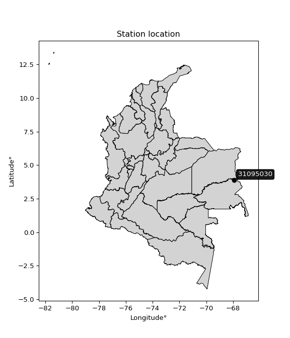

<div align="center">


</div>

# PMP Station (rain, Pmax24h): 31095030

Probable Maximum Precipitation (PMP) is the greatest amount of rainfall for a specific duration that is meteorologically possible for a given location, acting as a "worst-case" scenario for extreme storms, crucial for designing safety-critical infrastructure like bridges, river deviations, dams, spillways, and nuclear plants to prevent catastrophic failure. PMP is calculated by hydrologists using meteorological data to determine the upper limit of extreme rainfall, often leading to the Probable Maximum Flood (PMF) for flood control design, and is increasingly being studied for climate change impacts.

<div align="center">

</img>

</div>


## A. General information


### 1. General running parameters

• app_version: _v20251227_. • runtime: _2025-12-27 09:02:11.367833_. • Python version: _3.14.0_. • SciPy version: _1.16.3_. • Pandas version: _2.3.3_. • NumPy version: _2.3.5_. • Stations dataset (station_dataset_file): _dataset/pmax24h_in/automatic_colombia_2003_2024_filter.csv_. • Stations catalog (station_catalog_file): _dataset/CNE_IDEAM.xls_. • Minimum year to eval til year_max (date_min): _2003_. • Maximum year to eval since year_min (date_max): _2024_. • Creates, save and include plots into reports (create_plot): _False_. • Plot only fit distributions with Δo > Δ (plot_only_fit): _True_. • Eval low extreme values, if False, evaluates high extreme values (low_extreme): _False_. • Eval every SciPy distribution as logarithmic (pdist_logarithmic_on): _True_. • Standard deviation normalized (ddof): _1.0_. • Return periods to eval in years (Tr): _[2, 2.33, 5, 10, 15, 20, 25, 50, 75, 100, 200, 250, 500, 750, 1000]_. • Minimum data sample per station, 0 means any (minimum_sample): _5_. • Z-Score threshold to adjust a value, 0 means disable (zscore): _3.5_. • Avoid zeros, e.g. rain = 0 (avoid_zeros): _True_. • Avoid null values (avoid_nans): _True_. [:file_folder:Dataset file.](../../dataset/pmax24h_in/automatic_colombia_2003_2024_filter.csv)

> Delta Degrees of Freedom (DDOF): is a parameter used in the formulas for calculating variance and standard deviation. When ddof=0, the divisor is $N$ (the total number of observations) and this is used when your data set is the entire population. When ddof=1, the divisor is $N-1$ and this is used when your data set is a sample drawn from a larger population. Using $N-1$ provides an unbiased estimate of the population variance (known as Bessel´s correction).


### 2. Station info and location

|   id |   CODIGO | NOMBRE                          | CATEGORIA         | TECNOLOGIA                              | ESTADO   | FECHA_INSTALACION   |   FECHA_SUSPENSION |   ALTITUD |   LATITUD |   LONGITUD | DEPARTAMENTO   | MUNICIPIO   | AREA_OPERATIVA                            | ENTIDAD                                                     | AREA_HIDROGRAFICA   | ZONA_HIDROGRAFICA   | SUBZONA_HIDROGRAFICA                                    |   CORRIENTE | Catalogo   |
|-----:|---------:|:--------------------------------|:------------------|:----------------------------------------|:---------|:--------------------|-------------------:|----------:|----------:|-----------:|:---------------|:------------|:------------------------------------------|:------------------------------------------------------------|:--------------------|:--------------------|:--------------------------------------------------------|------------:|:-----------|
|    0 | 31095030 | PUERTO INIRIDA - AUT [31095030] | Agrometeorológica | Automática con Telemetría, Convencional | Activa   | 27/03/2003          |                nan |        98 |   3.87444 |   -67.9191 | Guainía        | Inírida     | Area Operativa 03 - Meta-Guaviare-Guainía | INSTITUTO DE HIDROLOGIA METEOROLOGIA Y ESTUDIOS AMBIENTALES | Orinoco             | Inírida             | R._Inírida_(mi),_hasta_bocas_Caño_Bocón,_y_R._Las Viñas |         nan | CNE_IDEAM  |

<div align="center">

Map location in: [:earth_americas:Google](http://maps.google.com/maps?q=3.874444,-67.91911111) [:earth_americas:OSM](https://www.openstreetmap.org/#map=18/3.874444/-67.91911111&layers=P) [:earth_americas:Bing](https://www.bing.com/maps?cp=3.874444~-67.91911111&lvl=18) [:earth_americas:Apple](https://maps.apple.com/frame?center=3.874444%2C-67.91911111&span=0.003%2C0.006)

</div>


<div align="center">

```geojson
{
  "type": "Feature",
  "geometry": {
    "type": "Point", 
    "coordinates": [-67.91911111, 3.874444]
  }, 
  "properties": {
    "Name": "31095030"
  }
}
```

</div>


### 3. Discrete values table and plot

|               |           0 |          1 |           2 |          3 |           4 |          5 |           6 |
|:--------------|------------:|-----------:|------------:|-----------:|------------:|-----------:|------------:|
| Date          | 2018        | 2019       | 2020        | 2021       | 2022        | 2023       | 2024        |
| Value         |   85.6      |  116.6     |  104.5      |  114.3     |   80.9      |   65.3     |   99.6      |
| Value_initial |   85.6      |  116.6     |  104.5      |  114.3     |   80.9      |   65.3     |   99.6      |
| count         |    7        |    7       |    7        |    7       |    7        |    7       |    7        |
| mean          |   95.2571   |   95.2571  |   95.2571   |   95.2571  |   95.2571   |   95.2571  |   95.2571   |
| std           |   18.7939   |   18.7939  |   18.7939   |   18.7939  |   18.7939   |   18.7939  |   18.7939   |
| zscore        |   -0.513845 |    1.13563 |    0.491802 |    1.01325 |   -0.763927 |   -1.59398 |    0.231078 |

> The initial value (value_initial) correspond to the initial obtained or null completed value, and value (value) is adjusted only when the initial value is outside the valid range definite through the Z-Score value. If Z-Score is active, values out of range or outliers are replaced with the station mean value


### 4. Active continuous probability distributions from SciPy (45 of 104 available)

[scipy.stats](https://docs.scipy.org/doc/scipy/reference/stats.html) is a Python´s powerful submodule within the SciPy library for comprehensive statistical analysis, offering over 130 probability distributions (like Normal, Poisson), functions for descriptive stats (mean, variance), hypothesis testing (t-tests, chi-square), random variable generation, and statistical tests, making it essential for data science, modeling, and research. It provides tools to explore, model, and draw conclusions from data efficiently, working seamlessly with NumPy.

<div align="center">

|   id | p_dist             |   n_parameter | fit_method   | label                                                                       | active   | ref                                                                                                        |
|-----:|:-------------------|--------------:|:-------------|:----------------------------------------------------------------------------|:---------|:-----------------------------------------------------------------------------------------------------------|
|    0 | alpha              |             3 | MLE          | Alpha                                                                       | True     | [:mortar_board:](https://docs.scipy.org/doc/scipy/reference/generated/scipy.stats.alpha.html)              |
|    1 | betaprime          |             4 | MLE          | Beta prime                                                                  | True     | [:mortar_board:](https://docs.scipy.org/doc/scipy/reference/generated/scipy.stats.betaprime.html)          |
|    2 | chi2               |             3 | MLE          | Chi²                                                                        | True     | [:mortar_board:](https://docs.scipy.org/doc/scipy/reference/generated/scipy.stats.chi2.html)               |
|    3 | crystalball        |             4 | MLE          | Crystalball                                                                 | True     | [:mortar_board:](https://docs.scipy.org/doc/scipy/reference/generated/scipy.stats.crystalball.html)        |
|    4 | erlang             |             3 | MLE          | Erlang                                                                      | True     | [:mortar_board:](https://docs.scipy.org/doc/scipy/reference/generated/scipy.stats.erlang.html)             |
|    5 | expon              |             2 | MLE          | Exponential                                                                 | True     | [:mortar_board:](https://docs.scipy.org/doc/scipy/reference/generated/scipy.stats.expon.html)              |
|    6 | exponnorm          |             3 | MLE          | Exponentially modified Normal                                               | True     | [:mortar_board:](https://docs.scipy.org/doc/scipy/reference/generated/scipy.stats.exponnorm.html)          |
|    7 | f                  |             4 | MLE          | F                                                                           | True     | [:mortar_board:](https://docs.scipy.org/doc/scipy/reference/generated/scipy.stats.f.html)                  |
|    8 | fatiguelife        |             3 | MLE          | Fatigue-life (Birnbaum-Saunders)                                            | True     | [:mortar_board:](https://docs.scipy.org/doc/scipy/reference/generated/scipy.stats.fatiguelife.html)        |
|    9 | fisk               |             3 | MLE          | Fisk                                                                        | True     | [:mortar_board:](https://docs.scipy.org/doc/scipy/reference/generated/scipy.stats.fisk.html)               |
|   10 | gamma              |             3 | MLE          | Gamma                                                                       | True     | [:mortar_board:](https://docs.scipy.org/doc/scipy/reference/generated/scipy.stats.gamma.html)              |
|   11 | genexpon           |             5 | MLE          | Generalized exponential                                                     | True     | [:mortar_board:](https://docs.scipy.org/doc/scipy/reference/generated/scipy.stats.genexpon.html)           |
|   12 | genlogistic        |             3 | MLE          | Generalized logistic                                                        | True     | [:mortar_board:](https://docs.scipy.org/doc/scipy/reference/generated/scipy.stats.genlogistic.html)        |
|   13 | gibrat             |             2 | MM           | Gibrat                                                                      | True     | [:mortar_board:](https://docs.scipy.org/doc/scipy/reference/generated/scipy.stats.gibrat.html)             |
|   14 | gompertz           |             3 | MLE          | Gompertz (or truncated Gumbel)                                              | True     | [:mortar_board:](https://docs.scipy.org/doc/scipy/reference/generated/scipy.stats.gompertz.html)           |
|   15 | gumbel_l           |             2 | MM           | Gumbel Left Skew                                                            | True     | [:mortar_board:](https://docs.scipy.org/doc/scipy/reference/generated/scipy.stats.gumbel_l.html)           |
|   16 | gumbel_r           |             2 | MM           | Gumbel Right Skew                                                           | True     | [:mortar_board:](https://docs.scipy.org/doc/scipy/reference/generated/scipy.stats.gumbel_r.html)           |
|   17 | halflogistic       |             2 | MM           | Half-logistic                                                               | True     | [:mortar_board:](https://docs.scipy.org/doc/scipy/reference/generated/scipy.stats.halflogistic.html)       |
|   18 | halfnorm           |             2 | MM           | Half Normal                                                                 | True     | [:mortar_board:](https://docs.scipy.org/doc/scipy/reference/generated/scipy.stats.halfnorm.html)           |
|   19 | hypsecant          |             2 | MM           | hyperbolic secant                                                           | True     | [:mortar_board:](https://docs.scipy.org/doc/scipy/reference/generated/scipy.stats.hypsecant.html)          |
|   20 | invgamma           |             3 | MLE          | Inverted gamma                                                              | True     | [:mortar_board:](https://docs.scipy.org/doc/scipy/reference/generated/scipy.stats.invgamma.html)           |
|   21 | invgauss           |             3 | MLE          | Inverse Gaussian                                                            | True     | [:mortar_board:](https://docs.scipy.org/doc/scipy/reference/generated/scipy.stats.invgauss.html)           |
|   22 | invweibull         |             3 | MLE          | Inverted Weibull                                                            | True     | [:mortar_board:](https://docs.scipy.org/doc/scipy/reference/generated/scipy.stats.invweibull.html)         |
|   23 | johnsonsu          |             4 | MLE          | Johnson Su                                                                  | True     | [:mortar_board:](https://docs.scipy.org/doc/scipy/reference/generated/scipy.stats.johnsonsu.html)          |
|   24 | kstwobign          |             2 | MLE          | Limiting distribution of scaled Kolmogorov-Smirnov two-sided test statistic | True     | [:mortar_board:](https://docs.scipy.org/doc/scipy/reference/generated/scipy.stats.kstwobign.html)          |
|   25 | laplace            |             2 | MM           | Laplace                                                                     | True     | [:mortar_board:](https://docs.scipy.org/doc/scipy/reference/generated/scipy.stats.laplace.html)            |
|   26 | laplace_asymmetric |             3 | MLE          | Asymmetric Laplace                                                          | True     | [:mortar_board:](https://docs.scipy.org/doc/scipy/reference/generated/scipy.stats.laplace_asymmetric.html) |
|   27 | loggamma           |             3 | MLE          | Log gamma                                                                   | True     | [:mortar_board:](https://docs.scipy.org/doc/scipy/reference/generated/scipy.stats.loggamma.html)           |
|   28 | logistic           |             2 | MM           | Logistic (or Sech-squared)                                                  | True     | [:mortar_board:](https://docs.scipy.org/doc/scipy/reference/generated/scipy.stats.logistic.html)           |
|   29 | lognorm            |             3 | MLE          | Log Normal                                                                  | True     | [:mortar_board:](https://docs.scipy.org/doc/scipy/reference/generated/scipy.stats.lognorm.html)            |
|   30 | maxwell            |             2 | MM           | Maxwell                                                                     | True     | [:mortar_board:](https://docs.scipy.org/doc/scipy/reference/generated/scipy.stats.maxwell.html)            |
|   31 | mielke             |             4 | MLE          | Mielke Beta-Kappa / Dagum                                                   | True     | [:mortar_board:](https://docs.scipy.org/doc/scipy/reference/generated/scipy.stats.mielke.html)             |
|   32 | moyal              |             2 | MM           | Moyal                                                                       | True     | [:mortar_board:](https://docs.scipy.org/doc/scipy/reference/generated/scipy.stats.moyal.html)              |
|   33 | nakagami           |             3 | MLE          | Nakagami                                                                    | True     | [:mortar_board:](https://docs.scipy.org/doc/scipy/reference/generated/scipy.stats.nakagami.html)           |
|   34 | ncf                |             5 | MLE          | Non-central F distribution                                                  | True     | [:mortar_board:](https://docs.scipy.org/doc/scipy/reference/generated/scipy.stats.ncf.html)                |
|   35 | nct                |             4 | MLE          | Non-central Student’s t                                                     | True     | [:mortar_board:](https://docs.scipy.org/doc/scipy/reference/generated/scipy.stats.nct.html)                |
|   36 | norm               |             2 | MM           | Normal                                                                      | True     | [:mortar_board:](https://docs.scipy.org/doc/scipy/reference/generated/scipy.stats.norm.html)               |
|   37 | pareto             |             3 | MLE          | Pareto                                                                      | True     | [:mortar_board:](https://docs.scipy.org/doc/scipy/reference/generated/scipy.stats.pareto.html)             |
|   38 | pearson3           |             3 | MM           | Pearson type III                                                            | True     | [:mortar_board:](https://docs.scipy.org/doc/scipy/reference/generated/scipy.stats.pearson3.html)           |
|   39 | rayleigh           |             2 | MM           | Rayleigh                                                                    | True     | [:mortar_board:](https://docs.scipy.org/doc/scipy/reference/generated/scipy.stats.rayleigh.html)           |
|   40 | rice               |             3 | MLE          | Rice                                                                        | True     | [:mortar_board:](https://docs.scipy.org/doc/scipy/reference/generated/scipy.stats.rice.html)               |
|   41 | t                  |             3 | MLE          | Student’s t                                                                 | True     | [:mortar_board:](https://docs.scipy.org/doc/scipy/reference/generated/scipy.stats.t.html)                  |
|   42 | truncnorm          |             4 | MLE          | Truncated normal                                                            | True     | [:mortar_board:](https://docs.scipy.org/doc/scipy/reference/generated/scipy.stats.truncnorm.html)          |
|   43 | wald               |             2 | MM           | Wald                                                                        | True     | [:mortar_board:](https://docs.scipy.org/doc/scipy/reference/generated/scipy.stats.wald.html)               |
|   44 | weibull_min        |             3 | MLE          | Weibull minimum                                                             | True     | [:mortar_board:](https://docs.scipy.org/doc/scipy/reference/generated/scipy.stats.weibull_min.html)        |

</div>

> **n_parameter:** # arguments & localization & scale.
>
> **Fit methods:** (MLE) maximum likelihood, (MM) L-moments.
>
>**Inactive:** foldnorm, gennorm, norminvgauss, powernorm, powerlognorm, skewnorm, genextreme, anglit, arcsine, argus, beta, bradford, burr, burr12, cauchy, cosine, halfcauchy, foldcauchy, skewcauchy, wrapcauchy, dgamma, gengamma, exponweib, exponpow, truncexpon, gausshyper, genhalflogistic, genhyperbolic, geninvgauss, halfgennorm, johnsonsb, kappa4, kappa3, ksone, kstwo, loglaplace, levy, levy_l, levy_stable, ncx2, genpareto, truncpareto, lomax, powerlaw, rdist, rel_breitwigner, recipinvgauss, semicircular, studentized_range, trapezoid, triang, truncweibull_min, tukeylambda, uniform, loguniform, vonmises, vonmises_line, weibull_max, dweibull, 


## B. Probability distributions vs. Empirical distributions

A continuous probability distribution (CPD) describes probabilities for variables that can take any value within a range (like rain any time), unlike discrete variables with specific outcomes (like temperature). It uses a Probability Density Function (PDF), a curve where the total area under it equals 1, and the probability of the variable falling within an interval (a to b) is found by calculating the area under the curve between those points. A key feature is that the probability of hitting any single exact value is zero, so probabilities are always expressed for ranges, e.g., $P(a ≤ X ≤ b)$.

<div align="center">

Distributions parameters from station values
|    |   station | p_dist                |   n |             loc |           scale | shape                  | shape1                | shape2                 | shape3   |
|---:|----------:|:----------------------|----:|----------------:|----------------:|:-----------------------|:----------------------|:-----------------------|:---------|
|  0 |  31095030 | alpha                 |   7 |  -273.454       |  7599.45        | 20.67801333211353      |                       |                        |          |
|  1 |  31095030 | betaprime             |   7 |    -1.37571     |    25.582       | 127.8804424244687      | 34.91350750581226     |                        |          |
|  2 |  31095030 | chi2                  |   7 |   -78.1358      |     0.919637    | 188.26745076231407     |                       |                        |          |
|  3 |  31095030 | crystalball           |   7 |    95.2571      |    17.3997      | 8098.24911502461       | 396.4931600556022     |                        |          |
|  4 |  31095030 | erlang                |   7 |  -174.406       |     1.16378     | 231.74250226809892     |                       |                        |          |
|  5 |  31095030 | expon                 |   7 |    65.3         |    29.9571      |                        |                       |                        |          |
|  6 |  31095030 | exponnorm             |   7 |    95.2424      |    17.3997      | 0.0008549574496719297  |                       |                        |          |
|  7 |  31095030 | f                     |   7 | -3980.36        |  4075.59        | 127696.55193760473     | 757446.0709789144     |                        |          |
|  8 |  31095030 | fatiguelife           |   7 |    65.3         |     0.000118999 | 479.2391515747921      |                       |                        |          |
|  9 |  31095030 | fisk                  |   7 |    -0.516037    |    95.6187      | 8.753179048849361      |                       |                        |          |
| 10 |  31095030 | gamma                 |   7 |  -170.575       |     1.17908     | 225.40232514025308     |                       |                        |          |
| 11 |  31095030 | genexpon              |   7 |    65.3         |     1.84371     | 0.06188552710844316    | 1.063687135088283e-06 | 1.1101928175397364     |          |
| 12 |  31095030 | genlogistic           |   7 |   116.6         |     5.82612e-06 | 2.732065661244987e-07  |                       |                        |          |
| 13 |  31095030 | gibrat                |   7 |    81.9833      |     8.051       |                        |                       |                        |          |
| 14 |  31095030 | gompertz              |   7 |   -60.1452      |    14.1949      | 9.7849561284894e-06    |                       |                        |          |
| 15 |  31095030 | gumbel_l              |   7 |   103.088       |    13.5665      |                        |                       |                        |          |
| 16 |  31095030 | gumbel_r              |   7 |    87.4263      |    13.5665      |                        |                       |                        |          |
| 17 |  31095030 | halflogistic          |   7 |    74.6344      |    14.8762      |                        |                       |                        |          |
| 18 |  31095030 | halfnorm              |   7 |    72.2267      |    28.8643      |                        |                       |                        |          |
| 19 |  31095030 | hypsecant             |   7 |    95.2571      |    11.077       |                        |                       |                        |          |
| 20 |  31095030 | invgamma              |   7 |  -179.403       | 65238.5         | 238.52541836480088     |                       |                        |          |
| 21 |  31095030 | invgauss              |   7 |    14.5817      |  1393.89        | 0.05722028334177737    |                       |                        |          |
| 22 |  31095030 | invweibull            |   7 |    65.3         |     2.19927     | 0.0504248751583109     |                       |                        |          |
| 23 |  31095030 | johnsonsu             |   7 |   122.74        |     0.21031     | 6.858418768460952      | 1.2920191109409576    |                        |          |
| 24 |  31095030 | kstwobign             |   7 |    26.4881      |    78.4982      |                        |                       |                        |          |
| 25 |  31095030 | laplace               |   7 |    95.2571      |    12.3035      |                        |                       |                        |          |
| 26 |  31095030 | laplace_asymmetric    |   7 |   104.5         |    13.1849      | 1.4101551436793565     |                       |                        |          |
| 27 |  31095030 | loggamma              |   7 |   116.6         |     8.9504e-06  | 4.192920040366823e-07  |                       |                        |          |
| 28 |  31095030 | logistic              |   7 |    95.2571      |     9.59298     |                        |                       |                        |          |
| 29 |  31095030 | lognorm               |   7 |    65.3         |     0.20499     | 12.376689289673394     |                       |                        |          |
| 30 |  31095030 | maxwell               |   7 |    54.0271      |    25.8371      |                        |                       |                        |          |
| 31 |  31095030 | mielke                |   7 |   -60.819       |   177.704       | 7.339795075629855      | 2380.537874539207     |                        |          |
| 32 |  31095030 | moyal                 |   7 |    85.3069      |     7.83264     |                        |                       |                        |          |
| 33 |  31095030 | nakagami              |   7 |    80.9         |    22.9809      | 0.21968298235336764    |                       |                        |          |
| 34 |  31095030 | ncf                   |   7 |   -15.389       |     0.109104    | 0.15786563114417884    | 2703.569618634704     | 159.8637841338575      |          |
| 35 |  31095030 | nct                   |   7 |   963.531       |    17.3859      | 764726.0960976629      | -49.94127178810007    |                        |          |
| 36 |  31095030 | norm                  |   7 |    95.2571      |    17.3997      |                        |                       |                        |          |
| 37 |  31095030 | pareto                |   7 |    65.2693      |     0.0307484   | 0.16790955104853872    |                       |                        |          |
| 38 |  31095030 | pearson3              |   7 |    95.2571      |    17.3998      | -0.3592495360214355    |                       |                        |          |
| 39 |  31095030 | rayleigh              |   7 |    61.9704      |    26.559       |                        |                       |                        |          |
| 40 |  31095030 | rice                  |   7 |    55.6835      |    19.495       | 1.707994137954874      |                       |                        |          |
| 41 |  31095030 | t                     |   7 |    95.2446      |    17.4029      | 54813.02958552356      |                       |                        |          |
| 42 |  31095030 | truncnorm             |   7 |    83.1492      |    26.7611      | -0.6669807274271335    | 674.7226935871984     |                        |          |
| 43 |  31095030 | wald                  |   7 |    77.8574      |    17.3998      |                        |                       |                        |          |
| 44 |  31095030 | weibull_min           |   7 |  -476.625       |   580.023       | 40.383440320709845     |                       |                        |          |
| 45 |  31095030 | logalpha              |   7 |    -3.2669      |   305.988       | 39.233787129920245     |                       |                        |          |
| 46 |  31095030 | logbetaprime          |   7 |    -4.9073      |    24.5989      | 730.7779973137094      | 1903.4604653164497    |                        |          |
| 47 |  31095030 | logchi2               |   7 |     4.17899     |     0.994556    | 1.0455855504145233     |                       |                        |          |
| 48 |  31095030 | logcrystalball        |   7 |     4.53855     |     0.193856    | 259.88674510632916     | 3.8060010901926256    |                        |          |
| 49 |  31095030 | logerlang             |   7 |     1.28235     |     0.0119245   | 273.02550819582166     |                       |                        |          |
| 50 |  31095030 | logexpon              |   7 |     4.17899     |     0.359553    |                        |                       |                        |          |
| 51 |  31095030 | logexponnorm          |   7 |     4.53839     |     0.193856    | 0.0008011963392025349  |                       |                        |          |
| 52 |  31095030 | logf                  |   7 |   -26.2477      |    30.7858      | 50649.83877445411      | 2653966.784734978     |                        |          |
| 53 |  31095030 | logfatiguelife        |   7 |   -51.3796      |    55.9177      | 0.0034624695852554475  |                       |                        |          |
| 54 |  31095030 | logfisk               |   7 |    -3.0739e+06  |     3.07391e+06 | 26762106.470873684     |                       |                        |          |
| 55 |  31095030 | loggamma              |   7 |     1.17932     |     0.0116154   | 289.3465287956776      |                       |                        |          |
| 56 |  31095030 | loggenexpon           |   7 |     4.17899     |     0.00484158  | 0.005008549192631107   | 0.8148416104205288    | 0.00021963838116395476 |          |
| 57 |  31095030 | loggenlogistic        |   7 |     4.75875     |     2.40178e-07 | 1.100232745697063e-06  |                       |                        |          |
| 58 |  31095030 | loggibrat             |   7 |     4.39063     |     0.0897145   |                        |                       |                        |          |
| 59 |  31095030 | loggompertz           |   7 |     4.17899     |     0.62458     | 1.257974632304851      |                       |                        |          |
| 60 |  31095030 | loggumbel_l           |   7 |     4.62579     |     0.151149    |                        |                       |                        |          |
| 61 |  31095030 | loggumbel_r           |   7 |     4.4513      |     0.151149    |                        |                       |                        |          |
| 62 |  31095030 | loghalflogistic       |   7 |     4.30878     |     0.165741    |                        |                       |                        |          |
| 63 |  31095030 | loghalfnorm           |   7 |     4.28195     |     0.321593    |                        |                       |                        |          |
| 64 |  31095030 | loghypsecant          |   7 |     4.53855     |     0.123412    |                        |                       |                        |          |
| 65 |  31095030 | loginvgamma           |   7 |    -3.90533     | 15624.1         | 1851.7298266370544     |                       |                        |          |
| 66 |  31095030 | loginvgauss           |   7 |     2.99284     |    87.8163      | 0.017602419161248384   |                       |                        |          |
| 67 |  31095030 | loginvweibull         |   7 |    -1.9916e+07  |     1.9916e+07  | 99156220.61492017      |                       |                        |          |
| 68 |  31095030 | logjohnsonsu          |   7 |     4.76831     |     0.0003102   | 4.84547999641463       | 0.7270835269014082    |                        |          |
| 69 |  31095030 | logkstwobign          |   7 |     3.72817     |     0.925409    |                        |                       |                        |          |
| 70 |  31095030 | loglaplace            |   7 |     4.53855     |     0.137077    |                        |                       |                        |          |
| 71 |  31095030 | loglaplace_asymmetric |   7 |     4.64919     |     0.135866    | 1.4867052216446575     |                       |                        |          |
| 72 |  31095030 | logloggamma           |   7 |     4.75875     |     3.88513e-07 | 1.7605714612141658e-06 |                       |                        |          |
| 73 |  31095030 | loglogistic           |   7 |     4.53855     |     0.106878    |                        |                       |                        |          |
| 74 |  31095030 | loglognorm            |   7 |     4.17899     |     0.00318411  | 11.806516799033552     |                       |                        |          |
| 75 |  31095030 | logmaxwell            |   7 |     4.07919     |     0.287859    |                        |                       |                        |          |
| 76 |  31095030 | logmielke             |   7 |    -1.13688e+08 |     1.13688e+08 | 495420202.72565454     | 9002916665.69019      |                        |          |
| 77 |  31095030 | logmoyal              |   7 |     4.42769     |     0.0872658   |                        |                       |                        |          |
| 78 |  31095030 | lognakagami           |   7 |   -60.9016      |    65.4403      | 28406.473457232365     |                       |                        |          |
| 79 |  31095030 | logncf                |   7 |     0.695972    |     3.83963     | 1242.3732636238983     | 1917.7819757002699    | 0.06846578924586796    |          |
| 80 |  31095030 | lognct                |   7 |    -9.63376     |     0.163965    | 8544.23271511223       | 86.42666199688983     |                        |          |
| 81 |  31095030 | lognorm               |   7 |     4.53855     |     0.193856    |                        |                       |                        |          |
| 82 |  31095030 | logpareto             |   7 |     4.17861     |     0.000378074 | 0.16786981819068522    |                       |                        |          |
| 83 |  31095030 | logpearson3           |   7 |     4.53855     |     0.193856    | -0.5871798133185471    |                       |                        |          |
| 84 |  31095030 | lograyleigh           |   7 |     4.16769     |     0.295902    |                        |                       |                        |          |
| 85 |  31095030 | logrice               |   7 |     4.05827     |     0.211463    | 1.999711127409284      |                       |                        |          |
| 86 |  31095030 | logt                  |   7 |     4.53855     |     0.193856    | 19830191662.62507      |                       |                        |          |
| 87 |  31095030 | logtruncnorm          |   7 |    -0.0428477   |     1.41432     | 2.985067446443886      | 3.3949930659593455    |                        |          |
| 88 |  31095030 | logwald               |   7 |     4.34466     |     0.193885    |                        |                       |                        |          |
| 89 |  31095030 | logweibull_min        |   7 |    -6.23734e+06 |     6.23735e+06 | 41709763.769546255     |                       |                        |          |

</div>

> **loc** (Location parameter): This shifts the distribution along the x-axis. For many common distributions, like the normal (Gaussian) distribution, loc represents the mean $μ$. For others, like the uniform distribution, it might represent the minimum value, or for the beta distribution, the left end of the support interval.
>
> **scale** (Scale parameter): This determines the width or spread of the distribution. For the normal distribution, scale represents the standard deviation $σ$. For a uniform distribution, it defines the length of the interval (from $loc$ to $loc + scale$).
>
> **shape** (Shape parameters): Refers to parameters that define the specific form of a probability distribution, distinct from its location (loc) and scale (scale). These parameters are required arguments for most distribution functions. For example, a normal (Gaussian) distribution is fully defined by its location (mean) and scale (standard deviation), so it has no specific shape parameters beyond loc and scale. However, other distributions have intrinsic properties that need specification, as Gamma distribution that takes a shape parameter, often named $a$ or $alpha$.


### 0. Cumulative distribution values - CDF (90 evaluated)

Cumulative Distribution Function (CDF), denoted as $F$<sub>$X$</sub>$(x)$, is a function that gives the probability that a random variable $X$ will take a value less than or equal to a specific value, $x$ (i.e., $(P(X≥x)$. It essentially "accumulates" probabilities from a given point up to the far right (positive infinity), providing a complete picture of the distribution´s probabilities for both discrete (like rain) and continuous (like temperature) variables, helping to find probabilities over ranges or above certain values.

<div align="center">

CDF ordered by x ascending and calculating $log(f(x))$ separately
|   id |   Station |   date |     x |   count |    mean |     std |    zscore |   Value_initial |   station |   m |     alpha |   alpha_pdf |   betaprime |   betaprime_pdf |      chi2 |   chi2_pdf |   crystalball |   crystalball_pdf |    erlang |   erlang_pdf |    expon |   expon_pdf |   exponnorm |   exponnorm_pdf |         f |      f_pdf |   fatiguelife |   fatiguelife_pdf |      fisk |   fisk_pdf |     gamma |   gamma_pdf |    genexpon |   genexpon_pdf |   genlogistic |   genlogistic_pdf |   gibrat |   gibrat_pdf |   gompertz |   gompertz_pdf |   gumbel_l |   gumbel_l_pdf |   gumbel_r |   gumbel_r_pdf |   halflogistic |   halflogistic_pdf |   halfnorm |   halfnorm_pdf |   hypsecant |   hypsecant_pdf |   invgamma |   invgamma_pdf |   invgauss |   invgauss_pdf |   invweibull |   invweibull_pdf |   johnsonsu |   johnsonsu_pdf |   kstwobign |   kstwobign_pdf |   laplace |   laplace_pdf |   laplace_asymmetric |   laplace_asymmetric_pdf |   loggamma |   loggamma_pdf |   logistic |   logistic_pdf |   lognorm |   lognorm_pdf |   maxwell |   maxwell_pdf |    mielke |   mielke_pdf |       moyal |   moyal_pdf |   nakagami |   nakagami_pdf |       ncf |    ncf_pdf |       nct |    nct_pdf |      norm |   norm_pdf |   pareto |   pareto_pdf |   pearson3 |   pearson3_pdf |   rayleigh |   rayleigh_pdf |      rice |   rice_pdf |         t |      t_pdf |   truncnorm |   truncnorm_pdf |      wald |   wald_pdf |   weibull_min |   weibull_min_pdf |   logalpha |   logalpha_pdf |   logbetaprime |   logbetaprime_pdf |     logchi2 |   logchi2_pdf |   logcrystalball |   logcrystalball_pdf |   logerlang |   logerlang_pdf |   logexpon |   logexpon_pdf |   logexponnorm |   logexponnorm_pdf |      logf |   logf_pdf |   logfatiguelife |   logfatiguelife_pdf |   logfisk |   logfisk_pdf |   loggenexpon |   loggenexpon_pdf |   loggenlogistic |   loggenlogistic_pdf |   loggibrat |   loggibrat_pdf |   loggompertz |   loggompertz_pdf |   loggumbel_l |   loggumbel_l_pdf |   loggumbel_r |   loggumbel_r_pdf |   loghalflogistic |   loghalflogistic_pdf |   loghalfnorm |   loghalfnorm_pdf |   loghypsecant |   loghypsecant_pdf |   loginvgamma |   loginvgamma_pdf |   loginvgauss |   loginvgauss_pdf |   loginvweibull |   loginvweibull_pdf |   logjohnsonsu |   logjohnsonsu_pdf |   logkstwobign |   logkstwobign_pdf |   loglaplace |   loglaplace_pdf |   loglaplace_asymmetric |   loglaplace_asymmetric_pdf |   logloggamma |   logloggamma_pdf |   loglogistic |   loglogistic_pdf |   loglognorm |   loglognorm_pdf |   logmaxwell |   logmaxwell_pdf |   logmielke |   logmielke_pdf |    logmoyal |   logmoyal_pdf |   lognakagami |   lognakagami_pdf |    logncf |   logncf_pdf |   lognct |   lognct_pdf |   logpareto |   logpareto_pdf |   logpearson3 |   logpearson3_pdf |   lograyleigh |   lograyleigh_pdf |   logrice |   logrice_pdf |      logt |   logt_pdf |   logtruncnorm |   logtruncnorm_pdf |   logwald |   logwald_pdf |   logweibull_min |   logweibull_min_pdf |
|-----:|----------:|-------:|------:|--------:|--------:|--------:|----------:|----------------:|----------:|----:|----------:|------------:|------------:|----------------:|----------:|-----------:|--------------:|------------------:|----------:|-------------:|---------:|------------:|------------:|----------------:|----------:|-----------:|--------------:|------------------:|----------:|-----------:|----------:|------------:|------------:|---------------:|--------------:|------------------:|---------:|-------------:|-----------:|---------------:|-----------:|---------------:|-----------:|---------------:|---------------:|-------------------:|-----------:|---------------:|------------:|----------------:|-----------:|---------------:|-----------:|---------------:|-------------:|-----------------:|------------:|----------------:|------------:|----------------:|----------:|--------------:|---------------------:|-------------------------:|-----------:|---------------:|-----------:|---------------:|----------:|--------------:|----------:|--------------:|----------:|-------------:|------------:|------------:|-----------:|---------------:|----------:|-----------:|----------:|-----------:|----------:|-----------:|---------:|-------------:|-----------:|---------------:|-----------:|---------------:|----------:|-----------:|----------:|-----------:|------------:|----------------:|----------:|-----------:|--------------:|------------------:|-----------:|---------------:|---------------:|-------------------:|------------:|--------------:|-----------------:|---------------------:|------------:|----------------:|-----------:|---------------:|---------------:|-------------------:|----------:|-----------:|-----------------:|---------------------:|----------:|--------------:|--------------:|------------------:|-----------------:|---------------------:|------------:|----------------:|--------------:|------------------:|--------------:|------------------:|--------------:|------------------:|------------------:|----------------------:|--------------:|------------------:|---------------:|-------------------:|--------------:|------------------:|--------------:|------------------:|----------------:|--------------------:|---------------:|-------------------:|---------------:|-------------------:|-------------:|-----------------:|------------------------:|----------------------------:|--------------:|------------------:|--------------:|------------------:|-------------:|-----------------:|-------------:|-----------------:|------------:|----------------:|------------:|---------------:|--------------:|------------------:|----------:|-------------:|---------:|-------------:|------------:|----------------:|--------------:|------------------:|--------------:|------------------:|----------:|--------------:|----------:|-----------:|---------------:|-------------------:|----------:|--------------:|-----------------:|---------------------:|
|    0 |  31095030 |   2023 |  65.3 |       7 | 95.2571 | 18.7939 | -1.59398  |            65.3 |  31095030 |   1 | 0.0395871 |  0.00565879 |   0.0306522 |      0.00576851 | 0.0413215 | 0.00562476 |     0.0425619 |         0.0052082 | 0.0411153 |    0.005382  | 0        |  0.033381   |    0.042561 |      0.00520813 | 0.0426767 | 0.00523807 |     0.0369915 |       4.45041e+08 | 0.0366375 | 0.00469407 | 0.0414592 |  0.00542809 | 1.08787e-06 |     0.0335658  |      0        |        0.00423016 | 0        |   0          |  0.0651545 |     0.00443774 |  0.0598403 |     0.00427619 | 0.00604375 |     0.00227589 |       0        |         0          |   0        |     0          |   0.0425314 |      0.00382819 |  0.0381513 |     0.00543226 |  0.0355705 |     0.00666973 |   0.00554911 |      1.02273e+11 |   0.0993496 |      0.00392873 |   0.0326039 |      0.00763875 | 0.0438054 |    0.0035604  |            0.0808031 |               0.00434596 |  0.0301726 |       0.373365 |  0.0421757 |     0.00421109 | 0.0318164 |      0.368492 | 0.0208704 |    0.00534496 | 0.0807212 |   0.00469776 | 0.000335284 | 0.000294216 | 0          |    0           | 0.0371776 | 0.00538785 | 0.0425747 | 0.00520877 | 0.0425619 |  0.0052082 | 0        |  5.46075     |  0.0516399 |      0.0050873 | 0.00782747 |     0.00468333 | 0.0290248 | 0.00617675 | 0.0426586 | 0.00521658 | 1.55472e-13 |      0.0159636  | 0         | 0          |     0.0623073 |         0.0044953 |  0.0313617 |       0.389594 |       0.189891 |           0.682007 | 1.06423e-08 |   6.26421e+06 |         0.031816 |             0.368489 |   0.0304989 |        0.378553 |   0        |       2.78123  |      0.0318164 |           0.368492 | 0.0325704 |   0.375909 |        0.0313992 |             0.367311 | 0.0365153 |      0.306302 |   6.88082e-07 |          1.03449  |         0        |             0.321765 | 0           |        0        |    3.2377e-10 |          2.01411  |     0.0506955 |          0.326752 |    0.00233615 |         0.0936514 |          0        |              0        |      0        |          0        |      0.0345278 |           0.279227 |     0.0313438 |          0.380968 |     0.0261755 |          0.390239 |       0.0270929 |            0.486741 |       0.125563 |           0.254775 |      0.0284302 |           0.592593 |    0.0362922 |         0.264758 |               0.0671368 |                    0.332373 |     0.0722788 |          0.327536 |     0.0334354 |          0.302376 |   0.00717343 |      1.89889e+12 |    0.0106933 |         0.313756 |   0.0760586 |        0.331441 | 3.21704e-05 |     0.00335348 |     0.0319541 |          0.369955 | 0.0298664 |     0.375011 | 0.033028 |      0.38027 |    0        |     444.013     |     0.0454666 |          0.370022 |    0.00072949 |          0.129015 | 0.0237677 |      0.420359 | 0.0318163 |   0.368491 |    4.12228e-07 |           3.04977  |  0        |      0        |        0.0481479 |             0.314092 |
|    1 |  31095030 |   2022 |  80.9 |       7 | 95.2571 | 18.7939 | -0.763927 |            80.9 |  31095030 |   2 | 0.221276  |  0.0179794  |   0.234391  |      0.0199723  | 0.218235  | 0.0174766  |     0.204647  |         0.0163126 | 0.21035   |    0.0168892 | 0.405922 |  0.0198309  |    0.204645 |      0.0163125  | 0.205536  | 0.0163645  |     0.775026  |       0.00726196  | 0.196632  | 0.0169834  | 0.211861  |  0.0169789  | 0.407637    |     0.0198835  |      0        |        0.00879142 | 0        |   0          |  0.183082  |     0.0116381  |  0.177047  |     0.0118201  | 0.198336   |     0.0236514  |       0.207533 |         0.0321632  |   0.236192 |     0.0264224  |   0.170013  |      0.0146289  |  0.214159  |     0.0175835  |  0.254664  |     0.020463   |   0.404165   |      0.00118352  |   0.190557  |      0.00839467 |   0.277411  |      0.0210836  | 0.155663  |    0.0126519  |            0.18699   |               0.0100572  |  0.231066  |       1.58738  |  0.182929  |     0.0155807  | 0.226721  |      1.55377  | 0.218528  |    0.0194505  | 0.18999   |   0.00983979 | 0.185215    | 0.0280557   | 1.6317e-07 |    5.04483e+06 | 0.212838  | 0.0175824  | 0.204661  | 0.016312   | 0.204647  |  0.0163126 | 0.648755 |  0.00377317  |  0.198559  |      0.0146045 | 0.224306   |     0.0208166  | 0.215564  | 0.0176931  | 0.204896  | 0.0163212  | 0.286404    |      0.01987    | 0.0425658 | 0.0447549  |     0.183215  |         0.0119733 |  0.238266  |       1.61472  |       0.365037 |           0.926516 | 0.338999    |   0.770417    |         0.22672  |             1.55377  |   0.233942  |        1.6036   |   0.448879 |       1.5328   |      0.226722  |           1.55377  | 0.229283  |   1.55711  |        0.22688   |             1.56037  | 0.196587  |      1.37507  |   0.32715     |          1.79122  |         0        |             0.858469 | 0.000194581 |        0.285861 |    0.402319   |          1.69633  |     0.19318   |          1.14581  |    0.230252   |         2.23716   |          0.249347 |              2.82919  |      0.270639 |          2.33691  |      0.190218  |           1.45121  |     0.234299  |          1.59969  |     0.248109  |          1.70939  |       0.288801  |            1.78585  |       0.206355 |           0.552905 |      0.319988  |           1.81761  |    0.17319   |         1.26345  |               0.193887  |                    0.959873 |     0.190812  |          0.864678 |     0.204276  |          1.52086  |   0.639261   |      0.148023    |    0.244611  |         1.81933  |   0.19345   |        0.843    | 0.223084    |     2.65159    |     0.22725   |          1.55472  | 0.232706  |     1.60031  | 0.230544 |      1.55589 |    0.655112 |       0.269787  |     0.212665  |          1.30998  |    0.252072   |          1.92647  | 0.237188  |      1.61879  | 0.226721  |   1.55377  |    0.523805    |           1.91834  |  0.113138 |      5.34754  |        0.186754  |             1.1242   |
|    2 |  31095030 |   2018 |  85.6 |       7 | 95.2571 | 18.7939 | -0.513845 |            85.6 |  31095030 |   3 | 0.31307   |  0.0208851  |   0.334151  |      0.0221813  | 0.307768  | 0.0204505  |     0.289442  |         0.0196552 | 0.297458  |    0.0200309 | 0.492183 |  0.0169514  |    0.289439 |      0.0196551  | 0.290527  | 0.0196842  |     0.80561   |       0.0058415   | 0.285728  | 0.0207443  | 0.299367  |  0.0201078  | 0.494091    |     0.0169816  |      0        |        0.0109592  | 0.211789 |   0.0800832  |  0.245418  |     0.0149695  |  0.240832  |     0.0154185  | 0.31851    |     0.0268608  |       0.352734 |         0.0294289  |   0.356861 |     0.0248294  |   0.252158  |      0.0204568  |  0.304339  |     0.0206085  |  0.355421  |     0.02212    |   0.409024   |      0.000908293 |   0.235179  |      0.0106946  |   0.37794   |      0.0214264  | 0.22808   |    0.0185378  |            0.24077   |               0.0129497  |  0.329027  |       1.86423  |  0.267628  |     0.020432   | 0.323339  |      1.8527   | 0.316178  |    0.0218563  | 0.241396  |   0.0121009  | 0.326366    | 0.0308819   | 0.3902     |    0.0362028   | 0.303041  | 0.02062    | 0.289452  | 0.0196544  | 0.289442  |  0.0196552 | 0.663922 |  0.00277563  |  0.275249  |      0.0179959 | 0.326849   |     0.02255    | 0.305364  | 0.0203682  | 0.289724  | 0.0196604  | 0.380002    |      0.0198569  | 0.31464   | 0.0546422  |     0.247272  |         0.0153578 |  0.337403  |       1.87733  |       0.418321 |           0.957713 | 0.379508    |   0.669739    |         0.323338 |             1.8527   |   0.332769  |        1.87812  |   0.528983 |       1.31001  |      0.32334   |           1.8527   | 0.325887  |   1.84863  |        0.323878  |             1.85924  | 0.285751  |      1.77692  |   0.427999    |          1.76668  |         0        |             1.11192  | 0.337916    |        6.18987  |    0.49462    |          1.5701   |     0.267936  |          1.51058  |    0.36395    |         2.43375   |          0.401199 |              2.53117  |      0.398034 |          2.16551  |      0.288379  |           2.02992  |     0.333002  |          1.87808  |     0.35139   |          1.9242   |       0.391562  |            1.82785  |       0.241809 |           0.712298 |      0.422454  |           1.79108  |    0.26148   |         1.90755  |               0.256428  |                    1.26949  |     0.246459  |          1.11684  |     0.303347  |          1.97727  |   0.646654   |      0.116295    |    0.353367  |         2.00563  |   0.247425  |        1.07821  | 0.378008    |     2.73252    |     0.323881  |          1.85214  | 0.331292  |     1.87273  | 0.326928 |      1.84199 |    0.668375 |       0.205369  |     0.295872  |          1.63521  |    0.364991   |          2.04518  | 0.336182  |      1.86994  | 0.323339  |   1.8527   |    0.625601    |           1.69118  |  0.400475 |      4.25143  |        0.260344  |             1.49161  |
|    3 |  31095030 |   2024 |  99.6 |       7 | 95.2571 | 18.7939 |  0.231078 |            99.6 |  31095030 |   4 | 0.620625  |  0.020781   |   0.637448  |      0.0191363  | 0.613982  | 0.0210599  |     0.598549  |         0.0222249 | 0.604041  |    0.0215171 | 0.681766 |  0.010623   |    0.598547 |      0.022225   | 0.599281  | 0.0221501  |     0.8687    |       0.00347849  | 0.599242  | 0.0209965  | 0.606362  |  0.0214913  | 0.683783    |     0.0106143  |      0        |        0.0211298  | 0.783202 |   0.0166662  |  0.529999  |     0.0249994  |  0.538508  |     0.026305   | 0.665208   |     0.0199886  |       0.68534  |         0.0178241  |   0.657045 |     0.0176314  |   0.621717  |      0.0266607  |  0.612027  |     0.0210646  |  0.650658  |     0.0183347  |   0.41868    |      0.00053589  |   0.455958  |      0.0221378  |   0.649118  |      0.0163772  | 0.648704  |    0.0285526  |            0.511233  |               0.0274965  |  0.627908  |       1.89148  |  0.611284  |     0.0247698  | 0.626655  |      1.95333  | 0.625202  |    0.0202785  | 0.471862  |   0.0215895  | 0.688011    | 0.0188683   | 0.698929   |    0.0145654   | 0.611279  | 0.0211338  | 0.598552  | 0.0222248  | 0.598549  |  0.0222249 | 0.692224 |  0.00150531  |  0.576629  |      0.0231832 | 0.633481   |     0.0195525  | 0.60945   | 0.0210648  | 0.598809  | 0.022217   | 0.639695    |      0.0165072  | 0.751547  | 0.0160099  |     0.535576  |         0.024963  |  0.634521  |       1.85868  |       0.564633 |           0.95231  | 0.466958    |   0.502027    |         0.626655 |             1.95333  |   0.632508  |        1.8875   |   0.690919 |       0.859625 |      0.626656  |           1.95333  | 0.627245  |   1.9353   |        0.627661  |             1.95189  | 0.599332  |      2.09065  |   0.671359    |          1.38919  |         0        |             2.22551  | 0.803172    |        1.31702  |    0.703296   |          1.17479  |     0.572431  |          2.40346  |    0.690028   |         1.6938    |          0.707442 |              1.50694  |      0.679093 |          1.51597  |      0.65499   |           2.27948  |     0.633731  |          1.89847  |     0.642714  |          1.75278  |       0.643356  |            1.41275  |       0.408491 |           1.68952  |      0.664288  |           1.3491   |    0.683347  |         2.31004  |               0.542811  |                    2.68729  |     0.489616  |          2.21873  |     0.642417  |          2.14933  |   0.660542   |      0.0734671   |    0.650689  |         1.76079  |   0.47876   |        2.08629  | 0.7113      |     1.57998    |     0.626819  |          1.94961  | 0.629856  |     1.87936  | 0.626492 |      1.92165 |    0.69219  |       0.122287  |     0.592886  |          2.13493  |    0.658022   |          1.69304  | 0.632953  |      1.87028  | 0.626655  |   1.95333  |    0.842368    |           1.1966   |  0.770993 |      1.29994  |        0.564138  |             2.42041  |
|    4 |  31095030 |   2020 | 104.5 |       7 | 95.2571 | 18.7939 |  0.491802 |           104.5 |  31095030 |   5 | 0.716075  |  0.0180285  |   0.723968  |      0.0161175  | 0.711247  | 0.0184696  |     0.702362  |         0.019911  | 0.703969  |    0.0190733 | 0.729785 |  0.00902006 |    0.70236  |      0.0199111  | 0.702691  | 0.0198252  |     0.884467  |       0.00297484  | 0.694355  | 0.0176892  | 0.70608   |  0.0190152  | 0.731741    |     0.00900448 |      0        |        0.026588   | 0.848134 |   0.0104405  |  0.655717  |     0.025862   |  0.67034   |     0.026965   | 0.75271    |     0.0157613  |       0.763188 |         0.014034   |   0.736476 |     0.0147949  |   0.739256  |      0.0209936  |  0.709154  |     0.0184148  |  0.733422  |     0.0154041  |   0.421134   |      0.000468486 |   0.578003  |      0.0277147  |   0.7233    |      0.0138998  | 0.764109  |    0.0191727  |            0.665388  |               0.0357876  |  0.714083  |       1.68458  |  0.723822  |     0.0208385  | 0.715913  |      1.74862  | 0.71799   |    0.0174844  | 0.588469  |   0.0261267  | 0.768989    | 0.0143276   | 0.763041   |    0.0117278   | 0.70878   | 0.018496   | 0.702366  | 0.0199112  | 0.702362  |  0.019911  | 0.699042 |  0.00128812  |  0.687473  |      0.0217408 | 0.722553   |     0.0167282  | 0.707246  | 0.0186759  | 0.702577  | 0.0199006  | 0.715781    |      0.0145048  | 0.81688   | 0.0110357  |     0.660283  |         0.0254877 |  0.71897   |       1.64664  |       0.609741 |           0.92428  | 0.490169    |   0.465492    |         0.715913 |             1.74863  |   0.718358  |        1.67526  |   0.729564 |       0.752144 |      0.715914  |           1.74862  | 0.715664  |   1.73226  |        0.716787  |             1.74476  | 0.694406  |      1.84752  |   0.734045    |          1.21978  |         0        |             2.77315  | 0.855083    |        0.881179 |    0.756509   |          1.04115  |     0.688829  |          2.40336  |    0.763357   |         1.36375   |          0.772672 |              1.21569  |      0.746517 |          1.29263  |      0.753391  |           1.80426  |     0.720096  |          1.68527  |     0.721751  |          1.53132  |       0.706622  |            1.22168  |       0.505924 |           2.43472  |      0.724876  |           1.17421  |    0.776937  |         1.62729  |               0.688502  |                    3.40855  |     0.608654  |          2.75815  |     0.737925  |          1.80945  |   0.663878   |      0.0657118   |    0.729869  |         1.53014  |   0.590207  |        2.57178  | 0.778649    |     1.23521    |     0.715901  |          1.74515  | 0.715366  |     1.66951  | 0.714311 |      1.72126 |    0.697703 |       0.10784   |     0.693806  |          2.04257  |    0.733914   |          1.46326  | 0.718193  |      1.66733  | 0.715913  |   1.74862  |    0.896736    |           1.06973  |  0.824272 |      0.942363 |        0.681751  |             2.43658  |
|    5 |  31095030 |   2021 | 114.3 |       7 | 95.2571 | 18.7939 |  1.01325  |           114.3 |  31095030 |   6 | 0.859794  |  0.0112611  |   0.851434  |      0.0100439  | 0.859422  | 0.0116569  |     0.863118  |         0.0125971 | 0.857809  |    0.0121328 | 0.805178 |  0.00650335 |    0.863117 |      0.0125972  | 0.862743  | 0.0125497  |     0.909711  |       0.00222405  | 0.832228  | 0.0106445  | 0.859192  |  0.012052   | 0.80694     |     0.00648033 |      0        |        0.0420987  | 0.917703 |   0.00469959 |  0.880772  |     0.0178631  |  0.898245  |     0.0171399  | 0.871144   |     0.008858   |       0.870028 |         0.00816918 |   0.855055 |     0.00955465 |   0.887103  |      0.0099797  |  0.856704  |     0.0116113  |  0.85546   |     0.00965552 |   0.425229   |      0.000374199 |   0.883425  |      0.0299919  |   0.83637   |      0.00931194 | 0.893638  |    0.00864485 |            0.882688  |               0.0125468  |  0.84272   |       1.17195  |  0.879222  |     0.0110696  | 0.849232  |      1.20684  | 0.857849  |    0.0110597  | 0.898039  |   0.0376397  | 0.875156    | 0.00790412  | 0.856676   |    0.00765139  | 0.857079  | 0.0116737  | 0.863124  | 0.0125974  | 0.863118  |  0.0125971 | 0.710102 |  0.000992778 |  0.867517  |      0.0142595 | 0.85645    |     0.0106494  | 0.858515  | 0.0120074  | 0.863229  | 0.0125876  | 0.836538    |      0.0101275  | 0.89532   | 0.00568307 |     0.88011   |         0.0173793 |  0.844372  |       1.14068  |       0.689236 |           0.843878 | 0.529281    |   0.409428    |         0.849232 |             1.20684  |   0.845884  |        1.15769  |   0.789239 |       0.586176 |      0.849233  |           1.20684  | 0.847894  |   1.19973  |        0.84967   |             1.2017   | 0.832189  |      1.21583  |   0.828905    |          0.899103 |         0        |             4.18127  | 0.912472    |        0.456804 |    0.838756   |          0.795872 |     0.879058  |          1.69028  |    0.861372   |         0.850429  |          0.861038 |              0.780173 |      0.844586 |          0.904414 |      0.875967  |           0.979784 |     0.848228  |          1.16041  |     0.838083  |          1.06273  |       0.800719  |            0.885994 |       0.848513 |           5.78743  |      0.816046  |           0.866335 |    0.884008  |         0.846181 |               0.883194  |                    1.27815  |     0.913658  |          4.1403   |     0.866911  |          1.07951  |   0.669252   |      0.0548402   |    0.845694  |         1.05377  |   0.868432  |        3.49284  | 0.866441    |     0.758053   |     0.848982  |          1.2052   | 0.842698  |     1.15943  | 0.845932 |      1.19752 |    0.706423 |       0.0879715 |     0.855519  |          1.49449  |    0.844758   |          1.01264  | 0.845706  |      1.16352  | 0.849232  |   1.20684  |    0.983162    |           0.86514  |  0.889034 |      0.545989 |        0.875692  |             1.73317  |
|    6 |  31095030 |   2019 | 116.6 |       7 | 95.2571 | 18.7939 |  1.13563  |           116.6 |  31095030 |   7 | 0.883949  |  0.00975823 |   0.873095  |      0.00880828 | 0.88442   | 0.0100941  |     0.890017  |         0.0108056 | 0.883813  |    0.0104912 | 0.819576 |  0.00602273 |    0.890016 |      0.0108057  | 0.88955   | 0.0107729  |     0.914663  |       0.00208406  | 0.855093  | 0.0092609  | 0.885011  |  0.0104128  | 0.821284    |     0.00599886 |      0.999994 |        0.0468931  | 0.927654 |   0.00397812 |  0.91798   |     0.0144499  |  0.933289  |     0.0133131  | 0.890087   |     0.00763924 |       0.8876   |         0.00713109 |   0.875781 |     0.00847996 |   0.907944  |      0.0081952  |  0.881621  |     0.0100694  |  0.87631   |     0.00849021 |   0.426069   |      0.000357301 |   0.94555   |      0.0232084  |   0.856697  |      0.00837334 | 0.911774  |    0.00717085 |            0.908271  |               0.00981071 |  0.864893  |       1.05428  |  0.902458  |     0.00917623 | 0.872004  |      1.07955  | 0.881645  |    0.00964635 | 0.988234  |   0.0400032  | 0.892091    | 0.00684626  | 0.873397   |    0.00689946  | 0.882127  | 0.0101207  | 0.890024  | 0.0108058  | 0.890017  |  0.0108056 | 0.712325 |  0.000941023 |  0.897836  |      0.0121042 | 0.879421   |     0.00933847 | 0.884291  | 0.0104165  | 0.890107  | 0.010797   | 0.858678    |      0.00912958 | 0.907491  | 0.00492227 |     0.916379  |         0.0141256 |  0.865955  |       1.02642  |       0.705832 |           0.821914 | 0.53733     |   0.39864     |         0.872004 |             1.07956  |   0.86777   |        1.03987  |   0.800599 |       0.55458  |      0.872005  |           1.07955  | 0.870548  |   1.07484  |        0.872342  |             1.07468  | 0.855038  |      1.07912  |   0.846139    |          0.831344 |         0.999983 |             4.58083  | 0.920992    |        0.400059 |    0.854088   |          0.743535 |     0.910191  |          1.43201  |    0.877393   |         0.759272  |          0.875799 |              0.702829 |      0.861824 |          0.82663  |      0.89409   |           0.842435 |     0.870149  |          1.04062  |     0.858247  |          0.962173 |       0.8177    |            0.819347 |       0.967751 |           5.49054  |      0.832681  |           0.803996 |    0.899699  |         0.731717 |               0.906073  |                    1.02779  |     0.999982  |          4.53139  |     0.886987  |          0.937901 |   0.670325   |      0.0528868   |    0.865668  |         0.952081 |   0.933774  |        2.89766  | 0.880735    |     0.678233   |     0.871726  |          1.07841  | 0.864636  |     1.04334  | 0.868562 |      1.07464 |    0.70814  |       0.0844536 |     0.883635  |          1.32638  |    0.863985   |          0.918173 | 0.867723  |      1.04703  | 0.872004  |   1.07955  |    0.999993    |           0.824822 |  0.899315 |      0.487404 |        0.907645  |             1.47116  |


</div>

An Empirical Distribution Function (EDF) is a step-function estimate of a true cumulative distribution function (CDF) based on observed sample data, representing the proportion of data points less than or equal to a given value. It is calculated by ordering your data and jumping up by $1/n$ (where $n$ is sample size) at each unique data point, allowing analysis without assuming an underlying population distribution, and it gets closer to the true CDF as the sample size grows.


### 1. Empirical - EDF California (1923)

California´s estimates the true probability distribution of water-related data (like rainfall, streamflow) using observed samples, crucial for risk assessment.

<div align="center">


$P=m/n$


</div>


**1.1. Empirical values**

<div align="center">

|                | 0                   | 1                  | 2                   | 3                  | 4                  | 5                  | 6              |
|:---------------|:--------------------|:-------------------|:--------------------|:-------------------|:-------------------|:-------------------|:---------------|
| date           | 2023                | 2022               | 2018                | 2024               | 2020               | 2021               | 2019           |
| x              | 65.3                | 80.9               | 85.6                | 99.6               | 104.5              | 114.3              | 116.6          |
| m              | 1                   | 2                  | 3                   | 4                  | 5                  | 6                  | 7              |
| empirical_dist | edf_california      | edf_california     | edf_california      | edf_california     | edf_california     | edf_california     | edf_california |
| empirical      | 0.14285714285714285 | 0.2857142857142857 | 0.42857142857142855 | 0.5714285714285714 | 0.7142857142857143 | 0.8571428571428571 | 1.0            |
| empirical_tr   | 1.1666666666666665  | 1.4                | 1.75                | 2.333333333333333  | 3.5                | 6.999999999999997  | inf            |

</div>


**1.2. Kolmogorov-Smirnov fit test (sorted by Δ)**


<div align="center">

|                | 0                   | 1                   | 2                   | 3                   | 4                   | 5                   | 6                   | 7                   | 8                   | 9                   | 10                  | 11                  | 12                  | 13                  | 14                  | 15                  | 16                  | 17                  | 18                  | 19                  | 20                  | 21                  | 22                  | 23                  | 24                  | 25                  | 26                  | 27                  | 28                  | 29                  | 30                  | 31                  | 32                  | 33                  | 34                  | 35                  | 36                  | 37                  | 38                  | 39                  | 40                  | 41                  | 42                  | 43                  | 44                  | 45                  | 46                  | 47                  | 48                  | 49                  | 50                  | 51                  | 52                  | 53                  | 54                  | 55                  | 56                  | 57                  | 58                  | 59                    | 60                  | 61                  | 62                  | 63                  | 64                  | 65                  | 66                  | 67                  | 68                  | 69                  | 70                  | 71                  | 72                  | 73                  | 74                  | 75                  | 76                  | 77                  | 78                  | 79                  | 80                  | 81                  | 82                  | 83                  | 84                  | 85                  | 86                  | 87                  | 88                  | 89                  |
|:---------------|:--------------------|:--------------------|:--------------------|:--------------------|:--------------------|:--------------------|:--------------------|:--------------------|:--------------------|:--------------------|:--------------------|:--------------------|:--------------------|:--------------------|:--------------------|:--------------------|:--------------------|:--------------------|:--------------------|:--------------------|:--------------------|:--------------------|:--------------------|:--------------------|:--------------------|:--------------------|:--------------------|:--------------------|:--------------------|:--------------------|:--------------------|:--------------------|:--------------------|:--------------------|:--------------------|:--------------------|:--------------------|:--------------------|:--------------------|:--------------------|:--------------------|:--------------------|:--------------------|:--------------------|:--------------------|:--------------------|:--------------------|:--------------------|:--------------------|:--------------------|:--------------------|:--------------------|:--------------------|:--------------------|:--------------------|:--------------------|:--------------------|:--------------------|:--------------------|:----------------------|:--------------------|:--------------------|:--------------------|:--------------------|:--------------------|:--------------------|:--------------------|:--------------------|:--------------------|:--------------------|:--------------------|:--------------------|:--------------------|:--------------------|:--------------------|:--------------------|:--------------------|:--------------------|:--------------------|:--------------------|:--------------------|:--------------------|:--------------------|:--------------------|:--------------------|:--------------------|:--------------------|:--------------------|:--------------------|:--------------------|
| station        | 31095030            | 31095030            | 31095030            | 31095030            | 31095030            | 31095030            | 31095030            | 31095030            | 31095030            | 31095030            | 31095030            | 31095030            | 31095030            | 31095030            | 31095030            | 31095030            | 31095030            | 31095030            | 31095030            | 31095030            | 31095030            | 31095030            | 31095030            | 31095030            | 31095030            | 31095030            | 31095030            | 31095030            | 31095030            | 31095030            | 31095030            | 31095030            | 31095030            | 31095030            | 31095030            | 31095030            | 31095030            | 31095030            | 31095030            | 31095030            | 31095030            | 31095030            | 31095030            | 31095030            | 31095030            | 31095030            | 31095030            | 31095030            | 31095030            | 31095030            | 31095030            | 31095030            | 31095030            | 31095030            | 31095030            | 31095030            | 31095030            | 31095030            | 31095030            | 31095030              | 31095030            | 31095030            | 31095030            | 31095030            | 31095030            | 31095030            | 31095030            | 31095030            | 31095030            | 31095030            | 31095030            | 31095030            | 31095030            | 31095030            | 31095030            | 31095030            | 31095030            | 31095030            | 31095030            | 31095030            | 31095030            | 31095030            | 31095030            | 31095030            | 31095030            | 31095030            | 31095030            | 31095030            | 31095030            | 31095030            |
| empirical_dist | edf_california      | edf_california      | edf_california      | edf_california      | edf_california      | edf_california      | edf_california      | edf_california      | edf_california      | edf_california      | edf_california      | edf_california      | edf_california      | edf_california      | edf_california      | edf_california      | edf_california      | edf_california      | edf_california      | edf_california      | edf_california      | edf_california      | edf_california      | edf_california      | edf_california      | edf_california      | edf_california      | edf_california      | edf_california      | edf_california      | edf_california      | edf_california      | edf_california      | edf_california      | edf_california      | edf_california      | edf_california      | edf_california      | edf_california      | edf_california      | edf_california      | edf_california      | edf_california      | edf_california      | edf_california      | edf_california      | edf_california      | edf_california      | edf_california      | edf_california      | edf_california      | edf_california      | edf_california      | edf_california      | edf_california      | edf_california      | edf_california      | edf_california      | edf_california      | edf_california        | edf_california      | edf_california      | edf_california      | edf_california      | edf_california      | edf_california      | edf_california      | edf_california      | edf_california      | edf_california      | edf_california      | edf_california      | edf_california      | edf_california      | edf_california      | edf_california      | edf_california      | edf_california      | edf_california      | edf_california      | edf_california      | edf_california      | edf_california      | edf_california      | edf_california      | edf_california      | edf_california      | edf_california      | edf_california      | edf_california      |
| p_dist         | alpha               | chi2                | maxwell             | rice                | invgauss            | invgamma            | loglogistic         | ncf                 | betaprime           | logfatiguelife      | logexponnorm        | lognorm             | lognorm             | logt                | logcrystalball      | lognakagami         | gamma               | logf                | loginvgamma         | erlang              | lognct              | logerlang           | logrice             | logpearson3         | logalpha            | logmaxwell          | rayleigh            | loggamma            | loggamma            | logncf              | gumbel_r            | f                   | t                   | nct                 | crystalball         | norm                | exponnorm           | loghypsecant        | loggumbel_r         | loginvgauss         | lograyleigh         | moyal               | logmoyal            | truncnorm           | loghalfnorm         | loghalflogistic     | halflogistic        | halfnorm            | kstwobign           | fisk                | logfisk             | loggompertz         | pearson3            | loggenexpon         | loggumbel_l         | logistic            | loglaplace          | logkstwobign        | logweibull_min      | loglaplace_asymmetric | hypsecant           | genexpon            | expon               | logmielke           | weibull_min         | logloggamma         | loginvweibull       | gompertz            | mielke              | gumbel_l            | laplace_asymmetric  | johnsonsu           | logexpon            | logwald             | laplace             | logjohnsonsu        | wald                | logtruncnorm        | loggibrat           | nakagami            | gibrat              | logbetaprime        | loglognorm          | pareto              | logpareto           | logchi2             | fatiguelife         | invweibull          | loggenlogistic      | genlogistic         |
| delta          | 0.11605142062496643 | 0.12080352542266576 | 0.12198673541563967 | 0.12320737221091771 | 0.12369017323813936 | 0.12423224264606414 | 0.125224729253962   | 0.12552998758481115 | 0.1269051158338863  | 0.12765794816065512 | 0.12799531810282505 | 0.1279957606693436  | 0.1279957606693436  | 0.12799576486895603 | 0.12799590363257818 | 0.12827352938498504 | 0.12920430584579773 | 0.1294516626812523  | 0.12985128158187675 | 0.1311134199994558  | 0.13143787681499053 | 0.13222983784447206 | 0.13227706112429727 | 0.13269904392735454 | 0.1340451498018551  | 0.13433152913996294 | 0.13502967545805988 | 0.13510732307525175 | 0.13510732307525175 | 0.13536419828457902 | 0.1368133911318481  | 0.13804464984228937 | 0.1388476737841518  | 0.13911908678022228 | 0.139129715902574   | 0.13912972107064941 | 0.1391322427117898  | 0.14019278236098887 | 0.1405209977207455  | 0.14175272526543026 | 0.14212765290006565 | 0.14252185911832838 | 0.14282497248609244 | 0.1428571428569874  | 0.14285714285714285 | 0.14285714285714285 | 0.14285714285714285 | 0.14285714285714285 | 0.14330336759179108 | 0.14490747475335441 | 0.14496233467404118 | 0.14591156338381694 | 0.15332234445358117 | 0.15386103382856542 | 0.16063522697918914 | 0.16094300571189069 | 0.16709105857322004 | 0.1673194657765198  | 0.16822735371191394 | 0.17214336269477748   | 0.17641335145443154 | 0.17871615851919354 | 0.18042387200310994 | 0.18114664375529466 | 0.18129931180229553 | 0.182112723168163   | 0.1822995269999068  | 0.18315345242295275 | 0.18717530983684386 | 0.18773965102981338 | 0.18780145639070142 | 0.19339199450437716 | 0.19940082954879013 | 0.1995646993617085  | 0.2004914569049782  | 0.20836167980049314 | 0.24314847851548532 | 0.27093934450004564 | 0.2855197043049022  | 0.28571412254426415 | 0.2857142857142857  | 0.2941682125027705  | 0.3535468370153533  | 0.36304048679533774 | 0.3693980018760762  | 0.46267005094563407 | 0.4893117644929478  | 0.5739305511926254  | 0.8571428571428571  | 0.8571428571428571  |
| deltao         | 0.48442053926100004 | 0.48442053926100004 | 0.48442053926100004 | 0.48442053926100004 | 0.48442053926100004 | 0.48442053926100004 | 0.48442053926100004 | 0.48442053926100004 | 0.48442053926100004 | 0.48442053926100004 | 0.48442053926100004 | 0.48442053926100004 | 0.48442053926100004 | 0.48442053926100004 | 0.48442053926100004 | 0.48442053926100004 | 0.48442053926100004 | 0.48442053926100004 | 0.48442053926100004 | 0.48442053926100004 | 0.48442053926100004 | 0.48442053926100004 | 0.48442053926100004 | 0.48442053926100004 | 0.48442053926100004 | 0.48442053926100004 | 0.48442053926100004 | 0.48442053926100004 | 0.48442053926100004 | 0.48442053926100004 | 0.48442053926100004 | 0.48442053926100004 | 0.48442053926100004 | 0.48442053926100004 | 0.48442053926100004 | 0.48442053926100004 | 0.48442053926100004 | 0.48442053926100004 | 0.48442053926100004 | 0.48442053926100004 | 0.48442053926100004 | 0.48442053926100004 | 0.48442053926100004 | 0.48442053926100004 | 0.48442053926100004 | 0.48442053926100004 | 0.48442053926100004 | 0.48442053926100004 | 0.48442053926100004 | 0.48442053926100004 | 0.48442053926100004 | 0.48442053926100004 | 0.48442053926100004 | 0.48442053926100004 | 0.48442053926100004 | 0.48442053926100004 | 0.48442053926100004 | 0.48442053926100004 | 0.48442053926100004 | 0.48442053926100004   | 0.48442053926100004 | 0.48442053926100004 | 0.48442053926100004 | 0.48442053926100004 | 0.48442053926100004 | 0.48442053926100004 | 0.48442053926100004 | 0.48442053926100004 | 0.48442053926100004 | 0.48442053926100004 | 0.48442053926100004 | 0.48442053926100004 | 0.48442053926100004 | 0.48442053926100004 | 0.48442053926100004 | 0.48442053926100004 | 0.48442053926100004 | 0.48442053926100004 | 0.48442053926100004 | 0.48442053926100004 | 0.48442053926100004 | 0.48442053926100004 | 0.48442053926100004 | 0.48442053926100004 | 0.48442053926100004 | 0.48442053926100004 | 0.48442053926100004 | 0.48442053926100004 | 0.48442053926100004 | 0.48442053926100004 |
| eval           | Δo > Δ              | Δo > Δ              | Δo > Δ              | Δo > Δ              | Δo > Δ              | Δo > Δ              | Δo > Δ              | Δo > Δ              | Δo > Δ              | Δo > Δ              | Δo > Δ              | Δo > Δ              | Δo > Δ              | Δo > Δ              | Δo > Δ              | Δo > Δ              | Δo > Δ              | Δo > Δ              | Δo > Δ              | Δo > Δ              | Δo > Δ              | Δo > Δ              | Δo > Δ              | Δo > Δ              | Δo > Δ              | Δo > Δ              | Δo > Δ              | Δo > Δ              | Δo > Δ              | Δo > Δ              | Δo > Δ              | Δo > Δ              | Δo > Δ              | Δo > Δ              | Δo > Δ              | Δo > Δ              | Δo > Δ              | Δo > Δ              | Δo > Δ              | Δo > Δ              | Δo > Δ              | Δo > Δ              | Δo > Δ              | Δo > Δ              | Δo > Δ              | Δo > Δ              | Δo > Δ              | Δo > Δ              | Δo > Δ              | Δo > Δ              | Δo > Δ              | Δo > Δ              | Δo > Δ              | Δo > Δ              | Δo > Δ              | Δo > Δ              | Δo > Δ              | Δo > Δ              | Δo > Δ              | Δo > Δ                | Δo > Δ              | Δo > Δ              | Δo > Δ              | Δo > Δ              | Δo > Δ              | Δo > Δ              | Δo > Δ              | Δo > Δ              | Δo > Δ              | Δo > Δ              | Δo > Δ              | Δo > Δ              | Δo > Δ              | Δo > Δ              | Δo > Δ              | Δo > Δ              | Δo > Δ              | Δo > Δ              | Δo > Δ              | Δo > Δ              | Δo > Δ              | Δo > Δ              | Δo > Δ              | Δo > Δ              | Δo > Δ              | Δo > Δ              | Δo <= Δ             | Δo <= Δ             | Δo <= Δ             | Δo <= Δ             |
| fit            | 1                   | 1                   | 1                   | 1                   | 1                   | 1                   | 1                   | 1                   | 1                   | 1                   | 1                   | 1                   | 1                   | 1                   | 1                   | 1                   | 1                   | 1                   | 1                   | 1                   | 1                   | 1                   | 1                   | 1                   | 1                   | 1                   | 1                   | 1                   | 1                   | 1                   | 1                   | 1                   | 1                   | 1                   | 1                   | 1                   | 1                   | 1                   | 1                   | 1                   | 1                   | 1                   | 1                   | 1                   | 1                   | 1                   | 1                   | 1                   | 1                   | 1                   | 1                   | 1                   | 1                   | 1                   | 1                   | 1                   | 1                   | 1                   | 1                   | 1                     | 1                   | 1                   | 1                   | 1                   | 1                   | 1                   | 1                   | 1                   | 1                   | 1                   | 1                   | 1                   | 1                   | 1                   | 1                   | 1                   | 1                   | 1                   | 1                   | 1                   | 1                   | 1                   | 1                   | 1                   | 1                   | 1                   | 0                   | 0                   | 0                   | 0                   |
| n              | 7                   | 7                   | 7                   | 7                   | 7                   | 7                   | 7                   | 7                   | 7                   | 7                   | 7                   | 7                   | 7                   | 7                   | 7                   | 7                   | 7                   | 7                   | 7                   | 7                   | 7                   | 7                   | 7                   | 7                   | 7                   | 7                   | 7                   | 7                   | 7                   | 7                   | 7                   | 7                   | 7                   | 7                   | 7                   | 7                   | 7                   | 7                   | 7                   | 7                   | 7                   | 7                   | 7                   | 7                   | 7                   | 7                   | 7                   | 7                   | 7                   | 7                   | 7                   | 7                   | 7                   | 7                   | 7                   | 7                   | 7                   | 7                   | 7                   | 7                     | 7                   | 7                   | 7                   | 7                   | 7                   | 7                   | 7                   | 7                   | 7                   | 7                   | 7                   | 7                   | 7                   | 7                   | 7                   | 7                   | 7                   | 7                   | 7                   | 7                   | 7                   | 7                   | 7                   | 7                   | 7                   | 7                   | 7                   | 7                   | 7                   | 7                   |
| best_fit       | 1                   | 0                   | 0                   | 0                   | 0                   | 0                   | 0                   | 0                   | 0                   | 0                   | 0                   | 0                   | 0                   | 0                   | 0                   | 0                   | 0                   | 0                   | 0                   | 0                   | 0                   | 0                   | 0                   | 0                   | 0                   | 0                   | 0                   | 0                   | 0                   | 0                   | 0                   | 0                   | 0                   | 0                   | 0                   | 0                   | 0                   | 0                   | 0                   | 0                   | 0                   | 0                   | 0                   | 0                   | 0                   | 0                   | 0                   | 0                   | 0                   | 0                   | 0                   | 0                   | 0                   | 0                   | 0                   | 0                   | 0                   | 0                   | 0                   | 0                     | 0                   | 0                   | 0                   | 0                   | 0                   | 0                   | 0                   | 0                   | 0                   | 0                   | 0                   | 0                   | 0                   | 0                   | 0                   | 0                   | 0                   | 0                   | 0                   | 0                   | 0                   | 0                   | 0                   | 0                   | 0                   | 0                   | 0                   | 0                   | 0                   | 0                   |
| best_fit_sort  | 1                   | 2                   | 3                   | 4                   | 5                   | 6                   | 7                   | 8                   | 9                   | 10                  | 11                  | 12                  | 13                  | 14                  | 15                  | 16                  | 17                  | 18                  | 19                  | 20                  | 21                  | 22                  | 23                  | 24                  | 25                  | 26                  | 27                  | 28                  | 29                  | 30                  | 31                  | 32                  | 33                  | 34                  | 35                  | 36                  | 37                  | 38                  | 39                  | 40                  | 41                  | 42                  | 43                  | 44                  | 45                  | 46                  | 47                  | 48                  | 49                  | 50                  | 51                  | 52                  | 53                  | 54                  | 55                  | 56                  | 57                  | 58                  | 59                  | 60                    | 61                  | 62                  | 63                  | 64                  | 65                  | 66                  | 67                  | 68                  | 69                  | 70                  | 71                  | 72                  | 73                  | 74                  | 75                  | 76                  | 77                  | 78                  | 79                  | 80                  | 81                  | 82                  | 83                  | 84                  | 85                  | 86                  | 87                  | 88                  | 89                  | 90                  |

</div>


**1.3. Best fit**

<div align="center">

|   id |   station | empirical_dist   | p_dist   |    delta |   deltao | eval   |   fit |   n |   best_fit |   best_fit_sort |
|-----:|----------:|:-----------------|:---------|---------:|---------:|:-------|------:|----:|-----------:|----------------:|
|    0 |  31095030 | edf_california   | alpha    | 0.116051 | 0.484421 | Δo > Δ |     1 |   7 |          1 |               1 |

</div>


### 2. Empirical - EDF Hazen (1930)

Hazen method for plotting positions is a formula used to estimate the empirical cumulative probability distribution of flood events or other hydrological data. This formula often results in biased estimations, particularly when extrapolating to extreme events (high return periods).

<div align="center">


$P=(m-0.5)/n$


</div>


**2.1. Empirical values**

<div align="center">

|                | 0                   | 1                   | 2                   | 3         | 4                  | 5                  | 6                  |
|:---------------|:--------------------|:--------------------|:--------------------|:----------|:-------------------|:-------------------|:-------------------|
| date           | 2023                | 2022                | 2018                | 2024      | 2020               | 2021               | 2019               |
| x              | 65.3                | 80.9                | 85.6                | 99.6      | 104.5              | 114.3              | 116.6              |
| m              | 1                   | 2                   | 3                   | 4         | 5                  | 6                  | 7                  |
| empirical_dist | edf_hazen           | edf_hazen           | edf_hazen           | edf_hazen | edf_hazen          | edf_hazen          | edf_hazen          |
| empirical      | 0.07142857142857142 | 0.21428571428571427 | 0.35714285714285715 | 0.5       | 0.6428571428571429 | 0.7857142857142857 | 0.9285714285714286 |
| empirical_tr   | 1.0769230769230769  | 1.2727272727272727  | 1.5555555555555558  | 2.0       | 2.8000000000000003 | 4.666666666666666  | 14.000000000000007 |

</div>


**2.2. Kolmogorov-Smirnov fit test (sorted by Δ)**


<div align="center">

|                | 0                   | 1                   | 2                   | 3                   | 4                   | 5                   | 6                   | 7                   | 8                   | 9                   | 10                  | 11                  | 12                    | 13                  | 14                  | 15                  | 16                  | 17                  | 18                  | 19                  | 20                  | 21                  | 22                  | 23                  | 24                  | 25                  | 26                  | 27                  | 28                  | 29                  | 30                  | 31                  | 32                  | 33                  | 34                  | 35                  | 36                  | 37                  | 38                  | 39                  | 40                  | 41                  | 42                  | 43                  | 44                  | 45                  | 46                  | 47                  | 48                  | 49                  | 50                  | 51                  | 52                  | 53                  | 54                  | 55                  | 56                  | 57                  | 58                  | 59                  | 60                  | 61                  | 62                  | 63                  | 64                  | 65                  | 66                  | 67                  | 68                  | 69                  | 70                  | 71                  | 72                  | 73                  | 74                  | 75                  | 76                  | 77                  | 78                  | 79                  | 80                  | 81                  | 82                  | 83                  | 84                  | 85                  | 86                  | 87                  | 88                  | 89                  |
|:---------------|:--------------------|:--------------------|:--------------------|:--------------------|:--------------------|:--------------------|:--------------------|:--------------------|:--------------------|:--------------------|:--------------------|:--------------------|:----------------------|:--------------------|:--------------------|:--------------------|:--------------------|:--------------------|:--------------------|:--------------------|:--------------------|:--------------------|:--------------------|:--------------------|:--------------------|:--------------------|:--------------------|:--------------------|:--------------------|:--------------------|:--------------------|:--------------------|:--------------------|:--------------------|:--------------------|:--------------------|:--------------------|:--------------------|:--------------------|:--------------------|:--------------------|:--------------------|:--------------------|:--------------------|:--------------------|:--------------------|:--------------------|:--------------------|:--------------------|:--------------------|:--------------------|:--------------------|:--------------------|:--------------------|:--------------------|:--------------------|:--------------------|:--------------------|:--------------------|:--------------------|:--------------------|:--------------------|:--------------------|:--------------------|:--------------------|:--------------------|:--------------------|:--------------------|:--------------------|:--------------------|:--------------------|:--------------------|:--------------------|:--------------------|:--------------------|:--------------------|:--------------------|:--------------------|:--------------------|:--------------------|:--------------------|:--------------------|:--------------------|:--------------------|:--------------------|:--------------------|:--------------------|:--------------------|:--------------------|:--------------------|
| station        | 31095030            | 31095030            | 31095030            | 31095030            | 31095030            | 31095030            | 31095030            | 31095030            | 31095030            | 31095030            | 31095030            | 31095030            | 31095030              | 31095030            | 31095030            | 31095030            | 31095030            | 31095030            | 31095030            | 31095030            | 31095030            | 31095030            | 31095030            | 31095030            | 31095030            | 31095030            | 31095030            | 31095030            | 31095030            | 31095030            | 31095030            | 31095030            | 31095030            | 31095030            | 31095030            | 31095030            | 31095030            | 31095030            | 31095030            | 31095030            | 31095030            | 31095030            | 31095030            | 31095030            | 31095030            | 31095030            | 31095030            | 31095030            | 31095030            | 31095030            | 31095030            | 31095030            | 31095030            | 31095030            | 31095030            | 31095030            | 31095030            | 31095030            | 31095030            | 31095030            | 31095030            | 31095030            | 31095030            | 31095030            | 31095030            | 31095030            | 31095030            | 31095030            | 31095030            | 31095030            | 31095030            | 31095030            | 31095030            | 31095030            | 31095030            | 31095030            | 31095030            | 31095030            | 31095030            | 31095030            | 31095030            | 31095030            | 31095030            | 31095030            | 31095030            | 31095030            | 31095030            | 31095030            | 31095030            | 31095030            |
| empirical_dist | edf_hazen           | edf_hazen           | edf_hazen           | edf_hazen           | edf_hazen           | edf_hazen           | edf_hazen           | edf_hazen           | edf_hazen           | edf_hazen           | edf_hazen           | edf_hazen           | edf_hazen             | edf_hazen           | edf_hazen           | edf_hazen           | edf_hazen           | edf_hazen           | edf_hazen           | edf_hazen           | edf_hazen           | edf_hazen           | edf_hazen           | edf_hazen           | edf_hazen           | edf_hazen           | edf_hazen           | edf_hazen           | edf_hazen           | edf_hazen           | edf_hazen           | edf_hazen           | edf_hazen           | edf_hazen           | edf_hazen           | edf_hazen           | edf_hazen           | edf_hazen           | edf_hazen           | edf_hazen           | edf_hazen           | edf_hazen           | edf_hazen           | edf_hazen           | edf_hazen           | edf_hazen           | edf_hazen           | edf_hazen           | edf_hazen           | edf_hazen           | edf_hazen           | edf_hazen           | edf_hazen           | edf_hazen           | edf_hazen           | edf_hazen           | edf_hazen           | edf_hazen           | edf_hazen           | edf_hazen           | edf_hazen           | edf_hazen           | edf_hazen           | edf_hazen           | edf_hazen           | edf_hazen           | edf_hazen           | edf_hazen           | edf_hazen           | edf_hazen           | edf_hazen           | edf_hazen           | edf_hazen           | edf_hazen           | edf_hazen           | edf_hazen           | edf_hazen           | edf_hazen           | edf_hazen           | edf_hazen           | edf_hazen           | edf_hazen           | edf_hazen           | edf_hazen           | edf_hazen           | edf_hazen           | edf_hazen           | edf_hazen           | edf_hazen           | edf_hazen           |
| p_dist         | pearson3            | logpearson3         | loggumbel_l         | logweibull_min      | exponnorm           | norm                | crystalball         | nct                 | t                   | fisk                | f                   | logfisk             | loglaplace_asymmetric | erlang              | gamma               | rice                | logmielke           | weibull_min         | ncf                 | logistic            | gompertz            | invgamma            | chi2                | mielke              | gumbel_l            | laplace_asymmetric  | alpha               | hypsecant           | johnsonsu           | maxwell             | lognct              | logcrystalball      | logt                | lognorm             | lognorm             | logexponnorm        | lognakagami         | logf                | logfatiguelife      | loggamma            | loggamma            | logloggamma         | logncf              | logerlang           | logrice             | rayleigh            | loginvgamma         | logalpha            | logjohnsonsu        | betaprime           | truncnorm           | loglogistic         | loginvgauss         | loginvweibull       | laplace             | kstwobign           | invgauss            | logmaxwell          | loghypsecant        | halfnorm            | lograyleigh         | logkstwobign        | gumbel_r            | loggenexpon         | loghalfnorm         | loglaplace          | halflogistic        | moyal               | loggumbel_r         | expon               | genexpon            | loggompertz         | loghalflogistic     | logmoyal            | nakagami            | logbetaprime        | logexpon            | wald                | logwald             | gibrat              | loggibrat           | logtruncnorm        | logchi2             | loglognorm          | pareto              | logpareto           | invweibull          | fatiguelife         | loggenlogistic      | genlogistic         |
| delta          | 0.08189377302500978 | 0.09288646228828101 | 0.09334362048190392 | 0.09679878228334254 | 0.09854684133475622 | 0.09854901814104222 | 0.0985490268861664  | 0.09855211443448164 | 0.0988090883213496  | 0.09924170327584614 | 0.09928097010448078 | 0.09933209384450337 | 0.10071479126620608   | 0.10404059000827193 | 0.10636199301754434 | 0.10944994655920515 | 0.10971807232672326 | 0.10987074037372413 | 0.1112792630962145  | 0.11128383616454096 | 0.11172488099438135 | 0.11202677631782876 | 0.11398199078509363 | 0.11574673840827246 | 0.11631107960124198 | 0.11637288496213002 | 0.12062458218230032 | 0.12171711761154114 | 0.12196342307580577 | 0.12520166627257112 | 0.12649232751354522 | 0.12665470082583186 | 0.1266552940012029  | 0.12665538211200467 | 0.12665538211200467 | 0.1266560361454565  | 0.12681854454773156 | 0.12724540215749736 | 0.12766074509855818 | 0.12790772490912417 | 0.12790772490912417 | 0.12794361409184374 | 0.12985595099472036 | 0.13250806029174034 | 0.13295256273867528 | 0.13348141790596912 | 0.13373116866639734 | 0.1345205786131931  | 0.13693310837192174 | 0.13744772285630869 | 0.13969493284108314 | 0.14241733473210638 | 0.1427140595566181  | 0.14335560470533204 | 0.14870370217307793 | 0.14911778043744128 | 0.15065801488299424 | 0.1506893319984859  | 0.15498964116147762 | 0.15704460165879675 | 0.1580215596336918  | 0.16428844279676025 | 0.16520760959091163 | 0.17135926339885366 | 0.1790928852126088  | 0.18334720116429826 | 0.18533953352828958 | 0.1880112541009873  | 0.19002761197633233 | 0.19163584893405286 | 0.19335146936676997 | 0.2032960139163953  | 0.20744223234827697 | 0.21129998233600467 | 0.21428555111569275 | 0.22273964107419908 | 0.23459283606034678 | 0.2515472774381904  | 0.2709932707902799  | 0.28320178119968653 | 0.3031720559400253  | 0.34236791592861704 | 0.3912414795170627  | 0.4249754084439247  | 0.43446905822390913 | 0.4408265733046476  | 0.502501979764054   | 0.5607403359215192  | 0.7857142857142857  | 0.7857142857142857  |
| deltao         | 0.48442053926100004 | 0.48442053926100004 | 0.48442053926100004 | 0.48442053926100004 | 0.48442053926100004 | 0.48442053926100004 | 0.48442053926100004 | 0.48442053926100004 | 0.48442053926100004 | 0.48442053926100004 | 0.48442053926100004 | 0.48442053926100004 | 0.48442053926100004   | 0.48442053926100004 | 0.48442053926100004 | 0.48442053926100004 | 0.48442053926100004 | 0.48442053926100004 | 0.48442053926100004 | 0.48442053926100004 | 0.48442053926100004 | 0.48442053926100004 | 0.48442053926100004 | 0.48442053926100004 | 0.48442053926100004 | 0.48442053926100004 | 0.48442053926100004 | 0.48442053926100004 | 0.48442053926100004 | 0.48442053926100004 | 0.48442053926100004 | 0.48442053926100004 | 0.48442053926100004 | 0.48442053926100004 | 0.48442053926100004 | 0.48442053926100004 | 0.48442053926100004 | 0.48442053926100004 | 0.48442053926100004 | 0.48442053926100004 | 0.48442053926100004 | 0.48442053926100004 | 0.48442053926100004 | 0.48442053926100004 | 0.48442053926100004 | 0.48442053926100004 | 0.48442053926100004 | 0.48442053926100004 | 0.48442053926100004 | 0.48442053926100004 | 0.48442053926100004 | 0.48442053926100004 | 0.48442053926100004 | 0.48442053926100004 | 0.48442053926100004 | 0.48442053926100004 | 0.48442053926100004 | 0.48442053926100004 | 0.48442053926100004 | 0.48442053926100004 | 0.48442053926100004 | 0.48442053926100004 | 0.48442053926100004 | 0.48442053926100004 | 0.48442053926100004 | 0.48442053926100004 | 0.48442053926100004 | 0.48442053926100004 | 0.48442053926100004 | 0.48442053926100004 | 0.48442053926100004 | 0.48442053926100004 | 0.48442053926100004 | 0.48442053926100004 | 0.48442053926100004 | 0.48442053926100004 | 0.48442053926100004 | 0.48442053926100004 | 0.48442053926100004 | 0.48442053926100004 | 0.48442053926100004 | 0.48442053926100004 | 0.48442053926100004 | 0.48442053926100004 | 0.48442053926100004 | 0.48442053926100004 | 0.48442053926100004 | 0.48442053926100004 | 0.48442053926100004 | 0.48442053926100004 |
| eval           | Δo > Δ              | Δo > Δ              | Δo > Δ              | Δo > Δ              | Δo > Δ              | Δo > Δ              | Δo > Δ              | Δo > Δ              | Δo > Δ              | Δo > Δ              | Δo > Δ              | Δo > Δ              | Δo > Δ                | Δo > Δ              | Δo > Δ              | Δo > Δ              | Δo > Δ              | Δo > Δ              | Δo > Δ              | Δo > Δ              | Δo > Δ              | Δo > Δ              | Δo > Δ              | Δo > Δ              | Δo > Δ              | Δo > Δ              | Δo > Δ              | Δo > Δ              | Δo > Δ              | Δo > Δ              | Δo > Δ              | Δo > Δ              | Δo > Δ              | Δo > Δ              | Δo > Δ              | Δo > Δ              | Δo > Δ              | Δo > Δ              | Δo > Δ              | Δo > Δ              | Δo > Δ              | Δo > Δ              | Δo > Δ              | Δo > Δ              | Δo > Δ              | Δo > Δ              | Δo > Δ              | Δo > Δ              | Δo > Δ              | Δo > Δ              | Δo > Δ              | Δo > Δ              | Δo > Δ              | Δo > Δ              | Δo > Δ              | Δo > Δ              | Δo > Δ              | Δo > Δ              | Δo > Δ              | Δo > Δ              | Δo > Δ              | Δo > Δ              | Δo > Δ              | Δo > Δ              | Δo > Δ              | Δo > Δ              | Δo > Δ              | Δo > Δ              | Δo > Δ              | Δo > Δ              | Δo > Δ              | Δo > Δ              | Δo > Δ              | Δo > Δ              | Δo > Δ              | Δo > Δ              | Δo > Δ              | Δo > Δ              | Δo > Δ              | Δo > Δ              | Δo > Δ              | Δo > Δ              | Δo > Δ              | Δo > Δ              | Δo > Δ              | Δo > Δ              | Δo <= Δ             | Δo <= Δ             | Δo <= Δ             | Δo <= Δ             |
| fit            | 1                   | 1                   | 1                   | 1                   | 1                   | 1                   | 1                   | 1                   | 1                   | 1                   | 1                   | 1                   | 1                     | 1                   | 1                   | 1                   | 1                   | 1                   | 1                   | 1                   | 1                   | 1                   | 1                   | 1                   | 1                   | 1                   | 1                   | 1                   | 1                   | 1                   | 1                   | 1                   | 1                   | 1                   | 1                   | 1                   | 1                   | 1                   | 1                   | 1                   | 1                   | 1                   | 1                   | 1                   | 1                   | 1                   | 1                   | 1                   | 1                   | 1                   | 1                   | 1                   | 1                   | 1                   | 1                   | 1                   | 1                   | 1                   | 1                   | 1                   | 1                   | 1                   | 1                   | 1                   | 1                   | 1                   | 1                   | 1                   | 1                   | 1                   | 1                   | 1                   | 1                   | 1                   | 1                   | 1                   | 1                   | 1                   | 1                   | 1                   | 1                   | 1                   | 1                   | 1                   | 1                   | 1                   | 0                   | 0                   | 0                   | 0                   |
| n              | 7                   | 7                   | 7                   | 7                   | 7                   | 7                   | 7                   | 7                   | 7                   | 7                   | 7                   | 7                   | 7                     | 7                   | 7                   | 7                   | 7                   | 7                   | 7                   | 7                   | 7                   | 7                   | 7                   | 7                   | 7                   | 7                   | 7                   | 7                   | 7                   | 7                   | 7                   | 7                   | 7                   | 7                   | 7                   | 7                   | 7                   | 7                   | 7                   | 7                   | 7                   | 7                   | 7                   | 7                   | 7                   | 7                   | 7                   | 7                   | 7                   | 7                   | 7                   | 7                   | 7                   | 7                   | 7                   | 7                   | 7                   | 7                   | 7                   | 7                   | 7                   | 7                   | 7                   | 7                   | 7                   | 7                   | 7                   | 7                   | 7                   | 7                   | 7                   | 7                   | 7                   | 7                   | 7                   | 7                   | 7                   | 7                   | 7                   | 7                   | 7                   | 7                   | 7                   | 7                   | 7                   | 7                   | 7                   | 7                   | 7                   | 7                   |
| best_fit       | 1                   | 0                   | 0                   | 0                   | 0                   | 0                   | 0                   | 0                   | 0                   | 0                   | 0                   | 0                   | 0                     | 0                   | 0                   | 0                   | 0                   | 0                   | 0                   | 0                   | 0                   | 0                   | 0                   | 0                   | 0                   | 0                   | 0                   | 0                   | 0                   | 0                   | 0                   | 0                   | 0                   | 0                   | 0                   | 0                   | 0                   | 0                   | 0                   | 0                   | 0                   | 0                   | 0                   | 0                   | 0                   | 0                   | 0                   | 0                   | 0                   | 0                   | 0                   | 0                   | 0                   | 0                   | 0                   | 0                   | 0                   | 0                   | 0                   | 0                   | 0                   | 0                   | 0                   | 0                   | 0                   | 0                   | 0                   | 0                   | 0                   | 0                   | 0                   | 0                   | 0                   | 0                   | 0                   | 0                   | 0                   | 0                   | 0                   | 0                   | 0                   | 0                   | 0                   | 0                   | 0                   | 0                   | 0                   | 0                   | 0                   | 0                   |
| best_fit_sort  | 1                   | 2                   | 3                   | 4                   | 5                   | 6                   | 7                   | 8                   | 9                   | 10                  | 11                  | 12                  | 13                    | 14                  | 15                  | 16                  | 17                  | 18                  | 19                  | 20                  | 21                  | 22                  | 23                  | 24                  | 25                  | 26                  | 27                  | 28                  | 29                  | 30                  | 31                  | 32                  | 33                  | 34                  | 35                  | 36                  | 37                  | 38                  | 39                  | 40                  | 41                  | 42                  | 43                  | 44                  | 45                  | 46                  | 47                  | 48                  | 49                  | 50                  | 51                  | 52                  | 53                  | 54                  | 55                  | 56                  | 57                  | 58                  | 59                  | 60                  | 61                  | 62                  | 63                  | 64                  | 65                  | 66                  | 67                  | 68                  | 69                  | 70                  | 71                  | 72                  | 73                  | 74                  | 75                  | 76                  | 77                  | 78                  | 79                  | 80                  | 81                  | 82                  | 83                  | 84                  | 85                  | 86                  | 87                  | 88                  | 89                  | 90                  |

</div>


**2.3. Best fit**

<div align="center">

|   id |   station | empirical_dist   | p_dist   |     delta |   deltao | eval   |   fit |   n |   best_fit |   best_fit_sort |
|-----:|----------:|:-----------------|:---------|----------:|---------:|:-------|------:|----:|-----------:|----------------:|
|    0 |  31095030 | edf_hazen        | pearson3 | 0.0818938 | 0.484421 | Δo > Δ |     1 |   7 |          1 |               1 |

</div>


### 3. Empirical - EDF Weibull (1939)

Weibull plotting position formula is an empirical method used to estimate the non-exceedance probability or plotting position for a set of observed data, is often recommended or widely used in practice, particularly in flood frequency analysis.

<div align="center">


$P=m/(n+1)$


</div>


**3.1. Empirical values**

<div align="center">

|                | 0                  | 1                  | 2           | 3           | 4                  | 5           | 6           |
|:---------------|:-------------------|:-------------------|:------------|:------------|:-------------------|:------------|:------------|
| date           | 2023               | 2022               | 2018        | 2024        | 2020               | 2021        | 2019        |
| x              | 65.3               | 80.9               | 85.6        | 99.6        | 104.5              | 114.3       | 116.6       |
| m              | 1                  | 2                  | 3           | 4           | 5                  | 6           | 7           |
| empirical_dist | edf_weibull        | edf_weibull        | edf_weibull | edf_weibull | edf_weibull        | edf_weibull | edf_weibull |
| empirical      | 0.125              | 0.25               | 0.375       | 0.5         | 0.625              | 0.75        | 0.875       |
| empirical_tr   | 1.1428571428571428 | 1.3333333333333333 | 1.6         | 2.0         | 2.6666666666666665 | 4.0         | 8.0         |

</div>


**3.2. Kolmogorov-Smirnov fit test (sorted by Δ)**


<div align="center">

|                | 0                   | 1                   | 2                   | 3                   | 4                   | 5                   | 6                   | 7                   | 8                   | 9                   | 10                  | 11                  | 12                  | 13                  | 14                  | 15                  | 16                  | 17                  | 18                  | 19                  | 20                  | 21                  | 22                  | 23                  | 24                  | 25                  | 26                  | 27                  | 28                  | 29                  | 30                  | 31                  | 32                  | 33                  | 34                  | 35                  | 36                  | 37                  | 38                  | 39                    | 40                  | 41                  | 42                  | 43                  | 44                  | 45                  | 46                  | 47                  | 48                  | 49                  | 50                  | 51                  | 52                  | 53                  | 54                  | 55                  | 56                  | 57                  | 58                  | 59                  | 60                  | 61                  | 62                  | 63                  | 64                  | 65                  | 66                  | 67                  | 68                  | 69                  | 70                  | 71                  | 72                  | 73                  | 74                  | 75                  | 76                  | 77                  | 78                  | 79                  | 80                  | 81                  | 82                  | 83                  | 84                  | 85                  | 86                  | 87                  | 88                  | 89                  |
|:---------------|:--------------------|:--------------------|:--------------------|:--------------------|:--------------------|:--------------------|:--------------------|:--------------------|:--------------------|:--------------------|:--------------------|:--------------------|:--------------------|:--------------------|:--------------------|:--------------------|:--------------------|:--------------------|:--------------------|:--------------------|:--------------------|:--------------------|:--------------------|:--------------------|:--------------------|:--------------------|:--------------------|:--------------------|:--------------------|:--------------------|:--------------------|:--------------------|:--------------------|:--------------------|:--------------------|:--------------------|:--------------------|:--------------------|:--------------------|:----------------------|:--------------------|:--------------------|:--------------------|:--------------------|:--------------------|:--------------------|:--------------------|:--------------------|:--------------------|:--------------------|:--------------------|:--------------------|:--------------------|:--------------------|:--------------------|:--------------------|:--------------------|:--------------------|:--------------------|:--------------------|:--------------------|:--------------------|:--------------------|:--------------------|:--------------------|:--------------------|:--------------------|:--------------------|:--------------------|:--------------------|:--------------------|:--------------------|:--------------------|:--------------------|:--------------------|:--------------------|:--------------------|:--------------------|:--------------------|:--------------------|:--------------------|:--------------------|:--------------------|:--------------------|:--------------------|:--------------------|:--------------------|:--------------------|:--------------------|:--------------------|
| station        | 31095030            | 31095030            | 31095030            | 31095030            | 31095030            | 31095030            | 31095030            | 31095030            | 31095030            | 31095030            | 31095030            | 31095030            | 31095030            | 31095030            | 31095030            | 31095030            | 31095030            | 31095030            | 31095030            | 31095030            | 31095030            | 31095030            | 31095030            | 31095030            | 31095030            | 31095030            | 31095030            | 31095030            | 31095030            | 31095030            | 31095030            | 31095030            | 31095030            | 31095030            | 31095030            | 31095030            | 31095030            | 31095030            | 31095030            | 31095030              | 31095030            | 31095030            | 31095030            | 31095030            | 31095030            | 31095030            | 31095030            | 31095030            | 31095030            | 31095030            | 31095030            | 31095030            | 31095030            | 31095030            | 31095030            | 31095030            | 31095030            | 31095030            | 31095030            | 31095030            | 31095030            | 31095030            | 31095030            | 31095030            | 31095030            | 31095030            | 31095030            | 31095030            | 31095030            | 31095030            | 31095030            | 31095030            | 31095030            | 31095030            | 31095030            | 31095030            | 31095030            | 31095030            | 31095030            | 31095030            | 31095030            | 31095030            | 31095030            | 31095030            | 31095030            | 31095030            | 31095030            | 31095030            | 31095030            | 31095030            |
| empirical_dist | edf_weibull         | edf_weibull         | edf_weibull         | edf_weibull         | edf_weibull         | edf_weibull         | edf_weibull         | edf_weibull         | edf_weibull         | edf_weibull         | edf_weibull         | edf_weibull         | edf_weibull         | edf_weibull         | edf_weibull         | edf_weibull         | edf_weibull         | edf_weibull         | edf_weibull         | edf_weibull         | edf_weibull         | edf_weibull         | edf_weibull         | edf_weibull         | edf_weibull         | edf_weibull         | edf_weibull         | edf_weibull         | edf_weibull         | edf_weibull         | edf_weibull         | edf_weibull         | edf_weibull         | edf_weibull         | edf_weibull         | edf_weibull         | edf_weibull         | edf_weibull         | edf_weibull         | edf_weibull           | edf_weibull         | edf_weibull         | edf_weibull         | edf_weibull         | edf_weibull         | edf_weibull         | edf_weibull         | edf_weibull         | edf_weibull         | edf_weibull         | edf_weibull         | edf_weibull         | edf_weibull         | edf_weibull         | edf_weibull         | edf_weibull         | edf_weibull         | edf_weibull         | edf_weibull         | edf_weibull         | edf_weibull         | edf_weibull         | edf_weibull         | edf_weibull         | edf_weibull         | edf_weibull         | edf_weibull         | edf_weibull         | edf_weibull         | edf_weibull         | edf_weibull         | edf_weibull         | edf_weibull         | edf_weibull         | edf_weibull         | edf_weibull         | edf_weibull         | edf_weibull         | edf_weibull         | edf_weibull         | edf_weibull         | edf_weibull         | edf_weibull         | edf_weibull         | edf_weibull         | edf_weibull         | edf_weibull         | edf_weibull         | edf_weibull         | edf_weibull         |
| p_dist         | fisk                | logfisk             | logpearson3         | erlang              | gamma               | rice                | ncf                 | invgamma            | f                   | exponnorm           | norm                | crystalball         | nct                 | t                   | chi2                | pearson3            | alpha               | maxwell             | logweibull_min      | lognct              | logcrystalball      | logt                | lognorm             | lognorm             | logexponnorm        | lognakagami         | logf                | logmielke           | logfatiguelife      | loggamma            | loggamma            | loggumbel_l         | logistic            | logncf              | weibull_min         | gompertz            | logerlang           | logrice             | logjohnsonsu        | loglaplace_asymmetric | rayleigh            | loginvgamma         | laplace_asymmetric  | logalpha            | hypsecant           | betaprime           | truncnorm           | johnsonsu           | loglogistic         | loginvgauss         | loginvweibull       | mielke              | gumbel_l            | laplace             | kstwobign           | invgauss            | logmaxwell          | loghypsecant        | halfnorm            | lograyleigh         | logloggamma         | logkstwobign        | gumbel_r            | logbetaprime        | loggenexpon         | loghalfnorm         | expon               | loglaplace          | genexpon            | halflogistic        | moyal               | loggumbel_r         | logexpon            | loggompertz         | loghalflogistic     | logmoyal            | nakagami            | wald                | logwald             | gibrat              | loggibrat           | logchi2             | logtruncnorm        | loglognorm          | pareto              | logpareto           | invweibull          | fatiguelife         | loggenlogistic      | genlogistic         |
| delta          | 0.09924170327584614 | 0.09933209384450337 | 0.1055194898578029  | 0.10780936127615515 | 0.10919155648766954 | 0.10944994655920515 | 0.1112792630962145  | 0.11202677631782876 | 0.11274290440666068 | 0.11311667622603128 | 0.11311750867206194 | 0.1131175153555527  | 0.11312383410927418 | 0.11322882795550437 | 0.11398199078509363 | 0.11751740417952405 | 0.12062458218230032 | 0.12520166627257112 | 0.12569166184831904 | 0.12649232751354522 | 0.12665470082583186 | 0.1266552940012029  | 0.12665538211200467 | 0.12665538211200467 | 0.1266560361454565  | 0.12681854454773156 | 0.12724540215749736 | 0.1275752151838661  | 0.12766074509855818 | 0.12790772490912417 | 0.12790772490912417 | 0.12905790619618962 | 0.1292219109145123  | 0.12985595099472036 | 0.1301096187730555  | 0.13077152124659186 | 0.13250806029174034 | 0.13295256273867528 | 0.13319114171386687 | 0.13319367798794757   | 0.13348141790596912 | 0.13373116866639734 | 0.13423002781927287 | 0.1345205786131931  | 0.13710252467007966 | 0.13744772285630869 | 0.13969493284108314 | 0.13982056593294862 | 0.14241733473210638 | 0.1427140595566181  | 0.14335560470533204 | 0.14803931519745295 | 0.14824536975993918 | 0.14870370217307793 | 0.14911778043744128 | 0.15065801488299424 | 0.1506893319984859  | 0.15498964116147762 | 0.15704460165879675 | 0.1580215596336918  | 0.16365789980612944 | 0.16428844279676025 | 0.16520760959091163 | 0.16916821250277048 | 0.17135926339885366 | 0.1790928852126088  | 0.18176621817751804 | 0.18334720116429826 | 0.18378333199455654 | 0.18533953352828958 | 0.1880112541009873  | 0.19002761197633233 | 0.19887855034606106 | 0.2032960139163953  | 0.20744223234827697 | 0.21129998233600467 | 0.24999983682997848 | 0.2515472774381904  | 0.2709932707902799  | 0.28320178119968653 | 0.3031720559400253  | 0.33767005094563407 | 0.34236791592861704 | 0.389261122729639   | 0.39875477250962343 | 0.4051122875903619  | 0.44893055119262537 | 0.5250260502072335  | 0.75                | 0.75                |
| deltao         | 0.48442053926100004 | 0.48442053926100004 | 0.48442053926100004 | 0.48442053926100004 | 0.48442053926100004 | 0.48442053926100004 | 0.48442053926100004 | 0.48442053926100004 | 0.48442053926100004 | 0.48442053926100004 | 0.48442053926100004 | 0.48442053926100004 | 0.48442053926100004 | 0.48442053926100004 | 0.48442053926100004 | 0.48442053926100004 | 0.48442053926100004 | 0.48442053926100004 | 0.48442053926100004 | 0.48442053926100004 | 0.48442053926100004 | 0.48442053926100004 | 0.48442053926100004 | 0.48442053926100004 | 0.48442053926100004 | 0.48442053926100004 | 0.48442053926100004 | 0.48442053926100004 | 0.48442053926100004 | 0.48442053926100004 | 0.48442053926100004 | 0.48442053926100004 | 0.48442053926100004 | 0.48442053926100004 | 0.48442053926100004 | 0.48442053926100004 | 0.48442053926100004 | 0.48442053926100004 | 0.48442053926100004 | 0.48442053926100004   | 0.48442053926100004 | 0.48442053926100004 | 0.48442053926100004 | 0.48442053926100004 | 0.48442053926100004 | 0.48442053926100004 | 0.48442053926100004 | 0.48442053926100004 | 0.48442053926100004 | 0.48442053926100004 | 0.48442053926100004 | 0.48442053926100004 | 0.48442053926100004 | 0.48442053926100004 | 0.48442053926100004 | 0.48442053926100004 | 0.48442053926100004 | 0.48442053926100004 | 0.48442053926100004 | 0.48442053926100004 | 0.48442053926100004 | 0.48442053926100004 | 0.48442053926100004 | 0.48442053926100004 | 0.48442053926100004 | 0.48442053926100004 | 0.48442053926100004 | 0.48442053926100004 | 0.48442053926100004 | 0.48442053926100004 | 0.48442053926100004 | 0.48442053926100004 | 0.48442053926100004 | 0.48442053926100004 | 0.48442053926100004 | 0.48442053926100004 | 0.48442053926100004 | 0.48442053926100004 | 0.48442053926100004 | 0.48442053926100004 | 0.48442053926100004 | 0.48442053926100004 | 0.48442053926100004 | 0.48442053926100004 | 0.48442053926100004 | 0.48442053926100004 | 0.48442053926100004 | 0.48442053926100004 | 0.48442053926100004 | 0.48442053926100004 |
| eval           | Δo > Δ              | Δo > Δ              | Δo > Δ              | Δo > Δ              | Δo > Δ              | Δo > Δ              | Δo > Δ              | Δo > Δ              | Δo > Δ              | Δo > Δ              | Δo > Δ              | Δo > Δ              | Δo > Δ              | Δo > Δ              | Δo > Δ              | Δo > Δ              | Δo > Δ              | Δo > Δ              | Δo > Δ              | Δo > Δ              | Δo > Δ              | Δo > Δ              | Δo > Δ              | Δo > Δ              | Δo > Δ              | Δo > Δ              | Δo > Δ              | Δo > Δ              | Δo > Δ              | Δo > Δ              | Δo > Δ              | Δo > Δ              | Δo > Δ              | Δo > Δ              | Δo > Δ              | Δo > Δ              | Δo > Δ              | Δo > Δ              | Δo > Δ              | Δo > Δ                | Δo > Δ              | Δo > Δ              | Δo > Δ              | Δo > Δ              | Δo > Δ              | Δo > Δ              | Δo > Δ              | Δo > Δ              | Δo > Δ              | Δo > Δ              | Δo > Δ              | Δo > Δ              | Δo > Δ              | Δo > Δ              | Δo > Δ              | Δo > Δ              | Δo > Δ              | Δo > Δ              | Δo > Δ              | Δo > Δ              | Δo > Δ              | Δo > Δ              | Δo > Δ              | Δo > Δ              | Δo > Δ              | Δo > Δ              | Δo > Δ              | Δo > Δ              | Δo > Δ              | Δo > Δ              | Δo > Δ              | Δo > Δ              | Δo > Δ              | Δo > Δ              | Δo > Δ              | Δo > Δ              | Δo > Δ              | Δo > Δ              | Δo > Δ              | Δo > Δ              | Δo > Δ              | Δo > Δ              | Δo > Δ              | Δo > Δ              | Δo > Δ              | Δo > Δ              | Δo > Δ              | Δo <= Δ             | Δo <= Δ             | Δo <= Δ             |
| fit            | 1                   | 1                   | 1                   | 1                   | 1                   | 1                   | 1                   | 1                   | 1                   | 1                   | 1                   | 1                   | 1                   | 1                   | 1                   | 1                   | 1                   | 1                   | 1                   | 1                   | 1                   | 1                   | 1                   | 1                   | 1                   | 1                   | 1                   | 1                   | 1                   | 1                   | 1                   | 1                   | 1                   | 1                   | 1                   | 1                   | 1                   | 1                   | 1                   | 1                     | 1                   | 1                   | 1                   | 1                   | 1                   | 1                   | 1                   | 1                   | 1                   | 1                   | 1                   | 1                   | 1                   | 1                   | 1                   | 1                   | 1                   | 1                   | 1                   | 1                   | 1                   | 1                   | 1                   | 1                   | 1                   | 1                   | 1                   | 1                   | 1                   | 1                   | 1                   | 1                   | 1                   | 1                   | 1                   | 1                   | 1                   | 1                   | 1                   | 1                   | 1                   | 1                   | 1                   | 1                   | 1                   | 1                   | 1                   | 0                   | 0                   | 0                   |
| n              | 7                   | 7                   | 7                   | 7                   | 7                   | 7                   | 7                   | 7                   | 7                   | 7                   | 7                   | 7                   | 7                   | 7                   | 7                   | 7                   | 7                   | 7                   | 7                   | 7                   | 7                   | 7                   | 7                   | 7                   | 7                   | 7                   | 7                   | 7                   | 7                   | 7                   | 7                   | 7                   | 7                   | 7                   | 7                   | 7                   | 7                   | 7                   | 7                   | 7                     | 7                   | 7                   | 7                   | 7                   | 7                   | 7                   | 7                   | 7                   | 7                   | 7                   | 7                   | 7                   | 7                   | 7                   | 7                   | 7                   | 7                   | 7                   | 7                   | 7                   | 7                   | 7                   | 7                   | 7                   | 7                   | 7                   | 7                   | 7                   | 7                   | 7                   | 7                   | 7                   | 7                   | 7                   | 7                   | 7                   | 7                   | 7                   | 7                   | 7                   | 7                   | 7                   | 7                   | 7                   | 7                   | 7                   | 7                   | 7                   | 7                   | 7                   |
| best_fit       | 1                   | 0                   | 0                   | 0                   | 0                   | 0                   | 0                   | 0                   | 0                   | 0                   | 0                   | 0                   | 0                   | 0                   | 0                   | 0                   | 0                   | 0                   | 0                   | 0                   | 0                   | 0                   | 0                   | 0                   | 0                   | 0                   | 0                   | 0                   | 0                   | 0                   | 0                   | 0                   | 0                   | 0                   | 0                   | 0                   | 0                   | 0                   | 0                   | 0                     | 0                   | 0                   | 0                   | 0                   | 0                   | 0                   | 0                   | 0                   | 0                   | 0                   | 0                   | 0                   | 0                   | 0                   | 0                   | 0                   | 0                   | 0                   | 0                   | 0                   | 0                   | 0                   | 0                   | 0                   | 0                   | 0                   | 0                   | 0                   | 0                   | 0                   | 0                   | 0                   | 0                   | 0                   | 0                   | 0                   | 0                   | 0                   | 0                   | 0                   | 0                   | 0                   | 0                   | 0                   | 0                   | 0                   | 0                   | 0                   | 0                   | 0                   |
| best_fit_sort  | 1                   | 2                   | 3                   | 4                   | 5                   | 6                   | 7                   | 8                   | 9                   | 10                  | 11                  | 12                  | 13                  | 14                  | 15                  | 16                  | 17                  | 18                  | 19                  | 20                  | 21                  | 22                  | 23                  | 24                  | 25                  | 26                  | 27                  | 28                  | 29                  | 30                  | 31                  | 32                  | 33                  | 34                  | 35                  | 36                  | 37                  | 38                  | 39                  | 40                    | 41                  | 42                  | 43                  | 44                  | 45                  | 46                  | 47                  | 48                  | 49                  | 50                  | 51                  | 52                  | 53                  | 54                  | 55                  | 56                  | 57                  | 58                  | 59                  | 60                  | 61                  | 62                  | 63                  | 64                  | 65                  | 66                  | 67                  | 68                  | 69                  | 70                  | 71                  | 72                  | 73                  | 74                  | 75                  | 76                  | 77                  | 78                  | 79                  | 80                  | 81                  | 82                  | 83                  | 84                  | 85                  | 86                  | 87                  | 88                  | 89                  | 90                  |

</div>


**3.3. Best fit**

<div align="center">

|   id |   station | empirical_dist   | p_dist   |     delta |   deltao | eval   |   fit |   n |   best_fit |   best_fit_sort |
|-----:|----------:|:-----------------|:---------|----------:|---------:|:-------|------:|----:|-----------:|----------------:|
|    0 |  31095030 | edf_weibull      | fisk     | 0.0992417 | 0.484421 | Δo > Δ |     1 |   7 |          1 |               1 |

</div>


### 4. Empirical - EDF Beard (1943)

The Beard formula (or Beard´s plotting position formula) in hydrology is used to estimate the empirical non-exceedance probability _(P)_ of a flood event (or other extreme hydrological data point) within a given dataset.

<div align="center">


$P=(m-0.31)/(n+0.38)$


</div>


**4.1. Empirical values**

<div align="center">

|                | 0                   | 1                   | 2                   | 3         | 4                  | 5                  | 6                  |
|:---------------|:--------------------|:--------------------|:--------------------|:----------|:-------------------|:-------------------|:-------------------|
| date           | 2023                | 2022                | 2018                | 2024      | 2020               | 2021               | 2019               |
| x              | 65.3                | 80.9                | 85.6                | 99.6      | 104.5              | 114.3              | 116.6              |
| m              | 1                   | 2                   | 3                   | 4         | 5                  | 6                  | 7                  |
| empirical_dist | edf_beard           | edf_beard           | edf_beard           | edf_beard | edf_beard          | edf_beard          | edf_beard          |
| empirical      | 0.09349593495934959 | 0.22899728997289973 | 0.36449864498644985 | 0.5       | 0.6355013550135502 | 0.7710027100271003 | 0.9065040650406505 |
| empirical_tr   | 1.1031390134529149  | 1.29701230228471    | 1.5735607675906182  | 2.0       | 2.743494423791822  | 4.366863905325444  | 10.695652173913055 |

</div>


**4.2. Kolmogorov-Smirnov fit test (sorted by Δ)**


<div align="center">

|                | 0                   | 1                   | 2                   | 3                   | 4                   | 5                   | 6                   | 7                   | 8                   | 9                   | 10                  | 11                  | 12                  | 13                  | 14                  | 15                  | 16                  | 17                  | 18                    | 19                  | 20                  | 21                  | 22                  | 23                  | 24                  | 25                  | 26                  | 27                  | 28                  | 29                  | 30                  | 31                  | 32                  | 33                  | 34                  | 35                  | 36                  | 37                  | 38                  | 39                  | 40                  | 41                  | 42                  | 43                  | 44                  | 45                  | 46                  | 47                  | 48                  | 49                  | 50                  | 51                  | 52                  | 53                  | 54                  | 55                  | 56                  | 57                  | 58                  | 59                  | 60                  | 61                  | 62                  | 63                  | 64                  | 65                  | 66                  | 67                  | 68                  | 69                  | 70                  | 71                  | 72                  | 73                  | 74                  | 75                  | 76                  | 77                  | 78                  | 79                  | 80                  | 81                  | 82                  | 83                  | 84                  | 85                  | 86                  | 87                  | 88                  | 89                  |
|:---------------|:--------------------|:--------------------|:--------------------|:--------------------|:--------------------|:--------------------|:--------------------|:--------------------|:--------------------|:--------------------|:--------------------|:--------------------|:--------------------|:--------------------|:--------------------|:--------------------|:--------------------|:--------------------|:----------------------|:--------------------|:--------------------|:--------------------|:--------------------|:--------------------|:--------------------|:--------------------|:--------------------|:--------------------|:--------------------|:--------------------|:--------------------|:--------------------|:--------------------|:--------------------|:--------------------|:--------------------|:--------------------|:--------------------|:--------------------|:--------------------|:--------------------|:--------------------|:--------------------|:--------------------|:--------------------|:--------------------|:--------------------|:--------------------|:--------------------|:--------------------|:--------------------|:--------------------|:--------------------|:--------------------|:--------------------|:--------------------|:--------------------|:--------------------|:--------------------|:--------------------|:--------------------|:--------------------|:--------------------|:--------------------|:--------------------|:--------------------|:--------------------|:--------------------|:--------------------|:--------------------|:--------------------|:--------------------|:--------------------|:--------------------|:--------------------|:--------------------|:--------------------|:--------------------|:--------------------|:--------------------|:--------------------|:--------------------|:--------------------|:--------------------|:--------------------|:--------------------|:--------------------|:--------------------|:--------------------|:--------------------|
| station        | 31095030            | 31095030            | 31095030            | 31095030            | 31095030            | 31095030            | 31095030            | 31095030            | 31095030            | 31095030            | 31095030            | 31095030            | 31095030            | 31095030            | 31095030            | 31095030            | 31095030            | 31095030            | 31095030              | 31095030            | 31095030            | 31095030            | 31095030            | 31095030            | 31095030            | 31095030            | 31095030            | 31095030            | 31095030            | 31095030            | 31095030            | 31095030            | 31095030            | 31095030            | 31095030            | 31095030            | 31095030            | 31095030            | 31095030            | 31095030            | 31095030            | 31095030            | 31095030            | 31095030            | 31095030            | 31095030            | 31095030            | 31095030            | 31095030            | 31095030            | 31095030            | 31095030            | 31095030            | 31095030            | 31095030            | 31095030            | 31095030            | 31095030            | 31095030            | 31095030            | 31095030            | 31095030            | 31095030            | 31095030            | 31095030            | 31095030            | 31095030            | 31095030            | 31095030            | 31095030            | 31095030            | 31095030            | 31095030            | 31095030            | 31095030            | 31095030            | 31095030            | 31095030            | 31095030            | 31095030            | 31095030            | 31095030            | 31095030            | 31095030            | 31095030            | 31095030            | 31095030            | 31095030            | 31095030            | 31095030            |
| empirical_dist | edf_beard           | edf_beard           | edf_beard           | edf_beard           | edf_beard           | edf_beard           | edf_beard           | edf_beard           | edf_beard           | edf_beard           | edf_beard           | edf_beard           | edf_beard           | edf_beard           | edf_beard           | edf_beard           | edf_beard           | edf_beard           | edf_beard             | edf_beard           | edf_beard           | edf_beard           | edf_beard           | edf_beard           | edf_beard           | edf_beard           | edf_beard           | edf_beard           | edf_beard           | edf_beard           | edf_beard           | edf_beard           | edf_beard           | edf_beard           | edf_beard           | edf_beard           | edf_beard           | edf_beard           | edf_beard           | edf_beard           | edf_beard           | edf_beard           | edf_beard           | edf_beard           | edf_beard           | edf_beard           | edf_beard           | edf_beard           | edf_beard           | edf_beard           | edf_beard           | edf_beard           | edf_beard           | edf_beard           | edf_beard           | edf_beard           | edf_beard           | edf_beard           | edf_beard           | edf_beard           | edf_beard           | edf_beard           | edf_beard           | edf_beard           | edf_beard           | edf_beard           | edf_beard           | edf_beard           | edf_beard           | edf_beard           | edf_beard           | edf_beard           | edf_beard           | edf_beard           | edf_beard           | edf_beard           | edf_beard           | edf_beard           | edf_beard           | edf_beard           | edf_beard           | edf_beard           | edf_beard           | edf_beard           | edf_beard           | edf_beard           | edf_beard           | edf_beard           | edf_beard           | edf_beard           |
| p_dist         | logpearson3         | pearson3            | exponnorm           | norm                | crystalball         | nct                 | t                   | fisk                | f                   | logfisk             | erlang              | logweibull_min      | gamma               | loggumbel_l         | rice                | ncf                 | logistic            | invgamma            | loglaplace_asymmetric | chi2                | logmielke           | weibull_min         | gompertz            | alpha               | hypsecant           | laplace_asymmetric  | maxwell             | lognct              | logcrystalball      | logt                | lognorm             | lognorm             | logexponnorm        | lognakagami         | mielke              | gumbel_l            | logf                | logfatiguelife      | loggamma            | loggamma            | johnsonsu           | logjohnsonsu        | logncf              | logerlang           | logrice             | rayleigh            | loginvgamma         | logalpha            | betaprime           | truncnorm           | loglogistic         | logloggamma         | loginvgauss         | loginvweibull       | laplace             | kstwobign           | invgauss            | logmaxwell          | loghypsecant        | halfnorm            | lograyleigh         | logkstwobign        | gumbel_r            | loggenexpon         | loghalfnorm         | expon               | loglaplace          | genexpon            | halflogistic        | moyal               | loggumbel_r         | logbetaprime        | loggompertz         | loghalflogistic     | logmoyal            | logexpon            | nakagami            | wald                | logwald             | gibrat              | loggibrat           | logtruncnorm        | logchi2             | loglognorm          | pareto              | logpareto           | invweibull          | fatiguelife         | loggenlogistic      | genlogistic         |
| delta          | 0.09288646228828101 | 0.09651469415242375 | 0.09854684133475622 | 0.09854901814104222 | 0.0985490268861664  | 0.09855211443448164 | 0.0988090883213496  | 0.09924170327584614 | 0.09928097010448078 | 0.09933209384450337 | 0.10404059000827193 | 0.10468895182121873 | 0.10636199301754434 | 0.10805519616908932 | 0.10944994655920515 | 0.1112792630962145  | 0.11128383616454096 | 0.11202677631782876 | 0.11219096796084727   | 0.11398199078509363 | 0.11707386017031596 | 0.11722652821731683 | 0.11908066883797405 | 0.12062458218230032 | 0.12171711761154114 | 0.12372867280572272 | 0.12520166627257112 | 0.12649232751354522 | 0.12665470082583186 | 0.1266552940012029  | 0.12665538211200467 | 0.12665538211200467 | 0.1266560361454565  | 0.12681854454773156 | 0.12703660517035265 | 0.12724265973283888 | 0.12724540215749736 | 0.12766074509855818 | 0.12790772490912417 | 0.12790772490912417 | 0.12931921091939846 | 0.12957732052832904 | 0.12985595099472036 | 0.13250806029174034 | 0.13295256273867528 | 0.13348141790596912 | 0.13373116866639734 | 0.1345205786131931  | 0.13744772285630869 | 0.13969493284108314 | 0.14241733473210638 | 0.14265518977902913 | 0.1427140595566181  | 0.14335560470533204 | 0.14870370217307793 | 0.14911778043744128 | 0.15065801488299424 | 0.1506893319984859  | 0.15498964116147762 | 0.15704460165879675 | 0.1580215596336918  | 0.16428844279676025 | 0.16520760959091163 | 0.17135926339885366 | 0.1790928852126088  | 0.18176621817751804 | 0.18334720116429826 | 0.18378333199455654 | 0.18533953352828958 | 0.1880112541009873  | 0.19002761197633233 | 0.20067227754342098 | 0.2032960139163953  | 0.20744223234827697 | 0.21129998233600467 | 0.21988126037316133 | 0.2289971268028782  | 0.2515472774381904  | 0.2709932707902799  | 0.28320178119968653 | 0.3031720559400253  | 0.34236791592861704 | 0.3691741159862846  | 0.4102638327567393  | 0.41975748253672374 | 0.4261149976174622  | 0.4804346162332759  | 0.5460287602343338  | 0.7710027100271003  | 0.7710027100271003  |
| deltao         | 0.48442053926100004 | 0.48442053926100004 | 0.48442053926100004 | 0.48442053926100004 | 0.48442053926100004 | 0.48442053926100004 | 0.48442053926100004 | 0.48442053926100004 | 0.48442053926100004 | 0.48442053926100004 | 0.48442053926100004 | 0.48442053926100004 | 0.48442053926100004 | 0.48442053926100004 | 0.48442053926100004 | 0.48442053926100004 | 0.48442053926100004 | 0.48442053926100004 | 0.48442053926100004   | 0.48442053926100004 | 0.48442053926100004 | 0.48442053926100004 | 0.48442053926100004 | 0.48442053926100004 | 0.48442053926100004 | 0.48442053926100004 | 0.48442053926100004 | 0.48442053926100004 | 0.48442053926100004 | 0.48442053926100004 | 0.48442053926100004 | 0.48442053926100004 | 0.48442053926100004 | 0.48442053926100004 | 0.48442053926100004 | 0.48442053926100004 | 0.48442053926100004 | 0.48442053926100004 | 0.48442053926100004 | 0.48442053926100004 | 0.48442053926100004 | 0.48442053926100004 | 0.48442053926100004 | 0.48442053926100004 | 0.48442053926100004 | 0.48442053926100004 | 0.48442053926100004 | 0.48442053926100004 | 0.48442053926100004 | 0.48442053926100004 | 0.48442053926100004 | 0.48442053926100004 | 0.48442053926100004 | 0.48442053926100004 | 0.48442053926100004 | 0.48442053926100004 | 0.48442053926100004 | 0.48442053926100004 | 0.48442053926100004 | 0.48442053926100004 | 0.48442053926100004 | 0.48442053926100004 | 0.48442053926100004 | 0.48442053926100004 | 0.48442053926100004 | 0.48442053926100004 | 0.48442053926100004 | 0.48442053926100004 | 0.48442053926100004 | 0.48442053926100004 | 0.48442053926100004 | 0.48442053926100004 | 0.48442053926100004 | 0.48442053926100004 | 0.48442053926100004 | 0.48442053926100004 | 0.48442053926100004 | 0.48442053926100004 | 0.48442053926100004 | 0.48442053926100004 | 0.48442053926100004 | 0.48442053926100004 | 0.48442053926100004 | 0.48442053926100004 | 0.48442053926100004 | 0.48442053926100004 | 0.48442053926100004 | 0.48442053926100004 | 0.48442053926100004 | 0.48442053926100004 |
| eval           | Δo > Δ              | Δo > Δ              | Δo > Δ              | Δo > Δ              | Δo > Δ              | Δo > Δ              | Δo > Δ              | Δo > Δ              | Δo > Δ              | Δo > Δ              | Δo > Δ              | Δo > Δ              | Δo > Δ              | Δo > Δ              | Δo > Δ              | Δo > Δ              | Δo > Δ              | Δo > Δ              | Δo > Δ                | Δo > Δ              | Δo > Δ              | Δo > Δ              | Δo > Δ              | Δo > Δ              | Δo > Δ              | Δo > Δ              | Δo > Δ              | Δo > Δ              | Δo > Δ              | Δo > Δ              | Δo > Δ              | Δo > Δ              | Δo > Δ              | Δo > Δ              | Δo > Δ              | Δo > Δ              | Δo > Δ              | Δo > Δ              | Δo > Δ              | Δo > Δ              | Δo > Δ              | Δo > Δ              | Δo > Δ              | Δo > Δ              | Δo > Δ              | Δo > Δ              | Δo > Δ              | Δo > Δ              | Δo > Δ              | Δo > Δ              | Δo > Δ              | Δo > Δ              | Δo > Δ              | Δo > Δ              | Δo > Δ              | Δo > Δ              | Δo > Δ              | Δo > Δ              | Δo > Δ              | Δo > Δ              | Δo > Δ              | Δo > Δ              | Δo > Δ              | Δo > Δ              | Δo > Δ              | Δo > Δ              | Δo > Δ              | Δo > Δ              | Δo > Δ              | Δo > Δ              | Δo > Δ              | Δo > Δ              | Δo > Δ              | Δo > Δ              | Δo > Δ              | Δo > Δ              | Δo > Δ              | Δo > Δ              | Δo > Δ              | Δo > Δ              | Δo > Δ              | Δo > Δ              | Δo > Δ              | Δo > Δ              | Δo > Δ              | Δo > Δ              | Δo > Δ              | Δo <= Δ             | Δo <= Δ             | Δo <= Δ             |
| fit            | 1                   | 1                   | 1                   | 1                   | 1                   | 1                   | 1                   | 1                   | 1                   | 1                   | 1                   | 1                   | 1                   | 1                   | 1                   | 1                   | 1                   | 1                   | 1                     | 1                   | 1                   | 1                   | 1                   | 1                   | 1                   | 1                   | 1                   | 1                   | 1                   | 1                   | 1                   | 1                   | 1                   | 1                   | 1                   | 1                   | 1                   | 1                   | 1                   | 1                   | 1                   | 1                   | 1                   | 1                   | 1                   | 1                   | 1                   | 1                   | 1                   | 1                   | 1                   | 1                   | 1                   | 1                   | 1                   | 1                   | 1                   | 1                   | 1                   | 1                   | 1                   | 1                   | 1                   | 1                   | 1                   | 1                   | 1                   | 1                   | 1                   | 1                   | 1                   | 1                   | 1                   | 1                   | 1                   | 1                   | 1                   | 1                   | 1                   | 1                   | 1                   | 1                   | 1                   | 1                   | 1                   | 1                   | 1                   | 0                   | 0                   | 0                   |
| n              | 7                   | 7                   | 7                   | 7                   | 7                   | 7                   | 7                   | 7                   | 7                   | 7                   | 7                   | 7                   | 7                   | 7                   | 7                   | 7                   | 7                   | 7                   | 7                     | 7                   | 7                   | 7                   | 7                   | 7                   | 7                   | 7                   | 7                   | 7                   | 7                   | 7                   | 7                   | 7                   | 7                   | 7                   | 7                   | 7                   | 7                   | 7                   | 7                   | 7                   | 7                   | 7                   | 7                   | 7                   | 7                   | 7                   | 7                   | 7                   | 7                   | 7                   | 7                   | 7                   | 7                   | 7                   | 7                   | 7                   | 7                   | 7                   | 7                   | 7                   | 7                   | 7                   | 7                   | 7                   | 7                   | 7                   | 7                   | 7                   | 7                   | 7                   | 7                   | 7                   | 7                   | 7                   | 7                   | 7                   | 7                   | 7                   | 7                   | 7                   | 7                   | 7                   | 7                   | 7                   | 7                   | 7                   | 7                   | 7                   | 7                   | 7                   |
| best_fit       | 1                   | 0                   | 0                   | 0                   | 0                   | 0                   | 0                   | 0                   | 0                   | 0                   | 0                   | 0                   | 0                   | 0                   | 0                   | 0                   | 0                   | 0                   | 0                     | 0                   | 0                   | 0                   | 0                   | 0                   | 0                   | 0                   | 0                   | 0                   | 0                   | 0                   | 0                   | 0                   | 0                   | 0                   | 0                   | 0                   | 0                   | 0                   | 0                   | 0                   | 0                   | 0                   | 0                   | 0                   | 0                   | 0                   | 0                   | 0                   | 0                   | 0                   | 0                   | 0                   | 0                   | 0                   | 0                   | 0                   | 0                   | 0                   | 0                   | 0                   | 0                   | 0                   | 0                   | 0                   | 0                   | 0                   | 0                   | 0                   | 0                   | 0                   | 0                   | 0                   | 0                   | 0                   | 0                   | 0                   | 0                   | 0                   | 0                   | 0                   | 0                   | 0                   | 0                   | 0                   | 0                   | 0                   | 0                   | 0                   | 0                   | 0                   |
| best_fit_sort  | 1                   | 2                   | 3                   | 4                   | 5                   | 6                   | 7                   | 8                   | 9                   | 10                  | 11                  | 12                  | 13                  | 14                  | 15                  | 16                  | 17                  | 18                  | 19                    | 20                  | 21                  | 22                  | 23                  | 24                  | 25                  | 26                  | 27                  | 28                  | 29                  | 30                  | 31                  | 32                  | 33                  | 34                  | 35                  | 36                  | 37                  | 38                  | 39                  | 40                  | 41                  | 42                  | 43                  | 44                  | 45                  | 46                  | 47                  | 48                  | 49                  | 50                  | 51                  | 52                  | 53                  | 54                  | 55                  | 56                  | 57                  | 58                  | 59                  | 60                  | 61                  | 62                  | 63                  | 64                  | 65                  | 66                  | 67                  | 68                  | 69                  | 70                  | 71                  | 72                  | 73                  | 74                  | 75                  | 76                  | 77                  | 78                  | 79                  | 80                  | 81                  | 82                  | 83                  | 84                  | 85                  | 86                  | 87                  | 88                  | 89                  | 90                  |

</div>


**4.3. Best fit**

<div align="center">

|   id |   station | empirical_dist   | p_dist      |     delta |   deltao | eval   |   fit |   n |   best_fit |   best_fit_sort |
|-----:|----------:|:-----------------|:------------|----------:|---------:|:-------|------:|----:|-----------:|----------------:|
|    0 |  31095030 | edf_beard        | logpearson3 | 0.0928865 | 0.484421 | Δo > Δ |     1 |   7 |          1 |               1 |

</div>


### 5. Empirical - EDF Chegodayev (1955)

The Chegodayev formula is an empirical plotting position formula used in hydrological frequency analysis to estimate the exceedance probability or return period of a specific event from a set of observed data. It is primarily used for plotting observed data points on probability paper to fit a theoretical distribution, particularly for analyzing extreme events like maximum flood flows or rainfall intensities. The constant _b_ value in the generalized plotting position formula is 0.3.

<div align="center">


$P=(m-b)/(n+1-2b)$


</div>


**5.1. Empirical values**

<div align="center">

|                | 0                   | 1                   | 2                   | 3              | 4                  | 5                  | 6                  |
|:---------------|:--------------------|:--------------------|:--------------------|:---------------|:-------------------|:-------------------|:-------------------|
| date           | 2023                | 2022                | 2018                | 2024           | 2020               | 2021               | 2019               |
| x              | 65.3                | 80.9                | 85.6                | 99.6           | 104.5              | 114.3              | 116.6              |
| m              | 1                   | 2                   | 3                   | 4              | 5                  | 6                  | 7                  |
| empirical_dist | edf_chegodayev      | edf_chegodayev      | edf_chegodayev      | edf_chegodayev | edf_chegodayev     | edf_chegodayev     | edf_chegodayev     |
| empirical      | 0.09459459459459459 | 0.22972972972972971 | 0.36486486486486486 | 0.5            | 0.6351351351351351 | 0.7702702702702703 | 0.9054054054054054 |
| empirical_tr   | 1.1044776119402986  | 1.2982456140350878  | 1.574468085106383   | 2.0            | 2.7407407407407405 | 4.352941176470589  | 10.571428571428568 |

</div>


**5.2. Kolmogorov-Smirnov fit test (sorted by Δ)**


<div align="center">

|                | 0                   | 1                   | 2                   | 3                   | 4                   | 5                   | 6                   | 7                   | 8                   | 9                   | 10                  | 11                  | 12                  | 13                  | 14                  | 15                  | 16                  | 17                  | 18                    | 19                  | 20                  | 21                  | 22                  | 23                  | 24                  | 25                  | 26                  | 27                  | 28                  | 29                  | 30                  | 31                  | 32                  | 33                  | 34                  | 35                  | 36                  | 37                  | 38                  | 39                  | 40                  | 41                  | 42                  | 43                  | 44                  | 45                  | 46                  | 47                  | 48                  | 49                  | 50                  | 51                  | 52                  | 53                  | 54                  | 55                  | 56                  | 57                  | 58                  | 59                  | 60                  | 61                  | 62                  | 63                  | 64                  | 65                  | 66                  | 67                  | 68                  | 69                  | 70                  | 71                  | 72                  | 73                  | 74                  | 75                  | 76                  | 77                  | 78                  | 79                  | 80                  | 81                  | 82                  | 83                  | 84                  | 85                  | 86                  | 87                  | 88                  | 89                  |
|:---------------|:--------------------|:--------------------|:--------------------|:--------------------|:--------------------|:--------------------|:--------------------|:--------------------|:--------------------|:--------------------|:--------------------|:--------------------|:--------------------|:--------------------|:--------------------|:--------------------|:--------------------|:--------------------|:----------------------|:--------------------|:--------------------|:--------------------|:--------------------|:--------------------|:--------------------|:--------------------|:--------------------|:--------------------|:--------------------|:--------------------|:--------------------|:--------------------|:--------------------|:--------------------|:--------------------|:--------------------|:--------------------|:--------------------|:--------------------|:--------------------|:--------------------|:--------------------|:--------------------|:--------------------|:--------------------|:--------------------|:--------------------|:--------------------|:--------------------|:--------------------|:--------------------|:--------------------|:--------------------|:--------------------|:--------------------|:--------------------|:--------------------|:--------------------|:--------------------|:--------------------|:--------------------|:--------------------|:--------------------|:--------------------|:--------------------|:--------------------|:--------------------|:--------------------|:--------------------|:--------------------|:--------------------|:--------------------|:--------------------|:--------------------|:--------------------|:--------------------|:--------------------|:--------------------|:--------------------|:--------------------|:--------------------|:--------------------|:--------------------|:--------------------|:--------------------|:--------------------|:--------------------|:--------------------|:--------------------|:--------------------|
| station        | 31095030            | 31095030            | 31095030            | 31095030            | 31095030            | 31095030            | 31095030            | 31095030            | 31095030            | 31095030            | 31095030            | 31095030            | 31095030            | 31095030            | 31095030            | 31095030            | 31095030            | 31095030            | 31095030              | 31095030            | 31095030            | 31095030            | 31095030            | 31095030            | 31095030            | 31095030            | 31095030            | 31095030            | 31095030            | 31095030            | 31095030            | 31095030            | 31095030            | 31095030            | 31095030            | 31095030            | 31095030            | 31095030            | 31095030            | 31095030            | 31095030            | 31095030            | 31095030            | 31095030            | 31095030            | 31095030            | 31095030            | 31095030            | 31095030            | 31095030            | 31095030            | 31095030            | 31095030            | 31095030            | 31095030            | 31095030            | 31095030            | 31095030            | 31095030            | 31095030            | 31095030            | 31095030            | 31095030            | 31095030            | 31095030            | 31095030            | 31095030            | 31095030            | 31095030            | 31095030            | 31095030            | 31095030            | 31095030            | 31095030            | 31095030            | 31095030            | 31095030            | 31095030            | 31095030            | 31095030            | 31095030            | 31095030            | 31095030            | 31095030            | 31095030            | 31095030            | 31095030            | 31095030            | 31095030            | 31095030            |
| empirical_dist | edf_chegodayev      | edf_chegodayev      | edf_chegodayev      | edf_chegodayev      | edf_chegodayev      | edf_chegodayev      | edf_chegodayev      | edf_chegodayev      | edf_chegodayev      | edf_chegodayev      | edf_chegodayev      | edf_chegodayev      | edf_chegodayev      | edf_chegodayev      | edf_chegodayev      | edf_chegodayev      | edf_chegodayev      | edf_chegodayev      | edf_chegodayev        | edf_chegodayev      | edf_chegodayev      | edf_chegodayev      | edf_chegodayev      | edf_chegodayev      | edf_chegodayev      | edf_chegodayev      | edf_chegodayev      | edf_chegodayev      | edf_chegodayev      | edf_chegodayev      | edf_chegodayev      | edf_chegodayev      | edf_chegodayev      | edf_chegodayev      | edf_chegodayev      | edf_chegodayev      | edf_chegodayev      | edf_chegodayev      | edf_chegodayev      | edf_chegodayev      | edf_chegodayev      | edf_chegodayev      | edf_chegodayev      | edf_chegodayev      | edf_chegodayev      | edf_chegodayev      | edf_chegodayev      | edf_chegodayev      | edf_chegodayev      | edf_chegodayev      | edf_chegodayev      | edf_chegodayev      | edf_chegodayev      | edf_chegodayev      | edf_chegodayev      | edf_chegodayev      | edf_chegodayev      | edf_chegodayev      | edf_chegodayev      | edf_chegodayev      | edf_chegodayev      | edf_chegodayev      | edf_chegodayev      | edf_chegodayev      | edf_chegodayev      | edf_chegodayev      | edf_chegodayev      | edf_chegodayev      | edf_chegodayev      | edf_chegodayev      | edf_chegodayev      | edf_chegodayev      | edf_chegodayev      | edf_chegodayev      | edf_chegodayev      | edf_chegodayev      | edf_chegodayev      | edf_chegodayev      | edf_chegodayev      | edf_chegodayev      | edf_chegodayev      | edf_chegodayev      | edf_chegodayev      | edf_chegodayev      | edf_chegodayev      | edf_chegodayev      | edf_chegodayev      | edf_chegodayev      | edf_chegodayev      | edf_chegodayev      |
| p_dist         | logpearson3         | pearson3            | exponnorm           | norm                | crystalball         | nct                 | t                   | fisk                | f                   | logfisk             | erlang              | logweibull_min      | gamma               | loggumbel_l         | rice                | ncf                 | logistic            | invgamma            | loglaplace_asymmetric | chi2                | logmielke           | weibull_min         | gompertz            | alpha               | hypsecant           | laplace_asymmetric  | maxwell             | lognct              | logcrystalball      | logt                | lognorm             | lognorm             | logexponnorm        | lognakagami         | logf                | logfatiguelife      | mielke              | loggamma            | loggamma            | gumbel_l            | logjohnsonsu        | johnsonsu           | logncf              | logerlang           | logrice             | rayleigh            | loginvgamma         | logalpha            | betaprime           | truncnorm           | loglogistic         | loginvgauss         | loginvweibull       | logloggamma         | laplace             | kstwobign           | invgauss            | logmaxwell          | loghypsecant        | halfnorm            | lograyleigh         | logkstwobign        | gumbel_r            | loggenexpon         | loghalfnorm         | expon               | loglaplace          | genexpon            | halflogistic        | moyal               | loggumbel_r         | logbetaprime        | loggompertz         | loghalflogistic     | logmoyal            | logexpon            | nakagami            | wald                | logwald             | gibrat              | loggibrat           | logtruncnorm        | logchi2             | loglognorm          | pareto              | logpareto           | invweibull          | fatiguelife         | loggenlogistic      | genlogistic         |
| delta          | 0.09288646228828101 | 0.09724713390925377 | 0.09854684133475622 | 0.09854901814104222 | 0.0985490268861664  | 0.09855211443448164 | 0.0988090883213496  | 0.09924170327584614 | 0.09928097010448078 | 0.09933209384450337 | 0.10404059000827193 | 0.10542139157804875 | 0.10636199301754434 | 0.10878763592591933 | 0.10944994655920515 | 0.1112792630962145  | 0.11128383616454096 | 0.11202677631782876 | 0.11292340771767728   | 0.11398199078509363 | 0.11744008004873097 | 0.11759274809573184 | 0.11944688871638906 | 0.12062458218230032 | 0.12171711761154114 | 0.12409489268413773 | 0.12520166627257112 | 0.12649232751354522 | 0.12665470082583186 | 0.1266552940012029  | 0.12665538211200467 | 0.12665538211200467 | 0.1266560361454565  | 0.12681854454773156 | 0.12724540215749736 | 0.12766074509855818 | 0.12776904492718266 | 0.12790772490912417 | 0.12790772490912417 | 0.1279750994896689  | 0.12921110064991392 | 0.12968543079781347 | 0.12985595099472036 | 0.13250806029174034 | 0.13295256273867528 | 0.13348141790596912 | 0.13373116866639734 | 0.1345205786131931  | 0.13744772285630869 | 0.13969493284108314 | 0.14241733473210638 | 0.1427140595566181  | 0.14335560470533204 | 0.14338762953585915 | 0.14870370217307793 | 0.14911778043744128 | 0.15065801488299424 | 0.1506893319984859  | 0.15498964116147762 | 0.15704460165879675 | 0.1580215596336918  | 0.16428844279676025 | 0.16520760959091163 | 0.17135926339885366 | 0.1790928852126088  | 0.18176621817751804 | 0.18334720116429826 | 0.18378333199455654 | 0.18533953352828958 | 0.1880112541009873  | 0.19002761197633233 | 0.19957361790817585 | 0.2032960139163953  | 0.20744223234827697 | 0.21129998233600467 | 0.21914882061633134 | 0.2297295665597082  | 0.2515472774381904  | 0.2709932707902799  | 0.28320178119968653 | 0.3031720559400253  | 0.34236791592861704 | 0.36807545635103944 | 0.40953139299990926 | 0.4190250427798937  | 0.42538255786063217 | 0.47933595659803074 | 0.5452963204775038  | 0.7702702702702703  | 0.7702702702702703  |
| deltao         | 0.48442053926100004 | 0.48442053926100004 | 0.48442053926100004 | 0.48442053926100004 | 0.48442053926100004 | 0.48442053926100004 | 0.48442053926100004 | 0.48442053926100004 | 0.48442053926100004 | 0.48442053926100004 | 0.48442053926100004 | 0.48442053926100004 | 0.48442053926100004 | 0.48442053926100004 | 0.48442053926100004 | 0.48442053926100004 | 0.48442053926100004 | 0.48442053926100004 | 0.48442053926100004   | 0.48442053926100004 | 0.48442053926100004 | 0.48442053926100004 | 0.48442053926100004 | 0.48442053926100004 | 0.48442053926100004 | 0.48442053926100004 | 0.48442053926100004 | 0.48442053926100004 | 0.48442053926100004 | 0.48442053926100004 | 0.48442053926100004 | 0.48442053926100004 | 0.48442053926100004 | 0.48442053926100004 | 0.48442053926100004 | 0.48442053926100004 | 0.48442053926100004 | 0.48442053926100004 | 0.48442053926100004 | 0.48442053926100004 | 0.48442053926100004 | 0.48442053926100004 | 0.48442053926100004 | 0.48442053926100004 | 0.48442053926100004 | 0.48442053926100004 | 0.48442053926100004 | 0.48442053926100004 | 0.48442053926100004 | 0.48442053926100004 | 0.48442053926100004 | 0.48442053926100004 | 0.48442053926100004 | 0.48442053926100004 | 0.48442053926100004 | 0.48442053926100004 | 0.48442053926100004 | 0.48442053926100004 | 0.48442053926100004 | 0.48442053926100004 | 0.48442053926100004 | 0.48442053926100004 | 0.48442053926100004 | 0.48442053926100004 | 0.48442053926100004 | 0.48442053926100004 | 0.48442053926100004 | 0.48442053926100004 | 0.48442053926100004 | 0.48442053926100004 | 0.48442053926100004 | 0.48442053926100004 | 0.48442053926100004 | 0.48442053926100004 | 0.48442053926100004 | 0.48442053926100004 | 0.48442053926100004 | 0.48442053926100004 | 0.48442053926100004 | 0.48442053926100004 | 0.48442053926100004 | 0.48442053926100004 | 0.48442053926100004 | 0.48442053926100004 | 0.48442053926100004 | 0.48442053926100004 | 0.48442053926100004 | 0.48442053926100004 | 0.48442053926100004 | 0.48442053926100004 |
| eval           | Δo > Δ              | Δo > Δ              | Δo > Δ              | Δo > Δ              | Δo > Δ              | Δo > Δ              | Δo > Δ              | Δo > Δ              | Δo > Δ              | Δo > Δ              | Δo > Δ              | Δo > Δ              | Δo > Δ              | Δo > Δ              | Δo > Δ              | Δo > Δ              | Δo > Δ              | Δo > Δ              | Δo > Δ                | Δo > Δ              | Δo > Δ              | Δo > Δ              | Δo > Δ              | Δo > Δ              | Δo > Δ              | Δo > Δ              | Δo > Δ              | Δo > Δ              | Δo > Δ              | Δo > Δ              | Δo > Δ              | Δo > Δ              | Δo > Δ              | Δo > Δ              | Δo > Δ              | Δo > Δ              | Δo > Δ              | Δo > Δ              | Δo > Δ              | Δo > Δ              | Δo > Δ              | Δo > Δ              | Δo > Δ              | Δo > Δ              | Δo > Δ              | Δo > Δ              | Δo > Δ              | Δo > Δ              | Δo > Δ              | Δo > Δ              | Δo > Δ              | Δo > Δ              | Δo > Δ              | Δo > Δ              | Δo > Δ              | Δo > Δ              | Δo > Δ              | Δo > Δ              | Δo > Δ              | Δo > Δ              | Δo > Δ              | Δo > Δ              | Δo > Δ              | Δo > Δ              | Δo > Δ              | Δo > Δ              | Δo > Δ              | Δo > Δ              | Δo > Δ              | Δo > Δ              | Δo > Δ              | Δo > Δ              | Δo > Δ              | Δo > Δ              | Δo > Δ              | Δo > Δ              | Δo > Δ              | Δo > Δ              | Δo > Δ              | Δo > Δ              | Δo > Δ              | Δo > Δ              | Δo > Δ              | Δo > Δ              | Δo > Δ              | Δo > Δ              | Δo > Δ              | Δo <= Δ             | Δo <= Δ             | Δo <= Δ             |
| fit            | 1                   | 1                   | 1                   | 1                   | 1                   | 1                   | 1                   | 1                   | 1                   | 1                   | 1                   | 1                   | 1                   | 1                   | 1                   | 1                   | 1                   | 1                   | 1                     | 1                   | 1                   | 1                   | 1                   | 1                   | 1                   | 1                   | 1                   | 1                   | 1                   | 1                   | 1                   | 1                   | 1                   | 1                   | 1                   | 1                   | 1                   | 1                   | 1                   | 1                   | 1                   | 1                   | 1                   | 1                   | 1                   | 1                   | 1                   | 1                   | 1                   | 1                   | 1                   | 1                   | 1                   | 1                   | 1                   | 1                   | 1                   | 1                   | 1                   | 1                   | 1                   | 1                   | 1                   | 1                   | 1                   | 1                   | 1                   | 1                   | 1                   | 1                   | 1                   | 1                   | 1                   | 1                   | 1                   | 1                   | 1                   | 1                   | 1                   | 1                   | 1                   | 1                   | 1                   | 1                   | 1                   | 1                   | 1                   | 0                   | 0                   | 0                   |
| n              | 7                   | 7                   | 7                   | 7                   | 7                   | 7                   | 7                   | 7                   | 7                   | 7                   | 7                   | 7                   | 7                   | 7                   | 7                   | 7                   | 7                   | 7                   | 7                     | 7                   | 7                   | 7                   | 7                   | 7                   | 7                   | 7                   | 7                   | 7                   | 7                   | 7                   | 7                   | 7                   | 7                   | 7                   | 7                   | 7                   | 7                   | 7                   | 7                   | 7                   | 7                   | 7                   | 7                   | 7                   | 7                   | 7                   | 7                   | 7                   | 7                   | 7                   | 7                   | 7                   | 7                   | 7                   | 7                   | 7                   | 7                   | 7                   | 7                   | 7                   | 7                   | 7                   | 7                   | 7                   | 7                   | 7                   | 7                   | 7                   | 7                   | 7                   | 7                   | 7                   | 7                   | 7                   | 7                   | 7                   | 7                   | 7                   | 7                   | 7                   | 7                   | 7                   | 7                   | 7                   | 7                   | 7                   | 7                   | 7                   | 7                   | 7                   |
| best_fit       | 1                   | 0                   | 0                   | 0                   | 0                   | 0                   | 0                   | 0                   | 0                   | 0                   | 0                   | 0                   | 0                   | 0                   | 0                   | 0                   | 0                   | 0                   | 0                     | 0                   | 0                   | 0                   | 0                   | 0                   | 0                   | 0                   | 0                   | 0                   | 0                   | 0                   | 0                   | 0                   | 0                   | 0                   | 0                   | 0                   | 0                   | 0                   | 0                   | 0                   | 0                   | 0                   | 0                   | 0                   | 0                   | 0                   | 0                   | 0                   | 0                   | 0                   | 0                   | 0                   | 0                   | 0                   | 0                   | 0                   | 0                   | 0                   | 0                   | 0                   | 0                   | 0                   | 0                   | 0                   | 0                   | 0                   | 0                   | 0                   | 0                   | 0                   | 0                   | 0                   | 0                   | 0                   | 0                   | 0                   | 0                   | 0                   | 0                   | 0                   | 0                   | 0                   | 0                   | 0                   | 0                   | 0                   | 0                   | 0                   | 0                   | 0                   |
| best_fit_sort  | 1                   | 2                   | 3                   | 4                   | 5                   | 6                   | 7                   | 8                   | 9                   | 10                  | 11                  | 12                  | 13                  | 14                  | 15                  | 16                  | 17                  | 18                  | 19                    | 20                  | 21                  | 22                  | 23                  | 24                  | 25                  | 26                  | 27                  | 28                  | 29                  | 30                  | 31                  | 32                  | 33                  | 34                  | 35                  | 36                  | 37                  | 38                  | 39                  | 40                  | 41                  | 42                  | 43                  | 44                  | 45                  | 46                  | 47                  | 48                  | 49                  | 50                  | 51                  | 52                  | 53                  | 54                  | 55                  | 56                  | 57                  | 58                  | 59                  | 60                  | 61                  | 62                  | 63                  | 64                  | 65                  | 66                  | 67                  | 68                  | 69                  | 70                  | 71                  | 72                  | 73                  | 74                  | 75                  | 76                  | 77                  | 78                  | 79                  | 80                  | 81                  | 82                  | 83                  | 84                  | 85                  | 86                  | 87                  | 88                  | 89                  | 90                  |

</div>


**5.3. Best fit**

<div align="center">

|   id |   station | empirical_dist   | p_dist      |     delta |   deltao | eval   |   fit |   n |   best_fit |   best_fit_sort |
|-----:|----------:|:-----------------|:------------|----------:|---------:|:-------|------:|----:|-----------:|----------------:|
|    0 |  31095030 | edf_chegodayev   | logpearson3 | 0.0928865 | 0.484421 | Δo > Δ |     1 |   7 |          1 |               1 |

</div>


### 6. Empirical - EDF Blom (1958)

The Blom formula is a specific "plotting position" formula used in hydrology and statistical analysis to estimate the empirical cumulative probability (or non-exceedance probability) of a data series. It is particularly recommended for data that are approximately normally distributed. The constant _a_ is set to 0.375 (or 3/8).

<div align="center">


$P=(m-a)/(n+1-2a)$


</div>


**6.1. Empirical values**

<div align="center">

|                | 0                   | 1                   | 2                  | 3        | 4                  | 5                  | 6                  |
|:---------------|:--------------------|:--------------------|:-------------------|:---------|:-------------------|:-------------------|:-------------------|
| date           | 2023                | 2022                | 2018               | 2024     | 2020               | 2021               | 2019               |
| x              | 65.3                | 80.9                | 85.6               | 99.6     | 104.5              | 114.3              | 116.6              |
| m              | 1                   | 2                   | 3                  | 4        | 5                  | 6                  | 7                  |
| empirical_dist | edf_blom            | edf_blom            | edf_blom           | edf_blom | edf_blom           | edf_blom           | edf_blom           |
| empirical      | 0.08620689655172414 | 0.22413793103448276 | 0.3620689655172414 | 0.5      | 0.6379310344827587 | 0.7758620689655172 | 0.9137931034482759 |
| empirical_tr   | 1.0943396226415094  | 1.288888888888889   | 1.5675675675675675 | 2.0      | 2.7619047619047623 | 4.461538461538462  | 11.600000000000007 |

</div>


**6.2. Kolmogorov-Smirnov fit test (sorted by Δ)**


<div align="center">

|                | 0                   | 1                   | 2                   | 3                   | 4                   | 5                   | 6                   | 7                   | 8                   | 9                   | 10                  | 11                  | 12                  | 13                  | 14                    | 15                  | 16                  | 17                  | 18                  | 19                  | 20                  | 21                  | 22                  | 23                  | 24                  | 25                  | 26                  | 27                  | 28                  | 29                  | 30                  | 31                  | 32                  | 33                  | 34                  | 35                  | 36                  | 37                  | 38                  | 39                  | 40                  | 41                  | 42                  | 43                  | 44                  | 45                  | 46                  | 47                  | 48                  | 49                  | 50                  | 51                  | 52                  | 53                  | 54                  | 55                  | 56                  | 57                  | 58                  | 59                  | 60                  | 61                  | 62                  | 63                  | 64                  | 65                  | 66                  | 67                  | 68                  | 69                  | 70                  | 71                  | 72                  | 73                  | 74                  | 75                  | 76                  | 77                  | 78                  | 79                  | 80                  | 81                  | 82                  | 83                  | 84                  | 85                  | 86                  | 87                  | 88                  | 89                  |
|:---------------|:--------------------|:--------------------|:--------------------|:--------------------|:--------------------|:--------------------|:--------------------|:--------------------|:--------------------|:--------------------|:--------------------|:--------------------|:--------------------|:--------------------|:----------------------|:--------------------|:--------------------|:--------------------|:--------------------|:--------------------|:--------------------|:--------------------|:--------------------|:--------------------|:--------------------|:--------------------|:--------------------|:--------------------|:--------------------|:--------------------|:--------------------|:--------------------|:--------------------|:--------------------|:--------------------|:--------------------|:--------------------|:--------------------|:--------------------|:--------------------|:--------------------|:--------------------|:--------------------|:--------------------|:--------------------|:--------------------|:--------------------|:--------------------|:--------------------|:--------------------|:--------------------|:--------------------|:--------------------|:--------------------|:--------------------|:--------------------|:--------------------|:--------------------|:--------------------|:--------------------|:--------------------|:--------------------|:--------------------|:--------------------|:--------------------|:--------------------|:--------------------|:--------------------|:--------------------|:--------------------|:--------------------|:--------------------|:--------------------|:--------------------|:--------------------|:--------------------|:--------------------|:--------------------|:--------------------|:--------------------|:--------------------|:--------------------|:--------------------|:--------------------|:--------------------|:--------------------|:--------------------|:--------------------|:--------------------|:--------------------|
| station        | 31095030            | 31095030            | 31095030            | 31095030            | 31095030            | 31095030            | 31095030            | 31095030            | 31095030            | 31095030            | 31095030            | 31095030            | 31095030            | 31095030            | 31095030              | 31095030            | 31095030            | 31095030            | 31095030            | 31095030            | 31095030            | 31095030            | 31095030            | 31095030            | 31095030            | 31095030            | 31095030            | 31095030            | 31095030            | 31095030            | 31095030            | 31095030            | 31095030            | 31095030            | 31095030            | 31095030            | 31095030            | 31095030            | 31095030            | 31095030            | 31095030            | 31095030            | 31095030            | 31095030            | 31095030            | 31095030            | 31095030            | 31095030            | 31095030            | 31095030            | 31095030            | 31095030            | 31095030            | 31095030            | 31095030            | 31095030            | 31095030            | 31095030            | 31095030            | 31095030            | 31095030            | 31095030            | 31095030            | 31095030            | 31095030            | 31095030            | 31095030            | 31095030            | 31095030            | 31095030            | 31095030            | 31095030            | 31095030            | 31095030            | 31095030            | 31095030            | 31095030            | 31095030            | 31095030            | 31095030            | 31095030            | 31095030            | 31095030            | 31095030            | 31095030            | 31095030            | 31095030            | 31095030            | 31095030            | 31095030            |
| empirical_dist | edf_blom            | edf_blom            | edf_blom            | edf_blom            | edf_blom            | edf_blom            | edf_blom            | edf_blom            | edf_blom            | edf_blom            | edf_blom            | edf_blom            | edf_blom            | edf_blom            | edf_blom              | edf_blom            | edf_blom            | edf_blom            | edf_blom            | edf_blom            | edf_blom            | edf_blom            | edf_blom            | edf_blom            | edf_blom            | edf_blom            | edf_blom            | edf_blom            | edf_blom            | edf_blom            | edf_blom            | edf_blom            | edf_blom            | edf_blom            | edf_blom            | edf_blom            | edf_blom            | edf_blom            | edf_blom            | edf_blom            | edf_blom            | edf_blom            | edf_blom            | edf_blom            | edf_blom            | edf_blom            | edf_blom            | edf_blom            | edf_blom            | edf_blom            | edf_blom            | edf_blom            | edf_blom            | edf_blom            | edf_blom            | edf_blom            | edf_blom            | edf_blom            | edf_blom            | edf_blom            | edf_blom            | edf_blom            | edf_blom            | edf_blom            | edf_blom            | edf_blom            | edf_blom            | edf_blom            | edf_blom            | edf_blom            | edf_blom            | edf_blom            | edf_blom            | edf_blom            | edf_blom            | edf_blom            | edf_blom            | edf_blom            | edf_blom            | edf_blom            | edf_blom            | edf_blom            | edf_blom            | edf_blom            | edf_blom            | edf_blom            | edf_blom            | edf_blom            | edf_blom            | edf_blom            |
| p_dist         | pearson3            | logpearson3         | exponnorm           | norm                | crystalball         | nct                 | t                   | fisk                | f                   | logfisk             | logweibull_min      | loggumbel_l         | erlang              | gamma               | loglaplace_asymmetric | rice                | ncf                 | logistic            | invgamma            | chi2                | logmielke           | weibull_min         | gompertz            | alpha               | laplace_asymmetric  | hypsecant           | mielke              | gumbel_l            | maxwell             | lognct              | logcrystalball      | logt                | lognorm             | lognorm             | logexponnorm        | lognakagami         | johnsonsu           | logf                | logfatiguelife      | loggamma            | loggamma            | logncf              | logjohnsonsu        | logerlang           | logrice             | rayleigh            | loginvgamma         | logalpha            | betaprime           | logloggamma         | truncnorm           | loglogistic         | loginvgauss         | loginvweibull       | laplace             | kstwobign           | invgauss            | logmaxwell          | loghypsecant        | halfnorm            | lograyleigh         | logkstwobign        | gumbel_r            | loggenexpon         | loghalfnorm         | expon               | loglaplace          | genexpon            | halflogistic        | moyal               | loggumbel_r         | loggompertz         | loghalflogistic     | logbetaprime        | logmoyal            | nakagami            | logexpon            | wald                | logwald             | gibrat              | loggibrat           | logtruncnorm        | logchi2             | loglognorm          | pareto              | logpareto           | invweibull          | fatiguelife         | loggenlogistic      | genlogistic         |
| delta          | 0.09165533521400682 | 0.09288646228828101 | 0.09854684133475622 | 0.09854901814104222 | 0.0985490268861664  | 0.09855211443448164 | 0.0988090883213496  | 0.09924170327584614 | 0.09928097010448078 | 0.09933209384450337 | 0.10172489065772677 | 0.10319583723067238 | 0.10404059000827193 | 0.10636199301754434 | 0.10733160902243033   | 0.10944994655920515 | 0.1112792630962145  | 0.11128383616454096 | 0.11202677631782876 | 0.11398199078509363 | 0.11464418070110749 | 0.11479684874810836 | 0.11665098936876558 | 0.12062458218230032 | 0.12129899333651425 | 0.12171711761154114 | 0.12217724623193571 | 0.12238330079442195 | 0.12520166627257112 | 0.12649232751354522 | 0.12665470082583186 | 0.1266552940012029  | 0.12665538211200467 | 0.12665538211200467 | 0.1266560361454565  | 0.12681854454773156 | 0.12688953145019    | 0.12724540215749736 | 0.12766074509855818 | 0.12790772490912417 | 0.12790772490912417 | 0.12985595099472036 | 0.1320069999975375  | 0.13250806029174034 | 0.13295256273867528 | 0.13348141790596912 | 0.13373116866639734 | 0.1345205786131931  | 0.13744772285630869 | 0.1377958308406122  | 0.13969493284108314 | 0.14241733473210638 | 0.1427140595566181  | 0.14335560470533204 | 0.14870370217307793 | 0.14911778043744128 | 0.15065801488299424 | 0.1506893319984859  | 0.15498964116147762 | 0.15704460165879675 | 0.1580215596336918  | 0.16428844279676025 | 0.16520760959091163 | 0.17135926339885366 | 0.1790928852126088  | 0.18178363218528437 | 0.18334720116429826 | 0.18378333199455654 | 0.18533953352828958 | 0.1880112541009873  | 0.19002761197633233 | 0.2032960139163953  | 0.20744223234827697 | 0.2079613159510464  | 0.21129998233600467 | 0.22413776786446124 | 0.2247406193115783  | 0.2515472774381904  | 0.2709932707902799  | 0.28320178119968653 | 0.3031720559400253  | 0.34236791592861704 | 0.37646315439391    | 0.4151231916951562  | 0.42461684147514067 | 0.4309743565558791  | 0.4877236546409013  | 0.5508881191727507  | 0.7758620689655172  | 0.7758620689655172  |
| deltao         | 0.48442053926100004 | 0.48442053926100004 | 0.48442053926100004 | 0.48442053926100004 | 0.48442053926100004 | 0.48442053926100004 | 0.48442053926100004 | 0.48442053926100004 | 0.48442053926100004 | 0.48442053926100004 | 0.48442053926100004 | 0.48442053926100004 | 0.48442053926100004 | 0.48442053926100004 | 0.48442053926100004   | 0.48442053926100004 | 0.48442053926100004 | 0.48442053926100004 | 0.48442053926100004 | 0.48442053926100004 | 0.48442053926100004 | 0.48442053926100004 | 0.48442053926100004 | 0.48442053926100004 | 0.48442053926100004 | 0.48442053926100004 | 0.48442053926100004 | 0.48442053926100004 | 0.48442053926100004 | 0.48442053926100004 | 0.48442053926100004 | 0.48442053926100004 | 0.48442053926100004 | 0.48442053926100004 | 0.48442053926100004 | 0.48442053926100004 | 0.48442053926100004 | 0.48442053926100004 | 0.48442053926100004 | 0.48442053926100004 | 0.48442053926100004 | 0.48442053926100004 | 0.48442053926100004 | 0.48442053926100004 | 0.48442053926100004 | 0.48442053926100004 | 0.48442053926100004 | 0.48442053926100004 | 0.48442053926100004 | 0.48442053926100004 | 0.48442053926100004 | 0.48442053926100004 | 0.48442053926100004 | 0.48442053926100004 | 0.48442053926100004 | 0.48442053926100004 | 0.48442053926100004 | 0.48442053926100004 | 0.48442053926100004 | 0.48442053926100004 | 0.48442053926100004 | 0.48442053926100004 | 0.48442053926100004 | 0.48442053926100004 | 0.48442053926100004 | 0.48442053926100004 | 0.48442053926100004 | 0.48442053926100004 | 0.48442053926100004 | 0.48442053926100004 | 0.48442053926100004 | 0.48442053926100004 | 0.48442053926100004 | 0.48442053926100004 | 0.48442053926100004 | 0.48442053926100004 | 0.48442053926100004 | 0.48442053926100004 | 0.48442053926100004 | 0.48442053926100004 | 0.48442053926100004 | 0.48442053926100004 | 0.48442053926100004 | 0.48442053926100004 | 0.48442053926100004 | 0.48442053926100004 | 0.48442053926100004 | 0.48442053926100004 | 0.48442053926100004 | 0.48442053926100004 |
| eval           | Δo > Δ              | Δo > Δ              | Δo > Δ              | Δo > Δ              | Δo > Δ              | Δo > Δ              | Δo > Δ              | Δo > Δ              | Δo > Δ              | Δo > Δ              | Δo > Δ              | Δo > Δ              | Δo > Δ              | Δo > Δ              | Δo > Δ                | Δo > Δ              | Δo > Δ              | Δo > Δ              | Δo > Δ              | Δo > Δ              | Δo > Δ              | Δo > Δ              | Δo > Δ              | Δo > Δ              | Δo > Δ              | Δo > Δ              | Δo > Δ              | Δo > Δ              | Δo > Δ              | Δo > Δ              | Δo > Δ              | Δo > Δ              | Δo > Δ              | Δo > Δ              | Δo > Δ              | Δo > Δ              | Δo > Δ              | Δo > Δ              | Δo > Δ              | Δo > Δ              | Δo > Δ              | Δo > Δ              | Δo > Δ              | Δo > Δ              | Δo > Δ              | Δo > Δ              | Δo > Δ              | Δo > Δ              | Δo > Δ              | Δo > Δ              | Δo > Δ              | Δo > Δ              | Δo > Δ              | Δo > Δ              | Δo > Δ              | Δo > Δ              | Δo > Δ              | Δo > Δ              | Δo > Δ              | Δo > Δ              | Δo > Δ              | Δo > Δ              | Δo > Δ              | Δo > Δ              | Δo > Δ              | Δo > Δ              | Δo > Δ              | Δo > Δ              | Δo > Δ              | Δo > Δ              | Δo > Δ              | Δo > Δ              | Δo > Δ              | Δo > Δ              | Δo > Δ              | Δo > Δ              | Δo > Δ              | Δo > Δ              | Δo > Δ              | Δo > Δ              | Δo > Δ              | Δo > Δ              | Δo > Δ              | Δo > Δ              | Δo > Δ              | Δo > Δ              | Δo <= Δ             | Δo <= Δ             | Δo <= Δ             | Δo <= Δ             |
| fit            | 1                   | 1                   | 1                   | 1                   | 1                   | 1                   | 1                   | 1                   | 1                   | 1                   | 1                   | 1                   | 1                   | 1                   | 1                     | 1                   | 1                   | 1                   | 1                   | 1                   | 1                   | 1                   | 1                   | 1                   | 1                   | 1                   | 1                   | 1                   | 1                   | 1                   | 1                   | 1                   | 1                   | 1                   | 1                   | 1                   | 1                   | 1                   | 1                   | 1                   | 1                   | 1                   | 1                   | 1                   | 1                   | 1                   | 1                   | 1                   | 1                   | 1                   | 1                   | 1                   | 1                   | 1                   | 1                   | 1                   | 1                   | 1                   | 1                   | 1                   | 1                   | 1                   | 1                   | 1                   | 1                   | 1                   | 1                   | 1                   | 1                   | 1                   | 1                   | 1                   | 1                   | 1                   | 1                   | 1                   | 1                   | 1                   | 1                   | 1                   | 1                   | 1                   | 1                   | 1                   | 1                   | 1                   | 0                   | 0                   | 0                   | 0                   |
| n              | 7                   | 7                   | 7                   | 7                   | 7                   | 7                   | 7                   | 7                   | 7                   | 7                   | 7                   | 7                   | 7                   | 7                   | 7                     | 7                   | 7                   | 7                   | 7                   | 7                   | 7                   | 7                   | 7                   | 7                   | 7                   | 7                   | 7                   | 7                   | 7                   | 7                   | 7                   | 7                   | 7                   | 7                   | 7                   | 7                   | 7                   | 7                   | 7                   | 7                   | 7                   | 7                   | 7                   | 7                   | 7                   | 7                   | 7                   | 7                   | 7                   | 7                   | 7                   | 7                   | 7                   | 7                   | 7                   | 7                   | 7                   | 7                   | 7                   | 7                   | 7                   | 7                   | 7                   | 7                   | 7                   | 7                   | 7                   | 7                   | 7                   | 7                   | 7                   | 7                   | 7                   | 7                   | 7                   | 7                   | 7                   | 7                   | 7                   | 7                   | 7                   | 7                   | 7                   | 7                   | 7                   | 7                   | 7                   | 7                   | 7                   | 7                   |
| best_fit       | 1                   | 0                   | 0                   | 0                   | 0                   | 0                   | 0                   | 0                   | 0                   | 0                   | 0                   | 0                   | 0                   | 0                   | 0                     | 0                   | 0                   | 0                   | 0                   | 0                   | 0                   | 0                   | 0                   | 0                   | 0                   | 0                   | 0                   | 0                   | 0                   | 0                   | 0                   | 0                   | 0                   | 0                   | 0                   | 0                   | 0                   | 0                   | 0                   | 0                   | 0                   | 0                   | 0                   | 0                   | 0                   | 0                   | 0                   | 0                   | 0                   | 0                   | 0                   | 0                   | 0                   | 0                   | 0                   | 0                   | 0                   | 0                   | 0                   | 0                   | 0                   | 0                   | 0                   | 0                   | 0                   | 0                   | 0                   | 0                   | 0                   | 0                   | 0                   | 0                   | 0                   | 0                   | 0                   | 0                   | 0                   | 0                   | 0                   | 0                   | 0                   | 0                   | 0                   | 0                   | 0                   | 0                   | 0                   | 0                   | 0                   | 0                   |
| best_fit_sort  | 1                   | 2                   | 3                   | 4                   | 5                   | 6                   | 7                   | 8                   | 9                   | 10                  | 11                  | 12                  | 13                  | 14                  | 15                    | 16                  | 17                  | 18                  | 19                  | 20                  | 21                  | 22                  | 23                  | 24                  | 25                  | 26                  | 27                  | 28                  | 29                  | 30                  | 31                  | 32                  | 33                  | 34                  | 35                  | 36                  | 37                  | 38                  | 39                  | 40                  | 41                  | 42                  | 43                  | 44                  | 45                  | 46                  | 47                  | 48                  | 49                  | 50                  | 51                  | 52                  | 53                  | 54                  | 55                  | 56                  | 57                  | 58                  | 59                  | 60                  | 61                  | 62                  | 63                  | 64                  | 65                  | 66                  | 67                  | 68                  | 69                  | 70                  | 71                  | 72                  | 73                  | 74                  | 75                  | 76                  | 77                  | 78                  | 79                  | 80                  | 81                  | 82                  | 83                  | 84                  | 85                  | 86                  | 87                  | 88                  | 89                  | 90                  |

</div>


**6.3. Best fit**

<div align="center">

|   id |   station | empirical_dist   | p_dist   |     delta |   deltao | eval   |   fit |   n |   best_fit |   best_fit_sort |
|-----:|----------:|:-----------------|:---------|----------:|---------:|:-------|------:|----:|-----------:|----------------:|
|    0 |  31095030 | edf_blom         | pearson3 | 0.0916553 | 0.484421 | Δo > Δ |     1 |   7 |          1 |               1 |

</div>


### 7. Empirical - EDF Tukey (1962)

In hydrology, the Tukey formula is used as a plotting position formula to estimate the empirical probability or frequency of a flood event (or other hydrological data). The formula parameter is given as _c=0.333_ (or 1/3).

<div align="center">


$P=(m-c)/(n+1-2c)$


</div>


**7.1. Empirical values**

<div align="center">

|                | 0                   | 1                   | 2                   | 3         | 4                  | 5                  | 6                  |
|:---------------|:--------------------|:--------------------|:--------------------|:----------|:-------------------|:-------------------|:-------------------|
| date           | 2023                | 2022                | 2018                | 2024      | 2020               | 2021               | 2019               |
| x              | 65.3                | 80.9                | 85.6                | 99.6      | 104.5              | 114.3              | 116.6              |
| m              | 1                   | 2                   | 3                   | 4         | 5                  | 6                  | 7                  |
| empirical_dist | edf_tukey           | edf_tukey           | edf_tukey           | edf_tukey | edf_tukey          | edf_tukey          | edf_tukey          |
| empirical      | 0.09090909090909091 | 0.22727272727272727 | 0.36363636363636365 | 0.5       | 0.6363636363636364 | 0.7727272727272727 | 0.9090909090909091 |
| empirical_tr   | 1.1                 | 1.2941176470588236  | 1.5714285714285714  | 2.0       | 2.75               | 4.3999999999999995 | 10.999999999999996 |

</div>


**7.2. Kolmogorov-Smirnov fit test (sorted by Δ)**


<div align="center">

|                | 0                   | 1                   | 2                   | 3                   | 4                   | 5                   | 6                   | 7                   | 8                   | 9                   | 10                  | 11                  | 12                  | 13                  | 14                  | 15                    | 16                  | 17                  | 18                  | 19                  | 20                  | 21                  | 22                  | 23                  | 24                  | 25                  | 26                  | 27                  | 28                  | 29                  | 30                  | 31                  | 32                  | 33                  | 34                  | 35                  | 36                  | 37                  | 38                  | 39                  | 40                  | 41                  | 42                  | 43                  | 44                  | 45                  | 46                  | 47                  | 48                  | 49                  | 50                  | 51                  | 52                  | 53                  | 54                  | 55                  | 56                  | 57                  | 58                  | 59                  | 60                  | 61                  | 62                  | 63                  | 64                  | 65                  | 66                  | 67                  | 68                  | 69                  | 70                  | 71                  | 72                  | 73                  | 74                  | 75                  | 76                  | 77                  | 78                  | 79                  | 80                  | 81                  | 82                  | 83                  | 84                  | 85                  | 86                  | 87                  | 88                  | 89                  |
|:---------------|:--------------------|:--------------------|:--------------------|:--------------------|:--------------------|:--------------------|:--------------------|:--------------------|:--------------------|:--------------------|:--------------------|:--------------------|:--------------------|:--------------------|:--------------------|:----------------------|:--------------------|:--------------------|:--------------------|:--------------------|:--------------------|:--------------------|:--------------------|:--------------------|:--------------------|:--------------------|:--------------------|:--------------------|:--------------------|:--------------------|:--------------------|:--------------------|:--------------------|:--------------------|:--------------------|:--------------------|:--------------------|:--------------------|:--------------------|:--------------------|:--------------------|:--------------------|:--------------------|:--------------------|:--------------------|:--------------------|:--------------------|:--------------------|:--------------------|:--------------------|:--------------------|:--------------------|:--------------------|:--------------------|:--------------------|:--------------------|:--------------------|:--------------------|:--------------------|:--------------------|:--------------------|:--------------------|:--------------------|:--------------------|:--------------------|:--------------------|:--------------------|:--------------------|:--------------------|:--------------------|:--------------------|:--------------------|:--------------------|:--------------------|:--------------------|:--------------------|:--------------------|:--------------------|:--------------------|:--------------------|:--------------------|:--------------------|:--------------------|:--------------------|:--------------------|:--------------------|:--------------------|:--------------------|:--------------------|:--------------------|
| station        | 31095030            | 31095030            | 31095030            | 31095030            | 31095030            | 31095030            | 31095030            | 31095030            | 31095030            | 31095030            | 31095030            | 31095030            | 31095030            | 31095030            | 31095030            | 31095030              | 31095030            | 31095030            | 31095030            | 31095030            | 31095030            | 31095030            | 31095030            | 31095030            | 31095030            | 31095030            | 31095030            | 31095030            | 31095030            | 31095030            | 31095030            | 31095030            | 31095030            | 31095030            | 31095030            | 31095030            | 31095030            | 31095030            | 31095030            | 31095030            | 31095030            | 31095030            | 31095030            | 31095030            | 31095030            | 31095030            | 31095030            | 31095030            | 31095030            | 31095030            | 31095030            | 31095030            | 31095030            | 31095030            | 31095030            | 31095030            | 31095030            | 31095030            | 31095030            | 31095030            | 31095030            | 31095030            | 31095030            | 31095030            | 31095030            | 31095030            | 31095030            | 31095030            | 31095030            | 31095030            | 31095030            | 31095030            | 31095030            | 31095030            | 31095030            | 31095030            | 31095030            | 31095030            | 31095030            | 31095030            | 31095030            | 31095030            | 31095030            | 31095030            | 31095030            | 31095030            | 31095030            | 31095030            | 31095030            | 31095030            |
| empirical_dist | edf_tukey           | edf_tukey           | edf_tukey           | edf_tukey           | edf_tukey           | edf_tukey           | edf_tukey           | edf_tukey           | edf_tukey           | edf_tukey           | edf_tukey           | edf_tukey           | edf_tukey           | edf_tukey           | edf_tukey           | edf_tukey             | edf_tukey           | edf_tukey           | edf_tukey           | edf_tukey           | edf_tukey           | edf_tukey           | edf_tukey           | edf_tukey           | edf_tukey           | edf_tukey           | edf_tukey           | edf_tukey           | edf_tukey           | edf_tukey           | edf_tukey           | edf_tukey           | edf_tukey           | edf_tukey           | edf_tukey           | edf_tukey           | edf_tukey           | edf_tukey           | edf_tukey           | edf_tukey           | edf_tukey           | edf_tukey           | edf_tukey           | edf_tukey           | edf_tukey           | edf_tukey           | edf_tukey           | edf_tukey           | edf_tukey           | edf_tukey           | edf_tukey           | edf_tukey           | edf_tukey           | edf_tukey           | edf_tukey           | edf_tukey           | edf_tukey           | edf_tukey           | edf_tukey           | edf_tukey           | edf_tukey           | edf_tukey           | edf_tukey           | edf_tukey           | edf_tukey           | edf_tukey           | edf_tukey           | edf_tukey           | edf_tukey           | edf_tukey           | edf_tukey           | edf_tukey           | edf_tukey           | edf_tukey           | edf_tukey           | edf_tukey           | edf_tukey           | edf_tukey           | edf_tukey           | edf_tukey           | edf_tukey           | edf_tukey           | edf_tukey           | edf_tukey           | edf_tukey           | edf_tukey           | edf_tukey           | edf_tukey           | edf_tukey           | edf_tukey           |
| p_dist         | logpearson3         | pearson3            | exponnorm           | norm                | crystalball         | nct                 | t                   | fisk                | f                   | logfisk             | logweibull_min      | erlang              | loggumbel_l         | gamma               | rice                | loglaplace_asymmetric | ncf                 | logistic            | invgamma            | chi2                | logmielke           | weibull_min         | gompertz            | alpha               | hypsecant           | laplace_asymmetric  | maxwell             | mielke              | gumbel_l            | lognct              | logcrystalball      | logt                | lognorm             | lognorm             | logexponnorm        | lognakagami         | logf                | logfatiguelife      | loggamma            | loggamma            | johnsonsu           | logncf              | logjohnsonsu        | logerlang           | logrice             | rayleigh            | loginvgamma         | logalpha            | betaprime           | truncnorm           | logloggamma         | loglogistic         | loginvgauss         | loginvweibull       | laplace             | kstwobign           | invgauss            | logmaxwell          | loghypsecant        | halfnorm            | lograyleigh         | logkstwobign        | gumbel_r            | loggenexpon         | loghalfnorm         | expon               | loglaplace          | genexpon            | halflogistic        | moyal               | loggumbel_r         | logbetaprime        | loggompertz         | loghalflogistic     | logmoyal            | logexpon            | nakagami            | wald                | logwald             | gibrat              | loggibrat           | logtruncnorm        | logchi2             | loglognorm          | pareto              | logpareto           | invweibull          | fatiguelife         | loggenlogistic      | genlogistic         |
| delta          | 0.09288646228828101 | 0.09479013145225135 | 0.09854684133475622 | 0.09854901814104222 | 0.0985490268861664  | 0.09855211443448164 | 0.0988090883213496  | 0.09924170327584614 | 0.09928097010448078 | 0.09933209384450337 | 0.10329228877684904 | 0.10404059000827193 | 0.10633063346891691 | 0.10636199301754434 | 0.10944994655920515 | 0.11046640526067486   | 0.1112792630962145  | 0.11128383616454096 | 0.11202677631782876 | 0.11398199078509363 | 0.11621157882022976 | 0.11636424686723063 | 0.11821838748788785 | 0.12062458218230032 | 0.12171711761154114 | 0.12286639145563652 | 0.12520166627257112 | 0.12531204247018024 | 0.12551809703266648 | 0.12649232751354522 | 0.12665470082583186 | 0.1266552940012029  | 0.12665538211200467 | 0.12665538211200467 | 0.1266560361454565  | 0.12681854454773156 | 0.12724540215749736 | 0.12766074509855818 | 0.12790772490912417 | 0.12790772490912417 | 0.12845692956931226 | 0.12985595099472036 | 0.1304396018784152  | 0.13250806029174034 | 0.13295256273867528 | 0.13348141790596912 | 0.13373116866639734 | 0.1345205786131931  | 0.13744772285630869 | 0.13969493284108314 | 0.14093062707885673 | 0.14241733473210638 | 0.1427140595566181  | 0.14335560470533204 | 0.14870370217307793 | 0.14911778043744128 | 0.15065801488299424 | 0.1506893319984859  | 0.15498964116147762 | 0.15704460165879675 | 0.1580215596336918  | 0.16428844279676025 | 0.16520760959091163 | 0.17135926339885366 | 0.1790928852126088  | 0.18176621817751804 | 0.18334720116429826 | 0.18378333199455654 | 0.18533953352828958 | 0.1880112541009873  | 0.19002761197633233 | 0.20325912159367954 | 0.2032960139163953  | 0.20744223234827697 | 0.21129998233600467 | 0.2216058230733338  | 0.22727256410270574 | 0.2515472774381904  | 0.2709932707902799  | 0.28320178119968653 | 0.3031720559400253  | 0.34236791592861704 | 0.37176096003654313 | 0.4119883954569117  | 0.42148204523689614 | 0.4278395603176346  | 0.48302146028353443 | 0.5477533229345062  | 0.7727272727272727  | 0.7727272727272727  |
| deltao         | 0.48442053926100004 | 0.48442053926100004 | 0.48442053926100004 | 0.48442053926100004 | 0.48442053926100004 | 0.48442053926100004 | 0.48442053926100004 | 0.48442053926100004 | 0.48442053926100004 | 0.48442053926100004 | 0.48442053926100004 | 0.48442053926100004 | 0.48442053926100004 | 0.48442053926100004 | 0.48442053926100004 | 0.48442053926100004   | 0.48442053926100004 | 0.48442053926100004 | 0.48442053926100004 | 0.48442053926100004 | 0.48442053926100004 | 0.48442053926100004 | 0.48442053926100004 | 0.48442053926100004 | 0.48442053926100004 | 0.48442053926100004 | 0.48442053926100004 | 0.48442053926100004 | 0.48442053926100004 | 0.48442053926100004 | 0.48442053926100004 | 0.48442053926100004 | 0.48442053926100004 | 0.48442053926100004 | 0.48442053926100004 | 0.48442053926100004 | 0.48442053926100004 | 0.48442053926100004 | 0.48442053926100004 | 0.48442053926100004 | 0.48442053926100004 | 0.48442053926100004 | 0.48442053926100004 | 0.48442053926100004 | 0.48442053926100004 | 0.48442053926100004 | 0.48442053926100004 | 0.48442053926100004 | 0.48442053926100004 | 0.48442053926100004 | 0.48442053926100004 | 0.48442053926100004 | 0.48442053926100004 | 0.48442053926100004 | 0.48442053926100004 | 0.48442053926100004 | 0.48442053926100004 | 0.48442053926100004 | 0.48442053926100004 | 0.48442053926100004 | 0.48442053926100004 | 0.48442053926100004 | 0.48442053926100004 | 0.48442053926100004 | 0.48442053926100004 | 0.48442053926100004 | 0.48442053926100004 | 0.48442053926100004 | 0.48442053926100004 | 0.48442053926100004 | 0.48442053926100004 | 0.48442053926100004 | 0.48442053926100004 | 0.48442053926100004 | 0.48442053926100004 | 0.48442053926100004 | 0.48442053926100004 | 0.48442053926100004 | 0.48442053926100004 | 0.48442053926100004 | 0.48442053926100004 | 0.48442053926100004 | 0.48442053926100004 | 0.48442053926100004 | 0.48442053926100004 | 0.48442053926100004 | 0.48442053926100004 | 0.48442053926100004 | 0.48442053926100004 | 0.48442053926100004 |
| eval           | Δo > Δ              | Δo > Δ              | Δo > Δ              | Δo > Δ              | Δo > Δ              | Δo > Δ              | Δo > Δ              | Δo > Δ              | Δo > Δ              | Δo > Δ              | Δo > Δ              | Δo > Δ              | Δo > Δ              | Δo > Δ              | Δo > Δ              | Δo > Δ                | Δo > Δ              | Δo > Δ              | Δo > Δ              | Δo > Δ              | Δo > Δ              | Δo > Δ              | Δo > Δ              | Δo > Δ              | Δo > Δ              | Δo > Δ              | Δo > Δ              | Δo > Δ              | Δo > Δ              | Δo > Δ              | Δo > Δ              | Δo > Δ              | Δo > Δ              | Δo > Δ              | Δo > Δ              | Δo > Δ              | Δo > Δ              | Δo > Δ              | Δo > Δ              | Δo > Δ              | Δo > Δ              | Δo > Δ              | Δo > Δ              | Δo > Δ              | Δo > Δ              | Δo > Δ              | Δo > Δ              | Δo > Δ              | Δo > Δ              | Δo > Δ              | Δo > Δ              | Δo > Δ              | Δo > Δ              | Δo > Δ              | Δo > Δ              | Δo > Δ              | Δo > Δ              | Δo > Δ              | Δo > Δ              | Δo > Δ              | Δo > Δ              | Δo > Δ              | Δo > Δ              | Δo > Δ              | Δo > Δ              | Δo > Δ              | Δo > Δ              | Δo > Δ              | Δo > Δ              | Δo > Δ              | Δo > Δ              | Δo > Δ              | Δo > Δ              | Δo > Δ              | Δo > Δ              | Δo > Δ              | Δo > Δ              | Δo > Δ              | Δo > Δ              | Δo > Δ              | Δo > Δ              | Δo > Δ              | Δo > Δ              | Δo > Δ              | Δo > Δ              | Δo > Δ              | Δo > Δ              | Δo <= Δ             | Δo <= Δ             | Δo <= Δ             |
| fit            | 1                   | 1                   | 1                   | 1                   | 1                   | 1                   | 1                   | 1                   | 1                   | 1                   | 1                   | 1                   | 1                   | 1                   | 1                   | 1                     | 1                   | 1                   | 1                   | 1                   | 1                   | 1                   | 1                   | 1                   | 1                   | 1                   | 1                   | 1                   | 1                   | 1                   | 1                   | 1                   | 1                   | 1                   | 1                   | 1                   | 1                   | 1                   | 1                   | 1                   | 1                   | 1                   | 1                   | 1                   | 1                   | 1                   | 1                   | 1                   | 1                   | 1                   | 1                   | 1                   | 1                   | 1                   | 1                   | 1                   | 1                   | 1                   | 1                   | 1                   | 1                   | 1                   | 1                   | 1                   | 1                   | 1                   | 1                   | 1                   | 1                   | 1                   | 1                   | 1                   | 1                   | 1                   | 1                   | 1                   | 1                   | 1                   | 1                   | 1                   | 1                   | 1                   | 1                   | 1                   | 1                   | 1                   | 1                   | 0                   | 0                   | 0                   |
| n              | 7                   | 7                   | 7                   | 7                   | 7                   | 7                   | 7                   | 7                   | 7                   | 7                   | 7                   | 7                   | 7                   | 7                   | 7                   | 7                     | 7                   | 7                   | 7                   | 7                   | 7                   | 7                   | 7                   | 7                   | 7                   | 7                   | 7                   | 7                   | 7                   | 7                   | 7                   | 7                   | 7                   | 7                   | 7                   | 7                   | 7                   | 7                   | 7                   | 7                   | 7                   | 7                   | 7                   | 7                   | 7                   | 7                   | 7                   | 7                   | 7                   | 7                   | 7                   | 7                   | 7                   | 7                   | 7                   | 7                   | 7                   | 7                   | 7                   | 7                   | 7                   | 7                   | 7                   | 7                   | 7                   | 7                   | 7                   | 7                   | 7                   | 7                   | 7                   | 7                   | 7                   | 7                   | 7                   | 7                   | 7                   | 7                   | 7                   | 7                   | 7                   | 7                   | 7                   | 7                   | 7                   | 7                   | 7                   | 7                   | 7                   | 7                   |
| best_fit       | 1                   | 0                   | 0                   | 0                   | 0                   | 0                   | 0                   | 0                   | 0                   | 0                   | 0                   | 0                   | 0                   | 0                   | 0                   | 0                     | 0                   | 0                   | 0                   | 0                   | 0                   | 0                   | 0                   | 0                   | 0                   | 0                   | 0                   | 0                   | 0                   | 0                   | 0                   | 0                   | 0                   | 0                   | 0                   | 0                   | 0                   | 0                   | 0                   | 0                   | 0                   | 0                   | 0                   | 0                   | 0                   | 0                   | 0                   | 0                   | 0                   | 0                   | 0                   | 0                   | 0                   | 0                   | 0                   | 0                   | 0                   | 0                   | 0                   | 0                   | 0                   | 0                   | 0                   | 0                   | 0                   | 0                   | 0                   | 0                   | 0                   | 0                   | 0                   | 0                   | 0                   | 0                   | 0                   | 0                   | 0                   | 0                   | 0                   | 0                   | 0                   | 0                   | 0                   | 0                   | 0                   | 0                   | 0                   | 0                   | 0                   | 0                   |
| best_fit_sort  | 1                   | 2                   | 3                   | 4                   | 5                   | 6                   | 7                   | 8                   | 9                   | 10                  | 11                  | 12                  | 13                  | 14                  | 15                  | 16                    | 17                  | 18                  | 19                  | 20                  | 21                  | 22                  | 23                  | 24                  | 25                  | 26                  | 27                  | 28                  | 29                  | 30                  | 31                  | 32                  | 33                  | 34                  | 35                  | 36                  | 37                  | 38                  | 39                  | 40                  | 41                  | 42                  | 43                  | 44                  | 45                  | 46                  | 47                  | 48                  | 49                  | 50                  | 51                  | 52                  | 53                  | 54                  | 55                  | 56                  | 57                  | 58                  | 59                  | 60                  | 61                  | 62                  | 63                  | 64                  | 65                  | 66                  | 67                  | 68                  | 69                  | 70                  | 71                  | 72                  | 73                  | 74                  | 75                  | 76                  | 77                  | 78                  | 79                  | 80                  | 81                  | 82                  | 83                  | 84                  | 85                  | 86                  | 87                  | 88                  | 89                  | 90                  |

</div>


**7.3. Best fit**

<div align="center">

|   id |   station | empirical_dist   | p_dist      |     delta |   deltao | eval   |   fit |   n |   best_fit |   best_fit_sort |
|-----:|----------:|:-----------------|:------------|----------:|---------:|:-------|------:|----:|-----------:|----------------:|
|    0 |  31095030 | edf_tukey        | logpearson3 | 0.0928865 | 0.484421 | Δo > Δ |     1 |   7 |          1 |               1 |

</div>


### 8. Empirical - EDF Gringorten (1963)

Gringorten plotting position formula is essential for estimating the probability and return periods of extreme events like floods and heavy rainfall. The constant _a=0.44_.

<div align="center">


$P=(m-a)/(n+1-2a)$


</div>


**8.1. Empirical values**

<div align="center">

|                | 0                   | 1                   | 2                  | 3              | 4                  | 5                  | 6                  |
|:---------------|:--------------------|:--------------------|:-------------------|:---------------|:-------------------|:-------------------|:-------------------|
| date           | 2023                | 2022                | 2018               | 2024           | 2020               | 2021               | 2019               |
| x              | 65.3                | 80.9                | 85.6               | 99.6           | 104.5              | 114.3              | 116.6              |
| m              | 1                   | 2                   | 3                  | 4              | 5                  | 6                  | 7                  |
| empirical_dist | edf_gringorten      | edf_gringorten      | edf_gringorten     | edf_gringorten | edf_gringorten     | edf_gringorten     | edf_gringorten     |
| empirical      | 0.07865168539325844 | 0.21910112359550563 | 0.3595505617977528 | 0.5            | 0.6404494382022471 | 0.7808988764044943 | 0.9213483146067415 |
| empirical_tr   | 1.0853658536585364  | 1.2805755395683454  | 1.5614035087719298 | 2.0            | 2.781249999999999  | 4.564102564102562  | 12.714285714285701 |

</div>


**8.2. Kolmogorov-Smirnov fit test (sorted by Δ)**


<div align="center">

|                | 0                   | 1                   | 2                   | 3                   | 4                   | 5                   | 6                   | 7                   | 8                   | 9                   | 10                  | 11                  | 12                    | 13                  | 14                  | 15                  | 16                  | 17                  | 18                  | 19                  | 20                  | 21                  | 22                  | 23                  | 24                  | 25                  | 26                  | 27                  | 28                  | 29                  | 30                  | 31                  | 32                  | 33                  | 34                  | 35                  | 36                  | 37                  | 38                  | 39                  | 40                  | 41                  | 42                  | 43                  | 44                  | 45                  | 46                  | 47                  | 48                  | 49                  | 50                  | 51                  | 52                  | 53                  | 54                  | 55                  | 56                  | 57                  | 58                  | 59                  | 60                  | 61                  | 62                  | 63                  | 64                  | 65                  | 66                  | 67                  | 68                  | 69                  | 70                  | 71                  | 72                  | 73                  | 74                  | 75                  | 76                  | 77                  | 78                  | 79                  | 80                  | 81                  | 82                  | 83                  | 84                  | 85                  | 86                  | 87                  | 88                  | 89                  |
|:---------------|:--------------------|:--------------------|:--------------------|:--------------------|:--------------------|:--------------------|:--------------------|:--------------------|:--------------------|:--------------------|:--------------------|:--------------------|:----------------------|:--------------------|:--------------------|:--------------------|:--------------------|:--------------------|:--------------------|:--------------------|:--------------------|:--------------------|:--------------------|:--------------------|:--------------------|:--------------------|:--------------------|:--------------------|:--------------------|:--------------------|:--------------------|:--------------------|:--------------------|:--------------------|:--------------------|:--------------------|:--------------------|:--------------------|:--------------------|:--------------------|:--------------------|:--------------------|:--------------------|:--------------------|:--------------------|:--------------------|:--------------------|:--------------------|:--------------------|:--------------------|:--------------------|:--------------------|:--------------------|:--------------------|:--------------------|:--------------------|:--------------------|:--------------------|:--------------------|:--------------------|:--------------------|:--------------------|:--------------------|:--------------------|:--------------------|:--------------------|:--------------------|:--------------------|:--------------------|:--------------------|:--------------------|:--------------------|:--------------------|:--------------------|:--------------------|:--------------------|:--------------------|:--------------------|:--------------------|:--------------------|:--------------------|:--------------------|:--------------------|:--------------------|:--------------------|:--------------------|:--------------------|:--------------------|:--------------------|:--------------------|
| station        | 31095030            | 31095030            | 31095030            | 31095030            | 31095030            | 31095030            | 31095030            | 31095030            | 31095030            | 31095030            | 31095030            | 31095030            | 31095030              | 31095030            | 31095030            | 31095030            | 31095030            | 31095030            | 31095030            | 31095030            | 31095030            | 31095030            | 31095030            | 31095030            | 31095030            | 31095030            | 31095030            | 31095030            | 31095030            | 31095030            | 31095030            | 31095030            | 31095030            | 31095030            | 31095030            | 31095030            | 31095030            | 31095030            | 31095030            | 31095030            | 31095030            | 31095030            | 31095030            | 31095030            | 31095030            | 31095030            | 31095030            | 31095030            | 31095030            | 31095030            | 31095030            | 31095030            | 31095030            | 31095030            | 31095030            | 31095030            | 31095030            | 31095030            | 31095030            | 31095030            | 31095030            | 31095030            | 31095030            | 31095030            | 31095030            | 31095030            | 31095030            | 31095030            | 31095030            | 31095030            | 31095030            | 31095030            | 31095030            | 31095030            | 31095030            | 31095030            | 31095030            | 31095030            | 31095030            | 31095030            | 31095030            | 31095030            | 31095030            | 31095030            | 31095030            | 31095030            | 31095030            | 31095030            | 31095030            | 31095030            |
| empirical_dist | edf_gringorten      | edf_gringorten      | edf_gringorten      | edf_gringorten      | edf_gringorten      | edf_gringorten      | edf_gringorten      | edf_gringorten      | edf_gringorten      | edf_gringorten      | edf_gringorten      | edf_gringorten      | edf_gringorten        | edf_gringorten      | edf_gringorten      | edf_gringorten      | edf_gringorten      | edf_gringorten      | edf_gringorten      | edf_gringorten      | edf_gringorten      | edf_gringorten      | edf_gringorten      | edf_gringorten      | edf_gringorten      | edf_gringorten      | edf_gringorten      | edf_gringorten      | edf_gringorten      | edf_gringorten      | edf_gringorten      | edf_gringorten      | edf_gringorten      | edf_gringorten      | edf_gringorten      | edf_gringorten      | edf_gringorten      | edf_gringorten      | edf_gringorten      | edf_gringorten      | edf_gringorten      | edf_gringorten      | edf_gringorten      | edf_gringorten      | edf_gringorten      | edf_gringorten      | edf_gringorten      | edf_gringorten      | edf_gringorten      | edf_gringorten      | edf_gringorten      | edf_gringorten      | edf_gringorten      | edf_gringorten      | edf_gringorten      | edf_gringorten      | edf_gringorten      | edf_gringorten      | edf_gringorten      | edf_gringorten      | edf_gringorten      | edf_gringorten      | edf_gringorten      | edf_gringorten      | edf_gringorten      | edf_gringorten      | edf_gringorten      | edf_gringorten      | edf_gringorten      | edf_gringorten      | edf_gringorten      | edf_gringorten      | edf_gringorten      | edf_gringorten      | edf_gringorten      | edf_gringorten      | edf_gringorten      | edf_gringorten      | edf_gringorten      | edf_gringorten      | edf_gringorten      | edf_gringorten      | edf_gringorten      | edf_gringorten      | edf_gringorten      | edf_gringorten      | edf_gringorten      | edf_gringorten      | edf_gringorten      | edf_gringorten      |
| p_dist         | pearson3            | logpearson3         | loggumbel_l         | exponnorm           | norm                | crystalball         | nct                 | t                   | logweibull_min      | fisk                | f                   | logfisk             | loglaplace_asymmetric | erlang              | gamma               | rice                | ncf                 | logistic            | invgamma            | logmielke           | weibull_min         | chi2                | gompertz            | mielke              | gumbel_l            | laplace_asymmetric  | alpha               | hypsecant           | johnsonsu           | maxwell             | lognct              | logcrystalball      | logt                | lognorm             | lognorm             | logexponnorm        | lognakagami         | logf                | logfatiguelife      | loggamma            | loggamma            | logncf              | logerlang           | logloggamma         | logrice             | rayleigh            | loginvgamma         | logalpha            | logjohnsonsu        | betaprime           | truncnorm           | loglogistic         | loginvgauss         | loginvweibull       | laplace             | kstwobign           | invgauss            | logmaxwell          | loghypsecant        | halfnorm            | lograyleigh         | logkstwobign        | gumbel_r            | loggenexpon         | loghalfnorm         | loglaplace          | halflogistic        | expon               | moyal               | genexpon            | loggumbel_r         | loggompertz         | loghalflogistic     | logmoyal            | logbetaprime        | nakagami            | logexpon            | wald                | logwald             | gibrat              | loggibrat           | logtruncnorm        | logchi2             | loglognorm          | pareto              | logpareto           | invweibull          | fatiguelife         | loggenlogistic      | genlogistic         |
| delta          | 0.08661852777502976 | 0.09288646228828101 | 0.09815902979169533 | 0.09854684133475622 | 0.09854901814104222 | 0.0985490268861664  | 0.09855211443448164 | 0.0988090883213496  | 0.09920648693823819 | 0.09924170327584614 | 0.09928097010448078 | 0.09933209384450337 | 0.10312249592110173   | 0.10404059000827193 | 0.10636199301754434 | 0.10944994655920515 | 0.1112792630962145  | 0.11128383616454096 | 0.11202677631782876 | 0.11212577698161891 | 0.11227844502861978 | 0.11398199078509363 | 0.114132585649277   | 0.11815444306316811 | 0.11871878425613763 | 0.11878058961702567 | 0.12062458218230032 | 0.12171711761154114 | 0.12437112773070141 | 0.12520166627257112 | 0.12649232751354522 | 0.12665470082583186 | 0.1266552940012029  | 0.12665538211200467 | 0.12665538211200467 | 0.1266560361454565  | 0.12681854454773156 | 0.12724540215749736 | 0.12766074509855818 | 0.12790772490912417 | 0.12790772490912417 | 0.12985595099472036 | 0.13250806029174034 | 0.13275902340163515 | 0.13295256273867528 | 0.13348141790596912 | 0.13373116866639734 | 0.1345205786131931  | 0.13452540371702593 | 0.13744772285630869 | 0.13969493284108314 | 0.14241733473210638 | 0.1427140595566181  | 0.14335560470533204 | 0.14870370217307793 | 0.14911778043744128 | 0.15065801488299424 | 0.1506893319984859  | 0.15498964116147762 | 0.15704460165879675 | 0.1580215596336918  | 0.16428844279676025 | 0.16520760959091163 | 0.17135926339885366 | 0.1790928852126088  | 0.18334720116429826 | 0.18533953352828958 | 0.1868204396242615  | 0.1880112541009873  | 0.18853606005697862 | 0.19002761197633233 | 0.2032960139163953  | 0.20744223234827697 | 0.21129998233600467 | 0.21551652710951197 | 0.2191009604254841  | 0.22977742675055543 | 0.2515472774381904  | 0.2709932707902799  | 0.28320178119968653 | 0.3031720559400253  | 0.34236791592861704 | 0.38401836555237556 | 0.4201599991341334  | 0.42965364891411784 | 0.4360111639948563  | 0.49527886579936686 | 0.5559249266117279  | 0.7808988764044943  | 0.7808988764044943  |
| deltao         | 0.48442053926100004 | 0.48442053926100004 | 0.48442053926100004 | 0.48442053926100004 | 0.48442053926100004 | 0.48442053926100004 | 0.48442053926100004 | 0.48442053926100004 | 0.48442053926100004 | 0.48442053926100004 | 0.48442053926100004 | 0.48442053926100004 | 0.48442053926100004   | 0.48442053926100004 | 0.48442053926100004 | 0.48442053926100004 | 0.48442053926100004 | 0.48442053926100004 | 0.48442053926100004 | 0.48442053926100004 | 0.48442053926100004 | 0.48442053926100004 | 0.48442053926100004 | 0.48442053926100004 | 0.48442053926100004 | 0.48442053926100004 | 0.48442053926100004 | 0.48442053926100004 | 0.48442053926100004 | 0.48442053926100004 | 0.48442053926100004 | 0.48442053926100004 | 0.48442053926100004 | 0.48442053926100004 | 0.48442053926100004 | 0.48442053926100004 | 0.48442053926100004 | 0.48442053926100004 | 0.48442053926100004 | 0.48442053926100004 | 0.48442053926100004 | 0.48442053926100004 | 0.48442053926100004 | 0.48442053926100004 | 0.48442053926100004 | 0.48442053926100004 | 0.48442053926100004 | 0.48442053926100004 | 0.48442053926100004 | 0.48442053926100004 | 0.48442053926100004 | 0.48442053926100004 | 0.48442053926100004 | 0.48442053926100004 | 0.48442053926100004 | 0.48442053926100004 | 0.48442053926100004 | 0.48442053926100004 | 0.48442053926100004 | 0.48442053926100004 | 0.48442053926100004 | 0.48442053926100004 | 0.48442053926100004 | 0.48442053926100004 | 0.48442053926100004 | 0.48442053926100004 | 0.48442053926100004 | 0.48442053926100004 | 0.48442053926100004 | 0.48442053926100004 | 0.48442053926100004 | 0.48442053926100004 | 0.48442053926100004 | 0.48442053926100004 | 0.48442053926100004 | 0.48442053926100004 | 0.48442053926100004 | 0.48442053926100004 | 0.48442053926100004 | 0.48442053926100004 | 0.48442053926100004 | 0.48442053926100004 | 0.48442053926100004 | 0.48442053926100004 | 0.48442053926100004 | 0.48442053926100004 | 0.48442053926100004 | 0.48442053926100004 | 0.48442053926100004 | 0.48442053926100004 |
| eval           | Δo > Δ              | Δo > Δ              | Δo > Δ              | Δo > Δ              | Δo > Δ              | Δo > Δ              | Δo > Δ              | Δo > Δ              | Δo > Δ              | Δo > Δ              | Δo > Δ              | Δo > Δ              | Δo > Δ                | Δo > Δ              | Δo > Δ              | Δo > Δ              | Δo > Δ              | Δo > Δ              | Δo > Δ              | Δo > Δ              | Δo > Δ              | Δo > Δ              | Δo > Δ              | Δo > Δ              | Δo > Δ              | Δo > Δ              | Δo > Δ              | Δo > Δ              | Δo > Δ              | Δo > Δ              | Δo > Δ              | Δo > Δ              | Δo > Δ              | Δo > Δ              | Δo > Δ              | Δo > Δ              | Δo > Δ              | Δo > Δ              | Δo > Δ              | Δo > Δ              | Δo > Δ              | Δo > Δ              | Δo > Δ              | Δo > Δ              | Δo > Δ              | Δo > Δ              | Δo > Δ              | Δo > Δ              | Δo > Δ              | Δo > Δ              | Δo > Δ              | Δo > Δ              | Δo > Δ              | Δo > Δ              | Δo > Δ              | Δo > Δ              | Δo > Δ              | Δo > Δ              | Δo > Δ              | Δo > Δ              | Δo > Δ              | Δo > Δ              | Δo > Δ              | Δo > Δ              | Δo > Δ              | Δo > Δ              | Δo > Δ              | Δo > Δ              | Δo > Δ              | Δo > Δ              | Δo > Δ              | Δo > Δ              | Δo > Δ              | Δo > Δ              | Δo > Δ              | Δo > Δ              | Δo > Δ              | Δo > Δ              | Δo > Δ              | Δo > Δ              | Δo > Δ              | Δo > Δ              | Δo > Δ              | Δo > Δ              | Δo > Δ              | Δo > Δ              | Δo <= Δ             | Δo <= Δ             | Δo <= Δ             | Δo <= Δ             |
| fit            | 1                   | 1                   | 1                   | 1                   | 1                   | 1                   | 1                   | 1                   | 1                   | 1                   | 1                   | 1                   | 1                     | 1                   | 1                   | 1                   | 1                   | 1                   | 1                   | 1                   | 1                   | 1                   | 1                   | 1                   | 1                   | 1                   | 1                   | 1                   | 1                   | 1                   | 1                   | 1                   | 1                   | 1                   | 1                   | 1                   | 1                   | 1                   | 1                   | 1                   | 1                   | 1                   | 1                   | 1                   | 1                   | 1                   | 1                   | 1                   | 1                   | 1                   | 1                   | 1                   | 1                   | 1                   | 1                   | 1                   | 1                   | 1                   | 1                   | 1                   | 1                   | 1                   | 1                   | 1                   | 1                   | 1                   | 1                   | 1                   | 1                   | 1                   | 1                   | 1                   | 1                   | 1                   | 1                   | 1                   | 1                   | 1                   | 1                   | 1                   | 1                   | 1                   | 1                   | 1                   | 1                   | 1                   | 0                   | 0                   | 0                   | 0                   |
| n              | 7                   | 7                   | 7                   | 7                   | 7                   | 7                   | 7                   | 7                   | 7                   | 7                   | 7                   | 7                   | 7                     | 7                   | 7                   | 7                   | 7                   | 7                   | 7                   | 7                   | 7                   | 7                   | 7                   | 7                   | 7                   | 7                   | 7                   | 7                   | 7                   | 7                   | 7                   | 7                   | 7                   | 7                   | 7                   | 7                   | 7                   | 7                   | 7                   | 7                   | 7                   | 7                   | 7                   | 7                   | 7                   | 7                   | 7                   | 7                   | 7                   | 7                   | 7                   | 7                   | 7                   | 7                   | 7                   | 7                   | 7                   | 7                   | 7                   | 7                   | 7                   | 7                   | 7                   | 7                   | 7                   | 7                   | 7                   | 7                   | 7                   | 7                   | 7                   | 7                   | 7                   | 7                   | 7                   | 7                   | 7                   | 7                   | 7                   | 7                   | 7                   | 7                   | 7                   | 7                   | 7                   | 7                   | 7                   | 7                   | 7                   | 7                   |
| best_fit       | 1                   | 0                   | 0                   | 0                   | 0                   | 0                   | 0                   | 0                   | 0                   | 0                   | 0                   | 0                   | 0                     | 0                   | 0                   | 0                   | 0                   | 0                   | 0                   | 0                   | 0                   | 0                   | 0                   | 0                   | 0                   | 0                   | 0                   | 0                   | 0                   | 0                   | 0                   | 0                   | 0                   | 0                   | 0                   | 0                   | 0                   | 0                   | 0                   | 0                   | 0                   | 0                   | 0                   | 0                   | 0                   | 0                   | 0                   | 0                   | 0                   | 0                   | 0                   | 0                   | 0                   | 0                   | 0                   | 0                   | 0                   | 0                   | 0                   | 0                   | 0                   | 0                   | 0                   | 0                   | 0                   | 0                   | 0                   | 0                   | 0                   | 0                   | 0                   | 0                   | 0                   | 0                   | 0                   | 0                   | 0                   | 0                   | 0                   | 0                   | 0                   | 0                   | 0                   | 0                   | 0                   | 0                   | 0                   | 0                   | 0                   | 0                   |
| best_fit_sort  | 1                   | 2                   | 3                   | 4                   | 5                   | 6                   | 7                   | 8                   | 9                   | 10                  | 11                  | 12                  | 13                    | 14                  | 15                  | 16                  | 17                  | 18                  | 19                  | 20                  | 21                  | 22                  | 23                  | 24                  | 25                  | 26                  | 27                  | 28                  | 29                  | 30                  | 31                  | 32                  | 33                  | 34                  | 35                  | 36                  | 37                  | 38                  | 39                  | 40                  | 41                  | 42                  | 43                  | 44                  | 45                  | 46                  | 47                  | 48                  | 49                  | 50                  | 51                  | 52                  | 53                  | 54                  | 55                  | 56                  | 57                  | 58                  | 59                  | 60                  | 61                  | 62                  | 63                  | 64                  | 65                  | 66                  | 67                  | 68                  | 69                  | 70                  | 71                  | 72                  | 73                  | 74                  | 75                  | 76                  | 77                  | 78                  | 79                  | 80                  | 81                  | 82                  | 83                  | 84                  | 85                  | 86                  | 87                  | 88                  | 89                  | 90                  |

</div>


**8.3. Best fit**

<div align="center">

|   id |   station | empirical_dist   | p_dist   |     delta |   deltao | eval   |   fit |   n |   best_fit |   best_fit_sort |
|-----:|----------:|:-----------------|:---------|----------:|---------:|:-------|------:|----:|-----------:|----------------:|
|    0 |  31095030 | edf_gringorten   | pearson3 | 0.0866185 | 0.484421 | Δo > Δ |     1 |   7 |          1 |               1 |

</div>


### 9. Empirical - EDF Filliben (1975)

The specific values of the constants (0.3175) (often denoted as $alpha$) and (0.365) are derived from a method proposed by James J. Filliben in a 1975 paper. This particular formula is the mean value of the $i$-th order statistic of the normal distribution and is considered a robust and effective plotting position formula for the normal probability plot correlation coefficient test for normality.

<div align="center">


$P=(m-0.3175)/(n+0.365)$


</div>


**9.1. Empirical values**

<div align="center">

|                | 0                   | 1                   | 2                   | 3            | 4                  | 5                  | 6                  |
|:---------------|:--------------------|:--------------------|:--------------------|:-------------|:-------------------|:-------------------|:-------------------|
| date           | 2023                | 2022                | 2018                | 2024         | 2020               | 2021               | 2019               |
| x              | 65.3                | 80.9                | 85.6                | 99.6         | 104.5              | 114.3              | 116.6              |
| m              | 1                   | 2                   | 3                   | 4            | 5                  | 6                  | 7                  |
| empirical_dist | edf_filliben        | edf_filliben        | edf_filliben        | edf_filliben | edf_filliben       | edf_filliben       | edf_filliben       |
| empirical      | 0.09266802443991853 | 0.22844534962661237 | 0.36422267481330617 | 0.5          | 0.6357773251866938 | 0.7715546503733877 | 0.9073319755600815 |
| empirical_tr   | 1.1021324354657687  | 1.2960844698636163  | 1.5728777362520021  | 2.0          | 2.7455731593662627 | 4.377414561664191  | 10.791208791208794 |

</div>


**9.2. Kolmogorov-Smirnov fit test (sorted by Δ)**


<div align="center">

|                | 0                   | 1                   | 2                   | 3                   | 4                   | 5                   | 6                   | 7                   | 8                   | 9                   | 10                  | 11                  | 12                  | 13                  | 14                  | 15                  | 16                  | 17                    | 18                  | 19                  | 20                  | 21                  | 22                  | 23                  | 24                  | 25                  | 26                  | 27                  | 28                  | 29                  | 30                  | 31                  | 32                  | 33                  | 34                  | 35                  | 36                  | 37                  | 38                  | 39                  | 40                  | 41                  | 42                  | 43                  | 44                  | 45                  | 46                  | 47                  | 48                  | 49                  | 50                  | 51                  | 52                  | 53                  | 54                  | 55                  | 56                  | 57                  | 58                  | 59                  | 60                  | 61                  | 62                  | 63                  | 64                  | 65                  | 66                  | 67                  | 68                  | 69                  | 70                  | 71                  | 72                  | 73                  | 74                  | 75                  | 76                  | 77                  | 78                  | 79                  | 80                  | 81                  | 82                  | 83                  | 84                  | 85                  | 86                  | 87                  | 88                  | 89                  |
|:---------------|:--------------------|:--------------------|:--------------------|:--------------------|:--------------------|:--------------------|:--------------------|:--------------------|:--------------------|:--------------------|:--------------------|:--------------------|:--------------------|:--------------------|:--------------------|:--------------------|:--------------------|:----------------------|:--------------------|:--------------------|:--------------------|:--------------------|:--------------------|:--------------------|:--------------------|:--------------------|:--------------------|:--------------------|:--------------------|:--------------------|:--------------------|:--------------------|:--------------------|:--------------------|:--------------------|:--------------------|:--------------------|:--------------------|:--------------------|:--------------------|:--------------------|:--------------------|:--------------------|:--------------------|:--------------------|:--------------------|:--------------------|:--------------------|:--------------------|:--------------------|:--------------------|:--------------------|:--------------------|:--------------------|:--------------------|:--------------------|:--------------------|:--------------------|:--------------------|:--------------------|:--------------------|:--------------------|:--------------------|:--------------------|:--------------------|:--------------------|:--------------------|:--------------------|:--------------------|:--------------------|:--------------------|:--------------------|:--------------------|:--------------------|:--------------------|:--------------------|:--------------------|:--------------------|:--------------------|:--------------------|:--------------------|:--------------------|:--------------------|:--------------------|:--------------------|:--------------------|:--------------------|:--------------------|:--------------------|:--------------------|
| station        | 31095030            | 31095030            | 31095030            | 31095030            | 31095030            | 31095030            | 31095030            | 31095030            | 31095030            | 31095030            | 31095030            | 31095030            | 31095030            | 31095030            | 31095030            | 31095030            | 31095030            | 31095030              | 31095030            | 31095030            | 31095030            | 31095030            | 31095030            | 31095030            | 31095030            | 31095030            | 31095030            | 31095030            | 31095030            | 31095030            | 31095030            | 31095030            | 31095030            | 31095030            | 31095030            | 31095030            | 31095030            | 31095030            | 31095030            | 31095030            | 31095030            | 31095030            | 31095030            | 31095030            | 31095030            | 31095030            | 31095030            | 31095030            | 31095030            | 31095030            | 31095030            | 31095030            | 31095030            | 31095030            | 31095030            | 31095030            | 31095030            | 31095030            | 31095030            | 31095030            | 31095030            | 31095030            | 31095030            | 31095030            | 31095030            | 31095030            | 31095030            | 31095030            | 31095030            | 31095030            | 31095030            | 31095030            | 31095030            | 31095030            | 31095030            | 31095030            | 31095030            | 31095030            | 31095030            | 31095030            | 31095030            | 31095030            | 31095030            | 31095030            | 31095030            | 31095030            | 31095030            | 31095030            | 31095030            | 31095030            |
| empirical_dist | edf_filliben        | edf_filliben        | edf_filliben        | edf_filliben        | edf_filliben        | edf_filliben        | edf_filliben        | edf_filliben        | edf_filliben        | edf_filliben        | edf_filliben        | edf_filliben        | edf_filliben        | edf_filliben        | edf_filliben        | edf_filliben        | edf_filliben        | edf_filliben          | edf_filliben        | edf_filliben        | edf_filliben        | edf_filliben        | edf_filliben        | edf_filliben        | edf_filliben        | edf_filliben        | edf_filliben        | edf_filliben        | edf_filliben        | edf_filliben        | edf_filliben        | edf_filliben        | edf_filliben        | edf_filliben        | edf_filliben        | edf_filliben        | edf_filliben        | edf_filliben        | edf_filliben        | edf_filliben        | edf_filliben        | edf_filliben        | edf_filliben        | edf_filliben        | edf_filliben        | edf_filliben        | edf_filliben        | edf_filliben        | edf_filliben        | edf_filliben        | edf_filliben        | edf_filliben        | edf_filliben        | edf_filliben        | edf_filliben        | edf_filliben        | edf_filliben        | edf_filliben        | edf_filliben        | edf_filliben        | edf_filliben        | edf_filliben        | edf_filliben        | edf_filliben        | edf_filliben        | edf_filliben        | edf_filliben        | edf_filliben        | edf_filliben        | edf_filliben        | edf_filliben        | edf_filliben        | edf_filliben        | edf_filliben        | edf_filliben        | edf_filliben        | edf_filliben        | edf_filliben        | edf_filliben        | edf_filliben        | edf_filliben        | edf_filliben        | edf_filliben        | edf_filliben        | edf_filliben        | edf_filliben        | edf_filliben        | edf_filliben        | edf_filliben        | edf_filliben        |
| p_dist         | logpearson3         | pearson3            | exponnorm           | norm                | crystalball         | nct                 | t                   | fisk                | f                   | logfisk             | erlang              | logweibull_min      | gamma               | loggumbel_l         | rice                | ncf                 | logistic            | loglaplace_asymmetric | invgamma            | chi2                | logmielke           | weibull_min         | gompertz            | alpha               | hypsecant           | laplace_asymmetric  | maxwell             | mielke              | lognct              | logcrystalball      | logt                | lognorm             | lognorm             | logexponnorm        | gumbel_l            | lognakagami         | logf                | logfatiguelife      | loggamma            | loggamma            | johnsonsu           | logjohnsonsu        | logncf              | logerlang           | logrice             | rayleigh            | loginvgamma         | logalpha            | betaprime           | truncnorm           | logloggamma         | loglogistic         | loginvgauss         | loginvweibull       | laplace             | kstwobign           | invgauss            | logmaxwell          | loghypsecant        | halfnorm            | lograyleigh         | logkstwobign        | gumbel_r            | loggenexpon         | loghalfnorm         | expon               | loglaplace          | genexpon            | halflogistic        | moyal               | loggumbel_r         | logbetaprime        | loggompertz         | loghalflogistic     | logmoyal            | logexpon            | nakagami            | wald                | logwald             | gibrat              | loggibrat           | logtruncnorm        | logchi2             | loglognorm          | pareto              | logpareto           | invweibull          | fatiguelife         | loggenlogistic      | genlogistic         |
| delta          | 0.09288646228828101 | 0.09596275380613639 | 0.09854684133475622 | 0.09854901814104222 | 0.0985490268861664  | 0.09855211443448164 | 0.0988090883213496  | 0.09924170327584614 | 0.09928097010448078 | 0.09933209384450337 | 0.10404059000827193 | 0.10413701147493137 | 0.10636199301754434 | 0.10750325582280196 | 0.10944994655920515 | 0.1112792630962145  | 0.11128383616454096 | 0.1116390276145599    | 0.11202677631782876 | 0.11398199078509363 | 0.11679788999717228 | 0.11695055804417315 | 0.11880469866483037 | 0.12062458218230032 | 0.12171711761154114 | 0.12345270263257904 | 0.12520166627257112 | 0.12648466482406528 | 0.12649232751354522 | 0.12665470082583186 | 0.1266552940012029  | 0.12665538211200467 | 0.12665538211200467 | 0.1266560361454565  | 0.12669071938655152 | 0.12681854454773156 | 0.12724540215749736 | 0.12766074509855818 | 0.12790772490912417 | 0.12790772490912417 | 0.12904324074625478 | 0.12985329070147267 | 0.12985595099472036 | 0.13250806029174034 | 0.13295256273867528 | 0.13348141790596912 | 0.13373116866639734 | 0.1345205786131931  | 0.13744772285630869 | 0.13969493284108314 | 0.14210324943274177 | 0.14241733473210638 | 0.1427140595566181  | 0.14335560470533204 | 0.14870370217307793 | 0.14911778043744128 | 0.15065801488299424 | 0.1506893319984859  | 0.15498964116147762 | 0.15704460165879675 | 0.1580215596336918  | 0.16428844279676025 | 0.16520760959091163 | 0.17135926339885366 | 0.1790928852126088  | 0.18176621817751804 | 0.18334720116429826 | 0.18378333199455654 | 0.18533953352828958 | 0.1880112541009873  | 0.19002761197633233 | 0.20150018806285197 | 0.2032960139163953  | 0.20744223234827697 | 0.21129998233600467 | 0.2204332007194487  | 0.22844518645659084 | 0.2515472774381904  | 0.2709932707902799  | 0.28320178119968653 | 0.3031720559400253  | 0.34236791592861704 | 0.37000202650571556 | 0.41081577310302664 | 0.4203094228830111  | 0.42666693796374955 | 0.48126252675270687 | 0.5465807005806211  | 0.7715546503733877  | 0.7715546503733877  |
| deltao         | 0.48442053926100004 | 0.48442053926100004 | 0.48442053926100004 | 0.48442053926100004 | 0.48442053926100004 | 0.48442053926100004 | 0.48442053926100004 | 0.48442053926100004 | 0.48442053926100004 | 0.48442053926100004 | 0.48442053926100004 | 0.48442053926100004 | 0.48442053926100004 | 0.48442053926100004 | 0.48442053926100004 | 0.48442053926100004 | 0.48442053926100004 | 0.48442053926100004   | 0.48442053926100004 | 0.48442053926100004 | 0.48442053926100004 | 0.48442053926100004 | 0.48442053926100004 | 0.48442053926100004 | 0.48442053926100004 | 0.48442053926100004 | 0.48442053926100004 | 0.48442053926100004 | 0.48442053926100004 | 0.48442053926100004 | 0.48442053926100004 | 0.48442053926100004 | 0.48442053926100004 | 0.48442053926100004 | 0.48442053926100004 | 0.48442053926100004 | 0.48442053926100004 | 0.48442053926100004 | 0.48442053926100004 | 0.48442053926100004 | 0.48442053926100004 | 0.48442053926100004 | 0.48442053926100004 | 0.48442053926100004 | 0.48442053926100004 | 0.48442053926100004 | 0.48442053926100004 | 0.48442053926100004 | 0.48442053926100004 | 0.48442053926100004 | 0.48442053926100004 | 0.48442053926100004 | 0.48442053926100004 | 0.48442053926100004 | 0.48442053926100004 | 0.48442053926100004 | 0.48442053926100004 | 0.48442053926100004 | 0.48442053926100004 | 0.48442053926100004 | 0.48442053926100004 | 0.48442053926100004 | 0.48442053926100004 | 0.48442053926100004 | 0.48442053926100004 | 0.48442053926100004 | 0.48442053926100004 | 0.48442053926100004 | 0.48442053926100004 | 0.48442053926100004 | 0.48442053926100004 | 0.48442053926100004 | 0.48442053926100004 | 0.48442053926100004 | 0.48442053926100004 | 0.48442053926100004 | 0.48442053926100004 | 0.48442053926100004 | 0.48442053926100004 | 0.48442053926100004 | 0.48442053926100004 | 0.48442053926100004 | 0.48442053926100004 | 0.48442053926100004 | 0.48442053926100004 | 0.48442053926100004 | 0.48442053926100004 | 0.48442053926100004 | 0.48442053926100004 | 0.48442053926100004 |
| eval           | Δo > Δ              | Δo > Δ              | Δo > Δ              | Δo > Δ              | Δo > Δ              | Δo > Δ              | Δo > Δ              | Δo > Δ              | Δo > Δ              | Δo > Δ              | Δo > Δ              | Δo > Δ              | Δo > Δ              | Δo > Δ              | Δo > Δ              | Δo > Δ              | Δo > Δ              | Δo > Δ                | Δo > Δ              | Δo > Δ              | Δo > Δ              | Δo > Δ              | Δo > Δ              | Δo > Δ              | Δo > Δ              | Δo > Δ              | Δo > Δ              | Δo > Δ              | Δo > Δ              | Δo > Δ              | Δo > Δ              | Δo > Δ              | Δo > Δ              | Δo > Δ              | Δo > Δ              | Δo > Δ              | Δo > Δ              | Δo > Δ              | Δo > Δ              | Δo > Δ              | Δo > Δ              | Δo > Δ              | Δo > Δ              | Δo > Δ              | Δo > Δ              | Δo > Δ              | Δo > Δ              | Δo > Δ              | Δo > Δ              | Δo > Δ              | Δo > Δ              | Δo > Δ              | Δo > Δ              | Δo > Δ              | Δo > Δ              | Δo > Δ              | Δo > Δ              | Δo > Δ              | Δo > Δ              | Δo > Δ              | Δo > Δ              | Δo > Δ              | Δo > Δ              | Δo > Δ              | Δo > Δ              | Δo > Δ              | Δo > Δ              | Δo > Δ              | Δo > Δ              | Δo > Δ              | Δo > Δ              | Δo > Δ              | Δo > Δ              | Δo > Δ              | Δo > Δ              | Δo > Δ              | Δo > Δ              | Δo > Δ              | Δo > Δ              | Δo > Δ              | Δo > Δ              | Δo > Δ              | Δo > Δ              | Δo > Δ              | Δo > Δ              | Δo > Δ              | Δo > Δ              | Δo <= Δ             | Δo <= Δ             | Δo <= Δ             |
| fit            | 1                   | 1                   | 1                   | 1                   | 1                   | 1                   | 1                   | 1                   | 1                   | 1                   | 1                   | 1                   | 1                   | 1                   | 1                   | 1                   | 1                   | 1                     | 1                   | 1                   | 1                   | 1                   | 1                   | 1                   | 1                   | 1                   | 1                   | 1                   | 1                   | 1                   | 1                   | 1                   | 1                   | 1                   | 1                   | 1                   | 1                   | 1                   | 1                   | 1                   | 1                   | 1                   | 1                   | 1                   | 1                   | 1                   | 1                   | 1                   | 1                   | 1                   | 1                   | 1                   | 1                   | 1                   | 1                   | 1                   | 1                   | 1                   | 1                   | 1                   | 1                   | 1                   | 1                   | 1                   | 1                   | 1                   | 1                   | 1                   | 1                   | 1                   | 1                   | 1                   | 1                   | 1                   | 1                   | 1                   | 1                   | 1                   | 1                   | 1                   | 1                   | 1                   | 1                   | 1                   | 1                   | 1                   | 1                   | 0                   | 0                   | 0                   |
| n              | 7                   | 7                   | 7                   | 7                   | 7                   | 7                   | 7                   | 7                   | 7                   | 7                   | 7                   | 7                   | 7                   | 7                   | 7                   | 7                   | 7                   | 7                     | 7                   | 7                   | 7                   | 7                   | 7                   | 7                   | 7                   | 7                   | 7                   | 7                   | 7                   | 7                   | 7                   | 7                   | 7                   | 7                   | 7                   | 7                   | 7                   | 7                   | 7                   | 7                   | 7                   | 7                   | 7                   | 7                   | 7                   | 7                   | 7                   | 7                   | 7                   | 7                   | 7                   | 7                   | 7                   | 7                   | 7                   | 7                   | 7                   | 7                   | 7                   | 7                   | 7                   | 7                   | 7                   | 7                   | 7                   | 7                   | 7                   | 7                   | 7                   | 7                   | 7                   | 7                   | 7                   | 7                   | 7                   | 7                   | 7                   | 7                   | 7                   | 7                   | 7                   | 7                   | 7                   | 7                   | 7                   | 7                   | 7                   | 7                   | 7                   | 7                   |
| best_fit       | 1                   | 0                   | 0                   | 0                   | 0                   | 0                   | 0                   | 0                   | 0                   | 0                   | 0                   | 0                   | 0                   | 0                   | 0                   | 0                   | 0                   | 0                     | 0                   | 0                   | 0                   | 0                   | 0                   | 0                   | 0                   | 0                   | 0                   | 0                   | 0                   | 0                   | 0                   | 0                   | 0                   | 0                   | 0                   | 0                   | 0                   | 0                   | 0                   | 0                   | 0                   | 0                   | 0                   | 0                   | 0                   | 0                   | 0                   | 0                   | 0                   | 0                   | 0                   | 0                   | 0                   | 0                   | 0                   | 0                   | 0                   | 0                   | 0                   | 0                   | 0                   | 0                   | 0                   | 0                   | 0                   | 0                   | 0                   | 0                   | 0                   | 0                   | 0                   | 0                   | 0                   | 0                   | 0                   | 0                   | 0                   | 0                   | 0                   | 0                   | 0                   | 0                   | 0                   | 0                   | 0                   | 0                   | 0                   | 0                   | 0                   | 0                   |
| best_fit_sort  | 1                   | 2                   | 3                   | 4                   | 5                   | 6                   | 7                   | 8                   | 9                   | 10                  | 11                  | 12                  | 13                  | 14                  | 15                  | 16                  | 17                  | 18                    | 19                  | 20                  | 21                  | 22                  | 23                  | 24                  | 25                  | 26                  | 27                  | 28                  | 29                  | 30                  | 31                  | 32                  | 33                  | 34                  | 35                  | 36                  | 37                  | 38                  | 39                  | 40                  | 41                  | 42                  | 43                  | 44                  | 45                  | 46                  | 47                  | 48                  | 49                  | 50                  | 51                  | 52                  | 53                  | 54                  | 55                  | 56                  | 57                  | 58                  | 59                  | 60                  | 61                  | 62                  | 63                  | 64                  | 65                  | 66                  | 67                  | 68                  | 69                  | 70                  | 71                  | 72                  | 73                  | 74                  | 75                  | 76                  | 77                  | 78                  | 79                  | 80                  | 81                  | 82                  | 83                  | 84                  | 85                  | 86                  | 87                  | 88                  | 89                  | 90                  |

</div>


**9.3. Best fit**

<div align="center">

|   id |   station | empirical_dist   | p_dist      |     delta |   deltao | eval   |   fit |   n |   best_fit |   best_fit_sort |
|-----:|----------:|:-----------------|:------------|----------:|---------:|:-------|------:|----:|-----------:|----------------:|
|    0 |  31095030 | edf_filliben     | logpearson3 | 0.0928865 | 0.484421 | Δo > Δ |     1 |   7 |          1 |               1 |

</div>


### 10. Empirical - EDF Jenkinson (1977)

The Jenkinson formula in hydrology is an empirical plotting position formula used to estimate the non-exceedance probability _(P)_ or return period _(T)_ of a given ordered observation within a sample. It is a widely used method in the frequency analysis of extreme events such as floods and rainfall, as it provides a distribution-free way to plot data. _a≈0.31_ and _b≈0.38_ are constants derived to approximate the median of the probability distribution for the given rank.

<div align="center">


$P=(m-a)/(n+b)$


</div>


**10.1. Empirical values**

<div align="center">

|                | 0                   | 1                   | 2                   | 3             | 4                  | 5                  | 6                  |
|:---------------|:--------------------|:--------------------|:--------------------|:--------------|:-------------------|:-------------------|:-------------------|
| date           | 2023                | 2022                | 2018                | 2024          | 2020               | 2021               | 2019               |
| x              | 65.3                | 80.9                | 85.6                | 99.6          | 104.5              | 114.3              | 116.6              |
| m              | 1                   | 2                   | 3                   | 4             | 5                  | 6                  | 7                  |
| empirical_dist | edf_jenkinson       | edf_jenkinson       | edf_jenkinson       | edf_jenkinson | edf_jenkinson      | edf_jenkinson      | edf_jenkinson      |
| empirical      | 0.09349593495934959 | 0.22899728997289973 | 0.36449864498644985 | 0.5           | 0.6355013550135502 | 0.7710027100271003 | 0.9065040650406505 |
| empirical_tr   | 1.1031390134529149  | 1.29701230228471    | 1.5735607675906182  | 2.0           | 2.743494423791822  | 4.366863905325444  | 10.695652173913055 |

</div>


**10.2. Kolmogorov-Smirnov fit test (sorted by Δ)**


<div align="center">

|                | 0                   | 1                   | 2                   | 3                   | 4                   | 5                   | 6                   | 7                   | 8                   | 9                   | 10                  | 11                  | 12                  | 13                  | 14                  | 15                  | 16                  | 17                  | 18                    | 19                  | 20                  | 21                  | 22                  | 23                  | 24                  | 25                  | 26                  | 27                  | 28                  | 29                  | 30                  | 31                  | 32                  | 33                  | 34                  | 35                  | 36                  | 37                  | 38                  | 39                  | 40                  | 41                  | 42                  | 43                  | 44                  | 45                  | 46                  | 47                  | 48                  | 49                  | 50                  | 51                  | 52                  | 53                  | 54                  | 55                  | 56                  | 57                  | 58                  | 59                  | 60                  | 61                  | 62                  | 63                  | 64                  | 65                  | 66                  | 67                  | 68                  | 69                  | 70                  | 71                  | 72                  | 73                  | 74                  | 75                  | 76                  | 77                  | 78                  | 79                  | 80                  | 81                  | 82                  | 83                  | 84                  | 85                  | 86                  | 87                  | 88                  | 89                  |
|:---------------|:--------------------|:--------------------|:--------------------|:--------------------|:--------------------|:--------------------|:--------------------|:--------------------|:--------------------|:--------------------|:--------------------|:--------------------|:--------------------|:--------------------|:--------------------|:--------------------|:--------------------|:--------------------|:----------------------|:--------------------|:--------------------|:--------------------|:--------------------|:--------------------|:--------------------|:--------------------|:--------------------|:--------------------|:--------------------|:--------------------|:--------------------|:--------------------|:--------------------|:--------------------|:--------------------|:--------------------|:--------------------|:--------------------|:--------------------|:--------------------|:--------------------|:--------------------|:--------------------|:--------------------|:--------------------|:--------------------|:--------------------|:--------------------|:--------------------|:--------------------|:--------------------|:--------------------|:--------------------|:--------------------|:--------------------|:--------------------|:--------------------|:--------------------|:--------------------|:--------------------|:--------------------|:--------------------|:--------------------|:--------------------|:--------------------|:--------------------|:--------------------|:--------------------|:--------------------|:--------------------|:--------------------|:--------------------|:--------------------|:--------------------|:--------------------|:--------------------|:--------------------|:--------------------|:--------------------|:--------------------|:--------------------|:--------------------|:--------------------|:--------------------|:--------------------|:--------------------|:--------------------|:--------------------|:--------------------|:--------------------|
| station        | 31095030            | 31095030            | 31095030            | 31095030            | 31095030            | 31095030            | 31095030            | 31095030            | 31095030            | 31095030            | 31095030            | 31095030            | 31095030            | 31095030            | 31095030            | 31095030            | 31095030            | 31095030            | 31095030              | 31095030            | 31095030            | 31095030            | 31095030            | 31095030            | 31095030            | 31095030            | 31095030            | 31095030            | 31095030            | 31095030            | 31095030            | 31095030            | 31095030            | 31095030            | 31095030            | 31095030            | 31095030            | 31095030            | 31095030            | 31095030            | 31095030            | 31095030            | 31095030            | 31095030            | 31095030            | 31095030            | 31095030            | 31095030            | 31095030            | 31095030            | 31095030            | 31095030            | 31095030            | 31095030            | 31095030            | 31095030            | 31095030            | 31095030            | 31095030            | 31095030            | 31095030            | 31095030            | 31095030            | 31095030            | 31095030            | 31095030            | 31095030            | 31095030            | 31095030            | 31095030            | 31095030            | 31095030            | 31095030            | 31095030            | 31095030            | 31095030            | 31095030            | 31095030            | 31095030            | 31095030            | 31095030            | 31095030            | 31095030            | 31095030            | 31095030            | 31095030            | 31095030            | 31095030            | 31095030            | 31095030            |
| empirical_dist | edf_jenkinson       | edf_jenkinson       | edf_jenkinson       | edf_jenkinson       | edf_jenkinson       | edf_jenkinson       | edf_jenkinson       | edf_jenkinson       | edf_jenkinson       | edf_jenkinson       | edf_jenkinson       | edf_jenkinson       | edf_jenkinson       | edf_jenkinson       | edf_jenkinson       | edf_jenkinson       | edf_jenkinson       | edf_jenkinson       | edf_jenkinson         | edf_jenkinson       | edf_jenkinson       | edf_jenkinson       | edf_jenkinson       | edf_jenkinson       | edf_jenkinson       | edf_jenkinson       | edf_jenkinson       | edf_jenkinson       | edf_jenkinson       | edf_jenkinson       | edf_jenkinson       | edf_jenkinson       | edf_jenkinson       | edf_jenkinson       | edf_jenkinson       | edf_jenkinson       | edf_jenkinson       | edf_jenkinson       | edf_jenkinson       | edf_jenkinson       | edf_jenkinson       | edf_jenkinson       | edf_jenkinson       | edf_jenkinson       | edf_jenkinson       | edf_jenkinson       | edf_jenkinson       | edf_jenkinson       | edf_jenkinson       | edf_jenkinson       | edf_jenkinson       | edf_jenkinson       | edf_jenkinson       | edf_jenkinson       | edf_jenkinson       | edf_jenkinson       | edf_jenkinson       | edf_jenkinson       | edf_jenkinson       | edf_jenkinson       | edf_jenkinson       | edf_jenkinson       | edf_jenkinson       | edf_jenkinson       | edf_jenkinson       | edf_jenkinson       | edf_jenkinson       | edf_jenkinson       | edf_jenkinson       | edf_jenkinson       | edf_jenkinson       | edf_jenkinson       | edf_jenkinson       | edf_jenkinson       | edf_jenkinson       | edf_jenkinson       | edf_jenkinson       | edf_jenkinson       | edf_jenkinson       | edf_jenkinson       | edf_jenkinson       | edf_jenkinson       | edf_jenkinson       | edf_jenkinson       | edf_jenkinson       | edf_jenkinson       | edf_jenkinson       | edf_jenkinson       | edf_jenkinson       | edf_jenkinson       |
| p_dist         | logpearson3         | pearson3            | exponnorm           | norm                | crystalball         | nct                 | t                   | fisk                | f                   | logfisk             | erlang              | logweibull_min      | gamma               | loggumbel_l         | rice                | ncf                 | logistic            | invgamma            | loglaplace_asymmetric | chi2                | logmielke           | weibull_min         | gompertz            | alpha               | hypsecant           | laplace_asymmetric  | maxwell             | lognct              | logcrystalball      | logt                | lognorm             | lognorm             | logexponnorm        | lognakagami         | mielke              | gumbel_l            | logf                | logfatiguelife      | loggamma            | loggamma            | johnsonsu           | logjohnsonsu        | logncf              | logerlang           | logrice             | rayleigh            | loginvgamma         | logalpha            | betaprime           | truncnorm           | loglogistic         | logloggamma         | loginvgauss         | loginvweibull       | laplace             | kstwobign           | invgauss            | logmaxwell          | loghypsecant        | halfnorm            | lograyleigh         | logkstwobign        | gumbel_r            | loggenexpon         | loghalfnorm         | expon               | loglaplace          | genexpon            | halflogistic        | moyal               | loggumbel_r         | logbetaprime        | loggompertz         | loghalflogistic     | logmoyal            | logexpon            | nakagami            | wald                | logwald             | gibrat              | loggibrat           | logtruncnorm        | logchi2             | loglognorm          | pareto              | logpareto           | invweibull          | fatiguelife         | loggenlogistic      | genlogistic         |
| delta          | 0.09288646228828101 | 0.09651469415242375 | 0.09854684133475622 | 0.09854901814104222 | 0.0985490268861664  | 0.09855211443448164 | 0.0988090883213496  | 0.09924170327584614 | 0.09928097010448078 | 0.09933209384450337 | 0.10404059000827193 | 0.10468895182121873 | 0.10636199301754434 | 0.10805519616908932 | 0.10944994655920515 | 0.1112792630962145  | 0.11128383616454096 | 0.11202677631782876 | 0.11219096796084727   | 0.11398199078509363 | 0.11707386017031596 | 0.11722652821731683 | 0.11908066883797405 | 0.12062458218230032 | 0.12171711761154114 | 0.12372867280572272 | 0.12520166627257112 | 0.12649232751354522 | 0.12665470082583186 | 0.1266552940012029  | 0.12665538211200467 | 0.12665538211200467 | 0.1266560361454565  | 0.12681854454773156 | 0.12703660517035265 | 0.12724265973283888 | 0.12724540215749736 | 0.12766074509855818 | 0.12790772490912417 | 0.12790772490912417 | 0.12931921091939846 | 0.12957732052832904 | 0.12985595099472036 | 0.13250806029174034 | 0.13295256273867528 | 0.13348141790596912 | 0.13373116866639734 | 0.1345205786131931  | 0.13744772285630869 | 0.13969493284108314 | 0.14241733473210638 | 0.14265518977902913 | 0.1427140595566181  | 0.14335560470533204 | 0.14870370217307793 | 0.14911778043744128 | 0.15065801488299424 | 0.1506893319984859  | 0.15498964116147762 | 0.15704460165879675 | 0.1580215596336918  | 0.16428844279676025 | 0.16520760959091163 | 0.17135926339885366 | 0.1790928852126088  | 0.18176621817751804 | 0.18334720116429826 | 0.18378333199455654 | 0.18533953352828958 | 0.1880112541009873  | 0.19002761197633233 | 0.20067227754342098 | 0.2032960139163953  | 0.20744223234827697 | 0.21129998233600467 | 0.21988126037316133 | 0.2289971268028782  | 0.2515472774381904  | 0.2709932707902799  | 0.28320178119968653 | 0.3031720559400253  | 0.34236791592861704 | 0.3691741159862846  | 0.4102638327567393  | 0.41975748253672374 | 0.4261149976174622  | 0.4804346162332759  | 0.5460287602343338  | 0.7710027100271003  | 0.7710027100271003  |
| deltao         | 0.48442053926100004 | 0.48442053926100004 | 0.48442053926100004 | 0.48442053926100004 | 0.48442053926100004 | 0.48442053926100004 | 0.48442053926100004 | 0.48442053926100004 | 0.48442053926100004 | 0.48442053926100004 | 0.48442053926100004 | 0.48442053926100004 | 0.48442053926100004 | 0.48442053926100004 | 0.48442053926100004 | 0.48442053926100004 | 0.48442053926100004 | 0.48442053926100004 | 0.48442053926100004   | 0.48442053926100004 | 0.48442053926100004 | 0.48442053926100004 | 0.48442053926100004 | 0.48442053926100004 | 0.48442053926100004 | 0.48442053926100004 | 0.48442053926100004 | 0.48442053926100004 | 0.48442053926100004 | 0.48442053926100004 | 0.48442053926100004 | 0.48442053926100004 | 0.48442053926100004 | 0.48442053926100004 | 0.48442053926100004 | 0.48442053926100004 | 0.48442053926100004 | 0.48442053926100004 | 0.48442053926100004 | 0.48442053926100004 | 0.48442053926100004 | 0.48442053926100004 | 0.48442053926100004 | 0.48442053926100004 | 0.48442053926100004 | 0.48442053926100004 | 0.48442053926100004 | 0.48442053926100004 | 0.48442053926100004 | 0.48442053926100004 | 0.48442053926100004 | 0.48442053926100004 | 0.48442053926100004 | 0.48442053926100004 | 0.48442053926100004 | 0.48442053926100004 | 0.48442053926100004 | 0.48442053926100004 | 0.48442053926100004 | 0.48442053926100004 | 0.48442053926100004 | 0.48442053926100004 | 0.48442053926100004 | 0.48442053926100004 | 0.48442053926100004 | 0.48442053926100004 | 0.48442053926100004 | 0.48442053926100004 | 0.48442053926100004 | 0.48442053926100004 | 0.48442053926100004 | 0.48442053926100004 | 0.48442053926100004 | 0.48442053926100004 | 0.48442053926100004 | 0.48442053926100004 | 0.48442053926100004 | 0.48442053926100004 | 0.48442053926100004 | 0.48442053926100004 | 0.48442053926100004 | 0.48442053926100004 | 0.48442053926100004 | 0.48442053926100004 | 0.48442053926100004 | 0.48442053926100004 | 0.48442053926100004 | 0.48442053926100004 | 0.48442053926100004 | 0.48442053926100004 |
| eval           | Δo > Δ              | Δo > Δ              | Δo > Δ              | Δo > Δ              | Δo > Δ              | Δo > Δ              | Δo > Δ              | Δo > Δ              | Δo > Δ              | Δo > Δ              | Δo > Δ              | Δo > Δ              | Δo > Δ              | Δo > Δ              | Δo > Δ              | Δo > Δ              | Δo > Δ              | Δo > Δ              | Δo > Δ                | Δo > Δ              | Δo > Δ              | Δo > Δ              | Δo > Δ              | Δo > Δ              | Δo > Δ              | Δo > Δ              | Δo > Δ              | Δo > Δ              | Δo > Δ              | Δo > Δ              | Δo > Δ              | Δo > Δ              | Δo > Δ              | Δo > Δ              | Δo > Δ              | Δo > Δ              | Δo > Δ              | Δo > Δ              | Δo > Δ              | Δo > Δ              | Δo > Δ              | Δo > Δ              | Δo > Δ              | Δo > Δ              | Δo > Δ              | Δo > Δ              | Δo > Δ              | Δo > Δ              | Δo > Δ              | Δo > Δ              | Δo > Δ              | Δo > Δ              | Δo > Δ              | Δo > Δ              | Δo > Δ              | Δo > Δ              | Δo > Δ              | Δo > Δ              | Δo > Δ              | Δo > Δ              | Δo > Δ              | Δo > Δ              | Δo > Δ              | Δo > Δ              | Δo > Δ              | Δo > Δ              | Δo > Δ              | Δo > Δ              | Δo > Δ              | Δo > Δ              | Δo > Δ              | Δo > Δ              | Δo > Δ              | Δo > Δ              | Δo > Δ              | Δo > Δ              | Δo > Δ              | Δo > Δ              | Δo > Δ              | Δo > Δ              | Δo > Δ              | Δo > Δ              | Δo > Δ              | Δo > Δ              | Δo > Δ              | Δo > Δ              | Δo > Δ              | Δo <= Δ             | Δo <= Δ             | Δo <= Δ             |
| fit            | 1                   | 1                   | 1                   | 1                   | 1                   | 1                   | 1                   | 1                   | 1                   | 1                   | 1                   | 1                   | 1                   | 1                   | 1                   | 1                   | 1                   | 1                   | 1                     | 1                   | 1                   | 1                   | 1                   | 1                   | 1                   | 1                   | 1                   | 1                   | 1                   | 1                   | 1                   | 1                   | 1                   | 1                   | 1                   | 1                   | 1                   | 1                   | 1                   | 1                   | 1                   | 1                   | 1                   | 1                   | 1                   | 1                   | 1                   | 1                   | 1                   | 1                   | 1                   | 1                   | 1                   | 1                   | 1                   | 1                   | 1                   | 1                   | 1                   | 1                   | 1                   | 1                   | 1                   | 1                   | 1                   | 1                   | 1                   | 1                   | 1                   | 1                   | 1                   | 1                   | 1                   | 1                   | 1                   | 1                   | 1                   | 1                   | 1                   | 1                   | 1                   | 1                   | 1                   | 1                   | 1                   | 1                   | 1                   | 0                   | 0                   | 0                   |
| n              | 7                   | 7                   | 7                   | 7                   | 7                   | 7                   | 7                   | 7                   | 7                   | 7                   | 7                   | 7                   | 7                   | 7                   | 7                   | 7                   | 7                   | 7                   | 7                     | 7                   | 7                   | 7                   | 7                   | 7                   | 7                   | 7                   | 7                   | 7                   | 7                   | 7                   | 7                   | 7                   | 7                   | 7                   | 7                   | 7                   | 7                   | 7                   | 7                   | 7                   | 7                   | 7                   | 7                   | 7                   | 7                   | 7                   | 7                   | 7                   | 7                   | 7                   | 7                   | 7                   | 7                   | 7                   | 7                   | 7                   | 7                   | 7                   | 7                   | 7                   | 7                   | 7                   | 7                   | 7                   | 7                   | 7                   | 7                   | 7                   | 7                   | 7                   | 7                   | 7                   | 7                   | 7                   | 7                   | 7                   | 7                   | 7                   | 7                   | 7                   | 7                   | 7                   | 7                   | 7                   | 7                   | 7                   | 7                   | 7                   | 7                   | 7                   |
| best_fit       | 1                   | 0                   | 0                   | 0                   | 0                   | 0                   | 0                   | 0                   | 0                   | 0                   | 0                   | 0                   | 0                   | 0                   | 0                   | 0                   | 0                   | 0                   | 0                     | 0                   | 0                   | 0                   | 0                   | 0                   | 0                   | 0                   | 0                   | 0                   | 0                   | 0                   | 0                   | 0                   | 0                   | 0                   | 0                   | 0                   | 0                   | 0                   | 0                   | 0                   | 0                   | 0                   | 0                   | 0                   | 0                   | 0                   | 0                   | 0                   | 0                   | 0                   | 0                   | 0                   | 0                   | 0                   | 0                   | 0                   | 0                   | 0                   | 0                   | 0                   | 0                   | 0                   | 0                   | 0                   | 0                   | 0                   | 0                   | 0                   | 0                   | 0                   | 0                   | 0                   | 0                   | 0                   | 0                   | 0                   | 0                   | 0                   | 0                   | 0                   | 0                   | 0                   | 0                   | 0                   | 0                   | 0                   | 0                   | 0                   | 0                   | 0                   |
| best_fit_sort  | 1                   | 2                   | 3                   | 4                   | 5                   | 6                   | 7                   | 8                   | 9                   | 10                  | 11                  | 12                  | 13                  | 14                  | 15                  | 16                  | 17                  | 18                  | 19                    | 20                  | 21                  | 22                  | 23                  | 24                  | 25                  | 26                  | 27                  | 28                  | 29                  | 30                  | 31                  | 32                  | 33                  | 34                  | 35                  | 36                  | 37                  | 38                  | 39                  | 40                  | 41                  | 42                  | 43                  | 44                  | 45                  | 46                  | 47                  | 48                  | 49                  | 50                  | 51                  | 52                  | 53                  | 54                  | 55                  | 56                  | 57                  | 58                  | 59                  | 60                  | 61                  | 62                  | 63                  | 64                  | 65                  | 66                  | 67                  | 68                  | 69                  | 70                  | 71                  | 72                  | 73                  | 74                  | 75                  | 76                  | 77                  | 78                  | 79                  | 80                  | 81                  | 82                  | 83                  | 84                  | 85                  | 86                  | 87                  | 88                  | 89                  | 90                  |

</div>


**10.3. Best fit**

<div align="center">

|   id |   station | empirical_dist   | p_dist      |     delta |   deltao | eval   |   fit |   n |   best_fit |   best_fit_sort |
|-----:|----------:|:-----------------|:------------|----------:|---------:|:-------|------:|----:|-----------:|----------------:|
|    0 |  31095030 | edf_jenkinson    | logpearson3 | 0.0928865 | 0.484421 | Δo > Δ |     1 |   7 |          1 |               1 |

</div>


### 11. Empirical - EDF Cunnane (1978)

Cunnane´s work in statistical hydrology has focused on the performance and evaluation of different probability distributions (such as GEV, Gumbel, Lognormal) for flood frequency estimation. _b_ is a constant, typically set to 0.4.

<div align="center">


$P=(m-b)/(n+1-2b)$


</div>


**11.1. Empirical values**

<div align="center">

|                | 0                   | 1                   | 2                  | 3           | 4                  | 5                  | 6                  |
|:---------------|:--------------------|:--------------------|:-------------------|:------------|:-------------------|:-------------------|:-------------------|
| date           | 2023                | 2022                | 2018               | 2024        | 2020               | 2021               | 2019               |
| x              | 65.3                | 80.9                | 85.6               | 99.6        | 104.5              | 114.3              | 116.6              |
| m              | 1                   | 2                   | 3                  | 4           | 5                  | 6                  | 7                  |
| empirical_dist | edf_cunnane         | edf_cunnane         | edf_cunnane        | edf_cunnane | edf_cunnane        | edf_cunnane        | edf_cunnane        |
| empirical      | 0.08333333333333333 | 0.22222222222222224 | 0.3611111111111111 | 0.5         | 0.6388888888888888 | 0.7777777777777777 | 0.9166666666666666 |
| empirical_tr   | 1.090909090909091   | 1.2857142857142856  | 1.565217391304348  | 2.0         | 2.7692307692307687 | 4.499999999999998  | 11.999999999999995 |

</div>


**11.2. Kolmogorov-Smirnov fit test (sorted by Δ)**


<div align="center">

|                | 0                   | 1                   | 2                   | 3                   | 4                   | 5                   | 6                   | 7                   | 8                   | 9                   | 10                  | 11                  | 12                  | 13                    | 14                  | 15                  | 16                  | 17                  | 18                  | 19                  | 20                  | 21                  | 22                  | 23                  | 24                  | 25                  | 26                  | 27                  | 28                  | 29                  | 30                  | 31                  | 32                  | 33                  | 34                  | 35                  | 36                  | 37                  | 38                  | 39                  | 40                  | 41                  | 42                  | 43                  | 44                  | 45                  | 46                  | 47                  | 48                  | 49                  | 50                  | 51                  | 52                  | 53                  | 54                  | 55                  | 56                  | 57                  | 58                  | 59                  | 60                  | 61                  | 62                  | 63                  | 64                  | 65                  | 66                  | 67                  | 68                  | 69                  | 70                  | 71                  | 72                  | 73                  | 74                  | 75                  | 76                  | 77                  | 78                  | 79                  | 80                  | 81                  | 82                  | 83                  | 84                  | 85                  | 86                  | 87                  | 88                  | 89                  |
|:---------------|:--------------------|:--------------------|:--------------------|:--------------------|:--------------------|:--------------------|:--------------------|:--------------------|:--------------------|:--------------------|:--------------------|:--------------------|:--------------------|:----------------------|:--------------------|:--------------------|:--------------------|:--------------------|:--------------------|:--------------------|:--------------------|:--------------------|:--------------------|:--------------------|:--------------------|:--------------------|:--------------------|:--------------------|:--------------------|:--------------------|:--------------------|:--------------------|:--------------------|:--------------------|:--------------------|:--------------------|:--------------------|:--------------------|:--------------------|:--------------------|:--------------------|:--------------------|:--------------------|:--------------------|:--------------------|:--------------------|:--------------------|:--------------------|:--------------------|:--------------------|:--------------------|:--------------------|:--------------------|:--------------------|:--------------------|:--------------------|:--------------------|:--------------------|:--------------------|:--------------------|:--------------------|:--------------------|:--------------------|:--------------------|:--------------------|:--------------------|:--------------------|:--------------------|:--------------------|:--------------------|:--------------------|:--------------------|:--------------------|:--------------------|:--------------------|:--------------------|:--------------------|:--------------------|:--------------------|:--------------------|:--------------------|:--------------------|:--------------------|:--------------------|:--------------------|:--------------------|:--------------------|:--------------------|:--------------------|:--------------------|
| station        | 31095030            | 31095030            | 31095030            | 31095030            | 31095030            | 31095030            | 31095030            | 31095030            | 31095030            | 31095030            | 31095030            | 31095030            | 31095030            | 31095030              | 31095030            | 31095030            | 31095030            | 31095030            | 31095030            | 31095030            | 31095030            | 31095030            | 31095030            | 31095030            | 31095030            | 31095030            | 31095030            | 31095030            | 31095030            | 31095030            | 31095030            | 31095030            | 31095030            | 31095030            | 31095030            | 31095030            | 31095030            | 31095030            | 31095030            | 31095030            | 31095030            | 31095030            | 31095030            | 31095030            | 31095030            | 31095030            | 31095030            | 31095030            | 31095030            | 31095030            | 31095030            | 31095030            | 31095030            | 31095030            | 31095030            | 31095030            | 31095030            | 31095030            | 31095030            | 31095030            | 31095030            | 31095030            | 31095030            | 31095030            | 31095030            | 31095030            | 31095030            | 31095030            | 31095030            | 31095030            | 31095030            | 31095030            | 31095030            | 31095030            | 31095030            | 31095030            | 31095030            | 31095030            | 31095030            | 31095030            | 31095030            | 31095030            | 31095030            | 31095030            | 31095030            | 31095030            | 31095030            | 31095030            | 31095030            | 31095030            |
| empirical_dist | edf_cunnane         | edf_cunnane         | edf_cunnane         | edf_cunnane         | edf_cunnane         | edf_cunnane         | edf_cunnane         | edf_cunnane         | edf_cunnane         | edf_cunnane         | edf_cunnane         | edf_cunnane         | edf_cunnane         | edf_cunnane           | edf_cunnane         | edf_cunnane         | edf_cunnane         | edf_cunnane         | edf_cunnane         | edf_cunnane         | edf_cunnane         | edf_cunnane         | edf_cunnane         | edf_cunnane         | edf_cunnane         | edf_cunnane         | edf_cunnane         | edf_cunnane         | edf_cunnane         | edf_cunnane         | edf_cunnane         | edf_cunnane         | edf_cunnane         | edf_cunnane         | edf_cunnane         | edf_cunnane         | edf_cunnane         | edf_cunnane         | edf_cunnane         | edf_cunnane         | edf_cunnane         | edf_cunnane         | edf_cunnane         | edf_cunnane         | edf_cunnane         | edf_cunnane         | edf_cunnane         | edf_cunnane         | edf_cunnane         | edf_cunnane         | edf_cunnane         | edf_cunnane         | edf_cunnane         | edf_cunnane         | edf_cunnane         | edf_cunnane         | edf_cunnane         | edf_cunnane         | edf_cunnane         | edf_cunnane         | edf_cunnane         | edf_cunnane         | edf_cunnane         | edf_cunnane         | edf_cunnane         | edf_cunnane         | edf_cunnane         | edf_cunnane         | edf_cunnane         | edf_cunnane         | edf_cunnane         | edf_cunnane         | edf_cunnane         | edf_cunnane         | edf_cunnane         | edf_cunnane         | edf_cunnane         | edf_cunnane         | edf_cunnane         | edf_cunnane         | edf_cunnane         | edf_cunnane         | edf_cunnane         | edf_cunnane         | edf_cunnane         | edf_cunnane         | edf_cunnane         | edf_cunnane         | edf_cunnane         | edf_cunnane         |
| p_dist         | pearson3            | logpearson3         | exponnorm           | norm                | crystalball         | nct                 | t                   | fisk                | f                   | logfisk             | logweibull_min      | loggumbel_l         | erlang              | loglaplace_asymmetric | gamma               | rice                | ncf                 | logistic            | invgamma            | logmielke           | weibull_min         | chi2                | gompertz            | mielke              | laplace_asymmetric  | gumbel_l            | alpha               | hypsecant           | maxwell             | johnsonsu           | lognct              | logcrystalball      | logt                | lognorm             | lognorm             | logexponnorm        | lognakagami         | logf                | logfatiguelife      | loggamma            | loggamma            | logncf              | logerlang           | logrice             | logjohnsonsu        | rayleigh            | loginvgamma         | logalpha            | logloggamma         | betaprime           | truncnorm           | loglogistic         | loginvgauss         | loginvweibull       | laplace             | kstwobign           | invgauss            | logmaxwell          | loghypsecant        | halfnorm            | lograyleigh         | logkstwobign        | gumbel_r            | loggenexpon         | loghalfnorm         | loglaplace          | expon               | halflogistic        | genexpon            | moyal               | loggumbel_r         | loggompertz         | loghalflogistic     | logbetaprime        | logmoyal            | nakagami            | logexpon            | wald                | logwald             | gibrat              | loggibrat           | logtruncnorm        | logchi2             | loglognorm          | pareto              | logpareto           | invweibull          | fatiguelife         | loggenlogistic      | genlogistic         |
| delta          | 0.08973962640174638 | 0.09288646228828101 | 0.09854684133475622 | 0.09854901814104222 | 0.0985490268861664  | 0.09855211443448164 | 0.0988090883213496  | 0.09924170327584614 | 0.09928097010448078 | 0.09933209384450337 | 0.1007670362515965  | 0.10128012841841194 | 0.10404059000827193 | 0.10541590021016989   | 0.10636199301754434 | 0.10944994655920515 | 0.1112792630962145  | 0.11128383616454096 | 0.11202677631782876 | 0.11368632629497721 | 0.11383899434197808 | 0.11398199078509363 | 0.11569313496263531 | 0.12026153741967527 | 0.12034113893038398 | 0.1204675919821615  | 0.12062458218230032 | 0.12171711761154114 | 0.12520166627257112 | 0.12593167704405972 | 0.12649232751354522 | 0.12665470082583186 | 0.1266552940012029  | 0.12665538211200467 | 0.12665538211200467 | 0.1266560361454565  | 0.12681854454773156 | 0.12724540215749736 | 0.12766074509855818 | 0.12790772490912417 | 0.12790772490912417 | 0.12985595099472036 | 0.13250806029174034 | 0.13295256273867528 | 0.13296485440366768 | 0.13348141790596912 | 0.13373116866639734 | 0.1345205786131931  | 0.13588012202835176 | 0.13744772285630869 | 0.13969493284108314 | 0.14241733473210638 | 0.1427140595566181  | 0.14335560470533204 | 0.14870370217307793 | 0.14911778043744128 | 0.15065801488299424 | 0.1506893319984859  | 0.15498964116147762 | 0.15704460165879675 | 0.1580215596336918  | 0.16428844279676025 | 0.16520760959091163 | 0.17135926339885366 | 0.1790928852126088  | 0.18334720116429826 | 0.1836993409975449  | 0.18533953352828958 | 0.185414961430262   | 0.1880112541009873  | 0.19002761197633233 | 0.2032960139163953  | 0.20744223234827697 | 0.2108348791694371  | 0.21129998233600467 | 0.22222205905220072 | 0.22665632812383882 | 0.2515472774381904  | 0.2709932707902799  | 0.28320178119968653 | 0.3031720559400253  | 0.34236791592861704 | 0.3793367176123007  | 0.41703890050741677 | 0.4265325502874012  | 0.4328900653681397  | 0.490597217859292   | 0.5528038279850113  | 0.7777777777777777  | 0.7777777777777777  |
| deltao         | 0.48442053926100004 | 0.48442053926100004 | 0.48442053926100004 | 0.48442053926100004 | 0.48442053926100004 | 0.48442053926100004 | 0.48442053926100004 | 0.48442053926100004 | 0.48442053926100004 | 0.48442053926100004 | 0.48442053926100004 | 0.48442053926100004 | 0.48442053926100004 | 0.48442053926100004   | 0.48442053926100004 | 0.48442053926100004 | 0.48442053926100004 | 0.48442053926100004 | 0.48442053926100004 | 0.48442053926100004 | 0.48442053926100004 | 0.48442053926100004 | 0.48442053926100004 | 0.48442053926100004 | 0.48442053926100004 | 0.48442053926100004 | 0.48442053926100004 | 0.48442053926100004 | 0.48442053926100004 | 0.48442053926100004 | 0.48442053926100004 | 0.48442053926100004 | 0.48442053926100004 | 0.48442053926100004 | 0.48442053926100004 | 0.48442053926100004 | 0.48442053926100004 | 0.48442053926100004 | 0.48442053926100004 | 0.48442053926100004 | 0.48442053926100004 | 0.48442053926100004 | 0.48442053926100004 | 0.48442053926100004 | 0.48442053926100004 | 0.48442053926100004 | 0.48442053926100004 | 0.48442053926100004 | 0.48442053926100004 | 0.48442053926100004 | 0.48442053926100004 | 0.48442053926100004 | 0.48442053926100004 | 0.48442053926100004 | 0.48442053926100004 | 0.48442053926100004 | 0.48442053926100004 | 0.48442053926100004 | 0.48442053926100004 | 0.48442053926100004 | 0.48442053926100004 | 0.48442053926100004 | 0.48442053926100004 | 0.48442053926100004 | 0.48442053926100004 | 0.48442053926100004 | 0.48442053926100004 | 0.48442053926100004 | 0.48442053926100004 | 0.48442053926100004 | 0.48442053926100004 | 0.48442053926100004 | 0.48442053926100004 | 0.48442053926100004 | 0.48442053926100004 | 0.48442053926100004 | 0.48442053926100004 | 0.48442053926100004 | 0.48442053926100004 | 0.48442053926100004 | 0.48442053926100004 | 0.48442053926100004 | 0.48442053926100004 | 0.48442053926100004 | 0.48442053926100004 | 0.48442053926100004 | 0.48442053926100004 | 0.48442053926100004 | 0.48442053926100004 | 0.48442053926100004 |
| eval           | Δo > Δ              | Δo > Δ              | Δo > Δ              | Δo > Δ              | Δo > Δ              | Δo > Δ              | Δo > Δ              | Δo > Δ              | Δo > Δ              | Δo > Δ              | Δo > Δ              | Δo > Δ              | Δo > Δ              | Δo > Δ                | Δo > Δ              | Δo > Δ              | Δo > Δ              | Δo > Δ              | Δo > Δ              | Δo > Δ              | Δo > Δ              | Δo > Δ              | Δo > Δ              | Δo > Δ              | Δo > Δ              | Δo > Δ              | Δo > Δ              | Δo > Δ              | Δo > Δ              | Δo > Δ              | Δo > Δ              | Δo > Δ              | Δo > Δ              | Δo > Δ              | Δo > Δ              | Δo > Δ              | Δo > Δ              | Δo > Δ              | Δo > Δ              | Δo > Δ              | Δo > Δ              | Δo > Δ              | Δo > Δ              | Δo > Δ              | Δo > Δ              | Δo > Δ              | Δo > Δ              | Δo > Δ              | Δo > Δ              | Δo > Δ              | Δo > Δ              | Δo > Δ              | Δo > Δ              | Δo > Δ              | Δo > Δ              | Δo > Δ              | Δo > Δ              | Δo > Δ              | Δo > Δ              | Δo > Δ              | Δo > Δ              | Δo > Δ              | Δo > Δ              | Δo > Δ              | Δo > Δ              | Δo > Δ              | Δo > Δ              | Δo > Δ              | Δo > Δ              | Δo > Δ              | Δo > Δ              | Δo > Δ              | Δo > Δ              | Δo > Δ              | Δo > Δ              | Δo > Δ              | Δo > Δ              | Δo > Δ              | Δo > Δ              | Δo > Δ              | Δo > Δ              | Δo > Δ              | Δo > Δ              | Δo > Δ              | Δo > Δ              | Δo > Δ              | Δo <= Δ             | Δo <= Δ             | Δo <= Δ             | Δo <= Δ             |
| fit            | 1                   | 1                   | 1                   | 1                   | 1                   | 1                   | 1                   | 1                   | 1                   | 1                   | 1                   | 1                   | 1                   | 1                     | 1                   | 1                   | 1                   | 1                   | 1                   | 1                   | 1                   | 1                   | 1                   | 1                   | 1                   | 1                   | 1                   | 1                   | 1                   | 1                   | 1                   | 1                   | 1                   | 1                   | 1                   | 1                   | 1                   | 1                   | 1                   | 1                   | 1                   | 1                   | 1                   | 1                   | 1                   | 1                   | 1                   | 1                   | 1                   | 1                   | 1                   | 1                   | 1                   | 1                   | 1                   | 1                   | 1                   | 1                   | 1                   | 1                   | 1                   | 1                   | 1                   | 1                   | 1                   | 1                   | 1                   | 1                   | 1                   | 1                   | 1                   | 1                   | 1                   | 1                   | 1                   | 1                   | 1                   | 1                   | 1                   | 1                   | 1                   | 1                   | 1                   | 1                   | 1                   | 1                   | 0                   | 0                   | 0                   | 0                   |
| n              | 7                   | 7                   | 7                   | 7                   | 7                   | 7                   | 7                   | 7                   | 7                   | 7                   | 7                   | 7                   | 7                   | 7                     | 7                   | 7                   | 7                   | 7                   | 7                   | 7                   | 7                   | 7                   | 7                   | 7                   | 7                   | 7                   | 7                   | 7                   | 7                   | 7                   | 7                   | 7                   | 7                   | 7                   | 7                   | 7                   | 7                   | 7                   | 7                   | 7                   | 7                   | 7                   | 7                   | 7                   | 7                   | 7                   | 7                   | 7                   | 7                   | 7                   | 7                   | 7                   | 7                   | 7                   | 7                   | 7                   | 7                   | 7                   | 7                   | 7                   | 7                   | 7                   | 7                   | 7                   | 7                   | 7                   | 7                   | 7                   | 7                   | 7                   | 7                   | 7                   | 7                   | 7                   | 7                   | 7                   | 7                   | 7                   | 7                   | 7                   | 7                   | 7                   | 7                   | 7                   | 7                   | 7                   | 7                   | 7                   | 7                   | 7                   |
| best_fit       | 1                   | 0                   | 0                   | 0                   | 0                   | 0                   | 0                   | 0                   | 0                   | 0                   | 0                   | 0                   | 0                   | 0                     | 0                   | 0                   | 0                   | 0                   | 0                   | 0                   | 0                   | 0                   | 0                   | 0                   | 0                   | 0                   | 0                   | 0                   | 0                   | 0                   | 0                   | 0                   | 0                   | 0                   | 0                   | 0                   | 0                   | 0                   | 0                   | 0                   | 0                   | 0                   | 0                   | 0                   | 0                   | 0                   | 0                   | 0                   | 0                   | 0                   | 0                   | 0                   | 0                   | 0                   | 0                   | 0                   | 0                   | 0                   | 0                   | 0                   | 0                   | 0                   | 0                   | 0                   | 0                   | 0                   | 0                   | 0                   | 0                   | 0                   | 0                   | 0                   | 0                   | 0                   | 0                   | 0                   | 0                   | 0                   | 0                   | 0                   | 0                   | 0                   | 0                   | 0                   | 0                   | 0                   | 0                   | 0                   | 0                   | 0                   |
| best_fit_sort  | 1                   | 2                   | 3                   | 4                   | 5                   | 6                   | 7                   | 8                   | 9                   | 10                  | 11                  | 12                  | 13                  | 14                    | 15                  | 16                  | 17                  | 18                  | 19                  | 20                  | 21                  | 22                  | 23                  | 24                  | 25                  | 26                  | 27                  | 28                  | 29                  | 30                  | 31                  | 32                  | 33                  | 34                  | 35                  | 36                  | 37                  | 38                  | 39                  | 40                  | 41                  | 42                  | 43                  | 44                  | 45                  | 46                  | 47                  | 48                  | 49                  | 50                  | 51                  | 52                  | 53                  | 54                  | 55                  | 56                  | 57                  | 58                  | 59                  | 60                  | 61                  | 62                  | 63                  | 64                  | 65                  | 66                  | 67                  | 68                  | 69                  | 70                  | 71                  | 72                  | 73                  | 74                  | 75                  | 76                  | 77                  | 78                  | 79                  | 80                  | 81                  | 82                  | 83                  | 84                  | 85                  | 86                  | 87                  | 88                  | 89                  | 90                  |

</div>


**11.3. Best fit**

<div align="center">

|   id |   station | empirical_dist   | p_dist   |     delta |   deltao | eval   |   fit |   n |   best_fit |   best_fit_sort |
|-----:|----------:|:-----------------|:---------|----------:|---------:|:-------|------:|----:|-----------:|----------------:|
|    0 |  31095030 | edf_cunnane      | pearson3 | 0.0897396 | 0.484421 | Δo > Δ |     1 |   7 |          1 |               1 |

</div>


### 12. Empirical - EDF Adamowski (1981)

The Adamowski formula in hydrology refers to a specific plotting position formula used for estimating the non-parametric empirical distribution of hydrological events (like flood peaks) to calculate their return periods. This formula provides an alternative to traditional parametric methods (like the Gumbel or Log Pearson Type III distributions). 

<div align="center">


$P=(m-0.25)/(n+0.5)$


</div>


**12.1. Empirical values**

<div align="center">

|                | 0                  | 1                   | 2                   | 3             | 4                  | 5                  | 6                  |
|:---------------|:-------------------|:--------------------|:--------------------|:--------------|:-------------------|:-------------------|:-------------------|
| date           | 2023               | 2022                | 2018                | 2024          | 2020               | 2021               | 2019               |
| x              | 65.3               | 80.9                | 85.6                | 99.6          | 104.5              | 114.3              | 116.6              |
| m              | 1                  | 2                   | 3                   | 4             | 5                  | 6                  | 7                  |
| empirical_dist | edf_adamowski      | edf_adamowski       | edf_adamowski       | edf_adamowski | edf_adamowski      | edf_adamowski      | edf_adamowski      |
| empirical      | 0.1                | 0.23333333333333334 | 0.36666666666666664 | 0.5           | 0.6333333333333333 | 0.7666666666666667 | 0.9                |
| empirical_tr   | 1.1111111111111112 | 1.3043478260869565  | 1.5789473684210527  | 2.0           | 2.727272727272727  | 4.2857142857142865 | 10.000000000000002 |

</div>


**12.2. Kolmogorov-Smirnov fit test (sorted by Δ)**


<div align="center">

|                | 0                   | 1                   | 2                   | 3                   | 4                   | 5                   | 6                   | 7                   | 8                   | 9                   | 10                  | 11                  | 12                  | 13                  | 14                  | 15                  | 16                  | 17                  | 18                  | 19                    | 20                  | 21                  | 22                  | 23                  | 24                  | 25                  | 26                  | 27                  | 28                  | 29                  | 30                  | 31                  | 32                  | 33                  | 34                  | 35                  | 36                  | 37                  | 38                  | 39                  | 40                  | 41                  | 42                  | 43                  | 44                  | 45                  | 46                  | 47                  | 48                  | 49                  | 50                  | 51                  | 52                  | 53                  | 54                  | 55                  | 56                  | 57                  | 58                  | 59                  | 60                  | 61                  | 62                  | 63                  | 64                  | 65                  | 66                  | 67                  | 68                  | 69                  | 70                  | 71                  | 72                  | 73                  | 74                  | 75                  | 76                  | 77                  | 78                  | 79                  | 80                  | 81                  | 82                  | 83                  | 84                  | 85                  | 86                  | 87                  | 88                  | 89                  |
|:---------------|:--------------------|:--------------------|:--------------------|:--------------------|:--------------------|:--------------------|:--------------------|:--------------------|:--------------------|:--------------------|:--------------------|:--------------------|:--------------------|:--------------------|:--------------------|:--------------------|:--------------------|:--------------------|:--------------------|:----------------------|:--------------------|:--------------------|:--------------------|:--------------------|:--------------------|:--------------------|:--------------------|:--------------------|:--------------------|:--------------------|:--------------------|:--------------------|:--------------------|:--------------------|:--------------------|:--------------------|:--------------------|:--------------------|:--------------------|:--------------------|:--------------------|:--------------------|:--------------------|:--------------------|:--------------------|:--------------------|:--------------------|:--------------------|:--------------------|:--------------------|:--------------------|:--------------------|:--------------------|:--------------------|:--------------------|:--------------------|:--------------------|:--------------------|:--------------------|:--------------------|:--------------------|:--------------------|:--------------------|:--------------------|:--------------------|:--------------------|:--------------------|:--------------------|:--------------------|:--------------------|:--------------------|:--------------------|:--------------------|:--------------------|:--------------------|:--------------------|:--------------------|:--------------------|:--------------------|:--------------------|:--------------------|:--------------------|:--------------------|:--------------------|:--------------------|:--------------------|:--------------------|:--------------------|:--------------------|:--------------------|
| station        | 31095030            | 31095030            | 31095030            | 31095030            | 31095030            | 31095030            | 31095030            | 31095030            | 31095030            | 31095030            | 31095030            | 31095030            | 31095030            | 31095030            | 31095030            | 31095030            | 31095030            | 31095030            | 31095030            | 31095030              | 31095030            | 31095030            | 31095030            | 31095030            | 31095030            | 31095030            | 31095030            | 31095030            | 31095030            | 31095030            | 31095030            | 31095030            | 31095030            | 31095030            | 31095030            | 31095030            | 31095030            | 31095030            | 31095030            | 31095030            | 31095030            | 31095030            | 31095030            | 31095030            | 31095030            | 31095030            | 31095030            | 31095030            | 31095030            | 31095030            | 31095030            | 31095030            | 31095030            | 31095030            | 31095030            | 31095030            | 31095030            | 31095030            | 31095030            | 31095030            | 31095030            | 31095030            | 31095030            | 31095030            | 31095030            | 31095030            | 31095030            | 31095030            | 31095030            | 31095030            | 31095030            | 31095030            | 31095030            | 31095030            | 31095030            | 31095030            | 31095030            | 31095030            | 31095030            | 31095030            | 31095030            | 31095030            | 31095030            | 31095030            | 31095030            | 31095030            | 31095030            | 31095030            | 31095030            | 31095030            |
| empirical_dist | edf_adamowski       | edf_adamowski       | edf_adamowski       | edf_adamowski       | edf_adamowski       | edf_adamowski       | edf_adamowski       | edf_adamowski       | edf_adamowski       | edf_adamowski       | edf_adamowski       | edf_adamowski       | edf_adamowski       | edf_adamowski       | edf_adamowski       | edf_adamowski       | edf_adamowski       | edf_adamowski       | edf_adamowski       | edf_adamowski         | edf_adamowski       | edf_adamowski       | edf_adamowski       | edf_adamowski       | edf_adamowski       | edf_adamowski       | edf_adamowski       | edf_adamowski       | edf_adamowski       | edf_adamowski       | edf_adamowski       | edf_adamowski       | edf_adamowski       | edf_adamowski       | edf_adamowski       | edf_adamowski       | edf_adamowski       | edf_adamowski       | edf_adamowski       | edf_adamowski       | edf_adamowski       | edf_adamowski       | edf_adamowski       | edf_adamowski       | edf_adamowski       | edf_adamowski       | edf_adamowski       | edf_adamowski       | edf_adamowski       | edf_adamowski       | edf_adamowski       | edf_adamowski       | edf_adamowski       | edf_adamowski       | edf_adamowski       | edf_adamowski       | edf_adamowski       | edf_adamowski       | edf_adamowski       | edf_adamowski       | edf_adamowski       | edf_adamowski       | edf_adamowski       | edf_adamowski       | edf_adamowski       | edf_adamowski       | edf_adamowski       | edf_adamowski       | edf_adamowski       | edf_adamowski       | edf_adamowski       | edf_adamowski       | edf_adamowski       | edf_adamowski       | edf_adamowski       | edf_adamowski       | edf_adamowski       | edf_adamowski       | edf_adamowski       | edf_adamowski       | edf_adamowski       | edf_adamowski       | edf_adamowski       | edf_adamowski       | edf_adamowski       | edf_adamowski       | edf_adamowski       | edf_adamowski       | edf_adamowski       | edf_adamowski       |
| p_dist         | logpearson3         | exponnorm           | norm                | crystalball         | nct                 | t                   | fisk                | f                   | logfisk             | pearson3            | erlang              | gamma               | logweibull_min      | rice                | ncf                 | invgamma            | loggumbel_l         | logistic            | chi2                | loglaplace_asymmetric | logmielke           | weibull_min         | alpha               | gompertz            | hypsecant           | maxwell             | laplace_asymmetric  | lognct              | logcrystalball      | logt                | lognorm             | lognorm             | logexponnorm        | lognakagami         | logf                | logjohnsonsu        | logfatiguelife      | loggamma            | loggamma            | logncf              | mielke              | johnsonsu           | gumbel_l            | logerlang           | logrice             | rayleigh            | loginvgamma         | logalpha            | betaprime           | truncnorm           | loglogistic         | loginvgauss         | loginvweibull       | logloggamma         | laplace             | kstwobign           | invgauss            | logmaxwell          | loghypsecant        | halfnorm            | lograyleigh         | logkstwobign        | gumbel_r            | loggenexpon         | loghalfnorm         | expon               | loglaplace          | genexpon            | halflogistic        | moyal               | loggumbel_r         | logbetaprime        | loggompertz         | loghalflogistic     | logmoyal            | logexpon            | nakagami            | wald                | logwald             | gibrat              | loggibrat           | logtruncnorm        | logchi2             | loglognorm          | pareto              | logpareto           | invweibull          | fatiguelife         | loggenlogistic      | genlogistic         |
| delta          | 0.09288646228828101 | 0.09854684133475622 | 0.09854901814104222 | 0.0985490268861664  | 0.09855211443448164 | 0.0988090883213496  | 0.09924170327584614 | 0.09928097010448078 | 0.09933209384450337 | 0.10085073751285734 | 0.10404059000827193 | 0.10636199301754434 | 0.10902499518165232 | 0.10944994655920515 | 0.1112792630962145  | 0.11202677631782876 | 0.1123912395295229  | 0.11255524424784558 | 0.11398199078509363 | 0.11652701132128085   | 0.11924188185053275 | 0.11939454989753362 | 0.12062458218230032 | 0.12124869051819084 | 0.12171711761154114 | 0.12520166627257112 | 0.12589669448593951 | 0.12649232751354522 | 0.12665470082583186 | 0.1266552940012029  | 0.12665538211200467 | 0.12665538211200467 | 0.1266560361454565  | 0.12681854454773156 | 0.12724540215749736 | 0.12740929884811214 | 0.12766074509855818 | 0.12790772490912417 | 0.12790772490912417 | 0.12985595099472036 | 0.13137264853078623 | 0.13148723259961526 | 0.13157870309327246 | 0.13250806029174034 | 0.13295256273867528 | 0.13348141790596912 | 0.13373116866639734 | 0.1345205786131931  | 0.13744772285630869 | 0.13969493284108314 | 0.14241733473210638 | 0.1427140595566181  | 0.14335560470533204 | 0.14699123313946272 | 0.14870370217307793 | 0.14911778043744128 | 0.15065801488299424 | 0.1506893319984859  | 0.15498964116147762 | 0.15704460165879675 | 0.1580215596336918  | 0.16428844279676025 | 0.16520760959091163 | 0.17135926339885366 | 0.1790928852126088  | 0.18176621817751804 | 0.18334720116429826 | 0.18378333199455654 | 0.18533953352828958 | 0.1880112541009873  | 0.19002761197633233 | 0.1941682125027705  | 0.2032960139163953  | 0.20744223234827697 | 0.21129998233600467 | 0.21554521701272772 | 0.23333317016331181 | 0.2515472774381904  | 0.2709932707902799  | 0.28320178119968653 | 0.3031720559400253  | 0.34236791592861704 | 0.3626700509456341  | 0.40592778939630564 | 0.4154214391762901  | 0.42177895425702855 | 0.4739305511926254  | 0.5416927168739001  | 0.7666666666666667  | 0.7666666666666667  |
| deltao         | 0.48442053926100004 | 0.48442053926100004 | 0.48442053926100004 | 0.48442053926100004 | 0.48442053926100004 | 0.48442053926100004 | 0.48442053926100004 | 0.48442053926100004 | 0.48442053926100004 | 0.48442053926100004 | 0.48442053926100004 | 0.48442053926100004 | 0.48442053926100004 | 0.48442053926100004 | 0.48442053926100004 | 0.48442053926100004 | 0.48442053926100004 | 0.48442053926100004 | 0.48442053926100004 | 0.48442053926100004   | 0.48442053926100004 | 0.48442053926100004 | 0.48442053926100004 | 0.48442053926100004 | 0.48442053926100004 | 0.48442053926100004 | 0.48442053926100004 | 0.48442053926100004 | 0.48442053926100004 | 0.48442053926100004 | 0.48442053926100004 | 0.48442053926100004 | 0.48442053926100004 | 0.48442053926100004 | 0.48442053926100004 | 0.48442053926100004 | 0.48442053926100004 | 0.48442053926100004 | 0.48442053926100004 | 0.48442053926100004 | 0.48442053926100004 | 0.48442053926100004 | 0.48442053926100004 | 0.48442053926100004 | 0.48442053926100004 | 0.48442053926100004 | 0.48442053926100004 | 0.48442053926100004 | 0.48442053926100004 | 0.48442053926100004 | 0.48442053926100004 | 0.48442053926100004 | 0.48442053926100004 | 0.48442053926100004 | 0.48442053926100004 | 0.48442053926100004 | 0.48442053926100004 | 0.48442053926100004 | 0.48442053926100004 | 0.48442053926100004 | 0.48442053926100004 | 0.48442053926100004 | 0.48442053926100004 | 0.48442053926100004 | 0.48442053926100004 | 0.48442053926100004 | 0.48442053926100004 | 0.48442053926100004 | 0.48442053926100004 | 0.48442053926100004 | 0.48442053926100004 | 0.48442053926100004 | 0.48442053926100004 | 0.48442053926100004 | 0.48442053926100004 | 0.48442053926100004 | 0.48442053926100004 | 0.48442053926100004 | 0.48442053926100004 | 0.48442053926100004 | 0.48442053926100004 | 0.48442053926100004 | 0.48442053926100004 | 0.48442053926100004 | 0.48442053926100004 | 0.48442053926100004 | 0.48442053926100004 | 0.48442053926100004 | 0.48442053926100004 | 0.48442053926100004 |
| eval           | Δo > Δ              | Δo > Δ              | Δo > Δ              | Δo > Δ              | Δo > Δ              | Δo > Δ              | Δo > Δ              | Δo > Δ              | Δo > Δ              | Δo > Δ              | Δo > Δ              | Δo > Δ              | Δo > Δ              | Δo > Δ              | Δo > Δ              | Δo > Δ              | Δo > Δ              | Δo > Δ              | Δo > Δ              | Δo > Δ                | Δo > Δ              | Δo > Δ              | Δo > Δ              | Δo > Δ              | Δo > Δ              | Δo > Δ              | Δo > Δ              | Δo > Δ              | Δo > Δ              | Δo > Δ              | Δo > Δ              | Δo > Δ              | Δo > Δ              | Δo > Δ              | Δo > Δ              | Δo > Δ              | Δo > Δ              | Δo > Δ              | Δo > Δ              | Δo > Δ              | Δo > Δ              | Δo > Δ              | Δo > Δ              | Δo > Δ              | Δo > Δ              | Δo > Δ              | Δo > Δ              | Δo > Δ              | Δo > Δ              | Δo > Δ              | Δo > Δ              | Δo > Δ              | Δo > Δ              | Δo > Δ              | Δo > Δ              | Δo > Δ              | Δo > Δ              | Δo > Δ              | Δo > Δ              | Δo > Δ              | Δo > Δ              | Δo > Δ              | Δo > Δ              | Δo > Δ              | Δo > Δ              | Δo > Δ              | Δo > Δ              | Δo > Δ              | Δo > Δ              | Δo > Δ              | Δo > Δ              | Δo > Δ              | Δo > Δ              | Δo > Δ              | Δo > Δ              | Δo > Δ              | Δo > Δ              | Δo > Δ              | Δo > Δ              | Δo > Δ              | Δo > Δ              | Δo > Δ              | Δo > Δ              | Δo > Δ              | Δo > Δ              | Δo > Δ              | Δo > Δ              | Δo <= Δ             | Δo <= Δ             | Δo <= Δ             |
| fit            | 1                   | 1                   | 1                   | 1                   | 1                   | 1                   | 1                   | 1                   | 1                   | 1                   | 1                   | 1                   | 1                   | 1                   | 1                   | 1                   | 1                   | 1                   | 1                   | 1                     | 1                   | 1                   | 1                   | 1                   | 1                   | 1                   | 1                   | 1                   | 1                   | 1                   | 1                   | 1                   | 1                   | 1                   | 1                   | 1                   | 1                   | 1                   | 1                   | 1                   | 1                   | 1                   | 1                   | 1                   | 1                   | 1                   | 1                   | 1                   | 1                   | 1                   | 1                   | 1                   | 1                   | 1                   | 1                   | 1                   | 1                   | 1                   | 1                   | 1                   | 1                   | 1                   | 1                   | 1                   | 1                   | 1                   | 1                   | 1                   | 1                   | 1                   | 1                   | 1                   | 1                   | 1                   | 1                   | 1                   | 1                   | 1                   | 1                   | 1                   | 1                   | 1                   | 1                   | 1                   | 1                   | 1                   | 1                   | 0                   | 0                   | 0                   |
| n              | 7                   | 7                   | 7                   | 7                   | 7                   | 7                   | 7                   | 7                   | 7                   | 7                   | 7                   | 7                   | 7                   | 7                   | 7                   | 7                   | 7                   | 7                   | 7                   | 7                     | 7                   | 7                   | 7                   | 7                   | 7                   | 7                   | 7                   | 7                   | 7                   | 7                   | 7                   | 7                   | 7                   | 7                   | 7                   | 7                   | 7                   | 7                   | 7                   | 7                   | 7                   | 7                   | 7                   | 7                   | 7                   | 7                   | 7                   | 7                   | 7                   | 7                   | 7                   | 7                   | 7                   | 7                   | 7                   | 7                   | 7                   | 7                   | 7                   | 7                   | 7                   | 7                   | 7                   | 7                   | 7                   | 7                   | 7                   | 7                   | 7                   | 7                   | 7                   | 7                   | 7                   | 7                   | 7                   | 7                   | 7                   | 7                   | 7                   | 7                   | 7                   | 7                   | 7                   | 7                   | 7                   | 7                   | 7                   | 7                   | 7                   | 7                   |
| best_fit       | 1                   | 0                   | 0                   | 0                   | 0                   | 0                   | 0                   | 0                   | 0                   | 0                   | 0                   | 0                   | 0                   | 0                   | 0                   | 0                   | 0                   | 0                   | 0                   | 0                     | 0                   | 0                   | 0                   | 0                   | 0                   | 0                   | 0                   | 0                   | 0                   | 0                   | 0                   | 0                   | 0                   | 0                   | 0                   | 0                   | 0                   | 0                   | 0                   | 0                   | 0                   | 0                   | 0                   | 0                   | 0                   | 0                   | 0                   | 0                   | 0                   | 0                   | 0                   | 0                   | 0                   | 0                   | 0                   | 0                   | 0                   | 0                   | 0                   | 0                   | 0                   | 0                   | 0                   | 0                   | 0                   | 0                   | 0                   | 0                   | 0                   | 0                   | 0                   | 0                   | 0                   | 0                   | 0                   | 0                   | 0                   | 0                   | 0                   | 0                   | 0                   | 0                   | 0                   | 0                   | 0                   | 0                   | 0                   | 0                   | 0                   | 0                   |
| best_fit_sort  | 1                   | 2                   | 3                   | 4                   | 5                   | 6                   | 7                   | 8                   | 9                   | 10                  | 11                  | 12                  | 13                  | 14                  | 15                  | 16                  | 17                  | 18                  | 19                  | 20                    | 21                  | 22                  | 23                  | 24                  | 25                  | 26                  | 27                  | 28                  | 29                  | 30                  | 31                  | 32                  | 33                  | 34                  | 35                  | 36                  | 37                  | 38                  | 39                  | 40                  | 41                  | 42                  | 43                  | 44                  | 45                  | 46                  | 47                  | 48                  | 49                  | 50                  | 51                  | 52                  | 53                  | 54                  | 55                  | 56                  | 57                  | 58                  | 59                  | 60                  | 61                  | 62                  | 63                  | 64                  | 65                  | 66                  | 67                  | 68                  | 69                  | 70                  | 71                  | 72                  | 73                  | 74                  | 75                  | 76                  | 77                  | 78                  | 79                  | 80                  | 81                  | 82                  | 83                  | 84                  | 85                  | 86                  | 87                  | 88                  | 89                  | 90                  |

</div>


**12.3. Best fit**

<div align="center">

|   id |   station | empirical_dist   | p_dist      |     delta |   deltao | eval   |   fit |   n |   best_fit |   best_fit_sort |
|-----:|----------:|:-----------------|:------------|----------:|---------:|:-------|------:|----:|-----------:|----------------:|
|    0 |  31095030 | edf_adamowski    | logpearson3 | 0.0928865 | 0.484421 | Δo > Δ |     1 |   7 |          1 |               1 |

</div>


## C. Best fit & Estimate extreme values for specific return periods - Tr


### 1. Best fit (ordered by delta Δ)

<div align="center">

|   id |   station | empirical_dist   | p_dist      |     delta |   deltao | eval   |   fit |   n |   best_fit |   best_fit_sort |
|-----:|----------:|:-----------------|:------------|----------:|---------:|:-------|------:|----:|-----------:|----------------:|
|    0 |  31095030 | edf_hazen        | pearson3    | 0.0818938 | 0.484421 | Δo > Δ |     1 |   7 |          1 |               1 |
|    1 |  31095030 | edf_gringorten   | pearson3    | 0.0866185 | 0.484421 | Δo > Δ |     1 |   7 |          1 |               2 |
|    2 |  31095030 | edf_cunnane      | pearson3    | 0.0897396 | 0.484421 | Δo > Δ |     1 |   7 |          1 |               3 |
|    3 |  31095030 | edf_blom         | pearson3    | 0.0916553 | 0.484421 | Δo > Δ |     1 |   7 |          1 |               4 |
|    4 |  31095030 | edf_filliben     | logpearson3 | 0.0928865 | 0.484421 | Δo > Δ |     1 |   7 |          1 |               5 |
|    5 |  31095030 | edf_jenkinson    | logpearson3 | 0.0928865 | 0.484421 | Δo > Δ |     1 |   7 |          1 |               6 |
|    6 |  31095030 | edf_tukey        | logpearson3 | 0.0928865 | 0.484421 | Δo > Δ |     1 |   7 |          1 |               7 |
|    7 |  31095030 | edf_adamowski    | logpearson3 | 0.0928865 | 0.484421 | Δo > Δ |     1 |   7 |          1 |               8 |
|    8 |  31095030 | edf_chegodayev   | logpearson3 | 0.0928865 | 0.484421 | Δo > Δ |     1 |   7 |          1 |               9 |
|    9 |  31095030 | edf_beard        | logpearson3 | 0.0928865 | 0.484421 | Δo > Δ |     1 |   7 |          1 |              10 |
|   10 |  31095030 | edf_weibull      | fisk        | 0.0992417 | 0.484421 | Δo > Δ |     1 |   7 |          1 |              11 |
|   11 |  31095030 | edf_california   | alpha       | 0.116051  | 0.484421 | Δo > Δ |     1 |   7 |          1 |              12 |

</div>

:file_folder:Tables: [bestfit_31095030.csv](table/bestfit_31095030.csv) | [extreme_31095030.csv](table/extreme_31095030.csv)


### 2. Extreme values

In hydrology, a return period (or recurrence interval $Tr$) is the statistical average time between extreme events like floods or droughts of a specific magnitude, indicating how rare an event is, with a 100-year flood, for example, having a 1% chance of occurring in any given year, not that it happens exactly every century. It is a key tool for infrastructure design (like bridges or dams) and risk assessment, calculated from historical data to determine the probability of future events, although it is important to remember it is statistical average, and events can cluster or be missed.

> risk_rate: assuming the return period as the project useful life.

|   id |      tr |   prob_l |     prob_g |    alpha |   betaprime |     chi2 |   crystalball |   erlang |    expon |   exponnorm |        f |   fatiguelife |     fisk |    gamma |   genexpon |   genlogistic |   gibrat |   gompertz |   gumbel_l |   gumbel_r |   halflogistic |   halfnorm |   hypsecant |   invgamma |   invgauss |       invweibull |   johnsonsu |   kstwobign |   laplace |   laplace_asymmetric |   loggamma |   logistic |   lognorm |   maxwell |   mielke |    moyal |   nakagami |      ncf |     nct |     norm |           pareto |   pearson3 |   rayleigh |     rice |        t |   truncnorm |     wald |   weibull_min |   logalpha |   logbetaprime |          logchi2 |   logcrystalball |   logerlang |   logexpon |   logexponnorm |     logf |   logfatiguelife |   logfisk |   loggenexpon |   loggenlogistic |   loggibrat |   loggompertz |   loggumbel_l |   loggumbel_r |   loghalflogistic |   loghalfnorm |   loghypsecant |   loginvgamma |   loginvgauss |   loginvweibull |   logjohnsonsu |   logkstwobign |   loglaplace |   loglaplace_asymmetric |   logloggamma |   loglogistic |   loglognorm |   logmaxwell |   logmielke |   logmoyal |   lognakagami |   logncf |   lognct |        logpareto |   logpearson3 |   lograyleigh |   logrice |     logt |   logtruncnorm |   logwald |   logweibull_min |   station |   n |   risk_rate |
|-----:|--------:|---------:|-----------:|---------:|------------:|---------:|--------------:|---------:|---------:|------------:|---------:|--------------:|---------:|---------:|-----------:|--------------:|---------:|-----------:|-----------:|-----------:|---------------:|-----------:|------------:|-----------:|-----------:|-----------------:|------------:|------------:|----------:|---------------------:|-----------:|-----------:|----------:|----------:|---------:|---------:|-----------:|---------:|--------:|---------:|-----------------:|-----------:|-----------:|---------:|---------:|------------:|---------:|--------------:|-----------:|---------------:|-----------------:|-----------------:|------------:|-----------:|---------------:|---------:|-----------------:|----------:|--------------:|-----------------:|------------:|--------------:|--------------:|--------------:|------------------:|--------------:|---------------:|--------------:|--------------:|----------------:|---------------:|---------------:|-------------:|------------------------:|--------------:|--------------:|-------------:|-------------:|------------:|-----------:|--------------:|---------:|---------:|-----------------:|--------------:|--------------:|----------:|---------:|---------------:|----------:|-----------------:|----------:|----:|------------:|
|    0 |    2    | 0.5      | 0.5        |  94.0592 |     92.9807 |  94.3892 |       95.2571 |  94.903  |  86.0647 |     95.2573 |  95.2133 |       65.3001 |  95.1027 |  94.7986 |    85.95   |           inf |  90.0343 |    98.3863 |    98.1156 |    92.3986 |        90.9775 |    91.6954 |     95.2571 |    94.4871 |    92.1317 |   3219.91        |     101.499 |     91.4512 |   95.2571 |              99.1869 |    93.3466 |    95.2571 |   93.5546 |   93.769  |  100.871 |  91.4758 |    89.2304 |  94.5336 |  95.257 |  95.2571 |     67.1775      |    96.2969 |    93.2412 |  94.5707 |  95.2446 |     91.7608 |  89.6169 |        98.158 |    92.9634 |        93.1389 |    106.767       |          93.5546 |     93.1356 |    83.7818 |        93.5546 |  93.4787 |          93.5105 |   95.0982 |       89.2236 |              inf |     88.2651 |       85.8946 |        96.582 |       90.6221 |           89.1986 |       89.9147 |        93.5546 |       93.1097 |       92.3099 |         90.9548 |        104.243 |        89.4801 |      93.5546 |                 97.9608 |       100.062 |       93.5546 |  65.5083     |      92.0163 |     100.597 |    89.6951 |       93.5374 |  93.2315 |  93.4729 |    66.8265       |       95.3369 |       91.4768 |   93.0483 |  93.5546 |        79.9157 |   87.8556 |          96.9446 |  31095030 |   7 |    0.75     |
|    1 |    2.33 | 0.570815 | 0.429185   |  97.2584 |     96.2729 |  97.5866 |       98.3621 |  98.0742 |  90.6398 |     98.3622 |  98.3257 |       66.1706 |  98.2693 |  97.9673 |    90.4998 |           inf |  91.6072 |   101.213  |   100.817  |    95.2758 |        93.9357 |    95.0465 |     97.7421 |    97.6782 |    95.4895 | 211652           |     104.239 |     95.1186 |   97.1361 |             101.65   |    96.7061 |    97.9929 |   96.8476 |   96.9949 |  103.815 |  94.1994 |    92.2755 |  97.7182 |  98.362 |  98.3621 |     70.0078      |    99.3494 |    96.5148 |  97.7922 |  98.3502 |     95.6009 |  91.6528 |       100.999 |    96.3359 |       100.25   |    127.44        |          96.8477 |     96.4784 |    88.511  |        96.8476 |  96.7951 |          96.7988 |   98.2648 |       93.132  |              inf |     89.8257 |       90.0342 |        99.533 |       93.574  |           92.1874 |       93.3353 |        96.1809 |       96.4355 |       95.754  |         94.9128 |        107.039 |        93.4336 |      95.5338 |                100.617  |       103.03  |       96.45   |  67.0322     |      95.3835 |     103.702 |    92.4585 |       96.8349 |  96.5951 |  96.8123 |    69.1963       |       98.576  |       94.8747 |   96.4257 |  96.8476 |        82.9644 |   89.8715 |          99.8747 |  31095030 |   7 |    0.729209 |
|    2 |    5    | 0.8      | 0.2        | 109.652  |    109.774  | 109.814  |      109.901  | 110.077  | 113.514  |    109.901  | 109.908  |       84.6591 | 111.512  | 109.964  |   113.248  |           inf | 100.663  |   110.344  |   109.544  |   107.775  |       107.321  |   109.218  |    107.71   |   109.981  |   109.277  |      1.82312e+13 |     111.668 |    110.697  |  106.531  |             109.312  |   110.526  |   108.556  |  110.134  |  109.692  |  111.563 | 106.815  |   107.888  | 109.976  | 109.901 | 109.901  |    512.57        |   110.121  |   109.62   | 109.979  | 109.891  |    110.94   | 103.05   |       110.274 |   110.297  |       132.341  |    361.31        |         110.134  |    110.233  |   116.474  |       110.134  | 110.21   |         110.086  |  111.513  |      110.882  |              inf |     99.3629 |      109.244  |       109.697 |      107.556  |          107.013  |      109.299  |       107.478  |      110.059  |      110.574  |        114.207  |        113.307 |       112.27   |     106.075  |                108.818  |       110.998 |      108.496  |   2.5308e+30 |     109.877  |     112.079 |   106.412  |      110.147  | 110.49   | 110.351  | 16171.3          |      110.466  |      109.79   |  110.258  | 110.134  |        96.2676 |  102.042  |         109.96   |  31095030 |   7 |    0.67232  |
|    3 |   10    | 0.9      | 0.1        | 118.341  |    119.973  | 118.229  |      117.556  | 118.23   | 134.279  |    117.556  | 117.605  |      110.187  | 122.386  | 118.115  |   133.898  |           inf | 110.985  |   115.428  |   114.403  |   117.956  |       118.436  |   119.704  |    115.669  |   118.545  |   119.646  |      5.29693e+19 |     114.864 |    122.558  |  115.059  |             115.793  |   120.996  |   116.335  |  119.939  |  118.627  |  114.352 | 117.799  |   120.844  | 118.478  | 117.555 | 117.556  |  27824.7         |   116.78   |   118.965  | 118.189  | 117.548  |    121.718  | 115.146  |       115.502 |   120.972  |       159.718  |   1060.28        |         119.939  |    120.657  |   149.44   |       119.939  | 120.145  |         119.911  |  122.399  |      125.781  |              inf |    111.475  |      125.063  |       115.799 |      120.475  |          121.122  |      122.845  |       117.444  |      120.325  |      122.508  |        132.787  |        115.29  |       129.119  |     116.648  |                115.934  |       113.921 |      118.319  | inf          |     121.379  |     115.356 |   120.264  |      119.979  | 121.083  | 120.409  |     3.39595e+150 |      118.112  |      121.837  |  120.627  | 119.939  |       104.82   |  116.765  |         116.009  |  31095030 |   7 |    0.651322 |
|    4 |   15    | 0.933333 | 0.0666667  | 122.827  |    125.483  | 122.519  |      121.376  | 122.355  | 146.425  |    121.376  | 121.45   |      126.883  | 128.749  | 122.241  |   145.977  |           inf | 118.105  |   117.73   |   116.603  |   123.7    |       124.727  |   125.161  |    120.211  |   122.945  |   125.21   |      2.34699e+23 |     116.095 |    128.855  |  120.047  |             119.584  |   126.658  |   120.574  |  125.153  |  123.212  |  115.222 | 124.174  |   127.765  | 122.833  | 121.375 | 121.376  | 310619           |   119.961  |   123.78   | 122.312  | 121.368  |    127.209  | 122.913  |       117.885 |   126.782  |       175.632  |   2057.79        |         125.153  |    126.297  |   172.894  |       125.153  | 125.44   |         125.143  |  128.771  |      134.271  |              inf |    120.68   |      133.777  |       118.673 |      128.436  |          129.915  |      130.546  |       123.541  |      125.859  |      129.22   |        144.573  |        115.918 |       139.068  |     123.315  |                120.311  |       114.839 |      124.04   | inf          |     127.74   |     116.582 |   129.117  |      125.21   | 126.835  | 125.78   |   inf            |      121.822  |      128.551  |  126.186  | 125.153  |       108.294  |  127.321  |         118.858  |  31095030 |   7 |    0.644736 |
|    5 |   20    | 0.95     | 0.05       | 125.82   |    129.255  | 125.362  |      123.877  | 125.078  | 155.044  |    123.877  | 123.97   |      139.244  | 133.339  | 124.963  |   154.548  |           inf | 123.689  |   119.163  |   117.973  |   127.722  |       129.134  |   128.8    |    123.416  |   125.873  |   129.001  |      8.38858e+25 |     116.795 |    133.096  |  123.587  |             122.274  |   130.536  |   123.503  |  128.69   |  126.254  |  115.647 | 128.688  |   132.411  | 125.725  | 123.876 | 123.877  |      1.72281e+06 |   121.994  |   126.98   | 125.02   | 123.87   |    130.836  | 128.701  |       119.373 |   130.776  |       186.982  |   3329.71        |         128.69   |    130.159  |   191.736  |       128.69   | 129.037  |         128.695  |  133.368  |      140.244  |              inf |    128.429  |      139.758  |       120.498 |      134.322  |          136.453  |      135.946  |       128.031  |      129.642  |      133.92   |        153.442  |        116.24  |       146.199  |     128.275  |                123.516  |       115.288 |      128.155  | inf          |     132.144  |     117.3   |   135.777  |      128.759  | 130.784  | 129.432  |   inf            |      124.207  |      133.217  |  129.972  | 128.69   |       110.184  |  135.803  |         120.666  |  31095030 |   7 |    0.641514 |
|    6 |   25    | 0.96     | 0.04       | 128.052  |    132.119  | 127.472  |      125.719  | 127.093  | 161.728  |    125.719  | 125.825  |      149.065  | 136.959  | 126.978  |   161.196  |           inf | 128.345  |   120.183  |   118.948  |   130.819  |       132.53   |   131.507  |    125.896  |   128.053  |   131.866  |      7.76791e+27 |     117.263 |    136.274  |  126.332  |             124.36   |   133.48   |   125.744  |  131.358  |  128.513  |  115.899 | 132.188  |   135.877  | 127.875  | 125.717 | 125.719  |      6.50701e+06 |   123.465  |   129.358  | 127.016  | 125.712  |    133.519  | 133.337  |       120.434 |   133.817  |       195.844  |   4861.25        |         131.358  |    133.092  |   207.753  |       131.358  | 131.751  |         131.375  |  136.995  |      144.86   |              inf |    135.268  |      144.293  |       121.813 |      139.039  |          141.715  |      140.109  |       131.618  |      132.51   |      137.547  |        160.643  |        116.439 |       151.779  |     132.259  |                126.06   |       115.555 |      131.395  | inf          |     135.512  |     117.8   |   141.175  |      131.437  | 133.787  | 132.191  |   inf            |      125.939  |      136.793  |  132.836  | 131.358  |       111.372  |  143.003  |         121.969  |  31095030 |   7 |    0.639603 |
|    7 |   50    | 0.98     | 0.02       | 134.586  |    140.75   | 133.592  |      130.992  | 132.911  | 182.493  |    130.992  | 131.143  |      180.577  | 148.639  | 132.799  |   181.846  |           inf | 144.758  |   122.951  |   121.593  |   140.362  |       142.992  |   139.375  |    133.585  |   134.411  |   140.435  |      8.88214e+33 |     118.409 |    145.603  |  134.861  |             130.841  |   142.354  |   132.591  |  139.306  |  135.064  |  116.396 | 143.051  |   145.974  | 134.127  | 130.99  | 130.992  |      4.0382e+08  |   127.56   |   136.26   | 132.748  | 130.987  |    141.257  | 148.474  |       123.325 |   143.024  |       223.842  |  16115.5         |         139.306  |    141.934  |   266.553  |       139.306  | 139.852  |         139.369  |  148.699  |      159.175  |              inf |    162.413  |      157.867  |       125.457 |      154.636  |          159.235  |      152.946  |       143.39   |      141.137  |      148.777  |        185.021  |        116.874 |       169.425  |     145.442  |                134.304  |       116.082 |      141.811  | inf          |     145.773  |     119.158 |   159.339  |      139.417  | 142.867  | 140.435  |   inf            |      130.772  |      147.727  |  141.406  | 139.306  |       113.885  |  169.277  |         125.579  |  31095030 |   7 |    0.63583  |
|    8 |   75    | 0.986667 | 0.0133333  | 138.18   |    145.659  | 136.925  |      133.821  | 136.064  | 194.64   |    133.821  | 133.998  |      199.555  | 155.832  | 135.952  |   193.925  |           inf | 155.842  |   124.351  |   122.931  |   145.909  |       149.074  |   143.658  |    138.078  |   137.894  |   145.26   |      2.94973e+37 |     118.922 |    150.737  |  139.849  |             134.632  |   147.401  |   136.546  |  143.768  |  138.626  |  116.561 | 149.404  |   151.472  | 137.542  | 133.819 | 133.821  |      4.51767e+09 |   129.686  |   140.015  | 135.832  | 133.817  |    145.437  | 157.788  |       124.792 |   148.289  |       240.628  |  32914.1         |         143.768  |    146.963  |   308.388  |       143.768  | 144.407  |         143.86   |  155.91   |      167.569  |              inf |    183.766  |      165.49   |       127.341 |      164.493  |          170.399  |      160.422  |       150.751  |      146.032  |      155.365  |        200.856  |        117.044 |       179.995  |     153.755  |                139.374  |       116.256 |      148.199  | inf          |     151.674  |     119.873 |   171.025  |      143.898  | 148.049  | 145.078  |   inf            |      133.284  |      154.039  |  146.24   | 143.768  |       114.766  |  187.79   |         127.444  |  31095030 |   7 |    0.634587 |
|    9 |  100    | 0.99     | 0.01       | 140.647  |    149.097  | 139.199  |      135.735  | 138.208  | 203.258  |    135.735  | 135.93   |      213.21   | 161.118  | 138.098  |   202.496  |           inf | 164.429  |   125.267  |   123.806  |   149.834  |       153.379  |   146.576  |    141.266  |   140.279  |   148.616  |      9.16216e+39 |     119.234 |    154.254  |  143.389  |             137.322  |   150.933  |   139.338  |  146.866  |  141.052  |  116.644 | 153.911  |   155.215  | 139.875  | 135.733 | 135.735  |      2.5061e+10  |   131.096  |   142.573  | 137.92   | 135.731  |    148.273  | 164.579  |       125.753 |   151.987  |       252.753  |  54888.8         |         146.866  |    150.484  |   341.995  |       146.866  | 147.573  |         146.981  |  161.21   |      173.547  |              inf |    202.219  |      170.773  |       128.589 |      171.847  |          178.77   |      165.723  |       156.2    |      149.453  |      160.065  |        212.876  |        117.138 |       187.615  |     159.939  |                143.087  |       116.342 |      152.882  | inf          |     155.829  |     120.36  |   179.832  |      147.011  | 151.684  | 148.309  |   inf            |      134.949  |      158.492  |  149.606  | 146.866  |       115.216  |  202.553  |         128.68   |  31095030 |   7 |    0.633968 |
|   10 |  200    | 0.995    | 0.005      | 146.354  |    157.262  | 144.414  |      140.076  | 143.108  | 224.022  |    140.076  | 140.314  |      246.635  | 174.539  | 143      |   223.146  |           inf | 187.791  |   127.257  |   125.709  |   159.272  |       163.727  |   153.25   |    148.944  |   145.777  |   156.508  |      8.98538e+45 |     119.851 |    162.354  |  151.917  |             143.803  |   159.32   |   146.036  |  154.144  |  146.602  |  116.78  | 164.769  |   163.762  | 145.238  | 140.073 | 140.076  |      1.55528e+12 |   134.213  |   148.426  | 142.664  | 140.073  |    154.731  | 181.496  |       127.848 |   160.81   |       282.777  | 190745           |         154.144  |    158.845  |   438.789  |       154.144  | 155.021  |         154.318  |  174.67   |      188.066  |              inf |    262.349  |      183.117  |       131.343 |      190.901  |          200.617  |      178.515  |       170.152  |      157.56   |      171.514  |        244.799  |        117.308 |       206.415  |     175.881  |                152.444  |       116.472 |      164.726  | inf          |     165.77   |     121.494 |   202.958  |      154.325  | 160.341  | 155.917  |   inf            |      138.617  |      169.173  |  157.541  | 154.144  |       115.901  |  244.568  |         131.406  |  31095030 |   7 |    0.633042 |
|   11 |  250    | 0.996    | 0.004      | 148.13   |    159.864  | 146.024  |      141.402  | 144.615  | 230.707  |    141.402  | 141.655  |      257.528  | 179.079  | 144.509  |   229.794  |           inf | 196.174  |   127.843  |   126.268  |   162.306  |       167.054  |   155.303  |    151.416  |   147.482  |   158.999  |      7.58103e+47 |     120.017 |    164.861  |  154.662  |             145.889  |   161.991  |   148.186  |  156.439  |  148.311  |  116.811 | 168.265  |   166.388  | 146.897  | 141.399 | 141.402  |      5.87441e+12 |   135.143  |   150.228  | 144.116  | 141.4    |    156.711  | 187.092  |       128.466 |   163.632  |       292.706  | 285836           |         156.439  |    161.508  |   475.445  |       156.439  | 157.373  |         156.634  |  179.226  |      192.782  |              inf |    288.036  |      186.985  |       132.165 |      197.465  |          208.193  |      182.645  |       174.903  |      160.137  |      175.247  |        256.046  |        117.349 |       212.606  |     181.344  |                155.584  |       116.497 |      168.72   | inf          |     168.955  |     121.851 |   211.019  |      156.632  | 163.106  | 158.323  |   inf            |      139.707  |      172.603  |  160.051  | 156.439  |       116.04   |  260.305  |         132.219  |  31095030 |   7 |    0.632858 |
|   12 |  500    | 0.998    | 0.002      | 153.485  |    167.891  | 150.842  |      145.336  | 149.113  | 251.472  |    145.336  | 145.633  |      291.701  | 193.924  | 149.01   |   250.444  |           inf | 225.143  |   129.522  |   127.873  |   171.723  |       177.38   |   161.424  |    159.094  |   152.609  |   166.607  |      7.21495e+53 |     120.456 |    172.374  |  163.19   |             152.37   |   170.224  |   154.855  |  163.448  |  153.409  |  116.891 | 179.123  |   174.201  | 151.87   | 145.333 | 145.336  |      3.64565e+14 |   137.84   |   155.604  | 148.426  | 145.335  |    162.595  | 204.886  |       130.241 |   172.369  |       324.433  |      1.01317e+06 |         163.448  |    169.718  |   610.009  |       163.448  | 164.564  |         163.712  |  194.123  |      207.586  |              inf |    397.778  |      198.707  |       134.549 |      219.308  |          233.577  |      195.536  |       190.523  |      168.07   |      187.019  |        294.353  |        117.448 |       232.295  |     199.419  |                165.759  |       116.549 |      181.733  | inf          |     178.83   |     122.953 |   238.155  |      163.679  | 171.652  | 165.686  |   inf            |      142.851  |      183.257  |  167.741  | 163.448  |       116.319  |  317.392  |         134.578  |  31095030 |   7 |    0.632489 |
|   13 |  750    | 0.998667 | 0.00133333 | 156.519  |    172.561  | 153.548  |      147.522  | 151.63   | 263.618  |    147.522  | 147.844  |      311.891  | 203.158  | 151.528  |   262.523  |           inf | 244.301  |   130.419  |   128.73   |   177.229  |       183.417  |   164.844  |    163.586  |   155.503  |   170.979  |      2.25558e+57 |     120.668 |    176.594  |  168.179  |             156.161  |   175.009  |   158.751  |  167.476  |  156.261  |  116.931 | 185.475  |   178.556  | 154.668  | 147.518 | 147.522  |      4.07851e+15 |   139.299  |   158.611  | 150.823  | 147.521  |    165.873  | 215.556  |       131.191 |   177.472  |       343.648  |      2.13568e+06 |         167.476  |    174.49   |   705.749  |       167.476  | 168.703  |         167.783  |  203.393  |      216.366  |              inf |    492.444  |      205.374  |       135.84  |      233.181  |          249.828  |      203.13   |       200.3    |      172.671  |      194.044  |        319.35   |        117.492 |       244.145  |     210.817  |                172.016  |       116.566 |      189.795  | inf          |     184.603  |     123.594 |   255.62   |      167.731  | 176.633  | 169.929  |   inf            |      144.539  |      189.499  |  172.175  | 167.476  |       116.413  |  357.46   |         135.856  |  31095030 |   7 |    0.632366 |
|   14 | 1000    | 0.999    | 0.001      | 158.633  |    175.867  | 155.423  |      149.026  | 153.37   | 272.237  |    149.026  | 149.367  |      326.293  | 209.971  | 153.27   |   271.094  |           inf | 258.962  |   131.023  |   129.307  |   181.134  |       187.699  |   167.206  |    166.772  |   157.515  |   174.05   |      6.79854e+59 |     120.803 |    179.518  |  171.718  |             158.851  |   178.394  |   161.514  |  170.307  |  158.232  |  116.956 | 189.982  |   181.559  | 156.61   | 149.022 | 149.026  |      2.26248e+16 |   140.287  |   160.688  | 152.475  | 149.026  |    168.132  | 223.23   |       131.832 |   181.095  |       357.591  |      3.63281e+06 |         170.307  |    177.867  |   782.659  |       170.307  | 171.614  |         170.646  |  210.234  |      222.655  |              inf |    579.839  |      210.026  |       136.716 |      243.55   |          262.035  |      208.546  |       207.539  |      175.923  |      199.097  |        338.357  |        117.518 |       252.708  |     219.296  |                176.598  |       116.575 |      195.728  | inf          |     188.701  |     124.049 |   268.782  |      170.579  | 180.166  | 172.917  |   inf            |      145.676  |      193.936  |  175.297  | 170.307  |       116.46   |  389.375  |         136.723  |  31095030 |   7 |    0.632305 |

<sub>**APP DISCLAIMER**: NO WARRANTY - This software is provided by [github.com/rcfdtools](https://github.com/rcfdtools) "as is", without any express or implied warranty, including warranties of merchantability, fitness for a particular purpose, or non-infringement. There is no guarantee that the software will be error-free or operate without interruption. LIMITATION OF LIABILITY - Neither the authors nor copyright holders will be liable for claims or damages arising from the software or its use. You are responsible for determining if the software is appropriate for your use and assume all associated risks, including errors, legal compliance, and data loss. NO PROFESSIONAL ADVICE - The software provides general information and does not offer professional advice. It should not replace consultation with professional advisors.</sub>