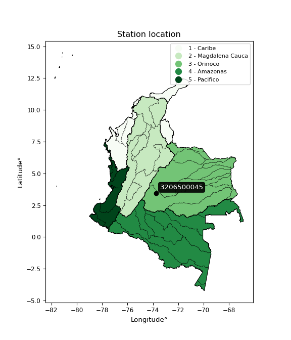

<div align="center">


</div>

# PMP Station (Rain, Pmax24h): 3206500045

Probable Maximum Precipitation (PMP) is the greatest amount of rainfall for a specific duration that is meteorologically possible for a given location, acting as a "worst-case" scenario for extreme storms, crucial for designing safety-critical infrastructure like bridges, river deviations, dams, spillways, and nuclear plants to prevent catastrophic failure. PMP is calculated by hydrologists using meteorological data to determine the upper limit of extreme rainfall, often leading to the Probable Maximum Flood (PMF) for flood control design, and is increasingly being studied for climate change impacts. Probable Maximum Precipitation (PMP) is the theoretical upper limit of rainfall, a deterministic estimate for extreme events, while probability distributions (like GEV, Gumbel) describe the likelihood and frequency of various precipitation amounts, including rare ones, showing how often events occur, with PMP representing the extreme end of these distributions, used for critical infrastructure design to ensure safety against the worst conceivable weather, unlike standard statistical forecasts which cover typical probabilities.

The most common probability distributions in hydrology, used for analyzing floods, rainfall, and streamflow, include the Normal, Log-Normal, Gumbel, Gamma (including Log-Pearson Type III), and Generalized Extreme Value (GEV) distributions, often chosen based on the data´s skewness and whether modeling extremes or general conditions, with Gumbel and GEV popular for extreme events like floods, while the Normal distribution serves as a baseline, though often requiring transformations for skewed hydrological data. These distributions help in designing water infrastructure, managing water resources, and forecasting hydrologic events.

> Hydrological data often isn´t perfectly normal (it´s skewed), so different distributions are needed for different applications, such as: **Flood Frequency Analysis**: Using Gumbel, GEV, or Log-Pearson Type III for predicting extreme flood magnitudes and their return periods, **Rainfall Analysis**: Normal for annual totals, but Log-Normal, Weibull, or GEV for intensity or extreme daily rainfall, **Streamflow Modeling**: Gamma and Log-Normal for maximum flows, GEV for minimum flows, and Kappa for daily flows.

<div align="center">

</img>

</div>


## A. General information


### 1. General running parameters

• app_version: _v20260113_. • runtime: _2026-01-17 18:24:04.630693_. • Python version: _3.14.0_. • SciPy version: _1.16.3_. • Pandas version: _2.3.3_. • NumPy version: _2.3.5_. • Stations dataset (station_dataset_file): _dataset/pmax24h_in/automatic_colombia_2003_2025.csv_. • Stations catalog (station_catalog_file): _dataset/CNE.xls_. • Minimum year to eval til year_max (date_min): _1900_. • Maximum year to eval since year_min (date_max): _2025_. • Creates, save and include plots into reports (create_plot): _False_. • Plot only fit distributions with Δo > Δ (plot_only_fit): _True_. • Plot only simple graphs avoiding multiple CDFs and multiple Extreme values plots (plot_only_simple): _True_. • Eval low extreme values, if False, evaluates high extreme values (low_extreme): _False_. • Eval every SciPy distribution as logarithmic (pdist_logarithmic_on): _True_. • Standard deviation normalized (ddof): _1.0_. • Return periods to eval in years (Tr): _[2, 2.33, 5, 10, 15, 20, 25, 50, 75, 100, 200, 250, 500, 750, 1000]_. • Minimum data sample per station, 0 means any (minimum_sample): _5_. • Z-Score maximum threshold to adjust a value, 0 means disable (zscore_max): _3.5_. • Z-Score minimum threshold to adjust a value, 0 means disable (zscore_min): _-2.5_. • Avoid zeros, e.g. rain = 0 (avoid_zeros): _True_. • Avoid null values (avoid_nans): _True_. 

:file_folder:Table: [dataset.csv](../../dataset/pmax24h_in/automatic_colombia_2003_2025.csv)

> Delta Degrees of Freedom (DDOF): is a parameter used in the formulas for calculating variance and standard deviation. When ddof=0, the divisor is $N$ (the total number of observations) and this is used when your data set is the entire population. When ddof=1, the divisor is $N-1$ and this is used when your data set is a sample drawn from a larger population. Using $N-1$ provides an unbiased estimate of the population variance (known as Bessel´s correction).


### 2. Station info and location

|   id |     CODIGO | NOMBRE                            | CATEGORIA               | TECNOLOGIA                | ESTADO           | FECHA_INSTALACION   |   FECHA_SUSPENSION |   ALTITUD |   LATITUD |   LONGITUD | DEPARTAMENTO   | MUNICIPIO   | AREA_OPERATIVA                            | ENTIDAD                                                     | AREA_HIDROGRAFICA   | ZONA_HIDROGRAFICA   | SUBZONA_HIDROGRAFICA   |   CORRIENTE | Catalogo   |   Version |
|-----:|-----------:|:----------------------------------|:------------------------|:--------------------------|:-----------------|:--------------------|-------------------:|----------:|----------:|-----------:|:---------------|:------------|:------------------------------------------|:------------------------------------------------------------|:--------------------|:--------------------|:-----------------------|------------:|:-----------|----------:|
|    0 | 3206500045 | GRANADA SENA - AUT   [3206500045] | Climatológica Principal | Automática con Telemetría | En Mantenimiento | 28/12/2017          |                nan |       317 |   3.44604 |   -73.7395 | Meta           | Granada     | Area Operativa 03 - Meta-Guaviare-Guainía | INSTITUTO DE HIDROLOGIA METEOROLOGIA Y ESTUDIOS AMBIENTALES | Orinoco             | Guaviare            | Río Ariari             |         nan | CNE_IDEAM  |  20251226 |

<div align="center">

Dynamic map: [:earth_americas:Google](http://maps.google.com/maps?q=3.446044,-73.739505) [:earth_americas:OSM](https://www.openstreetmap.org/#map=18/3.446044/-73.739505&layers=P) [:earth_americas:Bing](https://www.bing.com/maps?cp=3.446044~-73.739505&lvl=18) [:earth_americas:Apple](https://maps.apple.com/frame?center=3.446044%2C-73.739505&span=0.003%2C0.006)

</div>


<div align="center">

```geojson
{
  "type": "Feature",
  "geometry": {
    "type": "Point", 
    "coordinates": [-73.739505, 3.446044]
  }, 
  "properties": {
    "Name": "3206500045"
  }
}
```

</div>


### 3. Discrete values table and plot

<div align="center">

|               |          0 |          1 |           2 |            3 |           4 |
|:--------------|-----------:|-----------:|------------:|-------------:|------------:|
| Date          | 2019       | 2020       | 2022        | 2024         | 2025        |
| Value         |   74.2     |  146.4     |   94.6      |  110.6       |  118.7      |
| Value_initial |   74.2     |  146.4     |   94.6      |  110.6       |  118.7      |
| count         |    5       |    5       |    5        |    5         |    5        |
| mean          |  108.9     |  108.9     |  108.9      |  108.9       |  108.9      |
| std           |   26.9896  |   26.9896  |   26.9896   |   26.9896    |   26.9896   |
| zscore        |   -1.28568 |    1.38942 |   -0.529833 |    0.0629872 |    0.363102 |


</div>


> The initial value (value_initial) correspond to the initial obtained or null completed value, and value (value) is adjusted only when the initial value is outside the valid range (outlier) definite through the Z-Score value. If Z-Score is active, values out of range or outliers are replaced with the station mean value. A Z-Score (or standard score) measures how many standard deviations a data point is from the mean of a dataset, indicating its relative position; positive scores mean above the mean, negative mean below, and a score of zero is exactly at the mean, allowing for comparison of values from different distributions. It´s calculated using the formula $z=(x–μ)/σ$, where $x$ is the data point, $μ$ is the mean, and $σ$ is the standard deviation, helping identify outliers and understand probability.
>
> <sub>**Note**: In this study, "completing" (filling gaps in) and "extending" (forecasting or lengthening the historical record) rainfall data series are avoided for certain critical analyses because they introduce artificial bias and uncertainty, which can distort the statistics of rare events (extremes), alter day-to-day variability, and compromise the integrity and homogeneity of the original data. Some reasons against Completing/Extending rainfall data are: **Distortion of Extremes and Variability**: The primary issue is that most gap-filling or extension methods rely on averaging or regression with nearby stations, which inherently smooths the data. Rainfall is highly variable in space and time, with a large percentage of zero values and occasional large storms. Infilling methods often underestimate the highest values and overestimate the lowest (zero) values, which severely distorts analyses focused on flood frequency, drought severity, and intensity-duration-frequency (IDF) curves, **Loss of Data Homogeneity**: Infilled or extended data are synthetic estimates, not actual measurements. Combining these estimates with observed data can violate the assumption of data homogeneity, which requires that the data properties do not change over time. Inhomogeneity can lead to incorrect conclusions about long-term trends or changes in climate patterns, **Propagation of Errors**: Errors and biases from the original data (e.g., wind-induced undercatch, instrument errors, site changes) or the data used for imputation can propagate through the analysis, leading to unreliable hydrological models and inaccurate predictions, **Compromised Statistical Integrity**: For statistical analyses, especially those involving the frequency of events, using artificial data can introduce time bias or autocorrelation that doesn´t exist in reality, making it difficult to assess the true probability of events, **Difficulty in Validation**: It is difficult to accurately validate the quality of filled or extended data, especially for past periods where ground-truth measurements are unavailable. The reliability of imputation techniques heavily depends on the density of the surrounding station network and the complexity of the local topography.</sub>


### 4. Active continuous probability distributions from SciPy (80 of 104 available)

A Probability Density Function (PDF) describes the relative likelihood of a continuous random variable falling within a specific range, where the total area under its curve equals 1, and the area over any interval gives the actual probability for that range. Unlike discrete probabilities (like rolling a die), a PDF shows density, not direct probability for a single point (which is zero), with higher points indicating higher likelihood, often visualized as a bell curve for normal distributions.

A log of a probability density function (log-PDF) is simply the logarithm of the PDF´s value, denoted as $log(f(x))$, useful for converting multiplication of probabilities into addition, improving numerical stability with tiny numbers, and connecting to information theory concepts like entropy. Instead of dealing with very small probabilities (e.g., 0.000001), log-PDFs use negative numbers (e.g., $log(0.00001) ≈ -11.51$ that are easier for computers to handle, preventing underflow errors and simplifying complex calculations. In this study, each active probability distribution from SciPy is also evaluated in the $log$ form.

[scipy.stats](https://docs.scipy.org/doc/scipy/reference/stats.html) is a Python´s powerful submodule within the SciPy library for comprehensive statistical analysis, offering over 130 probability distributions (like Normal, Poisson), functions for descriptive stats (mean, variance), hypothesis testing (t-tests, chi-square), random variable generation, and statistical tests, making it essential for data science, modeling, and research. It provides tools to explore, model, and draw conclusions from data efficiently, working seamlessly with NumPy.

<div align="center">

|   id | p_dist           |   n_parameter | fit_method   | label                                                                       | active   | ref                                                                                                      |
|-----:|:-----------------|--------------:|:-------------|:----------------------------------------------------------------------------|:---------|:---------------------------------------------------------------------------------------------------------|
|    0 | alpha            |             3 | MLE          | Alpha                                                                       | True     | [:mortar_board:](https://docs.scipy.org/doc/scipy/reference/generated/scipy.stats.alpha.html)            |
|    1 | anglit           |             2 | MM           | Anglit                                                                      | True     | [:mortar_board:](https://docs.scipy.org/doc/scipy/reference/generated/scipy.stats.anglit.html)           |
|    2 | arcsine          |             2 | MM           | Arcsine                                                                     | True     | [:mortar_board:](https://docs.scipy.org/doc/scipy/reference/generated/scipy.stats.arcsine.html)          |
|    3 | argus            |             3 | MLE          | Argus                                                                       | True     | [:mortar_board:](https://docs.scipy.org/doc/scipy/reference/generated/scipy.stats.argus.html)            |
|    4 | beta             |             4 | MLE          | Beta                                                                        | True     | [:mortar_board:](https://docs.scipy.org/doc/scipy/reference/generated/scipy.stats.beta.html)             |
|    5 | betaprime        |             4 | MLE          | Beta prime                                                                  | True     | [:mortar_board:](https://docs.scipy.org/doc/scipy/reference/generated/scipy.stats.betaprime.html)        |
|    6 | bradford         |             3 | MLE          | Bradford                                                                    | True     | [:mortar_board:](https://docs.scipy.org/doc/scipy/reference/generated/scipy.stats.bradford.html)         |
|    7 | burr             |             4 | MLE          | Burr (Type III)                                                             | True     | [:mortar_board:](https://docs.scipy.org/doc/scipy/reference/generated/scipy.stats.burr.html)             |
|    8 | burr12           |             4 | MLE          | Burr (Type III) 12                                                          | True     | [:mortar_board:](https://docs.scipy.org/doc/scipy/reference/generated/scipy.stats.burr12.html)           |
|    9 | cosine           |             2 | MLE          | Cosine                                                                      | True     | [:mortar_board:](https://docs.scipy.org/doc/scipy/reference/generated/scipy.stats.cosine.html)           |
|   10 | crystalball      |             4 | MLE          | Crystalball                                                                 | True     | [:mortar_board:](https://docs.scipy.org/doc/scipy/reference/generated/scipy.stats.crystalball.html)      |
|   11 | dgamma           |             3 | MLE          | Double gamma                                                                | True     | [:mortar_board:](https://docs.scipy.org/doc/scipy/reference/generated/scipy.stats.dgamma.html)           |
|   12 | dweibull         |             3 | MLE          | Double Weibull                                                              | True     | [:mortar_board:](https://docs.scipy.org/doc/scipy/reference/generated/scipy.stats.dweibull.html)         |
|   13 | erlang           |             3 | MLE          | Erlang                                                                      | True     | [:mortar_board:](https://docs.scipy.org/doc/scipy/reference/generated/scipy.stats.erlang.html)           |
|   14 | exponnorm        |             3 | MLE          | Exponentially modified Normal                                               | True     | [:mortar_board:](https://docs.scipy.org/doc/scipy/reference/generated/scipy.stats.exponnorm.html)        |
|   15 | exponpow         |             3 | MLE          | Exponential power                                                           | True     | [:mortar_board:](https://docs.scipy.org/doc/scipy/reference/generated/scipy.stats.exponpow.html)         |
|   16 | exponweib        |             4 | MLE          | Exponentiated Weibull                                                       | True     | [:mortar_board:](https://docs.scipy.org/doc/scipy/reference/generated/scipy.stats.exponweib.html)        |
|   17 | f                |             4 | MLE          | F                                                                           | True     | [:mortar_board:](https://docs.scipy.org/doc/scipy/reference/generated/scipy.stats.f.html)                |
|   18 | fatiguelife      |             3 | MLE          | Fatigue-life (Birnbaum-Saunders)                                            | True     | [:mortar_board:](https://docs.scipy.org/doc/scipy/reference/generated/scipy.stats.fatiguelife.html)      |
|   19 | foldnorm         |             3 | MM           | Fold Normal                                                                 | True     | [:mortar_board:](https://docs.scipy.org/doc/scipy/reference/generated/scipy.stats.foldnorm.html)         |
|   20 | gamma            |             3 | MLE          | Gamma                                                                       | True     | [:mortar_board:](https://docs.scipy.org/doc/scipy/reference/generated/scipy.stats.gamma.html)            |
|   21 | gausshyper       |             6 | MLE          | Gauss hypergeometric                                                        | True     | [:mortar_board:](https://docs.scipy.org/doc/scipy/reference/generated/scipy.stats.gausshyper.html)       |
|   22 | genexpon         |             5 | MLE          | Generalized exponential                                                     | True     | [:mortar_board:](https://docs.scipy.org/doc/scipy/reference/generated/scipy.stats.genexpon.html)         |
|   23 | genextreme       |             3 | MLE          | Generalized exponential                                                     | True     | [:mortar_board:](https://docs.scipy.org/doc/scipy/reference/generated/scipy.stats.genextreme.html)       |
|   24 | gengamma         |             4 | MLE          | Generalized gamma                                                           | True     | [:mortar_board:](https://docs.scipy.org/doc/scipy/reference/generated/scipy.stats.gengamma.html)         |
|   25 | genhalflogistic  |             3 | MLE          | Generalized half-logistic                                                   | True     | [:mortar_board:](https://docs.scipy.org/doc/scipy/reference/generated/scipy.stats.genhalflogistic.html)  |
|   26 | genlogistic      |             3 | MLE          | Generalized logistic                                                        | True     | [:mortar_board:](https://docs.scipy.org/doc/scipy/reference/generated/scipy.stats.genlogistic.html)      |
|   27 | gennorm          |             3 | MLE          | Generalized Normal                                                          | True     | [:mortar_board:](https://docs.scipy.org/doc/scipy/reference/generated/scipy.stats.gennorm.html)          |
|   28 | genpareto        |             3 | MLE          | Generalized Pareto                                                          | True     | [:mortar_board:](https://docs.scipy.org/doc/scipy/reference/generated/scipy.stats.genpareto.html)        |
|   29 | gompertz         |             3 | MLE          | Gompertz (or truncated Gumbel)                                              | True     | [:mortar_board:](https://docs.scipy.org/doc/scipy/reference/generated/scipy.stats.gompertz.html)         |
|   30 | gumbel_l         |             2 | MM           | Gumbel Left Skew                                                            | True     | [:mortar_board:](https://docs.scipy.org/doc/scipy/reference/generated/scipy.stats.gumbel_l.html)         |
|   31 | gumbel_r         |             2 | MM           | Gumbel Right Skew                                                           | True     | [:mortar_board:](https://docs.scipy.org/doc/scipy/reference/generated/scipy.stats.gumbel_r.html)         |
|   32 | halfgennorm      |             3 | MLE          | Upper half of a generalized normal                                          | True     | [:mortar_board:](https://docs.scipy.org/doc/scipy/reference/generated/scipy.stats.halfgennorm.html)      |
|   33 | halflogistic     |             2 | MM           | Half-logistic                                                               | True     | [:mortar_board:](https://docs.scipy.org/doc/scipy/reference/generated/scipy.stats.halflogistic.html)     |
|   34 | halfnorm         |             2 | MM           | Half Normal                                                                 | True     | [:mortar_board:](https://docs.scipy.org/doc/scipy/reference/generated/scipy.stats.halfnorm.html)         |
|   35 | hypsecant        |             2 | MM           | hyperbolic secant                                                           | True     | [:mortar_board:](https://docs.scipy.org/doc/scipy/reference/generated/scipy.stats.hypsecant.html)        |
|   36 | invgamma         |             3 | MLE          | Inverted gamma                                                              | True     | [:mortar_board:](https://docs.scipy.org/doc/scipy/reference/generated/scipy.stats.invgamma.html)         |
|   37 | invgauss         |             3 | MLE          | Inverse Gaussian                                                            | True     | [:mortar_board:](https://docs.scipy.org/doc/scipy/reference/generated/scipy.stats.invgauss.html)         |
|   38 | invweibull       |             3 | MLE          | Inverted Weibull                                                            | True     | [:mortar_board:](https://docs.scipy.org/doc/scipy/reference/generated/scipy.stats.invweibull.html)       |
|   39 | johnsonsb        |             4 | MLE          | Johnson SB                                                                  | True     | [:mortar_board:](https://docs.scipy.org/doc/scipy/reference/generated/scipy.stats.johnsonsb.html)        |
|   40 | johnsonsu        |             4 | MLE          | Johnson Su                                                                  | True     | [:mortar_board:](https://docs.scipy.org/doc/scipy/reference/generated/scipy.stats.johnsonsu.html)        |
|   41 | kappa3           |             3 | MLE          | Kappa 3                                                                     | True     | [:mortar_board:](https://docs.scipy.org/doc/scipy/reference/generated/scipy.stats.kappa3.html)           |
|   42 | kappa4           |             4 | MLE          | Kappa 4                                                                     | True     | [:mortar_board:](https://docs.scipy.org/doc/scipy/reference/generated/scipy.stats.kappa4.html)           |
|   43 | ksone            |             3 | MLE          | Kolmogorov-Smirnov one-sided test statistic distribution                    | True     | [:mortar_board:](https://docs.scipy.org/doc/scipy/reference/generated/scipy.stats.ksone.html)            |
|   44 | kstwobign        |             2 | MLE          | Limiting distribution of scaled Kolmogorov-Smirnov two-sided test statistic | True     | [:mortar_board:](https://docs.scipy.org/doc/scipy/reference/generated/scipy.stats.kstwobign.html)        |
|   45 | laplace          |             2 | MM           | Laplace                                                                     | True     | [:mortar_board:](https://docs.scipy.org/doc/scipy/reference/generated/scipy.stats.laplace.html)          |
|   46 | levy_l           |             2 | MLE          | Left-skewed Levy                                                            | True     | [:mortar_board:](https://docs.scipy.org/doc/scipy/reference/generated/scipy.stats.levy_l.html)           |
|   47 | loggamma         |             3 | MLE          | Log gamma                                                                   | True     | [:mortar_board:](https://docs.scipy.org/doc/scipy/reference/generated/scipy.stats.loggamma.html)         |
|   48 | logistic         |             2 | MM           | Logistic (or Sech-squared)                                                  | True     | [:mortar_board:](https://docs.scipy.org/doc/scipy/reference/generated/scipy.stats.logistic.html)         |
|   49 | loglaplace       |             3 | MLE          | Log-Laplace                                                                 | True     | [:mortar_board:](https://docs.scipy.org/doc/scipy/reference/generated/scipy.stats.loglaplace.html)       |
|   50 | lomax            |             3 | MLE          | Lomax (Pareto of the second kind)                                           | True     | [:mortar_board:](https://docs.scipy.org/doc/scipy/reference/generated/scipy.stats.lomax.html)            |
|   51 | maxwell          |             2 | MM           | Maxwell                                                                     | True     | [:mortar_board:](https://docs.scipy.org/doc/scipy/reference/generated/scipy.stats.maxwell.html)          |
|   52 | mielke           |             4 | MLE          | Mielke Beta-Kappa / Dagum                                                   | True     | [:mortar_board:](https://docs.scipy.org/doc/scipy/reference/generated/scipy.stats.mielke.html)           |
|   53 | moyal            |             2 | MM           | Moyal                                                                       | True     | [:mortar_board:](https://docs.scipy.org/doc/scipy/reference/generated/scipy.stats.moyal.html)            |
|   54 | nakagami         |             3 | MLE          | Nakagami                                                                    | True     | [:mortar_board:](https://docs.scipy.org/doc/scipy/reference/generated/scipy.stats.nakagami.html)         |
|   55 | ncf              |             5 | MLE          | Non-central F distribution                                                  | True     | [:mortar_board:](https://docs.scipy.org/doc/scipy/reference/generated/scipy.stats.ncf.html)              |
|   56 | nct              |             4 | MLE          | Non-central Student’s t                                                     | True     | [:mortar_board:](https://docs.scipy.org/doc/scipy/reference/generated/scipy.stats.nct.html)              |
|   57 | norm             |             2 | MM           | Normal                                                                      | True     | [:mortar_board:](https://docs.scipy.org/doc/scipy/reference/generated/scipy.stats.norm.html)             |
|   58 | pearson3         |             3 | MM           | Pearson type III                                                            | True     | [:mortar_board:](https://docs.scipy.org/doc/scipy/reference/generated/scipy.stats.pearson3.html)         |
|   59 | powerlaw         |             3 | MLE          | Power-function                                                              | True     | [:mortar_board:](https://docs.scipy.org/doc/scipy/reference/generated/scipy.stats.powerlaw.html)         |
|   60 | rayleigh         |             2 | MM           | Rayleigh                                                                    | True     | [:mortar_board:](https://docs.scipy.org/doc/scipy/reference/generated/scipy.stats.rayleigh.html)         |
|   61 | rdist            |             3 | MLE          | R-distributed (symmetric beta)                                              | True     | [:mortar_board:](https://docs.scipy.org/doc/scipy/reference/generated/scipy.stats.rdist.html)            |
|   62 | rice             |             3 | MLE          | Rice                                                                        | True     | [:mortar_board:](https://docs.scipy.org/doc/scipy/reference/generated/scipy.stats.rice.html)             |
|   63 | semicircular     |             2 | MM           | Semicircular                                                                | True     | [:mortar_board:](https://docs.scipy.org/doc/scipy/reference/generated/scipy.stats.semicircular.html)     |
|   64 | skewnorm         |             3 | MLE          | Skew normal                                                                 | True     | [:mortar_board:](https://docs.scipy.org/doc/scipy/reference/generated/scipy.stats.skewnorm.html)         |
|   65 | t                |             3 | MLE          | Student’s t                                                                 | True     | [:mortar_board:](https://docs.scipy.org/doc/scipy/reference/generated/scipy.stats.t.html)                |
|   66 | trapezoid        |             4 | MLE          | Trapezoid                                                                   | True     | [:mortar_board:](https://docs.scipy.org/doc/scipy/reference/generated/scipy.stats.trapezoid.html)        |
|   67 | triang           |             3 | MLE          | Triangular                                                                  | True     | [:mortar_board:](https://docs.scipy.org/doc/scipy/reference/generated/scipy.stats.triang.html)           |
|   68 | truncexpon       |             3 | MLE          | Truncated exponential                                                       | True     | [:mortar_board:](https://docs.scipy.org/doc/scipy/reference/generated/scipy.stats.truncexpon.html)       |
|   69 | truncnorm        |             4 | MLE          | Truncated normal                                                            | True     | [:mortar_board:](https://docs.scipy.org/doc/scipy/reference/generated/scipy.stats.truncnorm.html)        |
|   70 | truncpareto      |             4 | MLE          | Upper truncated Pareto                                                      | True     | [:mortar_board:](https://docs.scipy.org/doc/scipy/reference/generated/scipy.stats.truncpareto.html)      |
|   71 | truncweibull_min |             5 | MLE          | Doubly truncated Weibull minimum                                            | True     | [:mortar_board:](https://docs.scipy.org/doc/scipy/reference/generated/scipy.stats.truncweibull_min.html) |
|   72 | tukeylambda      |             3 | MLE          | Tukey-Lamdba                                                                | True     | [:mortar_board:](https://docs.scipy.org/doc/scipy/reference/generated/scipy.stats.tukeylambda.html)      |
|   73 | uniform          |             2 | MLE          | Uniform                                                                     | True     | [:mortar_board:](https://docs.scipy.org/doc/scipy/reference/generated/scipy.stats.uniform.html)          |
|   74 | vonmises         |             3 | MLE          | Von Mises                                                                   | True     | [:mortar_board:](https://docs.scipy.org/doc/scipy/reference/generated/scipy.stats.vonmises.html)         |
|   75 | vonmises_line    |             3 | MLE          | Von Mises line                                                              | True     | [:mortar_board:](https://docs.scipy.org/doc/scipy/reference/generated/scipy.stats.vonmises_line.html)    |
|   76 | wald             |             2 | MM           | Wald                                                                        | True     | [:mortar_board:](https://docs.scipy.org/doc/scipy/reference/generated/scipy.stats.wald.html)             |
|   77 | weibull_max      |             3 | MLE          | Weibull maximum                                                             | True     | [:mortar_board:](https://docs.scipy.org/doc/scipy/reference/generated/scipy.stats.weibull_max.html)      |
|   78 | weibull_min      |             3 | MLE          | Weibull minimum                                                             | True     | [:mortar_board:](https://docs.scipy.org/doc/scipy/reference/generated/scipy.stats.weibull_min.html)      |
|   79 | wrapcauchy       |             3 | MLE          | Wrapped  Cauchy                                                             | True     | [:mortar_board:](https://docs.scipy.org/doc/scipy/reference/generated/scipy.stats.wrapcauchy.html)       |

</div>

> **n_parameter:** # arguments & localization & scale.
>
> **Fit methods:** (MLE) maximum likelihood, (MM) L-moments.
>
>**Inactive** (With the only purpose of prevent loops, zero divisions, infinite values, over high estimated values or horizontal trending for recurrence intervals estimations, the follow distributions were disabled.)**:** lognorm, norminvgauss, powernorm, powerlognorm, cauchy, halfcauchy, foldcauchy, skewcauchy, chi2, expon, fisk, genhyperbolic, geninvgauss, gibrat, kstwo, laplace_asymmetric, levy, levy_stable, ncx2, pareto, rel_breitwigner, recipinvgauss, studentized_range, loguniform, 


## B. Probability (PDF) vs. Empirical (EDF) distributions functions

A continuous probability distribution (CPD) describes probabilities for variables that can take any value within a range (like rain any time), unlike discrete variables with specific outcomes (like temperature). It uses a Probability Density Function (PDF), a curve where the total area under it equals 1, and the probability of the variable falling within an interval (a to b) is found by calculating the area under the curve between those points. A key feature is that the probability of hitting any single exact value is zero, so probabilities are always expressed for ranges, e.g., $P(a ≤ X ≤ b)$.

<div align="center">

Distributions parameters from station values
|     |    station | p_dist              |   n |              loc |            scale | shape                  | shape1                | shape2                 | shape3             |
|----:|-----------:|:--------------------|----:|-----------------:|-----------------:|:-----------------------|:----------------------|:-----------------------|:-------------------|
|   0 | 3206500045 | alpha               |   5 |    -198.886      |   3869.07        | 12.651500487485862     |                       |                        |                    |
|   1 | 3206500045 | anglit              |   5 |     108.9        |     70.6199      |                        |                       |                        |                    |
|   2 | 3206500045 | arcsine             |   5 |      74.7605     |     68.2789      |                        |                       |                        |                    |
|   3 | 3206500045 | argus               |   5 |      54.6995     |     96.9544      | 4.2688947247146195e-06 |                       |                        |                    |
|   4 | 3206500045 | beta                |   5 |      74.2        |     75.1811      | 0.17903219624290131    | 1.8644588524217662    |                        |                    |
|   5 | 3206500045 | betaprime           |   5 |     -13.3592     |      0.496661    | 5842.325931464664      | 24.66158644759861     |                        |                    |
|   6 | 3206500045 | bradford            |   5 |      74.2        |     72.2         | 1.073755478253747      |                       |                        |                    |
|   7 | 3206500045 | burr                |   5 |      -0.620245   |    118.217       | 9.238304589432587      | 0.6130084827937714    |                        |                    |
|   8 | 3206500045 | burr12              |   5 |      -2.17544    |     76.0662      | 1060.1869999667535     | 0.0026625721905571076 |                        |                    |
|   9 | 3206500045 | cosine              |   5 |     109.384      |     19.9758      |                        |                       |                        |                    |
|  10 | 3206500045 | crystalball         |   5 |     108.9        |     24.1403      | 7801.112455369296      | 6100.3545398409615    |                        |                    |
|  11 | 3206500045 | dgamma              |   5 |     103.526      |      8.83295     | 2.340655737347496      |                       |                        |                    |
|  12 | 3206500045 | dweibull            |   5 |     110.6        |     20.8173      | 0.8489515470034656     |                       |                        |                    |
|  13 | 3206500045 | erlang              |   5 |    -109.942      |      2.64731     | 82.64283109211485      |                       |                        |                    |
|  14 | 3206500045 | exponnorm           |   5 |     105.67       |     23.9233      | 0.13502095434604927    |                       |                        |                    |
|  15 | 3206500045 | exponpow            |   5 |      74.2        |      1.60059     | 0.11828222073893638    |                       |                        |                    |
|  16 | 3206500045 | exponweib           |   5 |      74.2        |      1.17047     | 1.2771331708218105     | 0.24541336406914707   |                        |                    |
|  17 | 3206500045 | f                   |   5 |       9.40903    |     99.4936      | 32.93987242939618      | 6791573.221876631     |                        |                    |
|  18 | 3206500045 | fatiguelife         |   5 |      74.2        |      6.87522e-06 | 2254.3135045018553     |                       |                        |                    |
|  19 | 3206500045 | foldnorm            |   5 |      54.3575     |     24.6773      | 2.2004668577726827     |                       |                        |                    |
|  20 | 3206500045 | gamma               |   5 |    -125.714      |      2.47467     | 94.75534499791544      |                       |                        |                    |
|  21 | 3206500045 | gausshyper          |   5 |      74.2        |     72.3069      | 0.9686699821315987     | 1.0297875583361313    | 1.074259769130359      | 1.0124724801470002 |
|  22 | 3206500045 | genexpon            |   5 |      74.2        |      1.03358     | 0.028616861577255147   | 0.00157181243026296   | 1.304265732540495      |                    |
|  23 | 3206500045 | genextreme          |   5 |     100.701      |     23.8303      | 0.30866253584253056    |                       |                        |                    |
|  24 | 3206500045 | gengamma            |   5 |      74.2        |      1.19709     | 1.2834537465865692     | 0.2778125323724797    |                        |                    |
|  25 | 3206500045 | genhalflogistic     |   5 |      73.4525     |     77.1588      | 1.057729600638054      |                       |                        |                    |
|  26 | 3206500045 | genlogistic         |   5 |      16.43       |     21.3118      | 44.634950427601794     |                       |                        |                    |
|  27 | 3206500045 | gennorm             |   5 |     110.3        |     36.1004      | 1037999.2745841022     |                       |                        |                    |
|  28 | 3206500045 | genpareto           |   5 |      -0.649375   |    272.29        | -1.8516918974085554    |                       |                        |                    |
|  29 | 3206500045 | gompertz            |   5 |     146.4        |      2.57291e-14 | 1.2892788994090196     |                       |                        |                    |
|  30 | 3206500045 | gumbel_l            |   5 |     119.764      |     18.8221      |                        |                       |                        |                    |
|  31 | 3206500045 | gumbel_r            |   5 |      98.0356     |     18.8221      |                        |                       |                        |                    |
|  32 | 3206500045 | halfgennorm         |   5 |      74.2        |      1.44318     | 0.3624818172055009     |                       |                        |                    |
|  33 | 3206500045 | halflogistic        |   5 |      80.2882     |     20.6391      |                        |                       |                        |                    |
|  34 | 3206500045 | halfnorm            |   5 |      76.9477     |     40.0462      |                        |                       |                        |                    |
|  35 | 3206500045 | hypsecant           |   5 |     108.9        |     15.3682      |                        |                       |                        |                    |
|  36 | 3206500045 | invgamma            |   5 |    -112.409      |  18431           | 84.3333201983013       |                       |                        |                    |
|  37 | 3206500045 | invgauss            |   5 |      35.5307     |    546.738       | 0.13209868306028166    |                       |                        |                    |
|  38 | 3206500045 | invweibull          |   5 |      74.2        |      1.73675     | 0.04529621137389356    |                       |                        |                    |
|  39 | 3206500045 | johnsonsb           |   5 |      74.2        |     72.2117      | -0.05197740693624587   | 0.062057458335938925  |                        |                    |
|  40 | 3206500045 | johnsonsu           |   5 |    -100.489      |     79.1688      | -15.70638548724321     | 9.270010623008677     |                        |                    |
|  41 | 3206500045 | kappa3              |   5 |      74.2        |     93.1492      | 495.73017218986354     |                       |                        |                    |
|  42 | 3206500045 | kappa4              |   5 |      68.8295     |     81.7462      | 1.064972505831836      | 1.0538319242814964    |                        |                    |
|  43 | 3206500045 | ksone               |   5 |      67.0878     |     83.6243      | 1.0                    |                       |                        |                    |
|  44 | 3206500045 | kstwobign           |   5 |      21.9035     |     99.4633      |                        |                       |                        |                    |
|  45 | 3206500045 | laplace             |   5 |     108.9        |     17.0697      |                        |                       |                        |                    |
|  46 | 3206500045 | levy_l              |   5 |     149.863      |     13.2405      |                        |                       |                        |                    |
|  47 | 3206500045 | loggamma            |   5 |   -5449.96       |    796.821       | 1071.4166575495378     |                       |                        |                    |
|  48 | 3206500045 | logistic            |   5 |     108.9        |     13.3092      |                        |                       |                        |                    |
|  49 | 3206500045 | loglaplace          |   5 |      -0.329001   |    110.929       | 5.533194438242555      |                       |                        |                    |
|  50 | 3206500045 | lomax               |   5 |      74.2        |      1.00125e+11 | 840286305.4201871      |                       |                        |                    |
|  51 | 3206500045 | maxwell             |   5 |      51.6977     |     35.8462      |                        |                       |                        |                    |
|  52 | 3206500045 | mielke              |   5 |      -0.532283   |    118.145       | 5.655919404953956      | 9.234508588899324     |                        |                    |
|  53 | 3206500045 | moyal               |   5 |      95.0951     |     10.8669      |                        |                       |                        |                    |
|  54 | 3206500045 | nakagami            |   5 |      94.6        |     26.0429      | 0.06739064345621368    |                       |                        |                    |
|  55 | 3206500045 | ncf                 |   5 |      -0.139543   |      1.14835e-06 | 3.5549864512111246e-07 | 4.342669660616139     | 32.18435801909675      |                    |
|  56 | 3206500045 | nct                 |   5 |      -0.843179   |     23.1405      | 151.63716522158427     | 4.718466170475997     |                        |                    |
|  57 | 3206500045 | norm                |   5 |     108.9        |     24.1403      |                        |                       |                        |                    |
|  58 | 3206500045 | pearson3            |   5 |     108.9        |     24.1403      | 0.12757148858306622    |                       |                        |                    |
|  59 | 3206500045 | powerlaw            |   5 |      74.2        |     72.2         | 0.12954395627496304    |                       |                        |                    |
|  60 | 3206500045 | rayleigh            |   5 |      62.7183     |     36.8477      |                        |                       |                        |                    |
|  61 | 3206500045 | rdist               |   5 |      83.2707     |     27.3293      | 1.112751313933308      |                       |                        |                    |
|  62 | 3206500045 | rice                |   5 |      61.6115     |     29.5049      | 1.1127318885145652     |                       |                        |                    |
|  63 | 3206500045 | semicircular        |   5 |     108.9        |     48.2805      |                        |                       |                        |                    |
|  64 | 3206500045 | skewnorm            |   5 |      88.3901     |     31.6766      | 1.3672148366127717     |                       |                        |                    |
|  65 | 3206500045 | t                   |   5 |     108.899      |     24.1358      | 339222.4203105984      |                       |                        |                    |
|  66 | 3206500045 | trapezoid           |   5 |      66.98       |     86.64        | 1.0                    | 1.0                   |                        |                    |
|  67 | 3206500045 | triang              |   5 |      49.1502     |     97.2529      | 0.9999679122241851     |                       |                        |                    |
|  68 | 3206500045 | truncexpon          |   5 |      74.1999     |     62.9731      | 1.146524016861766      |                       |                        |                    |
|  69 | 3206500045 | truncnorm           |   5 |     108.9        |     24.1403      | -1236.39260436561      | 8941.73027123771      |                        |                    |
|  70 | 3206500045 | truncpareto         |   5 |     -95.329      |    169.529       | 1.794622648985265e-07  | 1.4258859102807258    |                        |                    |
|  71 | 3206500045 | truncweibull_min    |   5 |      74.1219     |     77.4376      | 0.8911781155574497     | 0.0009998108630889292 | 0.933373034398659      |                    |
|  72 | 3206500045 | tukeylambda         |   5 |     110.303      |     39.3084      | 1.088797977814992      |                       |                        |                    |
|  73 | 3206500045 | uniform             |   5 |      74.2        |     72.2         |                        |                       |                        |                    |
|  74 | 3206500045 | vonmises            |   5 |      -0.728847   |      1           | 0.5385650445496103     |                       |                        |                    |
|  75 | 3206500045 | vonmises_line       |   5 |     110.265      |     11.5021      | 0.00011347243662015853 |                       |                        |                    |
|  76 | 3206500045 | wald                |   5 |      84.7598     |     24.1402      |                        |                       |                        |                    |
|  77 | 3206500045 | weibull_max         |   5 |     146.4        |      1.49634     | 0.23969935350013327    |                       |                        |                    |
|  78 | 3206500045 | weibull_min         |   5 |      65.6079     |     48.5282      | 1.8083254470326118     |                       |                        |                    |
|  79 | 3206500045 | wrapcauchy          |   5 |      74.2        |     11.491       | 0.5                    |                       |                        |                    |
|  80 | 3206500045 | logalpha            |   5 |      -3.68433    |    301.511       | 36.141901490826854     |                       |                        |                    |
|  81 | 3206500045 | loganglit           |   5 |       4.66506    |      0.665844    |                        |                       |                        |                    |
|  82 | 3206500045 | logarcsine          |   5 |       4.34314    |      0.643831    |                        |                       |                        |                    |
|  83 | 3206500045 | logargus            |   5 |       4.13662    |      0.897565    | 0.5626173276047728     |                       |                        |                    |
|  84 | 3206500045 | logbeta             |   5 |       4.10272    |      0.883623    | 0.8183531231848744     | 0.38809267248080026   |                        |                    |
|  85 | 3206500045 | logbetaprime        |   5 |      -1.19919    |     13.736       | 243.7936506131647      | 573.9726501271696     |                        |                    |
|  86 | 3206500045 | logbradford         |   5 |       4.30675    |      0.680467    | 3.354357872441114e-05  |                       |                        |                    |
|  87 | 3206500045 | logburr             |   5 |       4.30676    |      0.645489    | 13.410507511316137     | 0.04826705885304466   |                        |                    |
|  88 | 3206500045 | logburr12           |   5 |       0.00889826 |      5.79565     | 23.781115203102274     | 106.85124024608888    |                        |                    |
|  89 | 3206500045 | logcosine           |   5 |       4.65798    |      0.188288    |                        |                       |                        |                    |
|  90 | 3206500045 | logcrystalball      |   5 |       4.66506    |      0.227608    | 612.0309278888594      | 12.761817179372931    |                        |                    |
|  91 | 3206500045 | logdgamma           |   5 |       4.70592    |      0.259538    | 0.5032463958263999     |                       |                        |                    |
|  92 | 3206500045 | logdweibull         |   5 |       4.63274    |      0.221153    | 1.7176692019167876     |                       |                        |                    |
|  93 | 3206500045 | logerlang           |   5 |       0.478195   |      0.012647    | 330.9341543521798      |                       |                        |                    |
|  94 | 3206500045 | logexponnorm        |   5 |       4.66489    |      0.227607    | 0.0007291387719130215  |                       |                        |                    |
|  95 | 3206500045 | logexponpow         |   5 |       4.30676    |      0.556934    | 0.908234016464882      |                       |                        |                    |
|  96 | 3206500045 | logexponweib        |   5 |       4.30676    |      0.445772    | 0.345833980976035      | 1.7088110557932412    |                        |                    |
|  97 | 3206500045 | logf                |   5 |      -5.52379    |     10.1902      | 12135.132094084176     | 5848.13397651422      |                        |                    |
|  98 | 3206500045 | logfatiguelife      |   5 |     -25.083      |     29.7474      | 0.007644700789924793   |                       |                        |                    |
|  99 | 3206500045 | logfoldnorm         |   5 |       4.25891    |      0.244875    | 1.6138018386156578     |                       |                        |                    |
| 100 | 3206500045 | loggamma            |   5 |       0.487365   |      0.0125729   | 332.1718527837162      |                       |                        |                    |
| 101 | 3206500045 | loggausshyper       |   5 |       4.28888    |      0.697464    | 1.171718638679101      | 0.9496792319375594    | 1.0213798741024132     | 0.9715012828415203 |
| 102 | 3206500045 | loggenexpon         |   5 |       4.30624    |      0.006109    | 0.008674743286144457   | 1.5204065206108814    | 0.00013362462687162285 |                    |
| 103 | 3206500045 | loggenextreme       |   5 |       4.62575    |      0.2628      | 0.6385963438717432     |                       |                        |                    |
| 104 | 3206500045 | loggengamma         |   5 |       4.30676    |      0.916242    | 0.5002786760645747     | 1.270256284701102     |                        |                    |
| 105 | 3206500045 | loggenhalflogistic  |   5 |       4.22405    |      0.802892    | 1.0532626480671978     |                       |                        |                    |
| 106 | 3206500045 | loggenlogistic      |   5 |       4.76826    |      0.108562    | 0.6092732306451778     |                       |                        |                    |
| 107 | 3206500045 | loggennorm          |   5 |       4.70592    |      0.16834     | 0.9605401991566773     |                       |                        |                    |
| 108 | 3206500045 | loggenpareto        |   5 |      -0.0167264  |     15.687       | -3.1354846925240114    |                       |                        |                    |
| 109 | 3206500045 | loggompertz         |   5 |       4.30676    |      0.3063      | 0.3126623646139235     |                       |                        |                    |
| 110 | 3206500045 | loggumbel_l         |   5 |       4.76749    |      0.177465    |                        |                       |                        |                    |
| 111 | 3206500045 | loggumbel_r         |   5 |       4.56262    |      0.177465    |                        |                       |                        |                    |
| 112 | 3206500045 | loghalfgennorm      |   5 |       4.30676    |      0.471116    | 1.3654673867707343     |                       |                        |                    |
| 113 | 3206500045 | loghalflogistic     |   5 |       4.39525    |      0.194621    |                        |                       |                        |                    |
| 114 | 3206500045 | loghalfnorm         |   5 |       4.36383    |      0.377531    |                        |                       |                        |                    |
| 115 | 3206500045 | loghypsecant        |   5 |       4.66506    |      0.1449      |                        |                       |                        |                    |
| 116 | 3206500045 | loginvgamma         |   5 |       2.46414    |    186.052       | 85.38974711774225      |                       |                        |                    |
| 117 | 3206500045 | loginvgauss         |   5 |       2.98307    |     84.772       | 0.019803226128221767   |                       |                        |                    |
| 118 | 3206500045 | loginvweibull       |   5 | -243686          | 243690           | 1112416.5421011634     |                       |                        |                    |
| 119 | 3206500045 | logjohnsonsb        |   5 |       4.30665    |      0.679697    | -1.3525654126089552    | 0.15988745612086408   |                        |                    |
| 120 | 3206500045 | logjohnsonsu        |   5 |       5.9005     |      0.2676      | 12.25891299247971      | 5.5269436468061315    |                        |                    |
| 121 | 3206500045 | logkappa3           |   5 |       4.30676    |      0.679475    | 2027.6887451738367     |                       |                        |                    |
| 122 | 3206500045 | logkappa4           |   5 |       4.31156    |      0.762853    | 0.97843274006873       | 1.1305094287601354    |                        |                    |
| 123 | 3206500045 | logksone            |   5 |       4.27083    |      0.788457    | 1.0                    |                       |                        |                    |
| 124 | 3206500045 | logkstwobign        |   5 |       3.78629    |      1.00316     |                        |                       |                        |                    |
| 125 | 3206500045 | loglaplace          |   5 |       4.66506    |      0.160943    |                        |                       |                        |                    |
| 126 | 3206500045 | loglevy_l           |   5 |       5.01435    |      0.107017    |                        |                       |                        |                    |
| 127 | 3206500045 | logloggamma         |   5 |       3.88328    |      0.50119     | 5.249383807172934      |                       |                        |                    |
| 128 | 3206500045 | loglogistic         |   5 |       4.66506    |      0.125487    |                        |                       |                        |                    |
| 129 | 3206500045 | logloglaplace       |   5 |      -0.0108683  |      4.71679     | 25.675839003963357     |                       |                        |                    |
| 130 | 3206500045 | loglomax            |   5 |       4.30676    |     19.4509      | 54.671584500454756     |                       |                        |                    |
| 131 | 3206500045 | logmaxwell          |   5 |       4.12572    |      0.337978    |                        |                       |                        |                    |
| 132 | 3206500045 | logmielke           |   5 |      -0.409806   |      5.20628     | 26.093368993822086     | 51.31637608820907     |                        |                    |
| 133 | 3206500045 | logmoyal            |   5 |       4.5349     |      0.10246     |                        |                       |                        |                    |
| 134 | 3206500045 | lognakagami         |   5 |       4.30676    |      0.431284    | 0.4197282623025046     |                       |                        |                    |
| 135 | 3206500045 | logncf              |   5 |     -59.4943     |     57.7338      | 284744.73729768686     | 353341.4803067531     | 31685.486647594404     |                    |
| 136 | 3206500045 | lognct              |   5 |      -0.306296   |      0.0914845   | 280.7906634010759      | 54.18812978104586     |                        |                    |
| 137 | 3206500045 | lognorm             |   5 |       4.66506    |      0.227608    |                        |                       |                        |                    |
| 138 | 3206500045 | logpearson3         |   5 |       4.66506    |      0.227608    | -0.21893891790720263   |                       |                        |                    |
| 139 | 3206500045 | logpowerlaw         |   5 |       4.30676    |      0.679578    | 0.13811720481751036    |                       |                        |                    |
| 140 | 3206500045 | lograyleigh         |   5 |       4.22963    |      0.347421    |                        |                       |                        |                    |
| 141 | 3206500045 | logrdist            |   5 |       4.73311    |      0.426343    | 1.0493606387277707     |                       |                        |                    |
| 142 | 3206500045 | logrice             |   5 |       4.17194    |      0.259035    | 1.5479131138923492     |                       |                        |                    |
| 143 | 3206500045 | logsemicircular     |   5 |       4.66506    |      0.455216    |                        |                       |                        |                    |
| 144 | 3206500045 | logskewnorm         |   5 |       4.92309    |      0.344075    | -2.480951872447158     |                       |                        |                    |
| 145 | 3206500045 | logt                |   5 |       4.66506    |      0.227601    | 18935.89806882986      |                       |                        |                    |
| 146 | 3206500045 | logtrapezoid        |   5 |       4.02128    |      0.965658    | 1.0                    | 1.0                   |                        |                    |
| 147 | 3206500045 | logtriang           |   5 |       4.03614    |      0.952985    | 0.9970842164086957     |                       |                        |                    |
| 148 | 3206500045 | logtruncexpon       |   5 |       4.30676    |      0.747928    | 0.9090642091058154     |                       |                        |                    |
| 149 | 3206500045 | logtruncnorm        |   5 |      -0.0550178  |      1.19834     | 3.639839960625169      | 4.206984713341346     |                        |                    |
| 150 | 3206500045 | logtruncpareto      |   5 |       4.30322    |      0.00353973  | 0.2612927767701631     | 192.98583802821514    |                        |                    |
| 151 | 3206500045 | logtruncweibull_min |   5 |       4.29384    |      0.757332    | 1.1188299119093834     | 0.0015526672364128765 | 0.9144018547167163     |                    |
| 152 | 3206500045 | logtukeylambda      |   5 |       4.64655    |      0.374234    | 1.1013677519081835     |                       |                        |                    |
| 153 | 3206500045 | loguniform          |   5 |       4.30676    |      0.679578    |                        |                       |                        |                    |
| 154 | 3206500045 | logvonmises         |   5 |      -1.61769    |      1           | 19.734847366110692     |                       |                        |                    |
| 155 | 3206500045 | logvonmises_line    |   5 |       4.64656    |      0.108159    | 6.537572004225109e-05  |                       |                        |                    |
| 156 | 3206500045 | logwald             |   5 |       4.43739    |      0.227669    |                        |                       |                        |                    |
| 157 | 3206500045 | logweibull_max      |   5 |       5.03728    |      0.411532    | 1.5659917796703127     |                       |                        |                    |
| 158 | 3206500045 | logweibull_min      |   5 |       3.86164    |      0.887661    | 4.1072898981491495     |                       |                        |                    |
| 159 | 3206500045 | logwrapcauchy       |   5 |       4.30676    |      0.108158    | 0.5                    |                       |                        |                    |

</div>

> **loc** (Location parameter): This shifts the distribution along the x-axis. For many common distributions, like the normal (Gaussian) distribution, loc represents the mean $μ$. For others, like the uniform distribution, it might represent the minimum value, or for the beta distribution, the left end of the support interval.
>
> **scale** (Scale parameter): This determines the width or spread of the distribution. For the normal distribution, scale represents the standard deviation $σ$. For a uniform distribution, it defines the length of the interval (from $loc$ to $loc + scale$).
>
> **shape** (Shape parameters): Refers to parameters that define the specific form of a probability distribution, distinct from its location (loc) and scale (scale). These parameters are required arguments for most distribution functions. For example, a normal (Gaussian) distribution is fully defined by its location (mean) and scale (standard deviation), so it has no specific shape parameters beyond loc and scale. However, other distributions have intrinsic properties that need specification, as Gamma distribution that takes a shape parameter, often named $a$ or $alpha$.


### 0. Cumulative distribution values - CDF (160 evaluated)

Cumulative Distribution Function (CDF), denoted as $F$<sub>$X$</sub>$(x)$, is a function that gives the probability that a random variable $X$ will take a value less than or equal to a specific value, $x$ (i.e., $(P(X≥x)$. It essentially "accumulates" probabilities from a given point up to the far right (positive infinity), providing a complete picture of the distribution´s probabilities for both discrete (like rain) and continuous (like temperature) variables, helping to find probabilities over ranges or above certain values. Each station is evaluated separately ordering the $x$ values ascending, calculating the CDF and PDF values for the activated distributions and their logarithmic forms.

<div align="center">

CDF ordered by x ascending and calculating $log(f(x))$ separately
|   id |    Station |   date |     x |   count |   mean |     std |     zscore |   Value_initial |    station |   m |     alpha |   alpha_pdf |    anglit |   anglit_pdf |   arcsine |   arcsine_pdf |     argus |   argus_pdf |       beta |    beta_pdf |   betaprime |   betaprime_pdf |    bradford |   bradford_pdf |      burr |   burr_pdf |    burr12 |   burr12_pdf |    cosine |   cosine_pdf |   crystalball |   crystalball_pdf |   dgamma |   dgamma_pdf |   dweibull |   dweibull_pdf |    erlang |   erlang_pdf |   exponnorm |   exponnorm_pdf |   exponpow |   exponpow_pdf |   exponweib |   exponweib_pdf |         f |      f_pdf |   fatiguelife |   fatiguelife_pdf |   foldnorm |   foldnorm_pdf |     gamma |   gamma_pdf |   gausshyper |   gausshyper_pdf |    genexpon |   genexpon_pdf |   genextreme |   genextreme_pdf |    gengamma |   gengamma_pdf |   genhalflogistic |   genhalflogistic_pdf |   genlogistic |   genlogistic_pdf |     gennorm |   gennorm_pdf |   genpareto |   genpareto_pdf |   gompertz |   gompertz_pdf |   gumbel_l |   gumbel_l_pdf |   gumbel_r |   gumbel_r_pdf |   halfgennorm |   halfgennorm_pdf |   halflogistic |   halflogistic_pdf |   halfnorm |   halfnorm_pdf |   hypsecant |   hypsecant_pdf |   invgamma |   invgamma_pdf |   invgauss |   invgauss_pdf |   invweibull |   invweibull_pdf |   johnsonsb |   johnsonsb_pdf |   johnsonsu |   johnsonsu_pdf |      kappa3 |   kappa3_pdf |     kappa4 |   kappa4_pdf |     ksone |   ksone_pdf |   kstwobign |   kstwobign_pdf |   laplace |   laplace_pdf |   levy_l |   levy_l_pdf |   loggamma |   loggamma_pdf |   logistic |   logistic_pdf |   loglaplace |   loglaplace_pdf |       lomax |   lomax_pdf |   maxwell |   maxwell_pdf |    mielke |   mielke_pdf |      moyal |   moyal_pdf |   nakagami |   nakagami_pdf |      ncf |    ncf_pdf |       nct |    nct_pdf |      norm |   norm_pdf |   pearson3 |   pearson3_pdf |   powerlaw |   powerlaw_pdf |   rayleigh |   rayleigh_pdf |    rdist |     rdist_pdf |      rice |   rice_pdf |   semicircular |   semicircular_pdf |   skewnorm |   skewnorm_pdf |         t |      t_pdf |   trapezoid |   trapezoid_pdf |    triang |   triang_pdf |   truncexpon |   truncexpon_pdf |   truncnorm |   truncnorm_pdf |   truncpareto |   truncpareto_pdf |   truncweibull_min |   truncweibull_min_pdf |   tukeylambda |   tukeylambda_pdf |   uniform |   uniform_pdf |   vonmises |   vonmises_pdf |   vonmises_line |   vonmises_line_pdf |     wald |   wald_pdf |   weibull_max |   weibull_max_pdf |   weibull_min |   weibull_min_pdf |   wrapcauchy |   wrapcauchy_pdf |   logalpha |   logalpha_pdf |   loganglit |   loganglit_pdf |   logarcsine |   logarcsine_pdf |   logargus |   logargus_pdf |   logbeta |   logbeta_pdf |   logbetaprime |   logbetaprime_pdf |   logbradford |   logbradford_pdf |     logburr |   logburr_pdf |   logburr12 |   logburr12_pdf |   logcosine |   logcosine_pdf |   logcrystalball |   logcrystalball_pdf |   logdgamma |   logdgamma_pdf |   logdweibull |   logdweibull_pdf |   logerlang |   logerlang_pdf |   logexponnorm |   logexponnorm_pdf |   logexponpow |   logexponpow_pdf |   logexponweib |   logexponweib_pdf |      logf |   logf_pdf |   logfatiguelife |   logfatiguelife_pdf |   logfoldnorm |   logfoldnorm_pdf |   loggausshyper |   loggausshyper_pdf |   loggenexpon |   loggenexpon_pdf |   loggenextreme |   loggenextreme_pdf |   loggengamma |   loggengamma_pdf |   loggenhalflogistic |   loggenhalflogistic_pdf |   loggenlogistic |   loggenlogistic_pdf |   loggennorm |   loggennorm_pdf |   loggenpareto |   loggenpareto_pdf |   loggompertz |   loggompertz_pdf |   loggumbel_l |   loggumbel_l_pdf |   loggumbel_r |   loggumbel_r_pdf |   loghalfgennorm |   loghalfgennorm_pdf |   loghalflogistic |   loghalflogistic_pdf |   loghalfnorm |   loghalfnorm_pdf |   loghypsecant |   loghypsecant_pdf |   loginvgamma |   loginvgamma_pdf |   loginvgauss |   loginvgauss_pdf |   loginvweibull |   loginvweibull_pdf |   logjohnsonsb |   logjohnsonsb_pdf |   logjohnsonsu |   logjohnsonsu_pdf |   logkappa3 |   logkappa3_pdf |   logkappa4 |   logkappa4_pdf |   logksone |   logksone_pdf |   logkstwobign |   logkstwobign_pdf |   loglevy_l |   loglevy_l_pdf |   logloggamma |   logloggamma_pdf |   loglogistic |   loglogistic_pdf |   logloglaplace |   logloglaplace_pdf |    loglomax |   loglomax_pdf |   logmaxwell |   logmaxwell_pdf |   logmielke |   logmielke_pdf |   logmoyal |   logmoyal_pdf |   lognakagami |   lognakagami_pdf |    logncf |   logncf_pdf |    lognct |   lognct_pdf |   lognorm |   lognorm_pdf |   logpearson3 |   logpearson3_pdf |   logpowerlaw |   logpowerlaw_pdf |   lograyleigh |   lograyleigh_pdf |    logrdist |   logrdist_pdf |   logrice |   logrice_pdf |   logsemicircular |   logsemicircular_pdf |   logskewnorm |   logskewnorm_pdf |      logt |   logt_pdf |   logtrapezoid |   logtrapezoid_pdf |   logtriang |   logtriang_pdf |   logtruncexpon |   logtruncexpon_pdf |   logtruncnorm |   logtruncnorm_pdf |   logtruncpareto |   logtruncpareto_pdf |   logtruncweibull_min |   logtruncweibull_min_pdf |   logtukeylambda |   logtukeylambda_pdf |   loguniform |   loguniform_pdf |   logvonmises |   logvonmises_pdf |   logvonmises_line |   logvonmises_line_pdf |   logwald |   logwald_pdf |   logweibull_max |   logweibull_max_pdf |   logweibull_min |   logweibull_min_pdf |   logwrapcauchy |   logwrapcauchy_pdf |
|-----:|-----------:|-------:|------:|--------:|-------:|--------:|-----------:|----------------:|-----------:|----:|----------:|------------:|----------:|-------------:|----------:|--------------:|----------:|------------:|-----------:|------------:|------------:|----------------:|------------:|---------------:|----------:|-----------:|----------:|-------------:|----------:|-------------:|--------------:|------------------:|---------:|-------------:|-----------:|---------------:|----------:|-------------:|------------:|----------------:|-----------:|---------------:|------------:|----------------:|----------:|-----------:|--------------:|------------------:|-----------:|---------------:|----------:|------------:|-------------:|-----------------:|------------:|---------------:|-------------:|-----------------:|------------:|---------------:|------------------:|----------------------:|--------------:|------------------:|------------:|--------------:|------------:|----------------:|-----------:|---------------:|-----------:|---------------:|-----------:|---------------:|--------------:|------------------:|---------------:|-------------------:|-----------:|---------------:|------------:|----------------:|-----------:|---------------:|-----------:|---------------:|-------------:|-----------------:|------------:|----------------:|------------:|----------------:|------------:|-------------:|-----------:|-------------:|----------:|------------:|------------:|----------------:|----------:|--------------:|---------:|-------------:|-----------:|---------------:|-----------:|---------------:|-------------:|-----------------:|------------:|------------:|----------:|--------------:|----------:|-------------:|-----------:|------------:|-----------:|---------------:|---------:|-----------:|----------:|-----------:|----------:|-----------:|-----------:|---------------:|-----------:|---------------:|-----------:|---------------:|---------:|--------------:|----------:|-----------:|---------------:|-------------------:|-----------:|---------------:|----------:|-----------:|------------:|----------------:|----------:|-------------:|-------------:|-----------------:|------------:|----------------:|--------------:|------------------:|-------------------:|-----------------------:|--------------:|------------------:|----------:|--------------:|-----------:|---------------:|----------------:|--------------------:|---------:|-----------:|--------------:|------------------:|--------------:|------------------:|-------------:|-----------------:|-----------:|---------------:|------------:|----------------:|-------------:|-----------------:|-----------:|---------------:|----------:|--------------:|---------------:|-------------------:|--------------:|------------------:|------------:|--------------:|------------:|----------------:|------------:|----------------:|-----------------:|---------------------:|------------:|----------------:|--------------:|------------------:|------------:|----------------:|---------------:|-------------------:|--------------:|------------------:|---------------:|-------------------:|----------:|-----------:|-----------------:|---------------------:|--------------:|------------------:|----------------:|--------------------:|--------------:|------------------:|----------------:|--------------------:|--------------:|------------------:|---------------------:|-------------------------:|-----------------:|---------------------:|-------------:|-----------------:|---------------:|-------------------:|--------------:|------------------:|--------------:|------------------:|--------------:|------------------:|-----------------:|---------------------:|------------------:|----------------------:|--------------:|------------------:|---------------:|-------------------:|--------------:|------------------:|--------------:|------------------:|----------------:|--------------------:|---------------:|-------------------:|---------------:|-------------------:|------------:|----------------:|------------:|----------------:|-----------:|---------------:|---------------:|-------------------:|------------:|----------------:|--------------:|------------------:|--------------:|------------------:|----------------:|--------------------:|------------:|---------------:|-------------:|-----------------:|------------:|----------------:|-----------:|---------------:|--------------:|------------------:|----------:|-------------:|----------:|-------------:|----------:|--------------:|--------------:|------------------:|--------------:|------------------:|--------------:|------------------:|------------:|---------------:|----------:|--------------:|------------------:|----------------------:|--------------:|------------------:|----------:|-----------:|---------------:|-------------------:|------------:|----------------:|----------------:|--------------------:|---------------:|-------------------:|-----------------:|---------------------:|----------------------:|--------------------------:|-----------------:|---------------------:|-------------:|-----------------:|--------------:|------------------:|-------------------:|-----------------------:|----------:|--------------:|-----------------:|---------------------:|-----------------:|---------------------:|----------------:|--------------------:|
|    0 | 3206500045 |   2019 |  74.2 |       5 |  108.9 | 26.9896 | -1.28568   |            74.2 | 3206500045 |   1 | 0.0647045 |  0.00655494 | 0.0839936 |   0.00785553 |  0        |    0          | 0.0600622 |  0.00609627 | 0.00177746 | 2.23929e+10 |   0.0543224 |      0.00688175 | 1.20019e-07 |     0.0203904  | 0.0743185 | 0.00554417 | 0.0114211 |   0.0360489  | 0.0634032 |   0.00645866 |     0.0752975 |         0.0058816 | 0.108697 |   0.00854898 |   0.100242 |     0.00375711 | 0.0686407 |   0.00616771 |   0.0751679 |      0.00588574 |  0.0217723 |    1.8119e+11  | 4.34855e-05 |     9.58905e+08 | 0.0618094 | 0.00664294 |      0.123442 |       1.17093e+11 |  0.0799689 |     0.00627529 | 0.0697174 |  0.00618257 |  9.22369e-16 |       0.0628735  | 2.60466e-07 |     0.0276871  |    0.0741679 |       0.00602749 | 9.37585e-06 |    2.35232e+08 |        0.00486918 |            0.00654708 |     0.0565131 |        0.0073791  | 5.50333e-06 |     0.0138502 |    0.318971 |      0.00509401 |          0 |    0           |  0.0850181 |     0.00431924 |  0.0287842 |     0.00542577 |     3.393e-13 |        0.155038   |       0        |         0          |   0        |     0          |   0.0663292 |      0.00428485 |  0.0635109 |     0.00646206 |  0.0549342 |     0.00843472 |    0.0129581 |      1.79505e+11 |   0.0108309 |     1.24773e+11 |   0.0666288 |      0.00624715 | 2.80543e-11 |    0.0106019 | 0.00706322 |    0.0169387 | 0.0850489 |   0.0119582 |   0.0549778 |      0.00833158 | 0.0654817 |    0.00383613 | 0.324287 |   0.00202086 |  0.0563627 |       0.525375 |  0.0686755 |     0.00480563 |    0.0539685 |         0.335327 | 4.24188e-09 |  0.00839234 | 0.0585339 |    0.00720267 | 0.0743264 |   0.00554447 | 0.00891311 |  0.00314062 |  0         |    0           | 0.279036 | 0.00603403 | 0.0727219 | 0.0059533  | 0.0752975 |  0.0058816 |  0.0718101 |     0.00604858 | 0.00923407 |    8.41764e+10 |  0.0473876 |     0.00805569 | 0.384369 |     0.0131993 | 0.0481555 | 0.00751497 |      0.0856622 |         0.00916817 |  0.0684172 |     0.00615421 | 0.0752652 | 0.00588073 |  0.00694444 |      0.00192367 | 0.0663463 |   0.00529715 |  2.75992e-06 |       0.0232752  |   0.0752975 |       0.0058816 |      0        |         0.0166257 |        2.82491e-05 |             0.0400542  |   7.10543e-15 |         0.0241041 |  0        |     0.0138504 |    12.3831 |      0.239597  |     0.000969672 |           0.0138354 | 0        | 0          |     0.0794665 |       0.000668112 |     0.0427445 |        0.00880108 |     0        |       0.0415512  |  0.0560377 |       0.533048 |   0.0599184 |        0.712887 |     0        |         0        |  0.0502349 |       0.586756 |  0.138268 |   0.607125    |       0.228359 |           0.712585 |   2.59297e-05 |           1.4696  | 3.61533e-07 |   3246.79     |   0.0835305 |        0.442149 |   0.0508238 |        0.599909 |        0.0577244 |             0.507728 |   0.0400899 |     0.189742    |      0.071333 |          0.731918 |   0.0572182 |        0.529427 |       0.057723 |           0.50772  |   3.63568e-14 |         37.1777   |     2.0533e-09 |         1.3662e+06 | 0.0545988 |   0.501804 |        0.0568466 |             0.508197 |     0.0428345 |          0.912903 |       0.0190807 |             1.23641 |   0.000743822 |          1.42179  |       0.0857522 |            0.451512 |   3.24813e-10 |     232400        |            0.0544694 |                 0.696471 |        0.0743747 |             0.411541 |    0.0542044 |         0.294945 |       0.47096  |        0.248282    |   4.64325e-09 |          1.02077  |     0.0718475 |          0.389949 |     0.0145814 |          0.347394 |      7.22563e-08 |             2.31938  |          0        |              0        |      0        |          0        |      0.0535767 |           0.368007 |     0.0516662 |          0.561656 |      0.051891 |          0.575799 |       0.0486347 |            0.671235 |     0.00310774 |       12.7383      |      0.0704282 |           0.46136  | 9.62127e-07 |         1.46621 |   0.0140689 |         1.19472 |  0.0455774 |         1.2683 |      0.0493983 |           0.775021 |    0.302649 |        0.203295 |      0.068482 |          0.466733 |     0.0544121 |          0.410014 |       0.0516415 |            0.307099 | 3.04566e-13 |       2.81074  |    0.0375334 |         0.586851 |   0.0757131 |        0.416249 | 0.00233207 |       0.115174 |   3.67838e-13 |        347.66     | 0.0580131 |      0.5119  | 0.0534676 |     0.528145 | 0.0577245 |      0.507729 |     0.0632719 |          0.490842 |    0.00879629 |       1.36788e+12 |     0.0243454 |          0.623497 | 1.91977e-09 |    2.12802e+07 | 0.0413474 |      0.619085 |         0.0570477 |              0.862661 |     0.0732515 |           0.46617 | 0.0577259 |   0.507697 |      0.0873984 |           0.612291 |   0.0808798 |        0.597721 |      3.6902e-06 |            2.2392   |    6.50908e-06 |           3.58035  |      1.48588e-16 |            98.7941   |              0.016394 |                  1.51564  |      7.10543e-15 |              2.57729 |     0        |           1.4715 |       1.05767 |          0.501324 |        1.92419e-06 |                1.47139 |  0        |      0        |        0.0857478 |             0.451512 |        0.0570292 |             0.510923 |        0        |            4.4145   |
|    1 | 3206500045 |   2022 |  94.6 |       5 |  108.9 | 26.9896 | -0.529833  |            94.6 | 3206500045 |   2 | 0.297489  |  0.0155585  | 0.302997  |   0.0130149  |  0.362426 |    0.010268   | 0.242965  |  0.0116056  | 0.886071   | 0.00613548  |   0.30897   |      0.0166211  | 0.363286    |     0.0156441  | 0.271713  | 0.0142311  | 0.493233  |   0.0147818  | 0.274889  |   0.0138507  |     0.276801  |         0.0138666 | 0.407478 |   0.0174718  |   0.224718 |     0.00953589 | 0.284974  |   0.0147505  |   0.276933  |      0.0138843  |  0.942865  |    0.00172896  | 0.83325     |     0.00396397  | 0.297818  | 0.0156607  |      0.7776   |       0.00557985  |  0.284371  |     0.0137551  | 0.285599  |  0.0147038  |  0.385807    |       0.0159252  | 0.448236    |     0.0161158  |    0.278193  |       0.0138421  | 0.829983    |    0.0046145   |        0.160435   |            0.0088908  |     0.324585  |        0.016923   | 0.5         |     0.0138503 |    0.430771 |      0.00593456 |          0 |    0           |  0.230983  |     0.0107308  |  0.301119  |     0.0192018  |     0.544979  |        0.0113789  |       0.333461 |         0.0215321  |   0.34064  |     0.0180795  |   0.239136  |      0.0141375  |  0.294994  |     0.0155817  |  0.34977   |     0.0176233  |    0.408848  |      0.000811954 |   0.456276  |     0.00168126  |   0.287566  |      0.0150118  | 0.216279    |    0.0106019 | 0.296531   |    0.0135142 | 0.328997  |   0.0119582 |   0.340611  |      0.0169559  | 0.216344  |    0.0126741  | 0.375497 |   0.0031346  |  0.314179  |       1.57728  |  0.254559  |     0.0142577  |    0.244103  |         1.5167   | 0.15735     |  0.00707181 | 0.30205   |    0.0155784  | 0.271705  |   0.0142292  | 0.306289   |  0.022255   |  0.0075719 |    7.18148e+10 | 0.394405 | 0.005223   | 0.279382  | 0.014224   | 0.276801  |  0.0138666 |  0.281406  |     0.0143409  | 0.84897    |    0.00539112  |  0.312237  |     0.0161495  | 0.645901 |     0.0136268 | 0.29638   | 0.0155736  |      0.314237  |         0.0125942  |  0.286957  |     0.0149653  | 0.276776  | 0.0138685  |  0.101627   |      0.00735897 | 0.21841   |   0.00961104 |  0.405583    |       0.0168347  |   0.276801  |       0.0138666 |      0.320261 |         0.01484   |        0.430063    |             0.0161308  |   0.287035    |         0.0136371 |  0.282548 |     0.0138504 |    15.7496 |      0.190943  |     0.283227    |           0.0138373 | 0.278251 | 0.0412898  |     0.0964557 |       0.00104384  |     0.325619  |        0.0165712  |     0.415675 |       0.0071488  |  0.317067  |       1.5842   |   0.330137  |        1.41253  |     0.383297 |         1.05919  |  0.286196  |       1.32432  |  0.292627 |   0.690165    |       0.427578 |           0.890684 |   0.356981    |           1.46959 | 0.531183    |      1.41555  |   0.275358  |        1.22049  |   0.321843  |        1.55448  |        0.306074  |             1.54136  |   0.137197  |     0.770777    |      0.415103 |          1.59688  |   0.315228  |        1.57309  |       0.306071 |           1.54135  |   0.451741    |          1.5447   |     0.658174   |         1.33438    | 0.303389  |   1.54298  |        0.306723  |             1.55012  |     0.33234   |          1.51978  |       0.378961  |             1.4967  |   0.397485    |          1.65185  |       0.271355  |            1.13662  |   0.456954    |          1.05512  |            0.258473  |                 1.01446  |        0.27166   |             1.34504  |    0.206217  |         1.14999  |       0.540557 |        0.335551    |   0.314989    |          1.54532  |     0.254     |          1.23179  |     0.341031  |          2.06731  |      0.478213    |             1.54743  |          0.377103 |              2.20375  |      0.377432 |          1.87231  |      0.269698  |           1.64643  |     0.328692  |          1.62519  |      0.336275 |          1.66014  |       0.368759  |            1.67932  |     0.0740499  |        0.14356     |      0.283115  |           1.35826  | 0.356133    |         1.46621 |   0.326211  |         1.3455  |  0.353639  |         1.2683 |      0.391264  |           1.67139  |    0.368696 |        0.367182 |      0.286412 |          1.39153  |     0.285037  |          1.624    |       0.210521  |            1.18523  | 0.492614    |       1.40854  |    0.334551  |         1.69133  |   0.270433  |        1.31414  | 0.352114   |       2.34996  |   0.465644    |          1.46415  | 0.307862  |      1.54625 | 0.317228  |     1.60725  | 0.306074  |      1.54136  |     0.296582  |          1.46553  |    0.867533   |       0.493308    |     0.345748  |          1.73469  | 0.353869    |    0.850737    | 0.323605  |      1.60849  |         0.34036   |              1.35282  |     0.277606  |           1.28221 | 0.306067  |   1.54135  |      0.299388  |           1.13324  |   0.291214  |        1.13419  |      0.464407   |            1.61828  |    0.611662    |           1.67725  |      0.896709    |             0.468285 |              0.430817 |                  1.62282  |      0.360949    |              1.43857 |     0.357418 |           1.4715 |       1.30469 |          1.54264  |        0.357408    |                1.47155 |  0.358914 |      3.89966  |        0.271354  |             1.13665  |        0.296152  |             1.47563  |        0.449446 |            0.588651 |
|    2 | 3206500045 |   2024 | 110.6 |       5 |  108.9 | 26.9896 |  0.0629872 |           110.6 | 3206500045 |   3 | 0.559584  |  0.015935   | 0.524063  |   0.0141439  |  0.515857 |    0.00933539 | 0.454558  |  0.0145764  | 0.953431   | 0.00282957  |   0.575045  |      0.0153814  | 0.593193    |     0.013229   | 0.537044  | 0.0174268  | 0.670972  |   0.00823574 | 0.519378  |   0.01592    |     0.528071  |         0.0164851 | 0.561586 |   0.0157768  |   0.5      |     3.58698    | 0.543648  |   0.0163842  |   0.528384  |      0.016486   |  0.96125   |    0.000774519 | 0.876796    |     0.00190302  | 0.560005  | 0.0158813  |      0.846299 |       0.00332236  |  0.531341  |     0.0161171  | 0.543722  |  0.016372   |  0.615902    |       0.0130165  | 0.654223    |     0.0100994  |    0.526697  |       0.0162542  | 0.880191    |    0.00216612  |        0.324324   |            0.0118153  |     0.585877  |        0.0146101  | 0.5         |     0.0138503 |    0.533729 |      0.00703374 |          0 |    0           |  0.459105  |     0.0176599  |  0.598714  |     0.0163172  |     0.67875   |        0.00618274 |       0.625708 |         0.0147412  |   0.59928  |     0.0139971  |   0.535139  |      0.0205862  |  0.559041  |     0.0161337  |  0.612245  |     0.014261   |    0.418424  |      0.000453654 |   0.479676  |     0.00136969  |   0.547831  |      0.0162858  | 0.385909    |    0.0106019 | 0.510517   |    0.0132941 | 0.520329  |   0.0119582 |   0.59578   |      0.0141252  | 0.547396  |    0.026515   | 0.438564 |   0.00498491 |  0.579971  |       1.69435  |  0.531889  |     0.0187076  |    0.612115  |         2.41008  | 0.263231    |  0.00618321 | 0.559787  |    0.0155797  | 0.537017  |   0.017427   | 0.624151   |  0.0159531  |  0.807554  |    0.00664244  | 0.472132 | 0.00449569 | 0.534318  | 0.0165054  | 0.528071  |  0.0164851 |  0.536481  |     0.0164059  | 0.915101   |    0.00325675  |  0.570135  |     0.0151594  | 1        | 81062.5       | 0.554103  | 0.0156795  |      0.522411  |         0.0131777  |  0.54786   |     0.0163726  | 0.528089  | 0.0164881  |  0.253475   |      0.0116219  | 0.399254  |   0.0129945  |  0.643443    |       0.0130575  |   0.528071  |       0.0164851 |      0.548228 |         0.013687  |        0.655492    |             0.0123328  |   0.504023    |         0.0135275 |  0.504155 |     0.0138504 |    18.1398 |      0.133335  |     0.504636    |           0.0138386 | 0.694774 | 0.0148878  |     0.117599  |       0.00168538  |     0.581941  |        0.0146541  |     0.501385 |       0.0046175  |  0.58163   |       1.67279  |   0.561217  |        1.49055  |     0.540516 |         0.996864 |  0.520182  |       1.63816  |  0.411685 |   0.857046    |       0.566744 |           0.872461 |   0.586621    |           1.46958 | 0.732569    |      1.18608  |   0.512653  |        1.7676   |   0.580609  |        1.6633   |        0.57124   |             1.72474  |   0.5       |     1.67819e+07 |      0.569481 |          1.51193  |   0.580041  |        1.68748  |       0.571238 |           1.72475  |   0.665035    |          1.1792   |     0.819856   |         0.779873   | 0.56725   |   1.70683  |        0.572533  |             1.7228   |     0.583527  |          1.59748  |       0.607376  |             1.42601 |   0.632521    |          1.31789  |       0.490526  |            1.65114  |   0.595676    |          0.748071 |            0.442013  |                 1.36211  |        0.536853  |             1.9275   |    0.500013  |         2.91733  |       0.601082 |        0.453697    |   0.567517    |          1.62499  |     0.506799  |          1.9644   |     0.640195  |          1.60885  |      0.679363    |             1.04482  |          0.66299  |              1.43983  |      0.635128 |          1.40184  |      0.5886    |           2.11221  |     0.589265  |          1.58749  |      0.600551 |          1.59695  |       0.613335  |            1.36867  |     0.0974759  |        0.167183    |      0.536337  |           1.79366  | 0.585247    |         1.46621 |   0.542811  |         1.43173 |  0.551827  |         1.2683 |      0.629963  |           1.32628  |    0.444169 |        0.64056  |      0.543028 |          1.79373  |     0.580698  |          1.94035  |       0.5       |            2.72175  | 0.670628    |       0.907163 |    0.600126  |         1.59405  |   0.53192   |        1.92914  | 0.664252   |       1.53811  |   0.663892    |          1.07803  | 0.573083  |      1.72026 | 0.584527  |     1.68046  | 0.571241  |      1.72474  |     0.557314  |          1.75719  |    0.929141   |       0.321504    |     0.609266  |          1.54185  | 0.479002    |    0.773341    | 0.585831  |      1.63666  |         0.557071  |              1.39286  |     0.521993  |           1.78861 | 0.571236  |   1.72477  |      0.502657  |           1.46839  |   0.49541   |        1.47932  |      0.692615   |            1.31316  |    0.817301    |           1.00762  |      0.949896    |             0.25206  |              0.666764 |                  1.39316  |      0.585127    |              1.43523 |     0.587358 |           1.4715 |       1.5708  |          1.73261  |        0.587359    |                1.47157 |  0.731037 |      1.34937  |        0.490531  |             1.65117  |        0.556921  |             1.75459  |        0.529786 |            0.52476  |
|    3 | 3206500045 |   2025 | 118.7 |       5 |  108.9 | 26.9896 |  0.363102  |           118.7 | 3206500045 |   4 | 0.680381  |  0.0137112  | 0.636996  |   0.0136184  |  0.592677 |    0.00973346 | 0.576148  |  0.0153429  | 0.972633   | 0.00195941  |   0.689367  |      0.0127443  | 0.696366    |     0.01227    | 0.670884  | 0.0152378  | 0.72948   |   0.00631751 | 0.645794  |   0.0150839  |     0.657614  |         0.0152188 | 0.705409 |   0.0175423  |   0.680779 |     0.0150131  | 0.670135  |   0.0146057  |   0.657884  |      0.0152078  |  0.966665  |    0.000577874 | 0.890279    |     0.00145885  | 0.680402  | 0.0136746  |      0.870457 |       0.00267594  |  0.657954  |     0.0148822  | 0.67021   |  0.0146166  |  0.716603    |       0.0118756  | 0.727071    |     0.00797166 |    0.654957  |       0.0151666  | 0.895452    |    0.0016412   |        0.428232   |            0.0139359  |     0.693303  |        0.0118671  | 0.5         |     0.0138503 |    0.594048 |      0.00791456 |          0 |    0           |  0.611328  |     0.0195145  |  0.716357  |     0.0126957  |     0.723086  |        0.00484695 |       0.730855 |         0.0112856  |   0.702867 |     0.0115701  |   0.690476  |      0.0171133  |  0.681521  |     0.0139165  |  0.716251  |     0.0114043  |    0.42174   |      0.000370631 |   0.490991  |     0.00144936  |   0.672835  |      0.0143552  | 0.471785    |    0.0106019 | 0.618184   |    0.013303  | 0.617191  |   0.0119582 |   0.700144  |      0.0116154  | 0.718399  |    0.0164971  | 0.485486 |   0.00674746 |  0.693742  |       1.50432  |  0.676193  |     0.0164514  |    0.749977  |         1.55349  | 0.311651    |  0.00577686 | 0.678427  |    0.0135559  | 0.670865  |   0.0152393  | 0.735715   |  0.0117052  |  0.851688  |    0.00451224  | 0.507112 | 0.00414448 | 0.663021  | 0.0150017  | 0.657614  |  0.0152188 |  0.664118  |     0.0148504  | 0.939232   |    0.0027342   |  0.684658  |     0.0130019  | 1        |     0         | 0.674177  | 0.0138028  |      0.628328  |         0.0129114  |  0.67349   |     0.014416   | 0.657654  | 0.0152209  |  0.356353   |      0.0137801  | 0.511447  |   0.0147074  |  0.742689    |       0.0114815  |   0.657614  |       0.0152188 |      0.656967 |         0.013169  |        0.749489    |             0.0109178  |   0.613676    |         0.0135565 |  0.616343 |     0.0138504 |    19.5123 |      0.253807  |     0.616728    |           0.0138381 | 0.790793 | 0.00934878 |     0.13361   |       0.0023272   |     0.691642  |        0.0123564  |     0.540388 |       0.00520822 |  0.693662  |       1.47816  |   0.664404  |        1.41835  |     0.61263  |         1.0541   |  0.638497  |       1.6984   |  0.477001 |   1.00332     |       0.627051 |           0.830994 |   0.69049     |           1.46957 | 0.813612    |      1.10529  |   0.640785  |        1.8257   |   0.69403   |        1.52829  |        0.687956  |             1.55443  |   0.768471  |     1.58965     |      0.689912 |          1.76888  |   0.693375  |        1.4991   |       0.687953 |           1.55444  |   0.742258    |          1.00576  |     0.868468   |         0.601681   | 0.682593  |   1.53494  |        0.688932  |             1.54784  |     0.691474  |          1.43908  |       0.707122  |             1.39748 |   0.718617    |          1.11637  |       0.613112  |            1.80176  |   0.645002    |          0.650664 |            0.54595   |                 1.58871  |        0.670742  |             1.80993  |    0.66651   |         1.88929  |       0.636371 |        0.552924    |   0.679194    |          1.51823  |     0.650991  |          2.07019  |     0.741213  |          1.25078  |      0.746397    |             0.856425 |          0.752941 |              1.11262  |      0.725754 |          1.16256  |      0.723897  |           1.67537  |     0.69436   |          1.3732   |      0.705832 |          1.3693   |       0.701849  |            1.13428  |     0.110556   |        0.208064    |      0.662627  |           1.74764  | 0.688877    |         1.46621 |   0.645835  |         1.4861  |  0.641469  |         1.2683 |      0.716022  |           1.10813  |    0.497724 |        0.898906 |      0.668357 |          1.72073  |     0.708659  |          1.64528  |       0.658714  |            1.83036  | 0.728797    |       0.744302 |    0.705314  |         1.37069  |   0.667106  |        1.84233  | 0.758516   |       1.14178  |   0.734247    |          0.914264 | 0.689365  |      1.54703 | 0.696723  |     1.47547  | 0.687956  |      1.55443  |     0.67812   |          1.63359  |    0.9503     |       0.279359    |     0.710421  |          1.31226  | 0.533625    |    0.775692    | 0.695432  |      1.44797  |         0.654417  |              1.35587  |     0.65039   |           1.81    | 0.687952  |   1.55445  |      0.611799  |           1.61998  |   0.605484  |        1.63542  |      0.781177   |            1.19475  |    0.880755    |           0.795748 |      0.965968    |             0.205554 |              0.761467 |                  1.28699  |      0.686807    |              1.44313 |     0.691363 |           1.4715 |       1.68797 |          1.55904  |        0.691367    |                1.47152 |  0.808746 |      0.888929 |        0.613119  |             1.80178  |        0.677771  |             1.63814  |        0.571544 |            0.685417 |
|    4 | 3206500045 |   2020 | 146.4 |       5 |  108.9 | 26.9896 |  1.38942   |           146.4 | 3206500045 |   5 | 0.925926  |  0.00455047 | 0.936672  |   0.00689757 |  1        |    0          | 0.96576   |  0.00950314 | 0.999723   | 0.000175514 |   0.915351  |      0.00435515 | 1           |     0.00983259 | 0.926111  | 0.00419865 | 0.848905  |   0.00287069 | 0.947782  |   0.00574817 |     0.939839  |         0.004945  | 0.964942 |   0.00306831 |   0.897475 |     0.00385232 | 0.935189  |   0.00473141 |   0.939718  |      0.00493914 |  0.977688  |    0.000275463 | 0.919091    |     0.000749321 | 0.926598  | 0.00459436 |      0.924713 |       0.0014133   |  0.936914  |     0.00502004 | 0.935651  |  0.00473085 |  0.999183    |       0.00787331 | 0.878471    |     0.0035496  |    0.946656  |       0.00533628 | 0.927313    |    0.000811485 |        1          |            0.192498   |     0.904703  |        0.00424663 | 0.999994    |     0.0138502 |    1        |  80045.2        |          0 |    5.01097e+13 |  0.983707  |     0.00356387 |  0.926289  |     0.0037682  |     0.81952   |        0.00249394 |       0.921912 |         0.00363579 |   0.917136 |     0.00442835 |   0.944658  |      0.00358299 |  0.929675  |     0.00452136 |  0.916602  |     0.00394441 |    0.42971   |      0.000227706 |   0.68773   |     1.87115     |   0.93215   |      0.00468655 | 0.765458    |    0.0106019 | 1          |    0.0798961 | 0.948434  |   0.0119582 |   0.91287   |      0.00438481 | 0.944425  |    0.00325578 | 0.949456 |   0.0333001  |  0.917947  |       0.629342 |  0.943619  |     0.00399737 |    0.93208   |         0.422016 | 0.454432    |  0.0045786  | 0.927451  |    0.00473933 | 0.92612   |   0.00419876 | 0.92482    |  0.00344885 |  0.932699  |    0.00188862  | 0.606962 | 0.00311092 | 0.937669  | 0.00483006 | 0.939839  |  0.004945  |  0.936493  |     0.00484415 | 1          |    0.00179424  |  0.924132  |     0.00467594 | 1        |     0         | 0.930089  | 0.00484238 |      0.938836  |         0.00830521 |  0.933096  |     0.00468031 | 0.939876  | 0.00494346 |  0.840278   |      0.0211604  | 0.999968  |   0.0205649  |  1           |       0.00739547 |   0.939839  |       0.004945  |      1        |         0.0116599 |        1           |             0.00745378 |   0.999907    |         0.0176832 |  1        |     0.0138504 |    23.9534 |      0.0930259 |     1           |           0.0138354 | 0.931178 | 0.00252504 |     0.999486  |       4.33299e+09 |     0.919034  |        0.00455541 |     1        |       0.0415512  |  0.914388  |       0.627428 |   0.911038  |        0.855121 |     0.980102 |        15.8286   |  0.963636  |       1.10161  |  0.999999 |   2.29408e+09 |       0.781606 |           0.628152 |   0.998721    |           1.46956 | 0.980573    |      0.311945 |   0.940761  |        0.789404 |   0.934332  |        0.699651 |        0.920962  |             0.647213 |   0.928639  |     0.357283    |      0.946729 |          0.57945  |   0.917255  |        0.630844 |       0.920962 |           0.647218 |   0.901126    |          0.524667 |     0.953729   |         0.250296   | 0.914371  |   0.658883 |        0.920504  |             0.643663 |     0.912582  |          0.64897  |       1         |             7.54163 |   0.891229    |          0.554182 |       0.962767  |            1.12303  |   0.757749    |          0.440271 |            1         |                15.9655   |        0.92617   |             0.614812 |    0.896263  |         0.570118 |       0.99999  |        2.92166e+09 |   0.922873    |          0.723925 |     0.967684  |          0.624992 |     0.912245  |          0.472131 |      0.879274    |             0.445813 |          0.908447 |              0.448884 |      0.900832 |          0.542739 |      0.930942  |           0.472859 |     0.90034   |          0.611014 |      0.908333 |          0.587561 |       0.872926  |            0.54155  |     0.999993   |        2.23533e+10 |      0.936148  |           0.725593 | 0.996404    |         1.46522 |   1         |        91.0763  |  0.907487  |         1.2683 |      0.885732  |           0.54476  |    0.949393 |        4.12092  |      0.93397  |          0.705117 |     0.928264  |          0.530656 |       0.886502  |            0.583155 | 0.847029    |       0.415446 |    0.909706  |         0.598279 |   0.927668  |        0.615785 | 0.91204    |       0.4275   |   0.88036     |          0.500123 | 0.920956  |      0.64341 | 0.915444  |     0.6172   | 0.920963  |      0.647212 |     0.927116  |          0.680831 |    1          |       0.20324     |     0.906709  |          0.584868 | 0.708559    |    0.949177    | 0.914082  |      0.632329 |         0.908561  |              0.99073  |     0.937958  |           0.73913 | 0.920958  |   0.6472   |      0.998757  |           2.06984  |   0.997084  |        2.09867  |      0.999698   |            0.902582 |    0.999979    |           0.38694  |      1           |             0.129424 |              1        |                  0.994705 |      0.999995    |              2.06947 |     1        |           1.4715 |       1.92072 |          0.643165 |        0.999991    |                1.47139 |  0.92185  |      0.309674 |        0.962768  |             1.12296  |        0.928895  |             0.686456 |        1        |            4.4145   |


</div>

An Empirical Distribution Function (EDF) is a step-function estimate of a true cumulative distribution function (CDF) based on observed sample data, representing the proportion of data points less than or equal to a given value. It is calculated by ordering your data and jumping up by $1/n$ (where $n$ is sample size) at each unique data point, allowing analysis without assuming an underlying population distribution, and it gets closer to the true CDF as the sample size grows. For the empirical probability calculations, the parameter $m$ correspond to the order number which means the position of the $x$ values in an ascending order list.

The Kolmogorov-Smirnov (K-S) test is a non-parametric statistical test used to determine if a sample data set comes from a specific theoretical distribution (one-sample) or if two different samples come from the same underlying distribution (two-sample), by comparing their cumulative distribution functions (CDFs). It calculates the maximum vertical difference (D statistic) between these functions, with a small p-value indicating a significant difference and rejection of the null hypothesis (that the data/samples match).


### 1. EDF California (1923)

California´s estimates the true probability distribution of water-related data (like rainfall, streamflow) using observed samples, crucial for risk assessment.

<div align="center">


$P=m/n$


</div>


**1.1. Empirical values**

<div align="center">

|                | 0              | 1                  | 2              | 3                 | 4              |
|:---------------|:---------------|:-------------------|:---------------|:------------------|:---------------|
| date           | 2019           | 2022               | 2024           | 2025              | 2020           |
| x              | 74.2           | 94.6               | 110.6          | 118.7             | 146.4          |
| m              | 1              | 2                  | 3              | 4                 | 5              |
| empirical_dist | edf_california | edf_california     | edf_california | edf_california    | edf_california |
| empirical      | 0.2            | 0.4                | 0.6            | 0.8               | 1.0            |
| empirical_tr   | 1.25           | 1.6666666666666667 | 2.5            | 5.000000000000001 | inf            |

</div>


**1.2. Kolmogorov-Smirnov fit test (sorted by Δ)**


<div align="center">

|                | 0                   | 1                   | 2                   | 3                   | 4                   | 5                  | 6                   | 7                  | 8                   | 9                  | 10                  | 11                  | 12                 | 13                  | 14                  | 15                  | 16                  | 17                  | 18                 | 19                  | 20                  | 21                  | 22                  | 23                  | 24                  | 25                 | 26                  | 27                 | 28                 | 29                 | 30                  | 31                 | 32                 | 33                 | 34                  | 35                  | 36                  | 37                  | 38                  | 39                  | 40                  | 41                  | 42                  | 43                  | 44                  | 45                  | 46                  | 47                 | 48                 | 49                  | 50                  | 51                 | 52                 | 53                  | 54                  | 55                  | 56                 | 57                 | 58                  | 59                  | 60                 | 61                  | 62                 | 63                  | 64                  | 65                 | 66                  | 67                 | 68                  | 69                  | 70                 | 71                 | 72                  | 73                 | 74                  | 75                  | 76                  | 77                  | 78                  | 79                  | 80                  | 81                  | 82                  | 83                 | 84                  | 85                  | 86                  | 87                  | 88                  | 89                  | 90                  | 91                 | 92                 | 93                  | 94                  | 95                  | 96                 | 97                  | 98                  | 99                 | 100                 | 101                | 102                 | 103                 | 104                | 105                 | 106                 | 107                | 108                | 109                | 110                | 111                | 112                | 113                | 114                | 115                | 116                | 117                | 118                | 119                | 120                 | 121                 | 122                 | 123                | 124                 | 125                | 126                 | 127                | 128                 | 129                | 130                | 131                 | 132                | 133                 | 134                 | 135                 | 136                 | 137                | 138                 | 139                | 140                 | 141                | 142                | 143                 | 144                | 145                | 146                | 147                | 148                 | 149                | 150                | 151                | 152                | 153                | 154                | 155                | 156                | 157                | 158                | 159                |
|:---------------|:--------------------|:--------------------|:--------------------|:--------------------|:--------------------|:-------------------|:--------------------|:-------------------|:--------------------|:-------------------|:--------------------|:--------------------|:-------------------|:--------------------|:--------------------|:--------------------|:--------------------|:--------------------|:-------------------|:--------------------|:--------------------|:--------------------|:--------------------|:--------------------|:--------------------|:-------------------|:--------------------|:-------------------|:-------------------|:-------------------|:--------------------|:-------------------|:-------------------|:-------------------|:--------------------|:--------------------|:--------------------|:--------------------|:--------------------|:--------------------|:--------------------|:--------------------|:--------------------|:--------------------|:--------------------|:--------------------|:--------------------|:-------------------|:-------------------|:--------------------|:--------------------|:-------------------|:-------------------|:--------------------|:--------------------|:--------------------|:-------------------|:-------------------|:--------------------|:--------------------|:-------------------|:--------------------|:-------------------|:--------------------|:--------------------|:-------------------|:--------------------|:-------------------|:--------------------|:--------------------|:-------------------|:-------------------|:--------------------|:-------------------|:--------------------|:--------------------|:--------------------|:--------------------|:--------------------|:--------------------|:--------------------|:--------------------|:--------------------|:-------------------|:--------------------|:--------------------|:--------------------|:--------------------|:--------------------|:--------------------|:--------------------|:-------------------|:-------------------|:--------------------|:--------------------|:--------------------|:-------------------|:--------------------|:--------------------|:-------------------|:--------------------|:-------------------|:--------------------|:--------------------|:-------------------|:--------------------|:--------------------|:-------------------|:-------------------|:-------------------|:-------------------|:-------------------|:-------------------|:-------------------|:-------------------|:-------------------|:-------------------|:-------------------|:-------------------|:-------------------|:--------------------|:--------------------|:--------------------|:-------------------|:--------------------|:-------------------|:--------------------|:-------------------|:--------------------|:-------------------|:-------------------|:--------------------|:-------------------|:--------------------|:--------------------|:--------------------|:--------------------|:-------------------|:--------------------|:-------------------|:--------------------|:-------------------|:-------------------|:--------------------|:-------------------|:-------------------|:-------------------|:-------------------|:--------------------|:-------------------|:-------------------|:-------------------|:-------------------|:-------------------|:-------------------|:-------------------|:-------------------|:-------------------|:-------------------|:-------------------|
| station        | 3206500045          | 3206500045          | 3206500045          | 3206500045          | 3206500045          | 3206500045         | 3206500045          | 3206500045         | 3206500045          | 3206500045         | 3206500045          | 3206500045          | 3206500045         | 3206500045          | 3206500045          | 3206500045          | 3206500045          | 3206500045          | 3206500045         | 3206500045          | 3206500045          | 3206500045          | 3206500045          | 3206500045          | 3206500045          | 3206500045         | 3206500045          | 3206500045         | 3206500045         | 3206500045         | 3206500045          | 3206500045         | 3206500045         | 3206500045         | 3206500045          | 3206500045          | 3206500045          | 3206500045          | 3206500045          | 3206500045          | 3206500045          | 3206500045          | 3206500045          | 3206500045          | 3206500045          | 3206500045          | 3206500045          | 3206500045         | 3206500045         | 3206500045          | 3206500045          | 3206500045         | 3206500045         | 3206500045          | 3206500045          | 3206500045          | 3206500045         | 3206500045         | 3206500045          | 3206500045          | 3206500045         | 3206500045          | 3206500045         | 3206500045          | 3206500045          | 3206500045         | 3206500045          | 3206500045         | 3206500045          | 3206500045          | 3206500045         | 3206500045         | 3206500045          | 3206500045         | 3206500045          | 3206500045          | 3206500045          | 3206500045          | 3206500045          | 3206500045          | 3206500045          | 3206500045          | 3206500045          | 3206500045         | 3206500045          | 3206500045          | 3206500045          | 3206500045          | 3206500045          | 3206500045          | 3206500045          | 3206500045         | 3206500045         | 3206500045          | 3206500045          | 3206500045          | 3206500045         | 3206500045          | 3206500045          | 3206500045         | 3206500045          | 3206500045         | 3206500045          | 3206500045          | 3206500045         | 3206500045          | 3206500045          | 3206500045         | 3206500045         | 3206500045         | 3206500045         | 3206500045         | 3206500045         | 3206500045         | 3206500045         | 3206500045         | 3206500045         | 3206500045         | 3206500045         | 3206500045         | 3206500045          | 3206500045          | 3206500045          | 3206500045         | 3206500045          | 3206500045         | 3206500045          | 3206500045         | 3206500045          | 3206500045         | 3206500045         | 3206500045          | 3206500045         | 3206500045          | 3206500045          | 3206500045          | 3206500045          | 3206500045         | 3206500045          | 3206500045         | 3206500045          | 3206500045         | 3206500045         | 3206500045          | 3206500045         | 3206500045         | 3206500045         | 3206500045         | 3206500045          | 3206500045         | 3206500045         | 3206500045         | 3206500045         | 3206500045         | 3206500045         | 3206500045         | 3206500045         | 3206500045         | 3206500045         | 3206500045         |
| empirical_dist | edf_california      | edf_california      | edf_california      | edf_california      | edf_california      | edf_california     | edf_california      | edf_california     | edf_california      | edf_california     | edf_california      | edf_california      | edf_california     | edf_california      | edf_california      | edf_california      | edf_california      | edf_california      | edf_california     | edf_california      | edf_california      | edf_california      | edf_california      | edf_california      | edf_california      | edf_california     | edf_california      | edf_california     | edf_california     | edf_california     | edf_california      | edf_california     | edf_california     | edf_california     | edf_california      | edf_california      | edf_california      | edf_california      | edf_california      | edf_california      | edf_california      | edf_california      | edf_california      | edf_california      | edf_california      | edf_california      | edf_california      | edf_california     | edf_california     | edf_california      | edf_california      | edf_california     | edf_california     | edf_california      | edf_california      | edf_california      | edf_california     | edf_california     | edf_california      | edf_california      | edf_california     | edf_california      | edf_california     | edf_california      | edf_california      | edf_california     | edf_california      | edf_california     | edf_california      | edf_california      | edf_california     | edf_california     | edf_california      | edf_california     | edf_california      | edf_california      | edf_california      | edf_california      | edf_california      | edf_california      | edf_california      | edf_california      | edf_california      | edf_california     | edf_california      | edf_california      | edf_california      | edf_california      | edf_california      | edf_california      | edf_california      | edf_california     | edf_california     | edf_california      | edf_california      | edf_california      | edf_california     | edf_california      | edf_california      | edf_california     | edf_california      | edf_california     | edf_california      | edf_california      | edf_california     | edf_california      | edf_california      | edf_california     | edf_california     | edf_california     | edf_california     | edf_california     | edf_california     | edf_california     | edf_california     | edf_california     | edf_california     | edf_california     | edf_california     | edf_california     | edf_california      | edf_california      | edf_california      | edf_california     | edf_california      | edf_california     | edf_california      | edf_california     | edf_california      | edf_california     | edf_california     | edf_california      | edf_california     | edf_california      | edf_california      | edf_california      | edf_california      | edf_california     | edf_california      | edf_california     | edf_california      | edf_california     | edf_california     | edf_california      | edf_california     | edf_california     | edf_california     | edf_california     | edf_california      | edf_california     | edf_california     | edf_california     | edf_california     | edf_california     | edf_california     | edf_california     | edf_california     | edf_california     | edf_california     | edf_california     |
| p_dist         | dgamma              | logdweibull         | burr                | mielke              | loggenlogistic      | gamma              | erlang              | skewnorm           | logloggamma         | logmielke          | johnsonsu           | alpha               | pearson3           | invgamma            | logpearson3         | nct                 | logjohnsonsu        | f                   | loganglit          | maxwell             | logncf              | foldnorm            | exponnorm           | logt                | lognorm             | logcrystalball     | logexponnorm        | t                  | norm               | truncnorm          | crystalball         | logerlang          | logweibull_min     | logfatiguelife     | genlogistic         | loggamma            | loggamma            | logalpha            | kstwobign           | genextreme          | invgauss            | logf                | logistic            | logsemicircular     | loglogistic         | betaprime           | loghypsecant        | lognct             | loginvgauss        | loginvgamma         | loggumbel_l         | logcosine          | logskewnorm        | logkstwobign        | loginvweibull       | rice                | rayleigh           | cosine             | loglaplace          | loglaplace          | logfoldnorm        | weibull_min         | logksone           | logrice             | logburr12           | hypsecant          | logargus            | logmaxwell         | anglit              | gumbel_r            | semicircular       | dweibull           | lograyleigh         | loggausshyper      | ksone               | logtruncweibull_min | laplace             | loggumbel_r         | logkappa4           | logweibull_max      | loggenextreme       | logtrapezoid        | burr12              | gumbel_l           | logloglaplace       | moyal               | kappa4              | loggennorm          | logtriang           | logmoyal            | vonmises_line       | loggenexpon        | truncweibull_min   | logbradford         | logtruncexpon       | truncexpon          | logvonmises_line   | logkappa3           | logburr             | genexpon           | bradford            | loghalfgennorm     | loggompertz         | lognakagami         | halfgennorm        | loglomax            | logexponpow         | logtukeylambda     | tukeylambda        | gausshyper         | loguniform         | logwald            | loghalflogistic    | loghalfnorm        | truncpareto        | logarcsine         | wald               | uniform            | halflogistic       | halfnorm           | genpareto           | arcsine             | logtruncnorm        | logbetaprime       | argus               | logwrapcauchy      | loggengamma         | loggenhalflogistic | logexponweib        | wrapcauchy         | logdgamma          | loggenpareto        | triang             | logrdist            | gennorm             | loglevy_l           | johnsonsb           | levy_l             | logbeta             | kappa3             | genhalflogistic     | fatiguelife        | nakagami           | ncf                 | rdist              | gengamma           | exponweib          | trapezoid          | powerlaw            | logpowerlaw        | beta               | logtruncpareto     | exponpow           | lomax              | invweibull         | weibull_max        | logjohnsonsb       | logvonmises        | gompertz           | vonmises           |
| delta          | 0.09459117982889842 | 0.12866702385856232 | 0.12911582786970022 | 0.12913533592234205 | 0.12925815023892073 | 0.1302826126523592 | 0.13135934265093457 | 0.131582815763662  | 0.13164339283465587 | 0.1328938139752326 | 0.13337122296884202 | 0.13529553810592287 | 0.1358824456881097 | 0.13648914294172404 | 0.13672810738996966 | 0.13697928809789395 | 0.13737330482550314 | 0.13819060766091298 | 0.1400816056014768 | 0.14146606828068747 | 0.14198687974108662 | 0.14204629979983885 | 0.14211572656698845 | 0.14227408749225298 | 0.14227545632248706 | 0.1422756436889314 | 0.14227696423038577 | 0.1423461925416416 | 0.1423856708500416 | 0.1423856739895344 | 0.14238567575870364 | 0.1427818051963231 | 0.1429708368901217 | 0.1431533860111403 | 0.14348691651517068 | 0.14363730960588583 | 0.14363730960588583 | 0.14396232073119458 | 0.14502222114792993 | 0.14504277839814983 | 0.14506582944307062 | 0.14540123005194983 | 0.14544094030617605 | 0.14558292836645703 | 0.14558794720083337 | 0.14567763182231785 | 0.14642333050003445 | 0.1465324429337674 | 0.1481090393173533 | 0.14833382916814908 | 0.14900947784594787 | 0.1491761926231096 | 0.1496101404855501 | 0.15060171241724996 | 0.15136529364256726 | 0.15184450990865211 | 0.1526124359895982 | 0.1542057948190323 | 0.15589729374751335 | 0.15589729374751335 | 0.1571654722797317 | 0.15725551410987926 | 0.1585305177378853 | 0.15865263238175997 | 0.15921541621973456 | 0.1608642571849286 | 0.16150275078904142 | 0.1624665763995384 | 0.16300362428906656 | 0.17121577284576167 | 0.1716715463926075 | 0.175281882918028  | 0.17565463994078376 | 0.1809193020361382 | 0.18280918722154804 | 0.18360603157162023 | 0.18365631054882717 | 0.18541857098497924 | 0.18593110173232516 | 0.18688073280184248 | 0.18688778203075374 | 0.18820068118437194 | 0.18857888642487447 | 0.1886723169772968 | 0.18947943418633897 | 0.19108688512290556 | 0.19293678185595042 | 0.19378320015118888 | 0.19451603626527325 | 0.19766792557321722 | 0.19903032822850056 | 0.199256177556305  | 0.1999717509076792 | 0.19997407027654812 | 0.19999630979650945 | 0.19999724008275913 | 0.1999980758081718 | 0.19999903787294943 | 0.19999963846748697 | 0.1999997395337815 | 0.19999987998124505 | 0.1999999277437465 | 0.19999999535674798 | 0.19999999999963217 | 0.1999999999996607 | 0.19999999999969545 | 0.19999999999996365 | 0.1999999999999929 | 0.1999999999999929 | 0.1999999999999991 | 0.2                | 0.2                | 0.2                | 0.2                | 0.2                | 0.2                | 0.2                | 0.2                | 0.2                | 0.2                | 0.20595242345878395 | 0.20732282452140416 | 0.21730051861480848 | 0.2183942461360724 | 0.22385245141426646 | 0.2284559488091853 | 0.24225107822755854 | 0.2540500380121369 | 0.25817426787394604 | 0.2596124475933772 | 0.2628029081531076 | 0.27095974528712896 | 0.2885533905156321 | 0.29144067063727097 | 0.30000000000000004 | 0.30227595702843524 | 0.31226989767471325 | 0.3145138677151471 | 0.32299914280346115 | 0.3282151904145258 | 0.37176804314511624 | 0.3775998585213981 | 0.3924281026296683 | 0.39303837930141994 | 0.3999999991158599 | 0.429983227351307  | 0.4332498191200398 | 0.4436472249292133 | 0.44897013255672413 | 0.4675328237186106 | 0.4860711847445943 | 0.4967087440321607 | 0.5428652649898592 | 0.5455684172041205 | 0.5702903357777007 | 0.6663898738831407 | 0.6894439357180133 | 0.9707998981491327 | 1.0                | 22.953364314412866 |
| deltao         | 0.5865427407550001  | 0.5865427407550001  | 0.5865427407550001  | 0.5865427407550001  | 0.5865427407550001  | 0.5865427407550001 | 0.5865427407550001  | 0.5865427407550001 | 0.5865427407550001  | 0.5865427407550001 | 0.5865427407550001  | 0.5865427407550001  | 0.5865427407550001 | 0.5865427407550001  | 0.5865427407550001  | 0.5865427407550001  | 0.5865427407550001  | 0.5865427407550001  | 0.5865427407550001 | 0.5865427407550001  | 0.5865427407550001  | 0.5865427407550001  | 0.5865427407550001  | 0.5865427407550001  | 0.5865427407550001  | 0.5865427407550001 | 0.5865427407550001  | 0.5865427407550001 | 0.5865427407550001 | 0.5865427407550001 | 0.5865427407550001  | 0.5865427407550001 | 0.5865427407550001 | 0.5865427407550001 | 0.5865427407550001  | 0.5865427407550001  | 0.5865427407550001  | 0.5865427407550001  | 0.5865427407550001  | 0.5865427407550001  | 0.5865427407550001  | 0.5865427407550001  | 0.5865427407550001  | 0.5865427407550001  | 0.5865427407550001  | 0.5865427407550001  | 0.5865427407550001  | 0.5865427407550001 | 0.5865427407550001 | 0.5865427407550001  | 0.5865427407550001  | 0.5865427407550001 | 0.5865427407550001 | 0.5865427407550001  | 0.5865427407550001  | 0.5865427407550001  | 0.5865427407550001 | 0.5865427407550001 | 0.5865427407550001  | 0.5865427407550001  | 0.5865427407550001 | 0.5865427407550001  | 0.5865427407550001 | 0.5865427407550001  | 0.5865427407550001  | 0.5865427407550001 | 0.5865427407550001  | 0.5865427407550001 | 0.5865427407550001  | 0.5865427407550001  | 0.5865427407550001 | 0.5865427407550001 | 0.5865427407550001  | 0.5865427407550001 | 0.5865427407550001  | 0.5865427407550001  | 0.5865427407550001  | 0.5865427407550001  | 0.5865427407550001  | 0.5865427407550001  | 0.5865427407550001  | 0.5865427407550001  | 0.5865427407550001  | 0.5865427407550001 | 0.5865427407550001  | 0.5865427407550001  | 0.5865427407550001  | 0.5865427407550001  | 0.5865427407550001  | 0.5865427407550001  | 0.5865427407550001  | 0.5865427407550001 | 0.5865427407550001 | 0.5865427407550001  | 0.5865427407550001  | 0.5865427407550001  | 0.5865427407550001 | 0.5865427407550001  | 0.5865427407550001  | 0.5865427407550001 | 0.5865427407550001  | 0.5865427407550001 | 0.5865427407550001  | 0.5865427407550001  | 0.5865427407550001 | 0.5865427407550001  | 0.5865427407550001  | 0.5865427407550001 | 0.5865427407550001 | 0.5865427407550001 | 0.5865427407550001 | 0.5865427407550001 | 0.5865427407550001 | 0.5865427407550001 | 0.5865427407550001 | 0.5865427407550001 | 0.5865427407550001 | 0.5865427407550001 | 0.5865427407550001 | 0.5865427407550001 | 0.5865427407550001  | 0.5865427407550001  | 0.5865427407550001  | 0.5865427407550001 | 0.5865427407550001  | 0.5865427407550001 | 0.5865427407550001  | 0.5865427407550001 | 0.5865427407550001  | 0.5865427407550001 | 0.5865427407550001 | 0.5865427407550001  | 0.5865427407550001 | 0.5865427407550001  | 0.5865427407550001  | 0.5865427407550001  | 0.5865427407550001  | 0.5865427407550001 | 0.5865427407550001  | 0.5865427407550001 | 0.5865427407550001  | 0.5865427407550001 | 0.5865427407550001 | 0.5865427407550001  | 0.5865427407550001 | 0.5865427407550001 | 0.5865427407550001 | 0.5865427407550001 | 0.5865427407550001  | 0.5865427407550001 | 0.5865427407550001 | 0.5865427407550001 | 0.5865427407550001 | 0.5865427407550001 | 0.5865427407550001 | 0.5865427407550001 | 0.5865427407550001 | 0.5865427407550001 | 0.5865427407550001 | 0.5865427407550001 |
| eval           | Δo > Δ              | Δo > Δ              | Δo > Δ              | Δo > Δ              | Δo > Δ              | Δo > Δ             | Δo > Δ              | Δo > Δ             | Δo > Δ              | Δo > Δ             | Δo > Δ              | Δo > Δ              | Δo > Δ             | Δo > Δ              | Δo > Δ              | Δo > Δ              | Δo > Δ              | Δo > Δ              | Δo > Δ             | Δo > Δ              | Δo > Δ              | Δo > Δ              | Δo > Δ              | Δo > Δ              | Δo > Δ              | Δo > Δ             | Δo > Δ              | Δo > Δ             | Δo > Δ             | Δo > Δ             | Δo > Δ              | Δo > Δ             | Δo > Δ             | Δo > Δ             | Δo > Δ              | Δo > Δ              | Δo > Δ              | Δo > Δ              | Δo > Δ              | Δo > Δ              | Δo > Δ              | Δo > Δ              | Δo > Δ              | Δo > Δ              | Δo > Δ              | Δo > Δ              | Δo > Δ              | Δo > Δ             | Δo > Δ             | Δo > Δ              | Δo > Δ              | Δo > Δ             | Δo > Δ             | Δo > Δ              | Δo > Δ              | Δo > Δ              | Δo > Δ             | Δo > Δ             | Δo > Δ              | Δo > Δ              | Δo > Δ             | Δo > Δ              | Δo > Δ             | Δo > Δ              | Δo > Δ              | Δo > Δ             | Δo > Δ              | Δo > Δ             | Δo > Δ              | Δo > Δ              | Δo > Δ             | Δo > Δ             | Δo > Δ              | Δo > Δ             | Δo > Δ              | Δo > Δ              | Δo > Δ              | Δo > Δ              | Δo > Δ              | Δo > Δ              | Δo > Δ              | Δo > Δ              | Δo > Δ              | Δo > Δ             | Δo > Δ              | Δo > Δ              | Δo > Δ              | Δo > Δ              | Δo > Δ              | Δo > Δ              | Δo > Δ              | Δo > Δ             | Δo > Δ             | Δo > Δ              | Δo > Δ              | Δo > Δ              | Δo > Δ             | Δo > Δ              | Δo > Δ              | Δo > Δ             | Δo > Δ              | Δo > Δ             | Δo > Δ              | Δo > Δ              | Δo > Δ             | Δo > Δ              | Δo > Δ              | Δo > Δ             | Δo > Δ             | Δo > Δ             | Δo > Δ             | Δo > Δ             | Δo > Δ             | Δo > Δ             | Δo > Δ             | Δo > Δ             | Δo > Δ             | Δo > Δ             | Δo > Δ             | Δo > Δ             | Δo > Δ              | Δo > Δ              | Δo > Δ              | Δo > Δ             | Δo > Δ              | Δo > Δ             | Δo > Δ              | Δo > Δ             | Δo > Δ              | Δo > Δ             | Δo > Δ             | Δo > Δ              | Δo > Δ             | Δo > Δ              | Δo > Δ              | Δo > Δ              | Δo > Δ              | Δo > Δ             | Δo > Δ              | Δo > Δ             | Δo > Δ              | Δo > Δ             | Δo > Δ             | Δo > Δ              | Δo > Δ             | Δo > Δ             | Δo > Δ             | Δo > Δ             | Δo > Δ              | Δo > Δ             | Δo > Δ             | Δo > Δ             | Δo > Δ             | Δo > Δ             | Δo > Δ             | Δo <= Δ            | Δo <= Δ            | Δo <= Δ            | Δo <= Δ            | Δo <= Δ            |
| fit            | 1                   | 1                   | 1                   | 1                   | 1                   | 1                  | 1                   | 1                  | 1                   | 1                  | 1                   | 1                   | 1                  | 1                   | 1                   | 1                   | 1                   | 1                   | 1                  | 1                   | 1                   | 1                   | 1                   | 1                   | 1                   | 1                  | 1                   | 1                  | 1                  | 1                  | 1                   | 1                  | 1                  | 1                  | 1                   | 1                   | 1                   | 1                   | 1                   | 1                   | 1                   | 1                   | 1                   | 1                   | 1                   | 1                   | 1                   | 1                  | 1                  | 1                   | 1                   | 1                  | 1                  | 1                   | 1                   | 1                   | 1                  | 1                  | 1                   | 1                   | 1                  | 1                   | 1                  | 1                   | 1                   | 1                  | 1                   | 1                  | 1                   | 1                   | 1                  | 1                  | 1                   | 1                  | 1                   | 1                   | 1                   | 1                   | 1                   | 1                   | 1                   | 1                   | 1                   | 1                  | 1                   | 1                   | 1                   | 1                   | 1                   | 1                   | 1                   | 1                  | 1                  | 1                   | 1                   | 1                   | 1                  | 1                   | 1                   | 1                  | 1                   | 1                  | 1                   | 1                   | 1                  | 1                   | 1                   | 1                  | 1                  | 1                  | 1                  | 1                  | 1                  | 1                  | 1                  | 1                  | 1                  | 1                  | 1                  | 1                  | 1                   | 1                   | 1                   | 1                  | 1                   | 1                  | 1                   | 1                  | 1                   | 1                  | 1                  | 1                   | 1                  | 1                   | 1                   | 1                   | 1                   | 1                  | 1                   | 1                  | 1                   | 1                  | 1                  | 1                   | 1                  | 1                  | 1                  | 1                  | 1                   | 1                  | 1                  | 1                  | 1                  | 1                  | 1                  | 0                  | 0                  | 0                  | 0                  | 0                  |
| n              | 5                   | 5                   | 5                   | 5                   | 5                   | 5                  | 5                   | 5                  | 5                   | 5                  | 5                   | 5                   | 5                  | 5                   | 5                   | 5                   | 5                   | 5                   | 5                  | 5                   | 5                   | 5                   | 5                   | 5                   | 5                   | 5                  | 5                   | 5                  | 5                  | 5                  | 5                   | 5                  | 5                  | 5                  | 5                   | 5                   | 5                   | 5                   | 5                   | 5                   | 5                   | 5                   | 5                   | 5                   | 5                   | 5                   | 5                   | 5                  | 5                  | 5                   | 5                   | 5                  | 5                  | 5                   | 5                   | 5                   | 5                  | 5                  | 5                   | 5                   | 5                  | 5                   | 5                  | 5                   | 5                   | 5                  | 5                   | 5                  | 5                   | 5                   | 5                  | 5                  | 5                   | 5                  | 5                   | 5                   | 5                   | 5                   | 5                   | 5                   | 5                   | 5                   | 5                   | 5                  | 5                   | 5                   | 5                   | 5                   | 5                   | 5                   | 5                   | 5                  | 5                  | 5                   | 5                   | 5                   | 5                  | 5                   | 5                   | 5                  | 5                   | 5                  | 5                   | 5                   | 5                  | 5                   | 5                   | 5                  | 5                  | 5                  | 5                  | 5                  | 5                  | 5                  | 5                  | 5                  | 5                  | 5                  | 5                  | 5                  | 5                   | 5                   | 5                   | 5                  | 5                   | 5                  | 5                   | 5                  | 5                   | 5                  | 5                  | 5                   | 5                  | 5                   | 5                   | 5                   | 5                   | 5                  | 5                   | 5                  | 5                   | 5                  | 5                  | 5                   | 5                  | 5                  | 5                  | 5                  | 5                   | 5                  | 5                  | 5                  | 5                  | 5                  | 5                  | 5                  | 5                  | 5                  | 5                  | 5                  |
| best_fit       | 1                   | 0                   | 0                   | 0                   | 0                   | 0                  | 0                   | 0                  | 0                   | 0                  | 0                   | 0                   | 0                  | 0                   | 0                   | 0                   | 0                   | 0                   | 0                  | 0                   | 0                   | 0                   | 0                   | 0                   | 0                   | 0                  | 0                   | 0                  | 0                  | 0                  | 0                   | 0                  | 0                  | 0                  | 0                   | 0                   | 0                   | 0                   | 0                   | 0                   | 0                   | 0                   | 0                   | 0                   | 0                   | 0                   | 0                   | 0                  | 0                  | 0                   | 0                   | 0                  | 0                  | 0                   | 0                   | 0                   | 0                  | 0                  | 0                   | 0                   | 0                  | 0                   | 0                  | 0                   | 0                   | 0                  | 0                   | 0                  | 0                   | 0                   | 0                  | 0                  | 0                   | 0                  | 0                   | 0                   | 0                   | 0                   | 0                   | 0                   | 0                   | 0                   | 0                   | 0                  | 0                   | 0                   | 0                   | 0                   | 0                   | 0                   | 0                   | 0                  | 0                  | 0                   | 0                   | 0                   | 0                  | 0                   | 0                   | 0                  | 0                   | 0                  | 0                   | 0                   | 0                  | 0                   | 0                   | 0                  | 0                  | 0                  | 0                  | 0                  | 0                  | 0                  | 0                  | 0                  | 0                  | 0                  | 0                  | 0                  | 0                   | 0                   | 0                   | 0                  | 0                   | 0                  | 0                   | 0                  | 0                   | 0                  | 0                  | 0                   | 0                  | 0                   | 0                   | 0                   | 0                   | 0                  | 0                   | 0                  | 0                   | 0                  | 0                  | 0                   | 0                  | 0                  | 0                  | 0                  | 0                   | 0                  | 0                  | 0                  | 0                  | 0                  | 0                  | 0                  | 0                  | 0                  | 0                  | 0                  |
| best_fit_sort  | 1                   | 2                   | 3                   | 4                   | 5                   | 6                  | 7                   | 8                  | 9                   | 10                 | 11                  | 12                  | 13                 | 14                  | 15                  | 16                  | 17                  | 18                  | 19                 | 20                  | 21                  | 22                  | 23                  | 24                  | 25                  | 26                 | 27                  | 28                 | 29                 | 30                 | 31                  | 32                 | 33                 | 34                 | 35                  | 36                  | 37                  | 38                  | 39                  | 40                  | 41                  | 42                  | 43                  | 44                  | 45                  | 46                  | 47                  | 48                 | 49                 | 50                  | 51                  | 52                 | 53                 | 54                  | 55                  | 56                  | 57                 | 58                 | 59                  | 60                  | 61                 | 62                  | 63                 | 64                  | 65                  | 66                 | 67                  | 68                 | 69                  | 70                  | 71                 | 72                 | 73                  | 74                 | 75                  | 76                  | 77                  | 78                  | 79                  | 80                  | 81                  | 82                  | 83                  | 84                 | 85                  | 86                  | 87                  | 88                  | 89                  | 90                  | 91                  | 92                 | 93                 | 94                  | 95                  | 96                  | 97                 | 98                  | 99                  | 100                | 101                 | 102                | 103                 | 104                 | 105                | 106                 | 107                 | 108                | 109                | 110                | 111                | 112                | 113                | 114                | 115                | 116                | 117                | 118                | 119                | 120                | 121                 | 122                 | 123                 | 124                | 125                 | 126                | 127                 | 128                | 129                 | 130                | 131                | 132                 | 133                | 134                 | 135                 | 136                 | 137                 | 138                | 139                 | 140                | 141                 | 142                | 143                | 144                 | 145                | 146                | 147                | 148                | 149                 | 150                | 151                | 152                | 153                | 154                | 155                | 156                | 157                | 158                | 159                | 160                |

</div>


**1.3. Best fit**

<div align="center">

|   id |    station | empirical_dist   | p_dist   |     delta |   deltao | eval   |   fit |   n |   best_fit |   best_fit_sort |
|-----:|-----------:|:-----------------|:---------|----------:|---------:|:-------|------:|----:|-----------:|----------------:|
|    0 | 3206500045 | edf_california   | dgamma   | 0.0945912 | 0.586543 | Δo > Δ |     1 |   5 |          1 |               1 |

</div>


### 2. EDF Hazen (1930)

Hazen method for plotting positions is a formula used to estimate the empirical cumulative probability distribution of flood events or other hydrological data. This formula often results in biased estimations, particularly when extrapolating to extreme events (high return periods).

<div align="center">


$P=(m-0.5)/n$


</div>


**2.1. Empirical values**

<div align="center">

|                | 0                  | 1                  | 2         | 3                 | 4                  |
|:---------------|:-------------------|:-------------------|:----------|:------------------|:-------------------|
| date           | 2019               | 2022               | 2024      | 2025              | 2020               |
| x              | 74.2               | 94.6               | 110.6     | 118.7             | 146.4              |
| m              | 1                  | 2                  | 3         | 4                 | 5                  |
| empirical_dist | edf_hazen          | edf_hazen          | edf_hazen | edf_hazen         | edf_hazen          |
| empirical      | 0.1                | 0.3                | 0.5       | 0.7               | 0.9                |
| empirical_tr   | 1.1111111111111112 | 1.4285714285714286 | 2.0       | 3.333333333333333 | 10.000000000000002 |

</div>


**2.2. Kolmogorov-Smirnov fit test (sorted by Δ)**


<div align="center">

|                | 0                  | 1                   | 2                  | 3                   | 4                   | 5                   | 6                   | 7                   | 8                    | 9                    | 10                   | 11                 | 12                   | 13                   | 14                  | 15                  | 16                   | 17                  | 18                  | 19                  | 20                   | 21                  | 22                   | 23                  | 24                  | 25                  | 26                 | 27                 | 28                   | 29                   | 30                  | 31                   | 32                  | 33                   | 34                  | 35                  | 36                  | 37                  | 38                 | 39                  | 40                  | 41                  | 42                  | 43                  | 44                  | 45                  | 46                  | 47                  | 48                  | 49                  | 50                  | 51                  | 52                  | 53                  | 54                  | 55                  | 56                  | 57                  | 58                  | 59                  | 60                  | 61                  | 62                  | 63                  | 64                  | 65                  | 66                  | 67                  | 68                  | 69                  | 70                  | 71                 | 72                  | 73                 | 74                  | 75                  | 76                 | 77                  | 78                 | 79                 | 80                 | 81                  | 82                 | 83                 | 84                 | 85                 | 86                 | 87                  | 88                  | 89                  | 90                  | 91                 | 92                  | 93                  | 94                  | 95                  | 96                  | 97                  | 98                  | 99                  | 100                 | 101                | 102                | 103                | 104                 | 105                 | 106                 | 107                 | 108                | 109                | 110                 | 111                 | 112                 | 113                 | 114                 | 115                 | 116                 | 117                 | 118                | 119                 | 120                 | 121                 | 122                | 123                 | 124                 | 125                 | 126                 | 127                | 128                | 129                 | 130                 | 131                 | 132                | 133                | 134                 | 135                | 136                | 137                 | 138                 | 139                | 140                 | 141                 | 142                | 143                 | 144                 | 145                 | 146                 | 147                | 148                | 149                | 150                | 151                | 152                | 153                | 154                | 155                | 156                | 157                | 158                | 159                |
|:---------------|:-------------------|:--------------------|:-------------------|:--------------------|:--------------------|:--------------------|:--------------------|:--------------------|:---------------------|:---------------------|:---------------------|:-------------------|:---------------------|:---------------------|:--------------------|:--------------------|:---------------------|:--------------------|:--------------------|:--------------------|:---------------------|:--------------------|:---------------------|:--------------------|:--------------------|:--------------------|:-------------------|:-------------------|:---------------------|:---------------------|:--------------------|:---------------------|:--------------------|:---------------------|:--------------------|:--------------------|:--------------------|:--------------------|:-------------------|:--------------------|:--------------------|:--------------------|:--------------------|:--------------------|:--------------------|:--------------------|:--------------------|:--------------------|:--------------------|:--------------------|:--------------------|:--------------------|:--------------------|:--------------------|:--------------------|:--------------------|:--------------------|:--------------------|:--------------------|:--------------------|:--------------------|:--------------------|:--------------------|:--------------------|:--------------------|:--------------------|:--------------------|:--------------------|:--------------------|:--------------------|:--------------------|:-------------------|:--------------------|:-------------------|:--------------------|:--------------------|:-------------------|:--------------------|:-------------------|:-------------------|:-------------------|:--------------------|:-------------------|:-------------------|:-------------------|:-------------------|:-------------------|:--------------------|:--------------------|:--------------------|:--------------------|:-------------------|:--------------------|:--------------------|:--------------------|:--------------------|:--------------------|:--------------------|:--------------------|:--------------------|:--------------------|:-------------------|:-------------------|:-------------------|:--------------------|:--------------------|:--------------------|:--------------------|:-------------------|:-------------------|:--------------------|:--------------------|:--------------------|:--------------------|:--------------------|:--------------------|:--------------------|:--------------------|:-------------------|:--------------------|:--------------------|:--------------------|:-------------------|:--------------------|:--------------------|:--------------------|:--------------------|:-------------------|:-------------------|:--------------------|:--------------------|:--------------------|:-------------------|:-------------------|:--------------------|:-------------------|:-------------------|:--------------------|:--------------------|:-------------------|:--------------------|:--------------------|:-------------------|:--------------------|:--------------------|:--------------------|:--------------------|:-------------------|:-------------------|:-------------------|:-------------------|:-------------------|:-------------------|:-------------------|:-------------------|:-------------------|:-------------------|:-------------------|:-------------------|:-------------------|
| station        | 3206500045         | 3206500045          | 3206500045         | 3206500045          | 3206500045          | 3206500045          | 3206500045          | 3206500045          | 3206500045           | 3206500045           | 3206500045           | 3206500045         | 3206500045           | 3206500045           | 3206500045          | 3206500045          | 3206500045           | 3206500045          | 3206500045          | 3206500045          | 3206500045           | 3206500045          | 3206500045           | 3206500045          | 3206500045          | 3206500045          | 3206500045         | 3206500045         | 3206500045           | 3206500045           | 3206500045          | 3206500045           | 3206500045          | 3206500045           | 3206500045          | 3206500045          | 3206500045          | 3206500045          | 3206500045         | 3206500045          | 3206500045          | 3206500045          | 3206500045          | 3206500045          | 3206500045          | 3206500045          | 3206500045          | 3206500045          | 3206500045          | 3206500045          | 3206500045          | 3206500045          | 3206500045          | 3206500045          | 3206500045          | 3206500045          | 3206500045          | 3206500045          | 3206500045          | 3206500045          | 3206500045          | 3206500045          | 3206500045          | 3206500045          | 3206500045          | 3206500045          | 3206500045          | 3206500045          | 3206500045          | 3206500045          | 3206500045          | 3206500045         | 3206500045          | 3206500045         | 3206500045          | 3206500045          | 3206500045         | 3206500045          | 3206500045         | 3206500045         | 3206500045         | 3206500045          | 3206500045         | 3206500045         | 3206500045         | 3206500045         | 3206500045         | 3206500045          | 3206500045          | 3206500045          | 3206500045          | 3206500045         | 3206500045          | 3206500045          | 3206500045          | 3206500045          | 3206500045          | 3206500045          | 3206500045          | 3206500045          | 3206500045          | 3206500045         | 3206500045         | 3206500045         | 3206500045          | 3206500045          | 3206500045          | 3206500045          | 3206500045         | 3206500045         | 3206500045          | 3206500045          | 3206500045          | 3206500045          | 3206500045          | 3206500045          | 3206500045          | 3206500045          | 3206500045         | 3206500045          | 3206500045          | 3206500045          | 3206500045         | 3206500045          | 3206500045          | 3206500045          | 3206500045          | 3206500045         | 3206500045         | 3206500045          | 3206500045          | 3206500045          | 3206500045         | 3206500045         | 3206500045          | 3206500045         | 3206500045         | 3206500045          | 3206500045          | 3206500045         | 3206500045          | 3206500045          | 3206500045         | 3206500045          | 3206500045          | 3206500045          | 3206500045          | 3206500045         | 3206500045         | 3206500045         | 3206500045         | 3206500045         | 3206500045         | 3206500045         | 3206500045         | 3206500045         | 3206500045         | 3206500045         | 3206500045         | 3206500045         |
| empirical_dist | edf_hazen          | edf_hazen           | edf_hazen          | edf_hazen           | edf_hazen           | edf_hazen           | edf_hazen           | edf_hazen           | edf_hazen            | edf_hazen            | edf_hazen            | edf_hazen          | edf_hazen            | edf_hazen            | edf_hazen           | edf_hazen           | edf_hazen            | edf_hazen           | edf_hazen           | edf_hazen           | edf_hazen            | edf_hazen           | edf_hazen            | edf_hazen           | edf_hazen           | edf_hazen           | edf_hazen          | edf_hazen          | edf_hazen            | edf_hazen            | edf_hazen           | edf_hazen            | edf_hazen           | edf_hazen            | edf_hazen           | edf_hazen           | edf_hazen           | edf_hazen           | edf_hazen          | edf_hazen           | edf_hazen           | edf_hazen           | edf_hazen           | edf_hazen           | edf_hazen           | edf_hazen           | edf_hazen           | edf_hazen           | edf_hazen           | edf_hazen           | edf_hazen           | edf_hazen           | edf_hazen           | edf_hazen           | edf_hazen           | edf_hazen           | edf_hazen           | edf_hazen           | edf_hazen           | edf_hazen           | edf_hazen           | edf_hazen           | edf_hazen           | edf_hazen           | edf_hazen           | edf_hazen           | edf_hazen           | edf_hazen           | edf_hazen           | edf_hazen           | edf_hazen           | edf_hazen          | edf_hazen           | edf_hazen          | edf_hazen           | edf_hazen           | edf_hazen          | edf_hazen           | edf_hazen          | edf_hazen          | edf_hazen          | edf_hazen           | edf_hazen          | edf_hazen          | edf_hazen          | edf_hazen          | edf_hazen          | edf_hazen           | edf_hazen           | edf_hazen           | edf_hazen           | edf_hazen          | edf_hazen           | edf_hazen           | edf_hazen           | edf_hazen           | edf_hazen           | edf_hazen           | edf_hazen           | edf_hazen           | edf_hazen           | edf_hazen          | edf_hazen          | edf_hazen          | edf_hazen           | edf_hazen           | edf_hazen           | edf_hazen           | edf_hazen          | edf_hazen          | edf_hazen           | edf_hazen           | edf_hazen           | edf_hazen           | edf_hazen           | edf_hazen           | edf_hazen           | edf_hazen           | edf_hazen          | edf_hazen           | edf_hazen           | edf_hazen           | edf_hazen          | edf_hazen           | edf_hazen           | edf_hazen           | edf_hazen           | edf_hazen          | edf_hazen          | edf_hazen           | edf_hazen           | edf_hazen           | edf_hazen          | edf_hazen          | edf_hazen           | edf_hazen          | edf_hazen          | edf_hazen           | edf_hazen           | edf_hazen          | edf_hazen           | edf_hazen           | edf_hazen          | edf_hazen           | edf_hazen           | edf_hazen           | edf_hazen           | edf_hazen          | edf_hazen          | edf_hazen          | edf_hazen          | edf_hazen          | edf_hazen          | edf_hazen          | edf_hazen          | edf_hazen          | edf_hazen          | edf_hazen          | edf_hazen          | edf_hazen          |
| p_dist         | logmielke          | pearson3            | loggenlogistic     | mielke              | burr                | logjohnsonsu        | nct                 | foldnorm            | exponnorm            | t                    | norm                 | truncnorm          | crystalball          | logloggamma          | erlang              | gamma               | logistic             | genextreme          | johnsonsu           | skewnorm            | logskewnorm          | rice                | cosine               | logweibull_min      | logsemicircular     | logpearson3         | logksone           | invgamma           | logburr12            | alpha                | maxwell             | f                    | hypsecant           | loganglit            | anglit              | logargus            | logf                | loggumbel_l         | rayleigh           | logt                | logexponnorm        | logcrystalball      | lognorm             | semicircular        | logfatiguelife      | logncf              | betaprime           | dweibull            | loggamma            | loggamma            | logerlang           | logcosine           | loglogistic         | logalpha            | weibull_min         | ksone               | logfoldnorm         | laplace             | lognct              | logrice             | genlogistic         | logweibull_max      | loggenextreme       | loghypsecant        | gumbel_l            | loginvgamma         | logloglaplace       | loggennorm          | kstwobign           | logtriang           | gumbel_r            | logtrapezoid       | logbradford         | logvonmises_line   | logkappa3           | bradford            | vonmises_line      | loggompertz         | tukeylambda        | logtukeylambda     | kappa4             | logkappa4           | logarcsine         | truncpareto        | halfnorm           | uniform            | loguniform         | logmaxwell          | loginvgauss         | arcsine             | loggausshyper       | dgamma             | lograyleigh         | loglaplace          | loglaplace          | invgauss            | loginvweibull       | logdweibull         | gausshyper          | argus               | moyal               | halflogistic       | logbetaprime       | logkstwobign       | loggenexpon         | loghalfnorm         | loggumbel_r         | truncexpon          | logwrapcauchy      | loggenhalflogistic | genexpon            | truncweibull_min    | loggengamma         | wrapcauchy          | logdgamma           | loghalflogistic     | logmoyal            | logexponpow         | lognakagami        | logtruncweibull_min | loghalfgennorm      | triang              | logrdist           | loglomax            | logtruncexpon       | burr12              | wald                | gennorm            | loglevy_l          | johnsonsb           | genpareto           | logbeta             | levy_l             | kappa3             | logwald             | logburr            | halfgennorm        | genhalflogistic     | ncf                 | nakagami           | logtruncnorm        | trapezoid           | logexponweib       | loggenpareto        | lomax               | invweibull          | fatiguelife         | rdist              | gengamma           | exponweib          | powerlaw           | weibull_max        | logpowerlaw        | beta               | logjohnsonsb       | logtruncpareto     | exponpow           | gompertz           | logvonmises        | vonmises           |
| delta          | 0.0328938139752325 | 0.03649277148543517 | 0.036852569899121  | 0.03701748585070863 | 0.03704434566666914 | 0.03737330482550305 | 0.03766949318468871 | 0.04204629979983876 | 0.042115726566988365 | 0.042346192541641514 | 0.042385670850041524 | 0.0423856739895343 | 0.042385675758703556 | 0.043027895428826346 | 0.04364787253013647 | 0.04372231828094342 | 0.045440940306176014 | 0.04665630608975946 | 0.04783096393189046 | 0.04785967873964214 | 0.049610140485550014 | 0.05410285194785158 | 0.054205794819032205 | 0.05692140291240788 | 0.05707062148348696 | 0.05731438419474055 | 0.0585305177378852 | 0.059041449286655  | 0.059215416219734474 | 0.059583566650248776 | 0.05978737638227283 | 0.060005464743039916 | 0.06086425718492858 | 0.061216808648571264 | 0.06300362428906647 | 0.06363560065102147 | 0.06725030481816596 | 0.06768420715112522 | 0.0701354696562908 | 0.07123565583966673 | 0.07123770322713752 | 0.07124034448825489 | 0.07124081026480811 | 0.07167154639260742 | 0.07253303432971536 | 0.07308262632509188 | 0.07504497938058852 | 0.07528188291802795 | 0.07997146755369788 | 0.07997146755369788 | 0.08004059510809303 | 0.08060873137816149 | 0.08069784199808416 | 0.08162985262763622 | 0.08194136777104721 | 0.08280918722154795 | 0.08352714663450123 | 0.08365631054882713 | 0.08452667010802362 | 0.08583091628979922 | 0.08587723356647126 | 0.08688073280184239 | 0.08688778203075365 | 0.08860028348621174 | 0.08867231697729672 | 0.08926498394149063 | 0.08947943418633894 | 0.09378320015118885 | 0.09577958118396213 | 0.09708421524119026 | 0.09871389267597597 | 0.0987571507809134 | 0.09997407027654812 | 0.0999980758081718 | 0.09999903787294942 | 0.09999987998124504 | 0.0999999388511561 | 0.09999999535674797 | 0.0999999999999929 | 0.0999999999999929 | 0.0999999999999992 | 0.09999999999999998 | 0.1                | 0.1                | 0.1                | 0.1                | 0.1                | 0.10012635881471932 | 0.10055119407600588 | 0.10732282452140407 | 0.10737601631707472 | 0.1074783565552972 | 0.10926638077210482 | 0.11211511690781717 | 0.11211511690781717 | 0.11224451772948008 | 0.11333506116072878 | 0.11510331332783214 | 0.11590212668334832 | 0.12385245141426637 | 0.12415139920509388 | 0.1257079945872952 | 0.1283586180187845 | 0.1299631292208373 | 0.13252050744713517 | 0.13512818515758362 | 0.14019539554247729 | 0.14344285329201312 | 0.1494455348690279 | 0.1540500380121368 | 0.15422296212030973 | 0.15549170217515484 | 0.15695401532262548 | 0.15961244759337712 | 0.16280290815310752 | 0.16299039497970202 | 0.16425152656733988 | 0.16503545751530546 | 0.1656442759492604 | 0.1667635226338805  | 0.17936260771573964 | 0.18855339051563202 | 0.191440670637271  | 0.19261401965858543 | 0.19261480165337508 | 0.19323303552961718 | 0.19477401668827576 | 0.2                | 0.2026489433828574 | 0.21226989767471327 | 0.21897107555526876 | 0.22299914280346106 | 0.2242873926844514 | 0.2282151904145257 | 0.23103700994395282 | 0.2325685602555262 | 0.2449785729784601 | 0.27176804314511616 | 0.29303837930141996 | 0.3075543656589407 | 0.31730051861480846 | 0.34364722492921324 | 0.3581742678739461 | 0.37095974528712894 | 0.44556841720412055 | 0.47029033577770074 | 0.47759985852139814 | 0.4999999991158599 | 0.529983227351307  | 0.5332498191200399 | 0.5489701325567242 | 0.5663898738831407 | 0.5675328237186106 | 0.5860711847445943 | 0.5894439357180132 | 0.5967087440321608 | 0.6428652649898592 | 0.9                | 1.0707998981491327 | 23.053364314412867 |
| deltao         | 0.5865427407550001 | 0.5865427407550001  | 0.5865427407550001 | 0.5865427407550001  | 0.5865427407550001  | 0.5865427407550001  | 0.5865427407550001  | 0.5865427407550001  | 0.5865427407550001   | 0.5865427407550001   | 0.5865427407550001   | 0.5865427407550001 | 0.5865427407550001   | 0.5865427407550001   | 0.5865427407550001  | 0.5865427407550001  | 0.5865427407550001   | 0.5865427407550001  | 0.5865427407550001  | 0.5865427407550001  | 0.5865427407550001   | 0.5865427407550001  | 0.5865427407550001   | 0.5865427407550001  | 0.5865427407550001  | 0.5865427407550001  | 0.5865427407550001 | 0.5865427407550001 | 0.5865427407550001   | 0.5865427407550001   | 0.5865427407550001  | 0.5865427407550001   | 0.5865427407550001  | 0.5865427407550001   | 0.5865427407550001  | 0.5865427407550001  | 0.5865427407550001  | 0.5865427407550001  | 0.5865427407550001 | 0.5865427407550001  | 0.5865427407550001  | 0.5865427407550001  | 0.5865427407550001  | 0.5865427407550001  | 0.5865427407550001  | 0.5865427407550001  | 0.5865427407550001  | 0.5865427407550001  | 0.5865427407550001  | 0.5865427407550001  | 0.5865427407550001  | 0.5865427407550001  | 0.5865427407550001  | 0.5865427407550001  | 0.5865427407550001  | 0.5865427407550001  | 0.5865427407550001  | 0.5865427407550001  | 0.5865427407550001  | 0.5865427407550001  | 0.5865427407550001  | 0.5865427407550001  | 0.5865427407550001  | 0.5865427407550001  | 0.5865427407550001  | 0.5865427407550001  | 0.5865427407550001  | 0.5865427407550001  | 0.5865427407550001  | 0.5865427407550001  | 0.5865427407550001  | 0.5865427407550001 | 0.5865427407550001  | 0.5865427407550001 | 0.5865427407550001  | 0.5865427407550001  | 0.5865427407550001 | 0.5865427407550001  | 0.5865427407550001 | 0.5865427407550001 | 0.5865427407550001 | 0.5865427407550001  | 0.5865427407550001 | 0.5865427407550001 | 0.5865427407550001 | 0.5865427407550001 | 0.5865427407550001 | 0.5865427407550001  | 0.5865427407550001  | 0.5865427407550001  | 0.5865427407550001  | 0.5865427407550001 | 0.5865427407550001  | 0.5865427407550001  | 0.5865427407550001  | 0.5865427407550001  | 0.5865427407550001  | 0.5865427407550001  | 0.5865427407550001  | 0.5865427407550001  | 0.5865427407550001  | 0.5865427407550001 | 0.5865427407550001 | 0.5865427407550001 | 0.5865427407550001  | 0.5865427407550001  | 0.5865427407550001  | 0.5865427407550001  | 0.5865427407550001 | 0.5865427407550001 | 0.5865427407550001  | 0.5865427407550001  | 0.5865427407550001  | 0.5865427407550001  | 0.5865427407550001  | 0.5865427407550001  | 0.5865427407550001  | 0.5865427407550001  | 0.5865427407550001 | 0.5865427407550001  | 0.5865427407550001  | 0.5865427407550001  | 0.5865427407550001 | 0.5865427407550001  | 0.5865427407550001  | 0.5865427407550001  | 0.5865427407550001  | 0.5865427407550001 | 0.5865427407550001 | 0.5865427407550001  | 0.5865427407550001  | 0.5865427407550001  | 0.5865427407550001 | 0.5865427407550001 | 0.5865427407550001  | 0.5865427407550001 | 0.5865427407550001 | 0.5865427407550001  | 0.5865427407550001  | 0.5865427407550001 | 0.5865427407550001  | 0.5865427407550001  | 0.5865427407550001 | 0.5865427407550001  | 0.5865427407550001  | 0.5865427407550001  | 0.5865427407550001  | 0.5865427407550001 | 0.5865427407550001 | 0.5865427407550001 | 0.5865427407550001 | 0.5865427407550001 | 0.5865427407550001 | 0.5865427407550001 | 0.5865427407550001 | 0.5865427407550001 | 0.5865427407550001 | 0.5865427407550001 | 0.5865427407550001 | 0.5865427407550001 |
| eval           | Δo > Δ             | Δo > Δ              | Δo > Δ             | Δo > Δ              | Δo > Δ              | Δo > Δ              | Δo > Δ              | Δo > Δ              | Δo > Δ               | Δo > Δ               | Δo > Δ               | Δo > Δ             | Δo > Δ               | Δo > Δ               | Δo > Δ              | Δo > Δ              | Δo > Δ               | Δo > Δ              | Δo > Δ              | Δo > Δ              | Δo > Δ               | Δo > Δ              | Δo > Δ               | Δo > Δ              | Δo > Δ              | Δo > Δ              | Δo > Δ             | Δo > Δ             | Δo > Δ               | Δo > Δ               | Δo > Δ              | Δo > Δ               | Δo > Δ              | Δo > Δ               | Δo > Δ              | Δo > Δ              | Δo > Δ              | Δo > Δ              | Δo > Δ             | Δo > Δ              | Δo > Δ              | Δo > Δ              | Δo > Δ              | Δo > Δ              | Δo > Δ              | Δo > Δ              | Δo > Δ              | Δo > Δ              | Δo > Δ              | Δo > Δ              | Δo > Δ              | Δo > Δ              | Δo > Δ              | Δo > Δ              | Δo > Δ              | Δo > Δ              | Δo > Δ              | Δo > Δ              | Δo > Δ              | Δo > Δ              | Δo > Δ              | Δo > Δ              | Δo > Δ              | Δo > Δ              | Δo > Δ              | Δo > Δ              | Δo > Δ              | Δo > Δ              | Δo > Δ              | Δo > Δ              | Δo > Δ              | Δo > Δ             | Δo > Δ              | Δo > Δ             | Δo > Δ              | Δo > Δ              | Δo > Δ             | Δo > Δ              | Δo > Δ             | Δo > Δ             | Δo > Δ             | Δo > Δ              | Δo > Δ             | Δo > Δ             | Δo > Δ             | Δo > Δ             | Δo > Δ             | Δo > Δ              | Δo > Δ              | Δo > Δ              | Δo > Δ              | Δo > Δ             | Δo > Δ              | Δo > Δ              | Δo > Δ              | Δo > Δ              | Δo > Δ              | Δo > Δ              | Δo > Δ              | Δo > Δ              | Δo > Δ              | Δo > Δ             | Δo > Δ             | Δo > Δ             | Δo > Δ              | Δo > Δ              | Δo > Δ              | Δo > Δ              | Δo > Δ             | Δo > Δ             | Δo > Δ              | Δo > Δ              | Δo > Δ              | Δo > Δ              | Δo > Δ              | Δo > Δ              | Δo > Δ              | Δo > Δ              | Δo > Δ             | Δo > Δ              | Δo > Δ              | Δo > Δ              | Δo > Δ             | Δo > Δ              | Δo > Δ              | Δo > Δ              | Δo > Δ              | Δo > Δ             | Δo > Δ             | Δo > Δ              | Δo > Δ              | Δo > Δ              | Δo > Δ             | Δo > Δ             | Δo > Δ              | Δo > Δ             | Δo > Δ             | Δo > Δ              | Δo > Δ              | Δo > Δ             | Δo > Δ              | Δo > Δ              | Δo > Δ             | Δo > Δ              | Δo > Δ              | Δo > Δ              | Δo > Δ              | Δo > Δ             | Δo > Δ             | Δo > Δ             | Δo > Δ             | Δo > Δ             | Δo > Δ             | Δo > Δ             | Δo <= Δ            | Δo <= Δ            | Δo <= Δ            | Δo <= Δ            | Δo <= Δ            | Δo <= Δ            |
| fit            | 1                  | 1                   | 1                  | 1                   | 1                   | 1                   | 1                   | 1                   | 1                    | 1                    | 1                    | 1                  | 1                    | 1                    | 1                   | 1                   | 1                    | 1                   | 1                   | 1                   | 1                    | 1                   | 1                    | 1                   | 1                   | 1                   | 1                  | 1                  | 1                    | 1                    | 1                   | 1                    | 1                   | 1                    | 1                   | 1                   | 1                   | 1                   | 1                  | 1                   | 1                   | 1                   | 1                   | 1                   | 1                   | 1                   | 1                   | 1                   | 1                   | 1                   | 1                   | 1                   | 1                   | 1                   | 1                   | 1                   | 1                   | 1                   | 1                   | 1                   | 1                   | 1                   | 1                   | 1                   | 1                   | 1                   | 1                   | 1                   | 1                   | 1                   | 1                   | 1                  | 1                   | 1                  | 1                   | 1                   | 1                  | 1                   | 1                  | 1                  | 1                  | 1                   | 1                  | 1                  | 1                  | 1                  | 1                  | 1                   | 1                   | 1                   | 1                   | 1                  | 1                   | 1                   | 1                   | 1                   | 1                   | 1                   | 1                   | 1                   | 1                   | 1                  | 1                  | 1                  | 1                   | 1                   | 1                   | 1                   | 1                  | 1                  | 1                   | 1                   | 1                   | 1                   | 1                   | 1                   | 1                   | 1                   | 1                  | 1                   | 1                   | 1                   | 1                  | 1                   | 1                   | 1                   | 1                   | 1                  | 1                  | 1                   | 1                   | 1                   | 1                  | 1                  | 1                   | 1                  | 1                  | 1                   | 1                   | 1                  | 1                   | 1                   | 1                  | 1                   | 1                   | 1                   | 1                   | 1                  | 1                  | 1                  | 1                  | 1                  | 1                  | 1                  | 0                  | 0                  | 0                  | 0                  | 0                  | 0                  |
| n              | 5                  | 5                   | 5                  | 5                   | 5                   | 5                   | 5                   | 5                   | 5                    | 5                    | 5                    | 5                  | 5                    | 5                    | 5                   | 5                   | 5                    | 5                   | 5                   | 5                   | 5                    | 5                   | 5                    | 5                   | 5                   | 5                   | 5                  | 5                  | 5                    | 5                    | 5                   | 5                    | 5                   | 5                    | 5                   | 5                   | 5                   | 5                   | 5                  | 5                   | 5                   | 5                   | 5                   | 5                   | 5                   | 5                   | 5                   | 5                   | 5                   | 5                   | 5                   | 5                   | 5                   | 5                   | 5                   | 5                   | 5                   | 5                   | 5                   | 5                   | 5                   | 5                   | 5                   | 5                   | 5                   | 5                   | 5                   | 5                   | 5                   | 5                   | 5                   | 5                  | 5                   | 5                  | 5                   | 5                   | 5                  | 5                   | 5                  | 5                  | 5                  | 5                   | 5                  | 5                  | 5                  | 5                  | 5                  | 5                   | 5                   | 5                   | 5                   | 5                  | 5                   | 5                   | 5                   | 5                   | 5                   | 5                   | 5                   | 5                   | 5                   | 5                  | 5                  | 5                  | 5                   | 5                   | 5                   | 5                   | 5                  | 5                  | 5                   | 5                   | 5                   | 5                   | 5                   | 5                   | 5                   | 5                   | 5                  | 5                   | 5                   | 5                   | 5                  | 5                   | 5                   | 5                   | 5                   | 5                  | 5                  | 5                   | 5                   | 5                   | 5                  | 5                  | 5                   | 5                  | 5                  | 5                   | 5                   | 5                  | 5                   | 5                   | 5                  | 5                   | 5                   | 5                   | 5                   | 5                  | 5                  | 5                  | 5                  | 5                  | 5                  | 5                  | 5                  | 5                  | 5                  | 5                  | 5                  | 5                  |
| best_fit       | 1                  | 0                   | 0                  | 0                   | 0                   | 0                   | 0                   | 0                   | 0                    | 0                    | 0                    | 0                  | 0                    | 0                    | 0                   | 0                   | 0                    | 0                   | 0                   | 0                   | 0                    | 0                   | 0                    | 0                   | 0                   | 0                   | 0                  | 0                  | 0                    | 0                    | 0                   | 0                    | 0                   | 0                    | 0                   | 0                   | 0                   | 0                   | 0                  | 0                   | 0                   | 0                   | 0                   | 0                   | 0                   | 0                   | 0                   | 0                   | 0                   | 0                   | 0                   | 0                   | 0                   | 0                   | 0                   | 0                   | 0                   | 0                   | 0                   | 0                   | 0                   | 0                   | 0                   | 0                   | 0                   | 0                   | 0                   | 0                   | 0                   | 0                   | 0                   | 0                  | 0                   | 0                  | 0                   | 0                   | 0                  | 0                   | 0                  | 0                  | 0                  | 0                   | 0                  | 0                  | 0                  | 0                  | 0                  | 0                   | 0                   | 0                   | 0                   | 0                  | 0                   | 0                   | 0                   | 0                   | 0                   | 0                   | 0                   | 0                   | 0                   | 0                  | 0                  | 0                  | 0                   | 0                   | 0                   | 0                   | 0                  | 0                  | 0                   | 0                   | 0                   | 0                   | 0                   | 0                   | 0                   | 0                   | 0                  | 0                   | 0                   | 0                   | 0                  | 0                   | 0                   | 0                   | 0                   | 0                  | 0                  | 0                   | 0                   | 0                   | 0                  | 0                  | 0                   | 0                  | 0                  | 0                   | 0                   | 0                  | 0                   | 0                   | 0                  | 0                   | 0                   | 0                   | 0                   | 0                  | 0                  | 0                  | 0                  | 0                  | 0                  | 0                  | 0                  | 0                  | 0                  | 0                  | 0                  | 0                  |
| best_fit_sort  | 1                  | 2                   | 3                  | 4                   | 5                   | 6                   | 7                   | 8                   | 9                    | 10                   | 11                   | 12                 | 13                   | 14                   | 15                  | 16                  | 17                   | 18                  | 19                  | 20                  | 21                   | 22                  | 23                   | 24                  | 25                  | 26                  | 27                 | 28                 | 29                   | 30                   | 31                  | 32                   | 33                  | 34                   | 35                  | 36                  | 37                  | 38                  | 39                 | 40                  | 41                  | 42                  | 43                  | 44                  | 45                  | 46                  | 47                  | 48                  | 49                  | 50                  | 51                  | 52                  | 53                  | 54                  | 55                  | 56                  | 57                  | 58                  | 59                  | 60                  | 61                  | 62                  | 63                  | 64                  | 65                  | 66                  | 67                  | 68                  | 69                  | 70                  | 71                  | 72                 | 73                  | 74                 | 75                  | 76                  | 77                 | 78                  | 79                 | 80                 | 81                 | 82                  | 83                 | 84                 | 85                 | 86                 | 87                 | 88                  | 89                  | 90                  | 91                  | 92                 | 93                  | 94                  | 95                  | 96                  | 97                  | 98                  | 99                  | 100                 | 101                 | 102                | 103                | 104                | 105                 | 106                 | 107                 | 108                 | 109                | 110                | 111                 | 112                 | 113                 | 114                 | 115                 | 116                 | 117                 | 118                 | 119                | 120                 | 121                 | 122                 | 123                | 124                 | 125                 | 126                 | 127                 | 128                | 129                | 130                 | 131                 | 132                 | 133                | 134                | 135                 | 136                | 137                | 138                 | 139                 | 140                | 141                 | 142                 | 143                | 144                 | 145                 | 146                 | 147                 | 148                | 149                | 150                | 151                | 152                | 153                | 154                | 155                | 156                | 157                | 158                | 159                | 160                |

</div>


**2.3. Best fit**

<div align="center">

|   id |    station | empirical_dist   | p_dist    |     delta |   deltao | eval   |   fit |   n |   best_fit |   best_fit_sort |
|-----:|-----------:|:-----------------|:----------|----------:|---------:|:-------|------:|----:|-----------:|----------------:|
|    0 | 3206500045 | edf_hazen        | logmielke | 0.0328938 | 0.586543 | Δo > Δ |     1 |   5 |          1 |               1 |

</div>


### 3. EDF Weibull (1939)

Weibull plotting position formula is an empirical method used to estimate the non-exceedance probability or plotting position for a set of observed data, is often recommended or widely used in practice, particularly in flood frequency analysis.

<div align="center">


$P=m/(n+1)$


</div>


**3.1. Empirical values**

<div align="center">

|                | 0                   | 1                  | 2           | 3                  | 4                  |
|:---------------|:--------------------|:-------------------|:------------|:-------------------|:-------------------|
| date           | 2019                | 2022               | 2024        | 2025               | 2020               |
| x              | 74.2                | 94.6               | 110.6       | 118.7              | 146.4              |
| m              | 1                   | 2                  | 3           | 4                  | 5                  |
| empirical_dist | edf_weibull         | edf_weibull        | edf_weibull | edf_weibull        | edf_weibull        |
| empirical      | 0.16666666666666666 | 0.3333333333333333 | 0.5         | 0.6666666666666666 | 0.8333333333333334 |
| empirical_tr   | 1.2                 | 1.4999999999999998 | 2.0         | 2.9999999999999996 | 6.000000000000002  |

</div>


**3.2. Kolmogorov-Smirnov fit test (sorted by Δ)**


<div align="center">

|                | 0                   | 1                   | 2                   | 3                   | 4                   | 5                   | 6                   | 7                   | 8                   | 9                   | 10                  | 11                  | 12                 | 13                  | 14                 | 15                  | 16                  | 17                  | 18                  | 19                  | 20                  | 21                  | 22                  | 23                  | 24                  | 25                  | 26                  | 27                  | 28                  | 29                  | 30                  | 31                  | 32                 | 33                  | 34                  | 35                  | 36                  | 37                  | 38                  | 39                  | 40                  | 41                  | 42                  | 43                  | 44                  | 45                  | 46                  | 47                  | 48                  | 49                 | 50                  | 51                  | 52                 | 53                  | 54                  | 55                  | 56                  | 57                  | 58                  | 59                  | 60                  | 61                  | 62                  | 63                  | 64                  | 65                  | 66                  | 67                  | 68                  | 69                  | 70                  | 71                  | 72                  | 73                 | 74                 | 75                  | 76                  | 77                  | 78                  | 79                 | 80                 | 81                 | 82                 | 83                 | 84                  | 85                  | 86                  | 87                  | 88                  | 89                  | 90                  | 91                  | 92                  | 93                 | 94                  | 95                  | 96                  | 97                  | 98                  | 99                  | 100                | 101                | 102                | 103                 | 104                 | 105                | 106                 | 107                 | 108                 | 109                 | 110                 | 111                 | 112                 | 113                 | 114                 | 115                 | 116                 | 117                 | 118                 | 119                 | 120                 | 121                 | 122                 | 123                 | 124                 | 125                 | 126                 | 127                 | 128                | 129                 | 130                 | 131                 | 132                 | 133                 | 134                 | 135                | 136                 | 137                | 138                 | 139                | 140                | 141                 | 142                 | 143                | 144                | 145                | 146                | 147                | 148                | 149                | 150                | 151                | 152                | 153                | 154                | 155                | 156                | 157                | 158                | 159                |
|:---------------|:--------------------|:--------------------|:--------------------|:--------------------|:--------------------|:--------------------|:--------------------|:--------------------|:--------------------|:--------------------|:--------------------|:--------------------|:-------------------|:--------------------|:-------------------|:--------------------|:--------------------|:--------------------|:--------------------|:--------------------|:--------------------|:--------------------|:--------------------|:--------------------|:--------------------|:--------------------|:--------------------|:--------------------|:--------------------|:--------------------|:--------------------|:--------------------|:-------------------|:--------------------|:--------------------|:--------------------|:--------------------|:--------------------|:--------------------|:--------------------|:--------------------|:--------------------|:--------------------|:--------------------|:--------------------|:--------------------|:--------------------|:--------------------|:--------------------|:-------------------|:--------------------|:--------------------|:-------------------|:--------------------|:--------------------|:--------------------|:--------------------|:--------------------|:--------------------|:--------------------|:--------------------|:--------------------|:--------------------|:--------------------|:--------------------|:--------------------|:--------------------|:--------------------|:--------------------|:--------------------|:--------------------|:--------------------|:--------------------|:-------------------|:-------------------|:--------------------|:--------------------|:--------------------|:--------------------|:-------------------|:-------------------|:-------------------|:-------------------|:-------------------|:--------------------|:--------------------|:--------------------|:--------------------|:--------------------|:--------------------|:--------------------|:--------------------|:--------------------|:-------------------|:--------------------|:--------------------|:--------------------|:--------------------|:--------------------|:--------------------|:-------------------|:-------------------|:-------------------|:--------------------|:--------------------|:-------------------|:--------------------|:--------------------|:--------------------|:--------------------|:--------------------|:--------------------|:--------------------|:--------------------|:--------------------|:--------------------|:--------------------|:--------------------|:--------------------|:--------------------|:--------------------|:--------------------|:--------------------|:--------------------|:--------------------|:--------------------|:--------------------|:--------------------|:-------------------|:--------------------|:--------------------|:--------------------|:--------------------|:--------------------|:--------------------|:-------------------|:--------------------|:-------------------|:--------------------|:-------------------|:-------------------|:--------------------|:--------------------|:-------------------|:-------------------|:-------------------|:-------------------|:-------------------|:-------------------|:-------------------|:-------------------|:-------------------|:-------------------|:-------------------|:-------------------|:-------------------|:-------------------|:-------------------|:-------------------|:-------------------|
| station        | 3206500045          | 3206500045          | 3206500045          | 3206500045          | 3206500045          | 3206500045          | 3206500045          | 3206500045          | 3206500045          | 3206500045          | 3206500045          | 3206500045          | 3206500045         | 3206500045          | 3206500045         | 3206500045          | 3206500045          | 3206500045          | 3206500045          | 3206500045          | 3206500045          | 3206500045          | 3206500045          | 3206500045          | 3206500045          | 3206500045          | 3206500045          | 3206500045          | 3206500045          | 3206500045          | 3206500045          | 3206500045          | 3206500045         | 3206500045          | 3206500045          | 3206500045          | 3206500045          | 3206500045          | 3206500045          | 3206500045          | 3206500045          | 3206500045          | 3206500045          | 3206500045          | 3206500045          | 3206500045          | 3206500045          | 3206500045          | 3206500045          | 3206500045         | 3206500045          | 3206500045          | 3206500045         | 3206500045          | 3206500045          | 3206500045          | 3206500045          | 3206500045          | 3206500045          | 3206500045          | 3206500045          | 3206500045          | 3206500045          | 3206500045          | 3206500045          | 3206500045          | 3206500045          | 3206500045          | 3206500045          | 3206500045          | 3206500045          | 3206500045          | 3206500045          | 3206500045         | 3206500045         | 3206500045          | 3206500045          | 3206500045          | 3206500045          | 3206500045         | 3206500045         | 3206500045         | 3206500045         | 3206500045         | 3206500045          | 3206500045          | 3206500045          | 3206500045          | 3206500045          | 3206500045          | 3206500045          | 3206500045          | 3206500045          | 3206500045         | 3206500045          | 3206500045          | 3206500045          | 3206500045          | 3206500045          | 3206500045          | 3206500045         | 3206500045         | 3206500045         | 3206500045          | 3206500045          | 3206500045         | 3206500045          | 3206500045          | 3206500045          | 3206500045          | 3206500045          | 3206500045          | 3206500045          | 3206500045          | 3206500045          | 3206500045          | 3206500045          | 3206500045          | 3206500045          | 3206500045          | 3206500045          | 3206500045          | 3206500045          | 3206500045          | 3206500045          | 3206500045          | 3206500045          | 3206500045          | 3206500045         | 3206500045          | 3206500045          | 3206500045          | 3206500045          | 3206500045          | 3206500045          | 3206500045         | 3206500045          | 3206500045         | 3206500045          | 3206500045         | 3206500045         | 3206500045          | 3206500045          | 3206500045         | 3206500045         | 3206500045         | 3206500045         | 3206500045         | 3206500045         | 3206500045         | 3206500045         | 3206500045         | 3206500045         | 3206500045         | 3206500045         | 3206500045         | 3206500045         | 3206500045         | 3206500045         | 3206500045         |
| empirical_dist | edf_weibull         | edf_weibull         | edf_weibull         | edf_weibull         | edf_weibull         | edf_weibull         | edf_weibull         | edf_weibull         | edf_weibull         | edf_weibull         | edf_weibull         | edf_weibull         | edf_weibull        | edf_weibull         | edf_weibull        | edf_weibull         | edf_weibull         | edf_weibull         | edf_weibull         | edf_weibull         | edf_weibull         | edf_weibull         | edf_weibull         | edf_weibull         | edf_weibull         | edf_weibull         | edf_weibull         | edf_weibull         | edf_weibull         | edf_weibull         | edf_weibull         | edf_weibull         | edf_weibull        | edf_weibull         | edf_weibull         | edf_weibull         | edf_weibull         | edf_weibull         | edf_weibull         | edf_weibull         | edf_weibull         | edf_weibull         | edf_weibull         | edf_weibull         | edf_weibull         | edf_weibull         | edf_weibull         | edf_weibull         | edf_weibull         | edf_weibull        | edf_weibull         | edf_weibull         | edf_weibull        | edf_weibull         | edf_weibull         | edf_weibull         | edf_weibull         | edf_weibull         | edf_weibull         | edf_weibull         | edf_weibull         | edf_weibull         | edf_weibull         | edf_weibull         | edf_weibull         | edf_weibull         | edf_weibull         | edf_weibull         | edf_weibull         | edf_weibull         | edf_weibull         | edf_weibull         | edf_weibull         | edf_weibull        | edf_weibull        | edf_weibull         | edf_weibull         | edf_weibull         | edf_weibull         | edf_weibull        | edf_weibull        | edf_weibull        | edf_weibull        | edf_weibull        | edf_weibull         | edf_weibull         | edf_weibull         | edf_weibull         | edf_weibull         | edf_weibull         | edf_weibull         | edf_weibull         | edf_weibull         | edf_weibull        | edf_weibull         | edf_weibull         | edf_weibull         | edf_weibull         | edf_weibull         | edf_weibull         | edf_weibull        | edf_weibull        | edf_weibull        | edf_weibull         | edf_weibull         | edf_weibull        | edf_weibull         | edf_weibull         | edf_weibull         | edf_weibull         | edf_weibull         | edf_weibull         | edf_weibull         | edf_weibull         | edf_weibull         | edf_weibull         | edf_weibull         | edf_weibull         | edf_weibull         | edf_weibull         | edf_weibull         | edf_weibull         | edf_weibull         | edf_weibull         | edf_weibull         | edf_weibull         | edf_weibull         | edf_weibull         | edf_weibull        | edf_weibull         | edf_weibull         | edf_weibull         | edf_weibull         | edf_weibull         | edf_weibull         | edf_weibull        | edf_weibull         | edf_weibull        | edf_weibull         | edf_weibull        | edf_weibull        | edf_weibull         | edf_weibull         | edf_weibull        | edf_weibull        | edf_weibull        | edf_weibull        | edf_weibull        | edf_weibull        | edf_weibull        | edf_weibull        | edf_weibull        | edf_weibull        | edf_weibull        | edf_weibull        | edf_weibull        | edf_weibull        | edf_weibull        | edf_weibull        | edf_weibull        |
| p_dist         | burr                | mielke              | loggenlogistic      | logbetaprime        | logmielke           | skewnorm            | johnsonsu           | logloggamma         | erlang              | alpha               | gamma               | logjohnsonsu        | invgamma           | pearson3            | anglit             | logpearson3         | foldnorm            | nct                 | logskewnorm         | f                   | semicircular        | exponnorm           | truncnorm           | norm                | crystalball         | t                   | loganglit           | logburr12           | maxwell             | dweibull            | logncf              | logt                | lognorm            | logcrystalball      | logexponnorm        | logerlang           | logsemicircular     | logweibull_min      | logfatiguelife      | genlogistic         | logistic            | loggamma            | loggamma            | logalpha            | hypsecant           | kstwobign           | logf                | invgauss            | loglogistic         | betaprime          | loglaplace          | loglaplace          | loghypsecant       | lognct              | genextreme          | logdweibull         | cosine              | loginvgauss         | loginvgamma         | ksone               | logcosine           | laplace             | loginvweibull       | rice                | rayleigh            | logksone            | logloglaplace       | logfoldnorm         | weibull_min         | logrice             | loggennorm          | logmaxwell          | loggenextreme       | logweibull_max     | logkstwobign       | logargus            | dgamma              | argus               | loggumbel_l         | gumbel_r           | lograyleigh        | gumbel_l           | loggumbel_r        | moyal              | logtriang           | logmoyal            | logtrapezoid        | loggenexpon         | triang              | logbradford         | logvonmises_line    | logkappa3           | genexpon            | bradford           | vonmises_line       | truncexpon          | loggompertz         | logrdist            | loggengamma         | truncweibull_min    | lognakagami        | logexponpow        | loggausshyper      | tukeylambda         | logtukeylambda      | loggenhalflogistic | gausshyper          | kappa4              | genpareto           | logkappa4           | loguniform          | logwrapcauchy       | logarcsine          | loghalflogistic     | loghalfnorm         | halfnorm            | arcsine             | halflogistic        | uniform             | truncpareto         | wrapcauchy          | gennorm             | logtruncweibull_min | loglevy_l           | loglomax            | burr12              | johnsonsb           | loghalfgennorm      | levy_l             | logbeta             | logtruncexpon       | wald                | kappa3              | logdgamma           | halfgennorm         | ncf                | logwald             | logburr            | genhalflogistic     | loggenpareto       | trapezoid          | logtruncnorm        | logexponweib        | nakagami           | lomax              | invweibull         | fatiguelife        | gengamma           | exponweib          | rdist              | powerlaw           | weibull_max        | logpowerlaw        | beta               | logjohnsonsb       | logtruncpareto     | exponpow           | gompertz           | logvonmises        | vonmises           |
| delta          | 0.09277814370606008 | 0.09278710394138123 | 0.09283696569139166 | 0.09424440060589112 | 0.09433443045020617 | 0.09976309042782827 | 0.10003788963550868 | 0.10063696498382191 | 0.10185574610670167 | 0.10196220477258953 | 0.10231721878029076 | 0.10281506281548503 | 0.1031558096083907 | 0.10315943815210182 | 0.1033382022334739 | 0.10339477405663629 | 0.10358094030710785 | 0.10433615985135536 | 0.10462488923332836 | 0.10485727432757963 | 0.10550263913831448 | 0.10638457123581635 | 0.10650545712517512 | 0.10650546154698981 | 0.10650546188076115 | 0.10654301271812439 | 0.10674827226814346 | 0.10742813360649273 | 0.10813273494735412 | 0.10861521625136128 | 0.10865354640775327 | 0.10894075415891963 | 0.1089421229891537 | 0.10894231035559804 | 0.10894363089705242 | 0.10944847186298975 | 0.10961893207056342 | 0.10963750355678832 | 0.10982005267780695 | 0.11015358318183732 | 0.11028593909619144 | 0.11030397627255246 | 0.11030397627255246 | 0.11062898739786123 | 0.11132423548654757 | 0.11168888781459657 | 0.11206789671861647 | 0.11224451772948008 | 0.11225461386750002 | 0.1123442984889845 | 0.11269812838187182 | 0.11269812838187182 | 0.1130899971667011 | 0.11319910960043406 | 0.11332297275642611 | 0.11339536722959032 | 0.11444819910527781 | 0.11477570598401995 | 0.11500049583481571 | 0.11510089923727385 | 0.11584285928977626 | 0.11698964388216046 | 0.11803196030923391 | 0.11851117657531877 | 0.11927910265626485 | 0.12108923621693071 | 0.12281276751967227 | 0.12383213894639836 | 0.12392218077654589 | 0.12531929904842662 | 0.12711653348452218 | 0.12913324306620505 | 0.12943397619507746 | 0.1294347489081299 | 0.1299631292208373 | 0.13030226731768813 | 0.13160832390051447 | 0.13242703277523182 | 0.13435087381779187 | 0.1378824395124283 | 0.1423213066074504 | 0.1503733718758764 | 0.1520852376516459 | 0.1577535517895722 | 0.16375088190785692 | 0.16433459223988386 | 0.16542381744758006 | 0.16592284422297165 | 0.16663457888200794 | 0.16664073694321477 | 0.16666474247483845 | 0.16666570453961607 | 0.16666640620044815 | 0.1666665466479117 | 0.16666660551782275 | 0.16666660564529723 | 0.16666666202341462 | 0.16666666474689484 | 0.16666666634185381 | 0.16666666666618424 | 0.1666666666662988 | 0.1666666666666303 | 0.166666666666632  | 0.16666666666665955 | 0.16666666666665955 | 0.1666666666666653 | 0.16666666666666574 | 0.16666666666666585 | 0.16666666666666663 | 0.16666666666666663 | 0.16666666666666666 | 0.16666666666666666 | 0.16666666666666666 | 0.16666666666666666 | 0.16666666666666666 | 0.16666666666666666 | 0.16666666666666666 | 0.16666666666666666 | 0.16666666666666666 | 0.16666666666666666 | 0.16666666666666666 | 0.16666666666666669 | 0.1667635226338805  | 0.16894262369510182 | 0.17062829353724296 | 0.17097160532064315 | 0.17567598950852364 | 0.17936260771573964 | 0.1811805343818137 | 0.18966580947012773 | 0.19261480165337508 | 0.19477401668827576 | 0.19488185708119238 | 0.19613624148644085 | 0.21164523964512677 | 0.2263717126347533 | 0.23103700994395282 | 0.2325685602555262 | 0.23843470981178283 | 0.3042930786204623 | 0.3103138915958799 | 0.31730051861480846 | 0.32484093454061275 | 0.3257614359630016 | 0.3789017505374539 | 0.4036236691110341 | 0.4442665251880648 | 0.4966498940179737 | 0.4999164857867065 | 0.4999999991158599 | 0.5156367992233908 | 0.5330565405498073 | 0.5341994903852774 | 0.5527378514112611 | 0.55611060238468   | 0.5633754106988274 | 0.609531931656526  | 0.8333333333333334 | 1.0873828427294612 | 23.120030981079534 |
| deltao         | 0.5865427407550001  | 0.5865427407550001  | 0.5865427407550001  | 0.5865427407550001  | 0.5865427407550001  | 0.5865427407550001  | 0.5865427407550001  | 0.5865427407550001  | 0.5865427407550001  | 0.5865427407550001  | 0.5865427407550001  | 0.5865427407550001  | 0.5865427407550001 | 0.5865427407550001  | 0.5865427407550001 | 0.5865427407550001  | 0.5865427407550001  | 0.5865427407550001  | 0.5865427407550001  | 0.5865427407550001  | 0.5865427407550001  | 0.5865427407550001  | 0.5865427407550001  | 0.5865427407550001  | 0.5865427407550001  | 0.5865427407550001  | 0.5865427407550001  | 0.5865427407550001  | 0.5865427407550001  | 0.5865427407550001  | 0.5865427407550001  | 0.5865427407550001  | 0.5865427407550001 | 0.5865427407550001  | 0.5865427407550001  | 0.5865427407550001  | 0.5865427407550001  | 0.5865427407550001  | 0.5865427407550001  | 0.5865427407550001  | 0.5865427407550001  | 0.5865427407550001  | 0.5865427407550001  | 0.5865427407550001  | 0.5865427407550001  | 0.5865427407550001  | 0.5865427407550001  | 0.5865427407550001  | 0.5865427407550001  | 0.5865427407550001 | 0.5865427407550001  | 0.5865427407550001  | 0.5865427407550001 | 0.5865427407550001  | 0.5865427407550001  | 0.5865427407550001  | 0.5865427407550001  | 0.5865427407550001  | 0.5865427407550001  | 0.5865427407550001  | 0.5865427407550001  | 0.5865427407550001  | 0.5865427407550001  | 0.5865427407550001  | 0.5865427407550001  | 0.5865427407550001  | 0.5865427407550001  | 0.5865427407550001  | 0.5865427407550001  | 0.5865427407550001  | 0.5865427407550001  | 0.5865427407550001  | 0.5865427407550001  | 0.5865427407550001 | 0.5865427407550001 | 0.5865427407550001  | 0.5865427407550001  | 0.5865427407550001  | 0.5865427407550001  | 0.5865427407550001 | 0.5865427407550001 | 0.5865427407550001 | 0.5865427407550001 | 0.5865427407550001 | 0.5865427407550001  | 0.5865427407550001  | 0.5865427407550001  | 0.5865427407550001  | 0.5865427407550001  | 0.5865427407550001  | 0.5865427407550001  | 0.5865427407550001  | 0.5865427407550001  | 0.5865427407550001 | 0.5865427407550001  | 0.5865427407550001  | 0.5865427407550001  | 0.5865427407550001  | 0.5865427407550001  | 0.5865427407550001  | 0.5865427407550001 | 0.5865427407550001 | 0.5865427407550001 | 0.5865427407550001  | 0.5865427407550001  | 0.5865427407550001 | 0.5865427407550001  | 0.5865427407550001  | 0.5865427407550001  | 0.5865427407550001  | 0.5865427407550001  | 0.5865427407550001  | 0.5865427407550001  | 0.5865427407550001  | 0.5865427407550001  | 0.5865427407550001  | 0.5865427407550001  | 0.5865427407550001  | 0.5865427407550001  | 0.5865427407550001  | 0.5865427407550001  | 0.5865427407550001  | 0.5865427407550001  | 0.5865427407550001  | 0.5865427407550001  | 0.5865427407550001  | 0.5865427407550001  | 0.5865427407550001  | 0.5865427407550001 | 0.5865427407550001  | 0.5865427407550001  | 0.5865427407550001  | 0.5865427407550001  | 0.5865427407550001  | 0.5865427407550001  | 0.5865427407550001 | 0.5865427407550001  | 0.5865427407550001 | 0.5865427407550001  | 0.5865427407550001 | 0.5865427407550001 | 0.5865427407550001  | 0.5865427407550001  | 0.5865427407550001 | 0.5865427407550001 | 0.5865427407550001 | 0.5865427407550001 | 0.5865427407550001 | 0.5865427407550001 | 0.5865427407550001 | 0.5865427407550001 | 0.5865427407550001 | 0.5865427407550001 | 0.5865427407550001 | 0.5865427407550001 | 0.5865427407550001 | 0.5865427407550001 | 0.5865427407550001 | 0.5865427407550001 | 0.5865427407550001 |
| eval           | Δo > Δ              | Δo > Δ              | Δo > Δ              | Δo > Δ              | Δo > Δ              | Δo > Δ              | Δo > Δ              | Δo > Δ              | Δo > Δ              | Δo > Δ              | Δo > Δ              | Δo > Δ              | Δo > Δ             | Δo > Δ              | Δo > Δ             | Δo > Δ              | Δo > Δ              | Δo > Δ              | Δo > Δ              | Δo > Δ              | Δo > Δ              | Δo > Δ              | Δo > Δ              | Δo > Δ              | Δo > Δ              | Δo > Δ              | Δo > Δ              | Δo > Δ              | Δo > Δ              | Δo > Δ              | Δo > Δ              | Δo > Δ              | Δo > Δ             | Δo > Δ              | Δo > Δ              | Δo > Δ              | Δo > Δ              | Δo > Δ              | Δo > Δ              | Δo > Δ              | Δo > Δ              | Δo > Δ              | Δo > Δ              | Δo > Δ              | Δo > Δ              | Δo > Δ              | Δo > Δ              | Δo > Δ              | Δo > Δ              | Δo > Δ             | Δo > Δ              | Δo > Δ              | Δo > Δ             | Δo > Δ              | Δo > Δ              | Δo > Δ              | Δo > Δ              | Δo > Δ              | Δo > Δ              | Δo > Δ              | Δo > Δ              | Δo > Δ              | Δo > Δ              | Δo > Δ              | Δo > Δ              | Δo > Δ              | Δo > Δ              | Δo > Δ              | Δo > Δ              | Δo > Δ              | Δo > Δ              | Δo > Δ              | Δo > Δ              | Δo > Δ             | Δo > Δ             | Δo > Δ              | Δo > Δ              | Δo > Δ              | Δo > Δ              | Δo > Δ             | Δo > Δ             | Δo > Δ             | Δo > Δ             | Δo > Δ             | Δo > Δ              | Δo > Δ              | Δo > Δ              | Δo > Δ              | Δo > Δ              | Δo > Δ              | Δo > Δ              | Δo > Δ              | Δo > Δ              | Δo > Δ             | Δo > Δ              | Δo > Δ              | Δo > Δ              | Δo > Δ              | Δo > Δ              | Δo > Δ              | Δo > Δ             | Δo > Δ             | Δo > Δ             | Δo > Δ              | Δo > Δ              | Δo > Δ             | Δo > Δ              | Δo > Δ              | Δo > Δ              | Δo > Δ              | Δo > Δ              | Δo > Δ              | Δo > Δ              | Δo > Δ              | Δo > Δ              | Δo > Δ              | Δo > Δ              | Δo > Δ              | Δo > Δ              | Δo > Δ              | Δo > Δ              | Δo > Δ              | Δo > Δ              | Δo > Δ              | Δo > Δ              | Δo > Δ              | Δo > Δ              | Δo > Δ              | Δo > Δ             | Δo > Δ              | Δo > Δ              | Δo > Δ              | Δo > Δ              | Δo > Δ              | Δo > Δ              | Δo > Δ             | Δo > Δ              | Δo > Δ             | Δo > Δ              | Δo > Δ             | Δo > Δ             | Δo > Δ              | Δo > Δ              | Δo > Δ             | Δo > Δ             | Δo > Δ             | Δo > Δ             | Δo > Δ             | Δo > Δ             | Δo > Δ             | Δo > Δ             | Δo > Δ             | Δo > Δ             | Δo > Δ             | Δo > Δ             | Δo > Δ             | Δo <= Δ            | Δo <= Δ            | Δo <= Δ            | Δo <= Δ            |
| fit            | 1                   | 1                   | 1                   | 1                   | 1                   | 1                   | 1                   | 1                   | 1                   | 1                   | 1                   | 1                   | 1                  | 1                   | 1                  | 1                   | 1                   | 1                   | 1                   | 1                   | 1                   | 1                   | 1                   | 1                   | 1                   | 1                   | 1                   | 1                   | 1                   | 1                   | 1                   | 1                   | 1                  | 1                   | 1                   | 1                   | 1                   | 1                   | 1                   | 1                   | 1                   | 1                   | 1                   | 1                   | 1                   | 1                   | 1                   | 1                   | 1                   | 1                  | 1                   | 1                   | 1                  | 1                   | 1                   | 1                   | 1                   | 1                   | 1                   | 1                   | 1                   | 1                   | 1                   | 1                   | 1                   | 1                   | 1                   | 1                   | 1                   | 1                   | 1                   | 1                   | 1                   | 1                  | 1                  | 1                   | 1                   | 1                   | 1                   | 1                  | 1                  | 1                  | 1                  | 1                  | 1                   | 1                   | 1                   | 1                   | 1                   | 1                   | 1                   | 1                   | 1                   | 1                  | 1                   | 1                   | 1                   | 1                   | 1                   | 1                   | 1                  | 1                  | 1                  | 1                   | 1                   | 1                  | 1                   | 1                   | 1                   | 1                   | 1                   | 1                   | 1                   | 1                   | 1                   | 1                   | 1                   | 1                   | 1                   | 1                   | 1                   | 1                   | 1                   | 1                   | 1                   | 1                   | 1                   | 1                   | 1                  | 1                   | 1                   | 1                   | 1                   | 1                   | 1                   | 1                  | 1                   | 1                  | 1                   | 1                  | 1                  | 1                   | 1                   | 1                  | 1                  | 1                  | 1                  | 1                  | 1                  | 1                  | 1                  | 1                  | 1                  | 1                  | 1                  | 1                  | 0                  | 0                  | 0                  | 0                  |
| n              | 5                   | 5                   | 5                   | 5                   | 5                   | 5                   | 5                   | 5                   | 5                   | 5                   | 5                   | 5                   | 5                  | 5                   | 5                  | 5                   | 5                   | 5                   | 5                   | 5                   | 5                   | 5                   | 5                   | 5                   | 5                   | 5                   | 5                   | 5                   | 5                   | 5                   | 5                   | 5                   | 5                  | 5                   | 5                   | 5                   | 5                   | 5                   | 5                   | 5                   | 5                   | 5                   | 5                   | 5                   | 5                   | 5                   | 5                   | 5                   | 5                   | 5                  | 5                   | 5                   | 5                  | 5                   | 5                   | 5                   | 5                   | 5                   | 5                   | 5                   | 5                   | 5                   | 5                   | 5                   | 5                   | 5                   | 5                   | 5                   | 5                   | 5                   | 5                   | 5                   | 5                   | 5                  | 5                  | 5                   | 5                   | 5                   | 5                   | 5                  | 5                  | 5                  | 5                  | 5                  | 5                   | 5                   | 5                   | 5                   | 5                   | 5                   | 5                   | 5                   | 5                   | 5                  | 5                   | 5                   | 5                   | 5                   | 5                   | 5                   | 5                  | 5                  | 5                  | 5                   | 5                   | 5                  | 5                   | 5                   | 5                   | 5                   | 5                   | 5                   | 5                   | 5                   | 5                   | 5                   | 5                   | 5                   | 5                   | 5                   | 5                   | 5                   | 5                   | 5                   | 5                   | 5                   | 5                   | 5                   | 5                  | 5                   | 5                   | 5                   | 5                   | 5                   | 5                   | 5                  | 5                   | 5                  | 5                   | 5                  | 5                  | 5                   | 5                   | 5                  | 5                  | 5                  | 5                  | 5                  | 5                  | 5                  | 5                  | 5                  | 5                  | 5                  | 5                  | 5                  | 5                  | 5                  | 5                  | 5                  |
| best_fit       | 1                   | 0                   | 0                   | 0                   | 0                   | 0                   | 0                   | 0                   | 0                   | 0                   | 0                   | 0                   | 0                  | 0                   | 0                  | 0                   | 0                   | 0                   | 0                   | 0                   | 0                   | 0                   | 0                   | 0                   | 0                   | 0                   | 0                   | 0                   | 0                   | 0                   | 0                   | 0                   | 0                  | 0                   | 0                   | 0                   | 0                   | 0                   | 0                   | 0                   | 0                   | 0                   | 0                   | 0                   | 0                   | 0                   | 0                   | 0                   | 0                   | 0                  | 0                   | 0                   | 0                  | 0                   | 0                   | 0                   | 0                   | 0                   | 0                   | 0                   | 0                   | 0                   | 0                   | 0                   | 0                   | 0                   | 0                   | 0                   | 0                   | 0                   | 0                   | 0                   | 0                   | 0                  | 0                  | 0                   | 0                   | 0                   | 0                   | 0                  | 0                  | 0                  | 0                  | 0                  | 0                   | 0                   | 0                   | 0                   | 0                   | 0                   | 0                   | 0                   | 0                   | 0                  | 0                   | 0                   | 0                   | 0                   | 0                   | 0                   | 0                  | 0                  | 0                  | 0                   | 0                   | 0                  | 0                   | 0                   | 0                   | 0                   | 0                   | 0                   | 0                   | 0                   | 0                   | 0                   | 0                   | 0                   | 0                   | 0                   | 0                   | 0                   | 0                   | 0                   | 0                   | 0                   | 0                   | 0                   | 0                  | 0                   | 0                   | 0                   | 0                   | 0                   | 0                   | 0                  | 0                   | 0                  | 0                   | 0                  | 0                  | 0                   | 0                   | 0                  | 0                  | 0                  | 0                  | 0                  | 0                  | 0                  | 0                  | 0                  | 0                  | 0                  | 0                  | 0                  | 0                  | 0                  | 0                  | 0                  |
| best_fit_sort  | 1                   | 2                   | 3                   | 4                   | 5                   | 6                   | 7                   | 8                   | 9                   | 10                  | 11                  | 12                  | 13                 | 14                  | 15                 | 16                  | 17                  | 18                  | 19                  | 20                  | 21                  | 22                  | 23                  | 24                  | 25                  | 26                  | 27                  | 28                  | 29                  | 30                  | 31                  | 32                  | 33                 | 34                  | 35                  | 36                  | 37                  | 38                  | 39                  | 40                  | 41                  | 42                  | 43                  | 44                  | 45                  | 46                  | 47                  | 48                  | 49                  | 50                 | 51                  | 52                  | 53                 | 54                  | 55                  | 56                  | 57                  | 58                  | 59                  | 60                  | 61                  | 62                  | 63                  | 64                  | 65                  | 66                  | 67                  | 68                  | 69                  | 70                  | 71                  | 72                  | 73                  | 74                 | 75                 | 76                  | 77                  | 78                  | 79                  | 80                 | 81                 | 82                 | 83                 | 84                 | 85                  | 86                  | 87                  | 88                  | 89                  | 90                  | 91                  | 92                  | 93                  | 94                 | 95                  | 96                  | 97                  | 98                  | 99                  | 100                 | 101                | 102                | 103                | 104                 | 105                 | 106                | 107                 | 108                 | 109                 | 110                 | 111                 | 112                 | 113                 | 114                 | 115                 | 116                 | 117                 | 118                 | 119                 | 120                 | 121                 | 122                 | 123                 | 124                 | 125                 | 126                 | 127                 | 128                 | 129                | 130                 | 131                 | 132                 | 133                 | 134                 | 135                 | 136                | 137                 | 138                | 139                 | 140                | 141                | 142                 | 143                 | 144                | 145                | 146                | 147                | 148                | 149                | 150                | 151                | 152                | 153                | 154                | 155                | 156                | 157                | 158                | 159                | 160                |

</div>


**3.3. Best fit**

<div align="center">

|   id |    station | empirical_dist   | p_dist   |     delta |   deltao | eval   |   fit |   n |   best_fit |   best_fit_sort |
|-----:|-----------:|:-----------------|:---------|----------:|---------:|:-------|------:|----:|-----------:|----------------:|
|    0 | 3206500045 | edf_weibull      | burr     | 0.0927781 | 0.586543 | Δo > Δ |     1 |   5 |          1 |               1 |

</div>


### 4. EDF Beard (1943)

The Beard formula (or Beard´s plotting position formula) in hydrology is used to estimate the empirical non-exceedance probability _(P)_ of a flood event (or other extreme hydrological data point) within a given dataset.

<div align="center">


$P=(m-0.31)/(n+0.38)$


</div>


**4.1. Empirical values**

<div align="center">

|                | 0                   | 1                  | 2         | 3                  | 4                  |
|:---------------|:--------------------|:-------------------|:----------|:-------------------|:-------------------|
| date           | 2019                | 2022               | 2024      | 2025               | 2020               |
| x              | 74.2                | 94.6               | 110.6     | 118.7              | 146.4              |
| m              | 1                   | 2                  | 3         | 4                  | 5                  |
| empirical_dist | edf_beard           | edf_beard          | edf_beard | edf_beard          | edf_beard          |
| empirical      | 0.12825278810408922 | 0.3141263940520446 | 0.5       | 0.6858736059479554 | 0.8717472118959109 |
| empirical_tr   | 1.1471215351812367  | 1.4579945799457996 | 2.0       | 3.183431952662722  | 7.797101449275368  |

</div>


**4.2. Kolmogorov-Smirnov fit test (sorted by Δ)**


<div align="center">

|                | 0                   | 1                    | 2                   | 3                   | 4                    | 5                   | 6                   | 7                   | 8                  | 9                   | 10                  | 11                  | 12                  | 13                 | 14                  | 15                  | 16                  | 17                  | 18                  | 19                  | 20                  | 21                  | 22                  | 23                  | 24                  | 25                  | 26                  | 27                  | 28                  | 29                  | 30                  | 31                  | 32                  | 33                  | 34                  | 35                  | 36                  | 37                  | 38                  | 39                  | 40                  | 41                  | 42                  | 43                  | 44                  | 45                  | 46                  | 47                  | 48                  | 49                 | 50                  | 51                  | 52                  | 53                  | 54                  | 55                  | 56                  | 57                  | 58                  | 59                  | 60                  | 61                 | 62                  | 63                  | 64                  | 65                  | 66                  | 67                  | 68                  | 69                  | 70                 | 71                  | 72                  | 73                  | 74                  | 75                  | 76                  | 77                  | 78                  | 79                  | 80                  | 81                  | 82                  | 83                  | 84                  | 85                 | 86                  | 87                  | 88                  | 89                  | 90                 | 91                 | 92                 | 93                 | 94                  | 95                  | 96                  | 97                  | 98                  | 99                  | 100                 | 101                 | 102                 | 103                | 104                 | 105                 | 106                 | 107                 | 108                 | 109                 | 110                 | 111                | 112                 | 113                 | 114                 | 115                 | 116                | 117                 | 118                 | 119                 | 120                | 121                 | 122                | 123                 | 124                 | 125                 | 126                 | 127                 | 128                 | 129                 | 130                 | 131                | 132                 | 133                 | 134                 | 135                 | 136                | 137                 | 138                | 139                | 140                 | 141                | 142                | 143                 | 144                | 145                | 146                | 147                | 148                | 149                | 150                | 151                | 152                | 153                | 154                | 155                | 156                | 157                | 158                | 159                |
|:---------------|:--------------------|:---------------------|:--------------------|:--------------------|:---------------------|:--------------------|:--------------------|:--------------------|:-------------------|:--------------------|:--------------------|:--------------------|:--------------------|:-------------------|:--------------------|:--------------------|:--------------------|:--------------------|:--------------------|:--------------------|:--------------------|:--------------------|:--------------------|:--------------------|:--------------------|:--------------------|:--------------------|:--------------------|:--------------------|:--------------------|:--------------------|:--------------------|:--------------------|:--------------------|:--------------------|:--------------------|:--------------------|:--------------------|:--------------------|:--------------------|:--------------------|:--------------------|:--------------------|:--------------------|:--------------------|:--------------------|:--------------------|:--------------------|:--------------------|:-------------------|:--------------------|:--------------------|:--------------------|:--------------------|:--------------------|:--------------------|:--------------------|:--------------------|:--------------------|:--------------------|:--------------------|:-------------------|:--------------------|:--------------------|:--------------------|:--------------------|:--------------------|:--------------------|:--------------------|:--------------------|:-------------------|:--------------------|:--------------------|:--------------------|:--------------------|:--------------------|:--------------------|:--------------------|:--------------------|:--------------------|:--------------------|:--------------------|:--------------------|:--------------------|:--------------------|:-------------------|:--------------------|:--------------------|:--------------------|:--------------------|:-------------------|:-------------------|:-------------------|:-------------------|:--------------------|:--------------------|:--------------------|:--------------------|:--------------------|:--------------------|:--------------------|:--------------------|:--------------------|:-------------------|:--------------------|:--------------------|:--------------------|:--------------------|:--------------------|:--------------------|:--------------------|:-------------------|:--------------------|:--------------------|:--------------------|:--------------------|:-------------------|:--------------------|:--------------------|:--------------------|:-------------------|:--------------------|:-------------------|:--------------------|:--------------------|:--------------------|:--------------------|:--------------------|:--------------------|:--------------------|:--------------------|:-------------------|:--------------------|:--------------------|:--------------------|:--------------------|:-------------------|:--------------------|:-------------------|:-------------------|:--------------------|:-------------------|:-------------------|:--------------------|:-------------------|:-------------------|:-------------------|:-------------------|:-------------------|:-------------------|:-------------------|:-------------------|:-------------------|:-------------------|:-------------------|:-------------------|:-------------------|:-------------------|:-------------------|:-------------------|
| station        | 3206500045          | 3206500045           | 3206500045          | 3206500045          | 3206500045           | 3206500045          | 3206500045          | 3206500045          | 3206500045         | 3206500045          | 3206500045          | 3206500045          | 3206500045          | 3206500045         | 3206500045          | 3206500045          | 3206500045          | 3206500045          | 3206500045          | 3206500045          | 3206500045          | 3206500045          | 3206500045          | 3206500045          | 3206500045          | 3206500045          | 3206500045          | 3206500045          | 3206500045          | 3206500045          | 3206500045          | 3206500045          | 3206500045          | 3206500045          | 3206500045          | 3206500045          | 3206500045          | 3206500045          | 3206500045          | 3206500045          | 3206500045          | 3206500045          | 3206500045          | 3206500045          | 3206500045          | 3206500045          | 3206500045          | 3206500045          | 3206500045          | 3206500045         | 3206500045          | 3206500045          | 3206500045          | 3206500045          | 3206500045          | 3206500045          | 3206500045          | 3206500045          | 3206500045          | 3206500045          | 3206500045          | 3206500045         | 3206500045          | 3206500045          | 3206500045          | 3206500045          | 3206500045          | 3206500045          | 3206500045          | 3206500045          | 3206500045         | 3206500045          | 3206500045          | 3206500045          | 3206500045          | 3206500045          | 3206500045          | 3206500045          | 3206500045          | 3206500045          | 3206500045          | 3206500045          | 3206500045          | 3206500045          | 3206500045          | 3206500045         | 3206500045          | 3206500045          | 3206500045          | 3206500045          | 3206500045         | 3206500045         | 3206500045         | 3206500045         | 3206500045          | 3206500045          | 3206500045          | 3206500045          | 3206500045          | 3206500045          | 3206500045          | 3206500045          | 3206500045          | 3206500045         | 3206500045          | 3206500045          | 3206500045          | 3206500045          | 3206500045          | 3206500045          | 3206500045          | 3206500045         | 3206500045          | 3206500045          | 3206500045          | 3206500045          | 3206500045         | 3206500045          | 3206500045          | 3206500045          | 3206500045         | 3206500045          | 3206500045         | 3206500045          | 3206500045          | 3206500045          | 3206500045          | 3206500045          | 3206500045          | 3206500045          | 3206500045          | 3206500045         | 3206500045          | 3206500045          | 3206500045          | 3206500045          | 3206500045         | 3206500045          | 3206500045         | 3206500045         | 3206500045          | 3206500045         | 3206500045         | 3206500045          | 3206500045         | 3206500045         | 3206500045         | 3206500045         | 3206500045         | 3206500045         | 3206500045         | 3206500045         | 3206500045         | 3206500045         | 3206500045         | 3206500045         | 3206500045         | 3206500045         | 3206500045         | 3206500045         |
| empirical_dist | edf_beard           | edf_beard            | edf_beard           | edf_beard           | edf_beard            | edf_beard           | edf_beard           | edf_beard           | edf_beard          | edf_beard           | edf_beard           | edf_beard           | edf_beard           | edf_beard          | edf_beard           | edf_beard           | edf_beard           | edf_beard           | edf_beard           | edf_beard           | edf_beard           | edf_beard           | edf_beard           | edf_beard           | edf_beard           | edf_beard           | edf_beard           | edf_beard           | edf_beard           | edf_beard           | edf_beard           | edf_beard           | edf_beard           | edf_beard           | edf_beard           | edf_beard           | edf_beard           | edf_beard           | edf_beard           | edf_beard           | edf_beard           | edf_beard           | edf_beard           | edf_beard           | edf_beard           | edf_beard           | edf_beard           | edf_beard           | edf_beard           | edf_beard          | edf_beard           | edf_beard           | edf_beard           | edf_beard           | edf_beard           | edf_beard           | edf_beard           | edf_beard           | edf_beard           | edf_beard           | edf_beard           | edf_beard          | edf_beard           | edf_beard           | edf_beard           | edf_beard           | edf_beard           | edf_beard           | edf_beard           | edf_beard           | edf_beard          | edf_beard           | edf_beard           | edf_beard           | edf_beard           | edf_beard           | edf_beard           | edf_beard           | edf_beard           | edf_beard           | edf_beard           | edf_beard           | edf_beard           | edf_beard           | edf_beard           | edf_beard          | edf_beard           | edf_beard           | edf_beard           | edf_beard           | edf_beard          | edf_beard          | edf_beard          | edf_beard          | edf_beard           | edf_beard           | edf_beard           | edf_beard           | edf_beard           | edf_beard           | edf_beard           | edf_beard           | edf_beard           | edf_beard          | edf_beard           | edf_beard           | edf_beard           | edf_beard           | edf_beard           | edf_beard           | edf_beard           | edf_beard          | edf_beard           | edf_beard           | edf_beard           | edf_beard           | edf_beard          | edf_beard           | edf_beard           | edf_beard           | edf_beard          | edf_beard           | edf_beard          | edf_beard           | edf_beard           | edf_beard           | edf_beard           | edf_beard           | edf_beard           | edf_beard           | edf_beard           | edf_beard          | edf_beard           | edf_beard           | edf_beard           | edf_beard           | edf_beard          | edf_beard           | edf_beard          | edf_beard          | edf_beard           | edf_beard          | edf_beard          | edf_beard           | edf_beard          | edf_beard          | edf_beard          | edf_beard          | edf_beard          | edf_beard          | edf_beard          | edf_beard          | edf_beard          | edf_beard          | edf_beard          | edf_beard          | edf_beard          | edf_beard          | edf_beard          | edf_beard          |
| p_dist         | burr                | mielke               | loggenlogistic      | logmielke           | skewnorm             | johnsonsu           | logloggamma         | erlang              | alpha              | gamma               | logjohnsonsu        | invgamma            | pearson3            | anglit             | logpearson3         | foldnorm            | nct                 | logskewnorm         | f                   | semicircular        | exponnorm           | truncnorm           | norm                | crystalball         | t                   | loganglit           | logburr12           | maxwell             | logsemicircular     | logweibull_min      | logt                | logexponnorm        | logcrystalball      | lognorm             | logistic            | logfatiguelife      | logncf              | logf                | genextreme          | hypsecant           | betaprime           | cosine              | ksone               | loggamma            | loggamma            | logerlang           | rice                | logcosine           | loglogistic         | rayleigh           | logalpha            | logksone            | lognct              | logfoldnorm         | weibull_min         | genlogistic         | logrice             | loghypsecant        | loginvgamma         | dweibull            | loggenextreme       | logweibull_max     | logargus            | dgamma              | kstwobign           | loggumbel_l         | laplace             | gumbel_r            | logmaxwell          | loginvgauss         | logdweibull        | logloglaplace       | loggennorm          | lograyleigh         | argus               | gumbel_l            | loglaplace          | loglaplace          | invgauss            | loginvweibull       | logbetaprime        | moyal               | logtriang           | logtrapezoid        | logbradford         | logvonmises_line   | logkappa3           | bradford            | vonmises_line       | loggompertz         | loggausshyper      | tukeylambda        | logtukeylambda     | gausshyper         | kappa4              | logkappa4           | halfnorm            | arcsine             | halflogistic        | truncpareto         | loguniform          | logarcsine          | uniform             | logkstwobign       | loggenexpon         | loghalfnorm         | logwrapcauchy       | loggenhalflogistic  | loggumbel_r         | loggengamma         | truncexpon          | wrapcauchy         | genexpon            | truncweibull_min    | loghalflogistic     | logrdist            | lognakagami        | logmoyal            | logexponpow         | logtruncweibull_min | triang             | logdgamma           | loglomax           | burr12              | loghalfgennorm      | gennorm             | loglevy_l           | genpareto           | logtruncexpon       | wald                | johnsonsb           | levy_l             | logbeta             | kappa3              | halfgennorm         | logwald             | logburr            | genhalflogistic     | ncf                | nakagami           | logtruncnorm        | trapezoid          | loggenpareto       | logexponweib        | lomax              | invweibull         | fatiguelife        | rdist              | gengamma           | exponweib          | powerlaw           | weibull_max        | logpowerlaw        | beta               | logjohnsonsb       | logtruncpareto     | exponpow           | gompertz           | logvonmises        | vonmises           |
| delta          | 0.05436426514348258 | 0.054373225378803736 | 0.05442308712881416 | 0.05592055188762868 | 0.061349211865250775 | 0.06162401107293124 | 0.06222308642124441 | 0.06344186754412418 | 0.0635483262100121 | 0.06390334021771327 | 0.06440118425290753 | 0.06474193104581326 | 0.06474555958952433 | 0.0649243236708964 | 0.06498089549405885 | 0.06516706174453035 | 0.06592228128877786 | 0.06621101067075086 | 0.06644339576500219 | 0.06708876057573698 | 0.06797069267323885 | 0.06809157856259762 | 0.06809158298441231 | 0.06809158331818366 | 0.06812913415554689 | 0.06833439370556602 | 0.06901425504391523 | 0.06971885638477668 | 0.07120505350798598 | 0.07122362499421088 | 0.07123565583966673 | 0.07123770322713752 | 0.07124034448825489 | 0.07124081026480811 | 0.07187206053361395 | 0.07253303432971536 | 0.07308262632509188 | 0.07365401815603903 | 0.07490909419384861 | 0.07499065123697321 | 0.07504497938058852 | 0.07603432054270032 | 0.07668702067469635 | 0.07997146755369788 | 0.07997146755369788 | 0.08004059510809303 | 0.08009729801274133 | 0.08060873137816149 | 0.08069784199808416 | 0.0808652240936874 | 0.08162985262763622 | 0.08267535765435327 | 0.08452667010802362 | 0.08541826038382092 | 0.08550830221396845 | 0.08587723356647126 | 0.08690542048584918 | 0.08860028348621174 | 0.08926498394149063 | 0.08940827697007259 | 0.09102009763249996 | 0.0910208703455524 | 0.09188838875511063 | 0.09335196250325256 | 0.09577958118396213 | 0.09593699525521437 | 0.09778270460087177 | 0.09946856094985086 | 0.10012635881471932 | 0.10055119407600588 | 0.1009769192757875 | 0.10360582823838357 | 0.10790959420323348 | 0.10926638077210482 | 0.10972605736222185 | 0.11195949331329891 | 0.11211511690781717 | 0.11211511690781717 | 0.11224451772948008 | 0.11333506116072878 | 0.11345133988717981 | 0.12415139920509388 | 0.12533700334527942 | 0.12700993888500256 | 0.12822685838063733 | 0.128250863912261  | 0.12825182597703863 | 0.12825266808533425 | 0.12825272695524526 | 0.12825278346083718 | 0.1282527881040545 | 0.1282527881040821 | 0.1282527881040821 | 0.1282527881040883 | 0.12825278810408836 | 0.12825278810408913 | 0.12825278810408922 | 0.12825278810408922 | 0.12825278810408922 | 0.12825278810408922 | 0.12825278810408922 | 0.12825278810408922 | 0.12825278810408922 | 0.1299631292208373 | 0.13252050744713517 | 0.13512818515758362 | 0.13531914081698326 | 0.13992364396009227 | 0.14019539554247729 | 0.14282762127058085 | 0.14344285329201312 | 0.1454860535413326 | 0.15422296212030973 | 0.15549170217515484 | 0.16299039497970202 | 0.16318788253318184 | 0.1638919011799458 | 0.16425152656733988 | 0.16503545751530546 | 0.1667635226338805  | 0.1744269964635875 | 0.17692930220515216 | 0.1784876256065408 | 0.17910664147757255 | 0.17936260771573964 | 0.18587360594795543 | 0.18814956297639063 | 0.19071828745117955 | 0.19261480165337508 | 0.19477401668827576 | 0.19488292878981245 | 0.2003874736631025 | 0.20887274875141654 | 0.21408879636248118 | 0.23085217892641546 | 0.23103700994395282 | 0.2325685602555262 | 0.25764164909307163 | 0.2647855911973308 | 0.3075543656589407 | 0.31730051861480846 | 0.3295208308771687 | 0.3427069571830398 | 0.34404787382190144 | 0.4173156291000314 | 0.4420375476736116 | 0.4634734644693535 | 0.4999999991158599 | 0.5158568332992624 | 0.5191234250679952 | 0.5348437385046796 | 0.5522634798310961 | 0.553406429666566  | 0.5719447906925497 | 0.5753175416659688 | 0.5825823499801162 | 0.6287388709378146 | 0.8717472118959109 | 1.0707998981491327 | 23.081617102516955 |
| deltao         | 0.5865427407550001  | 0.5865427407550001   | 0.5865427407550001  | 0.5865427407550001  | 0.5865427407550001   | 0.5865427407550001  | 0.5865427407550001  | 0.5865427407550001  | 0.5865427407550001 | 0.5865427407550001  | 0.5865427407550001  | 0.5865427407550001  | 0.5865427407550001  | 0.5865427407550001 | 0.5865427407550001  | 0.5865427407550001  | 0.5865427407550001  | 0.5865427407550001  | 0.5865427407550001  | 0.5865427407550001  | 0.5865427407550001  | 0.5865427407550001  | 0.5865427407550001  | 0.5865427407550001  | 0.5865427407550001  | 0.5865427407550001  | 0.5865427407550001  | 0.5865427407550001  | 0.5865427407550001  | 0.5865427407550001  | 0.5865427407550001  | 0.5865427407550001  | 0.5865427407550001  | 0.5865427407550001  | 0.5865427407550001  | 0.5865427407550001  | 0.5865427407550001  | 0.5865427407550001  | 0.5865427407550001  | 0.5865427407550001  | 0.5865427407550001  | 0.5865427407550001  | 0.5865427407550001  | 0.5865427407550001  | 0.5865427407550001  | 0.5865427407550001  | 0.5865427407550001  | 0.5865427407550001  | 0.5865427407550001  | 0.5865427407550001 | 0.5865427407550001  | 0.5865427407550001  | 0.5865427407550001  | 0.5865427407550001  | 0.5865427407550001  | 0.5865427407550001  | 0.5865427407550001  | 0.5865427407550001  | 0.5865427407550001  | 0.5865427407550001  | 0.5865427407550001  | 0.5865427407550001 | 0.5865427407550001  | 0.5865427407550001  | 0.5865427407550001  | 0.5865427407550001  | 0.5865427407550001  | 0.5865427407550001  | 0.5865427407550001  | 0.5865427407550001  | 0.5865427407550001 | 0.5865427407550001  | 0.5865427407550001  | 0.5865427407550001  | 0.5865427407550001  | 0.5865427407550001  | 0.5865427407550001  | 0.5865427407550001  | 0.5865427407550001  | 0.5865427407550001  | 0.5865427407550001  | 0.5865427407550001  | 0.5865427407550001  | 0.5865427407550001  | 0.5865427407550001  | 0.5865427407550001 | 0.5865427407550001  | 0.5865427407550001  | 0.5865427407550001  | 0.5865427407550001  | 0.5865427407550001 | 0.5865427407550001 | 0.5865427407550001 | 0.5865427407550001 | 0.5865427407550001  | 0.5865427407550001  | 0.5865427407550001  | 0.5865427407550001  | 0.5865427407550001  | 0.5865427407550001  | 0.5865427407550001  | 0.5865427407550001  | 0.5865427407550001  | 0.5865427407550001 | 0.5865427407550001  | 0.5865427407550001  | 0.5865427407550001  | 0.5865427407550001  | 0.5865427407550001  | 0.5865427407550001  | 0.5865427407550001  | 0.5865427407550001 | 0.5865427407550001  | 0.5865427407550001  | 0.5865427407550001  | 0.5865427407550001  | 0.5865427407550001 | 0.5865427407550001  | 0.5865427407550001  | 0.5865427407550001  | 0.5865427407550001 | 0.5865427407550001  | 0.5865427407550001 | 0.5865427407550001  | 0.5865427407550001  | 0.5865427407550001  | 0.5865427407550001  | 0.5865427407550001  | 0.5865427407550001  | 0.5865427407550001  | 0.5865427407550001  | 0.5865427407550001 | 0.5865427407550001  | 0.5865427407550001  | 0.5865427407550001  | 0.5865427407550001  | 0.5865427407550001 | 0.5865427407550001  | 0.5865427407550001 | 0.5865427407550001 | 0.5865427407550001  | 0.5865427407550001 | 0.5865427407550001 | 0.5865427407550001  | 0.5865427407550001 | 0.5865427407550001 | 0.5865427407550001 | 0.5865427407550001 | 0.5865427407550001 | 0.5865427407550001 | 0.5865427407550001 | 0.5865427407550001 | 0.5865427407550001 | 0.5865427407550001 | 0.5865427407550001 | 0.5865427407550001 | 0.5865427407550001 | 0.5865427407550001 | 0.5865427407550001 | 0.5865427407550001 |
| eval           | Δo > Δ              | Δo > Δ               | Δo > Δ              | Δo > Δ              | Δo > Δ               | Δo > Δ              | Δo > Δ              | Δo > Δ              | Δo > Δ             | Δo > Δ              | Δo > Δ              | Δo > Δ              | Δo > Δ              | Δo > Δ             | Δo > Δ              | Δo > Δ              | Δo > Δ              | Δo > Δ              | Δo > Δ              | Δo > Δ              | Δo > Δ              | Δo > Δ              | Δo > Δ              | Δo > Δ              | Δo > Δ              | Δo > Δ              | Δo > Δ              | Δo > Δ              | Δo > Δ              | Δo > Δ              | Δo > Δ              | Δo > Δ              | Δo > Δ              | Δo > Δ              | Δo > Δ              | Δo > Δ              | Δo > Δ              | Δo > Δ              | Δo > Δ              | Δo > Δ              | Δo > Δ              | Δo > Δ              | Δo > Δ              | Δo > Δ              | Δo > Δ              | Δo > Δ              | Δo > Δ              | Δo > Δ              | Δo > Δ              | Δo > Δ             | Δo > Δ              | Δo > Δ              | Δo > Δ              | Δo > Δ              | Δo > Δ              | Δo > Δ              | Δo > Δ              | Δo > Δ              | Δo > Δ              | Δo > Δ              | Δo > Δ              | Δo > Δ             | Δo > Δ              | Δo > Δ              | Δo > Δ              | Δo > Δ              | Δo > Δ              | Δo > Δ              | Δo > Δ              | Δo > Δ              | Δo > Δ             | Δo > Δ              | Δo > Δ              | Δo > Δ              | Δo > Δ              | Δo > Δ              | Δo > Δ              | Δo > Δ              | Δo > Δ              | Δo > Δ              | Δo > Δ              | Δo > Δ              | Δo > Δ              | Δo > Δ              | Δo > Δ              | Δo > Δ             | Δo > Δ              | Δo > Δ              | Δo > Δ              | Δo > Δ              | Δo > Δ             | Δo > Δ             | Δo > Δ             | Δo > Δ             | Δo > Δ              | Δo > Δ              | Δo > Δ              | Δo > Δ              | Δo > Δ              | Δo > Δ              | Δo > Δ              | Δo > Δ              | Δo > Δ              | Δo > Δ             | Δo > Δ              | Δo > Δ              | Δo > Δ              | Δo > Δ              | Δo > Δ              | Δo > Δ              | Δo > Δ              | Δo > Δ             | Δo > Δ              | Δo > Δ              | Δo > Δ              | Δo > Δ              | Δo > Δ             | Δo > Δ              | Δo > Δ              | Δo > Δ              | Δo > Δ             | Δo > Δ              | Δo > Δ             | Δo > Δ              | Δo > Δ              | Δo > Δ              | Δo > Δ              | Δo > Δ              | Δo > Δ              | Δo > Δ              | Δo > Δ              | Δo > Δ             | Δo > Δ              | Δo > Δ              | Δo > Δ              | Δo > Δ              | Δo > Δ             | Δo > Δ              | Δo > Δ             | Δo > Δ             | Δo > Δ              | Δo > Δ             | Δo > Δ             | Δo > Δ              | Δo > Δ             | Δo > Δ             | Δo > Δ             | Δo > Δ             | Δo > Δ             | Δo > Δ             | Δo > Δ             | Δo > Δ             | Δo > Δ             | Δo > Δ             | Δo > Δ             | Δo > Δ             | Δo <= Δ            | Δo <= Δ            | Δo <= Δ            | Δo <= Δ            |
| fit            | 1                   | 1                    | 1                   | 1                   | 1                    | 1                   | 1                   | 1                   | 1                  | 1                   | 1                   | 1                   | 1                   | 1                  | 1                   | 1                   | 1                   | 1                   | 1                   | 1                   | 1                   | 1                   | 1                   | 1                   | 1                   | 1                   | 1                   | 1                   | 1                   | 1                   | 1                   | 1                   | 1                   | 1                   | 1                   | 1                   | 1                   | 1                   | 1                   | 1                   | 1                   | 1                   | 1                   | 1                   | 1                   | 1                   | 1                   | 1                   | 1                   | 1                  | 1                   | 1                   | 1                   | 1                   | 1                   | 1                   | 1                   | 1                   | 1                   | 1                   | 1                   | 1                  | 1                   | 1                   | 1                   | 1                   | 1                   | 1                   | 1                   | 1                   | 1                  | 1                   | 1                   | 1                   | 1                   | 1                   | 1                   | 1                   | 1                   | 1                   | 1                   | 1                   | 1                   | 1                   | 1                   | 1                  | 1                   | 1                   | 1                   | 1                   | 1                  | 1                  | 1                  | 1                  | 1                   | 1                   | 1                   | 1                   | 1                   | 1                   | 1                   | 1                   | 1                   | 1                  | 1                   | 1                   | 1                   | 1                   | 1                   | 1                   | 1                   | 1                  | 1                   | 1                   | 1                   | 1                   | 1                  | 1                   | 1                   | 1                   | 1                  | 1                   | 1                  | 1                   | 1                   | 1                   | 1                   | 1                   | 1                   | 1                   | 1                   | 1                  | 1                   | 1                   | 1                   | 1                   | 1                  | 1                   | 1                  | 1                  | 1                   | 1                  | 1                  | 1                   | 1                  | 1                  | 1                  | 1                  | 1                  | 1                  | 1                  | 1                  | 1                  | 1                  | 1                  | 1                  | 0                  | 0                  | 0                  | 0                  |
| n              | 5                   | 5                    | 5                   | 5                   | 5                    | 5                   | 5                   | 5                   | 5                  | 5                   | 5                   | 5                   | 5                   | 5                  | 5                   | 5                   | 5                   | 5                   | 5                   | 5                   | 5                   | 5                   | 5                   | 5                   | 5                   | 5                   | 5                   | 5                   | 5                   | 5                   | 5                   | 5                   | 5                   | 5                   | 5                   | 5                   | 5                   | 5                   | 5                   | 5                   | 5                   | 5                   | 5                   | 5                   | 5                   | 5                   | 5                   | 5                   | 5                   | 5                  | 5                   | 5                   | 5                   | 5                   | 5                   | 5                   | 5                   | 5                   | 5                   | 5                   | 5                   | 5                  | 5                   | 5                   | 5                   | 5                   | 5                   | 5                   | 5                   | 5                   | 5                  | 5                   | 5                   | 5                   | 5                   | 5                   | 5                   | 5                   | 5                   | 5                   | 5                   | 5                   | 5                   | 5                   | 5                   | 5                  | 5                   | 5                   | 5                   | 5                   | 5                  | 5                  | 5                  | 5                  | 5                   | 5                   | 5                   | 5                   | 5                   | 5                   | 5                   | 5                   | 5                   | 5                  | 5                   | 5                   | 5                   | 5                   | 5                   | 5                   | 5                   | 5                  | 5                   | 5                   | 5                   | 5                   | 5                  | 5                   | 5                   | 5                   | 5                  | 5                   | 5                  | 5                   | 5                   | 5                   | 5                   | 5                   | 5                   | 5                   | 5                   | 5                  | 5                   | 5                   | 5                   | 5                   | 5                  | 5                   | 5                  | 5                  | 5                   | 5                  | 5                  | 5                   | 5                  | 5                  | 5                  | 5                  | 5                  | 5                  | 5                  | 5                  | 5                  | 5                  | 5                  | 5                  | 5                  | 5                  | 5                  | 5                  |
| best_fit       | 1                   | 0                    | 0                   | 0                   | 0                    | 0                   | 0                   | 0                   | 0                  | 0                   | 0                   | 0                   | 0                   | 0                  | 0                   | 0                   | 0                   | 0                   | 0                   | 0                   | 0                   | 0                   | 0                   | 0                   | 0                   | 0                   | 0                   | 0                   | 0                   | 0                   | 0                   | 0                   | 0                   | 0                   | 0                   | 0                   | 0                   | 0                   | 0                   | 0                   | 0                   | 0                   | 0                   | 0                   | 0                   | 0                   | 0                   | 0                   | 0                   | 0                  | 0                   | 0                   | 0                   | 0                   | 0                   | 0                   | 0                   | 0                   | 0                   | 0                   | 0                   | 0                  | 0                   | 0                   | 0                   | 0                   | 0                   | 0                   | 0                   | 0                   | 0                  | 0                   | 0                   | 0                   | 0                   | 0                   | 0                   | 0                   | 0                   | 0                   | 0                   | 0                   | 0                   | 0                   | 0                   | 0                  | 0                   | 0                   | 0                   | 0                   | 0                  | 0                  | 0                  | 0                  | 0                   | 0                   | 0                   | 0                   | 0                   | 0                   | 0                   | 0                   | 0                   | 0                  | 0                   | 0                   | 0                   | 0                   | 0                   | 0                   | 0                   | 0                  | 0                   | 0                   | 0                   | 0                   | 0                  | 0                   | 0                   | 0                   | 0                  | 0                   | 0                  | 0                   | 0                   | 0                   | 0                   | 0                   | 0                   | 0                   | 0                   | 0                  | 0                   | 0                   | 0                   | 0                   | 0                  | 0                   | 0                  | 0                  | 0                   | 0                  | 0                  | 0                   | 0                  | 0                  | 0                  | 0                  | 0                  | 0                  | 0                  | 0                  | 0                  | 0                  | 0                  | 0                  | 0                  | 0                  | 0                  | 0                  |
| best_fit_sort  | 1                   | 2                    | 3                   | 4                   | 5                    | 6                   | 7                   | 8                   | 9                  | 10                  | 11                  | 12                  | 13                  | 14                 | 15                  | 16                  | 17                  | 18                  | 19                  | 20                  | 21                  | 22                  | 23                  | 24                  | 25                  | 26                  | 27                  | 28                  | 29                  | 30                  | 31                  | 32                  | 33                  | 34                  | 35                  | 36                  | 37                  | 38                  | 39                  | 40                  | 41                  | 42                  | 43                  | 44                  | 45                  | 46                  | 47                  | 48                  | 49                  | 50                 | 51                  | 52                  | 53                  | 54                  | 55                  | 56                  | 57                  | 58                  | 59                  | 60                  | 61                  | 62                 | 63                  | 64                  | 65                  | 66                  | 67                  | 68                  | 69                  | 70                  | 71                 | 72                  | 73                  | 74                  | 75                  | 76                  | 77                  | 78                  | 79                  | 80                  | 81                  | 82                  | 83                  | 84                  | 85                  | 86                 | 87                  | 88                  | 89                  | 90                  | 91                 | 92                 | 93                 | 94                 | 95                  | 96                  | 97                  | 98                  | 99                  | 100                 | 101                 | 102                 | 103                 | 104                | 105                 | 106                 | 107                 | 108                 | 109                 | 110                 | 111                 | 112                | 113                 | 114                 | 115                 | 116                 | 117                | 118                 | 119                 | 120                 | 121                | 122                 | 123                | 124                 | 125                 | 126                 | 127                 | 128                 | 129                 | 130                 | 131                 | 132                | 133                 | 134                 | 135                 | 136                 | 137                | 138                 | 139                | 140                | 141                 | 142                | 143                | 144                 | 145                | 146                | 147                | 148                | 149                | 150                | 151                | 152                | 153                | 154                | 155                | 156                | 157                | 158                | 159                | 160                |

</div>


**4.3. Best fit**

<div align="center">

|   id |    station | empirical_dist   | p_dist   |     delta |   deltao | eval   |   fit |   n |   best_fit |   best_fit_sort |
|-----:|-----------:|:-----------------|:---------|----------:|---------:|:-------|------:|----:|-----------:|----------------:|
|    0 | 3206500045 | edf_beard        | burr     | 0.0543643 | 0.586543 | Δo > Δ |     1 |   5 |          1 |               1 |

</div>


### 5. EDF Chegodayev (1955)

The Chegodayev formula is an empirical plotting position formula used in hydrological frequency analysis to estimate the exceedance probability or return period of a specific event from a set of observed data. It is primarily used for plotting observed data points on probability paper to fit a theoretical distribution, particularly for analyzing extreme events like maximum flood flows or rainfall intensities. The constant _b_ value in the generalized plotting position formula is 0.3.

<div align="center">


$P=(m-b)/(n+1-2b)$


</div>


**5.1. Empirical values**

<div align="center">

|                | 0                   | 1                   | 2              | 3                  | 4                  |
|:---------------|:--------------------|:--------------------|:---------------|:-------------------|:-------------------|
| date           | 2019                | 2022                | 2024           | 2025               | 2020               |
| x              | 74.2                | 94.6                | 110.6          | 118.7              | 146.4              |
| m              | 1                   | 2                   | 3              | 4                  | 5                  |
| empirical_dist | edf_chegodayev      | edf_chegodayev      | edf_chegodayev | edf_chegodayev     | edf_chegodayev     |
| empirical      | 0.12962962962962962 | 0.31481481481481477 | 0.5            | 0.6851851851851851 | 0.8703703703703703 |
| empirical_tr   | 1.148936170212766   | 1.4594594594594594  | 2.0            | 3.1764705882352935 | 7.714285714285713  |

</div>


**5.2. Kolmogorov-Smirnov fit test (sorted by Δ)**


<div align="center">

|                | 0                  | 1                   | 2                   | 3                    | 4                   | 5                   | 6                   | 7                   | 8                  | 9                   | 10                  | 11                  | 12                  | 13                  | 14                  | 15                  | 16                  | 17                  | 18                 | 19                 | 20                  | 21                  | 22                  | 23                  | 24                 | 25                  | 26                  | 27                  | 28                 | 29                  | 30                 | 31                  | 32                  | 33                  | 34                  | 35                  | 36                  | 37                  | 38                  | 39                  | 40                  | 41                  | 42                  | 43                  | 44                  | 45                  | 46                  | 47                  | 48                  | 49                  | 50                  | 51                  | 52                  | 53                  | 54                  | 55                  | 56                  | 57                  | 58                  | 59                  | 60                  | 61                  | 62                  | 63                  | 64                  | 65                  | 66                  | 67                  | 68                  | 69                  | 70                  | 71                  | 72                  | 73                  | 74                  | 75                  | 76                  | 77                  | 78                  | 79                  | 80                  | 81                  | 82                  | 83                  | 84                  | 85                  | 86                  | 87                  | 88                  | 89                 | 90                 | 91                  | 92                  | 93                 | 94                  | 95                  | 96                  | 97                  | 98                  | 99                  | 100                 | 101                 | 102                 | 103                | 104                 | 105                 | 106                 | 107                 | 108                 | 109                | 110                 | 111                 | 112                 | 113                 | 114                 | 115                 | 116                | 117                 | 118                 | 119                 | 120                | 121                | 122                 | 123                | 124                 | 125                 | 126                | 127                 | 128                 | 129                 | 130                 | 131                 | 132                 | 133                 | 134                 | 135                 | 136                | 137                | 138                | 139                | 140                 | 141                | 142                | 143                | 144                | 145                 | 146                 | 147                | 148                | 149                | 150                | 151                | 152                | 153                | 154                | 155                | 156                | 157                | 158                | 159                |
|:---------------|:-------------------|:--------------------|:--------------------|:---------------------|:--------------------|:--------------------|:--------------------|:--------------------|:-------------------|:--------------------|:--------------------|:--------------------|:--------------------|:--------------------|:--------------------|:--------------------|:--------------------|:--------------------|:-------------------|:-------------------|:--------------------|:--------------------|:--------------------|:--------------------|:-------------------|:--------------------|:--------------------|:--------------------|:-------------------|:--------------------|:-------------------|:--------------------|:--------------------|:--------------------|:--------------------|:--------------------|:--------------------|:--------------------|:--------------------|:--------------------|:--------------------|:--------------------|:--------------------|:--------------------|:--------------------|:--------------------|:--------------------|:--------------------|:--------------------|:--------------------|:--------------------|:--------------------|:--------------------|:--------------------|:--------------------|:--------------------|:--------------------|:--------------------|:--------------------|:--------------------|:--------------------|:--------------------|:--------------------|:--------------------|:--------------------|:--------------------|:--------------------|:--------------------|:--------------------|:--------------------|:--------------------|:--------------------|:--------------------|:--------------------|:--------------------|:--------------------|:--------------------|:--------------------|:--------------------|:--------------------|:--------------------|:--------------------|:--------------------|:--------------------|:--------------------|:--------------------|:--------------------|:--------------------|:--------------------|:-------------------|:-------------------|:--------------------|:--------------------|:-------------------|:--------------------|:--------------------|:--------------------|:--------------------|:--------------------|:--------------------|:--------------------|:--------------------|:--------------------|:-------------------|:--------------------|:--------------------|:--------------------|:--------------------|:--------------------|:-------------------|:--------------------|:--------------------|:--------------------|:--------------------|:--------------------|:--------------------|:-------------------|:--------------------|:--------------------|:--------------------|:-------------------|:-------------------|:--------------------|:-------------------|:--------------------|:--------------------|:-------------------|:--------------------|:--------------------|:--------------------|:--------------------|:--------------------|:--------------------|:--------------------|:--------------------|:--------------------|:-------------------|:-------------------|:-------------------|:-------------------|:--------------------|:-------------------|:-------------------|:-------------------|:-------------------|:--------------------|:--------------------|:-------------------|:-------------------|:-------------------|:-------------------|:-------------------|:-------------------|:-------------------|:-------------------|:-------------------|:-------------------|:-------------------|:-------------------|:-------------------|
| station        | 3206500045         | 3206500045          | 3206500045          | 3206500045           | 3206500045          | 3206500045          | 3206500045          | 3206500045          | 3206500045         | 3206500045          | 3206500045          | 3206500045          | 3206500045          | 3206500045          | 3206500045          | 3206500045          | 3206500045          | 3206500045          | 3206500045         | 3206500045         | 3206500045          | 3206500045          | 3206500045          | 3206500045          | 3206500045         | 3206500045          | 3206500045          | 3206500045          | 3206500045         | 3206500045          | 3206500045         | 3206500045          | 3206500045          | 3206500045          | 3206500045          | 3206500045          | 3206500045          | 3206500045          | 3206500045          | 3206500045          | 3206500045          | 3206500045          | 3206500045          | 3206500045          | 3206500045          | 3206500045          | 3206500045          | 3206500045          | 3206500045          | 3206500045          | 3206500045          | 3206500045          | 3206500045          | 3206500045          | 3206500045          | 3206500045          | 3206500045          | 3206500045          | 3206500045          | 3206500045          | 3206500045          | 3206500045          | 3206500045          | 3206500045          | 3206500045          | 3206500045          | 3206500045          | 3206500045          | 3206500045          | 3206500045          | 3206500045          | 3206500045          | 3206500045          | 3206500045          | 3206500045          | 3206500045          | 3206500045          | 3206500045          | 3206500045          | 3206500045          | 3206500045          | 3206500045          | 3206500045          | 3206500045          | 3206500045          | 3206500045          | 3206500045          | 3206500045          | 3206500045          | 3206500045         | 3206500045         | 3206500045          | 3206500045          | 3206500045         | 3206500045          | 3206500045          | 3206500045          | 3206500045          | 3206500045          | 3206500045          | 3206500045          | 3206500045          | 3206500045          | 3206500045         | 3206500045          | 3206500045          | 3206500045          | 3206500045          | 3206500045          | 3206500045         | 3206500045          | 3206500045          | 3206500045          | 3206500045          | 3206500045          | 3206500045          | 3206500045         | 3206500045          | 3206500045          | 3206500045          | 3206500045         | 3206500045         | 3206500045          | 3206500045         | 3206500045          | 3206500045          | 3206500045         | 3206500045          | 3206500045          | 3206500045          | 3206500045          | 3206500045          | 3206500045          | 3206500045          | 3206500045          | 3206500045          | 3206500045         | 3206500045         | 3206500045         | 3206500045         | 3206500045          | 3206500045         | 3206500045         | 3206500045         | 3206500045         | 3206500045          | 3206500045          | 3206500045         | 3206500045         | 3206500045         | 3206500045         | 3206500045         | 3206500045         | 3206500045         | 3206500045         | 3206500045         | 3206500045         | 3206500045         | 3206500045         | 3206500045         |
| empirical_dist | edf_chegodayev     | edf_chegodayev      | edf_chegodayev      | edf_chegodayev       | edf_chegodayev      | edf_chegodayev      | edf_chegodayev      | edf_chegodayev      | edf_chegodayev     | edf_chegodayev      | edf_chegodayev      | edf_chegodayev      | edf_chegodayev      | edf_chegodayev      | edf_chegodayev      | edf_chegodayev      | edf_chegodayev      | edf_chegodayev      | edf_chegodayev     | edf_chegodayev     | edf_chegodayev      | edf_chegodayev      | edf_chegodayev      | edf_chegodayev      | edf_chegodayev     | edf_chegodayev      | edf_chegodayev      | edf_chegodayev      | edf_chegodayev     | edf_chegodayev      | edf_chegodayev     | edf_chegodayev      | edf_chegodayev      | edf_chegodayev      | edf_chegodayev      | edf_chegodayev      | edf_chegodayev      | edf_chegodayev      | edf_chegodayev      | edf_chegodayev      | edf_chegodayev      | edf_chegodayev      | edf_chegodayev      | edf_chegodayev      | edf_chegodayev      | edf_chegodayev      | edf_chegodayev      | edf_chegodayev      | edf_chegodayev      | edf_chegodayev      | edf_chegodayev      | edf_chegodayev      | edf_chegodayev      | edf_chegodayev      | edf_chegodayev      | edf_chegodayev      | edf_chegodayev      | edf_chegodayev      | edf_chegodayev      | edf_chegodayev      | edf_chegodayev      | edf_chegodayev      | edf_chegodayev      | edf_chegodayev      | edf_chegodayev      | edf_chegodayev      | edf_chegodayev      | edf_chegodayev      | edf_chegodayev      | edf_chegodayev      | edf_chegodayev      | edf_chegodayev      | edf_chegodayev      | edf_chegodayev      | edf_chegodayev      | edf_chegodayev      | edf_chegodayev      | edf_chegodayev      | edf_chegodayev      | edf_chegodayev      | edf_chegodayev      | edf_chegodayev      | edf_chegodayev      | edf_chegodayev      | edf_chegodayev      | edf_chegodayev      | edf_chegodayev      | edf_chegodayev      | edf_chegodayev      | edf_chegodayev     | edf_chegodayev     | edf_chegodayev      | edf_chegodayev      | edf_chegodayev     | edf_chegodayev      | edf_chegodayev      | edf_chegodayev      | edf_chegodayev      | edf_chegodayev      | edf_chegodayev      | edf_chegodayev      | edf_chegodayev      | edf_chegodayev      | edf_chegodayev     | edf_chegodayev      | edf_chegodayev      | edf_chegodayev      | edf_chegodayev      | edf_chegodayev      | edf_chegodayev     | edf_chegodayev      | edf_chegodayev      | edf_chegodayev      | edf_chegodayev      | edf_chegodayev      | edf_chegodayev      | edf_chegodayev     | edf_chegodayev      | edf_chegodayev      | edf_chegodayev      | edf_chegodayev     | edf_chegodayev     | edf_chegodayev      | edf_chegodayev     | edf_chegodayev      | edf_chegodayev      | edf_chegodayev     | edf_chegodayev      | edf_chegodayev      | edf_chegodayev      | edf_chegodayev      | edf_chegodayev      | edf_chegodayev      | edf_chegodayev      | edf_chegodayev      | edf_chegodayev      | edf_chegodayev     | edf_chegodayev     | edf_chegodayev     | edf_chegodayev     | edf_chegodayev      | edf_chegodayev     | edf_chegodayev     | edf_chegodayev     | edf_chegodayev     | edf_chegodayev      | edf_chegodayev      | edf_chegodayev     | edf_chegodayev     | edf_chegodayev     | edf_chegodayev     | edf_chegodayev     | edf_chegodayev     | edf_chegodayev     | edf_chegodayev     | edf_chegodayev     | edf_chegodayev     | edf_chegodayev     | edf_chegodayev     | edf_chegodayev     |
| p_dist         | burr               | mielke              | loggenlogistic      | logmielke            | skewnorm            | johnsonsu           | logloggamma         | erlang              | alpha              | gamma               | logjohnsonsu        | invgamma            | pearson3            | anglit              | logpearson3         | foldnorm            | nct                 | logskewnorm         | f                  | semicircular       | exponnorm           | truncnorm           | norm                | crystalball         | t                  | loganglit           | logburr12           | maxwell             | logt               | lognorm             | logcrystalball     | logexponnorm        | logsemicircular     | logweibull_min      | logfatiguelife      | logncf              | logistic            | logf                | betaprime           | hypsecant           | genextreme          | cosine              | ksone               | loggamma            | loggamma            | logerlang           | logcosine           | loglogistic         | rice                | logalpha            | rayleigh            | logksone            | lognct              | genlogistic         | logfoldnorm         | weibull_min         | logrice             | loghypsecant        | loginvgamma         | dweibull            | loggenextreme       | logweibull_max      | logargus            | dgamma              | kstwobign           | loggumbel_l         | laplace             | logmaxwell          | logdweibull         | loginvgauss         | gumbel_r            | logloglaplace       | loggennorm          | argus               | lograyleigh         | loglaplace          | loglaplace          | invgauss            | logbetaprime        | loginvweibull       | gumbel_l            | moyal               | logtriang           | logtrapezoid        | logbradford         | logvonmises_line    | logkappa3           | bradford            | vonmises_line       | loggompertz        | loggausshyper      | tukeylambda         | logtukeylambda      | gausshyper         | kappa4              | logarcsine          | halfnorm            | halflogistic        | uniform             | truncpareto         | loguniform          | arcsine             | logkappa4           | logkstwobign       | loggenexpon         | logwrapcauchy       | loghalfnorm         | loggenhalflogistic  | loggumbel_r         | loggengamma        | truncexpon          | wrapcauchy          | genexpon            | truncweibull_min    | logrdist            | loghalflogistic     | lognakagami        | logmoyal            | logexponpow         | logtruncweibull_min | triang             | logdgamma          | loglomax            | burr12             | loghalfgennorm      | gennorm             | loglevy_l          | genpareto           | logtruncexpon       | johnsonsb           | wald                | levy_l              | logbeta             | kappa3              | halfgennorm         | logwald             | logburr            | genhalflogistic    | ncf                | nakagami           | logtruncnorm        | trapezoid          | loggenpareto       | logexponweib       | lomax              | invweibull          | fatiguelife         | rdist              | gengamma           | exponweib          | powerlaw           | weibull_max        | logpowerlaw        | beta               | logjohnsonsb       | logtruncpareto     | exponpow           | gompertz           | logvonmises        | vonmises           |
| delta          | 0.0557411066690231 | 0.05575006690434425 | 0.05579992865435468 | 0.057297393413169195 | 0.06272605339079129 | 0.06300085259847164 | 0.06359992794678493 | 0.06481870906966469 | 0.0649251677355525 | 0.06528018174325378 | 0.06577802577844805 | 0.06611877257135367 | 0.06612240111506484 | 0.06630116519643692 | 0.06635773701959925 | 0.06654390327007087 | 0.06729912281431838 | 0.06758785219629138 | 0.0678202372905426 | 0.0684656021012775 | 0.06934753419877937 | 0.06946842008813814 | 0.06946842450995283 | 0.06946842484372417 | 0.0695059756810874 | 0.06971123523110642 | 0.07039109656945575 | 0.07109569791031708 | 0.0719037171218826 | 0.07190508595211667 | 0.071905273318561  | 0.07190659386001538 | 0.07258189503352638 | 0.07260046651975129 | 0.07278301564076992 | 0.07308262632509188 | 0.07324890205915446 | 0.07503085968157944 | 0.07530726145194747 | 0.07567907199974336 | 0.07628593571938913 | 0.07741116206824084 | 0.07806386220023687 | 0.07997146755369788 | 0.07997146755369788 | 0.08004059510809303 | 0.08060873137816149 | 0.08069784199808416 | 0.08147413953828174 | 0.08162985262763622 | 0.08224206561922781 | 0.08405219917989368 | 0.08452667010802362 | 0.08587723356647126 | 0.08679510190936132 | 0.08688514373950885 | 0.08828226201138958 | 0.08860028348621174 | 0.08926498394149063 | 0.09009669773284273 | 0.09239693915804048 | 0.09239771187109291 | 0.09326523028065115 | 0.09457128686347749 | 0.09577958118396213 | 0.09731383678075489 | 0.09847112536364191 | 0.10012635881471932 | 0.10028849851301735 | 0.10055119407600588 | 0.10084540247539127 | 0.10429424900115372 | 0.10859801496600363 | 0.10903763659945154 | 0.10926638077210482 | 0.11211511690781717 | 0.11211511690781717 | 0.11224451772948008 | 0.11276291912440967 | 0.11333506116072878 | 0.11333633483883943 | 0.12415139920509388 | 0.12671384487081994 | 0.12838678041054308 | 0.12960369990617773 | 0.12962770543780142 | 0.12962866750257904 | 0.12962950961087466 | 0.12962956848078577 | 0.1296296249863776 | 0.129629629629595  | 0.12962962962962252 | 0.12962962962962252 | 0.1296296296296287 | 0.12962962962962887 | 0.12962962962962962 | 0.12962962962962962 | 0.12962962962962962 | 0.12962962962962965 | 0.12962962962962965 | 0.12962962962962965 | 0.12962962962962965 | 0.12962962962962965 | 0.1299631292208373 | 0.13252050744713517 | 0.13463072005421312 | 0.13512818515758362 | 0.13923522319732196 | 0.14019539554247729 | 0.1421392005078107 | 0.14344285329201312 | 0.14479763277856228 | 0.15422296212030973 | 0.15549170217515484 | 0.16181104100764132 | 0.16299039497970202 | 0.1638919011799458 | 0.16425152656733988 | 0.16503545751530546 | 0.1667635226338805  | 0.1737385757008172 | 0.1776177229679223 | 0.17779920484377065 | 0.1784182207148024 | 0.17936260771573964 | 0.18518518518518523 | 0.1874611422136203 | 0.18934144592563915 | 0.19261480165337508 | 0.19419450802704213 | 0.19477401668827576 | 0.19969905290033219 | 0.20818432798864622 | 0.21340037559971087 | 0.23016375816364532 | 0.23103700994395282 | 0.2325685602555262 | 0.2569532283303013 | 0.2634087496717903 | 0.3075543656589407 | 0.31730051861480846 | 0.3288324101143984 | 0.3413301156574994 | 0.3433594530591313 | 0.4159387875744909 | 0.44066070614807107 | 0.46278504370658335 | 0.4999999991158599 | 0.5151684125364923 | 0.518435004305225  | 0.5341553177419094 | 0.5515750590683258 | 0.5527180089037959 | 0.5712563699297796 | 0.5746291209031984 | 0.581893929217346  | 0.6280504501750445 | 0.8703703703703703 | 1.0707998981491327 | 23.082993944042496 |
| deltao         | 0.5865427407550001 | 0.5865427407550001  | 0.5865427407550001  | 0.5865427407550001   | 0.5865427407550001  | 0.5865427407550001  | 0.5865427407550001  | 0.5865427407550001  | 0.5865427407550001 | 0.5865427407550001  | 0.5865427407550001  | 0.5865427407550001  | 0.5865427407550001  | 0.5865427407550001  | 0.5865427407550001  | 0.5865427407550001  | 0.5865427407550001  | 0.5865427407550001  | 0.5865427407550001 | 0.5865427407550001 | 0.5865427407550001  | 0.5865427407550001  | 0.5865427407550001  | 0.5865427407550001  | 0.5865427407550001 | 0.5865427407550001  | 0.5865427407550001  | 0.5865427407550001  | 0.5865427407550001 | 0.5865427407550001  | 0.5865427407550001 | 0.5865427407550001  | 0.5865427407550001  | 0.5865427407550001  | 0.5865427407550001  | 0.5865427407550001  | 0.5865427407550001  | 0.5865427407550001  | 0.5865427407550001  | 0.5865427407550001  | 0.5865427407550001  | 0.5865427407550001  | 0.5865427407550001  | 0.5865427407550001  | 0.5865427407550001  | 0.5865427407550001  | 0.5865427407550001  | 0.5865427407550001  | 0.5865427407550001  | 0.5865427407550001  | 0.5865427407550001  | 0.5865427407550001  | 0.5865427407550001  | 0.5865427407550001  | 0.5865427407550001  | 0.5865427407550001  | 0.5865427407550001  | 0.5865427407550001  | 0.5865427407550001  | 0.5865427407550001  | 0.5865427407550001  | 0.5865427407550001  | 0.5865427407550001  | 0.5865427407550001  | 0.5865427407550001  | 0.5865427407550001  | 0.5865427407550001  | 0.5865427407550001  | 0.5865427407550001  | 0.5865427407550001  | 0.5865427407550001  | 0.5865427407550001  | 0.5865427407550001  | 0.5865427407550001  | 0.5865427407550001  | 0.5865427407550001  | 0.5865427407550001  | 0.5865427407550001  | 0.5865427407550001  | 0.5865427407550001  | 0.5865427407550001  | 0.5865427407550001  | 0.5865427407550001  | 0.5865427407550001  | 0.5865427407550001  | 0.5865427407550001  | 0.5865427407550001  | 0.5865427407550001  | 0.5865427407550001  | 0.5865427407550001 | 0.5865427407550001 | 0.5865427407550001  | 0.5865427407550001  | 0.5865427407550001 | 0.5865427407550001  | 0.5865427407550001  | 0.5865427407550001  | 0.5865427407550001  | 0.5865427407550001  | 0.5865427407550001  | 0.5865427407550001  | 0.5865427407550001  | 0.5865427407550001  | 0.5865427407550001 | 0.5865427407550001  | 0.5865427407550001  | 0.5865427407550001  | 0.5865427407550001  | 0.5865427407550001  | 0.5865427407550001 | 0.5865427407550001  | 0.5865427407550001  | 0.5865427407550001  | 0.5865427407550001  | 0.5865427407550001  | 0.5865427407550001  | 0.5865427407550001 | 0.5865427407550001  | 0.5865427407550001  | 0.5865427407550001  | 0.5865427407550001 | 0.5865427407550001 | 0.5865427407550001  | 0.5865427407550001 | 0.5865427407550001  | 0.5865427407550001  | 0.5865427407550001 | 0.5865427407550001  | 0.5865427407550001  | 0.5865427407550001  | 0.5865427407550001  | 0.5865427407550001  | 0.5865427407550001  | 0.5865427407550001  | 0.5865427407550001  | 0.5865427407550001  | 0.5865427407550001 | 0.5865427407550001 | 0.5865427407550001 | 0.5865427407550001 | 0.5865427407550001  | 0.5865427407550001 | 0.5865427407550001 | 0.5865427407550001 | 0.5865427407550001 | 0.5865427407550001  | 0.5865427407550001  | 0.5865427407550001 | 0.5865427407550001 | 0.5865427407550001 | 0.5865427407550001 | 0.5865427407550001 | 0.5865427407550001 | 0.5865427407550001 | 0.5865427407550001 | 0.5865427407550001 | 0.5865427407550001 | 0.5865427407550001 | 0.5865427407550001 | 0.5865427407550001 |
| eval           | Δo > Δ             | Δo > Δ              | Δo > Δ              | Δo > Δ               | Δo > Δ              | Δo > Δ              | Δo > Δ              | Δo > Δ              | Δo > Δ             | Δo > Δ              | Δo > Δ              | Δo > Δ              | Δo > Δ              | Δo > Δ              | Δo > Δ              | Δo > Δ              | Δo > Δ              | Δo > Δ              | Δo > Δ             | Δo > Δ             | Δo > Δ              | Δo > Δ              | Δo > Δ              | Δo > Δ              | Δo > Δ             | Δo > Δ              | Δo > Δ              | Δo > Δ              | Δo > Δ             | Δo > Δ              | Δo > Δ             | Δo > Δ              | Δo > Δ              | Δo > Δ              | Δo > Δ              | Δo > Δ              | Δo > Δ              | Δo > Δ              | Δo > Δ              | Δo > Δ              | Δo > Δ              | Δo > Δ              | Δo > Δ              | Δo > Δ              | Δo > Δ              | Δo > Δ              | Δo > Δ              | Δo > Δ              | Δo > Δ              | Δo > Δ              | Δo > Δ              | Δo > Δ              | Δo > Δ              | Δo > Δ              | Δo > Δ              | Δo > Δ              | Δo > Δ              | Δo > Δ              | Δo > Δ              | Δo > Δ              | Δo > Δ              | Δo > Δ              | Δo > Δ              | Δo > Δ              | Δo > Δ              | Δo > Δ              | Δo > Δ              | Δo > Δ              | Δo > Δ              | Δo > Δ              | Δo > Δ              | Δo > Δ              | Δo > Δ              | Δo > Δ              | Δo > Δ              | Δo > Δ              | Δo > Δ              | Δo > Δ              | Δo > Δ              | Δo > Δ              | Δo > Δ              | Δo > Δ              | Δo > Δ              | Δo > Δ              | Δo > Δ              | Δo > Δ              | Δo > Δ              | Δo > Δ              | Δo > Δ              | Δo > Δ             | Δo > Δ             | Δo > Δ              | Δo > Δ              | Δo > Δ             | Δo > Δ              | Δo > Δ              | Δo > Δ              | Δo > Δ              | Δo > Δ              | Δo > Δ              | Δo > Δ              | Δo > Δ              | Δo > Δ              | Δo > Δ             | Δo > Δ              | Δo > Δ              | Δo > Δ              | Δo > Δ              | Δo > Δ              | Δo > Δ             | Δo > Δ              | Δo > Δ              | Δo > Δ              | Δo > Δ              | Δo > Δ              | Δo > Δ              | Δo > Δ             | Δo > Δ              | Δo > Δ              | Δo > Δ              | Δo > Δ             | Δo > Δ             | Δo > Δ              | Δo > Δ             | Δo > Δ              | Δo > Δ              | Δo > Δ             | Δo > Δ              | Δo > Δ              | Δo > Δ              | Δo > Δ              | Δo > Δ              | Δo > Δ              | Δo > Δ              | Δo > Δ              | Δo > Δ              | Δo > Δ             | Δo > Δ             | Δo > Δ             | Δo > Δ             | Δo > Δ              | Δo > Δ             | Δo > Δ             | Δo > Δ             | Δo > Δ             | Δo > Δ              | Δo > Δ              | Δo > Δ             | Δo > Δ             | Δo > Δ             | Δo > Δ             | Δo > Δ             | Δo > Δ             | Δo > Δ             | Δo > Δ             | Δo > Δ             | Δo <= Δ            | Δo <= Δ            | Δo <= Δ            | Δo <= Δ            |
| fit            | 1                  | 1                   | 1                   | 1                    | 1                   | 1                   | 1                   | 1                   | 1                  | 1                   | 1                   | 1                   | 1                   | 1                   | 1                   | 1                   | 1                   | 1                   | 1                  | 1                  | 1                   | 1                   | 1                   | 1                   | 1                  | 1                   | 1                   | 1                   | 1                  | 1                   | 1                  | 1                   | 1                   | 1                   | 1                   | 1                   | 1                   | 1                   | 1                   | 1                   | 1                   | 1                   | 1                   | 1                   | 1                   | 1                   | 1                   | 1                   | 1                   | 1                   | 1                   | 1                   | 1                   | 1                   | 1                   | 1                   | 1                   | 1                   | 1                   | 1                   | 1                   | 1                   | 1                   | 1                   | 1                   | 1                   | 1                   | 1                   | 1                   | 1                   | 1                   | 1                   | 1                   | 1                   | 1                   | 1                   | 1                   | 1                   | 1                   | 1                   | 1                   | 1                   | 1                   | 1                   | 1                   | 1                   | 1                   | 1                   | 1                   | 1                  | 1                  | 1                   | 1                   | 1                  | 1                   | 1                   | 1                   | 1                   | 1                   | 1                   | 1                   | 1                   | 1                   | 1                  | 1                   | 1                   | 1                   | 1                   | 1                   | 1                  | 1                   | 1                   | 1                   | 1                   | 1                   | 1                   | 1                  | 1                   | 1                   | 1                   | 1                  | 1                  | 1                   | 1                  | 1                   | 1                   | 1                  | 1                   | 1                   | 1                   | 1                   | 1                   | 1                   | 1                   | 1                   | 1                   | 1                  | 1                  | 1                  | 1                  | 1                   | 1                  | 1                  | 1                  | 1                  | 1                   | 1                   | 1                  | 1                  | 1                  | 1                  | 1                  | 1                  | 1                  | 1                  | 1                  | 0                  | 0                  | 0                  | 0                  |
| n              | 5                  | 5                   | 5                   | 5                    | 5                   | 5                   | 5                   | 5                   | 5                  | 5                   | 5                   | 5                   | 5                   | 5                   | 5                   | 5                   | 5                   | 5                   | 5                  | 5                  | 5                   | 5                   | 5                   | 5                   | 5                  | 5                   | 5                   | 5                   | 5                  | 5                   | 5                  | 5                   | 5                   | 5                   | 5                   | 5                   | 5                   | 5                   | 5                   | 5                   | 5                   | 5                   | 5                   | 5                   | 5                   | 5                   | 5                   | 5                   | 5                   | 5                   | 5                   | 5                   | 5                   | 5                   | 5                   | 5                   | 5                   | 5                   | 5                   | 5                   | 5                   | 5                   | 5                   | 5                   | 5                   | 5                   | 5                   | 5                   | 5                   | 5                   | 5                   | 5                   | 5                   | 5                   | 5                   | 5                   | 5                   | 5                   | 5                   | 5                   | 5                   | 5                   | 5                   | 5                   | 5                   | 5                   | 5                   | 5                   | 5                   | 5                  | 5                  | 5                   | 5                   | 5                  | 5                   | 5                   | 5                   | 5                   | 5                   | 5                   | 5                   | 5                   | 5                   | 5                  | 5                   | 5                   | 5                   | 5                   | 5                   | 5                  | 5                   | 5                   | 5                   | 5                   | 5                   | 5                   | 5                  | 5                   | 5                   | 5                   | 5                  | 5                  | 5                   | 5                  | 5                   | 5                   | 5                  | 5                   | 5                   | 5                   | 5                   | 5                   | 5                   | 5                   | 5                   | 5                   | 5                  | 5                  | 5                  | 5                  | 5                   | 5                  | 5                  | 5                  | 5                  | 5                   | 5                   | 5                  | 5                  | 5                  | 5                  | 5                  | 5                  | 5                  | 5                  | 5                  | 5                  | 5                  | 5                  | 5                  |
| best_fit       | 1                  | 0                   | 0                   | 0                    | 0                   | 0                   | 0                   | 0                   | 0                  | 0                   | 0                   | 0                   | 0                   | 0                   | 0                   | 0                   | 0                   | 0                   | 0                  | 0                  | 0                   | 0                   | 0                   | 0                   | 0                  | 0                   | 0                   | 0                   | 0                  | 0                   | 0                  | 0                   | 0                   | 0                   | 0                   | 0                   | 0                   | 0                   | 0                   | 0                   | 0                   | 0                   | 0                   | 0                   | 0                   | 0                   | 0                   | 0                   | 0                   | 0                   | 0                   | 0                   | 0                   | 0                   | 0                   | 0                   | 0                   | 0                   | 0                   | 0                   | 0                   | 0                   | 0                   | 0                   | 0                   | 0                   | 0                   | 0                   | 0                   | 0                   | 0                   | 0                   | 0                   | 0                   | 0                   | 0                   | 0                   | 0                   | 0                   | 0                   | 0                   | 0                   | 0                   | 0                   | 0                   | 0                   | 0                   | 0                   | 0                   | 0                  | 0                  | 0                   | 0                   | 0                  | 0                   | 0                   | 0                   | 0                   | 0                   | 0                   | 0                   | 0                   | 0                   | 0                  | 0                   | 0                   | 0                   | 0                   | 0                   | 0                  | 0                   | 0                   | 0                   | 0                   | 0                   | 0                   | 0                  | 0                   | 0                   | 0                   | 0                  | 0                  | 0                   | 0                  | 0                   | 0                   | 0                  | 0                   | 0                   | 0                   | 0                   | 0                   | 0                   | 0                   | 0                   | 0                   | 0                  | 0                  | 0                  | 0                  | 0                   | 0                  | 0                  | 0                  | 0                  | 0                   | 0                   | 0                  | 0                  | 0                  | 0                  | 0                  | 0                  | 0                  | 0                  | 0                  | 0                  | 0                  | 0                  | 0                  |
| best_fit_sort  | 1                  | 2                   | 3                   | 4                    | 5                   | 6                   | 7                   | 8                   | 9                  | 10                  | 11                  | 12                  | 13                  | 14                  | 15                  | 16                  | 17                  | 18                  | 19                 | 20                 | 21                  | 22                  | 23                  | 24                  | 25                 | 26                  | 27                  | 28                  | 29                 | 30                  | 31                 | 32                  | 33                  | 34                  | 35                  | 36                  | 37                  | 38                  | 39                  | 40                  | 41                  | 42                  | 43                  | 44                  | 45                  | 46                  | 47                  | 48                  | 49                  | 50                  | 51                  | 52                  | 53                  | 54                  | 55                  | 56                  | 57                  | 58                  | 59                  | 60                  | 61                  | 62                  | 63                  | 64                  | 65                  | 66                  | 67                  | 68                  | 69                  | 70                  | 71                  | 72                  | 73                  | 74                  | 75                  | 76                  | 77                  | 78                  | 79                  | 80                  | 81                  | 82                  | 83                  | 84                  | 85                  | 86                  | 87                  | 88                  | 89                  | 90                 | 91                 | 92                  | 93                  | 94                 | 95                  | 96                  | 97                  | 98                  | 99                  | 100                 | 101                 | 102                 | 103                 | 104                | 105                 | 106                 | 107                 | 108                 | 109                 | 110                | 111                 | 112                 | 113                 | 114                 | 115                 | 116                 | 117                | 118                 | 119                 | 120                 | 121                | 122                | 123                 | 124                | 125                 | 126                 | 127                | 128                 | 129                 | 130                 | 131                 | 132                 | 133                 | 134                 | 135                 | 136                 | 137                | 138                | 139                | 140                | 141                 | 142                | 143                | 144                | 145                | 146                 | 147                 | 148                | 149                | 150                | 151                | 152                | 153                | 154                | 155                | 156                | 157                | 158                | 159                | 160                |

</div>


**5.3. Best fit**

<div align="center">

|   id |    station | empirical_dist   | p_dist   |     delta |   deltao | eval   |   fit |   n |   best_fit |   best_fit_sort |
|-----:|-----------:|:-----------------|:---------|----------:|---------:|:-------|------:|----:|-----------:|----------------:|
|    0 | 3206500045 | edf_chegodayev   | burr     | 0.0557411 | 0.586543 | Δo > Δ |     1 |   5 |          1 |               1 |

</div>


### 6. EDF Blom (1958)

The Blom formula is a specific "plotting position" formula used in hydrology and statistical analysis to estimate the empirical cumulative probability (or non-exceedance probability) of a data series. It is particularly recommended for data that are approximately normally distributed. The constant _a_ is set to 0.375 (or 3/8).

<div align="center">


$P=(m-a)/(n+1-2a)$


</div>


**6.1. Empirical values**

<div align="center">

|                | 0                   | 1                   | 2        | 3                  | 4                  |
|:---------------|:--------------------|:--------------------|:---------|:-------------------|:-------------------|
| date           | 2019                | 2022                | 2024     | 2025               | 2020               |
| x              | 74.2                | 94.6                | 110.6    | 118.7              | 146.4              |
| m              | 1                   | 2                   | 3        | 4                  | 5                  |
| empirical_dist | edf_blom            | edf_blom            | edf_blom | edf_blom           | edf_blom           |
| empirical      | 0.11904761904761904 | 0.30952380952380953 | 0.5      | 0.6904761904761905 | 0.8809523809523809 |
| empirical_tr   | 1.135135135135135   | 1.4482758620689655  | 2.0      | 3.230769230769231  | 8.399999999999999  |

</div>


**6.2. Kolmogorov-Smirnov fit test (sorted by Δ)**


<div align="center">

|                | 0                   | 1                   | 2                  | 3                    | 4                   | 5                   | 6                   | 7                   | 8                  | 9                    | 10                  | 11                   | 12                  | 13                 | 14                   | 15                  | 16                  | 17                  | 18                  | 19                  | 20                   | 21                 | 22                   | 23                   | 24                   | 25                   | 26                   | 27                 | 28                   | 29                  | 30                  | 31                  | 32                  | 33                  | 34                  | 35                  | 36                  | 37                  | 38                  | 39                  | 40                  | 41                  | 42                  | 43                  | 44                 | 45                  | 46                  | 47                  | 48                  | 49                  | 50                  | 51                  | 52                 | 53                  | 54                  | 55                  | 56                  | 57                  | 58                 | 59                  | 60                  | 61                  | 62                  | 63                  | 64                  | 65                  | 66                  | 67                  | 68                  | 69                  | 70                  | 71                  | 72                 | 73                  | 74                  | 75                  | 76                  | 77                  | 78                  | 79                  | 80                  | 81                 | 82                 | 83                  | 84                  | 85                  | 86                  | 87                  | 88                  | 89                  | 90                  | 91                  | 92                  | 93                  | 94                  | 95                  | 96                  | 97                  | 98                  | 99                  | 100                 | 101                 | 102                | 103                | 104                 | 105                 | 106                 | 107                 | 108                 | 109                | 110                 | 111                 | 112                 | 113                 | 114                 | 115                | 116                 | 117                 | 118                 | 119                 | 120                | 121                 | 122                 | 123                | 124                 | 125                 | 126                 | 127                 | 128                 | 129                 | 130                 | 131                 | 132                 | 133                | 134                 | 135                | 136                 | 137                 | 138                 | 139                | 140                 | 141                 | 142                | 143                 | 144                 | 145                 | 146                | 147                | 148                | 149                | 150                | 151                | 152                | 153                | 154                | 155                | 156                | 157                | 158                | 159                |
|:---------------|:--------------------|:--------------------|:-------------------|:---------------------|:--------------------|:--------------------|:--------------------|:--------------------|:-------------------|:---------------------|:--------------------|:---------------------|:--------------------|:-------------------|:---------------------|:--------------------|:--------------------|:--------------------|:--------------------|:--------------------|:---------------------|:-------------------|:---------------------|:---------------------|:---------------------|:---------------------|:---------------------|:-------------------|:---------------------|:--------------------|:--------------------|:--------------------|:--------------------|:--------------------|:--------------------|:--------------------|:--------------------|:--------------------|:--------------------|:--------------------|:--------------------|:--------------------|:--------------------|:--------------------|:-------------------|:--------------------|:--------------------|:--------------------|:--------------------|:--------------------|:--------------------|:--------------------|:-------------------|:--------------------|:--------------------|:--------------------|:--------------------|:--------------------|:-------------------|:--------------------|:--------------------|:--------------------|:--------------------|:--------------------|:--------------------|:--------------------|:--------------------|:--------------------|:--------------------|:--------------------|:--------------------|:--------------------|:-------------------|:--------------------|:--------------------|:--------------------|:--------------------|:--------------------|:--------------------|:--------------------|:--------------------|:-------------------|:-------------------|:--------------------|:--------------------|:--------------------|:--------------------|:--------------------|:--------------------|:--------------------|:--------------------|:--------------------|:--------------------|:--------------------|:--------------------|:--------------------|:--------------------|:--------------------|:--------------------|:--------------------|:--------------------|:--------------------|:-------------------|:-------------------|:--------------------|:--------------------|:--------------------|:--------------------|:--------------------|:-------------------|:--------------------|:--------------------|:--------------------|:--------------------|:--------------------|:-------------------|:--------------------|:--------------------|:--------------------|:--------------------|:-------------------|:--------------------|:--------------------|:-------------------|:--------------------|:--------------------|:--------------------|:--------------------|:--------------------|:--------------------|:--------------------|:--------------------|:--------------------|:-------------------|:--------------------|:-------------------|:--------------------|:--------------------|:--------------------|:-------------------|:--------------------|:--------------------|:-------------------|:--------------------|:--------------------|:--------------------|:-------------------|:-------------------|:-------------------|:-------------------|:-------------------|:-------------------|:-------------------|:-------------------|:-------------------|:-------------------|:-------------------|:-------------------|:-------------------|:-------------------|
| station        | 3206500045          | 3206500045          | 3206500045         | 3206500045           | 3206500045          | 3206500045          | 3206500045          | 3206500045          | 3206500045         | 3206500045           | 3206500045          | 3206500045           | 3206500045          | 3206500045         | 3206500045           | 3206500045          | 3206500045          | 3206500045          | 3206500045          | 3206500045          | 3206500045           | 3206500045         | 3206500045           | 3206500045           | 3206500045           | 3206500045           | 3206500045           | 3206500045         | 3206500045           | 3206500045          | 3206500045          | 3206500045          | 3206500045          | 3206500045          | 3206500045          | 3206500045          | 3206500045          | 3206500045          | 3206500045          | 3206500045          | 3206500045          | 3206500045          | 3206500045          | 3206500045          | 3206500045         | 3206500045          | 3206500045          | 3206500045          | 3206500045          | 3206500045          | 3206500045          | 3206500045          | 3206500045         | 3206500045          | 3206500045          | 3206500045          | 3206500045          | 3206500045          | 3206500045         | 3206500045          | 3206500045          | 3206500045          | 3206500045          | 3206500045          | 3206500045          | 3206500045          | 3206500045          | 3206500045          | 3206500045          | 3206500045          | 3206500045          | 3206500045          | 3206500045         | 3206500045          | 3206500045          | 3206500045          | 3206500045          | 3206500045          | 3206500045          | 3206500045          | 3206500045          | 3206500045         | 3206500045         | 3206500045          | 3206500045          | 3206500045          | 3206500045          | 3206500045          | 3206500045          | 3206500045          | 3206500045          | 3206500045          | 3206500045          | 3206500045          | 3206500045          | 3206500045          | 3206500045          | 3206500045          | 3206500045          | 3206500045          | 3206500045          | 3206500045          | 3206500045         | 3206500045         | 3206500045          | 3206500045          | 3206500045          | 3206500045          | 3206500045          | 3206500045         | 3206500045          | 3206500045          | 3206500045          | 3206500045          | 3206500045          | 3206500045         | 3206500045          | 3206500045          | 3206500045          | 3206500045          | 3206500045         | 3206500045          | 3206500045          | 3206500045         | 3206500045          | 3206500045          | 3206500045          | 3206500045          | 3206500045          | 3206500045          | 3206500045          | 3206500045          | 3206500045          | 3206500045         | 3206500045          | 3206500045         | 3206500045          | 3206500045          | 3206500045          | 3206500045         | 3206500045          | 3206500045          | 3206500045         | 3206500045          | 3206500045          | 3206500045          | 3206500045         | 3206500045         | 3206500045         | 3206500045         | 3206500045         | 3206500045         | 3206500045         | 3206500045         | 3206500045         | 3206500045         | 3206500045         | 3206500045         | 3206500045         | 3206500045         |
| empirical_dist | edf_blom            | edf_blom            | edf_blom           | edf_blom             | edf_blom            | edf_blom            | edf_blom            | edf_blom            | edf_blom           | edf_blom             | edf_blom            | edf_blom             | edf_blom            | edf_blom           | edf_blom             | edf_blom            | edf_blom            | edf_blom            | edf_blom            | edf_blom            | edf_blom             | edf_blom           | edf_blom             | edf_blom             | edf_blom             | edf_blom             | edf_blom             | edf_blom           | edf_blom             | edf_blom            | edf_blom            | edf_blom            | edf_blom            | edf_blom            | edf_blom            | edf_blom            | edf_blom            | edf_blom            | edf_blom            | edf_blom            | edf_blom            | edf_blom            | edf_blom            | edf_blom            | edf_blom           | edf_blom            | edf_blom            | edf_blom            | edf_blom            | edf_blom            | edf_blom            | edf_blom            | edf_blom           | edf_blom            | edf_blom            | edf_blom            | edf_blom            | edf_blom            | edf_blom           | edf_blom            | edf_blom            | edf_blom            | edf_blom            | edf_blom            | edf_blom            | edf_blom            | edf_blom            | edf_blom            | edf_blom            | edf_blom            | edf_blom            | edf_blom            | edf_blom           | edf_blom            | edf_blom            | edf_blom            | edf_blom            | edf_blom            | edf_blom            | edf_blom            | edf_blom            | edf_blom           | edf_blom           | edf_blom            | edf_blom            | edf_blom            | edf_blom            | edf_blom            | edf_blom            | edf_blom            | edf_blom            | edf_blom            | edf_blom            | edf_blom            | edf_blom            | edf_blom            | edf_blom            | edf_blom            | edf_blom            | edf_blom            | edf_blom            | edf_blom            | edf_blom           | edf_blom           | edf_blom            | edf_blom            | edf_blom            | edf_blom            | edf_blom            | edf_blom           | edf_blom            | edf_blom            | edf_blom            | edf_blom            | edf_blom            | edf_blom           | edf_blom            | edf_blom            | edf_blom            | edf_blom            | edf_blom           | edf_blom            | edf_blom            | edf_blom           | edf_blom            | edf_blom            | edf_blom            | edf_blom            | edf_blom            | edf_blom            | edf_blom            | edf_blom            | edf_blom            | edf_blom           | edf_blom            | edf_blom           | edf_blom            | edf_blom            | edf_blom            | edf_blom           | edf_blom            | edf_blom            | edf_blom           | edf_blom            | edf_blom            | edf_blom            | edf_blom           | edf_blom           | edf_blom           | edf_blom           | edf_blom           | edf_blom           | edf_blom           | edf_blom           | edf_blom           | edf_blom           | edf_blom           | edf_blom           | edf_blom           | edf_blom           |
| p_dist         | burr                | mielke              | loggenlogistic     | logmielke            | skewnorm            | johnsonsu           | logloggamma         | erlang              | gamma              | logjohnsonsu         | pearson3            | anglit               | foldnorm            | nct                | logskewnorm          | logpearson3         | exponnorm           | truncnorm           | norm                | crystalball         | t                    | invgamma           | alpha                | logburr12            | f                    | maxwell              | loganglit            | logsemicircular    | logweibull_min       | semicircular        | logistic            | genextreme          | cosine              | logf                | hypsecant           | rice                | logt                | logexponnorm        | logcrystalball      | lognorm             | rayleigh            | logfatiguelife      | logncf              | ksone               | logksone           | betaprime           | loggamma            | loggamma            | logerlang           | logcosine           | loglogistic         | logalpha            | loggenextreme      | logweibull_max      | weibull_min         | logargus            | logfoldnorm         | lognct              | dweibull           | logrice             | genlogistic         | loggumbel_l         | loghypsecant        | loginvgamma         | laplace             | kstwobign           | dgamma              | gumbel_r            | logloglaplace       | logmaxwell          | loginvgauss         | gumbel_l            | loggennorm         | logdweibull         | lograyleigh         | loglaplace          | loglaplace          | invgauss            | loginvweibull       | argus               | logtriang           | logtrapezoid       | logbetaprime       | logbradford         | logvonmises_line    | logkappa3           | bradford            | vonmises_line       | loggompertz         | loggausshyper       | tukeylambda         | logtukeylambda      | gausshyper          | kappa4              | logarcsine          | halfnorm            | arcsine             | truncpareto         | uniform             | logkappa4           | loguniform          | moyal               | halflogistic       | logkstwobign       | loggenexpon         | loghalfnorm         | logwrapcauchy       | loggumbel_r         | truncexpon          | loggenhalflogistic | loggengamma         | wrapcauchy          | genexpon            | truncweibull_min    | loghalflogistic     | lognakagami        | logmoyal            | logexponpow         | logtruncweibull_min | logdgamma           | logrdist           | triang              | loghalfgennorm      | loglomax           | burr12              | gennorm             | logtruncexpon       | loglevy_l           | wald                | johnsonsb           | genpareto           | levy_l              | logbeta             | kappa3             | logwald             | logburr            | halfgennorm         | genhalflogistic     | ncf                 | nakagami           | logtruncnorm        | trapezoid           | logexponweib       | loggenpareto        | lomax               | invweibull          | fatiguelife        | rdist              | gengamma           | exponweib          | powerlaw           | weibull_max        | logpowerlaw        | beta               | logjohnsonsb       | logtruncpareto     | exponpow           | gompertz           | logvonmises        | vonmises           |
| delta          | 0.04515909608701252 | 0.04516805632233367 | 0.0452179180723441 | 0.046715382831158614 | 0.05214404280878071 | 0.05241884201646106 | 0.05301791736477435 | 0.05423669848765411 | 0.0546981711612432 | 0.055196015196437465 | 0.05554039053305426 | 0.055719154614426336 | 0.05596189268806029 | 0.0567171122323078 | 0.057005841614280794 | 0.05731438419474055 | 0.05876552361676879 | 0.05888640950612756 | 0.05888641392794225 | 0.05888641426171359 | 0.058923965099076825 | 0.059041449286655  | 0.059583566650248776 | 0.059809085987445165 | 0.060005464743039916 | 0.060513687328306504 | 0.061216808648571264 | 0.0619998844515158 | 0.062018455937740705 | 0.06214773686879793 | 0.06266689147714388 | 0.06570392513737855 | 0.06682915148623025 | 0.06725030481816596 | 0.07038806670873812 | 0.07089212895627116 | 0.07123565583966673 | 0.07123770322713752 | 0.07124034448825489 | 0.07124081026480811 | 0.07166005503721723 | 0.07253303432971536 | 0.07308262632509188 | 0.07328537769773846 | 0.0734701885978831 | 0.07504497938058852 | 0.07997146755369788 | 0.07997146755369788 | 0.08004059510809303 | 0.08060873137816149 | 0.08069784199808416 | 0.08162985262763622 | 0.0818149285760299 | 0.08181570128908233 | 0.08194136777104721 | 0.08268321969864056 | 0.08352714663450123 | 0.08452667010802362 | 0.0848056924418375 | 0.08583091628979922 | 0.08587723356647126 | 0.08673182619874431 | 0.08860028348621174 | 0.08926498394149063 | 0.09318012007263668 | 0.09577958118396213 | 0.09795454703148765 | 0.09871389267597597 | 0.09900324371014849 | 0.10012635881471932 | 0.10055119407600588 | 0.10275432425682884 | 0.1033070096749984 | 0.10557950380402259 | 0.10926638077210482 | 0.11211511690781717 | 0.11211511690781717 | 0.11224451772948008 | 0.11333506116072878 | 0.11432864189045688 | 0.11613183428880935 | 0.1178047698285325 | 0.1180539244154149 | 0.11902168932416715 | 0.11904569485579083 | 0.11904665692056846 | 0.11904749902886408 | 0.11904755789877519 | 0.11904761440436701 | 0.11904761904758443 | 0.11904761904761194 | 0.11904761904761194 | 0.11904761904761813 | 0.11904761904761829 | 0.11904761904761904 | 0.11904761904761904 | 0.11904761904761907 | 0.11904761904761907 | 0.11904761904761907 | 0.11904761904761907 | 0.11904761904761907 | 0.12415139920509388 | 0.1257079945872952 | 0.1299631292208373 | 0.13252050744713517 | 0.13512818515758362 | 0.13992172534521835 | 0.14019539554247729 | 0.14344285329201312 | 0.1445262284883273 | 0.14743020579881594 | 0.15008863806956763 | 0.15422296212030973 | 0.15549170217515484 | 0.16299039497970202 | 0.1638919011799458 | 0.16425152656733988 | 0.16503545751530546 | 0.1667635226338805  | 0.17232671767691707 | 0.1723930515896519 | 0.17902958099182253 | 0.17936260771573964 | 0.1830902101347759 | 0.18370922600580764 | 0.19047619047619047 | 0.19261480165337508 | 0.19275214750462566 | 0.19477401668827576 | 0.19948551331804748 | 0.19992345650764973 | 0.20523977363683235 | 0.21347533327965157 | 0.2186913808907162 | 0.23103700994395282 | 0.2325685602555262 | 0.23545476345465055 | 0.26224423362130667 | 0.27399076025380087 | 0.3075543656589407 | 0.31730051861480846 | 0.33412341540540375 | 0.3486504583501365 | 0.35191212623950996 | 0.42652079815650146 | 0.45124271673008165 | 0.4680760489975886 | 0.4999999991158599 | 0.5204594178274975 | 0.5237260095962303 | 0.5394463230329146 | 0.5568660643593312 | 0.5580090141948011 | 0.5765473752207848 | 0.5799201261942037 | 0.5871849345083512 | 0.6333414554660497 | 0.8809523809523809 | 1.0707998981491327 | 23.072411933460486 |
| deltao         | 0.5865427407550001  | 0.5865427407550001  | 0.5865427407550001 | 0.5865427407550001   | 0.5865427407550001  | 0.5865427407550001  | 0.5865427407550001  | 0.5865427407550001  | 0.5865427407550001 | 0.5865427407550001   | 0.5865427407550001  | 0.5865427407550001   | 0.5865427407550001  | 0.5865427407550001 | 0.5865427407550001   | 0.5865427407550001  | 0.5865427407550001  | 0.5865427407550001  | 0.5865427407550001  | 0.5865427407550001  | 0.5865427407550001   | 0.5865427407550001 | 0.5865427407550001   | 0.5865427407550001   | 0.5865427407550001   | 0.5865427407550001   | 0.5865427407550001   | 0.5865427407550001 | 0.5865427407550001   | 0.5865427407550001  | 0.5865427407550001  | 0.5865427407550001  | 0.5865427407550001  | 0.5865427407550001  | 0.5865427407550001  | 0.5865427407550001  | 0.5865427407550001  | 0.5865427407550001  | 0.5865427407550001  | 0.5865427407550001  | 0.5865427407550001  | 0.5865427407550001  | 0.5865427407550001  | 0.5865427407550001  | 0.5865427407550001 | 0.5865427407550001  | 0.5865427407550001  | 0.5865427407550001  | 0.5865427407550001  | 0.5865427407550001  | 0.5865427407550001  | 0.5865427407550001  | 0.5865427407550001 | 0.5865427407550001  | 0.5865427407550001  | 0.5865427407550001  | 0.5865427407550001  | 0.5865427407550001  | 0.5865427407550001 | 0.5865427407550001  | 0.5865427407550001  | 0.5865427407550001  | 0.5865427407550001  | 0.5865427407550001  | 0.5865427407550001  | 0.5865427407550001  | 0.5865427407550001  | 0.5865427407550001  | 0.5865427407550001  | 0.5865427407550001  | 0.5865427407550001  | 0.5865427407550001  | 0.5865427407550001 | 0.5865427407550001  | 0.5865427407550001  | 0.5865427407550001  | 0.5865427407550001  | 0.5865427407550001  | 0.5865427407550001  | 0.5865427407550001  | 0.5865427407550001  | 0.5865427407550001 | 0.5865427407550001 | 0.5865427407550001  | 0.5865427407550001  | 0.5865427407550001  | 0.5865427407550001  | 0.5865427407550001  | 0.5865427407550001  | 0.5865427407550001  | 0.5865427407550001  | 0.5865427407550001  | 0.5865427407550001  | 0.5865427407550001  | 0.5865427407550001  | 0.5865427407550001  | 0.5865427407550001  | 0.5865427407550001  | 0.5865427407550001  | 0.5865427407550001  | 0.5865427407550001  | 0.5865427407550001  | 0.5865427407550001 | 0.5865427407550001 | 0.5865427407550001  | 0.5865427407550001  | 0.5865427407550001  | 0.5865427407550001  | 0.5865427407550001  | 0.5865427407550001 | 0.5865427407550001  | 0.5865427407550001  | 0.5865427407550001  | 0.5865427407550001  | 0.5865427407550001  | 0.5865427407550001 | 0.5865427407550001  | 0.5865427407550001  | 0.5865427407550001  | 0.5865427407550001  | 0.5865427407550001 | 0.5865427407550001  | 0.5865427407550001  | 0.5865427407550001 | 0.5865427407550001  | 0.5865427407550001  | 0.5865427407550001  | 0.5865427407550001  | 0.5865427407550001  | 0.5865427407550001  | 0.5865427407550001  | 0.5865427407550001  | 0.5865427407550001  | 0.5865427407550001 | 0.5865427407550001  | 0.5865427407550001 | 0.5865427407550001  | 0.5865427407550001  | 0.5865427407550001  | 0.5865427407550001 | 0.5865427407550001  | 0.5865427407550001  | 0.5865427407550001 | 0.5865427407550001  | 0.5865427407550001  | 0.5865427407550001  | 0.5865427407550001 | 0.5865427407550001 | 0.5865427407550001 | 0.5865427407550001 | 0.5865427407550001 | 0.5865427407550001 | 0.5865427407550001 | 0.5865427407550001 | 0.5865427407550001 | 0.5865427407550001 | 0.5865427407550001 | 0.5865427407550001 | 0.5865427407550001 | 0.5865427407550001 |
| eval           | Δo > Δ              | Δo > Δ              | Δo > Δ             | Δo > Δ               | Δo > Δ              | Δo > Δ              | Δo > Δ              | Δo > Δ              | Δo > Δ             | Δo > Δ               | Δo > Δ              | Δo > Δ               | Δo > Δ              | Δo > Δ             | Δo > Δ               | Δo > Δ              | Δo > Δ              | Δo > Δ              | Δo > Δ              | Δo > Δ              | Δo > Δ               | Δo > Δ             | Δo > Δ               | Δo > Δ               | Δo > Δ               | Δo > Δ               | Δo > Δ               | Δo > Δ             | Δo > Δ               | Δo > Δ              | Δo > Δ              | Δo > Δ              | Δo > Δ              | Δo > Δ              | Δo > Δ              | Δo > Δ              | Δo > Δ              | Δo > Δ              | Δo > Δ              | Δo > Δ              | Δo > Δ              | Δo > Δ              | Δo > Δ              | Δo > Δ              | Δo > Δ             | Δo > Δ              | Δo > Δ              | Δo > Δ              | Δo > Δ              | Δo > Δ              | Δo > Δ              | Δo > Δ              | Δo > Δ             | Δo > Δ              | Δo > Δ              | Δo > Δ              | Δo > Δ              | Δo > Δ              | Δo > Δ             | Δo > Δ              | Δo > Δ              | Δo > Δ              | Δo > Δ              | Δo > Δ              | Δo > Δ              | Δo > Δ              | Δo > Δ              | Δo > Δ              | Δo > Δ              | Δo > Δ              | Δo > Δ              | Δo > Δ              | Δo > Δ             | Δo > Δ              | Δo > Δ              | Δo > Δ              | Δo > Δ              | Δo > Δ              | Δo > Δ              | Δo > Δ              | Δo > Δ              | Δo > Δ             | Δo > Δ             | Δo > Δ              | Δo > Δ              | Δo > Δ              | Δo > Δ              | Δo > Δ              | Δo > Δ              | Δo > Δ              | Δo > Δ              | Δo > Δ              | Δo > Δ              | Δo > Δ              | Δo > Δ              | Δo > Δ              | Δo > Δ              | Δo > Δ              | Δo > Δ              | Δo > Δ              | Δo > Δ              | Δo > Δ              | Δo > Δ             | Δo > Δ             | Δo > Δ              | Δo > Δ              | Δo > Δ              | Δo > Δ              | Δo > Δ              | Δo > Δ             | Δo > Δ              | Δo > Δ              | Δo > Δ              | Δo > Δ              | Δo > Δ              | Δo > Δ             | Δo > Δ              | Δo > Δ              | Δo > Δ              | Δo > Δ              | Δo > Δ             | Δo > Δ              | Δo > Δ              | Δo > Δ             | Δo > Δ              | Δo > Δ              | Δo > Δ              | Δo > Δ              | Δo > Δ              | Δo > Δ              | Δo > Δ              | Δo > Δ              | Δo > Δ              | Δo > Δ             | Δo > Δ              | Δo > Δ             | Δo > Δ              | Δo > Δ              | Δo > Δ              | Δo > Δ             | Δo > Δ              | Δo > Δ              | Δo > Δ             | Δo > Δ              | Δo > Δ              | Δo > Δ              | Δo > Δ             | Δo > Δ             | Δo > Δ             | Δo > Δ             | Δo > Δ             | Δo > Δ             | Δo > Δ             | Δo > Δ             | Δo > Δ             | Δo <= Δ            | Δo <= Δ            | Δo <= Δ            | Δo <= Δ            | Δo <= Δ            |
| fit            | 1                   | 1                   | 1                  | 1                    | 1                   | 1                   | 1                   | 1                   | 1                  | 1                    | 1                   | 1                    | 1                   | 1                  | 1                    | 1                   | 1                   | 1                   | 1                   | 1                   | 1                    | 1                  | 1                    | 1                    | 1                    | 1                    | 1                    | 1                  | 1                    | 1                   | 1                   | 1                   | 1                   | 1                   | 1                   | 1                   | 1                   | 1                   | 1                   | 1                   | 1                   | 1                   | 1                   | 1                   | 1                  | 1                   | 1                   | 1                   | 1                   | 1                   | 1                   | 1                   | 1                  | 1                   | 1                   | 1                   | 1                   | 1                   | 1                  | 1                   | 1                   | 1                   | 1                   | 1                   | 1                   | 1                   | 1                   | 1                   | 1                   | 1                   | 1                   | 1                   | 1                  | 1                   | 1                   | 1                   | 1                   | 1                   | 1                   | 1                   | 1                   | 1                  | 1                  | 1                   | 1                   | 1                   | 1                   | 1                   | 1                   | 1                   | 1                   | 1                   | 1                   | 1                   | 1                   | 1                   | 1                   | 1                   | 1                   | 1                   | 1                   | 1                   | 1                  | 1                  | 1                   | 1                   | 1                   | 1                   | 1                   | 1                  | 1                   | 1                   | 1                   | 1                   | 1                   | 1                  | 1                   | 1                   | 1                   | 1                   | 1                  | 1                   | 1                   | 1                  | 1                   | 1                   | 1                   | 1                   | 1                   | 1                   | 1                   | 1                   | 1                   | 1                  | 1                   | 1                  | 1                   | 1                   | 1                   | 1                  | 1                   | 1                   | 1                  | 1                   | 1                   | 1                   | 1                  | 1                  | 1                  | 1                  | 1                  | 1                  | 1                  | 1                  | 1                  | 0                  | 0                  | 0                  | 0                  | 0                  |
| n              | 5                   | 5                   | 5                  | 5                    | 5                   | 5                   | 5                   | 5                   | 5                  | 5                    | 5                   | 5                    | 5                   | 5                  | 5                    | 5                   | 5                   | 5                   | 5                   | 5                   | 5                    | 5                  | 5                    | 5                    | 5                    | 5                    | 5                    | 5                  | 5                    | 5                   | 5                   | 5                   | 5                   | 5                   | 5                   | 5                   | 5                   | 5                   | 5                   | 5                   | 5                   | 5                   | 5                   | 5                   | 5                  | 5                   | 5                   | 5                   | 5                   | 5                   | 5                   | 5                   | 5                  | 5                   | 5                   | 5                   | 5                   | 5                   | 5                  | 5                   | 5                   | 5                   | 5                   | 5                   | 5                   | 5                   | 5                   | 5                   | 5                   | 5                   | 5                   | 5                   | 5                  | 5                   | 5                   | 5                   | 5                   | 5                   | 5                   | 5                   | 5                   | 5                  | 5                  | 5                   | 5                   | 5                   | 5                   | 5                   | 5                   | 5                   | 5                   | 5                   | 5                   | 5                   | 5                   | 5                   | 5                   | 5                   | 5                   | 5                   | 5                   | 5                   | 5                  | 5                  | 5                   | 5                   | 5                   | 5                   | 5                   | 5                  | 5                   | 5                   | 5                   | 5                   | 5                   | 5                  | 5                   | 5                   | 5                   | 5                   | 5                  | 5                   | 5                   | 5                  | 5                   | 5                   | 5                   | 5                   | 5                   | 5                   | 5                   | 5                   | 5                   | 5                  | 5                   | 5                  | 5                   | 5                   | 5                   | 5                  | 5                   | 5                   | 5                  | 5                   | 5                   | 5                   | 5                  | 5                  | 5                  | 5                  | 5                  | 5                  | 5                  | 5                  | 5                  | 5                  | 5                  | 5                  | 5                  | 5                  |
| best_fit       | 1                   | 0                   | 0                  | 0                    | 0                   | 0                   | 0                   | 0                   | 0                  | 0                    | 0                   | 0                    | 0                   | 0                  | 0                    | 0                   | 0                   | 0                   | 0                   | 0                   | 0                    | 0                  | 0                    | 0                    | 0                    | 0                    | 0                    | 0                  | 0                    | 0                   | 0                   | 0                   | 0                   | 0                   | 0                   | 0                   | 0                   | 0                   | 0                   | 0                   | 0                   | 0                   | 0                   | 0                   | 0                  | 0                   | 0                   | 0                   | 0                   | 0                   | 0                   | 0                   | 0                  | 0                   | 0                   | 0                   | 0                   | 0                   | 0                  | 0                   | 0                   | 0                   | 0                   | 0                   | 0                   | 0                   | 0                   | 0                   | 0                   | 0                   | 0                   | 0                   | 0                  | 0                   | 0                   | 0                   | 0                   | 0                   | 0                   | 0                   | 0                   | 0                  | 0                  | 0                   | 0                   | 0                   | 0                   | 0                   | 0                   | 0                   | 0                   | 0                   | 0                   | 0                   | 0                   | 0                   | 0                   | 0                   | 0                   | 0                   | 0                   | 0                   | 0                  | 0                  | 0                   | 0                   | 0                   | 0                   | 0                   | 0                  | 0                   | 0                   | 0                   | 0                   | 0                   | 0                  | 0                   | 0                   | 0                   | 0                   | 0                  | 0                   | 0                   | 0                  | 0                   | 0                   | 0                   | 0                   | 0                   | 0                   | 0                   | 0                   | 0                   | 0                  | 0                   | 0                  | 0                   | 0                   | 0                   | 0                  | 0                   | 0                   | 0                  | 0                   | 0                   | 0                   | 0                  | 0                  | 0                  | 0                  | 0                  | 0                  | 0                  | 0                  | 0                  | 0                  | 0                  | 0                  | 0                  | 0                  |
| best_fit_sort  | 1                   | 2                   | 3                  | 4                    | 5                   | 6                   | 7                   | 8                   | 9                  | 10                   | 11                  | 12                   | 13                  | 14                 | 15                   | 16                  | 17                  | 18                  | 19                  | 20                  | 21                   | 22                 | 23                   | 24                   | 25                   | 26                   | 27                   | 28                 | 29                   | 30                  | 31                  | 32                  | 33                  | 34                  | 35                  | 36                  | 37                  | 38                  | 39                  | 40                  | 41                  | 42                  | 43                  | 44                  | 45                 | 46                  | 47                  | 48                  | 49                  | 50                  | 51                  | 52                  | 53                 | 54                  | 55                  | 56                  | 57                  | 58                  | 59                 | 60                  | 61                  | 62                  | 63                  | 64                  | 65                  | 66                  | 67                  | 68                  | 69                  | 70                  | 71                  | 72                  | 73                 | 74                  | 75                  | 76                  | 77                  | 78                  | 79                  | 80                  | 81                  | 82                 | 83                 | 84                  | 85                  | 86                  | 87                  | 88                  | 89                  | 90                  | 91                  | 92                  | 93                  | 94                  | 95                  | 96                  | 97                  | 98                  | 99                  | 100                 | 101                 | 102                 | 103                | 104                | 105                 | 106                 | 107                 | 108                 | 109                 | 110                | 111                 | 112                 | 113                 | 114                 | 115                 | 116                | 117                 | 118                 | 119                 | 120                 | 121                | 122                 | 123                 | 124                | 125                 | 126                 | 127                 | 128                 | 129                 | 130                 | 131                 | 132                 | 133                 | 134                | 135                 | 136                | 137                 | 138                 | 139                 | 140                | 141                 | 142                 | 143                | 144                 | 145                 | 146                 | 147                | 148                | 149                | 150                | 151                | 152                | 153                | 154                | 155                | 156                | 157                | 158                | 159                | 160                |

</div>


**6.3. Best fit**

<div align="center">

|   id |    station | empirical_dist   | p_dist   |     delta |   deltao | eval   |   fit |   n |   best_fit |   best_fit_sort |
|-----:|-----------:|:-----------------|:---------|----------:|---------:|:-------|------:|----:|-----------:|----------------:|
|    0 | 3206500045 | edf_blom         | burr     | 0.0451591 | 0.586543 | Δo > Δ |     1 |   5 |          1 |               1 |

</div>


### 7. EDF Tukey (1962)

In hydrology, the Tukey formula is used as a plotting position formula to estimate the empirical probability or frequency of a flood event (or other hydrological data). The formula parameter is given as _c=0.333_ (or 1/3).

<div align="center">


$P=(m-c)/(n+1-2c)$


</div>


**7.1. Empirical values**

<div align="center">

|                | 0                  | 1                  | 2         | 3         | 4         |
|:---------------|:-------------------|:-------------------|:----------|:----------|:----------|
| date           | 2019               | 2022               | 2024      | 2025      | 2020      |
| x              | 74.2               | 94.6               | 110.6     | 118.7     | 146.4     |
| m              | 1                  | 2                  | 3         | 4         | 5         |
| empirical_dist | edf_tukey          | edf_tukey          | edf_tukey | edf_tukey | edf_tukey |
| empirical      | 0.125              | 0.3125             | 0.5       | 0.6875    | 0.875     |
| empirical_tr   | 1.1428571428571428 | 1.4545454545454546 | 2.0       | 3.2       | 8.0       |

</div>


**7.2. Kolmogorov-Smirnov fit test (sorted by Δ)**


<div align="center">

|                | 0                   | 1                  | 2                   | 3                    | 4                   | 5                   | 6                   | 7                   | 8                   | 9                    | 10                   | 11                  | 12                   | 13                  | 14                  | 15                  | 16                  | 17                  | 18                  | 19                  | 20                  | 21                  | 22                  | 23                  | 24                  | 25                 | 26                 | 27                  | 28                  | 29                  | 30                  | 31                  | 32                  | 33                  | 34                  | 35                  | 36                  | 37                  | 38                  | 39                  | 40                  | 41                  | 42                  | 43                  | 44                  | 45                  | 46                  | 47                  | 48                  | 49                  | 50                  | 51                  | 52                  | 53                  | 54                  | 55                  | 56                  | 57                  | 58                  | 59                  | 60                  | 61                 | 62                  | 63                  | 64                  | 65                  | 66                  | 67                  | 68                  | 69                  | 70                  | 71                  | 72                  | 73                  | 74                  | 75                  | 76                  | 77                  | 78                  | 79                  | 80                  | 81                  | 82                  | 83                  | 84                  | 85                 | 86                  | 87                  | 88                  | 89                  | 90                  | 91                 | 92                 | 93                  | 94                  | 95                 | 96                 | 97                 | 98                 | 99                 | 100                | 101                | 102                | 103                | 104                 | 105                 | 106                 | 107                 | 108                 | 109                 | 110                 | 111                 | 112                 | 113                 | 114                 | 115                | 116                 | 117                 | 118                 | 119                 | 120                 | 121                 | 122                 | 123                 | 124                 | 125                | 126                | 127                 | 128                 | 129                 | 130                 | 131                 | 132                | 133                 | 134                 | 135                 | 136                | 137                | 138                 | 139                | 140                 | 141                | 142                 | 143                | 144                | 145                | 146                | 147                | 148                | 149                | 150                | 151                | 152                | 153                | 154                | 155                | 156                | 157                | 158                | 159                |
|:---------------|:--------------------|:-------------------|:--------------------|:---------------------|:--------------------|:--------------------|:--------------------|:--------------------|:--------------------|:---------------------|:---------------------|:--------------------|:---------------------|:--------------------|:--------------------|:--------------------|:--------------------|:--------------------|:--------------------|:--------------------|:--------------------|:--------------------|:--------------------|:--------------------|:--------------------|:-------------------|:-------------------|:--------------------|:--------------------|:--------------------|:--------------------|:--------------------|:--------------------|:--------------------|:--------------------|:--------------------|:--------------------|:--------------------|:--------------------|:--------------------|:--------------------|:--------------------|:--------------------|:--------------------|:--------------------|:--------------------|:--------------------|:--------------------|:--------------------|:--------------------|:--------------------|:--------------------|:--------------------|:--------------------|:--------------------|:--------------------|:--------------------|:--------------------|:--------------------|:--------------------|:--------------------|:-------------------|:--------------------|:--------------------|:--------------------|:--------------------|:--------------------|:--------------------|:--------------------|:--------------------|:--------------------|:--------------------|:--------------------|:--------------------|:--------------------|:--------------------|:--------------------|:--------------------|:--------------------|:--------------------|:--------------------|:--------------------|:--------------------|:--------------------|:--------------------|:-------------------|:--------------------|:--------------------|:--------------------|:--------------------|:--------------------|:-------------------|:-------------------|:--------------------|:--------------------|:-------------------|:-------------------|:-------------------|:-------------------|:-------------------|:-------------------|:-------------------|:-------------------|:-------------------|:--------------------|:--------------------|:--------------------|:--------------------|:--------------------|:--------------------|:--------------------|:--------------------|:--------------------|:--------------------|:--------------------|:-------------------|:--------------------|:--------------------|:--------------------|:--------------------|:--------------------|:--------------------|:--------------------|:--------------------|:--------------------|:-------------------|:-------------------|:--------------------|:--------------------|:--------------------|:--------------------|:--------------------|:-------------------|:--------------------|:--------------------|:--------------------|:-------------------|:-------------------|:--------------------|:-------------------|:--------------------|:-------------------|:--------------------|:-------------------|:-------------------|:-------------------|:-------------------|:-------------------|:-------------------|:-------------------|:-------------------|:-------------------|:-------------------|:-------------------|:-------------------|:-------------------|:-------------------|:-------------------|:-------------------|:-------------------|
| station        | 3206500045          | 3206500045         | 3206500045          | 3206500045           | 3206500045          | 3206500045          | 3206500045          | 3206500045          | 3206500045          | 3206500045           | 3206500045           | 3206500045          | 3206500045           | 3206500045          | 3206500045          | 3206500045          | 3206500045          | 3206500045          | 3206500045          | 3206500045          | 3206500045          | 3206500045          | 3206500045          | 3206500045          | 3206500045          | 3206500045         | 3206500045         | 3206500045          | 3206500045          | 3206500045          | 3206500045          | 3206500045          | 3206500045          | 3206500045          | 3206500045          | 3206500045          | 3206500045          | 3206500045          | 3206500045          | 3206500045          | 3206500045          | 3206500045          | 3206500045          | 3206500045          | 3206500045          | 3206500045          | 3206500045          | 3206500045          | 3206500045          | 3206500045          | 3206500045          | 3206500045          | 3206500045          | 3206500045          | 3206500045          | 3206500045          | 3206500045          | 3206500045          | 3206500045          | 3206500045          | 3206500045          | 3206500045         | 3206500045          | 3206500045          | 3206500045          | 3206500045          | 3206500045          | 3206500045          | 3206500045          | 3206500045          | 3206500045          | 3206500045          | 3206500045          | 3206500045          | 3206500045          | 3206500045          | 3206500045          | 3206500045          | 3206500045          | 3206500045          | 3206500045          | 3206500045          | 3206500045          | 3206500045          | 3206500045          | 3206500045         | 3206500045          | 3206500045          | 3206500045          | 3206500045          | 3206500045          | 3206500045         | 3206500045         | 3206500045          | 3206500045          | 3206500045         | 3206500045         | 3206500045         | 3206500045         | 3206500045         | 3206500045         | 3206500045         | 3206500045         | 3206500045         | 3206500045          | 3206500045          | 3206500045          | 3206500045          | 3206500045          | 3206500045          | 3206500045          | 3206500045          | 3206500045          | 3206500045          | 3206500045          | 3206500045         | 3206500045          | 3206500045          | 3206500045          | 3206500045          | 3206500045          | 3206500045          | 3206500045          | 3206500045          | 3206500045          | 3206500045         | 3206500045         | 3206500045          | 3206500045          | 3206500045          | 3206500045          | 3206500045          | 3206500045         | 3206500045          | 3206500045          | 3206500045          | 3206500045         | 3206500045         | 3206500045          | 3206500045         | 3206500045          | 3206500045         | 3206500045          | 3206500045         | 3206500045         | 3206500045         | 3206500045         | 3206500045         | 3206500045         | 3206500045         | 3206500045         | 3206500045         | 3206500045         | 3206500045         | 3206500045         | 3206500045         | 3206500045         | 3206500045         | 3206500045         | 3206500045         |
| empirical_dist | edf_tukey           | edf_tukey          | edf_tukey           | edf_tukey            | edf_tukey           | edf_tukey           | edf_tukey           | edf_tukey           | edf_tukey           | edf_tukey            | edf_tukey            | edf_tukey           | edf_tukey            | edf_tukey           | edf_tukey           | edf_tukey           | edf_tukey           | edf_tukey           | edf_tukey           | edf_tukey           | edf_tukey           | edf_tukey           | edf_tukey           | edf_tukey           | edf_tukey           | edf_tukey          | edf_tukey          | edf_tukey           | edf_tukey           | edf_tukey           | edf_tukey           | edf_tukey           | edf_tukey           | edf_tukey           | edf_tukey           | edf_tukey           | edf_tukey           | edf_tukey           | edf_tukey           | edf_tukey           | edf_tukey           | edf_tukey           | edf_tukey           | edf_tukey           | edf_tukey           | edf_tukey           | edf_tukey           | edf_tukey           | edf_tukey           | edf_tukey           | edf_tukey           | edf_tukey           | edf_tukey           | edf_tukey           | edf_tukey           | edf_tukey           | edf_tukey           | edf_tukey           | edf_tukey           | edf_tukey           | edf_tukey           | edf_tukey          | edf_tukey           | edf_tukey           | edf_tukey           | edf_tukey           | edf_tukey           | edf_tukey           | edf_tukey           | edf_tukey           | edf_tukey           | edf_tukey           | edf_tukey           | edf_tukey           | edf_tukey           | edf_tukey           | edf_tukey           | edf_tukey           | edf_tukey           | edf_tukey           | edf_tukey           | edf_tukey           | edf_tukey           | edf_tukey           | edf_tukey           | edf_tukey          | edf_tukey           | edf_tukey           | edf_tukey           | edf_tukey           | edf_tukey           | edf_tukey          | edf_tukey          | edf_tukey           | edf_tukey           | edf_tukey          | edf_tukey          | edf_tukey          | edf_tukey          | edf_tukey          | edf_tukey          | edf_tukey          | edf_tukey          | edf_tukey          | edf_tukey           | edf_tukey           | edf_tukey           | edf_tukey           | edf_tukey           | edf_tukey           | edf_tukey           | edf_tukey           | edf_tukey           | edf_tukey           | edf_tukey           | edf_tukey          | edf_tukey           | edf_tukey           | edf_tukey           | edf_tukey           | edf_tukey           | edf_tukey           | edf_tukey           | edf_tukey           | edf_tukey           | edf_tukey          | edf_tukey          | edf_tukey           | edf_tukey           | edf_tukey           | edf_tukey           | edf_tukey           | edf_tukey          | edf_tukey           | edf_tukey           | edf_tukey           | edf_tukey          | edf_tukey          | edf_tukey           | edf_tukey          | edf_tukey           | edf_tukey          | edf_tukey           | edf_tukey          | edf_tukey          | edf_tukey          | edf_tukey          | edf_tukey          | edf_tukey          | edf_tukey          | edf_tukey          | edf_tukey          | edf_tukey          | edf_tukey          | edf_tukey          | edf_tukey          | edf_tukey          | edf_tukey          | edf_tukey          | edf_tukey          |
| p_dist         | burr                | mielke             | loggenlogistic      | logmielke            | skewnorm            | johnsonsu           | logloggamma         | erlang              | alpha               | gamma                | logjohnsonsu         | invgamma            | pearson3             | anglit              | logpearson3         | foldnorm            | nct                 | logskewnorm         | f                   | semicircular        | exponnorm           | truncnorm           | norm                | crystalball         | t                   | loganglit          | logburr12          | maxwell             | logsemicircular     | logweibull_min      | logistic            | logf                | logt                | logexponnorm        | logcrystalball      | lognorm             | genextreme          | logfatiguelife      | cosine              | logncf              | hypsecant           | ksone               | betaprime           | rice                | rayleigh            | logksone            | loggamma            | loggamma            | logerlang           | logcosine           | loglogistic         | logalpha            | weibull_min         | logfoldnorm         | lognct              | logrice             | genlogistic         | loggenextreme       | logweibull_max      | dweibull            | loghypsecant        | logargus           | loginvgamma         | loggumbel_l         | dgamma              | kstwobign           | laplace             | gumbel_r            | logmaxwell          | loginvgauss         | logloglaplace       | logdweibull         | loggennorm          | gumbel_l            | lograyleigh         | argus               | loglaplace          | loglaplace          | invgauss            | loginvweibull       | logbetaprime        | logtriang           | logtrapezoid        | moyal               | logbradford         | logvonmises_line   | logkappa3           | bradford            | vonmises_line       | loggompertz         | loggausshyper       | tukeylambda        | logtukeylambda     | gausshyper          | kappa4              | logarcsine         | arcsine            | halfnorm           | uniform            | logkappa4          | loguniform         | truncpareto        | halflogistic       | logkstwobign       | loggenexpon         | loghalfnorm         | logwrapcauchy       | loggumbel_r         | loggenhalflogistic  | truncexpon          | loggengamma         | wrapcauchy          | genexpon            | truncweibull_min    | loghalflogistic     | lognakagami        | logmoyal            | logexponpow         | logrdist            | logtruncweibull_min | logdgamma           | triang              | loghalfgennorm      | loglomax            | burr12              | gennorm            | loglevy_l          | logtruncexpon       | genpareto           | wald                | johnsonsb           | levy_l              | logbeta            | kappa3              | logwald             | halfgennorm         | logburr            | genhalflogistic    | ncf                 | nakagami           | logtruncnorm        | trapezoid          | logexponweib        | loggenpareto       | lomax              | invweibull         | fatiguelife        | rdist              | gengamma           | exponweib          | powerlaw           | weibull_max        | logpowerlaw        | beta               | logjohnsonsb       | logtruncpareto     | exponpow           | gompertz           | logvonmises        | vonmises           |
| delta          | 0.05111147703939345 | 0.0511204372747146 | 0.05117029902472503 | 0.052667763783539545 | 0.05809642376116164 | 0.05837122296884202 | 0.05897029831715528 | 0.06018907944003504 | 0.06029553810592288 | 0.060650552113624134 | 0.061148396148818396 | 0.06148914294172404 | 0.061492771485435194 | 0.06167153556680727 | 0.06172810738996963 | 0.06191427364044122 | 0.06266949318468873 | 0.06295822256666173 | 0.06319060766091297 | 0.06383597247164785 | 0.06471790456914972 | 0.06483879045850849 | 0.06483879488032318 | 0.06483879521409452 | 0.06487634605145776 | 0.0650816056014768 | 0.0657614669398261 | 0.06646606828068746 | 0.06795226540389676 | 0.06797083689012166 | 0.06861927242952481 | 0.07040123005194981 | 0.07123565583966673 | 0.07123770322713752 | 0.07124034448825489 | 0.07124081026480811 | 0.07165630608975948 | 0.07253303432971536 | 0.07278153243861119 | 0.07308262632509188 | 0.07336425718492859 | 0.07343423257060722 | 0.07504497938058852 | 0.07684450990865212 | 0.07761243598959819 | 0.07942256955026405 | 0.07997146755369788 | 0.07997146755369788 | 0.08004059510809303 | 0.08060873137816149 | 0.08069784199808416 | 0.08162985262763622 | 0.08225551410987923 | 0.08352714663450123 | 0.08452667010802362 | 0.08583091628979922 | 0.08587723356647126 | 0.08776730952841083 | 0.08776808224146326 | 0.08778188291802796 | 0.08860028348621174 | 0.0886356006510215 | 0.08926498394149063 | 0.09268420715112524 | 0.09497835655529718 | 0.09577958118396213 | 0.09615631054882715 | 0.09871389267597597 | 0.10012635881471932 | 0.10055119407600588 | 0.10197943418633895 | 0.10260331332783212 | 0.10628320015118886 | 0.10870670520920978 | 0.10926638077210482 | 0.11135245141426642 | 0.11211511690781717 | 0.11211511690781717 | 0.11224451772948008 | 0.11333506116072878 | 0.11507773393922444 | 0.12208421524119029 | 0.12375715078091343 | 0.12415139920509388 | 0.12497407027654811 | 0.1249980758081718 | 0.12499903787294941 | 0.12499987998124504 | 0.12499993885115612 | 0.12499999535674797 | 0.12499999999996536 | 0.1249999999999929 | 0.1249999999999929 | 0.12499999999999908 | 0.12499999999999922 | 0.125              | 0.125              | 0.125              | 0.125              | 0.125              | 0.125              | 0.125              | 0.1257079945872952 | 0.1299631292208373 | 0.13252050744713517 | 0.13512818515758362 | 0.13694553486902789 | 0.14019539554247729 | 0.14155003801213684 | 0.14344285329201312 | 0.14445401532262547 | 0.14711244759337716 | 0.15422296212030973 | 0.15549170217515484 | 0.16299039497970202 | 0.1638919011799458 | 0.16425152656733988 | 0.16503545751530546 | 0.16644067063727097 | 0.1667635226338805  | 0.17530290815310753 | 0.17605339051563207 | 0.17936260771573964 | 0.18011401965858542 | 0.18073303552961717 | 0.1875             | 0.1897759570284352 | 0.19261480165337508 | 0.19397107555526877 | 0.19477401668827576 | 0.19650932284185701 | 0.20201386771514707 | 0.2104991428034611 | 0.21571519041452575 | 0.23103700994395282 | 0.23247857297846009 | 0.2325685602555262 | 0.2592680431451162 | 0.26803837930141994 | 0.3075543656589407 | 0.31730051861480846 | 0.3311472249292133 | 0.34567426787394606 | 0.345959745287129  | 0.4205684172041205 | 0.4452903357777007 | 0.4650998585213981 | 0.4999999991158599 | 0.517483227351307  | 0.5207498191200398 | 0.5364701325567242 | 0.5538898738831407 | 0.5550328237186106 | 0.5735711847445943 | 0.5769439357180133 | 0.5842087440321607 | 0.6303652649898592 | 0.875              | 1.0707998981491327 | 23.078364314412866 |
| deltao         | 0.5865427407550001  | 0.5865427407550001 | 0.5865427407550001  | 0.5865427407550001   | 0.5865427407550001  | 0.5865427407550001  | 0.5865427407550001  | 0.5865427407550001  | 0.5865427407550001  | 0.5865427407550001   | 0.5865427407550001   | 0.5865427407550001  | 0.5865427407550001   | 0.5865427407550001  | 0.5865427407550001  | 0.5865427407550001  | 0.5865427407550001  | 0.5865427407550001  | 0.5865427407550001  | 0.5865427407550001  | 0.5865427407550001  | 0.5865427407550001  | 0.5865427407550001  | 0.5865427407550001  | 0.5865427407550001  | 0.5865427407550001 | 0.5865427407550001 | 0.5865427407550001  | 0.5865427407550001  | 0.5865427407550001  | 0.5865427407550001  | 0.5865427407550001  | 0.5865427407550001  | 0.5865427407550001  | 0.5865427407550001  | 0.5865427407550001  | 0.5865427407550001  | 0.5865427407550001  | 0.5865427407550001  | 0.5865427407550001  | 0.5865427407550001  | 0.5865427407550001  | 0.5865427407550001  | 0.5865427407550001  | 0.5865427407550001  | 0.5865427407550001  | 0.5865427407550001  | 0.5865427407550001  | 0.5865427407550001  | 0.5865427407550001  | 0.5865427407550001  | 0.5865427407550001  | 0.5865427407550001  | 0.5865427407550001  | 0.5865427407550001  | 0.5865427407550001  | 0.5865427407550001  | 0.5865427407550001  | 0.5865427407550001  | 0.5865427407550001  | 0.5865427407550001  | 0.5865427407550001 | 0.5865427407550001  | 0.5865427407550001  | 0.5865427407550001  | 0.5865427407550001  | 0.5865427407550001  | 0.5865427407550001  | 0.5865427407550001  | 0.5865427407550001  | 0.5865427407550001  | 0.5865427407550001  | 0.5865427407550001  | 0.5865427407550001  | 0.5865427407550001  | 0.5865427407550001  | 0.5865427407550001  | 0.5865427407550001  | 0.5865427407550001  | 0.5865427407550001  | 0.5865427407550001  | 0.5865427407550001  | 0.5865427407550001  | 0.5865427407550001  | 0.5865427407550001  | 0.5865427407550001 | 0.5865427407550001  | 0.5865427407550001  | 0.5865427407550001  | 0.5865427407550001  | 0.5865427407550001  | 0.5865427407550001 | 0.5865427407550001 | 0.5865427407550001  | 0.5865427407550001  | 0.5865427407550001 | 0.5865427407550001 | 0.5865427407550001 | 0.5865427407550001 | 0.5865427407550001 | 0.5865427407550001 | 0.5865427407550001 | 0.5865427407550001 | 0.5865427407550001 | 0.5865427407550001  | 0.5865427407550001  | 0.5865427407550001  | 0.5865427407550001  | 0.5865427407550001  | 0.5865427407550001  | 0.5865427407550001  | 0.5865427407550001  | 0.5865427407550001  | 0.5865427407550001  | 0.5865427407550001  | 0.5865427407550001 | 0.5865427407550001  | 0.5865427407550001  | 0.5865427407550001  | 0.5865427407550001  | 0.5865427407550001  | 0.5865427407550001  | 0.5865427407550001  | 0.5865427407550001  | 0.5865427407550001  | 0.5865427407550001 | 0.5865427407550001 | 0.5865427407550001  | 0.5865427407550001  | 0.5865427407550001  | 0.5865427407550001  | 0.5865427407550001  | 0.5865427407550001 | 0.5865427407550001  | 0.5865427407550001  | 0.5865427407550001  | 0.5865427407550001 | 0.5865427407550001 | 0.5865427407550001  | 0.5865427407550001 | 0.5865427407550001  | 0.5865427407550001 | 0.5865427407550001  | 0.5865427407550001 | 0.5865427407550001 | 0.5865427407550001 | 0.5865427407550001 | 0.5865427407550001 | 0.5865427407550001 | 0.5865427407550001 | 0.5865427407550001 | 0.5865427407550001 | 0.5865427407550001 | 0.5865427407550001 | 0.5865427407550001 | 0.5865427407550001 | 0.5865427407550001 | 0.5865427407550001 | 0.5865427407550001 | 0.5865427407550001 |
| eval           | Δo > Δ              | Δo > Δ             | Δo > Δ              | Δo > Δ               | Δo > Δ              | Δo > Δ              | Δo > Δ              | Δo > Δ              | Δo > Δ              | Δo > Δ               | Δo > Δ               | Δo > Δ              | Δo > Δ               | Δo > Δ              | Δo > Δ              | Δo > Δ              | Δo > Δ              | Δo > Δ              | Δo > Δ              | Δo > Δ              | Δo > Δ              | Δo > Δ              | Δo > Δ              | Δo > Δ              | Δo > Δ              | Δo > Δ             | Δo > Δ             | Δo > Δ              | Δo > Δ              | Δo > Δ              | Δo > Δ              | Δo > Δ              | Δo > Δ              | Δo > Δ              | Δo > Δ              | Δo > Δ              | Δo > Δ              | Δo > Δ              | Δo > Δ              | Δo > Δ              | Δo > Δ              | Δo > Δ              | Δo > Δ              | Δo > Δ              | Δo > Δ              | Δo > Δ              | Δo > Δ              | Δo > Δ              | Δo > Δ              | Δo > Δ              | Δo > Δ              | Δo > Δ              | Δo > Δ              | Δo > Δ              | Δo > Δ              | Δo > Δ              | Δo > Δ              | Δo > Δ              | Δo > Δ              | Δo > Δ              | Δo > Δ              | Δo > Δ             | Δo > Δ              | Δo > Δ              | Δo > Δ              | Δo > Δ              | Δo > Δ              | Δo > Δ              | Δo > Δ              | Δo > Δ              | Δo > Δ              | Δo > Δ              | Δo > Δ              | Δo > Δ              | Δo > Δ              | Δo > Δ              | Δo > Δ              | Δo > Δ              | Δo > Δ              | Δo > Δ              | Δo > Δ              | Δo > Δ              | Δo > Δ              | Δo > Δ              | Δo > Δ              | Δo > Δ             | Δo > Δ              | Δo > Δ              | Δo > Δ              | Δo > Δ              | Δo > Δ              | Δo > Δ             | Δo > Δ             | Δo > Δ              | Δo > Δ              | Δo > Δ             | Δo > Δ             | Δo > Δ             | Δo > Δ             | Δo > Δ             | Δo > Δ             | Δo > Δ             | Δo > Δ             | Δo > Δ             | Δo > Δ              | Δo > Δ              | Δo > Δ              | Δo > Δ              | Δo > Δ              | Δo > Δ              | Δo > Δ              | Δo > Δ              | Δo > Δ              | Δo > Δ              | Δo > Δ              | Δo > Δ             | Δo > Δ              | Δo > Δ              | Δo > Δ              | Δo > Δ              | Δo > Δ              | Δo > Δ              | Δo > Δ              | Δo > Δ              | Δo > Δ              | Δo > Δ             | Δo > Δ             | Δo > Δ              | Δo > Δ              | Δo > Δ              | Δo > Δ              | Δo > Δ              | Δo > Δ             | Δo > Δ              | Δo > Δ              | Δo > Δ              | Δo > Δ             | Δo > Δ             | Δo > Δ              | Δo > Δ             | Δo > Δ              | Δo > Δ             | Δo > Δ              | Δo > Δ             | Δo > Δ             | Δo > Δ             | Δo > Δ             | Δo > Δ             | Δo > Δ             | Δo > Δ             | Δo > Δ             | Δo > Δ             | Δo > Δ             | Δo > Δ             | Δo > Δ             | Δo > Δ             | Δo <= Δ            | Δo <= Δ            | Δo <= Δ            | Δo <= Δ            |
| fit            | 1                   | 1                  | 1                   | 1                    | 1                   | 1                   | 1                   | 1                   | 1                   | 1                    | 1                    | 1                   | 1                    | 1                   | 1                   | 1                   | 1                   | 1                   | 1                   | 1                   | 1                   | 1                   | 1                   | 1                   | 1                   | 1                  | 1                  | 1                   | 1                   | 1                   | 1                   | 1                   | 1                   | 1                   | 1                   | 1                   | 1                   | 1                   | 1                   | 1                   | 1                   | 1                   | 1                   | 1                   | 1                   | 1                   | 1                   | 1                   | 1                   | 1                   | 1                   | 1                   | 1                   | 1                   | 1                   | 1                   | 1                   | 1                   | 1                   | 1                   | 1                   | 1                  | 1                   | 1                   | 1                   | 1                   | 1                   | 1                   | 1                   | 1                   | 1                   | 1                   | 1                   | 1                   | 1                   | 1                   | 1                   | 1                   | 1                   | 1                   | 1                   | 1                   | 1                   | 1                   | 1                   | 1                  | 1                   | 1                   | 1                   | 1                   | 1                   | 1                  | 1                  | 1                   | 1                   | 1                  | 1                  | 1                  | 1                  | 1                  | 1                  | 1                  | 1                  | 1                  | 1                   | 1                   | 1                   | 1                   | 1                   | 1                   | 1                   | 1                   | 1                   | 1                   | 1                   | 1                  | 1                   | 1                   | 1                   | 1                   | 1                   | 1                   | 1                   | 1                   | 1                   | 1                  | 1                  | 1                   | 1                   | 1                   | 1                   | 1                   | 1                  | 1                   | 1                   | 1                   | 1                  | 1                  | 1                   | 1                  | 1                   | 1                  | 1                   | 1                  | 1                  | 1                  | 1                  | 1                  | 1                  | 1                  | 1                  | 1                  | 1                  | 1                  | 1                  | 1                  | 0                  | 0                  | 0                  | 0                  |
| n              | 5                   | 5                  | 5                   | 5                    | 5                   | 5                   | 5                   | 5                   | 5                   | 5                    | 5                    | 5                   | 5                    | 5                   | 5                   | 5                   | 5                   | 5                   | 5                   | 5                   | 5                   | 5                   | 5                   | 5                   | 5                   | 5                  | 5                  | 5                   | 5                   | 5                   | 5                   | 5                   | 5                   | 5                   | 5                   | 5                   | 5                   | 5                   | 5                   | 5                   | 5                   | 5                   | 5                   | 5                   | 5                   | 5                   | 5                   | 5                   | 5                   | 5                   | 5                   | 5                   | 5                   | 5                   | 5                   | 5                   | 5                   | 5                   | 5                   | 5                   | 5                   | 5                  | 5                   | 5                   | 5                   | 5                   | 5                   | 5                   | 5                   | 5                   | 5                   | 5                   | 5                   | 5                   | 5                   | 5                   | 5                   | 5                   | 5                   | 5                   | 5                   | 5                   | 5                   | 5                   | 5                   | 5                  | 5                   | 5                   | 5                   | 5                   | 5                   | 5                  | 5                  | 5                   | 5                   | 5                  | 5                  | 5                  | 5                  | 5                  | 5                  | 5                  | 5                  | 5                  | 5                   | 5                   | 5                   | 5                   | 5                   | 5                   | 5                   | 5                   | 5                   | 5                   | 5                   | 5                  | 5                   | 5                   | 5                   | 5                   | 5                   | 5                   | 5                   | 5                   | 5                   | 5                  | 5                  | 5                   | 5                   | 5                   | 5                   | 5                   | 5                  | 5                   | 5                   | 5                   | 5                  | 5                  | 5                   | 5                  | 5                   | 5                  | 5                   | 5                  | 5                  | 5                  | 5                  | 5                  | 5                  | 5                  | 5                  | 5                  | 5                  | 5                  | 5                  | 5                  | 5                  | 5                  | 5                  | 5                  |
| best_fit       | 1                   | 0                  | 0                   | 0                    | 0                   | 0                   | 0                   | 0                   | 0                   | 0                    | 0                    | 0                   | 0                    | 0                   | 0                   | 0                   | 0                   | 0                   | 0                   | 0                   | 0                   | 0                   | 0                   | 0                   | 0                   | 0                  | 0                  | 0                   | 0                   | 0                   | 0                   | 0                   | 0                   | 0                   | 0                   | 0                   | 0                   | 0                   | 0                   | 0                   | 0                   | 0                   | 0                   | 0                   | 0                   | 0                   | 0                   | 0                   | 0                   | 0                   | 0                   | 0                   | 0                   | 0                   | 0                   | 0                   | 0                   | 0                   | 0                   | 0                   | 0                   | 0                  | 0                   | 0                   | 0                   | 0                   | 0                   | 0                   | 0                   | 0                   | 0                   | 0                   | 0                   | 0                   | 0                   | 0                   | 0                   | 0                   | 0                   | 0                   | 0                   | 0                   | 0                   | 0                   | 0                   | 0                  | 0                   | 0                   | 0                   | 0                   | 0                   | 0                  | 0                  | 0                   | 0                   | 0                  | 0                  | 0                  | 0                  | 0                  | 0                  | 0                  | 0                  | 0                  | 0                   | 0                   | 0                   | 0                   | 0                   | 0                   | 0                   | 0                   | 0                   | 0                   | 0                   | 0                  | 0                   | 0                   | 0                   | 0                   | 0                   | 0                   | 0                   | 0                   | 0                   | 0                  | 0                  | 0                   | 0                   | 0                   | 0                   | 0                   | 0                  | 0                   | 0                   | 0                   | 0                  | 0                  | 0                   | 0                  | 0                   | 0                  | 0                   | 0                  | 0                  | 0                  | 0                  | 0                  | 0                  | 0                  | 0                  | 0                  | 0                  | 0                  | 0                  | 0                  | 0                  | 0                  | 0                  | 0                  |
| best_fit_sort  | 1                   | 2                  | 3                   | 4                    | 5                   | 6                   | 7                   | 8                   | 9                   | 10                   | 11                   | 12                  | 13                   | 14                  | 15                  | 16                  | 17                  | 18                  | 19                  | 20                  | 21                  | 22                  | 23                  | 24                  | 25                  | 26                 | 27                 | 28                  | 29                  | 30                  | 31                  | 32                  | 33                  | 34                  | 35                  | 36                  | 37                  | 38                  | 39                  | 40                  | 41                  | 42                  | 43                  | 44                  | 45                  | 46                  | 47                  | 48                  | 49                  | 50                  | 51                  | 52                  | 53                  | 54                  | 55                  | 56                  | 57                  | 58                  | 59                  | 60                  | 61                  | 62                 | 63                  | 64                  | 65                  | 66                  | 67                  | 68                  | 69                  | 70                  | 71                  | 72                  | 73                  | 74                  | 75                  | 76                  | 77                  | 78                  | 79                  | 80                  | 81                  | 82                  | 83                  | 84                  | 85                  | 86                 | 87                  | 88                  | 89                  | 90                  | 91                  | 92                 | 93                 | 94                  | 95                  | 96                 | 97                 | 98                 | 99                 | 100                | 101                | 102                | 103                | 104                | 105                 | 106                 | 107                 | 108                 | 109                 | 110                 | 111                 | 112                 | 113                 | 114                 | 115                 | 116                | 117                 | 118                 | 119                 | 120                 | 121                 | 122                 | 123                 | 124                 | 125                 | 126                | 127                | 128                 | 129                 | 130                 | 131                 | 132                 | 133                | 134                 | 135                 | 136                 | 137                | 138                | 139                 | 140                | 141                 | 142                | 143                 | 144                | 145                | 146                | 147                | 148                | 149                | 150                | 151                | 152                | 153                | 154                | 155                | 156                | 157                | 158                | 159                | 160                |

</div>


**7.3. Best fit**

<div align="center">

|   id |    station | empirical_dist   | p_dist   |     delta |   deltao | eval   |   fit |   n |   best_fit |   best_fit_sort |
|-----:|-----------:|:-----------------|:---------|----------:|---------:|:-------|------:|----:|-----------:|----------------:|
|    0 | 3206500045 | edf_tukey        | burr     | 0.0511115 | 0.586543 | Δo > Δ |     1 |   5 |          1 |               1 |

</div>


### 8. EDF Gringorten (1963)

Gringorten plotting position formula is essential for estimating the probability and return periods of extreme events like floods and heavy rainfall. The constant _a=0.44_.

<div align="center">


$P=(m-a)/(n+1-2a)$


</div>


**8.1. Empirical values**

<div align="center">

|                | 0                   | 1                  | 2              | 3                 | 4                  |
|:---------------|:--------------------|:-------------------|:---------------|:------------------|:-------------------|
| date           | 2019                | 2022               | 2024           | 2025              | 2020               |
| x              | 74.2                | 94.6               | 110.6          | 118.7             | 146.4              |
| m              | 1                   | 2                  | 3              | 4                 | 5                  |
| empirical_dist | edf_gringorten      | edf_gringorten     | edf_gringorten | edf_gringorten    | edf_gringorten     |
| empirical      | 0.10937500000000001 | 0.3046875          | 0.5            | 0.6953125         | 0.8906249999999999 |
| empirical_tr   | 1.1228070175438596  | 1.4382022471910112 | 2.0            | 3.282051282051282 | 9.142857142857133  |

</div>


**8.2. Kolmogorov-Smirnov fit test (sorted by Δ)**


<div align="center">

|                | 0                  | 1                   | 2                    | 3                   | 4                   | 5                    | 6                    | 7                   | 8                    | 9                   | 10                  | 11                  | 12                  | 13                  | 14                  | 15                 | 16                  | 17                   | 18                  | 19                   | 20                  | 21                  | 22                  | 23                  | 24                   | 25                  | 26                  | 27                 | 28                   | 29                  | 30                   | 31                   | 32                  | 33                  | 34                  | 35                  | 36                  | 37                 | 38                  | 39                  | 40                  | 41                  | 42                  | 43                 | 44                  | 45                  | 46                  | 47                 | 48                  | 49                  | 50                  | 51                  | 52                  | 53                  | 54                  | 55                  | 56                  | 57                  | 58                  | 59                  | 60                  | 61                  | 62                  | 63                  | 64                  | 65                  | 66                  | 67                  | 68                  | 69                  | 70                  | 71                  | 72                  | 73                 | 74                  | 75                  | 76                  | 77                  | 78                  | 79                  | 80                  | 81                  | 82                  | 83                  | 84                  | 85                  | 86                  | 87                  | 88                  | 89                  | 90                  | 91                  | 92                  | 93                  | 94                  | 95                  | 96                  | 97                  | 98                  | 99                  | 100                 | 101                 | 102                | 103                | 104                 | 105                 | 106                 | 107                 | 108                 | 109                 | 110                 | 111                 | 112                 | 113                 | 114                 | 115                | 116                 | 117                 | 118                 | 119                 | 120                 | 121                 | 122                 | 123                 | 124                 | 125                 | 126                 | 127                | 128                | 129                 | 130                 | 131                | 132                | 133                 | 134                 | 135                | 136                 | 137                | 138                | 139                | 140                 | 141                | 142                 | 143                | 144                | 145                | 146                | 147                | 148                | 149                | 150                | 151                | 152                | 153                | 154                | 155                | 156                | 157                | 158                | 159                |
|:---------------|:-------------------|:--------------------|:---------------------|:--------------------|:--------------------|:---------------------|:---------------------|:--------------------|:---------------------|:--------------------|:--------------------|:--------------------|:--------------------|:--------------------|:--------------------|:-------------------|:--------------------|:---------------------|:--------------------|:---------------------|:--------------------|:--------------------|:--------------------|:--------------------|:---------------------|:--------------------|:--------------------|:-------------------|:---------------------|:--------------------|:---------------------|:---------------------|:--------------------|:--------------------|:--------------------|:--------------------|:--------------------|:-------------------|:--------------------|:--------------------|:--------------------|:--------------------|:--------------------|:-------------------|:--------------------|:--------------------|:--------------------|:-------------------|:--------------------|:--------------------|:--------------------|:--------------------|:--------------------|:--------------------|:--------------------|:--------------------|:--------------------|:--------------------|:--------------------|:--------------------|:--------------------|:--------------------|:--------------------|:--------------------|:--------------------|:--------------------|:--------------------|:--------------------|:--------------------|:--------------------|:--------------------|:--------------------|:--------------------|:-------------------|:--------------------|:--------------------|:--------------------|:--------------------|:--------------------|:--------------------|:--------------------|:--------------------|:--------------------|:--------------------|:--------------------|:--------------------|:--------------------|:--------------------|:--------------------|:--------------------|:--------------------|:--------------------|:--------------------|:--------------------|:--------------------|:--------------------|:--------------------|:--------------------|:--------------------|:--------------------|:--------------------|:--------------------|:-------------------|:-------------------|:--------------------|:--------------------|:--------------------|:--------------------|:--------------------|:--------------------|:--------------------|:--------------------|:--------------------|:--------------------|:--------------------|:-------------------|:--------------------|:--------------------|:--------------------|:--------------------|:--------------------|:--------------------|:--------------------|:--------------------|:--------------------|:--------------------|:--------------------|:-------------------|:-------------------|:--------------------|:--------------------|:-------------------|:-------------------|:--------------------|:--------------------|:-------------------|:--------------------|:-------------------|:-------------------|:-------------------|:--------------------|:-------------------|:--------------------|:-------------------|:-------------------|:-------------------|:-------------------|:-------------------|:-------------------|:-------------------|:-------------------|:-------------------|:-------------------|:-------------------|:-------------------|:-------------------|:-------------------|:-------------------|:-------------------|:-------------------|
| station        | 3206500045         | 3206500045          | 3206500045           | 3206500045          | 3206500045          | 3206500045           | 3206500045           | 3206500045          | 3206500045           | 3206500045          | 3206500045          | 3206500045          | 3206500045          | 3206500045          | 3206500045          | 3206500045         | 3206500045          | 3206500045           | 3206500045          | 3206500045           | 3206500045          | 3206500045          | 3206500045          | 3206500045          | 3206500045           | 3206500045          | 3206500045          | 3206500045         | 3206500045           | 3206500045          | 3206500045           | 3206500045           | 3206500045          | 3206500045          | 3206500045          | 3206500045          | 3206500045          | 3206500045         | 3206500045          | 3206500045          | 3206500045          | 3206500045          | 3206500045          | 3206500045         | 3206500045          | 3206500045          | 3206500045          | 3206500045         | 3206500045          | 3206500045          | 3206500045          | 3206500045          | 3206500045          | 3206500045          | 3206500045          | 3206500045          | 3206500045          | 3206500045          | 3206500045          | 3206500045          | 3206500045          | 3206500045          | 3206500045          | 3206500045          | 3206500045          | 3206500045          | 3206500045          | 3206500045          | 3206500045          | 3206500045          | 3206500045          | 3206500045          | 3206500045          | 3206500045         | 3206500045          | 3206500045          | 3206500045          | 3206500045          | 3206500045          | 3206500045          | 3206500045          | 3206500045          | 3206500045          | 3206500045          | 3206500045          | 3206500045          | 3206500045          | 3206500045          | 3206500045          | 3206500045          | 3206500045          | 3206500045          | 3206500045          | 3206500045          | 3206500045          | 3206500045          | 3206500045          | 3206500045          | 3206500045          | 3206500045          | 3206500045          | 3206500045          | 3206500045         | 3206500045         | 3206500045          | 3206500045          | 3206500045          | 3206500045          | 3206500045          | 3206500045          | 3206500045          | 3206500045          | 3206500045          | 3206500045          | 3206500045          | 3206500045         | 3206500045          | 3206500045          | 3206500045          | 3206500045          | 3206500045          | 3206500045          | 3206500045          | 3206500045          | 3206500045          | 3206500045          | 3206500045          | 3206500045         | 3206500045         | 3206500045          | 3206500045          | 3206500045         | 3206500045         | 3206500045          | 3206500045          | 3206500045         | 3206500045          | 3206500045         | 3206500045         | 3206500045         | 3206500045          | 3206500045         | 3206500045          | 3206500045         | 3206500045         | 3206500045         | 3206500045         | 3206500045         | 3206500045         | 3206500045         | 3206500045         | 3206500045         | 3206500045         | 3206500045         | 3206500045         | 3206500045         | 3206500045         | 3206500045         | 3206500045         | 3206500045         |
| empirical_dist | edf_gringorten     | edf_gringorten      | edf_gringorten       | edf_gringorten      | edf_gringorten      | edf_gringorten       | edf_gringorten       | edf_gringorten      | edf_gringorten       | edf_gringorten      | edf_gringorten      | edf_gringorten      | edf_gringorten      | edf_gringorten      | edf_gringorten      | edf_gringorten     | edf_gringorten      | edf_gringorten       | edf_gringorten      | edf_gringorten       | edf_gringorten      | edf_gringorten      | edf_gringorten      | edf_gringorten      | edf_gringorten       | edf_gringorten      | edf_gringorten      | edf_gringorten     | edf_gringorten       | edf_gringorten      | edf_gringorten       | edf_gringorten       | edf_gringorten      | edf_gringorten      | edf_gringorten      | edf_gringorten      | edf_gringorten      | edf_gringorten     | edf_gringorten      | edf_gringorten      | edf_gringorten      | edf_gringorten      | edf_gringorten      | edf_gringorten     | edf_gringorten      | edf_gringorten      | edf_gringorten      | edf_gringorten     | edf_gringorten      | edf_gringorten      | edf_gringorten      | edf_gringorten      | edf_gringorten      | edf_gringorten      | edf_gringorten      | edf_gringorten      | edf_gringorten      | edf_gringorten      | edf_gringorten      | edf_gringorten      | edf_gringorten      | edf_gringorten      | edf_gringorten      | edf_gringorten      | edf_gringorten      | edf_gringorten      | edf_gringorten      | edf_gringorten      | edf_gringorten      | edf_gringorten      | edf_gringorten      | edf_gringorten      | edf_gringorten      | edf_gringorten     | edf_gringorten      | edf_gringorten      | edf_gringorten      | edf_gringorten      | edf_gringorten      | edf_gringorten      | edf_gringorten      | edf_gringorten      | edf_gringorten      | edf_gringorten      | edf_gringorten      | edf_gringorten      | edf_gringorten      | edf_gringorten      | edf_gringorten      | edf_gringorten      | edf_gringorten      | edf_gringorten      | edf_gringorten      | edf_gringorten      | edf_gringorten      | edf_gringorten      | edf_gringorten      | edf_gringorten      | edf_gringorten      | edf_gringorten      | edf_gringorten      | edf_gringorten      | edf_gringorten     | edf_gringorten     | edf_gringorten      | edf_gringorten      | edf_gringorten      | edf_gringorten      | edf_gringorten      | edf_gringorten      | edf_gringorten      | edf_gringorten      | edf_gringorten      | edf_gringorten      | edf_gringorten      | edf_gringorten     | edf_gringorten      | edf_gringorten      | edf_gringorten      | edf_gringorten      | edf_gringorten      | edf_gringorten      | edf_gringorten      | edf_gringorten      | edf_gringorten      | edf_gringorten      | edf_gringorten      | edf_gringorten     | edf_gringorten     | edf_gringorten      | edf_gringorten      | edf_gringorten     | edf_gringorten     | edf_gringorten      | edf_gringorten      | edf_gringorten     | edf_gringorten      | edf_gringorten     | edf_gringorten     | edf_gringorten     | edf_gringorten      | edf_gringorten     | edf_gringorten      | edf_gringorten     | edf_gringorten     | edf_gringorten     | edf_gringorten     | edf_gringorten     | edf_gringorten     | edf_gringorten     | edf_gringorten     | edf_gringorten     | edf_gringorten     | edf_gringorten     | edf_gringorten     | edf_gringorten     | edf_gringorten     | edf_gringorten     | edf_gringorten     | edf_gringorten     |
| p_dist         | loggenlogistic     | mielke              | logmielke            | burr                | logloggamma         | erlang               | gamma                | logjohnsonsu        | pearson3             | foldnorm            | nct                 | logskewnorm         | johnsonsu           | skewnorm            | exponnorm           | truncnorm          | norm                | crystalball          | t                   | logistic             | logburr12           | genextreme          | logweibull_min      | logsemicircular     | cosine               | logpearson3         | anglit              | invgamma           | alpha                | maxwell             | f                    | loganglit            | rice                | logksone            | hypsecant           | semicircular        | logf                | rayleigh           | logt                | logexponnorm        | logcrystalball      | lognorm             | logfatiguelife      | logargus           | logncf              | betaprime           | loggumbel_l         | ksone              | dweibull            | loggamma            | loggamma            | logerlang           | logcosine           | loglogistic         | logalpha            | weibull_min         | logweibull_max      | loggenextreme       | logfoldnorm         | lognct              | logrice             | genlogistic         | laplace             | loghypsecant        | loginvgamma         | gumbel_l            | logloglaplace       | kstwobign           | loggennorm          | gumbel_r            | logmaxwell          | loginvgauss         | dgamma              | logtriang          | logtrapezoid        | lograyleigh         | logbradford         | logvonmises_line    | logkappa3           | bradford            | vonmises_line       | loggompertz         | loggausshyper       | tukeylambda         | logtukeylambda      | kappa4              | halfnorm            | logarcsine          | arcsine             | logkappa4           | uniform             | truncpareto         | loguniform          | logdweibull         | loglaplace          | loglaplace          | invgauss            | loginvweibull       | gausshyper          | argus               | logbetaprime        | moyal               | halflogistic       | logkstwobign       | loggenexpon         | loghalfnorm         | loggumbel_r         | truncexpon          | logwrapcauchy       | loggenhalflogistic  | loggengamma         | genexpon            | wrapcauchy          | truncweibull_min    | loghalflogistic     | lognakagami        | logmoyal            | logexponpow         | logtruncweibull_min | logdgamma           | loghalfgennorm      | logrdist            | triang              | loglomax            | burr12              | logtruncexpon       | wald                | gennorm            | loglevy_l          | johnsonsb           | genpareto           | levy_l             | logbeta            | kappa3              | logwald             | logburr            | halfgennorm         | genhalflogistic    | ncf                | nakagami           | logtruncnorm        | trapezoid          | logexponweib        | loggenpareto       | lomax              | invweibull         | fatiguelife        | rdist              | gengamma           | exponweib          | powerlaw           | weibull_max        | logpowerlaw        | beta               | logjohnsonsb       | logtruncpareto     | exponpow           | gompertz           | logvonmises        | vonmises           |
| delta          | 0.036852569899121  | 0.03701748585070863 | 0.037042763783539656 | 0.03704434566666914 | 0.04334529831715539 | 0.044564079440035154 | 0.045025552113624245 | 0.04552339614881851 | 0.045867771485435305 | 0.04628927364044133 | 0.04704449318468884 | 0.04733322256666184 | 0.04783096393189046 | 0.04785967873964214 | 0.04909290456914983 | 0.0492137904585086 | 0.04921379488032329 | 0.049213795214094636 | 0.04925134605145787 | 0.052994272429524925 | 0.05452791621973452 | 0.05603130608975959 | 0.05692140291240788 | 0.05707062148348696 | 0.057156532438611296 | 0.05731438419474055 | 0.05831612428906652 | 0.059041449286655  | 0.059583566650248776 | 0.05978737638227283 | 0.060005464743039916 | 0.061216808648571264 | 0.06121950990865213 | 0.06379756955026405 | 0.06555175718492859 | 0.06698404639260747 | 0.06725030481816596 | 0.0701354696562908 | 0.07123565583966673 | 0.07123770322713752 | 0.07124034448825489 | 0.07124081026480811 | 0.07253303432971536 | 0.0730106006510216 | 0.07308262632509188 | 0.07504497938058852 | 0.07705920715112535 | 0.078121687221548  | 0.07996938291802796 | 0.07997146755369788 | 0.07997146755369788 | 0.08004059510809303 | 0.08060873137816149 | 0.08069784199808416 | 0.08162985262763622 | 0.08194136777104721 | 0.08219323280184243 | 0.08220028203075369 | 0.08352714663450123 | 0.08452667010802362 | 0.08583091628979922 | 0.08587723356647126 | 0.08834381054882715 | 0.08860028348621174 | 0.08926498394149063 | 0.09308170520920989 | 0.09416693418633895 | 0.09577958118396213 | 0.09847070015118886 | 0.09871389267597597 | 0.10012635881471932 | 0.10055119407600588 | 0.10279085655529718 | 0.1064592152411904 | 0.10813215078091354 | 0.10926638077210482 | 0.10934907027654812 | 0.10937307580817181 | 0.10937403787294943 | 0.10937487998124505 | 0.10937493885115623 | 0.10937499535674798 | 0.10937499999996547 | 0.10937499999999291 | 0.10937499999999291 | 0.10937499999999933 | 0.10937500000000001 | 0.10937500000000001 | 0.10937500000000011 | 0.10937500000000011 | 0.10937500000000011 | 0.10937500000000011 | 0.10937500000000011 | 0.11041581332783212 | 0.11211511690781717 | 0.11211511690781717 | 0.11224451772948008 | 0.11333506116072878 | 0.11590212668334832 | 0.11916495141426642 | 0.12289023393922444 | 0.12415139920509388 | 0.1257079945872952 | 0.1299631292208373 | 0.13252050744713517 | 0.13512818515758362 | 0.14019539554247729 | 0.14344285329201312 | 0.14475803486902789 | 0.14936253801213684 | 0.15226651532262547 | 0.15422296212030973 | 0.15492494759337716 | 0.15549170217515484 | 0.16299039497970202 | 0.1638919011799458 | 0.16425152656733988 | 0.16503545751530546 | 0.1667635226338805  | 0.16749040815310753 | 0.17936260771573964 | 0.18206567063727086 | 0.18386589051563207 | 0.18792651965858542 | 0.18854553552961717 | 0.19261480165337508 | 0.19477401668827576 | 0.1953125          | 0.1975884570284352 | 0.20432182284185701 | 0.20959607555526877 | 0.2149123926844514 | 0.2183116428034611 | 0.22352769041452575 | 0.23103700994395282 | 0.2325685602555262 | 0.24029107297846009 | 0.2670805431451162 | 0.2836633793014198 | 0.3075543656589407 | 0.31730051861480846 | 0.3389597249292133 | 0.35348676787394606 | 0.361584745287129  | 0.4361934172041204 | 0.4609153357777006 | 0.4729123585213981 | 0.4999999991158599 | 0.525295727351307  | 0.5285623191200398 | 0.5442826325567242 | 0.5617023738831407 | 0.5628453237186106 | 0.5813836847445943 | 0.5847564357180133 | 0.5920212440321607 | 0.6381777649898592 | 0.8906249999999999 | 1.0707998981491327 | 23.062739314412866 |
| deltao         | 0.5865427407550001 | 0.5865427407550001  | 0.5865427407550001   | 0.5865427407550001  | 0.5865427407550001  | 0.5865427407550001   | 0.5865427407550001   | 0.5865427407550001  | 0.5865427407550001   | 0.5865427407550001  | 0.5865427407550001  | 0.5865427407550001  | 0.5865427407550001  | 0.5865427407550001  | 0.5865427407550001  | 0.5865427407550001 | 0.5865427407550001  | 0.5865427407550001   | 0.5865427407550001  | 0.5865427407550001   | 0.5865427407550001  | 0.5865427407550001  | 0.5865427407550001  | 0.5865427407550001  | 0.5865427407550001   | 0.5865427407550001  | 0.5865427407550001  | 0.5865427407550001 | 0.5865427407550001   | 0.5865427407550001  | 0.5865427407550001   | 0.5865427407550001   | 0.5865427407550001  | 0.5865427407550001  | 0.5865427407550001  | 0.5865427407550001  | 0.5865427407550001  | 0.5865427407550001 | 0.5865427407550001  | 0.5865427407550001  | 0.5865427407550001  | 0.5865427407550001  | 0.5865427407550001  | 0.5865427407550001 | 0.5865427407550001  | 0.5865427407550001  | 0.5865427407550001  | 0.5865427407550001 | 0.5865427407550001  | 0.5865427407550001  | 0.5865427407550001  | 0.5865427407550001  | 0.5865427407550001  | 0.5865427407550001  | 0.5865427407550001  | 0.5865427407550001  | 0.5865427407550001  | 0.5865427407550001  | 0.5865427407550001  | 0.5865427407550001  | 0.5865427407550001  | 0.5865427407550001  | 0.5865427407550001  | 0.5865427407550001  | 0.5865427407550001  | 0.5865427407550001  | 0.5865427407550001  | 0.5865427407550001  | 0.5865427407550001  | 0.5865427407550001  | 0.5865427407550001  | 0.5865427407550001  | 0.5865427407550001  | 0.5865427407550001 | 0.5865427407550001  | 0.5865427407550001  | 0.5865427407550001  | 0.5865427407550001  | 0.5865427407550001  | 0.5865427407550001  | 0.5865427407550001  | 0.5865427407550001  | 0.5865427407550001  | 0.5865427407550001  | 0.5865427407550001  | 0.5865427407550001  | 0.5865427407550001  | 0.5865427407550001  | 0.5865427407550001  | 0.5865427407550001  | 0.5865427407550001  | 0.5865427407550001  | 0.5865427407550001  | 0.5865427407550001  | 0.5865427407550001  | 0.5865427407550001  | 0.5865427407550001  | 0.5865427407550001  | 0.5865427407550001  | 0.5865427407550001  | 0.5865427407550001  | 0.5865427407550001  | 0.5865427407550001 | 0.5865427407550001 | 0.5865427407550001  | 0.5865427407550001  | 0.5865427407550001  | 0.5865427407550001  | 0.5865427407550001  | 0.5865427407550001  | 0.5865427407550001  | 0.5865427407550001  | 0.5865427407550001  | 0.5865427407550001  | 0.5865427407550001  | 0.5865427407550001 | 0.5865427407550001  | 0.5865427407550001  | 0.5865427407550001  | 0.5865427407550001  | 0.5865427407550001  | 0.5865427407550001  | 0.5865427407550001  | 0.5865427407550001  | 0.5865427407550001  | 0.5865427407550001  | 0.5865427407550001  | 0.5865427407550001 | 0.5865427407550001 | 0.5865427407550001  | 0.5865427407550001  | 0.5865427407550001 | 0.5865427407550001 | 0.5865427407550001  | 0.5865427407550001  | 0.5865427407550001 | 0.5865427407550001  | 0.5865427407550001 | 0.5865427407550001 | 0.5865427407550001 | 0.5865427407550001  | 0.5865427407550001 | 0.5865427407550001  | 0.5865427407550001 | 0.5865427407550001 | 0.5865427407550001 | 0.5865427407550001 | 0.5865427407550001 | 0.5865427407550001 | 0.5865427407550001 | 0.5865427407550001 | 0.5865427407550001 | 0.5865427407550001 | 0.5865427407550001 | 0.5865427407550001 | 0.5865427407550001 | 0.5865427407550001 | 0.5865427407550001 | 0.5865427407550001 | 0.5865427407550001 |
| eval           | Δo > Δ             | Δo > Δ              | Δo > Δ               | Δo > Δ              | Δo > Δ              | Δo > Δ               | Δo > Δ               | Δo > Δ              | Δo > Δ               | Δo > Δ              | Δo > Δ              | Δo > Δ              | Δo > Δ              | Δo > Δ              | Δo > Δ              | Δo > Δ             | Δo > Δ              | Δo > Δ               | Δo > Δ              | Δo > Δ               | Δo > Δ              | Δo > Δ              | Δo > Δ              | Δo > Δ              | Δo > Δ               | Δo > Δ              | Δo > Δ              | Δo > Δ             | Δo > Δ               | Δo > Δ              | Δo > Δ               | Δo > Δ               | Δo > Δ              | Δo > Δ              | Δo > Δ              | Δo > Δ              | Δo > Δ              | Δo > Δ             | Δo > Δ              | Δo > Δ              | Δo > Δ              | Δo > Δ              | Δo > Δ              | Δo > Δ             | Δo > Δ              | Δo > Δ              | Δo > Δ              | Δo > Δ             | Δo > Δ              | Δo > Δ              | Δo > Δ              | Δo > Δ              | Δo > Δ              | Δo > Δ              | Δo > Δ              | Δo > Δ              | Δo > Δ              | Δo > Δ              | Δo > Δ              | Δo > Δ              | Δo > Δ              | Δo > Δ              | Δo > Δ              | Δo > Δ              | Δo > Δ              | Δo > Δ              | Δo > Δ              | Δo > Δ              | Δo > Δ              | Δo > Δ              | Δo > Δ              | Δo > Δ              | Δo > Δ              | Δo > Δ             | Δo > Δ              | Δo > Δ              | Δo > Δ              | Δo > Δ              | Δo > Δ              | Δo > Δ              | Δo > Δ              | Δo > Δ              | Δo > Δ              | Δo > Δ              | Δo > Δ              | Δo > Δ              | Δo > Δ              | Δo > Δ              | Δo > Δ              | Δo > Δ              | Δo > Δ              | Δo > Δ              | Δo > Δ              | Δo > Δ              | Δo > Δ              | Δo > Δ              | Δo > Δ              | Δo > Δ              | Δo > Δ              | Δo > Δ              | Δo > Δ              | Δo > Δ              | Δo > Δ             | Δo > Δ             | Δo > Δ              | Δo > Δ              | Δo > Δ              | Δo > Δ              | Δo > Δ              | Δo > Δ              | Δo > Δ              | Δo > Δ              | Δo > Δ              | Δo > Δ              | Δo > Δ              | Δo > Δ             | Δo > Δ              | Δo > Δ              | Δo > Δ              | Δo > Δ              | Δo > Δ              | Δo > Δ              | Δo > Δ              | Δo > Δ              | Δo > Δ              | Δo > Δ              | Δo > Δ              | Δo > Δ             | Δo > Δ             | Δo > Δ              | Δo > Δ              | Δo > Δ             | Δo > Δ             | Δo > Δ              | Δo > Δ              | Δo > Δ             | Δo > Δ              | Δo > Δ             | Δo > Δ             | Δo > Δ             | Δo > Δ              | Δo > Δ             | Δo > Δ              | Δo > Δ             | Δo > Δ             | Δo > Δ             | Δo > Δ             | Δo > Δ             | Δo > Δ             | Δo > Δ             | Δo > Δ             | Δo > Δ             | Δo > Δ             | Δo > Δ             | Δo > Δ             | Δo <= Δ            | Δo <= Δ            | Δo <= Δ            | Δo <= Δ            | Δo <= Δ            |
| fit            | 1                  | 1                   | 1                    | 1                   | 1                   | 1                    | 1                    | 1                   | 1                    | 1                   | 1                   | 1                   | 1                   | 1                   | 1                   | 1                  | 1                   | 1                    | 1                   | 1                    | 1                   | 1                   | 1                   | 1                   | 1                    | 1                   | 1                   | 1                  | 1                    | 1                   | 1                    | 1                    | 1                   | 1                   | 1                   | 1                   | 1                   | 1                  | 1                   | 1                   | 1                   | 1                   | 1                   | 1                  | 1                   | 1                   | 1                   | 1                  | 1                   | 1                   | 1                   | 1                   | 1                   | 1                   | 1                   | 1                   | 1                   | 1                   | 1                   | 1                   | 1                   | 1                   | 1                   | 1                   | 1                   | 1                   | 1                   | 1                   | 1                   | 1                   | 1                   | 1                   | 1                   | 1                  | 1                   | 1                   | 1                   | 1                   | 1                   | 1                   | 1                   | 1                   | 1                   | 1                   | 1                   | 1                   | 1                   | 1                   | 1                   | 1                   | 1                   | 1                   | 1                   | 1                   | 1                   | 1                   | 1                   | 1                   | 1                   | 1                   | 1                   | 1                   | 1                  | 1                  | 1                   | 1                   | 1                   | 1                   | 1                   | 1                   | 1                   | 1                   | 1                   | 1                   | 1                   | 1                  | 1                   | 1                   | 1                   | 1                   | 1                   | 1                   | 1                   | 1                   | 1                   | 1                   | 1                   | 1                  | 1                  | 1                   | 1                   | 1                  | 1                  | 1                   | 1                   | 1                  | 1                   | 1                  | 1                  | 1                  | 1                   | 1                  | 1                   | 1                  | 1                  | 1                  | 1                  | 1                  | 1                  | 1                  | 1                  | 1                  | 1                  | 1                  | 1                  | 0                  | 0                  | 0                  | 0                  | 0                  |
| n              | 5                  | 5                   | 5                    | 5                   | 5                   | 5                    | 5                    | 5                   | 5                    | 5                   | 5                   | 5                   | 5                   | 5                   | 5                   | 5                  | 5                   | 5                    | 5                   | 5                    | 5                   | 5                   | 5                   | 5                   | 5                    | 5                   | 5                   | 5                  | 5                    | 5                   | 5                    | 5                    | 5                   | 5                   | 5                   | 5                   | 5                   | 5                  | 5                   | 5                   | 5                   | 5                   | 5                   | 5                  | 5                   | 5                   | 5                   | 5                  | 5                   | 5                   | 5                   | 5                   | 5                   | 5                   | 5                   | 5                   | 5                   | 5                   | 5                   | 5                   | 5                   | 5                   | 5                   | 5                   | 5                   | 5                   | 5                   | 5                   | 5                   | 5                   | 5                   | 5                   | 5                   | 5                  | 5                   | 5                   | 5                   | 5                   | 5                   | 5                   | 5                   | 5                   | 5                   | 5                   | 5                   | 5                   | 5                   | 5                   | 5                   | 5                   | 5                   | 5                   | 5                   | 5                   | 5                   | 5                   | 5                   | 5                   | 5                   | 5                   | 5                   | 5                   | 5                  | 5                  | 5                   | 5                   | 5                   | 5                   | 5                   | 5                   | 5                   | 5                   | 5                   | 5                   | 5                   | 5                  | 5                   | 5                   | 5                   | 5                   | 5                   | 5                   | 5                   | 5                   | 5                   | 5                   | 5                   | 5                  | 5                  | 5                   | 5                   | 5                  | 5                  | 5                   | 5                   | 5                  | 5                   | 5                  | 5                  | 5                  | 5                   | 5                  | 5                   | 5                  | 5                  | 5                  | 5                  | 5                  | 5                  | 5                  | 5                  | 5                  | 5                  | 5                  | 5                  | 5                  | 5                  | 5                  | 5                  | 5                  |
| best_fit       | 1                  | 0                   | 0                    | 0                   | 0                   | 0                    | 0                    | 0                   | 0                    | 0                   | 0                   | 0                   | 0                   | 0                   | 0                   | 0                  | 0                   | 0                    | 0                   | 0                    | 0                   | 0                   | 0                   | 0                   | 0                    | 0                   | 0                   | 0                  | 0                    | 0                   | 0                    | 0                    | 0                   | 0                   | 0                   | 0                   | 0                   | 0                  | 0                   | 0                   | 0                   | 0                   | 0                   | 0                  | 0                   | 0                   | 0                   | 0                  | 0                   | 0                   | 0                   | 0                   | 0                   | 0                   | 0                   | 0                   | 0                   | 0                   | 0                   | 0                   | 0                   | 0                   | 0                   | 0                   | 0                   | 0                   | 0                   | 0                   | 0                   | 0                   | 0                   | 0                   | 0                   | 0                  | 0                   | 0                   | 0                   | 0                   | 0                   | 0                   | 0                   | 0                   | 0                   | 0                   | 0                   | 0                   | 0                   | 0                   | 0                   | 0                   | 0                   | 0                   | 0                   | 0                   | 0                   | 0                   | 0                   | 0                   | 0                   | 0                   | 0                   | 0                   | 0                  | 0                  | 0                   | 0                   | 0                   | 0                   | 0                   | 0                   | 0                   | 0                   | 0                   | 0                   | 0                   | 0                  | 0                   | 0                   | 0                   | 0                   | 0                   | 0                   | 0                   | 0                   | 0                   | 0                   | 0                   | 0                  | 0                  | 0                   | 0                   | 0                  | 0                  | 0                   | 0                   | 0                  | 0                   | 0                  | 0                  | 0                  | 0                   | 0                  | 0                   | 0                  | 0                  | 0                  | 0                  | 0                  | 0                  | 0                  | 0                  | 0                  | 0                  | 0                  | 0                  | 0                  | 0                  | 0                  | 0                  | 0                  |
| best_fit_sort  | 1                  | 2                   | 3                    | 4                   | 5                   | 6                    | 7                    | 8                   | 9                    | 10                  | 11                  | 12                  | 13                  | 14                  | 15                  | 16                 | 17                  | 18                   | 19                  | 20                   | 21                  | 22                  | 23                  | 24                  | 25                   | 26                  | 27                  | 28                 | 29                   | 30                  | 31                   | 32                   | 33                  | 34                  | 35                  | 36                  | 37                  | 38                 | 39                  | 40                  | 41                  | 42                  | 43                  | 44                 | 45                  | 46                  | 47                  | 48                 | 49                  | 50                  | 51                  | 52                  | 53                  | 54                  | 55                  | 56                  | 57                  | 58                  | 59                  | 60                  | 61                  | 62                  | 63                  | 64                  | 65                  | 66                  | 67                  | 68                  | 69                  | 70                  | 71                  | 72                  | 73                  | 74                 | 75                  | 76                  | 77                  | 78                  | 79                  | 80                  | 81                  | 82                  | 83                  | 84                  | 85                  | 86                  | 87                  | 88                  | 89                  | 90                  | 91                  | 92                  | 93                  | 94                  | 95                  | 96                  | 97                  | 98                  | 99                  | 100                 | 101                 | 102                 | 103                | 104                | 105                 | 106                 | 107                 | 108                 | 109                 | 110                 | 111                 | 112                 | 113                 | 114                 | 115                 | 116                | 117                 | 118                 | 119                 | 120                 | 121                 | 122                 | 123                 | 124                 | 125                 | 126                 | 127                 | 128                | 129                | 130                 | 131                 | 132                | 133                | 134                 | 135                 | 136                | 137                 | 138                | 139                | 140                | 141                 | 142                | 143                 | 144                | 145                | 146                | 147                | 148                | 149                | 150                | 151                | 152                | 153                | 154                | 155                | 156                | 157                | 158                | 159                | 160                |

</div>


**8.3. Best fit**

<div align="center">

|   id |    station | empirical_dist   | p_dist         |     delta |   deltao | eval   |   fit |   n |   best_fit |   best_fit_sort |
|-----:|-----------:|:-----------------|:---------------|----------:|---------:|:-------|------:|----:|-----------:|----------------:|
|    0 | 3206500045 | edf_gringorten   | loggenlogistic | 0.0368526 | 0.586543 | Δo > Δ |     1 |   5 |          1 |               1 |

</div>


### 9. EDF Filliben (1975)

The specific values of the constants (0.3175) (often denoted as $alpha$) and (0.365) are derived from a method proposed by James J. Filliben in a 1975 paper. This particular formula is the mean value of the $i$-th order statistic of the normal distribution and is considered a robust and effective plotting position formula for the normal probability plot correlation coefficient test for normality.

<div align="center">


$P=(m-0.3175)/(n+0.365)$


</div>


**9.1. Empirical values**

<div align="center">

|                | 0                   | 1                  | 2            | 3                  | 4                  |
|:---------------|:--------------------|:-------------------|:-------------|:-------------------|:-------------------|
| date           | 2019                | 2022               | 2024         | 2025               | 2020               |
| x              | 74.2                | 94.6               | 110.6        | 118.7              | 146.4              |
| m              | 1                   | 2                  | 3            | 4                  | 5                  |
| empirical_dist | edf_filliben        | edf_filliben       | edf_filliben | edf_filliben       | edf_filliben       |
| empirical      | 0.12721342031686858 | 0.3136067101584343 | 0.5          | 0.6863932898415657 | 0.8727865796831314 |
| empirical_tr   | 1.1457554725040042  | 1.456890699253225  | 2.0          | 3.188707280832095  | 7.860805860805863  |

</div>


**9.2. Kolmogorov-Smirnov fit test (sorted by Δ)**


<div align="center">

|                | 0                  | 1                    | 2                   | 3                  | 4                    | 5                  | 6                   | 7                    | 8                   | 9                   | 10                  | 11                  | 12                  | 13                  | 14                  | 15                  | 16                  | 17                  | 18                  | 19                 | 20                  | 21                  | 22                  | 23                  | 24                  | 25                  | 26                  | 27                  | 28                  | 29                  | 30                  | 31                  | 32                  | 33                  | 34                  | 35                  | 36                 | 37                  | 38                  | 39                  | 40                  | 41                  | 42                  | 43                 | 44                  | 45                  | 46                  | 47                  | 48                  | 49                  | 50                  | 51                  | 52                  | 53                  | 54                  | 55                  | 56                  | 57                  | 58                  | 59                  | 60                  | 61                  | 62                  | 63                 | 64                 | 65                  | 66                  | 67                  | 68                  | 69                  | 70                  | 71                  | 72                  | 73                  | 74                  | 75                  | 76                  | 77                  | 78                  | 79                  | 80                  | 81                  | 82                  | 83                  | 84                 | 85                  | 86                 | 87                  | 88                  | 89                  | 90                  | 91                  | 92                  | 93                  | 94                  | 95                  | 96                  | 97                  | 98                  | 99                  | 100                 | 101                 | 102                 | 103                | 104                 | 105                 | 106                | 107                 | 108                | 109                | 110                 | 111                 | 112                 | 113                 | 114                 | 115                | 116                 | 117                 | 118                 | 119                 | 120                 | 121                | 122                 | 123                 | 124                | 125                 | 126                 | 127                | 128                 | 129                 | 130                 | 131                 | 132                 | 133                 | 134                 | 135                | 136                | 137                 | 138                | 139                | 140                 | 141                 | 142                 | 143                | 144                | 145                 | 146                 | 147                | 148                | 149                | 150                | 151                | 152                | 153                | 154                | 155                | 156                | 157                | 158                | 159                |
|:---------------|:-------------------|:---------------------|:--------------------|:-------------------|:---------------------|:-------------------|:--------------------|:---------------------|:--------------------|:--------------------|:--------------------|:--------------------|:--------------------|:--------------------|:--------------------|:--------------------|:--------------------|:--------------------|:--------------------|:-------------------|:--------------------|:--------------------|:--------------------|:--------------------|:--------------------|:--------------------|:--------------------|:--------------------|:--------------------|:--------------------|:--------------------|:--------------------|:--------------------|:--------------------|:--------------------|:--------------------|:-------------------|:--------------------|:--------------------|:--------------------|:--------------------|:--------------------|:--------------------|:-------------------|:--------------------|:--------------------|:--------------------|:--------------------|:--------------------|:--------------------|:--------------------|:--------------------|:--------------------|:--------------------|:--------------------|:--------------------|:--------------------|:--------------------|:--------------------|:--------------------|:--------------------|:--------------------|:--------------------|:-------------------|:-------------------|:--------------------|:--------------------|:--------------------|:--------------------|:--------------------|:--------------------|:--------------------|:--------------------|:--------------------|:--------------------|:--------------------|:--------------------|:--------------------|:--------------------|:--------------------|:--------------------|:--------------------|:--------------------|:--------------------|:-------------------|:--------------------|:-------------------|:--------------------|:--------------------|:--------------------|:--------------------|:--------------------|:--------------------|:--------------------|:--------------------|:--------------------|:--------------------|:--------------------|:--------------------|:--------------------|:--------------------|:--------------------|:--------------------|:-------------------|:--------------------|:--------------------|:-------------------|:--------------------|:-------------------|:-------------------|:--------------------|:--------------------|:--------------------|:--------------------|:--------------------|:-------------------|:--------------------|:--------------------|:--------------------|:--------------------|:--------------------|:-------------------|:--------------------|:--------------------|:-------------------|:--------------------|:--------------------|:-------------------|:--------------------|:--------------------|:--------------------|:--------------------|:--------------------|:--------------------|:--------------------|:-------------------|:-------------------|:--------------------|:-------------------|:-------------------|:--------------------|:--------------------|:--------------------|:-------------------|:-------------------|:--------------------|:--------------------|:-------------------|:-------------------|:-------------------|:-------------------|:-------------------|:-------------------|:-------------------|:-------------------|:-------------------|:-------------------|:-------------------|:-------------------|:-------------------|
| station        | 3206500045         | 3206500045           | 3206500045          | 3206500045         | 3206500045           | 3206500045         | 3206500045          | 3206500045           | 3206500045          | 3206500045          | 3206500045          | 3206500045          | 3206500045          | 3206500045          | 3206500045          | 3206500045          | 3206500045          | 3206500045          | 3206500045          | 3206500045         | 3206500045          | 3206500045          | 3206500045          | 3206500045          | 3206500045          | 3206500045          | 3206500045          | 3206500045          | 3206500045          | 3206500045          | 3206500045          | 3206500045          | 3206500045          | 3206500045          | 3206500045          | 3206500045          | 3206500045         | 3206500045          | 3206500045          | 3206500045          | 3206500045          | 3206500045          | 3206500045          | 3206500045         | 3206500045          | 3206500045          | 3206500045          | 3206500045          | 3206500045          | 3206500045          | 3206500045          | 3206500045          | 3206500045          | 3206500045          | 3206500045          | 3206500045          | 3206500045          | 3206500045          | 3206500045          | 3206500045          | 3206500045          | 3206500045          | 3206500045          | 3206500045         | 3206500045         | 3206500045          | 3206500045          | 3206500045          | 3206500045          | 3206500045          | 3206500045          | 3206500045          | 3206500045          | 3206500045          | 3206500045          | 3206500045          | 3206500045          | 3206500045          | 3206500045          | 3206500045          | 3206500045          | 3206500045          | 3206500045          | 3206500045          | 3206500045         | 3206500045          | 3206500045         | 3206500045          | 3206500045          | 3206500045          | 3206500045          | 3206500045          | 3206500045          | 3206500045          | 3206500045          | 3206500045          | 3206500045          | 3206500045          | 3206500045          | 3206500045          | 3206500045          | 3206500045          | 3206500045          | 3206500045         | 3206500045          | 3206500045          | 3206500045         | 3206500045          | 3206500045         | 3206500045         | 3206500045          | 3206500045          | 3206500045          | 3206500045          | 3206500045          | 3206500045         | 3206500045          | 3206500045          | 3206500045          | 3206500045          | 3206500045          | 3206500045         | 3206500045          | 3206500045          | 3206500045         | 3206500045          | 3206500045          | 3206500045         | 3206500045          | 3206500045          | 3206500045          | 3206500045          | 3206500045          | 3206500045          | 3206500045          | 3206500045         | 3206500045         | 3206500045          | 3206500045         | 3206500045         | 3206500045          | 3206500045          | 3206500045          | 3206500045         | 3206500045         | 3206500045          | 3206500045          | 3206500045         | 3206500045         | 3206500045         | 3206500045         | 3206500045         | 3206500045         | 3206500045         | 3206500045         | 3206500045         | 3206500045         | 3206500045         | 3206500045         | 3206500045         |
| empirical_dist | edf_filliben       | edf_filliben         | edf_filliben        | edf_filliben       | edf_filliben         | edf_filliben       | edf_filliben        | edf_filliben         | edf_filliben        | edf_filliben        | edf_filliben        | edf_filliben        | edf_filliben        | edf_filliben        | edf_filliben        | edf_filliben        | edf_filliben        | edf_filliben        | edf_filliben        | edf_filliben       | edf_filliben        | edf_filliben        | edf_filliben        | edf_filliben        | edf_filliben        | edf_filliben        | edf_filliben        | edf_filliben        | edf_filliben        | edf_filliben        | edf_filliben        | edf_filliben        | edf_filliben        | edf_filliben        | edf_filliben        | edf_filliben        | edf_filliben       | edf_filliben        | edf_filliben        | edf_filliben        | edf_filliben        | edf_filliben        | edf_filliben        | edf_filliben       | edf_filliben        | edf_filliben        | edf_filliben        | edf_filliben        | edf_filliben        | edf_filliben        | edf_filliben        | edf_filliben        | edf_filliben        | edf_filliben        | edf_filliben        | edf_filliben        | edf_filliben        | edf_filliben        | edf_filliben        | edf_filliben        | edf_filliben        | edf_filliben        | edf_filliben        | edf_filliben       | edf_filliben       | edf_filliben        | edf_filliben        | edf_filliben        | edf_filliben        | edf_filliben        | edf_filliben        | edf_filliben        | edf_filliben        | edf_filliben        | edf_filliben        | edf_filliben        | edf_filliben        | edf_filliben        | edf_filliben        | edf_filliben        | edf_filliben        | edf_filliben        | edf_filliben        | edf_filliben        | edf_filliben       | edf_filliben        | edf_filliben       | edf_filliben        | edf_filliben        | edf_filliben        | edf_filliben        | edf_filliben        | edf_filliben        | edf_filliben        | edf_filliben        | edf_filliben        | edf_filliben        | edf_filliben        | edf_filliben        | edf_filliben        | edf_filliben        | edf_filliben        | edf_filliben        | edf_filliben       | edf_filliben        | edf_filliben        | edf_filliben       | edf_filliben        | edf_filliben       | edf_filliben       | edf_filliben        | edf_filliben        | edf_filliben        | edf_filliben        | edf_filliben        | edf_filliben       | edf_filliben        | edf_filliben        | edf_filliben        | edf_filliben        | edf_filliben        | edf_filliben       | edf_filliben        | edf_filliben        | edf_filliben       | edf_filliben        | edf_filliben        | edf_filliben       | edf_filliben        | edf_filliben        | edf_filliben        | edf_filliben        | edf_filliben        | edf_filliben        | edf_filliben        | edf_filliben       | edf_filliben       | edf_filliben        | edf_filliben       | edf_filliben       | edf_filliben        | edf_filliben        | edf_filliben        | edf_filliben       | edf_filliben       | edf_filliben        | edf_filliben        | edf_filliben       | edf_filliben       | edf_filliben       | edf_filliben       | edf_filliben       | edf_filliben       | edf_filliben       | edf_filliben       | edf_filliben       | edf_filliben       | edf_filliben       | edf_filliben       | edf_filliben       |
| p_dist         | burr               | mielke               | loggenlogistic      | logmielke          | skewnorm             | johnsonsu          | logloggamma         | erlang               | alpha               | gamma               | logjohnsonsu        | invgamma            | pearson3            | anglit              | logpearson3         | foldnorm            | nct                 | logskewnorm         | f                   | semicircular       | exponnorm           | truncnorm           | norm                | crystalball         | t                   | loganglit           | logburr12           | maxwell             | logsemicircular     | logweibull_min      | logistic            | logt                | logexponnorm        | logcrystalball      | lognorm             | logfatiguelife      | logf               | logncf              | genextreme          | hypsecant           | cosine              | betaprime           | ksone               | rice               | rayleigh            | loggamma            | loggamma            | logerlang           | logcosine           | loglogistic         | logalpha            | logksone            | logfoldnorm         | weibull_min         | lognct              | logrice             | genlogistic         | loghypsecant        | dweibull            | loginvgamma         | loggenextreme       | logweibull_max      | logargus            | dgamma             | loggumbel_l        | kstwobign           | laplace             | gumbel_r            | logmaxwell          | loginvgauss         | logdweibull         | logloglaplace       | loggennorm          | lograyleigh         | argus               | gumbel_l            | loglaplace          | loglaplace          | invgauss            | loginvweibull       | logbetaprime        | moyal               | logtriang           | logtrapezoid        | logbradford        | logvonmises_line    | logkappa3          | bradford            | vonmises_line       | loggompertz         | loggausshyper       | tukeylambda         | logtukeylambda      | gausshyper          | kappa4              | logkappa4           | halfnorm            | arcsine             | halflogistic        | truncpareto         | loguniform          | logarcsine          | uniform             | logkstwobign       | loggenexpon         | loghalfnorm         | logwrapcauchy      | loggumbel_r         | loggenhalflogistic | loggengamma        | truncexpon          | wrapcauchy          | genexpon            | truncweibull_min    | loghalflogistic     | lognakagami        | logrdist            | logmoyal            | logexponpow         | logtruncweibull_min | triang              | logdgamma          | loglomax            | loghalfgennorm      | burr12             | gennorm             | loglevy_l           | genpareto          | logtruncexpon       | wald                | johnsonsb           | levy_l              | logbeta             | kappa3              | logwald             | halfgennorm        | logburr            | genhalflogistic     | ncf                | nakagami           | logtruncnorm        | trapezoid           | loggenpareto        | logexponweib       | lomax              | invweibull          | fatiguelife         | rdist              | gengamma           | exponweib          | powerlaw           | weibull_max        | logpowerlaw        | beta               | logjohnsonsb       | logtruncpareto     | exponpow           | gompertz           | logvonmises        | vonmises           |
| delta          | 0.053324897356262  | 0.053333857591583156 | 0.05338371934159358 | 0.0548811841004081 | 0.060309844078030195 | 0.0605846432857106 | 0.06118371863402383 | 0.062402499756903596 | 0.06250895842279146 | 0.06286397243049269 | 0.06336181646568695 | 0.06370256325859262 | 0.06370619180230375 | 0.06388495588367582 | 0.06394152770683821 | 0.06412769395730977 | 0.06488291350155728 | 0.06517164288353028 | 0.06540402797778155 | 0.0660493927885164 | 0.06693132488601827 | 0.06705221077537704 | 0.06705221519719173 | 0.06705221553096308 | 0.06708976636832631 | 0.06729502591834538 | 0.06797488725669465 | 0.06867948859755604 | 0.07016568572076534 | 0.07018425720699024 | 0.07083269274639337 | 0.07123565583966673 | 0.07123770322713752 | 0.07124034448825489 | 0.07124081026480811 | 0.07253303432971536 | 0.0726146503688184 | 0.07308262632509188 | 0.07386972640662803 | 0.07447096734336286 | 0.07499495275547974 | 0.07504497938058852 | 0.07564765288747577 | 0.0790579302255207 | 0.07982585630646677 | 0.07997146755369788 | 0.07997146755369788 | 0.08004059510809303 | 0.08060873137816149 | 0.08069784199808416 | 0.08162985262763622 | 0.08163598986713264 | 0.08437889259660028 | 0.08446893442674781 | 0.08452667010802362 | 0.08586605269862854 | 0.08587723356647126 | 0.08860028348621174 | 0.08888859307646224 | 0.08926498394149063 | 0.08998072984527938 | 0.08998150255833182 | 0.09084902096789005 | 0.0938716463968629 | 0.0948976274679938 | 0.09577958118396213 | 0.09726302070726142 | 0.09871389267597597 | 0.10012635881471932 | 0.10055119407600588 | 0.10149660316939785 | 0.10308614434477323 | 0.10738991030962314 | 0.10926638077210482 | 0.11024574125583209 | 0.11092012552607833 | 0.11211511690781717 | 0.11211511690781717 | 0.11224451772948008 | 0.11333506116072878 | 0.11397102378079016 | 0.12415139920509388 | 0.12429763555805884 | 0.12597057109778198 | 0.1271874905934167 | 0.12721149612504037 | 0.127212458189818  | 0.12721330029811362 | 0.12721335916802468 | 0.12721341567361655 | 0.12721342031683391 | 0.12721342031686148 | 0.12721342031686148 | 0.12721342031686766 | 0.12721342031686778 | 0.12721342031686855 | 0.12721342031686858 | 0.12721342031686858 | 0.12721342031686858 | 0.12721342031686858 | 0.12721342031686858 | 0.12721342031686858 | 0.12721342031686858 | 0.1299631292208373 | 0.13252050744713517 | 0.13512818515758362 | 0.1358388247105936 | 0.14019539554247729 | 0.1404433278537025 | 0.1433473051641912 | 0.14344285329201312 | 0.14600573743494283 | 0.15422296212030973 | 0.15549170217515484 | 0.16299039497970202 | 0.1638919011799458 | 0.16422725032040242 | 0.16425152656733988 | 0.16503545751530546 | 0.1667635226338805  | 0.17494668035719774 | 0.1764096183115418 | 0.17900730950015115 | 0.17936260771573964 | 0.1796263253711829 | 0.18639328984156572 | 0.18866924687000086 | 0.1917576552384002 | 0.19261480165337508 | 0.19477401668827576 | 0.19540261268342268 | 0.20090715755671273 | 0.20939243264502677 | 0.21460848025609142 | 0.23103700994395282 | 0.2313718628200258 | 0.2325685602555262 | 0.25816133298668187 | 0.2658249589845514 | 0.3075543656589407 | 0.31730051861480846 | 0.33004051477077895 | 0.34374632497026036 | 0.3445675577155118 | 0.418354996887252  | 0.44307691546083217 | 0.46399314836296385 | 0.4999999991158599 | 0.5163765171928727 | 0.5196431089616056 | 0.5353634223982899 | 0.5527831637247064 | 0.5539261135601763 | 0.57246447458616   | 0.575837225559579  | 0.5831020338737265 | 0.6292585548314249 | 0.8727865796831314 | 1.0707998981491327 | 23.080577734729733 |
| deltao         | 0.5865427407550001 | 0.5865427407550001   | 0.5865427407550001  | 0.5865427407550001 | 0.5865427407550001   | 0.5865427407550001 | 0.5865427407550001  | 0.5865427407550001   | 0.5865427407550001  | 0.5865427407550001  | 0.5865427407550001  | 0.5865427407550001  | 0.5865427407550001  | 0.5865427407550001  | 0.5865427407550001  | 0.5865427407550001  | 0.5865427407550001  | 0.5865427407550001  | 0.5865427407550001  | 0.5865427407550001 | 0.5865427407550001  | 0.5865427407550001  | 0.5865427407550001  | 0.5865427407550001  | 0.5865427407550001  | 0.5865427407550001  | 0.5865427407550001  | 0.5865427407550001  | 0.5865427407550001  | 0.5865427407550001  | 0.5865427407550001  | 0.5865427407550001  | 0.5865427407550001  | 0.5865427407550001  | 0.5865427407550001  | 0.5865427407550001  | 0.5865427407550001 | 0.5865427407550001  | 0.5865427407550001  | 0.5865427407550001  | 0.5865427407550001  | 0.5865427407550001  | 0.5865427407550001  | 0.5865427407550001 | 0.5865427407550001  | 0.5865427407550001  | 0.5865427407550001  | 0.5865427407550001  | 0.5865427407550001  | 0.5865427407550001  | 0.5865427407550001  | 0.5865427407550001  | 0.5865427407550001  | 0.5865427407550001  | 0.5865427407550001  | 0.5865427407550001  | 0.5865427407550001  | 0.5865427407550001  | 0.5865427407550001  | 0.5865427407550001  | 0.5865427407550001  | 0.5865427407550001  | 0.5865427407550001  | 0.5865427407550001 | 0.5865427407550001 | 0.5865427407550001  | 0.5865427407550001  | 0.5865427407550001  | 0.5865427407550001  | 0.5865427407550001  | 0.5865427407550001  | 0.5865427407550001  | 0.5865427407550001  | 0.5865427407550001  | 0.5865427407550001  | 0.5865427407550001  | 0.5865427407550001  | 0.5865427407550001  | 0.5865427407550001  | 0.5865427407550001  | 0.5865427407550001  | 0.5865427407550001  | 0.5865427407550001  | 0.5865427407550001  | 0.5865427407550001 | 0.5865427407550001  | 0.5865427407550001 | 0.5865427407550001  | 0.5865427407550001  | 0.5865427407550001  | 0.5865427407550001  | 0.5865427407550001  | 0.5865427407550001  | 0.5865427407550001  | 0.5865427407550001  | 0.5865427407550001  | 0.5865427407550001  | 0.5865427407550001  | 0.5865427407550001  | 0.5865427407550001  | 0.5865427407550001  | 0.5865427407550001  | 0.5865427407550001  | 0.5865427407550001 | 0.5865427407550001  | 0.5865427407550001  | 0.5865427407550001 | 0.5865427407550001  | 0.5865427407550001 | 0.5865427407550001 | 0.5865427407550001  | 0.5865427407550001  | 0.5865427407550001  | 0.5865427407550001  | 0.5865427407550001  | 0.5865427407550001 | 0.5865427407550001  | 0.5865427407550001  | 0.5865427407550001  | 0.5865427407550001  | 0.5865427407550001  | 0.5865427407550001 | 0.5865427407550001  | 0.5865427407550001  | 0.5865427407550001 | 0.5865427407550001  | 0.5865427407550001  | 0.5865427407550001 | 0.5865427407550001  | 0.5865427407550001  | 0.5865427407550001  | 0.5865427407550001  | 0.5865427407550001  | 0.5865427407550001  | 0.5865427407550001  | 0.5865427407550001 | 0.5865427407550001 | 0.5865427407550001  | 0.5865427407550001 | 0.5865427407550001 | 0.5865427407550001  | 0.5865427407550001  | 0.5865427407550001  | 0.5865427407550001 | 0.5865427407550001 | 0.5865427407550001  | 0.5865427407550001  | 0.5865427407550001 | 0.5865427407550001 | 0.5865427407550001 | 0.5865427407550001 | 0.5865427407550001 | 0.5865427407550001 | 0.5865427407550001 | 0.5865427407550001 | 0.5865427407550001 | 0.5865427407550001 | 0.5865427407550001 | 0.5865427407550001 | 0.5865427407550001 |
| eval           | Δo > Δ             | Δo > Δ               | Δo > Δ              | Δo > Δ             | Δo > Δ               | Δo > Δ             | Δo > Δ              | Δo > Δ               | Δo > Δ              | Δo > Δ              | Δo > Δ              | Δo > Δ              | Δo > Δ              | Δo > Δ              | Δo > Δ              | Δo > Δ              | Δo > Δ              | Δo > Δ              | Δo > Δ              | Δo > Δ             | Δo > Δ              | Δo > Δ              | Δo > Δ              | Δo > Δ              | Δo > Δ              | Δo > Δ              | Δo > Δ              | Δo > Δ              | Δo > Δ              | Δo > Δ              | Δo > Δ              | Δo > Δ              | Δo > Δ              | Δo > Δ              | Δo > Δ              | Δo > Δ              | Δo > Δ             | Δo > Δ              | Δo > Δ              | Δo > Δ              | Δo > Δ              | Δo > Δ              | Δo > Δ              | Δo > Δ             | Δo > Δ              | Δo > Δ              | Δo > Δ              | Δo > Δ              | Δo > Δ              | Δo > Δ              | Δo > Δ              | Δo > Δ              | Δo > Δ              | Δo > Δ              | Δo > Δ              | Δo > Δ              | Δo > Δ              | Δo > Δ              | Δo > Δ              | Δo > Δ              | Δo > Δ              | Δo > Δ              | Δo > Δ              | Δo > Δ             | Δo > Δ             | Δo > Δ              | Δo > Δ              | Δo > Δ              | Δo > Δ              | Δo > Δ              | Δo > Δ              | Δo > Δ              | Δo > Δ              | Δo > Δ              | Δo > Δ              | Δo > Δ              | Δo > Δ              | Δo > Δ              | Δo > Δ              | Δo > Δ              | Δo > Δ              | Δo > Δ              | Δo > Δ              | Δo > Δ              | Δo > Δ             | Δo > Δ              | Δo > Δ             | Δo > Δ              | Δo > Δ              | Δo > Δ              | Δo > Δ              | Δo > Δ              | Δo > Δ              | Δo > Δ              | Δo > Δ              | Δo > Δ              | Δo > Δ              | Δo > Δ              | Δo > Δ              | Δo > Δ              | Δo > Δ              | Δo > Δ              | Δo > Δ              | Δo > Δ             | Δo > Δ              | Δo > Δ              | Δo > Δ             | Δo > Δ              | Δo > Δ             | Δo > Δ             | Δo > Δ              | Δo > Δ              | Δo > Δ              | Δo > Δ              | Δo > Δ              | Δo > Δ             | Δo > Δ              | Δo > Δ              | Δo > Δ              | Δo > Δ              | Δo > Δ              | Δo > Δ             | Δo > Δ              | Δo > Δ              | Δo > Δ             | Δo > Δ              | Δo > Δ              | Δo > Δ             | Δo > Δ              | Δo > Δ              | Δo > Δ              | Δo > Δ              | Δo > Δ              | Δo > Δ              | Δo > Δ              | Δo > Δ             | Δo > Δ             | Δo > Δ              | Δo > Δ             | Δo > Δ             | Δo > Δ              | Δo > Δ              | Δo > Δ              | Δo > Δ             | Δo > Δ             | Δo > Δ              | Δo > Δ              | Δo > Δ             | Δo > Δ             | Δo > Δ             | Δo > Δ             | Δo > Δ             | Δo > Δ             | Δo > Δ             | Δo > Δ             | Δo > Δ             | Δo <= Δ            | Δo <= Δ            | Δo <= Δ            | Δo <= Δ            |
| fit            | 1                  | 1                    | 1                   | 1                  | 1                    | 1                  | 1                   | 1                    | 1                   | 1                   | 1                   | 1                   | 1                   | 1                   | 1                   | 1                   | 1                   | 1                   | 1                   | 1                  | 1                   | 1                   | 1                   | 1                   | 1                   | 1                   | 1                   | 1                   | 1                   | 1                   | 1                   | 1                   | 1                   | 1                   | 1                   | 1                   | 1                  | 1                   | 1                   | 1                   | 1                   | 1                   | 1                   | 1                  | 1                   | 1                   | 1                   | 1                   | 1                   | 1                   | 1                   | 1                   | 1                   | 1                   | 1                   | 1                   | 1                   | 1                   | 1                   | 1                   | 1                   | 1                   | 1                   | 1                  | 1                  | 1                   | 1                   | 1                   | 1                   | 1                   | 1                   | 1                   | 1                   | 1                   | 1                   | 1                   | 1                   | 1                   | 1                   | 1                   | 1                   | 1                   | 1                   | 1                   | 1                  | 1                   | 1                  | 1                   | 1                   | 1                   | 1                   | 1                   | 1                   | 1                   | 1                   | 1                   | 1                   | 1                   | 1                   | 1                   | 1                   | 1                   | 1                   | 1                  | 1                   | 1                   | 1                  | 1                   | 1                  | 1                  | 1                   | 1                   | 1                   | 1                   | 1                   | 1                  | 1                   | 1                   | 1                   | 1                   | 1                   | 1                  | 1                   | 1                   | 1                  | 1                   | 1                   | 1                  | 1                   | 1                   | 1                   | 1                   | 1                   | 1                   | 1                   | 1                  | 1                  | 1                   | 1                  | 1                  | 1                   | 1                   | 1                   | 1                  | 1                  | 1                   | 1                   | 1                  | 1                  | 1                  | 1                  | 1                  | 1                  | 1                  | 1                  | 1                  | 0                  | 0                  | 0                  | 0                  |
| n              | 5                  | 5                    | 5                   | 5                  | 5                    | 5                  | 5                   | 5                    | 5                   | 5                   | 5                   | 5                   | 5                   | 5                   | 5                   | 5                   | 5                   | 5                   | 5                   | 5                  | 5                   | 5                   | 5                   | 5                   | 5                   | 5                   | 5                   | 5                   | 5                   | 5                   | 5                   | 5                   | 5                   | 5                   | 5                   | 5                   | 5                  | 5                   | 5                   | 5                   | 5                   | 5                   | 5                   | 5                  | 5                   | 5                   | 5                   | 5                   | 5                   | 5                   | 5                   | 5                   | 5                   | 5                   | 5                   | 5                   | 5                   | 5                   | 5                   | 5                   | 5                   | 5                   | 5                   | 5                  | 5                  | 5                   | 5                   | 5                   | 5                   | 5                   | 5                   | 5                   | 5                   | 5                   | 5                   | 5                   | 5                   | 5                   | 5                   | 5                   | 5                   | 5                   | 5                   | 5                   | 5                  | 5                   | 5                  | 5                   | 5                   | 5                   | 5                   | 5                   | 5                   | 5                   | 5                   | 5                   | 5                   | 5                   | 5                   | 5                   | 5                   | 5                   | 5                   | 5                  | 5                   | 5                   | 5                  | 5                   | 5                  | 5                  | 5                   | 5                   | 5                   | 5                   | 5                   | 5                  | 5                   | 5                   | 5                   | 5                   | 5                   | 5                  | 5                   | 5                   | 5                  | 5                   | 5                   | 5                  | 5                   | 5                   | 5                   | 5                   | 5                   | 5                   | 5                   | 5                  | 5                  | 5                   | 5                  | 5                  | 5                   | 5                   | 5                   | 5                  | 5                  | 5                   | 5                   | 5                  | 5                  | 5                  | 5                  | 5                  | 5                  | 5                  | 5                  | 5                  | 5                  | 5                  | 5                  | 5                  |
| best_fit       | 1                  | 0                    | 0                   | 0                  | 0                    | 0                  | 0                   | 0                    | 0                   | 0                   | 0                   | 0                   | 0                   | 0                   | 0                   | 0                   | 0                   | 0                   | 0                   | 0                  | 0                   | 0                   | 0                   | 0                   | 0                   | 0                   | 0                   | 0                   | 0                   | 0                   | 0                   | 0                   | 0                   | 0                   | 0                   | 0                   | 0                  | 0                   | 0                   | 0                   | 0                   | 0                   | 0                   | 0                  | 0                   | 0                   | 0                   | 0                   | 0                   | 0                   | 0                   | 0                   | 0                   | 0                   | 0                   | 0                   | 0                   | 0                   | 0                   | 0                   | 0                   | 0                   | 0                   | 0                  | 0                  | 0                   | 0                   | 0                   | 0                   | 0                   | 0                   | 0                   | 0                   | 0                   | 0                   | 0                   | 0                   | 0                   | 0                   | 0                   | 0                   | 0                   | 0                   | 0                   | 0                  | 0                   | 0                  | 0                   | 0                   | 0                   | 0                   | 0                   | 0                   | 0                   | 0                   | 0                   | 0                   | 0                   | 0                   | 0                   | 0                   | 0                   | 0                   | 0                  | 0                   | 0                   | 0                  | 0                   | 0                  | 0                  | 0                   | 0                   | 0                   | 0                   | 0                   | 0                  | 0                   | 0                   | 0                   | 0                   | 0                   | 0                  | 0                   | 0                   | 0                  | 0                   | 0                   | 0                  | 0                   | 0                   | 0                   | 0                   | 0                   | 0                   | 0                   | 0                  | 0                  | 0                   | 0                  | 0                  | 0                   | 0                   | 0                   | 0                  | 0                  | 0                   | 0                   | 0                  | 0                  | 0                  | 0                  | 0                  | 0                  | 0                  | 0                  | 0                  | 0                  | 0                  | 0                  | 0                  |
| best_fit_sort  | 1                  | 2                    | 3                   | 4                  | 5                    | 6                  | 7                   | 8                    | 9                   | 10                  | 11                  | 12                  | 13                  | 14                  | 15                  | 16                  | 17                  | 18                  | 19                  | 20                 | 21                  | 22                  | 23                  | 24                  | 25                  | 26                  | 27                  | 28                  | 29                  | 30                  | 31                  | 32                  | 33                  | 34                  | 35                  | 36                  | 37                 | 38                  | 39                  | 40                  | 41                  | 42                  | 43                  | 44                 | 45                  | 46                  | 47                  | 48                  | 49                  | 50                  | 51                  | 52                  | 53                  | 54                  | 55                  | 56                  | 57                  | 58                  | 59                  | 60                  | 61                  | 62                  | 63                  | 64                 | 65                 | 66                  | 67                  | 68                  | 69                  | 70                  | 71                  | 72                  | 73                  | 74                  | 75                  | 76                  | 77                  | 78                  | 79                  | 80                  | 81                  | 82                  | 83                  | 84                  | 85                 | 86                  | 87                 | 88                  | 89                  | 90                  | 91                  | 92                  | 93                  | 94                  | 95                  | 96                  | 97                  | 98                  | 99                  | 100                 | 101                 | 102                 | 103                 | 104                | 105                 | 106                 | 107                | 108                 | 109                | 110                | 111                 | 112                 | 113                 | 114                 | 115                 | 116                | 117                 | 118                 | 119                 | 120                 | 121                 | 122                | 123                 | 124                 | 125                | 126                 | 127                 | 128                | 129                 | 130                 | 131                 | 132                 | 133                 | 134                 | 135                 | 136                | 137                | 138                 | 139                | 140                | 141                 | 142                 | 143                 | 144                | 145                | 146                 | 147                 | 148                | 149                | 150                | 151                | 152                | 153                | 154                | 155                | 156                | 157                | 158                | 159                | 160                |

</div>


**9.3. Best fit**

<div align="center">

|   id |    station | empirical_dist   | p_dist   |     delta |   deltao | eval   |   fit |   n |   best_fit |   best_fit_sort |
|-----:|-----------:|:-----------------|:---------|----------:|---------:|:-------|------:|----:|-----------:|----------------:|
|    0 | 3206500045 | edf_filliben     | burr     | 0.0533249 | 0.586543 | Δo > Δ |     1 |   5 |          1 |               1 |

</div>


### 10. EDF Jenkinson (1977)

The Jenkinson formula in hydrology is an empirical plotting position formula used to estimate the non-exceedance probability _(P)_ or return period _(T)_ of a given ordered observation within a sample. It is a widely used method in the frequency analysis of extreme events such as floods and rainfall, as it provides a distribution-free way to plot data. _a≈0.31_ and _b≈0.38_ are constants derived to approximate the median of the probability distribution for the given rank.

<div align="center">


$P=(m-a)/(n+b)$


</div>


**10.1. Empirical values**

<div align="center">

|                | 0                   | 1                  | 2             | 3                  | 4                  |
|:---------------|:--------------------|:-------------------|:--------------|:-------------------|:-------------------|
| date           | 2019                | 2022               | 2024          | 2025               | 2020               |
| x              | 74.2                | 94.6               | 110.6         | 118.7              | 146.4              |
| m              | 1                   | 2                  | 3             | 4                  | 5                  |
| empirical_dist | edf_jenkinson       | edf_jenkinson      | edf_jenkinson | edf_jenkinson      | edf_jenkinson      |
| empirical      | 0.12825278810408922 | 0.3141263940520446 | 0.5           | 0.6858736059479554 | 0.8717472118959109 |
| empirical_tr   | 1.1471215351812367  | 1.4579945799457996 | 2.0           | 3.183431952662722  | 7.797101449275368  |

</div>


**10.2. Kolmogorov-Smirnov fit test (sorted by Δ)**


<div align="center">

|                | 0                   | 1                    | 2                   | 3                   | 4                    | 5                   | 6                   | 7                   | 8                  | 9                   | 10                  | 11                  | 12                  | 13                 | 14                  | 15                  | 16                  | 17                  | 18                  | 19                  | 20                  | 21                  | 22                  | 23                  | 24                  | 25                  | 26                  | 27                  | 28                  | 29                  | 30                  | 31                  | 32                  | 33                  | 34                  | 35                  | 36                  | 37                  | 38                  | 39                  | 40                  | 41                  | 42                  | 43                  | 44                  | 45                  | 46                  | 47                  | 48                  | 49                 | 50                  | 51                  | 52                  | 53                  | 54                  | 55                  | 56                  | 57                  | 58                  | 59                  | 60                  | 61                 | 62                  | 63                  | 64                  | 65                  | 66                  | 67                  | 68                  | 69                  | 70                 | 71                  | 72                  | 73                  | 74                  | 75                  | 76                  | 77                  | 78                  | 79                  | 80                  | 81                  | 82                  | 83                  | 84                  | 85                 | 86                  | 87                  | 88                  | 89                  | 90                 | 91                 | 92                 | 93                 | 94                  | 95                  | 96                  | 97                  | 98                  | 99                  | 100                 | 101                 | 102                 | 103                | 104                 | 105                 | 106                 | 107                 | 108                 | 109                 | 110                 | 111                | 112                 | 113                 | 114                 | 115                 | 116                | 117                 | 118                 | 119                 | 120                | 121                 | 122                | 123                 | 124                 | 125                 | 126                 | 127                 | 128                 | 129                 | 130                 | 131                | 132                 | 133                 | 134                 | 135                 | 136                | 137                 | 138                | 139                | 140                 | 141                | 142                | 143                 | 144                | 145                | 146                | 147                | 148                | 149                | 150                | 151                | 152                | 153                | 154                | 155                | 156                | 157                | 158                | 159                |
|:---------------|:--------------------|:---------------------|:--------------------|:--------------------|:---------------------|:--------------------|:--------------------|:--------------------|:-------------------|:--------------------|:--------------------|:--------------------|:--------------------|:-------------------|:--------------------|:--------------------|:--------------------|:--------------------|:--------------------|:--------------------|:--------------------|:--------------------|:--------------------|:--------------------|:--------------------|:--------------------|:--------------------|:--------------------|:--------------------|:--------------------|:--------------------|:--------------------|:--------------------|:--------------------|:--------------------|:--------------------|:--------------------|:--------------------|:--------------------|:--------------------|:--------------------|:--------------------|:--------------------|:--------------------|:--------------------|:--------------------|:--------------------|:--------------------|:--------------------|:-------------------|:--------------------|:--------------------|:--------------------|:--------------------|:--------------------|:--------------------|:--------------------|:--------------------|:--------------------|:--------------------|:--------------------|:-------------------|:--------------------|:--------------------|:--------------------|:--------------------|:--------------------|:--------------------|:--------------------|:--------------------|:-------------------|:--------------------|:--------------------|:--------------------|:--------------------|:--------------------|:--------------------|:--------------------|:--------------------|:--------------------|:--------------------|:--------------------|:--------------------|:--------------------|:--------------------|:-------------------|:--------------------|:--------------------|:--------------------|:--------------------|:-------------------|:-------------------|:-------------------|:-------------------|:--------------------|:--------------------|:--------------------|:--------------------|:--------------------|:--------------------|:--------------------|:--------------------|:--------------------|:-------------------|:--------------------|:--------------------|:--------------------|:--------------------|:--------------------|:--------------------|:--------------------|:-------------------|:--------------------|:--------------------|:--------------------|:--------------------|:-------------------|:--------------------|:--------------------|:--------------------|:-------------------|:--------------------|:-------------------|:--------------------|:--------------------|:--------------------|:--------------------|:--------------------|:--------------------|:--------------------|:--------------------|:-------------------|:--------------------|:--------------------|:--------------------|:--------------------|:-------------------|:--------------------|:-------------------|:-------------------|:--------------------|:-------------------|:-------------------|:--------------------|:-------------------|:-------------------|:-------------------|:-------------------|:-------------------|:-------------------|:-------------------|:-------------------|:-------------------|:-------------------|:-------------------|:-------------------|:-------------------|:-------------------|:-------------------|:-------------------|
| station        | 3206500045          | 3206500045           | 3206500045          | 3206500045          | 3206500045           | 3206500045          | 3206500045          | 3206500045          | 3206500045         | 3206500045          | 3206500045          | 3206500045          | 3206500045          | 3206500045         | 3206500045          | 3206500045          | 3206500045          | 3206500045          | 3206500045          | 3206500045          | 3206500045          | 3206500045          | 3206500045          | 3206500045          | 3206500045          | 3206500045          | 3206500045          | 3206500045          | 3206500045          | 3206500045          | 3206500045          | 3206500045          | 3206500045          | 3206500045          | 3206500045          | 3206500045          | 3206500045          | 3206500045          | 3206500045          | 3206500045          | 3206500045          | 3206500045          | 3206500045          | 3206500045          | 3206500045          | 3206500045          | 3206500045          | 3206500045          | 3206500045          | 3206500045         | 3206500045          | 3206500045          | 3206500045          | 3206500045          | 3206500045          | 3206500045          | 3206500045          | 3206500045          | 3206500045          | 3206500045          | 3206500045          | 3206500045         | 3206500045          | 3206500045          | 3206500045          | 3206500045          | 3206500045          | 3206500045          | 3206500045          | 3206500045          | 3206500045         | 3206500045          | 3206500045          | 3206500045          | 3206500045          | 3206500045          | 3206500045          | 3206500045          | 3206500045          | 3206500045          | 3206500045          | 3206500045          | 3206500045          | 3206500045          | 3206500045          | 3206500045         | 3206500045          | 3206500045          | 3206500045          | 3206500045          | 3206500045         | 3206500045         | 3206500045         | 3206500045         | 3206500045          | 3206500045          | 3206500045          | 3206500045          | 3206500045          | 3206500045          | 3206500045          | 3206500045          | 3206500045          | 3206500045         | 3206500045          | 3206500045          | 3206500045          | 3206500045          | 3206500045          | 3206500045          | 3206500045          | 3206500045         | 3206500045          | 3206500045          | 3206500045          | 3206500045          | 3206500045         | 3206500045          | 3206500045          | 3206500045          | 3206500045         | 3206500045          | 3206500045         | 3206500045          | 3206500045          | 3206500045          | 3206500045          | 3206500045          | 3206500045          | 3206500045          | 3206500045          | 3206500045         | 3206500045          | 3206500045          | 3206500045          | 3206500045          | 3206500045         | 3206500045          | 3206500045         | 3206500045         | 3206500045          | 3206500045         | 3206500045         | 3206500045          | 3206500045         | 3206500045         | 3206500045         | 3206500045         | 3206500045         | 3206500045         | 3206500045         | 3206500045         | 3206500045         | 3206500045         | 3206500045         | 3206500045         | 3206500045         | 3206500045         | 3206500045         | 3206500045         |
| empirical_dist | edf_jenkinson       | edf_jenkinson        | edf_jenkinson       | edf_jenkinson       | edf_jenkinson        | edf_jenkinson       | edf_jenkinson       | edf_jenkinson       | edf_jenkinson      | edf_jenkinson       | edf_jenkinson       | edf_jenkinson       | edf_jenkinson       | edf_jenkinson      | edf_jenkinson       | edf_jenkinson       | edf_jenkinson       | edf_jenkinson       | edf_jenkinson       | edf_jenkinson       | edf_jenkinson       | edf_jenkinson       | edf_jenkinson       | edf_jenkinson       | edf_jenkinson       | edf_jenkinson       | edf_jenkinson       | edf_jenkinson       | edf_jenkinson       | edf_jenkinson       | edf_jenkinson       | edf_jenkinson       | edf_jenkinson       | edf_jenkinson       | edf_jenkinson       | edf_jenkinson       | edf_jenkinson       | edf_jenkinson       | edf_jenkinson       | edf_jenkinson       | edf_jenkinson       | edf_jenkinson       | edf_jenkinson       | edf_jenkinson       | edf_jenkinson       | edf_jenkinson       | edf_jenkinson       | edf_jenkinson       | edf_jenkinson       | edf_jenkinson      | edf_jenkinson       | edf_jenkinson       | edf_jenkinson       | edf_jenkinson       | edf_jenkinson       | edf_jenkinson       | edf_jenkinson       | edf_jenkinson       | edf_jenkinson       | edf_jenkinson       | edf_jenkinson       | edf_jenkinson      | edf_jenkinson       | edf_jenkinson       | edf_jenkinson       | edf_jenkinson       | edf_jenkinson       | edf_jenkinson       | edf_jenkinson       | edf_jenkinson       | edf_jenkinson      | edf_jenkinson       | edf_jenkinson       | edf_jenkinson       | edf_jenkinson       | edf_jenkinson       | edf_jenkinson       | edf_jenkinson       | edf_jenkinson       | edf_jenkinson       | edf_jenkinson       | edf_jenkinson       | edf_jenkinson       | edf_jenkinson       | edf_jenkinson       | edf_jenkinson      | edf_jenkinson       | edf_jenkinson       | edf_jenkinson       | edf_jenkinson       | edf_jenkinson      | edf_jenkinson      | edf_jenkinson      | edf_jenkinson      | edf_jenkinson       | edf_jenkinson       | edf_jenkinson       | edf_jenkinson       | edf_jenkinson       | edf_jenkinson       | edf_jenkinson       | edf_jenkinson       | edf_jenkinson       | edf_jenkinson      | edf_jenkinson       | edf_jenkinson       | edf_jenkinson       | edf_jenkinson       | edf_jenkinson       | edf_jenkinson       | edf_jenkinson       | edf_jenkinson      | edf_jenkinson       | edf_jenkinson       | edf_jenkinson       | edf_jenkinson       | edf_jenkinson      | edf_jenkinson       | edf_jenkinson       | edf_jenkinson       | edf_jenkinson      | edf_jenkinson       | edf_jenkinson      | edf_jenkinson       | edf_jenkinson       | edf_jenkinson       | edf_jenkinson       | edf_jenkinson       | edf_jenkinson       | edf_jenkinson       | edf_jenkinson       | edf_jenkinson      | edf_jenkinson       | edf_jenkinson       | edf_jenkinson       | edf_jenkinson       | edf_jenkinson      | edf_jenkinson       | edf_jenkinson      | edf_jenkinson      | edf_jenkinson       | edf_jenkinson      | edf_jenkinson      | edf_jenkinson       | edf_jenkinson      | edf_jenkinson      | edf_jenkinson      | edf_jenkinson      | edf_jenkinson      | edf_jenkinson      | edf_jenkinson      | edf_jenkinson      | edf_jenkinson      | edf_jenkinson      | edf_jenkinson      | edf_jenkinson      | edf_jenkinson      | edf_jenkinson      | edf_jenkinson      | edf_jenkinson      |
| p_dist         | burr                | mielke               | loggenlogistic      | logmielke           | skewnorm             | johnsonsu           | logloggamma         | erlang              | alpha              | gamma               | logjohnsonsu        | invgamma            | pearson3            | anglit             | logpearson3         | foldnorm            | nct                 | logskewnorm         | f                   | semicircular        | exponnorm           | truncnorm           | norm                | crystalball         | t                   | loganglit           | logburr12           | maxwell             | logsemicircular     | logweibull_min      | logt                | logexponnorm        | logcrystalball      | lognorm             | logistic            | logfatiguelife      | logncf              | logf                | genextreme          | hypsecant           | betaprime           | cosine              | ksone               | loggamma            | loggamma            | logerlang           | rice                | logcosine           | loglogistic         | rayleigh           | logalpha            | logksone            | lognct              | logfoldnorm         | weibull_min         | genlogistic         | logrice             | loghypsecant        | loginvgamma         | dweibull            | loggenextreme       | logweibull_max     | logargus            | dgamma              | kstwobign           | loggumbel_l         | laplace             | gumbel_r            | logmaxwell          | loginvgauss         | logdweibull        | logloglaplace       | loggennorm          | lograyleigh         | argus               | gumbel_l            | loglaplace          | loglaplace          | invgauss            | loginvweibull       | logbetaprime        | moyal               | logtriang           | logtrapezoid        | logbradford         | logvonmises_line   | logkappa3           | bradford            | vonmises_line       | loggompertz         | loggausshyper      | tukeylambda        | logtukeylambda     | gausshyper         | kappa4              | logkappa4           | halfnorm            | arcsine             | halflogistic        | truncpareto         | loguniform          | logarcsine          | uniform             | logkstwobign       | loggenexpon         | loghalfnorm         | logwrapcauchy       | loggenhalflogistic  | loggumbel_r         | loggengamma         | truncexpon          | wrapcauchy         | genexpon            | truncweibull_min    | loghalflogistic     | logrdist            | lognakagami        | logmoyal            | logexponpow         | logtruncweibull_min | triang             | logdgamma           | loglomax           | burr12              | loghalfgennorm      | gennorm             | loglevy_l           | genpareto           | logtruncexpon       | wald                | johnsonsb           | levy_l             | logbeta             | kappa3              | halfgennorm         | logwald             | logburr            | genhalflogistic     | ncf                | nakagami           | logtruncnorm        | trapezoid          | loggenpareto       | logexponweib        | lomax              | invweibull         | fatiguelife        | rdist              | gengamma           | exponweib          | powerlaw           | weibull_max        | logpowerlaw        | beta               | logjohnsonsb       | logtruncpareto     | exponpow           | gompertz           | logvonmises        | vonmises           |
| delta          | 0.05436426514348258 | 0.054373225378803736 | 0.05442308712881416 | 0.05592055188762868 | 0.061349211865250775 | 0.06162401107293124 | 0.06222308642124441 | 0.06344186754412418 | 0.0635483262100121 | 0.06390334021771327 | 0.06440118425290753 | 0.06474193104581326 | 0.06474555958952433 | 0.0649243236708964 | 0.06498089549405885 | 0.06516706174453035 | 0.06592228128877786 | 0.06621101067075086 | 0.06644339576500219 | 0.06708876057573698 | 0.06797069267323885 | 0.06809157856259762 | 0.06809158298441231 | 0.06809158331818366 | 0.06812913415554689 | 0.06833439370556602 | 0.06901425504391523 | 0.06971885638477668 | 0.07120505350798598 | 0.07122362499421088 | 0.07123565583966673 | 0.07123770322713752 | 0.07124034448825489 | 0.07124081026480811 | 0.07187206053361395 | 0.07253303432971536 | 0.07308262632509188 | 0.07365401815603903 | 0.07490909419384861 | 0.07499065123697321 | 0.07504497938058852 | 0.07603432054270032 | 0.07668702067469635 | 0.07997146755369788 | 0.07997146755369788 | 0.08004059510809303 | 0.08009729801274133 | 0.08060873137816149 | 0.08069784199808416 | 0.0808652240936874 | 0.08162985262763622 | 0.08267535765435327 | 0.08452667010802362 | 0.08541826038382092 | 0.08550830221396845 | 0.08587723356647126 | 0.08690542048584918 | 0.08860028348621174 | 0.08926498394149063 | 0.08940827697007259 | 0.09102009763249996 | 0.0910208703455524 | 0.09188838875511063 | 0.09335196250325256 | 0.09577958118396213 | 0.09593699525521437 | 0.09778270460087177 | 0.09946856094985086 | 0.10012635881471932 | 0.10055119407600588 | 0.1009769192757875 | 0.10360582823838357 | 0.10790959420323348 | 0.10926638077210482 | 0.10972605736222185 | 0.11195949331329891 | 0.11211511690781717 | 0.11211511690781717 | 0.11224451772948008 | 0.11333506116072878 | 0.11345133988717981 | 0.12415139920509388 | 0.12533700334527942 | 0.12700993888500256 | 0.12822685838063733 | 0.128250863912261  | 0.12825182597703863 | 0.12825266808533425 | 0.12825272695524526 | 0.12825278346083718 | 0.1282527881040545 | 0.1282527881040821 | 0.1282527881040821 | 0.1282527881040883 | 0.12825278810408836 | 0.12825278810408913 | 0.12825278810408922 | 0.12825278810408922 | 0.12825278810408922 | 0.12825278810408922 | 0.12825278810408922 | 0.12825278810408922 | 0.12825278810408922 | 0.1299631292208373 | 0.13252050744713517 | 0.13512818515758362 | 0.13531914081698326 | 0.13992364396009227 | 0.14019539554247729 | 0.14282762127058085 | 0.14344285329201312 | 0.1454860535413326 | 0.15422296212030973 | 0.15549170217515484 | 0.16299039497970202 | 0.16318788253318184 | 0.1638919011799458 | 0.16425152656733988 | 0.16503545751530546 | 0.1667635226338805  | 0.1744269964635875 | 0.17692930220515216 | 0.1784876256065408 | 0.17910664147757255 | 0.17936260771573964 | 0.18587360594795543 | 0.18814956297639063 | 0.19071828745117955 | 0.19261480165337508 | 0.19477401668827576 | 0.19488292878981245 | 0.2003874736631025 | 0.20887274875141654 | 0.21408879636248118 | 0.23085217892641546 | 0.23103700994395282 | 0.2325685602555262 | 0.25764164909307163 | 0.2647855911973308 | 0.3075543656589407 | 0.31730051861480846 | 0.3295208308771687 | 0.3427069571830398 | 0.34404787382190144 | 0.4173156291000314 | 0.4420375476736116 | 0.4634734644693535 | 0.4999999991158599 | 0.5158568332992624 | 0.5191234250679952 | 0.5348437385046796 | 0.5522634798310961 | 0.553406429666566  | 0.5719447906925497 | 0.5753175416659688 | 0.5825823499801162 | 0.6287388709378146 | 0.8717472118959109 | 1.0707998981491327 | 23.081617102516955 |
| deltao         | 0.5865427407550001  | 0.5865427407550001   | 0.5865427407550001  | 0.5865427407550001  | 0.5865427407550001   | 0.5865427407550001  | 0.5865427407550001  | 0.5865427407550001  | 0.5865427407550001 | 0.5865427407550001  | 0.5865427407550001  | 0.5865427407550001  | 0.5865427407550001  | 0.5865427407550001 | 0.5865427407550001  | 0.5865427407550001  | 0.5865427407550001  | 0.5865427407550001  | 0.5865427407550001  | 0.5865427407550001  | 0.5865427407550001  | 0.5865427407550001  | 0.5865427407550001  | 0.5865427407550001  | 0.5865427407550001  | 0.5865427407550001  | 0.5865427407550001  | 0.5865427407550001  | 0.5865427407550001  | 0.5865427407550001  | 0.5865427407550001  | 0.5865427407550001  | 0.5865427407550001  | 0.5865427407550001  | 0.5865427407550001  | 0.5865427407550001  | 0.5865427407550001  | 0.5865427407550001  | 0.5865427407550001  | 0.5865427407550001  | 0.5865427407550001  | 0.5865427407550001  | 0.5865427407550001  | 0.5865427407550001  | 0.5865427407550001  | 0.5865427407550001  | 0.5865427407550001  | 0.5865427407550001  | 0.5865427407550001  | 0.5865427407550001 | 0.5865427407550001  | 0.5865427407550001  | 0.5865427407550001  | 0.5865427407550001  | 0.5865427407550001  | 0.5865427407550001  | 0.5865427407550001  | 0.5865427407550001  | 0.5865427407550001  | 0.5865427407550001  | 0.5865427407550001  | 0.5865427407550001 | 0.5865427407550001  | 0.5865427407550001  | 0.5865427407550001  | 0.5865427407550001  | 0.5865427407550001  | 0.5865427407550001  | 0.5865427407550001  | 0.5865427407550001  | 0.5865427407550001 | 0.5865427407550001  | 0.5865427407550001  | 0.5865427407550001  | 0.5865427407550001  | 0.5865427407550001  | 0.5865427407550001  | 0.5865427407550001  | 0.5865427407550001  | 0.5865427407550001  | 0.5865427407550001  | 0.5865427407550001  | 0.5865427407550001  | 0.5865427407550001  | 0.5865427407550001  | 0.5865427407550001 | 0.5865427407550001  | 0.5865427407550001  | 0.5865427407550001  | 0.5865427407550001  | 0.5865427407550001 | 0.5865427407550001 | 0.5865427407550001 | 0.5865427407550001 | 0.5865427407550001  | 0.5865427407550001  | 0.5865427407550001  | 0.5865427407550001  | 0.5865427407550001  | 0.5865427407550001  | 0.5865427407550001  | 0.5865427407550001  | 0.5865427407550001  | 0.5865427407550001 | 0.5865427407550001  | 0.5865427407550001  | 0.5865427407550001  | 0.5865427407550001  | 0.5865427407550001  | 0.5865427407550001  | 0.5865427407550001  | 0.5865427407550001 | 0.5865427407550001  | 0.5865427407550001  | 0.5865427407550001  | 0.5865427407550001  | 0.5865427407550001 | 0.5865427407550001  | 0.5865427407550001  | 0.5865427407550001  | 0.5865427407550001 | 0.5865427407550001  | 0.5865427407550001 | 0.5865427407550001  | 0.5865427407550001  | 0.5865427407550001  | 0.5865427407550001  | 0.5865427407550001  | 0.5865427407550001  | 0.5865427407550001  | 0.5865427407550001  | 0.5865427407550001 | 0.5865427407550001  | 0.5865427407550001  | 0.5865427407550001  | 0.5865427407550001  | 0.5865427407550001 | 0.5865427407550001  | 0.5865427407550001 | 0.5865427407550001 | 0.5865427407550001  | 0.5865427407550001 | 0.5865427407550001 | 0.5865427407550001  | 0.5865427407550001 | 0.5865427407550001 | 0.5865427407550001 | 0.5865427407550001 | 0.5865427407550001 | 0.5865427407550001 | 0.5865427407550001 | 0.5865427407550001 | 0.5865427407550001 | 0.5865427407550001 | 0.5865427407550001 | 0.5865427407550001 | 0.5865427407550001 | 0.5865427407550001 | 0.5865427407550001 | 0.5865427407550001 |
| eval           | Δo > Δ              | Δo > Δ               | Δo > Δ              | Δo > Δ              | Δo > Δ               | Δo > Δ              | Δo > Δ              | Δo > Δ              | Δo > Δ             | Δo > Δ              | Δo > Δ              | Δo > Δ              | Δo > Δ              | Δo > Δ             | Δo > Δ              | Δo > Δ              | Δo > Δ              | Δo > Δ              | Δo > Δ              | Δo > Δ              | Δo > Δ              | Δo > Δ              | Δo > Δ              | Δo > Δ              | Δo > Δ              | Δo > Δ              | Δo > Δ              | Δo > Δ              | Δo > Δ              | Δo > Δ              | Δo > Δ              | Δo > Δ              | Δo > Δ              | Δo > Δ              | Δo > Δ              | Δo > Δ              | Δo > Δ              | Δo > Δ              | Δo > Δ              | Δo > Δ              | Δo > Δ              | Δo > Δ              | Δo > Δ              | Δo > Δ              | Δo > Δ              | Δo > Δ              | Δo > Δ              | Δo > Δ              | Δo > Δ              | Δo > Δ             | Δo > Δ              | Δo > Δ              | Δo > Δ              | Δo > Δ              | Δo > Δ              | Δo > Δ              | Δo > Δ              | Δo > Δ              | Δo > Δ              | Δo > Δ              | Δo > Δ              | Δo > Δ             | Δo > Δ              | Δo > Δ              | Δo > Δ              | Δo > Δ              | Δo > Δ              | Δo > Δ              | Δo > Δ              | Δo > Δ              | Δo > Δ             | Δo > Δ              | Δo > Δ              | Δo > Δ              | Δo > Δ              | Δo > Δ              | Δo > Δ              | Δo > Δ              | Δo > Δ              | Δo > Δ              | Δo > Δ              | Δo > Δ              | Δo > Δ              | Δo > Δ              | Δo > Δ              | Δo > Δ             | Δo > Δ              | Δo > Δ              | Δo > Δ              | Δo > Δ              | Δo > Δ             | Δo > Δ             | Δo > Δ             | Δo > Δ             | Δo > Δ              | Δo > Δ              | Δo > Δ              | Δo > Δ              | Δo > Δ              | Δo > Δ              | Δo > Δ              | Δo > Δ              | Δo > Δ              | Δo > Δ             | Δo > Δ              | Δo > Δ              | Δo > Δ              | Δo > Δ              | Δo > Δ              | Δo > Δ              | Δo > Δ              | Δo > Δ             | Δo > Δ              | Δo > Δ              | Δo > Δ              | Δo > Δ              | Δo > Δ             | Δo > Δ              | Δo > Δ              | Δo > Δ              | Δo > Δ             | Δo > Δ              | Δo > Δ             | Δo > Δ              | Δo > Δ              | Δo > Δ              | Δo > Δ              | Δo > Δ              | Δo > Δ              | Δo > Δ              | Δo > Δ              | Δo > Δ             | Δo > Δ              | Δo > Δ              | Δo > Δ              | Δo > Δ              | Δo > Δ             | Δo > Δ              | Δo > Δ             | Δo > Δ             | Δo > Δ              | Δo > Δ             | Δo > Δ             | Δo > Δ              | Δo > Δ             | Δo > Δ             | Δo > Δ             | Δo > Δ             | Δo > Δ             | Δo > Δ             | Δo > Δ             | Δo > Δ             | Δo > Δ             | Δo > Δ             | Δo > Δ             | Δo > Δ             | Δo <= Δ            | Δo <= Δ            | Δo <= Δ            | Δo <= Δ            |
| fit            | 1                   | 1                    | 1                   | 1                   | 1                    | 1                   | 1                   | 1                   | 1                  | 1                   | 1                   | 1                   | 1                   | 1                  | 1                   | 1                   | 1                   | 1                   | 1                   | 1                   | 1                   | 1                   | 1                   | 1                   | 1                   | 1                   | 1                   | 1                   | 1                   | 1                   | 1                   | 1                   | 1                   | 1                   | 1                   | 1                   | 1                   | 1                   | 1                   | 1                   | 1                   | 1                   | 1                   | 1                   | 1                   | 1                   | 1                   | 1                   | 1                   | 1                  | 1                   | 1                   | 1                   | 1                   | 1                   | 1                   | 1                   | 1                   | 1                   | 1                   | 1                   | 1                  | 1                   | 1                   | 1                   | 1                   | 1                   | 1                   | 1                   | 1                   | 1                  | 1                   | 1                   | 1                   | 1                   | 1                   | 1                   | 1                   | 1                   | 1                   | 1                   | 1                   | 1                   | 1                   | 1                   | 1                  | 1                   | 1                   | 1                   | 1                   | 1                  | 1                  | 1                  | 1                  | 1                   | 1                   | 1                   | 1                   | 1                   | 1                   | 1                   | 1                   | 1                   | 1                  | 1                   | 1                   | 1                   | 1                   | 1                   | 1                   | 1                   | 1                  | 1                   | 1                   | 1                   | 1                   | 1                  | 1                   | 1                   | 1                   | 1                  | 1                   | 1                  | 1                   | 1                   | 1                   | 1                   | 1                   | 1                   | 1                   | 1                   | 1                  | 1                   | 1                   | 1                   | 1                   | 1                  | 1                   | 1                  | 1                  | 1                   | 1                  | 1                  | 1                   | 1                  | 1                  | 1                  | 1                  | 1                  | 1                  | 1                  | 1                  | 1                  | 1                  | 1                  | 1                  | 0                  | 0                  | 0                  | 0                  |
| n              | 5                   | 5                    | 5                   | 5                   | 5                    | 5                   | 5                   | 5                   | 5                  | 5                   | 5                   | 5                   | 5                   | 5                  | 5                   | 5                   | 5                   | 5                   | 5                   | 5                   | 5                   | 5                   | 5                   | 5                   | 5                   | 5                   | 5                   | 5                   | 5                   | 5                   | 5                   | 5                   | 5                   | 5                   | 5                   | 5                   | 5                   | 5                   | 5                   | 5                   | 5                   | 5                   | 5                   | 5                   | 5                   | 5                   | 5                   | 5                   | 5                   | 5                  | 5                   | 5                   | 5                   | 5                   | 5                   | 5                   | 5                   | 5                   | 5                   | 5                   | 5                   | 5                  | 5                   | 5                   | 5                   | 5                   | 5                   | 5                   | 5                   | 5                   | 5                  | 5                   | 5                   | 5                   | 5                   | 5                   | 5                   | 5                   | 5                   | 5                   | 5                   | 5                   | 5                   | 5                   | 5                   | 5                  | 5                   | 5                   | 5                   | 5                   | 5                  | 5                  | 5                  | 5                  | 5                   | 5                   | 5                   | 5                   | 5                   | 5                   | 5                   | 5                   | 5                   | 5                  | 5                   | 5                   | 5                   | 5                   | 5                   | 5                   | 5                   | 5                  | 5                   | 5                   | 5                   | 5                   | 5                  | 5                   | 5                   | 5                   | 5                  | 5                   | 5                  | 5                   | 5                   | 5                   | 5                   | 5                   | 5                   | 5                   | 5                   | 5                  | 5                   | 5                   | 5                   | 5                   | 5                  | 5                   | 5                  | 5                  | 5                   | 5                  | 5                  | 5                   | 5                  | 5                  | 5                  | 5                  | 5                  | 5                  | 5                  | 5                  | 5                  | 5                  | 5                  | 5                  | 5                  | 5                  | 5                  | 5                  |
| best_fit       | 1                   | 0                    | 0                   | 0                   | 0                    | 0                   | 0                   | 0                   | 0                  | 0                   | 0                   | 0                   | 0                   | 0                  | 0                   | 0                   | 0                   | 0                   | 0                   | 0                   | 0                   | 0                   | 0                   | 0                   | 0                   | 0                   | 0                   | 0                   | 0                   | 0                   | 0                   | 0                   | 0                   | 0                   | 0                   | 0                   | 0                   | 0                   | 0                   | 0                   | 0                   | 0                   | 0                   | 0                   | 0                   | 0                   | 0                   | 0                   | 0                   | 0                  | 0                   | 0                   | 0                   | 0                   | 0                   | 0                   | 0                   | 0                   | 0                   | 0                   | 0                   | 0                  | 0                   | 0                   | 0                   | 0                   | 0                   | 0                   | 0                   | 0                   | 0                  | 0                   | 0                   | 0                   | 0                   | 0                   | 0                   | 0                   | 0                   | 0                   | 0                   | 0                   | 0                   | 0                   | 0                   | 0                  | 0                   | 0                   | 0                   | 0                   | 0                  | 0                  | 0                  | 0                  | 0                   | 0                   | 0                   | 0                   | 0                   | 0                   | 0                   | 0                   | 0                   | 0                  | 0                   | 0                   | 0                   | 0                   | 0                   | 0                   | 0                   | 0                  | 0                   | 0                   | 0                   | 0                   | 0                  | 0                   | 0                   | 0                   | 0                  | 0                   | 0                  | 0                   | 0                   | 0                   | 0                   | 0                   | 0                   | 0                   | 0                   | 0                  | 0                   | 0                   | 0                   | 0                   | 0                  | 0                   | 0                  | 0                  | 0                   | 0                  | 0                  | 0                   | 0                  | 0                  | 0                  | 0                  | 0                  | 0                  | 0                  | 0                  | 0                  | 0                  | 0                  | 0                  | 0                  | 0                  | 0                  | 0                  |
| best_fit_sort  | 1                   | 2                    | 3                   | 4                   | 5                    | 6                   | 7                   | 8                   | 9                  | 10                  | 11                  | 12                  | 13                  | 14                 | 15                  | 16                  | 17                  | 18                  | 19                  | 20                  | 21                  | 22                  | 23                  | 24                  | 25                  | 26                  | 27                  | 28                  | 29                  | 30                  | 31                  | 32                  | 33                  | 34                  | 35                  | 36                  | 37                  | 38                  | 39                  | 40                  | 41                  | 42                  | 43                  | 44                  | 45                  | 46                  | 47                  | 48                  | 49                  | 50                 | 51                  | 52                  | 53                  | 54                  | 55                  | 56                  | 57                  | 58                  | 59                  | 60                  | 61                  | 62                 | 63                  | 64                  | 65                  | 66                  | 67                  | 68                  | 69                  | 70                  | 71                 | 72                  | 73                  | 74                  | 75                  | 76                  | 77                  | 78                  | 79                  | 80                  | 81                  | 82                  | 83                  | 84                  | 85                  | 86                 | 87                  | 88                  | 89                  | 90                  | 91                 | 92                 | 93                 | 94                 | 95                  | 96                  | 97                  | 98                  | 99                  | 100                 | 101                 | 102                 | 103                 | 104                | 105                 | 106                 | 107                 | 108                 | 109                 | 110                 | 111                 | 112                | 113                 | 114                 | 115                 | 116                 | 117                | 118                 | 119                 | 120                 | 121                | 122                 | 123                | 124                 | 125                 | 126                 | 127                 | 128                 | 129                 | 130                 | 131                 | 132                | 133                 | 134                 | 135                 | 136                 | 137                | 138                 | 139                | 140                | 141                 | 142                | 143                | 144                 | 145                | 146                | 147                | 148                | 149                | 150                | 151                | 152                | 153                | 154                | 155                | 156                | 157                | 158                | 159                | 160                |

</div>


**10.3. Best fit**

<div align="center">

|   id |    station | empirical_dist   | p_dist   |     delta |   deltao | eval   |   fit |   n |   best_fit |   best_fit_sort |
|-----:|-----------:|:-----------------|:---------|----------:|---------:|:-------|------:|----:|-----------:|----------------:|
|    0 | 3206500045 | edf_jenkinson    | burr     | 0.0543643 | 0.586543 | Δo > Δ |     1 |   5 |          1 |               1 |

</div>


### 11. EDF Cunnane (1978)

Cunnane´s work in statistical hydrology has focused on the performance and evaluation of different probability distributions (such as GEV, Gumbel, Lognormal) for flood frequency estimation. _b_ is a constant, typically set to 0.4.

<div align="center">


$P=(m-b)/(n+1-2b)$


</div>


**11.1. Empirical values**

<div align="center">

|                | 0                   | 1                  | 2           | 3                  | 4                  |
|:---------------|:--------------------|:-------------------|:------------|:-------------------|:-------------------|
| date           | 2019                | 2022               | 2024        | 2025               | 2020               |
| x              | 74.2                | 94.6               | 110.6       | 118.7              | 146.4              |
| m              | 1                   | 2                  | 3           | 4                  | 5                  |
| empirical_dist | edf_cunnane         | edf_cunnane        | edf_cunnane | edf_cunnane        | edf_cunnane        |
| empirical      | 0.11538461538461538 | 0.3076923076923077 | 0.5         | 0.6923076923076923 | 0.8846153846153845 |
| empirical_tr   | 1.1304347826086958  | 1.4444444444444444 | 2.0         | 3.25               | 8.666666666666655  |

</div>


**11.2. Kolmogorov-Smirnov fit test (sorted by Δ)**


<div align="center">

|                | 0                   | 1                   | 2                   | 3                    | 4                   | 5                  | 6                   | 7                   | 8                    | 9                    | 10                  | 11                  | 12                  | 13                   | 14                  | 15                  | 16                  | 17                   | 18                   | 19                  | 20                   | 21                  | 22                  | 23                  | 24                  | 25                 | 26                   | 27                  | 28                   | 29                   | 30                  | 31                  | 32                  | 33                 | 34                  | 35                 | 36                  | 37                 | 38                  | 39                  | 40                  | 41                  | 42                  | 43                  | 44                  | 45                  | 46                  | 47                  | 48                  | 49                  | 50                  | 51                  | 52                  | 53                  | 54                  | 55                  | 56                  | 57                  | 58                  | 59                  | 60                  | 61                  | 62                  | 63                  | 64                  | 65                  | 66                  | 67                  | 68                 | 69                  | 70                  | 71                  | 72                  | 73                  | 74                  | 75                  | 76                  | 77                  | 78                  | 79                  | 80                  | 81                  | 82                  | 83                  | 84                  | 85                  | 86                  | 87                  | 88                  | 89                  | 90                  | 91                  | 92                  | 93                  | 94                  | 95                  | 96                  | 97                  | 98                  | 99                  | 100                 | 101                 | 102                | 103                | 104                 | 105                 | 106                 | 107                 | 108                 | 109                 | 110                 | 111                 | 112                 | 113                 | 114                 | 115                | 116                 | 117                 | 118                 | 119                 | 120                 | 121                 | 122                 | 123                | 124                 | 125                | 126                 | 127                 | 128                 | 129                | 130                | 131                 | 132                | 133                 | 134                 | 135                | 136                 | 137                | 138                | 139                | 140                 | 141                 | 142                 | 143                | 144                | 145                | 146                | 147                | 148                | 149                | 150                | 151                | 152                | 153                | 154                | 155                | 156                | 157                | 158                | 159                |
|:---------------|:--------------------|:--------------------|:--------------------|:---------------------|:--------------------|:-------------------|:--------------------|:--------------------|:---------------------|:---------------------|:--------------------|:--------------------|:--------------------|:---------------------|:--------------------|:--------------------|:--------------------|:---------------------|:---------------------|:--------------------|:---------------------|:--------------------|:--------------------|:--------------------|:--------------------|:-------------------|:---------------------|:--------------------|:---------------------|:---------------------|:--------------------|:--------------------|:--------------------|:-------------------|:--------------------|:-------------------|:--------------------|:-------------------|:--------------------|:--------------------|:--------------------|:--------------------|:--------------------|:--------------------|:--------------------|:--------------------|:--------------------|:--------------------|:--------------------|:--------------------|:--------------------|:--------------------|:--------------------|:--------------------|:--------------------|:--------------------|:--------------------|:--------------------|:--------------------|:--------------------|:--------------------|:--------------------|:--------------------|:--------------------|:--------------------|:--------------------|:--------------------|:--------------------|:-------------------|:--------------------|:--------------------|:--------------------|:--------------------|:--------------------|:--------------------|:--------------------|:--------------------|:--------------------|:--------------------|:--------------------|:--------------------|:--------------------|:--------------------|:--------------------|:--------------------|:--------------------|:--------------------|:--------------------|:--------------------|:--------------------|:--------------------|:--------------------|:--------------------|:--------------------|:--------------------|:--------------------|:--------------------|:--------------------|:--------------------|:--------------------|:--------------------|:--------------------|:-------------------|:-------------------|:--------------------|:--------------------|:--------------------|:--------------------|:--------------------|:--------------------|:--------------------|:--------------------|:--------------------|:--------------------|:--------------------|:-------------------|:--------------------|:--------------------|:--------------------|:--------------------|:--------------------|:--------------------|:--------------------|:-------------------|:--------------------|:-------------------|:--------------------|:--------------------|:--------------------|:-------------------|:-------------------|:--------------------|:-------------------|:--------------------|:--------------------|:-------------------|:--------------------|:-------------------|:-------------------|:-------------------|:--------------------|:--------------------|:--------------------|:-------------------|:-------------------|:-------------------|:-------------------|:-------------------|:-------------------|:-------------------|:-------------------|:-------------------|:-------------------|:-------------------|:-------------------|:-------------------|:-------------------|:-------------------|:-------------------|:-------------------|
| station        | 3206500045          | 3206500045          | 3206500045          | 3206500045           | 3206500045          | 3206500045         | 3206500045          | 3206500045          | 3206500045           | 3206500045           | 3206500045          | 3206500045          | 3206500045          | 3206500045           | 3206500045          | 3206500045          | 3206500045          | 3206500045           | 3206500045           | 3206500045          | 3206500045           | 3206500045          | 3206500045          | 3206500045          | 3206500045          | 3206500045         | 3206500045           | 3206500045          | 3206500045           | 3206500045           | 3206500045          | 3206500045          | 3206500045          | 3206500045         | 3206500045          | 3206500045         | 3206500045          | 3206500045         | 3206500045          | 3206500045          | 3206500045          | 3206500045          | 3206500045          | 3206500045          | 3206500045          | 3206500045          | 3206500045          | 3206500045          | 3206500045          | 3206500045          | 3206500045          | 3206500045          | 3206500045          | 3206500045          | 3206500045          | 3206500045          | 3206500045          | 3206500045          | 3206500045          | 3206500045          | 3206500045          | 3206500045          | 3206500045          | 3206500045          | 3206500045          | 3206500045          | 3206500045          | 3206500045          | 3206500045         | 3206500045          | 3206500045          | 3206500045          | 3206500045          | 3206500045          | 3206500045          | 3206500045          | 3206500045          | 3206500045          | 3206500045          | 3206500045          | 3206500045          | 3206500045          | 3206500045          | 3206500045          | 3206500045          | 3206500045          | 3206500045          | 3206500045          | 3206500045          | 3206500045          | 3206500045          | 3206500045          | 3206500045          | 3206500045          | 3206500045          | 3206500045          | 3206500045          | 3206500045          | 3206500045          | 3206500045          | 3206500045          | 3206500045          | 3206500045         | 3206500045         | 3206500045          | 3206500045          | 3206500045          | 3206500045          | 3206500045          | 3206500045          | 3206500045          | 3206500045          | 3206500045          | 3206500045          | 3206500045          | 3206500045         | 3206500045          | 3206500045          | 3206500045          | 3206500045          | 3206500045          | 3206500045          | 3206500045          | 3206500045         | 3206500045          | 3206500045         | 3206500045          | 3206500045          | 3206500045          | 3206500045         | 3206500045         | 3206500045          | 3206500045         | 3206500045          | 3206500045          | 3206500045         | 3206500045          | 3206500045         | 3206500045         | 3206500045         | 3206500045          | 3206500045          | 3206500045          | 3206500045         | 3206500045         | 3206500045         | 3206500045         | 3206500045         | 3206500045         | 3206500045         | 3206500045         | 3206500045         | 3206500045         | 3206500045         | 3206500045         | 3206500045         | 3206500045         | 3206500045         | 3206500045         | 3206500045         |
| empirical_dist | edf_cunnane         | edf_cunnane         | edf_cunnane         | edf_cunnane          | edf_cunnane         | edf_cunnane        | edf_cunnane         | edf_cunnane         | edf_cunnane          | edf_cunnane          | edf_cunnane         | edf_cunnane         | edf_cunnane         | edf_cunnane          | edf_cunnane         | edf_cunnane         | edf_cunnane         | edf_cunnane          | edf_cunnane          | edf_cunnane         | edf_cunnane          | edf_cunnane         | edf_cunnane         | edf_cunnane         | edf_cunnane         | edf_cunnane        | edf_cunnane          | edf_cunnane         | edf_cunnane          | edf_cunnane          | edf_cunnane         | edf_cunnane         | edf_cunnane         | edf_cunnane        | edf_cunnane         | edf_cunnane        | edf_cunnane         | edf_cunnane        | edf_cunnane         | edf_cunnane         | edf_cunnane         | edf_cunnane         | edf_cunnane         | edf_cunnane         | edf_cunnane         | edf_cunnane         | edf_cunnane         | edf_cunnane         | edf_cunnane         | edf_cunnane         | edf_cunnane         | edf_cunnane         | edf_cunnane         | edf_cunnane         | edf_cunnane         | edf_cunnane         | edf_cunnane         | edf_cunnane         | edf_cunnane         | edf_cunnane         | edf_cunnane         | edf_cunnane         | edf_cunnane         | edf_cunnane         | edf_cunnane         | edf_cunnane         | edf_cunnane         | edf_cunnane         | edf_cunnane        | edf_cunnane         | edf_cunnane         | edf_cunnane         | edf_cunnane         | edf_cunnane         | edf_cunnane         | edf_cunnane         | edf_cunnane         | edf_cunnane         | edf_cunnane         | edf_cunnane         | edf_cunnane         | edf_cunnane         | edf_cunnane         | edf_cunnane         | edf_cunnane         | edf_cunnane         | edf_cunnane         | edf_cunnane         | edf_cunnane         | edf_cunnane         | edf_cunnane         | edf_cunnane         | edf_cunnane         | edf_cunnane         | edf_cunnane         | edf_cunnane         | edf_cunnane         | edf_cunnane         | edf_cunnane         | edf_cunnane         | edf_cunnane         | edf_cunnane         | edf_cunnane        | edf_cunnane        | edf_cunnane         | edf_cunnane         | edf_cunnane         | edf_cunnane         | edf_cunnane         | edf_cunnane         | edf_cunnane         | edf_cunnane         | edf_cunnane         | edf_cunnane         | edf_cunnane         | edf_cunnane        | edf_cunnane         | edf_cunnane         | edf_cunnane         | edf_cunnane         | edf_cunnane         | edf_cunnane         | edf_cunnane         | edf_cunnane        | edf_cunnane         | edf_cunnane        | edf_cunnane         | edf_cunnane         | edf_cunnane         | edf_cunnane        | edf_cunnane        | edf_cunnane         | edf_cunnane        | edf_cunnane         | edf_cunnane         | edf_cunnane        | edf_cunnane         | edf_cunnane        | edf_cunnane        | edf_cunnane        | edf_cunnane         | edf_cunnane         | edf_cunnane         | edf_cunnane        | edf_cunnane        | edf_cunnane        | edf_cunnane        | edf_cunnane        | edf_cunnane        | edf_cunnane        | edf_cunnane        | edf_cunnane        | edf_cunnane        | edf_cunnane        | edf_cunnane        | edf_cunnane        | edf_cunnane        | edf_cunnane        | edf_cunnane        | edf_cunnane        |
| p_dist         | burr                | mielke              | loggenlogistic      | logmielke            | skewnorm            | johnsonsu          | logloggamma         | erlang              | gamma                | logjohnsonsu         | pearson3            | foldnorm            | nct                 | logskewnorm          | exponnorm           | truncnorm           | norm                | crystalball          | t                    | anglit              | logburr12            | logpearson3         | logsemicircular     | logweibull_min      | logistic            | invgamma           | alpha                | maxwell             | f                    | loganglit            | genextreme          | cosine              | semicircular        | rice               | logf                | hypsecant          | logksone            | rayleigh           | logt                | logexponnorm        | logcrystalball      | lognorm             | logfatiguelife      | logncf              | betaprime           | ksone               | logargus            | logweibull_max      | loggenextreme       | loggamma            | loggamma            | logerlang           | logcosine           | loglogistic         | logalpha            | weibull_min         | dweibull            | loggumbel_l         | logfoldnorm         | lognct              | logrice             | genlogistic         | loghypsecant        | loginvgamma         | laplace             | kstwobign           | logloglaplace       | gumbel_r            | gumbel_l           | dgamma              | logmaxwell          | loginvgauss         | loggennorm          | logdweibull         | lograyleigh         | loglaplace          | loglaplace          | invgauss            | logtriang           | loginvweibull       | logtrapezoid        | logbradford         | logvonmises_line    | logkappa3           | bradford            | vonmises_line       | loggompertz         | loggausshyper       | tukeylambda         | logtukeylambda      | kappa4              | halfnorm            | logarcsine          | logkappa4           | uniform             | arcsine             | loguniform          | truncpareto         | gausshyper          | argus               | logbetaprime        | moyal               | halflogistic       | logkstwobign       | loggenexpon         | loghalfnorm         | loggumbel_r         | logwrapcauchy       | truncexpon          | loggenhalflogistic  | loggengamma         | wrapcauchy          | genexpon            | truncweibull_min    | loghalflogistic     | lognakagami        | logmoyal            | logexponpow         | logtruncweibull_min | logdgamma           | logrdist            | loghalfgennorm      | triang              | loglomax           | burr12              | gennorm            | logtruncexpon       | loglevy_l           | wald                | johnsonsb          | genpareto          | levy_l              | logbeta            | kappa3              | logwald             | logburr            | halfgennorm         | genhalflogistic    | ncf                | nakagami           | logtruncnorm        | trapezoid           | logexponweib        | loggenpareto       | lomax              | invweibull         | fatiguelife        | rdist              | gengamma           | exponweib          | powerlaw           | weibull_max        | logpowerlaw        | beta               | logjohnsonsb       | logtruncpareto     | exponpow           | gompertz           | logvonmises        | vonmises           |
| delta          | 0.04149609242400898 | 0.04150505265933013 | 0.04155491440934056 | 0.043052379168155075 | 0.04848103914577717 | 0.0487558383534574 | 0.04935491370177081 | 0.05057369482465057 | 0.051035167498239664 | 0.051533011533433926 | 0.05187738687005072 | 0.05229888902505675 | 0.05305410856930426 | 0.053342837951277255 | 0.05510251995376525 | 0.05522340584312402 | 0.05522341026493871 | 0.055223410598710054 | 0.055260961436073286 | 0.05531131659675881 | 0.056146082324441626 | 0.05731438419474055 | 0.05833688078851214 | 0.05835545227473704 | 0.05900388781414034 | 0.059041449286655  | 0.059583566650248776 | 0.05978737638227283 | 0.060005464743039916 | 0.061216808648571264 | 0.06204092147437501 | 0.06316614782322671 | 0.06397923870029976 | 0.0672291252932675 | 0.06725030481816596 | 0.0685565648772363 | 0.06980718493487942 | 0.0701354696562908 | 0.07123565583966673 | 0.07123770322713752 | 0.07124034448825489 | 0.07124081026480811 | 0.07253303432971536 | 0.07308262632509188 | 0.07504497938058852 | 0.07511687952924029 | 0.07902021603563703 | 0.07918842510953472 | 0.07919547433844598 | 0.07997146755369788 | 0.07997146755369788 | 0.08004059510809303 | 0.08060873137816149 | 0.08069784199808416 | 0.08162985262763622 | 0.08194136777104721 | 0.08297419061033567 | 0.08306882253574077 | 0.08352714663450123 | 0.08452667010802362 | 0.08583091628979922 | 0.08587723356647126 | 0.08860028348621174 | 0.08926498394149063 | 0.09134861824113485 | 0.09577958118396213 | 0.09717174187864666 | 0.09871389267597597 | 0.0990913205938253 | 0.09978604886298947 | 0.10012635881471932 | 0.10055119407600588 | 0.10147550784349657 | 0.10741100563552441 | 0.10926638077210482 | 0.11211511690781717 | 0.11211511690781717 | 0.11224451772948008 | 0.11246883062580582 | 0.11333506116072878 | 0.11414176616552896 | 0.11535868566116349 | 0.11538269119278717 | 0.11538365325756479 | 0.11538449536586041 | 0.11538455423577165 | 0.11538461074136334 | 0.11538461538458089 | 0.11538461538460827 | 0.11538461538460827 | 0.11538461538461475 | 0.11538461538461538 | 0.11538461538461538 | 0.11538461538461553 | 0.11538461538461553 | 0.11538461538461553 | 0.11538461538461553 | 0.11538461538461553 | 0.11590212668334832 | 0.11616014372195871 | 0.11988542624691673 | 0.12415139920509388 | 0.1257079945872952 | 0.1299631292208373 | 0.13252050744713517 | 0.13512818515758362 | 0.14019539554247729 | 0.14175322717672018 | 0.14344285329201312 | 0.14635773031982913 | 0.14926170763031776 | 0.15192013990106945 | 0.15422296212030973 | 0.15549170217515484 | 0.16299039497970202 | 0.1638919011799458 | 0.16425152656733988 | 0.16503545751530546 | 0.1667635226338805  | 0.17049521584541524 | 0.17605605525265544 | 0.17936260771573964 | 0.18086108282332436 | 0.1849217119662777 | 0.18554072783730946 | 0.1923076923076923 | 0.19261480165337508 | 0.19458364933612748 | 0.19477401668827576 | 0.2013170151495493 | 0.2035864601706534 | 0.20890277729983603 | 0.2153068351111534 | 0.22052288272221804 | 0.23103700994395282 | 0.2325685602555262 | 0.23728626528615238 | 0.2640757354528085 | 0.2776537639168044 | 0.3075543656589407 | 0.31730051861480846 | 0.33595491723690557 | 0.35048196018163835 | 0.3555751299025136 | 0.430183801819505  | 0.4549057203930852 | 0.4699075508290904 | 0.4999999991158599 | 0.5222909196589993 | 0.5255575114277321 | 0.5412778248644164 | 0.558697566190833  | 0.5598405160263029 | 0.5783788770522866 | 0.5817516280257056 | 0.589016436339853  | 0.6351729572975515 | 0.8846153846153845 | 1.0707998981491327 | 23.068748929797483 |
| deltao         | 0.5865427407550001  | 0.5865427407550001  | 0.5865427407550001  | 0.5865427407550001   | 0.5865427407550001  | 0.5865427407550001 | 0.5865427407550001  | 0.5865427407550001  | 0.5865427407550001   | 0.5865427407550001   | 0.5865427407550001  | 0.5865427407550001  | 0.5865427407550001  | 0.5865427407550001   | 0.5865427407550001  | 0.5865427407550001  | 0.5865427407550001  | 0.5865427407550001   | 0.5865427407550001   | 0.5865427407550001  | 0.5865427407550001   | 0.5865427407550001  | 0.5865427407550001  | 0.5865427407550001  | 0.5865427407550001  | 0.5865427407550001 | 0.5865427407550001   | 0.5865427407550001  | 0.5865427407550001   | 0.5865427407550001   | 0.5865427407550001  | 0.5865427407550001  | 0.5865427407550001  | 0.5865427407550001 | 0.5865427407550001  | 0.5865427407550001 | 0.5865427407550001  | 0.5865427407550001 | 0.5865427407550001  | 0.5865427407550001  | 0.5865427407550001  | 0.5865427407550001  | 0.5865427407550001  | 0.5865427407550001  | 0.5865427407550001  | 0.5865427407550001  | 0.5865427407550001  | 0.5865427407550001  | 0.5865427407550001  | 0.5865427407550001  | 0.5865427407550001  | 0.5865427407550001  | 0.5865427407550001  | 0.5865427407550001  | 0.5865427407550001  | 0.5865427407550001  | 0.5865427407550001  | 0.5865427407550001  | 0.5865427407550001  | 0.5865427407550001  | 0.5865427407550001  | 0.5865427407550001  | 0.5865427407550001  | 0.5865427407550001  | 0.5865427407550001  | 0.5865427407550001  | 0.5865427407550001  | 0.5865427407550001  | 0.5865427407550001 | 0.5865427407550001  | 0.5865427407550001  | 0.5865427407550001  | 0.5865427407550001  | 0.5865427407550001  | 0.5865427407550001  | 0.5865427407550001  | 0.5865427407550001  | 0.5865427407550001  | 0.5865427407550001  | 0.5865427407550001  | 0.5865427407550001  | 0.5865427407550001  | 0.5865427407550001  | 0.5865427407550001  | 0.5865427407550001  | 0.5865427407550001  | 0.5865427407550001  | 0.5865427407550001  | 0.5865427407550001  | 0.5865427407550001  | 0.5865427407550001  | 0.5865427407550001  | 0.5865427407550001  | 0.5865427407550001  | 0.5865427407550001  | 0.5865427407550001  | 0.5865427407550001  | 0.5865427407550001  | 0.5865427407550001  | 0.5865427407550001  | 0.5865427407550001  | 0.5865427407550001  | 0.5865427407550001 | 0.5865427407550001 | 0.5865427407550001  | 0.5865427407550001  | 0.5865427407550001  | 0.5865427407550001  | 0.5865427407550001  | 0.5865427407550001  | 0.5865427407550001  | 0.5865427407550001  | 0.5865427407550001  | 0.5865427407550001  | 0.5865427407550001  | 0.5865427407550001 | 0.5865427407550001  | 0.5865427407550001  | 0.5865427407550001  | 0.5865427407550001  | 0.5865427407550001  | 0.5865427407550001  | 0.5865427407550001  | 0.5865427407550001 | 0.5865427407550001  | 0.5865427407550001 | 0.5865427407550001  | 0.5865427407550001  | 0.5865427407550001  | 0.5865427407550001 | 0.5865427407550001 | 0.5865427407550001  | 0.5865427407550001 | 0.5865427407550001  | 0.5865427407550001  | 0.5865427407550001 | 0.5865427407550001  | 0.5865427407550001 | 0.5865427407550001 | 0.5865427407550001 | 0.5865427407550001  | 0.5865427407550001  | 0.5865427407550001  | 0.5865427407550001 | 0.5865427407550001 | 0.5865427407550001 | 0.5865427407550001 | 0.5865427407550001 | 0.5865427407550001 | 0.5865427407550001 | 0.5865427407550001 | 0.5865427407550001 | 0.5865427407550001 | 0.5865427407550001 | 0.5865427407550001 | 0.5865427407550001 | 0.5865427407550001 | 0.5865427407550001 | 0.5865427407550001 | 0.5865427407550001 |
| eval           | Δo > Δ              | Δo > Δ              | Δo > Δ              | Δo > Δ               | Δo > Δ              | Δo > Δ             | Δo > Δ              | Δo > Δ              | Δo > Δ               | Δo > Δ               | Δo > Δ              | Δo > Δ              | Δo > Δ              | Δo > Δ               | Δo > Δ              | Δo > Δ              | Δo > Δ              | Δo > Δ               | Δo > Δ               | Δo > Δ              | Δo > Δ               | Δo > Δ              | Δo > Δ              | Δo > Δ              | Δo > Δ              | Δo > Δ             | Δo > Δ               | Δo > Δ              | Δo > Δ               | Δo > Δ               | Δo > Δ              | Δo > Δ              | Δo > Δ              | Δo > Δ             | Δo > Δ              | Δo > Δ             | Δo > Δ              | Δo > Δ             | Δo > Δ              | Δo > Δ              | Δo > Δ              | Δo > Δ              | Δo > Δ              | Δo > Δ              | Δo > Δ              | Δo > Δ              | Δo > Δ              | Δo > Δ              | Δo > Δ              | Δo > Δ              | Δo > Δ              | Δo > Δ              | Δo > Δ              | Δo > Δ              | Δo > Δ              | Δo > Δ              | Δo > Δ              | Δo > Δ              | Δo > Δ              | Δo > Δ              | Δo > Δ              | Δo > Δ              | Δo > Δ              | Δo > Δ              | Δo > Δ              | Δo > Δ              | Δo > Δ              | Δo > Δ              | Δo > Δ             | Δo > Δ              | Δo > Δ              | Δo > Δ              | Δo > Δ              | Δo > Δ              | Δo > Δ              | Δo > Δ              | Δo > Δ              | Δo > Δ              | Δo > Δ              | Δo > Δ              | Δo > Δ              | Δo > Δ              | Δo > Δ              | Δo > Δ              | Δo > Δ              | Δo > Δ              | Δo > Δ              | Δo > Δ              | Δo > Δ              | Δo > Δ              | Δo > Δ              | Δo > Δ              | Δo > Δ              | Δo > Δ              | Δo > Δ              | Δo > Δ              | Δo > Δ              | Δo > Δ              | Δo > Δ              | Δo > Δ              | Δo > Δ              | Δo > Δ              | Δo > Δ             | Δo > Δ             | Δo > Δ              | Δo > Δ              | Δo > Δ              | Δo > Δ              | Δo > Δ              | Δo > Δ              | Δo > Δ              | Δo > Δ              | Δo > Δ              | Δo > Δ              | Δo > Δ              | Δo > Δ             | Δo > Δ              | Δo > Δ              | Δo > Δ              | Δo > Δ              | Δo > Δ              | Δo > Δ              | Δo > Δ              | Δo > Δ             | Δo > Δ              | Δo > Δ             | Δo > Δ              | Δo > Δ              | Δo > Δ              | Δo > Δ             | Δo > Δ             | Δo > Δ              | Δo > Δ             | Δo > Δ              | Δo > Δ              | Δo > Δ             | Δo > Δ              | Δo > Δ             | Δo > Δ             | Δo > Δ             | Δo > Δ              | Δo > Δ              | Δo > Δ              | Δo > Δ             | Δo > Δ             | Δo > Δ             | Δo > Δ             | Δo > Δ             | Δo > Δ             | Δo > Δ             | Δo > Δ             | Δo > Δ             | Δo > Δ             | Δo > Δ             | Δo > Δ             | Δo <= Δ            | Δo <= Δ            | Δo <= Δ            | Δo <= Δ            | Δo <= Δ            |
| fit            | 1                   | 1                   | 1                   | 1                    | 1                   | 1                  | 1                   | 1                   | 1                    | 1                    | 1                   | 1                   | 1                   | 1                    | 1                   | 1                   | 1                   | 1                    | 1                    | 1                   | 1                    | 1                   | 1                   | 1                   | 1                   | 1                  | 1                    | 1                   | 1                    | 1                    | 1                   | 1                   | 1                   | 1                  | 1                   | 1                  | 1                   | 1                  | 1                   | 1                   | 1                   | 1                   | 1                   | 1                   | 1                   | 1                   | 1                   | 1                   | 1                   | 1                   | 1                   | 1                   | 1                   | 1                   | 1                   | 1                   | 1                   | 1                   | 1                   | 1                   | 1                   | 1                   | 1                   | 1                   | 1                   | 1                   | 1                   | 1                   | 1                  | 1                   | 1                   | 1                   | 1                   | 1                   | 1                   | 1                   | 1                   | 1                   | 1                   | 1                   | 1                   | 1                   | 1                   | 1                   | 1                   | 1                   | 1                   | 1                   | 1                   | 1                   | 1                   | 1                   | 1                   | 1                   | 1                   | 1                   | 1                   | 1                   | 1                   | 1                   | 1                   | 1                   | 1                  | 1                  | 1                   | 1                   | 1                   | 1                   | 1                   | 1                   | 1                   | 1                   | 1                   | 1                   | 1                   | 1                  | 1                   | 1                   | 1                   | 1                   | 1                   | 1                   | 1                   | 1                  | 1                   | 1                  | 1                   | 1                   | 1                   | 1                  | 1                  | 1                   | 1                  | 1                   | 1                   | 1                  | 1                   | 1                  | 1                  | 1                  | 1                   | 1                   | 1                   | 1                  | 1                  | 1                  | 1                  | 1                  | 1                  | 1                  | 1                  | 1                  | 1                  | 1                  | 1                  | 0                  | 0                  | 0                  | 0                  | 0                  |
| n              | 5                   | 5                   | 5                   | 5                    | 5                   | 5                  | 5                   | 5                   | 5                    | 5                    | 5                   | 5                   | 5                   | 5                    | 5                   | 5                   | 5                   | 5                    | 5                    | 5                   | 5                    | 5                   | 5                   | 5                   | 5                   | 5                  | 5                    | 5                   | 5                    | 5                    | 5                   | 5                   | 5                   | 5                  | 5                   | 5                  | 5                   | 5                  | 5                   | 5                   | 5                   | 5                   | 5                   | 5                   | 5                   | 5                   | 5                   | 5                   | 5                   | 5                   | 5                   | 5                   | 5                   | 5                   | 5                   | 5                   | 5                   | 5                   | 5                   | 5                   | 5                   | 5                   | 5                   | 5                   | 5                   | 5                   | 5                   | 5                   | 5                  | 5                   | 5                   | 5                   | 5                   | 5                   | 5                   | 5                   | 5                   | 5                   | 5                   | 5                   | 5                   | 5                   | 5                   | 5                   | 5                   | 5                   | 5                   | 5                   | 5                   | 5                   | 5                   | 5                   | 5                   | 5                   | 5                   | 5                   | 5                   | 5                   | 5                   | 5                   | 5                   | 5                   | 5                  | 5                  | 5                   | 5                   | 5                   | 5                   | 5                   | 5                   | 5                   | 5                   | 5                   | 5                   | 5                   | 5                  | 5                   | 5                   | 5                   | 5                   | 5                   | 5                   | 5                   | 5                  | 5                   | 5                  | 5                   | 5                   | 5                   | 5                  | 5                  | 5                   | 5                  | 5                   | 5                   | 5                  | 5                   | 5                  | 5                  | 5                  | 5                   | 5                   | 5                   | 5                  | 5                  | 5                  | 5                  | 5                  | 5                  | 5                  | 5                  | 5                  | 5                  | 5                  | 5                  | 5                  | 5                  | 5                  | 5                  | 5                  |
| best_fit       | 1                   | 0                   | 0                   | 0                    | 0                   | 0                  | 0                   | 0                   | 0                    | 0                    | 0                   | 0                   | 0                   | 0                    | 0                   | 0                   | 0                   | 0                    | 0                    | 0                   | 0                    | 0                   | 0                   | 0                   | 0                   | 0                  | 0                    | 0                   | 0                    | 0                    | 0                   | 0                   | 0                   | 0                  | 0                   | 0                  | 0                   | 0                  | 0                   | 0                   | 0                   | 0                   | 0                   | 0                   | 0                   | 0                   | 0                   | 0                   | 0                   | 0                   | 0                   | 0                   | 0                   | 0                   | 0                   | 0                   | 0                   | 0                   | 0                   | 0                   | 0                   | 0                   | 0                   | 0                   | 0                   | 0                   | 0                   | 0                   | 0                  | 0                   | 0                   | 0                   | 0                   | 0                   | 0                   | 0                   | 0                   | 0                   | 0                   | 0                   | 0                   | 0                   | 0                   | 0                   | 0                   | 0                   | 0                   | 0                   | 0                   | 0                   | 0                   | 0                   | 0                   | 0                   | 0                   | 0                   | 0                   | 0                   | 0                   | 0                   | 0                   | 0                   | 0                  | 0                  | 0                   | 0                   | 0                   | 0                   | 0                   | 0                   | 0                   | 0                   | 0                   | 0                   | 0                   | 0                  | 0                   | 0                   | 0                   | 0                   | 0                   | 0                   | 0                   | 0                  | 0                   | 0                  | 0                   | 0                   | 0                   | 0                  | 0                  | 0                   | 0                  | 0                   | 0                   | 0                  | 0                   | 0                  | 0                  | 0                  | 0                   | 0                   | 0                   | 0                  | 0                  | 0                  | 0                  | 0                  | 0                  | 0                  | 0                  | 0                  | 0                  | 0                  | 0                  | 0                  | 0                  | 0                  | 0                  | 0                  |
| best_fit_sort  | 1                   | 2                   | 3                   | 4                    | 5                   | 6                  | 7                   | 8                   | 9                    | 10                   | 11                  | 12                  | 13                  | 14                   | 15                  | 16                  | 17                  | 18                   | 19                   | 20                  | 21                   | 22                  | 23                  | 24                  | 25                  | 26                 | 27                   | 28                  | 29                   | 30                   | 31                  | 32                  | 33                  | 34                 | 35                  | 36                 | 37                  | 38                 | 39                  | 40                  | 41                  | 42                  | 43                  | 44                  | 45                  | 46                  | 47                  | 48                  | 49                  | 50                  | 51                  | 52                  | 53                  | 54                  | 55                  | 56                  | 57                  | 58                  | 59                  | 60                  | 61                  | 62                  | 63                  | 64                  | 65                  | 66                  | 67                  | 68                  | 69                 | 70                  | 71                  | 72                  | 73                  | 74                  | 75                  | 76                  | 77                  | 78                  | 79                  | 80                  | 81                  | 82                  | 83                  | 84                  | 85                  | 86                  | 87                  | 88                  | 89                  | 90                  | 91                  | 92                  | 93                  | 94                  | 95                  | 96                  | 97                  | 98                  | 99                  | 100                 | 101                 | 102                 | 103                | 104                | 105                 | 106                 | 107                 | 108                 | 109                 | 110                 | 111                 | 112                 | 113                 | 114                 | 115                 | 116                | 117                 | 118                 | 119                 | 120                 | 121                 | 122                 | 123                 | 124                | 125                 | 126                | 127                 | 128                 | 129                 | 130                | 131                | 132                 | 133                | 134                 | 135                 | 136                | 137                 | 138                | 139                | 140                | 141                 | 142                 | 143                 | 144                | 145                | 146                | 147                | 148                | 149                | 150                | 151                | 152                | 153                | 154                | 155                | 156                | 157                | 158                | 159                | 160                |

</div>


**11.3. Best fit**

<div align="center">

|   id |    station | empirical_dist   | p_dist   |     delta |   deltao | eval   |   fit |   n |   best_fit |   best_fit_sort |
|-----:|-----------:|:-----------------|:---------|----------:|---------:|:-------|------:|----:|-----------:|----------------:|
|    0 | 3206500045 | edf_cunnane      | burr     | 0.0414961 | 0.586543 | Δo > Δ |     1 |   5 |          1 |               1 |

</div>


### 12. EDF Adamowski (1981)

The Adamowski formula in hydrology refers to a specific plotting position formula used for estimating the non-parametric empirical distribution of hydrological events (like flood peaks) to calculate their return periods. This formula provides an alternative to traditional parametric methods (like the Gumbel or Log Pearson Type III distributions). 

<div align="center">


$P=(m-0.25)/(n+0.5)$


</div>


**12.1. Empirical values**

<div align="center">

|                | 0                   | 1                  | 2             | 3                  | 4                  |
|:---------------|:--------------------|:-------------------|:--------------|:-------------------|:-------------------|
| date           | 2019                | 2022               | 2024          | 2025               | 2020               |
| x              | 74.2                | 94.6               | 110.6         | 118.7              | 146.4              |
| m              | 1                   | 2                  | 3             | 4                  | 5                  |
| empirical_dist | edf_adamowski       | edf_adamowski      | edf_adamowski | edf_adamowski      | edf_adamowski      |
| empirical      | 0.13636363636363635 | 0.3181818181818182 | 0.5           | 0.6818181818181818 | 0.8636363636363636 |
| empirical_tr   | 1.1578947368421053  | 1.4666666666666666 | 2.0           | 3.1428571428571423 | 7.333333333333334  |

</div>


**12.2. Kolmogorov-Smirnov fit test (sorted by Δ)**


<div align="center">

|                | 0                  | 1                    | 2                   | 3                  | 4                  | 5                   | 6                   | 7                  | 8                   | 9                   | 10                  | 11                 | 12                  | 13                  | 14                  | 15                  | 16                  | 17                  | 18                  | 19                 | 20                  | 21                  | 22                  | 23                  | 24                  | 25                  | 26                  | 27                  | 28                  | 29                  | 30                 | 31                  | 32                  | 33                  | 34                  | 35                  | 36                  | 37                  | 38                  | 39                  | 40                 | 41                  | 42                  | 43                  | 44                 | 45                  | 46                  | 47                  | 48                  | 49                  | 50                  | 51                  | 52                  | 53                  | 54                  | 55                  | 56                  | 57                  | 58                  | 59                  | 60                  | 61                  | 62                  | 63                  | 64                  | 65                  | 66                  | 67                  | 68                  | 69                 | 70                  | 71                 | 72                  | 73                  | 74                  | 75                 | 76                  | 77                  | 78                  | 79                  | 80                  | 81                 | 82                 | 83                  | 84                  | 85                  | 86                  | 87                  | 88                  | 89                 | 90                  | 91                  | 92                  | 93                  | 94                  | 95                  | 96                  | 97                  | 98                  | 99                  | 100                 | 101                 | 102                 | 103                 | 104                 | 105                 | 106                 | 107                 | 108                | 109                 | 110                 | 111                 | 112                 | 113                 | 114                 | 115                 | 116                | 117                 | 118                 | 119                 | 120                 | 121                 | 122                | 123                 | 124                | 125                 | 126                 | 127                 | 128                 | 129                 | 130                 | 131                 | 132                 | 133                 | 134                | 135                 | 136                | 137                 | 138                | 139                | 140                 | 141                 | 142                | 143                | 144                | 145                 | 146                 | 147                | 148                | 149                | 150                | 151                | 152                | 153                | 154                | 155                | 156                | 157                | 158                | 159                |
|:---------------|:-------------------|:---------------------|:--------------------|:-------------------|:-------------------|:--------------------|:--------------------|:-------------------|:--------------------|:--------------------|:--------------------|:-------------------|:--------------------|:--------------------|:--------------------|:--------------------|:--------------------|:--------------------|:--------------------|:-------------------|:--------------------|:--------------------|:--------------------|:--------------------|:--------------------|:--------------------|:--------------------|:--------------------|:--------------------|:--------------------|:-------------------|:--------------------|:--------------------|:--------------------|:--------------------|:--------------------|:--------------------|:--------------------|:--------------------|:--------------------|:-------------------|:--------------------|:--------------------|:--------------------|:-------------------|:--------------------|:--------------------|:--------------------|:--------------------|:--------------------|:--------------------|:--------------------|:--------------------|:--------------------|:--------------------|:--------------------|:--------------------|:--------------------|:--------------------|:--------------------|:--------------------|:--------------------|:--------------------|:--------------------|:--------------------|:--------------------|:--------------------|:--------------------|:--------------------|:-------------------|:--------------------|:-------------------|:--------------------|:--------------------|:--------------------|:-------------------|:--------------------|:--------------------|:--------------------|:--------------------|:--------------------|:-------------------|:-------------------|:--------------------|:--------------------|:--------------------|:--------------------|:--------------------|:--------------------|:-------------------|:--------------------|:--------------------|:--------------------|:--------------------|:--------------------|:--------------------|:--------------------|:--------------------|:--------------------|:--------------------|:--------------------|:--------------------|:--------------------|:--------------------|:--------------------|:--------------------|:--------------------|:--------------------|:-------------------|:--------------------|:--------------------|:--------------------|:--------------------|:--------------------|:--------------------|:--------------------|:-------------------|:--------------------|:--------------------|:--------------------|:--------------------|:--------------------|:-------------------|:--------------------|:-------------------|:--------------------|:--------------------|:--------------------|:--------------------|:--------------------|:--------------------|:--------------------|:--------------------|:--------------------|:-------------------|:--------------------|:-------------------|:--------------------|:-------------------|:-------------------|:--------------------|:--------------------|:-------------------|:-------------------|:-------------------|:--------------------|:--------------------|:-------------------|:-------------------|:-------------------|:-------------------|:-------------------|:-------------------|:-------------------|:-------------------|:-------------------|:-------------------|:-------------------|:-------------------|:-------------------|
| station        | 3206500045         | 3206500045           | 3206500045          | 3206500045         | 3206500045         | 3206500045          | 3206500045          | 3206500045         | 3206500045          | 3206500045          | 3206500045          | 3206500045         | 3206500045          | 3206500045          | 3206500045          | 3206500045          | 3206500045          | 3206500045          | 3206500045          | 3206500045         | 3206500045          | 3206500045          | 3206500045          | 3206500045          | 3206500045          | 3206500045          | 3206500045          | 3206500045          | 3206500045          | 3206500045          | 3206500045         | 3206500045          | 3206500045          | 3206500045          | 3206500045          | 3206500045          | 3206500045          | 3206500045          | 3206500045          | 3206500045          | 3206500045         | 3206500045          | 3206500045          | 3206500045          | 3206500045         | 3206500045          | 3206500045          | 3206500045          | 3206500045          | 3206500045          | 3206500045          | 3206500045          | 3206500045          | 3206500045          | 3206500045          | 3206500045          | 3206500045          | 3206500045          | 3206500045          | 3206500045          | 3206500045          | 3206500045          | 3206500045          | 3206500045          | 3206500045          | 3206500045          | 3206500045          | 3206500045          | 3206500045          | 3206500045         | 3206500045          | 3206500045         | 3206500045          | 3206500045          | 3206500045          | 3206500045         | 3206500045          | 3206500045          | 3206500045          | 3206500045          | 3206500045          | 3206500045         | 3206500045         | 3206500045          | 3206500045          | 3206500045          | 3206500045          | 3206500045          | 3206500045          | 3206500045         | 3206500045          | 3206500045          | 3206500045          | 3206500045          | 3206500045          | 3206500045          | 3206500045          | 3206500045          | 3206500045          | 3206500045          | 3206500045          | 3206500045          | 3206500045          | 3206500045          | 3206500045          | 3206500045          | 3206500045          | 3206500045          | 3206500045         | 3206500045          | 3206500045          | 3206500045          | 3206500045          | 3206500045          | 3206500045          | 3206500045          | 3206500045         | 3206500045          | 3206500045          | 3206500045          | 3206500045          | 3206500045          | 3206500045         | 3206500045          | 3206500045         | 3206500045          | 3206500045          | 3206500045          | 3206500045          | 3206500045          | 3206500045          | 3206500045          | 3206500045          | 3206500045          | 3206500045         | 3206500045          | 3206500045         | 3206500045          | 3206500045         | 3206500045         | 3206500045          | 3206500045          | 3206500045         | 3206500045         | 3206500045         | 3206500045          | 3206500045          | 3206500045         | 3206500045         | 3206500045         | 3206500045         | 3206500045         | 3206500045         | 3206500045         | 3206500045         | 3206500045         | 3206500045         | 3206500045         | 3206500045         | 3206500045         |
| empirical_dist | edf_adamowski      | edf_adamowski        | edf_adamowski       | edf_adamowski      | edf_adamowski      | edf_adamowski       | edf_adamowski       | edf_adamowski      | edf_adamowski       | edf_adamowski       | edf_adamowski       | edf_adamowski      | edf_adamowski       | edf_adamowski       | edf_adamowski       | edf_adamowski       | edf_adamowski       | edf_adamowski       | edf_adamowski       | edf_adamowski      | edf_adamowski       | edf_adamowski       | edf_adamowski       | edf_adamowski       | edf_adamowski       | edf_adamowski       | edf_adamowski       | edf_adamowski       | edf_adamowski       | edf_adamowski       | edf_adamowski      | edf_adamowski       | edf_adamowski       | edf_adamowski       | edf_adamowski       | edf_adamowski       | edf_adamowski       | edf_adamowski       | edf_adamowski       | edf_adamowski       | edf_adamowski      | edf_adamowski       | edf_adamowski       | edf_adamowski       | edf_adamowski      | edf_adamowski       | edf_adamowski       | edf_adamowski       | edf_adamowski       | edf_adamowski       | edf_adamowski       | edf_adamowski       | edf_adamowski       | edf_adamowski       | edf_adamowski       | edf_adamowski       | edf_adamowski       | edf_adamowski       | edf_adamowski       | edf_adamowski       | edf_adamowski       | edf_adamowski       | edf_adamowski       | edf_adamowski       | edf_adamowski       | edf_adamowski       | edf_adamowski       | edf_adamowski       | edf_adamowski       | edf_adamowski      | edf_adamowski       | edf_adamowski      | edf_adamowski       | edf_adamowski       | edf_adamowski       | edf_adamowski      | edf_adamowski       | edf_adamowski       | edf_adamowski       | edf_adamowski       | edf_adamowski       | edf_adamowski      | edf_adamowski      | edf_adamowski       | edf_adamowski       | edf_adamowski       | edf_adamowski       | edf_adamowski       | edf_adamowski       | edf_adamowski      | edf_adamowski       | edf_adamowski       | edf_adamowski       | edf_adamowski       | edf_adamowski       | edf_adamowski       | edf_adamowski       | edf_adamowski       | edf_adamowski       | edf_adamowski       | edf_adamowski       | edf_adamowski       | edf_adamowski       | edf_adamowski       | edf_adamowski       | edf_adamowski       | edf_adamowski       | edf_adamowski       | edf_adamowski      | edf_adamowski       | edf_adamowski       | edf_adamowski       | edf_adamowski       | edf_adamowski       | edf_adamowski       | edf_adamowski       | edf_adamowski      | edf_adamowski       | edf_adamowski       | edf_adamowski       | edf_adamowski       | edf_adamowski       | edf_adamowski      | edf_adamowski       | edf_adamowski      | edf_adamowski       | edf_adamowski       | edf_adamowski       | edf_adamowski       | edf_adamowski       | edf_adamowski       | edf_adamowski       | edf_adamowski       | edf_adamowski       | edf_adamowski      | edf_adamowski       | edf_adamowski      | edf_adamowski       | edf_adamowski      | edf_adamowski      | edf_adamowski       | edf_adamowski       | edf_adamowski      | edf_adamowski      | edf_adamowski      | edf_adamowski       | edf_adamowski       | edf_adamowski      | edf_adamowski      | edf_adamowski      | edf_adamowski      | edf_adamowski      | edf_adamowski      | edf_adamowski      | edf_adamowski      | edf_adamowski      | edf_adamowski      | edf_adamowski      | edf_adamowski      | edf_adamowski      |
| p_dist         | burr               | mielke               | loggenlogistic      | logmielke          | skewnorm           | johnsonsu           | logloggamma         | erlang             | alpha               | gamma               | logjohnsonsu        | invgamma           | pearson3            | anglit              | logpearson3         | foldnorm            | nct                 | logskewnorm         | f                   | semicircular       | exponnorm           | truncnorm           | norm                | crystalball         | t                   | loganglit           | logburr12           | maxwell             | logncf              | logt                | lognorm            | logcrystalball      | logexponnorm        | logsemicircular     | logweibull_min      | logfatiguelife      | logistic            | loggamma            | loggamma            | logerlang           | hypsecant          | logalpha            | logf                | loglogistic         | betaprime          | genextreme          | cosine              | lognct              | ksone               | logcosine           | genlogistic         | rice                | loghypsecant        | rayleigh            | loginvgamma         | logksone            | dweibull            | logfoldnorm         | weibull_min         | logrice             | kstwobign           | logdweibull         | loggenextreme       | logweibull_max      | logargus            | logmaxwell          | loginvgauss         | dgamma              | laplace             | loggumbel_l        | argus               | gumbel_r           | logloglaplace       | logbetaprime        | loggennorm          | lograyleigh        | loglaplace          | loglaplace          | invgauss            | loginvweibull       | gumbel_l            | moyal              | logkstwobign       | logtriang           | logtrapezoid        | loggenexpon         | logbradford         | logvonmises_line    | logkappa3           | bradford           | vonmises_line       | loggompertz         | loggausshyper       | logtukeylambda      | tukeylambda         | loggenhalflogistic  | gausshyper          | kappa4              | logarcsine          | loghalfnorm         | halfnorm            | truncpareto         | uniform             | logkappa4           | logwrapcauchy       | arcsine             | halflogistic        | loguniform          | loggengamma        | loggumbel_r         | wrapcauchy          | truncexpon          | genexpon            | logrdist            | truncweibull_min    | loghalflogistic     | lognakagami        | logmoyal            | logexponpow         | logtruncweibull_min | triang              | loglomax            | burr12             | loghalfgennorm      | logdgamma          | gennorm             | genpareto           | loglevy_l           | johnsonsb           | logtruncexpon       | wald                | levy_l              | logbeta             | kappa3              | halfgennorm        | logwald             | logburr            | genhalflogistic     | ncf                | nakagami           | logtruncnorm        | trapezoid           | loggenpareto       | logexponweib       | lomax              | invweibull          | fatiguelife         | rdist              | gengamma           | exponweib          | powerlaw           | weibull_max        | logpowerlaw        | beta               | logjohnsonsb       | logtruncpareto     | exponpow           | gompertz           | logvonmises        | vonmises           |
| delta          | 0.0624751134030298 | 0.062484073638350957 | 0.06253393538836138 | 0.0640314001471759 | 0.069460060124798  | 0.06973485933247837 | 0.07033393468079163 | 0.0715527158036714 | 0.07165917446955923 | 0.07201418847726049 | 0.07251203251245475 | 0.0728527793053604 | 0.07285640784907155 | 0.07303517193044362 | 0.07309174375360598 | 0.07327791000407757 | 0.07403312954832508 | 0.07432185893029808 | 0.07455424402454933 | 0.0751996088352842 | 0.07608154093278607 | 0.07620242682214484 | 0.07620243124395953 | 0.07620243157773088 | 0.07623998241509411 | 0.07644524196511315 | 0.07712510330346245 | 0.07782970464432382 | 0.07835051610472296 | 0.07863772385588932 | 0.0786390926861234 | 0.07863928005256773 | 0.07864060059402211 | 0.07931590176753311 | 0.07933447325375802 | 0.07951702237477665 | 0.07998290879316117 | 0.08000094596952216 | 0.08000094596952216 | 0.08004059510809303 | 0.0810212051835173 | 0.08162985262763622 | 0.08176486641558617 | 0.08195158356446972 | 0.0820412681859542 | 0.08301994245339583 | 0.08414516880224754 | 0.08452667010802362 | 0.08479786893424357 | 0.08553982898674596 | 0.08587723356647126 | 0.08820814627228847 | 0.08860028348621174 | 0.08897607235323454 | 0.08926498394149063 | 0.09078620591390041 | 0.09346370109984614 | 0.09352910864336805 | 0.09361915047351559 | 0.09501626874539632 | 0.09577958118396213 | 0.09692149514601395 | 0.09913094589204718 | 0.09913171860509962 | 0.09999923701465785 | 0.10012635881471932 | 0.10055119407600588 | 0.10130529359748419 | 0.10183812873064532 | 0.1040478435147616 | 0.10567063323244819 | 0.107579409209398  | 0.10766125236815713 | 0.10939591575740626 | 0.11196501833300704 | 0.1120182763044201 | 0.11211511690781717 | 0.11211511690781717 | 0.11224451772948008 | 0.11333506116072878 | 0.12007034157284613 | 0.1274505214865419 | 0.1299631292208373 | 0.13344785160482664 | 0.13512078714454978 | 0.13561981391994135 | 0.13633770664018446 | 0.13636171217180815 | 0.13636267423658577 | 0.1363635163448814 | 0.13636357521479248 | 0.13636363172038432 | 0.13636363636360171 | 0.13636363636362925 | 0.13636363636362925 | 0.13636363636363502 | 0.13636363636363544 | 0.13636363636363558 | 0.13636363636363635 | 0.13636363636363635 | 0.13636363636363635 | 0.13636363636363635 | 0.13636363636363635 | 0.13636363636363635 | 0.13636363636363635 | 0.13636363636363635 | 0.13636363636363635 | 0.13636363636363635 | 0.1387721971408073 | 0.14019539554247729 | 0.14143062941155893 | 0.14344285329201312 | 0.15422296212030973 | 0.15507703427363462 | 0.15549170217515484 | 0.16299039497970202 | 0.1638919011799458 | 0.16425152656733988 | 0.16503545751530546 | 0.1667635226338805  | 0.17037157233381384 | 0.17443220147676725 | 0.175051217347799  | 0.17936260771573964 | 0.1809847263349257 | 0.18181818181818182 | 0.18260743919163241 | 0.18409413884661696 | 0.19082750466003878 | 0.19261480165337508 | 0.19477401668827576 | 0.19633204953332883 | 0.20481732462164287 | 0.21003337223270752 | 0.2267967547966419 | 0.23103700994395282 | 0.2325685602555262 | 0.25358622496329797 | 0.2566747429377836 | 0.3106099208114865 | 0.31730051861480846 | 0.32546540674739505 | 0.3345961089234926 | 0.3399924496921279 | 0.4092047808404842 | 0.43392669941406437 | 0.45941804033957995 | 0.4999999991158599 | 0.5118014091694889 | 0.5150680009382216 | 0.5307883143749059 | 0.5482080557013225 | 0.5493510055367925 | 0.5678893665627762 | 0.5712621175361952 | 0.5785269258503425 | 0.6246834468080411 | 0.8636363636363636 | 1.0707998981491327 | 23.089727950776503 |
| deltao         | 0.5865427407550001 | 0.5865427407550001   | 0.5865427407550001  | 0.5865427407550001 | 0.5865427407550001 | 0.5865427407550001  | 0.5865427407550001  | 0.5865427407550001 | 0.5865427407550001  | 0.5865427407550001  | 0.5865427407550001  | 0.5865427407550001 | 0.5865427407550001  | 0.5865427407550001  | 0.5865427407550001  | 0.5865427407550001  | 0.5865427407550001  | 0.5865427407550001  | 0.5865427407550001  | 0.5865427407550001 | 0.5865427407550001  | 0.5865427407550001  | 0.5865427407550001  | 0.5865427407550001  | 0.5865427407550001  | 0.5865427407550001  | 0.5865427407550001  | 0.5865427407550001  | 0.5865427407550001  | 0.5865427407550001  | 0.5865427407550001 | 0.5865427407550001  | 0.5865427407550001  | 0.5865427407550001  | 0.5865427407550001  | 0.5865427407550001  | 0.5865427407550001  | 0.5865427407550001  | 0.5865427407550001  | 0.5865427407550001  | 0.5865427407550001 | 0.5865427407550001  | 0.5865427407550001  | 0.5865427407550001  | 0.5865427407550001 | 0.5865427407550001  | 0.5865427407550001  | 0.5865427407550001  | 0.5865427407550001  | 0.5865427407550001  | 0.5865427407550001  | 0.5865427407550001  | 0.5865427407550001  | 0.5865427407550001  | 0.5865427407550001  | 0.5865427407550001  | 0.5865427407550001  | 0.5865427407550001  | 0.5865427407550001  | 0.5865427407550001  | 0.5865427407550001  | 0.5865427407550001  | 0.5865427407550001  | 0.5865427407550001  | 0.5865427407550001  | 0.5865427407550001  | 0.5865427407550001  | 0.5865427407550001  | 0.5865427407550001  | 0.5865427407550001 | 0.5865427407550001  | 0.5865427407550001 | 0.5865427407550001  | 0.5865427407550001  | 0.5865427407550001  | 0.5865427407550001 | 0.5865427407550001  | 0.5865427407550001  | 0.5865427407550001  | 0.5865427407550001  | 0.5865427407550001  | 0.5865427407550001 | 0.5865427407550001 | 0.5865427407550001  | 0.5865427407550001  | 0.5865427407550001  | 0.5865427407550001  | 0.5865427407550001  | 0.5865427407550001  | 0.5865427407550001 | 0.5865427407550001  | 0.5865427407550001  | 0.5865427407550001  | 0.5865427407550001  | 0.5865427407550001  | 0.5865427407550001  | 0.5865427407550001  | 0.5865427407550001  | 0.5865427407550001  | 0.5865427407550001  | 0.5865427407550001  | 0.5865427407550001  | 0.5865427407550001  | 0.5865427407550001  | 0.5865427407550001  | 0.5865427407550001  | 0.5865427407550001  | 0.5865427407550001  | 0.5865427407550001 | 0.5865427407550001  | 0.5865427407550001  | 0.5865427407550001  | 0.5865427407550001  | 0.5865427407550001  | 0.5865427407550001  | 0.5865427407550001  | 0.5865427407550001 | 0.5865427407550001  | 0.5865427407550001  | 0.5865427407550001  | 0.5865427407550001  | 0.5865427407550001  | 0.5865427407550001 | 0.5865427407550001  | 0.5865427407550001 | 0.5865427407550001  | 0.5865427407550001  | 0.5865427407550001  | 0.5865427407550001  | 0.5865427407550001  | 0.5865427407550001  | 0.5865427407550001  | 0.5865427407550001  | 0.5865427407550001  | 0.5865427407550001 | 0.5865427407550001  | 0.5865427407550001 | 0.5865427407550001  | 0.5865427407550001 | 0.5865427407550001 | 0.5865427407550001  | 0.5865427407550001  | 0.5865427407550001 | 0.5865427407550001 | 0.5865427407550001 | 0.5865427407550001  | 0.5865427407550001  | 0.5865427407550001 | 0.5865427407550001 | 0.5865427407550001 | 0.5865427407550001 | 0.5865427407550001 | 0.5865427407550001 | 0.5865427407550001 | 0.5865427407550001 | 0.5865427407550001 | 0.5865427407550001 | 0.5865427407550001 | 0.5865427407550001 | 0.5865427407550001 |
| eval           | Δo > Δ             | Δo > Δ               | Δo > Δ              | Δo > Δ             | Δo > Δ             | Δo > Δ              | Δo > Δ              | Δo > Δ             | Δo > Δ              | Δo > Δ              | Δo > Δ              | Δo > Δ             | Δo > Δ              | Δo > Δ              | Δo > Δ              | Δo > Δ              | Δo > Δ              | Δo > Δ              | Δo > Δ              | Δo > Δ             | Δo > Δ              | Δo > Δ              | Δo > Δ              | Δo > Δ              | Δo > Δ              | Δo > Δ              | Δo > Δ              | Δo > Δ              | Δo > Δ              | Δo > Δ              | Δo > Δ             | Δo > Δ              | Δo > Δ              | Δo > Δ              | Δo > Δ              | Δo > Δ              | Δo > Δ              | Δo > Δ              | Δo > Δ              | Δo > Δ              | Δo > Δ             | Δo > Δ              | Δo > Δ              | Δo > Δ              | Δo > Δ             | Δo > Δ              | Δo > Δ              | Δo > Δ              | Δo > Δ              | Δo > Δ              | Δo > Δ              | Δo > Δ              | Δo > Δ              | Δo > Δ              | Δo > Δ              | Δo > Δ              | Δo > Δ              | Δo > Δ              | Δo > Δ              | Δo > Δ              | Δo > Δ              | Δo > Δ              | Δo > Δ              | Δo > Δ              | Δo > Δ              | Δo > Δ              | Δo > Δ              | Δo > Δ              | Δo > Δ              | Δo > Δ             | Δo > Δ              | Δo > Δ             | Δo > Δ              | Δo > Δ              | Δo > Δ              | Δo > Δ             | Δo > Δ              | Δo > Δ              | Δo > Δ              | Δo > Δ              | Δo > Δ              | Δo > Δ             | Δo > Δ             | Δo > Δ              | Δo > Δ              | Δo > Δ              | Δo > Δ              | Δo > Δ              | Δo > Δ              | Δo > Δ             | Δo > Δ              | Δo > Δ              | Δo > Δ              | Δo > Δ              | Δo > Δ              | Δo > Δ              | Δo > Δ              | Δo > Δ              | Δo > Δ              | Δo > Δ              | Δo > Δ              | Δo > Δ              | Δo > Δ              | Δo > Δ              | Δo > Δ              | Δo > Δ              | Δo > Δ              | Δo > Δ              | Δo > Δ             | Δo > Δ              | Δo > Δ              | Δo > Δ              | Δo > Δ              | Δo > Δ              | Δo > Δ              | Δo > Δ              | Δo > Δ             | Δo > Δ              | Δo > Δ              | Δo > Δ              | Δo > Δ              | Δo > Δ              | Δo > Δ             | Δo > Δ              | Δo > Δ             | Δo > Δ              | Δo > Δ              | Δo > Δ              | Δo > Δ              | Δo > Δ              | Δo > Δ              | Δo > Δ              | Δo > Δ              | Δo > Δ              | Δo > Δ             | Δo > Δ              | Δo > Δ             | Δo > Δ              | Δo > Δ             | Δo > Δ             | Δo > Δ              | Δo > Δ              | Δo > Δ             | Δo > Δ             | Δo > Δ             | Δo > Δ              | Δo > Δ              | Δo > Δ             | Δo > Δ             | Δo > Δ             | Δo > Δ             | Δo > Δ             | Δo > Δ             | Δo > Δ             | Δo > Δ             | Δo > Δ             | Δo <= Δ            | Δo <= Δ            | Δo <= Δ            | Δo <= Δ            |
| fit            | 1                  | 1                    | 1                   | 1                  | 1                  | 1                   | 1                   | 1                  | 1                   | 1                   | 1                   | 1                  | 1                   | 1                   | 1                   | 1                   | 1                   | 1                   | 1                   | 1                  | 1                   | 1                   | 1                   | 1                   | 1                   | 1                   | 1                   | 1                   | 1                   | 1                   | 1                  | 1                   | 1                   | 1                   | 1                   | 1                   | 1                   | 1                   | 1                   | 1                   | 1                  | 1                   | 1                   | 1                   | 1                  | 1                   | 1                   | 1                   | 1                   | 1                   | 1                   | 1                   | 1                   | 1                   | 1                   | 1                   | 1                   | 1                   | 1                   | 1                   | 1                   | 1                   | 1                   | 1                   | 1                   | 1                   | 1                   | 1                   | 1                   | 1                  | 1                   | 1                  | 1                   | 1                   | 1                   | 1                  | 1                   | 1                   | 1                   | 1                   | 1                   | 1                  | 1                  | 1                   | 1                   | 1                   | 1                   | 1                   | 1                   | 1                  | 1                   | 1                   | 1                   | 1                   | 1                   | 1                   | 1                   | 1                   | 1                   | 1                   | 1                   | 1                   | 1                   | 1                   | 1                   | 1                   | 1                   | 1                   | 1                  | 1                   | 1                   | 1                   | 1                   | 1                   | 1                   | 1                   | 1                  | 1                   | 1                   | 1                   | 1                   | 1                   | 1                  | 1                   | 1                  | 1                   | 1                   | 1                   | 1                   | 1                   | 1                   | 1                   | 1                   | 1                   | 1                  | 1                   | 1                  | 1                   | 1                  | 1                  | 1                   | 1                   | 1                  | 1                  | 1                  | 1                   | 1                   | 1                  | 1                  | 1                  | 1                  | 1                  | 1                  | 1                  | 1                  | 1                  | 0                  | 0                  | 0                  | 0                  |
| n              | 5                  | 5                    | 5                   | 5                  | 5                  | 5                   | 5                   | 5                  | 5                   | 5                   | 5                   | 5                  | 5                   | 5                   | 5                   | 5                   | 5                   | 5                   | 5                   | 5                  | 5                   | 5                   | 5                   | 5                   | 5                   | 5                   | 5                   | 5                   | 5                   | 5                   | 5                  | 5                   | 5                   | 5                   | 5                   | 5                   | 5                   | 5                   | 5                   | 5                   | 5                  | 5                   | 5                   | 5                   | 5                  | 5                   | 5                   | 5                   | 5                   | 5                   | 5                   | 5                   | 5                   | 5                   | 5                   | 5                   | 5                   | 5                   | 5                   | 5                   | 5                   | 5                   | 5                   | 5                   | 5                   | 5                   | 5                   | 5                   | 5                   | 5                  | 5                   | 5                  | 5                   | 5                   | 5                   | 5                  | 5                   | 5                   | 5                   | 5                   | 5                   | 5                  | 5                  | 5                   | 5                   | 5                   | 5                   | 5                   | 5                   | 5                  | 5                   | 5                   | 5                   | 5                   | 5                   | 5                   | 5                   | 5                   | 5                   | 5                   | 5                   | 5                   | 5                   | 5                   | 5                   | 5                   | 5                   | 5                   | 5                  | 5                   | 5                   | 5                   | 5                   | 5                   | 5                   | 5                   | 5                  | 5                   | 5                   | 5                   | 5                   | 5                   | 5                  | 5                   | 5                  | 5                   | 5                   | 5                   | 5                   | 5                   | 5                   | 5                   | 5                   | 5                   | 5                  | 5                   | 5                  | 5                   | 5                  | 5                  | 5                   | 5                   | 5                  | 5                  | 5                  | 5                   | 5                   | 5                  | 5                  | 5                  | 5                  | 5                  | 5                  | 5                  | 5                  | 5                  | 5                  | 5                  | 5                  | 5                  |
| best_fit       | 1                  | 0                    | 0                   | 0                  | 0                  | 0                   | 0                   | 0                  | 0                   | 0                   | 0                   | 0                  | 0                   | 0                   | 0                   | 0                   | 0                   | 0                   | 0                   | 0                  | 0                   | 0                   | 0                   | 0                   | 0                   | 0                   | 0                   | 0                   | 0                   | 0                   | 0                  | 0                   | 0                   | 0                   | 0                   | 0                   | 0                   | 0                   | 0                   | 0                   | 0                  | 0                   | 0                   | 0                   | 0                  | 0                   | 0                   | 0                   | 0                   | 0                   | 0                   | 0                   | 0                   | 0                   | 0                   | 0                   | 0                   | 0                   | 0                   | 0                   | 0                   | 0                   | 0                   | 0                   | 0                   | 0                   | 0                   | 0                   | 0                   | 0                  | 0                   | 0                  | 0                   | 0                   | 0                   | 0                  | 0                   | 0                   | 0                   | 0                   | 0                   | 0                  | 0                  | 0                   | 0                   | 0                   | 0                   | 0                   | 0                   | 0                  | 0                   | 0                   | 0                   | 0                   | 0                   | 0                   | 0                   | 0                   | 0                   | 0                   | 0                   | 0                   | 0                   | 0                   | 0                   | 0                   | 0                   | 0                   | 0                  | 0                   | 0                   | 0                   | 0                   | 0                   | 0                   | 0                   | 0                  | 0                   | 0                   | 0                   | 0                   | 0                   | 0                  | 0                   | 0                  | 0                   | 0                   | 0                   | 0                   | 0                   | 0                   | 0                   | 0                   | 0                   | 0                  | 0                   | 0                  | 0                   | 0                  | 0                  | 0                   | 0                   | 0                  | 0                  | 0                  | 0                   | 0                   | 0                  | 0                  | 0                  | 0                  | 0                  | 0                  | 0                  | 0                  | 0                  | 0                  | 0                  | 0                  | 0                  |
| best_fit_sort  | 1                  | 2                    | 3                   | 4                  | 5                  | 6                   | 7                   | 8                  | 9                   | 10                  | 11                  | 12                 | 13                  | 14                  | 15                  | 16                  | 17                  | 18                  | 19                  | 20                 | 21                  | 22                  | 23                  | 24                  | 25                  | 26                  | 27                  | 28                  | 29                  | 30                  | 31                 | 32                  | 33                  | 34                  | 35                  | 36                  | 37                  | 38                  | 39                  | 40                  | 41                 | 42                  | 43                  | 44                  | 45                 | 46                  | 47                  | 48                  | 49                  | 50                  | 51                  | 52                  | 53                  | 54                  | 55                  | 56                  | 57                  | 58                  | 59                  | 60                  | 61                  | 62                  | 63                  | 64                  | 65                  | 66                  | 67                  | 68                  | 69                  | 70                 | 71                  | 72                 | 73                  | 74                  | 75                  | 76                 | 77                  | 78                  | 79                  | 80                  | 81                  | 82                 | 83                 | 84                  | 85                  | 86                  | 87                  | 88                  | 89                  | 90                 | 91                  | 92                  | 93                  | 94                  | 95                  | 96                  | 97                  | 98                  | 99                  | 100                 | 101                 | 102                 | 103                 | 104                 | 105                 | 106                 | 107                 | 108                 | 109                | 110                 | 111                 | 112                 | 113                 | 114                 | 115                 | 116                 | 117                | 118                 | 119                 | 120                 | 121                 | 122                 | 123                | 124                 | 125                | 126                 | 127                 | 128                 | 129                 | 130                 | 131                 | 132                 | 133                 | 134                 | 135                | 136                 | 137                | 138                 | 139                | 140                | 141                 | 142                 | 143                | 144                | 145                | 146                 | 147                 | 148                | 149                | 150                | 151                | 152                | 153                | 154                | 155                | 156                | 157                | 158                | 159                | 160                |

</div>


**12.3. Best fit**

<div align="center">

|   id |    station | empirical_dist   | p_dist   |     delta |   deltao | eval   |   fit |   n |   best_fit |   best_fit_sort |
|-----:|-----------:|:-----------------|:---------|----------:|---------:|:-------|------:|----:|-----------:|----------------:|
|    0 | 3206500045 | edf_adamowski    | burr     | 0.0624751 | 0.586543 | Δo > Δ |     1 |   5 |          1 |               1 |

</div>


## C. Best fit & Estimate extreme values for specific return periods - Tr

Best fit in probability distribution analysis means finding the theoretical distribution (like Normal, Poisson, Exponential) that most accurately mirrors your real-world data´s patterns (shape, center, spread) for better predictions, using methods like visual checks (Q-Q plots), goodness-of-fit tests (Kolmogorov-Smirnov, Chi-Squared), and information criteria (AIC) to score and select the simplest, most representative model.


### 1. Best fit (ordered by delta Δ)

:file_folder:Table: [bestfit_3206500045.csv](table/bestfit_3206500045.csv)

<div align="center">

|   id |    station | empirical_dist   | p_dist         |     delta |   deltao | eval   |   fit |   n |   best_fit |   best_fit_sort |
|-----:|-----------:|:-----------------|:---------------|----------:|---------:|:-------|------:|----:|-----------:|----------------:|
|    0 | 3206500045 | edf_hazen        | logmielke      | 0.0328938 | 0.586543 | Δo > Δ |     1 |   5 |          1 |               1 |
|    1 | 3206500045 | edf_gringorten   | loggenlogistic | 0.0368526 | 0.586543 | Δo > Δ |     1 |   5 |          1 |               2 |
|    2 | 3206500045 | edf_cunnane      | burr           | 0.0414961 | 0.586543 | Δo > Δ |     1 |   5 |          1 |               3 |
|    3 | 3206500045 | edf_blom         | burr           | 0.0451591 | 0.586543 | Δo > Δ |     1 |   5 |          1 |               4 |
|    4 | 3206500045 | edf_tukey        | burr           | 0.0511115 | 0.586543 | Δo > Δ |     1 |   5 |          1 |               5 |
|    5 | 3206500045 | edf_filliben     | burr           | 0.0533249 | 0.586543 | Δo > Δ |     1 |   5 |          1 |               6 |
|    6 | 3206500045 | edf_beard        | burr           | 0.0543643 | 0.586543 | Δo > Δ |     1 |   5 |          1 |               7 |
|    7 | 3206500045 | edf_jenkinson    | burr           | 0.0543643 | 0.586543 | Δo > Δ |     1 |   5 |          1 |               8 |
|    8 | 3206500045 | edf_chegodayev   | burr           | 0.0557411 | 0.586543 | Δo > Δ |     1 |   5 |          1 |               9 |
|    9 | 3206500045 | edf_adamowski    | burr           | 0.0624751 | 0.586543 | Δo > Δ |     1 |   5 |          1 |              10 |
|   10 | 3206500045 | edf_weibull      | burr           | 0.0927781 | 0.586543 | Δo > Δ |     1 |   5 |          1 |              11 |
|   11 | 3206500045 | edf_california   | dgamma         | 0.0945912 | 0.586543 | Δo > Δ |     1 |   5 |          1 |              12 |

</div>


### 2. Extreme values and % difference analysis

In hydrology, a return period (or recurrence interval $Tr$) is the statistical average time between extreme events like floods or droughts of a specific magnitude, indicating how rare an event is, with a 100-year flood, for example, having a 1% chance of occurring in any given year, not that it happens exactly every century. It is a key tool for infrastructure design (like bridges or dams) and risk assessment, calculated from historical data to determine the probability of future events, although it is important to remember it is statistical average, and events can cluster or be missed.

The extreme value porcentage difference is evaluated as $pdiff = 1 - (ETrBf / ETr) * 100$, where _ETrBf_ correspond to the bestfit extreme value for a specific recurrence interval and _ETr_ correspond to the extreme value for one of the most used PDFsused in hydrology.

> risk_rate: assuming the return period as the project useful life.

:file_folder:Table: [extreme_3206500045.csv](table/extreme_3206500045.csv), all PDFs.  
:file_folder:Table: [extremepdiff_3206500045.csv](table/extremepdiff_3206500045.csv), % difference between bestfit and most used PDFs in Hydrology.

<div align="center">

Extreme values table for only best fit PDFs
|   id |      tr |   prob_l |     prob_g |   alpha |   anglit |   arcsine |   argus |     beta |   betaprime |   bradford |    burr |   burr12 |   cosine |   crystalball |   dgamma |   dweibull |   erlang |   exponnorm |   exponpow |   exponweib |       f |   fatiguelife |   foldnorm |   gamma |   gausshyper |   genexpon |   genextreme |   gengamma |   genhalflogistic |   genlogistic |   gennorm |   genpareto |   gompertz |   gumbel_l |   gumbel_r |   halfgennorm |   halflogistic |   halfnorm |   hypsecant |   invgamma |   invgauss |       invweibull |   johnsonsb |   johnsonsu |   kappa3 |   kappa4 |   ksone |   kstwobign |   laplace |   levy_l |   loggamma |   logistic |   loglaplace |   lomax |   maxwell |   mielke |   moyal |   nakagami |      ncf |     nct |    norm |   pearson3 |   powerlaw |   rayleigh |    rdist |    rice |   semicircular |   skewnorm |       t |   trapezoid |   triang |   truncexpon |   truncnorm |   truncpareto |   truncweibull_min |   tukeylambda |   uniform |   vonmises |   vonmises_line |    wald |   weibull_max |   weibull_min |   wrapcauchy |   logalpha |   loganglit |   logarcsine |   logargus |   logbeta |   logbetaprime |   logbradford |   logburr |   logburr12 |   logcosine |   logcrystalball |   logdgamma |   logdweibull |   logerlang |   logexponnorm |   logexponpow |   logexponweib |    logf |   logfatiguelife |   logfoldnorm |   loggausshyper |   loggenexpon |   loggenextreme |   loggengamma |   loggenhalflogistic |   loggenlogistic |   loggennorm |   loggenpareto |   loggompertz |   loggumbel_l |   loggumbel_r |   loghalfgennorm |   loghalflogistic |   loghalfnorm |   loghypsecant |   loginvgamma |   loginvgauss |   loginvweibull |   logjohnsonsb |   logjohnsonsu |   logkappa3 |   logkappa4 |   logksone |   logkstwobign |   loglevy_l |   logloggamma |   loglogistic |   logloglaplace |   loglomax |   logmaxwell |   logmielke |   logmoyal |   lognakagami |   logncf |   lognct |   lognorm |   logpearson3 |   logpowerlaw |   lograyleigh |   logrdist |   logrice |   logsemicircular |   logskewnorm |    logt |   logtrapezoid |   logtriang |   logtruncexpon |   logtruncnorm |   logtruncpareto |   logtruncweibull_min |   logtukeylambda |   loguniform |   logvonmises |   logvonmises_line |   logwald |   logweibull_max |   logweibull_min |   logwrapcauchy |    station |   n |   risk_rate |
|-----:|--------:|---------:|-----------:|--------:|---------:|----------:|--------:|---------:|------------:|-----------:|--------:|---------:|---------:|--------------:|---------:|-----------:|---------:|------------:|-----------:|------------:|--------:|--------------:|-----------:|--------:|-------------:|-----------:|-------------:|-----------:|------------------:|--------------:|----------:|------------:|-----------:|-----------:|-----------:|--------------:|---------------:|-----------:|------------:|-----------:|-----------:|-----------------:|------------:|------------:|---------:|---------:|--------:|------------:|----------:|---------:|-----------:|-----------:|-------------:|--------:|----------:|---------:|--------:|-----------:|---------:|--------:|--------:|-----------:|-----------:|-----------:|---------:|--------:|---------------:|-----------:|--------:|------------:|---------:|-------------:|------------:|--------------:|-------------------:|--------------:|----------:|-----------:|----------------:|--------:|--------------:|--------------:|-------------:|-----------:|------------:|-------------:|-----------:|----------:|---------------:|--------------:|----------:|------------:|------------:|-----------------:|------------:|--------------:|------------:|---------------:|--------------:|---------------:|--------:|-----------------:|--------------:|----------------:|--------------:|----------------:|--------------:|---------------------:|-----------------:|-------------:|---------------:|--------------:|--------------:|--------------:|-----------------:|------------------:|--------------:|---------------:|--------------:|--------------:|----------------:|---------------:|---------------:|------------:|------------:|-----------:|---------------:|------------:|--------------:|--------------:|----------------:|-----------:|-------------:|------------:|-----------:|--------------:|---------:|---------:|----------:|--------------:|--------------:|--------------:|-----------:|----------:|------------------:|--------------:|--------:|---------------:|------------:|----------------:|---------------:|-----------------:|----------------------:|-----------------:|-------------:|--------------:|-------------------:|----------:|-----------------:|-----------------:|----------------:|-----------:|----:|------------:|
|    0 |    2    | 0.5      | 0.5        | 106.933 |  108.9   |   108.9   | 113.678 |  74.8848 |     105.901 |    103.79  | 108.485 |   95.062 |  109.384 |       108.9   |  103.526 |    110.6   |  107.957 |     108.881 |    74.2071 |     74.8644 | 106.896 |       74.2    |    108.659 | 107.95  |      102.138 |    97.9728 |      108.96  |    75.2718 |           123.578 |       105.029 |     110.3 |     105.657 |      146.4 |    112.866 |    104.934 |       90.9827 |        102.963 |    103.959 |     108.9   |    107.006 |    103.319 |   5747.26        |     124.6   |     107.695 |  121.361 |  109.809 | 108.9   |     104.217 |   108.9   |  120.759 |    105.586 |    108.9   |      106.172 | 156.793 |   106.835 |  108.487 | 103.654 |    95.0511 |  116.999 | 108.529 | 108.9   |    108.387 |    74.5426 |    106.103 |  83.2707 | 107.202 |        108.9   |    107.708 | 108.899 |     128.244 |  117.917 |      100.474 |     108.9   |       107.106 |            99.1158 |       110.303 |   110.3   |  -0.728847 |         110.265 | 101.075 |       146.076 |       105.233 |      110.3   |    105.434 |     106.172 |      106.172 |    109.239 |   121.368 |        102.571 |       104.269 |   92.5717 |     109.808 |     105.423 |          106.172 |     110.6   |       102.796 |     105.562 |        106.172 |       97.6743 |        85.6792 | 106.376 |          106.093 |       105.053 |         102.668 |       100.851 |         111.233 |       98.7504 |              115.202 |          108.496 |      110.599 |        82.8487 |       106.129 |       110.217 |       102.275 |          95.9636 |           100.39  |       101.339 |        106.172 |       104.745 |       104.104 |         102.455 |        146.379 |        108.37  |      74.2   |     107.32  |    106.172 |        101.137 |     118.999 |       107.968 |       106.172 |         110.6   |    95.1011 |      104.125 |     108.775 |    101.048 |       96.8946 |  106.052 |  105.291 |   106.172 |       107.056 |       74.5343 |       103.408 |    113.648 |   105.074 |           106.172 |       109.24  | 106.172 |        110.4   |     110.943 |         96.7356 |        89.0584 |          75.5223 |               98.7999 |          104.225 |      104.225 |      0.198356 |            104.225 |    98.618 |          111.233 |          107.074 |         104.225 | 3206500045 |   5 |    0.75     |
|    1 |    2.33 | 0.570815 | 0.429185   | 111.308 |  113.918 |   116.433 | 118.352 |  75.6459 |     110.326 |    108.922 | 112.554 |  100.468 |  113.846 |       113.208 |  111.173 |    112.876 |  112.27  |     113.189 |    74.2255 |     75.545  | 111.284 |       75.3126 |    113.063 | 112.266 |      107.205 |   103.202  |      113.328 |    76.184  |           127.907 |       109.58  |     110.3 |     115.693 |      146.4 |    116.614 |    108.926 |       96.9961 |        107.067 |    108.608 |     112.348 |    111.333 |    107.787 | 612664           |     144.692 |     112.021 |  128.041 |  115.137 | 114.822 |     108.864 |   111.507 |  128.679 |    110.006 |    112.696 |      108.814 | 174.99  |   111.311 |  112.555 | 107.432 |    95.8052 |  135.431 | 112.826 | 113.208 |    112.708 |    75.1524 |    110.645 |  88.8852 | 111.672 |        114.282 |    112.012 | 113.206 |     132.439 |  122.626 |      105.27  |     113.208 |       112.257 |           104.081  |       115.536 |   115.413 |  -0.448043 |         115.382 | 103.899 |       146.266 |       109.846 |      124.003 |    109.89  |     111.315 |      113.987 |    114.033 |   128.838 |        111.118 |       109.417 |   97.3408 |     114.24  |     109.952 |          110.573 |     111.071 |       110.697 |     109.999 |        110.573 |      102.685  |        89.179  | 110.831 |          110.49  |       109.726 |         107.811 |       105.755 |         115.917 |      107.1    |              120.539 |          112.565 |      113.561 |       102.889  |       110.825 |       114.181 |       106.197 |         100.901  |           104.352 |       105.88  |        109.679 |       109.333 |       108.588 |         107.327 |        146.393 |        112.741 |      74.2   |     112.774 |    112.268 |        105.99  |     126.866 |       112.326 |       110.04  |         113.756 |   100.489  |      108.613 |     112.845 |    104.713 |      102.167  |  110.454 |  109.705 |   110.573 |       111.454 |       75.0753 |       107.933 |    124.485 |   109.595 |           111.698 |       113.629 | 110.573 |        115.684 |     116.174 |        101.34   |        92.4074 |          76.1685 |              103.487  |          109.502 |      109.364 |      0.206541 |            109.364 |   101.28  |          115.917 |          111.48  |         118.574 | 3206500045 |   5 |    0.729209 |
|    2 |    5    | 0.8      | 0.2        | 128.727 |  131.622 |   136.519 | 133.347 |  84.6124 |     128.814 |    127.473 | 128.612 |  132.35  |  129.928 |       129.217 |  124.665 |    129.38  |  128.794 |     129.208 |    75.3248 |     87.9534 | 128.733 |       98.9485 |    129.428 | 128.771 |      126.007 |   129.344  |      129.313 |    89.2064 |           139.26  |       129.296 |     110.3 |     138.932 |      146.4 |    128.722 |    126.268 |      139.158  |        125.637 |    128.269 |     126.177 |    128.445 |    127.101 |      4.17807e+14 |     146.412 |     128.803 |  149.658 |  132.278 | 133.987 |     128.603 |   124.541 |  141.801 |    128.413 |    127.35  |      123.042 | 265.975 |   128.926 |  128.612 | 124.936 |   109.499  |  243.063 | 129.02  | 129.217 |    129.053 |    87.0959 |    128.828 | 104.51   | 129.047 |        132.647 |    128.709 | 129.212 |     144.473 |  136.134 |      123.901 |     129.217 |       129.842 |           123.489  |       132.359 |   131.96  |   0.635098 |         131.945 | 119.712 |       146.397 |       128.745 |      140.939 |    128.635 |     131.538 |      137.757 |    130.641 |   143.763 |        150.874 |       127.883 |  117.257  |     130.153 |     127.948 |          128.588 |     121.362 |       126.839 |     128.486 |        128.589 |      126.304  |       107.937  | 129.299 |          128.551 |       129.05  |         126.92  |       128.784 |         131.548 |      162.672  |              135.775 |          128.615 |      130.017 |       141.763  |       129.414 |       127.989 |       125.062 |         127.203  |           124.323 |       127.441 |        124.954 |       129.521 |       128.223 |         131.33  |        146.4   |        129.233 |     128.046 |     131.193 |    134.504 |        129.337 |     141.06  |       129.005 |       126.345 |         131.274 |   132.672  |      128.237 |     128.678 |    123.501 |      128.521  |  128.506 |  128.356 |   128.588 |       128.848 |       84.9314 |       128.117 |    159.486 |   128.635 |           132.815 |       129.672 | 128.589 |        132.29  |     132.591 |        120.605  |       108.768  |          82.9906 |              122.373  |          128.327 |      127.795 |      0.240098 |            127.795 |   117.569 |          131.547 |          128.81  |         139.065 | 3206500045 |   5 |    0.67232  |
|    3 |   10    | 0.9      | 0.1        | 141.403 |  141.643 |   141.369 | 140.577 |  97.0243 |     143.135 |    136.592 | 141.078 |  inf     |  139.644 |       139.837 |  133.906 |    147.065 |  140.192 |     139.845 |    81.4023 |    126.096  | 141.329 |      131.584  |    140.284 | 140.127 |      135.606 |   153.076  |      139.36  |   121.597  |           143.161 |       145.318 |     110.3 |     144.331 |      146.4 |    135.463 |    140.392 |      195.552  |        141.059 |    142.818 |     137.219 |    140.766 |    142.534 |      6.54607e+21 |     146.412 |     140.577 |  159.09  |  139.571 | 142.35  |     143.631 |   136.373 |  144.969 |    142.586 |    138.143 |      137.563 | 348.567 |   141.323 |  141.077 | 140.175 |   132.271  |  374.534 | 139.982 | 139.837 |    140.148 |   106.212  |    141.792 | 108.806  | 141.02  |        142.071 |    140.424 | 139.831 |     149.174 |  141.411 |      134.151 |     139.837 |       137.974 |           134.053  |       139.55  |   139.18  |   1.36339  |         139.172 | 136.493 |       146.4   |       142.574 |      143.921 |    143.276 |     144.571 |      144.202 |    139.341 |   145.954 |        186.208 |       136.888 |  129.051  |     140.209 |     140.219 |          142.131 |     137.07  |       137.62  |     142.728 |        142.131 |      146.087  |       125.855  | 143.422 |          142.193 |       143.726 |         136.491 |       148.815 |         139.699 |      237.332  |              141.464 |          141.07  |      147.381 |       145.865  |       142.215 |       136.388 |       142.877 |         153.987  |           143.783 |       146.176 |        138.666 |       146.319 |       144.41  |         154.796 |        146.4   |        140.303 |     137.084 |     139.256 |    145.538 |        150.505 |     144.719 |       140.452 |       139.879 |         150.062 |   171.309  |      144.137 |     140.841 |    142.584 |      152.697  |  142.108 |  143.013 |   142.131 |       141.301 |      101.868  |       144.775 |    169.954 |   143.356 |           145.156 |       140.219 | 142.132 |        139.406 |     139.616 |        132.068  |       121.733  |          95.2794 |              133.186  |          137.306 |      136.781 |      0.265464 |            136.782 |   137.729 |          139.699 |          141.055 |         143.023 | 3206500045 |   5 |    0.651322 |
|    4 |   15    | 0.933333 | 0.0666667  | 148.103 |  145.922 |   142.293 | 143.326 | 104.439  |     150.995 |    139.782 | 148.212 |  inf     |  144.069 |       145.137 |  138.882 |    158.113 |  146.012 |     145.158 |    89.9453 |    169.683  | 147.926 |      152.928  |    145.702 | 145.917 |      139.049 |   166.958  |      144.082 |   154.441  |           144.329 |       154.349 |     110.3 |     145.423 |      146.4 |    138.516 |    148.361 |      236.964  |        149.786 |    150.389 |     143.521 |    147.228 |    151.096 |      7.50484e+25 |     146.412 |     146.654 |  162.234 |  141.941 | 145.137 |     151.61  |   143.294 |  145.926 |    150.326 |    144.024 |      146.84  | 396.881 |   147.684 |  148.209 | 149.019 |   146.737  |  472.232 | 145.526 | 145.137 |    145.76  |   116.588  |    148.472 | 109.73   | 147.083 |        145.746 |    146.451 | 145.129 |     150.682 |  143.104 |      137.975 |     145.137 |       140.75  |           137.946  |       141.9   |   141.587 |   1.67812  |         141.581 | 147.269 |       146.4   |       149.796 |      144.774 |    151.348 |     150.524 |      145.465 |    142.77  |   146.243 |        207.302 |       140.029 |  134.15   |     145.082 |     146.192 |          149.413 |     148.412 |       143.347 |     150.508 |        149.413 |      157.094  |       136.587  | 151.103 |          149.551 |       151.664 |         139.818 |       160.454 |         142.973 |      294.907  |              143.219 |          148.196 |      158.712 |       146.25   |       148.635 |       140.371 |       154.026 |         171.17   |           156.116 |       156.991 |        147.155 |       155.979 |       153.649 |         169.84  |        146.4   |        145.841 |     140.236 |     141.843 |    149.414 |        163.117 |     145.843 |       146.268 |       147.854 |         162.549 |   199.236  |      153.045 |     147.804 |    154.984 |      167.081  |  149.433 |  151.128 |   149.413 |       147.787 |      112.072  |       154.187 |    172.147 |   151.384 |           150.274 |       145.51  | 149.414 |        141.769 |     141.948 |        136.484  |       127.917  |         104.215  |              137.282  |          140.368 |      139.915 |      0.279182 |            139.916 |   152.462 |          142.973 |          147.372 |         144.177 | 3206500045 |   5 |    0.644736 |
|    5 |   20    | 0.95     | 0.05       | 152.635 |  148.439 |   142.619 | 144.835 | 109.419  |     156.425 |    141.406 | 153.309 |  inf     |  146.791 |       148.607 |  142.294 |    166.202 |  149.871 |     148.638 |    99.3621 |    214.12   | 152.36  |      168.73   |    149.25  | 149.754 |      140.826 |   176.807  |      147.04  |   185.754  |           144.886 |       160.671 |     110.3 |     145.827 |      146.4 |    140.416 |    153.941 |      270.272  |        155.901 |    155.437 |     147.967 |    151.578 |    157.032 |      5.21918e+28 |     146.412 |     150.709 |  163.807 |  143.105 | 146.531 |     156.984 |   148.205 |  146.416 |    155.656 |    148.088 |      153.798 | 431.16  |   151.905 |  153.306 | 155.282 |   156.903  |  553.179 | 149.185 | 148.607 |    149.463 |   122.793  |    152.912 | 110.08   | 151.078 |        147.784 |    150.457 | 148.599 |     151.426 |  143.939 |      139.978 |     148.607 |       142.15  |           139.972  |       143.061 |   142.79  |   1.85075  |         142.786 | 155.299 |       146.4   |       154.63  |      145.188 |    156.939 |     154.139 |      145.913 |    144.681 |   146.325 |        222.583 |       141.626 |  137.308  |     148.223 |     149.991 |          154.383 |     157.405 |       147.25  |     155.866 |        154.383 |      164.691  |       144.306  | 156.379 |          154.583 |       157.098 |         141.495 |       168.729 |         144.825 |      343.392  |              144.065 |          153.288 |      167.321 |       146.339  |       152.834 |       142.909 |       162.346 |         184.109  |           165.383 |       164.643 |        153.455 |       162.838 |       160.175 |         181.235 |        146.4   |        149.468 |     141.839 |     143.095 |    151.39  |        172.203 |     146.422 |       150.112 |       153.63  |         172.167 |   221.921  |      159.259 |     152.793 |    164.412 |      177.427  |  154.437 |  156.763 |   154.383 |       152.132 |      118.573  |       160.778 |    172.954 |   156.902 |           153.19  |       148.997 | 154.385 |        142.95  |     143.113 |        138.825  |       131.591  |         110.646  |              139.439  |          141.903 |      141.509 |      0.288582 |            141.51  |   164.457 |          144.825 |          151.58  |         144.739 | 3206500045 |   5 |    0.641514 |
|    6 |   25    | 0.96     | 0.04       | 156.048 |  150.145 |   142.77  | 145.808 | 113.051  |     160.573 |    142.391 | 157.309 |  inf     |  148.7   |       151.162 |  144.887 |    172.602 |  152.737 |     151.201 |   109.036  |    258.066  | 155.682 |      181.286  |    151.861 | 152.6   |      141.912 |   184.447  |      149.141 |   215.344  |           145.211 |       165.54  |     110.3 |     146.021 |      146.4 |    141.768 |    158.239 |      298.411  |        160.612 |    159.193 |     151.408 |    154.842 |    161.571 |      8.07027e+30 |     146.412 |     153.732 |  164.75  |  143.794 | 147.367 |     161.01  |   152.014 |  146.724 |    159.717 |    151.197 |      159.422 | 457.749 |   155.039 |  157.305 | 160.137 |   164.635  |  623.644 | 151.893 | 151.162 |    152.203 |   126.884  |    156.211 | 110.252  | 154.03  |        149.107 |    153.434 | 151.154 |     151.87  |  144.437 |      141.211 |     151.162 |       142.994 |           141.215  |       143.751 |   143.512 |   1.95874  |         143.509 | 161.731 |       146.4   |       158.238 |      145.433 |    161.217 |     156.638 |      146.121 |    145.924 |   146.358 |        234.65  |       142.593 |  139.586  |     150.511 |     152.714 |          158.147 |     164.935 |       150.208 |     159.951 |        158.147 |      170.472  |       150.353  | 160.392 |          158.398 |       161.223 |         142.501 |       175.171 |         146.044 |      386.005  |              144.561 |          157.284 |      174.343 |       146.37   |       155.921 |       144.742 |       169.059 |         194.599  |           172.895 |       170.577 |        158.514 |       168.181 |       165.241 |         190.531 |        146.4   |        152.137 |     142.81  |     143.826 |    152.589 |        179.338 |     146.786 |       152.959 |       158.2   |         180.097 |   241.375  |      164.035 |     156.719 |    172.113 |      185.542  |  158.229 |  161.082 |   158.147 |       155.379 |      123.032  |       165.858 |    173.339 |   161.101 |           155.112 |       151.579 | 158.149 |        143.658 |     143.812 |        140.275  |       134.037  |         115.429  |              140.771  |          142.822 |      142.474 |      0.295723 |            142.475 |   174.742 |          146.044 |          154.713 |         145.073 | 3206500045 |   5 |    0.639603 |
|    7 |   50    | 0.98     | 0.02       | 166.198 |  154.344 |   142.972 | 148.014 | 122.841  |     173.211 |    144.381 | 170.117 |  inf     |  153.698 |       158.478 |  152.71  |    193.102 |  161.056 |     158.544 |   155.643  |    462.043  | 165.469 |      221.57   |    159.34  | 160.859 |      144.142 |   208.179  |      154.755 |   342.425  |           145.835 |       180.536 |     110.3 |     146.295 |      146.4 |    145.439 |    171.478 |      399.09   |        175.127 |    170.109 |     162.076 |    164.49  |    175.395 |      4.47757e+37 |     146.412 |     162.575 |  166.636 |  145.144 | 149.04  |     172.832 |   163.845 |  147.417 |    172.036 |    160.697 |      178.237 | 540.342 |   164.128 |  170.111 | 175.209 |   187.523  |  894.343 | 159.722 | 158.478 |    160.114 |   135.974  |    165.787 | 110.5    | 162.528 |        152.128 |    162.078 | 158.468 |     152.749 |  145.424 |      143.752 |     158.478 |       144.691 |           143.763  |       145.11  |   144.956 |   2.18261  |         144.954 | 182.732 |       146.4   |       168.787 |      145.918 |    174.286 |     162.964 |      146.399 |    148.775 |   146.393 |        273.506 |       144.547 |  146.135  |     156.953 |     160.08  |          169.441 |     191.603 |       159.1   |     172.341 |        169.441 |      187.889  |       169.49   | 172.531 |          169.871 |       173.643 |         144.501 |       195.385 |         148.892 |      551.87   |              145.52  |          170.08  |      198.227 |       146.397  |       164.719 |       149.839 |       191.537 |         229.903  |           198.257 |       189.067 |        175.287 |       185.017 |       181.088 |         222.273 |        146.4   |        159.764 |     144.771 |     145.219 |    155.014 |        202.048 |     147.61  |       161.189 |       173.024 |         207.662 |   314.059  |      178.712 |     169.369 |    198.394 |      211.306  |  169.618 |  174.316 |   169.441 |       164.906 |      133.469  |       181.529 |    173.873 |   173.798 |           159.594 |       159.054 | 169.445 |        145.073 |     145.208 |        143.284  |       139.614  |         127.94   |              143.523  |          144.647 |      144.424 |      0.317279 |            144.424 |   213.017 |          148.892 |          163.849 |         145.737 | 3206500045 |   5 |    0.63583  |
|    8 |   75    | 0.986667 | 0.0133333  | 171.887 |  156.192 |   143.01  | 148.889 | 127.502  |     180.488 |    145.051 | 177.95  |  inf     |  156.084 |       162.404 |  157.161 |    205.476 |  165.59  |     162.486 |   197.058  |    641.4    | 170.889 |      245.832  |    163.353 | 165.356 |      144.907 |   222.061  |      157.499 |   446.001  |           146.033 |       189.251 |     110.3 |     146.35  |      146.4 |    147.295 |    179.174 |      467.625  |        183.565 |    176.052 |     168.31  |    169.857 |    183.333 |      3.72394e+41 |     146.412 |     167.434 |  167.265 |  145.581 | 149.597 |     179.336 |   170.767 |  147.701 |    179.092 |    166.184 |      190.256 | 588.656 |   169.07  |  177.943 | 184.022 |   200.077  | 1097.37  | 163.97  | 162.404 |    164.398 |   139.293  |    170.996 | 110.552  | 167.112 |        153.334 |    166.78  | 162.393 |     153.04  |  145.751 |      144.622 |     162.404 |       145.259 |           144.632  |       145.553 |   145.437 |   2.25892  |         145.436 | 195.655 |       146.4   |       174.57  |      146.079 |    181.834 |     165.828 |      146.451 |    149.917 |   146.398 |        297.322 |       145.204 |  149.814  |     160.344 |     163.723 |          175.83  |     209.697 |       164.147 |     179.438 |        175.83  |      197.74   |       180.949  | 179.46  |          176.377 |       180.696 |         145.157 |       207.395 |         150.062 |      677.531  |              145.827 |          177.907 |      213.78  |       146.399  |       169.408 |       152.485 |       205.95  |         252.614  |           214.676 |       199.961 |        185.899 |       195.099 |       190.495 |         243.1   |        146.4   |        163.844 |     145.431 |     145.652 |    155.831 |        215.746 |     147.95  |       165.65  |       182.21  |         226.108 |   366.908  |      187.236 |     177.176 |    215.585 |      226.806  |  176.069 |  181.987 |   175.83  |       170.155 |      137.47   |       190.669 |    173.979 |   181.041 |           161.42  |       163.125 | 175.835 |        145.545 |     145.673 |        144.321  |       141.721  |         133.275  |              144.467  |          145.247 |      145.079 |      0.329567 |            145.08  |   240.627 |          150.062 |          168.851 |         145.958 | 3206500045 |   5 |    0.634587 |
|    9 |  100    | 0.99     | 0.01       | 175.837 |  157.291 |   143.023 | 149.377 | 130.364  |     185.62  |    145.387 | 183.686 |  inf     |  157.58  |       165.059 |  160.275 |    214.408 |  168.685 |     165.154 |   233.93   |    802.177  | 174.623 |      263.288  |    166.067 | 168.424 |      145.295 |   231.91   |      159.243 |   534.834  |           146.13  |       195.419 |     110.3 |     146.371 |      146.4 |    148.509 |    184.62  |      520.722  |        189.537 |    180.1   |     172.732 |    173.565 |    188.913 |      2.21513e+44 |     146.412 |     170.768 |  167.581 |  145.795 | 149.876 |     183.792 |   175.677 |  147.868 |    184.051 |    170.057 |      199.272 | 622.935 |   172.435 |  183.68  | 190.275 |   208.626  | 1266.12  | 166.862 | 165.059 |    167.312 |   141.01   |    174.546 | 110.571  | 170.221 |        154.01  |    169.983 | 165.048 |     153.186 |  145.914 |      145.062 |     165.059 |       145.544 |           145.07   |       145.772 |   145.678 |   2.29727  |         145.677 | 205.077 |       146.4   |       178.527 |      146.159 |    187.167 |     167.555 |      146.469 |    150.558 |   146.399 |        314.756 |       145.534 |  152.424  |     162.614 |     166.048 |          180.287 |     223.761 |       167.678 |     184.428 |        180.287 |      204.596  |       189.207  | 184.32  |          180.923 |       185.629 |         145.48  |       216.016 |         150.727 |      782.376  |              145.978 |          183.64  |      225.587 |       146.4    |       172.565 |       154.241 |       216.803 |         269.724  |           227.112 |       207.74  |        193.814 |       202.382 |       197.253 |         259.009 |        146.4   |        166.596 |     145.762 |     145.859 |    156.241 |        225.664 |     148.149 |       168.684 |       188.988 |         240.379 |   410.003  |      193.273 |     182.929 |    228.677 |      238.01   |  180.573 |  187.418 |   180.287 |       173.759 |      139.581  |       197.157 |    174.017 |   186.118 |           162.452 |       165.906 | 180.293 |        145.781 |     145.906 |        144.847  |       142.83   |         136.222  |              144.945  |          145.543 |      145.408 |      0.338182 |            145.409 |   262.988 |          150.728 |          172.273 |         146.069 | 3206500045 |   5 |    0.633968 |
|   10 |  200    | 0.995    | 0.005      | 185.115 |  159.367 |   143.035 | 150.226 | 135.926  |     197.936 |    145.892 | 198.19  |  inf     |  160.622 |       171.081 |  167.653 |    236.399 |  175.788 |     171.209 |   351.984  |   1329.5    | 183.295 |      306.019  |    172.224 | 175.46  |      145.887 |   255.642  |      162.85  |   809.345  |           146.271 |       210.246 |     110.3 |     146.392 |      146.4 |    151.148 |    197.714 |      664.421  |        203.895 |    189.359 |     183.385 |    182.216 |    202.219 |      1.03593e+51 |     146.412 |     178.472 |  168.068 |  146.108 | 150.294 |     194.056 |   187.509 |  148.183 |    195.891 |    179.35  |      222.789 | 705.528 |   180.136 |  198.181 | 205.341 |   228.099  | 1777.22  | 173.481 | 171.081 |    173.97  |   143.66   |    182.667 | 110.592  | 177.295 |        155.188 |    177.307 | 171.069 |     153.403 |  146.158 |      145.728 |     171.081 |       145.972 |           145.732  |       146.096 |   146.039 |   2.35496  |         146.039 | 228.546 |       146.4   |       187.631 |      146.28  |    199.991 |     170.867 |      146.486 |    151.677 |   146.4   |        358.739 |       146.03  |  158.861  |     167.693 |     170.877 |          190.821 |     262.292 |       176.055 |     196.343 |        190.821 |      220.705  |       209.572  | 195.893 |          191.69  |       197.323 |         145.956 |       237.165 |         151.911 |     1100.65   |              146.197 |          198.135 |      256.921 |       146.4    |       179.677 |       158.127 |       245.29  |         314.613  |           260.039 |       226.688 |        214.293 |       220.449 |       213.878 |         301.647 |        146.4   |        172.815 |     146.26  |     146.153 |    156.858 |        250.277 |     148.527 |       175.617 |       206.293 |         279.368 |   537.083  |      207.828 |     197.619 |    263.579 |      265.753  |  191.227 |  200.519 |   190.821 |       182.095 |      142.897  |       212.846 |    174.055 |   198.191 |           164.266 |       172.304 | 190.83  |        146.134 |     146.255 |        145.643  |       144.569  |         141.041  |              145.668  |          145.982 |      145.903 |      0.358697 |            145.904 |   328.143 |          151.911 |          180.149 |         146.234 | 3206500045 |   5 |    0.633042 |
|   11 |  250    | 0.996    | 0.004      | 188.043 |  159.895 |   143.037 | 150.425 | 137.367  |     201.897 |    145.994 | 203.079 |  inf     |  161.456 |       172.922 |  169.997 |    243.61  |  177.982 |     173.06  |   399.678  |   1548.65   | 186.002 |      319.945  |    174.105 | 177.632 |      146.008 |   263.282  |      163.854 |   918.126  |           146.298 |       215.012 |     110.3 |     146.395 |      146.4 |    151.925 |    201.923 |      715.559  |        208.511 |    192.207 |     186.815 |    184.929 |    206.468 |      1.44416e+53 |     146.412 |     180.866 |  168.173 |  146.17  | 150.378 |     197.233 |   191.318 |  148.265 |    199.68  |    182.333 |      230.936 | 732.117 |   182.506 |  203.071 | 210.19  |   234.059  | 1979.56  | 175.522 | 172.922 |    176.017 |   144.2    |    185.166 | 110.594  | 179.462 |        155.465 |    179.56  | 172.909 |     153.447 |  146.207 |      145.861 |     172.922 |       146.057 |           145.865  |       146.159 |   146.111 |   2.36651  |         146.111 | 236.31  |       146.4   |       190.446 |      146.304 |    204.123 |     171.721 |      146.488 |    151.94  |   146.4   |        373.53  |       146.129 |  161.006  |     169.227 |     172.225 |          194.161 |     276.23  |       178.72  |     200.157 |        194.161 |      225.779  |       216.277  | 199.589 |          195.11  |       201.042 |         146.049 |       244.098 |         152.194 |     1226.61   |              146.239 |          203.023 |      267.946 |       146.4    |       181.836 |       159.288 |       255.222 |         330.239  |           271.608 |       232.857 |        221.335 |       226.438 |       219.345 |         316.793 |        146.4   |        174.707 |     146.36  |     146.208 |    156.982 |        258.425 |     148.625 |       177.749 |       212.178 |         293.474 |   586.281  |      212.525 |     202.619 |    275.911 |      274.919  |  194.608 |  204.751 |   194.161 |       184.686 |      143.582  |       217.922 |    174.06  |   202.041 |           164.695 |       174.286 | 194.171 |        146.205 |     146.324 |        145.803  |       144.928  |         142.067  |              145.814  |          146.068 |      146.003 |      0.36525  |            146.003 |   353.073 |          152.194 |          182.588 |         146.267 | 3206500045 |   5 |    0.632858 |
|   12 |  500    | 0.998    | 0.002      | 196.994 |  161.205 |   143.039 | 150.881 | 140.968  |     214.222 |    146.197 | 219.014 |  inf     |  163.675 |       178.38  |  177.196 |    266.379 |  184.554 |     178.553 |   581.386  |   2416.22   | 194.185 |      363.632  |    179.684 | 184.133 |      146.252 |   287.013  |      166.564 |  1329.07   |           146.351 |       229.806 |     110.3 |     146.399 |      146.4 |    154.151 |    214.989 |      890.111  |        222.837 |    200.7   |     197.467 |    193.168 |    219.585 |      6.53185e+59 |     146.412 |     188.079 |  168.422 |  146.289 | 150.545 |     206.752 |   203.15  |  148.477 |    211.417 |    191.585 |      258.19  | 814.709 |   189.58  |  219.004 | 225.255 |   251.726  | 2758.55  | 181.621 | 178.38  |    182.126 |   145.293  |    192.625 | 110.598  | 185.902 |        156.101 |    186.278 | 178.366 |     153.533 |  146.304 |      146.13  |     178.38  |       146.229 |           146.132  |       146.285 |   146.256 |   2.38962  |         146.255 | 260.998 |       146.4   |       198.883 |      146.352 |    217.004 |     173.855 |      146.491 |    152.546 |   146.4   |        421.583 |       146.328 |  167.985  |     173.727 |     175.866 |          204.414 |     324.936 |       186.932 |     211.973 |        204.414 |      241.226  |       237.605  | 211.006 |          205.63  |       212.486 |         146.23  |       266.048 |         152.856 |     1709.96   |              146.323 |          218.953 |      305.431 |       146.4    |       188.198 |       162.667 |       288.68  |         382.753  |           310.895 |       252.267 |        244.721 |       245.643 |       236.735 |         368.822 |        146.4   |        180.295 |     146.56  |     146.312 |    157.23  |        284.466 |     148.88  |       184.106 |       231.518 |         342.942 |   771.509  |      227.182 |     219.087 |    318.021 |      304.158  |  204.997 |  217.983 |   204.414 |       192.487 |      144.975  |       233.8   |    174.066 |   213.918 |           165.686 |       180.242 | 204.428 |        146.346 |     146.47  |        146.125  |       145.66   |         144.186  |              146.106  |          146.238 |      146.201 |      0.385518 |            146.202 |   445.639 |          152.857 |          189.908 |         146.334 | 3206500045 |   5 |    0.632489 |
|   13 |  750    | 0.998667 | 0.00133333 | 202.147 |  161.785 |   143.039 | 151.065 | 142.567  |     221.465 |    146.264 | 228.89  |  inf     |  164.75  |       181.412 |  181.359 |    279.94  |  188.246 |     181.607 |   713.024  |   3075.79   | 198.833 |      389.443  |    182.784 | 187.784 |      146.335 |   300.895  |      167.899 |  1626.5    |           146.368 |       238.455 |     110.3 |     146.399 |      146.4 |    155.34  |    222.627 |     1003.55   |        231.213 |    205.444 |     203.698 |    197.876 |    227.209 |      5.07909e+63 |     146.412 |     192.16  |  168.535 |  146.328 | 150.601 |     212.1   |   210.071 |  148.577 |    218.274 |    196.99  |      275.601 | 863.023 |   193.536 |  228.88  | 234.068 |   261.524  | 3343.66  | 185.042 | 181.412 |    185.544 |   145.66   |    196.796 | 110.599  | 189.488 |        156.357 |    190.031 | 181.398 |     153.562 |  146.337 |      146.22  |     181.412 |       146.286 |           146.221  |       146.326 |   146.304 |   2.39733  |         146.304 | 275.801 |       146.4   |       203.624 |      146.368 |    224.588 |     174.808 |      146.492 |    152.79  |   146.4   |        451.254 |       146.395 |  172.331  |     176.197 |     177.657 |          210.342 |     357.655 |       191.701 |     218.878 |        210.342 |      250.06   |       250.451  | 217.659 |          211.725 |       219.123 |         146.289 |       279.196 |         153.128 |     2070.74   |              146.35  |          228.828 |      329.833 |       146.4    |       191.704 |       164.502 |       310.236 |         416.458  |           336.444 |       263.807 |        259.529 |       257.335 |       247.217 |         403.11  |        146.4   |        183.381 |     146.629 |     146.344 |    157.312 |        300.23  |     149.001 |       187.659 |       243.623 |         376.399 |   907.389  |      235.817 |     229.427 |    345.574 |      321.819  |  211.01  |  225.799 |   210.342 |       196.897 |      145.447  |       243.177 |    174.068 |   220.824 |           166.087 |       183.605 | 210.358 |        146.394 |     146.532 |        146.233  |       145.907  |         144.914  |              146.204  |          146.293 |      146.267 |      0.397347 |            146.268 |   512.402 |          153.128 |          194.031 |         146.356 | 3206500045 |   5 |    0.632366 |
|   14 | 1000    | 0.999    | 0.001      | 205.775 |  162.131 |   143.039 | 151.168 | 143.519  |     226.626 |    146.298 | 236.16  |  inf     |  165.429 |       183.499 |  184.293 |    289.663 |  190.805 |     183.71  |   818.552  |   3622.43   | 202.076 |      407.855  |    184.918 | 190.313 |      146.377 |   310.745  |      168.75  |  1865.88   |           146.376 |       244.589 |     110.3 |     146.4   |      146.4 |    156.141 |    228.045 |     1089.25   |        237.153 |    208.721 |     208.12  |    201.172 |    232.601 |      2.92177e+66 |     146.412 |     195.001 |  168.607 |  146.347 | 150.629 |     215.805 |   214.982 |  148.64  |    223.142 |    200.824 |      288.662 | 897.302 |   196.271 |  236.151 | 240.32  |   268.261  | 3830.27  | 187.411 | 183.499 |    187.906 |   145.845  |    199.678 | 110.6    | 191.959 |        156.501 |    192.623 | 183.485 |     153.577 |  146.353 |      146.265 |     183.499 |       146.314 |           146.266  |       146.346 |   146.328 |   2.40118  |         146.328 | 286.448 |       146.4   |       206.909 |      146.376 |    229.999 |     175.379 |      146.492 |    152.927 |   146.4   |        473.043 |       146.428 |  175.55   |     177.886 |     178.797 |          214.523 |     382.988 |       195.072 |     223.78  |        214.523 |      256.245  |       259.738  | 222.374 |          216.029 |       223.812 |         146.318 |       288.669 |         153.283 |     2369.1    |              146.363 |          236.099 |      348.361 |       146.4    |       194.106 |       165.748 |       326.496 |         441.807  |           355.83  |       272.083 |        270.576 |       265.851 |       254.802 |         429.348 |        146.4   |        185.499 |     146.666 |     146.36  |    157.354 |        311.66  |     149.077 |       190.115 |       252.589 |         402.46  |  1018.82   |      241.975 |     237.105 |    366.558 |      334.608  |  215.254 |  231.386 |   214.523 |       199.963 |      145.684  |       249.876 |    174.068 |   225.713 |           166.312 |       185.944 | 214.541 |        146.417 |     146.569 |        146.287  |       146.032  |         145.281  |              146.253  |          146.321 |      146.301 |      0.405742 |            146.301 |   566.529 |          153.283 |          196.892 |         146.367 | 3206500045 |   5 |    0.632305 |


</div>


<sub>**APP DISCLAIMER**: NO WARRANTY - This software is provided by [github.com/rcfdtools](https://github.com/rcfdtools) "as is", without any express or implied warranty, including warranties of merchantability, fitness for a particular purpose, or non-infringement. There is no guarantee that the software will be error-free or operate without interruption. LIMITATION OF LIABILITY - Neither the authors nor copyright holders will be liable for claims or damages arising from the software or its use. You are responsible for determining if the software is appropriate for your use and assume all associated risks, including errors, legal compliance, and data loss. NO PROFESSIONAL ADVICE - The software provides general information and does not offer professional advice. It should not replace consultation with professional advisors.</sub>