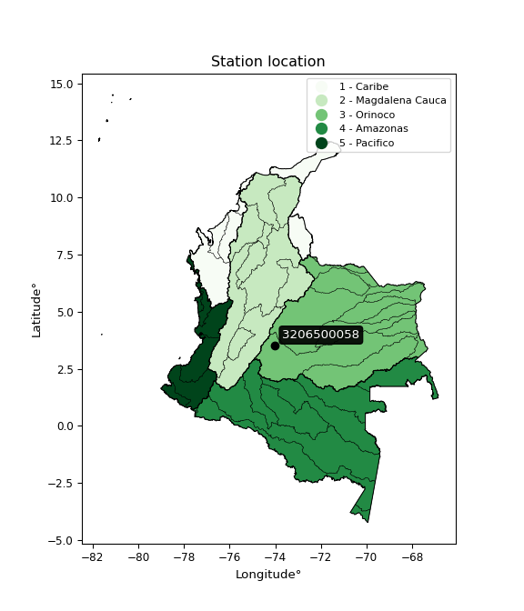

<div align="center">


</div>

# PMP Station (Rain, Pmax24h): 3206500058

Probable Maximum Precipitation (PMP) is the greatest amount of rainfall for a specific duration that is meteorologically possible for a given location, acting as a "worst-case" scenario for extreme storms, crucial for designing safety-critical infrastructure like bridges, river deviations, dams, spillways, and nuclear plants to prevent catastrophic failure. PMP is calculated by hydrologists using meteorological data to determine the upper limit of extreme rainfall, often leading to the Probable Maximum Flood (PMF) for flood control design, and is increasingly being studied for climate change impacts. Probable Maximum Precipitation (PMP) is the theoretical upper limit of rainfall, a deterministic estimate for extreme events, while probability distributions (like GEV, Gumbel) describe the likelihood and frequency of various precipitation amounts, including rare ones, showing how often events occur, with PMP representing the extreme end of these distributions, used for critical infrastructure design to ensure safety against the worst conceivable weather, unlike standard statistical forecasts which cover typical probabilities.

The most common probability distributions in hydrology, used for analyzing floods, rainfall, and streamflow, include the Normal, Log-Normal, Gumbel, Gamma (including Log-Pearson Type III), and Generalized Extreme Value (GEV) distributions, often chosen based on the data´s skewness and whether modeling extremes or general conditions, with Gumbel and GEV popular for extreme events like floods, while the Normal distribution serves as a baseline, though often requiring transformations for skewed hydrological data. These distributions help in designing water infrastructure, managing water resources, and forecasting hydrologic events.

> Hydrological data often isn´t perfectly normal (it´s skewed), so different distributions are needed for different applications, such as: **Flood Frequency Analysis**: Using Gumbel, GEV, or Log-Pearson Type III for predicting extreme flood magnitudes and their return periods, **Rainfall Analysis**: Normal for annual totals, but Log-Normal, Weibull, or GEV for intensity or extreme daily rainfall, **Streamflow Modeling**: Gamma and Log-Normal for maximum flows, GEV for minimum flows, and Kappa for daily flows.

<div align="center">

</img>

</div>


## A. General information


### 1. General running parameters

• app_version: _v20260113_. • runtime: _2026-01-17 18:24:04.630693_. • Python version: _3.14.0_. • SciPy version: _1.16.3_. • Pandas version: _2.3.3_. • NumPy version: _2.3.5_. • Stations dataset (station_dataset_file): _dataset/pmax24h_in/automatic_colombia_2003_2025.csv_. • Stations catalog (station_catalog_file): _dataset/CNE.xls_. • Minimum year to eval til year_max (date_min): _1900_. • Maximum year to eval since year_min (date_max): _2025_. • Creates, save and include plots into reports (create_plot): _False_. • Plot only fit distributions with Δo > Δ (plot_only_fit): _True_. • Plot only simple graphs avoiding multiple CDFs and multiple Extreme values plots (plot_only_simple): _True_. • Eval low extreme values, if False, evaluates high extreme values (low_extreme): _False_. • Eval every SciPy distribution as logarithmic (pdist_logarithmic_on): _True_. • Standard deviation normalized (ddof): _1.0_. • Return periods to eval in years (Tr): _[2, 2.33, 5, 10, 15, 20, 25, 50, 75, 100, 200, 250, 500, 750, 1000]_. • Minimum data sample per station, 0 means any (minimum_sample): _5_. • Z-Score maximum threshold to adjust a value, 0 means disable (zscore_max): _3.5_. • Z-Score minimum threshold to adjust a value, 0 means disable (zscore_min): _-2.5_. • Avoid zeros, e.g. rain = 0 (avoid_zeros): _True_. • Avoid null values (avoid_nans): _True_. 

:file_folder:Table: [dataset.csv](../../dataset/pmax24h_in/automatic_colombia_2003_2025.csv)

> Delta Degrees of Freedom (DDOF): is a parameter used in the formulas for calculating variance and standard deviation. When ddof=0, the divisor is $N$ (the total number of observations) and this is used when your data set is the entire population. When ddof=1, the divisor is $N-1$ and this is used when your data set is a sample drawn from a larger population. Using $N-1$ provides an unbiased estimate of the population variance (known as Bessel´s correction).


### 2. Station info and location

|   id |     CODIGO | NOMBRE                      | CATEGORIA               | TECNOLOGIA                | ESTADO           | FECHA_INSTALACION   |   FECHA_SUSPENSION |   ALTITUD |   LATITUD |   LONGITUD | DEPARTAMENTO   | MUNICIPIO   | AREA_OPERATIVA                            | ENTIDAD                                                     | AREA_HIDROGRAFICA   | ZONA_HIDROGRAFICA   | SUBZONA_HIDROGRAFICA   |   CORRIENTE | Catalogo   |   Version |
|-----:|-----------:|:----------------------------|:------------------------|:--------------------------|:-----------------|:--------------------|-------------------:|----------:|----------:|-----------:|:---------------|:------------|:------------------------------------------|:------------------------------------------------------------|:--------------------|:--------------------|:-----------------------|------------:|:-----------|----------:|
|    0 | 3206500058 | LEJANÍAS - AUT [3206500058] | Climatológica Principal | Automática con Telemetría | En Mantenimiento | 27/12/2017          |                nan |       649 |   3.51827 |   -74.0063 | Meta           | Lejanías    | Area Operativa 03 - Meta-Guaviare-Guainía | INSTITUTO DE HIDROLOGIA METEOROLOGIA Y ESTUDIOS AMBIENTALES | Orinoco             | Guaviare            | Río Ariari             |         nan | CNE_IDEAM  |  20251226 |

<div align="center">

Dynamic map: [:earth_americas:Google](http://maps.google.com/maps?q=3.51827,-74.00627) [:earth_americas:OSM](https://www.openstreetmap.org/#map=18/3.51827/-74.00627&layers=P) [:earth_americas:Bing](https://www.bing.com/maps?cp=3.51827~-74.00627&lvl=18) [:earth_americas:Apple](https://maps.apple.com/frame?center=3.51827%2C-74.00627&span=0.003%2C0.006)

</div>


<div align="center">

```geojson
{
  "type": "Feature",
  "geometry": {
    "type": "Point", 
    "coordinates": [-74.00627, 3.51827]
  }, 
  "properties": {
    "Name": "3206500058"
  }
}
```

</div>


### 3. Discrete values table and plot

<div align="center">

|               |           0 |           1 |           2 |           3 |           4 |          5 |            6 |
|:--------------|------------:|------------:|------------:|------------:|------------:|-----------:|-------------:|
| Date          | 2019        | 2020        | 2021        | 2022        | 2023        | 2024       | 2025         |
| Value         |  133.2      |  124.6      |  120        |  162        |  108.4      |  259.6     |  150.4       |
| Value_initial |  133.2      |  124.6      |  120        |  162        |  108.4      |  259.6     |  150.4       |
| count         |    7        |    7        |    7        |    7        |    7        |    7       |    7         |
| mean          |  151.171    |  151.171    |  151.171    |  151.171    |  151.171    |  151.171   |  151.171     |
| std           |   51.161    |   51.161    |   51.161    |   51.161    |   51.161    |   51.161   |   51.161     |
| zscore        |   -0.351272 |   -0.519369 |   -0.609281 |    0.211657 |   -0.836017 |    2.11936 |   -0.0150785 |


</div>


> The initial value (value_initial) correspond to the initial obtained or null completed value, and value (value) is adjusted only when the initial value is outside the valid range (outlier) definite through the Z-Score value. If Z-Score is active, values out of range or outliers are replaced with the station mean value. A Z-Score (or standard score) measures how many standard deviations a data point is from the mean of a dataset, indicating its relative position; positive scores mean above the mean, negative mean below, and a score of zero is exactly at the mean, allowing for comparison of values from different distributions. It´s calculated using the formula $z=(x–μ)/σ$, where $x$ is the data point, $μ$ is the mean, and $σ$ is the standard deviation, helping identify outliers and understand probability.
>
> <sub>**Note**: In this study, "completing" (filling gaps in) and "extending" (forecasting or lengthening the historical record) rainfall data series are avoided for certain critical analyses because they introduce artificial bias and uncertainty, which can distort the statistics of rare events (extremes), alter day-to-day variability, and compromise the integrity and homogeneity of the original data. Some reasons against Completing/Extending rainfall data are: **Distortion of Extremes and Variability**: The primary issue is that most gap-filling or extension methods rely on averaging or regression with nearby stations, which inherently smooths the data. Rainfall is highly variable in space and time, with a large percentage of zero values and occasional large storms. Infilling methods often underestimate the highest values and overestimate the lowest (zero) values, which severely distorts analyses focused on flood frequency, drought severity, and intensity-duration-frequency (IDF) curves, **Loss of Data Homogeneity**: Infilled or extended data are synthetic estimates, not actual measurements. Combining these estimates with observed data can violate the assumption of data homogeneity, which requires that the data properties do not change over time. Inhomogeneity can lead to incorrect conclusions about long-term trends or changes in climate patterns, **Propagation of Errors**: Errors and biases from the original data (e.g., wind-induced undercatch, instrument errors, site changes) or the data used for imputation can propagate through the analysis, leading to unreliable hydrological models and inaccurate predictions, **Compromised Statistical Integrity**: For statistical analyses, especially those involving the frequency of events, using artificial data can introduce time bias or autocorrelation that doesn´t exist in reality, making it difficult to assess the true probability of events, **Difficulty in Validation**: It is difficult to accurately validate the quality of filled or extended data, especially for past periods where ground-truth measurements are unavailable. The reliability of imputation techniques heavily depends on the density of the surrounding station network and the complexity of the local topography.</sub>


### 4. Active continuous probability distributions from SciPy (80 of 104 available)

A Probability Density Function (PDF) describes the relative likelihood of a continuous random variable falling within a specific range, where the total area under its curve equals 1, and the area over any interval gives the actual probability for that range. Unlike discrete probabilities (like rolling a die), a PDF shows density, not direct probability for a single point (which is zero), with higher points indicating higher likelihood, often visualized as a bell curve for normal distributions.

A log of a probability density function (log-PDF) is simply the logarithm of the PDF´s value, denoted as $log(f(x))$, useful for converting multiplication of probabilities into addition, improving numerical stability with tiny numbers, and connecting to information theory concepts like entropy. Instead of dealing with very small probabilities (e.g., 0.000001), log-PDFs use negative numbers (e.g., $log(0.00001) ≈ -11.51$ that are easier for computers to handle, preventing underflow errors and simplifying complex calculations. In this study, each active probability distribution from SciPy is also evaluated in the $log$ form.

[scipy.stats](https://docs.scipy.org/doc/scipy/reference/stats.html) is a Python´s powerful submodule within the SciPy library for comprehensive statistical analysis, offering over 130 probability distributions (like Normal, Poisson), functions for descriptive stats (mean, variance), hypothesis testing (t-tests, chi-square), random variable generation, and statistical tests, making it essential for data science, modeling, and research. It provides tools to explore, model, and draw conclusions from data efficiently, working seamlessly with NumPy.

<div align="center">

|   id | p_dist           |   n_parameter | fit_method   | label                                                                       | active   | ref                                                                                                      |
|-----:|:-----------------|--------------:|:-------------|:----------------------------------------------------------------------------|:---------|:---------------------------------------------------------------------------------------------------------|
|    0 | alpha            |             3 | MLE          | Alpha                                                                       | True     | [:mortar_board:](https://docs.scipy.org/doc/scipy/reference/generated/scipy.stats.alpha.html)            |
|    1 | anglit           |             2 | MM           | Anglit                                                                      | True     | [:mortar_board:](https://docs.scipy.org/doc/scipy/reference/generated/scipy.stats.anglit.html)           |
|    2 | arcsine          |             2 | MM           | Arcsine                                                                     | True     | [:mortar_board:](https://docs.scipy.org/doc/scipy/reference/generated/scipy.stats.arcsine.html)          |
|    3 | argus            |             3 | MLE          | Argus                                                                       | True     | [:mortar_board:](https://docs.scipy.org/doc/scipy/reference/generated/scipy.stats.argus.html)            |
|    4 | beta             |             4 | MLE          | Beta                                                                        | True     | [:mortar_board:](https://docs.scipy.org/doc/scipy/reference/generated/scipy.stats.beta.html)             |
|    5 | betaprime        |             4 | MLE          | Beta prime                                                                  | True     | [:mortar_board:](https://docs.scipy.org/doc/scipy/reference/generated/scipy.stats.betaprime.html)        |
|    6 | bradford         |             3 | MLE          | Bradford                                                                    | True     | [:mortar_board:](https://docs.scipy.org/doc/scipy/reference/generated/scipy.stats.bradford.html)         |
|    7 | burr             |             4 | MLE          | Burr (Type III)                                                             | True     | [:mortar_board:](https://docs.scipy.org/doc/scipy/reference/generated/scipy.stats.burr.html)             |
|    8 | burr12           |             4 | MLE          | Burr (Type III) 12                                                          | True     | [:mortar_board:](https://docs.scipy.org/doc/scipy/reference/generated/scipy.stats.burr12.html)           |
|    9 | cosine           |             2 | MLE          | Cosine                                                                      | True     | [:mortar_board:](https://docs.scipy.org/doc/scipy/reference/generated/scipy.stats.cosine.html)           |
|   10 | crystalball      |             4 | MLE          | Crystalball                                                                 | True     | [:mortar_board:](https://docs.scipy.org/doc/scipy/reference/generated/scipy.stats.crystalball.html)      |
|   11 | dgamma           |             3 | MLE          | Double gamma                                                                | True     | [:mortar_board:](https://docs.scipy.org/doc/scipy/reference/generated/scipy.stats.dgamma.html)           |
|   12 | dweibull         |             3 | MLE          | Double Weibull                                                              | True     | [:mortar_board:](https://docs.scipy.org/doc/scipy/reference/generated/scipy.stats.dweibull.html)         |
|   13 | erlang           |             3 | MLE          | Erlang                                                                      | True     | [:mortar_board:](https://docs.scipy.org/doc/scipy/reference/generated/scipy.stats.erlang.html)           |
|   14 | exponnorm        |             3 | MLE          | Exponentially modified Normal                                               | True     | [:mortar_board:](https://docs.scipy.org/doc/scipy/reference/generated/scipy.stats.exponnorm.html)        |
|   15 | exponpow         |             3 | MLE          | Exponential power                                                           | True     | [:mortar_board:](https://docs.scipy.org/doc/scipy/reference/generated/scipy.stats.exponpow.html)         |
|   16 | exponweib        |             4 | MLE          | Exponentiated Weibull                                                       | True     | [:mortar_board:](https://docs.scipy.org/doc/scipy/reference/generated/scipy.stats.exponweib.html)        |
|   17 | f                |             4 | MLE          | F                                                                           | True     | [:mortar_board:](https://docs.scipy.org/doc/scipy/reference/generated/scipy.stats.f.html)                |
|   18 | fatiguelife      |             3 | MLE          | Fatigue-life (Birnbaum-Saunders)                                            | True     | [:mortar_board:](https://docs.scipy.org/doc/scipy/reference/generated/scipy.stats.fatiguelife.html)      |
|   19 | foldnorm         |             3 | MM           | Fold Normal                                                                 | True     | [:mortar_board:](https://docs.scipy.org/doc/scipy/reference/generated/scipy.stats.foldnorm.html)         |
|   20 | gamma            |             3 | MLE          | Gamma                                                                       | True     | [:mortar_board:](https://docs.scipy.org/doc/scipy/reference/generated/scipy.stats.gamma.html)            |
|   21 | gausshyper       |             6 | MLE          | Gauss hypergeometric                                                        | True     | [:mortar_board:](https://docs.scipy.org/doc/scipy/reference/generated/scipy.stats.gausshyper.html)       |
|   22 | genexpon         |             5 | MLE          | Generalized exponential                                                     | True     | [:mortar_board:](https://docs.scipy.org/doc/scipy/reference/generated/scipy.stats.genexpon.html)         |
|   23 | genextreme       |             3 | MLE          | Generalized exponential                                                     | True     | [:mortar_board:](https://docs.scipy.org/doc/scipy/reference/generated/scipy.stats.genextreme.html)       |
|   24 | gengamma         |             4 | MLE          | Generalized gamma                                                           | True     | [:mortar_board:](https://docs.scipy.org/doc/scipy/reference/generated/scipy.stats.gengamma.html)         |
|   25 | genhalflogistic  |             3 | MLE          | Generalized half-logistic                                                   | True     | [:mortar_board:](https://docs.scipy.org/doc/scipy/reference/generated/scipy.stats.genhalflogistic.html)  |
|   26 | genlogistic      |             3 | MLE          | Generalized logistic                                                        | True     | [:mortar_board:](https://docs.scipy.org/doc/scipy/reference/generated/scipy.stats.genlogistic.html)      |
|   27 | gennorm          |             3 | MLE          | Generalized Normal                                                          | True     | [:mortar_board:](https://docs.scipy.org/doc/scipy/reference/generated/scipy.stats.gennorm.html)          |
|   28 | genpareto        |             3 | MLE          | Generalized Pareto                                                          | True     | [:mortar_board:](https://docs.scipy.org/doc/scipy/reference/generated/scipy.stats.genpareto.html)        |
|   29 | gompertz         |             3 | MLE          | Gompertz (or truncated Gumbel)                                              | True     | [:mortar_board:](https://docs.scipy.org/doc/scipy/reference/generated/scipy.stats.gompertz.html)         |
|   30 | gumbel_l         |             2 | MM           | Gumbel Left Skew                                                            | True     | [:mortar_board:](https://docs.scipy.org/doc/scipy/reference/generated/scipy.stats.gumbel_l.html)         |
|   31 | gumbel_r         |             2 | MM           | Gumbel Right Skew                                                           | True     | [:mortar_board:](https://docs.scipy.org/doc/scipy/reference/generated/scipy.stats.gumbel_r.html)         |
|   32 | halfgennorm      |             3 | MLE          | Upper half of a generalized normal                                          | True     | [:mortar_board:](https://docs.scipy.org/doc/scipy/reference/generated/scipy.stats.halfgennorm.html)      |
|   33 | halflogistic     |             2 | MM           | Half-logistic                                                               | True     | [:mortar_board:](https://docs.scipy.org/doc/scipy/reference/generated/scipy.stats.halflogistic.html)     |
|   34 | halfnorm         |             2 | MM           | Half Normal                                                                 | True     | [:mortar_board:](https://docs.scipy.org/doc/scipy/reference/generated/scipy.stats.halfnorm.html)         |
|   35 | hypsecant        |             2 | MM           | hyperbolic secant                                                           | True     | [:mortar_board:](https://docs.scipy.org/doc/scipy/reference/generated/scipy.stats.hypsecant.html)        |
|   36 | invgamma         |             3 | MLE          | Inverted gamma                                                              | True     | [:mortar_board:](https://docs.scipy.org/doc/scipy/reference/generated/scipy.stats.invgamma.html)         |
|   37 | invgauss         |             3 | MLE          | Inverse Gaussian                                                            | True     | [:mortar_board:](https://docs.scipy.org/doc/scipy/reference/generated/scipy.stats.invgauss.html)         |
|   38 | invweibull       |             3 | MLE          | Inverted Weibull                                                            | True     | [:mortar_board:](https://docs.scipy.org/doc/scipy/reference/generated/scipy.stats.invweibull.html)       |
|   39 | johnsonsb        |             4 | MLE          | Johnson SB                                                                  | True     | [:mortar_board:](https://docs.scipy.org/doc/scipy/reference/generated/scipy.stats.johnsonsb.html)        |
|   40 | johnsonsu        |             4 | MLE          | Johnson Su                                                                  | True     | [:mortar_board:](https://docs.scipy.org/doc/scipy/reference/generated/scipy.stats.johnsonsu.html)        |
|   41 | kappa3           |             3 | MLE          | Kappa 3                                                                     | True     | [:mortar_board:](https://docs.scipy.org/doc/scipy/reference/generated/scipy.stats.kappa3.html)           |
|   42 | kappa4           |             4 | MLE          | Kappa 4                                                                     | True     | [:mortar_board:](https://docs.scipy.org/doc/scipy/reference/generated/scipy.stats.kappa4.html)           |
|   43 | ksone            |             3 | MLE          | Kolmogorov-Smirnov one-sided test statistic distribution                    | True     | [:mortar_board:](https://docs.scipy.org/doc/scipy/reference/generated/scipy.stats.ksone.html)            |
|   44 | kstwobign        |             2 | MLE          | Limiting distribution of scaled Kolmogorov-Smirnov two-sided test statistic | True     | [:mortar_board:](https://docs.scipy.org/doc/scipy/reference/generated/scipy.stats.kstwobign.html)        |
|   45 | laplace          |             2 | MM           | Laplace                                                                     | True     | [:mortar_board:](https://docs.scipy.org/doc/scipy/reference/generated/scipy.stats.laplace.html)          |
|   46 | levy_l           |             2 | MLE          | Left-skewed Levy                                                            | True     | [:mortar_board:](https://docs.scipy.org/doc/scipy/reference/generated/scipy.stats.levy_l.html)           |
|   47 | loggamma         |             3 | MLE          | Log gamma                                                                   | True     | [:mortar_board:](https://docs.scipy.org/doc/scipy/reference/generated/scipy.stats.loggamma.html)         |
|   48 | logistic         |             2 | MM           | Logistic (or Sech-squared)                                                  | True     | [:mortar_board:](https://docs.scipy.org/doc/scipy/reference/generated/scipy.stats.logistic.html)         |
|   49 | loglaplace       |             3 | MLE          | Log-Laplace                                                                 | True     | [:mortar_board:](https://docs.scipy.org/doc/scipy/reference/generated/scipy.stats.loglaplace.html)       |
|   50 | lomax            |             3 | MLE          | Lomax (Pareto of the second kind)                                           | True     | [:mortar_board:](https://docs.scipy.org/doc/scipy/reference/generated/scipy.stats.lomax.html)            |
|   51 | maxwell          |             2 | MM           | Maxwell                                                                     | True     | [:mortar_board:](https://docs.scipy.org/doc/scipy/reference/generated/scipy.stats.maxwell.html)          |
|   52 | mielke           |             4 | MLE          | Mielke Beta-Kappa / Dagum                                                   | True     | [:mortar_board:](https://docs.scipy.org/doc/scipy/reference/generated/scipy.stats.mielke.html)           |
|   53 | moyal            |             2 | MM           | Moyal                                                                       | True     | [:mortar_board:](https://docs.scipy.org/doc/scipy/reference/generated/scipy.stats.moyal.html)            |
|   54 | nakagami         |             3 | MLE          | Nakagami                                                                    | True     | [:mortar_board:](https://docs.scipy.org/doc/scipy/reference/generated/scipy.stats.nakagami.html)         |
|   55 | ncf              |             5 | MLE          | Non-central F distribution                                                  | True     | [:mortar_board:](https://docs.scipy.org/doc/scipy/reference/generated/scipy.stats.ncf.html)              |
|   56 | nct              |             4 | MLE          | Non-central Student’s t                                                     | True     | [:mortar_board:](https://docs.scipy.org/doc/scipy/reference/generated/scipy.stats.nct.html)              |
|   57 | norm             |             2 | MM           | Normal                                                                      | True     | [:mortar_board:](https://docs.scipy.org/doc/scipy/reference/generated/scipy.stats.norm.html)             |
|   58 | pearson3         |             3 | MM           | Pearson type III                                                            | True     | [:mortar_board:](https://docs.scipy.org/doc/scipy/reference/generated/scipy.stats.pearson3.html)         |
|   59 | powerlaw         |             3 | MLE          | Power-function                                                              | True     | [:mortar_board:](https://docs.scipy.org/doc/scipy/reference/generated/scipy.stats.powerlaw.html)         |
|   60 | rayleigh         |             2 | MM           | Rayleigh                                                                    | True     | [:mortar_board:](https://docs.scipy.org/doc/scipy/reference/generated/scipy.stats.rayleigh.html)         |
|   61 | rdist            |             3 | MLE          | R-distributed (symmetric beta)                                              | True     | [:mortar_board:](https://docs.scipy.org/doc/scipy/reference/generated/scipy.stats.rdist.html)            |
|   62 | rice             |             3 | MLE          | Rice                                                                        | True     | [:mortar_board:](https://docs.scipy.org/doc/scipy/reference/generated/scipy.stats.rice.html)             |
|   63 | semicircular     |             2 | MM           | Semicircular                                                                | True     | [:mortar_board:](https://docs.scipy.org/doc/scipy/reference/generated/scipy.stats.semicircular.html)     |
|   64 | skewnorm         |             3 | MLE          | Skew normal                                                                 | True     | [:mortar_board:](https://docs.scipy.org/doc/scipy/reference/generated/scipy.stats.skewnorm.html)         |
|   65 | t                |             3 | MLE          | Student’s t                                                                 | True     | [:mortar_board:](https://docs.scipy.org/doc/scipy/reference/generated/scipy.stats.t.html)                |
|   66 | trapezoid        |             4 | MLE          | Trapezoid                                                                   | True     | [:mortar_board:](https://docs.scipy.org/doc/scipy/reference/generated/scipy.stats.trapezoid.html)        |
|   67 | triang           |             3 | MLE          | Triangular                                                                  | True     | [:mortar_board:](https://docs.scipy.org/doc/scipy/reference/generated/scipy.stats.triang.html)           |
|   68 | truncexpon       |             3 | MLE          | Truncated exponential                                                       | True     | [:mortar_board:](https://docs.scipy.org/doc/scipy/reference/generated/scipy.stats.truncexpon.html)       |
|   69 | truncnorm        |             4 | MLE          | Truncated normal                                                            | True     | [:mortar_board:](https://docs.scipy.org/doc/scipy/reference/generated/scipy.stats.truncnorm.html)        |
|   70 | truncpareto      |             4 | MLE          | Upper truncated Pareto                                                      | True     | [:mortar_board:](https://docs.scipy.org/doc/scipy/reference/generated/scipy.stats.truncpareto.html)      |
|   71 | truncweibull_min |             5 | MLE          | Doubly truncated Weibull minimum                                            | True     | [:mortar_board:](https://docs.scipy.org/doc/scipy/reference/generated/scipy.stats.truncweibull_min.html) |
|   72 | tukeylambda      |             3 | MLE          | Tukey-Lamdba                                                                | True     | [:mortar_board:](https://docs.scipy.org/doc/scipy/reference/generated/scipy.stats.tukeylambda.html)      |
|   73 | uniform          |             2 | MLE          | Uniform                                                                     | True     | [:mortar_board:](https://docs.scipy.org/doc/scipy/reference/generated/scipy.stats.uniform.html)          |
|   74 | vonmises         |             3 | MLE          | Von Mises                                                                   | True     | [:mortar_board:](https://docs.scipy.org/doc/scipy/reference/generated/scipy.stats.vonmises.html)         |
|   75 | vonmises_line    |             3 | MLE          | Von Mises line                                                              | True     | [:mortar_board:](https://docs.scipy.org/doc/scipy/reference/generated/scipy.stats.vonmises_line.html)    |
|   76 | wald             |             2 | MM           | Wald                                                                        | True     | [:mortar_board:](https://docs.scipy.org/doc/scipy/reference/generated/scipy.stats.wald.html)             |
|   77 | weibull_max      |             3 | MLE          | Weibull maximum                                                             | True     | [:mortar_board:](https://docs.scipy.org/doc/scipy/reference/generated/scipy.stats.weibull_max.html)      |
|   78 | weibull_min      |             3 | MLE          | Weibull minimum                                                             | True     | [:mortar_board:](https://docs.scipy.org/doc/scipy/reference/generated/scipy.stats.weibull_min.html)      |
|   79 | wrapcauchy       |             3 | MLE          | Wrapped  Cauchy                                                             | True     | [:mortar_board:](https://docs.scipy.org/doc/scipy/reference/generated/scipy.stats.wrapcauchy.html)       |

</div>

> **n_parameter:** # arguments & localization & scale.
>
> **Fit methods:** (MLE) maximum likelihood, (MM) L-moments.
>
>**Inactive** (With the only purpose of prevent loops, zero divisions, infinite values, over high estimated values or horizontal trending for recurrence intervals estimations, the follow distributions were disabled.)**:** lognorm, norminvgauss, powernorm, powerlognorm, cauchy, halfcauchy, foldcauchy, skewcauchy, chi2, expon, fisk, genhyperbolic, geninvgauss, gibrat, kstwo, laplace_asymmetric, levy, levy_stable, ncx2, pareto, rel_breitwigner, recipinvgauss, studentized_range, loguniform, 


## B. Probability (PDF) vs. Empirical (EDF) distributions functions

A continuous probability distribution (CPD) describes probabilities for variables that can take any value within a range (like rain any time), unlike discrete variables with specific outcomes (like temperature). It uses a Probability Density Function (PDF), a curve where the total area under it equals 1, and the probability of the variable falling within an interval (a to b) is found by calculating the area under the curve between those points. A key feature is that the probability of hitting any single exact value is zero, so probabilities are always expressed for ranges, e.g., $P(a ≤ X ≤ b)$.

<div align="center">

Distributions parameters from station values
|     |    station | p_dist              |   n |               loc |          scale | shape                  | shape1                | shape2                | shape3             |
|----:|-----------:|:--------------------|----:|------------------:|---------------:|:-----------------------|:----------------------|:----------------------|:-------------------|
|   0 | 3206500058 | alpha               |   7 |      75.7629      |  125.481       | 2.13790186531397       |                       |                       |                    |
|   1 | 3206500058 | anglit              |   7 |     151.171       |  138.564       |                        |                       |                       |                    |
|   2 | 3206500058 | arcsine             |   7 |      84.186       |  133.971       |                        |                       |                       |                    |
|   3 | 3206500058 | argus               |   7 |      39.2298      |  228.895       | 2.1319636363154527e-06 |                       |                       |                    |
|   4 | 3206500058 | beta                |   7 |     108.4         |  164.914       | 0.17782479724161       | 0.6068260236034779    |                       |                    |
|   5 | 3206500058 | betaprime           |   7 |      -1.36603     |    4.11247     | 560.0270088977798      | 16.20502200897618     |                       |                    |
|   6 | 3206500058 | bradford            |   7 |     108.4         |  159.224       | 20.41133778721091      |                       |                       |                    |
|   7 | 3206500058 | burr                |   7 |      63.3863      |   12.2769      | 3.0869877142534636     | 153.1099623248033     |                       |                    |
|   8 | 3206500058 | burr12              |   7 |      -4.54495     |  112.47        | 831.3137126663796      | 0.0041810244166954925 |                       |                    |
|   9 | 3206500058 | cosine              |   7 |     161.663       |   42.9848      |                        |                       |                       |                    |
|  10 | 3206500058 | crystalball         |   7 |       0.233236    |  158.446       | 4.191743934708357      | 1.552308986647764     |                       |                    |
|  11 | 3206500058 | dgamma              |   7 |     133.2         |   30.2451      | 0.9029510150431772     |                       |                       |                    |
|  12 | 3206500058 | dweibull            |   7 |     133.2         |   34.279       | 0.7432406415030199     |                       |                       |                    |
|  13 | 3206500058 | erlang              |   7 |     108.4         |   59.9662      | 0.48674707578154996    |                       |                       |                    |
|  14 | 3206500058 | exponnorm           |   7 |     108.333       |    0.0208901   | 2052.7544009873504     |                       |                       |                    |
|  15 | 3206500058 | exponpow            |   7 |     108.4         |   85.3806      | 0.6330498654706875     |                       |                       |                    |
|  16 | 3206500058 | exponweib           |   7 |     108.4         |   49.2598      | 0.4052577092534538     | 1.194249070882421     |                       |                    |
|  17 | 3206500058 | f                   |   7 |      94.352       |   33.7959      | 1048.9424452770988     | 4.486777278759758     |                       |                    |
|  18 | 3206500058 | fatiguelife         |   7 |     103.169       |   29.7737      | 1.0989479285046093     |                       |                       |                    |
|  19 | 3206500058 | foldnorm            |   7 |      86.1456      |   80.2876      | 0.1436368234742018     |                       |                       |                    |
|  20 | 3206500058 | gamma               |   7 |     108.4         |   39.7834      | 0.7529760519180111     |                       |                       |                    |
|  21 | 3206500058 | gausshyper          |   7 |     108.351       |  151.249       | 0.8992603900420593     | 0.8442468115547599    | 1.2312664267966207    | 1.0776707768074472 |
|  22 | 3206500058 | genexpon            |   7 |     108.4         |  149.472       | 3.4946831581301385     | 0.062284937224657     | 7.439463678742036e-10 |                    |
|  23 | 3206500058 | genextreme          |   7 |     109.062       |    4.39469     | -6.640397819768906     |                       |                       |                    |
|  24 | 3206500058 | gengamma            |   7 |     108.4         |   55.228       | 0.8223357928728563     | 0.5475621506396384    |                       |                    |
|  25 | 3206500058 | genhalflogistic     |   7 |     100.824       |  168.117       | 1.0588295881188976     |                       |                       |                    |
|  26 | 3206500058 | genlogistic         |   7 |     -76.4313      |   27.9035      | 1751.7204085111107     |                       |                       |                    |
|  27 | 3206500058 | gennorm             |   7 |     133.2         |    0.339368    | 0.3104445273059103     |                       |                       |                    |
|  28 | 3206500058 | genpareto           |   7 |      -0.166478    |  440.317       | -1.6950490403556038    |                       |                       |                    |
|  29 | 3206500058 | gompertz            |   7 |     108.4         |    2.54244e+13 | 581205085035.4729      |                       |                       |                    |
|  30 | 3206500058 | gumbel_l            |   7 |     172.489       |   36.931       |                        |                       |                       |                    |
|  31 | 3206500058 | gumbel_r            |   7 |     129.854       |   36.931       |                        |                       |                       |                    |
|  32 | 3206500058 | halfgennorm         |   7 |     108.4         |    3.20963e-05 | 0.1469051749441208     |                       |                       |                    |
|  33 | 3206500058 | halflogistic        |   7 |      95.0319      |   40.4961      |                        |                       |                       |                    |
|  34 | 3206500058 | halfnorm            |   7 |      88.4776      |   78.5751      |                        |                       |                       |                    |
|  35 | 3206500058 | hypsecant           |   7 |     151.171       |   30.154       |                        |                       |                       |                    |
|  36 | 3206500058 | invgamma            |   7 |      94.3076      |   75.7135      | 2.2417284858235877     |                       |                       |                    |
|  37 | 3206500058 | invgauss            |   7 |     100.61        |   44.7179      | 1.1306667566671464     |                       |                       |                    |
|  38 | 3206500058 | invweibull          |   7 |     108.4         |    2.13138     | 0.05041895950941373    |                       |                       |                    |
|  39 | 3206500058 | johnsonsb           |   7 |     108.4         |  151.202       | 0.2382667949032345     | 0.1563865450238102    |                       |                    |
|  40 | 3206500058 | johnsonsu           |   7 |     103.995       |    0.129184    | -5.887214080744458     | 0.963447371466392     |                       |                    |
|  41 | 3206500058 | kappa3              |   7 |     108.4         |   31.5616      | 1.8694783213134043     |                       |                       |                    |
|  42 | 3206500058 | kappa4              |   7 |      79.4449      |  157.299       | 1.2198516275460296     | 0.78090052787799      |                       |                    |
|  43 | 3206500058 | ksone               |   7 |      93.28        |  181.44        | 1.0                    |                       |                       |                    |
|  44 | 3206500058 | kstwobign           |   7 |      25.8667      |  146.071       |                        |                       |                       |                    |
|  45 | 3206500058 | laplace             |   7 |     151.171       |   33.4927      |                        |                       |                       |                    |
|  46 | 3206500058 | levy_l              |   7 |     272.589       |   57.953       |                        |                       |                       |                    |
|  47 | 3206500058 | loggamma            |   7 |  -15331.1         | 2063.39        | 1814.0721051538262     |                       |                       |                    |
|  48 | 3206500058 | logistic            |   7 |     151.171       |   26.1142      |                        |                       |                       |                    |
|  49 | 3206500058 | loglaplace          |   7 |      -0.353017    |  133.553       | 5.152268664646025      |                       |                       |                    |
|  50 | 3206500058 | lomax               |   7 |     108.4         | 8758.24        | 206.02272747898374     |                       |                       |                    |
|  51 | 3206500058 | maxwell             |   7 |      38.9342      |   70.3342      |                        |                       |                       |                    |
|  52 | 3206500058 | mielke              |   7 |       1.08584     |   49.1744      | 958.3667250272606      | 5.407998322859294     |                       |                    |
|  53 | 3206500058 | moyal               |   7 |     124.085       |   21.3221      |                        |                       |                       |                    |
|  54 | 3206500058 | nakagami            |   7 |     108.4         |   83.5468      | 0.17094488851068257    |                       |                       |                    |
|  55 | 3206500058 | ncf                 |   7 |      -0.480549    |  141.403       | 1152.2146508168707     | 32.09392579510725     | 0.012125910363211766  |                    |
|  56 | 3206500058 | nct                 |   7 |      -0.516995    |    1.51312     | 8.99942212513643       | 90.97391471969598     |                       |                    |
|  57 | 3206500058 | norm                |   7 |     151.171       |   47.3659      |                        |                       |                       |                    |
|  58 | 3206500058 | pearson3            |   7 |     151.171       |   47.3659      | 1.5364861676503216     |                       |                       |                    |
|  59 | 3206500058 | powerlaw            |   7 |     108.4         |  151.2         | 0.1527373398119122     |                       |                       |                    |
|  60 | 3206500058 | rayleigh            |   7 |      60.5578      |   72.2992      |                        |                       |                       |                    |
|  61 | 3206500058 | rdist               |   7 |      93.6327      |   68.3673      | 1.2241089599340746     |                       |                       |                    |
|  62 | 3206500058 | rice                |   7 |      81.1866      |   59.7554      | 0.00025963861903589836 |                       |                       |                    |
|  63 | 3206500058 | semicircular        |   7 |     151.171       |   94.7317      |                        |                       |                       |                    |
|  64 | 3206500058 | skewnorm            |   7 |     108.4         |   63.8163      | 29180162.770970568     |                       |                       |                    |
|  65 | 3206500058 | t                   |   7 |     129.331       |   21.6759      | 1.8344052279576664     |                       |                       |                    |
|  66 | 3206500058 | trapezoid           |   7 |      93.28        |  181.44        | 1.0                    | 1.0                   |                       |                    |
|  67 | 3206500058 | triang              |   7 |      19.4218      |  240.178       | 0.9999999999980314     |                       |                       |                    |
|  68 | 3206500058 | truncexpon          |   7 |     108.4         |  128.189       | 1.1795060228626193     |                       |                       |                    |
|  69 | 3206500058 | truncnorm           |   7 | -556621           | 5135.88        | 108.3999242901057      | 267.6235585216878     |                       |                    |
|  70 | 3206500058 | truncpareto         |   7 |     102.571       |    5.82933     | 3.898110197811697e-09  | 26.937792964178506    |                       |                    |
|  71 | 3206500058 | truncweibull_min    |   7 |     108.282       |  140.328       | 0.5008693683005796     | 0.0008373780480670813 | 1.0783149039708588    |                    |
|  72 | 3206500058 | tukeylambda         |   7 |     136.446       |   50.8044      | 1.8114481206095019     |                       |                       |                    |
|  73 | 3206500058 | uniform             |   7 |     108.4         |  151.2         |                        |                       |                       |                    |
|  74 | 3206500058 | vonmises            |   7 |       0.479242    |    1           | 0.8059355372654828     |                       |                       |                    |
|  75 | 3206500058 | vonmises_line       |   7 |     139.911       |   38.0983      | 1.5437202663795655     |                       |                       |                    |
|  76 | 3206500058 | wald                |   7 |     103.806       |   47.3659      |                        |                       |                       |                    |
|  77 | 3206500058 | weibull_max         |   7 |     259.6         |    1.73825     | 0.1760430620479443     |                       |                       |                    |
|  78 | 3206500058 | weibull_min         |   7 |     108.4         |   23.0674      | 0.4614598278242191     |                       |                       |                    |
|  79 | 3206500058 | wrapcauchy          |   7 |     108.4         |   24.0642      | 0.5                    |                       |                       |                    |
|  80 | 3206500058 | logalpha            |   7 |       3.72351     |    7.06025     | 5.908439437257988      |                       |                       |                    |
|  81 | 3206500058 | loganglit           |   7 |       4.97862     |    0.784527    |                        |                       |                       |                    |
|  82 | 3206500058 | logarcsine          |   7 |       4.59938     |    0.758474    |                        |                       |                       |                    |
|  83 | 3206500058 | logargus            |   7 |       4.35159     |    1.25498     | 6.907733270573228e-05  |                       |                       |                    |
|  84 | 3206500058 | logbeta             |   7 |       4.68583     |    1.01923     | 0.4006325955381871     | 1.2585724885252039    |                       |                    |
|  85 | 3206500058 | logbetaprime        |   7 |       4.43657     |    0.185991    | 15.953538204697445     | 6.670927838365966     |                       |                    |
|  86 | 3206500058 | logbradford         |   7 |       4.68583     |    0.873315    | 1.2156362213758252     |                       |                       |                    |
|  87 | 3206500058 | logburr             |   7 |      -0.729969    |    4.68461     | 31.48008575206225      | 260.29927751907593    |                       |                    |
|  88 | 3206500058 | logburr12           |   7 |    -102.367       |  107.041       | 19369.838753648117     | 0.017993501119010803  |                       |                    |
|  89 | 3206500058 | logcosine           |   7 |       5.02664     |    0.237853    |                        |                       |                       |                    |
|  90 | 3206500058 | logcrystalball      |   7 |       4.97862     |    0.268179    | 48.93293209713906      | 77.89241786794445     |                       |                    |
|  91 | 3206500058 | logdgamma           |   7 |       4.89185     |    0.136659    | 0.6376254373290826     |                       |                       |                    |
|  92 | 3206500058 | logdweibull         |   7 |       4.94784     |    0.220726    | 1.2777872318636616     |                       |                       |                    |
|  93 | 3206500058 | logerlang           |   7 |       4.68583     |    0.406366    | 0.19685895460429634    |                       |                       |                    |
|  94 | 3206500058 | logexponnorm        |   7 |       4.70157     |    0.0523673   | 5.290376266895751      |                       |                       |                    |
|  95 | 3206500058 | logexponpow         |   7 |       4.68583     |    0.584391    | 0.5242273726752008     |                       |                       |                    |
|  96 | 3206500058 | logexponweib        |   7 |       4.68583     |    0.586809    | 0.14403962026384748    | 1.2305895743256898    |                       |                    |
|  97 | 3206500058 | logf                |   7 |       4.68583     |    0.264559    | 1.3203045757307508     | 148.79244182944745    |                       |                    |
|  98 | 3206500058 | logfatiguelife      |   7 |       4.60904     |    0.282054    | 0.7849018777233371     |                       |                       |                    |
|  99 | 3206500058 | logfoldnorm         |   7 |       4.58496     |    0.337712    | 0.9983221950111554     |                       |                       |                    |
| 100 | 3206500058 | loggamma            |   7 |       4.68583     |    0.282768    | 0.7408206602486311     |                       |                       |                    |
| 101 | 3206500058 | loggausshyper       |   7 |       4.68583     |    0.910848    | 0.9107502167713778     | 1.018129685536252     | 1.1384943522220206    | 1.0337343044046083 |
| 102 | 3206500058 | loggenexpon         |   7 |       4.68583     |    0.423445    | 1.3287379890463105     | 0.24184451319063272   | 1.3924202201261429    |                    |
| 103 | 3206500058 | loggenextreme       |   7 |       4.83738     |    0.156264    | -0.2831675109279298    |                       |                       |                    |
| 104 | 3206500058 | loggengamma         |   7 |       4.68583     |    1.2376      | 0.11650916260496239    | 1.4142559992451291    |                       |                    |
| 105 | 3206500058 | loggenhalflogistic  |   7 |       4.56088     |    1.04069     | 1.0424994241857894     |                       |                       |                    |
| 106 | 3206500058 | loggenlogistic      |   7 |       3.57937     |    0.181373    | 1184.2760338241892     |                       |                       |                    |
| 107 | 3206500058 | loggennorm          |   7 |       4.89185     |    0.113772    | 0.7424271406301621     |                       |                       |                    |
| 108 | 3206500058 | loggenpareto        |   7 |      -0.0208453   |   10.2945      | -1.8449053316534556    |                       |                       |                    |
| 109 | 3206500058 | loggompertz         |   7 |       4.68583     |    2.40671     | 7.314677559907407      |                       |                       |                    |
| 110 | 3206500058 | loggumbel_l         |   7 |       5.09931     |    0.209097    |                        |                       |                       |                    |
| 111 | 3206500058 | loggumbel_r         |   7 |       4.85792     |    0.209097    |                        |                       |                       |                    |
| 112 | 3206500058 | loghalfgennorm      |   7 |       4.68583     |    0.4626      | 1.5100428184402679     |                       |                       |                    |
| 113 | 3206500058 | loghalflogistic     |   7 |       4.66076     |    0.229283    |                        |                       |                       |                    |
| 114 | 3206500058 | loghalfnorm         |   7 |       4.62365     |    0.444879    |                        |                       |                       |                    |
| 115 | 3206500058 | loghypsecant        |   7 |       4.97862     |    0.170727    |                        |                       |                       |                    |
| 116 | 3206500058 | loginvgamma         |   7 |      -0.50647     | 2454.13        | 448.3335718185481      |                       |                       |                    |
| 117 | 3206500058 | loginvgauss         |   7 |       4.58832     |    0.683277    | 0.5712193709887183     |                       |                       |                    |
| 118 | 3206500058 | loginvweibull       |   7 |       4.28554     |    0.551833    | 3.5314864897144522     |                       |                       |                    |
| 119 | 3206500058 | logjohnsonsb        |   7 |       4.68583     |    0.873314    | -0.31855071974201793   | 0.2153705706937526    |                       |                    |
| 120 | 3206500058 | logjohnsonsu        |   7 |       4.60954     |    0.00344792  | -6.864545788015214     | 1.3444798997888592    |                       |                    |
| 121 | 3206500058 | logkappa3           |   7 |       4.68583     |    0.873001    | 5432.903130720058      |                       |                       |                    |
| 122 | 3206500058 | logkappa4           |   7 |       4.63532     |    0.960529    | 1.0555662612058465     | 1.0396945531920736    |                       |                    |
| 123 | 3206500058 | logksone            |   7 |       4.5985      |    1.04798     | 1.0                    |                       |                       |                    |
| 124 | 3206500058 | logkstwobign        |   7 |       4.20101     |    0.899668    |                        |                       |                       |                    |
| 125 | 3206500058 | loglaplace          |   7 |       4.97862     |    0.18963     |                        |                       |                       |                    |
| 126 | 3206500058 | loglevy_l           |   7 |       5.62747     |    0.304688    |                        |                       |                       |                    |
| 127 | 3206500058 | logloggamma         |   7 |     -56.9276      |    8.8795      | 1066.7245965796005     |                       |                       |                    |
| 128 | 3206500058 | loglogistic         |   7 |       4.97862     |    0.147854    |                        |                       |                       |                    |
| 129 | 3206500058 | logloglaplace       |   7 |      -0.0536887   |    4.94554     | 26.201639469858115     |                       |                       |                    |
| 130 | 3206500058 | loglomax            |   7 |       4.68583     |    9.96406e+11 | 290651643968.4293      |                       |                       |                    |
| 131 | 3206500058 | logmaxwell          |   7 |       4.34315     |    0.398221    |                        |                       |                       |                    |
| 132 | 3206500058 | logmielke           |   7 |       2.05756     |    1.96079     | 5271.007363798475      | 16.209539721742615    |                       |                    |
| 133 | 3206500058 | logmoyal            |   7 |       4.82526     |    0.120722    |                        |                       |                       |                    |
| 134 | 3206500058 | lognakagami         |   7 |       4.68583     |    0.603146    | 0.0789138835323272     |                       |                       |                    |
| 135 | 3206500058 | logncf              |   7 |      -4.74721     |    9.72546     | 4965.60614300437       | 1247.4914457578434    | 0.033644757981103     |                    |
| 136 | 3206500058 | lognct              |   7 |      -0.710866    |    0.0568763   | 254.15370944845242     | 99.72881984381074     |                       |                    |
| 137 | 3206500058 | lognorm             |   7 |       4.97862     |    0.268178    |                        |                       |                       |                    |
| 138 | 3206500058 | logpearson3         |   7 |       4.97862     |    0.268178    | 1.1897219748339272     |                       |                       |                    |
| 139 | 3206500058 | logpowerlaw         |   7 |       4.68583     |    0.873314    | 0.16782566157645526    |                       |                       |                    |
| 140 | 3206500058 | lograyleigh         |   7 |       4.46558     |    0.409347    |                        |                       |                       |                    |
| 141 | 3206500058 | logrdist            |   7 |       5.20805     |    0.522218    | 1.0745090226437082     |                       |                       |                    |
| 142 | 3206500058 | logrice             |   7 |       4.55408     |    0.355074    | 0.00010270022883208067 |                       |                       |                    |
| 143 | 3206500058 | logsemicircular     |   7 |       4.97862     |    0.536311    |                        |                       |                       |                    |
| 144 | 3206500058 | logskewnorm         |   7 |       4.68583     |    0.397019    | 52626515.70044997      |                       |                       |                    |
| 145 | 3206500058 | logt                |   7 |       4.90175     |    0.163924    | 2.424464828342617      |                       |                       |                    |
| 146 | 3206500058 | logtrapezoid        |   7 |       4.5985      |    1.04798     | 1.0                    | 1.0                   |                       |                    |
| 147 | 3206500058 | logtriang           |   7 |       4.24765     |    1.31213     | 0.9995198291608993     |                       |                       |                    |
| 148 | 3206500058 | logtruncexpon       |   7 |       4.68583     |    0.835777    | 1.0449176274999918     |                       |                       |                    |
| 149 | 3206500058 | logtruncnorm        |   7 |      -2.64917     |    1.56539     | 4.685746314461315      | 5.243639969573996     |                       |                    |
| 150 | 3206500058 | logtruncpareto      |   7 |       4.68557     |    0.000255253 | 0.0006702221921491074  | 3471.2211889719206    |                       |                    |
| 151 | 3206500058 | logtruncweibull_min |   7 |       4.6844      |    0.946662    | 0.5931550727590819     | 0.001504484181017308  | 0.9240240812294345    |                    |
| 152 | 3206500058 | logtukeylambda      |   7 |       5.12249     |    0.580059    | 1.3284095819945398     |                       |                       |                    |
| 153 | 3206500058 | loguniform          |   7 |       4.68583     |    0.873314    |                        |                       |                       |                    |
| 154 | 3206500058 | logvonmises         |   7 |      -1.30846     |    1           | 14.45786364626454      |                       |                       |                    |
| 155 | 3206500058 | logvonmises_line    |   7 |       4.92783     |    0.200953    | 1.1210553137650698     |                       |                       |                    |
| 156 | 3206500058 | logwald             |   7 |       4.71042     |    0.268196    |                        |                       |                       |                    |
| 157 | 3206500058 | logweibull_max      |   7 |       1.78182e+07 |    1.78181e+07 | 98382418.23623723      |                       |                       |                    |
| 158 | 3206500058 | logweibull_min      |   7 |       4.68583     |    0.145137    | 0.20610670908639994    |                       |                       |                    |
| 159 | 3206500058 | logwrapcauchy       |   7 |       4.68583     |    0.138992    | 0.5                    |                       |                       |                    |

</div>

> **loc** (Location parameter): This shifts the distribution along the x-axis. For many common distributions, like the normal (Gaussian) distribution, loc represents the mean $μ$. For others, like the uniform distribution, it might represent the minimum value, or for the beta distribution, the left end of the support interval.
>
> **scale** (Scale parameter): This determines the width or spread of the distribution. For the normal distribution, scale represents the standard deviation $σ$. For a uniform distribution, it defines the length of the interval (from $loc$ to $loc + scale$).
>
> **shape** (Shape parameters): Refers to parameters that define the specific form of a probability distribution, distinct from its location (loc) and scale (scale). These parameters are required arguments for most distribution functions. For example, a normal (Gaussian) distribution is fully defined by its location (mean) and scale (standard deviation), so it has no specific shape parameters beyond loc and scale. However, other distributions have intrinsic properties that need specification, as Gamma distribution that takes a shape parameter, often named $a$ or $alpha$.


### 0. Cumulative distribution values - CDF (160 evaluated)

Cumulative Distribution Function (CDF), denoted as $F$<sub>$X$</sub>$(x)$, is a function that gives the probability that a random variable $X$ will take a value less than or equal to a specific value, $x$ (i.e., $(P(X≥x)$. It essentially "accumulates" probabilities from a given point up to the far right (positive infinity), providing a complete picture of the distribution´s probabilities for both discrete (like rain) and continuous (like temperature) variables, helping to find probabilities over ranges or above certain values. Each station is evaluated separately ordering the $x$ values ascending, calculating the CDF and PDF values for the activated distributions and their logarithmic forms.

<div align="center">

CDF ordered by x ascending and calculating $log(f(x))$ separately
|   id |    Station |   date |     x |   count |    mean |    std |     zscore |   Value_initial |    station |   m |    alpha |   alpha_pdf |   anglit |   anglit_pdf |   arcsine |   arcsine_pdf |    argus |   argus_pdf |      beta |    beta_pdf |   betaprime |   betaprime_pdf |    bradford |   bradford_pdf |      burr |    burr_pdf |    burr12 |   burr12_pdf |   cosine |   cosine_pdf |   crystalball |   crystalball_pdf |   dgamma |   dgamma_pdf |   dweibull |   dweibull_pdf |      erlang |       erlang_pdf |   exponnorm |   exponnorm_pdf |    exponpow |   exponpow_pdf |   exponweib |   exponweib_pdf |        f |       f_pdf |   fatiguelife |   fatiguelife_pdf |   foldnorm |   foldnorm_pdf |       gamma |     gamma_pdf |   gausshyper |   gausshyper_pdf |    genexpon |   genexpon_pdf |   genextreme |   genextreme_pdf |    gengamma |   gengamma_pdf |   genhalflogistic |   genhalflogistic_pdf |   genlogistic |   genlogistic_pdf |   gennorm |   gennorm_pdf |   genpareto |   genpareto_pdf |   gompertz |   gompertz_pdf |   gumbel_l |   gumbel_l_pdf |   gumbel_r |   gumbel_r_pdf |   halfgennorm |   halfgennorm_pdf |   halflogistic |   halflogistic_pdf |   halfnorm |   halfnorm_pdf |   hypsecant |   hypsecant_pdf |   invgamma |   invgamma_pdf |   invgauss |   invgauss_pdf |   invweibull |   invweibull_pdf |   johnsonsb |   johnsonsb_pdf |   johnsonsu |   johnsonsu_pdf |      kappa3 |   kappa3_pdf |      kappa4 |   kappa4_pdf |     ksone |   ksone_pdf |   kstwobign |   kstwobign_pdf |   laplace |   laplace_pdf |   levy_l |   levy_l_pdf |    loggamma |   loggamma_pdf |   logistic |   logistic_pdf |   loglaplace |   loglaplace_pdf |       lomax |   lomax_pdf |   maxwell |   maxwell_pdf |   mielke |   mielke_pdf |    moyal |   moyal_pdf |    nakagami |   nakagami_pdf |      ncf |     ncf_pdf |      nct |     nct_pdf |     norm |    norm_pdf |   pearson3 |   pearson3_pdf |   powerlaw |   powerlaw_pdf |   rayleigh |   rayleigh_pdf |    rdist |     rdist_pdf |      rice |    rice_pdf |   semicircular |   semicircular_pdf |   skewnorm |   skewnorm_pdf |        t |       t_pdf |   trapezoid |   trapezoid_pdf |   triang |   triang_pdf |   truncexpon |   truncexpon_pdf |   truncnorm |   truncnorm_pdf |   truncpareto |   truncpareto_pdf |   truncweibull_min |   truncweibull_min_pdf |   tukeylambda |   tukeylambda_pdf |   uniform |   uniform_pdf |   vonmises |   vonmises_pdf |   vonmises_line |   vonmises_line_pdf |       wald |    wald_pdf |   weibull_max |   weibull_max_pdf |   weibull_min |   weibull_min_pdf |   wrapcauchy |   wrapcauchy_pdf |   logalpha |   logalpha_pdf |   loganglit |   loganglit_pdf |   logarcsine |   logarcsine_pdf |   logargus |   logargus_pdf |     logbeta |   logbeta_pdf |   logbetaprime |   logbetaprime_pdf |   logbradford |   logbradford_pdf |   logburr |   logburr_pdf |   logburr12 |   logburr12_pdf |   logcosine |   logcosine_pdf |   logcrystalball |   logcrystalball_pdf |   logdgamma |   logdgamma_pdf |   logdweibull |   logdweibull_pdf |   logerlang |   logerlang_pdf |   logexponnorm |   logexponnorm_pdf |   logexponpow |   logexponpow_pdf |   logexponweib |   logexponweib_pdf |        logf |      logf_pdf |   logfatiguelife |   logfatiguelife_pdf |   logfoldnorm |   logfoldnorm_pdf |   loggausshyper |   loggausshyper_pdf |   loggenexpon |   loggenexpon_pdf |   loggenextreme |   loggenextreme_pdf |   loggengamma |   loggengamma_pdf |   loggenhalflogistic |   loggenhalflogistic_pdf |   loggenlogistic |   loggenlogistic_pdf |   loggennorm |   loggennorm_pdf |   loggenpareto |   loggenpareto_pdf |   loggompertz |   loggompertz_pdf |   loggumbel_l |   loggumbel_l_pdf |   loggumbel_r |   loggumbel_r_pdf |   loghalfgennorm |   loghalfgennorm_pdf |   loghalflogistic |   loghalflogistic_pdf |   loghalfnorm |   loghalfnorm_pdf |   loghypsecant |   loghypsecant_pdf |   loginvgamma |   loginvgamma_pdf |   loginvgauss |   loginvgauss_pdf |   loginvweibull |   loginvweibull_pdf |   logjohnsonsb |   logjohnsonsb_pdf |   logjohnsonsu |   logjohnsonsu_pdf |   logkappa3 |   logkappa3_pdf |   logkappa4 |   logkappa4_pdf |   logksone |   logksone_pdf |   logkstwobign |   logkstwobign_pdf |   loglevy_l |   loglevy_l_pdf |   logloggamma |   logloggamma_pdf |   loglogistic |   loglogistic_pdf |   logloglaplace |   logloglaplace_pdf |    loglomax |   loglomax_pdf |   logmaxwell |   logmaxwell_pdf |   logmielke |   logmielke_pdf |   logmoyal |   logmoyal_pdf |   lognakagami |   lognakagami_pdf |   logncf |   logncf_pdf |   lognct |   lognct_pdf |   lognorm |   lognorm_pdf |   logpearson3 |   logpearson3_pdf |   logpowerlaw |   logpowerlaw_pdf |   lograyleigh |   lograyleigh_pdf |    logrdist |   logrdist_pdf |   logrice |   logrice_pdf |   logsemicircular |   logsemicircular_pdf |   logskewnorm |   logskewnorm_pdf |     logt |   logt_pdf |   logtrapezoid |   logtrapezoid_pdf |   logtriang |   logtriang_pdf |   logtruncexpon |   logtruncexpon_pdf |   logtruncnorm |   logtruncnorm_pdf |   logtruncpareto |   logtruncpareto_pdf |   logtruncweibull_min |   logtruncweibull_min_pdf |   logtukeylambda |   logtukeylambda_pdf |   loguniform |   loguniform_pdf |   logvonmises |   logvonmises_pdf |   logvonmises_line |   logvonmises_line_pdf |   logwald |   logwald_pdf |   logweibull_max |   logweibull_max_pdf |   logweibull_min |   logweibull_min_pdf |   logwrapcauchy |   logwrapcauchy_pdf |
|-----:|-----------:|-------:|------:|--------:|--------:|-------:|-----------:|----------------:|-----------:|----:|---------:|------------:|---------:|-------------:|----------:|--------------:|---------:|------------:|----------:|------------:|------------:|----------------:|------------:|---------------:|----------:|------------:|----------:|-------------:|---------:|-------------:|--------------:|------------------:|---------:|-------------:|-----------:|---------------:|------------:|-----------------:|------------:|----------------:|------------:|---------------:|------------:|----------------:|---------:|------------:|--------------:|------------------:|-----------:|---------------:|------------:|--------------:|-------------:|-----------------:|------------:|---------------:|-------------:|-----------------:|------------:|---------------:|------------------:|----------------------:|--------------:|------------------:|----------:|--------------:|------------:|----------------:|-----------:|---------------:|-----------:|---------------:|-----------:|---------------:|--------------:|------------------:|---------------:|-------------------:|-----------:|---------------:|------------:|----------------:|-----------:|---------------:|-----------:|---------------:|-------------:|-----------------:|------------:|----------------:|------------:|----------------:|------------:|-------------:|------------:|-------------:|----------:|------------:|------------:|----------------:|----------:|--------------:|---------:|-------------:|------------:|---------------:|-----------:|---------------:|-------------:|-----------------:|------------:|------------:|----------:|--------------:|---------:|-------------:|---------:|------------:|------------:|---------------:|---------:|------------:|---------:|------------:|---------:|------------:|-----------:|---------------:|-----------:|---------------:|-----------:|---------------:|---------:|--------------:|----------:|------------:|---------------:|-------------------:|-----------:|---------------:|---------:|------------:|------------:|----------------:|---------:|-------------:|-------------:|-----------------:|------------:|----------------:|--------------:|------------------:|-------------------:|-----------------------:|--------------:|------------------:|----------:|--------------:|-----------:|---------------:|----------------:|--------------------:|-----------:|------------:|--------------:|------------------:|--------------:|------------------:|-------------:|-----------------:|-----------:|---------------:|------------:|----------------:|-------------:|-----------------:|-----------:|---------------:|------------:|--------------:|---------------:|-------------------:|--------------:|------------------:|----------:|--------------:|------------:|----------------:|------------:|----------------:|-----------------:|---------------------:|------------:|----------------:|--------------:|------------------:|------------:|----------------:|---------------:|-------------------:|--------------:|------------------:|---------------:|-------------------:|------------:|--------------:|-----------------:|---------------------:|--------------:|------------------:|----------------:|--------------------:|--------------:|------------------:|----------------:|--------------------:|--------------:|------------------:|---------------------:|-------------------------:|-----------------:|---------------------:|-------------:|-----------------:|---------------:|-------------------:|--------------:|------------------:|--------------:|------------------:|--------------:|------------------:|-----------------:|---------------------:|------------------:|----------------------:|--------------:|------------------:|---------------:|-------------------:|--------------:|------------------:|--------------:|------------------:|----------------:|--------------------:|---------------:|-------------------:|---------------:|-------------------:|------------:|----------------:|------------:|----------------:|-----------:|---------------:|---------------:|-------------------:|------------:|----------------:|--------------:|------------------:|--------------:|------------------:|----------------:|--------------------:|------------:|---------------:|-------------:|-----------------:|------------:|----------------:|-----------:|---------------:|--------------:|------------------:|---------:|-------------:|---------:|-------------:|----------:|--------------:|--------------:|------------------:|--------------:|------------------:|--------------:|------------------:|------------:|---------------:|----------:|--------------:|------------------:|----------------------:|--------------:|------------------:|---------:|-----------:|---------------:|-------------------:|------------:|----------------:|----------------:|--------------------:|---------------:|-------------------:|-----------------:|---------------------:|----------------------:|--------------------------:|-----------------:|---------------------:|-------------:|-----------------:|--------------:|------------------:|-------------------:|-----------------------:|----------:|--------------:|-----------------:|---------------------:|-----------------:|---------------------:|----------------:|--------------------:|
|    0 | 3206500058 |   2023 | 108.4 |       7 | 151.171 | 51.161 | -0.836017  |           108.4 | 3206500058 |   1 | 0.044654 | 0.0111323   | 0.210561 |   0.00588474 |  0.279548 |    0.00617448 | 0.133804 |  0.0037755  | 0.0012068 | 1.51011e+10 |    0.125959 |     0.00810861  | 2.51796e-08 |     0.0418394  | 0.0639611 | 0.0119526   | 0.0146523 |  0.0294346   | 0.152308 |   0.00490827 |      0.7526   |        0.00199442 | 0.1973   |  0.00696162  |   0.227793 |    0.00536705  | 2.79941e-08 | 958848           |  0.00155532 |     0.0232671   | 1.02629e-10 |  4571.82       | 3.01324e-08 |     1.02622e+06 | 0.041171 | 0.0126345   |     0.0367686 |       0.0196272   |   0.216177 |    0.00947266  | 2.54127e-12 | 134.652       |   0.00101178 |       0.0183965  | 1.23531e-12 |    0.0233801   |  0.000458805 |    611.203       | 1.01946e-07 |    3.23022e+06 |         0.0230832 |            0.00312148 |      0.097777 |       0.00814188  |  0.157058 |   0.00417542  |    0.273321 |      0.00283536 | 7.7967e-15 |     0.0228602  |   0.161664 |    0.00400285  |   0.167345 |    0.00810057  |   0.000805015 |       2.28176     |       0.163572 |        0.0120165   |   0.200154 |    0.00983322  |    0.151212 |     0.00482817  |  0.0411864 |    0.0126591   |  0.0380236 |    0.0157331   |   0.00560044 |      1.03024e+11 | 1.57465e-08 | 988326          |   0.0344557 |     0.0166779   | 2.16179e-11 |  0.0226723   | 8.33445e-14 |   4.5691     | 0.0833333 |  0.00551146 |   0.0930561 |     0.00758667  |  0.139431 |   0.00416303  | 0.44756  |   0.00121    | 1.96588e-11 |  16397.2       |   0.162756 |    0.00521811  |     0.106763 |         0.563006 | 5.05204e-10 | 0.0235233   |  0.19281  |    0.0067946  |      nan |          nan | 0.148583 | 0.00952104  | 3.24108e-06 |    7.79751e+07 | 0.124116 | 0.00806495  | 0.109936 | 0.00854046  | 0.183263 | 0.00560248  |   0.155759 |    0.011428    | 0.00356524 |     3.8319e+10 |   0.19663  |     0.00735291 | 0.57938  |    0.00544246 | 0.0985052 | 0.00687057  |       0.222654 |         0.00599627 |   0        |    0.0125028   | 0.221931 | 0.00901747  |  0.00694444 |     0.000918577 | 0.137246 |   0.00308494 |  9.23097e-08 |       0.0112638  |    0        |     0.0211082   |      0        |        0.0520858  |        2.21985e-11 |             0.192844   |   2.91323e-13 |         0.0196833 | 0         |    0.00661376 |    17.7915 |       0.195286 |        0.189099 |          0.00702695 | 0.00345027 | 0.00416743  |      0.111364 |       0.000284601 |    9.5724e-08 |       3.10838e+06 |     0        |       0.0198413  |   0.076603 |      1.09675   |    0.160497 |        0.935764 |     0.219232 |         1.32063  |   0.104485 |       0.613652 | 1.03997e-06 |   4.69101e+08 |      0.0889454 |           1.47141  |   2.75347e-07 |          1.74973  | 0.0676347 |      1.05351  |   0.0377018 |        2.76281  |    0.114307 |        0.761124 |         0.137469 |             0.819706 |   0.0580223 |       0.49561   |      0.143979 |         0.874157  |  0.00141464 |     3.13546e+11 |      0.0454452 |           1.21421  |   1.70566e-08 |       1.00673e+07 |     0.00236103 |         4.7119e+11 | 2.34512e-10 | 174305        |         0.037776 |             1.6639   |      0.144762 |          1.43427  |     3.23699e-14 |           33.1952   |   1.45929e-11 |          3.13792  |       0.0447022 |            1.22563  |    0.00338272 |       6.27558e+11 |             0.064048 |                 0.546939 |        0.0705081 |             1.02981  |     0.161859 |        0.773709  |       0.634058 |        0.227127    |   7.96332e-13 |          3.03929  |      0.129267 |        0.576413   |      0.102551 |           1.11694 |      1.68341e-08 |             2.39649  |         0.0546043 |              2.17421  |      0.111146 |          1.77606  |       0.113361 |           0.650041 |      0.12633  |          0.860715 |     0.0390776 |          1.50775  |       0.0447145 |            1.22585  |    1.66592e-06 |        1076.52     |      0.0384902 |           1.47045  |  1.7192e-11 |         1.14366 | 7.67854e-16 |         7.21589 |  0.0833333 |        0.95422 |      0.0664651 |           1.02771  |    0.43053  |        0.204995 |      0.140484 |          0.811498 |      0.121292 |          0.720847 |        0.163973 |           0.906497  | 5.31376e-13 |       0.2917   |     0.136363 |         1.02458  |         nan |             nan |  0.0748266 |       1.20427  |    0.00388794 |       6.90881e+11 | 0.244239 |     0.747274 | 0.127195 |     0.874721 |  0.137467 |      0.819702 |     0.0987524 |          1.33514  |    0.00304681 |       5.75709e+11 |      0.134763 |          1.13729  | 1.75757e-09 |    8.14332e+06 | 0.0665258 |      0.975495 |          0.170581 |              0.994533 |      0        |          2.00969  | 0.149214 |  0.873321  |     0.00694444 |           0.159037 |    0.111575 |        0.509263 |     1.31608e-06 |            1.84564  |    3.17545e-06 |           3.306    |      3.08527e-08 |           481.877    |           1.34157e-07 |                 14.5346   |       1.5703e-12 |              1.72373 |     0        |          1.14506 |       1.139   |          0.825751 |           0.150978 |               0.883448 |  0        |      0        |        0.0702117 |             1.02975  |       0.00117569 |          2.72665e+11 |        0        |            3.43519  |
|    1 | 3206500058 |   2021 | 120   |       7 | 151.171 | 51.161 | -0.609281  |           120   | 3206500058 |   2 | 0.246394 | 0.0203725   | 0.282553 |   0.00649867 |  0.34593  |    0.00536863 | 0.180836 |  0.00432738 | 0.543489  | 0.00853728  |    0.235588 |     0.010558    | 0.297361    |     0.016823   | 0.256426  | 0.0189443   | 0.298438  |  0.0195789   | 0.214521 |   0.00579793 |      0.775146 |        0.00189211 | 0.298672 |  0.0108607   |   0.305703 |    0.00846868  | 0.477052    |      0.0175467   |  0.238195   |     0.017765    | 0.278632    |     0.01476    | 0.479324    |     0.0182731   | 0.257922 | 0.0204092   |     0.299409  |       0.0195499   |   0.32357  |    0.00901569  | 0.380666    |   0.0208449   |   0.131994   |       0.00974347 | 0.237543    |    0.0178263   |  0.52221     |      0.0044045   | 0.43944     |    0.0133998   |         0.0607062 |            0.0033702  |      0.215546 |       0.011849    |  0.224528 |   0.00819093  |    0.306748 |      0.0029297  | 0.23293    |     0.0175353  |   0.21448  |    0.00513476  |   0.270951 |    0.00958036  |   0.512086    |       0.0129583   |       0.29887  |        0.011244    |   0.311709 |    0.0093693   |    0.217546 |     0.00666583  |  0.258331  |    0.0204351   |  0.279065  |    0.0201581   |   0.399267   |      0.00159331  | 0.44007     |      0.00575943 |   0.282257  |     0.020342    | 0.2521      |  0.0200794   | 0.132928    |   0.00930153 | 0.147266  |  0.00551146 |   0.199422  |     0.0104682   |  0.19714  |   0.00588606  | 0.462288 |   0.00133257 | 0.441099    |      2.59964   |   0.232605 |    0.00683537  |     0.182496 |         0.962376 | 0.238671    | 0.0178853   |  0.277609 |    0.00775618 |      nan |          nan | 0.271106 | 0.0112378   | 0.40615     |    0.0119369   | 0.233407 | 0.0105436   | 0.228593 | 0.0115735   | 0.255237 | 0.00678265  |   0.291017 |    0.0115861   | 0.675591   |     0.00889551 |   0.286791 |     0.00811044 | 0.64376  |    0.00568693 | 0.190186  | 0.00880266  |       0.294365 |         0.00634601 |   0.144238 |    0.012298    | 0.356044 | 0.0140869   |  0.0216874  |     0.00162331  | 0.175364 |   0.00348712 |  0.124923    |       0.0102893  |    0.217184 |     0.0165242   |      0.332547 |        0.0174204  |        0.359655    |             0.0149562  |   0.213426    |         0.0177556 | 0.0767196 |    0.00661376 |    19.5426 |       0.302376 |        0.284672 |          0.00941481 | 0.210499   | 0.0223629   |      0.114828 |       0.000313402 |    0.51721    |       0.0139852   |     0.20225  |       0.0136291  |   0.23353  |      1.9099    |    0.265907 |        1.12632  |     0.33187  |         0.971779 |   0.175389 |       0.7786   | 0.442682    |   1.71065     |      0.281197  |           2.12155  |   0.166372    |          1.53281  | 0.222375  |      1.90196  |   0.307189  |        2.25345  |    0.205585 |        1.02759  |         0.238025 |             1.15397  |   0.142925  |       1.33432   |      0.257205 |         1.36248   |  0.796472   |     1.24899     |      0.257718  |           2.49727  |   0.388297    |       1.88083     |     0.726891   |         1.19549    | 0.405638    |      2.25187  |         0.278141 |             2.45862  |      0.290077 |          1.42057  |     0.193979    |            1.62712  |   0.279436    |          2.37802  |       0.247227  |            2.43068  |    0.698959   |       1.10362     |             0.122871 |                 0.612163 |        0.219852  |             1.83499  |     0.269634 |        1.43271   |       0.657801 |        0.240372    |   0.270652    |          2.31234  |      0.201554 |        0.859507   |      0.246473 |           1.65084 |      0.234092    |             2.16525  |         0.269531  |              2.02229  |      0.287331 |          1.6759   |       0.200882 |           1.10006  |      0.233491 |          1.2384   |     0.267617  |          2.45882  |       0.247256  |            2.43075  |    0.225101    |           0.719244 |      0.264269  |           2.4708   |  0.116269   |         1.14366 | 0.125917    |         1.17619 |  0.180343  |        0.95422 |      0.21092   |           1.72847  |    0.453007 |        0.238598 |      0.23958  |          1.13398  |      0.215403 |          1.14305  |        0.285942 |           1.54759   | 0.0292199   |       0.283167 |     0.257781 |         1.33858  |         nan |             nan |  0.242282  |       1.95052  |    0.643423   |       0.996809    | 0.325558 |     0.846645 | 0.235974 |     1.25486  |  0.238022 |      1.15397  |     0.260478  |          1.74846  |    0.697028   |       1.15065     |      0.265982 |          1.41015  | 0.190604    |    1.03905     | 0.194322  |      1.49161  |          0.278025 |              1.1091   |      0.202101 |          1.94487  | 0.273314 |  1.60972   |     0.0325235  |           0.344173 |    0.169355 |        0.627418 |     0.176673    |            1.63425  |    0.289591    |           2.43346  |      0.735258    |             1.20201  |           0.361078    |                  1.98816  |       0.12867    |              1.17617 |     0.116411 |          1.14506 |       1.24055 |          1.16768  |           0.266412 |               1.39506  |  0.152187 |      3.99073  |        0.219754  |             1.83855  |       0.605151   |          0.743859    |        0.272012 |            1.69796  |
|    2 | 3206500058 |   2020 | 124.6 |       7 | 151.171 | 51.161 | -0.519369  |           124.6 | 3206500058 |   3 | 0.33857  | 0.0194394   | 0.312904 |   0.00669258 |  0.370164 |    0.00517662 | 0.201223 |  0.00453556 | 0.577763  | 0.00656537  |    0.285501 |     0.0110996   | 0.366806    |     0.0135987  | 0.3429    | 0.0184438   | 0.38153   |  0.0166452   | 0.241924 |   0.006112   |      0.783754 |        0.00185026 | 0.353716 |  0.0131816   |   0.3496   |    0.010811    | 0.548192    |      0.0136908   |  0.315684   |     0.015958    | 0.341565    |     0.0127384  | 0.553919    |     0.0144527   | 0.348332 | 0.018729    |     0.381888  |       0.0164103   |   0.364534 |    0.00879073  | 0.467452    |   0.0170982   |   0.175343   |       0.00913014 | 0.315289    |    0.0160086   |  0.539121    |      0.00309625  | 0.493152    |    0.0102393   |         0.0764538 |            0.00347748 |      0.27214  |       0.0126881   |  0.270125 |   0.0120744   |    0.320317 |      0.00297023 | 0.309497   |     0.015785   |   0.239236 |    0.00563258  |   0.315723 |    0.00985605  |   0.562471    |       0.00931983  |       0.349675 |        0.0108372   |   0.354282 |    0.00913615  |    0.250041 |     0.00746528  |  0.348833  |    0.0187433   |  0.365849  |    0.0175519   |   0.405436   |      0.00113917  | 0.462826    |      0.00429458 |   0.36966   |     0.0176489   | 0.340242    |  0.0182039   | 0.174232    |   0.00869329 | 0.172619  |  0.00551146 |   0.249154  |     0.0111049   |  0.226164 |   0.00675262  | 0.468542 |   0.00138697 | 0.528919    |      2.0975    |   0.265513 |    0.00746781  |     0.222538 |         1.17353  | 0.316635    | 0.0160453   |  0.313911 |    0.00801533 |      nan |          nan | 0.323159 | 0.0113467   | 0.455073    |    0.00955143  | 0.283278 | 0.0110958   | 0.283309 | 0.0121544   | 0.287405 | 0.00719628  |   0.343612 |    0.0112569   | 0.71095    |     0.006703   |   0.324509 |     0.00827596 | 0.670258 |    0.00584027 | 0.231961  | 0.00933799  |       0.323804 |         0.00645046 |   0.200391 |    0.0121064   | 0.424529 | 0.0155693   |  0.0297973  |     0.00190277  | 0.191772 |   0.0036466  |  0.171414    |       0.00992661 |    0.289622 |     0.0149952   |      0.403662 |        0.0137828  |        0.421167    |             0.012035   |   0.294487    |         0.0175071 | 0.107143  |    0.00661376 |    20.136  |       0.139225 |        0.329905 |          0.0102303  | 0.308943   | 0.0202332   |      0.116299 |       0.000326302 |    0.572379   |       0.0103479   |     0.257724 |       0.0105952  |   0.3083   |      2.04764   |    0.309287 |        1.17829  |     0.367346 |         0.917904 |   0.205752 |       0.83528  | 0.500732    |   1.40124     |      0.360972  |           2.10184  |   0.222748    |          1.46559  | 0.29684   |      2.03833  |   0.386963  |        1.99327  |    0.245861 |        1.1121   |         0.283524 |             1.26281  |   0.205504  |       2.0661    |      0.311761 |         1.53327   |  0.835937   |     0.884194    |      0.348833  |           2.31735  |   0.452523    |       1.55697     |     0.765655   |         0.893758   | 0.482149    |      1.84127  |         0.366714 |             2.2396   |      0.343289 |          1.40762  |     0.252992    |            1.51451  |   0.364141    |          2.12872  |       0.338686  |            2.39999  |    0.734937   |       0.834676    |             0.146405 |                 0.639394 |        0.291937  |             1.98073  |     0.331183 |        1.8672    |       0.666947 |        0.245937    |   0.353255    |          2.08276  |      0.236203 |        0.984265   |      0.310394 |           1.73667 |      0.313142    |             2.03558  |         0.343795  |              1.92297  |      0.349328 |          1.61872  |       0.246026 |           1.30179  |      0.282314 |          1.35397  |     0.357255  |          2.28946  |       0.338716  |            2.4      |    0.249358    |           0.583821 |      0.354779  |           2.32117  |  0.15929    |         1.14366 | 0.169818    |         1.15902 |  0.216238  |        0.95422 |      0.278307  |           1.84053  |    0.462256 |        0.253408 |      0.284268 |          1.23982  |      0.26149  |          1.3061   |        0.350231 |           1.88092   | 0.0398139   |       0.280078 |     0.309579 |         1.41096  |         nan |             nan |  0.317016  |       2.00435  |    0.676103   |       0.763154    | 0.357931 |     0.873549 | 0.285394 |     1.36905  |  0.283522 |      1.26281  |     0.326804  |          1.76815  |    0.734845   |       0.88545     |      0.320033 |          1.45896  | 0.22717     |    0.915269    | 0.252728  |      1.60644  |          0.320299 |              1.13737  |      0.274273 |          1.88975  | 0.339416 |  1.89834   |     0.0467587  |           0.412676 |    0.193778 |        0.671137 |     0.236786    |            1.56233  |    0.37609     |           2.1703   |      0.773739    |             0.877783 |           0.429227    |                  1.65907  |       0.17236    |              1.14845 |     0.159485 |          1.14506 |       1.28662 |          1.27913  |           0.322294 |               1.57157  |  0.297946 |      3.62661  |        0.291982  |             1.98468  |       0.628997   |          0.544367    |        0.32596  |            1.20712  |
|    3 | 3206500058 |   2019 | 133.2 |       7 | 151.171 | 51.161 | -0.351272  |           133.2 | 3206500058 |   4 | 0.48931  | 0.015408    | 0.371752 |   0.00697544 |  0.413542 |    0.00493277 | 0.241841 |  0.00490637 | 0.62533   | 0.00473566  |    0.382985 |     0.0114284   | 0.466759    |     0.0100114  | 0.48962   | 0.0154247   | 0.505685  |  0.0124731   | 0.29676  |   0.00662267 |      0.799325 |        0.00177048 | 0.5      |  0.416479    |   0.5      |   80.7897      | 0.646215    |      0.00953292  |  0.440037   |     0.0130582   | 0.439907    |     0.0103257  | 0.658266    |     0.0102232   | 0.491271 | 0.014489    |     0.503125  |       0.0120879   |   0.43813  |    0.00831309  | 0.592741    |   0.012399    |   0.249985   |       0.00827479 | 0.440005    |    0.0130928   |  0.560212    |      0.00197113  | 0.56605     |    0.00708502  |         0.107272  |            0.00369292 |      0.384295 |       0.0131674   |  0.5      |   0.184699    |    0.346205 |      0.00305149 | 0.432737   |     0.0129677  |   0.291871 |    0.00661763  |   0.401163 |    0.00992167  |   0.62632     |       0.0059762   |       0.439214 |        0.00996504  |   0.430758 |    0.00863595  |    0.320617 |     0.00892379  |  0.491826  |    0.0144892   |  0.49706   |    0.0131489   |   0.413285   |      0.000742431 | 0.493446    |      0.00300886 |   0.501317  |     0.0131607   | 0.480635    |  0.0144541   | 0.245495    |   0.00793502 | 0.220018  |  0.00551146 |   0.347212  |     0.011548    |  0.292373 |   0.00872945  | 0.480941 |   0.00149907 | 0.647344    |      1.49667   |   0.334437 |    0.00852368  |     0.316417 |         1.6686   | 0.44153     | 0.0131      |  0.384256 |    0.00830023 |      nan |          nan | 0.419352 | 0.0109053   | 0.525732    |    0.00715499  | 0.3808   | 0.0114401   | 0.389331 | 0.0123163   | 0.352189 | 0.00783763  |   0.43672  |    0.0103488   | 0.758728   |     0.00467282 |   0.396347 |     0.00838898 | 0.722136 |    0.00625846 | 0.31534   | 0.00997326  |       0.379956 |         0.0065982  |   0.302439 |    0.0115935   | 0.561955 | 0.0157563   |  0.0484078  |     0.00242524  | 0.224415 |   0.00394477 |  0.253982    |       0.00928249 |    0.407553 |     0.012506    |      0.503732 |        0.0099129  |        0.510148    |             0.00899016 |   0.443913    |         0.0172885 | 0.164021  |    0.00661376 |    21.7187 |       0.242273 |        0.422976 |          0.0112961  | 0.461592   | 0.0153417   |      0.119217 |       0.000353134 |    0.644413   |       0.00684136  |     0.330662 |       0.00674254 |   0.446486 |      2.04485   |    0.390304 |        1.2436   |     0.426523 |         0.862212 |   0.264676 |       0.928839 | 0.582663    |   1.08579     |      0.494561  |           1.87161  |   0.316947    |          1.35977  | 0.434069  |      2.02523  |   0.506522  |        1.60353  |    0.324365 |        1.23366  |         0.373147 |             1.41174  |   0.5       |  359362         |      0.420455 |         1.66275   |  0.882356   |     0.54785     |      0.487763  |           1.84844  |   0.543494    |       1.19983     |     0.814696   |         0.608707   | 0.587852    |      1.3639   |         0.501355 |             1.79722  |      0.436054 |          1.36828  |     0.34863     |            1.35849  |   0.492715    |          1.7344   |       0.488123  |            2.03903  |    0.781231   |       0.581944    |             0.190818 |                 0.692582 |        0.426436  |             2.00315  |     0.5      |        3.66002   |       0.683719 |        0.256912    |   0.479907    |          1.72199  |      0.309799 |        1.22387    |      0.427323 |           1.73755 |      0.440721    |             1.78461  |         0.465208  |              1.70877  |      0.453394 |          1.49547  |       0.344777 |           1.64711  |      0.377975 |          1.49783  |     0.496173  |          1.86528  |       0.488151  |            2.03898  |    0.283776    |           0.463524 |      0.496079  |           1.89971  |  0.235621   |         1.14366 | 0.246465    |         1.13941 |  0.279925  |        0.95422 |      0.402846  |           1.85695  |    0.48015  |        0.283736 |      0.372263 |          1.38671  |      0.357363 |          1.55325  |        0.5      |           2.64902   | 0.0583269   |       0.274689 |     0.406278 |         1.47222  |         nan |             nan |  0.447885  |       1.88043  |    0.718935   |       0.546071    | 0.417423 |     0.905735 | 0.381899 |     1.50749  |  0.373145 |      1.41175  |     0.442717  |          1.68431  |    0.784749   |       0.639252    |      0.418538 |          1.47921  | 0.283668    |    0.791158    | 0.363946  |      1.70406  |          0.397457 |              1.1714   |      0.396188 |          1.75652  | 0.47823  |  2.1951    |     0.0783581  |           0.53422  |    0.241161 |        0.748707 |     0.337006    |            1.44242  |    0.507112    |           1.76894  |      0.821612    |             0.593614 |           0.526993    |                  1.30307  |       0.247873   |              1.11714 |     0.23591  |          1.14506 |       1.37743 |          1.43059  |           0.435132 |               1.78151  |  0.500429 |      2.47442  |        0.426733  |             2.00653  |       0.658659   |          0.367046    |        0.388816 |            0.739331 |
|    4 | 3206500058 |   2025 | 150.4 |       7 | 151.171 | 51.161 | -0.0150785 |           150.4 | 3206500058 |   5 | 0.68723  | 0.00823015  | 0.494433 |   0.00721643 |  0.496334 |    0.00475224 | 0.332063 |  0.00556438 | 0.691733  | 0.0032332   |    0.570626 |     0.010039    | 0.605044    |     0.0065537  | 0.696106  | 0.00893556  | 0.671612  |  0.00736643  | 0.41707  |   0.00727878 |      0.828375 |        0.00160683 | 0.74149  |  0.00927392  |   0.725309 |    0.00710959  | 0.770441    |      0.00546043  |  0.625057   |     0.00874354  | 0.590597    |     0.00745511 | 0.792004    |     0.00586828  | 0.679639 | 0.00803748  |     0.664077  |       0.00721431  |   0.571702 |    0.00718778  | 0.754923    |   0.00706487  |   0.381538   |       0.00710681 | 0.625426    |    0.00875759  |  0.585525    |      0.00112371  | 0.660107    |    0.00427453  |         0.17494   |            0.00419201 |      0.596679 |       0.0110404   |  0.804112 |   0.00627251  |    0.400257 |      0.00324011 | 0.617156   |     0.00875188 |   0.422965 |    0.00859127  |   0.563656 |    0.0087501   |   0.702287    |       0.00331394  |       0.593869 |        0.00799236  |   0.569342 |    0.00744382  |    0.491858 |     0.0105527   |  0.68011   |    0.0080303   |  0.670099  |    0.00759272  |   0.42297    |      0.0004369   | 0.535393    |      0.00204867 |   0.673444  |     0.00748705  | 0.673141    |  0.00837993  | 0.37319     |   0.0069899  | 0.314815  |  0.00551146 |   0.53855   |     0.010356    |  0.488615 |   0.0145887   | 0.508979 |   0.00177381 | 0.786534    |      0.86385   |   0.492615 |    0.00957126  |     0.583571 |         2.19601  | 0.626791    | 0.0087372   |  0.526801 |    0.00811591 |      nan |          nan | 0.589534 | 0.00872719  | 0.626937    |    0.0049183   | 0.568787 | 0.0100641   | 0.586428 | 0.0102391   | 0.493503 | 0.00842145  |   0.595819 |    0.00812312  | 0.822303   |     0.00299039 |   0.53795  |     0.00794149 | 0.84401  |    0.00840945 | 0.488704  | 0.00991081  |       0.494816 |         0.00672001 |   0.489551 |    0.0100682   | 0.779302 | 0.00896112  |  0.0991084  |     0.00347018  | 0.297393 |   0.00454111 |  0.403394    |       0.00811694 |    0.587936 |     0.00869857  |      0.639052 |        0.0063481  |        0.636475    |             0.00609592 |   0.742509    |         0.0176068 | 0.277778  |    0.00661376 |    24.2574 |       0.228109 |        0.619034 |          0.0109158  | 0.661524   | 0.00863144  |      0.125841 |       0.000420496 |    0.732476   |       0.00387563  |     0.413187 |       0.00348423 |   0.668025 |      1.54066   |    0.54415  |        1.26967  |     0.529149 |         0.842874 |   0.38652  |       1.07097  | 0.694395    |   0.788781    |      0.685415  |           1.26966  |   0.472104    |          1.20188  | 0.652997  |      1.52415  |   0.667358  |        1.07968  |    0.482146 |        1.33721  |         0.551451 |             1.47521  |   0.877925  |       1.11454   |      0.595352 |         1.67128   |  0.930134   |     0.280048    |      0.669557  |           1.19275  |   0.664471    |       0.829449    |     0.871883   |         0.366146   | 0.719774    |      0.860569 |         0.677623 |             1.14888  |      0.594729 |          1.22953  |     0.5003      |            1.15145  |   0.667159    |          1.16976  |       0.686348  |            1.25352  |    0.837097   |       0.36723     |             0.281709 |                 0.808939 |        0.646373  |             1.55487  |     0.75352  |        1.28122   |       0.71635  |        0.28167     |   0.655674    |          1.19904  |      0.48457  |        1.6337     |      0.621483 |           1.41373 |      0.629173    |             1.32376  |         0.646218  |              1.27005  |      0.618884 |          1.22215  |       0.564222 |           1.82662  |      0.563827 |          1.50643  |     0.678836  |          1.18278  |       0.686367  |            1.25346  |    0.33411     |           0.382947 |      0.681255  |           1.18882  |  0.374515   |         1.14366 | 0.383533    |         1.12031 |  0.395812  |        0.95422 |      0.611232  |           1.52521  |    0.518778 |        0.357004 |      0.547883 |          1.45841  |      0.558374 |          1.66781  |        0.735206 |           1.36926   | 0.0911026   |       0.265127 |     0.581744 |         1.37704  |         nan |             nan |  0.646273  |       1.36504  |    0.772699   |       0.364463    | 0.528375 |     0.909533 | 0.568057 |     1.50165  |  0.551449 |      1.47522  |     0.627273  |          1.33073  |    0.848216   |       0.434703    |      0.591463 |          1.33539  | 0.37242     |    0.686406    | 0.566704  |      1.57823  |          0.541138 |              1.18455  |      0.590528 |          1.4302   | 0.722288 |  1.63155   |     0.156667   |           0.755383 |    0.34066  |        0.889855 |     0.50005     |            1.24734  |    0.686202    |           1.21364  |      0.878291    |             0.37352  |           0.661488    |                  0.950726 |       0.381577   |              1.08921 |     0.374974 |          1.14506 |       1.55778 |          1.4873   |           0.649975 |               1.64133  |  0.715058 |      1.23032  |        0.646926  |             1.55568  |       0.693518   |          0.228119    |        0.456317 |            0.438835 |
|    5 | 3206500058 |   2022 | 162   |       7 | 151.171 | 51.161 |  0.211657  |           162   | 3206500058 |   6 | 0.765087 | 0.00541964  | 0.577831 |   0.00712891 |  0.551683 |    0.00481526 | 0.398813 |  0.00593307 | 0.726214  | 0.00275092  |    0.677419 |     0.00832911  | 0.673386    |     0.00531556 | 0.781716  | 0.00602141  | 0.74449   |  0.00533242  | 0.502494 |   0.00740505 |      0.846367 |        0.00149511 | 0.828595 |  0.00601134  |   0.792315 |    0.00470897  | 0.824545    |      0.00397059  |  0.713922   |     0.00667125  | 0.66908     |     0.00612957 | 0.849754    |     0.00419613  | 0.757111 | 0.00550914  |     0.736232  |       0.0053501   |   0.650272 |    0.00635286  | 0.823927    |   0.00496946  |   0.460566   |       0.00654098 | 0.714403    |    0.00667729  |  0.596937    |      0.000865311 | 0.703664    |    0.00330565  |         0.225829  |            0.00459157 |      0.711233 |       0.00868467  |  0.858203 |   0.00348737  |    0.438705 |      0.00339281 | 0.706332   |     0.0067133  |   0.528937 |    0.00960166  |   0.657854 |    0.00745962  |   0.735509    |       0.00248267  |       0.678779 |        0.00665816  |   0.65057  |    0.00655446  |    0.611927 |     0.00991022  |  0.757499  |    0.00550231  |  0.744901  |    0.00545448  |   0.427441   |      0.000341738 | 0.557461    |      0.00178446 |   0.746786  |     0.00531393  | 0.754174    |  0.00576727  | 0.451522    |   0.00653031 | 0.378748  |  0.00551146 |   0.649867  |     0.00878876  |  0.638126 |   0.0108046   | 0.530876 |   0.00200948 | 0.841521    |      0.629956  |   0.602205 |    0.00917334  |     0.718562 |         1.48414  | 0.715496    | 0.00665177  |  0.617767 |    0.00751463 |      nan |          nan | 0.681057 | 0.0070674   | 0.678815    |    0.00407677  | 0.675877 | 0.00835451  | 0.693326 | 0.00817748  | 0.590416 | 0.00820532  |   0.681469 |    0.00666603  | 0.853511   |     0.00243215 |   0.62631  |     0.00725208 | 1        | 3688.99       | 0.599283  | 0.00906918  |       0.572612 |         0.00667619 |   0.599041 |    0.00878662  | 0.859313 | 0.00515414  |  0.14345    |     0.00417491  | 0.352403 |   0.00494329 |  0.493416    |       0.00741468 |    0.677436 |     0.0068094   |      0.704984 |        0.00510902 |        0.700599    |             0.00502927 |   0.952244    |         0.0188211 | 0.354497  |    0.00661376 |    26.099  |       0.109694 |        0.735378 |          0.00898955 | 0.745618   | 0.00605457  |      0.131052 |       0.000480364 |    0.77136    |       0.00290464  |     0.448273 |       0.00266625 |   0.768104 |      1.15744   |    0.637131 |        1.22578  |     0.592778 |         0.876303 |   0.468609 |       1.13553  | 0.748666    |   0.677596    |      0.767427  |           0.949094 |   0.558372    |          1.12216  | 0.752439  |      1.15748  |   0.738615  |        0.847812 |    0.581127 |        1.31641  |         0.657766 |             1.3697   |   0.936637  |       0.544328  |      0.713735 |         1.45962   |  0.947665   |     0.197928    |      0.747288  |           0.912177 |   0.720367    |       0.681819    |     0.895854   |         0.284132   | 0.776162    |      0.667355 |         0.752195 |             0.871642 |      0.6815   |          1.10131  |     0.582117    |            1.05378  |   0.744067    |          0.910266 |       0.765667  |            0.900156 |    0.861503   |       0.294138    |             0.344962 |                 0.896081 |        0.748469  |             1.19546  |     0.829953 |        0.819864  |       0.737977 |        0.30119     |   0.735239    |          0.950879 |      0.611521 |        1.75666    |      0.716482 |           1.14242 |      0.717849    |             1.06798  |         0.730967  |              1.01553  |      0.702982 |          1.04122  |       0.690645 |           1.53991  |      0.670884 |          1.35934  |     0.755165  |          0.886199 |       0.765682  |            0.900104 |    0.362029    |           0.372137 |      0.757506  |           0.879204 |  0.459487   |         1.14366 | 0.46653     |         1.11439 |  0.466709  |        0.95422 |      0.71409   |           1.24159  |    0.547493 |        0.418643 |      0.653313 |          1.36295  |      0.676356 |          1.4805   |        0.819172 |           0.921556  | 0.110589    |       0.25944  |     0.678561 |         1.21998  |         nan |             nan |  0.735831  |       1.05323  |    0.797365   |       0.303223    | 0.594925 |     0.87788  | 0.67448  |     1.34761  |  0.657765 |      1.36971  |     0.716913  |          1.08329  |    0.877829   |       0.366685    |      0.684786 |          1.17011  | 0.422209    |    0.656861    | 0.676595  |      1.36855  |          0.628466 |              1.16227  |      0.688444 |          1.20436  | 0.82175  |  1.06234   |     0.217817   |           0.890685 |    0.409982 |        0.976205 |     0.588724    |            1.14124  |    0.766636    |           0.960953 |      0.903302    |             0.304448 |           0.726913    |                  0.817107 |       0.462231   |              1.08301 |     0.46005  |          1.14506 |       1.66462 |          1.37125  |           0.759733 |               1.29609  |  0.790879 |      0.841058 |        0.749037  |             1.19511  |       0.708729   |          0.184312    |        0.486621 |            0.387079 |
|    6 | 3206500058 |   2024 | 259.6 |       7 | 151.171 | 51.161 |  2.11936   |           259.6 | 3206500058 |   7 | 0.94254  | 0.000522181 | 0.999992 |   4.1602e-05 |  1        |    0          | 0.980237 |  0.00341156 | 0.942265  | 0.00267134  |    0.982851 |     0.000536479 | 0.983931    |     0.00205269 | 0.970963  | 0.000450098 | 0.948574  |  0.000676682 | 0.983564 |   0.00129584 |      0.94918  |        0.00065941 | 0.993869 |  0.000206623 |   0.964234 |    0.000554711 | 0.976297    |      0.000457975 |  0.970621   |     0.000685099 | 0.959374    |     0.00102661 | 0.991024    |     0.000272388 | 0.949584 | 0.000590626 |     0.95437   |       0.000760653 |   0.967531 |    0.000999732 | 0.987508    |   0.000330831 |   1          |       0.913774   | 0.970843    |    0.000681685 |  0.643171    |      0.000282721 | 0.869299    |    0.000881169 |         1         |            0.0915949  |      0.989739 |       0.000365834 |  0.968157 |   0.000344983 |    1        |   7913.33       | 0.968459   |     0.00072104 |   0.999975 |    7.29644e-06 |   0.970638 |    0.000783261 |   0.856024    |       0.000643301 |       0.966213 |        0.000820224 |   0.970581 |    0.000947866 |    0.982537 |     0.000578845 |  0.949663  |    0.000589533 |  0.954246  |    0.000696974 |   0.446355   |      0.000120061 | 0.975264    |      3.72712    |   0.946859  |     0.000670275 | 0.950323    |  0.000571071 | 0.943421    |   0.0034272  | 0.916667  |  0.00551146 |   0.988058  |     0.000523266 |  0.980367 |   0.000586198 | 0.965334 |   0.00697027 | 0.97424     |      0.0972041 |   0.984512 |    0.000583893 |     0.976588 |         0.123462 | 0.970589    | 0.000680112 |  0.980053 |    0.00081374 |      nan |          nan | 0.966756 | 0.000779106 | 0.908311    |    0.00126274  | 0.982636 | 0.000541235 | 0.980278 | 0.000531864 | 0.988965 | 0.000613094 |   0.965773 |    0.000824556 | 1          |     0.00101017 |   0.977395 |     0.00086075 | 1        |    0          | 0.988406  | 0.000579289 |       1        |         0          |   0.982178 |    0.000755153 | 0.98376  | 0.000220481 |  0.840278   |     0.0101044   | 1        |   0.00832715 |  1           |       0.00346284 |    0.95891  |     0.000867571 |      1        |        0.00193356 |        1           |             0.00197005 |   1           |         0         | 1         |    0.00661376 |    41.8594 |       0.142949 |        1        |          0.00052777 | 0.963179   | 0.000636585 |      0.995782 |       1.30343e+10 |    0.907566   |       0.000671772 |     1        |       0.0198413  |   0.980406 |      0.0997004 |    0.997938 |        0.115656 |     1        |         0        |   0.979803 |       0.626394 | 0.967423    |   0.293004    |      0.962528  |           0.133366 |   0.999999    |          0.789719 | 0.975825  |      0.119526 |   0.943181  |        0.183489 |    0.981261 |        0.254673 |         0.984794 |             0.142874 |   0.998577  |       0.0110741 |      0.98733  |         0.0973381 |  0.989506   |     0.0332459   |      0.953929  |           0.166295 |   0.912521    |       0.222746    |     0.969116   |         0.0780698  | 0.940758    |      0.160325 |         0.949926 |             0.164785 |      0.970324 |          0.200015 |     0.976124    |            0.656672 |   0.953825    |          0.169773 |       0.949181  |            0.137269 |    0.944534   |       0.102361    |             1        |                 8.59265  |        0.978706  |             0.116146 |     0.976787 |        0.0888115 |       1        |        1.96818e+06 |   0.959228    |          0.178124 |      0.999879 |        0.00523169 |      0.965644 |           0.16145 |      0.964545    |             0.176142 |         0.961022  |              0.166688 |      0.964516 |          0.196577 |       0.978768 |           0.124268 |      0.983036 |          0.141993 |     0.950932  |          0.15827  |       0.949185  |            0.13726  |    0.999998    |       20736        |      0.947495  |           0.151815 |  0.998776   |         1.14219 | 0.999946    |         1.53769 |  0.916667  |        0.95422 |      0.979029  |           0.140753 |    0.96528  |        1.32635  |      0.984265 |          0.148325 |      0.980665 |          0.12824  |        0.981857 |           0.0846954 | 0.224886    |       0.226104 |     0.974724 |         0.176479 |         nan |             nan |  0.961831  |       0.157965 |    0.893125   |       0.138402    | 0.899471 |     0.377193 | 0.982558 |     0.142339 |  0.984795 |      0.142873 |     0.963839  |          0.172023 |    1          |       0.192171    |      0.9718   |          0.184041 | 0.744852    |    0.845999    | 0.981796  |      0.14512  |          1        |              0        |      0.97217  |          0.178832 | 0.979523 |  0.0677857 |     0.840278   |           1.7494   |    0.99952  |        1.52424  |     0.999998    |            0.649153 |    0.999999    |           0.207211 |      0.998266    |             0.140037 |           1           |                  0.419553 |       1          |              1.71482 |     1        |          1.14506 |       1.985   |          0.136455 |           1        |               0.192679 |  0.959199 |      0.126034 |        0.978842  |             0.115578 |       0.764858   |          0.0803323   |        1        |            3.43519  |


</div>

An Empirical Distribution Function (EDF) is a step-function estimate of a true cumulative distribution function (CDF) based on observed sample data, representing the proportion of data points less than or equal to a given value. It is calculated by ordering your data and jumping up by $1/n$ (where $n$ is sample size) at each unique data point, allowing analysis without assuming an underlying population distribution, and it gets closer to the true CDF as the sample size grows. For the empirical probability calculations, the parameter $m$ correspond to the order number which means the position of the $x$ values in an ascending order list.

The Kolmogorov-Smirnov (K-S) test is a non-parametric statistical test used to determine if a sample data set comes from a specific theoretical distribution (one-sample) or if two different samples come from the same underlying distribution (two-sample), by comparing their cumulative distribution functions (CDFs). It calculates the maximum vertical difference (D statistic) between these functions, with a small p-value indicating a significant difference and rejection of the null hypothesis (that the data/samples match).


### 1. EDF California (1923)

California´s estimates the true probability distribution of water-related data (like rainfall, streamflow) using observed samples, crucial for risk assessment.

<div align="center">


$P=m/n$


</div>


**1.1. Empirical values**

<div align="center">

|                | 0                   | 1                  | 2                   | 3                  | 4                  | 5                  | 6              |
|:---------------|:--------------------|:-------------------|:--------------------|:-------------------|:-------------------|:-------------------|:---------------|
| date           | 2023                | 2021               | 2020                | 2019               | 2025               | 2022               | 2024           |
| x              | 108.4               | 120.0              | 124.6               | 133.2              | 150.4              | 162.0              | 259.6          |
| m              | 1                   | 2                  | 3                   | 4                  | 5                  | 6                  | 7              |
| empirical_dist | edf_california      | edf_california     | edf_california      | edf_california     | edf_california     | edf_california     | edf_california |
| empirical      | 0.14285714285714285 | 0.2857142857142857 | 0.42857142857142855 | 0.5714285714285714 | 0.7142857142857143 | 0.8571428571428571 | 1.0            |
| empirical_tr   | 1.1666666666666665  | 1.4                | 1.75                | 2.333333333333333  | 3.5                | 6.999999999999997  | inf            |

</div>


**1.2. Kolmogorov-Smirnov fit test (sorted by Δ)**


<div align="center">

|                | 0                   | 1                   | 2                   | 3                   | 4                   | 5                   | 6                   | 7                   | 8                   | 9                   | 10                  | 11                  | 12                  | 13                  | 14                  | 15                  | 16                  | 17                  | 18                  | 19                  | 20                  | 21                  | 22                  | 23                  | 24                  | 25                  | 26                  | 27                  | 28                  | 29                  | 30                  | 31                  | 32                  | 33                  | 34                  | 35                  | 36                  | 37                  | 38                  | 39                  | 40                  | 41                  | 42                  | 43                  | 44                  | 45                  | 46                  | 47                  | 48                  | 49                  | 50                  | 51                  | 52                  | 53                  | 54                  | 55                  | 56                  | 57                  | 58                  | 59                  | 60                  | 61                  | 62                  | 63                  | 64                  | 65                  | 66                  | 67                  | 68                  | 69                  | 70                  | 71                  | 72                  | 73                  | 74                  | 75                  | 76                  | 77                  | 78                  | 79                  | 80                  | 81                  | 82                  | 83                  | 84                  | 85                  | 86                  | 87                  | 88                  | 89                  | 90                  | 91                  | 92                  | 93                  | 94                  | 95                  | 96                  | 97                  | 98                  | 99                  | 100                 | 101                 | 102                 | 103                 | 104                 | 105                 | 106                 | 107                 | 108                 | 109                 | 110                 | 111                 | 112                 | 113                 | 114                 | 115                 | 116                 | 117                 | 118                 | 119                 | 120                 | 121                 | 122                 | 123                 | 124                 | 125                 | 126                 | 127                 | 128                 | 129                 | 130                 | 131                 | 132                 | 133                 | 134                 | 135                 | 136                 | 137                 | 138                 | 139                 | 140                 | 141                 | 142                 | 143                 | 144                 | 145                 | 146                 | 147                 | 148                 | 149                 | 150                 | 151                 | 152                 | 153                 | 154                 | 155                 | 156                 | 157                 | 158                 | 159                 |
|:---------------|:--------------------|:--------------------|:--------------------|:--------------------|:--------------------|:--------------------|:--------------------|:--------------------|:--------------------|:--------------------|:--------------------|:--------------------|:--------------------|:--------------------|:--------------------|:--------------------|:--------------------|:--------------------|:--------------------|:--------------------|:--------------------|:--------------------|:--------------------|:--------------------|:--------------------|:--------------------|:--------------------|:--------------------|:--------------------|:--------------------|:--------------------|:--------------------|:--------------------|:--------------------|:--------------------|:--------------------|:--------------------|:--------------------|:--------------------|:--------------------|:--------------------|:--------------------|:--------------------|:--------------------|:--------------------|:--------------------|:--------------------|:--------------------|:--------------------|:--------------------|:--------------------|:--------------------|:--------------------|:--------------------|:--------------------|:--------------------|:--------------------|:--------------------|:--------------------|:--------------------|:--------------------|:--------------------|:--------------------|:--------------------|:--------------------|:--------------------|:--------------------|:--------------------|:--------------------|:--------------------|:--------------------|:--------------------|:--------------------|:--------------------|:--------------------|:--------------------|:--------------------|:--------------------|:--------------------|:--------------------|:--------------------|:--------------------|:--------------------|:--------------------|:--------------------|:--------------------|:--------------------|:--------------------|:--------------------|:--------------------|:--------------------|:--------------------|:--------------------|:--------------------|:--------------------|:--------------------|:--------------------|:--------------------|:--------------------|:--------------------|:--------------------|:--------------------|:--------------------|:--------------------|:--------------------|:--------------------|:--------------------|:--------------------|:--------------------|:--------------------|:--------------------|:--------------------|:--------------------|:--------------------|:--------------------|:--------------------|:--------------------|:--------------------|:--------------------|:--------------------|:--------------------|:--------------------|:--------------------|:--------------------|:--------------------|:--------------------|:--------------------|:--------------------|:--------------------|:--------------------|:--------------------|:--------------------|:--------------------|:--------------------|:--------------------|:--------------------|:--------------------|:--------------------|:--------------------|:--------------------|:--------------------|:--------------------|:--------------------|:--------------------|:--------------------|:--------------------|:--------------------|:--------------------|:--------------------|:--------------------|:--------------------|:--------------------|:--------------------|:--------------------|:--------------------|:--------------------|:--------------------|:--------------------|:--------------------|:--------------------|
| station        | 3206500058          | 3206500058          | 3206500058          | 3206500058          | 3206500058          | 3206500058          | 3206500058          | 3206500058          | 3206500058          | 3206500058          | 3206500058          | 3206500058          | 3206500058          | 3206500058          | 3206500058          | 3206500058          | 3206500058          | 3206500058          | 3206500058          | 3206500058          | 3206500058          | 3206500058          | 3206500058          | 3206500058          | 3206500058          | 3206500058          | 3206500058          | 3206500058          | 3206500058          | 3206500058          | 3206500058          | 3206500058          | 3206500058          | 3206500058          | 3206500058          | 3206500058          | 3206500058          | 3206500058          | 3206500058          | 3206500058          | 3206500058          | 3206500058          | 3206500058          | 3206500058          | 3206500058          | 3206500058          | 3206500058          | 3206500058          | 3206500058          | 3206500058          | 3206500058          | 3206500058          | 3206500058          | 3206500058          | 3206500058          | 3206500058          | 3206500058          | 3206500058          | 3206500058          | 3206500058          | 3206500058          | 3206500058          | 3206500058          | 3206500058          | 3206500058          | 3206500058          | 3206500058          | 3206500058          | 3206500058          | 3206500058          | 3206500058          | 3206500058          | 3206500058          | 3206500058          | 3206500058          | 3206500058          | 3206500058          | 3206500058          | 3206500058          | 3206500058          | 3206500058          | 3206500058          | 3206500058          | 3206500058          | 3206500058          | 3206500058          | 3206500058          | 3206500058          | 3206500058          | 3206500058          | 3206500058          | 3206500058          | 3206500058          | 3206500058          | 3206500058          | 3206500058          | 3206500058          | 3206500058          | 3206500058          | 3206500058          | 3206500058          | 3206500058          | 3206500058          | 3206500058          | 3206500058          | 3206500058          | 3206500058          | 3206500058          | 3206500058          | 3206500058          | 3206500058          | 3206500058          | 3206500058          | 3206500058          | 3206500058          | 3206500058          | 3206500058          | 3206500058          | 3206500058          | 3206500058          | 3206500058          | 3206500058          | 3206500058          | 3206500058          | 3206500058          | 3206500058          | 3206500058          | 3206500058          | 3206500058          | 3206500058          | 3206500058          | 3206500058          | 3206500058          | 3206500058          | 3206500058          | 3206500058          | 3206500058          | 3206500058          | 3206500058          | 3206500058          | 3206500058          | 3206500058          | 3206500058          | 3206500058          | 3206500058          | 3206500058          | 3206500058          | 3206500058          | 3206500058          | 3206500058          | 3206500058          | 3206500058          | 3206500058          | 3206500058          | 3206500058          | 3206500058          | 3206500058          | 3206500058          | 3206500058          | 3206500058          |
| empirical_dist | edf_california      | edf_california      | edf_california      | edf_california      | edf_california      | edf_california      | edf_california      | edf_california      | edf_california      | edf_california      | edf_california      | edf_california      | edf_california      | edf_california      | edf_california      | edf_california      | edf_california      | edf_california      | edf_california      | edf_california      | edf_california      | edf_california      | edf_california      | edf_california      | edf_california      | edf_california      | edf_california      | edf_california      | edf_california      | edf_california      | edf_california      | edf_california      | edf_california      | edf_california      | edf_california      | edf_california      | edf_california      | edf_california      | edf_california      | edf_california      | edf_california      | edf_california      | edf_california      | edf_california      | edf_california      | edf_california      | edf_california      | edf_california      | edf_california      | edf_california      | edf_california      | edf_california      | edf_california      | edf_california      | edf_california      | edf_california      | edf_california      | edf_california      | edf_california      | edf_california      | edf_california      | edf_california      | edf_california      | edf_california      | edf_california      | edf_california      | edf_california      | edf_california      | edf_california      | edf_california      | edf_california      | edf_california      | edf_california      | edf_california      | edf_california      | edf_california      | edf_california      | edf_california      | edf_california      | edf_california      | edf_california      | edf_california      | edf_california      | edf_california      | edf_california      | edf_california      | edf_california      | edf_california      | edf_california      | edf_california      | edf_california      | edf_california      | edf_california      | edf_california      | edf_california      | edf_california      | edf_california      | edf_california      | edf_california      | edf_california      | edf_california      | edf_california      | edf_california      | edf_california      | edf_california      | edf_california      | edf_california      | edf_california      | edf_california      | edf_california      | edf_california      | edf_california      | edf_california      | edf_california      | edf_california      | edf_california      | edf_california      | edf_california      | edf_california      | edf_california      | edf_california      | edf_california      | edf_california      | edf_california      | edf_california      | edf_california      | edf_california      | edf_california      | edf_california      | edf_california      | edf_california      | edf_california      | edf_california      | edf_california      | edf_california      | edf_california      | edf_california      | edf_california      | edf_california      | edf_california      | edf_california      | edf_california      | edf_california      | edf_california      | edf_california      | edf_california      | edf_california      | edf_california      | edf_california      | edf_california      | edf_california      | edf_california      | edf_california      | edf_california      | edf_california      | edf_california      | edf_california      | edf_california      | edf_california      | edf_california      |
| p_dist         | dgamma              | logloglaplace       | t                   | dweibull            | burr                | logbetaprime        | logt                | loggennorm          | loginvweibull       | loggenextreme       | alpha               | invgamma            | f                   | loginvgauss         | logjohnsonsu        | logfatiguelife      | logexponnorm        | johnsonsu           | invgauss            | logburr12           | fatiguelife         | logmoyal            | logalpha            | loghalflogistic     | burr12              | logvonmises_line    | logburr             | wald                | logpearson3         | logtruncnorm        | logtruncweibull_min | logexponpow         | loghalfgennorm      | lomax               | logf                | kappa3              | loggenexpon         | gamma               | genexpon            | loggompertz         | tukeylambda         | logwald             | exponnorm           | loggumbel_r         | logweibull_max      | loggenlogistic      | vonmises_line       | gompertz            | logdweibull         | truncpareto         | gengamma            | loghalfnorm         | loggamma            | loggamma            | truncweibull_min    | logbeta             | gennorm             | logkstwobign        | lograyleigh         | logskewnorm         | logfoldnorm         | pearson3            | moyal               | nakagami            | halflogistic        | logmaxwell          | truncnorm           | nct                 | bradford            | genlogistic         | exponpow            | betaprime           | lognct              | ncf                 | erlang              | loginvgamma         | exponweib           | gumbel_r            | logcrystalball      | lognorm             | logloggamma         | halfnorm            | foldnorm            | logrice             | loglogistic         | loganglit           | logdgamma           | kstwobign           | halfgennorm         | loghypsecant        | logsemicircular     | rayleigh            | weibull_min         | maxwell             | hypsecant           | logistic            | loglaplace          | loglaplace          | beta                | rice                | loggumbel_l         | logncf              | logarcsine          | norm                | logtruncexpon       | skewnorm            | loggausshyper       | logcosine           | laplace             | anglit              | semicircular        | logbradford         | johnsonsb           | arcsine             | loglevy_l           | logweibull_min      | levy_l              | gumbel_l            | cosine              | genextreme          | lognakagami         | truncexpon          | logwrapcauchy       | logargus            | powerlaw            | logksone            | logkappa4           | logtukeylambda      | gausshyper          | loguniform          | logkappa3           | kappa4              | wrapcauchy          | logpowerlaw         | loggengamma         | genpareto           | logrdist            | rdist               | logexponweib        | logtriang           | logtruncpareto      | argus               | ksone               | loggenpareto        | logjohnsonsb        | uniform             | triang              | logerlang           | loggenhalflogistic  | invweibull          | crystalball         | genhalflogistic     | logtrapezoid        | trapezoid           | weibull_max         | loglomax            | logvonmises         | vonmises            | mielke              | logmielke           |
| delta          | 0.07485571638980071 | 0.07834045617665991 | 0.079074252239275   | 0.08493545519567175 | 0.08567099131807032 | 0.08971540820088941 | 0.09319836277023669 | 0.09738804973200921 | 0.09814266864869242 | 0.09815491746411781 | 0.09820311711234972 | 0.10167070485827986 | 0.1016861361588692  | 0.1037795411734867  | 0.10436690903141174 | 0.10508109472706574 | 0.10985491614156018 | 0.11035696343165025 | 0.11224147765490289 | 0.11852819093045863 | 0.12091096673558688 | 0.12354383085877074 | 0.12494271006266422 | 0.12617586413025805 | 0.12820485382846966 | 0.1362963140517759  | 0.13736005756819542 | 0.1394068735412921  | 0.14023019497196365 | 0.14285396740905654 | 0.1428570086999443  | 0.14285712580055043 | 0.14285712602302167 | 0.14285714235193914 | 0.14285714262263047 | 0.14285714283552498 | 0.14285714284254994 | 0.14285714285460158 | 0.14285714285590753 | 0.14285714285634651 | 0.14285714285685153 | 0.14285714285714285 | 0.14322111690081096 | 0.14410556674406783 | 0.1446953776429401  | 0.1449927293911149  | 0.14845272523160646 | 0.15081112271582864 | 0.15097348519844328 | 0.152159042943253   | 0.15372591076281072 | 0.15416111383399078 | 0.15538513454962805 | 0.15538513454962805 | 0.1565438659589501  | 0.15696748112876496 | 0.15844646334735085 | 0.16858228287774657 | 0.17235656706596836 | 0.1752406167347938  | 0.17564259443529107 | 0.17567413155908196 | 0.1760861864245139  | 0.17832762297464233 | 0.17836401910926025 | 0.17858159173746568 | 0.1797071599457346  | 0.18209773054977407 | 0.1837572760720635  | 0.18713336449586532 | 0.18806244817652584 | 0.18844402765834556 | 0.18952954213659262 | 0.19062864835874133 | 0.19133808197908136 | 0.19345339263419176 | 0.19360921485714283 | 0.1992892922839562  | 0.1993772506306939  | 0.1993780070587189  | 0.20382984191123077 | 0.2065724085618712  | 0.20687053103511144 | 0.20748243070532957 | 0.21406548657009328 | 0.22001178340091587 | 0.2230678882246941  | 0.22421650352683692 | 0.22637126541466435 | 0.22665107545418056 | 0.228677196975535   | 0.23083287781295814 | 0.23149586783597675 | 0.239375604425634   | 0.2508111638249534  | 0.2549374806584792  | 0.2550117151460574  | 0.2550117151460574  | 0.25777447514942853 | 0.25786006031259245 | 0.26162921275912426 | 0.26221797822492665 | 0.2643646560624864  | 0.266726735723121   | 0.26841842232373714 | 0.268989264320403   | 0.2750259577220948  | 0.276016155063984   | 0.2790553984661018  | 0.27931215745475446 | 0.28453103993200124 | 0.29877106619776095 | 0.29968147323456695 | 0.3054594791155082  | 0.3096498536424822  | 0.31943650400014423 | 0.32626729114926867 | 0.32820606988031964 | 0.35464868895730084 | 0.3568288709304209  | 0.357708689036082   | 0.3637272984088107  | 0.3705219308009632  | 0.38853407916757177 | 0.3898762221563694  | 0.39043434398412113 | 0.3906132967997538  | 0.394911831486087   | 0.39657669388916045 | 0.3970926413523741  | 0.3976556728234776  | 0.4056207506392118  | 0.4088700447906163  | 0.4113134355430097  | 0.4132442595291773  | 0.4184378353014434  | 0.43493340400039476 | 0.43652254218003567 | 0.4411764315778368  | 0.4471609742174722  | 0.449543611550983   | 0.45833023891028846 | 0.4783950617283951  | 0.4912007575446297  | 0.4951137312673737  | 0.5026455026455027  | 0.5047402529545393  | 0.5107575056886497  | 0.5121811930507293  | 0.5536449112806072  | 0.6097423624295701  | 0.6313137256588657  | 0.639326020888019   | 0.713692964611542   | 0.7260912164522053  | 0.7751136515095356  | 0.9961459219898157  | 40.85938318824562   | nan                 | nan                 |
| deltao         | 0.48442053926100004 | 0.48442053926100004 | 0.48442053926100004 | 0.48442053926100004 | 0.48442053926100004 | 0.48442053926100004 | 0.48442053926100004 | 0.48442053926100004 | 0.48442053926100004 | 0.48442053926100004 | 0.48442053926100004 | 0.48442053926100004 | 0.48442053926100004 | 0.48442053926100004 | 0.48442053926100004 | 0.48442053926100004 | 0.48442053926100004 | 0.48442053926100004 | 0.48442053926100004 | 0.48442053926100004 | 0.48442053926100004 | 0.48442053926100004 | 0.48442053926100004 | 0.48442053926100004 | 0.48442053926100004 | 0.48442053926100004 | 0.48442053926100004 | 0.48442053926100004 | 0.48442053926100004 | 0.48442053926100004 | 0.48442053926100004 | 0.48442053926100004 | 0.48442053926100004 | 0.48442053926100004 | 0.48442053926100004 | 0.48442053926100004 | 0.48442053926100004 | 0.48442053926100004 | 0.48442053926100004 | 0.48442053926100004 | 0.48442053926100004 | 0.48442053926100004 | 0.48442053926100004 | 0.48442053926100004 | 0.48442053926100004 | 0.48442053926100004 | 0.48442053926100004 | 0.48442053926100004 | 0.48442053926100004 | 0.48442053926100004 | 0.48442053926100004 | 0.48442053926100004 | 0.48442053926100004 | 0.48442053926100004 | 0.48442053926100004 | 0.48442053926100004 | 0.48442053926100004 | 0.48442053926100004 | 0.48442053926100004 | 0.48442053926100004 | 0.48442053926100004 | 0.48442053926100004 | 0.48442053926100004 | 0.48442053926100004 | 0.48442053926100004 | 0.48442053926100004 | 0.48442053926100004 | 0.48442053926100004 | 0.48442053926100004 | 0.48442053926100004 | 0.48442053926100004 | 0.48442053926100004 | 0.48442053926100004 | 0.48442053926100004 | 0.48442053926100004 | 0.48442053926100004 | 0.48442053926100004 | 0.48442053926100004 | 0.48442053926100004 | 0.48442053926100004 | 0.48442053926100004 | 0.48442053926100004 | 0.48442053926100004 | 0.48442053926100004 | 0.48442053926100004 | 0.48442053926100004 | 0.48442053926100004 | 0.48442053926100004 | 0.48442053926100004 | 0.48442053926100004 | 0.48442053926100004 | 0.48442053926100004 | 0.48442053926100004 | 0.48442053926100004 | 0.48442053926100004 | 0.48442053926100004 | 0.48442053926100004 | 0.48442053926100004 | 0.48442053926100004 | 0.48442053926100004 | 0.48442053926100004 | 0.48442053926100004 | 0.48442053926100004 | 0.48442053926100004 | 0.48442053926100004 | 0.48442053926100004 | 0.48442053926100004 | 0.48442053926100004 | 0.48442053926100004 | 0.48442053926100004 | 0.48442053926100004 | 0.48442053926100004 | 0.48442053926100004 | 0.48442053926100004 | 0.48442053926100004 | 0.48442053926100004 | 0.48442053926100004 | 0.48442053926100004 | 0.48442053926100004 | 0.48442053926100004 | 0.48442053926100004 | 0.48442053926100004 | 0.48442053926100004 | 0.48442053926100004 | 0.48442053926100004 | 0.48442053926100004 | 0.48442053926100004 | 0.48442053926100004 | 0.48442053926100004 | 0.48442053926100004 | 0.48442053926100004 | 0.48442053926100004 | 0.48442053926100004 | 0.48442053926100004 | 0.48442053926100004 | 0.48442053926100004 | 0.48442053926100004 | 0.48442053926100004 | 0.48442053926100004 | 0.48442053926100004 | 0.48442053926100004 | 0.48442053926100004 | 0.48442053926100004 | 0.48442053926100004 | 0.48442053926100004 | 0.48442053926100004 | 0.48442053926100004 | 0.48442053926100004 | 0.48442053926100004 | 0.48442053926100004 | 0.48442053926100004 | 0.48442053926100004 | 0.48442053926100004 | 0.48442053926100004 | 0.48442053926100004 | 0.48442053926100004 | 0.48442053926100004 | 0.48442053926100004 | 0.48442053926100004 | 0.48442053926100004 |
| eval           | Δo > Δ              | Δo > Δ              | Δo > Δ              | Δo > Δ              | Δo > Δ              | Δo > Δ              | Δo > Δ              | Δo > Δ              | Δo > Δ              | Δo > Δ              | Δo > Δ              | Δo > Δ              | Δo > Δ              | Δo > Δ              | Δo > Δ              | Δo > Δ              | Δo > Δ              | Δo > Δ              | Δo > Δ              | Δo > Δ              | Δo > Δ              | Δo > Δ              | Δo > Δ              | Δo > Δ              | Δo > Δ              | Δo > Δ              | Δo > Δ              | Δo > Δ              | Δo > Δ              | Δo > Δ              | Δo > Δ              | Δo > Δ              | Δo > Δ              | Δo > Δ              | Δo > Δ              | Δo > Δ              | Δo > Δ              | Δo > Δ              | Δo > Δ              | Δo > Δ              | Δo > Δ              | Δo > Δ              | Δo > Δ              | Δo > Δ              | Δo > Δ              | Δo > Δ              | Δo > Δ              | Δo > Δ              | Δo > Δ              | Δo > Δ              | Δo > Δ              | Δo > Δ              | Δo > Δ              | Δo > Δ              | Δo > Δ              | Δo > Δ              | Δo > Δ              | Δo > Δ              | Δo > Δ              | Δo > Δ              | Δo > Δ              | Δo > Δ              | Δo > Δ              | Δo > Δ              | Δo > Δ              | Δo > Δ              | Δo > Δ              | Δo > Δ              | Δo > Δ              | Δo > Δ              | Δo > Δ              | Δo > Δ              | Δo > Δ              | Δo > Δ              | Δo > Δ              | Δo > Δ              | Δo > Δ              | Δo > Δ              | Δo > Δ              | Δo > Δ              | Δo > Δ              | Δo > Δ              | Δo > Δ              | Δo > Δ              | Δo > Δ              | Δo > Δ              | Δo > Δ              | Δo > Δ              | Δo > Δ              | Δo > Δ              | Δo > Δ              | Δo > Δ              | Δo > Δ              | Δo > Δ              | Δo > Δ              | Δo > Δ              | Δo > Δ              | Δo > Δ              | Δo > Δ              | Δo > Δ              | Δo > Δ              | Δo > Δ              | Δo > Δ              | Δo > Δ              | Δo > Δ              | Δo > Δ              | Δo > Δ              | Δo > Δ              | Δo > Δ              | Δo > Δ              | Δo > Δ              | Δo > Δ              | Δo > Δ              | Δo > Δ              | Δo > Δ              | Δo > Δ              | Δo > Δ              | Δo > Δ              | Δo > Δ              | Δo > Δ              | Δo > Δ              | Δo > Δ              | Δo > Δ              | Δo > Δ              | Δo > Δ              | Δo > Δ              | Δo > Δ              | Δo > Δ              | Δo > Δ              | Δo > Δ              | Δo > Δ              | Δo > Δ              | Δo > Δ              | Δo > Δ              | Δo > Δ              | Δo > Δ              | Δo > Δ              | Δo > Δ              | Δo > Δ              | Δo > Δ              | Δo > Δ              | Δo > Δ              | Δo > Δ              | Δo <= Δ             | Δo <= Δ             | Δo <= Δ             | Δo <= Δ             | Δo <= Δ             | Δo <= Δ             | Δo <= Δ             | Δo <= Δ             | Δo <= Δ             | Δo <= Δ             | Δo <= Δ             | Δo <= Δ             | Δo <= Δ             | Δo <= Δ             | Δo <= Δ             | Δo <= Δ             | Δo <= Δ             |
| fit            | 1                   | 1                   | 1                   | 1                   | 1                   | 1                   | 1                   | 1                   | 1                   | 1                   | 1                   | 1                   | 1                   | 1                   | 1                   | 1                   | 1                   | 1                   | 1                   | 1                   | 1                   | 1                   | 1                   | 1                   | 1                   | 1                   | 1                   | 1                   | 1                   | 1                   | 1                   | 1                   | 1                   | 1                   | 1                   | 1                   | 1                   | 1                   | 1                   | 1                   | 1                   | 1                   | 1                   | 1                   | 1                   | 1                   | 1                   | 1                   | 1                   | 1                   | 1                   | 1                   | 1                   | 1                   | 1                   | 1                   | 1                   | 1                   | 1                   | 1                   | 1                   | 1                   | 1                   | 1                   | 1                   | 1                   | 1                   | 1                   | 1                   | 1                   | 1                   | 1                   | 1                   | 1                   | 1                   | 1                   | 1                   | 1                   | 1                   | 1                   | 1                   | 1                   | 1                   | 1                   | 1                   | 1                   | 1                   | 1                   | 1                   | 1                   | 1                   | 1                   | 1                   | 1                   | 1                   | 1                   | 1                   | 1                   | 1                   | 1                   | 1                   | 1                   | 1                   | 1                   | 1                   | 1                   | 1                   | 1                   | 1                   | 1                   | 1                   | 1                   | 1                   | 1                   | 1                   | 1                   | 1                   | 1                   | 1                   | 1                   | 1                   | 1                   | 1                   | 1                   | 1                   | 1                   | 1                   | 1                   | 1                   | 1                   | 1                   | 1                   | 1                   | 1                   | 1                   | 1                   | 1                   | 1                   | 1                   | 1                   | 1                   | 1                   | 1                   | 0                   | 0                   | 0                   | 0                   | 0                   | 0                   | 0                   | 0                   | 0                   | 0                   | 0                   | 0                   | 0                   | 0                   | 0                   | 0                   | 0                   |
| n              | 7                   | 7                   | 7                   | 7                   | 7                   | 7                   | 7                   | 7                   | 7                   | 7                   | 7                   | 7                   | 7                   | 7                   | 7                   | 7                   | 7                   | 7                   | 7                   | 7                   | 7                   | 7                   | 7                   | 7                   | 7                   | 7                   | 7                   | 7                   | 7                   | 7                   | 7                   | 7                   | 7                   | 7                   | 7                   | 7                   | 7                   | 7                   | 7                   | 7                   | 7                   | 7                   | 7                   | 7                   | 7                   | 7                   | 7                   | 7                   | 7                   | 7                   | 7                   | 7                   | 7                   | 7                   | 7                   | 7                   | 7                   | 7                   | 7                   | 7                   | 7                   | 7                   | 7                   | 7                   | 7                   | 7                   | 7                   | 7                   | 7                   | 7                   | 7                   | 7                   | 7                   | 7                   | 7                   | 7                   | 7                   | 7                   | 7                   | 7                   | 7                   | 7                   | 7                   | 7                   | 7                   | 7                   | 7                   | 7                   | 7                   | 7                   | 7                   | 7                   | 7                   | 7                   | 7                   | 7                   | 7                   | 7                   | 7                   | 7                   | 7                   | 7                   | 7                   | 7                   | 7                   | 7                   | 7                   | 7                   | 7                   | 7                   | 7                   | 7                   | 7                   | 7                   | 7                   | 7                   | 7                   | 7                   | 7                   | 7                   | 7                   | 7                   | 7                   | 7                   | 7                   | 7                   | 7                   | 7                   | 7                   | 7                   | 7                   | 7                   | 7                   | 7                   | 7                   | 7                   | 7                   | 7                   | 7                   | 7                   | 7                   | 7                   | 7                   | 7                   | 7                   | 7                   | 7                   | 7                   | 7                   | 7                   | 7                   | 7                   | 7                   | 7                   | 7                   | 7                   | 7                   | 7                   | 7                   | 7                   |
| best_fit       | 1                   | 0                   | 0                   | 0                   | 0                   | 0                   | 0                   | 0                   | 0                   | 0                   | 0                   | 0                   | 0                   | 0                   | 0                   | 0                   | 0                   | 0                   | 0                   | 0                   | 0                   | 0                   | 0                   | 0                   | 0                   | 0                   | 0                   | 0                   | 0                   | 0                   | 0                   | 0                   | 0                   | 0                   | 0                   | 0                   | 0                   | 0                   | 0                   | 0                   | 0                   | 0                   | 0                   | 0                   | 0                   | 0                   | 0                   | 0                   | 0                   | 0                   | 0                   | 0                   | 0                   | 0                   | 0                   | 0                   | 0                   | 0                   | 0                   | 0                   | 0                   | 0                   | 0                   | 0                   | 0                   | 0                   | 0                   | 0                   | 0                   | 0                   | 0                   | 0                   | 0                   | 0                   | 0                   | 0                   | 0                   | 0                   | 0                   | 0                   | 0                   | 0                   | 0                   | 0                   | 0                   | 0                   | 0                   | 0                   | 0                   | 0                   | 0                   | 0                   | 0                   | 0                   | 0                   | 0                   | 0                   | 0                   | 0                   | 0                   | 0                   | 0                   | 0                   | 0                   | 0                   | 0                   | 0                   | 0                   | 0                   | 0                   | 0                   | 0                   | 0                   | 0                   | 0                   | 0                   | 0                   | 0                   | 0                   | 0                   | 0                   | 0                   | 0                   | 0                   | 0                   | 0                   | 0                   | 0                   | 0                   | 0                   | 0                   | 0                   | 0                   | 0                   | 0                   | 0                   | 0                   | 0                   | 0                   | 0                   | 0                   | 0                   | 0                   | 0                   | 0                   | 0                   | 0                   | 0                   | 0                   | 0                   | 0                   | 0                   | 0                   | 0                   | 0                   | 0                   | 0                   | 0                   | 0                   | 0                   |
| best_fit_sort  | 1                   | 2                   | 3                   | 4                   | 5                   | 6                   | 7                   | 8                   | 9                   | 10                  | 11                  | 12                  | 13                  | 14                  | 15                  | 16                  | 17                  | 18                  | 19                  | 20                  | 21                  | 22                  | 23                  | 24                  | 25                  | 26                  | 27                  | 28                  | 29                  | 30                  | 31                  | 32                  | 33                  | 34                  | 35                  | 36                  | 37                  | 38                  | 39                  | 40                  | 41                  | 42                  | 43                  | 44                  | 45                  | 46                  | 47                  | 48                  | 49                  | 50                  | 51                  | 52                  | 53                  | 54                  | 55                  | 56                  | 57                  | 58                  | 59                  | 60                  | 61                  | 62                  | 63                  | 64                  | 65                  | 66                  | 67                  | 68                  | 69                  | 70                  | 71                  | 72                  | 73                  | 74                  | 75                  | 76                  | 77                  | 78                  | 79                  | 80                  | 81                  | 82                  | 83                  | 84                  | 85                  | 86                  | 87                  | 88                  | 89                  | 90                  | 91                  | 92                  | 93                  | 94                  | 95                  | 96                  | 97                  | 98                  | 99                  | 100                 | 101                 | 102                 | 103                 | 104                 | 105                 | 106                 | 107                 | 108                 | 109                 | 110                 | 111                 | 112                 | 113                 | 114                 | 115                 | 116                 | 117                 | 118                 | 119                 | 120                 | 121                 | 122                 | 123                 | 124                 | 125                 | 126                 | 127                 | 128                 | 129                 | 130                 | 131                 | 132                 | 133                 | 134                 | 135                 | 136                 | 137                 | 138                 | 139                 | 140                 | 141                 | 142                 | 143                 | 144                 | 145                 | 146                 | 147                 | 148                 | 149                 | 150                 | 151                 | 152                 | 153                 | 154                 | 155                 | 156                 | 157                 | 158                 | 159                 | 160                 |

</div>


**1.3. Best fit**

<div align="center">

|   id |    station | empirical_dist   | p_dist   |     delta |   deltao | eval   |   fit |   n |   best_fit |   best_fit_sort |
|-----:|-----------:|:-----------------|:---------|----------:|---------:|:-------|------:|----:|-----------:|----------------:|
|    0 | 3206500058 | edf_california   | dgamma   | 0.0748557 | 0.484421 | Δo > Δ |     1 |   7 |          1 |               1 |

</div>


### 2. EDF Hazen (1930)

Hazen method for plotting positions is a formula used to estimate the empirical cumulative probability distribution of flood events or other hydrological data. This formula often results in biased estimations, particularly when extrapolating to extreme events (high return periods).

<div align="center">


$P=(m-0.5)/n$


</div>


**2.1. Empirical values**

<div align="center">

|                | 0                   | 1                   | 2                   | 3         | 4                  | 5                  | 6                  |
|:---------------|:--------------------|:--------------------|:--------------------|:----------|:-------------------|:-------------------|:-------------------|
| date           | 2023                | 2021                | 2020                | 2019      | 2025               | 2022               | 2024               |
| x              | 108.4               | 120.0               | 124.6               | 133.2     | 150.4              | 162.0              | 259.6              |
| m              | 1                   | 2                   | 3                   | 4         | 5                  | 6                  | 7                  |
| empirical_dist | edf_hazen           | edf_hazen           | edf_hazen           | edf_hazen | edf_hazen          | edf_hazen          | edf_hazen          |
| empirical      | 0.07142857142857142 | 0.21428571428571427 | 0.35714285714285715 | 0.5       | 0.6428571428571429 | 0.7857142857142857 | 0.9285714285714286 |
| empirical_tr   | 1.0769230769230769  | 1.2727272727272727  | 1.5555555555555558  | 2.0       | 2.8000000000000003 | 4.666666666666666  | 14.000000000000007 |

</div>


**2.2. Kolmogorov-Smirnov fit test (sorted by Δ)**


<div align="center">

|                | 0                   | 1                   | 2                    | 3                   | 4                   | 5                    | 6                   | 7                    | 8                   | 9                    | 10                  | 11                   | 12                  | 13                  | 14                  | 15                  | 16                  | 17                  | 18                  | 19                  | 20                  | 21                  | 22                  | 23                  | 24                  | 25                  | 26                  | 27                  | 28                  | 29                  | 30                  | 31                  | 32                  | 33                  | 34                  | 35                  | 36                  | 37                  | 38                  | 39                  | 40                  | 41                  | 42                  | 43                  | 44                  | 45                  | 46                  | 47                  | 48                  | 49                  | 50                  | 51                  | 52                  | 53                  | 54                  | 55                  | 56                  | 57                  | 58                  | 59                  | 60                  | 61                  | 62                  | 63                  | 64                  | 65                  | 66                  | 67                  | 68                  | 69                  | 70                  | 71                  | 72                  | 73                  | 74                  | 75                  | 76                  | 77                  | 78                  | 79                  | 80                  | 81                  | 82                  | 83                  | 84                  | 85                  | 86                  | 87                  | 88                  | 89                  | 90                  | 91                  | 92                  | 93                  | 94                  | 95                  | 96                  | 97                  | 98                  | 99                  | 100                 | 101                 | 102                 | 103                 | 104                 | 105                 | 106                 | 107                 | 108                 | 109                 | 110                 | 111                 | 112                 | 113                 | 114                 | 115                 | 116                 | 117                 | 118                 | 119                 | 120                 | 121                 | 122                 | 123                 | 124                 | 125                 | 126                 | 127                 | 128                 | 129                 | 130                 | 131                 | 132                 | 133                 | 134                 | 135                 | 136                 | 137                 | 138                 | 139                 | 140                 | 141                 | 142                 | 143                 | 144                 | 145                 | 146                 | 147                 | 148                 | 149                 | 150                 | 151                 | 152                 | 153                 | 154                 | 155                 | 156                 | 157                 | 158                 | 159                 |
|:---------------|:--------------------|:--------------------|:---------------------|:--------------------|:--------------------|:---------------------|:--------------------|:---------------------|:--------------------|:---------------------|:--------------------|:---------------------|:--------------------|:--------------------|:--------------------|:--------------------|:--------------------|:--------------------|:--------------------|:--------------------|:--------------------|:--------------------|:--------------------|:--------------------|:--------------------|:--------------------|:--------------------|:--------------------|:--------------------|:--------------------|:--------------------|:--------------------|:--------------------|:--------------------|:--------------------|:--------------------|:--------------------|:--------------------|:--------------------|:--------------------|:--------------------|:--------------------|:--------------------|:--------------------|:--------------------|:--------------------|:--------------------|:--------------------|:--------------------|:--------------------|:--------------------|:--------------------|:--------------------|:--------------------|:--------------------|:--------------------|:--------------------|:--------------------|:--------------------|:--------------------|:--------------------|:--------------------|:--------------------|:--------------------|:--------------------|:--------------------|:--------------------|:--------------------|:--------------------|:--------------------|:--------------------|:--------------------|:--------------------|:--------------------|:--------------------|:--------------------|:--------------------|:--------------------|:--------------------|:--------------------|:--------------------|:--------------------|:--------------------|:--------------------|:--------------------|:--------------------|:--------------------|:--------------------|:--------------------|:--------------------|:--------------------|:--------------------|:--------------------|:--------------------|:--------------------|:--------------------|:--------------------|:--------------------|:--------------------|:--------------------|:--------------------|:--------------------|:--------------------|:--------------------|:--------------------|:--------------------|:--------------------|:--------------------|:--------------------|:--------------------|:--------------------|:--------------------|:--------------------|:--------------------|:--------------------|:--------------------|:--------------------|:--------------------|:--------------------|:--------------------|:--------------------|:--------------------|:--------------------|:--------------------|:--------------------|:--------------------|:--------------------|:--------------------|:--------------------|:--------------------|:--------------------|:--------------------|:--------------------|:--------------------|:--------------------|:--------------------|:--------------------|:--------------------|:--------------------|:--------------------|:--------------------|:--------------------|:--------------------|:--------------------|:--------------------|:--------------------|:--------------------|:--------------------|:--------------------|:--------------------|:--------------------|:--------------------|:--------------------|:--------------------|:--------------------|:--------------------|:--------------------|:--------------------|:--------------------|:--------------------|
| station        | 3206500058          | 3206500058          | 3206500058           | 3206500058          | 3206500058          | 3206500058           | 3206500058          | 3206500058           | 3206500058          | 3206500058           | 3206500058          | 3206500058           | 3206500058          | 3206500058          | 3206500058          | 3206500058          | 3206500058          | 3206500058          | 3206500058          | 3206500058          | 3206500058          | 3206500058          | 3206500058          | 3206500058          | 3206500058          | 3206500058          | 3206500058          | 3206500058          | 3206500058          | 3206500058          | 3206500058          | 3206500058          | 3206500058          | 3206500058          | 3206500058          | 3206500058          | 3206500058          | 3206500058          | 3206500058          | 3206500058          | 3206500058          | 3206500058          | 3206500058          | 3206500058          | 3206500058          | 3206500058          | 3206500058          | 3206500058          | 3206500058          | 3206500058          | 3206500058          | 3206500058          | 3206500058          | 3206500058          | 3206500058          | 3206500058          | 3206500058          | 3206500058          | 3206500058          | 3206500058          | 3206500058          | 3206500058          | 3206500058          | 3206500058          | 3206500058          | 3206500058          | 3206500058          | 3206500058          | 3206500058          | 3206500058          | 3206500058          | 3206500058          | 3206500058          | 3206500058          | 3206500058          | 3206500058          | 3206500058          | 3206500058          | 3206500058          | 3206500058          | 3206500058          | 3206500058          | 3206500058          | 3206500058          | 3206500058          | 3206500058          | 3206500058          | 3206500058          | 3206500058          | 3206500058          | 3206500058          | 3206500058          | 3206500058          | 3206500058          | 3206500058          | 3206500058          | 3206500058          | 3206500058          | 3206500058          | 3206500058          | 3206500058          | 3206500058          | 3206500058          | 3206500058          | 3206500058          | 3206500058          | 3206500058          | 3206500058          | 3206500058          | 3206500058          | 3206500058          | 3206500058          | 3206500058          | 3206500058          | 3206500058          | 3206500058          | 3206500058          | 3206500058          | 3206500058          | 3206500058          | 3206500058          | 3206500058          | 3206500058          | 3206500058          | 3206500058          | 3206500058          | 3206500058          | 3206500058          | 3206500058          | 3206500058          | 3206500058          | 3206500058          | 3206500058          | 3206500058          | 3206500058          | 3206500058          | 3206500058          | 3206500058          | 3206500058          | 3206500058          | 3206500058          | 3206500058          | 3206500058          | 3206500058          | 3206500058          | 3206500058          | 3206500058          | 3206500058          | 3206500058          | 3206500058          | 3206500058          | 3206500058          | 3206500058          | 3206500058          | 3206500058          | 3206500058          | 3206500058          | 3206500058          | 3206500058          | 3206500058          |
| empirical_dist | edf_hazen           | edf_hazen           | edf_hazen            | edf_hazen           | edf_hazen           | edf_hazen            | edf_hazen           | edf_hazen            | edf_hazen           | edf_hazen            | edf_hazen           | edf_hazen            | edf_hazen           | edf_hazen           | edf_hazen           | edf_hazen           | edf_hazen           | edf_hazen           | edf_hazen           | edf_hazen           | edf_hazen           | edf_hazen           | edf_hazen           | edf_hazen           | edf_hazen           | edf_hazen           | edf_hazen           | edf_hazen           | edf_hazen           | edf_hazen           | edf_hazen           | edf_hazen           | edf_hazen           | edf_hazen           | edf_hazen           | edf_hazen           | edf_hazen           | edf_hazen           | edf_hazen           | edf_hazen           | edf_hazen           | edf_hazen           | edf_hazen           | edf_hazen           | edf_hazen           | edf_hazen           | edf_hazen           | edf_hazen           | edf_hazen           | edf_hazen           | edf_hazen           | edf_hazen           | edf_hazen           | edf_hazen           | edf_hazen           | edf_hazen           | edf_hazen           | edf_hazen           | edf_hazen           | edf_hazen           | edf_hazen           | edf_hazen           | edf_hazen           | edf_hazen           | edf_hazen           | edf_hazen           | edf_hazen           | edf_hazen           | edf_hazen           | edf_hazen           | edf_hazen           | edf_hazen           | edf_hazen           | edf_hazen           | edf_hazen           | edf_hazen           | edf_hazen           | edf_hazen           | edf_hazen           | edf_hazen           | edf_hazen           | edf_hazen           | edf_hazen           | edf_hazen           | edf_hazen           | edf_hazen           | edf_hazen           | edf_hazen           | edf_hazen           | edf_hazen           | edf_hazen           | edf_hazen           | edf_hazen           | edf_hazen           | edf_hazen           | edf_hazen           | edf_hazen           | edf_hazen           | edf_hazen           | edf_hazen           | edf_hazen           | edf_hazen           | edf_hazen           | edf_hazen           | edf_hazen           | edf_hazen           | edf_hazen           | edf_hazen           | edf_hazen           | edf_hazen           | edf_hazen           | edf_hazen           | edf_hazen           | edf_hazen           | edf_hazen           | edf_hazen           | edf_hazen           | edf_hazen           | edf_hazen           | edf_hazen           | edf_hazen           | edf_hazen           | edf_hazen           | edf_hazen           | edf_hazen           | edf_hazen           | edf_hazen           | edf_hazen           | edf_hazen           | edf_hazen           | edf_hazen           | edf_hazen           | edf_hazen           | edf_hazen           | edf_hazen           | edf_hazen           | edf_hazen           | edf_hazen           | edf_hazen           | edf_hazen           | edf_hazen           | edf_hazen           | edf_hazen           | edf_hazen           | edf_hazen           | edf_hazen           | edf_hazen           | edf_hazen           | edf_hazen           | edf_hazen           | edf_hazen           | edf_hazen           | edf_hazen           | edf_hazen           | edf_hazen           | edf_hazen           | edf_hazen           | edf_hazen           | edf_hazen           | edf_hazen           |
| p_dist         | logexponnorm        | loggenextreme       | loginvweibull        | f                   | invgamma            | alpha                | logjohnsonsu        | logmoyal             | burr                | loginvgauss          | logalpha            | loghalflogistic      | logfatiguelife      | invgauss            | logburr             | logbetaprime        | johnsonsu           | wald                | logpearson3         | loghalfgennorm      | lomax               | kappa3              | loggenexpon         | genexpon            | loggompertz         | exponnorm           | logwald             | loggumbel_r         | logweibull_max      | loggenlogistic      | logtruncnorm        | gompertz            | logt                | logdweibull         | logvonmises_line    | loghalfnorm         | burr12              | fatiguelife         | logloglaplace       | logburr12           | logkstwobign        | lograyleigh         | logskewnorm         | logfoldnorm         | pearson3            | moyal               | halflogistic        | logmaxwell          | truncnorm           | loggennorm          | nct                 | bradford            | genlogistic         | exponpow            | betaprime           | vonmises_line       | lognct              | truncpareto         | ncf                 | loginvgamma         | dgamma              | gumbel_r            | logcrystalball      | lognorm             | logloggamma         | halfnorm            | logrice             | loglogistic         | foldnorm            | truncweibull_min    | logtruncweibull_min | loganglit           | t                   | kstwobign           | loghypsecant        | dweibull            | logsemicircular     | rayleigh            | gennorm             | gamma               | tukeylambda         | maxwell             | logexponpow         | hypsecant           | logistic            | loglaplace          | loglaplace          | rice                | loggumbel_l         | logncf              | logf                | nakagami            | logarcsine          | norm                | logtruncexpon       | skewnorm            | loggausshyper       | logcosine           | laplace             | anglit              | semicircular        | gengamma            | loggamma            | loggamma            | logbradford         | johnsonsb           | logbeta             | arcsine             | logdgamma           | gumbel_l            | erlang              | exponweib           | cosine              | truncexpon          | halfgennorm         | logwrapcauchy       | weibull_min         | genextreme          | logargus            | logksone            | logkappa4           | logtukeylambda      | gausshyper          | loguniform          | logkappa3           | beta                | kappa4              | wrapcauchy          | genpareto           | loglevy_l           | logrdist            | logtriang           | levy_l              | argus               | logweibull_min      | ksone               | logjohnsonsb        | lognakagami         | uniform             | triang              | loggenhalflogistic  | powerlaw            | invweibull          | logpowerlaw         | loggengamma         | rdist               | logexponweib        | logtruncpareto      | genhalflogistic     | loggenpareto        | logtrapezoid        | logerlang           | trapezoid           | weibull_max         | crystalball         | loglomax            | logvonmises         | vonmises            | mielke              | logmielke           |
| delta          | 0.04343190257054322 | 0.04349044247098521 | 0.043510067578380496 | 0.04363637275859025 | 0.04404541515140373 | 0.044372813454719884 | 0.04998312412691333 | 0.052115259430199345 | 0.05324855749547874 | 0.053331087285627826 | 0.05351413863409282 | 0.055245361699438195 | 0.06385511817365833 | 0.06477930714012678 | 0.06593148613962402 | 0.06691113281269892 | 0.06797157862054384 | 0.06797830211272068 | 0.06880162354339225 | 0.07142855459445026 | 0.07142857092336771 | 0.07142857140695356 | 0.07142857141397851 | 0.07142857142733612 | 0.07142857142777509 | 0.07179254547223957 | 0.07220124554415241 | 0.07267699531549643 | 0.07326680621436871 | 0.07356415796254351 | 0.0753051439820582  | 0.07938255128725724 | 0.0794304235060227  | 0.07954491376987188 | 0.07954958378901072 | 0.08273254240541938 | 0.08415259840164455 | 0.08512308582238123 | 0.09254420162114396 | 0.09290358614533181 | 0.09715371144917517 | 0.10092799563739696 | 0.1038120453062224  | 0.10421402300671967 | 0.10424556013051056 | 0.1046576149959425  | 0.10693544768068886 | 0.10715302030889429 | 0.10827858851716321 | 0.11066265392434149 | 0.11066915912120268 | 0.1123287046434921  | 0.11570479306729392 | 0.11663387674795445 | 0.11701545622977416 | 0.11767080154913251 | 0.11810097070802122 | 0.11826084515756438 | 0.11920007693016993 | 0.12202482120562036 | 0.12587165053446805 | 0.1278607208553848  | 0.1279486792021225  | 0.1279494356301475  | 0.13240127048265937 | 0.1351438371332998  | 0.13605385927675817 | 0.14263691514152188 | 0.14474826523885034 | 0.14536976822215117 | 0.14679227045429336 | 0.14858321197234448 | 0.15050282366784642 | 0.15278793209826552 | 0.15522250402560916 | 0.15636402662424317 | 0.15724862554696362 | 0.15940430638438674 | 0.1612552595644734  | 0.16638041347104596 | 0.16652945962446963 | 0.1679470329970626  | 0.1740111474760951  | 0.179382592396382   | 0.1835089092299078  | 0.18358314371748602 | 0.18358314371748602 | 0.18643148888402106 | 0.19020064133055287 | 0.19078940679635525 | 0.19135232558174467 | 0.19186404302646273 | 0.19293608463391498 | 0.1952981642945496  | 0.19698985089516574 | 0.1975606928918316  | 0.20359738629352342 | 0.20458758363541263 | 0.20762682703753038 | 0.20788358602618306 | 0.21310246850342984 | 0.22515448219138215 | 0.22681370597819947 | 0.22681370597819947 | 0.22734249476918955 | 0.22825290180599556 | 0.2283960525573364  | 0.2340309076869368  | 0.23506817831827276 | 0.25677749845174824 | 0.2627666534076528  | 0.2650377862857143  | 0.28322011752872944 | 0.2922987269802393  | 0.29779983684323574 | 0.2990933593723918  | 0.30292443926454815 | 0.3079240824600874  | 0.31710550773900037 | 0.31900577255554974 | 0.3191847253711824  | 0.3234832600575156  | 0.32514812246058905 | 0.3256640699238027  | 0.3262271013949062  | 0.3292030465779999  | 0.3341921792106404  | 0.3374414733620449  | 0.347009263872872   | 0.3591011306564036  | 0.36350483257182337 | 0.3757324027889008  | 0.37613158495267407 | 0.38690166748171706 | 0.3908650754287156  | 0.4069664902998237  | 0.4236851598388023  | 0.4291372604646534  | 0.4312169312169313  | 0.43331168152596783 | 0.4407526216221579  | 0.4613047935849408  | 0.4822163398520358  | 0.4827420069715811  | 0.4846728309577487  | 0.5079511136086071  | 0.5126050030064082  | 0.5209721829795544  | 0.5598851542302943  | 0.5626293289732012  | 0.5678974494594476  | 0.5821860771172211  | 0.6422643931829706  | 0.6546626450236339  | 0.6811709338581415  | 0.7036850800809642  | 1.067574493418387   | 40.93081175967419   | nan                 | nan                 |
| deltao         | 0.48442053926100004 | 0.48442053926100004 | 0.48442053926100004  | 0.48442053926100004 | 0.48442053926100004 | 0.48442053926100004  | 0.48442053926100004 | 0.48442053926100004  | 0.48442053926100004 | 0.48442053926100004  | 0.48442053926100004 | 0.48442053926100004  | 0.48442053926100004 | 0.48442053926100004 | 0.48442053926100004 | 0.48442053926100004 | 0.48442053926100004 | 0.48442053926100004 | 0.48442053926100004 | 0.48442053926100004 | 0.48442053926100004 | 0.48442053926100004 | 0.48442053926100004 | 0.48442053926100004 | 0.48442053926100004 | 0.48442053926100004 | 0.48442053926100004 | 0.48442053926100004 | 0.48442053926100004 | 0.48442053926100004 | 0.48442053926100004 | 0.48442053926100004 | 0.48442053926100004 | 0.48442053926100004 | 0.48442053926100004 | 0.48442053926100004 | 0.48442053926100004 | 0.48442053926100004 | 0.48442053926100004 | 0.48442053926100004 | 0.48442053926100004 | 0.48442053926100004 | 0.48442053926100004 | 0.48442053926100004 | 0.48442053926100004 | 0.48442053926100004 | 0.48442053926100004 | 0.48442053926100004 | 0.48442053926100004 | 0.48442053926100004 | 0.48442053926100004 | 0.48442053926100004 | 0.48442053926100004 | 0.48442053926100004 | 0.48442053926100004 | 0.48442053926100004 | 0.48442053926100004 | 0.48442053926100004 | 0.48442053926100004 | 0.48442053926100004 | 0.48442053926100004 | 0.48442053926100004 | 0.48442053926100004 | 0.48442053926100004 | 0.48442053926100004 | 0.48442053926100004 | 0.48442053926100004 | 0.48442053926100004 | 0.48442053926100004 | 0.48442053926100004 | 0.48442053926100004 | 0.48442053926100004 | 0.48442053926100004 | 0.48442053926100004 | 0.48442053926100004 | 0.48442053926100004 | 0.48442053926100004 | 0.48442053926100004 | 0.48442053926100004 | 0.48442053926100004 | 0.48442053926100004 | 0.48442053926100004 | 0.48442053926100004 | 0.48442053926100004 | 0.48442053926100004 | 0.48442053926100004 | 0.48442053926100004 | 0.48442053926100004 | 0.48442053926100004 | 0.48442053926100004 | 0.48442053926100004 | 0.48442053926100004 | 0.48442053926100004 | 0.48442053926100004 | 0.48442053926100004 | 0.48442053926100004 | 0.48442053926100004 | 0.48442053926100004 | 0.48442053926100004 | 0.48442053926100004 | 0.48442053926100004 | 0.48442053926100004 | 0.48442053926100004 | 0.48442053926100004 | 0.48442053926100004 | 0.48442053926100004 | 0.48442053926100004 | 0.48442053926100004 | 0.48442053926100004 | 0.48442053926100004 | 0.48442053926100004 | 0.48442053926100004 | 0.48442053926100004 | 0.48442053926100004 | 0.48442053926100004 | 0.48442053926100004 | 0.48442053926100004 | 0.48442053926100004 | 0.48442053926100004 | 0.48442053926100004 | 0.48442053926100004 | 0.48442053926100004 | 0.48442053926100004 | 0.48442053926100004 | 0.48442053926100004 | 0.48442053926100004 | 0.48442053926100004 | 0.48442053926100004 | 0.48442053926100004 | 0.48442053926100004 | 0.48442053926100004 | 0.48442053926100004 | 0.48442053926100004 | 0.48442053926100004 | 0.48442053926100004 | 0.48442053926100004 | 0.48442053926100004 | 0.48442053926100004 | 0.48442053926100004 | 0.48442053926100004 | 0.48442053926100004 | 0.48442053926100004 | 0.48442053926100004 | 0.48442053926100004 | 0.48442053926100004 | 0.48442053926100004 | 0.48442053926100004 | 0.48442053926100004 | 0.48442053926100004 | 0.48442053926100004 | 0.48442053926100004 | 0.48442053926100004 | 0.48442053926100004 | 0.48442053926100004 | 0.48442053926100004 | 0.48442053926100004 | 0.48442053926100004 | 0.48442053926100004 | 0.48442053926100004 | 0.48442053926100004 |
| eval           | Δo > Δ              | Δo > Δ              | Δo > Δ               | Δo > Δ              | Δo > Δ              | Δo > Δ               | Δo > Δ              | Δo > Δ               | Δo > Δ              | Δo > Δ               | Δo > Δ              | Δo > Δ               | Δo > Δ              | Δo > Δ              | Δo > Δ              | Δo > Δ              | Δo > Δ              | Δo > Δ              | Δo > Δ              | Δo > Δ              | Δo > Δ              | Δo > Δ              | Δo > Δ              | Δo > Δ              | Δo > Δ              | Δo > Δ              | Δo > Δ              | Δo > Δ              | Δo > Δ              | Δo > Δ              | Δo > Δ              | Δo > Δ              | Δo > Δ              | Δo > Δ              | Δo > Δ              | Δo > Δ              | Δo > Δ              | Δo > Δ              | Δo > Δ              | Δo > Δ              | Δo > Δ              | Δo > Δ              | Δo > Δ              | Δo > Δ              | Δo > Δ              | Δo > Δ              | Δo > Δ              | Δo > Δ              | Δo > Δ              | Δo > Δ              | Δo > Δ              | Δo > Δ              | Δo > Δ              | Δo > Δ              | Δo > Δ              | Δo > Δ              | Δo > Δ              | Δo > Δ              | Δo > Δ              | Δo > Δ              | Δo > Δ              | Δo > Δ              | Δo > Δ              | Δo > Δ              | Δo > Δ              | Δo > Δ              | Δo > Δ              | Δo > Δ              | Δo > Δ              | Δo > Δ              | Δo > Δ              | Δo > Δ              | Δo > Δ              | Δo > Δ              | Δo > Δ              | Δo > Δ              | Δo > Δ              | Δo > Δ              | Δo > Δ              | Δo > Δ              | Δo > Δ              | Δo > Δ              | Δo > Δ              | Δo > Δ              | Δo > Δ              | Δo > Δ              | Δo > Δ              | Δo > Δ              | Δo > Δ              | Δo > Δ              | Δo > Δ              | Δo > Δ              | Δo > Δ              | Δo > Δ              | Δo > Δ              | Δo > Δ              | Δo > Δ              | Δo > Δ              | Δo > Δ              | Δo > Δ              | Δo > Δ              | Δo > Δ              | Δo > Δ              | Δo > Δ              | Δo > Δ              | Δo > Δ              | Δo > Δ              | Δo > Δ              | Δo > Δ              | Δo > Δ              | Δo > Δ              | Δo > Δ              | Δo > Δ              | Δo > Δ              | Δo > Δ              | Δo > Δ              | Δo > Δ              | Δo > Δ              | Δo > Δ              | Δo > Δ              | Δo > Δ              | Δo > Δ              | Δo > Δ              | Δo > Δ              | Δo > Δ              | Δo > Δ              | Δo > Δ              | Δo > Δ              | Δo > Δ              | Δo > Δ              | Δo > Δ              | Δo > Δ              | Δo > Δ              | Δo > Δ              | Δo > Δ              | Δo > Δ              | Δo > Δ              | Δo > Δ              | Δo > Δ              | Δo > Δ              | Δo > Δ              | Δo > Δ              | Δo > Δ              | Δo > Δ              | Δo <= Δ             | Δo <= Δ             | Δo <= Δ             | Δo <= Δ             | Δo <= Δ             | Δo <= Δ             | Δo <= Δ             | Δo <= Δ             | Δo <= Δ             | Δo <= Δ             | Δo <= Δ             | Δo <= Δ             | Δo <= Δ             | Δo <= Δ             | Δo <= Δ             | Δo <= Δ             |
| fit            | 1                   | 1                   | 1                    | 1                   | 1                   | 1                    | 1                   | 1                    | 1                   | 1                    | 1                   | 1                    | 1                   | 1                   | 1                   | 1                   | 1                   | 1                   | 1                   | 1                   | 1                   | 1                   | 1                   | 1                   | 1                   | 1                   | 1                   | 1                   | 1                   | 1                   | 1                   | 1                   | 1                   | 1                   | 1                   | 1                   | 1                   | 1                   | 1                   | 1                   | 1                   | 1                   | 1                   | 1                   | 1                   | 1                   | 1                   | 1                   | 1                   | 1                   | 1                   | 1                   | 1                   | 1                   | 1                   | 1                   | 1                   | 1                   | 1                   | 1                   | 1                   | 1                   | 1                   | 1                   | 1                   | 1                   | 1                   | 1                   | 1                   | 1                   | 1                   | 1                   | 1                   | 1                   | 1                   | 1                   | 1                   | 1                   | 1                   | 1                   | 1                   | 1                   | 1                   | 1                   | 1                   | 1                   | 1                   | 1                   | 1                   | 1                   | 1                   | 1                   | 1                   | 1                   | 1                   | 1                   | 1                   | 1                   | 1                   | 1                   | 1                   | 1                   | 1                   | 1                   | 1                   | 1                   | 1                   | 1                   | 1                   | 1                   | 1                   | 1                   | 1                   | 1                   | 1                   | 1                   | 1                   | 1                   | 1                   | 1                   | 1                   | 1                   | 1                   | 1                   | 1                   | 1                   | 1                   | 1                   | 1                   | 1                   | 1                   | 1                   | 1                   | 1                   | 1                   | 1                   | 1                   | 1                   | 1                   | 1                   | 1                   | 1                   | 1                   | 1                   | 0                   | 0                   | 0                   | 0                   | 0                   | 0                   | 0                   | 0                   | 0                   | 0                   | 0                   | 0                   | 0                   | 0                   | 0                   | 0                   |
| n              | 7                   | 7                   | 7                    | 7                   | 7                   | 7                    | 7                   | 7                    | 7                   | 7                    | 7                   | 7                    | 7                   | 7                   | 7                   | 7                   | 7                   | 7                   | 7                   | 7                   | 7                   | 7                   | 7                   | 7                   | 7                   | 7                   | 7                   | 7                   | 7                   | 7                   | 7                   | 7                   | 7                   | 7                   | 7                   | 7                   | 7                   | 7                   | 7                   | 7                   | 7                   | 7                   | 7                   | 7                   | 7                   | 7                   | 7                   | 7                   | 7                   | 7                   | 7                   | 7                   | 7                   | 7                   | 7                   | 7                   | 7                   | 7                   | 7                   | 7                   | 7                   | 7                   | 7                   | 7                   | 7                   | 7                   | 7                   | 7                   | 7                   | 7                   | 7                   | 7                   | 7                   | 7                   | 7                   | 7                   | 7                   | 7                   | 7                   | 7                   | 7                   | 7                   | 7                   | 7                   | 7                   | 7                   | 7                   | 7                   | 7                   | 7                   | 7                   | 7                   | 7                   | 7                   | 7                   | 7                   | 7                   | 7                   | 7                   | 7                   | 7                   | 7                   | 7                   | 7                   | 7                   | 7                   | 7                   | 7                   | 7                   | 7                   | 7                   | 7                   | 7                   | 7                   | 7                   | 7                   | 7                   | 7                   | 7                   | 7                   | 7                   | 7                   | 7                   | 7                   | 7                   | 7                   | 7                   | 7                   | 7                   | 7                   | 7                   | 7                   | 7                   | 7                   | 7                   | 7                   | 7                   | 7                   | 7                   | 7                   | 7                   | 7                   | 7                   | 7                   | 7                   | 7                   | 7                   | 7                   | 7                   | 7                   | 7                   | 7                   | 7                   | 7                   | 7                   | 7                   | 7                   | 7                   | 7                   | 7                   |
| best_fit       | 1                   | 0                   | 0                    | 0                   | 0                   | 0                    | 0                   | 0                    | 0                   | 0                    | 0                   | 0                    | 0                   | 0                   | 0                   | 0                   | 0                   | 0                   | 0                   | 0                   | 0                   | 0                   | 0                   | 0                   | 0                   | 0                   | 0                   | 0                   | 0                   | 0                   | 0                   | 0                   | 0                   | 0                   | 0                   | 0                   | 0                   | 0                   | 0                   | 0                   | 0                   | 0                   | 0                   | 0                   | 0                   | 0                   | 0                   | 0                   | 0                   | 0                   | 0                   | 0                   | 0                   | 0                   | 0                   | 0                   | 0                   | 0                   | 0                   | 0                   | 0                   | 0                   | 0                   | 0                   | 0                   | 0                   | 0                   | 0                   | 0                   | 0                   | 0                   | 0                   | 0                   | 0                   | 0                   | 0                   | 0                   | 0                   | 0                   | 0                   | 0                   | 0                   | 0                   | 0                   | 0                   | 0                   | 0                   | 0                   | 0                   | 0                   | 0                   | 0                   | 0                   | 0                   | 0                   | 0                   | 0                   | 0                   | 0                   | 0                   | 0                   | 0                   | 0                   | 0                   | 0                   | 0                   | 0                   | 0                   | 0                   | 0                   | 0                   | 0                   | 0                   | 0                   | 0                   | 0                   | 0                   | 0                   | 0                   | 0                   | 0                   | 0                   | 0                   | 0                   | 0                   | 0                   | 0                   | 0                   | 0                   | 0                   | 0                   | 0                   | 0                   | 0                   | 0                   | 0                   | 0                   | 0                   | 0                   | 0                   | 0                   | 0                   | 0                   | 0                   | 0                   | 0                   | 0                   | 0                   | 0                   | 0                   | 0                   | 0                   | 0                   | 0                   | 0                   | 0                   | 0                   | 0                   | 0                   | 0                   |
| best_fit_sort  | 1                   | 2                   | 3                    | 4                   | 5                   | 6                    | 7                   | 8                    | 9                   | 10                   | 11                  | 12                   | 13                  | 14                  | 15                  | 16                  | 17                  | 18                  | 19                  | 20                  | 21                  | 22                  | 23                  | 24                  | 25                  | 26                  | 27                  | 28                  | 29                  | 30                  | 31                  | 32                  | 33                  | 34                  | 35                  | 36                  | 37                  | 38                  | 39                  | 40                  | 41                  | 42                  | 43                  | 44                  | 45                  | 46                  | 47                  | 48                  | 49                  | 50                  | 51                  | 52                  | 53                  | 54                  | 55                  | 56                  | 57                  | 58                  | 59                  | 60                  | 61                  | 62                  | 63                  | 64                  | 65                  | 66                  | 67                  | 68                  | 69                  | 70                  | 71                  | 72                  | 73                  | 74                  | 75                  | 76                  | 77                  | 78                  | 79                  | 80                  | 81                  | 82                  | 83                  | 84                  | 85                  | 86                  | 87                  | 88                  | 89                  | 90                  | 91                  | 92                  | 93                  | 94                  | 95                  | 96                  | 97                  | 98                  | 99                  | 100                 | 101                 | 102                 | 103                 | 104                 | 105                 | 106                 | 107                 | 108                 | 109                 | 110                 | 111                 | 112                 | 113                 | 114                 | 115                 | 116                 | 117                 | 118                 | 119                 | 120                 | 121                 | 122                 | 123                 | 124                 | 125                 | 126                 | 127                 | 128                 | 129                 | 130                 | 131                 | 132                 | 133                 | 134                 | 135                 | 136                 | 137                 | 138                 | 139                 | 140                 | 141                 | 142                 | 143                 | 144                 | 145                 | 146                 | 147                 | 148                 | 149                 | 150                 | 151                 | 152                 | 153                 | 154                 | 155                 | 156                 | 157                 | 158                 | 159                 | 160                 |

</div>


**2.3. Best fit**

<div align="center">

|   id |    station | empirical_dist   | p_dist       |     delta |   deltao | eval   |   fit |   n |   best_fit |   best_fit_sort |
|-----:|-----------:|:-----------------|:-------------|----------:|---------:|:-------|------:|----:|-----------:|----------------:|
|    0 | 3206500058 | edf_hazen        | logexponnorm | 0.0434319 | 0.484421 | Δo > Δ |     1 |   7 |          1 |               1 |

</div>


### 3. EDF Weibull (1939)

Weibull plotting position formula is an empirical method used to estimate the non-exceedance probability or plotting position for a set of observed data, is often recommended or widely used in practice, particularly in flood frequency analysis.

<div align="center">


$P=m/(n+1)$


</div>


**3.1. Empirical values**

<div align="center">

|                | 0                  | 1                  | 2           | 3           | 4                  | 5           | 6           |
|:---------------|:-------------------|:-------------------|:------------|:------------|:-------------------|:------------|:------------|
| date           | 2023               | 2021               | 2020        | 2019        | 2025               | 2022        | 2024        |
| x              | 108.4              | 120.0              | 124.6       | 133.2       | 150.4              | 162.0       | 259.6       |
| m              | 1                  | 2                  | 3           | 4           | 5                  | 6           | 7           |
| empirical_dist | edf_weibull        | edf_weibull        | edf_weibull | edf_weibull | edf_weibull        | edf_weibull | edf_weibull |
| empirical      | 0.125              | 0.25               | 0.375       | 0.5         | 0.625              | 0.75        | 0.875       |
| empirical_tr   | 1.1428571428571428 | 1.3333333333333333 | 1.6         | 2.0         | 2.6666666666666665 | 4.0         | 8.0         |

</div>


**3.2. Kolmogorov-Smirnov fit test (sorted by Δ)**


<div align="center">

|                | 0                   | 1                   | 2                   | 3                   | 4                   | 5                   | 6                   | 7                   | 8                   | 9                   | 10                  | 11                  | 12                  | 13                  | 14                  | 15                  | 16                  | 17                  | 18                  | 19                  | 20                  | 21                  | 22                  | 23                  | 24                  | 25                  | 26                  | 27                  | 28                  | 29                  | 30                  | 31                  | 32                  | 33                  | 34                  | 35                  | 36                  | 37                  | 38                  | 39                  | 40                  | 41                  | 42                  | 43                  | 44                  | 45                  | 46                  | 47                  | 48                  | 49                  | 50                  | 51                  | 52                  | 53                  | 54                  | 55                  | 56                  | 57                  | 58                  | 59                  | 60                  | 61                  | 62                  | 63                  | 64                  | 65                  | 66                  | 67                  | 68                  | 69                  | 70                  | 71                  | 72                  | 73                  | 74                  | 75                  | 76                  | 77                  | 78                  | 79                  | 80                  | 81                  | 82                  | 83                  | 84                  | 85                  | 86                  | 87                  | 88                  | 89                  | 90                  | 91                  | 92                  | 93                  | 94                  | 95                  | 96                  | 97                  | 98                  | 99                  | 100                 | 101                 | 102                 | 103                 | 104                 | 105                 | 106                 | 107                 | 108                 | 109                 | 110                 | 111                 | 112                 | 113                 | 114                 | 115                 | 116                 | 117                 | 118                 | 119                 | 120                 | 121                 | 122                 | 123                 | 124                 | 125                 | 126                 | 127                 | 128                 | 129                 | 130                 | 131                 | 132                 | 133                 | 134                 | 135                 | 136                 | 137                 | 138                 | 139                 | 140                 | 141                 | 142                 | 143                 | 144                 | 145                 | 146                 | 147                 | 148                 | 149                 | 150                 | 151                 | 152                 | 153                 | 154                 | 155                 | 156                 | 157                 | 158                 | 159                 |
|:---------------|:--------------------|:--------------------|:--------------------|:--------------------|:--------------------|:--------------------|:--------------------|:--------------------|:--------------------|:--------------------|:--------------------|:--------------------|:--------------------|:--------------------|:--------------------|:--------------------|:--------------------|:--------------------|:--------------------|:--------------------|:--------------------|:--------------------|:--------------------|:--------------------|:--------------------|:--------------------|:--------------------|:--------------------|:--------------------|:--------------------|:--------------------|:--------------------|:--------------------|:--------------------|:--------------------|:--------------------|:--------------------|:--------------------|:--------------------|:--------------------|:--------------------|:--------------------|:--------------------|:--------------------|:--------------------|:--------------------|:--------------------|:--------------------|:--------------------|:--------------------|:--------------------|:--------------------|:--------------------|:--------------------|:--------------------|:--------------------|:--------------------|:--------------------|:--------------------|:--------------------|:--------------------|:--------------------|:--------------------|:--------------------|:--------------------|:--------------------|:--------------------|:--------------------|:--------------------|:--------------------|:--------------------|:--------------------|:--------------------|:--------------------|:--------------------|:--------------------|:--------------------|:--------------------|:--------------------|:--------------------|:--------------------|:--------------------|:--------------------|:--------------------|:--------------------|:--------------------|:--------------------|:--------------------|:--------------------|:--------------------|:--------------------|:--------------------|:--------------------|:--------------------|:--------------------|:--------------------|:--------------------|:--------------------|:--------------------|:--------------------|:--------------------|:--------------------|:--------------------|:--------------------|:--------------------|:--------------------|:--------------------|:--------------------|:--------------------|:--------------------|:--------------------|:--------------------|:--------------------|:--------------------|:--------------------|:--------------------|:--------------------|:--------------------|:--------------------|:--------------------|:--------------------|:--------------------|:--------------------|:--------------------|:--------------------|:--------------------|:--------------------|:--------------------|:--------------------|:--------------------|:--------------------|:--------------------|:--------------------|:--------------------|:--------------------|:--------------------|:--------------------|:--------------------|:--------------------|:--------------------|:--------------------|:--------------------|:--------------------|:--------------------|:--------------------|:--------------------|:--------------------|:--------------------|:--------------------|:--------------------|:--------------------|:--------------------|:--------------------|:--------------------|:--------------------|:--------------------|:--------------------|:--------------------|:--------------------|:--------------------|
| station        | 3206500058          | 3206500058          | 3206500058          | 3206500058          | 3206500058          | 3206500058          | 3206500058          | 3206500058          | 3206500058          | 3206500058          | 3206500058          | 3206500058          | 3206500058          | 3206500058          | 3206500058          | 3206500058          | 3206500058          | 3206500058          | 3206500058          | 3206500058          | 3206500058          | 3206500058          | 3206500058          | 3206500058          | 3206500058          | 3206500058          | 3206500058          | 3206500058          | 3206500058          | 3206500058          | 3206500058          | 3206500058          | 3206500058          | 3206500058          | 3206500058          | 3206500058          | 3206500058          | 3206500058          | 3206500058          | 3206500058          | 3206500058          | 3206500058          | 3206500058          | 3206500058          | 3206500058          | 3206500058          | 3206500058          | 3206500058          | 3206500058          | 3206500058          | 3206500058          | 3206500058          | 3206500058          | 3206500058          | 3206500058          | 3206500058          | 3206500058          | 3206500058          | 3206500058          | 3206500058          | 3206500058          | 3206500058          | 3206500058          | 3206500058          | 3206500058          | 3206500058          | 3206500058          | 3206500058          | 3206500058          | 3206500058          | 3206500058          | 3206500058          | 3206500058          | 3206500058          | 3206500058          | 3206500058          | 3206500058          | 3206500058          | 3206500058          | 3206500058          | 3206500058          | 3206500058          | 3206500058          | 3206500058          | 3206500058          | 3206500058          | 3206500058          | 3206500058          | 3206500058          | 3206500058          | 3206500058          | 3206500058          | 3206500058          | 3206500058          | 3206500058          | 3206500058          | 3206500058          | 3206500058          | 3206500058          | 3206500058          | 3206500058          | 3206500058          | 3206500058          | 3206500058          | 3206500058          | 3206500058          | 3206500058          | 3206500058          | 3206500058          | 3206500058          | 3206500058          | 3206500058          | 3206500058          | 3206500058          | 3206500058          | 3206500058          | 3206500058          | 3206500058          | 3206500058          | 3206500058          | 3206500058          | 3206500058          | 3206500058          | 3206500058          | 3206500058          | 3206500058          | 3206500058          | 3206500058          | 3206500058          | 3206500058          | 3206500058          | 3206500058          | 3206500058          | 3206500058          | 3206500058          | 3206500058          | 3206500058          | 3206500058          | 3206500058          | 3206500058          | 3206500058          | 3206500058          | 3206500058          | 3206500058          | 3206500058          | 3206500058          | 3206500058          | 3206500058          | 3206500058          | 3206500058          | 3206500058          | 3206500058          | 3206500058          | 3206500058          | 3206500058          | 3206500058          | 3206500058          | 3206500058          | 3206500058          | 3206500058          |
| empirical_dist | edf_weibull         | edf_weibull         | edf_weibull         | edf_weibull         | edf_weibull         | edf_weibull         | edf_weibull         | edf_weibull         | edf_weibull         | edf_weibull         | edf_weibull         | edf_weibull         | edf_weibull         | edf_weibull         | edf_weibull         | edf_weibull         | edf_weibull         | edf_weibull         | edf_weibull         | edf_weibull         | edf_weibull         | edf_weibull         | edf_weibull         | edf_weibull         | edf_weibull         | edf_weibull         | edf_weibull         | edf_weibull         | edf_weibull         | edf_weibull         | edf_weibull         | edf_weibull         | edf_weibull         | edf_weibull         | edf_weibull         | edf_weibull         | edf_weibull         | edf_weibull         | edf_weibull         | edf_weibull         | edf_weibull         | edf_weibull         | edf_weibull         | edf_weibull         | edf_weibull         | edf_weibull         | edf_weibull         | edf_weibull         | edf_weibull         | edf_weibull         | edf_weibull         | edf_weibull         | edf_weibull         | edf_weibull         | edf_weibull         | edf_weibull         | edf_weibull         | edf_weibull         | edf_weibull         | edf_weibull         | edf_weibull         | edf_weibull         | edf_weibull         | edf_weibull         | edf_weibull         | edf_weibull         | edf_weibull         | edf_weibull         | edf_weibull         | edf_weibull         | edf_weibull         | edf_weibull         | edf_weibull         | edf_weibull         | edf_weibull         | edf_weibull         | edf_weibull         | edf_weibull         | edf_weibull         | edf_weibull         | edf_weibull         | edf_weibull         | edf_weibull         | edf_weibull         | edf_weibull         | edf_weibull         | edf_weibull         | edf_weibull         | edf_weibull         | edf_weibull         | edf_weibull         | edf_weibull         | edf_weibull         | edf_weibull         | edf_weibull         | edf_weibull         | edf_weibull         | edf_weibull         | edf_weibull         | edf_weibull         | edf_weibull         | edf_weibull         | edf_weibull         | edf_weibull         | edf_weibull         | edf_weibull         | edf_weibull         | edf_weibull         | edf_weibull         | edf_weibull         | edf_weibull         | edf_weibull         | edf_weibull         | edf_weibull         | edf_weibull         | edf_weibull         | edf_weibull         | edf_weibull         | edf_weibull         | edf_weibull         | edf_weibull         | edf_weibull         | edf_weibull         | edf_weibull         | edf_weibull         | edf_weibull         | edf_weibull         | edf_weibull         | edf_weibull         | edf_weibull         | edf_weibull         | edf_weibull         | edf_weibull         | edf_weibull         | edf_weibull         | edf_weibull         | edf_weibull         | edf_weibull         | edf_weibull         | edf_weibull         | edf_weibull         | edf_weibull         | edf_weibull         | edf_weibull         | edf_weibull         | edf_weibull         | edf_weibull         | edf_weibull         | edf_weibull         | edf_weibull         | edf_weibull         | edf_weibull         | edf_weibull         | edf_weibull         | edf_weibull         | edf_weibull         | edf_weibull         | edf_weibull         | edf_weibull         | edf_weibull         |
| p_dist         | logexponnorm        | loginvweibull       | loggenextreme       | alpha               | invgamma            | f                   | loginvgauss         | loghalflogistic     | logjohnsonsu        | logmoyal            | invgauss            | logfatiguelife      | logburr12           | logbetaprime        | fatiguelife         | logpearson3         | loghalfnorm         | johnsonsu           | loggumbel_r         | pearson3            | halflogistic        | moyal               | logfoldnorm         | burr                | lograyleigh         | gumbel_r            | halfnorm            | logmaxwell          | foldnorm            | logburr             | dweibull            | loggenlogistic      | logweibull_max      | logkstwobign        | logt                | logalpha            | logloglaplace       | burr12              | nct                 | logdweibull         | genlogistic         | betaprime           | lognct              | dgamma              | ncf                 | wald                | loginvgamma         | loganglit           | exponnorm           | rayleigh            | logtruncnorm        | logtruncweibull_min | bradford            | loghalfgennorm      | logvonmises_line    | lomax               | exponpow            | truncweibull_min    | kappa3              | loggenexpon         | genexpon            | loggompertz         | vonmises_line       | gompertz            | logwald             | truncpareto         | logsemicircular     | logskewnorm         | truncnorm           | logcrystalball      | lognorm             | logloggamma         | loggennorm          | gamma               | maxwell             | logrice             | logexponpow         | loglogistic         | kstwobign           | t                   | logncf              | loghypsecant        | logf                | nakagami            | logarcsine          | norm                | logtruncexpon       | logistic            | loggausshyper       | anglit              | logcosine           | semicircular        | gennorm             | hypsecant           | loglaplace          | loglaplace          | rice                | gengamma            | loggumbel_l         | loggamma            | loggamma            | logbradford         | johnsonsb           | logbeta             | skewnorm            | arcsine             | tukeylambda         | laplace             | gumbel_l            | erlang              | exponweib           | cosine              | logdgamma           | truncexpon          | halfgennorm         | logwrapcauchy       | weibull_min         | genextreme          | logargus            | logksone            | logkappa4           | logtukeylambda      | gausshyper          | loguniform          | logkappa3           | beta                | kappa4              | wrapcauchy          | loglevy_l           | genpareto           | levy_l              | logrdist            | logtriang           | argus               | logweibull_min      | ksone               | logjohnsonsb        | lognakagami         | uniform             | triang              | loggenhalflogistic  | powerlaw            | invweibull          | logpowerlaw         | loggengamma         | rdist               | logexponweib        | logtruncpareto      | loggenpareto        | genhalflogistic     | logtrapezoid        | logerlang           | trapezoid           | weibull_max         | crystalball         | loglomax            | logvonmises         | vonmises            | mielke              | logmielke           |
| delta          | 0.07955475428856873 | 0.08028552579154957 | 0.08029777460697496 | 0.08034597425520687 | 0.08381356200113702 | 0.08382899330172636 | 0.08592239831634385 | 0.08602166259937705 | 0.08650976617426889 | 0.08683108221637015 | 0.08697641727942518 | 0.08722395186992289 | 0.08729823176212334 | 0.08752753526798651 | 0.08823143436611029 | 0.08883912235800451 | 0.08951579458862968 | 0.09054426422698081 | 0.0906441447773807  | 0.09077314379981427 | 0.09121334944618209 | 0.09175637443339146 | 0.09532356570841649 | 0.09596261785650628 | 0.0967998252839799  | 0.09883739374912348 | 0.0994295514190141  | 0.09972366278521294 | 0.09972767389225434 | 0.10082532861331739 | 0.1027925980528146  | 0.10370566269528547 | 0.10384208979207099 | 0.10402893238537148 | 0.10452330792704523 | 0.10540609532041856 | 0.11020579669300101 | 0.11034771097132681 | 0.11066915912120268 | 0.11232982277052339 | 0.11570479306729392 | 0.11701545622977416 | 0.11810097070802122 | 0.11886925835471562 | 0.11920007693016993 | 0.12154973068414926 | 0.12202482120562036 | 0.1229375260512191  | 0.12344467871938047 | 0.12369002067010104 | 0.12499926044873033 | 0.1249999537116766  | 0.12499997482042309 | 0.12499998316587883 | 0.12499999417677177 | 0.12499999949479629 | 0.1249999998973707  | 0.12499999997780148 | 0.12499999997838214 | 0.12499999998540709 | 0.1249999999987647  | 0.12499999999920366 | 0.12499999999967693 | 0.1249999999999922  | 0.125               | 0.125               | 0.125               | 0.125               | 0.125               | 0.12685263685858295 | 0.1268549483202745  | 0.1277372238425155  | 0.1285197967814844  | 0.13066612775676023 | 0.1322327472827769  | 0.13605385927675817 | 0.1382968617618094  | 0.14263691514152188 | 0.15278793209826552 | 0.15430211187741505 | 0.15507512108206956 | 0.15522250402560916 | 0.15563803986745894 | 0.156149757312177   | 0.15722179891962929 | 0.1595838785802639  | 0.1629944243455858  | 0.16556347173726138 | 0.16788310057923772 | 0.17216930031189737 | 0.1756352244020612  | 0.17738818278914414 | 0.1791124024216163  | 0.179382592396382   | 0.18358314371748602 | 0.18358314371748602 | 0.18466026467041774 | 0.18944019647709642 | 0.19020064133055287 | 0.19109942026391374 | 0.19109942026391374 | 0.19162820905490385 | 0.19253861609170986 | 0.19268176684305066 | 0.1975606928918316  | 0.1983166219726511  | 0.20224374533875533 | 0.20762682703753038 | 0.22106321273746254 | 0.22705236769336706 | 0.22932350057142853 | 0.24750583181444374 | 0.25292532117541566 | 0.2565844412659536  | 0.26208555112895005 | 0.2633790736581061  | 0.26721015355026245 | 0.2722097967458017  | 0.28139122202471467 | 0.28329148684126404 | 0.2834704396568967  | 0.2877689743432299  | 0.28943383674630335 | 0.289949784209517   | 0.2905128156806205  | 0.2934887608637142  | 0.29847789349635473 | 0.3017271876477592  | 0.305529702084975   | 0.3112949781585863  | 0.32256015638124547 | 0.32779054685753767 | 0.3400181170746151  | 0.35118738176743136 | 0.3551507897144299  | 0.371252204585538   | 0.3879708741245166  | 0.3934229747503677  | 0.3955026455026456  | 0.39759739581168213 | 0.4050383359078722  | 0.4255905078706551  | 0.4286449112806072  | 0.4470277212572954  | 0.448958545243463   | 0.4543796850371785  | 0.4768907172921225  | 0.4852578972652687  | 0.5090579004017726  | 0.5241708685160086  | 0.532183163745162   | 0.5464717914029354  | 0.6065501074686848  | 0.6189483593093482  | 0.6275995052867129  | 0.6501136515095356  | 1.110003864763109   | 40.98438318824562   | nan                 | nan                 |
| deltao         | 0.48442053926100004 | 0.48442053926100004 | 0.48442053926100004 | 0.48442053926100004 | 0.48442053926100004 | 0.48442053926100004 | 0.48442053926100004 | 0.48442053926100004 | 0.48442053926100004 | 0.48442053926100004 | 0.48442053926100004 | 0.48442053926100004 | 0.48442053926100004 | 0.48442053926100004 | 0.48442053926100004 | 0.48442053926100004 | 0.48442053926100004 | 0.48442053926100004 | 0.48442053926100004 | 0.48442053926100004 | 0.48442053926100004 | 0.48442053926100004 | 0.48442053926100004 | 0.48442053926100004 | 0.48442053926100004 | 0.48442053926100004 | 0.48442053926100004 | 0.48442053926100004 | 0.48442053926100004 | 0.48442053926100004 | 0.48442053926100004 | 0.48442053926100004 | 0.48442053926100004 | 0.48442053926100004 | 0.48442053926100004 | 0.48442053926100004 | 0.48442053926100004 | 0.48442053926100004 | 0.48442053926100004 | 0.48442053926100004 | 0.48442053926100004 | 0.48442053926100004 | 0.48442053926100004 | 0.48442053926100004 | 0.48442053926100004 | 0.48442053926100004 | 0.48442053926100004 | 0.48442053926100004 | 0.48442053926100004 | 0.48442053926100004 | 0.48442053926100004 | 0.48442053926100004 | 0.48442053926100004 | 0.48442053926100004 | 0.48442053926100004 | 0.48442053926100004 | 0.48442053926100004 | 0.48442053926100004 | 0.48442053926100004 | 0.48442053926100004 | 0.48442053926100004 | 0.48442053926100004 | 0.48442053926100004 | 0.48442053926100004 | 0.48442053926100004 | 0.48442053926100004 | 0.48442053926100004 | 0.48442053926100004 | 0.48442053926100004 | 0.48442053926100004 | 0.48442053926100004 | 0.48442053926100004 | 0.48442053926100004 | 0.48442053926100004 | 0.48442053926100004 | 0.48442053926100004 | 0.48442053926100004 | 0.48442053926100004 | 0.48442053926100004 | 0.48442053926100004 | 0.48442053926100004 | 0.48442053926100004 | 0.48442053926100004 | 0.48442053926100004 | 0.48442053926100004 | 0.48442053926100004 | 0.48442053926100004 | 0.48442053926100004 | 0.48442053926100004 | 0.48442053926100004 | 0.48442053926100004 | 0.48442053926100004 | 0.48442053926100004 | 0.48442053926100004 | 0.48442053926100004 | 0.48442053926100004 | 0.48442053926100004 | 0.48442053926100004 | 0.48442053926100004 | 0.48442053926100004 | 0.48442053926100004 | 0.48442053926100004 | 0.48442053926100004 | 0.48442053926100004 | 0.48442053926100004 | 0.48442053926100004 | 0.48442053926100004 | 0.48442053926100004 | 0.48442053926100004 | 0.48442053926100004 | 0.48442053926100004 | 0.48442053926100004 | 0.48442053926100004 | 0.48442053926100004 | 0.48442053926100004 | 0.48442053926100004 | 0.48442053926100004 | 0.48442053926100004 | 0.48442053926100004 | 0.48442053926100004 | 0.48442053926100004 | 0.48442053926100004 | 0.48442053926100004 | 0.48442053926100004 | 0.48442053926100004 | 0.48442053926100004 | 0.48442053926100004 | 0.48442053926100004 | 0.48442053926100004 | 0.48442053926100004 | 0.48442053926100004 | 0.48442053926100004 | 0.48442053926100004 | 0.48442053926100004 | 0.48442053926100004 | 0.48442053926100004 | 0.48442053926100004 | 0.48442053926100004 | 0.48442053926100004 | 0.48442053926100004 | 0.48442053926100004 | 0.48442053926100004 | 0.48442053926100004 | 0.48442053926100004 | 0.48442053926100004 | 0.48442053926100004 | 0.48442053926100004 | 0.48442053926100004 | 0.48442053926100004 | 0.48442053926100004 | 0.48442053926100004 | 0.48442053926100004 | 0.48442053926100004 | 0.48442053926100004 | 0.48442053926100004 | 0.48442053926100004 | 0.48442053926100004 | 0.48442053926100004 | 0.48442053926100004 | 0.48442053926100004 |
| eval           | Δo > Δ              | Δo > Δ              | Δo > Δ              | Δo > Δ              | Δo > Δ              | Δo > Δ              | Δo > Δ              | Δo > Δ              | Δo > Δ              | Δo > Δ              | Δo > Δ              | Δo > Δ              | Δo > Δ              | Δo > Δ              | Δo > Δ              | Δo > Δ              | Δo > Δ              | Δo > Δ              | Δo > Δ              | Δo > Δ              | Δo > Δ              | Δo > Δ              | Δo > Δ              | Δo > Δ              | Δo > Δ              | Δo > Δ              | Δo > Δ              | Δo > Δ              | Δo > Δ              | Δo > Δ              | Δo > Δ              | Δo > Δ              | Δo > Δ              | Δo > Δ              | Δo > Δ              | Δo > Δ              | Δo > Δ              | Δo > Δ              | Δo > Δ              | Δo > Δ              | Δo > Δ              | Δo > Δ              | Δo > Δ              | Δo > Δ              | Δo > Δ              | Δo > Δ              | Δo > Δ              | Δo > Δ              | Δo > Δ              | Δo > Δ              | Δo > Δ              | Δo > Δ              | Δo > Δ              | Δo > Δ              | Δo > Δ              | Δo > Δ              | Δo > Δ              | Δo > Δ              | Δo > Δ              | Δo > Δ              | Δo > Δ              | Δo > Δ              | Δo > Δ              | Δo > Δ              | Δo > Δ              | Δo > Δ              | Δo > Δ              | Δo > Δ              | Δo > Δ              | Δo > Δ              | Δo > Δ              | Δo > Δ              | Δo > Δ              | Δo > Δ              | Δo > Δ              | Δo > Δ              | Δo > Δ              | Δo > Δ              | Δo > Δ              | Δo > Δ              | Δo > Δ              | Δo > Δ              | Δo > Δ              | Δo > Δ              | Δo > Δ              | Δo > Δ              | Δo > Δ              | Δo > Δ              | Δo > Δ              | Δo > Δ              | Δo > Δ              | Δo > Δ              | Δo > Δ              | Δo > Δ              | Δo > Δ              | Δo > Δ              | Δo > Δ              | Δo > Δ              | Δo > Δ              | Δo > Δ              | Δo > Δ              | Δo > Δ              | Δo > Δ              | Δo > Δ              | Δo > Δ              | Δo > Δ              | Δo > Δ              | Δo > Δ              | Δo > Δ              | Δo > Δ              | Δo > Δ              | Δo > Δ              | Δo > Δ              | Δo > Δ              | Δo > Δ              | Δo > Δ              | Δo > Δ              | Δo > Δ              | Δo > Δ              | Δo > Δ              | Δo > Δ              | Δo > Δ              | Δo > Δ              | Δo > Δ              | Δo > Δ              | Δo > Δ              | Δo > Δ              | Δo > Δ              | Δo > Δ              | Δo > Δ              | Δo > Δ              | Δo > Δ              | Δo > Δ              | Δo > Δ              | Δo > Δ              | Δo > Δ              | Δo > Δ              | Δo > Δ              | Δo > Δ              | Δo > Δ              | Δo > Δ              | Δo > Δ              | Δo > Δ              | Δo > Δ              | Δo > Δ              | Δo > Δ              | Δo > Δ              | Δo <= Δ             | Δo <= Δ             | Δo <= Δ             | Δo <= Δ             | Δo <= Δ             | Δo <= Δ             | Δo <= Δ             | Δo <= Δ             | Δo <= Δ             | Δo <= Δ             | Δo <= Δ             | Δo <= Δ             | Δo <= Δ             |
| fit            | 1                   | 1                   | 1                   | 1                   | 1                   | 1                   | 1                   | 1                   | 1                   | 1                   | 1                   | 1                   | 1                   | 1                   | 1                   | 1                   | 1                   | 1                   | 1                   | 1                   | 1                   | 1                   | 1                   | 1                   | 1                   | 1                   | 1                   | 1                   | 1                   | 1                   | 1                   | 1                   | 1                   | 1                   | 1                   | 1                   | 1                   | 1                   | 1                   | 1                   | 1                   | 1                   | 1                   | 1                   | 1                   | 1                   | 1                   | 1                   | 1                   | 1                   | 1                   | 1                   | 1                   | 1                   | 1                   | 1                   | 1                   | 1                   | 1                   | 1                   | 1                   | 1                   | 1                   | 1                   | 1                   | 1                   | 1                   | 1                   | 1                   | 1                   | 1                   | 1                   | 1                   | 1                   | 1                   | 1                   | 1                   | 1                   | 1                   | 1                   | 1                   | 1                   | 1                   | 1                   | 1                   | 1                   | 1                   | 1                   | 1                   | 1                   | 1                   | 1                   | 1                   | 1                   | 1                   | 1                   | 1                   | 1                   | 1                   | 1                   | 1                   | 1                   | 1                   | 1                   | 1                   | 1                   | 1                   | 1                   | 1                   | 1                   | 1                   | 1                   | 1                   | 1                   | 1                   | 1                   | 1                   | 1                   | 1                   | 1                   | 1                   | 1                   | 1                   | 1                   | 1                   | 1                   | 1                   | 1                   | 1                   | 1                   | 1                   | 1                   | 1                   | 1                   | 1                   | 1                   | 1                   | 1                   | 1                   | 1                   | 1                   | 1                   | 1                   | 1                   | 1                   | 1                   | 1                   | 0                   | 0                   | 0                   | 0                   | 0                   | 0                   | 0                   | 0                   | 0                   | 0                   | 0                   | 0                   | 0                   |
| n              | 7                   | 7                   | 7                   | 7                   | 7                   | 7                   | 7                   | 7                   | 7                   | 7                   | 7                   | 7                   | 7                   | 7                   | 7                   | 7                   | 7                   | 7                   | 7                   | 7                   | 7                   | 7                   | 7                   | 7                   | 7                   | 7                   | 7                   | 7                   | 7                   | 7                   | 7                   | 7                   | 7                   | 7                   | 7                   | 7                   | 7                   | 7                   | 7                   | 7                   | 7                   | 7                   | 7                   | 7                   | 7                   | 7                   | 7                   | 7                   | 7                   | 7                   | 7                   | 7                   | 7                   | 7                   | 7                   | 7                   | 7                   | 7                   | 7                   | 7                   | 7                   | 7                   | 7                   | 7                   | 7                   | 7                   | 7                   | 7                   | 7                   | 7                   | 7                   | 7                   | 7                   | 7                   | 7                   | 7                   | 7                   | 7                   | 7                   | 7                   | 7                   | 7                   | 7                   | 7                   | 7                   | 7                   | 7                   | 7                   | 7                   | 7                   | 7                   | 7                   | 7                   | 7                   | 7                   | 7                   | 7                   | 7                   | 7                   | 7                   | 7                   | 7                   | 7                   | 7                   | 7                   | 7                   | 7                   | 7                   | 7                   | 7                   | 7                   | 7                   | 7                   | 7                   | 7                   | 7                   | 7                   | 7                   | 7                   | 7                   | 7                   | 7                   | 7                   | 7                   | 7                   | 7                   | 7                   | 7                   | 7                   | 7                   | 7                   | 7                   | 7                   | 7                   | 7                   | 7                   | 7                   | 7                   | 7                   | 7                   | 7                   | 7                   | 7                   | 7                   | 7                   | 7                   | 7                   | 7                   | 7                   | 7                   | 7                   | 7                   | 7                   | 7                   | 7                   | 7                   | 7                   | 7                   | 7                   | 7                   |
| best_fit       | 1                   | 0                   | 0                   | 0                   | 0                   | 0                   | 0                   | 0                   | 0                   | 0                   | 0                   | 0                   | 0                   | 0                   | 0                   | 0                   | 0                   | 0                   | 0                   | 0                   | 0                   | 0                   | 0                   | 0                   | 0                   | 0                   | 0                   | 0                   | 0                   | 0                   | 0                   | 0                   | 0                   | 0                   | 0                   | 0                   | 0                   | 0                   | 0                   | 0                   | 0                   | 0                   | 0                   | 0                   | 0                   | 0                   | 0                   | 0                   | 0                   | 0                   | 0                   | 0                   | 0                   | 0                   | 0                   | 0                   | 0                   | 0                   | 0                   | 0                   | 0                   | 0                   | 0                   | 0                   | 0                   | 0                   | 0                   | 0                   | 0                   | 0                   | 0                   | 0                   | 0                   | 0                   | 0                   | 0                   | 0                   | 0                   | 0                   | 0                   | 0                   | 0                   | 0                   | 0                   | 0                   | 0                   | 0                   | 0                   | 0                   | 0                   | 0                   | 0                   | 0                   | 0                   | 0                   | 0                   | 0                   | 0                   | 0                   | 0                   | 0                   | 0                   | 0                   | 0                   | 0                   | 0                   | 0                   | 0                   | 0                   | 0                   | 0                   | 0                   | 0                   | 0                   | 0                   | 0                   | 0                   | 0                   | 0                   | 0                   | 0                   | 0                   | 0                   | 0                   | 0                   | 0                   | 0                   | 0                   | 0                   | 0                   | 0                   | 0                   | 0                   | 0                   | 0                   | 0                   | 0                   | 0                   | 0                   | 0                   | 0                   | 0                   | 0                   | 0                   | 0                   | 0                   | 0                   | 0                   | 0                   | 0                   | 0                   | 0                   | 0                   | 0                   | 0                   | 0                   | 0                   | 0                   | 0                   | 0                   |
| best_fit_sort  | 1                   | 2                   | 3                   | 4                   | 5                   | 6                   | 7                   | 8                   | 9                   | 10                  | 11                  | 12                  | 13                  | 14                  | 15                  | 16                  | 17                  | 18                  | 19                  | 20                  | 21                  | 22                  | 23                  | 24                  | 25                  | 26                  | 27                  | 28                  | 29                  | 30                  | 31                  | 32                  | 33                  | 34                  | 35                  | 36                  | 37                  | 38                  | 39                  | 40                  | 41                  | 42                  | 43                  | 44                  | 45                  | 46                  | 47                  | 48                  | 49                  | 50                  | 51                  | 52                  | 53                  | 54                  | 55                  | 56                  | 57                  | 58                  | 59                  | 60                  | 61                  | 62                  | 63                  | 64                  | 65                  | 66                  | 67                  | 68                  | 69                  | 70                  | 71                  | 72                  | 73                  | 74                  | 75                  | 76                  | 77                  | 78                  | 79                  | 80                  | 81                  | 82                  | 83                  | 84                  | 85                  | 86                  | 87                  | 88                  | 89                  | 90                  | 91                  | 92                  | 93                  | 94                  | 95                  | 96                  | 97                  | 98                  | 99                  | 100                 | 101                 | 102                 | 103                 | 104                 | 105                 | 106                 | 107                 | 108                 | 109                 | 110                 | 111                 | 112                 | 113                 | 114                 | 115                 | 116                 | 117                 | 118                 | 119                 | 120                 | 121                 | 122                 | 123                 | 124                 | 125                 | 126                 | 127                 | 128                 | 129                 | 130                 | 131                 | 132                 | 133                 | 134                 | 135                 | 136                 | 137                 | 138                 | 139                 | 140                 | 141                 | 142                 | 143                 | 144                 | 145                 | 146                 | 147                 | 148                 | 149                 | 150                 | 151                 | 152                 | 153                 | 154                 | 155                 | 156                 | 157                 | 158                 | 159                 | 160                 |

</div>


**3.3. Best fit**

<div align="center">

|   id |    station | empirical_dist   | p_dist       |     delta |   deltao | eval   |   fit |   n |   best_fit |   best_fit_sort |
|-----:|-----------:|:-----------------|:-------------|----------:|---------:|:-------|------:|----:|-----------:|----------------:|
|    0 | 3206500058 | edf_weibull      | logexponnorm | 0.0795548 | 0.484421 | Δo > Δ |     1 |   7 |          1 |               1 |

</div>


### 4. EDF Beard (1943)

The Beard formula (or Beard´s plotting position formula) in hydrology is used to estimate the empirical non-exceedance probability _(P)_ of a flood event (or other extreme hydrological data point) within a given dataset.

<div align="center">


$P=(m-0.31)/(n+0.38)$


</div>


**4.1. Empirical values**

<div align="center">

|                | 0                   | 1                   | 2                   | 3         | 4                  | 5                  | 6                  |
|:---------------|:--------------------|:--------------------|:--------------------|:----------|:-------------------|:-------------------|:-------------------|
| date           | 2023                | 2021                | 2020                | 2019      | 2025               | 2022               | 2024               |
| x              | 108.4               | 120.0               | 124.6               | 133.2     | 150.4              | 162.0              | 259.6              |
| m              | 1                   | 2                   | 3                   | 4         | 5                  | 6                  | 7                  |
| empirical_dist | edf_beard           | edf_beard           | edf_beard           | edf_beard | edf_beard          | edf_beard          | edf_beard          |
| empirical      | 0.09349593495934959 | 0.22899728997289973 | 0.36449864498644985 | 0.5       | 0.6355013550135502 | 0.7710027100271003 | 0.9065040650406505 |
| empirical_tr   | 1.1031390134529149  | 1.29701230228471    | 1.5735607675906182  | 2.0       | 2.743494423791822  | 4.366863905325444  | 10.695652173913055 |

</div>


**4.2. Kolmogorov-Smirnov fit test (sorted by Δ)**


<div align="center">

|                | 0                   | 1                   | 2                    | 3                   | 4                   | 5                    | 6                    | 7                   | 8                    | 9                   | 10                  | 11                  | 12                  | 13                  | 14                  | 15                  | 16                  | 17                  | 18                  | 19                  | 20                  | 21                  | 22                  | 23                  | 24                  | 25                  | 26                  | 27                  | 28                  | 29                  | 30                  | 31                  | 32                  | 33                  | 34                  | 35                  | 36                  | 37                  | 38                  | 39                  | 40                  | 41                  | 42                  | 43                  | 44                  | 45                  | 46                  | 47                  | 48                  | 49                  | 50                  | 51                  | 52                  | 53                  | 54                  | 55                  | 56                  | 57                  | 58                  | 59                  | 60                  | 61                  | 62                  | 63                  | 64                  | 65                  | 66                  | 67                  | 68                  | 69                  | 70                  | 71                  | 72                  | 73                  | 74                  | 75                  | 76                  | 77                  | 78                  | 79                  | 80                  | 81                  | 82                  | 83                  | 84                  | 85                  | 86                  | 87                  | 88                  | 89                  | 90                  | 91                  | 92                  | 93                  | 94                  | 95                  | 96                  | 97                  | 98                  | 99                  | 100                 | 101                 | 102                 | 103                 | 104                 | 105                 | 106                 | 107                 | 108                 | 109                 | 110                 | 111                 | 112                 | 113                 | 114                 | 115                 | 116                 | 117                 | 118                 | 119                 | 120                 | 121                 | 122                 | 123                 | 124                 | 125                 | 126                 | 127                 | 128                 | 129                 | 130                 | 131                 | 132                 | 133                 | 134                 | 135                 | 136                 | 137                 | 138                 | 139                 | 140                 | 141                 | 142                 | 143                 | 144                 | 145                 | 146                 | 147                 | 148                 | 149                 | 150                 | 151                 | 152                 | 153                 | 154                 | 155                 | 156                 | 157                 | 158                 | 159                 |
|:---------------|:--------------------|:--------------------|:---------------------|:--------------------|:--------------------|:---------------------|:---------------------|:--------------------|:---------------------|:--------------------|:--------------------|:--------------------|:--------------------|:--------------------|:--------------------|:--------------------|:--------------------|:--------------------|:--------------------|:--------------------|:--------------------|:--------------------|:--------------------|:--------------------|:--------------------|:--------------------|:--------------------|:--------------------|:--------------------|:--------------------|:--------------------|:--------------------|:--------------------|:--------------------|:--------------------|:--------------------|:--------------------|:--------------------|:--------------------|:--------------------|:--------------------|:--------------------|:--------------------|:--------------------|:--------------------|:--------------------|:--------------------|:--------------------|:--------------------|:--------------------|:--------------------|:--------------------|:--------------------|:--------------------|:--------------------|:--------------------|:--------------------|:--------------------|:--------------------|:--------------------|:--------------------|:--------------------|:--------------------|:--------------------|:--------------------|:--------------------|:--------------------|:--------------------|:--------------------|:--------------------|:--------------------|:--------------------|:--------------------|:--------------------|:--------------------|:--------------------|:--------------------|:--------------------|:--------------------|:--------------------|:--------------------|:--------------------|:--------------------|:--------------------|:--------------------|:--------------------|:--------------------|:--------------------|:--------------------|:--------------------|:--------------------|:--------------------|:--------------------|:--------------------|:--------------------|:--------------------|:--------------------|:--------------------|:--------------------|:--------------------|:--------------------|:--------------------|:--------------------|:--------------------|:--------------------|:--------------------|:--------------------|:--------------------|:--------------------|:--------------------|:--------------------|:--------------------|:--------------------|:--------------------|:--------------------|:--------------------|:--------------------|:--------------------|:--------------------|:--------------------|:--------------------|:--------------------|:--------------------|:--------------------|:--------------------|:--------------------|:--------------------|:--------------------|:--------------------|:--------------------|:--------------------|:--------------------|:--------------------|:--------------------|:--------------------|:--------------------|:--------------------|:--------------------|:--------------------|:--------------------|:--------------------|:--------------------|:--------------------|:--------------------|:--------------------|:--------------------|:--------------------|:--------------------|:--------------------|:--------------------|:--------------------|:--------------------|:--------------------|:--------------------|:--------------------|:--------------------|:--------------------|:--------------------|:--------------------|:--------------------|
| station        | 3206500058          | 3206500058          | 3206500058           | 3206500058          | 3206500058          | 3206500058           | 3206500058           | 3206500058          | 3206500058           | 3206500058          | 3206500058          | 3206500058          | 3206500058          | 3206500058          | 3206500058          | 3206500058          | 3206500058          | 3206500058          | 3206500058          | 3206500058          | 3206500058          | 3206500058          | 3206500058          | 3206500058          | 3206500058          | 3206500058          | 3206500058          | 3206500058          | 3206500058          | 3206500058          | 3206500058          | 3206500058          | 3206500058          | 3206500058          | 3206500058          | 3206500058          | 3206500058          | 3206500058          | 3206500058          | 3206500058          | 3206500058          | 3206500058          | 3206500058          | 3206500058          | 3206500058          | 3206500058          | 3206500058          | 3206500058          | 3206500058          | 3206500058          | 3206500058          | 3206500058          | 3206500058          | 3206500058          | 3206500058          | 3206500058          | 3206500058          | 3206500058          | 3206500058          | 3206500058          | 3206500058          | 3206500058          | 3206500058          | 3206500058          | 3206500058          | 3206500058          | 3206500058          | 3206500058          | 3206500058          | 3206500058          | 3206500058          | 3206500058          | 3206500058          | 3206500058          | 3206500058          | 3206500058          | 3206500058          | 3206500058          | 3206500058          | 3206500058          | 3206500058          | 3206500058          | 3206500058          | 3206500058          | 3206500058          | 3206500058          | 3206500058          | 3206500058          | 3206500058          | 3206500058          | 3206500058          | 3206500058          | 3206500058          | 3206500058          | 3206500058          | 3206500058          | 3206500058          | 3206500058          | 3206500058          | 3206500058          | 3206500058          | 3206500058          | 3206500058          | 3206500058          | 3206500058          | 3206500058          | 3206500058          | 3206500058          | 3206500058          | 3206500058          | 3206500058          | 3206500058          | 3206500058          | 3206500058          | 3206500058          | 3206500058          | 3206500058          | 3206500058          | 3206500058          | 3206500058          | 3206500058          | 3206500058          | 3206500058          | 3206500058          | 3206500058          | 3206500058          | 3206500058          | 3206500058          | 3206500058          | 3206500058          | 3206500058          | 3206500058          | 3206500058          | 3206500058          | 3206500058          | 3206500058          | 3206500058          | 3206500058          | 3206500058          | 3206500058          | 3206500058          | 3206500058          | 3206500058          | 3206500058          | 3206500058          | 3206500058          | 3206500058          | 3206500058          | 3206500058          | 3206500058          | 3206500058          | 3206500058          | 3206500058          | 3206500058          | 3206500058          | 3206500058          | 3206500058          | 3206500058          | 3206500058          | 3206500058          |
| empirical_dist | edf_beard           | edf_beard           | edf_beard            | edf_beard           | edf_beard           | edf_beard            | edf_beard            | edf_beard           | edf_beard            | edf_beard           | edf_beard           | edf_beard           | edf_beard           | edf_beard           | edf_beard           | edf_beard           | edf_beard           | edf_beard           | edf_beard           | edf_beard           | edf_beard           | edf_beard           | edf_beard           | edf_beard           | edf_beard           | edf_beard           | edf_beard           | edf_beard           | edf_beard           | edf_beard           | edf_beard           | edf_beard           | edf_beard           | edf_beard           | edf_beard           | edf_beard           | edf_beard           | edf_beard           | edf_beard           | edf_beard           | edf_beard           | edf_beard           | edf_beard           | edf_beard           | edf_beard           | edf_beard           | edf_beard           | edf_beard           | edf_beard           | edf_beard           | edf_beard           | edf_beard           | edf_beard           | edf_beard           | edf_beard           | edf_beard           | edf_beard           | edf_beard           | edf_beard           | edf_beard           | edf_beard           | edf_beard           | edf_beard           | edf_beard           | edf_beard           | edf_beard           | edf_beard           | edf_beard           | edf_beard           | edf_beard           | edf_beard           | edf_beard           | edf_beard           | edf_beard           | edf_beard           | edf_beard           | edf_beard           | edf_beard           | edf_beard           | edf_beard           | edf_beard           | edf_beard           | edf_beard           | edf_beard           | edf_beard           | edf_beard           | edf_beard           | edf_beard           | edf_beard           | edf_beard           | edf_beard           | edf_beard           | edf_beard           | edf_beard           | edf_beard           | edf_beard           | edf_beard           | edf_beard           | edf_beard           | edf_beard           | edf_beard           | edf_beard           | edf_beard           | edf_beard           | edf_beard           | edf_beard           | edf_beard           | edf_beard           | edf_beard           | edf_beard           | edf_beard           | edf_beard           | edf_beard           | edf_beard           | edf_beard           | edf_beard           | edf_beard           | edf_beard           | edf_beard           | edf_beard           | edf_beard           | edf_beard           | edf_beard           | edf_beard           | edf_beard           | edf_beard           | edf_beard           | edf_beard           | edf_beard           | edf_beard           | edf_beard           | edf_beard           | edf_beard           | edf_beard           | edf_beard           | edf_beard           | edf_beard           | edf_beard           | edf_beard           | edf_beard           | edf_beard           | edf_beard           | edf_beard           | edf_beard           | edf_beard           | edf_beard           | edf_beard           | edf_beard           | edf_beard           | edf_beard           | edf_beard           | edf_beard           | edf_beard           | edf_beard           | edf_beard           | edf_beard           | edf_beard           | edf_beard           | edf_beard           | edf_beard           |
| p_dist         | logexponnorm        | loggenextreme       | loginvweibull        | alpha               | invgamma            | f                    | loginvgauss          | loghalflogistic     | logjohnsonsu         | logmoyal            | invgauss            | logfatiguelife      | logbetaprime        | logpearson3         | johnsonsu           | burr                | loghalfnorm         | logburr             | fatiguelife         | loggumbel_r         | logweibull_max      | loggenlogistic      | logalpha            | logburr12           | burr12              | logdweibull         | lograyleigh         | logt                | logfoldnorm         | pearson3            | moyal               | wald                | exponnorm           | halflogistic        | logtruncnorm        | loghalfgennorm      | logvonmises_line    | lomax               | kappa3              | loggenexpon         | genexpon            | loggompertz         | gompertz            | logwald             | truncnorm           | logmaxwell          | vonmises_line       | logkstwobign        | bradford            | logloglaplace       | exponpow            | truncpareto         | logskewnorm         | dgamma              | nct                 | gumbel_r            | genlogistic         | betaprime           | loggennorm          | lognct              | ncf                 | halfnorm            | loginvgamma         | foldnorm            | logcrystalball      | lognorm             | logloggamma         | truncweibull_min    | logtruncweibull_min | loganglit           | dweibull            | logrice             | logsemicircular     | loglogistic         | t                   | rayleigh            | gamma               | kstwobign           | maxwell             | loghypsecant        | logexponpow         | gennorm             | logistic            | logncf              | logf                | nakagami            | logarcsine          | hypsecant           | norm                | tukeylambda         | logtruncexpon       | loglaplace          | loglaplace          | rice                | loggausshyper       | logcosine           | loggumbel_l         | anglit              | skewnorm            | semicircular        | laplace             | gengamma            | loggamma            | loggamma            | logbradford         | johnsonsb           | logbeta             | arcsine             | gumbel_l            | logdgamma           | erlang              | exponweib           | cosine              | truncexpon          | halfgennorm         | logwrapcauchy       | weibull_min         | genextreme          | logargus            | logksone            | logkappa4           | logtukeylambda      | gausshyper          | loguniform          | logkappa3           | beta                | kappa4              | wrapcauchy          | genpareto           | loglevy_l           | logrdist            | levy_l              | logtriang           | argus               | logweibull_min      | ksone               | logjohnsonsb        | lognakagami         | uniform             | triang              | loggenhalflogistic  | powerlaw            | invweibull          | logpowerlaw         | loggengamma         | rdist               | logexponweib        | logtruncpareto      | loggenpareto        | genhalflogistic     | logtrapezoid        | logerlang           | trapezoid           | weibull_max         | crystalball         | loglomax            | logvonmises         | vonmises            | mielke              | logmielke           |
| delta          | 0.04805068924791832 | 0.05084623031457791 | 0.050865855421973194 | 0.05172860129831258 | 0.05230949696048661 | 0.052324928261075945 | 0.054418333275693447 | 0.05451759755872654 | 0.055005701133618475 | 0.05532701717571964 | 0.05547235223877476 | 0.05571988682927248 | 0.056023470227336   | 0.057335057317354   | 0.05904019918633039 | 0.06445855281585577 | 0.06802096671823399 | 0.06932126357266688 | 0.07041151013519578 | 0.07267699531549643 | 0.07326680621436871 | 0.07356415796254351 | 0.07390203027976805 | 0.07819201045814636 | 0.0788436459306764  | 0.08082575772987288 | 0.08621641995021156 | 0.0867862113496154  | 0.08950244731953427 | 0.08953398444332517 | 0.08994603930875711 | 0.09004566564349885 | 0.09194061367873006 | 0.09222387199350346 | 0.09349519540807982 | 0.09349591812522842 | 0.09349592913612126 | 0.09349593445414588 | 0.09349593493773173 | 0.09349593494475668 | 0.09349593495811429 | 0.09349593495855325 | 0.09349593495934179 | 0.09349593495934959 | 0.09356701282997781 | 0.09372230912237972 | 0.09560343801835434 | 0.09715371144917517 | 0.0976171289563067  | 0.0997044416794508  | 0.10192230106076905 | 0.10354926947037893 | 0.1038120453062224  | 0.10598907397184854 | 0.11066915912120268 | 0.1131491451681994  | 0.11570479306729392 | 0.11701545622977416 | 0.11801844176793419 | 0.11810097070802122 | 0.11920007693016993 | 0.12043226144611441 | 0.12202482120562036 | 0.12268090170807218 | 0.12685263685858295 | 0.1268549483202745  | 0.1277372238425155  | 0.13065819253496572 | 0.1320806947671079  | 0.13387163628515908 | 0.134296663093465   | 0.13605385927675817 | 0.14253704985977822 | 0.14263691514152188 | 0.14380075686386484 | 0.14469273069720134 | 0.1516688377838605  | 0.15278793209826552 | 0.1532354573098772  | 0.15522250402560916 | 0.15929957178890966 | 0.1686110474080661  | 0.16879733354272242 | 0.17607783110916986 | 0.17664074989455922 | 0.17715246733927728 | 0.1782245089467296  | 0.179382592396382   | 0.1805865886073642  | 0.18124103531165503 | 0.18227827520798034 | 0.18358314371748602 | 0.18358314371748602 | 0.18466026467041774 | 0.18888581060633802 | 0.18987600794822723 | 0.19020064133055287 | 0.19317201033899767 | 0.1975606928918316  | 0.19839089281624445 | 0.20762682703753038 | 0.2104429065041967  | 0.21210213029101402 | 0.21210213029101402 | 0.21263091908200416 | 0.21354132611881016 | 0.21368447687015094 | 0.2193193319997514  | 0.24206592276456285 | 0.24242396616186546 | 0.24805507772046734 | 0.2503262105985288  | 0.26850854184154405 | 0.2775871512930539  | 0.28308826115605035 | 0.2843817836852064  | 0.28821286357736275 | 0.293212506772902   | 0.302393932051815   | 0.30429419686836434 | 0.304473149683997   | 0.3087716843703302  | 0.31043654677340365 | 0.3109524942366173  | 0.3115155257077208  | 0.31449147089081453 | 0.31948060352345503 | 0.3227298976748595  | 0.3322976881856866  | 0.3370337671256254  | 0.34879325688463797 | 0.35406422142189586 | 0.3610208271017154  | 0.37219009179453166 | 0.37615349974153023 | 0.3922549146126383  | 0.4089735841516169  | 0.414425684777468   | 0.4165053555297459  | 0.41860010583878243 | 0.4260410459349725  | 0.4465932178977554  | 0.46014897632125773 | 0.4680304312843957  | 0.4699612552705633  | 0.4858837500778289  | 0.4978934273192228  | 0.506260607292369   | 0.540561965442423   | 0.5451735785431089  | 0.5531858737722622  | 0.5674745014300357  | 0.6275528174957852  | 0.6399510693364485  | 0.6591035703273633  | 0.6816177165501862  | 1.0784997997224584  | 40.95287912320497   | nan                 | nan                 |
| deltao         | 0.48442053926100004 | 0.48442053926100004 | 0.48442053926100004  | 0.48442053926100004 | 0.48442053926100004 | 0.48442053926100004  | 0.48442053926100004  | 0.48442053926100004 | 0.48442053926100004  | 0.48442053926100004 | 0.48442053926100004 | 0.48442053926100004 | 0.48442053926100004 | 0.48442053926100004 | 0.48442053926100004 | 0.48442053926100004 | 0.48442053926100004 | 0.48442053926100004 | 0.48442053926100004 | 0.48442053926100004 | 0.48442053926100004 | 0.48442053926100004 | 0.48442053926100004 | 0.48442053926100004 | 0.48442053926100004 | 0.48442053926100004 | 0.48442053926100004 | 0.48442053926100004 | 0.48442053926100004 | 0.48442053926100004 | 0.48442053926100004 | 0.48442053926100004 | 0.48442053926100004 | 0.48442053926100004 | 0.48442053926100004 | 0.48442053926100004 | 0.48442053926100004 | 0.48442053926100004 | 0.48442053926100004 | 0.48442053926100004 | 0.48442053926100004 | 0.48442053926100004 | 0.48442053926100004 | 0.48442053926100004 | 0.48442053926100004 | 0.48442053926100004 | 0.48442053926100004 | 0.48442053926100004 | 0.48442053926100004 | 0.48442053926100004 | 0.48442053926100004 | 0.48442053926100004 | 0.48442053926100004 | 0.48442053926100004 | 0.48442053926100004 | 0.48442053926100004 | 0.48442053926100004 | 0.48442053926100004 | 0.48442053926100004 | 0.48442053926100004 | 0.48442053926100004 | 0.48442053926100004 | 0.48442053926100004 | 0.48442053926100004 | 0.48442053926100004 | 0.48442053926100004 | 0.48442053926100004 | 0.48442053926100004 | 0.48442053926100004 | 0.48442053926100004 | 0.48442053926100004 | 0.48442053926100004 | 0.48442053926100004 | 0.48442053926100004 | 0.48442053926100004 | 0.48442053926100004 | 0.48442053926100004 | 0.48442053926100004 | 0.48442053926100004 | 0.48442053926100004 | 0.48442053926100004 | 0.48442053926100004 | 0.48442053926100004 | 0.48442053926100004 | 0.48442053926100004 | 0.48442053926100004 | 0.48442053926100004 | 0.48442053926100004 | 0.48442053926100004 | 0.48442053926100004 | 0.48442053926100004 | 0.48442053926100004 | 0.48442053926100004 | 0.48442053926100004 | 0.48442053926100004 | 0.48442053926100004 | 0.48442053926100004 | 0.48442053926100004 | 0.48442053926100004 | 0.48442053926100004 | 0.48442053926100004 | 0.48442053926100004 | 0.48442053926100004 | 0.48442053926100004 | 0.48442053926100004 | 0.48442053926100004 | 0.48442053926100004 | 0.48442053926100004 | 0.48442053926100004 | 0.48442053926100004 | 0.48442053926100004 | 0.48442053926100004 | 0.48442053926100004 | 0.48442053926100004 | 0.48442053926100004 | 0.48442053926100004 | 0.48442053926100004 | 0.48442053926100004 | 0.48442053926100004 | 0.48442053926100004 | 0.48442053926100004 | 0.48442053926100004 | 0.48442053926100004 | 0.48442053926100004 | 0.48442053926100004 | 0.48442053926100004 | 0.48442053926100004 | 0.48442053926100004 | 0.48442053926100004 | 0.48442053926100004 | 0.48442053926100004 | 0.48442053926100004 | 0.48442053926100004 | 0.48442053926100004 | 0.48442053926100004 | 0.48442053926100004 | 0.48442053926100004 | 0.48442053926100004 | 0.48442053926100004 | 0.48442053926100004 | 0.48442053926100004 | 0.48442053926100004 | 0.48442053926100004 | 0.48442053926100004 | 0.48442053926100004 | 0.48442053926100004 | 0.48442053926100004 | 0.48442053926100004 | 0.48442053926100004 | 0.48442053926100004 | 0.48442053926100004 | 0.48442053926100004 | 0.48442053926100004 | 0.48442053926100004 | 0.48442053926100004 | 0.48442053926100004 | 0.48442053926100004 | 0.48442053926100004 | 0.48442053926100004 | 0.48442053926100004 |
| eval           | Δo > Δ              | Δo > Δ              | Δo > Δ               | Δo > Δ              | Δo > Δ              | Δo > Δ               | Δo > Δ               | Δo > Δ              | Δo > Δ               | Δo > Δ              | Δo > Δ              | Δo > Δ              | Δo > Δ              | Δo > Δ              | Δo > Δ              | Δo > Δ              | Δo > Δ              | Δo > Δ              | Δo > Δ              | Δo > Δ              | Δo > Δ              | Δo > Δ              | Δo > Δ              | Δo > Δ              | Δo > Δ              | Δo > Δ              | Δo > Δ              | Δo > Δ              | Δo > Δ              | Δo > Δ              | Δo > Δ              | Δo > Δ              | Δo > Δ              | Δo > Δ              | Δo > Δ              | Δo > Δ              | Δo > Δ              | Δo > Δ              | Δo > Δ              | Δo > Δ              | Δo > Δ              | Δo > Δ              | Δo > Δ              | Δo > Δ              | Δo > Δ              | Δo > Δ              | Δo > Δ              | Δo > Δ              | Δo > Δ              | Δo > Δ              | Δo > Δ              | Δo > Δ              | Δo > Δ              | Δo > Δ              | Δo > Δ              | Δo > Δ              | Δo > Δ              | Δo > Δ              | Δo > Δ              | Δo > Δ              | Δo > Δ              | Δo > Δ              | Δo > Δ              | Δo > Δ              | Δo > Δ              | Δo > Δ              | Δo > Δ              | Δo > Δ              | Δo > Δ              | Δo > Δ              | Δo > Δ              | Δo > Δ              | Δo > Δ              | Δo > Δ              | Δo > Δ              | Δo > Δ              | Δo > Δ              | Δo > Δ              | Δo > Δ              | Δo > Δ              | Δo > Δ              | Δo > Δ              | Δo > Δ              | Δo > Δ              | Δo > Δ              | Δo > Δ              | Δo > Δ              | Δo > Δ              | Δo > Δ              | Δo > Δ              | Δo > Δ              | Δo > Δ              | Δo > Δ              | Δo > Δ              | Δo > Δ              | Δo > Δ              | Δo > Δ              | Δo > Δ              | Δo > Δ              | Δo > Δ              | Δo > Δ              | Δo > Δ              | Δo > Δ              | Δo > Δ              | Δo > Δ              | Δo > Δ              | Δo > Δ              | Δo > Δ              | Δo > Δ              | Δo > Δ              | Δo > Δ              | Δo > Δ              | Δo > Δ              | Δo > Δ              | Δo > Δ              | Δo > Δ              | Δo > Δ              | Δo > Δ              | Δo > Δ              | Δo > Δ              | Δo > Δ              | Δo > Δ              | Δo > Δ              | Δo > Δ              | Δo > Δ              | Δo > Δ              | Δo > Δ              | Δo > Δ              | Δo > Δ              | Δo > Δ              | Δo > Δ              | Δo > Δ              | Δo > Δ              | Δo > Δ              | Δo > Δ              | Δo > Δ              | Δo > Δ              | Δo > Δ              | Δo > Δ              | Δo > Δ              | Δo > Δ              | Δo > Δ              | Δo > Δ              | Δo > Δ              | Δo > Δ              | Δo <= Δ             | Δo <= Δ             | Δo <= Δ             | Δo <= Δ             | Δo <= Δ             | Δo <= Δ             | Δo <= Δ             | Δo <= Δ             | Δo <= Δ             | Δo <= Δ             | Δo <= Δ             | Δo <= Δ             | Δo <= Δ             | Δo <= Δ             | Δo <= Δ             |
| fit            | 1                   | 1                   | 1                    | 1                   | 1                   | 1                    | 1                    | 1                   | 1                    | 1                   | 1                   | 1                   | 1                   | 1                   | 1                   | 1                   | 1                   | 1                   | 1                   | 1                   | 1                   | 1                   | 1                   | 1                   | 1                   | 1                   | 1                   | 1                   | 1                   | 1                   | 1                   | 1                   | 1                   | 1                   | 1                   | 1                   | 1                   | 1                   | 1                   | 1                   | 1                   | 1                   | 1                   | 1                   | 1                   | 1                   | 1                   | 1                   | 1                   | 1                   | 1                   | 1                   | 1                   | 1                   | 1                   | 1                   | 1                   | 1                   | 1                   | 1                   | 1                   | 1                   | 1                   | 1                   | 1                   | 1                   | 1                   | 1                   | 1                   | 1                   | 1                   | 1                   | 1                   | 1                   | 1                   | 1                   | 1                   | 1                   | 1                   | 1                   | 1                   | 1                   | 1                   | 1                   | 1                   | 1                   | 1                   | 1                   | 1                   | 1                   | 1                   | 1                   | 1                   | 1                   | 1                   | 1                   | 1                   | 1                   | 1                   | 1                   | 1                   | 1                   | 1                   | 1                   | 1                   | 1                   | 1                   | 1                   | 1                   | 1                   | 1                   | 1                   | 1                   | 1                   | 1                   | 1                   | 1                   | 1                   | 1                   | 1                   | 1                   | 1                   | 1                   | 1                   | 1                   | 1                   | 1                   | 1                   | 1                   | 1                   | 1                   | 1                   | 1                   | 1                   | 1                   | 1                   | 1                   | 1                   | 1                   | 1                   | 1                   | 1                   | 1                   | 1                   | 1                   | 0                   | 0                   | 0                   | 0                   | 0                   | 0                   | 0                   | 0                   | 0                   | 0                   | 0                   | 0                   | 0                   | 0                   | 0                   |
| n              | 7                   | 7                   | 7                    | 7                   | 7                   | 7                    | 7                    | 7                   | 7                    | 7                   | 7                   | 7                   | 7                   | 7                   | 7                   | 7                   | 7                   | 7                   | 7                   | 7                   | 7                   | 7                   | 7                   | 7                   | 7                   | 7                   | 7                   | 7                   | 7                   | 7                   | 7                   | 7                   | 7                   | 7                   | 7                   | 7                   | 7                   | 7                   | 7                   | 7                   | 7                   | 7                   | 7                   | 7                   | 7                   | 7                   | 7                   | 7                   | 7                   | 7                   | 7                   | 7                   | 7                   | 7                   | 7                   | 7                   | 7                   | 7                   | 7                   | 7                   | 7                   | 7                   | 7                   | 7                   | 7                   | 7                   | 7                   | 7                   | 7                   | 7                   | 7                   | 7                   | 7                   | 7                   | 7                   | 7                   | 7                   | 7                   | 7                   | 7                   | 7                   | 7                   | 7                   | 7                   | 7                   | 7                   | 7                   | 7                   | 7                   | 7                   | 7                   | 7                   | 7                   | 7                   | 7                   | 7                   | 7                   | 7                   | 7                   | 7                   | 7                   | 7                   | 7                   | 7                   | 7                   | 7                   | 7                   | 7                   | 7                   | 7                   | 7                   | 7                   | 7                   | 7                   | 7                   | 7                   | 7                   | 7                   | 7                   | 7                   | 7                   | 7                   | 7                   | 7                   | 7                   | 7                   | 7                   | 7                   | 7                   | 7                   | 7                   | 7                   | 7                   | 7                   | 7                   | 7                   | 7                   | 7                   | 7                   | 7                   | 7                   | 7                   | 7                   | 7                   | 7                   | 7                   | 7                   | 7                   | 7                   | 7                   | 7                   | 7                   | 7                   | 7                   | 7                   | 7                   | 7                   | 7                   | 7                   | 7                   |
| best_fit       | 1                   | 0                   | 0                    | 0                   | 0                   | 0                    | 0                    | 0                   | 0                    | 0                   | 0                   | 0                   | 0                   | 0                   | 0                   | 0                   | 0                   | 0                   | 0                   | 0                   | 0                   | 0                   | 0                   | 0                   | 0                   | 0                   | 0                   | 0                   | 0                   | 0                   | 0                   | 0                   | 0                   | 0                   | 0                   | 0                   | 0                   | 0                   | 0                   | 0                   | 0                   | 0                   | 0                   | 0                   | 0                   | 0                   | 0                   | 0                   | 0                   | 0                   | 0                   | 0                   | 0                   | 0                   | 0                   | 0                   | 0                   | 0                   | 0                   | 0                   | 0                   | 0                   | 0                   | 0                   | 0                   | 0                   | 0                   | 0                   | 0                   | 0                   | 0                   | 0                   | 0                   | 0                   | 0                   | 0                   | 0                   | 0                   | 0                   | 0                   | 0                   | 0                   | 0                   | 0                   | 0                   | 0                   | 0                   | 0                   | 0                   | 0                   | 0                   | 0                   | 0                   | 0                   | 0                   | 0                   | 0                   | 0                   | 0                   | 0                   | 0                   | 0                   | 0                   | 0                   | 0                   | 0                   | 0                   | 0                   | 0                   | 0                   | 0                   | 0                   | 0                   | 0                   | 0                   | 0                   | 0                   | 0                   | 0                   | 0                   | 0                   | 0                   | 0                   | 0                   | 0                   | 0                   | 0                   | 0                   | 0                   | 0                   | 0                   | 0                   | 0                   | 0                   | 0                   | 0                   | 0                   | 0                   | 0                   | 0                   | 0                   | 0                   | 0                   | 0                   | 0                   | 0                   | 0                   | 0                   | 0                   | 0                   | 0                   | 0                   | 0                   | 0                   | 0                   | 0                   | 0                   | 0                   | 0                   | 0                   |
| best_fit_sort  | 1                   | 2                   | 3                    | 4                   | 5                   | 6                    | 7                    | 8                   | 9                    | 10                  | 11                  | 12                  | 13                  | 14                  | 15                  | 16                  | 17                  | 18                  | 19                  | 20                  | 21                  | 22                  | 23                  | 24                  | 25                  | 26                  | 27                  | 28                  | 29                  | 30                  | 31                  | 32                  | 33                  | 34                  | 35                  | 36                  | 37                  | 38                  | 39                  | 40                  | 41                  | 42                  | 43                  | 44                  | 45                  | 46                  | 47                  | 48                  | 49                  | 50                  | 51                  | 52                  | 53                  | 54                  | 55                  | 56                  | 57                  | 58                  | 59                  | 60                  | 61                  | 62                  | 63                  | 64                  | 65                  | 66                  | 67                  | 68                  | 69                  | 70                  | 71                  | 72                  | 73                  | 74                  | 75                  | 76                  | 77                  | 78                  | 79                  | 80                  | 81                  | 82                  | 83                  | 84                  | 85                  | 86                  | 87                  | 88                  | 89                  | 90                  | 91                  | 92                  | 93                  | 94                  | 95                  | 96                  | 97                  | 98                  | 99                  | 100                 | 101                 | 102                 | 103                 | 104                 | 105                 | 106                 | 107                 | 108                 | 109                 | 110                 | 111                 | 112                 | 113                 | 114                 | 115                 | 116                 | 117                 | 118                 | 119                 | 120                 | 121                 | 122                 | 123                 | 124                 | 125                 | 126                 | 127                 | 128                 | 129                 | 130                 | 131                 | 132                 | 133                 | 134                 | 135                 | 136                 | 137                 | 138                 | 139                 | 140                 | 141                 | 142                 | 143                 | 144                 | 145                 | 146                 | 147                 | 148                 | 149                 | 150                 | 151                 | 152                 | 153                 | 154                 | 155                 | 156                 | 157                 | 158                 | 159                 | 160                 |

</div>


**4.3. Best fit**

<div align="center">

|   id |    station | empirical_dist   | p_dist       |     delta |   deltao | eval   |   fit |   n |   best_fit |   best_fit_sort |
|-----:|-----------:|:-----------------|:-------------|----------:|---------:|:-------|------:|----:|-----------:|----------------:|
|    0 | 3206500058 | edf_beard        | logexponnorm | 0.0480507 | 0.484421 | Δo > Δ |     1 |   7 |          1 |               1 |

</div>


### 5. EDF Chegodayev (1955)

The Chegodayev formula is an empirical plotting position formula used in hydrological frequency analysis to estimate the exceedance probability or return period of a specific event from a set of observed data. It is primarily used for plotting observed data points on probability paper to fit a theoretical distribution, particularly for analyzing extreme events like maximum flood flows or rainfall intensities. The constant _b_ value in the generalized plotting position formula is 0.3.

<div align="center">


$P=(m-b)/(n+1-2b)$


</div>


**5.1. Empirical values**

<div align="center">

|                | 0                   | 1                   | 2                   | 3              | 4                  | 5                  | 6                  |
|:---------------|:--------------------|:--------------------|:--------------------|:---------------|:-------------------|:-------------------|:-------------------|
| date           | 2023                | 2021                | 2020                | 2019           | 2025               | 2022               | 2024               |
| x              | 108.4               | 120.0               | 124.6               | 133.2          | 150.4              | 162.0              | 259.6              |
| m              | 1                   | 2                   | 3                   | 4              | 5                  | 6                  | 7                  |
| empirical_dist | edf_chegodayev      | edf_chegodayev      | edf_chegodayev      | edf_chegodayev | edf_chegodayev     | edf_chegodayev     | edf_chegodayev     |
| empirical      | 0.09459459459459459 | 0.22972972972972971 | 0.36486486486486486 | 0.5            | 0.6351351351351351 | 0.7702702702702703 | 0.9054054054054054 |
| empirical_tr   | 1.1044776119402986  | 1.2982456140350878  | 1.574468085106383   | 2.0            | 2.7407407407407405 | 4.352941176470589  | 10.571428571428568 |

</div>


**5.2. Kolmogorov-Smirnov fit test (sorted by Δ)**


<div align="center">

|                | 0                    | 1                   | 2                   | 3                   | 4                   | 5                   | 6                    | 7                    | 8                   | 9                    | 10                  | 11                  | 12                  | 13                   | 14                  | 15                  | 16                  | 17                  | 18                  | 19                  | 20                  | 21                  | 22                  | 23                  | 24                  | 25                  | 26                  | 27                  | 28                  | 29                  | 30                  | 31                  | 32                  | 33                  | 34                  | 35                  | 36                  | 37                  | 38                  | 39                  | 40                  | 41                  | 42                  | 43                  | 44                  | 45                  | 46                  | 47                  | 48                  | 49                  | 50                  | 51                  | 52                  | 53                  | 54                  | 55                  | 56                  | 57                  | 58                  | 59                  | 60                  | 61                  | 62                  | 63                  | 64                  | 65                  | 66                  | 67                  | 68                  | 69                  | 70                  | 71                  | 72                  | 73                  | 74                  | 75                  | 76                  | 77                  | 78                  | 79                  | 80                  | 81                  | 82                  | 83                  | 84                  | 85                  | 86                  | 87                  | 88                  | 89                  | 90                  | 91                  | 92                  | 93                  | 94                  | 95                  | 96                  | 97                  | 98                  | 99                  | 100                 | 101                 | 102                 | 103                 | 104                 | 105                 | 106                 | 107                 | 108                 | 109                 | 110                 | 111                 | 112                 | 113                 | 114                 | 115                 | 116                 | 117                 | 118                 | 119                 | 120                 | 121                 | 122                 | 123                 | 124                 | 125                 | 126                 | 127                 | 128                 | 129                 | 130                 | 131                 | 132                 | 133                 | 134                 | 135                 | 136                 | 137                 | 138                 | 139                 | 140                 | 141                 | 142                 | 143                 | 144                 | 145                 | 146                 | 147                 | 148                 | 149                 | 150                 | 151                 | 152                 | 153                 | 154                 | 155                 | 156                 | 157                 | 158                 | 159                 |
|:---------------|:---------------------|:--------------------|:--------------------|:--------------------|:--------------------|:--------------------|:---------------------|:---------------------|:--------------------|:---------------------|:--------------------|:--------------------|:--------------------|:---------------------|:--------------------|:--------------------|:--------------------|:--------------------|:--------------------|:--------------------|:--------------------|:--------------------|:--------------------|:--------------------|:--------------------|:--------------------|:--------------------|:--------------------|:--------------------|:--------------------|:--------------------|:--------------------|:--------------------|:--------------------|:--------------------|:--------------------|:--------------------|:--------------------|:--------------------|:--------------------|:--------------------|:--------------------|:--------------------|:--------------------|:--------------------|:--------------------|:--------------------|:--------------------|:--------------------|:--------------------|:--------------------|:--------------------|:--------------------|:--------------------|:--------------------|:--------------------|:--------------------|:--------------------|:--------------------|:--------------------|:--------------------|:--------------------|:--------------------|:--------------------|:--------------------|:--------------------|:--------------------|:--------------------|:--------------------|:--------------------|:--------------------|:--------------------|:--------------------|:--------------------|:--------------------|:--------------------|:--------------------|:--------------------|:--------------------|:--------------------|:--------------------|:--------------------|:--------------------|:--------------------|:--------------------|:--------------------|:--------------------|:--------------------|:--------------------|:--------------------|:--------------------|:--------------------|:--------------------|:--------------------|:--------------------|:--------------------|:--------------------|:--------------------|:--------------------|:--------------------|:--------------------|:--------------------|:--------------------|:--------------------|:--------------------|:--------------------|:--------------------|:--------------------|:--------------------|:--------------------|:--------------------|:--------------------|:--------------------|:--------------------|:--------------------|:--------------------|:--------------------|:--------------------|:--------------------|:--------------------|:--------------------|:--------------------|:--------------------|:--------------------|:--------------------|:--------------------|:--------------------|:--------------------|:--------------------|:--------------------|:--------------------|:--------------------|:--------------------|:--------------------|:--------------------|:--------------------|:--------------------|:--------------------|:--------------------|:--------------------|:--------------------|:--------------------|:--------------------|:--------------------|:--------------------|:--------------------|:--------------------|:--------------------|:--------------------|:--------------------|:--------------------|:--------------------|:--------------------|:--------------------|:--------------------|:--------------------|:--------------------|:--------------------|:--------------------|:--------------------|
| station        | 3206500058           | 3206500058          | 3206500058          | 3206500058          | 3206500058          | 3206500058          | 3206500058           | 3206500058           | 3206500058          | 3206500058           | 3206500058          | 3206500058          | 3206500058          | 3206500058           | 3206500058          | 3206500058          | 3206500058          | 3206500058          | 3206500058          | 3206500058          | 3206500058          | 3206500058          | 3206500058          | 3206500058          | 3206500058          | 3206500058          | 3206500058          | 3206500058          | 3206500058          | 3206500058          | 3206500058          | 3206500058          | 3206500058          | 3206500058          | 3206500058          | 3206500058          | 3206500058          | 3206500058          | 3206500058          | 3206500058          | 3206500058          | 3206500058          | 3206500058          | 3206500058          | 3206500058          | 3206500058          | 3206500058          | 3206500058          | 3206500058          | 3206500058          | 3206500058          | 3206500058          | 3206500058          | 3206500058          | 3206500058          | 3206500058          | 3206500058          | 3206500058          | 3206500058          | 3206500058          | 3206500058          | 3206500058          | 3206500058          | 3206500058          | 3206500058          | 3206500058          | 3206500058          | 3206500058          | 3206500058          | 3206500058          | 3206500058          | 3206500058          | 3206500058          | 3206500058          | 3206500058          | 3206500058          | 3206500058          | 3206500058          | 3206500058          | 3206500058          | 3206500058          | 3206500058          | 3206500058          | 3206500058          | 3206500058          | 3206500058          | 3206500058          | 3206500058          | 3206500058          | 3206500058          | 3206500058          | 3206500058          | 3206500058          | 3206500058          | 3206500058          | 3206500058          | 3206500058          | 3206500058          | 3206500058          | 3206500058          | 3206500058          | 3206500058          | 3206500058          | 3206500058          | 3206500058          | 3206500058          | 3206500058          | 3206500058          | 3206500058          | 3206500058          | 3206500058          | 3206500058          | 3206500058          | 3206500058          | 3206500058          | 3206500058          | 3206500058          | 3206500058          | 3206500058          | 3206500058          | 3206500058          | 3206500058          | 3206500058          | 3206500058          | 3206500058          | 3206500058          | 3206500058          | 3206500058          | 3206500058          | 3206500058          | 3206500058          | 3206500058          | 3206500058          | 3206500058          | 3206500058          | 3206500058          | 3206500058          | 3206500058          | 3206500058          | 3206500058          | 3206500058          | 3206500058          | 3206500058          | 3206500058          | 3206500058          | 3206500058          | 3206500058          | 3206500058          | 3206500058          | 3206500058          | 3206500058          | 3206500058          | 3206500058          | 3206500058          | 3206500058          | 3206500058          | 3206500058          | 3206500058          | 3206500058          | 3206500058          |
| empirical_dist | edf_chegodayev       | edf_chegodayev      | edf_chegodayev      | edf_chegodayev      | edf_chegodayev      | edf_chegodayev      | edf_chegodayev       | edf_chegodayev       | edf_chegodayev      | edf_chegodayev       | edf_chegodayev      | edf_chegodayev      | edf_chegodayev      | edf_chegodayev       | edf_chegodayev      | edf_chegodayev      | edf_chegodayev      | edf_chegodayev      | edf_chegodayev      | edf_chegodayev      | edf_chegodayev      | edf_chegodayev      | edf_chegodayev      | edf_chegodayev      | edf_chegodayev      | edf_chegodayev      | edf_chegodayev      | edf_chegodayev      | edf_chegodayev      | edf_chegodayev      | edf_chegodayev      | edf_chegodayev      | edf_chegodayev      | edf_chegodayev      | edf_chegodayev      | edf_chegodayev      | edf_chegodayev      | edf_chegodayev      | edf_chegodayev      | edf_chegodayev      | edf_chegodayev      | edf_chegodayev      | edf_chegodayev      | edf_chegodayev      | edf_chegodayev      | edf_chegodayev      | edf_chegodayev      | edf_chegodayev      | edf_chegodayev      | edf_chegodayev      | edf_chegodayev      | edf_chegodayev      | edf_chegodayev      | edf_chegodayev      | edf_chegodayev      | edf_chegodayev      | edf_chegodayev      | edf_chegodayev      | edf_chegodayev      | edf_chegodayev      | edf_chegodayev      | edf_chegodayev      | edf_chegodayev      | edf_chegodayev      | edf_chegodayev      | edf_chegodayev      | edf_chegodayev      | edf_chegodayev      | edf_chegodayev      | edf_chegodayev      | edf_chegodayev      | edf_chegodayev      | edf_chegodayev      | edf_chegodayev      | edf_chegodayev      | edf_chegodayev      | edf_chegodayev      | edf_chegodayev      | edf_chegodayev      | edf_chegodayev      | edf_chegodayev      | edf_chegodayev      | edf_chegodayev      | edf_chegodayev      | edf_chegodayev      | edf_chegodayev      | edf_chegodayev      | edf_chegodayev      | edf_chegodayev      | edf_chegodayev      | edf_chegodayev      | edf_chegodayev      | edf_chegodayev      | edf_chegodayev      | edf_chegodayev      | edf_chegodayev      | edf_chegodayev      | edf_chegodayev      | edf_chegodayev      | edf_chegodayev      | edf_chegodayev      | edf_chegodayev      | edf_chegodayev      | edf_chegodayev      | edf_chegodayev      | edf_chegodayev      | edf_chegodayev      | edf_chegodayev      | edf_chegodayev      | edf_chegodayev      | edf_chegodayev      | edf_chegodayev      | edf_chegodayev      | edf_chegodayev      | edf_chegodayev      | edf_chegodayev      | edf_chegodayev      | edf_chegodayev      | edf_chegodayev      | edf_chegodayev      | edf_chegodayev      | edf_chegodayev      | edf_chegodayev      | edf_chegodayev      | edf_chegodayev      | edf_chegodayev      | edf_chegodayev      | edf_chegodayev      | edf_chegodayev      | edf_chegodayev      | edf_chegodayev      | edf_chegodayev      | edf_chegodayev      | edf_chegodayev      | edf_chegodayev      | edf_chegodayev      | edf_chegodayev      | edf_chegodayev      | edf_chegodayev      | edf_chegodayev      | edf_chegodayev      | edf_chegodayev      | edf_chegodayev      | edf_chegodayev      | edf_chegodayev      | edf_chegodayev      | edf_chegodayev      | edf_chegodayev      | edf_chegodayev      | edf_chegodayev      | edf_chegodayev      | edf_chegodayev      | edf_chegodayev      | edf_chegodayev      | edf_chegodayev      | edf_chegodayev      | edf_chegodayev      | edf_chegodayev      | edf_chegodayev      | edf_chegodayev      |
| p_dist         | logexponnorm         | loggenextreme       | loginvweibull       | alpha               | invgamma            | f                   | loginvgauss          | loghalflogistic      | logjohnsonsu        | logmoyal             | invgauss            | logfatiguelife      | logbetaprime        | logpearson3          | johnsonsu           | burr                | loghalfnorm         | fatiguelife         | logburr             | loggumbel_r         | logweibull_max      | loggenlogistic      | logalpha            | logburr12           | burr12              | logdweibull         | lograyleigh         | logt                | logfoldnorm         | pearson3            | moyal               | wald                | halflogistic        | exponnorm           | logmaxwell          | logtruncnorm        | loghalfgennorm      | logvonmises_line    | lomax               | kappa3              | loggenexpon         | genexpon            | loggompertz         | vonmises_line       | gompertz            | truncnorm           | logwald             | bradford            | logkstwobign        | logloglaplace       | exponpow            | truncpareto         | logskewnorm         | dgamma              | nct                 | gumbel_r            | genlogistic         | betaprime           | lognct              | loggennorm          | ncf                 | halfnorm            | foldnorm            | loginvgamma         | logcrystalball      | lognorm             | logloggamma         | truncweibull_min    | logtruncweibull_min | loganglit           | dweibull            | logrice             | logsemicircular     | loglogistic         | rayleigh            | t                   | gamma               | maxwell             | kstwobign           | loghypsecant        | logexponpow         | logistic            | gennorm             | logncf              | logf                | nakagami            | logarcsine          | hypsecant           | norm                | logtruncexpon       | tukeylambda         | loglaplace          | loglaplace          | rice                | loggausshyper       | logcosine           | loggumbel_l         | anglit              | skewnorm            | semicircular        | laplace             | gengamma            | loggamma            | loggamma            | logbradford         | johnsonsb           | logbeta             | arcsine             | gumbel_l            | logdgamma           | erlang              | exponweib           | cosine              | truncexpon          | halfgennorm         | logwrapcauchy       | weibull_min         | genextreme          | logargus            | logksone            | logkappa4           | logtukeylambda      | gausshyper          | loguniform          | logkappa3           | beta                | kappa4              | wrapcauchy          | genpareto           | loglevy_l           | logrdist            | levy_l              | logtriang           | argus               | logweibull_min      | ksone               | logjohnsonsb        | lognakagami         | uniform             | triang              | loggenhalflogistic  | powerlaw            | invweibull          | logpowerlaw         | loggengamma         | rdist               | logexponweib        | logtruncpareto      | loggenpareto        | genhalflogistic     | logtrapezoid        | logerlang           | trapezoid           | weibull_max         | crystalball         | loglomax            | logvonmises         | vonmises            | mielke              | logmielke           |
| delta          | 0.049149348883163316 | 0.05121245019299303 | 0.05123207530038831 | 0.0520948211767277  | 0.05340815659573161 | 0.05342358789632094 | 0.055516992910938444 | 0.055616257193971674 | 0.05610436076886347 | 0.056425676810964775 | 0.05657101187401976 | 0.05681854646451748 | 0.05712212986258114 | 0.058433716952599135 | 0.06013885882157539 | 0.06555721245110091 | 0.06728852696140397 | 0.06967907037836579 | 0.07041992320791202 | 0.07267699531549643 | 0.07343668438666562 | 0.07356415796254351 | 0.07500068991501319 | 0.07745957070131637 | 0.0799423055659214  | 0.08192441736511802 | 0.08548398019338155 | 0.08715243122803051 | 0.08877000756270426 | 0.08880154468649515 | 0.08921359955192709 | 0.09114432527874385 | 0.09149143223667344 | 0.09303927331397506 | 0.09372230912237972 | 0.09459385504332496 | 0.09459457776047342 | 0.0945945887713664  | 0.09459459408939087 | 0.09459459457297673 | 0.09459459458000168 | 0.09459459459335928 | 0.09459459459379825 | 0.09459459459427155 | 0.09459459459458679 | 0.09459459459459459 | 0.09459459459459459 | 0.09688468919947668 | 0.09715371144917517 | 0.10007066155786593 | 0.10118986130393903 | 0.10281682971354894 | 0.1038120453062224  | 0.10635529385026365 | 0.11066915912120268 | 0.11241670541136939 | 0.11570479306729392 | 0.11701545622977416 | 0.11810097070802122 | 0.11838466164634931 | 0.11920007693016993 | 0.11969982168928439 | 0.12158224207282718 | 0.12202482120562036 | 0.12685263685858295 | 0.1268549483202745  | 0.1277372238425155  | 0.12992575277813573 | 0.13134825501027791 | 0.13313919652832906 | 0.13319800345822003 | 0.13605385927675817 | 0.1418046101029482  | 0.14263691514152188 | 0.14396029094037133 | 0.14416697674227996 | 0.15093639802703052 | 0.15250301755304718 | 0.15278793209826552 | 0.15522250402560916 | 0.15856713203207967 | 0.1680648937858924  | 0.16897726728648121 | 0.17534539135233984 | 0.17590831013772923 | 0.1764200275824473  | 0.17749206918989957 | 0.179382592396382   | 0.1798541488505342  | 0.18154583545115033 | 0.18197347506848505 | 0.18358314371748602 | 0.18358314371748602 | 0.18466026467041774 | 0.188153370849508   | 0.18914356819139722 | 0.19020064133055287 | 0.19243957058216765 | 0.1975606928918316  | 0.19765845305941443 | 0.20762682703753038 | 0.2097104667473667  | 0.21136969053418403 | 0.21136969053418403 | 0.21189847932517414 | 0.21280888636198014 | 0.21295203711332095 | 0.21858689224292138 | 0.24133348300773283 | 0.24279018604028058 | 0.24732263796363735 | 0.24959377084169881 | 0.26777610208471403 | 0.2768547115362239  | 0.28235582139922033 | 0.2836493439283764  | 0.28748042382053274 | 0.292480067016072   | 0.30166149229498496 | 0.3035617571115343  | 0.303740709927167   | 0.3080392446135002  | 0.30970410701657364 | 0.3102200544797873  | 0.31078308595089077 | 0.3137590311339845  | 0.318748163766625   | 0.3219974579180295  | 0.3315652484288566  | 0.3359351074903804  | 0.34806081712780795 | 0.3529655617866509  | 0.3602883873448854  | 0.37145765203770165 | 0.3754210599847002  | 0.39152247485580827 | 0.40824114439478687 | 0.413693245020638   | 0.41577291577291586 | 0.4178676660819524  | 0.4253086061781425  | 0.4458607781409254  | 0.4590503166860126  | 0.4672979915275657  | 0.4692288155137333  | 0.48478509044258394 | 0.4971609875623928  | 0.505528167535539   | 0.5394633058071779  | 0.5444411387862789  | 0.5524534340154322  | 0.5667420616732057  | 0.6268203777389552  | 0.6392186295796185  | 0.6580049106921183  | 0.6805190569149411  | 1.0795984593577037  | 40.95397778284022   | nan                 | nan                 |
| deltao         | 0.48442053926100004  | 0.48442053926100004 | 0.48442053926100004 | 0.48442053926100004 | 0.48442053926100004 | 0.48442053926100004 | 0.48442053926100004  | 0.48442053926100004  | 0.48442053926100004 | 0.48442053926100004  | 0.48442053926100004 | 0.48442053926100004 | 0.48442053926100004 | 0.48442053926100004  | 0.48442053926100004 | 0.48442053926100004 | 0.48442053926100004 | 0.48442053926100004 | 0.48442053926100004 | 0.48442053926100004 | 0.48442053926100004 | 0.48442053926100004 | 0.48442053926100004 | 0.48442053926100004 | 0.48442053926100004 | 0.48442053926100004 | 0.48442053926100004 | 0.48442053926100004 | 0.48442053926100004 | 0.48442053926100004 | 0.48442053926100004 | 0.48442053926100004 | 0.48442053926100004 | 0.48442053926100004 | 0.48442053926100004 | 0.48442053926100004 | 0.48442053926100004 | 0.48442053926100004 | 0.48442053926100004 | 0.48442053926100004 | 0.48442053926100004 | 0.48442053926100004 | 0.48442053926100004 | 0.48442053926100004 | 0.48442053926100004 | 0.48442053926100004 | 0.48442053926100004 | 0.48442053926100004 | 0.48442053926100004 | 0.48442053926100004 | 0.48442053926100004 | 0.48442053926100004 | 0.48442053926100004 | 0.48442053926100004 | 0.48442053926100004 | 0.48442053926100004 | 0.48442053926100004 | 0.48442053926100004 | 0.48442053926100004 | 0.48442053926100004 | 0.48442053926100004 | 0.48442053926100004 | 0.48442053926100004 | 0.48442053926100004 | 0.48442053926100004 | 0.48442053926100004 | 0.48442053926100004 | 0.48442053926100004 | 0.48442053926100004 | 0.48442053926100004 | 0.48442053926100004 | 0.48442053926100004 | 0.48442053926100004 | 0.48442053926100004 | 0.48442053926100004 | 0.48442053926100004 | 0.48442053926100004 | 0.48442053926100004 | 0.48442053926100004 | 0.48442053926100004 | 0.48442053926100004 | 0.48442053926100004 | 0.48442053926100004 | 0.48442053926100004 | 0.48442053926100004 | 0.48442053926100004 | 0.48442053926100004 | 0.48442053926100004 | 0.48442053926100004 | 0.48442053926100004 | 0.48442053926100004 | 0.48442053926100004 | 0.48442053926100004 | 0.48442053926100004 | 0.48442053926100004 | 0.48442053926100004 | 0.48442053926100004 | 0.48442053926100004 | 0.48442053926100004 | 0.48442053926100004 | 0.48442053926100004 | 0.48442053926100004 | 0.48442053926100004 | 0.48442053926100004 | 0.48442053926100004 | 0.48442053926100004 | 0.48442053926100004 | 0.48442053926100004 | 0.48442053926100004 | 0.48442053926100004 | 0.48442053926100004 | 0.48442053926100004 | 0.48442053926100004 | 0.48442053926100004 | 0.48442053926100004 | 0.48442053926100004 | 0.48442053926100004 | 0.48442053926100004 | 0.48442053926100004 | 0.48442053926100004 | 0.48442053926100004 | 0.48442053926100004 | 0.48442053926100004 | 0.48442053926100004 | 0.48442053926100004 | 0.48442053926100004 | 0.48442053926100004 | 0.48442053926100004 | 0.48442053926100004 | 0.48442053926100004 | 0.48442053926100004 | 0.48442053926100004 | 0.48442053926100004 | 0.48442053926100004 | 0.48442053926100004 | 0.48442053926100004 | 0.48442053926100004 | 0.48442053926100004 | 0.48442053926100004 | 0.48442053926100004 | 0.48442053926100004 | 0.48442053926100004 | 0.48442053926100004 | 0.48442053926100004 | 0.48442053926100004 | 0.48442053926100004 | 0.48442053926100004 | 0.48442053926100004 | 0.48442053926100004 | 0.48442053926100004 | 0.48442053926100004 | 0.48442053926100004 | 0.48442053926100004 | 0.48442053926100004 | 0.48442053926100004 | 0.48442053926100004 | 0.48442053926100004 | 0.48442053926100004 | 0.48442053926100004 | 0.48442053926100004 |
| eval           | Δo > Δ               | Δo > Δ              | Δo > Δ              | Δo > Δ              | Δo > Δ              | Δo > Δ              | Δo > Δ               | Δo > Δ               | Δo > Δ              | Δo > Δ               | Δo > Δ              | Δo > Δ              | Δo > Δ              | Δo > Δ               | Δo > Δ              | Δo > Δ              | Δo > Δ              | Δo > Δ              | Δo > Δ              | Δo > Δ              | Δo > Δ              | Δo > Δ              | Δo > Δ              | Δo > Δ              | Δo > Δ              | Δo > Δ              | Δo > Δ              | Δo > Δ              | Δo > Δ              | Δo > Δ              | Δo > Δ              | Δo > Δ              | Δo > Δ              | Δo > Δ              | Δo > Δ              | Δo > Δ              | Δo > Δ              | Δo > Δ              | Δo > Δ              | Δo > Δ              | Δo > Δ              | Δo > Δ              | Δo > Δ              | Δo > Δ              | Δo > Δ              | Δo > Δ              | Δo > Δ              | Δo > Δ              | Δo > Δ              | Δo > Δ              | Δo > Δ              | Δo > Δ              | Δo > Δ              | Δo > Δ              | Δo > Δ              | Δo > Δ              | Δo > Δ              | Δo > Δ              | Δo > Δ              | Δo > Δ              | Δo > Δ              | Δo > Δ              | Δo > Δ              | Δo > Δ              | Δo > Δ              | Δo > Δ              | Δo > Δ              | Δo > Δ              | Δo > Δ              | Δo > Δ              | Δo > Δ              | Δo > Δ              | Δo > Δ              | Δo > Δ              | Δo > Δ              | Δo > Δ              | Δo > Δ              | Δo > Δ              | Δo > Δ              | Δo > Δ              | Δo > Δ              | Δo > Δ              | Δo > Δ              | Δo > Δ              | Δo > Δ              | Δo > Δ              | Δo > Δ              | Δo > Δ              | Δo > Δ              | Δo > Δ              | Δo > Δ              | Δo > Δ              | Δo > Δ              | Δo > Δ              | Δo > Δ              | Δo > Δ              | Δo > Δ              | Δo > Δ              | Δo > Δ              | Δo > Δ              | Δo > Δ              | Δo > Δ              | Δo > Δ              | Δo > Δ              | Δo > Δ              | Δo > Δ              | Δo > Δ              | Δo > Δ              | Δo > Δ              | Δo > Δ              | Δo > Δ              | Δo > Δ              | Δo > Δ              | Δo > Δ              | Δo > Δ              | Δo > Δ              | Δo > Δ              | Δo > Δ              | Δo > Δ              | Δo > Δ              | Δo > Δ              | Δo > Δ              | Δo > Δ              | Δo > Δ              | Δo > Δ              | Δo > Δ              | Δo > Δ              | Δo > Δ              | Δo > Δ              | Δo > Δ              | Δo > Δ              | Δo > Δ              | Δo > Δ              | Δo > Δ              | Δo > Δ              | Δo > Δ              | Δo > Δ              | Δo > Δ              | Δo > Δ              | Δo > Δ              | Δo > Δ              | Δo > Δ              | Δo > Δ              | Δo > Δ              | Δo > Δ              | Δo <= Δ             | Δo <= Δ             | Δo <= Δ             | Δo <= Δ             | Δo <= Δ             | Δo <= Δ             | Δo <= Δ             | Δo <= Δ             | Δo <= Δ             | Δo <= Δ             | Δo <= Δ             | Δo <= Δ             | Δo <= Δ             | Δo <= Δ             | Δo <= Δ             |
| fit            | 1                    | 1                   | 1                   | 1                   | 1                   | 1                   | 1                    | 1                    | 1                   | 1                    | 1                   | 1                   | 1                   | 1                    | 1                   | 1                   | 1                   | 1                   | 1                   | 1                   | 1                   | 1                   | 1                   | 1                   | 1                   | 1                   | 1                   | 1                   | 1                   | 1                   | 1                   | 1                   | 1                   | 1                   | 1                   | 1                   | 1                   | 1                   | 1                   | 1                   | 1                   | 1                   | 1                   | 1                   | 1                   | 1                   | 1                   | 1                   | 1                   | 1                   | 1                   | 1                   | 1                   | 1                   | 1                   | 1                   | 1                   | 1                   | 1                   | 1                   | 1                   | 1                   | 1                   | 1                   | 1                   | 1                   | 1                   | 1                   | 1                   | 1                   | 1                   | 1                   | 1                   | 1                   | 1                   | 1                   | 1                   | 1                   | 1                   | 1                   | 1                   | 1                   | 1                   | 1                   | 1                   | 1                   | 1                   | 1                   | 1                   | 1                   | 1                   | 1                   | 1                   | 1                   | 1                   | 1                   | 1                   | 1                   | 1                   | 1                   | 1                   | 1                   | 1                   | 1                   | 1                   | 1                   | 1                   | 1                   | 1                   | 1                   | 1                   | 1                   | 1                   | 1                   | 1                   | 1                   | 1                   | 1                   | 1                   | 1                   | 1                   | 1                   | 1                   | 1                   | 1                   | 1                   | 1                   | 1                   | 1                   | 1                   | 1                   | 1                   | 1                   | 1                   | 1                   | 1                   | 1                   | 1                   | 1                   | 1                   | 1                   | 1                   | 1                   | 1                   | 1                   | 0                   | 0                   | 0                   | 0                   | 0                   | 0                   | 0                   | 0                   | 0                   | 0                   | 0                   | 0                   | 0                   | 0                   | 0                   |
| n              | 7                    | 7                   | 7                   | 7                   | 7                   | 7                   | 7                    | 7                    | 7                   | 7                    | 7                   | 7                   | 7                   | 7                    | 7                   | 7                   | 7                   | 7                   | 7                   | 7                   | 7                   | 7                   | 7                   | 7                   | 7                   | 7                   | 7                   | 7                   | 7                   | 7                   | 7                   | 7                   | 7                   | 7                   | 7                   | 7                   | 7                   | 7                   | 7                   | 7                   | 7                   | 7                   | 7                   | 7                   | 7                   | 7                   | 7                   | 7                   | 7                   | 7                   | 7                   | 7                   | 7                   | 7                   | 7                   | 7                   | 7                   | 7                   | 7                   | 7                   | 7                   | 7                   | 7                   | 7                   | 7                   | 7                   | 7                   | 7                   | 7                   | 7                   | 7                   | 7                   | 7                   | 7                   | 7                   | 7                   | 7                   | 7                   | 7                   | 7                   | 7                   | 7                   | 7                   | 7                   | 7                   | 7                   | 7                   | 7                   | 7                   | 7                   | 7                   | 7                   | 7                   | 7                   | 7                   | 7                   | 7                   | 7                   | 7                   | 7                   | 7                   | 7                   | 7                   | 7                   | 7                   | 7                   | 7                   | 7                   | 7                   | 7                   | 7                   | 7                   | 7                   | 7                   | 7                   | 7                   | 7                   | 7                   | 7                   | 7                   | 7                   | 7                   | 7                   | 7                   | 7                   | 7                   | 7                   | 7                   | 7                   | 7                   | 7                   | 7                   | 7                   | 7                   | 7                   | 7                   | 7                   | 7                   | 7                   | 7                   | 7                   | 7                   | 7                   | 7                   | 7                   | 7                   | 7                   | 7                   | 7                   | 7                   | 7                   | 7                   | 7                   | 7                   | 7                   | 7                   | 7                   | 7                   | 7                   | 7                   |
| best_fit       | 1                    | 0                   | 0                   | 0                   | 0                   | 0                   | 0                    | 0                    | 0                   | 0                    | 0                   | 0                   | 0                   | 0                    | 0                   | 0                   | 0                   | 0                   | 0                   | 0                   | 0                   | 0                   | 0                   | 0                   | 0                   | 0                   | 0                   | 0                   | 0                   | 0                   | 0                   | 0                   | 0                   | 0                   | 0                   | 0                   | 0                   | 0                   | 0                   | 0                   | 0                   | 0                   | 0                   | 0                   | 0                   | 0                   | 0                   | 0                   | 0                   | 0                   | 0                   | 0                   | 0                   | 0                   | 0                   | 0                   | 0                   | 0                   | 0                   | 0                   | 0                   | 0                   | 0                   | 0                   | 0                   | 0                   | 0                   | 0                   | 0                   | 0                   | 0                   | 0                   | 0                   | 0                   | 0                   | 0                   | 0                   | 0                   | 0                   | 0                   | 0                   | 0                   | 0                   | 0                   | 0                   | 0                   | 0                   | 0                   | 0                   | 0                   | 0                   | 0                   | 0                   | 0                   | 0                   | 0                   | 0                   | 0                   | 0                   | 0                   | 0                   | 0                   | 0                   | 0                   | 0                   | 0                   | 0                   | 0                   | 0                   | 0                   | 0                   | 0                   | 0                   | 0                   | 0                   | 0                   | 0                   | 0                   | 0                   | 0                   | 0                   | 0                   | 0                   | 0                   | 0                   | 0                   | 0                   | 0                   | 0                   | 0                   | 0                   | 0                   | 0                   | 0                   | 0                   | 0                   | 0                   | 0                   | 0                   | 0                   | 0                   | 0                   | 0                   | 0                   | 0                   | 0                   | 0                   | 0                   | 0                   | 0                   | 0                   | 0                   | 0                   | 0                   | 0                   | 0                   | 0                   | 0                   | 0                   | 0                   |
| best_fit_sort  | 1                    | 2                   | 3                   | 4                   | 5                   | 6                   | 7                    | 8                    | 9                   | 10                   | 11                  | 12                  | 13                  | 14                   | 15                  | 16                  | 17                  | 18                  | 19                  | 20                  | 21                  | 22                  | 23                  | 24                  | 25                  | 26                  | 27                  | 28                  | 29                  | 30                  | 31                  | 32                  | 33                  | 34                  | 35                  | 36                  | 37                  | 38                  | 39                  | 40                  | 41                  | 42                  | 43                  | 44                  | 45                  | 46                  | 47                  | 48                  | 49                  | 50                  | 51                  | 52                  | 53                  | 54                  | 55                  | 56                  | 57                  | 58                  | 59                  | 60                  | 61                  | 62                  | 63                  | 64                  | 65                  | 66                  | 67                  | 68                  | 69                  | 70                  | 71                  | 72                  | 73                  | 74                  | 75                  | 76                  | 77                  | 78                  | 79                  | 80                  | 81                  | 82                  | 83                  | 84                  | 85                  | 86                  | 87                  | 88                  | 89                  | 90                  | 91                  | 92                  | 93                  | 94                  | 95                  | 96                  | 97                  | 98                  | 99                  | 100                 | 101                 | 102                 | 103                 | 104                 | 105                 | 106                 | 107                 | 108                 | 109                 | 110                 | 111                 | 112                 | 113                 | 114                 | 115                 | 116                 | 117                 | 118                 | 119                 | 120                 | 121                 | 122                 | 123                 | 124                 | 125                 | 126                 | 127                 | 128                 | 129                 | 130                 | 131                 | 132                 | 133                 | 134                 | 135                 | 136                 | 137                 | 138                 | 139                 | 140                 | 141                 | 142                 | 143                 | 144                 | 145                 | 146                 | 147                 | 148                 | 149                 | 150                 | 151                 | 152                 | 153                 | 154                 | 155                 | 156                 | 157                 | 158                 | 159                 | 160                 |

</div>


**5.3. Best fit**

<div align="center">

|   id |    station | empirical_dist   | p_dist       |     delta |   deltao | eval   |   fit |   n |   best_fit |   best_fit_sort |
|-----:|-----------:|:-----------------|:-------------|----------:|---------:|:-------|------:|----:|-----------:|----------------:|
|    0 | 3206500058 | edf_chegodayev   | logexponnorm | 0.0491493 | 0.484421 | Δo > Δ |     1 |   7 |          1 |               1 |

</div>


### 6. EDF Blom (1958)

The Blom formula is a specific "plotting position" formula used in hydrology and statistical analysis to estimate the empirical cumulative probability (or non-exceedance probability) of a data series. It is particularly recommended for data that are approximately normally distributed. The constant _a_ is set to 0.375 (or 3/8).

<div align="center">


$P=(m-a)/(n+1-2a)$


</div>


**6.1. Empirical values**

<div align="center">

|                | 0                   | 1                   | 2                  | 3        | 4                  | 5                  | 6                  |
|:---------------|:--------------------|:--------------------|:-------------------|:---------|:-------------------|:-------------------|:-------------------|
| date           | 2023                | 2021                | 2020               | 2019     | 2025               | 2022               | 2024               |
| x              | 108.4               | 120.0               | 124.6              | 133.2    | 150.4              | 162.0              | 259.6              |
| m              | 1                   | 2                   | 3                  | 4        | 5                  | 6                  | 7                  |
| empirical_dist | edf_blom            | edf_blom            | edf_blom           | edf_blom | edf_blom           | edf_blom           | edf_blom           |
| empirical      | 0.08620689655172414 | 0.22413793103448276 | 0.3620689655172414 | 0.5      | 0.6379310344827587 | 0.7758620689655172 | 0.9137931034482759 |
| empirical_tr   | 1.0943396226415094  | 1.288888888888889   | 1.5675675675675675 | 2.0      | 2.7619047619047623 | 4.461538461538462  | 11.600000000000007 |

</div>


**6.2. Kolmogorov-Smirnov fit test (sorted by Δ)**


<div align="center">

|                | 0                   | 1                    | 2                   | 3                   | 4                    | 5                   | 6                    | 7                    | 8                    | 9                    | 10                  | 11                  | 12                  | 13                   | 14                   | 15                  | 16                  | 17                  | 18                  | 19                  | 20                  | 21                  | 22                  | 23                  | 24                  | 25                  | 26                  | 27                  | 28                  | 29                  | 30                  | 31                  | 32                  | 33                  | 34                  | 35                  | 36                  | 37                  | 38                  | 39                  | 40                  | 41                  | 42                  | 43                  | 44                  | 45                  | 46                  | 47                  | 48                  | 49                  | 50                  | 51                  | 52                  | 53                  | 54                  | 55                  | 56                  | 57                  | 58                  | 59                  | 60                  | 61                  | 62                  | 63                  | 64                  | 65                  | 66                  | 67                  | 68                  | 69                  | 70                  | 71                  | 72                  | 73                  | 74                  | 75                  | 76                  | 77                  | 78                  | 79                  | 80                  | 81                  | 82                  | 83                  | 84                  | 85                  | 86                  | 87                  | 88                  | 89                  | 90                  | 91                  | 92                  | 93                  | 94                  | 95                  | 96                  | 97                  | 98                  | 99                  | 100                 | 101                 | 102                 | 103                 | 104                 | 105                 | 106                 | 107                 | 108                 | 109                 | 110                 | 111                 | 112                 | 113                 | 114                 | 115                 | 116                 | 117                 | 118                 | 119                 | 120                 | 121                 | 122                 | 123                 | 124                 | 125                 | 126                 | 127                 | 128                 | 129                 | 130                 | 131                 | 132                 | 133                 | 134                 | 135                 | 136                 | 137                 | 138                 | 139                 | 140                 | 141                 | 142                 | 143                 | 144                 | 145                 | 146                 | 147                 | 148                 | 149                 | 150                 | 151                 | 152                 | 153                 | 154                 | 155                 | 156                 | 157                 | 158                 | 159                 |
|:---------------|:--------------------|:---------------------|:--------------------|:--------------------|:---------------------|:--------------------|:---------------------|:---------------------|:---------------------|:---------------------|:--------------------|:--------------------|:--------------------|:---------------------|:---------------------|:--------------------|:--------------------|:--------------------|:--------------------|:--------------------|:--------------------|:--------------------|:--------------------|:--------------------|:--------------------|:--------------------|:--------------------|:--------------------|:--------------------|:--------------------|:--------------------|:--------------------|:--------------------|:--------------------|:--------------------|:--------------------|:--------------------|:--------------------|:--------------------|:--------------------|:--------------------|:--------------------|:--------------------|:--------------------|:--------------------|:--------------------|:--------------------|:--------------------|:--------------------|:--------------------|:--------------------|:--------------------|:--------------------|:--------------------|:--------------------|:--------------------|:--------------------|:--------------------|:--------------------|:--------------------|:--------------------|:--------------------|:--------------------|:--------------------|:--------------------|:--------------------|:--------------------|:--------------------|:--------------------|:--------------------|:--------------------|:--------------------|:--------------------|:--------------------|:--------------------|:--------------------|:--------------------|:--------------------|:--------------------|:--------------------|:--------------------|:--------------------|:--------------------|:--------------------|:--------------------|:--------------------|:--------------------|:--------------------|:--------------------|:--------------------|:--------------------|:--------------------|:--------------------|:--------------------|:--------------------|:--------------------|:--------------------|:--------------------|:--------------------|:--------------------|:--------------------|:--------------------|:--------------------|:--------------------|:--------------------|:--------------------|:--------------------|:--------------------|:--------------------|:--------------------|:--------------------|:--------------------|:--------------------|:--------------------|:--------------------|:--------------------|:--------------------|:--------------------|:--------------------|:--------------------|:--------------------|:--------------------|:--------------------|:--------------------|:--------------------|:--------------------|:--------------------|:--------------------|:--------------------|:--------------------|:--------------------|:--------------------|:--------------------|:--------------------|:--------------------|:--------------------|:--------------------|:--------------------|:--------------------|:--------------------|:--------------------|:--------------------|:--------------------|:--------------------|:--------------------|:--------------------|:--------------------|:--------------------|:--------------------|:--------------------|:--------------------|:--------------------|:--------------------|:--------------------|:--------------------|:--------------------|:--------------------|:--------------------|:--------------------|:--------------------|
| station        | 3206500058          | 3206500058           | 3206500058          | 3206500058          | 3206500058           | 3206500058          | 3206500058           | 3206500058           | 3206500058           | 3206500058           | 3206500058          | 3206500058          | 3206500058          | 3206500058           | 3206500058           | 3206500058          | 3206500058          | 3206500058          | 3206500058          | 3206500058          | 3206500058          | 3206500058          | 3206500058          | 3206500058          | 3206500058          | 3206500058          | 3206500058          | 3206500058          | 3206500058          | 3206500058          | 3206500058          | 3206500058          | 3206500058          | 3206500058          | 3206500058          | 3206500058          | 3206500058          | 3206500058          | 3206500058          | 3206500058          | 3206500058          | 3206500058          | 3206500058          | 3206500058          | 3206500058          | 3206500058          | 3206500058          | 3206500058          | 3206500058          | 3206500058          | 3206500058          | 3206500058          | 3206500058          | 3206500058          | 3206500058          | 3206500058          | 3206500058          | 3206500058          | 3206500058          | 3206500058          | 3206500058          | 3206500058          | 3206500058          | 3206500058          | 3206500058          | 3206500058          | 3206500058          | 3206500058          | 3206500058          | 3206500058          | 3206500058          | 3206500058          | 3206500058          | 3206500058          | 3206500058          | 3206500058          | 3206500058          | 3206500058          | 3206500058          | 3206500058          | 3206500058          | 3206500058          | 3206500058          | 3206500058          | 3206500058          | 3206500058          | 3206500058          | 3206500058          | 3206500058          | 3206500058          | 3206500058          | 3206500058          | 3206500058          | 3206500058          | 3206500058          | 3206500058          | 3206500058          | 3206500058          | 3206500058          | 3206500058          | 3206500058          | 3206500058          | 3206500058          | 3206500058          | 3206500058          | 3206500058          | 3206500058          | 3206500058          | 3206500058          | 3206500058          | 3206500058          | 3206500058          | 3206500058          | 3206500058          | 3206500058          | 3206500058          | 3206500058          | 3206500058          | 3206500058          | 3206500058          | 3206500058          | 3206500058          | 3206500058          | 3206500058          | 3206500058          | 3206500058          | 3206500058          | 3206500058          | 3206500058          | 3206500058          | 3206500058          | 3206500058          | 3206500058          | 3206500058          | 3206500058          | 3206500058          | 3206500058          | 3206500058          | 3206500058          | 3206500058          | 3206500058          | 3206500058          | 3206500058          | 3206500058          | 3206500058          | 3206500058          | 3206500058          | 3206500058          | 3206500058          | 3206500058          | 3206500058          | 3206500058          | 3206500058          | 3206500058          | 3206500058          | 3206500058          | 3206500058          | 3206500058          | 3206500058          | 3206500058          |
| empirical_dist | edf_blom            | edf_blom             | edf_blom            | edf_blom            | edf_blom             | edf_blom            | edf_blom             | edf_blom             | edf_blom             | edf_blom             | edf_blom            | edf_blom            | edf_blom            | edf_blom             | edf_blom             | edf_blom            | edf_blom            | edf_blom            | edf_blom            | edf_blom            | edf_blom            | edf_blom            | edf_blom            | edf_blom            | edf_blom            | edf_blom            | edf_blom            | edf_blom            | edf_blom            | edf_blom            | edf_blom            | edf_blom            | edf_blom            | edf_blom            | edf_blom            | edf_blom            | edf_blom            | edf_blom            | edf_blom            | edf_blom            | edf_blom            | edf_blom            | edf_blom            | edf_blom            | edf_blom            | edf_blom            | edf_blom            | edf_blom            | edf_blom            | edf_blom            | edf_blom            | edf_blom            | edf_blom            | edf_blom            | edf_blom            | edf_blom            | edf_blom            | edf_blom            | edf_blom            | edf_blom            | edf_blom            | edf_blom            | edf_blom            | edf_blom            | edf_blom            | edf_blom            | edf_blom            | edf_blom            | edf_blom            | edf_blom            | edf_blom            | edf_blom            | edf_blom            | edf_blom            | edf_blom            | edf_blom            | edf_blom            | edf_blom            | edf_blom            | edf_blom            | edf_blom            | edf_blom            | edf_blom            | edf_blom            | edf_blom            | edf_blom            | edf_blom            | edf_blom            | edf_blom            | edf_blom            | edf_blom            | edf_blom            | edf_blom            | edf_blom            | edf_blom            | edf_blom            | edf_blom            | edf_blom            | edf_blom            | edf_blom            | edf_blom            | edf_blom            | edf_blom            | edf_blom            | edf_blom            | edf_blom            | edf_blom            | edf_blom            | edf_blom            | edf_blom            | edf_blom            | edf_blom            | edf_blom            | edf_blom            | edf_blom            | edf_blom            | edf_blom            | edf_blom            | edf_blom            | edf_blom            | edf_blom            | edf_blom            | edf_blom            | edf_blom            | edf_blom            | edf_blom            | edf_blom            | edf_blom            | edf_blom            | edf_blom            | edf_blom            | edf_blom            | edf_blom            | edf_blom            | edf_blom            | edf_blom            | edf_blom            | edf_blom            | edf_blom            | edf_blom            | edf_blom            | edf_blom            | edf_blom            | edf_blom            | edf_blom            | edf_blom            | edf_blom            | edf_blom            | edf_blom            | edf_blom            | edf_blom            | edf_blom            | edf_blom            | edf_blom            | edf_blom            | edf_blom            | edf_blom            | edf_blom            | edf_blom            | edf_blom            |
| p_dist         | logexponnorm        | invgamma             | f                   | loginvgauss         | loghalflogistic      | logjohnsonsu        | loggenextreme        | loginvweibull        | alpha                | logmoyal             | logfatiguelife      | invgauss            | logbetaprime        | johnsonsu            | burr                 | logpearson3         | logburr             | logalpha            | loggumbel_r         | loghalfnorm         | logweibull_max      | loggenlogistic      | burr12              | fatiguelife         | logdweibull         | wald                | logburr12           | logt                | exponnorm           | logtruncnorm        | loghalfgennorm      | logvonmises_line    | lomax               | kappa3              | loggenexpon         | genexpon            | loggompertz         | gompertz            | logwald             | lograyleigh         | logfoldnorm         | pearson3            | moyal               | halflogistic        | logkstwobign        | logloglaplace       | logmaxwell          | truncnorm           | bradford            | vonmises_line       | logskewnorm         | exponpow            | truncpareto         | nct                 | dgamma              | loggennorm          | genlogistic         | betaprime           | gumbel_r            | lognct              | ncf                 | loginvgamma         | halfnorm            | logcrystalball      | lognorm             | logloggamma         | foldnorm            | truncweibull_min    | logrice             | logtruncweibull_min | loganglit           | t                   | dweibull            | loglogistic         | logsemicircular     | rayleigh            | kstwobign           | loghypsecant        | gamma               | maxwell             | logexponpow         | gennorm             | logistic            | tukeylambda         | hypsecant           | logncf              | logf                | nakagami            | logarcsine          | loglaplace          | loglaplace          | rice                | norm                | logtruncexpon       | loggumbel_l         | loggausshyper       | logcosine           | skewnorm            | anglit              | semicircular        | laplace             | gengamma            | loggamma            | loggamma            | logbradford         | johnsonsb           | logbeta             | arcsine             | logdgamma           | gumbel_l            | erlang              | exponweib           | cosine              | truncexpon          | halfgennorm         | logwrapcauchy       | weibull_min         | genextreme          | logargus            | logksone            | logkappa4           | logtukeylambda      | gausshyper          | loguniform          | logkappa3           | beta                | kappa4              | wrapcauchy          | genpareto           | loglevy_l           | logrdist            | levy_l              | logtriang           | argus               | logweibull_min      | ksone               | logjohnsonsb        | lognakagami         | uniform             | triang              | loggenhalflogistic  | powerlaw            | invweibull          | logpowerlaw         | loggengamma         | rdist               | logexponweib        | logtruncpareto      | loggenpareto        | genhalflogistic     | logtrapezoid        | logerlang           | trapezoid           | weibull_max         | crystalball         | loglomax            | logvonmises         | vonmises            | mielke              | logmielke           |
| delta          | 0.04076165084029287 | 0.045020458552861166 | 0.0450358898534505  | 0.047129294868068   | 0.047228559151101135 | 0.04771666272599303 | 0.048416550845369444 | 0.048436175952764726 | 0.049298921829104114 | 0.052115259430199345 | 0.05400290142488984 | 0.05492709039135829 | 0.05705891606393043 | 0.058119361871775355 | 0.058174665869862974 | 0.05894940679462379 | 0.06593148613962402 | 0.06661299187214265 | 0.07267699531549643 | 0.07288032565665092 | 0.07326680621436871 | 0.07356415796254351 | 0.07430038165287606 | 0.07527086907361275 | 0.07954491376987188 | 0.0827566272358734  | 0.08305136939656332 | 0.08435653188040693 | 0.08465157527110462 | 0.08620615700045442 | 0.08620687971760298 | 0.08620689072849586 | 0.08620689604652043 | 0.08620689653010628 | 0.08620689653713123 | 0.08620689655048884 | 0.08620689655092781 | 0.08620689655171634 | 0.08620689655172414 | 0.0910757788886285  | 0.09436180625795121 | 0.0943933433817421  | 0.09480539824717404 | 0.0970832309319204  | 0.09715371144917517 | 0.09727476221024234 | 0.09730080356012583 | 0.09842637176839475 | 0.10247648789472363 | 0.10289247642597979 | 0.1038120453062224  | 0.10678165999918598 | 0.10840862840879589 | 0.11066915912120268 | 0.11109332541131534 | 0.11558876229872572 | 0.11570479306729392 | 0.11701545622977416 | 0.11800850410661634 | 0.11810097070802122 | 0.11920007693016993 | 0.12202482120562036 | 0.12529162038453134 | 0.12685263685858295 | 0.1268549483202745  | 0.1277372238425155  | 0.12996994011569762 | 0.13551755147338268 | 0.13605385927675817 | 0.13694005370552487 | 0.13873099522357601 | 0.14137107739465637 | 0.14158570150109046 | 0.14263691514152188 | 0.14739640879819516 | 0.14955208963561828 | 0.15278793209826552 | 0.15522250402560916 | 0.15652819672227747 | 0.15809481624829413 | 0.16415893072732662 | 0.16618136793885763 | 0.17365669248113935 | 0.1763816763732381  | 0.179382592396382   | 0.1809371900475868  | 0.18150010883297618 | 0.18201182627769424 | 0.18308386788514652 | 0.18358314371748602 | 0.18358314371748602 | 0.18466026467041774 | 0.18544594754578114 | 0.18713763414639728 | 0.19020064133055287 | 0.19374516954475496 | 0.19473536688664417 | 0.1975606928918316  | 0.1980313692774146  | 0.20325025175466138 | 0.20762682703753038 | 0.21530226544261366 | 0.21696148922943098 | 0.21696148922943098 | 0.2174902780204211  | 0.2184006850572271  | 0.2185438358085679  | 0.22417869093816833 | 0.239994286692657   | 0.24692528170297978 | 0.2529144366588843  | 0.25518556953694577 | 0.273367900779961   | 0.2824465102314708  | 0.2879476200944673  | 0.2892411426236233  | 0.2930722225157797  | 0.29807186571131894 | 0.3072532909902319  | 0.3091535558067813  | 0.30933250862241396 | 0.31363104330874714 | 0.3152959057118206  | 0.31581185317503424 | 0.3163748846461377  | 0.31935082982923146 | 0.32433996246187197 | 0.3275892566132764  | 0.33715704712410355 | 0.34432280553325084 | 0.3536526158230549  | 0.3613532598295213  | 0.36588018604013234 | 0.3770494507329486  | 0.38101285867994716 | 0.3971142735510552  | 0.4138329430900338  | 0.41928504371588493 | 0.4213647144681628  | 0.42345946477719937 | 0.43090040487338943 | 0.45145257683617235 | 0.46743801472888313 | 0.47288979022281263 | 0.47482061420898025 | 0.49317278848545437 | 0.5027527862576397  | 0.5111199662307859  | 0.5478510038500484  | 0.5500329374815258  | 0.5580452327106792  | 0.5723338603684527  | 0.6324121764342021  | 0.6448104282748655  | 0.6663926087349887  | 0.6889067549578116  | 1.0712107613148332  | 40.945590084797345  | nan                 | nan                 |
| deltao         | 0.48442053926100004 | 0.48442053926100004  | 0.48442053926100004 | 0.48442053926100004 | 0.48442053926100004  | 0.48442053926100004 | 0.48442053926100004  | 0.48442053926100004  | 0.48442053926100004  | 0.48442053926100004  | 0.48442053926100004 | 0.48442053926100004 | 0.48442053926100004 | 0.48442053926100004  | 0.48442053926100004  | 0.48442053926100004 | 0.48442053926100004 | 0.48442053926100004 | 0.48442053926100004 | 0.48442053926100004 | 0.48442053926100004 | 0.48442053926100004 | 0.48442053926100004 | 0.48442053926100004 | 0.48442053926100004 | 0.48442053926100004 | 0.48442053926100004 | 0.48442053926100004 | 0.48442053926100004 | 0.48442053926100004 | 0.48442053926100004 | 0.48442053926100004 | 0.48442053926100004 | 0.48442053926100004 | 0.48442053926100004 | 0.48442053926100004 | 0.48442053926100004 | 0.48442053926100004 | 0.48442053926100004 | 0.48442053926100004 | 0.48442053926100004 | 0.48442053926100004 | 0.48442053926100004 | 0.48442053926100004 | 0.48442053926100004 | 0.48442053926100004 | 0.48442053926100004 | 0.48442053926100004 | 0.48442053926100004 | 0.48442053926100004 | 0.48442053926100004 | 0.48442053926100004 | 0.48442053926100004 | 0.48442053926100004 | 0.48442053926100004 | 0.48442053926100004 | 0.48442053926100004 | 0.48442053926100004 | 0.48442053926100004 | 0.48442053926100004 | 0.48442053926100004 | 0.48442053926100004 | 0.48442053926100004 | 0.48442053926100004 | 0.48442053926100004 | 0.48442053926100004 | 0.48442053926100004 | 0.48442053926100004 | 0.48442053926100004 | 0.48442053926100004 | 0.48442053926100004 | 0.48442053926100004 | 0.48442053926100004 | 0.48442053926100004 | 0.48442053926100004 | 0.48442053926100004 | 0.48442053926100004 | 0.48442053926100004 | 0.48442053926100004 | 0.48442053926100004 | 0.48442053926100004 | 0.48442053926100004 | 0.48442053926100004 | 0.48442053926100004 | 0.48442053926100004 | 0.48442053926100004 | 0.48442053926100004 | 0.48442053926100004 | 0.48442053926100004 | 0.48442053926100004 | 0.48442053926100004 | 0.48442053926100004 | 0.48442053926100004 | 0.48442053926100004 | 0.48442053926100004 | 0.48442053926100004 | 0.48442053926100004 | 0.48442053926100004 | 0.48442053926100004 | 0.48442053926100004 | 0.48442053926100004 | 0.48442053926100004 | 0.48442053926100004 | 0.48442053926100004 | 0.48442053926100004 | 0.48442053926100004 | 0.48442053926100004 | 0.48442053926100004 | 0.48442053926100004 | 0.48442053926100004 | 0.48442053926100004 | 0.48442053926100004 | 0.48442053926100004 | 0.48442053926100004 | 0.48442053926100004 | 0.48442053926100004 | 0.48442053926100004 | 0.48442053926100004 | 0.48442053926100004 | 0.48442053926100004 | 0.48442053926100004 | 0.48442053926100004 | 0.48442053926100004 | 0.48442053926100004 | 0.48442053926100004 | 0.48442053926100004 | 0.48442053926100004 | 0.48442053926100004 | 0.48442053926100004 | 0.48442053926100004 | 0.48442053926100004 | 0.48442053926100004 | 0.48442053926100004 | 0.48442053926100004 | 0.48442053926100004 | 0.48442053926100004 | 0.48442053926100004 | 0.48442053926100004 | 0.48442053926100004 | 0.48442053926100004 | 0.48442053926100004 | 0.48442053926100004 | 0.48442053926100004 | 0.48442053926100004 | 0.48442053926100004 | 0.48442053926100004 | 0.48442053926100004 | 0.48442053926100004 | 0.48442053926100004 | 0.48442053926100004 | 0.48442053926100004 | 0.48442053926100004 | 0.48442053926100004 | 0.48442053926100004 | 0.48442053926100004 | 0.48442053926100004 | 0.48442053926100004 | 0.48442053926100004 | 0.48442053926100004 | 0.48442053926100004 |
| eval           | Δo > Δ              | Δo > Δ               | Δo > Δ              | Δo > Δ              | Δo > Δ               | Δo > Δ              | Δo > Δ               | Δo > Δ               | Δo > Δ               | Δo > Δ               | Δo > Δ              | Δo > Δ              | Δo > Δ              | Δo > Δ               | Δo > Δ               | Δo > Δ              | Δo > Δ              | Δo > Δ              | Δo > Δ              | Δo > Δ              | Δo > Δ              | Δo > Δ              | Δo > Δ              | Δo > Δ              | Δo > Δ              | Δo > Δ              | Δo > Δ              | Δo > Δ              | Δo > Δ              | Δo > Δ              | Δo > Δ              | Δo > Δ              | Δo > Δ              | Δo > Δ              | Δo > Δ              | Δo > Δ              | Δo > Δ              | Δo > Δ              | Δo > Δ              | Δo > Δ              | Δo > Δ              | Δo > Δ              | Δo > Δ              | Δo > Δ              | Δo > Δ              | Δo > Δ              | Δo > Δ              | Δo > Δ              | Δo > Δ              | Δo > Δ              | Δo > Δ              | Δo > Δ              | Δo > Δ              | Δo > Δ              | Δo > Δ              | Δo > Δ              | Δo > Δ              | Δo > Δ              | Δo > Δ              | Δo > Δ              | Δo > Δ              | Δo > Δ              | Δo > Δ              | Δo > Δ              | Δo > Δ              | Δo > Δ              | Δo > Δ              | Δo > Δ              | Δo > Δ              | Δo > Δ              | Δo > Δ              | Δo > Δ              | Δo > Δ              | Δo > Δ              | Δo > Δ              | Δo > Δ              | Δo > Δ              | Δo > Δ              | Δo > Δ              | Δo > Δ              | Δo > Δ              | Δo > Δ              | Δo > Δ              | Δo > Δ              | Δo > Δ              | Δo > Δ              | Δo > Δ              | Δo > Δ              | Δo > Δ              | Δo > Δ              | Δo > Δ              | Δo > Δ              | Δo > Δ              | Δo > Δ              | Δo > Δ              | Δo > Δ              | Δo > Δ              | Δo > Δ              | Δo > Δ              | Δo > Δ              | Δo > Δ              | Δo > Δ              | Δo > Δ              | Δo > Δ              | Δo > Δ              | Δo > Δ              | Δo > Δ              | Δo > Δ              | Δo > Δ              | Δo > Δ              | Δo > Δ              | Δo > Δ              | Δo > Δ              | Δo > Δ              | Δo > Δ              | Δo > Δ              | Δo > Δ              | Δo > Δ              | Δo > Δ              | Δo > Δ              | Δo > Δ              | Δo > Δ              | Δo > Δ              | Δo > Δ              | Δo > Δ              | Δo > Δ              | Δo > Δ              | Δo > Δ              | Δo > Δ              | Δo > Δ              | Δo > Δ              | Δo > Δ              | Δo > Δ              | Δo > Δ              | Δo > Δ              | Δo > Δ              | Δo > Δ              | Δo > Δ              | Δo > Δ              | Δo > Δ              | Δo > Δ              | Δo > Δ              | Δo > Δ              | Δo > Δ              | Δo > Δ              | Δo <= Δ             | Δo <= Δ             | Δo <= Δ             | Δo <= Δ             | Δo <= Δ             | Δo <= Δ             | Δo <= Δ             | Δo <= Δ             | Δo <= Δ             | Δo <= Δ             | Δo <= Δ             | Δo <= Δ             | Δo <= Δ             | Δo <= Δ             | Δo <= Δ             |
| fit            | 1                   | 1                    | 1                   | 1                   | 1                    | 1                   | 1                    | 1                    | 1                    | 1                    | 1                   | 1                   | 1                   | 1                    | 1                    | 1                   | 1                   | 1                   | 1                   | 1                   | 1                   | 1                   | 1                   | 1                   | 1                   | 1                   | 1                   | 1                   | 1                   | 1                   | 1                   | 1                   | 1                   | 1                   | 1                   | 1                   | 1                   | 1                   | 1                   | 1                   | 1                   | 1                   | 1                   | 1                   | 1                   | 1                   | 1                   | 1                   | 1                   | 1                   | 1                   | 1                   | 1                   | 1                   | 1                   | 1                   | 1                   | 1                   | 1                   | 1                   | 1                   | 1                   | 1                   | 1                   | 1                   | 1                   | 1                   | 1                   | 1                   | 1                   | 1                   | 1                   | 1                   | 1                   | 1                   | 1                   | 1                   | 1                   | 1                   | 1                   | 1                   | 1                   | 1                   | 1                   | 1                   | 1                   | 1                   | 1                   | 1                   | 1                   | 1                   | 1                   | 1                   | 1                   | 1                   | 1                   | 1                   | 1                   | 1                   | 1                   | 1                   | 1                   | 1                   | 1                   | 1                   | 1                   | 1                   | 1                   | 1                   | 1                   | 1                   | 1                   | 1                   | 1                   | 1                   | 1                   | 1                   | 1                   | 1                   | 1                   | 1                   | 1                   | 1                   | 1                   | 1                   | 1                   | 1                   | 1                   | 1                   | 1                   | 1                   | 1                   | 1                   | 1                   | 1                   | 1                   | 1                   | 1                   | 1                   | 1                   | 1                   | 1                   | 1                   | 1                   | 1                   | 0                   | 0                   | 0                   | 0                   | 0                   | 0                   | 0                   | 0                   | 0                   | 0                   | 0                   | 0                   | 0                   | 0                   | 0                   |
| n              | 7                   | 7                    | 7                   | 7                   | 7                    | 7                   | 7                    | 7                    | 7                    | 7                    | 7                   | 7                   | 7                   | 7                    | 7                    | 7                   | 7                   | 7                   | 7                   | 7                   | 7                   | 7                   | 7                   | 7                   | 7                   | 7                   | 7                   | 7                   | 7                   | 7                   | 7                   | 7                   | 7                   | 7                   | 7                   | 7                   | 7                   | 7                   | 7                   | 7                   | 7                   | 7                   | 7                   | 7                   | 7                   | 7                   | 7                   | 7                   | 7                   | 7                   | 7                   | 7                   | 7                   | 7                   | 7                   | 7                   | 7                   | 7                   | 7                   | 7                   | 7                   | 7                   | 7                   | 7                   | 7                   | 7                   | 7                   | 7                   | 7                   | 7                   | 7                   | 7                   | 7                   | 7                   | 7                   | 7                   | 7                   | 7                   | 7                   | 7                   | 7                   | 7                   | 7                   | 7                   | 7                   | 7                   | 7                   | 7                   | 7                   | 7                   | 7                   | 7                   | 7                   | 7                   | 7                   | 7                   | 7                   | 7                   | 7                   | 7                   | 7                   | 7                   | 7                   | 7                   | 7                   | 7                   | 7                   | 7                   | 7                   | 7                   | 7                   | 7                   | 7                   | 7                   | 7                   | 7                   | 7                   | 7                   | 7                   | 7                   | 7                   | 7                   | 7                   | 7                   | 7                   | 7                   | 7                   | 7                   | 7                   | 7                   | 7                   | 7                   | 7                   | 7                   | 7                   | 7                   | 7                   | 7                   | 7                   | 7                   | 7                   | 7                   | 7                   | 7                   | 7                   | 7                   | 7                   | 7                   | 7                   | 7                   | 7                   | 7                   | 7                   | 7                   | 7                   | 7                   | 7                   | 7                   | 7                   | 7                   |
| best_fit       | 1                   | 0                    | 0                   | 0                   | 0                    | 0                   | 0                    | 0                    | 0                    | 0                    | 0                   | 0                   | 0                   | 0                    | 0                    | 0                   | 0                   | 0                   | 0                   | 0                   | 0                   | 0                   | 0                   | 0                   | 0                   | 0                   | 0                   | 0                   | 0                   | 0                   | 0                   | 0                   | 0                   | 0                   | 0                   | 0                   | 0                   | 0                   | 0                   | 0                   | 0                   | 0                   | 0                   | 0                   | 0                   | 0                   | 0                   | 0                   | 0                   | 0                   | 0                   | 0                   | 0                   | 0                   | 0                   | 0                   | 0                   | 0                   | 0                   | 0                   | 0                   | 0                   | 0                   | 0                   | 0                   | 0                   | 0                   | 0                   | 0                   | 0                   | 0                   | 0                   | 0                   | 0                   | 0                   | 0                   | 0                   | 0                   | 0                   | 0                   | 0                   | 0                   | 0                   | 0                   | 0                   | 0                   | 0                   | 0                   | 0                   | 0                   | 0                   | 0                   | 0                   | 0                   | 0                   | 0                   | 0                   | 0                   | 0                   | 0                   | 0                   | 0                   | 0                   | 0                   | 0                   | 0                   | 0                   | 0                   | 0                   | 0                   | 0                   | 0                   | 0                   | 0                   | 0                   | 0                   | 0                   | 0                   | 0                   | 0                   | 0                   | 0                   | 0                   | 0                   | 0                   | 0                   | 0                   | 0                   | 0                   | 0                   | 0                   | 0                   | 0                   | 0                   | 0                   | 0                   | 0                   | 0                   | 0                   | 0                   | 0                   | 0                   | 0                   | 0                   | 0                   | 0                   | 0                   | 0                   | 0                   | 0                   | 0                   | 0                   | 0                   | 0                   | 0                   | 0                   | 0                   | 0                   | 0                   | 0                   |
| best_fit_sort  | 1                   | 2                    | 3                   | 4                   | 5                    | 6                   | 7                    | 8                    | 9                    | 10                   | 11                  | 12                  | 13                  | 14                   | 15                   | 16                  | 17                  | 18                  | 19                  | 20                  | 21                  | 22                  | 23                  | 24                  | 25                  | 26                  | 27                  | 28                  | 29                  | 30                  | 31                  | 32                  | 33                  | 34                  | 35                  | 36                  | 37                  | 38                  | 39                  | 40                  | 41                  | 42                  | 43                  | 44                  | 45                  | 46                  | 47                  | 48                  | 49                  | 50                  | 51                  | 52                  | 53                  | 54                  | 55                  | 56                  | 57                  | 58                  | 59                  | 60                  | 61                  | 62                  | 63                  | 64                  | 65                  | 66                  | 67                  | 68                  | 69                  | 70                  | 71                  | 72                  | 73                  | 74                  | 75                  | 76                  | 77                  | 78                  | 79                  | 80                  | 81                  | 82                  | 83                  | 84                  | 85                  | 86                  | 87                  | 88                  | 89                  | 90                  | 91                  | 92                  | 93                  | 94                  | 95                  | 96                  | 97                  | 98                  | 99                  | 100                 | 101                 | 102                 | 103                 | 104                 | 105                 | 106                 | 107                 | 108                 | 109                 | 110                 | 111                 | 112                 | 113                 | 114                 | 115                 | 116                 | 117                 | 118                 | 119                 | 120                 | 121                 | 122                 | 123                 | 124                 | 125                 | 126                 | 127                 | 128                 | 129                 | 130                 | 131                 | 132                 | 133                 | 134                 | 135                 | 136                 | 137                 | 138                 | 139                 | 140                 | 141                 | 142                 | 143                 | 144                 | 145                 | 146                 | 147                 | 148                 | 149                 | 150                 | 151                 | 152                 | 153                 | 154                 | 155                 | 156                 | 157                 | 158                 | 159                 | 160                 |

</div>


**6.3. Best fit**

<div align="center">

|   id |    station | empirical_dist   | p_dist       |     delta |   deltao | eval   |   fit |   n |   best_fit |   best_fit_sort |
|-----:|-----------:|:-----------------|:-------------|----------:|---------:|:-------|------:|----:|-----------:|----------------:|
|    0 | 3206500058 | edf_blom         | logexponnorm | 0.0407617 | 0.484421 | Δo > Δ |     1 |   7 |          1 |               1 |

</div>


### 7. EDF Tukey (1962)

In hydrology, the Tukey formula is used as a plotting position formula to estimate the empirical probability or frequency of a flood event (or other hydrological data). The formula parameter is given as _c=0.333_ (or 1/3).

<div align="center">


$P=(m-c)/(n+1-2c)$


</div>


**7.1. Empirical values**

<div align="center">

|                | 0                   | 1                   | 2                   | 3         | 4                  | 5                  | 6                  |
|:---------------|:--------------------|:--------------------|:--------------------|:----------|:-------------------|:-------------------|:-------------------|
| date           | 2023                | 2021                | 2020                | 2019      | 2025               | 2022               | 2024               |
| x              | 108.4               | 120.0               | 124.6               | 133.2     | 150.4              | 162.0              | 259.6              |
| m              | 1                   | 2                   | 3                   | 4         | 5                  | 6                  | 7                  |
| empirical_dist | edf_tukey           | edf_tukey           | edf_tukey           | edf_tukey | edf_tukey          | edf_tukey          | edf_tukey          |
| empirical      | 0.09090909090909091 | 0.22727272727272727 | 0.36363636363636365 | 0.5       | 0.6363636363636364 | 0.7727272727272727 | 0.9090909090909091 |
| empirical_tr   | 1.1                 | 1.2941176470588236  | 1.5714285714285714  | 2.0       | 2.75               | 4.3999999999999995 | 10.999999999999996 |

</div>


**7.2. Kolmogorov-Smirnov fit test (sorted by Δ)**


<div align="center">

|                | 0                   | 1                    | 2                   | 3                    | 4                   | 5                    | 6                   | 7                    | 8                   | 9                   | 10                  | 11                  | 12                  | 13                  | 14                  | 15                  | 16                  | 17                  | 18                  | 19                  | 20                  | 21                  | 22                  | 23                  | 24                  | 25                  | 26                  | 27                  | 28                  | 29                  | 30                  | 31                  | 32                  | 33                  | 34                  | 35                  | 36                  | 37                  | 38                  | 39                  | 40                  | 41                  | 42                  | 43                  | 44                  | 45                  | 46                  | 47                  | 48                  | 49                  | 50                  | 51                  | 52                  | 53                  | 54                  | 55                  | 56                  | 57                  | 58                  | 59                  | 60                  | 61                  | 62                  | 63                  | 64                  | 65                  | 66                  | 67                  | 68                  | 69                  | 70                  | 71                  | 72                  | 73                  | 74                  | 75                  | 76                  | 77                  | 78                  | 79                  | 80                  | 81                  | 82                  | 83                  | 84                  | 85                  | 86                  | 87                  | 88                  | 89                  | 90                  | 91                  | 92                  | 93                  | 94                  | 95                  | 96                  | 97                  | 98                  | 99                  | 100                 | 101                 | 102                 | 103                 | 104                 | 105                 | 106                 | 107                 | 108                 | 109                 | 110                 | 111                 | 112                 | 113                 | 114                 | 115                 | 116                 | 117                 | 118                 | 119                 | 120                 | 121                 | 122                 | 123                 | 124                 | 125                 | 126                 | 127                 | 128                 | 129                 | 130                 | 131                 | 132                 | 133                 | 134                 | 135                 | 136                 | 137                 | 138                 | 139                 | 140                 | 141                 | 142                 | 143                 | 144                 | 145                 | 146                 | 147                 | 148                 | 149                 | 150                 | 151                 | 152                 | 153                 | 154                 | 155                 | 156                 | 157                 | 158                 | 159                 |
|:---------------|:--------------------|:---------------------|:--------------------|:---------------------|:--------------------|:---------------------|:--------------------|:---------------------|:--------------------|:--------------------|:--------------------|:--------------------|:--------------------|:--------------------|:--------------------|:--------------------|:--------------------|:--------------------|:--------------------|:--------------------|:--------------------|:--------------------|:--------------------|:--------------------|:--------------------|:--------------------|:--------------------|:--------------------|:--------------------|:--------------------|:--------------------|:--------------------|:--------------------|:--------------------|:--------------------|:--------------------|:--------------------|:--------------------|:--------------------|:--------------------|:--------------------|:--------------------|:--------------------|:--------------------|:--------------------|:--------------------|:--------------------|:--------------------|:--------------------|:--------------------|:--------------------|:--------------------|:--------------------|:--------------------|:--------------------|:--------------------|:--------------------|:--------------------|:--------------------|:--------------------|:--------------------|:--------------------|:--------------------|:--------------------|:--------------------|:--------------------|:--------------------|:--------------------|:--------------------|:--------------------|:--------------------|:--------------------|:--------------------|:--------------------|:--------------------|:--------------------|:--------------------|:--------------------|:--------------------|:--------------------|:--------------------|:--------------------|:--------------------|:--------------------|:--------------------|:--------------------|:--------------------|:--------------------|:--------------------|:--------------------|:--------------------|:--------------------|:--------------------|:--------------------|:--------------------|:--------------------|:--------------------|:--------------------|:--------------------|:--------------------|:--------------------|:--------------------|:--------------------|:--------------------|:--------------------|:--------------------|:--------------------|:--------------------|:--------------------|:--------------------|:--------------------|:--------------------|:--------------------|:--------------------|:--------------------|:--------------------|:--------------------|:--------------------|:--------------------|:--------------------|:--------------------|:--------------------|:--------------------|:--------------------|:--------------------|:--------------------|:--------------------|:--------------------|:--------------------|:--------------------|:--------------------|:--------------------|:--------------------|:--------------------|:--------------------|:--------------------|:--------------------|:--------------------|:--------------------|:--------------------|:--------------------|:--------------------|:--------------------|:--------------------|:--------------------|:--------------------|:--------------------|:--------------------|:--------------------|:--------------------|:--------------------|:--------------------|:--------------------|:--------------------|:--------------------|:--------------------|:--------------------|:--------------------|:--------------------|:--------------------|
| station        | 3206500058          | 3206500058           | 3206500058          | 3206500058           | 3206500058          | 3206500058           | 3206500058          | 3206500058           | 3206500058          | 3206500058          | 3206500058          | 3206500058          | 3206500058          | 3206500058          | 3206500058          | 3206500058          | 3206500058          | 3206500058          | 3206500058          | 3206500058          | 3206500058          | 3206500058          | 3206500058          | 3206500058          | 3206500058          | 3206500058          | 3206500058          | 3206500058          | 3206500058          | 3206500058          | 3206500058          | 3206500058          | 3206500058          | 3206500058          | 3206500058          | 3206500058          | 3206500058          | 3206500058          | 3206500058          | 3206500058          | 3206500058          | 3206500058          | 3206500058          | 3206500058          | 3206500058          | 3206500058          | 3206500058          | 3206500058          | 3206500058          | 3206500058          | 3206500058          | 3206500058          | 3206500058          | 3206500058          | 3206500058          | 3206500058          | 3206500058          | 3206500058          | 3206500058          | 3206500058          | 3206500058          | 3206500058          | 3206500058          | 3206500058          | 3206500058          | 3206500058          | 3206500058          | 3206500058          | 3206500058          | 3206500058          | 3206500058          | 3206500058          | 3206500058          | 3206500058          | 3206500058          | 3206500058          | 3206500058          | 3206500058          | 3206500058          | 3206500058          | 3206500058          | 3206500058          | 3206500058          | 3206500058          | 3206500058          | 3206500058          | 3206500058          | 3206500058          | 3206500058          | 3206500058          | 3206500058          | 3206500058          | 3206500058          | 3206500058          | 3206500058          | 3206500058          | 3206500058          | 3206500058          | 3206500058          | 3206500058          | 3206500058          | 3206500058          | 3206500058          | 3206500058          | 3206500058          | 3206500058          | 3206500058          | 3206500058          | 3206500058          | 3206500058          | 3206500058          | 3206500058          | 3206500058          | 3206500058          | 3206500058          | 3206500058          | 3206500058          | 3206500058          | 3206500058          | 3206500058          | 3206500058          | 3206500058          | 3206500058          | 3206500058          | 3206500058          | 3206500058          | 3206500058          | 3206500058          | 3206500058          | 3206500058          | 3206500058          | 3206500058          | 3206500058          | 3206500058          | 3206500058          | 3206500058          | 3206500058          | 3206500058          | 3206500058          | 3206500058          | 3206500058          | 3206500058          | 3206500058          | 3206500058          | 3206500058          | 3206500058          | 3206500058          | 3206500058          | 3206500058          | 3206500058          | 3206500058          | 3206500058          | 3206500058          | 3206500058          | 3206500058          | 3206500058          | 3206500058          | 3206500058          | 3206500058          | 3206500058          |
| empirical_dist | edf_tukey           | edf_tukey            | edf_tukey           | edf_tukey            | edf_tukey           | edf_tukey            | edf_tukey           | edf_tukey            | edf_tukey           | edf_tukey           | edf_tukey           | edf_tukey           | edf_tukey           | edf_tukey           | edf_tukey           | edf_tukey           | edf_tukey           | edf_tukey           | edf_tukey           | edf_tukey           | edf_tukey           | edf_tukey           | edf_tukey           | edf_tukey           | edf_tukey           | edf_tukey           | edf_tukey           | edf_tukey           | edf_tukey           | edf_tukey           | edf_tukey           | edf_tukey           | edf_tukey           | edf_tukey           | edf_tukey           | edf_tukey           | edf_tukey           | edf_tukey           | edf_tukey           | edf_tukey           | edf_tukey           | edf_tukey           | edf_tukey           | edf_tukey           | edf_tukey           | edf_tukey           | edf_tukey           | edf_tukey           | edf_tukey           | edf_tukey           | edf_tukey           | edf_tukey           | edf_tukey           | edf_tukey           | edf_tukey           | edf_tukey           | edf_tukey           | edf_tukey           | edf_tukey           | edf_tukey           | edf_tukey           | edf_tukey           | edf_tukey           | edf_tukey           | edf_tukey           | edf_tukey           | edf_tukey           | edf_tukey           | edf_tukey           | edf_tukey           | edf_tukey           | edf_tukey           | edf_tukey           | edf_tukey           | edf_tukey           | edf_tukey           | edf_tukey           | edf_tukey           | edf_tukey           | edf_tukey           | edf_tukey           | edf_tukey           | edf_tukey           | edf_tukey           | edf_tukey           | edf_tukey           | edf_tukey           | edf_tukey           | edf_tukey           | edf_tukey           | edf_tukey           | edf_tukey           | edf_tukey           | edf_tukey           | edf_tukey           | edf_tukey           | edf_tukey           | edf_tukey           | edf_tukey           | edf_tukey           | edf_tukey           | edf_tukey           | edf_tukey           | edf_tukey           | edf_tukey           | edf_tukey           | edf_tukey           | edf_tukey           | edf_tukey           | edf_tukey           | edf_tukey           | edf_tukey           | edf_tukey           | edf_tukey           | edf_tukey           | edf_tukey           | edf_tukey           | edf_tukey           | edf_tukey           | edf_tukey           | edf_tukey           | edf_tukey           | edf_tukey           | edf_tukey           | edf_tukey           | edf_tukey           | edf_tukey           | edf_tukey           | edf_tukey           | edf_tukey           | edf_tukey           | edf_tukey           | edf_tukey           | edf_tukey           | edf_tukey           | edf_tukey           | edf_tukey           | edf_tukey           | edf_tukey           | edf_tukey           | edf_tukey           | edf_tukey           | edf_tukey           | edf_tukey           | edf_tukey           | edf_tukey           | edf_tukey           | edf_tukey           | edf_tukey           | edf_tukey           | edf_tukey           | edf_tukey           | edf_tukey           | edf_tukey           | edf_tukey           | edf_tukey           | edf_tukey           | edf_tukey           | edf_tukey           | edf_tukey           |
| p_dist         | logexponnorm        | invgamma             | f                   | loggenextreme        | loginvweibull       | alpha                | loginvgauss         | loghalflogistic      | logjohnsonsu        | logmoyal            | invgauss            | logfatiguelife      | logbetaprime        | johnsonsu           | logpearson3         | burr                | logburr             | loghalfnorm         | logalpha            | fatiguelife         | loggumbel_r         | logweibull_max      | loggenlogistic      | burr12              | logdweibull         | logburr12           | logt                | wald                | lograyleigh         | exponnorm           | logtruncnorm        | loghalfgennorm      | logvonmises_line    | lomax               | kappa3              | loggenexpon         | genexpon            | loggompertz         | gompertz            | logwald             | logfoldnorm         | pearson3            | moyal               | halflogistic        | logmaxwell          | truncnorm           | logkstwobign        | vonmises_line       | logloglaplace       | bradford            | exponpow            | logskewnorm         | truncpareto         | dgamma              | nct                 | gumbel_r            | genlogistic         | betaprime           | loggennorm          | lognct              | ncf                 | loginvgamma         | halfnorm            | foldnorm            | logcrystalball      | lognorm             | logloggamma         | truncweibull_min    | logtruncweibull_min | loganglit           | logrice             | dweibull            | loglogistic         | t                   | logsemicircular     | rayleigh            | kstwobign           | gamma               | maxwell             | loghypsecant        | logexponpow         | gennorm             | logistic            | logncf              | logf                | nakagami            | hypsecant           | tukeylambda         | logarcsine          | norm                | loglaplace          | loglaplace          | logtruncexpon       | rice                | loggumbel_l         | loggausshyper       | logcosine           | anglit              | skewnorm            | semicircular        | laplace             | gengamma            | loggamma            | loggamma            | logbradford         | johnsonsb           | logbeta             | arcsine             | logdgamma           | gumbel_l            | erlang              | exponweib           | cosine              | truncexpon          | halfgennorm         | logwrapcauchy       | weibull_min         | genextreme          | logargus            | logksone            | logkappa4           | logtukeylambda      | gausshyper          | loguniform          | logkappa3           | beta                | kappa4              | wrapcauchy          | genpareto           | loglevy_l           | logrdist            | levy_l              | logtriang           | argus               | logweibull_min      | ksone               | logjohnsonsb        | lognakagami         | uniform             | triang              | loggenhalflogistic  | powerlaw            | invweibull          | logpowerlaw         | loggengamma         | rdist               | logexponweib        | logtruncpareto      | loggenpareto        | genhalflogistic     | logtrapezoid        | logerlang           | trapezoid           | weibull_max         | crystalball         | loglomax            | logvonmises         | vonmises            | mielke              | logmielke           |
| delta          | 0.04546384519765964 | 0.049722652910227934 | 0.04973808421081727 | 0.049983948964491764 | 0.05000357407188705 | 0.050866319948226435 | 0.05183148922543477 | 0.051930753508467986 | 0.0524188570833598  | 0.05274017312546109 | 0.05288550818851608 | 0.0531330427790138  | 0.05392411982568593 | 0.05645335513607171 | 0.05728311764749594 | 0.06187170876559722 | 0.06679625817652662 | 0.0697455294184064  | 0.0713151862295095  | 0.07213607283536824 | 0.07267699531549643 | 0.07326680621436871 | 0.07356415796254351 | 0.07625680188041772 | 0.07954491376987188 | 0.07991657315831882 | 0.08592392999952925 | 0.08745882159324017 | 0.08794098265038397 | 0.08935376962847139 | 0.09090835135782127 | 0.09090907407496975 | 0.0909090850858627  | 0.0909090904038872  | 0.09090909088747305 | 0.090909090894498   | 0.09090909090785561 | 0.09090909090829458 | 0.09090909090908311 | 0.09090909090909091 | 0.09122701001970668 | 0.09125854714349757 | 0.09167060200892951 | 0.09394843469367586 | 0.0941660073218813  | 0.09529157553015022 | 0.09715371144917517 | 0.09819028206861302 | 0.09884216032936466 | 0.0993416916564791  | 0.10364686376094145 | 0.1038120453062224  | 0.10527383217055139 | 0.10639113105394857 | 0.11066915912120268 | 0.11487370786837181 | 0.11570479306729392 | 0.11701545622977416 | 0.11715616041784804 | 0.11810097070802122 | 0.11920007693016993 | 0.12202482120562036 | 0.12215682414628681 | 0.12526774575833086 | 0.12685263685858295 | 0.1268549483202745  | 0.1277372238425155  | 0.13238275523513818 | 0.13380525746728036 | 0.13559619898533148 | 0.13605385927675817 | 0.1368835071437237  | 0.14263691514152188 | 0.1429384755137787  | 0.14426161255995062 | 0.14641729339737375 | 0.15278793209826552 | 0.15339340048403297 | 0.1549600200100496  | 0.15522250402560916 | 0.16102413448908212 | 0.16774876605797995 | 0.17052189624289482 | 0.17780239380934226 | 0.17836531259473168 | 0.17887703003944974 | 0.179382592396382   | 0.17951647261148262 | 0.179949071646902   | 0.1823111513075366  | 0.18358314371748602 | 0.18358314371748602 | 0.18400283790815275 | 0.18466026467041774 | 0.19020064133055287 | 0.19061037330651043 | 0.19160057064839964 | 0.19489657303917007 | 0.1975606928918316  | 0.20011545551641685 | 0.20762682703753038 | 0.21216746920436916 | 0.21382669299118648 | 0.21382669299118648 | 0.21435548178217656 | 0.21526588881898256 | 0.2154090395703234  | 0.2210438946999238  | 0.2415616848117793  | 0.24379048546473525 | 0.2497796404206398  | 0.2520507732987013  | 0.27023310454171645 | 0.2793117139932263  | 0.28481282385622275 | 0.2861063463853788  | 0.28993742627753516 | 0.2949370694730744  | 0.3041184947519874  | 0.30601875956853675 | 0.30619771238416943 | 0.3104962470705026  | 0.31216110947357606 | 0.3126770569367897  | 0.3132400884078932  | 0.31621603359098693 | 0.32120516622362744 | 0.3244544603750319  | 0.334022250885859   | 0.33962061117588405 | 0.3505178195848104  | 0.3566510654721545  | 0.3627453898018878  | 0.37391465449470407 | 0.37787806244170263 | 0.3939794773128107  | 0.4106981468517893  | 0.4161502474776404  | 0.4182299182299183  | 0.42032466853895484 | 0.4277656086351449  | 0.4483177805979278  | 0.4627358203715163  | 0.4697549939845681  | 0.4716858179707357  | 0.4884705941280876  | 0.4996179900193952  | 0.5079851699925414  | 0.5431488094926816  | 0.5468981412432813  | 0.5549104364724347  | 0.5691990641302082  | 0.6292773801959575  | 0.6416756320366209  | 0.661690414377622   | 0.6842045606004448  | 1.0759129556721998  | 40.950292279154716  | nan                 | nan                 |
| deltao         | 0.48442053926100004 | 0.48442053926100004  | 0.48442053926100004 | 0.48442053926100004  | 0.48442053926100004 | 0.48442053926100004  | 0.48442053926100004 | 0.48442053926100004  | 0.48442053926100004 | 0.48442053926100004 | 0.48442053926100004 | 0.48442053926100004 | 0.48442053926100004 | 0.48442053926100004 | 0.48442053926100004 | 0.48442053926100004 | 0.48442053926100004 | 0.48442053926100004 | 0.48442053926100004 | 0.48442053926100004 | 0.48442053926100004 | 0.48442053926100004 | 0.48442053926100004 | 0.48442053926100004 | 0.48442053926100004 | 0.48442053926100004 | 0.48442053926100004 | 0.48442053926100004 | 0.48442053926100004 | 0.48442053926100004 | 0.48442053926100004 | 0.48442053926100004 | 0.48442053926100004 | 0.48442053926100004 | 0.48442053926100004 | 0.48442053926100004 | 0.48442053926100004 | 0.48442053926100004 | 0.48442053926100004 | 0.48442053926100004 | 0.48442053926100004 | 0.48442053926100004 | 0.48442053926100004 | 0.48442053926100004 | 0.48442053926100004 | 0.48442053926100004 | 0.48442053926100004 | 0.48442053926100004 | 0.48442053926100004 | 0.48442053926100004 | 0.48442053926100004 | 0.48442053926100004 | 0.48442053926100004 | 0.48442053926100004 | 0.48442053926100004 | 0.48442053926100004 | 0.48442053926100004 | 0.48442053926100004 | 0.48442053926100004 | 0.48442053926100004 | 0.48442053926100004 | 0.48442053926100004 | 0.48442053926100004 | 0.48442053926100004 | 0.48442053926100004 | 0.48442053926100004 | 0.48442053926100004 | 0.48442053926100004 | 0.48442053926100004 | 0.48442053926100004 | 0.48442053926100004 | 0.48442053926100004 | 0.48442053926100004 | 0.48442053926100004 | 0.48442053926100004 | 0.48442053926100004 | 0.48442053926100004 | 0.48442053926100004 | 0.48442053926100004 | 0.48442053926100004 | 0.48442053926100004 | 0.48442053926100004 | 0.48442053926100004 | 0.48442053926100004 | 0.48442053926100004 | 0.48442053926100004 | 0.48442053926100004 | 0.48442053926100004 | 0.48442053926100004 | 0.48442053926100004 | 0.48442053926100004 | 0.48442053926100004 | 0.48442053926100004 | 0.48442053926100004 | 0.48442053926100004 | 0.48442053926100004 | 0.48442053926100004 | 0.48442053926100004 | 0.48442053926100004 | 0.48442053926100004 | 0.48442053926100004 | 0.48442053926100004 | 0.48442053926100004 | 0.48442053926100004 | 0.48442053926100004 | 0.48442053926100004 | 0.48442053926100004 | 0.48442053926100004 | 0.48442053926100004 | 0.48442053926100004 | 0.48442053926100004 | 0.48442053926100004 | 0.48442053926100004 | 0.48442053926100004 | 0.48442053926100004 | 0.48442053926100004 | 0.48442053926100004 | 0.48442053926100004 | 0.48442053926100004 | 0.48442053926100004 | 0.48442053926100004 | 0.48442053926100004 | 0.48442053926100004 | 0.48442053926100004 | 0.48442053926100004 | 0.48442053926100004 | 0.48442053926100004 | 0.48442053926100004 | 0.48442053926100004 | 0.48442053926100004 | 0.48442053926100004 | 0.48442053926100004 | 0.48442053926100004 | 0.48442053926100004 | 0.48442053926100004 | 0.48442053926100004 | 0.48442053926100004 | 0.48442053926100004 | 0.48442053926100004 | 0.48442053926100004 | 0.48442053926100004 | 0.48442053926100004 | 0.48442053926100004 | 0.48442053926100004 | 0.48442053926100004 | 0.48442053926100004 | 0.48442053926100004 | 0.48442053926100004 | 0.48442053926100004 | 0.48442053926100004 | 0.48442053926100004 | 0.48442053926100004 | 0.48442053926100004 | 0.48442053926100004 | 0.48442053926100004 | 0.48442053926100004 | 0.48442053926100004 | 0.48442053926100004 | 0.48442053926100004 | 0.48442053926100004 |
| eval           | Δo > Δ              | Δo > Δ               | Δo > Δ              | Δo > Δ               | Δo > Δ              | Δo > Δ               | Δo > Δ              | Δo > Δ               | Δo > Δ              | Δo > Δ              | Δo > Δ              | Δo > Δ              | Δo > Δ              | Δo > Δ              | Δo > Δ              | Δo > Δ              | Δo > Δ              | Δo > Δ              | Δo > Δ              | Δo > Δ              | Δo > Δ              | Δo > Δ              | Δo > Δ              | Δo > Δ              | Δo > Δ              | Δo > Δ              | Δo > Δ              | Δo > Δ              | Δo > Δ              | Δo > Δ              | Δo > Δ              | Δo > Δ              | Δo > Δ              | Δo > Δ              | Δo > Δ              | Δo > Δ              | Δo > Δ              | Δo > Δ              | Δo > Δ              | Δo > Δ              | Δo > Δ              | Δo > Δ              | Δo > Δ              | Δo > Δ              | Δo > Δ              | Δo > Δ              | Δo > Δ              | Δo > Δ              | Δo > Δ              | Δo > Δ              | Δo > Δ              | Δo > Δ              | Δo > Δ              | Δo > Δ              | Δo > Δ              | Δo > Δ              | Δo > Δ              | Δo > Δ              | Δo > Δ              | Δo > Δ              | Δo > Δ              | Δo > Δ              | Δo > Δ              | Δo > Δ              | Δo > Δ              | Δo > Δ              | Δo > Δ              | Δo > Δ              | Δo > Δ              | Δo > Δ              | Δo > Δ              | Δo > Δ              | Δo > Δ              | Δo > Δ              | Δo > Δ              | Δo > Δ              | Δo > Δ              | Δo > Δ              | Δo > Δ              | Δo > Δ              | Δo > Δ              | Δo > Δ              | Δo > Δ              | Δo > Δ              | Δo > Δ              | Δo > Δ              | Δo > Δ              | Δo > Δ              | Δo > Δ              | Δo > Δ              | Δo > Δ              | Δo > Δ              | Δo > Δ              | Δo > Δ              | Δo > Δ              | Δo > Δ              | Δo > Δ              | Δo > Δ              | Δo > Δ              | Δo > Δ              | Δo > Δ              | Δo > Δ              | Δo > Δ              | Δo > Δ              | Δo > Δ              | Δo > Δ              | Δo > Δ              | Δo > Δ              | Δo > Δ              | Δo > Δ              | Δo > Δ              | Δo > Δ              | Δo > Δ              | Δo > Δ              | Δo > Δ              | Δo > Δ              | Δo > Δ              | Δo > Δ              | Δo > Δ              | Δo > Δ              | Δo > Δ              | Δo > Δ              | Δo > Δ              | Δo > Δ              | Δo > Δ              | Δo > Δ              | Δo > Δ              | Δo > Δ              | Δo > Δ              | Δo > Δ              | Δo > Δ              | Δo > Δ              | Δo > Δ              | Δo > Δ              | Δo > Δ              | Δo > Δ              | Δo > Δ              | Δo > Δ              | Δo > Δ              | Δo > Δ              | Δo > Δ              | Δo > Δ              | Δo > Δ              | Δo > Δ              | Δo > Δ              | Δo <= Δ             | Δo <= Δ             | Δo <= Δ             | Δo <= Δ             | Δo <= Δ             | Δo <= Δ             | Δo <= Δ             | Δo <= Δ             | Δo <= Δ             | Δo <= Δ             | Δo <= Δ             | Δo <= Δ             | Δo <= Δ             | Δo <= Δ             | Δo <= Δ             |
| fit            | 1                   | 1                    | 1                   | 1                    | 1                   | 1                    | 1                   | 1                    | 1                   | 1                   | 1                   | 1                   | 1                   | 1                   | 1                   | 1                   | 1                   | 1                   | 1                   | 1                   | 1                   | 1                   | 1                   | 1                   | 1                   | 1                   | 1                   | 1                   | 1                   | 1                   | 1                   | 1                   | 1                   | 1                   | 1                   | 1                   | 1                   | 1                   | 1                   | 1                   | 1                   | 1                   | 1                   | 1                   | 1                   | 1                   | 1                   | 1                   | 1                   | 1                   | 1                   | 1                   | 1                   | 1                   | 1                   | 1                   | 1                   | 1                   | 1                   | 1                   | 1                   | 1                   | 1                   | 1                   | 1                   | 1                   | 1                   | 1                   | 1                   | 1                   | 1                   | 1                   | 1                   | 1                   | 1                   | 1                   | 1                   | 1                   | 1                   | 1                   | 1                   | 1                   | 1                   | 1                   | 1                   | 1                   | 1                   | 1                   | 1                   | 1                   | 1                   | 1                   | 1                   | 1                   | 1                   | 1                   | 1                   | 1                   | 1                   | 1                   | 1                   | 1                   | 1                   | 1                   | 1                   | 1                   | 1                   | 1                   | 1                   | 1                   | 1                   | 1                   | 1                   | 1                   | 1                   | 1                   | 1                   | 1                   | 1                   | 1                   | 1                   | 1                   | 1                   | 1                   | 1                   | 1                   | 1                   | 1                   | 1                   | 1                   | 1                   | 1                   | 1                   | 1                   | 1                   | 1                   | 1                   | 1                   | 1                   | 1                   | 1                   | 1                   | 1                   | 1                   | 1                   | 0                   | 0                   | 0                   | 0                   | 0                   | 0                   | 0                   | 0                   | 0                   | 0                   | 0                   | 0                   | 0                   | 0                   | 0                   |
| n              | 7                   | 7                    | 7                   | 7                    | 7                   | 7                    | 7                   | 7                    | 7                   | 7                   | 7                   | 7                   | 7                   | 7                   | 7                   | 7                   | 7                   | 7                   | 7                   | 7                   | 7                   | 7                   | 7                   | 7                   | 7                   | 7                   | 7                   | 7                   | 7                   | 7                   | 7                   | 7                   | 7                   | 7                   | 7                   | 7                   | 7                   | 7                   | 7                   | 7                   | 7                   | 7                   | 7                   | 7                   | 7                   | 7                   | 7                   | 7                   | 7                   | 7                   | 7                   | 7                   | 7                   | 7                   | 7                   | 7                   | 7                   | 7                   | 7                   | 7                   | 7                   | 7                   | 7                   | 7                   | 7                   | 7                   | 7                   | 7                   | 7                   | 7                   | 7                   | 7                   | 7                   | 7                   | 7                   | 7                   | 7                   | 7                   | 7                   | 7                   | 7                   | 7                   | 7                   | 7                   | 7                   | 7                   | 7                   | 7                   | 7                   | 7                   | 7                   | 7                   | 7                   | 7                   | 7                   | 7                   | 7                   | 7                   | 7                   | 7                   | 7                   | 7                   | 7                   | 7                   | 7                   | 7                   | 7                   | 7                   | 7                   | 7                   | 7                   | 7                   | 7                   | 7                   | 7                   | 7                   | 7                   | 7                   | 7                   | 7                   | 7                   | 7                   | 7                   | 7                   | 7                   | 7                   | 7                   | 7                   | 7                   | 7                   | 7                   | 7                   | 7                   | 7                   | 7                   | 7                   | 7                   | 7                   | 7                   | 7                   | 7                   | 7                   | 7                   | 7                   | 7                   | 7                   | 7                   | 7                   | 7                   | 7                   | 7                   | 7                   | 7                   | 7                   | 7                   | 7                   | 7                   | 7                   | 7                   | 7                   |
| best_fit       | 1                   | 0                    | 0                   | 0                    | 0                   | 0                    | 0                   | 0                    | 0                   | 0                   | 0                   | 0                   | 0                   | 0                   | 0                   | 0                   | 0                   | 0                   | 0                   | 0                   | 0                   | 0                   | 0                   | 0                   | 0                   | 0                   | 0                   | 0                   | 0                   | 0                   | 0                   | 0                   | 0                   | 0                   | 0                   | 0                   | 0                   | 0                   | 0                   | 0                   | 0                   | 0                   | 0                   | 0                   | 0                   | 0                   | 0                   | 0                   | 0                   | 0                   | 0                   | 0                   | 0                   | 0                   | 0                   | 0                   | 0                   | 0                   | 0                   | 0                   | 0                   | 0                   | 0                   | 0                   | 0                   | 0                   | 0                   | 0                   | 0                   | 0                   | 0                   | 0                   | 0                   | 0                   | 0                   | 0                   | 0                   | 0                   | 0                   | 0                   | 0                   | 0                   | 0                   | 0                   | 0                   | 0                   | 0                   | 0                   | 0                   | 0                   | 0                   | 0                   | 0                   | 0                   | 0                   | 0                   | 0                   | 0                   | 0                   | 0                   | 0                   | 0                   | 0                   | 0                   | 0                   | 0                   | 0                   | 0                   | 0                   | 0                   | 0                   | 0                   | 0                   | 0                   | 0                   | 0                   | 0                   | 0                   | 0                   | 0                   | 0                   | 0                   | 0                   | 0                   | 0                   | 0                   | 0                   | 0                   | 0                   | 0                   | 0                   | 0                   | 0                   | 0                   | 0                   | 0                   | 0                   | 0                   | 0                   | 0                   | 0                   | 0                   | 0                   | 0                   | 0                   | 0                   | 0                   | 0                   | 0                   | 0                   | 0                   | 0                   | 0                   | 0                   | 0                   | 0                   | 0                   | 0                   | 0                   | 0                   |
| best_fit_sort  | 1                   | 2                    | 3                   | 4                    | 5                   | 6                    | 7                   | 8                    | 9                   | 10                  | 11                  | 12                  | 13                  | 14                  | 15                  | 16                  | 17                  | 18                  | 19                  | 20                  | 21                  | 22                  | 23                  | 24                  | 25                  | 26                  | 27                  | 28                  | 29                  | 30                  | 31                  | 32                  | 33                  | 34                  | 35                  | 36                  | 37                  | 38                  | 39                  | 40                  | 41                  | 42                  | 43                  | 44                  | 45                  | 46                  | 47                  | 48                  | 49                  | 50                  | 51                  | 52                  | 53                  | 54                  | 55                  | 56                  | 57                  | 58                  | 59                  | 60                  | 61                  | 62                  | 63                  | 64                  | 65                  | 66                  | 67                  | 68                  | 69                  | 70                  | 71                  | 72                  | 73                  | 74                  | 75                  | 76                  | 77                  | 78                  | 79                  | 80                  | 81                  | 82                  | 83                  | 84                  | 85                  | 86                  | 87                  | 88                  | 89                  | 90                  | 91                  | 92                  | 93                  | 94                  | 95                  | 96                  | 97                  | 98                  | 99                  | 100                 | 101                 | 102                 | 103                 | 104                 | 105                 | 106                 | 107                 | 108                 | 109                 | 110                 | 111                 | 112                 | 113                 | 114                 | 115                 | 116                 | 117                 | 118                 | 119                 | 120                 | 121                 | 122                 | 123                 | 124                 | 125                 | 126                 | 127                 | 128                 | 129                 | 130                 | 131                 | 132                 | 133                 | 134                 | 135                 | 136                 | 137                 | 138                 | 139                 | 140                 | 141                 | 142                 | 143                 | 144                 | 145                 | 146                 | 147                 | 148                 | 149                 | 150                 | 151                 | 152                 | 153                 | 154                 | 155                 | 156                 | 157                 | 158                 | 159                 | 160                 |

</div>


**7.3. Best fit**

<div align="center">

|   id |    station | empirical_dist   | p_dist       |     delta |   deltao | eval   |   fit |   n |   best_fit |   best_fit_sort |
|-----:|-----------:|:-----------------|:-------------|----------:|---------:|:-------|------:|----:|-----------:|----------------:|
|    0 | 3206500058 | edf_tukey        | logexponnorm | 0.0454638 | 0.484421 | Δo > Δ |     1 |   7 |          1 |               1 |

</div>


### 8. EDF Gringorten (1963)

Gringorten plotting position formula is essential for estimating the probability and return periods of extreme events like floods and heavy rainfall. The constant _a=0.44_.

<div align="center">


$P=(m-a)/(n+1-2a)$


</div>


**8.1. Empirical values**

<div align="center">

|                | 0                   | 1                   | 2                  | 3              | 4                  | 5                  | 6                  |
|:---------------|:--------------------|:--------------------|:-------------------|:---------------|:-------------------|:-------------------|:-------------------|
| date           | 2023                | 2021                | 2020               | 2019           | 2025               | 2022               | 2024               |
| x              | 108.4               | 120.0               | 124.6              | 133.2          | 150.4              | 162.0              | 259.6              |
| m              | 1                   | 2                   | 3                  | 4              | 5                  | 6                  | 7                  |
| empirical_dist | edf_gringorten      | edf_gringorten      | edf_gringorten     | edf_gringorten | edf_gringorten     | edf_gringorten     | edf_gringorten     |
| empirical      | 0.07865168539325844 | 0.21910112359550563 | 0.3595505617977528 | 0.5            | 0.6404494382022471 | 0.7808988764044943 | 0.9213483146067415 |
| empirical_tr   | 1.0853658536585364  | 1.2805755395683454  | 1.5614035087719298 | 2.0            | 2.781249999999999  | 4.564102564102562  | 12.714285714285701 |

</div>


**8.2. Kolmogorov-Smirnov fit test (sorted by Δ)**


<div align="center">

|                | 0                    | 1                    | 2                    | 3                   | 4                   | 5                   | 6                   | 7                    | 8                   | 9                    | 10                  | 11                   | 12                   | 13                  | 14                  | 15                  | 16                  | 17                  | 18                  | 19                  | 20                  | 21                  | 22                  | 23                  | 24                  | 25                  | 26                  | 27                  | 28                  | 29                  | 30                  | 31                  | 32                  | 33                  | 34                  | 35                  | 36                  | 37                  | 38                  | 39                  | 40                  | 41                  | 42                  | 43                  | 44                  | 45                  | 46                  | 47                  | 48                  | 49                  | 50                  | 51                  | 52                  | 53                  | 54                  | 55                  | 56                  | 57                  | 58                  | 59                  | 60                  | 61                  | 62                  | 63                  | 64                  | 65                  | 66                  | 67                  | 68                  | 69                  | 70                  | 71                  | 72                  | 73                  | 74                  | 75                  | 76                  | 77                  | 78                  | 79                  | 80                  | 81                  | 82                  | 83                  | 84                  | 85                  | 86                  | 87                  | 88                  | 89                  | 90                  | 91                  | 92                  | 93                  | 94                  | 95                  | 96                  | 97                  | 98                  | 99                  | 100                 | 101                 | 102                 | 103                 | 104                 | 105                 | 106                 | 107                 | 108                 | 109                 | 110                 | 111                 | 112                 | 113                 | 114                 | 115                 | 116                 | 117                 | 118                 | 119                 | 120                 | 121                 | 122                 | 123                 | 124                 | 125                 | 126                 | 127                 | 128                 | 129                 | 130                 | 131                 | 132                 | 133                 | 134                 | 135                 | 136                 | 137                 | 138                 | 139                 | 140                 | 141                 | 142                 | 143                 | 144                 | 145                 | 146                 | 147                 | 148                 | 149                 | 150                 | 151                 | 152                 | 153                 | 154                 | 155                 | 156                 | 157                 | 158                 | 159                 |
|:---------------|:---------------------|:---------------------|:---------------------|:--------------------|:--------------------|:--------------------|:--------------------|:---------------------|:--------------------|:---------------------|:--------------------|:---------------------|:---------------------|:--------------------|:--------------------|:--------------------|:--------------------|:--------------------|:--------------------|:--------------------|:--------------------|:--------------------|:--------------------|:--------------------|:--------------------|:--------------------|:--------------------|:--------------------|:--------------------|:--------------------|:--------------------|:--------------------|:--------------------|:--------------------|:--------------------|:--------------------|:--------------------|:--------------------|:--------------------|:--------------------|:--------------------|:--------------------|:--------------------|:--------------------|:--------------------|:--------------------|:--------------------|:--------------------|:--------------------|:--------------------|:--------------------|:--------------------|:--------------------|:--------------------|:--------------------|:--------------------|:--------------------|:--------------------|:--------------------|:--------------------|:--------------------|:--------------------|:--------------------|:--------------------|:--------------------|:--------------------|:--------------------|:--------------------|:--------------------|:--------------------|:--------------------|:--------------------|:--------------------|:--------------------|:--------------------|:--------------------|:--------------------|:--------------------|:--------------------|:--------------------|:--------------------|:--------------------|:--------------------|:--------------------|:--------------------|:--------------------|:--------------------|:--------------------|:--------------------|:--------------------|:--------------------|:--------------------|:--------------------|:--------------------|:--------------------|:--------------------|:--------------------|:--------------------|:--------------------|:--------------------|:--------------------|:--------------------|:--------------------|:--------------------|:--------------------|:--------------------|:--------------------|:--------------------|:--------------------|:--------------------|:--------------------|:--------------------|:--------------------|:--------------------|:--------------------|:--------------------|:--------------------|:--------------------|:--------------------|:--------------------|:--------------------|:--------------------|:--------------------|:--------------------|:--------------------|:--------------------|:--------------------|:--------------------|:--------------------|:--------------------|:--------------------|:--------------------|:--------------------|:--------------------|:--------------------|:--------------------|:--------------------|:--------------------|:--------------------|:--------------------|:--------------------|:--------------------|:--------------------|:--------------------|:--------------------|:--------------------|:--------------------|:--------------------|:--------------------|:--------------------|:--------------------|:--------------------|:--------------------|:--------------------|:--------------------|:--------------------|:--------------------|:--------------------|:--------------------|:--------------------|
| station        | 3206500058           | 3206500058           | 3206500058           | 3206500058          | 3206500058          | 3206500058          | 3206500058          | 3206500058           | 3206500058          | 3206500058           | 3206500058          | 3206500058           | 3206500058           | 3206500058          | 3206500058          | 3206500058          | 3206500058          | 3206500058          | 3206500058          | 3206500058          | 3206500058          | 3206500058          | 3206500058          | 3206500058          | 3206500058          | 3206500058          | 3206500058          | 3206500058          | 3206500058          | 3206500058          | 3206500058          | 3206500058          | 3206500058          | 3206500058          | 3206500058          | 3206500058          | 3206500058          | 3206500058          | 3206500058          | 3206500058          | 3206500058          | 3206500058          | 3206500058          | 3206500058          | 3206500058          | 3206500058          | 3206500058          | 3206500058          | 3206500058          | 3206500058          | 3206500058          | 3206500058          | 3206500058          | 3206500058          | 3206500058          | 3206500058          | 3206500058          | 3206500058          | 3206500058          | 3206500058          | 3206500058          | 3206500058          | 3206500058          | 3206500058          | 3206500058          | 3206500058          | 3206500058          | 3206500058          | 3206500058          | 3206500058          | 3206500058          | 3206500058          | 3206500058          | 3206500058          | 3206500058          | 3206500058          | 3206500058          | 3206500058          | 3206500058          | 3206500058          | 3206500058          | 3206500058          | 3206500058          | 3206500058          | 3206500058          | 3206500058          | 3206500058          | 3206500058          | 3206500058          | 3206500058          | 3206500058          | 3206500058          | 3206500058          | 3206500058          | 3206500058          | 3206500058          | 3206500058          | 3206500058          | 3206500058          | 3206500058          | 3206500058          | 3206500058          | 3206500058          | 3206500058          | 3206500058          | 3206500058          | 3206500058          | 3206500058          | 3206500058          | 3206500058          | 3206500058          | 3206500058          | 3206500058          | 3206500058          | 3206500058          | 3206500058          | 3206500058          | 3206500058          | 3206500058          | 3206500058          | 3206500058          | 3206500058          | 3206500058          | 3206500058          | 3206500058          | 3206500058          | 3206500058          | 3206500058          | 3206500058          | 3206500058          | 3206500058          | 3206500058          | 3206500058          | 3206500058          | 3206500058          | 3206500058          | 3206500058          | 3206500058          | 3206500058          | 3206500058          | 3206500058          | 3206500058          | 3206500058          | 3206500058          | 3206500058          | 3206500058          | 3206500058          | 3206500058          | 3206500058          | 3206500058          | 3206500058          | 3206500058          | 3206500058          | 3206500058          | 3206500058          | 3206500058          | 3206500058          | 3206500058          | 3206500058          | 3206500058          |
| empirical_dist | edf_gringorten       | edf_gringorten       | edf_gringorten       | edf_gringorten      | edf_gringorten      | edf_gringorten      | edf_gringorten      | edf_gringorten       | edf_gringorten      | edf_gringorten       | edf_gringorten      | edf_gringorten       | edf_gringorten       | edf_gringorten      | edf_gringorten      | edf_gringorten      | edf_gringorten      | edf_gringorten      | edf_gringorten      | edf_gringorten      | edf_gringorten      | edf_gringorten      | edf_gringorten      | edf_gringorten      | edf_gringorten      | edf_gringorten      | edf_gringorten      | edf_gringorten      | edf_gringorten      | edf_gringorten      | edf_gringorten      | edf_gringorten      | edf_gringorten      | edf_gringorten      | edf_gringorten      | edf_gringorten      | edf_gringorten      | edf_gringorten      | edf_gringorten      | edf_gringorten      | edf_gringorten      | edf_gringorten      | edf_gringorten      | edf_gringorten      | edf_gringorten      | edf_gringorten      | edf_gringorten      | edf_gringorten      | edf_gringorten      | edf_gringorten      | edf_gringorten      | edf_gringorten      | edf_gringorten      | edf_gringorten      | edf_gringorten      | edf_gringorten      | edf_gringorten      | edf_gringorten      | edf_gringorten      | edf_gringorten      | edf_gringorten      | edf_gringorten      | edf_gringorten      | edf_gringorten      | edf_gringorten      | edf_gringorten      | edf_gringorten      | edf_gringorten      | edf_gringorten      | edf_gringorten      | edf_gringorten      | edf_gringorten      | edf_gringorten      | edf_gringorten      | edf_gringorten      | edf_gringorten      | edf_gringorten      | edf_gringorten      | edf_gringorten      | edf_gringorten      | edf_gringorten      | edf_gringorten      | edf_gringorten      | edf_gringorten      | edf_gringorten      | edf_gringorten      | edf_gringorten      | edf_gringorten      | edf_gringorten      | edf_gringorten      | edf_gringorten      | edf_gringorten      | edf_gringorten      | edf_gringorten      | edf_gringorten      | edf_gringorten      | edf_gringorten      | edf_gringorten      | edf_gringorten      | edf_gringorten      | edf_gringorten      | edf_gringorten      | edf_gringorten      | edf_gringorten      | edf_gringorten      | edf_gringorten      | edf_gringorten      | edf_gringorten      | edf_gringorten      | edf_gringorten      | edf_gringorten      | edf_gringorten      | edf_gringorten      | edf_gringorten      | edf_gringorten      | edf_gringorten      | edf_gringorten      | edf_gringorten      | edf_gringorten      | edf_gringorten      | edf_gringorten      | edf_gringorten      | edf_gringorten      | edf_gringorten      | edf_gringorten      | edf_gringorten      | edf_gringorten      | edf_gringorten      | edf_gringorten      | edf_gringorten      | edf_gringorten      | edf_gringorten      | edf_gringorten      | edf_gringorten      | edf_gringorten      | edf_gringorten      | edf_gringorten      | edf_gringorten      | edf_gringorten      | edf_gringorten      | edf_gringorten      | edf_gringorten      | edf_gringorten      | edf_gringorten      | edf_gringorten      | edf_gringorten      | edf_gringorten      | edf_gringorten      | edf_gringorten      | edf_gringorten      | edf_gringorten      | edf_gringorten      | edf_gringorten      | edf_gringorten      | edf_gringorten      | edf_gringorten      | edf_gringorten      | edf_gringorten      | edf_gringorten      | edf_gringorten      |
| p_dist         | logexponnorm         | f                    | invgamma             | logjohnsonsu        | loggenextreme       | loginvweibull       | alpha               | loginvgauss          | loghalflogistic     | logmoyal             | burr                | logfatiguelife       | logalpha             | invgauss            | logbetaprime        | johnsonsu           | logpearson3         | logburr             | loggumbel_r         | logweibull_max      | loggenlogistic      | wald                | exponnorm           | loghalfnorm         | logtruncnorm        | loghalfgennorm      | logvonmises_line    | lomax               | kappa3              | loggenexpon         | genexpon            | loggompertz         | gompertz            | logwald             | burr12              | logdweibull         | fatiguelife         | logt                | logburr12           | logloglaplace       | lograyleigh         | logkstwobign        | logfoldnorm         | pearson3            | moyal               | halflogistic        | logmaxwell          | truncnorm           | logskewnorm         | bradford            | vonmises_line       | nct                 | exponpow            | loggennorm          | truncpareto         | genlogistic         | betaprime           | lognct              | dgamma              | ncf                 | loginvgamma         | gumbel_r            | logcrystalball      | lognorm             | logloggamma         | halfnorm            | logrice             | foldnorm            | truncweibull_min    | logtruncweibull_min | loglogistic         | t                   | loganglit           | dweibull            | logsemicircular     | kstwobign           | rayleigh            | loghypsecant        | gamma               | maxwell             | gennorm             | logexponpow         | tukeylambda         | logistic            | hypsecant           | loglaplace          | loglaplace          | rice                | logncf              | logf                | nakagami            | logarcsine          | loggumbel_l         | norm                | logtruncexpon       | skewnorm            | loggausshyper       | logcosine           | anglit              | laplace             | semicircular        | gengamma            | loggamma            | loggamma            | logbradford         | johnsonsb           | logbeta             | arcsine             | logdgamma           | gumbel_l            | erlang              | exponweib           | cosine              | truncexpon          | halfgennorm         | logwrapcauchy       | weibull_min         | genextreme          | logargus            | logksone            | logkappa4           | logtukeylambda      | gausshyper          | loguniform          | logkappa3           | beta                | kappa4              | wrapcauchy          | genpareto           | loglevy_l           | logrdist            | levy_l              | logtriang           | argus               | logweibull_min      | ksone               | logjohnsonsb        | lognakagami         | uniform             | triang              | loggenhalflogistic  | powerlaw            | invweibull          | logpowerlaw         | loggengamma         | rdist               | logexponweib        | logtruncpareto      | genhalflogistic     | loggenpareto        | logtrapezoid        | logerlang           | trapezoid           | weibull_max         | crystalball         | loglomax            | logvonmises         | vonmises            | mielke              | logmielke           |
| delta          | 0.038616493260751866 | 0.039189373146254924 | 0.039660094316243844 | 0.04516771481712198 | 0.04589814712588103 | 0.04591777223327631 | 0.0467805181096157  | 0.048515677975836474 | 0.05042995238964684 | 0.052115259430199345 | 0.05565626215037456 | 0.059039708863866974 | 0.059057780713677066 | 0.05996389783033543 | 0.06209572350290757 | 0.06315616931075249 | 0.06398621423360085 | 0.06593148613962402 | 0.07267699531549643 | 0.07326680621436871 | 0.07356415796254351 | 0.0752014160774077  | 0.07709636411263891 | 0.07791713309562798 | 0.07865094584198884 | 0.07865166855913727 | 0.07865167957003028 | 0.07865168488805473 | 0.07865168537164058 | 0.07865168537866553 | 0.07865168539202314 | 0.0786516853924621  | 0.07865168539325064 | 0.07865168539325844 | 0.0793371890918532  | 0.07954491376987188 | 0.08030767651258988 | 0.08183812816091851 | 0.08808817683554046 | 0.09475635849075392 | 0.09611258632760555 | 0.09715371144917517 | 0.09939861369692826 | 0.09943015082071915 | 0.0998422056861511  | 0.10212003837089745 | 0.10233761099910288 | 0.1034631792073718  | 0.1038120453062224  | 0.10751329533370069 | 0.1104476875844455  | 0.11066915912120268 | 0.11181846743816304 | 0.1130703585792373  | 0.11344543584777303 | 0.11570479306729392 | 0.11701545622977416 | 0.11810097070802122 | 0.11864853656978104 | 0.11920007693016993 | 0.12202482120562036 | 0.1230453115455934  | 0.12685263685858295 | 0.1268549483202745  | 0.1277372238425155  | 0.1303284278235084  | 0.13605385927675817 | 0.13752515127416332 | 0.14055435891235982 | 0.141976861144502   | 0.14263691514152188 | 0.1432797097031594  | 0.14376780266255307 | 0.14914091265955615 | 0.1524332162371722  | 0.15278793209826552 | 0.15458889707459533 | 0.15522250402560916 | 0.1615650041612546  | 0.1631316236872712  | 0.1636629642193692  | 0.16919573816630376 | 0.17134486893426104 | 0.1786934999201164  | 0.179382592396382   | 0.18358314371748602 | 0.18358314371748602 | 0.18466026467041774 | 0.18597399748656385 | 0.18653691627195332 | 0.18704863371667138 | 0.18812067532412358 | 0.19020064133055287 | 0.1904827549847582  | 0.19217444158537433 | 0.1975606928918316  | 0.198781976983732   | 0.19977217432562122 | 0.20306817671639166 | 0.20762682703753038 | 0.20828705919363844 | 0.2203390728815908  | 0.22199829666840812 | 0.22199829666840812 | 0.22252708545939814 | 0.22343749249620415 | 0.22358064324754504 | 0.2292154983771454  | 0.23747588297316857 | 0.25196208914195684 | 0.2579512440978614  | 0.2602223769759229  | 0.27840470821893804 | 0.2874833176704479  | 0.29298442753344445 | 0.2942779500626004  | 0.29810902995475685 | 0.3031086731502961  | 0.31229009842920896 | 0.31419036324575833 | 0.314369316061391   | 0.3186678507477242  | 0.32033271315079764 | 0.3208486606140113  | 0.3214116920851148  | 0.32438763726820863 | 0.329376769900849   | 0.3326260640522535  | 0.3421938545630806  | 0.35187801669171653 | 0.35868942326203196 | 0.368908470987987   | 0.3709169934791094  | 0.38208625817192565 | 0.38604966611892433 | 0.4021510809900323  | 0.4188697505290109  | 0.4243218511548621  | 0.42640152190713987 | 0.4284962722161764  | 0.4359372123123665  | 0.4564893842751495  | 0.4749932258873487  | 0.4779265976617898  | 0.4798574216479574  | 0.5007279996439201  | 0.5077895936966169  | 0.5161567736697631  | 0.5550697449205029  | 0.5554062150085142  | 0.5630820401496562  | 0.5773706678074298  | 0.6374489838731792  | 0.6498472357138425  | 0.6739478198934545  | 0.6964619661162772  | 1.0636555501563674  | 40.938034873638884  | nan                 | nan                 |
| deltao         | 0.48442053926100004  | 0.48442053926100004  | 0.48442053926100004  | 0.48442053926100004 | 0.48442053926100004 | 0.48442053926100004 | 0.48442053926100004 | 0.48442053926100004  | 0.48442053926100004 | 0.48442053926100004  | 0.48442053926100004 | 0.48442053926100004  | 0.48442053926100004  | 0.48442053926100004 | 0.48442053926100004 | 0.48442053926100004 | 0.48442053926100004 | 0.48442053926100004 | 0.48442053926100004 | 0.48442053926100004 | 0.48442053926100004 | 0.48442053926100004 | 0.48442053926100004 | 0.48442053926100004 | 0.48442053926100004 | 0.48442053926100004 | 0.48442053926100004 | 0.48442053926100004 | 0.48442053926100004 | 0.48442053926100004 | 0.48442053926100004 | 0.48442053926100004 | 0.48442053926100004 | 0.48442053926100004 | 0.48442053926100004 | 0.48442053926100004 | 0.48442053926100004 | 0.48442053926100004 | 0.48442053926100004 | 0.48442053926100004 | 0.48442053926100004 | 0.48442053926100004 | 0.48442053926100004 | 0.48442053926100004 | 0.48442053926100004 | 0.48442053926100004 | 0.48442053926100004 | 0.48442053926100004 | 0.48442053926100004 | 0.48442053926100004 | 0.48442053926100004 | 0.48442053926100004 | 0.48442053926100004 | 0.48442053926100004 | 0.48442053926100004 | 0.48442053926100004 | 0.48442053926100004 | 0.48442053926100004 | 0.48442053926100004 | 0.48442053926100004 | 0.48442053926100004 | 0.48442053926100004 | 0.48442053926100004 | 0.48442053926100004 | 0.48442053926100004 | 0.48442053926100004 | 0.48442053926100004 | 0.48442053926100004 | 0.48442053926100004 | 0.48442053926100004 | 0.48442053926100004 | 0.48442053926100004 | 0.48442053926100004 | 0.48442053926100004 | 0.48442053926100004 | 0.48442053926100004 | 0.48442053926100004 | 0.48442053926100004 | 0.48442053926100004 | 0.48442053926100004 | 0.48442053926100004 | 0.48442053926100004 | 0.48442053926100004 | 0.48442053926100004 | 0.48442053926100004 | 0.48442053926100004 | 0.48442053926100004 | 0.48442053926100004 | 0.48442053926100004 | 0.48442053926100004 | 0.48442053926100004 | 0.48442053926100004 | 0.48442053926100004 | 0.48442053926100004 | 0.48442053926100004 | 0.48442053926100004 | 0.48442053926100004 | 0.48442053926100004 | 0.48442053926100004 | 0.48442053926100004 | 0.48442053926100004 | 0.48442053926100004 | 0.48442053926100004 | 0.48442053926100004 | 0.48442053926100004 | 0.48442053926100004 | 0.48442053926100004 | 0.48442053926100004 | 0.48442053926100004 | 0.48442053926100004 | 0.48442053926100004 | 0.48442053926100004 | 0.48442053926100004 | 0.48442053926100004 | 0.48442053926100004 | 0.48442053926100004 | 0.48442053926100004 | 0.48442053926100004 | 0.48442053926100004 | 0.48442053926100004 | 0.48442053926100004 | 0.48442053926100004 | 0.48442053926100004 | 0.48442053926100004 | 0.48442053926100004 | 0.48442053926100004 | 0.48442053926100004 | 0.48442053926100004 | 0.48442053926100004 | 0.48442053926100004 | 0.48442053926100004 | 0.48442053926100004 | 0.48442053926100004 | 0.48442053926100004 | 0.48442053926100004 | 0.48442053926100004 | 0.48442053926100004 | 0.48442053926100004 | 0.48442053926100004 | 0.48442053926100004 | 0.48442053926100004 | 0.48442053926100004 | 0.48442053926100004 | 0.48442053926100004 | 0.48442053926100004 | 0.48442053926100004 | 0.48442053926100004 | 0.48442053926100004 | 0.48442053926100004 | 0.48442053926100004 | 0.48442053926100004 | 0.48442053926100004 | 0.48442053926100004 | 0.48442053926100004 | 0.48442053926100004 | 0.48442053926100004 | 0.48442053926100004 | 0.48442053926100004 | 0.48442053926100004 | 0.48442053926100004 |
| eval           | Δo > Δ               | Δo > Δ               | Δo > Δ               | Δo > Δ              | Δo > Δ              | Δo > Δ              | Δo > Δ              | Δo > Δ               | Δo > Δ              | Δo > Δ               | Δo > Δ              | Δo > Δ               | Δo > Δ               | Δo > Δ              | Δo > Δ              | Δo > Δ              | Δo > Δ              | Δo > Δ              | Δo > Δ              | Δo > Δ              | Δo > Δ              | Δo > Δ              | Δo > Δ              | Δo > Δ              | Δo > Δ              | Δo > Δ              | Δo > Δ              | Δo > Δ              | Δo > Δ              | Δo > Δ              | Δo > Δ              | Δo > Δ              | Δo > Δ              | Δo > Δ              | Δo > Δ              | Δo > Δ              | Δo > Δ              | Δo > Δ              | Δo > Δ              | Δo > Δ              | Δo > Δ              | Δo > Δ              | Δo > Δ              | Δo > Δ              | Δo > Δ              | Δo > Δ              | Δo > Δ              | Δo > Δ              | Δo > Δ              | Δo > Δ              | Δo > Δ              | Δo > Δ              | Δo > Δ              | Δo > Δ              | Δo > Δ              | Δo > Δ              | Δo > Δ              | Δo > Δ              | Δo > Δ              | Δo > Δ              | Δo > Δ              | Δo > Δ              | Δo > Δ              | Δo > Δ              | Δo > Δ              | Δo > Δ              | Δo > Δ              | Δo > Δ              | Δo > Δ              | Δo > Δ              | Δo > Δ              | Δo > Δ              | Δo > Δ              | Δo > Δ              | Δo > Δ              | Δo > Δ              | Δo > Δ              | Δo > Δ              | Δo > Δ              | Δo > Δ              | Δo > Δ              | Δo > Δ              | Δo > Δ              | Δo > Δ              | Δo > Δ              | Δo > Δ              | Δo > Δ              | Δo > Δ              | Δo > Δ              | Δo > Δ              | Δo > Δ              | Δo > Δ              | Δo > Δ              | Δo > Δ              | Δo > Δ              | Δo > Δ              | Δo > Δ              | Δo > Δ              | Δo > Δ              | Δo > Δ              | Δo > Δ              | Δo > Δ              | Δo > Δ              | Δo > Δ              | Δo > Δ              | Δo > Δ              | Δo > Δ              | Δo > Δ              | Δo > Δ              | Δo > Δ              | Δo > Δ              | Δo > Δ              | Δo > Δ              | Δo > Δ              | Δo > Δ              | Δo > Δ              | Δo > Δ              | Δo > Δ              | Δo > Δ              | Δo > Δ              | Δo > Δ              | Δo > Δ              | Δo > Δ              | Δo > Δ              | Δo > Δ              | Δo > Δ              | Δo > Δ              | Δo > Δ              | Δo > Δ              | Δo > Δ              | Δo > Δ              | Δo > Δ              | Δo > Δ              | Δo > Δ              | Δo > Δ              | Δo > Δ              | Δo > Δ              | Δo > Δ              | Δo > Δ              | Δo > Δ              | Δo > Δ              | Δo > Δ              | Δo > Δ              | Δo > Δ              | Δo > Δ              | Δo <= Δ             | Δo <= Δ             | Δo <= Δ             | Δo <= Δ             | Δo <= Δ             | Δo <= Δ             | Δo <= Δ             | Δo <= Δ             | Δo <= Δ             | Δo <= Δ             | Δo <= Δ             | Δo <= Δ             | Δo <= Δ             | Δo <= Δ             | Δo <= Δ             |
| fit            | 1                    | 1                    | 1                    | 1                   | 1                   | 1                   | 1                   | 1                    | 1                   | 1                    | 1                   | 1                    | 1                    | 1                   | 1                   | 1                   | 1                   | 1                   | 1                   | 1                   | 1                   | 1                   | 1                   | 1                   | 1                   | 1                   | 1                   | 1                   | 1                   | 1                   | 1                   | 1                   | 1                   | 1                   | 1                   | 1                   | 1                   | 1                   | 1                   | 1                   | 1                   | 1                   | 1                   | 1                   | 1                   | 1                   | 1                   | 1                   | 1                   | 1                   | 1                   | 1                   | 1                   | 1                   | 1                   | 1                   | 1                   | 1                   | 1                   | 1                   | 1                   | 1                   | 1                   | 1                   | 1                   | 1                   | 1                   | 1                   | 1                   | 1                   | 1                   | 1                   | 1                   | 1                   | 1                   | 1                   | 1                   | 1                   | 1                   | 1                   | 1                   | 1                   | 1                   | 1                   | 1                   | 1                   | 1                   | 1                   | 1                   | 1                   | 1                   | 1                   | 1                   | 1                   | 1                   | 1                   | 1                   | 1                   | 1                   | 1                   | 1                   | 1                   | 1                   | 1                   | 1                   | 1                   | 1                   | 1                   | 1                   | 1                   | 1                   | 1                   | 1                   | 1                   | 1                   | 1                   | 1                   | 1                   | 1                   | 1                   | 1                   | 1                   | 1                   | 1                   | 1                   | 1                   | 1                   | 1                   | 1                   | 1                   | 1                   | 1                   | 1                   | 1                   | 1                   | 1                   | 1                   | 1                   | 1                   | 1                   | 1                   | 1                   | 1                   | 1                   | 1                   | 0                   | 0                   | 0                   | 0                   | 0                   | 0                   | 0                   | 0                   | 0                   | 0                   | 0                   | 0                   | 0                   | 0                   | 0                   |
| n              | 7                    | 7                    | 7                    | 7                   | 7                   | 7                   | 7                   | 7                    | 7                   | 7                    | 7                   | 7                    | 7                    | 7                   | 7                   | 7                   | 7                   | 7                   | 7                   | 7                   | 7                   | 7                   | 7                   | 7                   | 7                   | 7                   | 7                   | 7                   | 7                   | 7                   | 7                   | 7                   | 7                   | 7                   | 7                   | 7                   | 7                   | 7                   | 7                   | 7                   | 7                   | 7                   | 7                   | 7                   | 7                   | 7                   | 7                   | 7                   | 7                   | 7                   | 7                   | 7                   | 7                   | 7                   | 7                   | 7                   | 7                   | 7                   | 7                   | 7                   | 7                   | 7                   | 7                   | 7                   | 7                   | 7                   | 7                   | 7                   | 7                   | 7                   | 7                   | 7                   | 7                   | 7                   | 7                   | 7                   | 7                   | 7                   | 7                   | 7                   | 7                   | 7                   | 7                   | 7                   | 7                   | 7                   | 7                   | 7                   | 7                   | 7                   | 7                   | 7                   | 7                   | 7                   | 7                   | 7                   | 7                   | 7                   | 7                   | 7                   | 7                   | 7                   | 7                   | 7                   | 7                   | 7                   | 7                   | 7                   | 7                   | 7                   | 7                   | 7                   | 7                   | 7                   | 7                   | 7                   | 7                   | 7                   | 7                   | 7                   | 7                   | 7                   | 7                   | 7                   | 7                   | 7                   | 7                   | 7                   | 7                   | 7                   | 7                   | 7                   | 7                   | 7                   | 7                   | 7                   | 7                   | 7                   | 7                   | 7                   | 7                   | 7                   | 7                   | 7                   | 7                   | 7                   | 7                   | 7                   | 7                   | 7                   | 7                   | 7                   | 7                   | 7                   | 7                   | 7                   | 7                   | 7                   | 7                   | 7                   |
| best_fit       | 1                    | 0                    | 0                    | 0                   | 0                   | 0                   | 0                   | 0                    | 0                   | 0                    | 0                   | 0                    | 0                    | 0                   | 0                   | 0                   | 0                   | 0                   | 0                   | 0                   | 0                   | 0                   | 0                   | 0                   | 0                   | 0                   | 0                   | 0                   | 0                   | 0                   | 0                   | 0                   | 0                   | 0                   | 0                   | 0                   | 0                   | 0                   | 0                   | 0                   | 0                   | 0                   | 0                   | 0                   | 0                   | 0                   | 0                   | 0                   | 0                   | 0                   | 0                   | 0                   | 0                   | 0                   | 0                   | 0                   | 0                   | 0                   | 0                   | 0                   | 0                   | 0                   | 0                   | 0                   | 0                   | 0                   | 0                   | 0                   | 0                   | 0                   | 0                   | 0                   | 0                   | 0                   | 0                   | 0                   | 0                   | 0                   | 0                   | 0                   | 0                   | 0                   | 0                   | 0                   | 0                   | 0                   | 0                   | 0                   | 0                   | 0                   | 0                   | 0                   | 0                   | 0                   | 0                   | 0                   | 0                   | 0                   | 0                   | 0                   | 0                   | 0                   | 0                   | 0                   | 0                   | 0                   | 0                   | 0                   | 0                   | 0                   | 0                   | 0                   | 0                   | 0                   | 0                   | 0                   | 0                   | 0                   | 0                   | 0                   | 0                   | 0                   | 0                   | 0                   | 0                   | 0                   | 0                   | 0                   | 0                   | 0                   | 0                   | 0                   | 0                   | 0                   | 0                   | 0                   | 0                   | 0                   | 0                   | 0                   | 0                   | 0                   | 0                   | 0                   | 0                   | 0                   | 0                   | 0                   | 0                   | 0                   | 0                   | 0                   | 0                   | 0                   | 0                   | 0                   | 0                   | 0                   | 0                   | 0                   |
| best_fit_sort  | 1                    | 2                    | 3                    | 4                   | 5                   | 6                   | 7                   | 8                    | 9                   | 10                   | 11                  | 12                   | 13                   | 14                  | 15                  | 16                  | 17                  | 18                  | 19                  | 20                  | 21                  | 22                  | 23                  | 24                  | 25                  | 26                  | 27                  | 28                  | 29                  | 30                  | 31                  | 32                  | 33                  | 34                  | 35                  | 36                  | 37                  | 38                  | 39                  | 40                  | 41                  | 42                  | 43                  | 44                  | 45                  | 46                  | 47                  | 48                  | 49                  | 50                  | 51                  | 52                  | 53                  | 54                  | 55                  | 56                  | 57                  | 58                  | 59                  | 60                  | 61                  | 62                  | 63                  | 64                  | 65                  | 66                  | 67                  | 68                  | 69                  | 70                  | 71                  | 72                  | 73                  | 74                  | 75                  | 76                  | 77                  | 78                  | 79                  | 80                  | 81                  | 82                  | 83                  | 84                  | 85                  | 86                  | 87                  | 88                  | 89                  | 90                  | 91                  | 92                  | 93                  | 94                  | 95                  | 96                  | 97                  | 98                  | 99                  | 100                 | 101                 | 102                 | 103                 | 104                 | 105                 | 106                 | 107                 | 108                 | 109                 | 110                 | 111                 | 112                 | 113                 | 114                 | 115                 | 116                 | 117                 | 118                 | 119                 | 120                 | 121                 | 122                 | 123                 | 124                 | 125                 | 126                 | 127                 | 128                 | 129                 | 130                 | 131                 | 132                 | 133                 | 134                 | 135                 | 136                 | 137                 | 138                 | 139                 | 140                 | 141                 | 142                 | 143                 | 144                 | 145                 | 146                 | 147                 | 148                 | 149                 | 150                 | 151                 | 152                 | 153                 | 154                 | 155                 | 156                 | 157                 | 158                 | 159                 | 160                 |

</div>


**8.3. Best fit**

<div align="center">

|   id |    station | empirical_dist   | p_dist       |     delta |   deltao | eval   |   fit |   n |   best_fit |   best_fit_sort |
|-----:|-----------:|:-----------------|:-------------|----------:|---------:|:-------|------:|----:|-----------:|----------------:|
|    0 | 3206500058 | edf_gringorten   | logexponnorm | 0.0386165 | 0.484421 | Δo > Δ |     1 |   7 |          1 |               1 |

</div>


### 9. EDF Filliben (1975)

The specific values of the constants (0.3175) (often denoted as $alpha$) and (0.365) are derived from a method proposed by James J. Filliben in a 1975 paper. This particular formula is the mean value of the $i$-th order statistic of the normal distribution and is considered a robust and effective plotting position formula for the normal probability plot correlation coefficient test for normality.

<div align="center">


$P=(m-0.3175)/(n+0.365)$


</div>


**9.1. Empirical values**

<div align="center">

|                | 0                   | 1                   | 2                   | 3            | 4                  | 5                  | 6                  |
|:---------------|:--------------------|:--------------------|:--------------------|:-------------|:-------------------|:-------------------|:-------------------|
| date           | 2023                | 2021                | 2020                | 2019         | 2025               | 2022               | 2024               |
| x              | 108.4               | 120.0               | 124.6               | 133.2        | 150.4              | 162.0              | 259.6              |
| m              | 1                   | 2                   | 3                   | 4            | 5                  | 6                  | 7                  |
| empirical_dist | edf_filliben        | edf_filliben        | edf_filliben        | edf_filliben | edf_filliben       | edf_filliben       | edf_filliben       |
| empirical      | 0.09266802443991853 | 0.22844534962661237 | 0.36422267481330617 | 0.5          | 0.6357773251866938 | 0.7715546503733877 | 0.9073319755600815 |
| empirical_tr   | 1.1021324354657687  | 1.2960844698636163  | 1.5728777362520021  | 2.0          | 2.7455731593662627 | 4.377414561664191  | 10.791208791208794 |

</div>


**9.2. Kolmogorov-Smirnov fit test (sorted by Δ)**


<div align="center">

|                | 0                    | 1                   | 2                   | 3                   | 4                    | 5                   | 6                   | 7                   | 8                   | 9                    | 10                   | 11                   | 12                  | 13                  | 14                   | 15                  | 16                  | 17                  | 18                  | 19                  | 20                  | 21                  | 22                  | 23                  | 24                  | 25                  | 26                  | 27                  | 28                  | 29                  | 30                  | 31                  | 32                  | 33                  | 34                  | 35                  | 36                  | 37                  | 38                  | 39                  | 40                  | 41                  | 42                  | 43                  | 44                  | 45                  | 46                  | 47                  | 48                  | 49                  | 50                  | 51                  | 52                  | 53                  | 54                  | 55                  | 56                  | 57                  | 58                  | 59                  | 60                  | 61                  | 62                  | 63                  | 64                  | 65                  | 66                  | 67                  | 68                  | 69                  | 70                  | 71                  | 72                  | 73                  | 74                  | 75                  | 76                  | 77                  | 78                  | 79                  | 80                  | 81                  | 82                  | 83                  | 84                  | 85                  | 86                  | 87                  | 88                  | 89                  | 90                  | 91                  | 92                  | 93                  | 94                  | 95                  | 96                  | 97                  | 98                  | 99                  | 100                 | 101                 | 102                 | 103                 | 104                 | 105                 | 106                 | 107                 | 108                 | 109                 | 110                 | 111                 | 112                 | 113                 | 114                 | 115                 | 116                 | 117                 | 118                 | 119                 | 120                 | 121                 | 122                 | 123                 | 124                 | 125                 | 126                 | 127                 | 128                 | 129                 | 130                 | 131                 | 132                 | 133                 | 134                 | 135                 | 136                 | 137                 | 138                 | 139                 | 140                 | 141                 | 142                 | 143                 | 144                 | 145                 | 146                 | 147                 | 148                 | 149                 | 150                 | 151                 | 152                 | 153                 | 154                 | 155                 | 156                 | 157                 | 158                 | 159                 |
|:---------------|:---------------------|:--------------------|:--------------------|:--------------------|:---------------------|:--------------------|:--------------------|:--------------------|:--------------------|:---------------------|:---------------------|:---------------------|:--------------------|:--------------------|:---------------------|:--------------------|:--------------------|:--------------------|:--------------------|:--------------------|:--------------------|:--------------------|:--------------------|:--------------------|:--------------------|:--------------------|:--------------------|:--------------------|:--------------------|:--------------------|:--------------------|:--------------------|:--------------------|:--------------------|:--------------------|:--------------------|:--------------------|:--------------------|:--------------------|:--------------------|:--------------------|:--------------------|:--------------------|:--------------------|:--------------------|:--------------------|:--------------------|:--------------------|:--------------------|:--------------------|:--------------------|:--------------------|:--------------------|:--------------------|:--------------------|:--------------------|:--------------------|:--------------------|:--------------------|:--------------------|:--------------------|:--------------------|:--------------------|:--------------------|:--------------------|:--------------------|:--------------------|:--------------------|:--------------------|:--------------------|:--------------------|:--------------------|:--------------------|:--------------------|:--------------------|:--------------------|:--------------------|:--------------------|:--------------------|:--------------------|:--------------------|:--------------------|:--------------------|:--------------------|:--------------------|:--------------------|:--------------------|:--------------------|:--------------------|:--------------------|:--------------------|:--------------------|:--------------------|:--------------------|:--------------------|:--------------------|:--------------------|:--------------------|:--------------------|:--------------------|:--------------------|:--------------------|:--------------------|:--------------------|:--------------------|:--------------------|:--------------------|:--------------------|:--------------------|:--------------------|:--------------------|:--------------------|:--------------------|:--------------------|:--------------------|:--------------------|:--------------------|:--------------------|:--------------------|:--------------------|:--------------------|:--------------------|:--------------------|:--------------------|:--------------------|:--------------------|:--------------------|:--------------------|:--------------------|:--------------------|:--------------------|:--------------------|:--------------------|:--------------------|:--------------------|:--------------------|:--------------------|:--------------------|:--------------------|:--------------------|:--------------------|:--------------------|:--------------------|:--------------------|:--------------------|:--------------------|:--------------------|:--------------------|:--------------------|:--------------------|:--------------------|:--------------------|:--------------------|:--------------------|:--------------------|:--------------------|:--------------------|:--------------------|:--------------------|:--------------------|
| station        | 3206500058           | 3206500058          | 3206500058          | 3206500058          | 3206500058           | 3206500058          | 3206500058          | 3206500058          | 3206500058          | 3206500058           | 3206500058           | 3206500058           | 3206500058          | 3206500058          | 3206500058           | 3206500058          | 3206500058          | 3206500058          | 3206500058          | 3206500058          | 3206500058          | 3206500058          | 3206500058          | 3206500058          | 3206500058          | 3206500058          | 3206500058          | 3206500058          | 3206500058          | 3206500058          | 3206500058          | 3206500058          | 3206500058          | 3206500058          | 3206500058          | 3206500058          | 3206500058          | 3206500058          | 3206500058          | 3206500058          | 3206500058          | 3206500058          | 3206500058          | 3206500058          | 3206500058          | 3206500058          | 3206500058          | 3206500058          | 3206500058          | 3206500058          | 3206500058          | 3206500058          | 3206500058          | 3206500058          | 3206500058          | 3206500058          | 3206500058          | 3206500058          | 3206500058          | 3206500058          | 3206500058          | 3206500058          | 3206500058          | 3206500058          | 3206500058          | 3206500058          | 3206500058          | 3206500058          | 3206500058          | 3206500058          | 3206500058          | 3206500058          | 3206500058          | 3206500058          | 3206500058          | 3206500058          | 3206500058          | 3206500058          | 3206500058          | 3206500058          | 3206500058          | 3206500058          | 3206500058          | 3206500058          | 3206500058          | 3206500058          | 3206500058          | 3206500058          | 3206500058          | 3206500058          | 3206500058          | 3206500058          | 3206500058          | 3206500058          | 3206500058          | 3206500058          | 3206500058          | 3206500058          | 3206500058          | 3206500058          | 3206500058          | 3206500058          | 3206500058          | 3206500058          | 3206500058          | 3206500058          | 3206500058          | 3206500058          | 3206500058          | 3206500058          | 3206500058          | 3206500058          | 3206500058          | 3206500058          | 3206500058          | 3206500058          | 3206500058          | 3206500058          | 3206500058          | 3206500058          | 3206500058          | 3206500058          | 3206500058          | 3206500058          | 3206500058          | 3206500058          | 3206500058          | 3206500058          | 3206500058          | 3206500058          | 3206500058          | 3206500058          | 3206500058          | 3206500058          | 3206500058          | 3206500058          | 3206500058          | 3206500058          | 3206500058          | 3206500058          | 3206500058          | 3206500058          | 3206500058          | 3206500058          | 3206500058          | 3206500058          | 3206500058          | 3206500058          | 3206500058          | 3206500058          | 3206500058          | 3206500058          | 3206500058          | 3206500058          | 3206500058          | 3206500058          | 3206500058          | 3206500058          | 3206500058          | 3206500058          |
| empirical_dist | edf_filliben         | edf_filliben        | edf_filliben        | edf_filliben        | edf_filliben         | edf_filliben        | edf_filliben        | edf_filliben        | edf_filliben        | edf_filliben         | edf_filliben         | edf_filliben         | edf_filliben        | edf_filliben        | edf_filliben         | edf_filliben        | edf_filliben        | edf_filliben        | edf_filliben        | edf_filliben        | edf_filliben        | edf_filliben        | edf_filliben        | edf_filliben        | edf_filliben        | edf_filliben        | edf_filliben        | edf_filliben        | edf_filliben        | edf_filliben        | edf_filliben        | edf_filliben        | edf_filliben        | edf_filliben        | edf_filliben        | edf_filliben        | edf_filliben        | edf_filliben        | edf_filliben        | edf_filliben        | edf_filliben        | edf_filliben        | edf_filliben        | edf_filliben        | edf_filliben        | edf_filliben        | edf_filliben        | edf_filliben        | edf_filliben        | edf_filliben        | edf_filliben        | edf_filliben        | edf_filliben        | edf_filliben        | edf_filliben        | edf_filliben        | edf_filliben        | edf_filliben        | edf_filliben        | edf_filliben        | edf_filliben        | edf_filliben        | edf_filliben        | edf_filliben        | edf_filliben        | edf_filliben        | edf_filliben        | edf_filliben        | edf_filliben        | edf_filliben        | edf_filliben        | edf_filliben        | edf_filliben        | edf_filliben        | edf_filliben        | edf_filliben        | edf_filliben        | edf_filliben        | edf_filliben        | edf_filliben        | edf_filliben        | edf_filliben        | edf_filliben        | edf_filliben        | edf_filliben        | edf_filliben        | edf_filliben        | edf_filliben        | edf_filliben        | edf_filliben        | edf_filliben        | edf_filliben        | edf_filliben        | edf_filliben        | edf_filliben        | edf_filliben        | edf_filliben        | edf_filliben        | edf_filliben        | edf_filliben        | edf_filliben        | edf_filliben        | edf_filliben        | edf_filliben        | edf_filliben        | edf_filliben        | edf_filliben        | edf_filliben        | edf_filliben        | edf_filliben        | edf_filliben        | edf_filliben        | edf_filliben        | edf_filliben        | edf_filliben        | edf_filliben        | edf_filliben        | edf_filliben        | edf_filliben        | edf_filliben        | edf_filliben        | edf_filliben        | edf_filliben        | edf_filliben        | edf_filliben        | edf_filliben        | edf_filliben        | edf_filliben        | edf_filliben        | edf_filliben        | edf_filliben        | edf_filliben        | edf_filliben        | edf_filliben        | edf_filliben        | edf_filliben        | edf_filliben        | edf_filliben        | edf_filliben        | edf_filliben        | edf_filliben        | edf_filliben        | edf_filliben        | edf_filliben        | edf_filliben        | edf_filliben        | edf_filliben        | edf_filliben        | edf_filliben        | edf_filliben        | edf_filliben        | edf_filliben        | edf_filliben        | edf_filliben        | edf_filliben        | edf_filliben        | edf_filliben        | edf_filliben        | edf_filliben        | edf_filliben        |
| p_dist         | logexponnorm         | loggenextreme       | loginvweibull       | alpha               | invgamma             | f                   | loginvgauss         | loghalflogistic     | logjohnsonsu        | logmoyal             | invgauss             | logfatiguelife       | logbetaprime        | logpearson3         | johnsonsu            | burr                | logburr             | loghalfnorm         | fatiguelife         | loggumbel_r         | logalpha            | logweibull_max      | loggenlogistic      | burr12              | logburr12           | logdweibull         | logt                | lograyleigh         | wald                | logfoldnorm         | pearson3            | moyal               | exponnorm           | logtruncnorm        | loghalfgennorm      | logvonmises_line    | lomax               | kappa3              | loggenexpon         | genexpon            | loggompertz         | gompertz            | logwald             | halflogistic        | logmaxwell          | truncnorm           | vonmises_line       | logkstwobign        | bradford            | logloglaplace       | exponpow            | logskewnorm         | truncpareto         | dgamma              | nct                 | gumbel_r            | genlogistic         | betaprime           | loggennorm          | lognct              | ncf                 | halfnorm            | loginvgamma         | foldnorm            | logcrystalball      | lognorm             | logloggamma         | truncweibull_min    | logtruncweibull_min | loganglit           | dweibull            | logrice             | loglogistic         | logsemicircular     | t                   | rayleigh            | gamma               | kstwobign           | maxwell             | loghypsecant        | logexponpow         | gennorm             | logistic            | logncf              | logf                | nakagami            | logarcsine          | hypsecant           | tukeylambda         | norm                | logtruncexpon       | loglaplace          | loglaplace          | rice                | loggausshyper       | loggumbel_l         | logcosine           | anglit              | skewnorm            | semicircular        | laplace             | gengamma            | loggamma            | loggamma            | logbradford         | johnsonsb           | logbeta             | arcsine             | logdgamma           | gumbel_l            | erlang              | exponweib           | cosine              | truncexpon          | halfgennorm         | logwrapcauchy       | weibull_min         | genextreme          | logargus            | logksone            | logkappa4           | logtukeylambda      | gausshyper          | loguniform          | logkappa3           | beta                | kappa4              | wrapcauchy          | genpareto           | loglevy_l           | logrdist            | levy_l              | logtriang           | argus               | logweibull_min      | ksone               | logjohnsonsb        | lognakagami         | uniform             | triang              | loggenhalflogistic  | powerlaw            | invweibull          | logpowerlaw         | loggengamma         | rdist               | logexponweib        | logtruncpareto      | loggenpareto        | genhalflogistic     | logtrapezoid        | logerlang           | trapezoid           | weibull_max         | crystalball         | loglomax            | logvonmises         | vonmises            | mielke              | logmielke           |
| delta          | 0.047222778728487264 | 0.05057026014143429 | 0.05058988524882957 | 0.05145263112516896 | 0.051481586441055556 | 0.05149701774164489 | 0.05359042275626239 | 0.05368968703929555 | 0.05417779061418742 | 0.054499106656288654 | 0.054644441719343705 | 0.054891976309841425 | 0.05519555970790502 | 0.05728311764749594 | 0.058212288666899335 | 0.06363064229642479 | 0.0684933530532359  | 0.06857290706452135 | 0.07096345048148314 | 0.07267699531549643 | 0.07307411976033706 | 0.07326680621436871 | 0.07356415796254351 | 0.07801573541124535 | 0.07874395080443372 | 0.0799978472104419  | 0.08651024117647177 | 0.08676836029649893 | 0.0892177551240678  | 0.09005438766582163 | 0.09008592478961253 | 0.09049797965504447 | 0.09111270315929901 | 0.09266728488864884 | 0.09266800760579737 | 0.09266801861669027 | 0.09266802393471482 | 0.09266802441830067 | 0.09266802442532562 | 0.09266802443868323 | 0.0926680244391222  | 0.09266802443991073 | 0.09266802443991853 | 0.09277581233979082 | 0.09372230912237972 | 0.09411895317626517 | 0.0964313485377854  | 0.09715371144917517 | 0.09816906930259406 | 0.09942847150630718 | 0.10247424140705641 | 0.1038120453062224  | 0.10410120981666629 | 0.10571310379870491 | 0.11066915912120268 | 0.11370108551448677 | 0.11570479306729392 | 0.11701545622977416 | 0.11774247159479057 | 0.11810097070802122 | 0.11920007693016993 | 0.12098420179240177 | 0.12202482120562036 | 0.12350881222750323 | 0.12685263685858295 | 0.1268549483202745  | 0.1277372238425155  | 0.13121013288125308 | 0.13263263511339526 | 0.13442357663144644 | 0.13512457361289607 | 0.13605385927675817 | 0.14263691514152188 | 0.14308899020606558 | 0.14352478669072122 | 0.1452446710434887  | 0.15222077813014787 | 0.15278793209826552 | 0.15378739765616456 | 0.15522250402560916 | 0.15985151213519702 | 0.16833507723492247 | 0.16934927388900978 | 0.17662977145545722 | 0.17719269024084658 | 0.17770440768556464 | 0.17877644929301695 | 0.179382592396382   | 0.18068909496536767 | 0.18113852895365157 | 0.1828302155542677  | 0.18358314371748602 | 0.18358314371748602 | 0.18466026467041774 | 0.18943775095262538 | 0.19020064133055287 | 0.1904279482945146  | 0.19372395068528503 | 0.1975606928918316  | 0.1989428331625318  | 0.20762682703753038 | 0.21099484685048406 | 0.21265407063730138 | 0.21265407063730138 | 0.21318285942829152 | 0.21409326646509752 | 0.2142364172164383  | 0.21987127234603876 | 0.24214799598872183 | 0.2426178631108502  | 0.2486070180667547  | 0.25087815094481614 | 0.2690604821878314  | 0.27813909163934125 | 0.2836402015023377  | 0.28493372403149375 | 0.2887648039236501  | 0.29376444711918936 | 0.30294587239810233 | 0.3048461372146517  | 0.3050250900302844  | 0.30932362471661756 | 0.310988487119691   | 0.31150443458290467 | 0.31206746605400815 | 0.3150434112371019  | 0.3200325438697424  | 0.32328183802114685 | 0.332849628531974   | 0.3378616776450565  | 0.34934519723092533 | 0.35489213194132696 | 0.36157276744800276 | 0.372742032140819   | 0.3767054400878176  | 0.39280685495892564 | 0.40952552449790425 | 0.41497762512375536 | 0.41705729587603324 | 0.4191520461850698  | 0.42659298628125986 | 0.4471451582440428  | 0.4609768868406887  | 0.46858237163068306 | 0.4705131956168507  | 0.48671166059726    | 0.4984453676655102  | 0.5068125476386564  | 0.5413898759618541  | 0.5457255188893962  | 0.5537378141185496  | 0.5680264417763231  | 0.6281047578420724  | 0.6405030096827359  | 0.6599314808467944  | 0.6824456270696171  | 1.0776718892030275  | 40.95205121268554   | nan                 | nan                 |
| deltao         | 0.48442053926100004  | 0.48442053926100004 | 0.48442053926100004 | 0.48442053926100004 | 0.48442053926100004  | 0.48442053926100004 | 0.48442053926100004 | 0.48442053926100004 | 0.48442053926100004 | 0.48442053926100004  | 0.48442053926100004  | 0.48442053926100004  | 0.48442053926100004 | 0.48442053926100004 | 0.48442053926100004  | 0.48442053926100004 | 0.48442053926100004 | 0.48442053926100004 | 0.48442053926100004 | 0.48442053926100004 | 0.48442053926100004 | 0.48442053926100004 | 0.48442053926100004 | 0.48442053926100004 | 0.48442053926100004 | 0.48442053926100004 | 0.48442053926100004 | 0.48442053926100004 | 0.48442053926100004 | 0.48442053926100004 | 0.48442053926100004 | 0.48442053926100004 | 0.48442053926100004 | 0.48442053926100004 | 0.48442053926100004 | 0.48442053926100004 | 0.48442053926100004 | 0.48442053926100004 | 0.48442053926100004 | 0.48442053926100004 | 0.48442053926100004 | 0.48442053926100004 | 0.48442053926100004 | 0.48442053926100004 | 0.48442053926100004 | 0.48442053926100004 | 0.48442053926100004 | 0.48442053926100004 | 0.48442053926100004 | 0.48442053926100004 | 0.48442053926100004 | 0.48442053926100004 | 0.48442053926100004 | 0.48442053926100004 | 0.48442053926100004 | 0.48442053926100004 | 0.48442053926100004 | 0.48442053926100004 | 0.48442053926100004 | 0.48442053926100004 | 0.48442053926100004 | 0.48442053926100004 | 0.48442053926100004 | 0.48442053926100004 | 0.48442053926100004 | 0.48442053926100004 | 0.48442053926100004 | 0.48442053926100004 | 0.48442053926100004 | 0.48442053926100004 | 0.48442053926100004 | 0.48442053926100004 | 0.48442053926100004 | 0.48442053926100004 | 0.48442053926100004 | 0.48442053926100004 | 0.48442053926100004 | 0.48442053926100004 | 0.48442053926100004 | 0.48442053926100004 | 0.48442053926100004 | 0.48442053926100004 | 0.48442053926100004 | 0.48442053926100004 | 0.48442053926100004 | 0.48442053926100004 | 0.48442053926100004 | 0.48442053926100004 | 0.48442053926100004 | 0.48442053926100004 | 0.48442053926100004 | 0.48442053926100004 | 0.48442053926100004 | 0.48442053926100004 | 0.48442053926100004 | 0.48442053926100004 | 0.48442053926100004 | 0.48442053926100004 | 0.48442053926100004 | 0.48442053926100004 | 0.48442053926100004 | 0.48442053926100004 | 0.48442053926100004 | 0.48442053926100004 | 0.48442053926100004 | 0.48442053926100004 | 0.48442053926100004 | 0.48442053926100004 | 0.48442053926100004 | 0.48442053926100004 | 0.48442053926100004 | 0.48442053926100004 | 0.48442053926100004 | 0.48442053926100004 | 0.48442053926100004 | 0.48442053926100004 | 0.48442053926100004 | 0.48442053926100004 | 0.48442053926100004 | 0.48442053926100004 | 0.48442053926100004 | 0.48442053926100004 | 0.48442053926100004 | 0.48442053926100004 | 0.48442053926100004 | 0.48442053926100004 | 0.48442053926100004 | 0.48442053926100004 | 0.48442053926100004 | 0.48442053926100004 | 0.48442053926100004 | 0.48442053926100004 | 0.48442053926100004 | 0.48442053926100004 | 0.48442053926100004 | 0.48442053926100004 | 0.48442053926100004 | 0.48442053926100004 | 0.48442053926100004 | 0.48442053926100004 | 0.48442053926100004 | 0.48442053926100004 | 0.48442053926100004 | 0.48442053926100004 | 0.48442053926100004 | 0.48442053926100004 | 0.48442053926100004 | 0.48442053926100004 | 0.48442053926100004 | 0.48442053926100004 | 0.48442053926100004 | 0.48442053926100004 | 0.48442053926100004 | 0.48442053926100004 | 0.48442053926100004 | 0.48442053926100004 | 0.48442053926100004 | 0.48442053926100004 | 0.48442053926100004 | 0.48442053926100004 |
| eval           | Δo > Δ               | Δo > Δ              | Δo > Δ              | Δo > Δ              | Δo > Δ               | Δo > Δ              | Δo > Δ              | Δo > Δ              | Δo > Δ              | Δo > Δ               | Δo > Δ               | Δo > Δ               | Δo > Δ              | Δo > Δ              | Δo > Δ               | Δo > Δ              | Δo > Δ              | Δo > Δ              | Δo > Δ              | Δo > Δ              | Δo > Δ              | Δo > Δ              | Δo > Δ              | Δo > Δ              | Δo > Δ              | Δo > Δ              | Δo > Δ              | Δo > Δ              | Δo > Δ              | Δo > Δ              | Δo > Δ              | Δo > Δ              | Δo > Δ              | Δo > Δ              | Δo > Δ              | Δo > Δ              | Δo > Δ              | Δo > Δ              | Δo > Δ              | Δo > Δ              | Δo > Δ              | Δo > Δ              | Δo > Δ              | Δo > Δ              | Δo > Δ              | Δo > Δ              | Δo > Δ              | Δo > Δ              | Δo > Δ              | Δo > Δ              | Δo > Δ              | Δo > Δ              | Δo > Δ              | Δo > Δ              | Δo > Δ              | Δo > Δ              | Δo > Δ              | Δo > Δ              | Δo > Δ              | Δo > Δ              | Δo > Δ              | Δo > Δ              | Δo > Δ              | Δo > Δ              | Δo > Δ              | Δo > Δ              | Δo > Δ              | Δo > Δ              | Δo > Δ              | Δo > Δ              | Δo > Δ              | Δo > Δ              | Δo > Δ              | Δo > Δ              | Δo > Δ              | Δo > Δ              | Δo > Δ              | Δo > Δ              | Δo > Δ              | Δo > Δ              | Δo > Δ              | Δo > Δ              | Δo > Δ              | Δo > Δ              | Δo > Δ              | Δo > Δ              | Δo > Δ              | Δo > Δ              | Δo > Δ              | Δo > Δ              | Δo > Δ              | Δo > Δ              | Δo > Δ              | Δo > Δ              | Δo > Δ              | Δo > Δ              | Δo > Δ              | Δo > Δ              | Δo > Δ              | Δo > Δ              | Δo > Δ              | Δo > Δ              | Δo > Δ              | Δo > Δ              | Δo > Δ              | Δo > Δ              | Δo > Δ              | Δo > Δ              | Δo > Δ              | Δo > Δ              | Δo > Δ              | Δo > Δ              | Δo > Δ              | Δo > Δ              | Δo > Δ              | Δo > Δ              | Δo > Δ              | Δo > Δ              | Δo > Δ              | Δo > Δ              | Δo > Δ              | Δo > Δ              | Δo > Δ              | Δo > Δ              | Δo > Δ              | Δo > Δ              | Δo > Δ              | Δo > Δ              | Δo > Δ              | Δo > Δ              | Δo > Δ              | Δo > Δ              | Δo > Δ              | Δo > Δ              | Δo > Δ              | Δo > Δ              | Δo > Δ              | Δo > Δ              | Δo > Δ              | Δo > Δ              | Δo > Δ              | Δo > Δ              | Δo > Δ              | Δo > Δ              | Δo > Δ              | Δo <= Δ             | Δo <= Δ             | Δo <= Δ             | Δo <= Δ             | Δo <= Δ             | Δo <= Δ             | Δo <= Δ             | Δo <= Δ             | Δo <= Δ             | Δo <= Δ             | Δo <= Δ             | Δo <= Δ             | Δo <= Δ             | Δo <= Δ             | Δo <= Δ             |
| fit            | 1                    | 1                   | 1                   | 1                   | 1                    | 1                   | 1                   | 1                   | 1                   | 1                    | 1                    | 1                    | 1                   | 1                   | 1                    | 1                   | 1                   | 1                   | 1                   | 1                   | 1                   | 1                   | 1                   | 1                   | 1                   | 1                   | 1                   | 1                   | 1                   | 1                   | 1                   | 1                   | 1                   | 1                   | 1                   | 1                   | 1                   | 1                   | 1                   | 1                   | 1                   | 1                   | 1                   | 1                   | 1                   | 1                   | 1                   | 1                   | 1                   | 1                   | 1                   | 1                   | 1                   | 1                   | 1                   | 1                   | 1                   | 1                   | 1                   | 1                   | 1                   | 1                   | 1                   | 1                   | 1                   | 1                   | 1                   | 1                   | 1                   | 1                   | 1                   | 1                   | 1                   | 1                   | 1                   | 1                   | 1                   | 1                   | 1                   | 1                   | 1                   | 1                   | 1                   | 1                   | 1                   | 1                   | 1                   | 1                   | 1                   | 1                   | 1                   | 1                   | 1                   | 1                   | 1                   | 1                   | 1                   | 1                   | 1                   | 1                   | 1                   | 1                   | 1                   | 1                   | 1                   | 1                   | 1                   | 1                   | 1                   | 1                   | 1                   | 1                   | 1                   | 1                   | 1                   | 1                   | 1                   | 1                   | 1                   | 1                   | 1                   | 1                   | 1                   | 1                   | 1                   | 1                   | 1                   | 1                   | 1                   | 1                   | 1                   | 1                   | 1                   | 1                   | 1                   | 1                   | 1                   | 1                   | 1                   | 1                   | 1                   | 1                   | 1                   | 1                   | 1                   | 0                   | 0                   | 0                   | 0                   | 0                   | 0                   | 0                   | 0                   | 0                   | 0                   | 0                   | 0                   | 0                   | 0                   | 0                   |
| n              | 7                    | 7                   | 7                   | 7                   | 7                    | 7                   | 7                   | 7                   | 7                   | 7                    | 7                    | 7                    | 7                   | 7                   | 7                    | 7                   | 7                   | 7                   | 7                   | 7                   | 7                   | 7                   | 7                   | 7                   | 7                   | 7                   | 7                   | 7                   | 7                   | 7                   | 7                   | 7                   | 7                   | 7                   | 7                   | 7                   | 7                   | 7                   | 7                   | 7                   | 7                   | 7                   | 7                   | 7                   | 7                   | 7                   | 7                   | 7                   | 7                   | 7                   | 7                   | 7                   | 7                   | 7                   | 7                   | 7                   | 7                   | 7                   | 7                   | 7                   | 7                   | 7                   | 7                   | 7                   | 7                   | 7                   | 7                   | 7                   | 7                   | 7                   | 7                   | 7                   | 7                   | 7                   | 7                   | 7                   | 7                   | 7                   | 7                   | 7                   | 7                   | 7                   | 7                   | 7                   | 7                   | 7                   | 7                   | 7                   | 7                   | 7                   | 7                   | 7                   | 7                   | 7                   | 7                   | 7                   | 7                   | 7                   | 7                   | 7                   | 7                   | 7                   | 7                   | 7                   | 7                   | 7                   | 7                   | 7                   | 7                   | 7                   | 7                   | 7                   | 7                   | 7                   | 7                   | 7                   | 7                   | 7                   | 7                   | 7                   | 7                   | 7                   | 7                   | 7                   | 7                   | 7                   | 7                   | 7                   | 7                   | 7                   | 7                   | 7                   | 7                   | 7                   | 7                   | 7                   | 7                   | 7                   | 7                   | 7                   | 7                   | 7                   | 7                   | 7                   | 7                   | 7                   | 7                   | 7                   | 7                   | 7                   | 7                   | 7                   | 7                   | 7                   | 7                   | 7                   | 7                   | 7                   | 7                   | 7                   |
| best_fit       | 1                    | 0                   | 0                   | 0                   | 0                    | 0                   | 0                   | 0                   | 0                   | 0                    | 0                    | 0                    | 0                   | 0                   | 0                    | 0                   | 0                   | 0                   | 0                   | 0                   | 0                   | 0                   | 0                   | 0                   | 0                   | 0                   | 0                   | 0                   | 0                   | 0                   | 0                   | 0                   | 0                   | 0                   | 0                   | 0                   | 0                   | 0                   | 0                   | 0                   | 0                   | 0                   | 0                   | 0                   | 0                   | 0                   | 0                   | 0                   | 0                   | 0                   | 0                   | 0                   | 0                   | 0                   | 0                   | 0                   | 0                   | 0                   | 0                   | 0                   | 0                   | 0                   | 0                   | 0                   | 0                   | 0                   | 0                   | 0                   | 0                   | 0                   | 0                   | 0                   | 0                   | 0                   | 0                   | 0                   | 0                   | 0                   | 0                   | 0                   | 0                   | 0                   | 0                   | 0                   | 0                   | 0                   | 0                   | 0                   | 0                   | 0                   | 0                   | 0                   | 0                   | 0                   | 0                   | 0                   | 0                   | 0                   | 0                   | 0                   | 0                   | 0                   | 0                   | 0                   | 0                   | 0                   | 0                   | 0                   | 0                   | 0                   | 0                   | 0                   | 0                   | 0                   | 0                   | 0                   | 0                   | 0                   | 0                   | 0                   | 0                   | 0                   | 0                   | 0                   | 0                   | 0                   | 0                   | 0                   | 0                   | 0                   | 0                   | 0                   | 0                   | 0                   | 0                   | 0                   | 0                   | 0                   | 0                   | 0                   | 0                   | 0                   | 0                   | 0                   | 0                   | 0                   | 0                   | 0                   | 0                   | 0                   | 0                   | 0                   | 0                   | 0                   | 0                   | 0                   | 0                   | 0                   | 0                   | 0                   |
| best_fit_sort  | 1                    | 2                   | 3                   | 4                   | 5                    | 6                   | 7                   | 8                   | 9                   | 10                   | 11                   | 12                   | 13                  | 14                  | 15                   | 16                  | 17                  | 18                  | 19                  | 20                  | 21                  | 22                  | 23                  | 24                  | 25                  | 26                  | 27                  | 28                  | 29                  | 30                  | 31                  | 32                  | 33                  | 34                  | 35                  | 36                  | 37                  | 38                  | 39                  | 40                  | 41                  | 42                  | 43                  | 44                  | 45                  | 46                  | 47                  | 48                  | 49                  | 50                  | 51                  | 52                  | 53                  | 54                  | 55                  | 56                  | 57                  | 58                  | 59                  | 60                  | 61                  | 62                  | 63                  | 64                  | 65                  | 66                  | 67                  | 68                  | 69                  | 70                  | 71                  | 72                  | 73                  | 74                  | 75                  | 76                  | 77                  | 78                  | 79                  | 80                  | 81                  | 82                  | 83                  | 84                  | 85                  | 86                  | 87                  | 88                  | 89                  | 90                  | 91                  | 92                  | 93                  | 94                  | 95                  | 96                  | 97                  | 98                  | 99                  | 100                 | 101                 | 102                 | 103                 | 104                 | 105                 | 106                 | 107                 | 108                 | 109                 | 110                 | 111                 | 112                 | 113                 | 114                 | 115                 | 116                 | 117                 | 118                 | 119                 | 120                 | 121                 | 122                 | 123                 | 124                 | 125                 | 126                 | 127                 | 128                 | 129                 | 130                 | 131                 | 132                 | 133                 | 134                 | 135                 | 136                 | 137                 | 138                 | 139                 | 140                 | 141                 | 142                 | 143                 | 144                 | 145                 | 146                 | 147                 | 148                 | 149                 | 150                 | 151                 | 152                 | 153                 | 154                 | 155                 | 156                 | 157                 | 158                 | 159                 | 160                 |

</div>


**9.3. Best fit**

<div align="center">

|   id |    station | empirical_dist   | p_dist       |     delta |   deltao | eval   |   fit |   n |   best_fit |   best_fit_sort |
|-----:|-----------:|:-----------------|:-------------|----------:|---------:|:-------|------:|----:|-----------:|----------------:|
|    0 | 3206500058 | edf_filliben     | logexponnorm | 0.0472228 | 0.484421 | Δo > Δ |     1 |   7 |          1 |               1 |

</div>


### 10. EDF Jenkinson (1977)

The Jenkinson formula in hydrology is an empirical plotting position formula used to estimate the non-exceedance probability _(P)_ or return period _(T)_ of a given ordered observation within a sample. It is a widely used method in the frequency analysis of extreme events such as floods and rainfall, as it provides a distribution-free way to plot data. _a≈0.31_ and _b≈0.38_ are constants derived to approximate the median of the probability distribution for the given rank.

<div align="center">


$P=(m-a)/(n+b)$


</div>


**10.1. Empirical values**

<div align="center">

|                | 0                   | 1                   | 2                   | 3             | 4                  | 5                  | 6                  |
|:---------------|:--------------------|:--------------------|:--------------------|:--------------|:-------------------|:-------------------|:-------------------|
| date           | 2023                | 2021                | 2020                | 2019          | 2025               | 2022               | 2024               |
| x              | 108.4               | 120.0               | 124.6               | 133.2         | 150.4              | 162.0              | 259.6              |
| m              | 1                   | 2                   | 3                   | 4             | 5                  | 6                  | 7                  |
| empirical_dist | edf_jenkinson       | edf_jenkinson       | edf_jenkinson       | edf_jenkinson | edf_jenkinson      | edf_jenkinson      | edf_jenkinson      |
| empirical      | 0.09349593495934959 | 0.22899728997289973 | 0.36449864498644985 | 0.5           | 0.6355013550135502 | 0.7710027100271003 | 0.9065040650406505 |
| empirical_tr   | 1.1031390134529149  | 1.29701230228471    | 1.5735607675906182  | 2.0           | 2.743494423791822  | 4.366863905325444  | 10.695652173913055 |

</div>


**10.2. Kolmogorov-Smirnov fit test (sorted by Δ)**


<div align="center">

|                | 0                   | 1                   | 2                    | 3                   | 4                   | 5                    | 6                    | 7                   | 8                    | 9                   | 10                  | 11                  | 12                  | 13                  | 14                  | 15                  | 16                  | 17                  | 18                  | 19                  | 20                  | 21                  | 22                  | 23                  | 24                  | 25                  | 26                  | 27                  | 28                  | 29                  | 30                  | 31                  | 32                  | 33                  | 34                  | 35                  | 36                  | 37                  | 38                  | 39                  | 40                  | 41                  | 42                  | 43                  | 44                  | 45                  | 46                  | 47                  | 48                  | 49                  | 50                  | 51                  | 52                  | 53                  | 54                  | 55                  | 56                  | 57                  | 58                  | 59                  | 60                  | 61                  | 62                  | 63                  | 64                  | 65                  | 66                  | 67                  | 68                  | 69                  | 70                  | 71                  | 72                  | 73                  | 74                  | 75                  | 76                  | 77                  | 78                  | 79                  | 80                  | 81                  | 82                  | 83                  | 84                  | 85                  | 86                  | 87                  | 88                  | 89                  | 90                  | 91                  | 92                  | 93                  | 94                  | 95                  | 96                  | 97                  | 98                  | 99                  | 100                 | 101                 | 102                 | 103                 | 104                 | 105                 | 106                 | 107                 | 108                 | 109                 | 110                 | 111                 | 112                 | 113                 | 114                 | 115                 | 116                 | 117                 | 118                 | 119                 | 120                 | 121                 | 122                 | 123                 | 124                 | 125                 | 126                 | 127                 | 128                 | 129                 | 130                 | 131                 | 132                 | 133                 | 134                 | 135                 | 136                 | 137                 | 138                 | 139                 | 140                 | 141                 | 142                 | 143                 | 144                 | 145                 | 146                 | 147                 | 148                 | 149                 | 150                 | 151                 | 152                 | 153                 | 154                 | 155                 | 156                 | 157                 | 158                 | 159                 |
|:---------------|:--------------------|:--------------------|:---------------------|:--------------------|:--------------------|:---------------------|:---------------------|:--------------------|:---------------------|:--------------------|:--------------------|:--------------------|:--------------------|:--------------------|:--------------------|:--------------------|:--------------------|:--------------------|:--------------------|:--------------------|:--------------------|:--------------------|:--------------------|:--------------------|:--------------------|:--------------------|:--------------------|:--------------------|:--------------------|:--------------------|:--------------------|:--------------------|:--------------------|:--------------------|:--------------------|:--------------------|:--------------------|:--------------------|:--------------------|:--------------------|:--------------------|:--------------------|:--------------------|:--------------------|:--------------------|:--------------------|:--------------------|:--------------------|:--------------------|:--------------------|:--------------------|:--------------------|:--------------------|:--------------------|:--------------------|:--------------------|:--------------------|:--------------------|:--------------------|:--------------------|:--------------------|:--------------------|:--------------------|:--------------------|:--------------------|:--------------------|:--------------------|:--------------------|:--------------------|:--------------------|:--------------------|:--------------------|:--------------------|:--------------------|:--------------------|:--------------------|:--------------------|:--------------------|:--------------------|:--------------------|:--------------------|:--------------------|:--------------------|:--------------------|:--------------------|:--------------------|:--------------------|:--------------------|:--------------------|:--------------------|:--------------------|:--------------------|:--------------------|:--------------------|:--------------------|:--------------------|:--------------------|:--------------------|:--------------------|:--------------------|:--------------------|:--------------------|:--------------------|:--------------------|:--------------------|:--------------------|:--------------------|:--------------------|:--------------------|:--------------------|:--------------------|:--------------------|:--------------------|:--------------------|:--------------------|:--------------------|:--------------------|:--------------------|:--------------------|:--------------------|:--------------------|:--------------------|:--------------------|:--------------------|:--------------------|:--------------------|:--------------------|:--------------------|:--------------------|:--------------------|:--------------------|:--------------------|:--------------------|:--------------------|:--------------------|:--------------------|:--------------------|:--------------------|:--------------------|:--------------------|:--------------------|:--------------------|:--------------------|:--------------------|:--------------------|:--------------------|:--------------------|:--------------------|:--------------------|:--------------------|:--------------------|:--------------------|:--------------------|:--------------------|:--------------------|:--------------------|:--------------------|:--------------------|:--------------------|:--------------------|
| station        | 3206500058          | 3206500058          | 3206500058           | 3206500058          | 3206500058          | 3206500058           | 3206500058           | 3206500058          | 3206500058           | 3206500058          | 3206500058          | 3206500058          | 3206500058          | 3206500058          | 3206500058          | 3206500058          | 3206500058          | 3206500058          | 3206500058          | 3206500058          | 3206500058          | 3206500058          | 3206500058          | 3206500058          | 3206500058          | 3206500058          | 3206500058          | 3206500058          | 3206500058          | 3206500058          | 3206500058          | 3206500058          | 3206500058          | 3206500058          | 3206500058          | 3206500058          | 3206500058          | 3206500058          | 3206500058          | 3206500058          | 3206500058          | 3206500058          | 3206500058          | 3206500058          | 3206500058          | 3206500058          | 3206500058          | 3206500058          | 3206500058          | 3206500058          | 3206500058          | 3206500058          | 3206500058          | 3206500058          | 3206500058          | 3206500058          | 3206500058          | 3206500058          | 3206500058          | 3206500058          | 3206500058          | 3206500058          | 3206500058          | 3206500058          | 3206500058          | 3206500058          | 3206500058          | 3206500058          | 3206500058          | 3206500058          | 3206500058          | 3206500058          | 3206500058          | 3206500058          | 3206500058          | 3206500058          | 3206500058          | 3206500058          | 3206500058          | 3206500058          | 3206500058          | 3206500058          | 3206500058          | 3206500058          | 3206500058          | 3206500058          | 3206500058          | 3206500058          | 3206500058          | 3206500058          | 3206500058          | 3206500058          | 3206500058          | 3206500058          | 3206500058          | 3206500058          | 3206500058          | 3206500058          | 3206500058          | 3206500058          | 3206500058          | 3206500058          | 3206500058          | 3206500058          | 3206500058          | 3206500058          | 3206500058          | 3206500058          | 3206500058          | 3206500058          | 3206500058          | 3206500058          | 3206500058          | 3206500058          | 3206500058          | 3206500058          | 3206500058          | 3206500058          | 3206500058          | 3206500058          | 3206500058          | 3206500058          | 3206500058          | 3206500058          | 3206500058          | 3206500058          | 3206500058          | 3206500058          | 3206500058          | 3206500058          | 3206500058          | 3206500058          | 3206500058          | 3206500058          | 3206500058          | 3206500058          | 3206500058          | 3206500058          | 3206500058          | 3206500058          | 3206500058          | 3206500058          | 3206500058          | 3206500058          | 3206500058          | 3206500058          | 3206500058          | 3206500058          | 3206500058          | 3206500058          | 3206500058          | 3206500058          | 3206500058          | 3206500058          | 3206500058          | 3206500058          | 3206500058          | 3206500058          | 3206500058          | 3206500058          |
| empirical_dist | edf_jenkinson       | edf_jenkinson       | edf_jenkinson        | edf_jenkinson       | edf_jenkinson       | edf_jenkinson        | edf_jenkinson        | edf_jenkinson       | edf_jenkinson        | edf_jenkinson       | edf_jenkinson       | edf_jenkinson       | edf_jenkinson       | edf_jenkinson       | edf_jenkinson       | edf_jenkinson       | edf_jenkinson       | edf_jenkinson       | edf_jenkinson       | edf_jenkinson       | edf_jenkinson       | edf_jenkinson       | edf_jenkinson       | edf_jenkinson       | edf_jenkinson       | edf_jenkinson       | edf_jenkinson       | edf_jenkinson       | edf_jenkinson       | edf_jenkinson       | edf_jenkinson       | edf_jenkinson       | edf_jenkinson       | edf_jenkinson       | edf_jenkinson       | edf_jenkinson       | edf_jenkinson       | edf_jenkinson       | edf_jenkinson       | edf_jenkinson       | edf_jenkinson       | edf_jenkinson       | edf_jenkinson       | edf_jenkinson       | edf_jenkinson       | edf_jenkinson       | edf_jenkinson       | edf_jenkinson       | edf_jenkinson       | edf_jenkinson       | edf_jenkinson       | edf_jenkinson       | edf_jenkinson       | edf_jenkinson       | edf_jenkinson       | edf_jenkinson       | edf_jenkinson       | edf_jenkinson       | edf_jenkinson       | edf_jenkinson       | edf_jenkinson       | edf_jenkinson       | edf_jenkinson       | edf_jenkinson       | edf_jenkinson       | edf_jenkinson       | edf_jenkinson       | edf_jenkinson       | edf_jenkinson       | edf_jenkinson       | edf_jenkinson       | edf_jenkinson       | edf_jenkinson       | edf_jenkinson       | edf_jenkinson       | edf_jenkinson       | edf_jenkinson       | edf_jenkinson       | edf_jenkinson       | edf_jenkinson       | edf_jenkinson       | edf_jenkinson       | edf_jenkinson       | edf_jenkinson       | edf_jenkinson       | edf_jenkinson       | edf_jenkinson       | edf_jenkinson       | edf_jenkinson       | edf_jenkinson       | edf_jenkinson       | edf_jenkinson       | edf_jenkinson       | edf_jenkinson       | edf_jenkinson       | edf_jenkinson       | edf_jenkinson       | edf_jenkinson       | edf_jenkinson       | edf_jenkinson       | edf_jenkinson       | edf_jenkinson       | edf_jenkinson       | edf_jenkinson       | edf_jenkinson       | edf_jenkinson       | edf_jenkinson       | edf_jenkinson       | edf_jenkinson       | edf_jenkinson       | edf_jenkinson       | edf_jenkinson       | edf_jenkinson       | edf_jenkinson       | edf_jenkinson       | edf_jenkinson       | edf_jenkinson       | edf_jenkinson       | edf_jenkinson       | edf_jenkinson       | edf_jenkinson       | edf_jenkinson       | edf_jenkinson       | edf_jenkinson       | edf_jenkinson       | edf_jenkinson       | edf_jenkinson       | edf_jenkinson       | edf_jenkinson       | edf_jenkinson       | edf_jenkinson       | edf_jenkinson       | edf_jenkinson       | edf_jenkinson       | edf_jenkinson       | edf_jenkinson       | edf_jenkinson       | edf_jenkinson       | edf_jenkinson       | edf_jenkinson       | edf_jenkinson       | edf_jenkinson       | edf_jenkinson       | edf_jenkinson       | edf_jenkinson       | edf_jenkinson       | edf_jenkinson       | edf_jenkinson       | edf_jenkinson       | edf_jenkinson       | edf_jenkinson       | edf_jenkinson       | edf_jenkinson       | edf_jenkinson       | edf_jenkinson       | edf_jenkinson       | edf_jenkinson       | edf_jenkinson       | edf_jenkinson       | edf_jenkinson       |
| p_dist         | logexponnorm        | loggenextreme       | loginvweibull        | alpha               | invgamma            | f                    | loginvgauss          | loghalflogistic     | logjohnsonsu         | logmoyal            | invgauss            | logfatiguelife      | logbetaprime        | logpearson3         | johnsonsu           | burr                | loghalfnorm         | logburr             | fatiguelife         | loggumbel_r         | logweibull_max      | loggenlogistic      | logalpha            | logburr12           | burr12              | logdweibull         | lograyleigh         | logt                | logfoldnorm         | pearson3            | moyal               | wald                | exponnorm           | halflogistic        | logtruncnorm        | loghalfgennorm      | logvonmises_line    | lomax               | kappa3              | loggenexpon         | genexpon            | loggompertz         | gompertz            | logwald             | truncnorm           | logmaxwell          | vonmises_line       | logkstwobign        | bradford            | logloglaplace       | exponpow            | truncpareto         | logskewnorm         | dgamma              | nct                 | gumbel_r            | genlogistic         | betaprime           | loggennorm          | lognct              | ncf                 | halfnorm            | loginvgamma         | foldnorm            | logcrystalball      | lognorm             | logloggamma         | truncweibull_min    | logtruncweibull_min | loganglit           | dweibull            | logrice             | logsemicircular     | loglogistic         | t                   | rayleigh            | gamma               | kstwobign           | maxwell             | loghypsecant        | logexponpow         | gennorm             | logistic            | logncf              | logf                | nakagami            | logarcsine          | hypsecant           | norm                | tukeylambda         | logtruncexpon       | loglaplace          | loglaplace          | rice                | loggausshyper       | logcosine           | loggumbel_l         | anglit              | skewnorm            | semicircular        | laplace             | gengamma            | loggamma            | loggamma            | logbradford         | johnsonsb           | logbeta             | arcsine             | gumbel_l            | logdgamma           | erlang              | exponweib           | cosine              | truncexpon          | halfgennorm         | logwrapcauchy       | weibull_min         | genextreme          | logargus            | logksone            | logkappa4           | logtukeylambda      | gausshyper          | loguniform          | logkappa3           | beta                | kappa4              | wrapcauchy          | genpareto           | loglevy_l           | logrdist            | levy_l              | logtriang           | argus               | logweibull_min      | ksone               | logjohnsonsb        | lognakagami         | uniform             | triang              | loggenhalflogistic  | powerlaw            | invweibull          | logpowerlaw         | loggengamma         | rdist               | logexponweib        | logtruncpareto      | loggenpareto        | genhalflogistic     | logtrapezoid        | logerlang           | trapezoid           | weibull_max         | crystalball         | loglomax            | logvonmises         | vonmises            | mielke              | logmielke           |
| delta          | 0.04805068924791832 | 0.05084623031457791 | 0.050865855421973194 | 0.05172860129831258 | 0.05230949696048661 | 0.052324928261075945 | 0.054418333275693447 | 0.05451759755872654 | 0.055005701133618475 | 0.05532701717571964 | 0.05547235223877476 | 0.05571988682927248 | 0.056023470227336   | 0.057335057317354   | 0.05904019918633039 | 0.06445855281585577 | 0.06802096671823399 | 0.06932126357266688 | 0.07041151013519578 | 0.07267699531549643 | 0.07326680621436871 | 0.07356415796254351 | 0.07390203027976805 | 0.07819201045814636 | 0.0788436459306764  | 0.08082575772987288 | 0.08621641995021156 | 0.0867862113496154  | 0.08950244731953427 | 0.08953398444332517 | 0.08994603930875711 | 0.09004566564349885 | 0.09194061367873006 | 0.09222387199350346 | 0.09349519540807982 | 0.09349591812522842 | 0.09349592913612126 | 0.09349593445414588 | 0.09349593493773173 | 0.09349593494475668 | 0.09349593495811429 | 0.09349593495855325 | 0.09349593495934179 | 0.09349593495934959 | 0.09356701282997781 | 0.09372230912237972 | 0.09560343801835434 | 0.09715371144917517 | 0.0976171289563067  | 0.0997044416794508  | 0.10192230106076905 | 0.10354926947037893 | 0.1038120453062224  | 0.10598907397184854 | 0.11066915912120268 | 0.1131491451681994  | 0.11570479306729392 | 0.11701545622977416 | 0.11801844176793419 | 0.11810097070802122 | 0.11920007693016993 | 0.12043226144611441 | 0.12202482120562036 | 0.12268090170807218 | 0.12685263685858295 | 0.1268549483202745  | 0.1277372238425155  | 0.13065819253496572 | 0.1320806947671079  | 0.13387163628515908 | 0.134296663093465   | 0.13605385927675817 | 0.14253704985977822 | 0.14263691514152188 | 0.14380075686386484 | 0.14469273069720134 | 0.1516688377838605  | 0.15278793209826552 | 0.1532354573098772  | 0.15522250402560916 | 0.15929957178890966 | 0.1686110474080661  | 0.16879733354272242 | 0.17607783110916986 | 0.17664074989455922 | 0.17715246733927728 | 0.1782245089467296  | 0.179382592396382   | 0.1805865886073642  | 0.18124103531165503 | 0.18227827520798034 | 0.18358314371748602 | 0.18358314371748602 | 0.18466026467041774 | 0.18888581060633802 | 0.18987600794822723 | 0.19020064133055287 | 0.19317201033899767 | 0.1975606928918316  | 0.19839089281624445 | 0.20762682703753038 | 0.2104429065041967  | 0.21210213029101402 | 0.21210213029101402 | 0.21263091908200416 | 0.21354132611881016 | 0.21368447687015094 | 0.2193193319997514  | 0.24206592276456285 | 0.24242396616186546 | 0.24805507772046734 | 0.2503262105985288  | 0.26850854184154405 | 0.2775871512930539  | 0.28308826115605035 | 0.2843817836852064  | 0.28821286357736275 | 0.293212506772902   | 0.302393932051815   | 0.30429419686836434 | 0.304473149683997   | 0.3087716843703302  | 0.31043654677340365 | 0.3109524942366173  | 0.3115155257077208  | 0.31449147089081453 | 0.31948060352345503 | 0.3227298976748595  | 0.3322976881856866  | 0.3370337671256254  | 0.34879325688463797 | 0.35406422142189586 | 0.3610208271017154  | 0.37219009179453166 | 0.37615349974153023 | 0.3922549146126383  | 0.4089735841516169  | 0.414425684777468   | 0.4165053555297459  | 0.41860010583878243 | 0.4260410459349725  | 0.4465932178977554  | 0.46014897632125773 | 0.4680304312843957  | 0.4699612552705633  | 0.4858837500778289  | 0.4978934273192228  | 0.506260607292369   | 0.540561965442423   | 0.5451735785431089  | 0.5531858737722622  | 0.5674745014300357  | 0.6275528174957852  | 0.6399510693364485  | 0.6591035703273633  | 0.6816177165501862  | 1.0784997997224584  | 40.95287912320497   | nan                 | nan                 |
| deltao         | 0.48442053926100004 | 0.48442053926100004 | 0.48442053926100004  | 0.48442053926100004 | 0.48442053926100004 | 0.48442053926100004  | 0.48442053926100004  | 0.48442053926100004 | 0.48442053926100004  | 0.48442053926100004 | 0.48442053926100004 | 0.48442053926100004 | 0.48442053926100004 | 0.48442053926100004 | 0.48442053926100004 | 0.48442053926100004 | 0.48442053926100004 | 0.48442053926100004 | 0.48442053926100004 | 0.48442053926100004 | 0.48442053926100004 | 0.48442053926100004 | 0.48442053926100004 | 0.48442053926100004 | 0.48442053926100004 | 0.48442053926100004 | 0.48442053926100004 | 0.48442053926100004 | 0.48442053926100004 | 0.48442053926100004 | 0.48442053926100004 | 0.48442053926100004 | 0.48442053926100004 | 0.48442053926100004 | 0.48442053926100004 | 0.48442053926100004 | 0.48442053926100004 | 0.48442053926100004 | 0.48442053926100004 | 0.48442053926100004 | 0.48442053926100004 | 0.48442053926100004 | 0.48442053926100004 | 0.48442053926100004 | 0.48442053926100004 | 0.48442053926100004 | 0.48442053926100004 | 0.48442053926100004 | 0.48442053926100004 | 0.48442053926100004 | 0.48442053926100004 | 0.48442053926100004 | 0.48442053926100004 | 0.48442053926100004 | 0.48442053926100004 | 0.48442053926100004 | 0.48442053926100004 | 0.48442053926100004 | 0.48442053926100004 | 0.48442053926100004 | 0.48442053926100004 | 0.48442053926100004 | 0.48442053926100004 | 0.48442053926100004 | 0.48442053926100004 | 0.48442053926100004 | 0.48442053926100004 | 0.48442053926100004 | 0.48442053926100004 | 0.48442053926100004 | 0.48442053926100004 | 0.48442053926100004 | 0.48442053926100004 | 0.48442053926100004 | 0.48442053926100004 | 0.48442053926100004 | 0.48442053926100004 | 0.48442053926100004 | 0.48442053926100004 | 0.48442053926100004 | 0.48442053926100004 | 0.48442053926100004 | 0.48442053926100004 | 0.48442053926100004 | 0.48442053926100004 | 0.48442053926100004 | 0.48442053926100004 | 0.48442053926100004 | 0.48442053926100004 | 0.48442053926100004 | 0.48442053926100004 | 0.48442053926100004 | 0.48442053926100004 | 0.48442053926100004 | 0.48442053926100004 | 0.48442053926100004 | 0.48442053926100004 | 0.48442053926100004 | 0.48442053926100004 | 0.48442053926100004 | 0.48442053926100004 | 0.48442053926100004 | 0.48442053926100004 | 0.48442053926100004 | 0.48442053926100004 | 0.48442053926100004 | 0.48442053926100004 | 0.48442053926100004 | 0.48442053926100004 | 0.48442053926100004 | 0.48442053926100004 | 0.48442053926100004 | 0.48442053926100004 | 0.48442053926100004 | 0.48442053926100004 | 0.48442053926100004 | 0.48442053926100004 | 0.48442053926100004 | 0.48442053926100004 | 0.48442053926100004 | 0.48442053926100004 | 0.48442053926100004 | 0.48442053926100004 | 0.48442053926100004 | 0.48442053926100004 | 0.48442053926100004 | 0.48442053926100004 | 0.48442053926100004 | 0.48442053926100004 | 0.48442053926100004 | 0.48442053926100004 | 0.48442053926100004 | 0.48442053926100004 | 0.48442053926100004 | 0.48442053926100004 | 0.48442053926100004 | 0.48442053926100004 | 0.48442053926100004 | 0.48442053926100004 | 0.48442053926100004 | 0.48442053926100004 | 0.48442053926100004 | 0.48442053926100004 | 0.48442053926100004 | 0.48442053926100004 | 0.48442053926100004 | 0.48442053926100004 | 0.48442053926100004 | 0.48442053926100004 | 0.48442053926100004 | 0.48442053926100004 | 0.48442053926100004 | 0.48442053926100004 | 0.48442053926100004 | 0.48442053926100004 | 0.48442053926100004 | 0.48442053926100004 | 0.48442053926100004 | 0.48442053926100004 | 0.48442053926100004 |
| eval           | Δo > Δ              | Δo > Δ              | Δo > Δ               | Δo > Δ              | Δo > Δ              | Δo > Δ               | Δo > Δ               | Δo > Δ              | Δo > Δ               | Δo > Δ              | Δo > Δ              | Δo > Δ              | Δo > Δ              | Δo > Δ              | Δo > Δ              | Δo > Δ              | Δo > Δ              | Δo > Δ              | Δo > Δ              | Δo > Δ              | Δo > Δ              | Δo > Δ              | Δo > Δ              | Δo > Δ              | Δo > Δ              | Δo > Δ              | Δo > Δ              | Δo > Δ              | Δo > Δ              | Δo > Δ              | Δo > Δ              | Δo > Δ              | Δo > Δ              | Δo > Δ              | Δo > Δ              | Δo > Δ              | Δo > Δ              | Δo > Δ              | Δo > Δ              | Δo > Δ              | Δo > Δ              | Δo > Δ              | Δo > Δ              | Δo > Δ              | Δo > Δ              | Δo > Δ              | Δo > Δ              | Δo > Δ              | Δo > Δ              | Δo > Δ              | Δo > Δ              | Δo > Δ              | Δo > Δ              | Δo > Δ              | Δo > Δ              | Δo > Δ              | Δo > Δ              | Δo > Δ              | Δo > Δ              | Δo > Δ              | Δo > Δ              | Δo > Δ              | Δo > Δ              | Δo > Δ              | Δo > Δ              | Δo > Δ              | Δo > Δ              | Δo > Δ              | Δo > Δ              | Δo > Δ              | Δo > Δ              | Δo > Δ              | Δo > Δ              | Δo > Δ              | Δo > Δ              | Δo > Δ              | Δo > Δ              | Δo > Δ              | Δo > Δ              | Δo > Δ              | Δo > Δ              | Δo > Δ              | Δo > Δ              | Δo > Δ              | Δo > Δ              | Δo > Δ              | Δo > Δ              | Δo > Δ              | Δo > Δ              | Δo > Δ              | Δo > Δ              | Δo > Δ              | Δo > Δ              | Δo > Δ              | Δo > Δ              | Δo > Δ              | Δo > Δ              | Δo > Δ              | Δo > Δ              | Δo > Δ              | Δo > Δ              | Δo > Δ              | Δo > Δ              | Δo > Δ              | Δo > Δ              | Δo > Δ              | Δo > Δ              | Δo > Δ              | Δo > Δ              | Δo > Δ              | Δo > Δ              | Δo > Δ              | Δo > Δ              | Δo > Δ              | Δo > Δ              | Δo > Δ              | Δo > Δ              | Δo > Δ              | Δo > Δ              | Δo > Δ              | Δo > Δ              | Δo > Δ              | Δo > Δ              | Δo > Δ              | Δo > Δ              | Δo > Δ              | Δo > Δ              | Δo > Δ              | Δo > Δ              | Δo > Δ              | Δo > Δ              | Δo > Δ              | Δo > Δ              | Δo > Δ              | Δo > Δ              | Δo > Δ              | Δo > Δ              | Δo > Δ              | Δo > Δ              | Δo > Δ              | Δo > Δ              | Δo > Δ              | Δo > Δ              | Δo > Δ              | Δo > Δ              | Δo <= Δ             | Δo <= Δ             | Δo <= Δ             | Δo <= Δ             | Δo <= Δ             | Δo <= Δ             | Δo <= Δ             | Δo <= Δ             | Δo <= Δ             | Δo <= Δ             | Δo <= Δ             | Δo <= Δ             | Δo <= Δ             | Δo <= Δ             | Δo <= Δ             |
| fit            | 1                   | 1                   | 1                    | 1                   | 1                   | 1                    | 1                    | 1                   | 1                    | 1                   | 1                   | 1                   | 1                   | 1                   | 1                   | 1                   | 1                   | 1                   | 1                   | 1                   | 1                   | 1                   | 1                   | 1                   | 1                   | 1                   | 1                   | 1                   | 1                   | 1                   | 1                   | 1                   | 1                   | 1                   | 1                   | 1                   | 1                   | 1                   | 1                   | 1                   | 1                   | 1                   | 1                   | 1                   | 1                   | 1                   | 1                   | 1                   | 1                   | 1                   | 1                   | 1                   | 1                   | 1                   | 1                   | 1                   | 1                   | 1                   | 1                   | 1                   | 1                   | 1                   | 1                   | 1                   | 1                   | 1                   | 1                   | 1                   | 1                   | 1                   | 1                   | 1                   | 1                   | 1                   | 1                   | 1                   | 1                   | 1                   | 1                   | 1                   | 1                   | 1                   | 1                   | 1                   | 1                   | 1                   | 1                   | 1                   | 1                   | 1                   | 1                   | 1                   | 1                   | 1                   | 1                   | 1                   | 1                   | 1                   | 1                   | 1                   | 1                   | 1                   | 1                   | 1                   | 1                   | 1                   | 1                   | 1                   | 1                   | 1                   | 1                   | 1                   | 1                   | 1                   | 1                   | 1                   | 1                   | 1                   | 1                   | 1                   | 1                   | 1                   | 1                   | 1                   | 1                   | 1                   | 1                   | 1                   | 1                   | 1                   | 1                   | 1                   | 1                   | 1                   | 1                   | 1                   | 1                   | 1                   | 1                   | 1                   | 1                   | 1                   | 1                   | 1                   | 1                   | 0                   | 0                   | 0                   | 0                   | 0                   | 0                   | 0                   | 0                   | 0                   | 0                   | 0                   | 0                   | 0                   | 0                   | 0                   |
| n              | 7                   | 7                   | 7                    | 7                   | 7                   | 7                    | 7                    | 7                   | 7                    | 7                   | 7                   | 7                   | 7                   | 7                   | 7                   | 7                   | 7                   | 7                   | 7                   | 7                   | 7                   | 7                   | 7                   | 7                   | 7                   | 7                   | 7                   | 7                   | 7                   | 7                   | 7                   | 7                   | 7                   | 7                   | 7                   | 7                   | 7                   | 7                   | 7                   | 7                   | 7                   | 7                   | 7                   | 7                   | 7                   | 7                   | 7                   | 7                   | 7                   | 7                   | 7                   | 7                   | 7                   | 7                   | 7                   | 7                   | 7                   | 7                   | 7                   | 7                   | 7                   | 7                   | 7                   | 7                   | 7                   | 7                   | 7                   | 7                   | 7                   | 7                   | 7                   | 7                   | 7                   | 7                   | 7                   | 7                   | 7                   | 7                   | 7                   | 7                   | 7                   | 7                   | 7                   | 7                   | 7                   | 7                   | 7                   | 7                   | 7                   | 7                   | 7                   | 7                   | 7                   | 7                   | 7                   | 7                   | 7                   | 7                   | 7                   | 7                   | 7                   | 7                   | 7                   | 7                   | 7                   | 7                   | 7                   | 7                   | 7                   | 7                   | 7                   | 7                   | 7                   | 7                   | 7                   | 7                   | 7                   | 7                   | 7                   | 7                   | 7                   | 7                   | 7                   | 7                   | 7                   | 7                   | 7                   | 7                   | 7                   | 7                   | 7                   | 7                   | 7                   | 7                   | 7                   | 7                   | 7                   | 7                   | 7                   | 7                   | 7                   | 7                   | 7                   | 7                   | 7                   | 7                   | 7                   | 7                   | 7                   | 7                   | 7                   | 7                   | 7                   | 7                   | 7                   | 7                   | 7                   | 7                   | 7                   | 7                   |
| best_fit       | 1                   | 0                   | 0                    | 0                   | 0                   | 0                    | 0                    | 0                   | 0                    | 0                   | 0                   | 0                   | 0                   | 0                   | 0                   | 0                   | 0                   | 0                   | 0                   | 0                   | 0                   | 0                   | 0                   | 0                   | 0                   | 0                   | 0                   | 0                   | 0                   | 0                   | 0                   | 0                   | 0                   | 0                   | 0                   | 0                   | 0                   | 0                   | 0                   | 0                   | 0                   | 0                   | 0                   | 0                   | 0                   | 0                   | 0                   | 0                   | 0                   | 0                   | 0                   | 0                   | 0                   | 0                   | 0                   | 0                   | 0                   | 0                   | 0                   | 0                   | 0                   | 0                   | 0                   | 0                   | 0                   | 0                   | 0                   | 0                   | 0                   | 0                   | 0                   | 0                   | 0                   | 0                   | 0                   | 0                   | 0                   | 0                   | 0                   | 0                   | 0                   | 0                   | 0                   | 0                   | 0                   | 0                   | 0                   | 0                   | 0                   | 0                   | 0                   | 0                   | 0                   | 0                   | 0                   | 0                   | 0                   | 0                   | 0                   | 0                   | 0                   | 0                   | 0                   | 0                   | 0                   | 0                   | 0                   | 0                   | 0                   | 0                   | 0                   | 0                   | 0                   | 0                   | 0                   | 0                   | 0                   | 0                   | 0                   | 0                   | 0                   | 0                   | 0                   | 0                   | 0                   | 0                   | 0                   | 0                   | 0                   | 0                   | 0                   | 0                   | 0                   | 0                   | 0                   | 0                   | 0                   | 0                   | 0                   | 0                   | 0                   | 0                   | 0                   | 0                   | 0                   | 0                   | 0                   | 0                   | 0                   | 0                   | 0                   | 0                   | 0                   | 0                   | 0                   | 0                   | 0                   | 0                   | 0                   | 0                   |
| best_fit_sort  | 1                   | 2                   | 3                    | 4                   | 5                   | 6                    | 7                    | 8                   | 9                    | 10                  | 11                  | 12                  | 13                  | 14                  | 15                  | 16                  | 17                  | 18                  | 19                  | 20                  | 21                  | 22                  | 23                  | 24                  | 25                  | 26                  | 27                  | 28                  | 29                  | 30                  | 31                  | 32                  | 33                  | 34                  | 35                  | 36                  | 37                  | 38                  | 39                  | 40                  | 41                  | 42                  | 43                  | 44                  | 45                  | 46                  | 47                  | 48                  | 49                  | 50                  | 51                  | 52                  | 53                  | 54                  | 55                  | 56                  | 57                  | 58                  | 59                  | 60                  | 61                  | 62                  | 63                  | 64                  | 65                  | 66                  | 67                  | 68                  | 69                  | 70                  | 71                  | 72                  | 73                  | 74                  | 75                  | 76                  | 77                  | 78                  | 79                  | 80                  | 81                  | 82                  | 83                  | 84                  | 85                  | 86                  | 87                  | 88                  | 89                  | 90                  | 91                  | 92                  | 93                  | 94                  | 95                  | 96                  | 97                  | 98                  | 99                  | 100                 | 101                 | 102                 | 103                 | 104                 | 105                 | 106                 | 107                 | 108                 | 109                 | 110                 | 111                 | 112                 | 113                 | 114                 | 115                 | 116                 | 117                 | 118                 | 119                 | 120                 | 121                 | 122                 | 123                 | 124                 | 125                 | 126                 | 127                 | 128                 | 129                 | 130                 | 131                 | 132                 | 133                 | 134                 | 135                 | 136                 | 137                 | 138                 | 139                 | 140                 | 141                 | 142                 | 143                 | 144                 | 145                 | 146                 | 147                 | 148                 | 149                 | 150                 | 151                 | 152                 | 153                 | 154                 | 155                 | 156                 | 157                 | 158                 | 159                 | 160                 |

</div>


**10.3. Best fit**

<div align="center">

|   id |    station | empirical_dist   | p_dist       |     delta |   deltao | eval   |   fit |   n |   best_fit |   best_fit_sort |
|-----:|-----------:|:-----------------|:-------------|----------:|---------:|:-------|------:|----:|-----------:|----------------:|
|    0 | 3206500058 | edf_jenkinson    | logexponnorm | 0.0480507 | 0.484421 | Δo > Δ |     1 |   7 |          1 |               1 |

</div>


### 11. EDF Cunnane (1978)

Cunnane´s work in statistical hydrology has focused on the performance and evaluation of different probability distributions (such as GEV, Gumbel, Lognormal) for flood frequency estimation. _b_ is a constant, typically set to 0.4.

<div align="center">


$P=(m-b)/(n+1-2b)$


</div>


**11.1. Empirical values**

<div align="center">

|                | 0                   | 1                   | 2                  | 3           | 4                  | 5                  | 6                  |
|:---------------|:--------------------|:--------------------|:-------------------|:------------|:-------------------|:-------------------|:-------------------|
| date           | 2023                | 2021                | 2020               | 2019        | 2025               | 2022               | 2024               |
| x              | 108.4               | 120.0               | 124.6              | 133.2       | 150.4              | 162.0              | 259.6              |
| m              | 1                   | 2                   | 3                  | 4           | 5                  | 6                  | 7                  |
| empirical_dist | edf_cunnane         | edf_cunnane         | edf_cunnane        | edf_cunnane | edf_cunnane        | edf_cunnane        | edf_cunnane        |
| empirical      | 0.08333333333333333 | 0.22222222222222224 | 0.3611111111111111 | 0.5         | 0.6388888888888888 | 0.7777777777777777 | 0.9166666666666666 |
| empirical_tr   | 1.090909090909091   | 1.2857142857142856  | 1.565217391304348  | 2.0         | 2.7692307692307687 | 4.499999999999998  | 11.999999999999995 |

</div>


**11.2. Kolmogorov-Smirnov fit test (sorted by Δ)**


<div align="center">

|                | 0                   | 1                   | 2                    | 3                    | 4                   | 5                   | 6                   | 7                   | 8                   | 9                    | 10                  | 11                   | 12                  | 13                   | 14                  | 15                   | 16                  | 17                  | 18                  | 19                  | 20                  | 21                  | 22                  | 23                  | 24                  | 25                  | 26                  | 27                  | 28                  | 29                  | 30                  | 31                  | 32                  | 33                  | 34                  | 35                  | 36                  | 37                  | 38                  | 39                  | 40                  | 41                  | 42                  | 43                  | 44                  | 45                  | 46                  | 47                  | 48                  | 49                  | 50                  | 51                  | 52                  | 53                  | 54                  | 55                  | 56                  | 57                  | 58                  | 59                  | 60                  | 61                  | 62                  | 63                  | 64                  | 65                  | 66                  | 67                  | 68                  | 69                  | 70                  | 71                  | 72                  | 73                  | 74                  | 75                  | 76                  | 77                  | 78                  | 79                  | 80                  | 81                  | 82                  | 83                  | 84                  | 85                  | 86                  | 87                  | 88                  | 89                  | 90                  | 91                  | 92                  | 93                  | 94                  | 95                  | 96                  | 97                  | 98                  | 99                  | 100                 | 101                 | 102                 | 103                 | 104                 | 105                 | 106                 | 107                 | 108                 | 109                 | 110                 | 111                 | 112                 | 113                 | 114                 | 115                 | 116                 | 117                 | 118                 | 119                 | 120                 | 121                 | 122                 | 123                 | 124                 | 125                 | 126                 | 127                 | 128                 | 129                 | 130                 | 131                 | 132                 | 133                 | 134                 | 135                 | 136                 | 137                 | 138                 | 139                 | 140                 | 141                 | 142                 | 143                 | 144                 | 145                 | 146                 | 147                 | 148                 | 149                 | 150                 | 151                 | 152                 | 153                 | 154                 | 155                 | 156                 | 157                 | 158                 | 159                 |
|:---------------|:--------------------|:--------------------|:---------------------|:---------------------|:--------------------|:--------------------|:--------------------|:--------------------|:--------------------|:---------------------|:--------------------|:---------------------|:--------------------|:---------------------|:--------------------|:---------------------|:--------------------|:--------------------|:--------------------|:--------------------|:--------------------|:--------------------|:--------------------|:--------------------|:--------------------|:--------------------|:--------------------|:--------------------|:--------------------|:--------------------|:--------------------|:--------------------|:--------------------|:--------------------|:--------------------|:--------------------|:--------------------|:--------------------|:--------------------|:--------------------|:--------------------|:--------------------|:--------------------|:--------------------|:--------------------|:--------------------|:--------------------|:--------------------|:--------------------|:--------------------|:--------------------|:--------------------|:--------------------|:--------------------|:--------------------|:--------------------|:--------------------|:--------------------|:--------------------|:--------------------|:--------------------|:--------------------|:--------------------|:--------------------|:--------------------|:--------------------|:--------------------|:--------------------|:--------------------|:--------------------|:--------------------|:--------------------|:--------------------|:--------------------|:--------------------|:--------------------|:--------------------|:--------------------|:--------------------|:--------------------|:--------------------|:--------------------|:--------------------|:--------------------|:--------------------|:--------------------|:--------------------|:--------------------|:--------------------|:--------------------|:--------------------|:--------------------|:--------------------|:--------------------|:--------------------|:--------------------|:--------------------|:--------------------|:--------------------|:--------------------|:--------------------|:--------------------|:--------------------|:--------------------|:--------------------|:--------------------|:--------------------|:--------------------|:--------------------|:--------------------|:--------------------|:--------------------|:--------------------|:--------------------|:--------------------|:--------------------|:--------------------|:--------------------|:--------------------|:--------------------|:--------------------|:--------------------|:--------------------|:--------------------|:--------------------|:--------------------|:--------------------|:--------------------|:--------------------|:--------------------|:--------------------|:--------------------|:--------------------|:--------------------|:--------------------|:--------------------|:--------------------|:--------------------|:--------------------|:--------------------|:--------------------|:--------------------|:--------------------|:--------------------|:--------------------|:--------------------|:--------------------|:--------------------|:--------------------|:--------------------|:--------------------|:--------------------|:--------------------|:--------------------|:--------------------|:--------------------|:--------------------|:--------------------|:--------------------|:--------------------|
| station        | 3206500058          | 3206500058          | 3206500058           | 3206500058           | 3206500058          | 3206500058          | 3206500058          | 3206500058          | 3206500058          | 3206500058           | 3206500058          | 3206500058           | 3206500058          | 3206500058           | 3206500058          | 3206500058           | 3206500058          | 3206500058          | 3206500058          | 3206500058          | 3206500058          | 3206500058          | 3206500058          | 3206500058          | 3206500058          | 3206500058          | 3206500058          | 3206500058          | 3206500058          | 3206500058          | 3206500058          | 3206500058          | 3206500058          | 3206500058          | 3206500058          | 3206500058          | 3206500058          | 3206500058          | 3206500058          | 3206500058          | 3206500058          | 3206500058          | 3206500058          | 3206500058          | 3206500058          | 3206500058          | 3206500058          | 3206500058          | 3206500058          | 3206500058          | 3206500058          | 3206500058          | 3206500058          | 3206500058          | 3206500058          | 3206500058          | 3206500058          | 3206500058          | 3206500058          | 3206500058          | 3206500058          | 3206500058          | 3206500058          | 3206500058          | 3206500058          | 3206500058          | 3206500058          | 3206500058          | 3206500058          | 3206500058          | 3206500058          | 3206500058          | 3206500058          | 3206500058          | 3206500058          | 3206500058          | 3206500058          | 3206500058          | 3206500058          | 3206500058          | 3206500058          | 3206500058          | 3206500058          | 3206500058          | 3206500058          | 3206500058          | 3206500058          | 3206500058          | 3206500058          | 3206500058          | 3206500058          | 3206500058          | 3206500058          | 3206500058          | 3206500058          | 3206500058          | 3206500058          | 3206500058          | 3206500058          | 3206500058          | 3206500058          | 3206500058          | 3206500058          | 3206500058          | 3206500058          | 3206500058          | 3206500058          | 3206500058          | 3206500058          | 3206500058          | 3206500058          | 3206500058          | 3206500058          | 3206500058          | 3206500058          | 3206500058          | 3206500058          | 3206500058          | 3206500058          | 3206500058          | 3206500058          | 3206500058          | 3206500058          | 3206500058          | 3206500058          | 3206500058          | 3206500058          | 3206500058          | 3206500058          | 3206500058          | 3206500058          | 3206500058          | 3206500058          | 3206500058          | 3206500058          | 3206500058          | 3206500058          | 3206500058          | 3206500058          | 3206500058          | 3206500058          | 3206500058          | 3206500058          | 3206500058          | 3206500058          | 3206500058          | 3206500058          | 3206500058          | 3206500058          | 3206500058          | 3206500058          | 3206500058          | 3206500058          | 3206500058          | 3206500058          | 3206500058          | 3206500058          | 3206500058          | 3206500058          | 3206500058          |
| empirical_dist | edf_cunnane         | edf_cunnane         | edf_cunnane          | edf_cunnane          | edf_cunnane         | edf_cunnane         | edf_cunnane         | edf_cunnane         | edf_cunnane         | edf_cunnane          | edf_cunnane         | edf_cunnane          | edf_cunnane         | edf_cunnane          | edf_cunnane         | edf_cunnane          | edf_cunnane         | edf_cunnane         | edf_cunnane         | edf_cunnane         | edf_cunnane         | edf_cunnane         | edf_cunnane         | edf_cunnane         | edf_cunnane         | edf_cunnane         | edf_cunnane         | edf_cunnane         | edf_cunnane         | edf_cunnane         | edf_cunnane         | edf_cunnane         | edf_cunnane         | edf_cunnane         | edf_cunnane         | edf_cunnane         | edf_cunnane         | edf_cunnane         | edf_cunnane         | edf_cunnane         | edf_cunnane         | edf_cunnane         | edf_cunnane         | edf_cunnane         | edf_cunnane         | edf_cunnane         | edf_cunnane         | edf_cunnane         | edf_cunnane         | edf_cunnane         | edf_cunnane         | edf_cunnane         | edf_cunnane         | edf_cunnane         | edf_cunnane         | edf_cunnane         | edf_cunnane         | edf_cunnane         | edf_cunnane         | edf_cunnane         | edf_cunnane         | edf_cunnane         | edf_cunnane         | edf_cunnane         | edf_cunnane         | edf_cunnane         | edf_cunnane         | edf_cunnane         | edf_cunnane         | edf_cunnane         | edf_cunnane         | edf_cunnane         | edf_cunnane         | edf_cunnane         | edf_cunnane         | edf_cunnane         | edf_cunnane         | edf_cunnane         | edf_cunnane         | edf_cunnane         | edf_cunnane         | edf_cunnane         | edf_cunnane         | edf_cunnane         | edf_cunnane         | edf_cunnane         | edf_cunnane         | edf_cunnane         | edf_cunnane         | edf_cunnane         | edf_cunnane         | edf_cunnane         | edf_cunnane         | edf_cunnane         | edf_cunnane         | edf_cunnane         | edf_cunnane         | edf_cunnane         | edf_cunnane         | edf_cunnane         | edf_cunnane         | edf_cunnane         | edf_cunnane         | edf_cunnane         | edf_cunnane         | edf_cunnane         | edf_cunnane         | edf_cunnane         | edf_cunnane         | edf_cunnane         | edf_cunnane         | edf_cunnane         | edf_cunnane         | edf_cunnane         | edf_cunnane         | edf_cunnane         | edf_cunnane         | edf_cunnane         | edf_cunnane         | edf_cunnane         | edf_cunnane         | edf_cunnane         | edf_cunnane         | edf_cunnane         | edf_cunnane         | edf_cunnane         | edf_cunnane         | edf_cunnane         | edf_cunnane         | edf_cunnane         | edf_cunnane         | edf_cunnane         | edf_cunnane         | edf_cunnane         | edf_cunnane         | edf_cunnane         | edf_cunnane         | edf_cunnane         | edf_cunnane         | edf_cunnane         | edf_cunnane         | edf_cunnane         | edf_cunnane         | edf_cunnane         | edf_cunnane         | edf_cunnane         | edf_cunnane         | edf_cunnane         | edf_cunnane         | edf_cunnane         | edf_cunnane         | edf_cunnane         | edf_cunnane         | edf_cunnane         | edf_cunnane         | edf_cunnane         | edf_cunnane         | edf_cunnane         | edf_cunnane         | edf_cunnane         |
| p_dist         | logexponnorm        | invgamma            | f                    | logjohnsonsu         | loginvgauss         | loghalflogistic     | loggenextreme       | loginvweibull       | alpha               | logmoyal             | logfatiguelife      | invgauss             | burr                | logbetaprime         | johnsonsu           | logpearson3          | logalpha            | logburr             | loggumbel_r         | logweibull_max      | loggenlogistic      | loghalfnorm         | burr12              | fatiguelife         | logdweibull         | wald                | exponnorm           | logtruncnorm        | loghalfgennorm      | logvonmises_line    | lomax               | kappa3              | loggenexpon         | genexpon            | loggompertz         | gompertz            | logwald             | logt                | logburr12           | lograyleigh         | logfoldnorm         | pearson3            | logloglaplace       | moyal               | logkstwobign        | halflogistic        | logmaxwell          | truncnorm           | logskewnorm         | bradford            | vonmises_line       | exponpow            | truncpareto         | nct                 | dgamma              | loggennorm          | genlogistic         | betaprime           | lognct              | ncf                 | gumbel_r            | loginvgamma         | logcrystalball      | lognorm             | halfnorm            | logloggamma         | foldnorm            | logrice             | truncweibull_min    | logtruncweibull_min | t                   | loganglit           | loglogistic         | dweibull            | logsemicircular     | rayleigh            | kstwobign           | loghypsecant        | gamma               | maxwell             | gennorm             | logexponpow         | tukeylambda         | logistic            | hypsecant           | logncf              | logf                | loglaplace          | loglaplace          | nakagami            | rice                | logarcsine          | norm                | logtruncexpon       | loggumbel_l         | loggausshyper       | logcosine           | skewnorm            | anglit              | semicircular        | laplace             | gengamma            | loggamma            | loggamma            | logbradford         | johnsonsb           | logbeta             | arcsine             | logdgamma           | gumbel_l            | erlang              | exponweib           | cosine              | truncexpon          | halfgennorm         | logwrapcauchy       | weibull_min         | genextreme          | logargus            | logksone            | logkappa4           | logtukeylambda      | gausshyper          | loguniform          | logkappa3           | beta                | kappa4              | wrapcauchy          | genpareto           | loglevy_l           | logrdist            | levy_l              | logtriang           | argus               | logweibull_min      | ksone               | logjohnsonsb        | lognakagami         | uniform             | triang              | loggenhalflogistic  | powerlaw            | invweibull          | logpowerlaw         | loggengamma         | rdist               | logexponweib        | logtruncpareto      | loggenpareto        | genhalflogistic     | logtrapezoid        | logerlang           | trapezoid           | weibull_max         | crystalball         | loglomax            | logvonmises         | vonmises            | mielke              | logmielke           |
| delta          | 0.03788808762190206 | 0.04214689533447035 | 0.042162326635059685 | 0.044843099507602215 | 0.04539457934911986 | 0.04730885376293023 | 0.04745869643923928 | 0.04747832154663456 | 0.04834106742297395 | 0.052115259430199345 | 0.05591861023715036 | 0.056842799203618816 | 0.05721681146373281 | 0.058974624876190956 | 0.06003507068403588 | 0.060865115606884235 | 0.06373942865375193 | 0.06593148613962402 | 0.07267699531549643 | 0.07326680621436871 | 0.07356415796254351 | 0.07479603446891137 | 0.07621609046513658 | 0.07718657788587327 | 0.07954491376987188 | 0.07988306401748259 | 0.0817780120527138  | 0.0833325937820637  | 0.08333331649921216 | 0.08333332751010514 | 0.08333333282812962 | 0.08333333331171547 | 0.08333333331874042 | 0.08333333333209803 | 0.083333333332537   | 0.08333333333332553 | 0.08333333333333333 | 0.08339867747427676 | 0.08496707820882385 | 0.09299148770088894 | 0.09627751507021165 | 0.09630905219400254 | 0.09631690780411217 | 0.09672110705943449 | 0.09715371144917517 | 0.09899893974418084 | 0.09921651237238627 | 0.10034208058065519 | 0.1038120453062224  | 0.10439219670698408 | 0.1057660396443706  | 0.10869736881144643 | 0.11032433722105642 | 0.11066915912120268 | 0.11396688862970615 | 0.11463090789259556 | 0.11570479306729392 | 0.11701545622977416 | 0.11810097070802122 | 0.11920007693016993 | 0.11992421291887678 | 0.12202482120562036 | 0.12685263685858295 | 0.1268549483202745  | 0.12720732919679179 | 0.1277372238425155  | 0.13284350333408845 | 0.13605385927675817 | 0.1374332602856432  | 0.1388557625177854  | 0.1404132229885262  | 0.14064670403583646 | 0.14263691514152188 | 0.14445926471948128 | 0.1493121176104556  | 0.15146779844787872 | 0.15278793209826552 | 0.15522250402560916 | 0.158443905534538   | 0.16001052506055458 | 0.16522351353272746 | 0.16607463953958715 | 0.17446596756097765 | 0.1755724012933998  | 0.179382592396382   | 0.18285289885984723 | 0.1834158176452367  | 0.18358314371748602 | 0.18358314371748602 | 0.18392753508995477 | 0.18466026467041774 | 0.18499957669740696 | 0.18736165635804158 | 0.18905334295865772 | 0.19020064133055287 | 0.1956608783570154  | 0.1966510756989046  | 0.1975606928918316  | 0.19994707808967505 | 0.20516596056692182 | 0.20762682703753038 | 0.21721797425487419 | 0.2188771980416915  | 0.2188771980416915  | 0.21940598683268153 | 0.22031639386948754 | 0.22045954462082842 | 0.22609439975042878 | 0.23903643228652682 | 0.24884099051524022 | 0.2548301454711448  | 0.25710127834920626 | 0.2752836095922214  | 0.28436221904373127 | 0.28986332890672784 | 0.29115685143588377 | 0.29498793132804024 | 0.2999875745235795  | 0.30916899980249235 | 0.3110692646190417  | 0.3112482174346744  | 0.3155467521210076  | 0.31721161452408103 | 0.3177275619872947  | 0.31829059345839816 | 0.321266538641492   | 0.3262556712741324  | 0.32950496542553687 | 0.339072755936364   | 0.34719636875164167 | 0.35556832463531535 | 0.36422682304791215 | 0.3677958948523928  | 0.37896515954520904 | 0.3829285674922077  | 0.39902998236331566 | 0.41574865190229426 | 0.4212007525281455  | 0.42328042328042326 | 0.4253751735894598  | 0.4328161136856499  | 0.4533682856484329  | 0.47031157794727385 | 0.4748054990350732  | 0.4767363230212408  | 0.4960463517038452  | 0.5046684950699003  | 0.5130356750430465  | 0.5507245670684392  | 0.5519486462937863  | 0.5599609415229396  | 0.5742495691807132  | 0.6343278852464624  | 0.6467261370871259  | 0.6692661719533796  | 0.6917803181762023  | 1.0683371980964425  | 40.94271652157896   | nan                 | nan                 |
| deltao         | 0.48442053926100004 | 0.48442053926100004 | 0.48442053926100004  | 0.48442053926100004  | 0.48442053926100004 | 0.48442053926100004 | 0.48442053926100004 | 0.48442053926100004 | 0.48442053926100004 | 0.48442053926100004  | 0.48442053926100004 | 0.48442053926100004  | 0.48442053926100004 | 0.48442053926100004  | 0.48442053926100004 | 0.48442053926100004  | 0.48442053926100004 | 0.48442053926100004 | 0.48442053926100004 | 0.48442053926100004 | 0.48442053926100004 | 0.48442053926100004 | 0.48442053926100004 | 0.48442053926100004 | 0.48442053926100004 | 0.48442053926100004 | 0.48442053926100004 | 0.48442053926100004 | 0.48442053926100004 | 0.48442053926100004 | 0.48442053926100004 | 0.48442053926100004 | 0.48442053926100004 | 0.48442053926100004 | 0.48442053926100004 | 0.48442053926100004 | 0.48442053926100004 | 0.48442053926100004 | 0.48442053926100004 | 0.48442053926100004 | 0.48442053926100004 | 0.48442053926100004 | 0.48442053926100004 | 0.48442053926100004 | 0.48442053926100004 | 0.48442053926100004 | 0.48442053926100004 | 0.48442053926100004 | 0.48442053926100004 | 0.48442053926100004 | 0.48442053926100004 | 0.48442053926100004 | 0.48442053926100004 | 0.48442053926100004 | 0.48442053926100004 | 0.48442053926100004 | 0.48442053926100004 | 0.48442053926100004 | 0.48442053926100004 | 0.48442053926100004 | 0.48442053926100004 | 0.48442053926100004 | 0.48442053926100004 | 0.48442053926100004 | 0.48442053926100004 | 0.48442053926100004 | 0.48442053926100004 | 0.48442053926100004 | 0.48442053926100004 | 0.48442053926100004 | 0.48442053926100004 | 0.48442053926100004 | 0.48442053926100004 | 0.48442053926100004 | 0.48442053926100004 | 0.48442053926100004 | 0.48442053926100004 | 0.48442053926100004 | 0.48442053926100004 | 0.48442053926100004 | 0.48442053926100004 | 0.48442053926100004 | 0.48442053926100004 | 0.48442053926100004 | 0.48442053926100004 | 0.48442053926100004 | 0.48442053926100004 | 0.48442053926100004 | 0.48442053926100004 | 0.48442053926100004 | 0.48442053926100004 | 0.48442053926100004 | 0.48442053926100004 | 0.48442053926100004 | 0.48442053926100004 | 0.48442053926100004 | 0.48442053926100004 | 0.48442053926100004 | 0.48442053926100004 | 0.48442053926100004 | 0.48442053926100004 | 0.48442053926100004 | 0.48442053926100004 | 0.48442053926100004 | 0.48442053926100004 | 0.48442053926100004 | 0.48442053926100004 | 0.48442053926100004 | 0.48442053926100004 | 0.48442053926100004 | 0.48442053926100004 | 0.48442053926100004 | 0.48442053926100004 | 0.48442053926100004 | 0.48442053926100004 | 0.48442053926100004 | 0.48442053926100004 | 0.48442053926100004 | 0.48442053926100004 | 0.48442053926100004 | 0.48442053926100004 | 0.48442053926100004 | 0.48442053926100004 | 0.48442053926100004 | 0.48442053926100004 | 0.48442053926100004 | 0.48442053926100004 | 0.48442053926100004 | 0.48442053926100004 | 0.48442053926100004 | 0.48442053926100004 | 0.48442053926100004 | 0.48442053926100004 | 0.48442053926100004 | 0.48442053926100004 | 0.48442053926100004 | 0.48442053926100004 | 0.48442053926100004 | 0.48442053926100004 | 0.48442053926100004 | 0.48442053926100004 | 0.48442053926100004 | 0.48442053926100004 | 0.48442053926100004 | 0.48442053926100004 | 0.48442053926100004 | 0.48442053926100004 | 0.48442053926100004 | 0.48442053926100004 | 0.48442053926100004 | 0.48442053926100004 | 0.48442053926100004 | 0.48442053926100004 | 0.48442053926100004 | 0.48442053926100004 | 0.48442053926100004 | 0.48442053926100004 | 0.48442053926100004 | 0.48442053926100004 | 0.48442053926100004 |
| eval           | Δo > Δ              | Δo > Δ              | Δo > Δ               | Δo > Δ               | Δo > Δ              | Δo > Δ              | Δo > Δ              | Δo > Δ              | Δo > Δ              | Δo > Δ               | Δo > Δ              | Δo > Δ               | Δo > Δ              | Δo > Δ               | Δo > Δ              | Δo > Δ               | Δo > Δ              | Δo > Δ              | Δo > Δ              | Δo > Δ              | Δo > Δ              | Δo > Δ              | Δo > Δ              | Δo > Δ              | Δo > Δ              | Δo > Δ              | Δo > Δ              | Δo > Δ              | Δo > Δ              | Δo > Δ              | Δo > Δ              | Δo > Δ              | Δo > Δ              | Δo > Δ              | Δo > Δ              | Δo > Δ              | Δo > Δ              | Δo > Δ              | Δo > Δ              | Δo > Δ              | Δo > Δ              | Δo > Δ              | Δo > Δ              | Δo > Δ              | Δo > Δ              | Δo > Δ              | Δo > Δ              | Δo > Δ              | Δo > Δ              | Δo > Δ              | Δo > Δ              | Δo > Δ              | Δo > Δ              | Δo > Δ              | Δo > Δ              | Δo > Δ              | Δo > Δ              | Δo > Δ              | Δo > Δ              | Δo > Δ              | Δo > Δ              | Δo > Δ              | Δo > Δ              | Δo > Δ              | Δo > Δ              | Δo > Δ              | Δo > Δ              | Δo > Δ              | Δo > Δ              | Δo > Δ              | Δo > Δ              | Δo > Δ              | Δo > Δ              | Δo > Δ              | Δo > Δ              | Δo > Δ              | Δo > Δ              | Δo > Δ              | Δo > Δ              | Δo > Δ              | Δo > Δ              | Δo > Δ              | Δo > Δ              | Δo > Δ              | Δo > Δ              | Δo > Δ              | Δo > Δ              | Δo > Δ              | Δo > Δ              | Δo > Δ              | Δo > Δ              | Δo > Δ              | Δo > Δ              | Δo > Δ              | Δo > Δ              | Δo > Δ              | Δo > Δ              | Δo > Δ              | Δo > Δ              | Δo > Δ              | Δo > Δ              | Δo > Δ              | Δo > Δ              | Δo > Δ              | Δo > Δ              | Δo > Δ              | Δo > Δ              | Δo > Δ              | Δo > Δ              | Δo > Δ              | Δo > Δ              | Δo > Δ              | Δo > Δ              | Δo > Δ              | Δo > Δ              | Δo > Δ              | Δo > Δ              | Δo > Δ              | Δo > Δ              | Δo > Δ              | Δo > Δ              | Δo > Δ              | Δo > Δ              | Δo > Δ              | Δo > Δ              | Δo > Δ              | Δo > Δ              | Δo > Δ              | Δo > Δ              | Δo > Δ              | Δo > Δ              | Δo > Δ              | Δo > Δ              | Δo > Δ              | Δo > Δ              | Δo > Δ              | Δo > Δ              | Δo > Δ              | Δo > Δ              | Δo > Δ              | Δo > Δ              | Δo > Δ              | Δo > Δ              | Δo > Δ              | Δo > Δ              | Δo <= Δ             | Δo <= Δ             | Δo <= Δ             | Δo <= Δ             | Δo <= Δ             | Δo <= Δ             | Δo <= Δ             | Δo <= Δ             | Δo <= Δ             | Δo <= Δ             | Δo <= Δ             | Δo <= Δ             | Δo <= Δ             | Δo <= Δ             | Δo <= Δ             |
| fit            | 1                   | 1                   | 1                    | 1                    | 1                   | 1                   | 1                   | 1                   | 1                   | 1                    | 1                   | 1                    | 1                   | 1                    | 1                   | 1                    | 1                   | 1                   | 1                   | 1                   | 1                   | 1                   | 1                   | 1                   | 1                   | 1                   | 1                   | 1                   | 1                   | 1                   | 1                   | 1                   | 1                   | 1                   | 1                   | 1                   | 1                   | 1                   | 1                   | 1                   | 1                   | 1                   | 1                   | 1                   | 1                   | 1                   | 1                   | 1                   | 1                   | 1                   | 1                   | 1                   | 1                   | 1                   | 1                   | 1                   | 1                   | 1                   | 1                   | 1                   | 1                   | 1                   | 1                   | 1                   | 1                   | 1                   | 1                   | 1                   | 1                   | 1                   | 1                   | 1                   | 1                   | 1                   | 1                   | 1                   | 1                   | 1                   | 1                   | 1                   | 1                   | 1                   | 1                   | 1                   | 1                   | 1                   | 1                   | 1                   | 1                   | 1                   | 1                   | 1                   | 1                   | 1                   | 1                   | 1                   | 1                   | 1                   | 1                   | 1                   | 1                   | 1                   | 1                   | 1                   | 1                   | 1                   | 1                   | 1                   | 1                   | 1                   | 1                   | 1                   | 1                   | 1                   | 1                   | 1                   | 1                   | 1                   | 1                   | 1                   | 1                   | 1                   | 1                   | 1                   | 1                   | 1                   | 1                   | 1                   | 1                   | 1                   | 1                   | 1                   | 1                   | 1                   | 1                   | 1                   | 1                   | 1                   | 1                   | 1                   | 1                   | 1                   | 1                   | 1                   | 1                   | 0                   | 0                   | 0                   | 0                   | 0                   | 0                   | 0                   | 0                   | 0                   | 0                   | 0                   | 0                   | 0                   | 0                   | 0                   |
| n              | 7                   | 7                   | 7                    | 7                    | 7                   | 7                   | 7                   | 7                   | 7                   | 7                    | 7                   | 7                    | 7                   | 7                    | 7                   | 7                    | 7                   | 7                   | 7                   | 7                   | 7                   | 7                   | 7                   | 7                   | 7                   | 7                   | 7                   | 7                   | 7                   | 7                   | 7                   | 7                   | 7                   | 7                   | 7                   | 7                   | 7                   | 7                   | 7                   | 7                   | 7                   | 7                   | 7                   | 7                   | 7                   | 7                   | 7                   | 7                   | 7                   | 7                   | 7                   | 7                   | 7                   | 7                   | 7                   | 7                   | 7                   | 7                   | 7                   | 7                   | 7                   | 7                   | 7                   | 7                   | 7                   | 7                   | 7                   | 7                   | 7                   | 7                   | 7                   | 7                   | 7                   | 7                   | 7                   | 7                   | 7                   | 7                   | 7                   | 7                   | 7                   | 7                   | 7                   | 7                   | 7                   | 7                   | 7                   | 7                   | 7                   | 7                   | 7                   | 7                   | 7                   | 7                   | 7                   | 7                   | 7                   | 7                   | 7                   | 7                   | 7                   | 7                   | 7                   | 7                   | 7                   | 7                   | 7                   | 7                   | 7                   | 7                   | 7                   | 7                   | 7                   | 7                   | 7                   | 7                   | 7                   | 7                   | 7                   | 7                   | 7                   | 7                   | 7                   | 7                   | 7                   | 7                   | 7                   | 7                   | 7                   | 7                   | 7                   | 7                   | 7                   | 7                   | 7                   | 7                   | 7                   | 7                   | 7                   | 7                   | 7                   | 7                   | 7                   | 7                   | 7                   | 7                   | 7                   | 7                   | 7                   | 7                   | 7                   | 7                   | 7                   | 7                   | 7                   | 7                   | 7                   | 7                   | 7                   | 7                   |
| best_fit       | 1                   | 0                   | 0                    | 0                    | 0                   | 0                   | 0                   | 0                   | 0                   | 0                    | 0                   | 0                    | 0                   | 0                    | 0                   | 0                    | 0                   | 0                   | 0                   | 0                   | 0                   | 0                   | 0                   | 0                   | 0                   | 0                   | 0                   | 0                   | 0                   | 0                   | 0                   | 0                   | 0                   | 0                   | 0                   | 0                   | 0                   | 0                   | 0                   | 0                   | 0                   | 0                   | 0                   | 0                   | 0                   | 0                   | 0                   | 0                   | 0                   | 0                   | 0                   | 0                   | 0                   | 0                   | 0                   | 0                   | 0                   | 0                   | 0                   | 0                   | 0                   | 0                   | 0                   | 0                   | 0                   | 0                   | 0                   | 0                   | 0                   | 0                   | 0                   | 0                   | 0                   | 0                   | 0                   | 0                   | 0                   | 0                   | 0                   | 0                   | 0                   | 0                   | 0                   | 0                   | 0                   | 0                   | 0                   | 0                   | 0                   | 0                   | 0                   | 0                   | 0                   | 0                   | 0                   | 0                   | 0                   | 0                   | 0                   | 0                   | 0                   | 0                   | 0                   | 0                   | 0                   | 0                   | 0                   | 0                   | 0                   | 0                   | 0                   | 0                   | 0                   | 0                   | 0                   | 0                   | 0                   | 0                   | 0                   | 0                   | 0                   | 0                   | 0                   | 0                   | 0                   | 0                   | 0                   | 0                   | 0                   | 0                   | 0                   | 0                   | 0                   | 0                   | 0                   | 0                   | 0                   | 0                   | 0                   | 0                   | 0                   | 0                   | 0                   | 0                   | 0                   | 0                   | 0                   | 0                   | 0                   | 0                   | 0                   | 0                   | 0                   | 0                   | 0                   | 0                   | 0                   | 0                   | 0                   | 0                   |
| best_fit_sort  | 1                   | 2                   | 3                    | 4                    | 5                   | 6                   | 7                   | 8                   | 9                   | 10                   | 11                  | 12                   | 13                  | 14                   | 15                  | 16                   | 17                  | 18                  | 19                  | 20                  | 21                  | 22                  | 23                  | 24                  | 25                  | 26                  | 27                  | 28                  | 29                  | 30                  | 31                  | 32                  | 33                  | 34                  | 35                  | 36                  | 37                  | 38                  | 39                  | 40                  | 41                  | 42                  | 43                  | 44                  | 45                  | 46                  | 47                  | 48                  | 49                  | 50                  | 51                  | 52                  | 53                  | 54                  | 55                  | 56                  | 57                  | 58                  | 59                  | 60                  | 61                  | 62                  | 63                  | 64                  | 65                  | 66                  | 67                  | 68                  | 69                  | 70                  | 71                  | 72                  | 73                  | 74                  | 75                  | 76                  | 77                  | 78                  | 79                  | 80                  | 81                  | 82                  | 83                  | 84                  | 85                  | 86                  | 87                  | 88                  | 89                  | 90                  | 91                  | 92                  | 93                  | 94                  | 95                  | 96                  | 97                  | 98                  | 99                  | 100                 | 101                 | 102                 | 103                 | 104                 | 105                 | 106                 | 107                 | 108                 | 109                 | 110                 | 111                 | 112                 | 113                 | 114                 | 115                 | 116                 | 117                 | 118                 | 119                 | 120                 | 121                 | 122                 | 123                 | 124                 | 125                 | 126                 | 127                 | 128                 | 129                 | 130                 | 131                 | 132                 | 133                 | 134                 | 135                 | 136                 | 137                 | 138                 | 139                 | 140                 | 141                 | 142                 | 143                 | 144                 | 145                 | 146                 | 147                 | 148                 | 149                 | 150                 | 151                 | 152                 | 153                 | 154                 | 155                 | 156                 | 157                 | 158                 | 159                 | 160                 |

</div>


**11.3. Best fit**

<div align="center">

|   id |    station | empirical_dist   | p_dist       |     delta |   deltao | eval   |   fit |   n |   best_fit |   best_fit_sort |
|-----:|-----------:|:-----------------|:-------------|----------:|---------:|:-------|------:|----:|-----------:|----------------:|
|    0 | 3206500058 | edf_cunnane      | logexponnorm | 0.0378881 | 0.484421 | Δo > Δ |     1 |   7 |          1 |               1 |

</div>


### 12. EDF Adamowski (1981)

The Adamowski formula in hydrology refers to a specific plotting position formula used for estimating the non-parametric empirical distribution of hydrological events (like flood peaks) to calculate their return periods. This formula provides an alternative to traditional parametric methods (like the Gumbel or Log Pearson Type III distributions). 

<div align="center">


$P=(m-0.25)/(n+0.5)$


</div>


**12.1. Empirical values**

<div align="center">

|                | 0                  | 1                   | 2                   | 3             | 4                  | 5                  | 6                  |
|:---------------|:-------------------|:--------------------|:--------------------|:--------------|:-------------------|:-------------------|:-------------------|
| date           | 2023               | 2021                | 2020                | 2019          | 2025               | 2022               | 2024               |
| x              | 108.4              | 120.0               | 124.6               | 133.2         | 150.4              | 162.0              | 259.6              |
| m              | 1                  | 2                   | 3                   | 4             | 5                  | 6                  | 7                  |
| empirical_dist | edf_adamowski      | edf_adamowski       | edf_adamowski       | edf_adamowski | edf_adamowski      | edf_adamowski      | edf_adamowski      |
| empirical      | 0.1                | 0.23333333333333334 | 0.36666666666666664 | 0.5           | 0.6333333333333333 | 0.7666666666666667 | 0.9                |
| empirical_tr   | 1.1111111111111112 | 1.3043478260869565  | 1.5789473684210527  | 2.0           | 2.727272727272727  | 4.2857142857142865 | 10.000000000000002 |

</div>


**12.2. Kolmogorov-Smirnov fit test (sorted by Δ)**


<div align="center">

|                | 0                    | 1                   | 2                    | 3                    | 4                   | 5                   | 6                   | 7                    | 8                   | 9                    | 10                   | 11                  | 12                  | 13                  | 14                  | 15                  | 16                  | 17                  | 18                  | 19                  | 20                  | 21                  | 22                  | 23                  | 24                  | 25                  | 26                  | 27                  | 28                  | 29                  | 30                  | 31                  | 32                  | 33                  | 34                  | 35                  | 36                  | 37                  | 38                  | 39                  | 40                  | 41                  | 42                  | 43                  | 44                  | 45                  | 46                  | 47                  | 48                  | 49                  | 50                  | 51                  | 52                  | 53                  | 54                  | 55                  | 56                  | 57                  | 58                  | 59                  | 60                  | 61                  | 62                  | 63                  | 64                  | 65                  | 66                  | 67                  | 68                  | 69                  | 70                  | 71                  | 72                  | 73                  | 74                  | 75                  | 76                  | 77                  | 78                  | 79                  | 80                  | 81                  | 82                  | 83                  | 84                  | 85                  | 86                  | 87                  | 88                  | 89                  | 90                  | 91                  | 92                  | 93                  | 94                  | 95                  | 96                  | 97                  | 98                  | 99                  | 100                 | 101                 | 102                 | 103                 | 104                 | 105                 | 106                 | 107                 | 108                 | 109                 | 110                 | 111                 | 112                 | 113                 | 114                 | 115                 | 116                 | 117                 | 118                 | 119                 | 120                 | 121                 | 122                 | 123                 | 124                 | 125                 | 126                 | 127                 | 128                 | 129                 | 130                 | 131                 | 132                 | 133                 | 134                 | 135                 | 136                 | 137                 | 138                 | 139                 | 140                 | 141                 | 142                 | 143                 | 144                 | 145                 | 146                 | 147                 | 148                 | 149                 | 150                 | 151                 | 152                 | 153                 | 154                 | 155                 | 156                 | 157                 | 158                 | 159                 |
|:---------------|:---------------------|:--------------------|:---------------------|:---------------------|:--------------------|:--------------------|:--------------------|:---------------------|:--------------------|:---------------------|:---------------------|:--------------------|:--------------------|:--------------------|:--------------------|:--------------------|:--------------------|:--------------------|:--------------------|:--------------------|:--------------------|:--------------------|:--------------------|:--------------------|:--------------------|:--------------------|:--------------------|:--------------------|:--------------------|:--------------------|:--------------------|:--------------------|:--------------------|:--------------------|:--------------------|:--------------------|:--------------------|:--------------------|:--------------------|:--------------------|:--------------------|:--------------------|:--------------------|:--------------------|:--------------------|:--------------------|:--------------------|:--------------------|:--------------------|:--------------------|:--------------------|:--------------------|:--------------------|:--------------------|:--------------------|:--------------------|:--------------------|:--------------------|:--------------------|:--------------------|:--------------------|:--------------------|:--------------------|:--------------------|:--------------------|:--------------------|:--------------------|:--------------------|:--------------------|:--------------------|:--------------------|:--------------------|:--------------------|:--------------------|:--------------------|:--------------------|:--------------------|:--------------------|:--------------------|:--------------------|:--------------------|:--------------------|:--------------------|:--------------------|:--------------------|:--------------------|:--------------------|:--------------------|:--------------------|:--------------------|:--------------------|:--------------------|:--------------------|:--------------------|:--------------------|:--------------------|:--------------------|:--------------------|:--------------------|:--------------------|:--------------------|:--------------------|:--------------------|:--------------------|:--------------------|:--------------------|:--------------------|:--------------------|:--------------------|:--------------------|:--------------------|:--------------------|:--------------------|:--------------------|:--------------------|:--------------------|:--------------------|:--------------------|:--------------------|:--------------------|:--------------------|:--------------------|:--------------------|:--------------------|:--------------------|:--------------------|:--------------------|:--------------------|:--------------------|:--------------------|:--------------------|:--------------------|:--------------------|:--------------------|:--------------------|:--------------------|:--------------------|:--------------------|:--------------------|:--------------------|:--------------------|:--------------------|:--------------------|:--------------------|:--------------------|:--------------------|:--------------------|:--------------------|:--------------------|:--------------------|:--------------------|:--------------------|:--------------------|:--------------------|:--------------------|:--------------------|:--------------------|:--------------------|:--------------------|:--------------------|
| station        | 3206500058           | 3206500058          | 3206500058           | 3206500058           | 3206500058          | 3206500058          | 3206500058          | 3206500058           | 3206500058          | 3206500058           | 3206500058           | 3206500058          | 3206500058          | 3206500058          | 3206500058          | 3206500058          | 3206500058          | 3206500058          | 3206500058          | 3206500058          | 3206500058          | 3206500058          | 3206500058          | 3206500058          | 3206500058          | 3206500058          | 3206500058          | 3206500058          | 3206500058          | 3206500058          | 3206500058          | 3206500058          | 3206500058          | 3206500058          | 3206500058          | 3206500058          | 3206500058          | 3206500058          | 3206500058          | 3206500058          | 3206500058          | 3206500058          | 3206500058          | 3206500058          | 3206500058          | 3206500058          | 3206500058          | 3206500058          | 3206500058          | 3206500058          | 3206500058          | 3206500058          | 3206500058          | 3206500058          | 3206500058          | 3206500058          | 3206500058          | 3206500058          | 3206500058          | 3206500058          | 3206500058          | 3206500058          | 3206500058          | 3206500058          | 3206500058          | 3206500058          | 3206500058          | 3206500058          | 3206500058          | 3206500058          | 3206500058          | 3206500058          | 3206500058          | 3206500058          | 3206500058          | 3206500058          | 3206500058          | 3206500058          | 3206500058          | 3206500058          | 3206500058          | 3206500058          | 3206500058          | 3206500058          | 3206500058          | 3206500058          | 3206500058          | 3206500058          | 3206500058          | 3206500058          | 3206500058          | 3206500058          | 3206500058          | 3206500058          | 3206500058          | 3206500058          | 3206500058          | 3206500058          | 3206500058          | 3206500058          | 3206500058          | 3206500058          | 3206500058          | 3206500058          | 3206500058          | 3206500058          | 3206500058          | 3206500058          | 3206500058          | 3206500058          | 3206500058          | 3206500058          | 3206500058          | 3206500058          | 3206500058          | 3206500058          | 3206500058          | 3206500058          | 3206500058          | 3206500058          | 3206500058          | 3206500058          | 3206500058          | 3206500058          | 3206500058          | 3206500058          | 3206500058          | 3206500058          | 3206500058          | 3206500058          | 3206500058          | 3206500058          | 3206500058          | 3206500058          | 3206500058          | 3206500058          | 3206500058          | 3206500058          | 3206500058          | 3206500058          | 3206500058          | 3206500058          | 3206500058          | 3206500058          | 3206500058          | 3206500058          | 3206500058          | 3206500058          | 3206500058          | 3206500058          | 3206500058          | 3206500058          | 3206500058          | 3206500058          | 3206500058          | 3206500058          | 3206500058          | 3206500058          | 3206500058          | 3206500058          |
| empirical_dist | edf_adamowski        | edf_adamowski       | edf_adamowski        | edf_adamowski        | edf_adamowski       | edf_adamowski       | edf_adamowski       | edf_adamowski        | edf_adamowski       | edf_adamowski        | edf_adamowski        | edf_adamowski       | edf_adamowski       | edf_adamowski       | edf_adamowski       | edf_adamowski       | edf_adamowski       | edf_adamowski       | edf_adamowski       | edf_adamowski       | edf_adamowski       | edf_adamowski       | edf_adamowski       | edf_adamowski       | edf_adamowski       | edf_adamowski       | edf_adamowski       | edf_adamowski       | edf_adamowski       | edf_adamowski       | edf_adamowski       | edf_adamowski       | edf_adamowski       | edf_adamowski       | edf_adamowski       | edf_adamowski       | edf_adamowski       | edf_adamowski       | edf_adamowski       | edf_adamowski       | edf_adamowski       | edf_adamowski       | edf_adamowski       | edf_adamowski       | edf_adamowski       | edf_adamowski       | edf_adamowski       | edf_adamowski       | edf_adamowski       | edf_adamowski       | edf_adamowski       | edf_adamowski       | edf_adamowski       | edf_adamowski       | edf_adamowski       | edf_adamowski       | edf_adamowski       | edf_adamowski       | edf_adamowski       | edf_adamowski       | edf_adamowski       | edf_adamowski       | edf_adamowski       | edf_adamowski       | edf_adamowski       | edf_adamowski       | edf_adamowski       | edf_adamowski       | edf_adamowski       | edf_adamowski       | edf_adamowski       | edf_adamowski       | edf_adamowski       | edf_adamowski       | edf_adamowski       | edf_adamowski       | edf_adamowski       | edf_adamowski       | edf_adamowski       | edf_adamowski       | edf_adamowski       | edf_adamowski       | edf_adamowski       | edf_adamowski       | edf_adamowski       | edf_adamowski       | edf_adamowski       | edf_adamowski       | edf_adamowski       | edf_adamowski       | edf_adamowski       | edf_adamowski       | edf_adamowski       | edf_adamowski       | edf_adamowski       | edf_adamowski       | edf_adamowski       | edf_adamowski       | edf_adamowski       | edf_adamowski       | edf_adamowski       | edf_adamowski       | edf_adamowski       | edf_adamowski       | edf_adamowski       | edf_adamowski       | edf_adamowski       | edf_adamowski       | edf_adamowski       | edf_adamowski       | edf_adamowski       | edf_adamowski       | edf_adamowski       | edf_adamowski       | edf_adamowski       | edf_adamowski       | edf_adamowski       | edf_adamowski       | edf_adamowski       | edf_adamowski       | edf_adamowski       | edf_adamowski       | edf_adamowski       | edf_adamowski       | edf_adamowski       | edf_adamowski       | edf_adamowski       | edf_adamowski       | edf_adamowski       | edf_adamowski       | edf_adamowski       | edf_adamowski       | edf_adamowski       | edf_adamowski       | edf_adamowski       | edf_adamowski       | edf_adamowski       | edf_adamowski       | edf_adamowski       | edf_adamowski       | edf_adamowski       | edf_adamowski       | edf_adamowski       | edf_adamowski       | edf_adamowski       | edf_adamowski       | edf_adamowski       | edf_adamowski       | edf_adamowski       | edf_adamowski       | edf_adamowski       | edf_adamowski       | edf_adamowski       | edf_adamowski       | edf_adamowski       | edf_adamowski       | edf_adamowski       | edf_adamowski       | edf_adamowski       | edf_adamowski       |
| p_dist         | logexponnorm         | loginvweibull       | loggenextreme        | alpha                | invgamma            | f                   | loginvgauss         | loghalflogistic      | logjohnsonsu        | logmoyal             | invgauss             | logfatiguelife      | logbetaprime        | logpearson3         | loghalfnorm         | johnsonsu           | fatiguelife         | burr                | loggumbel_r         | logburr12           | logburr             | loggenlogistic      | logweibull_max      | logalpha            | lograyleigh         | logfoldnorm         | pearson3            | burr12              | moyal               | logdweibull         | halflogistic        | logt                | logmaxwell          | wald                | logkstwobign        | exponnorm           | logtruncnorm        | bradford            | loghalfgennorm      | logvonmises_line    | lomax               | exponpow            | kappa3              | loggenexpon         | genexpon            | loggompertz         | vonmises_line       | gompertz            | truncpareto         | truncnorm           | logwald             | logloglaplace       | logskewnorm         | dgamma              | gumbel_r            | nct                 | genlogistic         | halfnorm            | foldnorm            | betaprime           | lognct              | ncf                 | loggennorm          | loginvgamma         | truncweibull_min    | logcrystalball      | lognorm             | logloggamma         | logtruncweibull_min | dweibull            | loganglit           | logrice             | logsemicircular     | rayleigh            | loglogistic         | t                   | gamma               | maxwell             | kstwobign           | logexponpow         | loghypsecant        | logistic            | gennorm             | logncf              | logf                | nakagami            | logarcsine          | norm                | logtruncexpon       | hypsecant           | loglaplace          | loglaplace          | loggausshyper       | rice                | logcosine           | tukeylambda         | anglit              | loggumbel_l         | semicircular        | skewnorm            | gengamma            | laplace             | loggamma            | loggamma            | logbradford         | johnsonsb           | logbeta             | arcsine             | gumbel_l            | erlang              | logdgamma           | exponweib           | cosine              | truncexpon          | halfgennorm         | logwrapcauchy       | weibull_min         | genextreme          | logargus            | logksone            | logkappa4           | logtukeylambda      | gausshyper          | loguniform          | logkappa3           | beta                | kappa4              | wrapcauchy          | genpareto           | loglevy_l           | logrdist            | levy_l              | logtriang           | argus               | logweibull_min      | ksone               | logjohnsonsb        | lognakagami         | uniform             | triang              | loggenhalflogistic  | powerlaw            | invweibull          | logpowerlaw         | loggengamma         | rdist               | logexponweib        | logtruncpareto      | loggenpareto        | genhalflogistic     | logtrapezoid        | logerlang           | trapezoid           | weibull_max         | crystalball         | loglomax            | logvonmises         | vonmises            | mielke              | logmielke           |
| delta          | 0.054554754288568735 | 0.05528552579154957 | 0.055297774606974964 | 0.055345974255206876 | 0.05881356200113703 | 0.05882899330172636 | 0.06092239831634386 | 0.061021662599377025 | 0.06150976617426889 | 0.061831082216370126 | 0.061976417279425176 | 0.0622239518699229  | 0.06252753526798649 | 0.06383912235800449 | 0.06451579458862966 | 0.06554426422698081 | 0.06607546677476217 | 0.07096261785650626 | 0.07267699531549643 | 0.07385596709771275 | 0.07582532861331737 | 0.07870566269528545 | 0.07884208979207097 | 0.08040609532041854 | 0.08188037658977798 | 0.08516640395910069 | 0.08519794108289158 | 0.08534771097132682 | 0.08560999594832353 | 0.08732982277052337 | 0.08788782863306988 | 0.0889542330298323  | 0.09372230912237972 | 0.09654973068414927 | 0.09715371144917517 | 0.09844467871938048 | 0.09999926044873031 | 0.0999999748204231  | 0.09999998316587884 | 0.09999999417677174 | 0.0999999994947963  | 0.09999999989737071 | 0.09999999997838215 | 0.0999999999854071  | 0.0999999999987647  | 0.09999999999920367 | 0.0999999999996769  | 0.0999999999999922  | 0.1                 | 0.1                 | 0.1                 | 0.10187246335966771 | 0.1038120453062224  | 0.10815709565206544 | 0.10881310180776582 | 0.11066915912120268 | 0.11570479306729392 | 0.11609621808568082 | 0.11639434055892106 | 0.11701545622977416 | 0.11810097070802122 | 0.11920007693016993 | 0.12018646344815109 | 0.12202482120562036 | 0.1263221491745321  | 0.12685263685858295 | 0.1268549483202745  | 0.1277372238425155  | 0.1277446514066743  | 0.1277925980528146  | 0.1295355929247255  | 0.13605385927675817 | 0.13820100649934464 | 0.14035668733676776 | 0.14263691514152188 | 0.14596877854408175 | 0.1473327944234269  | 0.14889941394944362 | 0.15278793209826552 | 0.15496352842847605 | 0.15522250402560916 | 0.16556347173726138 | 0.170779069088283   | 0.17174178774873627 | 0.1723047065341256  | 0.17281642397884367 | 0.173888465586296   | 0.17625054524693062 | 0.17794223184754676 | 0.179382592396382   | 0.18358314371748602 | 0.18358314371748602 | 0.18454976724590444 | 0.18466026467041774 | 0.18553996458779365 | 0.1855770786720886  | 0.18883596697856408 | 0.19020064133055287 | 0.19405484945581086 | 0.1975606928918316  | 0.20610686314376309 | 0.20762682703753038 | 0.2077660869305804  | 0.2077660869305804  | 0.20829487572157057 | 0.20920528275837658 | 0.20934843350971732 | 0.21498328863931782 | 0.23772987940412926 | 0.24371903436003373 | 0.24459198784208236 | 0.2459901672380952  | 0.26417249848111046 | 0.2732511079326203  | 0.2787522177956167  | 0.2800457403247728  | 0.2838768202169291  | 0.28887646341246837 | 0.2980578886913814  | 0.29995815350793076 | 0.30013710632356344 | 0.3044356410098966  | 0.30610050341297007 | 0.3066164508761837  | 0.3071794823472872  | 0.3101554275303809  | 0.31514456016302145 | 0.3183938543144259  | 0.32796164482525303 | 0.330529702084975   | 0.3444572135242044  | 0.3475601563812455  | 0.3566847837412818  | 0.3678540484340981  | 0.3718174563810966  | 0.3879188712522047  | 0.4046375407911833  | 0.41008964141703436 | 0.4121693121693123  | 0.41426406247834885 | 0.4217050025745389  | 0.4422571745373218  | 0.45364491128060724 | 0.46369438792396206 | 0.4656252119101297  | 0.47937968503717854 | 0.4935573839587892  | 0.5019245639319354  | 0.5340579004017726  | 0.5408375351826753  | 0.5488498304118287  | 0.5631384580696022  | 0.6232167741353516  | 0.6356150259760149  | 0.652599505286713   | 0.6751136515095357  | 1.085003864763109   | 40.959383188245624  | nan                 | nan                 |
| deltao         | 0.48442053926100004  | 0.48442053926100004 | 0.48442053926100004  | 0.48442053926100004  | 0.48442053926100004 | 0.48442053926100004 | 0.48442053926100004 | 0.48442053926100004  | 0.48442053926100004 | 0.48442053926100004  | 0.48442053926100004  | 0.48442053926100004 | 0.48442053926100004 | 0.48442053926100004 | 0.48442053926100004 | 0.48442053926100004 | 0.48442053926100004 | 0.48442053926100004 | 0.48442053926100004 | 0.48442053926100004 | 0.48442053926100004 | 0.48442053926100004 | 0.48442053926100004 | 0.48442053926100004 | 0.48442053926100004 | 0.48442053926100004 | 0.48442053926100004 | 0.48442053926100004 | 0.48442053926100004 | 0.48442053926100004 | 0.48442053926100004 | 0.48442053926100004 | 0.48442053926100004 | 0.48442053926100004 | 0.48442053926100004 | 0.48442053926100004 | 0.48442053926100004 | 0.48442053926100004 | 0.48442053926100004 | 0.48442053926100004 | 0.48442053926100004 | 0.48442053926100004 | 0.48442053926100004 | 0.48442053926100004 | 0.48442053926100004 | 0.48442053926100004 | 0.48442053926100004 | 0.48442053926100004 | 0.48442053926100004 | 0.48442053926100004 | 0.48442053926100004 | 0.48442053926100004 | 0.48442053926100004 | 0.48442053926100004 | 0.48442053926100004 | 0.48442053926100004 | 0.48442053926100004 | 0.48442053926100004 | 0.48442053926100004 | 0.48442053926100004 | 0.48442053926100004 | 0.48442053926100004 | 0.48442053926100004 | 0.48442053926100004 | 0.48442053926100004 | 0.48442053926100004 | 0.48442053926100004 | 0.48442053926100004 | 0.48442053926100004 | 0.48442053926100004 | 0.48442053926100004 | 0.48442053926100004 | 0.48442053926100004 | 0.48442053926100004 | 0.48442053926100004 | 0.48442053926100004 | 0.48442053926100004 | 0.48442053926100004 | 0.48442053926100004 | 0.48442053926100004 | 0.48442053926100004 | 0.48442053926100004 | 0.48442053926100004 | 0.48442053926100004 | 0.48442053926100004 | 0.48442053926100004 | 0.48442053926100004 | 0.48442053926100004 | 0.48442053926100004 | 0.48442053926100004 | 0.48442053926100004 | 0.48442053926100004 | 0.48442053926100004 | 0.48442053926100004 | 0.48442053926100004 | 0.48442053926100004 | 0.48442053926100004 | 0.48442053926100004 | 0.48442053926100004 | 0.48442053926100004 | 0.48442053926100004 | 0.48442053926100004 | 0.48442053926100004 | 0.48442053926100004 | 0.48442053926100004 | 0.48442053926100004 | 0.48442053926100004 | 0.48442053926100004 | 0.48442053926100004 | 0.48442053926100004 | 0.48442053926100004 | 0.48442053926100004 | 0.48442053926100004 | 0.48442053926100004 | 0.48442053926100004 | 0.48442053926100004 | 0.48442053926100004 | 0.48442053926100004 | 0.48442053926100004 | 0.48442053926100004 | 0.48442053926100004 | 0.48442053926100004 | 0.48442053926100004 | 0.48442053926100004 | 0.48442053926100004 | 0.48442053926100004 | 0.48442053926100004 | 0.48442053926100004 | 0.48442053926100004 | 0.48442053926100004 | 0.48442053926100004 | 0.48442053926100004 | 0.48442053926100004 | 0.48442053926100004 | 0.48442053926100004 | 0.48442053926100004 | 0.48442053926100004 | 0.48442053926100004 | 0.48442053926100004 | 0.48442053926100004 | 0.48442053926100004 | 0.48442053926100004 | 0.48442053926100004 | 0.48442053926100004 | 0.48442053926100004 | 0.48442053926100004 | 0.48442053926100004 | 0.48442053926100004 | 0.48442053926100004 | 0.48442053926100004 | 0.48442053926100004 | 0.48442053926100004 | 0.48442053926100004 | 0.48442053926100004 | 0.48442053926100004 | 0.48442053926100004 | 0.48442053926100004 | 0.48442053926100004 | 0.48442053926100004 | 0.48442053926100004 |
| eval           | Δo > Δ               | Δo > Δ              | Δo > Δ               | Δo > Δ               | Δo > Δ              | Δo > Δ              | Δo > Δ              | Δo > Δ               | Δo > Δ              | Δo > Δ               | Δo > Δ               | Δo > Δ              | Δo > Δ              | Δo > Δ              | Δo > Δ              | Δo > Δ              | Δo > Δ              | Δo > Δ              | Δo > Δ              | Δo > Δ              | Δo > Δ              | Δo > Δ              | Δo > Δ              | Δo > Δ              | Δo > Δ              | Δo > Δ              | Δo > Δ              | Δo > Δ              | Δo > Δ              | Δo > Δ              | Δo > Δ              | Δo > Δ              | Δo > Δ              | Δo > Δ              | Δo > Δ              | Δo > Δ              | Δo > Δ              | Δo > Δ              | Δo > Δ              | Δo > Δ              | Δo > Δ              | Δo > Δ              | Δo > Δ              | Δo > Δ              | Δo > Δ              | Δo > Δ              | Δo > Δ              | Δo > Δ              | Δo > Δ              | Δo > Δ              | Δo > Δ              | Δo > Δ              | Δo > Δ              | Δo > Δ              | Δo > Δ              | Δo > Δ              | Δo > Δ              | Δo > Δ              | Δo > Δ              | Δo > Δ              | Δo > Δ              | Δo > Δ              | Δo > Δ              | Δo > Δ              | Δo > Δ              | Δo > Δ              | Δo > Δ              | Δo > Δ              | Δo > Δ              | Δo > Δ              | Δo > Δ              | Δo > Δ              | Δo > Δ              | Δo > Δ              | Δo > Δ              | Δo > Δ              | Δo > Δ              | Δo > Δ              | Δo > Δ              | Δo > Δ              | Δo > Δ              | Δo > Δ              | Δo > Δ              | Δo > Δ              | Δo > Δ              | Δo > Δ              | Δo > Δ              | Δo > Δ              | Δo > Δ              | Δo > Δ              | Δo > Δ              | Δo > Δ              | Δo > Δ              | Δo > Δ              | Δo > Δ              | Δo > Δ              | Δo > Δ              | Δo > Δ              | Δo > Δ              | Δo > Δ              | Δo > Δ              | Δo > Δ              | Δo > Δ              | Δo > Δ              | Δo > Δ              | Δo > Δ              | Δo > Δ              | Δo > Δ              | Δo > Δ              | Δo > Δ              | Δo > Δ              | Δo > Δ              | Δo > Δ              | Δo > Δ              | Δo > Δ              | Δo > Δ              | Δo > Δ              | Δo > Δ              | Δo > Δ              | Δo > Δ              | Δo > Δ              | Δo > Δ              | Δo > Δ              | Δo > Δ              | Δo > Δ              | Δo > Δ              | Δo > Δ              | Δo > Δ              | Δo > Δ              | Δo > Δ              | Δo > Δ              | Δo > Δ              | Δo > Δ              | Δo > Δ              | Δo > Δ              | Δo > Δ              | Δo > Δ              | Δo > Δ              | Δo > Δ              | Δo > Δ              | Δo > Δ              | Δo > Δ              | Δo > Δ              | Δo > Δ              | Δo > Δ              | Δo > Δ              | Δo <= Δ             | Δo <= Δ             | Δo <= Δ             | Δo <= Δ             | Δo <= Δ             | Δo <= Δ             | Δo <= Δ             | Δo <= Δ             | Δo <= Δ             | Δo <= Δ             | Δo <= Δ             | Δo <= Δ             | Δo <= Δ             | Δo <= Δ             |
| fit            | 1                    | 1                   | 1                    | 1                    | 1                   | 1                   | 1                   | 1                    | 1                   | 1                    | 1                    | 1                   | 1                   | 1                   | 1                   | 1                   | 1                   | 1                   | 1                   | 1                   | 1                   | 1                   | 1                   | 1                   | 1                   | 1                   | 1                   | 1                   | 1                   | 1                   | 1                   | 1                   | 1                   | 1                   | 1                   | 1                   | 1                   | 1                   | 1                   | 1                   | 1                   | 1                   | 1                   | 1                   | 1                   | 1                   | 1                   | 1                   | 1                   | 1                   | 1                   | 1                   | 1                   | 1                   | 1                   | 1                   | 1                   | 1                   | 1                   | 1                   | 1                   | 1                   | 1                   | 1                   | 1                   | 1                   | 1                   | 1                   | 1                   | 1                   | 1                   | 1                   | 1                   | 1                   | 1                   | 1                   | 1                   | 1                   | 1                   | 1                   | 1                   | 1                   | 1                   | 1                   | 1                   | 1                   | 1                   | 1                   | 1                   | 1                   | 1                   | 1                   | 1                   | 1                   | 1                   | 1                   | 1                   | 1                   | 1                   | 1                   | 1                   | 1                   | 1                   | 1                   | 1                   | 1                   | 1                   | 1                   | 1                   | 1                   | 1                   | 1                   | 1                   | 1                   | 1                   | 1                   | 1                   | 1                   | 1                   | 1                   | 1                   | 1                   | 1                   | 1                   | 1                   | 1                   | 1                   | 1                   | 1                   | 1                   | 1                   | 1                   | 1                   | 1                   | 1                   | 1                   | 1                   | 1                   | 1                   | 1                   | 1                   | 1                   | 1                   | 1                   | 1                   | 1                   | 0                   | 0                   | 0                   | 0                   | 0                   | 0                   | 0                   | 0                   | 0                   | 0                   | 0                   | 0                   | 0                   | 0                   |
| n              | 7                    | 7                   | 7                    | 7                    | 7                   | 7                   | 7                   | 7                    | 7                   | 7                    | 7                    | 7                   | 7                   | 7                   | 7                   | 7                   | 7                   | 7                   | 7                   | 7                   | 7                   | 7                   | 7                   | 7                   | 7                   | 7                   | 7                   | 7                   | 7                   | 7                   | 7                   | 7                   | 7                   | 7                   | 7                   | 7                   | 7                   | 7                   | 7                   | 7                   | 7                   | 7                   | 7                   | 7                   | 7                   | 7                   | 7                   | 7                   | 7                   | 7                   | 7                   | 7                   | 7                   | 7                   | 7                   | 7                   | 7                   | 7                   | 7                   | 7                   | 7                   | 7                   | 7                   | 7                   | 7                   | 7                   | 7                   | 7                   | 7                   | 7                   | 7                   | 7                   | 7                   | 7                   | 7                   | 7                   | 7                   | 7                   | 7                   | 7                   | 7                   | 7                   | 7                   | 7                   | 7                   | 7                   | 7                   | 7                   | 7                   | 7                   | 7                   | 7                   | 7                   | 7                   | 7                   | 7                   | 7                   | 7                   | 7                   | 7                   | 7                   | 7                   | 7                   | 7                   | 7                   | 7                   | 7                   | 7                   | 7                   | 7                   | 7                   | 7                   | 7                   | 7                   | 7                   | 7                   | 7                   | 7                   | 7                   | 7                   | 7                   | 7                   | 7                   | 7                   | 7                   | 7                   | 7                   | 7                   | 7                   | 7                   | 7                   | 7                   | 7                   | 7                   | 7                   | 7                   | 7                   | 7                   | 7                   | 7                   | 7                   | 7                   | 7                   | 7                   | 7                   | 7                   | 7                   | 7                   | 7                   | 7                   | 7                   | 7                   | 7                   | 7                   | 7                   | 7                   | 7                   | 7                   | 7                   | 7                   |
| best_fit       | 1                    | 0                   | 0                    | 0                    | 0                   | 0                   | 0                   | 0                    | 0                   | 0                    | 0                    | 0                   | 0                   | 0                   | 0                   | 0                   | 0                   | 0                   | 0                   | 0                   | 0                   | 0                   | 0                   | 0                   | 0                   | 0                   | 0                   | 0                   | 0                   | 0                   | 0                   | 0                   | 0                   | 0                   | 0                   | 0                   | 0                   | 0                   | 0                   | 0                   | 0                   | 0                   | 0                   | 0                   | 0                   | 0                   | 0                   | 0                   | 0                   | 0                   | 0                   | 0                   | 0                   | 0                   | 0                   | 0                   | 0                   | 0                   | 0                   | 0                   | 0                   | 0                   | 0                   | 0                   | 0                   | 0                   | 0                   | 0                   | 0                   | 0                   | 0                   | 0                   | 0                   | 0                   | 0                   | 0                   | 0                   | 0                   | 0                   | 0                   | 0                   | 0                   | 0                   | 0                   | 0                   | 0                   | 0                   | 0                   | 0                   | 0                   | 0                   | 0                   | 0                   | 0                   | 0                   | 0                   | 0                   | 0                   | 0                   | 0                   | 0                   | 0                   | 0                   | 0                   | 0                   | 0                   | 0                   | 0                   | 0                   | 0                   | 0                   | 0                   | 0                   | 0                   | 0                   | 0                   | 0                   | 0                   | 0                   | 0                   | 0                   | 0                   | 0                   | 0                   | 0                   | 0                   | 0                   | 0                   | 0                   | 0                   | 0                   | 0                   | 0                   | 0                   | 0                   | 0                   | 0                   | 0                   | 0                   | 0                   | 0                   | 0                   | 0                   | 0                   | 0                   | 0                   | 0                   | 0                   | 0                   | 0                   | 0                   | 0                   | 0                   | 0                   | 0                   | 0                   | 0                   | 0                   | 0                   | 0                   |
| best_fit_sort  | 1                    | 2                   | 3                    | 4                    | 5                   | 6                   | 7                   | 8                    | 9                   | 10                   | 11                   | 12                  | 13                  | 14                  | 15                  | 16                  | 17                  | 18                  | 19                  | 20                  | 21                  | 22                  | 23                  | 24                  | 25                  | 26                  | 27                  | 28                  | 29                  | 30                  | 31                  | 32                  | 33                  | 34                  | 35                  | 36                  | 37                  | 38                  | 39                  | 40                  | 41                  | 42                  | 43                  | 44                  | 45                  | 46                  | 47                  | 48                  | 49                  | 50                  | 51                  | 52                  | 53                  | 54                  | 55                  | 56                  | 57                  | 58                  | 59                  | 60                  | 61                  | 62                  | 63                  | 64                  | 65                  | 66                  | 67                  | 68                  | 69                  | 70                  | 71                  | 72                  | 73                  | 74                  | 75                  | 76                  | 77                  | 78                  | 79                  | 80                  | 81                  | 82                  | 83                  | 84                  | 85                  | 86                  | 87                  | 88                  | 89                  | 90                  | 91                  | 92                  | 93                  | 94                  | 95                  | 96                  | 97                  | 98                  | 99                  | 100                 | 101                 | 102                 | 103                 | 104                 | 105                 | 106                 | 107                 | 108                 | 109                 | 110                 | 111                 | 112                 | 113                 | 114                 | 115                 | 116                 | 117                 | 118                 | 119                 | 120                 | 121                 | 122                 | 123                 | 124                 | 125                 | 126                 | 127                 | 128                 | 129                 | 130                 | 131                 | 132                 | 133                 | 134                 | 135                 | 136                 | 137                 | 138                 | 139                 | 140                 | 141                 | 142                 | 143                 | 144                 | 145                 | 146                 | 147                 | 148                 | 149                 | 150                 | 151                 | 152                 | 153                 | 154                 | 155                 | 156                 | 157                 | 158                 | 159                 | 160                 |

</div>


**12.3. Best fit**

<div align="center">

|   id |    station | empirical_dist   | p_dist       |     delta |   deltao | eval   |   fit |   n |   best_fit |   best_fit_sort |
|-----:|-----------:|:-----------------|:-------------|----------:|---------:|:-------|------:|----:|-----------:|----------------:|
|    0 | 3206500058 | edf_adamowski    | logexponnorm | 0.0545548 | 0.484421 | Δo > Δ |     1 |   7 |          1 |               1 |

</div>


## C. Best fit & Estimate extreme values for specific return periods - Tr

Best fit in probability distribution analysis means finding the theoretical distribution (like Normal, Poisson, Exponential) that most accurately mirrors your real-world data´s patterns (shape, center, spread) for better predictions, using methods like visual checks (Q-Q plots), goodness-of-fit tests (Kolmogorov-Smirnov, Chi-Squared), and information criteria (AIC) to score and select the simplest, most representative model.


### 1. Best fit (ordered by delta Δ)

:file_folder:Table: [bestfit_3206500058.csv](table/bestfit_3206500058.csv)

<div align="center">

|   id |    station | empirical_dist   | p_dist       |     delta |   deltao | eval   |   fit |   n |   best_fit |   best_fit_sort |
|-----:|-----------:|:-----------------|:-------------|----------:|---------:|:-------|------:|----:|-----------:|----------------:|
|    0 | 3206500058 | edf_cunnane      | logexponnorm | 0.0378881 | 0.484421 | Δo > Δ |     1 |   7 |          1 |               1 |
|    1 | 3206500058 | edf_gringorten   | logexponnorm | 0.0386165 | 0.484421 | Δo > Δ |     1 |   7 |          1 |               2 |
|    2 | 3206500058 | edf_blom         | logexponnorm | 0.0407617 | 0.484421 | Δo > Δ |     1 |   7 |          1 |               3 |
|    3 | 3206500058 | edf_hazen        | logexponnorm | 0.0434319 | 0.484421 | Δo > Δ |     1 |   7 |          1 |               4 |
|    4 | 3206500058 | edf_tukey        | logexponnorm | 0.0454638 | 0.484421 | Δo > Δ |     1 |   7 |          1 |               5 |
|    5 | 3206500058 | edf_filliben     | logexponnorm | 0.0472228 | 0.484421 | Δo > Δ |     1 |   7 |          1 |               6 |
|    6 | 3206500058 | edf_beard        | logexponnorm | 0.0480507 | 0.484421 | Δo > Δ |     1 |   7 |          1 |               7 |
|    7 | 3206500058 | edf_jenkinson    | logexponnorm | 0.0480507 | 0.484421 | Δo > Δ |     1 |   7 |          1 |               8 |
|    8 | 3206500058 | edf_chegodayev   | logexponnorm | 0.0491493 | 0.484421 | Δo > Δ |     1 |   7 |          1 |               9 |
|    9 | 3206500058 | edf_adamowski    | logexponnorm | 0.0545548 | 0.484421 | Δo > Δ |     1 |   7 |          1 |              10 |
|   10 | 3206500058 | edf_california   | dgamma       | 0.0748557 | 0.484421 | Δo > Δ |     1 |   7 |          1 |              11 |
|   11 | 3206500058 | edf_weibull      | logexponnorm | 0.0795548 | 0.484421 | Δo > Δ |     1 |   7 |          1 |              12 |

</div>


### 2. Extreme values and % difference analysis

In hydrology, a return period (or recurrence interval $Tr$) is the statistical average time between extreme events like floods or droughts of a specific magnitude, indicating how rare an event is, with a 100-year flood, for example, having a 1% chance of occurring in any given year, not that it happens exactly every century. It is a key tool for infrastructure design (like bridges or dams) and risk assessment, calculated from historical data to determine the probability of future events, although it is important to remember it is statistical average, and events can cluster or be missed.

The extreme value porcentage difference is evaluated as $pdiff = 1 - (ETrBf / ETr) * 100$, where _ETrBf_ correspond to the bestfit extreme value for a specific recurrence interval and _ETr_ correspond to the extreme value for one of the most used PDFsused in hydrology.

> risk_rate: assuming the return period as the project useful life.

:file_folder:Table: [extreme_3206500058.csv](table/extreme_3206500058.csv), all PDFs.  
:file_folder:Table: [extremepdiff_3206500058.csv](table/extremepdiff_3206500058.csv), % difference between bestfit and most used PDFs in Hydrology.

<div align="center">

Extreme values table for only best fit PDFs
|   id |      tr |   prob_l |     prob_g |    alpha |   anglit |   arcsine |   argus |    beta |   betaprime |   bradford |    burr |   burr12 |   cosine |   crystalball |   dgamma |   dweibull |   erlang |   exponnorm |   exponpow |   exponweib |        f |   fatiguelife |   foldnorm |   gamma |   gausshyper |   genexpon |      genextreme |   gengamma |   genhalflogistic |   genlogistic |   gennorm |   genpareto |   gompertz |   gumbel_l |   gumbel_r |   halfgennorm |   halflogistic |   halfnorm |   hypsecant |   invgamma |   invgauss |       invweibull |   johnsonsb |   johnsonsu |   kappa3 |   kappa4 |   ksone |   kstwobign |   laplace |   levy_l |   loggamma |   logistic |   loglaplace |   lomax |   maxwell |   mielke |   moyal |   nakagami |     ncf |     nct |    norm |   pearson3 |   powerlaw |   rayleigh |    rdist |    rice |   semicircular |   skewnorm |       t |   trapezoid |   triang |   truncexpon |   truncnorm |   truncpareto |   truncweibull_min |   tukeylambda |   uniform |   vonmises |   vonmises_line |    wald |   weibull_max |   weibull_min |   wrapcauchy |   logalpha |   loganglit |   logarcsine |   logargus |   logbeta |   logbetaprime |   logbradford |   logburr |   logburr12 |   logcosine |   logcrystalball |   logdgamma |   logdweibull |   logerlang |   logexponnorm |   logexponpow |   logexponweib |     logf |   logfatiguelife |   logfoldnorm |   loggausshyper |   loggenexpon |   loggenextreme |   loggengamma |   loggenhalflogistic |   loggenlogistic |   loggennorm |   loggenpareto |   loggompertz |   loggumbel_l |   loggumbel_r |   loghalfgennorm |   loghalflogistic |   loghalfnorm |   loghypsecant |   loginvgamma |   loginvgauss |   loginvweibull |   logjohnsonsb |   logjohnsonsu |   logkappa3 |   logkappa4 |   logksone |   logkstwobign |   loglevy_l |   logloggamma |   loglogistic |   logloglaplace |         loglomax |   logmaxwell |   logmielke |   logmoyal |   lognakagami |   logncf |   lognct |   lognorm |   logpearson3 |   logpowerlaw |   lograyleigh |   logrdist |   logrice |   logsemicircular |   logskewnorm |     logt |   logtrapezoid |   logtriang |   logtruncexpon |   logtruncnorm |   logtruncpareto |   logtruncweibull_min |   logtukeylambda |   loguniform |   logvonmises |   logvonmises_line |   logwald |   logweibull_max |    logweibull_min |   logwrapcauchy |    station |   n |   risk_rate |
|-----:|--------:|---------:|-----------:|---------:|---------:|----------:|--------:|--------:|------------:|-----------:|--------:|---------:|---------:|--------------:|---------:|-----------:|---------:|------------:|-----------:|------------:|---------:|--------------:|-----------:|--------:|-------------:|-----------:|----------------:|-----------:|------------------:|--------------:|----------:|------------:|-----------:|-----------:|-----------:|--------------:|---------------:|-----------:|------------:|-----------:|-----------:|-----------------:|------------:|------------:|---------:|---------:|--------:|------------:|----------:|---------:|-----------:|-----------:|-------------:|--------:|----------:|---------:|--------:|-----------:|--------:|--------:|--------:|-----------:|-----------:|-----------:|---------:|--------:|---------------:|-----------:|--------:|------------:|---------:|-------------:|------------:|--------------:|-------------------:|--------------:|----------:|-----------:|----------------:|--------:|--------------:|--------------:|-------------:|-----------:|------------:|-------------:|-----------:|----------:|---------------:|--------------:|----------:|------------:|------------:|-----------------:|------------:|--------------:|------------:|---------------:|--------------:|---------------:|---------:|-----------------:|--------------:|----------------:|--------------:|----------------:|--------------:|---------------------:|-----------------:|-------------:|---------------:|--------------:|--------------:|--------------:|-----------------:|------------------:|--------------:|---------------:|--------------:|--------------:|----------------:|---------------:|---------------:|------------:|------------:|-----------:|---------------:|------------:|--------------:|--------------:|----------------:|-----------------:|-------------:|------------:|-----------:|--------------:|---------:|---------:|----------:|--------------:|--------------:|--------------:|-----------:|----------:|------------------:|--------------:|---------:|---------------:|------------:|----------------:|---------------:|-----------------:|----------------------:|-----------------:|-------------:|--------------:|-------------------:|----------:|-----------------:|------------------:|----------------:|-----------:|----:|------------:|
|    0 |    2    | 0.5      | 0.5        |  133.902 |  151.171 |   151.171 | 178.468 | 115.723 |     143.643 |    136.695 | 133.879 |  132.748 |  161.663 |       0.22786 |  133.2   |    133.2   |  121.361 |     138.057 |    139.401 |     121.169 |  133.809 |       132.943 |    140.859 | 126.58  |      168.149 |    138.047 |   115.946       |    125.28  |           209.987 |       142.184 |   133.2   |     179.373 |    138.721 |    158.953 |    143.39  |       119.102 |        139.521 |    141.476 |     151.171 |    133.77  |    133.424 |   3168.24        |     135.455 |     133.1   |  134.567 |  169.578 | 184     |     146.751 |   151.171 |  145.202 |    122.955 |    151.171 |      145.273 | 137.916 |   147.12  |  138.107 | 140.878 |    129.779 | 143.828 | 142.454 | 151.171 |    139.557 |    110.017 |    145.684 |  93.6327 | 151.543 |        151.171 |    151.443 | 129.331 |     221.577 |  189.253 |      162.891 |     141.237 |       132.826 |            132.089 |       136.446 |   184     |   0.479242 |         139.911 | 135.817 |       259.383 |       118.825 |      184     |    136.791 |     145.273 |      145.273 |    166.502 |   124.535 |        133.589 |       153.972 |   137.71  |     132.663 |     152.42  |          145.273 |     133.2   |       140.87  |     109.265 |        134.095 |       128.737 |        109.686 |  125.844 |          133.1   |       139.672 |         150.361 |       133.764 |         133.986 |       109.828 |              188.966 |          138.29  |      133.2   |        54.9169 |       134.791 |       151.817 |       139.012 |          137.876 |           136     |       137.513 |        145.273 |       144.244 |       133.475 |         133.984 |        220.762 |        133.476 |     108.4   |     166.943 |    167.752 |        140.548 |     142.271 |       145.562 |       145.273 |         133.2   |   1166.85        |      141.979 |     137.422 |    137.049 |       110.65  |  145.797 |  143.84  |   145.273 |       137.924 |       109.933 |       140.829 |    182.737 |   144.336 |           145.273 |       141.686 |  134.525 |        208.414 |     176.838 |         150.394 |        132.669 |          110.005 |               130.555 |          167.752 |      167.752 |      0.270237 |            138.08  |   133.177 |          138.26  |    111.091        |         167.752 | 3206500058 |   7 |    0.75     |
|    1 |    2.33 | 0.570815 | 0.429185   |  139.04  |  161.017 |   165.951 | 189.504 | 123.568 |     150.419 |    145.442 | 138.903 |  138.915 |  171.266 |      28.5034  |  136.738 |    135.935 |  126.321 |     144.606 |    147.806 |     125.801 |  139.274 |       139.382 |    150.277 | 131.485 |      179.796 |    144.579 |   139.254       |    133.881 |           219.407 |       148.102 |   134.31  |     197.671 |    145.402 |    166.307 |    151.222 |       125.521 |        147.574 |    150.598 |     157.936 |    139.228 |    139.411 | 205440           |     169.717 |     139.023 |  140.116 |  181.22  | 196.849 |     153.576 |   156.286 |  179.869 |    127.259 |    158.619 |      149.542 | 144.433 |   155.902 |  143.597 | 148.292 |    140.075 | 150.602 | 148.894 | 159.624 |    147.395 |    112.248 |    154.595 | 106.823  | 158.908 |        161.731 |    158.852 | 133.764 |     230.362 |  200.882 |      172.888 |     148.472 |       140.773 |            140.632 |       140.544 |   194.707 |   0.7133   |         146.073 | 141.36  |       259.535 |       124.45  |      212.697 |    141.978 |     153.601 |      157.952 |    176.888 |   131.78  |        139.07  |       163.815 |   143.083 |     139.048 |     160.739 |          152.394 |     133.937 |       148.199 |     110.13  |        139.891 |       136.394 |        111.147 |  131.588 |          138.86  |       147.536 |         160.282 |       139.832 |         139.16  |       111.622 |              200.542 |          143.714 |      136.295 |        80.4171 |       141.061 |       158.271 |       145.315 |          144.261 |           142.344 |       144.802 |        150.945 |       151.101 |       139.078 |         139.158 |        239.874 |        138.975 |     108.4   |     177.921 |    180.675 |        146.581 |     170.715 |       152.793 |       151.53  |         137.107 |   1969.66        |      149.217 |     142.712 |    142.924 |       113.681 |  157.648 |  150.677 |   152.395 |       144.444 |       111.804 |       148.117 |    203.946 |   150.793 |           154.223 |       148.37  |  138.966 |        219.262 |     188.434 |         159.501 |        138.383 |          111.298 |               138.006 |          179.086 |      178.454 |      0.283343 |            143.618 |   137.423 |          143.674 |    115.614        |         197.994 | 3206500058 |   7 |    0.729209 |
|    2 |    5    | 0.8      | 0.2        |  169.274 |  195.754 |   205.364 | 224.903 | 192.789 |     179.559 |    191.1   | 165.203 |  174.16  |  205.871 |     133.582   |  157.615 |    163.675 |  156.277 |     177.35  |    188.335 |     151.791 |  170.897 |       176.017 |    190.099 | 157.502 |      222.343 |    177.238 | 14117           |    202.883 |           244.097 |       173.814 |   149.757 |     242.626 |    178.804 |    190.064 |    185.249 |       198.079 |        184.011 |    189.176 |     185.07  |    170.818 |    173.757 |      1.77302e+13 |     256.477 |     173.713 |  171.129 |  224.601 | 238.432 |     182.564 |   181.86  |  237.303 |    152.847 |    187.373 |      172.841 | 177.087 |   190.465 |  170.097 | 182.635 |    199.918 | 179.757 | 177.553 | 191.036 |    183.619 |    143.48  |    190.271 | 144.775  | 188.395 |        197.766 |    190.184 | 152.843 |     255.565 |  234.244 |      211.921 |     184.642 |       183.837 |            185.029 |       153.648 |   229.36  |   1.63013  |         169.905 | 172.386 |       259.6   |       173.095 |      248.164 |    166.824 |     186.987 |      197.439 |    214.778 |   175.771 |        168.103 |       205.41  |   169.464 |     175.942 |     194.662 |          182.057 |     142.78  |       173.117 |     120.344 |        172.847 |       185.956 |        130.202 |  168.276 |          172.236 |       182.912 |         204.651 |       173.577 |         168.917 |       137.915 |              234.654 |          169.858 |      156.717 |       194.933  |       174.943 |       181.058 |       176.189 |          176.914 |           174.959 |       180.15  |        176.011 |       180.406 |       171.382 |         168.914 |        258.569 |        170.95  |     108.4   |     218.527 |    229.724 |        175.235 |     230.894 |       182.814 |       178.321 |         158.834 |  26991.3         |      181.47  |     169.14  |    173.601 |       163.428 |  212.189 |  180.035 |   182.057 |       176.874 |       136.577 |       181.271 |    275.722 |   179.67  |           189.125 |       180.301 |  158.91  |        253.62  |     226.097 |         199.71  |        168.069 |          128.828 |               178.593 |          220.445 |      217.997 |      0.338024 |            167.483 |   163.815 |          169.765 |    467.048        |         243.007 | 3206500058 |   7 |    0.67232  |
|    3 |   10    | 0.9      | 0.1        |  209.871 |  215.416 |   214.878 | 241.974 | 241.491 |     203.021 |    223.546 | 193.238 |  213.601 |  226.778 |     203.288   |  177.495 |    198.228 |  187.808 |     207.073 |    221.485 |     176.58  |  209.044 |       213.756 |    219.563 | 182.307 |      242.224 |    206.885 |     2.0444e+06  |    301.808 |           252.572 |       194.754 |   178.075 |     254.358 |    209.125 |    203.29  |    212.963 |       358.664 |        214.27  |    217.722 |     206.737 |    208.936 |    211.182 |      5.16037e+19 |     259.411 |     214.061 |  208.097 |  247.812 | 256.576 |     204.636 |   205.076 |  251.169 |    182.119 |    208.55  |      197.12  | 206.834 |   214.789 |  195.266 | 212.536 |    253.26  | 203.255 | 201.807 | 211.873 |    214.255 |    184.252 |    215.709 | 156.328  | 209.42  |        216.257 |    213.369 | 171.88  |     265.409 |  247.275 |      233.556 |     217.474 |       215.536 |            216.423 |       159.187 |   244.48  |   2.31191  |         187.866 | 205.312 |       259.6   |       248.983 |      254.408 |    190.458 |     209.006 |      208.366 |    235.85  |   214.917 |        199.781 |       229.849 |   195.218 |     217.943 |     218.536 |          204.855 |     153.762 |       194.06  |     138.068 |        209.44  |       246.248 |        164.439 |  214.496 |          210.897 |       211.854 |         232.693 |       210.219 |         206.274 |       190.127 |              247.84  |          194.626 |      181.729 |       239.701  |       209.451 |       195.138 |       206.122 |          208.325 |           207.654 |       211.752 |        198.983 |       203.772 |       209.241 |         206.269 |        259.466 |        210.029 |     238.12  |     238.677 |    255.105 |        200.751 |     248.355 |       205.779 |       201.036 |         182.209 | 290542           |      208.265 |     195.661 |    205.625 |       273.29  |  259.965 |  203.603 |   204.855 |       208.122 |       172.772 |       209.353 |    298.57  |   203.578 |           209.996 |       208.276 |  179.176 |        268.458 |     242.776 |         225.374 |        194.552 |          160.276 |               210.417 |          240.234 |      237.891 |      0.380348 |            188.467 |   197.388 |          194.479 | 437181            |         251.93  | 3206500058 |   7 |    0.651322 |
|    4 |   15    | 0.933333 | 0.0666667  |  244.163 |  223.812 |   216.693 | 248.463 | 256.133 |     216.216 |    236.766 | 212.332 |  240.592 |  236.302 |     238.072   |  189.277 |    221.181 |  207.366 |     224.461 |    239.28  |     191.019 |  237.148 |       237.12  |    234.895 | 197.114 |      248.657 |    224.227 |     3.40046e+07 |    375.119 |           255.109 |       206.569 |   201.675 |     256.963 |    226.862 |    209.28  |    228.599 |       517.859 |        231.394 |    232.578 |     219.103 |    237.024 |    235.54  |      2.28874e+23 |     259.555 |     242.229 |  235.794 |  256.713 | 262.624 |     216.353 |   218.656 |  255.358 |    202.228 |    220.088 |      212.875 | 224.282 |   227.27  |  211.083 | 229.889 |    282.206 | 216.479 | 215.923 | 222.272 |    231.627 |    204.645 |    228.816 | 159.061  | 220.252 |        223.467 |    225.434 | 185.467 |     268.568 |  251.456 |      241.663 |     236.679 |       228.644 |            229.278 |       160.99  |   249.52  |   2.65379  |         198.064 | 226.456 |       259.6   |       308.194 |      256.196 |    205.498 |     219.181 |      210.517 |    244.393 |   234.018 |        221.918 |       239.11  |   211.754 |     247.067 |     230.361 |          217.278 |     161.046 |       206.386 |     152.179 |        234.339 |       288.502 |        191.788 |  248.548 |          238.07  |       228.069 |         243.762 |       234.884 |         235.6   |       235.107 |              251.97  |          210.16  |      199.554 |       249.984  |       231.337 |       201.869 |       225.202 |          227.71  |           228.795 |       230.333 |        213.414 |       216.821 |       236.285 |         235.595 |        259.551 |        239.39  |     245.162 |     245.666 |    264.174 |        215.774 |     253.885 |       218.253 |       214.608 |         197.783 |      1.16649e+06 |      223.514 |     213.06  |    226.853 |       373.495 |  288.218 |  216.827 |   217.277 |       227.73  |       193.401 |       225.48  |    303.534 |   217.114 |           218.746 |       224.512 |  193.774 |        273.401 |     248.384 |         235.635 |        208.562 |          181.164 |               224.364 |          246.889 |      244.917 |      0.403588 |            201.238 |   222.493 |          209.978 |      9.02613e+09  |         254.545 | 3206500058 |   7 |    0.644736 |
|    5 |   20    | 0.95     | 0.05       |  275.785 |  228.751 |   217.332 | 252.025 | 262.394 |     225.46  |    243.9   | 227.347 |  inf     |  242.159 |     260.852   |  197.68  |    238.487 |  221.603 |     236.797 |    251.261 |     201.166 |  260.308 |       254.128 |    245.116 | 207.716 |      251.751 |    236.532 |     2.4347e+08  |    433.886 |           256.318 |       214.841 |   221.845 |     257.981 |    239.446 |    213.009 |    239.547 |       669.805 |        243.392 |    242.482 |     227.826 |    260.174 |    253.809 |      8.18601e+25 |     259.584 |     264.475 |  259.037 |  261.547 | 265.648 |     224.246 |   228.291 |  257.503 |    217.984 |    228.063 |      224.81  | 236.682 |   235.552 |  222.918 | 242.179 |    301.718 | 225.748 | 226.02  | 229.081 |    243.776 |    216.47  |    237.528 | 160.16   | 227.453 |        227.467 |    233.478 | 196.699 |     270.126 |  253.519 |      245.918 |     250.305 |       235.758 |            236.243 |       161.881 |   252.04  |   2.86009  |         205.334 | 242.212 |       259.6   |       357.056 |      257.061 |    216.904 |     225.397 |      211.28  |    249.213 |   245.521 |        239.705 |       243.977 |   224.306 |     270.085 |     237.949 |          225.818 |     166.563 |       215.249 |     163.975 |        253.78  |       321.796 |        214.603 |  276.458 |          259.716 |       239.375 |         249.692 |       254.04  |         261.169 |       274.651 |              253.975 |          221.77  |      213.826 |       253.9    |       247.641 |       206.176 |       239.603 |          241.97  |           244.877 |       243.618 |        224.219 |       225.924 |       258.091 |         261.162 |        259.575 |        264.045 |     248.761 |     249.192 |    268.829 |        226.523 |     256.764 |       226.813 |       224.52  |         209.795 |      3.12748e+06 |      234.245 |     226.458 |    243.2   |       463.957 |  308.572 |  226.078 |   225.818 |       242.351 |       206.265 |       236.88  |    305.394 |   226.604 |           223.755 |       236.033 |  206.001 |        275.872 |     251.198 |         241.161 |        217.451 |          195.268 |               232.161 |          250.189 |      248.508 |      0.419654 |            210.31  |   243.255 |          221.56  |      9.15603e+14  |         255.821 | 3206500058 |   7 |    0.641514 |
|    6 |   25    | 0.96     | 0.04       |  305.924 |  232.098 |   217.629 | 254.323 | 265.673 |     232.593 |    248.359 | 239.937 |  inf     |  246.266 |     277.621   |  204.218 |    252.44  |  232.817 |     246.366 |    260.214 |     208.97  |  280.391 |       267.528 |    252.721 | 215.985 |      253.544 |    246.076 |     1.10905e+09 |    483.274 |           257.023 |       221.212 |   239.556 |     258.491 |    249.207 |    215.662 |    247.979 |       814.271 |        252.636 |    249.851 |     234.577 |    280.25  |    268.501 |      7.58437e+27 |     259.593 |     283.108 |  279.513 |  264.624 | 267.462 |     230.158 |   235.765 |  258.85  |    231.126 |    234.164 |      234.527 | 246.312 |   241.702 |  232.486 | 251.705 |    316.301 | 232.9   | 233.928 | 234.094 |    253.115 |    224.139 |    244.001 | 160.721  | 232.802 |        230.061 |    239.463 | 206.527 |     271.054 |  254.747 |      248.54  |     260.873 |       240.218 |            240.609 |       162.411 |   253.552 |   2.99659  |         210.995 | 254.833 |       259.6   |       398.945 |      257.575 |    226.242 |     229.709 |      211.635 |    252.372 |   253.291 |        254.9   |       246.976 |   234.565 |     289.421 |     243.419 |          232.319 |     171.038 |       222.21  |     174.216 |        269.964 |       349.6   |        234.35  |  300.532 |          278.001 |       248.062 |         253.39  |       269.931 |         284.474 |       310.283 |              255.156 |          231.147 |      225.917 |       255.81   |       260.737 |       209.297 |       251.32  |          253.339 |           258.034 |       253.998 |        232.955 |       232.925 |       276.687 |         284.466 |        259.585 |        285.796 |     250.946 |     251.311 |    271.661 |        234.923 |     258.588 |       233.32  |       232.411 |         219.711 |      6.72078e+06 |      242.544 |     237.532 |    256.677 |       546.697 |  324.58  |  233.207 |   232.319 |       254.137 |       214.987 |       245.722 |    306.293 |   233.924 |           227.066 |       244.987 |  216.862 |        277.355 |     252.89  |         244.617 |        223.644 |          205.309 |               237.135 |          252.15  |      250.688 |      0.431937 |            217.121 |   261.274 |          230.915 |      2.2528e+20   |         256.581 | 3206500058 |   7 |    0.639603 |
|    7 |   50    | 0.98     | 0.02       |  447.021 |  240.338 |   218.025 | 259.531 | 270.835 |     254.689 |    257.696 | 285.123 |  inf     |  257.02  |     325.64    |  224.61  |    298.443 |  268.419 |     276.09  |    286.32  |     232.808 |  356.984 |       310.096 |    274.823 | 241.877 |      256.911 |    275.723 |     1.18437e+11 |    657.534 |           258.376 |       240.84  |   306.871 |     259.257 |    279.528 |    222.865 |    273.957 |      1447.86  |        281.116 |    271.271 |     255.508 |    356.828 |    316.758 |      8.68647e+33 |     259.601 |     349.318 |  360.289 |  271.401 | 271.091 |     247.519 |   258.98  |  261.881 |    277.646 |    252.803 |      267.472 | 276.293 |   259.535 |  264.631 | 281.277 |    358.832 | 255.069 | 259.081 | 248.449 |    281.744 |    240.867 |    262.79  | 161.587  | 248.331 |        235.989 |    256.859 | 245.068 |     272.896 |  257.186 |      253.951 |     293.701 |       249.59  |            249.785 |       163.461 |   256.576 |   3.29654  |         228.023 | 296.038 |       259.6   |       551.758 |      258.591 |    258.556 |     240.678 |      212.11  |    259.682 |   271.708 |        311.79  |       253.159 |   269.767 |     358.867 |     258.345 |          251.99  |     186.024 |       244.417 |     212.816 |        327.118 |       447.691 |        308.135 |  391.312 |          344.305 |       274.749 |         261.143 |       325.747 |         384.334 |       454.163 |              257.456 |          262.601 |      269.971 |       258.539  |       303.958 |       218.008 |       291.141 |          290.485 |           303.185 |       286.747 |        262.264 |       254.493 |       345.393 |         384.321 |        259.596 |        372.294 |     255.373 |     255.537 |    277.415 |        261.436 |     262.743 |       252.962 |       258.279 |         254.247 |      7.23444e+07 |      268.313 |     276.349 |    303.461 |       886.722 |  375.778 |  255.248 |   251.989 |       293.479 |       235.12  |       273.303 |    307.565 |   256.536 |           234.815 |       272.989 |  261.462 |        280.322 |     256.281 |         251.864 |        238.764 |          229.978 |               247.821 |          255.996 |      255.105 |      0.469412 |            235.094 |   329.931 |          262.288 |      1.6619e+49   |         258.091 | 3206500058 |   7 |    0.63583  |
|    8 |   75    | 0.986667 | 0.0133333  |  581.937 |  243.964 |   218.098 | 261.596 | 272.038 |     267.66  |    260.938 | 316.525 |  inf     |  262.156 |     351.406   |  236.585 |    327.042 |  289.681 |     293.477 |    300.526 |     246.467 |  413.965 |       335.533 |    286.854 | 257.14  |      257.932 |    293.065 |     1.78877e+12 |    773.84  |           258.806 |       252.248 |   355.486 |     259.428 |    297.265 |    226.507 |    289.056 |      1980.46  |        297.672 |    282.93  |     267.74  |    413.807 |    346.619 |      2.88749e+37 |     259.602 |     394.424 |  422.933 |  273.969 | 272.301 |     257.071 |   272.56  |  263.127 |    309.357 |    263.569 |      288.848 | 293.877 |   269.231 |  285.329 | 298.57  |    381.999 | 268.09  | 274.311 | 256.151 |    298.273 |    246.879 |    273.011 | 161.787  | 256.78  |        238.356 |    266.329 | 274.908 |     273.506 |  257.993 |      255.806 |     312.903 |       252.853 |            252.983 |       163.808 |   257.584 |   3.40296  |         236.631 | 321.394 |       259.6   |       657.395 |      258.928 |    280.279 |     245.67  |      212.199 |    262.639 |   279.167 |        353.715 |       255.277 |   293.03  |     407.059 |     265.792 |          263.222 |     195.567 |       257.879 |     240.854 |        366.007 |       513.866 |        361.014 |  457.943 |          390.803 |       290.243 |         263.847 |       363.514 |         471.535 |       566.88  |              258.198 |          282.814 |      301.035 |       259.097  |       331.053 |       222.55  |       317.125 |          313.586 |           332.98  |       306.315 |        281.071 |       267.07  |       394.679 |         471.517 |        259.598 |        440.594 |     256.866 |     256.93  |    279.36  |        277.278 |     264.469 |       264.147 |       274.511 |         277.415 |      2.90454e+08 |      283.454 |     302.689 |    334.676 |      1155.38  |  406.912 |  268.154 |   263.222 |       318.609 |       242.745 |       289.587 |    307.822 |   269.744 |           237.984 |       289.555 |  298.769 |        281.312 |     257.413 |         254.386 |        244.903 |          239.876 |               251.619 |          257.241 |      256.595 |      0.491045 |            242.597 |   380.869 |          282.446 |      1.49642e+78  |         258.594 | 3206500058 |   7 |    0.634587 |
|    9 |  100    | 0.99     | 0.01       |  714.612 |  246.12  |   218.124 | 262.749 | 272.519 |     276.916 |    262.584 | 341.403 |  inf     |  265.376 |     368.833   |  245.097 |    348.023 |  304.924 |     305.813 |    310.182 |     256.034 |  461.082 |       353.776 |    295.049 | 268.011 |      258.412 |    305.37  |     1.22194e+13 |    862.688 |           259.016 |       260.322 |   394.401 |     259.494 |    309.85  |    228.889 |    299.742 |      2448.17  |        309.39  |    290.874 |     276.416 |    460.929 |    368.452 |      8.9749e+39  |     259.602 |     429.546 |  476.21  |  275.358 | 272.906 |     263.616 |   282.196 |  263.855 |    334.137 |    271.169 |      305.044 | 306.375 |   275.835 |  300.953 | 310.839 |    397.767 | 277.384 | 285.39  | 261.361 |    309.921 |    249.971 |    279.975 | 161.867  | 262.535 |        239.682 |    272.78  | 300.309 |     273.811 |  258.396 |      256.744 |     326.527 |       254.512 |            254.61  |       163.98  |   258.088 |   3.45697  |         241.709 | 339.882 |       259.6   |       739.76  |      259.096 |    297.228 |     248.688 |      212.229 |    264.305 |   283.31  |        388.439 |       256.347 |   310.9   |     445.167 |     270.569 |          271.102 |     202.696 |       267.665 |     263.59  |        396.371 |       565.041 |        403.439 |  512.573 |          427.808 |       301.219 |         265.226 |       392.909 |         553.194 |       662.634 |              258.562 |          298.053 |      325.854 |       259.304  |       351.102 |       225.572 |       336.905 |          330.629 |           355.82  |       320.406 |        295.224 |       276.007 |       434.498 |         553.172 |        259.599 |        499.779 |     257.616 |     257.619 |    280.337 |        288.683 |     265.483 |       271.981 |       286.582 |         295.366 |      7.78735e+08 |      294.254 |     323.287 |    358.751 |      1383.44  |  429.594 |  277.349 |   271.101 |       337.481 |       246.751 |       301.233 |    307.917 |   279.129 |           239.777 |       301.413 |  332.813 |        281.806 |     257.98  |         255.668 |        248.242 |          245.198 |               253.565 |          257.853 |      257.343 |      0.506331 |            246.625 |   422.899 |          297.643 |      1.43004e+106 |         258.845 | 3206500058 |   7 |    0.633968 |
|   10 |  200    | 0.995    | 0.005      | 1238.09  |  250.193 |   218.149 | 264.753 | 273.06  |     299.48  |    265.085 | 411.677 |  inf     |  271.921 |     408.362   |  265.652 |    400.746 |  342.098 |     335.537 |    332.161 |     278.687 |  602.714 |       398.286 |    313.791 | 294.327 |      259.077 |    335.016 |     1.23955e+15 |   1098.01  |           259.32  |       279.734 |   504.225 |     259.567 |    340.171 |    234.067 |    325.434 |      3950.45  |        337.562 |    309.04  |     297.319 |    602.599 |    423.012 |      8.81598e+45 |     259.602 |     525.767 |  643.368 |  277.664 | 273.813 |     278.689 |   305.411 |  265.234 |    402.669 |    289.402 |      347.894 | 336.558 |   290.944 |  342.118 | 340.398 |    433.754 | 300.05  | 313.136 | 273.178 |    337.756 |    254.718 |    295.91  | 161.957  | 275.705 |        241.994 |    287.535 | 380.247 |     274.266 |  258.999 |      258.164 |     359.351 |       257.035 |            257.084 |       164.237 |   258.844 |   3.53868  |         250.272 | 385.931 |       259.6   |       963.925 |      259.348 |    344.484 |     254.49  |      212.259 |    267.225 |   290.354 |        494.341 |       257.965 |   359.254 |     552.457 |     280.548 |          289.861 |     221.15  |       292.114 |     329.781 |        480.287 |       703.778 |        524.704 |  674.879 |          532.942 |       327.684 |         267.336 |       473.793 |         860.694 |       960.065 |              259.097 |          338.136 |      396.848 |       259.518  |       402.264 |       232.283 |       389.656 |          374.051 |           417.351 |       355.117 |        332.315 |       297.666 |       550.249 |         860.651 |        259.6   |        693.212 |     258.744 |     258.639 |    281.81  |        316.768 |     267.416 |       290.586 |       317.747 |         344.516 |      8.38253e+09 |      320.534 |     380.586 |    424.109 |      2085.49  |  486.439 |  299.714 |   289.86  |       386.837 |       253.014 |       329.673 |    308.014 |   301.849 |           242.936 |       330.39  |  456.344 |        282.548 |     258.83  |         257.618 |        253.646 |          253.694 |               256.545 |          258.75  |      258.469 |      0.543119 |            252.97  |   548.877 |          337.609 |      4.09976e+207 |         259.222 | 3206500058 |   7 |    0.633042 |
|   11 |  250    | 0.996    | 0.004      | 1498.27  |  251.23  |   218.152 | 265.222 | 273.138 |     306.841 |    265.59  | 437.847 |  inf     |  273.715 |     420.442   |  272.28  |    418.333 |  354.182 |     345.106 |    338.885 |     285.868 |  658.419 |       412.758 |    319.556 | 302.83  |      259.198 |    344.561 |     5.47309e+15 |   1180.08  |           259.379 |       285.974 |   544.668 |     259.578 |    349.932 |    235.59  |    333.693 |      4567.26  |        346.618 |    314.629 |     304.048 |    658.327 |    441.107 |      7.44198e+47 |     259.602 |     560.499 |  711.655 |  278.178 | 273.994 |     283.354 |   312.885 |  265.594 |    427.695 |    295.255 |      362.931 | 346.297 |   295.595 |  356.517 | 349.914 |    444.798 | 307.447 | 322.415 | 276.789 |    346.658 |    255.684 |    300.815 | 161.97   | 279.759 |        242.536 |    292.074 | 413.012 |     274.357 |  259.119 |      258.45  |     369.918 |       257.545 |            257.583 |       164.288 |   258.995 |   3.55509  |         252.096 | 401.165 |       259.6   |      1043.93  |      259.398 |    362.002 |     255.988 |      212.263 |    267.913 |   291.948 |        536.921 |       258.291 |   376.601 |     592.28  |     283.347 |          295.848 |     227.491 |       300.263 |     355.052 |        510.915 |       753.366 |        570.166 |  738.111 |          572.276 |       336.227 |         267.765 |       503.205 |        1011.68  |      1079.91  |              259.201 |          352.134 |      423.596 |       259.545  |       419.606 |       234.296 |       408.31  |          388.773 |           439.31  |       366.533 |        345.22  |       304.692 |       594.471 |        1011.62  |        259.6   |        775.918 |     258.971 |     258.839 |    282.106 |        326.001 |     267.921 |       296.512 |       328.454 |         362.334 |      1.80136e+10 |      329.087 |     401.688 |    447.585 |      2364.75  |  505.441 |  306.994 |   295.847 |       403.986 |       254.305 |       338.957 |    308.026 |   309.209 |           243.683 |       339.853 |  515.317 |        282.697 |     259.001 |         258.012 |        254.79  |          255.471 |               257.15  |          258.925 |      258.695 |      0.554986 |            254.277 |   598.325 |          351.564 |      1.46906e+253 |         259.298 | 3206500058 |   7 |    0.632858 |
|   12 |  500    | 0.998    | 0.002      | 2795.43  |  253.801 |   218.156 | 266.301 | 273.258 |     330.07  |    266.604 | 532.269 |  inf     |  278.49  |     456.266   |  292.899 |    474.732 |  392.014 |     374.83  |    358.802 |     307.854 |  871.362 |       458.082 |    336.744 | 329.326 |      259.423 |    374.207 |     5.49645e+17 |   1454.32  |           259.494 |       305.344 |   687.165 |     259.593 |    380.253 |    239.958 |    359.329 |      6993.1   |        374.729 |    331.293 |     324.95  |    871.391 |    498.761 |      7.09406e+53 |     259.602 |     681.24  |  983.773 |  279.306 | 274.357 |     297.334 |   336.1   |  266.521 |    516.112 |    313.408 |      413.912 | 376.614 |   309.474 |  405.197 | 379.473 |    477.644 | 330.799 | 352.431 | 287.498 |    374.151 |    257.631 |    315.449 | 161.99   | 291.855 |        243.785 |    305.607 | 544.133 |     274.538 |  259.36  |      259.024 |     402.739 |       258.569 |            258.588 |       164.391 |   259.298 |   3.58795  |         255.82  | 449.605 |       259.6   |      1317.2   |      259.499 |    425.564 |     259.741 |      212.268 |    269.502 |   295.476 |        706.013 |       258.944 |   436.898 |     735.444 |     290.934 |          314.341 |     248.51  |       326.5   |     448.524 |        619.08  |       923.927 |        734.695 |  977.689 |          714.846 |       362.898 |         268.634 |       606.688 |        1792.66  |      1547.55  |              259.407 |          399.379 |      521.422 |       259.585  |       476.224 |       240.162 |       472.091 |          436.954 |           515.101 |       402.798 |        388.589 |       326.746 |       758.487 |        1792.54  |        259.6   |       1128.29  |     259.424 |     259.234 |    282.697 |        355.315 |     269.231 |       314.777 |       364.008 |         424.949 |      1.93903e+11 |      355.99  |     477.223 |    529.125 |      3432.91  |  566.811 |  329.918 |   314.34  |       461.575 |       256.925 |       368.239 |    308.044 |   332.251 |           245.412 |       369.706 |  812.46  |        282.994 |     259.341 |         258.804 |        257.147 |          259.108 |               258.369 |          259.27  |      259.147 |      0.592052 |            256.921 |   787.146 |          398.661 |    inf            |         259.449 | 3206500058 |   7 |    0.632489 |
|   13 |  750    | 0.998667 | 0.00133333 | 4090.78  |  254.939 |   218.156 | 266.734 | 273.285 |     343.945 |    266.943 | 598.141 |  inf     |  280.804 |     476.166   |  304.977 |    508.898 |  414.327 |     392.217 |    369.834 |     320.508 | 1030.04  |       484.821 |    346.345 | 344.875 |      259.49  |    391.55  |     8.13507e+18 |   1628.13  |           259.531 |       316.667 |   782.97  |     259.597 |    397.99  |    242.292 |    374.316 |      8832.89  |        391.162 |    340.602 |     337.176 |   1030.19  |    533.398 |      2.21989e+57 |     259.602 |     761.616 | 1196.35  |  279.733 | 274.478 |     305.188 |   349.68  |  266.961 |    576.296 |    324.014 |      446.993 | 394.396 |   317.237 |  436.687 | 396.764 |    495.937 | 344.754 | 370.891 | 293.447 |    390.137 |    258.285 |    323.633 | 161.995  | 298.618 |        244.288 |    313.168 | 647.082 |     274.599 |  259.44  |      259.216 |     421.938 |       258.912 |            258.925 |       164.425 |   259.398 |   3.59891  |         257.076 | 478.649 |       259.6   |      1494.64  |      259.533 |    470.671 |     261.42  |      212.268 |    270.143 |   296.816 |        839.433 |       259.163 |   477.254 |     834.903 |     294.683 |          325.109 |     261.781 |       342.532 |     515.577 |        692.679 |      1036.03  |        849.55  | 1154.66  |          814.823 |       378.619 |         268.927 |       676.804 |        2648.75  |      1902.6   |              259.473 |          429.883 |      590.846 |       259.593  |       511.3   |       243.357 |       513.897 |          466.942 |           565.327 |       424.598 |        416.442 |       339.832 |       876.667 |        2648.56  |        259.6   |       1429.84  |     259.575 |     259.363 |    282.895 |        372.925 |     269.854 |       325.387 |       386.536 |         467.401 |      7.78498e+11 |      371.985 |     529.633 |    583.545 |      4221.94  |  604.443 |  343.574 |   325.108 |       498.54  |       257.811 |       385.703 |    308.047 |   345.877 |           246.111 |       387.512 | 1132.43  |        283.093 |     259.455 |         259.069 |        257.953 |          260.345 |               258.778 |          259.382 |      259.298 |      0.613937 |            257.81  |   927.846 |          429.064 |    inf            |         259.499 | 3206500058 |   7 |    0.632366 |
|   14 | 1000    | 0.999    | 0.001      | 5385.65  |  255.617 |   218.157 | 266.977 | 273.296 |     353.93  |    267.113 | 650.403 |  inf     |  282.264 |     489.868   |  313.554 |    533.637 |  430.229 |     404.554 |    377.41  |     329.4   | 1161.33  |       503.88  |    352.975 | 355.926 |      259.522 |    403.854 |     5.50155e+19 |   1757.38  |           259.549 |       324.699 |   856.806 |     259.598 |    410.574 |    243.863 |    384.946 |     10359.4   |        402.819 |    347.031 |     345.851 |   1161.59  |    558.341 |      6.69543e+59 |     259.602 |     823.37  | 1377.66  |  279.963 | 274.539 |     310.629 |   359.316 |  267.237 |    623.298 |    331.536 |      472.055 | 407.034 |   322.602 |  460.5   | 409.032 |    508.545 | 354.799 | 384.424 | 297.543 |    401.442 |    258.613 |    329.288 | 161.997  | 303.293 |        244.57  |    318.389 | 735.186 |     274.629 |  259.48  |      259.312 |     435.559 |       259.084 |            259.093 |       164.442 |   259.449 |   3.60439  |         257.706 | 499.541 |       259.6   |      1628.5   |      259.55  |    507.116 |     262.426 |      212.269 |    270.504 |   297.539 |        955.073 |       259.272 |   508.473 |     913.607 |     297.073 |          332.737 |     271.66  |       354.229 |     569.722 |        750.145 |      1121.45  |        940.57  | 1300.41  |          894.405 |       389.838 |         269.075 |       731.407 |        3594.84  |      2199.11  |              259.506 |          452.922 |      646.592 |       259.596  |       537.075 |       245.531 |       545.778 |          489.066 |           603.897 |       440.338 |        437.406 |       349.211 |       972.428 |        3594.55  |        259.6   |       1705.72  |     259.651 |     259.427 |    282.994 |        385.633 |     270.247 |       332.89  |       403.352 |         500.519 |      2.08723e+12 |      383.458 |     571.176 |    625.519 |      4867.6   |  631.961 |  353.387 |   332.736 |       526.36  |       258.256 |       398.253 |    308.049 |   355.618 |           246.505 |       400.306 | 1485.22  |        283.142 |     259.511 |         259.202 |        258.361 |          260.969 |               258.983 |          259.438 |      259.373 |      0.629583 |            258.256 |  1044.36  |          452.025 |    inf            |         259.524 | 3206500058 |   7 |    0.632305 |


</div>


<sub>**APP DISCLAIMER**: NO WARRANTY - This software is provided by [github.com/rcfdtools](https://github.com/rcfdtools) "as is", without any express or implied warranty, including warranties of merchantability, fitness for a particular purpose, or non-infringement. There is no guarantee that the software will be error-free or operate without interruption. LIMITATION OF LIABILITY - Neither the authors nor copyright holders will be liable for claims or damages arising from the software or its use. You are responsible for determining if the software is appropriate for your use and assume all associated risks, including errors, legal compliance, and data loss. NO PROFESSIONAL ADVICE - The software provides general information and does not offer professional advice. It should not replace consultation with professional advisors.</sub>